# AEC RESEARCH AND DEVELOPMENT REPORT CENTRAL RESEARCH LIBRARY DOCUMENTATION

MARTIN MARIETTA ENERGY SYSTEMS LIBRARIES

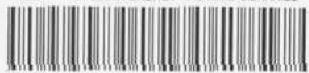

3445602510325

AIRCRAFT NUCLEAR PROPULSION PROJECT

QUARTERLY PROGRESS REPORT

FOR PERIOD ENDING MARCH 10, 1956

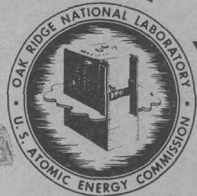

CENTRAL RESEARCH LIBRARY

DOCUMENT COLLECTION

LIBRARY LOAN COPY

DO NOT TRANSFER TO ANOTHER PERSON

If you wish someone else to see this document,

send in name with document and the library will

arrange a loan.

OAK RIDGE NATIONAL LABORATORY

OPERATED BY

UNION CARBIDE NUCLEAR COMPANY

A Division of Union Carbide and Carbon Corporation

UCC

POST OFFICE BOX P • OAK RIDGE, TENNESSEE

Contract No. W-7405-eng-26

# AIRCRAFT NUCLEAR PROPULSION PROJECT

# QUARTERLY PROGRESS REPORT

# For Period Ending March 10, 1956

W. H. Jordan, Director

S. J. Cromer, Co-Director

A. J. Miller, Assistant Director

DATE ISSUED

AY 23 1956

OAK RIDGE NATIONAL LABORATORY

Operated by

UNION CARBIDE NUCLEAR COMPANY

A Division of Union Carbide and Carbon Corporation

Post Office Box P

Oak Ridge, Tennessee

MARTIN MARIETTA ENERGY SYSTEMS (LIBRARIES)

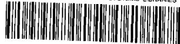

34456 02510325

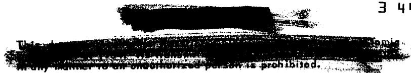

# INTERNAL DISTRIBUTION

1. R.G.Affel   
2. C.R. Baldock   
3. C. J. Barton   
4. M. Bender   
5. D. S. Billington   
6. F. F. Blankenship   
7. E. P. Blizzard   
8. C. J. Borkowski   
9. W. F. Boudreau   
10. G.E. Boyd   
11. M. A. Bredig   
12. W.E.Browning   
13. F.R.Bruce   
14. A. D. Callihan   
15. D.W.Cardwell   
16. C. E. Center (K-25)   
17. R.A. Charpie   
18. G.H.Clewett   
19. C. E. Clifford   
20. J. H. Coobs   
21. W. B. Cottrell   
22. D. D. Cowen   
23. S. Cromer   
24. R. S. Crouse   
25. F. L. Culler   
26. J.H.DeVon   
27. L. M. Doney   
28. D. A. Douglas   
29. E.R.Dytko   
30. L. B. Emlet (K-25)   
31. D. E. Ferguson   
32. A. P. Fraas   
33. J.H. Frye   
34. W. T. Furgerson   
35. H. C. Gray   
36. W. R. Grimes   
37. E. E. Hoffman   
38. A. Hollander   
39. A. S. Householder   
40. J. T. Howe   
41. H. K. Jackson   
42. W.H. Jordan   
43. G.W. Keilholtz   
44. C. P. Keim   
45. M. T. Kelley   
46. F. Kertesz

47. E.M. King   
48-49. J.A. Lane   
50. R. S. Lixington   
51. R.N.Lyon   
52. F. C. Maienschein   
53. W. D. Manly   
54. E.R. Mann   
55. L. A. Mann   
56. W. B. McDonald   
57. F.R. McQuilkin   
58. R.V. Meghreblian   
59. R. P. Milford   
60. A. J. Miller   
61. R.E.Moore   
62. J. G. Morgan   
63. K. Z. Morgan   
64. E. J. Murphy   
65. J. P. Murray (Y-12)   
66. G.J. Nessle   
67. R. B. Oliver   
68. L. G. Overholser   
69. P. Patriarca   
70. R.W. Peelle   
71. A.M.Perry   
72. J. C. Pigg   
73. H. F. Poppendiek   
74. P. M. Reyling   
75. A. E. Richt   
76. M. T. Robinson   
77. H.W.Savage   
78. A. W. Savolainen   
79. R. D. Schultheiss   
80. E.D. Shipley   
81. A.Simon   
82. O. Sisman   
83. M. J. Skinner   
84. G.P.Smith   
85. A.H. Snell   
86. C.D. Susano   
87. J. A. Swartout   
88. E.H. Taylor   
89. R.E. Thoma   
90. D.B.Trager   
91. E.R. Van Artsdalen   
92. F.C. VonderLage   
93. G.M. Watson

94. A. M. Weinberg   
95. J. C. White   
96. G. D. Whitman   
97. E.P. Wigner (consultant)   
98. G.C. Williams   
99. J. G. Wilson

100. C. E. Winters   
101-110. ORNL - Y-12 Technical Library, Document Reference Section   
111-131. Laboratory Records Department   
132. Laboratory Records, ORNL R.C.   
133-135. Central Research Library

# EXTERNAL DISTRIBUTION

136. AF Plant Representative, Baltimore   
137. AF Plant Representative, Burbank   
138. AF Plant-Representative, Marietta   
139. AF Plant Representative, Santa Monica   
140. AF Plant Representative, Seattle   
141. AF Plant Representative, Wood-Ridge   
142. Air Materiel Area   
143. Air Research and Development Command (RDGN)   
144. Air Research and Development Command (RDZPA)   
145. Air Technical Intelligence Center   
146. Aircraft Laboratory Design Branch (WADC)

147-149. ANP Project Office, Forr Worth

150. Argonne National Laboratory   
151. Armed Forces Special Weapons Project, Sandia   
152. Assistant Secretary of the Air Force, R&D

153-159. Atomic Energy Commission, Washington

160. Battelle Memorial Institute   
161. Bettis Plant   
162. Bureau of Aeronautics   
163. Bureau of Aeronautics (Code 24)   
164. Bureau of Aeronautics, General Representative   
165. Chicago Operations Office   
166. Chicago Patent Group

167-168. Chief of Naval Research

169. Convair-General Dynamics Corporation   
170. Director of Laboratories (WCT)   
171. Director of Requirements (AFDRQ)   
172. Director of Research and Development (AFDRD-ANP)

173-175. Directorate of Systems Management (RDZ-ISN)   
176-178, Directorate of Systems Management (RDZ-ISS)   
179. Equipment Laboratory (WADC)   
180-183. General Electric Company (ANPD)   
184. Hartford Area Office   
185. Headquarters, Air Force Special Weapons Center   
186. Idaho Operations Office   
187. Knolls Atomic Power Laboratory   
188. Lockland Area Office   
189. Los Alamos Scientific Laboratory   
190. Materials Laboratory Plans Office (WADC)   
191. Mound Laboratory   
192. National Advisory Committee for Aeronautics, Cleveland   
193. National Advisory Committee for Aeronautics, Washington   
194. Naval Air Development Center

195. New York Operations Office   
196. Nauk American Aviation, Inc. (Aerophysics Division)   
197. Nuclear Development Corporation   
198. Patent Branch, Washington

199-201. Powerplanar laborator (WADC)

202-205. Pratt & Whitney Aircraft Division (Fox Project)

206. San Francisco Operations Office   
207. Sandia Corporation   
208. School of Aviation Medicine   
209. Sylvania Electric Products Inc.   
210. USAF Project RAND   
211. University of California Radiation Laboratory, Livermore

212-214. Wright Air Development Center (WCOSI-3)

215-329. Technical Information Extension, Oak Ridge

330. Provision of Research and Development, AEC, ORO

Reports previously issued in this series are as follows:

ORNL-528 Period Ending November 30, 1949

ORNL-629 Period Ending February 28, 1950

ORNL-768 Period Ending May 31, 1950

ORNL-858 Period Ending August 31, 1950

ORNL-919 Period Ending December 10, 1950

ANP-60 Period Ending March 10, 1951

ANP-65 Period Ending June 10, 1951

ORNL-1154 Period Ending September 10, 1951

ORNL-1170 Period Ending December 10, 1951

ORNL-1227 Period Ending March 10, 1952

ORNL-1294 Period Ending June 10, 1952

ORNL-1375 Period Ending September 10, 1952

ORNL-1439 Period Ending December 10, 1952

ORNL-1515 Period Ending March 10, 1953

ORNL-1556 Period Ending June 10, 1953

ORNL-1609 Period Ending September 10, 1953

ORNL-1649 Period Ending December 10, 1953

ORNL-1692 Period Ending March 10, 1954

ORNL-1729 Period Ending June 10, 1954

ORNL-1771 Period Ending September 10, 1954

ORNL-1816 Period Ending December 10, 1954

ORNL-1864 Period Ending March 10, 1955

ORNL-1896 Period Ending June 10, 1955

ORNL-1947 Period Ending September 10, 1955

ORNL-2012 Period Ending December 10, 1955

# FOREWORD

This quarterly progress report of the Aircraft Nuclear Propulsion Project at ORNL records the technical progress of the research on circulating-fuel reactors and other ANP research at the Laboratory under its Contract W-7405-eng-26. The report is divided into three major parts: I. Reactor Theory, Component Development, and Construction, II. Materials Research, and III. Shielding Research.

The ANP Project is comprised of about 550 technical and scientific personnel engaged in many phases of research directed toward the achievement of nuclear propulsion of aircraft. A considerable portion of this research is performed in support of the work of other organizations participating in the national ANP effort. However, the bulk of the ANP research at ORNL is directed toward the development of a circulating-fuel type of reactor.

The design, construction, and operation of the Aircraft Reactor Test (ART), with the cooperation of the Pratt & Whitney Aircraft Division, are the specific objectives of the project. The ART is to be a power plant system that will include a 60 Mw circulating-fuel reflector-moderated reactor and adequate means for heat disposal. Operation of the system will be for the purpose of determining the feasibility, and the problems associated with the design, construction, and operation, of a high-power, circulating-fuel, reflector-moderated aircraft reactor system.

# CONTENTS

FOREWORD vii

SUMMARY 1

# PART I. REACTOR THEORY, COMPONENT DEVELOPMENT, AND CONSTRUCTION

1. REFLECTOR-MODERATED REACTOR 15

ART Facility Design and Construction 15

ART Design 21

Stress Analyses 22

Sodium System 23

Reactor Shield 23

Reactor Study Models 23

ART Component Development, Procurement, and Testing 23

Water Test of Aluminum Mockup of North Head 23

Core Flow Studies 24

Engineering Test Unit 24

Procurement of Special Reactor Materials and Components 25

Inspection of Materials and Fabricated Parts 26

ART Instrumentation and Control 26

Reactor Physics 28

NaK Activation in the Fuel-to-NaK Heat Exchanger of the ART 28

Activity of Mass-Transferred Material in the ART Radiators 30

Radiation Heating in the ART 35

Self-Absorption of the Decay Gamma Rays in the ART Fuel Dump Tank 37

Activation of the Sodium in the ART 39

Shutdown Reactivity of Lithium in the ART Reflector Coolant 39

2. EXPERIMENTAL REACTOR ENGINEERING 41

In-Pile Loop Development and Tests 41

Loop No. 3 41

Loop No. 4 41

Loop No. 5 42

Forced-Circulation Corrosion and Mass-Transfer Tests 42

Fused Salts in Inconel 42

Liquid Metals in Inconel and in Stainless Steel 43

Pump Development 43

Bearing-and-Seal Tests 43

Sodium-Pump Performance Tests with Water 45

NaK-Pump Performance Tests with Water 48

High-Temperature Tests of ART Fuel Pumps 48

High-Temperature Pump-Performance Test Stands 51

Heat Exchanger Development 52

Intermediate Heat Exchanger Tests 52

Small Heat Exchanger Tests 52

Heat-Transfer and Pressure-Drop Correlations 54

Structural Tests 58

Outer-Core-Shell Thermal-Stability Test 58   
Inconel Strain-Cycling Tests 60   
Swagelok Tubing-Connector Tests 60

Reactor Component Development 60

Dump Valve 60   
Cold Trap and Plugging Indicator 62   
Zirconium Fluoride Vapor Trap 63

3. CRITICAL EXPERIMENTS 64

64

Neutron-Flux Distribution 64

Mass-Reactivity Coefficients of Reactor Component Materials 64

# PART II. MATERIALS RESEARCH

4. CHEMISTRY OF REACTOR MATERIALS 71

Phase Equilibrium Studies 71

The System $\mathsf{UF}_4\text{-}\mathsf{UO}_2$ 71

The System NaF-UF 72

The System KF-ZrF 72

The System RbF-ZrF 72

The System NaF-ZrFA-UF 73

The System NaF-KF-ZrF 73

The System NaF-RbF-ZrF 4 73

The System RbF-BeF 2 74

The System NaF-BeF2-UF 4 75

The System NaF-LiF-BeF, 75

The System NaF-LiF-BeF2-UF 76

The System NaF-LiF-CaF 77

The System NaF-MgF2-CaF2 78

The Systems NaF- $\mathsf{CeF}_3$ and RbF- $\mathsf{CeF}_3$ 78

The System LiF-NiF 2 78

Optical Properties and X-Ray Patterns for Compounds in Fluoride Systems 79

Chemical Reactions in Molten Salts 84

Equilibrium Reduction of $\mathsf{FeF}_2$ by $\mathsf{H}_2$ in NaF-ZrF 84

EMF Measurements in Fused Salts 89

Activity of Chromium in Alloys 92

Reduction of $\mathsf{UF}_4$ by Structural Metals 93

Reaction of $\mathsf{UF}_3$ with NaF-KF-LiF Eutectic 97

Experimental Preparation of Fluorides 100

Color Studies of Alkali Metals in Equilibrium with Alkali Halides at High Temperatures 101

Physical Properties of Molten Materials 103

Vapor Pressures in the System KF-ZrF 103

Vapor Pressure of $\mathsf{FeCl}_2$ 105

Surface Tensions of Molten Salts 105

Density and Surface Tension of Molten KCl at $800^{\circ}C$ 106

Physical Chemistry of Fused Salts 107

Production of Purified Fuel Mixtures 107

Use of Copper-Lined Equipment for Fuel Purification 107

Preparation of $\mathsf{ZrF}_4$ by Gas-Phase Hydrofluorination of $\mathsf{ZrCl}_4$ 109

Laboratory-Scale Purification Operations 109

Pilot-Scale Purification Operations 109

Production-Scale Operations 110

Quality Control of Raw Materials and Products 111

Batching and Dispensing Operations 111

Filling, Draining, and Sampling Operations 112

Calibration of ART Enricher 112

5. CORROSION RESEARCH 114

Forced-Circulation Studies 114

Fluoride Fuel Mixtures in Inconel 114

Liquid Metals in Inconel and Stainless Steel 117

Thermal-Convection Studies 118

Alkali-Metal Fluoride Fuel Mixtures in Hastelloy B 118

Effect of Condition of Inner Surface of Hastelloy B Tubing on Depth of Attack 119

Screening Tests of Special Fuel Mixtures 120

General Corrosion Studies 122

Low-Cross-Section Brazing Alloys in Liquid Metals and in Fluoride Fuel Mixtures 122

Cathalloy A-31 in Sodium 122

Rare-Earth Oxides in Sodium 124

Sodium in Type 316 Stainless Steel Thermal-Convection Loops 125

Boiling Sodium in Type 348 Stainless Steel Loops 127

Compatibility of Hastelloy B and Beryllium in Sodium 128

Solid-Phase Bonding of Cermets 129

Solubility of Lithium in NaK 130

Mass Transfer and Corrosion in Sodium Hydroxide 131

Static Capsule Tests 131

Thermal-Convection Loop Tests 133

Chemical Studies of Corrosion 134

Physical Properties of Elastomers Exposed to Attack by Liquid Metals 134

Resistance of Possible Moderators to Fused Fluoride Mixtures 137

Diffusion of Chromium in Alloys 138

6.METALLURGY AND CERAMICS 139

Welding and Brazing Studies 139

Examination of NaK-to-Air Radiators After Service at High Temperatures 139

1 Crack Susceptibility of Back-Brazed Tube-to-Header Joints 139

Measurement of Weld Shrinkage 140

Dimensional Control During Fabrication of Pump Volutes 142

Cermet-to-Metal Joints 143

Brazing Alloy Development 144

Mechanical Properties of Inconel 146

Creep-Rupture Design Data 146

Low-Stress Creep Data 146

Effect of Biaxial Stress on Creep Ductility at High Temperatures 151

Special Materials Studies 151

Neutron Shield Material for High-Temperature Use 151

Fabrication of Boron-Containing Materials 152

Inconel-Boron Compatibility 154

Nickel-Molybdenum-Base Alloys 155

Niobium Fabrication 160

Seamless Tubular Fuel Elements 161

Control Rod Fabrication 163

Shield Plugs for ART Pumps 163

Lithium-Magnesium Alloys 163

Fabrication of Ceramic Materials 164

Nondestructive Testing 164

7. HEAT TRANSFER AND PHYSICAL PROPERTIES 171

Fused-Salt Heat Transfer 171

ART Fuel-to-NoK Heat Exchanger 172

ART Core Hydrodynamics 174

Temperature Structure in Region Beyond the ART Reflector 174

Temperature Structure in an Idealized ART Core 176

ART Core Heat-Transfer Experiment 176

Heat Capacity 176

Viscosity 178

Performance Comparisons of Several Fluoride Fuels 179

8. RADIATION DAMAGE 181

Review of Tests of Corrosion of Inconel and Stability of Fuel Under Irradiation 181

Examination of the Disassembled MTR In-Pile Loop No. 3 183

Effects of Radiation on the Mechanical Properties of Structural Materials 187

Stress-Corrosion Tests 187

Alternate Stress-Corrosion Apparatus 188

MTR Tensile Creep Tests 190

Pneumatic Stressing Device 191

Ductility of Nickel Alloys 191

Experimental Studies of Reactor Materials and Components 192

Effect of Radiation on Static Corrosion of Structural Materials by Fused Salts 192

Holdup of Fission Gases by Charcoal Traps 193

LITR Vertical In-Pile Loop 196

Instrumentation for ART Off-Gas Analysis 196

Inconel as a Thermal-Neutron-Flux Monitor 197

Measurement of MTR Flux near Tip of In-Pile Loop No. 3 198

Fast-Flux Measurements in Hole 19 of ORNL Graphite Reactor 198

Chemical Effects of Nuclear Reactions 199

Effects of Fission Products on Properties of Fluoride Fuels 199

Use of Natural Lithium in Fluoride Fuels Circulated in In-Pile Loops 203

Radiation Damage to Boron Carbide 204

# 9. ANALYTICAL CHEMISTRY OF REACTOR MATERIALS 207

Detection of Traces of NaK in Air 207   
Detection of Microgram Quantities 207   
Detection of Submicrogram Quantities 209

Spectrophotometric Determination of Titanium in Mixtures of Fluoride Salts with Tiron 210   
Determination of Tantalum in Fused Mixtures of Fluoride Salts 211   
Determination of Oxygen in $\mathbf{ZrF}_4$ by Bromination 212   
Determination of Micro Amounts of Boron in Fused Fluoride Salt Mixtures 212   
Spectrophotometric Determination of Bismuth in Fused Mixtures of Fluoride Salts 213   
Determination of Dissolved Oxygen in Lubricating Fluids 213   
Determination of Zirconium by the Compleximetric-Versene Method 214   
Determination of Rare-Earth Elements in Stainless Steels and Inconel 214   
Determination of Oxygen in Metallic Sodium 214   
ANP Service Laboratory 215

# 10. RECOVERY AND REPROCESSING OF REACTOR FUEL 216

Pilot-Plant Design and Construction 216   
Engineering Developments 216   
Contactor 216   
Freeze Valves 216   
Process Development 216   
Fluorination Studies 216   
Vapor Pressure of the UF6-NaF Complex 219   
Uranium Losses on Desorption of UF 6 from NaF 219

# PART III. SHIELDING RESEARCH

# 11. SHIELDING ANALYSIS 223

Energy Absorption Resulting from Gamma Radiation Incident on a Multiregion Shield with Slab Geometry 223

# 12. REACTOR SHIELD DESIGN 227

Gamma-Ray Heating in a 300-Mw Circulating Fuel Reactor 227

Primary Gamma-Ray Heating 228

Fission-Product Gamma-Ray Heating 233

Heating by Thermal-Neutron Captures in the Shield 234

Dose Rate Outside the ART Shield 236

# 13. LID TANK SHIELDING FACILITY 237

Analysis of the Dynamic Source Tests on Mockups of the Reflector-Moderated Reactor and Shield 237

# 14. BULK SHIELDING FACILITY 249

Gamma-Ray Streaming Through the NaK Pipes That Penetrate the ART Shield 249   
Decay of Fission-Product Gamma Radiation 250

# ANP PROJECT QUARTERLY PROGRESS REPORT

# SUMMARY

# PART I. REACTOR THEORY, COMPONENT DEVELOPMENT, AND CONSTRUCTION

# 1. Reflector-Moderated Reactor

Construction work on the building additions, building alterations, and cell installation (package 1) for the Aircraft Reactor Test facility was on schedule and at the $50\%$ completion point at the end of the quarter. A contract for $58,400 was awarded to Rentenbach Engineering Company, Knoxville, Tennessee, for package 2 construction work, which consists in the installation of the diesel-generators and facility, the electrical control centers, and the spectrometer-room electrical and air-conditioning equipment.

Design was completed and contract negotiations are under way for package A work, which consists in auxiliary-services piping. Design work on package 3, which includes process equipment, process piping, etc., is currently under way.

Detailed layouts have been completed on all major subassemblies of the ART. Typical weld joints are being fabricated to determine shrinkage allowances for the final weld designs. Also, extensive calculations of stress distributions in major structural components and in piping are under way.

Recent calculations have indicated that the heat flux through the core shells of the ART will be higher than previously estimated. The design conditions for the reflector-moderator cooling system were therefore modified accordingly. The design sodium-temperature rise was increased from 150 to $200^{\circ}\mathrm{F}$ and the design sodium-system operating-temperature range became 1050 to $1250^{\circ}\mathrm{F}$ to take the estimated heat load of 6.2 Mw. Minor changes were also made in the dimensions of the circuit, to assure that the pressure drop will not exceed 30 psi, and in the arrangement of the auxiliary radiators, to accommodate the increased heat load.

The thickness of the lead portion of the reactor shield was reduced from 7 to 4.3 in. to obtain space for increased neutron shielding around the pumps. This decrease in lead thickness will increase the gamma-ray dose rate by a factor of 10

(from $\frac{7}{8}$ r/hr at 50 ft to $\sim 9$ r/hr), but the dose rate will be substantially less than that proposed by most of the airframe companies for nuclear aircraft.

A detailed one-sixth-scale model of the facility is being constructed to assist in layout, fabrication, and installation work. Also, the one-half-scale plastic model of the top portion of the reactor ("north head") is being modified to reflect current design. This model is used for studies of flow and for layout design. A full-scale aluminum mockup of the north head is nearly complete; this mockup will be used for simulated service tests of the fuel and sodium systems.

Studies of flow in a full-scale plastic model of the core were continued. A guide-vane system has been developed which generates a flow pattern that contains no flow reversal throughout the core annulus and provides good surface scrubbing, good midstream mixing, and fairly high velocities throughout the upper half of the core. Further modifications are being made to improve the flow in the lower half of the core.

Flow diagrams and instrumentation lists were prepared for the Engineering Test Unit (ETU), which is a nonnuclear mockup of the ART. Present design and shop schedules indicate that the ETU will be ready for operation in January 1957. Considerable progress has been made in the establishment of contracts and facilities for the procurement of major ART and ETU components, and an inspection group has been set up for quality control of materials and fabricated parts.

Modifications have been made in the proposed ART control system on the basis of information obtained with the reactor simulator, which indicates that in the event of a fuel-pump failure at design power the maximum fuel core-outlet temperature can be limited to $1700^{\circ}\mathrm{F}$ by inserting the control rod at the rate of $1\% (\Delta k / k) / \mathrm{sec}$ . The magnetic, emergency, $1\%$ rod drop was abandoned because of the thermal-shock conditions that would develop at the core outlet in the event of a spurious rod drop at design power, and an emergency rod insert rate of $1\% (\Delta k / k) / \mathrm{sec}$ was adopted. Performance with $\mathsf{U}^{233}$ fuel was also investigated on the simulator. The lower proportion of delayed

neutrons, in comparison with $U^{235}$ fuel, made the fuel core-outlet temperature less sensitive to a fuel-pump failure. It was also found that the core-outlet fuel temperature would not exceed $1700^{\circ}F$ , even with no corrective control-rod action.

Three separate calculations of the activity that will be produced in the NaK in the fuel-to-NaK heat exchangers of the ART were normalized to the current ART design. The normalized values of activity from core neutrons for the three calculations were 463, 600, and 970 curies. The values of activity from delayed neutrons could be normalized for only two of the calculations, and thus total activities were obtained for only those two. The total normalized NaK activities were 650 and 1057 curies.

An estimate was made of the activity to be expected in the ART radiators because of the deposition on the radiator tubes or header walls of constituents of Inconel that will become activated in the heat exchanger and will be carried to the radiators in the NaK stream. Based on specific-activity and weight-of-deposit estimates, the total activity to be expected from mass-transferred material in the ART radiators is about 1 curie. The dose level 1 ft from the hot surface of the ART radiators is thus expected to be about 1 r/hr and to be due mostly to Co60.

Information regarding all possible sources of gamma rays in the ART and the factors that will affect their transmission and absorption is being collected for calculations of the radiation heating in the ART. Preliminary calculations have been made to validate the calculational techniques and to determine the gamma-ray sources that can be neglected in calculating the heat-deposition rate.

A calculation of the self-absorption of decay gamma rays in the ART fuel dump tank indicated a value of $90\%$ , and therefore cooling facilities must be provided to remove almost all the decay heat. The activation of the sodium to be used as the reflector coolant was recalculated to correspond to the present design, and a value of $1.45 \times 10^{6}$ curies was obtained. In another calculation it was found that it would be necessary to add $0.13\text{ft}^3$ of lithium to the sodium in the reflector cooling circuit to shut down the ART from isothermal operation at $1200^{\circ}\text{F}$ to room temperature; from $1400^{\circ}\text{F}$ , $0.15\text{ft}^3$ of lithium would be required.

# 2. Experimental Reactor Engineering

Disassembly and sectioning of in-pile loop No.3, which operated in the MTR, were completed. This Inconel forced-circulation loop circulated the fluoride fuel mixture NaF-ZrF $_4$ ·UF $_4$ (53.5-40-6.5 mole %) at a maximum temperature of about $1500^{\circ}\text{F}$ . There was a temperature differential in the fuel system of $155^{\circ}\text{F}$ for 103 hr and $100^{\circ}\text{F}$ for 168 hr. Metallographic examinations of various portions of the loop have revealed corrosion penetration to a maximum depth of 1 mil.

In-pile loop No. 4 was completed and shipped to NRTS. It was inserted in the MTR HB-3 beam hole on February 6 and removed February 29. It circulated fuel for approximately 500 hr, and there was a temperature differential in the fuel system for approximately 390 hr. Loop No. 5 has been partially assembled, but it will not be completed until the operation of loop No. 4 can be analyzed sufficiently to indicate any required changes.

Ten Inconel forced-circulation loops that were electrical-resistance heated and two that were gas heated were operated with fused salts. Six forced-circulation loops were operated with sodium and NaK in Inconel and in stainless steel.

Synthetic lubricants in the UCON LB series were investigated to determine their suitability as pump lubricating fluids in the ART. Since an operating temperature of 200 to $240^{\circ}\mathrm{F}$ is anticipated, petroleum products, which "coke" at temperatures above $180^{\circ}\mathrm{F}$ , might not be satisfactory from a heat-removal standpoint. Unfortunately, the UCON fluids pick up copper from system components and plate it out on mechanical-seal interfaces. Although this problem could be circumvented by eliminating all copper-brass parts, equally difficult design problems would be introduced. Other synthetic fluids are being investigated.

The lower seal of the ART fuel pump has been modified to assure that any oil leakage will accumulate in a catch basin, from which it can be continuously removed. For the modified design the seal will be a bellows type with a stationary Graphitar 39 nose piece running against a hardened-steel ring clamped to the rotating shaft.

Additional tests of the performance of the ART sodium pump with water were made. Estimates of the performance with sodium, based on the water-test data, show that the cavitation characteristics of the pump will be satisfactory. The tests also indicate that the balance is satisfactory and that

the pump will produce the required design head of 90 ft and flow rate of 430 gpm at an efficiency of $63\%$ at 2860 rpm. It will require 15.6 bhp. Water tests of the NaK pump have shown that the design point can be reached at considerably below the maximum motor speed of 3550 rpm. The efficiency is approximately $75\%$ at design speed, and the volute unbalance is within satisfactory limits.

Difficulties were encountered in high-temperature tests of the fuel pump with NaK. The lower seal oil-leakage removal system did not function properly on the first pump tested, and the lubricating-oil pump on the second pump was unsatisfactory. Two test stands are being prepared for high-temperature performance and endurance tests of the fuel pump with fuel. Similar stands for testing sodium, NaK, and special pumps were designed.

Operations were continued on heat exchanger test stands. York radiator No. 3, Pratt & Whitney radiator No. 2, and ORNL radiator No. 3 failed during the quarter. These failures occurred on the air-upstream side at or near the base plate. An intermediate heat exchanger, ORNL No. 1, which had operated for 1825 hr, also failed. These units are being examined. York radiator No. 9 was put into operation. This radiator, which is the first fabricated according to the revised design, has no side plates, support plates, or base plate. Nickel plates with oversize holes provide top and bottom air seals.

The additional air-pressure-drop and heat-transfer data obtained were in substantial agreement with the previous data. All the 80-gal heat exchanger test loops are equipped with circulating cold traps that are capable of maintaining a contamination level of 100 ppm $\mathsf{O}_2$ . The 20-gal systems are maintained at a contamination level of below 34 ppm $\mathsf{O}_2$ with cold traps.

A stand for testing the thermal stability of the outer core shell of the ART is in operation. A cycle time of $2\frac{1}{2}$ hr is being used, with a 1-hr hold time under temperature differential and under isothermal conditions, and a transient time between conditions of approximately 15 min. The core shell will be examined after 100 thermal cycles have been completed.

Anvil-bending tests of Inconel specimens in a helium atmosphere are under way. Metallographic examinations of the specimens tested thus far have shown cracks that initiate at the outside

fibers and propagate inward. It appears from the data obtained that the number of cracks produced for a given number of cycles at $1\%$ strain is higher at $1400^{\circ}\mathsf{F}$ than at $1600^{\circ}\mathsf{F}$ .

Tests of Swagelok fittings were made to determine their suitability as replacements for welded joints in forced-circulation loops. These fittings proved to be satisfactory in isothermal tests in contact with fused salts, and tests of the reliability of the joints under thermal cycling are under way.

Tests of the first ART prototype dump valve indicated the need for a design modification to provide a conically shaped seating surface. A test stand was designed for development testing of cold traps and plugging indicators, and the $\mathsf{ZrF}_4$ vapor-trap test system was put into operation.

# 3. Critical Experiments

The study of the sodium-cooled reflectormoderated reactor with solid fuel, proposed by the Nuclear Development Corporation of America (NDA), was continued. The loading of the mockup, which was found to have a room-temperature critical mass of $31\mathrm{kg}$ of $\mathsf{U}^{235}$ was increased to $33\mathrm{kg}$ to provide excess reactivity for measurements of neutron flux distribution and the mass-reactivity coefficients of various reactor component materials. The measurements have been reported in detail and correlated with the predicted reactor parameters by NDA.

# PART II. MATERIALS RESEARCH

# 4. Chemistry of Reactor Materials

Additional phase-equilibrium studies were carried out in several fluoride systems in order to gain a better understanding of the structure and to aid in devising improved fuels. Extensive low-melting areas became apparent in the NaF-RbF-ZrF $_4$ system, and it appears likely that a useful fuel may be developed upon the addition of UF $_4$ . New data indicated that the viscosity of NaF-BeF $_2$ -UF $_4$ (70-26-4 mole %) was lower than that indicated by previous measurements and that further investigation of this system might lead to a desirable fuel.

A material containing 63.5 mole % NaF, 18.0 mole % ZrF₄, and 18.5 mole % UF₄ was found to show promise as a lower melting, nonsegregating substitute for Na₂UF₆ as a fuel concentrate for

"enrichment" of reactor systems. It appears to melt at $607^{\circ}\mathrm{C}$ , about $50^{\circ}\mathrm{C}$ lower than $\mathrm{Na}_2\mathrm{UF}_6$ .

Studies were made on the $\mathsf{UF}_4\text{-}\mathsf{UO}_2$ system which led to a value of $1034^{\circ}C$ for the melting point of pure $\mathsf{UF}_4,$ a value which is in good agreement with the published data. With amounts of $\mathsf{UO}_2$ on the order of 2 wt $\%$ there was a tendency for the mixtures to undercool. The compound NaF-2UF, which has appeared as a primary phase field in several ternary systems, was found to be a sub-solidus binary in the system NaF-LiF-UF.

in molten $\mathsf{NaF - ZrF}_4$ (53-47 mole %) was concluded. At the temperatures at which the measurements were carried out, there was no change in the values of the equilibrium constant

$$
K _ {x} = P _ {\mathrm {H F}} ^ {2} / X _ {\mathrm {F e F} _ {2}} P _ {\mathrm {H} _ {2}}
$$

over large concentration ranges. From the experimental data and from published values of free energy of formation of the compounds involved, activity coefficients for $\mathsf{FeF}_2$ were computed by using crystalline $\mathsf{FeF}_2$ and pure supercooled liquid $\mathsf{FeF}_2$ as standard states.

From the emf of concentration cells of the type

$$
M \left| M F _ {2} \left(a _ {1}\right), N a F \left(a _ {2}\right), Z r F _ {4} \left(a _ {3}\right) \right| | N a F \left(a _ {2} ^ {\prime}\right), Z r F _ {4} \left(a _ {3} ^ {\prime}\right), M F _ {2} \left(a _ {1} ^ {\prime}\right) | M,
$$

Experimental work was also carried out in the following zirconium-bearing systems: $\mathsf{KF - ZrF}_{4}$ , $\mathsf{RbF - ZrF}_{4}$ , $\mathsf{NaF - KF - ZrF}_{4}$ . A newly revised, but still tentative, phase diagram of the $\mathsf{RbF - ZrF}_{4}$ system was prepared from the data obtained by thermal analysis and by petrographic and x-ray analyses of quenched and slowly cooled samples.

Thermal-analysis data were obtained on the RbF-BeF $_2$ system. Phase relationships were found to be quite similar to those in the KF-BeF $_2$ systems, and four compounds were tentatively identified. Quenching studies were continued in the NaF-LiF-BeF $_2$ system, particularly in that portion having LiF, NaF, and NaBeF $_3$ at the apexes of the triangle. In the NaF-LiF-BeF $_2$ -UF $_4$ system many compositions containing moderately high amounts of UF $_4$ and small amounts of BeF $_2$ were shown to have acceptable liquidus temperatures, but on the basis of available viscosity data it appeared that the viscosity would not be competitive with that of the best ZrF $_4$ -base fuels.

Additional information was obtained in the NaF-LiF-CaF $_2$ and NaF-MgF $_2$ -CaF $_2$ systems. Exploratory studies in the NaF-CeF $_3$ and RbF-CeF $_3$ system gave no indication of the presence of genuinely low-melting compositions. In connection with the electrochemical studies involving structural-metal fluorides, an investigation of the LiF-NiF $_2$ system was begun.

The diversified program for studying chemical reactions in molten fluorides was continued. The study of the equilibrium

$$
\mathrm {F e F} _ {2} (d) + \mathrm {H} _ {2} (g) \rightleftharpoons \mathrm {F e} (s) + 2 \mathrm {H F} (g)
$$

activity coefficient ratios at various concentrations were derived for $\mathsf{FeF}_2$ in molten NaF-ZrF $_4$ (53-47 mole %) in the temperature range 550 to $700^{\circ}\mathsf{C}$ . Sharp changes in emf were observed whenever the solubility of a metal fluoride was exceeded in such a half cell, and by means of such observations solubility data were obtained on $\mathsf{FeF}_2$ , $\mathsf{NiF}_2$ , and $\mathsf{CrF}_2$ in the NaF-ZrF $_4$ solvent. From cells containing $\mathsf{CrCl}_2$ and electrodes of pure $\mathsf{Cr}^{\circ}$ and $\mathsf{Cr}-\mathsf{Ni}$ alloys, emf measurements gave some indication of the chromium activity in the alloys. The data on Inconel seemed to be reasonably close to those for an ideal solid solution.

Studies of the reactions of tantalum and tungsten with $\mathsf{UF}_4$ in NaF-LiF-KF eutectic showed that neither metal was stable and that they offered little or no advantage over chromium. Niobium, in marked contrast to its instability toward $\mathsf{UF}_4$ in the NaF-LiF-KF system, was shown to be quite stable when the $\mathsf{UF}_4$ was contained either in NaF-ZrF $_4$ (50-50 mole %) or in NaF-LiF-ZrF $_4$ (22-55-23 mole %).

Studies of the reaction

$$
K F + U F _ {3} \longrightarrow U F _ {4} + K ^ {\circ}
$$

in NaF-KF-LiF eutectic indicated that $\mathsf{UF}_3$ is quite unstable, possibly because of complexing of $\mathsf{UF}_4$ by fluoride ions. This produces not only unexpected quantities of $K^0$ but also a high activity of uranium metal to satisfy the

$$
4 U F _ {3} \longrightarrow 3 U F _ {4} + U
$$

disproportionation reaction.

Many special structural-metal fluorides were prepared for experimental studies, including $\mathsf{CrF}_3$

$\mathsf{FeF}_3$ $\mathsf{CeF}_3$ $\mathsf{LaF}_3$ complexes of $\mathsf{ZrF}_4$ and metal fluorides, $\mathsf{CuF}_2$ $\mathsf{NaCrF}_3$ and $\mathsf{NaNiF}_3$ . Color studies of alkali metals in equilibrium with alkali halides at high temperatures are under way. In general, alkali-metal phases in contact with alkali-metal salts are highly and strikingly colored.

In preparation for thermodynamic studies of molten salts, vapor-pressure, density, and surface-tension measurements were made. Vapor-pressure equations for $\mathsf{ZrF}_4$ obtained by various investigators were correlated, and measurements of the system $\mathsf{KF - ZrF}_4$ were made. The vapor pressure of pure $\mathsf{FeCl}_2$ was measured in preparation for a study of the activity of $\mathsf{FeCl}_2$ in melts of alkali-metal chlorides. Surface tensions of molten salts are being studied by the sessile-drop technique. Apparatus added to the conventional equipment for fuel purification is being used for the study of variations of density and surface tension of molten salts with changes in chemical composition.

It was established that, in the solid, $\mathrm{CaCl}_2$ forms 1:1 complexes with KCl, RbCl, and CsCl. Density and preliminary conductance data were obtained for several molten rare-earth halides, and fused alkaline-earth halides and their mixtures with some alkali halides are being investigated.

Experimental studies were made with the copper-lined stainless steel reactor cans proposed for use in large-scale fuel production to replace the unsatisfactory nickel reactor cans. It appears that the copper-lined stainless steel reactor cans will be satisfactory with $\mathsf{ZrF}_4$ -bearing mixtures. Tests with alkali-metal and $\mathsf{BeF}_2$ -bearing materials are yet to be made.

The equipment for conversion of $\mathsf{ZrCl}_4$ to $\mathsf{ZrF}_4$ by direct hydrofluorination of the solid is being rebuilt to overcome mechanical difficulties, and an alternate process for the conversion is being studied on a small scale.

Experiments carried out with the fuel-enrichment apparatus used during the high-temperature critical experiment on the ART showed that the equipment will be satisfactory if usage is restricted to additions greater than about 500 g.

# 5. Corrosion Research

The effects on corrosion of varying the ratio of hot-leg surface area to volume of fluoride fuel mixture in a forced-circulation Inconel loop were investigated. In a loop in which the ratio was decreased by a factor of 2 in comparison with the

ratio for a standard loop, the maximum depth of attack in 1000 hr was 6 mils, which is comparable to the usual attack in a standard loop. The addition of sufficient fuel mixture to decrease the ratio by a factor of 4 resulted in attack to a depth of 9 mils in 1000 hr. Further, a very thin gold-colored deposit was found in the cooler portions of the loop. The significance of the increase in depth of attack with increased volume cannot be judged until the source of the deposit is found, but, even if the increase in depth of attack can be attributed to the increase in volume, it appears that varying the system volume in the range studied does not have a significant effect on corrosive attack over a 1000-hr period.

Examinations of two forced-circulation loops that had operated with the fuel mixture NaF-KF-LiF- $(\mathsf{UF}_4 + \mathsf{UF}_3)$ clearly demonstrated that the presence of $U^{3+}$ in such a mixture is very effective in reducing hot-leg attack. Continuous layers of metallic uranium, formed by the disproportionation of $\mathsf{UF}_3$ , were found, however, along the walls in the cooled sections of the loops. The maximum depth of attack in 1000 hr was 2 mils, in contrast to attack to a depth of 35 mils in a loop operated under similar conditions but which circulated an alkali-metal fluoride mixture with the uranium present only as $\mathsf{UF}_4$ .

Two Inconel forced-circulation loops in which NaK was circulated completed 1000 hr of operation with a temperature gradient of $300^{\circ}\mathrm{F}$ and a maximum fluid temperature of $1500^{\circ}\mathrm{F}$ . These loops differed only in that one included a bypass cold trap. As in the case of Inconel-sodium loops, metallic deposits were found in the economizers and in the cooled sections of the loops. Analyses of the deposits showed them to be identical to those found in Inconel-sodium loops. The similarity of the results for the two loops indicated that the cold trap was not effective in reducing mass transfer. A stainless steel loop operated under the same conditions with sodium showed only very slight mass transfer in the economizer and in the cold leg.

Examinations of two Hastelloy B thermal convection loops operated for 500 hr with an alkali-metal fluoride mixture containing $\mathsf{UF}_4$ at a maximum temperature of $1500^{\circ}\mathsf{F}$ showed the maximum attack to be less than 2 mils. The attack appeared as heavy surface pitting. A similar loop that was operated for 2000 hr to determine the effect of time

of operation showed no increase in depth of attack, but the surface pits were more concentrated.

Thermal-convection loops constructed of Hastelloy B tubing that had been reamed to ensure uniformity of the inner surface were operated with sodium and with NaF-ZrF $_4$ -UF $_4$ for 500, 1000, and 1500 hr to determine the effect of increasing the operating time. The depths of attack were similar to those found in loops constructed of as-received tubing, and the variations in attack as a function of operating temperature were slight.

Screening tests of special fuel mixtures are under way. In the preliminary Inconel thermal-convection loop tests, it was demonstrated that NaF-LiF-ZrF $_4$ -UF $_4$ mixtures show corrosion behavior typical of alkali-metal fluoride mixtures rather than zirconium-base mixtures.

Six standard thermal-convection loops were operated as the first of a series of loops to study the effect on corrosion of various alkali-metal fluorides as components of the basic fluoride fuel mixture $\mathsf{MF - ZrF_4 - UF_4}$ (50-46-4 mole %), where M stands for potassium, rubidium, or lithium. The attack with the lithium-bearing mixture was severe, but the attack with the potassium and rubidium mixtures was similar to that normally found with NaF-ZrF4-UF4.

Inconel tube-to-header joints brazed with nickel-chromium-germanium-silicon low-cross-section alloys were tested in sodium, NaK, and NaF-ZrF $_4$ -UF $_4$ in seesaw apparatus. Preliminary data indicate that alloys with high nickel contents are the most corrosion-resistant to NaK. In a study of the effect of brazing time on corrosion, the depths of attack on joints brazed slowly (4 hr) and rapidly (10 min) were found to be the same.

Cathalloy A-31 (4 wt % W-96 wt % Ni) was found to have good corrosion resistance to static sodium at $1500^{\circ}\mathrm{F}$ .

One specimen of $\mathsf{Sm}_2\mathsf{O}_3$ and two specimens of a commercial rare-earth oxide mixture (63.8 wt $\%$ $\mathsf{Sm}_2\mathsf{O}_3 - 26.9$ wt $\%$ $\mathsf{Gd}_2\mathsf{O}_3$ -balance primarily other rare-earth oxides) were tested in static sodium in Inconel containers at $1500^{\circ}\mathsf{F}$ . One of the commercial specimens was tested for 500 hr, and the other commercial specimen and the $\mathsf{Sm}_2\mathsf{O}_3$ specimen were tested for 1000 hr. All the specimens changed color; however, powder x-ray diffraction comparisons of the untested and tested specimens did not show any reaction products.

Two type 316 stainless steel thermal-convection loops were operated with sodium to study the effect of a diffusion cold trap on the amount of corrosion and mass transfer observed in such a system. There was less attack and fewer mass-transferred crystals in the loop which had the cold trap.

Three type 348 stainless steel-boiling-sodium loops have been operated for various lengths of time to study the extent of mass transfer in a stainless steel-sodium system in which the oxygen content of the sodium is held to a very low level. No mass-transfer crystals were detected in the cold sections of these systems.

Tests have been conducted at $1200^{\circ}\mathrm{F}$ for 1000 hr to study the extent of dissimilar-metal mass transfer of beryllium metal to Hastelloy B in contact with sodium as a function of the distance between the two materials. The results indicated that to avoid extensive alloying of beryllium with Hastelloy B at $1200^{\circ}\mathrm{F}$ a minimum separation distance of 20 mils is required.

A solid-phase-bonding screening test of K151A (70% TiC-10% NbTaTiC₃-20% Ni) against K152B (64% TiC-6% NbTaTiC₃-30% Ni) showed that these cermets solid-phase bond when in line contact at a pressure of approximately 280 lb per linear inch in NaF-ZrF₄-UF₄ (53.5-40-6.5 mole %) at 1500°F for 1000 hr.

A series of differential-thermal-analysis tests were performed to determine the solubility of lithium in NaK. The data obtained showed that the solubility is very low, 0.25 wt % Li being soluble at $75^{\circ}C$ .

Nine nickel- and iron-base alloys of special compositions were prepared and were subjected to static corrosion tests in sodium hydroxide for 100 hr at $1500^{\circ}\mathrm{F}$ . The most promising alloy of the group was a $90\%$ Ni- $10\%$ Mo alloy, which was attacked to a depth of less than 0.5 mil. Further tests are to be conducted on specimens of this composition.

Thermal-convection loop tests of fused sodium hydroxide in promising container metals are also under way. The preliminary tests with Inconel loops showed some discoloration of the hot zones and etching in the cold legs. There were no massive deposits in any of the loops. Preliminary tests of nickel are under way.

Screening tests of elastomers for possible use as valve seat materials in NaK circuits were initiated, and several promising materials were

selected for further testing. Three General Electric Company silicone specimens remained intact after exposure to NaK at $200^{\circ}\mathrm{C}$ for three days under a helium atmosphere.

A search for a moderator that can be cooled by direct contact with the molten fluoride fuel mixture was initiated. Thus far, beryllium carbide, beryllium oxide, and boron carbide have been tested in NaF-ZrF $_4$ -UF $_4$ in Inconel capsules at $800^{\circ}\mathrm{C}$ for 24 hr. The beryllium carbide specimen reacted completely with the fuel melt; the beryllium oxide specimen showed a $2\%$ change in dimensions and a $6\%$ gain in weight; and the boron carbide specimen showed a slight loss in weight.

Experiments are under way in which activation analyses are being used to study the diffusion of chromium in Inconel. It is believed that successively milling small amounts of metal from the inside of an irradiated tube will produce a satisfactory series of samples from increasing depths. The amount of the sample, the depth of each milling, and a measurement of the amount of $\mathrm{Cr}^{51}$ (278-day) radioactivity in each portion will be used to determine the degree of chromium diffusion as a result of corrosive attack by molten fluorides.

# 6. Metallurgy and Ceramics

Metallographic investigations are under way on NaK-to-air radiators that failed after various periods of service at high temperatures. A correlation of the degree of adherence of the braze material at the tube-to-fin joints and the degree of oxidation of the copper fins with heat transfer performance is expected to give a better understanding of the relative importance of the fabrication features. An experiment was conducted to determine the influence of the stresses set up during welding on the crack susceptibility of back-brazed tube-to-header joints. Two core halves were brazed, one in the conventional upright position and one in the horizontal position, and dye-penetrant inspection indicated freedom from cracks both before and after welding.

Tests of transverse shrinkage of welds of the type to be used in the fabrication of the ART were made. It was found that weld shrinkage increased with plate thickness increases and that the Heliarc welding process resulted in a larger shrinkage for a given joint design in a plate of given thickness than did the metallic-arc welding process.

Methods for controlling, during fabrication, the critical spacing between the two volutes which constitute the pump housing of the ART NaK pump are being studied. A combination of welding and annealing was developed that gave satisfactory spacing, and a brazing procedure is being investigated.

An experimental program is under way for developing a reliable and consistent procedure for joining cermet valve components to metallic structural materials, such as Inconel. A highly promising procedure has been found in which an interfacial reaction between the cermet and the nickel transition layer at $1350^{\circ}C$ results in a metallurgical bond. The nickel layer is then brazed to the Inconel component.

Flow-point determinations were made on several low-cross-section brazing alloys being considered for use in the fabrication of the ART. Four alloys with satisfactorily low flow points were submitted for corrosion testing.

Satisfactory brazing of aluminum bronze fins to Inconel tubes was obtained by using a thin (0.002-in.) electroplate of iron to facilitate welding. The addition of manganese to nickel-base high-temperature alloys was also found to promote melting.

The creep-rupture testing program for Inconel was nearly completed. The design curves for as-received (fine-grained) and annealed (coarse-grained) Inconel in argon and in the fuel mixture NaF-ZrF4-UF4 (50-46-4 mole %) at 1300, 1500, and $1650^{\circ}\mathrm{F}$ were completed.

The effect of a biaxial-stress system, such as is found in pressurized tubing, on the ductility of Inconel was evaluated by comparing the ductility obtained in a tube-burst type of test to that obtained for uniaxially-stressed sheet-type specimens. The decrease in ductility shown by the tube-burst specimen may be attributed to the 2-to-1 hoop-to-axial stress ratio set up in a closed-end pressurized tube.

Metal-bonded boron bodies are being studied as possible alternates for hot-pressed $\mathsf{B}_4\mathsf{C}$ as neutron shielding material because of uncertainties with regard to the effects of irradiation on hot-pressed $\mathsf{B}_4\mathsf{C}$ . The densities obtained have varied from about 0.30 to $1.5\mathrm{g}$ of boron per cubic centimeter of material. Metal matrices of copper, iron, and molybdenum were investigated. Rapid deterioration of the metallic properties was found to occur

as the boron content was increased. The most promising cermet was the copper- $B_{4}C$ mixture.

A design scheme for the ART neutron shield was devised which will permit the radiation damage to be absorbed in a ductile matrix of copper and, also, permit the use of $\mathsf{B}_4\mathsf{C}$ ceramic tiles to increase the boron density and, hence, reduce the NaK activation. This was achieved through the use of a layer of copper- $\mathsf{B}_4\mathsf{C}$ backed by canned $\mathsf{B}_4\mathsf{C}$ ceramic tiles.

The reactions which occur between Inconel and metal borides, oxides, nitrides, carbides, and carbonitrides were determined at temperatures between 1100 and $2000^{\circ}F$ . The reactions between Inconel and boron-containing materials would prohibit their use in contact with each other above $1500^{\circ}F$ .

Fabricability studies were carried out with fair results on heats of the nominal composition of Hastelloy B with carbon additions of up to $0.1\%$ . The carbon additions were effective in reducing oxide-type inclusions, and the ingots were hot-rolled to sheet successfully. A similar series of melts of Cr-Mo-Ni compositions with carbon additions is being prepared in an effort to improve fabricability of these alloys. Metallographic examination of a cracked extrusion of Hastelloy W revealed eutectic melting at the base of a crack. Identification of the eutectic was not possible.

Room-temperature tensile tests of pack-rolled clad-niobium sheet have been completed. The results compare favorably with those obtained with wrought stock. Studies were continued of diffusion barriers for cladding of niobium with Inconel. At present the duplex barrier of copper-stainless steel looks most promising. A technique has been developed by which completely clad creep specimens of niobium will be prepared and tested.

Extensive compatibility tests of $\mathsf{UO}_2$ and niobium, both powdered and wrought, were carried out by heating for 500 hr at $1000^{\circ}\mathrm{C}$ . All evidence indicates that the two materials are compatible. Niobium is being considered for use in solid fuel elements because of its good high-temperature strength.

Encouraging results were obtained on the extrusion of simulated seamless tubular fuel elements with mixtures of $\mathsf{Al}_2\mathsf{O}_3$ and stainless steel as cores. Three-ply extrusions at ratios of 9:1 and 21:1 showed fairly uniform cladding and core thicknesses. Sections have been sent to the Superior Tube Company for redrawing. A similar

technique is to be used for the extrusion of ART control rods.

Work is continuing on the development of a high-density barrier shield plug for the ART pumps. Fabrication procedures have been established for several suitable materials. A thermal conductivity apparatus has been constructed and tested for conductivity measurements on the possible materials.

A study of the fabricability of a light alloy containing $20\%$ lithium, which would be useful as shielding material, was initiated. Several protective coatings and cladding materials for a lithium-magnesium alloy are being investigated.

Methods are being studied for preparing compacts of samarium and gadolinium oxides and cermets of iron and rare-earth oxides and nickel and rare-earth oxides for use in reactor control elements.

The cyclograph flow-detection instrument is being used successfully for the inspection of small-diameter tubing. The instrument is essentially a tuned oscillator in which the oscillator coil encircles the tubing. The variables that cause flow signals have been studied, and spurious signals have been defined. The wobble of the tubing in the coil, which was the worst offender in producing spurious flow indications, can be eliminated by a well-designed mechanical feed mechanism. Optimum test frequencies have been determined as functions of tubing diameter and wall thickness.

The results obtained from immersed ultrasound, radiography, and fluorescent penetrant inspections were compared. It appears that no one of the inspection methods alone is adequate and that in any one of them were eliminated a few defects would be overlooked.

# 7. Heat Transfer and Physical Properties

Preliminary heat-transfer data were obtained for molten NaF-KF-LiF-UF $_4$ (11.2-41-45.3-2.5 mole %) flowing through Hastelloy B tubes in a pressurized forced-convection system. The data fall about 30% below the normal correlation for ordinary fluids. Heat-transfer and isothermal friction characteristics were determined in the transition region for three degrees of spacer density for the ART heat exchanger. The limited data obtained thus far appear to indicate that for a given heat exchanger pressure drop the heat transfer coefficient is almost independent of the spacer density.

A 5/22-scale model of the ART sodium coolant annulus was fabricated and assembled for a study of the fluid flow distribution. Pressure-drop and flow-distribution measurements are being obtained for concentric-annulus conditions, for various radial displacements of the outer core shell, and for other conditions.

Visual studies were made of the flow through the 21-in. ART core model after the installation of vortex generators supplied by Pratt & Whitney Aircraft. Vane angles of 50, 55, 60, 65, and 70 deg were used. Although no large reversed flow regions existed, steady and unsteady flow were observed in various regions of the core. Other means to obtain better flow distribution are being studied.

The temperature structures in an idealized ART core and in the region beyond the beryllium reflector were calculated. Upper and lower limits for the temperature rise of the sodium flow over the outer surface of the beryllium reflector were 25 and $33^{\circ}\mathrm{F}$ . The core-wall cooling by the sodium in the core annuli was found to be approximately 2.5 Mw. The half-scale model of the ART core to be used for volume-heat-source heat-transfer experiments was completed and was operated with water. Operating procedures and schedules are being established.

A study of the effect of composition on heat capacity for $\mathsf{NaF - ZrF}_4$ salt mixtures was investigated; no significant differences were found over the composition range investigated, 53 to 65 mole % NaF and 35 to 47 mole % $\mathsf{ZrF}_4$ . A study has been initiated to determine the influence of fission products on the viscosities of fuel mixtures. The viscosities of NaF-ZrF $^4$ (50-50 mole %), NaF-LiF-BeF $^2$ (49-36-15 mole %) and NaF-LiF-BeF $^2\text{-} UF_4$ (56-21-20-3 mole %) were determined.

Performance comparisons of several of the more important ANP fuels were made for heat and momentum transfer in the reactor core and in the heat exchanger. The alkali-metal base fuels were found to be superior to the zirconium-base fuels. The major differences between the fuels occur in the heat exchangers. The heat exchanger pressure drops were found to be only about half as great for the alkali-metal base fuels as for the zirconium-base fuels, and the radial fuel temperature differences were from 20 to $40\%$ lower.

# 8. Radiation Damage

The effects of irradiation on the corrosion of Inconel exposed to a fluoride fuel mixture and on

the physical and chemical stability of the fuel mixture have been investigated by irradiating Inconel capsules filled with static fuel in the MTR and by operating in-pile forced-circulation Inconel loops in the LITR and the MTR. In the many capsule tests and in the three in-pile loop tests made to date, no major changes that can be attributed to irradiation, other than the normal burnup of the uranium, have occurred in the fuel mixtures. The metallurgical examinations of the Inconel capsules and tubing have likewise shown no change in corrosion that can be the result of radiation damage. The low corrosion results obtained for the in-pile loops have been confirmed by chemical analyses for corrosion products in the fuel mixtures.

The sectioning of MTR in-pile loop No. 3 was completed at NRTS, and, upon receipt of the sections at ORNL, examinations of the disassembled loop were initiated. Metallographic examination of as-polished Inconel specimens from the nose coil revealed no evidence of corrosive attack. Etched specimens appeared to have moderate intergranular attack to a depth of about 1 mil, but this may be an etching effect rather than true corrosive attack. Cells are being readied for obtaining specimens from the pump and the remaining lengths of fuel tubing. Chemical analyses of both the fuel and fuel tubing are under way. Provisions for the disassembly of the next loop are being made.

Eight Inconel, helium-pressurized, tube-burst, stress-corrosion specimens were exposed to radiation in hole HB-3 of the LITR in a helium atmosphere, with a circumferential stress on each specimen of 2000 psi. Similar specimens are being tested out-of-pile to obtain control data. A plot of the time-to-rupture vs the operating temperature during irradiation showed an unusual degree of scatter in the data and led to an investigation of the quality of the tubing. All but four of 28 specimens of tubing stock examined by nondestructive inspection were rejected because of pinholes and spongy regions. Metallographic inspection of 25 sections from the 24 rejected tubes, however, resulted in the location of only one appreciable defect. Better quality tubing will be used for future experimentation.

An alternate apparatus for stress-corrosion testing of structural materials in contact with a fuel mixture has been designed for use in the LITR. The thermal-neutron-flux data needed for the

design calculations were obtained by irradiating a mockup capsule at a position about 2 in. from the inner end of hole HB-3 of the LITR. Measurements on the mockup indicated that a flux of $9 \times 10^{12}$ neutrons/cm $^2$ -sec will exist at the outer surface of the fuel in the annular stress-corrosion apparatus and that the flux at the inner surface of the annulus will be $5 \times 10^{12}$ neutrons/cm $^2$ -sec. Calculations based on these measurements indicate an unperturbed thermal-neutron flux at this position of $2 \times 10^{13}$ neutrons/cm $^2$ -sec.

Tubular Inconel creep specimens subjected to a tensile stress of 1500 psi at $1500^{\circ}\mathrm{F}$ in a helium atmosphere and irradiated for 33 days in hole HB-3 of the MTR were found to have fractured. Postirradiation examination has suggested that localized high temperatures or the unknown contaminant that was responsible for the film and the intergranular attack on the specimen caused premature fracture.

Elevated-temperature tensile tests on monel have shown that the existence of a ductility minimum at about $1000^{\circ}\mathrm{F}$ is strain-rate dependent. The ductility minimum was found at a strain rate of 2 in./min, but it was not observable at a strain rate of 0.002 in./min.

Seven Inconel capsules containing NaF-ZrF4 base fuels that were irradiated in the MTR for periods of six to nine weeks are being sampled. Facilities have been put into service for irradiating two or three capsules simultaneously in a hitherto unused high-flux position in the MTR.

The holdup of radiokrypton in charcoal traps saturated with nitrogen or with helium was investigated over the temperature range $-110^{\circ}\mathrm{C}$ to $+16^{\circ}\mathrm{C}$ . A theoretical expression was developed and fitted to the results; this expression may be used for predictions of holdup under other conditions or for optimum design of the charcoal traps.

A second vertical in-pile loop is being prepared for insertion in the LITR. The loop is essentially the same as the one operated previously, but the tip of the loop will extend more than $4\frac{1}{2}$ in. below the position of maximum flux in the reactor to obtain a greater temperature differential than that obtained previously.

Design conditions for the gamma spectrometer for the off-gas system of the ART were established.

A flux-monitoring system in which Inconel is used as the monitor has been developed for use at high temperatures. The $\mathbf{Cr}^{51}$ activity is followed for exposure times of up to one or two

months, and the Co $^{60}$ in the Inconel is used for longer exposures.

Flux measurements have been obtained from cobalt foils that were attached to the nose coil of MTR in-pile loop No. 3. Fast-flux profile measurements were obtained for hole 19 in the ORNL Graphite Reactor, and similar measurements were started in hole HB-3 of the LITR.

Although theoretical considerations predict a substantial increase in the corrosion of Inconel by fused fluoride fuels under irradiation, this has never been observed experimentally. The excess oxidizing power of the irradiated fuel, which results from the imbalance of fluorine between $\mathsf{UF}_4$ and the fission-product fluoride mixture, might be expected to increase corrosion. The deposits of the fission-product metals, ruthenium, niobium, and (presumably) molybdenum appear, however, to inhibit attack of such fuel on the container surface.

The tritium produced by the $\mathsf{Li}^{6}(n,t)\mathsf{He}^{4}$ reaction is expected to cause a large increase in the corrosion of metal capsules by fuels in the NaF-KF-LiF-UF $_4$ system. In order to prevent this, any lithium used in MTR capsule irradiations must contain less than $0.2\%$ Li $^6$ . In in-pile loops, up to $1\%$ Li $^6$ can be used without depressing the neutron flux unduly and without causing serious increases in corrosion.

A study of radiation effects on $\mathsf{B}_4\mathsf{C}$ and related thermal-neutron shielding materials is under way. The first irradiations were made on uncoated hot-pressed $\mathsf{B}_4\mathsf{C}$ (Norbide) and slip-cast $\mathsf{B}_4\mathsf{C}$ bonded with SiC (The Carborundum Company) at low temperatures $(\sim 200^{\circ}\mathsf{C})$ . The hot-pressed samples retained their physical dimensions and bulk structure with no helium evolution. The slip-cast bonded material showed inadequate radiation stability. In order to determine whether the hot-pressed samples will retain helium at elevated temperatures, samples will be irradiated at temperatures up to $2150^{\circ}\mathsf{F}$ .

# 9. Analytical Chemistry of Reactor Materials

Instruments are being developed for detecting leaks of NaK into the exhaust air stream from the NaK-to-air radiators of the ART and from radiators installed in test stands. The instrument to be used on the ART is capable of detecting an incremental increase of about 0.01 ppm of alkali metals in the air while it is crossing the bank of radiators, whereas the instrument for monitoring the exit

gases from the test stands is to have a sensitivity of about 10 ppm. The detection method for use with the test-stand radiators is based on the measurement of the hydroxyl ions which are formed when the alkali metal oxides and hydroxides are absorbed from a sample of the contaminated exhaust air in an aqueous solution containing the color indicator bromcresol green. The absorbance of this indicator is increased by a factor of 2 by the addition of 1 to 10 ppm of NaK. The instrument will be designed so that an alarm will be activated if the coulometric current required to hold the pH of the absorber solution at a constant value exceeds a predetermined rate. A more sensitive instrument for use with the ART radiators is being studied that is based on the absorption of light of the frequency of the sodium doublet resonance line at 5890 Å. Calculations show that 0.01 ppm of sodium in air would produce a 50% attenuation in a beam of sodium-doublet radiation which traversed a 50-cm optical path.

A spectrophotometric method for the determination of trace amounts of titanium in mixtures of fluoride salts was developed. The method is based on the yellow color of the titanium-Tiron complex, and uranyl, zirconium, and ferric ions are masked to prevent their interference.

The method for the determination of trace amounts of tantalum in NaF-KF-LiF mixtures without uranium was modified and was applied to the determination of tantalum in uranium-bearing mixtures. The tantalum was separated from the interfering uranyl ions with cupferron.

Studies were continued on the bromination method for the determination of combined oxygen in fluoride salts. Attempts to improve the recovery of oxygen as $\mathrm{CO}_{2}$ from the bromination of $\mathrm{ZrO}_{2}$ by the addition of $\mathrm{NiF}_{2}$ were unsuccessful. However, the solid products resulting from the bromination of the mixture of $\mathrm{ZrO}_{2}, \mathrm{NiF}_{2}$ , and graphite were large crystalline masses rather than the finely divided solids obtained previously from the bromination of the mixture of $\mathrm{ZrO}_{2}, \mathrm{FeF}_{3}$ , and graphite. Analyses of the crystalline product are expected to provide a basis for a better understanding of the reaction mechanism.

A method for the determination of small amounts of boron in fluoride salt mixtures was developed in which the salts are dissolved, at room temperature, in a solution of $\mathrm{AlCl}_3\cdot 6\mathrm{H}_2\mathrm{O}$ and $2\textbf{M}$ HCI. The boron remains in solution and is extracted by

ethyl ether and determined by the carminic acid method. The extraction coefficient was found to be approximately $0.45 \pm 0.02$ . By this method, boron can be determined in concentrations as low as $10~\mathrm{ppm}$ .

A spectrophotometric method for the determination of bismuth as the tetraiodobismuthate(III) complex was applied to the determination of bismuth in $\mathsf{NaF - ZrF_4 - UF_4}$ . The effect of uranium on the absorbance of the complex was negligible for uranium-to-bismuth weight ratios of less than 30:1.

A method for the determination of dissolved oxygen in lubricating fluids was developed that is based on the displacement of the dissolved oxygen by carbon dioxide. The oxygen content of a number of lubricants ranged from a maximum of $42\mu \mathrm{g}$ per milliliter of fluid to a minimum of $15\mu \mathrm{g / ml}$ .

Modifications were made to the method for the compleximetric determination of zirconium in zirconium-base fuels. The zirconium-Versene complex was formed at pH 6, and the solution was digested on the steam bath before titration. Zirconium was determined in a total of 21 samples by the modified procedure. The average difference between the results and those obtained by the gravimetric procedure was $0.6\%$ .

A significant decrease in the time required for the determination of microgram quantities of elements of the rare-earth group in stainless steels and in Inconel was obtained by removing the chromium, before electrolysis, as the volatile chromyl chloride.

The optimum conditions for the distillation of sodium metal from $\mathrm{Na}_2\mathrm{O}$ in the distillation method for the determination of oxygen in metallic sodium were established. The optimum temperature range for distillation is 800 to $850^{\circ}\mathrm{F}$ . Distillation periods of as much as 4 hr can be tolerated at these temperatures without loss of $\mathrm{Na}_2\mathrm{O}$ . Distillations at higher temperatures confirmed earlier observations that $\mathrm{Na}_2\mathrm{O}$ is volatilized at temperatures above $900^{\circ}\mathrm{F}$ .

# 10. Recovery and Reprocessing of Reactor Fuel

The completion of the pilot plant for recovering fused salt fuels is now scheduled for May 15, 1956. Tests of the percolator type of contactor planned for use in the fluorination vessel showed it to be satisfactory. A freeze valve designed for use in the pilot plant held satisfactorily against a pressure of 20 psig in 50 freezing and melting cycles.

Continued studies of the fluorination process for the recovery of uranium from fused salts have indicated that the presence of salt impurities has a much greater effect on the rate of $\mathsf{UF}_6$ volatilization than other factors, such as use of nitrogen with the fluorine or variations of the method of introducing the fluorine into the molten salt. A fluorine efficiency of $70\%$ was achieved with $>99\% \mathsf{UF}_6$ volatilization when the impurity content in the initial salt was kept to a minimum. The vapor pressure of $\mathsf{UF}_6$ over the complex $\mathsf{UF}_6\cdot 3\mathsf{NaF}$ was determined at various points in the temperature range 80 to $320^{\circ}\mathsf{C}$ . The data were successfully fitted by the linear equation

$$
\log P _ {m m H g} = 1 0. 8 8 - (5. 0 9 \times 1 0 ^ {3} / T).
$$

An enthalpy change of $+23.2\mathrm{kcal}$ per mole of $\mathsf{UF}_6$ was calculated for the reaction

$$
3 N a F \cdot U F _ {6} \longrightarrow 3 N a F + U F _ {6}
$$

Uranium losses in NaF beds under process conditions did not exceed $0.05\%$ , even with repeated use of the NaF over three cycles.

# PART III. SHIELDING RESEARCH

# 11. Shielding Analysis

The code of a Monte Carlo calculation of energy penetration and deposition resulting from transport gamma-ray radiation in a shield of slab geometry was used in a parametric study of a two-region lead-water shield. The radiation was 1-Mev gamma rays incident on a slab at 0 deg, 60 deg, 70 deg 32 min, and 75 deg 31 min. The first region of the slab was composed of water 1.5 mean free paths (mfp) thick at the initial gamma-ray energy, and the second region was composed of lead 0.5 mfp thick. The coding was also extended to calculate energy flux and tissue dose rate. The results indicate that lead is more effective in stratified slab shields when it is placed behind a good scatterer, such as water.

# 12. Reactor Shield Design

The heating in the lead and alkylbenzene shield of a 300-Mw circulating-fuel reflector-moderated reactor was calculated for the following components: (1) primary gamma rays originating in or near the reactor core, (2) fission-product gamma

rays from the heat exchanger, and (3) thermal neutron captures in the lead and borated $(2\%$ boron) alkylbenzene. The third component was subdivided to take into account the secondary gamma rays from lead, hydrogen, and boron capture. Alpha particles resulting from thermal-neutron captures by boron were also considered.

The gamma-ray and fast-neutron dose rates at a distance of 50 ft from the ART were calculated as a function of the thickness of the lead shield. Contributions to the total gamma-ray dose rate by primary gamma rays from the core, secondary gamma rays originating in the shield, and heat exchanger gamma rays were determined.

# 13. Lid Tank Shielding Facility

Analysis of the dynamic source tests on mockups of a reflector-moderated reactor and shield was completed. In the analysis the experimental dose rate resulting from fission-product gamma rays emitted in the heat exchanger mockup was separated out and compared with dose rates calculated by two different methods. In one calculation it was assumed that all the fission-product gamma rays were of a single energy (2.7 MeV/photon). The other calculation was based on the spectrum of gamma rays from the fuel belt, previously measured at the LTSF. The two calculated values agreed, but they differed by about $30\%$ from the measured value. It was found that the difference could be attributed to the dose buildup factor for water having been used in the calculation (that is, the buildup factor was chosen as if the lead were an equivalent thickness, in mean free paths, of water). Substitution of a new buildup factor for the total mean free paths (lead and water), based on Monte Carlo studies of laminated shields, resulted in agreement between the measured and calculated dose rates.

# 14. Bulk Shielding Facility

A mockup experiment at the ORNL Graphite Reactor thermal column was initiated to measure the gamma rays streaming through the NaK pipes of the ART.

The measurements of the decay rates of fission-product gamma rays as a function of time after fission were extended to include six energy groups between 0.28 and 5 MeV for times up to 1600 sec after fission.

Part I

REACTOR THEORY, COMPONENT DEVELOPMENT,

AND CONSTRUCTION

# 1. REFLECTOR-MODERATED REACTOR

W.F.Boudreau A.P.Fraas

H. W. Savage

Aircraft Reactor Engineering Division

A. M. Perry

Electronuclear Research Division

E.R.Mann

Instrumentation and Controls Division

# ART FACILITY DESIGN AND CONSTRUCTION

F. R. McQuilkin

Aircraft Reactor Engineering Division

Design and construction work on the Aircraft Reactor Test (ART) facility in Building 7503 was continued. Package 1 construction work on the building additions, building alterations, and cell installation was on schedule and at the $50\%$ completion point. The principal work accomplished during the quarter included completion of the building-addition structure, completion of the spectrometer room and tunnel, erection of the 30-ton crane, modification of the 10-ton crane, construction of the blower house and switch house, placement of reinforced concrete for the stack base and for the walls of the special-equipment room, and partial erection of the cell tanks and surrounding structure. Some of this work can be seen in Fig. 1.1, which is a view from a location southwest of the altered 7503 building. The dark-sided portion of the main building is the addition which will house the reactor cell, heat-dump systems, and spectrometer room and tunnel. In the foreground, from left to right, can be seen the switch house, blower house, and stack foundation. A closeup view of the blower-house interior, prior to erection of the exterior walls, is shown in Fig. 1.2. In the left foreground can be seen the walls of the ramp access way from an elevation of 840 ft to the radiator pit at an elevation of 820 ft in the main building. In the center foreground are the forms and the reinforcing steel for the upstream end of the main air duct. An interior view across the building addition looking toward the southeast corner of the building is shown in Fig. 1.3. In the bottom center can be seen the spectrometer tubes, which extend to the spectrometer tunnel beneath the low bay and which will penetrate the cell water tank. At the

bottom right can be seen portions of the special equipment-room walls. An interior view across the building addition looking toward the southwest corner is shown in Fig. 1.4. The lower sections of the cell tanks can be seen in the foreground, and the opening into the blower house for the main heat-dump air duct is shown in the center left. The duct will enter the building and pass horizontally across the corner to the stock. The main and auxiliary radiators will be mounted in the duct on a diagonal line approximately as represented by the left edge of the picture. The bottom sections of the cell tanks are shown in Fig. 1.5. The inner tank is the bottom hemispherical head of the pressure vessel, and the outer tank is the water tank. The incomplete cylindrical portion of the pressure vessel is shown in Fig. 1.6. At the top center can be seen the 4-in.-thick panel which contains sleeves for the NaK and the off-gas piping. In the left and right foreground are the 4-in.-thick panels which will receive the junction panels for auxiliary-services lines, heater leads, and the instrumentation and control lines. The large 2-in. panel at the upper left contains the small nozzles for beam penetrations into the spectrometer tubes. In the bottom of the tank, under the scaffolding, can be seen the structural framing for the floor, equipment support, and reactor support.

Bids were received for package 2 construction work, and a contract for $58,400 was awarded on January 20, 1956, to the Rentenbach Engineering Company, Knoxville, Tennessee. This unit of work consists in the installation of the diesel generators and facility, the electrical control centers, and the spectrometer-room electrical and air-conditioning equipment. At the end of the quarter, this work was in the material procurement stage, with no site work having been started. Approximate completion dates for package 2 are

UNCLASSIFIED PHOTO 16503

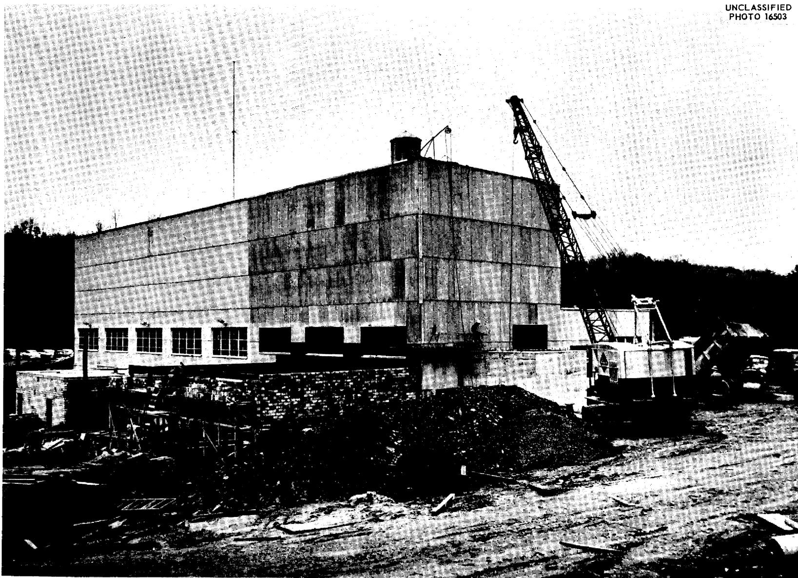  
Fig. 1.1. View of Altered 7503 Building from Southwest. Photograph taken Feb. 17, 1956.

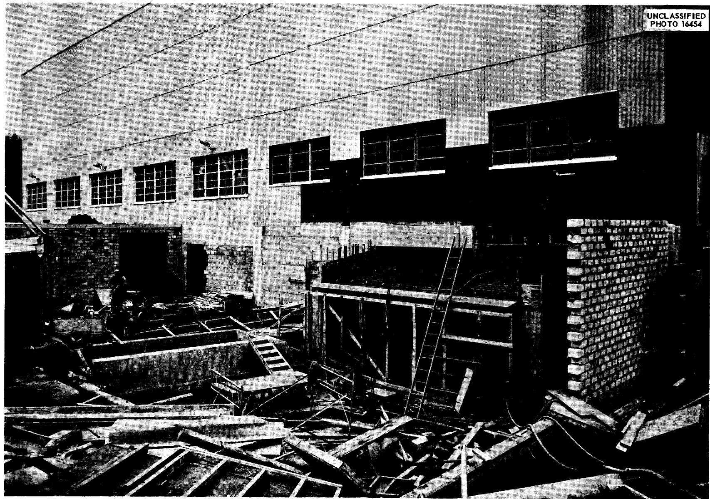  
Fig. 1.2. Interior of Blower House Prior to Erection of Exterior Walls. Photograph taken Feb. 10, 1956.

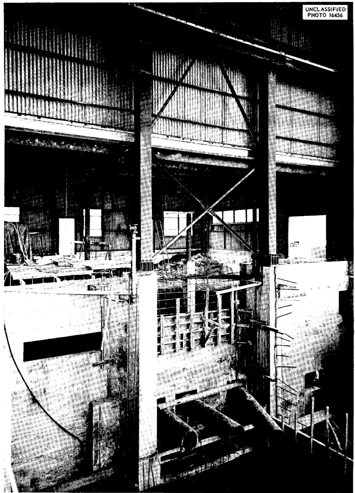  
Fig. 1.3. Interior View Across Building Addition Looking Toward Southeast. Photograph taken Feb. 10, 1956.

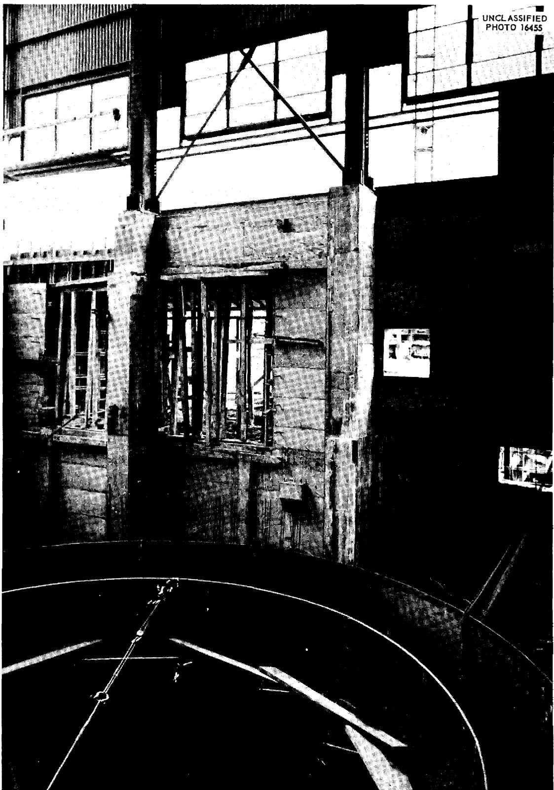  
Fig. 1.4. Interior View Across Building Addition Looking Toward Southwest. Photograph taken Feb. 10, 1956.

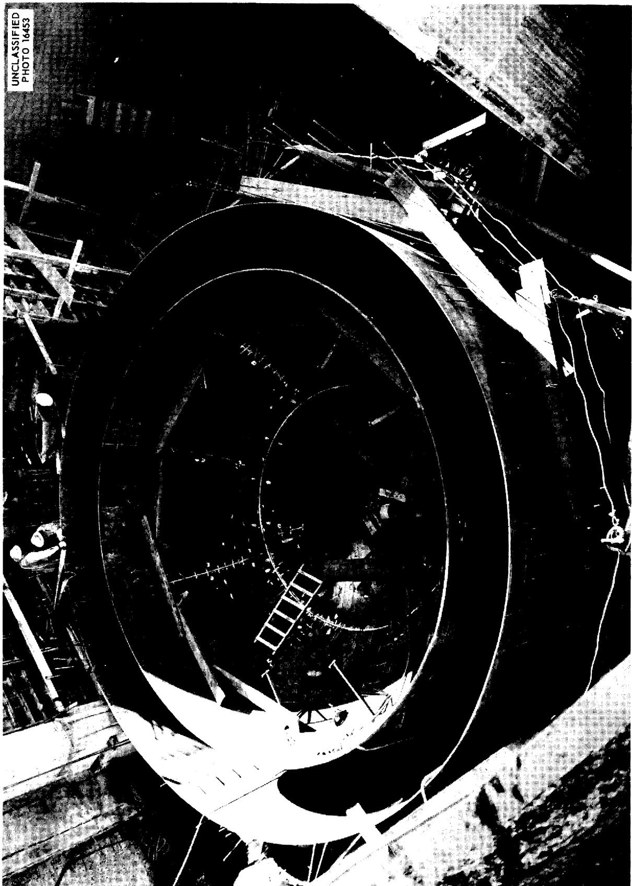  
Fig. 1.5. Bottom Sections of Cell Tanks. Photograph taken Feb. 3, 1956.

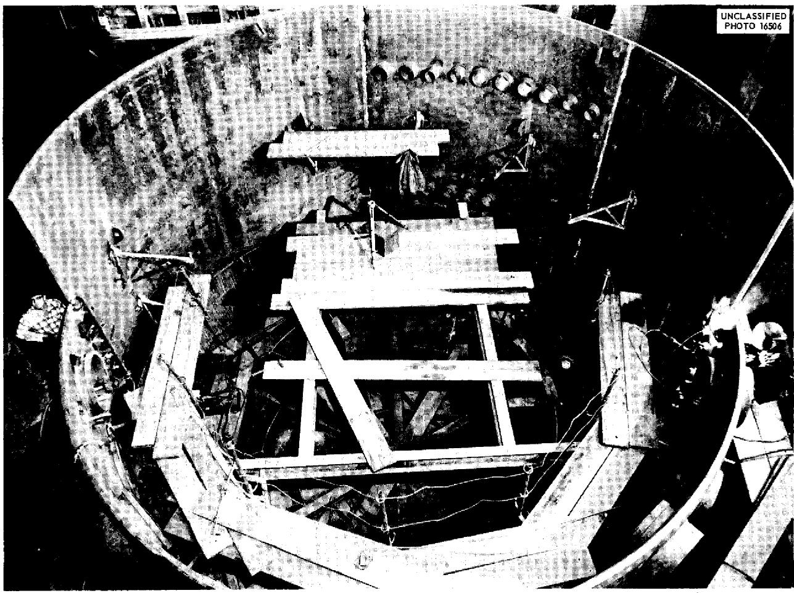  
Fig. 1.6. Incomplete Cylindrical Portion of Pressure Vessel. Photograph taken Feb. 17, 1956.

June 24, 1956, and July 15, 1956, respectively, for installation of contractor-supplied and Government-supplied items.

Design was completed and negotiations for a proposal are in progress with the package 1 contractor, V. L. Nicholson Company, for the installation of package A work, which consists in auxiliary-services piping. Two proposals are being requested, one based on the package 1 completion schedule, which currently is June 8, 1956, and the other based on the contractor's proposed schedule in the event the first schedule presents unreasonable situations. The proposals are to be submitted March 7, 1956.

Design work on package 3, which includes the process equipment, the process piping, etc., is currently under way, and it is expected to be complete early in June 1956. Package 3 work will be performed by ORNL forces.

ART DESIGN

A.P.Fraas

Aircraft Reactor Engineering Division

H. C. Gray

Pratt & Whitney Aircraft

Detailed layouts have been completed on all major subassemblies of the ART. Detailing of the north head and the main heat exchangers has been completed, and the detailing of the control rod, reflector-moderator, island, and pressure-shell subassemblies and the reactor support structure is under way. Typical weld joints are being fabricated to determine weld shrinkage allowances (see Sec. 6, "Metallurgy and Ceramics") for the final weld designs. Detailed layouts of the reactor shield and the piping inside the reactor cell are being prepared.

# Stress Analyses

R.V.Meghreblian

Aircraft Reactor Engineering Division

An extensive series of calculations has been under way for several months in order to determine the stress distribution in major structural components at the top of the reactor assembly, referred to here as the "north head." The design loads being used in these calculations are based on full-power (or "design-point") operation of the reactor. Two components have been studied in detail: the double-ring structure, which transmits the up-load from the reflector-moderator to the north head (and thence to the pressure shell), and the composite double-deck structure of the north head. The proposed design of these members is based on these calculations.

It is believed that these analyses provide a reasonably accurate picture of the gross features of the stress distribution and, therefore, are adequate for determining basic dimensions and proportions of structural members. However, the structural configuration of the north head is so complex that analytical studies must be based on relatively simple geometric models which cannot include all the details of the actual design. Thus the finer details of the stress distribution must be determined by other techniques. A program of experimental stress analyses was prepared for this purpose, and the work is presently under way at the University of Tennessee. The program includes stress studies of the two north-head components mentioned above, as well as studies of the structural integrity of the pump-barrel and NaK pipe attachments to the pressure shell and full-scale tests on portions of the NaK piping outside the pressure cell. The NaK circuit selected for this experiment is that portion of the system which serves the NaK pump-and-radiator assembly on the reactor side of the main air duct (Fig. 1.7). This circuit is the shortest portion of the entire piping system, and it is believed to be the least flexible; thus stresses from thermal expansion of the piping are expected to be most severe in this circuit. At the conclusion of the thermal-stress study, the facility will be used to determine the vibrational characteristics of the complete NaK pump-radiator-piping assembly.

The program of detailed stress analysis of the ART is being supplemented by a parallel program

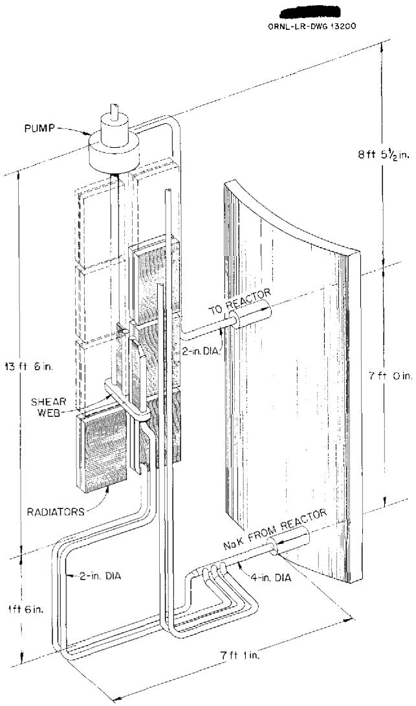  
Fig. 1.7. Nak Circuit for Radiator-and-Pump Assembly on Reactor Side of Main Air Duct.

of material tests on the high-temperature characteristics of Inconel and beryllium. The purpose of these tests is to establish a better basis than that presently available for the design analysis of structural components that are exposed to cyclic load conditions. A research contract has been awarded to the University of Alabama for a program of tests on the high-temperature strain and thermal-cycling properties of Inconel. Contracts are being negotiated with the Universities of Michigan and Syracuse for a series of tests to determine the relaxation and creep properties of Inconel in the temperature range 1200 to $1600^{\circ}\mathrm{F}$ . The Syracuse program is to include a joint

analytical-experimental study of the creep-buckling of thin hemispherical shells. The data to be obtained through these contracts are needed for the design analysis of the core and reflector shells, which will contain the circulating-fuel system. An analytical and experimental study of the reflector shells is being undertaken by the Lewis Laboratory of the National Advisory Committee for Aeronautics.

# Sodium System

R. I. Gray

Aircraft Reactor Engineering Division

Recent calculations of the effects of the nonuniform power distribution in the reactor core indicate that the heat flux through the core shells of the ART will be higher than previously expected. The combined effects of heat transfer and radiation heating yield a total estimated heat load to the sodium system of 6.2 Mw. The increase in the heat load required either an increase in the design sodium flow rate or an increase in the design temperature rise of the sodium system. Since an increased sodium flow rate would result in excessive pressure drops in the system, the sodium temperature rise was increased from 150 to $200^{\circ}\mathrm{F}$ , and the sodium-system operating temperature range became 1050 to $1250^{\circ}\mathrm{F}$ . Minor changes in the dimensions of the reflector-moderator cooling circuit were also made to stay within the pressuredrop limitation of 30 psi and the maximum sodium temperature limitation of $1250^{\circ}\mathrm{F}$ . These changes included the removal of the staple-spacer support lands of the island and the reflector annuli, the increase of the island and the reflector-annuli thicknesses to 0.188 in., the shortening of the reflector-return-annulus spiral spacers to 3.1 ft $(\theta_0 = 45$ deg), and the increase of the reflectorreturn-annulus thickness to 0.125 in. The flow of sodium in the island and reflector cooling holes is to be adjusted by variation of the entrance conditions of each tube row. In this manner a balanced flow condition can be obtained with a minimum pressure drop.

Detailed relaxation calculations have determined an island cooling-hole distribution which limits the maximum beryllium temperature difference to $50^{\circ}\mathrm{F}$ , while maintaining a minimum number of cooling holes. This design includes a total of 120 holes. The previously determined analog solution for the reflector cooling-hole distribution

specified 288 holes, and that solution remains unchanged.

The increased sodium-system heat load also necessitated modification of the auxiliary radiators. The four radiators are to be mounted to form a V in order to obtain low NaK and air pressure drops.

# Reactor Shield

W.B.Cottrell

Aircraft Reactor Engineering Division

The thickness of the lead portion of the ART reactor shield was reduced from 7 to 4.3 in. to obtain space for increased neutron shielding around the pumps. This decrease in lead thickness will increase the gamma-ray dose rate by a factor of 10 (from $\frac{7}{8}$ r/hr at 50 ft to $\sim 9$ r/hr), but the dose rate will still be substantially less than that proposed by most of the airframe companies for nuclear aircraft. Collars of gamma-ray shielding material are being designed to relieve the problem of gamma-ray streaming through the various ducts in the lead shield.

# Reactor Study Models

W. L. Scott

Aircraft Reactor Engineering Division

A detailed one-sixth-scale model of the ART is being fabricated to assist in the layout of piping and in the study of fabrication and installation procedures. Tentative mockups of the oil, helium, electrical, and instrumentation lines are now being made. All the basic cell structure, the reactor-and-shield support structure, and the NaK lines have been installed.

The existing one-half-scale plastic model of the north head is being modified to reflect the current design. This model is to be used for the determination of the locations of the pressure taps required for flow studies and for layout design of the shielding of the north head.

# ART COMPONENT DEVELOPMENT, PROCEDURE, AND TESTING

Water Test of Aluminum Mockup of North Head

D. R. Ward

Aircraft Reactor Engineering Division

The fabrication and assembly of the fuel-system components of the aluminum north-head mockups are nearly completed, and tests of the fuel system

are to begin soon. The sodium-to-NaK heat exchanger mockups and other parts of the sodium system will be fabricated while the fuel-system tests are being performed. No unexpected problems have yet been encountered in the fabrication and assembly of this mockup. Warping of aluminum parts during welding has somewhat reduced the precision of the assembly, and similar warping may be encountered in welding the Inconel reactor parts.

Fuel-pump performance, with water, will be studied under both normal and unbalanced conditions. Several view ports have been provided for observation of fluid ingassing and degassing. The interchange of liquid between fuel pumps and the fuel swirl chamber will be studied thoroughly. Special instrumentation is being provided for determining the level to which the liquid will rise around a pump shaft when one pump is stopped while the other pump is running.

# Core Flow Studies

G.D.Whitman W.J.Stelzman

W. T. Furgerson

Aircraft Reactor Engineering Division

Studies of the flow in a full-scale plastic model of the ART core were continued through the use of the techniques described previously. Several guide-vane configurations that had been previously tested in the full-scale aluminum core model were retested in the plastic model, and photographic, conductivity, and pressure-drop data were obtained for each inlet configuration. Attempts were made to alter the flow patterns obtained, by adding baffle plates and turbulators to the trailing edges of the vanes, but flow-reversal regions still continued to exist in the core annulus above the equator.

An inlet-guide-vane system designed on the basis of one-quarter-scale-model axial-flow data provided the lowest core-entrance pressure drop to date, but it generated a flow pattern similar to that obtained with the axial-flow type of header that had no means of auxiliary flow guidance. Further modification and testing of this guide-vane system by means of systematically attaching and relocating a conical baffle plate on the trailing

edges of the guide vanes yielded the arrangement shown in Fig. 1.8, which generated a core flow pattern containing no flow reversal throughout the core annulus and, at the same time, provided good surface scrubbing, good midstream mixing, and fairly high velocities throughout the upper half of the core. Below the equator the velocities were high, but the fluid adjacent to the inner and outer surfaces tended to hug these surfaces as it approached the core outlet; thus the movement of the fluid from these surfaces was slight, and, in general, the midstream mixing was poor. Further modifications to this design are being made so that the flow in the lower half of the core will be improved.

# Engineering Test Unit

M. Bender

W.C.Tunnell

G.W.Peach

G.D.Whitman

Aircraft Reactor Engineering Division

Flow diagrams and instrumentation lists have been prepared for the Engineering Test Unit (ETU), which is a nonnuclear mockup of the ART. It will differ from the ART only in heat-input and heat-removal arrangements. For the ETU, two gas furnaces will supply 1.5 Mw of heat to the fuel system through two adjacent NaK systems. The remaining two NaK systems will operate isothermally. The 1.5 Mw of heat input will be removed from the fuel through two sodium-to-NaK reflector-coolant systems. The ART auxiliary systems, such as the fuel drain tank, the off-gas system, the fuel recovery system, the fuel sampling system, the drain-tank cooling system, and the various gas systems, will not be mocked up as part of the ETU.

Work has been started on a detailed study of the test program for the ETU, and a manual covering all phases of the program is to be issued. The building modifications required to accommodate the ETU are being made. Contracts have been let for the core shells, the heat exchangers, and the radiators. The design of the boron-containing tiles was modified to conform to lower temperature limits and new radiation-damage information, and therefore procurement of the boron-containing materials has been delayed.

Present design and shop schedules indicate that the ETU will be ready for operation in January 1957.

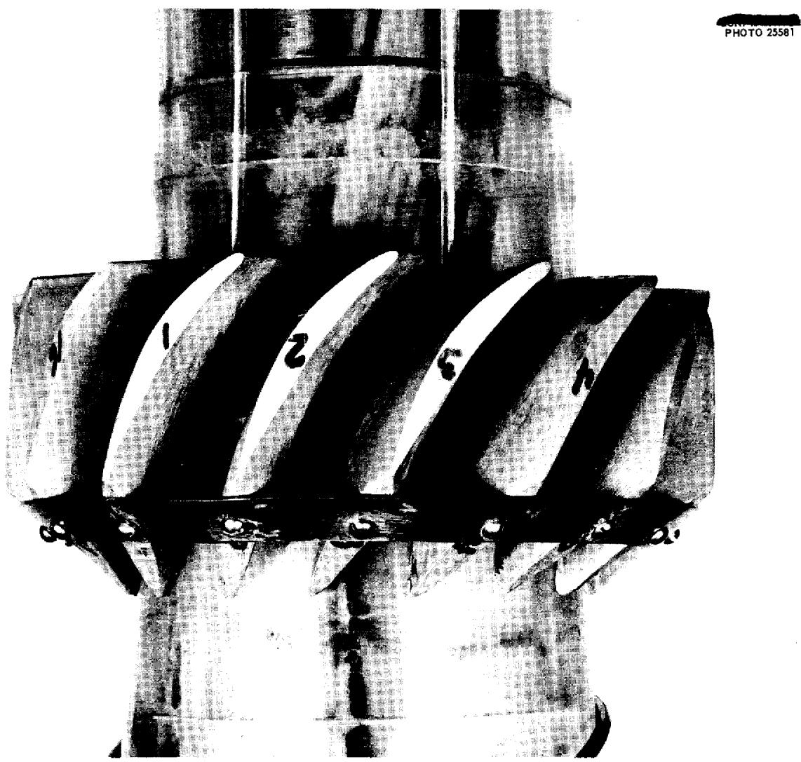  
Fig. 1.8. Guide-Vane and Baffle-Plate Arrangement for Distribution of Flow in Plastic Model of ART Core.

The north head for the ETU has been designed, and a fabrication sequence for its assembly has been prepared. A work estimate shows that 27 calendar weeks will be required for its fabrication and assembly after the materials are received. A similar study of the moderator assembly is now being made.

Methods for inspection during assembly are being studied. It has been established that the dimensional tolerances specified will require that the assembly operations be carried out in a temperature-controlled area. Dimensional inspection will be performed with templates and gages designed especially for this application.

# Procurement of Special Reactor Materials and Components

W. F. Boudreau

Aircraft Reactor Engineering Division

Considerable progress was made during the quarter in the establishment of contracts and facilities for the procurement of some major ART and ETU components and facility items. The construction of components, however, did not proceed as rapidly as had been forecast because of a lack of firm design information. The current status of some of the major items is presented below.

Beryllium. One beryllium hemisphere pressing was made successfully in the new facility of The Brush Beryllium Co., and machining is to proceed as soon as firm design information is received. The pressing of the beryllium for the islands was scheduled to be completed by the end of the quarter.

Shell Fabrication. - Modification of the Hydrospin machine to be used for fabrication of the core shells was delayed during the quarter by a combination of contract negotiation difficulties and a lack of firm information as to the size of the largest shells to be produced. The provision of facilities was advancing at a satisfactory rate at the end of the quarter, however.

CX-900 Inconel. - The first lot of 5000 ft of $\frac{3}{16}$ -in.-OD CX-900 Inconel tubing was received from the Superior Tube Co. near the end of the quarter, and inspection was started. Although considerable progress was made in processing the remaining quantity of Inconel to its final form, this was also delayed by lack of firm design information.

Main Heat Exchangers and Radiators. - An order was placed with the York Corp. for the fabrication of all the radiators and one-half the heat exchangers required for the ETU and the ART. An order was placed with Black, Sivalls & Bryson, Inc., for the remaining main heat exchangers. The activities of both companies during the quarter were limited chiefly to the preparation of facilities, the training of welders, and general planning, because of the lack of final design information.

Dump Valve. - The second prototype dump valve was delivered on February 12, 1956. Reasonably firm information has now been developed which will permit the production of additional prototype valves at a greatly accelerated pace during the next two quarters.

Main Blowers and Louver Dampers. - The order for the four main radiator blowers progressed on schedule during the quarter. Difficulties have been encountered in obtaining a vendor for the louver dampers, primarily because the service requirements are so unusual. Negotiations were in progress with the American Foundry & Furnace Co. at the end of the quarter.

# Inspection of Materials and Fabricated Parts

A. Taboada

Metallurgy Division

R. L. Heestand

Pratt & Whitney Aircraft

An inspection group has been established for quality control of reactor and test materials and components. Weld-joint designs were established that are to be used as a basis for all critical welding, and a system for identifying and classifying critical welds was formulated. All drawings are to be reviewed by the inspection group for the detection of undesirable weldments.

Welding procedures and inspection techniques were established for all anticipated types of welds. Since welders who are to work on critical welds must pass the qualification tests set up in the weld specifications, training groups were set up to qualify welders. The techniques established for weld inspection include visual, dye-penetrant, and radiographic examination of all critical welds. Specifications for the inspection of all critical materials are being prepared, and arrangements were made for all purchase orders for critical materials to be reviewed by the inspection group.

The welds inspected during the quarter totaled 2005, with $14\%$ rejection. A total of 5655 ft of tubing of various sizes was inspected, and 491 ft, or $9\%$ , was rejected. Defective areas were found in some of the 36 pieces of various sizes and lengths of pipe and the 99 pieces of plate that were inspected, but the defects were ground or filed out and the pipes and plates were accepted. Dye-penetrant and reflectoscope techniques were used for the inspection of 86 pieces of bar stock, and five pieces were rejected. Other items that were inspected included eight Inconel dishes heads, 329 fuel sampling assemblies, York Corporation radiator No. 3, and ORNL radiator No. 3.

# ART INSTRUMENTATION AND CONTROL

R.G.Affel

Instrumentation and Controls Division

J.M.Eastman

Bendix Products Division

Information obtained with the simulator has shown that in the event of an ART fuel-pump

failure at design power the maximum fuel coreoutlet temperature can be limited to $1700^{\circ}F$ by inserting the control rod at the rate of $\frac{1}{8}\% (\Delta k / k) / \mathrm{sec}$ . The magnetic, emergency, $1\%$ rod drop has therefore been abandoned because of the thermal-shock conditions that would develop at the core outlet in the event of a spurious rod drop at design power, and an emergency rod insert rate of $\frac{1}{8}\% (\Delta k / k) / \mathrm{sec}$ has accordingly been adopted.

Reactor performance with $U^{233}$ fuel was also investigated on the simulator. The lower proportion of delayed neutrons, in comparison with $U^{235}$ fuel, made the core-outlet fuel temperature less sensitive to a fuel-pump failure. It was found that the core-outlet fuel temperature would not exceed $1700^{\circ}F$ , even with no corrective control-rod action. For this test, the over-all temperature coefficient for the ART with $U^{235}$ fuel, $-2.5 \times 10^{-5}(\Delta k / k)^{\circ}F$ , was assumed as the temperature coefficient. The $U^{233}$ fuel could be expected to give a somewhat different temperature coefficient. The micromicroammeter amplifier and the servo amplifier used for the ARE have been obtained and will be connected to control the simulator for studies of the ART flux servo.

The heat-exchanger-inlet minimum-NaK-temperature limit is being studied to determine control and louver-actuator performance requirements. Initial tests indicated that a louver closing time of 2 sec was probably faster than necessary. However, the method of transport-lag simulation used for the tests was considered to be inadequate. Further work will be done with improved simulation of this lag, and control components will be used in the hookup.

The louvers are being supplied with pneumatic actuators to facilitate testing. Current plans call for two speeds of actuation of the louvers installed in the ART - one for normal load changes and the other for fast louver movement to prevent the NaK going into the reactor from dropping below the fuel freezing temperature during unusual transients such as an emergency rod insertion. The exact mode of control to be used for NaK temperature limiting and the means of correlating manual and automatic louver action are to be determined from the simulator study.

Tests indicate that, if the surface temperature of the stagnant sodium in the control-rod thimble is held to below $300^{\circ}\mathrm{F}$ , sodium deposition on the cool walls above the surface will be very small.

Accordingly the rod drive mechanism is being designed without a bellows to seal it from the helium atmosphere above the sodium. Two rod drive motors and drive speeds are being used; the faster one will provide $\frac{1}{8}\% (\Delta k / k) / \mathrm{sec}$ . The motors are geared down through worm reductions, and they drive the rod through differential gearing and a pinion and rack. A conventional shaft seal is used on the pinion shaft to retain oil in the gear casing. The sodium in the upper part of the rod thimble is to be cooled with a water jacket. The rod drive mechanism is housed above the shield and the reactor support structure. The layout is essentially complete.

The ART control technique has been revised to accommodate the changed emergency-rod-insertion method. The information block diagrams and elementary wiring diagrams have been further revised to place more dependence on the operator and less on instrumentation to prevent dangerous misoperation of the reactor. The original complex chains of instrument permissives were considered to be too sensitive to the reliability of instrument and control components. It is still planned to provide automatic corrective action whenever an emergency requires this action in too short a time to permit operator deliberation and to warn the operator by annunciators whenever an emergency requires his attention and corrective action. Interlocks to prevent misoperation will be reduced. It is expected that when the operator is changing power level he will have foreknowledge of the proper operating sequence and the response to be expected, and he will have time to judge the validity of instrument information and act accordingly. It is planned to use the simulator to familiarize the operator with the reactor and system response characteristics.

Preliminary instrument specifications for the ART helium and nitrogen systems were issued to provide engineering forces with space requirements for these devices. Preliminary installation flow-sheets for both the ART and the ETU are now available, and detailed design work is proceeding.

A number of methods for detecting NaK leaks into the high-velocity air streams from the ART radiators have been analyzed, and experimental work is being done on two of these methods. This work is reported in Sec. 9, "Analytical Chemistry of Reactor Materials."

Tests of solenoid-valve-seat materials suitable for use in systems involving liquid-metal vapor

have been made (see Sec. 5, "Corrosion Research"), as well as tests of suitable valves to meet various pressure and leaktightness requirements. All-welded solenoid valves, which were found to be leaktight by a spectrometer check, are being tested. A survey of a number of commercial vendors of solenoid valves disclosed that the special requirements dictated by the disaster conditions postulated for the ART impose severe solenoid-valve problems. It is hoped, however, that a suitable design will be developed. Tests of a number of commercial solenoid valves have demonstrated that only a soft seat material will meet leaktightness requirements. Metal seats are completely unreliable, in that their leakage rates are not reproducible under repeated cycling.

Approximately 12 pressure transmitters designed for high-temperature use have been tested, and performance data have been compiled. Two units of a new design have also been received and are being tested. Initial test data indicate that the newer units have performance characteristics somewhat better than those of the currently used devices. A number of other newly designed transmitters are on order and will be tested. Transmitters used on test loop instrumentation have been analyzed in an effort to determine the point of failure. No conclusive information is available as yet.

An initial test of a high-temperature ORNL-designed turbine-type flowmeter was attempted. It was found that expansion of the magnetic core of the flowmeter and expansion of the circulated fluid forced one of the bearing inserts out of the rotor and thus jammed the device. The flowmeter has been redesigned and will be retested. Improved methods of measuring the magnetic field intensity of magnets used for electromagnetic flow-meters have been investigated, and a new measuring system was ordered. It is felt that with an accurate measuring system it will be possible to increase the accuracy of flow measurements made on liquid metals with the use of electromagnetic flowmeters.

The first of a series of test rigs for measuring the fluid level in the reactor fuel expansion tank was placed in operation and then shut down in approximately 2 hr because of plugging of a $\frac{1}{4}$ -in. line with $\mathsf{ZrF}_4$ vapor deposits. A second test, for which a $\frac{3}{8}$ -in. line was used, was terminated in approximately 10 hr by plugging. The units

have been redesigned and further testing is under way. A contract has been placed with the General Electric Company to supply a trial quantity of high-temperature liquid-level-sensing elements for liquid-metal systems of the type used in the SIR system. These units may be applicable to the ART liquid-metal level measurements.

An investigation of the different types of thermocouples that might be used to measure reactor internal temperatures has indicated the swaged, magnesium-oxide-insulated, Calrod type of thermocouple to be the most suitable for ART use. Quantities of this type of thermocouple have been ordered for use in an evaluation program, and a contract has been given to a vendor to supply these thermocouples for the ETU. Thermocouples that use both Chromel-Alumel and platinum-platinum-rhodium wires will be installed in the ETU in an effort to obtain the highest accuracies possible. Accuracy requirements on the thermocouples have had to be relaxed from the initial specifications because of the difficulty in calibrating the thermocouples in their final locations. A preinstallation calibration will be performed, but it is not yet known how the installation will affect the accuracy of the temperature measurements.

A number of commercially available standard instrument components have been examined and tested for various functions. Among these items are pressure regulators, pressure controllers, temperature controllers, instrument check valves, and electrical pressure transmitters. Electrical pressure transmitters have been explored on a specification basis, and orders have been placed for a number of trial units.

# REACTOR PHYSICS

A. M. Perry

Electronuclear Research Division

# NaK Activation in the Fuel-to-NaK Heat Exchanger of the ART

H.W.Bertini

Aircraft Reactor Engineering Division

Three separate calculations have been made of the activity produced in the NaK in the fuel-to-NaK heat exchangers of the ART by core neutrons. One of these calculations was made by the ORNL Lid

Tank Shielding Facility (LTSF) group, one by a group at the Nuclear Development Corporation of America, and one by the author. The configurations used for these calculations are described in Table 1.1. An attempt to normalize the three calculations to the present ART configuration is described here. The configuration used for the normalization is also described in Table 1.1. It is expected that the final ART configuration will be essentially the same as that used for the normalization.

The results of the normalization of the data are presented in Table 1.2. No corrections were made to the calculations to account for differences in the size of the core. Corrections for differences in the beryllium thickness were made by taking a relaxation length of $5.7\mathrm{cm}$ for the decrease of NaK activity vs the increase in beryllium reflector thickness. Corrections for variations of the boron content in the first boron curtain were made by using a plot of sodium activity vs boron layer

thickness6 and an extrapolation for the thicknesses expressed as 0.587 and 0.681 g of B10 per square centimeter. No corrections were made for the variations in heat exchanger thicknesses or for the variations in the second boron curtain thickness. The activity was assumed to be directly proportional to the mass of the sodium (in the NaK) and to the design power. An additional correction was made to the LTSF data to account for the incorrect assumption that, at the time the LTSF results were reported, the power of the LTSF source plate was 3.6 w. A recent measurement7 indicates that the source-plate power was more nearly 2.1 w.

The delayed-neutron activity calculations by NDA are not included in Table 1.2, because there is no simple correction factor that will take into account the large heat exchanger thickness used. Only the LTSF-source-power and sodium-mass corrections were applied to the LTSF delayed-neutron results, and only the sodium-mass correction was applied to the author's delayed-neutron results.

TABLE 1.1. CONFIGURATIONS USED FOR CALCULATIONS OF THE ACTIVITY OF THE NaK IN THE ART FUEL-TO-NaK HEAT EXCHANGERS   

<table><tr><td rowspan="2"></td><td colspan="4">Configuration</td></tr><tr><td>For LTSF Calculation</td><td>For NDA Calculation</td><td>For Author&#x27;s Calculation</td><td>For Normalization Calculation</td></tr><tr><td>Core radius, in.</td><td>10.5</td><td>13.19</td><td>10.63</td><td>10.5</td></tr><tr><td>Beryllium-reflector thickness, in.</td><td>11</td><td>11.81</td><td>11.81</td><td>11</td></tr><tr><td>First boron curtain, grams of B10per square centimeter</td><td>0.325*</td><td>0.587</td><td>0.681</td><td>0.216**</td></tr><tr><td>Heat exchanger thickness, in.</td><td>2.1</td><td>6.5</td><td>1.97</td><td>3.25</td></tr><tr><td>Second boron curtain, grams of B10per square centimeter</td><td>0.325</td><td>0.162</td><td>0.341</td><td>0.216**</td></tr><tr><td>Sodium content of NaK in heat exchanger, kg</td><td>42</td><td>200.67</td><td>13.4</td><td>35</td></tr><tr><td>Reactor design power, Mw</td><td>60</td><td></td><td>60</td><td>60</td></tr></table>

TABLE 1.2. RESULTS OF NORMALIZATION TO THE ART CONFIGURATION OF CALCULATIONS OF THE ACTIVITY OF THE NaK IN THE FUEL-TO-NaK RADIATORS OF CIRCULATING-FUEL REACTORS   

<table><tr><td></td><td>LTSF Calculation</td><td>NDA Calculation</td><td>Author&#x27;s Calculation</td></tr><tr><td colspan="4">Correction Factors Used</td></tr><tr><td>Reflector thickness</td><td></td><td>1.45</td><td>1.45</td></tr><tr><td>First boron curtain</td><td>1.45</td><td>2.5</td><td>2.9</td></tr><tr><td>Sodium mass</td><td>0.833</td><td></td><td>2.61</td></tr><tr><td>LTSF source power</td><td>1.71</td><td></td><td></td></tr><tr><td>NDA to ART normalization factor</td><td></td><td>\( 426 \times 10^7 kg \) of sodium per core neutron per curie per activation</td><td></td></tr><tr><td colspan="4">Previous and Normalized Values</td></tr><tr><td>Previous values of NaK activity</td><td>470 curies</td><td>\( 0.3 \times 10^{-7} \)activations per core neutron per kg of sodium (in NaK)</td><td>55 curies</td></tr><tr><td>Normalized NaK activity from core neutrons</td><td>970 curies</td><td>463 curies</td><td>600 curies</td></tr><tr><td>Normalized NaK activity from delayed neutrons</td><td>87 curies</td><td></td><td>50 curies</td></tr><tr><td>Total normalized NaK activity</td><td>1057 curies</td><td></td><td>650 curies</td></tr></table>

# Activity of Mass-Transferred Material in the ART Radiators

# A. M. Perry   Electronuclear Research Division

A potentially troublesome aspect of the wraparound heat exchanger design of the ART, when applied to an aircraft power plant, is the degree of radioactivity that will be induced in the secondary heat-transfer circuit. Activation of the primary coolant, NaK, has been extensively discussed (see above). Estimates of Na24 activity in the NaK have varied, depending upon the particular reactor design being studied, from a few hundred to a few thousand curies. While the activity would not be sufficient, in general, to affect shield design appreciably, it would certainly interfere with routine maintenance of the aircraft engines. At least two solutions have been proposed for dealing with this problem. One solution entails the installation of an intermediate heat-transfer circuit to isolate the coolant for the fuel circuit from the engine radiator circuit; the other consists

in draining the radioactive NaK from the radiator circuit and replacing it with fresh NaK before the aircraft is approached for maintenance. While the latter solution is much to be preferred from the standpoint of aircraft weight and performance, there still remains the possibility that constituents of Inconel, which have become activated in the heat exchanger and carried in the fluid stream to the radiators, will be deposited on the radiator tube or header walls and will create a residual radiation field too high to permit unshielded access to the engines. An estimate of the activity of the mass-transferred material that will be deposited in the radiators of the ART has been made, and extrapolations to higher power reactors would be reasonably straightforward.

Specific Activity of Mass-Transferred Material. It is assumed, for the present, that all materials in the heat exchanger region are activated primarily by thermal neutrons. Activation rates are then proportional to the thermal-neutron absorption cross sections of the several materials present. The $\mathsf{Na}^{24}$ activity in the NaK is known, and, since

it serves as a normalizing factor, the thermal-neutron flux need not be known.

If a material is being activated in a constant neutron flux, the saturated decay rate is equal to the rate of activation. Thus the saturated gamma-ray activity per gram of an element resulting from activation of an isotope of the element is given by

$$
I _ {o j} = \frac {A _ {0}}{A} S _ {j} \sigma_ {j} f _ {j} \phi (\text {i n g a m m a r a y s p e r g r a m - s e c o n d}),
$$

where

$$
\begin{array}{l} A _ {0} = \text {A v o g a d r o ' s n u m b e r ,} 6. 0 2 3 \times 1 0 ^ {2 3}, \\ A = \text {a t o m i c w e i g h t o f t h e e l e m e n t}, \\ S _ {j} = \text {a b u n d a n c e o f i s o t o p e j i n t h e e l e m e n t}, \\ \sigma_ {j} = \text {c a p t u r e c r o s s s e c t i o n o f i s o t o p e j}, \\ f _ {j} = \text {g a m m a r a y s p e r d i s i n t e g r a t i o n o f t h e} \\ \phi = \text {a c t i v a t i n g} f l u x. \\ \end{array}
$$

In particular, the sodium activity is given by

$$
I _ {N a} = \frac {A _ {0}}{2 3} (0. 4 9 b a r n s) (2 g a m m a r a y s
$$

per disintegration) $(\phi)$ ,

and, then, using the sodium activity as the normalizing factor,

$$
I _ {o j} = \frac {S _ {j} \sigma_ {j} / _ {j}}{A} (2 3 I _ {N a})
$$

For the ART the saturated sodium activity is 1000 curies and the sodium mass is $35,000\mathrm{g}$ . Therefore $I_{\mathrm{Na}} = 0.029$ curies/g, and

$$
l _ {o j} = 0. 6 6 \frac {S _ {j} \sigma_ {j} ^ {f} j}{A}.
$$

After operation of the reactor at constant power for a time $t$ , the activity of isotope $j$ is less than $l_{oj}$ by the factor $(1 - e^{-t / \tau_j})$ , where $\tau_j$ is the mean life of the product isotope. The activity of isotope $j$ (or, rather, of the product isotope resulting from neutron capture by isotope $j$ ) after operation for a time $T$ is therefore

$$
\begin{array}{l} A _ {j} = \int_ {0} ^ {T} m W _ {\hat {k}} I _ {o j} (1 - e ^ {- t / \tau_ {j}}) e ^ {- (T - t) / \tau_ {j}} d t \\ = m W _ {k} I _ {o j} \left[ \tau_ {j} \left(1 - e ^ {- T / \tau_ {j}}\right) - T e ^ {- T / \tau_ {j}} \right] \\ = M W _ {k} I _ {o j} \left[ \frac {\tau_ {j}}{T} \left(1 - e ^ {- T / \tau_ {j}}\right) - e ^ {- T / \tau_ {j}} \right], \\ \end{array}
$$

where

$$
\begin{array}{l} m = \text {r a t e o f m a s s t r a n s f e r , g r a m s p e r u n i t t i m e ,} \\ W _ {k} = \text {w e i g h t f r a c t i o n o f t h e e l e m e n t i n t h e m a s s -} \\ \text {t r a n s f e r r e d m a t e r i a l ,} \end{array}
$$

$$
M = m T = \text {t h e t o t a l}
$$

Spectrographic analyses of Inconel and of mass-transferred material taken from the cold leg of a sodium-Inconel forced-circulation loop are shown in Table 1.3.

The contributions of each of the materials to the activity in the ART radiators, after 1000 hr of operation, are shown in Table 1.4. Only those isotopes are listed that lead to gamma-emitting isotopes. Isotopes that are stable, that emit beta particles only, or that decay by electron capture with no nuclear gamma rays are omitted from the table. The over-all activity of the mass-transferred material is about $1.2 \times 10^{-4}$ curies/g. (By contrast, the saturated activities of pure sodium, pure cobalt, and pure manganese in a thermal-neutron flux of $10^{11}$ neutrons/cm $^2$ -sec are 0.035, 1.0, and 0.4 curies/g, respectively. The saturated fission-product activity of the fuel in the ART is about 100 curies/g.)

Since chromium, manganese, and cobalt are the principal contributors to the activity in the mass-transferred material, it is well to re-examine the assumption that their activation rates are proportional to their thermal-neutron cross sections, especially since cobalt and manganese are known to have pronounced resonances in the same general energy range as that of sodium. The neutron flux as a function of energy was obtained from multi-group calculations performed by the Curtiss-Wright Corp. Absorption cross sections as a function of energy were calculated from the Breit-Wigner

TABLE 1.3. COMPOSITIONS OF INCONEL AND OF MASS-TRANSFERRED DEPOSITS IN AN INCONEL FORCED-CIRCULATION LOOP THAT CIRCULATED SODIUM   

<table><tr><td>Element</td><td colspan="2">Abundance in Inconel (%)*</td><td>Abundance in Mass-Transferred Deposits (%)*</td></tr><tr><td>Nickel</td><td>72.0</td><td>to 79.0</td><td>90 to 95</td></tr><tr><td>Chromium</td><td>14.0</td><td>to 17.0</td><td>5 to 10</td></tr><tr><td>Iron</td><td>6.0</td><td>to 10.0</td><td>0.2 to 0.5</td></tr><tr><td>Manganese</td><td>0.25</td><td>to 0.50</td><td>1 to 2</td></tr><tr><td>Carbon</td><td>0.02</td><td>to 0.07</td><td></td></tr><tr><td>Copper</td><td>0.15</td><td>to 0.50</td><td>&lt;0.1**</td></tr><tr><td>Silicon</td><td>0.15</td><td>to 0.50</td><td>&lt;0.1**</td></tr><tr><td>Sulfur</td><td>0.007</td><td>to 0.015</td><td></td></tr><tr><td>Titanium</td><td>0.15</td><td>to 0.50</td><td>&lt;0.1**</td></tr><tr><td>Cobalt</td><td>0.08</td><td>to 0.12</td><td>0.2 to 0.5</td></tr><tr><td>Aluminum</td><td>0.10</td><td>to 0.15</td><td>&lt;0.1**</td></tr><tr><td>Barium</td><td colspan="2">&lt;0.02**</td><td>&lt;0.02**</td></tr><tr><td>Beryllium</td><td colspan="2">&lt;0.001**</td><td>&lt;0.001**</td></tr><tr><td>Calcium</td><td colspan="2">&lt;0.05**</td><td>~0.1**</td></tr><tr><td>Magnesium</td><td colspan="2">~0.02**</td><td>~0.02**</td></tr><tr><td>Molybdenum</td><td colspan="2">&lt;0.02**</td><td>&lt;0.02**</td></tr><tr><td>Vanadium</td><td colspan="2">~0.02**</td><td>&lt;0.02**</td></tr><tr><td>Zinc</td><td colspan="2">&lt;0.2**</td><td>&lt;0.5**</td></tr><tr><td>Zirconium</td><td colspan="2">&lt;0.1**</td><td>&lt;0.1**</td></tr></table>

*Ranges are given when the data are known to be consistent; otherwise the analyses are for typical samples.   
**The accuracy of these analyses is $\pm 100\%$ .

formula for each resonance level, and the separate contributions from each level were added. Comparisons of thermal cross sections and of the integrals

$$
\int_ {0, 1} ^ {1 0 ^ {4} \mathrm {e v}} \sigma_ {a} (E) \phi (E) d E,
$$

for manganese and cobalt normalized to the values for sodium, are shown below:

<table><tr><td></td><td>Mn55</td><td>Co59</td></tr><tr><td>σth
a</td><td>26</td><td>74</td></tr><tr><td>σth (for Na)</td><td></td><td></td></tr><tr><td>∫σaφdE
∫σaφdE (for Na)</td><td>21</td><td>156</td></tr></table>

8 Resonance parameters from BNL-325, Neutron Cross Sections, D. J. Hughes and J. A. Harvey (July 1, 1955); B. T. Feld, Table of Neutron Resonance Constants, NYO-3078 (Aug. 28, 1953); D. J. Hughes, letter to W. K. Ergen, March 15, 1955.

The cobalt activity based on thermal cross sections was therefore too low by a factor of 2. A correction for this activity raises the total activity to about $2 \times 10^{-4}$ curies/g.

Amount of Mass-Transferred Material. - The total weight of material that will be carried to the radiators of the ART by the mass-transfer process can be roughly estimated from results of forced-circulation loop experiments. Four forced-circulation sodium-Inconel loops were operated for 1000 hr with a maximum fluid temperature of $1500^{\circ}\mathrm{F}$ and a temperature differential of $300^{\circ}\mathrm{F}$ . The average weight of deposit in the cold leg (mostly in the economizer) was $915\mathrm{g}$ . The average surface density of the deposit in the cold leg was $8\mathrm{mg/cm}^2$ , which would yield in the ART radiators a total deposit of $5\mathrm{kg}$ . This figure is quite uncertain, because information on the effects of system volume, surface-area-to-volume ratios, and Reynolds number is not yet available. It may be

seen that the estimate is probably pessimistic, however, by considering its implications relative to attack on the heat exchanger. The NaK-wetted area of the heat exchanger is $10^{6} \mathrm{~cm}^{2}$ . The average attack on the heat exchanger would therefore be $5 \mathrm{mg/cm}^{2}$ , or about 0.25 mil, in 1000 hr. Since the maximum intergranular attack found10

10G. M. Adamson and A. Taboada, ANP Quar. Prog. Rep. Sept. 10, 1955, ORNL-1947, p 97.

in sodium-Inconel loops in 1000 hr is about 1 mil, the estimate of a total transferred deposit of 5 kg in the ART radiators is believed to be conservative.

Total Transported Activity. - The total activity of the mass-transferred material to be found in the ART radiators, based on the above estimates of specific activity and weight of deposit, will be about 1 curie.

It is of interest also to estimate the radiation level that will be found in front of the radiators.

TABLE 1.4. ACTIVITY OF MASS-TRANSFERRED MATERIAL IN THE ART RADIATORS AFTER 1000 hr OF OPERATION AT $60\mathrm{Mw}^a$   

<table><tr><td>Isotope</td><td>Gamma Energyb(Mev)</td><td>f, Gamma Rays per Disintegration</td><td>S × 100, Isotope Abundance (%)</td><td>σ(barns)</td><td>Wk×100c(%)</td><td>Activityd(curies/g)</td><td>F, Factore</td><td>Half Life</td></tr><tr><td>Cr50</td><td>0.32</td><td>0.10</td><td>4.3</td><td>16.3</td><td>10</td><td>3.8 × 10-5</td><td>1</td><td>26 d</td></tr><tr><td>Mn55</td><td>0.85</td><td>1.0</td><td>100</td><td>13.2</td><td>2</td><td>1.2 × 10-5</td><td>1</td><td>2.6 h</td></tr><tr><td></td><td>1.8</td><td>0.30</td><td>100</td><td>13.2</td><td>2</td><td>0.4 × 10-5</td><td></td><td></td></tr><tr><td></td><td>2.1</td><td>0.20</td><td>100</td><td>13.2</td><td>2</td><td>0.2 × 10-5</td><td></td><td></td></tr><tr><td>Co59</td><td>1.17</td><td>1.0</td><td>100</td><td>37.0</td><td>0.5</td><td>3.0 × 10-5</td><td>1</td><td>5.2 y</td></tr><tr><td></td><td>1.33</td><td>1.0</td><td>100</td><td>37.0</td><td>0.5</td><td>3.0 × 10-5</td><td></td><td></td></tr><tr><td>Zn64</td><td>1.11</td><td>0.455</td><td>48.9</td><td>0.5</td><td>0.5</td><td>2.3 × 10-6</td><td>10</td><td>250 d</td></tr><tr><td>Ni64</td><td>0.37</td><td>0.04</td><td>1.2</td><td>2.0</td><td>95</td><td>0.5 × 10-7</td><td>(100)</td><td>2.6 h</td></tr><tr><td></td><td>1.11</td><td>0.13</td><td>1.2</td><td>2.0</td><td>95</td><td>1.4 × 10-7</td><td></td><td></td></tr><tr><td></td><td>1.50</td><td>0.26</td><td>1.2</td><td>2.0</td><td>95</td><td>3.6 × 10-7</td><td></td><td></td></tr><tr><td>Fe58</td><td>1.1</td><td>0.54</td><td>0.31</td><td>1.0</td><td>0.5</td><td>3 × 10-8</td><td>1000</td><td>46 d</td></tr><tr><td></td><td>1.3</td><td>0.46</td><td>0.31</td><td>1.0</td><td>0.5</td><td>2.6 × 10-8</td><td></td><td></td></tr><tr><td>Mo98</td><td>0.726</td><td>Strong</td><td>23.8</td><td>0.13</td><td>0.02</td><td>5.7 × 10-8</td><td>1000</td><td>67 h</td></tr><tr><td>Cu63</td><td>1.34</td><td>0.0043</td><td>69</td><td>4.3</td><td>0.2</td><td>7.4 × 10-9</td><td>104</td><td>12.8 h</td></tr><tr><td>Cu65</td><td>1.05</td><td>0.09</td><td>31</td><td>2.2</td><td>0.2</td><td>2.3 × 10-10</td><td></td><td>5.14 m</td></tr><tr><td>V51</td><td>1.45</td><td>1.0</td><td>99.76</td><td>4.5</td><td>0.02</td><td>1.6 × 10-9</td><td>104</td><td>3.76 m</td></tr><tr><td>Ti50</td><td>0.32</td><td>0.955</td><td>5.34</td><td>0.4</td><td>0.2</td><td>1.1 × 10-10</td><td>105</td><td>5.8 m</td></tr><tr><td></td><td>0.61</td><td>0.01</td><td>5.34</td><td>0.4</td><td>0.2</td><td>1.2 × 10-12</td><td></td><td></td></tr><tr><td></td><td>0.93</td><td>0.045</td><td>5.34</td><td>0.4</td><td>0.2</td><td>5.3 × 10-12</td><td></td><td></td></tr><tr><td>Ba130</td><td>0.5</td><td>Strong</td><td>0.1</td><td>0.024</td><td>0.02</td><td>1 × 10-11</td><td>105</td><td>12 d</td></tr><tr><td>Ba138</td><td>0.163</td><td>0.26</td><td>71.7</td><td>0.68</td><td>0.02</td><td>3.7 × 10-10</td><td></td><td>85 m</td></tr><tr><td></td><td>1.05</td><td>0.006</td><td>71.7</td><td>0.68</td><td>0.02</td><td>8.4 × 10-12</td><td></td><td></td></tr><tr><td>Ca46</td><td>1.31</td><td>0.83</td><td>0.0033</td><td>0.25</td><td>0.1</td><td>2.5 × 10-11</td><td>106</td><td>4.8 d</td></tr><tr><td>Ca48</td><td>3.0</td><td>1.0</td><td>0.19</td><td>1.1</td><td>0.1</td><td>8.8 × 10-12</td><td></td><td>8.5 m</td></tr><tr><td>S36</td><td>2.7</td><td>0.9</td><td>0.017</td><td>0.14</td><td>0.01</td><td>7 × 10-11</td><td>106</td><td>5.0 m</td></tr></table>

aInformation about isotopes taken from: D. J. Hughes and J. A. Harvey, Neutron Cross Sections, BNL-325 (July 1955); K. Way et al., Nuclear Level Schemes, TID-5300 (June 1955); K. Way et al., Nuclear Data, NBS Circular 499 (Sept. 1950).   
$^b$ Beta-particle emitters ignored.   
Weight per cent of the element in mass-transferred material; see Table 1.3.   
$d_{\text{Activity}}$ in curies per gram of mass-transferred material.   
Factor by which abundance of element in mass-transferred material would have to be increased to make its activity significant.

It is assumed that the active material will be more or less uniformly distributed throughout the hotter one-half of each radiator. The frontal area of the radiators will be about $140\mathrm{ft}^2$ , and the depth of the hot side will be less than 3 in. The average density of the radiators will be about $1\mathrm{g/cm}^3$ . Since the absorption cross section for 1-Mev gamma rays is $0.06\mathrm{cm}^2/\mathrm{g}$ , the mean free path of gamma rays in the radiators is about $16\mathrm{cm}$ , or 6 in. There will be little self-shielding, and all the activity may be assumed to be at the surface of the radiators. Since 1 curie of 1-Mev gamma rays gives about $1\mathrm{r/hr}$ at 1 meter, the dose at $d = 1$ ft, or 0.3 meters, from the surface of the radiators and opposite the center of the frontal area will be approximately $D = \overline{1/r^2}$ , that is, the average value of $1/r^2$ measured to points on the surface of the radiator. The radius of the circle of $140\mathrm{ft}^2$ area is 6.7 ft, or 2.1 meters, and therefore

$$
\begin{array}{l} \overline {{1 / r ^ {2}}} = \frac {\int_ {0} ^ {R} (1 / r ^ {2}) 2 \pi \rho d \rho}{\int_ {0} ^ {R} 2 \pi \rho d \rho} \\ = \frac {\int_ {d} ^ {\sqrt {R ^ {2} + d ^ {2}}} (1 / r) d r}{\int_ {0} ^ {R} \rho d \rho} \sim \frac {2 \ln (R / d)}{R ^ {2}}. \\ \end{array}
$$

Since $R = 2.1$ meters and $d = 0.3$ meters, $\overline{1 / r^2} = 0.9$ r/hr. The dose level 1 ft from the hot surface of the ART radiators is thus expected to be about 1 r/hr and to be due mostly to Co60.

Analysis of Estimates. - The actual dose rate may be less than expected for several reasons. The total amount of mass-transferred material, while very uncertain, has probably been overestimated. The quoted abundance of cobalt in the mass-transferred material was by far the highest observed in several loops. The typical abundance is much lower. A thicker boron curtain between the reflector and the heat exchanger, while not required in the ART, could reduce the rate of activation by at least a factor of 4. The use of cobalt-free nickel in the heat exchangers would give a substantial further reduction of activity.

The actual dose rate may be greater than that calculated for several reasons. The effect of small discontinuities in the boron curtain, while believed to be small, has not been thoroughly evaluated. The activation of materials in the sodium-to-NaK heat exchanger, located in the north-head assembly, is as yet an unknown factor. The importance of an exchange reaction, in which radioactive atoms in the heat exchanger may exchange with stable atoms in the radiator, with no net transfer of material, is difficult to evaluate.

A considerable amount of experimental work has been done on the transfer of radioactivity in stainless steel-sodium systems in connection with the SIR program. So far as the processes involved are understood, the following conclusions have been tentatively reached:

1. The rate of redistribution of radioactive materials in the isothermal systems studied may have been limited by diffusion in the metal walls.   
2. The rate-limiting process (or processes) is steeply temperature-dependent.   
3. In systems having a temperature differential around the loop, the mass-transfer process (presumed to result from different solubilities of wall materials in the fluid at hot- and cold-leg temperatures) approximately compensates for a decreased diffusion rate in the metal in the cold zone. The net transfer of radioactivity in a nonisothermal system is about equal to that in an isothermal system operated at the temperature of the hot zone of the nonisothermal system.

These conclusions appear to indicate that the exchange process will be far less important than the mass-transfer process in the ART secondary heat-transfer loop. There is still considerable uncertainty, however; for example, there may be a substantial rate of exchange to the isothermal hot leg that links the heat exchanger to the radiators and in the entrance headers to the radiators. Reliable evaluation of all these possibilities must await results of radioactivity-transport experiments being performed by the Callery Chemical Company for Pratt & Whitney Aircraft and, possibly, must await operation of the ART.

# RADIATION HEATING IN THE ART

H.W.Bertini

Aircraft Reactor Engineering Division

C. M. Copenhaver

Reactor Experimental Engineering Division

R.B.Stevenson

Pratt & Whitney Aircraft

Radiation heating in the ART is being studied by four methods. Two-dimensional multigroup calculations of neutron flux distributions in the ART, which are being performed by the Curtiss-Wright Corp., will provide the information necessary to determine heating by neutron elastic scattering and to determine the source distributions for all sources of gamma radiation. Gamma-ray heating in the island-core-reflector region will be calculated by a two-dimensional numerical-analytical method developed by Pratt & Whitney Aircraft and by a two-dimensional Monte Carlo method being developed at ORNL (see Sec. 11, "Shielding Analysis"). Heating in the heat-exchanger-pressure-shell region and in other special areas, such as the north and south headers, is being studied by analytical and numerical methods with the use of desk computers.

Status of Information and Description of Calculational Methods. - Information regarding all possible sources of gamma rays and the factors affecting their transmission and absorption is being collected, and, at this time, the compilation is nearly complete, except for some data on the gamma rays from inelastic scattering. The compilation will include buildup factors; energy absorption and total absorption gamma-ray cross sections; prompt, decay, and capture gamma-ray neutron spectra; inelastic scattering cross sections; and the gamma rays from inelastic scattering. A brief summary of the data that have been obtained is given below.

Energy-absorption buildup factors were calculated for all materials. The form assumed for the buildup factor was

$$
B _ {a} = A \left(e ^ {\alpha \mu r} - 1\right) + 1,
$$

where $A$ and $\alpha$ are constants for a particular material at a specified gamma-ray energy, and $\mu r$ is the distance in mean free paths from the source to the point of interest. The constants $A$ and $\alpha$ were determined for all materials at several en

ergies by interpolation in atomic-number, Z, values from data given by Goldstein and Wilkins.12 The energy-absorption coefficients and the total absorption coefficients were calculated by interpolation of values of these quantities given by Moteff.13

The prompt-gamma-ray spectrum was put into an analytical form that approximates the recently obtained experimental data. Superimposed on this spectrum was an estimate of the U235 radiative capture gamma rays, which contribute approximately 14% of the total prompt-gamma-ray energy per fission. The resulting analytical expression for the total prompt-gamma-ray spectrum is $8.8e^{-1.01E}$ photons/Mev-fission. This expression was integrated between several fixed energy limits to get the prompt-gamma-ray energy within these energy limits. The data, modified in this way, can be used directly, in conjunction with the buildup factors, in numerically integrating over the spectrum for the purpose of calculating the heat deposition rate resulting from these gamma rays in various parts of the reactor.

The experimental curve of the spectrum of decay gamma rays $^{15}$ was also approximated by an analytical expression. This expression was modified to include the fraction of the long-lived decay gamma-ray emitters, which were not measured experimentally, and to omit the fission-product gases, which are expected to escape from the reactor. The resulting spectrum is $10e^{-1.33E}$ photons/Mev-fission. This expression was integrated between the same energy limits as those used for the prompt-spectrum calculation, and the integration yielded information of the same nature.

Almost all the capture-gamma-ray data were taken from papers by Kinsey, Bartholomew, and Walker, who give capture-gamma-ray spectra for gamma-ray energies above about 3 MeV. The references to these papers, and some of the data used, are given by Mittleman and Liedtke.[16] Because of

the lack of information on the spectrum below 3 Mev, a spectrum for these gamma rays was chosen rather arbitrarily in such a way that the integral under the total spectrum gave the neutron binding energy of the compound nucleus. Most of the capture-gamma-ray energy is given off above 3 Mev; so errors in the assumptions should not contribute significantly to the total error. Partial integrations were performed numerically over the same energy range as that used for the prompt- and decay-spectra calculations.

The results of a fairly extensive literature search on the inelastic scattering cross sections and the $(n,n^{\prime},y)$ gamma-ray spectrum of the materials in the ART are being assimilated. There is insufficient experimental information available, however, and it has been necessary to make approximations and extrapolations over large energy regions. The calculated heat deposition rate, as a result, will have to be used rather cautiously. However, preliminary calculations indicate that, in general, radiation resulting from inelastic scattering is not the major contributor to the heating, and therefore the error introduced into the total heat deposition rate is relatively small.

Preliminary Calculations. - Some preliminary calculations, as mentioned above, have been made to justify calculational techniques and to determine the gamma-ray sources that can be neglected in calculating the heat deposition rate. Calculations were made, by using slab geometry, of the heat deposition rate at a point in the pressure shell resulting from decay gamma rays produced in the heat exchanger. In one case the buildup factors for the heat exchanger were used, and in another case the buildup factor for Inconel was used, but the results were essentially the same. The negligible differences in the results indicate that, for gamma rays passing through boundaries of materials of similar $Z$ , the heat deposition rate is nearly independent of the choice of buildup factor, so long as it is restricted to those for similar $Z$ .

In another case, it was assumed that the decay-gamma-ray energy was monoenergetic, and the results were compared with the results obtained by integrating over the gamma-ray energy spectrum. Monoenergetic gamma rays of 0.5, 0.75, and 1.0 Mev were used, and differences from the spectrum calculations of as much as $20\%$ were obtained. This indicates that it will be necessary to inte

grate over the spectrum of gamma-ray energies in order to achieve the desired accuracy.

The $\frac{1}{4}$ -in.-thick Inconel liner on the outside of the beryllium reflector becomes a fairly hot source of capture gamma rays. Test calculations of the heat deposition, in slab geometry, made by assuming the Inconel liner to be a plane surface source of gamma rays were compared with calculations made by assuming a plane distributed source of gamma rays. For regions of small penetrations (0.05 mean free paths) there was a difference of $10\%$ between the results for the two calculations, and for regions of deeper penetrations (2.5 mean free paths) the difference became as high as $30\%$ . Therefore care must be taken before it is assumed in the calculations that apparently thin sources of gamma rays may be approximated by plane surface sources.

Test calculations were also made to determine the relative source strengths of gamma rays resulting from inelastic scattering in the fuel, in the core shells, in the island, and in the first $5\mathrm{cm}$ of the beryllium reflector. By using the fluxes and the absorption rates determined by multigroup calculations in spherical geometry,[17] it was found that the energy of the gamma rays produced by inelastic scattering in the fuel constitutes about $20\%$ of the total gamma-ray energy released from the fuel. This is a surprisingly large contribution to the total heating, and it cannot be neglected.

The contribution to the total heating by the gamma rays resulting from inelastic scattering in the core shells was found to be negligible. However, the gamma rays arising from inelastic collisions in the island and in the beryllium reflector near the fuel are significant. They are comparable to the capture gamma rays in intensity, and, although their source strength per unit volume is small, their contribution to the heating cannot be neglected because of the large volumes involved.

Calculations were also made of the source strength of the capture gamma rays in the pressure shell. The strength was found to be extremely small in comparison with the strengths of other sources.

Calculations of the heating in the heat-exchanger-pressure-shell region have been nearly completed. Heat deposition rates for all regions amenable to

the analytical numerical approach will be published in a summary report when all the calculations have been completed.

Application of Methods to a Test Case. - The energy deposition from gamma rays was determined for a test case by the Monte Carlo method and by an analytical approach, for which an exponential form of the buildup factor was used, in order to make a comparison between the two methods and also to gain some insight into the validity of the analytical buildup-factor method for nonhomogeneous media. The results of these calculations are shown in Fig. 1.9.

The source was a uniform plane source of 1-Mev gamma rays adjacent to the fuel region shown in Fig. 1.9. The Monte Carlo calculations were performed by using a code developed by Auslender for slab geometry (see Sec. 11, "Shielding Analysis"). The following equation was used for the analytical calculations:

$$
\begin{array}{l} H = \frac {S \mu_ {e}}{2} \left\{A E _ {1} \left[ (1 + a) \sum_ {i} (\mu_ {T} X) _ {i} \right] \right. \\ \left. + (1 - A) E _ {1} \left[ \sum_ {i} (\mu_ {T} X) _ {i} \right] \right\} \\ \end{array}
$$

where

$$
H = \text {e n e r g y}
$$

$$
S = \text {g a m m a - r a y s o u r c e}
$$

$$
\mu_ {e} = \text {l i n e a r e n e r g y a b s o r p t i o n c o e f f i c i e n t},
$$

$$
\mu_ {T} = \text {l i n e a r t o t a l a b s o r p t i o n c o e f f i c i e n t},
$$

$$
\left(\mu_ {T} X\right) _ {i} = \text {t o t a l} \quad \text {t h i c k n e s s} \quad \text {t r a v e l e d} \quad \text {t h r o u g h e a c h} \quad \text {s l a b} \quad \text {i n} \quad \text {m e a n} \quad \text {f r e e} \quad \text {p a t h s},
$$

$A$ and $\alpha$ are the energy-absorption buildup-factor constants, which depend on the material and on the energy of the incident gamma rays, and $E_{1}$ is the usual exponential integral

$$
E _ {1} [ y ] = \int_ {1} ^ {\infty} e ^ {- y u} u ^ {- 1} d u.
$$

The energy deposition was determined in each region by using the buildup factor for each of the materials present. When it is considered that the statistics of the Monte Carlo calculation are not too good because of the relatively small number of histories computed and that the buildup factors are derived on the assumption of a homogeneous medium, the results shown in Fig. 1.9 are quite encouraging. They seem to indicate that the analytical buildup-factor approach will give reason-

ably accurate values of the energy deposition for multilayer regions if the buildup factor appropriate to each material is used in computing the deposition in that material.

The greatest discrepancies between the two methods occur near the boundaries of different materials, where the buildup-factor approach should be incorrect. However, since the equivalent $Z$ of the fuel is very close to the $Z$ of the Inconel, the ratio of the energy deposition on either side of the first boundary (fuel-Inconel interface) should be approximately equal to the ratio of the energy absorption coefficients, which is 0.221/0.094 = 2.35. If the values of the energy deposition, as given by Eq. 1, are used with the fuel buildup factor, the ratio is 19.4/8.2 = 2.36, while from the Monte Carlo calculation the ratio is 13.6/9.7 = 1.40. Therefore it is felt that the results predicted by the Monte Carlo calculation for the first one-half of a mean free path in the first Inconel layer must have a large statistical error and that the analytical buildup-factor approach probably gives the more nearly correct energy deposition at this point.

This reasoning cannot be applied to the Inconel-sodium boundaries, since the $Z$ 's for these ma-terials are quite different. However, it is felt that the increase in the energy deposition in the last one-quarter of a mean free path in sodium (as predicted by the Monte Carlo calculation) is not a real effect and is caused by statistical uncertainties in the calculation.

More test cases are being planned in order to get a better estimate on the validity of the buildup-factor approach and to improve the statistics of the Monte Carlo calculation. However, from this one test case, it seems that the buildup-factor approach will give reasonably good answers for the gamma-ray energy deposition in multilayered regions, even though the buildup factors are derived for homogeneous media.

# Self-Absorption of the Decay Gamma Rays in the ART Fuel Dump Tank

H.W.Bertini

Aircraft Reactor Engineering Division

The self-absorption of the decay gamma rays in the ART fuel dump tank has been calculated.18

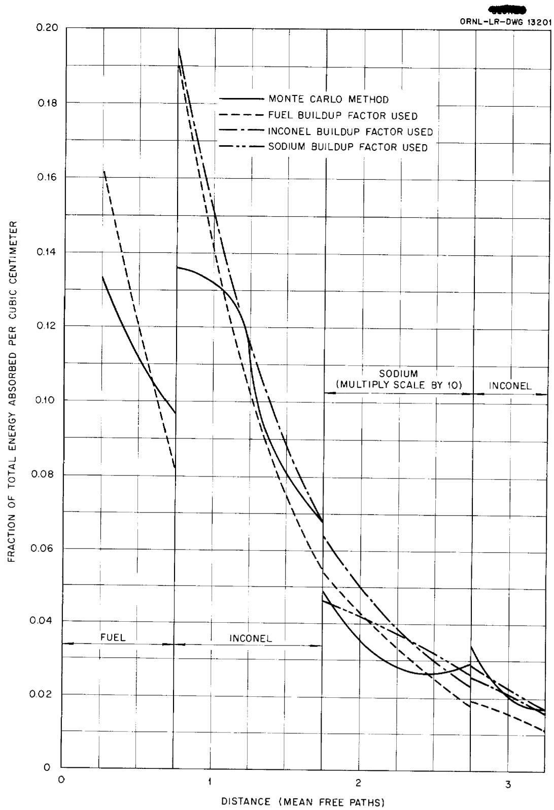  
Fig. 1.9. Gamma-Ray Heating as a Function of Distance from a Plane Source of 1-Mev Gamma Rays Adjacent to the Fuel Region.

The results indicate that $90\%$ of the decay gamma rays originating in the fuel dump tank will be absorbed there, and therefore cooling facilities must be provided in the dump tank to remove almost all the decay heat in the fuel.

It was assumed for the calculations that the dump tank contained only fuel and that it was spherical rather than cylindrical. Spheres of two different radii were used, so that one sphere had the same volume as the cylinder and the other had the same surface-area-to-volume ratio as the cylinder. The results obtained for the two spheres differed by only $2\%$ .

The expression for the fraction of gamma rays escaping from a sphere was taken from the work of Storm, Hurwitz, and Roe,19 for which the straight-ahead approximation was made; that is, it was assumed that only those gamma rays that made first-flight absorption collisions in the sphere were absorbed there. Since multiple-scattering effects were neglected, the expression yields an underestimate of the self-absorption. If the total gamma-ray cross section is used, rather than the energy-absorption cross section, the expression will yield an overestimate, since every collision is counted as an absorption collision. The energy absorbed in each sphere was calculated by using both the total and the energy-absorption cross sections. The maximum difference in the results obtained was about $10\%$ .

A numerical integration was made over the decay-gamma-ray spectrum $^{20}$ to check its effects, and the value obtained was about $3.5\%$ lower than that obtained by assuming that all the gamma rays were monoenergetic. The estimate that $90\%$ of the decay gamma rays originating in the fuel dump tank will be absorbed there appears therefore to be conservative.

# Activation of the Sodium in the ART

H.W.Bertini

Aircraft Reactor Engineering Division

The activation of the sodium to be used as the reflector coolant in the ART was recalculated $^{21}$ to correspond to the mid-December design of the

reactor. The starting point for the calculations was the Curtiss-Wright multigroup calculations on spherically symmetric systems, specifically their reactor No. 675.[22] Attempts were made to modify the multigroup results to account for the asymmetry of the ART and to account for the changed hole distribution in the beryllium island and reflector.

The results of this work indicate that the activity of the sodium will be $5.3 \times 10^{16} \, \text{d/sec}$ or $1.45 \times 10^{6}$ curies. For a total sodium volume of $2.45 \, \text{ft}^3$ this represents a decay-gamma-ray source strength of $0.51 \, \text{w/cm}^3$ . An increase of $20\%$ in the volume of the sodium passages in the island and reflector would increase the source strength only about $10\%$ .

# Shutdown Reactivity of Lithium in the ART Reflector Coolant

A.M.Perry

Electronuclear Research Division

In the event that it becomes impossible to dump the fuel out of the ART, it might be necessary to augment the reactivity effect of the control rod by some poison in order to shut down the reactor to room temperature. The change in reactivity in going from isothermal operation at $1200^{\circ}\mathrm{F}$ to room temperature involves the separate effects of dimensional changes, a thermal-base change, and a fuel-density change.

The slow net temperature coefficient of reactivity calculated by Curtiss-Wright,23 when corrected for the fuel expansion coefficient, is

$$
\frac {1}{k} \frac {d k}{d t} = - 2. 3 4 \times 1 0 ^ {- 5} / ^ {\circ} F
$$

The temperature coefficient measured in the high-temperature critical experiment was $-2.3 \times 10^{-5} / {}^{\circ}\mathrm{F}$ . The close agreement of the calculated and the experimental values was considered to justify the use of the Curtiss-Wright calculations of the separate effects involved in going from

$1200^{\circ}F$ to room temperature. Therefore, for the dimensional changes,

$$
\frac {1}{k} \frac {d k}{d t} = - 0. 7 7 \times 1 0 ^ {- 5} / ^ {\circ} F,
$$

$$
\Delta k = + 0.92 \% ;
$$

for the thermal-base change,

$$
\frac {1}{k} \frac {d k}{d t} = + 1. 9 9 \times 1 0 ^ {- 5} / ^ {\circ} F,
$$

$$
\Delta k = -2.4 \%
$$

The results of the high-temperature critical experiment $^{24}$ showed the specific mass reactivity coefficient of the uranium in the fuel,

$$
\gamma = \frac {M}{k} \frac {d k}{d M},
$$

to be about 0.14, and the Curtiss-Wright calculations25 gave $\gamma = 0.18$ for the uranium and 0.22 for

the whole fuel salt. By using $\gamma = 0.22$ and a fuel density of $3.3\mathrm{g} / \mathrm{cm}^3$ at $1200^{\circ}\mathrm{F}$ and $4.13\mathrm{g} / \mathrm{cm}^3$ at room temperature, the change in reactivity as a result of the fuel-density change is

$$
\Delta k = +5.0\%
$$

Thus the over-all change in reactivity is $+3.5\%$ .

The poisoning effect of the sodium in the ART moderator (island and reflector) has been estimated to be about $0.8\%$ in reactivity. The required reactivity effect is therefore about 4.5 times as great as that from sodium alone. The absorption cross section of natural lithium is 140 times that of sodium, and therefore the required shutdown reactivity could be achieved by adding $4.5 / 140 = 3.2$ at. $\%$ of lithium to the sodium. The sodium volume in the moderator cooling system is $2.45\mathrm{ft}^3$ and, since lithium is less dense than sodium (0.47 vs $0.8\mathrm{g/cm}^3$ ), the volume of lithium required would be

$$
2. 4 5 \times 0. 0 3 2 \times 0. 8 / 0. 4 7 = 0. 1 3 f t ^ {3}.
$$

Shutdown from $1400^{\circ}\mathrm{F}$ would involve a reactivity change of about $+4.1\%$ and would require about 0.15 ft³ of lithium. Even if some credit is taken for the control rod, which could be as little as $1\%$ at $1200^{\circ}\mathrm{F}$ , 0.1 ft³ of lithium would be required.

# 2. EXPERIMENTAL REACTOR ENGINEERING

H.W.Savage

Aircraft Reactor Engineering Division

# IN-PILE LOOP DEVELOPMENT AND TESTS

D. B. Trauger

Aircraft Reactor Engineering Division

Loop No. 3

C.W.Cunningham

J. A. Conlin

Aircraft Reactor Engineering Division

In-pile loop No. 3, which was operated in the MTR, was sectioned in the General Electric Company's hot cell at the National Reactor Testing Station (NRTS) for convenience in shipping to ORNL. The loop was sectioned into 14-in. lengths that could be accommodated by the available carriers. The sectioning sequence proceeded from the front, or nose, end of the loop to the rear of the pump drive unit, with one additional cut at the intermediate bulkhead. It was possible to return the nose section and the entire pump assembly intact.

An unsuccessful attempt was made during the sectioning to determine the cause for plugging of the fission-gas lines. The lines extending through the concrete shield were observed to be open, but it was not feasible to check the passage into the pump or the lines out of the pump in the region where the plugging probably occurred. These lines will be examined in a hot cell at ORNL (see Sec. 8, "Radiation Damage").

After the sectioned loop was received at ORNL, it was placed in a hot cell, and the fuel was removed. The loop was then sectioned further, and samples were prepared for metallographic examination. This loop, as previously reported, operated with a maximum fuel temperature of about $1500^{\circ}\mathrm{F}$ . There was a temperature differential in the fuel system of $155^{\circ}\mathrm{F}$ for 103 hr and $100^{\circ}\mathrm{F}$ for 168 hr. The metallographic examination revealed corrosion penetration to a maximum depth of 1 mil. Comparison with extrapolations of results obtained with forced-circulation loops operated out-of-pile indicates that the mil of corrosion is about what would be expected out-of-pile under similar conditions, and hence irradiation appears

to have little, or no, effect. However, the operating time, buildup of fission products, and temperature differential in the fuel were less than are anticipated in the ART, and the results can only be treated as preliminary.

The pump has now been disassembled, except for the impeller housing. Parts in the bearing-housing region appeared, in general, to be quite clean. Less oil has been observed than was expected from the lubrication rate for the seals and bearings. The excess oil may have been absorbed in the Fiberglas insulation used on thermocouple and electrical leads, but this was not fully evident. No direct cause for the stoppage of the purge-gas flow through the bearing housing has been found. The seals and bearings were found to be in good condition.

Considerable quantities of decomposed or partially decomposed materials were found forward of the front seal. The seal bellows contained a thick, reddish-black, waxlike substance, and there was a similar deposit on surfaces in this vicinity. The fuel in the pump sump appeared to be mixed with a carbonaceous material, which increased the sump level to above the point for normal operation. It is possible that the presence of these materials caused a friction drag on the pump shaft and produced the erratic-speed behavior observed during operation. Similar materials were found in the off-gas line for the sump purge, but it seems doubtful that these materials could have completely plugged the lines in the regions where they have been observed. No $\mathsf{ZrF}_4$ vapor ("snow") deposits were noted.

Loop No. 4

C. C. Bolta

R.A.Dreisbach

D. M. Haines

Pratt & Whitney Aircraft

J.A.Conlin

C.W.Cunningham

Aircraft Reactor Engineering Division

Assembly of in-pile loop No. 4 was completed on January 20, and it was shipped to NRTS for checkout and operation. Loop No. 4 was the same as the previous loops, except for minor modifications, which included larger diameter tubing for

the gas purge system and the substitution of nitrogen for helium in the nose purge system, along with a separate cold trap external to the reactor cubicle. The liquid-nitrogen heat-transfer system for cooling the fission-gas adsorption traps was also revised to provide for more automatic control, and vacuum-jacketed lines were added to minimize nitrogen losses.

The loop was found to be satisfactory and was inserted in the MTR HB-3 beam hole on February 6. Isothermal operation started on February 8, and the reactor was brought to full power on February 9. The operating conditions were approximately the same as those for loop No. 3, that is, a temperature differential of about $150^{\circ}\mathrm{F}$ and a maximum fuel temperature of about $1500^{\circ}\mathrm{F}$ . It is apparent, however, from several observations, that both loop No. 4 and loop No. 3 operated at a somewhat higher power level than was estimated for loop No. 3. The temperature differential observed from the thermocouples on loop No. 4 was between 175 and $200^{\circ}\mathrm{F}$ and that estimated from heat removal in the air was approximately $200^{\circ}\mathrm{F}$ . The higher power level indicated by the temperature difference has been substantiated by analyses of the activity in the cobalt-foil flux monitors in loop No. 3. The flux is now estimated to have been $50\%$ greater than that originally calculated from operating conditions.

It was not possible to use the nitrogen purge system for the nose region, because the cold traps plugged. The plugging was apparently caused by moisture in the gas. Extensive checks had been made at ORNL to determine the reliability of this purge system, and no trouble had been encountered. As many as 60 bottles of nitrogen, prepared to the same specification as that for the nitrogen normally purchased at the MTR, were passed through a similar cold trap without noticeable plugging. Less than two bottles resulted in plugging of traps at the MTR. Helium was therefore utilized again as the nose purge gas, but no difficulty occurred from heater short circuits, such as was experienced previously.[2]

Both the bearing-housing purge system and the pump-sump purge system plugged after $1\frac{1}{2}$ weeks of operation, and the helium inlet lines to these systems were clamped to prevent diffusion of radioactive fission gases to the operating area.

Activity appeared in the nose purge gas at one time, but it was contained in the nose-purge-gas traps. This activity apparently came from a leak in the pump bulkhead and did not indicate trouble in the main circuit. Operation was terminated during the scheduled MTR shutdown of February 27, and the loop was removed from hole HB-3 on February 29. High radiation levels were observed in the cubicle during removal of the loop and were apparently due to plated material on the walls of the gas lines. In general, the activity of the lines and of the traps appeared to be higher than had been originally estimated or extrapolated from experience with loop No. 3. The loop circulated the fuel for approximately 500 hr and operated with a temperature differential for approximately 390 hr.

# Loop No. 5

J.A.Conlin

P.A.Gnadt

Aircraft Reactor Engineering Division

Loop No. 5 has been assembled except for thermocouple attachment, insulation, and installation of the water jackets. It is leaktight and pump operation has been checked. Completion of assembly has been delayed until the operation of loop No. 4 can be analyzed sufficiently to indicate any required changes. The schedule for utilization of the reactor beam hole provides adequate time for this delay.

# FORCED-CIRCULATION CORROSION AND MASS-TRANSFER TESTS

Fused Salts in Inconel

C. P. Coughlen

G. E. Mills

P.G. Smith

Aircraft Reactor Engineering Division

R.A.Dreisbach

Pratt & Whitney Aircraft

Ten electrical-resistance-heated and two gas-heated forced-circulation Inconel loops were operated with fused salts as the circulated fluids during this quarter. The operational data for these loops are summarized in Table 2.1. The results of metallurgical examinations of the loops are presented in Sec. 5, "Corrosion Research."

A development study of the electrical-resistance-heated loops has revealed that temperature differences of up to $270^{\circ}\mathrm{F}$ exist between opposite sides

TABLE 2.1. SUMMARY OF OPERATING CONDITIONS FOR INCONEL FORCED-CIRCULATION LOOPS THAT CIRCULATED NaF-ZrF4-UF4 (50-46-4 mole %)  

<table><tr><td>Loop No.</td><td>Reynolds Number</td><td>Temperature Differential (°F)</td><td>Maximum Fluid Temperature (°F)</td><td>Maximum Tube-Wall Temperature (°F)</td><td>Operating Time (hr)</td><td>Comments</td></tr><tr><td colspan="7">Loops with Electrical-Resistance-Heated Straight Sections</td></tr><tr><td>7425-6</td><td>10,000</td><td>200</td><td>1500</td><td>1565</td><td>1000</td><td>Terminated on schedule</td></tr><tr><td>-7A</td><td>10,000</td><td>200</td><td>1500</td><td>1610</td><td>1000</td><td>Terminated on schedule</td></tr><tr><td>-8</td><td>10,000</td><td>200</td><td>1500</td><td>1570</td><td>1000</td><td>Area of cooled surface increased to five times that of standard loop; terminated on schedule</td></tr><tr><td>-9</td><td>4,500</td><td>200</td><td>1500</td><td>1670</td><td>Life test</td><td>Accumulated time in test: 1991 hr on Feb. 10, 1956</td></tr><tr><td>-10</td><td>10,000</td><td>200</td><td>1500</td><td>1600</td><td>1000</td><td>Terminated on schedule</td></tr><tr><td>-11</td><td>10,000</td><td>200</td><td>1500</td><td></td><td>In test</td><td>Heated volume increased fourfold</td></tr><tr><td>-42</td><td>Variable</td><td>200</td><td>1300 to 1500</td><td>1700</td><td>Variable</td><td>Development loop for studying heater design</td></tr><tr><td>-43</td><td>6,500</td><td>200</td><td>1500</td><td>1700</td><td>1000</td><td>Part of series to determine effect of wall temperature; terminated on schedule</td></tr><tr><td>-44</td><td>Variable</td><td>Variable</td><td>Variable</td><td>Variable</td><td>Variable</td><td>Development loop for studying heater design</td></tr><tr><td>-45</td><td>6,500</td><td>200</td><td>1300</td><td>1700</td><td>320</td><td>Terminated because of a failure in auxiliary equipment</td></tr><tr><td colspan="7">Loops with Gas-Heated Coiled Sections</td></tr><tr><td>-71</td><td>Variable</td><td>Variable</td><td>Variable</td><td>Variable</td><td>Variable</td><td>Development loop for studying thermocouples</td></tr><tr><td>4935-6</td><td>8,000</td><td>200</td><td>1500</td><td>1575</td><td>Life test</td><td>Accumulated time in test: 6637 hr on Feb. 10, 1956</td></tr></table>

of the heated tubing, top and bottom, when the Reynolds number of the circulated fluid is less than about 5000. A lower limit has therefore been set for the Reynolds number, and the problem is being studied further.

# Liquid Metals in Inconel and in Stainless Steel

C.P.Coughlen A.G.Smith

Aircraft Reactor Engineering Division

R. S. Dreisbach

Pratt & Whitney Aircraft

Six forced-circulation loops were operated with sodium and noneutectic NaK in Inconel and in stainless steel systems during the quarter. A

summary of the conditions of operation of these loops is given in Table 2.2.

# PUMP DEVELOPMENT

E. R. Dytko, Pratt & Whitney Aircraft

A. G. Grindell

Aircraft Reactor Engineering Division

# Bearing-and-Seal Tests

W. L. Snapp, Pratt & Whitney Aircraft

W. K. Stair, University of Tennessee

The fluid used in initial tests of ART pump bearings and seals for lubrication and heat removal

TABLE 2.2. SUMMARY OF OPERATING CONDITIONS FOR INCONEL FORCED-CIRCULATION LOOPS THAT CIRCULATED SODIUM OR NaK  

<table><tr><td>Loop No.</td><td>Cold Trap</td><td>Reynolds Number</td><td>Temperature Differential (°F)</td><td>Maximum Fluid Temperature (°F)</td><td>Operating Fluid</td><td>Operating Time (hr)</td><td>Remarks</td></tr><tr><td>7426-6-test</td><td>Yes</td><td>15,000</td><td>300</td><td>1500</td><td>Sodium (cleaned)</td><td>In test</td><td>Cold trap at 250°F</td></tr><tr><td>-6-service</td><td>Yes</td><td>Variable</td><td>Variable</td><td>Variable</td><td>Sodium</td><td>Variable</td><td>Development loop for studying plug indicators</td></tr><tr><td>-7</td><td>No</td><td>15,000</td><td>300</td><td>1250</td><td>Sodium</td><td>In test</td><td>Beryllium insert in hot leg; massive beryllium in stream</td></tr><tr><td>7439-3</td><td>Yes</td><td>15,000</td><td>300</td><td>1500</td><td>Noneutectic NaK</td><td>1000</td><td>Cold trap at 100°F; terminated on schedule</td></tr><tr><td>-51</td><td>Yes</td><td>15,000</td><td>Maximum possible</td><td>1500</td><td>Noneutectic NaK</td><td>Life test</td><td>Started February 13, 1956</td></tr><tr><td>-52</td><td>Yes</td><td>15,000</td><td>Maximum possible</td><td>1600</td><td>Noneutectic NaK</td><td>Life test</td><td>Started February 13, 1956</td></tr></table>

was a light-weight, refined, petroleum-base mineral oil, having a viscosity of 65 SSU at $100^{\circ}\mathrm{F}$ . When it was determined, however, that the temperature of the pump lubricating fluid would be 200 to $240^{\circ}\mathrm{F}$ in the operating ART, an investigation of suitable synthetic lubricants was begun, since most low-viscosity petroleum oils have a tendency to "coke" at temperatures above $180^{\circ}\mathrm{F}$ . Mechanically, coking would be of no consequence, but it was feared that the reduction, with time, in the amount of heat removed by the lubricant might be harmful.

The UCON LB series of synthetic lubricants was tested first. These are water-insoluble polyalkylene glycol-base fluids that are available with or without various inhibitors in a wide range of viscosities. Other properties being equal, they are superior to petroleum products in that their specific heat is higher, and, more important, they do not coke, even when used at temperatures well above those specified for ART pump operation. These two advantages are offset, however, by operational limitations. The loosely held hydroxyl ions in the UCON fluids have a tendency to pick up copper from system components and to plate it out elsewhere. Unfortunately, this copper plating occurs primarily on the mechanical-seal interfaces. Although this problem could be circumvented

by eliminating all copper-brass parts, equally difficult design problems would be introduced. It has also been found to be impossible to establish and maintain good seal performance with the UCON fluids. Early successful operation with the UCON fluids could not be reproduced. One out of ten seals tested with the UCON fluids might be acceptable, whereas further testing with mineral oil showed six to eight out of ten seals to be acceptable.

The lack of success with UCON fluids does not preclude the eventual use of a synthetic fluid. Testing and evaluation of other possible fluids are continuing. However, to permit further pump studies, all pump rotary assemblies are now being tested with the originally rejected petroleum-base mineral oil, but the oil operating temperature is being limited to $180^{\circ}\mathrm{F}$ . If no single fluid is found to be serviceable, it is possible that a bifluid system will be required, that is, one fluid for cooling and another fluid for lubrication and seal contact. As an aid in the solution of the fluid problem, tests are being conducted to determine the severity of the effect of petroleum-oil coking on heat removal.

Since proper control and removal of the lower seal oil leakage are essential to pump operation, the seal design has been modified to include a

baffle that extends upward beyond the seal interface to direct any oil leakage downward into a catch basin, from which it can easily be removed by means of a dip tube and continuous gas purging. The Durametallic seals discussed previously cannot be used with the modified design, and it now appears that the seal will be a bellows type with a stationary Graphitar 39 nose piece running against a hardened-steel ring (tool steel or AISI-8620 hardened to Rockwell C 50-55) clamped to the rotating shaft. The original leakage-rate specification has been changed from $2\mathrm{cm}^3/\mathrm{day}$ or less to 4 to $5\mathrm{cm}^3/\mathrm{day}$ .

# Sodium-Pump Performance Tests with Water

H.C.Young

Pratt & Whitney Aircraft

M. E. Lackey

Aircraft Reactor Engineering Division

Additional tests of the performance of the ART sodium pump, model MN, with water were performed

to determine the effect of inlet conditions on performance and cavitation. The volute inlet conditions for the tests described previously4 did not mock up the final design, and the additional tests were therefore made to determine the effect of the modified volute inlet on the pump characteristics. The results of these tests are compared with those of previous tests 5 and 6 in Table 2.3, and performance curves for tests 5 and 7 are presented in Figs. 2.1 and 2.2. The impeller used in test 5 was fabricated according to the final design, and the volute inlet conditions of test 7 were those to be used in the ART pump. A test of a pump that incorporated all the final design conditions was started, but the inlet shroud vane separated from the impeller because of the failure of a soldered joint, and the test could not be completed. Since all data obtained had shown good agreement, it was decided to consider the tests as having been completed.

A typical cavitation curve is presented in Fig. 2.3. Cavitation tests were conducted with

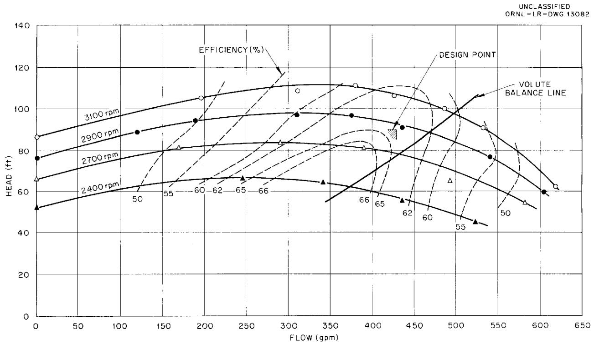  
Fig. 2.1. Sodium-Pump Performance Test 5.

TABLE 2.3. RESULTS OF WATER PERFORMANCE TESTS OF ART SODIUM PUMP   
Design point: 430 gpm, 90-ft head   

<table><tr><td rowspan="2">Test No.</td><td rowspan="2">Inlet Conditions</td><td colspan="2">Impeller Clearance (in.)</td><td rowspan="2">Type of Inlet Shroud</td><td rowspan="2">Efficiency (%)</td><td rowspan="2">Remarks</td></tr><tr><td>Axial</td><td>Radial</td></tr><tr><td>5*</td><td>Volute inlet plate 31/2in. thick; opening 3.5 in. in diameter with 31/2in. radius at edge; 0.370-in. spacer between plate and bottom of impeller</td><td>0.050</td><td>0.0625</td><td>Shroud 0.258 in. shorter than in previous test; shroud vanes removed</td><td>64</td><td></td></tr><tr><td>6</td><td>Same as in test 5</td><td>0.050</td><td>0.0625</td><td>Shroud same as in test 5; shroud vanes reinstalled and extended 3/2in.</td><td>63</td><td></td></tr><tr><td>7**</td><td>Volute inlet plate 1/2in. thick; opening 3.5 in. in diameter with 1/2in. rod at edge; no spacer</td><td>0.050</td><td>0.0625</td><td>Same impeller conditions as test 6</td><td>63</td><td></td></tr><tr><td>8</td><td>Same as in test 7</td><td>0.050</td><td>0.0625</td><td>Same as in test 5</td><td></td><td>Inlet shroud broke away from impeller; test incomplete</td></tr><tr><td>9</td><td>Same as in test 5</td><td>0.050</td><td>0.0625</td><td>Same as in test 5</td><td></td><td>Test made to check volute unbalance</td></tr></table>

* Tests 5 and 6 run during previous quarter4 with final impeller configuration.   
\*\*Final volute inlet conditions used.

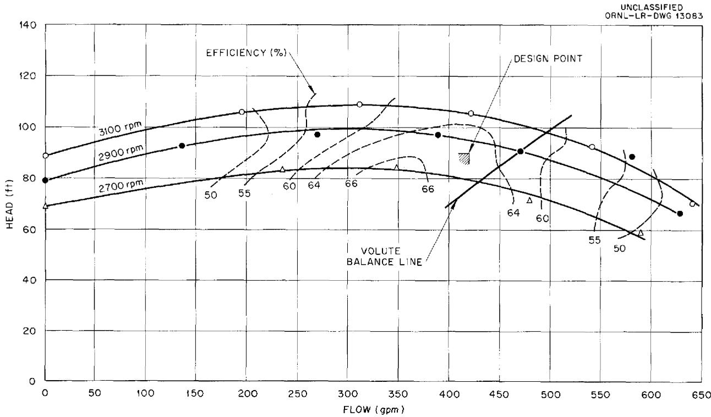

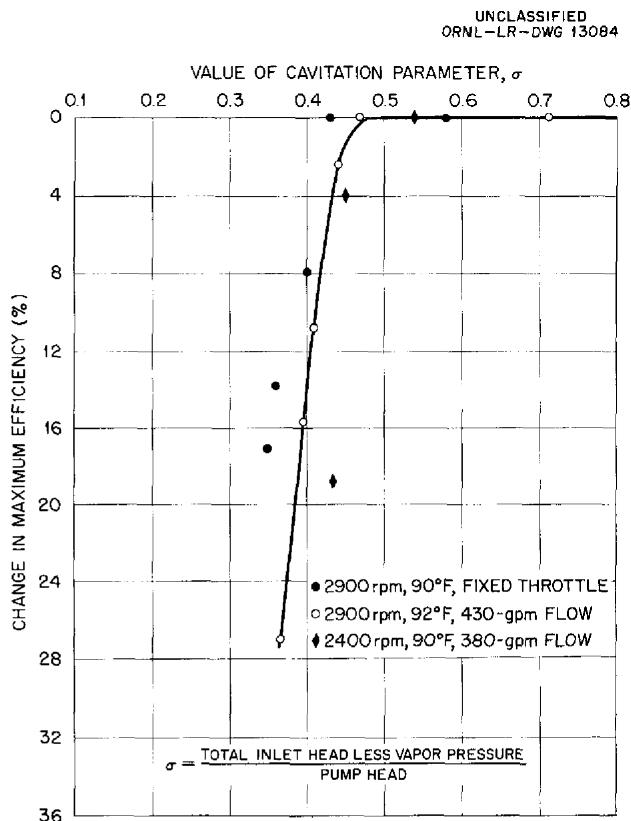  
Fig. 2.2. Sodium-Pump Performance Test 7.   
Fig. 2.3. Sodium-Pump Cavitation Characteristics.

two different inlet conditions and with and without vanes on the impeller inlet shroud. The variations in the data were slight, but the data obtained under the conditions that most nearly simulated the design conditions appeared to give the best cavitation characteristics.

Estimates of performance with sodium, based on the water test data, show that to prevent cavitation at a sodium temperature of about $1500^{\circ}\mathrm{F}$ a total inlet head of 6.26 psig will be required; at a sodium temperature of $1285^{\circ}\mathrm{F}$ a total inlet head of 0.96 psig will be required. The ART sodium pumps are to operate at an inlet pressure of 15 psig, and therefore the cavitation characteristics of the pump appear to be satisfactory. Cavitation data will also be obtained in high-temperature tests with sodium.

Four static-pressure taps were equally spaced on the pump volute, at the periphery of the impeller, to obtain measurements of the radial hydraulic forces on the impeller. It was found, however, that one of the taps had been improperly located in a corner of the volute near the tongue, and it measured part of the velocity head in addition to the static pressure. The other three pressure taps indicated that the balance was satisfactory. In order to investigate the balance more thoroughly,

the number of taps was then increased to nine. The data indicated that the unbalance at design head and flow was somewhat less than that measured with the improperly located tap and somewhat greater than that measured by the other three taps. The volute balance lines are shown in Figs. 2.1 and 2.2. At design point the maximum unbalance is less than 7 psi, and therefore the balance is considered to be satisfactory.

It appears from the water test data that the sodium pump will produce the required design head of 90 ft and flow rate of 430 gpm at an efficiency of $63\%$ at 2860 rpm and that it will require 15.6 bhp. To obtain the high head required with a minimum speed, an impeller vane angle of 90 deg is used. As a result, the head-vs-flow curve is rather flat for parallel pump operation. The design point lies on the negative slope of the curve, however, and it is believed that satisfactory, stable, parallel pump operation will be achieved.

# NaK-Pump Performance Tests with Water

H.C.Young

Pratt & Whitney Aircraft

M. E. Lackey

Aircraft Reactor Engineering Division

The test stand used for water tests of the ART NaK pump consists of a 6-in. closed-pipe loop; a 200-hp wound-rotor motor, with speed control by variable resistance; a flow-metering orifice; a heat exchanger to remove the heat added to the water by the pumping power; a throttling valve; a test volute; a test impeller; and the necessary instrumentation. The test volute was a precision aluminum casting, and the test impeller was fabricated of bronze. The preliminary tests indicated that the primary design head and flow rate could be obtained at speeds below the design speed. Leakage flow around the impeller hub was excessive, and serious ingassing occurred at design point, with the pump pot acting as a surge tank. For the first test the pump was operated with the pump pot full of water, and a separate surge tank was connected to the loop. Disassembly of the pump after the first test disclosed that the volute tongue had been damaged by local cavitation and that the impeller had rubbed against the side of the volute.

For further testing, the volute tongue was filed to a smooth contour and re-used. Vanes were installed on the back of the impeller hub to

decrease bypass flow and thus to decrease the ingassing that resulted from splashing. Also, a sleeve was installed in the volute to decrease the cross-sectional area at the point of highest hydraulic unbalance. As the tests progressed, changes were made to hub vanes and the volute as indicated by the tests. The performance curve obtained in test 7 is shown in Fig. 2.4. The curve shows that the design point can be reached at considerably below the maximum motor speed of 3550 rpm. The efficiency is approximately $75\%$ at design speed, and the volute unbalance is within satisfactory limits.

Additional tests indicated that the impeller will cavitate at an inlet pressure of 5 psig, which is below the design inlet pressure of 10 psig under ART conditions. This condition is considered to be acceptable, but an alternate design is being prepared. Further tests are to be conducted to investigate more thoroughly the degassing characteristics, to determine the optimum volute tongue angle, and to check further the performance and cavitation after minor revisions have been made to the pump assembly.

# High-Temperature Tests of ART Fuel Pumps

S. M. DeCamp, Jr.

Aircraft Reactor Engineering Division

The startup of an ART fuel pump (model MF-2) on a short-circuit test stand (No. 1) was described previously. After the initial difficulties had been overcome, the pump operated continuously at a maximum fluid (NaK) temperature of $1400^{\circ}\mathrm{F}$ for 2056 hr. No further operating difficulties were encountered until about 4 hr before termination of the test, when the power trace of the drive motor increased sharply to about $1\frac{1}{2}$ times normal, or 7 kw. This power increase lasted several minutes, and then the power level returned to normal. Approximately 4 hr later the power consumption again increased to about $1\frac{1}{2}$ times normal and continued to vary rapidly over a wide range. When the power consumption failed to return to normal, the test was terminated to prevent possible damage to the pump.

Upon disassembly of the pump it was discovered that the lower seal oil-leakage removal system had not been functioning properly and that some oil had gone down the shaft. The low seal leakage rate

previously reported5 was, of course, invalidated. The seal was not damaged. Since this test was run without continuous purge-gas flow through the system, hot NaK vapor apparently diffused up the annulus around the shaft, contacted the lower seal leakage oil, and formed the greasy deposits shown in Fig. 2.5. Close examination has revealed no damage to the pump.

The pump is designed so that oil leaking past the seal will flow across the seal runner to the

shaft and down the shaft into the pumped fluid or will flow down the side of the seal bellows and into the oil catch basin. Oil is forced from the catch basin by applying gas pressure to the surface of the oil and forcing it up an annulus around one of the tubes that carries coolant to the shield plug. In this test it was possible, apparently, for the gas to pass through the annulus without carrying the oil over with it. Efforts are being made to improve the catch-basin drainage system

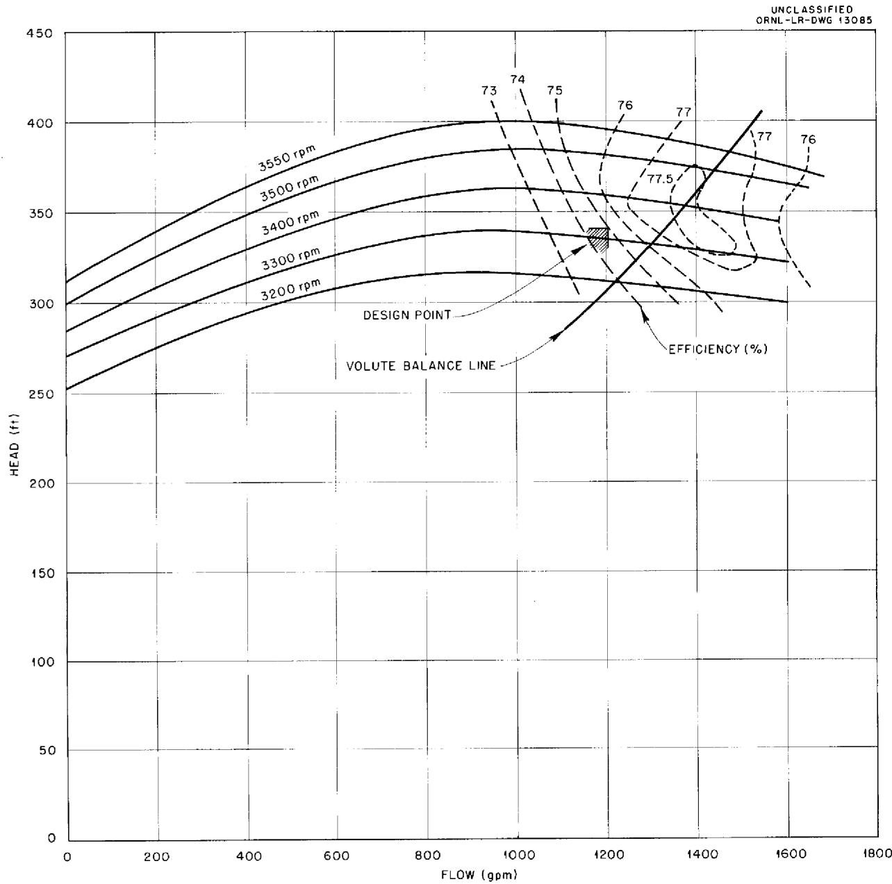  
Fig. 2.4. NaK-Pump Performance Test 7.

UNCLASSIFIED

PHOTO 25418

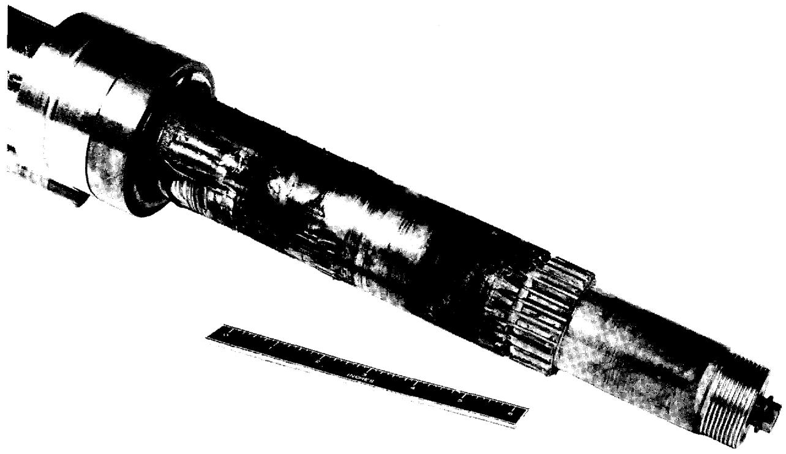

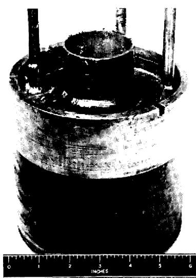

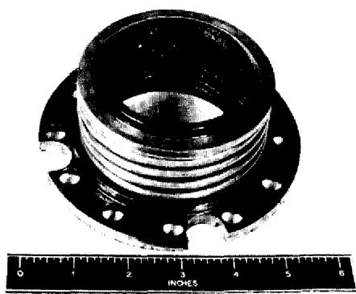

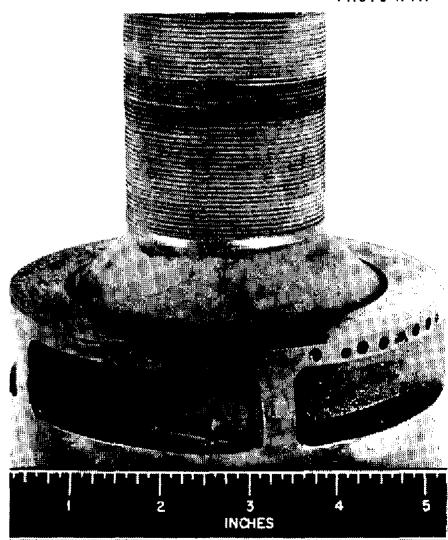  
Fig. 2.5. Disassembled ART Fuel Pump (Model MF-2), Showing Greasy Material That Formed When Leakage Oil Contacted the Vapors from the NaK Being Circulated in the Pump at $1400^{\circ}\mathsf{F}$ . This pump operated continuously for 2056 hr before disassembly.

to ensure the removal of all seal oil leakage and to prevent oil from being slung from the seal onto the shaft.

Short-circuit test stand No. 2 was ready for use in November 1955, and another fuel pump was installed. This system was filled with a fluoride fuel mixture and brought to temperature for seal tests. However, the lubrication oil pump was not functioning properly, and the system was shut down. An examination indicated that the sparging impeller located just below the top pump bearing was causing ingassing of the oil system. Also, it was found that the UCON oil used in this system retained the trapped gas to a greater extent than did the Gulfspin 60 oil used in stand No. 1.

In an attempt to reduce the ingassing, the oil was changed from UCON LB-300X to UCON LB-65 (the number of the oil indicates the SSU viscosity). The stand was then again prepared for high-temperature operation. After three days of operation, the lower seal developed a gross leak, and operation was therefore stopped. Examination showed that the UCON oil had removed copper from the system and deposited it on steel and graphite surfaces, especially in the seal region. Particles of the copper had entered the space between the graphite seal and the seal runner and caused the leak. Studies are now in progress to find a more satisfactory oil. It appears that Gulfspin 60 oil will be acceptable if its heat-stability and heat-transfer properties prove to be

satisfactory. The ingassing problem is also being studied further. It may be possible to circumvent the problem by using a larger oil reservoir or by removing the sparging impeller.

The tests conducted to date on the short-circuit test stands are described in Table 2.4.

# High-Temperature Pump-Performance Test Stands

J.J.W.Simon R.Curry

H. C. Young

Pratt & Whitney Aircraft

S. M. DeCamp

Aircraft Reactor Engineering Division

The design layouts and details and the fabrication of components for two test stands for high-temperature performance and endurance tests of ART fuel pumps were completed. These loops, which were described previously, will be used to obtain performance data on head, flow rate, cavitation and vibration characteristics, and the functioning of the xenon-removal system and to test endurance.

A similar stand for testing sodium pumps is being fabricated, and stands for testing NaK pumps and various special pumps have been designed.

TABLE 2.4. ART FUEL PUMP SHORT-CIRCUIT LOOP TESTS   

<table><tr><td>Date Started</td><td>Test No.</td><td>Stand No.</td><td>Type of Test</td><td>Hours Run</td><td>Speed (rpm)</td><td>Temperature (°F)</td><td>Fluid</td><td>Type of Oil</td><td>Reason for Test Termination</td><td>Troubles Discovered</td></tr><tr><td>8-31-55</td><td>1</td><td>1</td><td>Endurance</td><td>168</td><td>2600</td><td>1400</td><td>NaK</td><td>Gulfspin-60</td><td>Bad shield plug</td><td>Bad heater and bad O-ring seal</td></tr><tr><td>9-13-55</td><td>2</td><td>1</td><td>Endurance</td><td>26</td><td>2600</td><td>1400</td><td>NaK</td><td>Gulfspin-60</td><td>Bad shield plug</td><td></td></tr><tr><td>9-20-55</td><td>3</td><td>1</td><td>Endurance</td><td>2056</td><td>2600</td><td>1400</td><td>NaK</td><td>Gulfspin-60</td><td>Increased power consumption</td><td>Oil leak to system</td></tr><tr><td>12-1-56</td><td>4</td><td>2</td><td>Seal</td><td>16</td><td>2600</td><td>1200</td><td>He</td><td>UCON-300</td><td>Oil system in-gassing</td><td></td></tr><tr><td>12-16-56</td><td>5</td><td>2</td><td>Seal</td><td>96</td><td>2600</td><td>1200</td><td>He</td><td>UCON-65</td><td>Seal failure</td><td>Copper plated out on seal face</td></tr><tr><td>2-8-56</td><td>6</td><td>2</td><td>Seal</td><td>12</td><td>2600</td><td>1000</td><td>He</td><td>Gulfspin-60</td><td>Seal failure</td><td></td></tr></table>

# HEAT EXCHANGER DEVELOPMENT

E.R.Dytko

Pratt & Whitney Aircraft

R.E. MacPherson

J. C. Amos

Aircraft Reactor Engineering Division

# Intermediate Heat Exchanger Tests

J.W.Cooke

H. C. Hopkins

L. R. Enstice

Pratt & Whitney Aircraft

Test operations were continued on intermediate heat exchanger test stands A and B. A summary of the tests conducted is presented in Table 2.5. York radiator No. 3 and Pratt & Whitney (PWA) radiator No. 2 failed in stands A and B, respectively, during the quarter. Both radiators failed on the air-upstream side at or near the base plate. The side plates of PWA radiators Nos. 1 and 2 were slit prior to initial operation (modification 1). The York radiator No. 3 side plates were removed, and the support and base plates were split (modification 2) prior to operation. Eighteen thermocouples were installed on the tubes of York radiator No. 3 to obtain data on individual tube temperatures. The radiator is shown in Fig. 2.6, with the thermocouples installed. Temperature readings provided by these thermocouples indicated that, when NaK flow was stopped and restarted, transient temperature conditions occurred because of unequal NaK temperatures throughout the loop. Typical transient temperatures are indicated in Fig. 2.7. The tube temperatures measured by thermocouples 1, 2, 5, and 7 varied much more rapidly and through greater extremes than did the bulk NaK inlet and outlet temperatures measured by thermocouples 8 and 9.

York radiator No. 9, which is being installed in stand A, is the first radiator fabricated according to the revised design. It has no side plates, support plates, or base plate. Nickel plates, 10 mils thick, with oversize holes provide top and bottom air seals. It is hoped that these design revisions will alleviate thermal-stress concentrations in the fin-tube matrix.

Cambridge radiators Nos. 1 and 2, modified to be identical to York radiator No. 3 except for two additional slits cut in the base plate parallel to the air flow (modification 3), were installed in stand B, and test operations were started. This test was interrupted, however, by failure of the

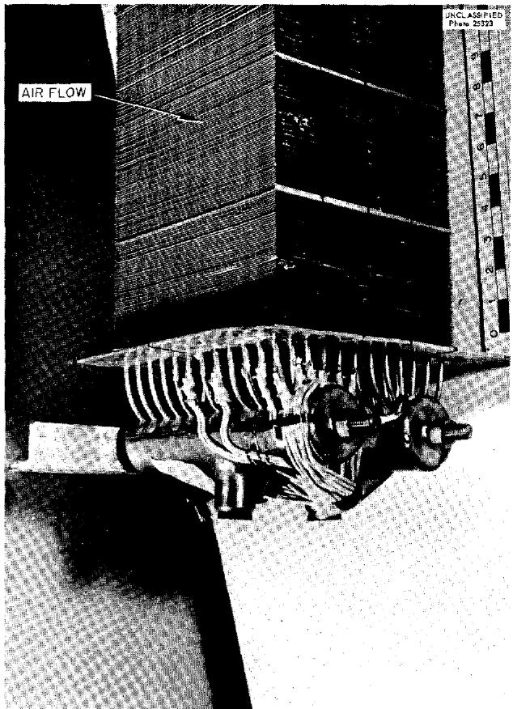  
Fig. 2.6. York Radiator No. 3, Showing Thermocouple Installations.

intermediate heat exchanger, ORNL-1 (type IHE-3), which had operated for 1825 hr.

Construction of test stand C was delayed because of difficulties in procurement of the heat exchanger, and therefore the Cambridge radiators Nos. 1 and 2 originally procured for stand C were installed in stand B. The decision was then made to convert stand C to a test facility for prototype ART radiators. Each radiator to be tested will be one half of a complete ART radiator unit. The modified test facility will be capable of testing these radiators at approximately $85\%$ performance. The thermal stresses which will be encountered by the ART radiators will be substantially duplicated in these tests.

# Small Heat Exchanger Tests

L. H. Devlin

J. G. Turner

Pratt & Whitney Aircraft

Test operations continued on small heat exchanger test stand B, and stand C was placed in

TABLE 2.5. SUMMARY OF OPERATION OF INTERMEDIATE HEAT EXCHANGER TEST STAND  

<table><tr><td>Test Unit</td><td>Hours of Nonisothermal Operation</td><td>Total Hours of Operation*</td><td>Number of Thermal Cycles</td><td>Reason for Termination</td></tr><tr><td colspan="5">Test Stand A</td></tr><tr><td>ORNL heat exchangers Nos. 1 and 2 (type IHE-2)</td><td>15</td><td>358</td><td>73</td><td>Heat exchanger failed</td></tr><tr><td>ORNL radiators Nos. 1 and 2</td><td>70</td><td>621</td><td>8</td><td>ORNL radiator No. 1 failed</td></tr><tr><td>York radiators Nos. 1 and 2</td><td>45</td><td>150</td><td>20</td><td>York radiator No. 1 failed</td></tr><tr><td>York radiator No. 2</td><td>105</td><td>437</td><td>39</td><td>York radiator No. 2 failed</td></tr><tr><td>York radiator No. 3 (modification 2)</td><td>1</td><td>361</td><td>20</td><td>York radiator No. 3 failed</td></tr><tr><td>Circulating cold trap (modified diffusion)</td><td></td><td>437</td><td></td><td>Replaced by 80-gal-system cold trap</td></tr><tr><td>Circulating cold trap (80-gal system)</td><td></td><td>361</td><td></td><td>Test continuing</td></tr><tr><td>NaK screen filter</td><td></td><td>120</td><td></td><td>Test continuing</td></tr><tr><td>Plugging indicator (5 hole, 0.030 mil)</td><td></td><td>360</td><td></td><td>Test continuing</td></tr><tr><td>Plugging indicator (7 hole, 0.030 mil)</td><td></td><td>648</td><td></td><td>Test continuing</td></tr><tr><td colspan="5">Test Stand B</td></tr><tr><td>ORNL heat exchangers Nos. 1 and 2</td><td>993</td><td>1825</td><td>21</td><td>Heat exchanger failed</td></tr><tr><td>PWA radiators Nos. 1 and 2 (modification 1)</td><td>585</td><td>1195</td><td>20</td><td>PWA radiator No. 2 failed</td></tr><tr><td>Cambridge radiators Nos. 1 and 2 (modification 3)</td><td>408</td><td>603</td><td>1</td><td>Test continuing</td></tr><tr><td>Circulating cold trap (with precooler)</td><td></td><td>1195</td><td></td><td>Replaced by 80-gal-system cold trap</td></tr><tr><td>Circulating cold trap (80-gal system)</td><td></td><td>630</td><td></td><td>Test continuing</td></tr><tr><td>Plugging indicator</td><td></td><td>1825</td><td></td><td>Test continuing</td></tr></table>

*For tests in progress, the total operating time is shown as of February 15, 1956.

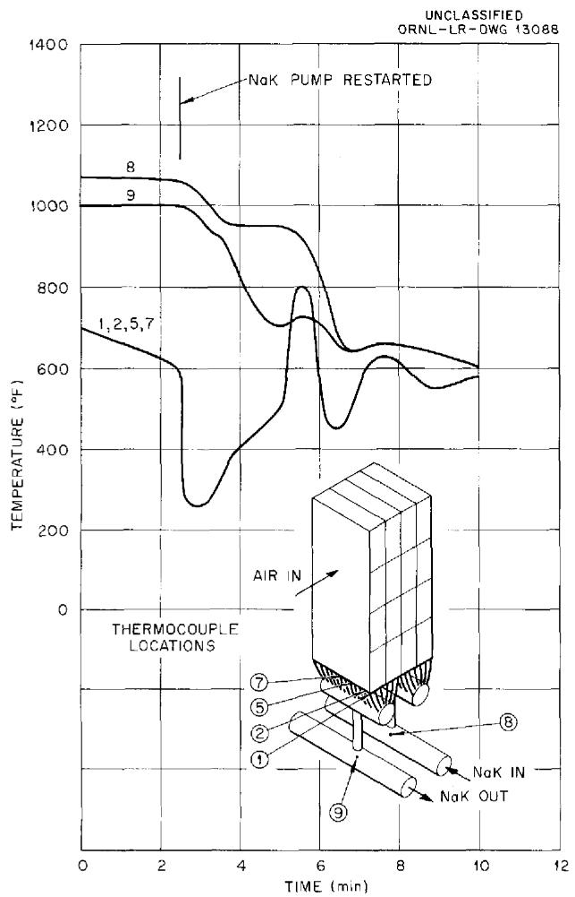  
Fig. 2.7. Typical Transient Temperatures That Resulted from Stopping and Restarting NaK Flow Through York Radiator No. 3.

initial operation during the quarter. A summary of operation of these stands, which were described previously, is presented in Table 2.6.

ORNL radiator No. 3 failed in stand B after 716 hr of operation. The failure occurred on the air-upstream face of the radiator at or near the center support plate. The design of this radiator was identical to the design of ORNL radiator No. 1 and York radiators Nos. 1 and 2, which failed in intermediate heat exchanger test stand A, except that the side plates were not welded together (modification 1). This radiator is shown before and after failure in Figs. 2.8 and 2.9.

York radiators Nos. 4 and 5 were modified by removing the side plates and slitting the support

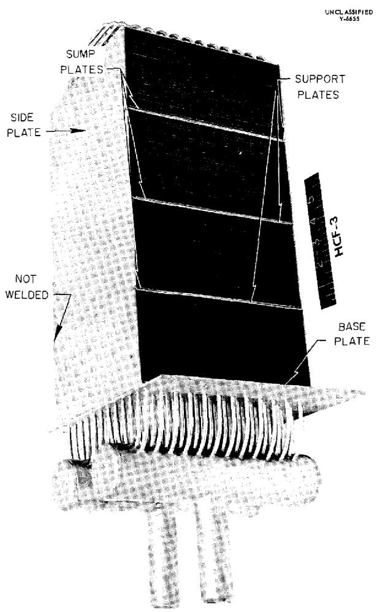  
Fig. 2.8. ORNL Radiator No. 3 Prior to Installation in Small Heat Exchanger Test Stand B.

plates and base plate (modification 2) and are now in operation in test stands B and C, respectively. The installation of radiator No. 4 is shown in Fig. 2.10.

# Heat-Transfer and Pressure-Drop Correlations

J. C. Amos

Aircraft Reactor Engineering Division

Radiator air pressure-drop and heat-transfer data obtained on the heat exchanger test stands operated during the quarter have been added to previous data and are presented in Figs. 2.11 and 2.12. The additional heat exchanger heat-transfer data

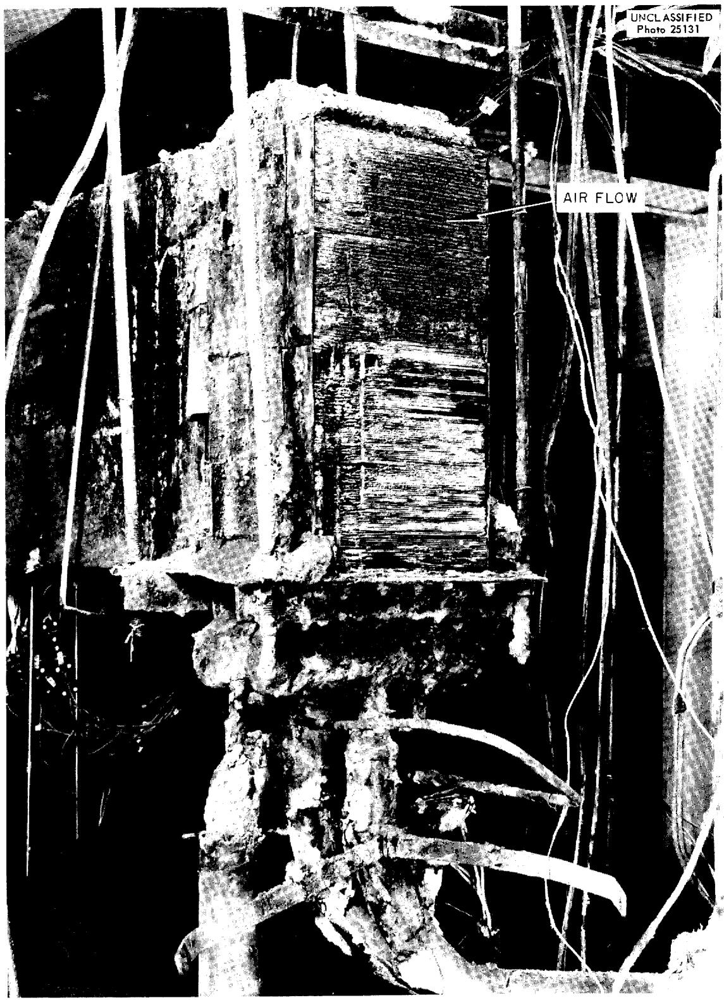  
Fig. 2.9. ORNL Radiator No. 3 After Failure in Small Heat Exchanger Test Stand B.

TABLE 2.6. SUMMARY OF OPERATION OF SMALL HEAT EXCHANGER TEST STAND  

<table><tr><td>Test Unit</td><td>Hours of Nonisothermal Operation</td><td>Total Hours of Operation*</td><td>Number of Thermal Cycles</td><td>Reason for Termination</td></tr><tr><td></td><td></td><td>Test Stand A**</td><td></td><td></td></tr><tr><td>ORNL heat exchanger No. 1 (type SHE-1)</td><td>1540</td><td>1645</td><td>12</td><td>Test completed</td></tr><tr><td></td><td></td><td>Test Stand B</td><td></td><td></td></tr><tr><td>ORNL heat exchanger No. 1 (type SHE-2)</td><td>816</td><td>1710</td><td>27</td><td>Test continuing</td></tr><tr><td>ORNL radiator No. 3 (modification 1)</td><td>295</td><td>716</td><td>5</td><td>Radiator failed</td></tr><tr><td>York radiator No. 4 (modification 2)</td><td>520</td><td>1000</td><td>22</td><td>Test continuing</td></tr><tr><td>Circulating cold trap (80-gal system)</td><td></td><td>1710</td><td></td><td>Test continuing</td></tr><tr><td>Plugging indicator</td><td></td><td>1710</td><td></td><td>Test continuing</td></tr><tr><td></td><td></td><td>Test Stand C</td><td></td><td></td></tr><tr><td>ORNL heat exchanger No. 2 (type SHE-2)</td><td>0</td><td>400</td><td>0</td><td>Test continuing</td></tr><tr><td>York radiator No. 5 (modification 2)</td><td>0</td><td>400</td><td>0</td><td>Test continuing</td></tr><tr><td>Circulating cold trap (80-gal system)</td><td></td><td></td><td></td><td>Test continuing</td></tr><tr><td>Plugging indicator</td><td></td><td></td><td></td><td>Test continuing</td></tr></table>

*For tests in progress, the total operating time is shown as of February 15, 1956.   
\*\*Rebuilt for core-shell stability tests upon completion of one heat exchanger test.

and fluoride fuel pressure-drop data are in good agreement with the previous data. Radiator NaK pressure-drop data are presented in Fig. 2.13. The NaK pressure drops measured during nearly isothermal operation were observed to increase when oxide plugging temperatures were above $900^{\circ}\mathrm{F}$ (370 ppm $\mathrm{O}_2$ ). Subsequent reduction of contamination (plugging temperatures below $600^{\circ}\mathrm{F}$ , 100 ppm $\mathrm{O}_2$ ) by cold-trap operation reduced the NaK pressure drops to the initial levels. In every instance the NaK pressure drop gradually increased when the system was operated with a continuous temperature differential. For example, after 430 hr of nonisothermal operation, the NaK pressure drop across Cambridge radiators Nos. 1 and 2 increased over $30\%$ , while the pressure drop

across the heat exchangers in the same stand increased only $6\%$ .

All heat exchanger test stands are currently equipped with 80-gal-system circulating cold traps of the type previously described. These cold traps are capable of maintaining a contamination level of 100 ppm $\mathsf{O}_{2^{\prime}}$ as represented by a plugging temperature of approximately $600^{\circ}\mathsf{F}$ , in the 80-gal NaK system in the intermediate heat exchanger test stands. On the small heat exchanger test stands, with approximately 20-gal NaK systems, the cold traps are capable of maintaining a contamination level that is below

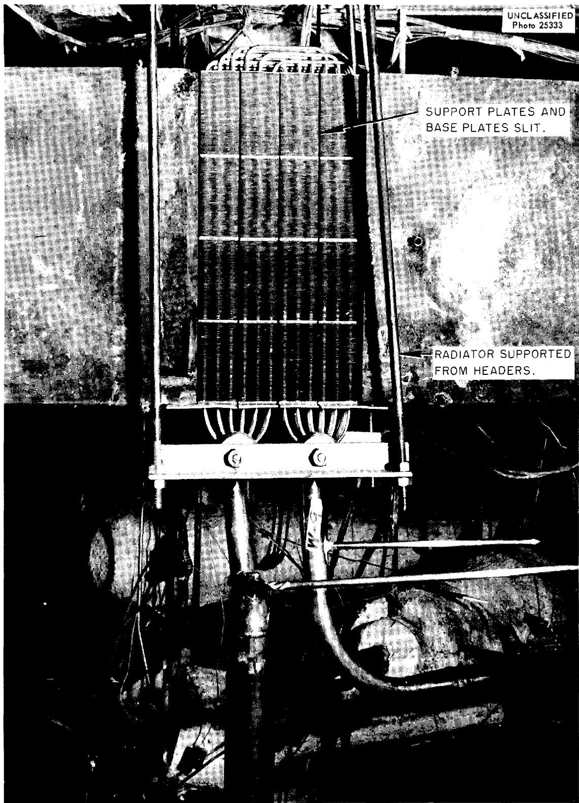  
Fig. 2.10. York Radiator No. 4 as Installed in Small Heat Exchanger Test Stand B.

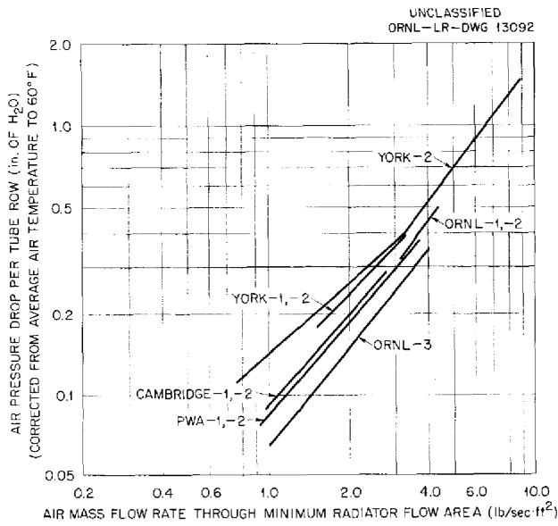  
Fig. 2.11. Correlation of Radiator Air-Pressure-Drop Data Obtained from the Operation of Heat Exchanger Test Stands.

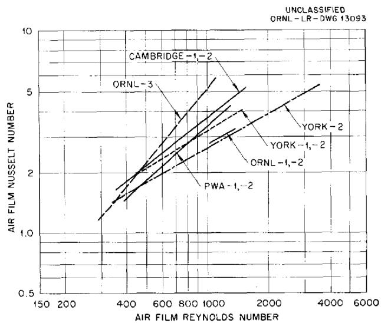  
Fig. 2.12. Correlation of Radiator Heat-Transfer Data Obtained from the Operation of Heat Exchanger Test Stands.

the sensitivity of the plugging indicators; that is, the plugging temperature is below $350^{\circ}\mathrm{F}$ and represents 34 ppm $\mathsf{O}_2$ .

The plugging temperatures obtained from the two plugging indicators installed on intermediate heat exchanger test stand A were in substantial agreement (average deviation, 5 ppm). These indicators are identical except that one has a

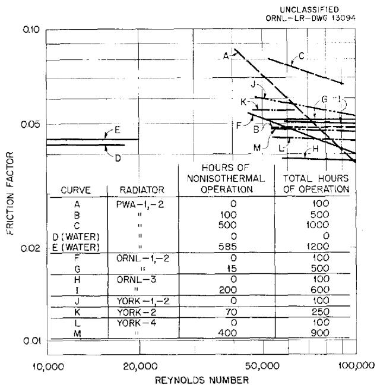  
Fig. 2.13. Correlation of Data on NaK Pressure Drop Across Radiators Operated on Heat Exchanger Test Stands.

plugging disk with five 0.030-in. holes and the other has a plugging disk with seven 0.030-in. holes.

STRUCTURAL TESTS  
Outer-Core-Shell Thermal-Stability Test  
G. D. Whitman A. M. Smith  
Aircraft Reactor Engineering Division  
R. Curry  
Pratt & Whitney Aircraft

The core-shell test stand was put in operation on December 28, 1955, and after 24 hr of operation the system had to be shut down because of an unaccountably high pressure drop in the loop supplying sodium to the outer annulus of the model. A recheck of the pressure-drop calculations for the outer-annulus circuit revealed no significant error; so it was decided to x-ray the model to check for a possible restriction. The x rays disclosed that the outer thermal baffle had moved up about $3/4$ in. and was restricting the flow in the outer annulus (Fig. 2.14). The model was therefore removed from the system and partly disassembled in order to move the outer thermal baffle back into place. To prevent a possible recurrence of the trouble, four Inconel pins were

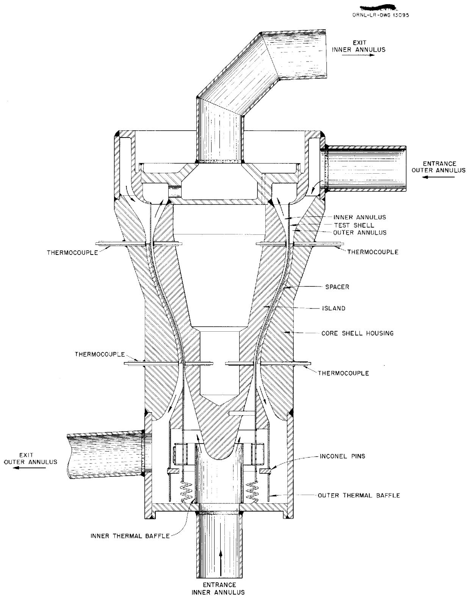  
Fig. 2.14. Core-Shell Thermal-Stability Test Assembly.

attached to the thermal baffle to restrict its movement to less than $\frac{1}{4}$ in.

Repairs to the model were completed, and the test was again started on February 2, 1956. Isothermal conditions were established, and after several days of checkout and operation the first of the programed 100 thermal cycles10 was applied on February 7, 1956.

The cycle time has been increased from 1 hr to approximately $2\frac{1}{2}$ hr, with a 1-hr hold time under temperature differential and isothermal conditions and an approximately 15-min transient time to and from each condition. To date, 55 such cycles have been completed. Upon completion of the thermal cycles the core shell will be examined for dimensional stability.

# Inconel Strain-Cycling Tests

J. C. Amos

L. P. Carpenter

Aircraft Reactor Engineering Division

J. H. DeVan

Metallurgy Division

C. H. Wells

Pratt & Whitney Aircraft

Testing of Inconel specimens in a helium atmosphere in the two anvil bending-test assemblies, described previously,[11] was continued to provide data for longer test periods. With increased testing time, pronounced bending occurred in the specimens at right angles to the direction of the applied force. To eliminate the side thrusts that caused this warpage, new anvils were designed with slots, rather than flat surfaces, on which the specimens are bent. Specimens riding in these slots are strained to the same curvature as in previous tests, but, since the slots are the same width as the specimens, side movement is constrained. Tests with up to 117 cycles have been run successfully on the new anvil, with specimen warpage confined to the small tolerance between the slot and the specimen.

Automatic actuators are being installed to allow pneumatic, rather than manual, operation of the rods which transmit bending strains to the specimen. Since such actuators will eliminate a

possible source of torque transmital to the specimens, it is hoped that this modification will further correct the problem of side thrusts.

Metallographic results have been received for several of the specimens tested previously. Cracks typical of those which initiate at the outside fibers of the specimen and propagate inward are shown in Fig. 2.15.

The metallographic examinations have verified an earlier observation that the number of cracks produced for a given number of cycles at $1\%$ strain is higher at $1400^{\circ}\mathrm{F}$ than at $1600^{\circ}\mathrm{F}$ . Results of tests at $1200^{\circ}\mathrm{F}$ are not yet complete enough to indicate a trend at this temperature.

The results of recent tests, based on macroscopic examination, are summarized in Table 2.7. Several tests which were run for longer times were omitted from the table because of the definite warpage at right angles to the induced bending direction, which created a stress condition quite different from that intended.

# Swagelok Tubing-Connector Tests

P.G. Smith

Aircraft Reactor Engineering Division

Tests have been conducted to determine whether Swagelok fittings can be used to replace welded joints in forced-circulation loops operated with fused salts at high temperature. A loop has been operated with $\mathsf{NaF - ZrF_4 - UF_4}$ (50-46-4 mole %) at $1300^{\circ}F$ for 168 hr, at $1400^{\circ}F$ for 200 hr, and at $1500^{\circ}F$ for 100 hr. There have been no leaks in the four Swagelok test pieces. In further tests the reliability of the joints under thermal cycling of the loop will be determined. On the basis of tests to date, it appears that the commercial fitting can probably be used in forced-circulation corrosion-loop fabrication as a replacement for butt-welded connections.

# REACTOR COMPONENT DEVELOPMENT

Dump Valve

L.P.Carpenter J.W.Kingsley

Aircraft Reactor Engineering Division

J. J. Milich

Pratt & Whitney Aircraft

The first prototype dump valve was tested with the fuel mixture NaF-ZrF-UF4 (50-46-4 mole %). The initial tests with helium were described

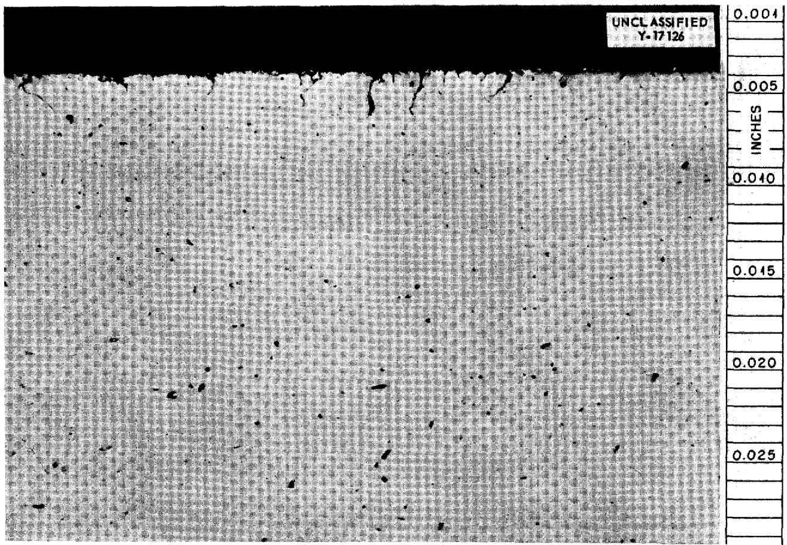  
Fig. 2.15. Inconel Strain-Cycling Specimen Showing Typical Cracks Which Initiate at the Outside and Propagate Inward. 150X.

previously.12 The plug material of the valve is Kennametal 152B (64% TiC-30% Ni-6% NbTaTiC₃) and the seat material is Kennametal 162B (64% TiC-25% Ni-5% Mo-6% NbTaTiC₃). The valve was fabricated by Black, Sivalls & Bryson, Inc. In the recent tests the fuel temperature was 1200°F, the actuator oil pressure was 250 psi, and the stem thrust was 1220 psi. The estimated seat contact pressure under these conditions was 10,000 psi. The tests, to date, show that the fuel leakage past the valve seat decreases with time while the valve is closed and increases to a high value when the valve is opened and reclosed.

The test apparatus consists of a storage reservoir and a sump tank connected by a dump line in which the dump valve is installed. A small-diameter riser line connects the storage reservoir with a surge tank, and the fuel level in this riser

is detected with an adjustable spark-plug probe. Leakage rates are determined from the fuel-level fluctuations.

In the initial tests a pressure of 90 psi was imposed on the fuel above the valve, and leakage was such that the fuel level moved out of the range of the adjustable probe in 5 min (leakage of 3000 to $4000~\mathrm{cm}^3 /\mathrm{hr}$ ). In the following 64-hr period, during which the valve remained closed and only the fluid head was imposed on the valve seat, leakage averaged $0.59~\mathrm{cm}^3 /\mathrm{hr}$ . Then the initial pressure of 90 psi was again imposed on the fuel above the valve, and during a subsequent 24-hr period the leakage averaged $0.91~\mathrm{cm}^3 /\mathrm{hr}$ . The valve was then opened and closed, and the leakage rate after it was closed was $30~\mathrm{cm}^3 /\mathrm{hr}$ .

A mechanical noise was heard each time the valve was opened after having been closed for 1 hr or more. Upon disassembly, evidence of galling of the valve stem at the guides was found.

TABLE 2.7. SUMMARY OF RESULTS OF INCONEL STRAIN-CYCLING TESTS   

<table><tr><td>Specimen No.</td><td>Strain (%)</td><td>Number of Cycles</td><td>Half-Cycle Time (hr)</td><td>Specimen Temperature (°F)</td><td>Macroscopic Observations</td></tr><tr><td>1C5</td><td>1</td><td>60</td><td>2</td><td>1400</td><td>No cracks</td></tr><tr><td>1D5</td><td>1</td><td>50</td><td>2</td><td>1400</td><td>No cracks</td></tr><tr><td>1G8</td><td>0.6</td><td>150</td><td>½</td><td>1200</td><td>No cracks</td></tr><tr><td>1H8</td><td>0.6</td><td>100</td><td>½</td><td>1200</td><td>No cracks</td></tr><tr><td>1C6</td><td>0.6</td><td>300</td><td>½</td><td>1600</td><td>No cracks</td></tr><tr><td>1D6</td><td>0.6</td><td>200</td><td>½</td><td>1600</td><td>No cracks</td></tr><tr><td>1G5</td><td>1</td><td>120</td><td>½</td><td>1200</td><td>No cracks</td></tr><tr><td>1H5</td><td>1</td><td>100</td><td>½</td><td>1200</td><td>No cracks</td></tr><tr><td>1K3</td><td>1</td><td>60</td><td>2</td><td>1200</td><td>Cracks observed</td></tr><tr><td>1L3</td><td>1</td><td>50</td><td>2</td><td>1200</td><td>Cracks observed</td></tr><tr><td>1I1</td><td>1</td><td>103</td><td>½</td><td>1400</td><td>No cracks</td></tr><tr><td>1J1</td><td>1</td><td>117</td><td>½</td><td>1400</td><td>No cracks</td></tr></table>

There was no evidence, however, that the noise was caused by galling of the valve seat or stem. Visual examination indicated that the valve plug had not been resting uniformly on the valve seat. The plug had a distinct "wear ring," as shown in Fig. 2.16, where the sharp corner of the valve seat gouged into the plug. The seat design has been changed to provide a conically shaped seating surface. Metallographic examinations are being made of the plug and the seat ring, as well as the valve, to determine the effects of temperature and corrosion by the fuel mixture.

# Cold Trap and Plugging Indicator

J. J. Milich

R. D. Peak

Pratt & Whitney Aircraft

The test assembly for cold-trap and plugging-indicator evaluation, previously described,[13] was completed, and shakedown tests were started. The shakedown period has been prolonged, because the original design of the stand had many faults,

including gas pockets, which made loop filling difficult, and two free NaK surfaces, which created a very difficult operating problem. In efforts to solve the shakedown troubles, the piping has been modified, thermocouple and electric-heater wiring

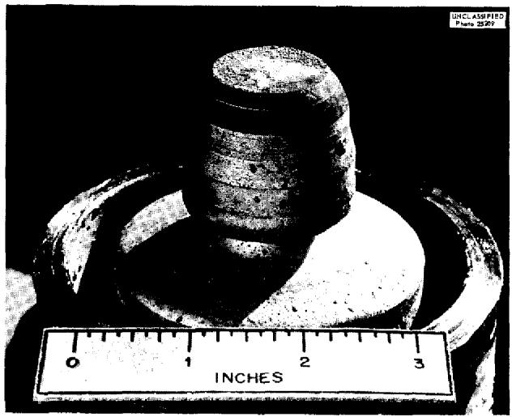  
Fig. 2.16. Dump-Valve Plug After Testing with NaF-ZrF4-UF4 (50-46-4 mole %) at $1200^{\circ}\mathrm{F}$ . (see with caption)

has been changed, new liquid-level indicators have been provided for the surge tanks, and a new helium system and a gas-control panel have been installed. To further the development, a second stand has been designed and is now being built that will be free of almost all the troubles discovered with the first stand and will provide much greater flexibility in operation and test methods.

# Zirconium Fluoride Vapor Trap

J. J. Milich

Pratt & Whitney Aircraft

The $\mathsf{ZrF}_4$ -vapor-trap test system, which was described previously, $^{14}$ was operated for 795 hr at an average sump temperature of $1300^{\circ}\mathsf{F}$ and an average exit-line temperature of $1397^{\circ}\mathsf{F}$ , with an average helium flow of 3.75 liters/min and a minimum trap temperature of $115^{\circ}\mathsf{F}$ . Analyses of the exhaust gas showed a carry-over of $0.04\mu \mathrm{g}$ of zirconium per liter and $10\mu \mathrm{g}$ of HF per liter. This shows that the trap removed $\mathsf{ZrF}_4$ vapor under these test conditions, but further tests are needed to validate the results for application to ETU and ART design. These test results are

clouded somewhat by the uncontrolled conditions that resulted when failure occurred. The failure was caused by corrosion of a tube in the trap. An examination of the dismantled system revealed fuel constituents in the entrance to the trap. The fuel was probably entrained because of the high gas flow and the agitation of the fuel sump at the time of failure. Some of the tubes at the beginning of the cooling section were plugged with $\mathsf{ZrF}_4$ .

Two tests are now in progress to gather fundamental data concerning $\mathsf{ZrF}_4$ vapor traps. In the first test, helium saturated with $\mathsf{ZrF}_4$ from NaF-ZrF $_4$ -UF $_4$ (50-46-4 mole %) is passed through a 4-in. pipe, 4 ft long, which is filled with York Demister packing. The exhaust gas is metered and is analyzed for $\mathsf{ZrF}_4$ and HF. The efficiency of the trap at various trap temperatures with constant gas flow will be determined.

The second test unit consists of a 2-ft length of 1-in. pipe filled with an adsorbent (NaF pellets) through which the $\mathsf{ZrF}_4$ -saturated helium is forced. The $\mathsf{ZrF}_4$ is adsorbed on the NaF pellets. Operating temperatures are limited by the melting point of the adsorbent. The efficiency of the trap at constant temperature and various flow rates will be determined by metering and analyzing the exhaust gas.

# 3. CRITICAL EXPERIMENTS

A. D. Callihan

J. J. Lynn

Applied Nuclear Physics Division

D. Scott, Aircraft Reactor Engineering Division

E. Demski

W.J.Fader

E.V.Sandin

S. Snyder

Pratt & Whitney Aircraft

# COMPACT-CORE REFLECTOR-MODERATED-REACTOR CRITICAL EXPERIMENTS

The study of the sodium-cooled reflector-modulated reactor with solid fuel proposed by the Nuclear Development Corporation of America (NDA) has been continued. The room-temperature mockup of the reactor was described previously as having a critical mass of $31\mathrm{kg}$ of $\mathsf{U}^{235}$ . The loading in the experiment has been increased to $33\mathrm{kg}$ by the addition of $2\%$ -in.-dia by 0.01-in.-thick disks in one section of the fuel region. Although the overall uranium density is uniform, the local distribution in this one section differs from that in the other sections, which are loaded with 0.004-in.-thick sheets. This addition to the loading gives some excess reactivity for use in measurements of the assembly. Measurements of the neutron-flux distribution and the mass-reactivity coefficients of various reactor component materials are summarized below. The measurements have been reported in detail and correlated with the predicted reactor parameters by NDA.

1CCR-2: A Compact Core Reactor for Aircraft Propulsion, NYO-3080 (July 30, 1954).   
2A. D. Callihan et al., ANP Quar. Prog. Rep. Dec. 10, 1955, ORNL-2012, p 73.   
Quarterly Progress Report, ANP Reactor Development, October 1, 1955 through December 31, 1955, NDA-20, p 35 (Jan. 23, 1956).

# Neutron-Flux Distribution

The neutron-flux distribution in the assembly was measured with both bare and cadmium-covered indium foils along one diametric and two longitudinal traverses. The diametric traverse, made at the mid-plane, was extended $20\frac{3}{4}$ in. above and below the axis so that any asymmetry resulting from variations in the uranium loading could be observed. The data, shown in Fig. 3.1, indicate that no significant differences exist in the flux patterns adjacent to the two fuel sections. One longitudinal traverse was made over one half of the reactor axis; the other was made adjacent to the core shell in the fuel-region mockup. The results are plotted in Figs. 3.2 and 3.3.

# Mass-Reactivity Coefficients of Reactor Component Materials

Samples of various materials of interest in the reactor structure were placed at a number of locations in the assembly, and their effects on the reactivity were noted from the critical positions of calibrated control rods. The samples included type 316 stainless steel, sodium, boral, uranium, beryllium, Inconel, iron, molybdenum, niobium, Hastelloy B, and nickel. The sizes of the samples, their locations within the assembly, and their effects on the reactivity of the critical assembly are shown in Figs. 3.4, 3.5, and 3.6.

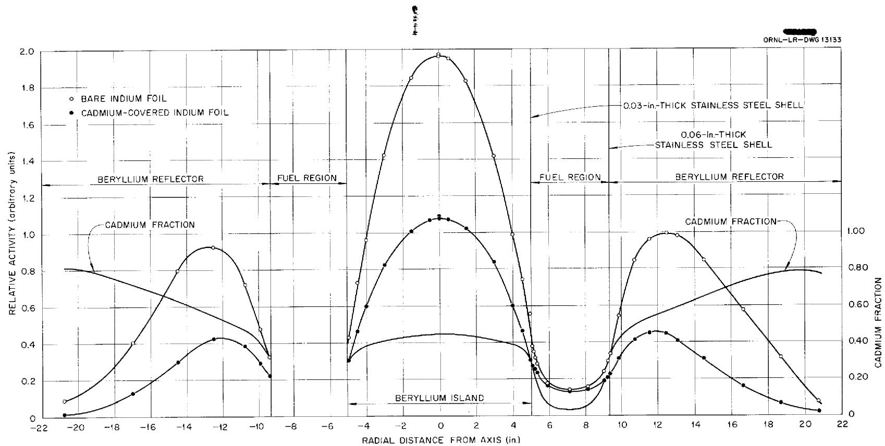  
Fig. 3.1. Neutron-Flux Distribution Along the Mid-Plane of the Compact-Core Reflector-Moderated-Reactor Critical Assembly.

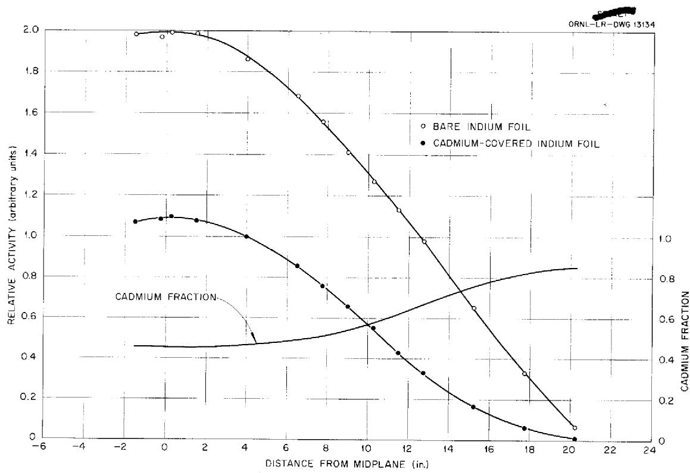

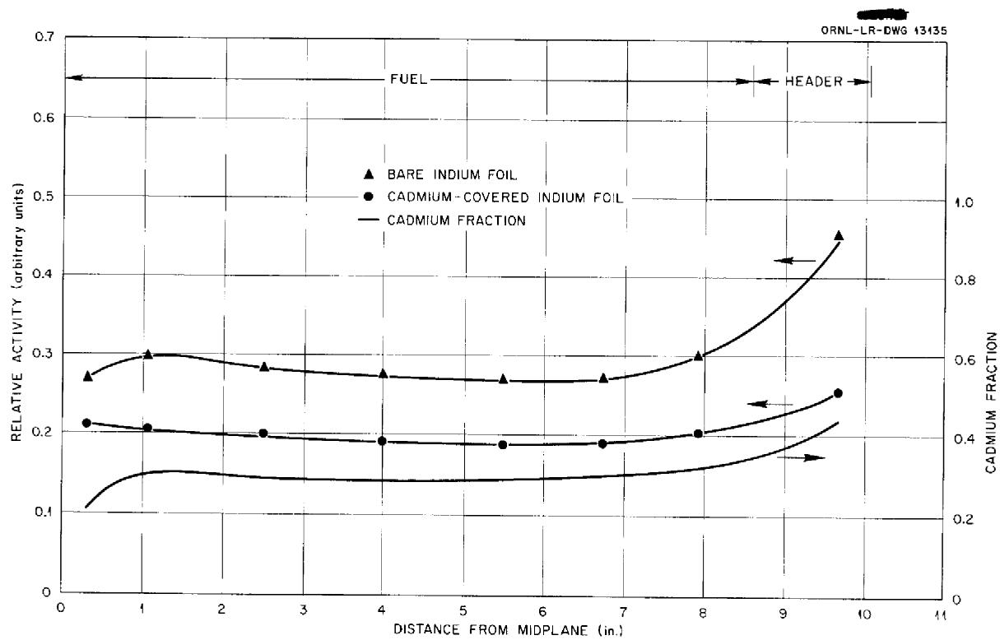  
Fig. 3.2. Neutron-Flux Distribution Along the Axis of the Compact-Core Reflector-Moderated-Reactor Critical Assembly.   
Fig. 3.3. Neutron-Flux Distribution Along the Fuel-Reflector Interface of the Compact-Core Reflector-Moderated-Reactor Critical Assembly.

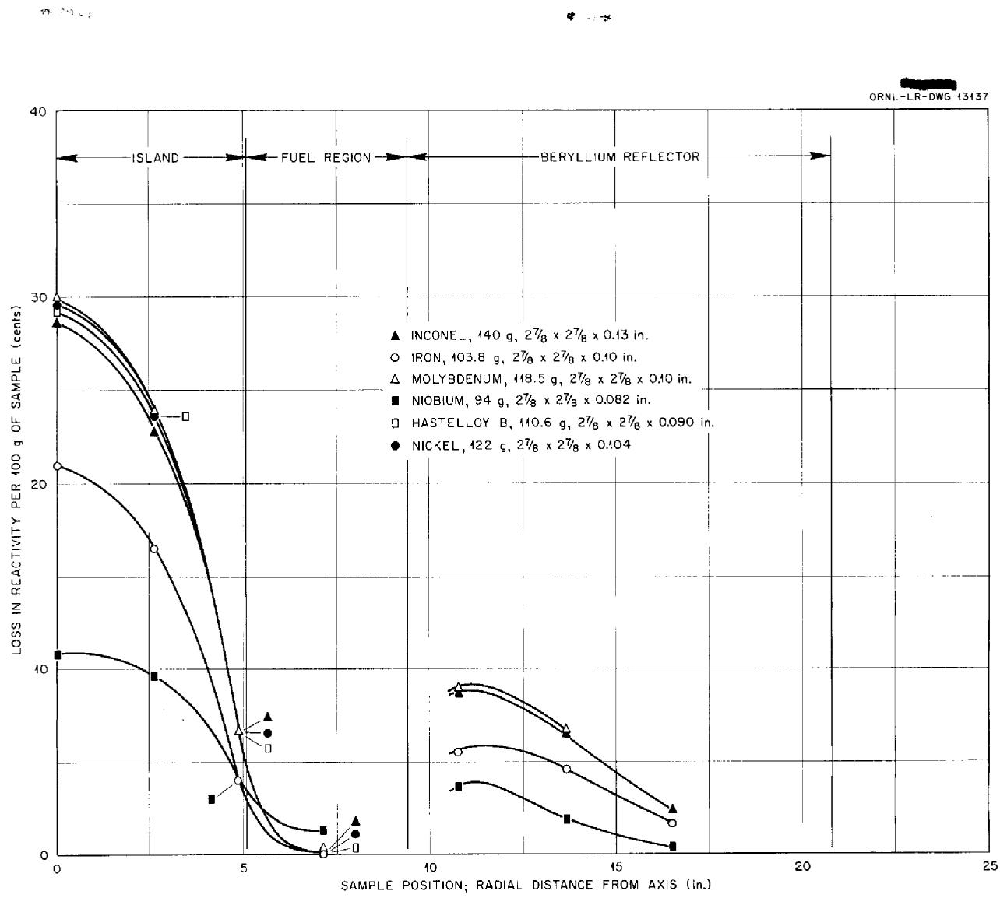  
Fig. 3.4. Reactivity Change Effected by the Addition of Various Materials in the Compact-Core Reflector-Moderated-Reactor Critical Assembly.

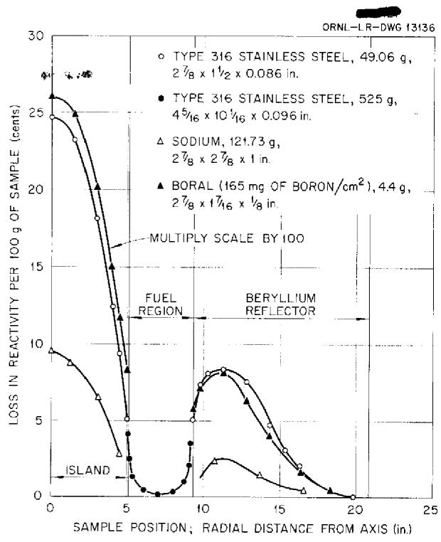  
Fig. 3.5. Reactivity Change Effected by the Addition of Various Materials in the Compact-Core Reflector-Moderated-Reactor Critical Assembly.

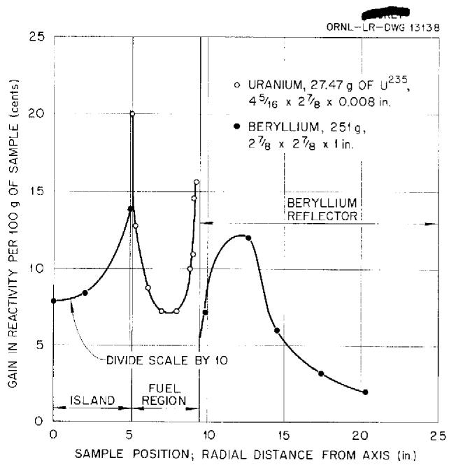  
Fig. 3.6. Reactivity Change Effected by the Addition of Various Materials in the Compact-Core Reflector-Moderated-Reactor Critical Assembly.

Part II

MATERIALS RESEARCH

# 4. CHEMISTRY OF REACTOR MATERIALS

W.R.Grimes

Materials Chemistry Division

# PHASE EQUILIBRIUM STUDIES

C. J. Barton

R.E.Moore

R.E.Thoma

Materials Chemistry Division

H. Insley, Consultant

Phase equilibrium studies of fluoride fuel mixtures were continued. A material containing 63.5 mole % NaF, 18.0 mole % ZrF₄, and 18.5 mole % UF₄ is being investigated that shows some promise as a substitute for the high-melting-point compound Na₂UF₆ as the fuel concentrate for “enrichment” of reactor systems.

Examinations of the binary systems $\mathsf{KF - ZrF}_4$ and $\mathsf{RbF - ZrF}_4$ are virtually complete, and examinations of ternary solvents that involve these and other binary systems are well under way. Extensive low-melting-point areas in the NaF-RbF-ZrF_4 triangle are apparent, and it appears likely that useful fuel systems may be developed by the addition of $\mathsf{UF}_4$ .

Examinations of relatively simple systems of alkali-metal and alkaline-earth fluorides are proceeding rapidly. While it is apparent that mixtures with genuinely low melting points will not be achieved with these materials, their possible application at any high temperature seems to warrant some additional study. Preliminary investigation of the alkali-metal-fluoride- $\mathrm{CeF}_3$ binary systems has disclosed no melting points below about $650^{\circ}\mathrm{C}$ .

# The System UF $4^{\prime} - \mathrm{UO}_{2}$

R.J.Sheil

Materials Chemistry Division

Uranium dioxide has frequently been observed as an impurity in fuel mixtures containing $\mathsf{UF}_4$ and, since there is very little published information on the $\mathsf{UF}_4\text{-}\mathsf{UO}_2$ system, it appeared to be desirable to conduct a limited investigation of the $\mathsf{UF}_4$ -rich part of the system. As the starting point in this study, an attempt was made to determine the

freezing point of pure $\mathsf{UF}_4$ . The presently accepted freezing point of $1036^{\circ}\mathsf{C}$ was determined by Ryon and Twichell. They corrected for the effect of $\mathsf{UO}_2$ in the $\mathsf{UF}_4$ used for their freezing-point determination by measuring the freezing point of several $\mathsf{UF}_4$ - $\mathsf{UO}_2$ mixtures and extrapolating a plot of log mole fraction of $\mathsf{UF}_4$ vs the reciprocal of absolute temperature. The measured freezing points of two recent $\mathsf{UF}_4$ preparations averaged $1026^{\circ}\mathsf{C}$ . One sample was purified by treatment with $\mathsf{NH}_4\mathsf{F}$ -HF and the other by bubbling HF through liquid $\mathsf{UF}_4$ at $1100^{\circ}\mathsf{C}$ . A correction of $+2^{\circ}\mathsf{C}$ should be applied to correct for the $\mathsf{UO}_2$ content of the samples (0.18 wt % average, by chemical analysis) according to the above-mentioned plot of Ryon and Twichell. The corrected value of $1034^{\circ}\mathsf{C}$ agrees quite well with the published figure.

Cooling curves obtained with $\mathsf{UF}_4\text{-}\mathsf{UO}_2$ mixtures containing approximately 2 and 4 wt $\%$ $\mathsf{UO}_2$ gave inconsistent results. In contrast to the nearly pure $\mathsf{UF}_4$ preparations, which showed little tendency to undercool, it was difficult to avoid undercooling these mixtures. A mixture containing 2.2 wt $\%$ $\mathsf{UO}_2$ showed a liquidus temperature of $1019^{\circ}C,$ with the slowest cooling rate, while other cooling curves obtained with the same mixture indicated liquidus temperatures of 1006 to $1009^{\circ}C.$ Ryon and Twichell reported a freezing point of $1017^{\circ}C$ for a mixture containing 2.06 wt $\%$ $\mathsf{UO}_2$ One cooling curve obtained with a mixture containing 4.1 wt $\%$ $\mathsf{UO}_2$ showed no thermal effect between 1135 and $985^{\circ}C,$ while a second cooling curve (starting at $1095^{\circ}C)$ obtained with the same mixture showed thermal effects at 1038, 990, and $974^{\circ}C.$ Petrographic and x-ray diffraction examination of the slowly cooled melts showed no evidence of solid solution or compound formation between $\mathsf{UF}_4$ and $\mathsf{UO}_2,$ but the possibility of solid-solution formation at elevated temperatures followed by "exsolution" at lower temperatures cannot be ruled out by the available data.

# The System NaF-UF

R.E.Moore

Materials Chemistry Division

A compound observed in slowly cooled melts in the system NaF-LiF-UF4 has been found to be the subsolidus binary compound NaF-2UF4. It was identified (x-ray and optical examination) by obtaining a single phase with 66.7 mole % UF4-33.3 mole % NaF in quenched samples held for 64 hr at well below the solidus temperature $(680^{\circ}\mathrm{C})$ . On heating to $660^{\circ}\mathrm{C}$ , the compound NaF-2UF4 decomposes into 7NaF-6UF4 and UF4. The appearance of NaF-2UF4 in the slowly cooled melts of several ternary systems indicates that the compound has a primary phase field in these ternary systems.

# The System KF-ZrF 4

R.P.Metcalf

Materials Chemistry Division

Quenches in the system $\mathsf{KF - ZrF}_4$ show that the compound $3\mathsf{KF - 2ZrF}_4$ melts incongruently at $417^{\circ}\mathsf{C}$ to liquid and $2\mathsf{KF - ZrF}_4$ . The liquidus is at $438^{\circ}\mathsf{C}$ .

Two forms of $\mathsf{KF}\cdot \mathsf{ZrF}_4$ have been observed, one of which is optically similar to "R-3" metastable NaF-ZrF. The marked undercooling of slowly cooled melts has suggested the likelihood of one of these forms being unstable. Seeding experiments, in which a crystal of R-3 type $\mathsf{KF}\cdot \mathsf{ZrF}_4$ is dropped into a molten undercooled melt, produced only R-3 type $\mathsf{KF}\cdot \mathsf{ZrF}_4$ on cooling. Quenches below $461^{\circ}C$ show only R-3 type $\mathsf{KF}\cdot \mathsf{ZrF}_4$ . The normal $\mathsf{KF}\cdot \mathsf{ZrF}_4$ is probably metastable and has no region of stability in the phase diagram.

# The System RbF-ZrF4

H.A.Friedman R.J.Sheil

Materials Chemistry Division

A detailed study of the system $\mathsf{RbF - ZrF}_4$ by thermal analysis and petrographic and x-ray diffraction examinations of quenched and slowly cooled samples was initiated. The system diagram presented in Fig. 4.1 must be considered to be tentative, since more information is needed to clear up questionable areas. A previously published diagram of this system3 was based solely on thermal analysis.

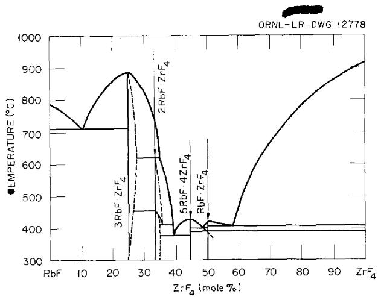  
Fig. 4.1. Tentative Phase Diagram of the System RbF-ZrF4.

The melting point of $3\mathrm{RbF}\cdot \mathrm{ZrF}_4$ was determined by thermal analysis. No inversions are evident from either thermal analysis or gradient quenching. Thermal analysis and visual observation show clearly that $2\mathrm{RbF}\cdot \mathrm{ZrF}_4$ melts incongruity at about $620^{\circ}\mathrm{C}$ and that the liquidus is near $750^{\circ}\mathrm{C}$ . A very sharp and energetic thermal-analysis halt occurs at 440 to $450^{\circ}\mathrm{C}$ . Small samples which were annealed at temperatures above $460^{\circ}\mathrm{C}$ before being quenched contained poorly formed crystals of $2\mathrm{RbF}\cdot \mathrm{ZrF}_4$ , while those annealed at temperatures below $460^{\circ}\mathrm{C}$ contained well-formed crystals. The evidence is clear that a very rapid inversion occurs at $460^{\circ}\mathrm{C}$ . This conclusion has been confirmed by visual observation. The compound $3\mathrm{RbF}\cdot \mathrm{ZrF}_4$ could not be found in samples of $2\mathrm{RbF}\cdot \mathrm{ZrF}_4$ which were annealed and quenched from above the incongruent melting point. Furthermore, a series of quenches of a composition containing 28 mole $\%$ $\mathrm{ZrF}_4$ over the temperature range 545 to $679^{\circ}\mathrm{C}$ contained nothing but extremely fine-grained material, which was not identifiable by petrographic examination but which was shown by x-ray diffraction to be a mixture of $3\mathrm{RbF}\cdot \mathrm{ZrF}_4$ and $2\mathrm{RbF}\cdot \mathrm{ZrF}_4$ . In order to explain these results, it is necessary to assume a limited solid-solution region (dotted line) for $3\mathrm{RbF}\cdot \mathrm{ZrF}_4$ and to assume further that this solid solution, which would be the primary phase at 28 and 33.3 mole $\%$ $\mathrm{ZrF}_4$ , undergoes very rapid "exsolution" on cooling.

According to thermal-analysis results and the examination of quenched samples at 36 mole %

$\mathsf{ZrF}_{4}$ , the 2RbF. $\mathsf{ZrF}_{4}$ inversion appears to take place at a lower temperature $(410^{\circ}\mathrm{C})$ in compositions containing more than 33.3 mole $\%$ $\mathsf{ZrF}_{4}$ . Limited solid solutions of $\alpha 2\mathsf{RbF}.\mathsf{ZrF}_{4}$ and $\beta 2\mathsf{RbF}.\mathsf{ZrF}_{4}$ must be postulated to explain this lowering of the inversion temperature. A shift in the x-ray pattern for an annealed and quenched sample of a 36 mole $\%$ $\mathsf{ZrF}_{4}$ composition at $393^{\circ}\mathrm{C}$ has confirmed the $\beta 2\mathsf{RbF}.\mathsf{ZrF}_{4}$ solid solution.

The compound $5\mathrm{RbF}\cdot 4\mathrm{ZrF}_4$ was found by petrographic recognition of almost single-phase material in slowly cooled preparations containing 44.5 mole $\%$ $\mathsf{ZrF_4}$ . Petrographic examinations of quenched samples containing 36 and 40 mole $\%$ $\mathsf{ZrF_4}$ show that $2\mathrm{RbF}\cdot 4\mathrm{ZrF}_4$ and $5\mathrm{RbF}\cdot 4\mathrm{ZrF}_4$ are the primary phases, respectively, and that the eutectic between the compositions occurs at a temperature near $375^{\circ}C$ . Cooling curves obtained in this region show, in general, a halt at about $340^{\circ}C$ , which is possibly the undercooled eutectic halt, but this point is still in question.

The liquidus temperature and the inversion of $\mathsf{RbF\cdot ZrF_4}$ were established by petrographic examination of quenched samples. Slowly cooled mixtures containing 50 mole $\%$ $\mathsf{ZrF_4}$ often contain some $5\mathsf{RbF\cdot 4ZrF_4}$ , but annealed and quenched samples contain only single-phase material. The dotted line at 50 mole $\%$ $\mathsf{ZrF_4}$ indicates a metastable extension of the liquidus curve of $5\mathsf{RbF\cdot 4ZrF_4}$ . The eutectic between $5\mathsf{RbF\cdot 4ZrF_4}$ and $\mathsf{RbF\cdot ZrF_4}$ has not yet been located exactly.

Samples of a composition containing 57 mole $\%$ $\mathsf{ZrF}_4$ which were annealed and quenched from below the solidus contained only RbF. $\mathsf{ZrF}_4$ and $\mathsf{ZrF}_4$ , and thus the absence of compounds with more than 50 mole $\%$ $\mathsf{ZrF}_4$ is indicated.

# The System NaF-ZrF $_4$ -UF $_4$

L. M. Bratcher

Materials Chemistry Division

Thermal-analysis data obtained previously were checked for a few compositions in the system $\mathsf{NaF - ZrF_4 - UF_4}$ and the solid phases were examined in an effort to find a low-melting, nonsegregating composition with a high concentration of UF that might make a suitable substitute for $\mathsf{Na}_2\mathsf{UF}_6$ as the enriched-uranium carrier for reactor startup

operations. The most promising mixture, NaF $\mathsf{ZrF}_4\mathsf{-UF}_4$ (63.5-18-18.5 mole \%), showed only a single break on the cooling curves. The break was $607^{\circ}\mathsf{C}$ , which is about $50^{\circ}\mathsf{C}$ lower than the melting point of $\mathsf{Na}_2\mathsf{UF}_6$ . The crystalline phases indicated, by petrographic and x-ray diffraction studies, to be present in the slowly cooled melt were $\mathsf{Na}_2\mathsf{ZrF}_6$ , $\mathsf{Na}_7\mathsf{U}_6\mathsf{F}_{31}$ , and $\mathsf{Na}_3\mathsf{ZrF}_7$ . The last two phases showed evidence of a slight amount of solid solution. It appears from the available data that this mixture is an invariant point in the system, and therefore it should be nonsegregating. It has a calculated uranium content of $1.44~\mathrm{g/cm}^3$ at $700^{\circ}\mathsf{C}$ , as compared with $2.75~\mathrm{g/cm}^3$ for $\mathsf{Na}_2\mathsf{UF}_6$ at the same temperature.

# The System NaF-KF-ZrF 4

H. A. Friedman

Materials Chemistry Division

H. Davis

Pratt & Whitney Aircraft

Phase relationships are now being studied in the system NaF-KF-ZrF4 by using small quenched samples. Data obtained with slowly cooled melts indicate that there is a congruently melting compound 3NaF-KF-2ZrF4, which has a melting point of $530^{\circ}\mathrm{C}$ and a lower inversion temperature. The data for quenched samples show that, at the $590^{\circ}\mathrm{C}$ liquidus, $\beta$ -1 2NaF-ZrF4 is the primary phase. Two phases, formerly believed to be enantiomorphs of 3NaF-KF-2ZrF4, coexist below $500^{\circ}\mathrm{C}$ and are, therefore, two distinct incongruity melting compounds of undetermined composition.

The compound near the composition NaF-KF-ZrF $_4$ (24-33-43 mole %) has not yet been identified in quenched samples, but it has been observed below $400^{\circ}\mathrm{C}$ , which is its incongruent melting point. The primary phase at the $425^{\circ}\mathrm{C}$ liquidus is 3KF-2ZrF $_4$ .

Quenches have shown that the primary phase field of $3\mathsf{KF}\cdot \mathsf{ZrF}_4$ extends over both 3NaF-3KF. $2\mathsf{ZrF}_4$ and NaF-KF-ZrF. The liquidus at NaF- KF-ZrF is $557^{\circ}C,$ and the incongruent melting point is $550^{\circ}C.$

# The System NaF-RbF-ZrF 4

H. A. Friedman

Materials Chemistry Division

Large mélts of approximately 500 to 700 g are used, in general, when thermal data are to be taken

from stirred, slowly cooled melts in order to achieve sensitive detection of small thermal effects. Large samples are not economically feasible, however, when RbF is one of the constituents, and a new apparatus arrangement was devised for use with samples of about 50 g. Four samples can be melted simultaneously in the heating chamber of the new apparatus. The thermocouples, rather than being contained in the conventional $\frac{3}{8}$ -in.-dia nickel-tubing stirrer (0.065-in. wall thickness), are contained in $\frac{1}{4}$ -in.-dia nickel or Inconel thermocouple wells with wall thicknesses of 0.006 to 0.012 in. The thin walls of the thermocouple wells permit the detection of small thermal effects with a sensitivity comparable to that obtained by using large samples.

The system NaF-RbF-ZrF₄ has several characteristics in common with the system NaF-KF-ZrF₄; that is, the liquidus surfaces of both systems have similar profiles and temperatures; there is a 1:1 ternary compound in each system; and the lowest melting region of each system contains approximately 40 mole % ZrF₄ at high RbF or KF concentrations. The NaF-RbF-ZrF₄ system is distinguished from the NaF-KF-ZrF₄ system in that few ternary compounds in the NaF-RbF-ZrF₄ system have analogs in the NaF-KF-ZrF₄ system, and the eutectics in the NaF-RbF-ZrF₄ system are located, in general, closer to the RbF-ZrF₄ binary than the corresponding eutectics in the NaF-KF-ZrF₄ system are to the KF-ZrF₄ binary.

The existence of two ternary compounds in the system NaF-RbF-ZrF4 has been established; their formulas are NaF-RbF-ZrF4 and NaF-RbF-2ZrF4. The former has an analog in the system NaF-KF-ZrF4; the latter does not. Both are congruently melting compounds. A third ternary compound exists at or near the composition 3RbF-3NaF-4ZrF4. It has a melting point of approximately $450^{\circ}\mathrm{C}$ . The melting relationships of the compounds have not yet been established.

The following joins on the phase diagram of the system are sides of compatibility triangles:

$$
\begin{array}{l} N a F - 3 R b F \cdot Z r F _ {4} \\ 3 N a F \cdot Z r F _ {4} \cdot 3 R b F \cdot Z r F _ {4} \\ 3 N a F \cdot Z r F _ {4} \cdot R b F \cdot N a F \cdot Z r F _ {4} \\ 3 R b F \cdot Z r F _ {4} - R b F \cdot N a F \cdot Z r F _ {4} \\ 2 N a F \cdot Z r F _ {4} - R b F \cdot N a F \cdot Z r F _ {4} \\ 2 R b F \cdot Z r F _ {4} - R b F \cdot N a F \cdot Z r F _ {4} \\ \end{array}
$$

$$
7 N a F \cdot 6 Z r F _ {4} - R b F \cdot N a F \cdot 2 Z r F _ {4}
$$

$$
R b F \cdot Z r F _ {4} - R b F \cdot N a F \cdot 2 Z r F _ {4}
$$

Of these joins, the quasi binaries are:

$$
\begin{array}{l}\text{NaF - 3RbF - ZrF}_{4}[\text{eutectic, NaF - RbF - ZrF}_{4}\\ (33.5 - 50 - 16.5\text{mole}\%); \text{mp},777^{\circ}\text{C}] \end{array}
$$

$$
\begin{array}{l} 3 \mathrm {N a F} \cdot \mathrm {Z r F} _ {4} - 3 \mathrm {R b F} \cdot \mathrm {Z r F} _ {4} [ \text {e u t e c t i c}, \mathrm {N a F} \cdot \mathrm {R b F} \cdot \\ \mathrm {Z r F} _ {4} (5 0 - 2 5 - 2 5 \text {m o l e} \%) ; \mathrm {m p}, 7 3 8 ^ {\circ} \mathrm {C} ] \end{array}
$$

$$
7 N a F \cdot 6 Z r F _ {4} - R b F \cdot N a F \cdot 2 Z r F _ {4}
$$

$$
R b F \cdot N a F \cdot 2 Z r F _ {4} - R b F \cdot Z r F _ {4}
$$

The primary phase field of RbF.NaF-2ZrF4 appears to be quite small across the latter two quasi binaries.

# The System RbF-BeF

L.M.Bratcher R.E.Meadows

R. J. Sheil

Materials Chemistry Division

Previous thermal-analysis studies of the system $\mathsf{RbF - BeF}_2$ gave such scattered data, probably because of the presence of variable amounts of oxygen in the melts, that the results were not published. Data on three points in the $\mathsf{BeF}_2$ -rich part of the system were found in the literature, and thermal-analysis studies were resumed during the quarter with mixtures covering the range 5 to 67.5 mole % $\mathsf{BeF}_2$ . Most of the mixtures were prepared by adding RbF or $\mathsf{BeF}_2$ to portions of a purified 50-50 mole % mixture. This procedure appeared to give reproducible mixtures.

The phase relationships in this system are quite similar to those in the $\mathsf{KF - BeF}_2$ system.6 Four compounds have been tentatively identified on the basis of thermal-analysis and solid-phase studies. The compound $\mathsf{Rb}_2\mathsf{BeF}_4$ melts congruently at approximately $800^{\circ}\mathsf{C}$ , and $\mathsf{Rb}_3\mathsf{BeF}_5$ melts at about $725^{\circ}\mathsf{C}$ . The compound $\mathsf{RbBeF}_3$ melts incongruity at $455^{\circ}\mathsf{C}$ to give $\mathsf{RbBeF}_4$ and liquid. Quenching data will be required to determine the melting behavior of the compound $\mathsf{RbBe}_2\mathsf{F}_5$ . The lowest melting composition in the system is the $\mathsf{RbBeF}_3$ . $\mathsf{RbBe}_2\mathsf{F}_5$ eutectic, which contains approximately 60 mole $\%$ $\mathsf{BeF}_2$ and has a melting point of $375 \pm 10^{\circ}\mathsf{C}$ . This mixture is, however, too viscous to be

of practical interest, even though the viscosity of liquid $RbBeF_{3}$ is less than that of $KBeF_{3}$ .

# The System NaF-BeF2-UF4

C.J.Barton

Materials Chemistry Division

Viscosity data obtained previously for the composition NaF-BeF $_2$ -UF $_4$ (70-26-4 mole%) showed rather high values (10 centipoises at $600^{\circ}\mathrm{C}$ and 4.1 centipoises at $800^{\circ}\mathrm{C}$ ), but data obtained more recently from the same source gave lower values of 6.3 and 2.6 centipoises at 600 and $800^{\circ}\mathrm{C}$ , respectively. If the lower values are confirmed, the kinematic viscosity of this mixture is competitive with that of an alkali-metal fluoride mixture with a comparable uranium concentration. The calculated uranium content of this mixture is $0.42\mathrm{g/cm}^3$ at $700^{\circ}\mathrm{C}$ , which is about the same as that of an NaF-ZrF $_4$ -UF $_4$ mixture containing 5.5 mole $\%$ UF $_4$ . The liquidus temperature was not reported for this exact composition, but filtration data indicate that the liquidus temperature is probably between 545 and $550^{\circ}\mathrm{C}$ . It is possible that further exploration of the ternary system in this region may demonstrate the existence of suitable fuel compositions with slightly lower liquidus temperatures.

# The System NaF-LiF-BeF

L.M.Bratcher R.E.Meadows

R. J. Sheil

Materials Chemistry Division

Viscosity data reported in Sec. 7, "Heat Transfer and Physical Properties," for the composition NaF-LiF-BeF $_2$ (49-36-15 mole %) confirm the conclusion expressed previously[10] that lowering the BeF $_2$ content of melts in this system to below 23 mole % would produce little improvement in viscosity. This finding is supported by viscosity

data reported by Mound Laboratory $^{8,9}$ for NaF-BeF $_2$ , LiF-BeF $_2$ , and NaF-BeF $_2$ -UF $_4$ mixtures, which show that little improvement in viscosity results from lowering the BeF $_2$ concentration in the melts to below approximately 30 mole $\%$ , where all the BeF $_2$ would be expected to be complexed as BeF $_4$ -ion. A study of viscosity-composition relationships in the ternary system was started during the quarter, but the available data do not appear to be encouraging with regard to finding a low-melting fuel carrier having a kinematic viscosity as low as that of alkali-metal fluoride mixtures.

The solid-phase studies have been confined, to date, to the section of the system having LiF, NaF, and $\mathrm{NaBeF}_3$ at the apexes of the triangle. Quenching studies and examinations of slowly cooled melts have shown that the join LiF-NaBeF $_3$ is a quasi binary which has a ternary compound $\mathrm{Na}_2\mathrm{LiBe}_2\mathrm{F}_7$ that melts congruently at $355^{\circ}\mathrm{C}$ . The $\mathrm{NaBeF}_3$ - $\mathrm{Na}_2\mathrm{LiBe}_2\mathrm{F}_7$ eutectic appears to be near the composition NaF-LiF-BeF $_2$ (44.5-11-44.5 mole %), with a melting point of $332^{\circ}\mathrm{C}$ . The LiF- $\mathrm{Na}_2\mathrm{LiBe}_2\mathrm{F}_7$ eutectic has not been located, but thermal-analysis data indicate that it must be close to the ternary compound.

As previously reported, it has not been possible to confirm the existence of the compound $\mathrm{Na}_3\mathrm{LiBe}_2\mathrm{F}_8$ reported by John, but considerable effort was exerted in an attempt to identify a ternary compound that has appeared in both quenched and slowly cooled melts in the NaF-rich part of the $\mathrm{Na}_2\mathrm{BeF}_4$ - $\mathrm{Li}_2\mathrm{BeF}_4$ join as an isotropic or very slightly birefringent crystalline phase. A slowly cooled mixture having the composition NaF-LiF-BeF $_2$ (57-9.7-33.3 mole %) contained the unknown compound, as the major phase, and a small amount of $\mathrm{Na}_2\mathrm{LiBe}_2\mathrm{F}_7$ . Although this isotropic phase has not been conclusively identified, its composition must be near that of the 57-9.7-33.3 mole % mixture, and the formula LiF-7NaF-4BeF $_2$ has been tentatively assigned.

Gradient quenches with the mixture NaF-LiF-BeF $_2$ (50-12.5-37.5 mole %) indicated a liquidus temperature of $418^{\circ}\mathrm{C}$ . The compound LiF-7NaF-4BeF $_2$ was found to be the primary phase at this composition, and $\mathsf{Na}_2\mathsf{LiBe}_2\mathsf{F}_7$ appeared as a

secondary phase at $340^{\circ}C$ . This indicates that these two ternary compounds form a quasi-binary system. One question concerning this part of the ternary system, which will require further research, is whether a cubic crystalline phase that has appeared in some melts is a modification of one of the known compounds in the system or a new compound.

# The System NaF-LiF-BeF ${}_{2}$ -UF ${}_{4}$

L.M.Bratcher R.E.Meadows

R.J.Sheil

Materials Chemistry Division

Investigation of the four-component system NaF-LiF-BeF $_2$ -UF $_4$ was previously limited to thermal-analysis and filtration studies of mixtures containing 2 to 3 mole % UF $_4$ , which is approximately the concentration range of interest for circulating-fuel reactors. There have been indications from filtration data that higher uranium concentrations might give lower liquidus temperatures for mixtures with low BeF $_2$ content. Consequently, thermal-analysis data were obtained with a number of mixtures formed by adding UF $_4$ to purified NaF-LiF-BeF $_2$ compositions in 2 mole % increments up to 10 mole %. The data obtained are summarized in Table 4.1.

Each of the liquidus temperatures shown in Table 4.1 represents the "best figure" obtained from two to five cooling curves for each composition. In general, the solvent mixtures with higher $\mathsf{BeF}_2$ content showed the poorest reproducibility of cooling curves. It seems likely that a part of the lack of reproducibility of thermal data is due to segregation of the high-density uranium phase,

although in these experiments the mixtures were stirred until they solidified. The data in Table 4.1 show that the effect of $\mathsf{UF}_4$ on the liquidus temperatures varies considerably with the composition of the solvent mixture, as might be expected, but it seems clear that moderately high $\mathsf{UF}_4$ concentrations can be obtained with low-BeF2-content mixtures in this system with acceptable liquidus temperatures. However, the viscosity data reported in Sec. 7 for the mixture, NaF-LiF-BeF2-UF4 (56-21-20-3 mole %) do not encourage the hope that in this system a suitable mixture will be found that has a kinematic viscosity competitive with that of the best ZrF4-base fuel compositions.

Filtration data were obtained with two mixtures in this system by using a new filtration technique which makes it possible to take a series of seven filtered samples from a mixture (usually about 250 g of material) without having to remove the filter sticks from the apparatus until the experiment is completed; the samples are cooled to room temperature in a helium atmosphere. Chemical analysis of the filtrates obtained from the mixture NaF-LiF-BeF $_2$ -UF $_4$ (51.4-23.3-22.3-3.0 mole %) did not give a clear-cut indication of the liquidus temperature for this mixture, which previously reported thermal analysis data $^{13}$ had indicated to be $530^{\circ}\mathrm{C}$ . Petrographic and x-ray diffraction studies of the filtered samples gave similarly inconclusive results. Uranium determinations on filtered samples of the mixture NaF-LiF-BeF $_2$ -UF $_4$ (62.6-20.6-11.8-5 mole %) indicated that the liquidus temperature for this composition probably lies between 500 and $480^{\circ}\mathrm{C}$ .

13L. M. Bratcher et al., ANP Quar. Prog. Rep. Dec. 10, 1955, ORNL-2012, p 83.

TABLE 4.1. LIQUIDUS TEMPERATURES OF NaF-LiF-BeF ${}_{2}$ -UF ${}_{4}$ MIXTURES  

<table><tr><td colspan="3">Composition of Solvent (mole %)</td><td colspan="6">Liquidus Temperature (°C)</td></tr><tr><td>NaF</td><td>LiF</td><td>BeF2</td><td>No UF4</td><td>2 mole % UF4</td><td>4 mole % UF4</td><td>6 mole % UF4</td><td>8 mole % UF4</td><td>10 mole % UF4</td></tr><tr><td>49</td><td>36</td><td>15</td><td>597</td><td>594</td><td>590</td><td>583</td><td>570</td><td>545</td></tr><tr><td>53</td><td>24</td><td>23</td><td>535</td><td>510</td><td>510</td><td>500</td><td>485</td><td>(425?)</td></tr><tr><td>56</td><td>16</td><td>28</td><td>478</td><td>475</td><td>455</td><td>443</td><td>465</td><td>475</td></tr><tr><td>63.5</td><td>7.5</td><td>31</td><td>535</td><td>532</td><td>510</td><td>483</td><td>505</td><td>493</td></tr></table>

Petrographic and x-ray diffraction examination of these samples, as well as of others containing 10 mole $\%$ UF $_4$ and about 20 to 30 mole $\%$ BeF $_2$ , showed that the uranium is present as Na $_2$ UF $_6$ and that the beryllium-bearing phase cannot be identified in such mixtures by the techniques presently available.

Recent experience with the filtration technique has shown that the filtered samples taken below liquidus temperatures are frequently small (less than 1 g). This indicates a need for chemical-analysis methods more sensitive and reliable than those presently available in order to follow changes in liquid composition in this system between liquidus and solidus temperatures.

# The System NaF-LiF-CaF

L. M. Bratcher

Materials Chemistry Division

Thermal-analysis data obtained with 29 compositions in the NaF-LiF-CaF $_2$ system are shown in Fig. 4.2, which also indicates approximate drainage paths and temperature contours derived from these data and published data on the three binary systems involved. The composition and melting point of the ternary eutectic in this system were reported previously. $^{14}$ Petrographic and x-ray diffraction

14L. M. Bratcher et al., ANP Quar. Prog. Rep. Dec. 10, 1955, ORNL-2012, p 84.

UNCLASSIFIED

ORNL-LR-DWG12779

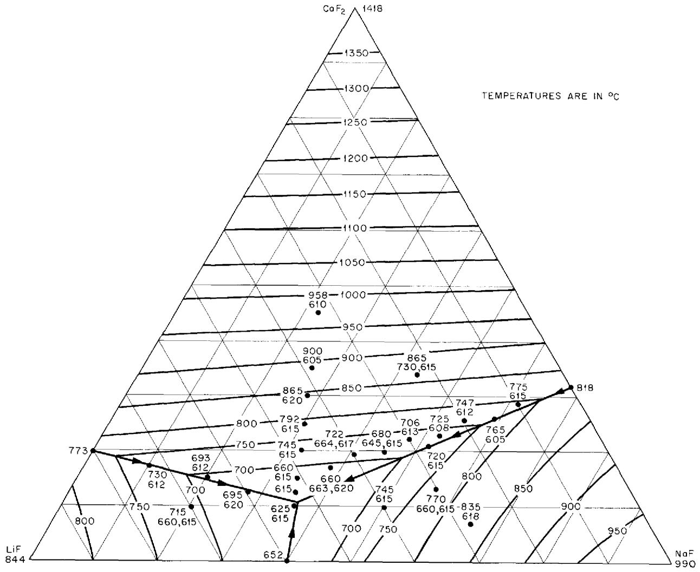  
Fig. 4.2. The System NaF-LiF-CaF $_2$ .

studies of the fused melts showed only the pure components, and thus the absence of compounds or solid solutions in the system is indicated. In the course of this investigation thermal-analysis data were also obtained with a few mixtures in the NaF-CaF $_2$ system. The results, which were essentially in agreement with the published diagram, $^{15}$ indicated a slightly convex liquidus curve in the NaF primary-phase field, in contrast to the straight-line liquidus shown in the published diagram.

# The System NaF-MgF $_2$ -CaF $_2$

L. M. Bratcher

Materials Chemistry Division

Phase relationships in the system NaF-MgF2-CaF2are more complex than those in the NaFLiF-CaF2system because of the existence of the stable compound16 NaMgF3. The study of this system is incomplete, but the data obtained thus far indicate that NaMgF3and CaF2form a quasibinary system, as shown in Fig. 4.3, with a eutectic at about 28 mole % CaF2, which melts at 900 ± 5°C. The significance of the thermal effect noted on the cooling curves at 730°C is not quite clear, but it probably is due to a small amount of the ternary eutectic between NaF, NaMgF3, and CaF2. This eutectic was located at the approximate

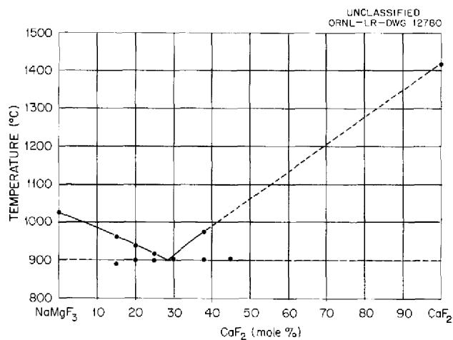  
Fig. 4.3. The System $\mathsf{NaMgF}_3\text{-CaF}_2$

composition NaF-MgF2-CaF2 (65-12-23 mole %), and it melts at 745 ± 5°C. Work on this system will be concluded in the near future.

# The Systems NaF- $\mathsf{CeF}_3$ and RbF- $\mathsf{CeF}_3$

L. M. Bratcher

Materials Chemistry Division

The Group III metal fluorides have received comparatively little consideration as possible components of fused-salt fuels. Published partial phase diagrams for alkali-metal-fluoride- $\mathsf{AlF}_3$ -YF, and -LaF systems make these systems appear to be unattractive as fuel materials. The only published data on an alkali-metal-fluorideCeF system appears to be that of Puschin and Baskow. Their data showed that there was a eutectic in the KF-CeF system which contained 25 mole $\%$ CeF and had a melting point of $650^{\circ}C.$ Since cerium has a cross section only slightly higher than that of sodium and since $\mathsf{CeF_3}$ has a very high free energy of formation, it seemed to be desirable to conduct exploratory phase studies of alkali-metal-fluoride- $\mathsf{CeF_3}$ systems. A study of the NaF- $\mathsf{CeF_3}$ and RbF- $\mathsf{CeF_3}$ systems was therefore initiated. Preliminary data indicate that compounds are formed in both systems. There appears to be a eutectic in the RbF- $\mathsf{CeF_3}$ system with 15 mole $\%$ CeF and a melting point of about $655^{\circ}C.$ In the NaF- $\mathsf{CeF_3}$ system the cooling curves indicate the existence of a eutectic that melts at approximately $720^{\circ}C.$ The composition of this eutectic has not yet been determined.

# The System LiF-NiF

L.M.Bratcher

Materials Chemistry Division

A study of the $\mathrm{LiF - NiF_2}$ system was started recently to obtain information of interest in connection with electrochemical studies involving structural-metal fluorides. Thermal-analysis data obtained with mixtures containing 10, 20, and 30 mole $\%$ $\mathrm{NiF}_2$ show only a gradual lowering of liquidus temperatures from $844^{\circ}C$ for pure LiF to $805^{\circ}C$ for the 30 mole $\%$ $\mathrm{NiF}_2$ mixture. Other small thermal effects were observed on the cooling curves, and these effects increased in temperature with increasing $\mathrm{NiF}_2$ content of the melts from

$545^{\circ}C$ at 10 mole $\%$ $\mathrm{NiF}_2$ to $705^{\circ}C$ at 30 mole%. Petrographic and x-ray diffraction studies of the slowly cooled melts indicated a slight amount of solid solution of $\mathrm{NiF}_2$ in LiF and, also, the formation of a compound of unknown composition.

# Optical Properties and X-Ray Patterns for Compounds in Fluoride Systems

R. E. Thoma  
Materials Chemistry Division

G. D. White Metallurgy Division

H. Insley T. N. McVay Consultants

The identifying characteristics of some new compounds encountered in phase studies are listed below. The symbol $d(\mathbf{A})$ denotes the distance between reflecting planes measured in angstroms. The term $l / I_{1}$ refers to the relative intensity as compared with an arbitrary value of 100 for the strongest line. Under optical properties, $N_{\alpha}$ and $N_{\gamma}$ refer to the lowest and highest indices of refraction, respectively, for biaxial crystals, and $2V$ refers to the acute angle between the optic axes and biaxial crystals; $O$ and $E$ refer to the ordinary and extraordinary indices of refraction of uniaxial crystals.

The optical data on the compounds $2\mathsf{RbF}\cdot \mathsf{ZrF}_4$ and $3\mathsf{RbF}\cdot \mathsf{ZrF}_4$ differ slightly from the original data reported previously. The samples of $2\mathsf{RbF}\cdot \mathsf{ZrF}_4$ and $3\mathsf{RbF}\cdot \mathsf{ZrF}_4$ available for the recent measurements are believed to be freer of impurities than were the samples used before. The optical data presented here therefore supercede the data reported previously.

# 3RbF·ZrF 4

Optical data:

Cubic, $N = 1,420$

X-ray data: Simple cubic, $\alpha_0\approx 3.288$ A

<table><tr><td>d(Å)</td><td>I/I1</td></tr><tr><td>3.290</td><td>100</td></tr><tr><td>2.326</td><td>60</td></tr><tr><td>1.900</td><td>100</td></tr><tr><td>1.646</td><td>20</td></tr></table>

# 5RbF·4ZrF 4

Optical data:

Biaxial negative; 2V very large

$$
N _ {\alpha} = 1. 4 4 2
$$

$$
N _ {\gamma} = 1. 4 5 2
$$

X-ray data:

<table><tr><td>d(A)</td><td>I/I1</td></tr><tr><td>5.87</td><td>10</td></tr><tr><td>5.61</td><td>10</td></tr><tr><td>5.04</td><td>9</td></tr><tr><td>4.77</td><td>16</td></tr><tr><td>4.50</td><td>12</td></tr><tr><td>4.29</td><td>65</td></tr><tr><td>3.98</td><td>25</td></tr><tr><td>3.82</td><td>30</td></tr><tr><td>3.78</td><td>16</td></tr><tr><td>3.72</td><td>16</td></tr><tr><td>3.63</td><td>32</td></tr><tr><td>3.59</td><td>95</td></tr><tr><td>3.52</td><td>8</td></tr><tr><td>3.44</td><td>100</td></tr><tr><td>3.42</td><td>100</td></tr><tr><td>3.36</td><td>100</td></tr><tr><td>3.29</td><td>100</td></tr><tr><td>3.05</td><td>12</td></tr><tr><td>2.60</td><td>25</td></tr><tr><td>2.508</td><td>30</td></tr><tr><td>2.386</td><td>12</td></tr><tr><td>2.350</td><td>75</td></tr><tr><td>2.281</td><td>11</td></tr><tr><td>2.275</td><td>12</td></tr><tr><td>2.260</td><td>12</td></tr><tr><td>2.53</td><td>12</td></tr><tr><td>2.245</td><td>8</td></tr></table>

18T. N. McVay and G. D. White, The Optical Properties of Some Inorganic Fluoride and Chloride Compounds, ORNL-1712 (May 5, 1954).

$$
d (\stackrel {\circ} {A}) \quad I / I _ {1}
$$

$$
2. 2 2 6 \tag {12}
$$

$$
2. 1 5 2 \quad 4 5
$$

$$
2. 0 6 7 \quad 1 2
$$

$$
2. 0 2 7 \quad 1 2
$$

$$
1. 9 5 9 \quad 3 0
$$

$$
1. 9 3 2 \quad 3 0
$$

$$
1. 8 9 7 \quad 1 5
$$

$$
1. 8 6 8 \quad 2 0
$$

$$
1. 8 3 3 \quad 2 0
$$

$$
1. 7 7 0 \quad 3 0
$$

$$
1. 7 6 3 \quad 3 0
$$

$$
1. 6 7 9 \quad 1 2
$$

$$
2 R b F \cdot Z r F _ {4}
$$

Optical data:

Uniaxial negative

$$
O = 1. 4 4 0
$$

$$
E = 1. 4 2 6
$$

X-ray data:

$$
d (\stackrel {\circ} {A}) \quad l / l _ {1}
$$

$$
5. 3 5 0 \quad 1 0
$$

$$
4. 8 3 5 \quad 8
$$

$$
3. 5 9 0 \quad 1 0 0
$$

$$
3. 0 8 0 \quad 3 4
$$

$$
2. 4 1 4 \quad 6
$$

$$
2. 3 3 8 \quad 4 0
$$

$$
2. 1 9 9 \quad 2 1
$$

$$
1. 8 6 1 \quad 1 7
$$

$$
1. 7 8 9 \tag {17}
$$

$$
1. 5 6 9 \quad 1 2
$$

$$
1. 4 2 2 \quad 8
$$

$$
\beta \text {R b F} \cdot \text {Z r F} _ {4}
$$

Optical data:

Biaxial negative;

$$
2 V = \sim 7 5 \mathrm {d e g}
$$

$$
N _ {\alpha} = 1. 4 9 0 \text {t o} 1. 5 0 2
$$

$$
N _ {\gamma} = 1. 5 0 2 \text {t o} 1. 5 1 6
$$

X-ray data:

$$
d (\stackrel {\circ} {A}) \quad I / I _ {1}
$$

$$
7. 3 7 \quad 1 2
$$

$$
6. 6 6 \tag {42}
$$

$$
6. 3 2 \quad 6
$$

$$
5. 5 3 \quad 6
$$

$$
5. 1 7 \quad 6
$$

$$
5. 0 1 \quad 1 8
$$

$$
4. 6 7 \quad 6
$$

$$
4. 5 4 \quad 6
$$

$$
4. 4 6 \quad 6
$$

$$
4. 3 5 \quad 1 2
$$

$$
3. 9 9 \quad 1 2
$$

$$
3. 8 8 \quad 6
$$

$$
3. 7 7 \quad 3 0
$$

$$
3. 7 2 \quad 3 6
$$

$$
3. 6 9 \quad 4 2
$$

$$
3. 6 1 \quad 4 2
$$

$$
3. 4 2 \quad 1 0 0
$$

$$
3. 3 6 \quad 1 0 0
$$

$$
3. 3 2 5 \quad 1 0 0
$$

$$
3. 0 9 0 \quad 1 1
$$

$$
3. 0 6 0 \quad 1 4
$$

$$
2. 9 6 0 \quad 6
$$

$$
2. 9 0 0 \quad 6
$$

$$
2. 8 2 2 \quad 6
$$

$$
2. 7 8 8 \quad 3 8
$$

$$
2. 7 6 7 \quad 4 5
$$

$$
2. 6 7 8 \quad 6
$$

<table><tr><td>2.614</td><td>6</td></tr><tr><td>2.564</td><td>6</td></tr><tr><td>2.514</td><td>8</td></tr><tr><td>2.501</td><td>8</td></tr><tr><td>2.482</td><td>6</td></tr><tr><td>2.455</td><td>6</td></tr><tr><td>2.433</td><td>6</td></tr><tr><td>2.423</td><td>6</td></tr><tr><td>2.398</td><td>6</td></tr><tr><td>2.380</td><td>12</td></tr><tr><td>2.355</td><td>12</td></tr><tr><td>2.344</td><td>12</td></tr><tr><td>2.309</td><td>6</td></tr><tr><td>2.292</td><td>8</td></tr><tr><td>2.253</td><td>6</td></tr><tr><td>2.240</td><td>12</td></tr><tr><td>2.211</td><td>14</td></tr><tr><td>2.206</td><td>15</td></tr><tr><td>2.191</td><td>32</td></tr><tr><td>2.116</td><td>42</td></tr><tr><td>2.074</td><td>10</td></tr><tr><td>2.034</td><td>6</td></tr><tr><td>1.997</td><td>30</td></tr><tr><td>1.989</td><td>48</td></tr><tr><td>1.935</td><td>48</td></tr><tr><td>1.929</td><td>48</td></tr><tr><td>1.926</td><td>55</td></tr><tr><td>1.903</td><td>30</td></tr><tr><td>1.894</td><td>6</td></tr><tr><td>1.872</td><td>12</td></tr><tr><td>1.857</td><td>10</td></tr><tr><td>1.836</td><td>10</td></tr><tr><td>1.773</td><td>6</td></tr><tr><td>1.757</td><td>6</td></tr><tr><td>1.751</td><td>6</td></tr><tr><td>1.742</td><td>6</td></tr><tr><td>1.731</td><td>15</td></tr><tr><td>1.728</td><td>14</td></tr><tr><td>1.719</td><td>24</td></tr></table>

<table><tr><td>1.716</td><td>17</td></tr><tr><td>1.709</td><td>17</td></tr><tr><td>1.699</td><td>10</td></tr><tr><td>1.694</td><td>10</td></tr><tr><td>1.679</td><td>18</td></tr><tr><td>1.662</td><td>6</td></tr><tr><td>1.654</td><td>18</td></tr></table>

# RbF·NaF·ZrF4

Optical data:

Biaxial negative;

$$
2 V = 6 0 \mathrm {d e g}
$$

$$
N _ {\alpha} = \sim 1. 3 8 5
$$

$$
N _ {\gamma} = \sim 1. 3 9 5
$$

Often fibrous or platy; polysynthetic and rectangular twinning common

X-ray data:

<table><tr><td>d(A)</td><td>I/I1</td></tr><tr><td>5.21</td><td>10</td></tr><tr><td>4.82</td><td>5</td></tr><tr><td>4.68</td><td>38</td></tr><tr><td>4.21</td><td>45</td></tr><tr><td>3.75</td><td>15</td></tr><tr><td>3.65</td><td>5</td></tr><tr><td>3.59</td><td>10</td></tr><tr><td>3.39</td><td>65</td></tr><tr><td>3.34</td><td>10</td></tr><tr><td>3.29</td><td>20</td></tr><tr><td>3.24</td><td>35</td></tr><tr><td>2.571</td><td>10</td></tr><tr><td>2.514</td><td>8</td></tr><tr><td>2.350</td><td>15</td></tr><tr><td>2.332</td><td>28</td></tr><tr><td>2.321</td><td>28</td></tr><tr><td>2.152</td><td>100</td></tr><tr><td>2.094</td><td>100</td></tr><tr><td>1.886</td><td>10</td></tr><tr><td>1.763</td><td>18</td></tr><tr><td>1.614</td><td>8</td></tr></table>

# RbF·NaF·2ZrF

Optical data:

Uniaxial negative

$O = 1.446$

$E = 1.435$

Often shows platy habit

X-ray data:

$d(\overset{\circ}{\mathbf{A}})$ $I / I_{1}$   
7.43 6   
6.71 4   
6.54   
5.91 40   
4.55 22   
4.41 5   
4.13 50   
3.90 8   
3.71 60   
3.52 45   
3.40 8   
3.35 100   
3.29 12   
3.23 9   
3.13 12   
2.826 22   
2.481 5   
2.430 5   
2.392 5   
2.380 5   
2.344 5   
2.286 5   
2.237 5   
2.194 10   
2.159 20   
2.142 10   
2.083 6   
2.060 10   
1.983 8   
1.963 12

1.943 14   
1.935 25   
1.920 5   
1.854 7   
1.836 7   
1.757 40   
1.754 45   
1.694 8   
1.676 38   
1.670 30

# NaF·2UF4

Optical data:

Biaxial negative;

$2V = 20$ to 30 deg

$N_{\alpha} = 1.520$

$N_{\gamma} = 1.584$

X-ray data:

d(A) 1/1,   
7.80 7   
6.61 7   
6.19 21   
6.03 21   
5.61 100   
5.47 24   
5.21 12   
4.98 11   
4.92 11   
4.80 7   
4.65 27   
4.33 34   
4.09 11   
4.04 14   
3.91 14   
3.80 7   
3.69 50   
3.60 14   
3.51 17

3.43 21

3.42 21

3.41 21

3.30 43

3.26 70

3.15 21

3.12 7

3.08 65

2.98 7

2.90 7

2.87 9

2.813 45

2.747 7

2.731 7

2.675 7

2.622 7

2.600 7

2.449 8

2.411 7

2.355 11

2.290 11

2.250 7

2,211 7

2.184 7

2.152 7

2.144 7

2.137 7

2.128 24

2.090 7

2.065 28

2.034 14

2.010 9

1.983 13

1.947 13

1.939 21

1.931 32

1.912 35

1.865 10

1.840 7

1.817 27

1.792 7

1.790 7

1.754 11

1.742 11

1.730 21

1.720 14

1.643 14

1.638 11

1.586 14

1.584 11

1.576 13

1.572 13

1.554 18

$$
\mathrm {N a} _ {2} \mathrm {U F} _ {9}
$$

Biaxial negative;

$$
2 V = 6 0 \mathrm {d e g}
$$

$$
N _ {a} = 1. 5 2 0
$$

$$
N _ {\gamma} = 1. 6 0 0
$$

$$
\mathrm {K U} _ {2} \mathrm {F} _ {9}
$$

Biaxial negative;

$$
2 V = 1 0 \mathrm {d e g}
$$

$$
N _ {\alpha} = 1. 5 2 0
$$

$$
N _ {\gamma} = 1. 5 8 4
$$

$$
\mathrm {K} _ {2} \mathrm {F e C l} _ {4}
$$

Uniaxial positive

$$
O = 1. 6 0 0
$$

$$
E = 1. 6 3 6
$$

$$
\mathrm {K F e C l} _ {3}
$$

Biaxial positive;

$$
2 V = 2 0 \mathrm {d e g}
$$

$$
N _ {a} = 1. 7 0 0
$$

$$
N _ {\gamma} = 1. 7 4 0
$$

$$
\mathbf {Z} _ {n} \mathbf {F} _ {2}
$$

Uniaxial positive

$$
O = 1. 5 0 1
$$

$$
E = 1. 5 2 6
$$

$$
\mathrm {R b} _ {2} \mathrm {B e F} _ {4}
$$

Biaxial;

$$
2 V = 9 0 \mathrm {d e g}
$$

Refractive indices near 1.394

Low birefringence

$$
\mathsf {R b} _ {3} \mathsf {B e F} _ {5}
$$

Uniaxial positive

Refractive indices near 1.402

$$
\mathrm {R b B e F} _ {3}
$$

Biaxial positive

Refractive indices near 1.390

Low birefringence

# CHEMICAL REACTIONS IN MOLTEN SALTS

L.G.Overholser

F. F. Blankenship

G.M.Watson

Materials Chemistry Division

R.F.Newton

Director's Division

A diversified program of chemical studies of molten fluorides at high temperature was continued during the quarter. Evaluations of activities of materials such as $\mathsf{FeF}_2$ or $\mathsf{NiF}_2$ in molten $\mathsf{NaZrF}_5$ are being made by measuring emf's and by determining equilibrium conditions for reactions such as

$$
H _ {2} + F e F _ {2} \rightleftharpoons F e ^ {o} + 2 H F
$$

In addition, the reversible electrodes $M^{\circ} / M F_{2}$ were shown to be valuable for estimation of solubilities of the metal fluorides in selected fluoride solvents. Measurements of electrode potentials were also shown to be applicable to the estimation of the activity of chromium in nickel-chromium alloys.

Preliminary studies of the kinetics of oxidation of $\mathsf{UF}_3$ by KF were conducted. It is not possible

to separate the oxidation reaction from the simultaneous disproportionation of $\mathsf{UF}_3$ , but, by using some reasonable assumptions, a number of conclusions regarding the Redox process can be drawn.

Determinations of equilibrium concentrations for the reaction of $\mathsf{UF}_4$ with pure metals in various solvents of reactor interest were continued. The data reveal that $\mathsf{Nb}^{\circ}$ is quite resistant to $\mathsf{UF}_4$ in $\mathsf{NaZrF}_5$ mixtures but that neither $\mathsf{W}^{\circ}$ nor $\mathsf{T}_{\mathsf{a}}^{\circ}$ is of value in NaF-KF-LiF solvents.

The list of experimental preparations of $MF_{x}\cdot ZrF_{4}$ compounds was extended to include $\mathsf{ZnF}_2\cdot \mathsf{ZrF}_4$ and $\mathsf{FeF}_3\cdot \mathsf{ZrF}_4$ . Solutions of alkali halides in molten alkali metals, with the sole exception of lithium halides in molten Li, were shown to exhibit intense, brilliant green-to-blue colors in the temperature range 450 to $800^{\circ}C$ .

# Equilibrium Reduction of $\mathsf{FeF}_2$ by $\mathsf{H}_2$ in NaF-ZrF4

C. M. Blood

G.M.Watson

Materials Chemistry Division

The study of the equilibrium constants for the reaction

$$
F e F _ {2} (d) + H _ {2} (g) \rightleftharpoons F e (s) + 2 H F (g)
$$

with a molten mixture of NaF-ZrF $_4$ (53-47 mole %) as the solvent, previously described, $^{19}$ was brought to a successful conclusion. Additional measurements were made at 700 and at $600^{\circ}\mathrm{C}$ . In order to determine whether the extreme length of the period of operation at high temperatures had changed the nature of the solvent, the study was concluded with a series of measurements at $800^{\circ}\mathrm{C}$ under conditions that duplicated those used during the very early stages of the experiment. Within experimental variations, essential duplication of the previous results was obtained after the four-month period of continuous operation. The experimental results obtained during this quarter are summarized in Table 4.2 and presented graphically in Fig. 4.4. It may be observed that, within the precision of the experiment, no changes occurred in the values of the equilibrium constants over relatively large ranges of concentration of iron.

After the experiment was concluded, the remaining portion of melt was sampled and analyzed. The

TABLE 4.2. APPARENT EQUILIBRIUM CONSTANTS FOR REDUCTION OF ${\mathrm{{FeF}}}_{2}$ BY ${\mathrm{H}}_{2}$ IN NaF-ZrF ${}_{4}$ (53-47 mole %)   
Reaction: $\mathsf{FeF}_2(d) + \mathsf{H}_2(g)\rightleftharpoons \mathsf{Fe}(s) + 2\mathsf{HF}(g)$ Average total pressure: $740~\mathrm{mm}~\mathrm{Hg}$ Initial charge: $6.0~\mathrm{kg}$ of NaF-ZrF and 30.0 g of Fe Container wall: mild steel (98% Fe)   

<table><tr><td>Fe in Melt (ppm)</td><td>Sampling Time (days at temperature)</td><td>Partial Pressure of HF in Effluent Gas (atm × 102)</td><td>Kx*</td></tr><tr><td colspan="4">Measurements Made at 700°C</td></tr><tr><td>760</td><td>38</td><td>2.81</td><td>0.62</td></tr><tr><td>725</td><td>39</td><td>2.67</td><td>0.58</td></tr><tr><td>725</td><td>40</td><td>2.76</td><td>0.62</td></tr><tr><td>775</td><td>41</td><td>2.84</td><td>0.61</td></tr><tr><td>675</td><td>42</td><td>2.72</td><td>0.65</td></tr><tr><td colspan="3">Average of 15 measurements reported previously</td><td>0.64</td></tr><tr><td></td><td></td><td></td><td>Av 0.63 ± 0.04</td></tr><tr><td colspan="4">Measurements Made at 600°C</td></tr><tr><td>1715</td><td>6</td><td>1.60</td><td>0.087</td></tr><tr><td>1525</td><td>7</td><td>1.64</td><td>0.107</td></tr><tr><td>1290</td><td>10</td><td>1.39</td><td>0.087</td></tr><tr><td>1315</td><td>11</td><td>1.52</td><td>0.102</td></tr><tr><td>1320</td><td>12</td><td>1.54</td><td>0.104</td></tr><tr><td>1245</td><td>13</td><td>1.40</td><td>0.091</td></tr><tr><td>1165</td><td>14</td><td>1.33</td><td>0.089</td></tr><tr><td>150</td><td>21</td><td>0.516</td><td>0.099</td></tr><tr><td>350</td><td>28</td><td>0.779</td><td>0.100</td></tr><tr><td>260</td><td>33</td><td>0.634</td><td>0.090</td></tr><tr><td>385</td><td>34</td><td>0.839</td><td>0.106</td></tr><tr><td>475</td><td>35</td><td>0.890</td><td>0.097</td></tr><tr><td></td><td></td><td></td><td>Av 0.097 ± 0.007</td></tr><tr><td colspan="4">Measurements Made at 800°C</td></tr><tr><td>790</td><td>4</td><td>6.18</td><td>3.0</td></tr><tr><td>715</td><td>5</td><td>6.00</td><td>3.1</td></tr><tr><td>810</td><td>6</td><td>6.17</td><td>2.9</td></tr><tr><td>880</td><td>7</td><td>6.25</td><td>2.7</td></tr><tr><td>940</td><td>10</td><td>6.30</td><td>2.6</td></tr><tr><td>915</td><td>11</td><td>6.39</td><td>2.7</td></tr><tr><td>900</td><td>12</td><td>6.14</td><td>2.6</td></tr><tr><td>1010</td><td>13</td><td>6.34</td><td>2.4</td></tr><tr><td colspan="3">Average of 13 measurements reported previously</td><td>2.5</td></tr><tr><td></td><td></td><td></td><td>Av 2.06 ± 0.2</td></tr></table>

$\star K_{x} = P_{HF}^{2} / X_{FeF_{2}}P_{H_{2}},$ where $x$ is mole fraction and $P$ is pressure in atmospheres.

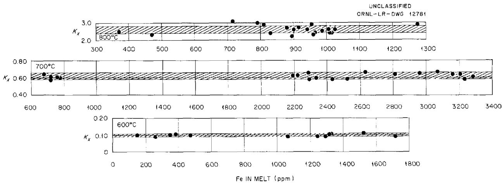  
Fig. 4.4. Apparent Equilibrium Constants for the Reduction of $\mathsf{FeF}_2$ by $\mathsf{H}_2$ in NaF-ZrF $_4$ (53-47 mole%).

results of the analyses of the initial and final mixtures are summarized in Table 4.3. The analyses indicate that the composition of the solvent remained substantially constant throughout the experiment.

In order to determine the effect of the solvent on the equilibrium, it is pertinent to compare the experimental values with those that may be calculated from the values of the free energies of formation of solid $\mathsf{FeF}_2$ and gaseous HF that are available in the literature. Since the $\mathsf{FeF}_2$ used for the experiment was not in solid form but, rather, was dissolved in molten NaF-ZrF, another useful basis of comparison is the corresponding equilibrium constant that would be obtained by assuming the $\mathsf{FeF}_2$ to be a supercooled liquid. A comparison of the temperature effect on the calculated and experimental constants is also of interest. From these calculations, activity coefficients for the dissolved $\mathsf{FeF}_2$ were obtained easily. The activity coefficients are useful for describing, in a concise form, the behavior of the equilibrium in solution, with reference to a given standard state.

The equations of interest in the calculations are:

$$
F e F _ {2} (s) + H _ {2} (g) = F e (s) + 2 H F (g)
$$

and

$$
F e F _ {2} (l) + H _ {2} (g) = F e (s) + 2 H F (g).
$$

TABLE 4.3. NOMINAL NaF-ZrF ${}_{4}$ (53-47 mole %) COMPOSITION BEFORE AND AFTER EQUILIBRATION MEASUREMENTS   

<table><tr><td rowspan="3">Days of Operation</td><td colspan="5">Chemical Analyses</td></tr><tr><td colspan="3">Major Constituents (wt %)</td><td colspan="2">Minor Constituents (ppm)</td></tr><tr><td>Na</td><td>Zr</td><td>F</td><td>Ni</td><td>Cr</td></tr><tr><td>1</td><td>12.0</td><td>42.4</td><td>45.3</td><td>55</td><td>110</td></tr><tr><td>121</td><td>12.2</td><td>42.8</td><td>45.1</td><td>30</td><td>90</td></tr><tr><td>Theoretical</td><td>12.1</td><td>42.6</td><td>45.3</td><td></td><td></td></tr></table>

The values of free energies of formation needed are those of $\mathsf{FeF}_2(s),\mathsf{FeF}_2(l)$ and HF $(g)$ . These values are listed in Table 4.4. It is realized that the number of significant figures used in the tabulation is greater than is warranted by the precision indicated for the published values, but, since the calculations involve differences, all the significant figures were employed, except for the end results. Thus the significance of future comparisons with other systems will be limited by experimental accuracy and not by the inherent variations introduced by employing small differences of rounded numbers.

The values of the free energies of formation of liquid $\mathsf{FeF}_2$ were obtained by calculation of the free energies of fusion. A heat of fusion, independent of temperature, of 8000 cal/mole was

TABLE 4.4. FREE ENERGIES OF FORMATION OF ${\mathrm{{FeF}}}_{2}\left( \mathrm{\;s}\right) ,{\mathrm{{FeF}}}_{2}\left( l\right)$ ,AND HF (g)   

<table><tr><td rowspan="2">Temperature (°C)</td><td colspan="4">Free Energy of Formation (kcal/mole)</td></tr><tr><td>FeF2(s)</td><td>FeF2(l)</td><td>HF(g)</td><td>FeF2(d)</td></tr><tr><td>800</td><td>-130.45</td><td>-128.69</td><td>-65.84</td><td>-129.64</td></tr><tr><td>700</td><td>-133.95</td><td>-131.61</td><td>-65.76</td><td>-132.41</td></tr><tr><td>600</td><td>-137.45</td><td>-134.53</td><td>-65.67</td><td>-135.39</td></tr></table>

used,20 and integration of the equation

$$
\frac {\partial (\Delta F / T)}{\partial T} = - \frac {\Delta H}{T ^ {2}}
$$

between the temperature in question and the melting point of $\mathsf{FeF}_2$ (1375oK) gave the free energies of fusion employed.

The values listed in the last column of Table 4.4 are the free energies of formation of $\mathsf{FeF}_2(d)$ obtained from the experimental data by using the free-energy changes listed in Table 4.5. The calculated free energies of formation should presumably incorporate the free-energy changes resulting from solution, dilution, and solvation. At any rate, the calculated values of $\Delta F^{\circ}$ for $\mathsf{FeF}_2(d)$ will precisely describe the behavior of the equilibrium over the experimental range studied, subject to the precision of the experimental measurements, if the experimental $K_{x}$ is treated as a true thermodynamic equilibrium constant.

The free-energy changes of the pertinent reactions, as well as the corresponding thermodynamic equilibrium constants, are given in Table 4.5. For purposes of comparison, the experimentally determined equilibrium constants are also given, along with the calculated free-energy change for reaction 3 of Table 4.5.

The activities of HF at equilibrium with certain ranges of activities of $\mathsf{FeF}_2(s)$ and $\mathsf{FeF}_2(l)$ have been calculated and are presented graphically in Fig. 4.5, along with the experimentally determined values. The activity of $\mathsf{FeF}_2$ was taken to be equal to its mole fraction. The mole fractions of $\mathsf{FeF}_2$ were calculated as described previously.[19] The activities of HF are expressed in atmospheres. It may be observed that the experimental points are, in every case, between the calculated curves corresponding to the two standard states used.

The temperature dependences of the calculated and experimental equilibrium constants are compared graphically in Fig. 4.6. An inspection shows that the slope of the experimental curve is the same as the slope of the curve calculated by taking supercooled liquid $\mathsf{FeF}_2$ as the standard state. The slope of the curve calculated by taking solid $\mathsf{FeF}_2$ as the standard state is steeper. The heats of reaction indicated by the slopes and the entropy changes of the reactions are summarized in Table 4.6.

The activity coefficients of $\mathsf{FeF}_2$ in solution were also calculated relative to the different standard states that have been considered. The

Reactions: $\mathsf{FeF}_2(s) + \mathsf{H}_2(g) = \mathsf{Fe}(s) + 2\mathsf{HF}(g)$ (1)

$\mathsf{FeF}_2(l) + \mathsf{H}_2(g) = \mathsf{Fe}(s) + 2\mathsf{HF}(g)$ (2)

$\mathsf{FeF}_2(d) + \mathsf{H}_2(g) = \mathsf{Fe}(s) + 2\mathsf{HF}(g)$ (3)

TABLE 4.5. FREE-ENERGY CHANGES AND EQUILIBRIUM CONSTANTS FOR THE REDUCTION OF ${\mathrm{{FeF}}}_{2}$ BY HYDROGEN   

<table><tr><td rowspan="2">Temperature (°C)</td><td colspan="3">Free-Energy Changes, ΔFo(kcal/mole of FeF2)</td><td colspan="3">Equilibrium Constants</td></tr><tr><td>Reaction 1</td><td>Reaction 2</td><td>Reaction 3</td><td>Kafor Reaction 1</td><td>Kafor Reaction 2</td><td>Kxfor Reaction 3</td></tr><tr><td>800</td><td>-1.23</td><td>-2.99</td><td>-2.04 ± 0.16</td><td>1.78</td><td>4.06</td><td>2.6 ± 0.2</td></tr><tr><td>700</td><td>+2.43</td><td>+0.09</td><td>+0.89 ± 0.12</td><td>0.285</td><td>0.955</td><td>0.63 ± 0.04</td></tr><tr><td>600</td><td>+6.11</td><td>+3.19</td><td>+4.05 ± 0.12</td><td>0.0296</td><td>0.159</td><td>0.097 ± 0.007</td></tr></table>

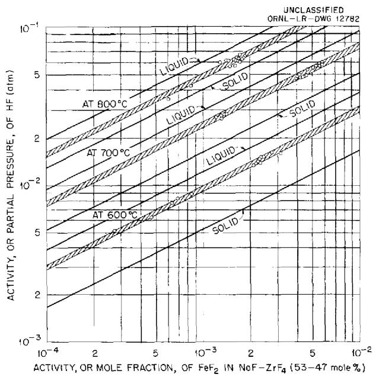  
Fig. 4.5. Comparison of the Activities of HF at Equilibrium with a Range of Activities of Liquid and Solid $\mathsf{FeF}_2$ in NaF-ZrF $_4$ (53-47 mole%).

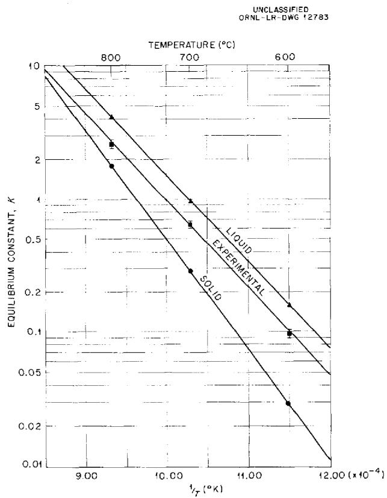  
Fig. 4.6. Temperature Dependence of Calculated and Experimental Equilibrium Constants for the Reaction $\mathsf{FeF}_2 + \mathsf{H}_2\rightleftharpoons \mathsf{Fe} + 2\mathsf{HF}$

TABLE 4.6. HEATS OF REACTION AND ENTROPY CHANGES FOR THE REDUCTION OF ${\mathrm{{FeF}}}_{2}$ BY HYDROGEN   

<table><tr><td>FeF2Standard State</td><td>Heats of Reaction, ΔH° (cal)</td><td>Entropy Changes, ΔS° (eu)</td></tr><tr><td>Solid (calculated)</td><td>37,500</td><td>36.0</td></tr><tr><td>Liquid (calculated)</td><td>29,600</td><td>30.3</td></tr><tr><td>Dissolved (experimental)</td><td>29,600</td><td>29.4</td></tr></table>

equilibrium constants for the reduction reactions are given by the expression:

$$
K _ {a} = \frac {a _ {\mathrm {H F}} ^ {2} a _ {\mathrm {F e (s)}}}{a _ {\mathrm {H} _ {2}} a _ {\mathrm {F e F} _ {2}}}
$$

If the activity of solid iron is taken to be unity and the activities are converted to partial pressures or mole fractions, the expression becomes

$$
\begin{array}{l} K _ {a} = \frac {P _ {\mathrm {H F}} ^ {2}}{P _ {\mathrm {H} _ {2}} X _ {\mathrm {F e F} _ {2}}} \cdot \frac {\gamma_ {\mathrm {H F}} ^ {2}}{\gamma_ {\mathrm {H} _ {2}} \gamma_ {\mathrm {F e F} _ {2}}} \\ = K _ {x} \frac {\gamma_ {H F} ^ {2}}{\gamma_ {H _ {2}} \gamma_ {F e F _ {2}}} \\ \end{array}
$$

High-temperature extrapolation of the available data21-23 on association factors of HF (g) indicates that, at the temperatures used, HF is monomeric. If ideal gas behavior is assumed for both HF and $\mathsf{H}_{2}$ , it appears quite reasonable to believe that $\gamma_{\mathsf{HF}} = \gamma_{\mathsf{H}_2} = 1.0$ . Thus the activity coefficient for $\mathsf{FeF}_{2^{\prime}}$ as defined by the previous equation, is given by

$$
\gamma_ {\text {F e F} _ {2}} = \frac {K _ {x}}{K _ {a}}.
$$

The activity coefficients of $\mathsf{FeF}_2$ for the different

21 R. L. Jarry and W. Davis, Jr., J. Phys. Chem. 57, 600 (1953).   
22R. W. Long, J. H. Hildebrand, and W. E. Morrell, J. Am. Chem. Soc. 65, 182 (1943).   
23J. Simons and J. H. Hildebrand, J. Am. Chem. Soc. 46, 2183 (1924).

standard states, calculated with this equation by using the experimental equilibrium constants, are summarized in Table 4.7.

Within the precision of the experimental measurements, the activity coefficients listed in Table 4.7 are independent of the $\mathsf{FeF}_2$ concentration over the ranges investigated. It is apparent that, as far as this investigation is concerned, the most convenient choice of standard state is $\mathsf{FeF}_2(d)$ .

concentration cells in molten $\mathsf{NaF - ZrF_4}$ (53-47 mole $\%$ were continued.24 The cells were measured in the temperature range 550 to $700^{\circ}C$ in a helium atmosphere. The half cells were contained in recrystallized alumina (morganite) crucibles, and electrical contact between them was achieved with a porous $\mathsf{ZrO}_2$ bridge impregnated with the NaF $\mathsf{ZrF_4}$ solvent.

The cells measured were of the type

$$
M \left| M F _ {2} \left(a _ {1}\right), N a F \left(a _ {2}\right), Z r F _ {4} \left(a _ {3}\right) \right| | N a F \left(a _ {2} ^ {\prime}\right), Z r F _ {4} \left(a _ {3} ^ {\prime}\right), M F _ {2} \left(a _ {1} ^ {\prime}\right) | M,
$$

However, since it is believed to be unlikely that the activity coefficient is independent of the concentration for the general case involving other solvents and solutes, it would appear to be more desirable to adopt the hypothetical pure supercooled liquid as the standard state.

TABLE 4.7. ACTIVITY COEFFICIENTS OF $\mathsf{FeF}_2$ IN MOLTEN NaF-ZrF $_4$ (53-47 mole %)   

<table><tr><td rowspan="2">FeF2Standard State</td><td colspan="3">Activity Coefficient</td></tr><tr><td>At 800°C</td><td>At 700°C</td><td>At 600°C</td></tr><tr><td>Solid</td><td>1.46</td><td>2.20</td><td>3.28</td></tr><tr><td>Liquid</td><td>0.64</td><td>0.66</td><td>0.66</td></tr><tr><td>Dissolved</td><td>1.00</td><td>1.00</td><td>1.00</td></tr></table>

It is hoped that the equilibrium-reduction reactions of other metallic fluorides will prove to be amenable to investigation by this method and that, by comparison of similar thermodynamic correlations, information may be obtained on the condition of the solute in the molten fluoride solvent. A study of the reduction of $\mathsf{FeF}_2$ by $\mathsf{H}_2$ in other solvents in the absence or presence of $\mathsf{UF}_4$ is planned in the hope of obtaining a better understanding of the effect of composition on corrosion.

# EMF Measurements in Fused Salts

L. E. Topol

Materials Chemistry Division

Determinations of activities and activity coefficients of metal fluorides from the emf's of

where $M = \mathsf{Fe}_t\mathsf{Cr}_t$ or Ni and (a) denotes the activity of a species. If it is assumed that $\mathsf{Na}^+$ and $\mathsf{F}^-$ are the sole carriers of current, the cell reaction is

$$
M F _ {2} \left(a _ {1} ^ {\prime}\right) + 2 t N a F \left(a _ {2}\right) = M F _ {2} \left(a _ {1}\right) + 2 t N a F \left(a _ {2} ^ {\prime}\right),
$$

where $t$ is the transference number of the $\mathsf{Na}^+$ . If the amounts of added $\mathsf{MF}_2$ are small, the activities of NaF are approximately equal in both half cells, and the cell potential should be given by

$$
E = - \frac {R T}{n F} \ln \frac {a _ {1}}{a _ {1} ^ {\prime}} = - \frac {R T}{2 F} \ln \frac {\gamma_ {1} x _ {1}}{\gamma_ {1} ^ {\prime} x _ {1} ^ {\prime}},
$$

where $a, a'$ , $x, x'$ , and $\gamma, \gamma'$ are the activities, mole fractions, and activity coefficients, respectively.

Duplicate cells were measured, each for a period of two days, by using iron electrodes and $\mathsf{FeF}_2$ electrolytes. Three different concentration cells were used in the study. Agreement between duplicate cells was, in general, better than $\pm 3\%$ of the emf observed. The values obtained on the second day for each cell were lower by 2 to $8\%$ than those obtained on the first day. Typical data for the first day are presented in Table 4.8. From these data it is obvious that, for all the unsaturated cells, the change in activity-coefficient ratio with temperature is very small. A comparison of the activity-coefficient ratios of the various concentrations studied with the ratio of the most concentrated mixture studied ( $x = 0.015$ ) is shown in Table 4.9. The data show that the activity coefficient increases with increased dilution.

It should be noted that the decrease in activity coefficient with concentration of $\mathsf{FeF}_2$ is greatest

TABLE 4.8. ACTIVITY RATIOS FOR ${\mathrm{{FeF}}}_{2}$ IN NaF-ZrF ${}_{4}$ (53-47 mole %) FROM THE CELL Fe|FeF ${}_{2}\left( {x}_{1}\right) ,\mathrm{{NaF}}\left( {x}_{2}\right) ,{\mathrm{{ZrF}}}_{4}\left( {x}_{3}\right) \parallel$ ZrF ${}_{4}\left( {x}_{3}^{\prime }\right) ,\mathrm{{NaF}}\left( {x}_{2}^{\prime }\right) ,{\mathrm{{FeF}}}_{2}\left( {x}_{1}^{\prime }\right)$ Fe   

<table><tr><td rowspan="2">Temperature (°C)</td><td colspan="2">Emf (v)</td><td rowspan="2">a1/a1&#x27;</td><td rowspan="2">γ1/γ1&#x27;</td></tr><tr><td>Measured</td><td>Ideal</td></tr><tr><td colspan="5">For x1=0.000607; x1&#x27;=0.002309*</td></tr><tr><td>700</td><td>0.0505</td><td>0.0560</td><td>0.300</td><td>1.14</td></tr><tr><td>650</td><td>0.0472</td><td>0.0531</td><td>0.305</td><td>1.16</td></tr><tr><td>600</td><td>0.0450</td><td>0.0502</td><td>0.302</td><td>1.15</td></tr><tr><td>550</td><td>0.0429</td><td>0.0473</td><td>0.298</td><td>1.13</td></tr><tr><td colspan="5">For x1=0.000607; x1&#x27;=0.00714*</td></tr><tr><td>700</td><td>0.0830</td><td>0.1034</td><td>0.138</td><td>1.62</td></tr><tr><td>650</td><td>0.0790</td><td>0.0980</td><td>0.137</td><td>1.61</td></tr><tr><td>600</td><td>0.0750</td><td>0.0926</td><td>0.136</td><td>1.60</td></tr><tr><td>550</td><td>0.0502</td><td>0.0874</td><td>0.242**</td><td>2.85</td></tr><tr><td colspan="5">For x1=0.00776; x1&#x27;=0.01484*</td></tr><tr><td>700</td><td>0.0252</td><td>0.0268</td><td>0.548</td><td>1.05</td></tr><tr><td>650</td><td>0.0245</td><td>0.0254</td><td>0.540</td><td>1.03</td></tr><tr><td>600</td><td>0.0155</td><td>0.0240</td><td>0.662**</td><td>1.26</td></tr><tr><td>550</td><td>0.0008</td><td>0.0226</td><td>**</td><td></td></tr></table>

\*In mole fractions.   
\* Solubility of $\mathsf{FeF}_2$ in at least one half cell was less than the added concentration of $\mathsf{FeF}_2$

TABLE 4.9. VARIATION OF ACTIVITY COEFFICIENTS OF ${\mathrm{{FeF}}}_{2}$ IN NaF-ZrF ${}_{4}$ (53-47 mole %) AT ${650}^{ \circ  }\mathrm{C}$ WITH CONCENTRATION   

<table><tr><td>x1</td><td>x&#x27;1</td><td>γ1/γ1&#x27;</td><td>γ1/γ0.015</td></tr><tr><td>0.00778</td><td>0.01485</td><td>1.05</td><td>1.05</td></tr><tr><td>0.00270</td><td>0.00744</td><td>1.17</td><td>1.24</td></tr><tr><td>0.000607</td><td>0.00714</td><td>1.63</td><td>1.72</td></tr><tr><td>0.000607</td><td>0.00231</td><td>1.18</td><td>1.46</td></tr></table>

in the dilute melts. Unfortunately, it is in the very dilute cells that any slight error in concentration (from weighing or from oxidation of the $\mathsf{FeF}_2$ , etc.) leads to a fairly large error in the emf reading. Further experiments along this line are planned.

In the course of these measurements it was noted that a sharp change in emf occurred when the solubility of $\mathsf{FeF}_2$ was exceeded. Thus, by adding different amounts of the same metal fluoride to the NaF-ZrF $_4$ solvent in two half cells and plotting the measured emf as a function of temperature, the temperature at which the solute dissolves completely on heating (or precipitates out on cooling) can be detected by a break or discontinuity in the plot of emf against temperature. In the actual experiments, less than equimolar amounts of metal fluoride and $\mathsf{ZrF}_4$ were added to NaF-ZrF $_4$ (53-47 mole %), since it is believed that the saturating phase in this solvent has the general formula $\mathsf{MF}_2\cdot \mathsf{ZrF}_4$ . Thus the solubilities were determined along a quasi binary between 7NaF-6ZrF $_4$ and $\mathsf{MF}_2\cdot \mathsf{ZrF}_4$ so that the composition of the saturated solution would be independent of the total amount of $\mathsf{MF}_2$ present. The solubilities of

$\mathrm{NiF}_2, \mathrm{FeF}_2,$ and $\mathrm{CrF}_2$ contained in vessels of Ni, Fe, and Pt, respectively, were measured from 550 to $750^{\circ}\mathrm{C}$ . In all runs the melts were first heated to the temperature at which complete solubility in both half cells was attained. Emf readings were then taken at decreasing temperatures, with approximately 30 min being allowed at each point for equilibrium to be reached. (Constant emf's at each temperature were usually approached in 15 min.) Each cell was run in this way several times, and both heating and cooling curves were plotted. With both cells saturated, the emf should be zero, and it should be constant during heating until dissolution of the $\mathsf{MF}_2\cdot \mathsf{ZrF}_4$ in the dilute melt is complete. At this point the change in emf with temperature is abrupt and continues to be rapid until all the $\mathsf{MF}_2\cdot \mathsf{ZrF}_4$ in the concentrated melt dissolves. Subsequent increases of temperature result in fairly small changes in emf.

The $\mathsf{ZrF}_4$ concentrations in the half cells become increasingly different between the solubility temperature of the dilute melt and that of the concentrated one. A typical emf-vs-temperature plot for an $\mathsf{FeF}_2$ cell is shown in Fig. 4.7. In all cases the data obtained at the lower temperature could be reproduced much better than the data obtained at the higher temperatures. The average deviation of the lower temperature, $T_1$ , was about $3^{\circ}\mathsf{C}$ , whereas the higher temperature, $T_2$ , varied by about $20^{\circ}\mathsf{C}$ . Therefore, in practically all cases, the saturation temperature of the more concentrated half cell in each run ( $T_2$ ) was re-determined by measuring this half cell against another still more concentrated half cell. The

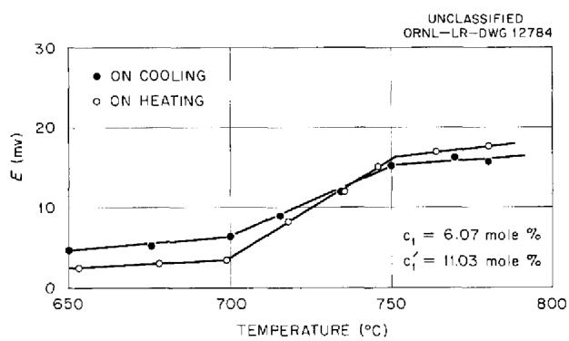  
Fig. 4.7. Temperature Dependence of the EMF of the Cell Fe $\left|\mathsf{FeF}_{2}, \mathsf{ZrF}_{4}\right.$ $\left.\left(c_{1}\right)\right| \left|\mathsf{FeF}_{2}, \mathsf{ZrF}_{4}\right.$ $\left.\left(c_{1}^{\prime}\right)\right|\mathsf{Fe}$ in the Solvent NaF-ZrF $_{4}$ (53-47 mole %).

solubilities given in Fig. 4.8 were found in this manner.

The log of the solubility in mole $\%$ $MF_{2}\cdot ZrF_{4}$ is plotted against the reciprocal of the absolute temperature in Fig. 4.9. As may be seen, the solubilities for the dilute melts obey a straight-line relation with respect to $1 / T$ , but in the more

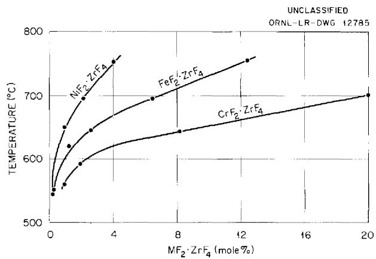  
Fig. 4.8. Temperature Dependence of Solubility of $MF_2 \cdot ZrF_4$ in NaF-ZrF $_4$ .

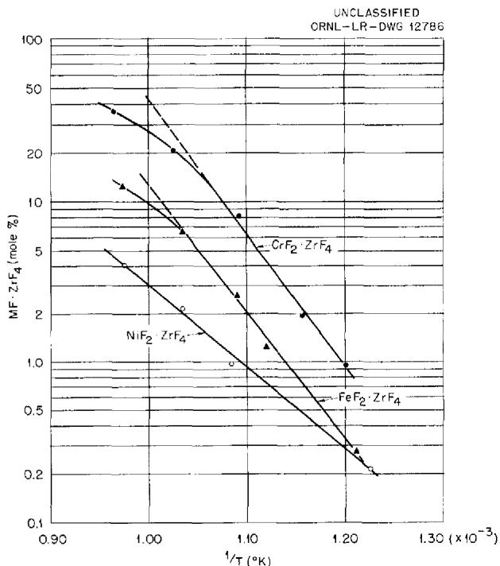  
Fig. 4.9. Solubility of $\mathsf{MF}_2\cdot \mathsf{ZrF}_4$ in NaF-ZrF4 vs Reciprocal of Absolute Temperature.

concentrated mixtures there is a deviation from linearity. This deviation is in the direction opposite to that expected. It appears likely that at the higher temperatures the saturating phase is no longer $\mathsf{MF}_2\cdot \mathsf{ZrF}_4$ it may well prove to be the simple $\mathsf{MF}_2$ compound. The slopes of the lines at lower temperatures and concentrations in Fig. 4.9 yield heats of solution of 37.5, 35.7, and 23.3 kcal/mole $\mathsf{MF}_2\cdot \mathsf{ZrF}_4$ for the $\mathsf{CrF}_2$ , $\mathsf{FeF}_2$ and $\mathsf{NiF}_2$ compounds, respectively. By extrapolating these lines to unit mole fraction of $\mathsf{MF}_2\cdot \mathsf{ZrF}_4$ "ideal" melting points of 775, 857, and $1155^{\circ}\mathsf{C}$ are found for $\mathsf{CrF}_2\cdot \mathsf{ZrF}_4$ , $\mathsf{FeF}_2\cdot \mathsf{ZrF}_4$ and $\mathsf{NiF}_2$ . $\mathsf{ZrF}_4$ . These ideal melting points have no physical meaning, but they may serve as a rough measure of the relative stability of the three compounds. The unexpected difference in both the ideal melting point and the heat of solution of the $\mathsf{NiF}_2$ complex from that of either the $\mathsf{CrF}_2$ or the $\mathsf{FeF}_2$ leads to the supposition that different types of species may be involved. It may be that $\mathsf{NiF}_2$ . $\mathsf{ZrF}_4$ breaks down at temperatures lower than any used for these tests.

# Activity of Chromium in Alloys

M.B.Panish

Materials Chemistry Division

The activity of chromium in alloys of chromium and nickel is being examined because of the great importance of such alloys as container materials for molten salts. Grube and Flad[25] studied the reaction

$$
\mathrm {C r} _ {2} \mathrm {O} _ {3} + 3 \mathrm {H} _ {2} \rightleftharpoons 3 \mathrm {H} _ {2} \mathrm {O} + 2 \mathrm {C r}
$$

and tabulated the pressures of $\mathsf{H}_2\mathsf{O}$ and $\mathsf{H}_2$ in equilibrium with pure chromium and nickel-chromium alloys at 1100 and $1200^{\circ}\mathrm{C}$ . An activity diagram, not previously published, which was calculated from these data is presented in Fig. 4.10. This diagram must be considered to be surprising, since considerable negative deviation from Raoult's law is exhibited, in spite of a region of immiscibility on the chromium-rich portion of the diagram. It has been suggested that the experimental work was in error.[26]

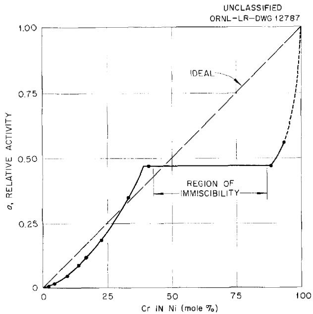  
Fig. 4.10. Apparent Activities of Nickel-Chromium Alloys at $1100^{\circ}\mathrm{C}$ .

The activity of chromium in nickel-chromium alloys is being investigated here by emf measurements of electrolytic cells of the type

$$
C r ^ {o} | N a C l, R b C l, C r C l _ {2} | C r (N i) a l l o y
$$

A schematic diagram of the cell, which utilizes a central reservoir and four electrode compartments, is shown in Fig. 4.11. This assembly is of fused quartz with standard glass taper joints in the lower temperature regions. The nickel-chromium electrodes were prepared for this study by using powder metallurgical techniques and high-purity chromium and nickel. The electrode connections are nickel wires that are joined to tungsten wires sealed through the glass. The alkali halide mixtures are prepared from clear crystals selected from slowly cooled melts of reagent-grade materials.

Curves plotted from emf measurements at various temperatures for two alloys containing different proportions of chromium (22.1 and 27.6 mole %) are shown in Fig. 4.12. For these runs the electrolyte was the NaCl-RbCl eutectic containing 0.1 to 0.5 wt $\%$ CrCl $_2$ . An activity coefficient of about 0.9 at $800^{\circ}\mathrm{C}$ was determined from these curves, in good agreement with the $1100^{\circ}\mathrm{C}$ data of Grube and Flad.[25] Attempts to utilize electrodes containing 10 mole $\%$ or less of chromium showed that the emf obtained was quite unreproducible.

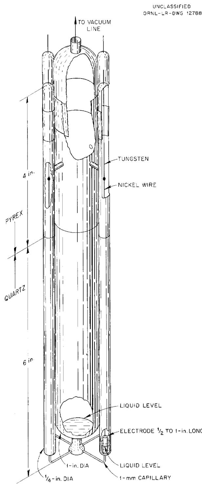  
Fig. 4.11. Cell Vessel with Central Reservoir and Compartments for Four Electrodes.

The voltages obtained for several cells in which the electrolyte was the LiCl-KCl eutectic with 1 wt $\%$ CrCl $_2$ and in which the electrodes were chromium and Inconel are shown in Fig. 4.13. The line drawn through the points of Fig. 4.13 was calculated for an ideal chromium-nickel alloy containing 15 wt $\%$ chromium. Although Inconel nominally contains 5 wt $\%$ iron and the points scatter rather badly, the data seem to be represented reasonably well by the ideal case.

The electromotive forces obtained should be reproducible after raising and lowering of the temperature and after brief shorting or electrolysis. Electrodes containing less than $10\%$ chromium and the Inconel electrodes, however, responded poorly to the temperature test. All the electrodes responded well to the shorting test. This indicates that a diffusive equilibrium between chromium on the surface and chromium within the body of the electrode is established at the temperatures at which these tests are performed. It was found that mechanical agitation of the electrodes within the cell had no effect upon the electromotive force. This indicates that there is no sharp concentration gradient in the electrolyte in the immediate vicinity of the electrodes.

# Reduction of $\mathbf{U}\mathbf{F}_4$ by Structural Metals

J.D.Redman

Materials Chemistry Division

Data obtained from filtration studies of the reduction of $\mathsf{UF}_4$ by $\mathsf{Cr}^{\circ}$ or $\mathsf{Fe}^{\circ}$ with NaF-ZrF $_4$ (50-50 mole $\%$ ), $^{27}$ NaF-LiF-KF (11.5-46.5-42 mole $\%$ ), $^{28}$ NaF-ZrF $_4$ (53-47 mole $\%$ ), $^{29}$ or NaF-LiF-ZrF $_4$ (22-55-23 mole $\%$ ) $^{30}$ as reaction mediums were given in previous reports. More recently, studies have been made on the reduction of $\mathsf{UF}_4$ by $\mathsf{Fe}^{\circ}$ or $\mathsf{Cr}^{\circ}$ with molten NaF-ZrF $_4$ (59-41 mole $\%$ )

as the solvent. The results obtained in these studies show that $\mathsf{Cr}^{\circ}$ is not stable with respect to $\mathsf{UF}_4$ dissolved in these different fluoride mixtures. This observed instability of chromium, either as pure metal or in alloys, has led to studies of the stability of $\mathsf{UF}_4$ toward other structural metals which might serve as substitutes for chromium in

alloys. Earlier work31 showed that $\mathsf{Mo}^{\circ}$ was more stable toward UF4 than Cr0 was in both NaF-ZrF4 (50-50 mole %) and NaF-LiF-KF (11.5-46.5-42 mole %). The systems UF4-V0 and UF4-Nbc also have been studied with the NaF-LiF-KF mixture as

31J. D. Redman and C. F. Weaver, ANP Quar. Prog. Rep. March 10, 1955, ORNL-1864, p 61.

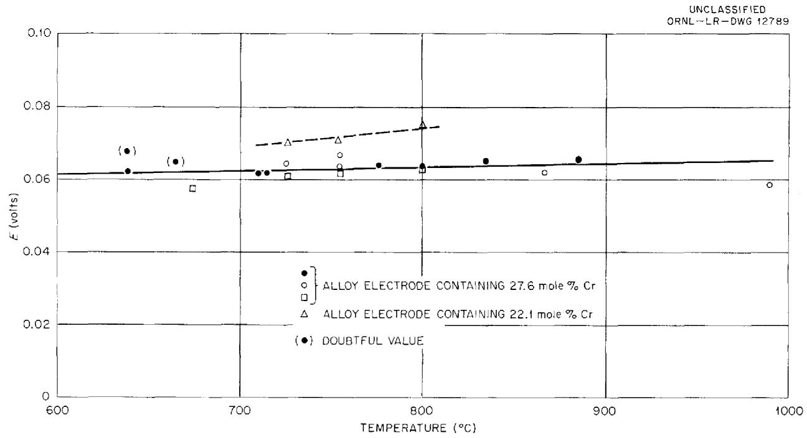

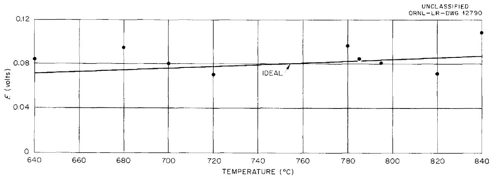  
Fig. 4.12. EMF Measurements Obtained with a Concentration Cell at 600 to $1000^{\circ}\mathrm{C}$ for Chromium-Nickel Alloys vs Pure Chromium in Molten NaCl-RbCl Eutectic Containing $\mathsf{CrCl}_2$ .   
Fig. 4.13. EMF Measurements Obtained with a Concentration Cell at 600 to $1000^{\circ}\mathrm{C}$ for Inconel vs Pure Chromium in Molten LiCl-KCl Eutectic Containing $\mathsf{CrCl}_2$ .

the reaction medium. Data for these systems, reported previously,32 show that $\mathsf{Nb}^{\circ}$ is unstable toward UF in the NaF-LiF-KF solvent. During the quarter, studies have been made on the systems UF-Ta and UF-W with the NaF-LiF-KF eutectic as the reaction medium. Studies also have been carried out on the UF-V and UF-Nb systems with NaF-ZrF (50-50 mole %) and NaF-LiF-ZrF (22-55-23 mole %) as the reaction mediums.

The results of the studies of the reduction of $\mathsf{UF}_4$ by $\mathsf{Cr}^{\circ}$ at 600 and $800^{\circ}\mathsf{C}$ with NaF-ZrF

32J. D. Redman, ANP Quar. Prog. Rep. Dec. 10, 1955, ORNL-2012, p 86.

(59-41 mole $\%$ ) as the reaction medium are given in Table 4.10. In these runs approximately $2\mathrm{g}$ of $\mathbf{Cr}^{\circ}$ was reacted with $\mathsf{UF}_4$ (11.4 wt $\%$ 3.7 mole $\%$ ) dissolved in approximately $40\mathrm{g}$ of the NaF-ZrF mixture contained in nickel. The data given in Table 4.10 show considerable scatter; however, it appears that the chromium concentrations are essentially the same at the two temperatures studied. Data in Table 4.11 present a comparison of equilibrium $\mathbf{Cr}^{+ + }$ values for the several mixtures studied. As may be seen, the concentration of chromium fluoride at equilibrium becomes progressively smaller as the ratio of alkali-metal fluoride to $\mathsf{ZrF}_4$ is increased. This is in general

TABLE 4.10. DATA FOR THE REACTION OF ${\mathrm{{UF}}}_{4}$ WITH ${\mathrm{{Cr}}}^{ \circ  }$ IN MOLTEN NaF-ZrF ${}_{4}$ (59-41 mole %) AT 600 AND ${800}^{ \circ  }\mathrm{C}$   

<table><tr><td colspan="2">Conditions of Equilibration</td><td colspan="3">Present in Filtrate</td></tr><tr><td>Temperature (℃)</td><td>Time (hr)</td><td>Total U (wt %)</td><td>Total Cr* (ppm)</td><td>Total Ni (ppm)</td></tr><tr><td rowspan="5">600</td><td>3</td><td>8.9</td><td>710</td><td>65</td></tr><tr><td>3</td><td>8.7</td><td>1010</td><td>95</td></tr><tr><td>5</td><td>9.4</td><td>1060</td><td>70</td></tr><tr><td>5</td><td>8.8</td><td>970</td><td>95</td></tr><tr><td>5</td><td>8.6</td><td>1030</td><td>35</td></tr><tr><td rowspan="4">800</td><td>3</td><td>9.9</td><td>1000</td><td>90</td></tr><tr><td>3</td><td>8.7</td><td>950</td><td>45</td></tr><tr><td>5</td><td>9.6</td><td>1190</td><td>60</td></tr><tr><td>5</td><td>10.4</td><td>1080</td><td>70</td></tr></table>

*Blank of 270 ppm of Cr at $800^{\circ}\mathrm{C}$ .

TABLE 4.11. EQUILIBRIUM CONCENTRATIONS OF ${\mathrm{{Cr}}}^{+ + }$ FOR THE REACTION ${\mathrm{{Cr}}}^{ \circ  } + 2{\mathrm{{UF}}}_{4} \rightleftharpoons  2{\mathrm{{UF}}}_{3} + {\mathrm{{CrF}}}_{2}$ IN VARIOUS SOLVENTS  

<table><tr><td rowspan="2">Solvent Composition (mole %)</td><td colspan="2">Equilibrium Concentration of Cr++ (ppm)</td></tr><tr><td>At 600°C</td><td>At 800°C</td></tr><tr><td>NaF-ZrF4; 50-50</td><td>2250</td><td>2550</td></tr><tr><td>NaF-ZrF4; 53-47</td><td>1700</td><td>2100</td></tr><tr><td>NaF-ZrF4; 59-41</td><td>975</td><td>1050</td></tr><tr><td>NaF-LiF-ZrF4; 22-55-23</td><td>500</td><td>650</td></tr></table>

agreement with the concept that $\mathsf{U}\mathsf{F}_4$ is stabilized by the formation of a $\mathsf{U}\mathsf{F}_5^-$ or $\mathsf{U}\mathsf{F}_6^{\mathrm{--}}$ complex ion which must compete with $\mathsf{ZrF}_4$ for the free fluoride ion.

As the data in Table 4.12 indicate, however, the concentrations of $\mathsf{Fe}^{+ + }$ in equilibrium when pure $\mathsf{Fe}^{\circ}$ is used as the reducing agent are approximately the same as those found when either NaF-ZrF $_4$ (53-47 mole %) or NaF-ZrF $_4$ (50-50 mole %) is used as the reaction medium. Temperature appears to have little effect on the reaction, although a slight decrease in iron concentration with increased temperature is indicated. A similar temperature effect occurs when the other two NaF-ZrF $_4$ mixtures are used as solvents.

Data for the reaction of $\mathsf{UF}_4$ with Ta and with W at 600 and $800^{\circ}C$ with NaF-LiF-KF (11.5-46.5-42 mole %) as the reaction medium are given in Table 4.13. Approximately 2 g of the metal was equilibrated with $\mathsf{UF}_4$ (15 wt %, 2.3 mole %) dissolved in approximately 20 g of the NaF-LiF-KF mixture contained in nickel.

The data presented in Table 4.13 indicate that neither $\mathsf{Ta}^{\circ}$ nor $\mathsf{W}^{\circ}$ is stable with respect to $\mathsf{UF}_4$ under the conditions studied, and therefore they afford little or no advantage over $\mathsf{Cr}^{\circ}$ . The data collected for the $\mathsf{UF}_4$ - $\mathsf{W}^{\circ}$ system show considerable

scatter, the cause of which is unknown. Since there was some indication that equilibrium was not being attained during the short heating periods, a few experiments were run with 12-hr equilibration periods. The results obtained for these runs were not precise, but they seem to demonstrate that no significant increase in concentration of tungsten occurs after 5 hr of equilibration.

Data are given in Table 4.14 for the reaction of $\mathsf{UF}_4$ with $\mathsf{Nb}^{\circ}$ at 600 and $800^{\circ}\mathsf{C}$ with $\mathsf{NaF - ZrF}_4$ (50-50 mole %) and with NaF-LiF-ZrF $_4$ (22-55-23 mole %) as the reaction mediums. The runs were made in nickel equipment with 11.4 wt % $\mathsf{UF}_4$ dissolved in approximately 40 g of the fluoride mixtures and 2 g of $\mathsf{Nb}^{\circ}$ . These data show that no significant interaction between $\mathsf{Nb}^{\circ}$ and $\mathsf{UF}_4$ occurs in either of the $\mathsf{ZrF}_4$ -containing fluoride mixtures studied. This behavior is in marked contrast to that observed when NaF-LiF-KF (11.5-46.5-42 mole %) is used as the reaction medium; with this medium, niobium concentrations of 700 and 1500 ppm were found at 600 and $800^{\circ}\mathsf{C}$ , respectively. The markedly different niobium concentrations found for the solvents are surprising and must be associated with the differences in free alkali-metal fluoride concentrations present and the resulting

TABLE 4.12. DATA FOR THE REACTION OF ${\mathrm{{UF}}}_{4}$ WITH ${\mathrm{{Fe}}}^{ \circ  }$ IN MOLTEN NaF-ZrF ${}_{4}$ (59-41 mole %) AT 600 AND ${800}^{ \circ  }\mathrm{C}$   

<table><tr><td colspan="2">Conditions of Equilibration</td><td colspan="3">Present in Filtrate</td></tr><tr><td>Temperature (°C)</td><td>Time (hr)</td><td>Total U (wt %)</td><td>Total Fe* (ppm)</td><td>Total Ni (ppm)</td></tr><tr><td rowspan="4">600</td><td>3</td><td>8.5</td><td>510</td><td>35</td></tr><tr><td>3</td><td>8.6</td><td>630</td><td>40</td></tr><tr><td>5</td><td>8.6</td><td>370</td><td>60</td></tr><tr><td>5</td><td>8.5</td><td>600</td><td>70</td></tr><tr><td rowspan="6">800</td><td>3</td><td>8.9</td><td>680</td><td>70</td></tr><tr><td>3</td><td>8.6</td><td>290</td><td>65</td></tr><tr><td>3</td><td>9.2</td><td>460</td><td>70</td></tr><tr><td>3</td><td>9.2</td><td>440</td><td>75</td></tr><tr><td>5</td><td>9.3</td><td>465</td><td>100</td></tr><tr><td>5</td><td>8.8</td><td>280</td><td>35</td></tr></table>

*Blank of 140 ppm of Fe at $800^{\circ}\mathrm{C}$ .

TABLE 4.13. DATA FOR THE REACTION OF ${\mathrm{{UF}}}_{4}$ WITH ${\mathrm{{Ta}}}^{ \circ  }$ AND WITH ${\mathrm{W}}^{ \circ  }$ IN MOLTEN NaF-LiF-KF (11.5-46.5-42 mole %) AT 600 AND ${800}^{ \circ  }\mathrm{C}$   

<table><tr><td colspan="2">Conditions of Equilibration</td><td colspan="4">Present in Filtrate</td></tr><tr><td>Temperature (°C)</td><td>Time (hr)</td><td>Total U (wt %)</td><td>Total Ta* (ppm)</td><td>Total W** (ppm)</td><td>Total Ni (ppm)</td></tr><tr><td colspan="6">For Reaction with Ta°</td></tr><tr><td rowspan="4">600</td><td>3</td><td>11.2</td><td>1320</td><td></td><td>140</td></tr><tr><td>3</td><td>11.6</td><td>1220</td><td></td><td>90</td></tr><tr><td>5</td><td>12.1</td><td>1150</td><td></td><td>110</td></tr><tr><td>5</td><td>11.8</td><td>1150</td><td></td><td>240</td></tr><tr><td rowspan="3">800</td><td>3</td><td>11.2</td><td>3220</td><td></td><td>170</td></tr><tr><td>5</td><td>11.9</td><td>2800</td><td></td><td>80</td></tr><tr><td>5</td><td>11.8</td><td>3020</td><td></td><td>180</td></tr><tr><td colspan="6">For Reaction with W°</td></tr><tr><td rowspan="6">600</td><td>3</td><td>11.2</td><td></td><td>950</td><td>215</td></tr><tr><td>3</td><td>11.2</td><td></td><td>920</td><td>435</td></tr><tr><td>5</td><td>11.6</td><td></td><td>1410</td><td>250</td></tr><tr><td>5</td><td>11.2</td><td></td><td>1350</td><td>230</td></tr><tr><td>5</td><td>10.5</td><td></td><td>900</td><td></td></tr><tr><td>5</td><td>11.0</td><td></td><td>1125</td><td></td></tr><tr><td rowspan="11">800</td><td>3</td><td>11.3</td><td></td><td>980</td><td>260</td></tr><tr><td>3</td><td>11.2</td><td></td><td>920</td><td>205</td></tr><tr><td>5</td><td>11.2</td><td></td><td>1480</td><td>65</td></tr><tr><td>5</td><td>10.8</td><td></td><td>2150</td><td>250</td></tr><tr><td>5</td><td>12.0</td><td></td><td>580</td><td>155</td></tr><tr><td>5</td><td>11.8</td><td></td><td>1260</td><td>165</td></tr><tr><td>5</td><td>11.6</td><td></td><td>1210</td><td></td></tr><tr><td>5</td><td>11.8</td><td></td><td>1600</td><td></td></tr><tr><td>12</td><td>10.5</td><td></td><td>1880</td><td>115</td></tr><tr><td>12</td><td>11.8</td><td></td><td>1400</td><td></td></tr><tr><td>12</td><td>11.3</td><td></td><td>1430</td><td></td></tr></table>

*Blank of approximately 650 ppm of Ta at $800^{\circ}\mathrm{C}$ . Several attempts were made to reduce the size of the blank, but all were unsuccessful.   
\*\*Blank of 350 ppm of W at $800^{\circ}C$

changes in activities of the uranium and niobium fluoride complexes.

A previous study of the reaction of $\mathsf{U}\mathsf{F}_4$ with $V^{\circ}$ in the NaF-KF-LiF eutectic showed vanadium concentrations in the melt to be about 25 ppm. However, repeated checking of this rather surprising result has served to show that the chemical analyses were grossly in error. It now appears that significant interaction of $\mathsf{U}\mathsf{F}_4$ with vanadium occurs in either NaF-KF-LiF or NaF-ZrF $_4$ .

However, it seems advisable to withhold the data until the inconsistencies in analyses have been clarified.

# Reaction of $\mathsf{UF}_3$ with NaF-KF-LiF Eutectic

B. H. Clompitt

Materials Chemistry Division

Alkali-metal vapors are evolved from a heated solution of $\mathsf{UF}_3$ in the molten NaF-KF-LiF eutectic,

TABLE 4.14. DATA FOR THE REACTION OF ${\mathrm{{UF}}}_{4}$ WITH ${\mathrm{{Nb}}}^{ \circ  }$ AT 600 AND ${800}^{ \circ  }\mathrm{C}$ IN MOLTEN ${\mathrm{{NaF}}}_{2}{\mathrm{{ZrF}}}_{4}\left( {{50} - {50}\text{ mole }\% }\right)$ AND NaF-LiF-ZrF ${}_{4}$ (22-55-23 mole %)   

<table><tr><td colspan="2">Conditions of Equilibration</td><td colspan="3">Present in Filtrate</td></tr><tr><td>Temperature (°C)</td><td>Time (hr)</td><td>Total U (wt %)</td><td>Total Nb* (ppm)</td><td>Total Ni (ppm)</td></tr><tr><td colspan="5">For Reaction Medium NaF-ZrF4(50-50 mole %)</td></tr><tr><td rowspan="4">600</td><td>3</td><td>8.2</td><td>25</td><td>55</td></tr><tr><td>3</td><td>7.9</td><td>20</td><td>60</td></tr><tr><td>5</td><td>8.9</td><td>25</td><td>55</td></tr><tr><td>5</td><td>8.7</td><td>25</td><td>80</td></tr><tr><td rowspan="4">800</td><td>3</td><td>8.8</td><td>20</td><td>40</td></tr><tr><td>3</td><td>8.8</td><td>20</td><td>70</td></tr><tr><td>5</td><td>8.8</td><td>20</td><td>80</td></tr><tr><td>5</td><td>8.6</td><td>20</td><td>85</td></tr><tr><td colspan="5">For Reaction Medium NaF-LiF-ZrF4(22-55-23 mole %)</td></tr><tr><td rowspan="4">600</td><td>3</td><td>8.2</td><td>1</td><td>100</td></tr><tr><td>3</td><td>8.8</td><td>1</td><td>120</td></tr><tr><td>5</td><td>8.4</td><td>2</td><td>120</td></tr><tr><td>5</td><td>8.9</td><td>1</td><td>45</td></tr><tr><td rowspan="4">800</td><td>3</td><td>8.5</td><td>1</td><td>110</td></tr><tr><td>3</td><td>8.6</td><td>1</td><td>110</td></tr><tr><td>5</td><td>8.9</td><td>5</td><td>15</td></tr><tr><td>5</td><td>8.3</td><td>4</td><td>40</td></tr></table>

*Blank of 25 ppm of Nb at $800^{\circ}\mathrm{C}$ in NaF-ZrF $_4$ ; approximately 15 ppm in NaF-LiF-ZrF $_4$ .

despite the standard free-energy changes for the reaction

$$
K F + U F _ {3} \rightarrow U F _ {4} + K ^ {\circ}
$$

being unfavorable by about 30 kcal per gram atom of potassium. The vapor is about $95\%$ $\mathsf{K}^{\circ}$ , with the balance almost entirely $\mathsf{Na}^{\circ}$ , but, for purposes of the following discussion, it is assumed that KF is the only component of the melt reduced by $\mathsf{UF}_3$ . That this reaction should proceed perceptibly is additional evidence that $\mathsf{UF}_4$ is strongly complexed and stabilized in the molten fluoride solution; this stabilization, which in general makes $\mathsf{UF}_4$ solutions less corrosive than they would otherwise be,

contributes, unfortunately, to instability of $\mathsf{UF}_3$ in such systems.

The kinetics of conversion of $\mathsf{UF}_3$ to UF4 in this solvent are complicated by the disproportionation reaction

$$
4 U F _ {3} \rightarrow 3 U F _ {4} + U
$$

which takes place simultaneously with the redox reaction and produces an alloy of uranium metal with the container wall. A rough study of the kinetics of attrition of $\mathsf{UF}_3$ in this solvent has been made by analysis for $\mathsf{UF}_3$ of samples taken after 2 hr of heating of standard mixtures in open crucibles of copper under helium atmospheres at varying pressure.

A previous report $^{33}$ showed that at $650^{\circ}C$ , under these conditions, the rate of reaction (measured by the $\mathsf{UF}_3$ remaining after 2 hr) was independent of helium pressure at pressures above 50 mm Hg; at pressures below 50 mm Hg the amount of $\mathsf{UF}_3$ remaining varied nearly linearly with pressure. The results obtained at $750^{\circ}C$ , shown in Fig. 4.14, are quite similar; at this temperature the reaction rate is insensitive to pressures above 130 mm Hg. For samples which were held at pressures above this "critical" pressure and for which 21.4 wt % of $\mathsf{UF}_3$ was initially present, 58% of the $\mathsf{UF}_3$ remained after 2 hr at $650^{\circ}C$ and 47% remained after a similar period at $750^{\circ}C$ .

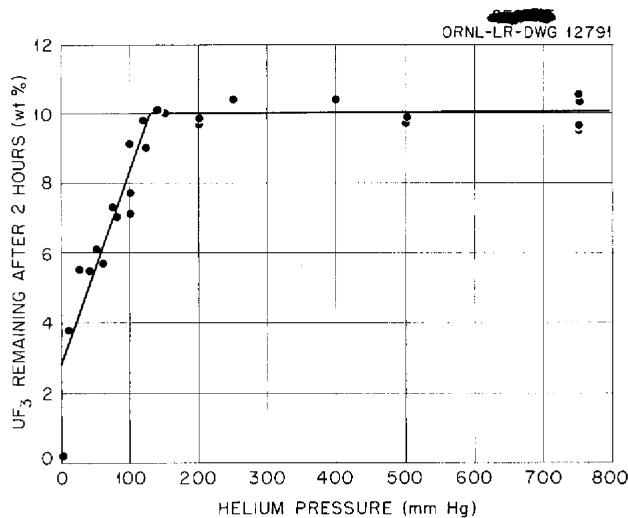  
Fig. 4.14. Oxidation of $\mathsf{UF}_3$ at $750^{\circ}\mathsf{C}$ in NaF-LiF-KF (11.5-46.5-42 mole%).

This behavior suggests strongly that the sharp break in the reaction rate as a function of pressure occurs at the "bubble-point" pressure for the solution at a given temperature. At pressures above this level, the evolution of potassium appears to reach a near-equilibrium steady state and to proceed at a rate controlled by the rate of vaporization of potassium from its solution in the salt. If the values 50 and $130\mathrm{mmHg}$ are taken as the bubble pressure of $\mathsf{K}^{\circ}$ from the solution at 650 and $750^{\circ}\mathrm{C}$ , respectively, then, since the vapor pressures of pure $\mathsf{K}^{\circ}$ at those temperatures are 240 and $750\mathrm{mmHg}$ , the activity of the

potassium is approximately 0.2 at each temperature. (The absence of a brilliant blue-green phase seems to be sufficient assurance that the solution is not saturated.)

The effect of temperature on the two competing reactions cannot be specified with certainty. The disproportionation reaction should be rapid, initially, at all temperatures, but it would be expected to slow to a rate controlled by the slow diffusion of $U^0$ into the copper wall. In each 2-hr test, therefore, an almost constant amount of $UF_4$ might be expected to form, regardless of temperature.

If the reaction to produce $\mathsf{K}^{\circ}$ vapor is assumed to be more rapid, by a ratio of 130/50, at the higher temperature and if the disproportionation rate is assumed to be nearly independent of temperature, then, by using the experimental data for reactions above the "critical" pressure, a set of three simultaneous equations in three unknowns can be formulated and solved. The calculations show that, if these assumptions are correct, about 7 and $18\%$ of the original $\mathsf{UF}_3$ was oxidized by KF at 650 and $750^{\circ}\mathsf{C}$ , respectively, and $35\%$ disproportionated at each temperature.

The $35\%$ lost by disproportionation is considerably higher than the 5 to $10\%$ shown experimentally for similar conditions in the NaF-LiF eutectic. This discrepancy may well be associated with the fact that a deposited mirror of uranium alloy is always noticed when KF is present but not when NaF-LiF alone is used; potassium seems to "catalyze" the disproportionation in some fashion.

For the steady-state condition, the apparent heat of activation for the evolution of potassium is 18 kcal if the rates are considered to be proportional to the steady-state potassium pressure at the two temperatures. This is in good agreement with the 20-kcal heat of vaporization of potassium, particularly since the 18-kcal figure applies to solutions in which the activity of potassium is only 0.2.

It is interesting to note that, since the $\mathsf{UF}_3$ -to- $\mathsf{UF}_4$ ratio does not change markedly with temperature and the near-equilibrium steady-state activity of potassium does not change from the value 0.2, the equilibrium constant for the reaction is nearly independent of temperature. This means that the heat of reaction is very small, in spite of the large positive standard free energy for the reaction. Evidently, a large negative heat of complexing is

involved, and the reaction is better represented by the equation:

$$
(X + 1) K F + U F _ {3} \longrightarrow K _ {x} U F _ {4 + x} + K ^ {\circ}.
$$

On the assumption that the activity coefficients of $\mathsf{KF}$ and $\mathsf{UF}_3$ are of the order of unity, the relation

$$
\begin{array}{l} K _ {a} = e ^ {- \Delta F ^ {\circ} / R T} = \frac {^ {a} _ {U F _ {4}} ^ {a} ^ {a} K ^ {\circ}}{^ {a} _ {U F _ {3}} ^ {a} ^ {a} K F} \\ = \frac {\left(\gamma X \right) (0 . 2)}{(0 . 0 2) (0 . 4)} = 1 0 ^ {- 1 6} \\ \end{array}
$$

yields about $10^{-7}$ for the activity coefficient of $\mathsf{UF}_4$ (the concentration $X$ is approximately 0.02) in the NaF-KF-LiF eutectic at $1000^{\circ}K$ . There are as yet no data which permit an independent estimate of the activity coefficient of $\mathsf{UF}_4$ in this system. This value seems to be surprisingly small, since in the NaF-ZrF solutions (in which $\mathsf{UF}_4$ must compete with $\mathsf{ZrF}_4$ for the complexing fluoride ions) the activity coefficient of $\mathsf{UF}_4$ from the reaction

$$
2 U F _ {4} + F e ^ {\circ} \rightleftharpoons F e F _ {2} + 2 U F _ {3}
$$

is about $10^{-1}$

On the basis of these results, the NaF-LiF-KF type of melts, for which the beneficial effects of $\mathsf{UF}_3$ are most needed, are the melts with which $\mathsf{UF}_3$ is least compatible. This is a consequence of the extremely small activity coefficient for $\mathsf{UF}_4$ in the presence of the large excess of fluoride ions and the correspondingly high activity of $\mathsf{U}^{\circ}$ required by the disproportionation equilibration to balance the low $\mathsf{UF}_4$ activity.

# Experimental Preparation of Fluorides

B.J.Sturm

Materials Chemistry Division

The preparation of several structural-metal fluorides was accomplished during the quarter. Additional $\mathsf{CrF}_3$ and $\mathsf{FeF}_2$ were prepared by hydrofluorination of anhydrous $\mathsf{CrCl}_3$ and $\mathsf{FeCl}_2$ at $600^{\circ}\mathsf{C}$ . Substantial quantities of $\mathsf{CeF}_3$ and $\mathsf{LaF}_3$ were synthesized, and additional work was done on complexes of $\mathsf{ZrF}_4$ with several metal fluorides. The identities and the purities of all the preparations were established through chemical, x-ray, and petrographic examinations.

The preparation of $\mathsf{CeF}_3$ was accomplished by treating aqueous solutions of either $\mathsf{CeCl}_3$ or $\mathsf{Ce}(\mathsf{NO}_3)_3$ with aqueous HF, washing the precipitated $\mathsf{CeF}_3$ thoroughly with water by centrifugation, and drying at $150^{\circ}\mathsf{C}$ . The compound $\mathsf{LaF}_3$ was prepared in a similar manner by using a solution of $\mathsf{LaCl}_3$ obtained by dissolving $\mathsf{La}_2\mathsf{O}_3$ . A small quantity of $\mathsf{CuF}_2$ was prepared by dehydration of $\mathsf{CuF}_2\cdot 2\mathsf{H}_2\mathsf{O}$ with HF at $600^{\circ}\mathsf{C}$ . The compounds $\mathsf{NaCrF}_3$ and $\mathsf{NaNiF}_3$ were prepared by fusing the proper quantities of NaF and structural-metal fluorides in sealed nickel capsules.

Data were presented previously $^{34}$ for the compounds $\mathsf{CrF}_2\cdot \mathsf{ZrF}_4'$ , $\mathsf{FeF}_2\cdot \mathsf{ZrF}_4'$ and $\mathsf{NiF}_2\cdot \mathsf{ZrF}_4'$ which were prepared by heating $\mathsf{ZrF}_4$ with equimolar quantities of the structural-metal fluorides at $950^{\circ}\mathsf{C}$ . The instability of $\mathsf{CrF}_2\cdot \mathsf{ZrF}_4$ and $\mathsf{FeF}_2\cdot \mathsf{ZrF}_4$ was found to be due to atmospheric contamination; if stored properly, these compounds are, apparently, stable indefinitely. A compound $\mathsf{ZnF}_2\cdot \mathsf{ZrF}_4$ with x-ray properties very similar to those of $\mathsf{NiF}_2\cdot \mathsf{ZrF}_4$ was prepared by heating equimolar quantities of $\mathsf{ZnF}_2$ and $\mathsf{ZrF}_4$ at $950^{\circ}\mathsf{C}$ in sealed nickel capsules.

An equimolar mixture of $\mathsf{AlF}_3$ and $\mathsf{ZrF}_4$ was heated to $950^{\circ}\mathsf{C}$ in a sealed nickel capsule in an attempt to prepare $\mathsf{AlF}_3\cdot \mathsf{ZrF}_4$ . Examination of the product revealed that no reaction occurred; only $\mathsf{AlF}_3$ and $\mathsf{ZrF}_4$ were observed.

An attempt to prepare $\mathsf{FeF}_3\cdot \mathsf{ZrF}_4$ by heating equimolar quantities of $\mathsf{FeF}_3$ and $\mathsf{ZrF}_4$ in a nickel capsule lined with silver gave material which x-ray examination revealed to be $\mathsf{FeF}_2\cdot \mathsf{ZrF}_4$ and an unknown phase. Chemical analysis showed that this material contained equivalent quantities of $\mathsf{Ag}^+$ and $\mathsf{Fe}^{++}$ and, thus, that $\mathsf{Fe}^{3+}$ had been reduced by $\mathsf{Ag}^0$ . The replacement of the silver liner by a gold liner gave a material that contained small amounts of $\mathsf{FeF}_3$ and $\mathsf{ZrF}_4$ but which consisted primarily of a phase having essentially the $\mathsf{FeF}_2\cdot \mathsf{ZrF}_4$ structure but a smaller cell size. It is believed that this phase is $\mathsf{FeF}_3\cdot \mathsf{ZrF}_4$ . It is interesting to note that decomposition of $\mathsf{FeF}_2\cdot \mathsf{ZrF}_4$ on exposure to the atmosphere yields a material with a cell size intermediate between that of $\mathsf{FeF}_2\cdot \mathsf{ZrF}_4$ and the presumed $\mathsf{FeF}_3\cdot \mathsf{ZrF}_4$ .

# Color Studies of Alkali Metals in Equilibrium with Alkali Halides at High Temperatures

B. H. Clampitt  
Materials Chemistry Division

Davy $^{35}$ and Bunsen and Kirshhoff $^{36}$ observed long ago that when a molten alkali halide was subjected to electrolysis a highly colored phase appeared near the cathode. This color has been explained as being due to colloidal metal fogs $^{37,38}$ or to subhalide formation. Bredig and his coworkers $^{39,40}$ and Cubicciotti (reference 41, for example), who have made extensive studies of metal salt systems, have investigated metallic systems in which no colors were produced. Corbett and von Winbush $^{42}$ have studied the solubility of metals such as cadmium and antimony in their chlorides and have found relatively slight color changes in the salts as the metals were dissolved. In general, it appears that color changes in molten salts have been often observed but that colors in discrete metal phases have not been described. Recent experiments in this laboratory have shown that, in general, alkali-metal phases in contact with alkali-metal salts are highly and strikingly colored.

The experiments were conducted in a dry box which could be evacuated and subsequently filled with an inert atmosphere. A 2-in. steel pipe welded through the bottom of the box and sealed at the projecting end served to provide, when fitted with a surrounding tube furnace, a heated zone integral with the box. Crucibles of nickel were used for the containing vessels. The salts and metals were of reagent grade. Fluorides and chlorides were fused prior to use; bromides were

given no previous treatment. The alkali metals were washed in the dry box with cyclohexane to remove the protecting mineral oil, and the cyclohexane was removed by evaporation.

The colors observed when a small amount of metal is added to a molten salt mixture are listed in Table 4.15, and the colors observed when a small quantity of salt is added to a relatively large quantity of liquid metal are listed in Table 4.16. Colors have been observed with every combination tested, except lithium metal with a lithium salt. Repeated tests have shown that the colors are much more dependent on temperature than on composition of the system. At $400^{\circ}\mathrm{C}$ the mercury-like sheen of the alkali metal begins to develop a green tinge. At $500^{\circ}\mathrm{C}$ , the green changes to turquoise. Above $600^{\circ}\mathrm{C}$ the color becomes increasingly deep blue and eventually changes to violet. The color produced is independent of relative quantities of metal and salt. The color is produced whether or not the temperature is sufficiently high to melt the salt; molten metal is colored by solid salt.

Since the metal phase is sometimes on the top and sometimes on the bottom, because of differences in interfacial tensions, it is difficult to determine with certainty whether the salt or the metal is colored. There are several reasons, however, for the belief that the color is in the metal phase. A definite quantity of salt, too small to measure conveniently, can be added to a large quantity of molten sodium without color production; but the addition of one more grain may bring the color in full intensity. The color production is independent of whether or not the salt that can be added without producing the color is so small that it cannot be detected with certainty. If the NaF-KF-LiF eutectic, for example, is contained at $600^{\circ}\mathrm{C}$ in a crucible with a partition that extends to within $\frac{1}{4}$ in. of the bottom and sodium metal is added to the salt on one side, the material on that side turns blue immediately; the material on the other side becomes dark but shows no blue color. When NaCl is added to one compartment of a similar crucible containing sodium metal at $600^{\circ}\mathrm{C}$ , the contents of both compartments turn blue. Since NaCl sinks in molten sodium, however, this last observation is not necessarily evidence for the color being in the metal phase.

Bredig's39 results show a decrease in solubility of the salt in the metal as the cation size becomes

TABLE 4.15. COLORS OBSERVED WHEN SMALL AMOUNTS OF METAL ARE ADDED TO LARGE AMOUNTS OF MOLTEN SALT   

<table><tr><td>Composition of Salt Phase (mole %)</td><td>Alkali Metal</td><td>Experimental Temperature* (℃)</td><td>Position of Metal Phase</td><td>Color</td></tr><tr><td rowspan="3">NaF-LiF-KF; 11.5-46.5-42</td><td>Li</td><td>500</td><td>Top</td><td>Turquoise</td></tr><tr><td>Na</td><td>500</td><td>Top</td><td>Turquoise</td></tr><tr><td>K</td><td>500</td><td>Top</td><td>Turquoise</td></tr><tr><td rowspan="2">NaF-LiF; 40-60</td><td>Na</td><td>670</td><td>Top</td><td>Blue</td></tr><tr><td>Li</td><td>670</td><td>Top</td><td>Blue</td></tr><tr><td>LiF</td><td>Li</td><td>845</td><td>Top</td><td>**</td></tr><tr><td>LiCl</td><td>Li</td><td>650</td><td>Bottom</td><td>Metallic</td></tr><tr><td rowspan="2">LiCl-NaCl; 59-41</td><td>Na</td><td>600</td><td>Bottom</td><td>Blue</td></tr><tr><td>Li</td><td>600</td><td>Bottom</td><td>Blue</td></tr><tr><td>LiCl-LiF; 80-20</td><td>Li</td><td>600</td><td>Bottom</td><td>Metallic</td></tr><tr><td>LiCl-LiBr; 25-75</td><td>Li</td><td>600</td><td>Bottom</td><td>Metallic</td></tr></table>

* Determined by vapor pressure of alkali metal and melting point of the salt.   
\*\*Color not defined because furnace was at red heat.

TABLE 4.16. COLORS OBSERVED WHEN SMALL AMOUNTS OF SOLID SALT ARE ADDED TO LARGE QUANTITIES OF METAL   

<table><tr><td>Alkali Metal</td><td>Salt Phase</td><td>Experimental Temperature (℃)</td><td>Color</td></tr><tr><td rowspan="7">Li</td><td>LiF</td><td>600</td><td>Metallic</td></tr><tr><td>LiCl</td><td>600</td><td>Metallic</td></tr><tr><td>LiBr</td><td>600</td><td>Metallic</td></tr><tr><td>NaF</td><td>600</td><td>Blue</td></tr><tr><td>NaCl</td><td>600</td><td>Blue</td></tr><tr><td>KF</td><td>600</td><td>Blue</td></tr><tr><td>KCl</td><td>600</td><td>Blue</td></tr><tr><td rowspan="3">Na</td><td>LiF</td><td>600</td><td>Blue</td></tr><tr><td>NaF</td><td>600</td><td>Blue</td></tr><tr><td>NaCl</td><td>600</td><td>Blue</td></tr><tr><td rowspan="5">K</td><td>LiF</td><td>500</td><td>Green</td></tr><tr><td>LiCl</td><td>500</td><td>Green</td></tr><tr><td>NaF</td><td>500</td><td>Green</td></tr><tr><td>KF</td><td>500</td><td>Green</td></tr><tr><td>KCl</td><td>500</td><td>Green</td></tr></table>

smaller. It is possible, therefore, that lithium halides are too insoluble in metallic lithium at $700^{\circ}\mathrm{C}$ or below for the colors to be observed in such systems.

The salt phases do not remain transparently clear in these experiments. The salt phase darkens in all cases but does not, apparently, show true colors. Darkening under these conditions might reasonably be related to F-center production in the molten alkali halides. Bredig called attention to a study of this problem by Mollwo,43 who measured absorption spectra of molten alkali halides which had been exposed to alkali-metal vapor. Mollwo found the absorption spectra to consist of broad bands, without structure, and to have maximums at, for example, $790\mathrm{m}\mu$ for sodium salts. No relationship with the band maximums of the F-centers was found, and, for a given metal, there was no dependence on the anion used.

It appears to be very likely that the dark melts observed in the present work resemble those which gave the broad absorption spectra reported by Mollwo and that they represent "loose" F-centers, that is, loosely bound electrons which can absorb a broad range of energies. This in contrast to the lattice-locked F-centers in solid alkali halides, for which the frequency of the absorption band is related to the lattice constant, $d_{\mathrm{r}}$ by the equation

$$
v ^ {\cdot} d ^ {2} = 5. 0 2 \times 1 0 ^ {- 5} m ^ {2} / \sec .
$$

Also, the blue-green "metal fogs" or "pyrosols," mentioned by Mollwo and others as observable during electrolyses of alkali halides, would now be interpreted, according to the results obtained in the present work, as being due to a colored metal phase.

# PHYSICAL PROPERTIES OF MOLTEN MATERIALS

F. F. Blankenship G. M. Watson

Materials Chemistry Division

# Vapor Pressures in the System KF-ZrF4

S. Cantor

Materials Chemistry Division

The vapor pressures of various compositions in the system $\mathsf{KF - ZrF}_4$ are being measured by the

Rodebush-Dixon method44 previously used in these laboratories.45 The method depends on the determination of the pressure of inert gas in the limbs of the vapor-pressure cell at which the passage of the gas through the cell is blocked by the vapor. This pressure is determined by the change of levels in a differential manometer connected to the two limbs of the cell. Calculations that involve the interdiffusion of the vapor and the gas at the temperatures of interest indicate that 5 to $10\mathrm{mmHg}$ represents the lower limit of accurate determination of vapor pressure.

Calibrated platinum-platinum-rhodium thermocouples were used in conjunction with a Leeds & Northrup portable precision potentiometer (model 8662) to measure temperatures. The apparatus was tested by determining the vapor pressure of $\mathsf{ZrF}_4$ and comparing the value obtained with that obtained by Moore $^{46}$ with a similar apparatus and with values obtained at Battelle Memorial Institute (BMI) by the transpiration method. $^{47}$ The vapor-pressure equations obtained from these three investigations are shown in Table 4.17.

It was assumed that the pressure measured was due to $\mathsf{ZrF}_4$ only for the region studied in the KF-ZrF $^4$ system. This assumption appeared to be justified, since the equilibrium vapor pressure of pure KF is quite small at the temperatures studied and petrographic and x-ray analysis indicated essentially pure $\mathsf{ZrF}_4$ in the sublimates obtained. The results of these measurements are compiled in Table 4.18 in terms of the constants $A$ and $B$ of the vapor-pressure equation,

$$
\log P (\mathrm {m m}) = A - \frac {B}{T (^ {\circ} K)}.
$$

The constants were obtained by a least-squares treatment of the data. The heat of vaporization, which was obtained from the quantity $B$ , appears to decrease with increases in the KF fraction of the mixture, while the low volatility of $\mathsf{ZrF}_4$ from the mixtures suggests that the heat of vaporization

TABLE 4.17. VAPOR-PRESSURE EQUATIONS FOR ${\mathrm{{ZrF}}}_{4}$ OBTAINED BY VARIOUS INVESTIGATORS   

<table><tr><td rowspan="2">Investigator</td><td rowspan="2">Vapor-Pressure Equation</td><td colspan="2">Calculated Pressure (mm Hg)</td></tr><tr><td>At 1000°K</td><td>At 1100°K</td></tr><tr><td>Moore</td><td>log P = 12.46 - 11,320/T</td><td>13.8</td><td>145</td></tr><tr><td>BMI</td><td>log P = 13.40 - 12,376/T</td><td>10.5</td><td>141</td></tr><tr><td>This study</td><td>log P = 12.70 - 11,506/T</td><td>15.6</td><td>174</td></tr></table>

TABLE 4.18. SUMMARY OF CONSTANTS OBTAINED FROM VAPOR-PRESSURE MEASUREMENTS OF THE SYSTEM KF-ZrF4   

<table><tr><td colspan="2">Composition (mole %)</td><td colspan="2">Constants</td><td rowspan="2">Heat of Vaporization, H (kcal)</td></tr><tr><td>ZrF4</td><td>KF</td><td>A</td><td>B</td></tr><tr><td>84.50</td><td>15.50</td><td>11.88</td><td>10,820</td><td>49.5</td></tr><tr><td>69.97</td><td>30.03</td><td>11.63</td><td>10,720</td><td>49.0</td></tr><tr><td>65.87</td><td>34.13</td><td>9.754</td><td>8,881</td><td>40.6</td></tr><tr><td>60.07</td><td>39.93</td><td>7.635</td><td>6,806</td><td>31.1</td></tr><tr><td>49.94</td><td>50.06</td><td>8.211</td><td>7,925</td><td>36.2</td></tr></table>

could be expected to increase. A further investigation is being carried out to ascertain whether the data are subject to some source of systematic error which might be responsible for the apparent discrepancy. For this purpose an independent static method of measuring vapor pressures will be used.

The $800^{\circ}C$ isotherms of vapor pressure vs composition for the $\mathsf{NaF - ZrF_4}$ and $\mathsf{KF - ZrF_4}$ systems are shown in Fig. 4.15. The vapor pressure for pure liquid $\mathsf{ZrF_4}$ was calculated from the sublimation pressure and the heat of fusion (9 kcal/mole) as determined from the lowering of the freezing point of $\mathsf{ZrF_4}$ by the addition of NaCl. The results indicate clearly that lower vapor pressures can be obtained in the $\mathsf{KF - ZrF_4}$ system than in the $\mathsf{NaF - ZrF_4}$ system, presumably because KF furnishes a greater activity of fluoride ion as a result of the greater radius of the potassium ion.

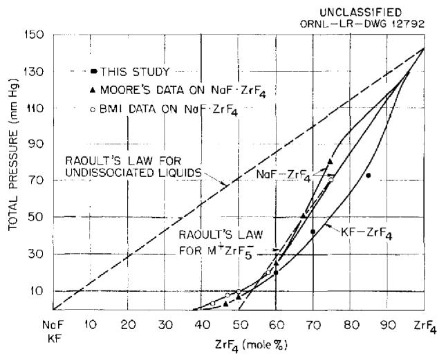  
Fig. 4.15. Changes in Vapor Pressure with Composition for the Systems NaF-ZrF $_4$ and KF-ZrF $_4$ at $800^{\circ}$ C.

# Vapor Pressure of $\mathsf{FeCl}_2$

C.C.Beusman

Oak Ridge Institute of Nuclear Studies

Measurements of the activity of ferrous chloride in melts of the alkali-metal chlorides have been started with the use of vapor-pressure methods. A transportation apparatus has been assembled and will be used in the temperature ranges where both components are volatile. For lower temperatures, the Rodebush-Dixon method44 will be used.

For calibration purposes, the vapor pressure of pure ferrous chloride has been measured in the Rodebush-Dixon apparatus. The data are in fair agreement with literature values and are well represented by the equation

$$
\log P (\mathrm {a t m}) = 2 3, 0 8 0 - \frac {8 , 9 8 5}{T (^ {\circ} K)} - 5. 2 3 4 \log T (^ {\circ} K).
$$

# Surface Tensions of Molten Salts

S. Langer

Materials Chemistry Division

Surface tensions of molten salts have been examined by a number of investigators $^{48-53}$ who have documented their findings in the open literature; a determination of surface tension of a NaF-ZrF $_4$ -UF $_4$ fuel mixture has been made by Cohen and Jones $^{54}$ of ORNL. However, no systematic study of surface tension as a function

of composition, purity, etc., has yet been made for materials of interest to the ANP program. Since surface tension has been shown to be important, in certain cases, to heat-transfer55 and corrosion56 processes, a study of this property is under way.

The method chosen for this study is the sessile-drop technique, which has been successfully employed by Ellefson and Taylor,57 Baes and Kellogg,52 and Kingery et al.53 This method was selected in preference to the maximum-bubble-pressure technique because of the uncertainty of the maximum-bubble-pressure method with liquids having contact angles greater than 90 deg (measured through the liquid). A profile drawing of a sessile drop is shown in Fig.4.16. A photograph is taken of the sessile drop on a supporting plaque, and the dimensions $2x$ , the maximum diameter of the drop, and $z$ , the height from the maximum diameter to the apex, are measured. These dimensions, along with the density of the molten salt, are sufficient to determine the surface tension. The contact angle $\theta$ , which is difficult to measure directly, can be calculated if the additional quantities $x'$ and $z'$ are known.

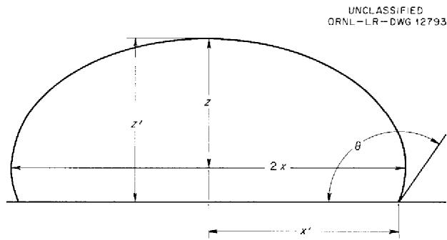  
Fig. 4.16. Profile of a Sessile Drop.

The equipment required for this study has been assembled and is in working order. Preliminary experiments are being carried out with NaF-ZrF $_4$ (53-47 mole %), and nickel, Inconel, platinum, and graphite are being used as supporting plaques. The condition of the surface of the supporting plaque is known to be extremely important in

determining whether the molten drop will wet the plaque, and the effects of various atmospheres on the wetting properties are also being studied. For the sessile-drop method to be successful, the molten drop must not wet the supporting surface.

The preliminary experiments show that nickel and Inconel surfaces are not immediately wetted by the sessile drop when it melts, even if the surfaces have previously been hydrogen-fired. The contact angle is only slightly greater than 90 deg, and, on standing, the contact angle slowly decreases until the surface is wetted by the salt, whether the atmosphere is helium or a vacuum of about $2\mu$ . A clean, polished, degreased platinum surface is wetted by the drop immediately upon melting in both vacuum and helium. However, if a nickel plaque that has been previously hydrogen-fired is used as the supporting surface and a hydrogen atmosphere is maintained in the furnace tube so that any thin film of oxide which has formed since the hydrogen-firing process will be reduced, the sessile drop will wet the surface as soon as it starts to melt. The droplet will spread over the nickel surface by the time it is entirely molten. It appears from these preliminary experiments that truly clean hydrogen-fired nickel surfaces are completely wetted by molten $\mathrm{NaZrF}_5$ and that, if thin oxide films are allowed to form on the metal surface after hydrogen-firing, the films will prevent wetting until they are dissolved by the molten salt. These observations are difficult to reconcile with the lack of evidence of wetting in nickel purification vessels in which intensive hydrogen treatments of molten fluorides are carried out for hours at $800^{\circ}\mathrm{C}$ , and therefore a more thorough study of the behavior of the sessile drop is being made.

Ellefson and Taylor57 measured the surface tension of LiF by the sessile-drop technique with "electrode" graphite as the supporting surface. Their results are in good agreement with those of Jaeger,50 which were obtained by the maximum-bubble-pressure technique. Thus it can be assumed that at least some fluoride melts will not wet graphite. Experiments with the use of graphite surfaces are under way.

# Density and Surface Tension of Molten KCl at $800^{\circ}\mathrm{C}$

F.W.Miles

Materials Chemistry Division

Apparatus $^{58}$ added to the conventional equipment for fuel purification is being used for the study of variations of density and surface tension of molten salts with changes in chemical composition. Calibration experiments with molten-salt standards are under way, and measurements were made of the surface tension and the density of molten KCl to determine the accuracy and precision of the methods.

Both the density and the surface tension of a molten salt can be determined from the same set of measurements of the maximum pressures required to blow helium bubbles into the melt through a capillary orifice at various accurately known depths. This is the standard method for surface-tension measurement and has been frequently described in the literature. The procedure being used at present was obtained from various sources,[59-61] and the design of the capillary orifices was substantially guided by Porter's analysis.[62] For the calculations Sugden's method of correction[60,63] for bubble distortion, as modified by Tripp and Young[64] for single bubbles, was used.

The density and the surface tension of molten KCl at $800^{\circ}C$ were determined with three different orifices (two with the same radius) for purposes of calibration. Measurements were made with each orifice at five different depths. The depths used were approximately $\frac{1}{4},\frac{1}{2},\frac{3}{4},\frac{1}{4}$ , and 2 in. The results are summarized in Table 4.19.

The second determination with orifice No. 1 was purposely performed without recalibration of the tip after exposure to the atmosphere following immersion in KCl. The nickel tube carrying

TABLE 4.19. DENSITY AND SURFACE TENSION OF KCI AT ${800}^{ \circ  }\mathrm{C}$   

<table><tr><td>Orifice No.</td><td>Orifice Radius* (cm)</td><td>Observed Density (g/ml)</td><td>Observed Surface Tension (dynes/cm)</td></tr><tr><td>1</td><td>0.0729</td><td>1.516</td><td>95.2</td></tr><tr><td>1</td><td>0.0729</td><td>1.523</td><td>92.9</td></tr><tr><td>2</td><td>0.0729</td><td>1.501</td><td>91.9</td></tr><tr><td>3</td><td>0.0430</td><td>1.510</td><td>93.8</td></tr><tr><td></td><td></td><td>Av 1.513 ± 0.007</td><td>Av 93.5 ± 1.1</td></tr></table>

*Orifice radius obtained by calibration with water for which the surface tension was simultaneously determined with a ring tensiometer.

orifice No. 2 was found to be slightly bowed after the experiment; this may account for the lower surface-tension values found with this orifice.

Previously published values for these properties of KCl are $1.509\mathrm{g/cm^3}$ and 95.8 dynes/cm by Jaeger[65] and $1.5102\mathrm{g/cm^3}$ by Van Artsdalen and Jaffe.[66] Although the precision and accuracy indicated above are perhaps acceptable, it is hoped that further improvement can be obtained without undue difficulty. Additional tests with KCl and with KCl-NaCl mixtures will be completed before measurements on fluoride mixtures are attempted.

# PHYSICAL CHEMISTRY OF FUSED SALTS67

E. R. Van Artsdalen

Chemistry Division

It appears to be established that, in the solid, $\mathsf{CaCl}_2$ forms 1:1 complexes with KCl, RbCl, and CsCl. It has been claimed[68] that viscosity measurements of the liquid mixtures indicate that these complexes exist in the molten state. Freezing-point depression studies were made in fused sodium nitrate to test whether any such complexes are stable in the dilute range. Mixtures of CsCl and $\mathsf{CaCl}_2$ depressed the freezing point in

a strictly additive, ideal manner. Therefore the evidence indicates that no $\mathsf{CsCl - CaCl}_2$ complexes exist in the dilute range when dissolved in sodium nitrate at about $300^{\circ}C$ .

Density and preliminary conductance data have been obtained for several molten rare-earth halides. These liquid salts tend to attack quartz rather severely, and, as a result, the conductance measurements show poorer precision than that previously obtained for alkali halides. Some data for $\mathsf{LaCl}_3$ and $\mathsf{LaBr}_3$ are given in Table 4.20.

Density and conductance of several fused alkaline-earth halides and their mixtures with some alkali halides are being investigated. It is hoped that information obtained from this study will throw light on the question of the existence of complexes in these liquid-salt mixtures and, therefore, be complementary to the freezing-point studies of dilute mixtures.

# PRODUCTION OF PURIFIED FUEL MIXTURES

G. J. Nessle

G.M.Watson

Materials Chemistry Division

# Use of Copper-Lined Equipment for Fuel

Purification

F. L. Daley

Materials Chemistry Division

Reaction vessels consisting of copper liners in stainless steel jackets have been proposed as substitutes for the nickel reactor cons that have failed frequently in recent months as a result of sulfur contamination in the raw materials used for large-scale fuel production. Three small-scale experiments $(2.5\mathrm{kg})$ were performed to determine the effects that might be encountered with the

change from nickel to copper-lined stainless steel reactors. In the first two experiments, mixtures of $\mathrm{NaF - ZrF_4 - UF_4}$ (50-46-4 mole %) were purified by the standard procedure. The same copper liner was used in both preparations, and no corrosion was apparent. The copper liner was contained in a nickel reactor in one experiment and in a stainless steel reactor in the other. Both experiments were successful in that the impurities in the product were at a normal level, averaging 70 ppm iron and 40 ppm chromium. The copper contamination was less than 20 ppm in each case.

On the basis of these two experiments, it was decided to attempt purification of large batches in copper-lined stainless steel reactors. It appeared possible, however, that the introduction of stainless

steel reactors would change the existing correlations between the concentration of impurities in the melts and the concentration of HF in the effluent hydrogen during the stripping process. Since this correlation is used for control of the processing operation, it was necessary to establish that its utility was not impaired by the change to the copper-stainless steel system.

Accordingly, a 2.5-kg batch of prepurified NaF $\mathsf{ZrF}_4$ - $\mathsf{UF}_4$ mixture was deliberately contaminated with 2000 ppm iron (as $\mathsf{FeF}_2$ ) and treated with hydrogen at a flow rate of $300~\mathrm{cm}^3/\mathrm{min}$ . Filtered samples of the melt were drawn at intervals and submitted for chemical analysis, and the HF concentration of the exit hydrogen was monitored in the usual way. The data obtained are shown in Table 4.21.

TABLE 4.20. DENSITY DATA FOR ${\mathrm{{LaCl}}}_{3}$ AND ${\mathrm{{LaBr}}}_{3}$   

<table><tr><td rowspan="2">Salt</td><td rowspan="2">Experimental Melting Point (°C)</td><td rowspan="2">Temperature Range (°C)</td><td colspan="2">Density, ρ = a - bt (g/cm3)</td><td rowspan="2">Standard Deviation (g/cm3)</td></tr><tr><td>a</td><td>b × 103</td></tr><tr><td>LaCl3</td><td>857.5</td><td>873 to 973</td><td>3.8773</td><td>0.7745</td><td>0.00012</td></tr><tr><td>LaBr3</td><td>779.6</td><td>796 to 912</td><td>5.0089</td><td>1.0960</td><td>0.0004</td></tr></table>

TABLE 4.21. CONCENTRATION OF IRON IN A PREPURIFIED NaF-ZrF $_4$ -UF $_4$ MELT CONTAMINATED WITH 2000 ppm Fe(AS FeF $_2$ ) IN RELATION TO HF CONCENTRATION IN EFFLUENT GAS   

<table><tr><td rowspan="2">Hydrogen Passed Through Melt (liters)</td><td rowspan="2">HF Concentration in Effluent (moles/liter)</td><td colspan="4">Contaminant Concentration (ppm)</td></tr><tr><td>Fe</td><td>Cr</td><td>Ni</td><td>Cu</td></tr><tr><td>7</td><td>3.3 × 10-3</td><td>1675</td><td>90</td><td>55</td><td></td></tr><tr><td>41</td><td>1.3 × 10-3</td><td>1640</td><td>100</td><td>100</td><td></td></tr><tr><td>88</td><td>1.0 × 10-3</td><td>1070</td><td>100</td><td>110</td><td></td></tr><tr><td>167</td><td>8.3 × 10-4</td><td>330</td><td>100</td><td>90</td><td>5</td></tr><tr><td>492</td><td>2.7 × 10-4</td><td>75</td><td>90</td><td>20</td><td>5</td></tr><tr><td>581</td><td>2.0 × 10-4</td><td>75</td><td>90</td><td>20</td><td>5</td></tr><tr><td>663</td><td>1.5 × 10-4</td><td>55</td><td>100</td><td>25</td><td>5</td></tr><tr><td>987</td><td>1.1 × 10-4</td><td>55</td><td>90</td><td>60</td><td>5</td></tr></table>

From these results, it appears that the melt is adequately purified at effluent-gas concentrations of $2 \times 10^{-4}$ moles/liter. This is similar to the situation in unlined nickel equipment. As anticipated, no perceptible changes were observed in the small chromium and nickel contents.

To test corrosion of the copper liner under extreme conditions, a purified melt was treated with HF for 30 hr at $800^{\circ}\mathrm{C}$ ; no hydrogen stripping was used. Six samples of melt obtained at 4- to 8-hr intervals were submitted for chemical analysis. Less than 5 ppm of copper was found in any sample. The nickel concentration rose from about 50 ppm to about 300 ppm during this test. The nickel undoubtedly came from the nickel dip tube through which the HF was introduced; whether anodic dissolution of the nickel and resultant protection of the copper occurred is not clear. In any event, the quantity of nickel introduced could easily be removed by hydrogenation and should not prove to be serious from the standpoint of corrosion of the purification equipment.

Visual examination of the liner and the assembly after these tests showed no perceptible deterioration. It appears that the use of copper-lined stainless steel reactors on the 250-lb or larger scale equipment should be quite satisfactory with $\mathsf{ZrF}_4$ -bearing mixtures. Tests with NaF-KF-LiF-UF and $\mathsf{BeF}_2$ -bearing materials will be made in the near future.

# Preparation of $\mathsf{ZrF}_4$ by Gas-Phase Hydrofluorination of $\mathsf{ZrCl}_4$

F. L. Daley  
Materials Chemistry Division

The equipment for conversion of $\mathsf{ZrCl}_4$ to $\mathsf{ZrF}_4$ by direct hydrofluorination of the solid69 is being rebuilt to overcome certain mechanical difficulties, and an alternate process for the conversion is being studied on a small scale. Results of calculations by Gully indicate that the over-all rate of reaction may be controlled by the rate of gaseous diffusion into and out of the solid phase rather than the interfacial reaction rate. Also, one of the unsolved problems in this process is the elimination of small percentages of oxide or water from the product. It is apparent that an alternate process

that would eliminate the solid phase and exclude possibilities of atmospheric contamination might effect substantial improvements in the rate of reaction, the yield, and the quality of product.

In the alternate process being studied, a stream of hydrogen is passed at a constant flow rate through a bed of $\mathsf{ZrCl}_4$ held at a constant temperature, in the neighborhood of $300^{\circ}\mathsf{C}$ . The effluent gas, a mixture of hydrogen and $\mathsf{ZrCl}_4$ vapor of a definite composition, governed by the temperature and gas flow rate, is then introduced into a mixing chamber, at $325^{\circ}\mathsf{C}$ , into which HF is also introduced at a constant rate. The reaction chamber is baffled, and the gases are introduced tangentially to allow for better separation of the solid $\mathsf{ZrF}_4$ . A vent to a KOH trap and a hydrogen burner allows continuous disposal of gases.

A small experimental assembly was constructed, and two preliminary experiments were made. These experiments were encouraging in that they yielded a high-quality product; however, it was found that plugging tended to occur at the entrance to the mixing chamber. Some indicated changes in design are being made in an attempt to avoid plugging.

# Laboratory-Scale Purification Operations

F. L. Daley  
Materials Chemistry Division

The standard hydrofluorination-hydrogenation process was used, with appropriate modifications, to prepare a number of especially pure materials requested for various purposes. Of these materials, only $\mathsf{BaF}_2$ and RbF were materials not previously prepared in the routine processing schedule.

# Pilot-Scale Purification Operations

C.R.Croft J.P.Blakely

J. Truitt W. T. Ward

Materials Chemistry Division

The 5- and 50-lb facilities processed 70 batches, totaling about 700 lb, of various compositions for use in small-scale corrosion testing, phase-equilibrium studies, and physical-property determinations. A very considerable increase in requirements for nonstandard compositions has been noted in recent months, and, at present, a backlog of about 1100 lb of special orders is on hand, with NaF-KF-LiF-UF $_4$ mixtures comprising the bulk of this backlog. Since the stockpile of standard ZrF $_4$ -bearing fuels is adequate, at present,

the 250-lb scale equipment has been shut down, and the personnel are being used to operate the small-scale equipment on a 24-hr, three-shift basis. It is anticipated that the 250-lb scale equipment can be used for NaF-KF-LiF-UF mixtures if the demand becomes sufficient and if the copper-lined stainless steel reactor cans prove to be compatible with these materials.

In the processing of compositions containing $\mathsf{BeF}_{2}$ , sulfur corrosion of the small-scale nickel equipment has become more troublesome. Since the available $\mathsf{BeF}_{2}$ is known to have a high sulfur content relative to the other salts used, such corrosion was, to some extent, anticipated. It is apparent that large-scale production of $\mathsf{BeF}_{2}$ compositions will necessitate more rigid specifications for $\mathsf{BeF}_{2}$ and probably a better container material than nickel. A few small-scale copper-lined stainless steel reactors are being fabricated. It is possible that reactors of this type may prove to be useful and versatile in investigations of new fluoride compositions.

# Production-Scale Operations

# J. E. Eorgan J.P.Blakely Materials Chemistry Division

During the past quarter, 23 batches, totaling approximately 5725 lb, of fluoride compositions were processed in the 250-lb facility. The arrival of 2,500 lb of a 10,000-lb order of hafnium-bearing $\mathsf{ZrF}_4$ from an outside vendor has eliminated the

shortage of usable $\mathsf{ZrF}_4$ for production purposes. The remaining 7500 lb will be delivered within the next three months, and, if specifications are met, sufficient $\mathsf{ZrF}_4$ will be on hand to meet all demands for zirconium-base mixtures for the remainder of the fiscal year. The analyses of contents of the eight drums in which the first 2500 lb of $\mathsf{ZrF}_4$ was shipped are given in Table 4.22.

The incidence of reactor-can failures in use in the production-scale facility has continued to increase. During this quarter five large reactor cans were damaged beyond repair because of leaks. A more thorough investigation of the causes of these failures was initiated in conjunction with the International Nickel Company, Inc. Chemical and metallographic examination revealed that sulfur embrittlement of the nickel was causing the cans to rupture. Analyses of the nickel in the reactors at the points of failure revealed as much as $0.035\%$ sulfur, which is well above the critical content for failure.

As a result of these findings and in view of the difficulty commercial suppliers are having in meeting the present sulfur specifications, studies of other container materials were made, as described above. Since the laboratory studies indicate that copper-lined stainless steel reactors will prove to be suitable, two 250-lb reactors have been ordered.

The production facility was shut down in January. The duration of the shutdown will depend

TABLE 4.22. CHEMICAL ANALYSES OF PURCHASED ${\mathrm{{ZrF}}}_{4}$   

<table><tr><td rowspan="2">Batch No.</td><td colspan="5">Major Constituents (wt %)</td><td colspan="4">Minor Constituents (ppm)</td></tr><tr><td>Zr</td><td>F</td><td>Na</td><td>K</td><td>Cl</td><td>Ni</td><td>Cr</td><td>Fe</td><td>S</td></tr><tr><td>112-1</td><td>54.6</td><td>44.7</td><td>0.59</td><td>0.1</td><td>0.09</td><td>195</td><td>60</td><td>500</td><td>35</td></tr><tr><td>-2</td><td>54.4</td><td>45.5</td><td>0.46</td><td>0.1</td><td>0.10</td><td>2</td><td>55</td><td>575</td><td>40</td></tr><tr><td>-3</td><td>54.2</td><td>43.5</td><td>0.59</td><td>0.1</td><td>0.26</td><td>65</td><td>35</td><td>375</td><td>45</td></tr><tr><td>1130-1</td><td>53.2</td><td>44.3</td><td>0.35</td><td>0.1</td><td>0.28</td><td>90</td><td>35</td><td>705</td><td>30</td></tr><tr><td>-2</td><td>55.3</td><td>44.2</td><td>0.22</td><td>0.1</td><td>0.30</td><td>90</td><td>35</td><td>760</td><td>90</td></tr><tr><td>-3</td><td>53.8</td><td>44.3</td><td>0.28</td><td>0.1</td><td>0.23</td><td>70</td><td>35</td><td>580</td><td>100</td></tr><tr><td>-4</td><td>53.5</td><td>44.1</td><td>0.59</td><td>0.1</td><td>0.20</td><td>70</td><td>30</td><td>485</td><td>100</td></tr><tr><td>-5</td><td>53.7</td><td>44.5</td><td>0.86</td><td>0.1</td><td>0.21</td><td>105</td><td>30</td><td>340</td><td>110</td></tr><tr><td>Theoretical</td><td>54.5</td><td>45.5</td><td></td><td></td><td></td><td></td><td></td><td></td><td></td></tr></table>

upon the length of time needed for fabrication of the new reactors, the consumption of the present stockpile of fuel materials, and the status of an accelerated program for testing new fluoride compositions.

The facility for the conversion of hafnium-free $\mathsf{ZrCl}_4$ to $\mathsf{ZrF}_4$ was operated three times during the quarter. Mechanical failures caused by binding of the agitator shaft in the packing gland terminated each attempt to use the facility. The design of the reaction chamber has been reviewed, and tolerance changes have been made. New parts are being fabricated for assembly; the unit should be assembled and tested again in the near future.

# Quality Control of Raw Materials and Products

F. L. Daley  
Materials Chemistry Division

Chemical analyses and petrographic examinations of fuel raw materials are routinely made. However, the most satisfactory specification check appears to be actual preparation of small batches of purified fuel mixtures from the raw material. Accordingly, such checks were made on samples of various zirconium compounds supplied by commercial vendors. These tests showed that one otherwise-suitable material contained sufficient water (or hydrolysis product) to yield an oxyfluoride component in the fuel. Tests of this type will be continued as additional materials are supplied. It is intended to extend these tests to include specimens of purchased materials. The information

obtained will be a guide to necessary modifications of the production procedure.

In addition to the HF-monitoring procedure and to the chemical analyses of the product, which are standard quality-control features of the 250-lb production-scale operation, examination of the samples by x-ray diffraction and petrographic techniques has been added as a routine procedure. Of some 5000 lb produced during the quarter, only one 250-lb batch was found to contain oxides or oxyfluorides and thus to require reprocessing. Contamination of this batch probably resulted during a repair on the equipment while the batch was in preparation.

# Batching and Dispensing Operations

F. A. Doss J. P. Blakely  
Materials Chemistry Division

During this quarter, 111 batches, totaling approximately 5900 lb, were dispensed to various users in batch sizes ranging from 1 to 250 lb. The total amount dispensed represents an increase of 2000 lb in the fluoride-mixture consumption, in comparison with the amount consumed during the previous quarter, but consumption is still less than that expected. As a result, there was a small gain in the stock inventory. A material balance for the quarter is given in Table 4.23.

The consumption of the $\mathsf{NaF - ZrF}_4$ and the $\mathsf{NaF - ZrF}_4$ - $\mathsf{UF}_4$ mixtures is not expected to increase during the next quarter, and therefore it is anticipated that requests for these compositions can be filled from the stockpile until the new reactors for the production facility are available.

TABLE 4.23. MATERIAL BALANCE   

<table><tr><td rowspan="2"></td><td colspan="4">Material (lb)</td></tr><tr><td>NaF-ZrF4-UF4(50-46-4 mole %)</td><td>NaF-ZrF4(50-50 mole %)</td><td>Special</td><td>Total</td></tr><tr><td>On hand at beginning of quarter</td><td>5,715</td><td>2475</td><td>661</td><td>8,851</td></tr><tr><td>Produced during quarter</td><td>5,728</td><td></td><td>694</td><td>6,422</td></tr><tr><td>Total</td><td>11,443</td><td>2475</td><td>1355</td><td>15,273</td></tr><tr><td>Dispensed during quarter</td><td>5,208</td><td>600</td><td>764</td><td>6,572</td></tr><tr><td>On hand at end of quarter</td><td>6,235</td><td>1875</td><td>591</td><td>8,701</td></tr></table>

# Filling, Draining, and Sampling Operations

N.V. Smith

F.A.Doss

J.P.Blakely

W. T. Ward

Materials Chemistry Division

During this quarter, the filling, draining, and sampling operations were considerably accelerated because of the large number of engineering tests that were initiated. If the present schedules prevail, this accelerated pace should continue for the remainder of the fiscal year.

Approximately 4000 lb of processed fluorides and an equivalent amount of liquid metals were used in batch sizes ranging from 5 to 500 lb to charge tests rigs during this quarter. About $95\%$ of these operations dealt with engineering tests requiring charges in the 50-lb range.

Liquid-metal salvage operations are assuming major proportions, along with the accelerated operational schedule. The disposal of bulk NaK is well provided for, but bulk sodium disposal is becoming a greater problem. A proposed facility for the disposal of sodium under water, by a procedure similar to that used for NaK, is being studied. However, the necessity for providing heat to melt the sodium for underwater injection at a remote location makes this approach appear to be uneconomical.

In-pile loop No. 4 was filled with the enricheduranium mixture NaF-ZrF-UF (53.5-40-6.5 mole $\%$ ) during the quarter. A new batch of the same composition has been processed for filling loop No. 5.

In the filling of previous in-pile loops, the danger of blowing the fuel into the pump bowl had become a major problem. Since gas in the small sump tank could be vented through the pump, loop No. 4 was filled by gravity flow. The batch was transferred to a special storage can which was equipped with a dump line from the bottom. After the can had been connected to the sump, heat was applied and the batch was transferred successfully. This procedure has therefore been adopted as standard for the filling of loops of this type.

# Calibration of ART Enricher

F. A. Doss

J.P.Blakely

Materials Chemistry Division

The final portion of the uranium required to bring the ART to criticality is to be added as molten $\mathsf{Na}_2\mathsf{UF}_6$ from a semiautomatic, remotely operated enricher. This mechanism utilizes a piston, driven by an accurately machined screw, which displaces the molten salt from a sump and causes it to flow over a weir and then by gravity into the reactor sump.

A prototype of this equipment was tested during the high-temperature critical experiment. While the operation was successful, in general, it was observed that the machine behaved erratically when attempts to add small amounts of material were made. After the experiment, the enricher was preserved intact and was remounted and carefully leveled in Building 9212. An inert-atmosphere box containing a glass window was then fitted around the orifice for further tests. The amount of material delivered by a specified number of turns of the screw was ascertained by weighing a graphite receiver which caught each discharge; in addition, visual observation sufficed to disclose the number of turns required to start the flow. Attempts were made to force various increments of molten salt from the equipment with several levels of melt in the enricher sump. A condensation of the data obtained is presented in Table 4.24.

In each attempt, flow began only after the piston had been depressed at least 0.4 turn, and usually more than 0.6 turn was required. Apparently, the surface tension of the material is so high that the liquid "bulges" above the weir before flow begins. Accordingly, additions smaller than about $125\mathrm{g}$ often cannot be made at all, while the percentage uncertainty in additions of $250\mathrm{g}$ (1 turn) is of the order of $\pm 10\%$ . Reproducibility becomes considerably better, especially on a percentage basis, when larger additions are made. If this enricher is used only to add increments greater than about $500\mathrm{g}$ , it will be satisfactory without change. If smaller additions are necessary, the enricher must be redesigned to give smaller holdup in the weir (and hence a higher static head per unit of piston travel) or to change the shape of the dam.

TABLE 4.24. REPRODUCIBILITY OF INIncrement DRAWN FROM ENRICHER AS A FUNCTION OF TURNS OF THE SCREW   

<table><tr><td rowspan="2">Number of Attempts</td><td rowspan="2">Increment Attempted (number of turns)</td><td colspan="2">Increment Drawn (g)</td><td rowspan="2">Mean Increment (g/turn)</td><td rowspan="2">Mean Deviation from Mean Increment (g/turn)</td></tr><tr><td>Minimum</td><td>Maximum</td></tr><tr><td>5</td><td>0.6</td><td>145</td><td>320</td><td>320</td><td>41</td></tr><tr><td>5</td><td>0.8</td><td>207</td><td>241</td><td>271</td><td>13</td></tr><tr><td>2</td><td>0.9</td><td>211</td><td>233</td><td>246</td><td>12</td></tr><tr><td>13</td><td>1.0</td><td>242</td><td>286</td><td>257</td><td>9</td></tr><tr><td>6</td><td>2.0</td><td>497</td><td>516</td><td>254</td><td>4</td></tr><tr><td>10</td><td>5.0</td><td>1238</td><td>1282</td><td>252</td><td>2</td></tr></table>

# 5. CORROSION RESEARCH

W. D. Manly

Metallurgy Division

# FORCED-CIRCULATION STUDIES

J. H. DeVan

E.A.Kovacevich R.S.Crouse

Metallurgy Division

# Fluoride Fuel Mixtures in Inconel

Three Inconel forced-circulation loops were operated to study the effect on corrosion by fluoride fuel mixtures of increases in the ratio of loop volume to loop wall surface area. The fluoride fuel mixture circulated in these loops was NaF-ZrF4-UF4 (53.5-40-6.5 mole %). The following operating conditions were utilized for all three loops:

Operating time, hr 1000

Maximum fluoride-mixture temperature, $^\circ F$ 1500

Temperature gradient, ${}^{\circ}\mathsf{F}$ 200

Maximum tube wall temperature, $^\circ F$ 1600

Reynolds number 10,000

Velocity, fps 6.5

Length of heated section, ft 17

Total length of loop, ft 51

The system variables and the corrosion results for the three loops are given in Table 5.1.

It may be seen that the quotients of heated surface area and total loop volume were varied in the ratio 1:2:4. The volume increases in loops 7425-6 and -7A were obtained by introducing reservoirs at the hairpin turns connecting the first and second heaters, as shown in Fig. 5.1. Since heat is not normally introduced at this hairpin turn, Calrod heaters were placed around the reservoir cans to

maintain the fluid temperature established by the first heated section. The heating of the reservoir cans of the fluid did not increase the temperature. The walls of the cans were therefore at the same temperature as the wall of the tube comprising the hairpin section in standard loop 7425-1A, and the temperature distributions around the heated sections, as well as the rest of the loop, were maintained the same for all three loops. The fluid temperature at the reservoirs was approximately $75^{\circ}\mathrm{F}$ lower than the maximum fluid temperature, which was attained immediately past the second heated section in each loop.

The variations in depth of attack in the three loops show no particular correlation with loop volume, as may be seen in Table 5.1. As previously reported, however, the attack to a depth of 9 mils in loop 7425-1A is higher than appears to be normal for standard loops; it was expected to be in the range of 5 to 7 mils. This expected value provides a more reasonable comparison with the attack to a depth of 6 mils observed in loop 7425-6, in which the system surface-to-volume ratio was a factor of 2 less than that in loop 7425-1A. No measurable increase in attack as a result of the volume increase was found.

The attack to a depth of 9 mils in loop 7425-7A, in which the system surface-to-volume ratio was a factor of 4 less than that in loop 7425-1A, was accompanied by a very thin, continuous gold-colored layer that covered substantial portions of

J. H. DeVan, ANP Quan, Prog. Rep. Dec. 10, 1955, ORNL-2012, p 105.

TABLE 5.1. EFFECT ON CORROSION OF VARYING THE HEATED-SURFACE-TO-VOLUME RATIO   

<table><tr><td>Loop</td><td>System Volume (in.3)</td><td>Ratio of Heated Surface Area to Volume</td><td>Maximum Depth of Attack (mils)</td></tr><tr><td>7425-1A (standard loop)</td><td>80.8</td><td>2.10</td><td>9</td></tr><tr><td>-6</td><td>251</td><td>0.98</td><td>6</td></tr><tr><td>-7A</td><td>518</td><td>0.5</td><td>9</td></tr></table>

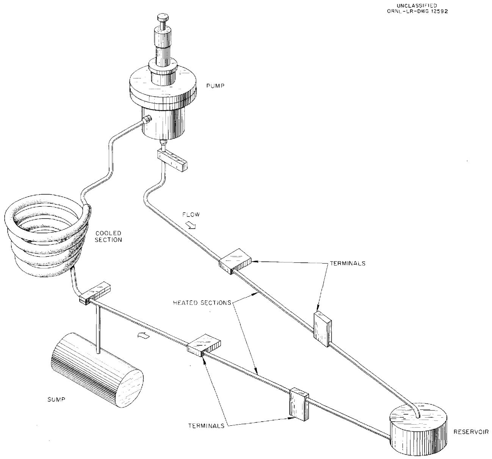  
Fig. 5.1. Forced-Circulation Loop Showing Position of Reservoir Added to Increase Volume of System.

the cold leg, as well as parts of the pump that were in contact with the fluid. A chemical analysis of the deposit showed predominantly titanium and, possibly, some zirconium. A careful search was made of all parts of the loop for materials with high titanium content, but none were found. Attempts to identify the layer as a titanium compound by x-ray diffraction have been unsuccessful.

Therefore, although the attack in loop 7425-7A was approximately 3 mils deeper than the attack in loop 7425-6 and the attack which would have

been normal in loop 7425-1A, the significance of the increase in depth of attack cannot be judged until the source of the deposits is found. However, even if the increase in depth of attack can be attributed to the increase in volume, it appears that varying the system volume in the range studied does not have a significant effect on corrosive attack over a 1000-hr period.

Two other forced-circulation Inconel loops (7425-2 and 7425-4A) were examined. These loops,

which had circulated the fluoride fuel mixture NaF-KF-LiF- $(\mathsf{UF}_4 + \mathsf{UF}_3)$ (11.2-41-45.3-2.5 mole %), clearly demonstrated that the presence of $\mathsf{U}^{3+}$ in such a mixture is very effective in reducing hot-leg attack. However, disproportionation of $\mathsf{UF}_3$ occurred in both loops, and therefore continuous layers of metallic uranium were formed along the loop walls in the cooled sections. Chemical analyses of samples (Table 5.2) taken before filling of the loops showed $1\mathrm{wt}\%$ of the fluoride mixture to be uranium in the trivalent form. Both loops operated with a hot-leg temperature of $1500^{\circ}\mathsf{F}$ , a temperature drop of $200^{\circ}\mathsf{F}$ , and a Reynolds number of 10,000.

A pump-motor failure during operation resulted in the unscheduled termination of loop 7425-2 after 550 hr. The maximum attack during this period was found metallographically to be less than 1.5 mils. Loop 7425-4A, which operated successfully for 1000 hr, showed only slightly greater attack, which reached to a depth of 2 mils, as shown in Fig. 5.2. Analyses of samples of the fuel mixture taken before filling and after draining of the loop, as reported in Table 5.2, showed little change in the chromium content, and thus they substantiate the low attack. The low attack in these loops is in contrast with the attack to a depth of 35 mils reported previously² for loop 4695-3, which was operated under similar conditions but circulated an alkali-metal fluoride mixture with the uranium present only as UF₄.

The continuous metal layers formed on the cold legs of loops 7425-2 and -4A were well bonded and almost invisible. When etched, however, the layers became blackened and were heavily at

tacked, and thus the presence of uranium metal formed from the reaction

$$
4 U F _ {3} \rightleftharpoons 3 U F _ {4} + U ^ {\circ}
$$

was indicated.

Metal crystals were found in the cold legs, in addition to the continuous deposits. The crystals were composed predominantly of chromium and can therefore be attributed to mass transfer. Thus, even though the presence of trivalent uranium substantially reduces the attack, the mass transfer of chromium is apparently not entirely eliminated, and the disproportionation of $\mathsf{UF}_3$ to form metallic uranium is serious.

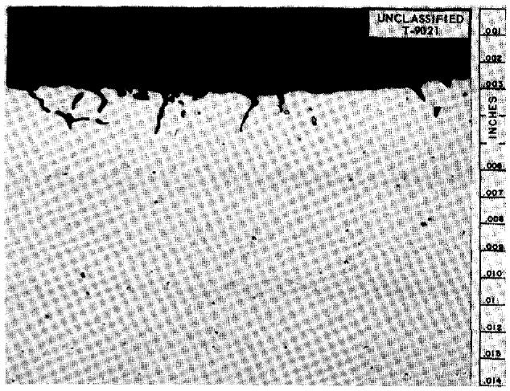  
Fig. 5.2. Maximum Attack in Inconel Forced-Circulation Loop 7425-4A After Circulating NaF-KF-LiF-(UF $_4$ + UF $_3$ ) (11,2-41-45.3-2.5 mole %) for 1000 hr at a Maximum Fluid Temperature of $1500^{\circ}$ F and a Reynolds Number of 10,000. 250X. Reduced 31%. (See text with caption)

TABLE 5.2. URANIUM AND IMPURITY ANALYSES OF SAMPLES OF NaF-KF-LiF-(UF ${}_{4} +$ UF ${}_{3}$ ) TAKEN BEFORE FILLING AND AFTER DRAINING OF LOOPS   

<table><tr><td rowspan="2">Loop No.</td><td rowspan="2">Sample Taken</td><td colspan="2">Uranium Content (wt %)</td><td colspan="3">Impurities Found (ppm)</td></tr><tr><td>Total U</td><td>U3+</td><td>Ni</td><td>Cr</td><td>Fe</td></tr><tr><td rowspan="2">7425-2</td><td>Before filling</td><td>11.9</td><td>1.07</td><td>135</td><td>35</td><td>105</td></tr><tr><td>After draining</td><td>10.7</td><td>0</td><td>275</td><td>25</td><td>150</td></tr><tr><td rowspan="2">-4A</td><td>Before filling</td><td>10.8</td><td>0.81</td><td>115</td><td>40</td><td>165</td></tr><tr><td>After draining</td><td>10.8</td><td>0.70</td><td>390</td><td>155</td><td>120</td></tr></table>

# Liquid Metals in Inconel and Stainless Steel

The first Inconel forced-circulation loop (7439-1) in which NaK was circulated completed 1000 hr of operation with a temperature gradient of $300^{\circ}\mathrm{F}$ and a maximum fluid temperature of $1500^{\circ}\mathrm{F}$ . The loop included a bypass cold trap for removing oxides. As in the case of Inconel-sodium loops, metal deposits were found in the economizer and, to a lesser extent, in the cooled sections of the loop, as shown in Fig. 5.3. The dendritic crystals comprising the deposits were somewhat finer than the crystals observed in sodium loops, and they projected from a thin metallic layer that was integrally bonded to the base metal, as shown in Fig. 5.4. Analyses showed the deposits to be 90 to $92\%$ nickel and 8 to $10\%$ chromium and thus to be identical to the deposits found in Inconel-sodium loops.

A second Inconel loop (7439-2) was operated with NaK for 1000 hr under conditions similar to those for operation of loop 7439-1, but there was no cold trap in the system. Visual and metallo

3 Ibid., p 86.

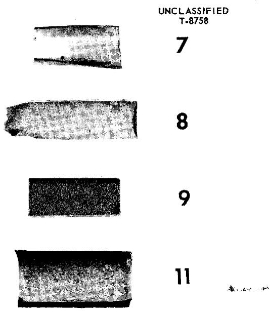  
Fig. 5.3. Three Sections from the Economizer and One Section from the Cold Leg of Inconel Forced-Circulation Loop 7439-1 Which Circulated NaK for 1000 hr at a Maximum Fluid Temperature of $1500^{\circ}\mathrm{F}$ and a Temperature Gradient of $300^{\circ}\mathrm{F}$ . This loop included a bypass cold trap.

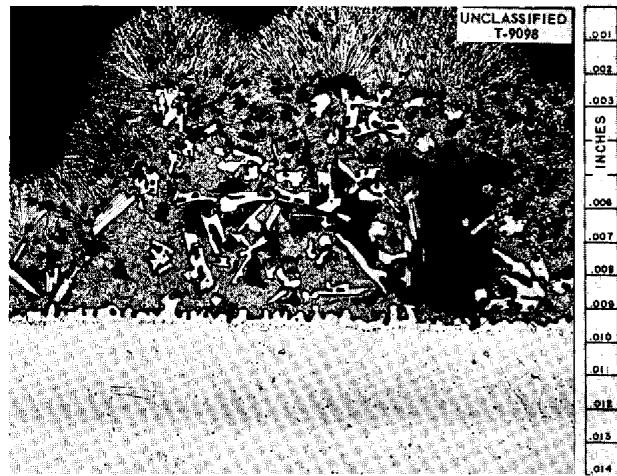  
Fig. 5.4. Layer Deposited in Economizer of Inconel Forced-Circulation Loop Which Circulated NaK for 1000 hr. 250X. Reduced $32\%$ .

graphic examinations did not reveal a significant difference in the amount or in the appearance of the deposits formed in this loop in comparison with the deposits in the first loop. Thus the presence of a bypass cold trap in the first loop was apparently of little benefit in limiting mass transfer, as has also been true of Inconel-sodium loops.4

A comparison of the amount of mass-transferred material in these NaK (56% Na-44% K) systems relative to comparable sodium systems has not been possible because of difficulty in removing the deposits from the NaK loops for weight determinations. The maximum deposit thicknesses were approximately the same in both the NaK systems and the sodium systems; however, such thickness measurements are not necessarily effective measures of mass transfer, because the crystals are formed in discontinuous patches. It appears that, in general, the restriction to flow in both systems as a result of mass transfer would be similar.

A type 316 stainless steel loop (7426-5) also completed 1000 hr of operation with sodium as the circulated fluid. The maximum fluid temperature was $1500^{\circ}\mathrm{F}$ , and there was a temperature gradient of $300^{\circ}\mathrm{F}$ . A bypass cold trap was included in the system. As in a type 316 stainless steel loop operated previously for 476 hr, only a very slight

deposit was found in the economizer and in the cold leg (Fig. 5.5). The amount of deposit which could be scraped out was sufficient only for spectrographic examination, which indicated it to be predominantly nickel and chromium.

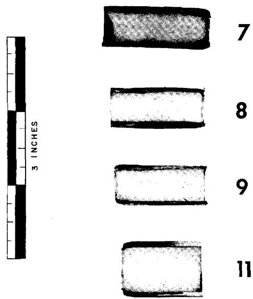  
UNCLASSIFIED T-9429   
Fig. 5.5. Three Sections from the Economizer and One Section from the Cold Leg of Type 316 Stainless Steel Loop 7426-5 Which Circulated Sodium for 1000 hr.

# THERMAL-CONVECTION STUDIES

J. H. DeVan

E.A.Kovacevich R.S.Crouse

Metallurgy Division

Alkali-Metal Fluoride Fuel Mixtures in Hastelloy B

Three thermal-convection loops (176, 814, and 816) constructed of $\frac{1}{2}$ -in. sched-40 Hastelloy B pipe (28% Mo-67% Ni-5% Fe) were operated at $1500^{\circ}F$ with NaF-KF-LiF-UF $_4$ (11.2-41-45.3-2.5 mole%). Loops 176 and 814, which ran for 500 hr, showed a maximum hot-leg attack of 2 mils. The attack appeared as heavy surface pitting, as shown in Fig. 5.6. Loop 816 was operated for 2000 hr to determine the effect of increasing the operating period. As may be seen in Fig. 5.7, the depth of

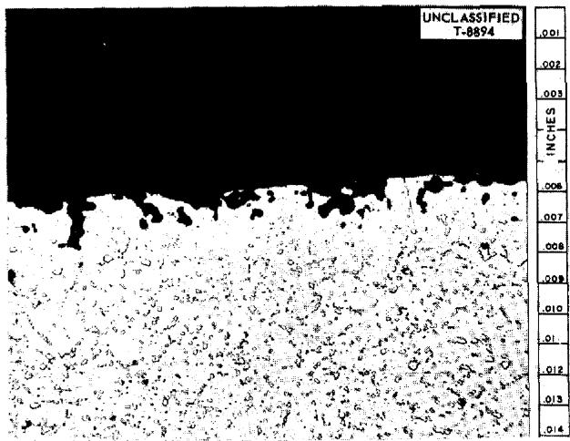

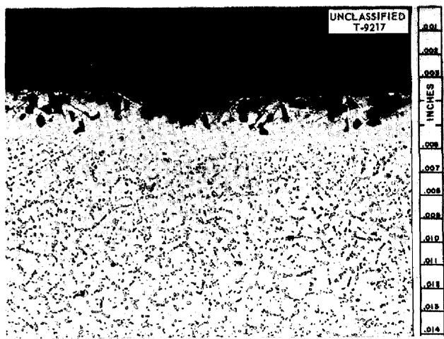  
Fig. 5.6. Maximum Hot-Leg Attack Found in Hastelloy B Thermal-Convection Loop 814 Operated with NaF-KF-LiF-UF $_4$ (11.2-41-45.3-2.5 mole %) as the Circulated Fluid. 250X. Reduced 32%. (Secret with caption)   
Fig. 5.7. Maximum Hot-Leg Attack Found in Hastelloy B Thermal-Convection Loop 816 Operated with NaF-KF-LiF-UF $_4$ (11.2-41-45.3-2.5 mole %) as the Circulated Fluid. 250X. Reduced 32%. (with caption)

attack in loop 816 was about the same as in the other two loops, but the pits were more concentrated. The cold legs of these loops were attacked to the same degree as the hot legs, and they appeared to be completely free of deposits. Chemical analyses of the fuel mixtures used in these loops are presented in Table 5.3.

# Effect of Condition of Inner Surface of Hastelloy B Tubing on Depth of Attack

Six thermal-convection loops were constructed of Hastelloy B tubing that had been reamed to ensure uniformity of the inner surface composition and to eliminate surface roughness. Three of the loops were then operated for 500, 1000, and 1500 hr, respectively, with NaF-ZrF $_4$ -UF $_4$ (50-46-4 mole %) at a maximum temperature of $1500^{\circ}\mathrm{F}$ , and three were operated with sodium under the same condi

tions. The test results are presented in Table 5.4. The loops operated with the fluoride mixture showed only slight variations in attack as a function of operating time. In comparison with previously operated Hastelloy B loops constructed of as-received or unreamed tubing, the depths of attack were similar. However, the metal crystals found in some of the earlier loops were completely absent in these later tests.

The three loops operated with sodium also showed no substantial increase in depth of attack

TABLE 5.3. CHEMICAL ANALYSES OF FUEL MIXTURES CIRCULATED IN HASTELLOY B LOOPS 176, 814, AND 816   

<table><tr><td rowspan="2">Loop No.</td><td rowspan="2">Sample Taken</td><td rowspan="2">Total Uranium Content (wt %)</td><td colspan="4">Impurities Found (ppm)</td></tr><tr><td>Ni</td><td>Cr*</td><td>Fe</td><td>Mo</td></tr><tr><td rowspan="2">176</td><td>Before filling</td><td>11.7</td><td>70</td><td>20</td><td>75</td><td></td></tr><tr><td>After draining</td><td>11.5</td><td>85</td><td>245</td><td>360</td><td></td></tr><tr><td rowspan="2">814</td><td>Before filling</td><td>11.9</td><td>130</td><td>80</td><td>120</td><td></td></tr><tr><td>After draining</td><td>11.9</td><td>20</td><td>95</td><td>120</td><td>75</td></tr><tr><td rowspan="2">816</td><td>Before filling</td><td>12.1</td><td>150</td><td>95</td><td>120</td><td></td></tr><tr><td>After draining</td><td>12.2</td><td>145</td><td>175</td><td>125</td><td>140</td></tr></table>

*Chromium is present as an impurity both in the Hastelloy B and in the fuel mixture, which is produced in Inconel pots.

TABLE 5.4. RESULTS OF TESTS OF THERMAL-CONVECTION LOOPS CONSTRUCTED OF REAMED HASTELLOY B TUBING  
Maximum fluid temperature: $1500^{\circ}\mathrm{F}$   

<table><tr><td rowspan="2">Loop</td><td rowspan="2">Circulated Fluid</td><td rowspan="2">Operating Time (hr)</td><td rowspan="2">Maximum Attack (mils)</td><td colspan="2">Metallurgical Results</td></tr><tr><td>Hot-Leg Appearance</td><td>Cold-Leg Appearance</td></tr><tr><td>766</td><td>Sodium</td><td>500</td><td>0.5</td><td>Light surface attack</td><td>No deposits, some attack</td></tr><tr><td>767</td><td>Sodium</td><td>1000</td><td>0.5</td><td>Light surface attack</td><td>No deposits or attack</td></tr><tr><td>768</td><td>Sodium</td><td>1500</td><td>2.5</td><td>Intergranular attack with surface pits</td><td>No deposits or attack</td></tr><tr><td>769</td><td>NaF-ZrF4-UF4*</td><td>500</td><td>1.5</td><td>Surface pits</td><td>No deposits or attack</td></tr><tr><td>770</td><td>NaF-ZrF4-UF4*</td><td>1000</td><td>3</td><td>Intergranular attack with surface pits</td><td>No deposits or attack</td></tr><tr><td>771</td><td>NaF-ZrF4-UF4*</td><td>1500</td><td>2</td><td>Surface pits</td><td>Moderate intergranular attack to a depth of 2 mils</td></tr></table>

*Composition: 50-46-4 mole %.

with increased operating time. There were no metallic deposits, and there was very little attack in the cold legs of the loops. However, some metallic deposits were observed macroscopically in the traps below the cold legs of all the loops.

# Screening Tests of Special Fuel Mixtures

A series of standard Inconel thermal-convection loops were operated for 500 hr at a maximum fluid temperature of $1500^{\circ}\mathrm{F}$ to obtain preliminary data for evaluating several special fuel mixtures. The preparation of the special fuel mixtures is described in Sec. 4, "Chemistry of Reactor Ma

terials." Since the quantities of the fuel mixtures available for filling the loops were limited, the usual precleaning with the mixture being investigated was omitted.

Four loops were operated as the first of a series for establishing the level of $\mathsf{ZrF}_4$ below which mixtures of NaF-LiF-ZrF-UFexhibit corrosion behavior typical of alkali-metal fluorides rather than zirconium-base fluorides such as NaF-ZrF- UF4 (50-46-4 mole %). The results of metallographic examination of the loops and chemical analyses of the fuel circulated are presented in Table 5.5. The attack by NaF-LiF-ZrF-UF

TABLE 5.5. RESULTS OF INCONEL THERMAL-CONVECTION LOOP TESTS OF SPECIAL FUEL MIXTURES   
Operating period: 500 hr Maximum fluid temperature: $1500^{\circ}\mathrm{F}$   

<table><tr><td rowspan="2">Loop No.</td><td rowspan="2">Fuel-Mixture Composition (mole %)</td><td rowspan="2">Maximum Depth of Attack (mils)</td><td rowspan="2">Fuel Sample Taken</td><td rowspan="2">Total Uranium Content (wt %)</td><td colspan="3">Impurities in Fuel (ppm)</td></tr><tr><td>Ni</td><td>Cr</td><td>Fe</td></tr><tr><td rowspan="2">841</td><td rowspan="2">NaF-LiF-ZrF4-UF4;20-55-21-4</td><td rowspan="2">14</td><td>Before filling</td><td>13.2</td><td>100</td><td>70</td><td>265</td></tr><tr><td>After draining</td><td>13.0</td><td>30</td><td>220</td><td>100</td></tr><tr><td rowspan="2">842</td><td rowspan="2">NaF-LiF-ZrF4-UF4;20-55-21-4</td><td rowspan="2">12.5</td><td>Before filling</td><td>12.8</td><td>405</td><td>195</td><td>170</td></tr><tr><td>After draining</td><td>13.0</td><td>30</td><td>370</td><td>90</td></tr><tr><td rowspan="2">843</td><td rowspan="2">NaF-LiF-ZrF4-UF4;53-35-8-4</td><td rowspan="2">10</td><td>Before filling</td><td>16.2</td><td>335</td><td>105</td><td>130</td></tr><tr><td>After draining</td><td>16.5</td><td>80</td><td>500</td><td>95</td></tr><tr><td rowspan="2">844</td><td rowspan="2">NaF-LiF-ZrF4-UF4;53-35-8-4</td><td rowspan="2">15</td><td>Before filling</td><td>16.5</td><td>300</td><td>105</td><td>115</td></tr><tr><td>After draining</td><td>16.5</td><td>85</td><td>300</td><td>90</td></tr><tr><td rowspan="2">839</td><td rowspan="2">RbF-ZrF4-UF4;50-46-4</td><td rowspan="2">9</td><td>Before filling</td><td>6.90</td><td>380</td><td>240</td><td>235</td></tr><tr><td>After draining</td><td>6.10</td><td>9</td><td>280</td><td>70</td></tr><tr><td rowspan="2">840</td><td rowspan="2">RbF-ZrF4-UF4;50-46-4</td><td rowspan="2">9</td><td>Before filling</td><td>6.87</td><td>370</td><td>235</td><td>275</td></tr><tr><td>After draining</td><td>6.40</td><td>30</td><td>145</td><td>70</td></tr><tr><td rowspan="2">845</td><td rowspan="2">KF-ZrF4-UF4;50-46-4</td><td rowspan="2">8</td><td>Before filling</td><td>8.21</td><td>110</td><td>110</td><td>315</td></tr><tr><td>After draining</td><td>8.36</td><td>20</td><td>270</td><td>50</td></tr><tr><td rowspan="2">846</td><td rowspan="2">KF-ZrF4-UF4;50-46-4</td><td rowspan="2">8</td><td>Before filling</td><td>8.18</td><td>120</td><td>115</td><td>100</td></tr><tr><td>After draining</td><td>8.06</td><td>10</td><td>315</td><td>40</td></tr><tr><td rowspan="2">847</td><td rowspan="2">LiF-ZrF4-UF4;50-46-4</td><td rowspan="2">17.5</td><td>Before filling</td><td>9.39</td><td>290</td><td>155</td><td>260</td></tr><tr><td>After draining</td><td>9.69</td><td>10</td><td>1750</td><td>85</td></tr><tr><td rowspan="2">848</td><td rowspan="2">LiF-ZrF4-UF4;50-46-4</td><td rowspan="2">19</td><td>Before filling</td><td>9.21</td><td>860</td><td>275</td><td>825</td></tr><tr><td>After draining</td><td>9.46</td><td>25</td><td>1850</td><td>80</td></tr><tr><td rowspan="2">860 (std)</td><td rowspan="2">NaF-ZrF4-UF4;50-46-4</td><td rowspan="2">10.5</td><td>Before filling</td><td>8.00</td><td>&lt;2</td><td>80</td><td>95</td></tr><tr><td>After draining</td><td>8.50</td><td>15</td><td>1060</td><td>80</td></tr></table>

(53-35-8-4 mole $\%$ ) in loops 843 and 844 resulted in heavy intergranular subsurface void formation, as shown in Fig. 5.8. The cold legs of loops 843 and 844 revealed light surface roughening and the formation of metallic crystals. Loops 841 and 842, which operated under similar conditions with NaF-LiF-ZrF $_{4}$ -UF $_{4}$ (20-55-21-4 mole $\%$ ), had moderate-to-heavy intergranular void formation in the hot leg, as shown in Fig. 5.9. Although some metal crystals were found in the cold legs of these loops, the quantities were smaller than those observed in loops 843 and 844, as would be expected because of the difference in ZrF $_{4}$ content.

Six other standard Inconel thermal-convection loops were operated as the first of a series of loops to study the effect on corrosion of various alkali-metal fluorides as components of the MF-ZrF4-UF4 (50-46-4 mole %) fuel mixture, where M stands for potassium, rubidium, or lithium. The results of metallographic examinations of these loops and chemical analyses of the fuel circulated are presented in Table 5.5. The maximum attack, which was to a depth of 19 mils, occurred in a loop (848) which circulated LiF-ZrF4-UF4 (Fig. 5.10), and, as may be noted in Table 5.5, the chromium contents of the lithium-containing fuels circulated in both loops 847 and 848 were quite high. Loops 839 and 840, which circulated RbF-ZrF4-UF4, under similar conditions, showed hot

leg attack to a depth of 9 mils (Fig. 5.11). The systems in which $\text{KF-ZrF}_4 - \text{UF}_4$ was circulated, loops 845 and 846, showed hot-leg attack to a depth of 8 mils (Fig. 5.12). The cold legs of all these loops showed slight surface roughening and very thin deposits.

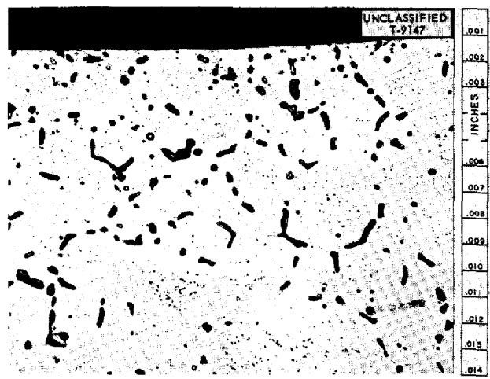  
Fig. 5.9. Maximum Hot-Leg Attack Found in Inconel Thermal-Convection Loop 841 Which Circulated NaF-LiF-ZrF $_4$ -UF $_4$ (20-55-21-4 mole %) for 500 hr at a Hot-Leg Temperature of $1500^{\circ}\mathrm{F}$ . 250X. Reduced $32\%$ . (with caption)

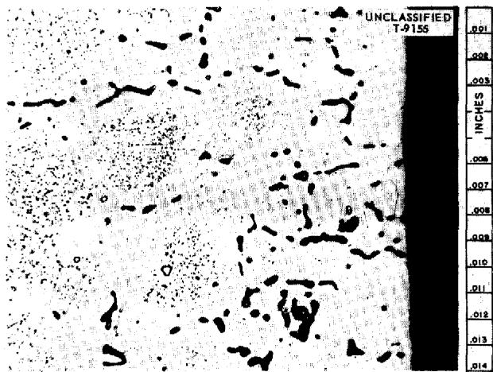  
Fig. 5.8. Maximum Hot-Leg Attack Found in Inconel Thermal-Convection Loop 843 Which Circulated NaF-LiF-ZrF $_4$ -UF $_4$ (53-35-8-4 mole %) for 500 hr at a Hot-Leg Temperature of $1500^{\circ}$ F. 250X. Reduced $32\%$ . (Swith caption)

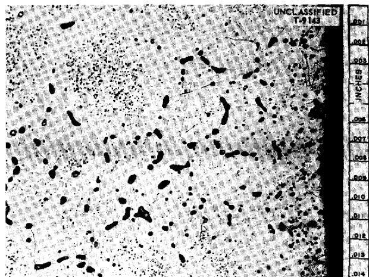  
Fig. 5.10. Maximum Hot-Leg Attack Found in Inconel Thermal-Convection Loop 848 Which Circulated LiF-ZrF $_4$ -UF $_4$ (50-46-4 mole %) for 500 hr at a Hot-Leg Temperature of $1500^{\circ}\mathrm{F}$ . 250X. Reduced $32\%$ . (with caption)

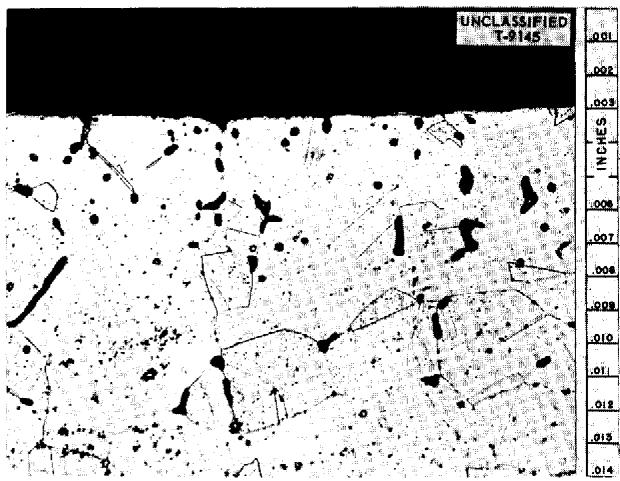  
Fig. 5.11. Maximum Hot-Leg Attack Found in Inconel Thermal-Convection Loop 840 Which Circulated RbF-ZrF $_4$ -UF $_4$ (50-46-4 mole %) for 500 hr at a Hot-Leg Temperature of $1500^{\circ}\mathrm{F}$ . 250X. Reduced $32\%$ . (See with caption)

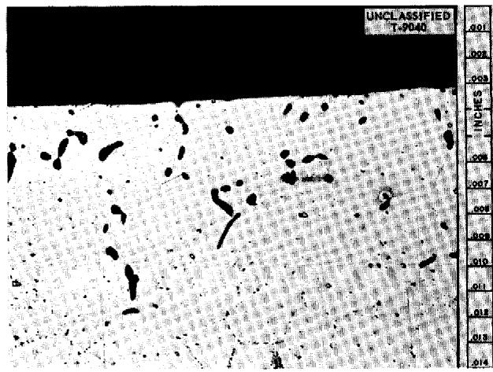  
Fig. 5.12. Maximum Hot-Leg Attack Found in Inconel Thermal-Convection Loop 846 Which Circu- lated KF-ZrF $\cdot_{4}$ -UF $^4$ (50-46-4 mole %) for 500 hr at a Hot-Leg Temperature of $1500^{\circ}F$ .250X. Reduced $32\%$ . (with caption)

Results of examination of a standard Inconel thermal-convection loop, 860, which operated with NaF-ZrF4-UF4 (50-46-4 mole %), are included in Table 5.5 for comparison with the results for the special fuels. The hot-leg attack in loop 860 appeared as intergranular attack to a depth of 10.5 mils.

# GENERAL CORROSION STUDIES

E. E. Hoffman

W.H.Cook

D.H.Jansen

Metallurgy Division

R. Carlander

Pratt & Whitney Aircraft

# Low-Cross-Section Brazing Alloys in Liquid Metals and in Fluoride Fuel Mixtures

D. H. Jansen

Inconel tube-to-header joints brazed with nickel-chromium-germanium-silicon low-cross-section brazing alloys have been corrosion tested in sodium, NaK, and $\mathrm{NaF - ZrF_4 - UF_4}$ in seesaw apparatus. A cross section of the type of joint tested is shown in Fig. 5.13. The advantage of this type of joint in comparison with the T-joints used in previous tests is that both the high- and the low-melting constituents of the brazing alloy can be exposed to the test medium at the same time. The specimens tested to date were given a fast braze, that is, 5 min to reach brazing temperature and 10 min at brazing temperature. The results of the seesaw tests of the joints are presented in Table 5.6.

As may be seen, these preliminary data indicate that the brazing alloy with the highest nickel content is the most corrosion resistant to NaK. Tubeheader joints brazed with the same alloys but brought to brazing temperature over a 4-hr period will be tested in the same medium. The $70\%$ Ni-11% Cr-13% Ge-6% Si alloy after the tests in NaK and in the fluoride fuel mixture is shown in Figs. 5.14 and 5.15.

Two tube-to-header joints brazed with Coast Metals alloy No. 52 (89% Ni-5% Si-4% B-2% Fe) were also tested in NaK and in NaF-ZrF $_4$ -UF $_4$ (53.5-40-6.5 mole %) for 100 hr in seesaw apparatus with a hot-zone temperature of $1500^{\circ}\mathrm{F}$ . One joint was brazed rapidly (10 min) and the other was brazed slowly (4 hr) in order to study the effect of brazing time on the corrosion rate. Neither joint was attacked by NaK, and both showed nonuniform attack to a depth of 0.5 mil in the fluoride fuel mixture. The brazing time did not appear to affect the corrosion resistance.

# Cathalloy A-31 in Sodium

R. Carlander

A 6-in. capsule of Cathalloy A-31 (4% W-96% Ni) was half filled with sodium under a helium

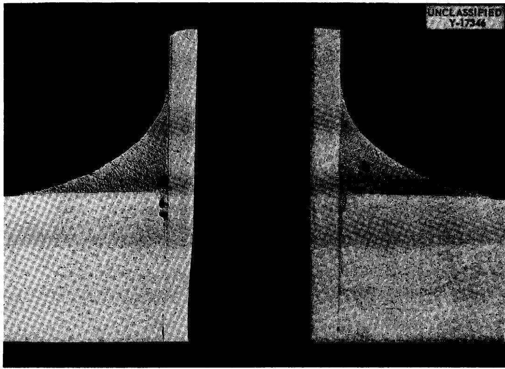  
Fig. 5.13. Cross Section of an As-Brazed Inconel Tube-to-Header Joint Showing Expanded Tube at the Bottom of the Header Plate; Brazed with Coast Metals Alloy No. 52 (89% Ni-5% Si-4% B-2% Fe). As polished. 10X.

TABLE 5.6. RESULTS OF SEESAW TESTS OF BRAZING ALLOYS ON INCONEL TUBE-TO-HEADER JOINTS   
Test period: 100 hr  
Hot-zone temperature: $1500^{\circ}\mathrm{F}$ Cold-zone temperature: $1100^{\circ}\mathrm{F}$   

<table><tr><td rowspan="2">Brazing-Alloy Composition (wt %)</td><td colspan="3">Attack (mils)</td></tr><tr><td>In Sodium</td><td>In NaK (56-44 wt %)</td><td>In NaF·ZrF4·UF4 (53.5-40-6.5 mole %)</td></tr><tr><td>70 Ni-11 Cr-13 Ge-6 Si</td><td>5</td><td>3</td><td>3.5</td></tr><tr><td>65 Ni-16 Cr-13 Ge-6 Si</td><td>6.5</td><td>7.5</td><td>3</td></tr><tr><td>62 Ni-19 Cr-13 Ge-6 Si</td><td>7.5</td><td>6.5</td><td>3</td></tr><tr><td>59 Ni-19 Cr-16 Ge-6 Si</td><td>8</td><td>5</td><td>2.5</td></tr></table>

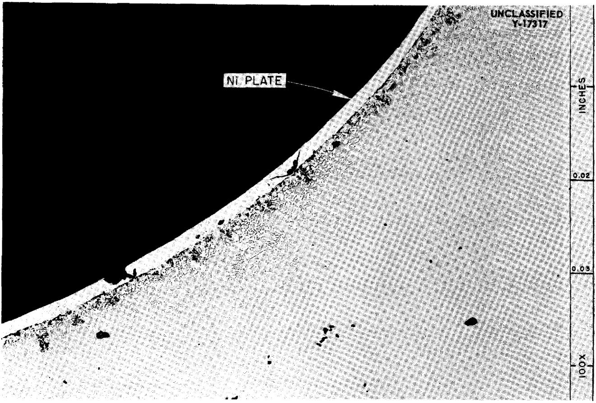  
Fig. 5.14. A $70\%$ Ni- $13\%$ Ge- $11\%$ Cr- $6\%$ Si Brazing Alloy After Exposure to NaK (56% Na-44% K) for 100 hr in Seesaw Apparatus at a Hot-Zone Temperature of $1500^{\circ}\mathrm{F}$ . Note nonuniform attack to a depth of 3 mils. As polished, 100X.

atmosphere and tested statically at $1500^{\circ}\mathrm{F}$ for 100 hr. No attack occurred in either the vapor or the bath zones of the capsule.

# Rare-Earth Oxides in Sodium

W.H.Cook

A specimen of $\mathsf{Sm}_2\mathsf{O}_3$ (5.88 g/cm³, 25.4% apparent porosity) was tested in an Inconel container in static sodium at $1500^{\circ}\mathsf{F}$ for 1000 hr, and two pieces from a body (6.58 g/cm³, apparent porosity not determined) fabricated from a commercial mixture of rare-earth oxides, 63.8% $\mathsf{Sm}_2\mathsf{O}_3 - 26.3\%$ $\mathsf{Gd}_2\mathsf{O}_3$ -balance primarily other rare-earth oxides, were similarly tested, one for 500 hr and the other for 1000 hr. The purpose of these three tests was to evaluate the corrosion resistance of the test specimens in sodium and the effects, if any, on the Inconel containers.

The weight and dimensional changes of these

three specimens were positive, as was to be expected with porous bodies, and they were less than $0.5\%$ . The only macroscopic change was that the bufflike color of the specimens was altered to a gray-black by the tests.

The untested and tested specimens are shown in Figs. 5.16 and 5.17. Powder x-ray diffraction comparisons of the untested and tested specimens did not reveal reaction products. The walls of the Inconel test containers were tinted slightly yellow in the liquid-sodium regions.

Metallographic examinations of the specimens and the Inconel containers, chemical analyses of the sodium test baths, and microspark spectrographic analyses of the inner surfaces of the Inconel containers will complete the examination of these tests.

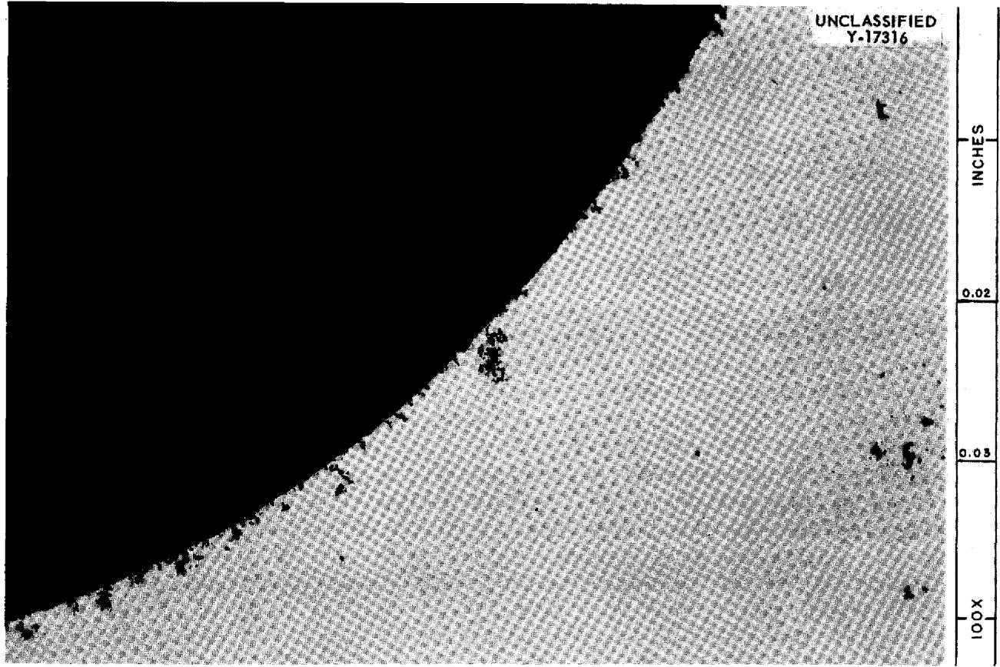  
Fig. 5.15. A $70\%$ Ni- $13\%$ Ge- $11\%$ Cr- $6\%$ Si Brazing Alloy After Exposure to $\mathsf{NaF - ZrF_4 - UF_4}$ (53.5-40-6.5 mole %) for 100 hr at a Hot-Zone Temperature of $1500^{\circ}\mathsf{F}$ . Note attack to a depth of 3.5 mils. As polished, 100X. (see with caption)

# Sodium in Type 316 Stainless Steel Thermal-Convection Loops

E. E. Hoffman

Two type 316 stainless steel thermal-convection loops filled with sodium were operated for 1000 hr with hot-leg temperatures of approximately $1630^{\circ}\mathrm{F}$ . The minimum cold-leg temperature was $950^{\circ}\mathrm{F}$ for one loop and $1050^{\circ}\mathrm{F}$ for the other. The loops were loaded with sodium from the same fill pot, and the test conditions were similar, except that a diffusion type of cold trap was placed at the bottom of the cold leg of one loop. Blasts of air were impinged on one section of the cold leg of each loop to induce a very sharp temperature gradient. The purpose of the tests was to determine the effect of a diffusion cold trap on the amount of mass transfer observed in a stainless steel-sodium system. Chemical analyses showed that the sodium used for filling the loops contained

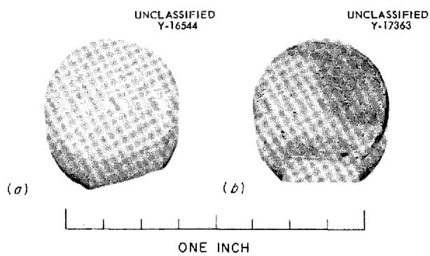  
Fig. 5.16. Samarium Oxide (a) Before and (b) After Being Exposed to Static Sodium in an Inconel Container for 1000 hr at $1500^{\circ}\mathrm{F}$ .

20 ppm oxygen. After the tests the sodium from loop 26, which did not have a cold trap, contained 25 ppm oxygen, while a sample from loop 27, which had a diffusion cold trap, contained 35 ppm oxygen.

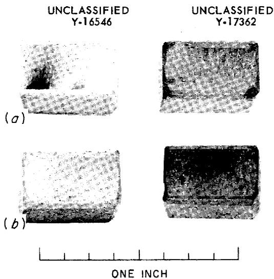  
Fig. 5.17. Specimens from a Commercial Mixture of Rare-Earth Oxides (63.8 wt % Sm₂O₃-26.3 wt % Gd₂O₃-balance primarily other rare-earth oxides) Before (at left) and After Exposure to Static Sodium in Inconel Capsules at 1500°F. (a) Specimens used in 500-hr test. (b) Specimens used in 1000-hr test.

The difference is attributed to contamination during the sampling operation; however, by present standards, the oxygen content of the sodium from both loops was quite low. Small amounts of metallic crystals were found; by visual inspection, in the coldest sections removed from each loop. Neither loop yielded sufficient metallic crystals for chemical analysis, but there was definitely a greater quantity of crystals present on the surface of the cold leg of loop 26, which did not have a cold trap, than on the cold leg of loop 27.

The results of metallographic examinations of loops 26 and 27 are presented in Table 5.7. The attack found in the hottest section of loop 26 was deeper than that detected in loop 27, as shown in Figs. 5.18 and 5.19. Nickel was preferentially leached from the hot-zone walls by the sodium. Deep intergranular cracking was found in the coldest section of the loop with no cold trap, but no cracks were observed in the cold leg of the loop which had a diffusion cold trap. In a similar test of an Inconel thermal-convection loop filled with sodium, in which the hot leg reached a maxi

TABLE 5.7. RESULTS OF METALLOGRAPHIC EXAMINATION OF SECTIONS FROM TYPE 316 STAINLESS STEEL THERMAL-CONVECTION LOOPS WHICH CIRCULATED SODIUM FOR ${1000}\mathrm{{hr}}$   

<table><tr><td rowspan="2">Section Examined</td><td colspan="2">Metallographic Notes</td></tr><tr><td>Loop 26</td><td>Loop 27</td></tr><tr><td>Top of hot leg; operating temperature, 1600°F</td><td>Surface irregular; attack 0.5 to 0.75 mil deep</td><td>Surface irregular; attack 0.5 to 0.75 mil deep</td></tr><tr><td>Middle of hot leg; operating temperature, 1630°F</td><td>Surface irregular; attack 3 to 3.5 mils deep; zone 0.25 to 0.5 mil deep transformed from austenite to ferrite by prefer-ential leaching of nickel</td><td>Attack less than 1 mil deep; austenite-to-ferrite transfor-mentation as in loop 26</td></tr><tr><td>Middle of cold leg; operating temperature, 1330°F</td><td>Attack less than 0.5 mil deep</td><td>Intergranular attack to a depth of 0.5 to 1 mil</td></tr><tr><td>Bottom of cold leg; operating temperature, 1050°F in loop 26 and 950°F in loop 27; air-blast cooled</td><td>Heavy precipitation of an un-identified phase in grains and in grain boundaries; many intergranular cracks origin-ting at exposed surface and extending to 10 to 20 mils deep</td><td>Heavy precipitation in grain boundaries and in grains along surface exposed to sodium; no intergranular cracks found</td></tr></table>

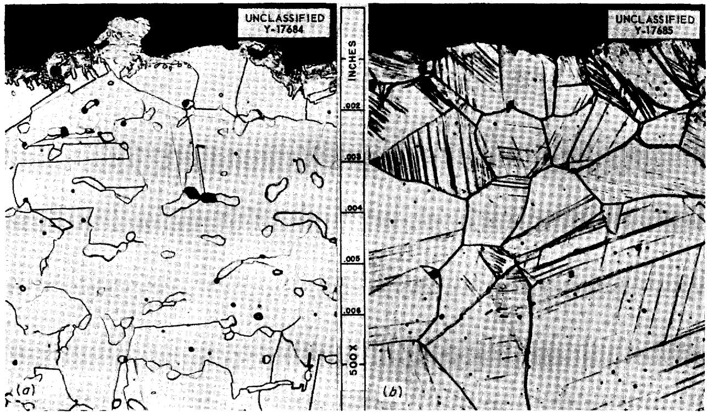  
Fig. 5.18. Sections from Type 316 Stainless Steel Thermal-Convection Loop 27 Which Contained a Diffusion Cold Trap and Circulated Sodium at a Maximum Hot-Leg Temperature of $1630^{\circ}\mathrm{F}$ and a Minimum Cold-Leg Temperature of $590^{\circ}\mathrm{F}$ . (a) Hot leg. (b) Cold leg. Note austenite-to-ferrite transformation on surface of hot leg as a result of preferential leaching of nickel. Etchant: aqua regia, 500X. Reduced $8\%$ .

mum of $1500^{\circ}F$ , that is, $130^{\circ}F$ less than the maximum temperature of these stainless steel loops, there was approximately ten times the amount of mass transfer found in either of these tests.

# Boiling Sodium in Type 348 Stainless Steel Loops E. E. Hoffman

Three type 348 stainless steel loops have been operated with boiling sodium for various lengths of time. Type 348 stainless steel is similar in composition to type 347 stainless steel, except that the carbon content of type 348 is higher. Each test was terminated before the end of the scheduled 1000-hr period because of leaks that developed at various locations in the systems. The periods of operation increased as fabrication techniques were improved; the first loop was operated for 108 hr, the second for 316 hr, and the third for 740 hr.

These loops were operated to study mass transfer by sodium in a stainless steel system in which the oxygen content of the sodium was very low and to obtain data for comparison with results obtained from operation of a similar Inconel system.7

The original design of the boiling-sodium loop, which was shown in a previous report, has been modified, as shown in Fig. 5.20. An overflow reservoir has been incorporated into the receiver, and a sampling port has been provided so that samples of the freshly condensed sodium may be taken to check the oxygen concentration periodically during a test run. To obtain a sample, the nickel sample bucket is dropped down through the open valve, and a sample of sodium is taken from the reservoir. The sample bucket is then withdrawn through the sampling port, under a purified helium atmosphere, and transferred to a pyrex tube, where it is sealed off under vacuum. The oxygen

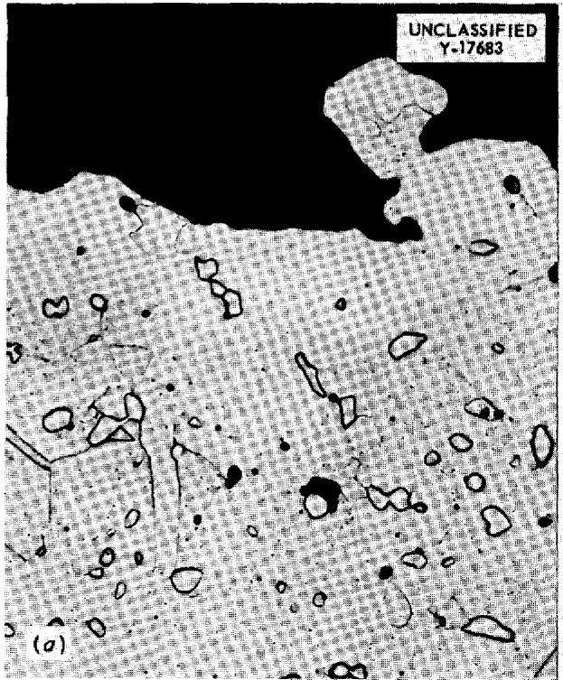

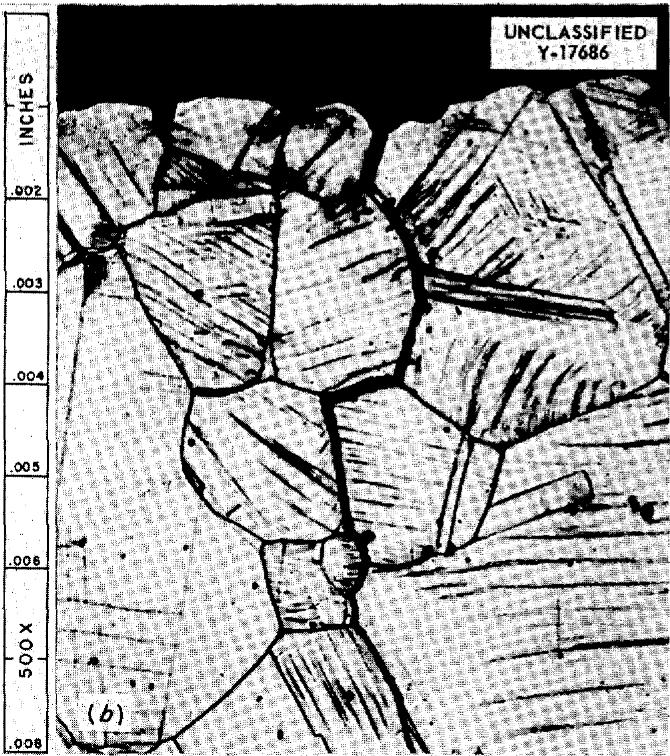  
Fig. 5.19. Sections from Type 316 Stainless Steel Thermal-Convection Loop 26 Which Circulated Sodium at a Maximum Hot-Leg Temperature of $1630^{\circ}\mathsf{F}$ and a Minimum Cold-Leg Temperature of $1050^{\circ}\mathsf{F}$ . (a) Hot leg. (b) Cold leg. Note irregularity of hot-leg surface and deep intergranular cracking in cold leg. Etchant: aqua regia. 500X. Reduced $9\%$ .

concentration of the limited number of samples taken thus far has been found to be approximately 20 ppm; a portion of this oxygen may be attributed to contamination during sampling.

The condenser sections of the three stainless steel loops operated in this series of tests were examined and found to be free of mass-transferred crystals. This result was expected, since iron-base alloys have been found to be less susceptible to mass transfer by sodium than nickel-base alloys in both thermal-convection and forced-circulation loop systems.

# Compatibility of Hastelloy B and Beryllium in Sodium

# E. E. Hoffman

Tests have been performed to study the compatibility of Hastelloy B and beryllium in sodium as a function of their distance of separation. The spacing distances employed were 0, 5, 20, 50, and 100 mils, and the specimens were exposed in static sodium for 1000 hr at $1200^{\circ}\mathrm{F}$ . The extent

of alloying was quite similar to that experienced with Inconel, as might be expected, since Hastelloy B and Inconel are both nickel-base alloys. Drillings were taken from the surfaces of the various Hastelloy B specimens. The beryllium concentrations found on the surfaces were:

<table><tr><td>Spacer Distance (mils)</td><td>Beryllium Concentration (10-6g/cm2)</td></tr><tr><td>0</td><td>8800</td></tr><tr><td>5</td><td>6.3</td></tr><tr><td>20</td><td>1.06</td></tr><tr><td>50</td><td>0.63</td></tr><tr><td>100</td><td>0.74</td></tr></table>

The interaction between the beryllium and the Hastelloy B specimens that were in contact during testing is shown in Fig. 5.21. As may be seen, direct contact resulted in the formation of various extremely hard and brittle phases on the surface of the Hastelloy B specimen. These phases have not all been identified, but several of them are

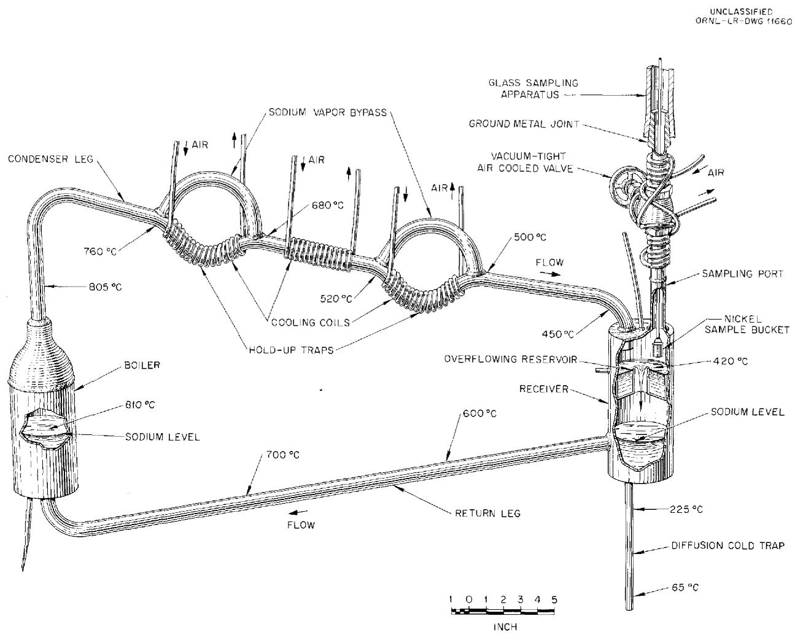  
Fig. 5.20. Type 348 Stainless Steel-Boiling Sodium Loop.

thought to be nickel-beryllium intermetallic compounds similar to those found in tests of Inconel in contact with beryllium. The extent of the transfer of beryllium to the surface of the Hastelloy B specimen when the two materials were separated by a 20-mil sodium gap is shown in Fig. 5.22. The very fine precipitate along the surface is thought to be a nickel-beryllium compound. It appears from these tests that beryllium and Hastelloy B surfaces must be separated by more than 20 mils if extensive alloying is to be avoided during long periods of exposure to sodium at $1200^{\circ}\mathrm{F}$ .

# Solid-Phase Bonding of Cermets

W. H. Cook

Long-term solid-phase bonding tests of the most promising cermets are under way. In the first of these tests, cermets K152B (64% TiC-6% NbTaTiC₃-30% Ni) and K151A (70% TiC-10% NbTaTiC₃-20% Ni) were tested at a calculated contact pressure of 20,000 psi in NaF-ZrF₄-UF₄ (53.5-40-6.5 mole %) at 1500°F for 1000 hr. These cermets were in the form of actual valve parts, with K152B as a disk and K151A as a seat. These seating surfaces had 45-deg bevels, 0.0100 ± 0.0002-in.-wide contact regions, and surface roughnesses of 5 to 10 μin. Solid-phase bonding occurred around approximately five-sixths of the

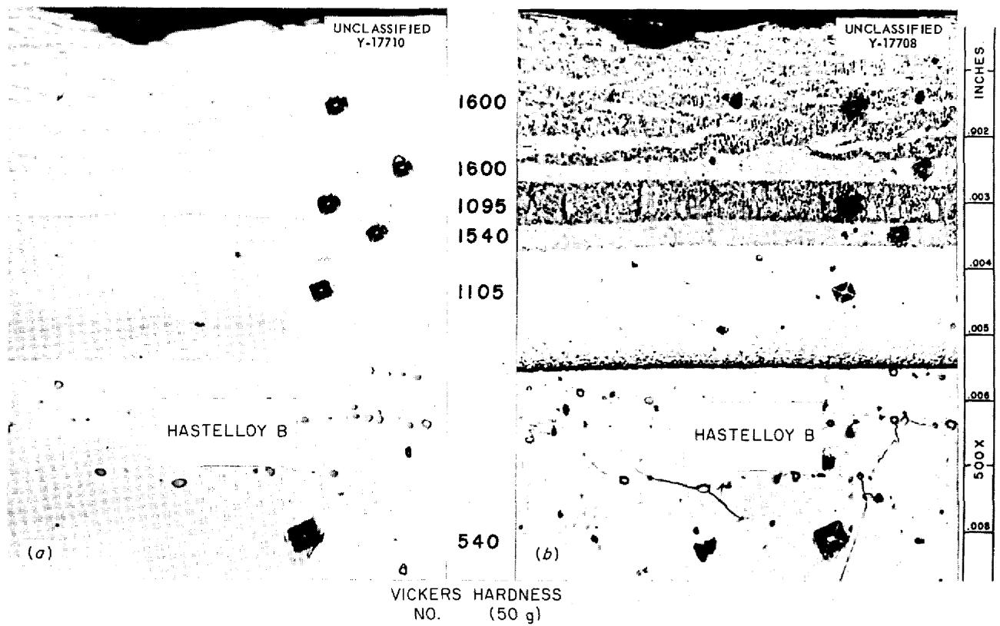  
Fig. 5.21. Hastelloy B Specimen After Being in Contact with Beryllium in Sodium for 1000 hr at $1200^{\circ}$ F. (a) Unetched. (b) Cathodic etch. Note the very hard intermetallic compounds which formed on the surface of the Hastelloy B. 500X. Reduced $19\%$ .

linear seating distance, but inspection of the area indicated that seating had been along a line rather than on the 0.0100-in.-wide surface. Microscopic pieces had been pulled from both the K151A and the K152B cermets. In the area in which no solid-phase bonding occurred, there was apparently uniform seating on the 0.0100-in.-wide surface. Because of the nonuniform seating, it cannot be determined whether the solid-phase bonding occurred as a result of (1) the high stress along the line contact, (2) the solid-phase bonding being time-dependent (all previous tests were of 100-hr duration), or (3) a combination of these. The reason for the nonuniform seating will be determined, and the test will be repeated.

# Solubility of Lithium in NaK

# R. Carlander

A series of differential thermal-analysis tests have been performed in order to determine the solubility of lithium in NaK (56 wt % Na-44 wt % K) as a function of temperature. Two capsules,

one filled with NaK and the other with NaK plus lithium, were used for each test. The two capsules were heated to $200^{\circ}\mathrm{C}$ and allowed to cool. The temperature of the NaK-plus-lithium bath was plotted on a time-temperature recorder, and the temperature difference between the two bodies was plotted on a temperature-differential recorder. When solidification begins, the amount of heat that is evolved is indicated by a break in the cooling curve of the alloy. This break was noted on the temperature-differential recorder and correlated with the temperature on the time-temperature recorder to obtain the solubilities. The solubilities determined were:

<table><tr><td>Temperature (℃)</td><td>Solubility (wt % Li)</td></tr><tr><td>75</td><td>0.25</td></tr><tr><td>104</td><td>1</td></tr><tr><td>125</td><td>2</td></tr><tr><td>164</td><td>4</td></tr><tr><td>166</td><td>5</td></tr><tr><td>170</td><td>6</td></tr><tr><td>175</td><td>10</td></tr></table>

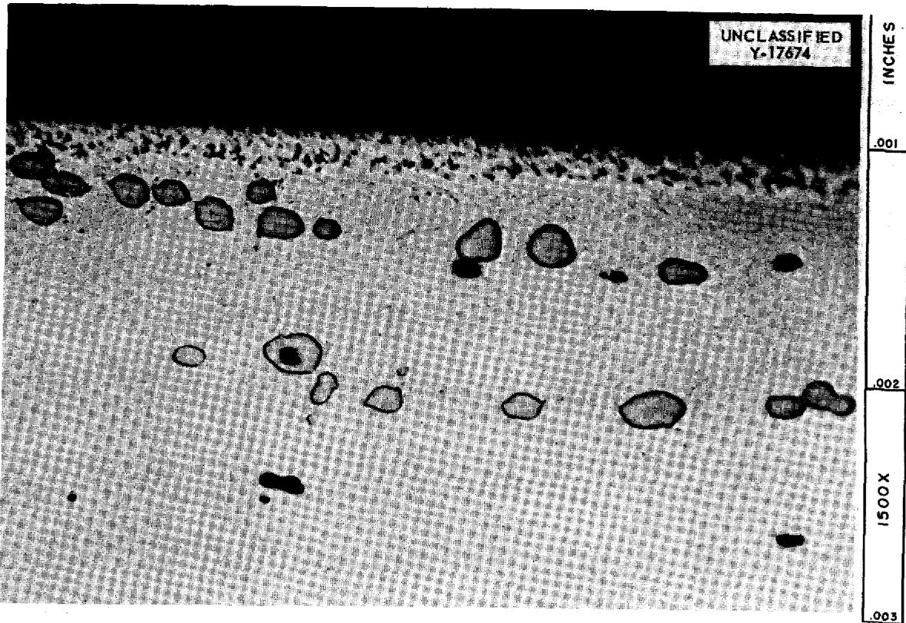  
Fig. 5.22. Hastelloy B Specimen That Was Separated from a Beryllium Specimen by a 20-mil Gap During Exposure to Static Sodium at $1200^{\circ}$ F for 1000 hr. The very fine precipitate along the surface is believed to be a nickel-beryllium intermetallic compound. Unetched. 1500X.

# MASS TRANSFER AND CORROSION IN SODIUM HYDROXIDE

Static Capsule Tests

E. E. Hoffman

Metallurgy Division

Recent work has shown that A-nickel does not exhibit mass transfer when exposed to sodium hydroxide in a nonisothermal system if the maximum temperature in the system does not exceed approximately $1100^{\circ}\mathrm{F}$ . Pure nickel, unfortunately, has relatively poor high-temperature strength, and therefore it would be desirable to use a nickel-base alloy if possible as a container material for high-temperature sodium hydroxide. Five special nickel-base alloys were tested in static sodium hydroxide at $1500^{\circ}\mathrm{F}$ to increase the severity of the attack and thus make less difficult the selection of an alloy for future study in a dynamic system at a lower temperature. Four special iron-base alloys were also tested for comparison with

similar commercial alloys. The compositions of the special alloys are listed in Table 5.8.

The nine special alloys were cast and then extruded into l-in.-dia rods. Two capsules, the closure caps, and the specimens were machined from the extruded rod. Duplicate tests were run on all the alloys, except the $60\%$ Ni-20% Mo-20% Fe alloy. The specimens were weighed before and after the tests to obtain weight-change data. The sodium hydroxide used was dehydrated by heating at $300^{\circ}\mathrm{C}$ under vacuum (less than 10 $\mu$ ) for 6 hr and then at $360^{\circ}\mathrm{C}$ for 20 hr. The individual corrosion test capsules were sealed in protective capsules and placed in a furnace where they were held at $1500^{\circ}\mathrm{F}$ for 100 hr.

The test results are presented in Table 5.9. The $90\%$ Ni- $10\%$ Mo alloy, which was the most corrosion resistant of the alloys tested, is shown in Fig. 5.23. The tests indicated that the iron-base alloys, in general, have poor resistance to corrosion by sodium hydroxide at $1500^{\circ}\mathrm{F}$ and that the

TABLE 5.8. COMPOSITION OF SPECIAL ALLOYS TESTED IN SODIUM HYDROXIDE   

<table><tr><td rowspan="2">Nominal Composition (wt %)</td><td colspan="8">Composition by Chemical Analysis (wt %)</td></tr><tr><td>Ni</td><td>Fe</td><td>Mo</td><td>Cr</td><td>C</td><td>Si</td><td>Mn</td><td>S</td></tr><tr><td>85 Ni-15 Mo</td><td>86.07</td><td></td><td>15.09</td><td></td><td>0.021</td><td>0.030</td><td>0.002</td><td>0.0001</td></tr><tr><td>90 Ni-10 Mo</td><td>89.60</td><td></td><td>10.23</td><td></td><td>0.014</td><td>0.030</td><td>0.002</td><td>0.0002</td></tr><tr><td>80 Ni-10 Mo-10 Fe</td><td>78.48</td><td>10.14</td><td>9.60</td><td></td><td>0.010</td><td>0.040</td><td>0.002</td><td>0.0006</td></tr><tr><td>60 Ni-20 Mo-20 Fe</td><td>59.44</td><td>20.38</td><td>19.53</td><td></td><td>0.018</td><td>0.040</td><td>0.002</td><td>0.0003</td></tr><tr><td>70 Ni-15 Fe-15 Mo</td><td>71.29</td><td>13.83</td><td>14.31</td><td></td><td>0.013</td><td>0.023</td><td>0.017</td><td>0.0001</td></tr><tr><td>80 Fe-20 Cr</td><td></td><td>80.91</td><td></td><td>19.14</td><td>0.017</td><td>0.060</td><td>0.002</td><td>0.021</td></tr><tr><td>80 Fe-10 Cr-10 Ni</td><td>10.40</td><td>79.60</td><td></td><td>9.93</td><td>0.018</td><td>0.030</td><td>0.002</td><td>0.012</td></tr><tr><td>74 Fe-18 Cr-8 Ni</td><td>8.11</td><td>73.5</td><td></td><td>18.70</td><td>0.022</td><td>0.030</td><td>0.002</td><td>0.019</td></tr><tr><td>60 Fe-20 Cr-20 Ni</td><td>19.88</td><td>61.43</td><td></td><td>19.66</td><td>0.005</td><td>0.040</td><td>0.002</td><td>0.013</td></tr></table>

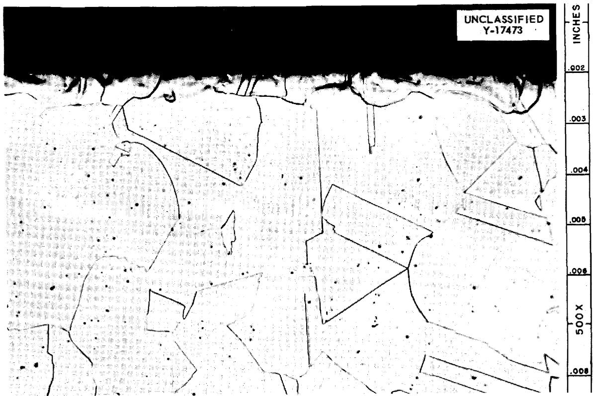  
Fig. 5.23. A $90\%$ Ni- $10\%$ Mo Alloy After Exposure to Static Sodium Hydroxide for 100 hr at $1500^{\circ}$ F. Etchant: aqua regia. 500X.

TABLE 5.9. RESULTS OF CORROSION TESTS ON SPECIAL ALLOYS EXPOSED TO STATIC SODIUM HYDROXIDE FOR 100 hr AT ${1500}^{ \circ  }\mathrm{F}$   

<table><tr><td>Nominal Alloy Composition (wt %)</td><td>Weight Change (g/cm2)</td><td>Metallographic Notes</td></tr><tr><td colspan="3">Nickel-Base Alloys</td></tr><tr><td rowspan="2">85 Ni-15 Mo</td><td>-0.011</td><td>Scattered subsurface voids to a depth of 1.5 to 2.5 mils</td></tr><tr><td>-0.010</td><td>Scattered subsurface voids to a depth of 2 to 3 mils</td></tr><tr><td rowspan="2">90 Ni-10 Mo</td><td>-0.005</td><td>Attack to a depth of less than 0.5 mil</td></tr><tr><td>-0.005</td><td>Same as above</td></tr><tr><td rowspan="2">80 Ni-10 Mo-10 Fe</td><td>-0.006</td><td>Few scattered subsurface voids to a depth of 1 mil</td></tr><tr><td>-0.005</td><td>Same as above except that one corner of specimen attacked heavily to a depth of 3 mils</td></tr><tr><td>60 Ni-20 Mo-20 Fe</td><td>-0.003</td><td>Very small, scattered subsurface voids to a depth of 4 to 5 mils</td></tr><tr><td rowspan="2">70 Ni-15 Fe-15 Mo</td><td>-0.021</td><td>Small subsurface voids to a depth of 3 to 4 mils</td></tr><tr><td>-0.020</td><td>Same as above</td></tr><tr><td colspan="3">Iron-Base Alloys</td></tr><tr><td rowspan="2">80 Fe-20 Cr</td><td>0.796</td><td>Specimen very heavily attacked; thick oxidation type of corrosion product with thin metallic layers at surface; thickness of unattacked material decreased from 250 to 216 mils</td></tr><tr><td>0.813</td><td>Same as above</td></tr><tr><td rowspan="2">80 Fe-10 Cr-10 Ni</td><td>0.045</td><td>Heavy oxidation type of attack to a depth of 5 to 6 mils</td></tr><tr><td>0.042</td><td>Same as above</td></tr><tr><td rowspan="2">74 Fe-18 Cr-8 Ni</td><td>0.104</td><td>Heavy oxidation type of attack to a depth of 11 mils</td></tr><tr><td>0.112</td><td>Heavy attack to a depth of 12 to 13 mils</td></tr><tr><td rowspan="2">60 Fe-20 Cr-20 Ni</td><td>0.047</td><td>Uniform attack to a depth of 5 mils</td></tr><tr><td>0.032</td><td>Uniform attack to a depth of 5.5 mils</td></tr></table>

resistance decreases with increases in the iron content. The additions of chromium also tended to decrease the corrosion resistance of the iron-base alloys, whereas additions of nickel were beneficial. The nickel-base alloys have good resistance if the nickel content is above $80\%$ . For example the $90\%$ Ni- $10\%$ Mo alloy was found to be attacked less than the $85\%$ Ni- $15\%$ Mo alloy. Further tests are to be made on alloys similar to the $90\%$ Ni- $10\%$ Mo alloy.

# Thermal-Convection Loop Tests

G.P. Smith M.E. Steidlitz Metallurgy Division

Thermal-convection loop tests of fused sodium hydroxide in promising container metals are under

way. The preliminary work is being done with Inconel loops of the type used in the fuel testing program modified to permit the bubbling of hydrogen through a small portion of the hydroxide without entrainment of gas in the circulating fluid. The hydroxide used is the same reagent-grade material as that used in the cold-finger tests. Dehydration is accomplished by heating under vacuum at $300^{\circ}\mathrm{C}$ for 8 hr and then heating at $375^{\circ}\mathrm{C}$ in an Inconel pot for 16 hr. The material is transferred from the pot to the loop by helium pressure. Four loops have been run and sectioned. Of

TABLE 5.10. RESULTS OF TEST OF INCONEL THERMAL-CONVECTION LOOPS OPERATED WITH SODIUM HYDROXIDE  

<table><tr><td rowspan="2">Loop No.</td><td rowspan="2">Operating Time (hr)</td><td colspan="3">Temperature (°F)</td><td rowspan="2">Status</td><td rowspan="2">Comments</td></tr><tr><td>Maximum Wall</td><td>Hydroxide</td><td>Cold Leg</td></tr><tr><td>863</td><td>100</td><td>1180</td><td>1120</td><td>1000</td><td>Examination completed</td><td>Spotty corrosion to a depth of 2 mils in hot zone; no mass transfer</td></tr><tr><td>864</td><td>500</td><td>1180</td><td>1120</td><td>1000</td><td>Examination completed</td><td>Hot-zone corrosion to a depth of 4 mils; mass-transfer de-posit on cold leg up to 1 mil in depth</td></tr><tr><td>869</td><td>1000</td><td>1165</td><td>1120</td><td>1000</td><td>Sectioned but not examined metallographically</td><td>Appearance similar to that of loop 864, with increased darkening of hot zone and increased ferromagnetism</td></tr><tr><td>871</td><td>500</td><td>1340</td><td>1220</td><td>1055</td><td>Sectioned but not examined metallographically</td><td>Same as loop 869, except that ferromagnetism considerably greater</td></tr></table>

these, two have been examined metallographically and two have had only visual inspection. All the loops appear to be clean and relatively bright. There is some discoloration of the hot zones, and etching is apparent in the cold legs. The hot zones show ferromagnetism, which increases with operating temperature and time and is the normal result of corrosion of Inconel.11 There are no massive deposits observable in any of the loops. The available data are summarized in Table 5.10.

The corrosion observed in loops 863 and 864, as shown in Figs. 5.24 and 5.25, is similar to that seen in the cold-finger testing of Inconel.[11] The mass-transferred deposits on the cold leg of loop 864, Fig. 5.26, however, are not similar to the plating or the dendritic deposits commonly found on the cold fingers, but rather to an intermediate type of aggregate. The lack of mass transfer in loop 863 is shown in Fig. 5.27, a typical cold-leg specimen. Further testing of Inconel is planned, and preliminary tests of nickel loops are under way.

# CHEMICAL STUDIES OF CORROSION

# F. Kertesz

# Materials Chemistry Division

# Physical Properties of Elastomers Exposed to Attack by Liquid Metals

Screening tests of elastomers for possible use as valve seat materials in NaK circuits were initiated, and several promising materials were selected for further testing. A number of samples of the potentially useful materials were collected from Wright Air Development Center, Dow Corning Corp., General Electric Co., and E. I. DuPont de Nemours & Co.12 Identical test strips were cut and placed under tension and under compression. The compression force used on the samples was $260\mathrm{g}$ , which corresponds to a pressure of 4380 $\mathrm{g/cm^2}$ , and the tension force used was $297\mathrm{g}$ which resulted in a tension of $3400\mathrm{g/cm^2}$ .

The testing apparatus with the samples mounted on it was placed in a vacuum dry box. The dry box, which was rebuilt from a scrapped box, is covered by a single $1\frac{3}{8}$ -in. sheet of Plexiglas and has an air lock sealed by an O-ring. The glove ports are closed by 8-in. pipe flanges and Neoprene gaskets. A separate vacuum line is provided to

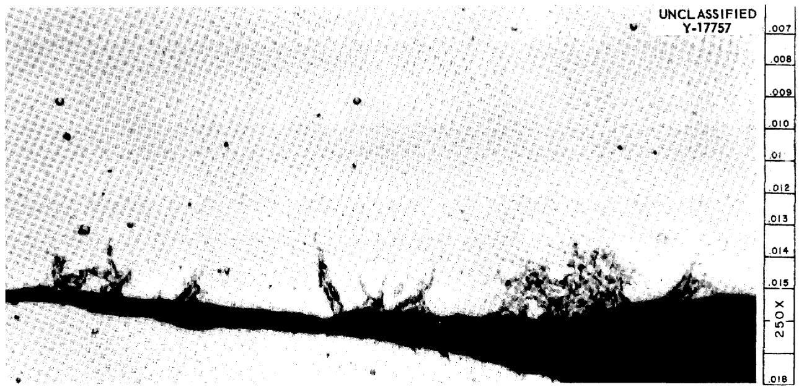  
Fig. 5.24. Hot Zone of Inconel Thermal-Convection Loop 863 Which Circulated Sodium Hydroxide for $100\mathrm{hr}$ . The wall temperature near this point was $1180^{\circ}\mathrm{F}$ ; the fluid temperature was $1120^{\circ}\mathrm{F}$ ; the cover gas was hydrogen. 250X.

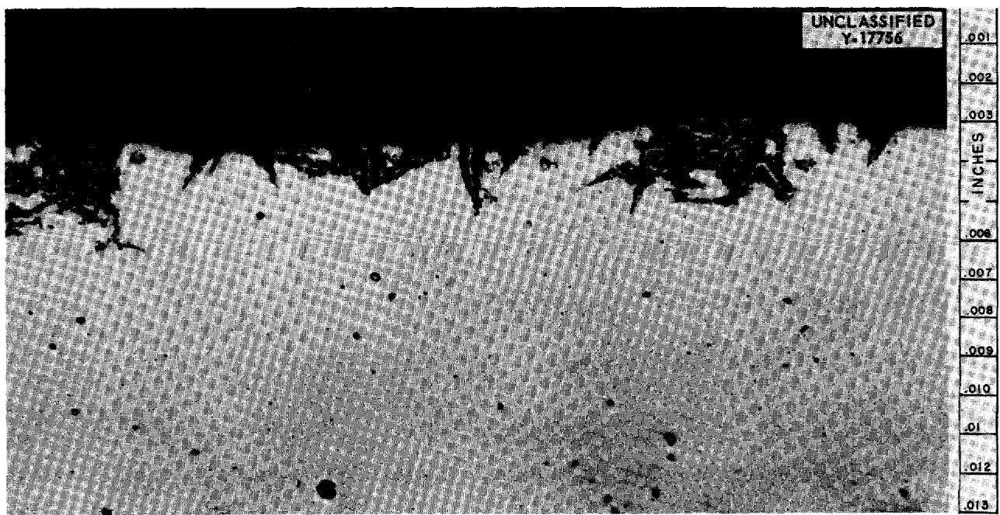  
Fig. 5.25. Hot Zone of Inconel Thermal-Convection Loop 864 Which Circulated Sodium Hydroxide for 500 hr. The wall temperature near this point was $1180^{\circ}\mathrm{F}$ ; the fluid temperature was $1120^{\circ}\mathrm{F}$ ; the cover gas was hydrogen. 250X.

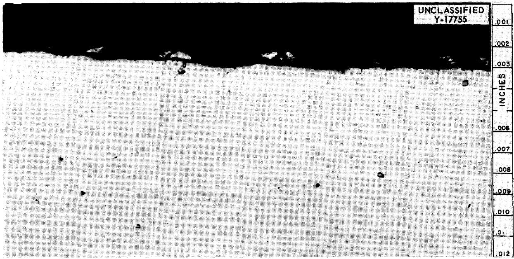  
Fig. 5.26. Cold Zone of Inconel Thermal-Convection Loop 864 Which Circulated Sodium Hydroxide for 500 hr. Wall and fluid temperatures near this point were $1000^{\circ}\mathrm{F}$ ; the cover gas was hydrogen. 250X.

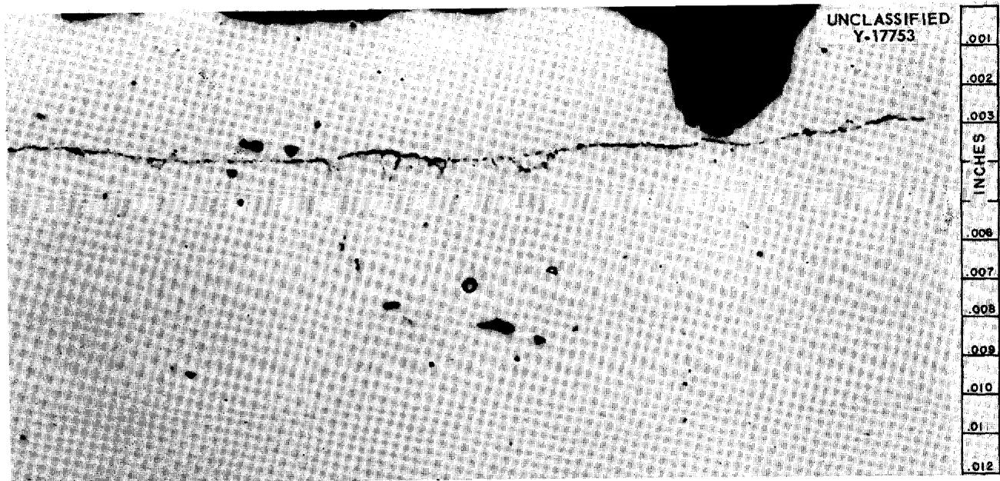  
Fig. 5.27. Cold Zone of Inconel Thermal-Convection Loop 863 Which Circulated Sodium Hydroxide for $100\mathrm{hr}$ . Wall and fluid temperatures near this point were $1000^{\circ}\mathrm{F}$ ; the cover gas was hydrogen. Note slight intergranular attack and lack of mass transfer. 250X.

remove the gas behind the gloves at a faster rate than it is removed from the box to keep the gloves pulled well toward the flanges and out of the box. Separate vacuum lines are also provided for the air lock.

The sample-testing box, made of cold-rolled steel, has two NaK-filled compartments. In the larger of these, one end of each test strip was clamped to the bottom and the other end was attached to a pivoted arm which provided the tension. All strips were adjusted to the same tension. The compartment was filled with NaK to about the center of the test strip.

In the smaller compartment, round disks of the rubber samples were tested under compression by forcing small pistons to the center of the specimens under identical loads. This compartment was filled with pure NaK to a level above the samples. The whole apparatus was heated by a thermostatically controlled electric heater.

While being heated to $200^{\circ}C$ , about one-half the samples began to react vigorously, with bubbling, and so much energy was released that the temperature rose rapidly to about $250^{\circ}C$ . By this time a number of the samples under tension had failed. Within 30 min the temperature was back to $200^{\circ}C$ . By that time all the specimens, except three silicone samples, had failed. The three silicone samples were still intact, however, after three days of continued exposure at $200^{\circ}C$ . The results

of the compression tests confirmed these results. Silicone rubber compound No. 81578 was practically unaffected; No. 81577 was next in its resistance to attack; and No. 81576 was third but still fairly satisfactory.[13] The heavy surface attack on some of the samples that failed was indicative of the probable harmful effects of oxides. Other samples appeared to be attacked uniformly, but the attack was slightly greater at the bottom, where the NaK was hottest. The results of these experiments, in which the samples were exposed to NaK at $200^{\circ}\mathrm{C}$ for three days under a helium atmosphere, are summarized in Table 5.11.

# Resistance of Possible Moderators to Fused Fluoride Mixtures

G.F.Schenck

Pratt & Whitney Aircraft

H. J. Buttram

Materials Chemistry Division

Considerable advantage would be realized if a moderator material could be found which could be cooled by direct contact with the molten fuel mixture. Although prospects for such a system do not

TABLE 5.11. RESISTANCE TO NoK OF ELASTOMERS UNDER TENSION   

<table><tr><td>Source</td><td>Designation of Samples</td><td>Type</td><td>Results</td></tr><tr><td>Wright Air Development Center</td><td>453-9A</td><td>Polyacrylic</td><td>Failed; showed heat effects even before addition of NaK</td></tr><tr><td rowspan="3">Dow Corning Corp.</td><td>Silastic 58</td><td>Silicone</td><td>Failed</td></tr><tr><td>Silastic 80</td><td>Silicone</td><td>Failed</td></tr><tr><td>Silastic 152</td><td>Silicone</td><td>Failed</td></tr><tr><td rowspan="6">General Electric Co.</td><td>81576</td><td>Silicone</td><td>Intact at end of test</td></tr><tr><td>81577</td><td>Silicone</td><td>Intact at end of test</td></tr><tr><td>81578</td><td>Silicone</td><td>Intact at end of test</td></tr><tr><td>SE450</td><td>Silicone</td><td>Failed</td></tr><tr><td>SE550</td><td>Silicone</td><td>Failed</td></tr><tr><td>SE750A</td><td>Silicone</td><td>Failed</td></tr></table>

look hopeful, a simple program of short-term isothermal tests of the relatively few possible moderator materials has been initiated.

Materials such as beryllium metals, $\mathsf{ZrH}_{x^{\prime}}\mathsf{YH}_{x^{\prime}}$ and $\mathsf{CaH}_x$ are far too strongly reducing to be stable to the fluoride mixtures and were therefore not tested. Beryllium carbide, beryllium oxide, and boron carbide specimens $0.25\times 0.25\times 0.5$ in. were tested in NaF- $\mathsf{ZrF}_4\mathsf{-UF}_4$ (53.5-40-6.5 mole $\%$ ) in Inconel capsules at $800^{\circ}\mathrm{C}$ for 24 hr.

The beryllium carbide specimen appeared to have reacted completely with the melt. Petrographic examination of the melt after the test revealed $\mathsf{UF}_3$ and carbon at the surface of the skeleton of the original specimen. No identifiable beryllium compound was observed in the original solid; the solidified melt had been strongly reduced.

Beryllium oxide showed only about $2\%$ change in the original dimensions and a $6\%$ gain in weight. The surface of the specimen was covered with a brown deposit, which was almost certainly uranium oxide. The reactions

$$
\begin{array}{l} U F _ {4} + 2 B e O \rightarrow 2 B e F _ {2} + U O _ {2} \\ Z r F _ {4} + 2 B e O \longrightarrow 2 B e F _ {2} + Z r O _ {2} \\ \end{array}
$$

would be expected to take place. It is possible that $\mathsf{BeO}_2$ specimens protected by $\mathsf{ZrO}_2$ might be stable, but it is not likely.

The $\mathsf{B}_4\mathsf{C}$ specimen suffered only a slight loss in weight in this simple test. Exposure of the specimen to air after the test resulted in the liberation of fumes, which may have been $\mathsf{BF}_3$ . Further tests of this material seem to be justified.

# Diffusion of Chromium in Alloys

G.F.Schenck

Pratt & Whitney Aircraft

M. G. Leddicorte

Analytical Chemistry Division

Interface reaction of molten fluorides with the chromium component of Inconel results in the removal of the chromium from the alloy. A chromium concentration gradient is thus established throughout the metal wall, which causes migration of the chromium from the higher concentration area toward the chromium-depleted surface and results in the formation of subsurface voids. The thickness of the layer impoverished in chromium is a function of the depth of the corrosive attack.

Experiments are under way in which activation analyses are being used to study the diffusion of chromium in Inconel. A measure of the diffusion velocity may be obtained by activation-analysis measurements over a period of time.

A clean section of Inconel was activated in the ORNL Graphite Reactor for use as a standard on which to base future measurements. Three hours after removal of the specimen from the reactor the radiation rate from a 12-g section was $7\mathrm{r / hr}$ at 5 in. from the surface. This specimen was allowed to cool for several days to diminish the activity. At the end of this time most of the activity was that of activated chromium, and an autoradiograph showed the activity to be homogeneously distributed.

In the current work an effort is being made to establish whether diffusion studies are sensitive enough to follow the diffusion of chromium in the wall of a $\frac{1}{2}$ -in.-OD tube. Two approaches are currently being investigated. In one, a photographic plate is exposed to the irradiated sample, and the optical density of the plate is then determined as a function of distance from the periphery. It is believed from an evaluation of the data obtained that the results are inconclusive because of the limited resolution of the densitometer. In the second approach, the radioactivity in various portions of each sample is measured. It is believed that successively milling small amounts of metal from the inside of the tube will produce a satisfactory series of samples from increasing depths, as measured from the inner surface. The amount of the sample, the depth of each milling, and a measurement of the amount of $\mathrm{Cr}^{51}$ (27.8-day) radioactivity in each portion will be used to determine the degree of chromium diffusion.

Preliminary work has consisted in determining the radioactivity of the samples used for radioautograph analyses by means of a gamma-ray spectrometer. The gamma spectral analysis displayed a continuous record of the relationship between the counting rate and the gamma-ray energy, and it was thus possible to obtain the relative intensities of all the gamma-emitting radioelements in the sample. The results indicate that it should be possible to measure the $\mathrm{Cr}^{51}$ intensity in each portion milled from the sample. Current work by the Analytical Chemistry Division includes the design of suitable equipment for obtaining and retaining each layer milled from the specimen.

# 6. METALLURGY AND CERAMICS

# W. D. Manly Metallurgy Division

# WELDING AND BRAZING STUDIES

P. Patriarca

A. E. Goldman G. M. Slaughter Metallurgy Division

# Examination of NaK-to-Air Radiators After Service at High Temperatures

Metallographic investigations are under way on NaK-to-air radiators that failed after various periods of service at high temperatures. A large number of sections from radiators designated ORNL Nos. 1 and 3 and York No. 1 have been examined to determine the degree of adherence of the braze material at the tube-to-fin joints and the degree of oxidation of the copper fins. A correlation of these factors with heat-transfer performance is expected to give a better understanding of the relative importance of the fabrication features.

ORNL radiators Nos. 1 and 3 failed, because of leaks, after 608 and 716 hr, respectively, of primarily isothermal service in the temperature range 1000 to $1600^{\circ}\mathrm{F}$ . York radiator No. 1 failed, as a result of a leak, after it had been in service in the range 1000 to $1600^{\circ}\mathrm{F}$ for 152 hr.

Many metallographic specimens were taken from each radiator, and each specimen contained a portion of three tubes joined to 15 to 20 fins. The

tubes were cross sectioned to show two opposite areas of each joint. Counts were made of the tube-to-fin joints which exhibited 0 to 24, 25 to 49, 50 to 74, and 75 to $100\%$ adherence, and estimates were made of the degree of oxidation of the copper fins according to the categories non-oxidized, slightly oxidized, and heavily oxidized. The results of these investigations on the three radiators are presented in Table 6.1.

Also, ORNL radiator No. 3 is being examined for possible causes of the failure. As may be seen in Fig. 6.1, the fire that occurred because of the leak destroyed the area of the leak, and therefore the examination is being made of the numbered sections. Similar sections are being cut from Pratt & Whitney radiator No. 2, which also failed because of a leak.

# Crack Susceptibility of Back-Brazed Tube-to-Header Joints

One of the problems associated with the fabrication of the full-scale ART NaK-to-air radiators, designated air-cooled radiator 7503, is the brazing of the core halves and the welding of these into a single unit. The specifications suggest the joining of two core halves into a single unit by welding after the brazing operation. An experiment

TABLE 6.1. RESULTS OF EXAMINATIONS OF NaK-TO-AIR RADIATORS FOR TUBE-TO-FIN ADHERENCE AND FIN OXIDATION   

<table><tr><td rowspan="2"></td><td colspan="3">Radiator Designation</td></tr><tr><td>ORNL No. 1</td><td>ORNL No. 3</td><td>York No. 1</td></tr><tr><td>Period of operation in the range 1000 to 1600°F, hr</td><td>608</td><td>716</td><td>152</td></tr><tr><td>Number of tube-to-fin joints examined</td><td>4150</td><td>2282</td><td>3847</td></tr><tr><td>Joints with 75 to 100% adherence, %</td><td>91.8</td><td>87.7</td><td>67.4</td></tr><tr><td>Joints with 50 to 74% adherence, %</td><td>4.2</td><td>3.5</td><td>13.0</td></tr><tr><td>Joints with 25 to 49% adherence, %</td><td>1.4</td><td>1.4</td><td>7.3</td></tr><tr><td>Joints with 0 to 24% adherence, %</td><td>2.6</td><td>7.4</td><td>12.3</td></tr><tr><td>Nonoxidized copper fins, %</td><td>59.3</td><td>12.1</td><td>75.4</td></tr><tr><td>Slightly oxidized copper fins, %</td><td>20.1</td><td>2.5</td><td>22.0</td></tr><tr><td>Heavily oxidized copper fins, %</td><td>20.6</td><td>85.4</td><td>2.6</td></tr></table>

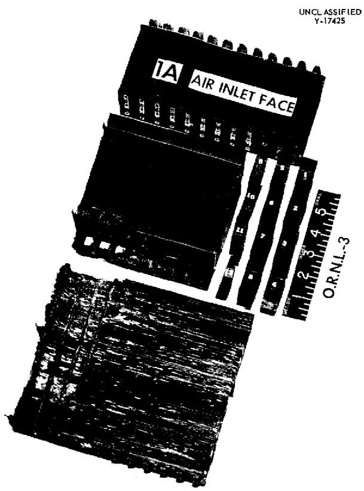

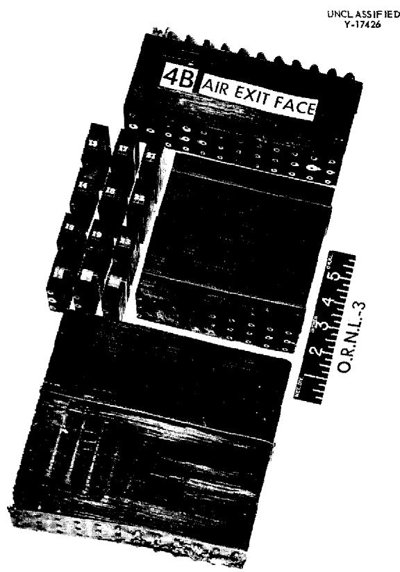  
Fig. 6.1. ORNL Radiator No. 3 Showing Area Destroyed by Fire and Sections Cut for Metallographic Examination.

was therefore conducted to determine the influence of the stresses set up, during welding, on the crack susceptibility of the back-brazed tube-to-header joints.

Two core halves of the type shown in Fig. 6.2 were assembled for brazing. One core half was brazed in the conventional upright position, fin collars down, while the other was brazed in the horizontal position. Brazing in the horizontal position eliminates the need for sump plates to accommodate excess brazing alloy and thus also eliminates the restraining effects of the sump plates on the tubes during nonisothermal service. All welding was done in the down-hand position in accordance with established welding procedures. The completed assembly is shown in Fig. 6.3.

Dye-penetrant inspection of the tube-to-header back brazes indicated freedom from cracks both before and after welding. Visual examination of the tube-to-fin joints indicated that good flow and fin-collar protection had been achieved in both the

vertically and horizontally brazed core halves. The feasibility of brazing in the horizontal position will be investigated further in experiments with larger fin banks, $2\frac{3}{4} \times 8 \times 16$ in., and with the brazing alloy preplaced as sintered rings and as dry powder.

# Measurement of Weld Shrinkage

An experimental program was carried out to obtain information on the transverse weld shrinkage that will result from the various welding operations involved in the construction of the ART. The data will be of value in design and fabrication of the various components of the reactor.

Butt welds were made by both the Heliarc and metallic-arc processes in $3_{16}^{-}, 3_{8}^{-}, 1_{2}^{-}$ , and $3_{4}^{-}$ in.- thick Inconel plates with several joint designs. A summary of weld shrinkage measured with micrometers and appropriate dial gages is presented in Table 6.2. As may be seen from the data, weld shrinkage increases with plate thick

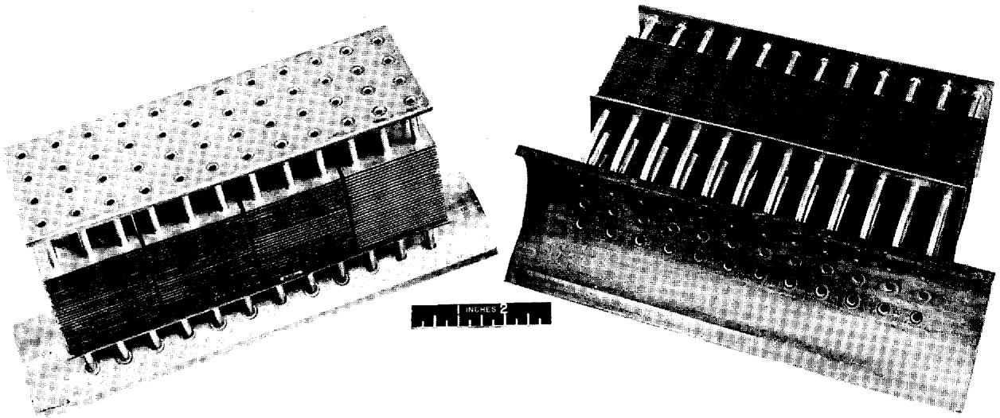  
UNCLASSIFIED Y-17175   
Fig. 6.2. Component Parts of Crack Susceptibility Test Specimen.

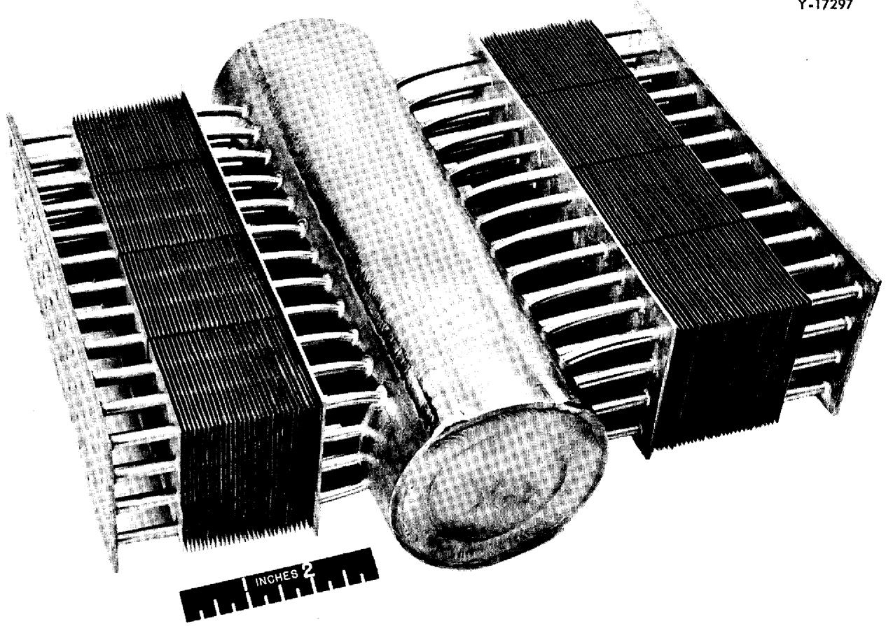  
UNCLASSIFIED Y-17297   
Fig. 6.3. Completed Crack Susceptibility Test Specimen.

Joint Designs

1. J-type bevel with 60-deg included angle; welded in accordance with procedure specification PS-12

2. V-type bevel with 100-deg included angle; welded in accordance with procedure specification PS-1

3. V-type bevel with 75-deg included angle; welded in accordance with operator's qualification test specification QST-12

TABLE 6.2. SUMMARY OF SHRINKAGE OF BUTT WELDS ON INCONEL PLATES   

<table><tr><td>Joint Design</td><td>Welding Process</td><td>Plate Thickness (in.)</td><td>Weld Shrinkage (in.)</td></tr><tr><td colspan="4">Variables: Joint Design and Plate Thickness</td></tr><tr><td rowspan="3">1</td><td rowspan="3">Heliarc and metallic arc</td><td>3/8</td><td>0.091</td></tr><tr><td>1/2</td><td>0.95</td></tr><tr><td>3/4</td><td>0.129</td></tr><tr><td rowspan="3">2</td><td rowspan="3">Heliarc</td><td>3/16</td><td>0.113</td></tr><tr><td>3/8</td><td>0.140</td></tr><tr><td>1/2</td><td>0.192</td></tr><tr><td colspan="4">Variables: Joint Design and Welding Process</td></tr><tr><td rowspan="3">1</td><td>Heliarc and metallic arc</td><td>3/4</td><td>0.129</td></tr><tr><td>Metallic arc</td><td>3/4</td><td>0.119</td></tr><tr><td>Heliarc</td><td>3/4</td><td>0.189</td></tr><tr><td rowspan="2">3</td><td>Metallic arc</td><td>1/2</td><td>0.090</td></tr><tr><td>Heliarc</td><td>1/2</td><td>0.129</td></tr><tr><td colspan="4">Variable: Weld Volume</td></tr><tr><td>3</td><td>Heliarc</td><td>1/2</td><td>0.129</td></tr><tr><td>2</td><td>Heliarc</td><td>1/2</td><td>0.192</td></tr></table>

ness, and the Heliarc welding process results in larger shrinkage for a given joint design in a plate of given thickness than does the metallic-arc welding process. An analysis of the cross-sectional areas for the different joint designs in $\frac{1}{2}$ -in. plate indicates that other parameters, such as the mean weld width, are also important. Experiments on butt-welded low-carbon-steel test plates indicate that the shrinkage is slightly larger than that for Inconel, as would be expected from a comparison of the coefficients of thermal expansion: $6.4 \times 10^{-6} \text{in./in.}^{\circ} \text{F}$ for Inconel and $7.3 \times 10^{-6} \text{in./in.}^{\circ} \text{F}$ for low-carbon steel.

# Dimensional Control During Fabrication of Pump Volutes

One of the problems associated with the fabrication of an Inconel pump of the type designed

for pumping NaK in the ART is the maintenance of the critical spacing between the two volutes which constitute the pump housing. Two test pieces that are representative of the volutes were machined from 2-in. Inconel plate for use in a study of methods for controlling the spacing during fabrication. Four spacers were also machined from Inconel plate to act as rigid supports during the welding of the volutes. These component parts of the experimental specimen are shown in Fig. 6.4. The spacers were subjected to an aluminizing treatment prior to assembly of the components, to prevent self-welding. The assembly was welded in accordance with procedure specifications PS-12. Micrometer measurements were made at four radial positions prior to and after each welding operation.

The welded assembly was annealed in a helium atmosphere at $1850^{\circ}\mathrm{F}$ for a period of 2 hr, with

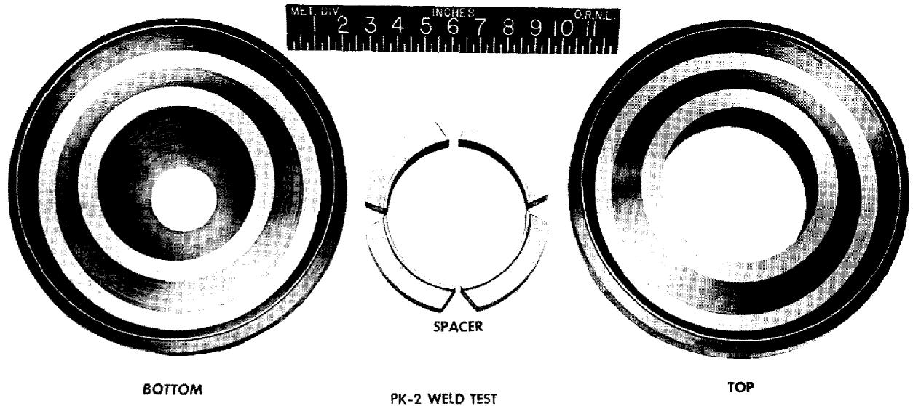  
UNCLASSIFIED Y-17332   
Fig. 6.4. Component Parts for Experimental Fabrication of NaK Pump Casing.

the heating and cooling rates being maintained at $600^{\circ}\mathrm{F/hr}$ . After the welding and annealing had been completed, the spacers were removed by machining. An effort to remove the spacers intact was abandoned when it became evident that significant force would be required and that, as a result, the volute surfaces might be scored. The finished pump casing is shown in Fig. 6.5.

Micrometer measurements of the inside surfaces of the volutes indicated that the maximum dimensional change was 0.015 in. The maximum shrinkage on the diameter was 0.056 in. It was also found after annealing and after removal of the spacers that the dimensions were exactly the same as they were after welding. It is evident therefore that the annealing cycle completely removed the residual stresses. A similar experiment is now under way to determine the degree of dimensional control which can be obtained when a brazing procedure is used in the fabrication of the pump casing.

# Cermet-to-Metal Joints

The usefulness of cernet valve components for ANP valve applications depends to a large extent upon the possibility of successfully joining them to metallic structural materials, such as Inconel.

The fabrication procedure described previously, which utilized thin films of Electroless-plated nickel-phosphorus brazing alloy on the cernet, has proved to be too sensitive to the plating variables. An experimental program is under way for developing a more reliable and consistent joining procedure.

Since high-temperature brazing alloys of the Ni-Si-B type (such as Coast Metals No. 50; brazing temperature, $1120^{\circ}\mathrm{C}$ ) will bond to cermets such as K-152B (64 wt % TiC-6 wt % NbTaLiC₃-30 wt % Ni), a series of tests were conducted with these materials. The cermets are hard to wet, and it is very difficult to obtain an even layer of brazing alloy over the entire faying surface. Therefore a nickel screen was placed in intimate contact with the cermet to facilitate wetting. The "tinned" surface was then ground flat and copper-brazed to the nickel-transition layer and to the Inconel, as in the previous procedure. A brazed joint that is typical of the joints obtained by this procedure is shown in Fig. 6.6. A valve disk fabricated by this new technique was found by dye-penetrant inspection to be free of flaws.

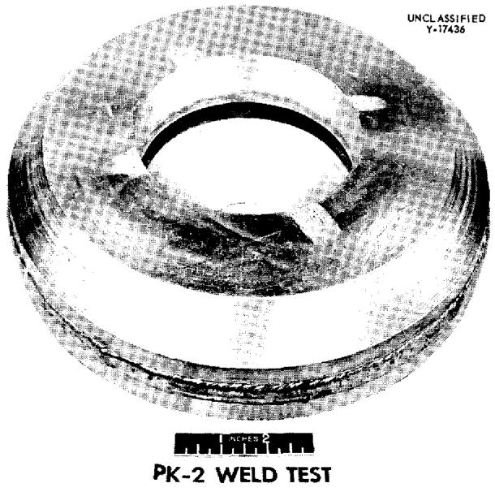  
Fig. 6.5. Finished Experimental NaK Pump Casing.

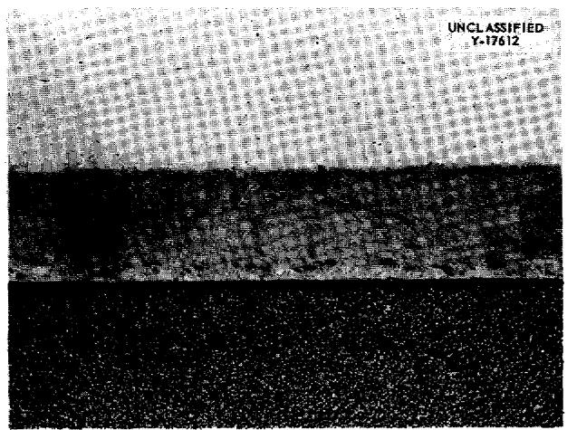  
Fig. 6.6. Cermet-to-Nickel Joint "Wetted" with Coast Metals No. 50 Alloy and Brazedwith Copper. 100X. Reduced $32\%$ .

Another highly promising procedure now being investigated eliminates the need for brazing the cernet to the nickel-transition layer. It has been found that at a temperature of approximately $1350^{\circ}C$ an interfacial reaction occurs, between the cernet and the nickel-transition layer, that results in a metallurgical bond. A joint made by this technique is shown in Fig. 6.7. At a higher temperature, approximately $1370^{\circ}C$ , the extreme nonuniform

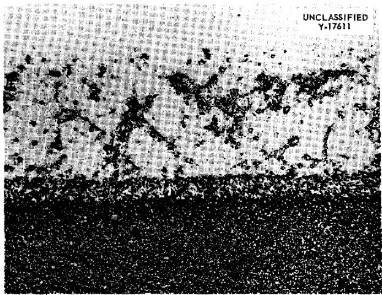  
Fig. 6.7. Cermet-to-Nickel Joint Formed by Bonding at Approximately $1350^{\circ}\mathrm{C}$ . 100X. Reduced $32\%$ .

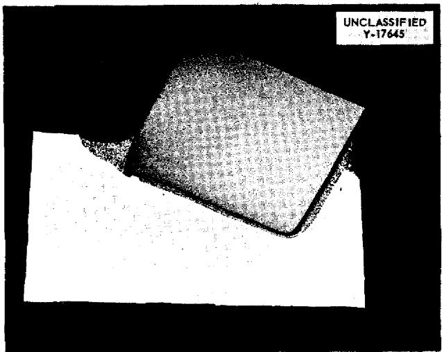  
Fig. 6.8. Cermet-to-Nickel Joint Showing Extreme Nonuniform Interfacial Reaction Resulting from Heating to Approximately $1370^{\circ}C$ .

interfacial reaction shown in Fig. 6.8 occurred. Further tests will be made to establish the optimum conditions.

# Brazing Alloy Development

The low-cross-section Ni-Ge-Cr-Si brazing alloy system has been found to have sufficient corrosion resistance to fuel mixtures and to sodium to be of use in circulating-fuel reactor fabrication. Therefore several sample melts of alloys in the high-nickel-content range of the system were made for

flow-point determinations. The results of the tests are presented in Table 6.3. Four of the alloys with low flow points were submitted for corrosion testing in sodium, in NaK, and in fused fluoride salts, and the results are reported in Sec. 5, "Corrosion Research."

TABLE 6.3. RESULTS OF FLOW-POINT MEASUREMENTS ON THE Ni-Ge-Cr-Si BRAZING ALLOY SYSTEM   

<table><tr><td colspan="4">Brazing Alloy Composition (wt %)</td><td rowspan="2">Flow Point (℃)</td></tr><tr><td>Ni</td><td>Ge</td><td>Cr</td><td>Si</td></tr><tr><td>75</td><td>8</td><td>11</td><td>6</td><td>1120</td></tr><tr><td>75</td><td>13</td><td>6</td><td>6</td><td>1120</td></tr><tr><td>73</td><td>13</td><td>11</td><td>3</td><td>1160</td></tr><tr><td>70</td><td>13</td><td>11</td><td>6</td><td>1100</td></tr><tr><td>68</td><td>13</td><td>13</td><td>6</td><td>1100</td></tr><tr><td>68</td><td>10</td><td>16</td><td>6</td><td>1100</td></tr><tr><td>67</td><td>13</td><td>11</td><td>9</td><td>1120</td></tr><tr><td>65</td><td>13</td><td>11</td><td>11</td><td>1140</td></tr><tr><td>65</td><td>13</td><td>16</td><td>6</td><td>1080</td></tr><tr><td>62</td><td>13</td><td>19</td><td>6</td><td>1080</td></tr><tr><td>62</td><td>16</td><td>16</td><td>6</td><td>1100</td></tr><tr><td>62</td><td>13</td><td>16</td><td>9</td><td>1100</td></tr><tr><td>59</td><td>16</td><td>19</td><td>6</td><td>1080</td></tr></table>

High-temperature oxidation and corrosion tests on Coast Metals alloy No. 52 (Ni-Si-B) have indicated that removal of a constituent or of constituents occurred during testing. Since this alloy has been used extensively in the fabrication of NaK-to-air radiators and fuel-to-NaK heat ex-changers, a study was made to determine the type and extent of removal that may be expected to occur during the intended service time.

Some results of oxidation tests of cast alloy buttons are available. The structure of the alloy is shown in Fig. 6.9 as cast and after 100 and 500 hr at $1500^{\circ}\mathrm{F}$ . It may be seen that the depth of constituent removal increased with time and was approximately 0.006 in, after the 500-hr oxidation test. Microspark spectrographic and metallographic examinations of the sample indicated

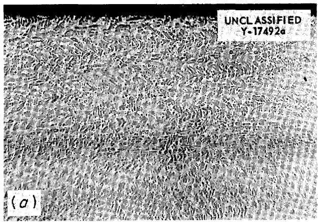

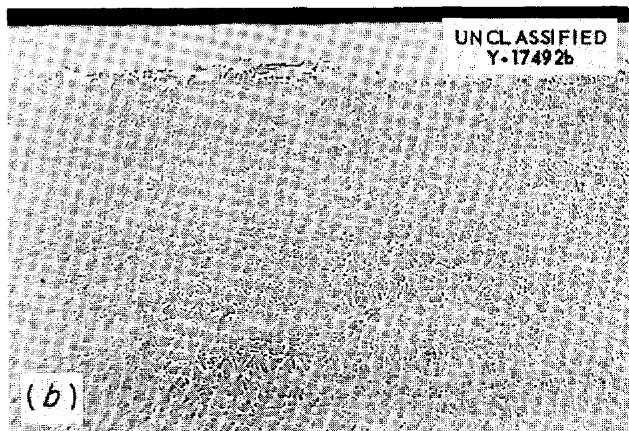

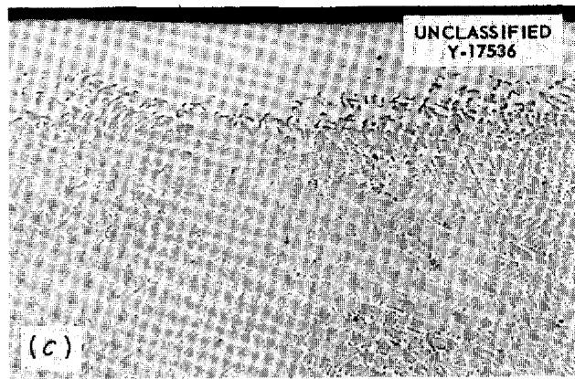  
Fig. 6.9. Results of High-Temperature Oxidation Tests of Cast Buttons of Coast Metals Brazing Alloy No. 52. (a) As cast. (b) Exposed for 100 hr at $1500^{\circ}\mathrm{F}$ . (c) Exposed for 500 hr at $1500^{\circ}\mathrm{F}$ . As polished, 100X. Reduced $4\%$ .

that both boron and silicon were removed. Microhardness measurements on the interior of the ascast specimen showed a hardness of 700 VHN, whereas the hardness of the depleted surface was 140 VHN.

Similar tests conducted in a vacuum and in helium showed no removal of alloy constituents. Results of tests in NaK and in fused salts will be reported later.

The brazing of aluminum bronze fins to Inconel tubes by conventional dry-hydrogen techniques has been unsatisfactory because of the formation of a thin film of aluminum oxide on the fin surface. Thin electroplates (<0.001 in.) of nickel and iron were inadequate diffusion barriers when the conventional heating time of 4 hr was used; however, heavier platings (0.002 in.) facilitated wetting. An Inconel T-joint brazed to a $6\%$ aluminum bronze fin with Coast Metals alloy No. 52 is shown in Fig. 6.10; the 0.002-in. electroplate of iron used

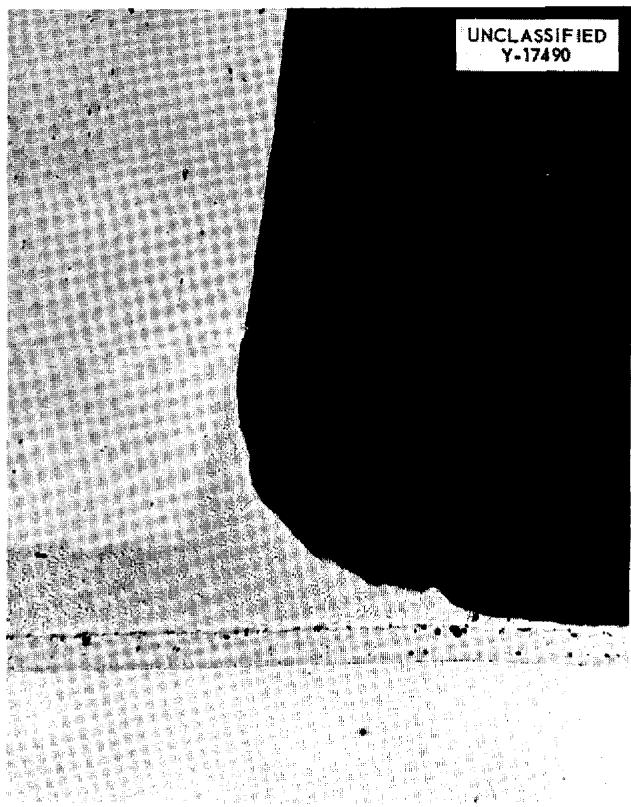  
Fig. 6.10. Inconel T-Joint Brazed to a $6\%$ Aluminum Bronze Fin with Coast Metals Brazing Alloy No. 52 Showing 0.002-in. Electroplate of Iron on Fin. 100X. Reduced $10\%$ .

to facilitate wetting may be seen.

The addition of manganese to nickel-base high-temperature brazing alloys has also been found to promote wetting. Additions of $30\%$ manganese to the Coast Metals alloy No. 53 have permitted the direct wetting of the bronze, while additions of only $10\%$ promoted flow on material plated with only 0.005 in. of nickel.

# MECHANICAL PROPERTIES OF INCONEL

D.A.Douglas J.R.Weir

Metallurgy Division

C. R. Kennedy

Pratt & Whitney Aircraft

# Creep-Rupture Design Data

The creep testing of Inconel in argon and in NaF-ZrF4-UF4 (50-46-4 mole %) at 1300, 1500, and $1650^{\circ}\mathrm{F}$ is nearly complete. The data obtained recently have shown that a few minor modifications of previously published data are necessary. The data presented here, in Figs. 6.11 through 6.15, supersede the data presented in a previous report in this series.2 The curves of Figs. 6.11, 6.12, 6.14, and 6.15 include data obtained at higher and lower stresses than were used previously. The curves of Fig. 6.13 reflect a better understanding of the scatter of test results in the 3000-to 4500-psi stress range. Metallographic examination of the test specimens showed that strain aging or strain-induced precipitation had occurred in some specimens in this stress range and had caused an increase in rupture time. Since this phenomenon did not occur in subsequent tests, the design curve was redrawn to include only the more reproducible data. Additional design curves for Inconel tested in argon and in fused salts are presented in Figs. 6.16 and 6.17.

# Low-Stress Creep Data

Information on the creep of Inconel at very low stresses at $1300^{\circ}\mathrm{F}$ was obtained because it was needed in the design of components that must have dimensional stability at low stresses at the temperature of interest. The test results obtained to date indicate a total creep strain of $0.03\%$ in 1000 hr for a stress of 1000 psi at $1300^{\circ}\mathrm{F}$ in air.

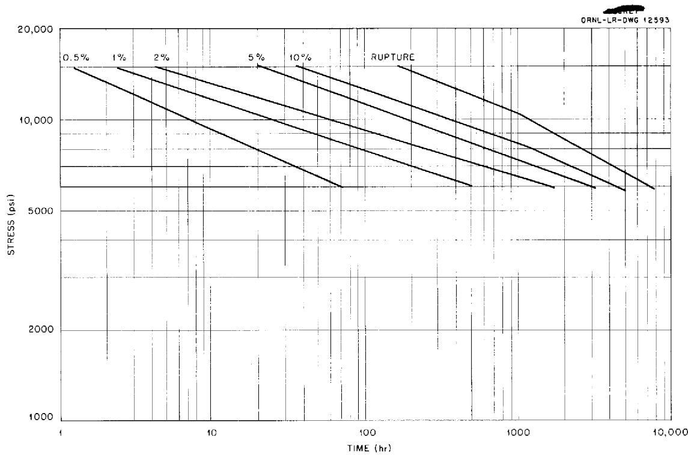  
Fig. 6.11. Stress-Rupture Characteristics of As-Received Inconel Sheet (Heat B) Tested in NaF-ZrF $_4$ -UF $_4$ (50-46-4 mole %) at $1300^{\circ}$ F.

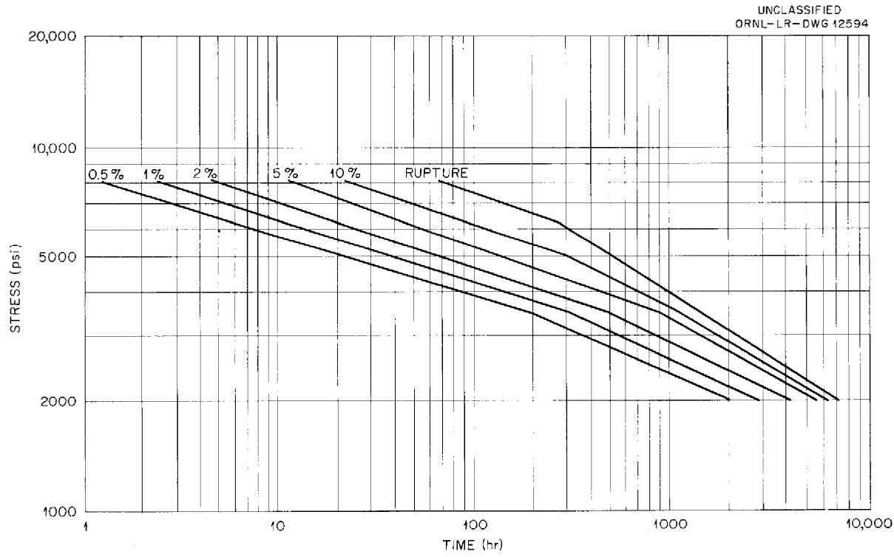  
Fig. 6.12. Stress-Rupture Characteristics of As-Received Inconel Sheet (Heat B) Tested in Argon at $1500^{\circ}\mathrm{F}$ .

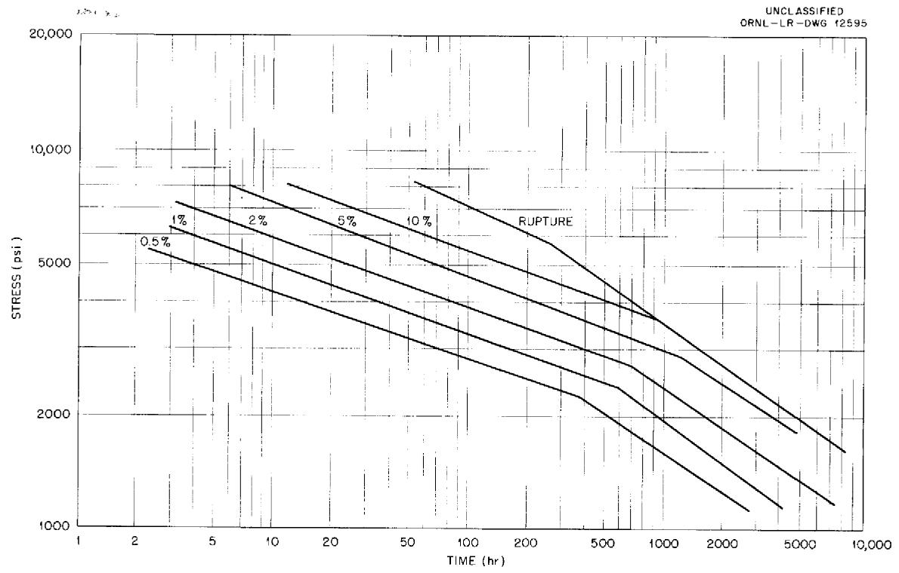  
Fig. 6.13. Stress-Rupture Characteristics of Annealed $(2050^{\circ}\mathrm{F})$ Inconel Sheet (Heat B) Tested in Argon at $1500^{\circ}\mathrm{F}$ .

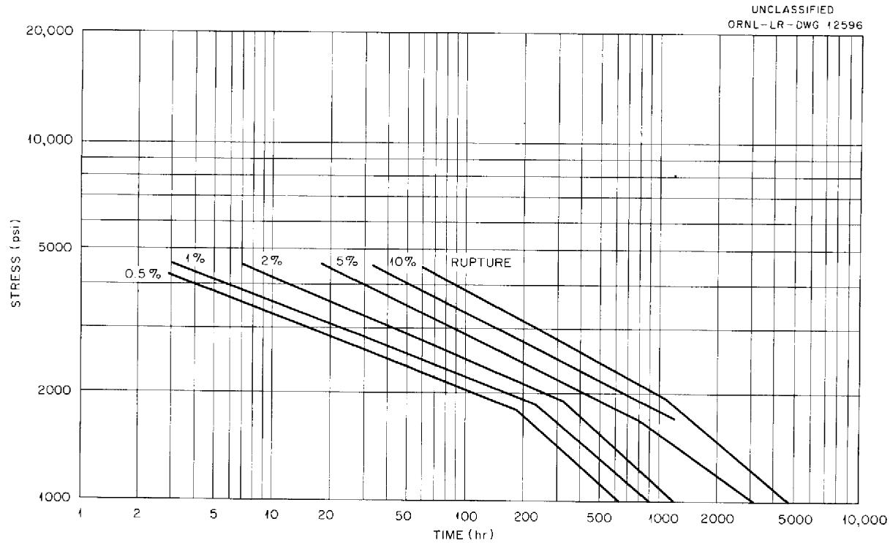  
Fig. 6.14. Stress-Rupture Characteristics of As-Received Inconel Sheet (Heat B) Tested in Argon at $1650^{\circ}\mathrm{F}$ .

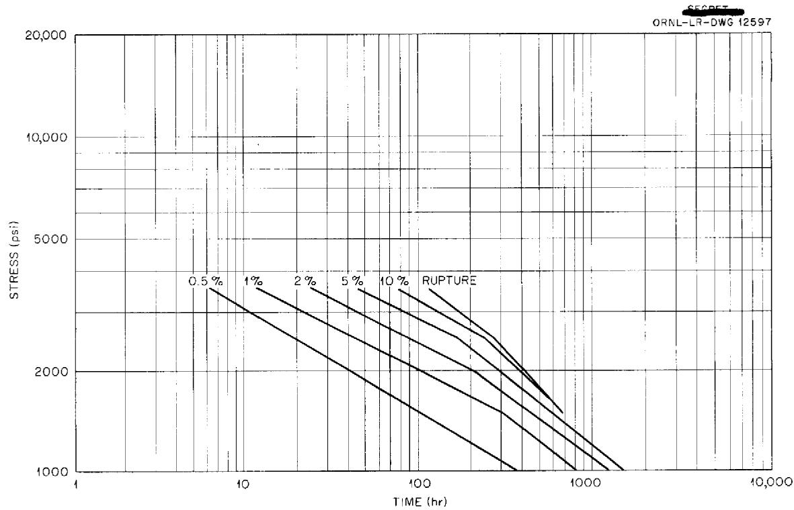  
Fig. 6.15. Stress-Rupture Characteristics of As-Received Inconel Sheet (Heat B) Tested in NaF-ZrF $_4$ ·UF $_4$ (50-46-4 mole %) at $1650^{\circ}$ F.

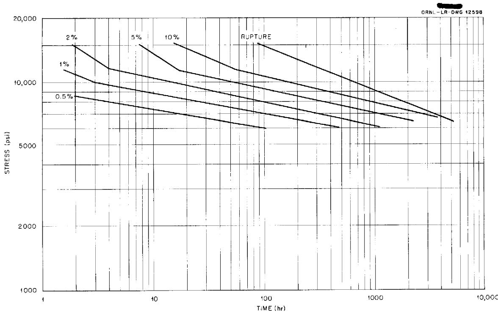  
Fig. 6.16. Stress-Rupture Characteristics of Annealed $(2050^{\circ}\mathsf{F})$ Inconel Sheet (Heat B) Tested in NaF $\mathsf{ZrF}_4$ -UF $_4$ (50-46-4 mole %) at $1300^{\circ}\mathsf{F}$ .

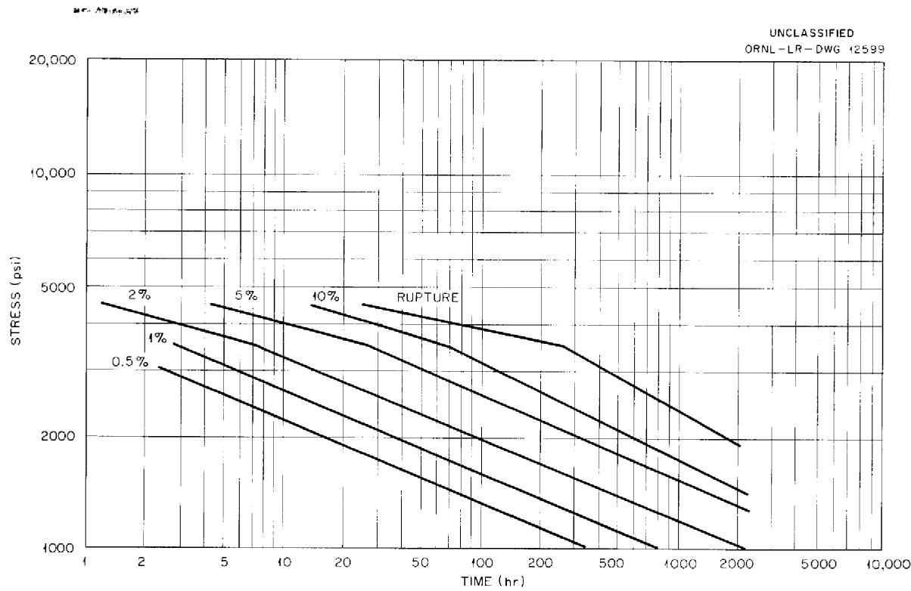  
Fig. 6.17. Stress-Rupture Characteristics of Annealed $(2050^{\circ}\mathsf{F})$ Inconel Sheet (Heat B) Tested in Argon at $1650^{\circ}\mathsf{F}$ .

TABLE 6.4. COMPARISON OF THE DUCTILITY AT RuptURE OF 0.060-in.-THICK INCONEL SHEET WITH THAT OF 0.060-in.-WALL INCONEL TUBING IN ARGON AND IN NaF-ZrF $_4$ -UF $_4$ (50-46-4 mole %)  

<table><tr><td rowspan="3">Temperature (°F)</td><td rowspan="3">Stress (psi)</td><td colspan="4">Elongation (%)</td></tr><tr><td colspan="2">In Argon</td><td colspan="2">In NaF-ZrF4-UF4</td></tr><tr><td>Tubing</td><td>Sheet</td><td>Tubing</td><td>Sheet</td></tr><tr><td rowspan="4">1300</td><td>15,000</td><td></td><td></td><td>2.8</td><td>50</td></tr><tr><td>12,000</td><td>8.8</td><td>70</td><td></td><td></td></tr><tr><td>10,000</td><td></td><td></td><td>8.8</td><td>40</td></tr><tr><td>8,000</td><td>13.3</td><td>25</td><td></td><td></td></tr><tr><td rowspan="4">1500</td><td>5,000</td><td>9.2</td><td>28</td><td>10.2</td><td>17</td></tr><tr><td>4,000</td><td>5.2</td><td>20</td><td>5.5</td><td>13</td></tr><tr><td>3,000</td><td>1.7</td><td>12</td><td>3.7</td><td>8</td></tr><tr><td>2,000</td><td>1.3</td><td>12</td><td></td><td></td></tr><tr><td rowspan="4">1650</td><td>3,000</td><td>6.7</td><td>30</td><td>6.8</td><td>19</td></tr><tr><td>2,500</td><td>3.6</td><td>30</td><td>5.3</td><td>16</td></tr><tr><td>2,000</td><td>3.8</td><td>30</td><td>3.3</td><td>15</td></tr><tr><td>1,500</td><td>3.1</td><td>12</td><td>2.8</td><td>8</td></tr></table>

# Effect of Biaxial Stress on Creep Ductility at High Temperatures

The stress-rupture strength of an internally pressurized 0.060-in.-wall Inconel tube is very similar to that of a 0.060-in.-thick Inconel sheet specimen, but there is a significant difference in the ductility of the two specimens at rupture. The relative values for the elongation in the direction of the maximum stress at several temperatures and stresses are shown in Table 6.4 for the two types of specimens tested in argon and in NaF-ZrF $_4$ -UF $_4$ (50-46-4 mole%). The decrease in ductility shown by the tube-burst specimen may be attributed to the 2-to-1 hoop-to-axial stress ratio set up in a closed-end pressurized tube. Metals deformed at room temperature under various stress systems exhibit increasing or decreasing ductility in comparison with their uniaxial tensile ductility, depending on whether the stress system tends to increase or decrease the maximum shear stress. $^3$ In the case of a biaxial tensile-stress system, such as is found in the tube-burst test, the maximum shear stress is decreased by the action of the smaller axial stress, and slip is restricted. This results in lower ductility at rupture, although the time-to-rupture depends entirely on the larger hoop stress. The data presented here were taken at elevated temperatures, where the deformation mechanism is slightly different from that at room temperature, but the theories applicable to room-temperature ductility appear to apply.

# SPECIAL MATERIALS STUDIES

J.H.Coobs

H. Inouye J.P. Page T.K.Roche

L.M.Doney

J.A.Griffin A.J.Taylor Metallurgy Division

M. R. D'Amore R. E. McDonald Pratt & Whitney Aircraft

V. M. Kolba, Glenn L. Martin Co.

# Neutron Shield Material for High-Temperature Use

H. Inouye

A recent report4 states that irradiation causes extensive physical damage in hot-pressed $\mathsf{B}_4\mathsf{C}$ Experiments showed that, in a neutron flux of

$10^{13}$ to $10^{14}$ nv, the $\mathsf{B}_4\mathsf{C}$ bodies began to crack at about $3\%$ burnup of the $\mathsf{B}^{10}$ atoms and that complete granulation occurred at $26\%$ burnup of the $\mathsf{B}^{10}$ atoms. Helium evolution from the irradiated bodies was determined at various temperatures up to $1500^{\circ}\mathsf{F}$ . In general, the quantity of helium which was released increased with the burnup and the temperature to which the specimen was heated, being a maximum of $20\%$ of theoretical at $36\%$ burnup of the $\mathsf{B}^{10}$ atoms at $1500^{\circ}\mathsf{F}$ .

The effects of irradiation on molded and sintered $\mathsf{B}_4\mathsf{C}$ are being determined by the Solid State Division (see Sec. 8, "Radiation Damage") and will be compared with the effects on a hot-pressed $\mathsf{B}_4\mathsf{C}$ specimen which was irradiated under similar conditions. Irradiation of the specimens has been completed, and a cursory examination indicates that no cracking or crumbling occurred. Since the hot-pressed body did not show physical damage, the B10 burnup is assumed to have been less than $3\%$ .

It was estimated previously that a $B_4C$ layer with a density of $2.0\mathrm{g/cm^3}$ would attain temperatures between 1500 and $2000^\circ F$ at a flux density of $10^{13}\mathrm{nv}$ in the ART. A further evaluation indicates, however, that the maximum temperature of the $B_4C$ layer in the ART during full power operation will be $1800^\circ F$ , if the helium gap between the $B_4C$ and the sodium-cooled Inconel shell is less than 0.020 in.

Metal-bonded boron bodies are being studied as possible alternates for hot-pressed $\mathsf{B}_4\mathsf{C}$ as neutron shielding material because of the uncertainties with regard to the effects of irradiation on hot-pressed $\mathsf{B}_4\mathsf{C}$ . It was thought that, if boron could be incorporated in a ductile matrix, irradiation of the bodies probably would not cause fragmentation. The thermal expansion of a metal-bonded body would approach that of Inconel, and the thermal conductivity would be better than that of hot-pressed $\mathsf{B}_4\mathsf{C}$ . Also, the metal-bonded material would have better resistance to thermal and mechanical shock and could be fabricated in shapes which would fit a curved surface with gaps of less than 0.020 in.

Since a decision as to the method by which a high-boron-content layer could be incorporated in an Inconel annulus in the ART was required before all the fabrication studies could be completed, a

scheme was devised involving a double layer of boron to circumvent the unknown effects of irradiation and to relieve the concern over the fit that could be achieved with ceramic tiles, the temperature and consequently the quantity of helium released being a function of the helium gap. The final configuration, which consists of two layers of boron-containing material, will result in a boron density of about $1\mathrm{g/cm}^2$ , whereas a minimum of $1.2\mathrm{g/cm}^2$ is desired. The details of the annular space containing the boron layer are shown in Fig. 6.18. The clad $\mathsf{Cu - B}_4\mathsf{C}$ layer will be nearest to the neutron source.

The sections of the two layers will be staggered to eliminate neutron windows between adjacent pieces. Neutron pinholes will exist at line intersections, but they will be insignificant if a fit of better than 0.020 in. can be attained. In spherical areas the clad $\mathsf{Cu - B}_4\mathsf{C}$ sheet, about $8\times 8$ in. and 0.100-in. thick, will be attached to the Inconel shell with one centrally located spot weld. Several canned $\mathsf{B}_4\mathsf{C}$ tiles will be spot-welded to each $\mathsf{Cu - B}_4\mathsf{C}$ sheet to anchor them in place.

In the areas that are not spherical the shield will be built up of layers of $\mathbf{Cu} - \mathbf{B}_4\mathbf{C}$ . These layers will not be vented for helium, since their low boron densities will minimize the amount of helium formed.

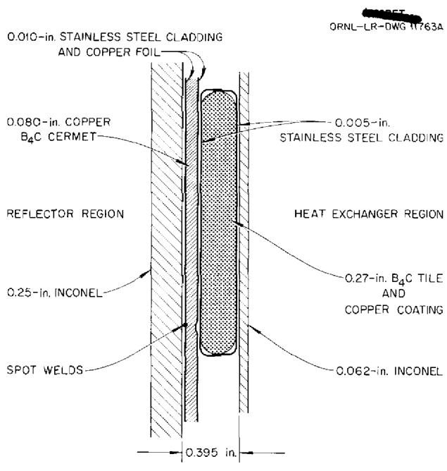  
Fig. 6.18. The Neutron Shield for the ART.

# Fabrication of Boron-Containing Materials

H. Inouye

Copper-B₄C. Since B₄C is chemically inert to copper, an investigation of the variables associated with the fabrication of bodies containing from 20 to 74 vol % B₄C in copper was initiated. Thus far almost all the effort has been devoted to the fabrication of bodies containing 60 and 74 vol % B₄C in order to determine the maximum concentration of boron which can be incorporated into a strong matrix. The theoretical properties of several Cu-B₄C mixtures are listed in Table 6.5.

TABLE 6.5. THEORETICAL PROPERTIES OF ${\mathrm{C}}_{\mathrm{U} - {\mathrm{B}}_{4}\mathrm{C}}$ MIXTURES  

<table><tr><td colspan="2">B4C Content</td><td rowspan="2">Density of Mixture (g/cm3)</td><td rowspan="2">Boron Density* (g/cm3)</td></tr><tr><td>Volume Per Cent</td><td>Weight Per Cent</td></tr><tr><td>10</td><td>3.03</td><td>8.32</td><td>0.206</td></tr><tr><td>20</td><td>6.57</td><td>7.67</td><td>0.413</td></tr><tr><td>30</td><td>10.75</td><td>7.03</td><td>0.620</td></tr><tr><td>40</td><td>15.80</td><td>6.38</td><td>0.820</td></tr><tr><td>50</td><td>22.00</td><td>5.74</td><td>1.03</td></tr><tr><td>60</td><td>29.75</td><td>5.10</td><td>1.24</td></tr><tr><td>70</td><td>39.60</td><td>4.45</td><td>1.44</td></tr><tr><td>80</td><td>52.90</td><td>3.81</td><td>1.65</td></tr></table>

*Boron in ${\mathrm{B}}_{4}\mathrm{C}$ assumed to be ${80}\%$ .

The 74 vol $\%$ B4C-Cu mixture was crumbly and relatively weak after being sintered at $1650^{\circ}\mathrm{F}$ and coined at 33 tsi. A significant increase in both the strength and the density resulted when the sintered bodies were coined at 60 tsi. The boron densities of the best bodies fabricated were between 1.24 and 1.31 g of boron per cubic centimeter of mixture, or between 83 and $88\%$ of theoretical. It was observed that a sintering weight loss of $1\%$ occurred when the compacted powders were sintered in hydrogen at $1650^{\circ}\mathrm{F}$ for 1 hr and that the bodies expanded. The dimensional increase did not vary significantly with the compacting pressure between 10 and 40 tsi. An additional weight loss of 0.1 to $0.2\%$ occurred when the bodies were resintered, at $1800^{\circ}\mathrm{F}$ , but there was no improvement in density.

The sintering weight loss could arise from the volatilization of contaminants of the boron or from the reduction of copper oxide. A weight loss due

to the volatilization of the boron would be significant if the boron content were low or if an accurate amount of boron were required in the body. The expansion which occurs does not permit coining without the removal of material from the edges, and consequently the thickness of the body is affected.

The sintering variables were studied in detail on mixtures of 60 vol $\%$ $\mathsf{B}_4\mathsf{C}$ in copper. Sintering at $1600^{\circ}F$ in helium or hydrogen atmospheres caused linear expansions as great as $3.0\%$ , when either commercial- or high-grade $\mathsf{B}_4\mathsf{C}$ was used. The weight losses of bodies sintered in hydrogen were about $0.75\%$ , and those of bodies sintered in helium were negligible. Prefiring the $\mathsf{B}_4\mathsf{C}$ powder resulted in bodies which shrank instead of expanding during sintering, with no weight changes.

The boron densities of the best bodies of the 60 vol $\%$ B4C composition ranged between 0.977 and $0.998\mathrm{g/cm^3}$ , as coined. A $\frac{3}{16}$ -in.-thick body will support itself in a 2-in. span at $1950^{\circ}\mathrm{F}$ and will support a 1-lb weight at $1650^{\circ}\mathrm{F}$ , with no measurable deflection. Further improvements of the properties can be derived by hot-rolling the coined body.

Copper- $\mathsf{B}_4\mathsf{C}$ bodies containing 20, 30, and 40 vol $\%$ $\mathsf{B}_4\mathsf{C}$ have been sintered and then coined to a 21-in. spherical radius at room temperature. The 40 vol $\%$ $\mathsf{B}_4\mathsf{C - Cu}$ composition is strong and shows some ductility at room temperature. The forming of this composition is facilitated when the mixture is hot-roll clad with stainless steel. Strips of the clad composite can be formed to a 2-in. radius without cracking, whereas the unclad material cracks and breaks upon moderate bending.

Copper-AlB12. Bodies containing 70 vol % AlB12 in copper were made and evaluated. It was hoped that sintering this mixture would result in alloying and also the precipitation of finely divided boron. Moreover, if alloying occurred, the resulting composition (90% Cu-10% Al) would be ductile and oxidation-resistant.

Boron densities of $1.15\mathrm{g/cm^3}$ (78% theoretical) were attained with this mixture when it was sintered for 1 hr in hydrogen at $1650^{\circ}\mathrm{F}$ and coined at 60 tsi. When the body was resintered at $1850^{\circ}\mathrm{F}$ , it melted and a bronze was formed, as was expected. Increasing the $\mathrm{AlB}_{12}$ content to 78 vol % resulted in a body with a boron density of $1.17\mathrm{g/cm^3}$ .

Iron- $\mathsf{B}_4\mathsf{C}$ and Molybdenum- $\mathsf{B}_4\mathsf{C}$ . - Cold-pressed and sintered bodies of Fe- $\mathsf{B}_4\mathsf{C}$ and Mo- $\mathsf{B}_4\mathsf{C}$ mixtures were fabricated. Mixtures containing 80 wt $\%$ $\mathsf{B}_4\mathsf{C}$ were cold-pressed at 60 psi and sintered at 1150, 1700, and $1950^{\circ}\mathsf{C}$ . In general, the densities of the bodies and the strengths increased with the sintering temperature. The maximum boron densities attained were above $1.50~\mathrm{g/cm}^3$ . The bodies showed tendencies toward lamination and brittleness.

Ceramic-Boron Bodies. Several samples of molded and sintered ceramic $\mathsf{B}_4\mathsf{C}$ tiles have been submitted by the Norton Company and the Carborandum Company for evaluation. Both companies have made bodies with boron densities of at least $1.2~\mathrm{g/cm^3}$ that have rabbeted edges. Thus far neither company has submitted spherical segments which could be measured for dimensional tolerances to obtain an indication of the helium gap that would exist between them and a curved Inconel surface.

The Carborundum tiles, $3 \times 3 \times 0.315$ in., were bonded with silicon and had densities of about $60\%$ of theoretical. Radiographic examination of the tiles showed macroporosity, with voids as large as $1/8$ in. in diameter. Thickness variations of as much as 0.006 in. were found for both the rabbeted edges and the total thickness. Numerous samples coated with ceramic powders and with flame-sprayed copper and iron have also been received for examination.

The Norton Company has also submitted tiles of $\mathsf{B}_4\mathsf{C}$ bonded with carbon. The specimens with rabbeted edges were machined. Thickness measurements could not be made, because the surfaces were rough and the material was crumbly. Samples flame-sprayed with Rokide A $(\mathsf{Al}_{2}\mathsf{O}_{3})$ have also been received for evaluation.

Boron Steels. - Boron steels have been studied in order to evaluate the feasibility of using them for a ring to transmit a compression load from the beryllium reflector to the support strut ring. A low-boron-content alloy containing a minimum of $0.65\%$ B10 and a maximum of $1.30\%$ would be required to support a compression load of 500 psi at $1300^{\circ}\mathrm{F}$ .

Small arc melts of iron-boron alloys containing 0.5, 1.0, 1.5, 2.0, 2.5, and $3.0\%$ boron were hot-rolled in air at $1900^{\circ}\mathrm{F}$ . Edge cracking occurred in alloys containing 2.5 and $3.0\%$ boron. The hardness of annealed alloys increased with the boron content, being in the range of 43 to 97 Rockwell-B.

The $1.5\%$ boron alloy was cold-rolled $40\%$ in thickness before cracking occurred, while compositions with less than $1.5\%$ boron were rolled $65\%$ before cracks developed. A 30-lb ingot containing $1\%$ boron has been cast and will be extruded to $1\frac{1}{2}$ -in.-dia rod.

The pressure ring, 37-in. OD, 0.500 in. thick, and $1\frac{1}{2}$ in. wide, will be difficult to form and will probably have to be in two separate pieces. In order to determine the feasibility of casting the ring in one piece, iron-boron alloys containing 0.75, 1.25, 2.00, and $3.00\%$ boron were cast into 1-in.-dia ingots. All the alloy compositions had hardnesses of about 55 Rockwell-C and showed no response to heat treatments up to $1500^{\circ}\mathrm{F}$ . A larger ingot had a hardness of 77 Rockwell-B, which indicated that the cooling rate affected the structure and hence its hardness.

In future tests examinations will be made of these alloys to determine the effects of irradiation, the yield strength of castings and wrought plate at $1300^{\circ}\mathrm{F}$ , and the extent of diffusion between the various alloys and Inconel. Tensile bars of the castings have been made; samples of wrought alloys have been submitted for irradiation; and diffusion couples of iron-boron alloys and Inconel have been service-tested for 500 hr at $1300^{\circ}\mathrm{F}$ .

Bonding of Boron-Containing Materials to Inconel. - Experiments are in progress at the Carter Research Laboratories and the Vitro Laboratories to develop methods for thermally bonding a boron layer to Inconel. The experiments at the Carter Research Laboratories are feasibility studies which involve the codeposition of amorphous boron and electroplates of copper and nickel. Thus far 10 vol % boron in copper has been deposited, and the deposit has good mechanical properties. The investigation at the Vitro Laboratories involves the deposition of uniform metal coatings on ceramic-B₄C tiles and the bonding of Cu-B₄C and Fe-B₄C layers to Inconel by electrophoresis.

Conversion of Boron to $\mathsf{B}_4\mathsf{C}$ - Another attempt was made to convert amorphous boron to $\mathsf{B}_4\mathsf{C}$ . The earlier experiment was repeated, and it was found that the conversion could be accomplished by firing of a mixture of boron and graphite at $1750^{\circ}\mathsf{C}$ . A $20\%$ weight loss that occurred during firing can be attributed to loss of boron, inasmuch as x-ray patterns of the product showed an excess of carbon. The method appears to be unsuitable

for the conversion of expensive $\mathsf{B}^{10}$ unless the weight loss can be controlled and the product can be made crystalline.

# Inconel-Boron Compatibility

H. Inouye M.R.D'Amore

The compatibility of Inconel and boron-containing materials in intimate contact at temperatures in the range 1100 and $2000^{\circ}\mathrm{F}$ was investigated. Also, nine boron-free compounds were tested to determine their suitability as barrier coatings for Inconel in Inconel-boron assemblies.

Diffusion couples of Inconel- $\mathsf{B}_4\mathsf{C}$ and Inconel $(\mathsf{B}_4\mathsf{C - Cu})$ were tested for periods up to 1000 hr at temperatures between 1100 and $1650^{\circ}F$ . The test specimens were prepared by hot roll-cladding $\mathsf{B}_4\mathsf{C}$ powder and a 50 vol $\%$ $\mathsf{B}_4\mathsf{C - 50}$ vol $\%$ $\mathsf{Cu}$ mixture between Inconel cover plates. In addition the diffusion between Inconel and bodies of $\mathsf{B}_4\mathsf{C - Cu}$ , $\mathsf{B}_4\mathsf{C}$ (Norbide), $\mathsf{B}_4\mathsf{C - SiC}$ , and boron powder was determined under a contact pressure of 50 psi. The extent of diffusion was evaluated metallographically, and the results are presented in Table 6.6.

Under the conditions of these tests, brittle reaction products were formed at the $\mathsf{B}_4\mathsf{C}$ -Inconel interface, and boron and carbon penetrated the Inconel along the grain boundaries, as shown in Fig. 6.19, which is a photomicrograph of a specimen tested at $1500^{\circ}\mathsf{F}$ with no contact pressure. As may be seen from the test data, the diffusion is low at $1100^{\circ}\mathsf{F}$ , but it increases rapidly with temperature and with even moderate pressure. Intergranular penetration was found up to 28 mils in depth, but it appeared to have little hardening effect on the Inconel matrix, as illustrated in the microhardness traverse in Fig. 6.20.

Additional tests were made to determine the compatibility of Inconel with metal borides, carbides, carbonitrides, oxides, and nitrides. The test specimens, which were prepared by cold-pressing powder mixtures of Inconel and the compound powder, were heated at 1500 and $2000^{\circ}F$ for 250 hr in evacuated quartz capsules or in helium. The reactions which occurred between the Inconel and the compounds were determined visually and by x-ray diffraction. The extent of the reaction was estimated by the appearance of new phases and the disappearance of the starting compounds. The data obtained are presented in Table 6.7.

TABLE 6.6. RESULTS OF COMPATIBILITY TESTS OF INCONEL AND BORON-CONTAINING MATERIALS IN CONTACT AT HIGH TEMPERATURES  

<table><tr><td rowspan="2">Compatibility Specimen</td><td colspan="3">Test Conditions</td><td rowspan="2">Atmosphere</td><td colspan="2">Depth of Boron or Carbon Diffusion (mils)</td></tr><tr><td>Time (hr)</td><td>Temperature (°F)</td><td>Contact Pressure (psi)</td><td>Reaction Layer</td><td>Intergranular Penetration</td></tr><tr><td rowspan="5">Inconel-B4C</td><td>500</td><td>1100</td><td>None</td><td>Evacuated Inconel capsule</td><td>1.0</td><td>1.0</td></tr><tr><td>1000</td><td>1100</td><td>None</td><td>Evacuated Inconel capsule</td><td>1.0</td><td>1.0</td></tr><tr><td>500</td><td>1300</td><td>None</td><td>Evacuated Inconel capsule</td><td>2 to 3</td><td>4 to 8</td></tr><tr><td>500</td><td>1500</td><td>None</td><td>Evacuated Inconel capsule</td><td>1.5 to 2</td><td>15</td></tr><tr><td>1000</td><td>1500</td><td>None</td><td>Evacuated Inconel capsule</td><td>5 to 8</td><td>15 to 18</td></tr><tr><td rowspan="6">Inconel-(Cu-B4C)</td><td>1000</td><td>1100</td><td>None</td><td>Evacuated Inconel capsule</td><td>None</td><td>1.0</td></tr><tr><td>500</td><td>1300</td><td>None</td><td>Evacuated Inconel capsule</td><td>2 to 3</td><td>4 to 8</td></tr><tr><td>1000</td><td>1300</td><td>None</td><td>Evacuated Inconel capsule</td><td></td><td>5 to 6</td></tr><tr><td>500</td><td>1500</td><td>None</td><td>Evacuated Inconel capsule</td><td></td><td>12 to 13</td></tr><tr><td>1000</td><td>1500</td><td>None</td><td>Evacuated Inconel capsule</td><td></td><td>16 to 28</td></tr><tr><td>100</td><td>1500</td><td>50</td><td>Helium</td><td>1 to 6</td><td>6 to 10</td></tr><tr><td>Inconel-B4C (Norbide)</td><td>100</td><td>1500</td><td>50</td><td>Helium</td><td>2 to 3</td><td>6 to 10</td></tr><tr><td>Inconel-boron (powder)</td><td>100</td><td>1500</td><td>50</td><td>Helium</td><td>1.0</td><td>6 to 9</td></tr><tr><td>Inconel-boron (hot-pressed)</td><td>100</td><td>1500</td><td>50</td><td>Helium</td><td>1 to 2</td><td>10 to 13</td></tr><tr><td>Inconel-(B4C-SiC)</td><td>96</td><td>1600</td><td>50</td><td>Helium</td><td>2</td><td>15 to 20</td></tr><tr><td>Inconel-(B4C-SiC) (Al2O3coated)</td><td>96</td><td>1600</td><td>50</td><td>Helium</td><td colspan="2">No apparent reaction</td></tr><tr><td>Inconel-B4C (Norbide)</td><td>96</td><td>1600</td><td>50</td><td>Helium</td><td>2</td><td>15 to 25</td></tr></table>

Of the nine boron-free compounds which might be suitable as barrier coatings, the oxides $\mathsf{ZrO}_{2^{\prime}}$ $\mathrm{Al}_2\mathrm{O}_3,$ and MgO were found to be inert to Inconel at temperatures up to $2000^{\circ}\mathsf{F}.$ The carbonitride (ZrCN), the SiC, and the $\mathrm{Si}_3\mathrm{N}_4$ reacted to some extent with Inconel, as evidenced by a shift in the diffraction lines of the Inconel and by the instability of the compound, which was indicated by the appearance of oxides. The absence of a reaction between Inconel and BN was unexpected, and, as yet, there is no explanation. It was expected that nickel borides would be formed. This

test is being repeated. The reactions between Inconel and the metal borides make them unsuitable for use above $1500^{\circ}\mathrm{F}$ , presumably, because of the formation of nickel borides, which melt below $1900^{\circ}\mathrm{F}$ .

# Nickel-Molybdenum-Base Alloys

T. K. Roche H. Inouye

Fabricability Studies. - The forgeability of an alloy with the nominal composition of Hastelloy B (68% Ni-28% Mo-4% Fe) has been studied as a

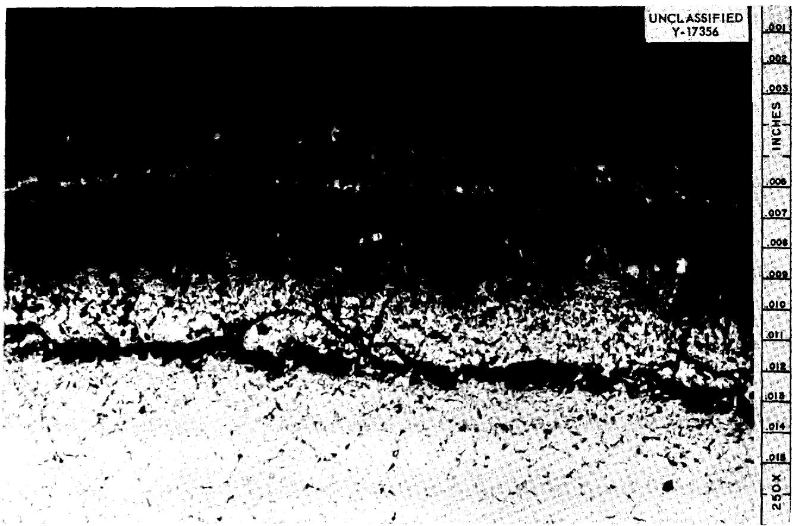

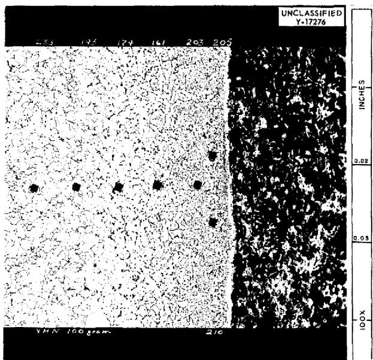  
Fig. 6.19. Inconel- $B_4C$ Compatibility Specimen Tested at $1500^{\circ}F$ for 1000 hr with No Contact Pressure. 250X.   
Fig. 6.20. Microhardness Traverse of Inconel $\left(\mathsf{B}_4\mathsf{C - Cu}\right)$ Compatibility Specimen Tested at $1500^{\circ}\mathsf{F}$ for 1000 hr with No Contact Pressure. 100X. Reduced $35\%$ .

function of carbon content in an attempt to ascertain the cause for the difficulties encountered in the fabrication of Hastelloy B. The poor fabricability of Hastelloy B is believed to be attributable to a stable high-temperature phase that has been tentatively identified as $(\mathrm{Ni}_4\mathrm{Mo}_2)_6\mathrm{C}$ . Arc melts of the alloy were prepared in an argon atmosphere with nominal carbon additions of 0.01, 0.02, 0.04, 0.06, and $0.10\%$ in 100-g samples. The alloys were cast into rectangular bars approximately 3 in. long, $3/4$ in. wide, and $1/2$ in. thick, and then hot-rolled at $1150^{\circ}\mathrm{C}$ . Reductions in thickness of $5\%$ were used for the first few passes, and then $10\%$ reductions per pass were used until a final thickness of 0.160 in. was attained. Visual examination of the hot-rolled strips showed slight edge cracking of the alloys with 0.01, 0.02, and $0.04\%$ carbon additions. The alloys with 0.06 and $0.10\%$ carbon additions were satisfactory. All the strips were then cold-rolled without difficulty to 0.100 in. at a rate of 0.010 in. per pass.

A study of the microstructures of these alloys revealed that the amounts of second-phase material,

TABLE 6.7. COMPATIBILITY OF INCONEL AND VARIOUS COMPOUNDS HEATED   
AT 1500 AND $2000^{\circ}F$ FOR 250 hr   

<table><tr><td rowspan="2">Material</td><td colspan="2">Tested at 1500°F</td><td colspan="2">Tested at 2000°F</td></tr><tr><td>X-Ray Examination</td><td>Visual Examination</td><td>X-Ray Examination</td><td>Visual Examination</td></tr><tr><td>Inconel-Si3N4</td><td>Slight reaction</td><td>Dense, strong body</td><td>Moderate reaction</td><td>Porous, strong body</td></tr><tr><td>Inconel-BN</td><td>No reaction</td><td>Cracked and expanded body</td><td>No reaction</td><td>Porous, crumbly body</td></tr><tr><td>Inconel-(SiC-ZrO2)</td><td>No reaction</td><td>Cracked and expanded body</td><td>No reaction</td><td>Cracked and expanded body</td></tr><tr><td>Inconel-(Ni-MgO)</td><td>Slight reaction</td><td>No visible reaction</td><td>No Ni-MgO present</td><td>No visible reaction</td></tr><tr><td>Inconel-(ZrCN)</td><td>ZrO2</td><td>Porous, friable body</td><td>ZrO2and ZrC formed</td><td>(Sample contaminated)</td></tr><tr><td>Inconel-B4C</td><td>No Inconel present; no B4C present</td><td>Porous, friable body</td><td>No Inconel present; no B4C present</td><td>Metallic globules in a friable gray powder</td></tr><tr><td>Inconel-ZrO2</td><td>No reaction</td><td>No visible reaction</td><td>No reaction</td><td>Hard, dense body</td></tr><tr><td>Inconel-Al2O3</td><td>No reaction</td><td>No visible reaction</td><td>No reaction</td><td>No visible reaction</td></tr><tr><td>Inconel-(Al2O3-Si3N4)</td><td>No reaction</td><td>No visible reaction</td><td>Slight reaction</td><td>Gray, friable body</td></tr><tr><td>Inconel-(B4C-SiC)</td><td>Slight reaction</td><td>Porous, friable body</td><td>SiC present; no B4C present</td><td>Gray, friable body</td></tr><tr><td>Inconel-(ZrO2-MgO)</td><td>No reaction</td><td>No visible reaction</td><td>No reaction</td><td></td></tr><tr><td>Inconel-SiC</td><td>Slight reaction</td><td>Expanded, porous body</td><td>Moderate reaction</td><td>Porous, friable body</td></tr><tr><td>Inconel-CrB2</td><td>Slight reaction</td><td>No apparent reaction</td><td>Moderate reaction</td><td>Dense, strong metallic body</td></tr><tr><td>Inconel-VB2</td><td>Slight reaction</td><td>No apparent reaction</td><td>Moderate reaction</td><td>Hard, dense body</td></tr><tr><td>Inconel-TiB2</td><td>Slight reaction</td><td>No apparent reaction</td><td>Moderate reaction</td><td>Porous, hard body</td></tr><tr><td>Inconel-CbB2</td><td>Slight reaction</td><td>No apparent reaction</td><td>Complete reaction</td><td>Melting occurred; molten phase metallic</td></tr><tr><td>Inconel-WB</td><td>Slight reaction</td><td>No apparent reaction</td><td>Moderate reaction</td><td>Hard, dense body</td></tr><tr><td>Inconel-TaB2</td><td>Slight reaction</td><td>No apparent reaction</td><td>Moderate reaction</td><td>Porous, hard body</td></tr><tr><td>Inconel-MoB2</td><td>Slight reaction</td><td>No apparent reaction</td><td>Moderate reaction</td><td>Dense, hard body</td></tr><tr><td>Inconel-ZrB2</td><td>Slight reaction</td><td>No apparent reaction</td><td>Moderate reaction</td><td>Porous, hard body</td></tr><tr><td>Inconel-AlB12</td><td></td><td></td><td>Complete reaction; no AlB12or Inconel present</td><td>Melting occurred</td></tr></table>

presumably a carbide, in the alloys increased with increased carbon content. On the other hand, the carbon additions were effective in reducing the fine oxide type of impurity carried over from the melting stock and observed in the control alloy

(0.01% C). The microstructures are illustrated in Figs. 6.21 and 6.22.

A correlation of the hot forgeability of these alloys with their microstructures indicates that the oxide precipitates are more detrimental to

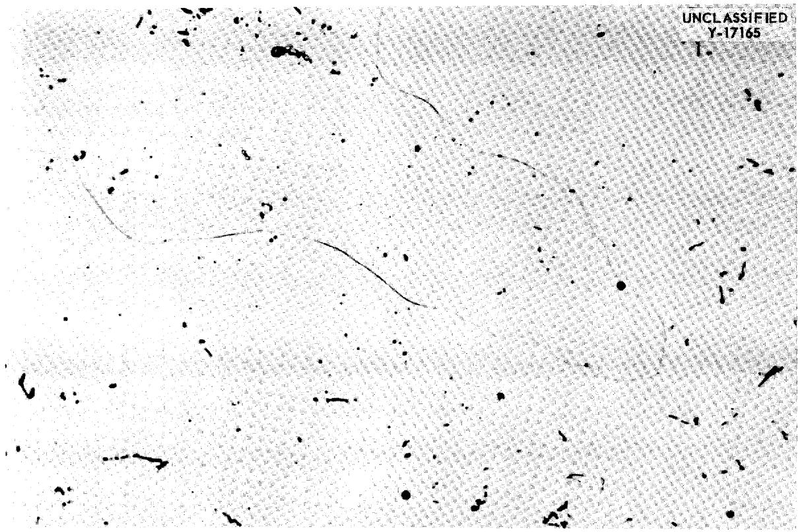

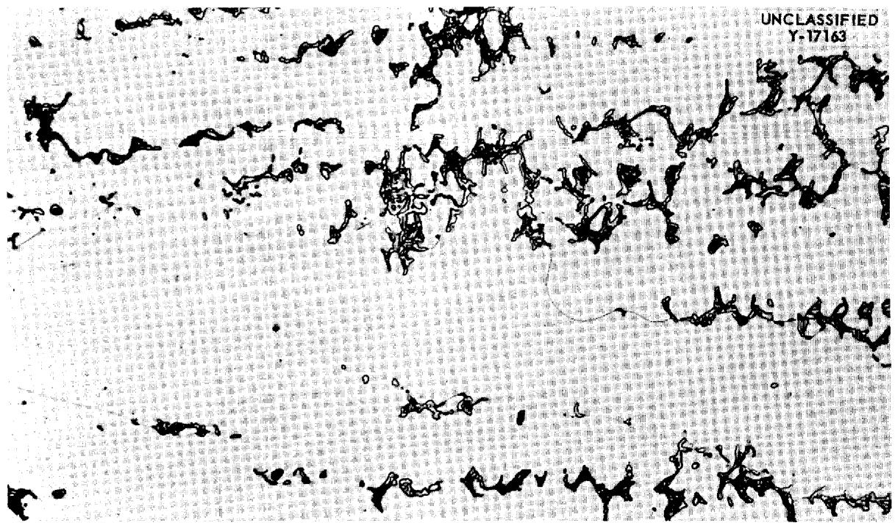  
Fig. 6.21. Microstructure of $68\%$ Ni- $28\%$ Mo- $4\%$ Fe Alloy Containing $0.01\%$ Carbon. Oxide precipitates may be seen in matrix. 500X.   
Fig. 6.22. Microstructure of $68\%$ Ni- $28\%$ Mo- $4\%$ Fe Alloy Containing $0.10\%$ Carbon. Carbide precipitates present, but matrix cleaned of oxide precipitates. 500X.

fabricability than is the presence of the carbide, up to $0.10\%$ total carbon. Thus, close control of the melting practice will be required in order to improve the fabricability of nickel-molybdenum alloys.

As was reported previously, attempts to extrude Hastelloy W billets to tube blanks for the production of seamless tubing have failed. A section was cut through a fractured area of one of the extruded billets and examined metallographically. Evidence of melting was found adjacent to some of the fractures, as shown by the presence of the eutectic in Fig. 6.23. X-ray analysis of the fractured area did not reveal the nature of the eutectic, and, as a result, no definite information on the cause of the hot-shortness of the alloy was obtained. It is hoped that the use of a lower billet preheat temperature (1950°F rather than 2050°F) and modifications of the present billet lubrication methods will improve the extrudability of the Hastelloy-type alloys.

Effect of Melting Practice. - A program has been initiated in which the melting practice will be closely controlled and will be correlated with mechanical properties and the fabricability of the Hastelloy B and Hastelloy W alloys. Arrangements have been made with Battelle Memorial Institute for the production of arc-melted ingots with the following compositions: Nickel, Hastelloy B, Hastelloy W, 76% Ni-17% Mo-7% Cr, and 83% Ni-17% Mo. The melts will be made by the consumable-electrode process to take advantage of the high arc temperatures for vaporizing "tramp" elements. Extrusion billets will be prepared from the ingots for the fabrication of suitable test specimens.

Effect of Chromium Additions. - Previous work showed that chromium additions to a basic $20\%$ Mo-80% Ni alloy resulted in poor forgeability of the alloy, which was attributed, in general, to the high oxygen content of the chromium. Since carbon additions improved the fabricability of nominal Hastelloy B, they were made to 5-lb vacuum melts

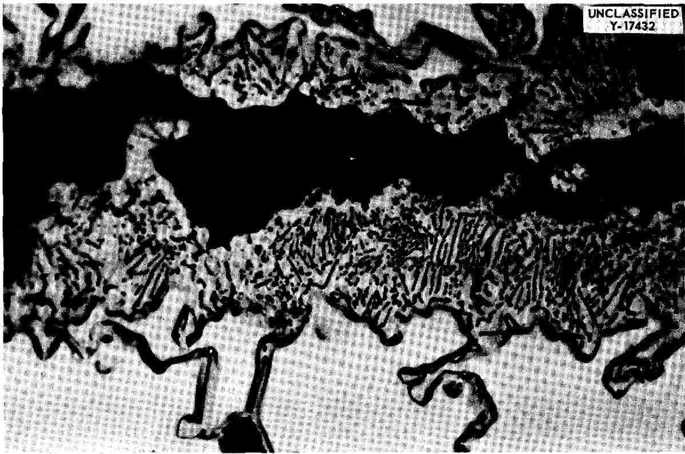  
Fig. 6.23. Section Through a Fracture Area of a Commercial Hastelloy W Billet Extruded at $2000^{\circ}F$ . Eutectic structure may be seen adjacent to the fracture. 2000X.

of the basic $20\%$ Mo-80% Ni alloy with 7 and $10\%$ Cr added. If these alloys can be hot-rolled, larger heats containing 3, 5, 7, and $10\%$ Cr will be prepared for the fabrication of seamless tubing to be evaluated in corrosion tests.

Special Alloys. - Five special alloys prepared in 40-lb heats have been received from the International Nickel Company for corrosion testing and strength evaluation. The compositions of these alloys are as follows (in each alloy, nickel constitutes the balance):

<table><tr><td colspan="2">Component</td><td colspan="4">Amount (wt %)</td></tr><tr><td>Mo</td><td>15</td><td>17</td><td>15</td><td>15</td><td>15</td></tr><tr><td>Cr</td><td>5</td><td></td><td></td><td></td><td></td></tr><tr><td>W</td><td>3</td><td></td><td>3</td><td></td><td>3</td></tr><tr><td>Nb</td><td>3</td><td></td><td>3</td><td></td><td>3</td></tr><tr><td>Al</td><td>0.5</td><td>0.5</td><td>0.5</td><td>1.0</td><td>0.5</td></tr><tr><td>Ti</td><td></td><td></td><td></td><td>1.5</td><td></td></tr><tr><td>C</td><td></td><td></td><td></td><td></td><td>0.25</td></tr></table>

Extrusion billets are being machined from these ingots for fabrication of seamless tubing and test specimens.

# Niobium Fabrication

J.P.Page

H. Inouye

V. M. Kolba

Arc-Melted Niobium. - Four fabricated ingots of pure arc-melted niobium prepared by Battelle Memorial Institute have been received. These ingots were melted in crucibles lined with niobium foil, and getters were used. The dimensions and impurity analyses of the ingots are presented in Table 6.8.

A program has been outlined for determining some of the physical and mechanical properties of this material. A comparison of the properties of this

TABLE 6.8. DIMENSIONS AND IMPURITY ANALYSES OF ARC-MELTED NIOBIUM INGOTS PREPARED BY BATTELLE MEMORIAL INSTITUTE   

<table><tr><td rowspan="2">Ingot No.</td><td rowspan="2">Approximate Dimensions (in.)</td><td rowspan="2">Weight (kg)</td><td colspan="4">Impurity Analysis (ppm)</td></tr><tr><td>C</td><td>H</td><td>N</td><td>O</td></tr><tr><td>10</td><td>0.5 × 1.5 × 7.5</td><td>1.07</td><td>100</td><td>6</td><td>440</td><td>717</td></tr><tr><td>13</td><td>0.5 × 1.5 × 4.5</td><td>0.56</td><td>100</td><td>4</td><td>330</td><td>448</td></tr><tr><td>14</td><td>0.5 × 2.0 × 8.0</td><td>1.10</td><td>100</td><td>4</td><td>240</td><td>270</td></tr><tr><td>15</td><td>0.5 × 2.0 × 9.5</td><td>1.21</td><td>100</td><td>4</td><td>200</td><td>200</td></tr></table>

material with similar properties of the more common wrought material prepared by powder metallurgy techniques will be of particular interest. The wrought material has a severe limitation as an engineering material in that only small pieces are available.

Pack-Rolled Niobium. - Attempts to overcome the limitation of the size of the wrought niobium pieces have been made by pack-rolling several laminae in an evacuated capsule. Preliminary tests indicate that the room-temperature mechanical properties of the laminated and nonlaminated materials are quite similar. Room-temperature tensile properties for 0.065-in.-thick Inconel-clad specimens are presented in Table 6.9. The clad-core-clad thickness ratio of these specimens was approximately 1:3:1. The clad-to-core bonds remained intact until fracture. The scatter in results can be attributed to small differences in the clad-core-clad ratios and, to some extent, to minor variations in the rolling technique.

Creep Test Specimens. - The extreme sensitivity of niobium at elevated temperatures to even trace amounts of nitrogen and oxygen has made the validity of available inert-atmosphere creep data

TABLE 6.9. ROOM-TEMPERATURE TENSILE PROPERTIES OF INCONEL-CLAD NIOBIUM  

<table><tr><td>Number of Niobium Laminae in Core</td><td>Diffusion Barrier</td><td>Number of Tests</td><td>Range of Elongation (2% in 2 in.)</td><td>Range of Tensile Strength (psi × 10-3)</td></tr><tr><td>1</td><td>Tantalum</td><td>3</td><td>6.3 to 10.0</td><td>83.7 to 87.4</td></tr><tr><td>2</td><td>Tantalum</td><td>2</td><td>8.8 to 9.0</td><td>78.5 to 78.9</td></tr><tr><td>5</td><td>Tantalum</td><td>3</td><td>7.5 to 10.0</td><td>82.0 to 83.7</td></tr><tr><td>1</td><td>Copper-stainless steel</td><td>2</td><td>10.5</td><td>72.8 to 78.5</td></tr></table>

questionable. Attempts are therefore being made to fabricate Inconel-clad niobium creep specimens. Two methods of protecting the edge of the laminated sheet are being examined. In one method a clad-niobium panel is machined to slightly oversize creep-bar dimensions, the niobium is undercut by preferential chemical attack, an Inconel wire is inserted in the "groove," and the assembly is welded shut. A small test section has been successfully sealed by this technique.

In the other method a niobium core and its matching Inconel frame are machined to creep-bar dimensions in one direction and to one-fifth the final dimensions in the other direction; the core is then clad by hot-rolling in the latter direction to creep-bar size. A test section, in which the niobium was simulated by stainless steel, has been prepared by this method. This fabrication technique yields specimens that are completely edge-protected. For examinations, the core could be located on radiographs and the excess Inconel could be cut away.

Creep data should indicate whether the Inconel cladding supplies appreciable strength to the sheet. According to published data,5 the creep strength of Inconel is so far below that of niobium that the effect of the cladding will be negligible.

Fabrication of Large Panels. - Large panels of clad niobium must be fabricated by welding, and therefore the minimum core-to-core distance (across the weld) is of considerable interest. Metallographic examination of an Inconel-clad niobium weldment has established a minimum core-to-core distance of approximately $\frac{1}{4}$ in. for $\frac{1}{8}$ -in. sheet, with both copper-stainless steel and tantalum-foil barriers.

Diffusion Barriers. - Further comparison of tantalum and copper-stainless steel diffusion barriers has yielded some anomalous data. It was reported previously that the cold-rolling properties of the tantalum-barrier material were superior to those of copper-stainless steel barrier material. These sheets had been hot-rolled at $950^{\circ}\mathrm{C}$ prior to cold-rolling. Similar cold-rolling tests of material that had been hot-rolled at $1050^{\circ}\mathrm{C}$ indicate the reverse to be true. A program has been outlined for de

termining the effect of rolling temperature on these and other properties of roll-clad niobium sheet.

Niobium- $\mathsf{UO}_2$ Compatibility. - Niobium is being considered for use in solid fuel elements because of its good high-temperature strength. In order to evaluate the usefulness of niobium in this type of service, a program was initiated for investigating the compatibility of niobium and $\mathsf{UO}_2$ . In a previous examination of swaged and rolled niobium powder- $\mathsf{UO}_2$ encapsulated compacts, a phase, other than the $\mathsf{UO}_2$ particles, was found in the niobium matrix. An x-ray diffraction pattern of the compact after it was aged for 500 hr at $1000^{\circ}\mathsf{C}$ indicated essentially niobium and $\mathsf{UO}_2$ , but lines of $\mathsf{Nb}_2\mathsf{O}_5$ were also found.

Metallographic samples of as-received and asswaged niobium powder also showed the third phase found in the initial niobium- $\mathrm{UO}_2$ compacts. A Bergsmann hardness check on the as-received powder particles revealed that the hardness of the niobium matrix was about 210 VHN, whereas that of the second phase was about 2400 VHN, as shown in Fig. 6.24.

Wrought niobium plate obtained from Fansteel Metallurgical Corp. was metallographically examined and found to have a few small inclusions of the compound in an essentially clean matrix of niobium. Uranium oxide powder was placed between two pieces of the Fansteel plate, encapsulated, and rolled, and a portion of the rolled plate was etched and then examined at 1000X. No reaction between the $\mathrm{UO}_2$ particles and the niobium matrix was found. A portion of this rolled specimen has been aged for 500 hr at $1000^{\circ}\mathrm{C}$ and is being examined metallographically.

The results obtained thus far indicate that niobium powder of higher purity must be obtained. A high-purity grade of powder is being prepared by converting wrought material to the brittle hydride, grinding, and, finally, vacuum annealing to remove hydrogen. A further test of the compatibility of $\mathrm{UO}_2$ and niobium will be conducted with this high-purity powder. A high-temperature $(\sim 2000^{\circ}\mathrm{C})$ vacuum furnace will be constructed to accomplish the sintering of the niobium powder compacts.

# Seamless Tubular Fuel Elements

J.H.Coobs

M. R. D'Amore

The work on simulated seamless tubular fuel elements was continued with the preparation and

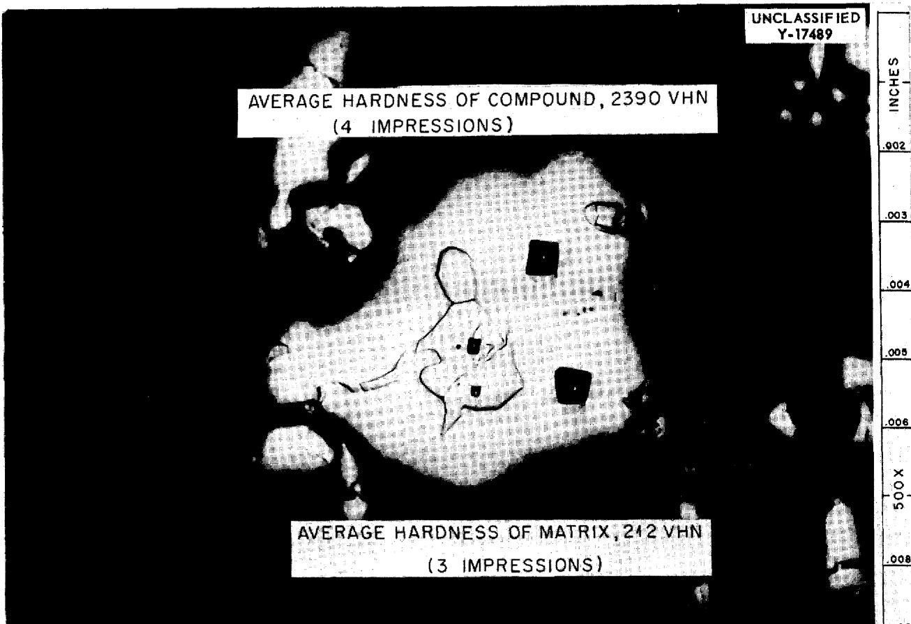  
Fig. 6.24. Hardness Impressions on a Polished Section of As-Received Niobium Powder. 500X. Reduced $2\%$ .

extrusion of four three-ply extrusion billets. The core materials were -100 mesh type 302 stainless steel powder with 30 vol $\%$ Al $_2$ O $_3$ to simulate UO $_2$ . The billet can material was type 316 stainless steel. Two billets were filled with loose powder tamped to a density of about $55\%$ of theoretical. The other two billets had hot-pressed cores with densities of 80 and $89\%$ of theoretical. The extrusion data for the billets are presented in Table 6.10.

Sections 18 in. long were cut from the center of extrusions 3 and 4 and shipped to the Superior Tube Company for redrawing to small-diameter tubing. Extrusions 1 and 2 and the remaining portions of extrusions 3 and 4 were then split longitudinally, and the flow of material was examined visually. It was found that slight misalignment of billets 2 and 3 in the container of the extrusion press had caused uneven material flow during extrusion. The cores in these two extrusions were

offset in the direction of extrusion. The core cross sections of the extruded tubes appeared to be concentric except in extrusion 3. The eccentricity of this core was attributed to nonuniform tamping of the core powder during billet preparation.

Segments have been cut from extrusions 1, 2, and 4 at various intervals, and the layer thicknesses are being measured. Thus far the measurements have been completed only on extrusion 4. A section approximately 33 in. long, which contained about $70\%$ of the original core material, was found to be uniform. The layers were calculated to have extruded in a $\frac{1}{3}: \frac{1}{3}: \frac{1}{3}$ thickness ratio, with the actual thicknesses being 0.048 in. for the outside cladding, 0.041 in. for the core, and 0.037 in. for the inside cladding.

The work on seamless tubular fuel elements is currently being directed toward a study of the drawing properties of the material. Efforts are also being made to increase the length of the

TABLE 6.10. EXTRUSION DATA FOR THREE-PLY SIMULATED FUEL ELEMENTS   
Billet soaking temperature: $2100^{\circ}\mathrm{F}$   

<table><tr><td>Extrusion No.</td><td>Type of Core</td><td>Al2O3Particle Mesh Size</td><td>Extrusion Ratio</td></tr><tr><td>1</td><td>Tamped powder</td><td>-325*</td><td>5:1</td></tr><tr><td>2</td><td>Hot pressed</td><td>-140 +325</td><td>9:1</td></tr><tr><td>3</td><td>Tamped powder</td><td>-140 +325</td><td>21:1</td></tr><tr><td>4</td><td>Hot pressed</td><td>-325*</td><td>21:1</td></tr></table>

*Grade 38-500.

uniform core section of the extrusion. The Allegheny Ludlum Steel Corp. is aiding ORNL in the study of three-ply extrusions.

# Control Rod Fabrication

J. H. Coobs R.E. McDonald M.R.D'Amore

An investigation has been initiated of the feasibility of extruding control rods to close dimensional tolerances. The control material of interest is a 30 wt % Lindsay oxide-70 wt % Ni mixture, which is to be formed into a 2.5-in.-OD, 2.0-in.-ID, 24-in.-long cylinder clad externally and internally with 0.020-in.-thick Hastelloy X. Similar control materials containing iron rather than nickel and Inconel rather than Hastelloy X are also of interest. Small rods of these materials will be used for the initial extrusion studies because the extrusion press at ORNL does not have the capacity to extrude a full-sized control rod.

Several methods have been investigated in an effort to determine the optimum means of fabricating cores of the Lindsay oxide-metal mixture for 3-in.-dia extrusion billets. Small compacts containing 30 wt % Lindsay oxide and 70 wt % Ni have been fabricated successfully both by hot-pressing and by cold-pressing plus sintering. Hot-pressing of the powder mixtures at $1200^{\circ}\mathrm{C}$ produced a sound compact with a density of $86.4\%$ of theoretical. Cold-pressing plus sintering resulted in a compact with a density of $83\%$ of theoretical. In preparing the compact the powder was pressed at 80 psi, sintered at $1900^{\circ}\mathrm{F}$ for $\frac{1}{2}$ hr, coined at 50 psi, sintered again at $2100^{\circ}\mathrm{F}$ , and coined again at 50 psi. The cold-pressed body cracked in one area during sintering at $2100^{\circ}\mathrm{F}$ . The method used gives satisfactory densities in small bodies, but it is not amenable to fabrication of cores for 3-in.-

dia extrusion billets because of the excessive pressure requirements.

# Shield Plug for ART Pumps

J.P.Page J.H.Coobs

The shield plugs surrounding the shafts of the ART fuel and sodium pumps must fulfill three primary functions; they must serve as neutron, gamma-ray, and thermal shielding. In their thermal-shielding capacity they must prevent freezing of the fuel below them during zero power operation. Since no known material will satisfy all these conditions adequately, it has been proposed that the following layers of materials be stacked in a vented Inconel can: (1) a $\frac{1}{8}$ -in. disk of a B4C-Cu mixture, for neutron shielding; (2) a $\frac{5}{8}$ -in. disk of zirconia, for thermal shielding; (3) a 4- to 5-in. slug of high-density ( $>12 \, \text{g/cm}^3$ ) low-conductivity ( $<0.12 \, \text{cal/cm}^2/\text{sec}$ ) material, for gamma-ray shielding. The top surface of the gamma-ray shielding material is to be brazed to the Inconel can, which will be cooled on its outer surface.

Tantalum-constantan and tungsten carbide-constantan compacts are being investigated for use as the gamma-ray shielding material. A successful diffusion bond of tantalum-constantan to nickel has been made by heating the parts at $1100^{\circ}\mathrm{C}$ in a hydrogen atmosphere for 20 min and then cooling in a helium atmosphere. The specimen was cooled in helium in order to minimize the formation of tantalum hydride, which probably caused the cracking of several earlier specimens during cooling.

# Lithium-Magnesium Alloys

R. E. McDonald

A study of the fabricability of a light alloy containing $20\%$ Li has been initiated. Such an alloy would be useful as shielding material. Tests were

started on a $20\%$ Li- $80\%$ Mg alloy, but it was found to be highly reactive in both air and water. A method of surface protection is necessary before mechanical and physical data can be acquired. Chemical coatings, flame spraying, and roll cladding were investigated without success. Thus far the Dow No. 17 anodizing treatment, which can be supplemented by a Unichrome plastic coating, has formed the only successful surface protection.

A roll-claddable alloy would be more suitable for shielding, and a less reactive surface should be more amenable to roll cladding. Therefore an effort is being made to produce a less active surface by adding small amounts of aluminum to the lithium-magnesium alloy. The lithium-to-magnesium ratio is being held constant at 1:4, and ternary alloys with 0.5, 1, 1.5, and $2\%$ Al are being investigated.

# Fabrication of Ceramic Materials

L. M. Doney

J.A.Griffin

A.J.Taylor

Low-Density Rare-Earth-Oxide Compacts. - Methods are being studied for preparing compacts of samarium and gadolinium oxides (Lindsay Code 920) for use in ART control rods. The compacts are to be 1.275 in. OD, 0.775 in. ID, and 1.000 in. long, and they are to have densities of between 3.95 and $4.4\mathrm{g/cm^3}$ . Experimental compacts have been produced with a density of $3.53\mathrm{g/cm^3}$ and a porosity of $53.5\%$ . These compacts have been exposed to molten sodium at $1300^{\circ}\mathrm{F}$ for 100 hr and have been found to have a porosity to sodium of $53\%$ . The compacts were not damaged by the immersion in sodium. The compacts required for the actual ART control rods will probably be prepared by a method very similar to that used in the fabrication of these experimental compacts.

Cermets of Iron and Rare-Earth Oxide. - Cermets of 50 vol % iron and 50 vol % rare-earth oxide have been requested for use in the extrusion of Inconel control rods with cernet cores. The fabrication method devised for these cermets involves mixing 25 vol % iron metal, 25 vol % iron as $\mathsf{Fe}_2\mathsf{O}_3$ and 50 vol % samarium and gadolinium oxide (Lindsay Code 920) and pressing the mixture into a hollow, cylindrical shape at a very low (10,000 psi) pressure in a steel die. The cylinder is then isostatically pressed at 80,000 psi in a rubber bag immersed in an oil-filled pressure vessel. The isostatic pressing assures uniform density.

After pressing, the cylinder is sintered in hydrogen at $1475^{\circ}C$ for $\frac{1}{2}$ hr. Cermets fabricated by this method have a density of $4.6\mathrm{g/cm}^3$ and a porosity of $38.8\%$ . Pieces of the size required for extrusion will be produced by this method.

Cermets of Nickel and Rare-Earth Oxide. - Cermet compacts of 70 vol % nickel and 30 vol % rare-earth oxide have also been requested for extrusion studies of Inconel-rare-earth-oxide control elements. These compacts were fabricated by the same method as that used for the production of the iron-rare-earth-oxide cermets, except that the compacts were sintered in hydrogen at $1400^{\circ}\mathrm{C}$ for 20 min. The compacts had a sintered density of 6.1 g/cm³ and a porosity of 28.4%.

# NONDESTRUCTIVE TESTING

R. B. Oliver

J.W.Allen

K. Reber

Metallurgy Division

Success in the inspection of small-diameter Inconel and Hastelloy B tubing with the Cyclograph, described previously, prompted further study of the instrument. It is primarily a tuned oscillator in which the oscillator coil encircles the tubing. The instrument measures the amplitude of the oscillations, the amplitude being a measure of the resistive component of the coil's impedance. Theoretically, since only the resistive component is measured, all changes in the tubing cause the same type of variation, and good tubing could possibly be rejected because of an inconsequential variation. However, experience has proved that the wobble of the tubing in the coil, which is the worst offender in producing spurious flaw indications, can be eliminated by a well-designed mechanical feed mechanism, such as that shown in Fig. 6.25. The instrument is sensitive to slight changes in outside tubing diameter and wall thickness, but these changes occur very slowly over the length of the tube and can be easily separated from flaws, which give abrupt signals.

An important feature of the Cyclograph is that its operating frequency is determined by its sensing coil and, hence, may be altered by merely changing the coil. The proper frequency for a particular tube is selected according to its outside diameter,

wall thickness, permeability, and conductivity. A graph of the Cyclograph reading vs tubing wall thickness, expressed as a percentage of the outside diameter, is shown in Fig. 6.26. The parameter for the graph is frequency-normalized to a value $f_{c'}$ which is determined by the outside

diameter, the permeability, and the conductivity according to the relationship given on the graph. The operating frequency that gives the best results is the one which locates a point near a peak on the graph of Fig. 6.26. The dashed lines indicate the nonlinear characteristic of the instrument near

UNCLASSIFIED

ORNL-LR-DWG 11015

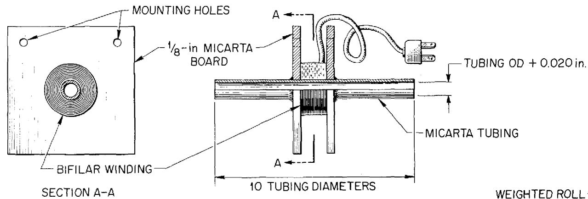

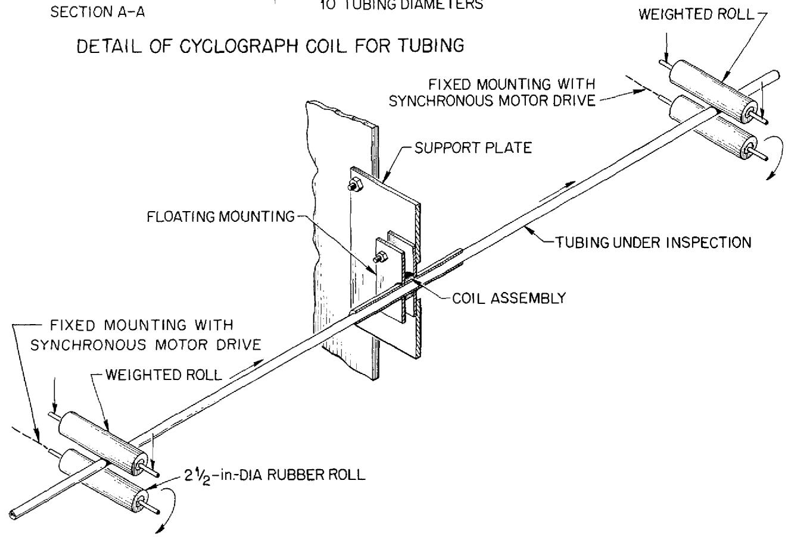  
Fig. 6.25. Cyclograph Coil Assembly and Feed Mechanism for Tubing Inspection.

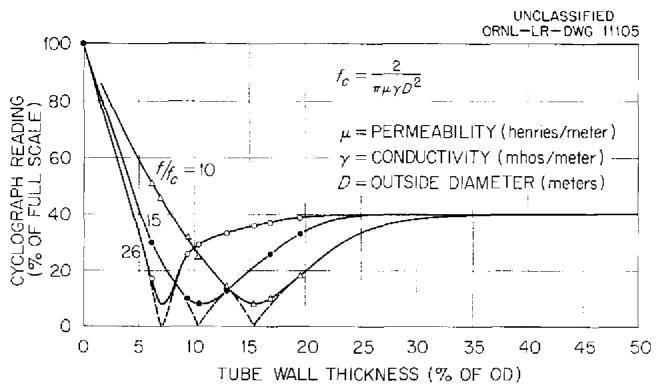  
Fig. 6.26. Cyclograph Reading vs Tube Wall Thickness with the Operating Frequency of the Cyclograph as a Parameter.

the "quench" or zero-reading axis, which allows extreme sensitivity to small flaws in the tubing. A plot of the frequency which will locate a peak on the graph of Fig. 6.26 for each value of wall thickness is given in Fig. 6.27. By consistent use of operating frequencies chosen from these plots, flaw types will always be detected in the same relative magnitudes. For instance, an insid-diameter crack extending through $10\%$ of the wall thickness would cause the same indication from a 0.25-in.-OD, 0.025-in.-wall tube as from a 0.5-in.-OD, 0.049-in.-wall tube. Although it is not possible to obtain a calibration of flaw size vs instrument indication, it is possible to obtain an approximate determination of flaw size in terms of percentage reduction in wall thickness averaged over the length of the coil. Typical Cyclograph indications of outside-diameter cracks in Hastelloy B tubing and inside-diameter intergranular attack in Inconel tubing are shown in Fig. 6.28, and photomicrographs of two of the flaws thus detected are shown in Figs. 6.29 and 6.30.

The "B" scan presentations of the eddy-current probe coil and of immersed ultrasonic indications are also photographed, in an effort to identify the several characteristic types of defects found in small-diameter tubing. Photomicrographs are also prepared of appropriate sections of the tubing, but difficulty has been encountered in the preparation of representative metallographic sections because of the minute dimensions of the defects and inability to sufficiently pinpoint the defects for good metallographic presentation.

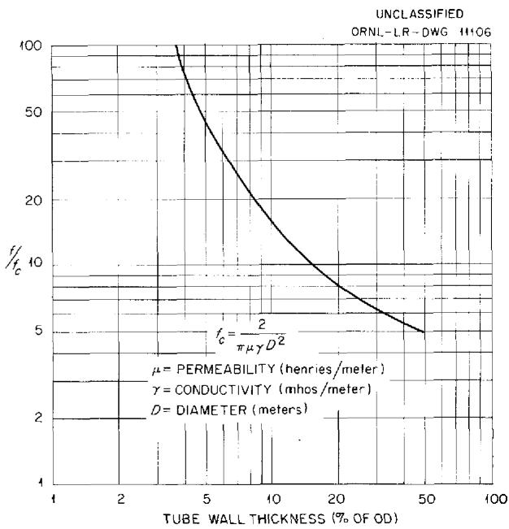  
Fig. 6.27. Frequency vs Tube Wall Thickness for Maximum Resistive Coil Impedance.

A type of defect that has been prevalent in small-diameter Hastelloy B tubing is a longitudinal crack which may penetrate as much as $80\%$ of the tube wall from the outside surface. A typical example is illustrated in Fig. 6.29. The ultrasonic "B" scan, as well as the Cyclograph, indicated this crack, as shown in Fig. 6.31. A crack of this size can be detected by ultrasound through almost 300 deg of tubing rotation, as is demonstrated by the diagonal indication that extends almost completely across the screen. The eddy current probe coil "B" scan of this crack is shown in Fig. 6.32.

A characteristic defect in Inconel is the intergranular type of attack illustrated in Fig. 6.30. Attempts to detect this defect ultrasonically gave inconclusive indications, probably because the penetration was shallow and the orientation was not parallel to the axis of the tubing, cumulative factors which might preclude valid ultrasonic inspection. Mechanical difficulties caused by the excessive wobble of the tubing prevented an adequate probe-coil inspection.

The small $\frac{1}{16}$ -in.-long gouge shown in Fig. 6.33 on the surface of an Inconel tube was readily detected ultrasonically. A representative "B" scan picture for the ultrasonic detection of this defect is shown in Fig. 6.34.

UNCLASSIFIED

ORNL-LR-DWG 11104

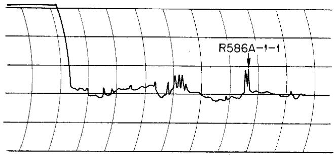

CYCLOGRAPH T RACE AT 160 kc OF REJECTED 0.25-in.-OD x 0.049-in.-WALL HASTELLOY B TUBING. OUTSIDE DIAMETER RADIAL CRACK 0.027 in. DEEP AT POSITION R586A-1-4 IS SHOWN IN FIG. 6.29.

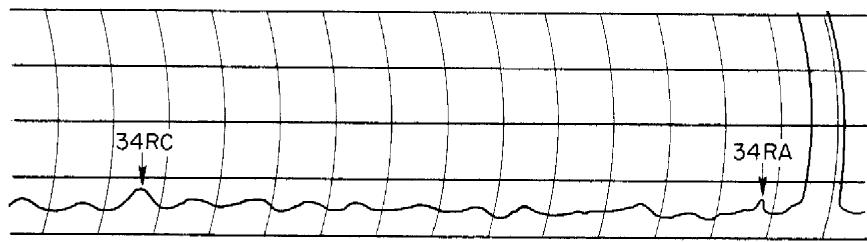

CYCLOGRAPH TRACE AT 200 kc OF REJECTED O.25-in.-OD x O.025-in.-WALL INCONEL TUBING. INSIDE DIAMETER INTER-GRANULAR ATTACK AT POSITION 34RA TO A MAXIMUM PENETRATION OF O.002 in. IS SHOWN IN FIG.6.30.

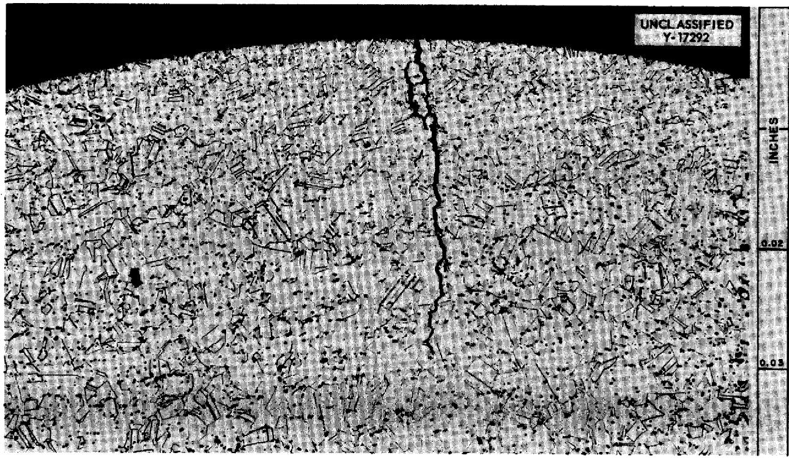  
Fig. 6.28. Cyclograph Traces of Defective Tubing.   
Fig. 6.29. Radial Crack 0.027 in. Deep on Outside Surface of a 0.25-in.-OD, 0.049-in.-Wall Hastelloy B Tube Detected by Indication Shown in Fig. 6.28. 100X. Reduced $2\%$ .

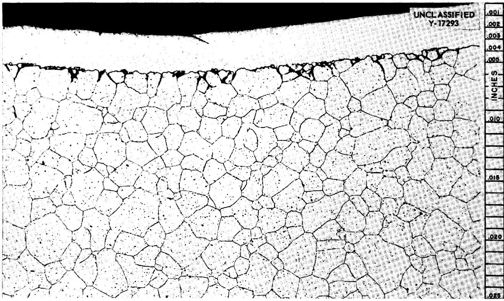  
Fig. 6.30. Intergranular Attack to a Maximum Depth of 0.002 in. on a 0.25-in.-OD, 0.025-in.-Wall Inconel Tube Detected by Indication Shown in Fig. 6.28. 150X.

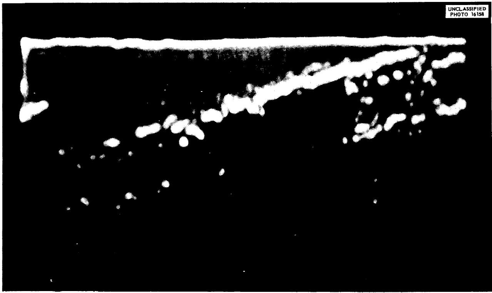  
Fig. 6.31. Ultrasonic "B" Scan of Crack Shown in Fig. 6.29.

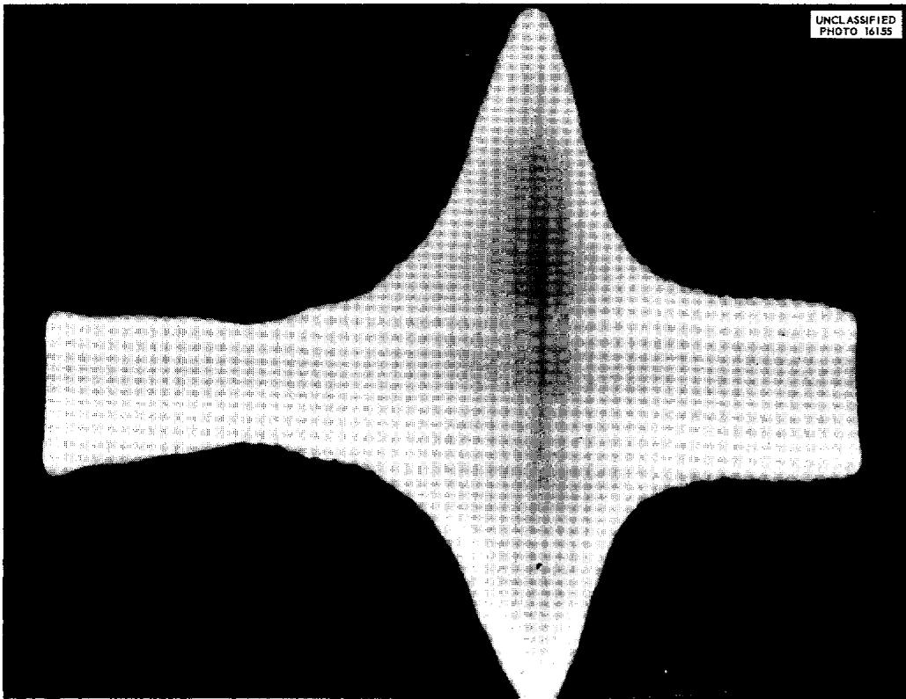

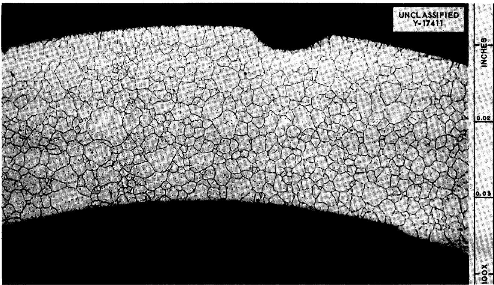  
Fig. 6.32. Eddy Current "B" Scan of Crack Shown in Fig. 6.29.   
Fig. 6.33. Gouge 0.004 in. Deep on the Outer Surface of a 0.25-in.-OD, 0.025-in.-Wall Inconel Tube. 100X.

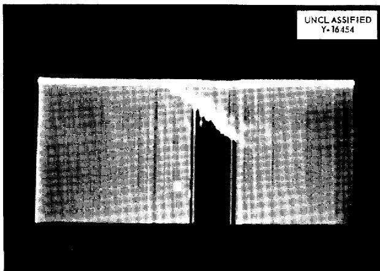  
Fig. 6.34. Ultrasonic "B" Scan Indication of the Gouge Shown in Fig. 6.33.

In an effort to compare the results obtained from immersed ultrasound, radiography, and fluorescent penetrant inspections, six pieces of 0.1875-in.-OD, 0.025-in.-wall, 7-ft-long CX-900 Inconel tubing were inspected by the respective methods. Mere detection was considered to be sufficient to indicate a defect, and no attempt was made to estimate the defect size. The total number of such defect indications and the correlation obtained between the various methods are presented in Table 6.11. The sampling is insufficient for final decisions to be made concerning inspection methods, but definite trends are indicated. It appears that no one of the methods alone would be adequate, and if any one of them was eliminated a few defects would be overlooked.

TABLE 6.11. CORRELATION OF RESULTS OF INSPECTION OF CX-900 INCONEL TUBING BY X-RAY, ULTRASOUND, AND FLUORESCENT PENETRANT METHODS   

<table><tr><td rowspan="2">Tube No.</td><td colspan="3">Number of Defects Found by Each Method</td><td colspan="3">Number of Defects Which Did Not Correlate With Other Methods</td><td colspan="3">Number of Defects Correlated by Two Methods</td><td rowspan="2">Number of Defects Correlated by Three Methods</td></tr><tr><td>X-ray</td><td>Ultrasound</td><td>Fluorescent Penetrant</td><td>X-ray</td><td>Ultrasound</td><td>Fluorescent Penetrant</td><td>X-ray and Penetrant</td><td>X-ray and Ultrasound</td><td>Ultrasound and Penetrant</td></tr><tr><td>CX-1</td><td>7</td><td>13</td><td>14</td><td>2</td><td>5</td><td>6</td><td>3</td><td>3</td><td>6</td><td>1</td></tr><tr><td>CX-2</td><td>2</td><td>4</td><td>16</td><td>2</td><td>0</td><td>12</td><td>0</td><td>0</td><td>4</td><td>0</td></tr><tr><td>CX-3</td><td>1</td><td>25</td><td>13</td><td>0</td><td>13</td><td>1</td><td>1</td><td>1</td><td>12</td><td>1</td></tr><tr><td>CX-4</td><td>6</td><td>5</td><td>12</td><td>6</td><td>2</td><td>9</td><td>0</td><td>0</td><td>3</td><td>0</td></tr><tr><td>CX-5</td><td>3</td><td>4</td><td>14</td><td>1</td><td>1</td><td>11</td><td>1</td><td>1</td><td>2</td><td>0</td></tr><tr><td>CX-6</td><td>2</td><td>7</td><td>13</td><td>0</td><td>3</td><td>7</td><td>2</td><td>0</td><td>4</td><td>0</td></tr><tr><td>Total</td><td>21</td><td>58</td><td>82</td><td>11</td><td>24</td><td>48</td><td>7</td><td>5</td><td>30</td><td>2</td></tr></table>

# 7. HEAT TRANSFER AND PHYSICAL PROPERTIES

H. F. Poppendiek

Reactor Experimental Engineering Division

# FUSED-SALT HEAT TRANSFER

H.W.Hoffman

Reactor Experimental Engineering Division

D. P. Gregory

Pratt & Whitney Aircraft

Preliminary heat-transfer studies were carried out on a fresh batch of the fuel mixture NaK-KF-LiF-UF $_4$ (11.2-41-45.3-2.5 mole %) in a newly constructed system containing a Hastelloy B test section. The results, given in terms of the Colburn function (Fig. 7.1), lie above those obtained with an earlier batch of the same salt but are still below the general heat-transfer correlation. The Reynolds modulus range of the data will be extended in further experiments. It is believed that the difference between the two sets of data may be the result of suspected variations in the two salt batches. The new set of heat-transfer data falls about $30\%$ below the correlation for ordinary fluids, and this difference may be attributed, in part, to the inaccuracy of the estimated value of

thermal conductivity used in the correlation of the salt data.

Operation of a heat-transfer system that includes a pump to circulate the fused salts was initiated. Operational experience with $\mathrm{NaNO}_2\mathrm{-NaNO}_3\mathrm{-KNO}_3$ (40-7-53 wt %) shows that the system performs satisfactorily at temperatures up to $700^{\circ}\mathrm{F}$ . Heat-transfer experiments with water (Fig. 7.2) indicate that no systemic error exists. The pump system will be used to study the salt mixture NaF-KF-LiF-UF4 (11.2-41-45.3-2.5 mole %) rather than NaF-ZrF4-UF4 (50-46-4 mole %), as reported earlier. However, the heat-transfer characteristics of the latter salt will be examined in a pressurized system.

At present, fluid flow rates are obtained in the pressurized systems with volume probes. Although extreme precautions are taken, small quantities of oxygen and water vapor possibly enter the system when probe changes are necessary. In addition, it is difficult to maintain the calibration of the volume probes. Therefore a more positive method

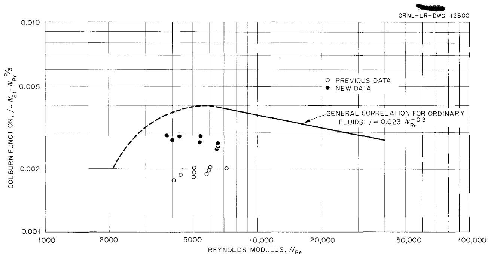  
Fig. 7.1. Comparison of Heat Transfer Measurements on Two Batches of NaF-KF-LiF-UF $_4$ (11.2-41-45.3-2.5 mole %) with the General Correlation for Ordinary Fluids.

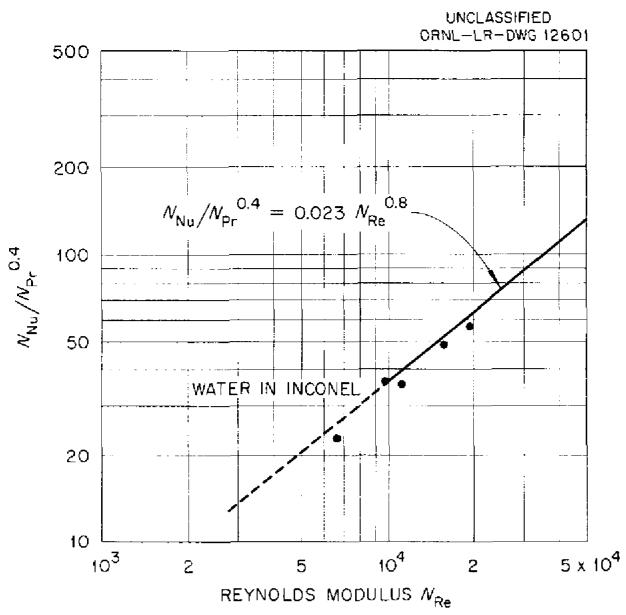  
Fig. 7.2. Results of Heat Transfer Measurements with Water in the Test System that Includes a Pump.

of obtaining the fluid flow rate has been investigated. The fluid weight is obtained by measuring the deflection of a cantilever beam which supports one of the tanks. Direct calibration of the system is accomplished by loading it with known weights. The beam movement can be measured by using either an iron core microformer or strain gages. The deflection signal, when amplified, can also be used to operate the system cycling mechanism. Thus, the necessity of opening the system during the experiment will no longer exist.

# ART FUEL-TO-NoK HEAT EXCHANGER

J. L. Wantland

Reactor Experimental Engineering Division

Heat-transfer and isothermal friction characteristics of the ART fuel-to-NaK heat exchanger have been determined for three degrees of spacer density: 9 sets of spacers at $7\frac{1}{2}$ -in. intervals, 13 sets of spacers at 5-in. intervals, and 25 sets of spacers at $2\frac{1}{2}$ -in. intervals. The data, a portion of which have been extrapolated to zero spacers, are shown in Figs. 7.3 and 7.4. For the normal spacer density (13 spacers at 5-in. intervals) the heat-transfer and isothermal friction characteristics in the Reynolds modulus range of 1,500 to 10,000 can be expressed by $N_{Nu} / N_{Pr}^{0.4} = 0.0155N_{Re}^{0.8}$

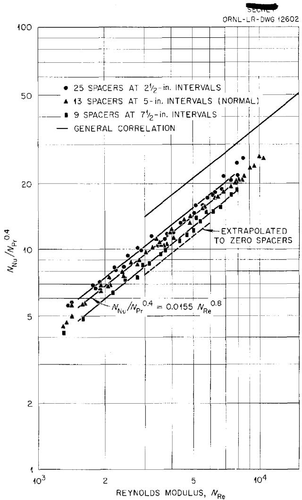  
Fig. 7.3. Heat Transfer Characteristics of an Experimental ART Fuel-to-NaK Heat Exchanger for Three Spacer Densities.

and $f = 0.175 / N_{\text{Re}}^{0.39}$ . The limited data presented in Figs. 7.3 and 7.4 appear to indicate that for a given heat exchanger pressure drop the heat-transfer coefficient is almost independent of the spacer density. For example, as the spacer density increases, the Reynolds modulus decreases to such an extent that the Nusselt modulus does not change significantly.

The available heat-transfer data for flow parallel to a square array of cylindrical tubes and for flow through square cross-sectional ducts are summarized in Fig. 7.5. It is thought that a square duct

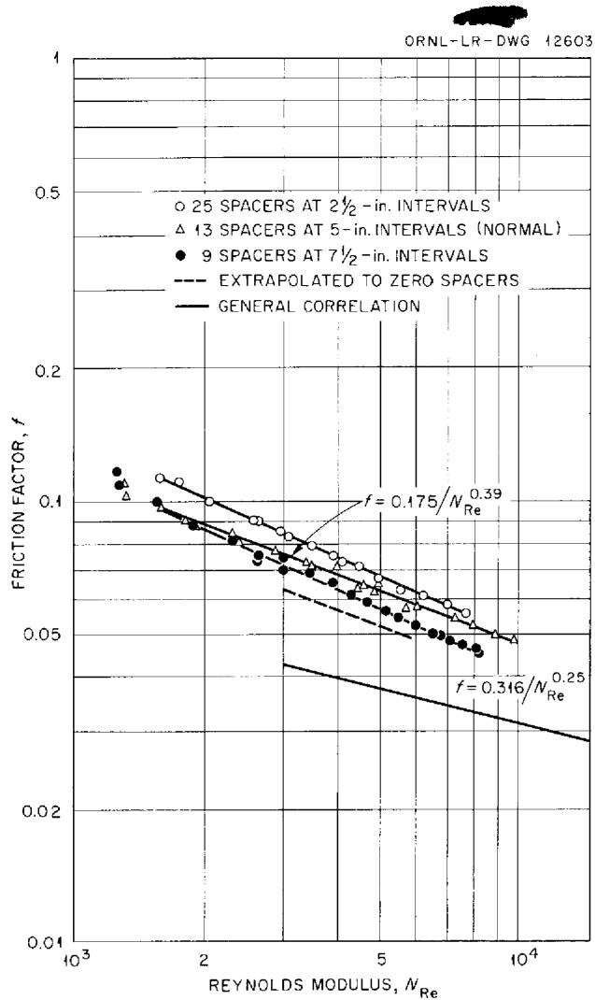  
Fig. 7.4. Isothermal Friction Characteristics of an Experimental ART Fuel-to-NaK Heat Exchanger for Three Spacer Densities.

approximates the flow configuration of the ART heat exchanger better than any other geometry for which heat-transfer data are known. At high Reynolds moduli the data are in agreement with the relation $N_{\mathrm{Nu}} / N_{\mathrm{Pr}}^{0.4} = 0.023N_{\mathrm{Re}}^{0.8}$ ; in the transitional flow regime all experimental data fall below this equation. The data for curve 2 were obtained with 20- and 100-tube heat exchangers circulating NaK and fuel.

An analysis has been made in an effort to reconcile the disagreement between the data presented

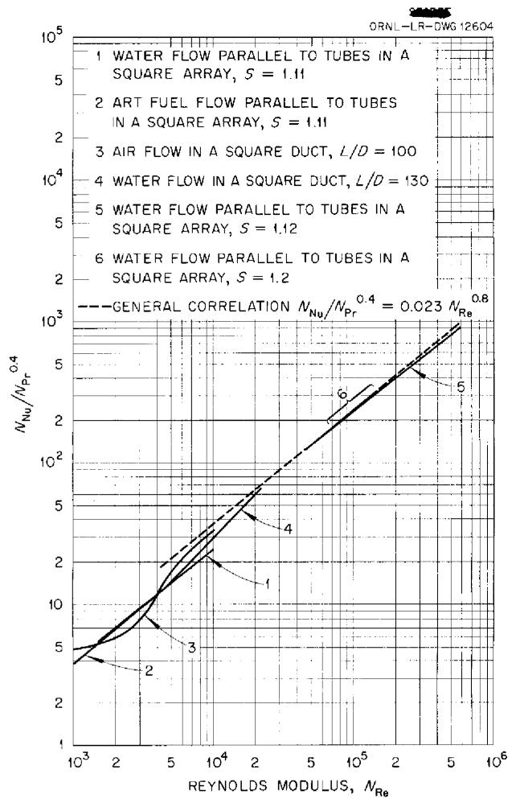  
Fig. 7.5. Heat Transfer Characteristics for Flow Through Square Ducts or Parallel to Cylindrical Tubes in a Square Array.

in Fig. 7.4 on the effect of spacers on the fluid friction characteristics in an ART heat exchanger tube bundle and the data reported by Cooper. This analysis indicated that the differences in the spacings between the tube bundle and the container wall for the two experimental configurations were not great enough to explain the difference between the two sets of friction data. Actually, this disagreement is not serious, because the spacer friction is only a small part of the total friction.

# ART CORE HYDRODYNAMICS

C. M. Copenhaver

F. E. Lynch

Reactor Experimental Engineering Division

G. L. Muller

Pratt & Whitney Aircraft

A $5/22$ -scale model of the ART sodium coolant annulus, which was designed for a study of the fluid flow distribution, was fabricated and assembled without the spacers and lands. Although the model does not incorporate the actual reflector-coolant hole distribution, provisions have been made for tapping off the flow (representative of reflector-coolant holes) at various sectors of the inlet header.

The preliminary experimental results obtained were based on $38.6\%$ of the reflector-coolant flow going to the annulus and the remaining $61.4\%$ being distributed uniformly to the coolant holes. The limitations of the experimental system made it impossible to attain the average Reynolds modulus of the actual coolant annulus, approximately $10^{5}$ ; however, Reynolds moduli up to $10^{4}$ were obtained, and the results were extrapolated to give an estimate of the flow distribution. For a concentric annulus (width, 0.135 in.) the average flow through the portions of the annulus farthest away from the inlet appears to be about $10\%$ greater than that through the portions nearest the inlet. Spacers have been inserted in the annulus according to the ART design, and flow-distribution and pressure-drop measurements are being obtained for concentric annulus conditions, for various radial displacements of the outer core shell, and for other conditions.

Visual studies were made of the flow through the 21-in. ART core model after the installation of vortex generators supplied by Pratt & Whitney Aircraft. Vane angles of 50, 55, 60, 65, and 70 deg were used. The 50- and 55-deg vortex generators improved the flow in comparison with that obtained with the 45-deg generators, but the generators with larger angles gave no further improvement. In all cases there was a persistent region of fluctuating flow at the equator on the island wall, and flow through the core was characterized by macroscopic turbulence. Although no large reverse-flow regions existed, steady and unsteady flow were observed in various regions of the core. A fared-in entrance has been built to use with the vortex

generatior in order to get better flow distribution going into the vanes.

# TEMPERATURE STRUCTURE IN REGION BEYOND THE ART REFLECTOR

H.W.Hoffman

J. L. Wantland

C. M. Copenhaver

Reactor Experimental Engineering Division

One of the several interrelated problems arising in the ART design is the determination of the temperature increase of the reflector-cooling sodium as it returns outside the reflector to the sodium pumps. Since the outlet temperature of the sodium is fixed by the allowable sodium-beryllium interface temperature, the sodium temperature rise on the return side is important in establishing the axial temperature gradient available for cooling both the reflector and the outer core shell. In order to evaluate this temperature rise, it was necessary to determine the heat sources and their locations. The idealized slab system for which the temperature analysis was made is indicated in Fig. 7.6. The actual system, in which the boron carbide tiles contact the walls at a finite number of points, has been simplified in terms of two limiting systems. In system A it is assumed that no thermal resistance exists between the boron carbide and the Inconel shells containing it, while in system B a 10-mil-thick helium gap isolates the boron carbide from the Inconel shells. Systems A and B are considered to be lower and upper limits of the problem. The heat-deposition rates used in these calculations are given in Table 7.1.

The temperature profile in the region between the sodium and the fuel return circuits was calculated by the method of superposition for a slab geometry. The temperature profiles obtained at the outlet end for systems A and B are compared in Fig. 7.6.

The temperature of the sodium was evaluated by using the heat-flux distributions on each side of the sodium return passage. On the reflector side, the heat flux at any point was the heat generated in the 2 in. of beryllium immediately adjacent to the sodium as corrected for the heat flow in the beryllium resulting from conduction. On the outside, the flux was determined from the temperature profile obtained by iteration. The resultant temperature rise of the sodium was $33^{\circ}F$ in system A and $25^{\circ}F$ in system B.

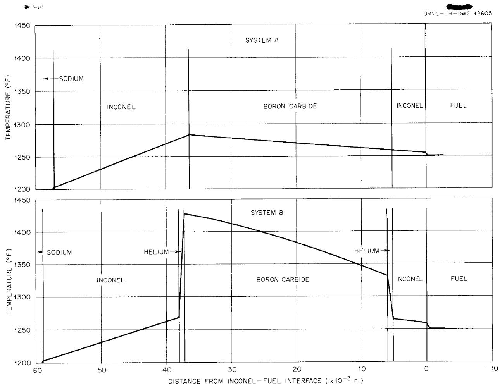  
Fig. 7.6. Comparison of Temperature Profiles in Region Beyond the ART Reflector.

TABLE 7.1. HEAT-DEPOSITION RATES IN ART FOR REGION OUTSIDE THE REFLECTOR   

<table><tr><td>Region</td><td>Heat Deposition Rate</td></tr><tr><td>Beryllium</td><td></td></tr><tr><td>2 in. from Be-Na interface</td><td>4.639 × 104Btu/hr·ft3</td></tr><tr><td>1 in. from Be-Na interface</td><td>6.282 × 104Btu/hr·ft3</td></tr><tr><td>At Be-Na interface</td><td>9.568 × 104Btu/hr·ft3</td></tr><tr><td>Sodium</td><td>3.479 × 104Btu/hr·ft3</td></tr><tr><td>Inner Inconel shell</td><td>5.567 × 105Btu/hr·ft3</td></tr><tr><td>Boron carbide</td><td></td></tr><tr><td>Volume</td><td>1.894 × 105Btu/hr·ft3</td></tr><tr><td>Flux at reflector-side surface</td><td>4.154 × 104Btu/hr·ft2</td></tr><tr><td>Outer Inconel shell</td><td>4.842 × 105Btu/hr·ft3</td></tr></table>

# TEMPERATURE STRUCTURE IN AN IDEALIZED ART CORE

H. F. Poppendiek L. D. Palmer Reactor Experimental Engineering Division

An analysis was made of the temperature structure in an idealized ART core. From the activity data obtained in the hot-critical experiment, it was possible to obtain a simplified radial volume-heat-source distribution. This source distribution was substituted into the heat-transfer equations, which were then evaluated for the uncooled-wall case. The resulting uncooled-wall temperature difference above the fluid temperature was more than twice as great as the corresponding temperature difference in a uniform volume-heat-source system. This radial temperature information was then used in a general cooling analysis of the idealized ART core and cooling annuli such as that outlined previously. The resulting axial sodium, core wall, and fuel temperature distributions are shown in Fig. 7.7; the wall cooling by the sodium coolant in the annuli was approximately 2.5 Mw.

# ART CORE HEAT-TRANSFER EXPERIMENT

N. D. Greene

G.W.Greene

H. F. Poppendiek

Reactor Experimental Engineering Division

G.L.Muller

Pratt & Whitney Aircraft

Fabrication of the half-scale model of the ART core, together with its associated components, was completed. The assembly, which will be used for volume-heat-source heat-transfer experiments, has been operated with water (Fig. 7.8). Preliminary measurements indicate that a mean Reynolds number of 100,000 will be achievable with the existing pumps.

All recording instrumentation for the transient and steady-state thermocouples, which are located near the wall-fluid interfaces, as well as below the wall surfaces of the core and island, has been developed and installed. Operating procedures and schedules are now being established, and explora

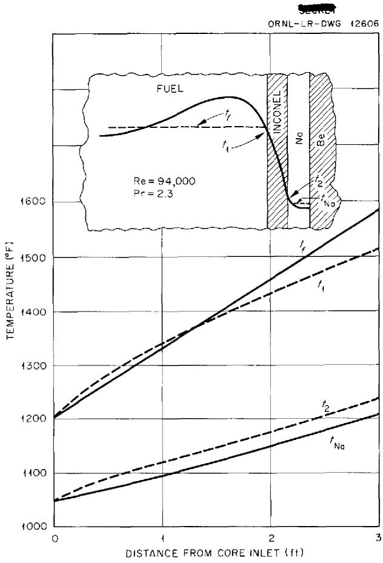  
Fig. 7.7. Temperature Structure in an Idealized ART Core.

tory, low-power runs will be made within a few weeks.

# HEAT CAPACITY

W.D.Powers

Reactor Experimental Engineering Division

The heat capacities and enthalpies of four specific $\mathsf{NaF - ZrF_4}$ mixtures were measured in the liquid and solid states in order to determine whether there was an appreciable variation in the heat capacity with composition. No major change in the heat capacity or in the product of the heat capacity and density was found over the composition range studied: 53 to 65 mole % NaF and 35 to 47 mole % $\mathsf{ZrF_4}$ . The following equations represent the data obtained.

NaF-ZrF4 (65-35 mole %)

Solid (120 to $465^{\circ}\mathrm{C}$ )

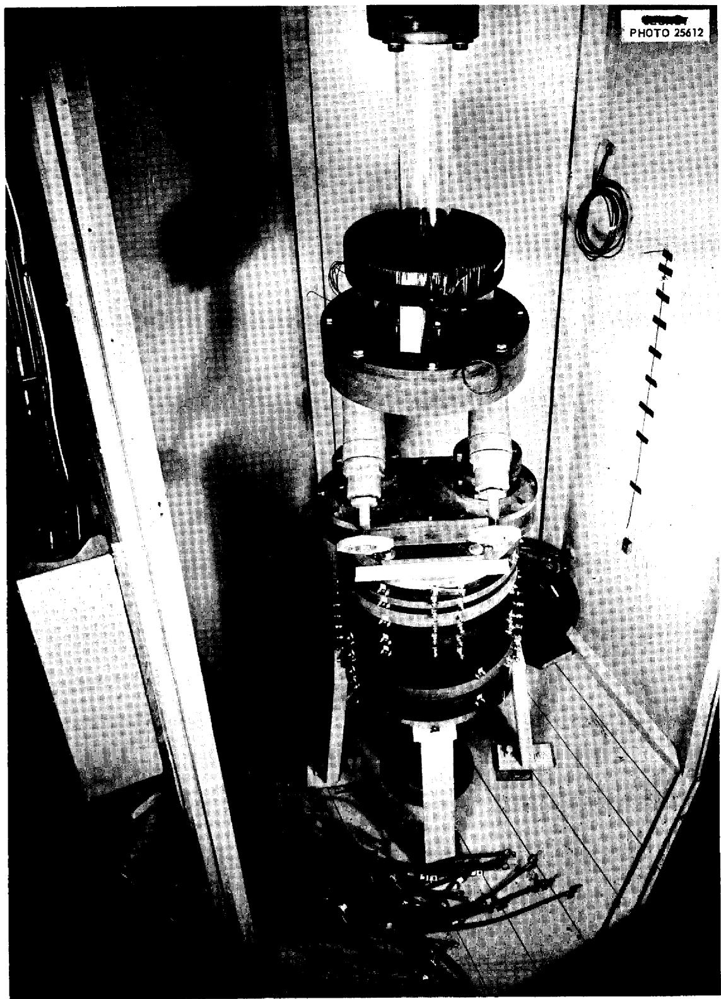  
Fig. 7.8. ART Volume-Heat-Source Test Section.

$$
\begin{array}{l} H _ {T} - H _ {2 5 ^ {\circ} C} = - 4. 1 + 0. 1 8 3 5 T + (6. 1 2 \times 1 0 ^ {- 5}) T ^ {2} \\ c _ {p} = 0. 1 8 3 5 + (1 2. 2 3 \times 1 0 ^ {- 5}) T \\ \end{array}
$$

Liquid (605 to $890^{\circ}C$

$$
\begin{array}{l} H _ {T} - H _ {2 5} \circ_ {\mathrm {C}} = - 1. 7 + 0. 3 3 2 2 T - (3. 8 7 \times 1 0 ^ {- 5}) T ^ {2} \\ c _ {p} = 0. 3 3 2 2 - (7. 7 3 \times 1 0 ^ {- 5}) T \\ \end{array}
$$

$$
\mathrm{NaF - ZrF}_{4} \left(61 - 39 \text { mole } \% \right)
$$

Solid (120 to $470^{\circ}\mathrm{C}$ )

$$
\begin{array}{l} H _ {T} - H _ {2 5 ^ {\circ} C} = - 2. 7 + 0. 1 6 4 8 T + (8. 3 0 \times 1 0 ^ {- 5}) T ^ {2} \\ c _ {p} = 0. 1 6 4 8 + (1 6. 6 1 \times 1 0 ^ {- 5}) T \\ \end{array}
$$

Liquid (550 to $900^{\circ}\mathrm{C}$ )

$$
\begin{array}{l} H _ {T} - H _ {2 5 ^ {\circ} C} = 1 6. 8 + 0. 2 8 3 5 T - (0. 8 4 \times 1 0 ^ {- 5}) T ^ {2} \\ c _ {p} = 0. 2 8 3 5 - (1. 6 7 \times 1 0 ^ {- 5}) T \\ \end{array}
$$

$$
\mathrm{NaF - ZrF}_{4} (57 - 39 \text { mole } \% )
$$

Solid (120 to $495^{\circ}\mathrm{C}$ )

$$
\begin{array}{l} H _ {T} - H _ {2 5 ^ {\circ} C} = - 6. 6 + 0. 1 9 1 4 T + (2. 9 7 \times 1 0 ^ {- 5}) T ^ {2} \\ c _ {p} = 0. 1 9 1 4 + (5. 9 3 \times 1 0 ^ {- 5}) T \\ \end{array}
$$

Liquid (550 to $900^{\circ}\mathrm{C}$ )

$$
\begin{array}{l} H _ {T} - H _ {2 5 ^ {\circ} C} = 6 0. 2 + 0. 1 5 3 0 T + (8. 4 8 \times 1 0 ^ {- 5}) T ^ {2} \\ c _ {p} = 0. 1 5 3 0 + (1 6. 9 5 \times 1 0 ^ {- 5}) T \\ \end{array}
$$

$$
\mathrm{NaF - ZrF}_{4} \left(53 - 47 \text { mole } \% \right)
$$

Solid (120 to $515^{\circ}C$

$$
\begin{array}{l} H _ {T} - H _ {2 5 ^ {\circ} C} = - 5. 2 + 0. 1 8 4 7 T + (2. 3 8 \times 1 0 ^ {- 5}) T ^ {2} \\ c _ {p} = 0. 1 8 4 7 + (4. 7 6 \times 1 0 ^ {- 5}) T \\ \end{array}
$$

Liquid (560 to $905^{\circ}C$

$$
\begin{array}{l} H _ {T} - H _ {2 5 ^ {\circ} C} = 5 5. 5 + 0. 1 8 8 4 T + (4. 6 5 \times 1 0 ^ {- 5}) T ^ {2} \\ c _ {p} = 0. 1 8 8 4 + (9. 3 0 \times 1 0 ^ {- 5}) T \\ \end{array}
$$

In these expressions,

$$
H = \text {e n t h a l p y} \quad \mathrm {i n} \quad \mathrm {c a l} / \mathrm {g},
$$

$$
c _ {p} = \text {h e a t c a p a c i t y i n} \mathrm {c a l} / \mathrm {g} \cdot {} ^ {\circ} \mathrm {C},
$$

$T =$ temperature in ${}^{\circ}\mathsf{C}$

Table 7.2 gives a comparison of the heat capacities in the liquid state in the following units: cal/g $\cdot^{\circ}\mathsf{C}$ , cal/g $\cdot$ atom $\cdot^{\circ}\mathsf{C}$ , and cal/cm $^3$ . The volumetric heat capacities and the heat capacities on a per-gram basis have been found to be nearly constant over a wide range of compositions.

In a report5 published recently the heat capacities of 17 fluoride mixtures are listed and compared. Equations were formulated so that the enthalpy and heat capacity of solid and liquid fluoride mixtures could be predicted from the composition.

# VISCOSITY

# S. I. Cohen

Reactor Experimental Engineering Division

A study was initiated to determine the effect of fission products on the viscosities of fuel mixtures. The mixture used to simulate the ART fuel after exposure to reactor conditions was NaF-ZrF $_4$ -UF $_4$ (50-46-4 mole %) with 11 g of RbF, 17 g of BaF $_2$ , and 52 g of TaF $_3$ added per kilogram of pure fuel. A sample of this fuel was prepared by dry mixing of the constituents. Measurements were made on the mixture and on a sample of the pure fuel from the same batch to furnish a control. However, the solubilities of the additives were apparently poor, and it was not possible to obtain a solution of the various components. Hence, the data obtained are felt to be invalid. A second sample of this proposed mixture is being prepared that will be hydrofluorinated after the additives

TABLE 7.2. HEAT CAPACITIES IN THE NaF-ZrF ${}_{4}$ SYSTEM   

<table><tr><td colspan="2">Composition (mole %)</td><td colspan="3">Heat Capacity</td></tr><tr><td>NaF</td><td>ZrF4</td><td>cal/g ·°C</td><td>cal/g ·atom ·°C</td><td>cal/cm3·°C</td></tr><tr><td>65</td><td>35</td><td>0.278</td><td>7.82</td><td>0.812</td></tr><tr><td>61</td><td>39</td><td>0.272</td><td>7.79</td><td>0.809</td></tr><tr><td>57</td><td>43</td><td>0.272</td><td>7.91</td><td>0.824</td></tr><tr><td>53</td><td>47</td><td>0.253</td><td>7.50</td><td>0.776</td></tr></table>

have been introduced. The resulting mixture will be analyzed, and a second attempt to obtain viscosity data will be made.

An important observation was made during this study: the viscosity measurements on the pure fuel used as a control yielded values which were about $15\%$ lower than those obtained previously for this mixture.6 Consequently, measurements were made on a second sample of fuel from the batch used previously. The results obtained were in satisfactory agreement with those previously reported. Visual comparison of the melts from the old and new batches of fuel indicated that the new material was of much higher purity. These observations clearly show the influence of fuel purity on the viscosity.

Data on three other fluoride mixtures were also obtained. The results are presented in Table 7.3. The $\mathrm{NaF - ZrF_4}$ data were obtained with the modified Brookfield and capillary viscometers, and the results were in satisfactory agreement with capillary viscometer results determined over a year ago. The two beryllium-bearing salts were studied in the beryllium dry box with the capillary viscometers.

# PERFORMANCE COMPARISONS OF SEVERAL FLUORIDE FUELS

H. F. Poppendiek

Reactor Experimental Engineering Division

There are many ways in which the performance or effectiveness of fuels in a circulating-fuel reactor can be compared. In the comparisons presented here it is presumed that the reactor power, fuel inlet and outlet temperatures, and reactor core and heat exchanger geometries are given and fixed. Also, it is considered that the core Reynolds number is about 100,000 and that the heat exchanger Reynolds number is above the transition region. Under these circumstances it is possible to express the heat and momentum transfer in the reactor core and the heat exchanger in terms of simple relations involving only the thermal properties, namely, heat capacity, thermal conductivity, viscosity, and density. These relations have been evaluated for several of the more important ANP fuels, and the data are presented in Table 7.4. All quantities were normalized, that is, all numbers in a column have been compared with the lowest, which has been called unity. It is noted that the major differences between the fuels occur in the heat exchanger. The last two mixtures, which may be called alkali-metal-base fuels, have radial fuel temperature differences that are from 20 to $40\%$ lower than those in the zirconium-base fuels. Also, the heat exchanger pressure drops for the alkali-metal-base fuels are only about half as great as those for the zirconium-base fuels.

6S. I. Cohen and T. N. Jones, Measurement of the Viscosity of Composition 30, ORNL CF-55-3-62 (March 9, 1955).

TABLE 7.3. FLUORIDE VISCOSITY DATA   

<table><tr><td>Composition (mole %)</td><td>Temperature (°C)</td><td>Absolute Viscosity (centipoises)</td><td>Kinematic Viscosity (centistokes)</td><td>μ = AeB/T(°K)</td><td>Reference</td></tr><tr><td rowspan="2">NaF-ZrF4(50-50)</td><td>550</td><td>11.3</td><td>3.45</td><td>μ = 0.072e4160/T</td><td>•</td></tr><tr><td>850</td><td>2.9</td><td>0.96</td><td></td><td></td></tr><tr><td rowspan="2">NaF-LiF-BeF2(49-36-15)</td><td>600</td><td>55.65</td><td>2.65</td><td>μ = 0.195e2930/T</td><td>**</td></tr><tr><td>800</td><td>2.95</td><td>1.44</td><td></td><td></td></tr><tr><td rowspan="2">NaF-LiF-BeF2-UF4(56-21-20-3)</td><td>575</td><td>8.4</td><td>3.45</td><td>μ = 0.073e4010/T</td><td>**</td></tr><tr><td>850</td><td>2.7</td><td>1.18</td><td></td><td></td></tr></table>

$^{\star}S.$ I. Cohen and T. N. Jones, Measurement of the Viscosity of Composition 31, ORNL CF-55-12-128 (Dec. 23, 1955). $^{\star \star}S.$ I. Cohen and T. N. Jones, Measurement of the Viscosity of Compositions 97 and 98, ORNL CF-55-12-127 (Dec. 23, 1955).

TABLE 7.4. PERFORMANCE COMPARISONS OF SEVERAL FLUORIDES   

<table><tr><td rowspan="3">Composition (mole %)</td><td colspan="4">Comparison Ratios*</td></tr><tr><td colspan="2">Reactor</td><td colspan="2">Heat Exchanger</td></tr><tr><td>Δtom</td><td>(dq/dA)c</td><td>Δtr</td><td>Δp</td></tr><tr><td>NaF-ZrF4-UF4(50-46-4)</td><td>1.16</td><td>1.15</td><td>1.25</td><td>2.04</td></tr><tr><td>LiF-NaF-ZrF4-UF4(55-20-21-4)</td><td>1.36</td><td>1.18</td><td>1.45</td><td>1.53</td></tr><tr><td>RbF-ZrF4-UF4(48-48-4)</td><td>1.06</td><td>1.00</td><td>1.33</td><td>2.74</td></tr><tr><td>LiF-NaF-KF-UF4(45.3-11.2-41-2.5)</td><td>1.00</td><td>1.25</td><td>1.00</td><td>1.17</td></tr><tr><td>NaF-BeF2-UF4(70-28-2)</td><td>1.06</td><td>1.26</td><td>1.07</td><td>1.00</td></tr></table>

$\star \Delta t_{om} =$ radial fuel temperature difference in the core for an uncooled wall,   
$\left(\frac{dq}{dA}\right)_c =$ wall-cooling flux required to lower the wall temperature to the fluid temperature,   
$\Delta t_{r} =$ radial fuel temperature difference in the heat exchanger,   
$\Delta p =$ the fuel pressure drop through the heat exchanger.

# 8. RADIATION DAMAGE

G.W. Keilholtz  
Solid State Division

# REVIEW OF TESTS OF CORROSION OF INCONEL AND STABILITY OF FUEL UNDER IRRADIATION

G.W. Keilholtz  
Solid State Division

The effects of irradiation on the corrosion of Inconel exposed to a fluoride fuel mixture and on the physical and chemical stability of the fuel mixture have been investigated by irradiating Inconel capsules filled with static fuel in the MTR and by operating in-pile forced-circulation Inconel loops in the LITR and in the MTR. The relatively simple capsule tests have been used extensively for the evaluation of new materials. The principal variables in these tests have been flux, fission power, time, and temperature. In a fixed neutron flux the fission power is varied by adjusting the uranium content of the fuel mixture. Thermal-neutron fluxes ranging from $10^{11}$ to $10^{14}$ neutrons/cm².sec and fission-power levels of 80 to $8000\mathrm{W/cm^3}$ have been used in these tests. Almost all the capsules have been irradiated for 300 hr, but in some of the recent tests the irradiation period was 600 to 800 hr. After irradiation the effects on the fuel mixture are studied by measuring the pressure of the evolved gas, by determining the melting point of the fuel mixture, and by making petrographic and chemical analyses. The Inconel capsule is also examined for corrosion by standard metallographic techniques.

In the many capsule tests made to date, no major changes that can be attributed to irradiation, other than the normal burnup of the uranium, have occurred in the fuel mixtures. However, the analytical method for the determination of chromium in the irradiated fuel mixture is being rechecked for accuracy. The metallographic examinations of Inconel capsules tested at $1500^{\circ}\mathrm{F}$ for 300 hr have shown the corrosion to be comparable to the corrosion found under similar conditions in unirradiated capsules, that is, penetration to a depth of less than 4 mils. In capsules that briefly reached temperatures of $2000^{\circ}\mathrm{F}$ and above, there was penetration to a depth of more than 12 mils and grain growth.

Three types of forced-circulation in-pile loops

have been tested. A large loop was operated in a horizontal beam hole of the LITR. The pump for circulating the fuel in this loop was placed outside the reactor shield. A smaller loop, including the pump, was operated in a vertical position in the lattice of the LITR. A third loop was operated completely within a beam hole of the MTR. The operating conditions for these loops are presented in Table 8.1, and results of chemical analyses of the fuel mixtures circulated are given in Table 8.2.

The LITR horizontal loop operated for 645 hr, including 475 hr at full reactor power. The loop generated 2.8 kw, with a maximum fission power of $400\mathrm{w/cm^3}$ . The Reynolds number of the circulated fuel was 5000, and there was a temperature differential in the fuel system of $30^{\circ}\mathrm{F}$ . The volume of the loop was large, and therefore there was a large dilution factor. Metallographic analyses showed less than 1 mil of corrosion of the Inconel walls of the loop. Chemical analyses showed the irradiated fuel mixture to contain 180 ppm Fe, 150 ppm Cr, and 30 ppm Ni. Therefore there was no evidence of accelerated corrosion in this experiment.

The LITR vertical loop operated for 130 hr, with only 30 hr of the total operating period being at full reactor power. The loop generated 5 kw, with a maximum fission power of $500\mathrm{w/cm^3}$ . The Reynolds number of the fuel was 3000, and the temperature differential was $71^{\circ}\mathrm{F}$ . The surface-to-volume ratio was 20, and the dilution factor was 10. Chemical analyses of the irradiated fuel showed 370 ppm Fe, 100 ppm Cr, and 50 ppm Ni. Metallographic analysis of this loop showed less than 1 mil corrosion at the curved tip.

The horizontal loop inserted in the MTR (MTR in-pile loop No. 3), described previously, operated for 467 hr, including 271 hr at power. The loop generated 20 kw, with a maximum power of 800 w/cm³. The Reynolds number of the fuel was 5000, and the temperature differential was $155^{\circ}F$ for 103 hr and $100^{\circ}F$ for 168 hr. The dilution factor was about 5.

TABLE 8.1. OPERATING CONDITIONS FOR INCONEL FORCED-CIRCULATION IN-PILE LOOPS  

<table><tr><td>Operating Variables</td><td>LITR Horizontal Loop</td><td>LITR Vertical Loop</td><td>MTR In-Pile Loop No. 3</td></tr><tr><td>Fuel composition (mole %)</td><td>NaF-ZrF4-UF4; 62.5-12.5-25</td><td>NaF-ZrF4-UF4; 63-25-12</td><td>NaF-ZrF4-UF4; 53.5-40-6.5</td></tr><tr><td>Maximum fission power, w/cm3</td><td>400</td><td>500</td><td>800</td></tr><tr><td>Total power, kw</td><td>2.8</td><td>5.0</td><td>20</td></tr><tr><td>Dilution factor</td><td>180</td><td>10</td><td>5</td></tr><tr><td>Maximum fuel temperature, °F</td><td>1500</td><td>1500</td><td>1500</td></tr><tr><td>Maximum temperature differential, °F</td><td>30</td><td>71</td><td>155</td></tr><tr><td>Reynolds number of fuel</td><td>5000</td><td>3000</td><td>5000</td></tr><tr><td>Operating time, hr</td><td>645</td><td>130</td><td>467</td></tr><tr><td>Time at full power, hr</td><td>475</td><td>30</td><td>271</td></tr><tr><td>Depth of corrosion attack, mil</td><td>&lt;1</td><td>&lt;1</td><td>&lt;1</td></tr></table>

TABLE 8.2. CHEMICAL ANALYSES OF FUEL MIXTURES CIRCULATED IN INCONEL FORCED-CIRCULATION IN-PILE LOOPS   

<table><tr><td rowspan="2">Loop Designation</td><td rowspan="2">Sample Taken</td><td colspan="3">Minor Constituents (ppm)</td></tr><tr><td>Iron</td><td>Chromium</td><td>Nickel</td></tr><tr><td rowspan="2">LITR horizontal loop</td><td>Before filling</td><td>80 ± 10</td><td>10 ± 5</td><td>200 ± 100</td></tr><tr><td>After draining</td><td>180 ± 40</td><td>150 ± 10</td><td>30 ± 5</td></tr><tr><td rowspan="2">LITR vertical loop</td><td>Before filling</td><td>90 ± 10</td><td>80 ± 10</td><td>145 ± 20</td></tr><tr><td>After draining</td><td>370 ± 20</td><td>100 ± 20</td><td>50 ± 10</td></tr><tr><td rowspan="2">MTR in-pile loop No. 3</td><td>Before filling</td><td>40 ± 10</td><td>60 ± 10</td><td>40 ± 10</td></tr><tr><td>After draining</td><td>240 ± 20</td><td>50 ± 10</td><td>100 ± 20</td></tr></table>

Chemical analyses of fuel from MTR in-pile loop No. 3 showed 240 ppm Fe, 50 ppm Cr, and 100 ppm Ni. The high iron concentration probably resulted from a sampling difficulty. Examinations of unetched metallographic sections of the Inconel tubing showed no corrosion penetration. Etched sections showed no attack that was to a depth of more than 1 mil. A slight amount of intergranular void formation was noted, but this was neither dense nor deep. Measurements of wall thickness showed no variations attributable to corrosion. The loop was examined carefully for effects of temperature variations between the

inside and outside walls of tubing at bends, but no effects of overheating were observed. Samples from the inlet, the center, and the exit side of the loop showed less than 1 mil of corrosion. The low corrosion is credited to careful temperature control of the salt-metal interface and to the maximum wall temperature being below $1500^{\circ}\mathrm{F}$ at all times.

Future loops will be operated at higher fission powers and therefore greater temperature differentials. The dilution factors will be kept low. New fuels and new alloys are being considered for testing in future loops.

# EXAMINATION OF THE DISASSEMBLED MTR IN-PILE LOOP NO.3

M. J. Feldman

C. Ellis

R. N. Ramsey

E.J. Manthos

A. E. Richt

W. B. Parsely

E. D. Sims

Solid State Division

The sectioning of MTR in-pile loop No. 3 was completed in the General Electric Company hot-laboratory facilities at NRTS, and three carriers containing the different sections of the loop were received at ORNL. The first carrier received contained the nose coil and two 14-in.-long pairs of fuel tubes from behind the nose. The cobalt foil, thermocouples, Calrods, and insulation were removed from the nose coil in the ORNL hot

laboratory facilities. Five of the original six cobalt foils were found and will be analyzed. The stripped nose coil and part of the heat exchanger assembly are shown in Fig. 8.1. The nose coil was sectioned with a hack saw, and the fuel was melted out of the coil and the two pairs of 14-in.-long fuel tubes in an argon atmosphere at a temperature of approximately $650^{\circ}\mathrm{C}$ . Thirty-five metallographic samples were obtained from the nose coil, heat exchanger, bellows, and fuel tubes. The locations of the specimens cut from the nose coil are shown in Fig. 8.2, and the locations of the other specimens are described in Table 8.3.

The eleven specimens cut from the nose coil were examined metallographically in the aspolished unetched condition, and no evidence of attack was found. Wall-thickness measurements

TABLE 8.3. NUMBER DESIGNATIONS AND LOCATIONS OF METALLOGRAPHIC SPECIMENS CUT FROM MTR IN-PILE LOOP NO. 3   

<table><tr><td>Specimen No.</td><td>Location of Specimen</td></tr><tr><td>280</td><td>Section of weld from heat exchanger U-joint</td></tr><tr><td>281</td><td>Transverse section of bellows on heat exchanger from outlet side</td></tr><tr><td>283</td><td>Transverse section of bellows on heat exchanger from inlet side</td></tr><tr><td>284</td><td>Radial section at location of thermocouples 5, 6, and 7 on outlet side</td></tr><tr><td>285</td><td>Transverse section of heat exchanger weld on outlet side</td></tr><tr><td>286</td><td>Transverse section of end of helium sniffer line on outlet side</td></tr><tr><td>287</td><td>Radial section at location of thermocouple 21</td></tr><tr><td>288</td><td>Same as specimen 284 except on inlet side</td></tr><tr><td>289</td><td>Same as 285 except on inlet side</td></tr><tr><td>290</td><td>Radial section at location of thermocouple 18</td></tr><tr><td>291</td><td>Radial section on outlet side 10½ in. from end of helium sniffer</td></tr><tr><td>295</td><td>Radial section on outlet side 15½ in. from end of helium sniffer</td></tr><tr><td>296</td><td>Radial section on outlet side 20 in. from end of helium sniffer</td></tr><tr><td>297</td><td>Radial section at location of thermocouple 23 on outlet side</td></tr><tr><td>303</td><td>Radial section on outlet side 30 in. from end of helium sniffer</td></tr><tr><td>304</td><td>Radial section on inlet side 7 in. from end of helium sniffer</td></tr><tr><td>305</td><td>Radial section on inlet side 12 in. from end of helium sniffer</td></tr><tr><td>306</td><td>Radial section on inlet side 17 in. from end of helium sniffer</td></tr><tr><td>307</td><td>Radial section on inlet side 21 in. from end of helium sniffer</td></tr><tr><td>308</td><td>Radial section on inlet side 25 in. from end of helium sniffer</td></tr><tr><td>309</td><td>Radial section on inlet side 30 in. from end of helium sniffer</td></tr></table>

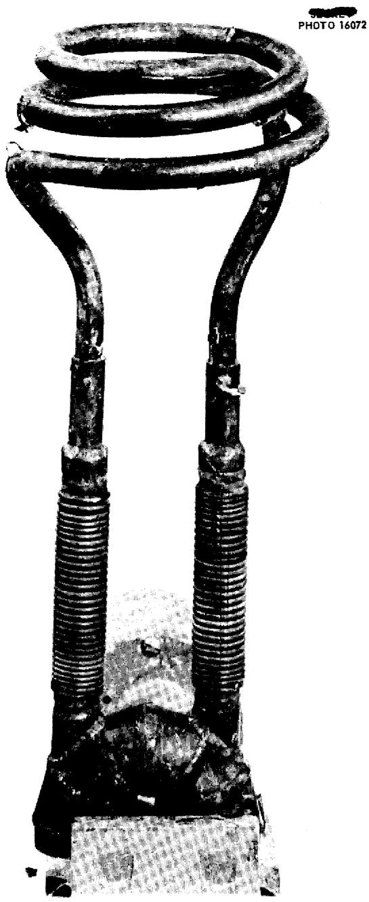  
Fig. 8.1. Stripped Nose Coil and Part of Heat Exchanger Assembly of MTR In-Pile Loop No. 3.

were taken on four of the samples from the coil and on the original tubing. Statistical variations in the wall thickness of the original tubing and variations resulting from bending of the tubing were established. Measurements taken on the four samples from the irradiated nose coil fell

UNCLASSIFIED ORNL-LR-DWG 13033

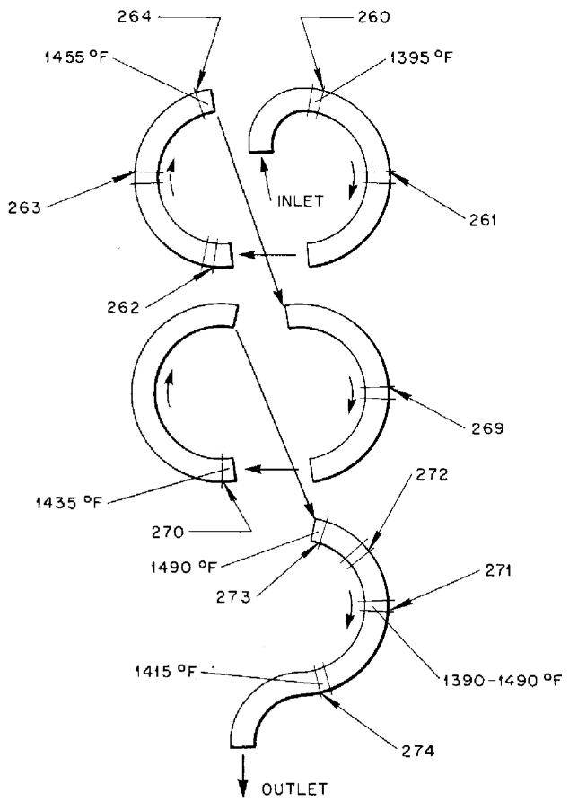  
Fig. 8.2. Locations on Nose Coil from Which Metallographic Specimens were Taken. The number designations of the samples and the operating temperatures at various points are shown.

within the established variations of the unirradiated coil. The results of attempts to etch these specimens chemically and electrolytically have not been satisfactory. The etched specimens show what appears to be moderate intergranular attack to a depth of 1 mil, but this may be an etching effect rather than true corrosive attack. Specimens 264 and 271 are shown in Figs. 8.3 through 8.6 in the polished and etched conditions. Two etching techniques are being studied that show promise of providing more definable microstructures.

Specimens from the pump and the two straight sections of fuel tubes will be examined as soon

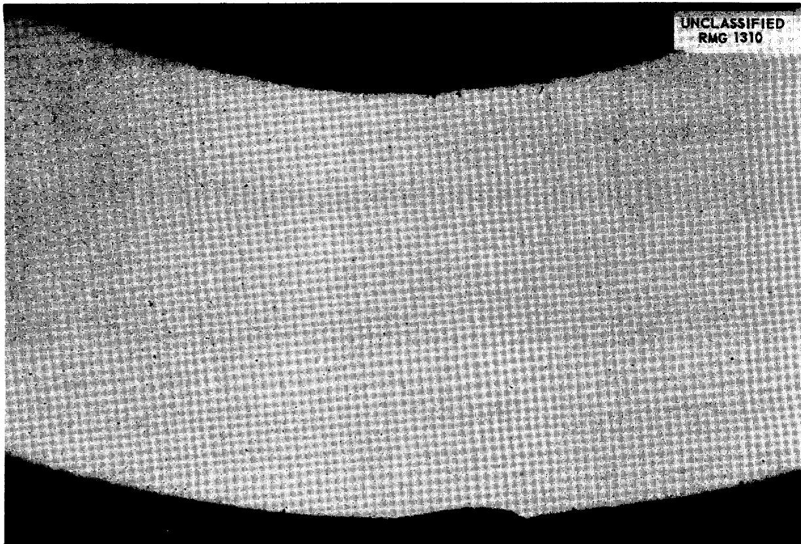

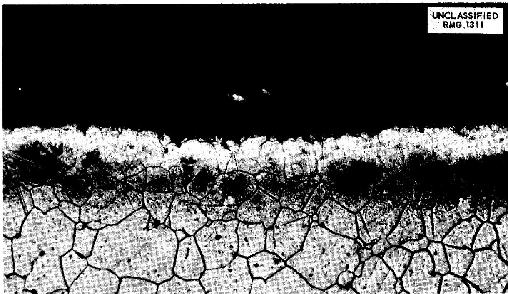  
Fig, 8.3. As-Polished Specimen 264 from Nose Coil of MTR In-Pile Loop No. 3. 50X.   
Fig, 8.4. Etched Specimen 264 from Nose Coil of MTR In-Pile Loop No. 3. 250X.

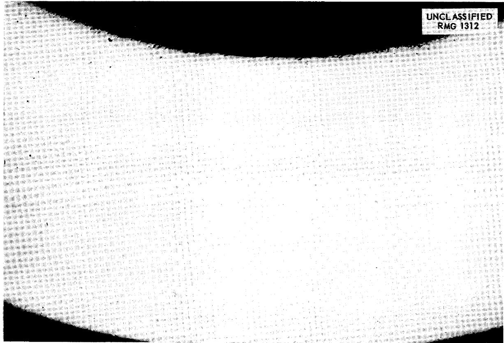

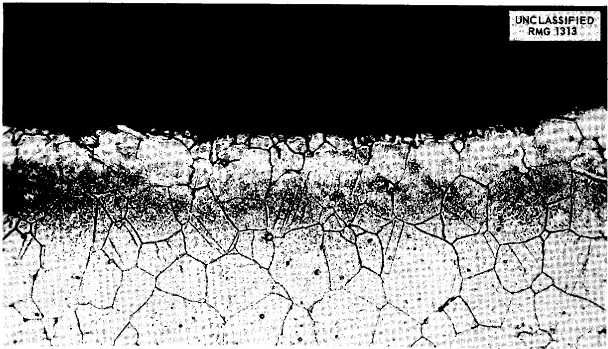  
Fig. 8.5. As-Polished Specimen 271 from Nose of MTR In-Pile Loop No. 3. 50X.   
Fig. 8.6. Etched Specimen 271 from Nose Coil of MTR In-Pile Loop No. 3. 250X.

as two cells can be decontaminated for cell equipment servicing. The fuel from the two sections of fuel tubing will be analyzed chemically, and specimens of the tubing will be examined metallographically.

# EFFECTS OF RADIATION ON THE MECHANICAL PROPERTIES OF STRUCTURAL MATERIALS

J.C.Wilson

Solid State Division

Stress-Corrosion Tests

W.W.Davis

J.C.Zukas

J.C.Wilson

Solid State Division

Eight Inconel, helium-pressurized, tube-burst, stress-corrosion specimens were exposed to radiation in hole HB-3 of the LITR in a helium atmosphere. The circumferential stress on each specimen was 2000 psi, and various test temperatures were used. Similar specimens are being tested out-of-pile to obtain control data.

A plot of the log of the time-to-rupture vs the operating temperature during irradiation, Fig. 8.7,

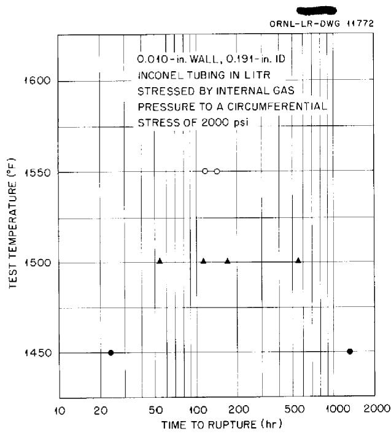  
Fig. 8.7. Results of Tube-Burst Stress-Corrosion Tests of Internally Pressurized Inconel Tubing Exposed to Radiation in the LITR at a Stress Level of 2000 psi in a Helium Atmosphere.

revealed an unusual degree of scatter in the data and led to an investigation of the condition of the specimen tubing prior to testing. Extensive nondestructive tests are being conducted on tubing for tube-burst experiments. All but four of 28 specimen tubes examined by Zyglo inspection were rejected because of pinholes and spongy regions. Metallographic inspection of 25 sections from the 24 rejected tubes resulted in the location of only one appreciable defect, Fig. 8.8, on the inside of the tubing. The types of defects that show up in nondestructive testing may have been partially responsible for the unusual scatter of the data obtained in the experiments described above. Several specimens that pass the nondestructive tests will be irradiated, after the out-of-pile stress-corrosion tests are completed, to study the effect of irradiation on rupture time in these inspected tubes. It is believed that the data will aid in estimating the seriousness of defects in the tubing in terms of creep life. The better quality tubing stock obtained for radiator fabrication will probably be used in subsequent experiments if the radiation effects indicate the need for more accurate determinations. The typical structure near the fracture of one of the in-pile tube-burst specimens is shown in Fig. 8.9. This specimen ruptured after 84 hr at $1500^{\circ}\mathrm{F}$ . The structure near the fracture of the only out-of-pile specimen available is shown in Fig. 8.10. This specimen fractured after 356 hr at $1500^{\circ}\mathrm{F}$ .

A cantilever stress-corrosion rig similar to that used in the LITR² has been in operation out-of-pile for over 250 hr. Two earlier out-of-pile tests were not completed because of a weld failure in one case and a thermocouple failure in the other. Static sodium is used as a heat-transfer medium on the outside of the Inconel tube being tested in this experiment. The Inconel tube is filled with the molten fuel mixture NaF-ZrF₄-UF₄ (50-46-4 mole %). Preparations have been made for opening the similar apparatus irradiated previously in the LITR and for examining the Inconel specimen metallographically. Two more rigs of this design have been filled with fuel and will be operated in the future.

Metallographic examination of a similar cantilever apparatus that had been operated out-of-pile with helium on both sides of the tubes (rather than

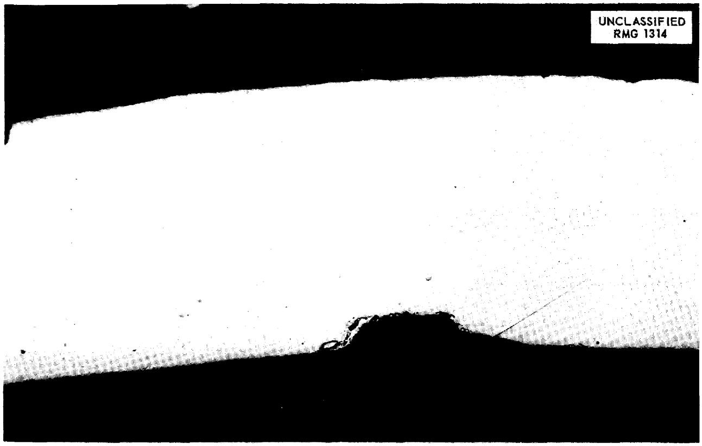  
Fig. 8.8. Defect Found by Metallographic Examination on Inside of Inconel Tubing from Stock Used in Tube-Burst Specimens.

sodium or fuel) showed that some surface oxidation had taken place. There was some oxidation penetration into the grain boundaries, but this was only noticeable on the tension sides of the specimens.

Two water-cooled, finned, tube-burst rigs for stress-corrosion testing of Inconel tubing, described previously, have been filled with the fuel mixture NaF-ZrF4-UF4 (63-25-12 mole %). One of these will be operated in the LITR to check heat-transfer design calculations.

# Alternate Stress-Corrosion Apparatus

C.D.Baumann W.E.Brundage Solid State Division

A design of an alternate apparatus for stress-corrosion testing was described previously. With this apparatus the maximum temperature of the fuel

and of the specimen would be limited to $1500^{\circ}F$ .

The preliminary design was based on calculations of the expected fission power, heat flow, and the limitations of fabrication. Since the thermal-neutron flux in hole HB-3 of the LITR was not known accurately, a mockup of the fuel and container was constructed, as shown in Fig. 8.11, and was irradiated for a short time at a position about 2 in. from the inner end of the hole. A cadmium-magnesium alloy (9 wt % Cd, 91 wt % Mg) was used to simulate the cross section of the fuel, and cobalt foils were used as the monitors. After irradiation the foils were removed, and the activity was measured in a $100\%$ geometry counter. The measurements indicated a flux of $9 \times 10^{12}$ neutrons/cm²·sec at the outer surface of the fuel and $5 \times 10^{12}$ neutrons/cm²·sec at the inner surface of the annulus. Calculations based on these measurements indicate an unperturbed thermal-neutron flux at this position of $2 \times 10^{13}$ neutrons/cm²·sec.

The flux measurements permitted a refinement of the design, and the equipment now being fabricated

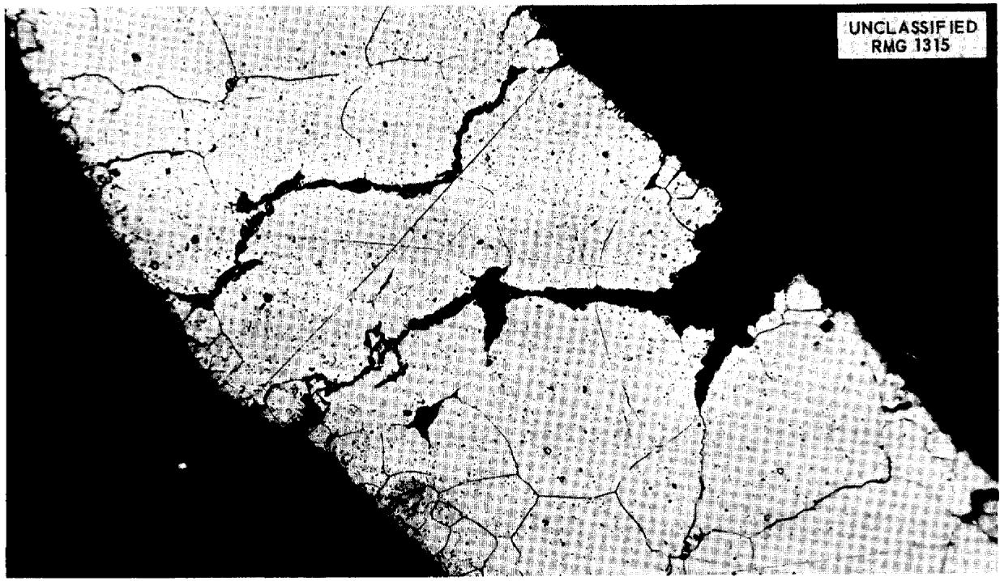

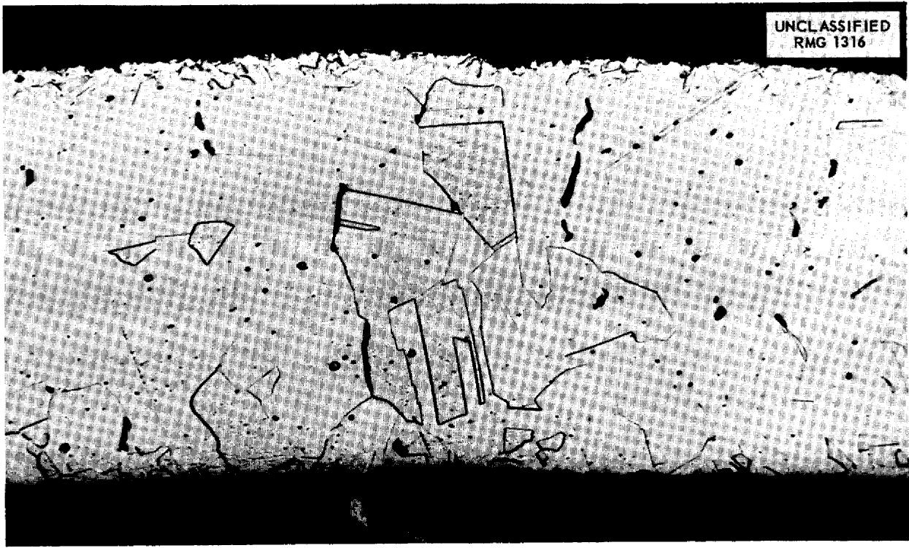  
Fig. 8.9. Structure Near Fracture in Inconel Tube-Burst Specimen That Was Internally Pressurized with Helium to a Fiber Stress of 2000 psi and Ruptured After 84 hr at $1500^{\circ}\mathrm{F}$ in Hole HB-3 of the LITR. 300X.   
Fig. 8.10. Structure Near Fracture in Inconel Out-of-Pile Tube-Burst Specimen That Was Internally Pressurized with Helium to a Fiber Stress of 2000 psi and Ruptured After 356 hr at $1500^{\circ}$ F, 300X.

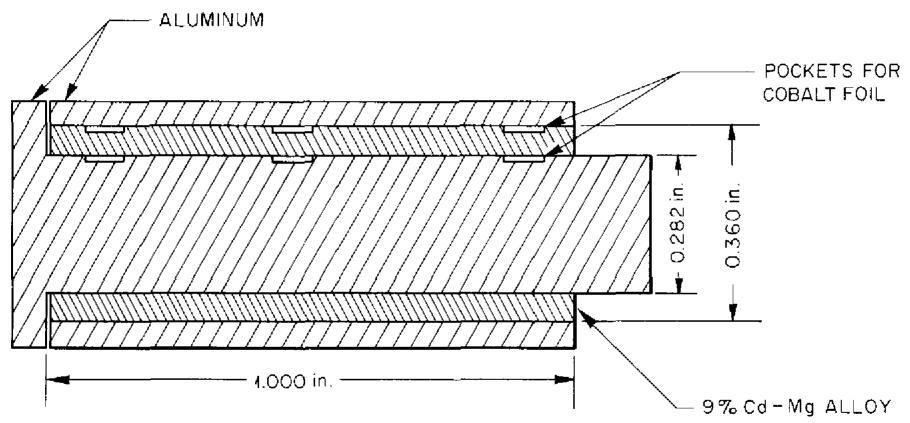

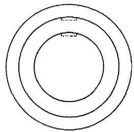  
Fig. 8.11. Design of Capsule Used for Measuring Thermal-Neutron Flux in Hole HB-3 of LITR and the Flux Attenuation To Be Expected in the Stress-Corrosion Apparatus.

is shown in Fig. 8.12. The platinum heater surrounding the fuel container will be used to supplement the fission heating to maintain the operating temperature. The outer container for the equipment will act as a safety container in case of a leak or rupture of the specimen. Power generation in the fuel will be about $750 \, \text{W/cm}^3$ . Postirradiation measurements will be made on the outside of the specimen tube, and the specimen will be examined metallographically for corrosion. It is expected that this apparatus can be used in the MTR with little modification.

# MTR Tensile Creep Tests

W.W.Davis N.E.Hinkle J.C.Wilson Solid State Division

The MTR tensile-creep-test apparatus in which two Inconel tubes were stressed in tension to 1500 psi at $1500^{\circ}\mathrm{F}$ (in helium) was irradiated in hole HB-3 of the MTR for 33 days at an average power level of 30 Mw. Postirradiation sectioning revealed that both specimens had fractured. Temperature measurements taken during the test showed an abnormal temperature distribution after 518 hr for specimen 1, which failed outside the gage length, and after 188 hr for specimen 2, which failed within the gage length. Throughout the high-temperature region, both specimens had dark surface films. The absence of metallic

reflection from the fracture surfaces indicated that the specimens had not fractured during disassembly of the apparatus. Metallographic examinations indicated that attack by an unknown contaminant, alone or in combination with temperature excursions, was responsible for the short rupture life. The corresponding out-of-pile control test has been delayed by leaks in the apparatus.

Metallographic examination of irradiated specimen 2 revealed an intergranular fracture and necking at the point of failure. Photomicrographs of longitudinal sections showed considerable internal grain-boundary separation. The incidence of grain-boundary separation appeared to be greatest adjacent to the fracture and to decrease with increasing distance from the fracture. Surface grain-boundary separation was observed at the inside surface to a maximum depth of 4 mils in a few places.

Photomicrographs of sections adjacent to the fracture show the presence of an unidentified film on the specimen surfaces. The film on the inside surface was thicker than that on the outside surface of the specimen tube. Fracture surfaces and surface grain-boundary separations exhibited the film material, but internal grain-boundary separations did not.

Sulfur attack, because of its well-known effects on nickel alloys, was thought to be a possible cause of the surface film and the intergranular

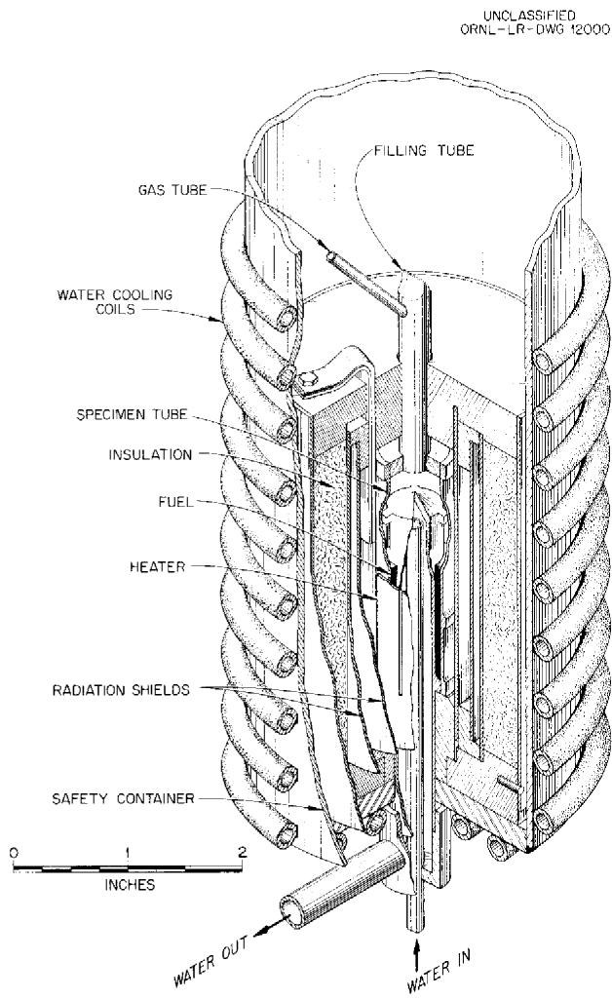  
Fig. 8.12. Alternate Stress-Corrosion Apparatus.

attack observed. It is important that the source of the contaminant be found so that it can be eliminated in future tests. No indications of sulfur were found in the insulation for the wiring or the furnace. An attempt to reproduce the surface film on the irradiated specimens was made by heating a similar Inconel tube in contact with sulfur for a short time at a temperature near $1500^{\circ}\mathrm{F}$ . Observation of the region contacted by the sulfur revealed a large amount of grain-boundary penetration compared with the limited amount of surface film and surface grain-boundary separation in the irradiated specimen. Sulfur printing techniques were applied to the control sample without success.

The Inconel tubing used as the specimen stock was subjected to ultrasonic and eddy-current tests, and indications of defects were obtained. Samples

were cut from the regions classed as most defective, but metallographic examination did not confirm the defects. The analyses of the experimental results of the tests will be continued.

# Pneumatic Stressing Device

A. S. Olson

J.C.Wilson

Solid State Division

A pneumatic stressing device that will provide a powerful, compact means of stressing creep specimens with loads as great as 10,000 lb has been designed and is being constructed. The device can be used for both laboratory and in-pile tests of creep, stress corrosion, and stress relaxation. Work continues on the design of a suitable recording creep extensometer.

# Ductility of Nickel Alloys

J.C.Wilson

Solid State Division

T.C.Price

Pratt & Whitney Aircraft

The effect of temperature on the ductility of nickel alloys in the temperature range 800 to $1400^{\circ}\mathrm{F}$ is being studied, with the effect of strain rate vs temperature being measured first. To date, fairly complete data have been obtained for Monel, and work on Nichrome and Inconel is under way.

The gage-length portions of the Monel tension specimens were $0.1500 \pm 0.0005$ in. in diameter and $0.060 \pm 0.05$ in. in length. Strain rates of 2 and 0.002 in./min were used, and the test temperatures ranged from 800 to $1400^{\circ}\mathrm{F}$ . The ultimate and yield strengths at both strain rates appeared to vary linearly with temperature. There was, however, a large nonlinear decrease in elongation and percentage reduction of area in the region 900 to $1000^{\circ}\mathrm{F}$ at the faster strain rate, which was not observable at the slower strain rate. These results are illustrated in Figs. 8.13 and 8.14.

At the slower strain rate the ductility values were lower than those found at the faster strain rates. At about $1000^{\circ}\mathrm{F}$ the ductility values nearly coincide for both strain rates, and therefore the processes responsible appeared to be independent of strain rate at this temperature. At higher and lower temperatures the curves tend to diverge, with greater ductility being found at the faster strain rate.

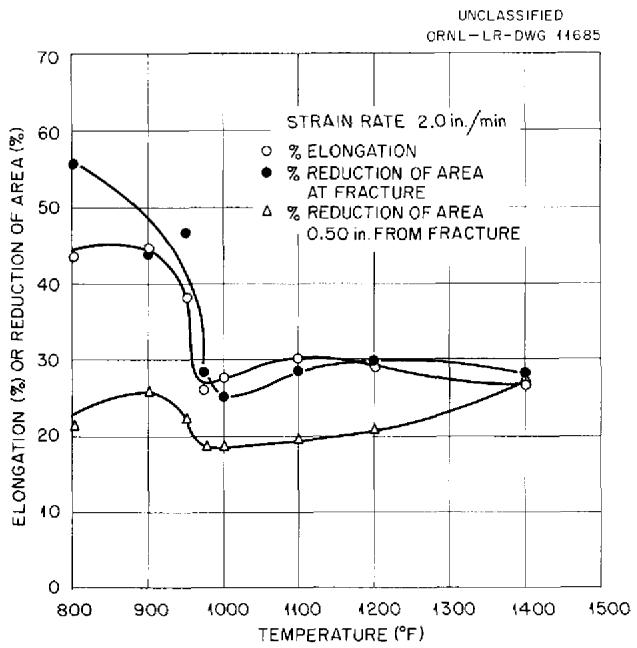  
Fig. 8.13. Effect of Temperature on Tensile Ductility in Monel at a Strain Rate of 2 in./min.

# EXPERIMENTAL STUDIES OF REACTORMATERIALS AND COMPONENTS

W. E. Browning  
Solid State Division

# Effect of Radiation on Static Corrosion of Structural Materials by Fused Salts

W.E.Browning H.L.Hemphill Solid State Division

Irradiations in the MTR of Inconel capsules containing various fused-salt fuels have been continued in order to study the effect on the Inconel of fissioning in the fuel. Since earlier tests had shown that irradiation for two weeks in the MTR had no significant effect on corrosion, the irradiation periods used for the capsules tested during the past year have been of six or nine weeks duration. Seven capsules filled with $\mathsf{NaF - ZrF}_4$ plus 2 mole $\% \mathsf{UF}_{4^{\prime}}$ 2 mole $\% \mathsf{UF}_{3^{\prime}}$ or 4 mole $\% \mathsf{UF}_4$ were irradiated at $1500^{\circ}\mathsf{F}$ for the longer periods and are now being sampled for metallographic and chemical analyses. Additional Inconel capsules filled with $\mathsf{NaF - ZrF}_4\mathsf{-UF}_4$ (50-46-4 mole $\%$ ) are being prepared for irradiation in the

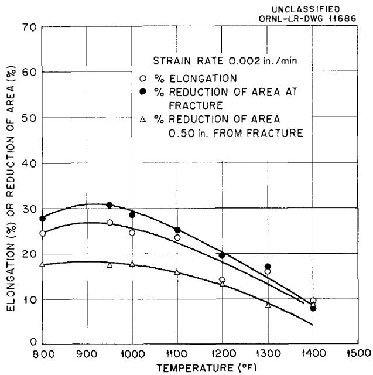  
Fig. 8.14. Effect of Temperature on Tensile Ductility in Monel at a Strain Rate of 0.002 in./min.

MTR at $1800^{\circ}F$ . A duplicate capsule is being tested out-of-pile for comparison. A multicapsule facility has been prepared for exposures in a high-flux position in the MTR.

The revised temperature-control system, described previously, has performed satisfactorily for more than a year. Three identical units are now in service. Various unforeseen disturbances have been handled, including one in which drops of water were sprayed intermittently on a capsule operating at $1500^{\circ}\mathrm{F}$ , without the occurrence of excessive temperatures.

The improved thermocouples, also described previously, have also served satisfactorily. Only one of the 25 improved thermocouples that have been used in the MTR has failed. The one that failed was one of three that were sprayed with water while hot after six weeks of irradiation; the other two did not fail.

Mockup tests have been run on Hastelloy B capsules under simulated MTR conditions to determine whether oxide scaling on the outside can be prevented in order to control contamination of the facility. Chrome-nickel plating of the outside

of the capsules gave an oxide coating in air at high temperatures that was adherent during thermal cycling. The coating was similar to that formed on Inconel in that it did not scale, and it appears to be promising for use with the present capsule designs.

# Holdup of Fission Gases by Charcoal Traps

W.E.Browning

Solid State Division

C. C. Bolta

Pratt & Whitney Aircraft

The apparatus described previously is being used for studying the various factors that affect the performance of charcoal traps for the holdup of fission gases. Both nitrogen and helium are being tested as purge gases, and radiokrypton is being used to simulate the fission gases. The trap is a 13-in.-long, 2-in.-dia, sched-40 stainless steel pipe filled with $\frac{3}{4}$ lb of 8- to 14-mesh Columbia activated charcoal.

For each test the charcoal trap is filled with purge gas, the manifold is evacuated, and radio-krypton is allowed to flow into the krypton chamber. The chamber is then sealed and the rest of the manifold is evacuated. Purge gas is then allowed to push the radiokrypton into the charcoal trap at a constant flow rate of $5\text{ft}^3/\text{hr}$ . By measuring the activity of the gas, the concentration of radiokrypton in the effluent gas and therefore its partial pressure can be determined. The relative activity of the effluent gas is measured as it passes through a small cell that has as one wall the end window of a GM counter. The gas activity is registered on a log counting-rate recorder.

A theoretical analysis of the adsorption process in a number of theoretical charcoal-filled traps, $N$ , connected in series and occupying the total volume of the trap has been made. The theoretical problem is similar to the continuous-dilution-tank problem in chemical engineering and applies only to systems where dilution processes, and not diffusion or adsorption, are rate limiting. The rate of removal of radiokrypton in each trap is first order with respect to its partial pressure and therefore its concentration in that chamber; that is,

$$
\frac {d P}{d t} = \frac {F}{k m} P.
$$

A series of $N$ differential equations of this type is solved simultaneously for the $N$ chambers, and

the general equation for the $N$ th chamber is

$$
P _ {n} = \frac {N ^ {N} A F ^ {(N - 1) t ^ {(N - 1)}}}{(N - 1) ! (k m) ^ {N}} e ^ {- N F t / k m}, \tag {1}
$$

where

$$
P _ {n} = \text {p a r t i a l p r e s s u r e o f r a d i o k r y p t o n , a t m},
$$

$$
A = \text {a m o u n t} \quad \text {r a d i o k r y p t o n} \quad \text {i n j e c t e d} \quad \text {i n t o} \quad \text {f i r s t} \quad \text {t h e o t e r t i c a l} \quad \text {c h a m b e r}, \quad \text {c m} ^ {3} \cdot \text {a t m},
$$

$$
N = \text {n u m b e r o f t h e o t e r t i c a l c h a m b e r s},
$$

$$
F = \text {f l o w r a t e} \text {o f p u r g e g a s , c m} ^ {3} / \min ,
$$

$$
t = \text {t i m e a f t e r i n j e c t i o n o f p u l s e}, \min ,
$$

$$
k = \text {s l o p e} x / m = k p \text {f o r} \text {r a d i o k r y p o n t i n t h e m i c t u r e o f i n e r p u r g e} \text {g a s a n d r a d i o k r y p o n t ,} \mathrm {c m} ^ {3} (\text {a t S T P}) \text {p e r} \mathrm {g} \cdot \mathrm {a t m},
$$

$$
m = \text {a m o u n t} \quad \text {a d s o r b e n t (c h a r c o a l) i n} \quad \text {t r a p}, g,
$$

$$
x = \text {a m o u n t} \text {o f g a s (r a d i o k r y p o t) a d s o r b e d i s o - t h e r m a l l y , c m} ^ {3} (\text {a t S T P}).
$$

The term $km$ is a measure of the adsorptive capacity of the charcoal trap for radiokrypton in the presence of purge gas at a given trap temperature. Parameters $km$ and $N$ are chosen to fit Eq. 1 to the experimental data.

The experimental results obtained with nitrogen as the purge gas through traps at four different temperatures are compared with analytical data in Figs. 8.15 through 8.18. In these illustrations the use of one trap is compared with the use of two identical traps in series. The trap temperatures studied were 16, 5, -51, and $-110^{\circ}\mathrm{C}$ . The deviations between corresponding curves are within experimental error. In each case the activity injected was determined by integration of the activity-vs-time curves; all results were normalized to the same area under the curve. It may be seen that, for a given trap geometry, the holdup times (i.e., the time required for activity to break through, to peak, and to disappear) increased with decreased trap temperature. This result could be predicted, because the energy of a gas molecule is less at low temperature, and it therefore cannot so readily desorb from the charcoal surface into the moving gas stream. Also, it may be seen that the maximum concentration of radiokrypton in the effluent gas is lower at lower trap temperatures.

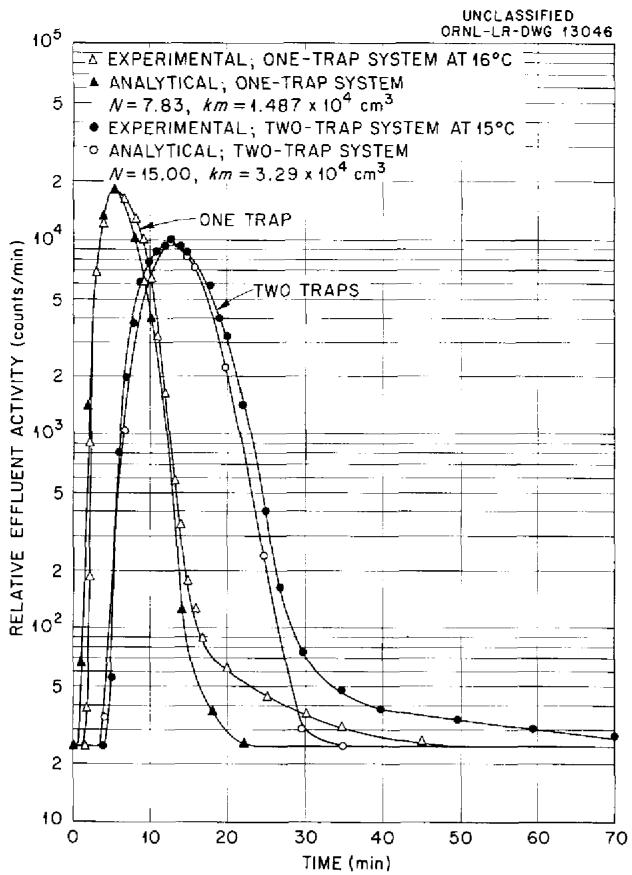  
Fig. 8.15. Holdup of Radiokrypton in Nitrogen-Purged Charcoal Traps as a Function of Temperature. One trap held at $16^{\circ}C$ ; two traps in series held at $15^{\circ}C$ .

The use of two identical traps in series increased the time required for the activity to peak to almost twice that for one trap and increased the break-through time to two to three times as long as for one trap. The time required for the activity to disappear from the effluent gas was also increased, and the maximum radiokrypton concentration was reduced.

Similar data were obtained with helium as the purge gas. The shapes of the curves (Fig. 8.19) are somewhat uncertain, however, because the accuracy of the data was limited by the sensitivity of the flowmeter in its lower range when used with helium. Several runs were made at each temperature, and the holdup times measured were significant, even though the exact shape of the curve may be in doubt. The curves show that radio-krypton is held up for much longer periods of time

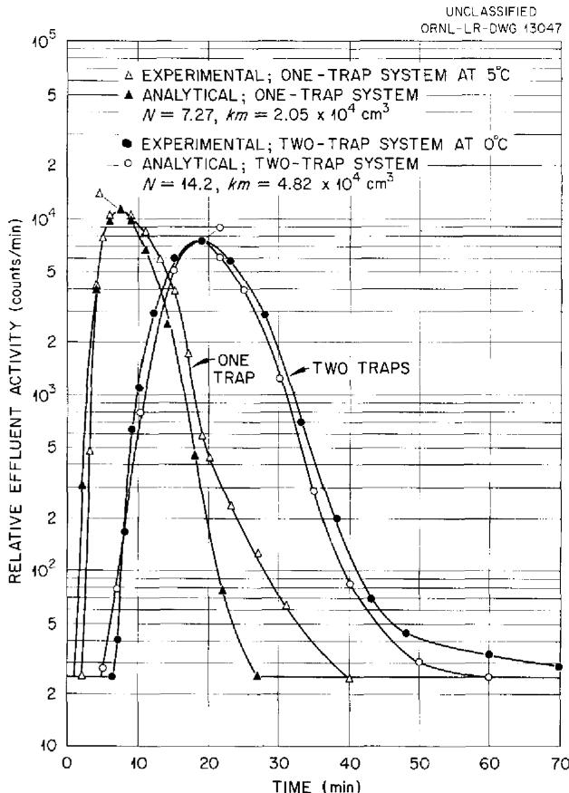  
Fig. 8.16. Holdup of Radiokrypton in Nitrogen-Purged Charcoal Traps as a Function of Temperature. One trap held at $+5^{\circ}C$ ; two traps in series held at $0^{\circ}C$ .

in the presence of flowing helium than it is in the presence of flowing nitrogen. Since the nitrogen is adsorbed in large amounts on charcoal, the charcoal surface is not so free to adsorb the krypton. Helium will pass over charcoal with very little adsorption, and hence krypton is retained on the charcoal for longer periods of time in the presence of flowing helium.

The experimental curves of Figs. 8.15, 8.17, and 8.18 are plotted together on Figs. 8.20 and 8.21 for comparison. The time required for maximum activity to be reached and the height and duration of the peaks are clearly indicated as a function of temperature. The analytical parameters $N$ and $km$ for various temperatures, with nitrogen as the purge gas, are compared in Fig. 8.22. It appears that the number of theoretical chambers $N$ is a characteristic of the geometry of the charcoal trap,

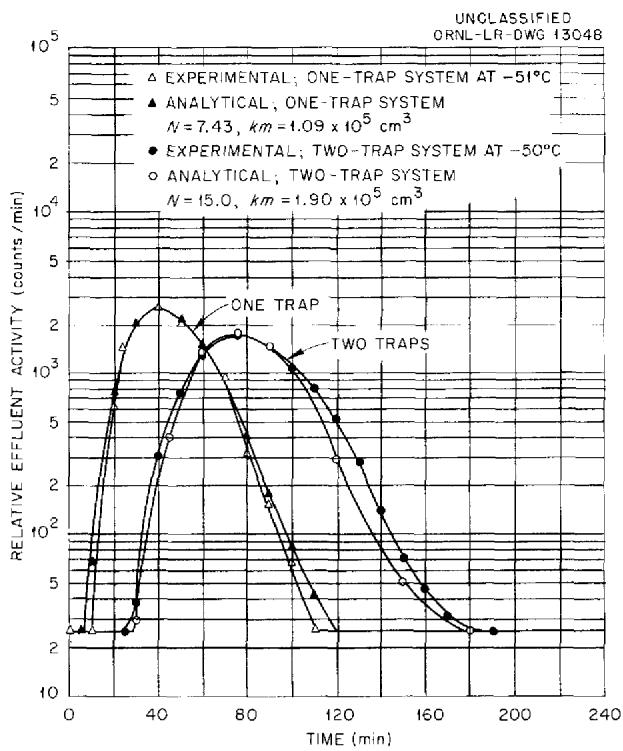  
Fig. 8.17. Holdup of Radiokrypton in Nitrogen-Purged Charcoal Traps as a Function of Temperature. One trap held at $-51^{\circ}C$ ; two traps in series held at $-50^{\circ}C$ .

since $N$ does not vary for the different temperatures studied. This should be true if the model used to derive the expression for the curve has physical significance. For two traps in series, $N$ is twice as large as for one trap, which indicates that $N$ may be a first-order function of the length of the trap divided by the diameter.

It is indicated in Fig. 8.22 that $km$ increases exponentially as $1 / T$ increases (decreasing temperature); actually, it is $k$ that increases, since the curves are for constant charcoal mass $m$ . If $km$ , the parameter obtained from holdup data by using Eq. 1, is actually the slope of the linear isotherm multiplied by the amount of charcoal, this straight-line relationship should exist. It therefore appears that the parameter is proportional to the slope of the isotherm, but whether the proportionality factor is unity has not yet been established.

The time, $t_{\max}$ , required for the maximum partial

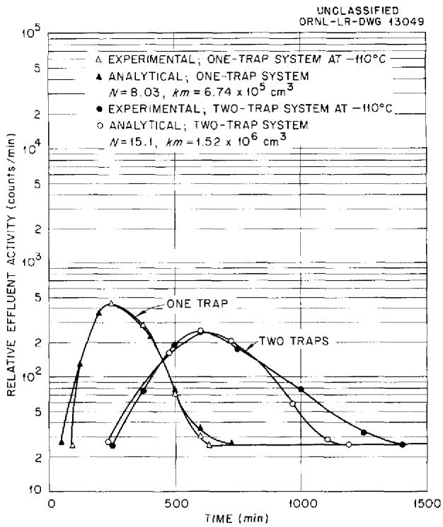  
Fig. 8.18. Holdup of Radiokrypton in Nitrogen-Purged Charcoal Traps as a Function of Temperature. Traps held at $-110^{\circ}\mathrm{C}$ .

pressure, of radiokrypton to be reached in the effluent purge gas can be derived from Eq. 1:

$$
t _ {\max } = \frac {(N - 1) k m}{N F}. \tag {2}
$$

The maximum partial pressure, $P_{\max}$ , can then also be obtained from Eq. 1:

$$
P _ {\max } = \frac {N (N - 1) ^ {N - 1} A}{(N - 1) ! k m} e ^ {- (N - 1)}. \tag {3}
$$

In Eq. 2 the time required for the activity to peak depends on $km$ and only very slightly on $N$ . All traps with the same amount of charcoal, $m$ , at the same temperature should have the same time-to-peak, regardless of the shape of the trap. This conclusion is consistent with the data of Guss. The height of the activity curve depends more on $N$ in Eq. 3 than on $km$ ; therefore a long thin trap would give a high narrow peak, and a short large-diameter trap would give a broad peak with a low maximum concentration.

Work is in progress to determine the relationship between $N$ and trap shape, and further studies of

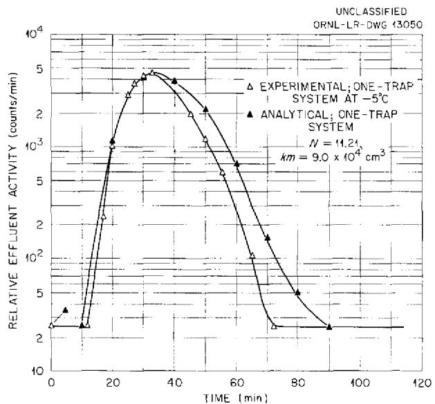

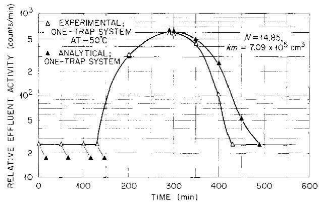  
Fig. 8.19. Holdup of Radiokrypton in Helium-Purged Charcoal Traps at -5 and $-50^{\circ}C$ .

other conditions are planned. The results should provide engineering data for trap design and may confirm further the theoretical relationship given above.

# LITR Vertical In-Pile Loop

W.E.Browning

H. E. Robertson

M. F. Osborne

R.P. Shields

W.R.Willis

Solid State Division

D. E. Guss, U.S. Air Force

Fabrication, assembly, and preirradiation testing of a new forced-circulation Inconel loop for operation in a vertical position in the LITR was completed. This loop is essentially the same as the one operated previously in the LITR, with

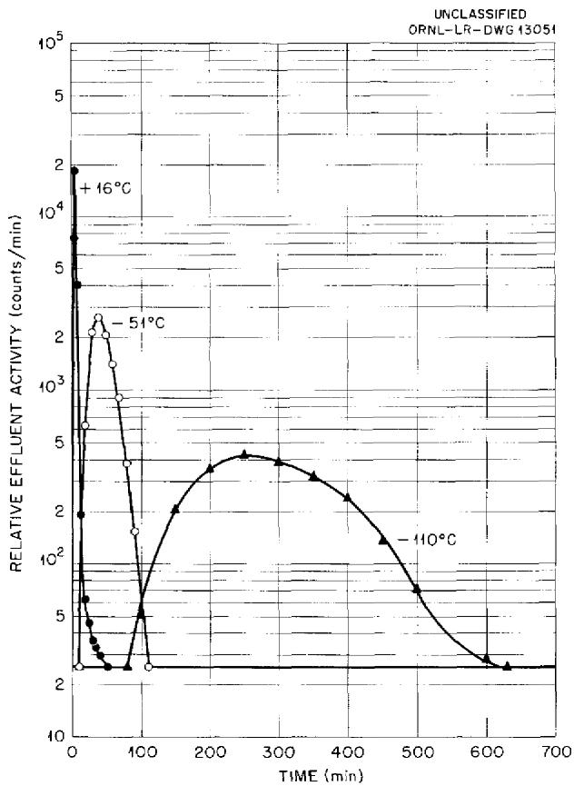  
Fig. 8.20. Comparison of Experimental Data on Holdup of Radiokrypton in Nitrogen-Purged One-Trap Systems at Various Temperatures.

minor modifications based on experience with the first loop. The brush-type motor used previously has been replaced with a three-phase induction motor. The speed of the induction motor will be regulated by the use of a variable-frequency power supply. The tip of the loop will extend more than $4\frac{1}{2}$ in. below the position of maximum flux in the reactor to obtain a greater temperature differential than that achieved previously. Operation of the loop in the LITR is planned for April.

# Instrumentation for ART Off-Gas Analysis

W.E.Browning

Solid State Division

Design conditions for the gamma-ray spectrometer for the ART off-gas system have been established. Four scintillation detectors will be used, one at

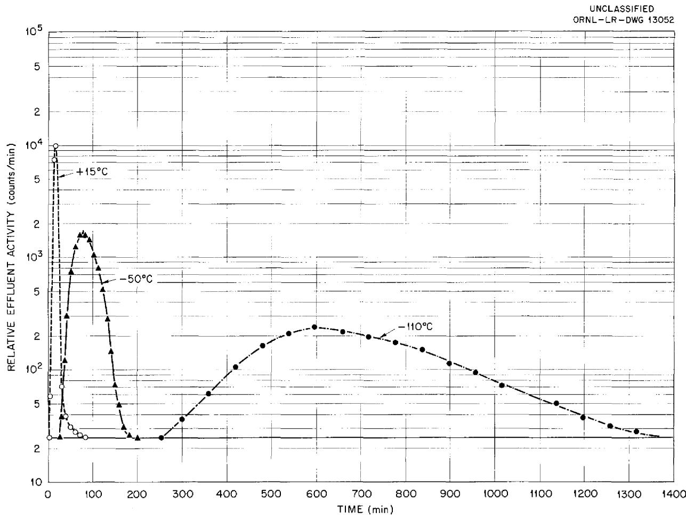  
Fig. 8.21. Comparison of Experimental Data on Holdup of Radiokrypton in Nitrogen-Purged Two-Trap Systems at Various Temperatures.

each of the inlets and outlets of the charcoal traps in the off-gas lines from both the fuel system and the reactor cell. Provision will be made for moving the shielded detector up to 10 ft from the most active off-gas sampling tube, under normal conditions, and closer, if necessary. A four-channel scintillation spectrometer will be used to monitor the detectors.

# Inconel as a Thermal-Neutron-Flux Monitor

D. E. Guss, U.S. Air Force

A study is being made of the feasibility of using Inconel as a thermal-neutron-flux monitor in the vertical in-pile loop and in static corrosion capsules. If Inconel can be used as the monitor for Inconel systems, it will not be necessary to add monitors to the experimental system. Furthermore,

Inconel has the proper activation and physical properties, whereas the various cobalt monitors currently available either become too radioactive during long-term irradiation or melt at the high temperatures required by the experiments. The cobalt monitors also require extensive activation analysis before they can be used.

There are two constituents of Inconel which can be used for flux monitoring: cobalt, about $0.14\%$ in Inconel, and chromium, about $15.5\%$ . Cobalt has the disadvantage that it must be chemically separated from the Inconel after irradiation to remove the $\mathrm{Fe}^{59}$ activity, which has gamma rays of 1.1 and 1.3 MeV. Since cobalt is present in such small quantities, there was, at first, some doubt about its homogeneity, but activation analyses of several pieces of Inconel stock show

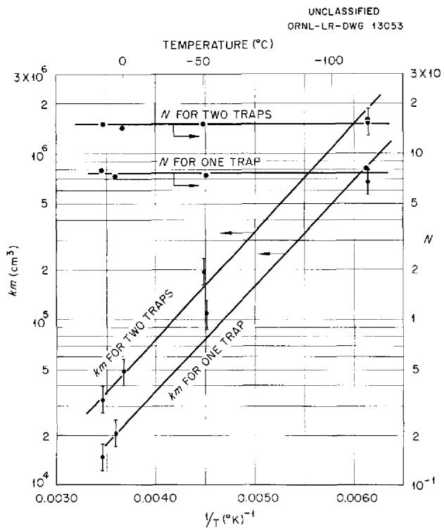  
Fig. 8.22. Comparison of Analytical Constants $N$ and $km$ for One- and Two-Trap Systems as a Function of Temperature.

that, within a given batch of Inconel, the cobalt is homogeneous enough for monitoring purposes.

The $\mathbf{Cr}^{50}$ isotope, $4.4\%$ naturally abundant, captures neutrons and goes to $\mathbf{Cr}^{51}$ , with a thermal cross section of about 15 barns. The $\mathbf{Cr}^{51}$ isotope has a half life of 26.5 days, and it decays by $K$ -capture, with an associated 0.32-Mev gamma ray in about $9\%$ of the disintegrations. Scanning of irradiated Inconel with a gamma-ray spectrometer has shown that the $\mathbf{Cr}^{51}$ peak is large enough for a good value of the chromium activity to be obtained by area analysis. The cadmium ratio of chromium in the lattice of the LITR was measured to be 29, which is consistent with the value to be expected for a $1 / \nu$ absorber. The cross section is known to be about 15 barns, but a more accurate measurement must be made.

The disadvantage in using chromium for long-term irradiations is its relatively short half life. This limits the time of irradiation for which chromium could be effectively used as a flux monitor to one or two months; after this length of time the activity is too near the saturation point for chromium to be

effective as an integrated-flux monitor. For longer irradiations, therefore, the cobalt must be used to give a more accurate value for the thermal-neutron flux.

# Measurement of MTR Flux near Tip of In-Pile Loop No. 3

D. E. Guss, U.S. Air Force

The thermal-neutron flux near the tip of MTR in-pile loop No. 3 was measured by means of cobalt foils attached to the nose coil at the positions shown in Fig. 8.23. The values obtained at the various positions are given in Table 8.4.

# Fast-Flux Measurements in Hole 19 of ORNL Graphite Reactor

J. F. Krause

Pratt & Whitney Aircraft

Two flux measurements were made in hole 19 of the ORNL Graphite Reactor, which has been used extensively for irradiations of organic materials. The first traverse was made with the threshold reaction $S^{32}(n,p)P^{32}$ for the flux measurement above 2.9 Mev, and the second was made with $\mathrm{Co}^{59}(n,\gamma)\mathrm{Co}^{60}$ reaction for the thermal-neutron-flux measurement. Each traverse was fairly constant from the center of the reactor to a point 30 in. from the center. Over this range the flux above

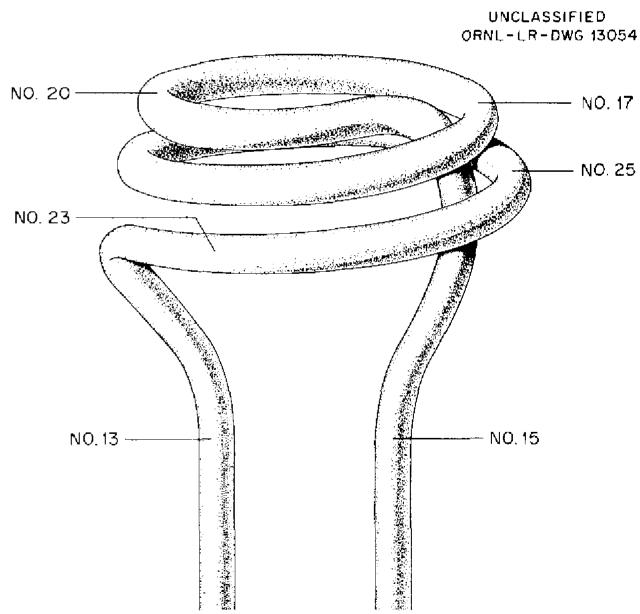  
Fig. 8.23. Diagram of Nose Coil of MTR In-Pile Loop No. 3 Showing Positions of Cobalt Foils.

TABLE 8.4. INTEGRATED AND AVERAGE THERMAL-NEUTRON FLUX AT VARIOUS POSITIONS ON NOSE COIL OF MTR IN-PILE LOOP NO. 3   

<table><tr><td>Foil No.</td><td>Integrated Thermal-Neutron Flux (neutrons/cm2)</td><td>Average Thermal-Neutron Flux (neutrons/cm2·sec)</td></tr><tr><td>15</td><td>3.85 × 1019</td><td>4.06 × 1013</td></tr><tr><td>17</td><td>7.08 × 1019</td><td>7.46 × 1013</td></tr><tr><td>20</td><td>8.20 × 1019</td><td>8.64 × 1013</td></tr><tr><td>23</td><td>5.90 × 1019</td><td>6.22 × 1013</td></tr><tr><td>25</td><td>4.18 × 1019</td><td>4.41 × 1013</td></tr></table>

2.9 Mev was approximately $2.5 \times 10^{3}$ neutrons/cm $^{2}$ -sec $^{-}$ w, and the thermal-neutron flux was $2.4 \times 10^{5}$ neutrons/cm $^{2}$ -sec $^{-}$ w. All measurements were made in the $\frac{1}{8}$ -in.-wall aluminum specimen cans ordinarily used in hole 19. These cans were surrounded by $\frac{3}{16}$ in. of flowing water, which acted both as a hydraulic fluid for moving the cans and as the coolant. Previous measurements in hole 19 were made during the irradiation of specific materials that may have altered the flux. Similar measurements have been started in hole HB-3 of the LITR, where the stress-corrosion tests are being run on Inconel in contact with fluoride fuel mixtures.

# CHEMICAL EFFECTS OF NUCLEAR REACTIONS

M. T. Robinson

Solid State Division

# Effects of Fission Products on Properties of Fluoride Fuels

M. T. Robinson

Solid State Division

J. F. Krause

Pratt & Whitney Aircraft

Three types of radiation effects can be distinguished in fused fluoride salt fuels such as $\mathsf{NaF - ZrF}_4\mathsf{-UF}_4$ . Radiation damage occurs as a result of bombardment of the fuel with high-energy particles and electromagnetic radiation; bulk thermal changes are caused by the large amount of energy dissipated in the fuel; and chemical changes result from the replacement of uranium by a mixture of more than 30 other elements. The fuel consists primarily of ions, some simple, such as $\mathsf{Na}^+$ and $\mathsf{F}^{-}$ ,and some complex, such as $\mathsf{ZrF}_{5}-$

and $UF_{5}$ . In all likelihood the bonding in the complex ions is largely ionic. For example, the method of Pauling shows a Zr-F bond to be about $75\%$ ionic. In such a system, radiation-damage effects should be very small, since there are neither covalent bonds to sever (as in $H_{2}O$ or organic compounds) nor a solid lattice to disrupt. Bulk thermal effects, while they cause a great deal of difficulty in the interpretation of continuous in-pile measurements, are not particularly important in corrosion studies, where the fuel-metal interface temperature is controlled, and are even less significant in turbulently flowing systems.

The yields of the various chemical elements in thermal-neutron fissioning of $U^{235}$ as a function of time have been calculated and used to calculate the average valency of the fission-product mixture. The chemical form each element is likely to adopt in a high-temperature fused fluoride fuel is discussed below:

Elements in group 0, krypton and xenon, will occur only in the elementary form.

Elements in groups IA, IIA, IIIB, and IVB will adopt their usual group valencies:

+1:Rb,Cs   
+2: Sr, Bα   
+3: Y, La, Ce, Pr, Nd, Pm, Sm, Eu, Gd, Tb, Dy   
+4: Zr

There is a possibility that, if the medium becomes sufficiently oxidizing, some $\mathsf{Ce}(\mathsf{IV})$ will be present, particularly since it may be stabilized by the formation of some complex ion, like $\mathsf{CeF}_5^-$ . Similarly, in a strongly reducing medium, some Eu(II) is to be expected. However, the low yield of europium makes this a relatively unimportant point.

The transition metals beyond zirconium in the periodic table are all relatively noble in comparison with chromium. Accordingly, it has been observed that ruthenium and niobium deposit from fluoride fuels onto the Inconel container.[12] The sparse thermodynamic data[13] indicate that chromium will reduce germanium, arsenic, and all the metals from niobium through antimony to the elemental state. Where valencies are required for these metals, the following values have been chosen:

+1: Ag, In   
+2: Ge, Tc, Pd, Cd, Sn   
+3: As, Nb, Mo, Ru, Rh, Sb

These are, in general, the lowest known valencies which have been reported for each element. Fluorides that exhibit these valencies are not known in every case.

The valencies to be expected for Se, Te, Br, and I depend strongly on conditions in the fluoride

melt. Under moderate reducing conditions the expected states are the normal anions:

-2: Se, Te   
-1:Br,1

If the conditions are mildly oxidizing, the elemental forms are to be expected (valency 0). Under stronger oxidizing conditions, positive valencies may be anticipated.

The average valencies of the fission-product mixture under various conditions are plotted in Figs. 8.24 and 8.25 as functions of irradiation time. The region above a valency of 4 presents reducing conditions, whereas, in the region below valency 4, oxidizing conditions exist, in comparison with the original uranium valency of $+4$ . The curves marked "inert container" are based on the assumption that in capsules (Fig. 8.24) all krypton and xenon descendants are retained and that in reactors (Fig. 8.25) the descendants of rare-gas isotopes of half life greater than 10 min

12M. T. Robinson, T. H. Handley, and W. A. Brooksbank, Solid State Semiann. Prog. Rep. Aug. 31, 1955, ORNL-1944, p 17.   
13L. Brewer et al., p 76-192, in The Chemistry and Metallurgy of Miscellaneous Materials, Thermodynamics, NNES IV-198, ed. by L. L. Quill, McGraw-Hill, New York, 1950; W. M. Latimer, Oxidation Potentials, Prentice Hall, New York, 1938.

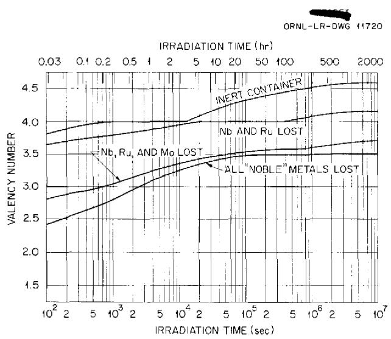  
Fig. 8.24. Average Fission-Product Valencies in Irradiated Inconel Capsules Containing Fused Fluoride Fuel Mixtures in the System NaF-ZrF $_4$ -UF $_4$ .

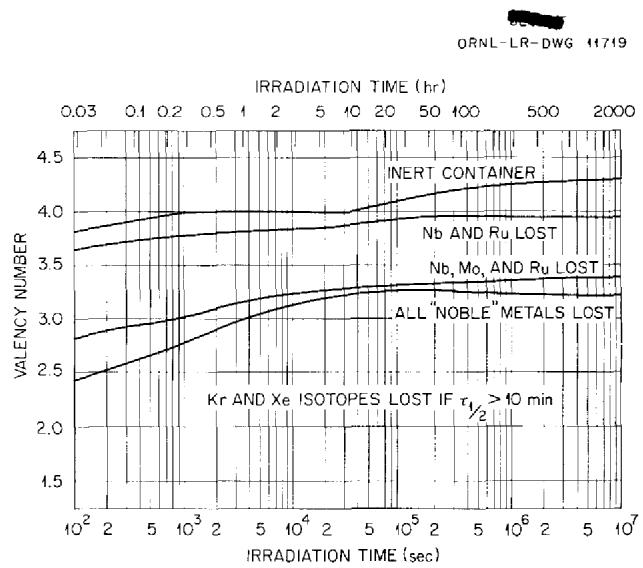  
Fig. 8.25. Average Fission-Product Valencies in Circulating-Fuel Reactors Operated with Fused Fluoride Fuel Mixtures in the System NaF-ZrF $_4$ -UF $_4$ .

are lost completely. The left-hand branch of each curve, up to valency 4, is based on the elemental state of the halogens and chalcogens. The right-hand branch is based on the anionic forms of these elements. In the intermediate branch, the halogens and chalcogens are progressively reduced from the elemental forms to the normal anions.

The curves marked "Nb and Ru lost" are based on the assumption that these two metals deposit on the container walls as elements. Where the valency is below 4, the halogens and chalcogens are taken as the elements; where it is above 4, these nonmetals are taken as the normal anions. The great importance of molybdenum in determining the average valency of the fission products may be seen from the remaining curves, which show the average fission-product valency for loss of Nb, Mo, and Ru and for loss of all the "noble" transition metals.

Curves showing the predicted excess "fluorine" present in fluoride fuels as a result of the low average valency of the fission products are presented in Figs. 8.26 and 8.27. The right-hand axis is marked with the concentration of excess $\mathrm{Cr}^{+ + }$ ion required to balance the excess oxidizing

power of the fuel. It is very evident from these curves that a substantial increase in the corrosive attack of the fuel on the container may be expected under irradiation, as compared with the ordinary thermal corrosion, and that the attack will become more serious as the fission rate $(\mathrm{w/cm}^3)$ is increased. This results from the instability, in contact with Inconel, of ions of molybdenum and ruthenium. Other things being equal, the effect is expected to be more serious in systems in which the fission gases are removed with high efficiency than in systems where they are retained.

Contrary to these theoretical predictions, corrosion in irradiated fluoride fuel-Inconel systems has never been observed to be increased in comparison with corrosion in unirradiated controls. No increased penetration of the irradiated metal had been observed. The amounts of container metals $(\mathsf{Cr},\mathsf{Fe},\mathsf{Ni})$ found in irradiated fuels are, in general, much the same as, or even less than, the amounts found in unirradiated controls. It is evident that the excess oxidizing power of the irradiated fuel, which has been expressed here in terms of "fluorine," is accommodated without increased attack on the container. Some of the

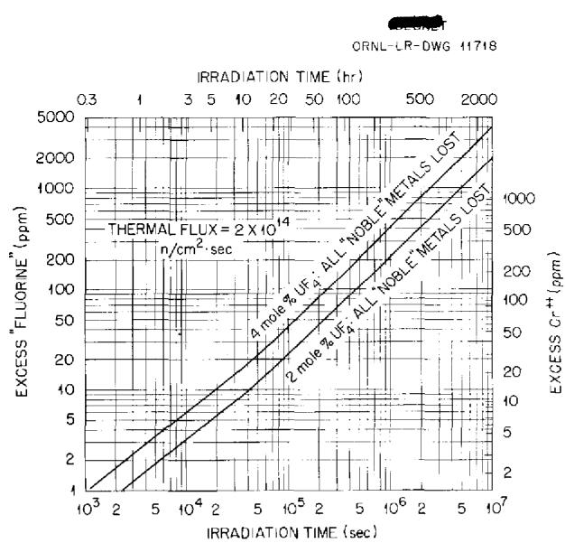  
Fig. 8.26. Theoretical Prediction of Excess "Fluorine" Present in Fused Fluoride Fuel Mixtures in the System NaF-ZrF $_4$ -UF $_4$ as a Function of Irradiation Time in Inconel Capsules in the MTR.

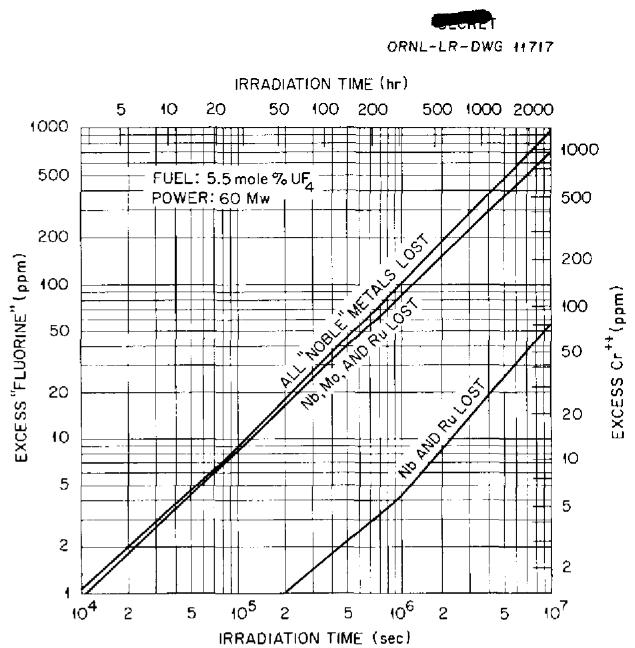  
Fig. 8.27. Theoretical Prediction of Excess "Fluorine" Present in the System NaF-ZrF $_4$ -UF $_4$ as a Function of Irradiation Time in a Circulating-Fuel Reactor.

ways in which this excess oxidizing power could possibly be absorbed are discussed below.

MoF. - If only a small part of the total molybdenum remained in solution as Mo(VI), it could absorb the entire excess oxidizing power. The required amount of molybdenum in solution would, however, be several hundred parts per million and would lead to far more dissolved MoF than could be expected to be stable in the presence of Inconel.

Fluorides of Se, Te, Br, and I. - Since Se, Te, Br, and I all form volatile fluorides, such as $\mathsf{SeF}_6$ , $\mathsf{TeF}_6$ , $\mathsf{BrF}_3$ , and $\mathsf{IF}_5$ , a portion, perhaps two-thirds, of the oxidizing power of the fuel could be absorbed in such compounds. These compounds, like $\mathsf{MoF}_6$ , are strong oxidizing agents, and their existence in the fuels can be only transitory, unless they escape as gases. The results of capsule irradiations argue against this possibility.

$\mathsf{CeF}_4$ - As was suggested above, at least some of the excess oxidizing power might well be absorbed as $\mathsf{Ce}(\mathsf{IV})$ , in the form of a complex ion, such as $\mathsf{CeF}_5^-$ . Such an ion would be present in comparatively small amounts and might well serve as a "tracer" for the very similar $\mathsf{ZrF}_5^-$ ion. The yield of cerium is such that about one-fourth of the oxidizing power could be thus absorbed in systems from which the rare gases were lost and almost one-half in systems in which they were retained.

$\mathbf{U}\mathbf{F}_{5}$ - Another way of absorbing the oxidizing power of the fuel would be the oxidation of U(IV) to U(V):

$$
U F _ {5} - + F = U F _ {5} + F ^ {-}
$$

In the fuel of the ART, this would require oxidation of up to $2\%$ of the uranium after 500 hr of operation.

Solid Fluorides. - It is perhaps possible that the "noble" metal deposit is not metallic and that it contains polymerized subfluorides, such as $(\mathsf{MoF})_{x}$ . These materials would reduce the oxidizing power of the fuel about one-half in the reactor case.

No one of the above suggestions can account for all the excess "fluorine" released by the fissioning uranium. In every case, a substantial

oxidizing power would remain. That the excess oxidizing power causes no increase in corrosion argues convincingly that the deposited fission-product layer effectively inhibits corrosion of Inconel by the fuel.

The effect of the fission-product mixture on the physical properties of the fuel has also been studied. The well-known theory of Frenkel14 concerning the viscosity and electrical conductivity of fused salts was used as a starting point. The viscosities of the fused salts are determined by the larger of the ions present, which in the case of the fuels being considered are species such as $\mathsf{UF}_5^-$ and $\mathsf{ZrF}_5^-$ . The fission process decreases the number of these large ions by replacing them with the small ions $\mathsf{Rb}^+$ , $\mathsf{Ba}^{++}$ , $\mathsf{La}^{+++}$ , etc., none of which are likely to be complexed. Therefore a small decrease is expected in the viscosity of the fuel with increasing time of irradiation. This decrease in viscosity will be exceedingly small, however, because of the relative rarity of $\mathsf{UF}_5^-$ ions (about one complex anion in four), the low burnups envisioned in aircraft reactors, and the high fission yield of zirconium. There will be a similar small increase in the electrical conductivity of the fuels. The effect of the fission products on thermal conductivity cannot be estimated because of the lack of a suitable theory, but any effect will certainly be very small. The molar heat capacity of the fuel may be taken as independent of composition, to a first approximation. The only effect of fission will be to increase slightly the effective molecular weight of the fuel through loss of the noble gases, mol-ybdenum, ruthenium, etc. Thus the specific heat of the fuel will decrease very slightly as irradiation proceeds.

The effect on corrosion is, therefore, considered to be the only important effect of the fission process on the properties of the fused fluoride fuels. Theory predicts a substantial increase in the corrosion rate as irradiation continues, but the absence of such an effect in all experiments to date leads to the suggestion that deposition of niobium, ruthenium, and (presumably) molybdenum on the container effectively inhibits the attack of the fuel on Inconel.

# Use of Natural Lithium in Fluoride Fuels Circulated in In-Pile Loops

M. T. Robinson Solid State Division

J. F. Krause & Whitney Aircraft

The use of lithium in the fluoride fuel system NaF-KF-LiF-UF presents a problem created by the nuclear reaction

$$
^ {6} \mathrm {L i} ^ {+} + n \longrightarrow 4 \mathrm {H e} + ^ {3} \mathrm {T} ^ {+}
$$

The concentration of the tritium ion in the fuel mixture NaF-KF-LiF-UF $_4$ (11.2-41-45.3-2.5 mole %) as a function of time and thermal-neutron flux is shown in Fig. 8.28. The tritium-ion concentration is expressed as the $pT$ of the solution and is defined by the following equation:

$pT = -\log$ (gram-ions of $\mathsf{T}^+$ per liter of solution).

On the right-hand axis is shown the equivalent concentration of chromium in the fuel, which would be produced by the reaction

$$
2 T _ {(s o l n)} ^ {+} + C r _ {(l n c o n e l)} \longrightarrow C r _ {(s o l n)} ^ {+ +} + T _ {2 _ {(g a s)}}
$$

It is evident that such a fuel will be much more corrosive under irradiation than out-of-pile, especially when irradiated in capsules in the MTR, unless at least part of the $\mathsf{Li}^6$ is removed from the fuel.

Because of the large neutron absorption cross sections of fuels containing natural lithium, there would be substantial decreases in the effective neutron flux in such materials in comparison with similar fuels containing pure Li. The decreased effective neutron flux and the large dilution factors normally used in in-pile loops will make the chemical effects of tritium production less serious than they would be in capsules. Nevertheless,

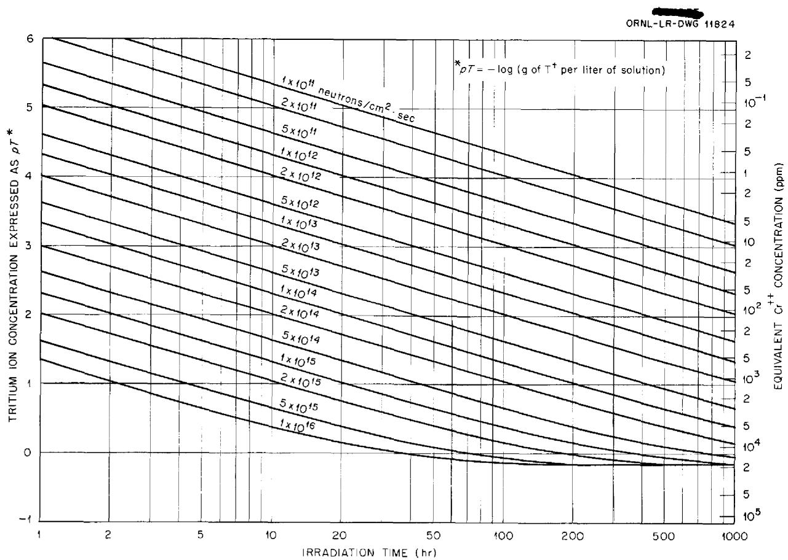  
Fig. 8.28. Production of Tritium in the Fluoride Fuel Mixture NaF-KF-LiF-UF $_4$ (11.2-41-45.3-2.5 mole %) Containing Natural Lithium as a Function of Time and Thermal-Neutron Flux.

in order to obtain satisfactorily high fission rates in the in-pile loops now being used, removal of some of the $\mathsf{Li}^6$ will be required.

In order to keep that portion of the corrosion attributable to tritium to below 100 ppm chromium in 300 hr, any lithium in fuel used in MTR capsule irradiations must contain less than $0.2\% \text{Li}^6$ . In in-pile loops, up to $1\% \text{Li}^6$ may be allowed without excessive depression of the fission power at the tip of the loop. This amount of $\text{Li}^6$ will also restrict tritium corrosion to less than 100 ppm chromium per 300 hr.

There seems to be no reason to expect the apparent fission-product protection of Inconel found in $\mathsf{NaF - ZrF_4 - UF_4}$ fuel systems to reduce the attack of $\mathsf{T}^{+4}$ on the metal surface. Furthermore, it is not evident that this protective mechanism will be operative in the lithium-containing systems. The exact distribution of tritium among the various species, $\mathsf{T}^{+},\mathsf{TF}_{2}^{-},\mathsf{TF}$ (soln), and TF (gas), is believed to be unimportant.

O. Sisman  
J. G. Morgan  
M. T. Morgan  
R. M. Carroll  
Solid State Division

A study of radiation effects on $\mathsf{B}_4\mathsf{C}$ and related thermal-neutron shield materials is under way. The first irradiations were made on uncoated hot-pressed $\mathsf{B}_4\mathsf{C}$ (Norbide) and slip-cast $\mathsf{B}_4\mathsf{C}$ bonded with SiC (The Carborundum Company) at low temperatures ( $\sim 200^{\circ}\mathsf{F}$ ). The samples were sealed under helium in quartz ampoules and were irradiated in hole C-48 of the LITR for an exposure of $6\times 10^{19}n\nu t$ (as measured by cobalt-foil activation at the surface of the specimen). The samples, the quartz ampoules, and the perforated aluminum containers in which they were irradiated are shown in Fig. 8.29. The samples and their container were cooled by the reactor cooling water. Final burnup of the samples will be obtained by analysis of the B10-to-B11 ratio. After irradiation the ampoules were broken, and the gas released from the sample was measured. The gas-release apparatus is shown in Fig. 8.30. The ram is struck to break the ampoule and release the gas into a calibrated volume. A manometer with an adjustable head is used to measure the volume of the additional gas formed as the result of irradiation.

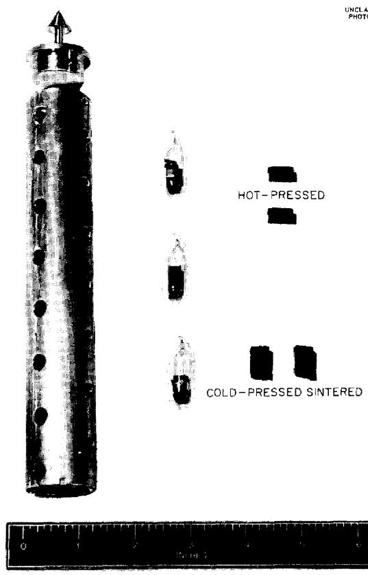  
RADIATION DAMAGE TO BORON CARBIDE

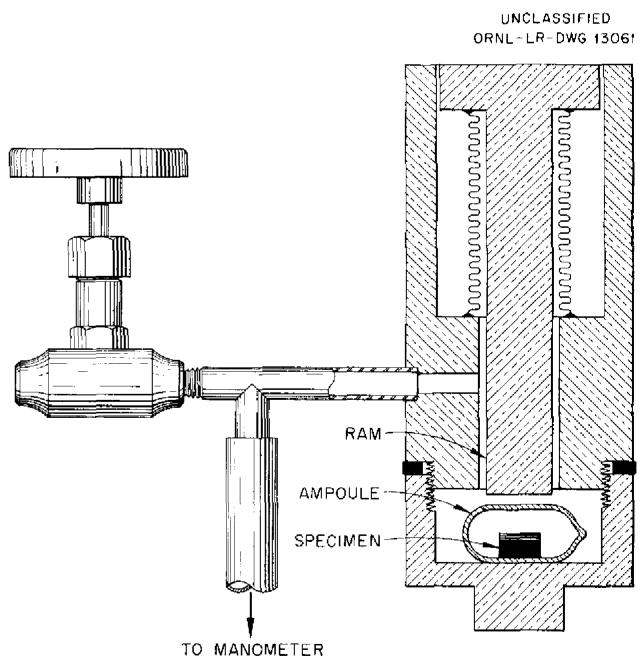  
Fig. 8.29. Samples of $\mathsf{B}_4\mathsf{C}$ and the Containers for Irradiation in the LITR.   
Fig. 8.30. Apparatus for Releasing Gas from Quartz Ampoules in Which $\mathsf{B}_4\mathsf{C}$ Samples Were Irradiated.

Previous work[15] indicated that most of the helium produced from the $n,a$ reaction with $\mathsf{B}^{10}$ in hot-pressed $\mathsf{B}_4\mathsf{C}$ would be released at temperatures above $1500^{\circ}\mathsf{F}$ , and therefore no helium evolution was expected as a result of these tests at about $200^{\circ}\mathsf{F}$ . The recent results confirmed the prediction; none of the approximately $1\mathrm{cm}^3$ of helium produced as the result of irradiation was detected by the apparatus, which could detect $0.2\mathrm{cm}^3$ . The hot-pressed samples also retained their physical dimensions and bulk structure, as shown in Fig. 8.31. At higher burnups, however, the hot-pressed material may be expected to crumble. With the cold-pressed and sintered $\mathsf{B}_4\mathsf{C}$

15W.D. Valovage, Effect of Irradiation on Hot-Pressed Boron Carbide, KAPL-1403 (Nov. 15, 1955).

(bonded with SiC), a different effect was noted. While the material appeared to retain its bulk stability, there was gas release (under irradiation) which far exceeded the total helium generation. In addition, the walls of the quartz ampoule were coated with a heavy black deposit, as shown in Fig. 8.32, and the sample weight decreased $4\%$ . Unirradiated specimens heated for 72 hr at $1800^{\circ}\mathrm{F}$ did not show these effects. It is thought that some foreign material (organic binder or pitch) introduced during fabrication may have remained in the sample.

In order to determine whether the hot-pressed samples will retain helium at elevated temperatures, gas release from samples irradiated at temperatures up to $2150^{\circ}\mathrm{F}$ will be measured. In

UNCLASSIFIED

PHOTO 16273

COLD- PRESSED SINTERED $\mathsf{B}_{4}\mathsf{C}$

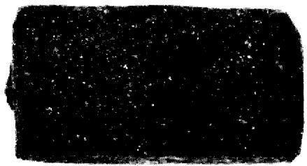

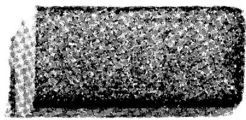  
IRRADIATED   
HOT- PRESSED B4C

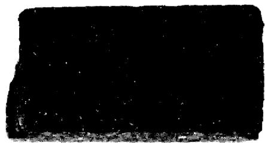

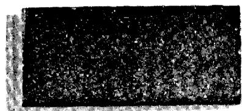  
UNIRRADIATED

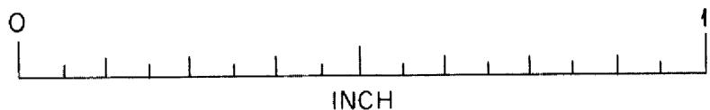  
Fig. 8.31. Irradiated and Unirradiated $\mathsf{B}_4\mathsf{C}$ Specimens. 3X. Reduced $7\%$ .

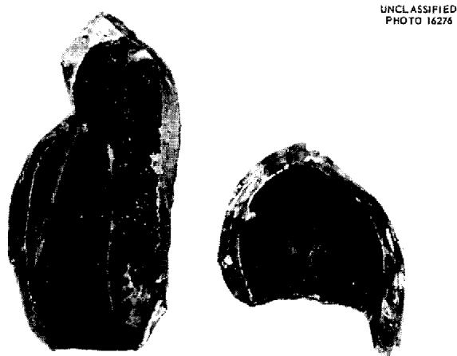  
Fig. 8.32. Coating Found Inside Quartz Ampoule in Which Cold-Pressed Sintered $\mathsf{B}_4\mathsf{C}$ Was Irradiated, 3X. Reduced $38\%$ .

addition, other boron-containing materials will be investigated, such as a $2\%$ B-98% Fe alloy, a $6.6\%$ $\mathsf{B}_4\mathsf{C}$ body bonded with copper and flame-coated with copper and stainless steel, and an $89\%$ $\mathsf{B}_4\mathsf{C}$ body bonded with SiC and flame-coated with $\mathsf{Al}_2\mathsf{O}_3$ . Coating adherence, dimensional stability, and helium evolution will be studied at elevated temperatures under irradiation. Future irradiations will probably be made at the MTR at temperatures up to $2000^{\circ}\mathsf{F}$ with radiation exposures of $10^{20}$ nvt and greater.

# 9. ANALYTICAL CHEMISTRY OF REACTOR MATERIALS

J. C. White

Analytical Chemistry Division

# DETECTION OF TRACES OF NoK IN AIR

A. S. Meyer, Jr. J. P. Young

Analytical Chemistry Division

R.G.Affel F.W.Manning

Instrumentation and Controls Division

An investigation was initiated in order to develop an instrument for monitoring the concentration of alkali metals in the exhaust gases from NaK-to-air radiators. This instrument is to be used for detecting NaK leaks in the ART radiators, as well as in the radiators now being used in test installations. Tentatively, the sensitivity of the detector to be used on the ART radiators has been specified to correspond to an incremental increase of 0.01 ppm (10 parts per billion) of alkali metals in the air while it is crossing the bank of radiators. An instrument of lower sensitivity, 10 ppm, will be satisfactory for monitoring the exit gases from the test stands. It has also been specified that the detector must have a rapid response time and that the instrument for use on the ART must be highly dependable, since no maintenance can be performed during the period of the reactor experiment. Effort is being directed toward the immediate development of an instrument to monitor the test-stand radiators as a step in the development of the monitor for the ART.

# Detection of Microgram Quantities

The proposed leak-detection method is based on the measurement of the hydroxyl ion which is formed when the alkali metal oxides and hydroxides are absorbed from a sample of the contaminated air in an aqueous solution. The pH of the aqueous solution will be maintained at a constant value by the coulometric generation of hydrogen ions in a quantity equivalent to the quantity of hydroxyl ion being absorbed from the sample of air. The coulometric current required to maintain the pH of the solution will be proportional to the rate of addition of alkali metals, and, if a continuous air sample is taken, it will be proportional to the concentration of alkali metals in the sample.

Both photometric and electrometric methods for the detection of changes of pH are being studied.

To eliminate the buffering effects of carbon dioxide, the pH of the absorber solution will be maintained between 4.5 and 5.0. In this region the colored indicator bromcresol green (tetrabromom-cresolsulfon phthalein) can be used as a sensitive detector for increases in the alkalinity of the solution. If $1\mu \mathrm{g}$ of NaK is added to $1\mathrm{ml}$ of the solution, its transmittancy is decreased to $50\%$ of its original value.

A gas-scrubbing absorption cell of approximately 30-ml capacity has been fabricated (Fig. 9.1). The gases enter the mixing chamber through a quartz tube, which can be heated to temperatures as high

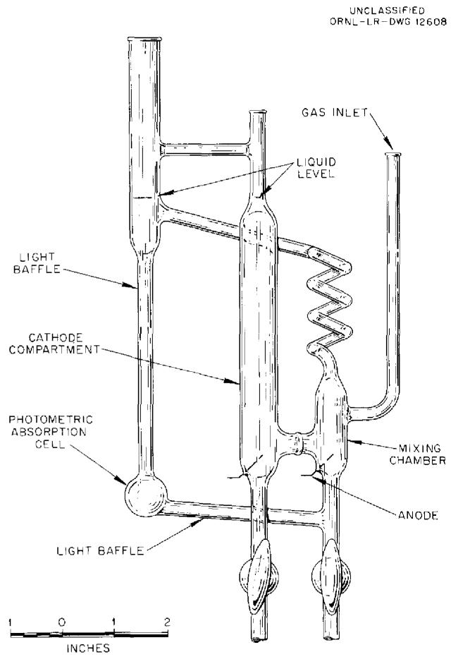  
Fig. 9.1. Gas-Scrubbing Absorption Cell for Detecting Alkali Metals in Air.

as $1000^{\circ}\mathrm{C}$ , in order to prevent deposition of the metal oxides on the walls of the vessel. When bubbles of the gas pass through the helical absorption tube, this section functions as a gas lift to produce circulation of the aqueous solution through the photometric absorption cell. Air flow rates of $600~\mathrm{cm}^3/\mathrm{min}$ have been found to be practical. In 1 min, if a concentration of 10 ppm of NaK in the air is assumed, $6\mu \mathrm{g}$ of NaK will be introduced into the absorption cell. Since it has been shown that $30\mu \mathrm{g}$ of NaK in the cell will effect a decrease of greater than $50\%$ in transmittancy, $6\mu \mathrm{g}$ would cause a change of approximately $15\%$ . Since the optical device planned for use with this apparatus can easily detect changes in transmittancy of the order of $5\%$ , a predicted response time of 1 min to a 10 ppm concentration of NaK in the air is conservative. The time required for the transfer of the solution from the mixing chamber to the photometric absorption cell is less than 3 sec, and it is thus well within the above response period.

Photometric absorption cells for both inlet and exhaust air will be required in the instrument for the detection of NaK leaks from the test-stand radiators, because other operations in the vicinity

of the test stands may occasionally contaminate the inlet air with high and variable concentrations of alkali metals. The instrument will be designed to respond to the incremental increase of alkali metal concentration in the air while it is crossing the radiator. For maximum stability, a double-beam optical system will be used to compare the absorbance of the solutions in the two cells. A block diagram of the proposed instrument is shown in Fig. 9.2.

Light of wavelength $630~\mathrm{m}\mu$ is separated into two beams by a mechanical chopper. After passage through the inlet and exhaust sample cells, respectively, the two beams of light are recombined, at phototube A. A portion of the light transmitted through the inlet-air monitoring cell is separated by a beam splitter and directed to phototube B. When alkali metals are present in the sample of inlet air, this light will be attenuated, and the decrease in the response of phototube B will be amplified and fed into a servomechanism which will pass a coulometric current through the inlet sample cell. This current will be regulated to generate a sufficient quantity of hydrogen ions to maintain the bromcresol green indicator at the original absorbance. Since the coulometric circuits

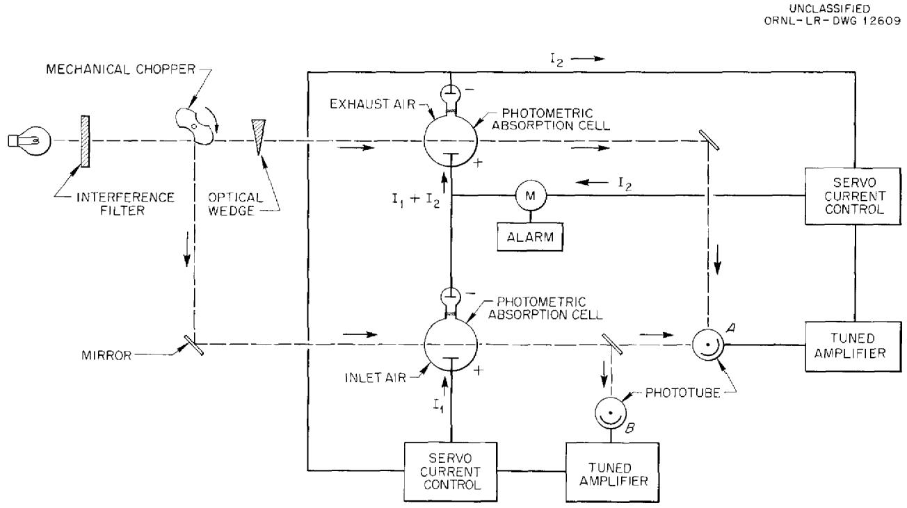  
Fig. 9.2. Diagram of Instrument for Detecting Microgram Quantities of Alkali Metals in Air.

for both the inlet-air and exhaust-air monitoring cells are in series, the same current will flow through both cells. A separate mechanical or electronic device will be incorporated at the exhaust-air cell to compensate for differences in gas flow through the two cells. Any imbalance of the light beams transmitted through the two absorption cells will generate an a-c signal at phototube A. The amplitude of this signal will be a measure of the incremental increase of the concentration of alkali metals in the air while it is crossing the radiator. The output of phototube A will be amplified and fed into a servomechanism which will pass an additional coulometric current into the exhaust-air monitoring cell. The amount of additional current required to hold constant the absorbance of the absorber solution in the exhaust-air cell will be monitored, and if this current exceeds a predetermined rate that is indicative of a NaK leak, an alarm will be activated.

The preliminary investigations of electrometric methods for determining the change of $\mathsf{pH}$ of the absorber solution have indicated that glass electrodes are somewhat more sensitive to changes in $\mathsf{pH}$ of the absorber solution than are the photometric detectors. The glass electrodes may be less dependable, however, than the photometric detectors because of variations in the asymmetry of the potential of the electrodes. Tests are now being made to determine whether the instability of the potential of the glass electrodes is sufficient to introduce false signals. Since highly stable $\mathsf{pH}$ meters are available commercially, the instrumentation can be simplified if the electrometric detector can be used. The overall design of the electrometric instrument would be functionally similar to that of the photometric instrument.

# Detection of Submicrogram Quantities

The measurement of the absorbance of light of the frequency of a resonance line has been demonstrated to be one of the most sensitive methods for the detection of traces of vapors of certain elements. A simple optical instrument has been designed to detect concentrations of mercury vapor of less than 1 ppm by the measurement of the absorption of the mercury 2537-Å resonance line.

The absorption coefficient of the sodium doublet at 5890 Å is larger than that of the mercury 2537-Å resonance line, and, on the basis of the transition probabilities and half lives of excited states, cited by Mitchell and Zemansky,² the absorption coefficient,³ k, at the center of each of the lines of the sodium doublet falls between that of the mercury 2537-Å line and that of the cadmium 2288-Å line and thus corresponds to about $10^{-12}N$ . It can be calculated from the absorption coefficient that a concentration of sodium vapor corresponding to 0.01 ppm of sodium in air would produce a 50% attenuation in a beam of sodium-doublet radiation which traversed a 50-cm optical path.

Since sodium in compound form does not absorb the resonance radiation, it is necessary to heat the air containing the sodium to a temperature sufficient to cause thermal dissociation of the $\mathsf{Na}_2\mathsf{O}$ to sodium and oxygen ions. On the basis of thermodynamic constants derived from measurements of the volatility of $\mathsf{Na}_2\mathsf{O}$ at reduced pressures, Brewer has calculated that $\mathsf{Na}_2\mathsf{O}$ in air would be appreciably dissociated at temperatures near $1000^{\circ}\mathsf{C}$ .

An instrument based on these considerations has been proposed for the detection of the sodium which would be liberated by a NaK leak in the radiators of the ART. A block diagram of the instrument is presented in Fig. 9.3. The beam of sodium-doublet light from a sodium-vapor lamp or resonance bulb is divided into two pulsed beams of equal intensity by a mechanical chopper. The beams are passed through heated absorption cells which contain samples of the inlet and exhaust air from the radiators and are recombined at the phototube. When the intensities of the transmitted beams are equal, a null a-c signal is received at the phototube. If unequal concentrations of sodium are present in the absorption cells, an imbalance is produced in the transmitted

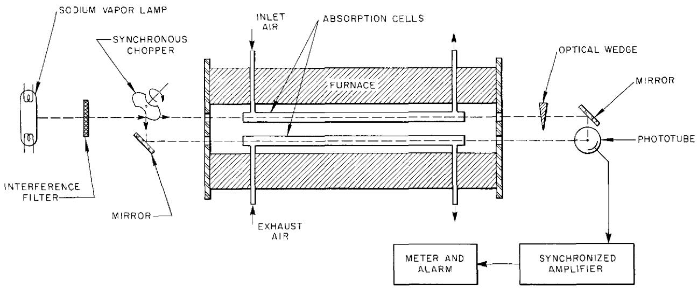  
Fig. 9.3. Diagram of Instrument for Detecting Submicrogram Quantities of Sodium in Air.

beams and a proportional a-c signal is generated. For low absorbancies, the output from the phototube, at a given temperature of the samples in the absorption cells, is proportional to the difference in sodium concentration in the two absorption cells. An instrument of this type would thus give a measure of the incremental increase of the concentration of sodium in the air while it is crossing the radiators.

The proposed double-beam instrument is readily adaptable to stable instrumentation and does not require careful regulation of sample flow rates. If further investigation indicates that $\mathrm{Na}_2\mathrm{O}$ is sufficiently dissociated at the temperature of the exhaust gases, the absorption beam can be passed directly through the stack gases to obtain a more rapid response. It will be necessary to calibrate the instrument empirically because its sensitivity will vary with the temperature of the absorbing gases and with the spectral distribution of the incident radiation.

A test model of the instrument is being assembled. This apparatus contains two quartz absorption cells, 24 in. in length, which can be heated to a temperature of $1050^{\circ}\mathrm{C}$ . Provision is being made for the introduction of gaseous samples to each tube or for the volatilization of sodium compounds of known vapor pressure for calibration of the system. Tests of the effect of temperature on the sensitivity of the instrument, comparison of light

sources, and tentative calibration should be possible with this instrument.

# SPECTROPHOTOMETRIC DETERMINATION OF TITANIUM IN MIXTURES OF FLUORIDE SALTS WITH TIRON

J.P.Young J.R.French Analytical Chemistry Division

A method has been developed for the use of Tiron (disodium-1,2-dihydroxybenzene-3,5-disulfonate) in the determination of trace amounts of titanium in NaF-ZrF4-UF4 and in other mixtures of fluoride salts. The yellow color of the titanium-Tiron complex is a very sensitive test for titanium.5 The molar absorbancy index is 13,900. The maximum absorbance of this complex is at a wavelength of $380\mu$ . The intensity of the color is essentially independent of pH over the range 4.3 to 9.6. The uranyl, zirconium, and ferric ions in the fluoride salts have been found to interfere with the development of the titanium-Tiron color. Zirconium ions interfere by forming a colorless complex with Tiron and thereby consuming the reagent. Ferric and uranyl ions form colored complexes with Tiron. It has been reported that the interference of the ferric ion may be eliminated by reducing the ferric ion with sodium hydrosulfite

at a pH of 4.7;5 the zirconium interference may be eliminated by the addition of a large excess of reagent;5 and the interference of the uranyl ion may be eliminated by the addition of iron as a carrier and the precipitation of titanium with sodium hydroxide in the presence of carbonate ion to complex uranium as the soluble uranyl carbonate anion.

In the determination of titanium in $\mathsf{NaF - ZrF_4}$ $UF_{4},$ quantitative separation of the titanium is achieved by an ammonia precipitation in the presence of carbonate ion. Apparently, the precipitation of zirconium, under these conditions, coprecipitates the titanium completely, and it is unnecessary to add a carrier, such as iron. The precipitate is separated by centrifugation and then dissolved in dilute hydrochloric acid. A large excess of Tiron is added, and the solution is buffered at a pH of 4.7. The solution is then allowed to stand for 30 min, since the titanium-Tiron complex develops slowly. Solid sodium hydrosulfite is added to reduce the ferric ion, and the absorbance of the complex is measured at a wavelength of $140~\mathrm{m}\mu .$ Since the absorbance of a solution of sodium hydrosulfite is significant below $400~\mathrm{m}\mu ,$ the absorbance of the titanium-Tiron complex cannot be determined at its point of maximum absorption $(380~\mathrm{m}\mu)$ .

Determinations of titanium in five samples of fluoride fuels have been made by this method. The coefficient of variation for these determinations was $2\%$ . Quantitative recovery of the standard solution of titanium added to several of these samples prior to analysis was obtained.

# DETERMINATION OF TANTALUM IN FUSED MIXTURES OF FLUORIDE SALTS

J.P.Young J.R.French Analytical Chemistry Division

The determination of trace amounts of tantalum in NaF-LiF-KF, as described previously, $^{7,8}$ was

accomplished by modifying an existing method, described by Dinnin, for the colorimetric determination of tantalum with pyrogallol. In the modified procedure the fluoride sample is carefully digested in dilute sulfuric acid in order to hydrolyze $\mathsf{TaF}_5$ to $\mathsf{T}\mathsf{a}_{2}\mathsf{O}_{5}$ without loss of tantalum by volatilization of the pentafluoride. The solution is then evaporated to dryness, and the residue from the evaporation is fused with potassium pyrosulfate. The melt is then dissolved in ammonium oxalate. The tantalum-pyrogalol complex is formed in a solution that is $0.175\textbf{M}$ ammonium oxalate and $4\textbf{M}$ HCI, after which its absorbance is measured at $330~\text{m}\mu$

A satisfactory method for the determination of small amounts of tantalum in NaF-LiF-KF-UF $_4$ was also developed. Since uranium interferes with the determination of tantalum by the pyrogallol method, it was necessary to develop some means of removing this interference. According to Hillebrand et al., $^{10}$ tantalum is quantitatively separated from uranyl ions by cupferron in a solution of sulfuric acid (5%) which contains tartaric acid. Since the samples were composed of alkali fluorides and uranium tetrafluoride, it was necessary to dissolve them carefully to prevent the loss of $\mathsf{T a F}_{5}$ by volatilization and to oxidize the tetravalent uranium to uranyl ions. The samples were dissolved in a mixture of sulfuric acid (5 vol %) and aqua regia at $100^{\circ}C$ . After the dissolution of the samples, tartaric acid was added, and a cupferron precipitation was performed at ice-bath temperature. The precipitate was removed and then ignited to obtain $\mathsf{T a}_{2}\mathsf{O}_{5}$ , which was fused with potassium pyrosulfate. The tantalum-pyrogalol color was then developed, as described previously.

The coefficient of variation was $2\%$ for the results of the determination of tantalum in both the uranium-containing alkali fluoride mixtures and the alkali fluoride mixtures without uranium. In the separation of tantalum from uranium, a sample which contained at least 1 mg of tantalum was taken. It is expected, however, that the separation is applicable for smaller amounts of tantalum.

# DETERMINATION OF OXYGEN IN $\mathsf{ZrF}_4$ BY BROMINATION

J.P.Young M.A.Marler Analytical Chemistry Division

A study of the possibility of applying the bromination method of Codell and Norwitz to the determination of combined oxygen in metallic oxides and in fluoride salts was continued. The bromination method consists in the high-temperature reaction of bromine vapor, in a carrier gas of helium, with an intimate mixture of the sample and graphite. The products of this reaction are CO and the metal bromide. The excess bromine and the metal bromide are removed by a system of cold traps, while the last traces of bromine are removed by granular zinc maintained at $350^{\circ}\mathrm{C}$ . The CO is oxidized by hot $\mathrm{CuO}_2$ and the resultant $\mathrm{CO}_{2}$ is utilized as a measure of the oxygen present in the sample.

Attempts to determine oxygen in the presence of fluoride salts have shown that consideration must be given to the possible reaction of volatile fluorides with the glass components of the apparatus. In the study of the bromination of pure $\mathsf{ZrO}_2$ , it was found[12] that it was necessary to mix the oxide with a fluoride salt in order to remove $\mathsf{ZrO}_2$ completely as a volatile reaction product. It is believed that the fluoride salt undergoes some type of exchange reaction with $\mathsf{ZrO}_2$ that results in the formation of a volatile zirconium fluoride compound and an oxide of the metal in the original fluoride salt. The oxide then reacts with bromine. In spite of the complete removal of the $\mathsf{ZrO}_2$ , the recovery of oxygen as $\mathsf{CO}_2$ was low. The apparatus and the procedure used in the bromination of $\mathsf{ZrO}_2$ mixed with $\mathsf{FeF}_3$ and graphite were described previously.[12]

In an effort to improve the recovery of oxygen as $\mathrm{CO}_{2}$ , mixtures of $\mathrm{ZrO}_{2}$ and $\mathrm{FeF}_{3}$ were placed in small nickel bombs and heated to temperatures of 550 to $700^{\circ} \mathrm{C}$ for periods of 1 hr. After the bombs were cooled, the contents were mixed with graphite and allowed to react with bromine. Again, the recovery of the oxygen originally present in the $\mathrm{ZrO}_{2}$ was incomplete. The effects of mixing other fluoride salts with the $\mathrm{ZrO}_{2}$ and graphite

were also being studied. The addition of $\mathsf{NiF}_2$ did not improve the recovery of oxygen, but it was found that the solid products resulting from the bromination of the mixture of $\mathsf{ZrO}_2$ , $\mathsf{NiF}_2$ , and graphite are large crystalline masses, whereas the products obtained from the bromination of the mixture of $\mathsf{ZrO}_2$ , $\mathsf{FeF}_3$ , and graphite are finely divided solids. It is anticipated that analyses of the crystalline products will provide a basis for a better understanding of the reaction mechanism. Spectrographic analysis has shown zirconium (and nickel) in the crystalline reaction products, and petrographic analysis has shown nickel bromide and an unidentifiable phase. No zirconium has been found in the graphite which remains in the sample container after bromination.

# DETERMINATION OF MICRO AMOUNTS OFBORON IN FUSED FLUORIDE SALT MIXTURES

A. S. Meyer, Jr. W. J. Ross Analytical Chemistry Division

A method has been developed for the determination of small amounts of boron in fluoride salt mixtures. The method consists in dissolving the salts in an acidic solution of aluminum chloride at room temperature, extracting the boron into ether, and determining the boron by the carminic acid method.[13] The determination of boron by direct application of the usual procedures was not feasible, because the high concentration of fluoride prevented the formation of the chromogenic complexes of boron. Therefore it was necessary to develop a means of separating sufficient boron from the fluoride for the carminic acid method to be used satisfactorily.

Boron trifluoride is volatilized from hot acidic solutions, and therefore the dissolution of the salts must be effected at a relatively low temperature, unless provision is made to trap the volatile compounds of boron. It was found that the dissolution of $\mathsf{NaF - ZrF_4 - UF_4}$ could be performed efficiently by stirring the solid sample in an acidic $(\sim 2\text{M HCl})$ solution of $1\text{M}\text{AlCl}_3\cdot 6\text{H}_2\text{O}$ at room temperature. In this manner, boron was retained in solution in the presence of fluoride and metal ions.

The method of Glaze and Finn has been adapted to the separation of boron from the other components of solutions of these mixtures. This method is based on the relatively high partition coefficient of boron between ethyl ether and an acidic solution of boron in ethanol-water (1:1). When the aqueous solution is equilibrated with an equal volume of ether at a controlled temperature, a reproducible fraction (approximately $50\%$ ) of the boron is extracted into the ethereal layer. The presence of fluoride is reported to decrease the extraction coefficient. The original determination of boron in the ether phase is performed titrimetrically on a macro basis. The presence of certain cations, $\mathrm{Al}^{3+}$ , $\mathrm{Fe}^{3+}$ , $\mathrm{Zn}^{2+}$ , and $\mathrm{Ba}^{2+}$ , reduces the accuracy of the titration.

The extraction coefficient for micro amounts of boron was established as 0.45, when the partitioning was performed at $19^{\circ}C$ by shaking the mixture manually for 5 min. Practically all the aluminum and the other metallic ions remained in the aqueous phase. The reproducibility of the extraction coefficient, $\pm 0.02$ , and the absence of fluoride in the ether extract indicate that interference by fluoride is effectively eliminated through the formation of stable complexes of aluminum and fluoride during the dissolution of the sample.

The concentrations of fluoride and metallic ions which accompany the boron into the ether phase are tolerable for the carminic acid method. This method has been used with good precision for the determination of boron in concentrations as low as 10 ppm in NaF-ZrF4-UF4, and it should also be applicable to the determination of boron in NaF-KF-LiF base fuels and in other fluoride salts.

# SPECTROPHOTOMETRIC DETERMINATION OF BISMUTH IN FUSED MIXTURES OF FLUORIDE SALTS

A. S. Meyer, Jr. B. L. McDowell Analytical Chemistry Division

A spectrophotometric method for the determination of bismuth as the tetraiodobismuthate(III) complex has been applied to the determination of bismuth in NaF-ZrF4-UF. The absorbance of the complex was measured at 337 m in a volume

of $50\mathrm{ml}$ of $1\mathrm{M}H_{2}\mathrm{SO}_{4}$ . Since the cited reference includes a thorough report of variables such as iodide concentration, acid concentration, and time, the optimum conditions as set forth there were used for the determination.

Test portions which contained 0.6 to $6\mu \mathrm{g}$ of bismuth in a solution of sulfuric acid were taken for color development. The color was developed by adding $10\mathrm{ml}$ of $5\mathrm{M}$ $\mathsf{H}_2\mathsf{SO}_4$ and $20\mathrm{ml}$ of a solution that was $14\%$ KI and $0.1\%$ ascorbic acid to the test portion and then diluting to a volume of $50\mathrm{ml}$ with water. The absorbance of the solution was measured against a reagent blank.

The effects of several diverse ions on the absorbance of the tetraiodobismuthate(III) complex were reported,[15] but the effect of uranium was not mentioned. The effect of uranium was therefore investigated for uranium-to-bismuth weight ratios of up to 1000:l, and it was found that for weight ratios of less than 30:l, the method was applicable with an error of less than $3\%$ in the absorbance. For larger amounts of uranium a preliminary separation is necessary. The coefficient of variation was $2\%$ , based on reproducibility of results for standard samples and duplicate determinations on samples which contained both uranium and bismuth.

# DETERMINATION OF DISSOLVED OXYGEN IN LUBRICATING FLUIDS

A. S. Meyer, Jr. B. L. McDowell Analytical Chemistry Division

The determination of dissolved oxygen in lubricating fluids was carried out in a closed system in which the dissolved or entrained gases in the fluid were swept with $\mathrm{CO}_{2}$ into a 25-ml azotometer filled with a solution of KOH. The $\mathrm{CO}_{2}$ was supplied from a 2-1 Dewar flask filled with dry ice and sealed with a Hershburg valve. The insoluble gases collected in the azotometer were equilibrated with a solution of potassium pyrogallate, and the loss in volume of gas was attributed to absorption of oxygen by the potassium pyrogallate solution. The loss of volume at standard temperature and pressure was used to calculate the concentration of oxygen in the lubricating fluid.

The oxygen content was essentially the same for each of the lubricants studied; it ranged from a maximum of $42\mu \mathrm{g}$ of oxygen per milliliter of fluid to a minimum of $15~\mu \mathrm{g / ml}$ . The coefficient of variation of the results was $7\%$ .

# DETERMINATION OF ZIRCONIUM BY THE COMPLEXIMETRIC-VERSENEMETHOD

J.P.Young

J.R.French

Analytical Chemistry Division

The compleximetric-Versene (disodium ethylenediaminetetraacetate) method for the determination of zirconium was developed by Manning, Meyer, and White. This method consists in adding an excess of Versene to zirconium in a sulfuric acid medium. The complex is formed within a period of 10 min, at room temperature, after the pH of the solution is raised to approximately 6, and the excess Versene is then titrated with ferric ion to a Tiron end point at a pH of 4.8. Very few cations interfere with this determination, since zirconium and iron both form very stable complexes with Versene. This method was used successfully for several months for the routine determination of zirconium before difficulties were encountered - the color change at the end point became sluggish and indistinct, and the accuracy was found to be unsatisfactory.

In a further study of the method, it was found that the color change at the end point could be greatly improved by digesting the test solution on a steam bath, after the addition of the Versene, and titrating the solutions while hot. The accuracy of the procedure was improved by raising the pH of the solution to approximately 6 before the addition of the Versene. A comparison of results obtained by a gravimetric (mandelic acid) procedure with the results of 21 determinations by the modified compleximetric-Versene procedure gave an average difference of $0.6\%$ .

# DETERMINATION OF RARE-EARTH ELEMENTS IN STAINLESS STEELS AND INCONEL

A. S. Meyer, Jr.

B. L. McDowell

Analytical Chemistry Division

J.A.Norris

Stable Isotopes Research and Production Division

The method previously described17 for the determination of traces of rare-earth elements in

stainless steel was modified to reduce the time necessary for the deposition of reducible metals at the mercury cathode from 4 to 1 hr by volatilization of the chromium before electrolysis. The chromium is removed as the volatile $\mathrm{CrO}_2\mathrm{Cl}_2$ by the addition of solid NaCl during the dissolution of the sample and the precipitation of the oxides of silicon, niobium, tantalum, etc. The results obtained for samples of type 347 stainless steel indicate that no loss of rare earths results from this modification of the procedure. The modified method has been used for the determination of lanthanum, cerium, samarium, europium, gadolinium, and dysprosium in types 304, 316, 321, and 347 stainless steel and in Inconel and Inconel X. Various electrolysis periods, from 1 to 6 hr, were investigated, but no variations were noted in the recovery of the rare earths.

The recovery of the rare earths for all types of samples on which the method was used was quantitative, within the precision of the spectrochemical procedure. There are some indications that the recovery of lanthanum may vary, but the results are inconclusive at this time. The lowest recovery of lanthanum was approximately $85\%$ .

# DETERMINATION OF OXYGEN IN METALLIC SODIUM

A. S. Meyer, Jr.

G. Goldberg

Analytical Chemistry Division

Further study of the distillation method for the determination of oxygen in metallic sodium18 has revealed that excellent reproducibility is obtained in the recovery of added $\mathsf{Na}_2\mathsf{O}$ when distillations are carried out for periods in excess of 1 hr at temperatures between 800 and $850^{\circ}\mathsf{F}$ . No differences in oxygen concentration were found when a series of replicate determinations of oxygen were carried out over the extreme distillation conditions of 1 hr at $800^{\circ}\mathsf{F}$ and 4 hr at $850^{\circ}\mathsf{F}$ . Additional distillations at higher temperatures have confirmed the earlier observation that $\mathsf{Na}_2\mathsf{O}$ is volatilized at temperatures above $900^{\circ}\mathsf{F}$ . The exact mechanism by which $\mathsf{Na}_2\mathsf{O}$ is lost from the system has not yet been determined. Flame-photometric determinations of alkaline-earth metals in the distillation residues have shown that the concentrations of oxides of these elements are

not sufficiently large to contribute to the alkalinity of the residues.

Efforts to measure the recovery of a weighed addition of oxide to a batch of sodium metal have been unsuccessful. When a quantity of NaOH, which was calculated to increase the concentration of oxygen by 300 ppm, was added to a previously analyzed batch of the metal, an increase of oxygen concentration of only 70 ppm was measured in a sample after the batch was agitated with helium for 12 hr at $1000^{\circ}\mathrm{F}$ . Since it appears that the oxygen from solid compounds is difficult to disperse in metallic sodium, a test is to be made in which the contamination with oxygen will be carried out by the injection of a measured quantity of elemental oxygen into a stream of helium, which will be bubbled through the molten metal.

# ANP SERVICE LABORATORY

W. F. Vaughan  
Analytical Chemistry Division

Analyses of 39 samples of mixtures of fused fluoride salts were performed for the Wright Air

Development Center (WADC). The determinations made on the WADC samples included total uranium, trivalent uranium, iron, nickel, chromium, and niobium.

The bulk of the work during this period continued to be the analysis of fused fluoride salt mixtures and alkali metals for the Reactor Chemistry and Experimental Engineering Groups. A total of 1638 samples was analyzed for all ANP sources, and an average of 3.4 results was reported per sample. The backlog consists of 77 samples. A breakdown of the work follows:

<table><tr><td></td><td>Number of Samples</td><td>Number of Reported Results</td></tr><tr><td>Reactor Chemistry</td><td>937</td><td>3139</td></tr><tr><td>Experimental Engineering</td><td>420</td><td>1904</td></tr><tr><td>WADC</td><td>39</td><td>202</td></tr><tr><td>Miscellaneous</td><td>242</td><td>282</td></tr><tr><td>Total</td><td>1638</td><td>5527</td></tr></table>

# 10. RECOVERY AND REPROCESSING OF REACTOR FUEL

H. K. Jackson

D. E. Ferguson

H.E.Goeller

W.K.Eister

M.R.Bennett

R. L. Jolley

F. N. Browder

W.E.Lewis

G. I. Cathers

J. T. Long

W.H.Carr

R.P.Milford

S. H. Stainer

Chemical Technology Division

# PILOT-PLANT DESIGN AND CONSTRUCTION

Completion of the engineering design of the pilot plant for recovering fused-salt fuels has been delayed until March 1956. The remaining major items of equipment, the electrical load center and the instrument panel boards, are to be delivered about mid-April. As of March 10, installation of equipment is expected to be $60\%$ complete, with $100\%$ completion scheduled for May 15, 1956.

# ENGINEERING DEVELOPMENTS

# Contactor

A percolator type of contactor was chosen for the fluorinator to be used in the volatility pilot plant. In performance tests of the contactor, the fused-salt fuel mixture was entrained in the product gas line at a rate of 4.2 g/hr at $625^{\circ}\mathrm{C}$ and a sparge gas flow rate of 3.3 scfm (Table 10.1), which is the probable sparge-gas flow rate for pilot-plant operation. Analysis of the entrained

Fused salt composition: NaF-ZrF4 (50-50 mole %)

Duration of run: 2 hr

Sparge gas: nitrogen

Vessel temperature: $625^{\circ}C$

TABLE 10.1. ENTRAINMENT OF FUSED SALT MIXTURE IN PRODUCT GAS LINE FROM FLUORINATOR VESSEL   

<table><tr><td>Run No.</td><td>Sparge Gas Flow Rate (scfm)</td><td>Entrainment Rate (g/hr)</td></tr><tr><td>17</td><td>0.0</td><td>0</td></tr><tr><td>18</td><td>1.1</td><td>0.75</td></tr><tr><td>19</td><td>2.2</td><td>3.13</td></tr><tr><td>20</td><td>3.3</td><td>4.20</td></tr></table>

material indicated that 70 wt % was particles of the fused salt mixture and that 30 wt % was $\mathsf{ZrF}_4$ sublimate. A vapor trap has been designed for eliminating entrainment in the product gas line, but it has not yet been tested. It was also found in these tests that the flange on the fluorinator, which will be at $105^{\circ}\mathrm{C}$ when the fluorinator is at $650^{\circ}\mathrm{C}$ , is leaktight against a gas pressure of 12 psig.

# Freeze Valves

A freeze valve capable of sealing a $\frac{1}{2}$ -in.-dia molten-salt transfer line against a gas pressure of 20 psig was designed. A reservoir of molten salt is used in one arm of a U tube to seal against a frozen plug in the other arm. Both the inlet and outlet arms are vented. In 50 melting and freezing cycles no leakage was detected.

Several designs of internally cooled freeze valves were tested, however, on the assumption that rapid cooling was not effective, and it is now reasonably certain that failure of earlier designs was the result of minute fissures caused by shrinking of the salt upon cooling from its freezing point to the test temperature.

# PROCESS DEVELOPMENT

# Fluorination Studies

In further studies on the fluorination step, it was found that the fluorine-to-uranium mole ratio required for volatilization of more than $99\%$ of the $\mathsf{UF}_6$ could be decreased by the elimination of impurities but that it was not significantly affected by the concentration of the uranium in the fused-salt fuel mixture (Fig. 10.1). The method of introduction of fluorine into the melt and the rate of flow of the sparge gas had some effect on the fluorine-to-uranium mole ratio (Fig. 10.2), but the results could not be correlated with the known

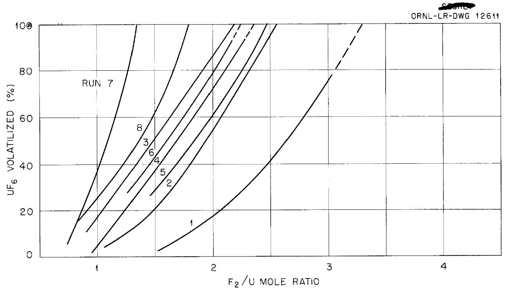  
Fig. 10.1. Effect of Uranium Concentration and Impurities of the Fused Salt Fuel Mixtures on the Fluorine-to-Uranium Mole Ratio Required for UF Volatilization. Conditions: $100\mathrm{ml}$ of $\mathsf{F}_2$ per minute; $\%_{16}^{-}$ in.-dia sieve plate on dip tube that introduced fluorine to melt.

<table><tr><td>RUN NO.</td><td>MOLTEN SALT</td><td>U CONTENT (mole %)</td></tr><tr><td>1</td><td>AS-RECEIVED NaF-ZrF4-UF4(50-46-4 mole %)</td><td>4</td></tr><tr><td>6</td><td>NaF-ZrF4-UF4(50-46-4 mole %), HYDROFLUORINATED 4 hr AT 600°C</td><td>4</td></tr><tr><td>7</td><td>PREFLUORINATED NaF-ZrF4(50/46 mole RATIO) PLUS UF4 (76.2%* URANIUM)</td><td>4</td></tr><tr><td>8</td><td>PREFLUORINATED NaF-ZrF4(50/46 mole RATIO) PLUS UF4 (76.2%* URANIUM); AIR-SPARGED FOR 2 hr BEFORE FLUORINATION</td><td>4</td></tr><tr><td>2</td><td>PREFLUORINATED NaF-ZrF4(50/46 mole RATIO) PLUS UF4 (72.9%* URANIUM)</td><td>4</td></tr><tr><td>3</td><td>PREFLUORINATED NaF-ZrF4(50/46 mole RATIO) PLUS UF4 (72.9%* URANIUM)</td><td>4</td></tr><tr><td>4</td><td>PREFLUORINATED NaF-ZrF4(50/46 mole RATIO) PLUS UF4 (72.9%* URANIUM)</td><td>2</td></tr><tr><td>5</td><td>PREFLUORINATED NaF-ZrF4(50/46 mole RATIO) PLUS UF4 (72.9%* URANIUM)</td><td>1</td></tr></table>

* THEORETICAL = 75.8%

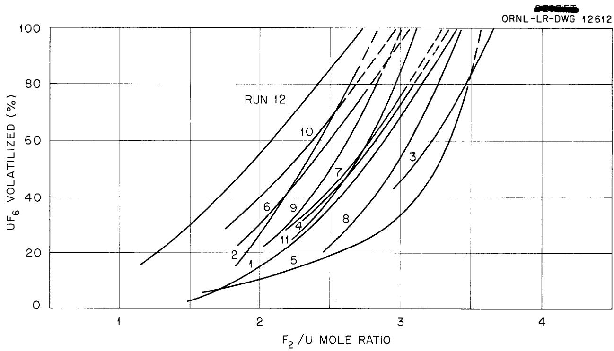  
Fig. 10.2. Effect of Sparge Gas Flow Rate and Method of Introduction of Fluorine into the Melt on UF Volatilization.

<table><tr><td rowspan="2">RUN NO.</td><td colspan="2">FLOW RATE (ml/min)</td><td rowspan="2">GAS DISPERSION DEVICE ON END OF 1/4-in.-DIA DIP TUBE</td></tr><tr><td>F2</td><td>N2</td></tr><tr><td>10</td><td>100</td><td>0</td><td>NONE</td></tr><tr><td>5</td><td>40</td><td>200</td><td>SIEVE PLATE, 3/64-in.-DIA HOLES</td></tr><tr><td>1</td><td>100</td><td>0</td><td>SIEVE PLATE, 3/64-in.-DIA HOLES</td></tr><tr><td>2</td><td>100</td><td>200</td><td>SIEVE PLATE, 3/64-in.-DIA HOLES</td></tr><tr><td>3</td><td>150</td><td>0</td><td>SIEVE PLATE, 3/64-in.-DIA HOLES</td></tr><tr><td>4</td><td>150</td><td>150</td><td>SIEVE PLATE, 3/64-in.-DIA HOLES</td></tr><tr><td>6</td><td>300</td><td>0</td><td>SIEVE PLATE, 3/64-in.-DIA HOLES</td></tr><tr><td>7</td><td>100</td><td>0</td><td>SIEVE PLATE, 1/16-in.-DIA HOLES</td></tr><tr><td>8</td><td>100</td><td>200</td><td>SIEVE PLATE, 1/16-in.-DIA HOLES</td></tr><tr><td>9</td><td>150</td><td>0</td><td>SIEVE PLATE, 1/16-in.-DIA HOLES</td></tr><tr><td>11</td><td>100</td><td>0</td><td>THREE SIEVE PLATES, 3/64-in.-DIA HOLES, 1/2 in. APART</td></tr><tr><td>12</td><td>100</td><td>0</td><td>PERCOLATOR DRAFT TUBE</td></tr></table>

variables. The experiments were performed at $600^{\circ}C$ in a 2-in.-dia nickel reactor with a 375-g charge of $\mathsf{NaF - ZrF_4 - UF_4}$ . In some of the tests the salt was made by the addition of $\mathsf{UF}_4$ to $\mathsf{NaF - ZrF_4}$ (50/46 mole ratio) that was believed to be relatively free of oxide impurities as a result of previous use in a fluorination run. Uranium tetrafluoride concentrations of 1, 2, and 4 mole % were used to study the effect of concentration. In other tests $\mathsf{NaF - ZrF_4 - UF_4}$ (50-46-4 mole %) was used as received. Data were obtained by direct sampling of the salt at intervals during the fluorination. The curves were extrapolated to the $100\%$ volatilization point for comparison, but usually a sharp break was observed in the curve between 95 and $100\%$ , which extended the curve to higher fluorine-to-uranium mole ratios for volatilization of the last traces of $\mathsf{UF}_4$ .

Volatilization of more than $99\%$ of the $\mathsf{UF}_6$ from as-received NaF-ZrF4-UF4 required a fluorine-to-uranium mole ratio of about 3.3:1, which was reduced to about 2.2:1 by sparging with HF for 4 hr before fluorination. In two tests with the fuel mixture synthesized by adding UF4 with a uranium content of only $72.9\%$ (theoretical, $75.8\%$ ) to pre-fluorinated NaF-ZrF4, the fluorine-to-uranium mole ratio required for more than $99\%$ UF6 volatilization was about 2.4:1. When very pure UF4, uranium assay of $76.2\%$ , was used, the fluorine-to-uranium mole ratio was 1.4:1, which represents a fluorine utilization efficiency of about $70\%$ .

# Vapor Pressure of the UF $6$ -NaF Complex

Vapor-pressure data for the $\mathsf{UF}_6$ -NaF complex were obtained by the transpiration method over the temperature range 80 to $320^{\circ}\mathsf{C}$ (see Fig. 10.3). The reaction involved is described by the equation

$$
\cup F _ {6} \cdot 3 N a F (s) \longrightarrow U F _ {6} (g) + 3 N a F (s) \tag {1}
$$

The data are fitted with the analytical expression

$$
\log P _ {m m H g} = 1 0. 8 8 - (5. 0 9 \times 1 0 ^ {3} / T),
$$

where $T$ is the absolute temperature. Use of the Clausius-Clapeyron formula with this equation resulted in a value of $+23.2\mathrm{kcal}$ per mole of $\mathsf{UF}_6$ for the enthalpy change of Eq. 1.

The data were obtained by passing nitrogen at a flow rate of $100\mathrm{ml / min}$ or less, through a prepared bed of the $\mathsf{UF}_6$ -NaF complex at any desired temperature, trapping out the $\mathsf{UF}_6$ in the nitrogen

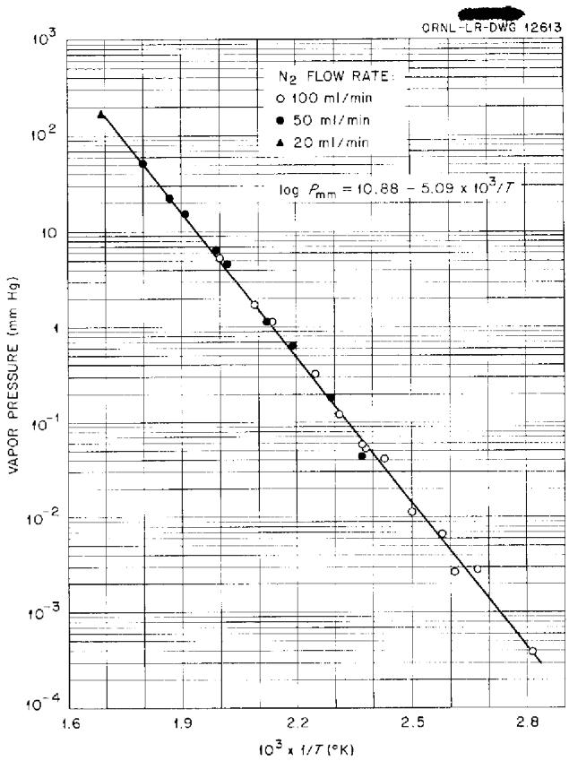  
Fig. 10.3. Dependence of $\mathsf{UF}_{6}$ -NaF Complex Vapor Pressure on Temperature.

stream in dilute $\mathrm{Al(NO_3)_3}$ solution, and measuring the total volume of nitrogen with a wet-test meter. The $\mathsf{UF}_6$ hydrolysis samples were analyzed by colorimetric or fluorimetric methods to an accuracy of better than $\pm 5\%$ . Temperature control of the bed was maintained always to within $\pm 0.2^{\circ}C$ . The $\mathsf{UF}_6$ -NaF complex was prepared by saturating a 30-g bed of 12-20 mesh Harshaw NaF in a 1-in.-dia vertical nickel reactor with $\mathsf{UF}_6$ at $100^{\circ}C$ .

Crude adiabatic experiments were made with 100-ml batches of NaF to show that the sorption heat of 23.2 kcal per mole of $\mathsf{UF}_6$ produces a large temperature rise, approximately $130^{\circ}\mathsf{C}$ , if total saturation with $\mathsf{UF}_6$ (preheated to about $100^{\circ}\mathsf{C}$ ) is carried out in a period of a few minutes.

# Uranium Losses on Desorption of UF $^6$ from NaF

Further evidence was obtained that proper control of temperature and flow would prevent excessive uranium losses in the NaF absorption-desorption

procedure developed for decontaminating $\mathsf{UF}_6$ from fission-product activity. Successive use was made of a two-bed NaF system for three complete process cycles with UF. The overall uranium loss was $0.04\%$ in the first bed and less than $0.01\%$ in the

second bed. In a single cycle test in the same equipment with fresh NaF, the uranium losses were 0.05 and $0.01\%$ in the respective beds. The percentage loss therefore does not appear to depend on how many process cycles are used.

Part III

SHIELDING RESEARCH

# 11. SHIELDING ANALYSIS

F. H. Murray C. D. Zerby

Applied Nuclear Physics Division

S. Auslander H. S. Moran

Pratt & Whitney Aircraft

# ENERGY ABSORPTION RESULTING FROM

# GAMMA RADIATION INCIDENT ON A MULTIREGION SHIELD WITH SLAB GEOMETRY

# S. Auslander

The code of a Monte Carlo calculation of energy penetration and deposition resulting from transport gamma radiation in a shield of slab geometry has been used in a parametric study of a two-region lead-water shield. The code utilizes straightforward sampling techniques, except for a doubling technique operating on the unscattered flux.

For the parametric study the radiation was 1-Mev gamma rays incident on the slab at 0 deg, 60 deg, 70 deg 32 min, and 75 deg 31 min. The first region of the slab was composed of water 1.5 mean free paths (mfp) thick at the initial gamma-ray energy,

and the second region was composed of lead 0.5 mfp thick. Preliminary results of the calculation are shown in Figs. 11.1 through 11.4. The dashed lines are a fit by eye to the data. The large rate of change of heat deposition near the front surface of the lead can be explained by the rapid absorption in the lead of the low-energy degraded gamma rays.

The coding has been extended to calculate energy flux and tissue dose rate, as well as energy deposition. Plots of the buildup factor for the dose rate, from the gamma rays that penetrate the slab, as a function of the composition of the slab are presented in Figs. 11.5 through 11.9. The buildup factor, $B_{p'}$ , is defined as:

$$
B _ {r} \equiv \frac {D}{D _ {0} e ^ {- \mu_ {0} r \sec \theta}},
$$

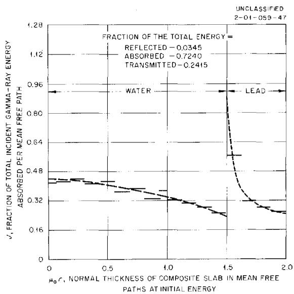  
Fig. 11.1. Fraction of Energy from 0-deg Incident Gamma Rays Absorbed in a Water-Lead Slab.

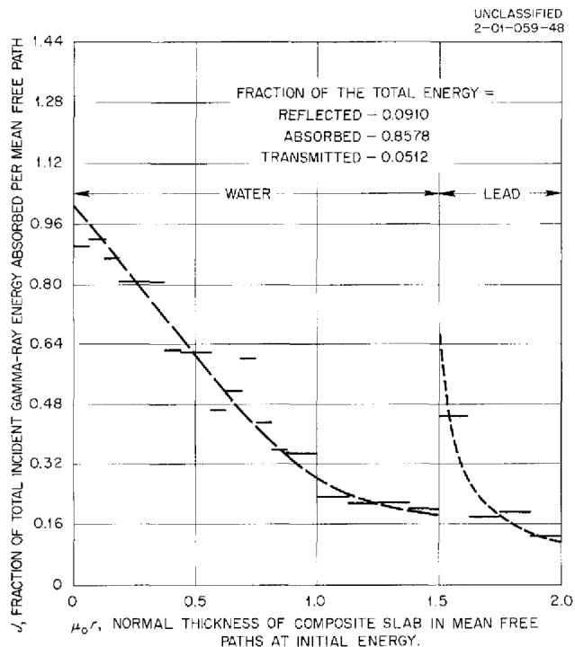  
Fig. 11.2. Fraction of Energy from 60-deg Incident Gamma Rays Absorbed in a Water-Lead Slab.

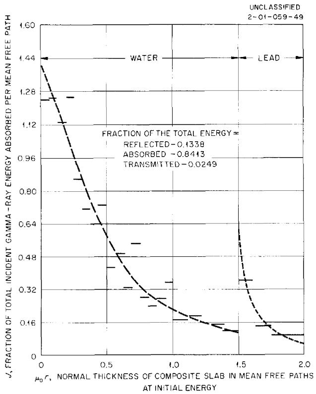  
Fig. 11.3. Fraction of Energy from 70-deg 32-min Incident Gamma Rays Absorbed in a Water-Lead Slab.

where

$$
D = \text {c a l c u l a t e d} (\mathrm {m r} / \mathrm {h r}),
$$

$D_{0} =$ dose rate with the source unchanged but with the slab missing,

$\mu_0r$ sec $\theta =$ oblique thickness of the slab in mean free paths at the source energy.

The composition of the slab is denoted by $P$ and defined, at the source energy, as

$$
\begin{array}{l} P \equiv \frac {\text {t h i c k n e s s o f l e a d (m f p)}}{\text {t h i c k n e s s o f e n t i r e s l a b (m f p)}} \\ = \frac {\left(\mu_ {0} r\right) _ {P b}}{\mu_ {0} r}, \\ \end{array}
$$

where

$$
\mu_ {0} r \equiv (\mu_ {0} r) _ {\text {P b}} + (\mu_ {0} r) _ {\text {H} _ {2} \text {O}}.
$$

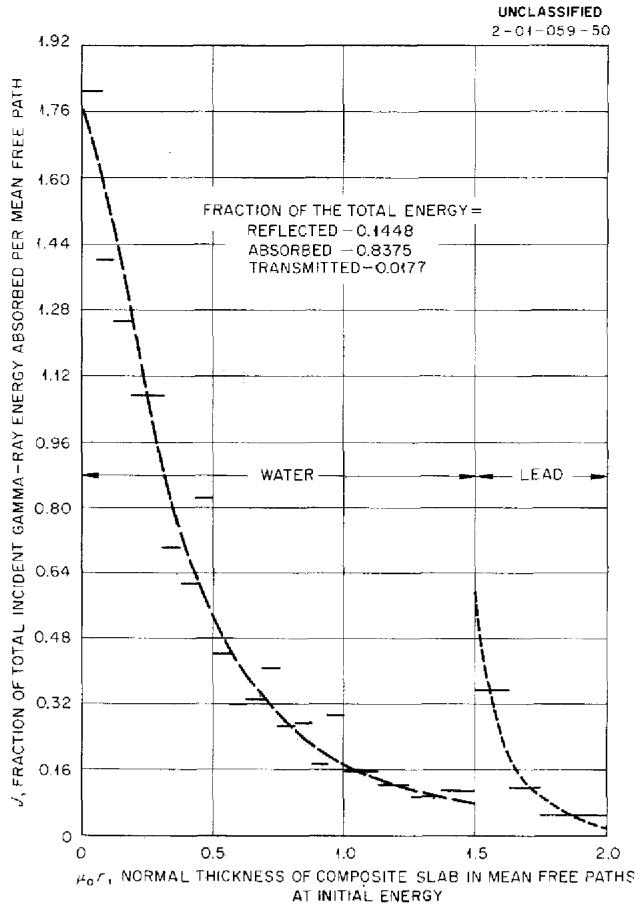  
Fig. 11.4. Fraction of Energy from 75-deg 31-min Incident Gamma Rays Absorbed in a Water-Lead Slab.

The plots of Figs. 11.5, 11.7, and 11.9 are for shields with the lead in front of the water, and the plots of Figs. 11.6 and 11.8 are for water in front of lead. The sources for Figs. 11.5 through 11.8 are plane monodirectional. The source for Fig. 11.9 is a surface source having a cos $\theta$ angular distribution, where $\theta$ is measured from the normal to the surface. This source is normalized to one gamma ray per unit area of surface per $2\pi$ steradians (in the forward direction):

$$
\begin{array}{l} 1 = \int_ {2 \pi} S (\Omega) d \Omega , \\ S (\Omega) = \frac {n + 1}{2 \pi} \cos^ {n} \theta . \\ \end{array}
$$

When $n = 0$ , the source is isotropic. For $n = \infty$ , the source is plane monodirectional and normal to the surface.

It is obvious from the plots that lead is more effective in stratified slab shields when it is placed behind a good scatterer, such as water. This is especially true for the lower source energies. The explanation for this is fundamentally the same as for the large energy deposition rate

in the front edge of the lead when it is behind water. The scatter in the answers is, of course, due to the method of solution. Since the answers are estimates of the correct answer, any one problem may be calculated several times, each time with a new set of random numbers. If this is done, the average of the several estimates can be accepted as the answer, and a standard deviation can be calculated for it.

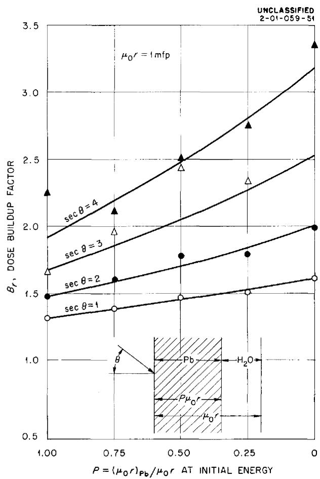  
Fig. 11.5. Buildup Factor for Dose Rate in a Lead-Water Shield Resulting from 3-Mev Incident Photon from a Plane, Monodirectional Source.

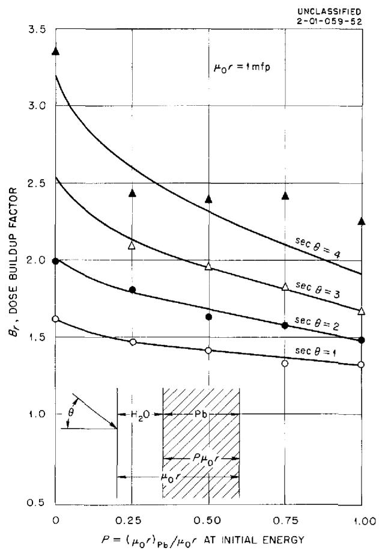  
Fig. 11.6. Buildup Factor for Dose Rate in a Water-Lead Shield Resulting from 3-Mev Incident Photons from a Plane, Monodirectional Source.

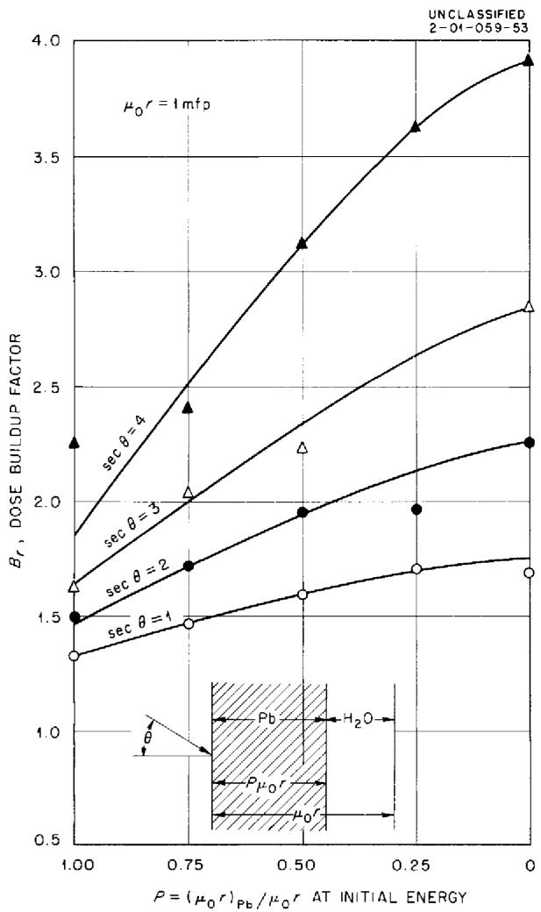  
Fig. 11.7. Buildup Factor for Dose Rate in a Lead-Water Shield Resulting from 1-Mev Incident Photons from a Plane, Monodirectional Source.

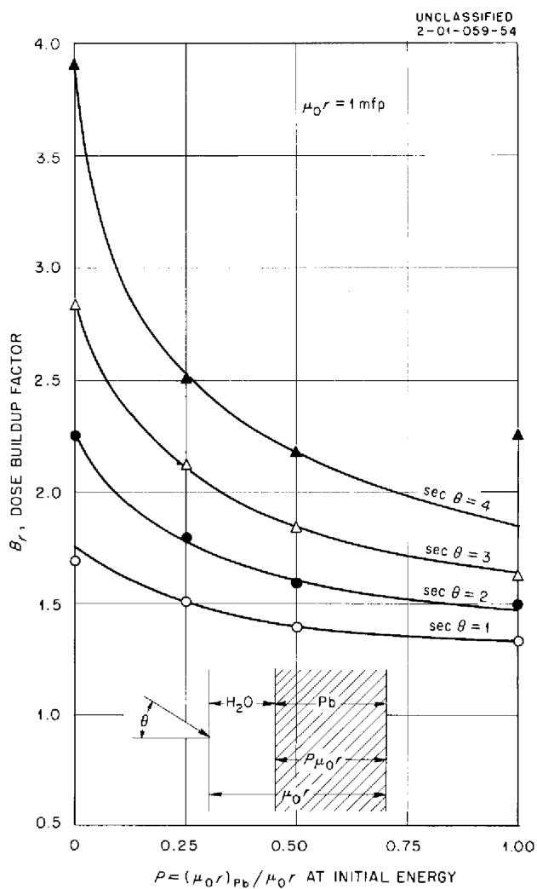

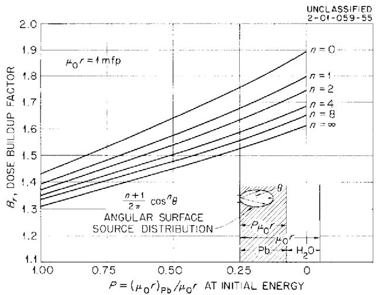  
Fig. 11.8. Buildup Factor for Dose Rate in a Water-Lead Shield Resulting from I-Mev Incident Photons from a Plane, Monodirectional Source.   
Fig. 11.9. Buildup Factor for Dose Rate in a Lead-Water Shield Resulting from 3-Mev Incident Photons from a Plane $\cos^n$ $\theta$ Surface Source.

# 12. REACTOR SHIELD DESIGN

F. L. Keller

S. K. Penny D. K. Trubey L. B. Holland  
Applied Nuclear Physics Division

C. A. Goetz H. C. Woodsum Pratt & Whitney Aircraft

R. M. Davis, Glenn L. Martin Co.

# GAMMA-RAY HEATING IN A 300-Mw CIRCULATING-FUEL REACTOR

R.M.Davis C.A.Goetz

A study of the gamma-ray heating in the lead and alkylbenzene shield of a 300-Mw circulating

fuel reflector-moderated reactor (Table 12.1) was completed. Throughout the calculation, the latest experimental data from the LTSF mockup of the circulating-fuel reflector-moderated reactor and shield (RMR-shield) were incorporated insofar as possible. The heating in the shield was resolved

TABLE 12.1. PARAMETERS OF A 300-Mw CIRCULATING-FUEL REACTOR USED IN GAMMA-RAY HEATING CALCULATION   

<table><tr><td>Reactor or Shield Region</td><td>Thickness (in.)</td><td>Radius (in.)</td></tr><tr><td>Beryllium island</td><td></td><td>6.700</td></tr><tr><td>Sodium passage</td><td>0.187</td><td>6.887</td></tr><tr><td>Inconel-X cladding</td><td>0.125</td><td>7.012</td></tr><tr><td>Core fuel region</td><td>5.988</td><td>13.000</td></tr><tr><td>Inconel-X cladding</td><td>0.156</td><td>13.156</td></tr><tr><td>Sodium passage</td><td>0.187</td><td>13.343</td></tr><tr><td>Beryllium reflector</td><td>11.887</td><td>25.230</td></tr><tr><td>Inconel-X cladding</td><td>0.010</td><td>25.240</td></tr><tr><td>Sodium passage</td><td>0.066</td><td>25.306</td></tr><tr><td>Inconel-X cladding</td><td>0.010</td><td>25.316</td></tr><tr><td>Boron-10</td><td>0.200</td><td>25.516</td></tr><tr><td>Inconel-X cladding</td><td>0.010</td><td>25.526</td></tr><tr><td>Sodium passage</td><td>0.066</td><td>25.592</td></tr><tr><td>Inconel-X cladding</td><td>0.250</td><td>25.842</td></tr><tr><td>Heat exchanger</td><td>7.030</td><td>32.872</td></tr><tr><td>Inconel-X cladding</td><td>0.125</td><td>32.997</td></tr><tr><td>Thermal shield</td><td>1.035</td><td>34.032</td></tr><tr><td>Pressure shell</td><td>1.000</td><td>35.032</td></tr><tr><td>Insulation</td><td>1.000</td><td>36.032</td></tr><tr><td>Insulation Inconel-X shell</td><td>0.032</td><td>36.064 (91.60 cm)</td></tr><tr><td>Alkylbenzene passage</td><td>0.375</td><td>36.439 (92.56 cm)</td></tr><tr><td>Lead</td><td>1.000</td><td>37.439 (95.10 cm)</td></tr><tr><td>Alkylbenzene passage</td><td>0.375</td><td>37.814 (96.05 cm)</td></tr><tr><td>Lead</td><td>1.76 (rear)</td><td>39.574 (100.52 cm)</td></tr><tr><td></td><td>4.56 (front)</td><td>42.374 (107.63 cm)</td></tr><tr><td>Alkylbenzene</td><td>7.25 (rear)</td><td>46.824 (118.93 cm)</td></tr><tr><td></td><td>14.10 (front)</td><td>56.474 (143.44 cm)</td></tr></table>

into three principal components: (1) heating by primary gamma rays originating in or near the reactor core, (2) heating by fission-product-decay gamma rays from the heat exchanger region, and (3) heating from thermal-neutron captures in the lead and borated $(2\%$ boron) alkylbenzene. The third component was subdivided to take into account the secondary gamma rays from lead, hydrogen, and boron captures. Alpha particles from thermal-neutron captures by boron were also considered and were the only source of heating other than gamma rays included in the calculation. The results of the calculation are plotted in Figs. 12.1 through 12.6. The methods of calculation are described below.

# Primary Gamma-Ray Heating

The primary gamma-ray source includes both prompt and fission-product gamma rays from the

core, capture gamma rays from the Inconel core shell cladding, and capture gamma rays from the beryllium. The heating in the alkylbenzene and lead shield that results from these gamma rays was determined by the procedure outlined below.

The heating in the alkylbenzene was obtained by use of a recent analysis of LTSF measurements in which the important source contributions to the gamma-ray dose rate in water beyond an RMR-shield mockup were determined for various lead and water thicknesses. The usual material and geometry transformations were applied to the resulting curves to obtain the dose rate in alkylbenzene behind various lead thicknesses. The dose rate was then converted to heat, with the

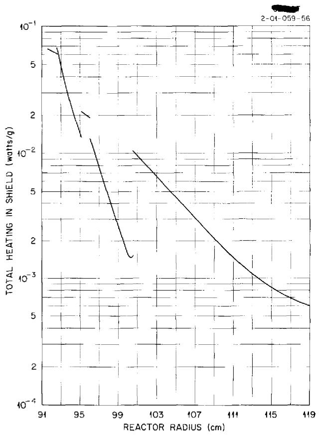  
Fig. 12.1. Total Heating in the Rear Portion of the Lead and Alkylbenzene Shield of a 300-Mw Circulating-Fuel Reactor.

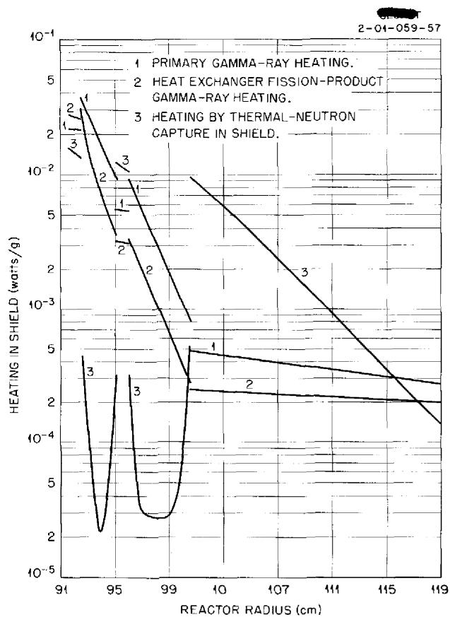  
Fig. 12.2. Components of Total Heating in the Rear Portion of the Lead and Alkylbenzene Shield of a 300-Mw Circulating-Fuel Reactor.

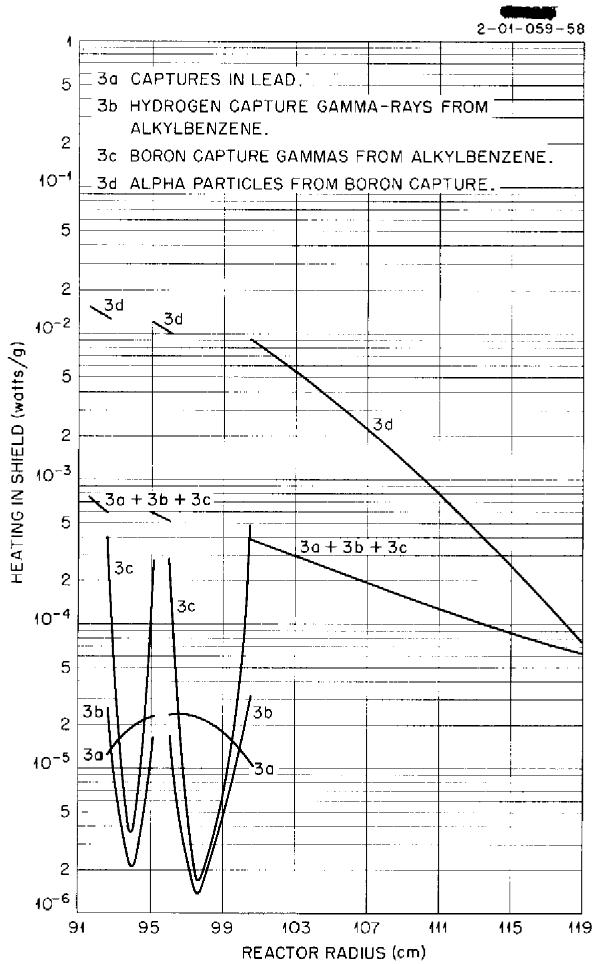  
Fig. 12.3. Components of Heating by Thermal-Neutron Captures in the Rear Portion of the Lead and Alkylbenzene Shield of a 300-Mw Circulating-Fuel Reactor.

following expression:

$$
H _ {\mathsf {a l k y l}, P} (t _ {\mathsf {a l k y l}}, t _ {\mathsf {P b}}) = K _ {1} \frac {r _ {c}}{r} D _ {P, L T} (a, z, t _ {\mathsf {P b}}) H (a, z) \frac {\sigma_ {R}}{\sigma_ {L T}} c _ {1} c _ {2} c _ {3},
$$

where

$$
\begin{array}{l} H _ {\text {a l k y l}, P} = \text {h e a t i n g b y p r i m a r y g a m m a - r a y s o u r c e s (w / g)}, \\ t _ {\text {a l k y l}} = \text {t h i c k n e s s o f a l k y l b e n z e n e (c m)}, \\ t _ {P b} = \text {t h i c k n e s s o f l e a d (c m)}, \\ K _ {1} = \text {f a c t o r} \\ = 2. 5 8 \times 1 0 ^ {- 9} (\mathrm {w / g}) / (\mathrm {r / h r}), \\ r _ {c} = \text {o u t s i d e r a d i u s o f r e a c t o r c o r e} (3 3. 0 \mathrm {c m}), \\ r = \text {r a d i u s} \\ \end{array}
$$

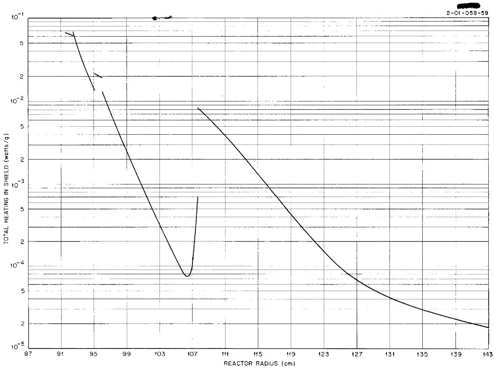  
Fig. 12.4. Total Heating in the Forward Portion of the Lead and Alkylbenzene Shield of a 300-Mw Circulating-Fuel Reactor.

$D_{P,L,T}(a,z,t_{\mathsf{Pb}}) =$ primary dose rate $(r / hr)$ in the LTSF at a distance $z$ from the LTSF source plate with a radius $a$ ( $a = 35.5~\mathrm{cm}$ ),

$H(a,z) =$ transformation from the dose rate of a finite disk (radius $a$ ) source to that from an infinite plane source

$$
= \frac {E _ {1} (\mu z)}{E _ {1} (\mu z) - E _ {1} (\mu z) [ 1 + (a / z) ^ {2} ] ^ {1 / 2}}
$$

$\sigma_{R} / \sigma_{LT} =$ ratio of reactor to LTSF source plate equivalent surface source strength for neutrons,

$$
\sigma_ {R} = \frac {P _ {R}}{4 \pi r _ {c} ^ {2}},
$$

$$
P _ {R} = \text {r e a c t o r p o w e r} (3 \times 1 0 ^ {8} \mathrm {w}),
$$

$$
\sigma_ {L T} = \frac {P _ {L T}}{\pi a ^ {2}},
$$

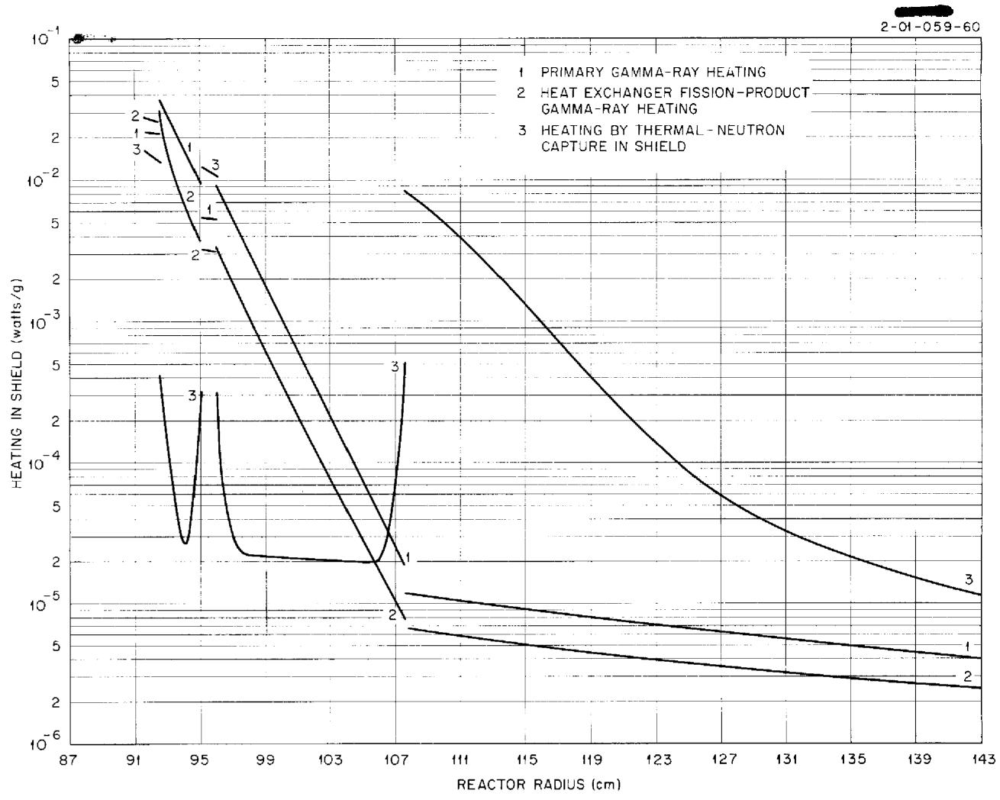  
Fig. 12.5. Components of Total Heating in the Forward Portion of the Lead and Alkylbenzene Shield of a 300-Mw Circulating-Fuel Reactor.

$$
P _ {L T} = \text {L T S F s o u r c e p l a t e p o w e r} (3. 5 \mathrm {w}), ^ {2}
$$

$c_{1} =$ change in attenuation that results from replacement of the 4-in.-thick test heat exchanger mockup with a particular reactor heat exchanger composition and thickness (based on exponential attenuation at 6.8 MeV),

$c_{2} =$ change in attenuation that results from the addition of small claddings, correct pressure shell thickness and composition, etc.,

$$
c _ {1} \times c _ {2} = 0. 4 6 0,
$$

$c_{3} =$ change in attenuation that results from the substitution of alkylbenzene-350 at $330^{\circ}\mathrm{F}$ , assuming that $\mu_{\mathrm{alkyl}} = 0.8\mu_{\mathrm{H_2O'}}$ based on electron density.

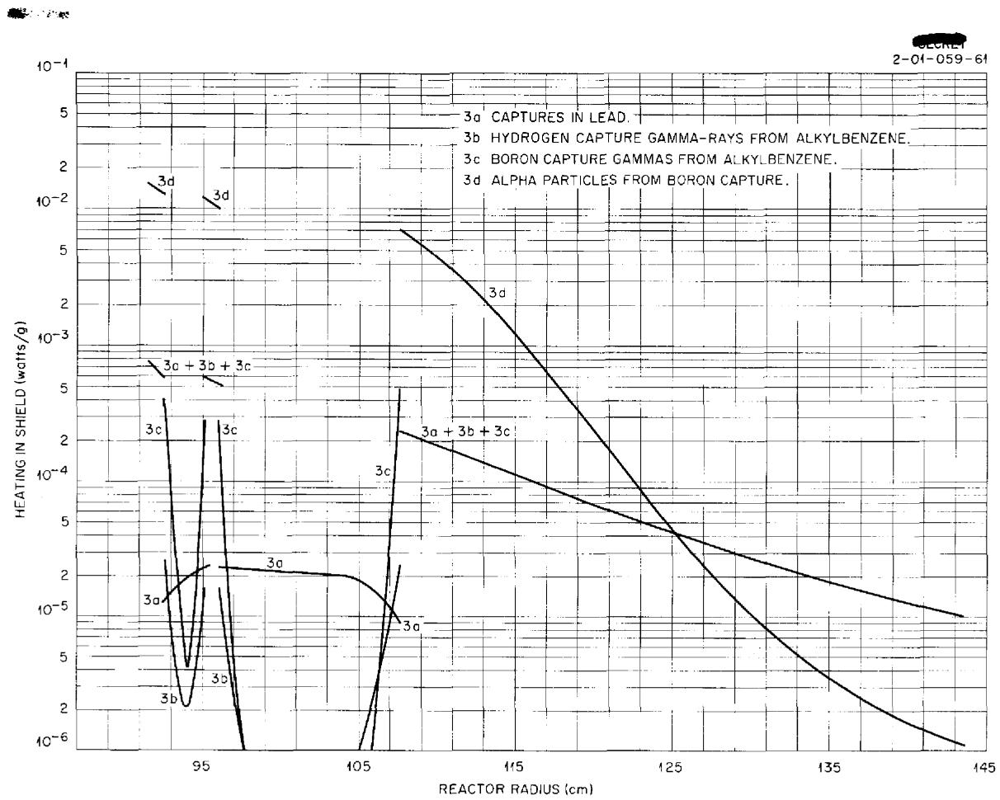  
Fig. 12.6. Components of Heating by Thermal-Neutron Captures in the Forward Portion of the Lead and Alkylbenzene Shield of a 300-Mw Circulating-Fuel Reactor.

The determination of the primary gamma-ray heating in the lead was made in a slightly different manner. Since there were no LTSF curves of primary gamma-ray dose rate as a function of lead thickness, it was necessary to use the transformed LTSF curves mentioned above, that is, plots of the primary gamma-ray heating in the reactor as a function of alkylbenzene thickness for various lead thicknesses. The lead thicknesses were 0, 1.5, 3, 4.5, and 6 in. By integrating over $r$ from the lead surface to $r = \infty$ , the total heating in the alkylbenzene behind 1.5 in. of lead was evaluated and subtracted from that behind no lead to obtain the total amount of energy deposited in the first 1.5-in.-thick lead layer in the reactor, as follows:

$$
\overline {{H _ {\mathsf {P b} , P} (0 \leq t _ {\mathsf {P b}} \leq 1 . 5 \text {i n .})}}
$$

$$
= \frac {4 \pi \rho_ {\mathrm {a l k y l}} \int_ {r _ {0}} ^ {\infty} H _ {\mathrm {a l k y l} , P} \left(t _ {\mathrm {a l k y l}}, t _ {\mathrm {P b}} = 0\right) r ^ {2} d r - 4 \pi \rho_ {\mathrm {a l k y l}} \int_ {r _ {0} + 1 . 5 \text {i n .}} ^ {\infty} H _ {\mathrm {a l k y l}, P} \left(t _ {\mathrm {a l k y l}}, t _ {\mathrm {P b}} = 1 . 5 \text {i n .}\right) r ^ {2} d r}{\frac {4 \pi \rho_ {\mathrm {P b}}}{3} \left[ \left(r _ {0} + 1 . 5 \text {i n .}\right) ^ {3} - r _ {0} ^ {3} \right]},
$$

where

$H_{\mathsf{Pb},\mathsf{P}}(0\leq t_{\mathsf{Pb}}\leq 1.5\mathrm{in.}) =$ average heating by primary gamma-ray sources in the first 1.5-in.-thick lead layers $(w / g)$

$$
r _ {0} = \text {i n s i d e r a d i u s o f l e a d (c m)},
$$

$$
\rho_ {P b} = \text {l e a d d e n s i t y} (g / c m ^ {3}),
$$

$$
\rho_ {a l k y l} = a l k y l b e n z e n e d e n s i t y \left(g / c m ^ {3}\right),
$$

$H_{\text{alkyl},P}(t_{\text{alkyl}},t_{\text{Pb}}) = \text{heating in the alkylbenzene at a distance } t_{\text{alkyl}}$ behind a thickness $t_{\text{Pb}}$ of lead $(\mathrm{w/g})$ .

Repetitions of this procedure for the other lead layers resulted in a histogram of primary gamma-ray heating in the lead. A smooth exponential curve was then fitted to the histogram.

# Fission-Product Gamma-Ray Heating

In the absence of experimental data for the contribution of fission-product gamma rays from the heat exchanger region, it was necessary to calculate the heating from the fission-product gamma rays. The results of recent spectrometer measurements of fission-product photons in the rotating-belt experiment at the LTSF were used in the calculation.

The general procedure followed was to evaluate the heating contribution from each of several energies and then to perform a numerical integration over the energy range. The energies chosen were 0.10, 0.25, 0.50, 1.0, 2.0, 3.0, 4.0, and 6.0 MeV. The surface source strength (at the outer surface of the heat exchanger region) of photons of energy $E$ was determined first. The energy deposited at a distance from an infinite plane with this source strength was then computed, after which a geometrical transformation was applied to convert to spherical geometry.

The choice of a buildup factor in determining the dose rate from an infinite plane was critical. The preponderance of Inconel between the heat exchanger and the lead suggested the use of the energy absorption buildup factor for nickel when the energy deposition at the inner surface of the lead was computed. (In the actual calculation, the buildup factor for iron was employed, since that for nickel was not available.) When the heating at a point a few mean free paths inside the lead was computed, however, the buildup factor for lead was used. The buildup factor for lead was also applied for the heating in the alkylbenzene at the last lead-alkylbenzene interface. Water buildup factors were employed for results at greater distances into the alkylbenzene.

The following expression was used in the calculation of the heating from the fission-product gamma rays in the heat exchanger:

$$
H _ {H X} (r) = \int_ {E} H _ {H X} (r, E) d E,
$$

where

$$
H _ {H X} (r, E) = \frac {\mu_ {a} (E)}{\rho} \frac {r _ {H X _ {o}}}{r} \frac {S (E)}{2} B _ {a} \left[ \sum_ {i} \mu_ {i} (E) t _ {i} \right] E _ {1} \left[ \sum_ {i} \mu_ {i} (E) t _ {i} \right],
$$

$\frac{\mu_{a}(E)}{\rho} = \text{mass energy absorption coefficient for photons of energy } E,$

$r_{HX_{o}} =$ outside radius of reactor heat exchanger (32.872 in.),

$$
S (E) = K (E) \frac {P _ {o}}{\mu (E)} L (E),
$$

$$
K (E) = E N _ {f p} (E) 3. 1 \times 1 0 ^ {1 0} (\text {f i s s i o n s / s e c}) / \mathrm {w},
$$

$N_{fp}(E) =$ number of fission-product photons emitted per fission per unit energy interval centered about the energy $E$ ,

$$
P _ {o} = \frac {P _ {R}}{V _ {f}} v _ {f},
$$

$$
P _ {R} = \text {r e a c t o r p o w e r} (3 \times 1 0 ^ {8} \mathrm {w}),
$$

$$
V _ {f} = \text {t o t a l f u e l v o l u m e} (2 0. 1 1 \mathrm {f t} ^ {3}),
$$

$$
v _ {f} = \text {v o l u m e f r a c t i o n o f f u e l i n h e a t e x c h a n g e r (0 . 2 7 4)},
$$

$\mu (E)\approx$ total gamma-ray absorption coefficient for photons of energy $E$

$$
L (E) = 1 - \frac {r _ {H X _ {i}}}{r _ {H X _ {o}}} e ^ {- \mu (E) t _ {H X}} + \frac {e ^ {- \mu (E) t} _ {H X} - 1}{\mu S (E) r _ {H X _ {o}}}
$$

$r_{HX_i} =$ inside radius of reactor heat exchanger (25.842 in.),

$$
t _ {H X} = \text {h e a t e x c h a n g e r t h i c k n e s s} (7. 0 3 \text {i n .}),
$$

$B_{a}\left[\sum_{i}\mu_{i}(E)t_{i}\right] = \text{energy absorption buildup factor for energy } E$ and $\sum_{i}\mu_{i}(E)t_{i}$ mean free paths,

$$
E _ {1} \left[ \sum_ {i} \mu_ {i} (E) t _ {i} \right] = \int_ {\sum_ {i} \mu_ {i} (E) t _ {i}} ^ {\infty} \frac {e ^ {- x}}{x} d x.
$$

# Heating by Thermal-Neutron Captures in the Shield

Heating in Lead by Capture Gamma Rays Produced in Lead. -- The heating in lead by secondary gamma rays from thermal-neutron capture in the lead was calculated by using curves of the thermal-neutron flux in lead which were derived from LTSF curves of thermal flux in water behind various thicknesses of lead. The general method of calculation was to construct a series of spherical shells that were concentric about the point at which the heating was being determined and to sum up the contribution from each, calculated by means of the following expression:

$$
H _ {\mathsf {P b}, S _ {1}} (r) = K _ {2} E \Sigma_ {c} \left(\frac {\mu_ {a}}{\rho}\right) _ {\mathsf {P b}} \int_ {x _ {1}} ^ {x _ {2}} \int_ {\theta_ {1}} ^ {\theta_ {2}} \phi \left(r ^ {\prime}\right) B (\mu x) \frac {e ^ {- \mu x}}{4 \pi x ^ {2}} 2 \pi x ^ {2} \sin \theta d \theta d x,
$$

where

$H_{\mathsf{Pb},s_1}(r) =$ heating in the lead by secondary gamma rays produced in the lead $(w / g)$

$$
K _ {2} = 1. 6 \times 1 0 ^ {- 1 3} w / M e v / s e c,
$$

$$
E \approx \text {e n e r g y}
$$

$$
\Sigma_ {c} = \text {l e a d c a p t u r e c r o s s s e c t i o n},
$$

$$
\mu_ {a} / \rho = \text {m a s s e n e r g y a b s o r p t i o n c o e f f i c i e n t},
$$

$$
\phi \left(r ^ {\prime}\right) = \text {t h e r m a l - n e u t r o n f l u x a t p o i n t} r ^ {\prime} \text {w h e r e c a p t u r e o c c u r s},
$$

$B(\mu x) =$ point isotropic energy absorption buildup factor for lead,

$x =$ distance from point $r^{\prime}$ to point $r$ where the capture gamma ray is absorbed.

Heating in Lead by Capture Gamma Rays Produced in Alkylbenzene. - A rough determination was made for the heating in the lead from absorption of hydrogen and boron capture gamma rays produced in the borated alkylbenzene. Heating contributions from several angles $\theta$ about the point of absorption

were computed so that a curve of heating per unit angle vs angle could be drawn. An integration over $\theta$ then yielded the desired result. The equation employed was

$$
H _ {\mathsf {P b}, S _ {2}} (r) \approx K _ {2} E \sum_ {c} \left(\frac {\mu_ {a}}{\rho}\right) _ {\mathsf {P b}} \int_ {0} ^ {\pi / 2} \int_ {x _ {0}} ^ {x _ {1}} \phi \left(r ^ {\prime}\right) B (\mu x) \frac {e ^ {- \mu x}}{4 \pi x ^ {2}} 2 \pi x ^ {2} \sin \theta d \theta d x,
$$

where

$H_{\mathsf{Pb},S_2}(r) =$ heating in lead by secondary gamma rays produced in alkylbenzene $(w / g)$

$E =$ energy of boron or hydrogen capture gamma ray (0.5 or 2.2 Mev, respectively),

$\Sigma_{c} =$ capture cross section for hydrogen or boron in alkylbenzene.

Heating in Alkylbenzene by Capture Gamma Rays Produced in Lead and Alkylbenzene. - The analysis1 of the LTSF measurements which gave the secondary gamma-ray dose rate in water beyond an RMR-shield mockup was employed in calculating the secondary gamma-ray heating in the alkylbenzene. These secondary gamma rays consisted of capture gamma rays from lead and from the boron and hydrogen in the alkylbenzene. The heating was determined by means of the following expression:

$$
H _ {a l k y l, S _ {3}} = K _ {1} f _ {5} f _ {6} f _ {7} C _ {m} \frac {r _ {c}}{r} e ^ {- t _ {l} / \lambda_ {l}} H (a, z _ {P b}),
$$

where

$H_{\text{alkyl}, S_3} = \text{heating in alkylbenzene by secondary gamma rays produced in lead and alkylbenzene (w/g)}$ ,

$f_{5} = \text{dose rate (r/hr)}$ in alkylbenzene from an infinite plane source of secondary gamma radiation having the same surface source strength as the LTSF RMR-shield configuration containing 12 in. of beryllium and 4.5 in. of lead

$$
= D _ {S, L T} (1 2 \text {i n . B e}, 4. 5 \text {i n . P b}, t _ {\alpha | k y |}) H \left(a ^ {\prime}, t _ {\alpha | k y |}\right),
$$

$f_{6} = \frac{D_{S,LT}(t_{\text{Be}}, t_{\text{Pb}}, t_{\text{alkyl}})}{D_{S,LT}(12 \text{ in. Be}, 4.5 \text{ in. Pb}, t_{\text{alkyl}})}$ as tabulated in Table 12.2, taken from work by J. B. Dee and co-workers,

$f_{7} =$ correction for the differences in composition and thickness between reactor and LTSF heat exchangers

$$
= e ^ {- \left(\sum_ {H X, R} - \sum_ {H X, L T}\right) 1 0. 1 6} - e ^ {- \sum_ {H X, R} \left(t _ {H X} - 1 0. 1 6\right)},
$$

$C_{m} =$ correction factor to account for small material differences between the LTSF and reactor, $t_{l} =$ thickness of alkylbenzene cooling layers in the basic lead shield (cm),

TABLE 12.2. CORRECTION FACTOR $f_{6}$ APPLIED TO SECONDARY GAMMA-RAY DOSE RATE FOR VARIATIONS IN LEAD AND BERYLLIUM THICKNESSES   

<table><tr><td rowspan="2">Lead Thickness (in.)</td><td colspan="3">f6(tBe,tPb)</td></tr><tr><td>8 in. of Beryllium</td><td>12 in. of Beryllium</td><td>16 in. of Beryllium</td></tr><tr><td>1.5</td><td>4.7</td><td>1.6</td><td>0.32</td></tr><tr><td>3.0</td><td>4.3</td><td>1.3</td><td>0.26</td></tr><tr><td>4.5</td><td>3.9</td><td>1.0</td><td>0.21</td></tr><tr><td>6.0</td><td>3.5</td><td>0.76</td><td>0.17</td></tr></table>

$\lambda_{l} =$ neutron relaxation length in alkylbenzene cooling layers (determined to be approximately $6.0~\mathrm{cm}$ ),

$H(a_{r}z_{Pb}) =$ transformation from the neutron dose rate (at the lead surface) from a disk source (LTSF source plate) to the neutron dose rate from an infinite plane source, taken to be $1 / (1 - e^{-84 / z_{Pb}})$ .

Heating in Alkylbenzene by Alpha Particles Produced in Alkylbenzene. - In the calculation of the heating in the alkylbenzene from 2.3-Mev alpha-particle production by thermal-neutron capture by the boron, it was assumed that the alpha particle gave up all its energy at the point at which it was produced. The alpha heating in the alkylbenzene was determined by means of the following equation:

$$
H _ {a l k y l, a} (r, t _ {P b}) = \frac {\sum_ {c} \phi_ {R} (r , t _ {P b})}{\rho_ {a l k y l}} (2. 3 M e v) (1. 6 0 \times 1 0 ^ {- 1 3} w / M e v / s e c),
$$

where

$H_{\text{alkyl}, \alpha}(r, t_{\mathsf{Pb}}) =$ heating in alkylbenzene by alpha particles produced in the alkylbenzene $(\mathrm{w} / \mathrm{g})$ , $\Sigma_{c} =$ thermal-neutron capture cross section for boron in alkylbenzene,

$$
\phi_ {R} (r, t _ {\mathsf {P b}}) = \phi_ {L T} (z, t _ {\mathsf {P b}}) H (a, z) \frac {\sigma_ {R}}{\sigma_ {L T}} \frac {r _ {c}}{r} e ^ {- t _ {l} / \lambda_ {l}} C _ {m} f _ {7},
$$

$\phi_{LT}(z,t_{Pb}) =$ thermal-neutron flux in LTSF behind a thickness $t_{Pb}$ of lead.

# DOSE RATE OUTSIDE THE ART SHIELD

J.B.Dee C.A.Goetz D.K.Trubey

The gamma-ray and fast-neutron dose rates at a distance of 50 ft from the ART have been calculated as a function of the thickness of the lead shield. The calculations were based on the recently reported shield design procedure3 and on recent LTSF RMR-shield mockup tests and their analysis (see Sec. 13, this report). (The analysis of the LTSF data was based on an effective source plate power value of 2.1 w.) The dimensions and compositions used for the ART were taken from previously reported descriptions.4,5

The gamma-ray dose rate was divided into three parts: (1) primary gamma-ray dose rate originating in or near the core, $D_{P}$ ; (2) the dose rate from secondary gamma rays originating in the shield, $D_{S}$ ; and (3) the gamma-ray dose rate from the heat exchanger, $D_{HX}$ . The resulting dose rates are plotted in Fig. 12.7. The details of the calculation have been published.

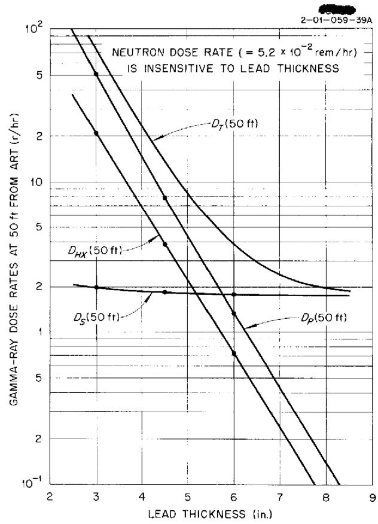  
Fig. 12.7. Gamma-Ray Dose Rate 50 ft from ART.

# 13. LID TANK SHIELDING FACILITY

R.W.Peelle

J. M. Miller

Applied Nuclear Physics Division

W.J.McCool J.Smolen

Pratt & Whitney Aircraft

D. R. Otis, Consolidated Vultee Aircraft Corp., San Diego

W. R. Burrus, U. S. Air Force

Analysis of the dynamic source tests in the second series of experiments with mockups of a circulating-fuel reflector-moderated reactor and shield (RMR-shield) in the Lid Tank Shielding Facility (LTSF) was completed. The analysis is based on an effective neutron power of 2.1 w for the old LTSF source plate (since removed). It had previously been assumed that the power of the old source plate was 3.6 w, but a tentative calibration of the new source plate has indicated the 2.1-w value.

# ANALYSIS OF THE DYNAMIC SOURCE TESTS ON Mockups OF THE REFLECTOR-MODERATED REACTOR AND SHIELD

H. C. Woodsum

One of the main purposes of the dynamic source tests in the RMR-shield experiments was to measure the dose rate resulting from fission-product

gamma rays emitted in the mockup of the fuel-to-NaK heat exchanger. In order to mock up the sources of radiation in the heat exchanger, a belt of MTR-type fuel plates² was rotated from the ORNL Graphite Reactor core hole (with the LTSF source plate removed), where the thermal neutrons induced fissions, to a slot between two heat exchanger mockup tanks, where the fission-product gamma rays comprised the source to be studied. Neutron and gamma-ray dose rate measurements were made in the water beyond the mockups.

The basic mockup (configuration 17) included a 3-in.-thick lead gamma-ray shield (Fig. 13.1). (The dimensions of all the components in the mockup are given in Table 13.1.) Only two changes in this basic configuration were made throughout these tests: $1\frac{1}{2}$ in. of the lead was removed (configuration 17A), and $\frac{1}{2}$ in. of the boral next

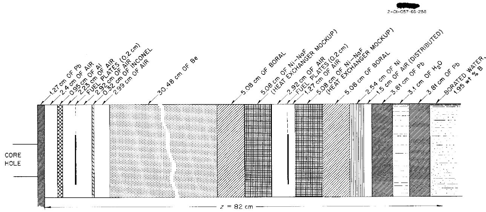  
Fig. 13.1. RMR Shield Mockup with Dynamic Source (Configuration 17).

to the beryllium was replaced with 1 in. of polyethylene (configuration 17F).

TABLE 13.1. BASIC RMR-SHIELD MockUP (CONFIGURATION 17)* USED IN DYNAMIC SOURCE TESTS   

<table><tr><td>Component</td><td>Thickness (cm)</td></tr><tr><td>Air</td><td>2.40</td></tr><tr><td>Aluminum window</td><td>0.95</td></tr><tr><td>Air</td><td>2.23</td></tr><tr><td>Fuel plates</td><td>0.20</td></tr><tr><td>Air</td><td>2.92</td></tr><tr><td>Inconel</td><td>0.32</td></tr><tr><td>Air</td><td>2.99</td></tr><tr><td>Beryllium</td><td>30.48</td></tr><tr><td>Boral</td><td>5.08</td></tr><tr><td>Ni-NaF tank (heat exchanger mockup)</td><td>5.08</td></tr><tr><td>Air</td><td>2.92</td></tr><tr><td>Fuel plates</td><td>0.20</td></tr><tr><td>Air</td><td>1.27</td></tr><tr><td>Ni-NaF tank (heat exchanger mockup)</td><td>5.08</td></tr><tr><td>Boral</td><td>5.08</td></tr><tr><td>Nickel</td><td>2.54</td></tr><tr><td>Air (distributed)</td><td>1.50</td></tr><tr><td>Lead</td><td>3.81</td></tr><tr><td>Water</td><td>3.10</td></tr><tr><td>Lead</td><td>3.81</td></tr><tr><td>Total</td><td>81.96</td></tr></table>

*Configurations 17B through 17E had infinite, 2.5-, 1.5-, and 1.25-sec transit times, respectively. In configuration 17A (infinite transit time) the last 3.81 cm of lead was removed. In configuration 17F (infinite transit time) the 5.08 cm of boral adjacent to the beryllium was replaced with 3.81 cm of polyethylene.

The cycle time, that is, time for the fuel belt to make one complete revolution, was varied as follows: infinite time (belt not rotating) and 2, 1.5, and 1.25 sec. Shorter cycle times were precluded by the danger of damage to the rig. The rotation speed was set by means of a stroboscope, and the constancy of the speed was checked with a tachometer.

The results of the experiment were compared with two calculations of the dose rate; for one of the calculations it was assumed that all the fission-product gamma rays were of a single energy, and, for the other, the spectrum of gamma rays from the fuel belt, as previously measured at the LTSF,2 was used. The two calculated values agreed, but they differed by about $30\%$ from the measured value. It was found that this difference could be attributed to the dose buildup factor for water having been used in the calculation; that is, the buildup factor was chosen as if the lead were an equivalent thickness, in mean free paths, of water. Substitution of a new buildup factor for the total mean free paths (lead and water), based on Monte Carlo studies of laminated shields, resulted in agreement between the measured and calculated dose rates.

# Calculated Dose Rate from Fission-Product Gamma Rays from the Heat Exchanger Based on 2.7 MeV/Photon

The first calculation of the dose rate behind the lead-water shield was based on a single gamma-ray energy and an average number of gamma rays per fission. As a first step in arriving at the proper values for the energy and the average number of gamma rays, the dose rate from an infinite plane, isotropic, surface source with a spectrum expressed as $N(E)$ was calculated from the following relation:

$$
D _ {s} = \int_ {E = 0} ^ {\infty} \frac {n}{2} \frac {N (E)}{C (E)} E _ {1} \left(\Sigma \mu_ {i} t _ {i}\right) B _ {r} \left(\Sigma \mu_ {i} t _ {i}\right) d E,
$$

where

$$
n = \text {n u m b e r o f f i s s i o n s p e r s e c o n d p e r w a t} = 3. 1 \times 1 0 ^ {1 0},
$$

$$
N (E) = \text {n u m b e r o f g a m m a r o y s o f e n e r g y} E \text {e m i t t e d p e r f i s s i o n p e r M e v},
$$

$$
C (E) = \text {f l u x - t o - d o s e c o n v e r s i o n f a c t o r}
$$

$E_{1}(\Sigma \mu_{i}t_{i}) =$ exponential integral for $\Sigma \mu_{i}t_{i}$ mean free paths in the experiment, tabulated previously as $\int_x^\infty (e^{-y}dy / y)$

$B_{r}(\Sigma \mu_{i}t_{i}) =$ dose buildup factor for gamma rays of energy $E$ in water through $\Sigma \mu_{i}t_{i}$ mean free paths. The dose rate calculated on the basis of a single gamma-ray energy $E^{\prime}$ would then be

$$
D _ {m} = \frac {n}{2} \frac {\Gamma (E ^ {'})}{C (E ^ {'})} E _ {1} (\Sigma \mu_ {i} t _ {i}) B _ {r} (\Sigma \mu_ {i} t _ {i}),
$$

where $\Gamma(E')$ is defined as the average number of "penetrating" gamma rays of energy $E'$ per fission and all other terms apply to the single energy. Then, from setting $D_m$ equal to $D_s'$

$$
\Gamma (E ^ {\prime}) = \frac {\int_ {E = 0} ^ {\infty} \frac {N (E)}{C (E)} E _ {1} \left(\Sigma \mu_ {i} {} ^ {t} {} _ {i ^ {\prime}} E\right) B _ {r} \left(\Sigma \mu_ {i} {} ^ {t} {} _ {i ^ {\prime}} E\right) d E}{\frac {E _ {1} \left(\Sigma \mu_ {i} {} ^ {t} {} _ {i ^ {\prime}} E ^ {\prime}\right) B _ {r} \left(\Sigma \mu_ {i} {} ^ {t} {} _ {i ^ {\prime}} E ^ {\prime}\right)}{C (E ^ {\prime})}}.
$$

The value of the numerator was obtained by numerical integration over $E$ , using $N(E) = 7.0e^{-1.2E}$ gamma rays/Mev·fission. For relatively thick gamma-ray shields the characteristic or average energy of the gamma rays was found to be about 2.7 MeV; hence $E' = 2.7$ MeV. By substituting the proper values in the equation, a value of $\Gamma(E') = 0.69$ was obtained for a 3-in.-thick lead gamma-ray shield.

If it is assumed that all the gamma rays emitted by a source of strength $S_0$ are of 2.7 Mev energy, the calculated dose rate behind the lead-water shield can be obtained from the following relation:

$$
D _ {\gamma , \text {b e l t}} = \int_ {\text {A r e a o f b e l t}} S _ {0} \cos \theta (y) d A (x, y) \frac {e ^ {- \sum \mu_ {i} R _ {i} (x , y , t)}}{4 \pi R ^ {2} (x , y , t)} B _ {r} [ \sum \mu_ {i} R _ {i} (x, y, t) ], \tag {1}
$$

where

$\cos \theta = a$ term to take into account the longer period of exposure of the center portions of the belt, than of the outer portions of the belt, to the activating neutron flux,

$$
= \sqrt {1 - (y ^ {2} / a ^ {2})} (\text {s e e F i g . 1 3 . 2 a}),
$$

$dA =$ element of area on the belt $(\mathrm{cm}^2)$

$e^{-\sum \mu_i R_i} =$ exponential attenuation of 2.7-Mev gamma rays from the belt in the heat exchanger through the various materials (nickel, sodium fluoride, boral, lead, and water) of slant thickness $R_j$ with a gamma-ray absorption coefficient of $\mu_i$ at energy $E$ ,

$4\pi R^2 =$ inverse-square spreading for a point source from point of emission to point of detection,

$B_{r}(\Sigma \mu_{i}R_{i}) =$ dose buildup factor for 2.7-Mev gamma rays from a point isotropic source through $\Sigma \mu_{i}R_{i}$ mean free paths of water,

$$
x, y, t = \text {c o o r d i n a t e s}, ^ {6} \text {a s s h o w n i n F i g .} 1 3. 2 b.
$$

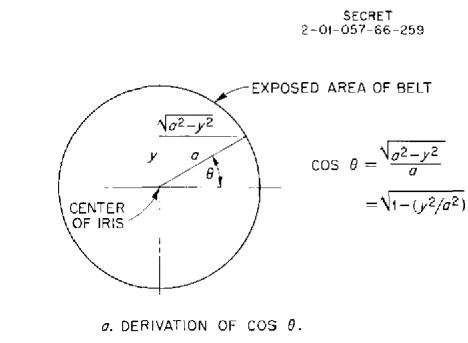

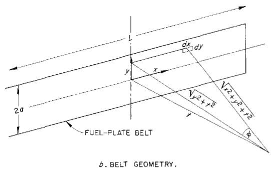  
Fig. 13.2. Geometry Used in Calculations of the Gamma-Ray Dose Rate Beyond the RMR-Shield Mockups with the Dynamic Source.

If the length of the belt in the heat exchanger region is $L$ and its height is $2a$ (Fig. 13.2b), then Eq. 1 can be written in terms of $x, y,$ and $t$ :

(2) $D_{\gamma, \mathbf{bel}}$

$$
= 4 \int_ {y = 0} ^ {y = a} \int_ {x = 0} ^ {x = L / 2} \frac {S _ {0} \sqrt {1 - (y / a) ^ {2}} e ^ {- (\sum \mu_ {i} t _ {i} / t) \sqrt {x ^ {2} + y ^ {2} + t ^ {2}}} B _ {r} \left[ (\sum \mu_ {i} t _ {i} / t) \sqrt {x ^ {2} + y ^ {2} + t ^ {2}} \right] d x d y}{4 \pi \left(x ^ {2} + y ^ {2} + t ^ {2}\right)} ,
$$

where $t_i$ is the thickness of each slab of material. This integral can be separated as follows:

(3) $D_{\gamma ,\mathbf{bel}}$

$$
= \frac {S _ {0}}{\pi} \int_ {y = 0} ^ {a} \sqrt {1 - \left(\frac {y}{a}\right) ^ {2}} d y \int_ {x = 0} ^ {L / 2} \frac {e ^ {- (\sum \mu_ {i} t _ {i} / t) \sqrt {x ^ {2} + y ^ {2} + t ^ {2}}} d x B _ {r} \left[ (\sum \mu_ {i} t _ {i} / t) \sqrt {x ^ {2} + y ^ {2} + t ^ {2}} \right]}{x ^ {2} + y ^ {2} + t ^ {2}}.
$$

Then, since

$$
\frac {\sqrt {y ^ {2} + t ^ {2}}}{\sqrt {x ^ {2} + y ^ {2} + t ^ {2}}} = \cos \phi (\text {s e e F i g . 1 3 . 2 b}),
$$

$$
d (\cos \phi) = \frac {x d x \sqrt {y ^ {2} + t ^ {2}}}{(x ^ {2} + y ^ {2} + t ^ {2}) ^ {3 / 2}} = \sin \phi d \phi ,
$$

or

$$
d x = \sin \phi \frac {\sqrt {x ^ {2} + y ^ {2} + t ^ {2}}}{\sqrt {y ^ {2} + t ^ {2}}} \frac {(x ^ {2} + y ^ {2} + t ^ {2})}{x} d \phi ,
$$

and, since

$$
\frac {x}{\sqrt {x ^ {2} + y ^ {2} + t ^ {2}}} = \sin \phi ,
$$

$$
d x = \frac {\sqrt {x ^ {2} + y ^ {2} + t ^ {2}}}{\cos \phi} d \phi = \frac {\sqrt {y ^ {2} + t ^ {2}}}{\cos^ {2} \phi} d \phi .
$$

When terms in $\phi$ are substituted for $x$ , the second integral of Eq. 3 becomes

$$
\int_ {0} ^ {\sin^ {- 1} \left[ (L / 2) / \sqrt {(L / 2) ^ {2} + y ^ {2} + t ^ {2}} \right]} \frac {e ^ {- (\sum \mu_ {i} t _ {i} / t) (\sqrt {y ^ {2} + t ^ {2}} / \cos \phi)}}{\sqrt {y ^ {2} + t ^ {2}}} d \phi B _ {r} \left(\frac {\sum \mu_ {i} t _ {i}}{t} \sqrt {x ^ {2} + y ^ {2} + t ^ {2}}\right). \tag {4}
$$

Now, let

$$
\sqrt {y ^ {2} + t ^ {2}} \left(\frac {\sum \mu_ {i} t _ {i}}{t}\right) = b,
$$

so that

$$
\sqrt {y ^ {2} + t ^ {2}} = b \left(\frac {t}{\sum \mu_ {i} t _ {i}}\right),
$$

and let

$$
\phi_ {0} = \sin^ {- 1} \left[ \frac {L / 2}{\sqrt {(L / 2) ^ {2} + y ^ {2} + t ^ {2}}} \right].
$$

Further, it is assumed that $B_r$ is a function of $y$ and $t$ only, which is a slight underestimate of the buildup. Then the first portion of the integral of Eq. 4 becomes

$$
\int_ {0} ^ {\phi_ {0}} \frac {e ^ {- b \sec \phi} d \phi}{(b t / \sum \mu_ {i} t _ {i})}. \tag {5}
$$

Since $(bt / \Sigma \mu_{i}t_{i})$ is a constant for constant $y$ and $t$ , the integral of Eq. 5 becomes

$$
\left(\frac {\sum \mu_ {i} t _ {i}}{t}\right) \left(\frac {1}{b}\right) \int_ {0} ^ {\phi_ {0}} e ^ {- b \sec \phi} d \phi , \tag {6}
$$

and, since $\int_0^\phi e^{-b\sec \phi}d\phi$ has been tabulated as $F[\phi_0,b]$ , the total integral, in terms of this

function, becomes

$$
D _ {\gamma , \text {b e l t}} = \frac {S _ {0}}{\pi} \int_ {0} ^ {a} \frac {\sqrt {1 - (y / a) ^ {2}} B _ {r} \left[ (\Sigma \mu_ {i} t _ {i} / t) \sqrt {y ^ {2} + t ^ {2}} \right] F \left[ \phi_ {0}, (\Sigma \mu_ {i} t _ {i} / t) \sqrt {y ^ {2} + t ^ {2}} \right] d y}{\sqrt {y ^ {2} + t ^ {2}}} \tag {7}
$$

The following constants were used for a numerical integration of Eq. 7:

$t =$ distance between the belt in the heat exchanger and the detector

$$
\begin{array}{l} a = 1 4 \text {i n .} = 3 5. 5 \mathrm {c m}, \\ = 7 4. 2 2 \mathrm {c m} \text {f o r t h i s c a s e (T a b l e 1 3 . 2)}, \\ \end{array}
$$

$$
\Sigma \mu_ {i} t _ {i} = 7. 7 4, a s s h o w n i n T a b l e 1 3. 2,
$$

$$
\phi_ {0} = \sin^ {- 1} \frac {L / 2}{\sqrt {(L / 2) ^ {2} + y ^ {2} + t ^ {2}}}
$$

$$
L / 2 = 2 9. 5 \text {i n .} = 7 5 \mathrm {c m}.
$$

An upper limit of 45 deg for $\phi_0$ is obtained by letting $y = 0$ , and a lower limit of 41 deg is obtained by letting $y = a$ . For these two values of $y$ ,

$$
\begin{array}{l} b = \frac {\sum \mu_ {i} t _ {i}}{t} \sqrt {y ^ {2} + t ^ {2}} \\ = 7. 7 4, \quad \text {f o r} y = 0, \\ \approx 8. 5 8, \quad \text {f o r} y = a. \\ \end{array}
$$

For $\phi_0 = 41$ to 45 deg and $b = 7.74$ to 8.58, $F[\phi_0,b]$ is essentially independent of $\phi$ ; hence, $F[45\deg ,b]$ was used. ( $\phi_0$ was assumed to be independent of $y$ .)

The values of the various terms used in the numerical integration of Eq. 7 are given in Table 13.3. The integration gave a value of

$$
D _ {\gamma , \text {b e l t}} = 1. 1 6 \times 1 0 ^ {- 4} S _ {0} (\mathrm {m r / h r}).
$$

TABLE 13.2. NUMBER OF MEAN FREE PATHS FOR MATERIALS BETWEEN FUEL PLATES IN HEAT EXCHANGER MockUP AND DETECTOR AT $t = {74.22}\mathrm{\;{cm}}$   

<table><tr><td>Component</td><td>Thickness (cm)</td><td>ρ, Density (g/cm3)</td><td>μ/ρ (2.7 MeV), Mass Absorption Coefficient (cm2/g)</td><td>μi,t_i (2.7 MeV), Number of Mean Free Paths</td></tr><tr><td>NaF</td><td>3.81</td><td>1.59</td><td>0.0366</td><td>0.22</td></tr><tr><td>Ni</td><td>3.81</td><td>8.90</td><td>0.0382</td><td>1.29</td></tr><tr><td>Pb</td><td>7.62</td><td>11.3</td><td>0.0418</td><td>3.60</td></tr><tr><td>Boral (Al)</td><td>5.08</td><td>2.53</td><td>0.0372</td><td>0.48</td></tr><tr><td>H₂O</td><td>51.1</td><td>1.0</td><td>0.0420</td><td>2.15</td></tr><tr><td>Air</td><td>2.8</td><td>0.00293</td><td>0.04</td><td>0.000</td></tr><tr><td></td><td>Σti=74.22</td><td></td><td></td><td>Σμi,t_i = 7.74</td></tr></table>

TABLE 13.3. VALUES OF VARIOUS TERMS USED IN THE NUMERICAL INTEGRATION OF EQUATION 7   

<table><tr><td rowspan="2">y</td><td rowspan="2">√1-(y/a)2</td><td rowspan="2">√y2+t2</td><td rowspan="2">b</td><td rowspan="2">F[45 deg, b]</td><td rowspan="2">Br(b) for H2O</td><td>√1-(y/a)2Br(b) F[45 deg, b]</td></tr><tr><td>√y2+t2</td></tr><tr><td>0</td><td>1.000</td><td>74.20</td><td>7.740</td><td>1.68 × 10-4</td><td>7.38</td><td>1.671 × 10-5</td></tr><tr><td>5</td><td>0.9901</td><td>74.31</td><td>7.751</td><td>1.67 × 10-4</td><td>7.38</td><td>1.64 × 10-5</td></tr><tr><td>10</td><td>0.9595</td><td>74.87</td><td>7.809</td><td>1.55 × 10-4</td><td>7.40</td><td>1.470 × 10-5</td></tr><tr><td>15</td><td>0.9063</td><td>75.71</td><td>7.897</td><td>1.40 × 10-4</td><td>7.50</td><td>1.251 × 10-5</td></tr><tr><td>20</td><td>0.8211</td><td>76.85</td><td>8.015</td><td>1.27 × 10-4</td><td>7.55</td><td>1.025 × 10-5</td></tr><tr><td>25</td><td>0.7100</td><td>78.30</td><td>8.167</td><td>1.07 × 10-4</td><td>7.65</td><td>0.742 × 10-5</td></tr><tr><td>30</td><td>0.5345</td><td>80.04</td><td>8.348</td><td>0.92 × 10-4</td><td>7.82</td><td>0.481 × 10-5</td></tr><tr><td>35.5</td><td>0</td><td>82.26</td><td>8.580</td><td>0.63 × 10-4</td><td>8.40</td><td>0</td></tr></table>

# Measured Gamma-Ray Dose Rates With and Without Rotation of the Belt

The measured gamma-ray dose rate without the belt rotating (which is analogous to the measured dose rate in the static source tests) includes

$$
D _ {\gamma , W O R} = D _ {P} + D _ {C} + D _ {f p, \text {c o r e}}, \tag {8}
$$

where

$D_{\gamma, WOR} = \text{total gamma-ray dose rate without rotation of the belt}$ ,

$D_{P} =$ dose rate from prompt gamma rays,

$D_{C} =$ dose rate from capture gamma rays produced in the mockup,

$D_{fp,\text{core}} = \text{dose rate from fission-product gamma rays from the core.}$

The measured gamma-ray dose rate with the belt rotating includes

$$
D _ {\gamma , W R} = D _ {P} + D _ {C} + D _ {f p, H E} + D _ {f p, \text {c o r e - H E}}, \tag {9}
$$

where

$D_{\gamma, W_R} = \text{total gamma-ray dose rate with rotation of the belt}$ ,

$D_{fp,HE} =$ dose rate from fission-product gamma rays from the heat exchanger,

$D_{fp,\text{core - HE}} = \text{dose rate from fission-product gamma rays in the core that were not removed by the belt.}$

The term $D_P$ is of course the same in both Eqs. 8 and 9, and it is assumed that the term $D_C$ is the same, since the small increase in the number of capture gamma rays from the rotating belt is ignored. Therefore, the difference between the two measured dose rates is

$$
D _ {\gamma , W R} - D _ {\gamma , W O R} = \left(D _ {f p, H E} + D _ {f p, \text {c o r e} - H E}\right) - D _ {f p, \text {c o r e}}.
$$

Since the belt length is much greater than the core-hole diameter, $D_{fp,\text{core - HE}}$ is negligible and can be ignored; thus

$$
D _ {\gamma , W R} - D _ {\gamma , W O R} = D _ {f p, H E} - D _ {f p, \text {c o r e}}. \tag {10}
$$

# Calculated Dose Rate from Fission-Product Gamma Rays from the Core Based on 2.7 MeV/Photon

Since $D_{\gamma, \text{belt}}$ in Eq. 1 represents the calculated dose rate from the fission-product gamma rays from the heat exchanger, it can be substituted for $D_{fp, HE}$ in Eq. 10. Then, if the value of $D_{fp, \text{core}}$ is calculated, the difference between the two measured values (i.e., $D_{\gamma, WR} - D_{\gamma, WOR}$ ) should be equivalent to the difference between the two calculated values (i.e., $D_{\gamma, \text{belt}} - D_{fp, \text{core}}$ ).

In the mockup the core source was a 28-in.-dia disk, as defined by the boral iris in the LTSF core hole. In the calculation of $D_{fp,\text{core}}$ , the source was considered to be isotropic. Hence,

$$
D _ {f p, \text {c o r e}} = \frac {S _ {1}}{2} \left\{E _ {1} \left(\Sigma \mu_ {i} t _ {i}\right) - E _ {1} \left[ \Sigma \mu_ {i} t _ {i} \sqrt {1 + \left(\frac {a}{T}\right) ^ {2}} \right] \right\} B _ {r} \left(\Sigma \mu_ {i} t _ {i}\right), \tag {11}
$$

where

$$
S _ {1} = \text {e q u i v a l e n t i s o t r i p o c s u r e s t r e n g t h f r o m 2 . 7 - M e v f i s s i o n - p r o d u c t g a m m a r a y s e m i t t e d}
$$

$$
E _ {1} \left(\Sigma \mu_ {i} ^ {t} _ {i}\right) = \text {e x p o n e n t i a l i n t e g r a l f o r} \Sigma \mu_ {i} ^ {t} _ {i} \text {m e a n f r e e p a t h s , a s d e f i n e d p r e v i o u s l y ,}
$$

$$
\sum \mu_ {i} t _ {i} = \text {t o t a l n u m b e r o f m e a n f r e e p a t h s f o r m a t e r i a l s b e t w e e n t h e f u e l p l a t e s a t t h e c o r e h o l e} \\ \text {a n d t h e d e t e c t o r , 3 . 1 4 + 7 . 7 4 = 1 0 . 8 8 (s e e T a b l e s 1 3 . 2 a n d 1 3 . 4) ,}
$$

$$
a = \text {r a d i u s o f} = 3 5. 5 6 \mathrm {c m},
$$

$$
T = \text {t o t a l}
$$

$$
= 4 9. 8 8 \mathrm {c m} + 7 4. 2 2 \mathrm {c m} = 1 2 4 \mathrm {c m} (\text {T a b l e s} 1 3. 2 \text {o n d} 1 3. 4),
$$

$$
B _ {r} \left(\Sigma \mu_ {i} t _ {i}\right) = \text {d o s e b u i l d u p f a c t o r f o r 2 . 7 - M e v g a m m a r a y s i n w a t e r f o r} \Sigma \mu_ {i} t _ {i} \text {m e a n f r e e p a t h s} = 1 0.
$$

Self-absorption was neglected, since the source was thin. When the values are substituted in Eq. 11, it is found that

$$
D _ {f p, \text {c o r e}} = 3. 0 5 \times 1 0 ^ {- 6} S _ {1} (\mathrm {m r / h r}).
$$

TABLE 13.4. NUMBER OF MEAN FREE PATHS FOR MATERIALS BETWEEN FUEL PLATES AT THE CORE HOLE AND FUEL PLATES IN THE HEAT EXCHANGER   

<table><tr><td>Component</td><td>Thickness (cm)</td><td>ρ, Density (g/cm3)</td><td>μ/ρ (2.7 Mev), Mass Absorption Coefficient (cm2/g)</td><td>μt i (2.7 Mev), Number of Mean Free Paths</td></tr><tr><td>U235</td><td>0.01</td><td>18.7</td><td>0.0442</td><td>0.008</td></tr><tr><td>Al</td><td>0.09</td><td>2.7</td><td>0.0373</td><td>0.009</td></tr><tr><td>Ni</td><td>1.27</td><td>8.90</td><td>0.0382</td><td>0.432</td></tr><tr><td>NaF</td><td>3.81</td><td>1.59</td><td>0.0366</td><td>0.222</td></tr><tr><td>Boral (Al)</td><td>5.08</td><td>2.53</td><td>0.0372</td><td>0.478</td></tr><tr><td>Be</td><td>30.48</td><td>1.85</td><td>0.0334</td><td>1.885</td></tr><tr><td>Inconel</td><td>0.32</td><td>8.5</td><td>0.0382</td><td>0.103</td></tr><tr><td>Air</td><td>8.83</td><td></td><td></td><td></td></tr><tr><td></td><td>Σti=49.89</td><td></td><td></td><td>Σμt i=3.14</td></tr></table>

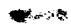

# Evaluation of Source Strengths $S_{0}$ and $S_{1}$

Since $D_{\gamma, \text{belt}} - D_{fp, \text{core}}$ can now be written as

$$
(1. 1 6 \times 1 0 ^ {- 4} S _ {0}) - (3. 0 5 \times 1 0 ^ {- 6} S _ {1}),
$$

the source strength $S_{0}$ and $S_{1}$ must be evaluated in terms of the gamma-ray dose rate. The source strength $S_{1}$ of the belt at the core hole is

$$
S _ {1} = \frac {P _ {B} n N}{A K}, \tag {12}
$$

where

$P_{B} =$ power of the belt (watts),

$n =$ number of fissions per second per watt $= 3.1\times 10^{10}$

$N =$ number of 2.7-Mev gamma rays emitted per fission $= 0.69,$

$A =$ exposed area of the belt $= 3970\mathrm{cm}^2$

$K = \text{flux-to-dose conversion factor for gamma rays of 2.7-Mev energy} = 2.45 \times 10^{2}$ (photons/cm $^{2}$ -sec per mr/hr).

Thus Eq. 12 becomes

$$
S _ {1} = 2. 2 \times 1 0 ^ {4} P _ {B} (m r / h r).
$$

The source strength $S_0$ for the center of the belt in the heat exchanger region is

$$
S _ {0} = \frac {L _ {1}}{L _ {2}} S _ {1}, \tag {13}
$$

where

$L_{1} =$ diameter of exposed area of belt $= 71\mathrm{cm}$

$L_{2} =$ total length of belt $= 400\mathrm{cm}$

Thus Eq. 13 becomes

$$
S _ {0} = 3. 9 1 \times 1 0 ^ {3} P _ {B} (\mathrm {m r / h r}).
$$

# Determination of the Power of the Fuel Belt

The power of the fuel belt $P_B$ was determined by comparing the fast-neutron dose rate (Fig. 13.3), the thermal-neutron flux (Fig. 13.4), and the sodium-activation curves for configuration 17 (no rotation) with the corresponding curves for a similar configuration (3-C) used in the static source tests with the old LTSF source plate. The ratio of the fast-neutron dose rates was found to be 1.65 and that for the thermal-neutron flux was 1.37. These two values, when averaged with the ratio of the sodium activations[2,8] (1.46), give a final average of 1.49. Thus, the power of the belt is 1.49 times the previously assumed effective LTSF source power of 2.1 w, or

$$
P _ {B} = 3. 1 \mathrm {w}.
$$

# Comparison of Measured and Calculated Gamma-Ray Dose Rates

The data accumulated above give

$$
D _ {\gamma , \text {b e l t}} = (1. 1 6 \times 1 0 ^ {- 4}) (3. 9 1 \times 1 0 ^ {3}) (3. 1) (\mathrm {m r} / \mathrm {h r}),
$$

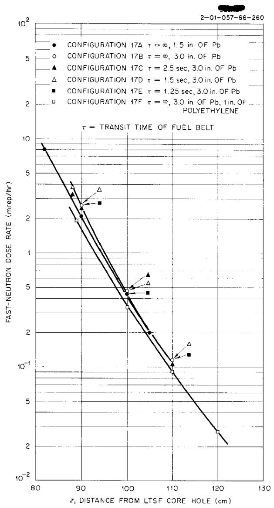  
Fig. 13.3. Fast-Neutron Dose Rates Beyond RMR-Shield Mockups with Dynamic Source.

$$
D _ {f p, \text {c o r e}} = (3. 0 5 \times 1 0 ^ {- 6}) (2. 2 \times 1 0 ^ {4}) (3. 1) (\mathrm {m r} / \mathrm {h r}).
$$

Thus the difference in the calculated values is

$$
D _ {\gamma , \text {b e l t}} - D _ {f p, \text {c o r e}} = 1. 1 8 \mathrm {m r} / \mathrm {h r}.
$$

The actual difference in the measured gamma-ray dose rates at $z = 130 \, \text{cm}$ ( $z$ is the distance from the core hole and $z = 130 \, \text{cm}$ corresponds to $T = 124 \, \text{cm}$ ), as may be seen from Fig. 13.5, is

$$
4. 5 5 - 3. 6 5 = 0. 9 \mathrm {m r} / \mathrm {h r},
$$

which is a factor of 1.3 less than the calculated value.

# Calculated Dose Rate Based on Fission-Product Gamma-Ray Spectrum

In order to check the calculations, a separate calculation was made for which the fission-product gamma-ray spectrum measured at the LTSF2 with the same rotating fuel belt system was used. A

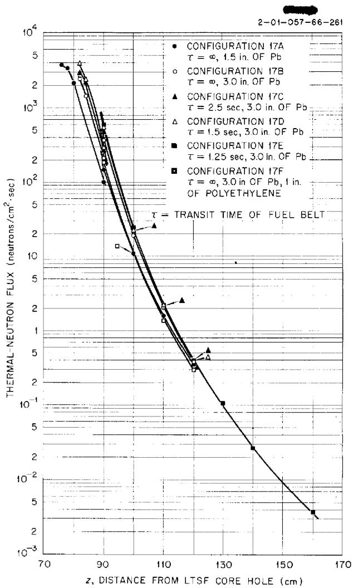  
Fig. 13.4. Thermal-Neutron Flux Beyond RMR-Shield Mockups with Dynamic Source.

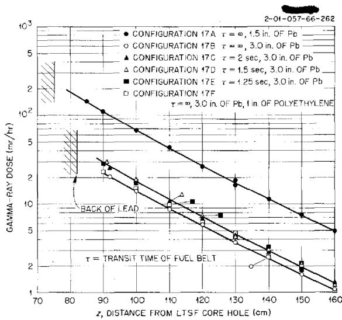  
Fig. 13.5. Gamma-Ray Dose Rate Beyond RMR-Shield Mockups with Dynamic Source.

numerical integration was carried out over the spectrum from 1 to 5 Mev. The contribution to the dose rate from gamma rays with energies outside this range is negligible, and, by neglecting it, only a very small error should be introduced. The method of calculating the gamma-ray attenuation in this case was the same as that used for the 2.7-Mev gamma rays. Attenuations for discrete energies of 1, 2, 3, 4, and 5 Mev were calculated. If the attenuation of the gamma-ray dose rate at a distance $z$ is represented as $A(E,z)$ , the total gamma-ray dose rate at some particular distance may be calculated as

$$
D (z) = C \int_ {1 M e v} ^ {5 M e v} \frac {N (E) A (E , z) d E}{K (E)}
$$

where

$N(E) =$ number of gamma rays of energy $E,$ as given by the fission-product-decay gamma-ray spectrum,2

$K(E) =$ flux-to-dose conversion factor for gamma-ray energy $E$

$C =$ constant related to the power per unit area of the belt.

The integrals for the dose rate both from fissionproduct gamma rays emitted in the heat exchanger

region (rotating belt) and from those emitted in the core region (no rotation) were evaluated by this method, and the difference between the two should be equivalent to the difference in the experimental gamma-ray dose rate with and without the belt rotating. The difference between these more exact integrations was actually $1.17\mathrm{mr / hr}$ , which was almost the same as the $1.18\mathrm{mr / hr}$ previously calculated on the basis of a single (2.7-Mev) gamma-ray energy and a slightly different spectrum.

# Discussion of Results

In order to resolve the $30\%$ discrepancy between the calculated and measured dose rates, it was necessary to investigate the assumptions involved in the calculation. The most obvious uncertainty was in the choice of a buildup factor through a multiregion shield. Since the dose buildup factors in lead and in water differ by a factor of 2, a considerable error could be introduced by using either one for the total number of mean free paths in the shield. The buildup factor for water for the specified number of mean free paths was used in all the calculations. It was thought that the total buildup would be more characteristic of the water, since about $50~\mathrm{cm}$ of water (2.15 mfp) followed the 3 in. of lead (3.6 mfp). However, some recent Monte Carlo calculations by S. Auslender[10] indicate that for 3-Mev gamma rays through 8 mfp of lead and water (4 mfp of lead followed by 4 mfp of water) the buildup factor is about $30\%$ lower than the buildup factor through the same number of mean free paths of water alone. Auslender's calculations indicate that a correction should be applied to the buildup factor that would reduce it to account for the presence of the lead. Such a correction would bring the calculations and the experimental results into closer agreement. Furthermore, if it were the choice of the water buildup factor alone that gave a calculated dose rate that was higher than the experimental dose rate, the discrepancy should decrease if more water were placed between the lead and the detector (or the point of calculation). This theory was tested with another calculation for a $z$ distance of $160~\mathrm{cm}$ , which would place about $3.4~\mathrm{mfp}$ of water behind $3.6~\mathrm{mfp}$ of lead. In this case the calculated gamma-ray

dose rate obtained by using a buildup factor characteristic of water alone was $0.26 \, \text{mr/hr}$ , which is only about $20\%$ higher than the experimental dose rate of $0.22 \, \text{mr/hr}$ .

Thus, since the gamma-ray dose from the fission products in the heat exchanger of a circulating-fuel reactor is only about 30 to $40\%$ of the total dose in the crew compartment, the error incurred by using the water buildup factor for the total number of mean free paths is not great for moderate lead thicknesses. Of course, as shown by these dynamic source experiments at the LTSF, it would be better to use buildup factors more characteristic of the lead and water combination in the shield.

In the experiment, the gamma-ray dose rate from fission-product gamma rays emitted in the heat exchanger region did not change (within the limits of experimental error) as the transit time was decreased from 2 to 1.25 sec (Fig. 13.5). This indicates that the fission-product gamma-ray spectrum did not change significantly, which substantiates the conclusions reported previously.

The thermal-neutron flux increased as the transit time of the belt decreased (Fig. 13.4). The increase was, of course, due to more of the delayed neutrons being emitted in the heat exchanger rather than in the core region. Since the average energy of the delayed neutrons is lower than the average energy of the prompt neutrons, the delayed

neutrons would, essentially, all have been lost in the shield if they had been emitted only in the core. However, when they were emitted in the heat exchanger, they penetrated the shield and added to the measured thermal-neutron flux. The maximum increase was about $50\%$ at the outer surface of the lead gamma-ray shield. This percentage decreased to about $10\%$ beyond about $20~\mathrm{cm}$ of water and to a negligible fraction beyond $50~\mathrm{cm}$ of water.

The discontinuity in the thermal-neutron flux curves at $z = 90$ cm is due to a change in instruments (from a 3-in. fission counter to a $12\frac{1}{2}$ -in. $BF_{3}$ counter) at this point. Although both instruments were normalized to the same value in plain water, the center of detection of the $12\frac{1}{2}$ -in. $BF_{3}$ counter moved toward the front of the chamber (to the left in $z$ ) as the slope of the resulting thermal-neutron flux became steeper. It is believed that this shift in the center of detection completely accounts for the difference in measurement by the two instruments.

The fast-neutron dose rate (Fig. 13.3) beyond $6\mathrm{cm}$ , or more, of water was independent of transit time, and hence the delayed neutrons did not contribute significantly to the fast-neutron dose rate. The 1 in. of polyethylene plastic inserted in the reflector region (configuration 17F) decreased the fast-neutron dose rate by 20 or $30\%$ .

# 14. BULK SHIELDING FACILITY

F. C. Maienschein

T. V. Blosser

E. B. Johnson

G. deSaussure

J. D. Kingston

G. Estabrook

T. A. Love

K. M. Henry

E. G. Silver

W. Zobel

Applied Nuclear Physics Division

A. T. Futterer, Pratt & Whitney Aircraft

# GAMMA-RAY STREAMING THROUGH THE NoK PIPES THAT PENETRATE THE ART SHIELD

T. V. Blosser

Preliminary calculations by the ORNL Shield Design Group have indicated that gamma-ray streaming through the NaK pipes that penetrate the ART shield would increase the dose rate in line with the pipes by a factor of roughly $2 \times 10^{3}$ for the original 7-in.-thick lead shield. For the currently planned 4.3-in.-thick lead shield the dose rate in line with the pipes would be only a factor of 40 more than it would be without the pipe penetrations. An experimental program has now been initiated to measure the dose rates in a mockup of the ART shield and NaK pipes and to determine the most effective pipe arrangement for reducing this high leakage.

The experiment will be performed in the aluminum thermal column tank atop the ORNL Graphite Reactor. The gamma-ray source, which will have a large energy spread, will consist largely of 4.5-Mev capture gamma rays from the thermal column graphite plus a spectrum of capture gamma rays (0.01 to 7 Mev) from a 0.040-in.-thick (12-in.-dia) cadmium disk placed in the bottom of the tank (Fig. 14.1). A 0.25-in.-thick boral plate, placed over the cadmium, which will cover the bottom of the tank, will prevent a background of capture gamma rays from originating in the lead shield and in the water; however, the boral will produce 0.5-Mev capture gamma rays in the source area. The boral capture gamma rays produced outside the source area will be sufficiently shielded by the 4.3 in. of lead and will not cause a disturbing background. There will be no appreciable attenuation by the boral of cadmium capture gamma rays.

The bottom of the aluminum tank will also produce a spectrum of capture gamma rays in the source area.

Various shield and pipe configurations will be inserted in a two-step square opening in the lead at the bottom of the tank. The steps of the opening will be about 2 in. high, the lower section being 12 in. square and the higher section 16 in. square. Aluminum powder $(\sim 0.8\mathrm{g/cm}^3)$ will be used to simulate the NaK in the pipes. The following configurations will be tested:

1. solid lead;   
2. 3.8-in.-dia pipe perpendicular to bottom-air-filled; aluminum-filled;   
3. 3.8-in.-dia pipe at a 45-deg angle to bottom - air-filled; aluminum-filled;   
4. ART mockup (Fig. 14.2).

The design of the support for the shield mockup has been completed, and the materials are on order.

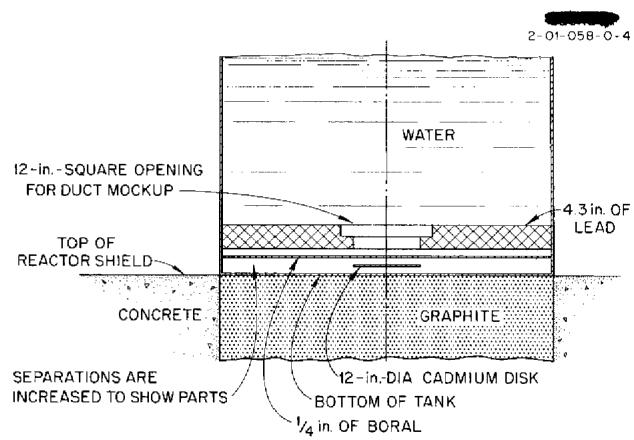  
Fig. 14.1. Thermal-Column Tank Arrangement for the ART Shield Mockup Experiment.

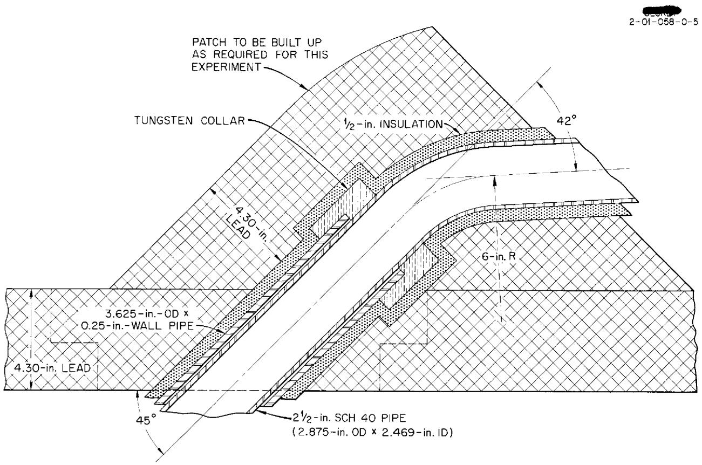  
Fig. 14.2. ART Shield and NaK Pipe Mockup Arrangement.

# DECAY OF FISSION-PRODUCT GAMMARADIATION

W.Zobel T.A.Love

R.W.Peelle

It was pointed out previously² that information about the decay characteristics and the photon energy spectrum of the fission products of U²³⁵ for short times after fission is essential in the design of an optimum shield for a circulating-fuel type of aircraft reactor. In such a reactor the fuel is circulated through a heat exchanger, located within the reactor shield, which thus constitutes a secondary source of radiation. Preliminary measurements of the time dependence³ of the fission-product gamma-ray mixture in the range from 5 to 150 sec, as well as some information on the

energy spectrum of the mixture, have already been reported. An extension of the first experiment to other time periods is reported here.

The equipment used was described previously.3 Samples of enriched uranium, which weighed about 2, 7, and $16\mathrm{mg}$ respectively, were irradiated in the ORNL Graphite Reactor for periods of 0.8 or 32 sec. Energy calibration of the multiple-crystal spectrometer was carried out in the usual fashion, with $\mathsf{Hg}^{203},\mathsf{Na}^{22},\mathsf{Zn}^{65},\mathsf{Na}^{24},\mathsf{F}^{20},\mathsf{Zr}^{90^{\star}},\mathsf{ThC}^{\prime \prime},$ and $\mathsf{N}^{16}$ sources. The time analyzer was calibrated by using a 60-cycle pulser. To determine the efficiency of the spectrometer as a function of photon energy, the absolute strengths of $\mathsf{Hg}^{203},$ $\mathsf{Na}^{22},\mathsf{Cs}^{137},\mathsf{Zn}^{65},$ and $\mathsf{Na}^{24}$ calibration sources were determined with the aid of the calibrated high-pressure ion chamber of the ORNL Radioisotopes Control Laboratory. A correction was applied to this efficiency to take into account the

peak-to-total ratio of the spectrometer. The correction factor is the inverse of the peak-to-total ratio.

The data were corrected for counting losses in the electronic equipment, a correction which in some cases amounts to as much as $25\%$ . Since, as before, energy groups were used and since the efficiency of the spectrometer varies considerably over a single group, the average efficiency for an energy group was determined by weighting with the energy spectrum determined in the experiment carried out at the LTSF. It is expected that this average efficiency is more correct than that used in the evaluation of the previously reported data, but it must be realized that, if subsequent experiments show a large variation of the spectrum with time, a renormalization of the data may be necessary.

The determination of the number of fissions occurring in a sample depends on the length of time the sample was in the reactor and on the thermal-neutron flux available. The error in the length of time amounts to at least $15\%$ . The effective thermal-neutron flux available, as well as the macroscopic cross section of the sample, was taken to be the same as in the previous experiment; that is, the value obtained by Moteff5 by using the gold-foil and cadmium-difference technique was used for the effective thermal-neutron flux, and thermal cross sections were used for gold and $\mathsf{U}^{235}$ .

The decay rate is shown in Fig. 14.3 as a function of time after fission for various energy ranges. It includes a re-evaluation of the previously reported data. Again, the energy group between 1.62 and 2.3 MeV was investigated both with the Compton (two-crystal) and the pair (three-crystal) spectrometer. It should be noted that the agreement between these curves is reasonable if the large statistical error associated with the pair-spectrometer data is considered.

Figure 14.4 is a cross plot of the data presented in Fig. 14.3, and shows the photon energy spectrum

as measured 1.5, 10, 100, and 1000 sec after fission. The results obtained by integrating the curves of Fig. 14.3 between 1.25 and 1600 sec are given in Table 14.1. The uncertainty in the total number of photons per fission and the energy per fission is probably about $\pm 25\%$ .

This work concludes the preliminary analysis of the first part of the investigation of fission-product gamma rays, that is, the detailed time behavior of relatively large energy groups of fission-product gamma rays. The next phase of the experiment will concern the detailed energy spectra at certain time intervals after fission. As was mentioned above, this phase may have an influence on the phase just concluded through the weighting factor used for the efficiency. It is expected that after the conclusion of this second phase of the experiment a more detailed report will be prepared that will cover the entire investigation on fission-product gamma rays. It is hoped that an expression relating the gamma-ray flux to the energy of the emitted gamma rays and the time after fission can be included in the report that will make possible calculations of the flux for any energy and time.

TABLE 14.1. MEASURED VALUES OF PHOTON INTENSITY PER FISSION AND TOTAL ENERGY RELEASE PER FISSION INTEGRATED BETWEEN 1.25 AND 1600 sec AFTER FISSION  

<table><tr><td>Energy Range</td><td>Photons per Fission</td><td>Energy per Fission (Mev)</td></tr><tr><td colspan="3">Compton Spectrometer</td></tr><tr><td>0.28–0.51</td><td>0.696</td><td>0.275</td></tr><tr><td>0.51–1.12</td><td>1.103</td><td>0.894</td></tr><tr><td>1.12–1.62</td><td>0.428</td><td>0.586</td></tr><tr><td>1.62–2.31</td><td>0.210</td><td>0.412</td></tr><tr><td colspan="3">Pair Spectrometer</td></tr><tr><td>(1.62–2.31)</td><td>(0.197)*</td><td>(0.385)*</td></tr><tr><td>2.3–3.5</td><td>0.178</td><td>0.515</td></tr><tr><td>3.5–5.0</td><td>0.038</td><td>0.057</td></tr><tr><td>Total</td><td>2.67</td><td>2.92</td></tr></table>

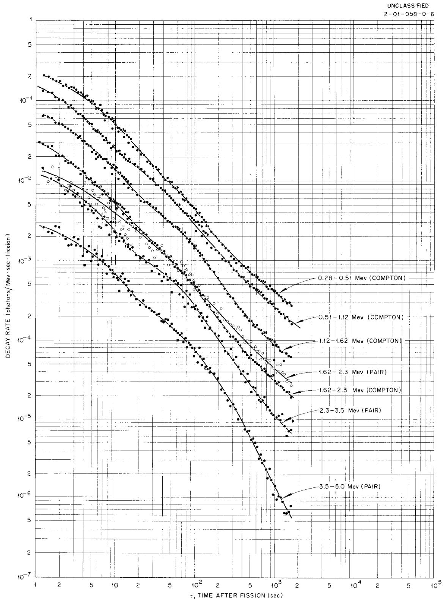  
Fig. 14.3. Fission-Product Gamma-Ray Decay Rates as a Function of Time After Fission for Six Photon Energy Groups.

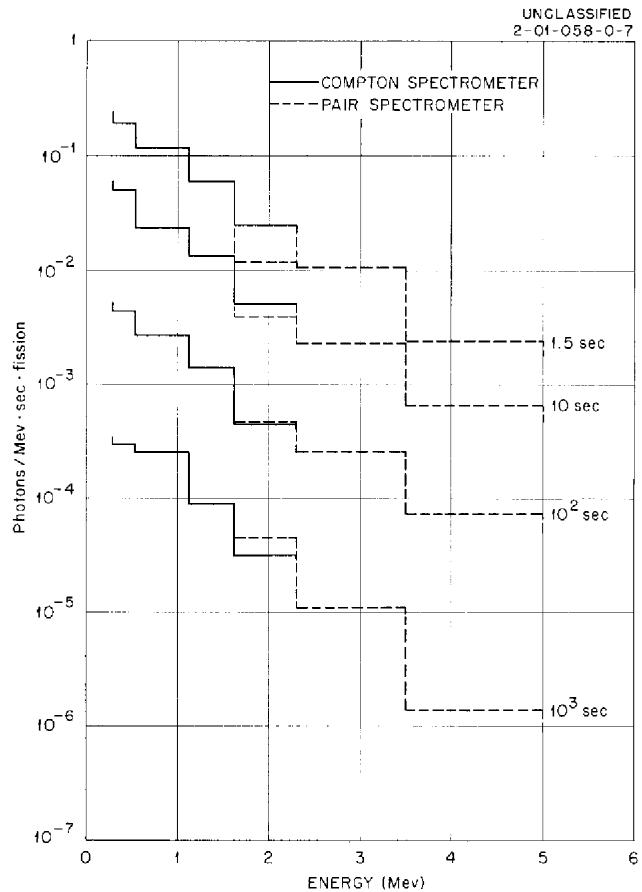  
Fig. 14.4. Histogram of the Fission-Product Photon Energy Spectrum for 1.5, 10, 100, and 1000 sec After Fission.

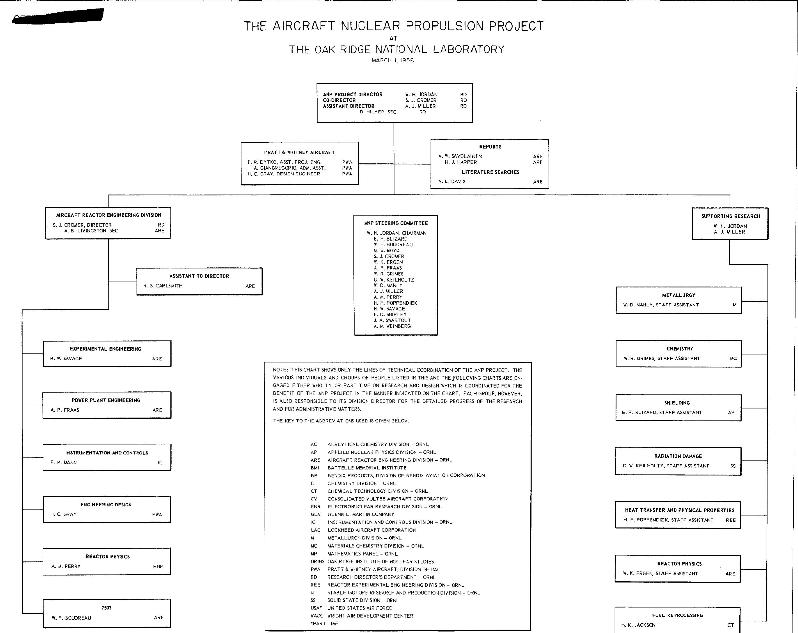

# THE AIRCRAFT NUCLEAR PROPULSION PROJECT

AT

# THE OAK RIDGE NATIONAL LABORATORY

MARCH 1,1956

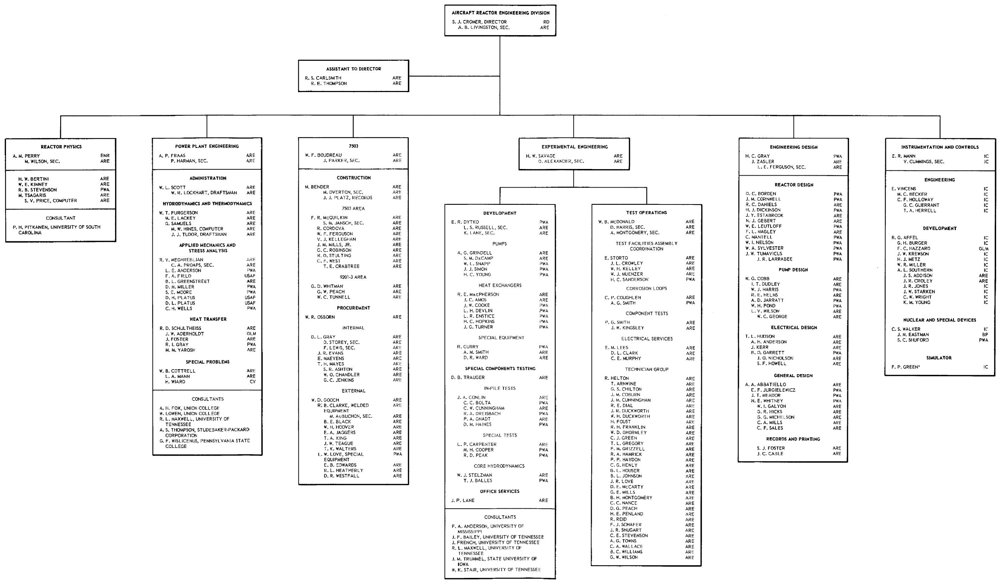

# THE AIRCRAFT NUCLEAR PROPULSION PROJECT

# AT THE OAK RIDGE NATIONAL LABORATORY

MARCH 1, 1956

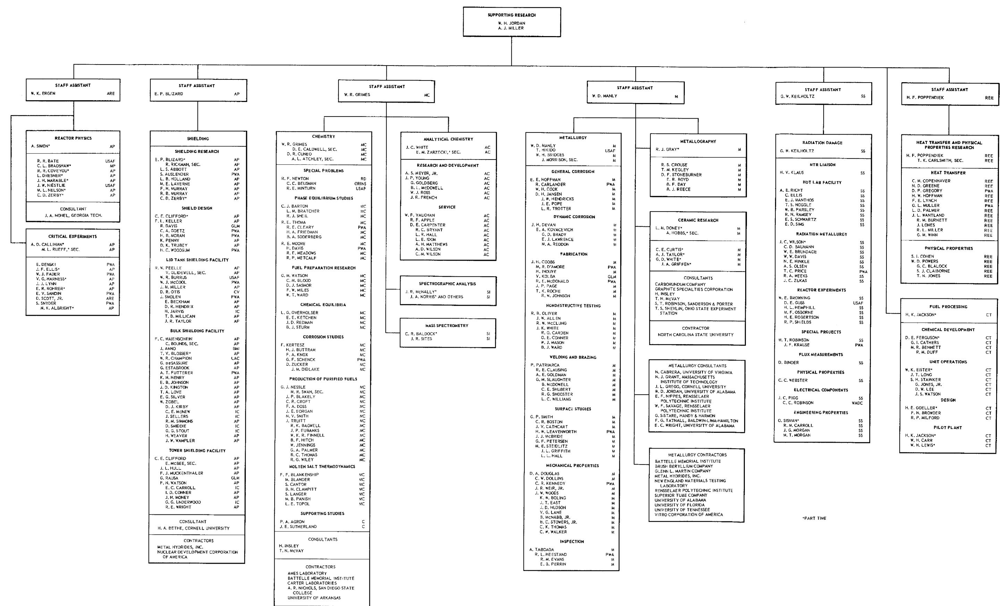

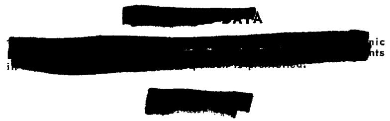