ORNL-2095

C-85 - Reactors-Aircraft Nuclear Propulsion Systems

This document consists of 198 pages.

Copy of 300 copies. Series A.

AIRCRAFT REACTOR ENGINEERING DIVISION

# DESIGN REPORT ON THE AIRCRAFT REACTOR TEST

A. P. Fraas and A. W. Savolainen

May 1956

DATE ISSUED

DEC 21 1956

nneaeaeae

y

OAK RIDGE NATIONAL LABORATORY

Operated by

UNION CARBIDE NUCLEAR COMPANY

A Division of Union Carbide and Carbon Corporation

Post Office Box X

Oak Ridge, Tennessee

RESTRICTED DATA

This document contains Restricted Data as defined in the Atomic Energy Act of 1954. Its transmitting or the disclosure of its contents in any manner to an unauthorized person is prohibited.

# INTERNAL DISTRIBUTION

1. A. A. Abattiello   
2. R. G. Affel   
3. J. C. Amos   
4. B. B. Bachulis   
5. C. J. Barton   
6. S. E. Beale   
7. M. Bender   
8. H.W. Bertini   
9. D. S. Billington   
10. F. F. Blankenship   
11. E.P. Wizard   
12. A. L. Boch   
13. C. J. Borkowski   
14. W. F. Boudreau   
15. G.E. Boyd   
16. M. A. Bredig   
17. E. J. Breeding   
18. R. B. Briggs   
19. W. E. Browning   
20. F. R. Bruce   
21. A. D. Callihan   
22. D.W.Cardwell   
23. R. S. Carlsmith   
24. L. P. Carpenter   
25. C. E. Center (K-25)   
26. R. A. Charpie   
27. R. B. Clarke   
28. C. E. Clifford   
29. W.G. Cobb   
30. J. A. Conlin   
31. J.H. Coobs   
32. W. B. Cottrell   
33. D. D. Cowen   
34. G. A. Cristy   
35. S. J. Cromer   
36. R.S.Crouse   
37. F. L. Culler   
38. C.W. Cunningham   
39. R. Curry   
40. S. M. DeCamp   
41. J.H. Devan   
42. L. M. Doney   
43. D. A. Douglas   
44. E. R. Dytko   
45. W. K. Eister   
46. L. B. Emiet (K-25)

47. W. K. Ergen   
48. D. E. Ferguson   
49. J. Foster   
50. A. P. Fraos   
51. J.H.Frye   
52. W. T. Furgerson   
53. D. L. Gray   
54. R. J. Gray   
55. B. L. Greenstreet   
56. W. R. Grimes   
57. A. G. Grindell   
58. R. L. Heestand   
59. R. Helton   
60. E.E.Hoffman   
61. H.W. Hoffman   
62. A. Hollander   
63. L. B. Holland   
64. A. S. Householder   
65. J. T. Howe   
66. T. L. Hudson   
67. W. H. Jordan   
68. G.W. Keilholtz   
69.C.P.Keim   
70. F. L. Keller   
71. M. T. Kelley   
72. F. Kertesz   
73. J. J. Keyes   
74. E.M. King   
75. M. E. Lackey   
76. J. A. Lane   
77. E.M. Lees   
78. R. B. Lindauer   
79. R. S. Livingston   
80. R.N. Lyon   
81. F. C. Maienschein   
82. W. D. Manly   
83. E. R. Mann   
84. L. A. Mann   
85. W. B. McDonald   
86. R.E. McPherson   
87. F. R. McQuilkin   
88. R.V. Meghreblian   
89. R.P. Milford   
90. A. J. Miller   
91. R.E.Moore   
92. J. G. Morgan

# SECRET

93. K. Z. Morgan

94. J. P. Murray (Y-12)

95. M. L. Nelson

96. G. J. Nessle

97. R. F. Newton

98. R. B. Oliver

99. W. R. Osborn

100. L. G. Overholser

101. P. Patriarca

102. R.W. Peelle

103. A. M. Perry

104. J. C. Pigg

105. H. F. Poppendiek

106. P. M. Reyling

107. A. E. Richt

108. M. T. Robinson

109. G. Samuels

110. H.W.Savage

III. A. W. Savolainen

112. R. D. Schultheiss

113. W. L. Scott

114. E. D. Shipley

115. A. Simon

116. O. Sisman

117. J. Sites

118. M. J. Skinner

119. G. M. Slaughter

120. G.P. Smith

121. P.G. Smith

122. A. H. Sneli

123. A. L. Southern

124. W. J. Stelzman

125. E. Storto

126. C. D. Susano

127. J. A. Swartout

128. A. Taboada

129. E. H. Taylor

130. R.E. Thoma

131. D. B. Trauger

132. E. R. Van Artsdalen

133. E. Vincens

134. C. S. Walker

135. D. R. Ward

136. G.M. Watson

137. A. M. Weinberg

138. J. C. White

139. G. D. Whitman

140. E. P. Wigner (consultant)

141. G.C. Williams

142. J. C. Wilson

143. C. E. Winters

144. M. M. Yarosh

145. J. Zasler

146. C. D. Zerby

147-156. ORNL - Y-12 Technical Library Document Reference Section

157-189. Laboratory Records Department

190. Laboratory Records, ORNL R.C.

191-193. Central Research Library

# EXTERNAL DISTRIBUTION

194. AF Plant Representative, Baltimore   
195. AF Plant Representative, Burbank   
196. AF Plant Representative, Marietta

197-199. AF Plant Representative, Santa Monica

200-201. AF Plant Representative, Seattle

202. AF Plant Representative, Wood-Ridge   
203. Air Research and Development Command (RDGN)   
204. Air Technical Intelligence Center   
205. Air University Library   
206. Allison Division

207-209. ANP Project Office, Fort Worth

210. Argonne National Laboratory   
211. Armed Forces Special Weapons Project, Sandia   
212. Armed Forces Special Weapons Project, Washington   
213. Assistant Secretary of the Air Force, R&D

214-219. Atomic Energy Commission, Washington

220. Bureau of Aeronautics

# SECRET

221. Bureau of Aeronautics General Representative   
222. Chicago Operations Office   
223. Chicago Patent Group   
224. Chief of Naval Research   
225. Convair-General Dynamics Corporation

226-229. General Electric Company (ANPD)

230. Hartford Area Office   
231. Headquarters, Air Force Special Weapons Center   
232. Idaho Operations Office   
233. Lockland Area Office   
234. Los Alamos Scientific Laboratory   
235. National Advisory Committee for Aeronautics, Cleveland   
236. National Advisory Committee for Aeronautics, Washington   
237. Naval Air Development and Material Center   
238. Naval Research Laboratory   
239. North American Aviation, Inc. (Aerophysics Division)   
240. Nuclear Development Corporation of America   
241. Office of the Chief of Naval Operations (OP-361)   
242. Patent Branch, Washington

243-267. Pratt & Whitney Aircraft Division (Fox Project)

268. Sandia Corporation   
269. School of Aviation Medicine   
270. USAF Project RAND   
271. University of California Radiation Laboratory, Livermore

272-289. Wright Air Development Center (WCOSI-3)

290-299. Technical Information Service Extension, Oak Ridge

300. Division of Research and Development, AEC, ORO

# FOREWORD

The Aircraft Reactor Test (ART) program was launched early in 1954. The reasoning and experiments that led first to the choice of the circulating-fluoride-fuel reactor concept and then to the reflector-moderated reactor configuration have been presented in previous documents. These include a presentation by R. C. Briant to the USAF Advisory Committee, outlining the objective and status of the ORNL-ANP Program (ORNL report CF-53-2-126), summaries of the preliminary design work on the Aircraft Reactor Experiment (ARE) (ORNL-1234) and the operation of the ARE (ORNL-1845), and a comprehensive summary of ORNL-ANP aircraft power plant designs up to May 1954 (ORNL-1721). The preliminary layout of the ART and facility was given in the ART hazards report (ORNL-1875) and in the ANP Project Quarterly Progress Report for the Period Ending December 10, 1954 (ORNL-1816).

The information compiled in this design report is intended to present a fairly detailed picture of the ART design as of its approaching completion. It is expected that the design as defined in this report will be changed somewhat as information is derived from component test experience, further analytical work, or fabricational problems.

# ACKNOWLEDGMENTS

Most of the material presented here has appeared previously in quarterly progress reports, special ARE and ART reports, or ART design memorandums and data sheets. The work of all members of the ANP staff is therefore represented here, and their contributions are thus acknowledged.

# SECRET

# CONTENTS

# PARTI

# DESIGN CRITERIA 3

Military Requirements 3

Reactor Design Criteria 3

The Circulating-Fuel Reflector-Moderated Reactor 4

# PART II

# THE ART ASSEMBLY 9

The Reactor Assembly 9

Reactor Dimensions 9

Reflector-Moderator 25

Fuel System 25

Core Hydrodynamics 25

Pumps and Expansion Tank 29

Fill-and-Drain System (Including Enricher) 32

Sampling System 35

Fuel Recovery System 35

Heat Exchanger and Heat Dumps 35

Off-Gas System 38

Aircraft-Type Shield 39

Controls and Instrumentation 40

Auxiliary Systems 41

Helium Supply 41

Nitrogen Supply System 41

Electrical Power System, Distribution, and Auxiliary Equipment 42

Fuel and Sodium Pump Lubricating and Cooling Oil Systems 42

Process Water System 42

The Facility 43

The Building 43

The Reactor Assembly Cell 43

The Shielding Experiment Facility 47

# PART III

# DESIGN AND DEVELOPMENT STUDIES 51

Fuel Development 51

Structural Material 52

Corrosion of Structural Materials 52

Radiation Effects on Structural Materials 55

Structural Design Analyses 56

The Reactor 56

Auxiliary Components 61

# SECRET

# SECRET

Radiation Heating on the ART Equatorial Plane in the Vicinity of the Fuel-to-NaK Heat Exchanger 64

Radiation Heating in Various Regions of the North Head 67

Beta- and Gamma-Ray Activity in the Fuel-Expansion Chamber and the Off-Gas System 68

# PART IV

ENGINEERING TEST UNIT 75

Specific Test Objectives 75

Warmup and Shakedown Testing 76

76

Reactor Assembly 76

Reactor Disassembly 81

# PART V

CONSTRUCTION AND OPERATION 85

Plans for Installation of the ART 85

Operation of the ART 85

Filling and Heating 85

Enriching to Critical 86

Low-Power-Level Experiments 87

Operation at Power 88

Plans for Disassembly 89

# PART VI

STATUS OF DESIGN AND DEVELOPMENT 99

# APPENDIX A

FLOWDIagrams 107

# APPENDIX B

PHOTOPRACHS OF REACTOR MODELS AND STAGES IN THE CONSTRUCTION OF THE ART FACILITY 137

BIBLIOGRAPHY 173

LIST OF ILLUSTRATIONS   

<table><tr><td>Figure No.</td><td>Title</td><td>Page</td></tr><tr><td>1</td><td>Vertical Section Through Reactor Assembly</td><td>10</td></tr><tr><td>2</td><td>Horizontal Section Through Fuel Pump-Expansion Tank Region</td><td>16</td></tr><tr><td>3</td><td>Horizontal Section Through Sodium Pumps</td><td>17</td></tr><tr><td>4</td><td>Vertical Section Through Lead-Water Shield</td><td>18</td></tr><tr><td>5</td><td>Effect of Reactor Dimensions on Concentration of U235 in Fuel</td><td>19</td></tr><tr><td>6</td><td>Effect of Reactor Dimensions and External Fuel Volume on Total U235 Investment</td><td>20</td></tr><tr><td>7</td><td>Effect of Reactor Dimensions on Outside Peak-to-Average Power-Density Ratio in Core of Reflector-Moderated Reactor</td><td>21</td></tr><tr><td>8</td><td>Effect of Reactor Dimensions on Percentage of Fissions Caused by Thermal Neutrons</td><td>21</td></tr><tr><td>9</td><td>Partially Assembled Island Showing the Lower Half of the Inconel Core Shell and the Upper Half of the Beryllium Reflector for the High-Temperature Critical Assembly</td><td>21</td></tr><tr><td>10</td><td>Outer Core Shell and Partially Assembled Beryllium Reflector of the High-Temperature Critical Assembly</td><td>23</td></tr><tr><td>11</td><td>Completed High-Temperature Critical Assembly of the Reflector-Moderated Circulating-Fuel Reactor</td><td>24</td></tr><tr><td>12</td><td>Core Layout</td><td>27</td></tr><tr><td>13</td><td>Diagram of Core Flow System Showing Relations Between the Inlet Headers, Inlet Guide Vanes, and Core</td><td>29</td></tr><tr><td>14</td><td>Section Through Fuel Pump-Expansion Tank Region Showing Xenon-Removal System of the Fuel Pump</td><td>33</td></tr><tr><td>15</td><td>Schematic Diagram of Fuel Fill-and-Drain System, Including Enricher</td><td>34</td></tr><tr><td>16</td><td>Fuel Fill-and-Drain Tank Cooling System</td><td>35</td></tr><tr><td>17</td><td>Model of Main Fuel-to-NaK Heat Exchanger Channel</td><td>37</td></tr><tr><td>18</td><td>Prototype ART NaK-to-Air Radiator</td><td>38</td></tr><tr><td>19</td><td>Plan of the ART Building</td><td>44</td></tr><tr><td>20</td><td>Section of the ART Building</td><td>45</td></tr><tr><td>21</td><td>Reactor Assembly Cell</td><td>46</td></tr><tr><td>22</td><td>ART Shielding Experiment Facility</td><td>48</td></tr><tr><td>23</td><td>Pressure Load Distributions at Full Power</td><td>58</td></tr><tr><td>24</td><td>Conditions for Thermal Cycling Tests of One-Fourth-Scale Model of ART Core Shell in Comparison with ART Thermal-Cycling Conditions</td><td>60</td></tr><tr><td>25</td><td>ART Support Structure</td><td>62</td></tr><tr><td>26</td><td>Movement of Reactor Due to Expansion of NaK Lines</td><td>62</td></tr><tr><td>27</td><td>Layout of NaK Piping in Reactor Cell</td><td>63</td></tr><tr><td>28</td><td>NaK-to-Air Radiator, NaK Pump, and NaK Piping External to Cell</td><td>64</td></tr><tr><td>29</td><td>Fuel Fill-and-Drain Tank Support</td><td>65</td></tr></table>

# SECRET

Figure No. Title Page

30 Gamma-Ray Heating in the Vicinity of the Fuel-to-NaK Heat Exchanger 66 on the Equatorial Plane of the ART   
31 Heating in Copper-Boron Layer by Alpha Particles from the $\mathsf{B}^{10}(n,\alpha)\mathsf{Li}^7$ Reaction 68   
32 Configuration of ART North Head Showing Members Referred to in Table 9   
33 Total Power and Power Density in the Gas Space of the ART as a Function of the Gas Volume and the Helium Flow Rate for a Fuel Flow Rate of 22 gpm   
34 Power Density in the Off-Gas Line as a Function of Time and Gas Volume in the Expansion Tank for a Fuel Flow Rate of 22 gpm   
35 North-Head Weldability Model Showing Lower Deck and Peripheral Ring, Step 1   
36 North-Head Weidability Model, Step 2 78   
37 North-Head Weldability Model, Step 3 79   
38 North-Head Weldability Model, Step 4 79   
39 North-Head Weldability Model, Step 5 80   
40 North-Head Weldability Model, Step 6 80   
41 North-Head Weldability Model, Showing Another View of Step 6 81

# APPENDIX A

Flow Diagram

Fuel Fill-and-Drain, Enriching, Sampling, and Recovery Systems 109   
2 Sodium System 111   
3 Off-Gas System 113   
4 CellPumps Hydraulic Drive Systems 115   
5 Reactor Pumps Lube Oil System 117   
6 Main, Auxiliary, and Special NaK Systems 119   
7 NaKPumps Lube Oil System 125   
8 Process Air System 127   
9 Helium System 129   
0 Nitrogen System 131   
1 Compressed Air System 133   
2 Process Water System 135

# APPENDIX B

Figure No. Title Page

B.1-B.6 Photographs of Reactor Models 139-144   
B.7-B.33 Photographs of Stages in the Construction of the ART Facility 145-171

Part I

DESIGN CRITERIA

# MILITARY REQUIREMENTS

Studies made by Air Force contractors have indicated that aircraft for missions involving strategic bombing should be capable of operation at sea level and a speed of approximately Mach 0.9, or at 55,000 ft (or higher) at Mach 2.0 (or higher), or above 85,000 ft at about Mach 0.9. An airplane of unlimited range that could fly any one or, even better, two or more of the possible strategic missions would be extremely valuable if it became available in the 1965 to 1970 era. In addition to the strategic bomber application there are requirements for lower speed (Mach 0.4 to 0.9), manned, nuclear-powered airplanes, such as radar picket ships and patrol bombers. The problems associated with supplying a beachhead a substantial distance from the nearest advanced base indicate that a logistics-carrier airplane of unlimited range would also be of considerable value. The strategic-bombing missions for manned aircraft with shielded reactors have been deemed to be of such crucial importance as to more than justify the development cost of the nuclear power plant.

A nuclear power plant of sufficiently high performance to provide the power required for the most stringent operating conditions would be able to take care of any of the other manned-airplane requirements. Design studies have indicated that nuclear power plants capable of producing from 100 to $300\mathrm{Mw}$ will be required. The 60-Mw Aircraft Reactor Test (ART) is a logical and expeditious intermediate step in the production of the required high-power reactors and should give a reactor that will be capable of providing sufficient power to operate a radar picket ship, patrol bomber, or logistics carrier. A reactor power of $60\mathrm{Mw}$ was selected because it is approximately the power that must be reached for an investigation to be made of the engineering problems that must be solved and for disclosure of the operating characteristics to be expected of the higher powered reactors required for high-altitude supersonic strategic bombers. The size and weight of the reactor and shield will conform with aircraft requirements, and, insofar as was possible in the limited time available, the design of the important components has been based on concepts satisfactory for airborne application.

# REACTOR DESIGN CRITERIA

The general requirements followed by the ORNL-ANP project personnel have been consistent with those for aircraft reactors set forth by the Technical Advisory Board. The Board stated that the reactor must have a power output of several hundred megawatts, that it must heat air to temperatures in excess of $1100^{\circ}\mathrm{F}$ , and that the reactor core must occupy a space not exceeding a few feet in linear dimensions. The choice of materials must be limited, of course, to those with desirable nuclear properties. It was taken into consideration that the reactor structure must be able to withstand considerable accelerations or shocks without large misalignments or changes in reactivity resulting. A reactor with a mechanically simple, rugged core would thus present a considerable advantage. The only compensating factor in the stringent requirements was considered to be the short lifetime over which the reactor must operate - 500 to 1000 hr.

The uranium investment per reactor was expected to be a limiting factor in the size of the air fleet, and therefore the uranium content was to be as low as possible. Shortening the reprocessing times was expected to be of major value in lessening the uranium inventory required to maintain an air fleet. Overriding the xenon effect after a prolonged shutdown or a radical reduction in power level was expected to be difficult for reactors with high specific power. However, for some reactors, such as the homogeneous reactor, the xenon would be removed shortly after formation and thus would present no problem.

One major problem was considered to be the construction of control mechanisms (and, to a lesser degree, sensing instruments) for reliable operation that would respond rapidly and not require undue extension of the shielded volume. It was believed that a liquid-fuel reactor with a strong negative temperature coefficient of reactivity would be self-stabilizing and would thus require a minimum of control.

With regard to the vulnerability and safety of the nuclear-powered airplane it was recommended that the reactor be isolated from engine failure by an

intermediate fluid system. For a high-temperature, high-power-density reactor in an airplane, loss of the coolant or loss of circulation of the coolant would cause rapid overheating. Thus a system in which the heat of the primary coolant was transmitted to the engines through an intermediate heat exchanger would be advantageous. Also, by locating the intermediate heat exchanger in a protected position, probably in the shield, it would be possible to have short, protected flow lines for the primary fluid. The secondary lines to the engines could then be independent of each other. Special provisions would have to be made to take care of afterheat from fission products after shutdown.

# THE CIRCULATING-FUEL REFLECTOR-MODERATED REACTOR

The circulating-fuel reflector-moderated reactor was designed to meet the criteria described. The use of circulating fused fluoride salts for the fuel carrier and heat transfer medium has the important advantage of eliminating the heat transfer stage required in solid-fuel-element reactors within the reactor core and with it a complex, delicate matrix of heat transfer surfaces. With the fuel as the primary heat transfer medium, it has been possible to wrap the intermediate heat exchanger around the spherical reflector-moderator and thus to keep the heat exchanger within a relatively small shielded volume. The activation of the secondary coolant, NaK, poses problems in ground handling and maintenance that are offset by the size and weight advantages of the circulating-fuel design.

The primary control mechanism of this type of reactor is the strong, negative temperature coefficient. Since it will be possible, by scrubbing the fuel with helium in the pump expansion tank, to remove the xenon that is produced, it will not be necessary to make provision for overriding the xenon after a shutdown.

Although the circulating-fuel reactor has a somewhat larger uranium investment in the operating reactor than some proposed aircraft reactors have, if allowances are made for the inventory in spare fuel elements and in the reprocessing plant, the total investment per airplane can be lower for the circulating-fuel reactor than for most other types of reactors. In addition, it will be much easier to replace the liquid fuel than to change the solid fuel elements. Especially shielded or remotely controlled ground-handling facilities will be required only for the fuel filling and draining operations.

tions. The reprocessing of the liquid fuel will be much simpler and faster than the reprocessing and refabrication of solid fuel elements, and the shorter reprocessing time will, of course, lower the uranium investment.

Operation of the Aircraft Reactor Experiment (ARE) demonstrated that a high-temperature circulating-fuel reactor could be built and operated and that the materials and machinery which had been developed for operation at elevated temperatures were satisfactory. It showed that the predicted large negative temperature coefficient of reactivity and the resultant self-regulatory characteristics of the reactor could be achieved. The ARE and other successful experiments have thus indicated the high probability that aircraft nuclear power plants employing circulating-fuel reactors can be developed for military application.

A careful analysis of the multitubular coremoderated reactor configuration typified by the ARE disclosed a number of serious problems. The high power densities necessary in a full-scale aircraft reactor (1 to 5 kw per cubic centimeter of core) give severe gamma and neutron heating conditions in the moderating material and hence large thermal stresses. It was felt that cracking and spalling of a brittle material such as the beryllium oxide used as the ARE moderator could be expected and that designing to allow for this would be exceedingly awkward. The weight and drag penalties associated with the use of a low-temperature moderator such as water would be excessive. Extensive corrosion tests with hydroxides at reasonable temperatures, that is, $1200^{\circ}\mathrm{F}$ , had shown that none of the hydroxides would be satisfactory. Too little was known about the hydrides for them to be used as the basis for a design. A reactor constructed of graphite was too large, and hence the shield was too heavy. The only moderator-region materials combination that seemed to be compatible with the fluoride fuel-Inconel system was sodium-cooled beryllium.

The various detailed designs that were evolved in the effort to incorporate these materials in a multitubular core fall into two groups. The first group of designs was based on the use of a heavy header sheet across the outlet face of the core to carry the fluid pressure loads associated with both the sodium and the fuel pressure drops. A light header sheet was to be used across the inlet face

that would be sufficiently flexible to accommodate differential thermal expansion between the parallel fuel tubes and between the core inlet and outlet passage shrouds. The beryllium would be in the form of hexagonal blocks, as in the ARE, and would be spaced relative to the tubes by spiral wire spacers to ensure the proper sodium-flow-passage thickness. The principal disadvantages of this design approach were the severe thermal and pressure stresses in the outlet header sheet (which would be at a high temperature) and the severe pressure stresses in the inlet header sheet under off-design conditions (e.g., one pump out) if the sheet were made thin enough to accommodate the requisite amount of differential thermal expansion. Possibly less serious disadvantages included a tendency of the fuel tubes to be bent by the beryllium under the lateral accelerations to be expected in flight.

In an effort to evolve an arrangement with greater promise, a second series of designs was prepared that was based on large disks of beryllium being placed normal to the tube axes. These disks were designed to carry the loads induced by the fuel and the sodium pressure drops. To ensure the proper sodium flow distribution, the spacing between the fuel tubes and the beryllium was again accomplished by spiral wire spacers. Moderately thick header sheets were employed, with provision for both transverse and axial differential thermal expansion at the outlet end. This latter feature presented a major problem, and, to date, no really sound detail design has been worked out to accommodate both the differential expansion between the beryllium and the header sheet and at the same time take the pressure loads imposed by off-design conditions.

Multigroup calculations made concurrently with the above design studies indicated that it was advantageous to lump the fuel heavily to minimize the amount of structural material in the reactor. Concurrent shielding studies showed that about 12 in. of good neutron shielding followed by a layer of boron was required between the core and the heat exchanger to keep the activation of a fluid such as NaK from becoming excessive. Pursuance of these design precepts yielded a reflector-moderated configuration which gave not only a lower shield weight than had been obtained with any configuration previously devised but also

a lower fuel concentration than could be obtained from a multitubular core having the same core diameter, according to multigroup calculations made at the time. Even more important, these calculations indicated that the reflector-moderated core design gave both the lowest average and the lowest peak power density in the fuel for a given core diameter of any core design studied.

The volume heat source in the circulating fuel presents a set of problems having no previous technological parallel. The fuel temperature in stagnant regions tends to rise rapidly, and it can easily reach excessive values if the hydrodynamic design is not satisfactory. Analytical solutions for a few simple geometries, such as fully developed flow in a straight tube, have been worked out, and tests have validated the analytical solutions. More complex geometries, such as those represented by the reflector-moderated reactor, can be analyzed with assurance only by means of experimental techniques. Thus a multitubular reactor core design offers a major advantage in that it is more amenable to analysis, although it would be likely to present header flow passage design problems at the inlet and outlet.

A careful appraisal of the many different factors involved led finally to the choice of the reflector-moderated type of core because it appeared to give the lightest shield for a given power density and fuel concentration in the fuel, as well as a configuration relatively free of stress concentrations in the core structure. Although the actual fabrication and assembly of the concentric configuration of the core of the reflector-moderated reactor present some exceedingly difficult problems, it is felt that they are no more difficult than the problems that would be encountered in a well-designed multitubular-core reactor. Thus, after reviewing all the various considerations, it was decided in 1954 that the reflector-moderated core should be adopted as the basis for the ART design.

The objectives of building and operating the ART are the investigation of the methods of construction and the estimated performance characteristics of such a reflector-moderated circulating-fuel reactor. An operating life of 500 hr at or near 60 Mw is considered to be a desirable goal. The information gained from the test will provide a sound basis for the design of full-scale aircraft reactors.

#

，

#

.

#

.

#

Part II

THE ART ASSEMBLY

#

# THE REACTOR ASSEMBLY

The reactor and shield assembly will consist of the core, the beryllium island, the beryllium reflector-moderator, the pressure shell, the fuel system (including the fuel pumps and the xenon-removal system), the fuel-to-NaK heat exchanger, the reflector-moderator cooling system, the control system, and the aircraft-type shield. The reactor (Fig. 1) comprises a series of concentric shells, each of which is a surface of revolution about the vertical axis. The two inner shells surround the fuel region at the center (that is, the core of the reactor) and separate it from the beryllium island and the outer beryllium reflector. The fuel circulates downward through the bulbous region where the fissioning takes place and then downward and outward to the entrance of the spherical-shell fuel-to-NaK heat exchanger that lies between the reflector outer shell and the main pressure shell. The fuel flows upward between the tubes in the heat exchanger into two centrifugal sump-type fuel pumps at the top. From the pumps it is discharged inward to the top of the annular passage leading to the reactor core. The fuel pumps are located in the expansion tank region at the top of the reactor. A horizontal section through this region is shown in Fig. 2.

The reflector-moderator is cooled by sodium which flows downward through spaces between the core shells and the beryllium and through passages in the beryllium and back upward through the annular spaces between the beryllium and the enclosing shells and between the pressure shell and the pressure shell liner. Two sump-type centrifugal pumps at the top of the reactor circulate the sodium first through the reflector-moderator and the island and then through the small toroidal sodium-to-NoK heat exchangers around the periphery of the pump-expansion tank region. A horizontal section through this region is shown in Fig. 3.

The Inconel pressure shell constitutes both the main structure of the reactor and a compact container for the fuel circuit. The pressure shell encloses a liner composed of another Inconel shell, a layer of boron carbide to remove thermal neutrons, and an inner Inconel can. Heat generated in the pressure shell by the absorption of gamma rays from the fuel will be removed by sodium flowing upward from the bottom of the island between the outer surface of the liner and the inner surface of

the pressure shell. Passages at the top of the reactor will direct the sodium from the outer surface of the pressure shell to the sodium-to-NoK heat exchanger inlets. The pressure shell is separated by thermal insulation from the gamma-ray shield, which is a layer of lead. The lead, in turn, is surrounded by a region of borated water. A vertical section through the lead-water shield is shown in Fig. 4.

Data that give materials and operating characteristics of the ART are presented in Table 1, except for the system flow and pump data, which are given in Table 2. Key data on dimensions are given in Table 3.

# REACTOR DIMENSIONS

The dimensions of the reactor core were established by calculations and by critical experiments. A parametric study was made of a set of 48 related reactors in which the parameters of core diameter, reflector thickness, and fuel thickness were varied over a wide range. In this study the effects of the geometry of the reflector-moderated reactor on the physical quantities of interest, such as critical mass, required mole per cent of uranium in the fuel, and power distribution, were determined. Core radii of 20, 30, 40, and 60 cm and extrapolated reflector thicknesses of 20, 30, and 40 cm were selected for the set of related reactors. Poison (sodium and Inconel) distributions in the reflector and island were obtained from a study by Bussard and others. The fluoride fuel NaF-ZrF $_4$ UF $_4$ was used for the entire set of calculations. From the set of 48 reactors determined by the specified independent parameters, it was possible to select 30 reactors that would give results that could be used to cross-plot and interpolate the properties of the 18 omitted reactors to an accuracy sufficient for this survey. The results obtained are summarized in Figs. 5, 6, 7, and 8.

Physical property studies indicated the desirability of limiting the uranium content of the fuel to 5 mole $\%$ UF (see Part III, "Design and Development Studies"), and therefore it is clear from

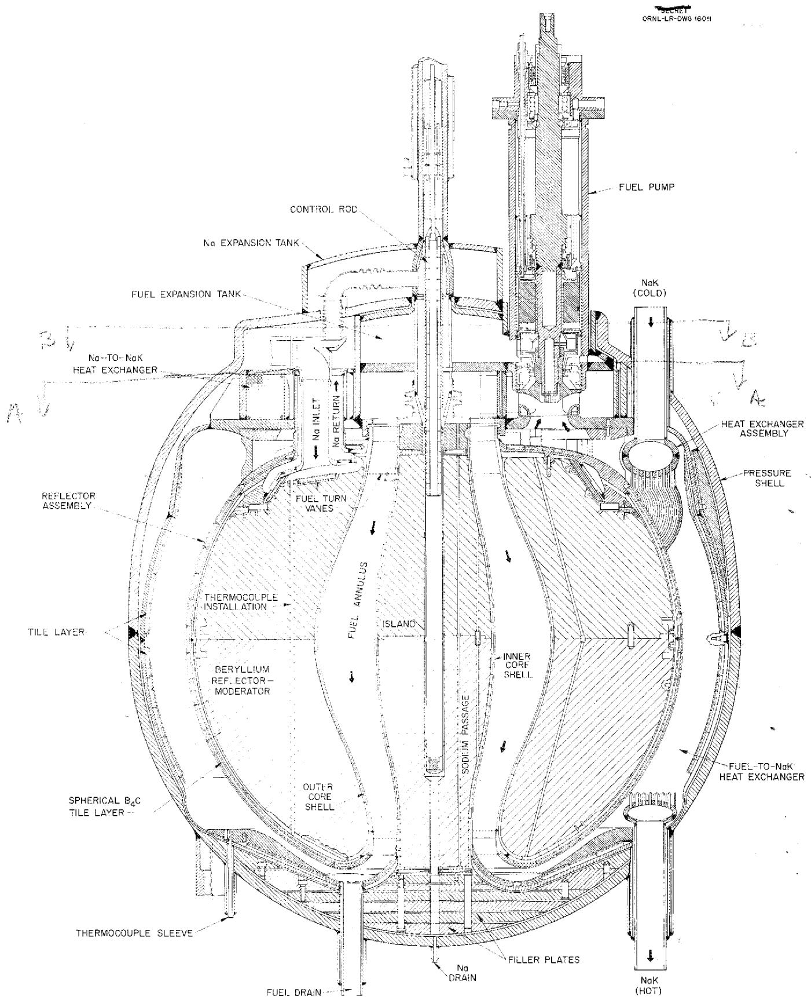  
Fig. 1. Vertical Section Through Reactor Assembly.

TABLE 1. ART DESIGN DATA   

<table><tr><td colspan="2">Power</td></tr><tr><td>Design heat output (kw)</td><td>60,000</td></tr><tr><td>Core heat flux</td><td>Heat transported out by circulating fuel</td></tr><tr><td>Core power density (max/avg)</td><td>2:1</td></tr><tr><td>Power density, maximum (kw per liter of core)</td><td>1300</td></tr><tr><td>Specific power (kw per kg of fissionable material in core)</td><td>940</td></tr><tr><td>Power generated in reflector (kw)</td><td>2040</td></tr><tr><td>Power generated in island (kw)</td><td>600</td></tr><tr><td>Power generated in pressure shell (kw)</td><td>210</td></tr><tr><td>Power generated in lead layer (kw)</td><td>132</td></tr><tr><td>Power generated in water layer (kw)</td><td>4</td></tr><tr><td colspan="2">Materials</td></tr><tr><td>Fuel</td><td>NaF-ZrF4-UF4(50-46-4 mole %)</td></tr><tr><td>Reactor structure</td><td>Inconei</td></tr><tr><td>Moderator</td><td>Beryllium</td></tr><tr><td>Reflector</td><td>Beryllium</td></tr><tr><td>Shield</td><td>Lead and borated water</td></tr><tr><td>Primary coolant</td><td>The circulating fuel</td></tr><tr><td>Reflector coolant</td><td>Sodium</td></tr><tr><td>Secondary coolant</td><td>NaK</td></tr><tr><td colspan="2">Fuel System Properties</td></tr><tr><td>Uranium enrichment (% U235)</td><td>93.4</td></tr><tr><td>Critical mass (kg of U235)</td><td>23</td></tr><tr><td>Total uranium inventory (kg of U235)</td><td>64</td></tr><tr><td>Consumption at maximum power (g/day)</td><td>88</td></tr><tr><td>Design lifetime (hr)</td><td>1500</td></tr><tr><td>Design time at maximum power (hr)</td><td>500</td></tr><tr><td>Burnup in 500 hr at maximum power (%)</td><td>2.9</td></tr><tr><td>Fuel volume in core (ft3)</td><td>3.2</td></tr><tr><td>Total fuel volume (ft3)</td><td>10</td></tr><tr><td colspan="2">Neutron Flux Density in Core</td></tr><tr><td>104ev &lt; E &lt; 107ev (neutrons·cm-2·sec-1)</td><td>3 × 1015</td></tr><tr><td>Thermal &lt; E &lt; 104ev (neutrons·cm-2·sec-1)</td><td>1 × 1015</td></tr><tr><td>Thermal, maximum (neutrons·cm-2·sec-1)</td><td>2 × 1014</td></tr><tr><td>Thermal, average (neutrons·cm-2·sec-1)</td><td>5 × 1013</td></tr><tr><td colspan="2">Control</td></tr><tr><td>Shim control</td><td>One rod of 5% Δk/k</td></tr><tr><td>Rate of withdrawl</td><td>3.3 × 10-4Δk/k·sec</td></tr><tr><td>Temperature coefficient (over-all)</td><td>-2.3 × 10-5(Δk/k)/°F</td></tr><tr><td>Temperature coefficient (fast)</td><td>-5 × 10-5(Δk/k)/°F</td></tr><tr><td>Thermal fissions (%)</td><td>40</td></tr><tr><td>Neutron leakage (%)</td><td>32</td></tr><tr><td>Prompt neutron lifetime (μsec)</td><td>400</td></tr><tr><td>keff(clean, as loaded)</td><td>1.04</td></tr><tr><td>Δk(temperature)</td><td>0.004</td></tr><tr><td>Δk(poisons)</td><td>0.036</td></tr><tr><td>keff(hot and poisoned)</td><td>1.00</td></tr><tr><td>Conversion ratio</td><td>0</td></tr></table>

TABLE 1 (continued)   

<table><tr><td colspan="3">Circulating-Fuel-Coolant Systems</td></tr><tr><td>Fuel in core</td><td></td><td></td></tr><tr><td>Outlet temperature (°F)</td><td>1600</td><td></td></tr><tr><td>Temperature rise (°F)</td><td>350</td><td></td></tr><tr><td>Mean flow velocity (fps)</td><td>5</td><td></td></tr><tr><td>Reynolds number (for mean axial velocity)</td><td>85,000</td><td></td></tr><tr><td>Fuel-to-NaK heat exchanger</td><td></td><td></td></tr><tr><td>Volume of fuel (ft3)</td><td>2.45</td><td></td></tr><tr><td>Volume of NaK in tubes (ft3)</td><td>2.97</td><td></td></tr><tr><td>Volume of inconel in tubes (ft3)</td><td>1.88</td><td></td></tr><tr><td>Inconel tube surface in contact with fuel (ft2)</td><td>903</td><td></td></tr><tr><td>Heat exchanger thickness (in.)</td><td>3.25</td><td></td></tr><tr><td></td><td>Fuel</td><td>NaK Coolant</td></tr><tr><td>Maximum temperature (°F)</td><td>1600</td><td>1500</td></tr><tr><td>Temperature drop (or rise) (°F)</td><td>350</td><td>430</td></tr><tr><td>Pressure drop (psi)</td><td>39</td><td>13</td></tr><tr><td>Flow rate (ft3/sec)</td><td>2.96</td><td>10.45</td></tr><tr><td>Velocity through the tube matrix (fps)</td><td>8.77</td><td>24</td></tr><tr><td>Reynolds number</td><td>3740</td><td>120,000</td></tr><tr><td>Heat transfer coefficient (Btu/hr·ft2·°F)</td><td>2215</td><td>10,000</td></tr><tr><td>Cooling system for NaK-fuel coolant</td><td></td><td></td></tr><tr><td>Maximum air temperature (°F)</td><td>750</td><td></td></tr><tr><td>Ambient airflow through NaK radiators (cfm)</td><td>243,000</td><td></td></tr><tr><td>Radiator air pressure drop (in. H2O)</td><td>9</td><td></td></tr><tr><td>Blower power required (total for four blowers) (hp)</td><td>600</td><td></td></tr><tr><td>Total radiator inlet face area (ft2)</td><td>100</td><td></td></tr><tr><td>Cooling system for moderator</td><td></td><td></td></tr><tr><td>Maximum temperature of sodium (°F)</td><td>1250</td><td></td></tr><tr><td>Sodium temperature drop in heat exchanger (°F)</td><td>200</td><td></td></tr><tr><td>NaK temperature rise in heat exchanger (°F)</td><td>250</td><td></td></tr><tr><td>Pressure drop of sodium in heat exchanger (psi)</td><td>7</td><td></td></tr><tr><td>Pressure drop of NaK in heat exchanger (psi)</td><td>7</td><td></td></tr><tr><td>Flow rate of sodium through reflector (ft3/sec)</td><td>1.35</td><td></td></tr><tr><td>Flow rate of sodium through island and pressure shell (ft3/sec)</td><td>0.53</td><td></td></tr><tr><td>Flow velocity of sodium through reflector and island (fps)</td><td>30</td><td></td></tr><tr><td>Reynolds number of sodium in reflector and island</td><td>170,000</td><td></td></tr></table>

TABLE 2. SYSTEM FLOW AND PUMP DATA   

<table><tr><td></td><td>Fuel</td><td>Sodium (Reflector Coolant)</td><td>NaK (Fuel Coolant)</td><td>NaK (Sodium Coolant)</td><td>NaK (Fill-and-Drain Tank Coolant)</td></tr><tr><td>Number of pumps</td><td>2</td><td>2</td><td>4</td><td>2</td><td>2</td></tr><tr><td>Pumping head, ft</td><td>27–37</td><td>100</td><td>215–360</td><td>270–360</td><td>117</td></tr><tr><td>Flow per pump, gpm</td><td>645</td><td>440</td><td>1200</td><td>430</td><td>300</td></tr><tr><td>Pump speed, rpm</td><td>2400–2600</td><td>3200</td><td>2690–3400</td><td>3025–3400</td><td>2050</td></tr><tr><td>Pump power per pump, hp</td><td>22–27</td><td></td><td>61–118</td><td>38–48</td><td>11</td></tr></table>

TABLE 3. REACTOR DIMENSIONS   

<table><tr><td colspan="2">REACTOR CROSS-SECTION EQUATORIAL RADI (in.)</td><td colspan="2">Stainless-steel-clad copper-B4C cermet</td></tr><tr><td colspan="2">Control rod thimble</td><td>Inside</td><td>22.033</td></tr><tr><td>Inside</td><td>0.750</td><td>Stainless steel thickness</td><td>0.010</td></tr><tr><td>Thickness</td><td>0.062</td><td>Copper-B4C thickness</td><td>0.080</td></tr><tr><td>Outside</td><td>0.812</td><td>Stainless steel thickness</td><td>0.010</td></tr><tr><td></td><td></td><td>Outside</td><td>22.133</td></tr><tr><td colspan="2">Sodium passage</td><td></td><td></td></tr><tr><td>Inside</td><td>0.12</td><td>Stainless-steel-canned B4C</td><td></td></tr><tr><td>Thickness</td><td>0.130</td><td>Can</td><td></td></tr><tr><td>Outside</td><td>0.942</td><td>Inside</td><td>22.133</td></tr><tr><td></td><td></td><td>Thickness</td><td>0.005</td></tr><tr><td colspan="2">Beryllium</td><td></td><td></td></tr><tr><td>Inside</td><td>0.942</td><td>Outside</td><td>22.138</td></tr><tr><td>Thickness</td><td>4.121</td><td>B4C tile</td><td></td></tr><tr><td>Outside</td><td>5.063</td><td>Inside</td><td>22.138</td></tr><tr><td></td><td></td><td>Thickness</td><td>0.240</td></tr><tr><td colspan="2">Sodium passage at land</td><td></td><td></td></tr><tr><td>Inside</td><td>5.063</td><td>Outside</td><td>22.378</td></tr><tr><td>Thickness</td><td>0.188</td><td>Shim gap</td><td>0.029</td></tr><tr><td>Outside</td><td>5.251</td><td>Can</td><td></td></tr><tr><td></td><td></td><td>Inside</td><td>22.407</td></tr><tr><td colspan="2">Inconel shell</td><td></td><td></td></tr><tr><td>Inside</td><td>5.251</td><td>Thickness</td><td>0.005</td></tr><tr><td>Thickness</td><td>0.125</td><td>Outside</td><td>22.412</td></tr><tr><td>Outside</td><td>5.376</td><td>Shim gap</td><td>0.021</td></tr><tr><td></td><td></td><td>Outer reflector shell</td><td></td></tr><tr><td colspan="2">Fuel</td><td></td><td></td></tr><tr><td>Inside</td><td>5.376</td><td>Inside</td><td>22.433</td></tr><tr><td>Thickness</td><td>5.124</td><td>Thickness</td><td>0.062</td></tr><tr><td>Outside</td><td>10.500</td><td>Outside (max)</td><td>22.495</td></tr><tr><td></td><td></td><td>Channel</td><td>22.500</td></tr><tr><td colspan="2">Outer core shell</td><td></td><td></td></tr><tr><td>Inside</td><td>10.500</td><td>Tangent to first tube</td><td>22.510</td></tr><tr><td>Thickness</td><td>0.125</td><td>Tube radius</td><td>0.115</td></tr><tr><td>Outside</td><td>10.625</td><td>Center line, first tube</td><td>22.625</td></tr><tr><td colspan="2">Sodium passage at land</td><td></td><td></td></tr><tr><td>Inside</td><td>10.625</td><td>Twelve spaces at 0.250</td><td>3.000</td></tr><tr><td>Thickness</td><td>0.188</td><td>Center line, thirteenth tube</td><td>25.625</td></tr><tr><td>Outside</td><td>10.813</td><td>Tube radius</td><td>0.115</td></tr><tr><td></td><td></td><td>Circle tangent to thirteenth tube</td><td>25.740</td></tr><tr><td colspan="2">Beryllium reflector</td><td></td><td></td></tr><tr><td>Inside</td><td>10.813</td><td>Spacer</td><td>0.008</td></tr><tr><td>Thickness</td><td>10.855</td><td></td><td></td></tr><tr><td>Outside</td><td>21.668</td><td>Gap</td><td>0.022</td></tr><tr><td></td><td></td><td>Channel</td><td></td></tr><tr><td colspan="2">Sodium passage</td><td></td><td></td></tr><tr><td>Inside</td><td>21.668</td><td>Inside</td><td>25.770</td></tr><tr><td>Thickness</td><td>0.125</td><td>Thickness</td><td>0.120</td></tr><tr><td>Outside</td><td>21.793</td><td>Outside</td><td>25.890</td></tr><tr><td></td><td></td><td>Gap</td><td></td></tr><tr><td colspan="2">Inconel shell!</td><td></td><td></td></tr><tr><td>Inside</td><td>21.793</td><td>Inside</td><td>25.890</td></tr><tr><td>Thickness</td><td>0.240</td><td>Thickness</td><td>0.030</td></tr><tr><td>Outside</td><td>22.033</td><td>Outside</td><td>25.920</td></tr></table>

TABLE 3. REACTOR DIMENSIONS   

<table><tr><td>Boron jacket</td><td></td><td>In pump volutes</td><td>0.84</td></tr><tr><td>Inside</td><td>25.920</td><td>Total in main circuit</td><td>8.38</td></tr><tr><td>Thickness</td><td>0.062</td><td>Fuel expansion tank</td><td></td></tr><tr><td>Outside</td><td>25.982</td><td>Volume (8%), ft3</td><td>0.5787</td></tr><tr><td>B4C tile</td><td></td><td>Width, in.</td><td>13.625</td></tr><tr><td>Inside</td><td>25.982</td><td>Length, in.</td><td>32.500</td></tr><tr><td>Thickness</td><td>0.328</td><td></td><td></td></tr><tr><td>Outside</td><td>26.310</td><td>SODIUM SYSTEM</td><td></td></tr><tr><td>Pressure shell liner</td><td></td><td>Sodium volume, ft3</td><td></td></tr><tr><td>Inside</td><td>26.310</td><td>In expansion tank</td><td>0.16</td></tr><tr><td>Thickness</td><td>0.375</td><td>In annular passage at pressure shell</td><td>1.60</td></tr><tr><td>Outside</td><td>26.685</td><td>In reflector passages (total)</td><td>0.90</td></tr><tr><td>Sodium gap</td><td></td><td>In first deck</td><td>0.47</td></tr><tr><td>Inside</td><td>26.685</td><td>In pump and heat exchanger</td><td>0.35</td></tr><tr><td>Thickness</td><td>0.125</td><td>In second deck</td><td>0.42</td></tr><tr><td>Outside</td><td>26.810</td><td>In island passages (total)</td><td>0.44</td></tr><tr><td>Pressure shell</td><td></td><td>Total in main circuit</td><td>4.34</td></tr><tr><td>Inside</td><td>26.810</td><td>Inside diameter of sodium transfer tube to reflector, in.</td><td>2.375</td></tr><tr><td>Thickness</td><td>1.000</td><td>Inside diameter of sodium transfer tube from reflector, in.</td><td>3.875</td></tr><tr><td>Outside</td><td>27.810</td><td>Inside diameter of sodium transfer tube to island, in.</td><td>1.437</td></tr><tr><td>CORE</td><td></td><td>Area of sodium passage to reflector, in.2</td><td>4.426</td></tr><tr><td>Diameter (inside of outer shell at equator), in.</td><td>21</td><td></td><td></td></tr><tr><td>Island outside diameter, in.</td><td>10.75</td><td>Area of sodium passage from reflector, in.2</td><td>5.847</td></tr><tr><td>Core inlet outside diameter, in.</td><td>11</td><td>Area of sodium passage to island, in.2</td><td>1.619</td></tr><tr><td>Core inlet inside diameter, in.</td><td>6.81</td><td></td><td></td></tr><tr><td>Core inlet area, in.2</td><td>58.7</td><td>FUEL-TO-NaK HEAT EXCHANGER</td><td></td></tr><tr><td>Core equatorial cross-sectional area, in.2</td><td>256.2</td><td>Tube center-line-to-center-line spacing, in.</td><td>0.250</td></tr><tr><td>REFLECTOR-MODERATOR REGION</td><td></td><td>Tube outside diameter, in.</td><td>0.229 to 0.231</td></tr><tr><td>Volume of beryllium plus fuel, ft3</td><td>28.2</td><td>Tube inside diameter, in.</td><td>0.180</td></tr><tr><td>Volume of beryllium only, ft3</td><td>24.99</td><td>Tube wall thickness, in.</td><td>0.025</td></tr><tr><td>Cooling passage diameter, in.</td><td>0.187</td><td>Tube spacer thickness, in.</td><td>0.020</td></tr><tr><td>Number of passages in island</td><td>120</td><td>Mean tube length, in.</td><td>65.000</td></tr><tr><td>Number of passages in reflector</td><td>288</td><td>Equatorial crossing angle</td><td>26°20</td></tr><tr><td>FUEL SYSTEM</td><td></td><td>Inlet and outlet pipe inside diameter, in.</td><td>2.469</td></tr><tr><td>Fuel volume, ft3</td><td></td><td>Inlet and outlet pipe outside diameter, in.</td><td>2.875</td></tr><tr><td>In 36-in.-long core</td><td>3.21</td><td>Number of tube bundles</td><td>12</td></tr><tr><td>In inlet and outlet ducts</td><td>1.410</td><td>Number of tubes per bundle, 13×20</td><td>260</td></tr><tr><td>In expansion tank when ½ in. deep</td><td>0.08</td><td></td><td></td></tr><tr><td>In heat exchanger</td><td>2.84</td><td>Total number of tubes</td><td>3120</td></tr><tr><td>Center-line radius of NaK inlet pipes</td><td>19.590</td><td>Distance between bearings, in.</td><td>12</td></tr><tr><td>Center-line radius of NaK outlet pipes</td><td>19.590</td><td>Impeller diameter, in.</td><td>5.750</td></tr><tr><td colspan="2" rowspan="3">SODIUM-TO-NoK HEAT EXCHANGER</td><td>Impeller discharge height, in.</td><td>1.000</td></tr><tr><td>Impeller inlet diameter, in.</td><td>3.500</td></tr><tr><td>Shaft length (over-all), in.</td><td>31½</td></tr><tr><td>Tube center-line-to-center-line spacing, in.</td><td>0.2175</td><td>Shaft outside diameter between bearings, in.</td><td>2³</td></tr><tr><td>Tube outside diameter, in.</td><td>0.1875</td><td>Lower bearing journal outside diameter, in.</td><td>3.400</td></tr><tr><td>Tube inside diameter, in.</td><td>0.1375</td><td>Shaft outside diameter below seal, in.</td><td>2¼</td></tr><tr><td>Tube wall thickness, in.</td><td>0.025</td><td>Thrust bearing height from equator, in.</td><td>48.125</td></tr><tr><td>Tube spacer thickness, in.</td><td>0.030</td><td>Number of vanes in impeller</td><td>5</td></tr><tr><td>Mean tube length, in.</td><td>28</td><td>Diameter of top positioning ring, in.</td><td>6.200</td></tr><tr><td>Number of bundles</td><td>2</td><td>Diameter of bottom positioning ring, in.</td><td>6.190</td></tr><tr><td>Number of tubes per bundle, 15×20</td><td>300</td><td>Outer diameter of top flange, in.</td><td>10.000</td></tr><tr><td>Total number of tubes</td><td>600</td><td></td><td></td></tr><tr><td>Inlet and outlet pipe inside diameter, in.</td><td>2.469</td><td></td><td></td></tr><tr><td>Inlet and outlet pipe outside diameter, in.</td><td>2.875</td><td colspan="2">SODIUM PUMP</td></tr><tr><td colspan="2">PUMP-EXPANSION TANK REGION</td><td>Center-line-to-center-line spacing, in.</td><td>23.000</td></tr><tr><td colspan="2">Vertical distance above equator, in.</td><td>Volute chamber height, in.</td><td>2.500</td></tr><tr><td>Floor of fuel pump inlet passage</td><td>17.625</td><td>Estimated impeller weight, lb</td><td>10</td></tr><tr><td>Bottom of lower deck</td><td>19.125</td><td>Critical speed, rpm</td><td>6000+</td></tr><tr><td>Top of lower deck</td><td>19.656</td><td></td><td></td></tr><tr><td>Bottom of upper deck</td><td>24.000</td><td>Shaft diameter, in.</td><td>2.250</td></tr><tr><td>Center line of fuel pump discharge</td><td>21.437</td><td>Center-line lower bearing to center-line impeller, in.</td><td>13.3</td></tr><tr><td>Center line of sodium pump discharge</td><td>26.125</td><td></td><td></td></tr><tr><td>Top inside of fuel expansion tank</td><td>29.25</td><td>Distance between bearings, in.</td><td>12</td></tr><tr><td>Inside of dome</td><td>29.875</td><td>Impeller diameter, in.</td><td>5.750</td></tr><tr><td>Outside of dome</td><td>30.875</td><td></td><td></td></tr><tr><td>Top inside of sodium expansion tank</td><td>34.312</td><td>Impeller discharge height, in.</td><td>0.250</td></tr><tr><td>Top outside of sodium expansion tank</td><td>34.812</td><td>Impeller inlet diameter (ID), in.</td><td>3.500</td></tr><tr><td>Top of fuel pump mounting flange</td><td>47.000</td><td>Shaft length (over-all), in.</td><td>31.5</td></tr><tr><td>Top of sodium pump mounting flange</td><td>50.243</td><td></td><td></td></tr><tr><td colspan="2">Dome radius, in.</td><td>Shaft outside diameter between bearings, in.</td><td>2.375</td></tr><tr><td>Inside</td><td>29.875</td><td></td><td></td></tr><tr><td>Outside</td><td>30.875</td><td>Lower bearing journal outside diameter, in.</td><td>3.400</td></tr><tr><td colspan="2">FUEL PUMPS</td><td></td><td></td></tr><tr><td>Center-line-to-center-line spacing, in.</td><td>21</td><td>Shaft outside diameter below seal, in.</td><td>2.25</td></tr><tr><td>Volute chamber height, in.</td><td>4.375</td><td>Thrust bearing height above equator, in.</td><td>51.907</td></tr><tr><td>Estimated impeller weight, lb</td><td>11</td><td>Number of impeller vanes</td><td>10</td></tr><tr><td>Critical speed, rpm</td><td>6000+</td><td>Diameter of top positioning ring, in.</td><td>6.200</td></tr><tr><td>Shaft diameter, in.</td><td>2.250</td><td>Diameter of bottom positioning ring, in.</td><td>6.190</td></tr><tr><td>Shaft overhang, in.</td><td>14.750</td><td>Outside diameter of top flange, in.</td><td>10.000</td></tr></table>

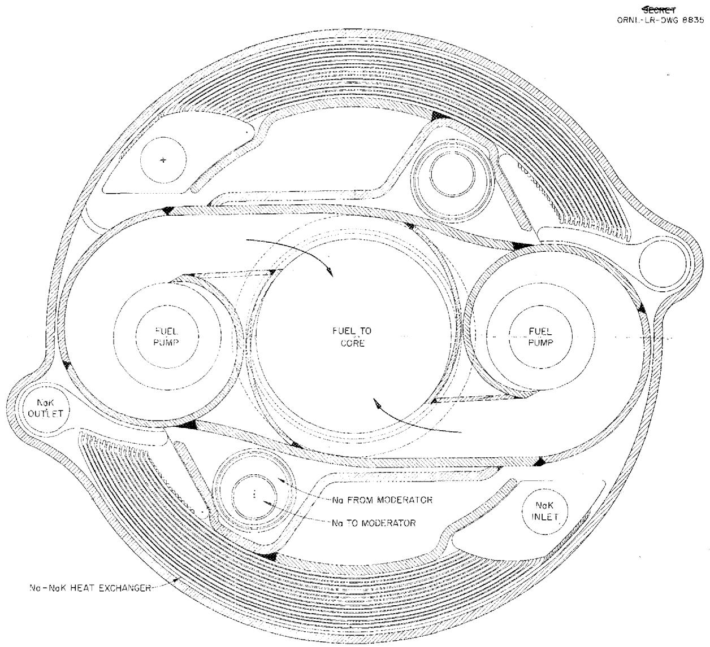  
Fig. 2. Horizontal Section Through Fuel Pump-Expansion Tank Region.

Fig. 5 that considerable advantage is gained by increasing the reflector thickness from 20 to $30~\mathrm{cm}$ but little advantage from a further increase to $40~\mathrm{cm}$ . Even more important, the activation of the NaK in the heat exchanger can be reduced markedly by increasing the reflector thickness. A 30-cm-thick reflector gave a good compromise between shielding, criticality, and NaK activation considerations. The remaining analyses of the data were therefore restricted to a 30-cm reflector thickness.

The effect on total uranium investment of the reactor dimensions and the external fuel volume, such as will exist in the heat exchanger external

to the core, is shown in Fig. 6. The surface shown for zero external volume is, of course, simply that for critical mass. At a core radius of $30\mathrm{cm}$ the critical mass is virtually independent of fuel thickness. In the surfaces for both the 2- and 4-ft³ external volumes, simple visual examination indicates the probable existence of an optimum set of proportions. The reversal of scales for the 8-ft³ surface was necessitated by the existence of an extreme peak at what was the front corner.

The effect of reactor dimensions on the peak-to-average power-density ratio is shown in Fig. 7. The peak power density for the reflector-moderated

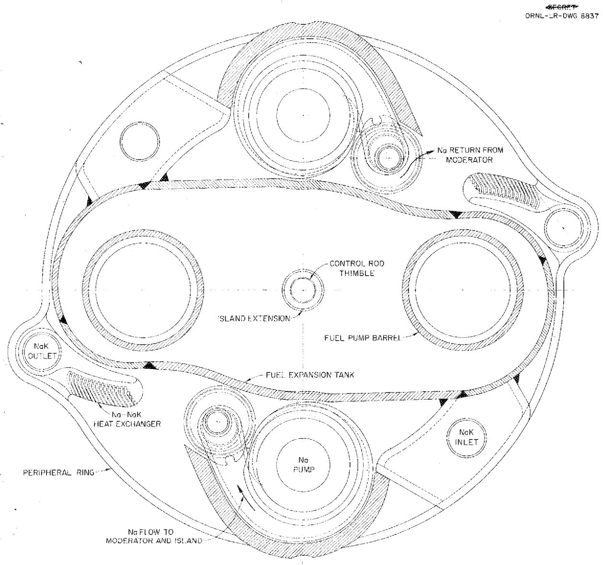  
Fig. 3. Horizontal Section Through Sodium Pumps.

reactor occurs at the outside shell of the fuel annulus. The effects of reactor dimensions on the ratio are small, as can be seen; an increase in core radius from 20 to $60\mathrm{cm}$ at a constant fuel thickness gives a decrease in the ratio of about $20\%$ , while an increase in the fuel thickness from 5 to $20\mathrm{cm}$ at a constant core radius results in an increase in the ratio of about $33\%$ .

The percentage of fissions caused by thermal neutrons is shown as a function of reactor dimensions in Fig. 8. The least-thermal reactor (28%) has the thickest fuel layer and the smallest core,

while the most-thermal reactor $(45\%)$ has the thinnest fuel layer and the largest core. The reactor core dimensions established on the basis of this study are presented in Table 3.

A series of room-temperature critical experiments was set up for checking the calculations. These reflector-moderated assemblies were of simple geometry, and materials variations were made to

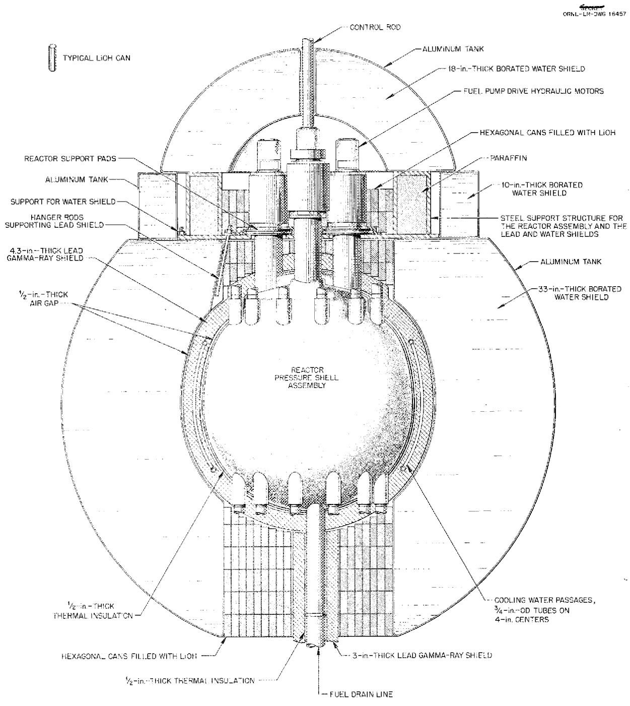  
Fig. 4. Vertical Section Through Lead-Water Shield.

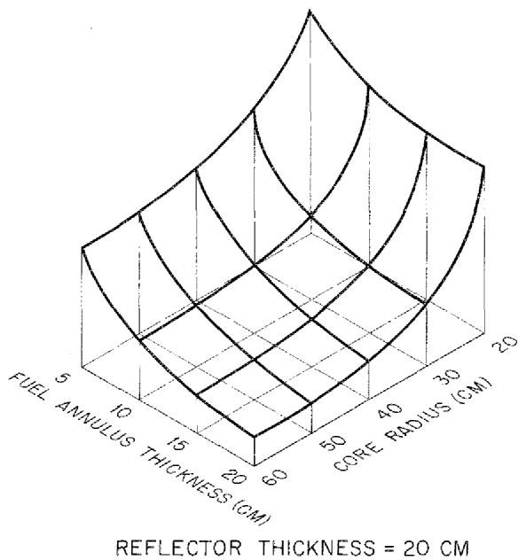

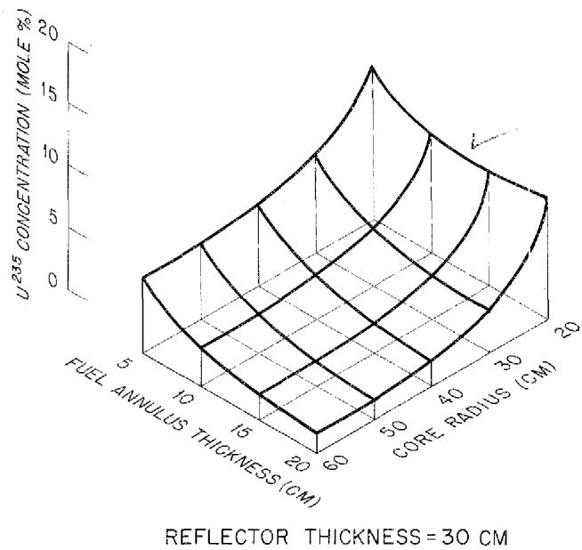

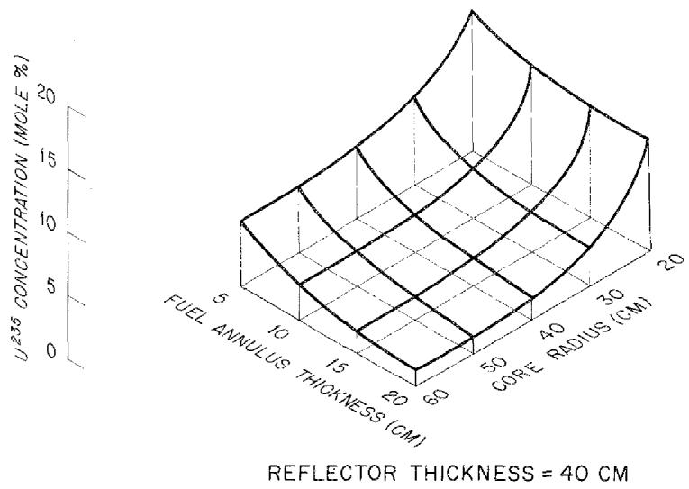  
Fig. 5. Effect of Reactor Dimensions on Concentration of $\mathsf{U}^{235}$ in Fuel.

check consistency with theory and the fundamental constants. The first assembly was a basic reflector-moderated reactor with two regions - fuel and reflector. The fuel region contained uranium and a fluorocarbon plastic, Teflon, to simulate the fluoride fuels, and the reflector region contained beryllium. The fuel region was constructed in the shape of a rhombocuboctahedron (essentially, a cube with the edges and corners cut away to give

octagonal cross sections) to approximate a sphere within the limitations imposed by the shape of the available beryllium. The system was made critical with 24.35 lb of U $^{235}$ .

The assembly was then modified to include three regions with a beryllium island separated from the reflector by the fuel. The first of the three-region assemblies had no Inconel core shells, the second included Inconel core shells without end ducts, and

EXTRAPOLATED REFLECTOR  
THICKNESS = 30 CM

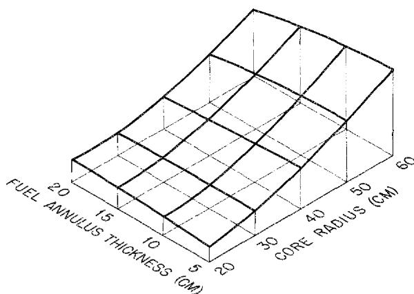  
EXTERNAL FUEL VOLUME $= 0$ FT³

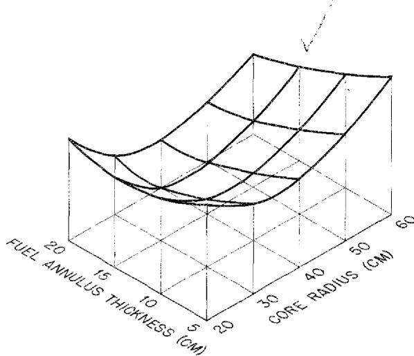  
EXTERNAL FUEL VOLUME $= 4$ FT

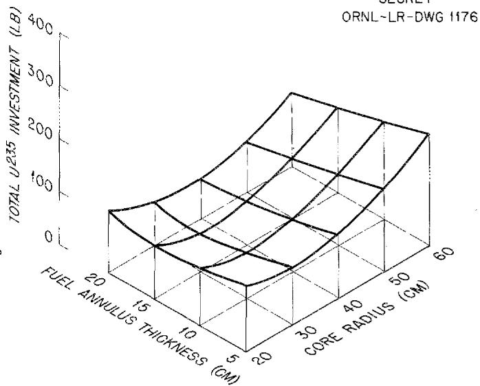  
EXTERNAL FUEL VOLUME $= 2FT^{3}$

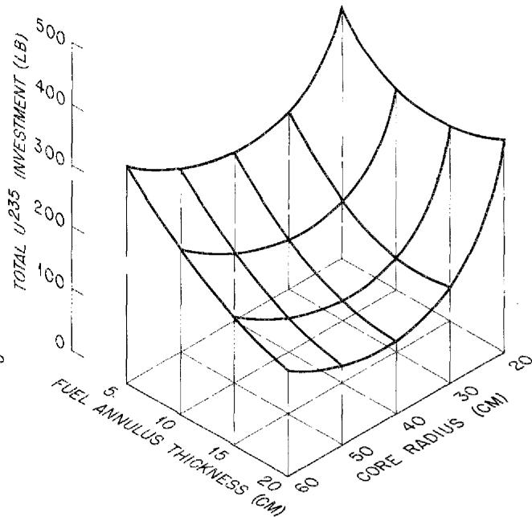  
EXTERNAL FUEL VOLUME $= 8$ FT   
Fig. 6. Effect of Reactor Dimensions and External Fuel Volume on Total U235 Investment.

the final one mocked up the reactor, including the end ducts. The results of these experiments are presented in Table 4 and in reports on the individual experiments (see "Bibliography").

A low-nuclear-power, high-temperature critical experiment was also performed.4 The reactor section

of the assembly closely resembled the current design of the ART in that it included the annular fuel region separated from the beryllium island and reflector by $\frac{1}{8}$ -in.-thick inconel core shells of the proper shape. Photographs of the assembly are shown in Figs. 9, 10, and 11. The mockup differed from the ART principally in that the fuel was not circulated and there was no sodium in the reflectormoderator regions. The system was filled initially,

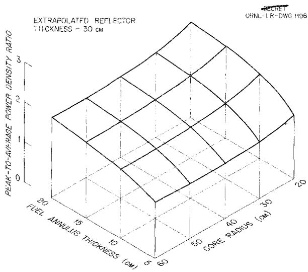

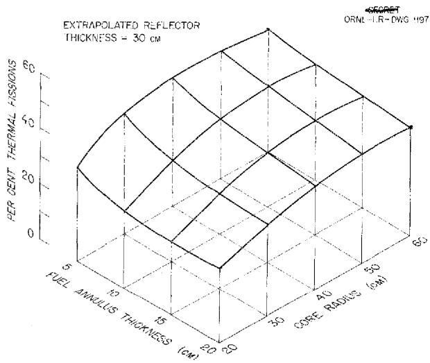  
Fig. 7. Effect of Reactor Dimensions on Outside Peak-to-Average Power-Density Ratio in Core of Reflector-Moderated Reactor.   
Fig. 8. Effect of Reactor Dimensions on Percentage of Fissions Caused by Thermal Neutrons.

for cleaning and testing, with a 50-50 mole $\%$ mixture of molten NaF and $\mathsf{ZrF}_4$ . Increments of molten $\mathsf{Na}_2\mathsf{UF}_6$ (with the uranium enriched to $93\%$ $\mathsf{U}^{235}$ ) were then added to the NaF-ZrF4 mixture in the sump tank. After each addition of $\mathsf{Na}_2\mathsf{UF}_6$ , the mixture was pressurized into the core and then drained. This procedure was continued until the critical concentration was attained.

The control safety rod was located within a 1.50-in.-ID Inconel thimble along the vertical axis

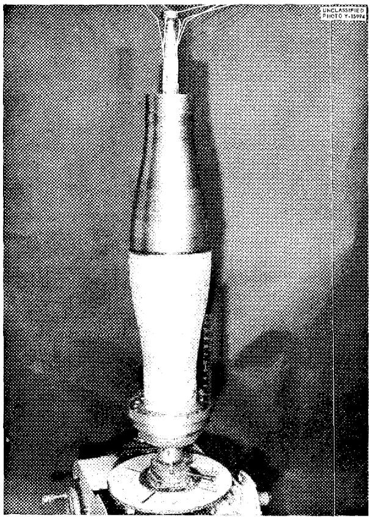  
Fig. 9. Partially Assembled Island Showing the Lower Half of the Inconel Core Shell and the Upper Half of the Beryllium Reflector for the High-Temperature Critical Assembly.

of the beryllium island. The rod was a cylindrical annulus of a neutron-absorber compact with a density of $6.5\mathrm{g/cm^3}$ . The principal constituents of the compact were $\mathrm{Sm}_2\mathrm{O}_3$ (63.8 wt %) and $\mathrm{Gd}_2\mathrm{O}_3$ (26.3 wt %); the outside diameter of the absorber section was 1.28 in., and the annulus was $\frac{1}{8}$ in. wide. The system operated isothermally at $1200^{\circ}\mathrm{F}$ , normally, but with the electrical heaters available the temperature could be raised to $1350^{\circ}\mathrm{F}$ .

The critical fuel concentration was found to be 6.30 wt $\%$ (2.87 mole $\%$ ) uranium, and the excess reactivity was about $0.13\% \Delta k / k$ . The over-all temperature coefficient of reactivity between 1150 and $1350^{\circ}\mathrm{F}$ was shown to be negative and to have a value of $2\times 10^{-5}(\Delta k / k) / {}^{\circ}\mathrm{F}$ . An increase in the uranium concentration of the fuel from 6.30 to 6.88 wt $\%$ resulted in an increase in reactivity of $1.3\% \Delta k / k$ . The control rod had a value of $1.7\% \Delta k / k$ when inserted to a point 4 in. above the

TABLE 4. COMPOSITIONS AND DIMENSIONS OF REFLECTOR-MODERATED-REACTOR CRITICAL ASSEMBLIES   

<table><tr><td rowspan="2"></td><td colspan="3">Three-Region Assembly with Core Shells of</td><td rowspan="2" colspan="4">Three-Region Assembly with 1g-in.-Thick Inconel Core Shells and End Ducts</td></tr><tr><td>16in.-Thick Aluminum</td><td>16in.-Thick Inconel</td><td>8in.-Thick Inconel</td></tr><tr><td>Assembly number</td><td>CA-20a</td><td>CA-20b</td><td>CA-20c</td><td>CA-21-1</td><td>CA-21-2</td><td>CA-22</td><td>CA-23</td></tr><tr><td>Beryllium island Volume, ft3</td><td>0.37</td><td>0.37</td><td>0.37</td><td>1.27</td><td>1.27</td><td>1.27</td><td>1.75</td></tr><tr><td>Average radius, in. Spherical section</td><td>5.18</td><td>5.18</td><td>5.18</td><td>5.18</td><td>5.18</td><td>5.18</td><td>7.19</td></tr><tr><td>End ducts</td><td></td><td></td><td></td><td>3.86</td><td>3.86</td><td>3.86</td><td>3.86</td></tr><tr><td>Mass, kg</td><td>19.4</td><td>19.4</td><td>19.4</td><td>67.0</td><td>67.0</td><td>67.0</td><td>92.2</td></tr><tr><td>Fuel region (excluding shells and interface plates) Volume, ft3</td><td>1.78</td><td>1.78</td><td>1.72</td><td>2.06</td><td>2.06</td><td>2.47</td><td>1.56</td></tr><tr><td>liters</td><td>50.4</td><td>50.4</td><td>48.8</td><td>58.3</td><td>58.3</td><td>70.0</td><td>44.3</td></tr><tr><td>Average radius, in. Spherical section Inside</td><td>5.24</td><td>5.24</td><td>5.31</td><td>5.31</td><td>5.31</td><td>5.31</td><td>7.32</td></tr><tr><td>Outside</td><td>9.51</td><td>9.51</td><td>9.44</td><td>9.44</td><td>9.44</td><td>9.44</td><td>9.44</td></tr><tr><td>End ducts Inside</td><td></td><td></td><td></td><td>3.99</td><td>3.99</td><td>3.99</td><td>3.99</td></tr><tr><td>Outside</td><td></td><td></td><td></td><td>5.28</td><td>5.28</td><td>6.79a</td><td>5.28</td></tr><tr><td>Distance between fuel sheets, in.</td><td>0.639</td><td>0.284</td><td>0.142</td><td>0.142</td><td>0.173</td><td>0.142</td><td>0.142</td></tr><tr><td>Mass of components Teflon, kg</td><td>99.38</td><td>99.27</td><td>94.37</td><td>108.88</td><td>108.18</td><td>126.77</td><td>81.54</td></tr><tr><td>Uranium loading, kg</td><td>5.00</td><td>11.74</td><td>22.07</td><td>26.02</td><td>21.57</td><td>30.45</td><td>19.97</td></tr><tr><td>U235 loading, kg</td><td>4.66</td><td>10.94</td><td>20.56</td><td>24.24</td><td>20.07</td><td>28.35</td><td>18.62</td></tr><tr><td>Uranium density, b g/cm3</td><td></td><td></td><td></td><td>0.446</td><td>0.370</td><td>0.435</td><td>0.451</td></tr><tr><td>U235 density, b g/cm3</td><td>0.092</td><td>0.217</td><td>0.421</td><td>0.416</td><td>0.345</td><td>0.405</td><td>0.420</td></tr><tr><td>Uranium coating material, kg</td><td>0.05</td><td>0.11</td><td>0.20</td><td>0.25</td><td>0.21</td><td>0.30</td><td>0.19</td></tr><tr><td>Scotch tape, kg</td><td>0.11</td><td>0.11</td><td>0.11</td><td>0.15</td><td>0.15</td><td>0.15</td><td>0.15</td></tr><tr><td>Core shells and interface plates Mass of components, kg</td><td></td><td></td><td></td><td></td><td></td><td></td><td></td></tr><tr><td>Aluminum</td><td>5.85</td><td>1.10</td><td>1.10</td><td>1.10</td><td>1.10</td><td>1.10</td><td>1.10</td></tr><tr><td>Inconel</td><td>0</td><td>13.68</td><td>27.73</td><td>53.02</td><td>53.02</td><td>54.62</td><td>58.26</td></tr><tr><td>Reflector</td><td></td><td></td><td></td><td></td><td></td><td></td><td></td></tr><tr><td>Volume, ft3</td><td>22.22</td><td>22.22</td><td>22.22</td><td>20.88</td><td>20.88</td><td>20.45</td><td>20.88</td></tr><tr><td>Minimum thickness, in.</td><td>11.5</td><td>11.5</td><td>11.5</td><td>11.5</td><td>11.5</td><td>11.5</td><td>11.5</td></tr><tr><td>Mass of components, kg</td><td></td><td></td><td></td><td></td><td></td><td></td><td></td></tr><tr><td>Beryllium</td><td>1155.0</td><td>1155.0</td><td>1155.0</td><td>1094.1</td><td>1094.1</td><td>1077.1</td><td>1094.1</td></tr><tr><td>Aluminum</td><td>29.2</td><td>29.2</td><td>29.2</td><td>29.2</td><td>29.2</td><td>29.2</td><td>29.2</td></tr><tr><td>Excess reactivity as loaded, %</td><td>0.9</td><td>0.3</td><td>0.4</td><td>~3</td><td>0.14</td><td>~3</td><td>0.19</td></tr><tr><td>Experimental critical mass, kg of U235</td><td>4.35</td><td>10.8</td><td>19.8</td><td>19 ± 2</td><td>19.9</td><td>24 ± 2</td><td>18.4</td></tr></table>

$a_{\text{Only one end duct was enlarged.}}$   
Mass per unit volume of fuel region.   
$c_{\text{Mass required for a critical system with the poison rods removed.}}$

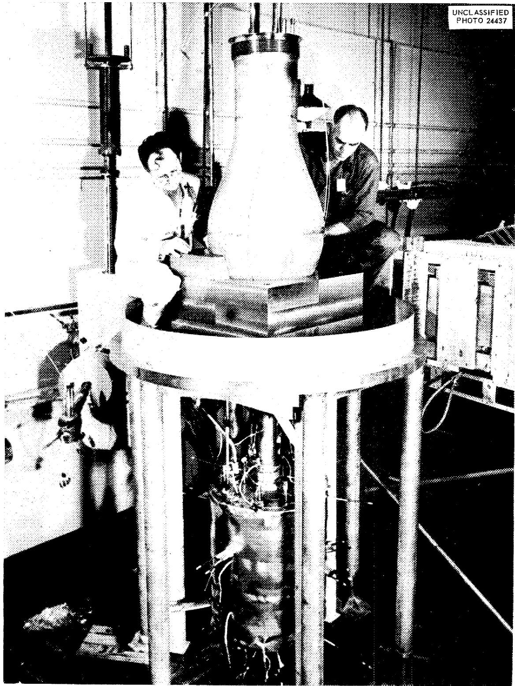  
Fig. 10. Outer Core Shell and Partially Assembled Beryllium Reflector of the High-Temperature Critical Assembly.

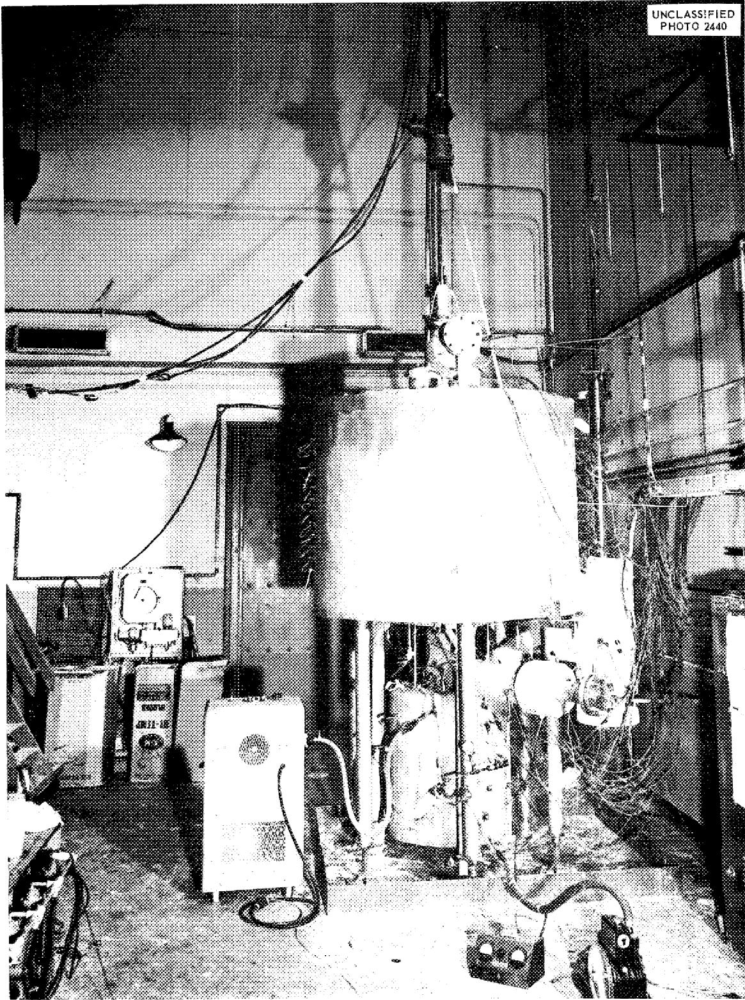  
Fig. 11. Completed High-Temperature Critical Assembly of the Reflector-Moderated Circulating-Fuel Reactor.

mid-plane. An analysis5 of the experimental results and the differences between the critical assembly and the ART indicates that the critical concentration of the ART will be between 4.6 and 5.4 mole % uranium, that is, well within the limits of solubility in the fuel mixture to be used in the ART.

# REFLECTOR-MODERATOR

The design of the reflector-moderator region presented several problems. Heat will be generated in the reflector by the absorption of gamma rays coming from the fuel and heat exchanger regions and by the slowing down of fast fission neutrons. Gamma rays will also result from parasitic capture of neutrons in the structural material and the coolant. One particularly strong source of hard gamma rays will be the Inconel shell that separates the fuel annulus from the outer reflector. These gamma rays will be absorbed over an appreciable volume because the photon energy will be high and the attenuation rather small. A lesser amount of heating will also result from the generation of gamma rays by neutron capture in the beryllium. The heat generated by radiation in the various regions of the reactor and the heat transfer from the fuel system to the reflector and island cooling circuits are given in Table 5.

5A. M. Perry, ANP Quar. Prog. Rep. Sept. 10, 1955, ORNL-1947, p 33.

The cooling system designed for removing the heat from the beryllium in both the island and the reflector and from the Inconel shells is illustrated in Fig. 1. There are 120 cooling passages in the island and 288 in the reflector; these passages are 0.187 in. in diameter. The dimensions of the cooling system and the flow characteristics of the coolant, sodium, are given in Tables 1-3. Sodium was chosen as the coolant because of its excellent heat transfer properties and reasonably low neutron-capture cross section.

Experimental evidence has established the feasibility of operation of a sodium-beryllium-Inconel system if the temperature of the system is maintained below $1250^{\circ}\mathrm{F}$ . Cycling tests have also shown that the thermal stresses that will be set up in the beryllium should not give serious trouble.

# FUEL SYSTEMS

# Core Hydrodynamics

The hydrodynamic characteristics of the reactor core are intimately related to those of the pumps, because the pumps must be placed in the lowest temperature portion of the circuit, that is, just ahead of the core inlet. This is necessary partly because of the fairly high stresses in the impellers and partly because of the shaft seal problem, which is discussed in the following section on "Pumps

TABLE 5. HEAT TO BE REMOVED BY REFLECTOR AND ISLAND COOLING CIRCUITS   

<table><tr><td></td><td>Heat to Reflector 
Cooling Circuit 
(Mw)</td><td>Heat to Island 
Cooling Circuit 
(Mw)</td></tr><tr><td>Radiation heating</td><td></td><td></td></tr><tr><td>Beryllium</td><td>1.52</td><td>0.82</td></tr><tr><td>Reflector B4C tile</td><td>0.48</td><td></td></tr><tr><td>Pressure-shell B4C tile</td><td></td><td>0.01</td></tr><tr><td>Control rod</td><td></td><td>0.18</td></tr><tr><td>Filler plates, south head</td><td></td><td>0.03</td></tr><tr><td>Pressure shell</td><td></td><td>0.12</td></tr><tr><td>Reflector outer Inconel shell</td><td>0.15</td><td></td></tr><tr><td>North-head liner</td><td></td><td>0.03</td></tr><tr><td>Transfer heating</td><td></td><td></td></tr><tr><td>Through island core shell</td><td></td><td>0.87</td></tr><tr><td>Through reflector core shell</td><td>1.73</td><td></td></tr><tr><td>From fuel-to-NoK heat exchanger</td><td>0.16</td><td>0.10</td></tr><tr><td>Total</td><td>4.04</td><td>2.16</td></tr></table>

and Expansion Tank." All the initial layouts employed axial-flow pumps coaxial with the island, but because the structural problems associated with the long impeller overhang proved to be difficult, the hydrodynamically less desirable arrangement employing centrifugal pumps was chosen as the more practicable solution. Further it seemed likely that two pumps either in series or parallel would be required if boiling of the fuel as a consequence of afterheat was to be avoided in the event that one pump failed.

Preliminary analyses of various centrifugal pump-core inlet configurations indicated that the high-velocity streams from the pump impeller would be likely to change completely the flow pattern obtained within the core. High-velocity streams are disinclined to diffuse once they have become separated from the walls of the pump volute, and their momentum can carry them all the way from the impeller through the plenum chamber, through the vanes at the core inlet, and even through the core itself to such an extent that flow separation and, sometimes, flow reversal in the core would tend to occur. The most promising configuration appears to be that in which the pump volutes discharge tangentially into a cylindrical extension of the core inlet, as in Fig. 2. The high swirl velocity induced in this region gives a system relatively insensitive to the stoppage of one pump.

From the shielding standpoint an ideal circulating-fuel reactor would have very tiny inlet and outlet ducts to minimize both neutron leakage through these ducts and fissioning in regions close to the outer surface of the reflector. While the relations between end-duct size and shield weight are very complex, there is a strong incentive to minimize the end-duct size. This, coupled with hydrodynamic considerations associated with the pump design, particularly the volute-discharge area, and reactor physics studies, led to the choice of the core inlet proportions and hence the basic core layout of Fig. 12.

The core of the reactor consists of a divergent-convergent annular passage that is symmetrical about the equatorial plane; that is, the converging and diverging sections have the same shape. The area perpendicular to the flow path at the equator is approximately four times the area at the inlet or discharge ends. The equivalent cone angle of the divergent and convergent sections is approximately 28 deg (included angle).

In the design of the core it has been considered necessary, in order to avoid local regions of excessive temperature, to effect a uniform circumferential distribution of the flow around the inlet annulus and to assure that the fuel will traverse the divergent section of the core without incurring stagnation or reversal of the fluid boundary layers. Furthermore, it is desired that the required flow conditions obtain with only one pump in operation so that the reactor can be run at some appreciable fraction of rated power with one of the two fuel pumps inoperable.

It is well known that the flow of fluids in divergent channels is subject to the growth and the eventual separation and reversal of boundary layers. The probability of the occurrence of these phenomena increases as the degree of divergence, as represented by the inlet-to-outlet area ratio, and the rate of divergence, as represented by the equivalent cone angle, are increased. Flow in a divergent channel is also adversely affected by uneven distribution either circumferentially or radially at the inlet. Common industrial practice calls for divergence rates to be of the order of 7 to 10 deg included angle when preceded by several diameters straight run of pipe. Where care has been taken to achieve a symmetrical velocity profile with thin boundary layers at the inlet, nonreversed flow has been obtained in divergent channels having a 20-deg equivalent cone angle with an area ratio of 2:1. Both the degree and the rate of divergence of the ART fuel annulus are greater than those previously encountered, even under special test conditions. In addition, the necessity for compactness of the reactor rules out the possibility of achieving even distribution and thin boundary layers at the inlet by the most common method, namely, a convergence of the channel immediately ahead of the inlet preceded by several diameters straight run of pipe.

Fortunately, it is not necessarily essential that the axial velocity distribution across the fuel annulus be uniform; the essential requirement is freedom from hot spots, particularly at the walls. The wall hot spot, or boundary layer heating effect, is very much a function of the intensity of eddy diffusivity, or turbulence, in the core. Thus, from the standpoint of boundary layer heating, a nonuniform velocity distribution might actually be more desirable if the turbulence level were high than would a more uniform velocity distribution if the turbulence level were low.

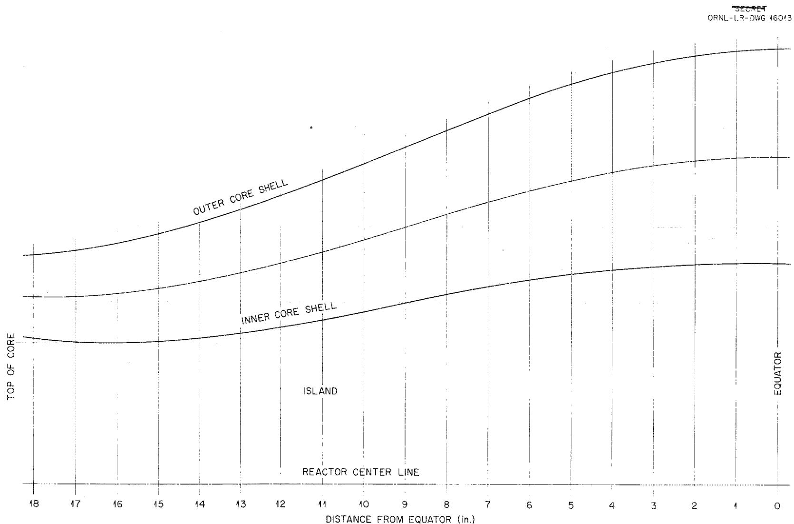  
Fig. 12. Core Layout.

The practice of interposing screens across a flow channel to achieve symmetry of the velocity profile is widely followed. It is also well known that screens across the discharge of a divergent channel tend to stabilize flow and to delay stagnation or flow reversals. In the ART fuel annulus it was highly desirable to avoid the use of screens for either purpose, since they would require increased pumping power to overcome the added resistance to flow and since they would, if used in the fissioning zone, increase the critical fuel concentration because of their poisoning effect.

The core flow problem was therefore twofold. Good flow distribution was to be obtained at the inlet, in the limited space available, with either one pump or both pumps operating; and flow through the core was to be without stagnation or other effects that would give local hot spots in the fluid. Also, these conditions were to be achieved with a minimum of pressure loss and, preferably, without insertion of Inconel bodies into the fissioning zone of the core.

The desired flow distribution at the inlet was obtained with a swirl-type header, which provides space at the inlet for circulation of an excess of fuel; that is, the volume of fuel which circulates around the inlet is greater than that which enters the inlet, and thus even circumferential distribution of the flow results.

The approximate volume of the core was dictated by fuel concentration considerations, and core annulus radii were set at the inlet and at the equator. A simple two-dimensional flow analysis indicated that pressure gradients resulting from passage curvature would be small relative to those resulting from divergence. An arbitrary cosine curve connecting the mean radii at the inlet and equator was therefore used as the passage mean line. The shape of the annulus was then determined by superimposing on the mean line a schedule of cross-sectional areas such that the resulting static pressure gradient at any point would be a function of the local dynamic pressure.

Von Doenhoff and Tetervin found the function $H_{1}$ in the expression

$$
\theta \frac {d H}{d x} = e ^ {a (H - b)} \left[ - \left(\frac {\theta}{q} \frac {d q}{d x}\right) \left(\frac {2 q}{\tau_ {0}}\right) - c (H - d) \right] ,
$$

to be a criterion for boundary layer separation, where

$a, b, c,$ and $d$ are constants,

$II$ is the shape parameter,

$q$ is the local velocity pressure outside the boundary layer,

$x$ is the distance along the axis of the channel,

$\theta$ is the boundary layer momentum thickness,

$\tau_0$ is the wall friction.

If $H, \theta_{\epsilon}$ and the term $2q / \tau_0$ are assumed to be constant with $x$ , the shape parameter can be written

$$
H = A + B \frac {1}{q} \frac {d P}{d x},
$$

where $A$ and $B$ are constants, $P$ is static pressure, and $(1/q)dP/dx$ can be used as a criterion of separation. Obviously $(1/q)dP/dx$ is minimized if it is constant throughout the divergence. However, if this were the case, the passage would still be diverging at the equator, and an undesirable discontinuity would result in the shape of the core shells at this point. The divergence is therefore modified so that it is higher at the inlet than would be the case for

$$
\frac {1}{q} \frac {d P}{d x} = a c o n s t a n t,
$$

and it is zero at the equator.

The core shape thus obtained was tested for flow profiles, with water as the working fluid and with a simulated swirl-type header. The results showed that the tangential velocities were high throughout the core but that a small upward velocity component prevailed along the inner wall of the diverging section. At all other points the axial velocity was downward. The reason for this flow pattern is obvious. Rotation of the fluid about the axis of the core creates a radial pressure gradient. Decay of the rotational velocity component as a result of friction as the fluid moves axially creates an axial pressure gradient that is positive along the inner wall and negative along the outer. These gradients are algebraically additive to the positive gradient resulting from the divergence of the passage. The net effect favors flow reversal on the inner wall.

It was determined by test that if a solid-body-rotation pattern (rotational velocity component directly proportional to radius) were used the natural tendency for separation to occur on the outer wall,

as exhibited by irrotational flow, would be overcome when the absolute velocity vectors at the outside diameter of the inlet were between 15 and 20 deg off the axis. Accordingly, a set of inlet guide vanes was designed for use with the swirl-type header which would set up a 20-deg solid-body rotation. The guide vanes were designed so that the equivalent cone angle of the intervening passages would be 10 deg, with the schedule of divergence following the relation $dP / dx = aq$ along a 2/1 elliptical mean line. The resulting blades had blunt trailing edges that blocked approximately $17\%$ of the inlet passage area. The trailing edge area was distributed so that the blockage occurred in the mid-passage region, with no blockage next to the walls. As was expected, the inlet guide vane system gave flow reversal along the inner wall. This reversal was eliminated by a drag ring which blocked part of the inlet area at the blade trailing edges. The size and location of the ring were determined by experiment. This combination of header, core shape, and inlet guide vane system gave flow in which the throughput component was not stagnated or reversed at any point on either wall. The pressure loss across the inlet guide vane system was less than that obtained with no guide vanes. In other words, the inlet guide vanes recovered part of the inlet velocity head. The relations between the inlet headers, inlet guide vanes, and core are shown in Fig. 13.

The flow problem is made particularly difficult by the design having to be evaluated by experimental tests. Various techniques, including pitot traverses, flow visualization through the use of dye injections, and conductivity probe measurements on salt injections, are being used. Tests that are felt to be definitive are being carried out on the most promising designs, both with and without vanes, in a one-half-scale model. The volume heat source of the reactor core is simulated with electrically heated sulfuric acid.

While the results of the tests made to date are still being studied, and they certainly pose questions that have yet to be resolved, it does appear that the system performs better without the inlet guide vanes than with them. The principal problem either with or without the vanes appears to be that of temperature fluctuations at the wall caused by eddying of the fuel. An experimental evaluation of the amplitude that can be tolerated for such fluctuations is under way.

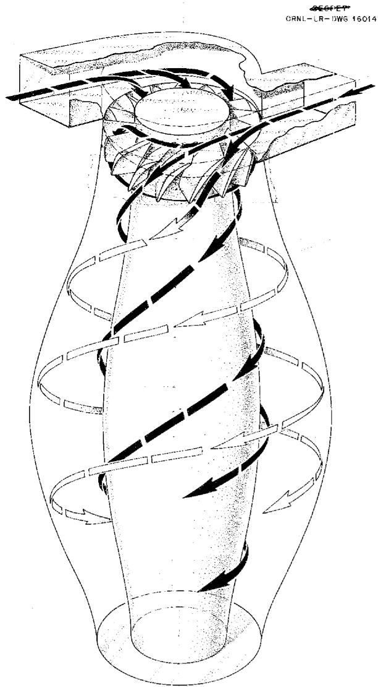  
Fig. 13. Diagram of Core Flow System Showing Relations Between the Inlet Headers, Inlet Guide Vanes, and Core.

# Pumps and Expansion Tank

Various types of pumps were considered for use in the high-temperature-liquid systems. Those seriously considered included conventional centrifugal and axial-flow pumps and electromagnetic and canned-rotor pumps. Many of these pumps were tested at ORNL, and some performed quite successfully. Each type was found to have advantages and disadvantages that had to be evaluated

according to the operating requirements of high-temperature-liquid systems for aircraft installations.

A most important requirement of an aircraft type of pump is that its weight be reasonable. From the standpoint of the aircraft designer the weight should include all the equipment required to drive the pump; that is, if an electric motor were used, the weight of the electrical generator should also be included. The importance of the weight of the drive equipment makes the efficiency of the pump also an important consideration. The combination of these two factors eliminates electromagnetic pumps from consideration for aircraft applications, because the weight of an electromagnetic pump is inherently from 100 to 1000 times greater than that of a centrifugal pump driven by a hydraulic motor or an air turbine. It appears that a centrifugal-pump drive-system weight of about $1\mathrm{lb / hp}$ can be obtained with an air bleed-off turbine type of system. A further disadvantage of electromagnetic pumps is that they are not suitable for operation with molten salts.

Canned-rotor pumps were also considered, but they have the same disadvantage that the electromagnetic pump has of requiring heavy electrical generators. A further disadvantage is that the thin shell required between the rotor and the field magnets constitutes a frangible diaphragm in the system. A very large jet of fluid may be ejected when such a rupture occurs, and a serious fire would result. Pumps that do not require frangible diaphragms in the system may give trouble by producing small leaks which would be annoying and troublesome, but such difficulties are relatively trivial when compared with major abrupt ruptures. Even though the canned-rotor type of pump is suitable for operation with molten salts and even though failure of a canned-rotor pump diaphragm should not lead to a serious fire with molten salts, the large amounts of radioactivity that would be expected in the molten salts in a full-scale reactor would constitute a far more serious hazard than the fire associated with sodium or NaK. Thus it appears that neither the electromagnetic nor the canned-rotor type of pump is well suited to nuclear aircraft application.

Quite a variety of mechanical pumps was considered, but the mixed-flow and radial-flow types of centrifugal pump seem to be much the best adapted to aircraft requirements. Since it is essential that the reactor core and the heat ex-changers be as compact as possible, it is neces

sary to make use of rather high pressure drops through these components. This in turn means that the pump heads must be between 30 and 300 ft. Therefore if an axial-flow type of pump were employed, it would be necessary to use multiple stages. Flow rates of 500 to 5000 gpm will be required, and thus relatively high shaft speeds are essential if the impeller diameter is to be kept to 6 to 12 in. Impellers of this small size are essential if the installation is to be kept reasonably compact.

The principal problem in the design and development of a centrifugal pump for high-temperature liquids is the shaft seal, and quite a number of seals were considered. One of the first considered was a graphite-asbestos packing placed around the pump shaft, with the gland either in the fluid being pumped or in the gas space above the fluid in a sump pump. This type of seal tends to give a considerably higher leakage rate than is acceptable and a relatively short shaft life, since the shaft wear is substantial. It works tolerably well when used above the gas space in the sump pump; but, if the seal is placed in the pumped fluid so that there is seepage through it, oxidation of the fluid takes place at the outboard end of the seal, and high shaft wear and corrosion rates are likely to result.

An unusual type of seal that has received a considerable amount of attention is the frozen seal. This type of seal was first developed for use with sodium. It depends on the use of a cooled gland around the shaft that is flooded with the fluid being pumped. Friction between the pump shaft and the frozen fluid in the gland is sufficient to melt a very thin film at the shaft surface. A seal of this type works well with sodium, because the shear strength of the sodium is only of the order of 50 to 100 psi at room temperature, and also well with lead, which has a shear strength of several hundred pounds per square inch at a temperature of around $200^{\circ}\mathrm{F}$ . The freezing temperatures of sodium and lead can be readily obtained with a water-cooled gland. Efforts to make this type of seal work with NaK have been unsuccessful because of the seal gland having to be cooled to well below the eutetic temperature (about $-15^{\circ}\mathrm{F}$ ). Unfortunately, the hardness values of the fluoride fuels are much higher in the temperature range immediately below

their melting points than the hardness value for sodium. Frozen seal experiments have been made with many fluoride mixtures, including many glassy melts with large percentages of beryllium fluoride, but in all instances serious cutting of the shaft occurred within a few hundred hours. In addition, large amounts of power were required for continuous operation, and very large amounts of torque were necessary in order to break the frozen seal during startup of the pump; pumps normally requiring only 3- to 5-hp motors were found to require 30- to 50-hp motors to be started.

The face type of seal used widely in automobile water pumps, refrigerant pumps, and domestic water pumps appears to be a promising solution to the seal problem. In most applications it is flooded with the pumped fluid during operation. Its very low leakage rate and long life depend on the mating faces of the seal being finished to essentially optically flat surfaces. The liquid tends to fill the space between the two seal surfaces and to form a meniscus between the edges of the seal faces on the gas side. The surface tension in the meniscus across this very narrow gap gives a pressure in the fluid between the seal faces that is sufficient to hold the surfaces apart. Therefore the surfaces do not contact each other, but, rather, they shear the fluid film between them. Thus the seal surfaces operate under ideal lubrication conditions. Seals of this type have operated for years with no measurable wear. They are relatively insensitive to starts and stops if the seal-face pressure is kept low. It is important that they be adequately cooled and that the product of the pressure in pounds per square inch on the seal face and the rubbing velocity in feet per minute not be excessive. Values as high as 100,000 for this pressure-velocity factor have been reported, with the parts giving very satisfactory service life. It is essential that the mating surfaces in a seal of this type be compatible from the standpoint of boundary lubrication, or else they may be scored during starts and stops. It is also very important that this type of seal be mounted on a shaft that runs true, with a minimum of vibration. This means that the shaft must be well balanced with the impeller and bearing assembly, that the radial looseness in the bearings must be small, and that the seal must be mounted in such a way that it is both concentric and square with the axis of the shaft. Also essential is flexibility in the seal mounting, which can be readily obtained either with a corrugated diaphragm

or a bellows, the latter being the more commonly used. Since graphite is a porous material, the graphite washers used in seals of this type are ordinarily impregnated with materials such as a plastic, lead, babbit, silver, etc. For high-temperature use in the ART fuel pumps the seal will operate with inert gas on one side and a flood of oil on the other, rather than fuel, to prevent contamination of the fuel.

The bearing problem has much in common with the seal problem for high-temperature-fluid pumps. In all instances the fluids are very corrosive to most materials, and therefore only a few materials, such as graphite, certain iron-chromium-nickel alloys, and cemented carbides, can be used. Further, the fluids pumped will remove any adsorbed films such as sulfides, phosphides, etc., that would tend to alleviate boundary-layer lubrication conditions. The viscosity of sodium is about one-fiftieth that of water, while the viscosity of the fluoride fuel mixture is about the same as that of water. Thus neither of these fluids serves as a really good lubricant. While they have the advantage of wetting the surfaces of iron-chromium-nickel alloys very effectively, they tend to strip off the protective films that are formed under ordinary conditions in most types of petroleum- or other hydrocarbon-lubricated bearings. It is evident that bearings designed to operate in molten metal or molten salt must be lightly loaded and carefully aligned.

The investigations have indicated that the bearing and seal should be placed in a cool zone above the pump impeller with a heat dam between them and the fluid being pumped. This arrangement makes it possible to use conventional bearings and seals. Pumps of this type have proved to be quite satisfactory and have the advantage of being relatively insensitive to the type of fluid being pumped; that is, the same type of pump can be used for sodium, NaK, the fluoride fuel mixture, lead, sodium hydroxide, or other fluids.

Two fuel pumps and two sodium pumps will be located at the top of the reactor. These pumps will be similar, but the fuel pumps will have the larger flow capacity. The fuel pumps will also include xenon-removal systems in which most of the xenon and krypton and probably some of the other gaseous fission-product poisons will be removed from the fluoride fuel mixture by scrubbing with helium. The fuel will enter the xenon-removal system from the eye of the pump and will pass up the center of the

shaft and into the mixing chamber. In the mixing chamber the fuel will spray through a helium atmosphere and impinge on the wall of the chamber. The resulting mixture will be very foamy and will have a large gas interface. The helium will enter the system just below the shaft seal and flow down the annulus around the shaft, through the upper slinger vanes, and into the mixing chamber. The fuel-helium mixture will then be pumped into the fuel expansion volume, where the helium containing the xenon, krypton, and other fission-product gases will be removed via the off-gas system. The circuit will be completed when the fuel leaves the expansion volume by gravity flow into the centrifuge, where any entrained gas will be removed and then be returned to the expansion volume. The fuel will be pumped through the centrifuge holes and will re-enter the main fuel system on the discharge side of the fuel pump. The system is illustrated in Fig. 14.

Experimental results obtained with a single pump operating in a test loop showed that the fuel level in the expansion chamber and the rate of bleed flow affect the ability of the centrifuge to prevent helium bubbles from entering the main fuel system. The system operates very well with a fuel level of $\frac{1}{2}$ in, in the expansion chamber and a bleed flow of up to 13 gpm. With a fuel level of 3 in, in the expansion chamber the system can be operated with a bleed flow of 25 gpm. The design value for the bypass flow rate is 12 gpm. Similar tests on a full-scale aluminum model of the fuel pump-expansion tank region have given similar results.

A number of other special features have been included in the pump design for adaptation to the full-scale reactor shield. The pump has been designed so that it can be removed or installed as a subassembly, with the impeller, shaft, seal, and bearing comprising a single compact unit. This assembly will fit into a cylindrical casing welded to the top of the reactor pressure shell. A 3-in. layer of gamma-ray shielding just above a $\frac{1}{2}$ -in. layer of zirconium oxide around the lower part of the impeller shaft will be at the same level as the reactor gamma-ray shield just outside the pressure shell. The space between the bearings will be filled with oil to avoid a gap in the neutron shield. The pumps will be powered by hydraulic drive units in order to provide good speed control, along with compact, reliable motors.

# Fill-and-Drain System (Including Enricher)

The system designed for filling the reactor with the barren fuel-carrier salt $\mathrm{NaZrF}_{5}$ , for adding the enriched uranium-bearing fuel component $\mathrm{Na}_{2}\mathrm{UF}_{6}$ and for draining the reactor is described schematically in Fig. 15. For the initial filling operation the fuel carrier will be added to the fill-and-drain tank at a temperature of about $1200^{\circ}\mathrm{F}$ and will be pressurized into the reactor a number of times at this temperature. The reactor and the fill-and-drain tank will have been preheated by operation of their respective NaK systems. Approximately $60\%$ of the uranium-bearing component of the fuel will then be added from a simple melt pot by gas pressure transfer. The remaining uranium-bearing material required to achieve criticality will be added in small increments by using the enricher device shown in Fig. 15.

The fuel fill-and-drain system is designed to permit the transfer of fuel to and from the reactor after the reactor system has been completely assembled. A heating system is included to maintain the fuel at a temperature above its melting point. This same system also serves to cool the fuel by removing decay heat from fuel drained after the reactor has been operated at power.

The initial fuel charge is to be admitted to the fuel fill-and-drain tank through a fill nozzle provided at the top of the tank. This initial filling operation will be carried out by personnel who will be inside the pressure vessel at the fill-and-drain tank. After the addition of the barren salt to the fill-and-drain tank, the system will deliver this salt into the reactor for initial testing. The barren salt will then be drained for the addition of the enriching mixture. The system will then be used to fill or partly fill and drain the reactor a number of times for mixing the salt and enriching mixture. This enriching and mixing cycle may have to be repeated a great many times. Fuel flow into the reactor will be by displacement with helium, and flow back to the fill-and-drain tank will be by gravity. The helium displaced from the reactor during fuel addition will be discharged through the off-gas system. Helium displaced from the drain tank as the fuel is drained will flow through part of the off-gas piping into the top of the reactor.

The fill-and-drain tank will also receive the fuel charge from the reactor at any time during

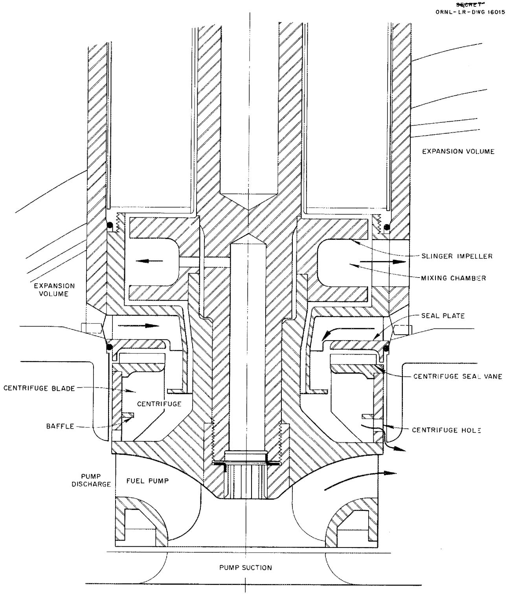  
Fig. 14. Section Through Fuel Pump-Expansion Tank Region Showing Xenon-Removal System of the Fuel Pump.

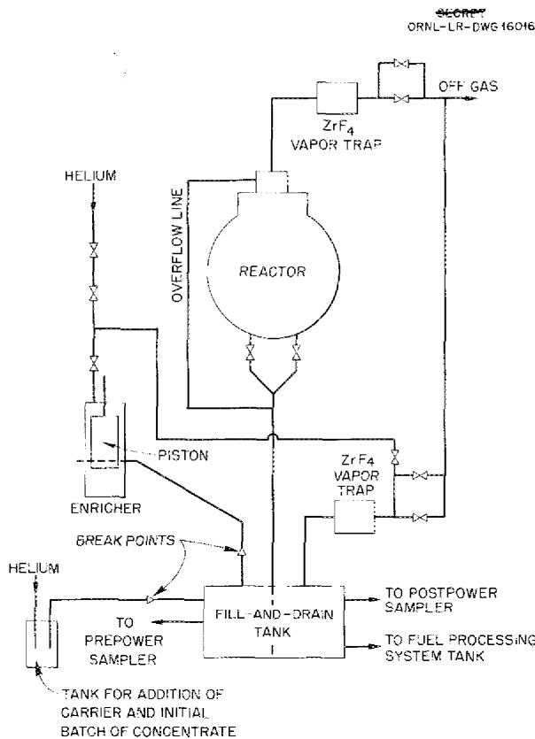  
Fig. 15. Schematic Diagram of Fuel Fill-and-Drain System, Including Enricher.

the operation when an emergency requires that the fuel be drained. Under these conditions, heat will have to be removed from the fuel at a rate equal to the fission-product-decay heat-liberation rate.

Finally, the fuel fill-and-drain system will receive the fuel from the reactor at the completion of the test and will hold it as long as decay heat requires cooling of the fuel. It will then be displaced by helium pressure into the fuel recovery tank for removal. No provision has been made for transferring the fuel back from the recovery tank to the fill-and-drain tank or for cooling the fuel in the recovery tank.

After the preliminary design studies were completed, it was decided that the fill-and-drain tank should be designed with two independent sets of cooling tubes, each designed to permeate completely the fuel volume. This arrangement will permit the tank to be cooled even though some component of one of the two cooling systems, such as a pump, radiator, or pipe, should fail. The

design heat load on the tank is 1.75 Mw. The theoretical decay heat at the instant of shutdown in a 60-Mw reactor is given as about 3.6 Mw, but only a 1.75-Mw cooling system is required, because the fuel will not be drained into the drain tank until the fission heat is negligible and until the fuel has been cooled to below $1200^{\circ}\mathrm{F}$ . The drain valves will not be opened until at least 8 sec after the control rod has been fully inserted. The design is based upon the assumption that such emergency fuel drainage would occur after continuous operation at 60 Mw for one month. The heat capacities of the fuel and mechanical equipment are great enough to absorb the decay heat above 1.75 Mw for the few minutes during which the decay heat generation would exceed this rate.

The fuel piping between the reactor and the fill-and-drain tank is designed to drain all the fuel from the reactor under gravity flow conditions in not more than 3 min. It is calculated that this condition will be met even though one of the two drain valves cannot be opened.

The requirement for a completely reliable cooling system seems to be met by the use of bundles of cooling tubes inserted into the tank. In order to provide cooling for all metal surfaces in contact with the fuel, the tank and the standpipe to the reactor are both jacketed. The coolant to be used for this service will be NaK (56-44 wt%). To provide two independent sets of cooling passages, each of which permeates the entire fuel volume, a horizontal, cylindrical tank was selected, with each end serving as a tube sheet. Horizontal decks of U-tubes arranged on each tube sheet in a square-hole pattern provide alternate layers that originate at opposite ends of the rank (Fig. 16). Design calculations indicate that following an emergency drainage of the fuel, the cooling system will, even with only one circuit functioning, limit the fuel temperature in the tank to $1800^{\circ}\mathrm{F}$ . When both coolant circuits function, the maximum temperature at any point in the fill-and-drain tank will be limited to $1600^{\circ}\mathrm{F}$ .

The jackets around the cylindrical shell of the tank and around the drain line, however, are not served by two separate systems. Coolant flow through the tank jacket will be in parallel with coolant flow in one set of U-tubes. The NaK will enter the jacket around one half of the tank circumference and will return to the coolant channel around the other half of the tube sheet periphery. Flow guides are placed along the

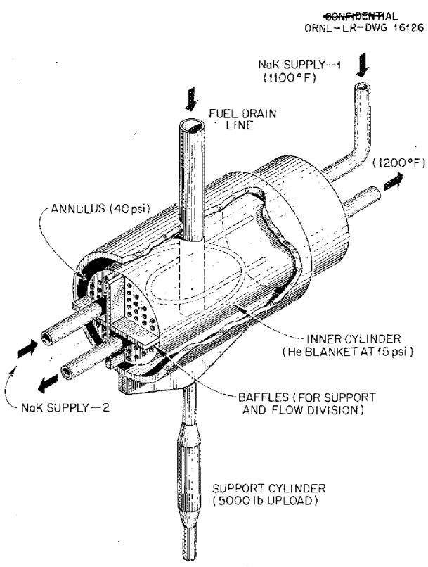  
Fig. 16. Fuel Fill-and-Drain Tank Cooling System.

annular jacket to distribute the coolant flow as required.

The two sets of U-tubes are arranged so that one set cools the fuel zone just inside the cylindrical tank wall more thoroughly than the alternate set, and the coolant supply to the jacket is from the alternate system, which is least effective in cooling the tank wall. At one end of the tank, where the fuel shell and tube sheet intersect, a triangular filler ring is placed to displace fuel from this corner zone, where cooling would be poor if one of the two coolant circuits failed. At this end of the tank, failure of the coolant circuit would interrupt cooling behind the tube sheet and in the jacket. At the other end of the tank, cooling would continue either in the jacket or behind the tube sheet, and no filler ring is required.

Further details of the operation of this system are given in the section "Operation of the ART" and on the flowsheets in Appendix A.

# Sampling System

Samples of the barren molten salt will be taken immediately after "shakedown" operation of the

ART by pressurization of the molten salt through a heated Inconel tube from the fill-and-drain tank into a detachable sample receiver. Additional samples will be taken during enrichment in the same manner to determine the homogeneity of mixing and the concentration of uranium in the mixture.

Samples of the molten fuel mixture will also be taken after nuclear power operation. These samples will also be transferred through heated Inconel lines into sample receivers, but, because of the high level of radioactivity in the fuel, the operation is to be accomplished by remote control, and the lines and receivers must be shielded. To prevent premature activation of the sampling valve, a frangible disk valve will be included in each sample transfer line.

A total of five postpower samples may be taken. The five receivers will be encased in the same lead shielding unit, which will be removed after the entire ART operation is completed.

# Fuel Recovery System

After completion of ART operation, the fuel will be drained into the fill-and-drain tank and held there for a period of several days to allow fission-product decay and the consequent lowering of decay heat production. The fuel will then be transferred into the fuel recovery tank for delivery to the recovery and reprocessing facility.

The fuel recovery tank will consist of four, interconnected, approximately 9-ft lengths of 8-in.-IPS Inconel pipe furnished with electrical heaters. The assembly is designed for cooling by radiation and natural convection to the atmosphere. It will be shielded with approximately 10 in. of lead. The molten fuel will be transferred to the tank through a heated Inconel line containing a frangible disk valve and an open bismuth valve. When the transfer is completed, the bismuth valve will be closed and both the transfer line and the helium line will be severed, as will all heater and thermocouple leads. The assembly will then be lifted out of the cell and loaded on a truck for delivery to the recovery facility. The assembly will include a transfer line and the other necessary service connections for use in the course of recovery operations.

# HEAT EXCHANGERS AND HEAT DUMPS

The spherical-shell fuel-to-NaK heat exchanger, which makes possible the compact layout of the reactor heat exchanger assembly, is based on the

use of tube bundles curved in such a way that the tube spacing will be uniform, irrespective of latitude. The individual tube bundles terminate in header drums. This arrangement facilitates assembly because small tube-to-header bundles can be assembled, made leaktight, and inspected much more easily than can one large unit. Furthermore, these tube bundles give a rugged, flexible construction that is admirably suited to service in which large amounts of differential thermal expansion must be expected. The configuration of the heat exchanger tube bundles is illustrated in Fig. 17.

The heat removed from the fuel by the NaK will be transferred to air in the NaK-to-air radiators, which will be installed in a heat-dump system designed to simulate the turbojet engines of the full-scale aircraft in a number of important respects, such as thermal inertia, NaK holdup, and basic fabricational methods. The round-tube and plate-fin radiator cores are fabricated of type 310 stainless-steel-clad copper fins spaced 15 per inch and mounted on $\frac{3}{16}$ -in.-OD Inconel tubes placed on $\frac{2}{3}$ -in. square centers. The tubes are welded and brazed into round header drums. The individual radiator cores consist of two halves 15 by 30 in. The fin matrix depth in the air flow direction is 5.33 in. A typical radiator is illustrated in Fig. 18.

The basic requirement of the heat-dump system is to provide heat-dump capacity equivalent to 60 Mw of heat with a mean temperature level of $1300^{\circ}\mathrm{F}$ in the NaK system. The NaK will be circulated through eight separate systems. Four will constitute the main heat-dump system, two will serve the reflector-moderator cooling system, and two will serve the fuel fill-and-drain tank.

In the main system a group of four NaK fill-and-drain tanks will be used. The tanks will be pressurized to force the NaK into the main cooling circuit. The 12 tube bundles of the fuel-to-NaK heat exchanger will be manifolded in four groups of three each. The NaK will flow from these tube bundles out to the radiators, which will be arranged in four vertical banks with four radiators in each bank. The NaK will flow upward through the radiator bank to the pumps. A small NaK bypass flow around the radiators will pass through a cold trap in order to maintain a low oxygen concentration.

tration in the NaK. (For details of the NaK systems see Appendix A, Flow Diagram 6.)

The two independent reflector-moderator heat-dump systems (referred to on Flow Diagram 6, Appendix A, as the Auxiliary System) will be essentially similar to the main NaK system except that their combined capacity will be about one-third that of one of the four circuits of the main heat-dump system. The NaK will be circulated to both the Na-to-NaK heat exchangers in the top of the reactor, where the two NaK streams will pick up from the sodium the heat generated in the island and the reflector. The two NaK streams will pass to small NaK-to-air radiators, where they will be cooled and returned to their respective pump suction. A bypass cold trap will be included in each system, as in the main NaK systems, while a single fill-and-drain tank will serve both systems.

Four axial-flow blowers will force 300,000 cfm of air (which expands to $6.7 \times 10^{5}$ cfm when heated to $750^{\circ}\mathrm{F}$ ) through the radiators and out through a 10-ft-dia discharge stack 78 ft high. Since the axial-flow blowers will stall and surge if throttled, control will be accomplished through bypassing a portion of the air around the radiators. The heat-dump rate will be modulated by varying the amount of air bypassed through a set of controllable louvers mounted in such a way as to bleed air from the plenum chamber between the blowers and the radiators. The arrangement will include louvers to block off the air passage to the radiators and louvers in the bypass duct; one set will be opening while the other is closing. This arrangement should give good control of the heat load from zero to $110\%$ of the design load. Since each blower will be driven with an a-c motor independently of the others, the heat-dump capacity can also be increased in increments of $25\%$ from zero to full load by changing the number of blowers used.

Heat barriers mounted on both sides of the radiators will be required in order to minimize heat losses during warmup operations. Warmup will be accomplished by energizing the NaK pumps and driving them at part or full speed. As a result of fluid frictional losses approximately 400 hp must be put into the pumps in the NaK circuits and will appear as heat in the fluid pumped. A mechanical power input of 400 hp to the NaK pumps will produce a heat input in the NaK system of approximately 300 kw. This should be enough to heat the system quite satisfactorily if the radiator

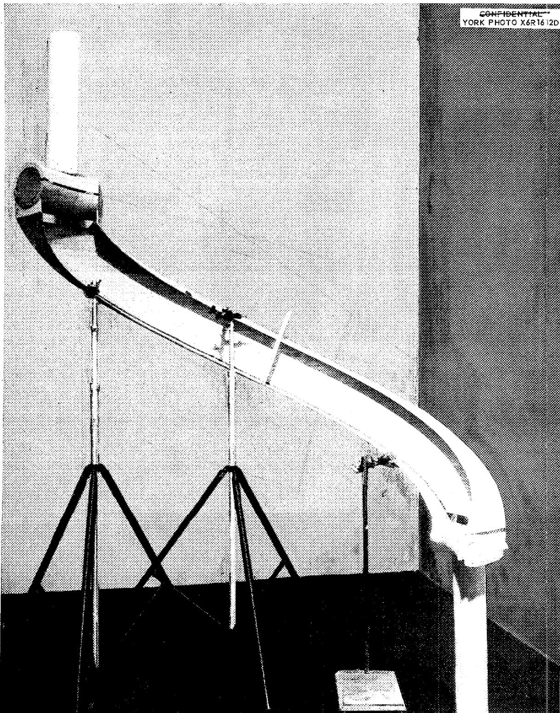  
Fig. 17. Model of Main Fuel-to-NoK Heat Exchanger Channel.

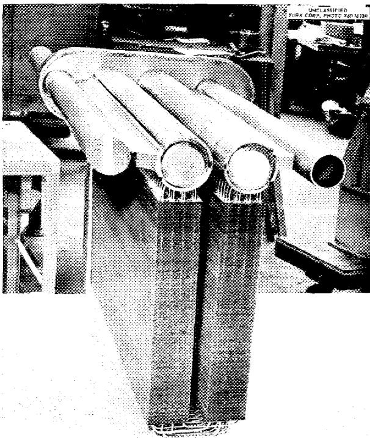  
Fig. 18. Prototype ART NaK-to-Air Radiator.

cores are blanketed to prevent excessive heat losses. However, electrical heaters will be available on the NaK lines so that the NaK pumps can be run at one-half speed to reduce stresses and wear during zero- and low-power operation. Relatively simple sheet stainless steel doors with 3.0 in. of thermal insulation will, when closed over both faces of a radiator (100-ft² inlet-face area) filled with $1100^{\circ}\mathrm{F}$ NaK, reduce the heat loss there to about 30 kw.

The heat appearing in the reflector-moderator will be about $3.5\%$ of the reactor power output. The cooling circuit will also remove heat from the core shells and the pressure shell, and therefore the total amount of heat to be removed from this cooling circuit will be about $10\%$ of the reactor output. This must be removed at a mean NaK circuit temperature of about $1050^{\circ}\mathrm{F}$ . Four radiators that have inlet faces $2 \times 2.5$ ft each and the same basic geometry as that used for the main heat dumps will be employed. These radiators will be equipped with louver and heat-barrier doors like those used on the main NaK radiators and will be supplied with air from the same air duct (see Flow Diagram 6, Appendix A).

The two independent heat-dump systems for heating and cooling the fuel fill-and-drain tank (referred to on Flow Diagram 6, Appendix A, as the Special Systems) will also be essentially similar to the main NaK system. The two NaK-to-air radiators in these systems will be served by individual air blowers. When the systems are to be used for adding heat to the fuel in the fill-and-drain tank to preheat the tank for filling or to maintain the fuel above its melting temperature, they will be capable of heating the tank to $1250^{\circ}\mathrm{F}$ . The systems will also be ready at any time to remove fission-product-decay heat from the fuel.

# OFF-GAS SYSTEM

The fission-product gases which will be purged from the fuel in the fuel expansion tank are to be continuously removed from the fuel system to a water-cooled charcoal adsorber, in which the gases will, in effect, be "held up" a sufficiently long period of time for safe discharge to the stack. In the fuel expansion tank the gases will be diluted with 1000 to 5000 liters of helium per day and will be bled first through a water-cooled vapor trap (to remove $\mathsf{ZrF}_4$ vapor) and then outside the reactor and cell through an empty pipe into a charcoal-filled pipe in a water-filled tank. The empty pipe was provided to permit some decay of the gaseous activity so that when it is subsequently adsorbed by the charcoal the resultant heat can be satisfactorily transferred to the water surrounding the charcoal-filled pipe. There will be sufficient charcoal to assure a 48-hr holdup of $\mathsf{Kr}^{88}$ , which will be the only gaseous fission product with significant activity after passage through the charcoal. Experimental work has indicated that $64\mathrm{ft}^3$ of charcoal will be required. Two parallel charcoal adsorber systems are provided.

Provisions have also been made for bleeding the cell atmosphere through an auxiliary charcoal bed in the event that a leak occurs in the reactor off-gas system within the cell. The charcoal bed in this auxiliary vent system will be bypassed during normal operation for disposing of instrument bleed gases.

Four bypass loops will be provided in the two off-gas systems, one before and one after the charcoal section of each system, so that the activity in the isolated gas samples can be counted. Further, the vent lines to the stack will be monitored to determine whether the gas may be safely

discharged. The system will operate at a pressure slightly above atmospheric and will not require pumps.

Except for the equipment within the reactor cell and in the water tank (containing the empty and the charcoal-filled pipes), which will be buried in the ground, all components of the off-gas system are to be housed in a special building provided for that purpose at the southwest corner of the ART building. A fundamental design criterion is that access to this "off-gas shack" should not be limited by radioactivity from any other part of the system but that the shack should be isolated in the event of a leak of gaseous activity therein.

In the design of the off-gas system the calculations that were made10-12 were strictly theoretical, but they were strengthened by the operating experience which had been obtained on a similar adsorber system used with the HRE. In particular, flow vs pressure-drop data and flow vs breakthrough times in charcoal adsorbers were obtained from HRE experience. Experimental data on the adsorptivity of charcoal indicate that the design of the ART adsorber is conservative. Details of the system are presented on Flow Diagram 3 in Appendix A.

# AIRCRAFT-TYPE SHIELD

The most promising of the several shielding arrangements that were considered for the ART seems to be the one which is functionally the same as the arrangement for an aircraft requiring a unit shield - a shield designed to give $\sim 10$ r/hr at 50 ft from the center of the reactor. Such a shield is not far from being both the lightest and the most compact that has been devised. It will make use of noncritical materials that are in good supply, and it will provide useful performance data on the effects on the radiation dose levels of the release of delayed neutrons and decay gammas in the heat exchanger, the generation of secondary gammas throughout the shield, etc. While the complication

of detailed instrumentation within the shield does not appear to be warranted, it will be extremely worth while to obtain radiation-dose-level data at representative points around the periphery of the shield, particularly in the vicinity of the ducts and of the pump and the expansion tank region.

The shield for the reactor will have some characteristics that will be peculiar to this particular reactor configuration. The thick reflector was selected on the basis of shielding considerations. Use of a thick reflector is based on two major reasons: a reflector about 11 in. thick followed by a layer of boron-bearing material will attenuate the neutron flux to the point that the secondary gamma flux can be reduced to a value about equal to that of the core gamma radiation; it will also reduce the neutron leakage flux from the reflector into the heat exchanger to about the level of that from the delayed neutrons which will appear in the heat exchanger from the circulating fuel. An additional advantage of the thick reflector is that $99.8\%$ of the energy developed in the core will appear as heat in the high-temperature zone within the pressure shell. This means that very little of the energy produced by the reactor will have to be disposed of with a parasitic cooling system at a low-temperature level. The material in the spherical-shell intermediate heat exchanger is about $70\%$ as effective as water for the removal of fast neutrons; so it too is of value from the shielding standpoint. The delayed neutrons from the circulating fuel in the heat exchanger region might appear to pose a serious handicap. However, they will have an attenuation length much shorter than the corresponding attenuation length for radiation from the core. Thus, from the outer surface of the shield, the intermediate heat exchanger will appear as a much less intense source of neutrons than the more deeply buried reactor core. The fission-product-decay gammas from the heat exchanger will be about equally as important as the secondary gammas from the beryllium and the reflector shell.

Thermal insulation 0.5 in. thick will separate the hot reactor pressure shell from the gamma shield, which will be a layer of lead 4.3 in. thick. The lead, in turn, will be surrounded by a 32-in.-thick region of borated water. The slightly pressurized water shield will be contained in an aluminum tank. Cooling of the lead shield will be effected by circulation of water through coils embedded in the lead. The borated water shield

will also be cooled by water circulated in coils submerged in the borated water and by thermal convection of the atmosphere in the reactor assembly cell.

An opening will be made at the bottom of the shield for filling and draining of the reactor. The fuel fill-and-drain tank will be shielded with 10 in. of lead to reduce the dose to $1\mathrm{r / hr}$ at the shield surface one week after full-power operation. The resulting shield weight for a $13\mathrm{ft}^3$ capacity tank will be about 30 tons.

# CONTROLS AND INSTRUMENTATION

The early effort by ORNL personnel to develop the circulating-fuel type of aircraft reactor was motivated in part by a desirable control feature of such reactors - the inherent stability of the reactor at design point that results from the negative fuel and overall temperature coefficients of reactivity. In a power plant with this characteristic the nuclear power source will be a slave to the turbojet load with but a minimum of external control devices.

This predicted master-slave relation between the load and the power source was verified by the ARE. Work with an electronic simulator indicates that the ART should behave in essentially the same way. Controlwise, the power plant consists of the nuclear source, the heat dump (in the case of the ART), and the coupling between source and sink (the NaK circuit). Control at design point can be effected to some extent by nuclear means at the reactor, by changing the coupling (i.e., changing the NaK flow) or by changing the load (i.e., the heat dump from the NaK radiators).

For the ART at design point the regulating rod will be used mainly for adjusting the reactor mean fuel temperature. In particular, an upper temperature limit will cause the regulating rod to insert, and therefore the fuel outlet temperature should not appreciably exceed $1600^{\circ}\mathrm{F}$ , even in transients. This limit will override any normal demand for rod withdrawal. Furthermore a low NaK outlet temperature from the heat-dump radiators will automatically decrease the heat load to keep the lowest NaK temperature of the system at no less than $1070^{\circ}\mathrm{F}$ . This lower temperature limit will override all other demands for power.

Control of the ART falls in three different categories of operation: startup, operation between startup and appreciable power (about $10\%$ of design point), and operation in the range from

10% to full power. For the second and third of these categories the nature of the reactor and power plant is so different from that of conventional high-flux reactors that control must be based on inherent characteristics of the reactor to a large extent rather than on conventional reactor-control practice. Control at startup utilizes, in principle, old reactor-control practice with short-period "scrams" that are conventional. Experimentation will take place primarily in the startup and design-point regions. In the intermediate region between these two, little testing will be done.

Fission chambers and compensated ion chambers will be located beneath the reactor shell just outside the lead region. The region around the fill-and-drain pipe will be filled with moderator material through which cylindrical holes for these chambers will run radially out on lines which intersect at a point below the center of the reactor. The chamber sensitivities will be adequate for the entire range of nuclear operations.

The control system is designed to provide automatic corrective action for emergencies requiring action too rapid to permit operator deliberation. Automatic interlocks will prevent inadvertent dangerous operation, with minimum operator limitation. Operation in the design power range will be independent of nuclear instrumentation during power transients. Three classes of emergencies have been provided for.

Class I. - Any of the following events will cause the rod to be automatically and completely inserted at a rate of $1\% \Delta k / k$ in 8 sec:

1. stoppage of either sodium pump,   
2. stoppage of either fuel pump,   
3. drop in fuel or sodium liquid levels in the expansion tanks when pumps are operating at design point,   
4. failure of the oil system to the sodium or fuel pumps,   
5. leakage of fuel into NaK or NaK into fuel,   
6. failure of commercial power or locally generated power.

At the same time one-half the blowers will be shut off to reduce the heat load. The load will then be further reduced by the radiator shutter automatically closing in response to a $1070^{\circ}\mathrm{F}$ low-limit signal for the NaK-to-air radiator outlet temperature. Dumping of the fuel will not be automatic but will probably be initiated by the operator.

Class II. - Any of the following events will cause the rod to be automatically inserted at a rate of $1\% \Delta k / k$ in 8 sec:

1. stoppage of any NaK circuit,   
2. leakage of NaK to the atmosphere,   
3. trouble in the off-gas system (to be defined),   
4. maximum fuel temperature greater than $1650^{\circ}\mathrm{F}$   
5. maximum sodium temperature greater than $1300^{\circ}\mathrm{F}$   
6. maximum sodium temperature greater than $1250^{\circ}F$ when either set of sodium-to-NaK radiator louvers is wide open,   
7. reactor on positive period of less than 3 sec,   
8. fill-and-drain tank mean temperature greater than $1300^{\circ}\mathrm{F}$ or less than $1100^{\circ}\mathrm{F}$ ,   
9. failure of the oil system to any NaK pump,   
10. rod-drive trouble.

Class III. - It is planned that the operator will be warned of any of the following events, but no automatic corrective action will take place:

1. leakage of sodium into fuel or fuel into sodium,   
2. lowering of the water level in the outer cell,   
3. excessive radiation level in the cell as determined by monitors,   
4. excessive humidity in the cell,   
5. excessive rod temperature,   
6. excessive chamber temperature,   
7. oxygen in the cell.

Lists of the instruments for the ART have been prepared that give the following information for each required measurement: type of instrument pickup, location of pickup, type of presentation, reading location, range, and accuracy. The necessity for using an instrument was determined by whether it would be required for the safe and orderly conduct of the test, for providing sufficient information for evaluation of test results, and for providing information not otherwise available. Five stations have been provided in the ART building at which instruments will be read: the control room, the information room, the auxiliary equipment panel, the vent house, and the temporary panel for fuel sampling and recovery.

All instruments pertinent to the nuclear performance of the reactor, as well as to the control of all process equipment which affects nuclear performance, are located in the control room. The instruments required for determination of reactor power and heat exchanger and radiator performance are located in the information room. In general, operating instruments for auxiliary systems, such as water, hydraulic fluid, lubricating

oil, gas, etc., as well as for the NaK system and all pumps, will be confined to the auxiliary equipment panel. A few pertinent instruments, as well as a number of alarms, are duplicated in both the control room and the auxiliary equipment panel. With a few minor exceptions, all heater controls and associated temperature instruments are located in the basement on the auxiliary equipment panel. Off-gas system temperatures will be recorded in the vent house to avoid lines being run to the information room. The temporary panel (for fuel sampling and recovery) will be located on the main floor just outside the cell and will be connected by temporary lines to equipment within the cell as required to effect the fuel sampling and fuel recovery operations.

# AUXILIARY SYSTEMS

# Helium Supply System

Helium is required in the ART principally because of a need for a flushing gas for removing fission gases, for an inert atmosphere over the fuel, sodium, and NaK, and for a pressurizing medium for forcing fuel and NaK to and from their respective fill-and-drain tanks into the reactor system. Since no two of these three uses of helium will be concurrent, the helium consumption rate will be low. Therefore the helium is to be supplied from 12 cylinders manifolded into two banks by a high-pressure manifold with isolating valves and pressure-reducing valves for each bank. This will allow use from either of the two banks while the depleted bank is being replaced. (For details of this system see Flow Diagram 9, Appendix A.)

# Nitrogen Supply System

Nitrogen will be required for filling the reactor cell and for operating the pneumatic instruments. The nitrogen atmosphere in the cell is a safety measure. In the event of a simultaneous sodium and water leak from the reactor into the cell, it is important that the oxygen concentration of the ambient atmosphere be kept low enough for no detonation of the hydrogen-oxygen mixture to occur. The lower combustibility limit for hydrogen-nitrogen-oxygen mixtures is obtained at $5\%$ oxygen. To ensure a substantial margin of safety, it has been decided that the oxygen concentration in the reactor cell will be kept to less than $1\%$ .

The oxygen will be removed initially from the cell by the cell pressure being reduced with a

vacuum pump to a maximum of 0.74 psia and the cell being repressurized with dry nitrogen to atmospheric pressure. The dry nitrogen bleed from the pneumatic instruments will act as a continuous purge, which will keep the oxygen content of the nitrogen low. The bleed flow is estimated to be a maximum of 7 scfm. (For details of this system see Flow Diagram 10, Appendix A.)

A permanent storage tank with a capacity of 10,500 scf at 1000 psi and a pressure-reducing station with two reducing valves that are available at the site will comprise an adequate system for supplying the instruments with the 7 cfm required during the test. A trailer will be used to fill the reactor cell initially.

# Electrical Power System, Distribution, and Auxiliary Equipment

The electrical power for the ART will be supplied by two separate sources. One will be a commercial (TVA) source and the other will be a set of diesel-driven generators. In case of a power failure for any reason, no effort will be made to continue to operate the reactor at power; that is, a power failure or an equipment failure will lead to an orderly shutdown of the reactor. The main power loads are:

1. the two fuel pumps,   
2. the two sodium pumps,   
3. the two NaK pumps in the reflector-moderator cooling system,   
4. the four NaK pumps in the fuel cooling system,   
5. the two NaK pumps in the fill-and-drain tank cooling system,   
6. the four radiator blowers in the main duct,   
7. the two radiator blowers in the special duct,   
8. the battery for control and instrument circuits,   
9. the pump lube oil systems,   
10. the heater and auxiliary loads.

The relation between the various pumps is such that one fuel pump, one sodium pump, one NaK pump in the reflector-moderator cooling system, two NaK pumps in the fuel cooling system, and two radiator blowers should be connected to one power source. These major pieces of equipment will not have alternate power sources.

A station-type battery will be provided, and the circuit will be arranged so that the battery will float on the line at all times to keep a full charge. The battery will be used to supply the necessary control and instrument circuits in case of a power outage. Some emergency lighting will also be fed off the battery.

# Fuel and Sodium Pump Lubricating and Cooling Oil Systems

The lubricating and cooling oil systems for the fuel and sodium pumps are to be sealed so that they will serve as secondary, or backup, containers for the gaseous radioactive products which might leak from the fuel or sodium systems through the primary rotating face seal between the reactor system cover gas and the lubricating oil surrounding the lower seal. The pressure in the lubricating oil system will be a slave to the pressure of the process system through seal-balancing control for holding the differential pressure across the lower seal to a minimum and in a direction to cause leakage of oil into the system rather than gases into the oil. The oil leakage will be trapped and then removed by a separate system. All parts of the system external to the test cell must be capable of withstanding pressures as high as 200 psig for periods of up to 1 hr without failure.

# Process Water System

The ART process water is to be supplied by an "open," once-through system with two parallel pumps to supply pressure. There will be one supply header and one exit header, and each will penetrate the cell wall. The process circuits will join these headers within the cell to minimize the number of cell penetrations. The flow through each circuit will be preset before the cell is sealed, and thus there will be no need for remote control or remote flow measurement. The use of the open cycle eliminates the need for additional water pumps, heat exchangers, etc., and the consequent necessity of canning the pumps to withstand the cell disaster pressure. Check valves, backed up by motor-driven cutoff valves, will be provided in the inlet lines through the cell. The check valves, backed up by the cutoff valves, will prevent the escape of the gaseous activity that would be present in the water lines within the cell if a reactor catastrophe caused the water lines within the cell to rupture. Provisions will be made to assure uninterrupted flow, since water flow to the lead shielding must be maintained during all periods when the reactor and dump tank are at operating temperature so that the lead will not be melted.

Water will be required within the cell for filling the reactor water shield and for cooling the reactor and fuel-dump-tank lead shields, the two instrument pods, and the reactor and fuel-dump-tank vapor traps. Outside the cell, water cooling will be

provided for the lubrication and hydraulic systems, the charcoal adsorber, the penthouse space cooler, and the NaK cold traps and for filling the water annulus of the cell.

# THE FACILITY

# The Building

The building constructed in 1952 to house the ARE is being modified to provide the space and facilities required for the ART. An addition has been constructed at the south end of the ARE building to effect a 64-ft extension of the original 106-ft-long building. The shielded reactor assembly will be installed in the containing cell that has been provided in the addition for this purpose. Such an arrangement will permit the use of services and facilities that were provided for the original installation. Items such as the control room, offices, change rooms, toilets, storage area, water supply, power supply, portions of experimental test pits, access roads, security fencing, and security lighting have been incorporated in ART plans.

The plan and section drawings of the facility are shown in Figs. 19 and 20. The floor level of the addition is at the ARE basement-floor grade (ground level at this end of the building), and the cell for housing the reactor assembly is sunk in the floor. The reactor cell is located in approximately the southwest quarter of a 42-ft-wide by 64-ft-long high-bay extension and is directly in line with the ARE experimental bay. The reactor assembly will be positioned so that the top of the shield will be below building floor elevation.

The south wall of the ARE experimental bay has been removed, and the overhead crane facility has been revised by the installation of a 30-ton-capacity crane, in addition to the existing 10-ton crane, to permit use of the experimental pits for installation of auxiliary equipment and possibly for underwater reactor disassembly work after reactor operation. Also, the truck door in the north wall of the building has been enlarged to provide a large entry door to the ART area. Field maintenance and laboratory facilities have been installed in the area east of the new bay and south of the low bay of the older part of the building.

# The Reactor Assembly Cell

The cell designed for housing the reactor assembly is shown in Fig. 21. The cell consists of an inner and an outer tank. The heat-dump equip-

ment will be located outside the cell, but nearby. The space between the two tanks is 36 in. and will be filled with water. The inner tank will be sealed so that it can contain the reactor in an inert atmosphere of nitrogen at 5 psig. The tank has been built to meet ASME code requirements for unfired pressure vessels designed for a 200-psig operating pressure. The outer tank serves merely as a water container.

The inner tank will be approximately 24 ft in diameter with a straight section 12 ft long and a hemispherical bottom and top. The outer tank, which is cylindrical, is 30 ft in diameter and about 47.5 ft in height. When the reactor is to be operated at high power, the space between the tanks and above the inner tank will be filled with water for carrying off the heat given off by decay gamma activity in the event of an accident so severe as to cause a meltdown of the reactor.

About 13 ft of the outer tank will be above floor grade. This portion of the tank, as well as the top hemisphere of the inner tank, will not be attached until completion of the reactor installation and preliminary shakedown testing. Since the shielding at the reactor and for other radioactive components will be quite effective, it will be possible for a man to enter the inner tank through a manhole for inspection or repair work. If the reactor has been operated at moderately high power, the fuel will have to be drained. If the repair work requires a relatively long time, the nitrogen atmosphere will be replaced with air.

The unshielded reactor assembly will weigh approximately 11,500 lb, the lead gamma shield will weigh approximately 26,000 lb, and the water in the shield will weigh approximately 38,500 lb. The shielded reactor assembly will be mounted in the inner tank on vertical columns with the reactor off center 3 ft from the vessel axis and about 7 ft above an open-grated floor. This positioning provides the space that will be needed for the location of the fuel fill-and-drain tank, prepower and postpower sampling systems, fuel recovery tank, nuclear instrumentation, and enriching equipment. The off-center location also serves to minimize the length of the NaK piping.

The NaK and off-gas piping connected to the reactor will pass through a thimble-type passage or bulkhead with a bellows-type expansion joint in the double-walled cell. The opening will be covered with a conical thermal sleeve which will be welded to the pressure cell wall. The piping

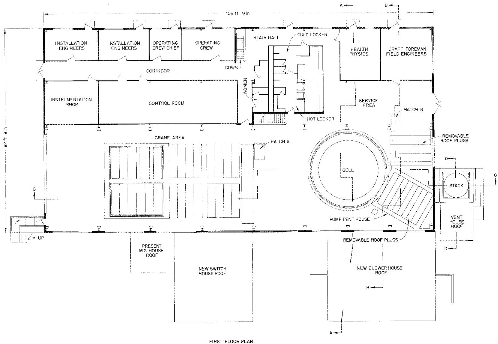  
INCLASSIFIED   
ORNL-LR-DWG4471A   
Fig. 19. Plan of the ART Building.

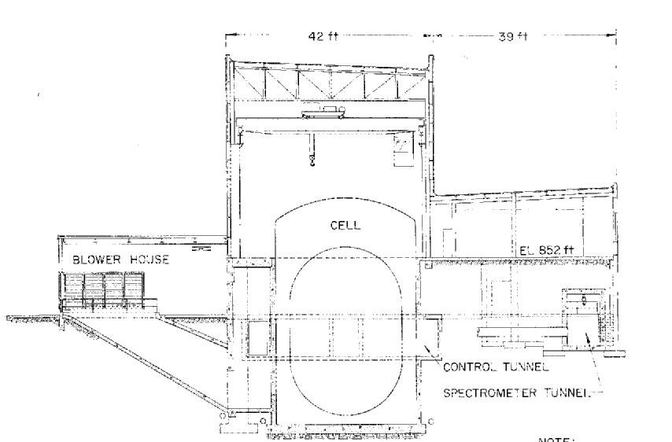  
SECTION A-4

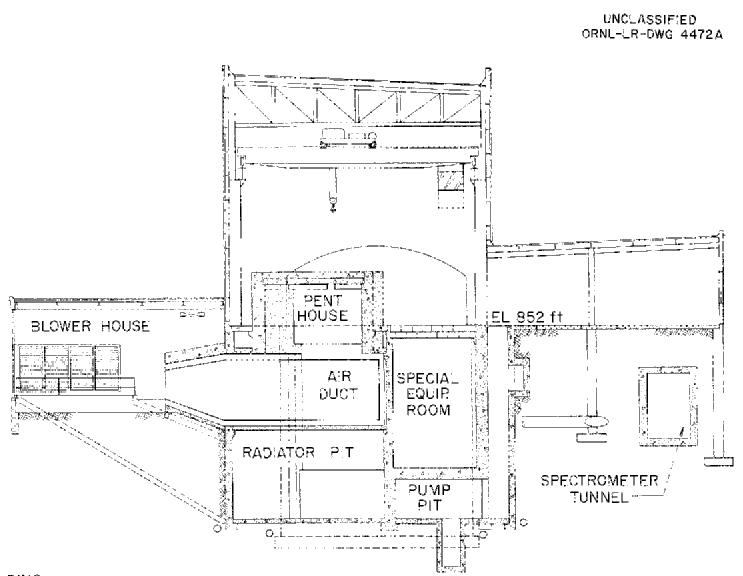  
SECTION B-B

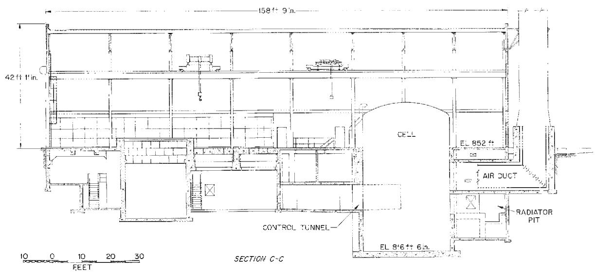

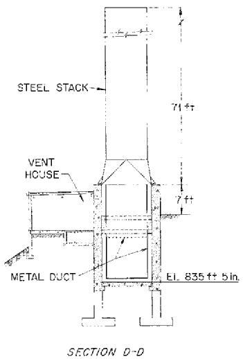  
Fig. 20. Section of the ART Building.

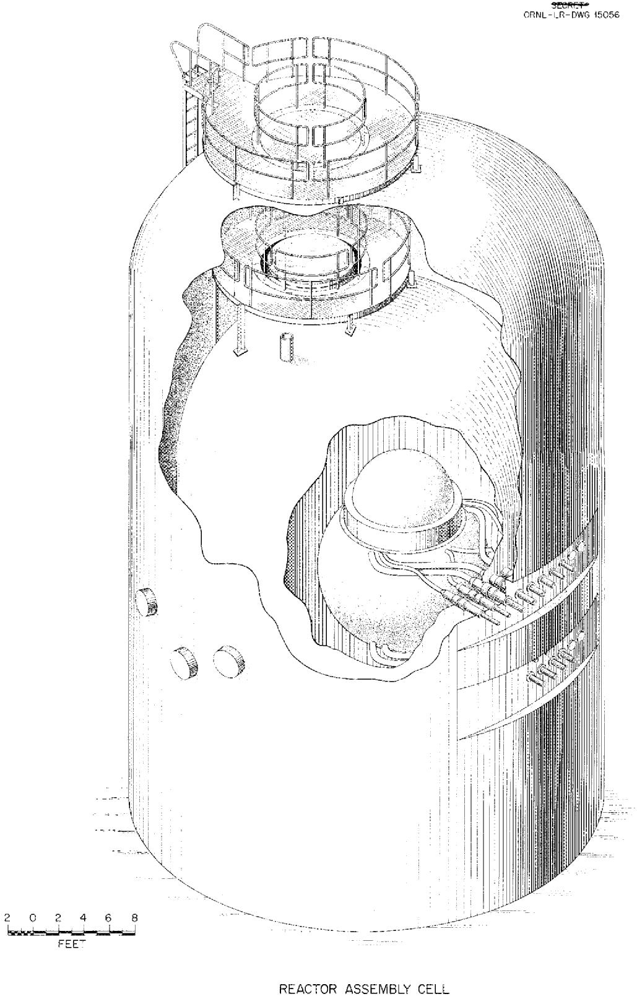  
Fig. 21. Reactor Assembly Cell.

will be anchored to the thermal sleeve. The annular space between the NaK and the off-gas piping and the thimble-type passage will be filled with insulation. Auxiliary service pipes and tubes connected to the reactor will pass through three junction panels located on the west side of the cell. The openings will be covered with stiff plates which will be welded to the pressure-cell wall. The bulkhead between the double-walled cell is a bellows-type seal.

Five doubly sealed junction panels for controls and instrumentation have been installed through the tank below the building floor grade on the east side of the tank as a part of another bulkhead system to pass the wires, pipes, tubes, etc., required for the circuits and systems. The volume within the instrument and electrical wiring bulkheads will then be maintained at a pressure of 200 psig to prevent outleakage from the inner tank, even in the event of a disaster. The various thermocouples, power wiring, etc., will be installed on the reactor assembly in the shop and fitted with disconnect plugs so that they can be plugged into the panel in a short period of time after the reactor assembly has been lowered into position in the test facility. This will minimize the amount of assembly work required in the field.

Manholes 5 ft in diameter have been installed in the upper portion of the containers. The manhole in the water tank is located just above the flange on the inner tank to allow passage through both

container walls and thus provide an entrance to the inner tank for use after placement of the top. Sufficient catwalks, ladders, and hoisting equipment will be installed within the inner tank to provide easy access for servicing all equipment.

The control tunnel surrounds 180 deg of the north side of the cell, with all junction panels exiting into the control tunnel which extends to the auxiliary equipment pit (formerly the ARE storage pit). The pit and the adjoining basement area will include such items as the lubricating oil pumps and coolers, hydraulic oil pumps, relays, switch gear, voltage regulators, and auxiliary equipment control panels.

# The Shielding Experiment Facility

Tests made at the Tower Shielding Facility indicated that provision should be made for the measurement of the gamma-ray spectrum of the ART as a function of the angle of emission from the reactor shield. Therefore five collimator tubes have been provided to collimate four beams radiating from an equatorial point at the surface of the water shield at angles of from 0 to 70 deg from the radial direction and one beam from an equatorial point at the surface of the reactor pressure shell. The latter beam will be used only during low-power operation. The layout required for providing these beams is shown in Fig. 22. In addition to the facilities shown in Fig. 22, a gamma-ray dosimeter will be located on the roof above the reactor.

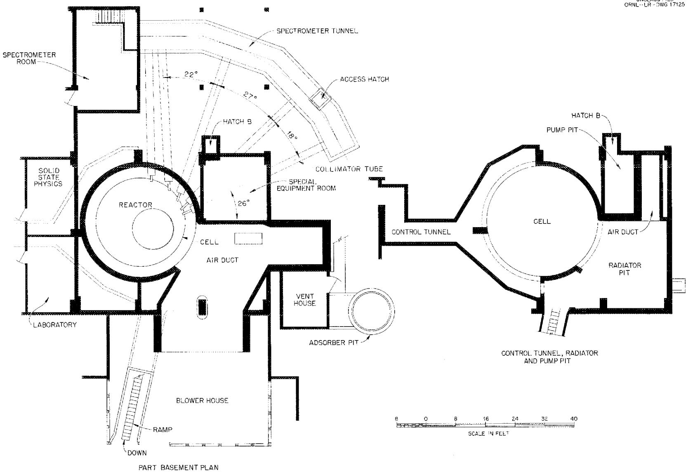  
Fig. 22. ART Shielding Experiment Facility.

Part III

# DESIGN AND DEVELOPMENT STUDIES

：

#

# FUEL DEVELOPMENT

A thorough survey of materials that appeared to be promising as heat transfer fluids was presented in ORNL-360. The first requirement is that the fluid must be liquid and thermally stable over the temperature range from 1000 to $1800^{\circ}\mathrm{F}$ . A melting point considerably below $1000^{\circ}\mathrm{F}$ would be preferable for ease in handling, but a substance that would be liquid at room temperature would be even better. Other desirable characteristics are low neutron absorption, low viscosity, high volumetric specific heat, and high thermal conductivity. Above all, it must be possible to contain the liquid in a good structural material at high temperatures without serious corrosion or mass transfer of the structural material. If the heat transfer fluid is to serve also as a circulating fuel, it must be a suitable vehicle for uranium; that is, the solubility of uranium and its effect on the properties of the fluid must be considered.

To be suitable for a high-temperature, liquid-fueled, epithermal reactor, a fuel system must meet several stringent requirements. The liquid must contain a sufficient concentration of a uranium compound for a critical mass to be provided in the core volume and must melt at a temperature substantially below the heat exchanger outlet temperature. It must consist of elements of low absorption cross section for thermal neutrons and must consist solely of compounds which are thermally stable at temperatures in excess of the core outlet temperature. A high thermal coefficient of expansion is desirable as an aid to self-regulation of the power level. In addition it must be stable to the intense radiation field and must tolerate the fission process and the accumulation of fission products without serious adverse effect on its physical, heat transfer, and chemical properties. Of the many fluid materials which have been considered, molten fluorides are the only fluids which seem to be generally suitable as aircraft reactor fuels; a number of fluorides of low cross-section elements appear to be particularly promising.

A mixture of NaF, ZrF₄ and UF₄ essentially a solution of Na₂UF₆ in NaZrF₅ containing 5.5 mole % of UF₄ proved to be adequate as fuel for the ARE. Mixtures of this general composition are relatively noncorrosive to low-chromium nickel-base alloys and would appear to be adequate for use in the ART, but the melting point, vapor pressure, and heat transfer properties are inferior to those obtainable from some other fluorides.

An improvement in melting point and a slight improvement in vapor pressure and viscosity can be obtained by the addition of RbF to the NaF $\mathsf{ZrF}_4$ -UF $_4$ system. However, the benefits obtained would seem to be marginal, considering the high cost of RbF and the added complexity of the system, unless very high uranium concentrations (above 6.5 mole %) are required for criticality.

Substantially lower melting points and vapor pressures can be obtained at some loss in heat transfer properties and at a slight increase in corrosion and mass transfer rates with mixtures of $\mathsf{NaF - BeF}_2\mathsf{-UF}_4$ as fuel. Some improvement over this mixture results if LiF-BeF-UF is used. In view of the diminished heat transfer performance, the toxicity of $\mathsf{BeF}_2$ and the cost of the required Li, neither mixture appears to offer any real advantage over the NaF-ZrF-UF system for aircraft reactors, as presently conceived.

A slight improvement in melting point and a very real advantage in vapor pressure and heat transfer performance result from a solution of $\mathsf{UF}_4$ in the ternary eutectic of NaF-KF-LiF. Although such mixtures are quite incompatible with Inconel and similar commercial chromium-bearing nickel alloys because of rapid mass transfer of chromium, the advantages will almost certainly justify the cost of the required Li7F if an adequate structural and container material can be found.

While information on the radiation behavior of several of these general classes of fluoride fuels is meager, apparently there is no substantial difference among them in their stability to the radiation fields and no one of them will show a pronounced advantage in response to fission or fission-product buildup during reactor operation.

If an adequate container material becomes available, it is very likely that the NaF-KF-LiF-UF $_4$ fuel system will be chosen for use in aircraft reactors. As long, however, as Inconel or some similar chromium-bearing alloy of nickel has to be

used as the container, the NaF-ZrF4-UF4 mixture (or some slight variant of it) will continue to be preferred.

The physical properties of the NaF-ZrF4-UF4 (50-46-4 mole %) fuel are as follows:

<table><tr><td>Melting temperature</td><td>525°C (977°F)</td></tr><tr><td>Boiling temperature</td><td>1230°C (2246°F)</td></tr><tr><td>Heat capacity3(cal/g·°C)</td><td></td></tr><tr><td>Liquid (550 &lt; t &lt; 850°C)</td><td>0.26 ± 0.03</td></tr><tr><td>Solid (350 &lt; t &lt; 500°C)</td><td>0.21 ± 0.03</td></tr><tr><td>Heat of fusion (cal/g)</td><td>57 ± 10</td></tr><tr><td>Thermal conductivity4[ Btu/hr·ft2(°F/ft)]</td><td>1.3 ± 0.2</td></tr><tr><td>Viscosity5 (centipoises)</td><td></td></tr><tr><td>At 600°C</td><td>8.5</td></tr><tr><td>At 700°C</td><td>5.4</td></tr><tr><td>At 800°C</td><td>3.7</td></tr><tr><td>Density6 (g/cm3)</td><td></td></tr><tr><td>At 530 &lt; t &lt; 900°C</td><td>3.93 - 0.00093t</td></tr><tr><td>At room temperature</td><td>4.09</td></tr><tr><td>Electrical conductivity7 (ohm·cm)-1</td><td></td></tr><tr><td>At 1000°F</td><td>0.72</td></tr><tr><td>At 1200°F</td><td>1.02</td></tr><tr><td>At 1400°F</td><td>1.30</td></tr><tr><td>At 1600°F</td><td>1.56</td></tr><tr><td>Surface tension8 (dynes/cm)</td><td></td></tr><tr><td>At 530°C</td><td>158</td></tr><tr><td>At 600°C</td><td>139</td></tr><tr><td>At 733°C</td><td>115</td></tr></table>

3W. D. Powers and G. C. Blalock, Enthalpies and Heat Capacities of Solid and Molten Fluoride Mixtures, ORNL-1956 (Jan. 11, 1956).   
4S. J. Cloiborne, Measurement of the Thermal Conductivity of Fluoride Mixtures No. 14 and 30, ORNL CF-53-1-233 (Jan. 8, 1953).   
5S. I. Cohen and T. N. Jones, The Effect of Chemical Purity on the Viscosity of a Molten Fluoride Mixture ORNL CF-56-4-148 (April 17, 1956).   
This equation should yield liquid densities that are good to within $5\%$ (S. I. Cohen and T. N. Jones, A Summary of Density Measurements on Molten Fluoride Mixtures and a Correlation Useful for Predicting Densities of Fluoride Mixtures of Known Composition, ORNL-1702, May 14, 1954). The value measured at room temperature checks with the predicted value to within $1\%$ (S. I. Cohen and T. N. Jones, Measurements of the Solid Densities of Fluoride Mixture No. 30, BeF $_2$ , and NaBeF $_3$ , ORNL CF-53-7-126, July 23, 1953).   
7Accurate to within $10\%$ (N.D. Greene, Measurements of the Electrical Conductivity of Molten Fluorides, ORNL CF-54-8-64).   
8 Accuracy believed to be to within about $\pm 20\%$ [S. I. Cohen and T. N. Jones, Preliminary Surface Tension Measurements of the ARE Fuel (Fluoride Mixture No. 30), ORNL CF-53-3-259 (Mar. 27, 1953)].

# STRUCTURAL MATERIAL

In selecting the structural materials for the fuel and coolant systems (which specify the structural material for the entire reactor), the key considerations were nuclear properties, high-temperature performance, fabricability, availability, and corrosion resistance to fuel and coolant. The material was required to have both high creep strength at high temperatures and a ductility of at least $10\%$ throughout the operating temperature range so that high local thermal stresses would be relieved by plastic flow without cracking. Also, the metal was to be highly impermeable and weldable, with ductility in the weld zone of at least $10\%$ throughout the temperature range from the melting point to room temperature. The availability of the material was a prime consideration, because a good assortment of bar stock, tubing, and sheet is essential in a development program. These considerations led to the use of Inconel for the structural material of the ARE, and it has been selected for the ART because extensive research and development work has not yet produced a superior material in substantial quantities.

The most promising of the other materials being considered are the nickel-molybdenum alloys. These alloys are vastly superior in corrosion resistance to the fluoride mixtures and in strength at the temperatures of interest; however, the commercial nickel-molybdenum alloys Hastelloy's B and W exhibit brittleness in the temperature range 1100 to $1500^{\circ}\mathrm{F}$ as a result of age-hardening. Present indications are that this embrittlement can be overcome by reducing the molybdenum content to 15 to $20\%$ and controlling the amounts of strengthening additions, such as Al, Ti, W, Nb, Cr, and C. If the age-hardening tendencies can be eliminated without excessive compromise of strength and corrosion properties, structural material will become available that will be satisfactory at operating temperatures up to $1700^{\circ}\mathrm{F}$ .

# CORROSION OF STRUCTURAL MATERIALS

Extensive studies of the corrosion of Inconel by molten fluorides, especially NaF-ZrF4-UF4 mixtures, have been conducted. For these studies, static and dynamic tests were performed both out of and in radiation fields. The tests have been made with Inconel thermal-convection loops operated (out-of-pile) with a top temperature of 1500 to $1650^{\circ}\mathrm{F}$ , wall temperatures up to $1750^{\circ}\mathrm{F}$ , and

temperature gradients of 225 to $250^{\circ}\mathrm{F}$ , which induce flow rates of 2 to 6 fpm in the fluoride mixture. The effects of time, temperature, purity, ratio of surface area to volume, various additives, valence state of the uranium, and concentration of the uranium have been investigated. In general, data from the thermal-convection loops have agreed well with the data from the forced-circulation, high-temperature-differential loops that have been operated out of and in radiation fields. The velocity and Reynolds number of the circulated fluid apparently have a very minor effect on corrosion and mass transfer. It has also been demonstrated in in-pile forced-circulation loops that radiation has little effect on these Inconel-fluoride mixture systems at power densities up to $1\mathrm{kw/cm}^3$ . In the most recently operated in-pile loop, the fuel burnup reached a level essentially the same as the design value for the ART. This loop is being disassembled for analysis.

Inconel, a solid-solution alloy of Ni, Cr, and Fe, when exposed to fluoride metals is subject to preferential leaching of chromium, which causes the formation of voids in the metal. The voids are subsurface, are not interconnected, and are found to occur both within the grains and at grain boundaries. The selective leaching of the chromium occurs not because of physical solubility of chromium metal in molten fluorides but by chemical reaction of the chromium with oxidizing agents present in the fluoride mixture or on the original metal surface. Accordingly, corrosion of Inconel by the fluoride mixture is strongly dependent on the concentration of these reducible compounds; this dependence is emphasized as the ratio of fluoride-mixture volume to Inconel surface area is increased.

Typical impurities react and produce corrosion by the following processes:

$$
2 H F + C r ^ {\circ} \longrightarrow C r F _ {2} + H _ {2}
$$

$$
\mathrm {N i F} _ {2} + \mathrm {C r} ^ {\circ} \longrightarrow \mathrm {C r F} _ {2} + \mathrm {N i} ^ {\circ}
$$

$$
F e F _ {2} + C r ^ {\circ} \longrightarrow C r F _ {2} + F e ^ {\circ}
$$

$$
2 \mathrm {F e F} _ {3} + 3 \mathrm {C r} ^ {\circ} \longrightarrow 3 \mathrm {C r F} _ {2} + 2 \mathrm {F e} ^ {\circ}
$$

$$
2 C r F _ {3} + C r ^ {\circ} \longrightarrow 3 C r F _ {2}
$$

Oxide films on the metal walls react with the fuel constituents $(\mathsf{ZrF}_4$ or $\mathsf{UF}_4)$ to yield structural metal fluorides:

$$
2 \mathrm {N i O} + \mathrm {Z r F} _ {4} \longrightarrow 2 \mathrm {N i F} _ {2} + \mathrm {Z r O} _ {2}
$$

$$
2 \mathrm {F e} _ {2} \mathrm {O} _ {3} + 3 \mathrm {Z r F} _ {4} \longrightarrow 4 \mathrm {F e F} _ {3} + 3 \mathrm {Z r O} _ {2}
$$

$$
2 \mathrm {C r} _ {2} \mathrm {O} _ {3} + 3 \mathrm {Z r F} _ {4} \longrightarrow 4 \mathrm {C r F} _ {3} + 3 \mathrm {Z r O} _ {2}
$$

These structural metal fluorides are then available for reaction with chromium, as shown above. It is, accordingly, necessary that the fluoride mixture and the Inconel be of especially high purity. If the purity specification is met and $\mathsf{UF}_4$ is the uranium compound used, the reaction

$$
2 U F _ {4} + C r ^ {\circ} \rightleftharpoons C r F _ {2} + 2 U F _ {3}
$$

becomes the rate-determining reaction in the corrosion process.

In the thermal-convection loops, reduction of impurities in the fluoride mixture and equilibration of the metal surface with the $\mathsf{UF}_4$ seem to require 200 to 250 hr and to produce void formation to a depth of 3 to 5 mils. In the forced-circulation loops, in which the flow rates of the fluoride mixture are much higher, these reactions proceed more rapidly but do not cause any greater corrosion. For a given concentration of impurities of $\mathsf{UF}_4$ the depth of attack varies with the ratio of surface area to fuel volume; and, if equilibrium is established isothermally, the corrosion is reasonably uniform. However, in a system with a temperature differential the hottest zone is preferentially attacked.

When tetravalent uranium is present, the reaction

$$
2 U F _ {4} + C r ^ {\circ} \rightleftharpoons C r F _ {2} + 2 U F _ {3}
$$

is responsible for some "mass transfer" in addition to the corrosion described above. In the mass transfer process, chromium removed from the metal walls in the hot zone is deposited on the metal walls in the lower temperature regions of the system. Since the equilibrium constant for the reaction is temperature dependent, the reaction proceeds slightly further to the right in the high-temperature zone $(1500^{\circ}\mathrm{F})$ than in the low-temperature zone. The $\mathsf{UF}_3$ and the $\mathsf{CrF}_2$ are soluble and therefore move with the circulating stream to the cooler zone, where a slight reversal of the reaction occurs and chromium metal is formed. This type of conversion is not readily apparent in thermal-convection loops operated for 500 hr, because in the first 500 hr of operation the mass transfer effect is masked by the effects of impurities and nonequilibrium conditions. In loops operated for 1500 hr, however, the mass transfer effect is observable. It is estimated that, in Inconel systems circulating a zirconium-base fluoride fuel mixture, corrosion by the mass transfer mechanism will increase by about 3 mils per 1000 hr. Data from a loop operated for over 8000 hr substantiate this view; the total depth of attack was 25 mils, with a peak Inconel temperature of $1500^{\circ}\mathrm{F}$ .

The corrosion attack in the ART will be greatest in the hottest portion of the fuel circuit, and after 1000 hr of operation the attack is expected to be about 8 to 10 mils if all the uranium is present originally as $\mathsf{UF}_4$ . If a mixture of $\mathsf{UF}_3$ and $\mathsf{UF}_4$ is used, the corrosion of Inconel by the fuel will be decreased. For instance, after 500 hr of circulation of a $\mathsf{UF}_3$ -containing fused salt, attack of 1 to 2 mils is found, in contrast to the usual 3 to 5 mils. Experiments are under way for determining the proper $\mathsf{UF}_3$ -to- $\mathsf{UF}_4$ ratio for achieving minimum corrosion along with adequate solubility in the zirconium-base fluoride mixture. The $\mathsf{UF}_3$ is not sufficiently soluble in the NaF-ZrF₄ carrier to provide a critical mass, and plating-out of the uranium would also be a problem.

It has been established that the zirconium-base fluoride mixture fuels and Inconel will be compatible under ART operating conditions for the 1000-hr expected life and that the attack will not seriously weaken the reactor structure, but there is still some concern about the corrosion of the thin-walled (0.025-in.-thick) heat exchanger tubing. The amount of mass transfer of chromium to the cold leg will be so small that there will not be an increase in pressure drop or a decrease in heat transfer performance.

The materials compatibility problem has also been investigated for the materials of the reflectormoderator system in which sodium will flow in direct contact with both beryllium and Inconel. In such a system both temperature gradient mass transfer and dissimilar metal mass transfer between the beryllium and Inconel can occur. On the basis of numerous whirling, thermal-convection loop, and forced-circulation loop tests conducted on beryllium-sodium-Inconel systems, the former does not appear to be a serious problem if the temperature is kept below $1300^{\circ}\mathrm{F}$ . The temperature gradient mass transfer detected on the cold-leg walls of any thermal-convection loop with a beryllium insert in the hot leg operated at $1300^{\circ}\mathrm{F}$ (cold leg, $1100^{\circ}\mathrm{F}$ ) for periods of 1000 hr has been less than $200\mu \mathrm{g}$ per square centimeter of beryllium. The mass transfer of Inconel by the sodium at temperatures below $1300^{\circ}\mathrm{F}$ is not considered to be a serious problem. A beryllium-sodium-Inconel forced-circulation loop in which equal areas of Inconel and beryllium were exposed to the sodium showed no increase in mass transfer over that found with all-Inconel loops. This loop was operated at a hot-leg temperature of $1300^{\circ}\mathrm{F}$ for 1000 hr,

and a 2-mil deposit of crystals was found in the cold leg. The crystals were nickel-rich and contained little or no beryllium.

Dissimilar metal mass transfer, in which the sodium acts as a carrier between the beryllium and Inconel, has been found to be a function of the separation distance between the two materials. When the beryllium and Inconel are separated by distances of greater than 5 mils, no continuous layers of nickel-beryllium compound are formed on the surface of the Inconel in 1000 hr at $1200^{\circ}\mathrm{F}$ . Under these conditions a fine subsurface precipitate, probably BeNi, forms to a depth of approximately 2 mils with a 5-mil separation between the beryllium and the Inconel and to a depth of 1 mil with a 50-mil separation.

The major compatibility problem in the reflectormoderator system will occur in those areas where Inconel and beryllium are in direct contact. In 1000 hr at $1200^{\circ}\mathrm{F}$ a 5-mil layer of brittle compound (4.5 mils of $\mathrm{Be}_{21}\mathrm{Ni}_5$ ; 0.5 mil of BeNi) formed on the Inconel when it was held in direct contact with beryllium with no applied pressure. Approximately 1 mil of Inconel was consumed in the formation of this layer. At $1300^{\circ}\mathrm{F}$ under a contact pressure of 500 psi a 25-mil layer of $\mathrm{Be}_{21}\mathrm{Ni}_5 + \mathrm{BeNi}$ , which consumed 4 to 5 mils of Inconel, was formed on the Inconel in 1000 hr. One possible solution to this problem may be to chromium-plate the Inconel. Tests under the above conditions $(1300^{\circ}\mathrm{F}, 500\mathrm{psi}, 1000\mathrm{hr})$ indicate that a 5-mil chromium plate can reduce the reaction to a consumption of 2 mils of Inconel.

Since the structural metal of the fuel system will also be in contact with the sodium in the NaK in the heat exchange systems, intensive studies are under way on the compatibility of Inconel and sodium under dynamic conditions at a peak sodium temperature of $1500^{\circ}\mathrm{F}$ . It is believed that mass transfer in these systems can be kept to a tolerable minimum by the use of very pure, non-oxygen-containing sodium and very clean metal surfaces. In particular, it is expected that the beryllium surfaces will remove the oxygen impurity from the sodium and thus contribute to the reduction of mass transfer in the sodium system.

Other structural materials have been studied or are being studied in an attempt to find a material superior to Inconel for subsequent aircraft reactors. The stainless steels appear to be superior in sodium, but they are definitely inferior in the fluoride mixtures. Hastelloy B is far superior in

the fluoride mixtures, but it has poor fabricational qualities. Various modifications of the basic nickel-molybdenum alloys are now being investigated.

# RADIATION EFFECTS ON STRUCTURAL MATERIALS

The effects of irradiation on the corrosion of Inconel exposed to a fluoride fuel mixture and on the physical and chemical stability of the fuel mixture have been investigated by irradiating Inconel capsules filled with static fuel in the MTR and by operating in-pile forced-circulation Inconel loops in the LITR and in the MTR. The relatively simple capsule tests have been used extensively for the evaluation of new materials. The principal variables in these tests have been flux, fission power, time, and temperature. In a fixed neutron flux the fission power was varied by adjusting the uranium content of the fuel mixture. Thermal-neutron fluxes ranging from $10^{11}$ to $10^{14}$ neutrons $\cdot \mathrm{cm}^{-2} \cdot \mathrm{sec}^{-1}$ and fission-power levels of 80 to $8000\mathrm{w/cm^3}$ have been used in these tests. Almost all the capsules have been irradiated for 300 hr, but in some of the recent tests the irradiation period was 600 to 800 hr. After irradiation the effects on the fuel mixture were studied by measuring the pressure of the evolved gas, by determining the melting point of the fuel mixture, and by making petrographic and chemical analyses. The Inconel capsule was also examined for corrosion by standard metallographic techniques.

In the many capsule tests made to date no major changes that can be attributed to irradiation, other than the normal burnup of the uranium, have occurred in the fuel mixtures. However, the analytical method for the determination of chromium in the irradiated fuel mixture is being rechecked for accuracy. The metallographic examinations of Inconel capsules tested at $1500^{\circ}\mathrm{F}$ for 300 hr have shown the corrosion to be comparable to the corrosion found under similar conditions in unirradiated capsules, that is, penetration to a depth of less than 4 mils. In capsules tested at a temperature of $2000^{\circ}\mathrm{F}$ and above, the penetration was to a depth of more than 12 mils and there was grain growth.

Three types of forced-circulation in-pile loops have been tested. A large loop was operated in a horizontal beam hole of the LITR. The pump for circulating the fuel in this loop was placed outside the reactor shield. A smaller loop, including the pump, was operated in a vertical position in the lattice of the LITR. A third loop was operated completely within a beam hole of the MTR. The operating conditions for these loops are presented in Table 6, and results of chemical analyses of the fuel mixtures circulated are given in Table 7.

The LITR horizontal loop operated for 645 hr, including 475 hr at full reactor power. The loop generated 2.8 kw, with a maximum fission power of 400 w/cm³. The Reynolds number of the circulated fuel was 5000, and there was a temperature differential in the fuel system of $30^{\circ}\mathrm{F}$ . The volume of

TABLE 6. OPERATING CONDITIONS FOR INCONEL FORCED-CIRCULATION IN-PILE LOOPS  

<table><tr><td>Operating Variables</td><td>LITR Horizontal Loop</td><td>LITR Vertical Loop</td><td>MTR In-Pile Loop No. 3</td></tr><tr><td>NaF·ZrF4·UF4composition, mole %</td><td>62.5-12.5-25</td><td>63-25-12</td><td>53.5-40-6.5</td></tr><tr><td>Maximum fission power, w/cm3</td><td>400</td><td>500</td><td>730</td></tr><tr><td>Total power, kw</td><td>2.8</td><td>5.0</td><td>29</td></tr><tr><td>Dilution factor</td><td>180</td><td>10</td><td>3.5</td></tr><tr><td>Maximum fuel temperature, °F</td><td>1500</td><td>1500</td><td>1500</td></tr><tr><td>Temperature differential, °F</td><td>30</td><td>71</td><td>175-200</td></tr><tr><td>Reynolds number of fuel</td><td>5000</td><td>3000</td><td>5000</td></tr><tr><td>Operating time, hr</td><td>645</td><td>130</td><td>462</td></tr><tr><td>Time at full power, hr</td><td>475</td><td>30</td><td>271</td></tr><tr><td>Depth of corrosion attack, mil</td><td>1</td><td>1</td><td>1</td></tr></table>

TABLE 7. CHEMICAL ANALYSES OF FUEL MIXTURES CIRCULATED IN INCONEL FORCED-CIRCULATION IN-PILE LOOPS   

<table><tr><td rowspan="2">Loop Designation</td><td rowspan="2">Sample Taken</td><td colspan="3">Minor Constituents (ppm)</td></tr><tr><td>Iron</td><td>Chromium</td><td>Nickel</td></tr><tr><td rowspan="2">LITR horizontal loop</td><td>Before filling</td><td>80 ± 10</td><td>10 ± 5</td><td>200 ± 100</td></tr><tr><td>After draining</td><td>180 ± 40</td><td>150 ± 10</td><td>30 ± 5</td></tr><tr><td rowspan="2">LITR vertical loop</td><td>Before filling</td><td>90 ± 10</td><td>80 ± 10</td><td>145 ± 20</td></tr><tr><td>After draining</td><td>370 ± 20</td><td>100 ± 20</td><td>50 ± 10</td></tr><tr><td rowspan="2">MTR in-pile loop No. 3</td><td>Before filling</td><td>40 ± 10</td><td>60 ± 10</td><td>40 ± 10</td></tr><tr><td>After draining</td><td>240 ± 20</td><td>50 ± 10</td><td>100 ± 20</td></tr></table>

the loop was large, and therefore there was a large dilution factor, that is, the ratio of the total system volume to the volume in the fissioning zone. Metallographic analyses showed that there was less than 1 mil of corrosion of the Inconel walls of the loop. Chemical analyses showed that the irradiated fuel mixture contained 200 ppm or less Fe, Cr, and Ni. Therefore there was no evidence of accelerated corrosion in this experiment.

The LITR vertical loop operated for $130\mathrm{hr}$ , with only $30\mathrm{hr}$ of the total operating period being at full reactor power. The loop generated $5\mathrm{kw}$ , with a maximum fission power of $500\mathrm{w/cm^3}$ . The Reynolds number of the fuel was $3000$ , and the temperature differential was $71^{\circ}\mathrm{F}$ . The surface-to-volume ratio was $20$ , and the dilution factor was $10$ . Chemical analyses showed that the irradiated fuel contained $370\mathrm{ppmFe}$ , $100\mathrm{ppmCr}$ , and $50\mathrm{ppmNi}$ . Metallographic analysis of the loop showed that there was less than $1\mathrm{mil}$ of corrosion at the curved tip.

The horizontal loop inserted in the MTR (MTR in-pile loop No. 3) operated for 462 hr, including 271 hr at power. The loop generated 29 kw, with a maximum power of 730 w/cm³. The Reynolds number of the fuel was 5000, and the temperature differential was 175 to 200°F for 103 hr and was 100°F for 168 hr. The dilution factor was about 3.5.

Chemical analyses of fuel from MTR in-pile loop No. 3 showed that it contained 240 ppm Fe, 50 ppm Cr, and 100 ppm Ni. The high iron concentration was probably caused by a sampling difficulty. Examinations of unetched metallographic sections

of the Inconel tubing showed that there was no corrosion penetration; etching revealed no attack to a depth of more than 1 mil. A slight amount of intergranular void formation was noted but was neither dense nor deep. Measurements of wall thickness did not reveal any variations attributable to corrosion. The loop was examined carefully for effects of temperature variations between the inside and outside walls of tubing at bends, but no effects of overheating were observed. Samples taken from the inlet, the center, and the exit side of the loop had less than 1 mil of corrosion. The low corrosion is credited to the careful temperature control of the salt-metal interface and to the maximum wall temperature being below $1500^{\circ}\mathrm{F}$ at all times.

Future loops will be operated at higher fission powers and therefore greater temperature differentials. The dilution factors will be kept low. New fuels and new alloys are being considered for testing in future loops.

# STRUCTURAL DESIGN ANALYSES

# The Reactor

The five principal problems involved in the structural design analysis of the ART are the selection of the operating conditions for the reactor and the definition of the accidents or failures that might occur for which corrective action would be possible; the determination of the mechanical or pressure loads set up by these various operating conditions; the calculation of the corresponding temperature distributions throughout the reactor; the selection of suitable design criteria; and the detailed stress analysis and structural design of the system.

The proposed operating program for the ART is based on the reactor being at temperature $(1200^{\circ}\mathrm{F}$ or greater) for $1500\mathrm{hr}$ . During the last $1100\mathrm{hr}$ of this time, the reactor will be critical and will be subjected to 25 full-power cycles to simulate flight requirements. In general, the most severe steady-state pressure loads to which the internal structure of the reactor will be exposed will occur during full-power operation,[10] which is referred to as the "design-point condition" and which serves as the basis for steady-state-load design analysis. Design for transient loads is based in large part on the power-cycling conditions mentioned above and on various unscheduled changes in power level that will occur as corrective or safeguard action in the event of certain accidents. Not all the possible operational situations which may arise during the test of the ART have yet been examined from a design viewpoint, but it is believed that those situations which will impose the most severe requirements on the structural design have already been considered. However, if further studies indicate the contrary, modifications will be made in the design or constraints will be imposed on the operational procedure. Information on temperature and pressure transients to be expected from off-design operation will be obtained from tests performed on the ART simulator (e.g., abrupt stoppage of several pumps).

The pressure loads within the reactor have been determined for the design-point condition and for a condition involving the failure of one fuel pump. It is believed that these two situations represent the most severe symmetric and unsymmetric internal loads to which the reactor will be exposed. The calculation of the one-pump-out condition was performed in order to determine the stability of the reflector-moderator assembly. Under this circumstance there would be no pressure drop through the fuel-to-NaK heat exchangers in the circuit supplied by the pump that failed. This condition would result, then, in a net side load on the reflector of 12,400 lb. The reflector support ring has been designed to be stable against the resultant overturning moment, and the assembly can be expected to remain seated against the north-head structure.

For design-point operation the pressures in the fuel and in the sodium circuits will be symmetric with respect to the vertical axis of the reactor; thus all resultant forces on the principal structural components (the reflector, north head, island, pressure shell, and pressure-shell liner) will be directed along this axis. In addition to these vertical forces, horizontal reactions will occur between the reflector shell and the pressure-shell liner and between the heat exchanger tubes and the reflector shells and the pressure-shell liner as a result of pressure differences and differential thermal expansion. In the heat exchanger tubes and the thin core and reflector shells these forces can cause large deflections and possibly buckling.

The principal forces which must be accommodated at the design-point condition are the vertical loads that will be imposed by the fuel. These loads consist of three components: forces resulting from pressure drops in the fuel passages, weight forces, and buoyant forces. In the reflector-moderator assembly the pressure-drop force will be 58,000 lb, the weight 3,000 lb, and the buoyant force 4,700 lb. The net force will be upward and will press the reflector against the north head, which, in turn, will transmit the force to the pressure shell.

There will also be an upward thrust of 20,900 lb on the north-head region of the pressure shell from the combined action of pressure, weight, and buoyant forces on the heat exchanger. The heat exchanger and reflector forces will be brought into balance through the action of corresponding pressure forces on the inside of the pressure shell (transmitted by the liner), which will force the pressure shell downward (Fig. 23). Similar buoyant, weight, and pressure-drop forces will also act on the island assembly, but these forces will be relatively small and can be carried by the shell structure without the aid of special structural members.

Calculations are being made for determining the three-dimensional temperature distributions throughout the sodium circuit, the fuel, and the principal structural members for the various operating conditions of the reactor. In the initial design studies, thermal loads and stress values were used that were based on very preliminary estimates of the temperature structure, and therefore the very detailed analysis being made will serve as a check on the coolant-flow provisions. It will also provide more accurate estimates of the thermal-stress distribution in critical members.

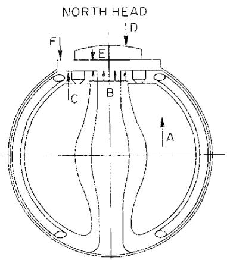

A. UPTHRUST FROM REFLECTOR (59,656 Ib)   
B. FUEL PUMP DISCHARGE PRESSURE FORCE (3406 Ib)   
C. FUEL PUMP SUCTION PRESSURE FORCE (7747 Ib)   
D. SODIUM PRESSURE FORCE ON NORTH HEAD (psi)   
E. NORTH-HEAD WET WEIGHT (1000 lb)   
F. PRESSURE SHELL REACTION

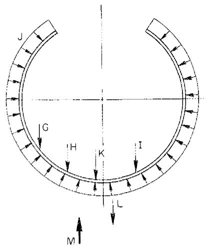  
LINER

G. HEAT EXCHANGER PRESSURE DROP FORCE (24,216 lb)   
H. FUEL PRESSURE FORCE FROM CORE EXT (65,264 Ib)   
I. STATIC HEAD (8313b)   
J. SODIUM PRESSURE FORCE   
K. LINER WEIGHT (1000 lb)   
L.ISLAND(200ib)   
M. PRESSURE SHELL SUPPORTING REACTOR $(J + 98,993\text{lb})$

PRESSURE SHELL.

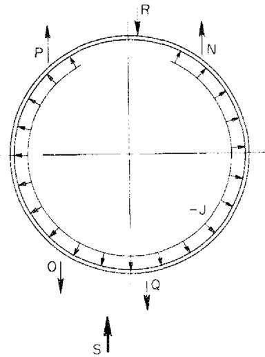  
Fig. 23. Pressure Load Distributions at Full Power.

N. NORTH-HEAD REACTION (68,809 lb)   
O. LINER LOADS (M)   
P. HEAT EXCHANGER LOAD (20,912 Ib)   
Q.PRESSURE SHELL WEIGHT (3500 Ib)   
R.PUMPS(1200lb)  
S. SUPPORT LOAD ON REACTOR (REACTOR WEIGHT $\simeq 14,000\mathrm{lb}$ )

Precise calculations of the temperature profiles throughout the reactor require detailed information on the energy deposition from radiation and neutron reactions and on the temperature structure along the boundaries of the fluid passages. Information on the energy deposition is to be obtained by two independent methods: a buildup-factor technique in preparation at Pratt & Whitney and a Monte Carlo method developed at ORNL. The nuclear reaction data required for these programs are based on the two-dimensional multigroup flux calculations supplied by the Curtiss-Wright Corporation. The dual program has been initiated because the Monte Carlo method, although more accurate, will be several months in preparation, and it is believed that the relatively quick Pratt & Whitney method will suffice for preliminary three-dimensional data. Finally, a more accurate picture of the temperature profiles through the fuel will be obtained from analyses of the results of the high-temperature critical experiment and of the tests of the half-scale model of the ART core, which utilizes a volume heat source to simulate the fission heating.

The utilization of the temperature and load distribution information in the design analysis of the reactor system poses some difficulties in a broad technological sense because of the lack of an established design philosophy for high-temperature operation. In general, relatively little design experience has been acquired in providing for the effects of thermal cycling, strain cycling, creep buckling, and thermal relaxation.

Suitable design criteria are being formulated for the ART by combining information obtained from materials testing programs, component testing programs, and the Engineering Test Unit (see Part IV). In the materials testing programs, data are being obtained on the properties of Inconel and beryllium at the temperatures of interest in order to acquire insight into the nature of the basic thermal phenomenon involved.

Data on the creep and tensile properties of the two materials, their behavior under strain cycling, and their relaxation properties are of particular interest. The creep and strength data11 are required for the design of members that will be subjected to continuous loads over prolonged periods of time (e.g., loads resulting from operating pres

sures). The strain-cycling data12 are being correlated according to the Coffin formulation13 and will serve as the basis for the design analysis of structures which will be repeatedly subjected to mechanical or thermal loads that will produce plastic deformation in the material. The relaxation data14 are to be used mainly to determine the amount of plastic strain developed under cyclic loads. The creep-buckling information15 is required for the design analysis of the various core and reflector shells. These shells will be subjected to pressure differentials and to temperature gradients both through their thickness and along their surfaces.

In some instances the materials test information obtained from the programs mentioned above may be used directly to estimate the thermal deformation and buckling characteristics of components and to determine the life of parts subjected to cyclic loads. However, this direct application will be effective only for relatively simple structural configurations and cannot be used for many of the important structural members of the reactor. In the latter cases it will be necessary to resort to component or scale-model tests under operating conditions. For example, a test is under way on a one-fourth-scale model of the outer core shell to determine whether the core shells will survive the thermal cycling to which they will be exposed during the operational life of the reactor. The operational conditions for this test were based on the anticipated program of the ART, and the temperatures and hold-times involved were determined from relaxation and strain-cycling data on Inconel (Fig. 24). This test should indicate, also, the extent to which the strain-cycling and relaxation data based on simple uniaxial stress conditions can be extrapolated to the more complex patterns encountered in the actual design.

The detailed stress analysis of the ART, now under way, consists in examining the system operating pressures and thermal and cyclic loads. The operating pressure loads were used to size the principal structural members. The criterion

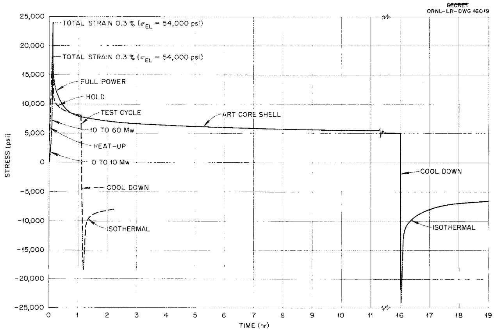  
Fig. 24. Conditions for Thermal Cycling Tests of One-Fourth-Scale Model of ART Core Shell in Comparison with ART Thermal-Cycling Conditions.

presently in use requires that the stress level created by these loads be no more than one-fourth the value known to cause rupture from creep if applied for 1500 hr. The stress analysis is based on elastic theory, but for very complicated configurations the analysis is supported by experimental studies on models of the actual member. This scheme of analysis has been applied in a preliminary manner to all structural components of the reactor, its support structure, the NaK piping inside and outside the pressure cell, and the heat dump systems (NaK pumps and radiators). These preliminary studies have been completed, and attention is now being focused on the detailed stress analysis of the major structural members which are a part of the reactor proper; these members include the north-head double-deck composite structure, the reflector support ring, the core and reflector shells, and the fuel dump tank and supports.

A tentative set of design criteria has been selected for the detailed examination of the system from the viewpoint of thermal and cyclic loads. For members that will be subjected to thermal loads which may occur only a few times during their life, the design criterion is that the strains produced by these loads not exceed $0.2\%$ . Based on the concept of an elastic stress-strain relation, this corresponds to a stress of around 30,000 psi at $1300^{\circ}\mathrm{F}$ . Such a criterion, although in agreement with the design philosophy of the ARE, is believed to be extremely conservative, and a more realistic one is being considered and will be evaluated by the results obtained from the strain-cycling tests for the lower number of cycles. The criterion for the design of members subjected to cyclic plastic strain is also based on the requirement that the maximum deformation during a cycle not exceed $0.2\%$ . At temperatures of the order of $1300^{\circ}\mathrm{F}$ a specimen thus loaded should survive more than

200 cycles. This figure is based on the best strain-cycling data now available. $^{16}$ This criterion will be used until more reliable information is obtained from the strain-cycling test program under way at ORNL and at the University of Alabama. The thermal-stress criteria outlined here are in use in the analysis of the cyclic heating of the core and reflector shells, the pressure-shell liner, and the thermal sleeve attachments for all pipe outlets from the reactor, as well as in the thermal-stress analysis of the fuel pumps and of the NaK manifolding at the reactor. An analysis is also in progress for determining the thermal expansions and distortions of the various shells and the beryllium within the reactor. These calculations require the temperature distributions previously mentioned, and the results obtained from the work will determine the final tolerances and clearances between these members. It should be recognized that the proper fit of the parts under the operating conditions will define the cold dimensions to which the system must be assembled.

The analytical studies described above are supported in many areas by parallel programs of experimental stress analysis. The bulk of the work is being carried out at the University of Tennessee and includes the actual model tests of the northhead composite-deck structure, the pump barrel and NaK pipe attachments to the pressure shell, the main and auxiliary heat exchanger headers, the reflector support ring, the blowout patch for the pressure shell, and the NaK piping systems outside the reactor cell.

The emphasis in the design analysis under way and that programed for the near future is placed on the re-evaluation of the design criteria, the detailed stress analysis of the primary structure, the completion of strain-cycling tests of component models, and the study of off-design and transient operating conditions.

# Auxiliary Components

Several major structural components external to the reactor, including the reactor support system, the fuel fill-and-drain tank and support, and the main NaK piping which carries the heat from the reactor to the radiators, have also been analyzed.

The reactor is to be suspended from an overhead bridgelike structure by means of the four pump barrels (Fig. 25). The attachment of the individual barrels to the bridge allows horizontal motion of the barrels so as to accommodate the relative thermal growth between the reactor (at operating temperature) and the bridge (at room temperature). Vertical motion of the barrels is completely restrained. The bridge is fixed at each end to a flexible column consisting of 1-in.-thick steel plates, 28 in. wide and 123 in. long. The load carried by each column is approximately 45,000 lb. This value is somewhere between one-fourth and one-half the value required to cripple the column.

The principal function of the flexible columns is to allow complete freedom for the NaK lines to expand in going from room temperature to the operating temperature of the reactor. During full-power operation the upper row of NaK lines will be at $1070^{\circ}\mathrm{F}$ , the lower row at $1500^{\circ}\mathrm{F}$ . This will result in a horizontal growth of $\frac{3}{4}$ in. in the upper lines and $\frac{1}{8}$ in. in the lower lines. If the reactor is mounted in the cold condition precisely over the center line of the column bases, these expansions will translate and rotate the reactor out of the neutral position and thereby introduce bending stresses into the columns (Fig. 26). In order to eliminate the bending stresses, it is planned to precut the NaK lines so that at room temperature the reactor will be located 1 in. off the neutral position toward the cell wall through which the NaK lines enter. As the reactor heats up, these lines will expand and move the reactor into the neutral position, thus removing the bending loads on the columns.

Although the flexible columns can allow for the gross expansions of the NaK lines, they cannot provide for the differential expansion between the lines of any one row. In order to provide some margin for operational accidents and freedom in controlling NaK temperatures, it is planned to add several bends into each line to accommodate 300 to $400^{\circ}\mathrm{F}$ temperature differences between adjacent lines. The piping layout proposed for the reactor cell for this purpose is shown in Fig. 27.

The basic design features of the NaK piping outside the reactor cell are similar to those inside the cell. The principal design requirement is that the pipe supports and end attachments have sufficient flexibility for the lines to expand in going from room temperature to the operating temperature without being subjected to excessive thermal

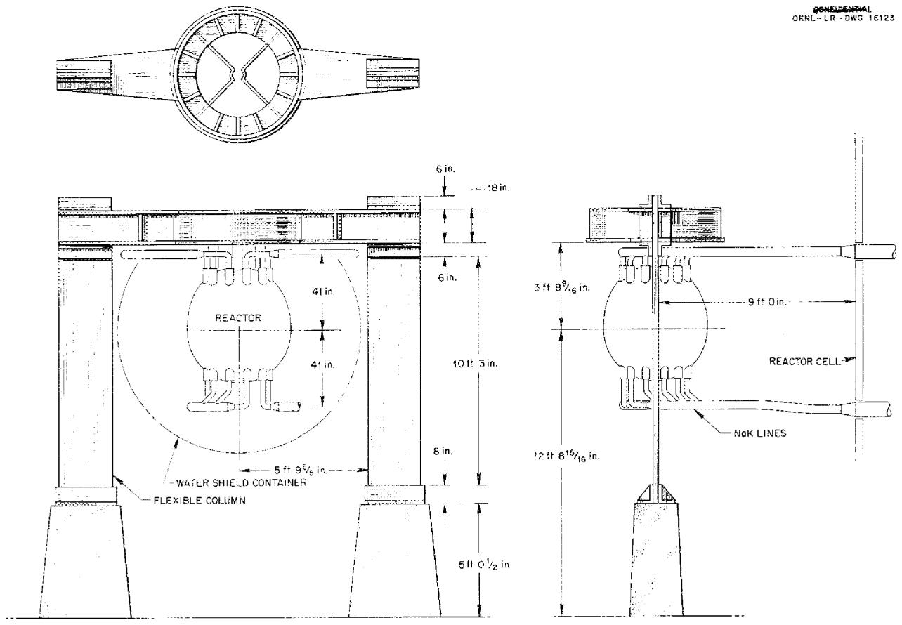

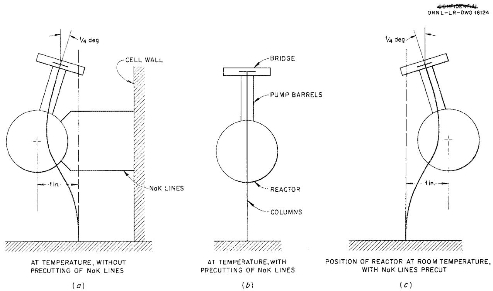  
Fig. 25. ART Support Structure.   
Fig. 26. Movement of Reactor Due to Expansion of NaK Lines.

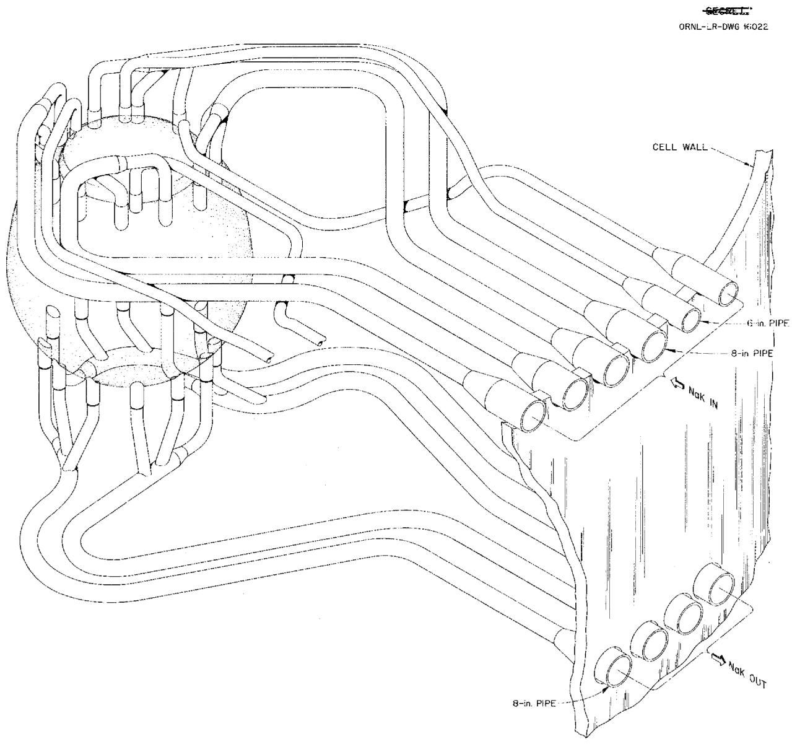  
Fig. 27. Layout of NaK Piping in Reactor Cell.

stresses and without producing excessive loads on the radiators and pump casings. One of the NaK radiator-pump assemblies in the ART system is shown in Fig. 28. The individual lines are welded at the reactor cell wall, and the joints may be considered as fixed points in the piping circuit. The radiator ends of the lines are welded to their respective radiators, and the entire pump-radiator assembly is suspended by a system of spring hangers from overhead so as to allow freedom of

motion in the principal direction of the NaK lines. This freedom allows for the over-all growth of the lines, and the various bends in the individual lines provide increased flexibility to accommodate differences in line lengths.

The operation and flow characteristics of the fuel fill-and-drain tank system are discussed in Part II. Since this tank is to serve as an eversafe depository for the fuel, it must survive some 2000 hr of operation at temperature and possibly

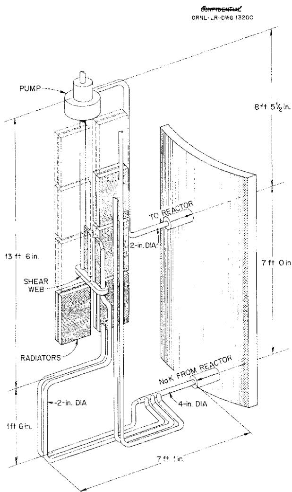  
Fig. 28. NaK-to-Air Radiator, NaK Pump, and NaK Piping External to Cell.

several fast dumps. The principal structural requirements are determined by the 40-psi NaK pumping pressure, which will produce creep in the tank structure. The design criteria, then, are based on creep-rupture and thermal-shock considerations.

The most sensitive areas of the design are the joints between the tube header sheets (Fig. 16) and the inner cylinder. The discontinuity stresses in these regions are of the order of 6000 psi, but the stresses are expected to decay rapidly, once the system comes to temperature, as a result of

the stress-relaxation phenomenon. Since this component is of vital importance to the overall safety of the experiment, it is planned to test the entire tank system by using one of the NaK circuits. This test will determine the adequacy of the design in withstanding the creep and thermal shock effects mentioned above.

The support of the dump tank assembly is accomplished with the aid of a nitrogen cylinder located beneath the tank (Fig. 29). Although the tank is attached rigidly to the reactor pressure shell through the fuel drain line, the major portion of the tank weight is not allowed to bear on the shell. The total weight of the tank, including the fuel, is approximately 6000 lb, of which 5000 lb will be carried by the nitrogen cylinder. This arrangement introduces some complication in regard to the stability of the support system, but an analysis has shown that the proposed arrangement of lever arms, the structural stiffness of the drain lines, and the weights are well within the stability limits of the system.

# RADIATION HEATING ON THE ART EQUATORIAL PLANE IN THE VICINITY OF THE FUEL-TO- $\mathbf{N}\alpha \mathbf{K}$ HEAT EXCHANGER

The radiation heating to be expected in the ART was calculated so as to provide a basis for the design of cooling systems. The results of the calculations of the radiation heating on the ART equatorial plane in the outer $3\mathrm{cm}$ of the beryllium reflector and in the Inconel and the boron-containing shells on both sides of the fuel-to-NaK heat exchanger are presented in Figs. 30 and 31. The total gamma-ray heating in each region is given in Fig. 30, as well as the heating from the sources which are the main contributors to the total in each shell. The encircled numbers on Fig. 30 refer to the sources described in Table 8.

The data on heating in the copper-boron layer by alpha particles from the $\mathsf{B}^{10}(n,\alpha)\mathsf{Li}^7$ reaction are plotted in Fig. 31. The heating goes to infinity at the face of the layer closest to the core because the heating at various points is governed by an $E_{1}$ function,

$$
E _ {1} (x) \int_ {1} ^ {\infty} e ^ {- x \lambda} \frac {d \lambda}{\lambda},
$$

where $\lambda$ is the mean free path. The integral under the curve will be finite.

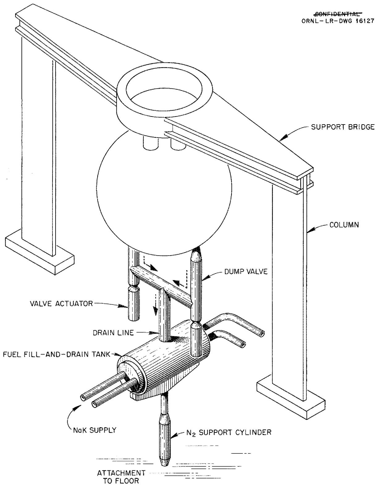  
Fig. 29. Fuel Fill-and-Drain Tank Support.

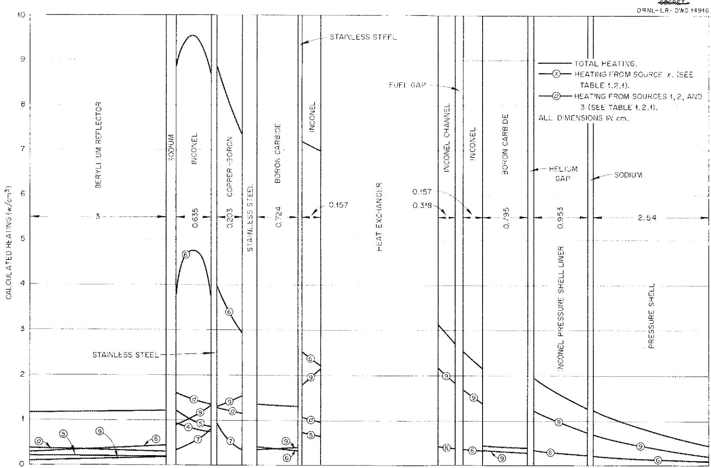  
Fig. 30. Gamma-Ray Heating in the Vicinity of the Fuel-to-NaK Heat Exchanger on the Equatorial Plane of the ART.

TABLE 8. SOURCES OF RADIATION HEATING CONSIDERED IN CALCULATING THE RESULTS PRESENTED IN FIG. 30   

<table><tr><td>Source No.</td><td>Source</td><td>Source Strength</td></tr><tr><td>1*</td><td>Prompt gamma rays in the fuel region of the core of the reactor</td><td>28.3 w/cm3</td></tr><tr><td>2</td><td>Decay gamma rays in the fuel region of the core of the reactor</td><td>6.84 w/cm3</td></tr><tr><td>3</td><td>Gamma rays from inelastic scattering of neutrons in the fuel region of the core</td><td>10.1 w/cm3</td></tr><tr><td>4</td><td>Capture gamma rays in the outer core shell</td><td>41.4 w/cm2</td></tr><tr><td>5</td><td>Capture gamma rays in the reflector (average)</td><td>0.5 w/cm3</td></tr><tr><td>6</td><td>Capture gamma rays in the first Inconel shell outside the beryllium reflector</td><td>22.5 w/cm3</td></tr><tr><td>7</td><td>Boron capture gamma rays in copper-boron layer</td><td>1.8 w/cm2</td></tr><tr><td>8</td><td>Alpha particles from the B10(n,a)Li7reaction in the copper-boron layer (average)</td><td>42 w/cm3</td></tr><tr><td>9</td><td>Decay gamma radiation from the fuel in the heat exchanger</td><td>2.3 w/cm3</td></tr><tr><td>10</td><td>Gamma rays from inelastic scattering of neutrons in first 9 cm of reflector (average)</td><td>0.7 w/cm3</td></tr><tr><td>11</td><td>Capture gamma rays from delayed neutrons in the heat exchanger and Inconel shells (including the pressure shell)</td><td>0.1 w/cm3</td></tr><tr><td>12</td><td>Capture gamma rays in the copper of the copper-boron layer</td><td>0.5 w/cm2</td></tr><tr><td>13</td><td>Gamma rays from inelastic scattering in both core shells</td><td>4 w/cm2</td></tr><tr><td>14</td><td>Capture gamma rays in the island core shell</td><td>41.4 w/cm2</td></tr></table>

\*In Fig. 30 the data for heating from sources 1, 2, 3 are combined and labeled a.

The heating from sources 10 to 14 was neglected. Their combined contributions to the heating in the region being considered was estimated to be about $5\%$ of the total heating.[17]

# RADIATION HEATING IN VARIOUS REGIONS OF THE NORTH HEAD

The radiation heating to be expected in various regions in the north head of the ART was calculated in order to supply numbers from which thermal-stress calculations could be made. Because of the complexity and the time that would be involved in calculating accurately the heating in all the regions of the north head, it was decided to make preliminary estimates of the deposition rates. More accurate values calculated for other regions of the reactor were used as guides. In all cases the tendency was to overestimate the heating.

Calculations were made of the heat-deposition rate in a slab of Inconel bounded on one side by

an infinite fuel region containing the sources of radiation. This heat-generation rate was used in all regions in the north head which are bounded by finite fuel volumes.

The heat-deposition rates in a slab of Inconel bounded on one side by slabs of sodium of various thicknesses were calculated, and the results were extrapolated and interpolated to obtain the heat-generation rates in the Inconel regions of the north head which are bounded by various thicknesses of sodium.

Fairly accurate calculations were made of the heat-deposition rates in the Inconel filler plates below the island and in the vicinity of the fuel-to-NaK heat exchanger on the equatorial plane of the reactor. These results were used as a guide in estimating the heating in some north-head regions, and new values were obtained by compensating (by simple exponential attenuation) for decreased beryllium thicknesses, penetrations through additional fuel layers, increased thermal-neutron leakage currents into the north head, etc.

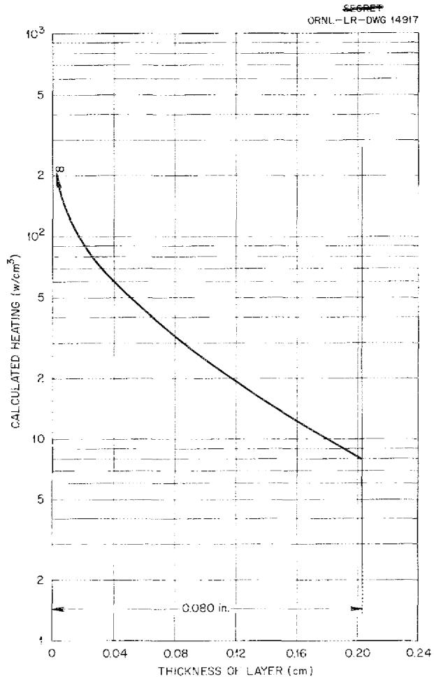  
Fig. 31. Heating in Copper-Boron Layer by Alpha Particles from the $\mathsf{B}^{10}(n,\alpha)\mathsf{Li}^7$ Reaction.

It was assumed that a neutron current of $7 \times 10^{13}$ neutrons·cm $^{-2}$ ·sec $^{-1}$ was escaping uniformly from the upper portion of the core and that 1 Mw of fission power was being generated in the fuel regions of the north head by neutrons escaping into this region. The latter increased the gamma rays in the fuel by about $30\%$ .

The sources of gamma radiation considered were those from the heat exchangers, the boron, the core shells, the beryllium, the Inconel shell capture gamma rays, the sodium and fuel in the north head, and the fuel in the core. The sources of beta particles considered were those from the gases in the fuel-expansion tank, and the sources of alpha particles were taken to be those from boron captures. The average values of heat generation obtained in these calculations are presented in

Table 9. The configuration of the north head is shown in Fig. 32.

# BETA- AND GAMMA-RAY ACTIVITY IN THE FUEL-EXPANSION CHAMBER AND THE OFF-GAS SYSTEM

The power-source distribution of the activity of the gases in the space above the fuel in the fuel-expansion chamber and in the off-gas line has been determined. The results obtained are to be used in the calculation of the radiation heating and the thermal stresses in this region of the reactor.

The radioactive constituents of the gas in this space will be the gaseous fission products, xenon and krypton, and their daughter products. There is also a possibility that some volatile fission-product fluorides will be formed in the fuel and will escape into this area. However, it has been shown[18] that if all the fission-product fluorides entered this space they would add very little activity to that already caused by the gaseous fission products and their daughters. Thus their effect has been neglected. Also, there is some question as to whether the daughter products of the fission gases will actually be carried downstream by the off-gas system or whether they will be deposited on the enclosing walls as they are formed. In order to get a conservative estimate of the power-source distribution, it was decided to treat the daughter products of xenon and krypton as gases (except insofar as their purging from the fuel into the fuel-expansion chamber is concerned).

The total power and the power density in the gas space of the fuel-expansion tank as a function of the volume of the gas and the helium flow rate are given in Fig. 33. In the calculation of the curves the very short- and very long-lived nuclides of xenon and krypton (along with their decay products) were neglected. Since the fuel circulation time in the ART will be less than 3 sec, nuclides with half lives less than this value will decay mostly in the fuel before it reaches the purging pumps. Thus very few atoms with half lives of less than about 3 sec would get into the gas space. Also, for nuclides with long half lives (greater than about 100 hr), the number of disintegrations taking

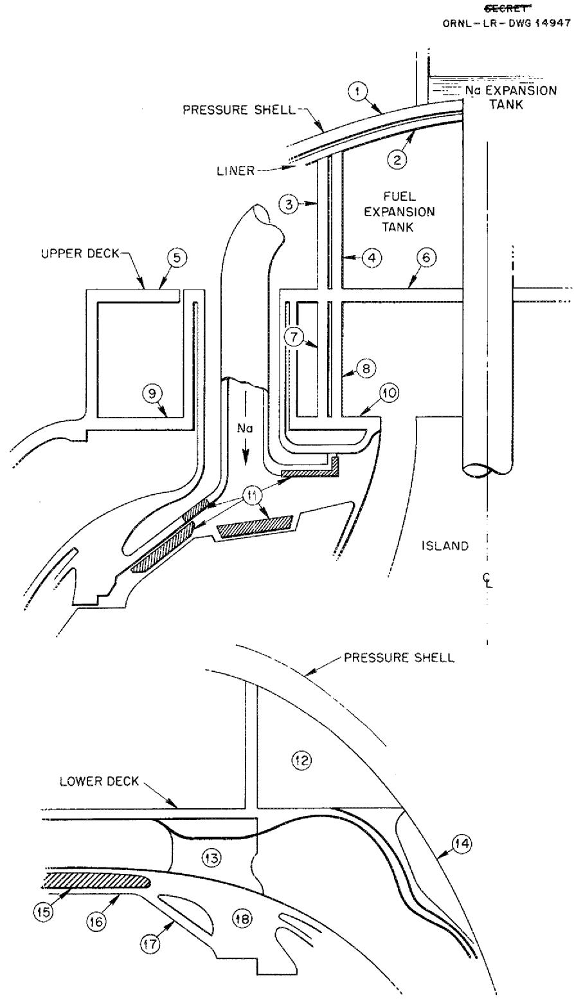  
Fig. 32. Configuration of ART North Head Showing Members Referred to in Table 9.

TABLE 9. AVERAGE HEAT GENERATION RATES IN MEMBERS OF ART NORTH HEAD   

<table><tr><td>Member No.*</td><td>Description</td><td>Heat Generation (w/cm3)</td></tr><tr><td>1</td><td>Pressure shell (below sodium expansion tank)</td><td>4</td></tr><tr><td>2</td><td>Liner</td><td>6 w/cm3+ 16 w/cm2on expansion-tank surface due to beta rays</td></tr><tr><td>3</td><td>Fuel expansion-tank baffle</td><td>3</td></tr><tr><td>4</td><td>Fuel expansion-tank wall</td><td>6</td></tr><tr><td>5</td><td>Upper deck (regions with sodium on both sides)</td><td>2</td></tr><tr><td>6</td><td>Upper deck (regions with fuel on both sides)</td><td>15</td></tr><tr><td>7</td><td>Swirl chamber baffle</td><td>3</td></tr><tr><td>8</td><td>Swirl chamber wall</td><td>8</td></tr><tr><td>9</td><td>Lower deck (regions with fuel below and sodium above)</td><td>8</td></tr><tr><td>10</td><td>Lower deck (regions with fuel on both sides)</td><td>12</td></tr><tr><td>11</td><td>Copper-boron tiles</td><td>25 w/cm2·t + 6 w/cm3, where t = thickness of tiles (cm)</td></tr><tr><td>12</td><td>Filler block</td><td>3</td></tr><tr><td>13</td><td>Beryllium support struts</td><td>10</td></tr><tr><td>14</td><td>Filler block</td><td>1</td></tr><tr><td>15</td><td>Copper-boron tile</td><td>30</td></tr><tr><td>16</td><td>Flat section of lower support ring</td><td>15</td></tr><tr><td>17</td><td>Strut part of lower support ring</td><td>3</td></tr><tr><td>18</td><td>Lower support ring</td><td>1.5</td></tr></table>

*See Fig. 32 for location of member.

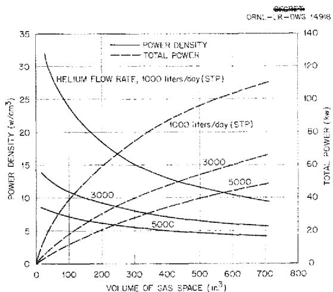  
Fig. 33. Total Power and Power Density in the Gas Space of the ART as a Function of the Gas Volume and the Helium Flow Rate for a Fuel Flow Rate of 22 gpm.

place in the fuel-expansion chamber and off-gas line would be small, since the dwell time at the assumed helium flow rates is very short. Therefore these nuclides may be neglected.

In this study 32 nuclides were considered, 16 being isotopes of xenon and krypton and 16 being their daughter products. The main contributors to the power distribution are the daughter products and not the nuclides of xenon and krypton themselves. In all cases the daughter products contribute about 50 to $60\%$ of the total power distribution. Of the total power, about $90\%$ is due to the beta-ray decays, with only $10\%$ being due to gamma-ray decays. Thus in determining the heating caused by these gases, it is seen that the heat deposition will occur mainly in a small surface layer of the materials surrounding the gases in the fuel-expansion chamber and the off-gas line.

The power density in the off-gas line as a function of time and gas volume for helium flow rates of 1000 and 3000 liters/day (STP) is given in

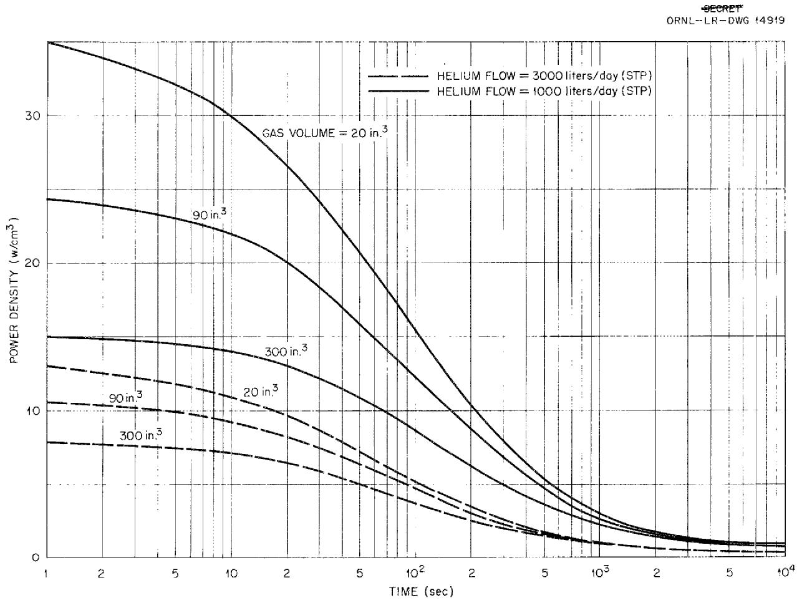  
Fig. 34. The time axis can be converted into lengths along the off-gas line by dividing the volume flow rate of the helium gas by the cross-sectional area of the off-gas pipe. Thus Fig. 34 gives the power-source density of $1\mathrm{cm}^3$ of the gas at any position in the off-gas line.   
These plots were made by using the well-known equations of the decay of parent products and the buildup of their daughters as a function of time. The initial conditions at the beginning of the off-gas line were taken as the equilibrium conditions that would prevail in the fuel-expansion tank.   
Fig. 34. Power Density in the Off-Gas Line as a Function of Time and Gas Volume in the Expansion Tank for a Fuel Flow Rate of 22 gpm.

Part IV

ENGINEERING TEST UNIT

A full-scale zero-power engineering test unit (ETU) is being fabricated that is a prototype of the ART. Assembly of the ETU will provide a test of the feasibility and efficiency of the procedures prior to assembly of the ART. Thus time-consuming and expensive rework operations such as those required for the ARE will be avoided. The first reactor assembly fabricated may have, for example, a number of doubtful welds that would not prevent the initiation of nonnuclear shakedown tests but would have to be reworked if the assembly were to be used as the high-power ART. The fabrication experience gained will be used in assembling the second unit.

A second and even more vital reason for fabrication and operation of the ETU arises from the complexity of the stresses on the assembly. The complex geometry, the wide variety of combinations of thermal and pressure stresses, and the difficulty of predicting the magnitude and direction of thermal warping and distortion make it essential to run a comprehensive test on a nonnuclear assembly, even though not all the conditions can be simulated. Experience at the Knolls Atomic Power Laboratory has forcefully demonstrated the importance of such tests when dealing with a high-performance complex that is to operate under conditions for which there are little data or experience. Upon completion of the tests, the ETU will be completely disassembled and thoroughly inspected.

Invaluable shakedown and endurance test experience will be obtained, and the training of the setup and operating crews during such a test will expedite assembly and operation of the ART. It will be possible, also, to obtain heat transfer information on the radiators and on the NaK-to-fuel and sodium-to-NaK circuits and to test some of the instruments to be used on the ART.

The heat for the nonnuclear ETU will be supplied by two gas furnaces, which will replace the radiators in two of the four main NaK circuits. It was originally intended that the capacity of each furnace would be 5 Mw, but each furnace has been reduced to a capacity of 1 Mw because of procurement and installation difficulties. Along with the reduction in the heat input, the radiators

have been eliminated from the other two main NaK circuits. Radiators will be included only in the reflector-moderator (sodium-to-NaK) cooling circuit. These radiators will permit a determination of performance characteristics of not only the radiators but also the louvers and the heat-barrier doors to be used with them. It is particularly important that the sensitivity of the controls for these units be determined at low loads. Since the units will be essentially the same as those to be used in the main circuits of the ART, the test of the reflector-moderator cooling circuit will serve to answer many basic questions regarding the performance characteristics of the main circuits on the ART.

Since there will be no after-heat and no radioactive off-gases, the fuel dump tank and the off-gas system, rather than being prototypes of those to be used with the ART, have been simplified to expedite fabrication, construction, installation, and testing of the ETU. The fuel enrichment, recovery, and sampling systems are not to be included in this nonnuclear test assembly. The ART design will be followed in every respect in the fabrication and assembly of the ETU reactor. The final reactor for the ART will differ from the ETU reactor only in modifications brought about by the fabrication, installation and operation of the ART. Only those changes considered to be absolutely essential to the successful operation of the ART are expected to be made.

# SPECIFIC TEST OBJECTIVES

The most valuable information to be obtained from the ETU will probably be the disclosure of unanticipated difficulties, such as interferences in assembly or installation or difficulties arising from misoperation of certain elements of the system under peculiar operating conditions, but several prime objectives have been established for the ETU test program. The first and most important will be a determination of the tendency of parts to warp, shrink, or otherwise distort during the original welding and assembly processes and during testing. Dimensional checks will be made on all parts during inspection prior to and during assembly, and the actual dimensions will be recorded.

The most important sets of dimensions, from the standpoint of satisfactory reactor operation, are

those that affect the moving parts, particularly the pump impellers. Distortion might cause interference between the impeller and the stationary elements of the pump, which, in turn, might cause malfunctioning of the pump.

Dimensional data on the cooling annuli for the core, reflector, and pressure shells will also be recorded. It is important that these annuli be held to close tolerances, both in local regions and for the complete assembly. Some types of deviation will have little effect, while other types could have quite serious effects. It is not possible to state explicitly which ones of the many possible combinations of deviations from drawing tolerances will be acceptable and which will not, but it is important to determine the general magnitude and direction of the distortions in the ETU resulting from assembly operations and from testing so that the importance of such distortions in the ART can be reasonably appraised. Unfortunately, the temperature distribution and hence the distortion pattern in the ART during high-power operation will be different from those in the ETU, but the distortion during zero-power operation and during most of the low- and medium-power operation of the ART should be the same as that in the ETU. Further, many particularly bad off-design and transient conditions can be simulated in the ETU, and the effects on distortion will be studied.

Flow tests on various components will be carried out during the assembly of the reactor. These tests, which may be made with either water or air, are partly for checking the calculated pressure drops through the complex circuits and partly for calibrating the systems so that they will serve as flowmeters for work during the high-temperature testing.

# WARMUP AND SHAKEDOWN TESTING

During the initial warmup and shakedown testing of the ETU a considerable amount of test data will be obtained for use in evaluating the design. Data will be taken on the pressure drops through important elements of the system and, most especially, on the overall pressure drop at each of a series of given flow rates, and the results will be checked against the predicted values. Close attention will be given to the behavior of the liquid levels in the expansion tanks for the hot fluids so that the accuracy and the dependability of the liquid-level indicators can be de

termed. The heat losses to various elements of the system will also be measured, and the effects of operation and position of the heat-barrier doors and louver in the auxiliary cooling system will be determined. It is especially important that the sensitivity of the heat losses near the zero-power condition be determined as a function of position of both the heat-barrier doors and the louver.

# OPERATING TESTS

Operation of the ETU should follow the program prepared for the ART insofar as possible; in particular, the pump speeds and hence the system pressures should be programmed in the same way as is planned for the ART. Thus the initial operation will be carried out at low pump speeds, the NaK pumps being operated at probably one-half speed and the fuel and sodium pumps at about $10\%$ speed. After completion of the low- and intermediate-power simulation in the ETU, the pump speeds will be increased to full design operating values. During this simulated operation it will be possible to obtain further test data on the flow characteristics of the various systems, the heat balance data, and some indication as to the performance of the heat exchangers, particularly those in the reflector-moderator cooling circuit. The precision with which the heat balance data can be obtained will be determined by checking the heat balance data for the air, the NaK, and the sodium systems against each other. During the shakedown operations it will probably be desirable to determine the effect that cutting out one or more pumps will have on the liquid levels in the expansion tanks. Also, it may be possible to conduct tests on the performance of the xenon-removal system.

A carefully programmed series of thermal-strain-cycling tests will be included in the ETU operational tests. Delineation of this program will be delayed until the stress analysis work is essentially completed so that significant tests can be made. Hence the precise temperature levels, pressure levels, and flow rates that should be used in this program cannot be specified until around December 1956.

# REACTOR ASSEMBLY

The reactor is made up of five major subassemblies: the reflector-moderator, the main heat exchanger, the north head, the island and south

pressure-shell liner assembly, and the pressure shell. Each of these major sections is to be assembled and then fitted together in the proper sequence to produce a complete assembly.

Many of the individual components of the subassemblies present difficult fabricational problems because of their geometric shape and the dimensional tolerances specified. A particularly difficult problem will be encountered in holding close tolerances on complicated weldments and on the thin-walled concentric shells which form the fluid passages and separate the components of the reactor. The most meticulous and rigorous inspection techniques available are to be used on materials and welds.

Assembly of the reactor will start with the reflector-moderator, which is made up of the outer Inconel core shell, the beryllium hemispheres, the strut-ring structure, the $B_4C$ layer, and the Inconel reflector shells. The upper and lower halves of the Inconel outer core shell will be welded together at the equator, and the upper collar will be welded to the top of the shell. The Inconel spacers will be fitted on the inside surface of the beryllium hemispheres, and the beryllium will be fitted around the Inconel shell. The spacers on the outer surface of the beryllium will then be installed, together with the canned copper- $B_4C$ patches, at the north end. The strut-ring assembly and the Inconel reflector shell that houses the beryllium will then be welded together and to the outer core shell. Next, the $B_4C$ tiles will be positioned on the outer surface of the assembly and covered with the $1/6$ -in.-thick Inconel shell that serves as the boron jacket. The $B_4C$ tiles are to be placed in sheet metal containers, one half of which will be spot-welded to the surface of the shells and the other half will be slipped into the attached half to form a container around the tile. This operation will complete the reflector-moderator assembly.

Special movable fixtures will be used to place the 12 tube bundles of the main heat exchanger around the reflector assembly. The units must be fitted into place simultaneously and held in position so that the north-head assembly may be lowered over the reflector-moderator-heat exchanger assembly. The north head is a complicated weldment containing the fuel pump volutes and housings, the fuel-expansion tank, the core

entrance header, the sodium pump volutes, and the sodium-to-NaK heat exchangers. The north head will be built up from subweldments of the pump volutes and header passages on two decks. Welding accessibility and welding sequence to prevent excessive warpage of critical surfaces are the most difficult problems envisioned for this assembly at the present time. Weldability models that illustrate the steps involved in assembling the north head are shown in Figs. 35 through 41.

The island and south pressure-shell liner assembly will be assembled by fitting the upper and lower beryllium sections together and placing the spacers on the beryllium surface. The upper and lower sections of the inner core shell will then be placed around the beryllium, and the equatorial weld will be made. The upper island and the expansion joint will be welded to the core shell to form the island assembly. The south pressure-shell liner assembly will then be assembled with the shells containing the neutron shielding and welded to the island assembly. The island will be inserted through the moderator assembly so that the bellows assembly will slip into position in the north head and so that the southern pressure-shell liner will seat against the northern section at the equator. The equatorial weld will then be made.

The upper half of the pressure shell will be lowered over the reactor assembly, and the lower pressure shell, with the laminated filter plates in place, will be brought into position. The girth weld will be made for joining the two halves of the pressure shell. The upper island connection will be welded to the upper pressure shell, and the heat exchanger header pipes will be welded to the pressure shell sleeves.

The sodium expansion tank will be welded to the upper pressure shell, and the control rod sleeve will be welded at the top of the expansion tank to complete the reactor assembly.

The assembly will include the lead shield in order to obtain a test of the support structure and the cooling systems. The water shield will be omitted on the ETU to ease procurement and installation problems. The many shield penetrations for instrumentation, helium, off-gas, and other connections to the reactor and reactor shell appurtenances make the detailed shield design and installation very difficult.

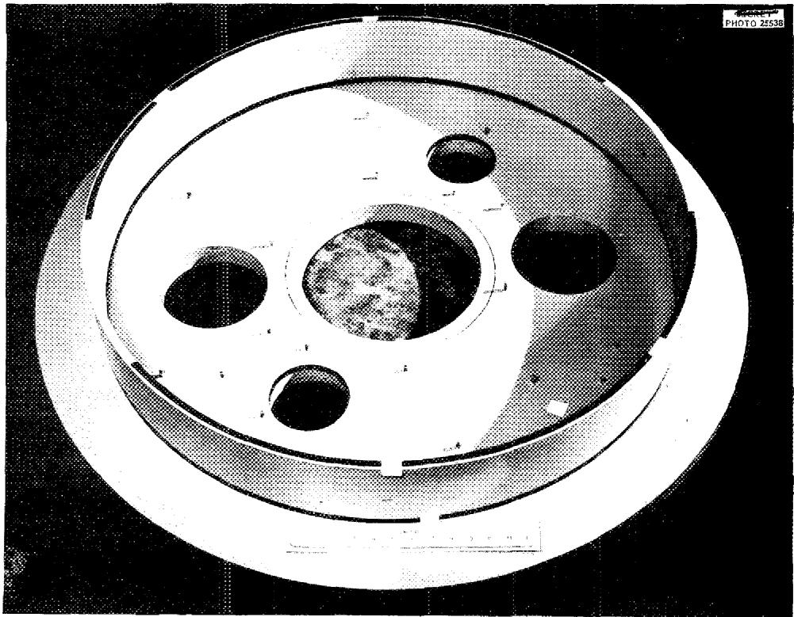  
Fig. 35. North-Head Weldability Model Showing Lower Deck and Peripheral Ring, Step 1.

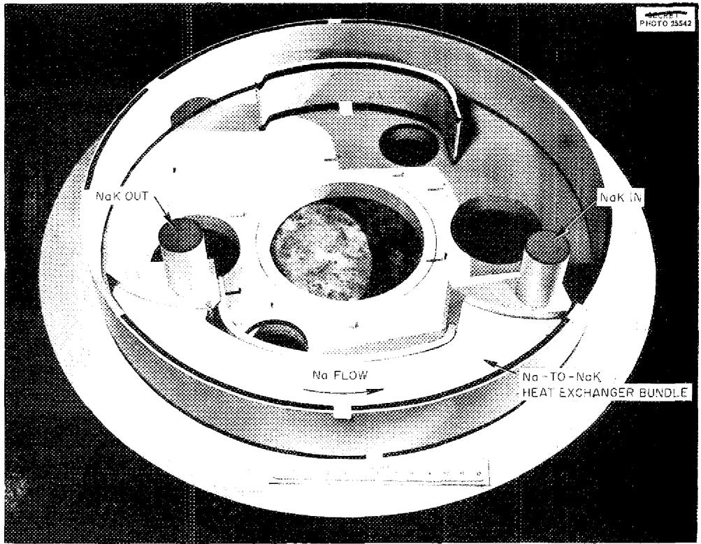  
Fig. 36. North-Head Weldability Model, Step 2.

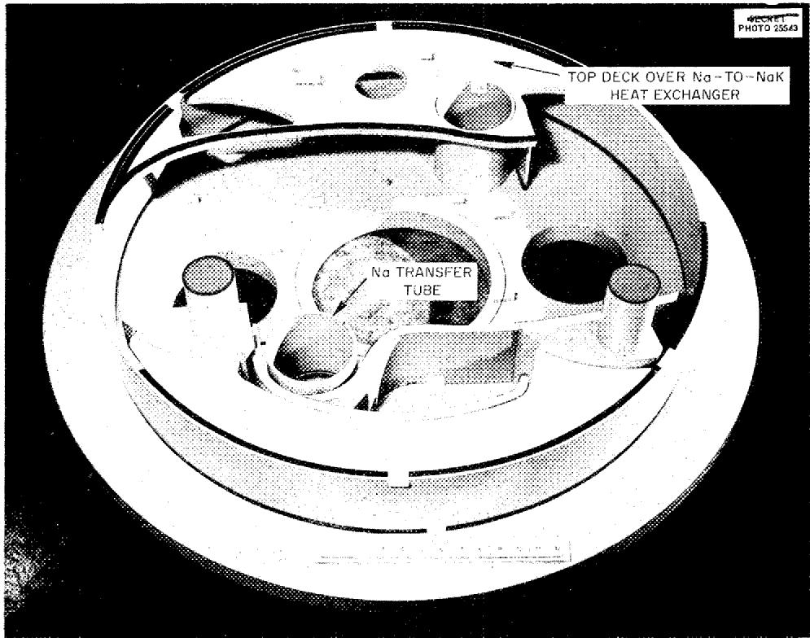  
Fig. 37. North-Head Weldability Model, Step 3.

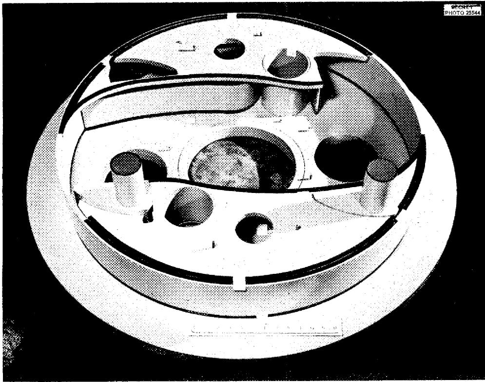  
Fig. 38. North-Head Weldability Model, Step 4.

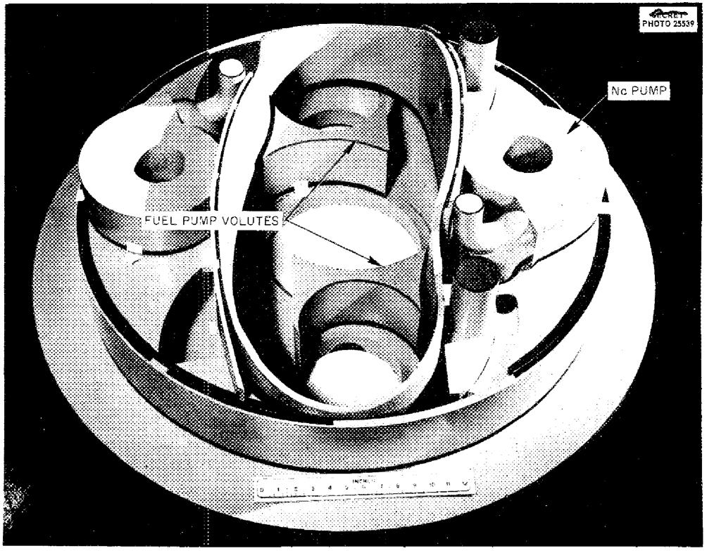  
Fig. 39. North-Head Weldability Model, Step 5.

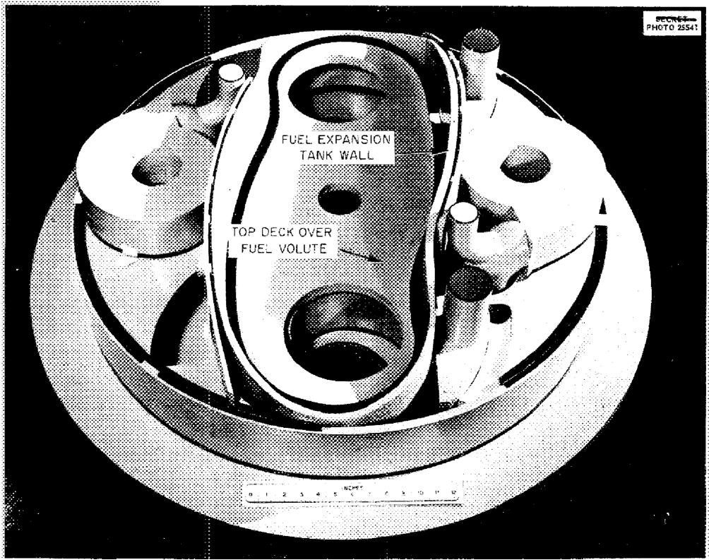  
Fig. 40. North-Head Weldability Model, Step 6.

  
Fig. 41. North-Head Weldability Model, Showing Another View of Step 6.

# REACTOR DISASSEMBLY

Dimensional data will be taken at frequent intervals throughout the disassembly of the ETU. The first step after removal of the reactor from the test stand will be the determination of the key dimensions of the pressure shell. The over-all heights from the level of the pump mounting flanges to the north head and to the south head will be measured. A cut will then be made at the equator through both the pressure shell and the pressure-shell liner. A cut will also be taken through the thermal sleeves around the heat exchanger header outlet tubes at the south end, and the sleeve that attaches the island assembly to the north head will be severed. This will permit the removal of the island and the southern half of the pressure shell. The core shells, pressure shell, and the heat exchanger can then be examined. Dimensional data on the pump wells, on the pump impellers, and on the areas in the vicinity of close impeller clearances will be

taken. The welds that attach the pressure shell dome to the north head around the roots of the fuel pump barrels will be milled out, and the transfer tubes that attach the reflector assembly to the north head, together with the thermal sleeves and heat exchanger outlet tubes at the north head, will be cut. The two regions can then be separated for inspection. The reflector shell will be cut, and the beryllium will be removed and inspected for corrosion, spacer fretting, and thermal cracking.

Other elements of the ETU system, including the snow traps, the cold traps, the filters in the NaK system, etc., will also be inspected. Typical sections of piping will be removed and inspected for corrosion and mass transfer. The NaK pumps will be checked for changes in impeller running clearance, the dump valves will be inspected, and all elements of the plumbing will be carefully dye-checked for thermal cracks that might have been induced during the operation.

Part V

# CONSTRUCTION AND OPERATION

# PLANS FOR INSTALLATION OF THE ART

The present plans for assembly and installation of the ART were evolved to minimize the time required to get the ART into operation. It was recognized that not only must the ART assembly start before completion of the ETU tests but also that operation of the ART would have to be delayed if operation or disassembly of the ETU indicated the need for modifications of the reactor unit. As a result, three complete reactor units are being ordered. Subassemblies of the third unit will be started as soon as the second unit is assembled, but final assembly will not be started. The second reactor will be assembled and installed in Building 7503 as rapidly as possible and, if no trouble develops in the ETU, will be placed in operation as soon as the disassembly and the inspection of the ETU have been completed. However, if disassembly of the ETU indicates the necessity for modifications, work will be started on the third set of subassemblies as soon as decisions are reached as to the nature of the modifications required. Final assembly of the third unit would proceed concurrently with the removal of the second unit.

# OPERATION OF THE ART

# Filling and Heating

The initial filling and heating of the reactor are part of both the testing procedure and the operating procedure by virtue of the reactor being of the circulating-fuel type. The NaK system will be filled with NaK, and, then, with the heat-barrier doors closed, the NaK pumps will be started. The power provided by pumping the NaK at one-half design-point flow will supply most of the heat required, and electrical heaters will supply the rest of the heat needed to bring the system up to $1200^{\circ}\mathrm{F}$ in a minimum of 24 hr.

The sodium for cooling the reflector-moderator and the sodium for cooling the control rod will be added during the heating period when the system temperature is about $350^{\circ}\mathrm{F}$ . With the sodium pumps operating, it will then be permissible to add more heat to the system through the main NaK system. With the system isothermal at $1200^{\circ}\mathrm{F}$ , the cold-trap systems will be gradually cooled down in order to remove oxides from the NaK.

The fused-salt fuel carrier will be put into the fill-and-drain tank when the entire system is in an isothermal condition at $1200^{\circ}\mathrm{F}$ . The fuel pump will be started and will be operated at a nominal speed of 100 rpm, and the fuel carrier will be pressurized into the reactor and heat exchanger system. The dump valves will then be closed, and the fuel and sodium pump speeds will be increased in order to degas the systems. When the system has been degassed and the design fuel level has been obtained in the swirl tank, the main NaK pump speeds will be increased to design point. Increases in the main NaK pump speeds will be made stepwise in about six steps from one-half speed to design-point speed.

Isothermal operation with all pumps operating at design-point speed will be maintained for about 24 hr. With all the pumps operating at design point the added power will raise the temperature of the system. The electrical heating will be decreased, as required, in order to maintain the system in an isothermal condition. If it is necessary, a main blower will be started and the heat removal will be controlled by manipulation of the auxiliary louver positions so that the system can be maintained in an isothermal condition with all pump speeds at the values desired.

After no more than 24 hr of isothermal operation of the system, the dump valves will be opened and the fuel carrier will be dumped into the fill-and-drain tank. Opening the dump valves will automatically reduce the main NaK pump speeds to one-half design-point speed and at the same time will reduce the fuel and sodium pump speeds to established minimums.

Samples of the fuel carrier, the NaK, and the sodium will then be taken and examined for corrosion products. Mass spectrographic analyses of these samples will also be made in order to determine whether any leakage occurred between any two adjacent systems.

If there is no evidence of leakage and if the corrosion-product analysis indicates that the carrier is clean, a portion of the carrier will be withdrawn from the fill-and-drain tank to make room for the addition, in two steps, of sufficient $\mathsf{Na}_2\mathsf{UF}_6$ to provide a fuel mixture which has about $60\%$ of the $\mathsf{U}^{235}$ required to achieve criticality with the regulating rod withdrawn. The estimate of $60\%$ is

based on the system volume and on the data acquired during the high-temperature critical experiments described in Part II of this report.

# Enriching to Critical

After addition of the initial charge of $\mathsf{Na}_2\mathsf{UF}_6$ mixing will be accomplished by pressurizing the fluid into the system until its surface level is approximately at the mid-point of the reactor; the pressure will then be released to allow the fluid to return to the fill-and-drain tank. It is estimated that five or six such cycles will be required to produce adequate mixing. During this mixing procedure the control rod will be at a withdrawn position of about one-fifth its full stroke.

The fuel mixture will be pressurized to fill the reactor system to the operating fluid level. This operation must proceed slowly as it nears completion. In order to avoid overfilling the reactor, a level indicator will be provided in the fuel overflow line, in addition to the level indicator in the fuel-expansion tank. The pressure in the dump tank will be limited by a pressure-relief regulator to a value that will be just sufficient to force the fuel up to the minimum level. This pressure will have been estimated from the fluid shakedown tests.

If proper mixing has been accomplished, addition of the initial charge is not expected to bring the reactor to criticality, since the fuel addition was calculated to give a reactivity value $(k)$ of about 0.94. Improper mixing could, however, produce some abnormal effects, since the fuel pumps will be operating at the established minimum speed. The slowly circulating fuel could pass through the core in an alternately rich and lean stream, and the count rate of the fission chambers would follow these patterns of fuel density. Since design-point circulation occurs only when the fluid level is high enough for the pumps to do some pumping, pauses in the mixing cycle cannot be expected to improve the mixing.

During the pressurizing of the initial charge of fuel into the reactor, safety instrumentation will be set on either a fast period or an established maximum neutron flux level to dump the fuel by automatically releasing the pressure on the fill-and-drain tank, since the fuel drain valves will not have been closed. The operation will not be carried out with full reliance on these safety devices. As is customary for a new reactor, much of the operation at this stage will depend upon the skill of the trained and experienced operator.

Fast regulating-rod insertion at the calculated rate of change in $\Lambda k / k$ of $-\frac{1}{8}\%$ per second and concurrent release of the helium pressure over the fill-and-drain tank will provide the means for reversing a fast rate of rise of the neutron flux. These operations, in addition to being automatically actuated, can be manually set in motion by one manual switch on the console in the control room.

It is believed that poor mixing would cause the filling of the reactor, after the addition of the initial charge of enrichment mixture, to be the most hazardous step in the enrichment procedure. Experience with the high-temperature critical assembly indicated, however, that adequate mixing can be achieved. Successive charges of enrichment material will be so small that no one charge could bring the reactor to criticality unintentionally, even with the poorest of mixing. The charges of enriched material made after the initial one will be in quantities that will increase the reactivity by an average amount of about $0.3\%$ for a given rod setting.

After the initial enrichment charge has been properly mixed with the carrier and the mixture has been pressurized into the fuel system of the reactor, count rates will be taken for a minimum of five positions of the regulating rod. These positions can be determined accurately and will be recorded.

The fuel will then be dumped into the fill-and-drain tank, and another accurately measured enrichment charge will be added. The mixing operations will be repeated. The fuel will again be pressurized into the system, and count rates will again be taken for the same positions of the regulating rod and will be recorded. This procedure will be repeated for all successive additions of enriched material. Curves showing the reciprocal of the count rate as a function of the mass of $U^{235}$ in the system will be plotted for each of the five rod positions after each addition is completed.

At some stage in the enrichment procedure, before the reactor is critical with the rod withdrawn, the fuel dump valves will be closed to permit an increase in fuel and sodium pump speeds. These pump speeds will be brought to design point, and the heat removed in the auxiliary system will be adjusted to maintain the system in an isothermal condition. The count rate will be taken for each of the five rod positions after the pump speeds have been increased.

With fuel and sodium pumps operating at their respective design-point speeds and with the main

NaK pumps operating at one-half design-point speed, a temperature differential will be imposed on the system by opening the heat-barrier doors, starting a blower, if necessary, and opening the main louvers a small amount. The exact conditions to be used will have been determined in the earlier fluid shakedown tests. This operation will be carried out with the regulating rod inserted to about one-fifth its full travel.

The mean fuel temperature will be continuously recorded, and the count rate will be recorded. The relation between the count rate and the mean fuel temperature should give semiquantitative evaluation of the fuel temperature coefficient of reactivity. It will be necessary to cool the NaK system slowly and to have completed enough of the enriching to get a sufficiently high count rate to obtain reliable statistics.

After these data have been obtained, the heat removal will be stopped; that is, the blower will be shut off, the louvers will be closed, and the heat-barrier doors will be closed. The system will be returned to the previous isothermal condition at a temperature of $1200^{\circ}\mathrm{F}$ by the operating heaters and the pumps as described previously. The fuel and sodium pump speeds will then be reduced to the established minimums, and the fuel will be dumped into the fill-and-drain tank.

Successive additions of $\mathsf{Na}_2\mathsf{UF}_6$ will be made until the reactor is critical with the regulating rod fully withdrawn and then until the reactor is critical with the rod $80\%$ withdrawn. Inhour curves will be obtained from data taken at each rod position at which the system is critical, in the usual way. The data will be obtained with the fuel pumps operating at the established minimum speed. Under these conditions the reactor may be considered as a stationary-fuel reactor for the purpose of fixing the fission-fragment delayed-neutron yield.

The delayed-neutron contribution to reactivity as a function of fuel pump speeds can best be determined in the low-power-level experiments by holding the reactor critical and at a constant flux for all pump speeds. This will be done by the flux servo system, which will hold the flux constant by withdrawing or inserting the regulating rod upon an increase or a decrease of the pump speeds. By the time that this experiment is conducted the regulating rod will have been calibrated for the stationary-fuel case, or, if not, the data will be interpreted after the rod has been calibrated.

# Low-Power-Level Experiments

Low-power-level experiments will be completed before all the enriching has been done, that is, when sufficient enriching has been done to bring the reactor critical with the regulating rod $80\%$ withdrawn.

The reactor will be brought critical when the system is isothermal at $1200^{\circ}\mathrm{F}$ . The dump valves will be closed, and the neutron flux will be set at a nominal value estimated to represent a nuclear power of 10 w. Control of the rod will be placed on the flux servo, with the fuel and sodium pumps operating at their established minimum speeds. Both the fuel and the sodium pump speeds will then be gradually brought up to design point. The position of the regulating rod will be continuously recorded, as will the pump speeds. The servo system will withdraw the regulating rod to maintain constant flux.

The speeds of both the fuel and the sodium pumps will be decreased slowly to their established minimums while the servo holds the flux constant. This operation will be carried out carefully and probably at a slower rate of decrease in pump speed than was possible for the rate of increase, since, at some point, the rate of decrease in pump speed will be such that the servo cannot keep the flux from rising. Abruptly stopping a fuel pump will automatically initiate a fast regulating-rod insertion at a rate of change in $\Delta k / k$ of $-\frac{1}{8}\%$ per second. These experiments should provide the data required for evaluating the delayed-neutron contribution to reactivity as a function of the fuel pump speed.

With the regulating rod controlled by the servo, the flux will be held constant and the sodium and fuel pumps will again be brought up to design-point speeds. The system will be made isothermal at $1200^{\circ}\mathrm{F}$ and then cooled, at a rate previously determined in the fluid shakedown tests, by opening the main barrier doors and the main louvers, as necessary.

The mean fuel and sodium temperatures and the rod position will be continuously recorded. The cooling of the system should cause the rod to be inserted and permit a quantitative evaluation of the negative temperature coefficient. Part of the temperature coefficient will be derived by cooling the fuel and part by cooling the moderator. Careful analysis of the rod position, and, accordingly, the $\Delta k / k$ , vs the fuel mean temperature will, however, give a reliable estimate of the fuel temperature

coefficient of reactivity. This estimate will be used in conjunction with the determination of the over-all system temperature coefficient and the sodium temperature to estimate the moderator temperature coefficient of reactivity. If the rod calibration at this stage is thought to be inadequate, the data from this experiment can be saved until the rod calibration has been completed, and then these coefficients can be estimated in terms of $(\Delta k / k) / {}^{\circ}F.$

After completion of these experiments the system will be brought isothermal at $1200^{\circ}\mathrm{F}$ at the constant flux with the regulating rod on servo control. Then the regulating rod will be inserted manually, the fuel and sodium pump speeds reduced to their established minimums, and the fuel dumped into the fill-and-drain tank.

The enrichment process will then be resumed, with the same procedure being used as that described above, until the reactor is critical with approximately $20\%$ of the regulating rod withdrawn. Spot checks of the delayed-neutron contribution to the reactivity as a function of the fuel pump speeds may be made before complete enrichment has been effected. Likewise, spot checks of the temperature coefficient of reactivity may be made before enrichment has been completed.

# Operation at Power

A final low-power-level check of the temperature coefficient of reactivity will be made before operation at power is undertaken. This check will be made by the procedure described above.

The reactor will then be taken to power in the same sequence as that used for the ARE. With the system isothermal at $1200^{\circ}\mathrm{F}$ and critical, the regulating rod will be withdrawn until the reactor is on a positive period of about 20 sec. For a while the log N recorder should trace a straight line. The line will be straight as long as the positive period is constant. As soon as the nuclear power is high enough to heat the fuel appreciably, the period will increase because of the negative fuel temperature coefficient of reactivity. Likewise, the slope of the log N curve will decrease. At the time that the period starts increasing, the main and auxiliary barrier doors will be opened. Opening these barrier doors will put some load on the reactor. The log N curve should then level off, either at a higher or lower level than that existing when the barrier doors started to open or at the

same level. Since the barrier doors can be maintained entirely opened or entirely closed, there will be no means for perturbing the load at this stage of the operation. In fact, it will be advisable not to attempt to keep the power at this level too long, since there will be no means for adequately controlling the various temperatures. The moderator may overcool or overheat.

With the lovers closed, a main blower will be started. This will cause a flow of air across the radiators and will increase the power extracted from the reactor. Without any regulating rod adjustment, the log N should increase and level off at a new level. At the new level, as a result of the negative fuel temperature coefficient, the system stability should be comparable to that of the ARE with the heat-barrier doors open. For the ARE the load was about 200 kw. For the ART, comparable stability should exist at about 1.2 Mw. The product of the fuel heat capacity in the reactor and the fuel temperature coefficient for the ART should be approximately six times the corresponding product for the ARE. These factors determine the power level at which comparable stabilities may be expected. At 1.2 Mw the reactor power should level out promptly without excessive "ringing" on small perturbations in load or rod position.

It will be advisable to open the main louvers gradually until the nuclear power is from 6 to $10\mathrm{Mw}$ . Perturbations in load and in rod position can be made at this power range, and the sodium temperature control can be maintained. A power run extending for several days can be made then with a mean fuel temperature of $1200^{\circ}\mathrm{F}$ and a maximum power output of just over $23\mathrm{Mw}$ . After this run the reactor will be shut down by slowly closing the main NaK louvers and, finally, by inserting the regulating rod.

The fuel will then be dumped into the fill-and-drain tank, and a sample will be pressurized into one of the sample cells and sealed off with a bismuth freeze valve. The fuel will again be pressurized into the system, and the reactor will be taken critical while isothermal at $1200^{\circ}\mathrm{F}$ . To maintain the system isothermal will require a greater air load than was needed for the clean system because of the afterheat from fission fragments.

With the regulating rod on servo the fuel and sodium pumps will be slowly brought to design point, and xenon purging will be allowed to proceed until the rod position has become constant for

several minutes. Then the helium bleed into the purging system will be decreased for several minutes to determine its influence on the xenon purging. A decrease in purging should cause the regulating rod to withdraw slowly. This stage in the experiment will be the most favorable for xenon-purging tests, since the system will be free from temperature coefficient compensations on perturbations in xenon removal and since the iodine precursor of xenon can be evaluated accurately as a function of time. The only xenon removal which can occur at large rates is that provided by the purging system.

After experiments to determine the characteristics of the xenon-purging system have been completed, the reactor will be taken to its maximum power with a $1200^{\circ}\mathrm{F}$ mean fuel temperature (approximately 23 Mw). The regulating rod will then be withdrawn until the mean fuel temperature in the reactor is $1250^{\circ}\mathrm{F}$ . The louvers will be opened until the NaK temperatures at the radiator outlets are $1070^{\circ}\mathrm{F}$ . This will give the maximum power load available with a mean fuel temperature of $1250^{\circ}\mathrm{F}$ . This power level will be maintained for several days and then lowered by inserting the regulating rod until the mean fuel temperature is $1200^{\circ}\mathrm{F}$ . Then the shutters will be closed, the fuel will be dumped, and another sample will be taken.

Procedures for operating the reactor at mean fuel temperatures of 1300, 1350, and $1400^{\circ}\mathrm{F}$ will be precisely the same as those described for operation at $1250^{\circ}\mathrm{F}$ . Each power run will continue for several days, with the condition imposed that the duration of all power runs at or above 20 Mw shall not exceed 1000 hr. After each power run the fuel will be dumped and a sample will be taken. At the end of the last power run the fuel will be dumped and will be cooled in the fill-and-drain tank until the afterheat has decreased to such an extent that the fuel can be pressurized into the recovery tank.

# PLANS FOR DISASSEMBLY

It has been recognized from the inception of the ART project that the disassembly of the reactor would be a very difficult operation. It is, of course, extremely important that a fairly complete disassembly and "post-mortem" be conducted on the reactor to determine how well it withstood the test conditions. Information will be desired on

corrosion, deposits, plating-out of fission products, structural stability, distortion, warping, cracking and local behavior in the vicinity of welds, brazed joints, etc., compatibility of beryllium and Inconel, integrity of the boron-carbide layer and its cladding, and radiation damage effects on the various materials, particularly those associated with the boron-carbide layer, etc.

Enough information is now available to present a fairly comprehensive picture of the disassembly problem. It seems best that a rough disassembly be carried out in a hot cell designed for the purpose. The heavy disassembly operations can be carried out in this cell, and the small samples can be removed in lead pigs and examined in smaller specialized hot cells well removed from the very large amounts of activity associated with the main reactor assembly.

The first step in the analysis of the disassembly problem has been the determination of source strengths for the various activities. Basically, there will be, of course, the activity of droplets of fuel that will adhere to the surfaces of the fuel circuit. Similarly, there will be some activity from sodium droplets that will adhere to surfaces of the sodium circuit. The Inconel will become activated, primarily the cobalt constituent, as will the beryllium, both because of the presence of cobalt impurities and scandium impurities. In addition, radioactive elements will be plated-out from the fuel, namely, ruthenium, columbium, and molybdenum. Further, it can be expected that fission-fragment activity will be buried in the Inconel core shells. While both the adhering and the plated activity might be removed by a drastic cleaning operation, such as an acid etch, such a cleaning operation is obviously undesirable because it would destroy the valuable evidence wanted for corrosion analyses. While it is difficult to estimate the amount of liquid that will adhere to wetted surfaces, it appears that roughly $2\%$ of the liquid in both the fuel and the sodium circuits will remain in the reactor after it is drained. A flushing operation carried out with a non-uranium-bearing fluoride mixture will remove probably $90\%$ of this residual activity. However, such a flushing operation will not remove plated-out activity or the activity of the fission fragments buried in the core shells. The principal advantages of the flushing operation would be a reduction in air-borne contamination during disassembly, a probable reduction in the activity of parts wetted by fuel in the lower

temperature portions of the system, a marked reduction in activity held up in the thermal sleeves at the south end, and a very marked reduction in activity in the drain valves and the drain line. The problems that would be posed by the activity in the drain line and valves during the removal of the reactor from the cell might alone justify a flushing operation. Unfortunately, this operation would have to be carried out after the fuel had been transferred from the fill-and-drain tank to the fuel recovery tank.

Estimates of the activities associated with the various parts have been made for 100 and 300 days after shutdown and are tabulated in Table 10. The majority of the data are from decay curves prepared by Bertini. From the table it may be seen that the principal sources of activity are the fission products in the fuel, the plated-out activity (principally ruthenium), the cobalt in the Inconel core

1H. W. Bertini, ANP Quar. Prog. Rep. March 10, 1955, ORNL-1864, p 24.

shells, and the scandium and cobalt in the berylium. Each one appears to give a source of the order of 1,000 to 100,000uries 100 days after shutdown. All the other activities seem to be of the order of 10 curies or less; therefore if plating-out were not a problem, it should be possible to remove small specimens from the reactor and for each specimen to have an activity of less than 1 curie. It is evident that, except for the fuel (which decays by a factor of 10 in the period from 100 to 300 days after shutdown) and the plated-out ruthenium, the activities are long lived and that very little advantage would be gained from waiting the 300 days, except for parts on which plated-out activity should be expected. While little information is available, it appears that the bulk of the plated-out activity will be fairly well distributed over the core shells, the heat exchanger, and other surfaces of the system wetted by the fuel.

The only isotopes of the plated-out elements that need to be considered at times long after shutdown (greater than 100 days) are Nb $^{95}$ , Ru $^{103}$ , and

TABLE 10. ESTIMATED ACTIVITY OF ART COMPONENTS AFTER ${500}\mathrm{{hr}}$ AT ${60}\mathrm{{Mw}}$   

<table><tr><td rowspan="2">Source</td><td colspan="2">Activity (curies)</td></tr><tr><td>100 Days After Shutdown</td><td>300 Days After Shutdown</td></tr><tr><td>Complete charge of fuel</td><td>10^6</td><td>10^5</td></tr><tr><td>2% of fuel charge</td><td>10^4</td><td>1000</td></tr><tr><td>Plated-out activity (total activity of Ru, Mo, and Nb in fission products)</td><td>2 × 10^5</td><td>8000</td></tr><tr><td>Plated-out activity near core outlet, per in.²</td><td>1</td><td>0.05</td></tr><tr><td>Complete charge of Na</td><td>10</td><td>7</td></tr><tr><td>2% of Na charge</td><td>0.2</td><td>0.14</td></tr><tr><td>Complete charge of NaK</td><td>0.2</td><td>0.2</td></tr><tr><td>2% of NaK charge</td><td>0.004</td><td>0.004</td></tr><tr><td>Inconel core shells (not including adhering or plated-out activity)</td><td>7000</td><td>5000</td></tr><tr><td>Pressure shell (not including adhering or plated-out activity)</td><td>40</td><td>30</td></tr><tr><td>Heat exchanger tubes (not including adhering or plated-out activity)</td><td>40</td><td>30</td></tr><tr><td>Beryllium</td><td>900</td><td>700</td></tr><tr><td>Lead shield</td><td>0.1</td><td></td></tr><tr><td>Specific activity of Inconel outside reflector boron layer near equator, per g</td><td>10^-4</td><td>10^-4</td></tr><tr><td>Specific activity of Inconel outside reflector boron layer in north or south heads, per g</td><td>10^-3</td><td>10^-3</td></tr><tr><td>Drain valves and line from reactor to dump tank, 2% of fuel volume</td><td>300</td><td>30</td></tr></table>

Ru106. All the other isotopes have sufficiently short half lives that they will have decayed appreciably in 100 days and thus may be neglected. The only daughter products that will have large activities at shutdown times greater than 100 days will be Rh103m and Rh106 (daughters of Ru103 and Ru106, respectively).

The activities, in curies, at shutdown and at 100 and 300 days after shutdown for reactor operating times of 500 and 1000 hr at 60 Mw are given in Table 11. Also given are the average beta-ray energy and the average gamma-ray energy per disintegration. It has been assumed that, at shutdown, the fuel will be dumped, and so no more plating-out in the reactor will take place. While the total plated-out activity is high when expressed in curies, the bulk of it, as can be seen in Table 11, is in relatively soft-gamma rays and the contribution to the radiation dose outside the pressure shell is really essentially that from the Nb95 (or less than 10% of the total activity in curies) and even that gives only a 0.75-Mev gamma ray, which is attenuated 2.5 times as rapidly as the hard fission-product decay gamma rays.

In extrapolating experience that was gained in the disassembly of the ARE, the differences in proposed power level and operating time for the ART were taken into account. The ARE was operated for a total of 100 Mwhr, whereas the ART is scheduled to operate for a total of 30,000 Mwhr. This difference will mean vastly increased difficulty in disassembly. Since the bulk of the activity 100 days or more after shutdown will be

from long-lived isotopes, the activity will be directly proportional to the number of megawatt-hours that the reactor is operated.

The information in Table 12 was prepared on the basis of that in Table 10 to show the effective source strength of the reactor at various stages of disassembly. It is evident from Table 12 that work can be carried out immediately adjacent to the exterior surface of the water shield 100 days after shutdown without the need for auxiliary shielding. Some work can still be carried out immediately adjacent to the reactor after removal of the water shield, but this work will have to be limited to a matter of 10 min or so. After removal of the lead shield, all work will have to be done remotely. A possible exception might be removal of the lead shield from the hot cell. The thickness of the lead shield required for this operation would be of the order of 3 in. It is not yet clear whether the space available in the hot cell will make removal of this lead shield essential.

The limits on the source activity for various types of hot laboratory work are indicated in Table 13. Standard laboratory tolerance doserates for operating personnel were presumed in preparation of this table. As a first step in establishing safe working conditions, an attempt will be made to get a good separation distance between the operator and the source so that it will be possible to work with sources which are on the order of 0.1 curie. The next step will be the use of a shadow shield barrier to cut out line-of-sight radiation and to employ mirrors for viewing handling

TABLE 11. ACTIVITY OF PLATED-OUT MATERIALS IN THE ART AFTER 500 AND 1000 hr OF OPERATION AT 60 Mw  

<table><tr><td rowspan="2">Nuclide</td><td rowspan="2">Average Beta-Ray Energy (Mev)</td><td rowspan="2">Average Gamma-Ray Energy (Mev)</td><td rowspan="2">Gamma-Ray Yield (photons per 100 disintegrations)</td><td colspan="2">Activity at Shutdown (curies)</td><td colspan="2">Activity 100 Days After Shutdown (curies)</td><td colspan="2">Activity 300 Days After Shutdown (curies)</td></tr><tr><td>After 500 hr of Operation</td><td>After 1000 hr of Operation</td><td>After 500 hr of Operation</td><td>After 1000 hr of Operation</td><td>After 500 hr of Operation</td><td>After 1000 hr of Operation</td></tr><tr><td>Nb95</td><td>0.053</td><td>0.745</td><td>100</td><td>1.29 × 105</td><td>4.08 × 105</td><td>1.82 × 104</td><td>5.65 × 104</td><td>3.36 × 102</td><td>1.06 × 103</td></tr><tr><td>Ru103</td><td>0.074</td><td>0.498</td><td>99</td><td>5.65 × 105</td><td>9.57 × 105</td><td>1.00 × 105</td><td>1.68 × 105</td><td>3.06 × 103</td><td>5.16 × 103</td></tr><tr><td>Ru106</td><td>0.0131</td><td>0</td><td>0</td><td>7.84 × 103</td><td>1.53 × 104</td><td>6.49 × 103</td><td>1.26 × 104</td><td>4.44 × 103</td><td>8.65 × 103</td></tr><tr><td>Ru103m</td><td>0</td><td>0.04</td><td>100</td><td>0</td><td>0</td><td>9.20 × 104</td><td>1.60 × 105</td><td>2.92 × 103</td><td>4.92 × 103</td></tr><tr><td>Rh106</td><td>1.05</td><td>0.513</td><td>25</td><td>0</td><td>0</td><td>6.49 × 103</td><td>1.26 × 104</td><td>4.44 × 103</td><td>8.65 × 103</td></tr><tr><td></td><td></td><td>0.624</td><td>12</td><td></td><td></td><td></td><td></td><td></td><td></td></tr><tr><td></td><td></td><td>0.87</td><td>1</td><td></td><td></td><td></td><td></td><td></td><td></td></tr><tr><td></td><td></td><td>1.045</td><td>2</td><td></td><td></td><td></td><td></td><td></td><td></td></tr><tr><td></td><td></td><td>1.55</td><td>0.5</td><td></td><td></td><td></td><td></td><td></td><td></td></tr><tr><td></td><td></td><td>2.41</td><td>0.25</td><td></td><td></td><td></td><td></td><td></td><td></td></tr></table>

TABLE 12. EFFECTIVE SOURCE STRENGTH OF REACTOR AT VARIOUS STAGES OF DISASSEMBLY   

<table><tr><td rowspan="2">Component or Assembly</td><td rowspan="2">Weight of Component or Assembly</td><td colspan="2">Equivalent* Source Strength (curies)</td></tr><tr><td>100 Days After Shutdown</td><td>300 Days After Shutdown</td></tr><tr><td>Reactor with complete lead and water shield (without Na or fuel)</td><td>85,000</td><td>1</td><td>0.1</td></tr><tr><td>Reactor with lead shield only</td><td>43,000</td><td>10</td><td>2</td></tr><tr><td>Reactor and lead shield with pump bodies removed</td><td>41,400</td><td>20</td><td>40</td></tr><tr><td>Fuel pump body assembly</td><td>400</td><td>10</td><td>7</td></tr><tr><td>Na pump body assembly</td><td>400</td><td>1</td><td>1</td></tr><tr><td>Reactor without lead shield or pump bodies</td><td>11,200</td><td>1000</td><td>100</td></tr><tr><td>Total estimated activity in 50 lb of chips from cuts (except core shells and heat exchanger outlet)</td><td>50</td><td>10</td><td>7</td></tr><tr><td>ZrF4vapor trap (1% of activity in fuel)</td><td>150</td><td>5000</td><td>500</td></tr><tr><td>Control rod</td><td>20</td><td>70</td><td>50</td></tr><tr><td>Total estimated activity in 5 lb of chips from cuts through core shells and other regions containing high concentration of plated-out activity</td><td>5</td><td>100</td><td>3</td></tr></table>

* The "equivalent source strength" is taken to be a 2-Mev gamma-ray source emitting photons at the same rate as the assembly in question. The radiation dose thus would be roughly $1\mathrm{r/hr}$ curie at 1 meter from the center of such a source and would vary inversely with the distance from the center of this equivalent source.

TABLE 13. LIMITS ON SOURCE ACTIVITY FOR HOT LABORATORY WORK   

<table><tr><td>Condition</td><td>Operator-Source Separation Distance* (ft)</td><td>Maximum Activity of Source (curies of 2-Mev gamma rays)</td></tr><tr><td>No shielding</td><td>15</td><td>0.2</td></tr><tr><td>No shielding</td><td>30</td><td>0.8</td></tr><tr><td>Shadow shield for line-of-sight radiation (20 in. of special concrete, density = 3.0 g/cm3, or 4 in. of Pb)</td><td>15</td><td>10</td></tr><tr><td>Shadow shield for line-of-sight radiation (20 in. of special concrete, density = 3.0 g/cm3, or 4 in. of Pb)</td><td>30</td><td>40</td></tr><tr><td>Enclosed hot cell (40 in. of special concrete or ZnBr2, density = 3.0 g/cm3, or 10 in. of Pb)</td><td>15</td><td>500,000</td></tr></table>

\*A permissible dose rate for the operator of 8 mr/hr is presumed.

operations. If these steps are taken, a source strength approximately 50 times greater than would be acceptable without shielding can be tolerated. Finally, it is possible to use a completely enclosed, heavily shielded hot cell. If this is to be done, it appears that work on the ART would require a hot-cell wall thickness of 48 in. of special concrete or zinc bromide having a density of $3\mathrm{g/cm^3}$ , or the equivalent of 10 in. of lead.

It is important that all the information provided in Tables 12 and 13 be considered to be tentative. The activities are based on the premises indicated, the most important being that $98\%$ of the fuel will drain. This analysis was prepared in order to give a fair overall picture of the activities with which it will be necessary to work.

Listed below are the major steps that will be involved in removing the reactor from the reactor cell and moving it to the hot cell, as well as disassembly operations that can be carried out in the hot cell prior to closing the top if it is essential to remove the lead shield from the hot cell:

I. disconnecting instrument, water, gas, etc., lines to reactor and shield   
2. removing pump drive motors and adaptors,   
3. removing control-rod drive assembly (but not rod),   
4. cutting NaK pipes just outside the water shield,   
5. removing all but two of the capscrews that retain each fuel and sodium pump body in its pump barrel,   
6. removing most of the bolts that attach the reactor and shield support bridge to columns,   
7. draining and removing lower portion of water shield,   
8. cutting fuel drain lines above valves,   
9. draining and removing balance of water shield,   
10. attaching reactor support bridge to crane,   
11. removing last bolts attaching reactor support bridge to columns,   
12. moving reactor and lead shield assembly to hot cell and attaching to disassembly fixture,   
13. cutting off NaK manifolds just above lead shield and removing from cell,   
14. removing Na pump bodies and removing from cell,   
15. removing fuel pump bodies and removing from cell,   
16. removing top, bottom, and side sections of lead shield,   
17. removing $Z_{r}F_{4}$ -vapor trap.

It is evident that care should be taken in the detailed design of the attachment of the reactor support bridge to the columns to facilitate the removal of the final attachments prior to lifting out the reactor shield assembly. It is also important that the water shield be designed to permit rapid disassembly by the mechanics who must enter the cell to remove capscrews, etc. Similarly, it is important that the lead shield be designed so that it can be disassembled readily, with remote handling equipment, in the hot cell. This will probably require special design features.

Throughout the disassembly of the reactor pressure-shell assembly, dimensional data must be taken at frequent intervals. For example, the first step after removal of the shield will be the determination of the key dimensions of the pressure shell. The overall height will be measured from the level of the pump mounting flanges to both the north and south heads. A cut can then be made at the equator through both the pressure shell and the pressure-shell liner. A cut will also be taken through the thermal sleeves around the heat exchanger outlet tubes at the south end, and the sleeve that attaches the island assembly to the north head will be severed. This will permit the removal of the island assembly and the southern half of the pressure shell. The core shells, pressure shell, and heat exchanger can then be examined. The most important of the dimensional data will show the tendency of parts to warp, shrink, or otherwise distort during the original welding and assembly process and during testing. For example, distortion might cause an interference between the impellers and the stationary elements of the pump, which, in turn, might cause mal-functioning of the pump. Since changes in the thickness of cooling annuli might lead to poor flow distribution and hot spots, dimensional data on the cooling annuli for the core, reflector, and pressure shells should also be recorded. This will require measurement of the diameters of the beryllium hemispheres and the various shells, and, of course, it is presumed that a comparison with dimensional checks will be made during inspection prior to and during assembly.

The welds that attach the pressure-shell dome to the north head around the roots of the fuel pump barrels can be milled out, and cuts can be made through the transfer tubes that attach the reflector assembly to the north head, as well as through the

thermal sleeves and heat exchanger outlet tubes at the north head. The two regions can then be separated for inspection. The reflector shell can be cut out and the beryllium can be removed so that both can be inspected for corrosion, spacer fretting, and thermal cracking. After visual and dimensional inspection, representative sections of key elements of the various assemblies can be cut out, placed in lead pigs, and removed to smaller hot cells for metallurgical examination, chemical analysis of deposits, etc. Many areas should be carefully dye-checked for thermal cracks that might have been induced during the operation. When plated-out activity is evident, the relatively short half life of the activity may make it desirable to defer work on that part and to work on other less vital but much less active parts having long half lives.

The equipment in the hot cell must include strong manipulators for handling segments of the reactor assembly, heavy cutting equipment for sectioning the reactor into major subassemblies, and equipment for cutting various samples from the subassemblies. An inconel cutting torch might be useful for some of this work. However, the cutting torch should not be used where there is a large amount of activity, because dispersal of the activity into the atmosphere of the hot cell would make decontamination of the cell after completion of the disassembly operations exceedingly difficult and would greatly aggravate the problem of loading samples into lead pigs for removal from the cell. In general, it seems that no torch cut should be made where the material in the cut would have a total activity in excess of 0.001 curie, while the total amount of activity in all cuts contemplated with the Inconel torch should not exceed 0.01 curie. Cuts with a milling cutter or an abrasive saw should be made in such a way that the material removed by the wheel or cutter will either be washed into a sump with a stream of liquid coolant or will be drawn into a suitable dust collector by a vacuum-cleaner type of system.

The air-borne contamination can probably be reduced markedly by the use of saw and milling-cutter type of equipment, which remove relatively coarse chips, rather than cutting torches or high-speed grinding or abrasive types of cutting-wheel equipment, which yield a fine dust. This means that it may well prove worth while to adopt, as a basic premise, the requirement that all cutting operations be made with relatively low-speed saws

or milling cutters in zones in which the specific activity is fairly high. An important zone from this standpoint is the region around the pump barrels in the north head. It must be expected that the specific activity of the material in the north head will be about ten times as great as that of material close to the equator. Hence much of the total activity anticipated in chips formed during the separation of the major subassemblies will be in those formed during disassembly of the north head.

Another measure that might be taken to reduce air-borne contamination would be to fill the reactor with a thin solution of strippable varnish. Before removal of the reactor from the test cell, the varnish could be drained and the reactor fluid circuits could be dried with air that could be discharged through the regular off-gas system. Such a step may be essential to reduce the air-borne contamination to acceptable limits for the period between the severing of the line to the dump tank and the closing of the hot cell.

It is quite evident that space inside the hot cell will be at a premium, because the various sub-assemblies of the reactor will take up much more space than the assembly. In this connection it should be noted that the greatest activity will be in the beryllium, the core shells, and the various parts that will be wetted by the fuel. If these parts can be separated from the others and placed under a portion of the lead shield, the activity of the unshielded items in the cell will be much lower, and it will be much easier to open the cell for insertion or removal of lead pigs for sample removal.

It is evident that a few quite special handling fixtures will be required in order to position the reactor and the various major components during the disassembly operation. It will probably be necessary, before cutting into the surfaces that have been wetted by fuel, to close the hot cell, since the air-borne activity from the reactor is likely to be substantial. Similarly, it may be desirable to coat the inside of the reactor disassembly cell with a plastic sheet to facilitate decontamination after the disassembly operations. A similar strippable coating on the major items of equipment in the hot cell might also prove to be advantageous.

It will be necessary to install a zinc bromide window to permit observation of the disassembly operations. It would seem desirable to design the

cell so that the major items of equipment used in the disassembly operation can be removed for servicing. Possibly these large items may be differentiated into two groups. The first group would include all parts that will actually come in contact with the reactor surfaces which have large amounts of activity, and the other group would include the balance of the mechanisms. The first group might be considered to be expendable and thus might be left in the cell. The remaining equipment, which should include the heavy and expensive mechanisms, might be designed so that it could be removed fairly readily from the cell

and serviced outside. This will be possible if the air-borne contamination can be kept to a total of about 0.1 curie during the course of the disassembly operation.

It is evident that once the hot cell is equipped it could serve as a general-purpose hot cell for rough disassembly work on such items as in-pile loops, and therefore it might be worth while to make this hot cell as well suited to other types of work as can conveniently be done. This would imply that manipulator and cutting equipment might be designed for more general-purpose operations than necessarily required by the ART disassembly.

Part VI

STATUS OF DESIGN AND DEVELOPMENT

# STATUS OF DESIGN AND DEVELOPMENT

The following outline of the key design problems of the circulating-fuel reflectormoderated reactor and of the present status of the problems serves as a summary of the work that has been done and of the work that remains to be done to provide a sound basis for the design of a full-scale aircraft power plant.

<table><tr><td>DEVELOPMENT PROBLEM</td><td>STATUS MAY 1956</td><td>REPORTS</td></tr><tr><td>FUEL CHEMISTRY AND CORROSION</td><td></td><td></td></tr><tr><td>Corrosion</td><td></td><td></td></tr><tr><td>Harp tests and simple thermal-convection loops</td><td>Many favorable results</td><td>ORNL-1515, -1609, -1649, -1692</td></tr><tr><td>High-temperature-differential, high-velocity loops</td><td>Many favorable results</td><td>ORNL-1896, -1947, -2012</td></tr><tr><td>Radiation Damage and Corrosion</td><td></td><td></td></tr><tr><td>In-pile capsule tests</td><td>Many favorable results</td><td>ORNL-1896, -1947, -2012, -2061</td></tr><tr><td>In-pile loop tests</td><td>Many favorable results</td><td>ORNL-1896, -1947, -2012, -2061</td></tr><tr><td>Physical Properties</td><td></td><td></td></tr><tr><td>NaF-KF-LiF, NaF-BeF2, NaZrF5, etc.</td><td>Adequate data</td><td>ORNL CF-53-3-261</td></tr><tr><td>NaF-RbF-LiF</td><td>Adequate data</td><td></td></tr><tr><td>Other fuels and fuel carriers</td><td>Adequate data</td><td></td></tr><tr><td>Solubility of UF4and UF3</td><td>Adequate data</td><td></td></tr><tr><td>Methods of Preparation</td><td>Adequate data</td><td></td></tr><tr><td>Xenon Removal</td><td>Some data</td><td></td></tr><tr><td>Reprocessing Techniques</td><td>Adequate data</td><td>ORNL-2012</td></tr></table>

# HIGH-PERFORMANCE HIGH-TEMPERATURE HEAT EXCHANGERS

Na-to-NaK

Pressure losses for flattened-wire Adequate data ORNL-1896, -1947, tube-spacer arrangement -2012

Heat transfer and endurance test Adequate data ORNL-1896, -1947, -2012

NaK-to-Air

Fabricability, performance, and More tests needed ORNL-1896, -1947, endurance tests (including study of character of failure) -2012

<table><tr><td>DEVELOPMENT PROBLEM</td><td>STATUS MAY 1956</td><td>REPORTS</td></tr><tr><td>Fluoride-to-NaK</td><td></td><td></td></tr><tr><td>Tube-to-header welding, endurance, and performance tests</td><td>More tests needed</td><td>ORNL-1896, -1947, -2012</td></tr><tr><td>Effects of trace leaks and fabricability of spherical shell type</td><td>Some data available</td><td></td></tr><tr><td>SHIELDING</td><td></td><td></td></tr><tr><td>Preliminary Designs</td><td>Many designs available</td><td>ANP-53, Y-F15-10, ORNL-1575</td></tr><tr><td>Lid Tank Tests of Basic Configura-tions</td><td></td><td></td></tr><tr><td>Effects of thickness of reflector, pressure shell, lead, and boron layers</td><td>Adequate data for preliminary design</td><td>ORNL-1616, -2012</td></tr><tr><td>Estimated Full-Scale Shield Weights</td><td></td><td></td></tr><tr><td>Effects of power, power density, degree of division</td><td>Adequate data for preliminary design</td><td>ORNL-1575, -1947</td></tr><tr><td>Activation of Secondary Coolant</td><td></td><td></td></tr><tr><td>Estimated activation</td><td>Adequate data</td><td>ORNL-1575, -2012</td></tr><tr><td>Measurements for neutrons from core</td><td>Adequate data</td><td>ORNL-1616, -2012</td></tr><tr><td>Measurements for neutrons from heat exchanger</td><td>Adequate data</td><td></td></tr><tr><td>Measurements of Short-Half-Lived Decay Gamma Rays</td><td>Adequate data</td><td>ORNL-1947, -2012</td></tr><tr><td>Experiments on Air Scattering</td><td>Adequate data</td><td>ORNL-1896, -1947, -2012, -1729</td></tr><tr><td>Effects of Shield Penetrations</td><td>Test in progress</td><td></td></tr><tr><td>STATIC PHYSICS</td><td></td><td></td></tr><tr><td>Multigroup Calculations</td><td></td><td></td></tr><tr><td>Effects of core diameter, fuel-region thickness, reflector thickness, reflector poisons, and special materials</td><td>Adequate data</td><td>ORNL-1515, -1729, CF-54-7-5.</td></tr><tr><td>Effects of end ducts</td><td>Calculations in progress</td><td></td></tr><tr><td>Critical Experiments</td><td></td><td></td></tr><tr><td>Critical mass with various fuel regions - Na, fluoride, fluoride-graphite</td><td>Adequate data</td><td>ORNL-1515, -1896, -2012</td></tr></table>

# DEVELOPMENT PROBLEM

# STATUS MAY 1956

# REPORTS

Control rod effects (rough)

Adequate data

ORNL-2012

End duct leakage

Test data needed

Danger coefficients for $\mathsf{Pb},\mathsf{Bi},$ Rb, Li, Na, Ni, etc.

Adequate data

# MODERATOR COOLING

Estimation of Heat Source Distribution

Good estimates completed

ORNL-1517, -2061

Be-Na-Inconel Corrosion Tests

Harp tests

Adequate data

ORNL-1692, -1816

High-temperature-differential, high-velocity loop

Some data

ORNL-1692

Be diffusion into Inconel and embrittlement

Further tests under way

ORNL-1864

Effects of temperature, $\Delta T$ surface-volume ratio, etc.

Some data

Thermal Stress and Distortion Test with High-Power Density

Adequate data

ORNL-1771

# PUMPS

Shakedown of Pumps with Face-Type Gas Seals

Preliminary tests completed; more required

ORNL-1947

Model Tests of Full-Scale Pump

Tests completed satisfactorily

ORNL-1947

Endurance Tests of Full-Scale Pump

Tests under way

ORNL-2012

Fabricability of Full-Scale Pump Impeller

Tests completed satisfactorily

# POWER PLANT SYSTEM

Preliminary Designs

Adequate data

ANP-57, ORNL-1255,

-1215,-1330,

-1509, -1515,

-1609,-1648

Performance and Weight Estimates

Adequate data for preliminary design

ANP-57, ORNL-1255,

-1215, -1330,

-1509, -1515,

-1609, -1648

Effects of Temperature, Power Density, Shield Division, etc.

Adequate data for preliminary design

ORNL CF-54-2-185

<table><tr><td>DEVELOPMENT PROBLEM</td><td>STATUS MAY 1956</td><td>REPORTS</td></tr><tr><td colspan="3">REACTOR KINETICS</td></tr><tr><td>Theoretical Analyses</td><td>Preliminary analysis completed</td><td>ORNL CF-53-3-231, ORNL-1835</td></tr><tr><td>ARE Temperature Coefficient Measurements</td><td>Tests completed satisfactorily</td><td>ORNL-1816</td></tr><tr><td>Xenon Effects</td><td>ARE and analytical results favorable</td><td>ORNL-1816, -1924</td></tr><tr><td colspan="3">HYDRODYNAMIC TESTS</td></tr><tr><td>Flow Separation at Core Inlet</td><td>Many tests completed; work continuing</td><td>Y-F15-11, ORNL-1692, -1947</td></tr><tr><td>Effects of Heat Generation in the Boundary Layer</td><td>Theoretical analyses completed for ideal case; tests in progress</td><td>ORNL-1701, -2061</td></tr><tr><td>Magnitude and Effects of Wall Temperature Fluctuations Caused by Nonuniformities in Fuel Temperature Structure</td><td>Analyses and Tests in progress</td><td></td></tr><tr><td colspan="3">FILL AND DRAIN SYSTEM</td></tr><tr><td>Preliminary Design</td><td>Design completed</td><td></td></tr><tr><td>High-Temperature Tests</td><td>Tests planned for latter part of 1956</td><td></td></tr><tr><td>HAZARD ANALYSIS</td><td>Completed</td><td>ORNL-1835</td></tr><tr><td>FACILITY DESIGN</td><td>Completed</td><td>ART Design Memo Book</td></tr><tr><td>FACILITY CONSTRUCTION</td><td>To be completed latter part of 1956</td><td></td></tr><tr><td colspan="3">REACTOR DESIGN</td></tr><tr><td>Detailed Preliminary Layout</td><td>Completed</td><td>ART Design Memo Book</td></tr><tr><td>Detailed Drawings</td><td>To be completed summer of 1956</td><td></td></tr><tr><td colspan="3">Reactor Stress Analysis</td></tr><tr><td>Creep-rupture properties of Inconel under severe thermal cycling</td><td>Some data; tests under way</td><td>ORNL-1947</td></tr><tr><td>Creep-buckling properties of Inconel under severe thermal cycling</td><td>Some data; tests under way</td><td>ORNL-1947</td></tr></table>

# DEVELOPMENT PROBLEM

Analytical and experimental stress analysis

Fabrication

Instrumentation and Control Requirements

Test Program

Operating Procedure

# STATUS MAY 1956

Work in progress

To be completed summer of 1957

Delineation completed

Program being prepared

Procedure being prepared

# REPORTS

ART Design Memo Book

ART Design Memo Book

# DISASSEMBLY PROBLEMS

Activity of Major Components

Beryllium

Disassembly Procedure

Tool design

Hot cell design

Adequate data

Adequate data

Work planned

Work planned

ORNL-1864

ORNL-1947

Appendix A

FLOW DIAGRAMS

# FLOW DIAGRAMS

Flow diagrams for the ART systems are appended in the following order:

1. Fuel Fill-and-Drain, Enriching, Sampling, and Recovery Systems   
2. Sodium System   
3. Off-Gas System   
4. Cell Pumps Hydraulic Drive Systems   
5. Reactor Pumps Tube Oil System   
6. Main, Auxiliary, and Special NaK Systems   
7. NaK Pumps Tube Oil System   
8. Process Air System   
9. Helium System   
10. Nitrogen System   
11. Compressed Air System   
12. Process Water System

The following system of nomenclature has been used in the flow diagrams. The designation of a component consists of three letters followed by a numeral. The first letter identifies the fluid system; the second letter identifies the particular component in that system; and the third letter identifies the power source with which the component may be associated. Occasionally the component is not associated with a particular power source, and the third letter is omitted. When there is more than one component with the same set of letters, the letters are followed by a number to differentiate between components.

The letter abbreviations are as follows:

# FIRST LETTER

<table><tr><td colspan="2">Fluid Systems</td></tr><tr><td>Fuel</td><td>F</td></tr><tr><td>Sodium</td><td>N</td></tr><tr><td>NaK</td><td>K</td></tr><tr><td>Process air</td><td>A</td></tr><tr><td>Hydraulic fluid</td><td>H</td></tr><tr><td>Oil lubrication</td><td>O</td></tr></table>

Helium G   
Process water W   
Compressed dry air C   
Nitrogen M   
Off-gas system (to absorbers) X   
Vent system (to ducts) V

# SECOND LETTER

Components

Blower B   
Oil catch basin C   
Heat barrier doors D   
Line L   
Heat economizer E   
Filter F   
Plug indicator   
Air control louvers S   
Motor   
Pump P   
Radiator   
Tank or sump T   
Package unit U   
Heat exchanger X

# THIRD LETTER

Power Source

TVA power A   
Diesel power B

Where appropriate the following designations have been added:

Supply   
Return   
Breather b   
Hot h   
Cold C   
Upstream   
Downstream d

  
Flow Diagram 1. Fuel Fill-and-Drain, Enriching, Sampling, and Recovery Systems.


  
Flow Diagram 3. Off-Gas System.


CEI- CONTINUOUS CURRENT INDICATOR

FA-FLOWALARM

FL-FLOWINDICATOR

LEVEL INDICATOR

MNT - MONTANET TEMPERATURE RECORD

HV = NAND-ACTORTED

PI - PRESSURE INDICATOR

PY - PRESSURE TRANSMITTE

HXY = HAND-CACTHATED CONTROL VALVE

CP=CONTINUING POSITIONINDICATORS

A

TCV = TEMPERATURE=ACCTATED CONTROL VALVE

2x = WOBBLE-PLATE POSITION SYNCHRO

ZS - POSITION SWITCH

ES - ELECTRICAL SWITCH

21-POSITION INDICATOR

IS - TEMPERATURE SWITCH

10. ANOVA

25=CONTROE STATION

A25 = ADJUSTABLE POSITION SWITCH

LT - LEVEL TRANSMITTER

SCY - SWING CHECK VALVE

1

FE = FLOW ELEMENT


PRESSURE, pelg

PRESSURE, In. Hg

FLOW, gpm

  
Flow Diagram 4. Cell Pumps Hydraulic Drive Systems.

TEMPERATURE.

THERMOCOUPLE IN THERMOCOUPLE WELL

${x}_{1} = \frac{-b - \sqrt{{b}^{2} - {4ac}}}{2a},{x}_{2} = \frac{-b + \sqrt{{b}^{2} - {4ac}}}{2a}$

1

NORMALLY OPEN VALVE

NORMALLYCLOSEDVALV

THOITHINGVH

#

PRESSE-WELFVALVE

EMETAL TEMPERATURE ELEMENT

MAIN HYDRAULIC FLUID LINES

ELECTRICAL CONNECTION

1

#

人


  
Flow Diagram 5. Reactor Pumps Lube Oil System.


  
Flow Diagram 8. Process Air System.

<table><tr><td>C</td></tr><tr><td></td></tr><tr><td></td></tr><tr><td></td></tr><tr><td></td></tr><tr><td></td></tr><tr><td></td></tr><tr><td></td></tr><tr><td></td></tr><tr><td></td></tr><tr><td></td></tr><tr><td></td></tr><tr><td></td></tr><tr><td></td></tr><tr><td></td></tr><tr><td></td></tr><tr><td></td></tr><tr><td></td></tr><tr><td></td></tr><tr><td></td></tr><tr><td></td></tr><tr><td></td></tr><tr><td></td></tr><tr><td></td></tr><tr><td></td></tr><tr><td></td></tr><tr><td></td></tr><tr><td></td></tr><tr><td></td></tr><tr><td></td></tr><tr><td></td></tr><tr><td></td></tr><tr><td></td></tr><tr><td></td></tr><tr><td>C</td></tr></table>


$\therefore m = \frac{3}{11}$

ORNL-LR-DWG 15091


EQUIPMENT IDENTIFICATION

HV HAND-ACTUATED BLOCK VALVE

PI PRESSURE INDICATOR

RV RELIEF VALVE

PS PRESSURE SWITCH

PA PRESSURE ALARM

HC HAND-ACTUATED CONTROL

XV DISASTER-ACTUATED BLOCK VALVE

FE FLOW ELEMENT

FI FLOW INDICATOR

SV. SOLENOID VALVE

PDT PRESSURE-DIFFERENTIAL TRANSMITTER

SCV SWING CHECK VALVE

HC HAND CONTROLLER

PCV PRESSURE-ACTUATEDCONTROL VALVE

HS HAND SWITCH

RF FLOW RESTRICTOR


FLOW, cfm


PRESSURE, pia

ELECTRICAL CIRCUIT


PRESSURE-RELIEF VALVE

SWING CHECK VALVE

OPEN VALVE


CLOSED VALVE


SOLENOID VALVE

LINE REDUCER OR EXPANDER

Flow Diagram 10. Nitrogen System.

<table><tr><td>C</td></tr><tr><td></td></tr><tr><td></td></tr><tr><td></td></tr><tr><td></td></tr><tr><td></td></tr><tr><td></td></tr><tr><td></td></tr><tr><td></td></tr><tr><td></td></tr><tr><td></td></tr><tr><td></td></tr><tr><td></td></tr><tr><td></td></tr><tr><td></td></tr><tr><td></td></tr><tr><td></td></tr><tr><td></td></tr><tr><td></td></tr><tr><td></td></tr><tr><td></td></tr><tr><td></td></tr><tr><td></td></tr><tr><td></td></tr><tr><td></td></tr><tr><td></td></tr><tr><td></td></tr><tr><td></td></tr><tr><td></td></tr><tr><td></td></tr><tr><td></td></tr><tr><td></td></tr><tr><td></td></tr><tr><td></td></tr><tr><td>C</td></tr></table>

  
Flow Diagram 11. Compressed Air System.


  
Flow Diagram 12. Process Water System.


Appendix B

# PHOTOGRAPHS OF REACTOR MODELS AND STAGES IN THE

# CONSTRUCTION OF THE ART FACILITY

  
B-1. Preliminary Model of ART Reactor, Heat Exchanger, and Pressure Shell Assembly.

  
B-2. Section Through the Core, Reflector, and Island of the ART Model.

  
B-3. Model of ART, Including NaK Piping and Cell.

  
B-4. Model of ART with Shield Cut Away to Show Reactor.

  
B-5. Plastic Model of ART North Head.

  
B-6. Plastic Model of North Head Showing Lead Mocked Up in Wood.

  
B-7. View looking north showing the rear wall of the original Building 7503 and the early stages of excavation for the extension to accommodate the ART. In the foreground is the deep excavation for the reactor cell. Behind it can be seen the excavation for the instrument and control tunnel. (Confidential with caption)

  
B-8. View looking south from the original Building 7503 showing early stages of excavation and placement of concrete forms. On the right can be seen the forms for the charcoal adsorber tank. The columns and beam on the left will support the low-bay portion of the building extension.

  
B-9. Same as in Fig. B-7, 43 days later. In the center can be seen the reinforcing steel for the reactor cell support pad; behind is the form for the instrument and control tunnel. To the right can be seen forms for the spectrometer room and the columns and beams to support a low-bay extension. In the bottom center is shown the reinforcing steel extending up from the charcoal adsorber tank. (Confidential with caption)

  
B-10. View looking south showing the reinforcing concrete footings for the stack and work in progress on placement of support columns for the highway extension. In the right center is the charcoal adsorber tank, and in the extreme left center is the form work for the spectrometer tunnel.


B-11. View looking north showing the completed reactor cell support pad and the instrument and control tunnel. At the top center is shown construction in progress on the switchhouse. The form work for the top half of the charcoal adsorber tank is shown in the lower left. (Confidential with caption)

  
B-12. View looking south toward the stack foundation. In the foreground is shown support columns for the high bay and form work for the radiator pit wall. To the right of the columns can be seen excavation for the blower house.

  
B-13. View looking southeast showing the spectrometer room at the lower left and the spectrometer tunnel in the center, both of which are located under the low-bay extension to the building.

  
B-14. View looking north showing the steel framing for the building extension. In the foreground can be seen the stack base and the top of the charcoal adsorber tank. The switchhouse can be seen at the left.

  
B-15. View looking northeast showing the early construction work on the blower house. The opening in the main building at the right will receive the main air duct for the primary cooling system.

  
B-16. View looking north taken from the south end of the high-bay extension and showing an initial stage in the erection of the reactor cell water tank. The curved steel panels containing nozzles, in the upper left, will be joined into a ring and located on the anchor bolts shown at the bottom center and thus become the support ring for the inner vessel of the reactor cell. (Confidential with caption)

  
B-17. View looking southeast showing three of the five spectrometer tubes which provide a beam path between the reactor cell and the spectrometer tunnel, which is underground beneath the low bay. (Confidential with caption)

  
B-18. View looking southeast across the construction work on the reactor cell. The form work, right center, is for the special equipment room walls. The fill shown in the top center is over the spectrometer tunnel and spectrometer tubes. (Confidential with caption)

  
B-19. View looking southeast across the reactor cell showing a step in the placement of the top hemispherical head on the inner vessel of the cell. The outer tank shown is the 30-ft-dia water tank. (Confidential with caption)

  
B-20. View looking north showing the facility in a late stage of the building alteration and addition program. In the right center is the 10-ft-dia 75-ft-high stack for discharge of the air to be supplied by blowers to be located in the blower house at the bottom center. At the left is the diesel generator house, which will accommodate the five auxiliary units required for ART operation.

  
B-21. View taken inside the blower house showing the supply end of the main cooling air duct and installation work on two of the four 82,000-cfm blowers. On both sides of the main duct are the 10,000-cfm blowers, which will supply air into the annulus between the building concrete and the insulated steel duct for the purpose of preventing overheating of the building structure. At the lower left can be seen the opening for the ramp which leads down to the radiator pit beneath the cooling air duct.

  
B-22. View looking west and from inside the cooling air duct showing the stainless steel facing over the insulated steel liner of the duct. The supply end of the duct is the opening shown in the center of the photograph.

  
B-23. View taken inside of the main air duct from the base of the disch rge stack sh wing the porti n of the duct in which the NaK-to-air radiators

will

is the

At the right center is the

the is the

r facing of the cell water tank and the

through

the NaK pipe

w!oss

the duct

  
B-24. View looking south across the reactor cell. In the foreground can be seen the top of the cell inner tank. At the top right is the concrete penthouse which will house the primary coolant pumps and their drive motors. To the left of the penthouse are the roof plugs which will cover the special equipment room immediately below. (Confidential with caption)

  
B-25. View showing the southwest corner of the auxiliary equipment room. This room, which was used during ARE operation as the heat exchanger pit, is being modified to serve as the auxiliary equipment room and will house the lubricating oil pumping system and the hydraulic drive equipment.

  
B-26. This view, which was taken in the switchhouse, shows the primary switchgear and instruments associated with the receipt and distribution of the two power supplies to the facility. The switchgear and instruments on the left will serve the incoming purchased power from TVA. Those on the right are for the locally generated power.

  
B-27. View looking south from the north end of the original 7503 Building showing the top of the cell water tank in place as it will be located during ART operation. This photograph was taken during the vacuum testing operation on the inner tank. (Confidential with caption)

  
B-28. View looking north across the cell while the water tank top is in place. At the lower left can be seen the penthouse structure and the area in which the main coolant pumps and motors will be located. (Confidential with caption)

  
B-29. View looking north across the opened cell. The rectangular plates on the floor structure of the inner vessel will support the reactor. The circular plates will support the shielded fuel fill-and-drain tank and fuel-recovery tank. The 24-in.-dia nozzles through the side wall of the vessel will provide for the penetration of the instrumentation and control lines, lube oil lines, hydraulic drive lines, cooling water lines, gas lines, and heater leads to the cell equipment. (Confidential with caption)

  
B-30. View looking north across the completed and painted cell. The floor structure was removed from the inner vessel at the time of the photograph and therefore a good view is presented of the fluid distribution weirs located in the bottom of the vessel. The scalloped ring outside the weirs is the support for the floor structure. At the extreme bottom of the photograph can be seen the NaK piping sleeves with their expansion joints which penetrate the two cell tanks. To the right of these sleeves can be seen portions of three of the 24-in.-dia spectrometer tubes. (Confidential with caption)

  
B-31. View looking southwest toward the modified building. In the foreground are the two top heads for the cell tanks which have been removed to storage outside the facility. (Confidential with caption)

  
B-32. View looking southwest toward the diesel-generator house. In the lower left is the substation for the 13.8-kv purchased power supply from the TVA system. The gas cylinders in the lower center of the photograph will be used for storage of nitrogen during ART operation.

  
B-33. View looking west inside the diesel-generator house showing a stage of the installation work on the five diesel-generator units for the auxiliary power system.

#

BIBLIOGRAPHY

#

# BIBLIOGRAPHY

# (Publications listed chronologically by subject)

# GENERAL DESIGN

Nuclear-Powered Flight, Lex-P-1 (Sept. 30, 1948).   
C. B. Ellis, The Atomic-Powered Aircraft January, 1950, ORNL-684 (April 26, 1950).   
Report of the Technical Advisory Board, ANP-52 (Aug. 4, 1950).   
A. P. Fraas, Effects of Major Parameters on the Performance of Turbojet Engines, ANP-57 (Jan. 24, 1951).   
C. B. Ellis, The Technical Problems of Aircraft Reactors, ANP-64, Part I (June 8, 1951), Part II (Jan. 2, 1952).   
G. F. Wislicenus, Hydrodynamics of Homogeneous Reactors, ORNL CF-52-4-191 (April 30, 1952).   
W. B. Cottrell (ed.), Reactor Program of the Aircraft Nuclear Propulsion Project, ORNL-1234 (June 2, 1952).   
A. P. Fraas, Three Reactor Heat Exchanger-Shield Arrangements for Use with Fused Fluoride Circulating Fuel, ORNL Y-F15-10 (June 30, 1952).   
A. P. Fraos and M. E. LaVerne, Heat Exchanger Design Charts, ORNL-1330 (Dec. 7, 1952).   
A. P. Fraas, Component Tests Recommended to Provide Sound Bases for Design of Fluoride Fuel Reactors for Tactical Aircraft, ORNL CF-53-1-148 (Jan. 13, 1953).   
W. S. Farmer, Minimum Weight Analysis for an Air Radiator, ORNL CF-53-1-111 (Jan. 31, 1953).   
R. C. Briant, Objective and Status of ORNL-ANP Program Presentation USAF Advisory Committee, Washington, January 12, 1953, ORNL CF-53-2-126 (Feb. 13, 1953).   
A. P. Fraas and C. B. Mills, A Reflector-Moderated Circulating Fuel Reactor for an Aircraft Power Plant, ORNL CF-53-3-210 (March 27, 1953).   
W. S. Farmer et al., Preliminary Design and Performance Studies of Sodium-to-Air Radiators, ORNL-1509 (Aug. 26, 1953).   
B. Lubarsky and B. L. Greenstreet, Thermodynamic and Heat Transfer Analyses of the Aircraft Reactor Experiment, ORNL-1535 (Aug. 27, 1953).   
R.C.Briant,Proposed ANP Program,ORNL CF-53-12-15 (Dec.3,1953).   
R. W. Bussard et al., The Moderating Cooling System for the Reflector-Moderated Reactor, ORNL-1517 (Jan. 22, 1954).   
W. H. Jordan, Proposed ANP Program - Addendum, ORNL CF-54-3-119 (March 24, 1954).   
A. P. Fraas and B. M. Wilner, Effects of Reactor Design Conditions on Aircraft Gross Weight, ORNL CF-54-2-185 (May 21, 1954).   
F. A. Field, Temperature Gradient and Thermal Stresses in Heat-Generating Bodies, ORNL CF-54-5-196 (May 21, 1954).   
A. H. Fox et al., A Reactor Design Parameter Study, ORNL CF-54-6-201 (June 25, 1954).   
A. P. Fraas and A. W. Savolainen, ORNL Aircraft Nuclear Power Plant Designs, ORNL-1721 (Dec. 3, 1954).   
W. B. Cottrell et al., Aircraft Reactor Test Hazards Summary Report, ORNL-1835 (Jan. 19, 1955).   
H. C. Hopkins, Vertical Components of Fuel Forces on Reflector and Island, ORNL CF-55-2-142 (March 2, 1955).   
C. S. Burmette, Fission-Product Heating in the Off-Gas System of the ART, ORNL CF-55-3-191 (March 28, 1955).   
A. S. Thompson, Empirical Correlation for Fatigue Stresses, ORNL CF-55-4-34 (April 5, 1955).

V. J. Kelleghan, High-Temperature Valve Information Summary, ORNL CF-55-4-83 (April 5, 1955).   
A. S. Thompson, Allowable Operating Conditions, ORNL CF-55-4-44 (April 11, 1955).   
A. S. Thompson, Flexible Mounting Systems, ORNL CF-55-4-124 (April 11, 1955).   
E. S. Bettis, ART Design Data, ORNL CF-55-4-87 (April 18, 1955).   
W. B. Cottrell, The ART Off-Gas System, ORNL CF-55-4-116 (April 21, 1955).   
A. S. Thompson, Thermal Stresses in Tube-Header Joints, ORNL CF-55-4-159 (April 25, 1955).   
T. J. Balles, Surface-Volume Ratios for Five Different Fluoride Fuel Systems, ORNL CF-55-5-93 (May 12, 1955).   
T. J. Balles, Temperatures and Pressures Resulting from Chemical Reaction Within the ART Reactor Cell, ORNL CF-55-5-135 (May 17, 1955).   
R. I. Gray and M. M. Yarosh, Heat Transfer Design Data for ART Intermediate Heat Exchanger, ORNL CF-55-5-120 (May 20, 1955).   
R. I. Gray and M. M. Yarosh, ART Main Heat Exchanger Designs, ORNL CF-55-5-141 (May 23, 1955).   
B. L. Greenstreet and A. S. Thompson, Permissible Rate of Temperature Rise of Shells, ORNL CF-55-5-175 (May 26, 1955).   
A. S. Thompson, Flexible Support of Massive Bodies, ORNL CF-55-7-101 (July 19, 1955).   
L. B. Andersen, Adsorption Holdup of Radioactive Krypton and Xenon, ORNL CF-55-8-103 (Aug. 16, 1955).   
H. C. Hopkins, Estimate of Nuclear Energy Generated During ART Accident, ORNL CF-55-8-185 (Aug. 24, 1955).   
L. E. Anderson, Symmetrically Loaded Cylindrical Shell with Fixed Ends, ORNL CF-55-9-37 (Sept. 7, 1955).   
J. M. Eastman, Nuclear Aircraft Powerplant Control, ORNL CF-55-9-121 (Sept. 23, 1955).   
R. L. Maxwell, Analysis of Various Designs for Intermediate Heat Exchanger, ORNL CF-55-10-16 (Oct. 3, 1955).   
W. J. Price, Radiation Levels Directly from Off-Gas Stack, ORNL CF-55-10-74 (Oct. 18, 1955).   
W. J. Price, Neutron and Gamma Flux Distributions in ART, ORNL CF-55-11-7 (Oct. 18, 1955).   
M. H. Cooper, Pressure Drop of Heat Exchanger Tube Spacers, ORNL CF-55-11-180 (Nov. 28, 1955).   
C.W.Dollins,LeadShieldingforETU/ART,ORNL CF-55-12-102(Dec.19,1955).   
W. J. Price, Preliminary Estimate of Activation of Various ART Materials by Thermal Neutrons, ORNL CF-56-1-191 (Jan. 12, 1956).   
W. L. Scott, Jr., Dimensional Data for ART, ORNL CF-56-1-186 (March 13, 1956).   
D. L. Platus, Thermal Stress Analysis for a Proposed South End Configuration in the ART, ORNL CF-56-5-166 (May 25, 1956).   
F. A. Field, Rectangular Cross Section Cantilever Beams in the Plastic Range, ORNL CF-56-6-85 (June 20, 1956).

# COMPONENT DESIGN AND TESTING

G. H. Cohen, A. P. Fraas, and M. E. LaVerne, Heat Transfer and Pressure Loss in Tube Bundles for High Performance Heat Exchangers and Fuel Elements, ORNL-1215 (Aug. 12, 1952).   
R. E. Ball, Investigation of the Fluid Flow Pattern in a Model of the "Fireball" Reactor, ORNL Y-F15-11 (Sept. 4, 1952).   
H. R. Johnson, Valve and Pump Packings for High Temperature Fluoride Mixtures, ORNL Y-F17-28 (Sept. 15, 1952).

W. B. Cottrell, Components of Fluoride Systems, ORNL CF-53-1-276 (Jan. 27, 1953).   
W. B. Cottrell and L. A. Mann, Sodium Plumbing, ORNL CF-53-8-49 (Aug. 14, 1953).   
H. J. Stumpf, Design Data and Proposed Test Schedule for Sodium-to-Air Radiators, ORNL CF-53-9-102 (Sept. 8, 1953).   
R. W. Bussard, Flat Plate Heat Exchangers for Reactor System Use, ORNL CF-53-10-208 (Oct. 26, 1953).   
B. M. Winer and H. J. Stumpf, Intermediate Heat Exchanger Test Results, ORNL CF-54-1-155 (Jan. 29, 1954).   
H. J. Stumpf, R. E. MacPherson, and J. G. Gallagher, Test Results and Design Comparisons for Liquid Metal-to-Air Radiators, ORNL CF-54-7-187 (July 19, 1954).   
J. E. Ahern, High-Conductivity Fin Test Results, ORNL CF-54-8-200 (Aug. 27, 1954).   
E. S. Farris, Summary of High Temperature, Liquid Metal, Fused Salt Pump Development Work in the ORNL-ANP Project for the Period July 1950-January 1954, ORNL CF-54-8-234 (Aug. 1954).   
R. W. Bussard and R. E. MacPherson, Thermal Stresses in Beryllium - Test No. 1, ORNL CF-54-10-106 (Oct. 25, 1954).   
D. F. Salmon, Turbulent Heat Transfer from a Molten Fluoride Salt Mixture to Sodium Potassium Alloy in a Double-Tube Heat Exchanger, ORNL-1716 (Nov. 1954).   
R. I. Gray, Temperature-Time History and Tube Stress Study of the Intermediate Heat Exchanger Test, ORNL CF-54-11-69 (Nov. 30, 1954).   
L. A. Mann, ART Reactor Accidents Hazard Tests, ORNL CF-55-2-100 (Feb. 11, 1955).   
T. J. Balles, Coupling Between Probes Used for Flow Studies on the Metal and Plastic Core Models for the ART Reactor, ORNL CF-55-11-117 (Nov. 18, 1955).   
J. C. Amos, Small Fluoride-NaK Heat Exchanger Test No. 1 (High Velocity Heat Exchanger Test), ORNL CF-56-1-187 (Jan. 2, 1956).   
J. M. Eastman, NaK Systems for Varying Reactor Load Coupling, ORNL CF-56-2-101 (Feb. 21, 1956).   
C. B. Thompson, Steady-State Control Characteristics of Chemical-Nuclear Aircraft Power Plants, ORNL-1976 (Feb. 29, 1956).   
J. J. Milich, ART Fuel Dump Valve Test, ORNL CF-56-4-42 (April 6, 1956).   
A. L. Southern, Closed-Loop Level Indicator for Corrosive Liquids Operating at High Temperatures, ORNL-2093 (May 17, 1956).

# PHYSICS

C. B. Mills, Heating in the $B_{4}C$ Curtain Due to Neutron Absorption and the $B^{10}(n,a)Li^7$ Reaction, ORNL Y-F10-64 (Aug. 16, 1951).   
C. B. Mills, A Simple Criticality Relation for Be-Moderated Intermediate Reactors, ORNL Y-F10-93 (March 10, 1952).   
W. K. Ergen, Physics Considerations of Circulating-Fuel Reactors, ORNL Y-F10-98 (April 16, 1952).   
F. G. Prohammer, Note on the Linear Kinetics of the ANP Circulating-Fuel Reactor, ORNL Y-F10-99 (April 22, 1952).   
W. K. Ergen, The Kinetics of the Circulating-Fuel Nuclear Reactor, ORNL CF-53-3-231 (March 30, 1953).   
W. K. Ergen, The Inhour Formula for a Circulating-Fuel Nuclear Reactor with Slug Flow, ORNL CF-53-12-108 (Dec. 22, 1953).   
W. K. Ergen, The Behavior of Certain Functions Related to the Inbhour Formula of Circulating-Fuel Reactors, ORNL CF-54-1-1 (Jan. 15, 1954).   
J. L. Meem, The Xenon Problem in the ART, ORNL CF-54-5-1 (May 3, 1954).   
W. K. Ergen, The Kinetics of the Circulating-Fuel Reactor, ORNL CF-54-4-6 (May 5, 1954).

J. E. Faulkner, Calculation of Fission Neutron Age in NaZrF5, ORNL CF-54-8-97 (Aug. 31, 1954).   
J. E. Faulkner, Age Measurements in LiF, ORNL CF-54-8-98 (Aug. 31, 1954).   
P. H. Pitkonen, On Gamma Ray Heating in the Reflector-Moderated Reactor, ORNL CF-54-9-111 (Sept. 14, 1954).   
J. W. Noaks, Preliminary Evaluation of Possible Poisons for Use in the ART Control Rod, ORNL CF-55-2-16 (Feb. 2, 1955).   
L. T. Anderson, Gamma and Neutron Heating of the ART Fuel Pump Assembly, ORNL CF-55-3-161 (March 28, 1955).   
L. T. Anderson, Calculation of the Beryllium Contribution to the ART Temperature Coefficient of Reactivity, ORNL CF-55-5-76 (May 11, 1955).   
W. K. Ergen, Probable Effect of Replacing Inconel by Cumbium in ART Core Shells, ORNL CF-55-5-100 (May 13, 1955).   
A.M.Perry,TheBoronLayeroftheART,ORNL CF-55-8-38(Aug.4,1955).   
W. K. Ergen, Rate of Molecular Dispersion of Heat in the ART and of Dye in an Aqueous Solution, ORNL CF-55-9-40 (Sept. 9, 1955).   
H. W. Bertini, An Estimate of the Self-Absorption of the Decay Gammas in the ART Fuel Dump Tank, ORNL CF-55-12-47 (Dec. 9, 1955).   
H. W. Bertini, Activity of the Na Coolant in the ART, ORNL CF-55-12-78 (Dec. 16, 1955).   
A.M.Perry,Fission PowerDistribution in the ART,ORNL CF-56-1-172(Jan.25,1956).   
W. K. Ergen, Uranium Investment in a Circulating Fluoride Power-Producing Reactor, ORNL CF-56-4-29 (April 4, 1956).   
A. M. Perry, ART File Period During Fill Operation, ORNL CF-56-4-34 (April 9, 1956).   
C. N. Copenhaver, Basic Inelastic Neutron Data for Age Calculations for Various Fuel and Moderator Compositions, ORNL CF-56-6-40 (June 6, 1956).   
A. M. Perry, Effect of Gaps in the Boron Layer, ORNL CF-56-6-65 (June 13, 1956).   
A. M. Perry, Burnup of Boron in ART and in Sample Irradiations, ORNL CF-56-6-153 (June 29, 1956).   
H. W. Bertini et al., Basic Gamma-Ray Data for ART Heat Deposition Calculations, ORNL-2113 (July 5, 1956).

# CRITICAL EXPERIMENTS

D. Scott and B. L. Greenstreet, Reflector Moderated Critical Assembly, Experimental Program, ORNL CF-54-4-53 (April 8, 1954).   
D. Scott, The First Assembly of the Small Two Region Reflector-Moderated Reactor, ORNL CF-54-7-159 (July 26, 1954).   
D. Scott, The Second Assembly of the Small Two Region Reflector Moderated Reactor, ORNL CF-54-8-180 (Aug. 26, 1954).   
D. Scott and R. M. Spencer, The Second Assembly of the Small Two Region Reflector Moderated Reactor (Part II), ORNL CF-54-9-185 (Sept. 27, 1954).   
B. L. Greenstreet, Reflector Moderated Critical Assembly Experimental Program - Part II, ORNL CF-54-10-119 (Oct. 19, 1954).   
R. M. Spencer, The First Assembly of the Three Region Reflector Moderated Reactor, ORNL CF-54-11-33 (Nov. 5, 1954).   
R. M. Spencer, Preliminary Critical Assemblies of the Reflector-Moderated Reactor, ORNL-1770 (Nov. 22, 1954).   
B. L. Greenstreet and R. M. Spencer, The Second Assembly of the Three Region Reflector Moderated Reactor, ORNL CF-54-11-150 (Nov. 24, 1954).   
R. M. Spencer, Three Region Reflector Moderated Critical Assembly (Experimental Results), ORNL CF-54-12-189 (Dec. 28, 1954).

R. M. Spencer, Three Region Reflector Moderated Critical Assembly with $\frac{1}{16}$ -in. Inconel Core Shells, ORNL CF-55-1-123 (Jan. 21, 1955).   
J. W. Nooks, Preliminary Evaluation of Possible Poisons for Use in the ART Control Rod, ORNL CF-55-2-16 (Feb. 2, 1955).   
R. M. Spencer, Three Region Reflector Moderated Critical Assembly with $1_{8}$ -in. Inconel Core Shells, ORNL CF-55-2-93 (Feb. 14, 1955).   
J. W. Noaks, Evaluation of Reactivity Characteristics of Control Rods and Materials Potentially Suitable for Use in the ART. Part II, ORNL CF-55-4-84 (April 13, 1955).   
J. W. Noaks, Evaluation of ART Control Rod Materials, Part III. The Effects of Neutron Irradiation on Some Rare Earth Samples, ORNL CF-55-4-137 (April 25, 1955).   
J. W. Noaks, Evaluation of ART Control Rod Materials, Part IV. The Variation of Reactivity with Control Rod Diameter, ORNL CF-55-4-178 (April 29, 1955).   
J. W. Noaks, Evaluation of ART Control Rod Materials, Part V. Addendum to Parts I-IV, ORNL CF-55-5-147 (May 20, 1955).   
E. V. Sandin, Reflector Moderated Critical Assembly Experimental Program - Part III, ORNL CF-55-5-181 (May 27, 1955).   
D. Scott, J. J. Lynn, and E. V. Sandin, Reflector Moderated Critical Assembly with End Ducts - Experimental Program (Experimental Results), ORNL CF-55-6-96 (June 16, 1955).   
S. Snyder et al., Three Region Reflector Moderated Critical Assembly with End Ducts and $1/8$ -in. Inconel Core Shells. CA-21-1 Neutron Flux Measurement, ORNL CF-55-10-142 (Oct. 28, 1955).   
D. Scott et al., Three Region Reflector Moderated Critical Assembly with End Ducts. Experimental Results with CA-22, Enlarged End Duct Modification, ORNL CF-56-1-96 (Jan. 30, 1956).   
D. Scott et al., Three Region Reflector Moderated Critical Assembly with End Ducts - Experimental Results with CA-23, Enlarged Island Modification, ORNL CF-56-1-97 (Jan. 30, 1956).

# CORROSION

L. S. Richardson, D. C. Vreeland, and W. D. Manly, Corrosion by Molten Fluorides, ORNL-1491 (March 17, 1953).   
G. M. Adamson, Examination of Bi-Fluid Loop No. 1, ORNL CF-53-7-199 (July 29, 1953).   
H. Inouye, Scaling of Columbium in Air, ORNL-1565 (Sept. 1, 1953).   
G. M. Adamson and R. S. Crouse, Examination of LF Pump Loop, ORNL CF-53-10-117 (Oct. 6, 1953).   
G. M. Adamson and R. S. Crouse, Metallographic Examination of Second Heat Exchanger from Bi-Fluid Pump Loop, ORNL CF-53-10-228 (Oct. 27, 1953).   
G. M. Adamson, Metallographic Examination of Forced Circulation Loop No. 2, ORNL CF-54-3-15 (March 3, 1954).   
W. D. Manly, High Flow Velocity and High Temperature Gradient Loops, ORNL CF-54-3-193 (March 18, 1954).   
W. D. Manly, Interim Report on Static Liquid Metal Corrosion, ORNL-1674 (May 11, 1954).   
G. M. Adamson and E. Long, Examination of Sodium, Beryllium, Inconel Pump Loops Numbers 1 and 2, ORNL CF-54-9-98 (Sept. 13, 1954).   
W. K. Stair, The Design of a Small Forced Circulation Corrosion Loop, ORNL CF-54-10-97 (Oct. 11, 1954).   
G. M. Adamson and R. S. Crouse, Examination of First Three Large Fluoride Pump Loops, ORNL CF-55-3-157 (March 24, 1955).   
G. M. Adamson, R. S. Crouse, and P. G. Smith, Examination of Inconel-Fluoride 30-D Pump Loop Number 4695-1, ORNL CF-55-3-179 (March 28, 1955).

G. M. Adamson and R. S. Crouse, Examination of Sodium-Inconel Pump Loop 4689-4, ORNL CF-55-4-167 (April 21, 1955).   
G. M. Adamson and R. S. Crouse, Examination of Fluoride Pump Loops 4930-A and 4935-1, ORNL CF-55-4-181 (April 26, 1955).   
G. M. Adamson and R. S. Crouse, Examination of Fluoride Pump Loops Numbers 4695-2 and 4695-3, ORNL CF-55-5-97 (May 11, 1955).   
R. S. Crouse, E. Long, and A. Toboada, Examination of Sodium Inconel Beryllium Loops 4667-3 and 4907-7, ORNL CF-55-5-123 (May 12, 1955),   
G. M. Adamson and R. S. Crouse, Examination of Inconel-316 Stainless Steel-Sodium Pump Loops 4689-5 and 4689-6, ORNL CF-55-6-24 (June 2, 1955).   
G. M. Adamson and R. S. Crouse, Effect of Heating Method on Fluoride Corrosion. Examination of Fluoride Pump Loops 4935-2, 4950-1, 4950-2, ORNL CF-55-6-99 (June 14, 1955).   
R. J. Gray, *Evidences of Mass Transferred Material in Inconel and 316 Stainless Steel Sodium-to-Air Radiator*, ORNL CF-55-6-89 (June 15, 1955).   
G. M. Adamson and R. S. Crouse, Examination of Short-Operating Time Loops Numbers 4695-4 and 4695-5, ORNL CF-55-7-66 (July 8, 1955).   
G. M. Adamson and R. S. Crouse, Examination of Loop 4950-3-Inconel with a $UF_{3}$ and $UF_{4}$ Mixture in Zirconium Fluoride, ORNL CF-55-8-70 (Aug. 9, 1955).   
G. M. Adamson and R. S. Crouse, Examination of Inconel-Fluoride Pump Loops 4935-3 and 4935-4, ORNL CF-55-8-96 (Aug. 12, 1955).   
G. M. Adamson and R. S. Crouse, Examination of Final Loops in Time Series Numbers 4695-4D(2) and 4695-5C(2), ORNL CF-55-8-151 (Aug. 19, 1955).   
R. S. Crouse, J. H. DeVan, and E. A. Kovacevich, Examination of Fluoride Pump Loops 4935-5 and 4935-7, ORNL CF-55-10-31 (Oct. 5, 1955).   
R. S. Crouse, J. H. DeVan, and E. A. Kovacevich, Examination of Miscellaneous Pump Loops 4950-4 and 4917, ORNL CF-55-10-32 (Oct. 5, 1955).   
R. J. Gray and P. Patriarca, Metallographic Examination of ORNL Radiator No. 1 and York Radiator No. 1 Failures, ORNL CF-55-10-129 (Oct. 31, 1955).   
H. Inouye, M. D'Amore, and J. H. Coobs, Boron Containing Materials - Inconel Compatibility, ORNL CF-55-12-117 (Dec. 22, 1955).   
J. V. Cathcart and W. D. Manly, The Mass-Transfer Properties of Various Metals and Alloys in Liquid Lead, ORNL-2008 (Jan. 10, 1956).   
J. H. DeVan, Examination of SHE-C Resistance Heater, ORNL CF-56-5-145 (May 31, 1956).   
J. V. Cathcart, L. L. Hall, and G. P. Smith, Oxidation Characteristics of the Alkaline Metals; I. Oxidation Rate of Sodium Between -79 and $48^{\circ}C$ , ORNL-2054 (May 22, 1956).   
R. J. Gray, Metallographic Examination of High Velocity Heat Exchanger (SHE No. 1), ORNL CF-56-5-148 (May 24, 1956).   
T. Hikido, The Role of Chromium in the Mass Transfer Attack of Alloys by Fluorides, ORNL CF-56-6-58 (June 10, 1956).   
J. H. DeVan and R. S. Crouse, Examination of Hastelloy B Pump Loops 7425-12 and -13, ORNL CF-56-6-79 (June 11, 1956).   
J. H. DeVan and R. S. Crouse, Examination of Pump Loops 7425-14 and 7425-15 Which Circulated Fuel 70, ORNL CF-56-6-161 (June 29, 1956).   
J. H. DeVan, Effect of Temperature on Depth of Attack in Inconel-Fuel 30 Pump Loops, ORNL CF-56-7-9 (July 5, 1956).   
W. D. Manly, Fundamentals of Liquid-Metal Corrosion, ORNL-2055 (July 12, 1956).   
J. E. Van Cleve, Metallographic Examination of I.H.F. No. 3, ORNL CF-56-7-82 (July 12, 1956).

J. H. DeVan and R. S. Crouse, Examination of ORNL 1 and 2 Intermediate Heat Exchangers, Type IHE-3, ORNL CF-56-7-135 (July 20, 1956).   
J. E. Van Cleve, Metallographic Examination of S.H.E. No. 2 (ORNL No. 1) Heat Exchanger, ORNL CF-56-7-130 (July 27, 1956).

# CHEMISTRY

T. N. McVay, Petrographic Examination of Fluoride Fuels, ORNL CF-52-6-127 (June 20, 1952).   
C. J. Barton, Fused Salt Compositions, ORNL CF-53-1-129 (Jan. 15, 1953).   
C.J.Barton,Fused Salt Compositions,ORNL CF-53-10-78 (Oct.9,1953).   
E.Orban,Data on the $BeF_{2}$ -NaF System,ORNL CF-54-4-47 (April 27,1954).   
R. F. Newton, Effects of Fission Products on Performance of a Reactor Using Fluorides as Solvent for Fuel, ORNL CF-54-5-40 (May 7, 1954).   
F. F. Blankenship, Analysis of Salt Mixtures, ORNL CF-54-5-189 (May 25, 1954).   
E. Orbán, Measurement of the Stability of Lithium Hydride, ORNL CF-54-5-47 (May 26, 1954).   
C. J. Barton, Fused Salt Compositions, ORNL CF-54-6-6 (June 2, 1954).   
J. C. White, Solubility of Composition 30 in Water, ORNL CF-55-4-18 (April 4, 1955).   
J. C. White, A. S. Meyer, Jr., and D. L. Manning, Differential Spectrophotometric Determination of Beryllium, ORNL-1909 (June 24, 1955).   
J. C. White, Determination of Iron(III) in Mixtures of Alkali Metal Fluoride Salt, ORNL CF-55-7-103 (July 22, 1955).   
C. J. Barton, Fused Salt Compositions, ORNL CF-55-9-78 (Sept. 16, 1955).   
J. C. White, Determination of Traces of Iron(III) in NaF-LiF-KF-UF4 with Thiocyanate, ORNL CF-55-9-96 (Sept. 20, 1955).   
D. L. Manning, A. S. Meyer, Jr., and J. C. White, The Compleximetric Titration of Zirconium Based on the Use of Ferric Iron as the Titrant and Disodium-1, 2-Dihydroxybenzene-3, 5-Disulfonate as the Indicator, ORNL-1950 (Sept. 28, 1955).   
W. J. Ross, A. S. Meyer, Jr., and J. C. White, Determination of Trivalent Uranium with Methylene Blue, ORNL-1986 (Nov. 7, 1955).   
J. C. White, Chemical Examination of Cold Trap from Intermediate Heat Exchanger Test Stand No. 1, ORNL CF-55-11-102 (Nov. 17, 1955).   
J. C. White, Determination of Small Amounts of Tantalum in NaF-LiF-KF and in NaF-LiF-KF-UF4, ORNL CF-56-1-49 (Jan. 10, 1956).   
J. R. Smolen, Physical Properties of Boral Used in Lid Tank Mockups, ORNL CF-56-1-94 (Jan. 23, 1956).   
J. C. White et al., Determination of Trivalent Uranium in Fluoride Salt Mixtures by the Modified Hydrogen Evolution Method, ORNL-2043 (Feb. 10, 1956).   
J. C. White and A. S. Meyer, Determination of Traces of Aluminum in NaF-ZrF $_4$ ·UF $_4'$ , ORNL CF-56-3-10 (March 1, 1956).   
J. C. White, A. S. Meyer, and B. L. McDowell, Determination of Dissolved Oxygen in Lubricating Fluids, ORNL-2059 (March 9, 1956).   
J. C. White, Procedure for the Determination of Oxygen in Sodium and NaK by the Distillation Method, ORNL CF-56-4-31 (April 5, 1956).   
P. A. Agron, B. S. Borie, Jr., and R. M. Steele, $\beta_{3}-Na_{2}UF_{6}$ , ORNL CF-56-4-199 (April 30, 1956).   
R. E. Thoma, X-ray Diffraction Results, ORNL CF-56-6-25 (June 4, 1956).   
J. C. White, Determination of Microgram Amounts of Titanium in the Presence of NaF-ZrF $_4$ -UF $_{4}$ , ORNL CF-56-6-11 (June 20, 1956).   
W. J. Ross, A. S. Meyer, Jr., and J. C. White, Determination of Boron in Fluoride Salts, ORNL-2135 (Aug. 7, 1956).

# METALLURGY

A. DeS. Brasunas, A Simplified Apparatus for Making Tbermal Gradient Dynamic Corrosion Tests (Seesaw Tests), ORNL CF-52-3-123 (March 13, 1952).   
W. D. Manly, Status of Columbia, Beryllium, and Lithium, ORNL CF-54-4-162 (April 6, 1954).   
E. E. Hoffman and P. Patriarca, Heat Exchanger Fabrication, ORNL CF-54-5-88 (May 17, 1954).   
G. P. Smith, M. E. Steidlitz, and L. L. Hall, Flammability of Sodium Alloys at High Temperatures, ORNL-1799 (June 15, 1955).   
H. Inouye, Neutron Sbield for ART, ORNL CF-55-7-94 (July 18, 1955).   
R. J. Gray and P. Patriarca, Metallographic Examination of ORNL HCF Radiator No. 1 Failures, ORNL CF-55-10-129 (Oct. 31, 1955).   
H. Inouye, Use of Boron for Neutron Shielding, ORNL CF-55-12-3 (Dec. 1, 1955).   
R. S. Crouse, Metallographic Examination of Thermal Convection Loops and Capsule Tests Performed by WADC, ORNL CF-56-2-26 (Feb. 6, 1956).   
J. H. DeVan, Preliminary Investigation of Inconel Castings, ORNL CF-56-2-56 (Feb. 13, 1956).   
R. J. Gray and P. Patriarca, Metallographic Examination of PWA HCF Radiator No. 2, ORNL CF-56-3-47 (March 12, 1956).   
R. Carlander and E. E. Hoffman, Transfer of Carbon Between Dissimilar Metals in Contact with Molten Sodium, ORNL CF-56-4-73 (April 2, 1956).   
H. Inouye, M. D'Amore, and T. K. Roche, Nickel Base Alloys for High Temperature Service, ORNL CF-56-4-121 (April 16, 1956).   
M. R. D'Amore and H. Inouye, The Extrusion of Composite Tubes, ORNL CF-56-4-123 (April 18, 1956).   
R. J. Gray, Metallographic Examination of High Velocity Heat Exchanger (SHE No. 1), ORNL CF-56-5-148 (May 24, 1956).   
P. Patriarca et al., Fabrication of Heat Exchangers and Radiators for High Temperature Reactor Applications, ORNL-1955 (June 14, 1956).   
T. Hikido, Screening Evaluation of Experimental Nickel-Molybdenum Alloys, ORNL CF-56-7-35 (July 10, 1956).

# HEAT TRANSFER

H. C. Claiborne, A Critical Review of the Literature on Pressure Drop in Noncircular Ducts and Annuli, ORNL-1248 (May 6, 1952).   
H. F. Poppendiek and L. D. Palmer, Forced-Convection Heat Transfer in Thermal Entrance Regions - Part II, ORNL-914 (May 26, 1952).   
W. S. Farmer, Cooling Hole Distribution for Reactor Reflectors, ORNL CF-52-9-201 (Sept. 3, 1952).   
W. S. Farmer, Heat Generation in a Slab for a Non-Uniform Source of Radiation, ORNL CF-52-9-202 (Sept. 4, 1952).   
H. F. Poppendiek, Estimates of Heat and Momentum Transfer Characteristics of the Two Fluoride Coolants: (LiF-48 M %, BeF2-52 M %) and (NaF-10 M %, KF-46 M %, ZrF4-44 M %), ORNL CF-52-11-205 (Nov. 29, 1952).   
H. F. Poppendiek and L. D. Palmer, Forced-Convection Heat Transfer in Pipes with Volume Heat Sources, ORNL-1395 (Dec. 2, 1952).   
W. B. Harrison, J. O. Bradfute, and R. V. Bailey, Generalized Velocity Distribution for Turbulent Flow in Annuli, ORNL CF-52-12-124 (Dec. 19, 1952).   
W. B. Harrison, Forced Convection Heat Transfer in Thermal Entrance Regions, Part III, ORNL-915 (Aug. 6, 1953).   
H. W. Hoffman, Preliminary Results of Flinak Heat Transfer, ORNL CF-53-8-106 (Aug. 18, 1953).

H. F. Poppendiek and G. M. Winn, Some Preliminary Forced-Convexion Heat Transfer Experiments in Pipes with Volume Heat Sources Within the Fluids, ORNL CF-54-2-1 (Feb. 1, 1954).   
J. O. Bradfute, The Measurement of Fluid Velocity by a Photographic Technique, ORNL CF-54-2-37 (Feb. 4, 1954).   
D. C. Hamilton, F. E. Lynch, and L. D. Palmer, The Nature of the Flow of Ordinary Fluids in a Thermal-Convexion Harp, ORNL-1624 (Feb. 23, 1954).   
L. D. Palmer and G. M. Winn, A Feasibility Study of Flow Visualization Using a Phosphorescent Particle Method, ORNL CF-54-4-205 (April 30, 1954).   
H. F. Poppendiek and L. D. Palmer, Forced Connection Heat Transfer Between Parallel Plates and in Annuli with Volume Heat Sources Within the Fluids, ORNL-1701 (May 11, 1954).   
M. W. Rosenthal, H. F. Poppendiek, and M. R. Burnett, A Method for Evaluating the Heat Transfer Effectiveness of Reactor Coolants, ORNL CF-54-11-63 (Nov. 4, 1954).   
H. F. Poppendiek, A Laminar Forced-Convection Solution for Pipes Ducting Liquids Having Volume Heat Sources and Large Radial Differences in Viscosity, ORNL CF-54-11-37 (Nov. 5, 1954).   
D. C. Hamilton et al., Free Convection in Fluids Having a Volume Heat Source, ORNL-1769 (Nov. 15, 1954).   
J. O. Bradfute, Qualitative Velocity Information Regarding the ART Core: Status Report No. 4, ORNL CF-54-12-110 (Dec. 14, 1954).   
H. W. Hoffman and J. Lones, Fused Salt Heat Transfer - Part I' Forced Convection Heat Transfer in Circular Tubes Containing NaF-KF-LiF Eutectic, ORNL-1777 (Feb. 1, 1955).   
H. W. Hoffman, L. D. Palmer, and N. D. Greene, Electrical Heating and Flow in Tube Bends, ORNL CF-55-2-148 (Feb. 22, 1955).   
G. L. Muller and J. O. Bradfute, Qualitative Velocity Profiles with Rotation in 18-Inch ART Core, ORNL CF-55-3-15 (March 1, 1955).   
H. F. Poppendiek, Status Report on Forced Convection Experimental Work in Converging and Diverging Channels with Volume Heat Sources in the Fluids, ORNL CF-55-3-174 (March 24, 1955).   
F. E. Lynch and J. O. Bradfute, Qualitative Velocity Profiles in 18-Inch ART Core with Increased Turbulence at Its Inlet, ORNL CF-55-5-132 (May 10, 1955).   
J. O. Bradfute, F. E. Lynch, and G. L. Muller, Fluid Velocity Measured in the 18-Inch ART Core by a Particle-Photographic Technique, ORNL CF-55-6-137 (June 21, 1955).   
F. E. Lynch, Qualitative Velocity Information Regarding the 18-Inch ART Core with Vane Set No. 2 in Entrance, ORNL CF-55-6-173 (June 27, 1955).   
G. L. Muller, Qualitative Velocity Information Regarding the 18-Inch ART Core with Turbulator Vane Set No. 1 at Entrance, ORNL CF-55-6-174 (June 27, 1955).   
L. D. Palmer, G. M. Winn, and H. F. Poppendiek, Investigation of Fluid Flow in Helical Bends of the ANP In-Pile Loop, ORNL CF-55-6-183 (June 27, 1955).   
G. L. Muller, Qualitative Estimates of the Velocity Profiles in the 21-Inch ART Core, ORNL CF-55-7-92 (July 20, 1955).   
D. C. Hamilton and F. E. Lynch, Free Convection Theory and Experiment in Fluids Having a Volume Heat Source, ORNL-1888 (Aug. 3, 1955).   
H. F. Poppendiek and L. D. Palmer, Application of Temperature Solutions for Forced Convection Systems with Volume Heat Sources to General Convection Problems, ORNL-1933 (Sept. 29, 1955).   
G. L. Muller and F. E. Lynch, Qualitative Velocity Information Regarding the Quarter Scale Model of the 18-Inch ART Core and the 5.22 Scale Model of the 21-Inch ART Core with the P and W Swirl Nozzles at the Inlet, ORNL CF-55-10-48 (Oct. 3, 1955).

G. L. Muller and F. E. Lynch, Qualitative Velocity Information Regarding Two Constant Gap Core Models, ORNL CF-55-10-49 (Oct. 3, 1955).   
F. E. Lynch and G. L. Muller, Qualitative Velocity Profiles with a Rotational Component at the Inlet of the 21-Inch Core Model, G. F. Wislicenus Design, ORNL CF-55-10-50 (Oct. 3, 1955).   
J. L. Wantland, Thermal Characteristics of the ART Fuel-to-NaK Heat Exchanger, ORNL CF-55-12-120 (Dec. 22, 1955).   
J. L. Wantland, A Method of Correlating Experimental Fluid Friction Data for Tube Bundles of Different Size and Tube Bundle to Shell Wall Spacing, ORNL CF-56-4-162 (April 5, 1956).   
H. W. Hoffman, Tbermal Structure for the Region Beyond the ART Reflector - Supplement I, ORNL CF-56-4-129 (April 17, 1956).   
H. W. Hoffman, Fused Salt Heat Transfer, ORNL CF-56-7-85 (July 20, 1956).

# PHYSICAL PROPERTIES

M. Tobias, S. I. Kaplan, and S. J. Claiborne, *Densities of Certain Salt Mixtures at Room Temperature*, ORNL CF-52-3-230 (March 26, 1952).   
J. M. Cisar, Densities of Fuel Mixtures Nos. 25 and 25a, ORNL CF-52-5-209 (May 28, 1952).   
R. F. Redmond and T. N. Jones, Viscosity of Fulinak, ORNL CF-52-6-148 (June 19, 1952).   
R. F. Redmond and T. N. Jones, Viscosity of Fuel Salt Mixtures No. 27 and No. 30, ORNL CF-52-7-138 (July 23, 1952).   
L. Cooper and S. J. Claiborne, Measurement of the Thermal Conductivity of Flinak, ORNL CF-52-8-163 (Aug. 26, 1952).   
W. B. Harrison, Transient Methods for Determining Thermal Conductivities of Liquids, ORNL CF-52-11-113 (Nov. 1, 1952).   
S. J. Claiborne, Measurement of the Thermal Conductivity of Fluoride Mixture No. 35, ORNL CF-52-11-72 (Nov. 11, 1952).   
W. D. Powers and G. C. Blalock, Heat Capacity of Fused Salt Mixture No. 21, ORNL CF-52-11-103 (Nov. 15, 1952).   
R. F. Redmond and T. N. Jones, Density Measurements of Fuel Salts Nos. 31 and 33, ORNL CF-52-11-105 (Nov. 15, 1952).   
R. F. Redmond and T. N. Jones, Viscosity Measurements of Fuel Salts Nos. 31 and 33, ORNL CF-52-11-106 (Nov. 15, 1952).   
S. J. Claiborne, Measurement of the Thermal Conductivity of Fluoride Mixtures No. 30 and No. 14, ORNL CF-53-1-233 (Jan. 8, 1953).   
R. F. Redmond and S. I. Kaplan, Remarks on the Falling-Ball Viscometer, ORNL CF-53-1-248 (Jan. 14, 1953).   
W. D. Powers and G. C. Blalock, Heat Capacity of Fused Salt Mixture No. 30, ORNL CF-53-2-56 (Feb. 6, 1953).   
Physical Properties Charts for Some Reactor Fuels, Coolants, and Miscellaneous Materials, 3rd ed., ORNL CF-53-3-261 (March 20, 1953).   
W. D. Powers and G. C. Blalock, Heat Capacity of Fuel Composition No. 14, ORNL CF-53-5-113 (May 18, 1953).   
W. J. Sturm, R. J. Jones, and M. J. Feldman, The Stability of Several Fused Salt Systems Under Proton Bombardment, ORNL-1530 (June 19, 1953).   
S. I. Cohen and T. N. Jones, Preliminary Measurements of the Density and Viscosity of Fluoride Mixture No. 40, ORNL CF-53-7-125 (July 23, 1953).   
S. I. Cohen and T. N. Jones, Measurements of the Solid Densities of Fluoride Mixture No. 30, BeF $_{2}$ , and NaBeF $_{3}$ , ORNL CF-53-7-126 (July 23, 1953).   
W. D. Powers and G. C. Blalock, Heat Capacity of Fuel Composition No. 12, ORNL CF-53-7-200 (July 31, 1953).

S. I. Cohen and T. N. Jones, Preliminary Measurements of the Density and Viscosity of Fluoride Mixture No. 44, ORNL CF-53-8-217 (Aug. 31, 1953).   
S. I. Cohen and T. N. Jones, Preliminary Measurements of the Density and Viscosity of Composition 43 (Na $_2$ UF $_6$ ), ORNL CF-53-10-86 (Oct. 14, 1953).   
W. D. Powers and G. C. Blaiock, Heat Capacity of Fuel Composition No. 33, ORNL CF-53-11-128 (Nov. 23, 1953).   
S. I. Cohen and T. N. Jones, Preliminary Measurements of the Density and Viscosity of NaF-ZrF $_4$ -UF $_4$ (62.5-12.5-25.0 mole %), ORNL CF-53-12-179 (Dec. 22, 1953).   
W. D. Powers and G. C. Blalock, Heat Capacity of Fuel Composition No. 31, ORNL CF-54-2-114 (Feb. 17, 1954).   
S. I. Cohen and T. N. Jones, A Summary of Density Measurements on Molten Fluoride Mixtures and a Correlation Useful for Predicting Densities of Fluoride Mixtures of Known Compositions, ORNL-1702 (May 14, 1954).   
W. D. Powers and G. C. Blalock, Heat Capacities of Composition No. 12, No. 44, and of $K_{3}CrF_{6}$ , ORNL CF-54-5-160 (May 20, 1954).   
S. I. Cohen et al., Physical Property Charts for Some Reactor Fuels, Coolants, and Miscellaneous Materials (4th Edition), ORNL CF-54-6-188 (June 21, 1954).   
S. I. Cohen and T. N. Jones, Measurement of the Density of Liquid Rubidium, ORNL CF-54-8-10 (Aug. 4, 1954).   
W. D. Powers and G. C. Blalock, Heat Capacities of Compositions Nos. 39 and 101, ORNL CF-54-8-135 (Aug. 17, 1954).   
W. D. Powers and S. J. Claiborne, Measurement of the Thermal Conductivity of Molten Fluoride Mixture No. 104, ORNL CF-54-7-145 (Aug. 24, 1954).   
W. D. Powers and S. J. Claiborne, Measurement of the Termal Conductivity of Molten Fluoride Mixture No. 44, ORNL CF-54-10-139 (Oct. 26, 1954).   
W. D. Powers and G. C. Blalock, Heat Capacity of Composition No. 40, ORNL CF-54-10-140 (Oct. 26, 1954).   
S. I. Cohen and T. N. Jones, Preliminary Measurements of the Viscosity of Composition 20, ORNL CF-55-2-20 (Feb. 2, 1955).   
S. I. Cohen and T. N. Jones, Measurement of the Viscosities of Composition 35 and Composition 74, ORNL CF-55-2-89 (Feb. 15, 1955).   
W. D. Powers and G. C. Blalock, Heat Capacity of Lithium Hydride, ORNL CF-55-3-47 (March 7, 1955).   
S. I. Cohen and T. N. Jones, Measurement of the Viscosity of Composition 72, ORNL CF-55-3-61 (March 8, 1955).   
S. I. Cohen and T. N. Jones, Measurement of the Viscosity of Composition 30, ORNL CF-55-3-62 (March 9, 1955).   
S. I. Cohen and T. N. Jones, Measurement of the Viscosity of Composition 43, ORNL CF-55-3-137 (March 16, 1955).   
S. I. Cohen and T. N. Jones, Measurement of the Viscosity of Composition 2, ORNL CF-55-4-32 (April 1, 1955).   
S. I. Cohen and T. N. Jones, Measurement of the Viscosity of Compositions 81 and 82, ORNL CF-55-5-58 (May 16, 1955).   
S. I. Cohen and T. N. Jones, Measurement of the Viscosity of Composition 78, ORNL CF-55-5-59 (May 16, 1955).   
W. D. Powers and G. C. Blalock, Heat Capacities of Compositions 30, 31, and 40, ORNL CF-55-5-87 (May 18, 1955).   
W. D. Powers and G. C. Blalock, Heat Capacities of Compositions 70 and 103, ORNL CF-55-5-88 (May 18, 1955).   
S. I. Cohen and T. N. Jones, Measurement of the Viscosity of Composition 86, ORNL CF-55-7-33 (July 7, 1955).   
H. W. Hoffman, Physical Properties and Heat Transfer Characteristics of an Alkaline Nitrate-Nitrite Salt Mixture, ORNL CF-55-7-52 (July 21, 1955).

W. D. Powers and G. C. Blafock, Heat Capacity of Composition 102, ORNL CF-55-5-8 (Aug. 1, 1955).   
S. I. Cohen and T. N. Jones, Measurement of the Viscosity of Composition 88, ORNL CF-55-8-21 (Aug. 1, 1955).   
S. I. Cohen and T. N. Jones, Measurement of the Viscosities of $KBeF_{3}$ and $NaBeF_{3}$ and Some Observations on $(LiF - BeF_{2}, 50 - 50 \text{ mole\%})$ , ORNL CF-55-8-22 (Aug. 1, 1955).   
S. I. Cohen and T. N. Jones, Measurement of the Viscosity of Composition 70, ORNL CF-55-9-31 (Sept. 6, 1955).   
S. I. Cohen and T. N. Jones, Measurement of the Viscosity of Compositions 87, 95, and 104, ORNL CF-55-11-27 (Nov. 4, 1955).   
S. I. Cohen and T. N. Jones, Measurement of the Viscosity of Compositions 90 and 96 and (KF-BeF $_2$ ; 79-21 mole %), ORNL CF-55-11-28 (Nov. 8, 1955).   
W. D. Powers and G. C. Bialock, Heat Capacities of Compositions No. 98 and No. 104, ORNL CF-55-11-68 (Nov. 15, 1955).   
S. I. Cohen and T. N. Jones, Measurement of the Viscosity of Compositions 97 and 98, ORNL CF-55-12-127 (Dec. 23, 1955).   
S. I. Cohen and T. N. Jones, Measurement of the Viscosity of Composition 31, ORNL CF-55-12-128 (Dec. 23, 1955).   
W. D. Powers and G. C. Blalock, Enthalpies and Heat Capacities of Solid and Molten Fluoride Mixtures, ORNL-1956 (Jan. 11, 1956).   
S. I. Cohen and T. N. Jones, The Effect of Chemical Purity on the Viscosity of a Molten Fluoride Mixture, ORNL CF-56-4-148 (April 17, 1956).   
S. I. Cohen and T. N. Jones, Measurement of the Viscosity of Compositions 12, 14, and 107, ORNL CF-56-5-33 (May 9, 1956).   
W. D. Powers and G. C. Blalock, Heat Capacities of Several Sodium Fluoride, Zirconium Fluoride Compositions, ORNL CF-56-5-66 (May 14, 1956).   
W. D. Powers and G. C. Bialock, Heat Capacity of Composition No. 100, ORNL CF-56-5-67 (May 14, 1956).   
W. D. Powers and G. C. Blalock, Heat Capacity of Composition No. 81, ORNL CF-56-5-68 (May 14, 1956).

# RADIATION DAMAGE

O. Sisman, LITER Fluoride Fuel Test Loop, ORNL CF-53-9-180 (Sept. 25, 1953).   
W. E. Brundage and W. W. Parkinson, The Radiation-Induced Corrosion of Beryllium Oxide in Sodium at $1500^{\circ}F$ , ORNL CF-53-12-42 (Dec. 3, 1953).   
H. J. Stumpf and B. M. Wilner, Radiation Damage to Elastomers, Lubricants, Fabrics, and Plastics for Use in Nuclear-Powered Aircraft, ORNL CF-54-4-221 (April 15, 1954).   
M. T. Robinson, Release of Xenon from Fluoride Fuels: Proposal for an Experimental Program, ORNL CF-54-6-4 (June 2, 1954).   
M. T. Robinson, Removal of Xenon from Fluoride Fuels: Preliminary Design of In-Pile Equipment, ORNL CF-54-9-36 (Sept. 3, 1954).   
M. T. Robinson, Volatilization of Fission Products from Fluoride Fuels, ORNL CF-54-12-65 (Dec. 10, 1954).   
M. T. Robinson, S. A. Reynolds, and H. W. Wright, The Fate of Certain Fission Products in the ARE, ORNL CF-55-2-36 (Feb. 7, 1955).   
M. T. Robinson, A Theoretical Treatment of $Xe^{135}$ Poisoning in the ARE and the ART, ORNL CF-55-5-22 (May 2, 1955).   
M. T. Robinson, Deposition of Fission Products from Fluoride Fuels, ORNL CF-55-5-99 (May 16, 1955).   
M. J. Feldman et al., Metallographic Analysis of Fuel Loop II, ORNL CF-55-6-22 (June 21, 1955).

M. T. Robinson, The Fate of Fission Products in ANP Fluoride Fuels, ORNL CF-55-7-12 (July 1, 1955).   
M. T. Robinson and D. F. Weekes, Design Calculations for a Miniature High-Temperature In-Pile Circulating Fuel Loop, ORNL-1808 (Sept. 19, 1955).   
M. J. Feldman, E. J. Monthos, and A. E. Richt, Metallographic Analysis of Fuel Loop II - Control Sections from Nose Piece, ORNL CF-55-9-91 (Sept. 26, 1955).   
M. T. Robinson, A Theoretical Study of $Xe^{135}$ Poisoning Kinetics in Fluid-Fueled, Gas-Sparged Nuclear Reactors, ORNL-1924 (Feb. 6, 1956).   
M. T. Robinson and J. F. Krause, The Use of Li in In-Pile Corrosion Testing of ANP Fuels, ORNL CF-56-2-25 (Feb. 7, 1956).   
C. Ellis et al., Examination of ANP In-Pile Loop 5, ORNL CF-56-7-48 (July 16, 1956).

# FUEL RECOVERY

C. F. Coleman, Recovery of Uranium as a Single Product from Fluorides, ORNL-1500 (March 31, 1953).   
A. T. Gresky, E. D. Arnold, and R. J. Klotzbach, Potentialities of Fused Salt-Fluoride Volatility Methods of Processing Irradiated Fuel, ORNL-1803 (March 28, 1956).

# SHIELDING

Report on the ANP Shielding Board, ANP-53 (Oct. 16, 1950).   
W. L. Wilson and A. L. Walker, An Aircraft Shield Analysis, ORNL CF-52-8-120 (Aug. 20, 1952).   
E. P. Blizzard, Materials Research for Mobile Reactor Shielding, ORNL CF-52-11-129 (Nov. 18, 1952).   
J. B. Trice, Summary of Results from Recent Fireball Shielding Studies, ORNL CF-53-6-165 (June 11, 1953).   
J. E. Faufkner, Critique of LiH as a Neutron Shield, ORNL CF-53-12-13 (Dec. 2, 1953).   
A. P. Fraas, Shield Designs for the Reflector-Moderated Reactor, ORNL CF-54-2-36 (Feb. 4, 1954).   
F. C. Maienschein, F. Bly, and T. A. Love, Sources and Attenuation of Gamma Radiation from a Divided Aircraft Shield, ORNL-1714 (Aug. 20, 1954).   
R. M. Spencer and H. J. Stumpf, The Effect on the RMR Shield Weight of Varying the Neutron and Gamma Dose Components Taken by the Crew and Comparison of the RMR Shield Weight to That for an Idealized Shield, ORNL CF-54-7-1 (Aug. 26, 1954).   
F. N. Watson et al., Lid Tank Shielding Tests of the Reflector-Moderated Reactor, ORNL-1616 (Oct. 5, 1954).   
E. P. Blizzard, Fraction of Biological Dose Due to Thermal Neutrons in Aircraft Reactor Shields, ORNL CF-54-11-113 (Nov. 19, 1954).   
J. B. Dee, Jr., and H. C. Woodsum, Sbield Weights for the CFRE, ORNL CF-54-12-154 (Dec. 20, 1954).   
E. P. Blizzard, Spectrometer Measurements of Fission-Product Gamma Rays for the CFR, ORNL CF-55-4-122 (April 21, 1955).   
J. Van Hoomissen and H. E. Stern, Comparison of Hydrogenous Materials for Use in Aircraft Shields, ORNL CF-55-6-40 (June 9, 1955).   
J. B. Dee, C. A. Goetz, and J. R. Smolen, Sources of Radiation in a 300-Mev Circulating-Fuel Reactor, ORNL CF-55-7-35 (July 12, 1955).   
J. R. Smolen, Physical Properties of Boral Used in Lid Tank Mockups, ORNL CF-56-1-94 (Jan. 23, 1956).   
C. D. Zerby, A Monte Carlo Method of Calculating the Response of a Point Detector at an Arbitrary Position Inside a Cylindrical Shield, ORNL-2105 (June 12, 1956).   
J. R. Smolen, A Preliminary Investigation of $B^{10}$ Enriched Boron Curtains, ORNL CF-56-6-163 (June 28, 1956).   
First Semiannual ANP Shielding Information Meeting, May 7 and 8, 1956, Vols I Through III, ORNL-2115 (July 2, 1956).

# AIRCRAFT NUCLEAR PROPULSION PROJECT QUARTERLY PROGRESS REPORTS

ORNL-528 Period Ending November 30, 1949

ORNL-629 Period Ending February 28, 1950

ORNL-768 Period Ending May 31, 1950

ORNL-858 Period Ending August 31, 1950

ORNL-919 Period Ending December 10, 1950

ANP-60 Period Ending March 10, 1951

ANP-65 Period Ending June 10, 1951

ORNL-1154 Period Ending September 10, 1951

ORNL-1170 Period Ending December 10, 1951

ORNL-1227 Period Ending March 10, 1952

ORNL-1294 Period Ending June 10, 1952

ORNL-1375 Period Ending September 10, 1952

ORNL-1439 Period Ending December 10, 1952

ORNL-1515 Period Ending March 10, 1953

ORNL-1556 Period Ending June 10, 1953

ORNL-1609 Period Ending September 10, 1953

ORNL-1649 Period Ending December 10, 1953

ORNL-1692 Period Ending March 10, 1954

ORNL-1729 Period Ending June 10, 1954

ORNL-1771 Period Ending September 10, 1954

ORNL-1816 Period Ending December 10, 1954

ORNL-1864 Period Ending March 10, 1955

ORNL-1896 Period Ending June 10, 1955

ORNL-1947 Period Ending September 10, 1955

ORNL-2012 Period Ending December 10, 1955

ORNL-2061 Period Ending March 10, 1956

ORNL-2106 Period Ending June 10, 1956

ORNL-2157 Period Ending September 10, 1956