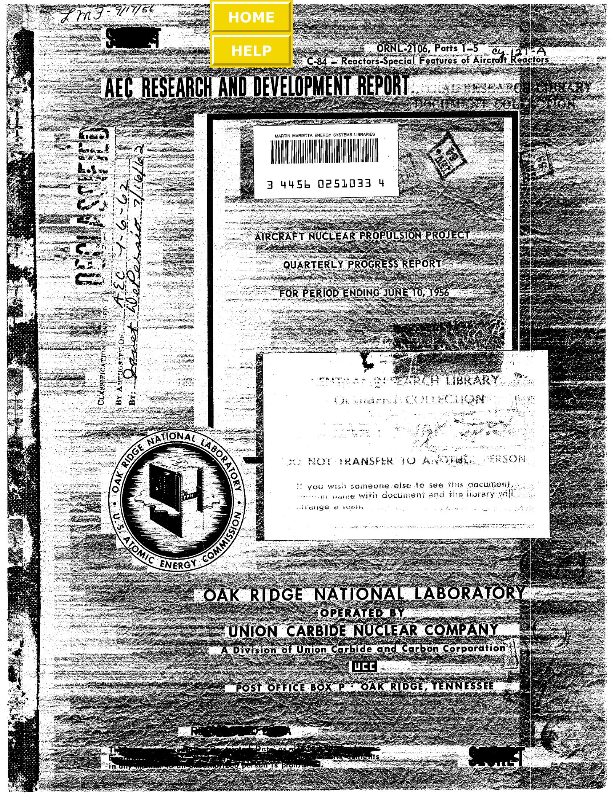

# LEGAL NOTICE

This report was prepared as an account of Government sponsored work. Neither the United States, nor the Commission, nor any person acting on behalf of the Commission:

A. Makes any warranty or representation, express or implied, with respect to the accuracy, completeness, or usefulness of the information contained in this report, or that the use of any information, apparatus, method, or process disclosed in this report may not infringe privately owned rights; or   
B. Assumes any liabilities with respect to the use of, or for damages resulting from the use of any information, apparatus, method, or process disclosed in this report.

# Part 1

# AIRCRAFT REACTOR ENGINEERING

S. J. Cromer

# 1.1. AIRCRAFT REACTOR TEST DESIGN

A. P. Fraas

# STATUS OF ART DESIGN

Design work on the Aircraft Reactor Test (ART) reactor, heat-exchanger, pump, and pressure-shell assembly is nearing completion. Layouts on all the major subassemblies have been completed, along with the major portion of the drawings of the detailed parts. Drawings for the remaining parts should be completed during the coming quarter. The applied mechanics and stress analysis work is accompanying the design, with rough first approximations being completed, usually, shortly after completion of the layouts and with better, second approximations following closely, in most instances, upon completion of the detail drawings. In cases in which component tests have been deemed essential, the results are being analyzed and modifications in details made when essential. Of course the analyses have not been completed for many very complex situations, and many key component tests have not yet been run. It is believed that modifications that will be required as the results of this work become available will probably involve only relatively minor reworking of partially fabricated parts. Such a calculated risk is necessary and inherent in design work involving such exceptional extrapolations of available technology.

The preliminary layouts for the shield have been modified to include provision for a substantial amount of instrumentation and special equipment. A one-half-scale model of the top portion of the reactor (commonly referred to as the "north head"), including the NaK manifolding, has been completed, and models of the instrumentation components, the lead shielding, and associated parts are well under way. Such models are used to investigate assembly and interference problems. Preliminary layouts have also been prepared for the arrangement of the lube-oil, hydraulic-fluid, water, gas, electrical, and instrumentation lines in the reactor cell. A one-sixth-scale model of the entire ART assembly is being kept closely abreast of this work to ensure accessibility, freedom from interferences, etc. The fuel fill-and-drain tank design has been completed, preliminary layouts for the associated supports, shielding, plumbing and instrumentation have been prepared, and the consequent assembly, accessibility, etc. problems

are being studied in the one-sixth-scale model. The detail design of the plumbing and equipment installation outside the cell is well along and should be largely completed during the coming quarter.

# APPLIED MECHANICS AND STRESS ANALYSIS

R. V. Meghreblian

# North-Head Pressure Stresses

The stress analysis of the composite doubledeck structure of the north head, mentioned in the previous report, was completed. The analysis was based on the pressure loads to which the structure will be subjected during full-power operation. Since the actual design consists of two circular flat-plate decks joined by a complex pattern of vertical baffles and walls arranged both radially and circumferentially (Fig. 1.1.1), it was not possible to carry out an analysis of this composite structure which would yield an exact distribution of the elastic stresses. Moreover, this structure is to be exposed to various operating conditions at temperatures of $1200^{\circ}\mathrm{F}$ and above for about 1000 hr, and it is expected that thermal distortions and creep will cause redistributions of stresses which will differ markedly from any predicted elastic stresses. It is not entirely meaningful therefore to think in terms of an exact stress distribution, and, for this reason, precise analyses of this structure were not attempted. So long as the proposed design is capable of supporting the operating loads at relatively low stress levels, the details of the exact distribution are not important. From the viewpoint of creep limitations, it would suffice to know the general location and magnitude of the highest stresses in the system.

This information has been obtained from a series of calculations based on simplified geometric configurations of the north-head structure, and these results will eventually be checked by an experimental stress analysis of a full-size aluminum model. The calculations consisted of three parts: a very elementary analysis in which the various

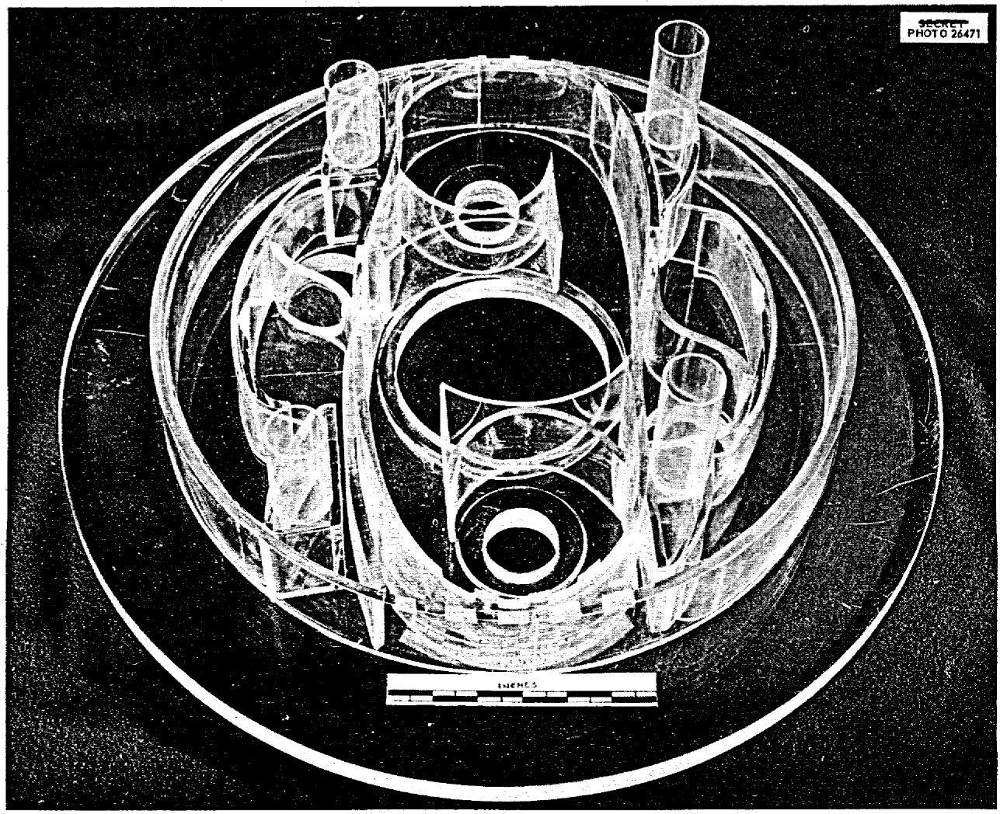  
Fig. 1.1.1. Plastic Model of ART North-Head Structure.

deck and shell areas were treated as individual plate segments with assumed edge conditions, an analysis of two circular flat plates of annular shape joined by a continuous circumferential baffle (Fig. 1.1.2), and an analysis of a composite system of plates and shells to represent the primary structural members, which was based on the requirement that the deformations of adjoining members be matched along the various junction lines (welds). The first two analyses served to give a very crude estimate of the stress levels involved. The purpose of the third analysis was to determine the stresses produced in the north head due to compatibility requirements of the various segments of shells and plates subjected to a complex pattern

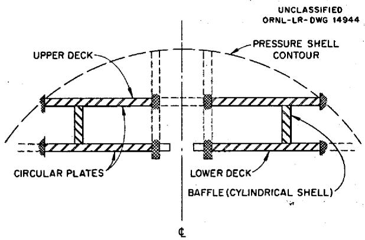  
Fig. 1.1.2. Circular Plates with Baffle.

of pressure loads. The idealized model used in this calculation is shown in Fig. 1.1.3, and the net pressure loads at various points are indicated. This model represents approximately the cross section indicated in Fig. 1.1.4. It includes some of the longest spans which appear in the design, and the results obtained from this model are therefore conservative.

The configuration of Fig. 1.1.3 was analyzed by writing the deflection equation for each member in terms of its load and edge conditions and solving the resulting system of eleven simultaneous equations on the Oracle. The results were obtained in terms of the moments and reactions at the joints and edges of the members. The stresses due to these loads were then computed. The largest stress, as indicated on Fig. 1.1.3, was found to be 2100 psi. Since the highest temperature which will occur in the north-head structure during full-power operation will be approximately $1300^{\circ}\mathrm{F}$ , this 2100-psi stress value is to be compared to

the creep properties of Inconel in the fuel mixture at about $1300^{\circ}\mathrm{F}$ . Creep tests have indicated that the tensile stress required to produce rupture in 1000 hr at $1300^{\circ}\mathrm{F}$ is about 10,000 psi. The design criterion for creep which has been selected for the ART requires that the total deformation in any member not exceed $0.2\%$ strain in 1000 hr. At $1300^{\circ}\mathrm{F}$ in the fuel mixture this corresponds to a tensile stress of about 2000 psi.

The experimental program, designed as a check on the calculations for the north-head structure, is under way at the University of Tennessee. It is believed that the combined results of the analytical studies and the model tests will reveal any defects in the proposed design.

# North-Head Thermal Stress

With the completion of the analysis for the mechanical stresses in the north-head structure, attention is now being directed to the determination of the thermal stress distributions. For this

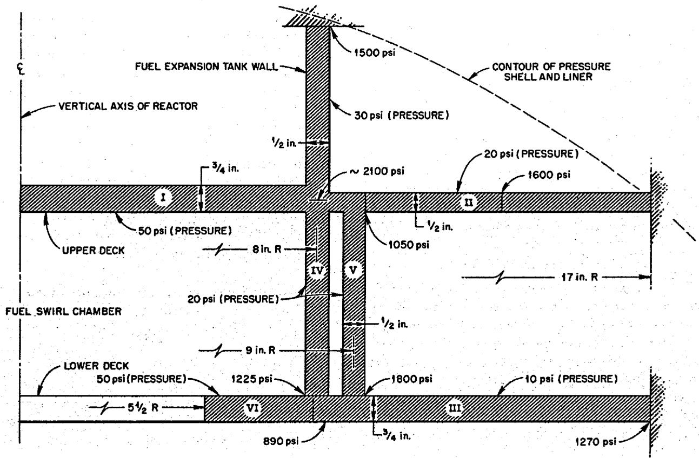  
Fig. 1.1.3. Idealized Configuration of North-Head Composite Structure (Section A-A of Fig. 1.1.4).

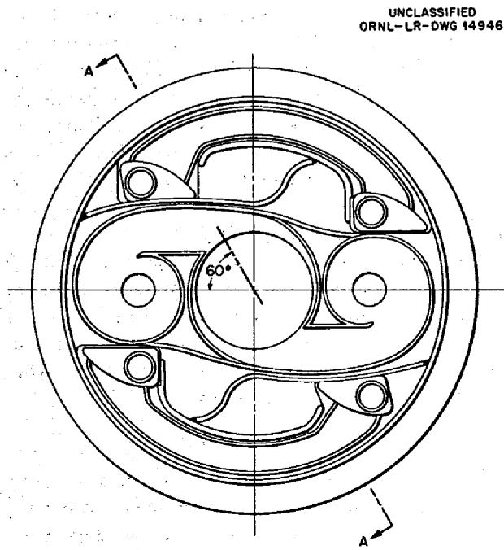  
Fig. 1.1.4. Cross Section Used in Composite-Deck Analysis.

purpose, calculations have been undertaken to obtain preliminary estimates of the energy-deposition rates throughout this region (see Chap. 1.2, "Art Physics"). The locations in the north head at which these rates might lead to relatively large temperature rises are indicated in Fig. 1.1.5. The calculations of the associated temperature distributions and the thermal stresses are presently under way. If these calculations yield excessive temperature gradients, it is planned to review the initial energy-deposition estimates and, if necessary, perform more precise analyses.

# Sodium Expansion Tank Design

The design analysis of the sodium expansion tank was completed, and the configuration which was found to be acceptable from both the pressure and thermal stress viewpoints is shown in Fig. 1.1.6. The proposed design consists of a vertical wall of more or less elliptical shape joined to an end cap of slightly cylindrical curvature. This cap (or roof) is welded to the control-rod thimble, which passes through the center of the ellipse. The stress analysis of this design was based on an idealized model consisting of a short, elliptical cylinder with a flat-plate cap subjected to an

internal pressure of 30 psi. The stresses in the cap were computed from the relations for an elliptical plate with various edge conditions. The stresses at the joint and in the vertical walls were computed from the relations for an equivalent circular cylinder with a flat head. These calculations indicate that the maximum stress (1000 psi) is due to the bending moment at the cylinder-cap junction.

During full-power operation the tank will be partially filled with sodium at $1270^{\circ}\mathrm{F}$ to an assumed depth of 2 in., and the upper portion of the side walls and the roof of the tank will be exposed to direct gamma radiation from the sodium (Fig. 1.1.7). The outer surfaces of the tank are to be surrounded by insulating material, and, if no cooling is provided for these surfaces, the metal temperature in the roof will rise to $1420^{\circ}\mathrm{F}$ . Since the side walls are to be welded to the pressure shell, which will be at $1250^{\circ}\mathrm{F}$ , there will be differential thermal growth between the roof and the shell, which will give rise to a thermal stress of 80,000 psi (based on an elastic analysis) at the roof-wall intersection. This stress is considered to be excessive; and therefore cooling is to be provided for the roof. Sodium at a temperature of $1250^{\circ}\mathrm{F}$ will be taken from the pressure-shell cooling circuit and fed into a system of tubes welded to the bottom surface of the roof. A total flow of 3 gpm will pass through this circuit at a pressure drop of 15 psi. The coolant sodium will leave the roof circuit at $1270^{\circ}\mathrm{F}$ and spill into the expansion tank volume. With this supply of coolant, the average roof temperature will be reduced to $1280^{\circ}\mathrm{F}$ . The temperature profiles in the roof in the vicinity of a cooling tube are shown in Fig. 1.1.8. The maximum thermal stress due to this temperature structure is 10,000 psi.

# ALUMINUM NORTH-HEAD MockUP FLOW STUDIES

E. R. Dyrko²

R.Curry2 R.E.MacPherson D.Ward

A full-size aluminum mockup of the fuel system components in the north head of the ART has been set up with external piping to complete the

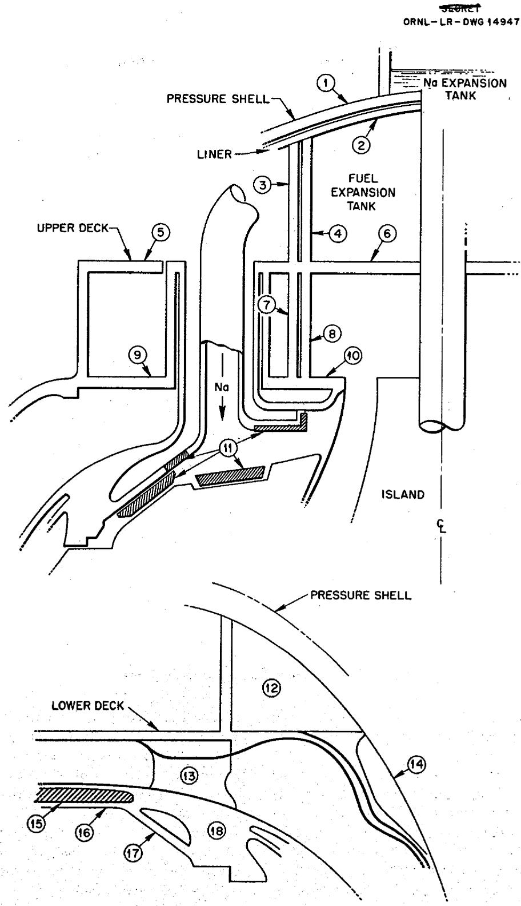  
Fig. 1.1.5. Locations in North Head at Which Energy Deposition Might Cause Large Temperature Increases.

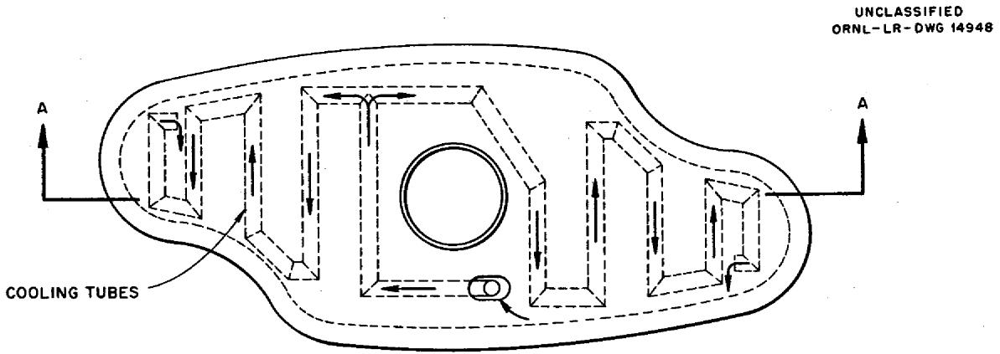

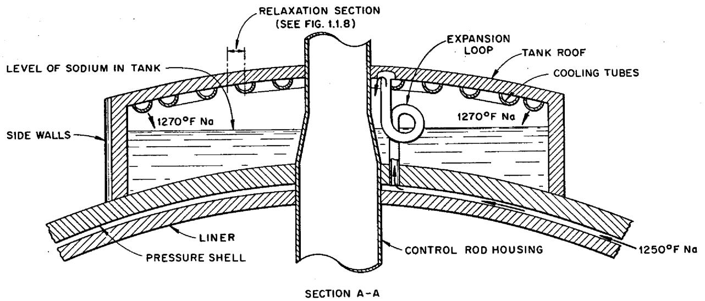  
Fig. 1.1.6. Sodium Expansion Tank Design.

circuits,3 and flow tests with water being pumped by the two fuel pumps under simulated reactor flow conditions are under way.

Twin fuel pump operation has been demonstrated up to 3000 rpm, although 2400 rpm produced approximately rated conditions of head and flow. Degassing of the system with pump speeds of 2400 rpm required less than 30 sec with the water level 1 in. or more above the bottom of the surge chamber. When the speeds of both pumps were lowered in unison from 2400 rpm, the first signs of ingassing

3D. R. Ward, ANP Quar. Prog. Rep. Dec. 10, 1955, ORNL-2012, p 65, Fig. 2.29.

occurred at 1200 rpm. The amount of gas entrained during operation with the pump speeds matched was believed to have reached a maximum, not exceeding 0.1 vol $\%$ , at 500 rpm. At speed levels above 1200 rpm, ingassing could not be detected with mismatching of up to $5\%$ . Mismatching the speeds by $20\%$ produced ingassing estimated to be 0.5 vol $\%$ . When the power to one of the hydraulically driven fuel pumps was cut off while both pumps were running uniformly at 2400 rpm, about 13 sec was required for the one pump to stop. This one-pump-stopped condition created ingassing of roughly 2 vol $\%$ .

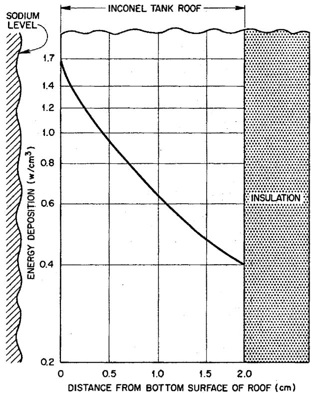  
UNCLASSIFIED ORNL-LR-DWG 14949   
Fig. 1.1.7. Energy Deposition in Sodium Expansion Tank Roof Due to Gamma Radiation.

Surging and instability were noted in pump speeds, flow rates, pumping power, and inlet and discharge pressures. It is believed that both the centrifuge hardware and the unfavorable pump inlet pipe configurations were contributing to the observed instability. The addition of straightening vanes to the pump inlet regions materially reduced the surging. This, coupled with some modifications to the xenon-removal system, appears to have reduced the pressure fluctuations to an acceptable level, that is, about 0.5 psi in the full-scale reactor.

Water bypassed into the surge chamber for simulated xenon removal was very turbulent, and splashwetting of all surfaces and entrainment of fine bubbles resulted. Methods being considered for reducing the extreme turbulence in this region include the addition of baffles, a reduction in

bypass flow rates, and a redesign of the passages from the pumps to the surge chamber.

# CORE FLOW STUDIES

W. T. Furgerson W. J. Stelzman D. B. Trauger

Changes in design of both the center volute of the axial-flow type of header and the island expansion bellows located within the header of the proposed ART core resulted in an unsatisfactory core flow pattern being generated by the previously satisfactory inlet guide vane, designated GS-2, and the conical baffle plate, designated GS-2-P3 (ref. 4). Under the revised design, this particular guide vane and baffle plate combination generated flow reversal at the island surface in the region of the equator. Systematic relocation of the conical baffle plate only and analysis of the resulting core flow pattern yielded baffle plate GS-2-P10, which, in combination with guide vane GS-2, again generated a flow pattern containing no flow reversal along either the outer core shell or the island surfaces. Brief periods of minor flow reversals did occur at the equator; however, these occurred in midstream and seemed to be caused by the turbulent condition of the fluid mass in this region. In general, the flow generated in the upper half of the core by this combination was extremely unstable, but it exhibited excellent surface scrubbing, with very good transfer of fluid from the walls, and excellent fluid mixing. Below the equator, some improvements were noted in the fluid flow properties; however, the streamlines again tended to hug the inner and outer surfaces as they approached the core outlet. Attempts had previously been made with the original axial-flow header to improve the flow in the lower half of the core by means of turbulators on the island surface immediately below the guide vanes and again on the shell surface immediately below the equator; however, the improvement was only minor. This latest design is being evaluated in the half-scale ART volume-heat-source apparatus (see Chap. 4.1, "Heat Transfer and Physical Properties").

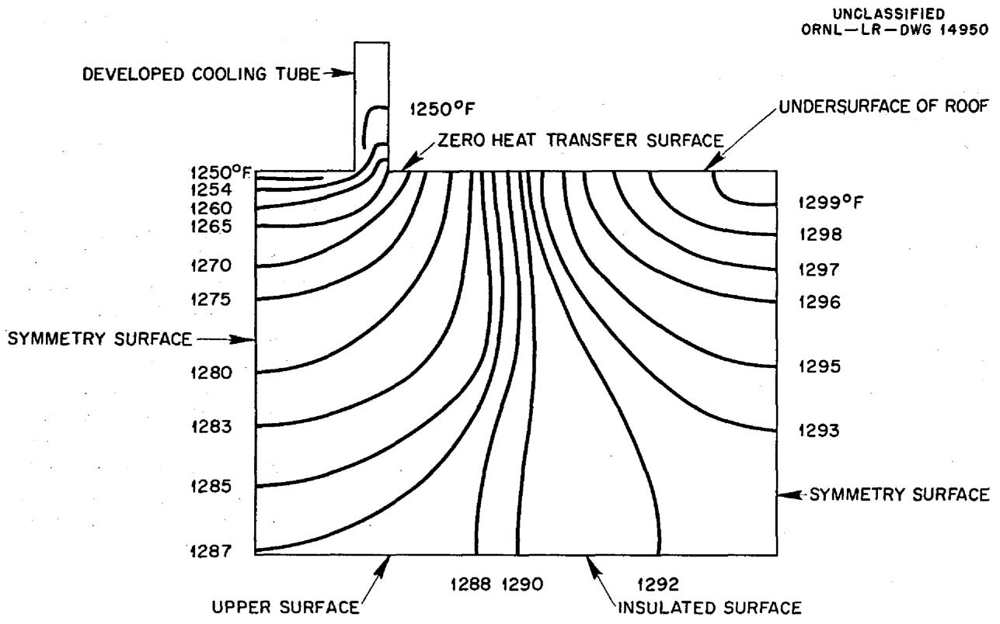  
Fig. 1.1.8. Temperature Profile in Sodium Expansion Tank Roof.

# PERFORMANCE REQUIREMENTS FOR PUMPS IN THE NoK SYSTEMS

M. M. Yarosh

A study was completed to determine the speed and power range requirements for the main and auxiliary NaK pump motors. Because of unequal system lengths, the pressure drops in each of the four main NaK systems for an equal NaK flow are different, and thus a different pump speed is required for each system. In addition to the variations between systems, the individual system resistances will vary as a function of operating time and operating conditions. These variations will be attributable to the mass-transfer buildup anticipated in the colder sections of the NaK systems, principally in the radiator tubes.

Pump speed requirements were established from the pump performance curves. The NaK system curves (head vs flow) showing expected ranges of system resistance as a function of flow were plotted on the pump performance curves, and the operating speeds were established at design flow to be those speeds falling between the minimum

and maximum system resistance curves. Thus, a range of operating speeds was established for each individual NaK system. Power requirements were then computed for the corresponding speed, head, and flow requirements.

In order to reduce warmup time for the NaK systems, it will be desirable to operate the NaK pumps at, or near, full speed during the warmup period. Stress considerations, however, will prohibit operation at full NaK pump speed for extended periods of time when there is no fuel in the reactor. Therefore an intermediate pump speed was established at which reduced warmup periods can be attained at reduced stress. The operating speeds established and corresponding power requirements for the main and auxiliary NaK pumps are given in Table 1.1.1.

# CONTROL-ROD COOLING SYSTEM

# J. Foster

The ART control rod is designed to move vertically in a well containing static sodium, this sodium being deep enough to cover the control

TABLE 1.1.1. NoK PUMP SPEEDS AND HORSEPOWER REQUIREMENTS   

<table><tr><td colspan="2">Main System</td><td colspan="2">Auxiliary System</td></tr><tr><td>Pump Speed (rpm)</td><td>Power Required (hp)</td><td>Pump Speed (rpm)</td><td>Power Required (hp)</td></tr><tr><td>1900</td><td>27</td><td>1900</td><td>7</td></tr><tr><td>2300</td><td>42</td><td>2300</td><td>14</td></tr><tr><td>2650</td><td>61</td><td>2800</td><td>26</td></tr><tr><td>2800</td><td>72</td><td>2950</td><td>31</td></tr><tr><td>3000</td><td>87</td><td>3100</td><td>37</td></tr><tr><td>3200</td><td>102</td><td>3250</td><td>41</td></tr><tr><td>3400</td><td>118</td><td>3400</td><td>46</td></tr><tr><td>3500</td><td>127</td><td>3550</td><td>55</td></tr></table>

rod in its fully withdrawn position. This places the level of the sodium-free surface in the well just a few inches above the top of the reactor north head. The well extends up about 5 ft above this level so as to place the control-rod drive mechanism outside the reactor shield. The sodium at and near the free surface must be cooled to below $500^{\circ}\mathrm{F}$ to minimize the vapor pressure and hence the diffusion and deposition of sodium vapor on the components of the control-rod drive mechanism, where such deposits might create operating difficulties such as shorting of electrical circuits. Tests have shown that sodium vapor evolution and deposition are negligible at $500^{\circ}\mathrm{F}$ .

The lower portions of the sodium in the well will be exposed to temperatures of about $1200^{\circ}\mathrm{F}$ , and therefore the cooling system includes convection baffles to still the upper few inches of the sodium and a water jacket around this baffled sodium zone. As a precaution to ensure against any possibility of water entering the sodium chamber, the jacket will be a completely watertight assembly. An Inconel sleeve will be shrunk over the outside of the control-rod well pipe to form a double wall. Water will be circulated at 220 to $240^{\circ}\mathrm{F}$ (sodium melts at $208^{\circ}\mathrm{F}$ ) through the jacket and will serve to remove heat or supply

heat as required by the condition of the reactor system. No flow or pressure controls will be provided other than an orifice in the water line, designed to give a flow of 1 gpm.

The water-jacketed and baffled sodium zone will be separated from the hot sodium in the lower well by a solid Inconel plug inserted in the sodium as a heat dam to keep the thermal gradient along the Inconel well to a reasonable value from the thermal stress standpoint. This Inconel plug is a 4-in.-high cylinder with a central hole drilled along the cylindrical axis, through which the $3/8$ -in.-dia control-rod drive is free to move and position the rod as required.

The effluent hot water from the jacket will pass through an economizer, in which it will heat the entering water stream. This will reduce the water heating load and cool the effluent stream to prevent flashing in the drain.

# SODIUM SYSTEM STUDIES

# R. I. Gray

Recent tests showed that the flow resistance in the annuli around the core in which sodium will be circulated will be somewhat smaller than expected with the spacers in place. This will effect a slightly lower overall pressure drop and more nearly balanced flow between the cooling holes and the core annuli. Pressure drop calculations indicated the need for increasing the thickness of the control-rod cooling annulus, in which sodium will circulate, from 0.080 in. to about 0.125 in.

Stress calculations indicate the need for cooling the top of the sodium expansion tank and for the addition of a flexible bellows to the island sodium inlet line (see previous section of this chapter on "Applied Mechanics and Stress Analysis"). An auxiliary sodium expansion tank of approximately 0.6 ft³ has been added to the system so that in the event of a major reactor shutdown sodium can be added as the sodium temperature is lowered from 1200°F to 300°F to avoid a loss of prime in the sodium pumps (which would otherwise occur at about 800°F).

# 1.2. ART PHYSICS

A.M.Perry

# RADIATION HEATING ON THE ART EQUATORIAL PLANE IN THE VICINITY OF THE FUEL-TO-NoK HEAT EXCHANGER

H.W.Bertini

The results of calculations of the radiation heating on the ART equatorial plane in the outer $3\mathrm{cm}$ of the beryllium reflector and in the Inconel and the boron-containing shells on both sides of the fuel-to-NaK heat exchanger are presented in Figs. 1.2.1 and 1.2.2. The total gamma-ray heating in each region is given in Fig. 1.2.1, as well as the heating from the sources which are the main contributors to the total in each

shell. The encircled numbers on Fig. 1.2.1 refer to the sources described in Table 1.2.1.

The data on heating in the copper-boron layer by alpha particles from the $\mathsf{B}^{10}(n,a)\mathsf{Li}^7$ reaction are plotted in Fig. 1.2.2. The heating goes to infinity at the face of the layer closest to the core because the heating at various points is governed by an $E_{1}$ function,

$$
E _ {1} (x) = \int_ {1} ^ {\infty} e ^ {- x \lambda} \frac {d \lambda}{\lambda},
$$

where $\lambda$ is the mean free path. The integral under the curve will be finite.

TABLE 1.2.1. SOURCES OF RADIATION HEATING CONSIDERED IN CALCULATING THE RESULTS PRESENTED IN FIG. 1.2.1   

<table><tr><td>Source No.</td><td>Source</td><td>Source Strength</td></tr><tr><td>1*</td><td>Prompt gamma rays in the fuel region of the core of the reactor</td><td>28.3 w/cm3</td></tr><tr><td>2</td><td>Decay gamma rays in the fuel region of the core of the reactor</td><td>6.84 w/cm3</td></tr><tr><td>3</td><td>Gamma rays from inelastic scattering of neutrons in the fuel region of the core</td><td>10.1 w/cm3</td></tr><tr><td>4</td><td>Capture gamma rays in the outer core shell</td><td>41.4 w/cm2</td></tr><tr><td>5</td><td>Capture gamma rays in the reflector (average)</td><td>~0.5 w/cm3</td></tr><tr><td>6</td><td>Capture gamma rays in first Inconel shell outside of beryllium reflector</td><td>22.5 w/cm3</td></tr><tr><td>7</td><td>Boron capture gamma rays in copper-boron layer</td><td>1.8 w/cm2</td></tr><tr><td>8</td><td>Alpha particles from the B10(n,α)Li7 reaction in the copper-boron layer (average)</td><td>42 w/cm3</td></tr><tr><td>9</td><td>Decay gamma radiation from the fuel in the heat exchanger</td><td>2.3 w/cm3</td></tr><tr><td>10</td><td>Gamma rays from inelastic scattering of neutrons in first 9 cm of reflector (average)</td><td>0.7 w/cm3</td></tr><tr><td>11</td><td>Capture gamma rays from delayed neutrons in the heat ex-changer and Inconel shells (including the pressure shell)</td><td>&lt;0.1 w/cm3</td></tr><tr><td>12</td><td>Capture gamma rays in the copper of the copper-boron layer</td><td>0.5 w/cm2</td></tr><tr><td>13</td><td>Gamma rays from inelastic scattering in both core shells</td><td>~4 w/cm2</td></tr><tr><td>14</td><td>Capture gamma rays in the island core shell</td><td>41.4 w/cm2</td></tr></table>

\*In Fig. 1.2.1 the data for heating from sources 1, 2, 3 are combined and labeled a.

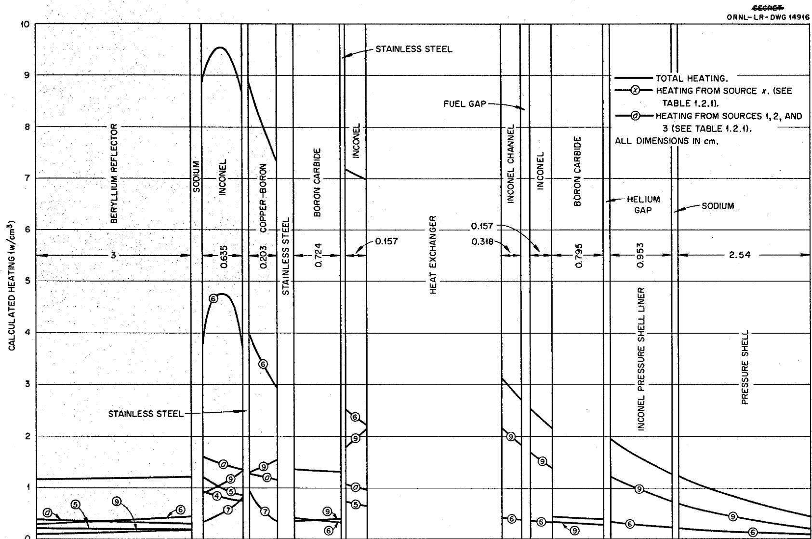  
Fig. 1.2.1. Gamma-Ray Heating in the Vicinity of the Fuel-to-NaK Heat Exchanger on the Equatorial Plane of the ART.

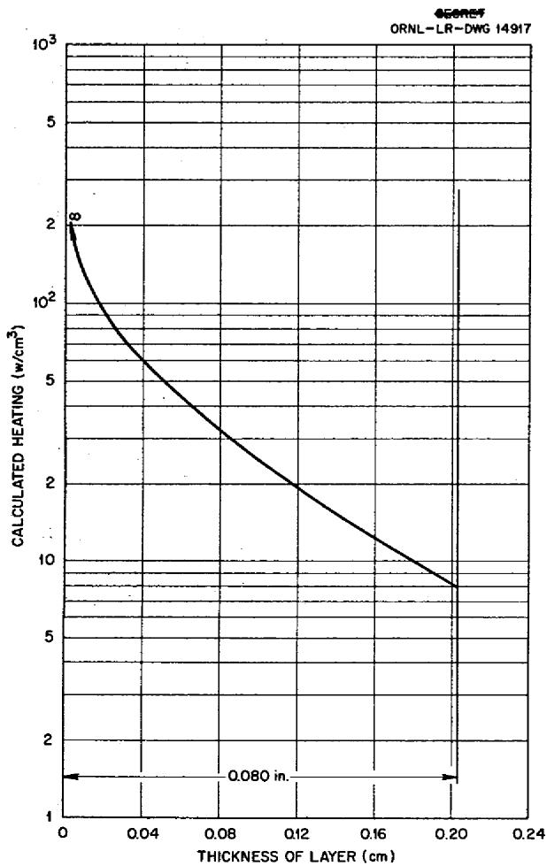  
Fig. 1.2.2. Heating in Copper-Boron Layer By Alpha Particles from the $\mathbf{B}^{10}(n,a)\mathbf{L}\mathbf{i}^7$ Reaction.

The heating from sources 10 to 14 was neglected. Their combined contributions to the heating in the region being considered was estimated to be about $5\%$ of the total heating.

The fuel region of the core of the reactor was assumed to be a spherical shell 5.125 in. thick with an outside radius of 10.5 in. This region was divided into 13 spherical shells of thicknesses varying from 0.27 cm to 2 cm. The source strength (in watts/cm³) of the prompt gamma rays in each shell was assumed to be proportional to the average fission power in each shell, which was calculated (from ref. 2) at the equatorial plane of

the reactor. The source strength of the decay gamma rays was assumed to be the same for each fuel shell.3

The average source strength of gamma rays resulting from inelastic neutron scattering in the fuel was calculated by using the output of multigroup calculations performed by the Curtiss-Wright Corp. on ART-type reactors with spherical symmetry. The inelastic cross sections used for the fuel were those reported in ref. 3. This calculation had been performed before all the data in the latter reference had been accumulated, so it was assumed that, for each inelastic collision, one-half the average neutron energy in each energy group was given off as 1-Mev gamma radiation. Calculations made by using the more recent data indicate that the source strength used was too high by about $50\%$ . The total heating values given in Fig. 1.2.1 may therefore be about $5\%$ too high. This error is partially compensated for, however, by the neglect of sources 10 through 14.

The prompt and decay gamma-ray spectra were divided into four energy groups with average energies for each group of 0.5, 1, 2, and 4 Mev. The last four groups listed in ref. 3 were combined into one group with an average energy of 4 Mev. The heating at the various places described in Fig. 1.2.1 was calculated by summing the contributions from each energy group from every fuel shell.

It was assumed for the calculations that each fuel shell was replaced by an infinitely thin spherical-shell source embedded in an infinite homogeneous medium so that the standard transformation from a spherical-shell source to two infinite-plane sources would apply, that is, so that the heating at $R$ , $b(R)$ , would be given by

where

$r \equiv$ radius of source (taken as the average radius of each fuel shell),

$R \equiv$ distance from center of fuel shell to field point,

$H(x) \cong$ heating at a field point due to an infinite plane source of monoenergetic gamma rays a distance $x$ away from the field point.

The second term of Eq. 1 was dropped for these calculations because of the large radii involved.

The assumptions made were certainly not consistent with the geometry, inasmuch as the region between the source shells and the field point is not everywhere homogeneous. The justification for this approach was that it appeared to be as good as could be done without going to a much more detailed numerical integration over all source points for each energy group to calculate the heating at one field point.

In deriving $H$ , it was assumed that the attenuating medium between the plane source and field point consisted of infinite slabs of materials whose thicknesses were determined by their thicknesses at the equatorial plane of the ART.

The buildup factor used was of the form

$$
A \left(e ^ {a \sum_ {i} \mu_ {i} t _ {i}} - 1\right) + 1, \tag {2}
$$

where

$A, \alpha \equiv$ parameters of the equation,

$\mu_{i}\equiv$ linear total gamma-ray absorption cross section $(\mathsf{cm}^{-1})$ for material $i,$

$t_i =$ thickness of material $i$ (cm).

Under these conditions,

(3) $H = \frac{S\mu_{e}}{2}\left\{AE_{1}\left[(1 - a)\sum_{i}\mu_{i}t_{i}\right]\right.$

$$
+ (1 - A) E _ {1} \left(\sum_ {i} \mu_ {i} ^ {t} _ {i}\right) \},
$$

where

$H \equiv$ heating $(\mathrm{w/cm}^3)$ at the field point,

$S =$ source strength $(\mathrm{w} / \mathrm{cm}^2)$

$\mu_{e} \equiv$ linear gamma-ray energy absorption cross section $(\mathrm{cm}^{-1})$ for the field point,

$t_{i}\equiv$ thickness of the ith slab (cm).

The $S$ term was determined for each fuel shell and each energy group by multiplying the source strength for each group (in $\mathbf{W} / \mathbf{cm}^3$ ) by the thickness

of the shell. The buildup factor parameters, $A$ and $a_{s}$ were taken to be those for beryllium. The $\mu^{\prime}s$ , $A^{\prime}s$ , and $a^{\prime}s$ were evaluated at each energy group.3

The spectrum of prompt gamma rays reported in ref. 7, 8.8 $e^{-1.01E}$ photons/Mev·fission, is different from that reported in ref. 3, 9.61 $e^{-1.01E}$ photons/Mev·fission. The former value, which neglects the variation of $(\sigma_c / \sigma_f)_{U235}$ with energy, was used in these calculations before the correction was pointed out. Use of the latter spectrum would change the results reported here by less than $2\%$ .

The heating by the capture gamma rays in the outer core shell was calculated with the use of the same assumptions as those used for the calculations of the heating by the fuel-region sources, that is, a sphere-to-plane transformation was made and slab geometry was used for the intervening mediums between the plane source and field point. The absorption rate in the outer core shell was calculated from the output date of multigroup calculations.5

The spectrum of capture gamma rays in Inconel was divided into seven energy groups in ref. 3, but, for this calculation, the first three groups were combined into one group, and the average energy of this combined group was taken to be 2 Mev. The fourth and fifth groups in ref. 3 were taken as the second and third energy groups for this calculation, and the average energies were taken to be 4 and 6 Mev, respectively. The sixth and seventh energy groups in ref. 3 were combined into one group with an average energy of 8 Mev. Thus a total of four energy groups was used in this calculation. The buildup factor used was that for beryllium at each energy group. The outer core shell has an inside radius of 26 cm and a thickness of 0.381 cm.

The capture gamma rays in the island core shell were neglected because of the shielding properties of the fuel. The heating by the capture gamma rays in the beryllium reflector was calculated by using the sphere-to-plane transformation and the other assumptions given above. The reflector region was divided into five spherical shells, that is, the same shells as those used by the Curtiss-Wright Corp. in their multigroup calculations of reactor No. 675. The capture gamma-ray source

strengths in each region were calculated from the output of the multigroup calculations. The spectrum of the capture gamma rays in beryllium is divided into two energy groups in ref. 3, and these groups were combined into one group with an average energy of 6 MeV, for this calculation. The buildup factor for beryllium at 6 MeV was used.

In calculating the gamma-ray sources in the first Inconel shell around the beryllium reflector, it was assumed that $32\%$ of all neutrons born in the core escape from the reflector as thermal neutrons. It was further assumed that these neutrons escape with an isotropic angular distribution from the surface of the reflector. A source strength, $S_{s}$ in thermal neutrons $\mathrm{cm}^2$ -sec escaping from the surface of the reflector, was calculated by using a reflector radius of 55.04 cm (ref. 1). Because of the large radii of curvature in this

$$
\begin{array}{l} \left. \text {H} = \frac {\epsilon \mu_ {e}}{2 \mu_ {1}} \left(\frac {A}{1 - \alpha} \left\{E _ {2} \left[ (1 - a) \sum_ {i = 2} ^ {n} t _ {i} \mu_ {i} \right] - E _ {2} \left[ (1 - a) \sum_ {i = 1} ^ {n} t _ {i} \mu_ {i} \right] \right\}\right. \right. \tag {6} \\ + (1 - A) \left[ E _ {2} \left(\sum_ {i = 2} ^ {n} t _ {i} \mu_ {i}\right) - E _ {2} \left(\sum_ {i = 1} ^ {n} t _ {i} \mu_ {i}\right) \right], \\ \end{array}
$$

region of the reactor, the neutron absorption rates were calculated on the basis of slab geometry.

Between the Inconel shell and the reflector there is a $\frac{1}{8}$ -in. layer of sodium coolant. If it is assumed that a neutron leaving the surface source will be absorbed only on a first-flight absorption collision, the probability of absorption in the sodium, $P_{a}(\mathrm{Na})$ , is derived to be

$$
P _ {a} (\mathrm {N a}) = 1 - E _ {2} \left[ \sum_ {a} (\mathrm {N a}) t \right], \tag {4}
$$

where

$$
E _ {2} (x) = \int_ {1} ^ {\infty} e ^ {- x \lambda} \frac {d \lambda}{\lambda^ {2}},
$$

$$
t = \text {t h i c k n e s s o f s o d u i m l a y e r (i n} \mathrm {c m}),
$$

$$
\begin{array}{l} \Sigma_ {a} (\mathrm {N a}) = \text {m a c r o s c o p i c} \quad \text {t h e r m a l - n e u t r o n} \quad \text {a b s o r p t i o n} \\ = 5. 6 \times 1 0 ^ {- 3} \mathrm {c m} ^ {- 1}. \\ \end{array}
$$

It was assumed that the angular distribution of the neutrons reaching the Inconel was still isotropic, and a similar expression was obtained for the Inconel, for which the macroscopic thermal

neutron absorption cross section is $0.18\mathrm{cm}^{-1}$ Then, for the Inconel,

(5) absorption rate in Inconel

$$
= S [ 1 - P _ {a} (\mathrm {N a}) ] P _ {a} (\text {I n c o n e !}).
$$

The capture gamma-ray source strength per unit volume was then calculated by using the dimensions given in ref. 1, the energy per capture given in ref. 3, and the assumptions given above. The macroscopic neutron absorption cross sections at average velocity at $700^{\circ}\mathrm{C}$ were calculated from values given in BNL-325.

It was assumed that the gamma-ray source was constant in the Inconel. Also, because of the large radii involved, slab geometry was assumed for the source and for the mediums between the source and field points.

For a slab source and the buildup factor given in Eq. 2, the heating for monoenergetic gamma rays is given by

where

$$
\epsilon \equiv \text {s o u r c e} \left(\mathrm {w} / \mathrm {c m} ^ {3}\right),
$$

$$
\mu_ {i} \equiv \text {l i n e a r} \quad \text {t o t a l} \quad \text {g a m m a - r a y} \quad \text {c r o s s} \quad \text {s e c t i o n} \quad (\mathrm {c m} ^ {- 1}) \text {f o r t h e i t h s l a b},
$$

$$
t _ {i} \equiv \text {t h i c k n e s s o f i t h s l a b (c m) ; i = 1 d e s i g n a t e s}
$$

The spectrum of capture gamma rays from Inconel was divided into seven energy groups with average energies for each group of 0.5, 1, 2, 4, 6, 8, and 10 MeV. In calculating the heating in the shells adjacent to the Inconel source, the buildup factor for Inconel was used. Test calculations have shown that the heating is relatively insensitive to the type of buildup factor used for materials which have nearly the same equivalent Z. The heating in the beryllium reflector was calculated by using the buildup factor for beryllium. For the shells on the pressure shell side of the heat exchanger, the buildup factor for the

heat exchanger was used. The heating at all field points was found by summing over the contributions of every energy group.

The self-heating of this Inconel shell for each energy group was calculated by using the expression

$$
H = \frac {\epsilon \mu_ {e}}{\mu} \left\{2 - \left(E _ {2} (\mu t) + E _ {2} [ \mu (t _ {0} - t) ]\right) \right\}, \tag {7}
$$

where

$$
H \equiv \text {h e a t i n g} t \left(\mathrm {w} / \mathrm {c m} ^ {3}\right),
$$

$$
\epsilon \equiv \text {s o u r c e} \quad \text {s t r e n g t h} \quad \text {o f t h e s h e l l} \quad \left(\mathrm {w} / \mathrm {c m} ^ {3}\right),
$$

$$
\mu_ {e} \equiv \text {l i n e a r} \quad \text {e n e r g y} \quad \text {a b s o r p t i o n} \quad \text {c r o s s} \quad \text {s e c t i o n} \quad (\mathrm {c m} ^ {- 1}) \text {o f t h e l i n c o n e l} \text {s h e l l},
$$

$$
\mu \equiv \text {l i n e a r} \quad \text {t o t a l} \quad \text {c r o s s} \quad \text {s e c t i o n} \quad (\mathrm {c m} ^ {- 1}) \text {o f t h e}
$$

$$
\begin{array}{l} t _ {0} \equiv \text {t h i c k n e s s o f t h e I n c o n e l s h e l l (c m)}, \\ t \equiv \text {d i s t a n c e} \text {f r o m} \text {t h e} \text {s u r f a c e} \text {o f t h e} \text {I n c o n e l} \text {s h e l l (c m)}. \\ \end{array}
$$

No buildup factor was used for this self-heating calculation.

Sample calculations were made in order to compare the heating from this shell when it was assumed to be a plane source with the heating when the shell was assumed to be a slab source; the results indicated a difference of $30\%$ between the two values of the heating at a distance of 2.5 mean free paths from the source.[10] Thus the approximation of a plane source was not used in this case.

The source strength of the gamma rays resulting from neutron captures in the boron of the copper-boron layer was calculated by assuming that all the neutrons leaving the reflector and escaping from the sodium and Inconel shell described above are absorbed at the front surface of the copper-boron layer. Actual calculations indicate that only $90\%$ of the neutrons striking the layer are absorbed there, and they also indicate that the distribution of the sources of gamma rays would be the same as the distribution of heating by alpha particles, as illustrated in Fig. 1.2.2. The source strength of the gamma rays used for this calculation was therefore about $10\%$ too high. It was assumed that there was a 0.48-Mev gamma ray associated with $93\%$ of the absorptions.[11]

The heating in the shells for this source was calculated by using Eq. 3. The buildup-factor parameters and the gamma-ray cross sections were evaluated at 0.5 MeV. The buildup factors used were the same as those used in the previous calculation of the sources in the Inconel shell outside the reflector.

The heating in the copper-boron layer by alpha particles from the $\mathsf{B}^{10}(n,a)\mathsf{Li}^7$ reaction was calculated by using techniques similar to those used in estimating the neutron captures in Inconel. It was assumed that all neutrons escaping from the reflector, sodium, and Inconel were incident on the surface of the copper-boron layer with an isotropic angular distribution. By assuming slab geometry and by assuming that the neutrons make only first-flight absorption collisions, the probability of absorption at $t$ per unit thickness in the ith constituent of the layer is given by the expression

$$
P _ {a} = \sum_ {a} ^ {i} E _ {1} \left(\sum_ {a} ^ {T} t\right), \tag {8}
$$

where

$$
\begin{array}{l} \begin{array}{l} \Sigma_ {a} ^ {i} \equiv \text {m a c r o s c o p i c t h e r m a l - n e u t r o n a b s o r p t i o n} \\ \text {c r o s s s e c t i o n o f t h e i t h c o n s t i u e n t ,} \end{array} \\ \Sigma_ {a} ^ {T} \equiv \text {t o t a l} \quad \text {m a c r o s c o p i c} \quad \text {t h e r m a l - n e u t r o n} \quad \text {a b s o r p t i o n} \quad \text {c r o s s} \quad \text {s e c t i o n} \quad \text {o f t h e} \quad \text {c o p p e r - b o r o n} \quad \text {l a y e r}, \\ t \equiv \text {d i s t a n c e} \quad \text {f r o m} \quad \text {t h e f r o n t} \quad \text {f a c e} \quad \text {o f} \quad \text {t h e s l a b} \quad (\mathrm {c m}). \\ \end{array}
$$

In this case the copper-boron layer was assumed to consist only of copper and $\mathsf{B}^{10}$ , and the atomic density of each was calculated for a matrix consisting of 16 vol % natural $\mathsf{B}_4\mathsf{C}$ and 84 vol % copper. The microscopic cross sections used were those for the average velocity at a temperature of $700^{\circ}\mathsf{C}$ , and they were calculated from the room-temperature cross sections given in BNL-325.

The neutron absorption rate per cubic centimeter in $\mathsf{B}^{10}$ at $t$ is given by

$$
S \Sigma_ {a} ^ {B ^ {1 0}} E _ {1} \left(\Sigma_ {a} ^ {T} t\right), \tag {9}
$$

where $S$ is given in neutrons/cm $^2$ -sec impinging on the front face of the matrix. The heating resulting from neutron captures in B $^{10}$ was calculated by assuming that in 93% of the absorptions in B $^{10}$

a 2.32-Mev alpha particle is given off and that in the remaining $7\%$ a 2.8-Mev alpha particle is given off.[11] The heating from beta decay resulting from neutron captures in copper was calculated, and it was found to be negligible compared with the alpha-particle heating.

The gamma-ray heating resulting from the emission of decay gamma radiation in the heat exchanger was calculated on the basis of slab geometry by using Eq. 6 for each energy group. The spectrum of gamma rays was divided into the seven energy groups given in ref. 3, with average energies of 0.5, 1, 2, 4, 6, 8, and 10 MeV. The buildup factor for the heat exchanger was used for each energy group. The total heating at various points was calculated by summing over the contributions of each energy group.

The source strength of the gamma rays resulting from inelastic neutron scattering in the beryllium reflector was also calculated. These sources are appreciable only in the first $9\mathrm{cm}$ of beryllium. However, their contributions to the heating in the regions around the heat exchanger are small compared with those of the beryllium capture gamma-ray sources. The reason for this is that the gamma rays from inelastic scattering were taken to be 1-Mev gamma rays, which are attenuated much more strongly by the beryllium than are the 6-Mev capture gamma rays. In addition the total source strength of the gamma rays from inelastic neutron scattering is much smaller than that of the capture gamma rays because of the volumes of beryllium involved in each.

The source strength of the capture gamma rays resulting from delayed neutron captures was calculated by assuming that $50\%$ of the delayed neutrons were given off in the heat exchanger and that all these neutrons were captured in the neighborhood of the heat exchanger. By assuming that an 8-Mev gamma ray was given off for each capture, the average source strength per unit volume was found to be small as compared with the other sources in this region.

The capture gamma-ray sources in the copper were calculated in the same general way that the alpha-particle heating in the copper was calculated, with the source converted to a surface source of gamma rays. In itself this is not an insignificant source, but the heating resulting from this source would be only about $2\%$ of the total from all the sources considered here.

The gamma-rays resulting from inelastic neutron scattering in the core shells were calculated by using the Curtiss-Wright multigroup fluxes and an inelastic microscopic cross section of 1.5 barns (ref. 13) for the constituents of Inconel. It was assumed that a 2-Mev gamma ray was given off for each inelastic collision. The results gave a source strength of about $10\%$ of that resulting from the capture gamma rays in these shells.

As has already been remarked, the capture gamma rays in the island core shell were neglected because of the shielding properties of the fuel. Where it has not been stated otherwise, the dimensions used in these calculations were those from ref. 1 for the equatorial plane of the reactor.

# RADIATION HEATING IN VARIOUS REGIONS OF THE NORTH HEAD

H.W.Bertini

D. L. Platus14

Calculations of the radiation heating to be expected in various regions in the north head of the ART were undertaken in order to supply numbers from which thermal-stress calculations could be made. Because of the complexity and the time that would be involved in calculating accurately the heating in all the regions of the north head, it was decided to make preliminary estimates of the deposition rates. More accurate values calculated for other regions of the reactor were used as guides. In all cases the tendency was to overestimate the heating. These estimates can be used to identify the thermal-stress problems, and where the calculated thermal stresses are marginal, the heating will be recalculated.

Calculations were made of the heat-deposition rate in a slab of Inconel bounded on one side by an infinite fuel region containing the sources of radiation. This heat-generation rate was used in all regions in the north head which are bounded by finite fuel volumes.

The heat-deposition rates in a slab of Inconel bounded on one side by slabs of sodium of various thicknesses were calculated, and the results were extrapolated and interpolated to obtain the heat-generation rates in the Inconel regions of the north

head which are bounded by various thicknesses of sodium.

Fairly accurate calculations have been made of the heat-deposition rates in the Inconel filler plates below the island and in the vicinity of the fuel-to-NaK heat exchanger on the equatorial plane of the reactor. These results were used as a guide in estimating the heating in some north-head regions, and new values were obtained by compensating (by simple exponential attenuation) for decreased beryllium thicknesses, penetrations through additional fuel layers, increased thermal-neutron leakage currents into the north head, etc.

A neutron current of $7 \times 10^{13}$ neutrons/cm $^2$ -sec was assumed to be escaping uniformly from the upper portion of the core, $^{15}$ and it was assumed that 1 Mw of fission power was being generated in the fuel regions of the north head by neutrons escaping into this region. The latter increased the gamma rays in the fuel by about $30\%$ .

The sources of gamma radiation considered were those from the sodium and fuel in the north head, the heat exchangers, boron, the fuel in the core, core shells, beryllium, and Inconel shell capture gammas. The sources of beta particles considered were those from the gases in the fuel-expansion tank, and the sources of alpha particles were taken to be those from boron captures. The average values of heat generation obtained in these calculations are presented in Table 1.2.2. The configuration of the north head is shown in Fig. 1.1.5 of Chap. 1.1 of this report.

# BETA- AND GAMMA-RAY ACTIVITY IN THE FUEL EXPANSION CHAMBER AND THE OFF-GAS SYSTEM

R. B. Stevenson

The power-source distribution of the activity of the gases in the space above the fuel in the fuel expansion chamber and in the off-gas line has

15A. M. Perry, ORNL, private communication to H. W. Bertini.   
16On assignment from Pratt & Whitney Aircraft. 17J.J.Newgard,Fission Product Activity and Decay Heat Distribution in the Circulating Fuel Reactor with Fission Gas Stripping,TIM-205 (Sept.28,1955).

been determined. The results obtained are to be used in the calculation of the radiation heating and the thermal stresses in this region of the reactor.

The radioactive constituents of the gas in this space are the gaseous fission products, xenon and krypton, and their daughter products. There is also a possibility that some volatile fission-product fluorides will be formed in the fuel and will escape into this area. However, it has been shown[17] that if all the fission-product fluorides entered this space, they would add very little activity to that already caused by the gaseous fission products and their daughters. Thus, their effect has been neglected here. Also, there is some question as to whether the daughter products of the fission gases will actually be carried downstream by the off-gas system or whether they will be deposited on the enclosing walls as they are formed. In order to get a conservative estimate of the power-source distribution, it was decided to treat the daughter products of xenon and krypton as gases (except insofar as their purging from the fuel into the fuel expansion chamber is concerned).

The equilibrium amount of the gaseous fission products in the fuel expansion chamber is given by (approximately)

$$
N _ {i} = \frac {\gamma_ {i} \lambda_ {p}}{(\lambda_ {i} + \lambda_ {p}) (\lambda_ {i} + \lambda_ {s})},
$$

where $N_{i}$ is the total number of atoms of type i in the gas volume per fission per second, $\gamma_{i}$ is the saturation fission yield of the ith nuclide, $\lambda_{p}$ is the "purging" constant, $\lambda_{s}$ is the "sweeping" constant, and $\lambda_{i}$ is the decay constant of the ith nuclide. The "purging" constant is determined by the volume flow rate of the fuel through the purging pumps and the total volume of fuel. This constant determines the amount of the gaseous fission products which are purged from the fuel into the expansion chamber. The "sweeping" constant is determined by the flow rate of helium through the expansion chamber and the volume of the gas space. This constant determines the dwell time of the radioactive nuclides in the gas space and thus the number of disintegrations they suffer there. The "purging" and "sweeping" constants are given by

$$
\begin{array}{l} \lambda_ {p} = \frac {\text {v o l u m e f l o w r a t e o f f u e l t h r o u g h p u r g i n g p u m p s}}{\text {t o t a l v o l u m e o f f u e l}}, \\ \lambda_ {s} = \frac {\text {v o l u m e f l o w r a t e o f h e l i u m t h r o u g h e x p a n s i o n c h a m b e r}}{\text {v o l u m e o f g a s s p a c e}}. \\ \end{array}
$$

TABLE 1.2.2. AVERAGE HEAT-GENERATION RATES IN MEMBERS OF ART NORTH HEAD   

<table><tr><td>Member No.*</td><td>Description</td><td>Heat Generation (w/cm3)</td></tr><tr><td>1</td><td>Pressure shell (below sodium expansion tank)</td><td>4</td></tr><tr><td>2</td><td>Liner</td><td>6 w/cm3+ 16 w/cm2on ex-pansion-tank surface due to beta rays</td></tr><tr><td>3</td><td>Fuel-expansion-tank baffle</td><td>3</td></tr><tr><td>4</td><td>Fuel-expansion-tank wall</td><td>6</td></tr><tr><td>5</td><td>Upper deck (regions with sodium on both sides)</td><td>2</td></tr><tr><td>6</td><td>Upper deck (regions with fuel on both sides)</td><td>15</td></tr><tr><td>7</td><td>Swirl-chamber baffle</td><td>3</td></tr><tr><td>8</td><td>Swirl-chamber wall</td><td>8</td></tr><tr><td>9</td><td>Lower deck (regions with fuel below and sodium above)</td><td>8</td></tr><tr><td>10</td><td>Lower deck (regions with fuel on both sides)</td><td>12</td></tr><tr><td>11</td><td>Copper-boron tiles</td><td>25 w/cm2·t + 6 w/cm3, where t = thickness of tiles (cm)</td></tr><tr><td>12</td><td>Filler block</td><td>3</td></tr><tr><td>13</td><td>Beryllium support struts</td><td>10</td></tr><tr><td>14</td><td>Filler block</td><td>1</td></tr><tr><td>15</td><td>Copper-boron tile</td><td>30</td></tr><tr><td>16</td><td>Flat section of lower support ring</td><td>15</td></tr><tr><td>17</td><td>Strut part of lower support ring</td><td>3</td></tr><tr><td>18</td><td>Lower support ring</td><td>1.5</td></tr></table>

*See Fig. 1.1.5, Chap. 1.1, this report, for location of member.

The power-source distribution of the radioactive nuclides is found by multiplying their equilibrium concentration by their decay constant $\lambda_{i}$ and their average energy per disintegration.

The total power and the power density in the gas space of the fuel expansion tank as a function of the volume of the gas and the helium flow rate are given in Fig. 1.2.3. For these calculations, $\lambda_{p}$ was taken to be $5.82 \times 10^{-3}$ sec, which corresponds to a fuel flow rate of 22 gpm through the purging pumps. If the purging device is

assumed to be $100\%$ efficient, this means that the reactivity effect of the xenon is reduced to about $0.1\%$ at equilibrium.[18] The sweeping constant, $\lambda_{s'}$ is dependent on the helium flow rate and the gas volume, and thus it is different for each point on the curves. In converting the STP values of the helium flow rate, the temperature of the gas was assumed to be $1200^{\circ}\mathrm{F}$ , and the pressure in the expansion chamber and off-gas line was

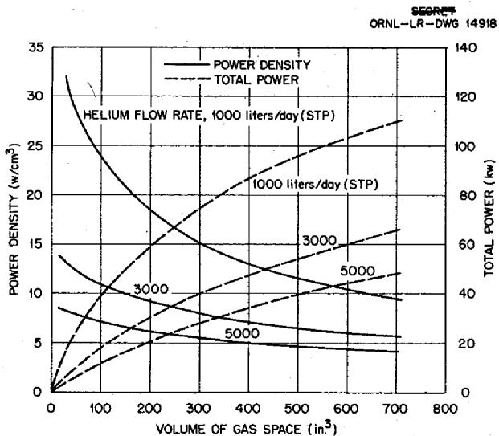  
Fig. 1.2.3. Total Power and Power Density in the Gas Space of the ART as a Function of the Gas Volume and the Helium Flow Rate for a Fuel Flow Rate of 22 gpm.

taken to be 1.3 atm. The power of the reactor was assumed to be 60 Mw.

In the calculation of the curves, the very short- and very long-lived nuclides of xenon and krypton (along with their decay products) were neglected. Since the fuel circulation time in the ART is less than 3 sec, nuclides with half lives less than this value will decay mostly in the fuel before it reaches the purging pumps. Thus very few atoms with half lives less than about 3 sec would get into the gas space. Also, for nuclides with long half lives (greater than about 100 hr), the number of disintegrations taking place in the fuel expansion chamber and off-gas line would be small, since the dwell time at the assumed helium flow rates is very short. Thus, these nuclides may be neglected.

In this study, 32 nuclides were considered, 16 of these being isotopes of xenon and krypton and 16 being their daughter products. The main contributors to the power distribution are the daughter products and not the nuclides of xenon and krypton themselves. In all cases, the daughter products contribute about 50 to $60\%$ of the total power distribution. Of the total power, about $90\%$ is due to the beta-ray decays, with only $10\%$ being due to gamma-ray decays. Thus, in determining the heating caused by these gases, it can be

assumed that the heat deposition will occur mainly in a small surface layer of the materials surrounding the gases in the fuel expansion chamber and the off-gas line.

The power density in the off-gas line as a function of time and gas volume for helium flow rates of 1000 and 3000 liters/day (STP) is given in Fig. 1.2.4. The time axis can be converted into lengths along the off-gas line by dividing the volume flow rate of the helium gas by the cross-sectional area of the off-gas pipe. Thus, Fig. 1.2.4 gives the power-source density of a cubic centimeter of the gas at any position in the off-gas line.

These plots were made by using the well-known equations of the decay of parent products and the buildup of their daughters as a function of time. The initial conditions at the beginning of the off-gas line were taken as the equilibrium conditions prevailing in the fuel expansion tank.

# ACTIVITIES OF NIOBIUM, MOLYBDENUM, RUTHENIUM, AND THEIR DAUGHTER PRODUCTS AFTER SHUTDOWN

R. B. Stevenson

The activities of the materials which will plate-out on the walls surrounding the fuel channel in the ART during reactor operation will, along with other factors, determine how long a period must elapse before reactor disassembly can proceed. The activities of the various radioactive nuclides of niobium, molybdenum, and ruthenium, and their daughter products have been determined for 100 and 300 days after shutdown and for reactor operation periods of 500 and $1000\mathrm{hr}$ . These three fission products are expected to plate-out in large quantities, and therefore it has been assumed in this study that all the atoms of these elements created as fission products are plated-out. There is evidence that other fission products may plate-out; however, it is felt that the three taken into account here are the primary ones.

The only isotopes of these elements that need to be considered at times greater than 100 days after shutdown are $\mathsf{Nb}^{95}$ , $\mathsf{Ru}^{103}$ , and $\mathsf{Ru}^{106}$ . All the other isotopes have sufficiently short half lives that they will decay appreciably in this time, and thus they may be neglected. The only daughter products that will have large activities after shutdown for more than 100 days will be $\mathsf{Rh}^{103m}$ and $\mathsf{Rh}^{106}$ (daughters of $\mathsf{Ru}^{103}$ and $\mathsf{Ru}^{106}$ , respectively).

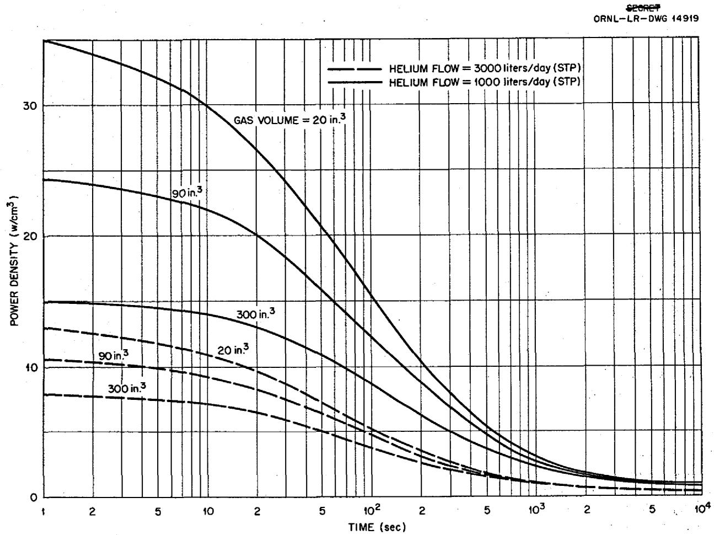  
Fig. 1.2.4. Power Density in the Off-Gas Line as a Function of Time and Gas Volume in the Expansion Tank for a Fuel Flow Rate of 22 gpm.

The activities to be expected at shutdown and 100 and 300 days after shutdown for reactor operating periods of 500 and 1000 hr at 60 Mw are presented in Table 1.2.3, which also gives the average beta-ray energies, the gamma-ray energies, and the gamma-ray yields in photons per 100 disintegrations. It has been assumed that, at shutdown, the fuel is dumped instantaneously so that no more plating takes place. Also, the activities of $\mathsf{Rh}^{103m}$ and $\mathsf{Rh}^{106}$ are zero at shut

down, since these nuclides are carried away with the fuel and have a chance to build up only when their precursors decay.

The gamma activity at 100 days after shutdown for 500 hr of operation at 60 Mw is approximately $2 \times 10^{5}$ curies, and at 300 days after shutdown, for the same operating conditions, it is about $8 \times 10^{3}$ curies. These high activities at times long after shutdown must be contended with in any disassembly procedure suggested for the ART.

TABLE 1.2.3. ACTIVITY OF PLATED-OUT MATERIALS IN THE ART AFTER 500 AND 1000 hr OF OPERATION AT 60 Mw  

<table><tr><td rowspan="2">Nuclide</td><td rowspan="2">Average Beta-Ray Energy (Mev)</td><td rowspan="2">Average Gamma-Ray Energy (Mev)</td><td rowspan="2">Gamma-Ray Yield (photons per 100 disintegrations)</td><td colspan="2">Activity at Shutdown (curies)</td><td colspan="2">Activity 100 Days After Shutdown (curies)</td><td colspan="2">Activity 300 Days After Shutdown (curies)</td></tr><tr><td>After 500 hr of Operation</td><td>After 1000 hr of Operation</td><td>After 500 hr of Operation</td><td>After 1000 hr of Operation</td><td>After 500 hr of Operation</td><td>After 1000 hr of Operation</td></tr><tr><td>Nb95</td><td>0.053</td><td>0.745</td><td>100</td><td>1.29 × 105</td><td>4.08 × 105</td><td>1.82 × 105</td><td>5.65 × 104</td><td>3.36 × 102</td><td>1.06 × 103</td></tr><tr><td>Ru103</td><td>0.074</td><td>0.498</td><td>99</td><td>5.65 × 105</td><td>9.57 × 105</td><td>1.00 × 105</td><td>1.68 × 105</td><td>3.06 × 103</td><td>5.16 × 103</td></tr><tr><td>Ru106</td><td>0.0131</td><td>0</td><td>0</td><td>7.84 × 103</td><td>1.53 × 104</td><td>6.49 × 103</td><td>1.26 × 104</td><td>4.44 × 103</td><td>8.65 × 103</td></tr><tr><td>Rh103m</td><td>0</td><td>0.04</td><td>100</td><td>0</td><td>0</td><td>9.20 × 104</td><td>1.60 × 105</td><td>2.92 × 103</td><td>4.92 × 103</td></tr><tr><td>Rh106</td><td>1.05</td><td>2.41</td><td>0.25</td><td>0</td><td>0</td><td>6.49 × 103</td><td>1.26 × 104</td><td>4.44 × 103</td><td>8.65 × 103</td></tr><tr><td></td><td></td><td>1.55</td><td>0.5</td><td></td><td></td><td></td><td></td><td></td><td></td></tr><tr><td></td><td></td><td>1.045</td><td>2</td><td></td><td></td><td></td><td></td><td></td><td></td></tr><tr><td></td><td></td><td>0.87</td><td>1</td><td></td><td></td><td></td><td></td><td></td><td></td></tr><tr><td></td><td></td><td>0.624</td><td>12</td><td></td><td></td><td></td><td></td><td></td><td></td></tr><tr><td></td><td></td><td>0.513</td><td>25</td><td></td><td></td><td></td><td></td><td></td><td></td></tr></table>

# 1.3. ART INSTRUMENTS AND CONTROLS

E. R. Mann

C. S. Walker

# LOUVER CONTROL SIMULATION

J. M. Eastman

F. P. Green

E. R. Mann

The ART simulator was used for further study of the problem involved in closing the main heat-dump louvers to prevent the fuel from freezing as the result of a fast insertion of the control rod. Improved transport-lag simulators were incorporated in the system. The control technique to be used will be that of closing the louvers to limit the minimum NaK temperature.

Two louver-closing speeds have been found to be necessary to keep the temperature of the NaK returning from the radiator from dropping below the fuel freezing temperature. One speed will automatically close the louvers from the open position to the $10\%$ open position in 9 sec after a fast control-rod insertion. With the louvers at the $10\%$ open position and with the four main blowers at design point speeds, 15 Mw of power will be removed.

The slow-speed louver actuators will operate on a temperature signal from the radiator outlets. When this temperature drops below $1070^{\circ}\mathrm{F}$ , the slow actuator will start to close the lovers. The slow actuator will be capable of closing the $10\%$ open lovers in 3 sec.

For the simulation study it was assumed that all four blowers remained in operation, two being supplied from the TVA circuit and two from the diesel circuit. With the four blowers operating, a fast control-rod insertion will automatically shut off the power to one of the blowers on the TVA circuit and one on the diesel circuit. A power failure of either the TVA circuit or the diesel circuit would then leave only one blower in operation. The NaK-temperature undershoots would then be somewhat less, the overshoots somewhat more, and the ultimate cooling rate lower. Although this NaK-temperature limit system seems to be functionally acceptable, the system will be further explored on the simulator. The fail-safe characteristics are being studied, and modifications may be made which will require further simulator work for evaluation.

# LOUVER ACTUATOR

J.M.Eastman

Specifications for the Louver actuators were established that are based on the following safety considerations: first, if the actuators should fail, the louvers must lock into the position they are in at the time of failure; second, the components which are not considered to be of first-order reliability must be located in an area accessible for repair without the NaK systems having to be cooled or drained; and, third, the overall system reliability and dependability must be high. Since the actuators and any locally mounted associated equipment will not be accessible during the test, these components must be of first-order reliability. Hydraulic-actuator cylinders were selected. They will be operated in conjunction with spring-loaded clamps arranged to grip the actuator-output shafts. For steady-state Louver conditions, both ends of the actuator cylinder will be vented to the hydraulic return, or drain. The louvers will be moved by valving hydraulic pressure to either end of the hydraulic cylinder. This pressure will be simultaneously vented to a piston which will release the spring-loaded clamp. The rate of Louver movement will then be controlled by an orifice in the line through which return hydraulic fluid will flow from the cylinder to the drain.

The fast louver-closing rate will be obtained by opening an orifice in parallel with the one used for slow closing. The hydraulic pressure supply unit is to be located in an area accessible for repair work. Two pumps will be used that will operate in parallel and be driven from different electric power sources. They will be arranged so that one can be repaired or replaced without interrupting the fluid-pressure supply. Solenoid valves will be used for control of the hydraulic fluid. When not energized, these valves will hold the louvers fixed, and they will be energized to move the louvers. Low-viscosity hydraulic fluid and thin-plate orifices will be used so that the flow rates and the corresponding louver-actuation rates will be relatively insensitive to fluid temperature. Valves and orifices will be located near the hydraulic-power-supply unit in an area accessible for repair work.

# ENRICHER ACTUATOR

J.M.Eastman

Specifications were also established for the actuator for the fuel enricher. The actuator is to consist of a gear-motor drive equipped to provide a multiple-synchro indication of the position of the enricher piston. Enrichment is to be at the rate of 1 lb of $U^{235}$ in approximately 22.5 sec. Three synchros will be used to indicate 1, 10, and 150 lb of $U^{235}$ per revolution. Thus the synchro dials will be read in gas-meter fashion to note the pounds of $U^{235}$ displaced (equivalent volumetric measurement of enriched fuel mixture, $Na_2UF_6$ ) in terms of piston position.

Data obtained from calibration tests of the enricher during operation of the high-temperature critical assembly have been adjusted for changes in the geometry of the ART. The data indicate that the enriching uncertainty which will result from a fuel-meniscus effect at the spillover weir will be equivalent to approximately $4\%$ of 1 lb of $\mathsf{U}^{235}$ . The enricher will be able to deliver about 130 lb.

# FLUX SERVO SIMULATION

F. P. Green

E. R. Mann

C. S. Walker

The ARE micromicroammeter and servo amplifier were used in the preliminary simulation of the ART flux servo, but the system is unstable because of the faster reactor response that results from the lower delayed-neutron contribution. The latter effect is caused by the differences between the ART and the ARE in core-residence time of the fuel and in ratio of core-residence time to loop-flow time. The system is being studied to ascertain methods for correcting the instability.

# CONTROL ROD AND DRIVE MECHANISM

S.C.Shuford2

The design of the control-rod drive mechanism was completed, and $95\%$ of the parts to be supplied by vendors have been obtained. A mechanical shakedown test of the mechanism at operating temperature is planned. Ruggedness, reliability, and ease of servicing were the prime objectives in the design of the mechanism. A single rod that will operate in a thimble passage through the north head and down the center line of the island to

10 in. below the mid-plane is to be employed to furnish normal shim control for changing the fuel mean temperature and to provide for emergency reactor shutdown.

The neutron-absorbing section of the rod will consist of twenty-three 1-in.-long, 1.275-in.-OD, 0.775-in.-ID, rare-earth oxide (Lindsay Code 920) hollow cylinders. (The composition of these rare-earth oxide compacts and the fabrication methods used in producing them are presented in Chap. 3.6, "Ceramic Research.")

The cylinders are to be retained by Inconel inner and outer tubes with holes at the top and bottom to permit sodium permeation and communication with the stagnant sodium in the thimble. Heat generated in the rod will thereby be conducted to the cooled thimble wall.

The drive mechanism is to be powered by two, Diehl, 6-pole, 200-w, 2-phase, low-inertia servomotors. One motor will be bidirectional and is to be used for servo and manual control. It will give a rod speed of $0.01\% (\Delta k / k) / \mathrm{sec}$ . The other motor will be unidirectional and is to be used for fast insertion. It will give a rod speed of $0.125\% (\Delta k / k) / \mathrm{sec}$ . The fast-insertion motor will be energized through the safety circuit by the following emergency-condition signals:

1. any power outage,   
2. fuel- or sodium-pump stoppage,   
3. flux level above normal,   
4. drop in fuel or sodium level,   
5. a 3-sec reactor period.

The two motors will be connected through nonreversing worm gears on concentric shafts that will, in turn, supply power separately to the sun gear and to the arm of a differential gear box. This arrangement precludes the necessity for clutches or gear shifts. Both motors will be continuously capable of inserting the rod when either circuit or both circuits are energized.

A high-resolution potentiometer (0.1% linearity) will feed a strip-chart recorder to make a permanent rod-position record. A spare potentiometer and means for external switchover will be provided. It will be possible to read the rod position to 0.10 in. and to estimate it to 0.05 in. on the recorder chart.

Two independently driven synchro transmitters will be used for position indication. One will rotate 300 deg for full-rod stroke and the other will rotate one revolution per inch of stroke. Resolution from the two-synchro system will be approximately

0,020 in. To minimize backlash and to prevent instrument pinion run-off (with attendant loss of synchronization), both the synchros and the potentiometers will be driven by a fine-pitch rack 1 in longer than the power-transmitting rack.

Two plunger-sealed limit switches, which will operate through the motor control circuits, will be used to prevent rod overtravel at each end of the stroke, and one limit switch will be used for giving a $1\% \Delta k / k$ reserve indication for filling operations.

The drive mechanism, which will be canned, will be operated under a 15-psi helium pressure. The helium consumption will be limited to that lost in periodic venting of the container.

# INSTRUMENT DEVELOPMENT

R. G. Affel

Thermocouple Data Reduction

J. T. DeLorenzo W. R. Miller

Equipment suitable for transmitting 100 thermocouple signals on two conductors has been assembled and tested. As the simplified block diagram shows (Fig. 1.3.1), the input signals are

scanned by a high-speed mercury-jet switch. This switch is actually a centrifugal pump, driven by a motor, which directs a fine stream of mercury at adjacent pins to complete a circuit. Synchronism between the two switches is assured by driving them with synchronous motors that operate from the same power source. Such a system offers several advantages. For example, a large number of temperatures may be scanned, visually, on one large, 17-in.-screen oscilloscope; alarm or monitoring systems that scan several hundred readings a second are possible (available systems are limited to 1 point/sec or slower); temperature gradients or profiles on equipment may be directly displayed; essentially all time lag in the system lies in the sensor, and therefore transient studies are limited only by the sensors; commercial nullbalance potentiometric recorders can be used with such a system.

The equipment being tested scans data at the rate of 2500 points/sec. Conventional, Brown, multipoint, strip-chart recorders have been modified to operate on the switch output, which is 30 pulses/sec, with each pulse $200\mu \mathrm{sec}$ in duration.

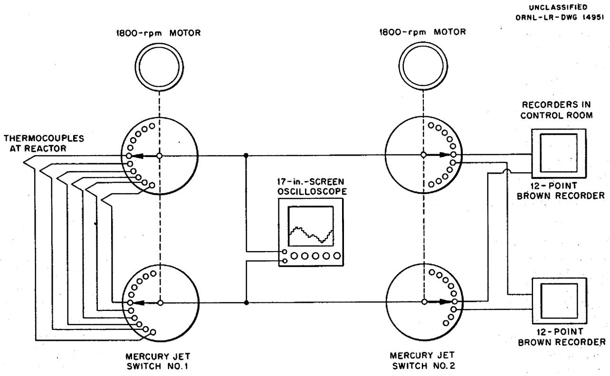  
Fig. 1.3.1. Thermocouple Data Transmitting and Recording Apparatus.

Thus, even with an input signal only $0.006\%$ of the time, the available, conventional equipment may be used in an integrated alarm or monitoring system.

# Cell Bulkhead Penetrations

J. T. DeLorenzo

Fittings suitable for reactor cell penetrations for heater wiring, control wiring, chamber leads, and thermocouples have been examined. Preliminary specifications and drawings have been prepared for review, and a contract is to be negotiated with a vendor.

# Fuel-Expansion-Tank Level Indicator

R. F. Hyland

Tests are under way to determine the practicability of using a helium bubbler to obtain a continuous fuel-level indication in the ART fuel-expansion tank in the temperature range 1100 to $1500^{\circ}\mathrm{F}$ with a varying pressure above the fuel. The tests were designed so that information could be obtained on whether the bubbler tubes would become clogged with fuel or $\mathsf{ZrF}_4$ vapor deposits, to determine the minimum helium flow that would provide an accurate level measurement, to study the effect of changes in bubbling rate on the accuracy of measurement, to learn the response of the system to pressure surges, and to ascertain the accuracy of measurement.

The test apparatus consists of a conventional purge system that utilizes a constant-differential relay and purgemeter to obtain constant flow and a pneumatic differential-pressure transmitter. One side of the pressure transmitter is tapped off the purge line, and the other side is connected to a gas-pressure tap above the fuel. The output of the transmitter is fed into a pneumatic recorder. The bottom of the bubbler tube is located exactly 5 in. from the surface of the fuel, and a spark plug is installed to provide a level reference when the rig is being filled. A reasonably accurate level indication is assured during filling by the sparkplug probe giving off a flickering light when the helium bubbles ripple the surface of the fuel. The vessel is maintained at a static pressure of 5 psig by venting off excess helium.

The accuracy and reproducibility of the level indications, as obtained by water calibration of the apparatus, was $\pm 2\%$ in the level range being measured. However, on fuel runs, errors of as

large as 0.43 in. of fuel in 5 in. $(8.6\%)$ and as small as 0.12 in. in 5 in. $(2.4\%)$ were noted. The average error appears to be of the order of $\pm 5\%$ . This error can probably be accounted for by the fuel-density change with temperature, which is known to an accuracy of only $\pm 5\%$ , difficulties in the precise placement of the bubbler tube and the spark plug, and the slight inaccuracy resulting from the use of a spark-plug probe to indicate the fuel level in the vessel.

It was found that a purge flow rate as small as 0.2 scfh of helium would yield consistent flow measurements, but the system response to pressure surges at this purge rate was sluggish. Purge rates of the order of 1.5 scfh (~1000 liters/day) of helium gave both consistent level measurements and fairly rapid system response to pressure surges. There is no observable change in level indication for any purge flow rate between 0.2 and 1.5 scfh.

On the basis of 1850 hr of operation of the apparatus in one run, it appears to be practical to measure fuel level at a fuel temperature of $1150^{\circ}\mathrm{F}$ by the helium-bubble method on a static system. There has not yet been a sufficient number of hours of a $1500^{\circ}\mathrm{F}$ test to evaluate the results of level indication at this higher temperature.

# High-Temperature Pressure Transmitters

W. R. Miller

Pressure transmitters manufactured by four different vendors have been evaluated in tests in the temperature range 1000 to $1400^{\circ}\mathrm{F}$ . Three of the four units tested operated similarly. They were of the force-balance type that requires an external gas supply to maintain a zero pressure differential across a bellows or diaphragm. The fourth unit utilizes a diaphragm-isolated, NaK-filled tube system in which the NaK hydrostatically transmits the applied pressure to an external, low-temperature, displacement-type transducer. The tube-system units were found to have $0.6\%$ or better, average accuracy. Accordingly, orders have been placed for 81 of these units. Development work is continuing on other types of pressure transmitters, including electrically operated devices.

# High-Temperature Turbine-Type Flowmeter

G. H. Burger

A high-temperature turbine-type flowmeter has been developed for measuring flow in fused-salt

and in NaK systems at high temperatures. This type of flowmeter does not require penetrations to the process fluid, and it gives very accurate flowrate data.

The flow-sensing unit, shown in Fig. 1.3.2, consists of an Inconel turbine, or rotor, supported by titanium carbide bearings, and flow-straightening vanes of Inconel, which, in turn, support the turbine bearings. The fluid enters the vanes and then impinges on the turbine blades and causes the turbine to rotate. The turbine contains, within its body, a small cobalt vane, which has the unique property of retaining its magnetic characteristics at temperatures up to $2100^{\circ}\mathrm{F}$ . A permanent magnet assembly is used outside the piping to establish a uniform magnetic field perpendicular to the axis of rotation of the turbine and the cobalt vane contained therein. A pickup coil, with a large number of turns, is mounted so that it intercepts the magnetic lines of flux of the magnet. When the

turbine is rotated by the fluid, the cobalt vane rotates and cuts the lines of flux of the magnet; this changing flux generates a voltage in the pickup coil. Thus, the number of pulses per unit time is a direct measure of the turbine speed, which, in turn, is a linear measure of the flow rate. The speed of the turbine (in counts, or pulses, per second) can be measured quite readily by using appropriate standard electronic equipment, such as a linear rate meter or scaler. Since the turbine speed is a linear function of the flow, the flow rate (in gpm) can be plotted against counts (pulses) per second. This device is not dependent upon pressure, temperature, or specific gravity but is dependent upon viscosity. The viscosity effect, which causes turbine "drag," is not appreciable, however, at viscosities below 5 cp. A water-calibration curve of turbine speed vs flow rate is presented in Fig. 1.3.3. Calibration of this type of flowmeter with water is valid for the fused-salt fuel mixtures.

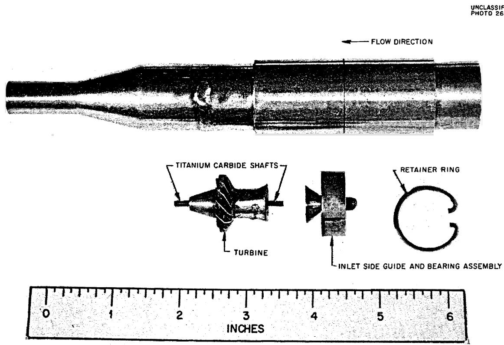  
Fig. 1.3.2. ORNL-Designed Turbine-Type Flowmeter for Flow Measurements in the Range 2.5 to 50 gpm at Temperatures Up to $1600^{\circ}\mathrm{F}$ .

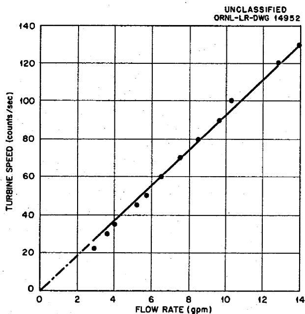  
Fig. 1.3.3. Water-Calibration Curve for a Turbine-Type Flowmeter.

Experimental models of the turbine-type flowmeter are being tested in gas-fired forced-circulation loops. The flowmeter is welded into the pump-discharge section of the loop, and the magnet assembly is cooled with plant air to keep the pickup coil at a low temperature. The experimental results obtained thus far indicate that the principle of operation of the turbine-type flowmeter is sound and valid for high-temperature operation. The cobalt vane has been satisfactory at temperatures up to $1400^{\circ}\mathrm{F}$ and should be satisfactory at $1600^{\circ}\mathrm{F}$ . Information is to be obtained in further tests on bearing corrosion and self-welding and on bearing tolerances at various temperatures. It is felt that after sufficient operating data are obtained, a satisfactory design can be worked out for scaling the flowmeter to any desired size. It is further believed that this method of flow measurement can be made accurate to within $1\%$ , which is much better accuracy than is attainable with the conventional magnetic flowmeters used on liquid-metals systems. The magnetic flowmeters specified for use on the 3.5-in., sched-40 pipe in the ART NaK system must be calibrated individually to achieve $4\%$ accuracy at a flow rate of 1200 gpm. In the larger, 10-in. pipe, the magnetic flowmeters can give accuracies of only about $12\%$ at 8000 gpm.

# 1.4. COMPONENT DEVELOPMENT AND TESTING

H.W.Savage

# PUMP DEVELOPMENT

E. R. Dytko

A. G. Grindell

# Bearing-and-Seal Development

W. L. Snapp

W. K. Stair²

The maximum operating temperature expected in the lubricating and cooling fluid used in the ART reactor pumps is approximately $220^{\circ}\mathrm{F}$ . For an operating period of 500 hr, with an oil dilution factor of approximately 0.03, the integrated radiation dose absorbed by this pump lubricant is calculated to be $3 \times 10^{8}$ rep. Therefore it will be possible to use a lubricant with a mineral-oil base for the ART pumps.

Since a petroleum product could not be used if the operating conditions given above became more severe, tests were continued in an effort to find a liquid more suitable for higher performance. Important factors affecting the choice of liquid are compatibility with the materials of construction (that is, elastomers) and process fluids, radiation stability, thermal stability, heat removal capacity, and lubricating properties. The loads that will be imposed on the pump bearings will be light, and therefore the lubricating properties are of only secondary importance. The other considerations listed are all of primary interest and are closely interrelated.

After the failure of the UCON fluids to perform satisfactorily,3 the next synthetic liquid investigated was an organic-phosphate-based material manufactured under the trade name "Cellulube" by the Celanese Corp. of America. Cellulube 150 was the particular grade selected for evaluation testing, since it most nearly approximated the operating properties of the liquids previously tested.

The initial test of Cellulube was made at a temperature of 210 to $220^{\circ}\mathrm{F}$ in a fuel pump (model MF) rotary element in a mechanical shakedown test stand. Over the entire operating period of 636 hr, the leakage of the lower seal was too small to be measured. The total leakage of the upper seal was

430 cm³. The unit was disassembled after this 636-hr period of satisfactory operation, and inspection revealed fully developed uniform wear patterns on both seals. However, the wear path on the upper seal rotor exhibited a ring, which, upon examination, proved to be a copper deposit. Although it was known that Cellulube would attack copper at high temperatures, attack was not expected at the operating temperature of this test.

With the exception of the upper seal, which was replaced entirely, the unit was reassembled, installed in the same stand, and operated under the same conditions for an additional 480 hr. During this period the operation was, again, completely satisfactory, with the total leakage of the upper seal being $70~\mathrm{cm}^3$ . Since all the leakage occurred during the first 24 hr of operation, it may be considered as "run-in" leakage. The lower seal leakage totaled $40~\mathrm{cm}^3$ for the 480-hr period. This low leakage rate is particularly significant because, when seals tested with other fluids were disassembled, inspected, reassembled, and tested again, with the same fluid, the retest leakage rates were always higher than those measured initially. Inspection of both seals after the test revealed a very light reflective film of copper on all surfaces exposed to the Cellulube.

A second test of Cellulube, again at a temperature of 210 to $220^{\circ}\mathrm{F}$ , was conducted on a model MF fuel pump rotary element mounted in a bearing-and-seal test stand which permitted the application of transverse shaft loads. The total operating time was 595 hr, with an equivalent journal bearing load of 150 lb being applied for the last 504 hr. The journal bearing, which was designed for a load of only 70 lb, suffered no measurable wear, and seal performance throughout the test was satisfactory. Both the upper and the lower seals had well-developed wear patterns, with a very slight trace of copper plating visible on all sealing surfaces. It should be noted that all the copper plating experienced during the testing of Cellulube was far less than that resulting from operation with the UCON fluids, and it did not appear to have a marked effect on seal performance.

All the elastomer O-ring seals used in the Cellulube tests had a Buna-N base. Such compounds have a tendency to swell, become tacky,

and lose their hardness in the presence of Cellulube. These particular problems could be solved by using O-rings made from butyl rubber, but, unfortunately, butyl rubber suffers severe radiation damage. Tests to determine the radiation stability of Cellulube are planned for the near future.

Dowtherm A, which is a good heat transfer medium but which has poor lubricating properties, was also selected for study because it is relatively stable upon exposure to radiation. Dowtherm A is a eutectic mixture containing $26.5\%$ diphenyl and $73.5\%$ diphenyloxide that is manufactured by the Dow Chemical Co. of Midland, Michigan. The only test run to date was terminated after 575 hr due to a motor failure. There was no transverse load applied during the test. The Dowtherm A operating temperature was 210 to $220^{\circ}\mathrm{F}$ . Both seals had well-developed wear patterns. The upper seal showed no leakage after the first 4 hr. The lower seal had no leakage for the first 150 hr, at which time it began to leak at a nearly uniform rate of $20~\mathrm{cm}^3/$ day. Upon examination, the lower seal rotor was found to have a light copper deposit. This is contrary to the information provided by Dow. The system used for this test had previously been operating with Cellulube, and, although it was carefully and thoroughly cleaned, it is possible that some Cellulube may have remained and caused the plating. This problem will be investigated in future tests.

The process side of the seal nose had a black, gummy deposit, which proved to be virtually all carbon. Since there was no evidence of physical damage to the Graphitar seal nose, it is probable that this deposit was the residue from Dowtherm A which thermally decomposed in leaking across the seal interface. Again, all the elastomer O-ring seals used had a Buna-N base, and they were not compatible with Dowtherm A. This difficulty can be overcome by using natural rubber, which should be adequate from a radiation standpoint. The only difficulty with the natural rubber may be its thermal stability, which will be determined in future testing.

A test stand is now available for testing the elastomeric compounds recommended for O-rings in a thermally hot environment in contact with various lubricants. These tests are now under way and results should be forthcoming soon.

As originally designed the reactor pumps utilized, as the upper bearing, a spherical roller type of

antifriction bearing. In addition to providing ample thrust and radial load-carrying capacities, this type of bearing permitted shaft alignment with respect to the journal bearing without attendant shaft deflections. This design appeared to be adequate until tests of long duration on pump rotary elements revealed that the initial bearing end play of 0.0045 in. (maximum) had increased by a factor of 2 to 3. Such excessive end play is not conducive to good dynamic seal performance and it also interferes with the close axial tolerances required in these pumps. The easiest solution to this problem, with respect to minimizing pump redesign, was to change to a double-row angular-contact bearing having convergent angles of contact. This has been done and, to date, all performance has been satisfactory. However, more operating time will be necessary to prove the reliability of the redesigned bearing arrangement.

A temporary impasse has been reached in the development of seals for the NaK (primary and auxiliary) pumps. All the seals purchased for comparative testing have failed in operation. The seal obtained from the Sealol Corporation failed because the unhardened stainless steel wear ring rotor and the mating carbon ring wore out in less than 20 hr. The ceramic rotor of the seal obtained from the Durametallic Corporation disintegrated upon application of a $70^{\circ}\mathrm{F}$ temperature differential to the lubricating oil. An attempt to correct this condition will be made by utilizing a thin ceramic facing on a steel-bodied rotor. The Byron Jackson Co. seals never developed full wear patterns, even after runs in excess of 300 hr. This condition apparently resulted from distortion of the relatively thin rotor. At no time during test operation with any of these seals was a satisfactory leakage rate established. Therefore efforts are being made to adapt a seal configuration similar to that being used on the fuel and sodium pumps. In addition, other promising types of commercially available seals will be investigated.

# Pump Lube-Oil System Gas-Attenuation Tests S. M. DeCamp

The leakage tests of the seals on the model MF-2 fuel pump, started previously,4 were continued with Gulfspin 60 oil being used as the lubricant. For these tests the temperature of the

system was $1000^{\circ}\mathrm{F}$ , the temperature of the lubricant was $160^{\circ}\mathrm{F}$ (max), the pump speed was 2400 rpm, and the gas pressure in the system was 5 psig. There was no liquid in the main pump loop. The seal leakage data were obtained by bleeding 550 liters of helium through the pump into the loop system each day and at the same time bleeding 500 liters of argon into the loop system directly. Fifty liters of gas was bled from the pump catch-basin drain each day and 1000 liters of gas was bled from the pump loop system. Gas samples were taken by evacuating a glass container and then filling it through a line connected to a sample joint. The sample joints were at the catch-basin drain, the off-gas line from the loop system, and the gas space over the lube-oil reservoir. The samples were analyzed spectrographically for argon, helium, oxygen, and nitrogen. The appearance of argon in a sample taken at the catch-basin drain was an indication that the argon had back-diffused up the annulus between the pump shaft and shield-barrier plug. The appearance of argon in the sample taken at the lube-oil reservoir gas space was an indication that the argon was leaking across the lower pump seal. The data obtained from this test are presented in Table 1.4.1.

During the tests it became apparent that the control of the small gas flow rates and low pressures was more difficult that had been anticipated and that the adequacy of the method of gas sampling was questionable. Therefore the data presented in Table 1.4.1 give only qualitative indications of the leakage. Future seal leakage tests will be made by bleeding argon down the pump shaft and using helium as the trace gas. This should improve the accuracy of the data obtained spectrographically. The masking effect of air will also be less. The sampling technique will be improved by continuously bleeding gas through the sample bottles to eliminate the possibility of drawing gas from regions other than the sampling points.

# Fuel Pump Endurance Tests

# S. M. DeCamp

An endurance test of an ART fuel pump (model MF) was started on April 10, 1956 with the fuel mixture (No. 30) $\mathrm{NaF - ZrF_4 - UF_4}$ (50-46-4 mole %) as the pump fluid. The first 1488 hr of operation of the system is described here. The operating conditions are indicated on Fig. 1.4.1, which gives the system temperatures, oil flow rates, and seal

TABLE 1.4.1. FUEL PUMP (MODEL MF-2) SEAL LEAKAGE AS MEASURED BY THE AMOUNT OF ARGON DIFFUSION FROM THE PUMP LOOP INTO GAS SAMPLES TAKEN AT POINTS EXTERIOR TO THE PUMP SEALS   

<table><tr><td rowspan="2">Date of Sampling</td><td rowspan="2">Sample No.</td><td colspan="3">Argon Found (ppm)</td></tr><tr><td>At Catch- Basin Drain</td><td>At Off-Gas Vent</td><td>At Lube-Oil Reservoir</td></tr><tr><td>3-24-56</td><td>1</td><td>3,200</td><td>260,000</td><td>280</td></tr><tr><td>3-26-56</td><td>2</td><td>16</td><td>218,000</td><td>344</td></tr><tr><td>3-27-56</td><td>3</td><td>15,000</td><td>230,000</td><td>400</td></tr><tr><td>3-27-56</td><td>4</td><td></td><td></td><td></td></tr><tr><td>3-28-56</td><td>5</td><td colspan="3">Samples taken but lost through mishandling</td></tr><tr><td>3-29-56</td><td>6</td><td></td><td></td><td></td></tr><tr><td>4-3-56</td><td>7</td><td>124</td><td>290,000</td><td>1830</td></tr><tr><td>4-4-56</td><td>8</td><td>7</td><td>247,600</td><td>137</td></tr><tr><td>4-5-56</td><td>9</td><td>15</td><td>174,600</td><td>48</td></tr><tr><td>4-8-56</td><td>10</td><td>0</td><td>193,600</td><td>86</td></tr><tr><td>4-9-56</td><td>11</td><td>738</td><td>152,000</td><td>84</td></tr><tr><td>4-9-56</td><td>12</td><td>9</td><td>106,400</td><td>201</td></tr></table>

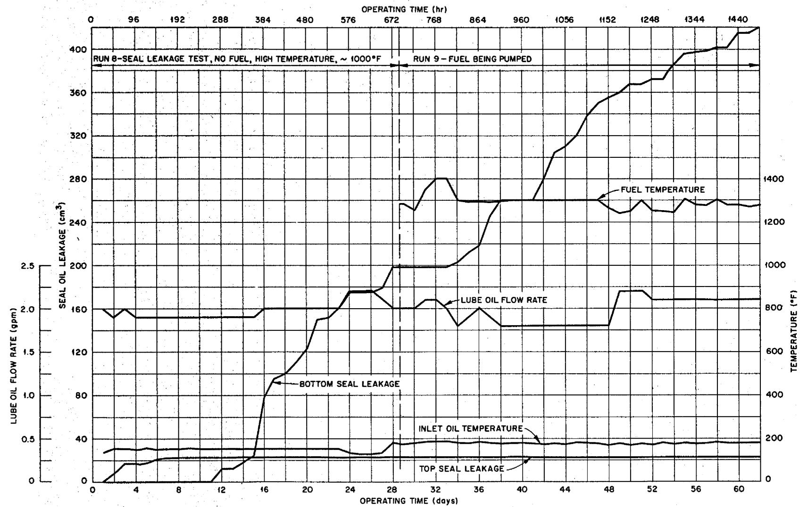  
CONFIDENTIAL ORNL-LR-DWG 14953   
Fig. 1.4.1. ART Fuel Pump (Model MF) Endurance Test Performance.

leakage as a function of operating time. The speed of the pump was maintained at 2400 rpm during the period described by Fig. 1.41. In addition to the temperature fluctuations shown on the graph, the temperature of the system was cycled 17 times between 1300 and $1100^{\circ}\mathrm{F}$ . It takes approximately $1\frac{1}{2}$ hr to lower the temperature to $1100^{\circ}\mathrm{F}$ and $2\frac{1}{2}$ hr to increase it to $1300^{\circ}\mathrm{F}$ . The lubricating oil being used in the system is Gulfspin 60. Helium is being bled down the pump barrel at a rate of 550 liters/day, and 50 liters/day is bled off through the catch-basin drain. Present indications are that low leakage rates and satisfactory removal of seal oil leakage from the catch basin can be obtained.

Thus far very little trouble has been experienced in the operation of this pump. The hydraulic-drive equipment has functioned satisfactorily, except for some trouble with the hydraulic pressure indicator.

# Fuel Pump Development Tests

J. J. W. Simon

The two loops designed for high-temperature performance testing of the ART fuel pump and centrifuge assembly were completed and are being used for development tests. Water performance data were taken on these loops to determine whether the addition of the xenon-removal system would have an effect on pump performance.

The head and flow curves obtained for these loops substantiated the original water-test data.7 During the tests it became apparent, however, that the system pressures were not stable. The fluctuations in system pressure appeared to be a function of the water level in the fuel expansion tank and the loop resistance. In some instances these fluctuations appeared to be large enough to be detrimental to reactor operation.

Two types of modification will be made to the system in an attempt to locate and remove these fluctuations. First, the pump suction inlet conditions will be improved, and, second, the xenon-removal system will be altered to study the effects of each of the various flow passages.

# Sodium Pump Endurance Tests

S. M. DeCamp

Preliminary water tests of a sodium pump that had been installed in a test stand for endurance

testing indicated that leakage, or bypass flow, around the impeller was causing ingassing of the system. The pump and the loop were therefore modified, as described in the following section, by providing a pressure-breakdown labyrinth along the shaft and by removing the bypass vanes from the back face of the main impeller. The system is now being prepared for high-temperature operation. As in the fuel pump endurance tests, described above, seal leakage tests will be run before the system is filled with the test fluid.

# Sodium Pump Development Tests

S. M. DeCamp

The original design of the ART sodium pump (model MN) called for the bypass flow around the main impeller to be from the expansion tank to the pump discharge. This was to be accomplished with the aid of vanes on the back side of the main impeller. During the first series of tests of this pump, however, it became evident that the system was ingassing. In an effort to correct this situation the bypass flow was reduced by reducing the vane diameter on the back of the impeller, but ingassing still occurred. It was decided then to reverse the direction of bypass flow, that is, to allow the flow to be from the pump discharge to the expansion tank. This flow condition allows the gas bled down the pump shaft to flow to the expansion tank in the same direction and through the same opening as that through which the bypass liquid flows. This reversal of flow was accomplished by completely removing the bypass vanes from the back of the sodium impeller. The amount of reversed bypass flow was restricted by adding a pressure-breakdown labyrinth around the shaft. Tests of the modified pump indicate satisfactory operation. Tests are now under way to determine whether the expansion tank and the bypass flow lines can handle reactor bypass flow requirements without ingassing of the system fluid. The best sodium pump performance data obtained to date are presented in Fig. 1.4.2.

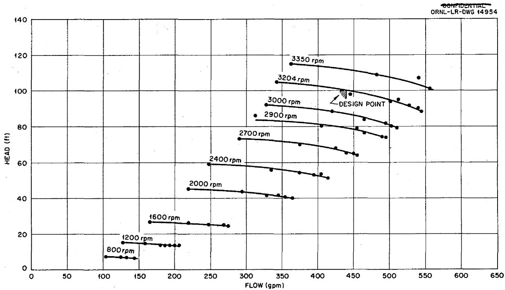  
Fig. 1.4.2. ART Sodium Pump (Model MN) Performance Curves.

Primary NaK Pump Development Tests

H.C.Young J.G.Teague

M. E. Lackey

Water tests on the primary NaK pump (model PK-P) volute and impeller, initiated previously, were completed. The final performance curves which show head vs flow, efficiency, and the volute pressure balance line at several constant speeds from 1225 to 3550 rpm are presented in Fig. 1.4.3, and a plot of pump shaft horsepower vs flow for the same head and flow conditions is shown in Fig. 1.4.4. The original test design point of 1220-gpm flow and a 340-ft head has been changed to 1220-gpm flow over the head range indicated by the vertical line on Fig. 1.4.3. The volute hydraulic balance line crosses this head range at approximately the mid-point, and thus the normal operating conditions appear to be in the range of acceptable hydraulic balance.

Tests were run at speeds above 2900 rpm by using a 200-hp wound-rotor motor, which was replaced with a 60-hp d-c motor in order to obtain

8On assignment from Pratt & Whitney Aircraft.

9H. C. Young and M. E. Lackey, ANP Quar. Prog. Rep. March 10, 1956, ORNL-2061, p 48.

data at the lower speeds required for reactor startup operation.

In order to determine the correct volute-tongue angle, a directional probe was installed in the volute at the periphery of the impeller to measure the angle at which fluid left the impeller. The data obtained indicated that the original tongue angle was correct.

A weir was installed in the pump pot to measure leakage flow through the labyrinth seal around the impeller hub. Some leakage flow is needed to remove gas from the system fluid; however, excessive leakage, particularly at low liquid levels, would cause agitation of the liquid level in the pump pot and possibly result in ingassing through the pump suction. A series of three tests was conducted in which the radial clearance between the impeller hub and the top labyrinth seal and the axial clearance between the dynamic seal vanes on the back of the impeller hub and the stationary element were varied. Bypass flow was measured during these tests, and the pumped fluid was observed through Plexiglas ports in the loop. There was no visible indication of ingassing. The tests showed the optimum axial clearance to be

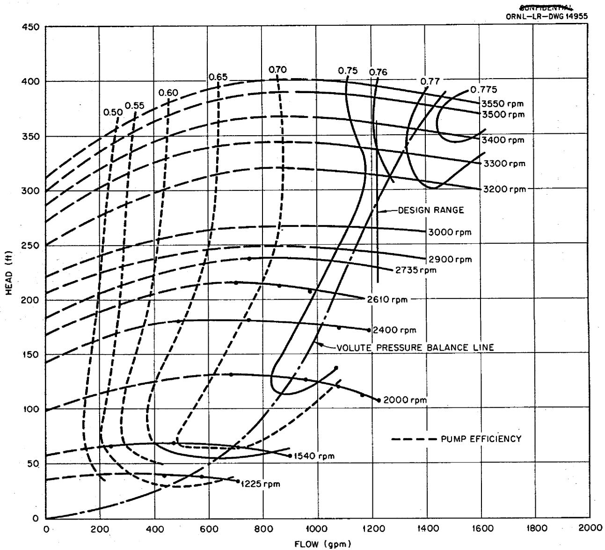  
Fig. 1.4.3. ART Primary NaK Pump (Model PK-P) Performance Curves of Head vs Flow Showing Efficiency and Volute Pressure Balance Lines.

0.030 in. and the optimum radial clearance to be 0.015 in. These clearances will result in a bypass flow rate of 3 to 6 gpm at 1220-gpm pump-discharge flow.

Static deflection tests were made on the pump shaft used in the water test rig and on the Inconel pump shaft to be used in the final pumps. The information obtained, along with the calculated deflection of the Inconel pump shaft during high-temperature operation, indicated that a top labyrinth

seal radial clearance of 0.015 in. should be sufficient to prevent rubbing of the impeller hub against the top labyrinth seal.

These water tests of the primary NaK pump indicate that the pump will meet the head and flow conditions required for the ART. A pump tank gas pressure of 10 psig should be sufficient to suppress cavitation at the design flow rate and up to a NaK temperature of approximately $1380^{\circ}\mathrm{F}$ . The design conditions are in the range of minimum volute hydraulic unbalance.

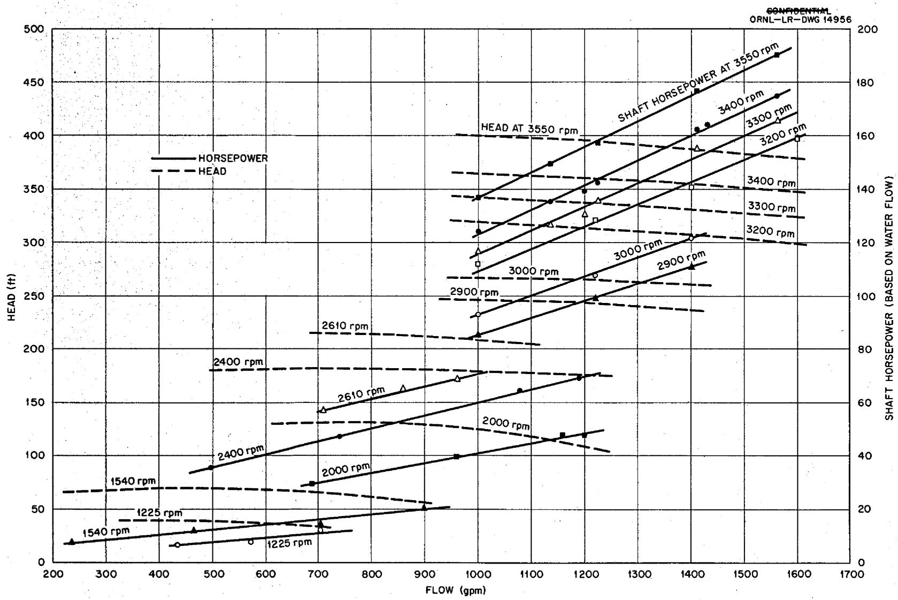  
Fig. 1.4.4. ART Primary NaK Pump (Model PK-P) Performance Curves Showing Shaft Horsepower vs Flow.

Auxiliary NaK Pump Development Tests

H.C.Young J.G.Tague

M. E. Lackey

Water tests were conducted on the auxiliary NaK pump (model PK-A). The volute used for these tests consisted of two brass volute halves bolted together. The volute flow passage was accurately milled in each volute half. The test impeller was fabricated of brass, with vanes silver-soldered to the hub and soft-soldered to the inlet shroud.

The pump assembly was tested in the test loop used for the water tests of the primary NaK pump. A 60-hp d-c drive motor was used. No changes were necessary in the instrumentation, except that a new orifice was installed to measure the lower flow rates.

Performance and cavitation data were obtained for as wide a flow range as possible within the practical limits of volute hydraulic unbalance, and the final head vs flow curves are presented in Fig. 1.4.5. A plot of pump shaft horsepower versus flow for some head and flow conditions is shown in Fig. 1.4.6. The volute hydraulic unbalance over the design range was found to be quite satisfactory,

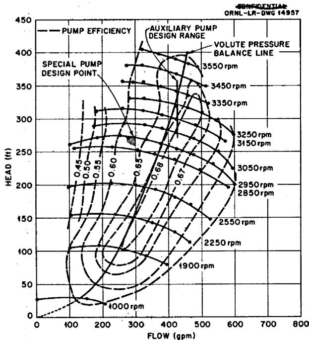  
Fig. 1.4.5. ART Auxiliary NaK Pump (Model PK-A) Performance Curves of Head vs Flow Showing Efficiency and Volute Pressure Balance Lines.

and therefore this pump will be satisfactory for use as the special NaK pump for cooling the ART fuel fill-and-drain tank. This pump requires 300-gpm flow at a 275-ft head. The impeller diameter, the dynamic seal vanes, and the top labyrinth seal are the same as those for the primary NaK pump, and the speed ranges of both pumps are the same. Therefore the radial and axial clearances determined by the primary pump tests were used for the auxiliary pump. The pump showed satisfactory degassing characteristics with these clearances.

After the initial performance tests were completed, a 0.023-in. spacer was installed between the volute halves, and tests were conducted to determine whether the addition of the spacer would change the volute hydraulic unbalance. The purpose of these tests was to ascertain the allowable tolerances for use in welding the Inconel volute halves together.

The volute hydraulic unbalance was measured during these tests by eight static pressure taps equally spaced in the volute near the periphery of the impeller. The static pressure readings at any of the eight taps, for a given discharge head and a set flow rate, did not change over 1 psi from the measurements taken without the spacer.

In general, the water tests indicate that the pump will meet the head and flow conditions required for use in the ART, both for the auxiliary and the special NaK pumps. The design conditions are in the range of minimum volute hydraulic unbalance. Cavitation characteristics of the pump, based on extrapolations from water to NaK, indicate that a pump tank gas pressure of 14.4 psia, or -0.3 psig, should be sufficient to suppress cavitation at design flow for a NaK temperature of $1282^{\circ}\mathrm{F}$ , as compared with a required pressure of 6 psig for the primary NaK pump at the same NaK temperature.

# Primary and Auxiliary NoK Pump Test Stands

H.C.Young J.G.Teague

Fabrication of all parts for two primary and two auxiliary NaK pump high-temperature test loops is under way. At present, the pump volutes are the most critical delivery item. A method of profile-machining the volute halves from a pattern is being used. Several primary pump volute halves have been received, and the vendor is now setting up for profile-machining of the first auxiliary pump volute halves.

A series of welding tests were conducted to determine the joint preparation and the welding

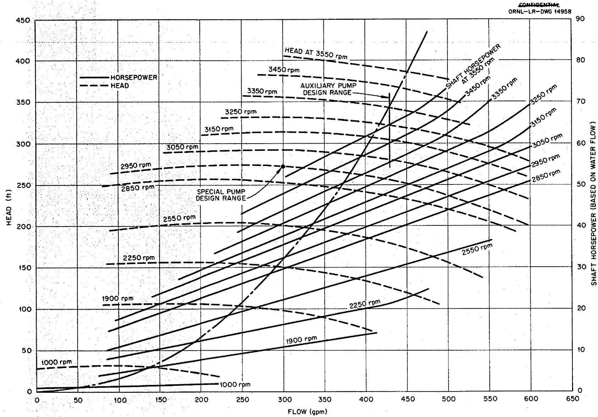  
Fig. 1.4.6. ART Auxiliary NaK Pump (Model PK-A) Performance Curves Showing Shaft Horsepower vs Flow.

9561 '01 ENNONIANOID3d

techniques required to control weld shrinkage so that final volute dimensions would be within acceptable tolerances (see Chap. 3.4, "Welding and Brazing Investigations"). The first set of primary pump volute halves has been welded.

In the first tests in the new loops the pumps will be operated with water in order to check the pump assembly, test-stand vibration, loop resistance, and operation of the system throttle valve, and, of primary importance, to correlate performance and cavitation data with the data previously obtained on the water-test rig.

Some engineering changes are being made in order to lengthen the piping on the primary NaK pump endurance-testing loop and also on the auxiliary NaK pump endurance-testing loop and to relocate these loops for use in calibrating electromagnetic flowmeters.

# HEAT EXCHANGER DEVELOPMENT

E.R.Dytko

R.E. MacPherson

J. C. Amos

# Intermediate Heat Exchanger Tests

J.W.Cooke

H. C. Hopkins

The information obtained from intermediate heat exchanger (IHE) test stand operation during the quarter is summarized in Table 1.4.2. York radiator No. 9, which is being tested in intermediate heat exchanger test stand A, is currently undergoing a thermal-cycling program consisting of 16 hr of power operation followed by 8 hr of isothermal operation. During the power phase of the cycle, the radiator NaK inlet and outlet temperatures are 1500 and $1100^{\circ}\mathrm{F}$ , respectively. Isothermal operation is at $1500^{\circ}\mathrm{F}$ . Transition from isothermal to power operation is accomplished by dropping the NaK outlet temperature at a rate of $20^{\circ}\mathrm{F} / \mathrm{sec}$ for

TABLE 1.4.2. SUMMARY OF INTERMEDIATE HEAT EXCHANGER TEST STAND OPERATION  

<table><tr><td>Test Unita</td><td>Hours of Nonisothermal Operation</td><td>Total Hoursb of Operation</td><td>Number of Thermal Cycles</td><td>Reason for Termination</td></tr><tr><td colspan="5">Test Stand A</td></tr><tr><td>York radiator No. 9 (revised design)</td><td>471</td><td>973</td><td>20</td><td>Test continuing</td></tr><tr><td>Circulating cold trap No. 2 (4 in. in diameterc)</td><td></td><td>1218</td><td></td><td>Test continuing</td></tr><tr><td>NaK screen filter</td><td></td><td>264</td><td></td><td>Test continuing</td></tr><tr><td colspan="5">Test Stand B</td></tr><tr><td>Black, Sivalls and Bryson heat exchangers Nos. 1 and 2 (type IHE-3)</td><td>362</td><td>403</td><td>3½</td><td>Test continuing</td></tr><tr><td>Cambridge radiators Nos. 1 and 2 (modification 3)</td><td>820</td><td>1345</td><td>6½</td><td>Test continuing</td></tr><tr><td>Circulating cold trap No. 3 (4 in. in diameter)</td><td></td><td>630</td><td></td><td>Removed for exami-nation after heat exchanger failure</td></tr><tr><td>Circulating cold trap No. 5 (4 in. in diameter)</td><td></td><td>715</td><td></td><td>Test continuing</td></tr></table>

$a$ Includes only units tested during this report period.   
$b_{\text{For tests in progress the total operating time is shown as of May 15,}}$ 1956.   
cThis type of cold trap was previously referred to as 80-gal system.

the first $200^{\circ}\mathrm{F}$ and $8^{\circ}\mathrm{F} / \mathrm{sec}$ for the next $100^{\circ}\mathrm{F}$ . The final $100^{\circ}\mathrm{F}$ drop is at a slower rate in order to allow the outlet temperature to level out properly. The transition from power to isothermal operation is accomplished at a rate of $10^{\circ}\mathrm{F} / \mathrm{sec}$ for the first $100^{\circ}\mathrm{F}$ , $5^{\circ}\mathrm{F} / \mathrm{sec}$ for the final $100^{\circ}\mathrm{F}$ . The radiator has been cycled 20 times, and the cycling program is continuing.

The air pressure drop data obtained for York radiator No. 9 substantially agree with the data for York radiators Nos. 1 and 2, and the heat transfer data substantially agree with the data for Cambridge radiators Nos. 1 and 2. Thus far the NaK pressure drop has increased $119\%$ above the initial level (219% of the initial value). This radiator is the first 500-kw radiator of the revised design to be tested, and it is identical to York radiator No. 7 illustrated in Fig. 1.4.8 of the subsequent section, "Small Heat Exchanger Tests," of this chapter.

ORNL heat exchangers Nos. 1 and 2, type IHE-3 (ref. 12), were removed from intermediate heat exchanger test stand B and are undergoing metallurgical inspection. Preliminary results of this inspection reveal that heat exchanger No. 1 (NaK-to-fuel heat exchanger) failed in the hot end between the header weld and tube bends (see Chap. 3.4, "Welding and Brazing Investigations"). Severe corrosion was evident on the fuel side of the tubes. Five tubes had obvious cracks in the tension side. The frequency and severity of the cracks were most pronounced in the end row of tubes where the distance between the tube bends and header was the shortest. A maximum of 15 mils of mass-transferred deposit was measured on the NaK side of this heat exchanger (Fig. 1.4.7). No evidence of mass transfer was detected in heat exchanger No. 2 (fuel-to-NaK heat exchanger). Mass transfer buildup would account for the NaK pressure drop increase experienced during nonisothermal operation. Pressure drop was not measured in the individual heat exchangers. However, if it is assumed, on the basis of the mass-transfer evidence, that all the pressure-drop increase occurred in heat exchanger No. 1, the total pressure drop

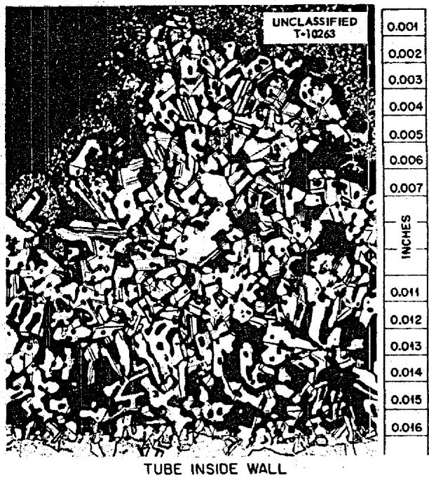  
Fig. 1.4.7. Maximum Mass Transfer Found in NaK Circuit of NaK-to-Fuel Heat Exchanger (ORNL No. 1), Type IHE-3, Which Operated 1825 hr in Intermediate Heat Exchanger Test Stand B. (Secret with-eoption)

increase for this heat exchanger was approximately $180\%$ .

Black, Sivalls and Bryson Nos. 1 and 2 heat ex-changers, type IHE-3, were installed in test stand B, and test operations were resumed. The stand is currently operating on a constant-power endurance run to provide corrosion information for comparison with the data for ORNL heat exchangers Nos. 1 and 2. During shutdown of the test stand, instrumentation was added to allow separate measurements of heat exchanger pressure drop. After 362 hr of power operation, the NaK pressure drop has increased $140\%$ in heat exchanger No. 1 (NaK-to-fuel). No increase has occurred in heat exchanger No. 2. Cambridge radiators Nos. 1 and 2, which have operated for 820 hr under nonisothermal conditions, have experienced a NaK pressure drop increase of $84\%$ . A tabulation of the NaK pressure drop variations that have occurred in the various heat exchanger tests is presented in Table 1.4.3.

Construction work on stand C, to be used as an ART prototype radiator test stand, is continuing.

Small Heat Exchanger Tests

L. H. Devlin13

J. G. Turner13

A summary of small heat exchanger (SHE) test stand operation is presented in Table 1.4.4. Test

stand B was shut down when the ORNL heat exchanger No.1, type SHE-2, had operated successfully for a total of 2071 hr, and the heat exchanger

13On assignment from Pratt & Whitney Aircraft.

TABLE 1.4.3. SUMMARY OF NaK PRESSURE DROP VARIATIONS THAT HAVE OCCURRED IN HEAT EXCHANGER TESTS   

<table><tr><td>Test Unit</td><td>Test Stand</td><td>Test Period (hr)</td><td>Operating Condition</td><td>Maximum NaK Temperature in System (°F)</td><td>Minimum NaK Temperature in Test Unit (°F)</td><td>Pressure Drop Change (% based on initial level)</td></tr><tr><td>ORNL radiator No. 3</td><td>SHE-B</td><td>200</td><td>Nonisothermal</td><td>1500</td><td>1270</td><td>30</td></tr><tr><td rowspan="5">York radiator No. 4</td><td rowspan="5">SHE-B</td><td>140</td><td>Nonisothermal</td><td>1270</td><td>1145</td><td>4a</td></tr><tr><td>580</td><td>Thermal cycling</td><td>1270</td><td>1005</td><td>8.5</td></tr><tr><td>90</td><td>Nonisothermal</td><td>1255</td><td>1020</td><td>8.2</td></tr><tr><td>50</td><td>Nonisothermal</td><td>1500</td><td>1300</td><td>13.8</td></tr><tr><td>20</td><td>Isothermal</td><td>1270</td><td>1270</td><td>-3.2a</td></tr><tr><td rowspan="6">York radiator No. 9</td><td rowspan="6">IHE-A</td><td>174</td><td>Nonisothermal</td><td>1500</td><td>1100</td><td>107</td></tr><tr><td>72</td><td>Isothermal</td><td>1200</td><td>1200</td><td>0</td></tr><tr><td>160</td><td>Isothermal</td><td>1400</td><td>1400</td><td>-16</td></tr><tr><td>25</td><td>Isothermal</td><td>1500</td><td>1500</td><td>0</td></tr><tr><td>30</td><td>Isothermal</td><td>1400</td><td>1400</td><td>0</td></tr><tr><td>512</td><td>Thermal cycling</td><td>1500</td><td>1100</td><td>28</td></tr><tr><td rowspan="2">Cambridge radiator Nos. 1 and 2</td><td rowspan="2">IHE-B</td><td>552</td><td>Nonisothermal</td><td>1600</td><td>1100</td><td>56</td></tr><tr><td>274</td><td>Nonisothermal</td><td>1600</td><td>1100</td><td>28</td></tr><tr><td rowspan="3">ORNL heat exchanger No. 1, type IHE-3</td><td rowspan="3">IHE-B</td><td>360</td><td>Nonisothermal</td><td>1600</td><td>1275</td><td>215b,c</td></tr><tr><td colspan="4">NaK dumped and loop cooled to room temperature</td><td>-62</td></tr><tr><td>448</td><td>Nonisothermal</td><td>1600</td><td>1275</td><td>27</td></tr><tr><td>Black, Sivalls and Bryson heat exchanger No. 1</td><td>IHE-B</td><td>274</td><td>Nonisothermal</td><td>1600</td><td>1275</td><td>140</td></tr><tr><td>Black, Sivalls and Bryson heat exchanger No. 2</td><td>IHE-B</td><td>274</td><td>Nonisothermal</td><td>1600</td><td>1100</td><td>0</td></tr></table>

$a$ Percentage shown is within experimental error.   
$b_{\text{During this run the cold trap and the plugging indicator were inoperative. Oxide contamination level of the NaK was below 150 ppm in all other cases, as determined by a plugging indicator.}}$   
cThis calculated value was based on the assumption that all the heat exchanger pressure drop change occurred in heat exchanger No. 1.

TABLE 1.4.4. SUMMARY OF SMALL HEAT EXCHANGER TEST STAND OPERATION  

<table><tr><td>Test Unita</td><td>Hours of Nonisothermal Operation</td><td>Total Hours of Operationb</td><td>Number of Thermal Cycles</td><td>Reason for Termination</td></tr><tr><td colspan="5">Test Stand B</td></tr><tr><td>ORNL heat exchanger No. 1 (type SHE-2)</td><td>1041</td><td>2071</td><td>36</td><td>Test completed</td></tr><tr><td>Process Engineering heat exchanger No. 1 (type SHE-2)</td><td>0</td><td>120</td><td></td><td>Test continuing</td></tr><tr><td>York radiator No. 4 (modification 2)</td><td>748</td><td>1356</td><td>31</td><td>Test completed</td></tr><tr><td>York radiator No. 7 (revised design)</td><td>0</td><td>120</td><td></td><td>Test continuing</td></tr><tr><td>Circulating cold trap No. 1 (4 in. in diameter)c</td><td></td><td>995</td><td></td><td>Test completed</td></tr><tr><td>Circulating cold trap No. 6 (4 in. in diameter, modification 1)</td><td></td><td>216</td><td></td><td>Test continuing</td></tr><tr><td colspan="5">Test Stand C</td></tr><tr><td>ORNL heat exchanger No. 2 (type SHE-2)</td><td>102</td><td>634</td><td>15</td><td>Removed when restriction to fuel flow developed</td></tr><tr><td>Struthers-Wells heat exchanger No. 1 (type SHE-2)</td><td>4</td><td>280</td><td>2</td><td>Test terminated because of restriction to fuel flow</td></tr><tr><td>York radiator No. 5 (modification 2)</td><td>106</td><td>914</td><td>17</td><td>Test continuing</td></tr><tr><td>Circulating cold trap No. 4 (4 in. in diameter)</td><td></td><td>914</td><td></td><td>Replaced by new cold trap</td></tr></table>

$a_{i}$ Includes only units tested during this report period.   
For tests in progress the total operating time is shown as of May 15, 1956.   
$c$ This type of cold trap previously referred to as 80-gal system.

and York radiator No. 4 were removed from the stand for metallurgical examination.

Heat transfer data, fuel pressure drop data, and NaK pressure drop data for the heat exchanger were in substantial agreement with data previously reported[10] and did not change throughout the test. The radiator heat transfer data substantially agreed with the data for ORNL radiator No. 3, and the air pressure drop data substantially agreed with the data for Cambridge radiators Nos. 1 and 2, all previously reported.[10] The radiator NaK pressure drop increased approximately $30\%$ during the test operation. Much of the test program on these

units consisted of thermal cycling operations. A complete cycle consisted of 16 hr of power operation, with maximum and minimum NaK temperatures of 1275 and $1005^{\circ}\mathrm{F}$ , respectively, and 8 hr of isothermal operation at $1285^{\circ}\mathrm{F}$ . The rate of NaK temperature change during the transition from one condition to the other was approximately $7^{\circ}\mathrm{F} / \mathrm{sec}$ . The heat exchanger log-mean temperature difference changed from $0^{\circ}\mathrm{F}$ during isothermal operation to $74^{\circ}\mathrm{F}$ during power operation.

York radiator No. 7 (Fig. 1.4.8) and Process Engineering Co. heat exchanger No. 1, type SHE-2, were installed in stand B, and test operations were

UNCLASSIFIED PHOTO 25875

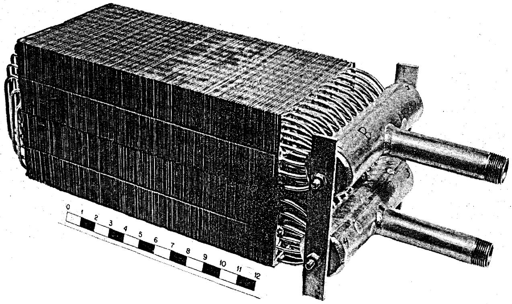  
Fig. 1.4.8. York Radiator No. 7 (Revised Design).

resumed. A new, 4-in.-dia cold trap was installed in this loop. This cold trap is identical to the previously used cold traps except that the copper cooling coil has been replaced by a stainless steel coil and additional thermocouple wells have been provided to determine the temperature profile in the cold trap. Operation thus far has been devoted to cold-trap evaluation under simulated ART operating conditions.

Operation of small heat exchanger test stand C was terminated after 634 hr when ORNL heat exchanger No.2, type SHE-2, developed a high resistance to fuel flow during power operation. This heat exchanger was replaced by Struthers-Wells Corp. heat exchanger No.1, type SHE-2, and test operations were resumed. When heat transfer conditions were initially established, this heat exchanger also began to develop a high resistance to fuel flow, similar to that experienced by ORNL heat exchanger No.2. At this time, a leak developed in the resistance heater and the stand was

shut down. The resistance heated section was removed for metallurgical examination.

Examination of ORNL heat exchanger No. 2 disclosed extensive buildup of metal particles throughout the fuel side of the heat exchanger that would account for the marked increase in resistance to fuel flow. It is felt that examination of Struthers-Wells heat exchanger No. 1 will reveal the same condition but to a lesser degree. Evidence of mass transfer and self-welding in certain areas of the resistance heater indicated that extreme hot spots had occurred in the heater. This would account for the buildup of metal particles in the heat exchanger. A section of the resistance heater at which severe overheating occurred is shown in Fig. 1.4.9. The metal particles which built up on one of the heat exchanger tubes are shown in Fig. 1.4.10.

A new heater design has been completed, and a heater is being fabricated. The test stand is currently being operated as a NaK loop to obtain

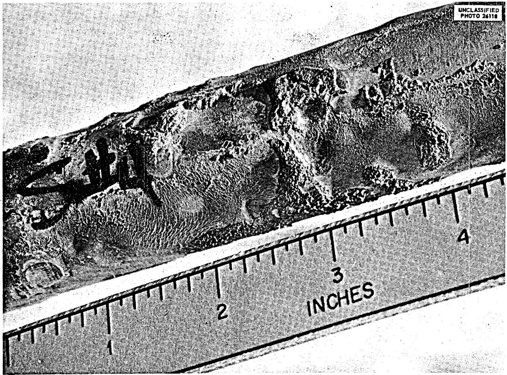  
Fig. 1.4.9. Section of Resistance Heater Removed from Small Heat Exchanger Test Stand C Showing Effects of Overheating.

cold-trap-evaluation data. Upon receipt of a new 25-tube small heat exchanger (type SHE-7),14 the Struthers-Wells heater exchanger No. I will be replaced, and the test stand will be put back into full operation.

# Cold-Trap Evaluation in Heat Exchanger Test Stands

J. C. Amos

Six similar 4-in.-dia circulating cold traps have been operated in the various heat exchanger test stands. These cold traps were previously referred to as 80-gal-system circulating cold traps.[15] It

has been found that care must be exercised during initial cold-trap operation to prevent oxide plugging during main system heatup. The original design specified copper cooling coils which necessitated maintaining the cold-trap temperatures below $700^{\circ}\mathrm{F}$ at all times to prevent excessive oxidation of the copper. This meant that at system temperatures above $800^{\circ}\mathrm{F}$ , with high contaminant saturation levels (800 to $1100^{\circ}\mathrm{F}$ ), it was possible to precipitate material in the economizer which tended to settle out and plug the cold-trap inlet line.

One cold trap with a stainless steel cooling coil has been tested. This trap was brought up to $1200^{\circ}\mathrm{F}$ with the main system. The temperature of the trap was then gradually reduced by supplying maximum air cooling and reducing the cold-trap NaK flow. By using this method of startup, no indication of serious plugging was observed. No

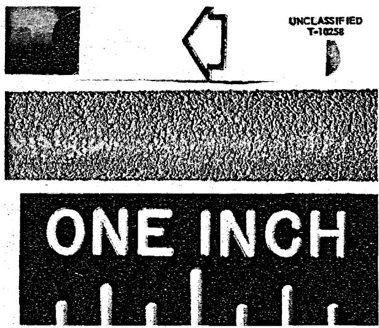  
Fig. 1.4.10. Fuel-Side Wall of Tube Removed from ORNL Fuel-to-NaK Heat Exchanger ORNL No. 2, Type SHE-3, Showing Mass-Transferred Metal Particles. (Secret with caption)

difficulty with cold-trap circuit plugging has been encountered with any of these cold traps during routine loop operation after initial heatup by the procedure described here.

In all cases, the cold traps have been capable of reducing the NaK contamination level of a 77-gal NaK system to less than 100 ppm and, in several instances, to below 50 ppm, as determined by a plugging indicator. All cold traps tested on 18-gal NaK systems have been capable of reducing the contamination to below 50 ppm and, in most cases, to below the sensitivity of the plugging indicator (<30 ppm).

A longer period of time is required to clean up a 77-gal system than an 18-gal system. The cleanup time appears to be related to the surface area in the system, and it is appreciably reduced when a large percentage of the system surface area has previously been cleaned at maximum system temperature. The rate of cleanup appears to increase with an increase of flow through the cold trap. The available cold-trap cooling limits the NaK flow through the cold traps to approximately 1.5 gpm while maintaining a $300^{\circ}\mathrm{F}$ cold-trap outlet temperature with a system temperature of $1500^{\circ}\mathrm{F}$ . Therefore, the effects of cold-trap flow rates of above 1.5 gpm have not been studied. The minimum attainable contamination level has been found to be dependent on the minimum attainable cold-trap temperature.

However, these two variables are not necessarily closely related. In some instances the equilibrium plugging temperature of the plugging indicator may be as much as $400^{\circ}\mathrm{F}$ above the minimum cold-trap temperature, while, in other instances, this difference may be less than $100^{\circ}\mathrm{F}$ .

At operating temperatures above $1350^{\circ}\mathrm{F}$ the contamination level has been found to increase rapidly when the system temperature is increased to beyond the temperature at which the system was previously cleaned. Sudden variations in system operating conditions, such as flow stoppage or abrupt flow changes, also appear to increase the contamination level. After a system has been cleaned at the maximum system temperature, there is slow contamination buildup if the cold trap is turned off. However, this increase appears to become slower with system age.

Cold-trap evaluation tests are continuing on the heat exchanger stands in an attempt to obtain quantitative data regarding the effects of cold-trap NaK flow, cold-trap temperature, rate of cooling, etc. Various methods of cold-trap operations are being investigated under simulated ART operating conditions to establish an operating procedure for the ETU and ART cold traps.

# AUXILIARY COMPONENT DEVELOPMENT

D.B.Trauger J.J.Keyes

# Dump Valve

L. P. Carpenter

Prototype dump valve No. 2 was tested to determine its adequacy for use as the dump valve between the reactor and the fuel fill-and-drain tank in the ART. The variables investigated were seat leakage, self-welding of seat materials, and galling of the stem on the stem guides. Seat leakage requirements are less than $2\mathrm{cm}^3/\mathrm{hr}$ with a 90-psig differential pressure across the valve. The valve temperature during power operation is expected to be $1250^{\circ}\mathrm{F}$ .

The seat materials were the same as those for prototype valve No.1, that is, Kennametal 152B (64% TiC-30% Ni-6% NbTaTiC₃ for the plug and Kennametal 162B (64% TiC-25% Ni-5% Mo-6% NbTaTiC₃) for the seat ring. Prototype valve No. 2 differed from valve No. 1 in that the stem-to-stem-guide clearance was increased from 0.001 to

0.005 in. on the diameter and a 30-deg conical bevel was ground on the seat ring.

The valve was tested for seat leakage at $1200^{\circ}\mathrm{F}$ in the fuel mixture (No. 30) $\mathrm{NaF - ZrF_4 - UF_4}$ (50-46-4 mole %). The minimum leakage rate obtained was $2.13~\mathrm{cm}^3 /\mathrm{hr}$ , with a 5-psig differential pressure across the seat and a valve stem thrust of 1200-lb force, which gave an estimated seating pressure of 12,000 psi. Failure of the seat ring braze occurred when the valve was opened after having been closed for 72 hr with the above mentioned force applied to the stem. Examination of the seat ring and plug revealed that self-welding had occurred, and the seat ring had pulled from the valve at the brazed joint. The brazing technique has been revised for future valve fabrication. There was no evidence of galling of the stem guides, such as that which occurred in the tests of prototype valve No. 1.

Prototype valve No. 3 has been received from the manufacturer for testing. The flame plating on the stem cracked during a stress-relief operation, and the leakage past the seat, as measured with helium, increased. The valve will be accepted, however, for seat material testing.

# Cold Trap and Plugging Indicator

R. D. Peak

The cold-trap evaluation test stand, previously described,[18] has been operated only intermittently because of continual equipment difficulties. Two different types of plugging indicators were tested, and the results correlated poorly with the data obtained with the Argonne sampler, described previously.[19] Two methods have been tested for cooling the cold trap with air, but it is apparent that air cooling alone is insufficient. A combination of air with water injection and, finally, full water flow should achieve the low-temperature cold-trap operation desired for the ART systems. Other methods of cooling are being investigated.

The second cold-trap evaluation test stand was completed, and will be placed in operation soon. This test stand is much more versatile than the first stand, in that several means have been provided for sampling and for reintaminating the NaK with the various impurities of interest.

# Zirconium Fluoride Vapor Trap

M. H. Cooper20

The program for the development of a trap for zirconium fluoride vapor has included an investigation of high-temperature adsorbents for $\mathsf{ZrF}_{4}$ , a determination of the plugging temperature of $\mathsf{ZrF}_{4}$ in helium in equilibrium with the fuel as a function of the fuel temperature, and the testing of prototype traps. High-temperature adsorbents were tested by passing helium partially saturated with $\mathsf{ZrF}_{4}$ through a 1-in.-dia pipe packed for 24 in. with the test material. The temperature of the test section was controlled by clamshell heaters. From the trap, the helium flowed first through water bottles to collect any residual $\mathsf{ZrF}_{4}$ through wet-test gas meters, and then to the atmosphere. The results of these tests are summarized in Table 1.4.5. Alumina is the most promising adsorbent tested, while $\mathsf{UF}_{4}$ , which has not yet been tested, may also prove satisfactory, since $\mathsf{ZrF}_{4}$ and $\mathsf{UF}_{4}$ form a solid solution with a high melting point. Charcoal, when used in a trap, enhanced the formation of $\mathsf{ZrF}_{4}$ nuclei, which grew into large individual crystals. Charcoal thus may be a suitable packing for a thermal trap, since the formation of individual crystals does not plug the trap. Suitable operating conditions have not yet been established for charcoal traps.

The saturation temperature of $\mathsf{ZrF}_4$ in helium in equilibrium must be known in order to design the fuel off-gas system of the ART for temperatures which will prevent the precipitation of $\mathsf{ZrF}_4$ . A schematic drawing of apparatus for determining the plugging temperature of $\mathsf{ZrF}_4$ in helium passing through $1/2$ -in. tubing is shown in Fig. 1.4.11. In each run, helium was bubbled through the molten fuel mixture at a measured temperature, and the helium became saturated with $\mathsf{ZrF}_4$ . The helium and $\mathsf{ZrF}_4$ vapor then passed through a section of $1/2$ -in.-dia tubing extending through a hole in the center of a stainless steel block which was 6 in. in diameter and 10 in. long. The entrance face of the stainless jacket was heated by a Calrod heater and the rest of the trap, except the exit face, was insulated to provide a linear thermal gradient. The temperature of the tube at the point where the $\mathsf{ZrF}_4$ first precipitated was assumed to be the plugging temperature of $\mathsf{ZrF}_4$ corresponding to the fuel temperature. The

TABLE 1.4.5. SUMMARY OF TESTS OF ${\mathrm{{ZrF}}}_{4}$ ADSORBENTs   

<table><tr><td>Adsorbent Material</td><td>Fuel Temperature (°F)</td><td>Trap Temperature (°F)</td><td>Helium Flow Rate (fps)</td><td>Hours Operated</td><td>Weight of Zr Not Trapped (mg)</td><td>Comments</td></tr><tr><td rowspan="5">NaF</td><td rowspan="3">1300</td><td rowspan="3">1300</td><td>0.0573</td><td>260</td><td>5</td><td rowspan="3">NaF pellets melted in front part of trap because of formation of ZrF4-NaF eutectic</td></tr><tr><td>0.105</td><td>119</td><td>5</td></tr><tr><td>0.214</td><td>98</td><td>67.1</td></tr><tr><td rowspan="2">1320</td><td>1400 to 800a</td><td>0.0520</td><td>96</td><td>18.4</td><td rowspan="2">NaF pellets melted in inlet section; contents of water trap of second run lost because of leak in water trap</td></tr><tr><td>1200 to 800a</td><td>0.0910</td><td>112</td><td></td></tr><tr><td rowspan="3">Al2O3</td><td rowspan="2">1320</td><td rowspan="2">1400</td><td>0.0568</td><td>96</td><td>28.4</td><td rowspan="2">Plug in off-gas line believed to be AlF3 from HF reaction with Al2O3; water found in helium supply during this run</td></tr><tr><td>0.0930</td><td>112</td><td>46.0</td></tr><tr><td>1400</td><td>1400 to 800a</td><td>0.098</td><td>480b</td><td></td><td>Still in operation; no sign of plugging</td></tr><tr><td>CaCl2</td><td>1315</td><td>1285 to 1335c</td><td>0.0978</td><td>40</td><td></td><td>CaCl2melted and hence is unsatisfactory</td></tr><tr><td rowspan="3">Charcoal</td><td rowspan="3">1315</td><td>1385 to 1415c</td><td>0.0978</td><td>40</td><td>62</td><td rowspan="3">Inspection of trap showed that ZrF4had precipitated in large individual crystals; plugs formed in off-gas line from trap in all tests</td></tr><tr><td>1308 to 1321c</td><td>0.0978</td><td>66</td><td>703</td></tr><tr><td>1110 to 1160c</td><td>0.0978</td><td>96.4</td><td>1496</td></tr></table>

$\alpha$ Temperature gradient along the trap.   
$b_{\text{Hours operated as of May 15, 1956}}$   
$c_{\text{Temperature variations during test.}}$

experimental plugging temperatures obtained as a function of fuel temperature, as well as the saturation temperatures predicted from both ORNL and Battelle Memorial Institute vapor pressure data, are given in Fig. 1.4.12. The experimental plugging temperatures agree to within $5\%$ with the temperatures predicted from the vapor-pressure data. The experimental plugging temperatures and the predicted temperatures differ because the helium was not actually saturated with $\mathsf{ZrF}_4$ in the experiments.

Two prototype vapor traps, of the type described previously,[21] have been tested. Prototype trap No. 2, which was connected to the fuel pump of intermediate heat exchanger test stand B and was cooled by natural convection and radiation, plugged

21J. J. Milich and J. W. Kingsley, ANP Quar. Prog. Rep. Dec. 10, 1955, ORNL-2012, p 60.

with entrained fuel after 12 hr of operation. The pump off-gas line had been installed to closely approximate one designed for the ART. The fuel entrainment indicated the need for redesign of the off-gas line. Prototype trap No. 3, which is water cooled and mounted on a fuel sump through which helium is bubbled, was placed in operation on April 27. The pressure required to maintain the helium flow at 3.0 liters/min increased from 3.0 psi to 5.0 psi in 50 hr. There was no further rise in the pressure required to maintain the flow until the test was terminated after 420 hr. Two layers of $\mathsf{ZrF}_4$ were found in the trap entrance just upstream of the tube header. The first layer was rather dense and amorphous, and the second layer was more porous and crystalline. A total of 984 g of $\mathsf{ZrF}_4$ was found in the layers, which totaled

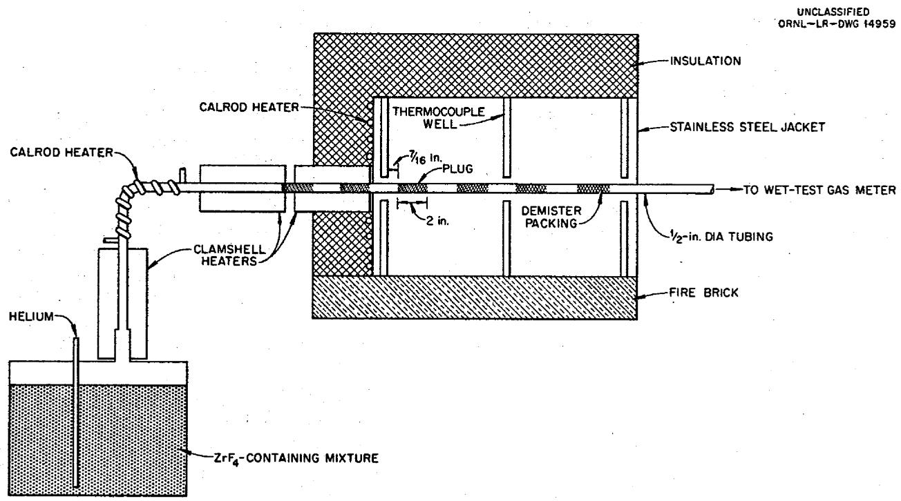  
Fig. 1.4.11. Apparatus for $\mathbf{ZrF}_4$ Tube Plugging Test.

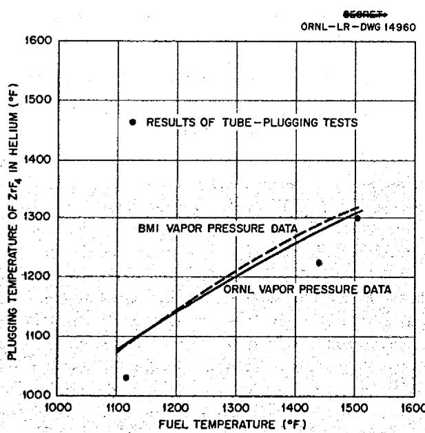  
Fig. 1.4.12. Plugging Temperature of $\mathbf{ZrF}_4$ in Helium as a Function of Fuel Mixture Temperature.

$23\%$ in. in thickness. The weight of $\mathsf{ZrF}_4$ was only $30\%$ of the amount that would have vaporized if the helium had been saturated with $\mathsf{ZrF}_4$ . The dense deposit found in this trap near the inlet renders the design unsuitable for the ART.

# OUTER CORE SHELL THERMAL STABILITY TEST

R. Curry22

A. M. Smith

The first test of the one-quarter-scale model of the lower half of the outer core shell $^{23}$ was terminated after the completion of 57 thermal cycles, because a sodium leak developed in the loop piping near the-test piece. It was decided to partially examine the shell before continuing the test. The center island was cut loose and lifted out of the housing assembly to expose the inner surface of the shell for inspection. A dye check of the inner

surface revealed no cracks or other flaws. X-ray photographs taken through the shell wall and the thick outer housing wall likewise did not indicate cracks or flaws, but it is judged that this inspection technique was not sufficiently sensitive to reveal hairline cracks, if such existed, on the exterior surface of the core shell.

The internal contour of the shell was mapped by centering the shell on a lathe and measuring 264 radii. For these measurements, 15 axial stations $\frac{1}{2}$ in. apart were designated. The radius was then measured for each 30 deg of rotation from an assigned zero position at the eight stations nearest the small-diameter end. At the seven stations nearest the large-diameter end, the radius was measured for each 15 deg of rotation from the zero position. The measurements obtained were compared with measurements taken after the initial machining of the model. It was found that the average radius at each station in no case differed from the original radius by more than 0.012 in. At no station did the spread from minimum to maximum radius exceed 0.021 in., and the average spread for the 15 stations was 0.014 in. The "crests" and "valleys" in a plot of radius vs rotation indicated that the basic deformation at each axial station was from circular to elliptical or pear shaped. This comparison between final and initial shape is invalid to some degree, because the initial measurements were taken before the shell was welded at each end and installed into the outer housing.

The shell is now back in the test rig and it is to be cycled a total of 300 cycles or to failure. Parts are being fabricated for a second 300-cycle test on another core-shell model.

# FORCED-CIRCULATION CORROSION AND MASS-TRANSFER TESTS

W. B. McDonald

Fused Salts in Inconel and Hastelloy B

J.W.Kingsley P.G.Smith

A. G. Smith24

Nine forced-circulation loops, seven fabricated of Inconel and two of Hastelloy B, were operated with fused salts as the circulated fluids during

this quarter. The operational data for these loops are summarized in Table 1.4.6. Eight of these loops were electrically heated and one (loop 4935-6) was heated with a natural-gas furnace. Two of the Inconel loops circulated a new fuel mixture (No. 70) $\mathrm{NaF - ZrF_4 - UF_4}$ (56-39-5 mole %), and the Hastelloy B loops circulated the fuel mixture (No. 107) $\mathrm{NaF - KF - LiF - UF_4}$ (11.2-41-45.3-2.5 mole %). All other tests were made with the fuel mixture (No. 30) $\mathrm{NaF - ZrF_4 - UF_4}$ (50-46-4 mole %). Other parameters investigated were operating temperature of the fluid, surface-area-to-volume ratio, temperature differential, and Reynolds number. When completed, the results of metallurgical examinations of the loops are reported in Chap. 3.1, "Dynamic Corrosion Studies."

The first Hastelloy B loop failed during attempts to put it into operation. Therefore no corrosion data were obtained, but valuable information pertaining to the engineering, fabrication, and operation of Hastelloy B loops was obtained. As a consequence, the second Hastelloy B loop operated satisfactorily for the scheduled 1000 hr.

The one gas-fired loop was terminated at 8319 hr as a result of a leak in the cooled section. This leak occurred while the cooled section was being thawed out after a freezeup which occurred when the pump-drive unit failed.

Liquid Metals in Inconel and Stainless Steel

J.W.Kingsley P.G.Smith

A. G. Smith

Twelve forced-circulation loops were operated with sodium or NaK as the circulated fluid, and one was operated with water. Ten of these loops were electrically heated and three were heated by natural-gas furnaces. The operational data for these loops are summarized in Table 1.4.7. The three loops that are heated by gas furnaces are being operated as life tests. Small centrifugal pumps (model LFB) are used on the gas-heated loops; the other loops that circulate liquid metals have electromagnetic pumps. The model LFB centrifugal pump was used on the loop that circulated water.

When completed, the results of metallurgical examinations of the loops are reported in Chap. 3.1, "Dynamic Corrosion Studies."

TABLE 1.4.6. SUMMARY OF OPERATING CONDITIONS OF INCONEL AND HASTELELOY B LOOPS IN WHICH  

<table><tr><td colspan="9">FUEL MIXTURES WERE CIRCULATED</td></tr><tr><td>Loop No.</td><td>Loop Material</td><td>Circulated Fluid</td><td>Approximate Reynolds Number</td><td>Temperature Differential (°F)</td><td>Maximum Fluid Temperature (°F)</td><td>Maximum Tube Wall Temperature (°F)</td><td>Operating Time* (hr)</td><td>Comments</td></tr><tr><td>7425-9</td><td>Inconel</td><td>NaF-ZrF4·UF4(50-46-4 mole %), No. 30</td><td>5,750</td><td>300</td><td>1600</td><td>1700</td><td>3000</td><td>Life test; terminated at 3000 hr to make room for additional tests</td></tr><tr><td>-11</td><td>Inconel</td><td>Same as above</td><td>10,000</td><td>200</td><td>1500</td><td>1580</td><td>786</td><td>Loop volume four times that of standard loop</td></tr><tr><td>-12</td><td>Hastelloy B</td><td>NaF-KF-LiF-UF4(11.2-41-45.3-2.5 mole %), No. 107</td><td>10,000</td><td>200</td><td>1500</td><td></td><td></td><td>Three unsuccessful attempts were made to operate this loop</td></tr><tr><td>-13</td><td>Hastelloy B</td><td>Same as above</td><td>10,000</td><td>200</td><td>1500</td><td>1555</td><td>1000</td><td>Trouble-free operation terminated on schedule</td></tr><tr><td>-14</td><td>Inconel</td><td>NaF-ZrF4·UF4(56-39-5 mole %), No. 70</td><td>10,000</td><td>200</td><td>1500</td><td>1600</td><td>1022</td><td>Terminated on schedule</td></tr><tr><td>-15</td><td>Inconel</td><td>Same as above</td><td>7,000</td><td>200</td><td>1640</td><td>1700</td><td>In test</td><td></td></tr><tr><td>-16</td><td>Inconel</td><td>NaF-ZrF4·UF4(50-46-4 mole %), No. 30</td><td>10,000</td><td>145</td><td>1540</td><td>1595</td><td>In test</td><td></td></tr><tr><td>-17</td><td>Inconel</td><td>Same as above</td><td>5,000</td><td>150</td><td>1500</td><td>1555</td><td>In test</td><td></td></tr><tr><td>4935-6</td><td>Inconel</td><td>Same as above</td><td>8,000 to 10,000.</td><td>200</td><td>1500</td><td>1575</td><td>8319</td><td>Life test terminated by pump-drive failure</td></tr></table>

TABLE 1.4.7. SUMMARY OF OPERATING CONDITIONS OF INCONEL AND STAINLESS STEEL FORCED-CIRCULATION LOOPS THAT CIRCULATED LIQUID METALS AND WATER  

<table><tr><td>Loop No.</td><td>Cold Trap</td><td>Loop Material</td><td>Reynolds Number</td><td>Temperature Differential (°F)</td><td>Maximum Fluid Temperature (°F)</td><td>Operating Fluid</td><td>Comments</td></tr><tr><td>7426-6A</td><td>Yes</td><td>Inconel</td><td>Variable</td><td></td><td>Variable</td><td>Sodium</td><td>Plugging-indicator tests</td></tr><tr><td>-6B</td><td>Yes</td><td>Inconel</td><td>Variable</td><td></td><td>Variable</td><td>Sodium</td><td>Plugging-indicator tests</td></tr><tr><td>-7</td><td>No</td><td>Inconel</td><td>&gt;15,000</td><td>300</td><td>1250</td><td>Sodium</td><td>Box of beryllium plates inserted in hot leg; operated 1000 hr</td></tr><tr><td>-8</td><td>Yes</td><td>Inconel</td><td>&gt;15,000</td><td>300</td><td>1250</td><td>Sodium</td><td>Box of beryllium plates inserted in hot leg; cold-trap temperature was 300°F; pump failed after 900 hr of operation</td></tr><tr><td>-9</td><td>Yes</td><td>Inconel</td><td>&gt;15,000</td><td>300</td><td>1300</td><td>Sodium</td><td>Beryllium insert in hot leg; operated 1000 hr</td></tr><tr><td>-10</td><td>Yes</td><td>Inconel</td><td>&gt;15,000</td><td>300</td><td>1250</td><td>Sodium</td><td>Beryllium insert in hot leg; cold-trap temperature was 280°F; operated 1000 hr</td></tr><tr><td>-11</td><td>Yes</td><td>Inconel</td><td>&gt;15,000</td><td>300</td><td>1350</td><td>Sodium</td><td>Cold-trap temperature, 280°F; in test</td></tr><tr><td>-12</td><td>Yes</td><td>Inconel</td><td>&gt;15,000</td><td>400</td><td>1500</td><td>Sodium</td><td>Cold-trap temperature, 300°F; in test</td></tr><tr><td>-14</td><td>Yes</td><td>Type 316 stainless steel</td><td>&gt;15,000</td><td>300</td><td>1650</td><td>Sodium</td><td>Cold-trap temperature, 260°F; in test</td></tr><tr><td>-51</td><td>Yes</td><td>Inconel</td><td>&gt;15,000</td><td>750</td><td>1500</td><td>Sodium</td><td>Life test; 1824 hr accumulated</td></tr><tr><td>7432-1A</td><td>Yes</td><td>Inconel</td><td>Variable</td><td></td><td></td><td>Water</td><td>Operated to obtain data on flow vs pump speed; surface-to-volume ratio of main NaK circuit of ART simulated</td></tr><tr><td>7439-51</td><td>Yes</td><td>Inconel</td><td>&gt;15,000</td><td>665</td><td>1500</td><td>Noneutectic NaK</td><td>Life test; 2192 hr accumulated</td></tr><tr><td>-52</td><td>Yes</td><td>Inconel</td><td>&gt;15,000</td><td>875</td><td>1600</td><td>Noneutectic NaK</td><td>Life test; 1968 hr accumulated</td></tr></table>

# 1.5. Procurement and Construction

W. F. Boudreau

ART FACILITY

F. R. McQuilkin

Construction work is nearing completion on the contract portion of the Aircraft Reactor Test (ART) facility in Building 7503. Package 1 work on the building additions, building alterations, and cell installation was approximately $7\%$ behind schedule at the $92.5\%$ completion point on June 1, 1956. About one-half the deficiency may be accounted for by lack of breakers and reactors for the electrical switchgear. During the quarter the principal work accomplished included final erection of the cell tanks; erection of the stack; placement of concrete for the main air duct, the penthouse, the radiator pit, the blower house floor and equipment bases, the cell encasement, and the main building floor at an elevation of 852 ft; painting; grading; fencing; and general job and site cleanup.

Package 2 work on the installation of diesel generators and facility, electrical control centers, and spectrometer-room electrical and air-conditioning equipment progressed to the $79\%$ completion point during the quarter. The installation of the electrical control centers and the diesel generators will complete this work. The estimated date for shipment of the diesel generators is June 25, 1956.

The contract for Package A work on the installation of auxiliary piping was negotiated with the V. L. Nicholson Company at a contract price of $50,351.62, with completion scheduled for June 15, 1956, unless material delivery schedules interfere.

Some of the Package 1 and Package 2 work may be seen in Fig. 1.5.1, which is a view from a location southwest of the building. The dark-sided portion of the main building is the addition which will house the reactor cell, the heat dumps, and the spectrometer tunnel. The appurtenances to the main building shown in this view are, from left to right, the generator house, blower house, vent house, and stack. In front of the vent house can be seen the top portion of the 10-ft-dia and 23-ft-deep concrete tank that will contain the water-submerged off-gas piping.

The west and north faces of the main building and the generator house may be seen in Fig. 1.5.2. On the left may be seen the newly installed 32-ft-

wide door that is required in order that the reactor and the tops of the cell tanks may pass into the building. The cylinder bank in the left foreground, which served as helium storage for the Aircraft Reactor Experiment (ARE) will be used for storage of nitrogen for the ART. In the foreground, in front of the truck, may be seen the 1500-kva transformer and substation that will serve the purchased power (TVA) portion of the power service to the facility. The openings in the generator house, on the right, will receive the radiators for the five diesel generators that will have 300-kw continuous ratings and will supply the locally generated power service to the facility. In Fig. 1.5.3 may be seen the pressure vessel and water tank that make up the containment cell. The 24-ft-dia, 36-ft-high pressure vessel is within the 30-ft-dia water tank. The top portion of the water tank had been removed and was sitting on the main floor when the photograph was taken. Although the pressure vessel manhole is 5 ft in diameter and will pass most of the items to be installed within the vessel, the contractor will remove the top head to provide the required access for the reactor. The pressure vessel was field stress-relieved and hydrostatically tested at 300 psi during the quarter. Inspection of the welded joints between the 24-in.-dia junction panel sleeves and the 4-in.-thick shell walls revealed a failure of a joint in the heat-affected zone of the sleeve base metal. Therefore all eight of the one-piece sleeves were replaced with two-piece units and a revised joint design and welding procedure was used. The field stress-relief procedure and the hydrostatic pressure tests will be repeated.

The concrete penthouse adjacent to the cell is shown in Fig. 1.5.4. This structure will house the NaK pumps, pump motors, and the mechanisms for supporting these units and the radiators, and will also house the NaK piping to the main air duct and to the radiator pit below. The special equipment room is directly below and covered by the roof plugs shown in the open doorway.

Design work continued on Package 3, which comprises the process equipment, process piping, etc. to be installed by ORNL. The design will probably be completed in July 1956.

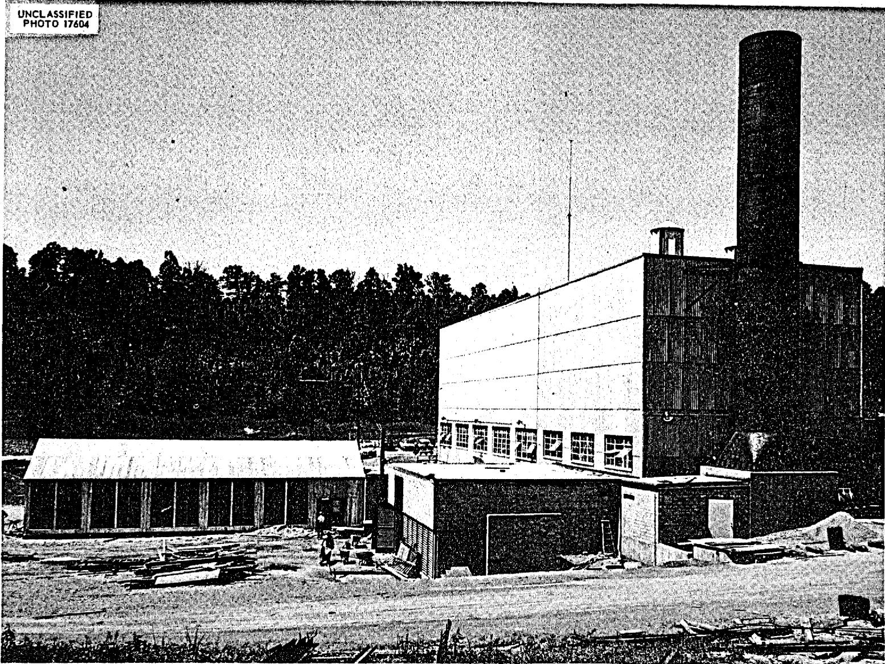  
Fig. 1.5.1. View of ART Facility Building 7503 from a Location Southwest of the Building. Photograph taken May 11, 1956.

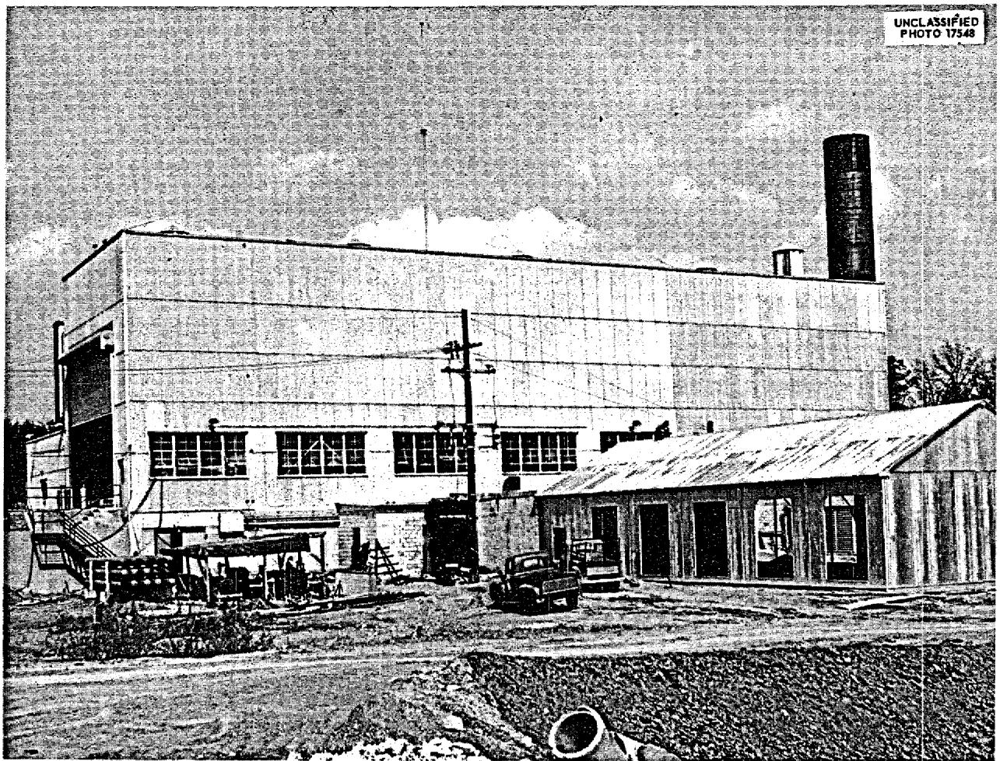  
Fig. 1.5.2. View of West and North Faces of Building 7503 and the Generator House. Photograph taken May 4, 1956.

# ETU FACILITY

M. Bender W.R.Osborn G.D.Whitman

Design work on the facility in Building 9201-3 for the Engineering Test Unit (ETU) is well under way, and some preliminary drawings of service piping have been completed. Line and equipment heating requirements have been established, and the design of the NaK piping and structural supports has been started. Preliminary layouts have been completed for the heat-dump system, including ducting, louvers, barrier doors, and the blower. The building structural modifications were completed, but additional design information has shown the need for further support for the floor structure.

The lube-oil pumps, the NaK tanks, the ETU

fuel dump tank, and miscellaneous Inconel materials have been ordered. A decision to expedite assembly of the ART with respect to ETU completion has resulted in procurement of additional items of equipment so that ART construction can proceed concurrently with ETU operation.

# ART-ETU REACTOR PROCEDURE AND ASSEMBLY

M. Bender W.R.Osborn G.D.Whitman

Detailed study is under way on methods for assembling the reactor. A preliminary procedure for assembling the reflector-moderator has been completed, and work is continuing on procedures

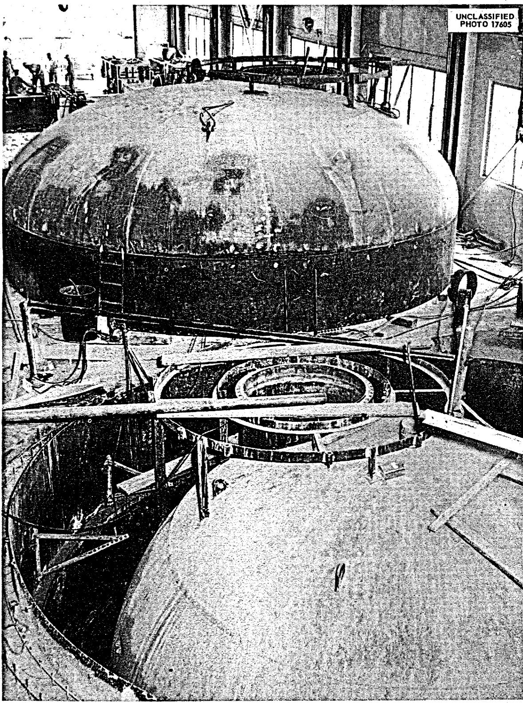  
Fig. 1.5.3. Pressure Vessel and Water Tank That Make Up the Reactor Cell. Photograph taken May 11, 1956.

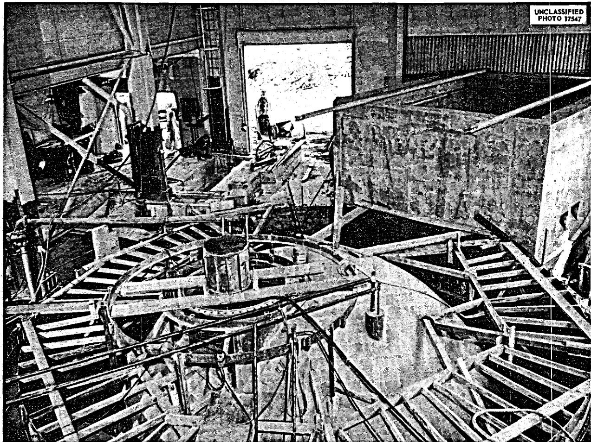  
Fig. 1.5.4. Concrete Penthouse Adjacent to Reactor Cell. Photograph taken May 4, 1956.

for assembling other parts of the reactor. Of particular concern in these studies are the problems caused by weld shrinkage during assembly. Recent data obtained from test weldments (see Chap. 3.4, "Welding and Brazing Investigations") have shown the need to modify some assembly techniques originally considered for the reactor in order to control the dimensions of the final assembly. Stress problems which will occur in handling components during assembly have also imposed restrictions on assembly methods and are now being evaluated with respect to their effect on the techniques.

Virtually all of the long-delivery materials for the reactor assemblies have been ordered, but actual fabrication of most items has been delayed by lack of firm drawings.

A review of the design indicated the need for flow tests on the reflector-moderator and island

assemblies. While the extent of this test program has not been clearly defined, it is expected to cause a significant delay in the completion of the reactor assembly.

As stated above, construction of the ART is being accelerated with respect to construction of the ETU. A calculated risk is being taken that the ETU will not show a need for correction of the ART reactor, and thus the ART reactor will be assembled as soon as possible after the ETU assembly is completed. Parts for a third reactor are being procured as insurance against excessive time loss if the risk fails.

Fabrication of the north head of the ETU has been started. Some delay has occurred because of redesign, and welding progress appears to be slower than anticipated. Delays in the receipt of the sodium-to-NaK heat exchanger and some forged parts may hold up work on this item. All

the necessary information for two of the six Inconel shells is available, and Lycoming is expediting work on these two shells. Additional design information is still needed for the remaining shells, but mandrels are being rough machined for producing them.

The beryllium reflector for the ETU is being machined by The Brush Beryllium Co., but some information on this item is still lacking because of design modifications. The island holes are now being drilled at ORNL and the island will be sent to The Brush Beryllium Co. for contouring when this operation is completed.

The heat exchanger suppliers are still studying assembly methods and techniques for fabricating the channel sections of the fuel-to-NaK heat ex-changers. Potentially, this equipment still appears to be one of the controlling factors in the assembly schedule.

Orders for the boron carbide tiles and boron-copper cermets have been placed with the Norton Company and the Allegheny Ludlum Steel Corp., respectively. A fabricator has not yet been selected to form the boron-copper cermets into the desired shapes.

Fabrication of the heavy 1-in.-thick pressure shells, which must be specially formed, will re

quire equipment that is not widely available. Because of the special dies which will be required, the delivery of these heavy shells may also affect the reactor completion date.

Knapp Mills, Inc., has been selected as the supplier of the lead shielding, which will be preformed and bolted to the reactor. It is proposed that only the side pieces be mounted on the ETU because of space and time considerations. No design drawings are available to describe the water shield, but it is anticipated that this, too, will be prefabricated.

A number of jigs and fixtures for use in assembly have been designed and are being procured. These include fixtures for assembling the reflectormoderator, assembly and checking fixtures for the main heat exchangers, templates and a gage for checking the shells, and several handling devices.

An area in Building 9201-3 is now being modified for use as a reactor assembly area. The area will be enclosed and air-conditioned, and it will be serviced by an overhead crane. It is anticipated that the area will be ready for use when the first reactor parts arrive in August.

# 1.6. ART, ETU, AND IN-PILE LOOP OPERATION

# ART OPERATING MANUAL

W. B. Cottrell

An Operations Committee, consisting of representatives of the physics, design, control, engineering, construction, and operating groups, was formed for the purpose of preparing an Operating Manual for both the ART and the ETU. Thus far, the efforts of the committee have been directed toward the preparation of the ART operating procedures, which, in first rough-draft form, is about $20\%$ complete. Since the ETU is to serve as a proving ground for the ART, the ETU operating procedures will subsequently be adapted from the ART operating procedures and will include other tests which may be desired.

The bases for the operating procedures are the experimental objectives of the ART, the reactor design, the reactor characteristics, as determined from simulator data, and the flow diagrams and instrumentation lists for the various systems. The information being used in the formulation of the procedures is presently available in the form of design memorandums and data sheets, reports prepared by staff members, and minutes of design and Operations Committee meetings.

The manual is to provide detailed procedures, including check lists, for all operations beginning after the installation of the ART equipment and terminating with the orderly shutdown of the reactor. As presently outlined the manual will include a check list of equipment and detailed procedures for cleaning the ART, for loading the NaK systems, for heating the reactor, for loading the sodium and fuel systems, for shakedown checking the fluid systems, for enriching the fuel, for operating at low power (10 to 100 w), for operating at intermediate power (2 to 20 Mw), for operating at high power, and for terminating the test.

By detailed consideration of procedures, the Committee has found incompatibilities in the performance of some system components and limitations in the design of others which would impair operation during unscheduled shutdowns. These difficulties fall into two categories: those which will require design changes to permit operation and those which will not require changes but which will restrict the method of operation. Pro

posed design modifications for resolving these difficulties are currently being evaluated.

# IN-PILE LOOP DEVELOPMENT AND TESTS

D. B. Trauger

Operation of Loop No. 4

C. C. Bolto

R. A. Dreisbach

J.A. Conlin

W. T. Furgerson

C.W.Cunningham

D. M. Haines

W. L. Scott

In-pile loop No. 4, which was described in the previous report,2 was cut from the shielding plug, and the nose end is being sectioned for metallographic examination. This loop was operated for a total of 501 hr, including 316 hr at the maximum design temperature differential of $200^{\circ}\mathrm{F}$ and 80 hr at lower temperature differences. The high-temperature point in the loop was maintained at $1500^{\circ}\mathrm{F}$ throughout the periods of operation with a temperature differential imposed on the system. The loop was operated under isothermal conditions at lower temperatures during the remaining 105 hr, while the reactor was shut down for refueling and for other maintenance. The power density in the loop was $778\mathrm{w/cm}^3$ during operation with the maximum temperature differential, as determined from the heat removal through the heat exchanger and the total volume of fuel in the nose from the heat exchanger outlet to inlet.

Functionally, the loop operation was good. The heater circuits, which had better insulation than the insulation used for the heater circuits of loops tested previously, were free of failure. The pump operated smoothly throughout the test, and controls for the heat exchanger and other components were satisfactory. However, 7 of the 14 nose thermocouples failed in operation, either by the junction coming off the pipe or by breakage of one of the wires (usually the Chromel wire). These failures are now believed to have been caused by poor installation techniques. Six of the seven

thermocouple lead wires which failed had, inadvertently, been clamped rigidly to the end of the outer wall of the double-walled heat exchanger. This could have resulted in strains on the thermocouple wire from the thermal expansion of the pipes. The loop design has been modified to correct this condition.

As with loop No. 3, both the bearing-housing and the pump-sump purge outlets plugged. The bearing purge outlet plugged five days after startup, and the sump purge outlet plugged four days later. The cause of this plugging is still being investigated. The fission-gas absorption traps from loop No. 3 have been sectioned. An extensive black deposit was found in the inlet of one and a brownish film was found in the other. This black deposit, believed to have come from the pump lubricating oil in the bearing housing, is to be given radio-assay and spectrographic analysis to determine its composition (see Chap. 4.2, "Radiation Damage"). It is planned to operate future loops with little or no purging of the bearing housing and reduced purging of the pump sump to minimize the probability of plugging. Previously, the higher purging rates were considered necessary to minimize hydraulic-motor-oil contamination. Experience indicates that, although some contamination results from operating with the purges plugged, such contamination is not a serious problem during dis-assembly.

Other major difficulties encountered were a leak in the pump bulkhead, probably through a glass heater or thermocouple-wire seal, and an excessive radiation level in the cubicle after shutdown. A new type of electrical seal for the pump bulkhead is being investigated. The excessive activity of the cubicle after shutdown was caused by the deposition of material on the purge-outlet-tube walls during operation. Radiation levels as high as 50 r/hr were measured on the $\frac{1}{4}$ -in. pump-purgeoutlet tube. This caused considerable difficulty in loop removal because it necessitated a relatively large amount of preparatory work. The design has

now been modified so that all tubes may be pinched leak-tight, cut, and removed remotely to make possible the removal of the activity prior to the entry of personnel into the cubicle. The only work which will require entry to the cubicle will be the removal of the air and water lines.

Loop No. 5

D. M. Haines

In-pile loop No. 5 was completed and inserted in the MTR, but could not be filled. This loop was to have operated for the duration of two MTR operating cycles with a maximum fuel temperature of $1600^{\circ}\mathrm{F}$ and a temperature differential of $200^{\circ}\mathrm{F}$ . The improved thermocouple installation mentioned above was used in the fabrication of this loop, and the rear section was modified to simplify removal and to provide a second hermetic seal to back up the seal at the intermediate bulkhead to prevent fission-gas leakage. The loop is being returned to ORNL for salvage.

# Horizontal-Shaft Sump Pump for In-Pile Loops

W. S. Karn

An improved prototype (Mark II) of the horizontal-shaft sump pump designed for in-pile loop operation completed 1000 hr of a 2000-hr endurance test at 4500 rpm and $1500^{\circ}\mathrm{F}$ . The test was terminated by shaft seizure, and disassembly showed that the seizure was caused by the buildup of zirconium fluoride on the shaft slinger. This was the first pump operated at $1500^{\circ}\mathrm{F}$ , the previous pumps being operated at $1400^{\circ}\mathrm{F}$ . The vapor pressure of zirconium fluoride in the fuel mixture (No. 44) NaF $\mathsf{ZrF}_4$ -UF $_4$ (53.5-40-6.5 mole %) used in this test is $2\mathrm{mmHg}$ at $1400^{\circ}\mathrm{F}$ and $4.5\mathrm{mmHg}$ at $1500^{\circ}\mathrm{F}$ . The increase in vapor pressure is considered to have been the cause of the buildup of zirconium fluoride on the slinger. A new pump is to be built with increased clearances at the slinger.

# Part 2

# CHEMISTRY

W. R. Grimes

# 2.1. PHASE EQUILIBRIUM STUDIES

C.J.Barton

R.E.Moore

R. E. Thoma

H. Insley, Consultant

The several methods described in previous reports of this series were used for further phase equilibrium studies of a variety of binary, ternary, and quaternary systems. Although the phase diagrams are not considered to be final in every respect, a compilation of the diagrams of binary systems consisting of $\mathsf{UF}_4$ or $\mathsf{ZrF}_4$ with each of the alkali fluorides is presented here. The striking differences observed in the diagrams for these systems indicate a need for detailed study of some of the complex crystal structures that characterize certain of these materials.

The $\mathsf{RbF - ZrF_4}$ and $\mathsf{RbF - UF_4}$ systems now appear to be moderately well described. A thermal effect in the $\mathsf{RbF - ZrF_4}$ system at $375^{\circ}C$ that was previously reported to be a eutectic temperature has been shown to be a lowered inversion temperature of the 2RbF-ZrF compound; the eutectic contains 42 mole $\%$ $\mathsf{ZrF_4}$ and melts at $410^{\circ}C$ .

Solvents with compositions near 35 mole % NaF, 25 mole % RbF, and 40 mole % ZrF4 apparently dissolve up to 4 mole % UF4 at liquidus temperatures below 480°C and up to 7 mole % UF4 below 510°C. Such mixtures are of interest as reactor fuels.

Detailed examinations of some ternary systems containing $\mathsf{BeF}_2$ are being made. While extremely low melting points can be obtained (the lowest eutectic observed to date in the NaF-LiF-BeF $_2$ system melts at $318^{\circ}\mathrm{C}$ ), it is not yet apparent that these materials offer fuel mixtures that are substantially better than those available in the $\mathsf{ZrF}_4$ -containing systems.

Studies of the phase behavior of $\mathsf{CeF}_3$ in binary systems with alkali fluorides have been continued. These systems are of interest because of concern over the behavior of fission-product fluorides in high-power long-duration reactor operation.

# GENERAL COMPARISONS OF THE BINARY SYSTEMS $MF-ZF_4$ AND $MF-UF_4$

R. E. Thoma

The two parallel families consisting of binary systems of $\mathsf{UF}_4$ and of $\mathsf{ZrF}_4$ with each of the alkali metal fluorides have been under investi

gation here for several years, and the characteristics of these systems are relatively well known. In the course of this research many people have contributed to an understanding of these phase relationships, and the information on phase behavior is scattered throughout a large number of reports in this series. Accordingly it has seemed worth while to prepare a brief summary of the differences and similarities in these several phase systems. No attempt has been made in this concise compilation to give credit to those who did the work.

Both these families of binary systems are much more complex than a cursory examination would indicate.2 It is obvious that fundamental studies of the structures of the complex compounds involved would be of general value. The large number and wide variety of complex compounds observed in these systems are indicated in Table 2.1.1. (The ratios shown are the ratios of the alkali fluoride component to the $\mathsf{ZrF}_4$ or the $\mathsf{UF}_4$ component.) Comparisons of the phase diagrams presented in Figs. 2.1.1, 2.1.2, and 2.1.3 display several of the striking characteristics of these materials.

A stable, congruent, high-melting-point compound (Fig.2.1.1) with the formula $3\mathsf{MF}\cdot \mathsf{ZrF}_4$ or $3\mathsf{MF}\cdot \mathsf{UF}_4$ characterizes all the diagrams, except those for LiF-UF and NaF-UF. For the LiF-UF system, which represents the lowest ratio of radius of $M^+$ ion to radius of $M^{4 + }$ ion, the 3:1 compound does not exist; for this system, and this system alone, an incongruent compound 4LiF-UF is observed. In the NaF-UF system the compound 3NaF-UF is congruent but relatively low melting, and it is unstable at temperatures below about $530^{\circ}C$

TABLE 2.1.1. COMPOUNDS* OF ${\mathrm{{ZrF}}}_{4}$ OR ${\mathrm{{UF}}}_{4}$ WITH ALKALI FLUORIDES  

<table><tr><td>4:1</td><td>3:1</td><td>2:1</td><td>3:2</td><td>5:3</td><td>5:4</td><td>7:6</td></tr><tr><td rowspan="8">4LiF·UF4(I)</td><td>3LiF·ZrF4(c)</td><td>2LiF·ZrF4(c)</td><td></td><td></td><td></td><td></td></tr><tr><td>3NaF·ZrF4(c)</td><td>2NaF·ZrF4(I)</td><td>3NaF·2ZrF4(S)</td><td></td><td></td><td>7NaF·6ZrF4(c)</td></tr><tr><td>3KF·ZrF4(c)</td><td>2KF·ZrF4(I)</td><td>3KF·2ZrF4(I)</td><td></td><td></td><td></td></tr><tr><td>3RbF·ZrF4(c)</td><td>2RbF·ZrF4(I)</td><td></td><td></td><td>5RbF·4ZrF4(c)</td><td></td></tr><tr><td></td><td></td><td></td><td></td><td></td><td>7LiF·6UF4(I)</td></tr><tr><td>3NaF·UF4(c)</td><td>2NaF·UF4(I)</td><td></td><td>5NaF·3UF4(I)</td><td></td><td>7NaF·6UF4(c)</td></tr><tr><td>3KF·UF4(c)</td><td>2KF·UF4(I)</td><td></td><td></td><td></td><td>7KF·6UF4(c)</td></tr><tr><td>3RbF·UF4(c)</td><td>2RbF·UF4(I)</td><td></td><td></td><td></td><td>7RbF·6UF4(I)</td></tr><tr><td>1:1</td><td>3:4</td><td>2:3</td><td>1:2</td><td>1:3</td><td>1:4</td><td>1:6</td></tr><tr><td rowspan="2">NaF·ZrF4(M)</td><td>3LiF·4ZrF4(I)</td><td></td><td></td><td></td><td></td><td></td></tr><tr><td>3NaF·4ZrF4(I)</td><td></td><td></td><td></td><td></td><td></td></tr><tr><td>KF·ZrF4(c)</td><td></td><td></td><td></td><td></td><td></td><td></td></tr><tr><td>RbF·ZrF4(c)</td><td></td><td></td><td>RbF·2ZrF4(I)</td><td></td><td></td><td></td></tr><tr><td></td><td></td><td></td><td></td><td></td><td>LiF·4UF4(I)</td><td></td></tr><tr><td></td><td></td><td></td><td>NaF·2UF4(S)</td><td></td><td></td><td></td></tr><tr><td></td><td></td><td></td><td>KF·2UF4(I)</td><td></td><td></td><td></td></tr><tr><td>RbF·UF4(c)</td><td></td><td>2RbF·3UF4(I)</td><td></td><td>RbF·3UF4(I)</td><td></td><td>RbF·6UF4(I)</td></tr></table>

\* (c) Congruent compound.   
(I) Incongruent compound.   
(M) Metastable compound.   
(S) Subsolidus compound.

A series of incongruent compounds, $2\mathsf{MF}\cdot \mathsf{ZrF}_4$ and $2\mathsf{MF}\cdot \mathsf{UF}_4,$ are observed in all the diagrams, except those containing LiF. The compound $2\mathsf{LiF}\cdot \mathsf{UF}_4$ does not exist, and $2\mathsf{LiF}\cdot \mathsf{ZrF}_4$ has a relatively low melting point but is congruent. All the incongruent $2\mathsf{MF}\cdot \mathsf{ZrF}_4$ and $2\mathsf{MF}\cdot \mathsf{UF}_4$ compounds, except the $2\mathsf{NaF}\cdot \mathsf{UF}_4$ material, melt to form the compounds $3\mathsf{MF}\cdot \mathsf{ZrF}_4$ or $3\mathsf{MF}\cdot \mathsf{UF}_4$ and liquid.

The low-melting-point central portion of the binary mixtures, that is, the mixtures with 35 to 55 mole $\%$ $\mathsf{ZrF}_4$ or $\mathsf{UF}_4$ , as shown in Fig. 2.1.2, exhibits many variations in compound types. The occurrence of the unusual compound $7\mathsf{MF}\cdot 6\mathsf{ZrF}_4$ or $7\mathsf{MF}\cdot 6\mathsf{UF}_4$ is remarkable. The compound has

the same crystal system wherever it occurs, and it displays no polymorphism. One member, the compound $7\mathrm{NaF}\cdot 6\mathrm{ZrF}_4$ forms an extensive interstitial solid solution series with the next lower $\mathsf{ZrF}_4$ compound.

Compounds formed from mixtures with high concentrations of $\mathsf{ZrF}_4$ or $\mathsf{UF}_4$ are invariably incongruent, but they display wide variations in degree of incongruency. These compounds, as shown in Fig. 2.1.3, occur at widely varying compositions in the range 55 to 95 mole $\%$ $\mathsf{ZrF}_4$ or $\mathsf{UF}_4$ . Several of the diagrams in this series are considered to be preliminary, and the systems those diagrams depict are still being studied.

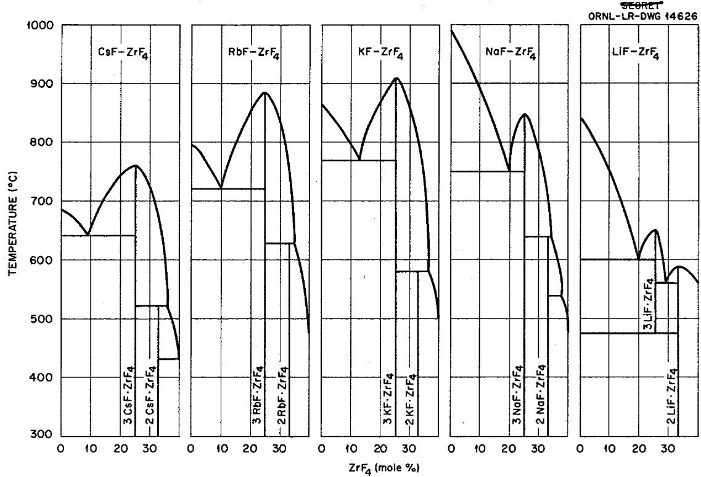

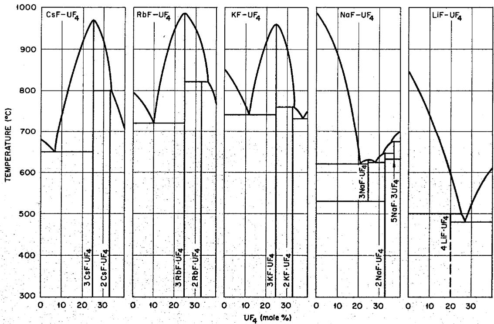  
Fig. 2.1.1. The Systems $MF-ZrF_4$ and $MF-UF_4$ , Where $MF$ is an Alkali Fluoride, in the Composition Range 0 to 40 mole % $ZrF_4$ or $UF_4$ .

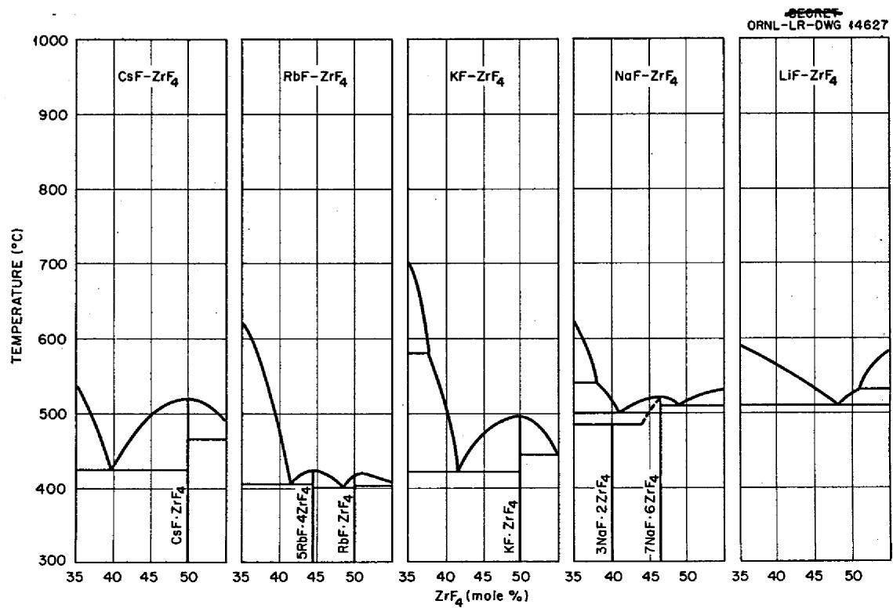

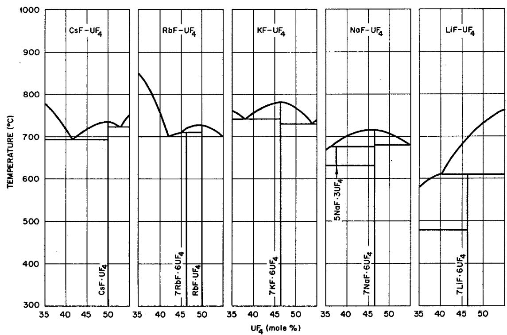  
Fig. 2.1.2. The Systems $MF-ZrF_{4}$ and $MF-UF_{4}$ , Where $MF$ is an Alkali Fluoride, in the Composition Range 35 to 55 mole % $ZrF_{4}$ or $UF_{4}$ .

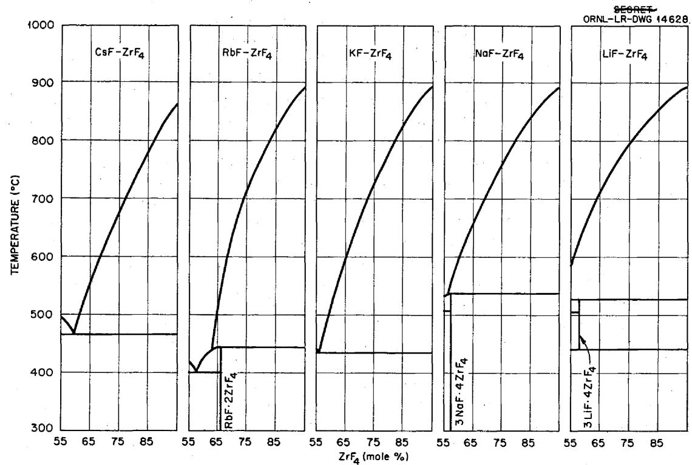

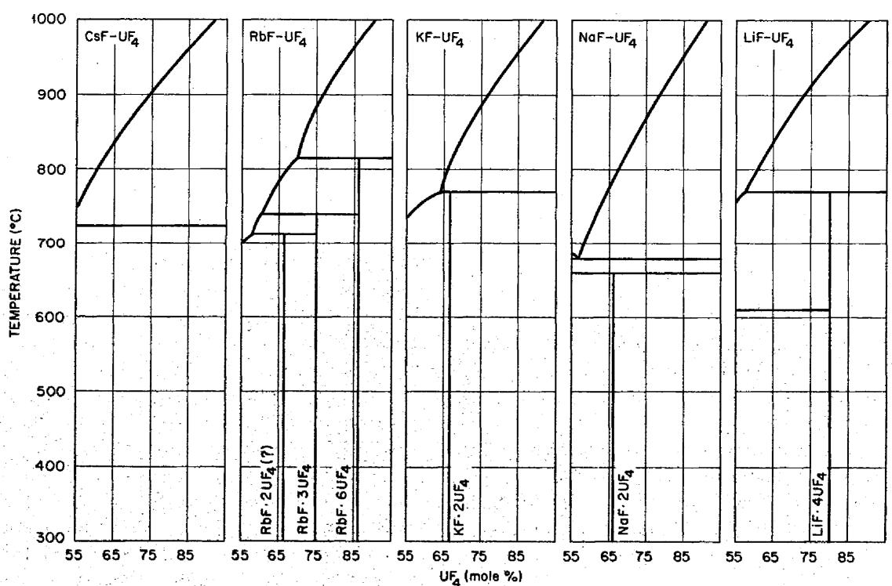  
Fig. 2.1.3. The Systems $MF-ZrF_4$ and $MF-UF_4$ , Where $MF$ is an Alkali Fluoride, in the Composition Range 55 to 95 mole % $ZrF_4$ or $UF_4$ .

# THE SYSTEM RbF-UF4

H.A.Friedman R.E.Moore

The system $\mathsf{RbF - UF_4}$ has been investigated recently because of its importance in the quaternary fuel system NaF-RbF-ZrF-UF. The earlier work of Blakely et al. has been largely confirmed by thermal analyses of slowly cooled melts. In addition to the compounds originally reported, however, there is an incongruent compound 7RbF-6UF.

Quenching experiments on the system are now under way, but the work is not yet far enough advanced to warrant presenting a phase diagram of the system. Petrographic examinations of a series of quenched samples containing 33.3 mole $\%$ UF $_4$ indicated that a rapid inversion of the compound 2RbF-UF $_4$ occurs at some temperature below $572^{\circ}\mathrm{C}$ . The congruent melting point of RbF-UF $_4$ (727°C) was confirmed by petrographic examination of a series of gradient-quenched samples containing 50 mole $\%$ UF $_4$ . The composition of an incongruent compound previously thought to be RbF-4UF $_4$ has now been established as RbF-3UF $_4$ by the observation of single-phase material in a series of equilibrated and quenched samples containing 75 mole $\%$ UF $_4$ . This phase is not stable above $714^{\circ}\mathrm{C}$ . In mixtures containing between 50 and 100 mole $\%$ UF $_4$ , two phases, in addition to RbF-3UF $_4$ , have been observed in both slowly cooled and quenched samples. One phase contains more than 80 mole $\%$ UF $_4$ , while the other phase contains between 50 and 66.7 mole $\%$ UF $_4$ .

# THE SYSTEM RbF-ZrF4

R.E.Moore

Several revisions have been made in the tentative diagram presented previously for the RbF $\mathsf{ZrF}_4$ system. The revised diagram is given in Fig. 2.1.4.

Visual observation experiments have shown that the eutectic between $2\mathsf{RbF}\cdot \mathsf{ZrF}_4$ and $5\mathsf{RbF}\cdot 4\mathsf{ZrF}_4$ contains about 42 mole $\%$ $\mathsf{ZrF}_4$ and melts at about $410^{\circ}C$ . Results of quenching experiments had indicated previously that the eutectic contained

38 mole $\%$ $\mathsf{ZrF}_4$ and melted at $375^{\circ}C$ . It is now apparent that $375^{\circ}C$ is the lowered rapid inversion temperature of 2RbF. $\mathsf{ZrF}_4$ rather than the eutectic temperature. In the region between 37 and 44.5 mole $\%$ $\mathsf{ZrF}_4$ , 2RbF. $\mathsf{ZrF}_4$ appears optically to be like quench growth at all temperatures above the lowered inversion temperature. This accounts for the misinterpretation of the quenching data.

Petrographic examination of a series of samples containing 48.3 mole $\%$ $\mathsf{ZrF}_4$ established that $5\mathsf{RbF - 4ZrF_4}$ is the primary phase; the liquidus temperature is about $396^{\circ}C,$ and the solidus temperature is $390^{\circ}C.$ Thus, the eutectic between $5\mathsf{RbF - 4ZrF_4}$ and $\mathsf{RbF - ZrF_4}$ contains about 48.5 mole $\%$ $\mathsf{ZrF_4}$ and melts at $390^{\circ}C.$

Examinations of slowly cooled preparations have shown the existence of a compound containing more than 50 mole $\%$ ZrF. This compound has been tentatively identified as RbF-2ZrF by the observation of nearly single-phase material in a series of equilibrated and quenched samples containing 66.7 mole $\%$ ZrF. This compound melts incongruently to ZrF and liquid at $447^{\circ}C$ .

# THE SYSTEM NaF-RbF-ZrF4

R.E.Cleary5 H.A.Friedman

A phase diagram of the fuel solvent system NaF-RbF-ZrF, based on thermal analysis of slowly cooled melts, differential thermal analysis, and quenching experiments, is shown in Fig. 2.1.5. Some of the compatibility triangles and quasi-binary mixtures were reported previously. The present status of the information on the compatibility triangles, eutectics, peritectics, and boundary curves is shown in Fig. 2.1.5. The locations of the eutectics and the exact paths of the boundary curves are not considered to be final in this diagram; they are contingent on confirmation by quenching experiments.

The phase relationships of the recently discovered compound RbF-2ZrF4 in the ternary system have not yet been determined. The ternary compounds of the solvent system are: NaF-RbF-ZrF4, which melts congruently at $615^{\circ}C$ ; 3NaF-3RbF-4ZrF4, which melts incongruity at $450^{\circ}C$ ; and NaF-RbF-2ZrF4 which melts congruently at $460^{\circ}C$ . A fourth ternary compound with

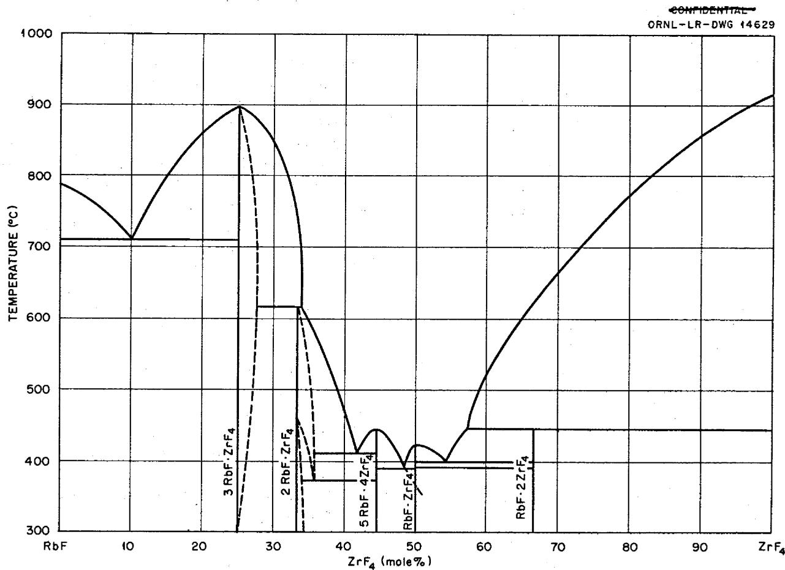  
Fig. 2.1.4. The System RbF-ZrF4.

the approximate composition 3NaF-3RbF-2ZrF4 may exist at high temperatures. Quenching studies have not yet established temperature limits on its stability. Preliminary quenching studies show that the compound 3NaF-3RbF-4ZrF4 melts incongruity to NaF-RbF-ZrF4 and liquid. The optical and x-ray data for the compound are presented in the following section.

# OPTICAL PROPERTIES AND X-RAY PATTERNS FOR 3NoF·3RbF·4ZrF

R.E.Thoma H.Insley

Listed below are the identifying characteristics of 3NaF-3RbF-4ZrF $4^{\prime}$ a new compound encountered in the phase studies described above. The symbol $d(\mathbf{A})$ means the distance between reflecting planes measured in angstroms. The term $l / l_{1}$ refers to the relative intensity of the lines as compared with an arbitrary value of 100 for the strongest

line. Under optical properties, $N_{O}$ and $N_{E}$ refer to the ordinary and extraordinary indices of refraction of uniaxial crystals. The compound is believed to form an incomplete solid solution with the compound NaF·RbF·2ZrF₄.

Optical data:

Unlaxial negative

$$
N _ {O} = 1. 4 3 6
$$

$$
N _ {E} = 1. 4 3 0
$$

X-ray data:

$$
d (\overset {\circ} {A}) \quad 1 / I _ {1}
$$

$$
6. 7 7 \quad 5
$$

$$
6. 1 1 \quad 1 5
$$

$$
5. 7 2 \quad 1 5
$$

<table><tr><td>d(A)</td><td>I/I1</td></tr><tr><td>5.37</td><td>30</td></tr><tr><td>4.67</td><td>9</td></tr><tr><td>4.21</td><td>37</td></tr><tr><td>4.11</td><td>10</td></tr><tr><td>3.98</td><td>15</td></tr><tr><td>3.82</td><td>22</td></tr><tr><td>3.72</td><td>30</td></tr><tr><td>3.56</td><td>5</td></tr><tr><td>3.52</td><td>11</td></tr><tr><td>3.44</td><td>100</td></tr><tr><td>3.31</td><td>8</td></tr><tr><td>3.22</td><td>30</td></tr><tr><td>3.12</td><td>63</td></tr><tr><td>3.11</td><td>100</td></tr><tr><td>3.07</td><td>5</td></tr><tr><td>3.01</td><td>20</td></tr><tr><td>2.95</td><td>6</td></tr><tr><td>2.571</td><td>10</td></tr><tr><td>2.482</td><td>8</td></tr><tr><td>2.356</td><td>8</td></tr><tr><td>2.243</td><td>8</td></tr><tr><td>2.164</td><td>10</td></tr><tr><td>2.111</td><td>15</td></tr><tr><td>2.088</td><td>15</td></tr><tr><td>2.060</td><td>33</td></tr><tr><td>2.025</td><td>30</td></tr><tr><td>2.004</td><td>8</td></tr><tr><td>1.976</td><td>7</td></tr><tr><td>1.947</td><td>28</td></tr><tr><td>1.909</td><td>18</td></tr><tr><td>1.861</td><td>85</td></tr><tr><td>1.812</td><td>6</td></tr><tr><td>1.727</td><td>10</td></tr><tr><td>1.638</td><td>10</td></tr><tr><td>1.591</td><td>10</td></tr></table>

# THE SYSTEM NaF-RbF-ZrF4-UF4

H.A.Friedman H.Davis7

Two areas of the quaternary system NaF-RbF $\cdot$ ZrF $_4$ -UF $_4$ offer mixtures which may be suitable fuels for circulating-fuel reactors. Solvents with approximately 10 mole % NaF, 52 mole % RbF, and 38 mole % ZrF $_4$ with the addition of 4 mole % UF $_4$ give a fuel with a liquidus temperature of approximately $500^{\circ}\mathrm{C}$ . With the addition of 7 mole % UF $_4$ a fuel with a liquidus temperature of approximately $545^{\circ}\mathrm{C}$ is obtained. These fuel mixtures have RbF $\cdot$ UF $_4$ or RbF $\cdot$ 3UF $_4$ as the primary phase. No serious segregation of the uranium phase has been evident in the experimental work. These mixtures are not optimal choices for the fuel mixture because the uranium phase contains a high concentration of UF $_4$ and there is a large difference between the temperatures at which the uranium phase and the primary phase of the solvent separate.

Solvents with approximately 35 mole $\%$ NaF, 25 mole $\%$ RbF, and 40 mole $\%$ ZrF with the addition of 4 mole $\%$ UF give a fuel with a liquidus temperature of approximately $480^{\circ}C$ . With the addition of 7 mole $\%$ UF a fuel with a liquidus temperature of approximately $510^{\circ}C$ is obtained. At both UF levels the uranium is contained entirely in the solid solution 7NaF-6Zr(U)F. Mixtures of this general type should have physical properties and corrosion characteristics that would make them of definite interest as fuels.

# THE SYSTEM NoF-LiF-BeF2

R.E.Meadows

Quenching studies of the system NaF-LiF-BeF $_2$ were continued, and it is now possible to present a diagram (Fig. 2.1.6) of the triangle having LiF, NaF, and NaF-BeF $_2$ at the apexes. Work on the other portion of the system is under way. Petrographic identification of phases in this system is very difficult, because several of the compounds have nearly the same indices of refraction and are isotropic, or nearly so. As a result reliance was placed on identification by means of x-ray diffraction patterns; even this identification is

CONTENTS

ORNL-LR-DWG 14630

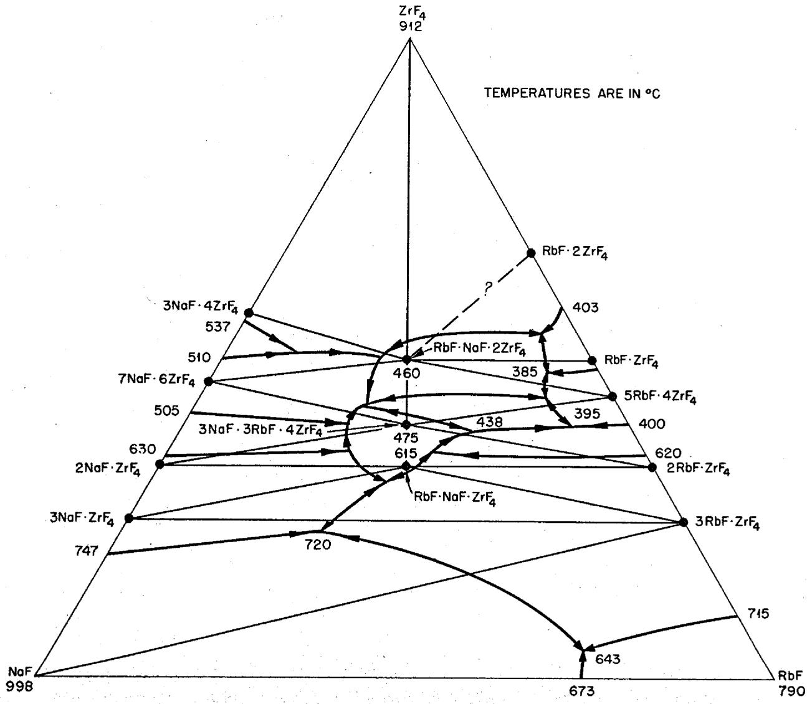  
Fig. 2.1.5. The System NaF-RbF-ZrF4.

difficult in some cases, since the standard patterns were obtained from samples which are not single-phase materials.

The diagram shows the following compatibility triangles: LiF-2NaF·LiF·2BeF $_2$ -2NaF·BeF $_2$ , LiF-2NaF·BeF $_2$ -NaF, and 2NaF·LiF·2BeF $_2$ -NaF·BeF $_2$ -2NaF·BeF $_2$ . In addition to the congruently melting compounds which form the apexes of these compatibility triangles, the data show a subsolidus compound, NaF·LiF·BeF $_2$ , which decomposes to LiF and 2NaF·LiF·2BeF $_2$ above about $240^{\circ}$ C (ref. 8), and another subsolidus compound, probably

5NaF·LiF·3BeF, which decomposes above about $320^{\circ}C$ to 2NaF·LiF·2BeF, 2NaF·BeF and LiF. Below $320^{\circ}C,$ LiF, 2NaF·LiF·2BeF, and 5NaF·LiF·3BeF are the apexes of a compatibility triangle. No other subsolidus relationships have been definitely established. In the diagram (Fig. 2.1.6) the binary and quasi-binary eutectics are indicated, and the dotted lines are the approximate primary-phase boundaries which meet at the

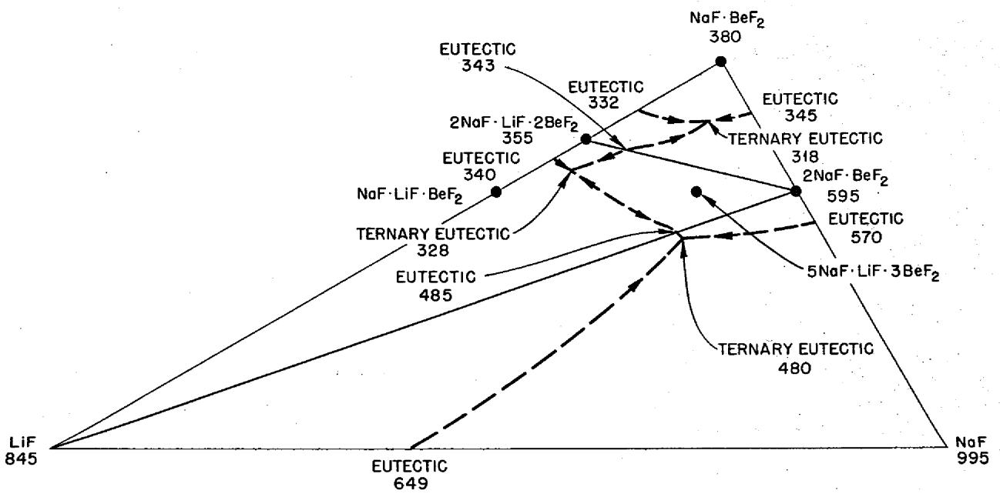  
Fig. 2.1.6. The System NaF-LiF-NaF-BeF $_2$ .

ternary eutectics shown in each of the three compatibility triangles. There is a limited solid solution region in the ternary system for a high-temperature modification of $2\mathrm{NaF}\cdot \mathrm{BeF}_{2^{\prime}}$ which is not indicated on the diagram. It is not likely that the limits of this region can be accurately determined with the experimental methods now being used.

The phase which was previously believed to be a ternary compound and which was tentatively assigned the formula LiF-7NaF-4BeF₃ was identified by G. D. White through the use of high-temperature x-ray diffraction as a polymorph of 2NaF-BeF₂. This phase, which is stable above 320°C, had not been reported in previous investigations of the NaF-BeF₂ system¹⁰,¹¹ and had not been found in quenched samples of NaF-BeF₂ mixtures examined in this laboratory because its inversion is too rapid for it to be quenched in the

9L. M. Bratcher, R. E. Meadows, and R. J. Sheil, ANP Quar. Prog. Rep. March 10, 1956, ORNL-2061, p 75. 10E. Thilo and F. Liebau, Z. physik. Chem. 199, 125-141 (1952). 11D. M. Roy, R. Roy, and E. F. Osborn, J. Am. Ceram. Soc. 36(6) 185 (1953).

binary system. It is, however, stabilized by the addition of LiF, with which it undoubtedly forms a limited solid solution.

Quenching experiments with compositions on the LiF-2NaF·LiF·2BeF $_2$ join on both sides of the mixture NaF·LiF·BeF $_2$ (37-26-37 mole %) show this mixture to have approximately the composition of the eutectic which melts at about $340^{\circ}\mathrm{C}$ . Petrographic and x-ray diffraction examinations of quenched samples and slowly cooled preparations show that the 2NaF·LiF·2BeF $_2$ ·2NaF·BeF $_2$ join is a quasi-binary system with a eutectic that contains 45 mole % NaF, 16.5 mole % LiF, and 38.5 mole % BeF $_2$ and melts at about $343^{\circ}\mathrm{C}$ .

A phase that appeared at a temperature below about $320^{\circ}C$ in quenched samples was assigned the formula 5NaF·LiF·3BeF $_2$ because the x-ray diffraction pattern of a quenched sample of this composition was not found to contain lines that could be assigned to any other known phase in the system. The conclusion that this compound exists only below the solidus temperature is based on the following evidence. First, slowly cooled preparations within the 2NaF·LiF·2BeF $_2$

$\mathsf{NaF}\cdot \mathsf{BeF}_2\cdot 2\mathsf{NaF}\cdot \mathsf{BeF}_2$ triangle contained only the three phases at the apexes, since the reaction rate in the solid state is too slow to permit equilibrium to be obtained. Second, examination of quenched samples in the LiF-2NaF-LiF-2BeF $2-$ 2NaF·BeF $^2$ triangle showed that the ternary eutectic (mp, $328^{\circ}C)$ is above the upper limit of stability of the compound and that the phases just below the solidus temperature are those at the apexes of the triangle.

The x-ray diffraction pattern of 5NaF·LiF·3BeF $_2$ is related to that given by Jahn $^{12}$ for low-temperature 3NaF·LiF·2BeF $_2$ . Quenched compositions corresponding to 3NaF·LiF·2BeF $_2$ contained 2NaF·LiF·2BeF $_2$ , 2NaF·BeF $_2$ , and LiF just below the solidus temperature and 5NaF·LiF·3BeF $_2$ , 2NaF·LiF·2BeF $_2$ , and LiF below $320^{\circ}\mathrm{C}$ . No evidence has been found in this laboratory to suggest that 3NaF·LiF·2BeF $_2$ exists.

The locations of the phase boundaries and ternary eutectics were deduced from the primary and secondary phases observed in quenched samples of the compositions within the compatibility triangles and the temperatures at which the phases appeared, as well as from previously obtained thermal analysis data.

# THE SYSTEM NaF-RbF-BeF $_2$

# L. M. Bratcher

Thermal analysis data were obtained for a number of compositions in the NaF-RbF-BeF $_2$ system containing 50 mole $\%$ BeF $_{2}$ , and some of the slowly cooled melts were examined petrographically and by x-ray diffraction. The available data show that the NaF-3RbF-BeF $_2$ join is a quasi-binary system which has a eutectic with the approximate composition NaF-RbF-BeF $_2$ (45-41-14 mole $\%$ ) that melts at $640 \pm 5^{\circ}C$ . The join NaF-2RbF-BeF $_2$ is likewise believed to be a quasi-binary system which has a eutectic with the composition NaF-RbF-BeF $_2$ (43-38-19 mole $\%$ ) that melts at $655 \pm 5^{\circ}C$ . The NaF-RbF-BeF $_2$ join is complicated because one or more ternary compounds exist on or near the join and RbF-BeF $_2$ melts incongruently. Thermal analysis data indicate that the addition of NaF lowers the incongruent melting point of RbF-BeF $_2$ . None of the slowly cooled melts was completely homo

genuine, but the mixtures containing 45 and 50 mole $\%$ NaF were predominantly one phase, and therefore there may be a compound with the composition $2\mathrm{NaF}\cdot \mathrm{RbF}\cdot \mathrm{BeF}_2$ .

# THE SYSTEM NaF-KF-LiF-UF4

# R.J.Sheil

Data reported previously on the liquidus temperatures of mixtures formed by adding $\mathsf{UF}_4$ to NaF-KF-LiF (11.5-42.0-46.5 mole %) indicated that the liquidus temperature varied quite rapidly with changing $\mathsf{UF}_4$ concentration, at least with mixtures containing approximately 4 mole % $\mathsf{UF}_4$ (ref. 13). Visual observations of liquidus temperatures in this system during this quarter gave values of 550, 570, and $595^{\circ}\mathsf{C}$ for mixtures containing 5.0, 7.5, and 10 mole % $\mathsf{UF}_4$ , respectively. The values obtained by this method for the mixture containing 10 mole % $\mathsf{UF}_4$ agreed quite well with earlier thermal analysis data. It now appears that the liquidus temperatures of mixtures in this system containing 0 to 10 mole % $\mathsf{UF}_4$ are not so strongly dependent upon $\mathsf{UF}_4$ concentrations as the earlier data had indicated.

# ALKALI FLUORIDE- $\mathsf{CeF}_3$ SYSTEMS

# L. M. Bratcher

Preliminary data on the NaF- $\mathsf{CeF}_3$ and RbF- $\mathsf{CeF}_3$ systems were given in the previous report.14 Study of the LiF- $\mathsf{CeF}_3$ system was initiated recently, and thermal analysis data obtained with five compositions in this system showed that there is a eutectic containing approximately 19 mole $\%$ $\mathsf{CeF}_3$ that melts at $755\pm 5^{\circ}C.$ For the NaF- $\mathsf{CeF}_3$ system, extrapolation of thermal data obtained with mixtures containing 10, 15, and 20 mole $\%$ $\mathsf{CeF}_3$ indicates that the eutectic which melts at $725\pm 10^{\circ}C$ contains approximately 28 mole $\%$ $\mathsf{CeF}_3.$ A compound reported to be present in this system has not yet been identified. The RbF- $\mathsf{CeF}_3$ system has been studied more than the other two systems mentioned, but thermal analysis data and studies of slowly cooled melts have so far failed to give a clear picture of phase relations. It appears that at least two compounds are formed that possibly have the formulas $3\mathsf{RbF - CeF}_3$ and

RbF- $\mathsf{CeF}_3$ In addition to liquidus and solidus thermal effects on cooling curves, solid transitions were noted at about 425 to $450^{\circ}C$ with mixtures in the 10 to 35 mole $\% \mathrm{CeF}_3$ range and at temperatures ranging from about 500 to $580^{\circ}C$ with mixtures containing 33 to 60 mole $\% \mathrm{CeF}_3$ . These transitions probably account for the fact that particle sizes of crystalline phases are so small that microscopic identification is difficult and some phases even give poor x-ray diffraction patterns. The minimum liquidus temperature of approximately $615^{\circ}C$ apparently occurs between 42.5 and 50 mole $\% \mathrm{CeF}_3$ . Study of all three systems mentioned is continuing.

# THE SYSTEM LIF-CsF

# L. M. Bratcher

The recent availability of pure CsF prompted a re-examination of the LiF-CsF system which is of interest because a compound is formed such as that formed in the LiF-RbF system. The results of the earlier studies were not published because of the scatter in the thermal analysis data. While

the existence of other alkali-halide binary compounds is well established, no mention of alkali-fluoride binary compounds has been found in the literature. The freezing point of the CsF used in the recent investigation was found to be $700 \pm 5^{\circ}C$ , which agrees with recently published values of $705^{\circ}C$ (ref. 16) and $703^{\circ}C$ (ref. 17). The thermal analysis data shown in Fig. 2.1.7 include some data from the earlier studies. The binary compound, believed to have the composition LiF-CsF, was easily recognized under the microscope because it is birefringent, whereas both LiF and CsF are isotropic. However, for reasons that are not well understood at present, the mixtures examined to date gave rather poor x-ray diffraction patterns for the compound. The large number of lines observed suggests that the compound is either monoclinic or rhombohedral.

15 L. M. Bratcher et al., ANP Quar. Prog. Rep. June 10, 1954, ORNL-1729, p 44.   
16O. Schmitz-Dumont and E. Schmitz, Z. anorg. Chem. 252, 329 (1944).   
17M. A. Bredig, H. R. Bronstein, and Wm. T. Smith, Jr., J. Am. Chem. Soc. 77, 1454 (1955).

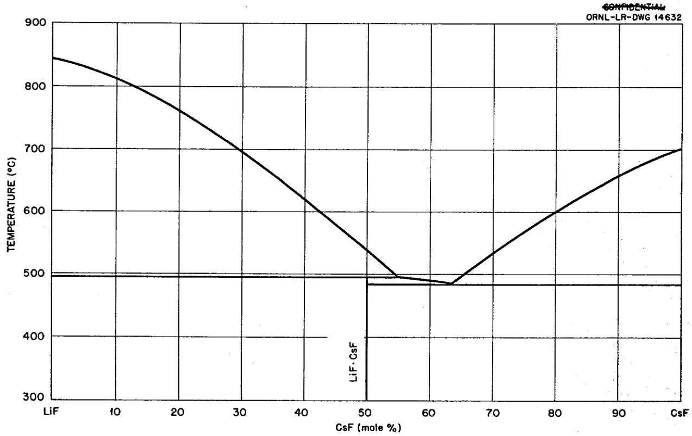  
Fig. 2.1.7. The System LiF-CsF.

# THE SYSTEM MgF $_2$ -CaF $_2$

L.M.Bratcher

In the course of an investigation of the system $\mathsf{NaF - MgF_2 - CaF_2}$ , thermal data were obtained with two $\mathsf{MgF}_2\mathsf{-CaF}_2$ mixtures which indicated that the literature value for the melting point of the eutectic mixture in this system might be too low. Therefore six additional mixtures were prepared which covered the composition range 37.5 to 50 mole $\%$ $\mathsf{CaF}_2$ . Cooling curves obtained with these mixtures showed that the eutectic mixture contained approximately 48.5 mole $\%$ $\mathsf{CaF}_2$ and melted at $985 \pm 5^{\circ}C$ , as compared with the literature value of $940^{\circ}C$ .

# THE SYSTEM RbF-CaF

L. M. Bratcher

Preliminary thermal analysis data indicate that there is a eutectic between RbF and a binary compound (probably RbF·CaF $_2$ ) that contains less than 10 mole % CaF $_2$ and has a melting point of $765^{\circ}\mathrm{C}$ . Cooling curves with mixtures containing 10 to 45 mole % CaF $_2$ did not show reproducible liquidus thermal effects, but the thermal effect at $765^{\circ}\mathrm{C}$ became less marked with increasing CaF $_2$ concentration in this range. Petrographic examination of samples containing 10 to $20\%$ CaF $_2$ showed increasing amounts of a cubic compound having a refractive index of approximately 1.410. A 1:1 compound (molar ratio) has been reported19 to be present in the similar system KF-CaF $_2$ .

# THE SYSTEM LIF-NIF

L.M.Bratcher

Data obtained with three mixtures in the LiF-NiF $_2$ system covering the composition range 10 to 30 mole $\%$ NiF $_2$ were given in the previous report.[20] The compound found in this system was tentatively assigned the formula $3\mathrm{LiF}\cdot \mathrm{NiF}_{2}$ , mainly on the basis of petrographic and x-ray diffraction studies of slowly cooled melts. The thermal analysis data obtained to date are difficult to interpret, but it appears likely that the compound melts incongruity to NiF $_2$ and liquid at a temperature only slightly above the

minimum liquidus temperature. Well-crystallized $\mathrm{NiF}_2$ was found in slowly cooled mixtures containing 30 mole $\%$ $\mathrm{NiF}_2$ or more. The first attempt to determine the melting point of $\mathrm{NiF}_2$ was unsuccessful, but the melting point was evidently below $1200^{\circ}\mathrm{C}$ , the maximum temperature to which the material was heated.

# THE SYSTEM $UF_4 - UO_2$

R.J.Sheil

Preliminary thermal analysis data and the results of studies of a few slowly cooled mixtures in the $\mathsf{UF}_4\text{-}\mathsf{UO}_2$ system were reported previously.21 Thermal analysis data obtained during this quarter were not very satisfactory because of the previously mentioned undercooling difficulty and a container problem. The use of graphite containers for the $\mathsf{UF}_4\text{-}\mathsf{UO}_2$ mixtures was abandoned when it was discovered that mixtures containing 4 wt $\%$ $\mathsf{UO}_2$ or more penetrated both ordinary (C-18) and high-density graphite when heated to a maximum temperature of $1100^{\circ}\mathsf{C}$ . Mixtures containing 2 wt $\%$ $\mathsf{UO}_2$ or less did not penetrate ordinary graphite to a noticeable extent when heated to the same temperature. Surface tension measurements of $\mathsf{UF}_4\text{-}\mathsf{UO}_2$ mixtures will be made in an effort to account for this interesting phenomenon. The recent thermal analysis studies were conducted in sealed nickel capsules to minimize changes in oxide content of the mixtures while the thermal analysis data were being obtained. This closed apparatus does not permit the use of seeding, which apparently will be required in order to obtain reliable liquidus values in this system. Heating curves and some cooling curves obtained with mixtures containing 4, 6, 8, and 10 wt $\%$ $\mathsf{UO}_2$ show evidence of a eutectic which melts at approximately $910^{\circ}\mathsf{C}$ . Extrapolation of available liquidus temperature data for these mixtures involves considerable uncertainty, but it appears that the eutectic probably contains 9 to $11\% \mathsf{UO}_2$ (10.3 to 12.6 mole $\% \mathsf{UO}_2$ ).

# THE SYSTEM $\mathsf{ZnF}_2$ -ZnO

L.M.Bratcher H.A.Friedman

During the course of earlier investigations of alkali fluoride- $\mathsf{ZnF}_2$ systems,22 a variation in

liquidus temperatures was noted in attempts to determine the melting point of pure $\mathsf{ZnF}_2$ . Cooling curves showed liquidus effects ranging from 885 to $940^{\circ}\mathrm{C}$ and a second break at or near $845^{\circ}\mathrm{C}$ . Since ZnO was found in all the samples that were examined subsequent to the melting-point determinations, it seemed probable that the liquidus temperature was affected by the amount of ZnO present. Confirmation of this postulate was obtained when a cooling curve obtained with oxide-free $\mathsf{ZnF}_2$ , prepared by $\mathsf{NH}_4\mathsf{F} \cdot \mathsf{HF}$ treatment of $\mathsf{ZnF}_2$ previously dried in an HF atmosphere, showed a thermal effect only at $940 \pm 5^{\circ}\mathrm{C}$ . Because of the large discrepancies between this value for the melting point of $\mathsf{ZnF}_2$ and those reported in the literature ( $872^{\circ}\mathrm{C}$ by Puschin and Baskow,[23] and $875 \pm 3^{\circ}\mathrm{C}$ by Haendler, Patterson,

and Bernard $^{24}$ , the slowly cooled $\mathsf{ZnF}_2$ was analyzed chemically and spectrographically. It was also carefully examined petrographically and by x-ray diffraction, along with a highly precise determination of cell parameters. Since no evidence was found of the presence of impurities in more than trace amounts, the melting points for $\mathsf{ZnF}_2$ reported in the literature are believed to be erroneous, possibly because of oxide contamination. Thermal analysis data obtained with mixtures formed by adding 5, 10, 15, and 20 mole % ZnO to purified $\mathsf{ZnF}_2$ show that the eutectic which melts at $850 \pm 5^{\circ}\mathsf{C}$ contains approximately 21.5 mole % ZnO. Only the pure components were found in the slowly cooled mixtures, and thus it appears that solid solutions do not occur, at least at room temperature.

# 2.2. CHEMICAL REACTIONS IN MOLTEN SALTS

F. F. Blankenship

L. G. Overholser

R. F. Newton

G.M.Watson

# ACTIVITY OF CHROMIUM IN CHROMIUM-NICKEL ALLOYS

M. B. Panish

Further measurements were made of the electromotive forces of electrode concentration cells in order to determine the activity of chromium-nickel alloys. The cells used were the same as those described previously, and they contained as an electrolyte a eutectic mixture of sodium chloride and rubidium chloride with about 0.2 to 0.5 wt % chromous chloride added.

Activity determinations were made for alloys containing from 11.2 to 53.0 mole % chromium. It was found that there was a marked tendency for the electromotive forces of the cells to drift downward because of the reaction

$$
N i + C r C l _ {2} \rightleftharpoons N i C l _ {2} + C r
$$

This effect was reduced markedly by packing the lower end of the cell with crushed quartz in order to prevent the transfer of nickel by convection and diffusion. For several cells in which the quartz packing was not used, the equilibrium electromotive force was approximated by extrapolating the steadily drifting electromotive force to zero time.

With cells in which the alloy electrode contained over 35 mole % chromium, erratic results were obtained after raising and lowering the cell temperature, whereas the electromotive forces obtained should be reproducible. The reasons for this behavior have not yet been ascertained, but it is highly probable that the diffusion rate in these electrodes is very low and that surface effects play a very important role. It should also be noted that activity values for the high-activity region will be approximations because of the low electromotive force produced by cells containing these electrodes vs a pure chromium electrode. If the activity of the chromium in the alloy electrode of such a cell is 0.90, then the electromotive force will be about 0.004. The nonreproducibility of the cells in this region is of the same order of magnitude as the electromotive forces measured.

The activities obtained for various chromiumnickel alloys at $750^{\circ}C$ are shown in Fig. 2.2.1, along with the curve obtained by Grube and Flad $^{2}$ at $1100^{\circ}C$ . The two curves are not inconsistent, in that it is quite possible that the differences are due entirely to the difference in the temperatures at which the measurements were made.

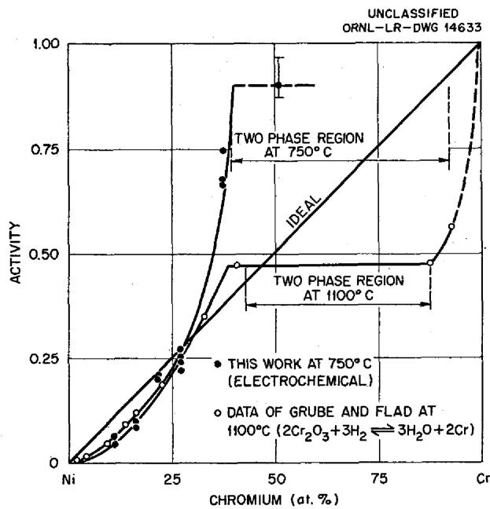  
Fig. 2.2.1. Activity of Chromium in Nickel-Chromium Alloys at 750 and $1100^{\circ}\mathrm{C}$ .

It should be noted that the chromium activity in the region near $15\%$ chromium is slightly below the ideal activity which would have been predicted for a perfect solid solution. This is considerably lower than the activity which might have been expected from an inspection of the chromium-nickel phase diagram, and it justifies the assumption of near "ideal" activity for chromium in Inconel. This assumption is usually made in discussions regarding the chemical equilibria involved in the corrosion of Inconel by molten salts.

# REDUCTION OF UF4 BY STRUCTURAL METALS

# J.D.Redman

Further studies were made, by use of the filtration method, of the reduction of $\mathsf{UF}_4$ by chromium and by iron in reaction mediums that differed from those used previously. In the earlier studies, the reaction mediums used were NaF-ZrF $_4$ (50-50 mole %), 353-47 mole %, 4 59-41 mole %, NaF-LiF-ZrF $_4$ (22-55-23 mole %), and NaF-LiF-KF (11.5-46.5-42 mole %). Other alkali fluoride mixtures containing ZrF $_4$ have been employed as reaction mediums in the recent studies in order to determine the effects of various alkali fluorides on the interaction of $\mathsf{UF}_4$ with chromium or iron. The results obtained by using KF-ZrF $_4$ or LiF-ZrF $_4$ (both 52-48 mole %) as reaction mediums are presented in Tables 2.2.1 and 2.2.2.

3J. D. Redman and C. F. Weaver, ANP Quar. Prog. Rep. June 10, 1954, ORNL-1729, p 50; ANP Quar. Prog. Rep. Sept. 10, 1954, ORNL-1771, p 60.   
4J. D. Redman and C. F. Weaver, ANP Quar. Prog. Rep. June 10, 1955, ORNL-1896, p 60.   
5J. D. Redman, ANP Quar. Prog. Rep. Marcb 10, 1956, ORNL-2061, p 93.   
6J. D. Redman and C. F. Weaver, ANP Quar. Prog. Rep. Sept. 10, 1955, ORNL-1947, p 74.   
7J. D. Redman and C. F. Weaver, ANP Quar. Prog. Rep. March 10, 1955, ORNL-1864, p 56.

TABLE 2.2.1. DATA FOR THE REACTION OF ${\mathrm{{UF}}}_{4}$ WITH CHROMIUM IN MOLTEN KF-ZrF ${}_{4}$ (52-48 MOLE %) AT 600 AND ${800}^{ \circ  }\mathrm{C}$   

<table><tr><td colspan="2">Conditions of Equilibration</td><td colspan="3">Present in Filtrate</td></tr><tr><td>Temperature (°C)</td><td>Time (hr)</td><td>Total U (wt %)</td><td>Total Cr* (ppm)</td><td>Total Ni (ppm)</td></tr><tr><td rowspan="4">600</td><td>3</td><td>8.0</td><td>1030</td><td>35</td></tr><tr><td>3</td><td>9.4</td><td>1060</td><td>55</td></tr><tr><td>5</td><td>9.7</td><td>1180</td><td>55</td></tr><tr><td>5</td><td>8.5</td><td>1060</td><td>235</td></tr><tr><td rowspan="6">800</td><td>3</td><td>8.2</td><td>1250</td><td>35</td></tr><tr><td>3</td><td>8.4</td><td>1190</td><td>25</td></tr><tr><td>5</td><td>8.1</td><td>1150</td><td>295</td></tr><tr><td>5</td><td>8.1</td><td>1150</td><td>285</td></tr><tr><td>16</td><td>8.2</td><td>1060</td><td>30</td></tr><tr><td>16</td><td>8.2</td><td>1140</td><td>5</td></tr></table>

*Blank of 290 ppm of Cr at $800^{\circ}\mathrm{C}$ .

Data for the reaction of $\mathsf{UF}_4$ with chromium at 600 and $800^{\circ}C$ in the reaction medium $\mathsf{KF - ZrF_4}$ (52-48 mole $\%$ ) are given in Table 2.2.1. In these runs approximately $2\mathrm{g}$ of chromium was reacted with $\mathsf{UF}_4$ (10.6 wt $\%$ 4.0 mole $\%$ ) dissolved in approximately $40\mathrm{g}$ of the $\mathsf{KF - ZrF_4}$ mixture contained in nickel. Similar studies were made with LiF-ZrF4 (52-48 mole $\%$ ) as the reaction medium at a $\mathsf{UF}_4$ concentration of 12.0 wt $\%$ (3.9 mole $\%$ ). In these studies chromium from two different sources was employed; the results are given in Table 2.2.2.

As seen from the data in Table 2.2.2 the equilibrium chromium concentrations are the same at both temperatures for the two different chromium metals used - hydrogen-fired electrolytic chromium

TABLE 2.2.2. DATA FOR THE REACTION OF UF4 WITH CHROMIUM IN MOLTEN LIF-ZrF4 (52-48 MOLE %) AT 600 AND $800^{\circ}C$   

<table><tr><td colspan="2">Conditions of Equilibration</td><td colspan="3">Present in Filtrate</td></tr><tr><td>Temperature (°C)</td><td>Time (hr)</td><td>Total U (wt %)</td><td>Total Cr* (ppm)</td><td>Total Ni (ppm)</td></tr><tr><td rowspan="8">600</td><td>3</td><td>9.9</td><td>2550</td><td>30</td></tr><tr><td>3</td><td>9.8</td><td>3000</td><td>75</td></tr><tr><td>5</td><td>10.0</td><td>2980</td><td>70</td></tr><tr><td>5</td><td>9.4</td><td>3060</td><td>45</td></tr><tr><td>5</td><td>9.5</td><td>2800**</td><td>50</td></tr><tr><td>5</td><td>9.5</td><td>2790**</td><td>50</td></tr><tr><td>12</td><td>9.6</td><td>2910</td><td>30</td></tr><tr><td>12</td><td>9.6</td><td>3060</td><td>35</td></tr><tr><td rowspan="8">800</td><td>3</td><td>10.1</td><td>3820</td><td>55</td></tr><tr><td>3</td><td>9.2</td><td>3830</td><td>30</td></tr><tr><td>5</td><td>8.9</td><td>4070</td><td>35</td></tr><tr><td>5</td><td>8.6</td><td>4040</td><td>45</td></tr><tr><td>5</td><td>9.2</td><td>3810**</td><td>40</td></tr><tr><td>5</td><td>9.3</td><td>3780**</td><td>60</td></tr><tr><td>12</td><td>9.5</td><td>3780</td><td>60</td></tr><tr><td>12</td><td>9.5</td><td>3830</td><td>50</td></tr></table>

*Blank of 250 ppm of Cr at $800^{\circ}\mathrm{C}$ . Electrolytic chromium hydrogen-fired at $1200^{\circ}\mathrm{C}$ was used in all runs except those noted.   
**Blank of 190 ppm of Cr at $800^{\circ}\mathrm{C}$ . Very pure iodide chromium, not hydrogen-fired, was used in these runs.

and iodide chromium. The iodide chromium was obtained from Battelle Memorial Institute and contained 10 ppm or less of oxygen. This pure chromium was not hydrogen-fired, and therefore a comparison of the blanks obtained for this metal with those found for the electrolytic chromium (used in all previous studies), which was hydrogen-fired under the usual conditions, should demonstrate the effectiveness of the hydrogen treatment. The chromium values of 190 and 250 ppm obtained for the unfired iodide chromium and the hydrogen-fired electrolytic chromium, respectively, suggest that the hydrogen-firing is successful (unfired electrolytic chromium gave a blank of 900 ppm). Evidently the major portion of the blank arises from oxidizing materials $\left(\mathrm{H}_{2} \mathrm{O}\right.$ and HF) present in the $\mathrm{LiF}-\mathrm{ZrF}_{4}$ mixture.

The equilibrium chromium concentrations and the equilibrium constants calculated from mole fractions for the reaction of $\mathsf{UF}_4$ with chromium in the various solvents are presented in Table 2.2.3 for comparison. The effect of varying the NaF-to-ZrF $_4$ ratio in the various NaF-ZrF $_4$ mixtures on the chromium concentration has been shown and discussed previously. $^5$ The values are included in Table 2.2.3 for comparison with the KF-ZrF $_4$ and LiF-ZrF $_4$ data. It is evident from the values

given in Table 2.2.3 that the particular alkali fluoride used in combination with $\mathsf{ZrF}_4$ influences the reaction markedly. The different alkali fluorides affect the activity of the $\mathsf{UF}_4$ to varying degrees. The activity of the $\mathsf{CrF}_2$ is also influenced through complexing of the $\mathsf{CrF}_2$ by both the alkali fluoride and the $\mathsf{ZrF}_4$ . Studies will be made shortly with an $\mathsf{RbF - ZrF}_4$ mixture as reaction medium to complete the alkali fluoride series.

Studies of the reduction of $\mathsf{UF}_4$ by iron at 600 and $800^{\circ}\mathrm{C}$ with $\mathsf{LiF - ZrF_4}$ and $\mathsf{KF - ZrF_4}$ (both 52-48 mole %) as reaction mediums were made at $\mathsf{UF}_4$ concentrations of 12.0 wt % (3.9 mole %) for the $\mathsf{LiF - ZrF_4}$ mixture and 10.6 wt % (4.0 mole %) for the $\mathsf{KF - ZrF_4}$ mixture. The data are presented in Table 2.2.4. As may be seen from the data the equilibrium iron concentrations are not significantly changed by replacing LiF with KF. It may be noted that somewhat smaller values result at $800^{\circ}\mathrm{C}$ than at $600^{\circ}\mathrm{C}$ for both solvents. These values also are in good agreement with those found when $\mathsf{NaF - ZrF_4}$ (50-50 mole %), $\mathsf{NaF - ZrF_4}$ (53-47 mole %), and $\mathsf{NaF - ZrF_4}$ (59-41 mole %) were used as the reaction mediums. The iron values obtained by using NaF-LiF-ZrF $^4$ (22-55-23 mole %) as the solvent fell in the same range, but in this case the values were slightly larger at $800^{\circ}\mathrm{C}$ than at $600^{\circ}\mathrm{C}$ .

TABLE 2.2.3. EQUILIBRIUM CONCENTRATIONS AND CONSTANTS FOR THE REACTION $\mathrm{Cr}^{\circ} + 2\mathrm{UF}_{4}\rightleftharpoons 2\mathrm{UF}_{3} + \mathrm{CrF}_{2}$ IN VARIOUS SOLVENTS  

<table><tr><td>Solvent</td><td>Temperature (°C)</td><td>UF4(mole %)</td><td>Cr(ppm)</td><td>Kx*</td></tr><tr><td rowspan="2">LiF-ZrF4(52-48 mole %)</td><td>600</td><td>4.0</td><td>2900</td><td>7 × 10-4</td></tr><tr><td>800</td><td>4.0</td><td>3900</td><td>7 × 10-3</td></tr><tr><td rowspan="2">NaF-ZrF4(50-50 mole %)</td><td>600</td><td>4.1</td><td>2250</td><td>4 × 10-4</td></tr><tr><td>800</td><td>4.1</td><td>2550</td><td>5 × 10-4</td></tr><tr><td rowspan="2">NaF-ZrF4(53-47 mole %)</td><td>600</td><td>4.0</td><td>1700</td><td>1 × 10-4</td></tr><tr><td>800</td><td>4.0</td><td>2100</td><td>3 × 10-4</td></tr><tr><td rowspan="2">NaF-ZrF4(59-41 mole %)</td><td>600</td><td>3.7</td><td>975</td><td>1.4 × 10-5</td></tr><tr><td>800</td><td>3.7</td><td>1050</td><td>1.6 × 10-5</td></tr><tr><td rowspan="2">KF-ZrF4(52-48 mole %)</td><td>600</td><td>3.9</td><td>1080</td><td>2.4 × 10-5</td></tr><tr><td>800</td><td>3.9</td><td>1160</td><td>3.2 × 10-5</td></tr><tr><td rowspan="2">NaF-LiF-ZrF4(22-55-23 mole %)</td><td>600</td><td>2.5</td><td>550</td><td>1 × 10-6</td></tr><tr><td>800</td><td>2.5</td><td>750</td><td>4 × 10-6</td></tr><tr><td rowspan="2">NaF-LiF-KF(11.5-46.5-42 mole %)</td><td>600</td><td>2.5</td><td>1100</td><td></td></tr><tr><td>800</td><td>2.5</td><td>2700</td><td></td></tr></table>

$*K_{x} = X_{\mathsf{UF}_{3}}^{2}X_{\mathsf{CrF}_{2}} / X_{\mathsf{Cr}}X_{\mathsf{UF}_{4}}^{2}$ where $X$ is concentration in mole fractions.

TABLE 2.2.4. DATA FOR THE REACTION OF UF4 WITH IRON IN LIF-ZrF4 (52-48 MOLE %) AND IN KF-ZrF4 (52-48 MOLE %) AT 600 AND 800°C   

<table><tr><td colspan="2">Conditions of Equilibration</td><td colspan="3">Present in Filtrate</td></tr><tr><td>Temperature (°C)</td><td>Time (hr)</td><td>Total U (wt %)</td><td>Total Fe* (ppm)</td><td>Total Ni (ppm)</td></tr><tr><td colspan="5">Solvent: LiF-ZrF4(52-48 mole %)</td></tr><tr><td>600</td><td>3</td><td>9.1</td><td>460</td><td>30</td></tr><tr><td></td><td>3</td><td>10.0</td><td>550</td><td>35</td></tr><tr><td></td><td>5</td><td>9.7</td><td>460</td><td>40</td></tr><tr><td></td><td>5</td><td>9.9</td><td>520</td><td>65</td></tr><tr><td>800</td><td>3</td><td>9.8</td><td>360</td><td>15</td></tr><tr><td></td><td>3</td><td>9.6</td><td>390</td><td>20</td></tr><tr><td></td><td>5</td><td>9.6</td><td>400</td><td>35</td></tr><tr><td></td><td>5</td><td>9.5</td><td>350</td><td>35</td></tr><tr><td colspan="5">Solvent: KF-ZrF4(52-48 mole %)</td></tr><tr><td>600</td><td>3</td><td>7.2</td><td>520</td><td>1</td></tr><tr><td></td><td>3</td><td>8.0</td><td>630</td><td>10</td></tr><tr><td></td><td>5</td><td>7.7</td><td>490</td><td>5</td></tr><tr><td></td><td>5</td><td>7.9</td><td>510</td><td>10</td></tr><tr><td>800</td><td>3</td><td>8.2</td><td>330</td><td>65</td></tr><tr><td></td><td>3</td><td>8.1</td><td>280</td><td>30</td></tr><tr><td></td><td>5</td><td>8.1</td><td>310</td><td>70</td></tr><tr><td></td><td>5</td><td>8.1</td><td>330</td><td>35</td></tr></table>

*Blanks of 100 and 40 ppm of Fe at $800^{\circ} \mathrm{C}$ for LiF-ZrF $_4$ and KF-ZrF $_4$ , respectively.

The indifference exhibited by the $\mathsf{UF}_4\text{-Fe}^{\circ}$ reaction to changes in the reaction medium is in marked contrast to the behavior noted for the $\mathsf{UF}_4\text{-Cr}$ reaction. No satisfactory explanation can be offered at this time for these differences.

# SOME OBSERVATIONS ON MASS TRANSFER OF CHROMIUM BY MOLTEN SALTS

W. R. Grimes

When the corrosion of Inconel by NaF-ZrF4-UF4 mixtures and by NaF-KF-LiF-UF4 mixtures is compared, some striking differences are observed. The corrosion, as measured by depth of void forma

tion in the hot region of a system with a temperature gradient, is much worse when the circulated fluid is the alkali fluoride mixture than when it is the $\mathsf{ZrF}_4$ -bearing fuel. In addition, discrete crystals of nearly pure chromium are found in the cold zones of Inconel loops in which the NaF-KF-LiF-UF4 mixture has been circulated. Metallic deposits are not usually observed in loops which have circu- culated the NaF-ZrF4-UF4 preparations. Depth of void formation does increase with time, however, for both classes of systems, even though the concentration of chromium compounds in solution reaches an equilibrium concentration early in the corrosion test and remains essentially constant thereafter. The amount of chromium removed from the loop walls, as estimated from the volume of voids in the hot zone, is considerably larger than can be explained by the amount of chromium compound in solution in the melt after the test. Moreover, the corrosion seems to be nearly independent of the ratio of the surface area of the loop to the volume of the melt and not strongly dependent on the concentration of uranium in the melt.

The processes that occur are undoubtedly very complex, and it is not possible to explain in quantitative fashion all the effects observed. However, by the use of equilibrium data obtained for the chemical reactions and by making some reasonable assumptions it is possible to rationalize much of the available data and to indicate a possible explanation for the observed similarities and differences in these two fuel classes. For $\mathsf{ZrF}_4$ -bearing mixtures, of which the mixture with 50 mole % NaF, 46 mole % ZrF, and 4 mole % UF is typical, the important corrosion reaction is known to be

$$
2 U F _ {4} + C r \xrightarrow {\mathrm {N a F - Z r F} _ {4}} C r F _ {2} + 2 U F _ {3}
$$

The equilibrium constant for this reaction is given by

$$
K _ {(a)} ^ {\prime} = \frac {\left(\mathrm {C r F} _ {2}\right) \left(\mathrm {U F} _ {3}\right) ^ {2}}{\left(\mathrm {U F} _ {4}\right) ^ {2} (\mathrm {C r})},
$$

where the quantities in parentheses represent the activities of the materials involved. The equilibrium constant, $K_{(a)}'$ cannot be determined by experiment, but the equilibrium concentration,

$K_{(c)}'$ which is defined by the equation

$$
K _ {(c)} ^ {\prime} = \frac {C _ {\left(C r F _ {2}\right)} C _ {\left(U F _ {3}\right)} ^ {2}}{C _ {\left(U F _ {4}\right)} ^ {2} C _ {\left(C r\right)}}
$$

where $C_{(i)}$ represents the equilibrium concentration of the designated component in mole fraction, can be evaluated for pure chromium and has been shown to be constant at a given temperature.

For cases in which the $\mathsf{CrF}_2$ and $\mathsf{UF}_3$ present are formed only by the reaction described above,

$$
C _ {\left(\cup F _ {3}\right)} = 2 C _ {\left(C, F _ {2}\right)},
$$

and

$$
K _ {(c)} ^ {\prime} = \frac {4 C _ {(C r F _ {2})} ^ {3}}{C _ {(U F _ {4})} ^ {2} C _ {(C r)}}.
$$

If the amount of $\mathsf{UF}_4$ added initially is always the same and if the fraction of this $\mathsf{UF}_4$ reduced to $\mathsf{UF}_3$ is small, then

$$
C _ {(U F _ {4})} ^ {2} = A ^ {\prime},
$$

$$
K _ {(c)} ^ {\prime} = \frac {4 C _ {(C r F _ {2})} ^ {3}}{A ^ {\prime} C _ {(C r)}},
$$

and

$$
C _ {\left(\mathrm {C r F} _ {2}\right)} = \left[ \frac {K _ {(c)} ^ {\prime} A ^ {\prime} C _ {\left(\mathrm {C r}\right)}}{4} \right] ^ {1 / 3}.
$$

Accordingly, the $\mathsf{CrF}_2$ concentration at equilibrium, if all other factors are constant, depends on the cube root of the mole fraction of chromium in the alloy. Therefore it should be possible to calculate, from experimental data for pure chromium, the equilibrium concentrations to be expected from Inconel,

The corrosion reaction for the NaF-KF-LiF-UF $_4$ mixtures is considerably more complex. In this case two consecutive reactions apparently proceed:

$$
2 U F _ {4} + C r \xrightarrow {\text {N e F} \cdot K F \cdot L I F} C r F _ {2} + 2 U F _ {3}
$$

$$
3 \mathrm {C r F} _ {2} \xlongequal {\text {N a F - K F - L I F}} 2 \mathrm {C r F} _ {3} + \mathrm {C r}
$$

As a result of these reactions about $80\%$ of the

chromium compound in solution is trivalent. The net reaction is (approximately)

$$
1 4 U F _ {4} + 5 C r \xrightarrow {\text {N a F - K F - L I F}} 4 C r F _ {3} + C r F _ {2} + 1 4 U F _ {3}
$$

and

$$
K _ {(a)} ^ {\prime \prime} = \frac {\left(\mathrm {C r F} _ {2}\right) \left(\mathrm {C r F} _ {3}\right) ^ {4} \left(\mathrm {U F} _ {3}\right) ^ {1 4}}{\left(\mathrm {U F} _ {4}\right) ^ {1 4} \left(\mathrm {C r}\right) ^ {5}},
$$

$$
K _ {(c)} ^ {\prime \prime} = \frac {C _ {\left(\mathrm {C r F} _ {2}\right)} C _ {\left(\mathrm {C r F} _ {3}\right)} ^ {4} C _ {\left(\mathrm {U F} _ {3}\right)} ^ {1 4}}{C _ {\left(\mathrm {U F} _ {4}\right)} ^ {1 4} C _ {\left(\mathrm {C r}\right)} ^ {5}}.
$$

If $\mathsf{CrF}_{2},\mathsf{CrF}_{3},$ and $\mathsf{UF}_3$ all arise solely from this reaction and if $C_{(UF_4)}$ is constant, then

$$
C _ {(C r F _ {3})} = 4 C _ {(C r F _ {2})},
$$

$$
C _ {\left(U F _ {3}\right)} = 1 4 C _ {\left(C r F _ {2}\right)},
$$

$$
K _ {(c)} ^ {\prime \prime} = \frac {C _ {\left(\mathrm {C r F} _ {2}\right)} 4 C _ {\left(\mathrm {C r F} _ {2}\right)} ^ {4} 1 4 C _ {\left(\mathrm {C r F} _ {2}\right)} ^ {1 4}}{A ^ {\prime \prime} C _ {\left(\mathrm {C r}\right)} ^ {5}},
$$

$$
C _ {\left(\mathrm {C r F} _ {2}\right)} = \left[ \frac {K _ {(c)} ^ {\prime \prime} A ^ {\prime \prime} C _ {\left(\mathrm {C r}\right)} ^ {5}}{1 \times 4 ^ {4} \times 1 4 ^ {1 4}} \right] ^ {1 / 1 9}
$$

Accordingly, with all other variables held constant, the concentration of $\mathrm{CrF}_2 + \mathrm{CrF}_3$ is a function of the 5/19 power of the mole fraction of chromium in the alloy. Therefore, from equilibrium data for pure chromium, corresponding concentrations can be calculated for Inconel.

Inconel contains $15\mathrm{wt}\% \mathrm{Cr}$ or a chromium mole fraction of about 0.16. The assumption that the activity of chromium in Inconel is roughly equal to its mole fraction appears to be rather good. The compounds in the melts, which were treated with pure chromium at 600 and $800^{\circ}\mathrm{C}$ , are shown in Table 2.2.5, along with corresponding values calculated for equilibration with Inconel. Experimental values obtained from corrosion experiments with Inconel and these melts are usually slightly lower than these calculated values, presumably because in the experiments equilibrium is attained with an Inconel surface layer significantly depleted in chromium. When Inconel powder is used in experimental equilibration apparatus, side reactions that involve oxides of the metals complicate the situation; equilibrium concentrations of chromium compounds higher than those calculated are often observed. In general, it appears that the calculations are good only for the idealized case described.

From the data in Table 2.2.5 it is obvious that Inconel exposed to the NaF-KF-LiF-UF4 melt will support a higher concentration of $\mathsf{CrF}_2\mathsf{-CrF}_3$ in equilibrium at $800^{\circ}\mathsf{C}$ than pure $\mathsf{Cr}^{\circ}$ is able to support at $600^{\circ}\mathsf{C}$ . Accordingly, chromium is removed from Inconel in the hot zone of a loop and deposited as essentially pure chromium in the cold zone. Since no diffusion process is necessary in the cold zone (the chromium can deposit at the surface of the $\mathsf{Cr}^{\circ}$ crystals), the rate of attack is controlled simply by the rate of diffusion of chromium to the metal-salt interface in the hot zone.

The data in Table 2.2.5 also reveal, however, that Inconel exposed to $\mathsf{NaF - ZrF_4 - UF_4}$ mixtures is in equilibrium with much lower $\mathsf{CrF}_2$ concentrations than pure $\mathsf{Cr}^{\circ}$ is in equilibrium with when exposed to the fluoride mixture under the same conditions. Accordingly, it is not possible for chromium to dissolve from $800^{\circ}\mathsf{C}$ Inconel and to deposit at $600^{\circ}\mathsf{C}$ as $\mathsf{Cr}^{\circ}$ when $\mathsf{NaF - ZrF_4 - UF_4}$ mixtures of this general composition are circulated. Loops of pure $\mathsf{Cr}^{\circ}$ would, of course, mass-transfer in this medium; moreover, mass transfer can occur if a sufficiently dilute alloy of chromium can be formed in the cold zone. This suggests that the mass-transfer process takes place in the following general way.

The molten salt in the hot zone reaches equilibrium with the $800^{\circ}C$ Inconel and passes with the dissolved $\mathsf{CrF}_2$ to the cold zone. In the cold zone, equilibrium is established by deposition of a small amount of the chromium (by reversal of the reaction) in the surface layer of the metal to form an alloy containing slightly more chromium than is normally present in Inconel. If no diffusion of chromium were possible, a true equilibrium would be reached shortly, with the hot surfaces slightly depleted and the colder surfaces slightly enriched in chromium. The process would then stop (except for the exchange process which has no net effect), with negligible corrosion of the metal. Since diffusion does take place, however, the process continues. In the hot zone the concentration gradient causes a flow of chromium to

TABLE 2.2.5. EQUILIBRIUM CONCENTRATIONS OF CHROMIUM FLUORIDES WITH ALKALI FLUORIDE AND $\mathsf{ZrF_4}$ -BEARING FUEL MIXTURES   

<table><tr><td rowspan="2"></td><td colspan="2">Chromium Concentration (ppm)</td></tr><tr><td>In NaF-KF-LiF-UF4</td><td>In NaF-ZrF4-UF4</td></tr><tr><td>Experimental results for melt treated with pure chromium, (Cr) = 1.0*</td><td></td><td></td></tr><tr><td>At 600°C</td><td>1100</td><td>2400</td></tr><tr><td>At 800°C</td><td>2600</td><td>2550</td></tr><tr><td>Results calculated for equilibration of melt with Inconel, (Cr) = 0.16*</td><td></td><td></td></tr><tr><td>At 600°C</td><td>710</td><td>1320</td></tr><tr><td>At 800°C</td><td>1660</td><td>1400</td></tr></table>

*Concentration of chromium in mole fraction.

the salt-metal interface, and the activity of chromium at the surface is maintained at some level appreciably less than 0.16. In the colder zones the diffusion gradient is away from the salt-metal interface, and the chromium activity is maintained at some activity slightly higher than 0.16. Since diffusion at the lower temperature is slower than that at the higher temperature, the rate-controlling step is presumably the low-temperature diffusion process. It may be that the intermediate-temperature regions, in which the chemical driving force is less but the diffusion rate is faster, are the most important regions; there is no a priori way of telling.

If the dynamic-corrosion and mass-transfer phenomena are examined in this light, it is obvious why neither flow rate nor uranium concentration of the fuel mixture is an important factor affecting corrosion attack and mass transfer in Inconel systems. If it is assumed that most of the corrosion observed involves mass transfer to a dilute alloy, the lack of an effect of the surface-to-volume ratio becomes comprehensible. If the relative effect of diffusion rate vs driving force is noted, the reason for the poor correlation of corrosion with temperature drop can be understood; with a $\mathsf{ZrF}_4$ -bearing fuel, corrosion may be worse with a top temperature of $1500^{\circ}\mathsf{F}$ and a $200^{\circ}\mathsf{F}$ drop than with a top temperature of $1500^{\circ}\mathsf{F}$ and a $400^{\circ}\mathsf{F}$ drop.

The argument points up the fact that, if the low temperature were made sufficiently low, deposition of $\mathbf{Cr}^{\circ}$ might be possible in $\mathsf{ZrF}_4$ -bearing systems; the temperature coefficient of the reaction is not known below $600^{\circ}\mathsf{C}$ . It is possible that the light frosting of chromium often observed in the cold dead-leg sump of old-style thermal-convection loops may have been due to such an effect. It would also be possible to have alloys sufficiently high in chromium concentration (and activity) to cause chromium deposition to occur. These considerations point to the considerable superiority of alloys over pure metals for containment of molten salts.

# EQUILIBRIUM REDUCTION OF $\mathsf{N}\mathsf{i}\mathsf{F}_{2}$ BY $\mathsf{H}_{2}$ IN NaFzrF4 C.M.Blood

Investigation of the equilibrium

$$
\mathrm {N i F} _ {2} (d) + \mathrm {H} _ {2} (g) \rightleftharpoons \mathrm {N i} (s) + 2 \mathrm {H F} (g)
$$

when the mixture NaF-ZrF $_4$ (53-47 mole %) is used as the solvent was initiated. The equipment and experimental techniques for this study were very similar to those described previously for the study

of the reduction of $\mathsf{FeF}_2$ by $\mathsf{H}_2$ in NaF-ZrF.9-11 Equipment changes included the substitution of nickel as the container material in place of the mild steel used in the previous study. Operational changes consisted in the use of hydrogen-helium mixtures of known composition instead of pure hydrogen in the preparation of the equilibrating gaseous streams. This was found to be necessary after the results of preliminary experiments indicated the necessity for using small partial pressures of hydrogen and high partial pressures of HF in order to maintain measurable quantities of $\mathsf{NiF}_2$ in solution.

The initial experiments were made in order to ascertain the solubility of $\mathsf{NiF}_2$ in the solvent mixture NaF-ZrF4 (53-47 mole %). The values obtained by filtration of the saturated solution and chemical analysis of the filtrate when a total of 0.17 wt % Ni was added as $\mathsf{NiF}_2$ are summarized in the following tabulation:

<table><tr><td>Temperature (°C)</td><td>Solubility of NiF2(ppm)</td></tr><tr><td>550</td><td>400</td></tr><tr><td>575</td><td>600</td></tr><tr><td>600</td><td>980</td></tr><tr><td>625</td><td>1450</td></tr></table>

Solubility values were also obtained by filtration by Redman (see following section on "Solubility and Stability of Structural Metal Fluorides in Molten NaF-ZrF4"), who showed that the solubility is a function of the quantity of NiF2 added. Topol12 also obtained solubility values by measuring the electromotive forces of electrolytic cells. The values for the solubility at $600^{\circ}\mathrm{C}$ that were obtained in the different investigations are shown in Fig. 2.2.2. There appears to be satisfactory correlation of these solubility values with those obtained by filtration methods. The change in solubility at $600^{\circ}\mathrm{C}$ with total quantity of NiF2 added may be ascribed to the saturating phase being a complex compound rather than NiF2. The complex

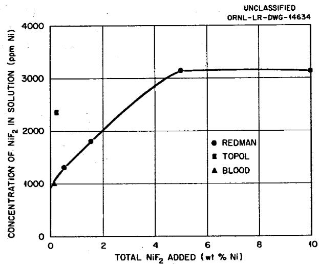  
Fig. 2.2.2. Comparison of Values of Solubility of $\mathsf{NiF}_2$ in NaF-ZrF $_4$ (53-47 mole %) at $600^{\circ}\mathsf{C}$ Obtained By Three Investigators.

compound is probably, though not necessarily, identical with the substance $\mathsf{NiF}_2\cdot \mathsf{ZrF}_4$ previously synthesized by Sturm.13

Thermodynamic calculations performed prior to the experimental work indicated that if $\mathsf{NiF}_2$ exhibited activity coefficients similar in magnitude to those previously determined for $\mathsf{FeF}_2$ , equilibration at $600^{\circ}\mathsf{C}$ with $\mathsf{H}_2$ -HF mixtures containing about $3\%$ HF would allow sufficient $\mathsf{NiF}_2$ to remain in solution for satisfactory analysis. Only traces of $\mathsf{NiF}_2$ ( $<10~\mathsf{ppm}$ ) were found after repeated and prolonged equilibration under these conditions and even after the reactor temperature had been reduced to $550^{\circ}\mathsf{C}$ and the $\mathsf{H}_2$ -HF equilibrating mixture had been changed to contain $30\%$ HF. Attempts to increase the $\mathsf{NiF}_2$ concentration in solution by simply raising the HF concentration of the equilibrating gas were unsuccessful beyond $\mathsf{NiF}_2$ concentrations of about $20~\mathsf{ppm}$ Ni.

Nickel fluoride concentrations of sufficient magnitude for an acceptable degree of precision in the analytical determinations were finally obtained by lowering the partial pressure of hydrogen, in addition to maintaining a high HF concentration in the equilibrating gas mixtures. This was accomplished by the use of hydrogen-helium mixtures rather than pure hydrogen. The mixtures were prepared by injecting helium gas into a partially empty hydrogen

cylinder. The compositions of the mixtures thus prepared were determined by the proper adaptation of the hydrogen combustion analysis technique to the existing experimental assembly. The experimental results are summarized in Table 2.2.6.

As is customary, equilibrium was approached from both directions in obtaining the series of measurements described. It is of interest to note that the calculated values of the equilibrium constants for the reaction range from 11 to 45 atm at $625^{\circ}C$ when the solid and the supercooled liquid, respectively, are used as standard states. The experimental values denote activity coefficients of $\mathsf{NiF}_2$ a thousand times greater than those obtained for $\mathsf{FeF}_2$ . Detailed numerical calculations

TABLE 2.2.6. EQUILIBRIUM CONSTANTS FOR THE REACTION $\mathsf{NIF}_2(d) + \mathsf{H}_2(g)\rightleftharpoons \mathsf{Ni}(s) + 2\mathsf{HF}(g)$ AT $625^{\circ}C$   

<table><tr><td>Nickel Content of Melt (ppm)</td><td>Hydrogen Pressure (atm)</td><td>HF Pressure (atm)</td><td>Kx* × 10-4</td></tr><tr><td>77</td><td>0.0628</td><td>0.502</td><td>3.06</td></tr><tr><td>75</td><td>0.0661</td><td>0.475</td><td>2.68</td></tr><tr><td>75</td><td>0.0640</td><td>0.492</td><td>2.96</td></tr><tr><td>75</td><td>0.0595</td><td>0.528</td><td>3.67</td></tr><tr><td>75</td><td>0.0617</td><td>0.510</td><td>3.30</td></tr><tr><td>85</td><td>0.0628</td><td>0.501</td><td>2.76</td></tr><tr><td>75</td><td>0.0640</td><td>0.493</td><td>2.97</td></tr><tr><td>75</td><td>0.0643</td><td>0.490</td><td>2.92</td></tr><tr><td>185</td><td>0.0251</td><td>0.466</td><td>2.74</td></tr><tr><td>165</td><td>0.0253</td><td>0.460</td><td>2.98</td></tr><tr><td>160</td><td>0.0255</td><td>0.457</td><td>3.00</td></tr><tr><td>150</td><td>0.0259</td><td>0.448</td><td>3.03</td></tr><tr><td>140</td><td>0.0260</td><td>0.447</td><td>3.22</td></tr><tr><td>120</td><td>0.0270</td><td>0.425</td><td>3.28</td></tr><tr><td>140</td><td>0.0270</td><td>0.425</td><td>2.81</td></tr><tr><td>125</td><td>0.0269</td><td>0.427</td><td>3.19</td></tr><tr><td>135</td><td>0.0274</td><td>0.416</td><td>2.74</td></tr><tr><td>125</td><td>0.0276</td><td>0.412</td><td>2.89</td></tr></table>

Av 3.01 ± 0.18   
$^{*}K_{x} = P_{HF}^{2} / X_{NIF_{2}}P_{H_{2}}$ where $X$ is mole fraction and $P$ is pressure in atmospheres.

of this reaction will be made at the conclusion of the experimental work.

Experimental work is now in progress at $575^{\circ}C$ . Efforts will be made to extend the $\mathrm{NiF}_2$ concentration ranges and to obtain the temperature dependence of the equilibrium. Particular attention will be given to the determination of the activity of $\mathrm{NiF}_2$ in the saturating phase.

# SOLUBILITY AND STABILITY OF STRUCTURAL METAL FLUORIDES IN MOLTEN NaF-ZrF4

J. D. Redman

The results of studies of the stability and solubility of $\mathsf{CrF}_2$ in NaF-ZrF4 (53-47 mole %) at $600^{\circ}\mathrm{C}$ were presented previously.14 From these experiments it was concluded that the solubility of $\mathsf{CrF}_2$ increased as the zirconium-to-chromium ratio decreased, and, accordingly, the solubility of $\mathsf{CrF}_2$ in this solvent was a function of the amount of $\mathsf{CrF}_2$ added. It was postulated that the change in solubility was due to the separation of $\mathsf{CrF}_2\cdot \mathsf{ZrF}_4$ as the solid phase, with a resultant increase in the NaF concentration in the melt. Some of these experiments have been rerun in order to obtain more precise values at the larger zirconium-to-chromium ratios, and the values thus obtained, along with some of the earlier ones, are given in Table 2.2.7.

14J. D. Redman, ANP Quar. Prog. Rep. Dec. 10, 1955, ORNL-2012, p 88.

Similar studies have been carried out on the solubility of $\mathsf{FeF}_2$ and $\mathsf{NiF}_2$ in this solvent, and the data are presented in Tables 2.2.8 and 2.2.9, respectively. The data for these three structural metal fluorides also are plotted on Fig. 2.2.3.

An examination of the data presented for $600^{\circ}C$ shows that the solubility of $\mathsf{CrF}_2$ increases quite rapidly as the zirconium-to-chromium ratio decreases over the entire range studied. A less pronounced effect is noted for $\mathsf{FeF}_2$ , and in the case of $\mathsf{NiF}_2$ a slight increase is observed for the higher zirconium-to-nickel ratios. At the lower zirconium-to-nickel ratios the solubility is constant. These differences in behavior are shown quite clearly in Fig. 2.2.3. It appears that the solid phases present for the $\mathsf{CrF}_2$ and $\mathsf{FeF}_2$ systems contain $\mathsf{ZrF}_4$ , probably as $\mathsf{MF}_2\cdot \mathsf{ZrF}_4$ , whereas the solid phase in the $\mathsf{NiF}_2$ system appears to tie up only very small amounts of $\mathsf{ZrF}_4$ . It may be noted that at $800^{\circ}C$ the solubility of $\mathsf{NiF}_2$ is independent of the zirconium-to-nickel ratio, which suggests that the solid phase present is $\mathsf{NiF}_2$ .

There is some question regarding the reliability of the data given in the zirconium-to-sodium ratio columns in the tables, but for $\mathrm{CrF}_2$ and for $\mathrm{FeF}_2$ at $600^{\circ}\mathrm{C}$ it is believed that the decrease in the ratio as the excess of metal fluoride added was increased is real. The ratio of zirconium to sodium is 0.88 in the starting material, and the considerably lower values found for the large additions of

TABLE 2.2.7. SOLUBILITY AND STABILITY OF ${\mathrm{{CrF}}}_{2}$ IN MOLTEN $\mathrm{{NaF}} - {\mathrm{{ZrF}}}_{4}$ (53-47 MOLE %) AT ${600}^{ \circ  }\mathrm{C}$   

<table><tr><td colspan="2">Conditions of Equilibration</td><td colspan="6">Found in Filtrate</td></tr><tr><td>Cr++ (wt %)</td><td>Zr-to-Cr Ratio*</td><td>Zr (wt %)</td><td>Na (wt %)</td><td>Zr-to-Na Ratio*</td><td>F (wt %)</td><td>Cr++ (wt %)</td><td>Total Cr (wt %)</td></tr><tr><td>1.4</td><td>17</td><td>41.5</td><td>13.3</td><td>0.79</td><td>45.3</td><td>0.66</td><td>0.73</td></tr><tr><td>1.4</td><td>17</td><td>41.3</td><td>13.4</td><td>0.78</td><td>44.8</td><td>0.65</td><td>0.83</td></tr><tr><td>4.0</td><td>5.8</td><td>39.8</td><td>12.7</td><td>0.79</td><td>45.1</td><td>2.1</td><td>1.9</td></tr><tr><td>4.0</td><td>5.8</td><td>39.5</td><td>12.9</td><td>0.78</td><td>45.2</td><td>2.0</td><td>1.9</td></tr><tr><td>6.4</td><td>3.4</td><td>38.4</td><td>13.6</td><td>0.71</td><td>44.8</td><td>3.5</td><td>3.5</td></tr><tr><td>6.4</td><td>3.4</td><td>38.9</td><td>14.1</td><td>0.70</td><td>44.3</td><td>3.4</td><td>3.6</td></tr><tr><td>9.6</td><td>2.1</td><td>37.9</td><td>13.8</td><td>0.69</td><td>44.0</td><td>5.0</td><td>5.2</td></tr><tr><td>9.6</td><td>2.1</td><td>36.3</td><td>13.4</td><td>0.68</td><td>44.2</td><td>5.7</td><td>5.9</td></tr></table>

*Ratio calculated from mole fractions.

TABLE 2.2.8. SOLUBILITY AND STABILITY OF ${\mathrm{{FeF}}}_{2}$ IN MOLTEN NaF-ZrF ${}_{4}$ (53-47 MOLE %) AT 600 AND ${800}^{ \circ  }\mathrm{C}$   

<table><tr><td colspan="3">Conditions of Equilibration</td><td colspan="6">Found in Filtrate</td></tr><tr><td>Temperature (°C)</td><td>Fe++ (wt %)</td><td>Zr-to-Fe Ratio*</td><td>Zr (wt %)</td><td>Na (wt %)</td><td>Zr-to-Na Ratio*</td><td>F (wt %)</td><td>Fe++ (wt %)</td><td>Total Fe (wt %)</td></tr><tr><td>600°</td><td>0.5</td><td>50</td><td>41.5</td><td>13.7</td><td>0.78</td><td>45.7</td><td>0.26</td><td>0.26</td></tr><tr><td></td><td>0.5</td><td>50</td><td>41.9</td><td>12.9</td><td>0.82</td><td>45.3</td><td>0.25</td><td>0.26</td></tr><tr><td></td><td>1.0</td><td>25</td><td>41.6</td><td>13.8</td><td>0.78</td><td>45.2</td><td>0.33</td><td>0.32</td></tr><tr><td></td><td>1.0</td><td>25</td><td>41.6</td><td>13.6</td><td>0.78</td><td>45.0</td><td>0.35</td><td>0.35</td></tr><tr><td></td><td>5.0</td><td>4.8</td><td>40.3</td><td>13.5</td><td>0.76</td><td>44.3</td><td>1.3</td><td>1.4</td></tr><tr><td></td><td>5.0</td><td>4.8</td><td>39.8</td><td>13.8</td><td>0.73</td><td>44.4</td><td>1.4</td><td>1.5</td></tr><tr><td></td><td>10.0</td><td>2.1</td><td>37.9</td><td>14.0</td><td>0.69</td><td>45.0</td><td>2.9</td><td>3.1</td></tr><tr><td></td><td>10.0</td><td>2.1</td><td>37.5</td><td>13.7</td><td>0.70</td><td>44.6</td><td>3.5</td><td>3.5</td></tr><tr><td>800</td><td>6.0</td><td>3.9</td><td>38.9</td><td>10.8</td><td>0.91</td><td>45.2</td><td>6.1</td><td>6.0</td></tr><tr><td></td><td>6.0</td><td>3.9</td><td>38.5</td><td>10.6</td><td>0.91</td><td>44.1</td><td>4.8</td><td>5.8</td></tr><tr><td></td><td>12.0</td><td>1.7</td><td>34.7</td><td>10.0</td><td>0.88</td><td>43.7</td><td>10.7</td><td>11.7</td></tr><tr><td></td><td>12.0</td><td>1.7</td><td>34.5</td><td>9.4</td><td>0.93</td><td>44.7</td><td>11.3</td><td>11.9</td></tr><tr><td></td><td>18.0</td><td>1.0</td><td>32.2</td><td>8.8</td><td>0.93</td><td>44.1</td><td>14.1</td><td>14.2</td></tr><tr><td></td><td>18.0</td><td>1.0</td><td>32.1</td><td>9.2</td><td>0.88</td><td>44.0</td><td>12.8</td><td>14.0</td></tr></table>

*Ratio calculated from mole fractions.

TABLE 2.2.9. SOLUBILITY OF NiF ${}_{2}$ IN MOLTEN ${\mathrm{{NaF}}}_{2}{\mathrm{\;F}}_{4}$ (53-47 MOLE %) AT 600 AND ${800}^{ \circ  }\mathrm{C}$   

<table><tr><td colspan="3">Conditions of Equilibration</td><td colspan="5">Found in Filtrate</td></tr><tr><td>Temperature (°C)</td><td>Ni (wt %)</td><td>Zr-to-Ni Ratio*</td><td>Zr (wt %)</td><td>Na (wt %)</td><td>Zr-to-Na Ratio*</td><td>F (wt %)</td><td>Ni (wt %)</td></tr><tr><td rowspan="8">600</td><td>0.5</td><td>48</td><td>41.2</td><td>13.0</td><td>0.80</td><td>45.2</td><td>0.14</td></tr><tr><td>0.5</td><td>48</td><td>41.8</td><td>13.6</td><td>0.78</td><td>45.1</td><td>0.12</td></tr><tr><td>1.5</td><td>18</td><td>41.4</td><td>12.8</td><td>0.82</td><td>45.5</td><td>0.17</td></tr><tr><td>1.5</td><td>18</td><td>41.4</td><td>12.5</td><td>0.84</td><td>45.0</td><td>0.19</td></tr><tr><td>5.0</td><td>5.2</td><td>40.4</td><td>14.1</td><td>0.73</td><td>45.3</td><td>0.32</td></tr><tr><td>5.0</td><td>5.2</td><td>39.8</td><td>14.0</td><td>0.72</td><td>44.7</td><td>0.31</td></tr><tr><td>10</td><td>2.4</td><td>40.0</td><td>14.0</td><td>0.73</td><td>45.1</td><td>0.32</td></tr><tr><td>10</td><td>2.4</td><td>40.8</td><td>12.8</td><td>0.81</td><td>45.3</td><td>0.31</td></tr><tr><td rowspan="6">800</td><td>1.5</td><td>18</td><td>41.6</td><td>12.0</td><td>0.88</td><td>45.2</td><td>1.0</td></tr><tr><td>1.5</td><td>18</td><td>41.5</td><td>12.1</td><td>0.87</td><td>45.3</td><td>1.1</td></tr><tr><td>5.0</td><td>5.2</td><td>41.6</td><td>12.3</td><td>0.87</td><td>45.6</td><td>1.2</td></tr><tr><td>5.0</td><td>5.2</td><td>41.8</td><td>11.8</td><td>0.89</td><td>45.4</td><td>1.3</td></tr><tr><td>10</td><td>2.4</td><td>41.7</td><td>12.6</td><td>0.84</td><td>44.6</td><td>1.0</td></tr><tr><td>10</td><td>2.4</td><td>41.3</td><td>12.2</td><td>0.87</td><td>44.7</td><td>1.3</td></tr></table>

\*Ratio calculated from mole fractions.

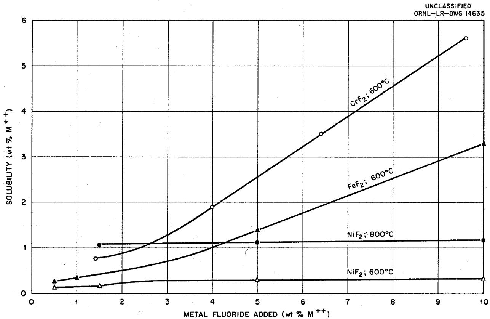  
Fig. 2.2.3. Effect of Amount of Metal Fluoride Added on Solubility of $\mathsf{NiF}_2$ , $\mathsf{FeF}_2$ , and $\mathsf{CrF}_2$ in NaF-ZrF₄ (53-47 mole %) at $600^{\circ}\mathsf{C}$ .

metal fluoride are additional evidence for the belief that $\mathsf{ZrF}_4$ is combined with the metal fluoride in the solid phase.

mole $\%$ were continued through the use of the concentration cells discussed previously.15 Cells of the type

$$
M \left| M F _ {2} \cdot x Z r F _ {4} \left(c _ {1}\right), N a F \cdot Z r F _ {4} \right| \left| N a F - Z r F _ {4}, M F _ {2} \cdot x Z r F _ {4} \left(c _ {2}\right) \right| M,
$$

A comparison of values given for $\mathsf{Fe}^{+ + }$ and total iron shows that $\mathsf{Fe}^{+ + }$ is stable under these conditions. The slight deviations noted are attributable to experimental errors. The agreement between $\mathsf{Cr}^{+ + }$ and total chromium is not so satisfactory, but it is evident that more than $90\%$ of the chromium is present as $\mathsf{Cr}^{+ + }$ . Since the starting material does not contain over $95\%$ of the chromium as $\mathsf{Cr}^{+ + }$ , it is evident that no appreciable disproportionation of $\mathsf{CrF}_2$ occurs under the conditions employed.

# SOLUBILITY DETERMINATIONS BY MEASUREMENT OF ELECTROMOTIVE FORCES OF CONCENTRATION CELLS

L. E. Topol

Solubility studies of structural metal fluorides and their complexes in molten NaF-ZrF4 (53-47)

where $M$ was Fe, Ni, or Cr, and $x = 0$ or 1, were measured at 525 to $750^{\circ}C$ in a helium atmosphere. The containers were alumina, platinum, or the metal $M$ when $M$ was iron and nickel; a $ZrO_2$ bridge impregnated with NaF-ZrF $_4$ (53-47 mole %) served as the electrical contact between the two half cells. When the electromotive force was measured as a function of temperature, the saturation points were apparent from the points of discontinuity in the plot of voltage vs temperature.

In the cell assembly employed it was not feasible to measure the temperature of either of the half cells directly. The temperature recorded by a thermocouple placed in a well that was permanently

fixed midway between the two half cells was formerly used as the cell temperature. In order to refine the temperature measurements, a calibrated thermocouple, enclosed in a nickel tube, was substituted for an electrode in a dummy cell. In the temperature range of interest (550 to $750^{\circ}\mathrm{C}$ ) the melt temperatures found were $10 \pm 2^{\circ}\mathrm{C}$ higher than the melt temperatures at the center between the two crucibles. Thus all the temperatures reported in connection with previous potential measurements should be revised upward by $10^{\circ}\mathrm{C}$ . Only the solubility data are sufficiently temperature sensitive to be appreciably affected.

Application of the temperature correction to the solubility data previously reported[15] gave the following new expressions for the solubility of $MF_{2} \cdot ZrF_{4}$ in NaF-ZrF $_{4}$ (53-47 mole %):

$$
\log N = - \frac {3 6 . 0 \times 1 0 ^ {3}}{4 . 5 7 6 T} + 6. 8 7, \quad \text {f o r F e F} _ {2} \cdot Z r F _ {4},
$$

$$
\log N = - \frac {4 0 . 1 \times 1 0 ^ {3}}{4 . 5 7 6 T} + 8. 3 6, \quad \text {f o r C r F} _ {2} \cdot Z r F _ {4},
$$

$$
\log N = - \frac {2 8 . 8 \times 1 0 ^ {3}}{4 . 5 7 6 T} + 4. 7 2, \text {f o r N i F} _ {2} \cdot Z _ {r} F _ {4}, ^ {1 6}
$$

where $N$ is the mole fraction of $\mathsf{MF}_2\cdot \mathsf{ZrF}_4$ and $T$ is temperature in ${}^{\circ}\mathsf{K}$ . The corrected heats of solution and "ideal" melting points are now 36.0, 40.1, and 28.8 kcal/mole $\mathsf{MF}_2\cdot \mathsf{ZrF}_4$ and 875, 775, and $1060^{\circ}\mathsf{C}$ for the Fe, Cr, and Ni compounds, respectively. Solubility data obtained by analyses of filtrates from saturated solutions, as described in the preceding sections of this chapter ("Equilibrium Reduction of $\mathsf{NiF}_2$ by $\mathsf{H}_2$ in NaF-ZrF and "Solubility and Stability of Structural Metal Fluorides in Molten NaF-ZrF"), did not agree with the electrometrically determined solubilities, particularly in the case of $\mathsf{NiF}_2$ . Since the filtration measurements were carried out by adding $\mathsf{NiF}_2$ rather than $\mathsf{NiF}_2\cdot \mathsf{ZrF}_4$ as solute (and similarly with $\mathsf{FeF}_2$ and $\mathsf{CrF}_2$ ), the electrometric determinations were repeated with $\mathsf{NiF}_2$ as solute so that the data could

be compared. X-ray and petrographic examinations of the solidified melt from the half cells should have sufficed to identify either or both of the joins as quasi-binary; in practice, however, both $\mathrm{NiF}_2\cdot \mathrm{ZrF}_4$ and a new phase were found in the slowly cooled half cells. The new phase is thought to be a ternary compound, since it has never been found in the binary systems.

Gradient quenches (510 to $540^{\circ}C$ ) along the two joins revealed only the new phase, with no $\mathsf{NiF}_2\cdot \mathsf{ZrF}_4$ . Such ambiguous results were disappointing, since on a quasi-binary join the solubility does not vary with the amount of solute added, as it does along a random join.

Cells containing $MF_{2}$ in $\mathsf{NaF - ZrF_4}$ (53-47 mole $\%$ ), with no addition of $\mathsf{ZrF}_{4^{\prime}}$ gave the solubilities of the structural metal salts shown in Table 2.2.10 and Fig. 2.2.4 for $\mathsf{NiF}_2$ and Table 2.2.11 for $\mathsf{FeF}_2$ . The solubilities of the nickel salts along the joins $\mathsf{NiF}_2\cdot \mathsf{ZrF}_4\cdot 7\mathsf{NaF}\cdot 6\mathsf{ZrF}_4$ and $\mathsf{NiF}_2\cdot 7\mathsf{NaF}\cdot 6\mathsf{ZrF}_4$ , as well as the values for $\mathsf{NiF}_2$ obtained by filtration methods, are plotted in Fig. 2.2.4. The discrepancy between the results of the various experiments has not been explained. The electrometrically determined solubilities appear to be virtually the same whether the solute is added as $\mathsf{NiF}_2$ or as $\mathsf{NiF}_2\cdot \mathsf{ZrF}_4$ , and the same seems to be true for

$$
\Delta H _ {\text {s o l n}} = 2 8. 8 \mathrm {k c a l}
$$

$$
\text {I d e a l} = 1 0 6 0 ^ {\circ} \mathrm {C}
$$

TABLE 2.2.10. SOLUBILITY OF ${\mathrm{{NiF}}}_{2}$ IN NaF-ZrF ${}_{4}$ (53-47 MOLE %)   

<table><tr><td rowspan="2">Temperature (°C)</td><td colspan="2">NiF2Solubility</td></tr><tr><td>wt %</td><td>mole %</td></tr><tr><td>553</td><td>0.12</td><td>0.12</td></tr><tr><td>564</td><td>0.14</td><td>0.15</td></tr><tr><td>574</td><td>0.19</td><td>0.20</td></tr><tr><td>576</td><td>0.20</td><td>0.21</td></tr><tr><td>650</td><td>0.79</td><td>0.83</td></tr><tr><td>650</td><td>0.93</td><td>0.97</td></tr><tr><td>655</td><td>0.88</td><td>0.92</td></tr><tr><td>669</td><td>0.98</td><td>1.01</td></tr><tr><td>706</td><td>1.97</td><td>2.05</td></tr><tr><td>725</td><td>2.19</td><td>2.29</td></tr></table>

$\mathsf{FeF}_2$ The $\mathsf{FeF}_2$ saturation points were not so well defined or reproducible, however, as those for $\mathsf{FeF}_2\cdot \mathsf{ZrF}_4$ especially at temperatures above $650^{\circ}\mathsf{C}$ . The potentials of many of the cells fluctuated greatly and were much lower than the values predicted from the Nernst equation (where complete

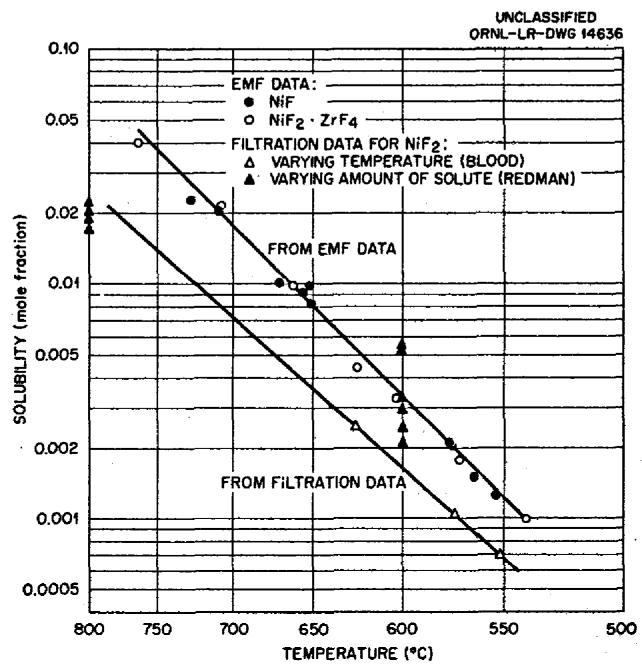  
Fig. 2.2.4. Solubility of $\mathsf{NiF}_2$ and $\mathsf{NiF}_2\cdot \mathsf{ZrF}$ in NaF-ZrF4 (53-47 mole %).

TABLE 2.2.11. TENTATIVE VALUES FOR THE SOLUBILITY OF ${\mathrm{{FeF}}}_{2}$ IN NaF-ZrF ${}_{4}$ (53-47 MOLE %)   

<table><tr><td rowspan="2">Temperature (°C)</td><td colspan="2">FeF2Solubility</td></tr><tr><td>wt %</td><td>mole %</td></tr><tr><td>535</td><td>0.13</td><td>0.14</td></tr><tr><td>561</td><td>0.25</td><td>0.27</td></tr><tr><td>565</td><td>0.31</td><td>0.34</td></tr><tr><td>608</td><td>0.72</td><td>0.78</td></tr><tr><td>630</td><td>1.08</td><td>1.16</td></tr><tr><td>630</td><td>1.10</td><td>1.18</td></tr><tr><td>645</td><td>1.45</td><td>1.56</td></tr><tr><td>656</td><td>2.44</td><td>2.63</td></tr><tr><td>665</td><td>3.23</td><td>3.47</td></tr><tr><td>710</td><td>7.22</td><td>7.75</td></tr><tr><td>742</td><td>9.91</td><td>10.59</td></tr></table>

solution in both half cells was expected). X-ray and petrographic examinations revealed a better-defined ternary complex in low-temperature $(535^{\circ}C)$ quenches of $\mathsf{FeF}_2$ melts than in high-temperature $(672^{\circ}C)$ quenches; the $\mathsf{FeF}_2$ ternary complex gives the same x-ray pattern as that given by the $\mathsf{NiF}_2$ ternary complex.

# FREE ENERGIES OF FORMATION OF COMPLEX METAL FLUORIDES $M F_{2} \cdot Z r F_{4}$ L. E. Topol

For a saturated solution of $MF_{2} \cdot ZrF_{4}$ in a molten electrolyte, the following equilibrium holds:

$$
\begin{array}{l} M F _ {2} \cdot Z r F _ {4 (c r y s t)} \rightleftharpoons M F _ {2 (s o l n)} \\ + \operatorname {Z r F} _ {4 (\text {s o l n})}, \quad \Delta F = 0. \\ \end{array}
$$

In NaF $\cdot$ ZrF $_4$ (53-47 mole %) as the solvent, the activities of $MF_{2(\text{soln})}$ and $ZrF_{4(\text{soln})}$ are known, at least approximately, in a few cases, and, since the activity of solid $MF_{2}\cdot ZrF_{4}$ is unity, the free energy of formation of $MF_{2}\cdot ZrF_{4}$ is the only unknown in the following relations as applied to the saturation equilibrium:

$$
\begin{array}{l} \Delta F = 0 = \Delta F ^ {\circ} + R T \ln \frac {a _ {M F _ {2}} a _ {Z r F _ {4}}}{a _ {M F _ {2}} a _ {Z r F _ {4}}} \\ = \Delta F _ {M F _ {2}} ^ {o} + \Delta F _ {Z r F _ {4}} ^ {o} - \Delta F _ {M F _ {2} \cdot Z r F _ {4}} ^ {o} \\ + 2. 3 R T \log \gamma_ {M F _ {2}} N _ {M F _ {2}} a Z _ {r} F _ {4}, \\ \end{array}
$$

where $N$ is mole fraction and $a$ and $\gamma$ are, respectively, the activity and the activity coefficient based on the pure solid as the standard state. The free energy of complexing of $\mathsf{MF}_2\cdot \mathsf{ZrF}_4$ from solid $\mathsf{MF}_2$ and solid $\mathsf{ZrF}_4$ is

$$
\begin{array}{l} \Delta F _ {\text {c o m p}} \simeq \Delta F _ {M F _ {2} \cdot Z r F _ {4}} ^ {\circ} - \Delta F _ {M F _ {2}} ^ {\circ} - \Delta F _ {Z r F _ {4}} ^ {\circ} \\ = 2. 3 R T \log \gamma_ {M F _ {2}} N _ {M F _ {2}} a _ {Z r} F _ {4}. \\ \end{array}
$$

Hence a knowledge of the activity of the dissolved $MF_{2}$ and $\mathsf{ZrF}_4$ suffices to yield the free energy of complexing, $\Delta F_{comp}$ ; this quantity has been calculated for the proposed family of complexes $\mathsf{CrF}_2\cdot \mathsf{ZrF}_{4'}$ , $\mathsf{FeF}_2\cdot \mathsf{ZrF}_{4'}$ , and $\mathsf{NiF}_2\cdot \mathsf{ZrF}_{4'}$ as shown in Table 2.2.12. Since for $\mathsf{NiF}_2\cdot \mathsf{ZrF}_{4'}\Delta F_{comp}$ is positive, there is additional evidence that this

TABLE 2.2.12. FREE ENERGY OF FORMATION OF $M{F}_{2} \cdot  {Zr}{F}_{4}$   

<table><tr><td>MF2·ZrF4</td><td>Temperature (°C)</td><td>Saturation Solubility, N (mole fraction)</td><td>Activity Coefficient, γ</td><td>Free Energy of Complexing, ΔFcomp (kcal/mole)</td><td>Free Energy of Formation, ΔF0 (kcal/mole)</td></tr><tr><td rowspan="2">FeF2·ZrF4</td><td>600</td><td>0.0071</td><td>3.28</td><td>-8.8</td><td>-530</td></tr><tr><td>700</td><td>0.0550</td><td>2.20</td><td>-8.3</td><td>-520</td></tr><tr><td rowspan="2">NiF2·ZrF4</td><td>600</td><td>0.00331</td><td>1900</td><td>+0.9</td><td>-510</td></tr><tr><td>700</td><td>0.0180</td><td>1100</td><td>+1.6</td><td>-500</td></tr><tr><td rowspan="2">CrF2·ZrF4</td><td>600</td><td>0.0210</td><td>1.15</td><td>-8.8</td><td>-545</td></tr><tr><td>700</td><td>0.183</td><td>0.87</td><td>-7.8</td><td>-535</td></tr></table>

solid complex is not stable with respect to solid $\mathsf{NiF}_2$ and $\mathsf{ZrF}_4$ .

The activities of $MF_{2}$ in the saturated solution were obtained by combining solubility and activity coefficient measurements. Henry's law is expected to hold quite well for dilute solutions in molten electrolytes because the environment of a solute ion is not significantly influenced by the presence of other solute ions unless appreciable concentrations are present. This has been demonstrated for $\mathsf{FeF}_2$ in NaF-ZrF4 (53-47 mole %) over a range of concentrations from 0.03 to 0.06 mole % by measurements of the activity coefficient based on equilibrium studies at 600 to $800^{\circ}C$ . The values of the activity coefficients for $\mathsf{FeF}_2$ ( $\gamma$ at $600^{\circ}C$ is 3.28; $\gamma$ at $700^{\circ}C$ is 2.20) were combined with electrometrically determined activity coefficient ratios from bimetallic couples to give the activity coefficients of $\mathsf{CrF}_2$ and $\mathsf{NiF}_2$ shown in Table 2.2.12. Previously published measurements showing a twofold change in $\gamma_{\mathsf{FeF}_2}$ with concentration in the range 0.06 to 1.5 mole % $\mathsf{FeF}_2$ are tentatively regarded as in need of reinterpretation.

The saturation concentrations listed in Table 2.2.12 were obtained from the equations presented in the preceding section on "Solubility Determinations by Measurement of Electromotive Forces of Concentration Cells."

The activities of $\mathsf{ZrF}_4$ were computed from vapor pressures by using the expression

$$
a _ {Z r F _ {4}} = \frac {p}{p _ {0}},
$$

where $p$ is the vapor pressure of $\mathsf{ZrF}_4$ in NaF-ZrF $_4$ (53-47 mole %) and $p_0$ is the vapor pressure of solid $\mathsf{ZrF}_4$ . Since

$$
\log p = 9. 2 4 3 - \frac {9 . 2 5 2 \times 1 0 ^ {3}}{T}
$$

and

$$
\log p _ {0} = 1 3. 4 0 0 - \frac {1 2 . 3 7 6 \times 1 0 ^ {3}}{T},
$$

$$
\log \frac {p}{p _ {0}} = - 4. 1 5 7 + \frac {3 . 1 2 4 \times 1 0 ^ {3}}{T},
$$

where $T$ is temperature in ${}^{\circ}\mathsf{K}_{\parallel}$ which gives

$$
\begin{array}{l} \log \frac {p}{p _ {0}} = - 0. 5 7 8 a t 6 0 0 ^ {\circ} C, \\ = - 0. 9 4 5 \text {a t} 7 0 0 ^ {\circ} \mathrm {C}. \\ \end{array}
$$

The equation for $p_0$ was obtained from the work of Sense et al. The activity of $\mathsf{ZrF}_4$ in the saturated solution was assumed to be the same as the activity in the pure solvent $\mathsf{NaF - ZrF}_4$ (53-47 mole%). This assumption is probably valid in all cases except that of $\mathsf{CrF}_2$ at $700^{\circ}\mathsf{C}$ ; here the solution is too concentrated for much reliance to be placed on the calculation. If the saturating phase were simple $\mathsf{NiF}_2$ in the $\mathsf{NiF}_2$ experiments, then

$a_{\mathsf{NIF}_2} = \gamma N$ should be unity (a pure solid has unit activity). The apparent activity is 9 at $600^{\circ}\mathsf{C}$ and 20 at $700^{\circ}\mathsf{C}$ , however, which indicates that the saturating phase is something less soluble than $\mathsf{NiF}_2$ . The discrepancy amounts to a factor of 10 in the activity coefficient or the solubility and to about 5 kcal/mole in the value of $\Delta F_{\mathsf{NIF}_2}^{\circ}$ . In computing the $\Delta F^{\circ}$ for the formation of the complex compound from the elements, the free energy estimates given in Table 2.2.13 were employed.[20]

An independent check on the differences in the standard free energies of formation of the $MF_{2} \cdot ZrF_{4}$ complex from the elements is afforded by previously published data obtained for bimetallic couples in saturated half cells.[21] To a first approximation, the cell reaction was

$$
M + M ^ {\prime} F _ {2} \cdot Z r F _ {4} = M F _ {2} \cdot Z r F _ {4} + M ^ {\prime}.
$$

This reaction neglects transport and junction potentials, which are small if the saturated solutions are sufficiently dilute. From the relation

$$
E n ^ {3} = - \Delta F
$$

TABLE 2.2.13. SELECTED VALUES OF FREE ENERGY OF FORMATION   

<table><tr><td></td><td colspan="2">ΔF° (kcal/mole)</td></tr><tr><td></td><td>At 600°C</td><td>At 700°C</td></tr><tr><td>FeF2</td><td>-137.5</td><td>-133.9</td></tr><tr><td>CrF2</td><td>-152.5</td><td>-148.9</td></tr><tr><td>NiF2</td><td>-127.9</td><td>-124.8</td></tr><tr><td>ZrF4</td><td>-383.4</td><td>-376.8</td></tr></table>

for the cell reaction, where $E$ is the electromotive force, $n$ is the number of equivalents transferred, and $\mathfrak{H}$ is the number of Faradays passed, an approximate value of the difference in the free energy of formation from the elements is found. The comparison is shown in Table 2.2.14.

The values of $\Delta F_{\text{calc}}$ in Table 2.2.14 were obtained by subtracting the values of $\Delta F^{\circ}$ given for these complexes in the last column of Table 2.2.12. While the agreement is good, the effect of the high solubility of $\mathsf{CrF}_2$ at $700^{\circ}\mathsf{C}$ is probably responsible for the larger of the discrepancies.

TABLE 2.2.14. COMPARISON OF FREE ENERGIES OF FORMATION OF ${\mathrm{{MF}}}_{2} \cdot  {\mathrm{{ZrF}}}_{4}$ OBTAINED BY TWO METHODS   

<table><tr><td></td><td colspan="2">Difference Between ΔF M F2Zr F4 and ΔF M&#x27; F2Zr F4 (kcal/mole)</td></tr><tr><td></td><td>At 600°C</td><td>At 700°C</td></tr><tr><td>FeF2·ZrF4·CrF2·ZrF4</td><td>15.5</td><td>16.8</td></tr><tr><td>-En</td><td>15</td><td>15</td></tr><tr><td>ΔF calc</td><td>-19.5</td><td>-20.0</td></tr><tr><td>FeF2·ZrF4·NiF2·ZrF4</td><td>-20</td><td>-20</td></tr><tr><td>-En</td><td>-35.1</td><td>-36.3</td></tr><tr><td>ΔF calc</td><td>-35</td><td>-35</td></tr></table>

PREPARATION OF SOLUTIONS OF $\mathsf{LaF}_3$ $B a F_{2},$ AND RbF IN NaF-ZrF4-UF4 F.L.Daley W.T.Ward

A special preparation containing $\mathsf{LaF}_3\mathsf{-BaF}_2\mathsf{-RbF}$ (2.8-1.0-1.1 mole %) dissolved in a standard NaF $\mathsf{ZrF}_4\mathsf{-UF}_4$ (50-46-4 mole %) mixture was requested for use in determining whether the introduction of the simulated fission products would produce significant viscosity changes. The usual methods of purification and filtration were used, and the equipment was modified so that small filtered samples could be dispensed directly into the tubes used for the viscosity measurements. The resulting preparation was studied to obtain some indication of the solubilities of the fission products at $800^{\circ}C$ in this solvent. It is believed that the solubility of $\mathsf{LaF}_3$ may be typical of the solubilities of the rare-earth fluorides, since $\mathsf{LaF}_3$ presumably forms solid solutions with other rare-earth fluorides.

Two filtered samples of the NaF-ZrF $_4$ -UF $_4$ mixture without the additive were obtained, and two more samples were obtained after the fission-product mixture was added. A small portion of solution which remained unfiltered in the reactor after withdrawal of all the samples was also recovered for analysis. All filtrations were performed

at approximately $800 \pm 10^{\circ} \mathrm{C}$ . During the course of the viscosity measurements, the presence of a finely divided solid material was detected in the molten mixture, and a small sample of the solid was obtained by decantation. The solid was tentatively identified by x-ray diffraction analysis as free $\mathsf{LaF}_3$ , with occluded solvent. The results of chemical analyses of all the samples taken are presented in Table 2.2.15.

The results indicate no greater concentration of additives in the unfiltered portion (reactor heel) than in the filtered samples, and consequently it appears that the additives were completely dissolved at $800^{\circ}\mathrm{C}$ . From visual observations, however, the solution seemed to be essentially saturated at this temperature. The saturating phase appeared to be free $\mathsf{LaF}_3$ , and the probable solubility value for this compound at $800^{\circ}\mathrm{C}$ seems to be about 2.5 wt%. During the preparation of this material no particular effort was made to control the filtration temperature at exactly $800^{\circ}\mathrm{C}$ , and visual observations could not be made conveniently enough to fix a liquidus temperature; however, the order of magnitude of the solubility of $\mathsf{LaF}_3$ in $\mathsf{NaF - ZrF}_4\mathsf{-UF}_4$ (50-46-4 mole %) appears to be about 2 mole % at $800^{\circ}\mathrm{C}$ .

TABLE 2.2.15. CHEMICAL COMPOSITION OF NaF-ZrF4-UF4 SAMPLES BEFORE AND AFTER INTRODUCTION OF LaF3-BaF2-RbF TO SIMULATE FISSION PRODUCTS   
Filtration temperature, $800^{\circ}\mathrm{C}$   

<table><tr><td rowspan="2"></td><td colspan="7">Major Constituents (wt %)</td><td colspan="3">Impurities (ppm)</td></tr><tr><td>Na</td><td>Zr</td><td>U</td><td>Ba</td><td>La</td><td>Rb</td><td>F</td><td>Ni</td><td>Cr</td><td>Fe</td></tr><tr><td>NaF-ZrF4-UF4Sample 1</td><td>10.7</td><td>38.8</td><td>8.8</td><td>0</td><td>0</td><td>0</td><td>41.9</td><td>90</td><td>50</td><td>65</td></tr><tr><td>Sample 2</td><td>10.3</td><td>38.8</td><td>8.7</td><td>0</td><td>0</td><td>0</td><td>42.5</td><td>35</td><td>40</td><td>45</td></tr><tr><td>Theoretical</td><td>10.41</td><td>37.98</td><td>8.62</td><td>0</td><td>0</td><td>0</td><td>42.99</td><td></td><td></td><td></td></tr><tr><td>NaF-ZrF4-UF4plus\( \text{LoF}_{3}-\text{BaF}_{2}-\text{RbF} \)Sample 3</td><td>9.2</td><td>35.7</td><td>8.0</td><td>1.23</td><td>2.62</td><td>0.86</td><td>41.7</td><td>80</td><td>50</td><td>90</td></tr><tr><td>Sample 4</td><td>9.5</td><td>34.6</td><td>7.7</td><td>1.16</td><td>2.56</td><td>1.00</td><td>41.8</td><td>100</td><td>65</td><td>160</td></tr><tr><td>Reactor heel</td><td>8.9</td><td>37.8</td><td>8.2</td><td>1.18</td><td>2.31</td><td>0.87</td><td>41.2</td><td>25</td><td>65</td><td>150</td></tr><tr><td>Theoretical</td><td>9.64</td><td>35.17</td><td>7.98</td><td>1.25</td><td>3.40</td><td>0.82</td><td>41.74</td><td></td><td></td><td></td></tr><tr><td>Solid detected duringviscosity measurements</td><td></td><td>18.1</td><td></td><td>0.62</td><td>26.6</td><td></td><td></td><td></td><td></td><td></td></tr></table>

Although it appears that the solubilities of the rare earth fluorides in the NaF-ZrF $_4$ -UF $_4$ mixture are sufficiently high to prevent precipitation upon their formation as fission products during ART operation, some studies of solubility of individual rare earths and rare-earth mixtures are currently under way. One possible development from such a study might be the demonstration of a simple means for removal of the rare-earth fluorides from the fuel mixture if the magnitudes and temperature dependences of the solubilities are adequate.

# PRELIMINARY SOLUBILITY VALUES OF CeF3 IN NaF-ZrF4-UF4 C.M.Blood

As a start of a systematic determination of solubilities of the rare-earth fluorides in ART-type fuels, such as NaF-ZrF4-UF4 (55-40-5 mole %), one experiment was performed to determine the approximate solubility of CeF3 in a typical solvent. A previously purified mixture of the NaF-ZrF4-UF4 solvent and approximately 2.5 mole % CeF3 were enclosed in a nickel container and heated to 850°C. The mixture was continuously stirred by bubbling hydrogen and helium, alternately, through a dip leg. Two hours prior to filtration, the temperature of the solution was lowered to 800°C. Samples of liquid were then withdrawn through a nickel filter tube at 800, 700, and 600°C. A second set of filtrates was obtained in the same manner at 700 and at 600°C after the mixture had been given an additional hydrofluorination and hydrogenation treatment. The results are summarized in Table 2.2.16.

Since the $\mathsf{CeF}_3$ used in these experiments was not especially pure and certain difficulties were

TABLE 2.2.16. APPROXIMATE SOLUBILITY OF ${\mathrm{{CeF}}}_{3}$ IN NaF-ZrF ${}_{4}$ -UF ${}_{4}$ (55-40-5 MOLE %)   

<table><tr><td rowspan="2">Temperature (°C)</td><td colspan="2">CeF3Solubility</td></tr><tr><td>Wt % Ce</td><td>Mole % Ce</td></tr><tr><td>800</td><td>1.62</td><td>1.2</td></tr><tr><td rowspan="2">700</td><td>0.79</td><td>0.6</td></tr><tr><td>0.82</td><td></td></tr><tr><td rowspan="2">600</td><td>0.65</td><td>0.5</td></tr><tr><td>0.59</td><td></td></tr></table>

apparent in analysis of the filtrates obtained, these data should be considered as preliminary. It is anticipated that more reliable values will be available within the next quarter.

# CONCENTRATION CELLS AND TRANSFERENCE NUMBERS IN FUSED SALTS

R. F. Newton

It is well known that transference numbers are needed for correlating the electromotive forces of concentration cells with activities or other thermodynamic properties of the solutions involved. While measurements have been and are being made of the transfer of ions of fused salts across porous diaphragms, some investigators doubt that these data can be properly interpreted as the "true" transference numbers of the ions, since the diaphragm itself may cause a flow of salt across the boundary. It is of interest to note, however, that relative transference numbers, which are the values of thermodynamic interest, can be measured in an ordinary Hittorf experiment.

It is well known that the transport of water as part of a hydrated ion in aqueous systems cannot be determined without some rather questionable assumptions, but standard transference numbers of aqueous ions are given relative to the water. For example, in a mixture of two salts, such as AgCl and NaCl, the transference number of $\mathsf{Ag}^+$ may be defined relative to the NaCl. The fictions of the ideal transference numbers, $t_{\mathrm{Na}}'$ , $t_{\mathrm{Ag}}'$ , and $t_{\mathrm{Cl}}'$ are useful in this analysis. In an ordinary Hittorf transference experiment in which silver electrodes are used and the mixture of salts contains $m$ moles of AgCl per mole of NaCl, $N$ faradays of electricity are passed, and the "idealized" anode compartment gains $N$ moles of $\mathsf{Ag}^+$ by electrode reaction and $Nt_{\mathrm{Cl}}'$ moles of $\mathsf{Cl}^-$ by transfer and loses $Nt_{\mathrm{Na}}'$ moles of $\mathsf{Na}^+$ and $Nt_{\mathrm{Ag}}'$ moles of Ag by transfer. This may be summarized as a gain of $N$ moles of AgCl by electrode reaction and a loss of $Nt_{\mathrm{Ag}}'$ moles of AgCl and of $Nt_{\mathrm{Na}}'$ moles of NaCl by transfer. The best that can be done experimentally, however, is to compare the AgCl in a given quantity of NaCl at the end with that in the same amount of NaCl at the start. If, for example, the anode portion taken for analysis at the end of the experiment contains one mole of NaCl, and the "idealized" anode compartment has lost $Nt_{\mathrm{Na}}'$ moles of NaCl, this represents $1 + Nt_{\mathrm{Na}}'$ moles of NaCl at the start. The AgCl at the start was $m + mNt_{\mathrm{Na}}'$ and

the AgCl at the end was

$$
N + m + m N t _ {N a} ^ {\prime} - N t _ {A g} ^ {\prime}, \tag {1}
$$

where $m$ is the AgCl in one mole at the start and $N$ is the AgCl from the electrode reaction. If $m$ and $N$ are subtracted from expression 1 and the remainder is divided by $N$ , the relative transference of $\mathrm{Ag}^+$ is seen to be

$$
t _ {A g} ^ {\prime} = t _ {A g} ^ {\prime} - m t _ {N a} ^ {\prime}. \tag {2}
$$

By a similar argument it may be seen that

$$
t _ {\mathrm {C} 1} ^ {r} = 1 - t _ {\mathrm {A g}} ^ {r}. \tag {3}
$$

These relative transference numbers are all that can be obtained unambiguously from the Hittorf experiment, in which $N$ faradays of electricity are passed, the electrode compartments are analyzed, and the AgCl content of the electrode compartment is compared with that initially present in the same amount of NaCl. They are also the only numbers needed for thermodynamic use.

Useful correlations of the relative transference numbers with electric conductance may also be made. For these correlations, $\lambda$ (the ionic conductance) is defined so that, for pure NaCl, $\lambda_{Na} + \lambda_{Cl} = \kappa / C$ , where $\kappa$ is the specific conductance and $C$ is the concentration in equivalents per cubic centimeter. For the NaCl-AgCl mixture,

$$
\kappa = C _ {N a} \lambda_ {N a} + C _ {A g} \lambda_ {A g} + C _ {C l} \lambda_ {C l},
$$

$$
t _ {N a} ^ {\prime} = \frac {C _ {N a} \lambda_ {N a}}{K},
$$

$$
t _ {A g} ^ {\prime} = \frac {C _ {A g} \lambda_ {A g}}{K},
$$

$$
t _ {C l} ^ {\prime} = \frac {C _ {C l} \lambda_ {C l}}{K},
$$

and, when these values are substituted in Eq. 2, it may be seen that

$$
t _ {A g} ^ {r} = t _ {A g} ^ {\prime} - \frac {C _ {A g}}{C _ {N a}} t _ {N a} ^ {\prime} \tag {4}
$$

$$
\begin{array}{l} = C _ {A g} \frac {\lambda_ {A g} - \lambda_ {N a}}{K} \\ = m \frac {\lambda_ {A g} - \lambda_ {N a}}{\kappa / C _ {N a}}. \\ \end{array}
$$

From Eq. 4 it is evident that the relative transfer of the silver ion is proportional to the concentration of the silver ion and to the difference in the mobilities of $\mathrm{Ag^{+}}$ and of $\mathrm{Na^{+}}$ , and hence the relative transfer may be either positive or negative. If it is negative, $t_{\mathrm{Cl}}^{\prime}$ will be greater than unity.

For application to a concentration cell with transference, consider the cell

$$
\begin{array}{l l l} \text {A g , A g C l i n} & \bullet & \bullet \\ \text {N a C l ; m} ^ {A} \text {m o l e} & \bullet & \bullet \\ \text {A g C l / m o l e N a C l} & \bullet & \bullet \\ & \bullet & \bullet \\ & t ^ {r} & t ^ {r} + d t ^ {r} \end{array} \quad \begin{array}{l l l} \text {A g C l i n N a C l ,} \\ \text {A g ; m} ^ {B} \text {m o l e} \\ \text {A g / m o l e N a C l} \\ \text {A g / m o l e N a C l} \\ \text {A g / m o l e N a C l} \\ \text {A g / m o l e N a C l} \\ \text {A g / m o l e N a C l} \\ \text {A g / m o l e N a C l} \\ \text {A g / m o l e N a C l} \\ \end{array}
$$

At the anode, for each faraday passed,

$$
A g \rightarrow A g ^ {+} (m ^ {A}) + e,
$$

$r_{\mathbf{A}g}^{A}$ mole $\mathsf{Ag}^{+}(m^{A})$ is lost by transfer, and

$$
\left(1 - t _ {A g} ^ {A}\right) \text {m o l e C l} - \text {i s g a i n e d .}
$$

At the cathode the opposite processes occur, with each $A$ replaced by $B$ . In the section with a concentration gradient between $A$ and $B$ , in each element, such as between the dotted lines, the gain of $\mathsf{AgCl}$ is $t_{\mathsf{Ag}}^r$ and the loss is $t_{\mathsf{Ag}}^r + dt_{\mathsf{Ag}}^r$ , which gives a net loss of $dt_{\mathsf{Ag}}^r$ mole $\mathsf{AgCl}$ in the element, and

$$
\begin{array}{l} \Delta F = \left(1 - t _ {\mathrm {A g}} ^ {r A}\right) \bar {F} ^ {A} - \left(1 - t _ {\mathrm {A g}} ^ {r B}\right) \bar {F} ^ {B} - \int_ {A} ^ {B} \bar {F} d t _ {\mathrm {A g}} ^ {r} \\ = \bar {F} ^ {A} - \bar {F} ^ {B} + \int_ {A} ^ {B} t _ {\mathbf {A g}} ^ {r} d \bar {F}. \\ \end{array}
$$

If $t^r$ is constant this simplifies to

$$
\Delta F = \left(1 - t _ {A g} ^ {r}\right) \left(\bar {F} ^ {A} - \bar {F} ^ {B}\right);
$$

however, as shown in Eq. 4, $t^r$ is not expected to be constant.

# 2.3. PHYSICAL PROPERTIES OF MOLTEN MATERIALS

F. F. Blankenship G. M. Watson

E. R. Van Artsdalen

# PRESSURE-COMPOSITION-TEMPERATURE RELATIONS FOR THE SYSTEMS KF-ZrF4 AND RbF-ZrF4

S. Cantor

Among the important guiding principles in the search for improved or modified fuel mixtures are predictions regarding the changes in properties that will occur as a result of the substitution of one species of ion for another in an otherwise similar melt. To a very considerable extent these predictions can be based on a determination of how the activity coefficients of the constituents change with composition. One of the easiest activities to measure, and a fairly important one to know, is the activity of $\mathsf{ZrF}_4$ in mixtures with alkali fluorides at compositions such that the vapor is essentially pure $\mathsf{ZrF}_4$ . Mixtures containing 45 mole % or more $\mathsf{ZrF}_4$ produce a vapor which, for practical purposes, is pure $\mathsf{ZrF}_4$ , and the activity of $\mathsf{ZrF}_4$ is readily obtained from the total vapor pressure. Accordingly, measurements are being made of the pertinent vapor pressures in alkali fluoride- $\mathsf{ZrF}_4$ systems. It has been found that the volatility of the $\mathsf{ZrF}_4$ varies inversely with the size of the alkali cation. This is a consequence of the more pronounced complexing of $\mathsf{ZrF}_4$ in the presence of the alkali cations, which have less attraction for fluoride ions. Lithium fluoride represents the case of an outstandingly strong attraction of a cation for fluoride ions because of the large charge-to-radius ratio of the lithium ion. Correspondingly, the vapor pressures from the LiF- $\mathsf{ZrF}_4$ mixture are the highest; this system is currently being measured at the Battelle Memorial Institute. The $\mathsf{NaF - ZrF}_4$ mixtures have been measured at ORNL1-3 and at Battelle.4 Vapor pressures for $\mathsf{KF - ZrF}_4$ and $\mathsf{RbF - ZrF}_4$ are currently being de

termined by the Rodebush-Dixon method that has been used for other $\mathsf{ZrF}_4$ mixtures at ORNL. This method depends on the "valve" action of the salt vapor above a liquid held at constant temperature; the valve action is manifested by a differential manometer which registers the resistance to flow of inert gas through a region occupied by the refluxing salt vapor. The "valve" becomes suddenly much more definite in effect when the inert gas pressure is lowered to a value corresponding to the salt vapor pressure. An absolute manometer is used to measure the pressure at which this occurs.

# The System KF-ZrF4

The vapor pressure experiments initiated previously on the system $\mathsf{KF - ZrF}_4$ were continued.5 The Rodebush-Dixon method,6 previously described,5,7 was employed.

In the present study the temperature determinations were carried out potentiometrically by using calibrated platinum-platinum-rhodium thermocouples. Pure $\mathsf{ZrF}_4$ was prepared by subliming hafnium-free $\mathsf{ZrF}_4$ at $720^{\circ}\mathsf{C}$ under a vacuum. Translucent crystals were then hand-picked from the sublimate. Spectrochemical analyses for ten possible metallic contaminants showed, in every case, less of the impurity than of the available standard. Potassium fluoride was purified by heating the reagent-grade product to $50^{\circ}\mathsf{C}$ above the melting point, cooling it slowly, and selecting clear fragments of the fused salt.

In the $\mathsf{KF - ZrF_4}$ compositions studied, the assumption that the $\mathsf{ZrF_4}$ is responsible for the vapor pressure was justified by chemical analyses and x-ray and petrographic studies of sublimed material obtained from the apparatus after a run was completed. The vapor pressures obtained for the various mixtures are summarized in Table 2.3.1. The constants $A$ and $B$ are those expressed

TABLE 2.3.1. SUMMARY OF VAPOR PRESSURES FOR THE SYSTEM KF-ZrF ${}_{4}$   

<table><tr><td rowspan="2">Experimental Temperature Range (℃)</td><td colspan="2">Composition (mole %)</td><td colspan="2">Constants</td><td rowspan="2">Heat of Vaporization of ZrF4, ΔHv (kcal/mole)</td></tr><tr><td>ZrF4</td><td>KF</td><td>A</td><td>B</td></tr><tr><td>750–900</td><td>65.9</td><td>34.1</td><td>9.754</td><td>8,813</td><td>40.4</td></tr><tr><td>750–900</td><td>59.6</td><td>40.4</td><td>9.142</td><td>8,321</td><td>38.1</td></tr><tr><td>775–900</td><td>55.0</td><td>45.0</td><td>8.403</td><td>7,778</td><td>35.6</td></tr><tr><td>825–950</td><td>49.9</td><td>50.1</td><td>7.722</td><td>7,363</td><td>33.7</td></tr><tr><td>875–950</td><td>47.3</td><td>52.4</td><td>7.679</td><td>7,467</td><td>34.2</td></tr><tr><td>950–1000</td><td>45.3</td><td>54.7</td><td>7.649</td><td>7,721</td><td>35.3</td></tr><tr><td>975–1100</td><td>40.4</td><td>59.6</td><td>7.612</td><td>8,465</td><td>38.8</td></tr><tr><td>1125–1300</td><td>34.9</td><td>65.1</td><td>7.387</td><td>9,020</td><td>41.3</td></tr></table>

in the relation

$$
\log P (\mathrm {m m} \mathrm {H g}) = A - \frac {B}{T},
$$

where $T$ is in ${}^{\circ}\mathsf{K}$ . These constants are obtained by treating the data by the method of least squares. The heat of vaporization, $\Delta H_{\nu'}$ of $\mathsf{ZrF}_4$ is obtained by multiplying the constant $B$ by 2.303 (°R) or 4.576. The values listed in Table 2.3.1 are considered to be more reliable than those previously published. Apparently there was some free $\mathsf{ZrF}_4$ present in some of the earlier experiments, and for the compositions containing 65.9 to 49.9 mole % $\mathsf{ZrF}_4$ a reanalysis by least squares gave the new constants. A plot of the data from which the equation for each mixture was obtained is shown in Fig. 2.3.1.

A very odd phenomenon is observed when the apparent heat of vaporization, $\Delta H_{u'}$ , is plotted against composition (Fig. 2.3.2). A sharp minimum occurs at 50 mole $\%$ $\mathsf{ZrF}_4$ , and the heat of vaporization increases linearly with composition in both directions from the minimum. The change below 50 mole $\%$ $\mathsf{ZrF}_4$ is in the expected direction, since $\mathsf{ZrF}_4$ becomes more tightly complexed by fluoride ions. The change above 50 mole $\%$ was not expected; qualitatively it can be explained by assuming that $\mathsf{ZrF}_4$ exhibits positive deviations from Raoult's law when dissolved in $\mathsf{KZrF}_5$ . (This version of Raoult's law calls for a "two-particle" depression at the $\mathsf{ZrF}_4$ end of the composition range and for zero pressure at the $\mathsf{KZrF}_5$ end.) In practice, the vapor pressure of supercooled liquid $\mathsf{ZrF}_4$ is not sufficiently well

known for a numerically reliable Raoult law to be established for $\mathsf{ZrF}_4$ systems at 600 to $800^{\circ}\mathsf{C}$

# The System RbF-ZrF

The vapor pressures of various mixtures in the system $\mathsf{RbF - ZrF_4}$ were determined in the same manner as in the $\mathsf{KF - ZrF_4}$ system. Reasonably pure RbF was obtained by selecting clear crystals from a slowly cooled melt. Analyses showed that the other alkali metal ions were present in the following weight percentages: Li, 0.023; Na, 0.005; K, 0.16; Cs, 0.24.

The data for various mixtures are compiled in Table 2.3.2 and shown graphically in Fig. 2.3.3. The constants $A$ and $B$ are from the relation

$$
\log P (\mathrm {m m} \mathrm {H g}) = A - \frac {B}{T},
$$

where $T$ is in ${}^{\circ}\mathsf{K}$

As in the case of the $\mathsf{KF - ZrF_4}$ system, the heat of vaporization goes through a minimum at 50 mole $\%$ $\mathsf{ZrF_4}$ (Fig.2.3.4). The linearity with mole fraction is also similar to that of the $\mathsf{KF - ZrF_4}$ system. Thus the effect seems to be a real one in spite of its unnatural appearance.

A comparison of the effects of the various alkali fluorides is given in Fig. 2.3.5, in which pressure is plotted as a function of composition at $912^{\circ}C$ , the melting point of pure $\mathsf{ZrF}_4$ . Moore has studied two compositions for the system LiF-ZrF and Sense et al. of Battelle Memorial Institute and Moore have studied the NaF-ZrF system.

CONFIDENTIAL

ORNL-LR-DWG 14637

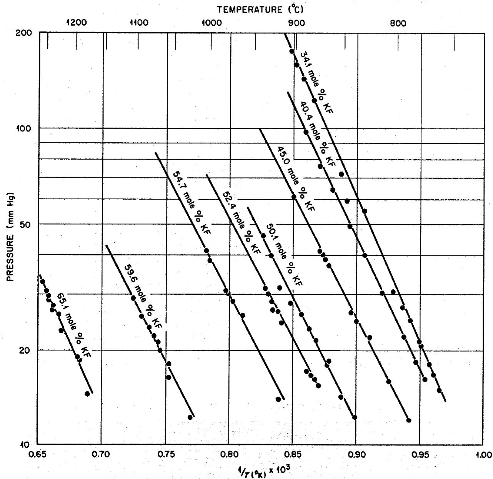  
Fig.2.3.1. Vapor Pressures of KF-ZrF4 Mixtures.

The value of $905\mathrm{mmHg}$ for $\mathsf{ZrF}_4$ at the melting point was obtained from the sublimation vapor pressure equation

$$
\log P (\mathrm {m m H g}) = 1 2. 5 4 1 7 - \frac {1 1 , 3 6 0 . 4}{T}.
$$

This equation represents a least-squares treatment of 33 experimental points obtained with the present apparatus. The results conclusively show that in solutions of $\mathsf{ZrF}_4$ and alkali fluorides the vapor

pressure of $\mathsf{ZrF}_4$ decreases as the alkali ion size increases.

VAPOR PRESSURES AND PHASE EQUILIBRIUM DATA IN THE $\mathsf{FeCl}_2$ -KCI SYSTEM

C.C.Beusman

The vapor pressure of $\mathsf{FeCl}_2$ in $\mathsf{FeCl}_2$ -KCl systems was measured by the Rodenbush-Dixon

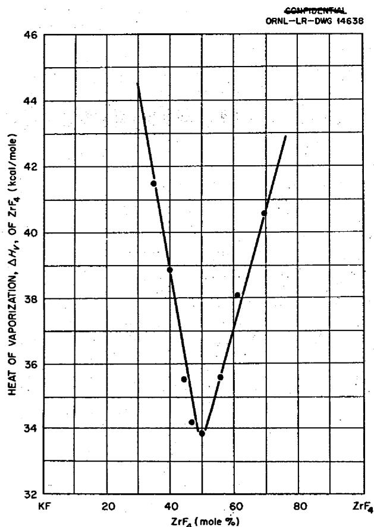  
Fig. 2.3.2. Effect of Composition on Heat of Vaporization of $\mathbf{ZrF}_4$ in KF-ZrF $_4$ Mixtures.

method in concentrations from 100 to 45 mole $\%$ $\mathrm{FeCl}_2$ in KCl. Pressure vs composition curves obtained at 850 and $900^{\circ}\mathrm{C}$ are shown in Fig. 2.3.6; these are typical of the curves obtained at temperatures from 700 to $1050^{\circ}\mathrm{C}$ . The strong deviation from ideality suggests that the $\mathrm{FeCl}_2$ is complexed in the liquid at these temperatures. Since the experimental evidence was obtained in phase equilibrium studies of the compound $\mathsf{K}_2\mathsf{FeCl}_4$ in the solid state, it is interesting that the same stoichiometry may apply to the complex in the liquid. The strong depression of the vapor pressure below 45 mole $\%$ precludes further experimental efforts with the Rodenbush-Dixon technique. The transpiration method will be used to complete the experimental curve on the KCl-rich side of the graph.

The phase diagram for the $\mathsf{FeCl}_2$ -KCl system, shown in Fig. 2.3.7, was determined by two experimental techniques. First, both conventional cooling and differential cooling curves were obtained on small melts, and, second, quenched samples were prepared by the gradient-quenching techniques used in this laboratory. Petrographic examination of the quenched and slowly cooled samples revealed two well-defined compounds in the solid state, $\mathsf{K}_2\mathsf{FeCl}_4$ and $\mathsf{KFeCl}_3$ . Both compounds appear to have solid-state transformations, and $\mathsf{K}_2\mathsf{FeCl}_4$ melts incongruity.

TABLE 2.3.2. SUMMARY OF VAPOR PRESSURES FOR THE SYSTEM RbF-ZrF4   

<table><tr><td rowspan="2">Experimental Temperature Range (℃)</td><td colspan="2">Composition (mole %)</td><td colspan="2">Constants</td><td rowspan="2">Heat of Vaporization of ZrF4, ΔHv (kcal/mole)</td></tr><tr><td>ZrF4</td><td>RbF</td><td>A</td><td>B</td></tr><tr><td>800–850</td><td>81.6</td><td>18.4</td><td>10.778</td><td>9,506</td><td>43.5</td></tr><tr><td>725–825</td><td>74.6</td><td>25.4</td><td>10.359</td><td>9,189</td><td>42.1</td></tr><tr><td>750–825</td><td>70.0</td><td>30.0</td><td>9.808</td><td>8,790</td><td>40.3</td></tr><tr><td>750–875</td><td>65.1</td><td>34.9</td><td>9.143</td><td>8,358</td><td>38.3</td></tr><tr><td>775–875</td><td>60.0</td><td>40.0</td><td>8.789</td><td>8,078</td><td>37.0</td></tr><tr><td>775–950</td><td>54.8</td><td>45.2</td><td>8.307</td><td>7,902</td><td>36.2</td></tr><tr><td>850–975</td><td>50.4</td><td>49.6</td><td>7.555</td><td>7,310</td><td>33.5</td></tr><tr><td>900–1050</td><td>45.2</td><td>54.8</td><td>7.512</td><td>7,794</td><td>35.7</td></tr><tr><td>1000–1200</td><td>40.0</td><td>60.0</td><td>7.290</td><td>8,146</td><td>37.3</td></tr><tr><td>1125–1275</td><td>35.0</td><td>65.0</td><td>7.296</td><td>8,790</td><td>40.3</td></tr></table>

CONFIDENTIA

ORNL-LR-DWG13012A

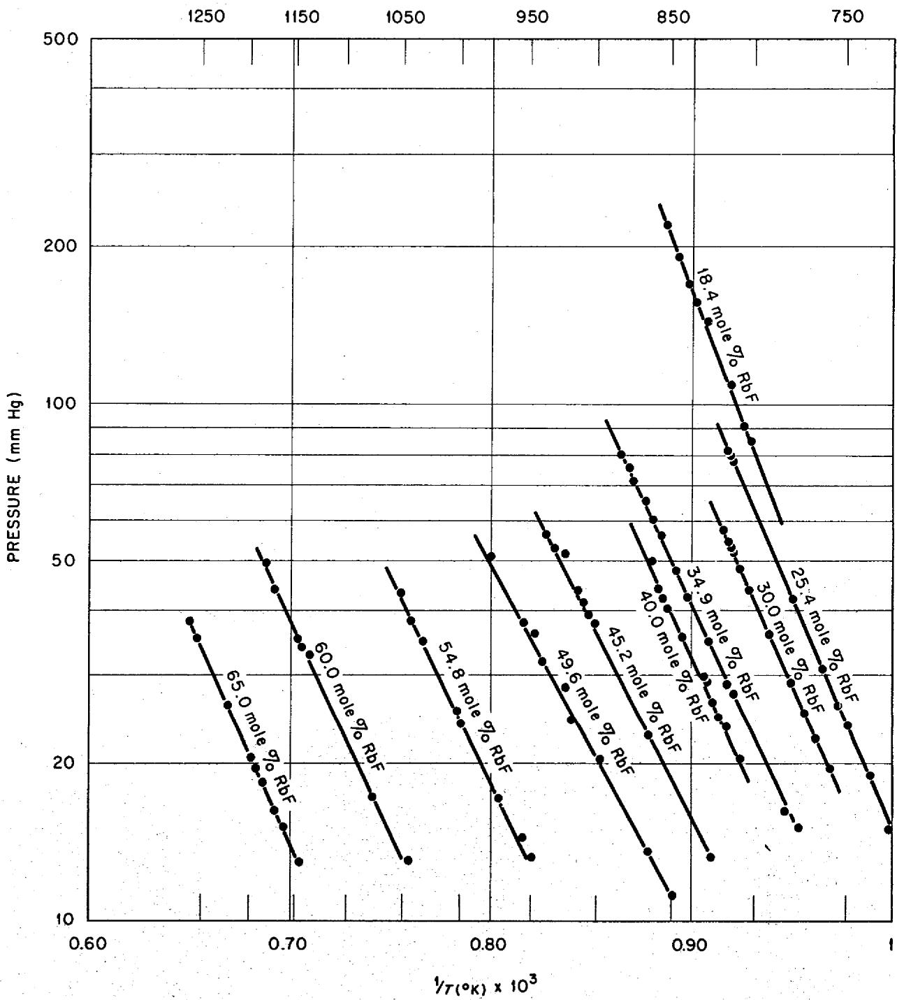  
TEMPERATURE (°C)   
Fig. 2.3.3. Vapor Pressures of $\mathsf{RbF - ZrF}_4$ Mixtures.

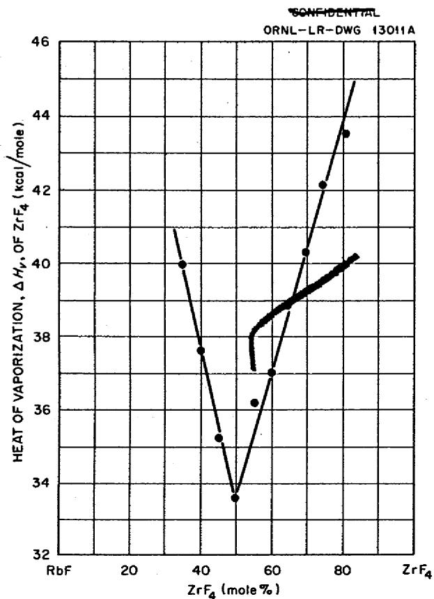  
Fig. 2.3.4. Effect of Composition on Heat of Vaporization of $\mathsf{ZrF}_4$ in RbF-ZrF $_4$ .

# SURFACE TENSION AND DENSITY

OF NaF-ZrF4

F. W. Miles

Preliminary values of the density and surface tension of NaF-ZrF $_4$ (53-47 mole %) were obtained by the maximum-bubble-pressure method previously described. $^{10}$ The results are summarized in Table 2.3.3. Difficulties were encountered as a result of plugging of the nickel tube above the capillary tip. In every case the concentration of oxides and oxyfluorides in the plug material appeared to be quite high, and thus it is thought that there was air contamination of the helium stream. The assembly is being examined in an attempt to locate and eliminate the source of

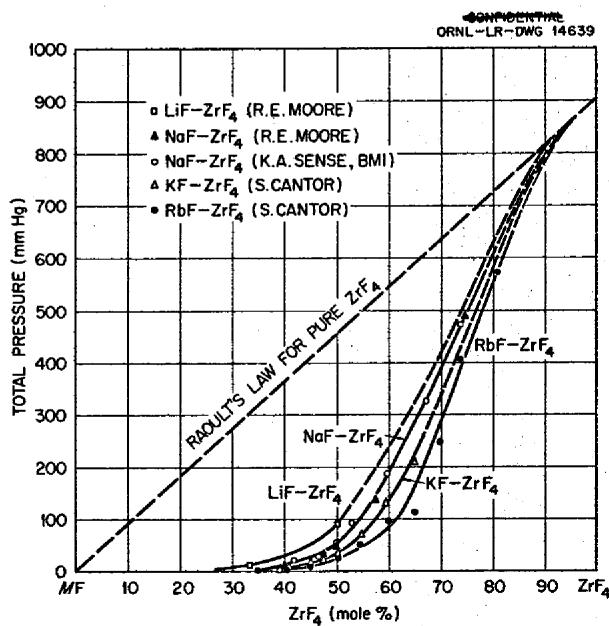  
Fig.2.3.5. Vapor Pressures of MF-ZrF4 Mixtures at $912^{\circ}\mathrm{C}$

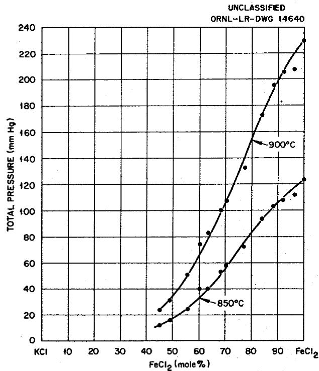  
Fig. 2.3.6. Vapor Pressures of $\mathsf{FeCl}_2$ -KCl Mixtures at 850 and $900^{\circ}\mathsf{C}$ .

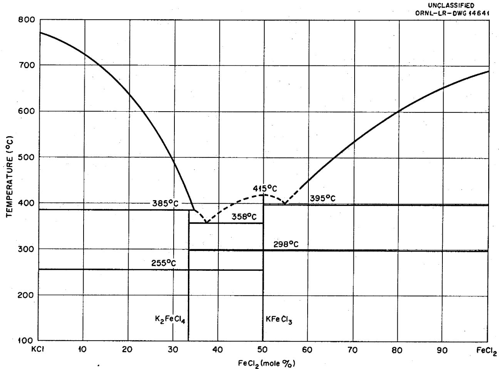  
Fig. 2.3.7. Phase Diagram of the $\mathsf{FeCl}_2$ -KCl System.

TABLE 2.3.3. PRELIMINARY VALUES OF DENSITY AND SURFACE TENSION OF NaF-ZrF $_4$ (53-47 MOLE %) OBTAINED BY MAXIMUM-BUBBLE-PRESSURE METHOD   

<table><tr><td>Inside Radius of Capillary (cm)</td><td>Wall Thickness of Capillary (mils)</td><td>Temperature (°C)</td><td>Density (g/cm3)</td><td>Surface Tension (dynes/cm)</td></tr><tr><td>0.758</td><td>4</td><td>600</td><td>3.049</td><td>131</td></tr><tr><td>0.0513</td><td>9</td><td>600</td><td>3.014</td><td>127</td></tr><tr><td>0.0513</td><td>9</td><td>600</td><td>3.051</td><td>125</td></tr><tr><td>0.0513</td><td>9</td><td>700</td><td>2.916</td><td>120</td></tr></table>

contamination, and changes have been made in the design of the capillary tips.

The four measurements listed in Table 2.3.3 were obtained on the same batch of material. Although the melt was repurified, in place, after each determination, the formation of plugs indicated contamination during measurement. Furthermore, the batch was kept at high temperatures for several weeks. When the reactor was opened, it was observed that some $\mathsf{ZrF}_4$ had sublimed out of the solution. These factors indicate that the values given in Table 2.3.3 must be considered to be only of a very preliminary nature. It is encouraging, however, to note that values of the same order of magnitude were obtained with capillary tubes of different wall thicknesses. This behavior seems to indicate contact angles of less than 90 deg. Consequently, the inside radius of the capillary controls the bubble size, and no particular uncertainty exists as to whether the value of the inside or of the outside radius should be used in the calculations.

Additional measurements will be made on a fresh batch of similar composition. When more reliable values are obtained, the measurements will be extended to other mixtures of interest.

# SURFACE TENSIONS OF MOLTEN SALTS

S. Langer

The sessile-drop technique for measuring surface tension, briefly discussed in the previous report,[11] was applied to a number of samples of an $\mathrm{NaF - ZrF_4}$ (53-47 mole %) mixture to establish the importance of a number of experimental variables. Since it has been demonstrated that $\mathrm{NaF - ZrF_4}$ mixtures of this general composition do not wet C-18 graphite, all the experiments described here were conducted with this material as the supporting plaque.

A schematic drawing of the sessile-drop apparatus is shown in Fig. 2.3.8. The sample on its

11S. Langer, ANP Quar. Prog. Rep. March 10, 1956, ORNL-2061, p 105.

UNCLASSIFIED

ORNL-LR-DWG14642

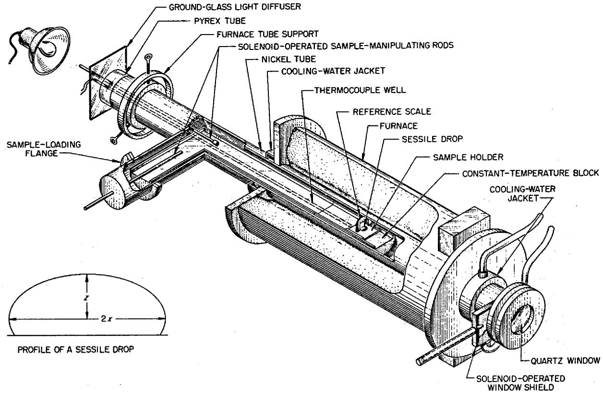  
Fig. 2.3.8. Diagram of Sessile-Drop Apparatus for Measuring Surface Tensions of Molten Salts.

supporting plaque is loaded into the tube through the sample-loading flange. The central portion of the tube is then baked out under high vacuum to remove volatile materials which might contaminate the surface of the sample. After the furnace is adjusted to the operating temperature, the sample is pushed to the center of the constant-temperature block with the solenoid-operated sample-manipulating rods. Photographs are taken of the sample as a function of time to ensure the establishment of an equilibrium droplet. A photograph of the sessile drop of NaF at $1025^{\circ}C$ , taken during calibration work, is shown in Fig. 2.3.9.

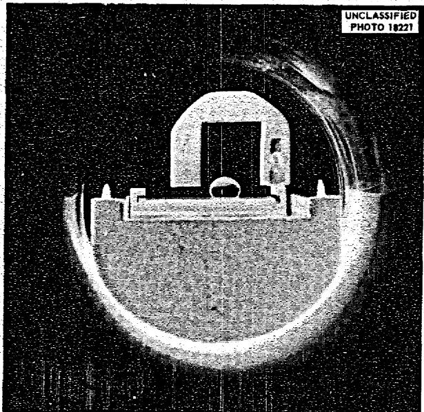  
Fig. 2.3.9. Photograph of Reference Scale and Sessile Drop of NaF at $1025^{\circ}C$ on Graphite Plaque.

The dimensions11 of the sessile drop (the maximum diameter, $2x$ , and the distance from the line of the maximum diameter to the apex, $z$ ) are measured directly from the photographic negative by using a toolmaker's microscope. Corrections for anisotropic shrinkage of the film are obtained by using the reference scale which surrounds the drop. The surface tension is cal

culated by using the tables of Bashforth and Adams12 and the densities obtained by Miles.13

The initial experiments indicated no change in surface tension when an atmosphere of helium was admitted to the apparatus in which tests had been made under vacuum. When tests were conducted in vacuum, however, volatilization of $\mathsf{ZrF}_4$ caused large changes in composition of the drop; helium atmospheres have been adopted as standard for future tests.

Data typical of those obtained to date for NaF-ZrF4melts whose initial composition was 53 mole % NaF and 47 mole % ZrF4are shown in Table 2.3.4. While the data of the earlier experiments are viewed with some uncertainty, the relative agreement of the surface tension values obtained from droplets of widely varying sizes (as evidenced by the spread of sample weights and $x / z$ ratios) is gratifying.

# SPECIFIC CONDUCTANCE AND DENSITY OF FUSED LITHIUM, POTASSIUM, AND CESIUM FLUORIDES14

E. R. Van Artsdalen

Electrical conductance and density have been measured as a function of temperature for pure, fused lithium, potassium, and cesium fluorides. A newly designed bridge, in conjunction with a special cell fabricated from platinum-rhodium alloy, was used in the measurements. The results of the measurements are expressed by the equations listed in Tables 2.3.5 and 2.3.6. Similar data were also obtained for several rare-earth halides.

These data have been correlated with those reported previously. It is now possible to give satisfactory theoretical interpretations of the results in terms of the structure and transport properties of the liquid salts.

TABLE 2.3.4. SURFACE TENSION MEASUREMENTS ON NaF-ZrF ${}_{4}$ (53-47 MOLE %)   

<table><tr><td>Temperature (°C)</td><td>Sample Weight (g)</td><td>Weight Loss (%)</td><td>Final Composition* (mole % ZrF4)</td><td>x/z</td><td>Density (g/cm3)</td><td>Surface Tension (dynes/cm)</td></tr><tr><td>601**</td><td>0.870</td><td>28.2</td><td>36.6</td><td>1.71706</td><td>3.043</td><td>141</td></tr><tr><td>603**</td><td>0.870</td><td>28.2</td><td>36.6</td><td>1.66592</td><td>3.040</td><td>141</td></tr><tr><td>611</td><td>0.4502</td><td>3.1</td><td>43.5</td><td>1.53637</td><td>3.030</td><td>141</td></tr><tr><td>610</td><td>0.4502</td><td>3.1</td><td>43.5</td><td>1.56345</td><td>3.031</td><td>134</td></tr><tr><td>601</td><td>0.4502</td><td>3.1</td><td>43.5</td><td>1.60542</td><td>3.043</td><td>122</td></tr><tr><td>601</td><td>0.4502</td><td>3.1</td><td>43.5</td><td>1.57069</td><td>3.043</td><td>132</td></tr><tr><td>601</td><td>0.4502</td><td>3.1</td><td>43.5</td><td>1.55482</td><td>3.043</td><td>136</td></tr><tr><td>601</td><td>0.4502</td><td>3.1</td><td>43.5</td><td>1.56994</td><td>3.043</td><td>131</td></tr><tr><td>610</td><td>0.5097</td><td>3.7</td><td>41.4</td><td>1.68795</td><td>3.031</td><td>117</td></tr><tr><td>610</td><td>0.5097</td><td>3.7</td><td>41.4</td><td>1.65982</td><td>3.031</td><td>124</td></tr><tr><td>602</td><td>0.5097</td><td>3.7</td><td>41.4</td><td>1.64464</td><td>3.043</td><td>128</td></tr></table>

*Calculated from analysis of material after test.   
**Tested in vacuum; all other samples tested under helium atmosphere.

TABLE 2.3.5. CONSTANTS OF EQUATION FOR SPECIFIC CONDUCTANCE, $\kappa$ , OF FUSED LITHIUM, POTASSIUM, AND CESIUM FLUORIDES

$$
\kappa = a + (b \times 1 0 ^ {- 2}) t + (c \times 1 0 ^ {- 6}) t ^ {2}, o h m ^ {- 1} \cdot c m ^ {- 1}, w h e r e t i s i n ^ {\circ} C
$$

TABLE 2.3.6. CONSTANTS OF EQUATION FOR DENSITY, $\rho$ , OF FUSED LITHIUM, POTASSIUM, AND CESIUM FLUORIDES   

<table><tr><td>Salt</td><td>a</td><td>b</td><td>c</td><td>Standard Deviation (ohm-1·cm-1)</td><td>Applicable Temperature Range (°C)</td></tr><tr><td>LiF</td><td>+3.805</td><td>+1.004</td><td>-3.516</td><td>0.008</td><td>847-1027</td></tr><tr><td>KF</td><td>-3.493</td><td>+1.480</td><td>-6.608</td><td>0.009</td><td>869-1040</td></tr><tr><td>CsF</td><td>-4.511</td><td>+1.642</td><td>-7.632</td><td>0.009</td><td>725-921</td></tr></table>

$$
\rho = a - (b \times 1 0 ^ {- 3}) t, g / c m ^ {3}, \text {w h e r e} t \text {i s i n} ^ {\circ} C
$$

<table><tr><td>Salt</td><td>a</td><td>b</td><td>Standard Deviation, σ (g/cm3)</td><td>Experimental Temperature Range (°C)</td></tr><tr><td>LiF</td><td>2.2243</td><td>0.4902</td><td>0.0003</td><td>876-1047</td></tr><tr><td>KF</td><td>2.4685</td><td>0.6515</td><td>0.0003</td><td>881-1037</td></tr><tr><td>CsF</td><td>4.5489</td><td>1.2806</td><td>0.0004</td><td>712-912</td></tr></table>

# 2.4. PRODUCTION OF FUELS

G.J.Nessle G.M.Watson

L. G. Overholser

# EXPERIMENTAL PREPARATION OF VARIOUS FLUORIDES

B.J.Sturm

Continued use of structural metal fluorides for research necessitated the preparation of additional quantities of these materials by the several methods developed previously. As in the past, use was made of chemical, x-ray, and petrographic examinations to establish the identity and purity of the materials.

Additional $\mathsf{CrF}_3$ was prepared by hydrofluorination of anhydrous $\mathsf{CrCl}_3$ , as well as by the thermal decomposition of $(\mathsf{NH}_4)_3\mathsf{CrF}_6$ . The latter is prepared by the interaction of hydrated $\mathsf{CrF}_3$ with $\mathsf{NH}_4\mathsf{F}\cdot \mathsf{HF}$ , and it may also be reduced by hydrogen to yield $\mathsf{CrF}_2$ . Several batches of $\mathsf{NiF}_2$ were prepared by the hydrofluorination of either hydrated $\mathsf{NiF}_2$ or hydrated $\mathsf{NiCl}_2$ . One batch of AgF was prepared by hydrofluorination of $\mathsf{Ag_2CO_3}$ . Methods described previously were used for the preparation of additional quantities of $\mathsf{CeF}_3$ and of $\mathsf{LaF}_3$ .

An attempt to remove oxide from a $\mathsf{KF - ZrF}_4$ mixture by hydrofluorination was unsuccessful. Runs at $600^{\circ}\mathrm{C}$ failed to remove the oxide completely and, while this could be accomplished at $850^{\circ}\mathrm{C}$ , the loss of $\mathsf{ZrF}_4$ was sufficient to alter the composition to the point where the material was unsatisfactory for its intended purpose.

A batch of $\mathsf{CuF}_2$ was prepared for use as a carrier in certain spectrographic boron analyses. Material low in boron and silicon was requested for this purpose. Anhydrous $\mathsf{CuF}_2$ was hydrofluorinated for 4 hr at $400^{\circ}\mathsf{C}$ , but this short period of treatment failed to reduce the boron content to a sufficiently low level. However, extending the period of hydrofluorination to 20 hr yielded a material that was acceptable.

A fuel mixture containing $\mathsf{Li}^7$ and enriched uranium was prepared for radiation damage studies. Since $\mathsf{Li}^7$ was available only as the carbonate, a preliminary run was made with normal $\mathsf{Li}_2\mathsf{CO}_3$ , $\mathsf{UF}_4$ , $\mathsf{KF}$ , $\mathsf{NaF}$ , and excess $\mathsf{NH}_4\mathsf{F}$ . HF to establish whether fusion of this mixture would yield an oxide-free product. After the preliminary run proved successful the procedure was applied to the mixture containing $\mathsf{Li}^7$ and $\mathsf{U}^{235}$ . The material was

oxide free, but a sulfur content of 170 ppm was reported, most of which came from the $\mathrm{Li}_2^7\mathrm{CO}_3$ . The fuel was subjected to 5 cycles, each of which entailed a 10- to 15-hr hydrogen treatment and 1 hr of hydrofluorination at $800^{\circ}\mathrm{C}$ . The product then contained 45 ppm of sulfur and a trace of oxide. Hydrofluorination at $700^{\circ}\mathrm{C}$ for 6 hr then produced an oxide-free product.

# LABORATORY-SCALE PURIFICATION OPERATIONS

F. L. Daley W. T. Ward

With appropriate modifications, the standard hydrofluorination-hydrogenation process was used to prepare a number of especially pure materials requested for various purposes. Of these only an NaF-ZrF4-UF4 mixture containing additives of BaF2, LaF3, and RbF had not previously been prepared by the standard procedure. Operational facilities to transfer and dispense small samples (200 to 500 g), especially into apparatus for accurate evaluation of physical properties of materials, were constructed and used successfully during this quarter. There is evidence that direct transfer of the purified melt into the apparatus has significantly improved the purity of the test material and, accordingly, increased confidence in the test results.

Copper-lined stainless steel reactors were used successfully in the purification operations.

# PILOT-SCALE PURIFICATION OPERATIONS

J.P.Blakely C.R.Croft J.Truitt

The pilot-scale purification facility processed 68 batches totaling approximately 1300 lb of various fluoride compositions for use in small-scale corrosion testing, phase equilibrium studies, and physical property studies. The bulk of the material was produced during February when the facility was operating on a three-shift, 24-hr-day basis. As a result, the backlog reported last quarter was eliminated and normal operations were resumed.

The use of copper-lined stainless steel reactors in the 5-lb units has proved successful. Therefore, when the nickel reactors now on hand wear out and are discarded, they will be replaced with copper-lined stainless steel vessels. The new copper-lined vessels, in addition to showing promise of having longer lives, are more versatile than the nickel reactors in that they can be used in the preparation of $\mathsf{BeF}_2$ -containing mixtures.

Although the supply of 50-lb nickel reactor vessels is at present sufficient, these will also be replaced with copper-lined stainless steel vessels as they are discarded.

# PRODUCTION-SCALE OPERATIONS

J. E. Eorgan

J.P.Blakely

Seventeen batches totaling approximately 4230 lb of fluoride compositions were processed by the production-scale facility. Two new copper-lined stainless steel reactors were received about the first of March and were put into production operation immediately. To date, nine batches have been processed in one reactor and eight in the other with no apparent difficulties. Recent external examination of these reactors show no deterioration or faults, and it may be that the life service of these reactors will be much better than expected.

In spite of the temporary shutdown of this facility, the processed fluorides inventory has remained high. Operations were slowed down during the last three weeks of this quarter because of a shortage of storage containers. A survey is now being made to determine the anticipated requirements for processed fluorides during the next six months. A recent communication from Pratt & Whitney Aircraft

gave fairly firm commitments for approximately 1700 lb of processed fluorides per month for the remainder of the calendar year. The ORNL Aircraft Reactor Engineering Division has been using an average of about 1000 lb of fluorides per month. Although the new survey is not complete, indications are that Aircraft Reactor Engineering Division usage will range around 1000 to 1500 lb per month for the remainder of 1956. The demands will not reach the production capacity of the facility, but at least they will make it economically feasible to maintain continuous operation.

The remaining 7500 lb of hafnium-bearing zirconium fluoride ordered from an outside vendor was received and all the material was accepted as satisfactory.

# BATCHING AND DISPENSING OPERATIONS

J. P. Blakely

F. A. Doss

The batching and dispensing facility dispensed 148 batches totaling approximately 4900 lb of processed fluorides in batch sizes ranging from 1 to 250 lb. The total amount dispensed was about 1000 lb less than was dispensed the previous quarter. Therefore there was another gain in stock inventory in spite of decreased production. A material balance for the quarter is given in Table 2.4.1.

The production and use of special compositions is decreasing steadily, but periodic increases can be expected as new materials are developed for testing and investigations. The use of NaF-ZrF₄ (50-50 mole %) and NaF-ZrF₄-UF₄ (50-46-4 mole %) or closely related compositions is expected to increase to about 3000 lb per month during the first

TABLE 2.4.1. MATERIAL BALANCE   

<table><tr><td rowspan="2"></td><td colspan="4">Material (1b)</td></tr><tr><td>NaF-ZrF4-UF4(50-46-4 mole %)</td><td>NaF-ZrF4(50-50 mole %)</td><td>Special</td><td>Total</td></tr><tr><td>On hand at beginning of quarter</td><td>6,235</td><td>1,875</td><td>591</td><td>8,701</td></tr><tr><td>Produced during quarter</td><td>3,543</td><td>198</td><td>1,789</td><td>5,530</td></tr><tr><td>Total</td><td>9,778</td><td>2,073</td><td>2,380</td><td>14,231</td></tr><tr><td>Dispensed during quarter</td><td>3,828</td><td>0</td><td>1,078</td><td>4,906</td></tr><tr><td>On hand at end of quarter</td><td>5,950</td><td>2,073</td><td>1,302</td><td>9,325</td></tr></table>

half of fiscal year 1957. This estimate includes Pratt & Whitney requirements. At this rate, full production should still be able to maintain a high stock inventory and to allow for any necessary shutdown of the production-scale facility. The efficient handling, maintenance, and dispensing of some 200 storage cans has made it possible to fill all sizes of orders with a minimum of delay to operating sections of the ANP program.

# PREPARATION OF $\mathsf{ZrF}_4$ FROM $\mathsf{ZrCl}_4$

J.E.Eorgan J.P.Blakely

The facility for the conversion of hafnium-free $\mathsf{ZrCl}_4$ to $\mathsf{ZrF}_4$ was operated three times during this quarter. The mechanical operation of the unit is now satisfactory. Handling techniques need to be improved to cut down on raw-material and finished-product losses. Also, the finely divided nature of the product $\mathsf{ZrF}_4$ has presented a dust-loss problem of considerable magnitude. Steps are being taken to eliminate or greatly improve this situation. Large quantities of $\mathsf{ZrF}_4$ dust were carried into the process gas exit lines and caused major line-plugging difficulties. A change in piping arrangement improved this situation somewhat in the last run.

Rough material balances of the three operations indicated a total loss of about $22\%$ of product in the first two runs and $11\%$ in the last run. Approximately $75\%$ of this loss was accounted for in material removed from the exit gas lines. A new dust filter has been ordered for installation on the unit which should cut down the dust loss considerably. Operation of this facility will be postponed until this new filter arrives or there is an urgent need for more hafnium-free $\mathsf{ZrF}_4$ .

Analytically, the product material was as good or better than material previously or presently being used. Four samples were taken from each batch as it was being discharged from the unit, each sample representing roughly one-fourth of each batch so that uniformity could be tested. The analytical results are given in Table 2.4.2. Although the first batch was not so good as the last two, either in uniformity or quality, it was considered to be usable.

# SPECIAL SERVICES

J.P.Blokely F.A.Doss

Requests for service in filling, draining, and sampling operations were at a normal and steady level. The greatly accelerated pace set in the

TABLE 2.4.2. PURITY OF ${\mathrm{{ZrF}}}_{4}$ PRODUCED FROM ${\mathrm{{ZrCl}}}_{4}$   

<table><tr><td rowspan="2">Run No.</td><td rowspan="2">Sample No.</td><td colspan="3">Major Constituents (wt %)</td><td colspan="3">Impurities* (ppm)</td></tr><tr><td>Zr</td><td>F</td><td>Cl</td><td>Ni</td><td>Cr</td><td>Fe</td></tr><tr><td rowspan="4">1</td><td>1</td><td>53.6</td><td>45.0</td><td>0.29</td><td>90</td><td>55</td><td>715</td></tr><tr><td>2</td><td>53.7</td><td>44.2</td><td>0.40</td><td>80</td><td>55</td><td>595</td></tr><tr><td>3</td><td>54.3</td><td>44.3</td><td>0.50</td><td>55</td><td>45</td><td>595</td></tr><tr><td>4</td><td>54.2</td><td>44.6</td><td>0.63</td><td>55</td><td>45</td><td>620</td></tr><tr><td rowspan="4">2</td><td>1</td><td>54.5</td><td>45.2</td><td>0.29</td><td>65</td><td>40</td><td>375</td></tr><tr><td>2</td><td>55.1</td><td>44.8</td><td>0.33</td><td>50</td><td>40</td><td>400</td></tr><tr><td>3</td><td>54.6</td><td>44.2</td><td>0.34</td><td>65</td><td>35</td><td>375</td></tr><tr><td>4</td><td>54.6</td><td>45.2</td><td>0.36</td><td>50</td><td>35</td><td>375</td></tr><tr><td rowspan="4">3</td><td>1</td><td>54.4</td><td>45.4</td><td>0.39</td><td>85</td><td>50</td><td>420</td></tr><tr><td>2</td><td>54.3</td><td>44.3</td><td>0.45</td><td>70</td><td>25</td><td>420</td></tr><tr><td>3</td><td>54.5</td><td>44.9</td><td>0.43</td><td>75</td><td>30</td><td>410</td></tr><tr><td>4</td><td>54.8</td><td>44.6</td><td>0.39</td><td>60</td><td>30</td><td>400</td></tr><tr><td></td><td>Theoretical</td><td>54.5</td><td>45.5</td><td></td><td></td><td></td><td></td></tr></table>

*The hafnium content of the material was less than 100 ppm, the boron content was less than 1 ppm, the sulfur content was about 30 ppm, and the carbon content was 300 ppm.

previous quarter was not maintained. Past experience indicates that filling and draining operations will be requested in cycles, depending upon the rate at which tests are started or terminated. Present indications are that another accelerating cycle will occur in the next quarter.

Approximately 3000 lb of processed fluorides and 1500 lb of liquid metals were used to charge test equipment during the quarter in charge sizes ranging from 5 to 500 lb. Since the liquid metal (NaK) inventory had run below 1500 lb, another 5000 lb of noneutectic NaK (56% Na-44% K) was ordered and received. It is estimated that this supply should last six to eight months unless consumption is sharply increased.

A serious complication arose in the disposal of NaK during the cold months of this winter. This material, which is normally molten at room temperatures, could not be disposed of by underwater injection because it froze in the transfer lines. It was fortunate that sufficient storage cans were available to contain the NaK drained from equipment until warmer weather arrived and that a comparatively small amount of NaK was drained from

equipment during this quarter. It has been requested that electric power be supplied at the disposal quarry so that disposal of both sodium and NaK can proceed regardless of atmospheric temperature. Present rough estimates of the cost of such an installation range from $250 to$ 1000. Firmer figures are to be obtained, and, if the range above is correct, adequate power is to be installed for liquid metal disposal.

In-pile loop No. 5 was filled with enriched NaF-

$\mathsf{ZrF}_4\text{-UF}_4(53.5 - 40 - 6.5\text{ mole}\%)$ . Two new batches for in-pile loops were processed. Dates for filling loops with these batches have not yet been set.

Two other small batches of special enriched mixtures were also processed this quarter. One batch, NaF-ZrF $_4$ -UF $_4$ (62.5-12.5-25.0 mole %), was to be used at ORNL for special radiation tests. The other batch, NaF-UF $_4$ (66.7-33.3 mole %), was ordered by Battelle Memorial Institute.

# 2.5. COMPATIBILITY OF MATERIALS AT HIGH TEMPERATURES

F. Kertesz

# PENETRATION OF GRAPHITE BY MOLTEN FLUORIDES

H.J.Buttram G.F.Schenck

It appears very likely that graphite is the only reasonably effective reactor moderator material that will remain chemically stable upon direct exposure to molten fluoride fuel mixtures. The use of graphite to contain such fuel mixtures has been known for a long time to be practical for simple laboratory-scale experimental equipment. The graphite most commonly used for this purpose has the commercial designation C-18. However, little information is available concerning the rate of penetration of reactor-grade graphite by molten fluoride fuel mixtures, and accordingly an investigation of this phenomenon has been initiated.

Specimens of APC² graphite ½ × ¼ × ½ in. were soaked at 600°C for various periods in sealed capsules of Inconel containing molten NaF-ZrF₄ or NaF-ZrF₄-UF₄ mixtures under helium atmospheres. The specimens were then sectioned and examined under the petrographic microscope. Preliminary observations indicate that the APC graphite was completely penetrated by NaF-ZrF₄ (53-47 mole %) in 1 hr at 600°C but that NaF-ZrF₄-UF₄ (53.5-40.0-6.5 mole %) had not detectably penetrated the graphite in 10 hr at 600°C. The rapid penetration of the graphite by the NaF-ZrF₄ melt is considered to be surprising, since such penetration is in contrast to the stability of C-18 graphite in this and similar fluoride mixtures. Other graphites of higher density will be examined in these and other fluoride mixtures. If necessary, attempts will be made to prevent penetration of the graphite by prior impregnation with high-melting-point materials such as NaF or CaF₂.

# EFFECT OF ATMOSPHERE ON ANODIC DISSOLUTION OF NICKEL IN MOLTEN NaOH

F. A. Knox

An attempt has been made to study the efficiency of anodic dissolution of nickel in NaOH under various atmospheres and various conditions of cur

rent density and temperature. The apparatus consisted of a crucible of Morganite (recrystallized alumina) containing molten sodium hydroxide into which a nickel anode and a cathode, as well as a nickel thermocouple well, were inserted. This electrolytic cell and its furnace were placed in a large chamber which could be evacuated or filled with the desired atmosphere. A lead storage battery served as the power supply; the circuit also contained a voltmeter, ammeter, and ampere-hour meter, as well as rheostats to control the current density applied.

When the assembled electrolytic cell was maintained at the desired temperature without an applied voltage, attack on the electrodes was negligible. Passage of current resulted in erosion of the anode and subsequent deposition of crystalline nickel on the cathode. The weight gain of the cathode did not correspond precisely to the weight loss of the anode, since the crystalline deposit was not perfectly adherent; in addition some sodium aluminate, formed by the reaction of NaOH with the $\mathrm{Al}_{2}\mathrm{O}_{3}$ of the crucible, apparently contaminated the cathode deposit. Loss in weight of the anode was accordingly used to evaluate the efficiency of the cell.

The data shown in Table 2.5.1 were obtained at a current density of $2\mathrm{amp/cm}^2$ . At this current density the cell efficiency is very poor under all conditions. The dissolution efficiency is decreased slightly by substituting hydrogen for helium as the static cover gas and is reduced considerably by bubbling hydrogen through the molten electrolyte.

Current density: 2 amp/cm²

TABLE 2.5.1. EFFICIENCY OF ANODIC SOLUTIONS OF NICKEL IN NaOH   

<table><tr><td rowspan="2">Temperature (°C)</td><td colspan="3">Cell Efficiency (%)</td></tr><tr><td>Under Helium</td><td>Under Static Hydrogen</td><td>With Hydrogen Bubbled Through the NaOH</td></tr><tr><td>350</td><td>0.01</td><td>0.006</td><td></td></tr><tr><td>600</td><td>0.65</td><td>0.42</td><td></td></tr><tr><td>800</td><td>2.77</td><td>2.12</td><td>0.66</td></tr></table>

# 2.6. ANALYTICAL CHEMISTRY

J. C. White

# DETERMINATION OF BARIUM, LANTHANUM, AND RUBIDIUM IN FLUORIDE FUELS

A. S. Meyer, Jr.

B. L. McDowell

Methods were developed for the determination of barium, lanthanum, and rubidium in $\mathrm{NaF - ZrF_4 - UF_4}$ as part of a program for determining the effect of typical fission products on the physical properties of molten mixtures of fluoride salts. For the barium determination the fluoride salt mixture is dissolved in fuming sulfuric acid, and the barium remains in the insoluble residue, as the sulfate. After dilution of the sulfuric acid solution with water, the barium sulfate, which is contaminated with uranium and zirconium, is separated by filtration and purified by dissolving it in a hot ammoniacal solution of ethylenediaminetetraacetic acid. It is then reprecipitated by acidification of the solution with hydrochloric acid. The reprecipitated barium sulfate is filtered off. The filter paper is charred, and the barium sulfate is then ignited to constant weight at $600^{\circ}C$ .

Lanthanum is separated from the filtrate from the barium determination by precipitation, as the oxalate, from a neutral solution of ammonium oxalate. Coprecipitated zirconium and uranium are separated from the original oxalate precipitate by dissolving the precipitate in concentrated nitric acid and carrying out a second oxalate precipitation from a neutral solution of ammonium oxalate. The purified oxalate precipitate is converted to the nitrate by digestion with concentrated nitric acid and evaporation to dryness. The residue is taken up in a small amount of water or very dilute nitric acid. Lanthanum is finally precipitated by the addition of solid oxalic acid to the hot, slightly acid solution. The lanthanum oxalate is ignited at $900^{\circ}\mathrm{C}$ and weighed as $\mathrm{La}_2\mathrm{O}_3$ .

Ammonium salts in the filtrate from the lanthanum determination are destroyed by digesting the solution with aqua regia. The alkali metals are separated and converted to the hydroxides by passing the solution through an anion exchange column in the hydroxide form. After all traces of ammonia are removed by evaporating the alkaline solution to dryness, the rubidium is precipitated and weighed as the sparingly soluble tetraphenylboron salt. Potassium, which is present as a trace contaminant

in the base fuel, is also precipitated as the tetraphenylboron salt. The potassium in the tetraphenylboron precipitate is determined by flame photometry, and the weight of the precipitate is corrected accordingly.

Good precision has been obtained in analyses of replicate samples of fluoride mixtures which contained 1 to $3\%$ of each of the above-mentioned elements. These methods are also being tested for the determination of cerium and the proximate determination of the cerium group of the rare-earth elements in fluoride fuels.

# DETERMINATION OF NIOBIUM IN FUSED MIXTURES OF FLUORIDE SALTS BY THE THIOCYANATE METHOD

A. S. Meyer, Jr. B. L. McDowell

R. F. Apple

A method for the spectrophotometric determination of niobium as the thiocyanate complex, reported by Ward and Marranzino, was applied to the determination of niobium in $\mathrm{NaF - ZrF_4 - UF_4}$ . The method is based upon the reaction of niobium(V) with thiocyanate in a mixed solution of $4M$ hydrochloric acid and $0.5M$ tartaric acid to produce a complex which exhibits an absorption maximum at $387\mu \mathrm{m}$ in an ethyl ether-acetone medium. The addition of acetone to the extract of ethyl ether containing the complex inhibits the polymerization of the thiocyanate ion and stabilizes the solution for at least $20\mathrm{hr}$ .

Tartaric acid eliminates the interference of uranium, which also forms a complex with thiocyanate. The interference of the red color of the iron(III)-thiocyanate complex is eliminated by shaking the ether extract with a solution of stannous chloride for 30 sec to reduce the iron(III) to iron(II).

The concentration of the reagents in the aqueous phase must be held within rigid limits if reproducible absorbance values are to be obtained. In order to maintain fixed concentrations, the fluoride sample is dissolved by fusing it with potassium pyrosulfate and dissolving the melt in $1\text{M}$ tartaric acid. A 1-to $10\text{-ml}$ aliquot of the resulting solution is combined with a sufficient

volume of $1M$ tartaric acid solution to yield a total volume of $10\mathrm{ml}$ .Then $15\mathrm{ml}$ of the hydrochloric acid-tartaric acid reagent (9 M HCl and 0.5 M tartaric acid) and $15\mathrm{ml}$ of $20\%$ w/v) ammonium thiocyanate solution is added, following which the aqueous phase is extracted with 5 ml of ethyl ether.

Tests of this method have revealed that a linear relationship exists between the absorbance and the concentration of the niobium in the range 0.2 to $2.0\mu \mathrm{g / ml}$ . The coefficient of variation for this method, based on standards, is $2\%$ .

# DETERMINATION OF TRACES OF COPPER IN FLUORIDE FUEL MIXTURES

A. S. Meyer, Jr. B. L. McDowell

Since copper is considered to be compatible with molten fluoride salts containing sulfur impurities, the nickel reactors used for the production of fluoride fuel mixtures have been equipped with copper liners to prolong their useful lifetimes. This modification in production technique necessitated the development of a sensitive method for the determination of copper in mixtures of fluoride salts. The spectrophotometric method in which "cuproine" (2,2'-biquinoline) is used as the chromogenic reagent, reported by Guest to be specific for copper, was adapted for this determination.

Copper is determined as the copper(I)-cuproine complex formed by equilibrating an aqueous sulfate solution of the sample containing copper(I) with a solution of $0.02\%$ (w/v) cuproine in $n$ -amyl alcohol at pH 6. The copper complex is extracted in the organic phase. The complex exhibits its maximum absorbance at $550~\mathrm{m}\mu$ . Hydroxylamine hydrochloride was used to reduce the copper to the monovalent state, and tartaric acid was used to complex iron and uranium.

The extraction procedure recommended by Guest $^2$ was modified for application to the determination of traces of copper in solutions of high ionic strength. The volume of the aqueous phase was increased from 30 to $100 \, \text{ml}$ in order to ensure an optimum amount of copper in the aliquot. The extraction period was increased from 1 to $30 \, \text{min}$ , and $10 \, \text{ml}$ of an alcoholic solution of the reagent was used. Since the aqueous-organic ratio was so large, $10 \, \text{g}$ of ammonium sulfate was added to reduce the solubility of the alcohol in the

aqueous volume. The ammonium sulfate served to mask the mass-action effect of ionic constituents in the sample; however, it reduced the effective pH range for quantitative extraction from a range of 4.5 to 7.5 to a range of 6.0 to 6.5.

The absorbance of the organic extract is a linear function of the concentration of copper up to 7.5 $\mu \mathrm{g} / \mathrm{ml}$ . The coefficient of variation of the method, as derived from standard samples, is $2\%$ . Samples of $\mathrm{NaF - ZrF_4 - UF_4}$ prepared in the copper-lined nickel reactors have been analyzed for copper by this method. The range of the copper concentration was 1 to 25 ppm.

# DETERMINATION OF TANTALUM IN NaF-ZrF4-UF4

J.P.Young J.R.French

The determination3 of trace amounts of tantalum in NaF-LiF-KF has been extended to include the determination of tantalum in NaF-ZrF4-UF4. Since zirconium and uranium interfere with the determination of tantalum by the pyrogallol method,4 it was necessary to develop some means of removing these interferences. The separation of tantalum from uranium in NaF-LiF-KF-UF4, which was described previously,3 was accomplished by a precipitation of the tantalum with cupferron. Zirconium, however, is also precipitated with cupferron. According to Hillebrand et al.,5 tantalum can be separated quantitatively from uranium and zirconium by precipitation with tannin in a slightly acidic solution of oxalate which is half-saturated with ammonium chloride. Since the samples contained alkali fluorides, it was necessary to dissolve them carefully to prevent the loss of TaF5 by volatilization. This was accomplished by a careful digestion of the fluoride sample in dilute sulfuric acid in order to hydrolyze TaF5 to Ta2O5. The solution was then evaporated to dryness, and the residue from this evaporation was fused with potassium pyrosulfate. The product of the fusion was dissolved in ammonium oxalate and then precipitated with tannin at a pH of 5 in a hot solution. The precipitate, after its removal and ignition to

$\mathsf{Ta}_2\mathsf{O}_5$ was fused with potassium pyrosulfate, and the tantalum-pyrogalol color was developed, as described in the earlier report.3

The coefficient of variation was $5\%$ for the determination of tantalum in $\mathsf{NaF - ZrF_4 - UF_4}$ . In the separation of tantalum from uranium and zirconium, a sample which contained at least $0.5\mathrm{mg}$ of tantalum was taken.

# DETECTION OF TRACES OF NaK IN AIR

A. S. Meyer, Jr.

J. P. Young

The design of an instrument for the photometric detection of NaK in air was completed. A functional description and the operational requirements of the apparatus were given previously. The electronic components of the instrument have been assembled, and the optical system is now being fabricated.

Preliminary engineering drawings of the instrument for the detection of submicrogram quantities of NaK in air by observation of the sodium resonance radiation have been prepared. Experiments are being carried out to devise a method for the introduction of reproducible concentrations of alkali metal oxides into air streams in order to provide synthetic samples for testing these instruments. The alkali metal is injected into the air stream in a jet of helium which is saturated with alkali metal by contact with the molten alkali metal. The temperature dependence of the vapor pressure of the molten metals provides the method for the control of the concentration of the metal in the helium. An apparatus has been assembled to test the stability of sodium aerosols that have been prepared at various mixing temperatures and various flow ratios of helium to air and to determine a quantitative method for transferring the samples of air to the detection instruments.

# DETERMINATION OF OXYGEN IN NaK

A. S. Meyer, Jr.

G. Goldberg

Since it has been established that reasonable precision can be obtained in making the determination of oxygen in alkali metals with the modified Argonne distillation sampler, the sampler was connected to a loop in which NaK was being circulated. The loop operates at a temperature of

$1200^{\circ}F$ , with a cold trap differential of about $600^{\circ}F$ . Since no inherent difficulties were encountered in the operation of the sampler in the loop, a detailed, step-wise procedure was written which covers the use of the sampler with both sodium and NaK loops. The analyses made over a five-day period while the cold trap was in operation gave the following concentrations of oxygen, in ppm: 1330, 1265, 575, 310, 265.

Since the results obtained with the sampler appear to be satisfactory, additional tests will be conducted in which the results from a plugging indicator will be compared with the results from the sampler. Plans are also being formulated to add a known amount of oxygen to the NaK to make further comparisons of the sampler and the plugging indicator. In the sampler now being constructed a sight tube is being placed in the distillation chamber so that the operations of sampling and distillation may be observed.

# EXAMINATION OF COLD TRAPS FROM ALKALI-METAL SYSTEMS

A. S. Meyer, Jr.

G. Goldberg

A program was initiated to carry out the chemical examination of cold traps removed from systems circulating alkali metals, such as heat-exchanger test stands and corrosion-testing loops containing sodium or NaK. A typical request for analysis calls for the determination of oxygen, iron, chromium, nickel, and, in the case of NaK, a sodium-potassium ratio. Other constituents which are sometimes requested are uranium, zirconium, and beryllium. The cold traps range from 3 to 5 in, in diameter and from 2 to 6 ft in length.

In order to carry out the determination of oxygen successfully, the trap is drained as completely as possible. The residual sodium, or NaK, on the Demister packing within the trap is then reacted with butyl bromide to form the neutral bromide salts of sodium and potassium; oxides of these elements do not react with butyl bromide. When the reaction is completed, the organic material is drained, and the trap is cut into two parts. Until the trap is cut open, a blanket of helium is maintained in it.

After the trap has been opened, both sections are washed carefully to dissolve the bromides and oxides, and the washings are combined and filtered. A portion of the filtrate is titrated with hydrochloric acid, and the concentration of oxygen is calculated from this titration. Both the filtrate and the residue are also analyzed for the corrosion products and any other constituents that were called for in the request for the analysis. The results of a typical analysis are presented in Table 2.6.1.

TABLE 2.6.1. ANALYSIS OF NaK DRAINED FROM THE CIRCULATING COLD TRAP OPERATED IN INTERMEDIATE HEAT-EXCHANGER TEST STAND B  

<table><tr><td>Determination Requested</td><td>Water-Insoluble Residue (g)</td><td>Total (g)</td></tr><tr><td>Na</td><td></td><td>564</td></tr><tr><td>K</td><td></td><td>200</td></tr><tr><td>Cr</td><td>0.6</td><td>0.8</td></tr><tr><td>Ni</td><td>0.9</td><td>1.2</td></tr><tr><td>Fe</td><td>0.1</td><td>0.1</td></tr><tr><td>U</td><td>Not detected</td><td></td></tr><tr><td>Zr</td><td>Not detected</td><td></td></tr><tr><td>O2</td><td></td><td>120</td></tr></table>

# DETERMINATION OF WATER IN HELIUM

A. S. Meyer, Jr. G. Goldberg

Traces of moisture in the helium used as a blanket gas in engineering studies can be conveniently determined by measuring the dew point of the gas. However, high and erratic dew-point temperatures are occasionally measured. It was observed that when copper tubing was used for the connections from the helium to the dew-point meter, dew-point temperatures below $-145^{\circ}\mathrm{F}$ , corresponding to about 1 ppm $\mathsf{H}_2\mathsf{O}$ , were obtained almost immediately. Conversely, periods of flushing of as long as 15 min at a rate of about 10 ft³/hr were required before comparable readings were obtained when the gases were passed through a 2-ft length of Tygon tubing. It is therefore recommended that, when possible, connections to the

meter be made with metal rather than plastic tubing when dew points below $-40^{\circ}\mathrm{F}$ are to be measured. If plastic tubing is used, the tubing should be adequately purged with test gas before measurements are taken.

# COMPATIBILITY OF BERYLLIUM WITH SOME TYPICAL ORGANIC DEGREASING AGENTS

A. S. Meyer, Jr. W. J. Ross

Tests have been carried out to determine the compatibility of beryllium with the organic solvents being considered as possible agents for degreasing the machined reactor components. Suggested degreasing procedures include 30-min flushing periods with acetone and ethanol at room temperature and trichloroethylene and perchloroethylene at their boiling points. No detectable attack on beryllium was observed even after a 24-hr period of dynamic contact with these reagents.

# ANP SERVICE LABORATORY

# W. F. Vaughan

Analyses of ten samples were performed for the Wright Air Development Center (WADC). The determinations made on the WADC fused-fluoride-salt samples included total uranium, trivalent uranium, iron, nickel, and chromium. The hydrogen content of zirconium hydride liners, which had been encased in Inconel tubing, was also determined.

The bulk of the work of the service laboratory was the analysis of fused-fluoride-salt mixtures and alkali metals for the Reactor Chemistry and Experimental Engineering Groups. A total of 1164 samples was analyzed, which involved 4168 reported results, an average of 3.6 per sample. The backlog consists of 48 .samples. A breakdown of the work follows:

<table><tr><td></td><td>Number of Samples</td><td>Number of Reported Results</td></tr><tr><td>Reactor Chemistry</td><td>734</td><td>2601</td></tr><tr><td>Experimental Engineering</td><td>337</td><td>1375</td></tr><tr><td>WADC</td><td>10</td><td>50</td></tr><tr><td>Miscellaneous</td><td>83</td><td>142</td></tr><tr><td>Total</td><td>1164</td><td>4168</td></tr></table>

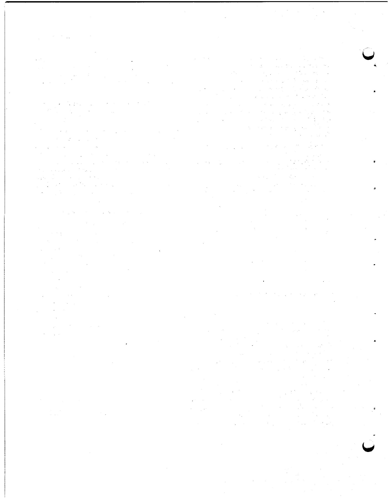

Part 3

METALLURGY

W. D. Manly

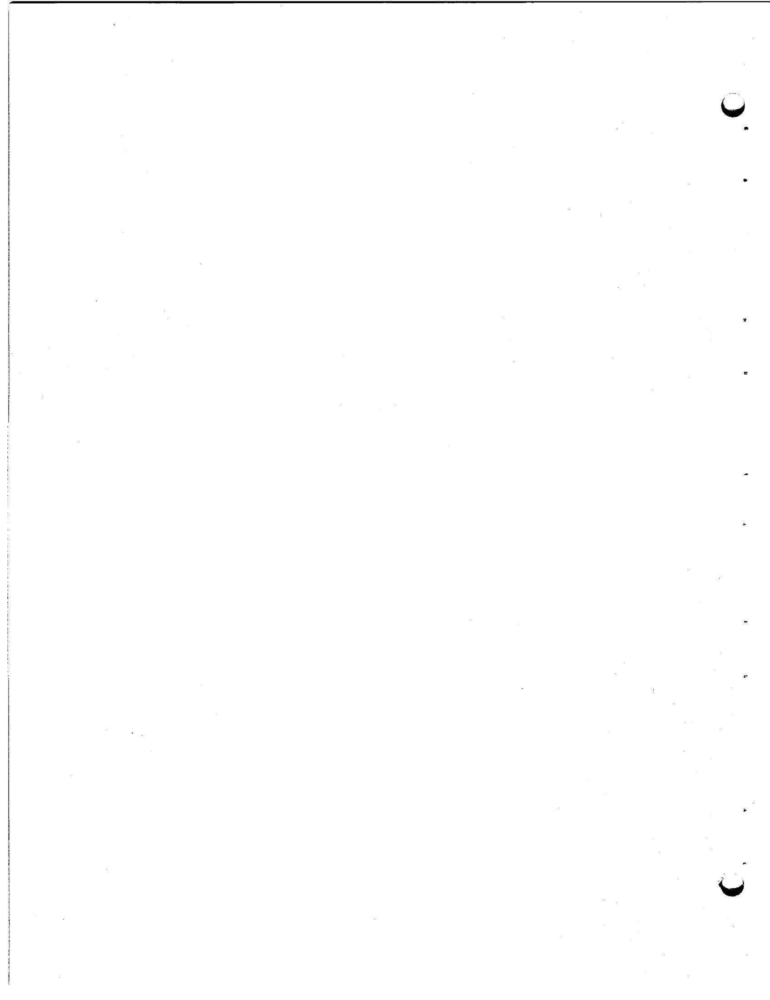

# 3.1. DYNAMIC CORROSION STUDIES

J. H. DeVan

# FLUORIDE FUEL MIXTURES IN INCONEL FORCED-CIRCULATION LOOPS

J.H.DeVan R.S.Crouse

An Inconel forced-circulation loop, 7425-8, in which the cold-leg surface area was larger than that in the standard loop, was operated to study the effect of the cold-zone area on mass transfer in the fuel mixture (No. 30) NaF-ZrF $_4$ -UF $_4$ (50-46-4 mole %). A tube bundle with a top and a bottom header and five connecting coils of $\frac{1}{4}$ -in.-dia tubing was used in place of a standard-sized cooling coil of $\frac{1}{2}$ -in.-dia tubing. With this arrangement the cold-zone area was twice that of a standard loop. The volume of the cold zone was held as nearly as possible the same as that for a standard loop so that the total loop volume would be unchanged. The standard loop (7425-10) operated concurrently with this loop was designed

as a control loop for this experiment and for several previously run experiments in which variables such as wall temperature, temperature gradient, and surface-area-to-volume ratio were studied. Both the loops, 7425-8 and 7425-10, were to operate at a maximum wall temperature of $1600^{\circ}\mathrm{F}$ and with the other conditions given in Table 3.1.1. However, it was found after operation that both loops had identical discrepancies in the recorders used to measure maximum wall temperature, and thus they actually operated at a maximum wall temperature of $1580^{\circ}\mathrm{F}$ . While good comparisons can be made between these two tests, the lower wall temperature somewhat invalidates the use of loop 7425-10 as a standard loop for comparison with other test loops.

The maximum attack in the loop with the larger cold-zone area, 7425-8, was to a depth of 4 mils, which compares quite closely with the attack to a depth of 4.5 mils in the standard loop, 7425-10. There were no cold-leg deposits in either loop, and fuel analyses made after the tests showed

TABLE 3.1.1. OPERATING CONDITIONS FOR FOUR INCONEL FORCED-CIRCULATION LOOPS THAT CIRCULATED THE FUEL MIXTURE (No. 30) NaF-ZrF4-UF4 (50-46-4 mole %)   

<table><tr><td rowspan="2">Operating Conditions</td><td colspan="4">Loop Number</td></tr><tr><td>7425-8</td><td>7425-10</td><td>7425-41</td><td>7425-43</td></tr><tr><td>Operating time, hr</td><td>1000</td><td>1000</td><td>1000</td><td>1000</td></tr><tr><td>Maximum fluoride mixture temperature, °F</td><td>1500</td><td>1500</td><td>1650</td><td>1500</td></tr><tr><td>Fluid temperature drop, °F</td><td>200</td><td>200</td><td>200</td><td>200</td></tr><tr><td>Maximum tube wall temperature, °F</td><td>1580</td><td>1580</td><td>1700</td><td>1700</td></tr><tr><td>Reynolds number</td><td>10,000</td><td>10,000</td><td>2,750</td><td>6,500</td></tr><tr><td>Fluid velocity, fps</td><td>6.5</td><td>6.5</td><td>2.06</td><td>4.47</td></tr><tr><td>Heated surface area, in.2</td><td>262</td><td>262</td><td>262</td><td>262</td></tr><tr><td>Cooled surface area, in.2</td><td>542</td><td>247</td><td>247</td><td>247</td></tr><tr><td>Ratio of cooled surface area to total loop volume</td><td>4.2</td><td>2.0</td><td>2.0</td><td>2.0</td></tr><tr><td>Ratio of heated surface area to total loop volume</td><td>1.94</td><td>2.1</td><td>2.1</td><td>2.1</td></tr><tr><td>Maximum depth of attack, mils</td><td>4</td><td>4.5</td><td>10</td><td>9</td></tr></table>

equivalent chromium contents, approximately 400 ppm. Thus the increase in the cold-zone surface area produced no apparent effect on corrosion under the conditions of these tests.

Some increase in the amount of mass transfer, as evidenced by increased hot-leg attack, was expected with increased cold-leg surface area on the basis of thermodynamic studies of the reactions of fluoride salts with pure chromium and with the chromium in Inconel (see Chap. 2.2, "Chemical Reactions in Molten Salts"). These studies predict that mass transfer of Inconel in $\mathsf{ZrF}_4$ -bearing fluoride mixtures should be rate-controlled, in part, by the amount of chromium which can diffuse from the circulated fluid into the cold leg. Such a process would be related directly to the cold-zone surface area.

Examination was completed of loop 7425-43, which was operated as a part of a series of tests to study the effect of the bulk fluoride temperature on the corrosion of Inconel. The loop circulated the fuel mixture (No. 30) NaF-ZrF $_4$ -UF $_4$ (50-46-4 mole %), and it operated with a maximum wall temperature of $1700^{\circ}\mathrm{F}$ , a maximum fluid temperature of $1500^{\circ}\mathrm{F}$ , and a fluid temperature drop of $200^{\circ}\mathrm{F}$ . The results of operation of this loop are to be compared with those for loop 7425-41, which, as reported previously, $^2$ was operated with a similar maximum wall temperature and temperature drop, but with a maximum fluid temperature of $1650^{\circ}\mathrm{F}$ . Other conditions of operation for these two loops are compared in Table 3.1.1.

The maximum attack was found in the region of maximum wall temperature in both loops. As shown in Figs. 3.1.1 and 3.1.2 the types of attack were quite similar, as were the depths of attack, being 9 mils in loop 7425-43 in which the maximum fluid temperature was $1500^{\circ}\mathrm{F}$ and 10 mils in loop 7425-41 in which the maximum fluid temperature was $1650^{\circ}\mathrm{F}$ . The amounts of chromium in solution in the fluoride mixtures in both loops, as shown in Table 3.1.2, were also comparable, with the amount in the fluid circulated at $1500^{\circ}\mathrm{F}$ actually being greater. If variations in Reynolds number are neglected, as argued previously,[2] the insignificance of the effect of the differences in bulk fluoride mixture temperature in these two tests is apparently the result of the similarity in maximum wall temperatures ( $1700^{\circ}\mathrm{F}$ in both loops).

The importance of the wall temperature to .corrosion in Inconel-fluoride fuel systems was discussed previously.2

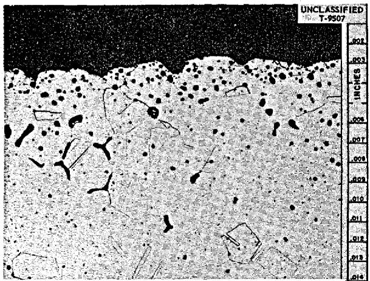

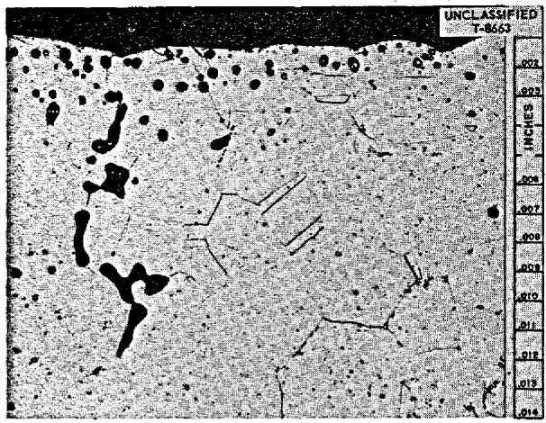  
Fig. 3.1.1. Region of Maximum Attack in Inconel Forced-Circulation Loop 7425-43 Which Circulated the Fuel Mixture (No. 30) NaF-ZrF $_4$ -UF $_4$ (50-46-4 mole %) for 1000 hr with a Maximum Wall Temperature of $1700^{\circ}\mathrm{F}$ and a Maximum Fluid Temperature of $1500^{\circ}\mathrm{F}$ . Etched with modified aqua regia, 250X. Reduced $32.5\%$ . (Secret with caption.)   
Fig. 3.1.2. Region of Maximum Attack in Inconel Forced-Circulation Loop 7425-41 Which Circulated the Fuel Mixture (No. 30) NaF-ZrF $_4$ -UF $_4$ (50-46-4 mole %) for 1000 hr with a Maximum Wall Temperature of $1700^{\circ}\mathrm{F}$ and a Maximum Fluid Temperature of $1650^{\circ}\mathrm{F}$ . Etched with modified aqua regia, 250X. Reduced $32.5\%$ . (Secret with caption)

TABLE 3.1.2. URANIUM AND IMPURITY ANALYSES OF FUEL MIXTURE (No. 30) NaF-ZrF4-UF4 (50-46-4 mole %) AFTER CIRCULATION IN INCONEL LOOPS 7425-41 AND 7425-43   

<table><tr><td rowspan="2">Loop No.</td><td rowspan="2">Sample Taken</td><td rowspan="2">Uranium Content (wt %)</td><td colspan="3">Impurities Found (ppm)</td></tr><tr><td>Ni</td><td>Cr</td><td>Fe</td></tr><tr><td rowspan="2">7425-41</td><td>Before filling</td><td>8.61</td><td>40</td><td>105</td><td>45</td></tr><tr><td>After draining</td><td>10.3*</td><td>40</td><td>440</td><td>70</td></tr><tr><td rowspan="2">7425-43</td><td>Before filling</td><td>9.20</td><td>50</td><td>55</td><td>70</td></tr><tr><td>After draining</td><td>9.37</td><td>100</td><td>650</td><td>80</td></tr></table>

*This value is in doubt.

# SODIUM AND NaK IN INCONEL FORCED-CIRCULATION LOOPS

J.H.DeVan R.S.Crouse

An Inconel forced-circulation loop completed 1000 hr of operation with sodium which had been specially treated to removed oxide contamination prior to testing. During this test the maximum fluid temperature was $1500^{\circ}\mathrm{F}$ , and the temperature drop was $300^{\circ}\mathrm{F}$ . Prior to the actual test, sodium was circulated through the loop at $1500^{\circ}\mathrm{F}$ under isothermal conditions to remove oxide films from both the hot and cold legs of the loop. This sodium was then dumped at $1500^{\circ}\mathrm{F}$ and replaced with a charge that had been cold trapped and filtered in a service loop operated at $300^{\circ}\mathrm{F}$ . A circulatory cold trap maintained at $300^{\circ}\mathrm{F}$ was also used during the test. An evaluation of mass transfer in this loop showed that the weight of deposit was equivalent to that found in loops operated with normal sodium either with or without circulatory cold traps.

An experiment to evaluate the effect of a lower cold trap operating temperature, in which NaK rather than sodium was used, likewise failed to show a reduction in mass transfer. Loop 7439-3, also constructed of Inconel, was operated 1000 hr with the cold trap temperature held to the minimum for which flow through the trap could be maintained, approximately $100^{\circ}\mathrm{F}$ . The operating conditions, except for cold trap temperature, were identical to those for the above-mentioned loops. A visual examination of the loop failed to show a reduction in deposits in comparison with the deposits found in loop 7439-1, described previously, which also circulated NaK and operated with a $300^{\circ}\mathrm{F}$ cold trap temperature.

# SODIUM-BERYLLIUM-INCONEL COMPATIBILITY IN DYNAMIC SYSTEMS

J.H.DeVan R.S.Crouse

Previous compatibility studies of Inconel-beryllium-sodium systems, conducted by inserting small beryllium tubes in the hot legs of toroid, thermal-convection, or forced-circulation loops, showed little effect on temperature-gradient mass transfer at temperatures up to $1300^{\circ}\mathrm{F}$ that could be attributed to the presence of the beryllium. To determine whether increasing the beryllium surface area relative to the surface area of the Inconel would affect the compatibility, two forced-circulation loops, in which equivalent surface areas of beryllium and Inconel were in contact with the flowing sodium, were operated at $1250^{\circ}\mathrm{F}$ . Only one of the loops had an oxide cold trap.

The beryllium, in the form of rectangular blocks with drilled holes, was canned in Inconel and inserted in the hottest section of the loop; the remaining sections of the loop were constructed of Inconel. A temperature drop of $300^{\circ}\mathrm{F}$ was maintained between the hot and cold fluid temperatures in each test. After 1000 hr of operation, no increase in the amount of mass transfer was seen in either of these loops as compared with the mass transfer found in similar loops with smaller beryllium inserts. The mass-transferred deposits found were not sufficient in quantity to permit chemical analysis. They were similar in amount and appearance to deposits seen in Inconel loops without beryllium inserts. The addition of the cold trap had little effect on the test results.

# THERMAL-CONVECTION LOOP TESTS OF INCONEL CASTINGS

J.H.DeVan E.A.Kovacevich

In order to evaluate the use of Inconel castings for large, intricate sections required in the ART, three standard Inconel thermal-convection loops with cast Inconel inserts in the hot legs were operated for 500 hr. The castings, whose compositions are given in Table 3.1.3, contained approximately $1.2\%$ manganese, $2\%$ niobium, and 1 to $2\%$ silicon. Inserts 321 and 322, which had the lowest and the highest silicon contents, respectively, were tested in loops which circulated the fuel mixture (No. 30) $\mathrm{NaF - ZrF_4 - UF_4}$ (50-46-4 mole %) at $1500^{\circ}\mathrm{F}$ , while the remaining insert, 323, with an intermediate silicon content, was

tested in a loop which circulated sodium at $1500^{\circ}F$ .

As shown in Table 3.1.4, very severe corrosion of the cast specimens was found in the loops which circulated the fuel mixture. The attack occurred not only in the form of the subsurface voids that are typical of the attack of wrought Inconel, but, in addition, very deep intergranular penetrations appeared, which reached in the worst case to a depth of 70 mils, as shown in Fig. 3.1.3.

These intergranular penetrations, although a result of rapid attack of grain-boundary constituents, were aided considerably by the porosity and the shrinkage cracks present in all the castings in the as-received condition, as shown in Fig. 3.1.4. The casting containing $1\%$ silicon was found to be

TABLE 3.1.3. CHEMICAL ANALYSES OF CAST INCONEL INSERTS TESTED IN STANDARD INCONEL THERMAL-CONVECTION LOOPS

TABLE 3.1.4. RESULTS OF METALLOGRAPHIC EXAMINATION OF INCONEL THERMAL-CONVECTION LOOPS OPERATED WITH CAST INCONEL INSERTS IN THE HOT LEGS  

<table><tr><td rowspan="2">Cast Inconel Insert No.</td><td colspan="9">Chemical Analyses (wt %)</td></tr><tr><td>Ni*</td><td>Cu</td><td>Fe</td><td>Si</td><td>Mn</td><td>C</td><td>Cr</td><td>Nb</td><td>S</td></tr><tr><td>321</td><td>70.49</td><td>0.01</td><td>8.20</td><td>1.04</td><td>1.22</td><td>0.23</td><td>16.67</td><td>2.08</td><td>0.005</td></tr><tr><td>322</td><td>69.79</td><td>0.03</td><td>8.20</td><td>1.93</td><td>1.17</td><td>0.22</td><td>16.51</td><td>2.09</td><td>0.006</td></tr><tr><td>323</td><td>70.44</td><td>0.02</td><td>8.10</td><td>1.34</td><td>1.16</td><td>0.22</td><td>16.67</td><td>2.00</td><td>0.004</td></tr></table>

*Obtained by difference analysis.

Operating time: 500 hr Maximum fluid temperature: $1500^{\circ}\mathrm{F}$

<table><tr><td rowspan="2">Loop No.</td><td rowspan="2">Insert No.</td><td rowspan="2">Circulated Fluid</td><td colspan="2">Metallographic Results</td></tr><tr><td>Hot-Leg Attack</td><td>Cold-Leg Attack</td></tr><tr><td>876</td><td>321</td><td>NaF-ZrF4* (50-46-4 mole %)</td><td>Cast section, 25 mils Weld interface, 70 mils</td><td>Light surface roughening with a metal deposit present</td></tr><tr><td>877</td><td>322</td><td>NaF-ZrF4-UF4* (50-46-4 mole %)</td><td>Cast section, 23 mils Weld interface, 25 mils</td><td>Light surface roughening with evidence of metal crystals</td></tr><tr><td>878</td><td>Control</td><td>NaF-ZrF4-UF4* (50-46-4 mole %)</td><td>10 mils</td><td>No attack</td></tr><tr><td>879</td><td>323</td><td>Sodium</td><td>No attack</td><td>No attack; no deposits</td></tr></table>

*Fuel mixture No. 30.

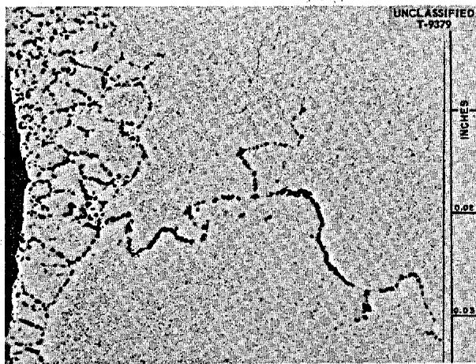

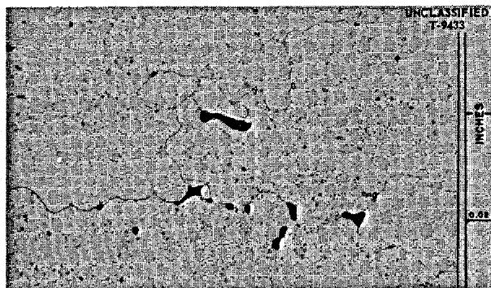  
Fig. 3.1.3. Region of Maximum Attack Near Casting-Weld Interface in Inconel Casting No. 321 Exposed for 500 hr to the Fuel Mixture (No. 30) NaF-ZrF $_4$ -UF $_4$ (50-46-4 mole %) at $1500^{\circ}\mathrm{F}$ as an Insert in the Hot Leg of a Wrought Inconel Thermal-Convection Loop. Etched with modified aqua regia. 100X. Reduced 32.5%. (Secret with caption)   
Fig. 3.1.4. Porosity in As-Received Inconel Casting No. 321. 100X. Reduced $32.5\%$ .

no better from the corrosion standpoint than the one containing $2\%$ silicon.

Metal deposits were seen metallographically and visually in the hot legs of both loops. Spectrographically, the deposits were found to be predominantly nickel, with aluminum, chromium, and iron reported as major elements. The silicon and manganese contents in these deposits were low.

Loop 879, which contained insert 323 and circulated sodium, revealed very little corrosion

(<1 mil) in the insert section. Metallic deposits, which were found by analysis to be predominantly nickel, were visible in the trap area. The amount of deposited material was approximately the same as that normally found in wrought Inconel loops.

It is apparent that Inconel castings of the compositions tested are not suitable for use in contact with the fuel mixture (No. 30) NaF-ZrF4-UF4 (50-46-4 mole %). While the castings showed resistance to sodium, further tests of longer duration will be required to completely evaluate mass-transfer effects.

# FLUORIDE FUEL MIXTURES IN HASTELLOY THERMAL-CONVECTION LOOPS

J.H.DeVan E.A.Kovacevich

Three Hastelloy X (ref. 4) thermal-convection loops, which were constructed from $\frac{1}{2}$ -in.-dia tubing, were operated 1000 hr, two with sodium at $1500^{\circ}\mathrm{F}$ and one with the fuel mixture (No. 30) NaF-ZrF $_4$ -UF $_4$ (50-46-4 mole %) at $1500^{\circ}\mathrm{F}$ . Loops 855 and 856, which operated with sodium, had no hot-leg attack and no evidences of metallic deposits in the cold leg. Loop 857, however, which circulated the fuel mixture, showed considerable hot-leg attack to a depth of 27 mils. The cold leg of this loop was attacked to a depth of 1 mil, and there were evidences of metallic crystals and a metallic layer, as shown in Fig. 3.1.5. The metallic crystals in the trap area were analyzed and found to be predominantly chromium.

Two loops, 872 and 873, constructed of $\frac{3}{4}$ -in.-dia Hastelloy W (ref. 5) tubing were also operated for 1000 hr with sodium and with the fuel mixture (No. 30) NaF-ZrF $_4$ -UF $_4$ (50-46-4 mole \%), respectively, at $1500^{\circ}\mathrm{F}$ . Neither loop showed hot-leg attack; however, loop 872, which operated with sodium, had scattered metallic crystals in the cold leg. The hot-leg samples of both loops were similar metallographically to the as-received samples of each loop.

The significant difference in attack on the two alloys, Hastelloys X and W, by the fuel mixture can undoubtedly be explained by the difference in the chromium content of the two alloys, 22

and $5\%$ , respectively. As may be seen in Table 3.1.5, the chromium content of the fuel mixture circulated in the Hastelloy X loop was much higher than that of the fuel mixture circulated in the Hastelloy W loop. This reflects the greater tendency toward chromium removal and the resultant void formation in alloys with high chromium contents, such as Hastelloy X.

# FLUORIDE FUEL MIXTURES IN MONEL THERMAL-CONVECTION LOOPS

J. H. DeVan

Three monel thermal-convection loops, 806, 808, and 809, completed 500, 545, and 1027 hr of operation, respectively, with the fuel mixture

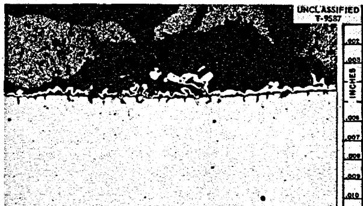  
Fig. 3.1.5. Metallic Crystals and Layer Deposited in Cold Leg of Hastelloy X Thermal-Convection Loop Which Circulated the Fuel Mixture (No. 30) NaF-ZrF4-UF4 (50-46-4 mole %) for 1000 hr at a Hot-Leg Temperature of $1500^{\circ}\mathrm{F}$ . Etched with $\mathrm{HCl - H_2CrO_4}$ . 250X. Reduced 32.5%. (Secret with caption)

No. 107) NaF-LiF-KF-UF (11.2-41-45.3-2.5 mole $\%$ ) circulating at a hot-leg temperature of $1500^{\circ}\mathrm{F}$ . Loops 808 and 809, which were scheduled to operate 1000 and 1500 hr, respectively, were terminated before completion of the scheduled operating period because of excessive oxidation of the outside surface of the monol tubing. The oxidation did not completely penetrate the tube wall in either loop. Metallographic examination revealed hot-leg attack to a depth of 1 mil, as shown in Fig. 3.1.6, in all these loops. Three other monel loops, 880, 881, and 882, that had been chromium-plated to provide oxidation protection were operated under the same conditions, but, apparently, the platings were imperfect, and two of these three loops, 881 and 882, were

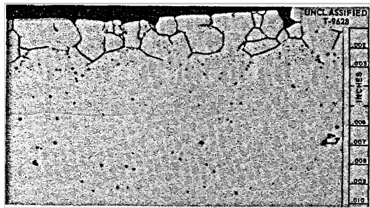  
Fig. 3.1.6. Region of Maximum Attack of Hot Leg of Monel Thermal-Convection Loop 809 Which Circulated the Fuel Mixture (No. 107) NaF-LiF-KF-UF4 (11.2-41-45.3-2.5 mole %) for 1027 hr at a Hot-Leg Temperature of $1500^{\circ}\mathrm{F}$ . Etched with $\mathsf{HNO}_3$ -acetic acid, 250X. Reduced $32.5\%$ . (Secret with caption)

TABLE 3.1.5. CHEMICAL ANALYSES OF THE FUEL MIXTURE (No. 30) NaF-ZrF4-UF4 (50-46-4 mole %) BEFORE AND AFTER CIRCULATION FOR 1000 hr AT ${1500}^{ \circ  }\mathrm{F}$ IN HASTELLOY X AND W THERMAL-CONVECTION LOOPS   

<table><tr><td rowspan="2">Loop No.</td><td rowspan="2">Loop Material</td><td rowspan="2">Sample Taken</td><td rowspan="2">Uranium Content (wt %)</td><td colspan="3">Impurities Found (ppm)</td></tr><tr><td>Ni</td><td>Cr</td><td>Fe</td></tr><tr><td rowspan="2">857</td><td rowspan="2">Hastelloy X</td><td>Before filling</td><td>8.39</td><td>260</td><td>135</td><td>115</td></tr><tr><td>After draining</td><td>8.68</td><td>40</td><td>1060</td><td>125</td></tr><tr><td rowspan="2">873</td><td rowspan="2">Hastelloy W</td><td>Before filling</td><td>8.78</td><td>80</td><td>60</td><td>75</td></tr><tr><td>After draining</td><td>8.82</td><td>85</td><td>275</td><td>110</td></tr></table>

terminated after 1217 and 1339 hr of the 1500 hr scheduled because of excessive oxidation and resultant leaks in the heated areas of the loops. The remaining loop, 880, completed its scheduled 1000 hr of operation. Metallographic analyses of these loops have not been completed.

# SPECIAL FLUORIDE FUEL MIXTURES IN INCONEL THERMAL-CONVECTION LOOPS

J. H. DeVan

Additional Inconel thermal-convection loops have been operated to evaluate corrosion properties

of several special fluoride fuel mixtures. Tests of 500 hr duration were completed for mixtures in the $MF-ZrF_4-UF_4$ system, where $MF$ is $KF$ , $LiF$ , $NaF$ , or $RbF$ . Mixtures with each of these fluorides and 40 or 46 mole $\% ZrF_4$ have been tested; each mixture contained 4 mole $\% UF_4$ . The results obtained for the fuels containing 46 mole $\% ZrF_4$ were reported previously, but they are repeated in Table 3.1.6 for comparison. Lowering the $ZrF_4$ content, as shown in Table 3.1.6, had no effect on attack by the NaF-containing mixture, but the attack by the $KF-$ and $RbF$ -containing mixtures increased from 1 to 2 mils. The LiF-containing

TABLE 3.1.6. RESULTS OF METALLOGRAPHIC EXAMINATIONS OF INCONEL THERMAL-CONVECTION LOOPS OPERATED WITH SPECIAL FLUORIDE FUEL MIXTURES AT A HOT-LEG TEMPERATURE OF ${1500}^{ \circ  }\mathrm{F}$   

<table><tr><td rowspan="2">Loop No.</td><td rowspan="2">Fuel Mixture Code Designation</td><td rowspan="2">Fuel Mixture Composition (mole %)</td><td rowspan="2">Operating Time (hr)</td><td colspan="2">Metallographic Results</td></tr><tr><td>Maximum Hot-Leg Attack (mils)</td><td>Cold-Leg Deposits</td></tr><tr><td>845</td><td>94</td><td>KF-ZrF4-UF4: 50-46-4</td><td>500</td><td>6.5</td><td>Metallic layer</td></tr><tr><td>846</td><td>94</td><td>KF-ZrF4-UF4: 50-46-4</td><td>500</td><td>8</td><td>Metallic layer</td></tr><tr><td>883</td><td>94</td><td>KF-ZrF4-UF4: 50-46-4</td><td>1500</td><td>11</td><td>Metallic layer</td></tr><tr><td>884</td><td>94</td><td>KF-ZrF4-UF4: 50-46-4</td><td>1500</td><td>9</td><td>Metallic layer</td></tr><tr><td>930</td><td>WR4</td><td>KF-ZrF4-UF4: 56-40-4</td><td>500</td><td>7</td><td>Metallic layer</td></tr><tr><td>931</td><td>WR4</td><td>KF-ZrF4-UF4: 56-40-4</td><td>500</td><td>9</td><td>Metallic layer</td></tr><tr><td>847</td><td>93</td><td>LIF-ZrF4-UF4: 50-46-4</td><td>500</td><td>17.5</td><td>Possible crystals</td></tr><tr><td>848</td><td>93</td><td>LIF-ZrF4-UF4: 50-46-4</td><td>500</td><td>19</td><td>Possible crystals</td></tr><tr><td>928</td><td>WR3</td><td>LIF-ZrF4-UF4: 56-40-4</td><td>500</td><td>10</td><td>Metallic layer and crystals</td></tr><tr><td>929</td><td>WR3</td><td>LIF-ZrF4-UF4: 56-40-4</td><td>500</td><td>10</td><td>Metallic layer and crystals</td></tr><tr><td>839</td><td>95</td><td>RbF-ZrF4-UF4: 50-46-4</td><td>500</td><td>9</td><td>Metallic layer</td></tr><tr><td>840</td><td>95</td><td>RbF-ZrF4-UF4: 50-46-4</td><td>500</td><td>9</td><td>Metallic layer</td></tr><tr><td>932</td><td>WR5</td><td>RbF-ZrF4-UF4: 56-40-4</td><td>500</td><td>10</td><td>Metallic layer and crystals</td></tr><tr><td>933</td><td>WR5</td><td>RbF-ZrF4-UF4: 56-40-4</td><td>500</td><td>11</td><td>Metallic layer and crystals</td></tr><tr><td>860</td><td>30</td><td>NaF-ZrF4-UF4: 50-46-4</td><td>500</td><td>10.5</td><td>None</td></tr><tr><td>861</td><td>30</td><td>NaF-ZrF4-UF4: 50-46-4</td><td>500</td><td>9</td><td>None</td></tr><tr><td>926</td><td>WR2</td><td>NaF-ZrF4-UF4: 56-40-4</td><td>500</td><td>10</td><td>Metallic layer and crystals</td></tr><tr><td>927</td><td>WR2</td><td>NaF-ZrF4-UF4: 56-40-4</td><td>500</td><td>7</td><td>Metallic layer and crystals</td></tr></table>

mixture showed quite anomalous behavior in that the attack decreased markedly with the decrease in $\mathsf{ZrF}_4$ . These results are being rechecked.

The loops containing mixtures with 56 mole % of the alkali-metal fluoride, with the exception of the loop operated with the KF-containing mixture, showed traces of metallic crystals in the cold legs. These crystals were most pronounced in the RbF-containing mixtures. Specimens of the crystals found in loop 933, which circulated the fuel mixture $\mathsf{RbF - ZrF}_4\mathsf{-UF}_4$ (56-40-4 mole %), are shown in Fig. 3.1.7.

Two additional Inconel loops, 883 and 884, were operated under similar conditions to obtain further corrosion data for the $\text{KF-ZrF}_4 - \text{UF}_4$ (50-46-4 mole %) system. An increase in the operating time from 500 to 1500 hr caused an increase in maximum attack of 2 mils. Thin metallic layers were noted in the cold legs after both operating periods. As yet these layers are unidentified.

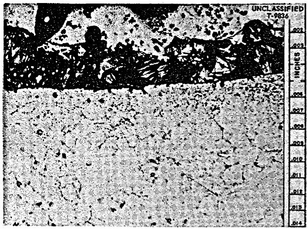  
Fig. 3.1.7. Metallic Crystals and Layer Deposited in Cold Leg of Inconel Thermal-Convection Loop 933 Which Circulated the Fuel Mixture (No. WR5) RbF-ZrF4-UF4 (56-40-4 mole %) for 500 hr at a Hot-Leg Temperature of $1500^{\circ}\mathrm{F}$ . Etched with modified aqua regia. 250X. Reduced 32.5%. (Secret with caption)

# 3.2. GENERAL CORROSION STUDIES

E. E. Hoffman

# BRAZING ALLOYS IN LIQUID METALS AND IN FLUORIDE FUEL MIXTURES

D. H. Jansen

Two Inconel thermal-convection loops with inserts brazed with $70\%$ Ni- $13\%$ Ge- $11\%$ Cr- $6\%$ Si brazing alloy in the hot-leg section were operated for 500 hr. In one loop NaK (56-44 wt $\%$ ) was circulated, and in the other the fuel mixture (No. 44) NaF-ZrF $_4$ -UF $_4$ (53.5-40-6.5 mole $\%$ ) was circulated. The hot-leg sections of these loops consisted of seven Inconel segments brazed with the alloy being tested. This type of thermal-convection loop test assembly was illustrated previously. $^{1}$ The hot legs of both loops were

$^{1}$ D. H. Jansen, ANP Quar. Prog. Rep. Dec. 10, 1955, ORNL-2012, p 113, Fig. 5.9.

maintained at a temperature of $1500^{\circ}\mathrm{F}$ for the duration of the tests. The cold-leg temperature of the loop that circulated NaK was maintained at $1165^{\circ}\mathrm{F}$ , and the cold-leg temperature of the loop that circulated the fuel mixture was held at $1150^{\circ}\mathrm{F}$ .

The inner walls of the Inconel segments and two samples from each brazed joint were examined after the tests for evidence of attack. The results of the examinations are summarized in Table 3.2.1.

The attack of the fuel mixture on the brazed joints averaged about 5 mils. Typical samples are shown in Fig. 3.2.1. The attack of the fuel mixture on the Inconel tubing adjacent to the joint ranged from 4.5 mils in the coolest $(1450^{\circ}\mathrm{F})$ portion of the hot leg to 9 mils in the hottest $(1500^{\circ}\mathrm{F})$ portion of the hot leg, as shown in Fig. 3.2.1. A slight trace of metallic crystals

Operating time: 500 hr

TABLE 3.2.1. RESULTS OF THERMAL-CONVECTION LOOP TESTS OF INCONEL SEGMENTS BRAZED WITH $70\%$ Ni- $13\%$ Ge- $11\%$ Cr- $6\%$ Si BRAZING ALLOY   

<table><tr><td rowspan="2">Brazed Joint No.</td><td colspan="2">Metallographic Notes</td></tr><tr><td>Effect of Fuel Mixture</td><td>Effect of NaK</td></tr><tr><td>1*</td><td>Brazing alloy attacked to a depth of 4.5 mils; adjacent Inconel tube attacked to a maximum depth of 9 mils</td><td>No attack apparent; large crack through brazing alloy to center of tube wall</td></tr><tr><td>2</td><td>Brazing alloy attacked to a depth of 4.5 mils; spotty, nonuniform attack on tube wall to a maximum depth of 7 mils</td><td>Attack to a depth of 0.5 mil</td></tr><tr><td>3</td><td>Brazing alloy attacked to a depth of 6 mils; spotty attack on tube wall to a depth of 7.5 mils</td><td>No attack; large crack, as in joint 1 above</td></tr><tr><td>4</td><td>Brazing alloy attacked to a depth of 3 mils; tube wall attacked to a depth of 4.5 mils</td><td>Attack to a depth of 0.5 mil; large crack in brazing alloy</td></tr><tr><td>5</td><td>Brazing alloy attacked to a depth of 5 mils; tube wall attacked to a depth of 4.5 mils</td><td>Large crack in brazing alloy</td></tr><tr><td>6**</td><td>Brazing alloy attacked to a depth of 5 mils; tube wall attacked to a depth of 4.5 mils</td><td>Attack to a depth of 1.5 mils; some porosity in brazing alloy; no large cracks</td></tr></table>

*Brazed joint No. 1 was located at the hottest (1500°F) portion of the hot leg.   
**Joint No. 6 was located at the coolest $(1450^{\circ}\mathrm{F})$ portion of the hot leg.

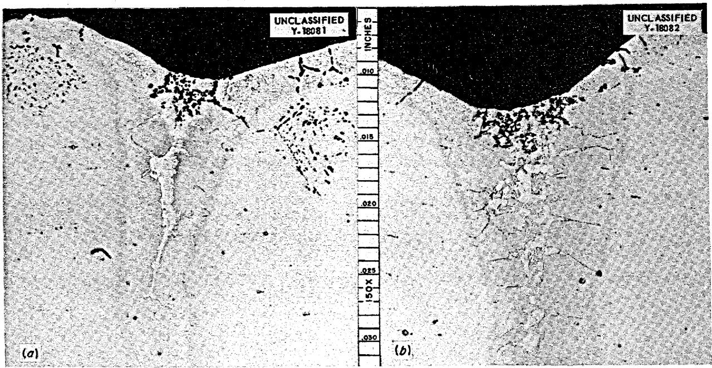  
Fig. 3.2.1. Specimens of Inconel Joints Brazed with the $70\%$ Ni- $13\%$ Ge- $11\%$ Cr- $6\%$ Si Brazing Alloy and Exposed for 500 hr to the Fuel Mixture (No. 44) NaF-ZrF $_4$ -UF $_4$ (53.5-40-6.5 mole %) in the Hot Leg of an Inconel Thermal-Convection Loop. (a) Joint located in coolest $(1450^{\circ}\mathrm{F})$ portion of hot leg. (b) Joint located in hottest $(1500^{\circ}\mathrm{F})$ portion of hot leg. Etched with $10\%$ oxalic acid. 150X. Reduced $19\%$ . (Secret with caption)

was found in the cold leg of the loop that circu- lated the fuel mixture. Spectrographic analyses of these crystals showed strong lines for chromium and nickel and weak lines for iron. There was no evidence of mass transfer in the loop that circulated NaK.

The brazing alloy showed good corrosion resistance to NaK, as shown in Fig. 3.2.2, but large cracks which extended to a depth of one-half the tube wall thickness were found in some of the brazed joints, Fig. 3.2.3. It is not known whether these cracks were caused by thermal stresses or shrinkage. Analysis of the NaK after the test showed 1160 ppm of oxygen. This is admittedly high, but no efforts were made to purify the NaK which was received in container lots.

A third Inconel thermal-convection loop was operated for 500 hr in which the hot leg contained Inconel inserts brazed with the $82\%$ Au-18% Ni brazing alloy. The fluid circulated was the fuel mixture (No. 30) NaF-ZrF4-UF4 (50-46-4 mole %). The hot and cold legs were maintained at temperatures of 1500 and $1175^{\circ}\mathrm{F}$ , respectively. Micro

scopic examination of samples from each brazed joint showed the attack on the alloy to average about 8 mils, with a maximum depth of 10 mils.

Tests were also conducted on a series of buttons of Coast Metals brazing alloy No. 52 (89% Ni-5% Si-4% B-2% Fe), which were exposed in seesaw apparatus to NaK (56-44 wt %) and to the fuel mixture (No. 44) NaF-ZrF₄-UF₄ (53.5-40-6.5 mole %). Since previous tests of this alloy showed depletion of the second phase at the exposed edge, these tests were conducted to determine whether the high-cross-section boron component was removed and, if so, whether the removal was time dependent. The buttons were contained in nickel tubes with hot-zone temperatures of 1500°F for both tests and with cold-zone temperatures of 1100°F in the tests with NaK and 1200°F in the tests with the fuel mixture. In all the tests, the specimens were retained in the hot zone of the test capsule. The duration of the exposures to

NaK were 100 and 350 hr, and the exposures to the fuel mixture were of 100 and 500 hr duration.

The results of the tests are presented in Table 3.2.2. Boron was found only in very small quantities in the areas depleted of the second phase by exposure to NaK and to the fuel mixture. A microspark traverse on the sample exposed to the

fuel mixture for 500 hr showed that the concentration of boron was less than $1\%$ from the surface to a depth of 8 mils. The boron content then rose sharply to its normal value $(4\%)$ and stayed there for the remainder of the traverse. Samples of the depleted area, obtained by microdrilling, were analyzed and were found to contain $0.6\%$ boron.

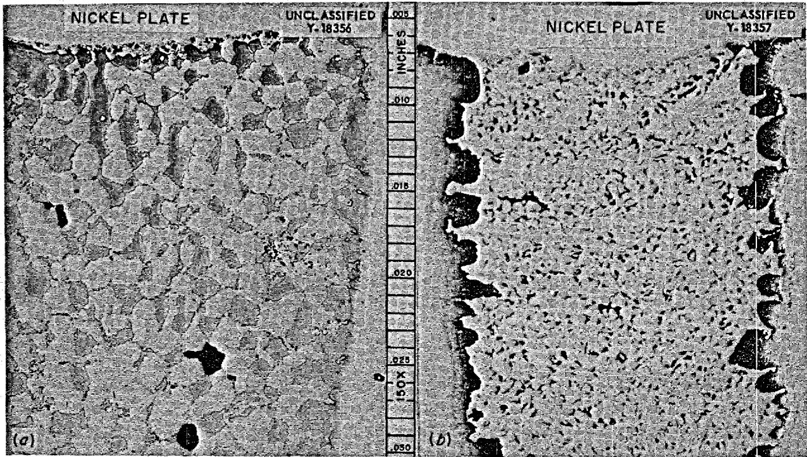  
Fig. 3.2.2. Specimens of Inconel Joints Brazed with the $70\%$ Ni- $13\%$ Ge- $11\%$ Cr- $6\%$ Si Brazing Alloy and Exposed for 500 hr to NaK at $1500^{\circ}$ F in the Hot Leg of an Inconel Thermal-Convection Loop. These two specimens, No. 2 and No. 6, illustrations (a) and (b), respectively, were the only samples examined that did not have large cracks in the brazing alloy. Etched with $10\%$ oxalic acid. 150X. Reduced $8\%$ .

TABLE 3.2.2. RESULTS OF SEESAW CORROSION TESTS OF COAST METALS BRAZING ALLOY No. 52 (89% NI-5% SI-4% B-2% Fe)   

<table><tr><td>Bath</td><td>Duration of Test (hr)</td><td>Weight Loss of Specimen (%)</td><td>Depth of Edge Depleted of Second Phase (mils)</td></tr><tr><td rowspan="2">NaK (56-44 wt %)</td><td>100</td><td>0.07</td><td>0.5</td></tr><tr><td>350</td><td>0.23</td><td>4</td></tr><tr><td rowspan="2">NaF-ZrF4-UF4(53.5-40-6.5 mole %)</td><td>100</td><td>0.06</td><td>3</td></tr><tr><td>500</td><td>0.34</td><td>6</td></tr></table>

It was also found that the silicon content had dropped to about one-third its normal value (5%) in the depleted area. Evidence of the time dependence of the amount of depletion is presented in Fig. 3.2.4. None of the buttons tested showed attack to a depth of more than 0.5 mil.

Hardness measurements on the interior of the

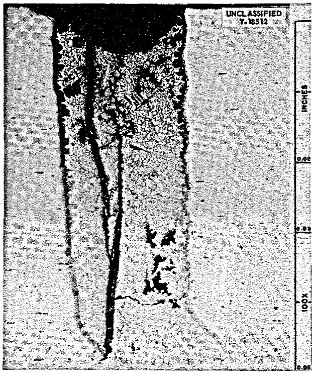  
Fig. 3.2.3. Typical Crack Found in an Inconel Joint Brazed with the $70\%$ Ni- $13\%$ Ge- $11\%$ Cr- $6\%$ Si Brazing Alloy After Exposure for 500 hr to NaK at $1500^{\circ}\mathrm{F}$ in an Inconel Thermal-Convection Loop. Etched with $10\%$ oxalic acid. 100X. Reduced $29\%$ .

button exposed to NaK for 350 hr gave a value of 716 DPH, while measurements at the edge gave a value of 145 DPH, as shown in Fig. 3.2.5. The buttons tested in the fuel mixture gave similar hardness traverse results. Chemical analysis of the fuel mixture from the 500-hr test and of the NaK used in the 100-hr test showed significant concentrations of boron.

# NIOBIUM IN STATIC SODIUM

# D. H. Jansen

Specimens of niobium were tested in static sodium at $1500^{\circ}\mathrm{F}$ for a period of 1000 hr to determine the suitability of liquid sodium as a protective environment for niobium during high-temperature mechanical property tests. The tests were designed to show whether the niobium would be corroded by the sodium and whether the hardness of the niobium would be appreciably altered through the pickup of oxygen from the sodium.

The specimens were contained in type 304 stainless steel and Inconel capsules, and the variables such as the volume of the bath, the container size, and the area of the specimen were adjusted to obtain a surface-area-to-volume ratio that would be as close as possible to that found in creep-test equipment. Cold traps were utilized on the bottom of each capsule to reduce the amount of oxygen in the sodium bath. The niobium specimen tested in the type 304 stainless steel capsule showed more evidence of surface roughening than did the specimen tested in the Inconel capsule, Fig. 3.2.6, and the thickness loss was also more than that of the specimen tested in the Inconel capsule, Table 3.2.3. A thin, brittle layer, approximately

Exposure time: 100

Temperature of sodium: $1500^{\circ} \mathrm{F}$

TABLE 3.2.3. RESULTS OF TESTS OF NIOBIUM IN STATIC SODIUM   

<table><tr><td rowspan="2">Sample</td><td rowspan="2">Hardness (VHN)</td><td rowspan="2">Thickness Loss (mils)</td><td colspan="4">Impurity Analysis of Sample (ppm)</td></tr><tr><td>H2</td><td>O2</td><td>N2</td><td>C</td></tr><tr><td>As-received material</td><td>130.5</td><td></td><td>2.4</td><td>40</td><td>125</td><td>300</td></tr><tr><td>Specimen tested in type 304 stainless steel tube</td><td>135.0</td><td>3.0</td><td>3.8</td><td>84</td><td>250</td><td>370</td></tr><tr><td>Specimen tested in Inconel tube</td><td>116.4</td><td>1.8</td><td>3.4</td><td>90</td><td>92</td><td>1180</td></tr></table>

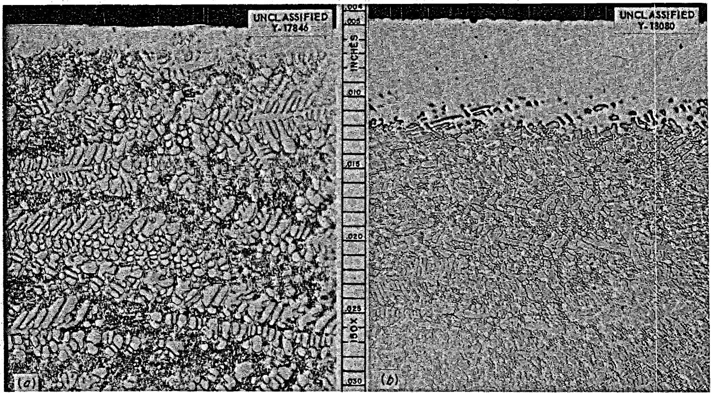

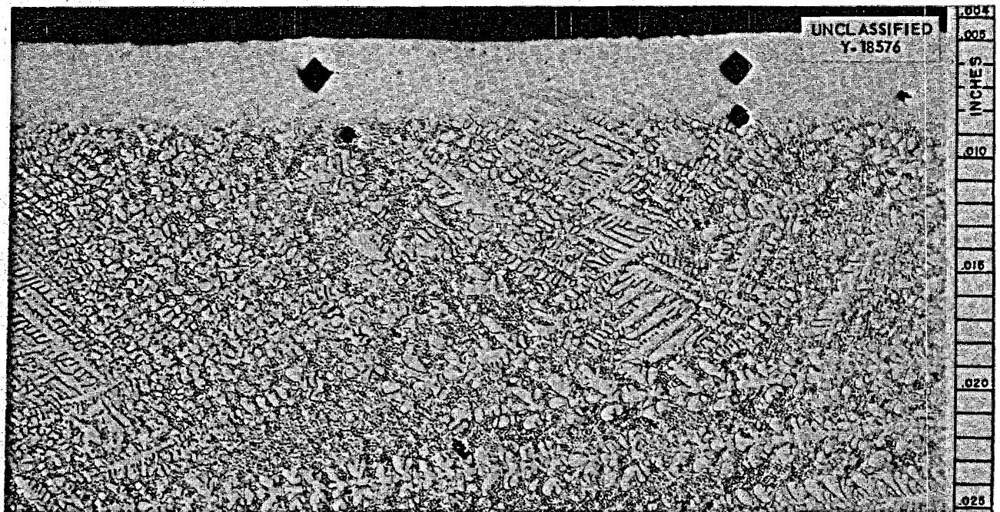  
Fig. 3.2.4. Specimens of Coast Metals Brazing Alloy No. 52 (89% Ni-5% Si-4% B-2% Fe) After Exposure in Seesaw Apparatus to the Fuel Mixture (No. 44) NaF-ZrF $_4$ -UF $_4$ (53.5-40-6.5 mole %) for (a) 100 hr and (b) 500 hr. Reduced 12.5%. (Secret with caption)   
Fig. 3.2.5. Specimen of Coast Metals Brazing Alloy No. 52 (89% Ni-5% Si-4% B-2% Fe) After Exposure in Seesaw Apparatus to NaK for 350 hr. Note differences in hardness. Etched with 10% oxalic acid. 150X.

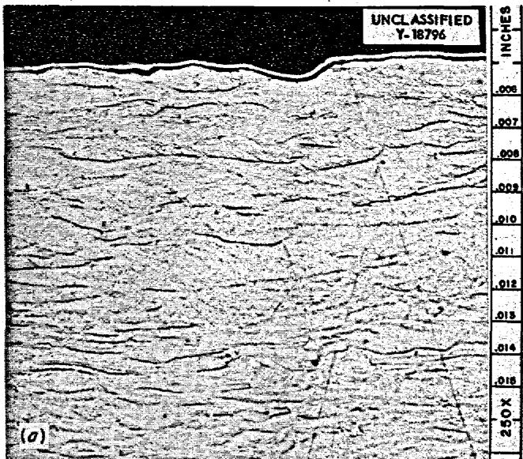

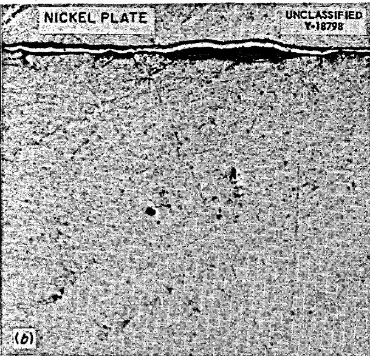  
Fig. 3.2.6. Specimens of Niobium After Exposure to Static Sodium at $1500^{\circ}$ F in (a) an Inconel Capsule and (b) a Type 304 Stainless Steel Capsule. Etched with $25\%$ HF- $25\%$ $\mathsf{H}_2\mathsf{SO}_4 - 50\%$ $\mathsf{H}_2\mathsf{O}$ . Reduced $17\%$ .

0.3 mil thick, formed on the surface of both specimens during the test. This layer, which is very hard ( $\sim 1180$ VHN), is probably a niobium-nickel alloy resulting from dissimilar-metal transfer, but it has not yet been positively identified.

Vickers hardness traverses were made on the as-received and as-tested specimens. The hardness of the specimen tested in the type 304 stainless steel capsule increased (130 to 135 VHN) during the test, whereas the hardness of the specimen tested in the Inconel capsule decreased (130 to 116 VHN). A correlation of the hardness values with the impurity analyses indicates that nitrogen is the major hardening agent. A niobium specimen previously tested in argon at $1500^{\circ}\mathrm{F}$ for 2000 hr showed a hardness increase from 127 to 168 VHN. The impurities $(\mathsf{H}_2\mathsf{O},\mathsf{H}_2,\mathsf{N}_2,$ and $\mathsf{O}_2)$ of the argon used in the test totaled 130 ppm.

# THERMENOL IN STATIC SODIUM

# D.H.Jansen

Samples of Thermenol (82% Fe-15% Al-3% Mo) cut from a piece of hot-rolled strip were corrosion tested in static sodium for 100 hr at $1500^{\circ}\mathrm{F}$ . The specimens were contained in AISI 1035 steel and type 430 stainless steel capsules. The specimen tested in the AISI 1035 steel capsule showed a

weight loss of $0.22\%$ , and the specimen tested in the stainless steel capsule showed a weight loss of $0.07\%$ . A slight roughening of the surface occurred on both samples, Fig. 3.2.7. Neither the type 430 stainless steel nor the AISI 1035 steel capsule was attacked during the tests.

# STATIC TESTS OF ALFENOL

# E.E.Hoffman

Specimens of Alfenol (84% Fe-16% Al), submitted by The Glenn L. Martin Co., were tested under static conditions at $1500^{\circ}$ F in the fuel mixture (No. 44) NaF-ZrF $_4$ -UF $_4$ (53.5-40-6.5 mole %), lead, lithium, and sodium for 100 hr. Since no Alfenol container tubes were available, Inconel was used as the container material for all the tests. The Alfenol specimens used in these tests were $\frac{1}{2}$ -in. cubes. The specimens were placed in $\frac{1}{2}$ -in.-OD, 0.035-in.-wall Inconel tubes, together with sufficient test medium to give 3 in. of liquid bath at the test temperature.

The specimen tested in the fuel mixture was covered with black crystals and showed a $30\%$ weight increase. The crystals were analyzed and found to be $\mathsf{UF}_3$ . The specimen was attacked throughout its thickness along the grain boundaries, Fig. 3.2.8.

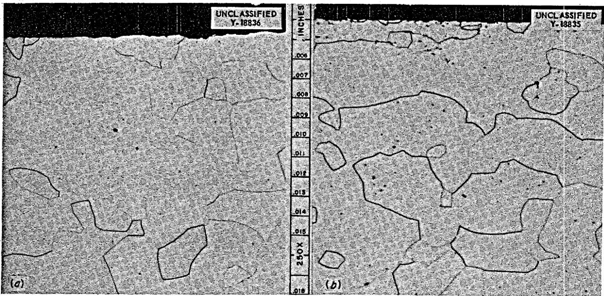

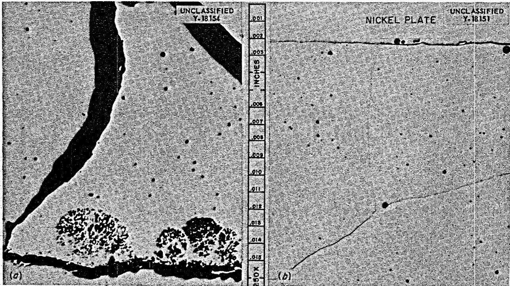  
Fig. 3.2.7. Specimens of Thermenol (82% Fe-15% Al-3% Mo) After Exposure to Static Sodium at $1500^{\circ}\mathrm{F}$ in (a) a Type 430 Stainless Steel Capsule and (b) an AISI 1035 Steel Capsule. Etched with aqua regia. 250X. Reduced 16%.   
Fig. 3.2.8. Specimens of Alfenol (84% Fe-16% Al) in (a) As-Received Condition and (b) After Exposure for 100 hr to the Static Fuel Mixture (No. 44) NaF-ZrF₄·UF₄ (53.5-40-6.5 mole %) at 1500°F. The grain-boundary attack shown in (b) is typical of the attack found throughout the specimen. (a) Etched with aqua regia. (b) Unetched. 250X. Reduced 13.5%. (Secret with caption)

No weight change data were taken on the specimen tested in lead because particles of lead adhered to the specimen. Metallographic examination revealed attack only in a few scattered areas to a depth of 0.5 mil.

The specimen tested in lithium was attacked throughout its thickness along the grain boundaries, which were apparently aluminum-rich regions. Gentle tapping caused the specimen to break up into individual grains, Fig. 3.2.9. The lithium bath was found to contain $0.2\mathrm{wt}\%$ aluminum after the test.

The specimen tested in sodium lost only 16 mg (0.009 wt %) during the test and metallographic examination revealed no attack. The sodium bath was found to contain 0.001 wt % aluminum after the test.

# SODIUM-BERYLLIUM-INCONEL COMPATIBILITY IN STATIC SYSTEMS

E. E. Hoffman

A test was conducted in order to determine the thickness of Inconel that would be consumed by

an alloying reaction between Inconel and beryllium in direct contact under pressure while immersed in sodium at $1300^{\circ}\mathrm{F}$ . The apparatus used for the tests is shown in Figs. 3.2.10 and 3.2.11. The surfaces of two of the Inconel specimens used in this test, as shown in Fig. 3.2.12, were chromium plated to study the effect of chromium in reducing the extent of the alloy formation between nickel (from the Inconel) and beryllium. The test specimens were $\frac{1}{4} \times \frac{1}{2} \times 1$ in. with the $\frac{1}{2} \times 1$ -in. surfaces in contact. Sufficient load was applied through a compression rod and bellows to yield a 500-psi stress on the specimens. The test assembly was loaded with sodium and held at $1300^{\circ}\mathrm{F}$ for 1000 hr. The load was applied to the specimens when the test temperature was reached.

It was found after the test that the chromium-plated Inconel specimens could be separated from the adjacent beryllium specimens; however, it was impossible to separate the unplated Inconel specimens from the beryllium specimens. The results of metallographic examination of the four specimen interfaces, presented in Table 3.2.4, indicate that

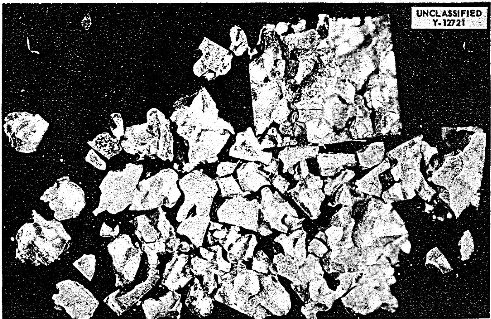  
Fig. 3.2.9. Alfenol (84% Fe-16% Al) Cube That Disintegrated After 100 hr of Exposure to Static Lithium at $1500^{\circ}\mathrm{F}$ . 12X.

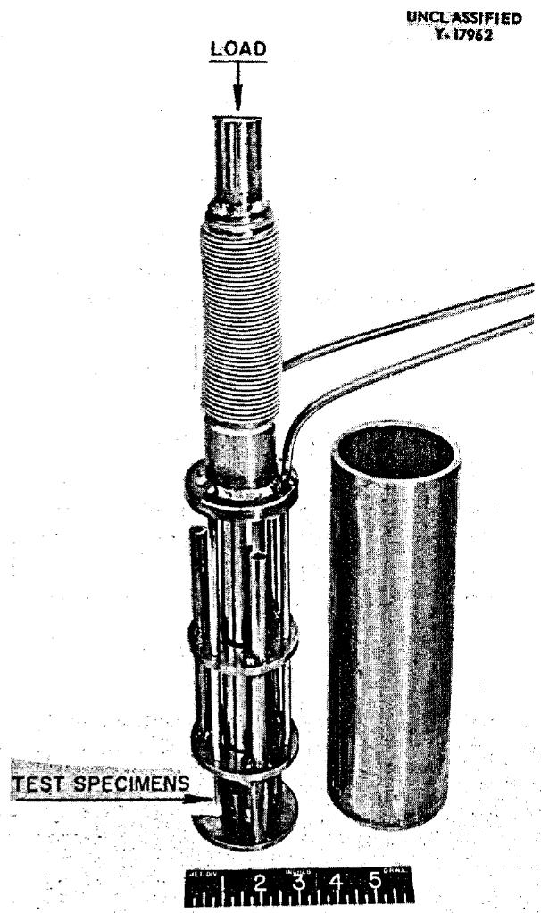  
Fig. 3.2.10. Apparatus for Studying the Extent of Alloying Between Beryllium and Various Metals Under Stress While Immersed in Molten Sodium.

a thin chromium plate on Inconel does not eliminate alloying reactions with beryllium when the two materials are in contact while immersed in high-temperature sodium, but the plate does substantially reduce the extent of alloy formation. Approximately 4 mils of Inconel was consumed in the formation of the 24-mil nickel-beryllium alloy layer which was found where the Inconel and the beryllium were in direct contact (Fig. 3.2.13a). The major portion of reaction layer was found to be $\mathrm{Be}_{2}\mathrm{Ni}_{5}$ , with a small percentage of BeNi adjacent to the Inconel. The reduction in alloy formation brought about by the 2-mil chromium plate is illustrated in Fig. 3.2.13b. A second test is now under way in which the effectiveness of 4- and 6-mil chromium platings will be evaluated.

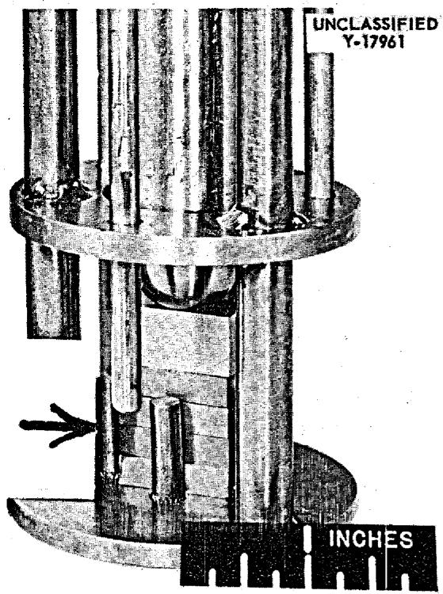

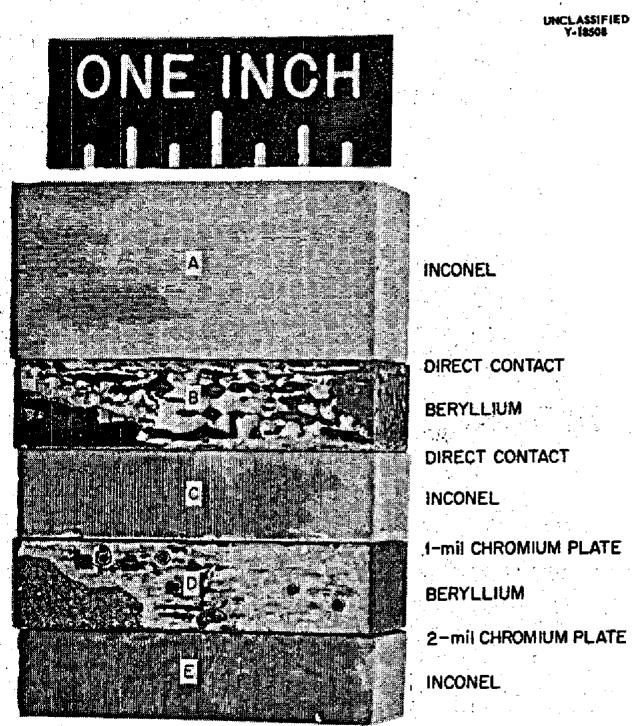  
Fig. 3.2.11. Enlarged View of Test Specimens Shown in Figs. 3.2.10 and 3.2.12.   
Fig. 3.2.12. Sodium-Beryllium-Inconel Compatibility Test Specimens After Exposure to Sodium at $1300^{\circ}$ F for 1000 hr.

Test environment: sodium  
Test duration: 1000 hr  
Test temperature: $1300^{\circ}$ F  
Stress on specimens: 500 psi

TABLE 3.2.4. RESULTS OF METALLOGRAPHIC EXAMINATION OF THE INTERFACES OF THE SPECIMENS SHOWN IN FIG. 3.2.13   

<table><tr><td>Interface</td><td>Metallographic Notes</td></tr><tr><td>A-B:* Inconel vs beryllium - direct contact</td><td>10 to 24 mils of alloy formation (Be21Ni5 plus BeNi) along interface; 4 mils of Inconel consumed in the production of reaction layer</td></tr><tr><td>B-C: Beryllium vs Inconel - direct contact</td><td>22 to 24 mils of uniform alloy formation along interface</td></tr><tr><td>C-D: Inconel with 1-mil chromium plate vs beryllium</td><td>3.5 to 7 mils of alloy formation; 7-mill layer found where plating was thinnest</td></tr><tr><td>D-E: Beryllium vs 2-mill chromium plate on Inconel</td><td>2 mils of interaction between specimens along 90% of interface; 6-mill layer detected at one area where plating appeared to have been defective</td></tr></table>

*See Fig. 3.2.12 for location of interface.

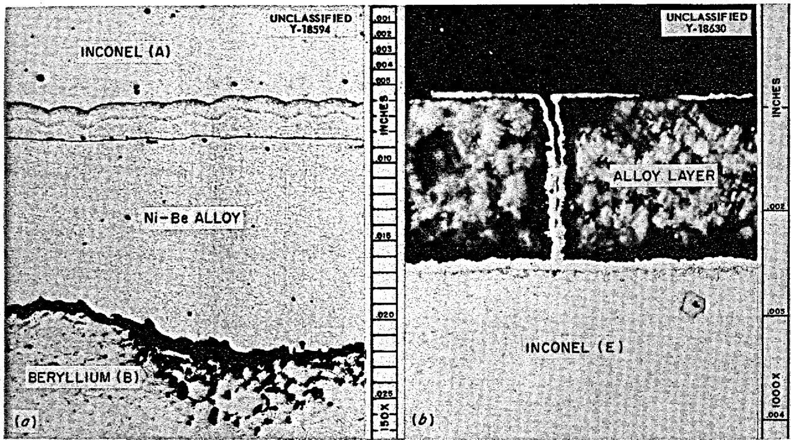  
Fig. 3.2.13. Comparison of Results of Direct Contact of Beryllium and Inconel (a) with Results of Contact Between Beryllium and 2-mil Chromium Plate on Inconel (b). Areas designated A, B, and E may be located on Fig. 3.2.12. (a) As polished. 150X. Reduced $15\%$ . (b) Etched with aqua regia. 1000X. Reduced $15\%$ .

# STATIC TESTS OF INCONEL CASTINGS

# R. Carlander

In thermal-convection loop tests of Inconel castings in the fuel mixture (No. 30) NaF-ZrF4-UF4 (50-46-4 mole %), much heavier attack of the cast material occurred than is normally observed for wrought Inconel (see Chap. 3.1, "Dynamic Corrosion Studies"). Metallographic examination of the as-received material showed the presence of cracks, stringer porosity, and large grains, with the grain boundaries perpendicular to the surface. In order to obtain further information on the effect of the composition of the cast material on its corrosion resistance, static tests of three Inconel castings that differed primarily in silicon content were performed in the fuel mixture (No. 30) NaF-ZrF4-UF4 (50-46-4 mole %) in wrought Inconel capsules for 1000 hr at $1500^{\circ}\mathrm{F}$ . Examination of the tested specimens revealed that the casting with the highest silicon content $(1.93\%)$ was the least attacked, while the casting with the lowest silicon content was the most severely attacked. In all cases, the attack was a combination of subsurface voids and intergranular penetration. The depth of subsurface voids on the Inconel castings was 3 to 4 mils, as compared with 2 to 4 mils on the wrought Inconel capsules. The intergranular penetration, however, varied from 3 mils on the high-silicon-content casting to 12 mils on the low-silicon-content casting. This

difference is attributed to the porosity and to the grain boundaries running perpendicular to the surface of the casting. The results of metallographic examinations of the three cast specimens are presented in Table 3.2.5, and the wrought Inconel capsule and cast Inconel specimen No. 321 are shown in Fig. 3.2.14. In every case the wrought Inconel container was more corrosion resistant than was the cast Inconel specimen.

# INCONEL AND STAINLESS STEEL IN NaK CONTAINING LITHIUM

R. Carlander

Type 316 stainless steel and Inconel were exposed to NaK containing lithium in static and in dynamic systems in order to determine the effect of the lithium on corrosion resistance. In the static tests the specimens were exposed to NaK (56-44 wt %) with lithium additions of 1, 5, 10, 20, and 30 wt % for 100 hr at $1500^{\circ}\mathrm{F}$ . No attack occurred in any of the tests.

For the dynamic tests, 12-in.-long capsules were filled to $40\%$ of their volume with NaK plus lithium (5 or 10 wt $\%$ ) and placed in a tilting-type furnace (1 cpm) at a hot-zone temperature of $1500^{\circ}\mathrm{F}$ (cold zone, $1100^{\circ}\mathrm{F}$ ) for 100 hr. No mass transfer occurred in any of these systems. The Inconel exposed to NaK with 10 wt $\%$ lithium added was attacked to a depth of 1 mil in the hot zone, while the other capsules were unattacked.

TABLE 3.2.5. RESULTS OF METALLOGRAPHIC EXAMINATION OF CAST INCONEL SPECIMENS AFTER EXPOSURE TO STATIC NaF-ZrF4-UF4 (50-46-4 mole %) FOR 1000 hr AT ${1500}^{ \circ  }$ F  

<table><tr><td rowspan="2">Cast Inconel Specimen No.</td><td rowspan="2">Silicon Content (wt %)</td><td colspan="2">Depth of Attack (mils)</td><td rowspan="2">Metallographic Notes on Cost Inconel Specimen</td></tr><tr><td>Wrought Inconel Capsule</td><td>Cast Inconel Specimen</td></tr><tr><td>321</td><td>1.04</td><td>4</td><td>12</td><td>Subsurface voids to depth of 4 mils; intergranular penetration to depth of 12 mils; no cracks apparent</td></tr><tr><td>322</td><td>1.93</td><td>2</td><td>3</td><td>Subsurface voids and intergranular penetration to depth of 3 mils; no cracks apparent</td></tr><tr><td>323</td><td>1.34</td><td>2</td><td>8</td><td>Subsurface voids to depth of 3 mils; intergranular penetration to depth of 8 mils; no cracks apparent</td></tr></table>

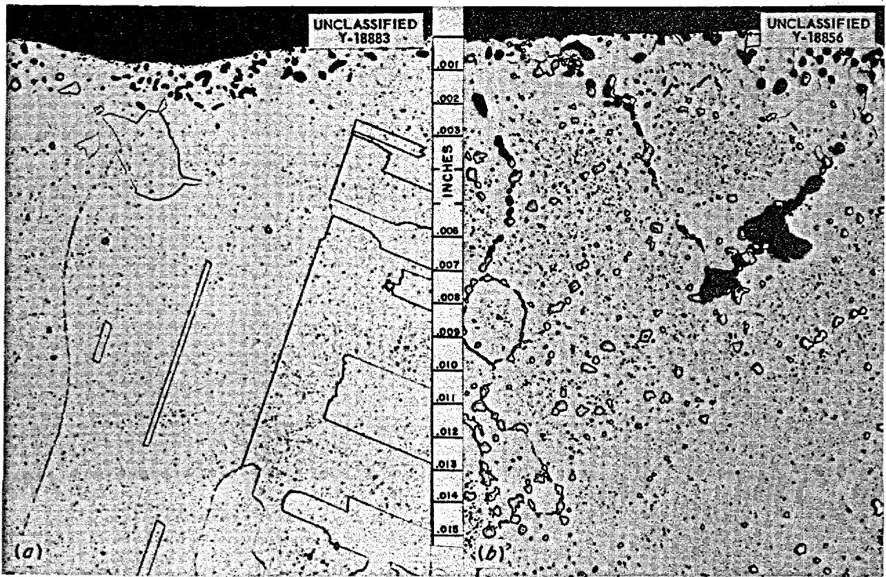  
Fig. 3.2.14. Specimens of Wrought Inconel Capsule (a) and Cast Inconel Specimen No. 321 (b) After Exposure to the Fuel Mixture (No. 30) NaF-ZrF $_4$ -UF $_4$ (50-46-4 mole %) for 1000 hr at $1500^{\circ}\mathrm{F}$ Etched with aqua regia. 250X. Reduced $3\%$ . (Secret with captium)

Thermal-convection loop tests were also conducted. In these tests the hot-leg temperature was $1500^{\circ}\mathrm{F}$ (cold leg, $\sim 1250^{\circ}\mathrm{F}$ ), and NaK with 5 wt % lithium added was circulated for 1000 hr. A slight amount of mass transfer, in the form of small adherent crystals containing $71.5\%$ Ni, $4.6\%$ Cr, and $0.7\%$ Fe, occurred in the Inconel loop, while no mass transfer was found in the stainless steel loop. Portions of the hot and the cold legs of the Inconel and the stainless steel loops are shown in Figs. 3.2.15 and 3.2.16, respectively. The Inconel was attacked to a depth of 1.5 mils in the hot and in the cold legs. The stainless steel was unattacked in the hot leg but was attacked to a depth of 6 mils in the cold leg. Photomicrographs of the cold legs of the Inconel and of the stainless steel loops are shown in Fig. 3.2.17. The addition of 5 wt % lithium to the NaK did not decrease the normal corrosion resistance of Inconel to NaK, but it did decrease

that of type 316 stainless steel. The difference in attack between the hot and cold legs of the stainless steel loop may be attributed to the larger amount of carbides present as a network in the cold leg than in the hot leg, where more carbides are in solution because of increased solubility at the higher temperature.

# TRANSFER OF CARBON BETWEEN DISSIMILAR METALS IN CONTACT WITH MOLTEN SODIUM

# R. Carlander

The decarburization of AISI 1043 steel by molten sodium in Armco iron and type 304 ELC stainless steel containers was demonstrated in tests at $1830^{\circ}\mathrm{F}$ of 100 hr duration, as described previously. An additional test has been performed to determine

UNCLASSIFIED Y-18385

UNCLASSIFIED Y-18384

ONE INCH

ONE INCH 111

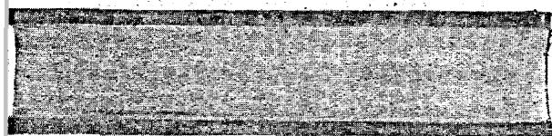  
HOT ZONE-816°C (1500°F)

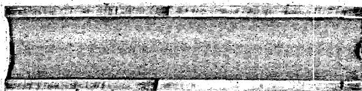  
HOT ZONE-816°C(1500°F)

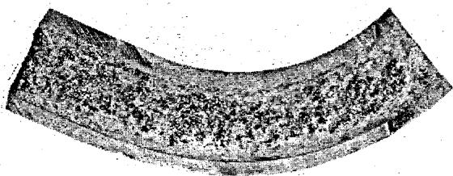  
COLD ZONE-660°C(1220°F)

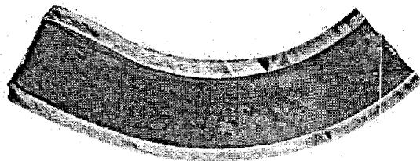  
COLD ZONE-665°C(1230°F)

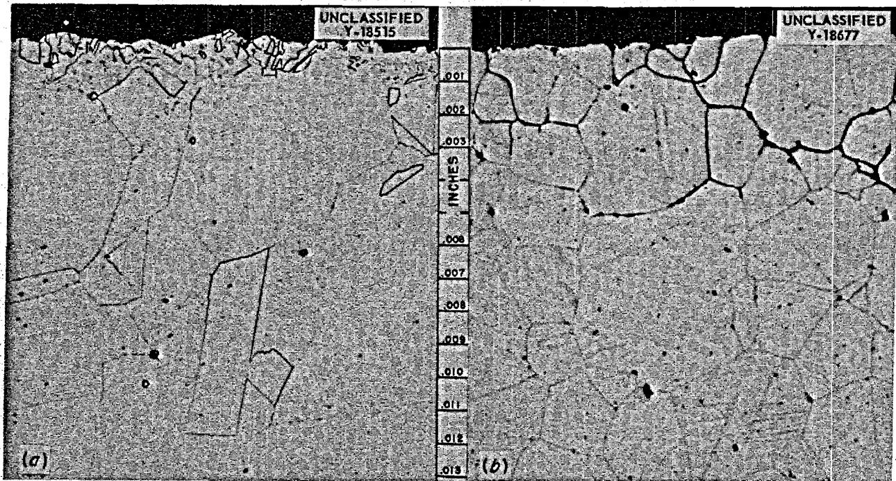  
Fig. 3.2.15. Portions of Hot and Cold Legs of an Inconel Thermal-Convection Loop in Which NaK with 5 wt % Lithium Added Was Circulated for 1000 hr. (Secret with caption)   
Fig. 3.2.16. Portions of Hot and Cold Legs of a Type 316 Stainless Steel Thermal-Convection Loop in Which NaK with 5 wt % Lithium Added Was Circulated for 1000 hr. (Secret with caption)   
Fig. 3.2.17. Cold Legs of (a) an Inconel Thermal-Convection Loop and (b) a Type 316 Stainless Steel Thermal-Convection Loop in Which NaK with 5 wt % Lithium Added Was Circulated for 1000 hr at a Hot-Leg Temperature of $1500^{\circ}\mathrm{F}$ and a Cold-Leg Temperature of About $1225^{\circ}\mathrm{F}$ . Etched with aqua regia, 250X. Reduced 4%. (Secret with caption)

the effect of time on the extent of decarburization of the steel specimens.

Two AISI 1043 steel specimens and sodium were loaded into evacuated Armco iron and type 304 ELC stainless steel containers and tested at $1830^{\circ}\mathrm{F}$ for 400 hr. The conditions and results of the tests are given in Table 3.2.6. As expected on the basis of the previous investigation, extensive decarburization of the steel specimens oc

curred in both the iron and the stainless steel containers. The extent of decarburization of the AISI 1043 steel specimens was greater in these 400-hr tests than in the previous 100-hr test, and, in addition, the vapor zone of the stainless steel container was carburized in the 400-hr test and not in the 100-hr test. This discrepancy may be due to the vapor zone sample having been taken closer to the bath zone after the 400-hr test than

TABLE 3.2.6. CARBON AND NICKEL ANALYSES OF THE VARIOUS COMPONENTS OF SYSTEMS DESIGNED FOR STUDYING THE DECARBURIZATION OF MILD STEEL BY SODIUM   

<table><tr><td>Test System</td><td>Material Analyzed</td><td>Carbon Content (wt %)</td><td>Nickel Content (wt %)</td><td>Weight Loss in 400-hr Test (g/in.2)</td></tr><tr><td rowspan="12">AISI 1043 steel specimen in Armco iron container</td><td>Steel specimen</td><td></td><td></td><td></td></tr><tr><td>As received</td><td>0.433</td><td>0.008</td><td></td></tr><tr><td>After 100-hr test</td><td>0.121</td><td></td><td>0.0001</td></tr><tr><td>After 400-hr test</td><td>0.054</td><td></td><td>0.0408</td></tr><tr><td>Iron container</td><td></td><td></td><td></td></tr><tr><td>As received</td><td>0.018</td><td></td><td></td></tr><tr><td>Vapor zone</td><td></td><td></td><td></td></tr><tr><td>After 100-hr test</td><td>0.019</td><td></td><td></td></tr><tr><td>After 400-hr test</td><td>0.016</td><td></td><td></td></tr><tr><td>Bath zone</td><td></td><td></td><td></td></tr><tr><td>After 100-hr test</td><td>0.035</td><td></td><td></td></tr><tr><td>After 400-hr test</td><td>0.024</td><td></td><td></td></tr><tr><td rowspan="12">AISI 1043 steel specimen in type 304 ELC stainless steel container</td><td>Steel specimen</td><td></td><td></td><td></td></tr><tr><td>As received</td><td>0.433</td><td>0.008</td><td></td></tr><tr><td>After 100-hr test</td><td>0.100</td><td></td><td>0.0002</td></tr><tr><td>After 400-hr test</td><td>0.074</td><td>0.090</td><td>0.0303</td></tr><tr><td>Steel container</td><td></td><td></td><td></td></tr><tr><td>As received</td><td>0.037</td><td>11.12</td><td></td></tr><tr><td>Vapor zone</td><td></td><td></td><td></td></tr><tr><td>After 100-hr test</td><td>0.022*</td><td></td><td></td></tr><tr><td>After 400-hr test</td><td>0.162**</td><td>10.32</td><td></td></tr><tr><td>Bath zone</td><td></td><td></td><td></td></tr><tr><td>After 100-hr test</td><td>0.128</td><td></td><td></td></tr><tr><td>After 400-hr test</td><td>0.200</td><td>9.98</td><td></td></tr></table>

*Sample taken 4 in. above bath level.   
**Sample taken 1 in. above bath level.

after the 100-hr test. The extent of the decarburization of the AISI 1043 steel was greater in the Armco iron container than in the stainless steel container. Furthermore, sufficient nickel mass transferred to the surface of the steel specimen in the stainless steel container to cause a phase transformation to a depth of 2 to 4 mils, but the amount of nickel that mass-transferred did not seem to increase appreciably in comparison with the amount transferred during the 100-hr test. Photomicrographs of the as-received and as-tested AISI 1043 steel specimens are shown in Figs. 3.2.18 and 3.2.19.

# RARE-EARTH OXIDES EXPOSED TO STATIC SODIUM IN INCONEL CONTAINERS

W.H.Cook

In considering rare-earth oxides as possible control rod materials for the ART, sodium was suggested as a heat transfer medium for cooling the control rod material, and it was proposed that Inconel be used as the container material for the sodium and the rare-earth oxides. Tests were therefore conducted to investigate the corrosion

resistance of the rare-earth oxides to sodium and the effects, if any, on the Inconel containers.

One specimen of $\mathrm{Sm}_2\mathrm{O}_3$ (density, $5.88~\mathrm{g / cm^3}$ ; apparent porosity, $25.4\%$ was tested for 1000 hr in static sodium at $1500^{\circ}\mathrm{F}$ in an Inconel capsule. Two specimens from a body of a mixture of rare-earth oxides (density, $6.58~\mathrm{g / cm^3}$ ; apparent porosity, not determined) were tested similarly, one for 500 hr and the other for 1000 hr. The body, fabricated from a commercially available powder known as Lindsay Mix, obtained from the Lindsay Chemical Co., had the composition 63.8 wt $\%$ $\mathrm{Sm}_2\mathrm{O}_3 - 26.3$ wt $\%$ $\mathrm{Gd}_2\mathrm{O}_3$ -balance primarily other rare-earth oxides.

The results of the tests indicated negligible corrosion attack by the sodium on the three specimens and their Inconel capsules in 1000 hr, but there may have been some reduction in their strengths. The weight and dimensional changes of the three specimens were all positive, as would be expected with porous materials, and were less than $0.5\%$ . The original buff colors of the specimens changed to gray black, but this was the only macroscopically visible change. It was found

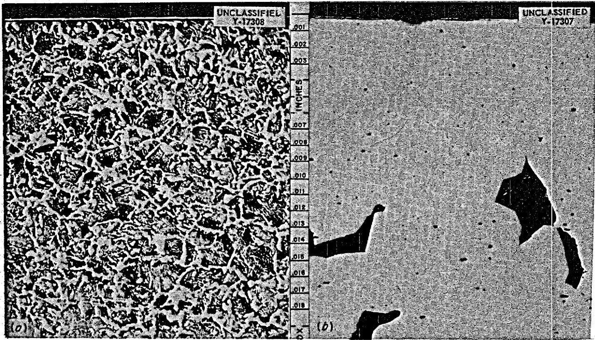  
Fig. 3.2.18. Specimens of AISI 1043 Steel (a) in the As-Received Condition and (b) After Exposure to Sodium in an Armco Iron Container for 400 hr at $1830^{\circ}\mathrm{F}$ . Etched with $4\%$ picral. 200X. Reduced $10.5\%$ .

that the gray-black color extended throughout the specimens. This is evidence that the sodium completely penetrated the specimens, probably along the pore spaces.

Powder x-ray diffraction patterns of the untested and tested pieces of $\mathsf{Sm}_2\mathsf{O}_3$ and the two Lindsay Mix specimens did not reveal any reaction products. Chemical analyses of the sodium baths indicated

negligible quantities of rare earths, chromium, iron, and nickel, which also supports the conclusion that there was negligible attack on either the rare-earth oxides or the Inconel capsules. The major losses of rare-earth oxides were calculated on the basis of the chemical analyses, and the results are summarized in Table 3.2.7. In comparing the results from the 500- and 1000-hr

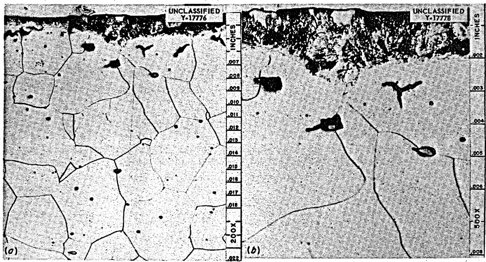  
Fig. 3.2.19. Specimens of AISI 1043 Steel After Exposure to Sodium in a Type 304 ELC Stainless Steel Container at $1830^{\circ}$ F for 400 hr. (a) 200X. Reduced $13\%$ . (b) 500X. Reduced $13\%$ . Etched with $2\%$ nital.

TABLE 3.2.7. RESULTS OF TESTS OF VARIOUS RARE-EARTH OXIDES EXPOSED TO STATIC SODIUM IN INCONEL CONTAINERS   

<table><tr><td rowspan="2">Specimen Material</td><td rowspan="2">Density (g/cm3)</td><td rowspan="2">Apparent Porosity (%)</td><td rowspan="2">Test Temperature (°F)</td><td rowspan="2">Test Duration (hr)</td><td colspan="5">Calculated Oxide Loss of Specimen* (×10-3%)</td></tr><tr><td>Sm2O3</td><td>Gd2O3</td><td>Dy2O3</td><td>Y2O3</td><td>Total</td></tr><tr><td>Sm2O3</td><td>5.88</td><td>23.2</td><td>1500</td><td>1000</td><td>2.9</td><td>2.6</td><td>0.18</td><td>0.13</td><td>5.8</td></tr><tr><td>Lindsay Mix**</td><td>6.58</td><td></td><td>1500</td><td>500</td><td>2.9</td><td>1.08</td><td>0.76</td><td>0.41</td><td>5.1</td></tr><tr><td></td><td>6.58</td><td></td><td>1500</td><td>1000</td><td>4.8</td><td>1.08</td><td>0.82</td><td>0.67</td><td>7.4</td></tr><tr><td></td><td>3.53</td><td>53.5</td><td>1300</td><td>100</td><td>13.2</td><td>5.90</td><td>2.16</td><td>17.4</td><td>38.7</td></tr></table>

*These values were calculated on the basis of the rare earths found by chemical analyses in the sodium from each test.   
**Composition: 63.8 wt % Sm₂O₃, 26.3 wt % Gd₂O₃, balance primarily other rare-earth oxides.

tests of the Lindsay Mix specimens, no significant differences were found.

Metallographic polishing and examination of the rare-earth oxide specimens before and after exposure to the sodium indicated that the specimens may have been slightly weakened by the tests, but there was no microscopically visible corrosion, as shown in Fig. 3.2.20. Metallographic examination of the Inconel capsules revealed slight surface roughening to a depth of less than 0.5 mil in spots on the inner surfaces that contacted the liquid sodium and the Lindsay Mix specimens. There was no surface roughening and no attack of the Inconel capsule that contained the $\mathrm{Sm}_{2}\mathrm{O}_{3}$ specimen and sodium. Spectrographic examinations of the inner surfaces of the three capsules did not reveal any rare earths.

The corrosion resistance to molten sodium shown by the Lindsay Mix with a density of $6.58\mathrm{g/cm}^3$ prompted further tests that were designed to approximate more closely the expected operating conditions and for which a Lindsay Mix body with the proposed density and configuration was used.

The purposes of these tests were to determine the relationship of the apparent porosity of the Lindsay Mix body for water to that for molten sodium and to study the corrosion resistance of the body and Inconel when separated by only a small thickness (approximately 0.05 in.) of sodium.

A hollow cylinder of porous Lindsay Mix body was used that was nominally 0.9 in. OD, 0.5 in. ID, and 1 in. long, with a density of $3.53\mathrm{g/cm^3}$ and an apparent porosity to water of $53.5\%$ . This body had an apparent porosity of $52\%$ to sodium after exposure to static sodium for 100 hr at $1300^{\circ}\mathrm{F}$ in an evacuated Inconel capsule. To determine the apparent porosity of the body to sodium, the sodium was allowed to cool and solidify around the body at the end of the 100-hr test period. The test capsule was then opened in a helium atmosphere, the excess sodium was removed from the surfaces of the body with plastic scrapers, and the body and its absorbed sodium were weighed. The absorbed sodium was then removed by vacuum distillation, and the body was again weighed. The apparent porosity of the body

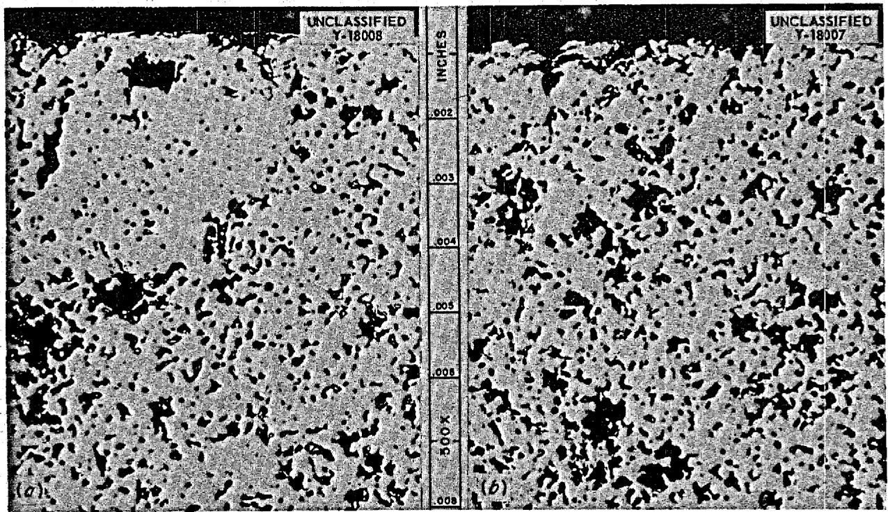  
Fig. 3.2.20. Rare-Earth Oxide Specimens (63.8 wt % $\mathsf{Sm}_2\mathsf{O}_3 - 26.3$ wt % $\mathsf{Gd}_2\mathsf{O}_3$ -Balance Primarily Other Rare-Earth Oxides) (a) in As-received Condition and (b) After Exposure to Static Sodium in an Inconel Container for 500 hr at $1500^{\circ}\mathsf{F}$ . Unetched. 500X. Reduced $5.5\%$ .

to sodium was calculated by using the latter weight, the density of $3.53\mathrm{g/cm^3}$ , the weight of the absorbed sodium, and a sodium density at $97.8^{\circ}C$ (the melting point of sodium) of $0.951\mathrm{g/cm^3}$ .

As shown in Table 3.2.7, the losses of rare-earth oxides by this low density $(3.53\mathrm{g} / \mathrm{cm}^3)$ body were greater than the losses by the higher density $(6.58\mathrm{g} / \mathrm{cm}^3)$ Lindsay Mix body, which is in keeping with the general trend for the lower density ceramics to have lower corrosion resistance. There is no explanation for the relatively large loss of $\mathsf{Y}_2\mathsf{O}_3$ . The exposure to sodium also slightly weakened the body; its hardness, on the Mohs' scale, changed from 3 to 2 during the test. Long-term corrosion tests of finished ART control rod Lindsay Mix shapes and sodium in Inconel containers have been initiated to determine the extent of the corrosion of these materials under the most adverse operating conditions expected and for periods equal to and greater than the proposed operating time.

# SOLID-PHASE-BONDING SCREENING TESTS

W. H. Cook

Molybdenum has been tested for 100-hr periods for solid-phase bonding with itself, tungsten,

K150A (80% TiC-10% NbTaTiC3-10% Ni), and K152B (64% TiC-6% NbTaTiC3-30% Ni) with calculated contact pressures of 20,000 psi in the fuel mixture (No. 30) NaF-ZrF4-UF4 (50-46-4 mole %) at 1500°F. Bonding was absent only for molybdenum vs tungsten and molybdenum vs K150A. The surface roughnesses of the contacting surfaces of all specimens were 1.5 to 2 μin. rms, as determined with a profilometer.

The contact pressure was reduced from the standard 50,000 psi to 20,000 psi in an effort to get below the yield strength of molybdenum at $1500^{\circ}\mathrm{F}$ . The 20,000-psi loading was not low enough, inasmuch as the molybdenum deformed slightly in all the tests. All examinations were made with a low-power microscope.

In the test of molybdenum vs molybdenum, the solid-phase bonding was accompanied by some deformation and considerable upsetting. In the bonding between molybdenum and K152B, a thin film appeared to have been transferred from the molybdenum surface to the K152B surface in the contact area. This was probably a nickel-molybdenum diffusion layer, but it has not yet been identified.

# 3.3. FABRICATION RESEARCH

J. H. Coobs

# DEVELOPMENT OF NICKEL-MOLYBDENUM BASE ALLOYS

H. Inouye T. K. Roche

The available supply of Hastelloy B and W tubing was prepared by redrawing tubing formed from welded strip, and it is not of high quality. Since these alloys are characterized by high-temperature strength and resistance to fused-salt corrosion, a source of seamless tubing is desired, and therefore considerable effort has been devoted to the study of extrusion techniques for the production of seamless tubing of these Hastelloys and other related alloys.

# Extrusion of Hastelloy W

Early attempts to extrude tube blanks of Hastelloy W failed. In these experiments forged billets canned in Inconel were extruded at 2050 and $2100^{\circ}\mathrm{F}$ at an extrusion ratio of 7:1. Severe fracturing of the tubing occurred during the extrusion process as a result of melting. An excessive temperature rise as a result of the rapid deformation of the material is believed to have caused the difficulty. Recently this alloy was successfully extruded under conditions identical to those used earlier, as listed below, except for the extrusion temperature and rate:

Billet Forged Hastelloy W canned in Inconel

Billet size 3 In. OD, $1\frac{1}{8}$ In. ID, 3 In. long

Die size 1/2 In., 30-deg core

Mandrel size 1 In.

Extrusion ratio 7:1

The rate of extrusion was controlled by regulating the flow of high-pressure water to the ram of the extrusion press by means of a throttle valve which opened completely in four turns. The rate settings, in terms of the number of turns that the valve was opened, were $3\frac{1}{2}$ and $3\frac{3}{4}$ for the unsuccessful extrusions and $2\frac{1}{2}$ for the successful extrusion. Actual extrusion rates, in feet per minute, were not determined during these experiments.

The extrusion temperature of $2200^{\circ}\mathrm{F}$ used for the successful extrusion was an increase over

the 2050 and $2100^{\circ}\mathrm{F}$ used for the unsuccessful extrusions. It was concluded from this work that Hastelloy W could be extruded on a laboratory scale by raising the extrusion temperature and lowering the extrusion rate to allow time for the heat generated in the work to dissipate to the surroundings. The successful and unsuccessful tube-blank extrusions are illustrated in Fig. 3.3.1.

# Extrusion of Hastelloys B, W, and X on a Commercial Scale

An experiment was performed at the Huntington Works of the International Nickel Company on March 27, 1956, to determine the feasibility of producing tube blank extrusions of Hastelloy's B, W, and X on a commercial scale. The experiment was carried out as a cooperative effort between the Oak Ridge National Laboratory, the International Nickel Company, and the Haynes Stellar Company.

Forged and machined billets of the Hastelloy were prepared by the Haynes Stellar Company. Based upon extrusion experience on a laboratory scale at ORNL, as described above, a schedule was prepared for the extrusion of the Hastelloy B billets. Since small tube blanks had been prepared successfully by using a slow extrusion rate at $2200^{\circ}\mathrm{F}$ , it was proposed that these larger billets be extruded at as slow a rate as practical. The extrusion temperature could be lower, of course, because of the larger size of the billet. The results of the Hastelloy B extrusions, which are summarized in Table 3.3.1, were reported to ORNL by the International Nickel Company upon completion of the experiment. The actual extruded tube blanks of Hastelloy B are shown in Figs. 3.3.2 and 3.3.3.

Although the Hastelloy W and X billets were not extruded under the direction of ORNL, the fabrication of these alloys is of interest to the overall alloy development program. The available results of these extrusions are presented in Table 3.3.2.

The following general conclusions have been drawn regarding the extrusion of 6.9-in.-OD, 10-in.-long billets of Hastelloy's B, W, and X:

1. Forged billets of Hastelloy's B, W, and X can be successfully extruded to tube blanks.

Billet dimensions: 6.900 in. OD, 2.500 in. ID, 10 in. long

Machined size of billets canned on OD only: 6.650 in. OD, 2.50 in. iD, 10 in. long

Machined size of billets canned on OD and ID: 6.500 in. OD, 2.75 in. ID, 10 in. long

Machined size of uncanned billets: 6.900 in. OD, 2.50 in. ID, 10 in. long

Product dimensions: Outside diameter, as indicated below

Inside diameter, 2.250 in.

TABLE 3.3.1. EXTRUSION OF HASTELLOY B BILLETS BY INTERNATIONAL NICKEL COMPANY FOR OAK RIDGE NATIONAL LABORATORY   

<table><tr><td rowspan="2">Billet No.a</td><td colspan="2">Billet Preparation</td><td rowspan="2">Nose Radius (in.)</td><td rowspan="2">Extrusion Temperatureb (°F)</td><td rowspan="2">Total Soaking Time (min)</td><td rowspan="2">Extrusion Ratio</td><td rowspan="2">Product OD (in.)</td><td colspan="3">Extrusion Pressures (tsi)</td><td rowspan="2">Extrusion Rate of Billet Length (ips)</td><td rowspan="2">Usable Length of Product (in.)</td></tr><tr><td>On OD</td><td>On ID</td><td>Peak</td><td>Minimum</td><td>Running</td></tr><tr><td>B-1</td><td>Uncanned</td><td>Uncanned</td><td>1</td><td>2050</td><td>220</td><td>5.5:1</td><td>3.685</td><td>77.1</td><td>77.1</td><td>77.1</td><td>1.2</td><td>41</td></tr><tr><td>B-2</td><td>Canned</td><td>Uncanned</td><td>0.5</td><td>2050</td><td>201</td><td>5.5:1</td><td>3.685</td><td>71.3</td><td>66.8</td><td>68.3</td><td>1.2</td><td>51</td></tr><tr><td>B</td><td>Canned</td><td>Canned</td><td>0.5</td><td>2050</td><td>187</td><td>5.5:1</td><td>3.685</td><td>68.3</td><td>61.0</td><td>62.3</td><td>1.2</td><td>47</td></tr><tr><td>B-7</td><td>Uncanned</td><td>Uncanned</td><td>1</td><td>2150c</td><td>100</td><td>5.5:1</td><td>3.685</td><td>74.3</td><td>62.3</td><td>68.3</td><td>1.3</td><td>47</td></tr><tr><td>B-8d</td><td>Uncanned</td><td>Uncanned</td><td>1</td><td>2150c</td><td>110</td><td>7:1</td><td>3.462</td><td>77.1</td><td>77.1</td><td>77.1</td><td>0</td><td>0</td></tr><tr><td>B-10</td><td>Uncanned</td><td>Uncanned</td><td>1</td><td>2150</td><td>65</td><td>7:1</td><td>3.462</td><td>75.8</td><td>71.3</td><td>68.3</td><td>1.4</td><td>58</td></tr><tr><td>BBd</td><td>Uncanned</td><td>Uncanned</td><td>1</td><td>2150</td><td>75</td><td>7:1</td><td>3.462</td><td>77.1</td><td>77.1</td><td>77.1</td><td>0</td><td>0</td></tr><tr><td>BBB</td><td>Canned</td><td>Uncanned</td><td>0.5</td><td>2150</td><td>65</td><td>7:1</td><td>3.462</td><td>74.3</td><td>68.3</td><td>69.7</td><td>1.2</td><td>62</td></tr><tr><td>B-3</td><td>Canned</td><td>Uncanned</td><td>0.5</td><td>2150</td><td>70</td><td>7:1</td><td>3.462</td><td>72.8</td><td>68.3</td><td>69.7</td><td>1.4</td><td>70</td></tr><tr><td>B-5</td><td>Canned</td><td>Uncanned</td><td>0.5</td><td>2200</td><td>100</td><td>10:1</td><td>3.135</td><td>77.1</td><td>74.3</td><td>77.1</td><td>0.5</td><td>81</td></tr><tr><td>B-4</td><td>Canned</td><td>Canned</td><td>0.5</td><td>2200</td><td>105</td><td>12.25:1</td><td>3.000</td><td>77.1</td><td>71.3</td><td>72.8</td><td>1.5</td><td>99</td></tr></table>

$a_{\mathrm{Listed}}$ in extrusion order.   
Soaked in gas furnace, except as indicated.   
Soaked in salt bath after preheating to $700^{\circ}\mathrm{F}$ .   
$d_{\text{Billet stalled}}$

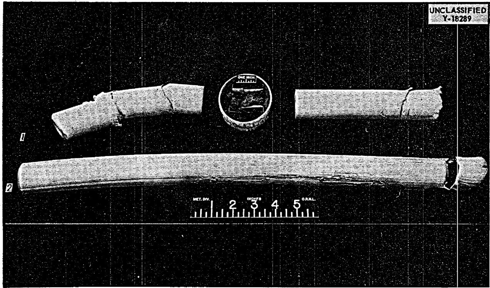  
Fig. 3.3.1. Seamless Tube Blanks Extruded from Forged Hastelloy W Billets Canned in Inconel. Tube 1 was extruded at a fast rate at $2100^{\circ}$ F. Tube 2 was extruded at a slow rate at $2100^{\circ}$ F.

TABLE 3.3.2. EXTRUSION OF UNCANNED HASTELELOY W AND X BILLETS BY INTERNATIONAL NICKEL COMPANY   
Billet dimensions: 6.900 in. OD, 2.50 in. ID, 10 in. long; Nose radius, 1 in. Product dimensions: Outside diameter, as indicated; Inside diameter, 2.250 in.   

<table><tr><td>Billet Material</td><td>Extrusion No.</td><td>Extrusion Temperature* (°F)</td><td>Extrusion Ratio</td><td>Outside Diameter of Product (in.)</td><td>Usable Length of Product (in.)</td></tr><tr><td rowspan="2">Hastelloy W</td><td>12**</td><td>2150</td><td>12.25:1</td><td>3.00</td><td>0</td></tr><tr><td>13</td><td>2150</td><td>7.9:1</td><td>3.28</td><td>67</td></tr><tr><td rowspan="6">Hastelloy X</td><td>14</td><td>2150</td><td>7.9:1</td><td>3.28</td><td>67</td></tr><tr><td>15</td><td>2150</td><td>7.9:1</td><td>3.28</td><td>67</td></tr><tr><td>16</td><td>2150</td><td>10:1</td><td>3.135</td><td>85</td></tr><tr><td>17**</td><td>2150</td><td>12.25:1</td><td>3.00</td><td>0</td></tr><tr><td>18</td><td>2200</td><td>12.25:1</td><td>3.00</td><td>104</td></tr><tr><td>19</td><td>2200</td><td>12.25:1</td><td>3.00</td><td>104</td></tr></table>

*Soaked in gas furnace.   
**Billet stalled.

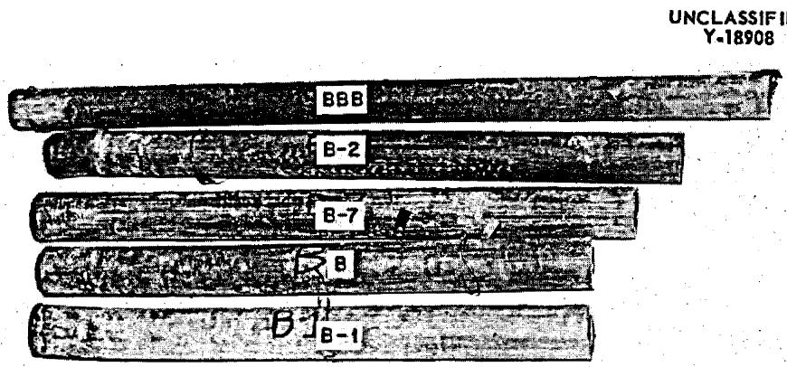

05101520 HASTELLOY B TUBE BLANKS EXTRUDED FOR ORNL BY INCO   

<table><tr><td>BILLET</td><td>EXTRUSION TEMPERATURE</td><td>EXTRUSION RATIO</td></tr><tr><td>BBB</td><td>2150°F</td><td>7:1</td></tr><tr><td>B-2</td><td>2050°F</td><td>5½:1</td></tr><tr><td>B-7</td><td>2150°F</td><td>5½:1</td></tr><tr><td>B</td><td>2050°F</td><td>5½:1</td></tr><tr><td>B-1</td><td>2050°F</td><td>5½:1</td></tr></table>

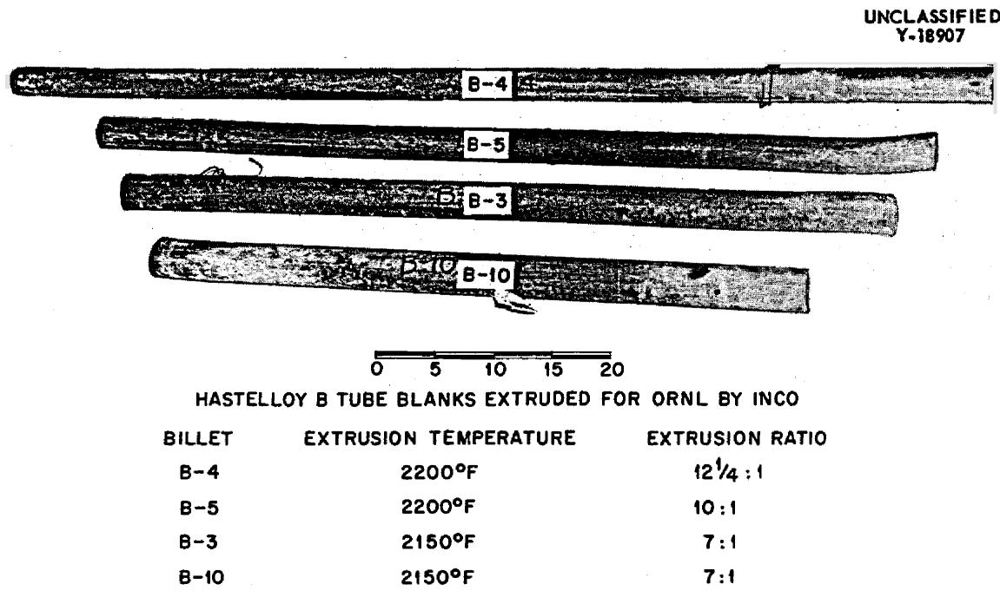  
Fig. 3.3.2. Hastelloy B Tube Blank Extrusions Fabricated from Commercial-Size Billets by the International Nickel Company.   
Fig. 3.3.3. Hastelloy B Tube Blank Extrusions Fabricated from Commercial-Size Billets by the International Nickel Company.

2. Canning of the billets with $\frac{1}{8}$ -in.-thick type 316 stainless steel appears to be advantageous from the standpoint of reducing the extrusion pressure. Because of the number of variables involved, however, this point needs to be confirmed.   
3. The larger mass of the commercially produced billets made possible the use of lower soaking temperatures at the smaller extrusion ratios (i.e., 5.5:1) than were found to be optimum for the extrusion of small laboratory billets.   
4. For successful extrusion of these alloys it is necessary that the billets be upset with sufficient pressure to start the material through the die and then extruded at a relatively slow rate to prevent hot-short cracking.

These were the first successful attempts to extrude these materials on a large scale, and it now appears to be feasible to produce seamless tubing of these alloys. Three Hastelloy B tube blanks and one Hastelloy W tube blank are scheduled to be reduced to 1-in. pipe and small-diameter tubing for use at ORNL.

# Extrusion of Special Alloys

The study of single-phase alloys in the nickel-molybdenum alloy system that contain 15 to $20\%$ molybdenum was continued. It is hoped in this study to find a solution to the problem of embrittlement of the Hastelloy-type alloys as a result of aging. At present the only readily apparent solution is to change the composition of the alloys.

It was reported previously that the corrosion resistance to fused salts of the binary alloys of nickel and molybdenum which contain more than $15\%$ molybdenum was exceptionally good but that their high-temperature strength was not adequate. Thus in order to obtain alloys with greater strength the special alloys described below are being studied. In addition to the binary alloys, ternary alloys are being made that will be tested to determine the effect of a third element on corrosion resistance of these alloys in fused salts.

International Nickel Company Compositions. As reported previously, ${}^{1}$ 40-lb heats of five special alloys were received from INCO for corrosion testing and strength evaluation. The nominal compositions of these alloys are given in Table 3.3.3.

TABLE 3.3.3. COMPOSITIONS OF SPECIAL ALLOYS PREPARED BY INTERNATIONAL NICKEL COMPANY   

<table><tr><td rowspan="2">Alloy No.</td><td colspan="8">Composition (wt %)</td></tr><tr><td>Mo</td><td>Cr</td><td>W</td><td>Nb</td><td>Al</td><td>Ti</td><td>C</td><td>Ni</td></tr><tr><td>T-23011</td><td>15</td><td>5</td><td>3</td><td>3</td><td>0.5</td><td></td><td></td><td>73.5</td></tr><tr><td>T-23012</td><td>17</td><td></td><td></td><td></td><td>0.5</td><td></td><td></td><td>82.5</td></tr><tr><td>T-23013</td><td>15</td><td></td><td>3</td><td>3</td><td>0.5</td><td></td><td></td><td>78.5</td></tr><tr><td>T-23014</td><td>15</td><td></td><td></td><td></td><td>1</td><td>1.5</td><td></td><td>82.5</td></tr><tr><td>T-23015</td><td>15</td><td></td><td>3</td><td>3</td><td>0.5</td><td></td><td>0.25</td><td>78.25</td></tr></table>

Four extrusion billets, 3 in. in diameter and 3 in. long, were machined from each ingot, three for tube blanks and one for rod fabrication. The rod extrusions were for rolling to 0.065-in. strip for the preparation of test specimens for strength evaluation. The initial tube blank extrusion experiments involving one billet of each composition met with little success. When a fast extrusion rate was used, the alloys demonstrated the hot-short tendencies of Hastelloy B, with the exception of alloy T-23013, $15\%$ Mo- $3\%$ Nb- $3\%$ W- $0.5\%$ Al- $78.5\%$ Ni. The results of this initial experiment are presented in Table 3.3.4.

Before the remaining billets of these alloys were extruded, the results obtained in the fabrication of Hastelloy W at a slow extrusion rate were sufficiently favorable to prompt an alteration in

Extrusion ratio: 5.4:1 Mandrel size: in. dia

TABLE 3.3.4. RESULTS OF PRELIMINARY ATTEMPTS TO EXTRUDE THE SPECIAL ALLOYS PREPARED BY THE INTERNATIONAL NICKEL COMPANY  

<table><tr><td>Alloy No.</td><td>Extrusion Temperature (°F)</td><td>Results</td></tr><tr><td>T-23011</td><td>2060</td><td>Extruded tube blank shattered</td></tr><tr><td>T-23012</td><td>2175</td><td>Extruded tube blank shattered</td></tr><tr><td>T-23013</td><td>2100</td><td>Good tube blank obtained</td></tr><tr><td>T-23014</td><td>2010</td><td>Press stalled</td></tr><tr><td>T-23015</td><td>2080</td><td>Tube blank cracked on the inside</td></tr></table>

the extrusion conditions for the special compositions. Two billets, T-23012 and T-23014, were extruded slowly at $2200^{\circ}\mathrm{F}$ with a $\frac{3}{4}$ -in.-dia mandrel at an extrusion ratio of 5.4:1. Both alloys responded satisfactorily, but the mandrel broke within the tube blank in each case. With a decreased rate of extrusion the billet remained in contact with the mandrel for an excessive length of time, and the resultant overheating of the tool caused a subsequent decrease in its ultimate strength. The utilization of a 1-in.-dia mandrel alleviated this problem. The final results of slow extrusion of these alloys at $2200^{\circ}\mathrm{F}$ are presented in Table 3.3.5. Extrusions 1 through 5, shown in Fig. 3.3.4, are representative of the good tube blanks obtained from these special compositions. The tube blanks have been sent to the Superior Tube Company for redrawing to 0.500-in.-OD, 0.035-in.-wall tubing.

TABLE 3.3.5. RESULTS OF THE FINAL EXTRUSIONS OF SPECIAL ALLOYS PREPARED BY THE INTERNATIONAL NICKEL COMPANY   
Mandrel size: 1 in. dia   

<table><tr><td>Alloy No.</td><td>Extrusion Ratio</td><td>Extruded Shape</td><td>Number of Successful Extrusions</td></tr><tr><td>T-23011</td><td>7:1</td><td>Tube blank</td><td>2</td></tr><tr><td>T-23012</td><td>7:1</td><td>Tube blank</td><td>1</td></tr><tr><td>T-23013</td><td>7:1</td><td>Tube blank</td><td>2</td></tr><tr><td>T-23014</td><td>7:1</td><td>Tube blank</td><td>1</td></tr><tr><td>T-23015</td><td>7:1</td><td>Tube blank</td><td>2</td></tr><tr><td>T-23011</td><td>6.25:1</td><td>Rod</td><td>1</td></tr><tr><td>T-23012</td><td>6.25:1</td><td>Rod</td><td>1</td></tr><tr><td>T-23013</td><td>6.25:1</td><td>Rod</td><td>1</td></tr><tr><td>T-23014</td><td>6.25:1</td><td>Rod</td><td>1</td></tr><tr><td>T-23015</td><td>6.25:1</td><td>Rod</td><td>1</td></tr></table>

Hot rolling of the extruded rods was only moderately successful. The rolling temperature was varied between 1925 and $2100^{\circ}\mathrm{F}$ , and the scheduled reduction was approximately $10\%$ per pass. In general, the lower temperature proved to be more satisfactory for minimizing edge cracking. Each alloy was hot rolled to 0.250-in. strip, pickled, annealed at $2050^{\circ}\mathrm{F}$ for 1 hr, and

cold finished to 0.065-in. strip with an intermediate anneal at $2050^{\circ}\mathrm{F}$ for $\frac{1}{2}$ hr. Final annealing of each alloy was scheduled to yield a grain size of ASTM 6-7. Alloy T-23015 edge-cracked severely during hot rolling. The other alloys for which edge cracking did not interfere with the machining of sound test specimens will be evaluated for strength.

Battelle Memorial Institute Compositions. In cooperation with Battelle Memorial Institute in the development of nickel-molybdenum-base alloys for high-temperature use, extrusion experiments were conducted on three promising compositions with the intention of producing seamless tubing for corrosion testing. A total of 10 forged billets representing portions of 220-lb air-melted heats was fabricated. The results of the experiments are presented in Table 3.3.6.

Although fast extrusion at a ratio of 5.4:1 resulted in cracking on the inside, all these tube blanks are being salvaged at the Superior Tube Company by drilling the as-extruded tube blank and thus increasing the inside diameter from $\frac{3}{4}$ to 1 in. before tubing reducing. Tube No. 6, shown in Fig. 3.3.4, is representative of a good extrusion obtained from these alloys. As is typical of most of these high-strength nickel-molybdenum-base alloy extrusions, a certain amount of surface roughening was found on the inside, but it was not so severe as it appears to be in Fig. 3.3.4. Slight conditioning of the blanks before redrawing will eliminate these defects. The cause of this roughening is not completely understood at this time, but it may be related to the surface condition of the billet before extrusion or to lubrication practice during extrusion. All the blanks are being fabricated to 0.500-in.-OD, 0.035-in.-wall tubing.

ORNL Compositions. - The basic nickel-molybdenum alloy containing 15 to $20\%$ molybdenum possesses corrosion resistance on a par with that of Hastelloy B, better ductility and fabricability, but poorer strength properties. Consequently, alloy additions to the basic composition are required for improving the strength properties. The elements being investigated as strengthensers are Ti, Al, W, Nb, Cr, Fe, V, and C. In order to determine the effect of these elements individually on corrosion resistance and to establish the maximum quantity of each element that can be

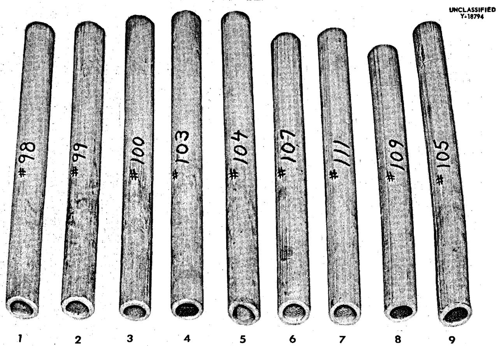

  
Fig. 3.3.4. Extruded Tube Blanks from Special Nickel-Molybdenum Alloys Prepared by the International Nickel Company.

<table><tr><td></td><td>Mo</td><td>Cr</td><td>Cb</td><td>W</td><td>Al</td><td>Ti</td><td>Mn</td><td>C</td><td>Ni</td></tr><tr><td>1</td><td>15</td><td>5</td><td>3</td><td>3</td><td>0.5</td><td>-</td><td>-</td><td>-</td><td>BAL</td></tr><tr><td>2</td><td>17</td><td>-</td><td>-</td><td>-</td><td>0.5</td><td>-</td><td>-</td><td>-</td><td>BAL</td></tr><tr><td>3</td><td>15</td><td>-</td><td>3</td><td>3</td><td>0.5</td><td>-</td><td>-</td><td>-</td><td>BAL</td></tr><tr><td>4</td><td>15</td><td>-</td><td>-</td><td>-</td><td>1</td><td>1.5</td><td>-</td><td>-</td><td>BAL</td></tr><tr><td>5</td><td>15</td><td>-</td><td>3</td><td>3</td><td>0.5</td><td>-</td><td>-</td><td>0.25</td><td>BAL</td></tr></table>

<table><tr><td></td><td>Mo</td><td>Cr</td><td>Cb</td><td>W</td><td>Al</td><td>Ti</td><td>Mn</td><td>C</td><td>Ni</td></tr><tr><td>6</td><td>20</td><td>-</td><td>1</td><td>-</td><td>-</td><td>2</td><td>0.80</td><td>0.12</td><td>BAL</td></tr><tr><td>7</td><td>17</td><td>3</td><td>-</td><td>-</td><td>-</td><td>-</td><td>-</td><td>0.06</td><td>BAL</td></tr><tr><td>8</td><td>17</td><td>5</td><td>-</td><td>-</td><td>-</td><td>-</td><td>-</td><td>0.06</td><td>BAL</td></tr><tr><td>9</td><td colspan="9">HASTELLOY B</td></tr></table>

TABLE 3.3.6. RESULTS OF EXTRUSION EXPERIMENTS ON SPECIAL ALLOYS PREPARED BY BATTELLE MEMORIAL INSTITUTE  

<table><tr><td rowspan="2">Alloy No.</td><td colspan="6">Nominal Compositions (wt %)</td><td colspan="3">Extrusion Conditions</td><td rowspan="2">Results</td></tr><tr><td>Ni</td><td>Mo</td><td>Nb</td><td>Ti</td><td>C</td><td>Mn</td><td>Temperature (°F)</td><td>Ratio</td><td>Rate*</td></tr><tr><td>B-2897</td><td>77</td><td>20</td><td>1</td><td>1</td><td>0.12</td><td>0.80</td><td>2060</td><td>5.4:1</td><td>3</td><td>Back of tube cracked on inside</td></tr><tr><td></td><td></td><td></td><td></td><td></td><td></td><td></td><td>2100</td><td>5.4:1</td><td>3</td><td>Back of tube cracked on inside</td></tr><tr><td>B-2898</td><td>76</td><td>20</td><td>1</td><td>2</td><td>0.12</td><td>0.80</td><td>2060</td><td>5.4:1</td><td>3</td><td>Back of tube cracked on inside</td></tr><tr><td></td><td></td><td></td><td></td><td></td><td></td><td></td><td>2100</td><td>5.4:1</td><td>3</td><td>Back of tube cracked on inside</td></tr><tr><td></td><td></td><td></td><td></td><td></td><td></td><td></td><td>2150</td><td>7:1</td><td>2½4</td><td>Good tube blank obtained</td></tr><tr><td></td><td></td><td></td><td></td><td></td><td></td><td></td><td>2150</td><td>7:1</td><td>2½4</td><td>Good tube blank obtained</td></tr><tr><td>B-2899</td><td>78</td><td>20</td><td>1</td><td></td><td>0.20</td><td>0.80</td><td>2060</td><td>5.4:1</td><td>3</td><td>Back of tube cracked on inside</td></tr><tr><td></td><td></td><td></td><td></td><td></td><td></td><td></td><td>2150</td><td>5.4:1</td><td>3</td><td>Back of tube cracked on inside</td></tr><tr><td></td><td></td><td></td><td></td><td></td><td></td><td></td><td>2125</td><td>5.4:1</td><td>3</td><td>Back of tube cracked on inside</td></tr><tr><td></td><td></td><td></td><td></td><td></td><td></td><td></td><td>2150</td><td>7:1</td><td>2½4</td><td>Good tube blank obtained</td></tr></table>

*Number of turns that the valve on the high-pressure water to the extrusion ram was opened; see discussion above.

present without adverse effect on corrosion resistance, ternary alloys are being prepared that will contain 17 wt % molybdenum, the elements listed below in the amounts shown, and the balance nickel.

<table><tr><td>Element to Be Added</td><td>Quantity to Be Added (wt %)</td></tr><tr><td>Cr</td><td>3, 5, 7, 10</td></tr><tr><td>W</td><td>2, 4</td></tr><tr><td>Ti</td><td>2, 4</td></tr><tr><td>Nb</td><td>2, 4</td></tr><tr><td>Al</td><td>2, 4</td></tr><tr><td>Fe</td><td>7, 20</td></tr><tr><td>C</td><td>0.1, 0.25, 0.50</td></tr></table>

Vacuum-induction heats of each composition are being prepared in 36-lb billets. A small amount of carbon is added to each charge to bring the resultant carbon level to $0.06\%$ . It is possible to machine three tube-blank extrusion billets from each ingot for the fabrication of sufficient tubing to make three standard thermal-convection loops for corrosion testing. Thus far the chromium-bearing alloys have been prepared, as well as the alloys with 2 wt % tungsten, 2 wt % titanium, and 2 wt % aluminum. Good tube blanks were obtained

by extrusion of the chromium-bearing alloys at 2100 and $2150^{\circ}\mathrm{F}$ . In all cases, a slow extrusion rate of approximately 1 in. of billet length per second at a ratio of 7:1 was used. Tubes 7 and 8 of Fig. 3.3.4 are representative product samples. It is known that chromium additions above a certain minimum amount are detrimental from the standpoint of corrosion by fluoride fuels, but chromium is a desirable addition for imparting oxidation resistance to the alloy. Results of previous tests of chromium-bearing nickel-molybdenum alloys in the fuel mixture (No. 30) $\mathrm{NaF - ZrF_4 - UF_4}$ (50-46-4 mole %) indicated that chromium additions in excess of $5\%$ caused decreased corrosion resistance; at least $7\%$ chromium is required, however, to make the alloy resistant from an oxidation standpoint. The chromium level that can be tolerated when the alloy is in contact with the fuel mixture (No. 107) NaF-KF-LiF-UF (11.2-41-45.3-2.5 mole %) is to be determined.

In all extrusion experiments carried out this quarter, difficulty was encountered occasionally with billets failing to extrude to completion. This trouble was attributed to excessive chilling of the billets by the cold ram at the slow extrusion rates being used. Therefore a new billet was designed that has mild-steel nose and tail plates tack welded to it. The plates were expected to

allow the billet to start through the die more easily, as well as to transfer the chilling action by the ram to a more easily extruded material. The mild steel is cropped from the tube blank after extrusion. Steel washed back on the outside surface of the tube is machined off before the tube blank is reduced to tubing.

Improved lubrication of the billet was obtained by coating the container of the press, as well as the mandrel, with Necrolene grease prior to each extrusion. Low-melting-point Fiberglas mats are also placed around the hot billets before they are introduced into the extrusion press. This lubrication practice has resulted in lowering the pressure required for extrusion of these materials.

# Consumable-Electrode Experiments

As indicated previously, arrangements were made with Battelle Memorial Institute for the preparation of arc-melted ingots of nickel, Hastelloy B, Hastelloy W, a $76\%$ Ni- $17\%$ Mo- $7\%$ Cr alloy, and an $83\%$ Ni- $17\%$ Mo alloy. The melts were to be made by the consumable-electrode process to take advantage of the high arc temperatures for vaporizing "tramp" elements in an effort to improve the strength and fabricability of these alloys. Electrodes of the first three alloys were to be supplied in the form of rolled rods. The special nickel-molybdenum alloys were to be prepared by vacuum melting, and the electrodes were to be fabricated by threading together extruded rods of the material. All the electrodes are now ready for shipment.

$^{2}$ Cooperative-program student on assignment from the University of Tennessee.   
3H. Inouye and J. H. Coobs, ANP Quar. Prog. Rep. Dec. 10, 1954, ORNL-1816, p 103.

# OXIDATION OF HASTELLOY B

H. Inouye J. E. Spruiell

It was reported previously3 that the oxidation rate of Hastelloy B in air at $1500^{\circ}\mathrm{F}$ was not excessive. When the alloy was thermally cycled from $1500^{\circ}\mathrm{F}$ to below about $660^{\circ}\mathrm{F}$ , however, the rate was increased by an order of magnitude as a result of spalling of the protective $\mathrm{NiMoO_4}$ scale from the metal surface. This spalling is caused by a phase transformation in the $\mathrm{NiMoO_4}$ layer at about $660^{\circ}\mathrm{F}$ .

The oxidation of Hastelloy B in static air has now been investigated at 1200, 1400, 1600, and $1800^{\circ}F$ . Data were obtained for mechanically polished specimens exposed to air at the various temperatures for periods of 168 hr. The increases in the specimen weights were determined at frequent intervals to obtain oxidation-rate curves. The total weight increases of the specimens during the tests at the various temperatures are shown in Table 3.3.7. The curves of the weight gain vs time were parabolic at all test temperatures, and thus the oxide scale appears to be protective.

The oxidation rate of the alloy at $1200^{\circ}\mathrm{F}$ is very low, and the superficial scale which forms does not spall upon cooling. Preliminary x-ray data show that this scale is principally NiO.

Thus far in these studies of the oxidation characteristics of nickel-molybdenum alloys, evidence has been found that the formation of $\mathrm{NiMoO_4}$ depends upon the molybdenum content. However, its formation may also be a function of temperature, as indicated in the tests described above.

TABLE 3.3.7. RESULTS OF OXIDATION TESTS OF HASTELLOY B EXPOSED TO STATIC AIR FOR 168 hr   

<table><tr><td>Number of Tests</td><td>Test Temperature (°F)</td><td>Average Total Weight Gain of Specimen in 168 hr* (g/cm2)</td><td>Remarks</td></tr><tr><td>4</td><td>1200</td><td>0.00031</td><td>Oxide did not spall on cooling</td></tr><tr><td>3</td><td>1400</td><td>0.00095</td><td>Oxide spalled on cooling</td></tr><tr><td>3</td><td>1600</td><td>0.0025</td><td>Oxide spalled on cooling</td></tr><tr><td>2</td><td>1800</td><td>0.0095</td><td>Oxide spalled on cooling</td></tr></table>

*Weight gain of Inconel in 168 hr at ${1500}^{ \circ  }\mathrm{F} = {0.00004}\mathrm{\;g}/{\mathrm{{cm}}}^{2}$ .

# COMPOSITE TUBING

H. Inouye

M. R. D'Amore

The fabrication of composite tubing by coextrusion was described previously.5,6 Initially these studies were made in order to develop billets which, when extruded, would result in composite tubing with predetermined thicknesses of the various metal layers. To date, billet configurations for the fabrication of two- and three-ply tube blanks have been developed.

An extrusion billet design used for the fabrication of two-ply tube blanks of equal layer thicknesses is shown in Fig. 3.3.5. The effect of various alloy combinations on the layer thicknesses after extrusion was of particular interest, since it is known that the thickness of metals with higher resistance to plastic deformation will be greater after hot rolling than was calculated. Billets of the configuration shown in Fig. 3.3.5 were extruded at $2100^{\circ}\mathrm{F}$ to $1_{4}^{\prime}$ -in.-OD, $1_{4}^{\prime}$ -in.-wall tube blanks. Tube blanks of several combinations of alloys were sectioned longitudinally and the layer thicknesses determined. The results, as presented in Table 3.3.8, show that variations in the layer thicknesses are independent of the

TABLE 3.3.8. LAYER THICKNESSES OF COMPOSITE TUBE BLANKS   

<table><tr><td rowspan="2">Alloy 
Combination</td><td colspan="2">Thickness (in.)</td></tr><tr><td>Outer 
Layer</td><td>Inner 
Layer*</td></tr><tr><td>Incubel-type 316 stainless steel</td><td></td><td></td></tr><tr><td>Front</td><td>0.122</td><td>0.130</td></tr><tr><td>Middle</td><td>0.130</td><td>0.122</td></tr><tr><td>End</td><td>0.106</td><td>0.122</td></tr><tr><td>Average</td><td>0.119</td><td>0.125</td></tr><tr><td>Hastelloy B-type 316 stainless steel</td><td></td><td></td></tr><tr><td>Front</td><td>0.110</td><td>0.142</td></tr><tr><td>Middle</td><td>0.114</td><td>0.134</td></tr><tr><td>End</td><td>0.110</td><td>0.122</td></tr><tr><td>Average</td><td>0.111</td><td>0.133</td></tr><tr><td>Monel-type 316 stainless steel</td><td></td><td></td></tr><tr><td>Front</td><td>0.126</td><td>0.130</td></tr><tr><td>Middle</td><td>0.118</td><td>0.134</td></tr><tr><td>End</td><td>0.138</td><td>0.134</td></tr><tr><td>Average</td><td>0.127</td><td>0.132</td></tr><tr><td>Nickel-type 316 stainless steel</td><td></td><td></td></tr><tr><td>Front</td><td></td><td></td></tr><tr><td>Middle</td><td>0.138</td><td>0.098</td></tr><tr><td>End</td><td>0.122</td><td>0.126</td></tr><tr><td>Average</td><td>0.130</td><td>0.112</td></tr></table>

*Inner layer was type 316 stainless steel in all the blanks.

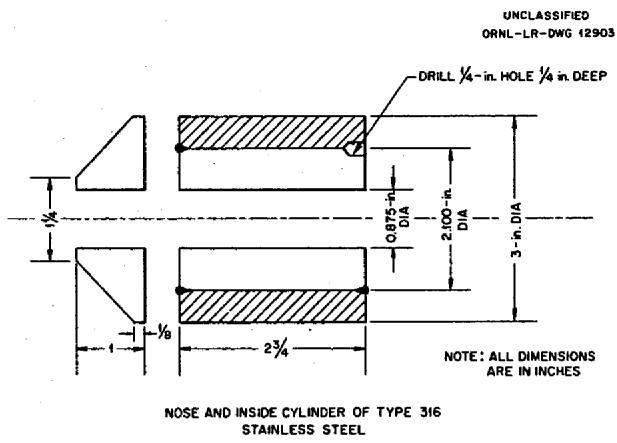  
Fig. 3.3.5. Extrusion Billet Design for the Production of Tube Blanks with Equal Layer Thicknesses.

combination of alloys, although the resistances of the alloys to plastic deformation may vary greatly. Accurate thickness measurements were difficult to obtain because of the roughness of the extruded blank.

Tube blanks of the combinations listed were redrawn to 0.187-in.-OD, 0.020-in.-wall tubing with fair success. As a result of inexperience in processing duplex tubing, however, a few longitudinal cracks were present in the Inconel layer of the Inconel-type 316 stainless steel combination. Also, the Hastelloy B-type 316 stainless steel combination was rejected during processing because of longitudinal splitting. Preliminary examinations of the small-diameter tubing obtained showed that thermal bonds were maintained at the metal interfaces throughout the processing and that the layer thicknesses were about equal.

# NEUTRON SHIELD MATERIAL FOR HIGH-TEMPERATURE USE

M.R.D'Amore J.H.Coobs

The neutron shield designed for the ART, as discussed previously, incorporates a double layer of boron-containing materials which have a total boron density of $1.2\mathrm{g/cm}^2$ . A stainless-steel-clad copper- $\mathsf{B}_4\mathsf{C}$ cermet layer 0.100 in. thick is to be used nearest to the neutron source to absorb radiation damage. The second layer consists of $\mathsf{B}_4\mathsf{C}$ ceramic tiles 0.265 in. thick contained in stainless steel cans.

# Ceramic $\mathsf{B}_4\mathsf{C}$ Tiles

The evaluation of the $\mathsf{B}_4\mathsf{C}$ ceramic tiles submitted by the Norton Company and by the Carborundum Company was completed. Two sets of four sample tiles each were received from the Carborundum Company during the quarter. The tiles were bonded with silicon and fabricated by a casting and sintering process. Radiographs of the first set of four tiles revealed large voids. The macroporosity was eliminated in the second set of tiles by a revision in the manufacturing process. The boron densities of the eight tiles, as determined by chemical analysis, varied between 0.889 and 1.15 g/cm³. The minimum boron density of 1.26 g/cm³ specified for the tiles appears to be difficult to achieve in a cast and sintered B₄C-SiC tile.

The Norton Company submitted tiles of both technical-grade and high-purity $\mathsf{B}_4\mathsf{C}$ that had been hot pressed to densities of 1.9 to $2.34~\mathrm{g / cm^3}$ . A high-purity $\mathsf{B}_4\mathsf{C}$ tile with a density of $2.0~\mathrm{g / cm^3}$ was found by analysis to contain $1.48~\mathrm{g}$ of boron per cubic centimeter, rather than the minimum of $1.53~\mathrm{g / cm^3}$ guaranteed by the Norton Company. The Norton Company has guaranteed to produce finished tiles of high purity with a minimum boron content of $1.7~\mathrm{g / cm^3}$ .

Representative specimens cut from sample tiles submitted by each company were irradiated in the LITR for a six-week period. A cursory examination of the irradiated specimens indicated that the ability to withstand radiation damage is equal for both materials at less than $3\%$ burnup of the $\mathsf{B}^{10}$ atoms. No cracking of the specimens or gas evolution was observed after irradiation. The hot-pressed $\mathsf{B}_4\mathsf{C}$ tiles are preferable for ART applica

tion, since the higher boron concentrations attainable by this fabrication method will result in a more effective reduction in neutron activation of the NaK heat exchanger circuit.

# Copper-B $^4 C$ Cermets

The shield plates made from a stainless-steel-clad copper- $\mathsf{B}_4\mathsf{C}$ cermet are to be 0.100 in. thick and to have the following cross-sectional configuration:

8 to 10 mils of type 430 stainless steel cladding   
1 to 3 mils of copper diffusion barrier   
80 mils of 16 vol $\%$ B4C particles dispersed in copper   
1 to 3 mils of copper diffusion barrier   
8 to 10 mils of type 430 stainless steel cladding

The maximum plate size is to be about 8 in. square. Bonding of the components by hot-roll cladding in an evacuated picture frame has been moderately successful. Bonding of the copper barrier material to the type 430 stainless steel cladding is difficult to achieve at moderate intermediate reductions. Reductions of $20\%$ per pass cause a bulging of the $\mathsf{B}_4\mathsf{C}$ -copper core at each end which ruptures the cladding. A more promising method of manufacturing the clad cermet plates consists in bonding the components by hot pressing at temperatures between 1800 and $1900^{\circ}\mathrm{F}$ and then cold rolling the plates to the final thickness. The plate uniformity can be controlled to close tolerances by this method, and good bonding of the components is achieved.

Small plates have been successfully fabricated, and the process is being scaled up for the manufacture of larger plates. Radiation-damage specimens of the clad cermet have been prepared and will be irradiated in the LITR and in the MTR.

# Boride Particle Dispersions in a Metallic Matrix

Dispersions of BN and $\mathsf{CaB}_6$ particles in iron and nickel were investigated as possible substitutes for copper- $\mathsf{B}_4\mathsf{C}$ cemets. Compacts containing 21 vol $\%$ $\mathsf{CaB}_6$ dispersed in iron and 30 vol $\%$ BN dispersed in nickel were successfully fabricated by cold pressing, sintering, and coining the powder mixtures. The coined compacts were encapsulated in a type 304 stainless steel picture frame and rolled at $2000^{\circ}\mathsf{F}$ to a total thickness reduction of $85\%$ . After hot rolling, the $\mathsf{CaB}_6$ -Fe and BN-Ni

cores were examined by x-ray diffraction techniques for evidence of reaction. A reaction had occurred in the $\mathrm{CaB_6}$ -Fe material during the fabrication process that resulted in the formation of Fe2B.No reaction was detected between BN and nickel, in confirmation of the compatibility test results for BN and Inconel reported previously.8 Clad specimens of both BN-nickel and BN-Inconel have been prepared for irradiation testing in the LITR.

The combinations $\mathsf{CaB}_{6}$ -Ni and BN-Fe were also investigated. The $\mathsf{CaB}_{6}$ -Ni compacts formed a liquid phase at $1800^{\circ}F$ during sintering. No reaction was observed between BN and iron. Difficulties in fabrication were experienced, however, and work on the BN-Fe combination was discontinued in favor of the BN-Ni composition. The BN-Ni cermet appears to be attractive as a high-temperature shield material, since it is easily fabricated and the components are compatible up to a temperature of $2000^{\circ}F$ .

# Boron Steels

The study of boron steels for use in a compression ring between the beryllium reflector and the support strut ring in the ART was continued. The tensile strength of a cast $0.75\%$ B10-Fe alloy at $1300^{\circ}\mathrm{F}$ was 14,775 psi, with no elongation. Billets of the alloy were extruded into rod at $1900^{\circ}\mathrm{F}$ with no difficulty by using an extrusion ratio of 6.5:1. Tensile specimens will be machined from the wrought material to determine the effect of hot working on the mechanical properties of the alloy.

The compatibility of boron-iron alloys containing 1 and $3\%$ boron and Inconel was investigated in 500-hr tests at $1300^{\circ}\mathrm{F}$ . Diffusion couples were prepared for the tests by hot rolling the composite material at $1900^{\circ}\mathrm{F}$ . Metallographic observation of the Inconel and boron-iron alloy interface revealed that no diffusion of boron into the Inconel had occurred during the hot-rolling operation. Photomicrographs of the diffusion couple interface after 500 hr at $1300^{\circ}\mathrm{F}$ are shown in Fig. 3.3.6. The layers 1 to 1.5 mils wide in the $1\%$ B alloy and 0.5 mil wide in the $3\%$ B alloy that were depleted in boron after 500 hr at $1300^{\circ}\mathrm{F}$ indicated that diffusion of boron into the Inconel was not serious at this temperature.

Radiation-damage specimens were fabricated from a boron-stainless steel alloy for testing in the LITR and in the MTR. The composition of the alloy is basically type 304 stainless steel with the nickel content increased to about $14\%$ and a boron addition of $1.07\%$ . The boron addition to the melt contained $84.6\% \mathrm{B}^{10}$ and $15.4\mathrm{B}^{11}$ . The specimens will be irradiated unstressed and stressed at 500 psi at temperatures from 1300 to $1700^{\circ}\mathrm{F}$ in the LITR and at $1600^{\circ}\mathrm{F}$ in the MTR.

Recent work by other investigators has revealed low ductility in boron-stainless steels after irradiation. The feasibility of using a duplex ring configuration is therefore being investigated. The primary ring would be fabricated from Inconel and the secondary ring from clad copper- $\mathsf{B}_4\mathsf{C}$ .

# Other Boron-Containing Materials

The electrophoretic deposition of uniform copper coatings on ceramic $\mathsf{B}_4\mathsf{C}$ tiles and the bonding of a copper- $\mathsf{B}_4\mathsf{C}$ layer to type 430 stainless steel is being investigated by the Vitro Laboratories. Good bonding of a deposited copper coating has been achieved on cast and sintered $\mathsf{B}_4\mathsf{C}$ ceramic tiles. The bonding of a copper coating to hot-pressed $\mathsf{B}_4\mathsf{C}$ tiles has been moderately successful. Electrophoretically deposited coatings containing up to 40 vol % of $\mathsf{B}_4\mathsf{C}$ particles dispersed in copper shrank excessively during the sintering treatment at $1000^{\circ}\mathsf{C}$ .

# SOLID FUEL ELEMENTS

M. R. D'Amore  
J. H. Coobs  
V. M. Kolba

The investigations of simulated seamless tubular fuel element extrusions, reported previously,[11] were continued. The recovery of material with uniformly thick layers varied from about $55\%$ in a tube extruded at a 5:1 ratio to a maximum of about $76\%$ in tubes extruded at a 21:1 ratio. Sections 18 in. in length from two tubes extruded at a 21:1 ratio were redrawn to 0.187-in.-OD, 0.015-in.-wall tubing. Preliminary metallographic examination of the finished tubing revealed a large number of tensile failures in the 30 vol $\%$ Al $_2$ O $_3$ -type 302B stainless

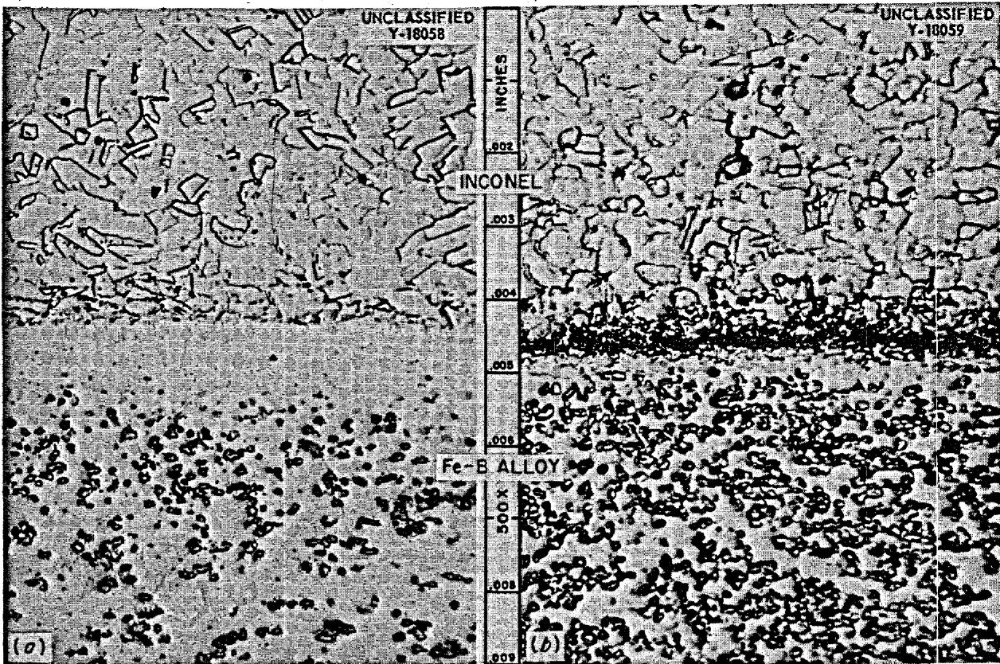  
Fig. 3.3.6. Diffusion Couples of Boron-Iron Alloy and Inconel after 500 hr at $1300^{\circ}\mathbf{F}$ . (a) The B-Fe alloy containing $1\%$ B. (b) The B-Fe alloy containing $3\%$ B. 500X. Reduced $7.5\%$ .

steel cores, probably because of excessively high reductions during redrawing.

Additional three-ply billets are being prepared to investigate the extrusion of hot-pressed cores prepared in sections rather than as a single cylinder. The billet designs have been revised in an attempt to improve material recovery.

The Allegheny Ludlum Steel Corporation has extruded two $5\frac{3}{8}$ -in.-dia, 12-in.-long, three-ply billets. The cernet cores were fractured severely in the extruded tubes.

A review of radiation-damage studies on solid fuel elements is nearly complete, and a summary is being prepared that is based on metallographic examinations and hardness and bend test results reported by the Solid State Division over the past several years. The data were obtained from miniature fuel elements and subassemblies submitted for examination by Pratt & Whitney Aircraft, GE-ANPD, KAPL, and the APPR group at ORNL, as well as from full-sized MTR and LITR fuel elements.

# TUBULAR CONTROL RODS

M.R.D'Amore J.H.Coobs

R. E. McDonald

The feasibility study on the extrusion of tubular control rods, described previously;13 was continued. An Inconel billet can was fabricated, and the core was prepared by tamping a loose powder mixture of 36.9 vol % Lindsay Mix rare-earth-oxide particles dispersed in nickel into the billet can. Fracturing of the outer layer of this three-ply billet during extrusion at $2100^{\circ}\mathrm{F}$ resulted in a nonuniform core. The core was quite dense after extrusion and appeared to be bonded to the inner and outer Inconel cladding.

The as-received Lindsay Mix is composed of very fine particles about $1\mu$ in size. Dry mixing of the Lindsay Mix and carbonyl nickel powders in an oblique blender resulted in segregation and lumping of the rare-earth oxide particles. A satisfactory dispersion of the oxide and carbonyl nickel powders could be obtained only by wet milling.

One section of a control rod core has been fabricated by hot-pressing a cylinder of 36.9 vol % Lindsay Mix-63.1 vol % carbonyl nickel to a density of 88.7% of theoretical. Additional extrusions of Lindsay Mix-nickel cores clad with either Hastelloy X or Inconel are planned.

$\mathsf{Nb - UO}_2$ FUEL ELEMENTS

V. M. Kolba

H. Inouye

J.P.Page

Commercially available niobium powder is of poor quality, and therefore attempts were made to produce high-purity powder from wrought niobium sheet

for use in fabrication studies on $\mathsf{Nb - UO_2}$ fuel components. The niobium sheet was hydrided, crushed, and ball milled to 100-mesh powder. This powder was then leached to remove iron contamination from the ball milling and then vacuum annealed at $800^{\circ}C$ to remove hydrogen. A Bergsman microhardness determination on this powder gave a result of $\sim 317\mathrm{VHN}$ . Further vacuum annealing at $1100^{\circ}C$ lowered the hardness to $\sim 290\mathrm{VHN}$ , which was still quite high and indicative of oxygen and nitrogen contamination.

A second attempt was made to produce powder by using cold-rolled niobium plate and repeating the hydriding, crushing, and vacuum-annealing treatments. A polished section of particles of this powder is shown in Fig. 3.3.7, on which the hardness was found to be $\sim 193$ VHN. Small inclusions may be seen in the matrix, which indicate some degree of contamination. Samples of both batches of powder are being analyzed for comparison with the

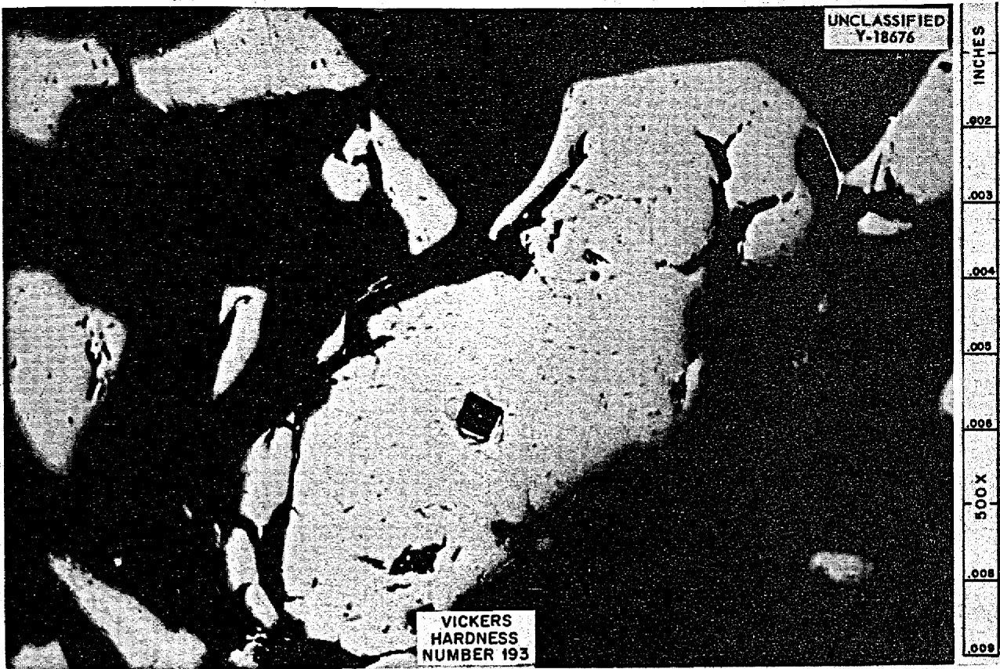  
Fig. 3.3.7. Microstructure and Hardness of Niobium Powder Produced from Wrought Plate. 500X. Reduced $3.5\%$ .

wrought plate used as base material. Further attempts are also being made to secure high-purity niobium powder from commercial sources.

Two companies were contacted for information on high-vacuum furnaces capable of temperatures of $2100^{\circ}\mathrm{C}$ for sintering niobium and other materials. Literature and quotations have been received and are being evaluated.

Three specimens of Inconel-clad niobium have been machined to slightly larger than creep specimen dimensions and are to be undercut and edge-protected as described previously. They will be creep tested in an inert atmosphere. Both highly purified argon and liquid sodium show promise as creep-test environments for unclad niobium. Identical specimens will be run in each environment at $1500^{\circ}\mathrm{F}$ , and the results will be compared. Data on weight and hardness change will also be correlated.

# LOW-CONDUCTIVITY GAMMA-RAY SHIELDING MATERIAL

J.H.Coobs J.P.Page

Conductivity data received from a commercial supplier of cemented carbide bodies, correlated with data obtained at ORNL, indicate the thermal conductivity of tungsten carbide to be approximately 0.125 cal/sec. $^{\circ}$ C.cm. This value, coupled with the "inertness" on hot pressing, makes tungsten carbide the most promising base material for a low-conductivity gamma-ray shield.

Constantan was chosen as a binder for the tungsten carbide because of its low thermal conduc

tivity (0.06 cal/sec $^{\circ}$ C.cm), its low liquidus temperature $(1220^{\circ}\mathrm{C})$ , which minimizes hot-pressing difficulties, its low cost, and its brazeability. Further, the elemental copper and nickel powders from which it is prepared are readily available.

Six tungsten carbide-constantan thermal-conductivity specimens, as described in Table 3.3.9, have been hot pressed and finished to size. The variation of thermal conductivity with composition should become evident upon evaluation of these specimens. The composition showing the lowest conductivity will be chosen for use as the gamma shield around the ART pump shafts.

Three cold-pressed and sintered $\mathsf{ZrO}_2$ thermal-conductivity specimens, with densities of 3.09, 3.52, and $4.41\mathrm{g / cm}$ , respectively, were machined to Battelle Memorial Institute specifications for thermal-conductivity determination at that installation. These pieces will be tested in a helium atmosphere to simulate service conditions.

# LITHIUM-MAGNESIUM ALLOYS

R.E.McDonald C.F.Leitten,Jr.

Work continued on the $20\%$ Li- $80\%$ Mg alloy for use as shielding material. Corrosion of the alloy in air and in water was found to be severe. Freshly cleaned specimens gained $0.088 \, \text{mg/cm}^2$ during 6 hr of exposure in air. Another specimen tested for various times in boiling water was found to have lost $0.292 \, \text{mg/cm}^2$ in the first 2 min of exposure, which amounted to $90\%$ of the weight lost during the entire 15-min test. The decrease in rate of weight loss may be attributed to the depletion of lithium at the surface, since no protective film could be detected. Pure magnesium tested in boiling water for 15 min showed a weight loss of

TABLE 3.3.9. DATA ON TUNGSTEN CARBIDE-CONSTANTAN THERMAL-CONDUCTIVITY SPECIMENS   

<table><tr><td rowspan="2">Code No.</td><td rowspan="2">Density (g/cm3)</td><td colspan="2">Composition (wt %)</td><td colspan="2">Composition (vol %)</td><td rowspan="2">Porosity (%)</td></tr><tr><td>WC</td><td>Constantan</td><td>WC</td><td>Constantan</td></tr><tr><td>12-0</td><td>11.53</td><td>57</td><td>43</td><td>42</td><td>56</td><td>2</td></tr><tr><td>12-7</td><td>11.63</td><td>71</td><td>29</td><td>53</td><td>38</td><td>9</td></tr><tr><td>12-14</td><td>11.60</td><td>85</td><td>15</td><td>64</td><td>19</td><td>17</td></tr><tr><td>12-19</td><td>11.55</td><td>94</td><td>6</td><td>68</td><td>7</td><td>25</td></tr><tr><td>13-5</td><td>12.96</td><td>79</td><td>21</td><td>65</td><td>30</td><td>5</td></tr><tr><td>13-15</td><td>12.67</td><td>93</td><td>7</td><td>75</td><td>10</td><td>15</td></tr></table>

$0.09\mathrm{mg/cm}^2$ . The weight losses of several freshly cleaned specimens tested in water at various temperatures for 15 min are presented below:

<table><tr><td>Temperature of Water (℃)</td><td>Weight Loss (mg/cm2)</td></tr><tr><td>30</td><td>0.243</td></tr><tr><td>50</td><td>0.271</td></tr><tr><td>80</td><td>0.309</td></tr><tr><td>100</td><td>0.326</td></tr></table>

Work was continued on the development of protective coatings and on cladding of the material. A technique was developed for producing a bright surface, which involves a two-step treatment with concentrated phosphoric acid and acetone. The bright surface tarnished slightly when exposed to air, but it was stable at $300^{\circ}\mathrm{C}$ and for long periods at lower temperatures. Specimens with surfaces prepared by this method were roll clad with 2S aluminum and AZ31 magnesium alloy. The 2S aluminum-clad material produced a brittle bond, while

the AZ31 alloy failed to bond even to itself.

In order to further evaluate the mechanical properties of the $20\%$ Li- $80\%$ Mg alloy, more sheet specimens were needed. A 0.250-in. sheet was mechanically cleaned of mill scale and corrosion products, given the phosphoric acid-acetone treatment, and hot rolled at $250^{\circ}\mathrm{C}$ to a thickness of 0.070 in. A 30-min soak at $300^{\circ}\mathrm{C}$ straightened the sheet. New specimens were machined from this sheet and kept under mineral oil until tested. The tensile data obtained for the new sheets are compared with the data for the old sheets in Table 3.3.10 and the rupture data are compared in Table 3.3.11. Fixtures are being designed to test this alloy at constant temperature, in a protective medium of mineral oil, without the film produced by phosphoric acid-acetone treatment.

Powder metallurgy was investigated as a different approach to fabrication of the shield material. Lithium oxide was chosen as the lithium source, being the most stable of the lithium compounds and possessing the highest melting

TABLE 3.3.10. TENSILE DATA FOR $20\%$ Li-80% Mg ALLOY SHEET   
Density: $1.44\mathrm{g/cm}^3$   
TABLE 3.3.11. RUCTURE DATA FOR $20\%$ LI-80% Mg ALLOY SHEET   

<table><tr><td>Sheet Specimen</td><td>Temperature (°F)</td><td>Elongation (%)</td><td>Average Tensile Strength (psi)</td><td>Average Yield Strength (psi)</td></tr><tr><td>Old</td><td>Room</td><td>35</td><td>12,500</td><td>11,230</td></tr><tr><td>New</td><td>Room</td><td>48</td><td>12,775</td><td>10,650</td></tr><tr><td>Old</td><td>200</td><td>45</td><td>3,000</td><td>2,970</td></tr><tr><td>New</td><td>200</td><td>94</td><td>3,200</td><td>2,940</td></tr></table>

All tests at room temperature   
Stress: 3000 psi   

<table><tr><td>Sheet Specimen</td><td>Coating</td><td>Elongation (%)</td><td>Rupture Life (hr)</td></tr><tr><td rowspan="3">Old</td><td>None</td><td>48</td><td>125</td></tr><tr><td>Grease</td><td>90</td><td>315</td></tr><tr><td>HNO3dip and grease</td><td>100</td><td>220</td></tr><tr><td rowspan="2">New</td><td>Phosphoric acid, acetone, and grease</td><td>32</td><td>1050</td></tr><tr><td>Grease</td><td>35</td><td>566</td></tr></table>

point. A mixture of 50-50 vol $\%$ Li $_2$ O-Al powder was cold pressed and hot rolled in a standard-size 2S-aluminum picture frame. Composite sheet produced by this method shows a continuous aluminum matrix, even distribution of the lithium oxide, and good bonding. The 50-50 vol $\%$ mixture gives 20 wt $\%$ lithium in the core and a lithium density of $0.452~\mathrm{g/cm^3}$ , as compared with a lithium density of $0.288~\mathrm{g/cm^3}$ in the $20\%$ Li- $80\%$ Mg alloy. It has been possible to produce composite sheets with thickness ratios of clad to core of 1:2, 1:4, 1:6, and 1:8.

On the basis of the successful production of the $\mathsf{Li}_2\mathsf{O}$ -Al composite sheet, $\mathsf{Li}_2\mathsf{O}$ -Mg was investigated. This combination would produce a lighter sheet and a higher weight percentage of lithium for a given volume percentage. The picture frame was made from AZ31 magnesium because M-1 magnesium alloy was not available. No solid phase bonding with AZ31 could be obtained. The $\mathsf{Li}_2\mathsf{O}$ -Mg compact and AZ31 interface was brittle, and the finished sheet was cracked throughout.

# 3.4. WELDING AND BRAZING INVESTIGATIONS

P. Patriarca

# PUMP FABRICATION EXPERIMENTS

P. Patriarca

G. M. Slaughter

Welding Studies

The dimensional changes associated with the welding of Inconel pump volutes representative of those designed for the main NaK pumps (PK-2) of the ART were determined in a preliminary investigation. These changes were considered to be in excess of those allowable. Accordingly the welding procedure was modified and the test was repeated in the interest of improving the ability to more nearly conform to acceptable tolerances.

Two test pieces essentially similar to those used previously were machined from 2-in. Inconel plate. A shrinkage of 0.100 in. was provided for in the fabrication of these pieces. Four spacers were also machined from Inconel plate to act as rigid supports during welding of the volutes after

the initial shrinkage occurred. These are shown in Fig. 3.4.1, along with the component parts of the test. The spacers were subjected to an aluminizing treatment prior to assembly of the components in order to prevent self-welding during the subsequent operations. The two volutes were welded in accordance with the welding procedure described in Fig. 3.4.2.

Micrometer measurements were made at four radial sections, as described in Fig. 3.4.3, prior to and after each operation. The results of these micrometer measurements are summarized in Table 3.4.1. It may be noted that the shrinkage decreased with increased distance from the weld, an effect noted previously. It appears that an improvement of the shrinkage prediction at position 3 by reducing the shrinkage allowance can be accomplished only at a sacrifice in the absolute shrinkage at positions 1 and 2, the overall error being of the order of 0.012 in.

A compromise would be to provide for a 0.090-in. shrinkage allowance and thereby reduce the absolute error to 0.006-in. The ability to reproduce

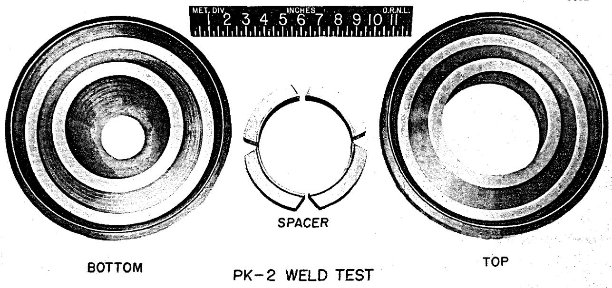  
UNCLASSIFIED Y-17332   
Fig. 3.4.1. Component Parts for NaK (PK-2) Pump Volute Weld Shrinkage Test.

UNCLASSIFIED

ORNL-LR-DWG14719

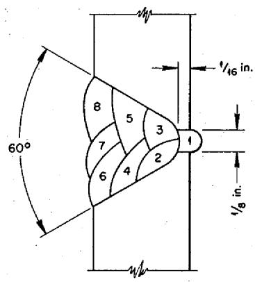  
Fig. 3.4.2. Welding Procedure and Joint Design for Weld Shrinkage Test No. 2 on NaK (PK-2) Pump Volute.

WELDING PROCEDURE: VERTICAL FIXED, 2G   

<table><tr><td>PASS NUMBER</td><td>PROCESS</td><td>ELECTRODE SIZE (in.)</td><td>ELECTRODE MATERIAL</td><td>CURRENT (amp)</td><td>APPROXIMATE WELDING SPEED (in./min)</td></tr><tr><td>1</td><td>INERT ARC</td><td>3/32</td><td>INCO 62</td><td>90</td><td>*</td></tr><tr><td>2-3</td><td>METAL ARC</td><td>3/32</td><td>INCO 132</td><td>60</td><td>2</td></tr><tr><td>4-8</td><td>METAL ARC</td><td>5/32</td><td>INCO 132</td><td>110</td><td>4</td></tr></table>

* ROOT PASS: 6 TACKS EACH APPROXIMATELY 2 in. IN LENGTH ON APPROXIMATELY 6 in. CENTERS   
FOLLOWED BY TIE-INS BETWEEN TACKS.

TABLE 3.4.1. RESULTS OF MICROMETER MEASUREMENTS BEFORE AND AFTER WELDING OF NaK (PK-2) PUMP VOLUME   

<table><tr><td rowspan="2">Position</td><td colspan="7">Dimensions (in.)</td></tr><tr><td>Before Welding</td><td>After Welding</td><td>Change</td><td>Deviation from Desired Change*</td><td>Deviation from Revised Change**</td><td>After Annealing</td><td>Additional Change</td></tr><tr><td>A1</td><td>3.916</td><td>3.820</td><td>0.096</td><td>-0.004</td><td>+0.006</td><td>3.818</td><td>-0.002</td></tr><tr><td>B1</td><td>3.920</td><td>3.824</td><td>0.096</td><td>-0.004</td><td>+0.006</td><td>3.820</td><td>-0.004</td></tr><tr><td>C1</td><td>3.920</td><td>3.826</td><td>0.094</td><td>-0.006</td><td>+0.004</td><td>3.823</td><td>-0.003</td></tr><tr><td>D1</td><td>3.916</td><td>3.822</td><td>0.094</td><td>-0.006</td><td>+0.004</td><td>3.818</td><td>-0.004</td></tr><tr><td>A2</td><td>3.914</td><td>3.826</td><td>0.088</td><td>-0.012</td><td>-0.002</td><td>3.822</td><td>-0.004</td></tr><tr><td>B2</td><td>3.919</td><td>3.830</td><td>0.089</td><td>-0.011</td><td>-0.001</td><td>3.826</td><td>-0.004</td></tr><tr><td>C2</td><td>3.919</td><td>3.831</td><td>0.088</td><td>-0.012</td><td>-0.002</td><td>3.828</td><td>-0.003</td></tr><tr><td>D2</td><td>3.916</td><td>3.829</td><td>0.087</td><td>-0.013</td><td>-0.003</td><td>3.825</td><td>-0.004</td></tr><tr><td>A3</td><td>0.670</td><td>0.585</td><td>0.085</td><td>-0.015</td><td>-0.005</td><td>0.581</td><td>-0.004</td></tr><tr><td>B3</td><td>0.672</td><td>0.588</td><td>0.084</td><td>-0.016</td><td>-0.006</td><td>0.585</td><td>-0.003</td></tr><tr><td>C3</td><td>0.675</td><td>0.589</td><td>0.086</td><td>-0.014</td><td>-0.004</td><td>0.586</td><td>-0.003</td></tr><tr><td>D3</td><td>0.670</td><td>0.586</td><td>0.084</td><td>-0.016</td><td>-0.006</td><td>0.583</td><td>-0.003</td></tr></table>

$\bullet$ Shrinkage allowance: 0.100-in.   
\*\*Revised shrinkage allowance: 0.090-in.

the shrinkage data described herein should be determined by conducting another test prior to attempting fabrication of a pump with a complex volute.

Since the shrinkage at position 3 was less than expected, it was not possible to use the spacers, as machined, to prevent further shrinkage during annealing. The pump casing was annealed at $1850^{\circ}\mathrm{F}$ for $\frac{1}{2}$ hr in order to determine the necessity for this operation. The additional shrinkage of 0.002 to 0.004 in. observed indicates that the role of residual stresses is significant. Properly machined spacers should be used to prevent further shrinkage during annealing, as was accomplished in the previous investigation.

# Brazing Studies

Tests have also been performed to study the feasibility of a brazed NaK (PK-2) pump volute. The component parts for the test are shown in Fig. 3.4.4. The bottom volute is shown with eight 0.187-in.-dia, 1-in.-long Inconel shear pins inserted into 0.197-in.-dia holes drilled to a depth of $\frac{1}{2}$ in. These pins were intended to provide approximately 5 in.² of shear area to supplement the 18 in.² of area that constitutes the faying surfaces of the upper and lower volutes in the brazed assembly. The top volute is shown with 0.200-in.-iD tubes welded over the shear pin holes to act as reservoirs for the Coast Metals No. 52 brazing alloy. The alloy was applied in the form of 3.16-in.-dia slugs, which ranged from 3.8 to $\frac{1}{2}$ in. in length and were fabricated by casting in graphite molds. Several of these slugs are shown in the center of Fig. 3.4.4. A total of 30.8 g of Coast Metals No. 52 alloy was used. This amount was calculated to supply approximately 0.19 in.³ of alloy, of which 0.048 in.³ would fill the space between the shear pins and the shear pin holes and approximately 0.054 in.³ would comprise a 0.0003-in.-thick brazing alloy layer between the faying surfaces of the volutes. It was expected that a surplus of brazing alloy would be desirable to ensure complete brazing. The excess alloy was to remain in the reservoirs. A 0.003-in. separation between the parts of the volutes was achieved by using 0.003-in.-dia nickel wire as a spacer.

Micrometer measurements were made before and after brazing at the positions described in Fig. 3.4.5. The assembly was brazed at $1050^{\circ}\mathrm{C}$ in dry hydrogen. The heating and cooling rate of the brazing cycle was approximately $350^{\circ}\mathrm{C/hr}$ ,

and a hold time of $\frac{1}{2}$ hr at $1050^{\circ}$ C was used. A photograph of the completed assembly is shown in Fig. 3.4.6. As may be seen, excess brazing alloy flowed out of the capillary and down the side of the casing. A similar condition was evident on the inside of the volute; there was a fillet of brazing alloy thinly distributed around the bottom volute.

The failure of the reservoirs to retain the excess brazing alloy is attributed to the relatively large clearance between the Inconel shear pins and the shear pin holes. It is expected that a clearance of 0.001 to 0.002 in., coupled with a supplementary capillary on the periphery of the casing, which could be removed later, would remedy this difficulty.

The braze joint was subjected to dye-penetrant and radiographic inspections and was considered to be sound. The degree of correlation between the radiographic interpretation and the joint soundness should be determined by metallographic examination.

The results of the micrometer measurements are summarized in Table 3.4.2. As may be noted, most of the dimensional changes found are within the limit of error of the measurements. As was expected, the data indicate that the brazed construction affords a high degree of dimensional control and should be given consideration as a fabrication method.

TABLE 3.4.2. RESULTS OF MICROMETER MEASUREMENTS BEFORE AND AFTER BRAZING OF NaK (PK-2) PUMP VOLUME   

<table><tr><td rowspan="2">Position</td><td colspan="3">Dimensions* (in.)</td></tr><tr><td>As Assembled</td><td>After Brazing</td><td>Change</td></tr><tr><td>A-1</td><td>3.815</td><td>3.813</td><td>-0.002</td></tr><tr><td>2</td><td>3.818</td><td>3.817</td><td>-0.001</td></tr><tr><td>3</td><td>0.629</td><td>0.628</td><td>-0.001</td></tr><tr><td>B-1</td><td>3.817</td><td>3.817</td><td>0</td></tr><tr><td>2</td><td>3.816</td><td>3.816</td><td>0</td></tr><tr><td>3</td><td>0.629</td><td>0.627</td><td>-0.002</td></tr><tr><td>C-1</td><td>3.819</td><td>3.820</td><td>+0.001</td></tr><tr><td>2</td><td>3.818</td><td>3.818</td><td>0</td></tr><tr><td>3</td><td>0.629</td><td>0.628</td><td>-0.001</td></tr><tr><td>D-1</td><td>3.818</td><td>3.817</td><td>-0.001</td></tr><tr><td>2</td><td>3.816</td><td>3.815</td><td>-0.001</td></tr><tr><td>3</td><td>0.629</td><td>0.628</td><td>-0.001</td></tr></table>

*Estimated accuracy of measurement ±0.001 in.

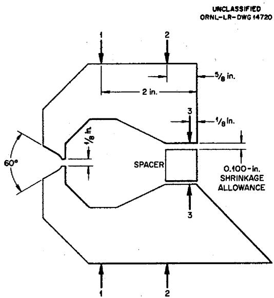  
Fig. 3.4.3. Details of Micrometer Measurements on Welded NaK (PK-2) Pump Volute. Measurements made at four radial sections (A through D) at 90-deg intervals at positions 1, 2, and 3 (see Table 3.4.1).

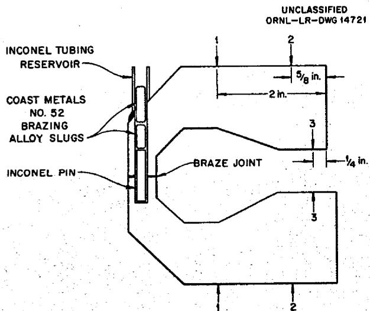  
Fig. 3.4.5. Details of Micrometer Measurements on Brazed NaK (PK-2) Pump Volute. Measurements made at four radial sections (A through D) at 90-deg intervals at positions 1, 2, and 3 (see Table 3.4.2).

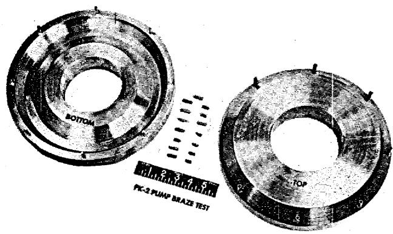  
Fig. 3.4.4. Component Parts for Brazing Test on NaK (PK-2) Pump Volute. Note the Inconel shear pins on the bottom test piece, the Coast Metals No. 52 alloy slugs in the center, and the Inconel tubing reservoirs on the top test piece.

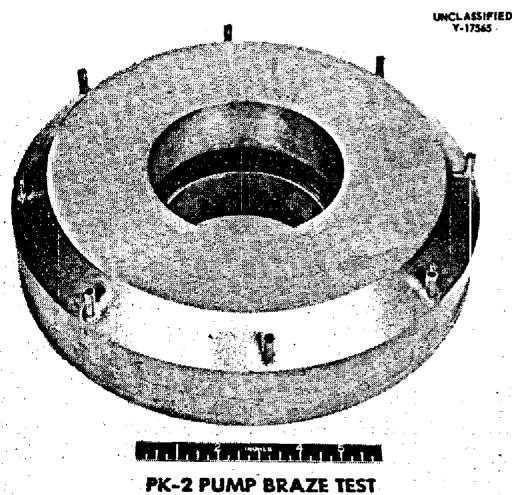  
Fig. 3.4.6. NaK (PK-2) Pump Volute After Brazing.

TABLE 3.4.3. RESULTS OF MICROMETER MEASUREMENTS ON DIAMETER OF PUMP BARREL   

<table><tr><td rowspan="2">Position</td><td colspan="9">Dimensions (in.)</td></tr><tr><td>Before Welding</td><td>After Welding Shell Flange</td><td>Change</td><td>After Removal of Restraints</td><td>Additional Changes</td><td>After Annealing</td><td>Additional Changes</td><td>Change Due to Relief of Residual Stresses</td><td>Total Changes</td></tr><tr><td>A 1</td><td>6.378</td><td>6.383</td><td>+0.005</td><td>6.387</td><td>+0.004</td><td>6.384</td><td>-0.003</td><td>+0.001</td><td>+0.006</td></tr><tr><td>2</td><td>6.390</td><td>6.391</td><td>+0.001</td><td>6.392</td><td>+0.001</td><td>6.393</td><td>+0.001</td><td>+0.002</td><td>+0.003</td></tr><tr><td>3</td><td>6.378</td><td>6.375</td><td>-0.003</td><td>6.376</td><td>+0.001</td><td>6.377</td><td>+0.001</td><td>+0.002</td><td>-0.001</td></tr><tr><td>4</td><td>6.378</td><td>6.380</td><td>+0.002</td><td>6.382</td><td>+0.002</td><td>6.382</td><td>0</td><td>+0.002</td><td>+0.004</td></tr><tr><td>B 1</td><td>6.384</td><td>6.389</td><td>+0.005</td><td>6.391</td><td>+0.002</td><td>6.388</td><td>-0.003</td><td>-0.001</td><td>+0.004</td></tr><tr><td>2</td><td>6.390</td><td>6.390</td><td>0</td><td>6.392</td><td>+0.002</td><td>6.391</td><td>-0.001</td><td>+0.001</td><td>+0.001</td></tr><tr><td>3</td><td>6.381</td><td>6.376</td><td>-0.005</td><td>6.380</td><td>+0.004</td><td>6.381</td><td>+0.001</td><td>+0.005</td><td>0</td></tr><tr><td>4</td><td>6.382</td><td>6.383</td><td>+0.001</td><td>6.387</td><td>+0.004</td><td>6.386</td><td>-0.001</td><td>+0.003</td><td>+0.004</td></tr><tr><td>C 1</td><td>6.385</td><td>6.391</td><td>+0.006</td><td>6.392</td><td>+0.001</td><td>6.391</td><td>-0.001</td><td>0</td><td>+0.006</td></tr><tr><td>2</td><td>6.386</td><td>6.386</td><td>0</td><td>6.387</td><td>+0.001</td><td>6.386</td><td>-0.001</td><td>0</td><td>0</td></tr><tr><td>3</td><td>6.380</td><td>6.375</td><td>-0.005</td><td>6.379</td><td>+0.004</td><td>6.379</td><td>0</td><td>+0.004</td><td>-0.001</td></tr><tr><td>4</td><td>6.382</td><td>6.385</td><td>+0.003</td><td>6.385</td><td>0</td><td>6.385</td><td>0</td><td>0</td><td>+0.003</td></tr><tr><td>D 1</td><td>6.396</td><td>6.393</td><td>-0.003</td><td>6.401</td><td>+0.008</td><td>6.401</td><td>0</td><td>+0.008</td><td>+0.005</td></tr><tr><td>2</td><td>6.383</td><td>6.382</td><td>-0.001</td><td>6.384</td><td>+0.002</td><td>6.385</td><td>+0.001</td><td>+0.003</td><td>+0.002</td></tr><tr><td>3</td><td>6.380</td><td>6.377</td><td>-0.001</td><td>6.376</td><td>-0.001</td><td>6.378</td><td>+0.002</td><td>+0.001</td><td>0</td></tr><tr><td>4</td><td>6.382</td><td>6.381</td><td>+0.001</td><td>6.383</td><td>+0.002</td><td>6.385</td><td>+0.002</td><td>+0.004</td><td>+0.005</td></tr><tr><td>E 1</td><td>6.388</td><td>6.392</td><td>+0.004</td><td>6.392</td><td>0</td><td>6.391</td><td>-0.001</td><td>-0.001</td><td>+0.003</td></tr><tr><td>2</td><td>6.387</td><td>6.380</td><td>-0.007</td><td>6.383</td><td>+0.003</td><td>6.383</td><td>0</td><td>+0.003</td><td>-0.004</td></tr><tr><td>3</td><td>6.380</td><td>6.373</td><td>-0.007</td><td>6.378</td><td>+0.005</td><td>6.377</td><td>-0.001</td><td>+0.004</td><td>-0.003</td></tr><tr><td>4</td><td>6.381</td><td>6.382</td><td>+0.001</td><td>6.382</td><td>0</td><td>6.382</td><td>0</td><td>0</td><td>+0.001</td></tr></table>

# FABRICATION OF JOINTS BETWEEN PUMP BARRELS AND THE PRESSURE SHELL OF THE ART

P. Patriarca

The ability to weld an accurately machined and properly stress-relieved pump barrel to a thick-walled pressure shell without the need for finish machining or subsequent stress relieving would simplify considerably the assembly of the "north head" of the ART. A design was suggested to permit such a procedure, and a test was conducted to evaluate the feasibility of the design.

The component parts of the joint used for the test are shown in Fig. 3.4.7. The liner flange is shown attached to the pump barrel sleeve, which in turn was welded to the pump barrel. The liner flange is also shown attached to a carbon-steel pipe, which was in turn welded to a $2\frac{1}{2}$ -in.-thick carbon-steel base plate. This auxiliary weldment was intended to provide a degree of restraint comparable to that to be expected from the north-head expansion tank.

It may be noted that the shell flange is quite large, the intent being to minimize distortion of the flange and thereby require a realistic proportion of the distortion during welding to occur in the barrel sleeve and hence in the barrel itself. The restraint provided by the auxiliary weldment shown in Fig. 3.4.8 was intended to supplement the afore-mentioned condition and, hence, to more nearly simulate the north-head pressure shell.

The shell flange was welded into the pump-barrel sleeve by using the welding procedure described in Fig. 3.4.9. The completed test weldment is shown in Fig. 3.4.10. Diametrical changes in the pump barrel were determined by micrometer measurements at the positions described in Fig. 3.4.11. The restraints were then removed by cutting the carbon steel with an oxyacetylene torch, and the barrel assembly was subjected to a 6-hr soak at $1500^{\circ}\mathrm{F}$ prior to further micrometer measurements on the barrel diameter. The results of these diametrical measurements are summarized in Table 3.4.3. It may be noted that the maximum changes are remarkably small considering the extent of welding involved.

It is interesting to note that at least partial relief of residual stresses was accomplished by cutting the barrel assembly from the restraints and soaking at $1500^{\circ}\mathrm{F}$ . This procedure resulted in additional diametrical changes, which indicate that some distortion will occur in the north head in service that may be unacceptable.

Axial changes were also determined by micrometer measurements at the positions described in Fig. 3.4.12. The results of the measurements are summarized in Table 3.4.4. It may be noted that an axial shift occurred that was significant in magnitude but remarkably small for the amount of welding involved. These results indicate that some distortion is inevitable and must be either accepted or removed by subsequent machining and that a stress relief anneal will be necessary to remove effects of residual stresses during operation.

TABLE 3.4.4. RESULTS OF MICROMETER MEASUREMENTS ON AXIS OF PUMP BARREL   

<table><tr><td rowspan="2">Position</td><td colspan="3">Dimensions (in.)</td></tr><tr><td>Before Welding</td><td>After Welding</td><td>Change</td></tr><tr><td>A 1</td><td>2.459</td><td>2.447</td><td>-0.012</td></tr><tr><td>2</td><td>2.459</td><td>2.468</td><td>+0.009</td></tr><tr><td>3</td><td>2.444</td><td>2.468</td><td>+0.024</td></tr><tr><td>4</td><td>2.437</td><td>2.431</td><td>-0.006</td></tr><tr><td>B 1</td><td>2.492</td><td>2.480</td><td>-0.012</td></tr><tr><td>2</td><td>2.466</td><td>2.470</td><td>+0.004</td></tr><tr><td>3</td><td>2.416</td><td>2.433</td><td>+0.017</td></tr><tr><td>4</td><td>2.437</td><td>2.429</td><td>-0.008</td></tr><tr><td>C 1</td><td>2.524</td><td>2.516</td><td>-0.008</td></tr><tr><td>2</td><td>2.473</td><td>2.474</td><td>+0.001</td></tr><tr><td>3</td><td>2.380</td><td>2.394</td><td>+0.014</td></tr><tr><td>4</td><td>2.437</td><td>2.431</td><td>-0.006</td></tr><tr><td>D 1</td><td>2.563</td><td>2.561</td><td>-0.002</td></tr><tr><td>2</td><td>2.475</td><td>2.573</td><td>-0.002</td></tr><tr><td>3</td><td>2.351</td><td>2.361</td><td>+0.010</td></tr><tr><td>4</td><td>2.440</td><td>2.437</td><td>-0.003</td></tr><tr><td>E 1</td><td>2.594</td><td>2.594</td><td>0</td></tr><tr><td>2</td><td>2.484</td><td>2.478</td><td>-0.006</td></tr><tr><td>3</td><td>2.318</td><td>2.321</td><td>+0.003</td></tr><tr><td>4</td><td>2.442</td><td>2.438</td><td>-0.004</td></tr></table>

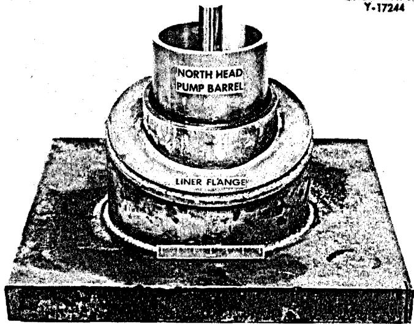  
UNCLASSIFIED Y-17244

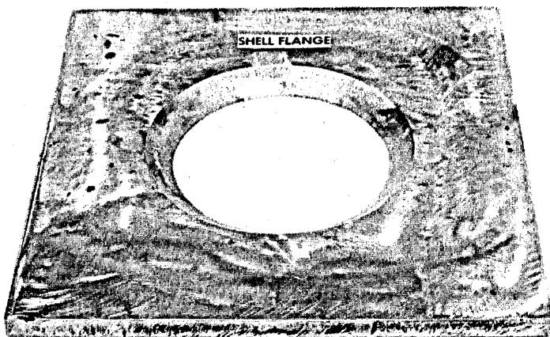  
Fig. 3.4.7. Component Parts for Test Fabrication of a Joint Between a Pump Barrel and the Pressure Shell of the ART.

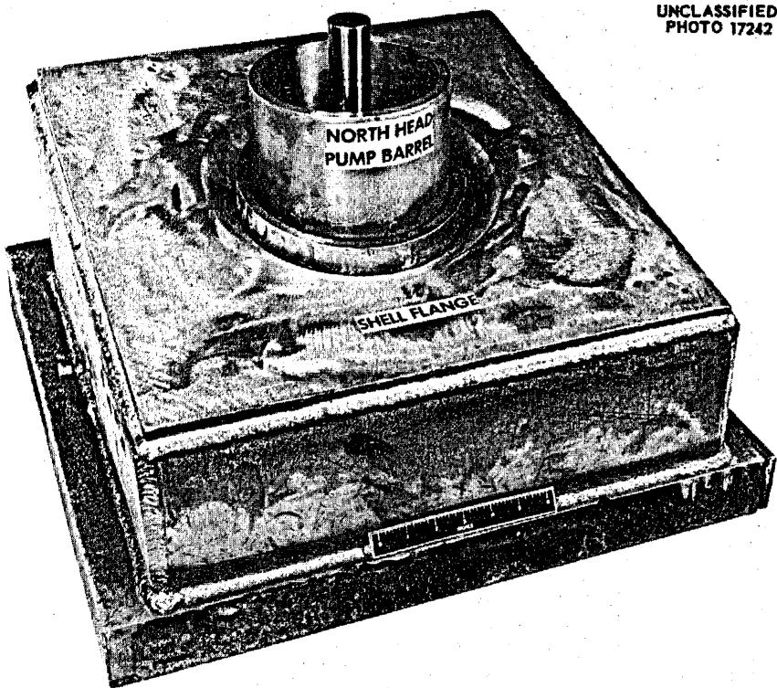  
Fig. 3.4.8. Test Setup Showing Auxiliary Weldment.

UNCLASSIFIED

ORNL-LR-DWG 14722

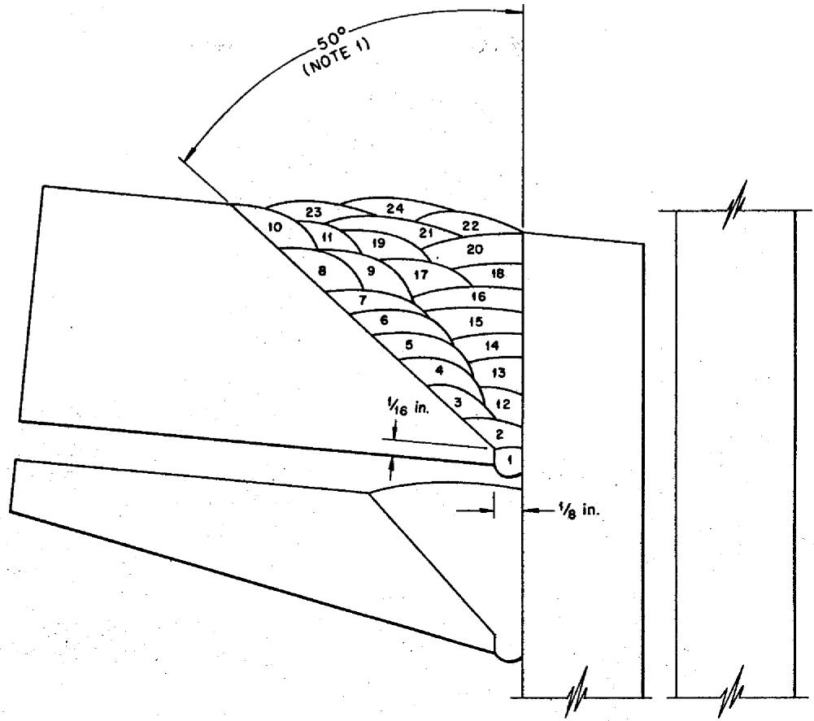  
Fig. 3.4.9. Welding Procedure and Joint Design for Welding the Pressure Shell Flange into the Pump Barrel Sleeve.

WELDING PROCEDURE   

<table><tr><td>PASS NUMBER</td><td>PROCESS</td><td>ELECTRODE SIZE (in.)</td><td>ELECTRODE MATERIAL</td><td>CURRENT (amp)</td></tr><tr><td>1</td><td>INERT ARC</td><td>3/32</td><td>INCO 62</td><td>130</td></tr><tr><td>2</td><td>INERT ARC</td><td>3/32</td><td>INCO 62</td><td>180</td></tr><tr><td>3-11</td><td>METAL ARC (NOTE 2)</td><td>5/32</td><td>INCO 132</td><td>120</td></tr><tr><td>11-24</td><td>METAL ARC (NOTE 3)</td><td>5/32</td><td>INCO 132</td><td>120</td></tr></table>

NOTES:   
1. VARIORED FROM 45 TO 55 deg. DEPENDING ON POSITION AROUND PERIPHERY, BECAUSE A STRAIGHT BEVEL INCLINED TO DEG TO THE HORIZONTAL WAS MACHINED ON THE FLANGE.  
2. BUILDUP PASSES INTENDED TO SIMULATE J BEVEL AND MINIMIZE SHRINKAGE.   
3. FILLER PASSES IN BUILT UP J BEVEL.

UNCLASSIFIED PHOTO 17243

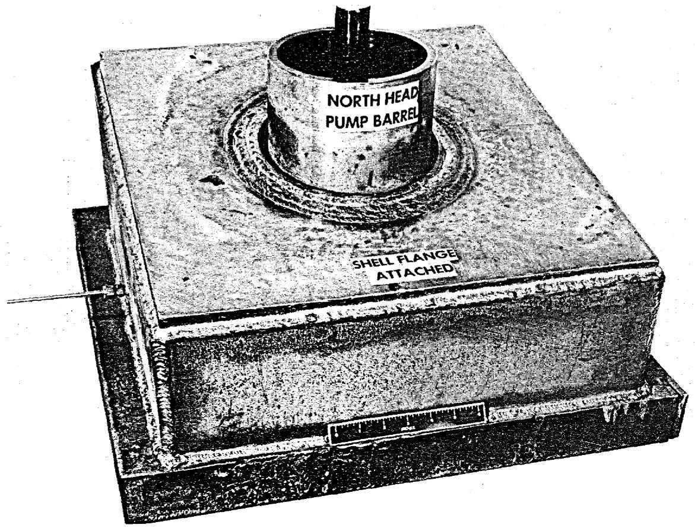  
Fig. 3.4.10. Completed Test Weldment for Joining Pressure Shell Flange to Pump Barrel Sleeve.

# INVESTIGATION OF SHRINKAGE OF INCONEL CORE SHELL WELDS

P. Patriarca

A. E. Goldman

A series of tests are being carried out to determine the weld shrinkage to be expected during fabrication of the Inconel core shell welds. Comparisons of the weld shrinkage formulas given in the literature with preliminary results obtained at ORNL revealed wide discrepancies. It was decided that actual experiments that would yield empirical data would be required. A program of welding Inconel plates under controlled conditions and close observation was therefore carried out. Based upon the results of these tests, the welding of large Inconel hoops was begun. These tests were performed in a manner that as nearly as

possible duplicated the fabrication problems and restrictions of the actual core shells.

Each test of the initial program consisted in the inert-arc welding of two $\frac{1}{4}$ -in. Inconel plates, each $6 \times 20$ in., in accordance with the established procedure specifications (PS-1). A 50-deg bevel with a $\frac{1}{4}$ -in. land was machined on one long edge of each plate. A total of nine tests was performed.

Each pair of plates was assembled as shown in Fig. 3.4.13. The root gap was fixed at $\frac{1}{8}$ in. by using four $\frac{1}{8}$ -in. tool-steel spacers. The plates were held against a flat horizontal plate by means of C-clamps. Two large clamps were used to draw the plates tightly against the tool-steel spacers. The edges of the plates were securely taped to prevent air leakage into the gap, since only the

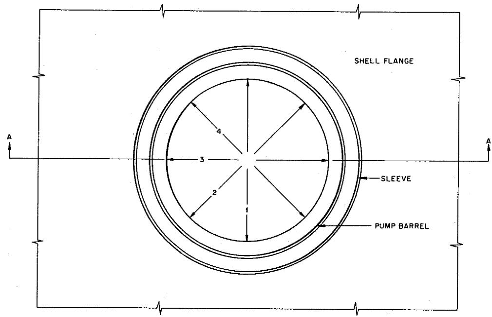  
UNCLASSIFIED   
ORNL-LR-DWG 14723

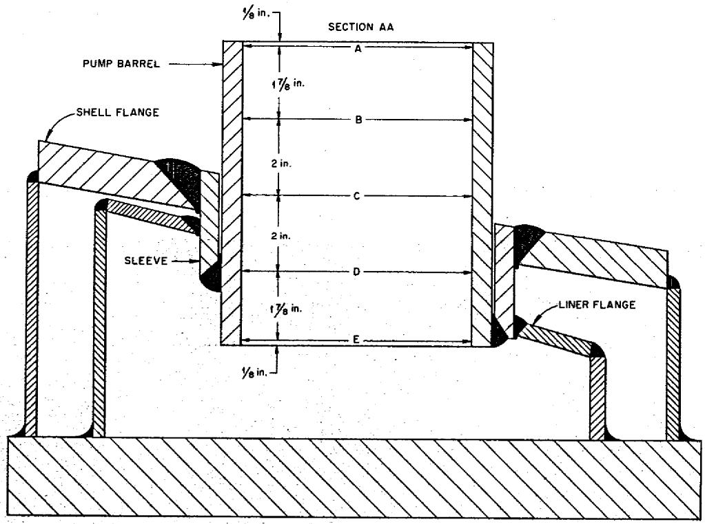  
Fig. 3.4.11. Details of Micrometer Measurements on Diameter of Pump Barrel (see Table 3.4.3).

UNCLASSIFIED ORNL-LR-DWG 14724

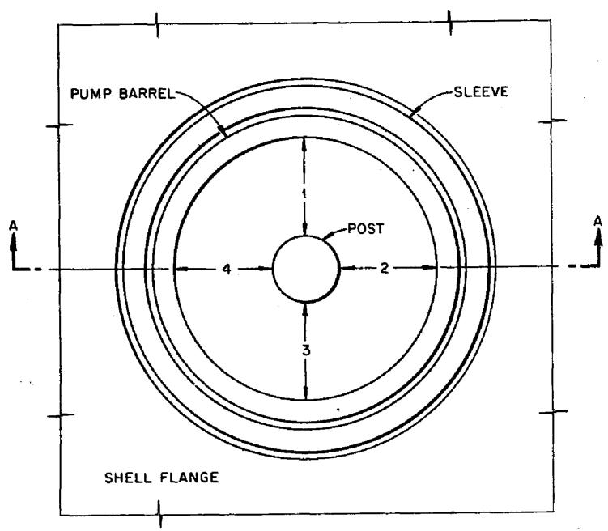

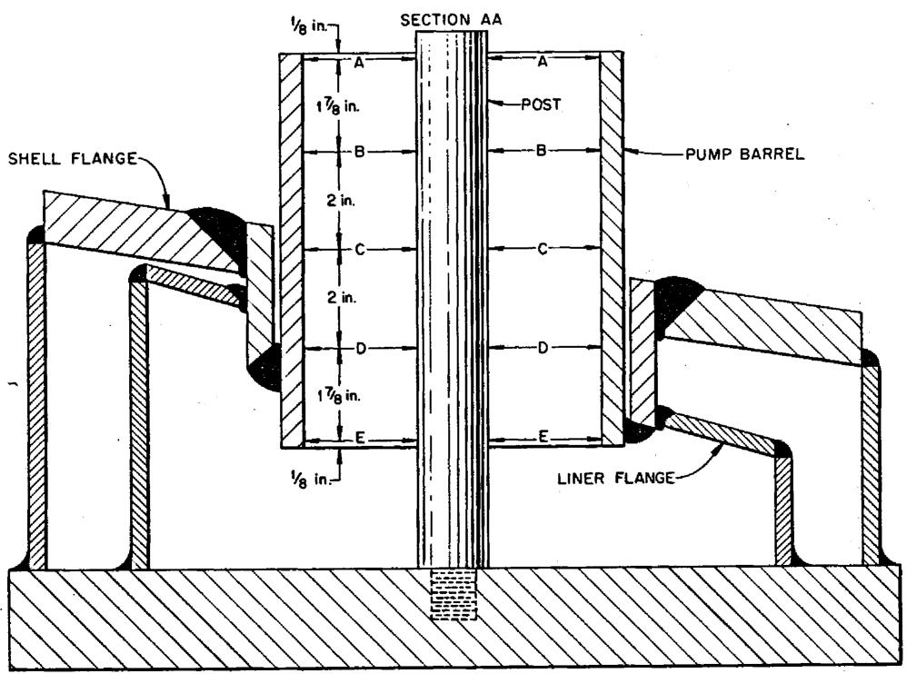  
Fig. 3.4.12. Details of Micrometer Measurements on Axis of Pump Barrel (see Table 3.4.4).

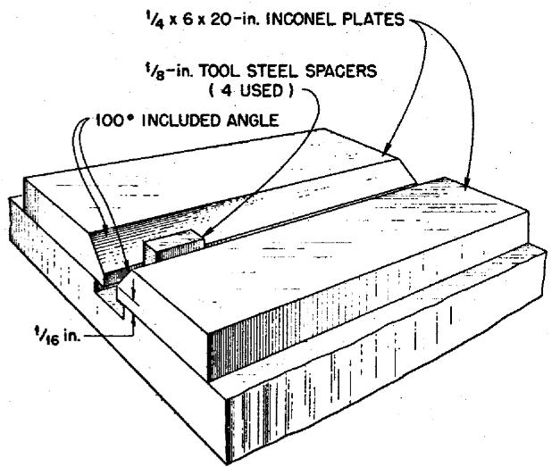  
UNCLASSIFIED ORNL-LR-DWG 14725   
Fig. 3.4.13. Joint Design for Shrinkage Test of Inconel Plate Welds.

torch gas was used to supply backup gas and weld coverage.

A $\frac{1}{2}$ -in.-long tack weld was placed at each end of the root gap, and two more $\frac{1}{2}$ -in.-long tack welds were equally placed along the root gap. The clamps were removed after the tack welds were made, and the spacers were driven out. Shrinkage measurements were taken, and the plates were again fastened to the flat base. The root pass was applied after the tack welds had been wire brushed and the edges had been feathered. Measurements of the root pass shrinkage were then taken.

The plates were then assembled in the vertical welding jig as shown in Fig. 3.4.14. The remaining five weld passes per plate were deposited in accordance with the sequence shown. The completed weldment is shown in the vertical jig in Fig. 3.4.15. Dial-gage readings were taken at 1-min intervals during the deposition of the

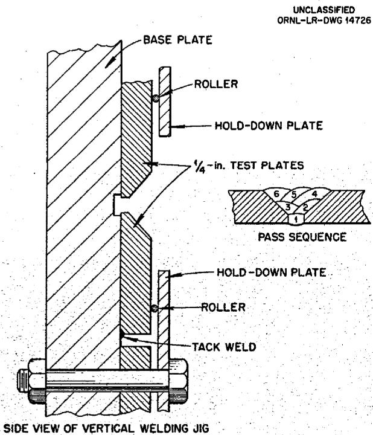  
Fig. 3.4.14. Assembly of Shrinkage Test Plates into Vertical Welding Jig.

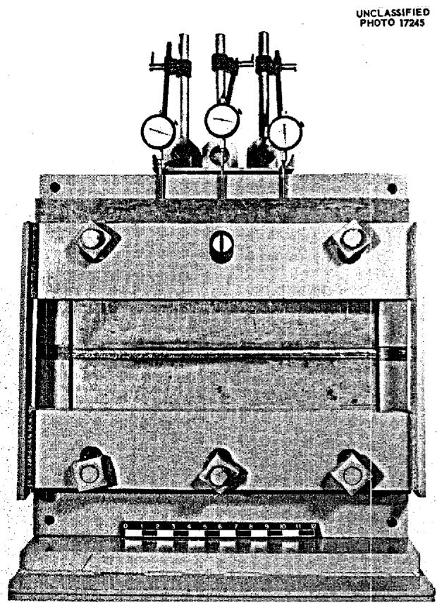  
Fig. 3.4.15. Completed Weld in Vertical Welding Jig.

final passes, and micrometer measurements were taken after the final pass had been made. The shrinkage measurements and welding data are presented in Table 3.4.5; the results of tests 106, 107, 108, and 109 were in close agreement, although two different welding operators made the welds.

The welding procedure used for these tests of plates was then used for test welds of hoops. For these tests $\frac{1}{4}$ -in. Inconel plates, $6 \times 138$ in., were bent into hoops approximately 44 in. in diameter. One edge of each hoop had a 50-deg bevel and a $\frac{1}{16}$ -in. land. The hoops were placed on the weld-positioner bed in a horizontal plane in the manner shown in Fig. 3.4.16. Tool-steel spacers, 4 in. long and $\frac{1}{8}$ in. thick, shown in Fig. 3.4.17, were placed between the beveled edges at 6-in. intervals to maintain the root gap. Large C-clamps were used to draw the two hoops tightly against the spacers. Smaller C-clamps were halved and tacked to the bottom hoops to aid in the alignment of the upper hoop. Asbestos string was used to seal the gaps between the

spacers prior to tacking. The area behind the root gap was sealed with a cover formed from 0.010-in. annealed brass sheet and masking tape, and the enclosed space was purged for 30 min prior to tacking. Alignment was checked constantly as the tack welds were placed between the spacers. After removal of the tool-steel spacers, the root pass was deposited. No dressing of the land or feathering of the tack welds was permitted prior to the root-pass deposition.

After completion of the root pass, the weld was wire brushed and the five final weld passes were deposited by using the sequence described in Fig. 3.4.14. For these welds, two welders worked 180-deg apart around the hoop while the positioner was slowly rotated. As shown in Fig. 3.4.18, four dial gages were used to record the shrinkages of the final passes. The welders worked on a 15-min-work, 5-min-rest cycle. A typical plot of dial-gage readings is shown in Fig. 3.4.19. The micrometer and dial-gage measurements obtained are summarized in Table 3.4.6.

TABLE 3.4.5. WELDING CONDITIONS AND RESULTS OF SHRINKAGE MEASUREMENTS ON WELDS OF INCONEL PLATE   

<table><tr><td rowspan="2">Test No.</td><td rowspan="2">Welder No.</td><td rowspan="2">Time Required (min)</td><td rowspan="2">Welding Rod Used (in.)</td><td rowspan="2">Current Used (amp)</td><td colspan="3">Total Shrinkage (in.)</td><td colspan="3">Dial-Gage Shrinkage* (in.)</td></tr><tr><td>Maximum</td><td>Minimum</td><td>Average</td><td>Maximum</td><td>Minimum</td><td>Average</td></tr><tr><td rowspan="2">100</td><td rowspan="2">1</td><td rowspan="2">72</td><td rowspan="2">213.5</td><td>70 (root)</td><td rowspan="2">0.197</td><td rowspan="2">0.123</td><td rowspan="2">0.126</td><td rowspan="2">0.058</td><td rowspan="2">0.048</td><td rowspan="2">0.053</td></tr><tr><td>105-110</td></tr><tr><td rowspan="2">101</td><td rowspan="2">1</td><td rowspan="2">66</td><td rowspan="2">231</td><td>70 (root)</td><td rowspan="2">0.167</td><td rowspan="2">0.130</td><td rowspan="2">0.146</td><td rowspan="2">0.070</td><td rowspan="2">0.050</td><td rowspan="2">0.060</td></tr><tr><td>105-110</td></tr><tr><td rowspan="2">102**</td><td rowspan="2">1</td><td rowspan="2">74</td><td rowspan="2">180</td><td>80 (root)</td><td rowspan="2">0.142</td><td rowspan="2">0.114</td><td rowspan="2">0.130</td><td rowspan="2">0.081</td><td rowspan="2">0.079</td><td rowspan="2">0.080</td></tr><tr><td>105-110</td></tr><tr><td rowspan="2">106</td><td rowspan="2">1</td><td rowspan="2">61</td><td rowspan="2">198</td><td>80 (root)</td><td rowspan="2">0.157</td><td rowspan="2">0.121</td><td rowspan="2">0.141</td><td rowspan="2">0.092</td><td rowspan="2">0.082</td><td rowspan="2">0.087</td></tr><tr><td>105-110</td></tr><tr><td rowspan="2">107</td><td rowspan="2">1</td><td rowspan="2">60</td><td rowspan="2">226</td><td>75-80 (root)</td><td rowspan="2">0.148</td><td rowspan="2">0.132</td><td rowspan="2">0.139</td><td rowspan="2">0.104</td><td rowspan="2">0.096</td><td rowspan="2">0.100</td></tr><tr><td>105-110</td></tr><tr><td rowspan="2">108</td><td rowspan="2">2</td><td rowspan="2">79</td><td rowspan="2">231</td><td>80 (root)</td><td rowspan="2">0.157</td><td rowspan="2">0.106</td><td rowspan="2">0.138</td><td rowspan="2">0.103</td><td rowspan="2">0.093</td><td rowspan="2">0.098</td></tr><tr><td>105-110</td></tr><tr><td rowspan="2">109</td><td rowspan="2">2</td><td rowspan="2">64</td><td rowspan="2">236</td><td>80 (root)</td><td rowspan="2">0.154</td><td rowspan="2">0.104</td><td rowspan="2">0.136</td><td rowspan="2">0.102</td><td rowspan="2">0.092</td><td rowspan="2">0.097</td></tr><tr><td>105-110</td></tr></table>

*Measurements made on last five of the six passes; dial-gage readings on tests 100 and 101 are erroneous because the dial-gage actuating arm slipped during the test.   
**Test 102 plates were machined with an 80-deg included angle rather than a 100-deg included angle.

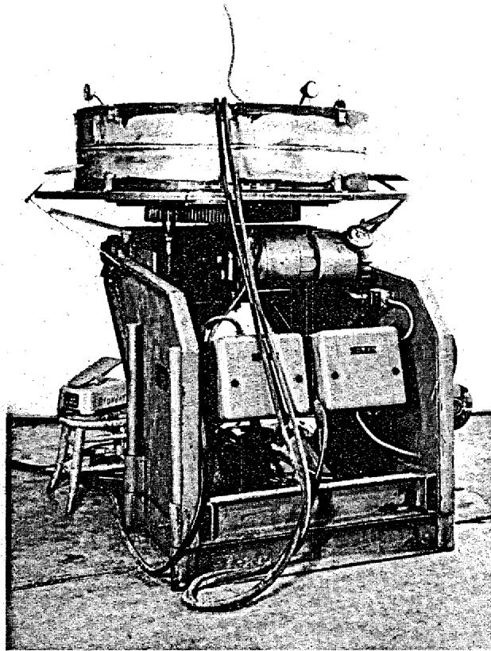  
UNCLASSIFIED PHOTO 17248  
Fig. 3.4.16. Inconel Hoops on Weld Positioner Bed.

Within the limits of this investigation, the following conclusions can be drawn.

1. The results of the last four tests on plates indicated that, under controlled conditions, the effect of the welding variables could be minimized so that a welding operator could, essentially, duplicate his performance from test to test when welding manually. Also, for a given set of conditions, a welder could nearly duplicate another welder's performance.   
2. The use of various lengths of tool-steel spacers in the tack welding of the plates caused wide variations in the resulting tack-weld shrinkage. The amount of tack-weld shrinkage was found to be inversely proportional to the length of the spacers.   
3. The results of the tests on the hoops indicated that the inevitable variations in conditions and techniques while the operators were progressing around the circumference caused greater

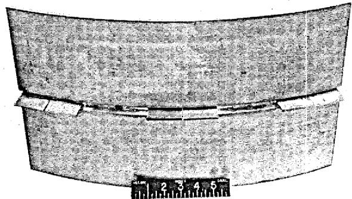  
Fig. 3.4.17. Tool-Steel Spacers Used to Maintain Root Gap While Welding Inconel Hoops.

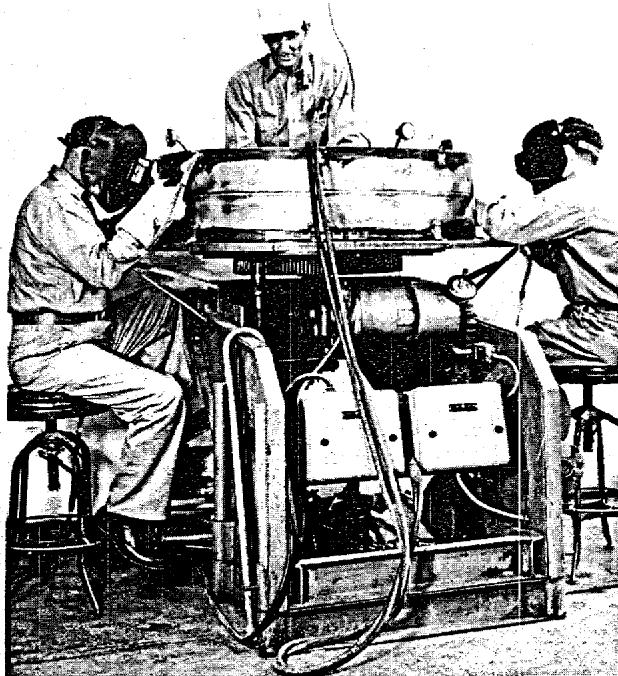  
UNCLASSIFIED PHOTO 17247  
Fig. 3.4.18. Hoop Welding Assembly Showing Dial Gages Used for Measuring Shrinkage.

variations in shrinkage within a hoop than the variations observed from hoop to hoop.

4. The over-all results indicate that for $\frac{1}{4}$ -in. Inconel plate, inert-arc welded by two welding operators under the conditions utilized for these tests, the transverse shrinkage to be expected will be from 0.111 to 0.138 in., with an average

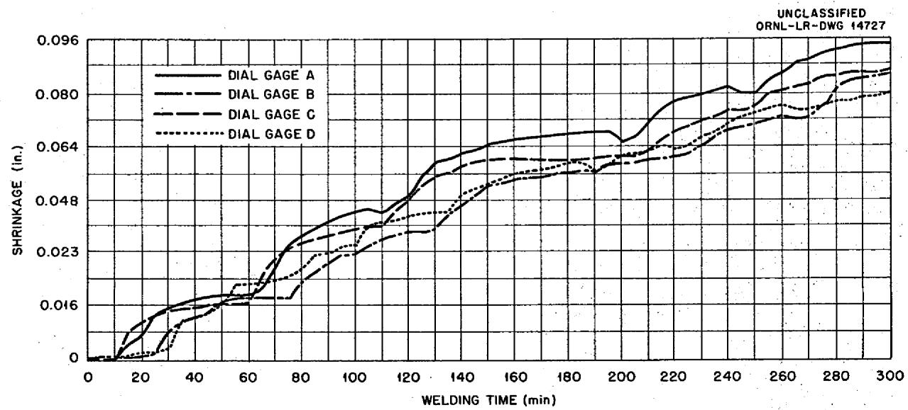  
Fig. 3.4.19. Typical Plot of Dial-Gage Measurements of Shrinkage During Final Five Passes of the Welding of Inconel Hoops.

TABLE 3.4.6. WELDING CONDITIONS AND RESULTS OF SHRINKAGE MEASUREMENTS ON WELDS OF INCONEL HOOPS   

<table><tr><td rowspan="2">Test No.</td><td rowspan="2">Arc Time Required (min)</td><td rowspan="2">Rod Used (in.)</td><td rowspan="2">Current Used (amp)</td><td colspan="3">Total Shrinkage (in.)</td><td colspan="3">Dial-Gage Shrinkage* (in.)</td></tr><tr><td>Maximum</td><td>Minimum</td><td>Average</td><td>Maximum</td><td>Minimum</td><td>Average</td></tr><tr><td rowspan="2">1</td><td rowspan="2">314</td><td rowspan="2">1218</td><td>80 (root)</td><td rowspan="2">0.126</td><td rowspan="2">0.111</td><td rowspan="2">0.1194</td><td rowspan="2">0.095</td><td rowspan="2">0.080</td><td rowspan="2">0.088</td></tr><tr><td>110–120</td></tr><tr><td rowspan="2">2</td><td rowspan="2">310</td><td rowspan="2">1188</td><td>80 (root)</td><td rowspan="2">0.138</td><td rowspan="2">0.115</td><td rowspan="2">0.1261</td><td rowspan="2">0.102</td><td rowspan="2">0.088</td><td rowspan="2">0.095</td></tr><tr><td>110–120</td></tr></table>

*Measurements made on last five of the six passes; tack shrinkage and root shrinkage not included.

value being 0.120 in. The longitudinal shrinkage to be expected will be 0.250 to 0.375 in. for a circumferential length of 138 in.

As previously mentioned, the values for the transverse and longitudinal shrinkage for the 44-in. hoops do not correspond to the values obtained by calculation from the formulas given in the literature. Only through the accumulation of empirical data from actual experience can predictions be made for future weld shrinkages. Since each variation in the thickness of the Inconel plate to be welded will create new problems solvable only by more actual test results, ad

ditional tests will be conducted on each of the plate thicknesses of interest.

# EXAMINATION OF NoK-TO-AIR RADIATOR PWA NO. 2 AFTER SERVICE

R.J.Gray P.Patriarca

A 500-kw high-conductivity-fin radiator, designated PWA HCF radiator No.2,failed on December 23,1955,as the result of a leak.This radiator had been operating in a test rig for a period of 1199 hr in the temperature range 1000 to $1600^{\circ}F$ For 546 hr of the operating period a temperature differential was imposed on the NaK flowing

through the radiator by passing cold air across the fin surfaces. The radiator is shown in Fig. 3.4.20 as it appeared when received from the test site.

The entire radiator was leak checked by pressurizing it under water and observing it to locate the origin of air bubbles. This procedure revealed the point of failure, which is indicated by the arrow in Fig. 3.4.20. The radiator was then sectioned for further examination, as shown in

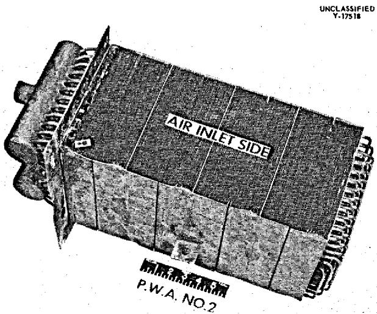

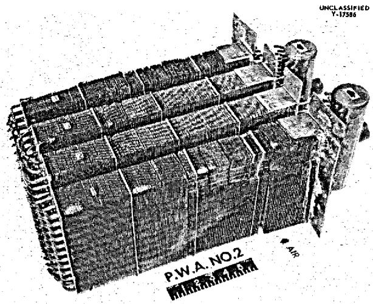  
Fig. 3.4.20. NaK-to-Air Radiator PWA No. 2 That Failed in Service. Arrow indicates point of failure.   
Fig. 3.4.21. NaK-to-Air Radiator PWA No. 2 After Sectioning for Metallographic Examination.

Fig. 3.4.21. The side portions of the support members were removed by using a rubber-bonded masonry wheel in a portable, electric handsaw adjusted for a shallow cut. Each bank of fins was separated by slicing the support members and the bottom flanged plate, as shown, with a fine-toothed, high-speed, steel hacksaw blade in a portable electric drill equipped with a portable power-saw attachment. The failed area was then carefully removed for metallographic preparation on a standard wet-cutoff machine equipped with an abrasive wheel.

The area of the failure was again pressurized under water to locate the exact position of the leak before additional preparation for metallographic examination was undertaken. The failure was found to exist in the corner tube on the periphery which faced the side support member. The support member was subsequently removed for unobstructed observation of the emergence of the water bubbles. The point of failure may be seen in Fig. 3.4.22.

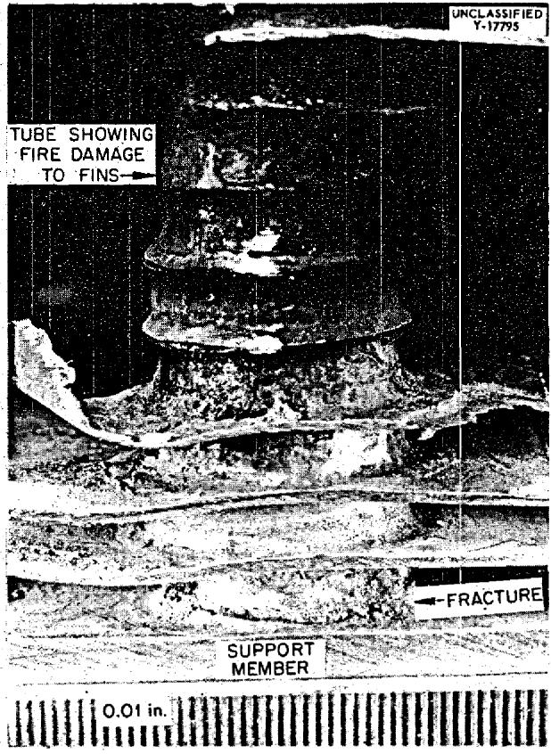  
Fig. 3.4.22. Failed Tube After Removal from NaK-to-Air Radiator PWA No. 2 as Viewed from the Support Member Side of the Radiator.

The tube that failed and two adjacent tubes were mounted intact and carefully ground to permit examinations of their longitudinal cross sections as seen against the direction of air flow. The tube that failed is shown in Fig. 3.4.23. The neckdown of the tube wall indicates a tensile fracture similar to that observed in York radiator No.1.

Longitudinal cross sections of the two adjacent tubes that were examined are shown in Figs. 3.4.24 and 3.4.25. Incipient fractures may be seen in both these tubes. Three tubes were also taken from corresponding positions on the air exit face and prepared for examination in a similar manner. Only one tube exhibited evidence of incipient fracture, as shown in Fig. 3.4.26.

It is concluded that the radiator failed as a result of the initiation of a fracture in a braze alloy fillet by shear forces and the propagation

of this fracture through the tube wall by tensile forces or combinations of tensile and shear forces during periods of cyclic operation. Since the incidence of incipient fractures was associated exclusively with the presence of support members or plates, it is recommended that these transverse restraints be removed entirely. This can be accomplished, as suggested previously, by using a high-conductivity fin to provide transverse support at 2- or 4-in. intervals3 and modifying the brazing procedure accordingly.

The tensile loading contribution to the York radiator failure was attributed at the time of examination to the restraining influence of the support member, which extended up the side of the radiator. In view of this conclusion, the support members of subsequent radiators, including PWA No. 2, were slit, as shown in Fig. 3.4.20,

$^{2}\mathbb{P}$ . Patriarca et al., ANP Quar. Prog. Rep. Dec. 10, 1955, ORNL-2012, p 145.

$^{3}R.$ J. Gray and P. Patriarca, Metallographic Examination of ORNL HCF Radiator No. 1 Failures, ORNL CF-55-10-129.

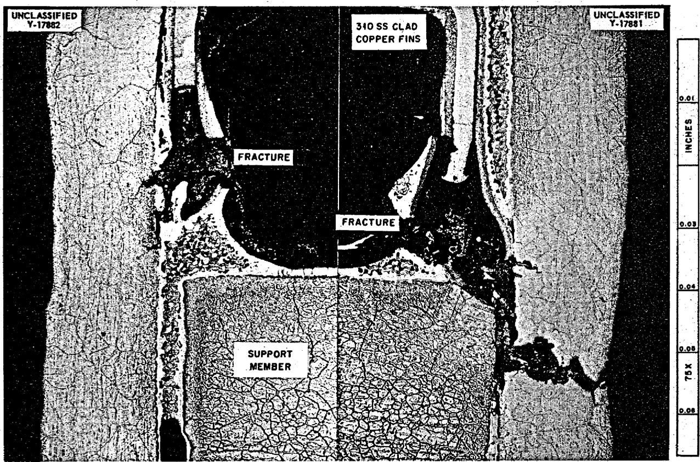  
Fig. 3.4.23. Longitudinal View of Opposing Walls of the Tube That Failed in Nak-to-Air Radiator PWA No. 2 as Viewed Against the Air Flow. Note neckdown at fracture. 75X. Reduced $22\%$ .

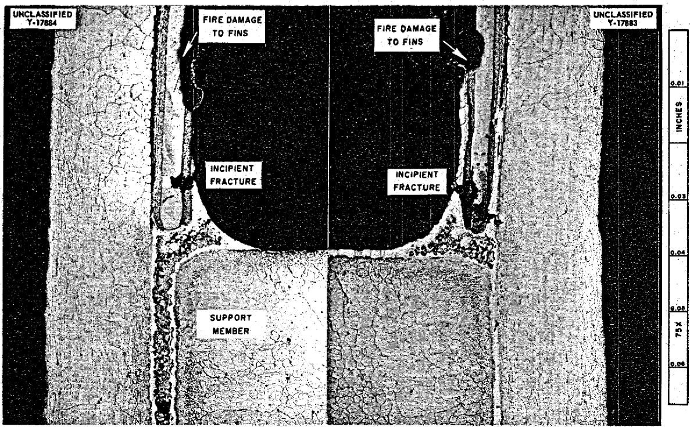

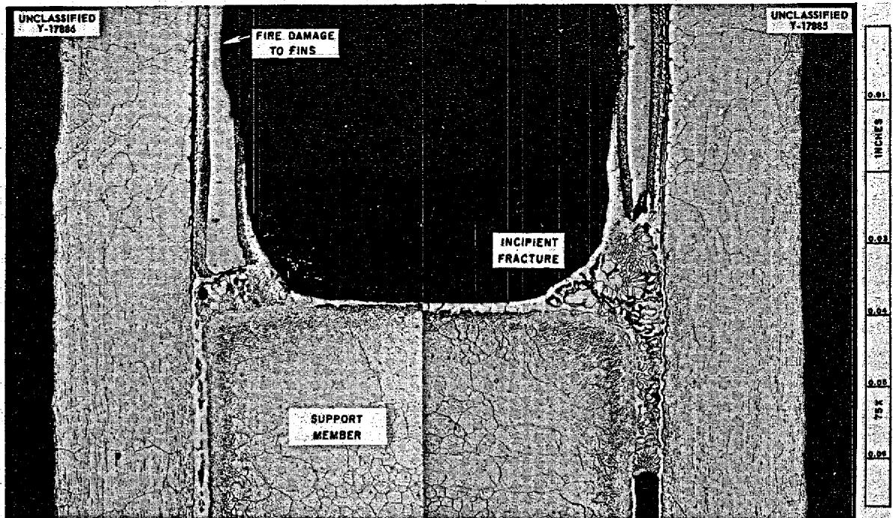  
Fig. 3.4.24. Longitudinal View of Opposing Walls of a Tube Adjacent to the Tube That Failed as Viewed Against the Air Flow. Note incipient fracture. 75X. Reduced $34\%$ .   
Fig. 3.4.25. Longitudinal View of Opposing Walls of a Tube Adjacent to the Tube That Failed as Viewed Against the Air Flow. Note fracture within the eutectic structure of the braze metal. 75X. Reduced $34\%$ .

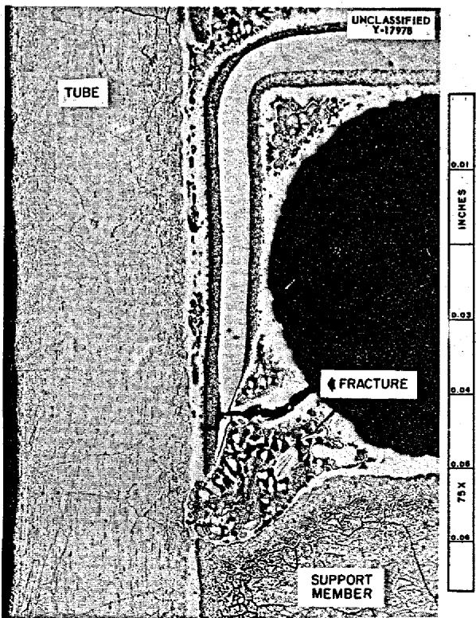  
Fig. 3.4.26. Corner Tube from Air Exit Face of NaK-to-Air Radiator PWA No. 2 as Viewed in the Direction of the Air Flow. 75X. Reduced $36\%$ .

prior to installation. It may be noted, however, that the radiator as redesigned retained the bottom flanged plate, a top plate, and the four support members. During the brazing cycle the NaK tubes were brazed to these members, and a relatively rigid condition resulted at each of the five transverse sections across the radiator matrix. Local differences in rates of heating and cooling, particularly between the air inlet face and the remainder of the radiator during blower startup, could therefore bring about the development of tensile loading. This condition could be partially relieved by slicing the support members and plates in a manner similar to that utilized during dissection for metallographic examination, as shown in Fig. 3.4.21.

The development of tensile forces alone, however, cannot be assigned the full responsibility for failure. The incidence of numerous incipient fractures in this radiator has been related to the presence of a support member or heavy plate. Over 13,000 tube-to-fin joints have been examined

metallographically without the observation of a single incipient fracture. The differences in mass and thermal conductivity of the support members and plates as compared with the high-conductivity fins could result in significant differences in heating and cooling rates during cyclic operation. These differences could create lateral forces that could be responsible for the initiation and propagation of fractures in brazed joints between tubes and support members in any portion of the radiator.

# EXAMINATION OF FUEL-TO-NaK HEAT EXCHANGER AFTER SERVICE

G. M. Slaughter

Tests of the fuel-to-NoK heat exchanger, designated as IHE-3, were terminated as a result of the detection of a leak in a tube bundle after a total of 1794 hr of operation in the temperature range 1100 to $1500^{\circ}\mathrm{F}$ . There was a temperature differential imposed on the heat exchanger for 1015 hr of this total time, and 21 thermal cycles were applied over this period.

The NaK inlet and NaK outlet headers of the tube bundle that leaked were separated from the heat exchanger to facilitate examination and inspection. Top and bottom views of the inlet header are shown in Figs. 3.4.27 and 3.4.28. The general location of the failure is evident in Fig. 3.4.28, in that a dark reaction product can be distinguished from the lighter solidified fuel mixture. Forty tubes in the area of the failure were individually inspected with a dye penetrant and a Borescope, and at least five tubes were found to contain obvious cracks. The NaK inlet header after dissection with an abrasive cutoff wheel

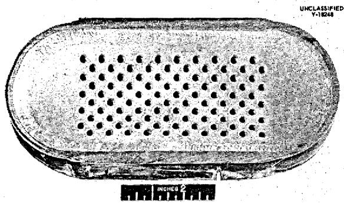  
Fig. 3.4.27. Top of NaK Inlet Header of Fuel-to-NaK Heat Exchanger IHE-3 Showing Tube Welds.

to permit the examination of individual tubes is shown in Fig. 3.4.29. Each tube was numbered for the subsequent investigation as shown in Fig. 3.4.30.

The frequency and severity of the cracks detected in the initial inspection were most pronounced in the forward rows of tubes, that is, those with short bends. The distance from the tube bends to the headers was significantly shorter

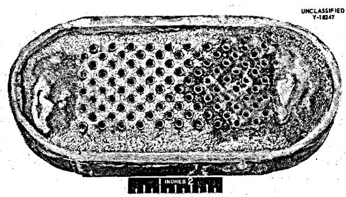  
Fig. 3.4.28. Bottom of NaK Inlet Header of Fuel-to-NaK Heat Exchanger IHE-3. Dark reaction product indicates area of tube failure. The light solidified material is the fuel mixture (No. 30) NaF-ZrF $_4$ -UF $_4$ (50-46-4 mole %). (Secret with caption)

for the first row of tubes, being $3\frac{1}{4}$ in. as compared with 6 in. for the last row of tubes. For a given expansion of the 6-ft over-all straight length of the tubes as a result of heating, a substantial degree of strain occurs in these locations. As would be expected, cracking was more pronounced on the tension sides of the tubes. A crack in the tension side of tube 2 could be seen upon visual examination (Fig. 3.4.31). Further evidence of tube distortion at the headers can be seen in Fig. 3.4.32, which shows the NaK outlet header.

Several of the tubes of interest were mounted intact in Castolite and polished to the approximate

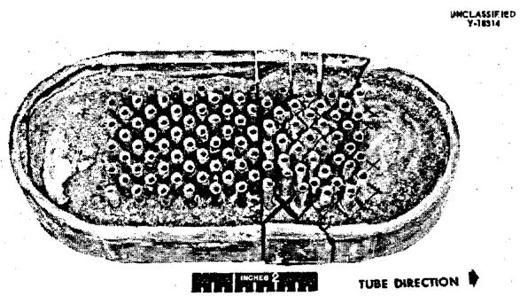  
Fig. 3.4.29. NaK Inlet Header After Dissection for Further Examination.

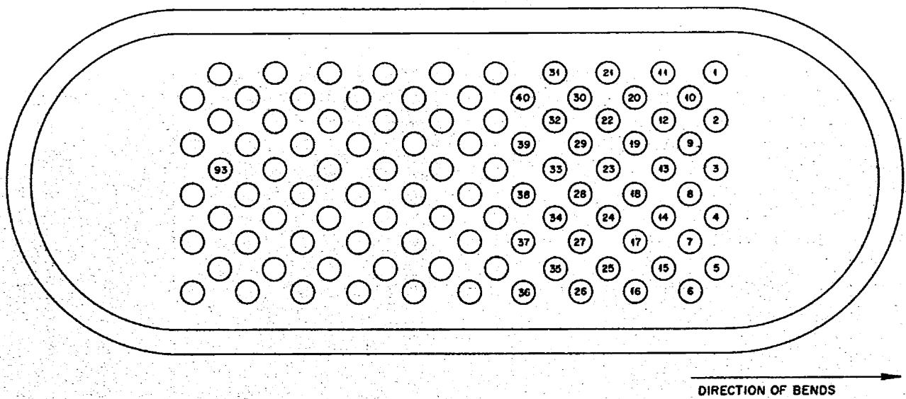  
Fig. 3.4.30. Diagram of NaK Inlet Header Showing Identification Numbers of Tubes Removed for Examination.

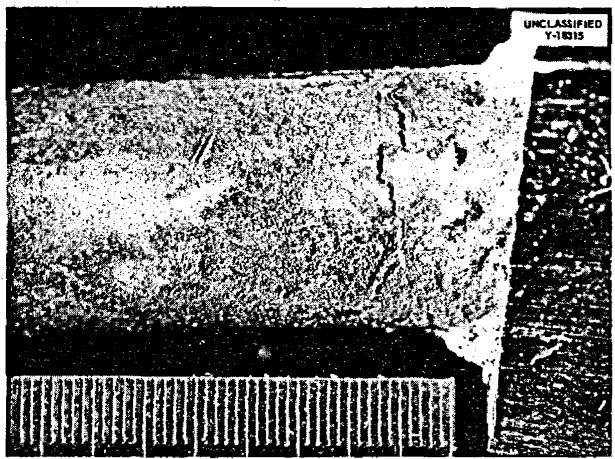  
Fig. 3.4.31. Crack on Tension Side of Tube 2 of NaK Inlet Header.

center line for metallographic examination. The tensile side of tube 3, shown in Fig. 3.4.33, illustrates typical severe cracking and corrosion by the fuel mixture which circulated on the outside of the tubes. A similar condition is evident in Fig. 3.4.34, which is a panorama of the tension side of tube 17. The opposite face of tube 17, a panorama of which is shown in Fig. 3.4.35, does not exhibit so serious a condition. It appears that the corrosion and the stresses combined to form an abnormally unfavorable condition.

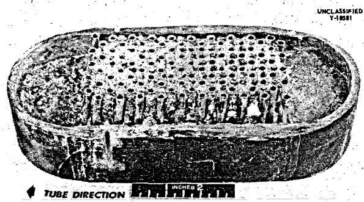  
Fig. 3.4.32. Bottom Side of NaK Outlet Header Showing Distortion of Tubes.

The extent of the corrosion was investigated by examining tube 93 to ensure that the large degree of attack observed in the previous samples did not result from the reaction of the two fluids at the locations of the failures. The results of the examination (Fig. 3.4.36) indicate that, in general, severe corrosion was prevalent throughout the tubes in the inlet header. The inner tube wall of a typical tube is shown in Fig. 3.4.37; cracks and corrosion emanating from the outer wall may also be seen. A white deposit was found in the cracks in some areas, as shown in Figs. 3.4.38 and 3.4.39. The nature of this deposit, as well as a detailed investigation of the mass transfer and corrosion, will be reported later.

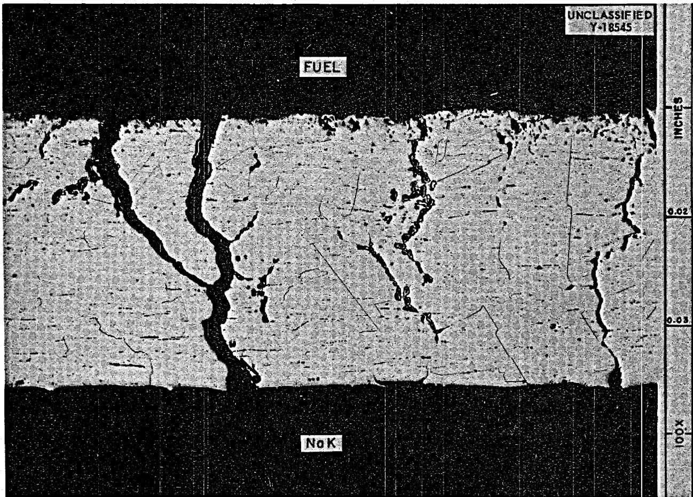  
Fig. 3.4.33. Tube 3 of NaK Inlet Header Showing Cracks in Tension Side. Etchant: electrolytic oxalic acid, 100X.

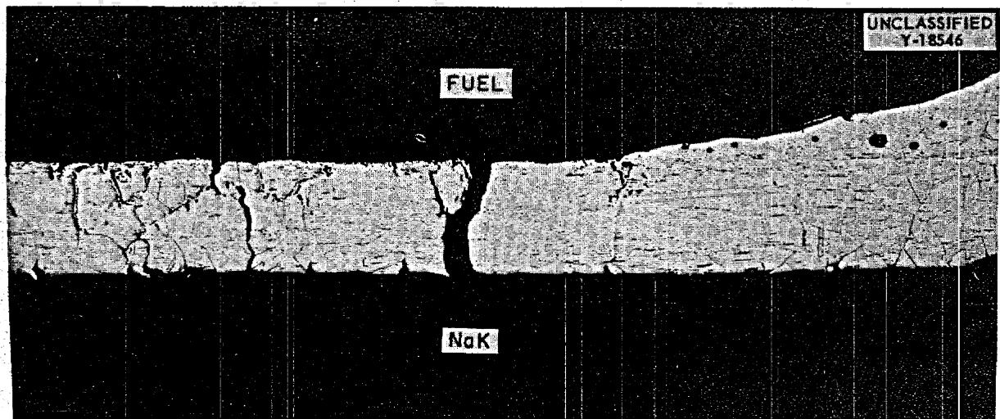  
Fig. 3.4.34. Panorama of Tension Side of Tube 17 of NaK Inlet Header Showing Gross Cracks and Corrosion. Etchant: electrolytic oxalic acid. 33X.

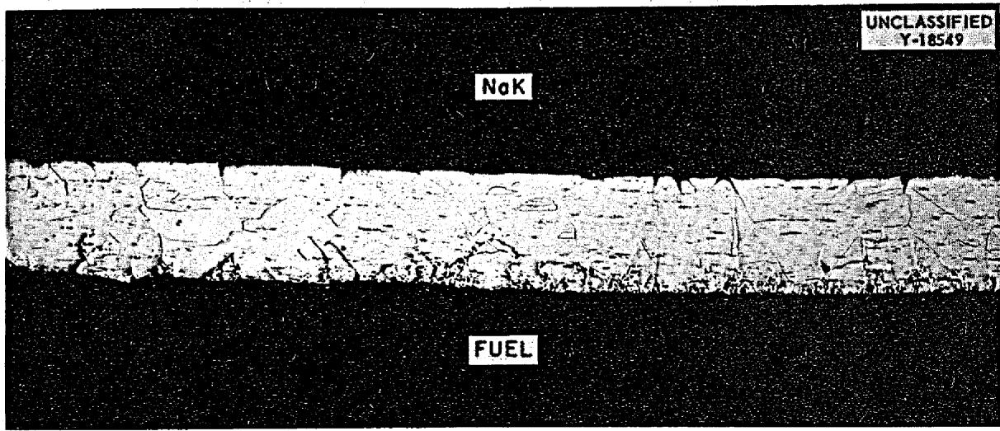  
Fig. 3.4.35. Panorama of Compression Side of Tube 17 Showing Corrosion and Occasional Cracks. Etchant: electrolytic oxalic acid. 33X.

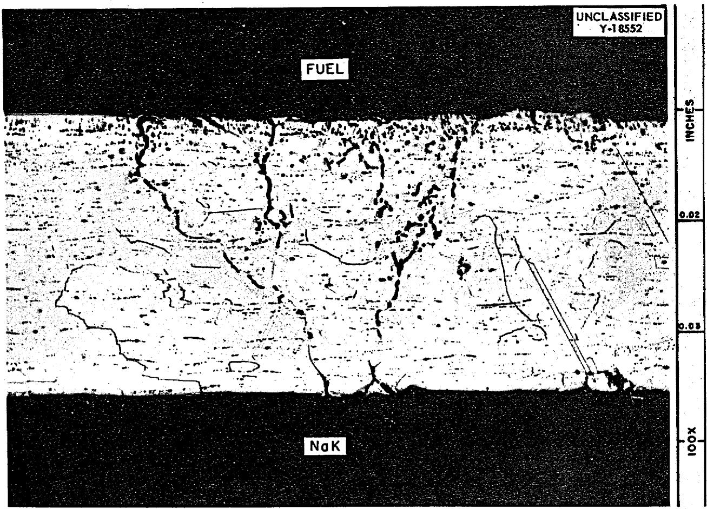  
Fig. 3.4.36. Tension Side of Tube 93 Showing Severe Corrosion. Etchant: electrolytic oxalic acid. 100X.

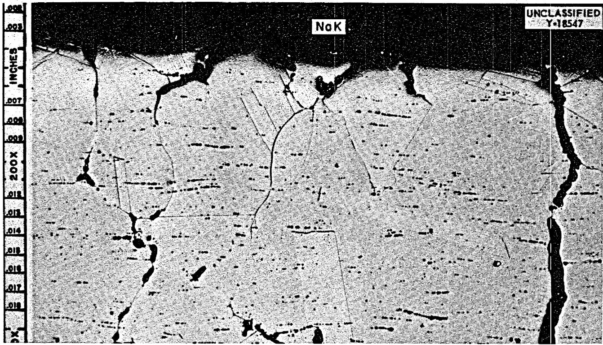  
Fig. 3.4.37. Inner Surface of Tube 17. Cracks and corrosion emanating from outer surface may be seen. Etchant: electrolytic oxalic acid. 200X.

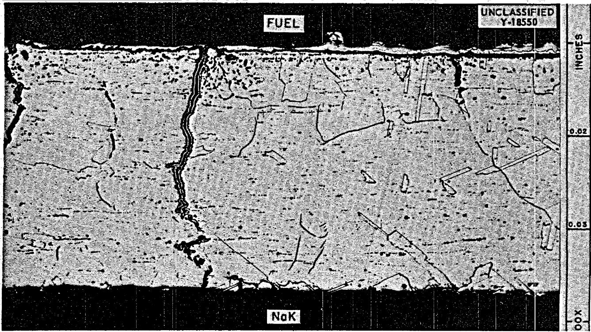  
Fig. 3.4.38. Cracks and Deposits on Tension Side of Tube 19. Etchant: electrolytic oxalic acid. 100X.

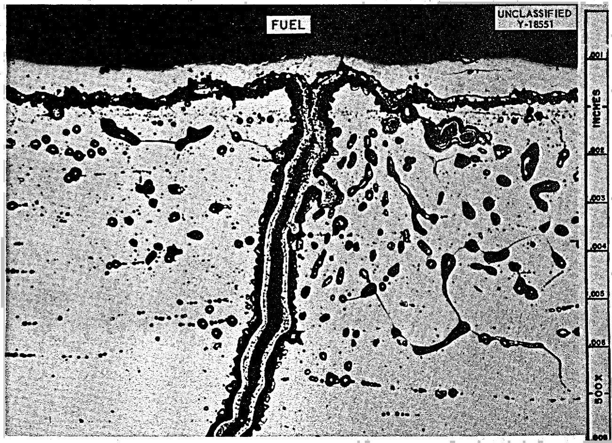  
Fig. 3.4.39. Crack and Deposit Evident in Fig. 3.4.38 at a Higher Magnification. Etchant: electrolytic oxalic acid. 500X.

# 3.5. MECHANICAL PROPERTIES STUDIES

D. A. Douglas

# EFFECT OF ENVIRONMENT ON CREEP- RUCTURE PROPERTIES OF HASTELLOY B

C. R. Kennedy1

Revised design data obtained from creep tests of solution-annealed Hastelloy B sheet stock in various environments at 1300, 1500, and $1650^{\circ}\mathrm{F}$ are summarized in Figs. 3.5.1, 3.5.2, and 3.5.3. The times to 0.5, 1, 2, 5, and $10\%$ total strain at each temperature in the various environments are the same, and for stresses for which the rupture life is more than 300 hr the effect of environment is shown to be negligible. The creep curves obtained at $1500^{\circ}\mathrm{F}$ in air and in argon, shown in Fig. 3.5.4, appear to indicate that the better performance in air than in the other environments at stresses for which the rupture life is less than

On assignment from Pratt & Whitney Aircraft.

300 hr is caused by the ability of air to strengthen Hastelloy B during third-stage creep. For rupture lives longer than 300 hr there is considerably less third-stage creep because of the aging characteristics of the alloy, and, as seen in Figs. 3.5.1, 3.5.2, and 3.5.3, the effect of environment diminishes. Design curves produced from limited data for solution-annealed Hastelloy B sheet tested at $1800^{\circ}\mathrm{F}$ in argon and in the fuel mixture (No. 30) $\mathrm{NaF - ZrF_4 - UF_4}$ (50-46-4 mole %) are shown in Fig. 3.5.5. At $1800^{\circ}\mathrm{F}$ Hastelloy B does not age perceptibly and the amount of third-stage creep is great in tests at all stress levels. Thus the fuel mixture strengthens the alloy at all stress levels. Of the environments tested, only those which are "surface active" (produce a thin, tightly adherent film on the surface of the metal) affect the creep properties of the metal. It can be seen from Figs. 3.5.1, 3.5.2, 3.5.3, and 3.5.5 that, of the environments tested, only

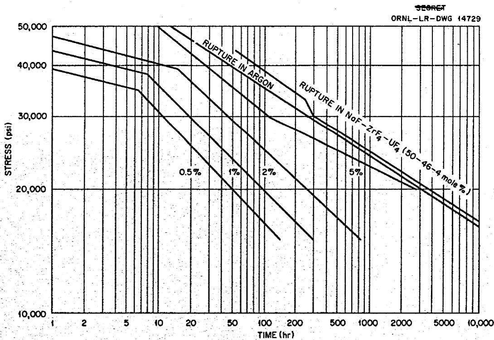  
Fig. 3.5.1. Design Curves for Hastelloy B Sheet Solution Annealed at $2100^{\circ}\mathrm{F}$ for 2 hr and Tested in Argon and in the Fuel Mixture (No. 30) NaF- $\mathsf{ZrF}_4$ -UF $_4$ (50-46-4 mole %) at $1300^{\circ}\mathrm{F}$ .

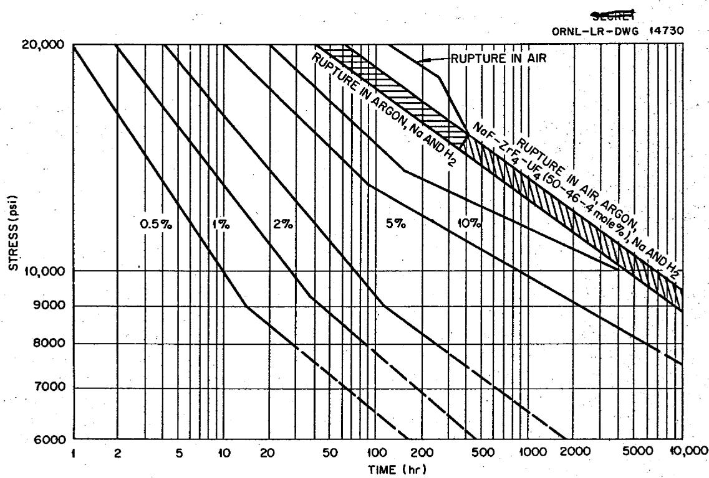  
Fig. 3.5.2. Design Curves for Hastelloy B Sheet Solution Annealed at $2100^{\circ}\mathbf{F}$ for 2 hr and Tested in Various Environments at $1500^{\circ}\mathbf{F}$ .

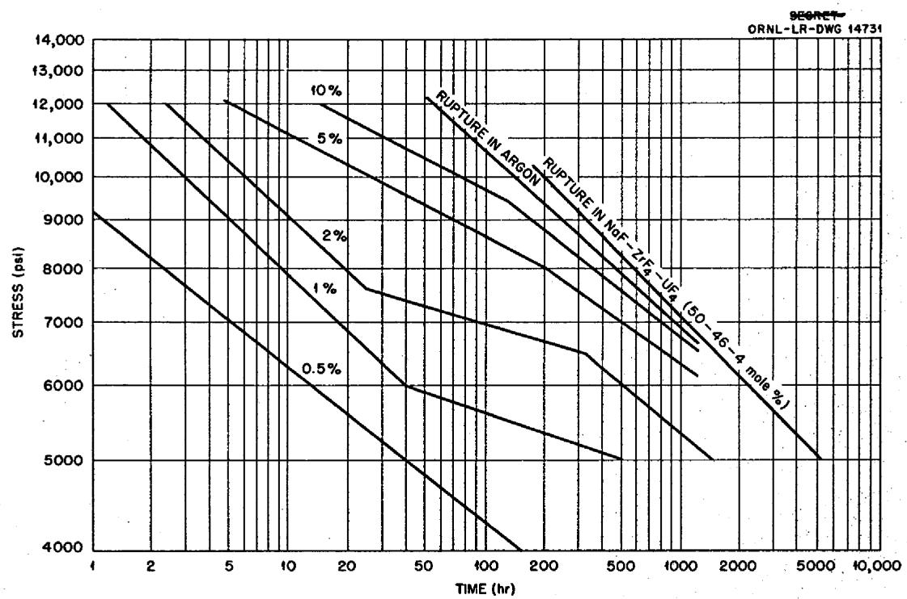  
Fig. 3.5.3. Design Curves for Hastelloy B Sheet Solution Annealed at $2100^{\circ}\mathrm{F}$ for 2 hr and Tested in Argon and in the Fuel Mixture (No. 30) NaF- $\mathsf{ZrF}_4$ -UF $_4$ (50-46-4 mole %) at $1650^{\circ}\mathrm{F}$ .

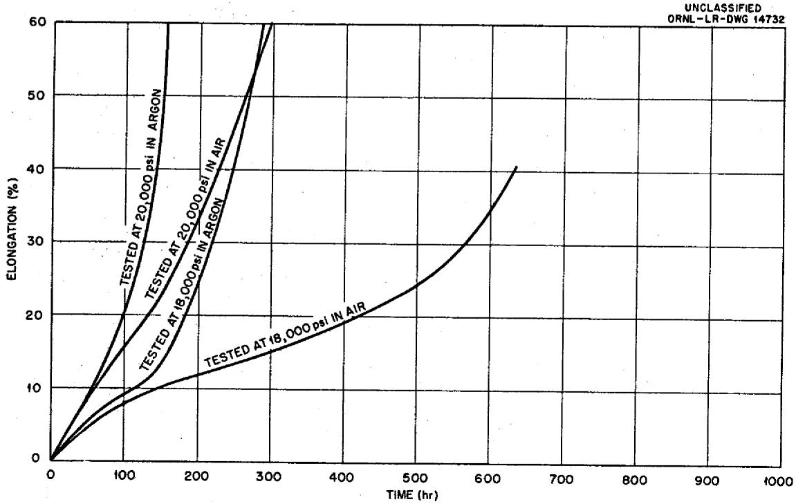  
Fig. 3.5.4. Design Curves for Hastelloy B Sheet Solution Annealed at $2100^{\circ}\mathrm{F}$ for 2 hr and Tested in Air and in Argon at $1500^{\circ}\mathrm{F}$ .

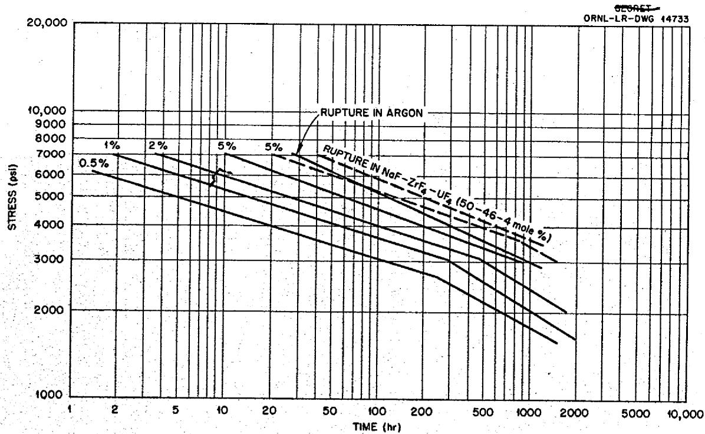  
Fig. 3.5.5. Design Curves for Hastelloy B Sheet Solution Annealed at $2100^{\circ}\mathrm{F}$ for 2 hr and Tested in Argon and in the Fuel Mixture (No. 30) NaF-ZrF $_4$ -UF $_4$ (50-46-4 mole %) at $1800^{\circ}\mathrm{F}$ .

air and the fuel mixture seem to be surface active. Air, of course, produces an oxide film which is ever present, and the fuel mixture, in effect, creates a very thin surface film by leaching one of the alloy constituents and producing another phase on the surface, as shown in Figs. 3.5.6 and 3.5.7.

# SHORT-TIME HIGH-TEMPERATURE TENSILE PROPERTIES OF HASTELLOY B

C. R. Kennedy

The short-time high-temperature tensile properties of solution-annealed Hastelloy B are illustrated in Fig. 3.5.8, which gives the yield and ultimate strengths and the final elongations in the temperature range 1000 to $1800^{\circ}\mathrm{F}$ . As may be seen there is a distinct decrease in the final elongation and in the ultimate strength at temperatures around $1200^{\circ}\mathrm{F}$ . This change in properties occurs in the temperature range in which the type of fracture transforms from predominantly transgranular to intergranular. It is interesting to note that the change in the yield strength with temperature is relatively small.

# CREEP-RUPTURE PROPERTIES OF HASTELLOY W

C. R. Kennedy

Creep testing of Hastelloy W is now in progress, and design data are presented in Figs. 3.5.9, 3.5.10, and 3.5.11 for solution-annealed sheet tested in argon at 1300, 1500, and $1650^{\circ}\mathrm{F}$ . Hastelloy W, which has almost the same composition as Hastelloy B, except for the addition of $5\%$ chromium and the deletion of $3\%$ molybdenum, has creep properties very similar to those of Hastelloy B. Although Hastelloy W exhibits less of a tendency to age than Hastelloy B, as shown in Figs. 3.5.12 and 3.5.13, a decrease in ductility occurs at $1300^{\circ}\mathrm{F}$ . This is also shown in Fig. 3.5.9, in which the absence of a $10\%$ curve indicates that the total strain at rupture was less than $10\%$ .

Rupture points obtained from tests with the fuel mixture (No. 30) NaF-ZrF $_4$ -UF $_4$ (50-46-4 mole %) are also shown in Figs. 3.5.9 and 3.5.10. The times to 0.5, 1, 2, 5, and $10\%$ total strain are identical for the same stress and temperature, and, as shown, only the rupture life is affected by

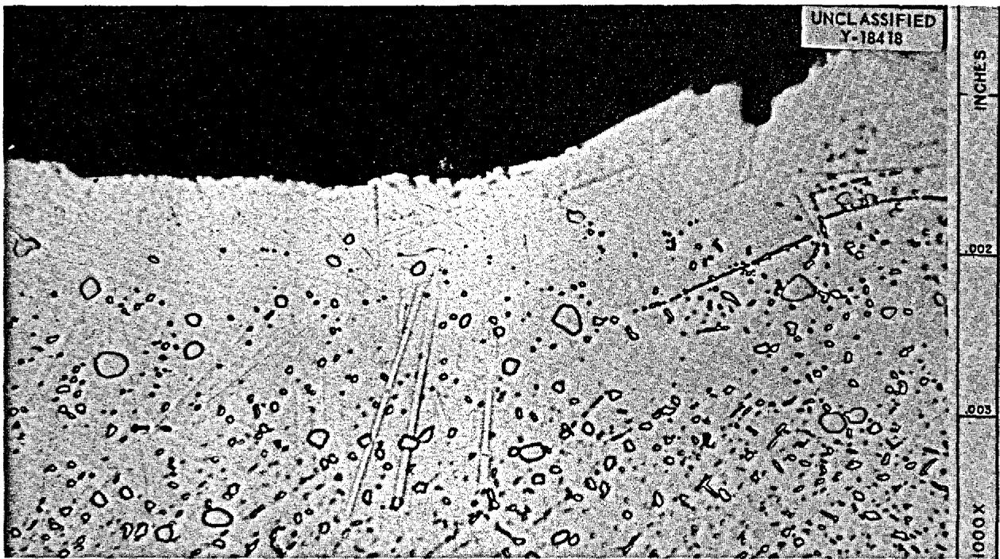  
Fig. 3.5.6. Surface Effect on the Unstressed Portion of a Hastelloy B Specimen After Exposure to the Fuel Mixture (No. 30) NaF-ZrF $_4$ -UF $_4$ (50-46-4 mole %) for 1700 hr. 1000X. (Secret with exception)

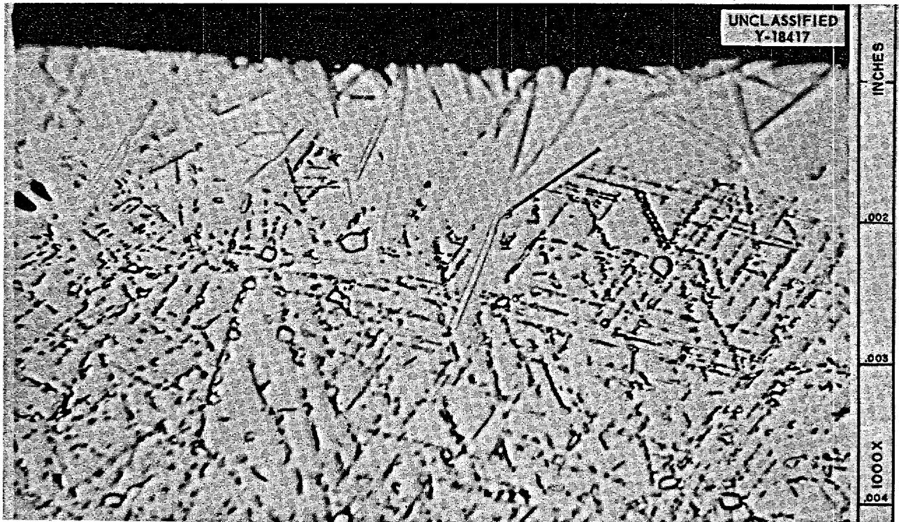

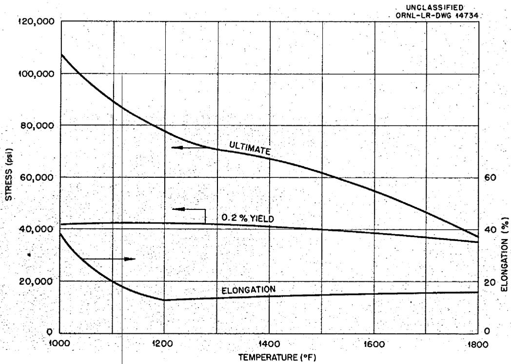  
Fig. 3.5.7. Surface Effect on the Stressed Portion of a Hastelloy B Specimen After Exposure to the Fuel Mixture (No. 30) NaF-ZrF $_4$ -UF $_4$ (50-46-4 mole %) for 1700 hr at a Stress of 13,500 psi. 1000X. (Secret with caption)   
Fig. 3.5.8. Short-Time Tensile Data for Solution-Annealed Hastelloy B Tested in the Temperature Range 1000 to $1800^{\circ}\mathsf{F}$ .

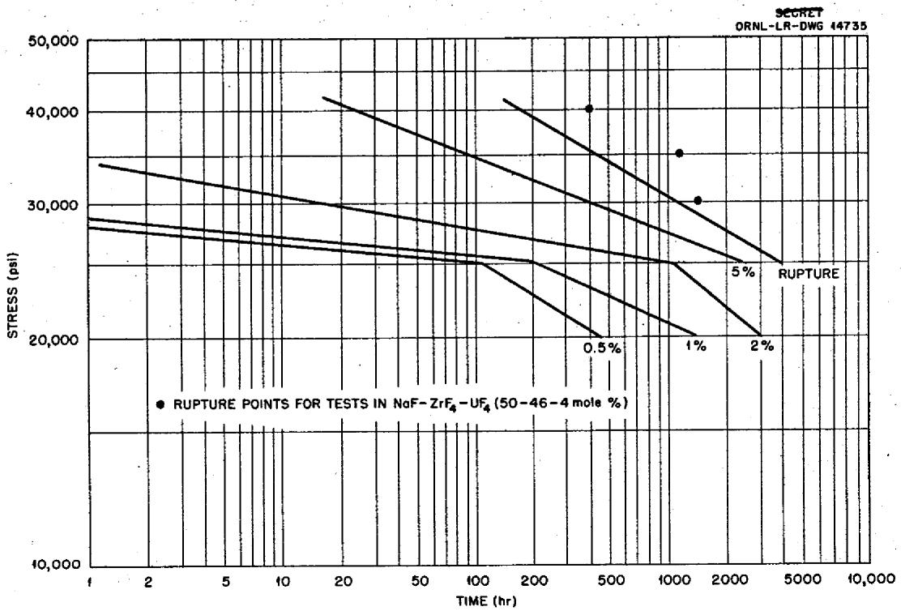  
Fig. 3.5.9. Design Curves for Hastelloy W Sheet Solution Annealed at $2100^{\circ}\mathrm{F}$ for 2 hr and Tested in Argon at $1300^{\circ}\mathrm{F}$ .

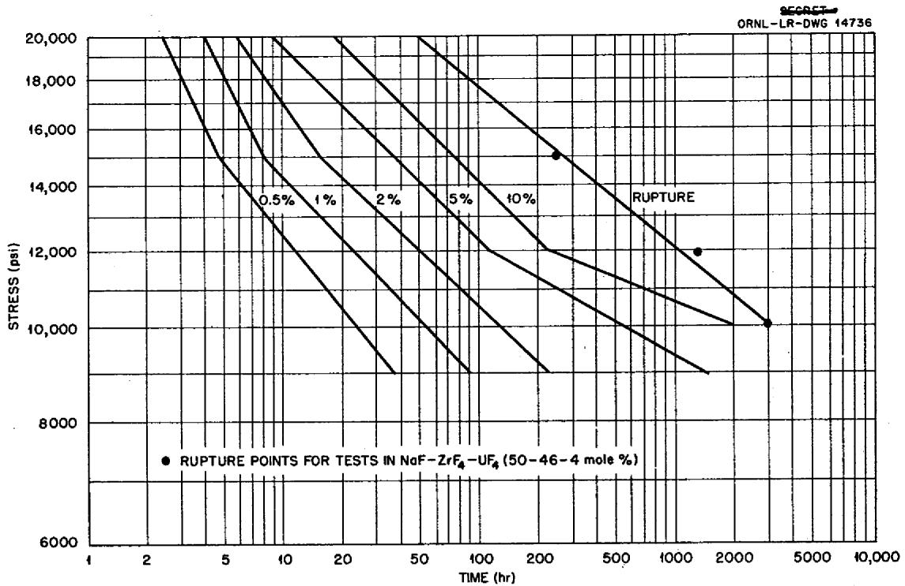  
Fig. 3.5.10. Design Curves for Hastelloy W Sheet Solution Annealed at $2100^{\circ}\mathrm{F}$ for 2 hr and Tested in Argon at $1500^{\circ}\mathrm{F}$ .

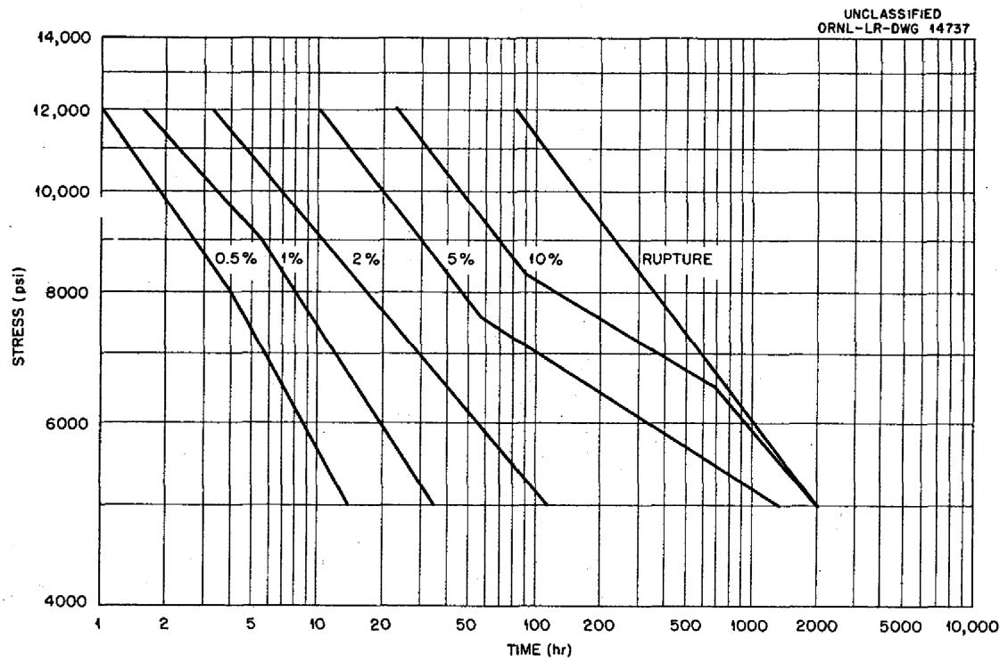  
Fig. 3.5.11. Design Curves for Hastelloy W Sheet Solution Annealed at $2100^{\circ}\mathrm{F}$ for 2 hr and Tested in Argon at $1650^{\circ}\mathrm{F}$ .

the environment. The effect of the fuel mixture on the creep properties of Hastelloy W sheet appears to be the same as that shown for Hastelloy B.

# SHORT-TIME HIGH-TEMPERATURE TENSILE PROPERTIES OF INCONEL

J.R.Weir,Jr.

The tensile properties of Inconel sheet have been determined at temperatures from 78 to $2200^{\circ}\mathrm{F}$ . The yield point, by $0.2\%$ offset, and the ultimate strength are shown in Fig. 3.5.14 for both fine-grained and coarse-grained material. As may be seen, the fine-grained material has the better strength properties at temperatures up to $1700^{\circ}\mathrm{F}$ .

Transient loads induced by thermal fluctuations may, in some cases, be of greater concern than the static loads that result from pressure differential. Therefore, even though the fine-grained Inconel has less creep resistance in the fused salts than the coarse-grained Inconel (Fig. 3.5.15), the fine-grained material may be the more desirable structural material because of its better tensile properties in the temperature range of interest.

# CREEP TESTS OF INCONEL IN FUSED SALTS J.R.Weir, Jr.

Inconel was creep tested at $1500^{\circ}\mathrm{F}$ and a stress of 3500 psi in $\mathsf{NaF - ZrF}_4$ (50-50 mole %) in order to compare the severity of attack with that found after similar creep tests in the fuel mixture (No. 30) $\mathsf{NaF - ZrF}_4\mathsf{-UF}_4$ (50-46-4 mole %). The results are shown in Figs. 3.5.16 and 3.5.17. Very little surface void formation is seen in the case of the specimen tested in the nonuranium-bearing mixture, in comparison with the attack by the fuel mixture. These results are further evidence that much of the attack by the fuel mixture on Inconel at $1500^{\circ}\mathrm{F}$ may be attributed to the reaction

$$
2 U F _ {4} + C r (i n I n c o n e l) \longrightarrow 2 U F _ {3} + C r F _ {2}.
$$

# CREEP TESTS OF WELDED INCONEL

J.R.Weir, Jr.

Several 0.060-in.-thick sheet-type creep specimens were machined from welded $\frac{1}{2}$ -in. Inconel sheet stock and a few creep tests were run in the

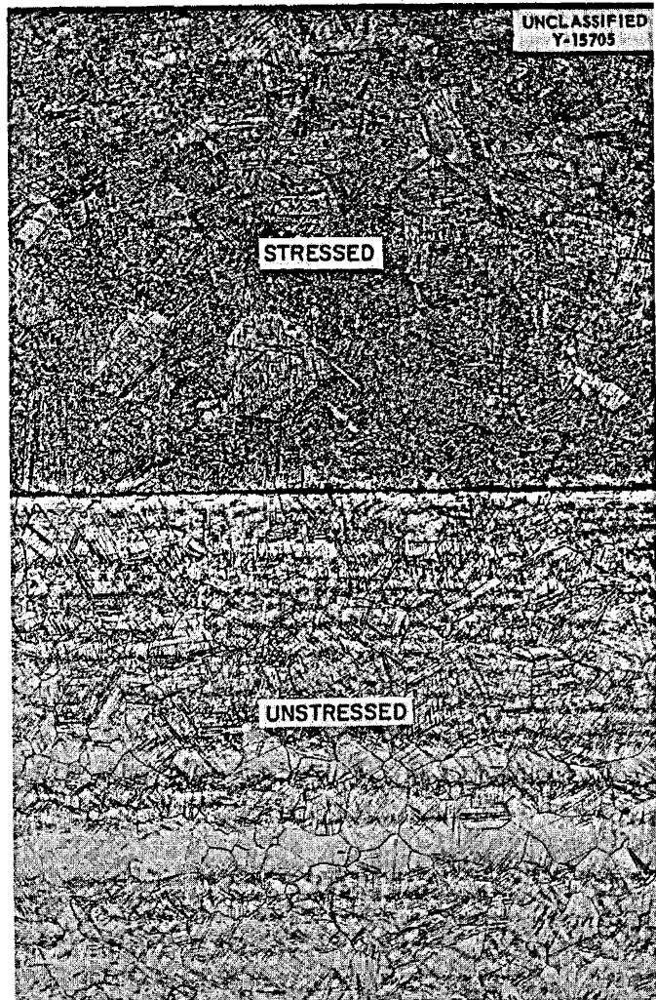  
Fig. 3.5.12. Hastelloy B Sheet After Creep Testing at a Stress of 30,000 psi at $1300^{\circ}\mathrm{F}$ in Argon; Ruptured in 185 hr. 100X. Reduced $17.5\%$ .

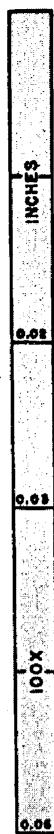

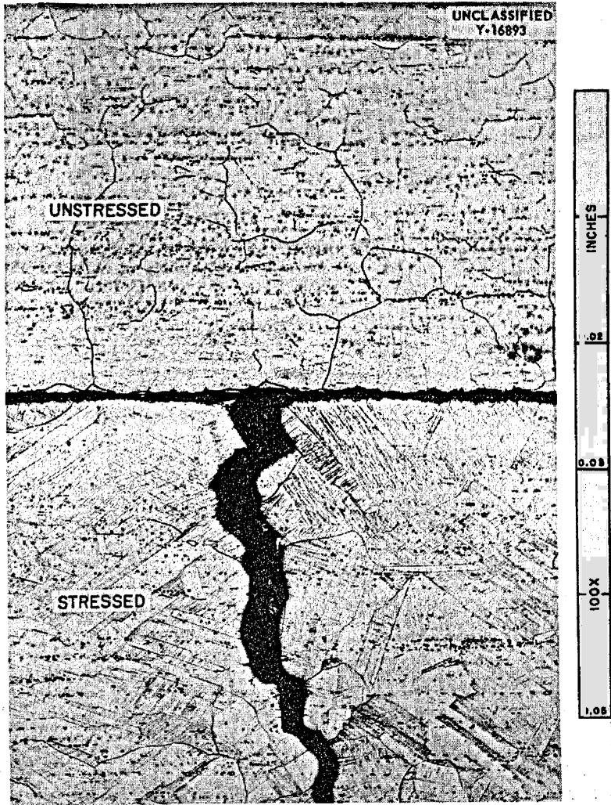  
Fig. 3.5.13. Hastelloy W Sheet After Creep Testing at a Stress of 35,000 psi at $1300^{\circ}\mathrm{F}$ in Argon; Ruptured in 450 hr. 100X. Reduced $17.5\%$ .

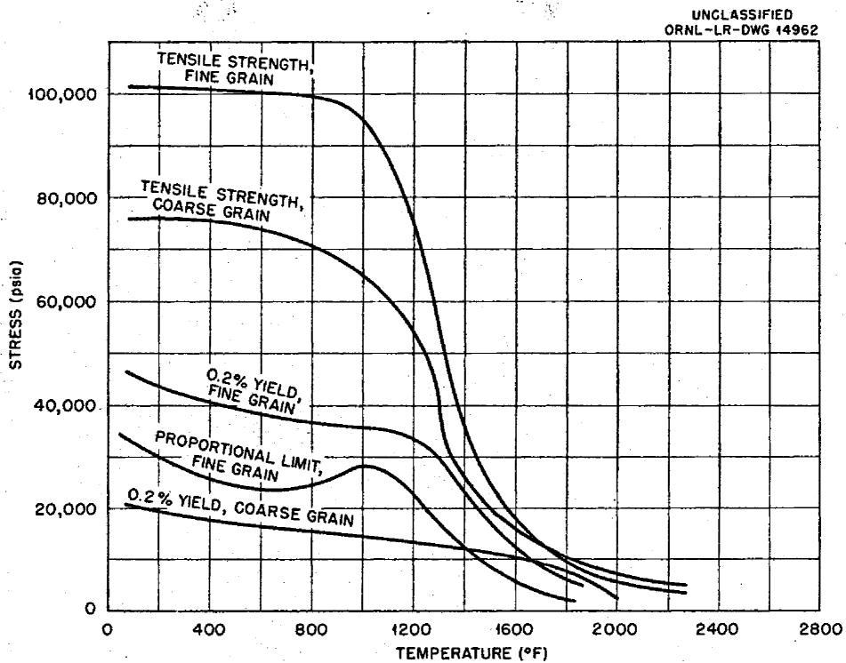  
Fig. 3.5.14. Comparison of Tensile Properties of Fine- and Coarse-Grained Inconel at Temperatures Between 78 and $2200^{\circ}\mathrm{F}$ at a Stress Rate of 0.016 (in./in.)/min.

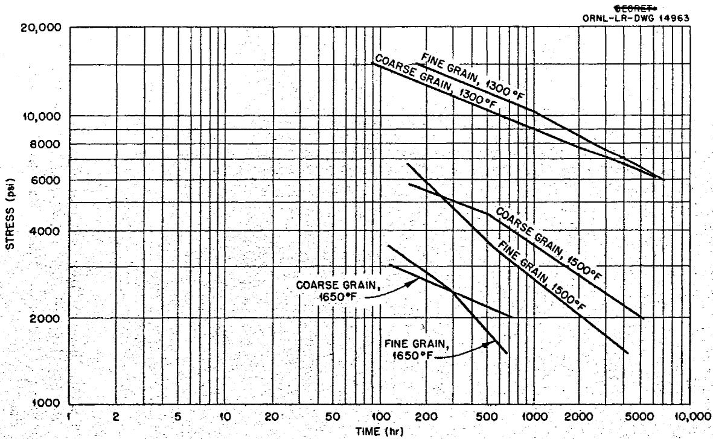  
Fig. 3.5.15. Comparison of Stress-Rupture Properties of Fine- and Coarse-Grained Inconel in the Fuel Mixture (No. 30) NaF-ZrF₄-UF₄ (50-46-4 mole %) at 1300, 1500, and 1650°F.

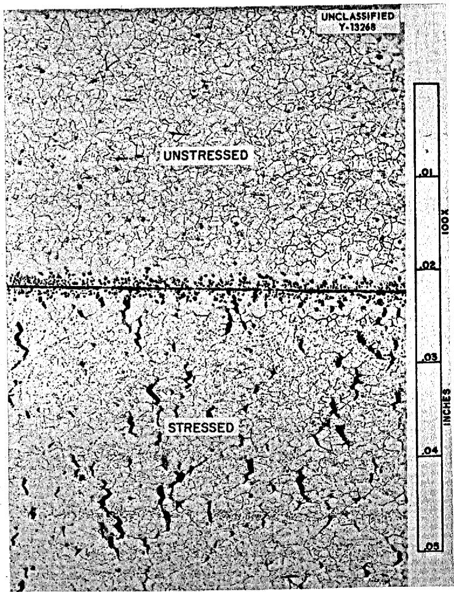  
Fig. 3.5.16. Inconel After a Creep Test in the Fuel Mixture (No. 30) NaF-ZrF₄-UF₄ (50-46-4 mole %) at 1500°F Under a Stress of 3500 psi. 100X. Reduced 18%. (Secret with caption)

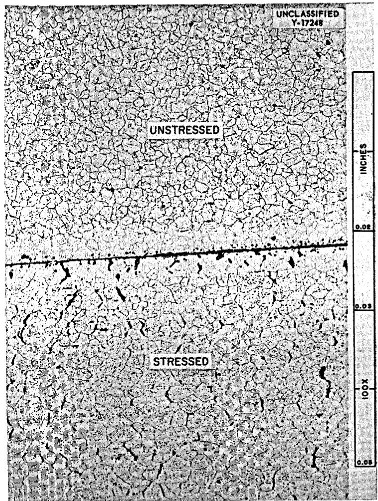  
Fig. 3.5.17. Inconel After a Creep Test in NaF-ZrF $_4$ (50-50 mole %) at $1500^{\circ}\mathrm{F}$ Under a Stress of 3500 psi. 100X. Reduced 18%.

fuel mixture (No. 30) NaF-ZrF4-UF4 (50-46-4 mole %) and in argon. The .results obtained to date are summarized in Table 3.5.1.

The positions of the fractures in the specimens tested at $1500^{\circ}\mathrm{F}$ in the fuel mixture are shown in Fig. 3.5.18. Specimen No. 2 was tested at 3000

psi and No. 3 at 4000 psi. As may be seen, the weld did not deform appreciably, compared with the base metal, in the gage length. Metallographic examination of the specimen tested at $1300^{\circ}\mathrm{F}$ disclosed that the weld metal was more corrosion resistant than the base metal.

TABLE 3.5.1. RESULTS OF CREEP TESTS OF WELDED INCONEL SHEET IN THE FUEL MIXTURE (No. 30) NaF-ZrF4-UF4 (50-46-4 mole %) AND IN ARGON   

<table><tr><td>Stress (psi)</td><td>Temperature (°F)</td><td>Environment</td><td>Heat Treatment</td><td>Rupture Life (hr)</td><td>Elongation (%)</td></tr><tr><td>12,000</td><td>1300</td><td>Fuel mixture</td><td>As received</td><td>110*</td><td>21</td></tr><tr><td>4,000</td><td>1500</td><td>Fuel mixture</td><td>Coarse grained</td><td>380</td><td>11</td></tr><tr><td>4,000</td><td>1500</td><td>Argon</td><td>Coarse grained</td><td>750**</td><td>10</td></tr><tr><td>3,000</td><td>1500</td><td>Fuel mixture</td><td>As received</td><td>820</td><td>5</td></tr><tr><td>3,000</td><td>1500</td><td>Argon</td><td>As received</td><td>2000**</td><td>4</td></tr></table>

*Premature rupture; probably caused by contamination of the fuel mixture.  
**Still in test.

ENCLASSIFIED (Y-1851)

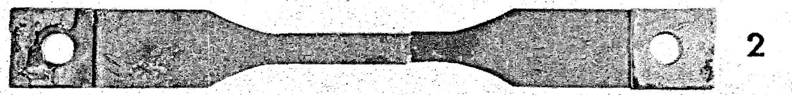

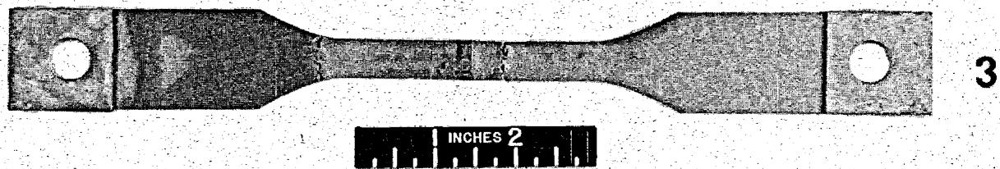  
Fig. 3.5.18. Welded Inconel Specimens After Creep Tests in the Fuel Mixture (No. 30) NaF-ZrF4. UF4 (50-46-4 mole %) at 1500°F. Specimen No. 2 was tested at a stress of 3000 psi and specimen No. 3 was tested at a stress of 4000 psi. (Secret with caption)

# 3.6. CERAMIC RESEARCH

L. M. Doney

# RARE-EARTH-OXIDE COMPACTS FOR ART CONTROL RODS

J. A. Griffin

L. M. Doney

The design of the ART control rods calls for a porous compact of rare-earth oxides. The pores of the compact are to be filled with metallic sodium, and the compacts are to be canned in Inconel. The following process was developed for the fabrication of the compacts. The as-received rare-earth-oxide material (Code 920 from Lindsay Chemical Co.) was pressed at 4000 psi into compacts, which were calcined at $1325^{\circ}\mathrm{C}$ for 1 hr. The calcination step was carried out to reduce the shrinkage of the oxide during the final sintering. These compacts

were crushed to pass an 80-mesh screen. The final mixture was compounded from $75\%$ of the 80-mesh calcined material and $25\%$ of the as-received Lindsay Code 920 oxide. This combination was thoroughly mixed and pressed, with no binder, at a pressure of 4000 psi. These compacts were then sintered at $1425^{\circ}C$ for 55 min in air. Samples of the sintered compacts are shown in Fig. 3.6.1.

The compacts were oversize in all dimensions so that they could be ground accurately to size and so that no difficulty would be encountered during canning. The grinding was carried out by a commercial ceramic firm. The inside and outside

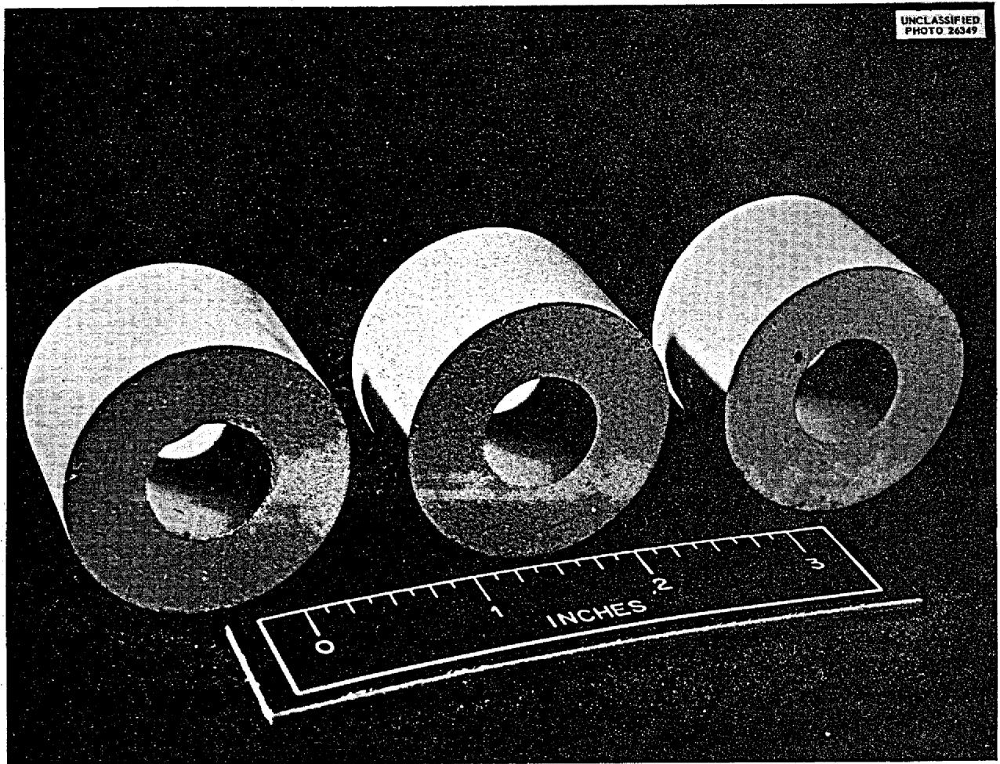  
Fig. 3.6.1. Sintered Rare-Earth Compacts Before Being Ground to Desired Dimensions.

of each compact was ground to the required dimension, and the ends, as well as being ground to the required length, were made flat and parallel. The ground pieces are shown in Fig. 3.6.2.

The Lindsay Chemical Co. supplied the following analysis of the Code 920 rare-earth oxides used in the fabrication of the compacts:

<table><tr><td>Samarium oxide</td><td>45.0-49.5%</td></tr><tr><td>Gadolinium oxide</td><td>22.5-27%</td></tr><tr><td>Neodymium oxide</td><td>0.9-4.5%</td></tr><tr><td>Praseodymium oxide</td><td>0.9-3.6%</td></tr><tr><td>Cerium oxide</td><td>0-0.9%</td></tr></table>

<table><tr><td>Europium oxide</td><td>0.9-1.2%</td></tr><tr><td>Other rare-earth oxides</td><td>8.1-14.8%</td></tr><tr><td>Total rare-earth oxides</td><td>90% (minimum)</td></tr></table>

# PETROGRAPHIC EXAMINATIONS OF FLUORIDE FUELS

G.D. White T.N.McVay, Consultant

Examinations of fluoride fuel samples with the petrographic microscope were performed at a rate of about 200 samples per month. The materials examined included quenched samples for equilibrium-diagram determinations, control samples from experimental runs, and samples from production batches. The results of these examinations are reported in Part 2, "Chemistry."

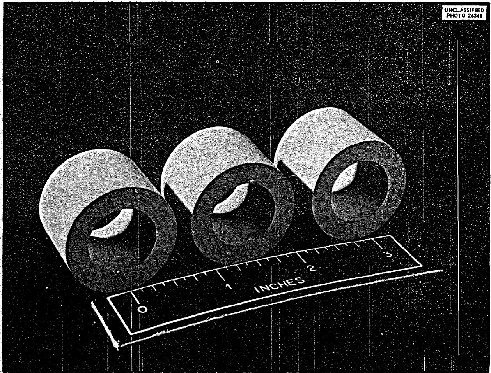  
Fig. 3.6.2. Rare-Earth Compacts Shown in Fig. 3.6.1 After Being Ground to Required Size.

# 3.7. NONDESTRUCTIVE TESTING STUDIES

R. B. Oliver

# EDDY-CURRENT TESTING OF SMALL-DIAMETER TUBING

J.W.Allen

Continued study of the application of the cyclograph to the problem of the inspection of small-diameter tubing has revealed that, in addition to its use as a flaw detector, the cyclograph may also be used to gage adherence to dimensional tolerances. Although changes in diameter and in wall thickness are inseparable in the readout of the instrument, the tolerance limits for both dimensions may be established by utilizing two standards: (1) the minimum acceptable diameter and wall thickness and (2) the maximum allowable diameter and wall thickness. Dimensional checks made by using this method, augmented with mechanical measurements, have been used successfully to determine the dimensional acceptability of approximately 6000 ft of $3_{16}$ -in.-OD, 0.025-in.-

1R. B. Oliver, J. W. Allen, and K. Reber, ANP Quar. Prog. Rep. March 10, 1956, ORNL-2061, p 164.

wall and 0.229-in.-OD, 0.025-in.-wall CX-900 Inconel tubing.

The 200-kc cyclograph trace of a 0.229-in.-OD, 0.025-in.-wall Inconel tube that has small wall-thickness variations along its length and no perceptible diameter variations is shown in Fig.3.7.1. The wall thickness was plotted from Vidigage (ultrasonic-resonance-type thickness gage) and mechanical measurements. It may be seen that, although there is not perfect agreement, there is a fairly close correspondence between the two types of checks. The disagreement is probably due to minute amounts of eccentricity and intergranular attack on the inside surface of the tube having been detected by the cyclograph.

The confidence level of the interpretations of indications from this instrument is increasing with continued use. Because the sensing coil observes at any one instant a section of tubing approximately $\frac{3}{8}$ in. long, it is not possible to detect pin holes, except when they occur in clusters. In general, defects can be resolved if they have a length of $\frac{1}{16}$ in. or longer and have

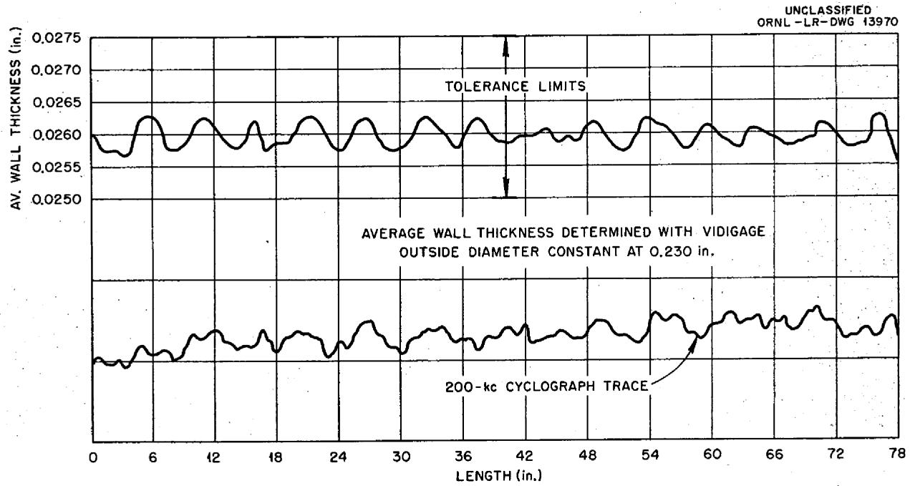  
Fig. 3.7.1. Cyclograph Record at 200 kc from a 0.229-in.-OD, 0.025-in.-Wall CX-900 Inconel Tube Compared with Dimensional-Variation Measurements Made Mechanically and with the Vidigage.

depths greater than the background dimensional variations in the tube.

# ULTRASONIC INSPECTION OF TUBING

R.W.McClung

Approximately 6000 ft of CX-900 Inconel tubing has been inspected by the immersed ultrasound method. Two sizes of tubing in OD, 0.025 in. wall and 0.229 in. OD, 0.025 in. wall, were inspected and the average rejection by this test was about $2\%$ . Each tube received a double inspection, with the ultrasound being beamed around the tube in two different directions to improve the chance of detection of unfavorably oriented crack-like defects. This double inspection of the precut tubing reduced the inspection rate to below the original estimate. The current inspection rate is approximately 500 ft in an 8-hr day for lengths up to 10 ft.

Defects 0.0015 in. deep and $\frac{1}{16}$ in. long on polished, scratch-free tubing can be detected with

an estimated confidence of 80 to $90\%$ . If scratches are present they will produce signals comparable to those from the very small defects and effectively increase the minimum detectable defect size. If the defect is appreciably deeper than the scratches and if its length exceeds the maximum dimension of the transducer, it is not difficult to differentiate between defects and scratches. Since the ultrasonic method is insensitive to dimensions, the inherent dimensional variations that give trouble in an eddy-current inspection have no effect on ultrasonic inspection. Both the eddy-current and the ultrasonic methods are capable of detecting very small defects, with the eddy-current inspection being confused by dimensional variations and the ultrasound method being confused by scratches. A comparison of the results of the two tests aids in the identification of spurious signals.

A typical small defect found on the inside of the $3\%$ -in.-OD, 0.025-in.-wall CS-900 tubing is shown in Fig. 3.7.2. This crack is 0.0015 in. deep $(6\%)$ and about $1\%$ in. long.

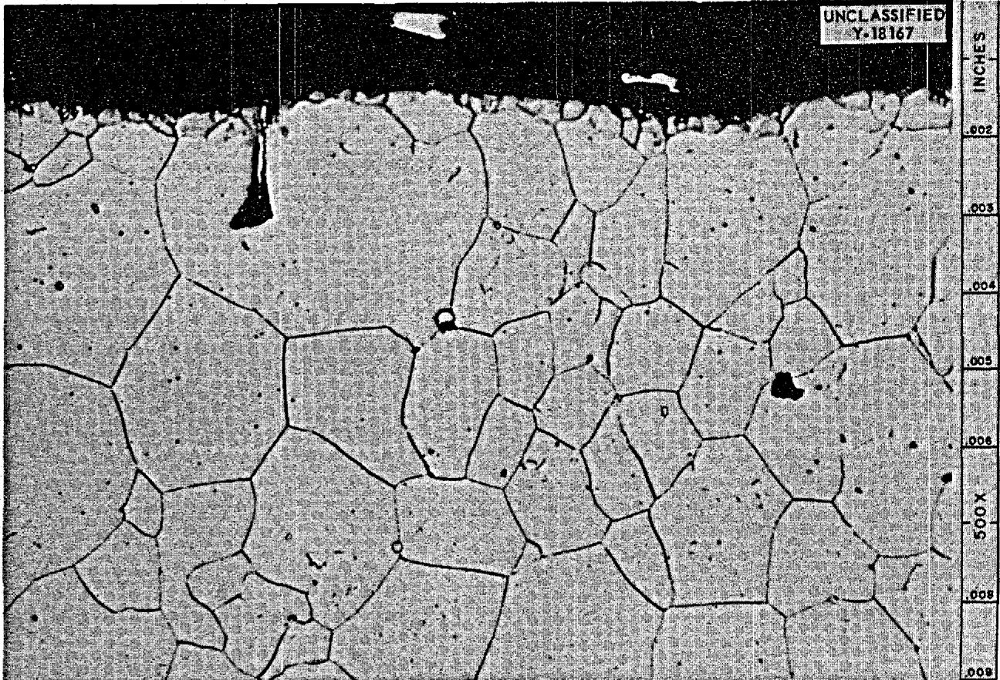  
Fig. 3.7.2. Small Defect Found by Ultrasonic Inspection on the Inner Surface of a $\frac{3}{16}$ -in.-OD, 0.025-in.-Wall Inconel Tube. The defect is 0.0015 in. deep and approximately $\frac{1}{16}$ in. long.

# ULTRASONIC INSPECTION OF PIPE

J. K. White

No development work on the ultrasonic method for the inspection of pipe had been planned, because the currently employed contact method was reported to be adequate. Preliminary attempts to employ this method, however, revealed several problems that defracted from the reliability of contact inspection. It was found to be very difficult to fabricate Lucite shoes that would fit the contour of the pipe and would, at the same time, limit the sound beam to the proper spectrum of incident angles. A sizable part of the sound was propagated as a surface wave and produced inordinately large signals from surface scratches. For this reason, defects and scratches could not be separated. Also, the contact method requires that a thin film of oil be maintained between the transducer and the pipe surface, and, thus, any surface roughness, vibration, ovality, or an inadequate supply of oil resulted in a loss of signal and frequent failure to detect defects on the inner surface. Immersed ultrasound permitted a solution to these difficulties, and the use of the "B" scan for data presentation permitted a high inspection speed with rapid interpretation of the signals produced in the tube wall.

A scanning tank of maximum simplicity was designed and fabricated for the ultrasonic inspection of pipe. The tank is 26 ft long, 14 in. wide, and 20 in. deep and is equipped with a variable-speed headstock and chuck and an assembly of

two 3-in.-dia casters, in lieu of a tail stock. This assembly contains and rotates the pipe around its own axis. The transducer mounting is aligned with reference to the pipe axis by a pair of Micarta guides, and it is manually translated along the pipe. Very straight pipe can be rotated at speeds of 200 rpm, but much of the pipe is too crooked for this speed. Even in the worst case, however, rotational speeds of 60 to 100 rpm are attainable. This equipment is being used for the inspection of large quantities of pipe in sizes from $\frac{3}{8}$ to 6 in. IPS for the ETU and the ART.

Satisfactory inspection of tubular shapes is dependent upon obtaining reference notches of the proper depth (3 to $5\%$ of the wall thickness) on both the inner and outer surfaces. A known, reproducible notch is easily produced on the outer surface of both pipe and tubing; however, it is difficult to produce such notches on the inner surface of even large pipe. No really satisfactory notch has yet been produced on the inner surface of small-diameter tubing, and the inside reference notch is necessary to prove that the alignment will reveal defects on the inner surface. Therefore this method is not being used for the inspection of small-diameter tubing.

Four of the eight nozzle welds on the cell being fabricated to house the ART in Building 7503 were inspected by the ultrasound method. The observed indications of cracking in the weld and in the heat affected zone resulted in the removal of all the welds. The cracks revealed were confirmed by arc gouging and by Magnaflux tests with sufficient frequency to justify the rejection of the welds on the basis of the ultrasound indications.

# Part 4

# HEAT TRANSFER AND PHYSICAL PROPERTIES

H. F. Poppendiek

# RADIATION DAMAGE

G. W. Keilholtz

# FUEL RECOVERY AND REPROCESSING

H. K. Jackson

# CRITICAL EXPERIMENTS

A. D. Callihan

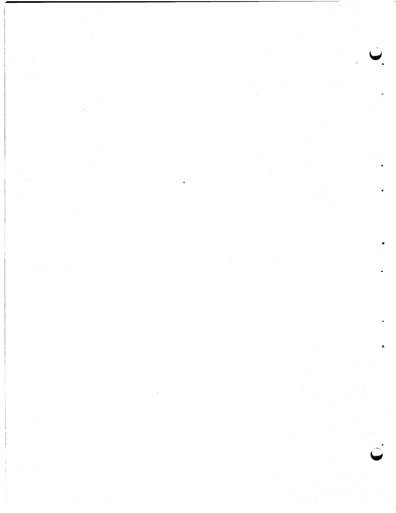

# 4.1. HEAT TRANSFER AND PHYSICAL PROPERTIES

# H. F. Poppendiek

# ART FUEL-TO-NoK HEAT EXCHANGER

S. I. Cohen J. L. Wontland

The ART fuel-to-NaK heat exchanger test system was modified for further studies of heat transfer and friction characteristics. Six 60-deg staggered spacers and six 60-deg inclined spacers were placed alternately on the tube bundle, and transverse pressure taps were installed across one spacer of each type. The average transverse pressure drop across each instrumented spacer was plotted in terms of the ratio of the transverse pressure drop to the velocity head times the fluid density over the Reynolds modulus range of 3000 to 8000. For the inclined spacer this term varied from 1.4 to 1.1, and for the staggered spacer the data fell randomly between 0.01 and 0.03, with no definite trend established. The analytical investigation, referred to previously,2 on a method of correlating fluid-friction data for flow parallel to a square array of cylindrical tubes in rectangular cross-section flow channels was completed.3

An experimental study is being made of the fuel-side fluid-friction characteristics of a mockup of the present design of the ART fuel-to-NaK heat exchanger. The dimensions of this apparatus and the spacer configuration will simulate the ART heat exchanger as nearly as possible, except that there will be no headers and the tube bundle will not have the curvature specified for the ART; that is, the friction characteristics for a straight length of tube bundle will be determined.

An experimental heat exchanger has been designed and is now being fabricated that will be similar to the one on which tests were conducted previously, with the exception that the tubes will be spaced on a triangular array rather than a square array. This investigation will provide

data for direct comparison of the heat-transfer and fluid-friction characteristics of the two different configurations in the transitional Reynolds modulus range.

# ART HYDRODYNAMICS

C.M.Copenhagen F.E.Lynch

G. L. Muller5

# Sodium Flow in Reflector Cooling System

A 5/22-scale model of the reflector-core shell cooling annulus and inlet system was designed and fabricated (Fig. 4.1.1) in order to determine quantitatively the flow distribution in the annulus and the various pressure drops in the sodium system. The fluid used in the model was water at temperatures between 20 and $50^{\circ}\mathrm{C}$ . Although the model does not incorporate the reflector cooling holes, 12 nozzles were spaced radially around the inlet header to take off fluid at various sectors of the inlet header to mock up flow through the cooling holes.

The flow distribution was studied by three methods: (1) the static pressure measured axially across the annulus in conjunction with the total annulus flow rate measured by a rotameter gave the average velocities through the annulus for the two positions nearest the inlets and the two positions farthest away, (2) pitot-static combination measurements were obtained at positions 1-3 and 3-3 (Fig. 4.1.1), and (3) high-speed motion pictures were made of periodic ink injections.

A quantitative measurement of the flow distribution was defined as

$$
\frac {Q _ {f}}{Q _ {n}} = \frac {\bar {V} _ {2} + \bar {V} _ {4}}{\bar {V} _ {1} + \bar {V} _ {3}},
$$

where

$Q_{f} =$ volumetric flow rate in annulus farthest from inlet,

$Q_{n} =$ volumetric flow rate in annulus nearest to inlet,

$V =$ average linear velocity at station indicated by subscript number.

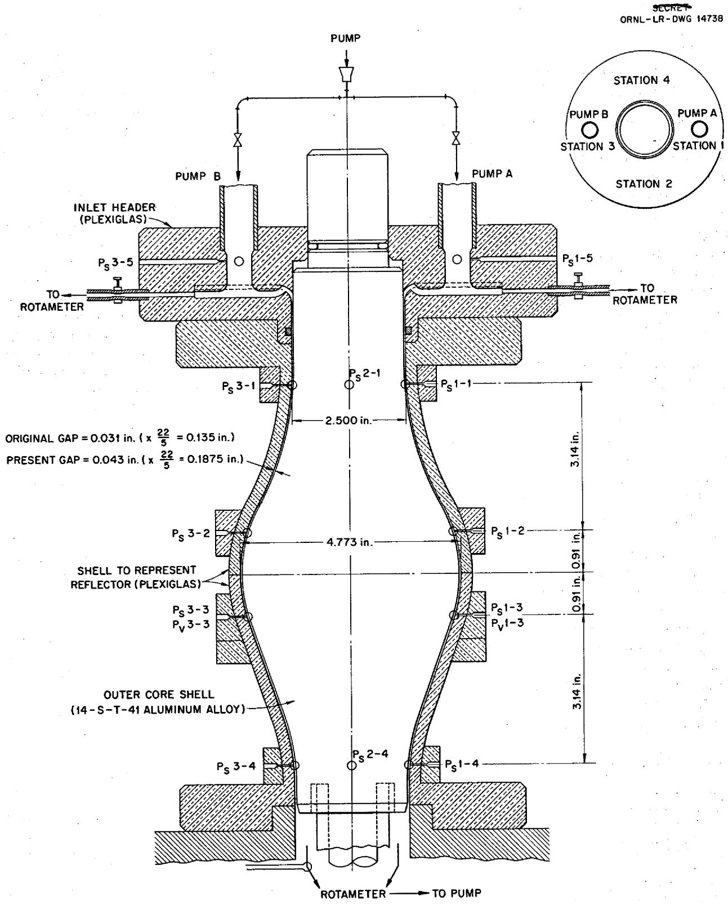  
Fig. 4.1.1. Vertical Section Through Reflector-Core Shell Annulus Model.

This relationship gives the ratio of the averages of the velocities at the two stations farthest from the inlets to the averages of the velocities at the two stations nearest the inlets. The relationship for the flow distribution when only one pump was operating was defined as

$$
\frac {Q _ {f}}{Q _ {n}} = \frac {\frac {\bar {V} _ {3}}{\bar {V} _ {1}} \left[ \begin{array}{l} \text {p u m p A} \\ \text {o p e r a t i n g} \end{array} \right] + \frac {\bar {V} _ {1}}{\bar {V} _ {3}} \left[ \begin{array}{l} \text {p u m p B} \\ \text {o p e r a t i n g} \end{array} \right]}{2}.
$$

Some of the experimental results are presented in Fig. 4.1.2 in terms of these relationships. The predicted flow distribution in the ART system

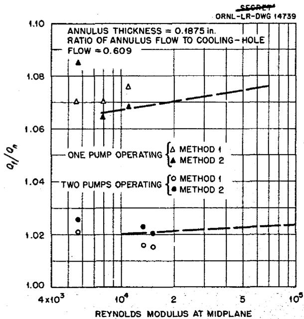  
Fig. 4.1.2. Flow Distribution in Concentric Reflector-Core Shell Annulus.

was obtained by extrapolating the data to the Reynolds numbers for the actual system at the mid-plane of the annulus. A summary of the results is given in Table 4.1.1.

The minimum flow rate was found in the portions of the annulus nearest the inlets, while the maximum flow rate was observed in the portions farthest away. These conditions are the reverse of those anticipated, and a possible explanation is that the fluid entering the annulus from the inlet header must abruptly change direction and it probably undergoes high velocity losses, particularly near the inlet to the annulus where the momentum is the greatest. After the model inlet header used in these experiments had been fabricated, the design of the actual ART sodium system was modified so that uniform distribution of sodium flow would exist in the annulus if there were no eccentricities. The flow in such a concentric annulus will be axial; that is, there will be no spiraling. Studies of the motion pictures of the flow in the model indicated that, for a constant pump pressure, the average velocity fluctuation at any point in the annulus would probably be less than $\pm 5\%$ .

The flow distributions in the annulus for two possible conditions of eccentricity of the core shell were also studied. Buckling of the core shell between the spacers was simulated to produce a local eccentricity. Since the reduction in flow as a function of the reduction in flow area was the prime concern, the buckling of the core shell was simulated by adding pieces of tape, as shown in Fig. 4.1.3. For a local reduction in annulus thickness of $50\% (t_e / t_o = 0.5)$ , the flow from inlet to outlet through that sector of the annulus was $73\%$ of the average flow.

Radial eccentricity was also simulated to study the effect of a slight canting of the core shell on

TABLE 4.1.1. SUMMARY OF CONCENTRIC ANNULUS FLOW DISTRIBUTION STUDIES   

<table><tr><td>Annulus width, in.</td><td colspan="2">0.135</td><td colspan="2">0.1875</td></tr><tr><td>Reynolds modulus at mid-plane</td><td colspan="2">0.72 × 10^5</td><td colspan="2">1.01 × 10^5</td></tr><tr><td>Ratio of annulus flow to cooling hole flow for two conditions</td><td>0.386</td><td>1.00</td><td>0.609</td><td>1.00</td></tr><tr><td>Qf/Qn</td><td></td><td></td><td></td><td></td></tr><tr><td>For two pumps operating</td><td>1.045</td><td>1.025</td><td>1.025</td><td>1.02</td></tr><tr><td>For one pump operating (70% normal flow assumed)</td><td>1.08</td><td>1.06</td><td>1.075</td><td>1.07</td></tr></table>

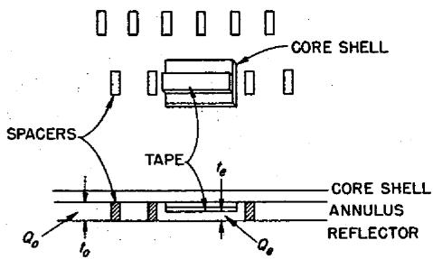  
60NEOP ORNL-LR-DWG 14740   
ORNL-LR-DWG 14984

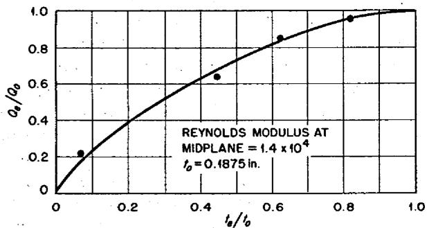  
Fig. 4.1.3. Effect of Local Eccentricity on Flow Distribution.

the flow distribution in the annulus. Radial displacement of the shell was found to cause a slight spiraling of the flow through the annulus. The configuration studied and the experimental data obtained are shown in Fig. 4.1.4. The data are in good agreement with a simple, derived expression based on parallel and equal system flow resistances. For a mean radial eccentricity $(t_1 / t_0)$ of 0.8 the maximum deviation of the ratio $Q_{1} / Q_{3}$ is about 0.8. The static pressures as a function of position in the annulus and in the inlet header were also obtained for the concentric and eccentric cases and are being analyzed.

# Fuel Flow in Core

Further studies of the flow through the 21-in. ART core model with the Pratt & Whitney vortex generators installed in the entrance region were delayed pending the construction of a second test stand for the core-model experiments. Studies of other core configurations that may give stable flow were, however, initiated. In the preliminary study the following three configurations are being considered: a core with an area expansion rate obtained from Nikuradse's gamma function, a

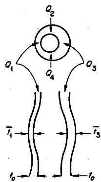

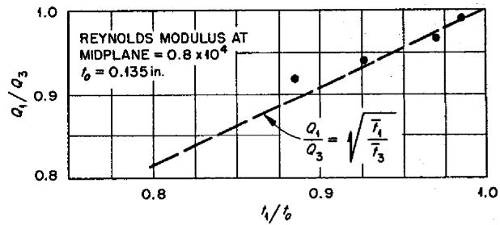  
Fig.4.1.4. Effect of Radial Eccentricity on Flow Distribution.

cylindrical annular core with a large area expansion at the entrance and screens of perforated plates placed in the region of expansion to obtain good flow characteristics, and the present 21-in. core with screens or perforated plates in the expansion region.

# ART CORE HEAT TRANSFER EXPERIMENT

N. D. Greene

F. E. Lynch

G.W.Greene

G. L. Muller

L. D. Palmer

H. F. Poppendiek

The instrumentation and operating characteristics of the ART volume-heat-source experiment, described previously, were checked, and the galvanometer used with the transient thermocouples was calibrated. Fifteen complete power runs were made for the swirl entrance system.

The parameters of the experiment were the following:

Helical Reynolds modulus 66,000 to 256,000

Prandtl number 4 to 5

Axial temperature rise 5 to $10^{\circ}\mathrm{F}$

Total power generated 0.08 to 0.12 Mw

The heat balances obtained for the system were within $\pm 5\%$ of being perfect. Two power runs were also made with the swirl entrance system for the simulated case of "one pump off."

A photograph of the one-half-scale model used for these experiments is presented in Fig. 4.1.5; it is made almost entirely of Micarta and platinum. The mixing chamber, pump- scroll head, core, power leads, and thermocouple leads for the outer core shell can be identified in the photograph. The panel board containing recording and power control equipment for the experiments is shown in Fig. 4.1.6, and a view of the fuel annulus after the pump- scroll head was removed at the end of the experiments is shown in Fig. 4.1.7. The platinum-platinum rhodium thermocouples, as well as the platinum electrodes, which are visible in Fig. 4.1.7, were in good condition at the end of the experimental study.

A two-dimensional plot of the electric potential field for the 24-electrode power circuit is presented in Fig. 4.1.8. Except for the very ends of the system where some flux distortion exists, the axial voltage gradient was within about $5.5\%$ of being uniform; consequently, the power density was within about $11\%$ of being uniform. In the actual ART system in which the heat sources will be generated by fission, the volume heat sources will not be uniform; in fact, near the wall they will be from 2 to 3 times as great as they will be near the center of the channel. The mean, uncooled wall and fluid temperature profiles obtained in these experiments with a uniform volume heat source are presented in Fig. 4.1.9 in normalized form. The asymmetries in the outer core shell and island core shell wall temperatures can be explained on the basis of hydrodynamic flow asymmetries. For example, the high island core shell wall temperature in the northern hemisphere exists because a separation region completely encompasses the island shell in that region. The solution for an idealized ART (parallel-plates system) is also plotted on Fig. 4.1.9; this predicted uncooled wall temperature profile lies

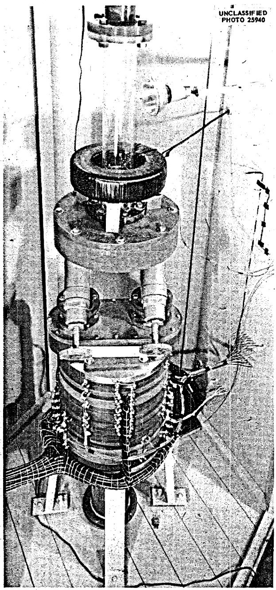  
Fig. 4.1.5. One-Half-Scale Model of ART Core for Volume-Heat-Source Experiments.

between the island and outer core shell wall temperature measurements.

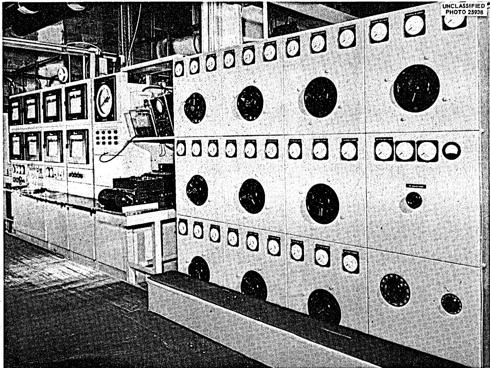  
Fig. 4.1.6. Recording and Power Control Board for Volume-Heat-Source Experiments.

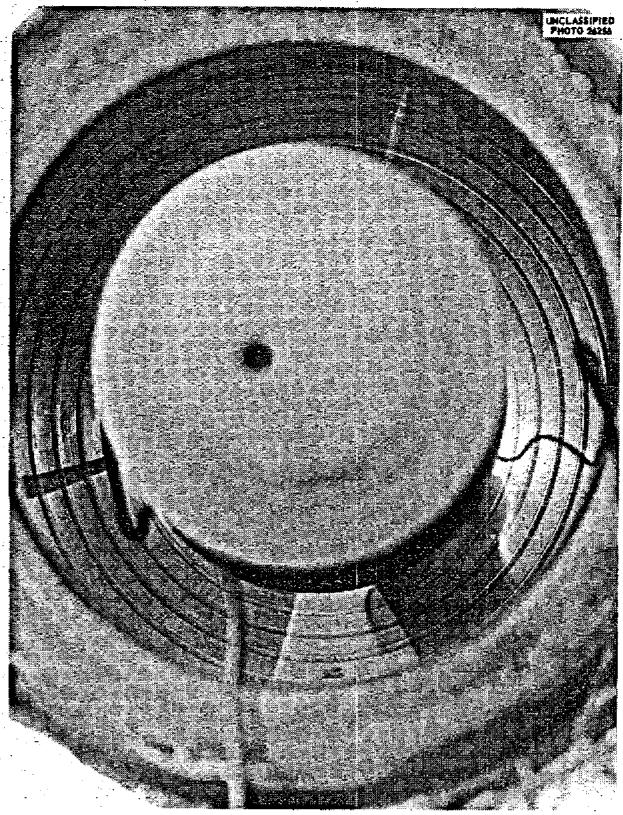  
Fig. 4.1.7. Fuel Annulus of the Volume-Heat-Source Apparatus.

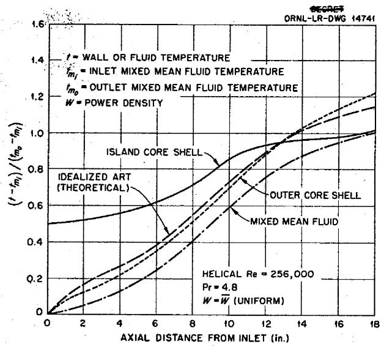  
Fig. 4.1.9. Temperature Profiles of the Mean, Uncooled Outer Core Shell, Island Core Shell Wall, and Fluid of the One-Half-Scale ART Core Model with a Uniform Volume Heat Source.

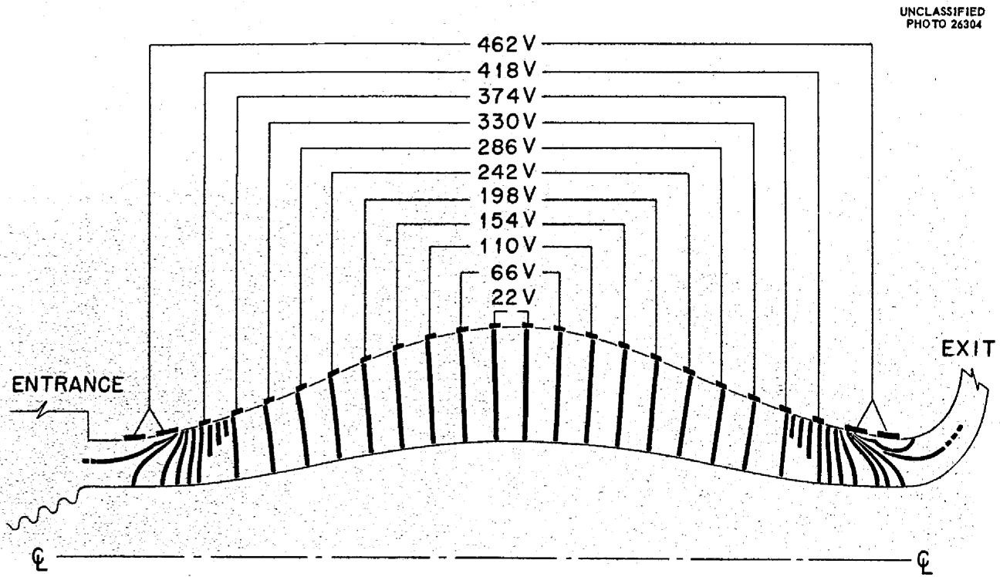  
Fig.4.1.8. Two-Dimensional Plot of Electrical Flux Field in Core of Volume-Heat-Source Apparatus.

Experimental transient wall and fluid temperature data are shown in Fig. 4.1.10 in terms of the total temperature fluctuation divided by the axial temperature rise of the fluid going through the core. The frequencies of the temperature fluctuations for this one-half-scale volume-heat-source system vary from about $\frac{1}{2}$ to 4 cps. The frequency range of temperature fluctuations in the full-scale ART system operating with fluoride fuel should be similar to that in the one-half-scale volume-heat

source system in which an acid was circulated. The frequencies of the temperature fluctuations were found to be in agreement with the frequencies of the velocity fluctuations observed in the full-scale core model used for flow studies.

The results of a study of the temperature structure in an idealized ART core were presented in the previous report. The increase in the

8H. F. Poppendiek and L. D. Palmer, ANP Quar. Prog. Rep. March 10, 1956, p 176.

ORNL-LR-DWG 14742

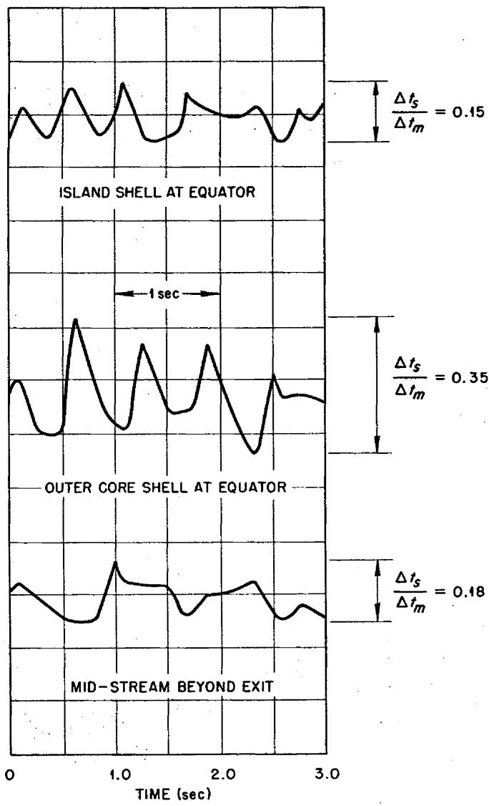  
Fig. 4.1.10. Transient Surface and Fluid Temperatures Obtained for ART Core Model with a Uniform Volume Heat Source.

$$
\begin{array}{l} H E L I C A L R e = 2 5 6, 0 0 0 \\ W = \bar {W} (\text {U N I F O R M}) \\ \Delta t _ {S} = \text {T O T A L C H A N G E I N W A L L T E M P E R A T U R E} \\ \Delta t _ {m} = \text {A X I A L F L U D T E M P E R A T U R E R I S E I N} \\ \text {G O I N G T H R O U G H C O R E} \\ \end{array}
$$

uncooled wall temperature that would arise if a hyperbolic cosine power density distribution existed rather than a uniform one was determined. The uncooled wall temperature increment, above the fluid temperatures, for this nonuniform power density case was found to be more than twice as great as the corresponding increment for a uniform power density case. The experimental measurements obtained for the uniform power density case have been modified by this factor and are plotted in Fig. 4.1.11, along with the mathematical prediction for an idealized ART core with a hyperbolic cosine power distribution. As may be seen, temperatures as high as $1800^{\circ}\mathrm{F}$ might occur if the walls are not cooled properly for this very high Reynolds number case.

Elastic thermal stress calculations were also made for the core shell and heat exchanger tubes on the basis of the experimental temperature fluctuations that were observed in this experiment

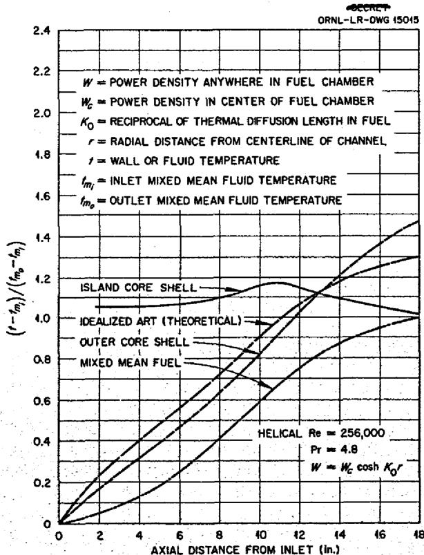  
Fig. 4.1.11. Temperature Profiles of the Mean, Uncooled Outer Core Shell, Island Core Shell Wall, and Fluid of the One-Half-Scale ART Core Model Adjusted for the Nonuniform Volume Heat Source.

for the uniform-power-density case. For the uniform-power-density system the results indicated that cyclic stresses exist that are similar in magnitude to the endurance limit or fatigue stress of Inconel. It is believed that the stresses in the actual ART system may be higher than those calculated for the uniform-power-density case.

A third set of volume-heat-source experiments is under way. For these experiments entrance vanes that will reduce the rotational velocity component are located in the core throat.

# THERMAL-CYCLING EXPERIMENT

H.W.Hoffman D.P.Gregory

The volume-heat-source experiments with the one-half-scale model of the ART core have verified that the hydrodynamic instabilities that exist in some regions of the ART core, as presently designed, would result in rapid, high-temperature-differential cycling of the Inconel core-shell surfaces. These studies have also indicated that the tube bends at the fuel inlet end of the fuel-to-NaK heat exchanger will be subjected to this temperature cycling. The volume-heat-source experiments indicate that the temperature fluctuation at the Inconel surface may be of the order of $\pm 60^{\circ}\mathrm{F}$ . The thermal diffusivity of Inconel is poor, and therefore these large temperature fluctuations will occur, chiefly, in a region close to the metal-fuel interface. For example, the amplitude of a temperature fluctuation with a $1/2$ -sec period will be reduced to $40\%$ of its original value at a position 35 mils below the metal surface. A possible result of this cyclic thermal expansion within the metal will be cracking of the surface because of metal fatigue. The possibilities of accelerated creep and corrosion under these circumstances also arise.

The effect of thermal cycling on material strength must be determined experimentally, and a system for accomplishing this study at reactor temperatures with a fuel environment is currently being constructed and tested. The apparatus is shown schematically in Fig. 4.1.12. The fuel mixture $\mathrm{NaF - ZrF_4 - UF_4}$ (50-46-4 mole %) will flow through the heater under gas pressure and will be subjected to cyclic heating. The surface of the unheated test section will experience the resulting periodic

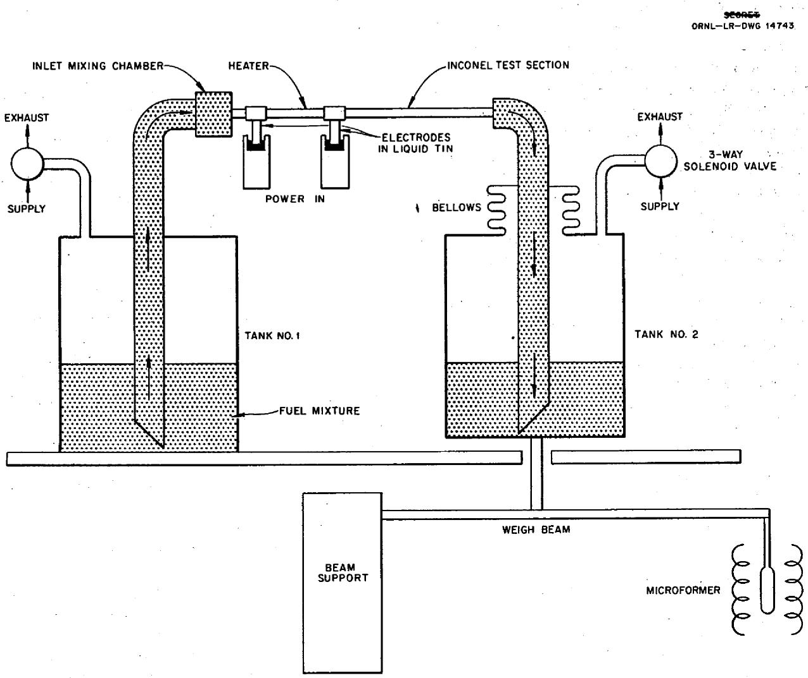  
Fig. 4.1.12. System for Thermal Cycling of Inconel Tubing in a Fuel Environment.

temperature fluctuations as the fluid moves downstream. Effects of the thermal cycling will be determined by metallographic examination of the Inconel surface subsequent to the test.

The heater and the test section are fabricated from a single 10-in. length of Inconel tubing $(\frac{1}{4}$ -in. OD, 0.035-in. wall). The heater comprises the first 4 in. of this tube and will be supplied with a pulsed current through a device designed to provide a range of pulse frequencies. In order that the stresses imposed on the test section will result only from the thermal cycling of the tube surface, the heater electrodes are floated in pools of molten tin to eliminate tube bending, and

a bellows is provided at the outlet end of the test section to take up the over-all thermal expansion.

Preliminary tests with $\mathrm{NaNO}_2\mathrm{-NaNO}_3\mathrm{-KNO}_3$ (40-7-53 wt %) as the heated fluid were terminated when oxidation at the electrodes resulted in loss of power. This situation is now being corrected. The results of these first experiments for a $1\frac{1}{4}$ -sec power-on - $1\frac{1}{4}$ -sec power-off cycle are given in Fig. 4.1.13. The amplitude of the temperature fluctuation at two points in the test section is shown as a function of the heater power. The "tailing-off" of the data at high heater powers is caused by the slow response of the measuring equipment. The cycle period will be varied in future experiments.

# SHIELD MockUP REACTOR STUDY

# L.C.Palmer

A general study of the heat transfer and fluid flow characteristics of the proposed Shield Mockup Reactor (see Chap. 5.5, "Shield Mockup Reactor Design and Construction") has been initiated. An analysis of the temperature structure within the fuel elements and the coolant and a study of the pressure distribution within the core were com

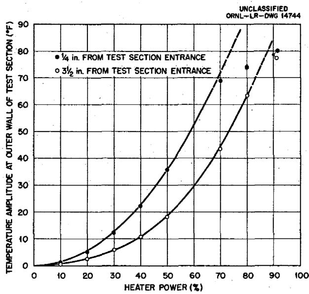  
Fig. 4.1.13. Temperature Amplitudes Observed in Preliminary Thermal-Cycling Tests of Inconel Tubing.

pleted. The studies are being extended to other regions of the reactor.

# TEMPERATURE STRUCTURE IN THE REGION BEYOND THE ART REFLECTOR

H. W. Hoffman

The previous calculations on the temperature structure in the region beyond the reflector in the ART were extended to include a recent system modification. The new system, illustrated in Fig. 4.1.14 and designated System C, differs from those previously studied (Systems A and B) in that a portion of the boron carbide has been replaced by a stainless-steel-clad copper-boron carbide matrix. This layer, located between the reflector and the remaining $\mathsf{B}_4\mathsf{C}_3$ will absorb the leakage neutrons from the core and thus prevent radiation damage of the more brittle boron carbide. A detailed description of the idealized system used in this study has been presented in a separate report. Based on these idealizations the system can be analyzed by an iterative procedure to obtain both the temperature rise of the sodium and the temperature profile for the region between the sodium and fuel return streams. The heat deposition rates used in this analysis were tentative upper limits.

10 H. W. Hoffman, J. L. Wantland, and C. M. Copen-haven, ANP Quar. Prog. Rep. March 10, 1956, ORNL-2061, p 174.   
11H. W. Hoffman, Thermal Structure for the Region Beyond the ART Reflector - Supplement I, ORNL CF-56-4-129 (April 17, 1956).   
12H. W. Bertini, personal communication to H. W. Hoffman.

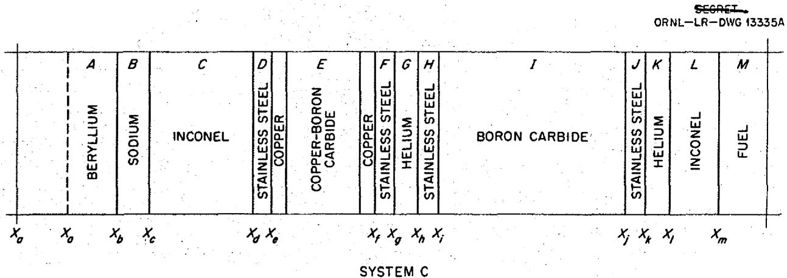  
Fig. 4.1.14. Schematic Diagram of Region Beyond the ART Reflector.

The recent system modification resulted in a temperature rise of $33^{\circ}\mathrm{F}$ for the sodium coolant stream and a maximum boron carbide temperature of $1526^{\circ}\mathrm{F}$ for a sodium inlet temperature of $1200^{\circ}\mathrm{F}$ . These values may be compared with the previous results for a system without the copper-boron carbide matrix in which the sodium temperature rise was $24^{\circ}\mathrm{F}$ and the boron carbide attained a maximum temperature of $1586^{\circ}\mathrm{F}$ . The sodium temperature rise was found to vary $10\%$ (decreasing from 36 to $33^{\circ}\mathrm{F}$ ) when the sodium inlet temperature was changed from 1150 to $1200^{\circ}\mathrm{F}$ . Typical temperature profiles at the inlet and outlet ends of the system for a sodium inlet temperature of $1175^{\circ}\mathrm{F}$ are presented in Fig. 4.1.15, and the temperature profiles for the system without the $\mathbf{Cu - B}_4\mathbf{C}$ (System B) are also shown for comparison.

13C. J. Barton, Fused Salt Compositions, ORNL CF-55-9-78 (Sept. 16, 1955).

The system modification increased the temperature drop across the inner Inconel shell by 30 to $35^{\circ}F$ . The temperature gradient in the outer Inconel shell was essentially unchanged.

# HEAT CAPACITY

# W.D. Powers

The enthalpies and heat capacities of two mixtures were determined in the liquid and solid states. For one mixture, NaF-LiF-ZrF $_4$ (22-55-23 mole %), two distinct discontinuities in the temperature-enthalpy relationship were found; one was at 370 to $380^{\circ}\mathrm{C}$ and the other was at 565 to $585^{\circ}\mathrm{C}$ . The reported $^{13}$ liquidus temperature is $570^{\circ}\mathrm{C}$ . The lower discontinuity is assumed to be a phase transition from the alpha form to the beta form, the beta form being stable below $375^{\circ}\mathrm{C}$ . The discontinuity at the higher temperature is the fusion of the alpha form to the liquid at $570^{\circ}\mathrm{C}$ . Enthalpy and heat capacity measurements of a second salt mixture, LiF-NaF (60-40 mole %), showed no unusual characteristics. The enthalpy and heat capacity equations for these two salts follow:

NaF-LiF-ZrF4(22-55-23 mole %)

Beta form (106 to $368^{\circ}C$

$$
H _ {T} - H _ {3 0 ^ {\circ} C} = - 8. 7 + 0. 2 3 9 2 T + (7. 2 0 \times 1 0 ^ {- 5}) T ^ {2}
$$

$$
c _ {p} = 0. 2 3 9 2 + (1 4. 3 9 \times 1 0 ^ {- 5}) T
$$

Alpha form (407 to $556^{\circ}C$

$$
H _ {T} - H _ {3 0 ^ {\circ} C} = 6 4. 2 - 0. 0 0 9 1 6 5 T + (4 1. 8 2 \times 1 0 ^ {- 5}) T ^ {2}
$$

$$
c _ {p} = - 0. 0 0 9 1 6 5 + (8 3. 6 4 \times 1 0 ^ {- 5}) T
$$

Liquid (603 to $897^{\circ}C$

$$
H _ {T} - H _ {3 0 ^ {\circ} \mathrm {C}} = - 2 0. 2 + 0. 4 5 2 6 T - (5. 9 5 \times 1 0 ^ {- 5}) T ^ {2}
$$

$$
c _ {p} = 0. 4 5 2 6 - (1 1. 8 9 \times 1 0 ^ {- 5}) T
$$

At $375^{\circ}C$

$$
H _ {\alpha} - H _ {\beta} = 2 8
$$

At $570^{\circ}C$

$$
H _ {l i q} - H _ {a} = 2 4
$$

LiF-NaF (60-40 mole %)

Solid (112 to $572^{\circ}C$

$$
\begin{array}{l} H _ {T} - H _ {3 0 ^ {\circ} C} = - 9. 8 + 0. 3 1 9 1 T + (9. 9 4 \times 1 0 ^ {- 5}) T ^ {2} \\ c _ {p} = 0. 3 1 9 1 - (1 9. 8 7 \times 1 0 ^ {- 5}) T \\ \end{array}
$$

Liquid (688 to $898^{\circ}C$

$$
\begin{array}{l} H _ {T} - H _ {3 0 ^ {\circ} C} = - 8 8. 2 + 0. 9 2 4 9 T - (2 4. 6 2 \times 1 0 ^ {- 5}) T ^ {2} \\ c _ {p} = 0. 9 2 4 9 - (4 9. 2 3 \times 1 0 ^ {- 5}) T \\ \end{array}
$$

At $652^{\circ}C$

$$
H _ {\text {l i q}} - H _ {\text {s o l}} = 1 7 0
$$

In these expressions

$H =$ enthalpy in cal/g,

$c_{\mathrm{p}} =$ heat capacity in cal/g $\cdot^{\circ}\mathbb{C},$

$f =$ temperature in $^\circ C$

# VISCOSITY AND DENSITY

S. I. Cohen

A study was made of the effect of fission products on the viscosity of a fused fluoride reactor fuel. The increase in viscosity as a result of the presence of dissolved fission-product additives was found to be less than $5\%$ . The formula for the fission-product additives was, however, based on a much higher burnup rate than would actually be encountered in the ART. The formula called for an amount of $\mathsf{LaF}_3$ (the component used to represent all the rare-earth fluorides formed by fission) that exceeded the solubility limit in the fuel at temperatures below $800^{\circ}\mathsf{C}$ . It is felt that the only serious possible problem that might arise would be the precipitation of solids. This problem is being investigated in solubility studies on fission products in the reactor fuel (see Chap. 2.3, "Chemical Reactions in Molten Salts").

Interest in the fuel mixture NaF-KF-LiF-UF $_4$ (11.2-41-45.3-2.5 mole %) prompted a redetermination of its viscosity, since the previous measurements $^{14}$ were made on a relatively impure sample and over a narrow temperature range. The viscosity of a highly pure sample prepared for these measurements varied from 8.1 centipoises at about $525^{\circ}C$ to 2.7 centipoises at about $725^{\circ}C$ and may be represented by the equation

$$
\mu = 0. 0 2 9 2 e ^ {4 5 0 7 / T},
$$

where $T$ is in $^\circ K$ . These values are in satisfactory agreement with the previous data; the new measurements are about 10% lower than the previous ones.

Measurements were also made on NaF-LiF-KF-UF $_4$ (10.9-44.5-43.5-1.1 mole %). The viscosity varied from 8.8 centipoises at about $500^{\circ}\mathrm{C}$ to 1.8 centipoises at about $800^{\circ}\mathrm{C}$ and may be represented throughout this range by the equation

$$
\mu = 0. 0 3 4 8 e ^ {4 2 6 5 / T},
$$

where $T$ is in ${}^{\circ}K$ .

A modest program has been initiated to measure the physical properties of some fused chloride mixtures. Two instruments have been designed to study the viscosities of these materials. One is a special Brookfield viscometer, which has a spindle assembly that contains two large shear surfaces. This increased shear is necessary because of the low viscosity range in which this class of materials falls. The other instrument is an adaptation of the capillary viscometer currently being used for fluorides. The principal modification is the use of commercial hypodermic needles for the capillary tubes. This affords a number of advantages, such as ease of replacement and interchangeability of needle sizes to cope with different viscosity ranges.

A density measurement was made on one chloride mixture, LiCl-KCl-NaCl (56-41-3 mole %), by using the buoyancy principle with a balance and a plummet. The density varied from 1.675 g/cm³ at 425°C to 1.50 g/cm³ at 770°C and may be expressed as

$$
\rho = 1. 8 8 5 - 0. 0 0 0 5 0 T,
$$

where $T$ is in ${}^{\circ}\mathsf{C}$ . These values are in excellent agreement with values obtained on very similar mixtures by Van Artsdalen and Yaffe.16

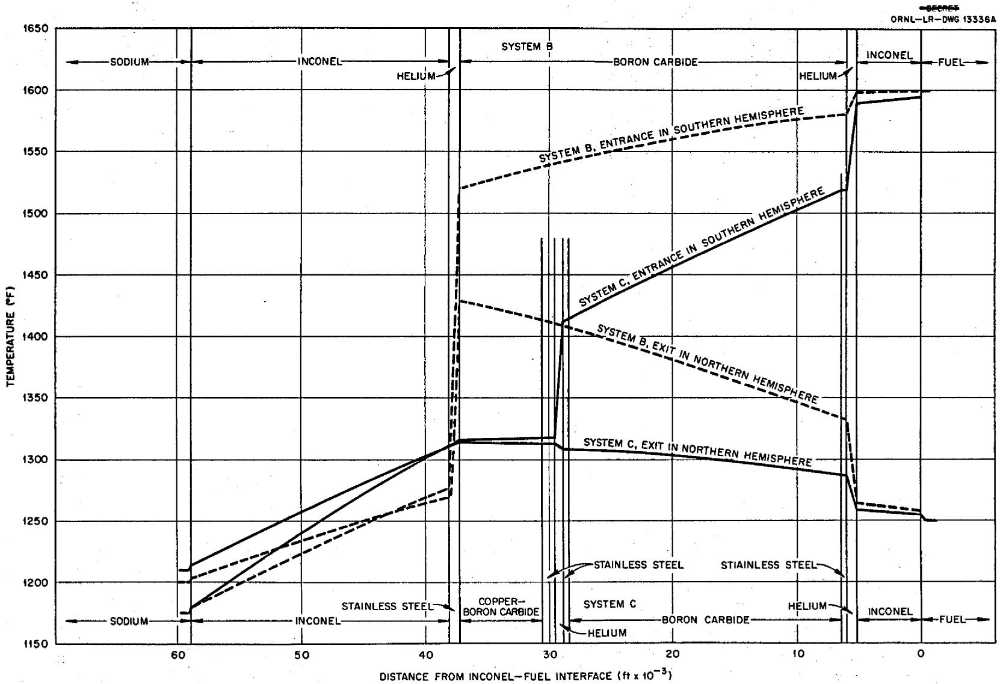  
Fig. 4.1.15. Comparison of Temperature Profiles in Region Beyond the ART Reflector for Various Systems and a Sodium Inlet Temperature of $1175^{\circ}\mathrm{F}$ .

# THERMAL CONDUCTIVITY

W. D. Powers

Two new devices have been built that are being used to determine the conductivities of liquids. In both systems a measured amount of heat flows down through a horizontal sample of known thickness and area. The thickness of the sample may be varied so that contact resistances at the surfaces of the sample can be eliminated.

One device has been fabricated in which the sample is contained within glass. This makes it possible to observe whether any gas bubbles or films are present in the cell at the time measurements are being made. Good agreement with the known thermal-conductivity data for water was obtained. Initial experiments with heat-transfer salts have shown the formation of gas bubbles on the surfaces. The effect of this gas on the thermal conductivity is currently being studied.

One of the difficulties associated with the measurement of thermal conductivity is in knowing

exactly where the heat is flowing. The second device has two heat meters, one directly above and the other directly below the sample. It was assumed that if the heat flow were the same in both meters, the heat flow through the sample would be well established. The original design did not meet this specification and therefore a modification of the system is now being made.

# ELECTRICAL CONDUCTIVITY

N. D. Greene

An electrical conductivity cell has been standardized at high temperatures with molten potassium chloride, and the cell constant so obtained agreed within experimental error with those determined by means of standard, aqueous solutions. Further cell standardization with molten NaCl and $\mathsf{ZnCl}_2$ , as well as refinements of existing measuring techniques, will precede measurements of the conductivities of fluoride melts.

# 4.2. RADIATION DAMAGE

G.W. Keilholtz

# EXAMINATION OF THE DISASSEMBLED MTR IN-PILE LOOP NO.3

A. E. Richt

C. Ellis

W. B. Parsley

E. J. Manthos

R. N. Ramsey

E. D. Sims

Metallographic examination of MTR in-pile loop No. 3 has been completed except for the straight sections of the fuel line. Disassembly of the fuel-circulating pump was found to be more difficult than had been anticipated. The first operation was the removal of the water jacket from the pump bulkhead. The pump was then sectioned by sawing through the bulkhead. During this cutting operation the oil finger below the forward bellows was exposed, and no evidence of oil was seen in the finger. The pump shaft rotated freely and showed no signs of binding after it was freed from the impeller. The pump shaft, forward bellows, bearings, and seals were removed from the bearing housing. The forward bellows was partially filled with oil. The bellows, bearings, and seals were cleaned ultrasonically in perchloroethylene to remove any traces of oil. The face and inside of the forward bellows contained a brittle, amber-colored, amorphous deposit, as shown in Figs.

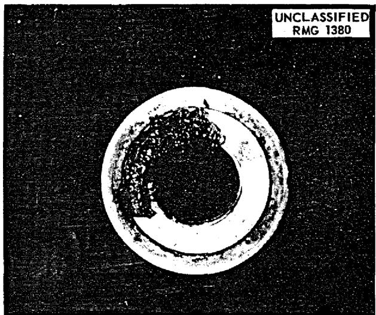  
Fig. 4.2.1. Front Face of Forward Bellows of Fuel Pump from MTR In-Pile Loop No. 3. 1/2X. (Secret with caption)

4.2.1 and 4.2.2. The rear bearings, Fig. 4.2.3, appeared to be in excellent condition.

The neck of the pump, between the pump sump and the heat exchanger, was partially filled with oil; however, no evidences of fuel or $\mathsf{ZrF}_4$ -vapor deposits were found in this region. The slinger assembly was removed and examined, and the slingers were found to be coated with a black, shiny deposit, Fig. 4.2.4. No evidences of fuel or $\mathsf{ZrF}_4$ -vapor deposits were found on the slingers.

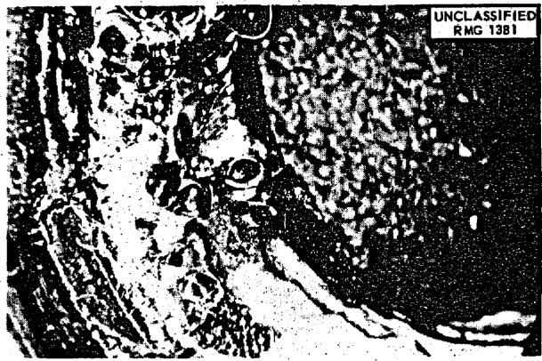  
Fig. 4.2.2. Enlargement of Deposit Shown in Fig. 4.2.1. 2X. Reduced $25.5\%$ .

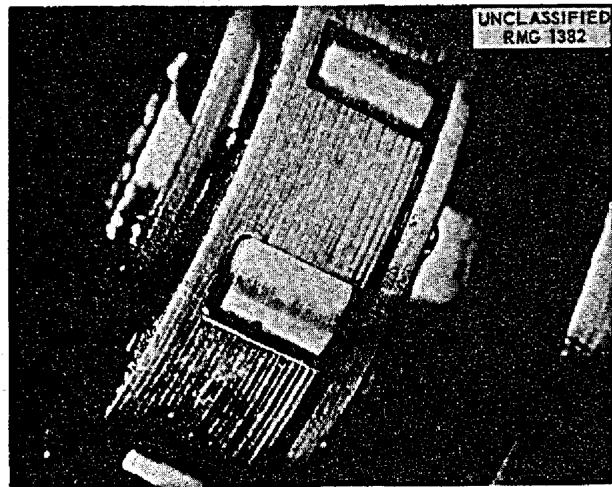  
Fig. 4.2.3. Rear Bearing from MTR In-Pile Loop No. 3 Fuel Pump. 2X. Reduced $14\%$ . (Secret with caption)

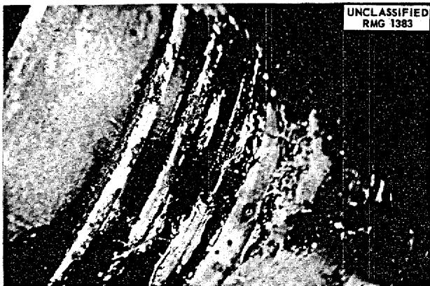  
Fig.4.2.4. Slingers from MTR In-Pile Loop No.3 Fuel Pump. Note shiny, black deposit. 2X. Reduced $24.5\%$ . (Secret with caption)

The fuel in the pump appeared to be inhomogeneous in that it was made up of two phases. One phase was green and had the normal appearance of the fuel mixture used, and the other phase was black. Samples of both phases were obtained for chemical analyses. The two halves of the pump sump, with the fuel still present, are shown in Fig. 4.2.5. The impeller showed no evidence of erosion, Figs. 4.2.6 and 4.2.7.

Charcoal samples were obtained from two of the fission-gas adsorption traps in the purge system. A black deposit that was found around the inlet

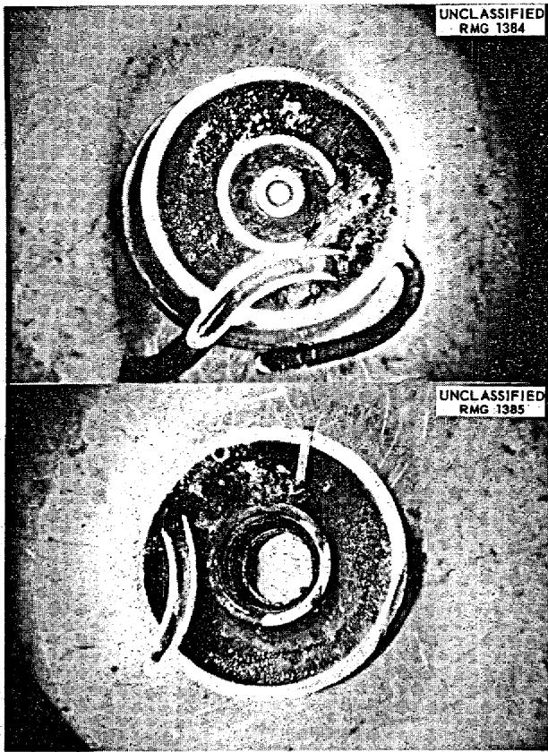  
Fig. 4.2.5. Impeller (Top) and Slinger (Bottom) Halves of Pump Sump from MTR In-Pile Loop No.3 Fuel Pump. 1/2X. Reduced $23.5\%$ . (Secret with caption)

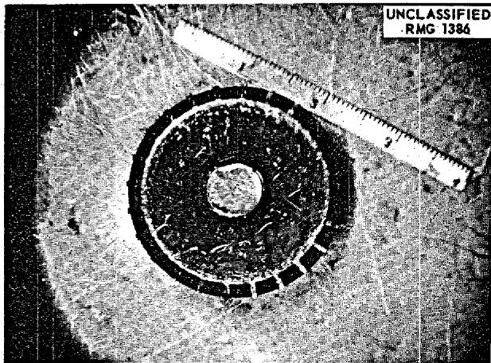  
Fig. 4.2.6. Front Face of Impeller from MTR In-Pile Loop No. 3 Fuel Pump. 1/2X. Reduced $15\%$ . (Secret with caption)

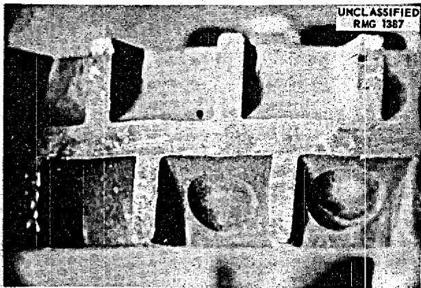  
Fig. 4.2.7. Side View of Impeller from MTR In-Pile Loop No.3 Fuel Pump. 2X. Reduced $23.5\%$ . (Secret with caption)

hole to one of the traps is shown in Figs. 4.2.8 and 4.2.9. The walls of the trap on the inlet side also showed a black deposit around the sides for a depth of approximately 1 in., as shown in Fig. 4.2.10.

MTR in-pile loop No. 4 has been sectioned at NRTS, and the active portion is being shipped to Oak Ridge. Disassembly of the loop will begin as soon as the hot cell equipment has been repaired and checked out. Priorities have been established for the examination of sections that were removed from the ARE, and these exami

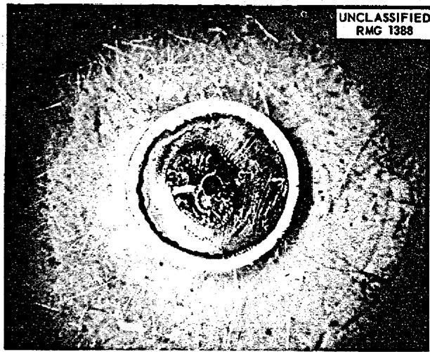

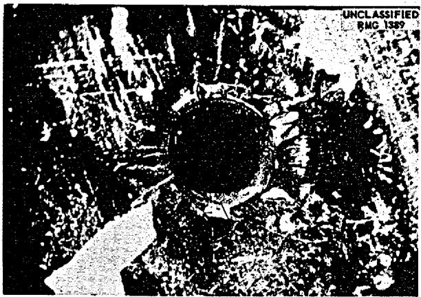  
Fig. 4.2.8. Inlet Side of Fission-Gas Adsorption Trap from MTR In-Pile Loop No. 3. 1/2X. Reduced $15\%$ . (Secret with caption)   
Fig. 4.2.9. Enlargement of Deposit Shown in Fig. 4.2.8. 2X. Reduced $28.5\%$ .

nations will proceed as rapidly as cell time allows.

# INVESTIGATIONS OF MATERIALS REMOVED FROM MTR IN-PILE LOOPS NOS. 3 AND 4

W. E. Browning

C. C. Bolta

R. P. Shields

Operation of MTR in-pile loop No. 3, described previously,2 was terminated because a plug formed somewhere in the purge system. Therefore a postoperational inspection of the fission-gas adsorption traps was undertaken. A gas sample was obtained by purging the traps for 2 hr with helium and collecting the effluent fission gas in two refrigerated charcoal traps. A radioassay of the gas is to be made. The purged traps were sectioned, and samples of the charcoal adsorber and tubing were collected for radioassay. An extensive black deposit was observed around the inlet to one trap, and a thin brownish film was present around the inlet to the second trap. These deposits were photographed (Figs. 4.2.8, 4.2.9, and 4.2.10) and then collected for analysis. The results of the analyses of the samples are not yet available, but it is suspected that oil or decomposition products of oil entered the traps from the fuel-pump bearing housing and sump and caused

On assignment from Pratt & Whitney Aircraft.   
2L. P. Carpenter et al., ANP Quar. Prog. Rep. Dec. 10, 1955, ORNL-2012, p 27.

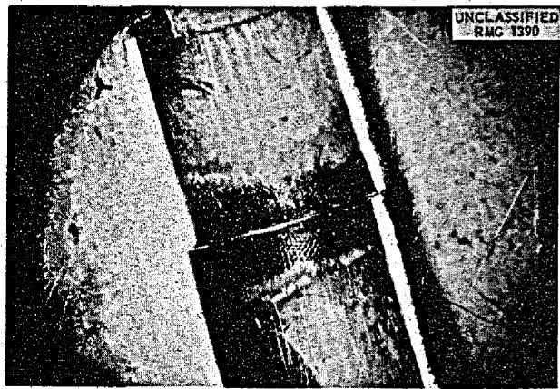  
Fig. 4.2.10. Inner Walls of Inlet Side of Fission-Gas Adsorption Trap from MTR In-Pile Loop No. 3 Showing Depth of Formation of Black Deposit. 1/2X. Reduced $25.5\%$ . (Secret with caption)

a plug when they came in contact with the refrigerated trap inlet.

A study of an apparent chemical change brought about in the fuel during operation of MTR in-pile loop No. 3 is also being conducted. Determinations are being made of the nickel, chromium, and iron content of the fuel, and radiochemical analyses of the fuel are nearly complete. The analysis of the foreign materials taken from the pump is partially completed.

The fission-gas adsorption traps from MTR in-pile loop No. 4 have been received, and analyses of copper tubing sections and of acetone washes of the carbon adsorber are under way.

# CREEP AND STRESS-CORROSION TESTS

J. C. Wilson

W.W.Davis

A. S. Olson

N. E. Hinkle

J. C. Zukas

A heat transfer test of the stress-corrosion apparatus designed for operation in HB-3 of the LITR was made in the LITR to check the heating to be expected from the fuel. It was not possible to reach the desired temperature of $1500^{\circ}\mathrm{F}$ with the $2.5\mathrm{g}$ of the fuel mixture (No. 41) $\mathrm{NaF - ZrF_4 - UF_4}$ (63-25-12 mole %) used in this test. A bench mockup which reached the same temperature as that attained in the reactor indicated that only about 70 w of heat was generated by fission. About 200 w of heating was expected from this fuel at the depressed flux measured in HB-3 of the LITR. For the next test a fused salt with more uranium will be used, or the number of conductive fins will be reduced.

Three more tube-burst stress-corrosion specimens were exposed to radiation in the LITR, and two more bench tests were completed. The irradiated specimens failed after 164, 260, and 285 hr at $1500^{\circ}\mathrm{F}$ with a maximum stress of 2000 psi, whereas one specimen bench-tested under similar test conditions had not failed in about 935 hr. The other bench test was made at $1450^{\circ}\mathrm{F}$ , 50 deg lower, and the specimen ruptured after only 500 hr under stress.

Tubing stock of the type to be used in ART NaK-to-air radiators is expected to be available soon for use in tube-burst and stress-corrosion

experiments. Components for the MTR tube-burst test apparatus are being fabricated.

One of the specimens tested previously in the MTR tensile-creep-test apparatus4 ruptured outside the gage length, and therefore the postirradiation elongation measurement was made on this specimen. The elongation was $1.7\%$ after 760 hr at $1500^{\circ}\mathrm{F}$ in helium; this value is higher than was expected. The corresponding bench tests have still not been completed, because experimental difficulties (mainly leaks in the bellows) required that the apparatus be rebuilt.

A pneumatic stressing device for bench and in-pile tensile-creep tests was built and is being leak tested. Two pneumatic extensometers for use with this device have been tested. The pneumatic device will provide a powerful, compact means for stressing creep specimens with loads as great as 10,000 lb.

Parts for a stress-relaxation machine are being built. A pneumatic valve operator has been adapted for stressing the specimen, and a pneumatic strain-controlling system is being developed.

# MTR STRESS-CORROSION APPARATUS

J. C. Wilson

C. D. Baumann W. E. Brundage

The stress-corrosion equipment formerly designated as the alternate stress-corrosion apparatus was modified to change the platinum heater to a simpler, helically wound heater made from molybdenum wire. The design, described previously, is completed, and fabrication and assembly have been partially completed on a model with which heat transfer tests will be made in the LITR.

# DUCTILITY OF NICKEL-BASE ALLOYS

J.C.Wilson T.C.Price

An investigation is being made of the factors that govern the ductility of nickel-base alloys. As a part of this study, tensile tests were run on Inconel and Nichrome V at strain rates of 0.002 and 0.2 in./min at temperatures ranging from 500 to $1400^{\circ}\mathrm{F}$ . At no temperature was any abrupt

decrease in ductility observed in either alloy. The ductility of Inconel remained constant between 800 and $1100^{\circ}\mathrm{F}$ at the slower strain rate and between 800 and $1200^{\circ}\mathrm{F}$ at the faster strain rate. At higher temperatures the ductility steadily increased. The ductility of Nichrome V decreased steadily as the temperature was increased from 800 to $1400^{\circ}\mathrm{F}$ .

Both alloys showed stress fluctuations at both strain rates, the fluctuations being more noticeable at the slower strain rate, but this may have been the result of the inadequacy of the recording system at high speeds. In the tests on Inconel the stress fluctuations were present at temperatures from 500 to $1200^{\circ}\mathrm{F}$ and were largest in number and amplitude between 600 and $950^{\circ}\mathrm{F}$ . The lower temperature limit of these fluctuations has not yet been determined for Nichrome V, but the upper limit seems to coincide with that of Inconel.

Specimen's of Monel, Inconel, and Nichrome V have been prepared for testing in the LITR (and later in the MTR) to determine the effect of irradiation on ductility. Out-of-pile tests will be made on the Hastelloys.

# EFFECT OF RADIATION ON STATIC CORROSION OF STRUCTURAL MATERIALS BY FUSED-SALT FUELS

W.E.Browning H.L.Hemphill

The study of the effect of radiation on the corrosion of Inconel capsules containing static fused-salt fuels was continued. Two additional Inconel capsules containing the fuel mixture (No. 30) NaF-ZrF4-UF4 (50-46-4 mole %) were irradiated in the MTR for six weeks each at $1500^{\circ}\mathrm{F}$ at a power density of approximately $3.5\mathrm{kw/cm}^3$ . Two other Inconel capsules containing the fuel mixture (No. 44) NaF-ZrF4-UF4 (53.5-40-6.5 mole %) are being irradiated at $1500^{\circ}\mathrm{F}$ at a power density of approximately $6\mathrm{kw/cm}^3$ .

Further mockup tests were run on Hastelloy B capsules under simulated MTR conditions. A method was developed for mounting thermocouples on the capsules without damaging the chromium-nickel plating required to protect the capsule from the atmosphere. Hastelloy B capsules are being prepared for bench tests and for MTR irradiation.

They will be filled with an NaF-KF-LiF-UF4 fuel mixture containing approximately 25 wt % enriched uranium and LiF enriched in Li7.

# LITR VERTICAL IN-PILE LOOP

W. E. Browning

D.E.Guss H.E.Robertson

M. F. Osborne R. P. Shields

A vertical in-pile loop, which was essentially the same as the one operated previously, was installed in the LITR and put into operation; however, the pump stalled when the reactor was started. By reducing the pump temperature it was possible to operate the loop with the reactor at 500 kw; but at higher power levels the temperature drop in the loop was great enough to freeze the fuel in the cold leg. The pump stalled permanently during an effort to increase the pump temperature gradually so that the reactor could be brought to full power. The specifications for the power characteristics of the loop were: total power, 11.5 kw; maximum specific power, 577 w/cm³; dilution factor, 7.64.

While the cause of the pump failure cannot be precisely determined until the loop has been examined, it is known, from the sounds emanating from the pump and heard through a microphone, and from variations in electric power demands of the motor, that contact of moving solid parts overloaded the motor.

The parts that had already been fabricated for three additional loops will be changed to eliminate most of the possible causes of pump failure. The changes will include a shorter, more rigid impeller shaft and improved bearings. Also, pump models are being tested to determine the effect of increasing the clearance around the pump impeller. When these tests are completed, existing parts will be modified and assembled for bench and in-pile tests.

Although failure of the pump prevented operation of the loop, the experiment provided a test for the reliability of other components. Thermocouples, heaters, safety circuits, the temperature control system, the tachometer, the lead wires, and the entire instrumentation system performed satisfactorily. Platinum-platinum-rhodium thermo

couples were used on this loop to eliminate the severe oxidation that occurred in previous loop assemblies where the Chromel-Alumel thermocouple leads passed through heaters. The change in thermocouple materials necessitated a redetermination of thermocouple corrections.

Three conditions contributing to errors in temperature measurement were investigated for the platinum-platinum-rhodium thermocouples used. First, the thermoelectric output of the couples might be changed because of incompatibility with Inconel; second, the junction of the thermocouple is cooler than the Inconel surface to which it is attached because of air cooling; third, the outside surface of the Inconel is cooler than the surface in contact with fuel because of the heat flux through the wall.

A compatibility test was run in which the platinum-platinum-rhodium thermocouples were welded to Inconel and heated for 1000 hr at $900^{\circ}\mathrm{C}$ . The thermocouples were found to be mechanically sound after this treatment, and their absolute calibration has changed not more than $1.2^{\circ}\mathrm{C}$ .

Tests were also run to determine the temperature correction necessary because of air cooling of the thermocouple bead. A segment of the loop was mocked up in full scale, with electrical heating

instead of fission heating, and the thermocouples were mounted on the fuel tube in the same way that they are mounted on the loop. Surface temperatures were observed, with an optical pyrometer, through a quartz window and compared with the thermocouple readings. These tests were similar to those reported previously,[10] which yielded different results for different thermocouple materials. The differences are no doubt due to bead geometry differences that result from melting-point differences during thermocouple fabrication. The results of these tests are shown for six thermocouple assemblies in Fig. 4.2.11. For the operating conditions of the LITR vertical in-pile loop the correction amounts to $15 \pm 10^{\circ}\mathrm{C}$ .

The correction for the differential temperature through the wall of the loop was calculated by using theoretical heat transfer relationships in the loop and experimental flux data obtained from previous loop operation in the LITR. The heat

10W. E. Browning, G. W. Keilholtz, and H. L. Hemphill, ANP Quar. Prog. Rep. March 10, 1955, ORNL-1864, p 146.

11G. W. Keilholtz et al., ANP Quar. Prog. Rep. Sept. 10, 1955, ORNL-1947, p 164.

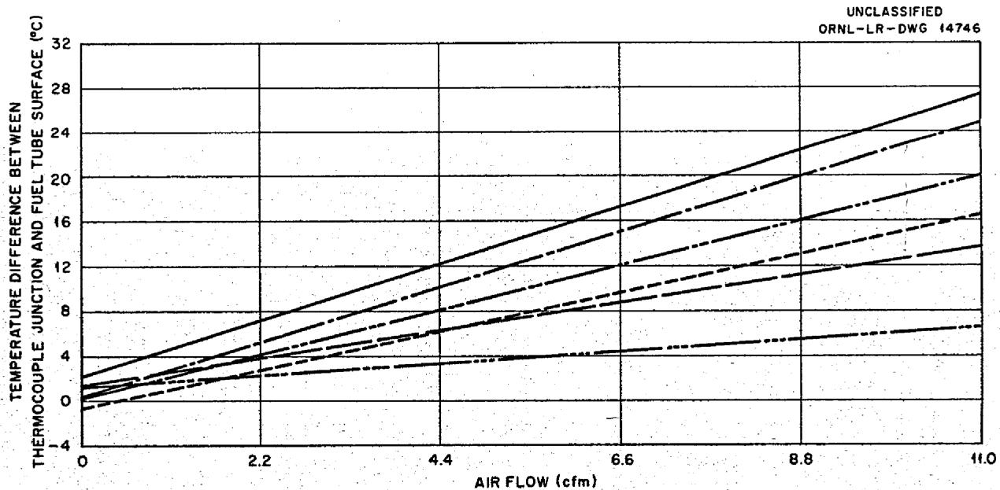  
Fig. 4.2.11. Temperature Differences Between Six Thermocouple Junctions and Outer Surface of Inconel Fuel Tube as a Result of Air Flow Around the Thermocouple Junction.

transfer calculations of Robinson and Weekes $^{12}$ were modified to apply to the presently planned position for the loop in the LITR by using certain simplifying assumptions. The tip of the loop is to be 1.5 in. below the center line of the reactor. This is more than 4.5 in. below the position of maximum flux. The flux measured near the fuel tube in the previously operated loop $^{11}$ was taken as the depressed flux for that loop. It was assumed that the flux depression was the same for corresponding parts of the present loop. The difference in shape of the flux profile for the two loop positions was ignored in calculating the fuel tube wall temperature differential. Fission-product poison contributions to the macroscopic cross section of the fuel were assumed to be negligible.

The transmission coefficient for neutrons in the fuel was determined from work reported by Holmes,13 and it was used in conjunction with the flux distribution along the loop, as shown in Fig. 4.2.12, to determine the total loop power.

Finally, to find the temperature differential through the Inconel fuel tube wall, the curves of heat transfer variations along the loop designated Mark VIII in the work of Robinson and Weekes12 were modified for the higher total power of the loop being investigated. A plot of the calculated temperature differential through the tube wall vs the position on the loop for proposed operating conditions is presented in Fig. 4.2.13. The maximum combined temperature corrections for all three errors totaled $35^{\circ}\mathrm{C}$ .

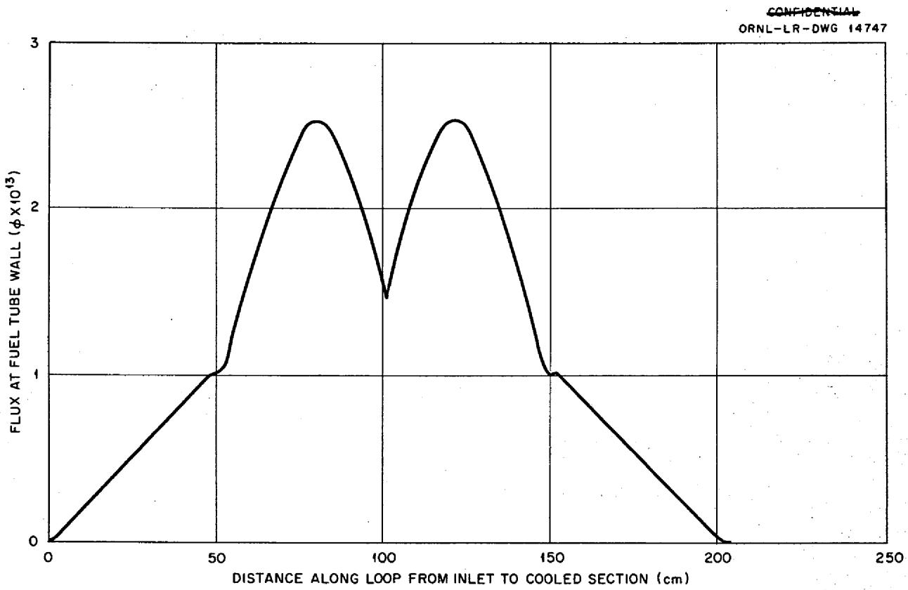  
Fig. 4.2.12. Calculated Profile of Flux at Fuel Tube Surface Along the LITR Vertical In-Pile Loop.

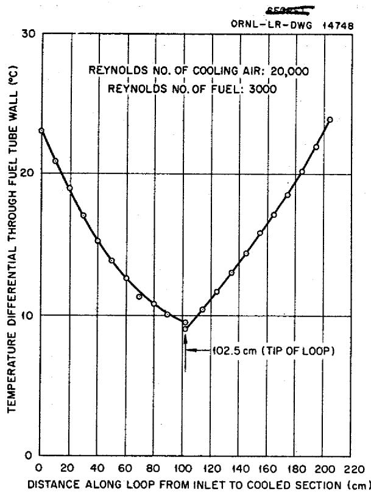  
Fig. 4.2.13. Plot of Calculated Temperature Differential Through the Fuel Tube Wall as a Function of the Distance from the Fuel Inlet of LITR Vertical In-Pile Loop.

# FURTHER DESIGN CALCULATIONS FOR LITR VERTICAL IN-PILE LOOP

M. T. Robinson

F. P. Green J. F. Krause

The method described previously $^{12}$ has been used to estimate cooling-air requirements and fuel-temperature profiles for a new configuration of the miniature vertical in-pile loop. The loop is physically identical to the Mark VIII loop described previously, $^{12}$ but it is to be inserted to the bottom of the core of position C-46 of the LITR instead of reaching only to the position of maximum thermal-neutron flux. The thermal-neutron flux used was that measured $^{15}$ in position C-46 and extrapolated to the bottom of the lattice by re

flection of the measured flux in the plane of its maximum value. The computations were carried out on the Reactor Controls Computer according to the technique previously described, except that the flux function was generated electronically instead of mechanically.

Calculations were made for the fuel mixture (No. 44) NaF-ZrF $_4$ -UF $_4$ (53.5-40-6.5 mole %) contained in Inconel in the new position and for the fuel mixture (No. 107) NaF-KF-LiF-UF $_4$ (11.2-41-45.3-2.5 mole %) contained in Hastelloy B in both positions. The physical property data used for air, for Inconel, and for the zirconium-bearing fuel mixture were the same as those used previously. The data for the alkali-metal fuel and Hastelloy B are given below:

$$
\text {D e n s i t y} ^ {1 7} \mathrm {g} / \mathrm {c m} ^ {3} \tag {2.09}
$$

$$
\text {S p e c i f i c h e a t o f f u e l ,} ^ {1 8} \mathrm {w} \cdot \sec / \mathrm {g} \cdot^ {\circ} \mathrm {C} \tag {2.28}
$$

$$
\text {V i s c o s i t y} ^ {1 9} \mathrm {g} / \mathrm {c m} \cdot \sec \tag {0.022}
$$

$$
\text {T h e r m a l} ^ {2 0} \tag {0.035}
$$

$$
\mathrm {w} / \mathrm {c m} ^ {\circ} \mathrm {C}
$$

$$
\begin{array}{l} \text {T h e r m a l c o n d u c t i v i t y o f H a s t e l l o y B ,} ^ {2 1} \\ \mathrm {w / c m ^ {\circ} C} \end{array} \quad 0. 1 1 3
$$

As before, the depression of the thermal-neutron flux because of the presence of the loop was neglected.

The results of the calculations are summarized in Table 4.2.1. It is shown that, in spite of the greater length of the irradiated loop in the "deep" position, the fuel temperature differential is less than that in the position of maximum flux. The principal result of the change in position of the loop is a substantial decrease in the dilution

TABLE 4.2.1. SOME CALCULATED DESIGN PARAMETERS OF THE VERTICAL IN-PILE LOOP DESIGNED FOR OPERATION IN POSITION C-46 OF THE LITR  

<table><tr><td rowspan="2">Fuel</td><td rowspan="2">Loop Position</td><td colspan="2">Reynolds Numbers</td><td rowspan="2">Fuel Temperature Differential (°C)</td><td rowspan="2">Maximum Air Temperature (°C)</td><td rowspan="2">Air Flow Rate (cfm)</td></tr><tr><td>Fuel</td><td>Air</td></tr><tr><td rowspan="8">NaF-ZrF4-UF4(53.5-40-6.5 mole %)</td><td rowspan="4">Shallowa,b</td><td>1,500</td><td>32,000</td><td>135</td><td>380</td><td>41</td></tr><tr><td>3,000</td><td>22,000</td><td>65</td><td>410</td><td>30</td></tr><tr><td>6,000</td><td>20,000</td><td>33</td><td>510</td><td>28</td></tr><tr><td>10,000</td><td>20,000</td><td>33</td><td>520</td><td>28</td></tr><tr><td rowspan="4">Deepc</td><td>1,500</td><td>74,000</td><td>103</td><td>250</td><td>100</td></tr><tr><td>3,000</td><td>50,000</td><td>56</td><td>450</td><td>70</td></tr><tr><td>6,000</td><td>44,000</td><td>30</td><td>530</td><td>60</td></tr><tr><td>10,000</td><td>42,000</td><td>17</td><td>550</td><td>59</td></tr><tr><td rowspan="8">NaF-KF-LiF-UF4(11.2-41-45.3 mole %)</td><td rowspan="4">Shallowa</td><td>1,500</td><td>19,000</td><td>125</td><td>450</td><td>27</td></tr><tr><td>3,000</td><td>16,000</td><td>65</td><td>550</td><td>23</td></tr><tr><td>6,000</td><td>15,000</td><td>33</td><td>580</td><td>21</td></tr><tr><td>10,000</td><td>15,000</td><td>20</td><td>600</td><td>21</td></tr><tr><td rowspan="4">Deepc</td><td>1,500</td><td>32,000</td><td>94</td><td>380</td><td>45</td></tr><tr><td>3,000</td><td>26,000</td><td>50</td><td>410</td><td>36</td></tr><tr><td>6,000</td><td>24,000</td><td>27</td><td>460</td><td>33</td></tr><tr><td>10,000</td><td>23,000</td><td>16</td><td>480</td><td>32</td></tr></table>

Tip of loop at position of maximum thermal-neutron flux,   
$b_{\text{Based on earlier calculations.}}$ 12   
Tip of loop at bottom of active lattice.

factor from about 11 in the "shallow" position to about 6 in the "deep" position.

# FAST-NEUTRON DETECTORS

# D. Binder

A great variety of radiation-damage studies require a knowledge of the fast-neutron flux of the reactor being used for the irradiations. For instance, changes in the mechanical and electrical properties of metals and insulators are dependent on the shape of the neutron-energy spectrum. As the neutron energy increases, the number of atoms displaced increases until a critical energy is reached at which the effect saturates.[22] Therefore, it is essential to know the number of neutrons per unit energy up to about five times the critical energy and the integrated flux above this energy.

The energy spectra in two types of reactors from thermal to 100 ev or 1 kev and from 0.7 to 8 MeV

have been investigated by Trice.23,24 For the remaining investigation, that is, the 1-kev to 0.7-Mev region, a detector must be developed with which to study the variation of displacements with neutron energy. The development of useful detectors is dependent on a knowledge of this variation, and vice versa. The first step therefore is to calculate a known case based on simple assumptions.

Germanium was selected as the material to be studied because it is sensitive to neutrons and the relationship between the solid-state effect and the number of displacements is known. From the work of Cleland et al.25 at low temperatures, it is known that five electron traps are introduced per

"fast" neutron in a graphite reactor and that there are two traps per displacement. The question is whether it is possible to calculate the number of displacements on the basis of a reasonable graphite reactor spectrum and to achieve approximate agreement with the experimental result of 2.5 displacements per fast neutron. (A fast neutron is defined by Cleland et al. to be a neutron with energy greater than that required to displace an atom.)

For the calculation the method of Kinchin and Pease $^{22}$ was modified to include a spectrum which is the sum of $1 / E$ distributions extending to each element of a fission spectrum. $^{26}$ The agreement between the calculation and the experimental result was within a factor of 4. The spectrum and the variation of displacements with energy are then roughly correct, or at least there are compensating errors.

In order to test the variation with neutron energy alone, it is planned to use neutron sources of known energy. The flux from these sources is reduced by factors of $10^{3}$ to $10^{5}$ from graphite reactor fluxes, but the sensitivity of pure germanium allows for experiments even at these low levels. Two sources will be used: a uranium converter plate in a thermal column and an antimony-beryllium source. The converter plate gives a pure fission spectrum, and, when used in the slanting animal tunnel of the ORNL Graphite Reactor, emits $2 \times 10^{8}$ fission neutrons/cm $^{2}$ -sec near the center of the plate. A first irradiation of $5.8 \times 10^{13}$ neutrons/cm $^{2}$ introduced $1.9 \times 10^{15}$ acceptors/cm $^{3}$ in a germanium crystal. This experimental value agrees to within a factor of 2 with the calculated value of $3.4 \times 10^{15}$ .

The result of the first experiment indicates that the present assumptions on the variation of displacements with neutron energy are roughly correct. This will be checked by further irradiations with fission neutrons and with 30-kev neutrons from the antimony-beryllium photoneutron source. More adequate neutron monitoring is to be used for future germanium irradianations. This may lead to a complete understanding of displacements in at least one solid-state reaction.

# VISCOMETER FOR REMOTE MEASUREMENTS OF THE VISCOSITY OF IRRADIATED FUSED-SALT FUELS

C. C. Webster

A viscometer was designed for use in a hot cell which will be capable of measuring the viscosities of irradiated fused-salt fuels at temperatures up to about $750^{\circ}\mathrm{C}$ in an inert (helium) atmosphere within a shielded cell. The apparatus consists of two vessels, 6 in. long, 1.25 in. OD, mounted in a vertical position, with 2 in. between centers. An Inconel tube 3 ft long and bent into a U-shape connects the bottoms of the vessels. A small ferromagnetic ball travels with the liquid through the tube, and the position of the ball is detected at two points on each leg of the U-tube by electronic equipment.

Swagelok connections are provided at the top for inserting liquid-level probes and for allowing helium pressure to be applied on the surface of the liquid in either vessel. The whole apparatus is inserted into a 4-in.-dia vertical furnace with an 18-in. controlled-temperature heated zone. End heaters are provided to control the heat loss out the ends of the furnace.

# EFFECTS OF RADIATION ON ELECTRICAL COMPONENTS

J.C.Pigg C.C.Robinson27

# Insulation

In previous experiments[28,29] on the effect of radiation on electrical insulation the insulated wire to be irradiated was placed in the reactor as if it were a sample lead. Care was taken to ensure that possible leakage paths from the central conductor to the shield were as long as possible. Whenever practicable, the end of the insulation that was in the reactor was sealed over at the end of the central conductor. However, the possibility of conduction by end surface contamination and ionization of the air still existed when there was no seal or when the seal was defective.

In order to determine whether such leakage was important in the experiments previously conducted,

two samples were taken from the same spool of Teflon-insulated wire. One sample was the usual length, 25 ft long, and the second was 50 ft long. The two samples were installed at the same time in hole 50-N of the ORNL Graphite Reactor. The 25-ft Teflon-insulated sample was installed in the same manner as in the previous experiments, with no seal at the end. The 50-ft sample was doubled back on itself so that both ends of the wire were outside the reactor. The leakage between the shield and the central conductor was measured to be twice as large for the 50-ft sample as for the 25-ft sample. The photo-emf measurements on the two wires were identical. It can therefore be concluded that the radiation effects described previously[28] were due to bulk properties rather than to end surface conduction or to air ionization.

# Barriers

A 1N38A germanium point-contact rectifier was exposed in a $2 \times 10^{6}$ -r/hr Co $^{60}$ gamma-ray source, and the forward and reverse currents were measured at 1-v bias. The behavior of the current is shown in Fig. 4.2.14. These data are in qualitative agreement with those obtained by Young. $^{30}$ The increase in reverse current, followed by a return toward its initial value, is an effect not found in reactor irradiation experiments because it occurs at low total damage. As may be seen from the change in forward current, the effect illustrated in Fig. 4.2.14 would have occurred before the sample

30R. C. Young, Gamma Radiation of Crystal Diodes, Wright Air Development Center, WCRT-TN-54-255 (Dec. 28, 1954).

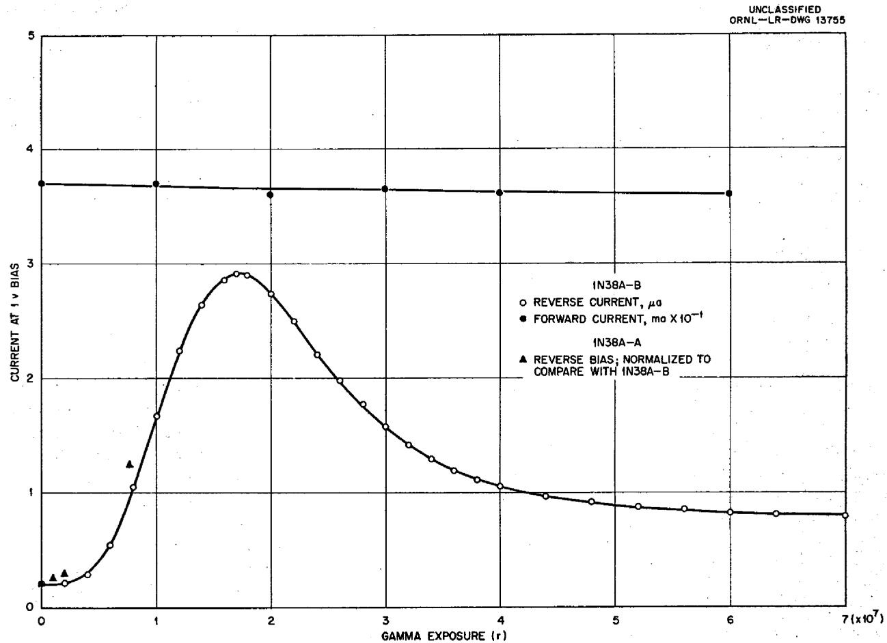  
Fig. 4.2.14. Effect of Gamma Radiation on Conduction Through a Barrier. Germanium point-contact rectifier IN38A-B exposed to $2 \times 10^{6} \, \text{r/hr}$ from $\mathsf{Co}^{60}$ source; IN38A-A exposed to $2.5 \times 10^{5} \, \text{r/hr}$ from $\mathsf{Co}^{60}$ source.

reached thermal equilibrium in an in-pile experiment. Whether or not the effect does result from neutron irradiation has not yet been determined.

A series of exposures were also made in a $5 \times 10^{4}$ -r/hr Co $^{60}$ source, and the voltage-current characteristics of the rectifier were measured after the samples were removed from the source. The change in the characteristic curve can be seen in Fig. 4.2.15. There is little change in the forward curve, which is in agreement with the data in Fig. 4.2.14. The current at 1-v reverse bias was normalized to make the preirradiation value coincide with that of the sample exposed in the $2 \times 10^{6}$ -r/hr Co $^{60}$ source. The normalized data are shown in Fig. 4.2.14.

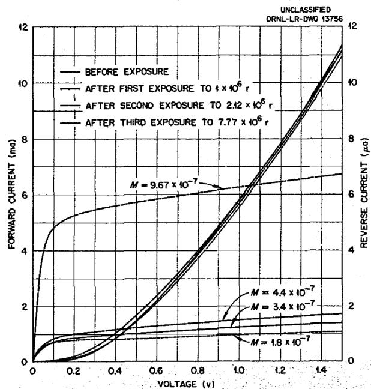  
Fig. 4.2.15. Effect of Gamma Radiation on Voltage-Current Characteristic of Germanium Point-Contact Rectifier IN38A-A at $20^{\circ}\mathrm{C}$ . The M values are the slopes of the lines.

The forward characteristic corresponds to the voltage-current behavior of the emitter of a transistor. The reverse curve corresponds to the collector characteristic of a transistor. It may be seen in Fig. 4.2.15 that, although the emitter characteristic is little changed, the collector characteristic changes drastically both in magnitude and slope. The magnitude of the current at $l$ - $v$ bias changed by a factor of about 6, and the slope

changed by a factor of about 5.3. The changes in the characteristics are similar to those caused by neutron irradiation.[31]

A series of transistors were irradiated in the circuit shown in Fig. 4.2.16 to measure the amplification of the unit during, as well as before and after, irradiation. The series resistances in the emitter and in the collector circuit were changed to match the unit being considered in each experiment. Provisions were made to switch from grounded-emitter to grounded-base circuitry so that both types of circuitry could be studied simultaneously with the same unit. Exposures were made both in Co60 gamma-ray sources and in the ORNL Graphite Reactor.

The changes in the collector current at a 2-v bias and in the amplification of a Minneapolis-Honeywell H-2 power transistor as a function of gamma irradiation may be seen in Fig. 4.2.17. The collector, base, and emitter voltages were adjusted to the original values before each reading. Hence, the changes in amplification were due to changes in characteristics and not to changes in operating voltages. It may be seen that the collector current and the amplification were essentially the inverse of each other. Whether the change in amplification was due to a change in the slope of the collector characteristic, a change in separation of the collector curves, or a change in impedance matching has not yet been determined.

The changes in amplification of two Minneapolis-Honeywell power transistors as a function of irradiation in hole 51-N of the ORNL Graphite Reactor are shown in Fig. 4.2.18. These curves illustrate the same type of behavior as that observed for RCA transistor No. 1241.[32] The temporary increase in amplification observed previously in RCA transistor No. 1266 was not noted. Again, the flux level was such that this region of the curve would have been traversed before thermal equilibrium was obtained in the in-pile experiment.

# Influence of an Electrical Field on Diffusion of Interstitial Atoms

When germanium is bombarded by high-energy neutrons, the recoils from the neutron-atom collision and secondary collisions of the original

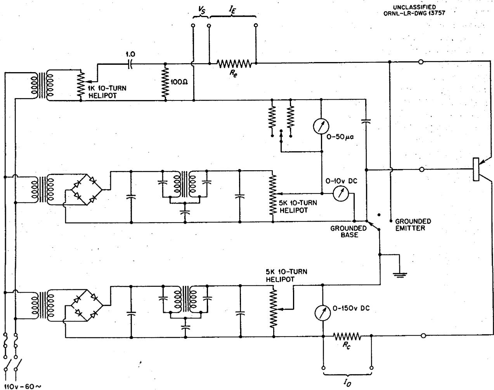  
Fig. 4.2.16. Transistor Test Circuit.

atom as it travels through the lattice result in the formation of lattice vacancies and interstitial atoms. Since the germanium lattice is fairly open, the interstitial atoms can diffuse readily through the crystal. Because of the high dielectric constant of germanium, the interstitial atom is ionized at room temperature, and hence its diffusion should be influenced by the presence of an electric field. Fields of the order of tenths of a volt per micron are available in the barrier region of a diode, and the conductivity of the diode is extremely sensitive to changes in carrier concentration in the region of the barrier.

A 1N38A point-contact germanium rectifier was exposed for 5 min in hole 51-N of the ORNL Graphite Reactor. After removal from the reactor the rectifier was biased in the forward direction

at 0.7 v in order to remove the potential gradient in the barrier region. The measured current was low because of radiation damage. The unit was then placed in an oil bath to maintain a constant temperature of about $25^{\circ}C$ for six days. At the end of the six-day period there had been no observable change in the current passing through the sample at 0.7-v bias. The bias was removed for 2 hr, then restored. When the bias had been restored, it was noted that the current had increased by about an order of magnitude. After eight days in the biased condition, the current had not changed.

When the bias was removed, an electric field was established at the barrier to cause the relative interstitial atoms to diffuse from the barrier region. This removal of interstitial atoms from the $p$ -type

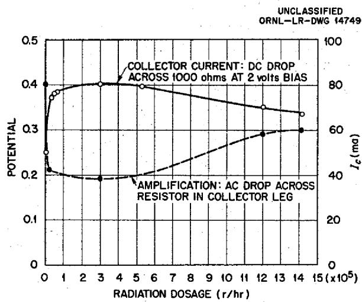  
Fig. 4.2.17. Effect of Radiation on Collector Current and Amplification of a Minneapolis-Honeywell H-2 Power Transistor Irradiated in Gamma-Ray Source of $2.57 \times 10^{5} \mathrm{r/hr}$ .

side of the barrier results in annealing out the type of damage which tends to make the $p$ -type side less $p$ -type and transporting it to the $n$ -type side. Hence both sides of the barrier are annealed toward their initial condition and the forward current increases toward its initial value.

# RADIATION DAMAGE TO BORON CARBIDE

O. Sisman

J. G. Morgan

The study of radiation effects on $\mathsf{B}_4\mathsf{C}$ , initiated previously,[33] was completed. The apparatus used for the irradiation of samples in the LITR was described in the previous report. The first samples irradiated were hot-pressed, high-density $\mathsf{B}_4\mathsf{C}$ , supplied by the Norton Company, and slip-cast $\mathsf{B}_4\mathsf{C}$ bonded with SiC, supplied by The Carborundum Company. Four other types of $\mathsf{B}_4\mathsf{C}$ have now been irradiated. The results of spectrographic analyses

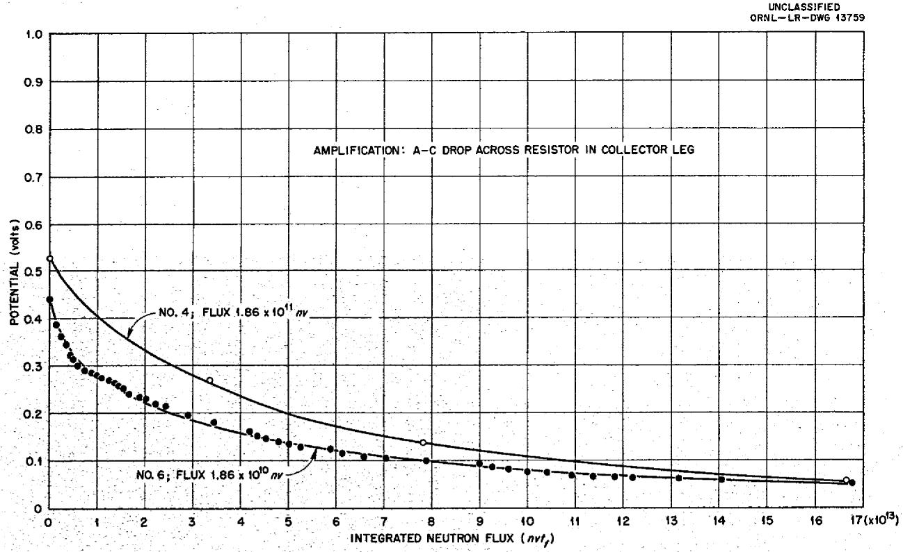  
Fig. 4.2.18. Changes in Amplification of Two Minneapolis-Honeywell H-2 Power Transistors as a Function of Integrated Fast-Neutron Exposure.

of the six types of $\mathsf{B}_4\mathsf{C}$ are presented in Table 4.2.2, and the results of examinations of 20 irradiated samples of the six types are given in Table 4.2.3.

The four types of $\mathsf{B}_4\mathsf{C}$ irradiated during this quarter are described below:

1. The Norton Company supplied low-density, high-purity samples that had been hot-pressed from 325 mesh, and finer, powder and fired at above $2000^{\circ}\mathrm{C}$ . The boron content of this material was $62.4 \pm 0.4$ wt%. These bodies were hard, strong, and impervious.   
2. The Norton Company also supplied low-density, technical-grade samples that had been hot-pressed from 60-mesh, and finer, material and fired at above $2000^{\circ}\mathrm{C}$ . These bodies were hard, strong, and nearly impervious, and they contained $62.4 \pm 0.4$ wt % boron.   
3. The Carborundum Company supplied tiles (No. 1) cast from a basic mixture of $90\%$ B4C grains and $10\%$ 200-mesh silicon metal. The cast bodies were fired at $1350^{\circ}C$ and refired at $2000^{\circ}C$ . They were porous and friable, and they contained $64.7 \pm 0.5$ wt % boron.   
4. The Carborundum Company also supplied tiles (No. 2) cast from a basic mixture of $80\%$

B. $4\mathrm{C}$ , $10\%$ 200-mesh, and finer, boron-metal powder, and $10\%$ 200-mesh, and finer, silicon-metal powder. The cast bodies were fired at $1350^{\circ}\mathrm{C}$ and refired at $2000^{\circ}\mathrm{C}$ . They were porous and friable, and they contained $67.8 \pm 0.4$ wt $\%$ boron.

The samples were exposed for 800 hr in the LITR in a thermal flux of $2 \times 10^{13} \mathrm{nv}$ . The sample temperature was less than $200^{\circ} \mathrm{C}$ , and the total dose received by each sample was $6 \times 10^{19} \mathrm{nv}$ (thermal). These conditions are to be compared with those expected in the ART in which the temperature of the $\mathsf{B}_4\mathsf{C}$ layer will be $1450^{\circ} \mathrm{F}$ and the integrated neutron flux dosage for 500 hr of operation will be $1.2 \times 10^{19} \mathrm{nv}$ (exposure behind a 0.030-in. gap in the cermet layer). The average burnup of these samples was $2.9\%$ , and most of the burnup occurred in the first few thousandths of an inch of the surface layer.

A much greater exposure will be required to simulate the ART operating conditions for the copper- $\mathsf{B}_4\mathsf{C}$ cermet layer and the boron steel, and therefore these materials will be irradiated at the MTR at a temperature of $1600^{\circ}\mathsf{F}$ . Calculations indicate that these samples should receive total doses of $1.5\times 10^{20}$ nvt for the cermet and $8\times 10^{19}$ nvt for the boron steel, which are equivalent to

TABLE 4.2.2. RESULTS OF SPECTROGRAPHIC ANALYSES OF ${\mathrm{B}}_{4}\mathrm{C}$ SAMPLES   

<table><tr><td rowspan="2">Element*</td><td colspan="6">Composition (%)</td></tr><tr><td>Norton High-Density Hot-Pressed Sample</td><td>Norton Low-Density Technical-Grade Sample</td><td>Norton Low-Density High-Purity Sample</td><td>Carborundum Sample Cast and Bonded with SiC</td><td>Carborundum Tile No. 1 Refired at 2000°C</td><td>Carborundum Tile No. 2 Refired at 2000°C</td></tr><tr><td>Al</td><td>0.01–0.1</td><td>1–10</td><td>0.1–1</td><td>0.1–1</td><td>0.1–1</td><td>0.1–1</td></tr><tr><td>Ca</td><td>0.001–0.01</td><td>0.001–0.01</td><td>0.001–0.01</td><td>0.001–0.01</td><td>0.001–0.01</td><td>0.001–0.01</td></tr><tr><td>Cr</td><td>**</td><td>**</td><td>**</td><td>0.01–0.1</td><td>0.01–0.1</td><td>0.01–0.1</td></tr><tr><td>Cu</td><td>**</td><td>0.01–0.1</td><td>**</td><td>**</td><td>**</td><td>**</td></tr><tr><td>Fe</td><td>0.01–0.1</td><td>0.1–1</td><td>0.1–1</td><td>1–10</td><td>0.1–1</td><td>1–10</td></tr><tr><td>Mg</td><td>0.0001–0.001</td><td>0.001–0.01</td><td>0.0001–0.001</td><td>0.001–0.01</td><td>0.001–0.01</td><td>0.001–0.01</td></tr><tr><td>Mn</td><td>**</td><td>0.01–0.1</td><td>**</td><td>0.01–0.1</td><td>0.01–0.1</td><td>0.01–0.1</td></tr><tr><td>Ni</td><td>**</td><td>**</td><td>**</td><td>0.1–3</td><td>0.01–0.1</td><td>0.01–0.1</td></tr><tr><td>Ti</td><td>**</td><td>0.1–1</td><td>0.1–1</td><td>0.1–1</td><td>0.1–1</td><td>0.1–1</td></tr><tr><td>Zr</td><td>**</td><td>0.1–1</td><td>0.1–1</td><td>1–10</td><td>1–10</td><td>1–10</td></tr></table>

*Limit of detection: Cr, 0.004%; Cu, 0.0001%; Mn, 0.001%; Ni, 0.02%; Ti, 0.04%; Zr, 0.03%. **Sought but not found.

TABLE 4.2.3. RESULTS OF EXAMINATION OF IRRADIATED ${\mathrm{B}}_{4}\mathrm{C}$ SAMPLES   

<table><tr><td>Specimens</td><td>Gas Evolution*</td><td>Bulk Appearance Change</td><td>Density Change (g/cm3)</td><td>Dimensional Change (in./in.)</td></tr><tr><td>Three Norton Co. high-density (2.49 g/cm3) hot-pressed samples</td><td>0 ± 0.1 cm3</td><td>None</td><td>0 ± 0.01</td><td>0 ± 0.001</td></tr><tr><td>Three Norton Co. low-density (2.02 g/cm3)** technical-grade samples</td><td>0 ± 0.1 cm3</td><td>None</td><td>0 ± 1</td><td>0 ± 0.001</td></tr><tr><td>Three Norton Co. low-density (2.17 g/cm3) high-purity samples</td><td>0 ± 0.1 cm3</td><td>None</td><td>0 ± 0.05</td><td>0 ± 0.001</td></tr><tr><td>Three Carborundum Co. samples cast and bonded with SiC</td><td>8.1 cm3/g (av)</td><td>None, black deposit on container</td><td rowspan="3" colspan="2">Carborundum samples too porous and friable for precise density or dimensional measurements</td></tr><tr><td>Two samples of Carborundum Co. tile No. 1 refired to 2000°C</td><td>0 ± 0.1 cm3</td><td>None</td></tr><tr><td>Six samples of Carborundum Co. tile No. 2 refired to 2000°C</td><td>None</td><td>None</td></tr></table>

*Theoretical production, approximately 1 cm³.   
**Bulk density; sample slightly porous.

two weeks and one week, respectively, in the MTR at a thermal flux at $1.5 \times 10^{14} \mathrm{nv}$ .

Irradiations have been initiated on a $7.6\%$ $\mathrm{CaB}_6 - 92.4\%$ Fe plate clad with stainless steel. Studies of a $10.3\%$ BN-89.7% Ni plate clad with type 304 stainless steel are planned.

# IRRADIATIONS OF STRESSED SHIELDING MATERIALS

J. C. Wilson

W.E.Brundage W.W.Davis

A test apparatus has been designed for irradiation of a 1 wt $\%$ boron (B $^{10}$ )-stainless steel alloy under stress in the LITR at 1300 and $1600^{\circ}\mathrm{F}$ . In these tests one sample will be irradiated while stressed in compression at 500 psi at each temperature, and one sample will be stressed similarly at the lower temperature out of the reactor. One unstressed specimen will also be irradiated at each temperature. The irradiation periods will be three to six weeks. The data obtained will be compared with available data on MTR irradiations of boron-stainless steel alloys for Westinghouse (WAPD).

Specimens of an austenitic-stainless-steel-clad copper-B₄C cermet (6.6 wt % B₄C) are also to be

irradiated in the LITR at 1300, 1600, and $1700^{\circ}F$ . The samples will be checked for dimensional stability and hardness.

# THE EFFECT OF RADIATION ON POLYMERS

O.Sisn

W.W. Parkinson W.C.Sears

There has been a continuing program in the Solid State Division to study the effects of high-energy radiation on plastics and elastomers. This work has heretofore been reported only in the Solid State Division progress reports, but because of increasing interest in this work in connection with allied ANP projects and because there is an increasing need for radiation-damage data on organic materials, some of the current polymer work will now also be presented in the ANP progress reports.

The plastics and elastomers have been studied quite extensively, and some of the chemical reactions have been identified which cause the changes that have been observed in the physical properties of irradiated polymers. A study is currently under way of the reaction products of irradiated polymers. A summary of this work, for

which the infrared spectrometer is used, is presented here.

The infrared spectra of polystyrene, polyethylene, polybutadiene, GR-S, natural rubber, deproteinized rubber, polyvinyl chloride, and Teflon have been measured before and after irradiation. The conditions of irradiation of these materials and some others which were not studied so thoroughly after irradiation are given in Table 4.2.4.

The polymer films were cemented on a $2.9 \times 1.1$ cm rectangular aluminum wire frame, evacuated for 2 to 5 hr, and then measured to provide a preirradiation spectrum. The films to be irradiated in vacuum were evacuated for three to five days at $0.2\mu$ and sealed in vacuum in pyrex or quartz tubes prior to irradiation. These sample tubes

were packed with aluminum foil in aluminum cans for irradiation. The polymers were irradiated in one or more of the following facilities: (1) a Co $^{60}$ gamma-ray source, (2) water-cooled hole No. 19 in the ORNL Graphite Reactor, and (3) lattice position C-46 in the LITR. The maximum permissible dosage was limited by the formation of open slits in some polymer films (caused by shrinkage and loss in film strength). It was found that the dosage on polystyrene, polyvinyl chloride, mylar, and polymethyl methacrylate could be increased by irradiating unmounted films.

The discovery that postirradiation oxidation had occurred in irradiated polymers during exposure to air necessitated opening the evacuated sample tubes in a helium atmosphere. A glove box that

TABLE 4.2.4. IRRADIATION DOSAGES OF POLYMERS   

<table><tr><td rowspan="3">Polymer</td><td colspan="5">Irradiation Exposure (×108rads)</td></tr><tr><td colspan="2">Co60Gamma, ~106r/hr</td><td rowspan="2">Graphite Reactor, ~106r/hr, in Vacuum</td><td rowspan="2">LITR, ~108r/hr, in Vacuum</td><td rowspan="2">Average Sample Thickness (in.)</td></tr><tr><td>In Oxygen</td><td>In Vacuum</td></tr><tr><td>Polystyrenea</td><td>11</td><td>2.3, 11</td><td>1.5, 16, 23, 31, 35</td><td>1000, 1000, 1500</td><td>0.0018</td></tr><tr><td>Polyalphamethyl styrenea</td><td>0.39, 6.9</td><td>6.6b</td><td>7.0</td><td></td><td>0.002</td></tr><tr><td>Polyethylenec</td><td>0.39, 3.9</td><td>1.2, 2.3, 6.2</td><td>3.4</td><td></td><td>0.0012d</td></tr><tr><td>Polybutadienee</td><td></td><td>3.8, 6.1, 8.9</td><td>4.0, c 14, 18</td><td></td><td>0.003</td></tr><tr><td>GR-Se</td><td>0.72, 6.5</td><td>3.8, 6.1, 8.9</td><td>3.8, 13, 20</td><td></td><td>0.002</td></tr><tr><td>Natural (Hevea) rubbere</td><td></td><td>1.4, 8.9</td><td>4.8, f 16</td><td></td><td>0.004</td></tr><tr><td>Extracted Heveae</td><td></td><td>1.4, 8.9</td><td>16, 22</td><td></td><td>0.004</td></tr><tr><td>Polyvinyl chloridee</td><td>0.39, 0.72, 3.9</td><td>3.9, 5.2, 8.9</td><td>12, 40b</td><td></td><td>0.002</td></tr><tr><td>Polymethyl methacrylatec</td><td>0.39, 6.9</td><td>6.5b</td><td>2.0, 6.5</td><td></td><td>0.0004</td></tr><tr><td>Teflong</td><td>0.72</td><td>3.8, 6.1</td><td>16, 22</td><td></td><td>0.0006</td></tr><tr><td>Mylarg</td><td>0.39, 6.9</td><td>2.3, 6.2</td><td>16, 17</td><td></td><td>0.00025</td></tr><tr><td>Nylong resin No. 63</td><td>0.72</td><td>1.4, 6.1</td><td>22</td><td></td><td>0.0015</td></tr></table>

${}^{a}$ Supplied by Dow Chemical Company.   
$b_{\text{Sample crumbled}}$ ; measurement after irradiation impossible.   
Commercial film.   
$d_{\text{Al}}$ so 0.008 and 0.030 in. exposed to $0.12 \times 10^{9}$ rads.   
$e_{\mathrm{Supplied}}$ by B. F. Goodrich Co.   
Tube cracked during irradiation.   
Supplied by E. I. du Pont de Nemours & Co., Inc.

could be evacuated was used for this operation and for transferring the specimens to a gas-tight infrared absorption cell for spectral measurement. The absorption cell was then opened in air, and measurements of the spectrum were repeated after various periods of exposure to the atmosphere.

As an example of the spectral changes observed in polymers, the spectrum of a polystyrene sample is shown in Fig. 4.2.19. While polystyrene is more

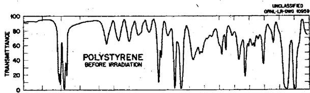

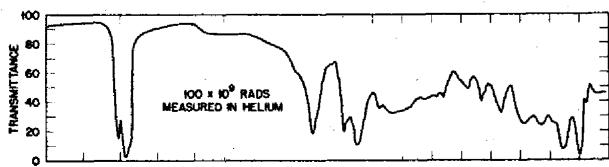

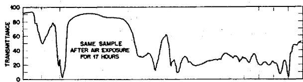

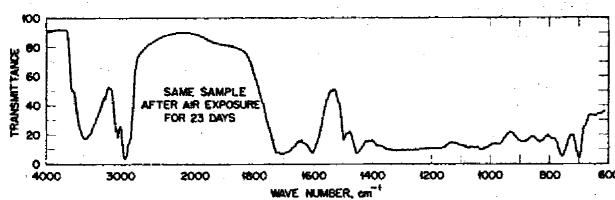  
Fig. 4.2.19. Infrared Spectra of Polystyrene.

resistant to change by radiation than most polymers are, the changes that may be seen in Fig. 4.2.19 are typical of the alterations of the infrared spectra by irradiation. Dosages of the order of $10^{8}$ to $10^{10}$ rads were required to produce significant changes in the infrared spectra of most polymers.

A large postirradiation effect was observed in the spectra of polystyrene, GR-S, and natural rubber. Upon exposure to air following irradiation in vacuum, oxidation products continued to form for periods of up to 95 days. These reactions were indicated by the growth of strong hydroxyl and carbonyl bands. The oxidation products formed in postirradiation oxidation were different from those produced by irradiation in oxygen.

Irradiation of polystyrene in vacuum to high doses produced a wholesale disruption in which both the aromatic and aliphatic components were equally affected. On the other hand, the aliphatic component of GR-S (a styrene-butadiene copolymer) showed a greater percentage change than did polybutadiene at equal dosages.

All polymers showed significant changes in the double-bond regions as a result of irradiation. In polyethylene, $\mathsf{RR}_1\overline{\mathsf{C}} = \mathsf{CH}_2$ groups disappeared as trans $\mathsf{RCH} = \mathsf{CHR}_1$ groups formed. In GR-S and polybutadiene the number of terminal vinyl groups decreased and the unsaturation in the hydrocarbon chains of GR-S and of natural rubber was decreased. Irradiation increased the number of trans $\mathsf{RCH} = \mathsf{CHR}_1$ groups in natural rubber, as it did in polyethylene. Conjugated and unconjugated unsaturation was produced in polyvinyl chloride.

# 4.3. FUEL RECOVERY AND REPROCESSING

H. K. Jackson

D. E. Ferguson W. K. Eister H. E. Goeller

# VOLATILITY PILOT PLANT DESIGN AND CONSTRUCTION

R.P.Milford F.N.Browder

The design of the volatility pilot plant for recovering fused-salt fuels is complete except for the molten-salt sampling device for the fluorinator and the trap-door closing device for the waste-salt carrier. All major equipment items were received, as well as the electrical power and control center and the instrument panelboards. The equipment, with the exception of the ARE fuel hold tank, which is not required until later, is in place; and piping, electrical work, and instrument installation are proceeding rapidly. It is expected that the plant will be completed by June 30.

# NICKEL FLUORIDE SLUDGE FORMATION STUDIES

G.I.Cathers M.R.Bennett

The behavior of $\mathsf{NiF}_2$ in molten NaF-ZrF and NaF-ZrF-UF4 systems was studied to determine whether the presence of this corrosion product would cause the formation of sludges which would interfere with salt transfer in the fluoride-volatility process. In order to determine the solubility of $\mathsf{NiF}_2$ in the salt mixtures, $\mathsf{NiF}_2$ was added to molten NaF-ZrF (50-50 mole %), and the mixture was heated until a clear solution was obtained. It was then cooled until turbidity reappeared. Solubility values estimated by the disappearance of turbidity were in fairly good agreement with solubility values determined electrochemically for the solvent NaF-ZrF (53-47 mole %). Based on the visual determinations, the estimates of the solubility of $\mathsf{NiF}_2$ in NaF-ZrF (50-50 mole %) were the following:

<table><tr><td>Temperature (℃)</td><td>Solubility of NiF2(wt % NiF2)</td></tr><tr><td>640</td><td>0.7</td></tr><tr><td>670</td><td>1.0</td></tr><tr><td>685</td><td>1.3</td></tr></table>

These values show the very definite increase in solubility with temperature when compared with the reported solubility of 0.2 wt % Ni at $600^{\circ}\mathrm{C}$ .

The addition of as much as 6 wt $\%$ NiF $_2$ to molten NaF-ZrF $_4$ (50-50 mole $\%$ ) at $600^{\circ}\mathrm{C}$ resulted in the formation of a viscous dispersion which was fairly stable, and thus other tests were made to determine the effect of concentration on sedimentation. These tests were made by dry mixing the required amount of salt ( $\sim 30$ g total) and melting it in a $\frac{1}{2}$ -in.-ID nickel tube. Nitrogen was used initially for agitation and then as a blanket while the material was kept at $600^{\circ}\mathrm{C}$ for various times. The tube was quickly quenched with cold water at the end of the test to fix the NiF $_2$ concentration at various heights in the tube. The tube was then cut into $\frac{1}{2}$ -in.-long sections, and the salt was analyzed for nickel. Although some settling of NiF $_2$ was evident after only 0.5 hr when 2 wt $\%$ Ni was added (as NiF $_2$ ), complete settling had not occurred even after 72 hr (Table 4.3.1). When only 1 wt $\%$ Ni was added, settling was more nearly complete at 72 hr; since the NiF $_2$ concentration was lower, the increase in viscosity at the bottom was not so great and thus was not so much of a deterrent to settling.

In further experiments the sedimentation of $\mathsf{NiF}_2$ in molten NaF-ZrF4-UF4 (48-48-4 mole %) at $600^{\circ}\mathrm{C}$ (Table 4.3.2) was similar to that found in the uranium-free system. However, with 2 wt % Ni and with uranium present, the settling was less after 2 hr than in the test with no uranium. Since the solubility of $\mathsf{NiF}_2$ in NaF-ZrF4 is near the lower of the nickel concentrations found in these settling tests, it appears that the solubility of $\mathsf{NiF}_2$ is approximately the same in uranium-bearing and uranium-free mixtures. These experiments have demonstrated that $\mathsf{NiF}_2$ concentrations of up to 2 wt %, more by a factor of 10 than is expected in aircraft reactor fuel reprocessing, would not interfere with salt transfers unless the molten salt were permitted to stand unagitated for long periods of time.

# DECOMPOSITION OF UF6-3NaF COMPLEX

G. I. Cathers R. L. Jolley

Some exploratory work was carried out on the decomposition of the UF $_6$ .3NaF complex at high

TABLE 4.3.1. SEDIMENTATION OF ${\mathrm{{NIF}}}_{2}$ IN MOLTEN NaF-ZrF ${}_{4}$ (50-50 mol%).AT ${600}^{ \circ  }\mathrm{C}$   

<table><tr><td rowspan="2">Relative Position of Sampling</td><td colspan="5">Nickel Concentration (wt %)</td></tr><tr><td>Initially</td><td>After 0.5 hr</td><td>After 2 hr</td><td>After 8 hr</td><td>After 72 hr</td></tr><tr><td colspan="6">Initial Nickel Content* - ~2 wt %</td></tr><tr><td>1 (top)</td><td>1.60</td><td></td><td>0.28</td><td>0.20</td><td></td></tr><tr><td>2</td><td>1.74</td><td>0.73</td><td>0.30</td><td>0.22</td><td>0.20</td></tr><tr><td>3</td><td>1.72</td><td>1.72</td><td>2.20</td><td>1.40</td><td>0.21</td></tr><tr><td>4</td><td>1.78</td><td>1.86</td><td>2.62</td><td>3.48</td><td>1.23</td></tr><tr><td>5 (bottom)</td><td>2.13</td><td>2.02</td><td>3.02</td><td>3.54</td><td>2.99</td></tr><tr><td colspan="6">Initial Nickel Content* - 1 wt %</td></tr><tr><td>1 (top)</td><td></td><td></td><td></td><td></td><td>0.22</td></tr><tr><td>2</td><td></td><td></td><td>0.30</td><td></td><td>0.16</td></tr><tr><td>3</td><td></td><td></td><td>0.31</td><td></td><td>0.17</td></tr><tr><td>4</td><td></td><td></td><td>1.71</td><td></td><td>0.18</td></tr><tr><td>5 (bottom)</td><td></td><td></td><td>3.06</td><td></td><td></td></tr></table>

*The nickel was added as NiF 2.

TABLE 4.3.2. SEDIMENTATION OF ${\mathrm{{NiF}}}_{2}$ IN MOLTEN NaF-ZrF ${}_{4} - {\mathrm{{UF}}}_{4}$ (48-48-4 mole %) AT ${600}^{ \circ  }\mathrm{C}$   

<table><tr><td rowspan="3">Relative Position of Sampling</td><td colspan="5">Nickel Concentration (wt %)</td></tr><tr><td colspan="2">Initial Ni Content - 2 wt %</td><td colspan="2">Initial Ni Content - 1 wt %</td><td>Initial Ni Content - 0.5 wt %</td></tr><tr><td>After 2 hr</td><td>After 48 hr</td><td>After 2 hr</td><td>After 48 hr</td><td>After 48 hr</td></tr><tr><td>1 (top)</td><td>1.26</td><td></td><td></td><td></td><td></td></tr><tr><td>2</td><td>1.23</td><td>0.25</td><td>0.36</td><td>0.18</td><td>0.24</td></tr><tr><td>3</td><td>2.12</td><td>0.34</td><td>0.40</td><td>0.20</td><td>0.33</td></tr><tr><td>4</td><td>2.78</td><td>2.75</td><td>2.53</td><td>0.47</td><td>0.22</td></tr><tr><td>5 (bottom)</td><td>2.81</td><td>6.94</td><td>3.08</td><td></td><td>0.85</td></tr></table>

temperatures in an effort to develop a UF $_6$ desorption procedure which avoids UF $_6$ decomposition. The decomposition reaction would lead to uranium being held up on the NaF bed and would thus necessitate a subsequent recovery step. Tests were conducted by saturating an NaF bed with UF $_6$ at $100^{\circ}\mathrm{C}$ and then heating the bed, as a closed system, at the desired temperature for 1 to 4 hr. In some of the tests the bed was subjected to as much as 55 psia UF $_6$ pressure during the high-tempera

ture cycle. However, no significant correlations were apparent as to the effect of $\mathsf{UF}_6$ pressure or length of time of treatment. The residual uranium content in several tests at $400^{\circ}\mathsf{C}$ varied in the range 18 to $26\%$ . At $300^{\circ}\mathsf{C}$ the decomposition effect was much less, a residual uranium content of $2\%$ being produced. Use of excess $\mathsf{F}_2$ (10 psia) in tests at $400^{\circ}\mathsf{C}$ also resulted in less decomposition, with residual uranium contents of 8 to $14\%$ .

The residual uranium present in the product of all

# ANP PROJECT PROGRESS REPORT

runs was pentavalent. As a result of disproportionation of the pentavalent uranium in the analytical procedure, however, the tetravalent uranium content in each case was approximately equal to the hexavalent content. The decomposition reaction is therefore believed to be

$$
U F _ {6} \cdot 3 N a F \rightarrow U F _ {5} \cdot x N a F + \frac {1}{2} F _ {2}
$$

These results indicate that, if a significant partial pressure of $\mathsf{UF}_6$ is retained in the NaF bed because of a plugged line or cold trap during $\mathsf{UF}_6$ desorption, excessive $\mathsf{UF}_6$ decomposition will occur when the temperature reaches the 300 to $400^{\circ}\mathsf{C}$ range. Therefore precautions must be taken to ensure that full sweep-gas flow through the NaF bed is maintained during $\mathsf{UF}_6$ desorption.

# 4.4. CRITICAL EXPERIMENTS

A. D. Callihan

# CRITICAL EXPERIMENTS FOR THE COMPACT-CORE REFLECTOR-MODERATED REACTOR

E. Demski

J. J. Lynn

W.J.Fader

D. E. McCarty

D. A. Harvey

E. V. Sandin1

D. Scott

The study of the NDA²-proposed, sodium-cooled, reflector-moderated reactor with solid fuel elements³ has been completed. In the critical assembly the fuel region contained 0.004-in.-thick uranium sheets interleaved between aluminum and stainless steel sheets. This fuel region was separated from the beryllium of the island and of the reflector by stainless steel shells. As described previously,⁴ additional uranium, in the form of 0.01-in.-thick disks, was added in one section of the fuel region to provide excess reactivity for other measurements. An evaluation of the effect of this local nonuniform fuel distribution on the reactivity was made by replacing 2636 g of U²³⁵ in 0.004-in.-thick sheets with 2678 g of U²³⁵ in 0.01-in.-thick disks in another section of the core. With the other materials unchanged, there was a reactivity loss of only 19 cents.

# Evaluation of Stainless Steel Shell

The loss in reactivity caused by the stainless steel shells was determined by substituting aluminum shells of the same dimensions. The exchange of $4.4\mathrm{kg}$ of aluminum for $11.9\mathrm{kg}$ of stainless steel resulted in a gain in reactivity of $\$ 4.20,$ estimated to be equivalent to a $14\%$ decrease in the critical mass. The excess reactivity was partly compensated for by the removal of some of the outer layer of the $11 \frac{1}{2}$ -in.-thick reflector. Removal of a $2 \frac{7}{8}$ -in.-thick section that extended

over the $28\%$ -in. length of the outer reflector and comprised $70\%$ of the outer cylindrical layer resulted in a loss in reactivity of $2.39.

# Measurements of Gamma-Ray Heating in Beryllium

Capacitive ionization chambers were used to measure the distribution of gamma-ray heating in the beryllium of the island and the reflector of the critical assembly by a method developed at the Knolls Atomic Power Laboratory. The chambers are constructed of beryllium and have a 10-mil-thick annular cavity in OD and in deep. The results are expressed as power dissipated as heat in a unit volume per unit reactor power. The reactor power was determined from a calibration based on the intensity of a fission-product gamma ray from an irradiated uranium foil.

A plot of the data obtained from radial traverses $3/4$ and $10\%$ in. from the mid-plane of the reactor is given in Fig. 4.4.1. Three longitudinal traverses, one along the axis of the reactor and the others $4\%$ and $7\%$ in. from the axis, are plotted in Fig. 4.4.2. These data have not been corrected for the ionization resulting from the $(n_{e}p)$ reaction in the air-filled chambers and may overestimate the heating adjacent to the fuel by as much as $25\%$ , an estimate based on the work at KAPL. An attempt was made to measure this error by filling the chambers with $\mathrm{CO}_{2}$ , but it was apparent that they were not gas-tight during these experiments. It may be possible to make a correction to these data by using the results of similar measurements in another assembly.

A layer of beryllium, $2\%$ in. thick, was removed from the top of the reactor, and one traverse was repeated with this thinner reflector. The heating was observed to be unaffected in the region between the fuel and a point 3 in. from the surface of the modified reflector. In this outer 3-in. layer the heating decreased to a value, at the surface, about $35\%$ less than it was at the same distance from the fuel in the thicker reflector.

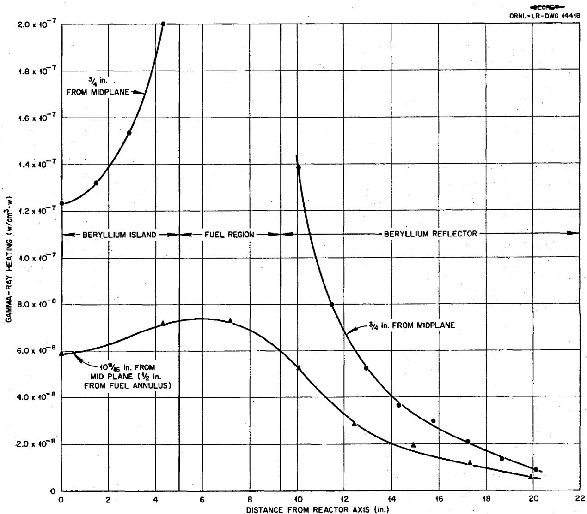  
Fig. 4.4.1. Radial Distribution of Gamma-Ray Heating in the Compact-Core Reflector-Moderated- Reactor Critical Assembly.

# Fast-Neutron Leakage

Relative measurements of the fast-neutron leakage at points on the outer surface of the reflector were made with a Hornyak button, 2 in. in diameter and $\frac{1}{4}$ in. thick, mounted on a Du Mont 6292 photomultiplier tube. The button had the same composition, 0.15 g of powdered ZnS in 1.0 g of Lucite, as a similar button described by Hornyak. By proper choice of a discriminator bias it was possible to detect neutrons with energies above

0.5 Mev against the gamma-ray background of the reactor.

A polar plot of the fast-neutron leakage distribution observed in a longitudinal traverse over the top of one end of the reactor is presented in Fig. 4.4.3. The observed counting rates, normalized to the counting rate at point 19, near the axis of the assembly, have been plotted on the polar radii drawn through points on the reflector surface where measurements were made. For this traverse, the reflector thickness was approximately $11\frac{1}{2}$ in., and the top layer of beryllium was $28\frac{3}{4}$

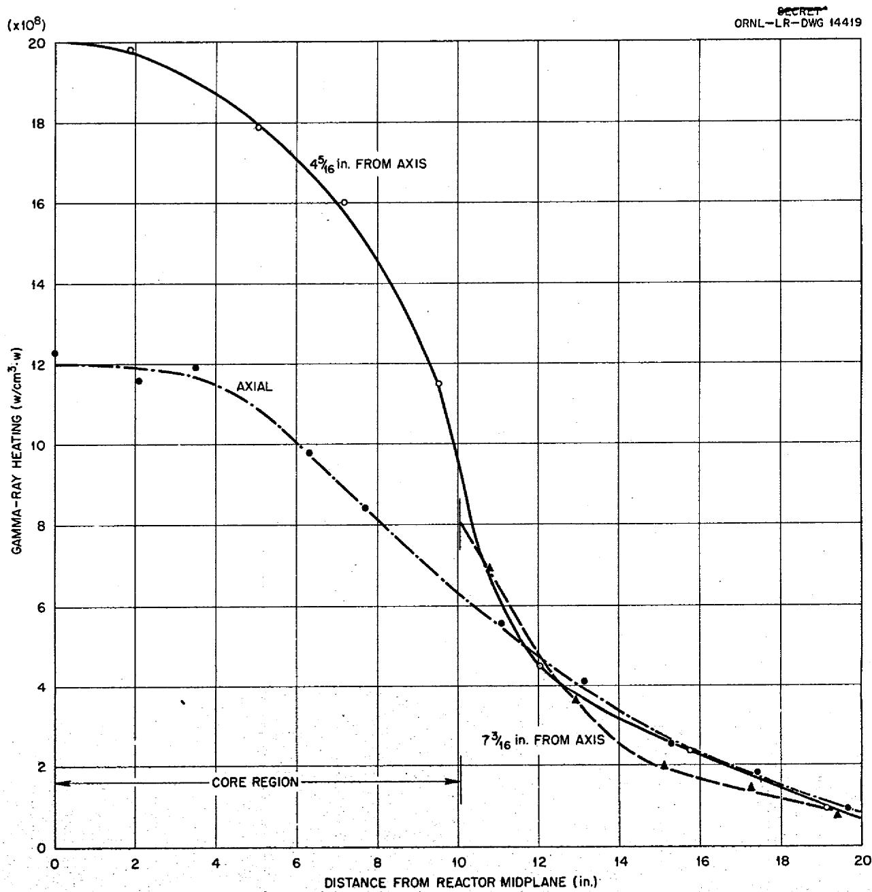  
Fig.4.4.2. Longitudinal Distribution of Gamma-Ray Heating in the Compact-Core Reflector-Moderated- Reactor Critical Assembly.

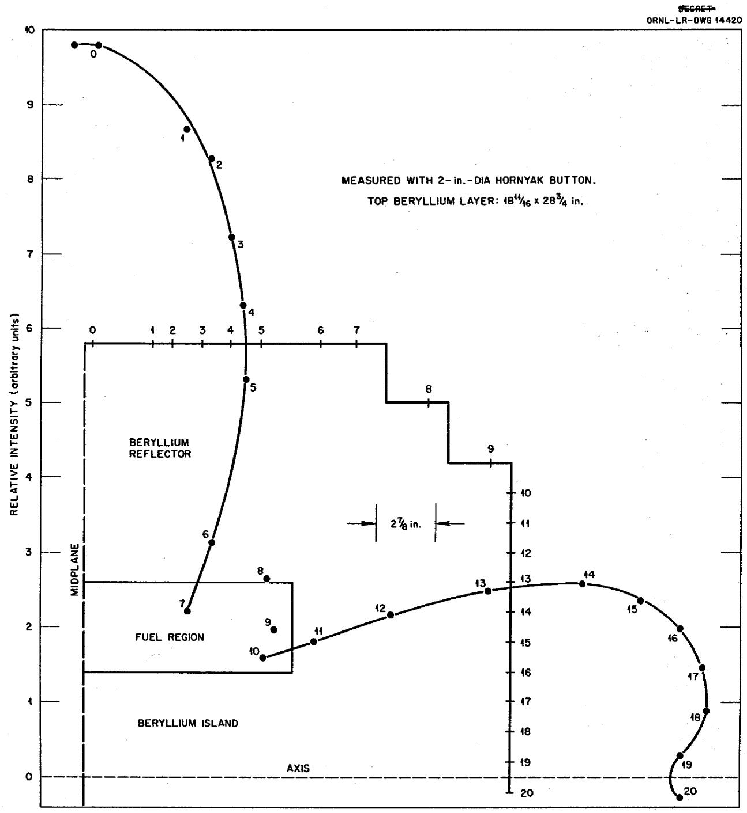  
Fig. 4.4.3. Polar Distribution of Fast-Neutron Leakage at Surface of $11\frac{1}{2}$ -in.-Thick Reflector of Compact-Core Reflector-Moderated-Reactor Critical Assembly.

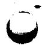

in. long, $18^{1}\%$ in. wide, and $2\%$ in. thick. The beryllium layer immediately below it was $34\%$ in. long and $24\%$ in. wide.

The top layer and the corners of the second beryllium layer were subsequently removed, and the resulting reflector was $8\frac{5}{8}$ in. thick. The new top layer was $18\frac{1}{16}$ in. wide and $34\frac{3}{4}$ in. long. A second longitudinal traverse was then made. The results are shown in Fig. 4.4.4, in which the top lobe is plotted to a scale one-half that used to plot the end lobe.

Two series of lateral traverses were also made at the side of the reactor at several distances from the mid-plane. For reflector thicknesses of $11\frac{1}{2}$ and $8\frac{5}{8}$ in, the outer slab dimensions for each side reflector thickness were the same as those given above. The latitudinal variations of the fast-neutron leakage for the two reflector thicknesses are shown in Figs. 4.4.5 and 4.4.6. The curves show a slight asymmetry about the center of the reactor, which is attributed to the reflection of neutrons by the aluminum and steel structure on which the critical assembly rests. The area under each curve of Figs. 4.4.5 and 4.4.6 is proportional to the counting rate observed at the corresponding distance from the mid-plane in the longitudinal traverses made at the top of the reactor. By integrating the results of the two longitudinal traverses over the distance from the mid-plane, it was possible to determine that the removal of the $2\frac{7}{8}$ in layer of beryllium from the top of the reactor increased the fast-neutron leakage there by a factor of 3.7.

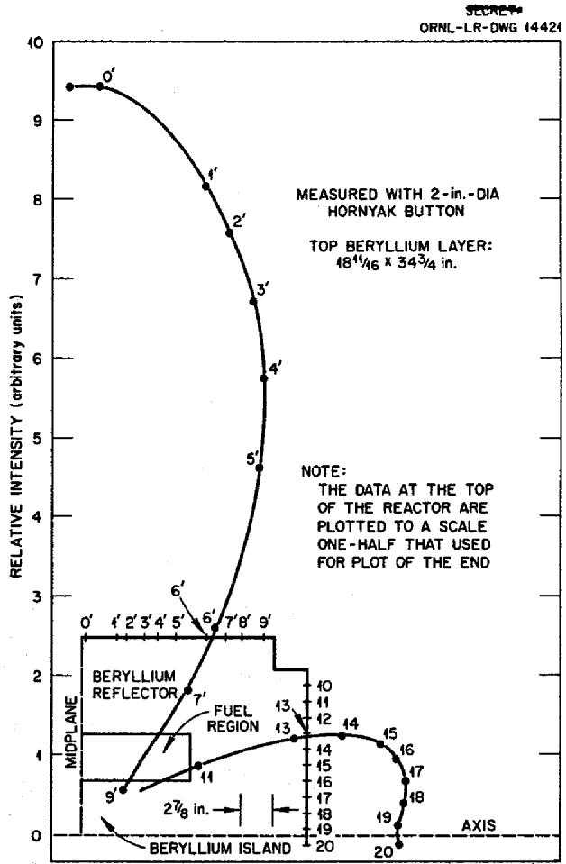  
Fig. 4.4.4. Polar Distribution of Fast-Neutron Leakage at Surface of $8\%$ -in.-Thick Reflector of Compact-Core Reflector-Moderated-Reactor Critical Assembly.

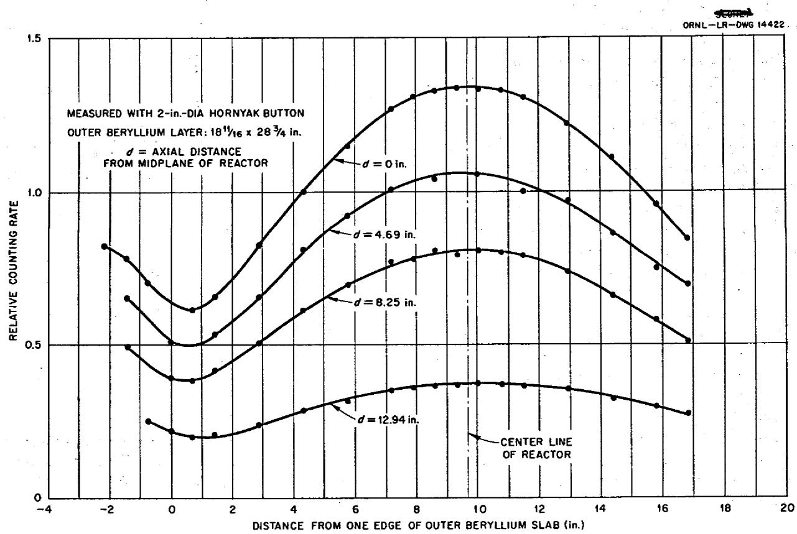  
Fig. 4.4.5. Lateral Distribution of Fast-Neutron Leakage at Surface of $11\frac{1}{2}$ -in.-Thick Reflector of Compact-Core Reflector-Moderated-Reactor Critical Assembly.

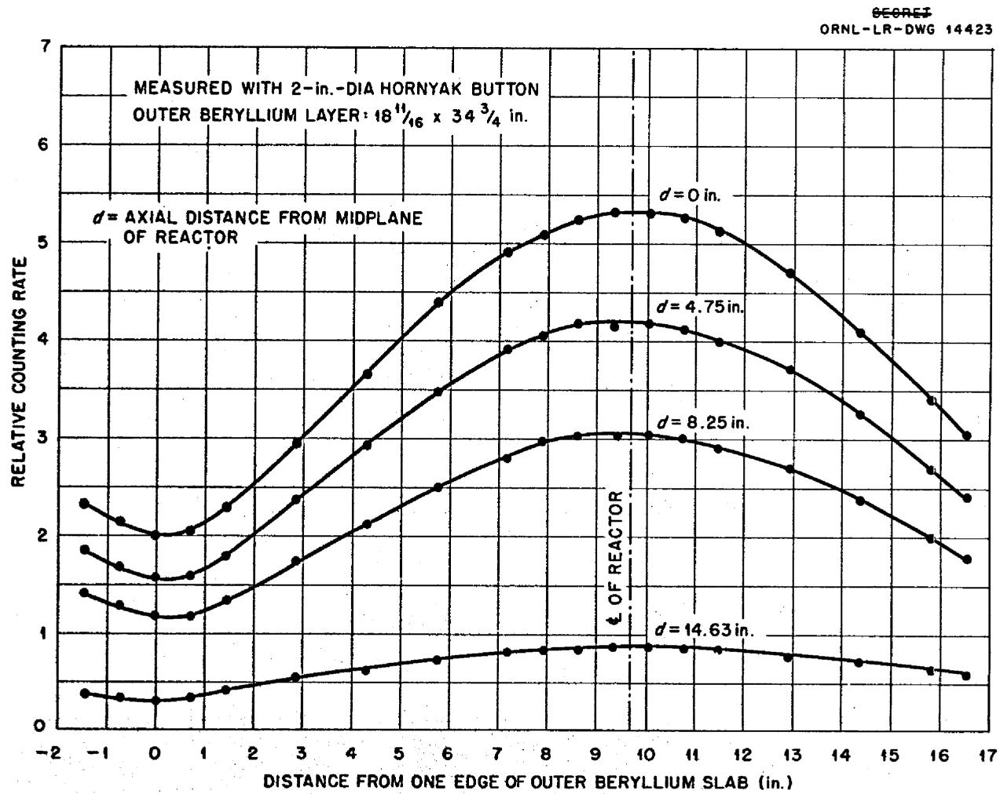  
Fig. 4.4.6. Lateral Distribution of Fast-Neutron Leakage at Surface of $8\frac{5}{8}$ -in.-Thick Reflector of Compact-Core Reflector-Moderated-Reactor Critical Assembly.

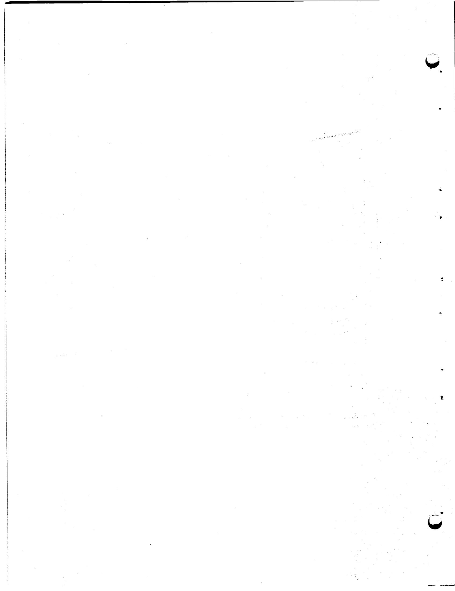

Part 5

REACTOR SHIELDING

E. P. Blizzard

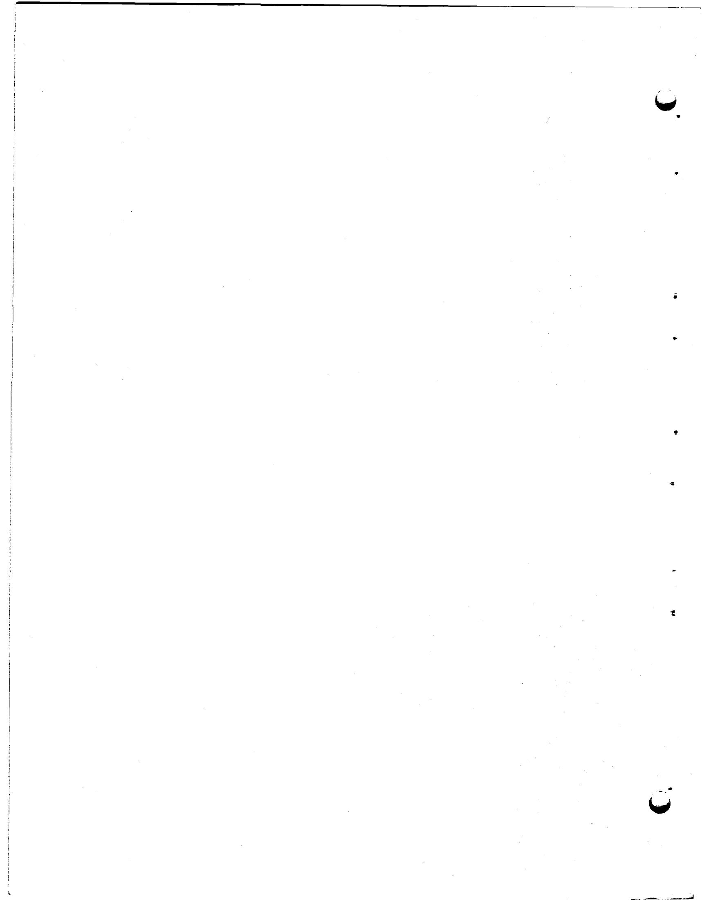

# 5.1. SHIELDING THEORY

C. D. Zerby

# DOSE RATE IN A CYLINDRICAL CREW COMPARTMENT RESULTING FROM AIR-SCATTERED GAMMA RAYS

C. D. Zerby

The problem of determining the contribution of air-scattered gamma rays to the dose rate in a cylindrical crew compartment has been separated into two parts. In the first part the gamma-ray flux in air at various distances from an idealized point source is to be obtained. In the second part the flux is considered to be the source at the outside surface of the crew compartment, and the dose rate at several arbitrary positions inside the crew compartment is to be determined. The results obtained for both parts of the problem will then be integrated. The complete problem is a joint effort of the Wright Air Development Center (WADC) and the Oak Ridge National Laboratory, with the bulk of the computation to be done by the Monte Carlo method and to be performed at WADC.

The first part of the problem has been programmed and coded for calculation on a type 1103 automatic computing machine, and test cases are being run in preparation for a complete parameter study. In this part of the problem the angular distribution and the energy spectrum of air-scattered gamma rays will be determined at several separation distances from a point source. The source will be considered to be monoenergetic and to be emitting gamma rays symmetrically about the source-detector axis in a conical shell. The parameter study will, therefore, include a survey of various separation distances, source energies, and apex angles of the conical shell beam. With the results of the parameter study it will be possible to obtain the radiation current at each separation distance for any point source which emits gamma rays symmetrically about the source-detector axis with any energy spectrum. Although the density of air at sea-level conditions will be used in the calculations, it will be possible to obtain the results at any altitude (different density of the air) by using the transformations developed for this purpose and reported below.

The analysis and procedure for the second part of the problem are complete and have been reported. Results of the calculation will include the detailed angular distribution and energy spec

trum of the radiation entering the crew-compartment cavity and the dose rate at various positions in the cavity. A parameter study will be made for various thicknesses of lead and polyethylene in the crew-compartment walls.

# RADIATION FLUX TRANSFORMATION AS A FUNCTION OF DENSITY OF AN INFINITE MEDIUM WITH ANISOTROPIC POINT SOURCES

C. D. Zerby

The transformation of flux, current, or dose rate as a function of density of an infinite homogeneous medium with anisotropic point sources can be derived directly from the Boltzmann equation. This transformation is particularly of interest because of the many calculations which use this geometry, and, in addition, it provides a means of transforming the Tower Shielding Facility (TSF) sea-level dose-rate data to data at any altitude.

The transformation is obtained by writing the Boltzmann equation for an anisotropic point source at the origin in nondimensional form:

$$
\begin{array}{l} (1) \vec {\Omega} \cdot \vec {\nabla} G (\vec {\lambda}, E, \vec {\Omega}) + \frac {\sigma_ {t} (E)}{\sigma_ {t} (E _ {0})} G (\vec {\lambda}, E, \vec {\Omega}) \\ = \int_ {E} \int_ {\vec {\Omega}} \frac {\sigma_ {s} (E)}{\sigma_ {t} \left(E _ {0}\right)} f \left(E, \vec {\Omega}, E ^ {\prime}, \vec {\Omega} ^ {\prime}\right) G \left(\vec {\lambda}, E ^ {\prime}, \vec {\Omega} ^ {\prime}\right) d E ^ {\prime} d \Omega^ {\prime} \\ + \frac {S (E , \vec {\Omega})}{2 \pi \lambda^ {2}} \delta (\lambda) \delta (1 - \vec {\Omega} \cdot \lambda), \\ \end{array}
$$

where

$$
\begin{array}{l} \vec {\Omega} = \text {u n i t v e c t o r}, \\ E = \text {e n e r g y}, \\ E _ {0} = \text {a r b i t r a r y f i x e d e n e r g y}, \\ \sigma_ {s} (E) = \text {m i c r o s c o p i c s c a t t e r i n g c r o s s s e c t i o n a t e n e r g y E ,} \mathrm {c m} ^ {2}, \\ \end{array}
$$

$$
\sigma_ {t} (E) = \begin{array}{l} \text {m i n o s c o p i c t o t a l c r o s s s e c t i o n} \\ \text {a t e n e r g y E , c m ^ {2}} \end{array}
$$

$$
\sigma_ {t} \left(E _ {0}\right) = \begin{array}{l} \text {m i n o r s c o p i c t o t a l c r o s s s e c t i o n} \\ \text {a t e n e r g y ,} E _ {0}, \mathrm {c m} ^ {2}, \end{array}
$$

$$
\lambda = \text {s c a l a r} \quad \text {d i s t a n c e} \quad \text {f r o m} \quad \text {s o u r c e} \quad \text {p o i n t} \quad \text {m e a s u r e d} \quad \text {i n} \quad \text {u n i t s} \quad \text {o f} \quad \text {m e a n} \quad \text {f r e e p a t h} \quad \text {a t} \quad \text {e n e r g y} \quad E _ {0},
$$

$$
\vec {\lambda} = \begin{array}{l l l} \text {p o s i t i o n} & \text {v e c t o r} & \text {f r o m} \\ \text {p o i n t}, & \end{array}
$$

$$
f (E, \vec {\Omega}, E ^ {\prime}, \vec {\Omega} ^ {\prime}) = \text {s c a t t e r i n g k e r n e l ,}
$$

$$
G (\vec {\lambda}, E, \vec {\Omega}) = \text {p a r t i c l e} \quad \text {c u r r e n t , p a r t i c l e s p e r} \quad \text {u n i t e n e r g y} \quad \text {a t e n e r g y} \quad E \quad \text {p e r} \quad \text {u n i t} \quad \text {s o l i d a n g l e i n t h e d i r e c t i o n} \quad \vec {\Omega} \quad \text {p e r} \quad \text {s q u a r e m e a n f r e e p a t h (a t e n e r g y} \quad E _ {0}) \quad \text {a t p o s i t i o n} \quad \lambda_ {1}
$$

$$
S (E, \vec {\Omega}) = \text {s o u r c e} \quad \text {s t r e n g t h}, \quad \text {p a r t i c l e s} \quad \text {p e r} \quad \text {u n i t} \quad \text {e n e r g y} \quad \text {a t} \quad \text {e n e r g y} \quad E \quad \text {p e r} \quad \text {u n i t} \quad \text {s o l i d} \quad \text {a n g l e} \quad \text {i n} \quad \text {d i r e c t i o n} \quad \vec {\Omega}.
$$

Equation 1 is independent of the nuclear density of the medium, and thus $G(\vec{\lambda}, E, \vec{\Omega})$ is also independent of density. This means that if two experiments are set up with the same point source but with different densities $\rho_{1}$ and $\rho_{2}$ and the current is measured in each experiment at positions such that

$$
\vec {\lambda} _ {1} = \vec {\lambda} _ {2}, \tag {2}
$$

then

$$
G _ {\rho_ {1}} (\vec {\lambda} _ {1}, E, \vec {\Omega}) = G _ {\rho_ {2}} (\vec {\lambda} _ {2}, E, \vec {\Omega}). \tag {3}
$$

The significance of Eq. 3 can be realized if $\lambda$ and $G$ are reduced to conventional units. The relation between distance $r$ (measured in centimeters) and $\lambda$ is given by

$$
\vec {\lambda} = N \sigma_ {t} \left(E _ {0}\right) \vec {r}, \tag {4}
$$

where $N$ is the nuclear density of the medium. The conventional particle current can be defined as $F(\vec{r},E,\vec{\Omega})$ given in particles per unit energy at energy $E$ per unit solid angle in direction $\vec{\Omega}$ per cm² at position r. The relation between F and G is then

$$
\frac {F \left(\vec {r} , E , \vec {\Omega}\right)}{N ^ {2} \sigma_ {t} ^ {2} \left(E _ {0}\right)} = G [ \vec {\lambda} (r), E, \vec {\Omega} ]. \tag {5}
$$

By using Eq. 4, Eq. 2 becomes

$$
\vec {r} _ {2} = \frac {N _ {1}}{N _ {2}} \vec {r} _ {1} = \frac {\rho_ {1}}{\rho_ {2}} \vec {r} _ {1}, \tag {6}
$$

and by using Eq. 5, Eq. 3 becomes

$$
\begin{array}{l} F _ {\rho_ {2}} \left(\vec {r} _ {2} = \frac {\rho_ {1}}{\rho_ {2}} \vec {r} _ {1}, E, \vec {\Omega}\right) \tag {7} \\ = \frac {N _ {2} ^ {2}}{N _ {1} ^ {2}} F _ {\rho_ {1}} (\vec {r} _ {1}, E, \vec {\Omega}) = \frac {r _ {1} ^ {2}}{r _ {2} ^ {2}} F _ {\rho_ {1}} (\vec {r} _ {1}, E, \vec {\Omega}), \\ \end{array}
$$

which is the desired transformation. Proper integration of Eq. 7 gives the flux transformation as

$$
\phi_ {\rho_ {2}} \left(\vec {r} _ {2} = \frac {\rho_ {1}}{\rho_ {2}} \vec {r} _ {1}, E\right) = \frac {r _ {1} ^ {2}}{r _ {2} ^ {2}} \phi_ {\rho_ {1}} (\vec {r} _ {1}, E) \tag {8}
$$

and the dose rate transformation as

$$
D _ {\rho_ {2}} \left(\vec {r} _ {2} = \frac {\rho_ {1}}{\rho_ {2}} \vec {r} _ {1}\right) = \frac {r _ {1} ^ {2}}{r _ {2} ^ {2}} D _ {\rho_ {1}} (\vec {r} _ {1}). \tag {9}
$$

These transformations can be applied to much of the TSF data, but the application is not entirely general.2 To make full use of the transformations it will be necessary to obtain additional data at the TSF at several separation distances so that the measurements can be interpolated and applied at any altitude.

# ENERGY ABSORPTION RESULTING FROM GAMMA RADIATION INCIDENT ON A MULTIREGION SHIELD WITH SLAB GEOMETRY

S. Auslander3

The code for a Monte Carlo calculation of energy deposition in a multifiregion shield with slab geometry has been used to obtain the results for 1-Mev gamma rays incident on a slab consisting of regions of fuel, Inconel, sodium, and Inconel again. A diagram of the composite slab is shown in Fig. 5.1.1, which gives the normal thicknesses in

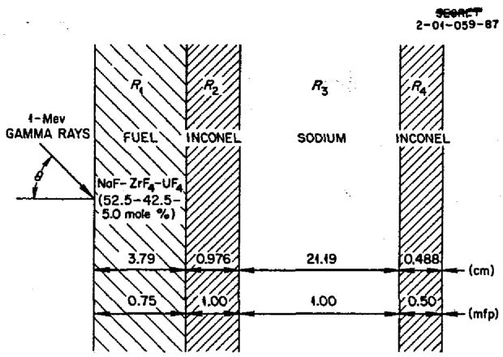  
Fig. 5.1.1. Geometry of Fuel-Inconel-Sodium-Inconel Slab.

centimeters and in mean free paths. The fuel is NaF-ZrF $_4$ -UF $_4$ (52.5-42.5-5 mole %). The percentages of energy absorption throughout the slab for various angles of incidence of gamma rays are given in Fig. 5.1.2. The percentage of the total energy incident on the slab that is reflected, absorbed, or transmitted for each angle of incidence is shown in Table 5.1.1, and the percentage of the energy that is absorbed in each of the four regions of the slab is shown in Table 5.1.2.

A plot of the dose buildup factor as a function of the distance through the slab, in mean free paths (mfp), is presented in Fig. 5.1.3. The sharp break in the curves at 2.75 mfp is due to the rapid attenuation of low-energy gamma rays (degraded principally in the sodium) by the final Inconel slab.

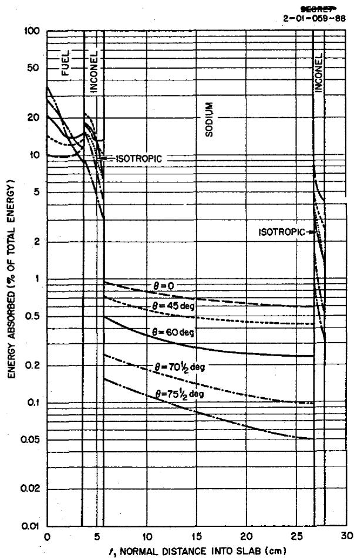  
Fig. 5.1.2. Percentage of Total Energy from Incident 1-Mev Gamma Rays That Is Absorbed in a Fuel-Inconel-Sodium-Inconel Slab as a Function of Normal Distance into the Slab.

TABLE 5.1.1. PERCENTAGE OF TOTAL ENERGY FROM INCIDENT 1-Mev GAMMA RAYS THAT IS REFLECTED, ABSORBED, OR TRANSMITTED IN A FUEL-INCONEL-SODIUM-INCONEL SLAB   

<table><tr><td rowspan="2">θ, Angle of Incidence (deg)</td><td colspan="3">Percentage of Total Energy</td></tr><tr><td>Reflected</td><td>Absorbed</td><td>Transmitted</td></tr><tr><td>0</td><td>1.151</td><td>88.01</td><td>10.79</td></tr><tr><td>45</td><td>2.45</td><td>93.36</td><td>4.19</td></tr><tr><td>60</td><td>4.10</td><td>94.30</td><td>1.59</td></tr><tr><td>70½</td><td>8.76</td><td>90.60</td><td>0.635</td></tr><tr><td>75½</td><td>13.22</td><td>86.05</td><td>0.732</td></tr></table>

TABLE 5.1.2. PERCENTAGE OF TOTAL ENERGY FROM INCIDENT 1-Mev GAMMA RAYS THAT IS ABSORBED IN EACH REGION $(R_{1}, R_{2}, R_{3},$ AND $R_{4}$ ) OF THE FUEL-INCONEL- SODIUM-INCONEL SLAB   

<table><tr><td rowspan="2">sec θ(θ = Angle of Incidence)</td><td colspan="4">Percentage of Total Energy Absorbed</td></tr><tr><td>R1</td><td>R2</td><td>R3</td><td>R4</td></tr><tr><td>1</td><td>37.86</td><td>29.40</td><td>15.04</td><td>5.752</td></tr><tr><td>√2</td><td>48.39</td><td>30.97</td><td>10.65</td><td>3.423</td></tr><tr><td>2</td><td>60.23</td><td>26.10</td><td>6.14</td><td>1.895</td></tr><tr><td>3</td><td>69.7</td><td>17.32</td><td>2.913</td><td>0.697</td></tr><tr><td>4</td><td>72.6</td><td>10.52</td><td>2.144</td><td>0.692</td></tr></table>

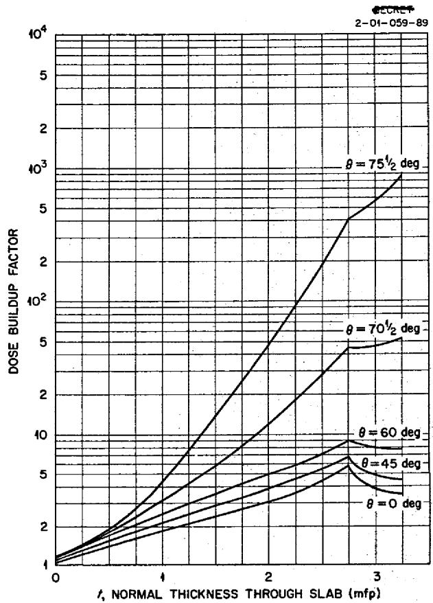  
Fig. 5.1.3. Gamma-Ray Dose Buildup Factor as a Function of Normal Thickness Through the Fuel-Inconel-Sodium-Inconel Slab.

# 5.2. LID TANK SHIELDING FACILITY

R.W.Peelle

# STUDY OF ADVANCED SHIELDING MATERIALS

W. R. Burrus

J. M. Miller

W. J. McCool

D. R. Otis

J. Smolen

An extensive mockup experiment was initiated in which combinations of advanced shielding materials, such as lithium hydride, depleted uranium, zirconium, and tungsten, are being investigated. These tests are important to the ANP program because lead and water, the prototype shielding materials used in most of the previous Lid Tank Shielding Facility (LTSF) mockup tests, are not optimum aircraft construction materials. In the initial tests the shielding materials being studied are combinations of lithium hydride and other shielding materials immersed in transformer oil. The particular configurations used have been those of immediate interest in the GE-ANPD program, but such general interest surrounds the use of these materials that the more reliable data obtained thus far are presented here. This report is preliminary, however, in the sense that little analysis work has been performed.

Thermal-neutron flux and gamma-ray tissue dose-rate measurements have been made for configurations involving combinations of zirconium, lead, and depleted uranium with lithium hydride and transformer oil. All the measurements were made in the oil along the axis of symmetry of the LTSF source plate. (Fast-neutron dose-rate traverses were also made, but experimental difficulties prevent the publication of reliable data at this time.)

A typical configuration (No. 69-6a) is shown in Fig. 5.2.1. The various material combinations studied differed only in the region to the right of the line marked "beginning of configuration." The parameters of all the configurations are given in Table 5.2.1, and the known properties of the various materials are given in Table 5.2.2. The lithium hydride is the only material that was canned in an extraneous material.

All the radiation levels indicated in plots of the data (Figs. 5.2.2 through 5.2.9) are quoted per watt of effective source plate power, based on a total power of $5.5 \pm 0.5$ w for the 28-in.-dia source plate. A final evaluation of the effective power may necessitate a small change in the results presented here. All the thermal-neutron fluxes reported are equal to the neutron density times $2200\mathrm{m / sec}$ .

The decreasing magnitude of the slope of the neutron traverses shown in Fig. 5.2.2 at large

GEORG   
057-69-272

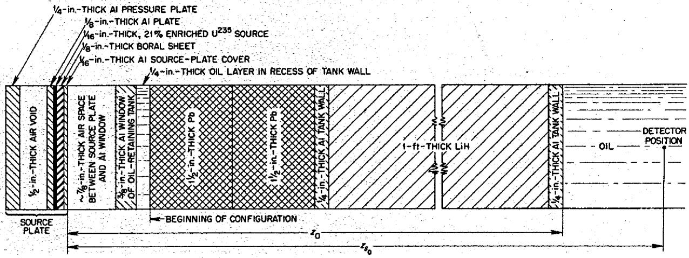  
Fig. 5.2.1. Typical Configuration for LTSF Mockup Tests of Advanced Shielding Materials.

TABLE 5.21. SUMMARY OF THE CONFIGURATIONS USED FOR LTSF MockUP TESTS OF ADVANCED SHIELDING MATERIALS   

<table><tr><td>Configuration No.</td><td>Composition</td></tr><tr><td>69-0</td><td>Pure water</td></tr><tr><td></td><td>Transformer oil</td></tr><tr><td>69-1</td><td>1 ft of LiH in oil</td></tr><tr><td></td><td>2 ft of LiH in oil</td></tr><tr><td></td><td>3 ft of LiH in oil</td></tr><tr><td>69-2</td><td>4 in. of Zr in oil</td></tr><tr><td></td><td>4 in. of Zr + 1 ft of LiH in oil</td></tr><tr><td></td><td>4 in. of Zr + 2 ft of LiH in oil</td></tr><tr><td></td><td>4 in. of Zr + 3 ft of LiH in oil</td></tr><tr><td>69-6</td><td>3 in. of Pb in oil</td></tr><tr><td></td><td>3 in. of Pb + 1 ft of LiH in oil</td></tr><tr><td></td><td>3 in. of Pb + 2 ft of LiH in oil</td></tr><tr><td></td><td>3 in. of Pb + 3 ft of LiH in oil</td></tr><tr><td>69-7</td><td>3 in. of U in oil</td></tr><tr><td></td><td>3 in. of U + 1 ft of LiH in oil</td></tr><tr><td></td><td>3 in. of U + 2 ft of LiH in oil</td></tr><tr><td></td><td>3 in. of U + 3 ft of LiH in oil</td></tr></table>

distances from the source is interpreted as an effect of photoneutron production in $C^{13}$ and deuterium, although no quantitative analysis has been made. At smaller distances from the source, these data may be used to estimate the macroscopic removal cross section of lithium hydride at room temperature in an oil medium. A preliminary value of $0.12 \, \text{cm}^{-1}$ was obtained, which is in good agreement with the value expected on the basis of previous removal-cross-section measurements on a lithium-metal slab.

The observed gamma-ray tissue doses are given in Figs. 5.2.6 through 5.2.9. It can be noted that

TABLE 5.2.2. PHYSICAL PROPERTIES OF THE SHIELDING MATERIALS TESTED  

<table><tr><td>Material</td><td>Description</td></tr><tr><td>Transformer oil</td><td>Density, 0.87 g/cm3 at 20°C; analysis, 86.7 wt % C and 12.7 wt % H</td></tr><tr><td>Lithium hydride*</td><td>5 × 5 × 1 ft slabs encased in Al cans (1/4-in.-thick walls); density, about 0.75 g/cm3; purity, about 95%</td></tr><tr><td>Zirconium*</td><td>52 × 55 × 2 in. metallic slabs</td></tr><tr><td>Lead</td><td>55 × 60 × 1.5 in. metallic slabs</td></tr><tr><td>Uranium</td><td>52 × 55 × 1.5 in. depleted metallic slabs containing 0.24 wt % U235</td></tr></table>

*Raw materials furnished by GE-ANPD.

one slab of lithium hydride behind a heavy shielding material reduces the dose at larger distances from the source. This is interpreted as a reduction of secondary gamma-ray production caused by the presence of $\mathsf{Li^{6}}$ in the lithium hydride. The data obtained upon subsequent additions of LiH indicate, as expected, that LiH does not have so large a macroscopic gamma-ray absorption coefficient as that of the oil.

It is planned to continue these studies of combinations of lithium hydride with other shielding materials. Attempts will also be made to obtain reliable fast-neutron measurements, where possible, for the configurations already studied.

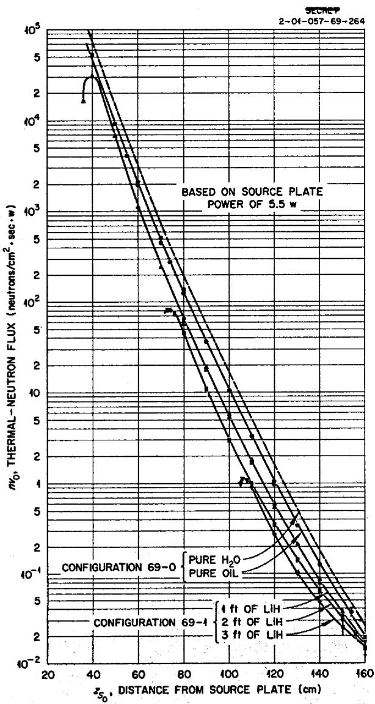

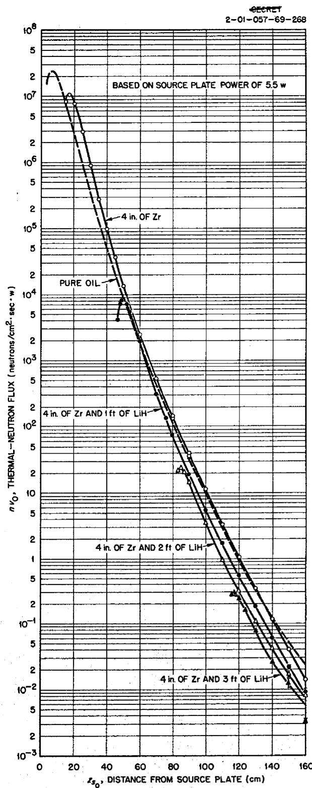  
Fig. 5.2.2. Thermal-Neutron Flux Traverses for Configurations 69-0 and 69-1.   
Fig. 5.2.3. Thermal-Neutron Flux Traverses for Configuration 69-2.

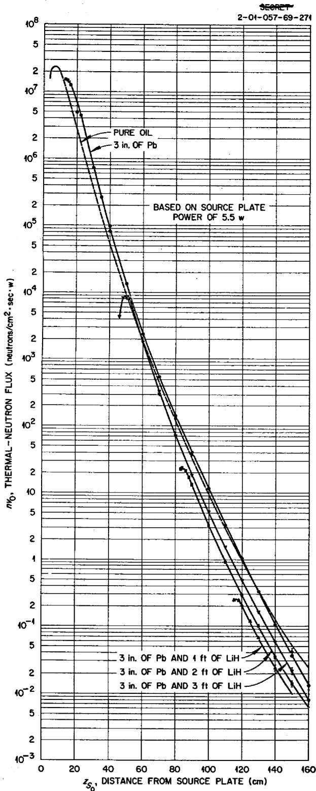  
Fig. 5.2.4. Thermal-Neutron Flux Traverses for Configuration 69-6.

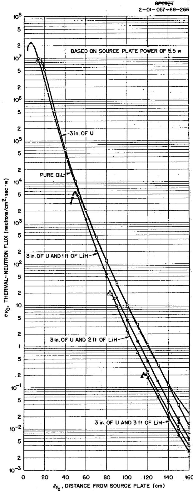  
Fig. 5.2.5. Thermal-Neutron Flux Traverses for Configuration 69-7.

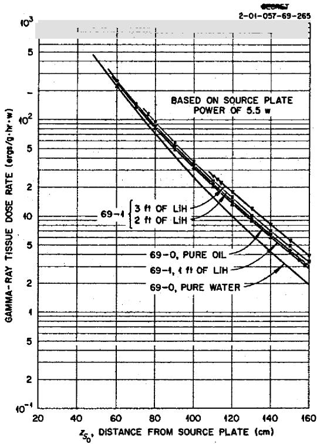  
Fig. 5.2.6. Gamma-Ray Tissue Dose-Rate Traverses for Configurations 69-0 and 69-1.

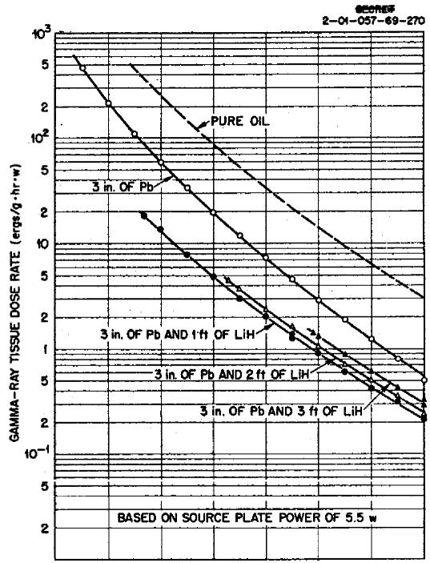

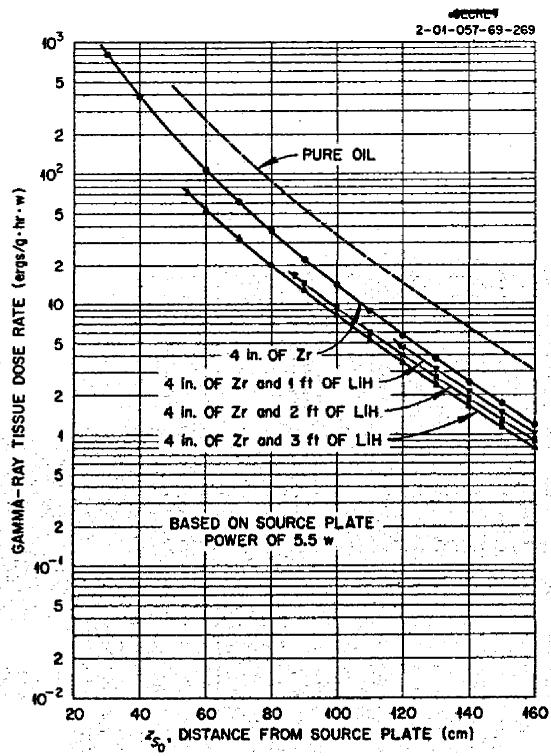  
Fig. 5:2.7. Gamma-Ray Tissue Dose-Rate Traverses for Configuration 69-2.

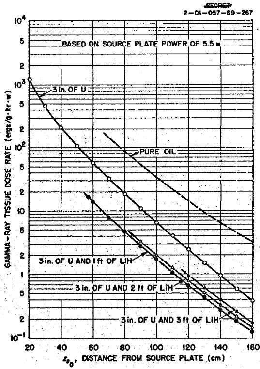  
Fig. 5.2.9. Gamma-Ray Tissue Dose-Rate Traverses for Configuration 69-7.

# 5.3. BULK SHIELDING FACILITY

# F. C. Maienschein

# GAMMA-RAY STREAMING THROUGH THE NaK PIPES THAT PENETRATE THE ART SHIELD

# T. V. Blosser D. K. Trubey

As reported previously, a mockup experiment has been initiated to investigate the increase in the dose rate outside the ART lead shield caused by gamma-ray streaming through the NaK-filled pipes that penetrate the shield. Thus far gamma-ray dose-rate measurements have been made in the water beyond straight-through penetrations, that mock up portions of the north-head ducts. In future experiments, measurements will be made beyond similar penetrations that mock up portions of the

T. V. Blosser, ANP Quar. Prog. Rep. Marcb 10, 1956, ORNL-2061, p 249.

south-head ducts. Ducts placed through the shield at a 45-deg angle will also be investigated, and final measurements will be made on actual NaK pipe mockups.

The mockup of the north-head straight-duct penetration is shown in Fig. 5.3.1. It consisted of a $3\frac{1}{8}$ -in.-ID Inconel pipe filled with air or aluminum turnings and surrounded by an air annulus that simulated the insulation of the ART. The duct was housed in a watertight thin-walled $(\frac{1}{16}$ -in.) aluminum case. The aluminum turnings, which were pressed into the pipe to a density of $0.85\mathrm{g/cm^3}$ , simulated the NaK of the ART. A tungsten collar was fitted around the top of the duct to form a step which would reduce the streaming of gamma rays through the insulation.

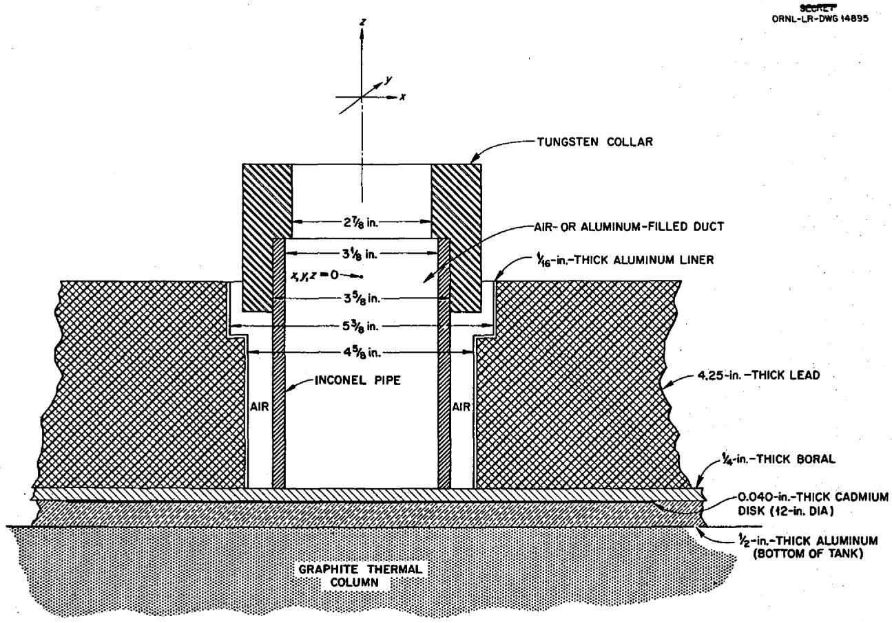  
Fig. 5.3.1. Mockup of the North-Head Straight-Duct Penetration of the 4.3-in.-Thick ART Lead Shield.

In order to determine the magnitude of the gamma-ray dose rate produced by streaming through the duct, it was necessary to know the dose transmitted through the lead shield, as well as the effect of the background produced by adjacent experimental facilities. Measurements of the gamma-ray dose rates were therefore made beyond a solid lead shield in the $x,y$ plane of the source at a distance $z$ above the top of the lead (see Fig. 5.3.1). The experimental data (Fig. 5.3.2) are presented in terms of the ratio of the dose rate with the duct in position to the dose rate with the duct replaced by a lead plug as a function of distance from the duct center line. The ratio of the dose rate beyond a water-filled hole to that beyond the solid lead is also shown in Fig. 5.3.2.

The actual ART duct mockup will consist of two concentric pipes. The inner one, which will contain the NaK, is not present in these straight-duct mockups, but it would reduce the dose by about $30\%$ . It should also be pointed out that the Inconel pressure shell is not part of the mockup shield. If it were, the dose-rate ratios would be higher by a factor of approximately 2 for a 1-in.-thick pressure shell.

A ratio of the dose rate with the aluminum-filled pipe to that with the air-filled pipe was 0.86 on the center line, which is in reasonable agreement with a calculated value. In the calculation the average energy of the gamma rays was assumed to be 3.5 Mev from the composite source. The ratio was determined from the following relation:

$$
\frac {D _ {1}}{D _ {2}} = B (\mu x) e ^ {- \mu x},
$$

where

$D_{1} =$ dose rate with pipe filled with aluminum turnings (with tungsten collar),

$D_{2} =$ dose rate through empty pipe (no collar), $x =$ length of duct $(12.8\mathrm{cm})$

$\mu =$ aluminum linear absorption coefficient $= \mu_{m}\rho_{t}$

$\mu_{m} =$ mass absorption coefficient (0.034) for 3.5-Mev gamma rays in aluminum,

$\rho =$ density of aluminum $= 0.85\mathrm{g / cm}^3$

$B(\mu x) =$ dose rate buildup factor (1.2).

Thus

$$
\frac {D _ {1}}{D _ {2}} = 0. 8 3
$$

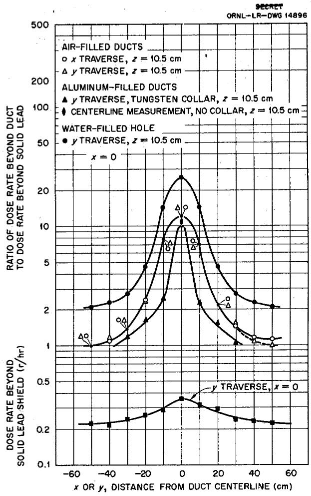  
Fig. 5.3.2. Gamma-Ray Dose Rates Beyond Straight-Through ART North-Head Duct Mockups Filled with Air or Aluminum.

as compared with the experimental value of 0.86 mentioned above.

It may be seen in Fig. 5.3.2 that the tungsten collar offers little attenuation to the dose along the center line of the pipe. However, the ratio of the dose rates with and without the tungsten collar and aluminum turnings, averaged over the emitted beam, was 1.76. This ratio indicates the effectiveness of the tungsten collar in this particular configuration only.

In the ART shield design the lead shield is followed by 31.5 in. $(80.0\mathrm{cm})$ of water. The water attenuation of the gamma-ray beam emerging from the duct mockup (with aluminum turnings and tungsten collar) along the $z$ axis is shown in Fig.

5.3.3, and the broadening of the beam at 30 and 80 cm is shown in Figs. 5.3.4 and 5.3.5, respectively.

The calculated ratio of the dose rate with the duct in place to the dose rate with a solid lead shield can be determined if an angular distribution $(\cos^m\theta)$ is assumed. If $\sigma$ is the number of photons per unit area emitted in the positive direction from a plane source and $\sigma'\cos^m\theta$ is the number emitted per unit solid angle at an angle $\theta$ from the normal, then the dose rate (neglecting the buildup factor) on the center line at a distance $z$ from the plane of

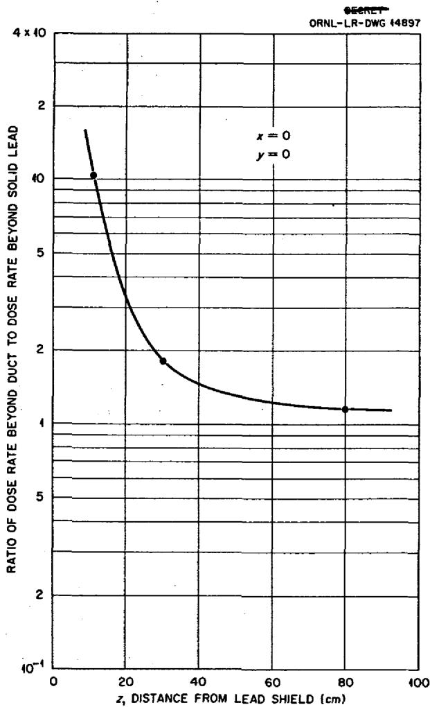  
Fig. 5.3.3. Water Attenuation of Gamma-Ray Beam from the Straight-Through, Aluminum-Filled, ART North-Head Duct Mockup with a Tungsten Collar.

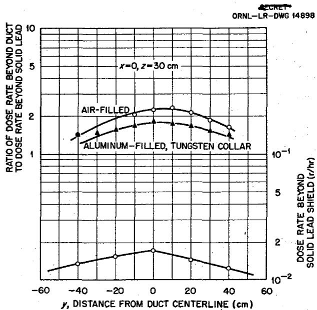  
Fig. 5.3.4. Gamma-Ray Dose Rates 30 cm Beyond Straight-Through ART North-Head Duct Mockups Filled with Air or Aluminum.

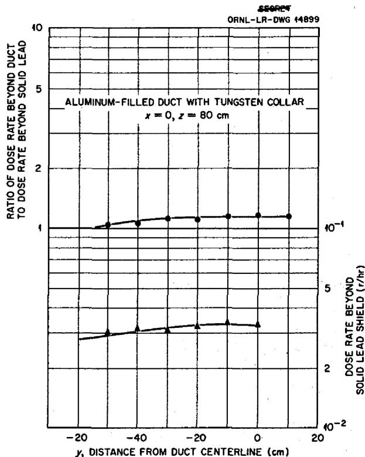  
Fig. 5.3.5. Gamma-Ray Dose Rate 80 cm Beyond Straight-Through ART North-Head Duct Mockup Filled with Aluminum.

radius $a$ (Fig. 5.3.6) is:

$$
\begin{array}{l} D (z) = \int_ {\rho = 0} ^ {a} \frac {\sigma^ {\prime} \cos^ {m} \theta e ^ {- \mu R} 2 \pi \rho d \rho}{R ^ {2 c}} \\ = \frac {2 \pi \sigma^ {\prime}}{c} \int_ {R = z} ^ {(a ^ {2} + z ^ {2}) ^ {1 / 2}} e ^ {- \mu R} \left(\frac {z}{R}\right) ^ {m} \frac {R d R}{R ^ {2}} \\ = \frac {(m + 1) \sigma}{c} (\mu z) ^ {m} \int_ {\mu z} ^ {\mu z [ 1 + (a ^ {2} / z ^ {2}) ] ^ {1 / 2}} \frac {e ^ {- \mu R} d (\mu R)}{(\mu R) ^ {m + 1}} \\ = \frac {(m + 1) \sigma}{c} \left[ E _ {m + 1} (\mu z) - \frac {1}{\left(1 + \frac {a ^ {2}}{z ^ {2}}\right) ^ {m / 2}} E _ {m + 1} (\mu z) \left(1 + \frac {a ^ {2}}{z ^ {2}}\right) ^ {1 / 2} \right], \\ \end{array}
$$

where

$$
E _ {m + 1} (x) = x ^ {m} \int_ {x} ^ {\infty} \frac {e ^ {- y} d y}{y ^ {m + 1}},
$$

$$
\begin{array}{l} \sigma = \int_ {\theta = 0} ^ {\pi / 2} \int_ {\phi = 0} ^ {2 \pi} \sigma^ {\prime} \cos^ {m} \theta \sin \theta d \theta d \phi \\ = \frac {2 \pi \sigma^ {\prime}}{m + 1}, \\ \end{array}
$$

$$
\begin{array}{l} \mu = \text {l i n e a r} \\ c = \text {f l u x - t o - d o s e c o n v e r s i o n f a c t o r .} \\ \end{array}
$$

These functions have been tabulated by Placzek² for values of $m$ up to 19.

If $a$ is the radius of the duct and $b$ is the radius of the source below the lead, then the ratio of the center-line dose rate with the duct in place to that with the solid lead shield in place is

where

$t =$ distance from source to dose-measurement position   
$= z$ (distance from lead) plus thickness of lead (4.3 in.),

$\mu_{1} =$ average linear absorption coefficient along the center line with duct in place,

$\mu_{2} =$ average linear absorption coefficient along the center line with lead in place.

The choice of the buildup factors $B_{1}$ and $B_{2}$ is very uncertain. It does not matter whether $B_{1}$ is taken for aluminum or water, but, since the water

2G. Placzek, "The Functions $E_{n}(x) = \int_{1}^{\infty} e^{-x\mu}\mu^{-n}$ dμ,MT-1 (n.d.).

$$
\frac {D _ {\text {d u c t}} (t)}{D _ {\text {l e a d}} (t)} = \frac {\left[ E _ {m + 1} \left(\mu_ {1} t\right) - \frac {1}{\left(1 + \frac {a ^ {2}}{z ^ {2}}\right) ^ {m / 2}} E _ {m + 1} \left(\mu_ {1} t\right) \left(1 + \frac {a ^ {2}}{z ^ {2}}\right) ^ {1 / 2} \right] B _ {1} \left(\mu_ {1} t\right)}{\left[ E _ {m + 1} \left(\mu_ {2} t\right) - \frac {1}{\left(1 + \frac {b ^ {2}}{z ^ {2}}\right) ^ {m / 2}} E _ {m + 1} \left(\mu_ {2} t\right) \left(1 + \frac {b ^ {2}}{z ^ {2}}\right) ^ {1 / 2} \right] B _ {2} \left(\mu_ {2} t\right)},
$$

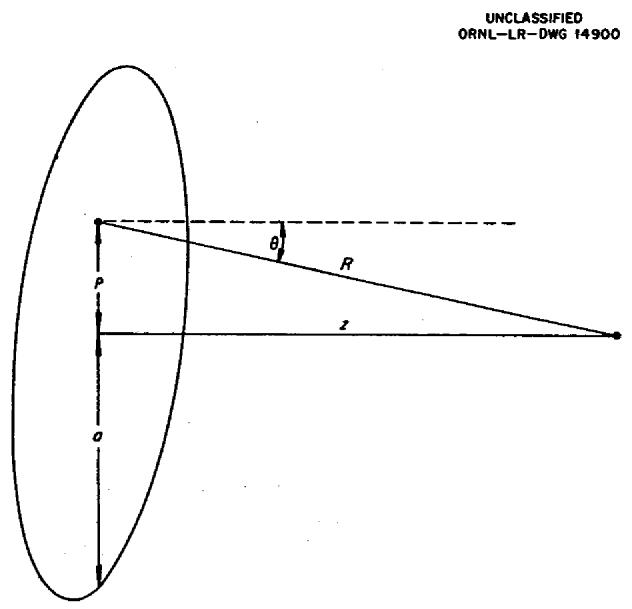  
Fig. 5.3.6. Geometry for Calculation of Dose Rate at Distance $z$ from Source.

thickness following the lead is thin $(\sim 0.4\mathrm{mfp})$ $B_{2}$ was assumed to be the buildup factor for lead.

The calculated ratio is plotted as a function of the angular distribution index $m$ in Fig. 5.3.7. There is excellent agreement with the experimental value if $m$ is taken to be 2. This is what might be expected from a combination of an isotropic component (cadmium capture gamma rays) and a highly directional component (carbon capture and reactor

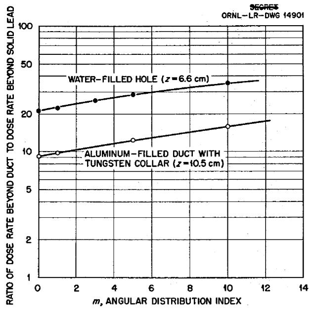  
Fig. 5.3.7. Calculated Ratio of Center-Line Gamma-Ray Dose Rate Beyond Straight-Through ART North-Head Duct Mockup to That Beyond Solid Lead Shield as a Function of Angular Distribution $(\cos^m\theta)$ of the Source.

gamma rays). Of course, the buildup factor and the monoenergetic source assumptions introduce some uncertainty. Also, both the energy spectrum and the angular distribution for the ART reactor are undoubtedly somewhat different than those for the mockup.

# 5.4. SHIELD MockUP CORE

C. E. Clifford

L. B. Holland

Tests of optimized reactor shield designs are made, currently, with a full-scale mockup of the shield and a known source. The effectiveness of the shield in its final application is then predicted by making source corrections. To date the source for the shielding tests has often been a swimming-pool type of reactor, but with the circulating-fuel reflector-moderated reactor (CFRMR) now being considered for aircraft propulsion it is considerably more difficult to correct for the differences between the two sources. In recent months it has become apparent that a shield test with a reactor that more nearly模拟 up a CFRMR is required.

The construction of a 5-Mw reactor that will use fixed fuel elements which will correctly mock up all the radiation expected from the CFRMR designed by Pratt & Whitney, except the decay gamma rays and neutrons from the circulating fuel in the heat exchanger, has been proposed. A preliminary design and a cost estimate are being prepared on which to base a formal construction proposal. The reactor will be called the Shield Mockup Core (SMC) and will be used with the latest optimized shield at the Tower Shielding Facility (TSF) to determine whether the calculated dose in the crew compartment agrees with the measured dose. It will also be used at the Bulk Shielding Facility (BSF), where measurements will be made of the spectra of neutrons and gamma rays emerging from the reactor shield.

Calculations for the SMC have thus far been directed toward obtaining a good nuclear mockup; the design effort has been directed toward making a simple yet flexible overall design. The SMC, as it is now planned, is described below, and the differences between it and the present CFRMR designs are noted. The SMC sources are then compared with the CFRMR to show how closely they agree. The SMC construction program is being scheduled so that criticality will be reached about May 1, 1957.

# THE REACTOR

The source geometry becomes an important factor when a shaped reactor shield is used, and therefore every attempt has been made to preserve the geometry of the CFRMR in the SMC (see Fig. 5.4.1). The central beryllium island will be cylindrical, and its center will be removed to provide space for

the inlet cooling line. The CFRMR has a control rod of slightly smaller diameter in this position, but calculations have shown that the effect of the cooling line will not be significant. The SMC will be controlled by using thin, curved plates containing $B^{10}$ at the outer edge of the island between the fuel plates and the beryllium. In the core region it is proposed to use fixed fuel plates of $\mathrm{UO}_2$ and stainless steel, which will be similar in cross section to the Army Package Power Reactor fuel plates. The shape of the plates will be peculiar to the SMC. The feasibility of the shape has already been determined with test fuel plates. There will be a total of 200 vertical fuel plates placed radially around the beryllium island, and normal water will be used as the coolant. The core region will be separated from the beryllium island and the reflector by Inconel shells, as required by the CFRMR.

The region above the CFRMR reactor core will be difficult to mock up. Since it constitutes a small total angle, it seems best, in the SMC, to attempt to black out radiation from this region. Another feature in favor of this idea is that the control-rod drives and control-chamber leads will be in this region.

The reactor is being designed so that it can be transported between the TSF and the BSF with a minimum amount of dismantling. The fuel can be removed without disturbing the control rods of the control chambers. This will be accomplished by placing the elements in a rotating rig that can be locked into position. A removable plug in the rig will allow removal of the elements.

# THE REFLECTOR

The beryllium reflector of the SMC will be similar in shape to that of the CFRMR, except at the top of the beryllium where the question of hydraulics greatly influences the CFRMR design. The sodium coolant of the CFRMR reflector will be simulated with aluminum in the beryllium. If cooling is required in the beryllium of the SMC, normal water will be used, and it will be kept at a minimum.

# REGIONS OUTSIDE THE REFLECTOR

The first region outside the beryllium reflector will be the first boron curtain. In the CFRMR this region consists of a layer of sodium, followed by

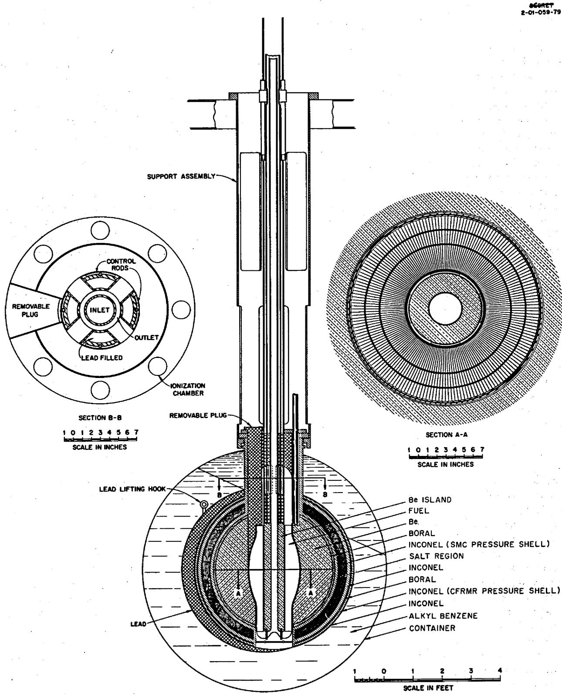  
Fig. 5.4.1. The Shield Mockup Core.

an Inconel shell and a complicated boron-copper layer. In considering the radiation as seen outside the shield, this region can be adequately simulated in the SMC with a shell of Inconel followed by layers of boral to give the proper density in $\mathbf{g} / \mathbf{cm}^2$ . Calculations are being carried out at Pratt & Whitney Aircraft to determine the importance of each region as a source of radiation.

The heat exchanger region just beyond the first boron curtain affects the crew compartment dose rate in several ways: (1) it attenuates the radiation from the core and the beryllium; (2) it is a source of some capture gamma radiation from core neutrons; and (3) it is a source of delayed neutrons and fission-product-decay gamma rays. In order to account for the first two effects, the heat exchanger region will be mocked up with fused salts (in the form of NaF and KF) and NaK, as a homogenized mixture. This will be accomplished by heating the salt, the NaK, and the can to about $1000^{\circ}\mathrm{C}$ in an evacuated furnace. The cans will be placed in two layers to eliminate leakage paths between the cans. The Inconel in the heat exchanger will be split to form two shells around the salt region. The inner shell will act as the pressure shell for the SMC. Outside the outer heat exchanger shell will be the second sodium-cooled boron curtain, which, like the first curtain, will be mocked up with boral.

The regular CFRMR pressure shell will follow the heat exchanger region. It has been proposed that part of this shell be split off for use in mounting the lead shielding. This section is to be removable to allow the lead shield to be changed without dismantling the reactor.

The neutron shielding material will be contained in an aluminum tank. The optimized neutron shield will be a sphere placed off-center with respect to the reactor. It is proposed to permit lateral motion of the neutron shield, while using water as shield material, to check the present optimization. Later the shield container is to be sealed in the optimized position, and neutron shielding materials other than water can be used.

In order to facilitate the measurements at the TSF, the whole reactor and shield system has been designed so that it can be rotated about the vertical axis.

# COMPARISON OF SMC AND CFRMR

An examination of some of the results of the calculations performed by Pratt & Whitney indicates

how closely the SMC radiation simulates the CFRMR. Thermal-neutron captures in the reflector and the power distribution within the core have been considered, and the importance of each region of the reactor as a gamma-ray source is being investigated.

# Neutron Captures in Beryllium

Since approximately $20\%$ of the dose rate in the crew compartment is expected to originate from neutron captures in the beryllium, this source is to be accurately simulated. Figure 5.4.2 shows the captures that can be expected in the SMC beryllium with normal water as the coolant in the core. The lower curve shows the absorptions in the SMC beryllium when the space between the fuel plates is completely filled with normal water and the reactor is operated at room temperature.

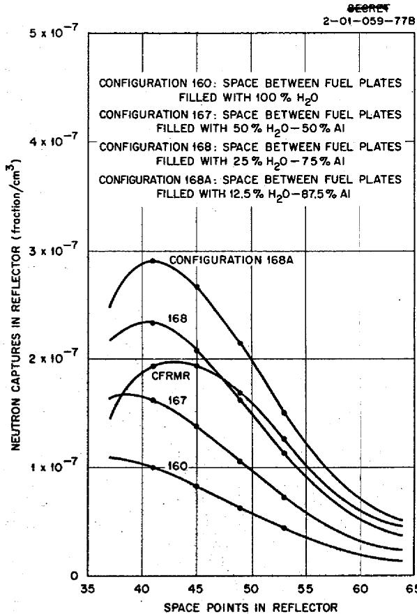  
Fig. 5.4.2. Comparison of Neutron Captures in Beryllium Reflector of SMC for Various Configurations with Neutron Captures in Reflector of CFRMR.

Comparing this with the calculations for the absorptions in the CFRMR reflector (this includes beryllium and sodium) operating at CFRMR temperature it can be seen that the absorptions in the SMC are low. By reducing the water volume in the core of the SMC with aluminum spacers (and thereby reducing the moderation in the core) the absorptions of neutrons in the beryllium can be increased. With $75\%$ aluminum and $25\%$ water in the spaces, the tails of the absorption curves are in good agreement. The shape of the curve for the region near the core-reflector interface does not match as well as the rest of the curve, but it may be lowered by adding the water necessary for cooling and adjusting the amount of aluminum simulating the sodium. In this manner the curves can be matched throughout. Both curves are normalized to one fission per cubic centimeter in the core region.

# Power Distribution

Some effort has been made to match the power distribution in the core of the CFRMR with that in the SMC for various percentages of water in the core (Fig. 5.4.3). Since a difference between the CFRMR and the SMC with $75\%$ aluminum and $25\%$ water was noted, some effort was made to bring these into better agreement. A slightly different core (100 fuel plates rather than 200) was divided into five regions to determine the variation that

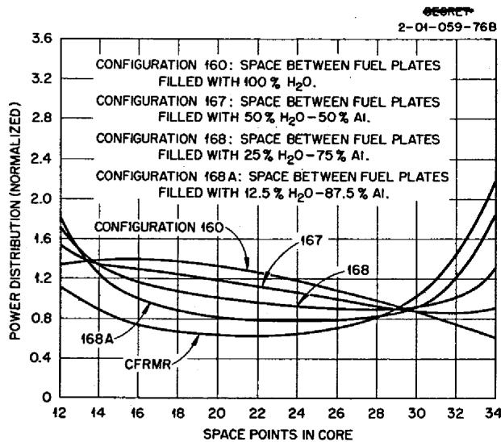  
Fig. 5.4.3. Comparison of Power Distribution in Core of CFRMR with That in SMC for Various Percentages of Water in the Core.

can be obtained in the SMC core power distribution (Fig. 5.4.4) by adjusting the fuel in the five regions from the center out in the proportions of 2:2:3:3:4 and 1:2:3:4:5. These calculations are not final, but they indicate that the proper mockup of the CFRMR radiation can be obtained in the SMC.

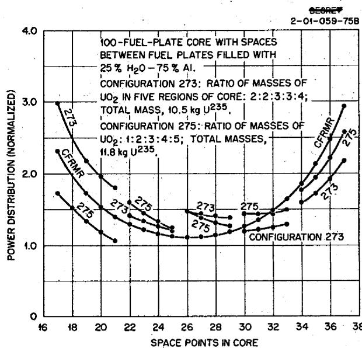  
Fig. 5.4.4. Effect on SMC Power Distribution of Varying the $\mathsf{UO}_2$ Mass in Five Regions of the Core.

# Gamma-Ray Sources

Another calculation is being carried out at Pratt & Whitney to determine the importance of each region as a gamma-ray source. The reactor is being divided into shells and the gamma-ray intensity from sources in each shell is being determined in a line-of-sight attenuation calculation. This is being done both for the CFRMR and the SMC as a basis of comparison of the two reactors.

The remaining region of importance that requires some further work is the heat exchanger. As previously mentioned the source from the circulation of the fuel is not present. Previous LTSF data indicate that the gamma-ray source resulting from circulation of the fuel contributes approximately $30\%$ of the gamma-ray dose rate outside the reactor shield. It is expected that further analysis of the

fission-product gamma-ray data reported by Zobel and Love2 will enable a calculation to be made,

2W. Zobel, T. A. Love, and R. W. Feeille, ANP Quar, Prog. Rep. March 10, 1956, ORNL-2061, p 250.

by the Monte Carlo method, to determine the gamma-ray dose rate resulting from the circulation of the fuel at least as well as the rest of the radiation from the SMC can be measured.