ORNL-2116

Chemistry a4 4

MEASUREMENT AND ANALYSIS OF THE

HOLDUP OF GAS MIXTURES BY

CHARCOAL ADSORPTION TRAPS

W.E.Browning

C.C.Bolta

CENTRAL RESEARCH LIBRARY

DOCUMENT COLLECTION

LIBRARY LOAN COPY

DO NOT TRANSFER TO ANOTHER PERSON

If you wish someone else to see this document, send in name with document and the library will arrange a loan.

1

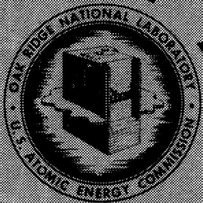

OAK RIDGE NATIONAL LABORATORY

OPERATED BY

UNION CARBIDE NUCLEAR COMPANY

A Division of Union Carbide and Carbon Corporation

BXC

POST OFFICE BOX P·OAK RIDGE, TENNESSEE

Printed in USA. Price 25 cents.Available from the

Office of Technical Services

U.5.Department of Commerce

Washington 25, D.C.

# LEGAL NOTICE

This report was prepared as an account of Government sponsored work. Neither the United States, nor the Commission, nor any person acting on behalf of the Commission:

A. Makes any warranty or representation, express or implied, with respect to the accuracy, completeness, or usefulness of the information contained in this report, or that the use of any information, apparatus, method, or process disclosed in this report may not infringe privately owned rights, or   
B. Assumes any liabilities with respect to the use of, or for damages resulting from the use of any information, apparatus, method, or process disclosed in this report.

As used in the above, "person acting on behalf of the Commission" includes any employee or contractor of the Commission to the extent that such employee or contractor prepares, handles or distributes, or provides access to, any information pursuant to his employment or contract with the Commission.

Contract No. W-7405-eng-26

SOLID STATE DIVISION

MEASUREMENT AND ANALYSIS OF THE HOLDUP OF GAS MIXTURES

BY CHARCOAL ADSORPTION TRAPS

W. E. Browning

C. C. Bolta

DATE ISSUED

JU.27 496

OAK RIDGE NATIONAL LABORATORY

Operated by

UNION CARBIDE NUCLEAR COMPANY

A Division of Union Carbide and Carbon Corporation

Post Office Box P

Oak Ridge, Tennessee

# INTERNAL DISTRIBUTION

1. C. E. Center   
2. Biology Library   
3. Health Physics Library

4-5. Central Research Library   
6. Reactor Experimental Engineering Library   
7-26. Laboratory Records Department   
27. Laboratory Records, ORNL R.C.   
28. A. M. Weinberg   
29. L. B. Emlet (K-25)   
30. J. P. Murray (Y-12)   
31. J. A. Swartout   
32. E. H. Taylor   
33. E. D. Shipley   
34. D. S. Billington   
35. M. L. Nelson   
36. W. H. Jordan   
37. C. P. Keim   
38. J. A. Lane   
39. J. H. Frye, Jr.   
40. R. S. Livingston   
41. S. C. Lind   
42. F. L. Culler   
43. A. H. Snell   
44. A. Hollander   
45. M. T. Kelley   
46. G. H. Clewett   
47. K. Z. Morgan   
48. T. A. Lincoln   
49. A. S. Householder   
50. C. S. Harrill   
51. C. E. Winters   
52. D. W. Cardwell   
53. E. M. King   
54. A. J. Miller   
55. J. T. Howe   
56. D. D. Cowen

57. R. A. Charpie   
58. G. E. Boyd   
59. M. J. Skinner   
60. R. R. Dickison   
61. C. J. McHargue   
62. R. D. Ackley   
63. S. E. Beall   
64. T. H. Blewitt

67. W. F. Boudreau   
68. A. R. Brosi

65-66. C. C. Bolta   
69-70. W. E. Browning   
71. J. A. Conlin   
72. W. B. Cottrell   
73. J. H. Crawford   
74. D. E. Guss   
75. S. J. Cromer   
76. H. L. Hemphill   
77. L. H. Jenkins   
78. G. W. Keilholtz   
79. H. V. Klaus   
80. J. O. Kolb   
81. M. F. Osborne   
82. H. E. Robertson   
83. M. T. Robinson   
84. H. W. Savage   
85. R. P. Shields   
86. 0. Sisman   
87. D. B. Trauger   
38. R. Van Winkle   
89. C. C. Webster   
90. J. C. Wilson   
91. H. G. MacPherson (consultant)   
92. R. L. Sproull (consultant)   
93. H. Brooks (consultant)   
94. MIT Practice School   
95. ORNL - Y-12 Technical Library, Document Reference Section

# EXTERNAL DISTRIBUTION

96. R. F. Bacher, California Institute of Technology   
97. G. L. Stiehl, Convair Division of General Dynamics Corporation, San Diego   
98. P. H. Emmett, Johns Hopkins

99-103. Pratt & Whitney Aircraft Division (Fox Project) (1 copy ea. to H. Hershenson, J. F. Krause, V. Scotti, R. Strough, and J. J. Wesbecher)   
104. Division of Research and Development, AEC, ORO   
105-788. Given distribution as shown in TID-4500 (11th ed.) under Chemistry: category (300 copies - OTS)

DISTRIBUTION PAGE TO BE REMOVED IF REPORT IS GIVEN PUBLIC DISTRIBUTION

# MEASUREMENT AND ANALYSIS OF THE HOLDUP OF GAS MIXTURES BY CHARCOAL ADSORPTION TRAPS

by

W. E. Browning and C. C. Bolta

# Summary

The purpose of this study is to determine holdup behavior of gaseous fission products in charcoal traps. The holdup behavior for a given gas is a function of trap geometry, type and amount of charcoal, trap temperature, flow rate, and type of inert gas used to purge the trap. Radiokrypton, used to typify gaseous fission products, was swept through the trap with either nitrogen or helium purge gas. Trap temperatures studied were from $+16^{\circ}\mathrm{C}$ to $-110^{\circ}\mathrm{C}$ . It was determined that holdup times of radiokrypton were greater for helium purge gas than for nitrogen purge gas. In all cases holdup times increased with decreasing trap temperature. The maximum concentration of krypton in effluent gas was lower for helium than for nitrogen purge gas, and was lower at lower temperatures. For a given trap diameter, doubling the length of trap doubles the time to peak and increases break through time and time to reach the end of the peak. Doubling trap length reduces the maximum effluent krypton concentration by half.

An analytical expression is presented from which it appears possible to predict holdup curves for gases when trap geometry and the linear adsorption isotherm for the gas mixture on charcoal are known. Optimized traps may be designed for any purpose with this information.

# Introduction

Gaseous fission products, from regions of nuclear processes which may be contaminated by such gases, usually cannot be vented directly to the atmosphere. Charcoal traps have been used to reduce to a safe level the rate at which the activity is vented to the atmosphere.

The traps reduce the amount of activity by holding it up while it decays and in the case of a sudden burst of activity they reduce the rate of activity release by releasing it slowly over a long period of time. To determine the amount of activity leaving the traps as a function of time, the time the radioactive gases are delayed (holdup time) in the traps must be known, as well as the length of time over which they are released. Both factors for a given gas are a function of trap geometry, type and amount of charcoal, trap temperature and type and flow rate of inert purging gas. The function of these parameters must be known to design and determine the effectiveness of charcoal traps for gaseous fission products.

An investigation of the literature on adsorption of gases yielded two pertinent reports. The paper by E. Wicke3 published in 1940 presents a comprehensive study of the "microscopic" mechanism of adsorption in long, small diameter tubes. High concentrations of $\mathrm{CO}_{2}$ in nitrogen as carrier gas were studied at $0^{\circ} \mathrm{C}$ and at $100^{\circ} \mathrm{C}$ . A mathematical analysis of gas mixing and sorption velocities is presented. As stated in the report, the results obtained are not directly applicable to many industrial processes, but nevertheless, they afford an excellent foundation for experiments to develop industrial uses of adsorption.

D. Guss1 reported a study of the adsorption of radiokrypton on charcoal in a Solid State Division Semiannual Report. Break through times of radiokrypton at room temperature were reported for several traps of different geometry. The objective of the experiment was to determine the length of time before the adsorbate first appeared in the effluent gas from the trap, rather than concentration changes with time after break through. The need for information on this type of work was increased and the present experiment was a natural outgrowth of Guss' work.

# Experimental Procedure

An experiment was set up (see Fig. 1) using radiokrypton to typify fission gases. Radiokrypton was chosen because it is the first fission gas to emerge from a

charcoal trap. Ten year krypton was used in this work so decay is negligible. Two different purging gases, nitrogen and helium, were used to sweep the radiokrypton through the trap. The trap was made from $2^{\prime \prime}$ schedule 40 stainless steel pipe and was $13^{\prime \prime}$ long. It contained $3/4$ lb of 8 to 14 mesh Columbia ACA Charcoal. Trap temperatures were kept constant using freezing solutions of $\mathrm{CaCl}_2$ brine for the $-50^{\circ}\mathrm{C}$ , and freezing solution of Freon 11 and 22 for the $-110^{\circ}\mathrm{C}$ temperature. Liquid nitrogen was used to keep the material at its freezing point.

For each run the trap was filled with purge gas, the manifold was evacuated and radiokrypton allowed to flow into the krypton chamber. The chamber was sealed and the rest of the manifold evacuated. Carrier gas was then allowed to push the radiokrypton into the traps at constant flow rate of 5.0 ft³ per hr. The concentration of radiokrypton in the effluent gas and therefore its partial pressure can be determined by measuring the activity of the gas. The relative activity of the effluent gas was measured as it passed through a small cell, one wall of which was the end window of a Geiger tube. The gas activity was registered on a log-counting rate recorder.

# Experimental Results

Figures 2, 3, 4, 5 show the results obtained for nitrogen purge gas using one trap, and using two identical traps in series, at $+16^{\circ}\mathrm{C}$ , $+5^{\circ}\mathrm{C}$ , $-51^{\circ}\mathrm{C}$ and $-110^{\circ}\mathrm{C}$ respectively. In each case the activity injected was determined by integration of the activity vs. time curves. All were normalized to the same area under the curve. It can be seen that for a given trap geometry the holdup times, i.e., time for activity to break through, time for activity to peak, and time for last appearance of activity, all increase with decreasing temperature. This can be predicted since the energy of a gas molecule is less at low temperature and it cannot as readily desorb from the charcoal surface into the moving gas stream. The maximum concentration of radio-krypton in effluent gas is lower for lower temperatures.

The effect of using two identical traps in series with nitrogen purge gas is also shown on figures 2, 3, 4 and 5. These curves show that the time to peak is approximately twice as long as for one trap and that the break-through time is from twice as long to three times as long as for one trap. The time to the end of the effluent activity is also increased and the maximum radiokrypton concentration is about half as great.

Figure 6 shows two curves for helium purge gas at $-5^{\circ}\mathrm{C}$ and $-51^{\circ}\mathrm{C}$ . The shape of these curves is somewhat uncertain since their accuracy was limited by the sensitivity of the flowmeter in its lower range when used with He. Several runs were made at each temperature and the holdup times are significant even if the exact shape of the curve may be in doubt. These curves show that radiokrypton is held up for longer periods of time in the presence of flowing helium than in the presence of flowing nitrogen. Since nitrogen is itself adsorbed in large amounts on charcoal, the charcoal surface is not as free to adsorb krypton. Helium will pass over charcoal with very little adsorption. Hence, krypton is retained on the charcoal for longer periods of time in the presence of flowing helium. Maximum radiokrypton concentrations are significantly lower for helium than for nitrogen.

Figures 7 and 8 show the same data as figures 2, 4, and 5 plotted together for comparison. The time to reach maximum activity and the height and duration of the peaks are clearly indicated as a function of temperature.

# Analytical Theory

A theoretical analysis of the holdup process in charcoal traps is postulated, making use of a number of theoretical charcoal-filled chambers, N, connected in series, occupying the total volume of the trap. This analysis is similar to the continuous dilution tank problem in chemical engineering. It is assumed that as gas enters each chamber it is instantly spread and brought to adsorption equilibrium throughout the entire theoretical chamber. These conditions apply only to systems where dilution

processes, and not diffusion or adsorption are rate limiting, and hence are not applicable to liquid chromatography and ion exchange where these processes are slower. The rate of removal of radiokrypton in each chamber is first order with respect to its partial pressure, and therefore to its concentration in that chamber, i.e.,

$$
- \frac {\mathrm {d} P}{\mathrm {d} t} = \frac {\mathrm {F N}}{\mathrm {k m}} \quad \mathrm {P}.
$$

N differential equations of this type for the N chambers are solved simultaneously. The general equation for the $\mathbf{N}^{\mathrm{th}}$ chamber is:

$$
P _ {N} = \frac {N ^ {N} A F (N - 1) t (N - 1)}{(N - 1) ! (k m) ^ {N}} e ^ {- \frac {N F t}{k m}} \tag {1}
$$

where

$$
\begin{array}{l} P _ {N} = \text {P a r t i a l p r e s s u r e o f r a d i o k r y p t o n (a t m)} \\ A = \text {A m o u n t} \\ N = \text {N u m b e r o f t h e o t e r t i c a l c h a m b e r s} \\ F = \text {F l o w r a t e} (\mathrm {c c} / \min ) \\ t = \text {T i m e a f t e r i n j e c t i o n o f p u l s e (m i n)} \\ k = \text {S l o p e} \quad \text {o f t h e l i n e a r i s o t h e r m} \frac {\mathrm {x}}{\mathrm {m}} = \mathrm {k P} \text {f o r r a d i o k r y p o t i n t h e m i x t u r e o f} \\ m = \text {A m o u n t} \quad \text {a d s o r b e n t (c h a r c o a l) i n t r a p - (g m s)} \\ x = \text {A m o u n t o f g a s (r a d i o k r y p t o n) a d s o r b e d i s o t h e r m a l l y (c c a t m)} \\ \end{array}
$$

km is a measure of the adsorptive capacity of the charcoal trap for radiokrypton in the presence of purge gas at the given temperature.

In order to fit the expression to the experimental curves of activity vs. time, experimental data were used from three points on each curve: time to reach maximum partial pressure and the two times to reach a definite fraction of the maximum partial pressure (1/10 or 1/2). The time $t_{\text{max}}$ to reach maximum partial pressure $P_{\text{max}}$ is

obtained from equation (1) by setting $\frac{\mathrm{d}P}{\mathrm{d}t} = 0,$

$$
t _ {\max } = \frac {(N - 1) (k m)}{N F} \tag {2}
$$

Substituting equation (2) into equation (1) gives:

$$
P _ {\max } = \frac {N (N - 1) ^ {N - 1} A}{(N - 1) ! (k m)} e ^ {- (N - 1)} \tag {3}
$$

Equation (3) will give the maximum concentration of radiokrypton in the effluent gas, and $\mathbf{F} \mathbf{P}_{\max}$ is the maximum rate of release of activity. Dividing equation (3) by 10 (or 2) and using experimental values for $t_{\max}$ , $t$ at 1/10 (or 1/2), $P_{\max}$ and $F$ , equations (2) and (3) are solved simultaneously for $N$ and for $km$ . These values of $N$ and $km$ are used in equation (1).

# Analytical Results

Figures 2 through 5 show how closely the curves from the analytical expression fit the experimental curves. The deviation is within experimental error, most of which comes from counting statistics.

Figure 9 is a plot of parameters N and In (km) as a function of temperature as determined by fitting equation (1) to the data in figures 2 to 5. N has the same value at all temperatures.

Figure 9 indicates that km and therefore k increases exponentially as $1 / T$ increases (decreasing temperature) since the curves are for constant charcoal mass m. Analytical Interpretation

In the analytical expression, equation (1), km and N determine the time to maximum krypton concentration, and the narrowness of the peaks respectively. The quantity (km) will determine the time to reach maximum partial pressure and therefore concentration, regardless of trap geometry for a given trap volume. km is directly proportional to trap volume (amount of charcoal) since the slope $k$ of the linear

isotherm $\frac{x}{m} = kP^{1 / n}$ is constant for a given temperature (where $n = 1$ for low partial pressure and $x =$ amount of gas adsorbed isothermally by $m$ grams of adsorbent with equilibrium pressure $P$ ).2

One would expect that for krypton on charcoal saturated with helium the slope $\mathbf{k}_{\mathrm{g}}$ will be greater than for krypton on charcoal saturated with nitrogen, because of interference by adsorbed nitrogen. Therefore the holdup times for krypton with helium purge gas should be greater than those for nitrogen as observed.

If km, the parameter in equation (l) which specifies holdup time, is the slope of the linear isotherm, multiplied by the amount of charcoal, then the logarithm of km plotted against $\frac{l}{T}$ should yield a straight line as shown in Fig. 9. The activation energy calculated from this curve is $3.0\mathrm{kcal}$ . for adsorption of krypton on nitrogen-saturated charcoal. This straight line relationship indicates that the parameter k is proportional to the slope of the linear isotherm. Whether the proportionality factor is unity has not yet been determined. At a given temperature, km, for two traps in series, is twice as large as for one trap. This should be true since k is constant for a given temperature and m is doubled.

In Fig. 9 it appears that the number of theoretical chambers N is a characteristic of the geometry of the charcoal trap since N does not vary for the different temperatures studied. This should be true if the model used to derive the expression for the curve has physical significance. For two traps in series, N is twice as large as for one trap, indicating that N may be a first order function of the length of the trap divided by the diameter.

N is a function of trap geometry and does not effect the time to reach maximum concentration. It does effect the shape of the concentration vs. time curve, and therefore, the maximum concentration for a given amount of adsorbate. For small N, the

curve will be flat and broad; for large $N$ , the curve will be more sharply peaked. For example:

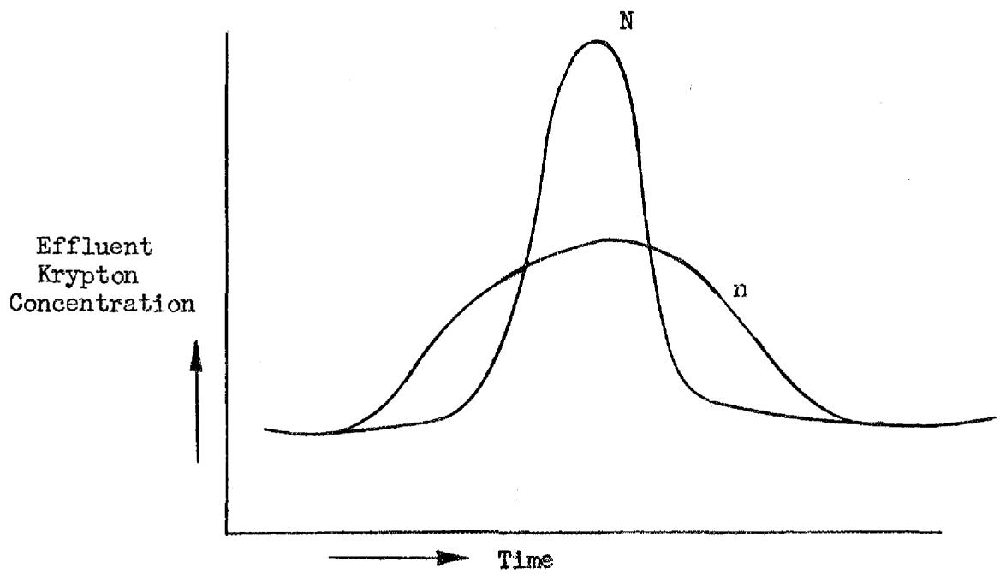

At a given trap temperature (or value of km), the breakthrough time and time to end of pulse is influenced by N. This effect is shown clearly by comparing the various curves for one and for two traps. The time to reach maximum concentration is twice as great for two traps in series as for one trap since km is twice as large. The breakthrough time for two traps is about four times as long as for one trap and the time the last activity appeared is somewhat greater than twice as long.

If N is a function of trap geometry only, it appears that the function is the length of trap divided by trap diameter. For nitrogen, N is constant. Since the data for helium is somewhat in doubt because the flow rate was erratic, the value of N obtained from these curves varies. Values of N for the helium purge gas runs varied from 6 to 14. This is a fairly good indication that the N obtained is not greatly different from those obtained using nitrogen purge gas. A more complete study of N with He must be made.

Equation (3) is of particular interest since $\mathbf{P}_{\mathrm{max}}$ indicates the maximum concentration of fission gases in the effluent gas and $\mathbf{F} \cdot \mathbf{P}_{\mathrm{max}}$ is the maximum rate of release of fission gases to the atmosphere. Both quantities are inversely proportional to trap size, $m$ , and to $k$ . Since $k$ is very sensitive to temperature, as discussed above, it is more efficient to reduce $\mathbf{F} \cdot \mathbf{P}_{\mathrm{max}}$ by chilling the trap than by using a larger trap, especially if trap size is important as when radiation shielding is required. $\mathbf{F} \cdot \mathbf{P}_{\mathrm{max}}$ is smaller for small $N$ as in short large diameter traps. The flow rate, $F$ , should be minimized to keep $\mathbf{F} \cdot \mathbf{P}_{\mathrm{max}}$ at a minimum.

For application to gas chromatography, both equations (2) and (3) must be considered. To obtain maximum separation of different adsorbate gases the difference between $t_{\text{max}}$ for the different adsorbates should be as large as possible. However, to gain sensitivity of detection $P_{\text{max}}$ should be large. These two conditions place opposite requirements on $k$ , the only parameter which is expected to depend on adsorbate gas. Improved resolution can be obtained by using large $N$ so that concentration peaks are high and narrow, since $t_{\text{max}}$ is relatively insensitive to $N$ while $P_{\text{max}}$ depends strongly on $N$ . The long thin traps conventionally used in gas chromatography provide the large $N$ required for optimum design.

# Conclusions

The expression of equation (1), derived in a previous section can be used to determine holdup times, maximum concentration, and the shape of the concentration curve of a gas carried by an inert purge gas when values for N and k are known. A close estimate of N may be obtained for the narrow range tested from the trap geometry using N equal to length of trap divided by trap diameter. The slope of the linear isotherm k must be obtained for mixtures either from the literature or by experiment. If k at two temperatures is known, then k at any other temperature may be obtained by plotting ln k vs. temperature as a straight line. With this information, an optimized trap can be designed for any purpose. If a low maximum effluent concentration of adsorbate is

needed, then N should be small and the trap temperature as low as possible. For a given volume, a short wide diameter trap would be best. If a trap is needed which will hold up the adsorbate gas for a relatively long time and then release the gas in a short, high concentration peak as is done in gas chromatography, then a long, small diameter trap is best. This geometry will make N large. For a given volume of charcoal, the time delay that is needed before the gas leaves the trap will determine the trap temperature and therefore k. The choice of purge gas will also determine the time delay of adsorbate in the trap. For long time delays, a purge gas that is not itself adsorbed on charcoal to a great extent is better than a purge gas that has appreciable adsorption.

This analysis makes it possible to predict the concentration as a function of time of mixtures of gas flowing through charcoal traps.

# Future Work

A study is in progress to determine if N is always a linear function of trap length divided by trap diameter by studying traps of varying length to diameter ratio with the same volume of charcoal used in the work presented in this report. These traps will be purged with a variety of gases some of which are nitrogen, helium, argon and air. Adsorbates used will be radiokrypton and radioxenon. Exact amounts of adsorbate injected will be measured.

Saturation effects of adsorbate on charcoal will be studied. This will be done with a radioactive tracer of Kr mixed with inactive Kr to increase the Kr partial pressure many fold.

Studies will be made with varying trap geometry, temperature and gases and with adsorbate continuously injected into the traps instead of a single short duration injection. Saturation values and equilibrium concentration will be correlated. Prediction of the results will be attempted using an extension of the theory presented in this report.

Experimental measurements of isotherms will be made for gases in mixtures of interest to determine whether the k determined in this study is indeed identical with the adsorption isotherm.

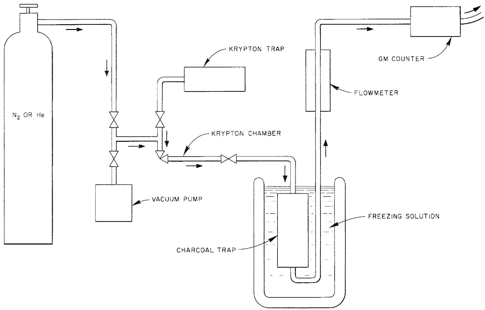  
Fig. 1. Apparatus for Investigating Holdup Times of Fission Gases by Charcoal Traps.

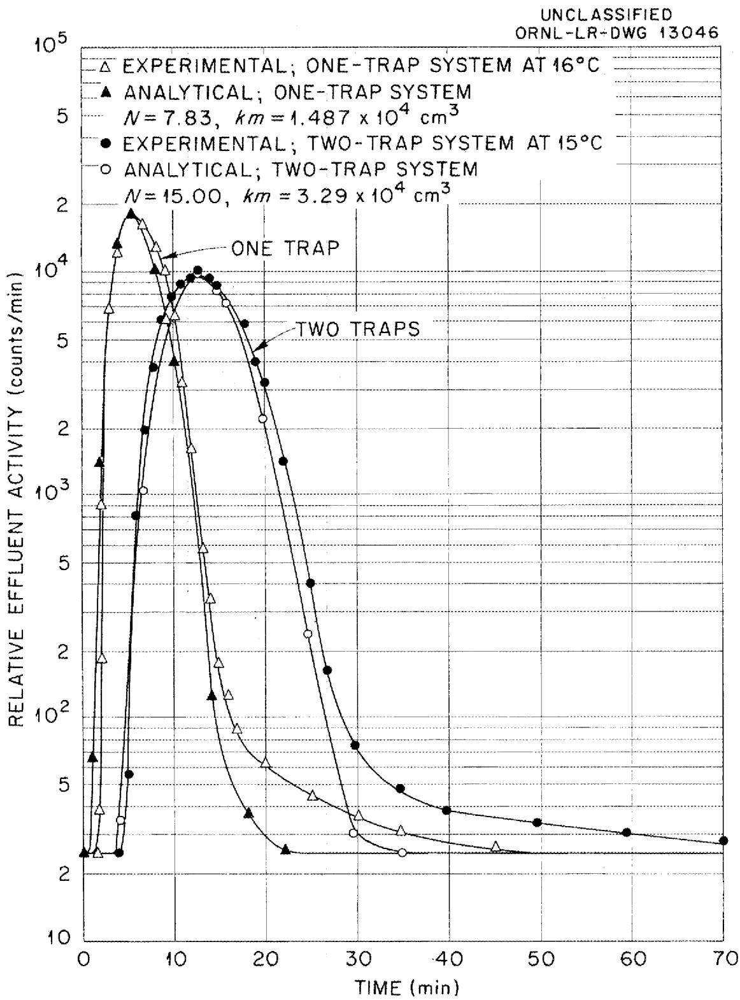  
Fig. 2. Holdup of Radiokrypton in Nitrogen-Purged Charcoal Traps as a Function of Temperature. One trap held at $16^{\circ}C$ ; two traps in series held at $15^{\circ}C$ .

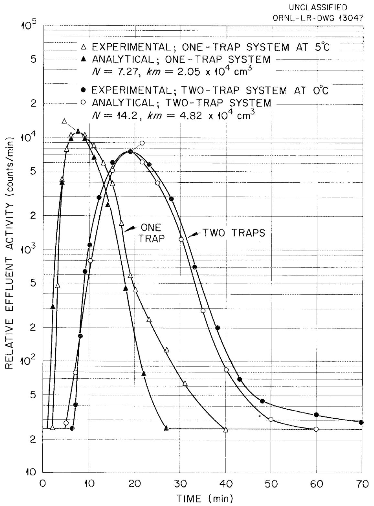  
Fig. 3. Holdup of Radiokrypton in Nitrogen-Purged Charcoal Traps as a Function of Temperature. One trap held at $+5^{\circ}C$ ; two traps in series held at $0^{\circ}C$ .

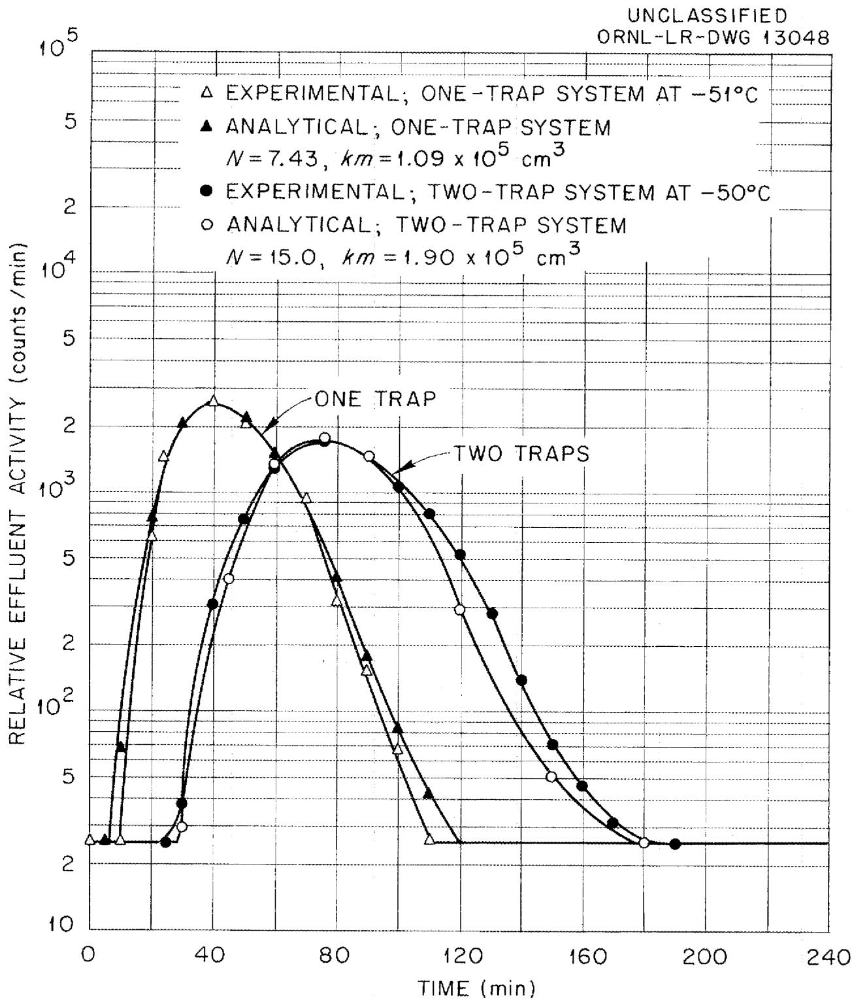  
Fig. 4. Holdup of Radiokrypton in Nitrogen-Purged Charcoal Traps as a Function of Temperature. One trap held at $-51^{\circ}C$ ; two traps in series held at $-50^{\circ}C$ .

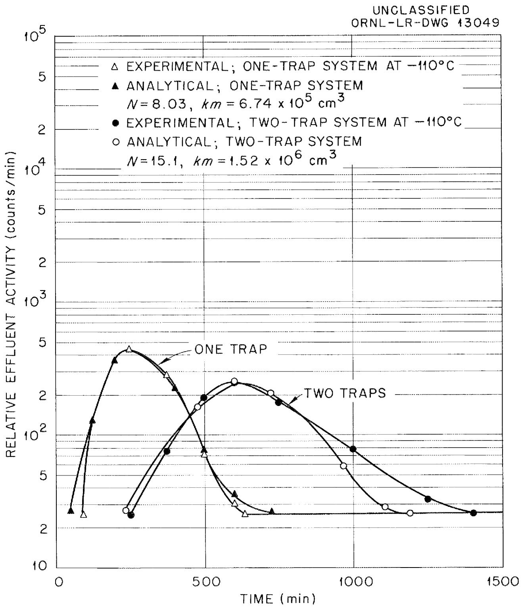  
Fig. 5. Holdup of Radiokrypton in Nitrogen-Purged Charcoal Traps as a Function of Temperature. Traps held at $-110^{\circ}\mathrm{C}$ .

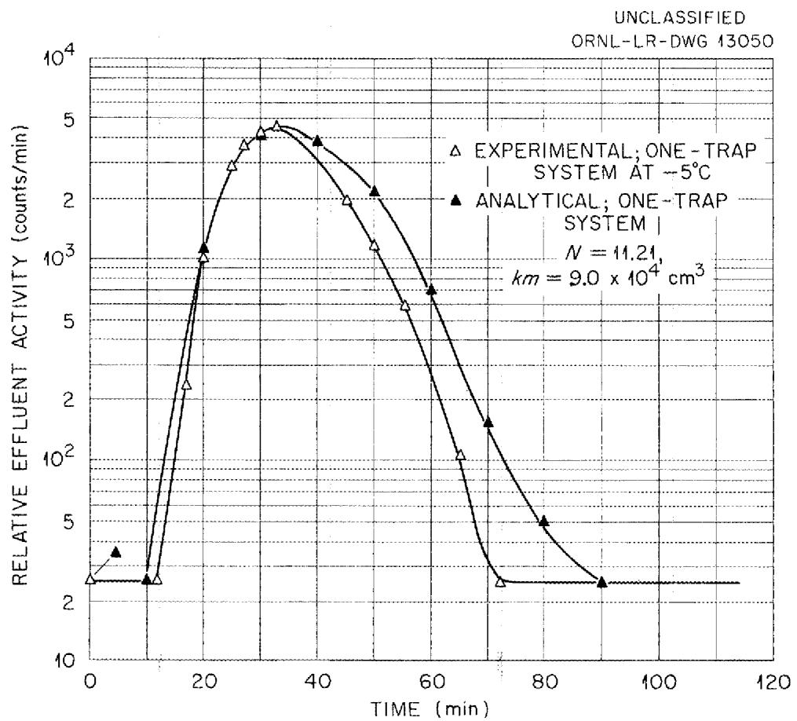

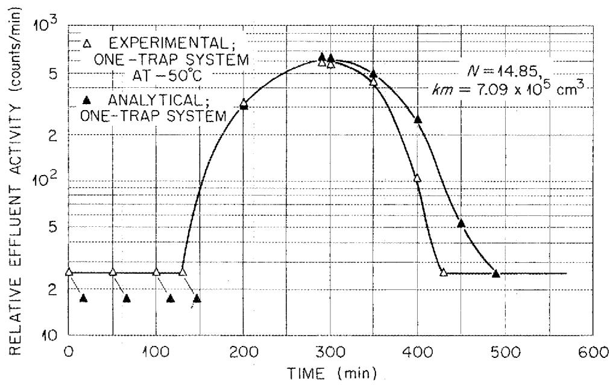  
Fig. 6. Holdup of Radiokrypton in Helium-Purged Charcoal Traps at -5 and -50°C.

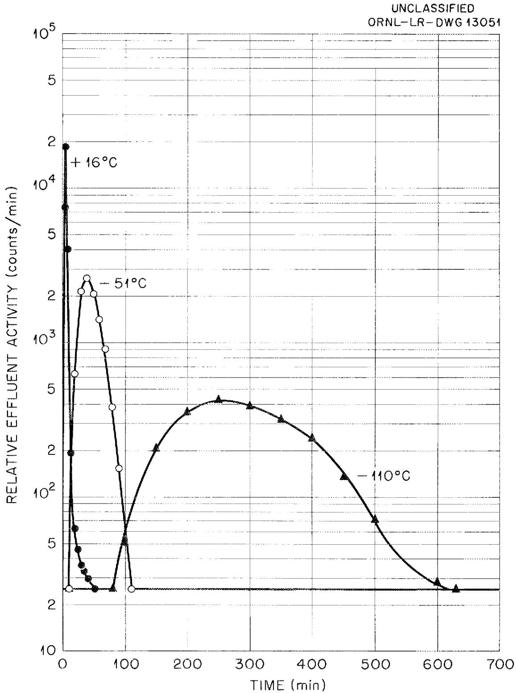  
Fig. 7. Comparison of Experimental Data on Holdup of Radiokrypton in Nitrogen-Purged One-Trap Systems at Various Temperatures.

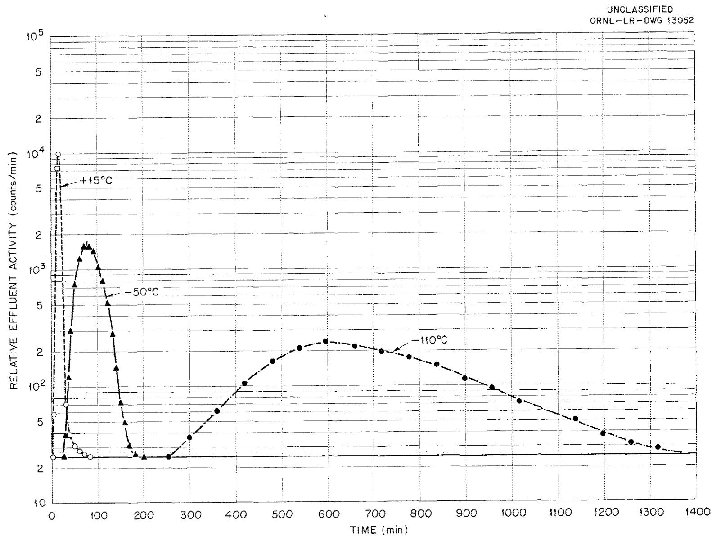  
Fig. 8. Comparison of Experimental Data on Holdup of Radiokrypton in Nitrogen~Purged Two-Trap Systems at Various Temperatures.

UNCLASSIFIED

ORNL-LR-DWG 13053

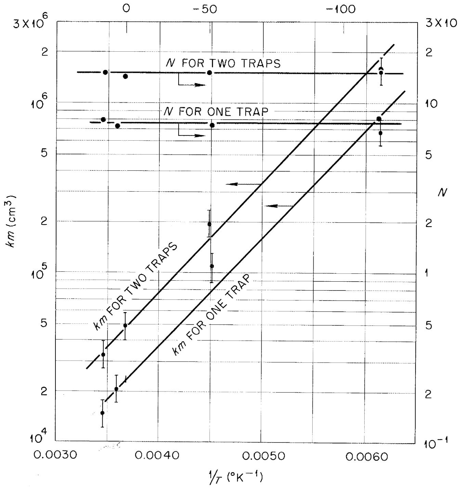  
TEMPERATURE $(^{\circ}C)$   
Fig. 9. Comparison of Analytical Constants N and km for One- and Two-Trap Systems as a Function of Temperature.

# Bibliography

1 Guss, D., Solid State Division Semiannual Progress Report August 31, 1955 ORNL-1944   
2 Lewis, Squires and Broughton - "Industrial Chemistry of Colloid and Amorphous Materials" McMillan, 1952   
3 Wicke, E., Koll. Z., 93, 129 (1940)