# ORNL MASTER COPY

A PHYSICAL PROPERTY SUMMARY FOR

ANP FLUORIDE MIXTURES

S. I. Cohen

W. D. Powers

N. D. Greene

sE C 1-24-59

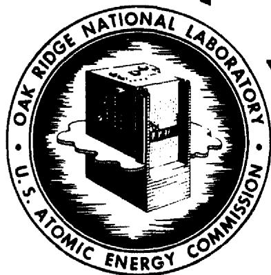

OAK RIDGE NATIONAL LABORATORY

OPERATED BY

UNION CARBIDE NUCLEAR COMPANY

A Division of Union Carbide and Carbon Corporation

UCC

POST OFFICE BOX P · OAK RIDGE, TENNESSEE

# LEGAL NOTICE

This report was prepared as an account of Government sponsored work. Neither the United States, nor the Commission, nor any person acting on behalf of the Commission:

A. Makes any warranty or representation, express or implied, with respect to the accuracy, completeness, or usefulness of the information contained in this report, or that the use of any information, apparatus, method, or process disclosed in this report may not infringe privately owned rights; or   
B. Assumes any liabilities with respect to the use of, or for damages resulting from the use of any information, apparatus, method, or process disclosed in this report.

As used in the above, "person acting on behalf of the Commission" includes any employee or contractor of the Commission to the extent that such employee or contractor prepares, handles or distributes, or provides access to, any information pursuant to his employment or contract with the Commission.

Contract No. W-7405, eng 26

Reactor Experimental Engineering Division

A PHYSICAL PROPERTY SUMMARY FOR ANP FLUORIDE MIXTURES

by

S. I. Cohen

W. D. Powers

N. D. Greene

DATE ISSUED AUG 23 1956

OAK RIDGE NATIONAL LABORATORY

Operated by

UNION CARBIDE NUCLEAR COMPANY

A Division of Union Carbide and Carbon Corporation

Post Office Box Y

Oak Ridge, Tennessee

# INTERNAL DISTRIBUTION

1. A. A. Abbatiello

2. R. G. Affel

3. P. A. Agron

4. L. G. Alexander

5. G. M. Adamson

6. J. C. Amos

7. M. A. Bredig

8. G. E. Boyd

9. R. B. Briggs

10. E. G. Bohlmann

11. M. Bender

12. W. F. Boudreau

13. W. E. Browning

14. E. S. Bettis

15. C. M. Blood

16. H. J. Buttram

17. J. P. Blakely

18. F. F. Blankenship

19. M. Blander

20. E. P. Blizzard

21. F. R. Bruce

22. D. S. Billington

23. C. D. Baumann

24. C. R. Baldock

25. C. J. Barton

26. F. L. Culler

27. C. R. Croft

28. S. Cantor

29. C. E. Center (K-25)

30. B. H. Clampitt

31. D. R. Cuneo

32. S. I. Cohen

33. C. M. Copenhaver

34. D. D. Cowen

35. R. S. Carlsmith

36. W. R. Chambers

37. W. G. Cobb

38. W. B. Cottrell

39. S. J. Cromer

40. G. A. Christy

41. A. D. Callihan

42. C. E. Clifford

43. M. M. Cooper

44. D. Carrison

45. W. H. Cook

46. F. A. Doss

47. J. H. Devan

48. L. M. Doney

49. E. R. Dytko

50. W. K. Eister

51. L. B. Emlet (K-25)

52. J. E. Eorgan

53. E. P. Epler

54. W. K. Ergen

55. A. P. Fraas

56. W. T. Furgerson

57. H. A. Friedman

58. D. E. Ferguson

59. M. J. Feldman

60. R. A. Gilbert

61. J. B. Gregg

62. H. E. Goeller

63. R. J. Gray

64. W. R. Gambill

65. N. D. Greene

66. D. P. Gregory

67. H. C. Gray

68. R. I. Gray

69. W. R. Grimes

70. H. W. Hoffman

71. E. E. Hoffman

72. D. C. Hamilton

73. W. H. Jordan

74. G. W. Keilholtz

75. J. J. Keyes

76. E. E. Ketchen

77. F. Kertesz

78. F. A. Knox

79. M. T. Kelley

80. F. L. Keller

81. B. Kinyon

82. P. R. Kasten

83. R. B. Korsmeyer

84. A. S. Kitzes

85. R. B. Lindauer

86. R. N. Lyon

87. J. A. Lane

88. C. G. Lawson

89. S. Langer

90. F. E. Lynch

91. M. E. Lackey

92. G. L. Muller

93. R. E. MacPherson

94. W. D. Manly

95. L. A. Mann

96. E. R. Mann

97. C. Mantell

98. W. B. McDonald

99. F. R. McQuilkin

100. R. V. Meghreblian

101. R. P. Milford

102. R. E. Moore

103. R. E. Meadows

104. H. P. Metcalf

105. A. J. Miller

106. A. S. Meyer, Jr.

107. J. R. McNally, Jr.

108. F. C. Maienschein

109. H. G. MacPherson

110. J. P. Murray (Y-12)

111. G. J. Nessle

112. R. F. Newton

113. R. H. Nimmo

114. L. G. Overholser

115. R. W. Peelle

116. M. B. Panish

117. L. D. Palmer

118. H. F. Poppendiek

119. W. D. Powers

120. A. M. Perry

121. M. W. Rosenthal

122. REED Library

123. J. D. Redman

124. M. T. Robinson

125. J. A. Swartout

126. I. Spiewak

127. B. A. Soderberg

128. B. J. Sturm

129. G. F. Schenck

130. M. J. Skinner

131. B. E. Thoma

132. N. V. Smith

133. O. Sisman

134. G. P. Smith

135. C. D. Susano

136. R. J. Sheil

137. A. W. Savolainen

138. H. W. Savage

139. R. D. Schultheiss

140. W. L. Scott

141. S. C. Shuford

142. L. E. Topol

143. D. G. Thomas

144. J. Truitt

145. D. B. Trauger

146. W. F. Vaughan

147. E. R. Van Artsdalen

148. G. D. White

149. G. M. Watson

150. W. T. Ward

151. J. C. Wilson

152. J. C. White

153. J. L. Wantland

154. C. S. Walker

155. A. M. Weinberg

156. G. D. Whitman

157. C. E. Winters

158. M. M. Yarosh

159. J. Zasler

160. D. Zucker

161-162. Central Research Library

163-164. ORNL - Y-12 Technical Library, Document Reference Section

165-200. Laboratory Records Department

201. Laboratory Records, ORNL R.C.

# EXTERNAL DISTRIBUTION

202. AF Plant Representative, Burbank

203. AF Plant Representative, Baltimore

204. AF Plant Representative, Marietta

205-207. AF Plant Representative, Santa Monica

208-209. AF Plant Representative, Seattle

210. AF Plant Representative, Wood-Ridge

211. Air Materiel Area

212. Air Research and Development Command (RDGN)

213. Air Technical Intelligence Center

214. Bureau of Aeronautics, General Representative

215. Allison Division

216-218. ANP Project Office, Fort Worth

219. Albuquerque Operations Office   
220. Argonne National Laboratory   
221. Armed Forces Special Weapons Project, Sandia   
222. Armed Forces Special Weapons Project, Washington   
223. Assistant Secretary of the Air Force, R&D

224-230. Atomic Energy Commission, Washington (1 copy to R. H. Graham)

231-232. Battelle Memorial Institute (l copy to E. M. Simons)

233-234. Bettis Plant (WAPD)

235. Bureau of Aeronautics   
236. Bureau of Aeronautics (Code 24)   
237. Chicago Operations Office   
238. Chief of Naval Research   
239. Chicago Patent Group   
240. Convair-General Dynamics Corporation   
241. Engineer Research and Development Laboratories

242-245. General Electric Company (ANPD)

246. Hartford Area Office   
247. Headquarters Air Force Special Weapons Center   
248. Idaho Operations Office

249-250. Knolls Atomic Power Laboratory (1 copy to W. J. Robb, Jr.)

251. Lockland Area Office   
252. Los Alamos Scientific Laboratory   
253. National Advisory Committee for Aeronautics, Cleveland   
254. National Advisory Committee for Aeronautics, Washington   
255. Naval Air Development and Material Center

256-258. Naval Research Laboratory (1 copy ea. to C. T. Ewing and R. R. Miller)

259. New York Operations Office   
260. North American Aviation, Inc. (Aerophysics Division)   
261. Nuclear Development Corporation of America   
262. Office of the Chief of Naval Operations (OP-361)   
263. Patent Branch, Washington

264-275. Pratt & Whitney Aircraft Division (Fox Project) (1 copy ea. to C. C. Bigelow, A. I. Chalfant, M. S. Freed, W. S. Farmer, M. Hoenig, S. M. Kepelner, and R. I. Strough and Fox Project Library)

276. R. G. Rowe, P.O. Box 481, Van Nuys, California   
277. San Francisco Operations Office   
278. Sandia Corporation   
279. School of Aviation Medicine   
280. Sylvania Electric Products, Inc.   
281. USAF Project Rand   
282. University of California Radiation Laboratory, Livermore

283-300. Wright Air Development Center (WCOSI-3)   
301-325. Technical Information Service Extension, Oak Ridge   
326. Division of Research and Development, AEC, ORO

# FOREWORD

For the past five years the Heat Transfer and Physical Properties Section of ORNL has investigated some of the physical properties of fluoride mixtures of specific interest to the ANP Project. Particular attention has been given to the "thermal properties", namely, the density, heat capacity, viscosity, and thermal conductivity, because of the important role that they play in the heat and momentum transfer processes in ANP reactors. A limited study of the electrical conductivity and surface tension of molten fluorides was also conducted.

During the first few years of this research task, a large part of the group effort was directed toward the investigation and evaluation of techniques and devices by which these properties could be measured accurately in the temperature range of about $1000^{\circ}\mathrm{F}$ to $1800^{\circ}\mathrm{F}$ . The necessity of operating equipment at such high temperature levels as well as in controlled inert atmospheres often made it impossible to use prosaic property equipment. Consequently many new devices had to be developed.

The earlier summaries of the physical properties measurements for fluorides were presented in the form of ORNL memoranda; some of these data were designated as "preliminary" because measuring techniques were still in the process of being refined and because the chemical purities of fluoride samples were at times inadequate. The experimental data summarized in this report in most cases were obtained by two independent measurement techniques; also, it is believed that most of the samples used were relatively pure. Although much progress has been made in the art and science of making these difficult measurements, further refinements should be and are being made, particularly in the case of thermal conductivity measurements for liquids.

General interpretations and correlations of these physical property data in terms of the known theoretical and semi-theoretical relations have been and are being made for the fluoride measurements. Such studies have already been reported in some of the topical reports on individual properties (see for example, ORNL 1702 and 1956). Additional topical reports on thermal properties are in the process of preparation.

In general, the molten fluorides are good heat transfer media because their thermal conductivities, thermal capacities per unit volume, and densities are high and their viscosities and vapour pressures are reasonable; the following tabulation gives the approximate ranges over which each of the thermal properties varies:

thermal conductivity: 0.5 to 2.6 Btu/hr-ft²-(°F/ft)

thermal capacity per unit volume: 0.7 to 1.3 cal/cm³

density: 2 to 4.5 gm/cc

viscosity: 2 to 12 centipoise

These thermal properties influence the heat and momentum transfer in reactor cores and heat exchangers in more or less complicated ways depending upon the system geometry and the fluid flow regime. Hence, it is not possible to rate a heat transfer fluid on the basis of its properties alone. However, detailed studies of the effectiveness of molten fluorides as reactor coolants and fuels (for a range of system geometries and flow conditions) have been conducted and presented in the ANP literature (see for example references 48 and 49).

Within the last year or two, several external organizations have initiated thermal property research on fluoride mixtures. The National Bureau of Standards and the Naval Research Laboratory have made heat capacity measurements and the

Mound Laboratory has made density and viscosity determinations. The Battelle Memorial Institute and the Mound Laboratory have started thermal conductivity research on these liquids.

The Heat Transfer and Physical Properties Section wishes to acknowledge the cooperation received from two of the Laboratory's Divisions. The former Materials Chemistry Division prepared the many samples which were needed in the study; valuable information on melting temperatures, vapor pressures, and phase diagrams of molten fluoride mixtures were also supplied. The Metallurgy Division performed complicated welding tasks in connection with some of the physical property devices.

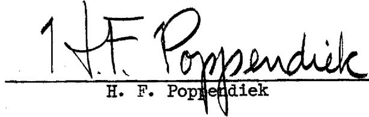

# TABLE OF CONTENTS

# Page

FOREWORD

SUMMARY

INTRODUCTION- 2

A. DENSITY- 2   
B. HEAT CAPACITY- 3   
C. THERMAL CONDUCTIVITY 4   
D. VISCOSITY- 5   
E. ELECTRICAL CONDUCTIVITY 6   
F. SURFACE TENSION 6   
G. TABLE I: ACCURACY SUMMARY 7   
H. TABLE II: TABULATION OF MIXTURES ACCORDING TO CHEMICAL SYSTEM 8

TABULATED FLUORIDE PROPERTY DATA 9  
VISCOSITY WORKSHEET 109   
CONCLUDING REMARKS 110   
REFERENCES 111

# SUMMARY

This report presents a summary of certain physical properties that have been determined experimentally on the fluoride mixtures that have been formulated within the ANP program at ORNL (Refs. 1, 2). These properties include the density, enthalpy, heat capacity, heat of fusion, thermal conductivity, viscosity, Prandtl number, electrical conductivity and surface tension. In addition to the experimental data, values have been predicted for the heat capacity and density of the other mixtures from the correlations of these properties. Estimates of the viscosity have also been made for a number of the mixtures on which no experimental data were available.

# INTRODUCTION

This report presents a compilation of certain physical properties that have been determined experimentally or predicted from correlations of experimental data for mixtures of fluorides that have been formulated within the ANP program (Ref. 1, 2). Each individual page of the tabulation is devoted to a summary of all of the known properties for a mixture together with the composition in mole and weight percent, the average molecular weight, and the liquidus temperature.

This introductory section will present brief discussions of each of the properties, providing short descriptions of the experimental systems used and statements regarding the accuracy of the data. Also included in this section is a tabulation of the mixture numbers arranged according to chemical system.

# A. Density.

Density measurements have been made on sixteen molten fluoride mixtures. In addition, about nine mixtures containing $\mathrm{BeF}_2$ have been studied at Mound Laboratory1. Measurements were made by the buoyancy principle using a plummet suspended in the molten salt from an analytical balance. An error analysis indicated that the values reported are within $\pm 5\%$ of the true values. The results are reported in gms/cc as a function of $^\circ \mathrm{C}$ and in lbs/ft3 as a function of $^\circ \mathrm{F}$ .

Predicted values are given for all the mixtures for which densities have not been experimentally studied. The values given for non- $\mathrm{BeF}_2$ mixtures are based on an empirical correlation using the experimental data available (Ref. 16). The densities of mixtures containing $\mathrm{BeF}_2$ have been predicted from a similarly developed but slightly different correlation using the experimental data taken on $\mathrm{BeF}_2$ -bearing mixtures at Mound Laboratory. These relationships correlate the experimental values to within $\pm 5\%$ and it is felt that the predicted values are of comparable accuracy.

Solid densities at room temperature have been measured for fifteen mixtures. The measurements were made by the buoyancy principle; samples of salt were weighed in air and then in toluene. An error analysis indicated errors of no more than $+5\%$ . Solid densities were calculated for the remainder of the mixtures by a simple formula involving the method of mixtures (Ref. 16). These calculated values agreed within $+10\%$ with the experimental values available in most cases; however, a larger deviation was observed in one case which may be attributed to structural complexities.

Values of the volumetric coefficient of liquid expansion, $\beta_{\mathrm{L}}$ , were calculated from the experimental or predicted density data using the equation:

$$
\beta_ {L} = - \frac {1}{\rho} \left(\frac {\mathrm {d} \rho}{\mathrm {d} T}\right) _ {P}
$$

where $\left(\frac{\mathrm{d}\rho}{\mathrm{d}T}\right)_P$ is the slope of the density-temperature function. Values have been calculated at $700^{\circ}\mathrm{C}$ except when specified otherwise.

# B. Heat Capacity.

The enthalpies, heats of fusion and heat capacities of twenty-one salt mixtures have been determined experimentally by dropping samples at various temperatures into

calorimeters and then measuring the amount of heat liberated. The heat capacity is the slope of the enthalpy-temperature relation thus obtained. Two types of calorimeters have been used. One was an ice calorimeter in which the heat given up by the sample melted ice in an ice-water mixture. The amount of ice melted was proportional to the amount of heat transferred and was determined by the volume change in the ice-water mixture. The other calorimeter was a copper block device. The amount of heat liberated by the sample was measured by the temperature rise of a large mass of copper. From the experimental values obtained for the particular fluorides studied, correlations have been found which enable one to predict the heat capacities of other mixtures (Ref. 4). Hence, estimates have been made of the heat capacities of all the mixtures not studied experimentally. The accuracies of the heat capacities determined experimentally are believed to be within $\pm 10\%$ of the true values; the predicted values are believed to be in error by no more than $\pm 20\%$ .

The heats of fusion for the fluoride mixtures were obtained directly from the enthalpy-temperature relations.

# C. Thermal Conductivity.

Thermal conductivities of seven mixtures in the liquid state have been measured by variable gap devices (Ref. 11). The conductivity is determined by measuring the temperature gradient across a liquid layer as well as the heat flow through it. The layer thickness is varied so that it is possible to eliminate the effect of interface resistances that may exist in the cell. The thermal conductivities of several liquids were determined in a constant gap device. Great difficulty was encountered when using this device because it was difficult to fill the cell completely with the sample liquid. Two methods have been used to measure solid

thermal conductivities; one is a steady state technique in which heat is passed through a slab of the solid salt, and the other is a transient method in which the time-temperature behavior of a solid sphere of the salt is studied.

Error analyses of liquid thermal conductivity measurements indicated that the errors were less than $\pm 25\%$ . It is believed that the solid thermal conductivities are known more accurately than the liquid values. Consequently, liquid conductivities in particular are considered to be of a preliminary nature at this time. Improved conductivity devices are being designed to increase the accuracy. The temperature dependence of the conductivities of fluoride mixtures is currently being studied; the results indicate that the variation is not a large one. Thus, only mean conductivities are reported here.

# D. Viscosity.

Viscosity measurements have been made on thirty-eight molten fluoridemixtures. Thirty-two of these were studied at ORNL and nine at Mound Laboratory², three being investigated at both laboratories.³ Measurements at ORNL were made with two devices; one of these is a capillary efflux viscometer and the other is a modified Brookfield rotational device. Measurements were made at Mound with a rotational viscometer developed there.

The values are presented in c.g.s. units and in engineering units. Kinematic viscosities are given as well as absolute viscosities. In addition, the viscosity of each salt is presented in terms of the usual exponential formula for viscosity:

$$
\mu = \mathrm {A e} ^ {\mathrm {B / T} ^ {\mathrm {O}} \mathrm {K}}
$$

Agreement between the values determined by the two different instruments indicated that the results reported are within $+10\%$ of the true values.

Predicted viscosities are given for a number of salts on which no measurements were made. These estimates were based on measurements on fluorides of similar compositions. These predicted values are probably within $+20\%$ of the actual values.

A blank sheet of graph paper specially prepared for plotting viscosity data is furnished at the end of this report to facilitate interpolation and extrapolation of the values reported.

# E. Electrical Conductivity.

The data on electrical conductivity included in this report were primarily obtained by means of a current-potential type cell (Ref. 13). This device measured directly the amount of current flow for a given voltage drop across a molten salt sample. Measurements were made on five molten fluoride mixtures. Since redeterminations of the conductivities of molten $\mathrm{LiNO}_3$ , $\mathrm{KNO}_3$ , and $\mathrm{NaOH}$ were made within $\pm 10\%$ of the values reported in the literature, it was felt that the fluoride measurements were in error by no more than this amount.

# F. Surface Tension.

Surface tension measurements were made on one fluoride mixture, Composition 30, using a system consisting of a platinum ring supported from a calibrated wire spring which could be raised and lowered with a vernier (Ref. 21). A thermocouple probe was used to measure the surface temperature of the molten fluoride as accurately as possible.

# G. Accuracy Summary.

The following is a summary of the accuracy limits for the properties presented in this report:

TABLE 1   

<table><tr><td></td><td>Error Limits for Experimental Measurements</td><td>Error Limits for Predicted or Estimated Values</td></tr><tr><td>Density (Solid)</td><td>± 5%</td><td>----</td></tr><tr><td>Density (Liquid)</td><td>± 5%</td><td>± 5%</td></tr><tr><td>Heat Capacity</td><td>+10%</td><td>+20%</td></tr><tr><td>Thermal Conductivity</td><td>+25%</td><td>----</td></tr><tr><td>Viscosity</td><td>+10%</td><td>+20%</td></tr><tr><td>Electrical Conductivity</td><td>+10%</td><td>----</td></tr><tr><td>Surface Tension</td><td>----</td><td>----</td></tr></table>

# H. Tabulation of Mixtures According to Chemical System.

The following table lists the mixture numbers arranged according to chemical system.

TABLE II   

<table><tr><td colspan="2">Binary Coolants</td><td colspan="2">Corresponding Ternary Fuels</td></tr><tr><td>System</td><td>Mixtures</td><td>System</td><td>Mixtures</td></tr><tr><td>NaF-ZrF4</td><td>28, 29, 31, 32, 34, 45, C test, 71, 83</td><td>NaF-ZrF4-UF4</td><td>27, 30, 33, 38, 39, 40, 41, 42, 44, 46, 70, 99, 108</td></tr><tr><td>NaF-BeF2</td><td>35, 77, 113</td><td>NaF-ZrF4-UF3</td><td>49</td></tr><tr><td>LiF-BeF2</td><td>74, 112</td><td>NaF-BeF2-UF4</td><td>1, 3, 16, 17, 36, 76, 92</td></tr><tr><td>LiF-NaF</td><td>100</td><td>LiF-BeF2-UF4</td><td>75</td></tr><tr><td>LiF-KF</td><td>102</td><td>LiF-NaF-UF4</td><td>18, 101</td></tr><tr><td>LiF-RbF</td><td>104</td><td>LiF-KF-UF4</td><td>103</td></tr><tr><td>KF-BeF2</td><td>114, 116</td><td></td><td>105</td></tr><tr><td>RbF-BeF2</td><td>115</td><td>NaF-KF-UF4</td><td>2, 2a, 4, 7</td></tr><tr><td></td><td></td><td>NaF-PbF2-UF4</td><td>5</td></tr><tr><td></td><td></td><td>NaF-RbF-UF4</td><td>13</td></tr><tr><td></td><td></td><td>RbF-ZrF4-UF4</td><td>87, 95</td></tr><tr><td></td><td></td><td>LiF-ZrF4-UF4</td><td>93</td></tr><tr><td></td><td></td><td>KF-ZrF4-UF4</td><td>22, 94</td></tr><tr><td colspan="2">Ternary Coolants</td><td colspan="2">Corresponding Quaternary Fuels</td></tr><tr><td>System</td><td>Mixtures</td><td>System</td><td>Mixtures</td></tr><tr><td>NaF-KF-LiF</td><td>12</td><td>NaF-KF-LiF-UF4</td><td>14, 106, 107</td></tr><tr><td>NaF-KF-BeF2</td><td>6, 90</td><td>NaF-KF-LiF-ThF4</td><td>23</td></tr><tr><td>NaF-KF-ZrF4</td><td>20, 24</td><td>NaF-KF-BeF2-UF4</td><td>15</td></tr><tr><td>NaF-LiF-ZrF4</td><td>73, 80, 81</td><td>NaF-LiF-ZrF4-UF4</td><td>19, 21, 25, 25a, 26, 110</td></tr><tr><td>NaF-LiF-BeF2</td><td>47, 78, 84, 88, 89, 96, 97</td><td>NaF-LiF-BeF2-UF4</td><td>72, 82, 86, 91</td></tr><tr><td></td><td></td><td>NaF-RbF-BeF2-UF4</td><td>79, 85, 98</td></tr><tr><td></td><td></td><td>LiF-BeF2-ThF4-UF4</td><td>109</td></tr><tr><td></td><td></td><td>LiF-BeF2-ThF4-UF4</td><td>111</td></tr></table>

<table><tr><td colspan="2">Binary Fuels</td></tr><tr><td>System</td><td>Mixtures</td></tr><tr><td>NaF-UF4</td><td>37, 43</td></tr><tr><td>NaF-ThF4</td><td>48</td></tr></table>

# TABULATED FLUORIDE PROPERTY DATA

Note: Mixture numbers 50 through 69 have been omitted. These numbers have been reserved by the ANP Chemistry Section for hydroxides (Ref. 1)

Mixture 1

Component BeF2 NaF UF4

Mol % 12 76 12

Wt. % 7.50 42.41 50.09

Avg. M.W. 75.2

Liquidus Temp. $514^{\circ}C$ (957F)

# DENSITY

SOLID AT ROOM TEMPERATURE (gm/cc)

3.77

LIQUID $(\rho = \mathrm{gm / cc},\mathrm{T} = {}^{\circ}\mathrm{C})$

$$
\rho^ {*} = 3. 6 2 - 0. 0 0 0 7 5 \mathrm {T} (\text {R e f .} 3)
$$

LIQUID $(\rho = 1\mathrm{bs} / \mathrm{ft}^3,\mathrm{T} = {}^{\circ}\mathrm{F})$

$$
\rho^ {*} = 2 2 6. 8 - 0. 0 2 6 0 \mathrm {T}
$$

MEAN VOLUMETRIC COEFFICIENT OF LIQUID EXPANSION $(1 / ^{\circ}C x 10^{4})$ 2.42

# ENTHALPY, HEAT CAPACITY AND HEAT OF FUSION

SOLID $(250^{\circ} - 465^{\circ}\mathrm{C})$

Enthalpy (cal/gm)

$$
\mathrm {H} _ {\mathrm {T}} - \mathrm {H} _ {\mathrm {O}} \mathrm {o} _ {\mathrm {C}} ^ {*} = - 5 + 0. 2 1 9 \mathrm {T} (\text {R e f .} 4)
$$

Heat Capacity (cal/gm $^\circ \mathrm{C}$ )

$$
c _ {p} ^ {*} = 0. 2 2
$$

Heat Capacity at $300^{\circ}\mathrm{C}$ (572°F)

$$
c _ {p} * = 0. 2 2
$$

LIQUID $(520^{\circ} - 990^{\circ}\mathrm{C})$

Enthalpy (cal/gm)

$$
\mathrm {H} _ {\mathrm {T}} - \mathrm {H} _ {\mathrm {O}} \mathrm {o} _ {\mathrm {C}} ^ {*} = - 3 5 + 0. 3 2 5 \mathrm {T}
$$

Heat Capacity (cal/gm $^\circ \mathrm{C}$ )

$$
c _ {p} ^ {*} = 0. 3 2
$$

Heat Capacity at $700^{\circ}\mathrm{C}$ (1292°F)

$$
c _ {p} ^ {*} = 0. 3 2
$$

HEAT OF FUSION (cal/gm)

$$
\mathrm {H} _ {\mathrm {L}} - \mathrm {H} _ {\mathrm {S}} ^ {*} = 2 4
$$

# THERMAL CONDUCTIVITY

K (BTU/hr ft ${}^{\mathrm{o}}\mathbf{F}$ )

# VISCOSITY

C (Centipoises) 7.2\* (Ref.3) 800 4.5

(Centistokes) 2.33 1.50

0F 1300 1500

(1b./ft-hr) 17.1\* 10.2\*

ft²/hr 0.0886 0.0543

Exponential Form (centipoises)

Mixture

2

Component

NaF

KF

UF4

Mol %

46.5

26.0

27.5

Wt. %

16.14

12.49

71.37

Avg. M.W.

121.0

Liquidus Temp.

530°C (986°F)

# DENSITY

SOLID AT ROOM TEMPERATURE (gm/cc)

$$
4. 7 ^ {*} (\text {R e f .} 5)
$$

LIQUID $(\rho = \mathrm{gm / cc},\mathrm{T} = {}^{\circ}\mathrm{C})$

$$
\rho^ {*} = 4. 7 0 - 0. 0 0 1 1 5 \mathrm {T} (\text {R e f .} 6)
$$

LIQUID $(\rho = 1\mathrm{bs} / \mathrm{ft}^3,\mathrm{T} = {}^{\circ}\mathrm{F})$

$$
\rho^ {*} = 2 9 4. 7 - 0. 0 3 9 9 \mathrm {T}
$$

MEAN VOLUMETRIC COEFFICIENT OF LIQUID EXPANSION $(1 / ^{0}C \times 10^{4})$ 2.96

# ENTHALPY, HEAT CAPACITY AND HEAT OF FUSION

SOLID (240°-480°C)

Enthalpy (cal/gm)

Heat Capacity (cal/gm ${}^{\circ}\mathrm{C}$ )

Heat Capacity at $300^{\circ}\mathrm{C}$ (572°F)

LIQUID (540°-1000°C)

Enthalpy (cal/gm)

Heat Capacity (cal/gm $^\circ \mathrm{C}$ )

Heat Capacity at $700^{\circ}\mathrm{C}$ (1292°F)

HEAT OF FUSION (cal/gm)

$$
\mathrm {H} _ {\mathrm {T}} - \mathrm {H} _ {\mathrm {O}} \mathrm {o} _ {\mathrm {C}} ^ {*} = - 1 + 0. 1 4 9 \mathrm {T} (\text {R e f .} 4)
$$

$$
c _ {p} ^ {*} = 0. 1 5
$$

$$
c _ {p} * = 0. 1 5
$$

$$
\mathrm {H} _ {\mathrm {T}} - \mathrm {H} _ {\mathrm {O}} \mathrm {o} _ {\mathrm {C}} ^ {*} = - 1 3 + 0. 2 3 0 \mathrm {T}
$$

$$
c _ {p} ^ {*} = 0. 2 3
$$

$$
c _ {p} ^ {*} = 0. 2 3
$$

$$
\mathrm {H} _ {\mathrm {L}} - \mathrm {H} _ {\mathrm {S}} ^ {*} = 3 1
$$

# THERMAL CONDUCTIVITY

K (BTU/hr ft $\mathbf{O}_{\mathrm{F}}$

0.5 (Liquid) (Ref. 7)

# VISCOSITY

<table><tr><td>°C</td><td>(Centipoises)</td><td>(Centistokes)</td><td>OF</td><td>(lb./ft-hr)</td><td>ft2/hr</td></tr><tr><td>600</td><td>17.3* (Ref. 8)</td><td>4.33</td><td>1100</td><td>43.6*</td><td>0.1768</td></tr><tr><td>700</td><td>9.8*</td><td>2.52</td><td>1300</td><td>23.5*</td><td>0.0983</td></tr><tr><td>800</td><td>6.3*</td><td>1.67</td><td>1500</td><td>14.3*</td><td>0.0616</td></tr><tr><td>900</td><td>4.35*</td><td>1.19</td><td></td><td></td><td></td></tr><tr><td colspan="6">Exponential Form (centipoises) μ = 0.0767e4731/T^0K</td></tr></table>

PRANDTL NUMBER 20 at $1100^{\circ}\mathbf{F},$ 11 at $1300^{\circ}\mathbf{F},$ 6.6 at $1500^{\circ}\mathbf{F}$

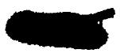

Mixture

2a

Component

NaF

KF

UF4

Mol %

48.2

26.8

25.0

wt. %

17.67

13.65

68.68

Avg. M.W.

114.3

Liquidus Temp.

$558^{\circ}C$ (1036°F)

# DENSITY

SOLID AT ROOM TEMPERATURE (gm/cc)

4.53

LIQUID $(\rho = g m / c c, T = ^{\circ} C)$

$$
\rho^ {*} = 4. 5 4 - 0. 0 0 1 1 \mathrm {T} (\text {R e f .} 1 5)
$$

LIQUID $(\rho = 1\mathrm{bs} / \mathrm{ft}^3,\mathrm{T} = {}^{\circ}\mathrm{F})$

$$
\rho^ {*} = 2 8 4. 6 - 0. 0 3 8 1 \mathrm {T}
$$

MEAN VOLUMETRIC COEFFICIENT OF LIQUID EXPANSION $(1 / ^{\circ}C x 10^{4})$ 2.92

# ENTHALPY, HEAT CAPACITY AND HEAT OF FUSION

SOLID

Enthalpy (cal/gm)

Heat Capacity (cal/gm $^\circ \mathrm{C}$ )

Heat Capacity at $300^{\circ}\mathrm{C}$ (572°F)

$$
\mathrm {H} _ {\mathrm {T}} - \mathrm {H} _ {\mathrm {O}} \circ_ {\mathrm {C}} ^ {*} =
$$

$$
c _ {p} ^ {*} =
$$

$$
c _ {p} = 0. 1 6
$$

LIQUID

Enthalpy (cal/gm)

Heat Capacity (cal/gm ${}^{\circ}\mathrm{C}$ )

Heat Capacity at $700^{\circ}\mathrm{C}$ (1292°F)

$$
\mathrm {H} _ {\mathrm {T}} - \mathrm {H} _ {\mathrm {O}} \mathrm {o} _ {\mathrm {C}} ^ {*} =
$$

$$
c _ {p} ^ {*} =
$$

$$
c _ {p} = 0. 2 3
$$

HEAT OF FUSION (cal/gm)

$$
\mathrm {H} _ {\mathrm {L}} - \mathrm {H} _ {\mathrm {S}} ^ {*} =
$$

# THERMAL CONDUCTIVITY

K (BTU/hr ft $\mathbf{o}_{\mathbb{F}}$

# VISCOSITY

C (Centipoises)

(Centistokes)

OF

1100

1300

1500

(lb./ft-hr)

43.6

23.5

14.3

ft²/hr

Exponential Form (centipoises)

*Denotes experimental values. Other values given are calculated or estimated.

Mixture 3

Component BeF2 NaF UF4

Mol % 60 25 15

Wt. % 32.87 12.23 54.90

Avg. M.W. 85.8

Liquidus Temp. $465^{\circ}C$ $(869^{\circ}F)$

# DENSITY

SOLID AT ROOM TEMPERATURE (gm/cc)

3.8* (Ref. 5)

LIQUID $(\rho = \mathrm{gm} / \mathrm{cc}, \mathrm{T} = {}^{\circ}\mathrm{C})$

$$
\rho = 3. 4 3 - 0. 0 0 0 7 0 \mathrm {T}
$$

LIQUID $(\rho = 1\mathrm{bs} / \mathrm{ft}^3,\mathrm{T} = {}^\circ \mathrm{F})$

$$
\rho = 2 0 9. 5 - 0. 0 2 4 3 \mathrm {T}
$$

MEAN VOLUMETRIC COEFFICIENT OF LIQUID EXPANSION $(1 / ^{\circ}C\times 10^{4})$ 2.37

# ENTHALPY, HEAT CAPACITY AND HEAT OF FUSION

SOLID

Enthalpy (cal/gm)

Heat Capacity (cal/gm $^\circ \mathrm{C}$ )

Heat Capacity at $300^{\circ}\mathrm{C}$ (572°F)

LIQUID OR GLASS $(280^{\circ} - 1050^{\circ}\mathrm{C})$

Enthalpy (cal/gm)

Heat Capacity (cal/gm $^\circ \mathrm{C}$ )

Heat Capacity at $700^{\circ}\mathrm{C}$ (1292°F)

$$
\begin{array}{l} \mathrm {H} _ {\mathrm {T}} - \mathrm {H} _ {\mathrm {O}} \circ_ {\mathrm {C}} ^ {*} = \\ c _ {p} ^ {*} = \\ c _ {p} = \\ \end{array}
$$

$$
\begin{array}{l} \mathrm {H} _ {\mathrm {T}} - \mathrm {H} _ {\mathrm {O}} \mathrm {o} _ {\mathrm {C}} ^ {*} = - 4 3 + 0. 3 1 5 \mathrm {T} (\text {R e f .} 4) \\ c _ {p} ^ {*} = 0. 3 2 \\ c _ {p} ^ {*} = 0. 3 2 \\ \end{array}
$$

HEAT OF FUSION (cal/gm)

$$
\mathrm {H} _ {\mathrm {L}} - \mathrm {H} _ {\mathrm {S}} ^ {*} = 0
$$

# THERMAL CONDUCTIVITY

K (BTU/hr ft $\mathbf{o}_{\mathrm{F}}$

# VISCOSITY

C

(Centipoises)

(Centistokes)

OF

(lb./ft-hr)

ft²/hr

Exponential Form (centipoises)

-14-

<table><tr><td>Mixture</td><td>Component</td><td>Mol %</td><td>Wt. %</td><td>Avg. M.W.</td><td>Liquidus Temp.</td></tr><tr><td>4</td><td>NaF</td><td>35</td><td>8.77</td><td>167.6</td><td>708°C (1306°F)</td></tr><tr><td></td><td>KF</td><td>20</td><td>6.93</td><td></td><td></td></tr><tr><td></td><td>UF4</td><td>45</td><td>84.30</td><td></td><td></td></tr></table>

# DENSITY

SOLID AT ROOM TEMPERATURE (gm/cc) 5.40

$$
\text {L I Q U T D} (\rho = \mathrm {g m / c c}, \mathrm {T} = ^ {\circ} \mathrm {C}) \quad \rho = 5. 6 0 - 0. 0 0 1 1 6 \mathrm {T}
$$

$$
\text {L I Q U I T D} (\rho = \mathrm {l b s} / \mathrm {f t} ^ {3}, \mathrm {T} = ^ {\circ} \mathrm {F}) \quad \rho = 3 5 0. 9 - 0. 0 4 0 2 \mathrm {T}
$$

MEAN VOLUMETRIC COEFFICIENT OF LIQUID EXPANSION $(1 / ^{\circ}C x 10^{4})$ 2.44

# ENTHALPY, HEAT CAPACITY AND HEAT OF FUSION

SOLID

$$
\text {E n t h a l p y (c a l / g m)} \quad H _ {T} - H _ {O} O _ {C} ^ {*} =
$$

$$
\text {H e a t C a p a c i t y (c a l / g m} ^ {\circ} \mathrm {C}) \quad \mathrm {c} _ {\mathrm {p}} * =
$$

$$
\text {H e a t C a p a c i t y a t 3 0 0 ^ {\circ} C (5 7 2 ^ {\circ} F)} \quad c _ {n} = 0. 1 4
$$

LIQUID

$$
\text {E n t h a l p y (c a l / g m)} \quad H _ {T} - H _ {O} O _ {C} ^ {*} =
$$

$$
\text {H e a t C a p a c i t y (c a l / g m} ^ {\circ} \mathrm {C}) \quad \mathrm {c} _ {\mathrm {p}} ^ {*} =
$$

$$
\text {H e a t C a p a c i t y} 7 0 0 ^ {\circ} \mathrm {C} (1 2 9 2 ^ {\circ} \mathrm {F}) \quad \mathrm {c} _ {\mathrm {p}} =
$$

HEAT OF FUSION (cal/gm) H -HS\* =

# THERMAL CONDUCTIVITY

K (BTU/hr ft $\mathbf{o}_{\mathbf{F}}$

# VISCOSITY

C (Centipoises) (Centistokes) $\mathrm{O}_{\mathrm{F}}$ (1b./ft-hr) ft²/hr

Exponential Form (centipoises)

*Denotes experimental values. Other values given are calculated or estimated.

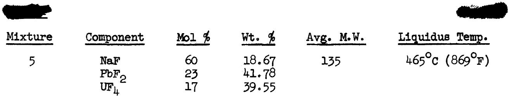

# DENSITY

SOLID AT ROOM TEMPERATURE (gm/cc) 5.9* (Ref. 5)

LIQUID $(\rho = \mathrm{gm / cc},\mathrm{T} = {}^{\circ}\mathrm{C})$

LIQUID $(\rho = 1bs / ft^3, T = ^o_F)$ $\rho = 376.5 - 0.0423T$

MEAN VOLUMETRIC COEFFICIENT OF LIQUID EXPANSION $(1 / ^{\circ}C x 10^{4})$ 2.35

# ENTHALPY, HEAT CAPACITY AND HEAT OF FUSION

# SOLID

Enthalpy (cal/gm) H-HOc\*

Heat Capacity (cal/gm ${}^{\mathrm{OC}}$ ) $c_{p}^{*} =$

Heat Capacity at $300^{\circ}C$ (572°F) $c_{p}^{x} = 0.14$

# LIQUID

Enthalpy (cal/gm) H-HOc\* =

Heat Capacity (cal/gm ${}^{\mathrm{OC}}$ ) $c_{\mathrm{p}}^{*} =$

Heat Capacity at $700^{\circ}\mathrm{C}$ (1292°F) $c_{p}^{x} = 0.19$

HEAT OF FUSION (cal/gm) H -H\* = L

# THERMAL CONDUCTIVITY

K (BTU/hr ft $\mathbf{o}_{\mathbb{F}}$

# VISCOSITY

C (Centipoises) (Centistokes)

$\mathrm{O}_{\mathrm{F}}$ (1b./ft-hr) ft²/hr

Exponential Form (centipoises)

*Denotes experimental values. Other values given are calculated or estimated.

Mixture

6

Component

NaF

BeF2

KF

Mol %

30

65

5

Wt. %

27.35

66.33

6.32

Avg. M.W.

46.1

Liquidus Temp.

$435^{\circ}C$ (815°F)

# DENSITY

SOLID AT ROOM TEMPERATURE (gm/cc)

2.3* (Ref. 5)

LIQUID $(\rho = \mathrm{gm} / \mathrm{cc},\mathrm{T} = {}^{\circ}\mathrm{C})$

$$
\rho = 2. 1 2 - 0. 0 0 0 3 3 \mathrm {T}
$$

LIQUID $(\rho = 1\mathrm{bs} / \mathrm{ft}^3,\mathrm{T} = {}^{\circ}\mathrm{F})$

$$
\rho = 1 3 2. 7 - 0. 0 1 1 4 \mathrm {T}
$$

MEAN VOLUMETRIC COEFFICIENT OF LIQUID EXPANSION $(1 / ^{\circ}C x 10^{4})$ 1.74

# ENTHALPY, HEAT CAPACITY AND HEAT OF FUSION

# SOLID

Enthalpy (cal/gm)

$$
\mathrm {H} _ {\mathrm {T}} - \mathrm {H} _ {\mathrm {O}} \mathrm {o} _ {\mathrm {C}} ^ {*} =
$$

Heat Capacity (cal/gm $^\circ \mathrm{C}$ )

$$
c _ {p} ^ {*} =
$$

Heat Capacity at $300^{\circ}\mathrm{C}$ (572°F)

$$
c _ {p} = 0. 3 9
$$

# LIQUID

Enthalpy (cal/gm)

$$
\mathrm {H} _ {\mathrm {T}} - \mathrm {H} _ {\mathrm {O}} \mathrm {o} _ {\mathrm {C}} ^ {*} =
$$

Heat Capacity (cal/gm $^\circ \mathrm{C}$ )

$$
c _ {p} ^ {*} =
$$

Heat Capacity at $700^{\circ}\mathrm{C}$ (1292°F)

$$
c _ {p} = 0. 5 4
$$

HEAT OF FUSION (cal/gm)

$$
\mathrm {H} _ {\mathrm {L}} - \mathrm {H} _ {\mathrm {S}} ^ {*} =
$$

# THERMAL CONDUCTIVITY

K (BTU/hr ft $\mathbf{o}_{\mathrm{F}}$

# VISCOSITY

C (Centipoises)

(Centistokes)

0

(lb./ft-hr)

ft/br

Exponential Form (centipoises)

*Denotes experimental values. Other values given are calculated or estimated.

Mixture 7

Component NaF KF $\mathbf{U}\mathbf{F}_{4}$

Mol % 50 20 30

Wt. % 16.55 9.16 74.28

Avg. M.W. 126.8

Liquidus Temp. $575^{\circ}C$ (1067°F)

# DENSITY

SOLID AT ROOM TEMPERATURE (gm/cc)

5.1* (Ref. 5)

LIQUID $(\rho = g m / c c, T = {}^{\circ} C)$

$$
\rho = 4. 7 8 - 0. 0 0 1 0 4 \mathrm {T}
$$

LIQUID $(\rho = 1\mathrm{bs} / \mathrm{ft}^3,\mathrm{T} = {}^{\circ}\mathrm{F})$

$$
\rho = 2 9 9. 5 - 0. 0 3 6 1 \mathrm {T}
$$

MEAN VOLUMETRIC COEFFICIENT OF LIQUID EXPANSION $(1 / ^{\circ}C x 10^{4})$ 2.57

ENTHALPY, HEAT CAPACITY AND HEAT OF FUSION

# SOLID

Enthalpy (cal/gm)

$$
\mathrm {H} _ {\mathrm {T}} - \mathrm {H} _ {\mathrm {O}} \circ_ {\mathrm {C}} ^ {*} =
$$

Heat Capacity (cal/gm $^\circ \mathrm{C}$ )

$$
c _ {p} ^ {*} =
$$

Heat Capacity at $300^{\circ}C$ (572°F)

$$
c _ {p} = 0. 1 5
$$

# LIQUID

Enthalpy (cal/gm)

$$
\mathrm {H} _ {\mathrm {T}} - \mathrm {H} _ {\mathrm {O}} \mathrm {o} _ {\mathrm {C}} ^ {*} =
$$

Heat Capacity (cal/gm $^\circ \mathrm{C}$ )

$$
c _ {p} ^ {*} =
$$

Heat Capacity at $700^{\circ}\mathrm{C}$ (1292°F)

$$
c _ {p} = 0. 2 2
$$

HEAT OF FUSION (cal/gm)

$$
\mathrm {H} _ {\mathrm {L}} - \mathrm {H} _ {\mathrm {S}} ^ {*} =
$$

THERMAL CONDUCTIVITY

K (BTU/hr ft $\mathbf{o}_{\mathrm{F}}$

# VISCOSITY

C

(Centipoises)

(Centistokes)

0F

(lb./ft-hr)

ft²/hr

700

10.0

800

6.65

900

4.75

1300

23.7

1500

15.3

Exponential Form (centipoises)

<table><tr><td>Mixture</td><td>Component</td><td>Mol %</td><td>Wt. %</td><td>Avg. M.W.</td><td>Liquidus Temp.</td></tr><tr><td>8</td><td>NaF</td><td>100</td><td>100</td><td>42</td><td>995°C (1823°F)</td></tr></table>

# DENSITY

SOLID AT ROOM TEMPERATURE $(\mathbf{g}\mathbf{m} / \mathbf{cc})$ 2.79* (Ref. 9)

LIQUID $(\rho = g m / c c, T = ^{\circ} C)$

LIQUID $(\rho = 1\mathrm{bs} / \mathrm{ft}^3,\mathrm{T} = {}^{\circ}\mathrm{F})$

MEAN VOLUMETRIC COEFFICIENT OF LIQUID EXPANSION (1/°C x 10 $^{4}$ )

# ENTHALPY, HEAT CAPACITY AND HEAT OF FUSION

SOLID $(25^{\circ} - 992^{\circ}\mathrm{c})$

Enthalpy (cal/gm)

Heat Capacity (cal/gm ${}^{\circ}\mathrm{C}$ )

Heat Capacity at $300^{\circ}C$ (572°F)

LIQUID (992° - 1027°C)

Enthalpy (cal/gm)

Heat Capacity (cal/gm ${}^{\circ}\mathrm{C}$ )

Heat Capacity at $700^{\circ}\mathrm{C}$ (1292°F)

HEAT OF FUSION (cal/gm)

$$
\begin{array}{l} \mathrm {H} _ {\mathrm {T}} - \mathrm {H} _ {\mathrm {O C}} ^ {\circ} = 0. 2 5 9 3 \mathrm {T} + 5. 3 6 \times 1 0 ^ {- 5} \mathrm {T} ^ {2} (\text {R e f .} 4 6) \\ c _ {c} ^ {*} = 0. 2 5 9 3 + 1 0. 7 2 \times 1 0 ^ {- 5} T \\ c _ {p} ^ {*} = 0. 2 5 9 3 + 1 0. 7 2 \times 1 0 ^ {\prime} T \\ c _ {p} ^ {E *} = 0. 2 9 1 \\ \end{array}
$$

$$
\begin{array}{l} \mathrm {H} _ {\mathrm {T}} - \mathrm {H} _ {\mathrm {O}} \mathrm {o} _ {\mathrm {C}} ^ {*} = 1 1 7. 2 4 + 0. 3 8 1 0 \mathrm {T} \\ c _ {p} ^ {*} = 0. 3 8 1 \\ c _ {p} = \\ \end{array}
$$

$$
\mathrm {H} _ {\mathrm {L}} - \mathrm {H} _ {\mathrm {S}} ^ {*} = 1 8 5. 2
$$

# THERMAL CONDUCTIVITY

K (BTU/hr ft $\mathbf{O}_{\mathbf{F}}$

# VISCOSITY

$\mathrm{^o C}$ (Centipoises)

(Centistokes)

OF

(lb./ft-hr)

ft²/hr

Exponential Form (centipoises)

*Denotes experimental values. Other values given are calculated or estimated.

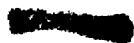

Mixture 9

Component

BeF2

Mol %

100

Wt. %

100

Avg. M.W.

47

Liquidus Temp.

543°C (1009°F)

# DENSITY

SOLID AT ROOM TEMPERATURE (gm/cc) 1.98* (Ref. 9, 10)

$$
\text {L I Q U I D} (\rho = g m / c c, T = ^ {\circ} C)
$$

$$
\text {L I Q U I D} (\rho = 1 \mathrm {b s} / \mathrm {f t} ^ {3}, \mathrm {T} = ^ {\circ} \mathrm {F})
$$

MEAN VOLUMETRIC COEFFICIENT OF LIQUID EXPANSION $(1 / ^{\circ}C x 10^{4})$

ENTHALPY, HEAT CAPACITY AND HEAT OF FUSION

# SOLID

$$
\text {E n t h a l p y (c a l / g m)}
$$

$$
\mathrm {H} _ {\mathrm {T}} - \mathrm {H} _ {\mathrm {O}} \circ_ {\mathrm {C}} ^ {*} =
$$

$$
\text {H e a t C a p a c i t y (c a l / g m} ^ {\circ} \mathrm {C})
$$

$$
c _ {p} ^ {*} =
$$

$$
\text {H e a t C a p a c i t y} 3 0 0 ^ {\circ} \mathrm {C} (5 7 2 ^ {\circ} \mathrm {F})
$$

$$
c _ {p} =
$$

# LIQUID

$$
\text {E n t h a l p y (c a l / g m)}
$$

$$
\mathrm {H} _ {\mathrm {T}} - \mathrm {H} _ {\mathrm {O}} \mathrm {o} _ {\mathrm {C}} ^ {*} =
$$

$$
\text {H e a t C a p a c i t y (c a l / g m} ^ {\circ} \mathrm {C})
$$

$$
c _ {p} ^ {*} =
$$

$$
\text {H e a t C a p a c i t y} 7 0 0 ^ {\circ} \mathrm {C} (1 2 9 2 ^ {\circ} \mathrm {F})
$$

$$
c _ {p} =
$$

HEAT OF FUSION (cal/gm)

$$
\mathrm {H} _ {\mathrm {L}} - \mathrm {H} _ {\mathrm {S}} ^ {*} =
$$

THERMAL CONDUCTIVITY

K (BTU/hr ft $\mathbf{o}_{\mathbf{F}}$

# VISCOSITY

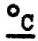

(Centipoises)

(Centistokes)

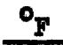

(1b./ft-hr)

ft²/hr

Exponential Form (centipoises)

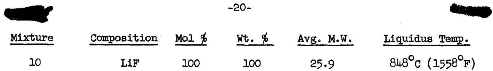

# DENSITY

SOLID AT ROOM TEMPERATURE (gm/cc) 2.64*(Ref. 9)

# ENTHALPY, HEAT CAPACITY AND HEAT OF FUSION

SOLID $(0^{\circ} - 848^{\circ}C)$

Enthalpy (cal/gm)

$$
\begin{array}{r l} \mathrm {H} _ {\mathrm {T}} - \mathrm {H} _ {0} \circ \mathrm {C} ^ {*} = & 0. 5 4 2 4 0 \mathrm {T} + 2. 0 6 2 4 \mathrm {x} 1 0 ^ {- 5} \mathrm {T} ^ {2} \\ & - 2. 4 2 1 7 \mathrm {x} 1 0 ^ {- 8} \mathrm {T} ^ {3} + 0. 4 0 2 6 1 \mathrm {x} 1 0 ^ {- 1 0} \mathrm {T} ^ {4} \\ & - 1 0 8. 0 0 \log_ {1 0} (\mathrm {T} + 2 7 3. 1 6 / 2 7 3. 1 6) \\ & (\text {R e f .}, 4 7) \end{array}
$$

Heat Capacity (cal/gm $^\circ \mathrm{C}$ )

$$
\begin{array}{r l} c _ {p} ^ {*} & = 0. 3 7 1 a t 0 ^ {\circ} c \\ & = 0. 4 5 0 a t 2 0 0 ^ {\prime} \\ & = 0. 4 8 8 a t 4 0 0 ^ {\prime} \\ & = 0. 5 2 2 a t 6 0 0 ^ {\prime} \\ & = 0. 5 6 8 a t 8 0 0 ^ {\prime} \end{array}
$$

LIQUID $(848^{\circ} - 900^{\circ}\mathrm{C})$

Enthalpy (cal/gm)

$$
\mathrm {H} _ {\mathrm {T}} - \mathrm {H} _ {\mathrm {O}} \circ_ {\mathrm {C}} ^ {*} = 1 5 7. 1 4 + 0. 5 9 7 7 7 \mathrm {T}
$$

Heat Capacity (cal/gm $^\circ \mathrm{C}$ )

$$
c _ {p} ^ {*} = 0. 5 9 8
$$

HEAT OF FUSION (cal/gm)

$$
\mathrm {H} _ {\mathrm {L}} - \mathrm {H} _ {\mathrm {S}} ^ {*} = 2 4 9. 4
$$

*Denotes experimental values. Other values given are calculated or estimated.

# DENSITY

SOLID AT ROOM TEMPERATURE (gm/cc)

2.51* (Ref. 9)

LIQUID $(\rho = g m / c c, T = ^{\circ} C)$

LIQUID $(\rho = 1\mathrm{bs} / \mathrm{ft}^3,\mathrm{T} = \mathrm{o}_{\mathrm{F}})$

MEAN VOLUMETRIC COEFFICIENT OF LIQUID EXPANSION $(1 / ^{\circ}C \times 10^{4})$

# ENTHALPY, HEAT CAPACITY AND HEAT OF FUSION

SOLID (25°-857°C)

Enthalpy (cal/gm)

Heat Capacity (cal/gm ${}^{\circ}\mathrm{C}$ )

Heat Capacity at $300^{\circ}C$ (572°F)

LIQUID (857°-927°C)

Enthalpy (cal/gm)

Heat Capacity (cal/gm ${}^{\circ}\mathrm{C}$ )

Heat Capacity at $700^{\circ}C$ (1292F)

HEAT OF FUSION (cal/gm)

$$
\begin{array}{l} \mathrm {H} _ {\mathrm {T}} - \mathrm {H} _ {\mathrm {O}} ^ {\circ} \mathrm {C} ^ {*} = 0. 2 0 4 4 \mathrm {T} + 2. 6 9 \times 1 0 ^ {- 5} \mathrm {T} ^ {2} (\text {R e f .} 4 6) \\ c * = 0. 2 0 4 4 + 5. 3 8 x 1 0 ^ {- 5} T \\ \begin{array}{l} \mathbf {p} \\ \mathbf {c} _ {\mathbf {p}} ^ {*} = 0. 2 2 1 \end{array} \\ \end{array}
$$

$$
\begin{array}{l} \mathrm {H} _ {\mathrm {T}} - \mathrm {H} _ {\mathrm {O}} \mathrm {o} _ {\mathrm {C}} ^ {*} = 7 5. 0 2 + 0. 2 7 5 4 \mathrm {T} \\ c _ {p} ^ {*} = 0. 2 7 5 4 \\ c _ {p} = \\ \end{array}
$$

$$
\mathrm {H} _ {\mathrm {L}} - \mathrm {H} _ {\mathrm {S}} ^ {*} = 1 1 6. 1
$$

# THERMAL CONDUCTIVITY

K (BTU/hr ft $\mathbf{o}_{\mathbf{F}}$

# VISCOSITY

C

(Centipoises)

(Centistokes)

OF

(lb./ft-hr)

ft²/hr

Exponential Form (centipoises)

*Denotes experimental values. Other values given are calculated or estimated.

Mixture

12

Component

NaF

KF

LiF

Mol %

11.5

42.0

46.5

wt. %

11.70

59.09

29.21

Avg. M.W.

41.2

Liquidus Temp.

$454^{\circ}C$ (849°F)

# DENSITY

SOLID AT ROOM TEMPERATURE (gm/cc)

$$
2. 6 ^ {*} (\text {R e f .} 5)
$$

LIQUID $(\rho = \mathrm{gm} / \mathrm{cc},\mathrm{T} = {}^{\circ}\mathrm{C})$

$$
\rho^ {*} = 2. 5 3 - 0. 0 0 0 7 3 \mathrm {T} (\text {R e f .} 1 6)
$$

LIQUID $(\rho = 1bs / ft^3, T = ^o F)$

$$
\rho^ {*} = 1 5 8. 7 - 0. 0 2 5 3 \mathrm {T}
$$

MEAN VOLUMETRIC COEFFICIENT OF LIQUID EXPANSION $(1 / ^{\circ}C\times 10^{4})$ 3.61

# ENTHALPY, HEAT CAPACITY AND HEAT OF FUSION

SOLID (60°-454°C)

Enthalpy (cal/gm)

Heat Capacity (cal/gm $^\circ \mathrm{C}$ )

Heat Capacity at $300^{\circ}\mathrm{C}$ (572°F)

LIQUID (475°-875°C)

Enthalpy (cal/gm)

Heat Capacity (cal/gm $^\circ \mathrm{C}$ )

Heat Capacity at $700^{\circ}\mathrm{C}$ (1292°F)

HEAT OF FUSION (cal/gm)

$$
\begin{array}{l} H _ {T} - H _ {O} O _ {C} ^ {*} = - 2. 6 + 0. 2 7 1 T + 9. 8 \times 1 0 ^ {- 5} T ^ {2} (R e f. 4) \\ c _ {p} ^ {*} = 0. 2 7 + 1 9. 6 \times 1 0 ^ {- 5} T \\ c _ {p} ^ {*} = 0. 3 3 \\ \end{array}
$$

$$
H _ {T} - H _ {O} O _ {C} ^ {*} = 3 0. 3 + 0. 4 5 3 T
$$

$$
c _ {p} ^ {*} = 0. 4 5
$$

$$
\mathbf {c} _ {\mathbf {p}} ^ {\text {水}} * = 0. 4 5
$$

$$
\mathrm {H} _ {\mathrm {L}} - \mathrm {H} _ {\mathrm {S}} ^ {*} = 9 5
$$

# THERMAL CONDUCTIVITY

K (BTU/hr ft ${}^{\mathrm{o}}\mathbf{F}$ )

2.6 (Liquid) (Ref. 11)

2.7 (Solid sphere)(Ref. 45)

# VISCOSITY

<table><tr><td>°C</td><td>(Centipoises)</td><td>(Centistokes)</td><td>OF</td><td>(lb./ft-hr)</td><td>ft2/hr</td></tr><tr><td>500</td><td>9.2* (Ref. 12)</td><td>4.26</td><td>1100</td><td>12.1*</td><td>0.0923</td></tr><tr><td>600</td><td>4.75*</td><td>2.27</td><td>1300</td><td>6.9*</td><td>0.0547</td></tr><tr><td>700</td><td>2.9*</td><td>1.44</td><td>1500</td><td>4.4*</td><td>0.0363</td></tr><tr><td>800</td><td>1.95*</td><td>1.00</td><td></td><td></td><td></td></tr></table>

1.9 Exponential Form (centipoises) $\mu = 0.0400\mathrm{e}^{4170 / \mathrm{T}^{\mathrm{O}}\mathrm{K}}$

PRANDTL NUMBER 2.1 at $1100^{\circ}\mathbf{F}$ , 1.2 at $1300^{\circ}\mathbf{F}$ , 0.76 at $1500^{\circ}\mathbf{F}$

ELECTRICAL CONDUCTIVITY (ohm-cm) $^{-1}$ 1.34 at $1100^{\circ}\mathbf{F}$ , 1.58 at $1300^{\circ}\mathbf{F}$ , 1.80 at $1500^{\circ}\mathbf{F}$ (Ref. 13)

*Denotes experimental values. Other values given are calculated or estimated.

<table><tr><td>Mixture</td><td>Component</td><td>Mol %</td><td>Wt. %</td><td>Avg. M.W.</td><td>Liquidus Temp.</td></tr><tr><td rowspan="3">13</td><td>NaF</td><td>53</td><td>17.40</td><td rowspan="3">128</td><td rowspan="3">490°C (914°F)</td></tr><tr><td>RbF</td><td>20</td><td>16.33</td></tr><tr><td>UF4</td><td>27</td><td>66.27</td></tr></table>

# DENSITY

SOLID AT ROOM TEMPERATURE (gm/cc) 5.02

LIQUID $(\rho = \mathrm{gm / cc},\mathrm{T} = {}^{\circ}\mathrm{C})$

LIQUID $(\rho = 1\text{bs} / \text{ft}^3, \text{T} = {}^0\text{F})$ $\rho = 316.4 - 0.0374\text{T}$

MEAN VOLUMETRIC COEFFICIENT OF LIQUID EXPANSION $(1 / ^{\circ}C x 10^{4})$ 2.53

# ENTHALPY, HEAT CAPACITY AND HEAT OF FUSION

# SOLID

Enthalpy (cal/gm) H-HOc\*

Heat Capacity (cal/gm ${}^{\circ}\mathrm{C}$ ) $c_{n}^{*} =$

Heat Capacity at $300^{\circ}\mathrm{C}$ (572°F) $c_{p}^{2} = 0.15$

# LIQUID

Enthalpy (cal/gm) H -HOc\* =

Heat Capacity (cal/gm ${}^{\circ}\mathrm{C}$ ) $c_{p}^{*} =$

Heat Capacity at $700^{\circ}\mathrm{C}$ (1292°F) $\mathbf{c}_{\mathbf{p}}^{*} = 0.21$

HEAT OF FUSION (cal/gm) $\mathrm{H}_{\mathrm{L}} - \mathrm{H}_{\mathrm{S}}^{*} =$

# THERMAL CONDUCTIVITY

K (BTU/hr ft $\mathbf{\sigma}_{\mathrm{F}}^{\circ}$ )

# VISCOSITY

C (Centipoises) (Centistokes) $\mathbf{\sigma}_{\mathrm{F}}^{\mathrm{o}}$ (1b./ft-hr) ft²/hr

Exponential Form (centipoises)

Mixture 14

Component

NaF

KF

LiF

UF4

Mol %

10.9

43.5

44.5

1.1

Wt. %

10.21

56.34

25.73

7.71

Avg. M.W.

44.9

Liquidus Temp.

$452^{\circ}C$ (846°F)

# DENSITY

SOLID AT ROOM TEMPERATURE (gm/cc)

2.7* (Ref. 5)

LIQUID $(\rho = \mathrm{gm} / \mathrm{cc},\mathrm{T} = {}^{\circ}\mathrm{C})$

$$
\rho^ {*} = 2. 6 5 - 0. 0 0 0 9 0 \mathrm {T} (\text {R e f .} 1 7)
$$

LIQUID $(\rho = 1\mathrm{be} / \mathrm{ft}^3,\mathrm{T} = {}^\circ \mathrm{F})$

$$
\rho^ {*} = 1 6 6. 4 - 0. 0 3 1 2 \mathrm {T}
$$

MEAN VOLUMETRIC COEFFICIENT OF LIQUID EXPANSION $(1 / ^{\circ}C x 10^{4})$ 4.46

# ENTHALPY, HEAT CAPACITY AND HEAT OF FUSION

SOLID (90°-450°C)

Enthalpy (cal/gm)

Heat Capacity (cal/gm ${}^{\circ}\mathrm{C}$ )

Heat Capacity at $300^{\circ}\mathrm{C}$ (572°F)

LIQUID $(500^{\circ} - 1000^{\circ}\mathrm{C})$

Enthalpy (cal/gm)

Heat Capacity (cal/gm $^\circ \mathrm{C}$ )

Heat Capacity at $700^{\circ}\mathrm{C}$ (1292°F)

HEAT OF FUSION (cal/gm)

$$
\begin{array}{l} \mathrm {H} _ {\mathrm {T}} - \mathrm {H} _ {\mathrm {O}} \mathrm {o} _ {\mathrm {C}} ^ {*} = - 9 + 0. 3 1 0 \mathrm {T} (\text {R e f .} 4) \\ c _ {p} * = 0. 3 1 \\ c _ {p} ^ {*} = 0. 3 1 \\ \end{array}
$$

$$
\begin{array}{l} \mathrm {H} _ {\mathrm {T}} - \mathrm {H} _ {\mathrm {O}} \mathrm {o} _ {\mathrm {C}} ^ {*} = 2 1 + 0. 4 3 7 \mathrm {T} \\ c _ {p} ^ {*} = 0. 4 4 \\ c _ {p} ^ {*} = 0. 4 4 \\ \end{array}
$$

$$
\mathrm {H} _ {\mathrm {L}} - \mathrm {H} _ {\mathrm {S}} ^ {*} = 8 7
$$

# THERMAL CONDUCTIVITY

K (BTU/hr ft $\mathbf{o}_{\mathrm{F}}$

2.3 (Liquid) (Ref. 14)   
2.0 (Solid sphere) (Ref. 45)

# VISCOSITY

C (Centipoises)   
500 8.8\* (Ref.12)   
600 4.6\*   
700 2.75*   
800 1.85\*

(Centistokes)

4.00   
2.18   
1.36   
0.96

$\mathbf{o}_{\mathbf{F}}$   
1100   
1300   
1500

(lb./ft-hr)

11.6\*

6.6*  
4.2*

ft²/hr   
0.0876   
0.0525   
0.0351

Exponential Form (centipoises) $\mu = 0.0348\mathrm{e}^{4265 / 1\mathrm{K}}$

PRANDTL NUMBER 2.2 at $1100^{\circ}\mathbf{F}$ ; 1.3 at $1300^{\circ}\mathbf{F}$ , 0.80 at $1500^{\circ}\mathbf{F}$

*Denotes experimental values. Other values given are calculated or estimated.

<table><tr><td>Mixture</td><td>Component</td><td>Mol %</td><td>Wt. %</td><td>Avg. M.W.</td><td>Liquidus Temp.</td></tr><tr><td rowspan="4">15</td><td>NaF</td><td>29.5</td><td>24.60</td><td>50.3</td><td>433°C (811°F)</td></tr><tr><td>BeF2</td><td>64.0</td><td>59.75</td><td></td><td></td></tr><tr><td>KF</td><td>4.9</td><td>5.66</td><td></td><td></td></tr><tr><td>UF4</td><td>1.6</td><td>9.99</td><td></td><td></td></tr><tr><td></td><td></td><td colspan="2">DENSITY</td><td></td><td></td></tr></table>

SOLID AT ROOM TEMPERATURE (gm/cc) 2.5* (Ref. 5)

LIQUID $(\rho = g m / c c, T = ^{\circ} C)$ $\rho = 2.26 - 0.00036 T$

LIQUID $(\rho = 1bs / ft^3, T = {}^0 F)$

MEAN VOLUMETRIC COEFFICIENT OF LIQUID EXPANSION $(1 / ^{\circ}C\times 10^{4})$ 1.80

# ENTHALPY, HEAT CAPACITY AND HEAT OF FUSION

# SOLID

Enthalpy (cal/gm) H-HoC\* =

Heat Capacity (cal/gm ${}^{\circ}\mathrm{C}$ ) $c_{p}^{*} =$

Heat Capacity at $300^{\circ}C$ (572°F) $\mathbf{c}_{\mathbf{p}}^{*} = 0.36$

# LIQUID

Enthalpy (cal/gm) H-HOc\*

Heat Capacity (cal/gm ${}^{\circ}\mathrm{C}$ ) $c_{p}^{*} =$

Heat Capacity at $700^{\circ}\mathrm{C}$ (1292°F) $\mathbf{c}_{\mathfrak{p}}^{*} = 0.51$

HEAT OF FUSION (cal/gm) H-Hs\* = L

# THERMAL CONDUCTIVITY

K (BTU/hr ft $\mathbf{\sigma}_{\mathrm{F}}^{\mathrm{o}}$

# VISCOSITY

C (Centipoises) (Centistokes) $\mathbf{\sigma}_{\mathrm{F}}^{\mathrm{o}}$ (1b./ft-hr) ft/HR

Exponential Form (centipoises)

# Mixture

16

# Component

NaF

BeF,

UF

# Mol %

34.0

57.5

8.5

# Wt. %

21.00

39.74

39.26

# Avg. M.W.

68.0

# Liquidus Temp.

$550^{\circ} \mathrm{C}$ (1022°F)

# DENSITY

SOLID AT ROOM TEMPERATURE (gm/cc)

$$
2. 9 9
$$

LIQUID $(\rho = \mathrm{gm} / \mathrm{cc},\mathrm{T} = {}^{\circ}\mathrm{C})$

$$
\rho = 2. 9 0 - 0. 0 0 0 5 4 \mathrm {T}
$$

LIQUID $(\rho = 1bs / ft^3, T = ^o F)$

$$
\rho = 1 8 1. 6 - 0. 0 1 8 7 \mathrm {T}
$$

MEAN VOLUMETRIC COEFFICIENT OF LIQUID EXPANSION (1/°C x 10⁴) 2.14

# ENTHALPY, HEAT CAPACITY AND HEAT OF FUSION

# SOLID

Enthalpy (cal/gm)

Heat Capacity (cal/gm $^\circ \mathrm{C}$ )

Heat Capacity at $300^{\circ}C$ (572°F)

$$
\mathrm {H} _ {\mathrm {T}} - \mathrm {H} _ {\mathrm {O}} \mathrm {o} _ {\mathrm {C}} ^ {*} =
$$

$$
c _ {p} ^ {*} =
$$

$$
c _ {p} = 0. 2 8
$$

# LIQUID

Enthalpy (cal/gm)

Heat Capacity (cal/gm $^\circ \mathrm{C}$ )

Heat Capacity at $700^{\circ}\mathrm{C}$ (1292°F)

$$
\mathrm {H} _ {\mathrm {T}} - \mathrm {H} _ {\mathrm {O}} \mathrm {o} _ {\mathrm {C}} ^ {*} =
$$

$$
c _ {p} ^ {*} =
$$

$$
c _ {p} = 0. 3 9
$$

# HEAT OF FUSION (cal/gm)

$$
\mathrm {H} _ {\mathrm {L}} - \mathrm {H} _ {\mathrm {S}} ^ {*} =
$$

# THERMAL CONDUCTIVITY

K (BTU/hr ft $\mathbf{\sigma}_{\mathrm{F}}^{\circ}$ )

# VISCOSITY

# $\mathrm{^o C}$ (Centipoises)

# (Centistokes)

# 0F

# (lb./ft-hr)

# ft²/hr

Exponential Form (centipoises)

<table><tr><td>Mixture</td><td>Component</td><td>Mol %</td><td>Wt. %</td><td>Avg. M.W.</td><td>Liquidus Te.</td></tr><tr><td rowspan="3">17</td><td>NaF</td><td>47</td><td>39.48</td><td>50.0</td><td>395°C (743°F)</td></tr><tr><td>BeF2</td><td>51</td><td>47.96</td><td></td><td></td></tr><tr><td>UF4</td><td>2</td><td>12.56</td><td></td><td></td></tr></table>

# DENSITY

SOLID AT ROOM TEMPERATURE $(\mathbf{g}\mathbf{m} / \mathbf{cc})$ 2.6* (Ref. 5)

$$
\text {L I Q U I D} (\rho = g m / c c, T = ^ {\circ} C) \quad \rho = 2. 3 9 - 0. 0 0 0 4 0 T
$$

$$
\text {L I Q U I D} (\rho = 1 \mathrm {b s} / \mathrm {f t} ^ {3}, \mathrm {T} = ^ {\circ} \mathrm {F}) \quad \rho = 1 4 9. 6 - 0. 0 1 3 9 \mathrm {T}
$$

MEAN VOLUMETRIC COEFFICIENT OF LIQUID EXPANSION $(1 / ^{\circ}C x 10^{4})$ 1.89

ENTHALPY, HEAT CAPACITY AND HEAT OF FUSION

# SOLID

Enthalpy (cal/gm) H-HoC\* =

Heat Capacity (cal/gm ${}^{\circ}\mathrm{C}$ )

Heat Capacity at $300^{\circ}\mathrm{C}$ (572 $^{\circ}\mathrm{F}$ )

# LIQUID

Enthalpy (cal/gm) H-HoC\*

Heat Capacity (cal/gm ${}^{\mathrm{OC}}$ ) $c_{\mathrm{n}}^{*} =$

Heat Capacity at $700^{\circ}\mathrm{C}$ (1292°F) $c_{p}^{F} = 0.49$

HEAT OF FUSION (cal/gm)

$$
\mathrm {H} _ {\mathrm {L}} - \mathrm {H} _ {\mathrm {S}} ^ {*} =
$$

THERMAL CONDUCTIVITY

K (BTU/hr ft $\mathbf{o}_{\mathbf{F}}$

# VISCOSITY

<table><tr><td>°C</td><td>(Centipoises)</td><td>(Centistokes)</td><td>OF</td><td>(lb./ft-hr)</td><td>ft2/hr</td></tr><tr><td>600</td><td>16.5</td><td></td><td>1100</td><td>42.4</td><td></td></tr><tr><td>700</td><td>8.0</td><td></td><td>1300</td><td>18.9</td><td></td></tr><tr><td>800</td><td>4.4</td><td></td><td>1500</td><td>9.8</td><td></td></tr></table>

Exponential Form (centipoises)

Mixture

18

Component

NaF

LiF

UF

Mol %

45

33

22

Wt. %

19.57

8.87

71.56

Avg. M.W.

96.5

Liquidus Temp.

$506^{\circ}C$ (943°F)

# DENSITY

SOLID AT ROOM TEMPERATURE (gm/cc)

$$
5. 0 ^ {*} (\text {R e f}, 5)
$$

LIQUID $(\rho = g m / c c, T = ^{\circ} C)$

$$
\rho = 4. 5 4 - 0. 0 0 1 0 1 \mathrm {T}
$$

LIQUID $(\rho = 1bs / ft^3, T = ^o_F)$

$$
\rho = 2 8 4. 5 - 0. 0 3 5 \mathrm {T}
$$

MEAN VOLUMETRIC COEFFICIENT OF LIQUID EXPANSION $(1 / ^{\circ}C\times 10^{4})$ 2.64

# ENTHALPY, HEAT CAPACITY AND HEAT OF FUSION

# SOLID

Enthalpy (cal/gm)

Heat Capacity (cal/gm $^\circ \mathrm{C}$ )

Heat Capacity at $300^{\circ}C$ (572°F)

$$
\mathrm {H} _ {\mathrm {T}} - \mathrm {H} _ {\mathrm {O}} \mathrm {o} _ {\mathrm {C}} ^ {*} =
$$

$$
c _ {p} * =
$$

$$
c _ {p} = 0. 1 9
$$

# LIQUID

Enthalpy (cal/gm)

Heat Capacity (cal/gm ${}^{\circ}\mathrm{C}$ )

Heat Capacity at $700^{\circ}C$ (1292 $^{0}$ F)

$$
\mathrm {H} _ {\mathrm {T}} - \mathrm {H} _ {\mathrm {O}} \mathrm {o} _ {\mathrm {C}} ^ {*} =
$$

$$
c _ {p} ^ {*} =
$$

$$
c _ {p} = 0. 2 6
$$

# HEAT OF FUSION (cal/gm)

$$
E _ {L} - H _ {S} ^ {*} =
$$

# THERMAL CONDUCTIVITY

K (BTU/hr ft ${}^{\mathrm{o}}\mathbf{F}$ )

# VISCOSITY

# C (Centipoises)

# (Centistokes)

# 0F

# (lb./ft-hr)

# ft²/hr

Exponential Form (centipoises)

Mixture

19

Component

NaF

KF

ZrF

UF

Mol %

5

51

42

2

wt. %

1.94

27.38

64.88

5.80

Avg. M.W.

108.2

Liquidus Temp.

$405^{\circ}C$ (761°F)

# DENSITY

SOLID AT ROOM TEMPERATURE (gm/cc)

LIQUID $(\rho = \mathrm{gm} / \mathrm{cc},\mathrm{T} = {}^{\circ}\mathrm{C})$

LIQUID $(\rho = 1\mathrm{be} / \mathrm{ft}^3,\mathrm{T} = {}^o_{\mathrm{F}})$

3.67

$$
\rho^ {*} = 3. 7 8 - 0. 0 0 1 0 9 \mathrm {T} (\text {R e f .} 1 8)
$$

$$
\rho^ {*} = 2 3 7. 2 - 0. 0 3 7 8 \mathrm {T}
$$

MEAN VOLUMETRIC COEFFICIENT OF LIQUID EXPANSION $(1 / ^{\circ}C \times 10^{4})$ 3.48 (600°C)

ENTHALPY, HEAT CAPACITY AND HEAT OF FUSION

# SOLID

Enthalpy (cal/gm)

Heat Capacity (cal/gm $^\circ \mathrm{C}$ )

Heat Capacity at $300^{\circ}\mathrm{C}$ (572°F)

# LIQUID

Enthalpy (cal/gm)

Heat Capacity (cal/gm $^\circ \mathrm{C}$ )

Heat Capacity at $700^{\circ}\mathrm{C}$ (1292°F)

HEAT OF FUSION (cal/gm)

$$
\begin{array}{l} \mathrm {H} _ {\mathrm {T}} - \mathrm {H} _ {\mathrm {O}} \circ_ {\mathrm {C}} ^ {*} = \\ c _ {p} ^ {*} = \\ \mathbf {c} _ {\mathbf {p}} = 0. 1 8 \\ \end{array}
$$

$$
\begin{array}{l} E _ {T} - H _ {O} o _ {C} ^ {*} = \\ c _ {p} ^ {*} = \\ c _ {p} = 0. 2 5 \\ \end{array}
$$

$$
\mathrm {H} _ {\mathrm {L}} - \mathrm {H} _ {\mathrm {S}} ^ {*} =
$$

# THERMAL CONDUCTIVITY

K (BTU/hr ft $\mathbf{o}_{\mathbf{F}}$

# VISCOSITY

<table><tr><td>°C</td><td>(Centipoises)</td><td>(Centistokes)</td><td>OF</td><td>(lb./ft-hr)</td><td>ft2/hr</td></tr><tr><td>500</td><td>11.0</td><td></td><td>1100</td><td>16.0</td><td></td></tr><tr><td>600</td><td>6.4</td><td></td><td>1300</td><td>10.3</td><td></td></tr><tr><td>700</td><td>4.3</td><td></td><td>1500</td><td>7.6</td><td></td></tr><tr><td>800</td><td>3.25</td><td></td><td></td><td></td><td></td></tr><tr><td colspan="6">Exponential Form (centipoises)</td></tr></table>

# Mixture

20

# Component

NaF

KF

ZrF

# Mol %

5

52

43

# Wt. %

2.01

28.99

69.00

# Avg. M.W.

104.2

# Liquidus Temp.

$425^{\circ}C$ (797°F)

# DENSITY

SOLID AT ROOM TEMPERATURE (gm/cc)

3.57

LIQUID $(\rho = g m / c c, T = {}^{\circ} C)$

$$
\rho = 3. 3 8 - 0. 0 0 0 8 4 \mathrm {T}
$$

LIQUID $(\rho = 1\mathrm{bs} / \mathrm{ft}^3,\mathrm{T} = {}^{\circ}\mathrm{F})$

$$
\rho = 2 1 1. 9 - 0. 0 2 9 1 \mathrm {T}
$$

MEAN VOLUMETRIC COEFFICIENT OF LIQUID EXPANSION $(1 / ^{\circ}C x 10^{4})$ 3.02

# ENTHALPY, HEAT CAPACITY AND HEAT OF FUSION

# SOLID

Enthalpy (cal/gm)

Heat Capacity (cal/gm $^\circ \mathrm{C}$ )

Heat Capacity at $300^{\circ}\mathrm{C}$ (572°F)

$$
\mathrm {H} _ {\mathrm {T}} - \mathrm {H} _ {\mathrm {O}} \circ_ {\mathrm {C}} ^ {*} =
$$

$$
c _ {p} ^ {*} =
$$

$$
c _ {p} = 0. 1 9
$$

# LIQUID

Enthalpy (cal/gm)

Heat Capacity (cal/gm $^\circ \mathrm{C}$ )

Heat Capacity at $700^{\circ}\mathrm{C}$ (1292°F)

$$
\mathrm {H} _ {\mathrm {T}} - \mathrm {H} _ {\mathrm {O}} \mathrm {o} _ {\mathrm {C}} ^ {*} =
$$

$$
c _ {p} ^ {*} =
$$

$$
c _ {p} = 0. 2 6
$$

# HEAT OF FUSION (cal/gm)

$$
\mathrm {H} _ {\mathrm {L}} - \mathrm {H} _ {\mathrm {S}} ^ {*} =
$$

# THERMAL CONDUCTIVITY

K (BTU/hr ft $\mathbf{o}_{\mathbb{F}}$

# VISCOSITY

<table><tr><td>°C</td><td>(Centipoises)</td><td>(Centistokes)</td><td>°F</td><td>(lb./ft-hr)</td><td>ft2/hr</td></tr><tr><td>500</td><td>10.5* (Ref. 19)</td><td>3.57</td><td>1100</td><td>15.2*</td><td>0.0850</td></tr><tr><td>600</td><td>6.1*</td><td>2.13</td><td>1300</td><td>9.8*</td><td>0.0566</td></tr><tr><td>700</td><td>4.1*</td><td>1.47</td><td>1500</td><td>7.1*</td><td>0.0424</td></tr><tr><td>800</td><td>3.1*</td><td>1.15</td><td></td><td></td><td></td></tr></table>

Exponential Form (centipoises) $\mu = 0.161\mathrm{e}^{3171 / T^{\circ}K}$

<table><tr><td>Mixture</td><td>Component</td><td>Mol %</td><td>Wt. %</td><td>Avg. M.W.</td><td>Liquidus Temp.</td></tr><tr><td rowspan="4">21</td><td>NaF</td><td>4.8</td><td>1.80</td><td>112.1</td><td>540°C (1004°F)</td></tr><tr><td>KF</td><td>50.1</td><td>25.96</td><td></td><td></td></tr><tr><td>ZrF4</td><td>41.3</td><td>61.59</td><td></td><td></td></tr><tr><td>UF4</td><td>3.8</td><td>10.65</td><td></td><td></td></tr></table>

# DENSITY

SOLID AT ROOM TEMPERATURE (gm/cc) 3.76

$$
\begin{array}{l} \text {L I Q U I D} (\rho = \mathrm {g m} / \mathrm {c c}, \mathrm {T} = ^ {\circ} \mathrm {C}) \quad \rho^ {*} = 4. 2 7 - 0. 0 0 1 6 3 \mathrm {T} (\text {R e f .} 1 8) \\ \text {L I Q U I D} (\rho = \mathrm {l b s} / \mathrm {f t} ^ {3}, \mathrm {T} = ^ {\circ} \mathrm {F}) \quad \rho^ {*} = 2 6 8. 3 - 0. 0 5 6 5 \mathrm {T} \\ \end{array}
$$

MEAN VOLUMETRIC COEFFICIENT OF LIQUID EXPANSION $(1 / ^{\circ}C\times 10^{4})$ 5.51 (800°c)

# ENTHALPY, HEAT CAPACITY AND HEAT OF FUSION

# SOLID

Enthalpy (cal/gm) H-HoC\* =

$$
\begin{array}{l} \text {H e a t C a p a c i t y (c a l / g m} ^ {\circ} \mathrm {C}) \quad \mathrm {c} _ {\mathrm {p}} ^ {*} = \\ \text {H e a t C a p a c i t y a t} 3 0 0 ^ {\circ} \mathrm {C} (5 7 2 ^ {\circ} \mathrm {F}) \quad \mathrm {c} _ {\mathrm {n}} = \\ \text {L I Q U I D} (5 1 0 ^ {\circ} - 8 9 0 ^ {\circ} C) * * \\ \text {E n t h a l p y (c a l / g m)} \quad H _ {m} - H _ {0} o _ {C} ^ {*} = \\ \text {H e a t C a p a c i t y (c a l / g m} ^ {\circ} \mathrm {C}) \quad \mathrm {c} _ {\mathrm {n}} ^ {*} = 0. 2 8 \\ \text {H e a t C a p a c i t y} 7 0 0 ^ {\circ} \mathrm {C} (1 2 9 2 ^ {\circ} \mathrm {F}) \quad \mathrm {c} _ {\mathrm {p}} ^ {\mathrm {F}} * = 0. 2 8 \\ \text {H E A T O F F U S I O N (c a l / g m)} \quad \mathrm {H} _ {\mathrm {L}} - \mathrm {H} _ {\mathrm {S}} ^ {*} = \\ \end{array}
$$

# THERMAL CONDUCTIVITY

K (BTU/hr ft $\mathbf{o}_{\mathbb{F}}$

VISCOSITY   

<table><tr><td>°C</td><td>(Centipoises)</td><td>(Centistokes)</td><td>OF</td><td>(lb./ft-hr)</td><td>ft2/hr</td></tr><tr><td>600</td><td>6.7</td><td></td><td>1100</td><td>16.9</td><td></td></tr><tr><td>700</td><td>4.5</td><td></td><td>1300</td><td>10.8</td><td></td></tr><tr><td>800</td><td>3.4</td><td></td><td>1500</td><td>8.0</td><td></td></tr></table>

# Exponential Form (centipoises)

Mixture

22

Component

KF

ZrF4

UF4

Mol %

46

50

4

Wt. %

21.75

68.03

10.22

Avg. M.W.

122.9

Liquidus Temp.

$605^{\circ}C$ (1121°F)

# DENSITY

SOLID AT ROOM TEMPERATURE (gm/cc)

3.90

LIQUID $(\rho = \mathrm{gm / cc},\mathrm{T} = {}^{\circ}\mathrm{C})$

$$
\rho = 3. 6 9 - 0. 0 0 0 8 9 \mathrm {T}
$$

LIQUID $(\rho = 1\mathrm{be} / \mathrm{ft}^{3},\mathrm{T} = {}^{\circ}\mathrm{F})$

$$
\rho = 2 3 1. 3 - 0. 0 3 0 9 \mathrm {T}
$$

MEAN VOLUMETRIC COEFFICIENT OF LIQUID EXPANSION $(1 / ^{\circ}C x 10^{4})$ 2.91

ENTHALPY, HEAT CAPACITY AND HEAT OF FUSION

SOLID

Enthalpy (cal/gm)

$$
\mathrm {H} _ {\mathrm {T}} - \mathrm {H} _ {\mathrm {O}} \mathrm {o} _ {\mathrm {C}} ^ {*} =
$$

Heat Capacity (cal/gm $^\circ \mathrm{C}$ )

$$
c _ {p} ^ {*} =
$$

Heat Capacity at $300^{\circ}\mathrm{C}$ (572°F)

$$
c _ {p} = 0. 1 7
$$

LIQUID

Enthalpy (cal/gm)

$$
\mathrm {H} _ {\mathrm {T}} - \mathrm {H} _ {\mathrm {O}} \mathrm {o} _ {\mathrm {C}} ^ {*} =
$$

Heat Capacity (cal/gm $^\circ \mathrm{C}$ )

$$
c _ {p} ^ {*} =
$$

Heat Capacity at $700^{\circ}\mathrm{C}$ (1292 $^{\circ}\mathrm{F}$ )

$$
c _ {p} = 0. 2 4
$$

HEAT OF FUSION (cal/gm)

$$
\mathrm {H} _ {\mathrm {L}} - \mathrm {H} _ {\mathrm {S}} ^ {*} =
$$

THERMAL CONDUCTIVITY

K (BTU/hr ft $\mathbf{o}_{\mathbf{F}}$

# VISCOSITY

C

(Centipoises)

(Centistokes)

OF

(lb./ft-hr)

ft²/hr

Exponential Form (centipoises)

*Denotes experimental values. Other values given are calculated or estimated.

# Mixture

23

# Component

KF

# Mol %

41.8

# Wt. %

56.61

# Avg. M.W.

42.9

# Liquidus Temp.

$450^{\circ}C$ (842°F)

NaF

11.4

46.2

0.6

11.16

27.92

4.31

# DENSITY

SOLID AT ROOM TEMPERATURE (gm/cc)

2.53

LIQUID $(\rho = g m / c c, T = ^{\circ} C)$

$$
\rho = 2. 5 2 - 0. 0 0 0 7 0 \mathrm {T}
$$

LIQUID $(\rho = 1\mathrm{bs} / \mathrm{ft}^3,\mathrm{T} = {}^0\mathrm{F})$

$$
\rho = 1 5 8. 1 - 0. 0 2 4 \mathrm {T}
$$

MEAN VOLUMETRIC COEFFICIENT OF LIQUID EXPANSION $(1 / ^{\circ}C x 10^{4})$ 3.45

# ENTHALPY, HEAT CAPACITY AND HEAT OF FUSION

# SOLID

Enthalpy (cal/gm)

$$
\mathrm {H} _ {\mathrm {T}} - \mathrm {H} _ {\mathrm {O}} \mathrm {o} _ {\mathrm {C}} ^ {*} =
$$

Heat Capacity (cal/gm $^\circ \mathrm{C}$ )

$$
c _ {p} ^ {*} =
$$

Heat Capacity at $300^{\circ}\mathrm{C}$ (572°F)

$$
c _ {p} = 0. 3 2
$$

# LIQUID

Enthalpy (cal/gm)

$$
\mathrm {H} _ {\mathrm {T}} - \mathrm {H} _ {\mathrm {O}} \circ_ {\mathrm {C}} ^ {*} =
$$

Heat Capacity (cal/gm $^\circ \mathrm{C}$ )

$$
c _ {p} ^ {*} =
$$

Heat Capacity at $700^{\circ}\mathrm{C}$ (1292°F)

$$
c _ {p} = 0. 4 5
$$

HEAT OF FUSION (cal/gm)

$$
\mathrm {H} _ {\mathrm {L}} - \mathrm {H} _ {\mathrm {S}} ^ {*} =
$$

# THERMAL CONDUCTIVITY

K (BTU/hr ft $\mathbf{\sigma}_{\mathrm{F}}^{\circ}$ )

# VISCOSITY

<table><tr><td>°C</td><td>(Centipoises)</td><td>(Centistokes)</td><td>°F</td><td>(lb./ft-hr)</td><td>ft2/hr</td></tr><tr><td>500</td><td>9.2</td><td></td><td>1100</td><td>12.1</td><td></td></tr><tr><td>600</td><td>4.75</td><td></td><td>1300</td><td>6.9</td><td></td></tr><tr><td>700</td><td>2.9</td><td></td><td>1500</td><td>4.4</td><td></td></tr><tr><td>800</td><td>1.95</td><td></td><td></td><td></td><td></td></tr></table>

Exponential Form (centipoises)

# Mixture

24

# Component

KF

# Mol %

18

# Wt. %

10.20

# Avg. M.W.

102.5

# Liquidus Temp.

$450^{\circ}C$ (842°F)

# DENSITY

SOLID AT ROOM TEMPERATURE (gm/cc)

3.80

LIQUID $(\rho = g m / c c, T = {}^{\circ} C)$

$$
\rho = 3. 5 9 - 0. 0 0 0 8 7 \mathrm {T}
$$

LIQUID $(\rho = 1\mathrm{bs} / \mathrm{ft}^3,\mathrm{T} = {}^o_{\mathrm{F}})$

$$
\rho = 2 2 5. 1 - 0. 0 3 0 2 \mathrm {T}
$$

MEAN VOLUMETRIC COEFFICIENT OF LIQUID EXPANSION $(1 / ^{\circ}C x 10^{4})$ 2.92

ENTHALPY, HEAT CAPACITY AND HEAT OF FUSION

# SOLID

Enthalpy (cal/gm)

$$
\mathrm {H} _ {\mathrm {T}} - \mathrm {H} _ {\mathrm {O}} \mathrm {o} _ {\mathrm {C}} ^ {*} =
$$

Heat Capacity (cal/gm ${}^{\circ}\mathrm{C}$ )

$$
\mathrm {c} _ {\mathrm {p}} ^ {*} =
$$

Heat Capacity at $300^{\circ}\mathrm{C}$ (572°F)

$$
c _ {p} = 0. 1 9
$$

# LIQUID

Enthalpy (cal/gm)

$$
\mathrm {H} _ {\mathrm {T}} - \mathrm {H} _ {\mathrm {O}} \mathrm {o} _ {\mathrm {C}} ^ {*} =
$$

Heat Capacity (cal/gm $\mathbf{^o C}$ )

$$
c _ {p} ^ {*} =
$$

Heat Capacity at $700^{\circ}\mathrm{C}$ (1292F)

$$
\mathbf {c} _ {\mathbf {p}} = 0. 2 7
$$

# HEAT OF FUSION (cal/gm)

$$
\mathrm {H} _ {\mathrm {L}} - \mathrm {H} _ {\mathrm {S}} ^ {*} =
$$

THERMAL CONDUCTIVITY

K (BTU/hr ft $\mathbf{o}_{\mathbf{F}}$

# VISCOSITY

<table><tr><td>°C</td><td>(Centipoises)</td><td>(Centistokes)</td><td>°F</td><td>(lb./ft-hr)</td><td>ft2/hr</td></tr><tr><td>600</td><td>7.15</td><td></td><td>1100</td><td>17.9</td><td></td></tr><tr><td>700</td><td>4.4</td><td></td><td>1300</td><td>10.5</td><td></td></tr><tr><td>800</td><td>3.05</td><td></td><td>1500</td><td>6.9</td><td></td></tr></table>

Exponential Form (centipoises)

*Denotes experimental values. Other values given are calculated or estimated.

# Mixture

25

# Component

KF

# Mol %

17.4

34.7

44.4

3.5

# Wt. %

9.20

13.25

67.55

10.00

# Avg. M.W.

109.9

# Liquidus Temp.

$545^{\circ} \mathrm{C}$ (1013°F)

# DENSITY

SOLID AT ROOM TEMPERATURE (gm/cc)

3.97

LIQUID $(\rho = g m / c c, T = ^{\circ} C)$

$$
\rho^ {*} = 3. 7 8 - 0. 0 0 0 9 \mathrm {L T} (\text {R e f 。 1 8})
$$

LIQUID $(\rho = 1\mathrm{bs} / \mathrm{ft}^3,\mathrm{T} = {}^o\mathrm{F})$

$$
\rho^ {*} = 2 3 7. 0 - 0. 0 3 1 5 \mathrm {T}
$$

MEAN VOLUMETRIC COEFFICIENT OF LIQUID EXPANSION $(1 / ^{0}C x 10^{4})$ 2.90

# ENTHALPY, HEAT CAPACITY AND HEAT OF FUSION

# SOLID

Enthalpy (cal/gm)

$$
\mathrm {H} _ {\mathrm {T}} - \mathrm {H} _ {\mathrm {O}} \mathrm {o} _ {\mathrm {C}} ^ {*} =
$$

Heat Capacity (cal/gm ${}^{\circ}\mathrm{C}$ )

$$
c _ {-} ^ {*} =
$$

Heat Capacity at $300^{\circ}\mathrm{C}$ (572°F)

$$
\mathbf {p}
$$

$$
\mathrm {c} _ {\mathrm {p}} = 0. 1 8
$$

# LIQUID

Enthalpy (cal/gm)

$$
\mathrm {H} _ {\mathrm {T}} - \mathrm {H} _ {\mathrm {O}} \mathrm {o} _ {\mathrm {C}} ^ {*} =
$$

Heat Capacity (cal/gm ${}^{\circ}\mathrm{C}$ )

$$
c _ {n} ^ {*} =
$$

Heat Capacity at $700^{\circ}\mathrm{C}$ (1292°F)

$$
c _ {p} ^ {x} = 0. 2 5
$$

HEAT OF FUSION (cal/gm)

$$
\mathrm {H} _ {\mathrm {L}} - \mathrm {H} _ {\mathrm {S}} ^ {*} =
$$

# THERMAL CONDUCTIVITY

K (BTU/hr ft $\mathbf{o}_{\mathbf{F}}$

# VISCOSITY

<table><tr><td>°C</td><td>(Centipoises)</td><td>(Centistokes)</td><td>OF</td><td>(lb./ft-hr)</td><td>ft2/hr</td></tr><tr><td>600</td><td>8.1</td><td></td><td>1100</td><td>20.3</td><td></td></tr><tr><td>700</td><td>5.2</td><td></td><td>1300</td><td>12.1</td><td></td></tr><tr><td>800</td><td>3.6</td><td></td><td>1500</td><td>8.0</td><td></td></tr></table>

# Exponential Form (centipoises)

DENSITY   

<table><tr><td>Mixture</td><td>Component</td><td>Mol %</td><td>Wt. %</td><td>Avg. M.W.</td><td>Liquidus Temp.</td></tr><tr><td rowspan="4">25a</td><td>KF</td><td>17.6</td><td>13.65</td><td>107.7</td><td>545°C (1013°F)</td></tr><tr><td>NaF</td><td>35.1</td><td>9.47</td><td></td><td></td></tr><tr><td>ZrF4</td><td>44.8</td><td>69.55</td><td></td><td></td></tr><tr><td>UF4</td><td>2.5</td><td>7.34</td><td></td><td></td></tr></table>

ENTHALPY, HEAT CAPACITY AND HEAT OF FUSION   

<table><tr><td>SOLID AT ROOM TEMPERATURE (gm/cc)</td><td>3.92</td></tr><tr><td>LIQUID (ρ = gm/cc, T = °C)</td><td>ρ* = 3.65 - 0.00080T (Ref. 18)</td></tr><tr><td>LIQUID (ρ = lbs/ft3, T = °F)</td><td>ρ* = 228.7 - 0.0277T</td></tr><tr><td>MEAN VOLUMETRIC COEFFICIENT OF LIQUID EXPANSION (1/°C x 104)</td><td>2.59</td></tr></table>

<table><tr><td colspan="2">SOLID</td></tr><tr><td>Enthalpy (cal/gm)</td><td>H-T-H0oC* =</td></tr><tr><td>Heat Capacity (cal/gm °C)</td><td>c p* =</td></tr><tr><td>Heat Capacity at 300°C (572°F)</td><td>c p = 0.19</td></tr><tr><td colspan="2">LIQUID</td></tr><tr><td>Enthalpy (cal/gm)</td><td>H-T-H0oC* =</td></tr><tr><td>Heat Capacity (cal/gm °C)</td><td>c p* =</td></tr><tr><td>Heat Capacity at 700°C (1292°F)</td><td>c p = 0.26</td></tr></table>

THERMAL CONDUCTIVITY   

<table><tr><td>HEAT OF FUSION (cal/gm)</td><td>H1-Hs* =</td></tr></table>

K (BTU/hr ft $\mathbf{o}_{\mathbf{F}}$

VISCOSITY   
Exponential Form (centipoises)   

<table><tr><td>°C</td><td>(Centipoises)</td><td>(Centistokes)</td><td>OF</td><td>(lb./ft-hr)</td><td>ft2/hr</td></tr><tr><td>600</td><td>8.1</td><td></td><td>1100</td><td>20.3</td><td></td></tr><tr><td>700</td><td>5.1</td><td></td><td>1300</td><td>12.1</td><td></td></tr><tr><td>800</td><td>3.5</td><td></td><td>1500</td><td>8.0</td><td></td></tr></table>

*Denotes experimental values. Other values given are calculated or estimated.

Mixture

26

Component

KF

NaF

ZrF

UF 4

Mol %

14.0

36.6

45.6

3.8

Wt. %

7.28

13.76

68.27

10.69

Avg. M.W.

111.6

Liquidus Temp.

$540^{\circ}C$ (1004°F)

# DENSITY

SOLID AT ROOM TEMPERATURE (gm/cc)

4.02

LIQUID $(\rho = g m / c c, T = ^{\circ} C)$

$$
\rho = 3. 8 2 - 0. 0 0 0 9 1 \mathrm {T}
$$

LIQUID $(\rho = 1\mathrm{be} / \mathrm{ft}^3,\mathrm{T} = {}^{\circ}\mathrm{F})$

$$
\rho = 2 3 9. 5 - 0. 0 3 1 5 \mathrm {T}
$$

MEAN VOLUMETRIC COEFFICIENT OF LIQUID EXPANSION $(1 / ^{\circ}C\times 10^{4})$ 2.87

# ENTHALPY, HEAT CAPACITY AND HEAT OF FUSION

# SOLID

Enthalpy (cal/gm)

$$
\mathrm {H} _ {\mathrm {T}} - \mathrm {H} _ {\mathrm {O}} \mathrm {o} _ {\mathrm {C}} ^ {*} =
$$

Heat Capacity (cal/gm $^\circ \mathrm{C}$ )

$$
c _ {p} ^ {*} =
$$

Heat Capacity at $300^{\circ}\mathrm{C}$ (572°F)

$$
c _ {p} = 0. 1 8
$$

# LIQUID

Enthalpy (cal/gm)

$$
\mathrm {H} _ {\mathrm {T}} - \mathrm {H} _ {\mathrm {O}} \mathrm {o} _ {\mathrm {C}} ^ {*} =
$$

Heat Capacity (cal/gm $^\circ \mathrm{C}$ )

$$
c _ {p} ^ {*} =
$$

Heat Capacity at $700^{\circ}C$ (1292F)

$$
c _ {p} = 0. 2 5
$$

HEAT OF FUSION (cal/gm)

$$
\mathrm {H} _ {\mathrm {L}} - \mathrm {H} _ {\mathrm {S}} ^ {*} =
$$

# THERMAL CONDUCTIVITY

K (BTU/hr ft ${}^{\mathrm{o}}\mathbf{F}$ )

# VISCOSITY

<table><tr><td>°C</td><td>(Centipoises)</td><td>(Centistokes)</td><td>OF</td><td>(lb./ft-hr)</td><td>ft2/hr</td></tr><tr><td>600</td><td>8.2</td><td></td><td>1100</td><td>20.6</td><td></td></tr><tr><td>700</td><td>5.3</td><td></td><td>1300</td><td>12.6</td><td></td></tr><tr><td>800</td><td>3.7</td><td></td><td>1500</td><td>8.5</td><td></td></tr></table>

Exponential Form (centipoises)

# Mixture

27

# Component

NaF

ZrF

UF

# Mol %

46

50

4

# Wt. %

16.73

72.39

10.88

# Avg. M.W.

115.5

# Liquidus Temp.

$510^{\circ}C$ (950°F)

# DENSITY

SOLID AT ROOM TEMPERATURE (gm/cc)

4.17

LIQUID $(\rho = \mathrm{gm / cc},\mathrm{T} = {}^{\circ}\mathrm{C})$

$$
\rho = 3. 9 7 - 0. 0 0 0 9 3 \mathrm {T}
$$

LIQUID $(\rho = 1\mathrm{bs} / \mathrm{ft}^3,\mathrm{T} = {}^0\mathrm{F})$

$$
\rho = 2 4 8. 9 - 0. 0 3 2 2 \mathrm {T}
$$

MEAN VOLUMETRIC COEFFICIENT OF LIQUID EXPANSION $(1 / ^{\circ}C\times 10^{4})$ 2.79

ENTHALPY, HEAT CAPACITY AND HEAT OF FUSION

# SOLID

Enthalpy (cal/gm)

$$
\mathrm {H} _ {\mathrm {T}} - \mathrm {H} _ {\mathrm {O}} \mathrm {o} _ {\mathrm {C}} ^ {*} =
$$

Heat Capacity (cal/gm $^{\circ}$ C)

$$
c _ {p} ^ {*} =
$$

Heat Capacity at $300^{\circ}\mathrm{C}$ (572°F)

$$
\mathbf {c} _ {\mathbf {p}} ^ {-} = 0. 1 8
$$

# LIQUID

Enthalpy (cal/gm)

$$
\mathrm {H} _ {\mathrm {T}} - \mathrm {H} _ {\mathrm {O}} \mathrm {o} _ {\mathrm {C}} ^ {*} =
$$

Heat Capacity (cal/gm $^{\circ}$ C)

$$
c _ {p} ^ {*} =
$$

Heat Capacity at $700^{\circ}\mathrm{C}$ (1292°F)

$$
c _ {p} = 0. 2 5
$$

# HEAT OF FUSION (cal/gm)

$$
\mathrm {H} _ {\mathrm {L}} - \mathrm {H} _ {\mathrm {S}} ^ {*} =
$$

# THERMAL CONDUCTIVITY

K (BTU/hr ft $\mathbf{o}_{\mathrm{F}}$

0.6 (solid sphere and slab)(Ref. 45)

# VISCOSITY

<table><tr><td>°C</td><td>(Centipoises)</td><td>(Centistokes)</td><td>OF</td><td>(lb./ft-hr)</td><td>ft2/hr</td></tr><tr><td>600</td><td>8.9</td><td></td><td>1100</td><td>22.3</td><td></td></tr><tr><td>700</td><td>5.7</td><td></td><td>1300</td><td>13.6</td><td></td></tr><tr><td>800</td><td>3.9</td><td></td><td>1500</td><td>9.0</td><td></td></tr></table>

Exponential Form (centipoises)

28

NaF

ZrF

48

52

18.82

81.18

107.1

$515^{\circ}C$ (959°F)

# DENSITY

SOLID AT ROOM TEMPERATURE (gm/cc)

3.99

LIQUID $(\rho = g m / c c, T = ^{\circ} C)$

$$
\rho = 3. 7 9 - 0. 0 0 0 9 0 \mathrm {T}
$$

LIQUID $(\rho = 1\text{bs} / \text{ft}^3, \text{T} = {}^0\text{F})$

$$
\rho = 2 3 7. 6 - 0. 0 3 1 2 \mathrm {T}
$$

MEAN VOLUMETRIC COEFFICIENT OF LIQUID EXPANSION $(1 / ^{\circ}C x 10^{4})$ 2.86

# ENTHALPY, HEAT CAPACITY AND HEAT OF FUSION

# SOLID

Enthalpy (cal/gm)

$$
\mathrm {H} _ {\mathrm {T}} - \mathrm {H} _ {\mathrm {O}} \mathrm {o} _ {\mathrm {C}} ^ {*} =
$$

Heat Capacity (cal/gm $^\circ \mathrm{C}$ )

$$
\mathrm {c} _ {\mathrm {p}} ^ {*} =
$$

Heat Capacity at $300^{\circ}\mathrm{C}$ (572°F)

$$
c _ {p} = 0. 1 9
$$

# LIQUID

Enthalpy (cal/gm)

$$
\mathrm {H} _ {\mathrm {T}} - \mathrm {H} _ {\mathrm {O}} \mathrm {o} _ {\mathrm {C}} ^ {*} =
$$

Heat Capacity (cal/gm ${}^{\circ}\mathrm{C}$ )

$$
c _ {p} ^ {*} =
$$

Heat Capacity at $700^{\circ}\mathrm{C}$ (1292F)

$$
\mathbf {c} _ {\mathbf {p}} = 0. 2 7
$$

HEAT OF FUSION (cal/gm)

$$
\mathrm {H} _ {\mathrm {L}} - \mathrm {H} _ {\mathrm {S}} ^ {*} =
$$

# THERMAL CONDUCTIVITY

K (BTU/hr ft $\mathbf{o}_{\mathbb{F}}$

# VISCOSITY

<table><tr><td>°C</td><td>(Centipoises)</td><td>(Centistokes)</td><td>°F</td><td>(lb./ft-hr)</td><td>ft2/hr</td></tr><tr><td>600</td><td>8.5</td><td></td><td>1100</td><td>21.5</td><td></td></tr><tr><td>700</td><td>5.3</td><td></td><td>1300</td><td>12.5</td><td></td></tr><tr><td>800</td><td>3.5</td><td></td><td>1500</td><td>8.0</td><td></td></tr></table>

Exponential Form (centipoises)

<table><tr><td>Mixture</td><td>Component</td><td>Mol %</td><td>Wt. %</td><td>Avg. M.W.</td><td>Liquidus Temp.</td></tr><tr><td rowspan="2">29</td><td>NaF</td><td>42.2</td><td>15.49</td><td rowspan="2">114.3</td><td rowspan="2">570°C (1058°F)</td></tr><tr><td>ZrF4</td><td>57.8</td><td>84.51</td></tr></table>

# DENSITY

SOLID AT ROOM TEMPERATURE (gm/cc) 4.06

LIQUID $(\rho = g m / c c, T = ^{\circ} C)$ $\rho = 3.86 - 0.00092 T$

LIQUID $(\rho = 1\mathrm{be} / \mathrm{ft}^{3},\mathrm{T} = {}^{\circ}\mathrm{F})$

MEAN VOLUMETRIC COEFFICIENT OF LIQUID EXPANSION $(1 / ^{\circ}C x 10^{4})$ 2.87

ENTHALPY, HEAT CAPACITY AND HEAT OF FUSION

SOLID

Enthalpy (cal/gm) H-HoC\* =

Heat Capacity (cal/gm ${}^{\mathrm{OC}}$ ) $c_{p}^{*} =$

Heat Capacity at $300^{\circ}\mathrm{C}$ (572°F) $\mathbf{c}_{\mathfrak{p}}^{\mathcal{F}} = 0.19$

LIQUID

Enthalpy (cal/gm) H-T-HoC\* =

Heat Capacity (cal/gm ${}^{\circ}\mathrm{C}$ ) $c_{\mathrm{p}}^{*} =$

Heat Capacity at $700^{\circ}\mathrm{C}$ (1292°F) $\mathbf{c}_{\mathfrak{p}}^{\mathcal{F}} = 0.26$

HEAT OF FUSION (cal/gm)

$$
\mathrm {H} _ {\mathrm {L}} - \mathrm {H} _ {\mathrm {S}} * =
$$

THERMAL CONDUCTIVITY

K (BTU/hr ft ${}^{\mathrm{o}}\mathbf{F}$ )

# VISCOSITY

<table><tr><td>°C</td><td>(Centipoises)</td><td>(Centistokes)</td><td>OF</td><td>(lb./ft-hr)</td><td>ft2/hr</td></tr></table>

Exponential Form (centipoises)

*Denotes experimental values. Other values given are calculated or estimated.

Mixture

30

Component

NaF

ZrF

UF4

Mol %

50

46

4

Wt. %

19.01

69.62

11.37

Avg. M.W.

110.5

Liquidus Temp.

$520^{\circ}C$ (968°F)

# DENSITY

SOLID AT ROOM TEMPERATURE $(\mathbf{gm} / \mathbf{cc})$

4.09* (Ref. 10)

LIQUID $(\rho = \mathrm{gm / cc},\mathrm{T} = {}^{\circ}\mathrm{C})$

$$
\rho = 3. 9 3 - 0. 0 0 0 9 \mathrm {T}
$$

LIQUID $(\rho = 1\mathrm{be} / \mathrm{ft}^3,\mathrm{T} = {}^o_{\mathrm{F}})$

$$
\rho = 2 4 6. 4 - 0. 0 3 2 2 \mathrm {T}
$$

MEAN VOLUMETRIC COEFFICIENT OF LIQUID EXPANSION $(1 / ^{\circ}C\times 10^{4})$ 2.84

# ENTHALPY, HEAT CAPACITY AND HEAT OF FUSION

SOLID $(340^{\circ} - 500^{\circ}\mathrm{C})$

Enthalpy (cal/gm)

Heat Capacity (cal/gm $^\circ \mathrm{C}$ )

Heat Capacity at $300^{\circ}\mathrm{C}$ (572°F)

LIQUID $(540^{\circ} - 894^{\circ}\mathrm{C})$

Enthalpy (cal/gm)

Heat Capacity (cal/gm $^\circ \mathrm{C}$ )

Heat Capacity at $700^{\circ}\mathrm{C}$ (1292F)

HEAT OF FUSION (cal/gm)

$$
\begin{array}{l} \mathrm {H} _ {\mathrm {T}} - \mathrm {H} _ {\mathrm {O}} \mathrm {o} _ {\mathrm {C}} ^ {*} = - 1 2. 6 + 0. 2 1 5 \mathrm {T} (\text {R e f .} 4) \\ c _ {p} ^ {*} = 0. 2 2 \\ c _ {p} ^ {*} = 0. 2 2 \\ \end{array}
$$

$$
\begin{array}{l} \mathrm {H} _ {\mathrm {T}} - \mathrm {H} _ {\mathrm {O}} \mathrm {o} _ {\mathrm {C}} ^ {*} = 2. 1 + 0. 3 1 7 8 \mathrm {T} - 4. 2 8 \times 1 0 ^ {- 5} \mathrm {T} ^ {2} \\ c _ {p} ^ {*} = 0. 3 1 7 8 - 8. 5 6 \times 1 0 ^ {- 5} T \\ c _ {p} ^ {*} = 0. 2 5 8 \\ \end{array}
$$

$$
\mathrm {H} _ {\mathrm {L}} - \mathrm {H} _ {\mathrm {S}} ^ {*} = 5 7
$$

# THERMAL CONDUCTIVITY

K (BTU/hr ft $\mathbf{o}_{\mathbb{F}}$

0.5 (Solid slab) (Ref. 45)

1.3 (Liquid) (Ref. 14)

# VISCOSITY

<table><tr><td>°C</td><td>(Centipoises)</td><td>(Centistokes)</td><td>OF</td><td>(lb./ft-hr)</td><td>ft2/hr</td></tr><tr><td>600</td><td>8.5* (Ref. 20)</td><td>2.52</td><td>1100</td><td>21.3*</td><td>0.1009</td></tr><tr><td>700</td><td>5.4*</td><td>1.65</td><td>1300</td><td>12.8*</td><td>0.0625</td></tr><tr><td>800</td><td>3.7*</td><td>1.16</td><td>1500</td><td>8.5*</td><td>0.0430</td></tr><tr><td>850</td><td>3.2*</td><td>1.02</td><td></td><td></td><td></td></tr></table>

Exponential Form (centipoises) $\mu = 0.0981\mathrm{e}^{3895 / \mathrm{T}^{\circ}\mathrm{K}}$

PRANDTL NUMBER 4.4 at $1100^{\circ}\mathbf{F}$ , 2.5 at $1300^{\circ}\mathbf{F}$ , 1.6 at $1500^{\circ}\mathbf{F}$

ELECTRICAL CONDUCTIVITY (ohm-cm) 0.87 at $1100^{\circ}\mathrm{F}$ , 1.16 at $1300^{\circ}\mathrm{F}$ , 1.45 at $1500^{\circ}\mathrm{F}$ SURFACE TENSION (dynes/cm) 157 at $530^{\circ}\mathrm{C}$ , 132 at $630^{\circ}\mathrm{C}$ , 115 at $730^{\circ}\mathrm{C}$ (Ref. 13)

*Denotes experimental values. Other values given are calculated or estimated.

# Mixture

31

# Component

NaF

ZrF

# Mol %

50

50

# Wt. %

20.08

79.92

# Avg. M.W.

104.6

# Liquidus Temp.

$510^{\circ}C$ (950°F)

# DENSITY

SOLID AT ROOM TEMPERATURE (gm/cc)

4.11* (Ref. 22)

LIQUID $(\rho = g m / c c, T = ^{\circ} C)$

$$
\rho^ {*} = 3. 7 9 - 0. 0 0 0 9 3 \mathrm {T} (\text {R e f .} 2 3)
$$

LIQUID $(\rho = 1\mathrm{bs} / \mathrm{ft}^3,\mathrm{T} = {}^{\circ}\mathrm{F})$

$$
\rho^ {*} = 2 3 7. 6 - 0. 0 3 2 2 \mathrm {T}
$$

MEAN VOLUMETRIC COEFFICIENT OF LIQUID EXPANSION $(1 / ^{\circ}C\times 10^{4})$ 2.96

# ENTHALPY, HEAT CAPACITY AND HEAT OF FUSION

SOLID (54°-488°C)

Enthalpy (cal/gm)

$$
\mathrm {H} _ {\mathrm {T}} - \mathrm {H} _ {\mathrm {O}} \circ_ {\mathrm {C}} ^ {*} = 0. 1 + 0. 1 7 9 8 \mathrm {T} + 2. 6 9 \times 1 0 ^ {- 5} \mathrm {T} ^ {2} (\text {R e f .} 4)
$$

Heat Capacity (cal/gm $^\circ \mathrm{C}$ )

$$
c _ {n} ^ {*} = 0. 1 7 9 8 + 5. 3 8 \times 1 0 ^ {- 5} T
$$

Heat Capacity at $300^{\circ}\mathrm{C}$ (572°F)

$$
c _ {p} ^ {p} = 0. 1 9 6
$$

LIQUID (546°-899°C)

Enthalpy (cal/gm)

$$
\mathrm {H} _ {\mathrm {T}} - \mathrm {H} _ {0} \circ_ {\mathrm {C}} ^ {*} = - 5. 3 + 0. 3 5 0 8 \mathrm {T} - 5. 3 9 \times 1 0 ^ {- 5} \mathrm {T} ^ {2}
$$

Heat Capacity (cal/gm $^\circ \mathrm{C}$ )

$$
c _ {p} ^ {*} = 0. 3 5 0 8 - 1 0. 7 9 \times 1 0 ^ {- 5} T
$$

Heat Capacity at $700^{\circ}C$ (1292 $^{0}F$ )

$$
c _ {p} ^ {*} = 0. 2 7 5
$$

HEAT OF FUSION (cal/gm)

$$
\mathrm {H} _ {\mathrm {L}} - \mathrm {H} _ {\mathrm {S}} ^ {*} = 6 1
$$

# THERMAL CONDUCTIVITY

K (BTU/hr ft ${}^{\circ}\mathrm{F})$

# VISCOSITY

<table><tr><td>°C</td><td>(Centipoises)</td><td>(Centistokes)</td><td>OF</td><td>(lb./ft-hr)</td><td>ft2/hr</td></tr><tr><td>600</td><td>8.4* (Ref. 24)</td><td>2.60</td><td>1100</td><td>20.9*</td><td>0.1033</td></tr><tr><td>700</td><td>5.2*</td><td>1.66</td><td>1300</td><td>12.3*</td><td>0.0627</td></tr><tr><td>800</td><td>3.45*</td><td>1.13</td><td>1500</td><td>7.9*</td><td>0.0416</td></tr></table>

Exponential Form (centipoises) $\mu = 0.0709\mathrm{e}^{4168 / \mathrm{T}^{\mathrm{O}}\mathrm{K}}$

ELECTRICAL CONDUCTIVITY (ohm-cm) $^{-1}$ 0.64 at $1100^{\circ}\mathrm{F}$ , 1.05 at $1300^{\circ}\mathrm{F}$ , 1.47 at $1500^{\circ}\mathrm{F}$ (Ref. 13)

*Denotes experimental values. Other values given are calculated or estimated.

Mixture

32

Component

NaF

ZrF

Mol %

52

48

Wt. %

21.39

78.61

Avg. M.W.

102.1

Liquidus Temp.

$515^{\circ}C$ (959°F)

# DENSITY

SOLID AT ROOM TEMPERATURE (gm/cc)

4.10* (Ref. 22)

LIQUID $(\rho = g m / c c, T = ^{\circ} C)$

$$
\rho = 3. 7 2 - 0. 0 0 0 8 9 \mathrm {T}
$$

LIQUID $(\rho = 1\mathrm{bs} / \mathrm{ft}^3,\mathrm{T} = {}^{\circ}\mathrm{F})$

$$
\rho = 2 3 3. 2 - 0. 0 3 0 9 \mathrm {T}
$$

MEAN VOLUMETRIC COEFFICIENT OF LIQUID EXPANSION $(1 / ^{\circ}C\times 10^{4})$ 2.87

# ENTHALPY, HEAT CAPACITY AND HEAT OF FUSION

# SOLID

Enthalpy (cal/gm)

$$
\mathrm {H} _ {\mathrm {T}} - \mathrm {H} _ {\mathrm {O}} \circ_ {\mathrm {C}} ^ {*} =
$$

Heat Capacity (cal/gm $^\circ \mathrm{C}$ )

$$
c _ {p} ^ {*} =
$$

Heat Capacity at $300^{\circ}C$ (572F)

$$
c _ {p} = 0. 2 0
$$

# LIQUID

Enthalpy (cal/gm)

$$
\mathrm {H} _ {\mathrm {T}} - \mathrm {H} _ {\mathrm {O}} \mathrm {o} _ {\mathrm {C}} ^ {*} =
$$

Heat Capacity (cal/gm $^\circ \mathrm{C}$ )

$$
c _ {p} ^ {*} =
$$

Heat Capacity at $700^{\circ}\mathrm{C}$ (1292°F)

$$
c _ {p} = 0. 2 7
$$

# HEAT OF FUSION (cal/gm)

$$
\mathrm {H} _ {\mathrm {L}} - \mathrm {H} _ {\mathrm {S}} ^ {*} =
$$

# THERMAL CONDUCTIVITY

K (BTU/hr ft $\mathbf{O}_{\mathbf{F}}$

# VISCOSITY

# $\underline{\mathbf{O}}_{\mathbf{C}}$ (Centipoises)

600 7.9

700 4.8

800 3.35

# (Centistokes)

0

1100

1300

1500

# (lb./ft-hr)

20.1

11.4

7.7

# ft²/hr

Exponential Form (centipoises)

# Mixture

33

# Component

NaF

ZrF

UF 4

# Mol %

50

25

25

# Wt. %

14.86

29.58

55.56

# Avg. M.W.

141.4

# Liquidus Temp.

$610^{\circ}C$ (1130°F)

# DENSITY

SOLID AT ROOM TEMPERATURE (gm/cc)

4.93

LIQUID $(\rho = \mathrm{gm / cc},\mathrm{T} = {}^{\circ}\mathrm{C})$

$$
\rho^ {*} = 5. 0 9 - 0. 0 0 1 5 9 \mathrm {T} (\text {R e f .} 2 3)
$$

LIQUID $(\rho = 1\mathrm{bs} / \mathrm{ft}^3,\mathrm{T} = {}^{\circ}\mathrm{F})$

$$
\rho^ {*} = 3 1 9. 5 - 0. 0 5 5 1 \mathrm {T}
$$

MEAN VOLUMETRIC COEFFICIENT OF LIQUID EXPANSION $(1 / ^{\circ}C x 10^{4})$ 3.99

# ENTHALPY, HEAT CAPACITY AND HEAT OF FUSION

SOLID (280°-610°c)

Enthalpy (cal/gm)

$$
\mathrm {H} _ {\mathrm {T}} - \mathrm {H} _ {\mathrm {O}} \mathrm {o} _ {\mathrm {C}} ^ {*} = - 1 7. 7 + 0. 1 6 6 \mathrm {T} (\text {R e f . 4})
$$

Heat Capacity (cal/gm ${}^{\circ}\mathrm{C}$ )

$$
c _ {p} ^ {*} = 0. 1 7
$$

Heat Capacity at $300^{\circ}C$ (572°F)

$$
c _ {p} ^ {*} = 0. 1 7
$$

LIQUID $(610^{\circ} - 930^{\circ}\mathrm{C})$

Enthalpy (cal/gm)

$$
\mathrm {H} _ {\mathrm {T}} - \mathrm {H} _ {\mathrm {O}} \mathrm {o} _ {\mathrm {C}} ^ {*} = - 3 9. 0 + 0. 2 7 0 \mathrm {T}
$$

Heat Capacity (cal/gm $^\circ \mathrm{C}$ )

$$
c _ {p} ^ {*} = 0. 2 7
$$

Heat Capacity at $700^{\circ}\mathrm{C}$ (1292°F)

$$
c _ {p} ^ {*} = 0. 2 7
$$

HEAT OF FUSION (cal/gm)

$$
\mathrm {H} _ {\mathrm {L}} - \mathrm {H} _ {\mathrm {S}} ^ {*} = 4 2
$$

# THERMAL CONDUCTIVITY

K (BTU/hr ft $\mathbf{O}_{\mathbf{F}}$

# VISCOSITY

$\mathrm{O}_{\mathrm{C}}$ (Centipoises)

700 8.5* (Ref. 25)

800 5.0\*

900 3.5\*

(Centistokes)

2.05

1.24

0.89

OF

1300

1500

(lb./ft-hr)

20.1*

11.3\*

ft²/hr

0.0781

0.0451

Exponential Form (centipoises)

*Denotes experimental values. Other values given are calculated or estimated.

<table><tr><td>Mixture</td><td>Component</td><td>Mol %</td><td>Wt. %</td><td>Avg. M.W.</td><td>Liquidus Temp.</td></tr><tr><td rowspan="2">34</td><td>NaF</td><td>57</td><td>24.98</td><td>95.8</td><td>500°C (932°F)</td></tr><tr><td>ZrF4</td><td>43</td><td>75.02</td><td></td><td></td></tr></table>

# DENSITY

SOLID AT ROOM TEMPERATURE (gm/cc) 3.86

LIQUID $(\rho = g m / c c, T = ^{\circ} C)$ $\rho = 3.65 - 0.00088 T$

LIQUID $(\rho = 1\text{bs} / \text{ft}^3, \text{T} = {}^0\text{F})$ $\rho = 228.8 - 0.0305\text{T}$

MEAN VOLUMETRIC COEFFICIENT OF LIQUID EXPANSION $(1 / ^{\circ}C x 10^{4})$ 2.90

ENTHALPY, HEAT CAPACITY AND HEAT OF FUSION

# SOLID

Enthalpy (cal/gm) H-EOc\* =

Heat Capacity (cal/gm ${}^{\mathrm{OC}}$ ) $c_{p}^{*} =$

Heat Capacity at $300^{\circ}\mathrm{C}$ (572°F) $\mathbf{c}_{\mathbf{p}}^{*} = 0.20$

# LIQUID

Enthalpy (cal/gm) H -HOc\* =

Heat Capacity (cal/gm ${}^{\mathrm{OC}}$ ) $c_{p}^{*} =$

Heat Capacity at $700^{\circ}\mathrm{C}$ (1292°F)

HEAT OF FUSION (cal/gm) $\mathrm{H}_{\mathrm{L}} - \mathrm{H}_{\mathrm{S}}^{*} =$

THERMAL CONDUCTIVITY

K (BTU/hr ft $\mathbf{o}_{\mathrm{F}}$

VISCOSITY   

<table><tr><td>°C</td><td>(Centipoises)</td><td>(Centistokes)</td><td>°F</td><td>(lb./ft-hr)</td><td>ft2/hr</td></tr><tr><td>600</td><td>7.5</td><td></td><td>1100</td><td>18.9</td><td></td></tr><tr><td>700</td><td>4.6</td><td></td><td>1300</td><td>10.9</td><td></td></tr><tr><td>800</td><td>3.2</td><td></td><td>1500</td><td>7.4</td><td></td></tr></table>

Exponential Form (centipoises)

ELECTRICAL CONDUCTIVITY (ohm-cm) $^{-1}$ 0.95 at $1100^{\circ}\mathrm{F}$ , 1.41 at $1300^{\circ}\mathrm{F}$ , 1.85 at $1500^{\circ}\mathrm{F}$ (Ref. 13)

*Denotes experimental values. Other values given are calculated or estimated.

# Mixture

35

# Component

NaF

BeF2

# Mol %

57

43

# Wt. %

54.22

45.78

# Avg. M.W.

44.1

# Liquidus Temp.

$360^{\circ} \mathrm{C}$ (680°F)

# DENSITY

SOLID AT ROOM TEMPERATURE (gm/cc)

2.35

LIQUID $(\rho = g m / c c, T = {}^{\circ} C)$

$$
\rho = 2. 2 7 - 0. 0 0 0 3 7 \mathrm {T}
$$

LIQUID $(\rho = 1\mathrm{bs} / \mathrm{ft}^3,\mathrm{T} = {}^{\circ}\mathrm{F})$

$$
\rho = 1 4 2. 1 - 0. 0 1 2 8 \mathrm {T}
$$

MEAN VOLUMETRIC COEFFICIENT OF LIQUID EXPANSION $(1 / ^{\circ}C\times 10^{4})$ 1.84

# ENTHALPY, HEAT CAPACITY AND HEAT OF FUSION

# SOLID

Enthalpy (cal/gm)

$$
\mathrm {H} _ {\mathrm {T}} - \mathrm {H} _ {\mathrm {O}} \mathrm {o} _ {\mathrm {C}} ^ {*} =
$$

Heat Capacity (cal/gm $^\circ \mathrm{C}$ )

$$
\begin{array}{c} \mathbf {c} _ {\mathbf {p}} ^ {*} = \\ \hline \end{array}
$$

Heat Capacity at $300^{\circ}\mathrm{C}$ (572°F)

$$
c _ {p} = 0. 3 7
$$

# LIQUID

Enthalpy (cal/gm)

$$
\mathrm {H} _ {\mathrm {T}} - \mathrm {H} _ {\mathrm {O}} \mathrm {o} _ {\mathrm {C}} ^ {*} =
$$

Heat Capacity (cal/gm ${}^{\circ}\mathrm{C}$ )

$$
c _ {p} ^ {*} =
$$

Heat Capacity at $700^{\circ}\mathrm{C}$ (1292 $^{\circ}\mathrm{F}$ )

$$
c _ {p} = 0. 5 2
$$

# HEAT OF FUSION (cal/gm)

$$
\mathrm {H} _ {\mathrm {L}} - \mathrm {H} _ {\mathrm {S}} ^ {*} =
$$

# THERMAL CONDUCTIVITY

K (BTU/hr ft $\mathbf{o}_{\mathbf{F}}$

2.4 (Liquid) (Ref. 26)

# VISCOSITY

<table><tr><td>°C</td><td>(Centipoises)</td><td>(Centistokes)</td><td>°F</td><td>(lb./ft-hr)</td><td>ft2/hr</td></tr><tr><td>550</td><td>18.0 (Ref. 27)</td><td>8.70</td><td>1100</td><td>32.7*</td><td>0.2555</td></tr><tr><td>600</td><td>12.8*</td><td>6.27</td><td>1300</td><td>16.5*</td><td>0.1315</td></tr><tr><td>700</td><td>7.0*</td><td>3.43</td><td>1500</td><td>9.6*</td><td>0.0783</td></tr><tr><td>800</td><td>4.25*</td><td>2.16</td><td></td><td></td><td></td></tr></table>

Exponential Form (centipoises) $\mu = 0.0346\mathrm{e}^{5164 / \mathrm{T}^{\circ}\mathrm{K}}$

PRANDTL NUMBER 7.1 at $1100^{\circ}\mathbf{F}$ , 3.6 at $1300^{\circ}\mathbf{F}$ , 2.1 at $1500^{\circ}\mathbf{F}$

*Denotes experimental values. Other values given are calculated or estimated.

<table><tr><td>Mixture</td><td>Component</td><td>Mol %</td><td>Wt. %</td><td>Avg. M.W.</td><td>Liquidus Temp.</td></tr><tr><td rowspan="3">36</td><td>NaF</td><td>55</td><td>40.10</td><td>57.6</td><td>450°C (842°F)</td></tr><tr><td>BeF2</td><td>40</td><td>32.64</td><td></td><td></td></tr><tr><td>UF4</td><td>5</td><td>27.26</td><td></td><td></td></tr></table>

# DENSITY

SOLID AT ROOM TEMPERATURE (gm/cc) 2.86

LIQUID $(\rho = g m / c c, T = ^{\circ} C)$ $\rho = 2.76 - 0.00050 T$

LIQUID $(\rho = 1bs / ft^3, T = ^0 F)$ $\rho = 172.8 - 0.0173T$

MEAN VOLUMETRIC COEFFICIENT OF LIQUID EXPANSION $(1 / ^{\circ}C x 10^{4})$ 2.08

# ENTHALPY, HEAT CAPACITY AND HEAT OF FUSION

# SOLID

Enthalpy (cal/gm) H-HoC\* =

Heat Capacity (cal/gm $^{\circ}C$ ） $\mathbf{c}_{\mathrm{p}}^{*} =$

Heat Capacity at $300^{\circ}\mathrm{C}$ (572°F) $\mathbf{c}_{\mathfrak{p}}^{\varepsilon} = 0.30$

# LIQUID

Enthalpy (cal/gm) H-T-HoC\* =

Heat Capacity (cal/gm ${}^{\mathrm{OC}}$ ) $c_{\mathrm{p}}^{*} =$

Heat Capacity at $700^{\circ}\mathrm{C}$ (1292°F) $\mathbf{c}_{\mathbf{p}}^{\mathbf{x}} = 0.42$

HEAT OF FUSION (cal/gm) $\mathrm{H}_{\mathrm{L}} - \mathrm{H}_{\mathrm{S}}^{*} =$

# THERMAL CONDUCTIVITY

K (BTU/hr ft $\mathbf{O}_{\mathbf{F}}$

VISCOSITY   

<table><tr><td>°C</td><td>(Centipoises)</td><td>(Centistokes)</td><td>oF</td><td>(lb./ft-hr)</td><td>ft2/hr</td></tr><tr><td>600</td><td>11.2</td><td></td><td>1100</td><td>28.3</td><td></td></tr><tr><td>700</td><td>5.6</td><td></td><td>1300</td><td>13.1</td><td></td></tr><tr><td>800</td><td>3.2</td><td></td><td>1500</td><td>7.1</td><td></td></tr></table>

Exponential Form (centipoises)

<table><tr><td>Mixture</td><td>Component</td><td>Mol %</td><td>Wt. %</td><td>Avg. M.W.</td><td>Liquidus Temp.</td></tr><tr><td>37</td><td>NaF</td><td>50</td><td>11.80</td><td>178.05</td><td>715°C (1319°F)</td></tr><tr><td></td><td>UF4</td><td>50</td><td>88.20</td><td></td><td></td></tr></table>

# DENSITY

SOLID AT ROOM TEMPERATURE $(\mathbf{g}\mathbf{m} / \mathbf{cc})$ 5.75  
LIQUID $(\rho = \mathbf{gm} / \mathbf{cc}, \mathbf{T} = \mathbf{\Omega}^{\circ}\mathbf{C})$ $\rho = 6.16 - 0.00123\mathrm{T}$ LIQUID $(\rho = 1\mathrm{bs} / \mathrm{ft}^{3}, \mathbf{T} = \mathbf{\Omega}^{\circ}\mathbf{F})$ $\rho = 385.9 - 0.0426\mathrm{T}$ MEAN VOLUMETRIC COEFFICIENT OF LIQUID EXPANSION $(1 / ^{\circ}\mathrm{C} \times 10^{4})$ 2.32

ENTHALPY, HEAT CAPACITY AND HEAT OF FUSION

# SOLID

Enthalpy (cal/gm) H - H 0 C\* = Heat Capacity (cal/gm $^{\circ}C$ ) $\mathbf{c}_{\mathbf{p}}^{*} =$ Heat Capacity at $300^{\circ}\mathrm{C}$ $(572^{\circ}\mathrm{F})$ $\mathbf{c}_{\mathbf{p}} = 0.13$

# LIQUID

Enthalpy (cal/gm) H - HOC\* = Heat Capacity (cal/gm $^\circ \mathrm{C}$ ) cp $\mathbf{\dot{c}}_{\mathbf{p}}^{\star} =$ Heat Capacity at $700^{\circ}\mathrm{C}$ (1292F) cp

# HEAT OF FUSION (cal/gm)

$$
E _ {L} - E _ {S} ^ {*} =
$$

THERMAL CONDUCTIVITY

K (BTU/hr ft $\mathbf{\sigma}_{\mathrm{F}}^{\circ}$ )

# VISCOSITY

# C (Centipoises) (Centistokes) $\underline{\mathbf{o}}_{\mathrm{F}}$ (1b./ft-hr) ft²/hr

Exponential Form (centipoises)

*Denotes experimental values. Other values given are calculated or estimated.

38

NaF

ZrF

UF

50

48

2

19.53

74.63

5.84

107.5

$510^{\circ} \mathrm{C}$ (950°F)

# DENSITY

SOLID AT ROOM TEMPERATURE (gm/cc)

4.04

LIQUID $(\rho = \mathrm{gm} / \mathrm{cc},\mathrm{T} = {}^{\circ}\mathrm{C})$

$$
\rho = 3. 8 3 - 0. 0 0 0 9 1 \mathrm {T}
$$

LIQUID $(\rho = 1\mathrm{be} / \mathrm{ft}^3,\mathrm{T} = {}^o_{\mathrm{F}})$

$$
\rho = 2 4 0. 1 - 0. 0 3 1 5 \mathrm {T}
$$

MEAN VOLUMETRIC COEFFICIENT OF LIQUID EXPANSION $(1 / ^{\circ}C x 10^{4})$ 2.84

# ENTHALPY, HEAT CAPACITY AND HEAT OF FUSION

# SOLID

Enthalpy (cal/gm)

$$
\mathrm {H} _ {\mathrm {T}} - \mathrm {H} _ {\mathrm {O}} \mathrm {o} _ {\mathrm {C}} ^ {*} =
$$

Heat Capacity (cal/gm $^\circ \mathrm{C}$ )

$$
c _ {p} ^ {*} =
$$

Heat Capacity at $300^{\circ}\mathrm{C}$ (572°F)

$$
c _ {p} = 0. 1 9
$$

# LIQUID

Enthalpy (cal/gm)

$$
\mathrm {H} _ {\mathrm {T}} - \mathrm {H} _ {\mathrm {O}} \mathrm {o} _ {\mathrm {C}} ^ {*} =
$$

Heat Capacity (cal/gm $^\circ \mathrm{C}$ )

$$
c _ {p} ^ {*} =
$$

Heat Capacity at $700^{\circ}\mathrm{C}$ (1292°F)

$$
c _ {p} = 0. 2 6
$$

# HEAT OF FUSION (cal/gm)

$$
\mathrm {H} _ {\mathrm {L}} - \mathrm {H} _ {\mathrm {S}} ^ {*} =
$$

# THERMAL CONDUCTIVITY

K (BTU/hr ft ${}^{\mathrm{o}}\mathbf{F}$ )

# VISCOSITY

C

600

700

800

(Centipoises)

8.5

5.4

3.7

(Centistokes)

$\mathbf{o}_{\mathbf{F}}$

1100

1300

1500

(lb./ft-hr)

21.3

12.8

8.5

ft2/hr

Exponential Form (centipoises)

# Mixture

39

# Component

NaF

ZrF

UF

# Mol %

65

15

20

# Wt. %

23.69

21.80

54.51

# Avg. M.W.

115.2

# Liquidus Temp.

$610^{\circ}C$ (1130°F)

# DENSITY

SOLID AT ROOM TEMPERATURE $(\mathbf{gm} / \mathbf{cc})$

$$
4. 6 4
$$

LIQUID $(\rho = g m / c c, T = {}^{\circ} C)$

$$
\rho = 4. 5 5 - 0. 0 0 1 0 2 \mathrm {T}
$$

LIQUID $(\rho = 1\mathrm{bs} / \mathrm{ft}^3,\mathrm{T} = {}^{\circ}\mathrm{F})$

$$
\rho = 2 8 5. 2 - 0. 0 3 5 4 \mathrm {T}.
$$

MEAN VOLUMETRIC COEFFICIENT OF LIQUID EXPANSION $(1 / ^{\circ}C x 10^{4})$ 2.66

# ENTHALPY, HEAT CAPACITY AND HEAT OF FUSION

SOLID (90° - 610°C)

Enthalpy (cal/gm)

$$
\mathrm {H} _ {\mathrm {T}} - \mathrm {H} _ {\mathrm {O}} \mathrm {o c} ^ {*} = - 2. 9 + 0. 1 7 2 \mathrm {T} (\text {R e f .} 4)
$$

Heat Capacity (cal/gm ${}^{\circ}\mathrm{C}$ )

$$
c _ {p} ^ {*} = 0. 1 7
$$

Heat Capacity at $300^{\circ}C$ (572°F)

$$
c _ {p} ^ {*} = 0. 1 7
$$

LIQUID (653° - 924°C)

Enthalpy (cal/gm)

$$
\mathrm {H} _ {\mathrm {T}} - \mathrm {H} _ {0} \mathrm {o c} ^ {*} = 2 2. 3 + 0. 1 9 9 \mathrm {T}
$$

Heat Capacity (cal/gm ${}^{\circ}\mathrm{C}$ )

$$
c _ {p} ^ {*} = 0. 2 0
$$

Heat Capacity at $700^{\circ}\mathrm{C}$ (1292 $^{\circ}\mathrm{F}$ )

$$
c _ {p} ^ {*} = 0. 2 0
$$

HEAT OF FUSION (cal/gm)

$$
\mathrm {H} _ {\mathrm {L}} - \mathrm {H} _ {\mathrm {S}} ^ {*} = 4 2
$$

# THERMAL CONDUCTIVITY

K (BTU/hr ft $\mathbf{o}_{\mathbf{F}}$

# VISCOSITY

C (Centipoises)

(Centistokes)

$\underline{\mathbf{o}}_{\mathbb{F}}$ (1b./ft-hr) ft²/hr

Exponential Form (centipoises)

*Denotes experimental values. Other values given are calculated or estimated.

40

NaF

ZrF

UF 4

53

43

4

20.83

67.42

11.75

106.8

$520^{\circ}C$ (968°F)

# DENSITY

SOLID AT ROOM TEMPERATURE (gm/cc)

4.09

LIQUID $(\rho = g m / c c, T = ^{\circ} C)$

$$
\rho = 3. 9 0 - 0. 0 0 0 9 2 \mathrm {T}
$$

LIQUID $(\rho = 1\mathrm{bs} / \mathrm{ft}^3,\mathrm{T} = {}^0\mathrm{F})$

$$
\rho = 2 4 4. 5 - 0. 0 3 1 9 \mathrm {T}
$$

MEAN VOLUMETRIC COEFFICIENT OF LIQUID EXPANSION $(1 / ^{\circ}C x 10^{4})$ 2.83

# ENTHALPY, HEAT CAPACITY AND HEAT OF FUSION

SOLID $(70^{\circ} - 520^{\circ}\mathrm{C})$

Enthalpy (cal/gm)

$$
\mathrm {H} _ {\mathrm {T}} - \mathrm {H} _ {\mathrm {O}} \mathrm {o} _ {\mathrm {C}} ^ {*} = 0. 0 + 0. 1 8 2 \mathrm {T} (\text {R e f .} 4)
$$

Heat Capacity (cal/gm ${}^{\circ}\mathrm{C}$ )

$$
c _ {-} * = 0. 1 8
$$

Heat Capacity at $300^{\circ}C$ (572°F)

$$
\mathbf {p}
$$

LIQUID $(571^{\circ} - 884^{\circ}C)$

$$
c _ {p} ^ {*} = 0. 1 8
$$

Enthalpy (cal/gm)

$$
\mathrm {H} _ {\mathrm {T}} - \mathrm {H} _ {\mathrm {O}} \mathrm {o} _ {\mathrm {C}} ^ {*} = 1 9. 4 + 0. 2 6 5 6 \mathrm {T}
$$

Heat Capacity (cal/gm $^\circ \mathrm{C}$ )

$$
c _ {n} ^ {*} = 0. 2 6 6
$$

Heat Capacity at $700^{\circ}\mathrm{C}$ (1292 $^{\circ}\mathrm{F}$ )

$$
c _ {p} ^ {F *} = 0. 2 6 6
$$

HEAT OF FUSION (cal/gm)

$$
\mathrm {H} _ {\mathrm {L}} - \mathrm {H} _ {\mathrm {S}} ^ {*} = 6 3
$$

# THERMAL CONDUCTIVITY

K (BTU/hr ft $\mathbf{o}_{\mathbb{F}}$

# VISCOSITY

<table><tr><td>°C</td><td>(Centipoises)</td><td>(Centistokes)</td><td>oF</td><td>(lb./ft-hr)</td><td>ft2/hr</td></tr><tr><td>600</td><td>8.3</td><td></td><td>1100</td><td>20.8</td><td></td></tr><tr><td>700</td><td>5.3</td><td></td><td>1300</td><td>12.6</td><td></td></tr><tr><td>800</td><td>3.65</td><td></td><td>1500</td><td>8.4</td><td></td></tr></table>

# Exponential Form (centipoises)

# DENSITY

SOLID AT ROOM TEMPERATURE (gm/cc)

4.32

LIQUID $(\rho = g m / c c, T = ^{\circ} C)$

$$
\rho = 4. 1 5 - 0. 0 0 0 9 6 \mathrm {T}
$$

LIQUID $(\rho = 1\text{bs} / \text{ft}^3, \text{T} = {}^0\text{F})$

$$
\rho = 2 6 0. 1 - 0. 0 3 3 3 \mathrm {T}
$$

MEAN VOLUMETRIC COEFFICIENT OF LIQUID EXPANSION $(1 / ^{\circ}C\times 10^{4})$ 2.77

# ENTHALPY, HEAT CAPACITY AND HEAT OF FUSION

# SOLID

Enthalpy (cal/gm)

$$
\mathrm {H} _ {\mathrm {T}} - \mathrm {H} _ {\mathrm {O}} \mathrm {o} _ {\mathrm {C}} ^ {*} =
$$

Heat Capacity (cal/gm $^\circ \mathrm{C}$ )

$$
c _ {p} ^ {*} =
$$

Heat Capacity at $300^{\circ}\mathrm{C}$ (572°F)

$$
c _ {p} = 0. 1 7
$$

# LIQUID

Enthalpy (cal/gm)

$$
\mathrm {H} _ {\mathrm {T}} - \mathrm {H} _ {\mathrm {O}} \mathrm {o} _ {\mathrm {C}} ^ {*} =
$$

Heat Capacity (cal/gm $^\circ \mathrm{C}$ )

$$
c _ {p} ^ {*} =
$$

Heat Capacity at $700^{\circ}\mathrm{C}$ (1292°F)

$$
c _ {p} = 0. 2 4
$$

# HEAT OF FUSION (cal/gm)

$$
\mathrm {H} _ {\mathrm {L}} - \mathrm {H} _ {\mathrm {S}} ^ {*} =
$$

# THERMAL CONDUCTIVITY

K (BTU/hr ft $\mathbf{o}_{\mathbf{F}}$

# VISCOSITY

C

(Centipoises)

(Centistokes)

oF

(lb./ft-hr)

ft²/hr

Exponential Form (centipoises)

# DENSITY

SOLID AT ROOM TEMPERATURE (gm/cc)

5.03

LIQUID $(\rho = g m / c c, T = ^{\circ} C)$

$$
\rho = 5. 0 5 - 0. 0 0 1 0 7 \mathrm {T}
$$

LIQUID $(\rho = 1\mathrm{bs} / \mathrm{ft}^3,\mathrm{T} = {}^o\mathrm{F})$

$$
\rho = 3 1 6. 4 - 0. 0 3 7 1 \mathrm {T}
$$

MEAN VOLUMETRIC COEFFICIENT OF LIQUID EXPANSION $(1 / ^{\circ}C x 10^{4})$ 2.49

# ENTHALPY, HEAT CAPACITY AND HEAT OF FUSION

# SOLID

Enthalpy (cal/gm)

$$
\mathrm {H} _ {\mathrm {T}} - \mathrm {H} _ {\mathrm {O}} \mathrm {o} _ {\mathrm {C}} ^ {*} =
$$

Heat Capacity (cal/gm ${}^{\circ}\mathrm{C}$ )

$$
c _ {p} ^ {*} =
$$

Heat Capacity at $300^{\circ}\mathrm{C}$ (572°F)

$$
c _ {p} = 0. 1 4
$$

# LIQUID

Enthalpy (cal/gm)

$$
\mathrm {H} _ {\mathrm {T}} - \mathrm {H} _ {\mathrm {O}} \mathrm {o} _ {\mathrm {C}} ^ {*} =
$$

Heat Capacity (cal/gm ${}^{\circ}\mathrm{C}$ )

$$
c _ {p} ^ {*} =
$$

Heat Capacity at $700^{\circ}C$ (1292°F)

$$
c _ {p} = 0. 1 9
$$

# HEAT OF FUSION (cal/gm)

$$
\mathrm {H} _ {\mathrm {L}} - \mathrm {H} _ {\mathrm {S}} ^ {*} =
$$

# THERMAL CONDUCTIVITY

K (BTU/hr ft $\mathbf{o}_{\mathbf{F}}$

# VISCOSITY

$\mathbf{\sigma}_{\mathbf{c}}$

700

800

900

# (Centipoises)

10.25

7.0

5.15

# (Centistokes)

$$
\mathbf {o} _ {\mathbf {F}}
$$

1300

1500

# (1b./ft-hr)

24.2

16.1

# ft²/hr

Exponential Form (centipoises)

Mixture

43

Component

NaF

UF4

Mol %

66.7

33.3

Wt. %

21.12

78.88

Avg. M.W.

132.6

Liquidus Temp.

$665^{\circ}C$ (1229°F)

# DENSITY

SOLID AT ROOM TEMPERATURE (gm/cc)

$$
5. 1 7
$$

LIQUID $(\rho = g m / c c, T = ^{\circ} C)$

$$
\rho * = 5. 5 1 - 0. 0 0 1 3 \mathrm {T} (\text {R e f .} 1 6)
$$

LIQUID $(\rho = 1\mathrm{bs} / \mathrm{ft}^3,\mathrm{T} = {}^{\circ}\mathrm{F})$

$$
\rho^ {*} = 3 4 5. 4 - 0. 0 4 5 1 \mathrm {T}
$$

MEAN VOLUMETRIC COEFFICIENT OF LIQUID EXPANSION $(1 / ^{\circ}C x 10^{4})$ 2.83

ENTHALPY, HEAT CAPACITY AND HEAT OF FUSION

SOLID

Enthalpy (cal/gm)

$$
\mathrm {H} _ {\mathrm {T}} - \mathrm {H} _ {\mathrm {O}} \mathrm {o} _ {\mathrm {C}} ^ {*} =
$$

Heat Capacity (cal/gm $^\circ \mathrm{C}$ )

$$
c _ {p} ^ {*} =
$$

Heat Capacity at $300^{\circ}\mathrm{C}$ (572°F)

$$
\mathrm {c} _ {\mathrm {p}} = 0. 1 5
$$

LIQUID

Enthalpy (cal/gm)

$$
\mathrm {H} _ {\mathrm {T}} - \mathrm {H} _ {\mathrm {O}} \mathrm {o} _ {\mathrm {C}} ^ {*} =
$$

Heat Capacity (cal/gm $^\circ \mathrm{C}$ )

$$
c _ {p} ^ {*} =
$$

Heat Capacity at $700^{\circ}\mathrm{C}$ (1292°F)

$$
c _ {p} = 0. 2 1
$$

HEAT OF FUSION (cal/gm)

$$
\mathrm {H} _ {\mathrm {L}} - \mathrm {H} _ {\mathrm {S}} ^ {*} =
$$

THERMAL CONDUCTIVITY

K (BTU/hr ft $\mathbf{\sigma}_{\mathbf{F}}^{\mathbf{o}}$

# VISCOSITY

C (Centipoises) (Centistokes) $\underline{\mathbf{o}}_{\mathrm{F}}$ (lb./ft-hr) ft²/hr

700 10.25* (Ref.28) 2.23 1300 24.2* 0.0843

800 7.0\* 1.57 1500 16.1\* 0.0580

900 5.15\* 1.19

Exponential Form (centipoises) $\mu = 0.18\mathrm{le}^{3927 / \mathrm{T}^{\mathbf{O}}\mathrm{K}}$

*Denotes experimental values. Other values given are calculated or estimated.

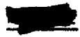

Mixture

DENSITY   

<table><tr><td>44</td></tr></table>

Component

NaF

ZrF,

UF

Mol %

53.5

40.0

6.5

Wt. %

20.47

60-93

18.60

Avg. M.W.

109.8

Liquidus Temp.

540°C (1004°F)

SOLID AT ROOM TEMPERATURE (gm/cc)

$$
4. 1 9
$$

$$
\text {L I Q U I D} (\rho = g m / c c, T = ^ {\circ} C)
$$

$$
\rho^ {*} = 4. 0 4 - 0. 0 0 1 1 \mathrm {T} (\text {R e f .} 1 6)
$$

$$
\text {L I Q U I D} (\rho = \mathrm {l b s} / \mathrm {f t} ^ {3}, \mathrm {T} = ^ {\circ} \mathrm {F})
$$

$$
\rho^ {*} = 2 5 3. 4 - 0. 0 3 8 1 \mathrm {T}
$$

MEAN VOLUMETRIC COEFFICIENT OF LIQUID EXPANSION $(1 / ^{\circ}C x 10^{4})$ 3.36

# ENTHALPY, HEAT CAPACITY AND HEAT OF FUSION

$$
\text {S O L I D} \quad (2 6 0 ^ {\circ} - 4 9 0 ^ {\circ} c)
$$

$$
\text {E n t h a l p y} \quad (\mathrm {c a l} / \mathrm {g m})
$$

$$
\text {H e a t C a p a c i t y (c a l / g m} ^ {\circ} \mathrm {C})
$$

$$
\text {H e a t C a p a c i t y} 3 0 0 ^ {\circ} \mathrm {C} (5 7 2 ^ {\circ} \mathrm {F})
$$

$$
\text {L I Q U I D} (5 9 0 ^ {\circ} - 9 2 0 ^ {\circ} \mathrm {C})
$$

$$
\text {E n t h a l p y} (\mathrm {c a l} / \mathrm {g m})
$$

$$
\text {H e a t C a p a c i t y (c a l / g m} ^ {\circ} \mathrm {C})
$$

$$
\text {H e a t C a p a c i t y} 7 0 0 ^ {\circ} \mathrm {C} (1 2 9 2 ^ {\circ} \mathrm {F})
$$

$$
\mathrm {H} _ {\mathrm {T}} - \mathrm {H} _ {\mathrm {O}} ^ {\circ} \mathrm {C} ^ {*} = - 4. 1 + 0. 1 8 9 \mathrm {T} (\text {R e f .} 4)
$$

$$
c * = 0. 1 9
$$

$$
c _ {p} ^ {p} = 0. 1 9
$$

$$
H E A T O F F U S I O N (c a l / g m)
$$

$$
\mathrm {H} _ {\mathrm {T}} - \mathrm {H} _ {\mathrm {O}} \mathrm {o} _ {\mathrm {C}} ^ {*} = 3 4. 5 + 0. 2 3 5 \mathrm {T}
$$

$$
c * = 0. 2 4
$$

$$
c _ {p} ^ {p *} = 0. 2 4
$$

$$
\mathrm {H} _ {\mathrm {L}} - \mathrm {H} _ {\mathrm {S}} * = 6 3
$$

# THERMAL CONDUCTIVITY

K (BTU/hr ft $\mathbf{o}_{\mathbb{F}}$

1.2 (Liquid)(Ref. 29)

VISCOSITY   

<table><tr><td>°C</td><td>(Centipoises)</td><td>(Centistokes)</td><td>OF</td><td>(lb./ft-hr)</td><td>ft2/hr</td></tr><tr><td>600</td><td>8.5* (Ref.22)</td><td>2.51</td><td>1100</td><td>21.1*</td><td>0.0968</td></tr><tr><td>700</td><td>5.7*</td><td>1.74</td><td>1300</td><td>13.7*</td><td>0.0648</td></tr><tr><td>800</td><td>4.2*</td><td>1.33</td><td>1500</td><td>9.7*</td><td>0.0474</td></tr><tr><td>850</td><td>3.7*</td><td>1.14</td><td></td><td></td><td></td></tr><tr><td colspan="6">Exponential Form (centipoises) μ = 0.194e3302/T0K</td></tr><tr><td>PRANDTL NUMBER</td><td colspan="5">4.2 at 1100°F, 2.7 at 1300°F, 1.9 at 1500°F</td></tr><tr><td>ELECTRICAL CONDUCTIVITY (ohm-cm)-1</td><td colspan="5">0.66 at 1100°F, 0.97 at 1300°F, 1.27 at 1500°F</td></tr><tr><td>Mixture</td><td>Component</td><td>Mol %</td><td>Wt. %</td><td>Avg. M.W.</td><td>Liquidus Temp.</td></tr><tr><td rowspan="2">45</td><td>NaF</td><td>53</td><td>22.07</td><td>100.9</td><td>520°C (968°F)</td></tr><tr><td>ZrF4</td><td>47</td><td>77.93</td><td></td><td></td></tr></table>

# DENSITY

SOLID AT ROOM TEMPERATURE (gm/cc) 4.11* (Ref. 22)

LIQUID $(\rho = g m / c c, T = ^{\circ} C)$ $\rho = 3.71 - 0.00089 T$

LIQUID $(\rho = 1\text{bs} / \text{ft}^3, \text{T} = {}^0\text{F})$ $\rho = 232.6 - 0.0309\text{T}$

MEAN VOLUMETRIC COEFFICIENT OF LIQUID EXPANSION $(1 / ^{\circ}C\times 10^{4})$ 2.89

# ENTHALPY, HEAT CAPACITY AND HEAT OF FUSION

# SOLID

Enthalpy (cal/gm) H-HoC\* =

Heat Capacity (cal/gm ${}^{\mathrm{OC}}$ ) $c_{\mathrm{n}}^{*} =$

Heat Capacity at $300^{\circ}\mathrm{C}$ (572°F) $c_{p}^{F} = 0.20$

# LIQUID

Enthalpy (cal/gm) H-HOc\* =

Heat Capacity (cal/gm ${}^{\circ}\mathrm{C}$ ) $c_{\mathrm{p}}^{*} =$

Heat Capacity at $700^{\circ}\mathrm{C}$ (1292°F) $\mathbf{c}_{\mathbf{p}}^{\mathbf{F}} = 0.27$

HEAT OF FUSION (cal/gm) $\mathrm{H}_{\mathrm{L}} - \mathrm{H}_{\mathrm{S}}^{*} =$

# THERMAL CONDUCTIVITY

K (BTU/hr ft ${}^{\mathrm{o}}\mathbf{F}$ )

VISCOSITY   

<table><tr><td>°C</td><td>(Centipoises)</td><td>(Centistokes)</td><td>OF</td><td>(lb./ft-hr)</td><td>ft2/hr</td></tr><tr><td>600</td><td>7.5* (Ref. 22)</td><td>2.36</td><td>1100</td><td>18.9*</td><td>0.0952</td></tr><tr><td>700</td><td>4.6*</td><td>1.49</td><td>1300</td><td>10.9*</td><td>0.0567</td></tr><tr><td>800</td><td>3.2*</td><td>1.07</td><td>1500</td><td>7.4*</td><td>0.0398</td></tr></table>

Exponential Form (centipoises)

# DENSITY

SOLID AT ROOM TEMPERATURE (gm/cc)

$$
3. 7 0
$$

LIQUID $(\rho = g m / c c, T = {}^{0} C)$

$$
\rho = 3. 4 9 - 0. 0 0 0 8 6 \mathrm {T}
$$

LIQUID $(\rho = 1\mathrm{bs} / \mathrm{ft}^3,\mathrm{T} = {}^o\mathrm{F})$

$$
\rho = 2 1 8. 8 - 0. 0 2 9 8 \mathrm {T}
$$

MEAN VOLUMETRIC COEFFICIENT OF LIQUID EXPANSION $(1 / ^{\circ}C x 10^{4})$ 2.53

# ENTHALPY, HEAT CAPACITY AND HEAT OF FUSION

# SOLID

Enthalpy (cal/gm)

$$
\mathrm {H} _ {\mathrm {T}} - \mathrm {H} _ {\mathrm {O}} \mathrm {o} _ {\mathrm {C}} ^ {*} =
$$

Heat Capacity (cal/gm $^\circ \mathrm{C}$ )

$$
c _ {p} ^ {*} =
$$

Heat Capacity at $300^{\circ}\mathrm{C}$ (572°F)

$$
c _ {p} = 0. 2 1
$$

# LIQUID

Enthalpy (cal/gm)

$$
\mathrm {H} _ {\mathrm {T}} - \mathrm {H} _ {\mathrm {O}} \mathrm {o} _ {\mathrm {C}} ^ {*} =
$$

Heat Capacity (cal/gm $^\circ \mathrm{C}$ )

$$
c _ {p} ^ {*} =
$$

Heat Capacity at $700^{\circ}\mathrm{C}$ (1292F)

$$
c _ {p} = 0. 2 9
$$

# HEAT OF FUSION (cal/gm)

$$
\mathrm {H} _ {\mathrm {L}} - \mathrm {H} _ {\mathrm {S}} ^ {*} =
$$

# THERMAL CONDUCTIVITY

K (BTU/hr ft $\mathbf{O}_{\mathbf{F}}$

# VISCOSITY

C

(Centipoises)

(Centistokes)

oF

(lb./ft-hr)

ft²/hr

Exponential Form (centipoises)

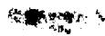

# Mixture

46

# Component

NaF

ZrF

UF 4

# Mol %

62.5

12.5

25.0

# Wt. %

20.90

16.61

62.49

# Avg. M.W.

125.7

# Liquidus Temp.

$635^{\circ}C$ (1175°F)

# DENSITY

SOLID AT ROOM TEMPERATURE $(\mathbf{g}\mathbf{m} / \mathbf{cc})$

4.86

LIQUID $(\rho = g m / c c, T = {}^{\circ} C)$

$$
\rho^ {*} = 4. 7 5 - 0. 0 0 1 2 \mathrm {T} (\text {R e f .} 1 6)
$$

LIQUID $(\rho = 1\mathrm{bs} / \mathrm{ft}^3,\mathrm{T} = {}^{\circ}\mathrm{F})$

$$
\rho^ {*} = 2 6 6. 6 - 0. 0 4 1 6 \mathrm {T}
$$

MEAN VOLUMETRIC COEFFICIENT OF LIQUID EXPANSION $(1 / ^{\circ}C x 10^{4})$ 3.07

# ENTHALPY, HEAT CAPACITY AND HEAT OF FUSION

# SOLID

Enthalpy (cal/gm)

$$
\mathrm {H} _ {\mathrm {T}} - \mathrm {H} _ {\mathrm {O}} \mathrm {o} _ {\mathrm {C}} ^ {*} =
$$

Heat Capacity (cal/gm ${}^{\circ}\mathrm{C}$ )

$$
c _ {p} ^ {*} =
$$

Heat Capacity at $300^{\circ}C$ (572°F)

$$
\mathbf {c} _ {\mathbf {p}} = 0. 1 5
$$

# LIQUID

Enthalpy (cal/gm)

$$
\mathrm {H} _ {\mathrm {T}} - \mathrm {H} _ {\mathrm {O}} \circ_ {\mathrm {C}} ^ {*} =
$$

Heat Capacity (cal/gm ${}^{\circ}\mathrm{C}$ )

$$
c _ {p} ^ {*} =
$$

Heat Capacity at $700^{\circ}\mathrm{C}$ (1292°F)

$$
c _ {p} = 0. 2 0
$$

# HEAT OF FUSION (cal/gm)

$$
\mathrm {H} _ {\mathrm {L}} - \mathrm {H} _ {\mathrm {S}} ^ {*} =
$$

# THERMAL CONDUCTIVITY

K (BTU/hr ft $\mathbf{o}_{\mathbb{F}}$

# VISCOSITY

# C (Centipoises)

# (Centistokes)

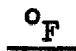

# (lb./ft-hr)

# ft²/hr

Exponential Form (centipoises)

*Denotes experimental values. Other values given are calculated or estimated.

47

NaF

LiF

BeF 2

35

20

45

16.75

59.13

24.12

41.1

$335^{\circ}C$ (635°F)

# DENSITY

SOLID AT ROOM TEMPERATURE (gm/cc)

2.26

LIQUID $(\rho = g m / c c, T = ^{\circ} C)$

$$
\rho = 2. 1 9 - 0. 0 0 0 3 5 \mathrm {T}
$$

LIQUID $(\rho = 1\text{bs} / \text{ft}^3, \text{T} = {}^o_{\text{F}})$

$$
\rho = 1 3 7. 1 - 0. 0 1 2 1 \mathrm {T}
$$

MEAN VOLUMETRIC COEFFICIENT OF LIQUID EXPANSION $(1 / ^{\circ}C\times 10^{4})$ 1.79

# ENTHALPY, HEAT CAPACITY AND HEAT OF FUSION

# SOLID

Enthalpy (cal/gm)

$$
\mathrm {H} _ {\mathrm {T}} - \mathrm {H} _ {\mathrm {O}} \mathrm {o} _ {\mathrm {C}} ^ {*} =
$$

Heat Capacity (cal/gm ${}^{\circ}\mathrm{C}$ )

$$
\mathbf {c} _ {\mathbf {p}} ^ {*} =
$$

Heat Capacity at $300^{\circ}\mathrm{C}$ (572°F)

$$
c _ {p} = 0. 4 0
$$

# LIQUID

Enthalpy (cal/gm)

$$
\mathrm {H} _ {\mathrm {T}} - \mathrm {H} _ {\mathrm {O}} \mathrm {o} _ {\mathrm {C}} ^ {*} =
$$

Heat Capacity (cal/gm $^\circ \mathrm{C}$ )

$$
c _ {p} ^ {*} =
$$

Heat Capacity at $700^{\circ}\mathrm{C}$ (1292 $^{\circ}\mathrm{F}$ )

$$
c _ {p} = 0. 5 6
$$

# HEAT OF FUSION (cal/gm)

$$
\mathrm {H} _ {\mathrm {L}} - \mathrm {H} _ {\mathrm {S}} ^ {*} =
$$

# THERMAL CONDUCTIVITY

K (BTU/hr ft $\mathbf{O}_{\mathbf{F}}$

# VISCOSITY

# C

(Centipoises)

(Centistokes)

# OF

(lb./ft-hr)

ft²/hr

Exponential Form (centipoises)

中

<table><tr><td>Mixture</td><td>Component</td><td>Mol %</td><td>Wt. %</td><td>Avg. M.W.</td><td>Liquidus Temp.</td></tr><tr><td rowspan="2">48</td><td>NaF</td><td>50</td><td>12.00</td><td>175.1</td><td>733°C (1351°F)</td></tr><tr><td>ThF4</td><td>50</td><td>88.00</td><td></td><td></td></tr></table>

# DENSITY

SOLID AT ROOM TEMPERATURE (gm/cc) 5.73

LIQUID $(\rho = g m / c c, T = ^{\circ} C)$ $\rho = 6.13 - 0.00123 T$

LIQUID $(\rho = 1bs / ft^3, T = ^0 F)$ $\rho = 384.0 - 0.0426T$

MEAN VOLUMETRIC COEFFICIENT OF LIQUID EXPANSION $(1 / ^{\circ}C\times 10^{4})$ 2.32

ENTHALPY, HEAT CAPACITY AND HEAT OF FUSION

# SOLID

<table><tr><td>Enthalpy (cal/gm)</td><td>H-T-HOc* =</td></tr><tr><td>Heat Capacity (cal/gm °C)</td><td>cp* =</td></tr><tr><td>Heat Capacity at 300°C (572°F)</td><td>cp= 0.14</td></tr></table>

# LIQUID

<table><tr><td>Enthalpy (cal/gm)</td><td>H-T-H0oC* =</td></tr><tr><td>Heat Capacity (cal/gm °C)</td><td>cp* =</td></tr><tr><td>Heat Capacity at 700°C (1292°F)</td><td>cp =</td></tr></table>

HEAT OF FUSION (cal/gm) H -H\* =

THERMAL CONDUCTIVITY

K (BTU/hr ft $\mathbf{o}_{\mathbf{F}}$

# VISCOSITY

<table><tr><td>°C</td><td>(Centipoises)</td><td>(Centistokes)</td><td>OF</td><td>(lb./ft-hr)</td><td>ft2/hr</td></tr></table>

Exponential Form (centipoises)

*Denotes experimental values. Other values given are calculated or estimated.

# Mixture

49

# Component

NaF

ZrF

UF3

# Mol %

40

57

3

# wt. %

13.85

78.85

7.30

# Avg. M.W.

121.0

# Liquidus Temp.

$510^{\circ}C$ (950°F)

# DENSITY

SOLID AT ROOM TEMPERATURE (gm/cc)

4.24

LIQUID $(\rho = \mathbf{gm} / \mathbf{cc},\mathbf{T} = \mathbf{\sigma}^{\circ}\mathbf{C})$

$$
\rho = 4. 0 6 - 0. 0 0 0 9 4 \mathrm {T}
$$

LIQUID $(\rho = 1\mathrm{bs} / \mathrm{ft}^3,\mathrm{T} = {}^o_{\mathrm{F}})$

$$
\rho = 2 5 4. 5 - 0. 0 3 2 6 \mathrm {T}
$$

MEAN VOLUMETRIC COEFFICIENT OF LIQUID EXPANSION $(1 / ^{\circ}C x 10^{4})$ 2.76

# ENTHALPY, HEAT CAPACITY AND HEAT OF FUSION

# SOLID

Enthalpy (cal/gm)

$$
\mathrm {H} _ {\mathrm {T}} - \mathrm {H} _ {\mathrm {O}} \mathrm {o} _ {\mathrm {C}} ^ {*} =
$$

Heat Capacity (cal/gm $^\circ \mathrm{C}$ )

$$
\mathrm {c} _ {\mathrm {p}} ^ {*} =
$$

Heat Capacity at $300^{\circ}\mathrm{C}$ (572°F)

$$
c _ {p} = 0. 1 8
$$

# LIQUID

Enthalpy (cal/gm)

$$
\mathrm {H} _ {\mathrm {T}} - \mathrm {H} _ {\mathrm {O}} \mathrm {o} _ {\mathrm {C}} ^ {*} =
$$

Heat Capacity (cal/gn $^\circ \mathrm{C}$ )

$$
c _ {p} ^ {*} =
$$

Heat Capacity at $700^{\circ}\mathrm{C}$ (1292F)

$$
c _ {p} = 0. 2 5
$$

# HEAT OF FUSION (cal/gm)

$$
\mathrm {H} _ {\mathrm {L}} - \mathrm {H} _ {\mathrm {S}} ^ {*} =
$$

# THERMAL CONDUCTIVITY

K (BTU/hr ft $\mathbf{o}_{\mathbb{F}}$

# VISCOSITY

# C

# (Centipoises)

# (Centistokes)

# oF

# (lb./ft-hr)

# ft²/hr

Exponential Form (centipoises)

<table><tr><td>Mixture</td><td>Component</td><td>Mol %</td><td>Wt. %</td><td>Avg. M.W.</td><td>Liquidus Temp.</td></tr><tr><td rowspan="3">70</td><td>NaF</td><td>56</td><td>22.52</td><td rowspan="3">104.4</td><td rowspan="3">530°C (986°F)</td></tr><tr><td>ZrF4</td><td>39</td><td>62.45</td></tr><tr><td>UF4</td><td>5</td><td>15.03</td></tr></table>

DENSITY   

<table><tr><td>SOLID AT ROOM TEMPERATURE (gm/cc)</td><td>4.10</td></tr><tr><td>LIQUID (ρ = gm/cc, T = °C)</td><td>ρ = 3.90 - 0.00092T</td></tr><tr><td>LIQUID (ρ = 1bs/ft3, T = °F)</td><td>ρ = 244.5 - 0.0319T</td></tr><tr><td>MEAN VOLUMETRIC COEFFICIENT OF LIQUID EXPANSION (1/°C x 104)</td><td>2.83</td></tr></table>

ENTHALPY, HEAT CAPACITY AND HEAT OF FUSION   
THERMAL CONDUCTIVITY   

<table><tr><td colspan="2">SOLID (137° - 503°C)</td></tr><tr><td>Enthalpy (cal/gm)</td><td>H-T-HO-C* = 1.3 + 0.1596T + 5.15 x 10-5T2</td></tr><tr><td>Heat Capacity (cal/gm °C)</td><td>c_p* = 0.1596 + 10.29 x 10-5T (Ref. 4)</td></tr><tr><td>Heat Capacity at 300°C (572°F)</td><td>c_p* = 0.190</td></tr><tr><td colspan="2">LIQUID (567° - 892°C)</td></tr><tr><td>Enthalpy (cal/gm)</td><td>H-T-HO-C* = 6.2 + 0.3033T - 3.24 x 10-5T2</td></tr><tr><td>Heat Capacity (cal/gm °C)</td><td>c_p* = 0.3033 - 6.47 x 10-5T</td></tr><tr><td>Heat Capacity at 700°C (1292°F)</td><td>c_p* = 0.258</td></tr><tr><td>HEAT OF FUSION (cal/gm)</td><td>H_L-H_S* = 57</td></tr></table>

K (BTU/hr ft $\mathbf{O}_{\mathbf{F}}$

<table><tr><td colspan="6">VISCOSITY</td></tr><tr><td>oC</td><td>(Centipoises)</td><td>(Centistokes)</td><td>oF</td><td>(lb./ft-hr)</td><td>ft2/hr</td></tr><tr><td>600</td><td>8.1* (Ref.30)</td><td>2.42</td><td>1100</td><td>20.3*</td><td>0.0969</td></tr><tr><td>700</td><td>5.2*</td><td>1.60</td><td>1300</td><td>12.3*</td><td>0.0606</td></tr><tr><td>800</td><td>3.6*</td><td>1.14</td><td>1500</td><td>8.2*</td><td>0.0418</td></tr><tr><td colspan="6">Exponential Form (centipoises) μ = 0.104e3798/ToK</td></tr></table>

Mixture

71

Component

NaF

ZrF

Mol %

54.1

45.9

Wt. %

22.84

77.16

Avg. M.W.

99.5

Liquidus Temp.

$520^{\circ}C$ (968°F)

# DENSITY

SOLID AT ROOM TEMPERATURE (gm/cc) 3.91

LIQUID $(\rho = g m / c c, T = ^{\circ} C)$ $\rho = 3.70 - 0.00089 T$

LIQUID $(\rho = 1\text{bs} / \text{ft}^3, \text{T} = {}^0\text{F})$ $\rho = 232.0 - 0.0309\text{T}$

MEAN VOLUMETRIC COEFFICIENT OF LIQUID EXPANSION $(1 / ^{\circ}C x 10^{4})$ 2.87

# ENTHALPY, HEAT CAPACITY AND HEAT OF FUSION

SOLID

Enthalpy (cal/gm)

$$
\mathrm {H} _ {\mathrm {T}} - \mathrm {H} _ {\mathrm {O}} \mathrm {o} _ {\mathrm {C}} ^ {*} =
$$

Heat Capacity (cal/gm $^\circ \mathrm{C}$ )

$$
c _ {p} ^ {*} =
$$

Heat Capacity at $300^{\circ}\mathrm{C}$ (572°F)

$$
c _ {p} = 0. 2 0
$$

LIQUID

Enthalpy (cal/gm)

$$
\mathrm {H} _ {\mathrm {T}} - \mathrm {H} _ {\mathrm {O}} \mathrm {o} _ {\mathrm {C}} ^ {*} =
$$

Heat Capacity (cal/gm $^\circ \mathrm{C}$ )

$$
c _ {p} ^ {*} =
$$

Heat Capacity at $700^{\circ}\mathrm{C}$ (1292°F)

$$
c _ {p} = 0. 2 8
$$

HEAT OF FUSION (cal/gm)

$$
\mathrm {H} _ {\mathrm {L}} - \mathrm {H} _ {\mathrm {S}} ^ {*} =
$$

# THERMAL CONDUCTIVITY

K (BTU/hr ft $\mathbf{o}_{\mathbb{F}}$

# VISCOSITY

$\mathrm{O}_{\mathrm{C}}$ (Centipoises)

600 7.5

700 4.6

800 3.2

(Centistokes)

OF

1100

1300

1500

(lb./ft-hr)

18.9

10.9

7.4

ft²/hr

Exponential Form (centipoises)

# Mixture

72

# Component

NaF

LiF

ZrF

UF 4

# Mol %

20.9

38.4

35.7

5.0

# Wt. %

9.33

10.58

63.41

16.68

# Avg. M.W.

94.1

# Liquidus Temp.

$490^{\circ}C$ (914°F)

# DENSITY

SOLID AT ROOM TEMPERATURE $(\mathbf{gm} / \mathbf{cc})$

4.04

LIQUID $(\rho = g m / c c, T = ^{\circ} C)$

$$
\rho = 3. 8 3 - 0. 0 0 0 9 1 \mathrm {T}
$$

LIQUID $(\rho = 1\text{be} / \text{ft}^3, \text{T} = {}^0\text{F})$

$$
\rho = 2 4 0. 1 - 0. 0 3 1 5 \mathrm {T}
$$

MEAN VOLUMETRIC COEFFICIENT OF LIQUID EXPANSION $(1 / ^{\circ}C x 10^{4})$ 2.84

ENTHALPY, HEAT CAPACITY AND HEAT OF FUSION

# SOLID

Enthalpy (cal/gm)

$$
\mathrm {H} _ {\mathrm {T}} - \mathrm {H} _ {\mathrm {O}} \mathrm {o} _ {\mathrm {C}} ^ {*} =
$$

Heat Capacity (cal/gm $^\circ \mathrm{C}$ )

$$
c _ {p} ^ {*} =
$$

Heat Capacity at $300^{\circ}\mathrm{C}$ (572°F)

$$
c _ {p} = 0. 2 0
$$

# LIQUID

Enthalpy (cal/gm)

$$
\mathrm {H} _ {\mathrm {T}} - \mathrm {H} _ {\mathrm {O}} \mathrm {o} _ {\mathrm {C}} ^ {*} =
$$

Heat Capacity (cal/gm ${}^{\circ}\mathrm{C}$ )

$$
c _ {p} ^ {*} =
$$

Heat Capacity at $700^{\circ}\mathrm{C}$ (1292°F)

$$
c _ {p} = 0. 2 8
$$

# HEAT OF FUSION (cal/gm)

$$
\mathrm {H} _ {\mathrm {L}} - \mathrm {H} _ {\mathrm {S}} ^ {*} =
$$

THERMAL CONDUCTIVITY

K (BTU/hr ft $\mathbf{o}_{\mathbb{F}}$

VISCOSITY   

<table><tr><td>°C</td><td>(Centipoises)</td><td>(Centistokes)</td><td>OF</td><td>(lb./ft-hr)</td><td>ft2/hr</td></tr><tr><td>500</td><td>20.0* (Ref.31)</td><td>5.88</td><td>1100</td><td>24.8*</td><td>0.1198</td></tr><tr><td>600</td><td>9.9*</td><td>3.0</td><td>1300</td><td>14.3*</td><td>0.0714</td></tr><tr><td>700</td><td>6.0*</td><td>1.88</td><td>1500</td><td>9.8*</td><td>0.0505</td></tr><tr><td>800</td><td>4.25*</td><td>1.36</td><td></td><td></td><td></td></tr></table>

Exponential Form (centipoises)

73

NaF

LiF

ZrF

22.0

40.5

37.5

11.21

12.75

76.04

82.4

$510^{\circ}C$ (950°F)

# DENSITY

SOLID AT ROOM TEMPERATURE $(\mathbf{g}\mathbf{m} / \mathbf{cc})$

$$
3. 7 4
$$

LIQUID $(\rho = g m / c c, T = ^{\circ} C)$

$$
\rho = 3. 5 2 - 0. 0 0 0 8 6 \mathrm {T}
$$

LIQUID $(\rho = 1\mathrm{bs} / \mathrm{ft}^3,\mathrm{T} = {}^{\circ}\mathrm{F})$

$$
\rho = 2 2 0. 7 - 0. 0 2 9 8 \mathrm {T}
$$

MEAN VOLUMETRIC COEFFICIENT OF LIQUID EXPANSION $(1 / ^{\circ}C x 10^{4})$ 2.95

# ENTHALPY, HEAT CAPACITY AND HEAT OF FUSION

# SOLID

Enthalpy (cal/gm)

$$
\mathrm {H} _ {\mathrm {T}} - \mathrm {H} _ {\mathrm {O}} \mathrm {o} _ {\mathrm {C}} ^ {*} =
$$

Heat Capacity (cal/gm $^\circ \mathrm{C}$ )

$$
\begin{array}{c} c _ {p} * = \\ \hline \end{array}
$$

Heat Capacity at $300^{\circ}\mathrm{C}$ (572°F)

$$
c _ {p} = 0. 2 2
$$

# LIQUID

Enthalpy (cal/gm)

$$
\mathrm {H} _ {\mathrm {T}} - \mathrm {H} _ {\mathrm {O}} \mathrm {o} _ {\mathrm {C}} ^ {*} =
$$

Heat Capacity (cal/gm $^\circ \mathrm{C}$ )

$$
c _ {p} ^ {*} =
$$

Heat Capacity at $700^{\circ}\mathrm{C}$ (1292°F)

$$
\mathbf {c} _ {\mathbf {p}} = 0. 3 1
$$

# HEAT OF FUSION (cal/gm)

$$
\mathrm {H} _ {\mathrm {L}} - \mathrm {H} _ {\mathrm {S}} ^ {*} =
$$

# THERMAL CONDUCTIVITY

K (BTU/hr ft $\mathbf{o}_{\mathbb{F}}$

# VISCOSITY

<table><tr><td>°C</td><td>(Centipoises)</td></tr><tr><td>500</td><td>19.0</td></tr><tr><td>600</td><td>9.4</td></tr><tr><td>700</td><td>5.7</td></tr><tr><td>800</td><td>4.05</td></tr></table>

# (Centistokes)

<table><tr><td>oF</td></tr><tr><td>1100</td></tr><tr><td>1300</td></tr><tr><td>1500</td></tr></table>

<table><tr><td>(lb./ft-hr)</td></tr><tr><td>23.7</td></tr><tr><td>13.7</td></tr><tr><td>9.3</td></tr></table>

ft²/hr

Exponential Form (centipoises)

Mixture 74

Component LiF BeF2

Mol % 69 31

Wt. % 55.13 44.87

Avg. M.W. 32.4

Liquidus Temp. 505°C (941°F)

# DENSITY

SOLID AT ROOM TEMPERATURE (gm/cc)

$$
2. 1 4
$$

LIQUID $(\rho = \mathrm{gm} / \mathrm{cc},\mathrm{T} = {}^{\circ}\mathrm{C})$

$$
\rho * = 2. 1 6 - 0. 0 0 0 4 0 T \text {(R e f .} 3)
$$

LIQUID $(\rho = 1\text{bs} / \text{ft}^3, \text{T} = {}^0\text{F})$

$$
\rho * = 1 3 5. 3 - 0. 0 1 3 9 \mathrm {T}
$$

MEAN VOLUMETRIC COEFFICIENT OF LIQUID EXPANSION $(1 / ^{\circ}C x 10^{4})$ 2.13

# ENTHALPY, HEAT CAPACITY AND HEAT OF FUSION

# SOLID

Enthalpy (cal/gm)

$$
\mathrm {H} _ {\mathrm {T}} - \mathrm {H} _ {\mathrm {O}} \mathrm {o} _ {\mathrm {C}} ^ {*} =
$$

Heat Capacity (cal/gm $^\circ \mathrm{C}$ )

$$
c _ {p} ^ {*} =
$$

Heat Capacity at $300^{\circ}C$ (572°F)

$$
c _ {p} = 0. 4 8
$$

# LIQUID

Enthalpy (cal/gm)

$$
\mathrm {H} _ {\mathrm {T}} - \mathrm {H} _ {\mathrm {O}} \mathrm {o} _ {\mathrm {C}} ^ {*} =
$$

Heat Capacity (cal/gm ${}^{\circ}\mathrm{C}$ )

$$
c _ {p} ^ {*} =
$$

Heat Capacity at $700^{\circ}\mathrm{C}$ (1292°F)

$$
c _ {p} = 0. 6 7
$$

# HEAT OF FUSION (cal/gm)

$$
\mathrm {H} _ {\mathrm {L}} - \mathrm {H} _ {\mathrm {S}} ^ {*} =
$$

# THERMAL CONDUCTIVITY

K (BTU/hr ft $\mathbf{\sigma}_{\mathrm{F}}^{\circ}$ )

# VISCOSITY

# $\mathrm{^o C}$ (Centipoises)

600 7.5\*\*

700 4.9\*\*

800 3.45\*\*

# (Centistokes)

3.90

2.60

1.89

# OF

1100

1300

1500

# (lb./ft-hr)

18.9\*\*

11.6\*\*

8.0\*

# ft²/hr

0.1577

0.0994

0.0700

Exponential Form (centipoises) $\mu = 0.118\mathrm{e}^{3624 / \mathrm{T}^{\circ}\mathrm{K}}$

Mixture

75

Component

LiF

BeF

UF 4

Mol %

67.0

30.5

2.5

Wt. %

43.92

36.24

19.84

Avg. M.W.

39.5

Liquidus Temp.

$464^{\circ}C$ (867°F)

# DENSITY

SOLID AT ROOM TEMPERATURE (gm/cc)

2.48

LIQUID $(\rho = \mathrm{gm} / \mathrm{cc},\mathrm{T} = {}^{\circ}\mathrm{C})$

$$
\rho = 2. 3 8 - 0. 0 0 0 4 0 \mathrm {T}
$$

LIQUID $(\rho = 1\text{bs} / \text{ft}^3, \text{T} = \text{o}_{\text{F}})$

$$
p = 1 4 9. 0 - 0. 0 1 3 9 T
$$

MEAN VOLUMETRIC COEFFICIENT OF LIQUID EXPANSION $(1 / ^{\circ}C x 10^{4})$ 1.90

# ENTHALPY, HEAT CAPACITY AND HEAT OF FUSION

# SOLID

Enthalpy (cal/gm)

$$
\mathrm {H} _ {\mathrm {T}} - \mathrm {H} _ {\mathrm {O}} \circ_ {\mathrm {C}} ^ {*} =
$$

Heat Capacity (cal/gm $^\circ \mathrm{C}$ )

$$
c _ {p} ^ {*} =
$$

Heat Capacity at $300^{\circ}\mathrm{C}$ (572°F)

$$
c _ {p} = 0. 4 1
$$

# LIQUID

Enthalpy (cal/gm)

$$
\mathrm {H} _ {\mathrm {T}} - \mathrm {H} _ {\mathrm {O}} \circ_ {\mathrm {C}} ^ {*} =
$$

Heat Capacity (cal/gm $^\circ \mathrm{C}$ )

$$
c _ {p} ^ {*} =
$$

Heat Capacity at $700^{\circ}\mathrm{C}$ (1292°F)

$$
c _ {p} = 0. 5 7
$$

HEAT OF FUSION (cal/gm)

$$
\mathrm {H} _ {\mathrm {L}} - \mathrm {H} _ {\mathrm {S}} ^ {*} =
$$

# THERMAL CONDUCTIVITY

K (BTU/hr ft ${}^{\mathrm{O}}\mathbf{F}$ )

# VISCOSITY

C (Centipoises)

600 8.4

700 5.5

800 3.85

(Centistokes)

OF

1100

1300

1500

(lb./ft-hr)

21.1

13.1

9.0

ft²/hr

# Exponential Form (centipoises)

# Mixture

76

# Component

NaF

BeF

UF 4

# Mol %

55.5

42.0

2.5

# Wt. %

45.80

38.78

15.42

# Avg. M.W.

50.9

# Liquidus Temp.

$400^{\circ}C$ (752°F)

# DENSITY

SOLID AT ROOM TEMPERATURE $(\mathbf{g}\mathbf{m} / \mathbf{cc})$

2.61

LIQUID $(\rho = g m / c c, T = {}^{0} C)$

$$
\rho = 2. 5 0 - 0. 0 0 0 4 3 \mathrm {T}
$$

LIQUID $(\rho = 1bs / ft^3, T = ^o F)$

$$
\rho = 1 5 6. 5 - 0. 0 1 4 9 \mathrm {T}
$$

MEAN VOLUMETRIC COEFFICIENT OF LIQUID EXPANSION $(1 / ^{\circ}C\times 10^{4})$ 1.95

ENTHALPY, HEAT CAPACITY AND HEAT OF FUSION

# SOLID

Enthalpy (cal/gm)

$$
\mathrm {H} _ {\mathrm {T}} - \mathrm {H} _ {\mathrm {O}} \mathrm {o} _ {\mathrm {C}} ^ {*} =
$$

Heat Capacity (cal/gm $^\circ \mathrm{C}$ )

$$
c _ {p} ^ {*} =
$$

Heat Capacity at $300^{\circ}\mathrm{C}$ (572°F)

$$
c _ {p} = 0. 3 3
$$

# LIQUID

Enthalpy (cal/gm)

$$
\mathrm {H} _ {\mathrm {T}} - \mathrm {H} _ {\mathrm {O}} \mathrm {o} _ {\mathrm {C}} ^ {*} =
$$

Heat Capacity (cal/gm $^{\circ}$ C)

$$
c _ {p} ^ {*} =
$$

Heat Capacity at $700^{\circ}C$ (1292F)

$$
c _ {p} = 0. 4 6
$$

# HEAT OF FUSION (cal/gm)

$$
\mathrm {H} _ {\mathrm {L}} - \mathrm {H} _ {\mathrm {S}} ^ {*} =
$$

THERMAL CONDUCTIVITY

K (BTU/hr ft $\mathbf{o}_{\mathbf{F}}$

VISCOSITY   

<table><tr><td>°C</td><td>(Centipoises)</td><td>(Centistokes)</td><td>OF</td><td>(lb./ft-hr)</td><td>ft2/hr</td></tr><tr><td>600</td><td>10.5</td><td></td><td>1100</td><td>26.6</td><td></td></tr><tr><td>700</td><td>6.0</td><td></td><td>1300</td><td>14.2</td><td></td></tr><tr><td>800</td><td>3.75</td><td></td><td>1500</td><td>8.6</td><td></td></tr></table>

Exponential Form (centipoises)

# Mixture

77

# Component

NaF

BeF2

# Mol %

70

30

# Wt. %

67.59

32.41

# Avg. M.W.

43.5

# Liquidus Temp.

$590^{\circ} \mathrm{C}$ (1094°F)

# DENSITY

SOLID AT ROOM TEMPERATURE $(\mathbf{gm} / \mathbf{cc})$ 2.46

LIQUID $(\rho = \mathbf{gm} / \mathbf{cc},\mathbf{T} = \mathbf{\Omega}^{\circ}\mathbf{C})$ （20 $\rho^{*} = 2.41 - 0.00050\mathrm{T}$ (Ref.3)

LIQUID $(\rho = 1\mathrm{bs} / \mathrm{ft}^3,\mathrm{T} = {}^0\mathrm{F})$

MEAN VOLUMETRIC COEFFICIENT OF LIQUID EXPANSION $(1 / ^{\circ}C\times 10^{4})$ 2.43

# ENTHALPY, HEAT CAPACITY AND HEAT OF FUSION

# SOLID

Enthalpy (cal/gm) H-HOc\*

Heat Capacity (cal/gm ${}^{\mathrm{OC}}$ ) $c_{\mathfrak{p}}^{*} =$

Heat Capacity at $300^{\circ}C$ (572°F) $\mathbf{c}_{\mathbf{p}} = 0.36$

# LIQUID

Enthalpy (cal/gm) H -HOc\* =

Heat Capacity (cal/gm ${}^{\mathrm{OC}}$ ) $c_{p}^{*} =$

Heat Capacity at $700^{\circ}\mathrm{C}$ (1292°F) $c_{p} = 0.50$

# HEAT OF FUSION (cal/gm)

$$
\begin{array}{l} - H _ {O} O _ {C} ^ {*} = \\ c _ {p} ^ {*} = \\ c _ {p} = 0. 5 0 \\ \end{array}
$$

$$
\mathrm {H} _ {\mathrm {L}} - \mathrm {H} _ {\mathrm {S}} ^ {*} =
$$

# THERMAL CONDUCTIVITY

K (BTU/hr ft $\mathbf{o}_{\mathbf{F}}$

# VISCOSITY

<table><tr><td>°C</td><td>(Centipoises)</td><td>(Centistokes)</td><td>oF</td><td>(lb./ft-hr)</td><td>ft2/hr</td></tr><tr><td>600</td><td>5.0* (Ref. 3)</td><td>2.37</td><td>1100</td><td>12.5*</td><td>0.0944</td></tr><tr><td>700</td><td>3.9*</td><td>1.77</td><td>1300</td><td>8.6*</td><td>0.0669</td></tr><tr><td>800</td><td>2.8*</td><td>1.39</td><td>1500</td><td>6.5*</td><td>0.0519</td></tr></table>

Exponential Form (centipoises) $\mu = 0.223\mathrm{e}^{2716 / \mathrm{T}^{\mathrm{O}}\mathrm{K}}$

# DENSITY

SOLID AT ROOM TEMPERATURE (gm/cc)

2.42

LIQUID $(\rho = g m / c c, T = {}^{\circ} C)$

$$
\rho^ {*} = 2. 2 2 - 0. 0 0 0 4 1 \mathrm {T} (\text {R e f .} 3)
$$

LIQUID $(\rho = 1\mathrm{bs} / \mathrm{ft}^3,\mathrm{T} = {}^0\mathrm{F})$

$$
\rho^ {*} = 1 3 9. 0 - 0. 0 1 4 2 \mathrm {T}
$$

MEAN VOLUMETRIC COEFFICIENT OF LIQUID EXPANSION $(1 / ^{\circ}C x 10^{4})$ 2.11

# ENTHALPY, HEAT CAPACITY AND HEAT OF FUSION

# SOLID

Enthalpy (cal/gm)

$$
\mathrm {H} _ {\mathrm {T}} - \mathrm {H} _ {\mathrm {O}} \mathrm {o} _ {\mathrm {C}} ^ {*} =
$$

Heat Capacity (cal/gm $^\circ \mathrm{C}$ )

$$
c _ {p} ^ {*} =
$$

Heat Capacity at $300^{\circ}\mathrm{C}$ (572°F)

$$
c _ {p} = 0. 3 8
$$

# LIQUID

Enthalpy (cal/gm)

$$
\mathrm {H} _ {\mathrm {T}} - \mathrm {H} _ {\mathrm {O}} \mathrm {o} _ {\mathrm {C}} ^ {*} =
$$

Heat Capacity (cal/gm $^\circ \mathrm{C}$ )

$$
c _ {p} ^ {*} =
$$

Heat Capacity at $700^{\circ}\mathrm{C}$ (1292F)

$$
c _ {p} = 0. 5 3
$$

# HEAT OF FUSION (cal/gm)

$$
\mathrm {H} _ {\mathrm {L}} - \mathrm {H} _ {\mathrm {S}} ^ {*} =
$$

# THERMAL CONDUCTIVITY

K (BTU/hr ft ${}^{\mathrm{O}}\mathbf{F}$ )

VISCOSITY   

<table><tr><td>°C</td><td>(Centipoises)</td><td>(Centistokes)</td><td>°F</td><td>(lb./ft-hr)</td><td>ft2/hr</td></tr><tr><td>600</td><td>6.0**</td><td>3.03</td><td>1100</td><td>15.0**</td><td>0.1213</td></tr><tr><td>700</td><td>4.0**</td><td>2.07</td><td>1300</td><td>9.5**</td><td>0.0788</td></tr><tr><td>800</td><td>2.85**</td><td>1.50</td><td>1500</td><td>6.6**</td><td>0.0559</td></tr></table>

Exponential Form (centipoises) $\mu = 0.111\mathrm{e}^{3486 / \mathrm{T}^{\mathrm{O}}\mathrm{K}}$

79

NaF

LiF

BeF,

UF 4

55.0

15.0

27.5

2.5

48.36

8.14

27.07

16.43

47.8

$470^{\circ}C$ (878°F)

# DENSITY

SOLID AT ROOM TEMPERATURE (gm/cc)

LIQUID $(\rho = \mathrm{gm / cc},\mathrm{T} = {}^{\circ}\mathrm{C})$

LIQUID $(\rho = 1bs / ft^3, T = ^o F)$

2.70

$$
\rho = 2. 6 0 - 0. 0 0 0 4 5 \mathrm {T}
$$

$$
\rho = 1 6 2. 8 - 0. 0 1 5 6 \mathrm {T}
$$

MEAN VOLUMETRIC COEFFICIENT OF LIQUID EXPANSION $(1 / ^{\circ}C x 10^{4})$ 1.98

# ENTHALPY, HEAT CAPACITY AND HEAT OF FUSION

# SOLID

Enthalpy (cal/gm)

Heat Capacity (cal/gm $^\circ \mathrm{C}$ )

Heat Capacity at $300^{\circ}\mathrm{C}$ (572°F)

# LIQUID

Enthalpy (cal/gm)

Heat Capacity (cal/gm ${}^{\circ}\mathrm{C}$ )

Heat Capacity at $700^{\circ}\mathrm{C}$ (1292°F)

# HEAT OF FUSION (cal/gm)

$$
\begin{array}{l} \mathrm {H} _ {\mathrm {T}} - \mathrm {H} _ {\mathrm {O}} \mathrm {o} _ {\mathrm {C}} ^ {*} = \\ c _ {p} ^ {*} = \\ c _ {p} = 0. 3 3 \\ \end{array}
$$

# THERMAL CONDUCTIVITY

K (BTU/hr ft ${}^{\mathrm{o}}\mathbf{F}$ )

$$
\begin{array}{l} \mathrm {H} _ {\mathrm {T}} - \mathrm {H} _ {\mathrm {O}} \mathrm {o} _ {\mathrm {C}} ^ {*} = \\ c _ {p} ^ {*} = \\ c _ {p} = 0. 4 7 \\ \end{array}
$$

$$
\mathrm {H} _ {\mathrm {L}} - \mathrm {H} _ {\mathrm {S}} ^ {*} =
$$

# VISCOSITY

# $\underline{\mathbf{O}}_{\mathrm{C}}$ (Centipoises)

600 6.6

700 4.4

800 3.15

# (Centistokes)

OF

1100

1300

1500

(lb./ft-hr)

16.7

10.5

7.3

ft²/hr

Exponential Form (centipoises)

# Mixture

80

# Component

NaF

LiF

ZrF

# Mol %

51

38

11

# Wt. %

43.12

19.85

37.02

# Avg. M.W.

49.7

# Liquidus Temp.

$605^{\circ} \mathrm{C}$ (1121°F)

# DENSITY

SOLID AT ROOM TEMPERATURE $(\mathbf{g}\mathbf{m} / \mathbf{cc})$

3.08

LIQUID $(\rho = g m / c c, T = {}^{\circ} C)$

$$
\rho = 2. 9 5 - 0. 0 0 0 7 7 \mathrm {T}
$$

LIQUID $(\rho = 1\mathrm{bs} / \mathrm{ft}^3,\mathrm{T} = {}^{\circ}\mathrm{F})$

$$
\rho = 1 8 5. 0 - 0. 0 2 6 7 \mathrm {T}
$$

MEAN VOLUMETRIC COEFFICIENT OF LIQUID EXPANSION $(1 / ^{\circ}C\times 10^{4})$ 3.21

ENTHALPY, HEAT CAPACITY AND HEAT OF FUSION

# SOLID

Enthalpy (cal/gm)

$$
\mathrm {H} _ {\mathrm {T}} - \mathrm {H} _ {\mathrm {O}} \mathrm {o} _ {\mathrm {C}} ^ {*} =
$$

Heat Capacity (cal/gm ${}^{\circ}\mathrm{C}$ )

$$
\begin{array}{c} c _ {p} * = \\ \hline \end{array}
$$

Heat Capacity at $300^{\circ}\mathrm{C}$ (572°F)

$$
c _ {p} = 0. 2 7
$$

# LIQUID

Enthalpy (cal/gm)

$$
\mathrm {E} _ {\mathrm {T}} - \mathrm {H} _ {\mathrm {O}} \circ_ {\mathrm {C}} ^ {*} =
$$

Heat Capacity (cal/gm $^\circ \mathrm{C}$ )

$$
c _ {p} ^ {*} =
$$

Heat Capacity at $700^{\circ}\mathrm{C}$ (1292F)

$$
c _ {p} = 0. 3 8
$$

# HEAT OF FUSION (cal/gm)

$$
\mathrm {H} _ {\mathrm {L}} - \mathrm {H} _ {\mathrm {S}} ^ {*} =
$$

THERMAL CONDUCTIVITY

K (BTU/hr ft $\mathbf{o}_{\mathbf{F}}$

# VISCOSITY

# C

# (Centipoises)

# (Centistokes)

# OF

# (lb./ft-hr)

# ft²/hr

Exponential Form (centipoises)

81

NaF

LiF

ZrF

22

55

23

14.91

23.03

62.06

62.0

$570^{\circ}C$ (1058°F)

# DENSITY

SOLID AT ROOM TEMPERATURE (gm/cc)

LIQUID $(\rho = g m / c c, T = {}^{\circ} C)$

LIQUID $(\rho = 1\mathrm{be} / \mathrm{ft}^3,\mathrm{T} = {}^{\circ}\mathrm{F})$

3.41

$$
\rho = 3. 2 2 - 0. 0 0 0 8 1 \mathrm {T}
$$

$$
\rho = 2 0 1. 9 - 0. 0 2 8 1 \mathrm {T}
$$

MEAN VOLUMETRIC COEFFICIENT OF LIQUID EXPANSION $(1 / ^{\circ}C\times 10^{4})$ 3.06

# ENTHALPY, HEAT CAPACITY AND HEAT OF FUSION

SOLID (106°-368°C)

Enthalpy (cal/gm)

Heat Capacity (cal/gm $^\circ \mathrm{C}$ )

Heat Capacity at $300^{\circ}\mathrm{C}$ (572°F)

LIQUID $(603^{\circ} - 897^{\circ}\mathrm{C})$

Enthalpy (cal/gm)

Heat Capacity (cal/gm ${}^{\circ}\mathrm{C}$ )

Heat Capacity at $700^{\circ}\mathrm{C}$ (1292°F)

HEAT OF FUSION (cal/gm)

$$
\begin{array}{l} \mathrm {H} _ {\mathrm {T}} - \mathrm {H} _ {\mathrm {O}} \mathrm {O} _ {\mathrm {C}} ^ {*} = - 1. 5 + 0. 2 3 9 2 \mathrm {T} + 7. 2 0 \times 1 0 ^ {- 5} \mathrm {T} ^ {2} \\ c _ {p} ^ {*} = 0. 2 3 9 2 + 1 4. 3 9 \times 1 0 ^ {- 5} T (\text {R e f .} 3 3) \\ c _ {p} ^ {*} = 0. 2 8 2 \\ \end{array}
$$

K (BTU/hr ft $\mathbf{o}_{\mathrm{F}}$

$$
\begin{array}{l} H _ {T} - H _ {O} O _ {C} ^ {*} = - 1 3. 0 + 0. 4 5 2 6 T - 5. 9 5 \times 1 0 ^ {- 5} T ^ {2} \\ c _ {p} ^ {*} = 0. 4 5 2 6 - 1 1. 8 9 x 1 0 ^ {- 5} T \\ c _ {p} ^ {*} = 0. 3 6 9 \\ \end{array}
$$

$$
\mathrm {H} _ {\mathrm {L}} - \mathrm {H} _ {\mathrm {S}} ^ {*} =
$$

# THERMAL CONDUCTIVITY

VISCOSITY   

<table><tr><td>°C</td><td>(Centipoises)</td><td>(Centistokes)</td><td>OF</td><td>(lb./ft-hr)</td><td>ft2/hr</td></tr><tr><td>600</td><td>12.0* (Ref. 34)</td><td>4.4</td><td>1100</td><td>30.3*</td><td>0.1771</td></tr><tr><td>700</td><td>7.0*</td><td>2.64</td><td>1300</td><td>16.5*</td><td>0.0997</td></tr><tr><td>800</td><td>4.45*</td><td>1.73</td><td>1500</td><td>10.2*</td><td>0.0638</td></tr><tr><td>900</td><td>3.05*</td><td>1.22</td><td></td><td></td><td></td></tr></table>

Exponential Form (centipoises) $\mu = 0.0585\mathrm{e}^{4647 / T^{\circ}K}$

<table><tr><td>Mixture</td><td>Component</td><td>Mol %</td><td>Wt. %</td><td>Avg. M.W.</td><td>Liquidus Temp.</td></tr><tr><td rowspan="4">82</td><td>NaF</td><td>20</td><td>11.93</td><td>70.3</td><td>545°C (1013°F)</td></tr><tr><td>LiF</td><td>55</td><td>20.30</td><td></td><td></td></tr><tr><td>ZrF4</td><td>21</td><td>49.92</td><td></td><td></td></tr><tr><td>UF4</td><td>4</td><td>17.85</td><td></td><td></td></tr><tr><td></td><td></td><td></td><td>DENSITY</td><td></td><td></td></tr></table>

<table><tr><td>SOLID AT ROOM TEMPERATURE (gm/cc)</td><td>3.70</td></tr><tr><td>LIQUID (ρ = gm/cc, T = °C)</td><td>ρ = 3.49 - 0.00085T</td></tr><tr><td>LIQUID (ρ = 1bs/ft3, T = °F)</td><td>ρ = 218.8 - 0.0295T</td></tr><tr><td>MEAN VOLUMETRIC COEFFICIENT OF LIQUID EXPANSION (1/°C x 10-4)</td><td>2.93</td></tr></table>

ENTHALPY, HEAT CAPACITY AND HEAT OF FUSION   
THERMAL CONDUCTIVITY   

<table><tr><td colspan="2">SOLID (98° - 363°C)</td></tr><tr><td>Enthalpy (cal/gm)</td><td>H-T-H0oC* = -3.7 + 0.2304T + 4.07 x 10-5T2</td></tr><tr><td>Heat Capacity (cal/gm °C)</td><td>c_p* = 0.2304 + 8.14 x 10-5T (Ref. 4)</td></tr><tr><td>Heat Capacity at 300°C (572°F)</td><td>c_p* = 0.255</td></tr><tr><td colspan="2">LIQUID (582°-900°C)</td></tr><tr><td>Enthalpy (cal/gm)</td><td>H-T-H0oC* = -20.1 + 0.4314T - 7.42 x 10-5T2</td></tr><tr><td>Heat Capacity (cal/gm °C)</td><td>c_p* = 0.4314 - 14.85 x 10-5T</td></tr><tr><td>Heat Capacity at 700°C (1292°F)</td><td>c_p* = 0.327</td></tr><tr><td>HEAT OF FUSION (cal/gm)</td><td>H_L-H_S* =</td></tr></table>

K (BTU/hr ft $\mathbf{o}_{\mathbf{F}}$

VISCOSITY   

<table><tr><td>°C</td><td>(Centipoises)</td><td>(Centistokes)</td><td>OF</td><td>(lb./ft-hr)</td><td>ft2/hr</td></tr><tr><td>600</td><td>12.0* (Ref. 34)</td><td>4.03</td><td>1100</td><td>30.3*</td><td>0.1626</td></tr><tr><td>700</td><td>7.0*</td><td>2.42</td><td>1300</td><td>16.5*</td><td>0.0915</td></tr><tr><td>800</td><td>4.45*</td><td>1.61</td><td>1500</td><td>10.2*</td><td>0.0586</td></tr></table>

Exponential Form (centipoises) $\mu = 0.0585\mathrm{e}^{4647 / \mathrm{T}^{\circ}\mathrm{K}}$

# Mixture

83

# Component

NaF

ZrF

# Mol %

81

19

# Wt. %

51.71

48.29

# Avg. M.W.

65.8

# Liquidus Temp.

$750^{\circ}C$ (1382°F)

# DENSITY

SOLID AT ROOM TEMPERATURE (gm/cc)

3.40

LIQUID $(\rho = \mathbf{gm} / \mathbf{cc},\mathbf{T} = {}^{\circ}\mathbf{C})$

$$
\rho = 3. 2 2 - 0. 0 0 0 8 1 \mathrm {T}
$$

LIQUID $(\rho = 1\mathrm{bs} / \mathrm{ft}^3,\mathrm{T} = {}^o\mathrm{F})$

$$
\rho = 2 0 1. 9 - 0. 0 2 8 1 \mathrm {T}
$$

MEAN VOLUMETRIC COEFFICIENT OF LIQUID EXPANSION $(1 / ^{\circ}C x 10^{4})$ 3.06

# ENTHALPY, HEAT CAPACITY AND HEAT OF FUSION

# SOLID

Enthalpy (cal/gm)

$$
\mathrm {H} _ {\mathrm {T}} - \mathrm {H} _ {\mathrm {O}} \mathrm {o} _ {\mathrm {C}} ^ {*} =
$$

Heat Capacity (cal/gm ${}^{\circ}\mathrm{C}$ )

$$
c _ {p} ^ {*} =
$$

Heat Capacity at $300^{\circ}\mathrm{C}$ (572°F)

$$
c _ {p} = 0. 2 3
$$

# LIQUID

Enthalpy (cal/gm)

$$
\mathrm {E} _ {\mathrm {T}} - \mathrm {H} _ {\mathrm {O}} \mathrm {o} _ {\mathrm {C}} ^ {*} =
$$

Heat Capacity (cal/gm $^\circ \mathrm{C}$ )

$$
c _ {p} ^ {*} =
$$

Heat Capacity at $700^{\circ}C$ (1292F)

$$
c _ {p} =
$$

# HEAT OF FUSION (cal/gm)

$$
\mathrm {H} _ {\mathrm {L}} - \mathrm {H} _ {\mathrm {S}} ^ {*} =
$$

# THERMAL CONDUCTIVITY

K (BTU/hr ft $\mathbf{\sigma}_{\mathbf{F}}^{\mathbf{o}}$

# VISCOSITY

C

(Centipoises)

(Centistokes)

0

(lb./ft-hr)

ft²/hr

Exponential Form (centipoises)

# DENSITY

SOLID AT ROOM TEMPERATURE $(\mathbf{g}\mathbf{m} / \mathbf{cc})$

2.25

LIQUID $(\rho = g m / c c, T = ^{\circ} C)$

$$
\rho^ {*} = 2. 2 2 - 0. 0 0 0 4 1 \mathrm {T} (\text {R e f .} 3 5)
$$

LIQUID $(\rho = 1\mathrm{bs} / \mathrm{ft}^3,\mathrm{T} = {}^o\mathrm{F})$

$$
\rho^ {*} = 1 3 9. 0 - 0. 0 1 4 2 \mathrm {T}
$$

MEAN VOLUMETRIC COEFFICIENT OF LIQUID EXPANSION $(1 / ^{\circ}C\times 10^{4})$ 2.09

# ENTHALPY, HEAT CAPACITY AND HEAT OF FUSION

# SOLID

Enthalpy (cal/gm)

$$
\mathrm {H} _ {\mathrm {T}} - \mathrm {H} _ {\mathrm {O}} \mathrm {o} _ {\mathrm {C}} ^ {*} =
$$

Heat Capacity (cal/gm $^\circ \mathrm{C}$ )

$$
c _ {p} ^ {*} =
$$

Heat Capacity at $300^{\circ}\mathrm{C}$ (572°F)

$$
c _ {p} = 0, 4 2
$$

# LIQUID

Enthalpy (cal/gm)

$$
\mathrm {H} _ {\mathrm {T}} - \mathrm {H} _ {\mathrm {O}} \mathrm {o} _ {\mathrm {C}} ^ {*} =
$$

Heat Capacity (cal/gm $^\circ \mathrm{C}$ )

$$
c _ {p} ^ {*} =
$$

Heat Capacity at $700^{\circ}\mathrm{C}$ (1292F)

$$
c _ {p} = 0. 5 9
$$

# HEAT OF FUSION (cal/gm)

$$
\mathrm {H} _ {\mathrm {L}} - \mathrm {H} _ {\mathrm {S}} ^ {*} =
$$

# THERMAL CONDUCTIVITY

K (BTU/hr ft $\mathbf{o}_{\mathbf{F}}$

VISCOSITY   

<table><tr><td>°C</td><td>(Centipoises)</td><td>(Centistokes)</td><td>OF</td><td>(lb./ft-hr)</td><td>ft2/hr</td></tr><tr><td>600</td><td>7.8* (Ref. 35)</td><td>3.91</td><td>1100</td><td>19.8*</td><td>0.1586</td></tr><tr><td>700</td><td>4.45*</td><td>2.27</td><td>1300</td><td>10.5*</td><td>0.0858</td></tr><tr><td>800</td><td>2.8*</td><td>1.48</td><td>1500</td><td>6.3*</td><td>0.0530</td></tr></table>

Exponential Form (centipoises) $\mu = 0.0338e^{4738 / T^{\circ}K}$

Mixture 85

Component NaF LiF BeF2 UF4

Mol % 26.5   
34.0   
37.0   
2.5

wt. % 24.62 19,52 38.50 17.36

Avg. M.W. 45.2

Liquidus Temp. $360^{\circ} \mathrm{C}$ (680°F)

# DENSITY

SOLID AT ROOM TEMPERATURE (gm/cc)

$$
2. 5 4
$$

LIQUID $(\rho = \mathrm{gm} / \mathrm{cc},\mathrm{T} = {}^{\circ}\mathrm{C})$

$$
\rho^ {*} = 2. 3 3 - 0. 0 0 0 1 8 \mathrm {T} (\text {R e f .} 3 5)
$$

LIQUID $(\rho = 1\mathrm{bs} / \mathrm{ft}^3,\mathrm{T} = {}^{\circ}\mathrm{F})$

$$
\rho^ {*} = 1 4 5. 7 - 0. 0 0 6 2 4 \mathrm {T}
$$

MEAN VOLUMETRIC COEFFICIENT OF LIQUID EXPANSION $(1 / ^{\circ}C x 10^{4})$

# ENTHALPY, HEAT CAPACITY AND HEAT OF FUSION

# SOLID

Enthalpy (cal/gm)

$$
\mathrm {H} _ {\mathrm {T}} - \mathrm {H} _ {\mathrm {O}} \mathrm {o} _ {\mathrm {C}} ^ {*} =
$$

Heat Capacity (cal/gm $^\circ \mathrm{C}$ )

$$
\begin{array}{c} c _ {p} * = \\ \hline \end{array}
$$

Heat Capacity at $300^{\circ}\mathrm{C}$ (572°F)

$$
c _ {p} = 0. 3 7
$$

# LIQUID

Enthalpy (cal/gm)

$$
\mathrm {H} _ {\mathrm {T}} - \mathrm {H} _ {\mathrm {O}} \mathrm {o} _ {\mathrm {C}} ^ {*} =
$$

Heat Capacity (cal/gm $^\circ \mathrm{C}$ )

$$
c _ {p} ^ {*} =
$$

Heat Capacity at $700^{\circ}\mathrm{C}$ (1292°F)

$$
c _ {p} = 0. 5 1
$$

HEAT OF FUSION (cal/gm)

$$
\mathrm {H} _ {\mathrm {L}} - \mathrm {H} _ {\mathrm {S}} ^ {*} =
$$

# THERMAL CONDUCTIVITY

K (BTU/hr ft $\mathbf{O}_{\mathbf{F}}$

# VISCOSITY

<table><tr><td>°C</td><td>(Centipoises)</td><td>(Centistokes)</td><td>OF</td><td>(lb./ft-hr)</td><td>ft2/hr</td></tr><tr><td>600</td><td>9.0* (Ref. 35)</td><td>4.04</td><td>1100</td><td>22.7*</td><td>0.1631</td></tr><tr><td>700</td><td>4.95*</td><td>2.24</td><td>1300</td><td>11.7*</td><td>0.0848</td></tr><tr><td>800</td><td>3.05*</td><td>1.41</td><td>1500</td><td>6.9*</td><td>0.0506</td></tr></table>

Exponential Form (centipoises) $\mu = 0.0261\mathrm{e}^{5094 / T^{\circ}K}$

Mixture 86

Component LiF NaF $\mathrm{ZrF}_{4}$ UF

Mol % 35 32 29 4

Wt. % 10.87 16.08 58.02 15.03

Avg. M.W. 83.6

Liquidus Temp. 445°C (833°F)

# DENSITY

SOLID AT ROOM TEMPERATURE (gm/cc)

3.87

LIQUID $(\rho = g m / c c, T = {}^{\circ} C)$

$$
\rho = 3. 6 6 - 0. 0 0 0 8 8 \mathrm {T}
$$

LIQUID $(\rho = 1bs / ft^3, T = ^o_F)$

$$
p = 2 2 9. 4 - 0. 0 3 0 5 T
$$

MEAN VOLUMETRIC COEFFICIENT OF LIQUID EXPANSION $(1 / ^{\circ}C x 10^{4})$ 2.89

ENTHALPY, HEAT CAPACITY AND HEAT OF FUSION

# SOLID

Enthalpy (cal/gm)

$$
\mathrm {H} _ {\mathrm {T}} - \mathrm {H} _ {\mathrm {O}} \mathrm {o} _ {\mathrm {C}} ^ {*} =
$$

Heat Capacity (cal/gm $^\circ \mathrm{C}$ )

$$
c _ {p} ^ {*} =
$$

Heat Capacity at $300^{\circ}C$ (572F)

$$
c _ {p} = 0. 2 1
$$

# LIQUID

Enthalpy (cal/gm)

$$
\mathrm {H} _ {\mathrm {T}} - \mathrm {H} _ {\mathrm {O}} \mathrm {o} _ {\mathrm {C}} ^ {*} =
$$

Heat Capacity (cal/gm $^\circ \mathrm{C}$ )

$$
c _ {p} ^ {*} =
$$

Heat Capacity at $700^{\circ}\mathrm{C}$ (1292 $^{\circ}\mathrm{F}$ )

$$
c _ {p} = 0. 2 9
$$

# HEAT OF FUSION (cal/gm)

$$
\mathrm {H} _ {\mathrm {L}} - \mathrm {H} _ {\mathrm {S}} ^ {*} =
$$

# THERMAL CONDUCTIVITY

K (BTU/hr ft $\mathbf{O}_{\mathrm{F}}$

VISCOSITY   

<table><tr><td>°C</td><td>(Centipoises)</td><td>(Centistokes)</td><td>OF</td><td>(lb./ft-hr)</td><td>ft2/hr</td></tr><tr><td>500</td><td>20.5* (Ref. 36)</td><td>6.37</td><td>1100</td><td>26.6*</td><td>0.1357</td></tr><tr><td>600</td><td>10.5*</td><td>3.35</td><td>1300</td><td>15.4*</td><td>0.0811</td></tr><tr><td>700</td><td>6.45*</td><td>2.12</td><td>1500</td><td>10.5*</td><td>0.0572</td></tr><tr><td>800</td><td>4.55*</td><td>1.54</td><td></td><td></td><td></td></tr></table>

Exponential Form (centipoises)

Mixture

87

Component

RbF

ZrF

UF 4

Mol %

48

48

4

Wt. %

35.08

56.13

8.79

Avg. M.W.

143.0

Liquidus Temp.

$425^{\circ}C$ (797°F)

# DENSITY

SOLID AT ROOM TEMPERATURE (gm/cc)

LIQUID $(\rho = \mathbf{gm} / \mathbf{cc},\quad \mathbf{T} = ^{\circ}\mathbf{C})$

LIQUID $(\rho = 1\mathrm{bs} / \mathrm{ft}^3,\mathrm{T} = {}^{\circ}\mathrm{F})$

4.19

$$
\rho = 4. 0 0 - 0. 0 0 0 9 3 \mathrm {T}
$$

$$
\rho = 2 5 0. 7 - 0. 0 3 2 2 \mathrm {T}
$$

MEAN VOLUMETRIC COEFFICIENT OF LIQUID EXPANSION $(1 / ^{\circ}C\times 10^{4})$ 2.78

# ENTHALPY, HEAT CAPACITY AND HEAT OF FUSION

SOLID (142°-398°C)

Enthalpy (cal/gm)

Heat Capacity (cal/gm $^\circ \mathrm{C}$ )

Heat Capacity at $300^{\circ}\mathrm{C}$ (572°F)

LIQUID (458°-880°C)

Enthalpy (cal/gm)

Heat Capacity (cal/gm $^\circ \mathrm{C}$ )

Heat Capacity at $700^{\circ}\mathrm{C}$ (1292°F)

HEAT OF FUSION (cal/gm)

$$
\begin{array}{l} \mathrm {H} _ {\mathrm {T}} - \mathrm {H} _ {\mathrm {O}} \mathrm {o} _ {\mathrm {C}} ^ {*} = - 3. 2 + 0. 1 4 9 0 \mathrm {T} + 3. 2 \times 1 0 ^ {- 5} \mathrm {T} ^ {2} \\ c _ {p} ^ {*} = 0. 1 4 9 0 + 6. 5 \times 1 0 ^ {- 5} T (\text {R e f .} 3 7) \\ c _ {p} ^ {*} = 0. 1 6 9 \\ \end{array}
$$

$$
\begin{array}{l} \mathrm {H} _ {\mathrm {T}} - \mathrm {H} _ {\mathrm {O}} \circ_ {\mathrm {C}} ^ {*} = - 9. 8 + 0. 2 8 4 4 \mathrm {T} - 5. 4 \times 1 0 ^ {- 5} \mathrm {T} ^ {2} \\ c _ {p} ^ {*} = 0. 2 8 4 4 - 1 0. 8 \times 1 0 ^ {- 5} T \\ c _ {p} ^ {*} = 0. 2 0 9 \\ \end{array}
$$

$$
\mathrm {H} _ {\mathrm {L}} - \mathrm {H} _ {\mathrm {S}} ^ {*} = 3 5
$$

# THERMAL CONDUCTIVITY

K (BTU/hr ft $\mathbf{\sigma}_{\mathbf{F}}^{\mathbf{o}}$

1.0 (Liquid, constant gap) (Ref. 45)

# VISCOSITY

<table><tr><td>°C</td><td>(Centipoises)</td><td>(Centistokes)</td><td>OF</td><td>(lb./ft·hr)</td><td>ft2/hr</td></tr><tr><td>600</td><td>7.1* (Ref. 38)</td><td>2.11</td><td>1100</td><td>17.8*</td><td>0.0844</td></tr><tr><td>700</td><td>4.65*</td><td>1.41</td><td>1300</td><td>11.0*</td><td>0.0537</td></tr><tr><td>800</td><td>3.3*</td><td>1.03</td><td>1500</td><td>7.6*</td><td>0.0382</td></tr></table>

Exponential Form (centipoises) $\mu = 0.116\mathrm{e}^{3590 / \mathrm{T}^{\circ}\mathrm{K}}$

PRANDTL NUMBER 3.9 at $1100^{\circ}\mathbf{F}$ , 2.3 at $1300^{\circ}\mathbf{F}$ , 1.5 at $1500^{\circ}\mathbf{F}$

*Denotes experimental values. Other values given are calculated or estimated.

<table><tr><td>Mixture</td><td>Component</td><td>Mol %</td><td>Wt. %</td><td>Avg. M.W.</td><td>Liquidus Temp.</td></tr><tr><td rowspan="3">88</td><td>NaF</td><td>64</td><td>62.88</td><td>42.8</td><td>555°C (1031°F)</td></tr><tr><td>LiF</td><td>5</td><td>3.04</td><td></td><td></td></tr><tr><td>BeF2</td><td>31</td><td>34.08</td><td></td><td></td></tr></table>

# DENSITY

<table><tr><td>SOLID AT ROOM TEMPERATURE (gm/cc)</td><td>2.44</td></tr><tr><td>LIQUID (ρ = gm/cc, T = °C)</td><td>ρ* = 2.39 - 0.00050T (Ref. 3)</td></tr><tr><td>LIQUID (ρ = lbs/ft3, T = °F)</td><td>ρ* = 149.7 - 0.0173T</td></tr></table>

MEAN VOLUMETRIC COEFFICIENT OF LIQUID EXPANSION $(1 / ^{\circ}C\times 10^{4})$ 2.45

# ENTHALPY, HEAT CAPACITY AND HEAT OF FUSION

# SOLID

<table><tr><td>Enthalpy (cal/gm)</td><td>H_T-H_OoC* =</td></tr><tr><td>Heat Capacity (cal/gm °C)</td><td>cp* =</td></tr><tr><td>Heat Capacity at 300°C (572°F)</td><td>cp= 0.37</td></tr></table>

# LIQUID

<table><tr><td>Enthalpy (cal/gm)</td><td>H-T-HOc* =</td></tr><tr><td>Heat Capacity (cal/gm °C)</td><td>cp* =</td></tr><tr><td>Heat Capacity at 700°C (1292°F)</td><td>cp= 0.51</td></tr></table>

# HEAT OF FUSION (cal/gm)

$$
\mathrm {H} _ {\mathrm {L}} - \mathrm {H} _ {\mathrm {S}} ^ {*} =
$$

# THERMAL CONDUCTIVITY

K (BTU/hr ft $\mathbf{\sigma}_{\mathbf{F}}^{\mathbf{o}}$

# VISCOSITY

<table><tr><td>°C</td><td>(Centipoises)</td><td>(Centistokes)</td><td>OF</td><td>(lb./ft-hr)</td><td>ft2/hr</td></tr><tr><td>600</td><td>7.1**</td><td>3.39</td><td>1100</td><td>17.8**</td><td>0.1364</td></tr><tr><td>700</td><td>4.75**</td><td>2.32</td><td>1300</td><td>11.3**</td><td>0.0887</td></tr><tr><td>800</td><td>3.4*</td><td>1.71</td><td>1500</td><td>7.9**</td><td>0.0636</td></tr></table>

Exponential Form (centipoises) $\mu = 0.138\mathrm{e}^{3435 / \mathrm{T}^{\mathrm{O}}\mathrm{K}}$

Mixture

89

Component

NaF

LiF

BeF2

Mol %

63.5

7.5

29.0

Wt. %

63.12

4.62

32.26

Avg. M.W.

42.2

Liquidus Temp.

$535^{\circ}C$ (995°F)

# DENSITY

SOLID AT ROOM TEMPERATURE (gn/cc)

LIQUID $(\rho = g m / c c, T = ^{\circ} C)$

LIQUID $(\rho = 1bs / ft^3, T = ^0 F)$

2.44

$$
\rho^ {*} = 2. 3 8 - 0. 0 0 0 5 \mathrm {l T} (\text {R e f .} 3)
$$

$$
\rho^ {*} = 1 4 9. 1 - 0. 0 1 7 7 \mathrm {T}
$$

MEAN VOLUMETRIC COEFFICIENT OF LIQUID EXPANSION $(1 / ^{\circ}C x 10^{4})$ 2.52

# ENTHALPY, HEAT CAPACITY AND HEAT OF FUSION

# SOLID

Enthalpy (cal/gm)

Heat Capacity (cal/gm $^\circ \mathrm{C}$ )

Heat Capacity at $300^{\circ}C$ (572°F)

$$
\mathrm {H} _ {\mathrm {T}} - \mathrm {H} _ {\mathrm {O}} \mathrm {o} _ {\mathrm {C}} ^ {*} =
$$

$$
c _ {p} ^ {*} =
$$

$$
c _ {p} = 0. 3 7
$$

# LIQUID

Enthalpy (cal/gm)

Heat Capacity (cal/gm $^\circ \mathrm{C}$ )

Heat Capacity at $700^{\circ}C$ (1292°F)

$$
\mathrm {H} _ {\mathrm {T}} - \mathrm {H} _ {\mathrm {O}} \circ_ {\mathrm {C}} ^ {*} =
$$

$$
c _ {p} ^ {*} =
$$

$$
\mathbf {c} _ {\mathbf {p}} = 0. 5 1
$$

HEAT OF FUSION (cal/gm)

$$
\mathrm {H} _ {\mathrm {L}} - \mathrm {H} _ {\mathrm {S}} ^ {*} =
$$

# THERMAL CONDUCTIVITY

K (BTU/hr ft $\mathbf{O}_{\mathbf{F}}$

# VISCOSITY

<table><tr><td>°C</td><td>(Centipoises)</td><td>(Centistokes)</td><td>OF</td><td>(lb./ft-hr)</td><td>ft2/hr</td></tr><tr><td>600</td><td>7.0* (Ref. 3)</td><td>3.37</td><td>1100</td><td>17.4*</td><td>0.1340</td></tr><tr><td>700</td><td>4.6*</td><td>2.28</td><td>1300</td><td>10.9*</td><td>0.0864</td></tr><tr><td>800</td><td>3.3*</td><td>1.67</td><td>1500</td><td>7.6*</td><td>0.0620</td></tr></table>

Exponential Form (centipoises) $\mu = 0.121\mathrm{e}^{3543 / T^{\circ}K}$

# Mixture

90

# Component

NaF

KF

BeF2

# Mol %

49

15

36

# Wt. %

45.00

17.95

37.05

# Avg. M.W.

46.2

# Liquidus Temp.

$555^{\circ} \mathrm{C}$ (1031°F)

# DENSITY

SOLID AT ROOM TEMPERATURE (gm/cc)

2.38

LIQUID $(\rho = g m / c c, T = {}^{\circ} C)$

$$
\rho = 2. 3 0 - 0. 0 0 0 3 8 \mathrm {T}
$$

LIQUID $(\rho = 1bs / ft^3, T = ^o F)$

$$
\rho = 1 4 4. 0 - 0. 0 1 3 2 \mathrm {T}
$$

MEAN VOLUMETRIC COEFFICIENT OF LIQUID EXPANSION $(1 / ^{\circ}C\times 10^{4})$ 1.86

ENTHALFY, HEAT CAPACITY AND HEAT OF FUSION

# SOLID

Enthalpy (cal/gm)

$$
\mathrm {H} _ {\mathrm {T}} - \mathrm {H} _ {\mathrm {O}} \mathrm {o} _ {\mathrm {C}} ^ {*} =
$$

Heat Capacity (cal/gm ${}^{\circ}\mathrm{C}$ )

$$
c _ {p} ^ {*} =
$$

Heat Capacity at $300^{\circ}C$ (572°F)

$$
c _ {p} = 0. 3 5
$$

# LIQUID

Enthalpy (cal/gm)

$$
\mathrm {H} _ {\mathrm {T}} - \mathrm {H} _ {\mathrm {O}} \mathrm {o} _ {\mathrm {C}} ^ {*} =
$$

Heat Capacity (cal/ga $^\circ \mathrm{C}$ )

$$
c _ {p} ^ {*} =
$$

Heat Capacity at $700^{\circ}\mathrm{C}$ (1292 $^{\circ}\mathrm{F}$ )

$$
c _ {p} = 0. 4 8
$$

# HEAT OF FUSION (cal/gm)

$$
\mathrm {H} _ {\mathrm {L}} - \mathrm {H} _ {\mathrm {S}} ^ {*} =
$$

THERMAL CONDUCTIVITY

K (BTU/hr ft $\mathbf{O}_{\mathbf{F}}$

VISCOSITY   

<table><tr><td>°C</td><td>(Centipoises)</td><td>(Centistokes)</td><td>oF</td><td>(lb./ft-hr)</td><td>ft2/hr</td></tr><tr><td>600</td><td>8.0* (Ref. 40)</td><td>3.86</td><td>1100</td><td>20.1*</td><td>0.1555</td></tr><tr><td>700</td><td>5.0*</td><td>2.46</td><td>1300</td><td>11.9*</td><td>0.0937</td></tr><tr><td>800</td><td>3.4*</td><td>1.70</td><td>1500</td><td>7.9*</td><td>0.0634</td></tr></table>

Exponential Form (centipoises) $\mu = 0.0811\mathrm{e}^{4008 / \mathrm{T}^{\mathrm{O}}\mathrm{K}}$

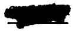

Mixture

91

Component

NaF

LiF

ZrF,

UF 4

Mol %

53

35

8

4

Wt. %

38.86

15.85

23.36

21.93

Avg. M.W.

57.3

Liquidus Temp.

$590^{\circ}C$ (1094°F)

# DENSITY

SOLID AT ROOM TEMPERATURE (gm/cc) 3.40

LIQUID $(\rho = \mathrm{gm / cc},\mathrm{T} = {}^{\circ}\mathrm{C})$

LIQUID $(\rho = 1\text{be} / \text{ft}^3, \text{T} = {}^0\text{F})$ $\rho = 201.9 - 0.0281\text{T}$

MEAN VOLUMETRIC COEFFICIENT OF LIQUID EXPANSION $(1 / ^{\circ}C\times 10^{4})$ 3.06

ENTHALPY, HEAT CAPACITY AND HEAT OF FUSION

# SOLID

Enthalpy (cal/gm)

Heat Capacity (cal/gm $^\circ \mathrm{C}$ )

Heat Capacity at $300^{\circ}\mathrm{C}$ (572°F)

# LIQUID

Enthalpy (cal/gm)

Heat Capacity (cal/gm $^\circ \mathrm{C}$ )

Heat Capacity at $700^{\circ}\mathrm{C}$ (1292°F)

HEAT OF FUSION (cal/gm)

$$
\begin{array}{l} \mathrm {H} _ {\mathrm {T}} - \mathrm {H} _ {\mathrm {O}} \mathrm {o} _ {\mathrm {C}} ^ {*} = \\ c _ {p} ^ {*} = \\ c _ {p} = 0. 2 4 \\ \end{array}
$$

$$
\begin{array}{l} \mathrm {H} _ {\mathrm {T}} - \mathrm {H} _ {\mathrm {O}} \mathrm {o} _ {\mathrm {C}} ^ {*} = \\ c _ {p} ^ {*} = \\ c _ {p} = 0. 3 3 \\ \end{array}
$$

$$
\mathrm {H} _ {\mathrm {L}} - \mathrm {H} _ {\mathrm {S}} ^ {*} =
$$

# THERMAL CONDUCTIVITY

K (BTU/hr ft $\mathbf{\sigma}_{\mathrm{F}}^{\circ}$ )

# VISCOSITY

C

600

700

800

(Centipoises)

10.5

6.45

4.55

(Centistokes)

OF

1100

1300

1500

(lb./ft-hr)

26.6

15.4

10.5

ft²/hr

Exponential Form (centipoises)

Mixture

92

Component

NaF

BeF 2

UF 4

Mol %

49.5

48.0

2.5

wt. %

40.61

44.06

15.33

Avg. M.W.

51.2

Liquidus Temp.

$415^{\circ}C$ (779°F)

# DENSITY

SOLID AT ROOM TEMPERATURE (gm/cc)

$$
2. 5 6
$$

LIQUID $(\rho = g m / c c, T = ^{\circ} C)$

$$
\rho = 2. 4 6 - 0. 0 0 0 4 2 \mathrm {T}
$$

LIQUID $(\rho = 1ba / ft^3, T = ^o F)$

$$
\rho = 1 5 4. 0 - 0. 0 1 4 6 \mathrm {T}
$$

MEAN VOLUMETRIC COEFFICIENT OF LIQUID EXPANSION $(1 / ^{\circ}C x 10^{4})$ 1.94

# ENTHALPY, HEAT CAPACITY AND HEAT OF FUSION

# SOLID

Enthalpy (cal/gm)

$$
\mathrm {H} _ {\mathrm {T}} - \mathrm {H} _ {\mathrm {O}} \mathrm {o} _ {\mathrm {C}} ^ {*} =
$$

Heat Capacity (cal/gm $^\circ \mathrm{C}$ )

$$
c _ {p} * =
$$

Heat Capacity at $300^{\circ}\mathrm{C}$ (572°F)

$$
c _ {p} = 0. 3 4
$$

# LIQUID

Enthalpy (cal/gm)

$$
\mathrm {H} _ {\mathrm {T}} - \mathrm {H} _ {\mathrm {O}} \mathrm {o} _ {\mathrm {C}} ^ {*} =
$$

Heat Capacity (cal/gm $^\circ \mathrm{C}$ )

$$
c _ {p} ^ {*} =
$$

Heat Capacity at $700^{\circ}\mathrm{C}$ (1292°F)

$$
c _ {p} = 0. 4 7
$$

HEAT OF FUSION (cal/gm)

$$
\mathrm {H} _ {\mathrm {L}} - \mathrm {H} _ {\mathrm {S}} ^ {*} =
$$

# THERMAL CONDUCTIVITY

K (BTU/hr ft ${}^{\mathrm{o}}\mathbf{F}$ )

# VISCOSITY

oc

600

700

800

(Centipoises)

13.7

7.3

4.4

(Centistokes)

OF

1100

1300

1500

(lb./ft-hr)

34.6

17.3

9.9

ft²/hr

Exponential Form (centipoises)

Mixture

93

Component

LiF

ZrF 4

UF 4

Mol %

50

46

4

Wt. %

12.66

75.08

12.26

Avg. M.W.

102.4

Liquidus Temp.

$550^{\circ} \mathrm{C}$ (1022°F)

# DENSITY

SOLID AT ROOM TEMPERATURE (gm/cc)

4.12

LIQUID $(\rho = g m / c c, T = {}^{\circ} C)$

$$
\rho = 3. 9 2 - 0. 0 0 0 9 2 \mathrm {T}
$$

LIQUID $(\rho = 1\mathrm{bs} / \mathrm{ft}^3,\mathrm{T} = {}^\circ \mathrm{F})$

$$
\rho = 2 4 5. 7 - 0. 9 3 1 9 \mathrm {T}
$$

MEAN VOLUMETRIC COEFFICIENT OF LIQUID EXPANSION $(1 / ^{\circ}C\times 10^{4})$ 2.81

ENTHALPY, HEAT CAPACITY AND HEAT OF FUSION

# SOLID

Enthalpy (cal/gm)

$$
\mathrm {H} _ {\mathrm {T}} - \mathrm {H} _ {\mathrm {O}} \circ_ {\mathrm {C}} ^ {*} =
$$

Heat Capacity (cal/gm $^\circ \mathrm{C}$ )

$$
c _ {p} ^ {*} =
$$

Heat Capacity at $300^{\circ}\mathrm{C}$ (572°F)

$$
c _ {p} = 0. 2 0
$$

# LIQUID

Enthalpy (cal/gm)

$$
\mathrm {H} _ {\mathrm {T}} - \mathrm {H} _ {\mathrm {O}} \mathrm {o} _ {\mathrm {C}} ^ {*} =
$$

Heat Capacity (cal/gm $^\circ \mathrm{C}$ )

$$
c _ {p} ^ {*} =
$$

Heat Capacity at $700^{\circ}\mathrm{C}$ (1292°F)

$$
c _ {p} = 0. 2 8
$$

HEAT OF FUSION (cal/gm)

$$
\mathrm {H} _ {\mathrm {L}} - \mathrm {H} _ {\mathrm {S}} ^ {*} =
$$

THERMAL CONDUCTIVITY

K (BTU/hr ft $\mathbf{o}_{\mathrm{F}}$

# VISCOSITY

OC

(Centipoises)

(Centistokes)

0F

(lb./ft-hr)

ft/br

Exponential Form (centipoises)

94

KF

ZrF

UF

50

46

4

24.51

64.89

10.60

118.5

# DENSITY

SOLID AT ROOM TEMPERATURE $(\mathbf{gm} / \mathbf{cc})$

3.83

LIQUID $(\rho = g m / c c, T = ^{\circ} C)$

$$
\rho = 3. 6 1 - 0. 0 0 0 8 7 \mathrm {T}
$$

LIQUID $(\rho = 1bs / ft^3, T = ^o F)$

$$
\rho = 2 2 6. 3 - 0. 0 3 0 2 \mathrm {T}
$$

MEAN VOLUMETRIC COEFFICIENT OF LIQUID EXPANSION $(1 / ^{\circ}C x 10^{4})$ 2.90

# ENTHALPY, HEAT CAPACITY AND HEAT OF FUSION

# SOLID

Enthalpy (cal/gm)

$$
\mathrm {H} _ {\mathrm {T}} - \mathrm {H} _ {\mathrm {O}} \mathrm {o} _ {\mathrm {C}} ^ {*} =
$$

Heat Capacity (cal/gm ${}^{\circ}\mathrm{C}$ )

$$
\mathrm {c} _ {\mathrm {p}} ^ {*} =
$$

Heat Capacity at $300^{\circ}\mathrm{C}$ (572°F)

$$
c _ {p} = 0. 1 7
$$

# LIQUID

Enthalpy (cal/gm)

$$
\mathrm {H} _ {\mathrm {T}} - \mathrm {H} _ {\mathrm {O}} \mathrm {o} _ {\mathrm {C}} ^ {*} =
$$

Heat Capacity (cal/gm $^\circ \mathrm{C}$ )

$$
c _ {p} ^ {*} =
$$

Heat Capacity at $700^{\circ}\mathrm{C}$ (1292°F)

$$
c _ {p} = 0. 2 4
$$

# HEAT OF FUSION (cal/gm)

$$
\mathrm {H} _ {\mathrm {L}} - \mathrm {H} _ {\mathrm {S}} ^ {*} =
$$

# THERMAL CONDUCTIVITY

K (BTU/hr ft $\mathbf{o}_{\mathbb{F}}$

# VISCOSITY

C

(Centipoises)

(Centistokes)

OF

(lb./ft-hr)

ft²/hr

Exponential Form (centipoises)

<table><tr><td>Mixture</td><td>Component</td><td>Mol %</td><td>Wt. %</td><td>Avg. M.W.</td><td>Liquidus Temp.</td></tr><tr><td rowspan="3">95</td><td>RbF</td><td>50</td><td>36.87</td><td rowspan="3">141.7</td><td rowspan="3">500°C (932°F)</td></tr><tr><td>ZrF4</td><td>46</td><td>54.27</td></tr><tr><td>UF4</td><td>4</td><td>8.86</td></tr></table>

# DENSITY

SOLID AT ROOM TEMPERATURE (gm/cc) 4.18

LIQUID $(\rho = g m / c c, T = ^{\circ} C)$ $\rho = 4.00 - 0.00093 T$

LIQUID $(\rho = 1\mathrm{bs} / \mathrm{ft}^3,\mathrm{T} = {}^{\circ}\mathrm{F})$

MEAN VOLUMETRIC COEFFICIENT OF LIQUID EXPANSION $(1 / ^{\circ}C x 10^{4})$ 2.78

ENTHALPY, HEAT CAPACITY AND HEAT OF FUSION

SOLID

Enthalpy (cal/gm) H-HoC\*

Heat Capacity (cal/gm ${}^{\mathrm{OC}}$ ) $c_{\mathfrak{n}}^{*} =$

Heat Capacity at $300^{\circ}\mathrm{C}$ (572°F) $\mathbf{c}_{\mathbf{p}}^{\mathbf{F}} = 0.14$

LIQUID

Enthalpy (cal/gm) H-HoC\* =

Heat Capacity (cal/gm ${}^{\mathrm{OC}}$ ) $c_{\mathrm{p}}^{*} =$

Heat Capacity at $700^{\circ}\mathrm{C}$ (1292°F) $\mathbf{c}_{\mathbf{p}}^{\mathbf{F}} = 0.20$

HEAT OF FUSION (cal/gm)

$$
\mathrm {H} _ {\mathrm {L}} - \mathrm {H} _ {\mathrm {S}} ^ {*} =
$$

THERMAL CONDUCTIVITY

K (BTU/hr ft $\mathbf{o}_{\mathbb{F}}$

VISCOSITY   

<table><tr><td>°C</td><td>(Centipoises)</td><td>(Centistokes)</td><td>OF</td><td>(lb./ft-hr)</td><td>ft2/hr</td></tr><tr><td>600</td><td>7.05* (Ref. 38)</td><td>2.06</td><td>1100</td><td>17.9*</td><td>0.0837</td></tr><tr><td>700</td><td>4.35*</td><td>1.31</td><td>1300</td><td>10.4*</td><td>0.0501</td></tr><tr><td>800</td><td>2.95*</td><td>0.91</td><td>1500</td><td>6.8*</td><td>0.0338</td></tr><tr><td colspan="6">Exponential Form (centipoises) μ = 0.0657e4081/T^O_K</td></tr><tr><td>Mixture</td><td>Component</td><td>Mol %</td><td>Wt. %</td><td>Avg. M.W.</td><td>Liquidus Temp.</td></tr><tr><td rowspan="3">96</td><td>NaF</td><td>53</td><td>56.66</td><td>39.3</td><td>535°C (995°F)</td></tr><tr><td>LiF</td><td>24</td><td>15.83</td><td></td><td></td></tr><tr><td>BeF2</td><td>23</td><td>27.51</td><td></td><td></td></tr></table>

# DENSITY

<table><tr><td>SOLID AT ROOM TEMPERATURE (gm/cc)</td><td>2.43</td></tr><tr><td>LIQUID (ρ = gm/cc, T = °C)</td><td>ρ = 2.34 - 0.00039T</td></tr><tr><td>LIQUID (ρ = lbs/ft3, T = °F)</td><td>ρ = 146.5 - 0.0135T</td></tr><tr><td>MEAN VOLUMETRIC COEFFICIENT OF LIQUID EXPANSION (1/°C x 104)</td><td>1.88</td></tr></table>

# ENTHALPY, HEAT CAPACITY AND HEAT OF FUSION

# SOLID

<table><tr><td>Enthalpy (cal/gm)</td><td>H-T-H0oC* =</td></tr><tr><td>Heat Capacity (cal/gm °C)</td><td>cp* =</td></tr><tr><td>Heat Capacity at 300°C (572°F)</td><td>cp = 0.38</td></tr></table>

# LIQUID

<table><tr><td>Enthalpy (cal/gm)</td><td>H-T-H0oC* =</td></tr><tr><td>Heat Capacity (cal/gm °C)</td><td>cp* =</td></tr><tr><td>Heat Capacity at 700°C (1292°F)</td><td>cp= 0.54</td></tr></table>

# HEAT OF FUSION (cal/gm)

$$
\mathrm {H} _ {\mathrm {L}} - \mathrm {H} _ {\mathrm {S}} ^ {*} =
$$

# THERMAL CONDUCTIVITY

K (BTU/hr ft $\mathbf{o}_{\mathrm{F}}$

VISCOSITY   

<table><tr><td>°C</td><td>(Centipoises)</td><td>(Centistokes)</td><td>OF</td><td>(lb./ft-hr)</td><td>ft2/hr</td></tr><tr><td>600</td><td>5.9* (Ref. 40)</td><td>2.80</td><td>1100</td><td>14.8*</td><td>0.1121</td></tr><tr><td>700</td><td>4.1*</td><td>1.98</td><td>1300</td><td>9.7*</td><td>0.0749</td></tr><tr><td>800</td><td>3.0*</td><td>1.47</td><td>1500</td><td>6.9*</td><td>0.0543</td></tr></table>

Exponential Form (centipoises) $\mu = 0.157\mathrm{e}^{3168 / \mathrm{T}^{\mathrm{O}}\mathrm{K}}$

<table><tr><td>Mixture</td><td>Component</td><td>Mol %</td><td>Wt. %</td><td>Avg. M.W.</td><td>Liquidus Temp.</td></tr><tr><td rowspan="3">97</td><td>NaF</td><td>49</td><td>55.70</td><td rowspan="3">37.0</td><td rowspan="3">597°C (1107°F)</td></tr><tr><td>LiF</td><td>36</td><td>25.22</td></tr><tr><td>BeF2</td><td>15</td><td>19.08</td></tr></table>

# DENSITY

SOLID AT ROOM TEMPERATURE (gm/cc) 2.47

LIQUID $(\rho = \mathrm{gm / cc},\mathrm{T} = {}^{\circ}\mathrm{C})$

LIQUID $(\rho = 1\text{bs} / \text{ft}^3, \text{T} = {}^0\text{F})$ $\rho = 148.4 - 0.0135\text{T}$

MEAN VOLUMETRIC COEFFICIENT OF LIQUID EXPANSION $(1 / ^{\circ}C x 10^{4})$ 1.87

# ENTHALPY, HEAT CAPACITY AND HEAT OF FUSION

# SOLID

Enthalpy (cal/gm) H -HOc\* =

Heat Capacity (cal/gm ${}^{\mathrm{OC}}$ ) $c_{\mathrm{p}}^{*} =$

Heat Capacity at $300^{\circ}\mathrm{C}$ (572°F) $\mathbf{c}_{\mathbf{p}}^{z} = 0.39$

# LIQUID

Enthalpy (cal/gm) H-HoC\* =

Heat Capacity (cal/gm ${}^{\mathrm{OC}}$ ) $c_{p}^{*} =$

Heat Capacity at $700^{\circ}\mathrm{C}$ (1292°F) $\mathbf{c}_{\mathbf{p}} = 0.55$

# HEAT OF FUSION (cal/gm)

$$
\mathrm {H} _ {\mathrm {L}} - \mathrm {H} _ {\mathrm {S}} ^ {*} =
$$

# THERMAL CONDUCTIVITY

K (BTU/hr ft $\mathbf{\sigma}_{\mathrm{F}}^{\circ}$ )

# VISCOSITY

<table><tr><td>°C</td><td>(Centipoises)</td><td>(Centistokes)</td><td>oF</td><td>(lb./ft-hr)</td><td>ft2/hr</td></tr><tr><td>600</td><td>5.65* (Ref. 41)</td><td>2.65</td><td>1100</td><td>14.0*</td><td>0.1053</td></tr><tr><td>700</td><td>3.95*</td><td>1.89</td><td>1300</td><td>9.4*</td><td>0.0720</td></tr><tr><td>800</td><td>2.95*</td><td>1.44</td><td>1500</td><td>6.9*</td><td>0.0540</td></tr></table>

Exponential Form (centipoises) $\mu = 0.173\mathrm{e}^{3043 / \mathrm{T}^{\circ}\mathrm{K}}$

<table><tr><td>Mixture</td><td>Component</td><td>Mol %</td><td>Wt. %</td><td>Avg. M.W.</td><td>Liquidus Temp.</td></tr><tr><td rowspan="4">98</td><td>NaF</td><td>56</td><td>49.23</td><td>47.8</td><td>505°C (941°F)</td></tr><tr><td>LiF</td><td>21</td><td>11.39</td><td></td><td></td></tr><tr><td>BeF2</td><td>20</td><td>19.67</td><td></td><td></td></tr><tr><td>UF4</td><td>3</td><td>19.72</td><td></td><td></td></tr><tr><td></td><td></td><td colspan="2">DENSITY</td><td></td><td></td></tr></table>

SOLID AT ROOM TEMPERATURE (gm/cc) 2.82

LIQUID $(\rho = \mathrm{gm / cc},\mathrm{T} = {}^{\circ}\mathrm{C})$ $\begin{array}{l}\rho = 2.72 - 0.00048\mathrm{T}\\ \rho = 170.3 - 0.0166\mathrm{T} \end{array}$ LIQUID $(\rho = 1\mathrm{bs} / \mathrm{ft}^{3},\mathrm{T} = {}^{\circ}\mathrm{F})$

MEAN VOLUMETRIC COEFFICIENT OF LIQUID EXPANSION $(1 / ^{\circ}C x 10^{4})$ 2.03

ENTHALPY, HEAT CAPACITY AND HEAT OF FUSION

# SOLID

Enthalpy (cal/gm) H-EOc\*

Heat Capacity (cal/gm $^{\mathrm{OC}}$ ） $\mathbf{c}_{\mathbf{p}}^{*} =$

Heat Capacity at $300^{\circ}C$ (572°F) $\mathbf{c}_{\mathbf{p}}^{*} = 0.32$

# LIQUID

Enthalpy (cal/gm) H-HoC\* =

Heat Capacity (cal/gm ${}^{\mathrm{OC}}$ ) $c_{p}^{*} =$

Heat Capacity at $700^{\circ}C$ (1292°F) $\mathbf{c}_{\mathbf{p}} = 0.45$

HEAT OF FUSION (cal/gm) $\mathrm{H}_{\mathrm{L}} - \mathrm{H}_{\mathrm{S}}^{*} =$

THERMAL CONDUCTIVITY

K (BTU/hr ft $\mathbf{O}_{\mathbf{F}}$

VISCOSITY   

<table><tr><td>°C</td><td>(Centipoises)</td><td>(Centistokes)</td><td>°F</td><td>(lb./ft-hr)</td><td>ft2/hr</td></tr><tr><td>600</td><td>7.3* (Ref. 41)</td><td>3.0</td><td>1100</td><td>18.4*</td><td>0.1215</td></tr><tr><td>700</td><td>4.6*</td><td>1.94</td><td>1300</td><td>10.9*</td><td>0.0737</td></tr><tr><td>800</td><td>3.1*</td><td>1.34</td><td>1500</td><td>7.1*</td><td>0.0492</td></tr></table>

Exponential Form (centipoises) $\mu = 0.0737\mathrm{e}^{4012 / T^{\circ}K}$

<table><tr><td>Mixture</td><td>Component</td><td>Mol %</td><td>Wt. %</td><td>Avg. M.W.</td><td>Liquidus Temp.</td></tr><tr><td rowspan="3">99</td><td>NaF</td><td>63.5</td><td>23.22</td><td>114.9</td><td>607°C (1125°F)</td></tr><tr><td>ZrF4</td><td>18.0</td><td>26.20</td><td></td><td></td></tr><tr><td>UF4</td><td>18.5</td><td>50.58</td><td></td><td></td></tr></table>

# DENSITY

<table><tr><td>SOLID AT ROOM TEMPERATURE (gm/cc)</td><td>4.59</td></tr><tr><td>LIQUID (ρ = gm/cc, T = °C)</td><td>ρ = 4.46 - 0.0010T</td></tr><tr><td>LIQUID (ρ = 1bs/ft3, T = °F)</td><td>ρ = 279.5 - 0.0347T</td></tr><tr><td>MEAN VOLUMETRIC COEFFICIENT OF LIQUID EXPANSION (1/°C x 104)</td><td>2.66</td></tr></table>

# ENTHALPY, HEAT CAPACITY AND HEAT OF FUSION

<table><tr><td colspan="2">SOLID</td></tr><tr><td>Enthalpy (cal/gm)</td><td>H-T-H0OC* =</td></tr><tr><td>Heat Capacity (cal/gm OC)</td><td>c*p =</td></tr><tr><td>Heat Capacity at 300OC (572OF)</td><td>cp = 0.16</td></tr><tr><td colspan="2">LIQUID</td></tr><tr><td>Enthalpy (cal/gm)</td><td>H-T-H0OC* =</td></tr><tr><td>Heat Capacity (cal/gm OC)</td><td>c*p =</td></tr><tr><td>Heat Capacity at 700OC (1292OF)</td><td>cp = 0.22</td></tr></table>

<table><tr><td>HEAT OF FUSION (cal/gm)</td><td>H_L-H_S* =</td></tr></table>

# THERMAL CONDUCTIVITY

K (BTU/hr ft $\mathbf{o}_{\mathbf{F}}$

# VISCOSITY

<table><tr><td>°C</td><td>(Centipoises)</td><td>(Centistokes)</td><td>°F</td><td>(lb./ft-hr)</td><td>(ft2/hr)</td></tr></table>

Exponential Form (centipoises)

*Denotes experimental values. Other values given are calculated or estimated.

<table><tr><td>Mixture</td><td>Component</td><td>Mol %</td><td>Wt. %</td><td>Avg. M.W.</td><td>Liquidus Temp.</td></tr><tr><td>100</td><td>LiF</td><td>60</td><td>48.08</td><td>32.3</td><td>652°C (1206°F)</td></tr><tr><td></td><td>NaF</td><td>40</td><td>51.92</td><td></td><td></td></tr></table>

# DENSITY

SOLID AT ROOM TEMPERATURE (gm/cc) 2.53

LIQUID $(\rho = g m / c c, T = ^{\circ} C)$ $\rho^{*} = 2.42 - 0.00055T$ (Ref. 16)

LIQUID $(\rho = 1\text{bs} / \text{ft}^3, \text{T} = {}^o_{\text{F}})$ $\rho^{*} = 151.7 - 0.0191\text{T}$

MEAN VOLUMETRIC COEFFICIENT OF LIQUID EXPANSION $(1 / ^{\circ}C\times 10^{4})$ 2.71

# ENTHALPY, HEAT CAPACITY AND HEAT OF FUSION

SOLID (112°-572°C)

Enthalpy (cal/gm) H-HoC\* = -0.1 + 0.3191T + 9.94 x 10-5T2

Heat Capacity (cal/gm $^{\circ}C$ ) $\mathbf{c}_{\mathfrak{p}}^{*} = 0.3191 + 19.87\times 10^{-5}$ T (Ref. 42)

Heat Capacity at $300^{\circ}C$ (572F) $\mathbf{c}_{\mathbf{p}}^{*} = 0.379$

LIQUID (688°-898°c)

Enthalpy (cal/gm) H-0c\* = -78.5 + 0.9249T - 24.62 x 10-2T

Heat Capacity (cal/gm $^\circ \mathrm{C}$ ) $c_{p}^{*} = 0.9249 - 49.23 \times 10^{-5} \mathrm{T}$

Heat Capacity at $700^{\circ}C$ (1292°F) $\mathbf{c}_{\mathbf{p}}^{*} = 0.580$

HEAT OF FUSION (cal/gm) H-HS\* = 170

# THERMAL CONDUCTIVITY

K (BTU/hr ft $\mathbf{\sigma}_{\mathbf{F}}^{\circ}$ )

VISCOSITY   

<table><tr><td>°C</td><td>(Centipoises)</td><td>(Centistokes)</td><td>OF</td><td>(lb./ft-hr)</td><td>ft2/hr</td></tr><tr><td>700</td><td>3.2* (Ref. 25)</td><td>1.58</td><td>1300</td><td>7.6*</td><td>0.0597</td></tr><tr><td>800</td><td>2.35*</td><td>1.19</td><td>1500</td><td>5.4*</td><td>0.0439</td></tr></table>

Exponential Form (centipoises) $\mu = 0.116\mathrm{e}^{3225 / \mathrm{T}^{\mathrm{O}}\mathrm{K}}$

# Mixture

101

# Component

LiF

NaF

UF

# Mol %

57.6

38.4

4.0

# Wt. %

34.24

36.97

28.79

# Avg. M.W.

43.6

# Liquidus Temp.

$645^{\circ}C$ (1193°F)

# DENSITY

SOLID AT ROOM TEMPERATURE (gm/cc)

3.08

LIQUID $(\rho = \mathrm{gm} / \mathrm{cc}, \mathrm{T} = {}^{\circ}\mathrm{C})$

$$
\rho = 2. 9 5 - 0. 0 0 0 7 7 \mathrm {T}
$$

LIQUID $(\rho = 1bs / ft^3, T = ^o F)$

$$
\rho = 1 8 5. 0 - 0. 0 2 6 7 \mathrm {T}
$$

MEAN VOLUMETRIC COEFFICIENT OF LIQUID EXPANSION $(1 / ^{\circ}C x 10^{4})$ 3.21

ENTHALPY, HEAT CAPACITY AND HEAT OF FUSION

SOLID (97°-594°C)

Enthalpy (cal/gm)

Heat Capacity (cal/gm $^\circ \mathrm{C}$ )

Heat Capacity at $300^{\circ}\mathrm{C}$ (572°F)

LIQUID (655°-916°C)

Enthalpy (cal/gm)

Heat Capacity (cal/gm ${}^{\circ}\mathrm{C}$ )

Heat Capacity at $700^{\circ}\mathrm{C}$ (1292 $^{\circ}\mathrm{F}$ )

HEAT OF FUSION (cal/gm)

$$
\begin{array}{l} \mathrm {H} _ {\mathrm {T}} - \mathrm {H} _ {\mathrm {O}} \mathrm {o} _ {\mathrm {C}} ^ {*} = 0 + 0. 2 2 7 \mathrm {T} + 1 7 \mathrm {x} 1 0 ^ {- 5} \mathrm {T} ^ {2} \\ c _ {p} ^ {*} = 0. 2 2 7 + 3 3 \times 1 0 ^ {- 5} T (\text {R e f .} 4) \\ c _ {p} * = 0. 3 2 6 \\ \end{array}
$$

$$
\begin{array}{l} \mathrm {H} _ {\mathrm {T}} - \mathrm {H} _ {\mathrm {O}} \mathrm {o} _ {\mathrm {C}} ^ {*} = - 6 8. 9 + 0. 5 3 1 \mathrm {T} \\ c _ {p} * = 0. 5 3 \\ c _ {p} ^ {*} = 0. 5 3 \\ \end{array}
$$

$$
\mathrm {H} _ {\mathrm {L}} - \mathrm {H} _ {\mathrm {S}} ^ {*} = 5 6
$$

# THERMAL CONDUCTIVITY

K (BTU/hr ft $\mathbf{o}_{\mathrm{F}}$

# VISCOSITY

O C

700

800

# (Centipoises)

3.5

2.6

# (Centistokes)

# (Centistokes)

# 0F

1300   
1500

# (lb./ft-hr)

8.4   
6.0

# ft²/hr

Exponential Form (centipoises)

# Mixture

102

# Component

LiF

KF

# Mol %

50

50

# Wt. %

30.85

69.15

# Avg. M.W.

42.1

# Liquidus Temp.

$492^{\circ} \mathrm{C}$ (918°F)

# DENSITY

SOLID AT ROOM TEMPERATURE (gm/cc)

2.43

LIQUID $(\rho = \mathbf{g}\mathbf{m} / \mathbf{cc},\mathbf{T} = \mathbf{\sigma}^{\circ}\mathbf{C})$

$$
\rho = 2. 4 6 - 0. 0 0 0 6 8 \mathrm {T}
$$

LIQUID $(\rho = 1\mathrm{bs} / \mathrm{ft}^3,\mathrm{T} = {}^o_{\mathrm{F}})$

$$
\rho = 1 5 4. 3 - 0. 0 2 3 6 \mathrm {T}
$$

MEAN VOLUMETRIC COEFFICIENT OF LIQUID EXPANSION $(1 / ^{\circ}C x 10^{4})$ 3.40

# ENTHALPY, HEAT CAPACITY AND HEAT OF FUSION

SOLID (107°-466°C)

Enthalpy (cal/gm)

Heat Capacity (cal/gm ${}^{\circ}\mathrm{C}$ )

Heat Capacity at $300^{\circ}\mathrm{C}$ (572°F)

LIQUID $(532^{\circ} - 893^{\circ}\mathrm{C})$

Enthalpy (cal/gm)

Heat Capacity (cal/gm ${}^{\circ}\mathrm{C}$ )

Heat Capacity at $700^{\circ}\mathrm{C}$ (1292°F)

HEAT OF FUSION (cal/gm)

$$
\begin{array}{l} \mathrm {H} _ {\mathrm {T}} - \mathrm {H} _ {\mathrm {O}} \mathrm {o} _ {\mathrm {C}} ^ {*} = - 2. 3 + 0. 2 8 1 7 \mathrm {T} + 3. 8 2 \times 1 0 ^ {- 5} \mathrm {T} ^ {2} \\ c _ {p} ^ {*} = 0. 2 8 1 7 + 7. 6 4 x 1 0 ^ {- 5} T \left(R e f. 4\right) \\ c _ {p} ^ {*} = 0. 3 0 5 \\ \end{array}
$$

$$
\begin{array}{l} \mathrm {H} _ {\mathrm {T}} - \mathrm {H} _ {\mathrm {O}} \mathrm {o} _ {\mathrm {C}} ^ {*} = - 2 3. 8 + 0. 5 8 3 9 \mathrm {T} - 1 0. 2 8 \times 1 0 ^ {- 5} \mathrm {T} ^ {2} \\ c _ {p} ^ {*} = 0. 5 8 3 9 - 2 0. 5 6 x 1 0 ^ {- 5} T \\ c _ {p} ^ {*} = 0. 4 4 0 \\ \end{array}
$$

$$
\mathrm {H} _ {\mathrm {L}} - \mathrm {H} _ {\mathrm {S}} ^ {*} = 9 3
$$

# THERMAL CONDUCTIVITY

K (BTU/hr ft $\mathbf{o}_{\mathbf{F}}$

VISCOSITY   

<table><tr><td>°C</td><td>(Centipoises)</td><td>(Centistokes)</td><td>oF</td><td>(lb./ft-hr)</td><td>ft2/hr</td></tr><tr><td>600</td><td>4.75</td><td></td><td>1100</td><td>12.1</td><td></td></tr><tr><td>700</td><td>2.9</td><td></td><td>1300</td><td>6.9</td><td></td></tr><tr><td>800</td><td>1.95</td><td></td><td>1500</td><td>4.4</td><td></td></tr></table>

Exponential Form (centipoises)

Mixture

103

Component

LiF

KF

UF

Mol %

48

48

4

Wt. %

23.55

52.70

23.75

Avg. M.W.

52.9

Liquidus Temp.

$560^{\circ}C$ (1040°F)

# DENSITY

SOLID AT ROOM TEMPERATURE (gm/cc)

LIQUID $(\rho = g m / c c, T = {}^{\circ} C)$

LIQUID $(\rho = 1\mathrm{be} / \mathrm{ft}^3,\mathrm{T} = {}^{\circ}\mathrm{F})$

2.85

$$
\rho = 2. 7 5 - 0. 0 0 0 7 3 \mathrm {T}
$$

$$
\rho = 1 7 2. 5 - 0. 0 2 5 3 \mathrm {T}
$$

MEAN VOLUMETRIC COEFFICIENT OF LIQUID EXPANSION $(1 / ^{\circ}C\times 10^{4})$ 3.24

# ENTHALPY, HEAT CAPACITY AND HEAT OF FUSION

SOLID (127°-465°C)

Enthalpy (cal/gm)

Heat Capacity (cal/gm $^\circ \mathrm{C}$ )

Heat Capacity at $300^{\circ}C$ (572°F)

LIQUID $(563^{\circ} - 882^{\circ}\mathrm{c})$

Enthalpy (cal/gm)

Heat Capacity (cal/gm $^\circ \mathrm{C}$ )

Heat Capacity at $700^{\circ}\mathrm{C}$ (1292°F)

HEAT OF FUSION (cal/gm)

$$
\begin{array}{l} \mathrm {H} _ {\mathrm {T}} - \mathrm {H} _ {\mathrm {O}} \mathrm {o c} ^ {*} = 0. 1 + 0. 2 3 4 \mathrm {T} + 4. 9 \times 1 0 ^ {- 5} \mathrm {T} ^ {2} \\ c _ {p} ^ {*} = 0. 2 3 4 + 9. 7 \times 1 0 ^ {- 5} T (\text {R e f .} 4) \\ c _ {p} ^ {*} = 0. 2 6 3 \\ \end{array}
$$

$$
\begin{array}{l} \mathrm {H} _ {\mathrm {T}} - \mathrm {H} _ {\mathrm {O}} \mathrm {o} _ {\mathrm {C}} ^ {*} = - 8 2. 4 + 0. 6 5 7 \mathrm {T} - 1 9. 7 \times 1 0 ^ {- 5} \mathrm {T} ^ {2} \\ c _ {p} ^ {*} = 0. 6 5 7 - 3 9. 3 x 1 0 ^ {- 5} T \\ c _ {p} ^ {*} = 0. 3 8 2 \\ \end{array}
$$

$$
\mathrm {H} _ {\mathrm {L}} - \mathrm {H} _ {\mathrm {S}} ^ {*} = 6 8 \text {a t} 5 0 0 ^ {\circ} \mathrm {C} ^ {* *}
$$

# THERMAL CONDUCTIVITY

K (BTU/hr ft $\mathbf{\sigma}_{\mathbf{F}}^{\mathbf{o}}$

1.4 (solid sphere and slab)(Ref. 45)

# VISCOSITY

<table><tr><td>°C</td><td>(Centipoises)</td><td>(Centistokes)</td><td>oF</td><td>(lb./ft-hr)</td><td>ft2/hr</td></tr><tr><td>600</td><td>5.25</td><td></td><td>1100</td><td>13.2</td><td></td></tr><tr><td>700</td><td>3.2</td><td></td><td>1300</td><td>7.6</td><td></td></tr><tr><td>800</td><td>2.15</td><td></td><td>1500</td><td>5.0</td><td></td></tr></table>

# Exponential Form (centipoises)

<table><tr><td>Mixture</td><td>Component</td><td>Mol %</td><td>Wt. %</td><td>Avg. M.W.</td><td>Liquidus Temp.</td></tr><tr><td rowspan="2">104</td><td>LiF</td><td>43</td><td>15.77</td><td rowspan="2">70.7</td><td rowspan="2">475°C (887°F)</td></tr><tr><td>RbF</td><td>57</td><td>84.23</td></tr></table>

# DENSITY

<table><tr><td>SOLID AT ROOM TEMPERATURE (gm/cc)</td><td>3.27</td></tr><tr><td>LIQUID (ρ = gm/cc, T = °C)</td><td>ρ* = 3.30 - 0.00096T (Ref. 22)</td></tr><tr><td>LIQUID (ρ = lbs/ft3, T = °F)</td><td>ρ* = 207.1 - 0.0333T</td></tr><tr><td>MEAN VOLUMETRIC COEFFICIENT OF LIQUID EXPANSION (1/°C x 104)</td><td>3.65</td></tr></table>

# ENTHALPY, HEAT CAPACITY AND HEAT OF FUSION

<table><tr><td colspan="3">SOLID (134°-420°C)</td></tr><tr><td>Enthalpy (cal/gm)</td><td colspan="2">H_T-H_0^o_c* = -1.1 + 0.1849T + 2.45 x 10^-5T^2</td></tr><tr><td>Heat Capacity (cal/gm °C)</td><td colspan="2">c_p* = 0.1849 + 4.9 x 10^-5T (Ref. 37)</td></tr><tr><td>Heat Capacity at 300°C (572°F)</td><td colspan="2">c_p* = 0.200</td></tr><tr><td colspan="3">LIQUID (497°-878°C)</td></tr><tr><td>Enthalpy (cal/gm)</td><td colspan="2">H_T-H_0^o_c* = -22.9 + 0.3969T - 8.1 x 10^-5T^2</td></tr><tr><td>Heat Capacity (cal/gm °C)</td><td colspan="2">c_p* = 0.3969 - 16.1 x 10^-5T</td></tr><tr><td>Heat Capacity at 700°C (1292°F)</td><td colspan="2">c_p* = 0.284</td></tr></table>

<table><tr><td>HEAT OF FUSION (cal/gm)</td><td>H1-Hs* = 55</td></tr></table>

# THERMAL CONDUCTIVITY

<table><tr><td>K (BTU/hr ft0F)</td><td>1.2 (Liquid) (Ref. 43)</td></tr></table>

# VISCOSITY

<table><tr><td>°C</td><td>(Centipoises)</td><td>(Centistokes)</td><td>OF</td><td>(lb./ft-hr)</td><td>ft2/hr</td></tr><tr><td>500</td><td>9.0* (Ref. 38)</td><td>3.19</td><td>1100</td><td>11.4*</td><td>0.176</td></tr><tr><td>550</td><td>6.2*</td><td>2.24</td><td>1200</td><td>8.2*</td><td>0.0491</td></tr><tr><td>600</td><td>4.5*</td><td>1.65</td><td></td><td></td><td></td></tr><tr><td>650</td><td>3.4*</td><td>1.27</td><td></td><td></td><td></td></tr><tr><td colspan="6">Exponential Form (centipoises) μ = 0.0212e4678/T^O_K</td></tr></table>

<table><tr><td>PRANDTL NUMBER</td><td>2.9 at 1100°F</td></tr></table>

-97-

# Mixture

105

# Component

LiF

RbF

UF4

# Mol %

41.3

54.7

4.0

# Wt. %

13.32

71.06

15.62

# Avg. M.W.

80.5

# Liquidus Temp.

$660^{\circ}C$ (1220°F)

# DENSITY

SOLID AT ROOM TEMPERATURE (gm/cc)

3.56

LIQUID $(\rho = g m / c c, T = ^{\circ} C)$

$$
\rho = 3. 3 6 - 0. 0 0 0 8 4 \mathrm {T}
$$

LIQUID $(\rho = 1\mathrm{be} / \mathrm{ft}^3,\mathrm{T} = {}^0\mathrm{F})$

$$
\rho = 2 1 0. 7 - 0. 0 2 9 1 \mathrm {T}
$$

MEAN VOLUMETRIC COEFFICIENT OF LIQUID EXPANSION $(1 / ^{0}C x 10^{4})$ 2.57

# ENTHALPY, HEAT CAPACITY AND HEAT OF FUSION

# SOLID

Enthalpy (cal/gm)

$$
\mathrm {H} _ {\mathrm {T}} - \mathrm {H} _ {\mathrm {O}} \mathrm {o} _ {\mathrm {C}} ^ {*} =
$$

Heat Capacity (cal/gm ${}^{\circ}\mathrm{C}$ )

$$
c _ {p} ^ {*} =
$$

Heat Capacity at $300^{\circ}C$ (572°F)

$$
c _ {p} = 0. 1 8
$$

# LIQUID

Enthalpy (cal/gm)

$$
\mathrm {H} _ {\mathrm {T}} - \mathrm {H} _ {\mathrm {O}} \mathrm {o} _ {\mathrm {C}} ^ {*} =
$$

Heat Capacity (cal/gm $\mathbf{^o C}$ )

$$
c _ {p} ^ {*} =
$$

Heat Capacity at $700^{\circ}\mathrm{C}$ (1292 $^{\circ}\mathrm{F}$ )

$$
\mathbf {c} _ {\mathbf {p}} = 0. 2 5
$$

# HEAT OF FUSION (cal/gm)

$$
\mathrm {H} _ {\mathrm {L}} - \mathrm {H} _ {\mathrm {S}} ^ {*} =
$$

# THERMAL CONDUCTIVITY

K (BTU/hr ft $\mathbf{o}_{\mathbb{F}}$

# VISCOSITY

oc

# (Centipoises)

# (Centistokes)

oF

(lb./ft-hr)

ft²/hr

Exponential Form (centipoises)

Mixture 106

Component LiF KF NaF UF

Mol % 44.7 40.3 11.0 4.0

Wt. % 22.23 8.85 44.86 24.06

Avg. M.W. 52.2

Liquidus Temp. 560°C (1040°F)

# DENSITY

SOLID AT ROOM TEMPERATURE $(\mathbf{g}\mathbf{m} / \mathbf{cc})$

2.90

LIQUID $(\rho = g m / c c, T = {}^{0} C)$

$$
\rho = 2. 8 0 - 0. 0 0 0 7 4 \mathrm {T}
$$

LIQUID $(\rho = 1bs / ft^3, T = ^o F)$

$$
\rho = 1 7 5. 6 - 0. 0 2 5 7 \mathrm {T}
$$

MEAN VOLUMETRIC COEFFICIENT OF LIQUID EXPANSION $(1 / ^{\circ}C\times 10^{4})$ 3.26

# ENTHALPY, HEAT CAPACITY AND HEAT OF FUSION

# SOLID

Enthalpy (cal/gm)

$$
\mathrm {H} _ {\mathrm {T}} - \mathrm {H} _ {\mathrm {O}} \mathrm {o} _ {\mathrm {C}} ^ {*} =
$$

Heat Capacity (cal/gm $^\circ \mathrm{C}$ )

$$
c _ {p} ^ {*} =
$$

Heat Capacity at $300^{\circ}\mathrm{C}$ (572°F)

$$
c _ {p} = 0. 2 7
$$

# LIQUID

Enthalpy (cal/gm)

$$
\mathrm {H} _ {\mathrm {T}} - \mathrm {H} _ {\mathrm {O}} \mathrm {o} _ {\mathrm {C}} ^ {*} =
$$

Heat Capacity (cal/gm $^\circ \mathrm{C}$ )

$$
c _ {p} ^ {*} =
$$

Heat Capacity at $700^{\circ}\mathrm{C}$ (1292°F)

$$
c _ {p} = 0. 3 8
$$

HEAT OF FUSION (cal/gm)

$$
\mathrm {H} _ {\mathrm {L}} - \mathrm {H} _ {\mathrm {S}} ^ {*} =
$$

# THERMAL CONDUCTIVITY

K (BTU/hr ft $\mathbf{o}_{\mathbb{F}}$

# VISCOSITY

<table><tr><td>°C</td><td>(Centipoises)</td><td>(Centistokes)</td><td>OF</td><td>(lb./ft-hr)</td><td>ft2/hr</td></tr><tr><td>600</td><td>5.35</td><td></td><td>1100</td><td>13.6</td><td></td></tr><tr><td>700</td><td>3.2</td><td></td><td>1300</td><td>7.6</td><td></td></tr><tr><td>800</td><td>2.15</td><td></td><td>1500</td><td>4.8</td><td></td></tr></table>

Exponential Form (centipoises)

Mixture

107

Component

NaF

KF

L1F

UF4

Mol %

11.2

41.0

45.3

2.5

Wt. %

9.77

49.52

24.39

16.32

Avg. M.W.

48.1

Liquidus Temp.

$490^{\circ}C$ (914°F)

# DENSITY

SOLID AT ROOM TEMPERATURE (gm/cc)

2.74

LIQUID $(\rho = g m / c c, T = ^{\circ} C)$

$$
\rho = 2. 6 7 - 0. 0 0 0 7 2 \mathrm {T}
$$

LIQUID $(\rho = 1bs / ft^3, T = ^o F)$

$$
\rho = 1 6 7. 5 - 0. 0 2 5 0 \mathrm {T}
$$

MEAN VOLUMETRIC COEFFICIENT OF LIQUID EXPANSION $(1 / ^{\circ}C\times 10^{4})$ 3.32

# ENTHALPY, HEAT CAPACITY AND HEAT OF FUSION

SOLID

Enthalpy (cal/gm)

$$
\mathrm {H} _ {\mathrm {T}} - \mathrm {H} _ {\mathrm {O}} \circ_ {\mathrm {C}} ^ {*} =
$$

Heat Capacity (cal/gm ${}^{\circ}\mathrm{C}$ )

$$
c _ {p} ^ {*} =
$$

Heat Capacity at $300^{\circ}\mathrm{C}$ (572°F)

$$
c _ {p} = 0. 2 9
$$

LIQUID

Enthalpy (cal/gm)

$$
\mathrm {H} _ {\mathrm {T}} - \mathrm {H} _ {\mathrm {O}} \mathrm {o} _ {\mathrm {C}} ^ {*} =
$$

Heat Capacity (cal/gm ${}^{\circ}\mathrm{C}$ )

$$
c _ {p} ^ {*} =
$$

Heat Capacity at $700^{\circ}\mathrm{C}$ (1292°F)

$$
c _ {p} = 0. 4 1
$$

HEAT OF FUSION (cal/gm)

$$
\mathrm {H} _ {\mathrm {L}} - \mathrm {H} _ {\mathrm {S}} ^ {*} =
$$

# THERMAL CONDUCTIVITY

K (BTU/hr ft $\mathbf{o}_{\mathbf{F}}$

# VISCOSITY

C (Centipoises)

(Centistokes)

0F

(lb./ft-hr)

ft/HR

600 5.1* (Ref.12)

2.27

1100

12.8\*

0.0909

700 3.0\*

1.38

1300

7.1\*

0.0523

Exponential Form (centipoises) $\mu = 0.0292\mathrm{e}^{4507 / \mathrm{T}^{\mathrm{O}}\mathrm{K}}$

# Mixture

108

# Component

NaF

ZrF

UF

# Mol %

56.0

37.5

6.5

# Wt. %

22.06

58.80

19.15

# Avg. M.W.

106.6

# Liquidus Temp.

$550^{\circ} \mathrm{C}$ (1022°F)

# DENSITY

SOLID AT ROOM TEMPERATURE (gm/cc)

4.16

LIQUID $(\rho = g m / c c, T = {}^{0} C)$

$$
\rho = 3. 9 7 - 0. 0 0 0 9 3 \mathrm {T}
$$

LIQUID $(\rho = 1ba / ft^3, T = ^o F)$

$$
\rho = 2 4 8. 9 - 0. 0 3 2 2 \mathrm {T}
$$

MEAN VOLUMETRIC COEFFICIENT OF LIQUID EXPANSION $(1 / ^{\circ}C x 10^{4})$ 2.80

# ENTHALPY, HEAT CAPACITY AND HEAT OF FUSION

# SOLID

Enthalpy (cal/gm)

$$
\mathrm {H} _ {\mathrm {T}} - \mathrm {H} _ {\mathrm {O}} \mathrm {o} _ {\mathrm {C}} ^ {*} =
$$

Heat Capacity (cal/gm $^\circ \mathrm{C}$ )

$$
c _ {p} ^ {*} =
$$

Heat Capacity at $300^{\circ}\mathrm{C}$ (572°F)

$$
\mathbf {c} _ {\mathbf {p}} = 0. 1 8
$$

# LIQUID

Enthalpy (cal/gm)

$$
\mathrm {H} _ {\mathrm {T}} - \mathrm {H} _ {\mathrm {O C}} ^ {*} =
$$

Heat Capacity (cal/gm $^\circ \mathrm{C}$ )

$$
c _ {p} ^ {*} =
$$

Heat Capacity at $700^{\circ}\mathrm{C}$ (1292°F)

$$
c _ {p} = 0. 2 5
$$

# HEAT OF FUSION (cal/gm)

$$
\mathrm {H} _ {\mathrm {L}} - \mathrm {H} _ {\mathrm {S}} ^ {*} =
$$

# THERMAL CONDUCTIVITY

K (BTU/hr ft $\mathbf{\sigma}_{\mathbf{F}}^{\mathbf{o}}$

VISCOSTITY   

<table><tr><td>°C</td><td>(Centipoises)</td><td>(Centistokes)</td><td>OF</td><td>(lb./ft-hr)</td><td>ft2/hr</td></tr><tr><td>600</td><td>8.5</td><td></td><td>1100</td><td>21.3</td><td></td></tr><tr><td>700</td><td>5.4</td><td></td><td>1300</td><td>12.8</td><td></td></tr><tr><td>800</td><td>3.7</td><td></td><td>1500</td><td>8.5</td><td></td></tr></table>

Exponential Form (centipoises)

Mixture 109

Component NaF RbF BeF UF 4

Mol % 32 31 31 6

Wt. % 16.96 40.88 18.38 23.78

Avg. M.W. 79.3

Liquidus Temp. 535°C (995°F)

# DENSITY

SOLID AT ROOM TEMPERATURE (gm/cc)

3.29

LIQUID $(\rho = \mathrm{gm / cc},\mathrm{T} = {}^{\circ}\mathrm{C})$

$$
\rho = 3. 2 0 - 0. 0 0 0 6 4 \mathrm {T}
$$

LIQUID $(\rho = 1\mathrm{bs} / \mathrm{ft}^3,\mathrm{T} = {}^{\circ}\mathrm{F})$

$$
\rho = 2 0 0. 5 \sim 0. 0 2 2 2 \mathrm {T}
$$

MEAN VOLUMETRIC COEFFICIENT OF LIQUID EXPANSION $(1 / ^{\circ}C x 10^{4})$ 2.33

# ENTHALPY, HEAT CAPACITY AND HEAT OF FUSION

# SOLID

Enthalpy (cal/gm)

$$
\mathrm {H} _ {\mathrm {T}} - \mathrm {H} _ {\mathrm {O}} \mathrm {o} _ {\mathrm {C}} ^ {*} =
$$

Heat Capacity (cal/gm ${}^{\circ}\mathrm{C}$ )

$$
c _ {p} ^ {*} =
$$

Heat Capacity at $300^{\circ}\mathrm{C}$ (572°F)

$$
c _ {p} = 0. 2 1
$$

# LIQUID

Enthalpy (cal/gm)

$$
\mathrm {H} _ {\mathrm {T}} - \mathrm {H} _ {\mathrm {O}} \mathrm {o} _ {\mathrm {C}} ^ {*} =
$$

Heat Capacity (cal/gm ${}^{\circ}\mathrm{C}$ )

$$
c _ {p} ^ {*} =
$$

Heat Capacity at $700^{\circ}\mathrm{C}$ (1292F)

$$
c _ {p} = 0. 3 0
$$

HEAT OF FUSION (cal/gm)

$$
\mathrm {H} _ {\mathrm {L}} - \mathrm {H} _ {\mathrm {S}} ^ {*} =
$$

# THERMAL CONDUCTIVITY

K (BTU/hr ft $\mathbf{o}_{\mathbf{F}}$

# VISCOSITY

C

(Centipoises)

(Centistokes)

oF

(1b./ft-hr)

ft²/hr

Exponential Form (centipoises)

Mixture 110

Component NaF KF $\mathrm{ZrF}_{4}$ UF

Mol % 61.7 20.5 16.4 1.4

Wt. % 37.2 17.1 39.4 6.3

Avg. M.W. 69.6

Liquidus Temp. 775°C (1427°F)

# DENSITY

SOLID AT ROOM TEMPERATURE (gm/cc)

$$
3. 2 7 ^ {*} (\text {R e f .} 2 2)
$$

LIQUID $(\rho = g m / c c, T = {}^{\circ} C)$

$$
\rho = 3. 1 5 - 0. 0 0 0 8 0 \mathrm {T}
$$

LIQUID $(\rho = 1\mathrm{bs} / \mathrm{ft}^3,\mathrm{T} = {}^{\circ}\mathrm{F})$

$$
\rho = 1 9 7. 5 - 0. 0 2 7 7 \mathrm {T}
$$

MEAN VOLUMETRIC COEFFICIENT OF LIQUID EXPANSION $(1 / ^{\circ}C\times 10^{4})$ 3.19

# ENTHALPY, HEAT CAPACITY AND HEAT OF FUSION

SOLID

Enthalpy (cal/gm)

$$
\mathrm {H} _ {\mathrm {T}} - \mathrm {H} _ {\mathrm {O}} \mathrm {o} _ {\mathrm {C}} ^ {*} =
$$

Heat Capacity (cal/gm $^\circ \mathrm{C}$ )

$$
c _ {p} ^ {*} =
$$

Heat Capacity at $300^{\circ}C$ (572°F)

$$
\mathrm {c} _ {\mathrm {p}} = 0. 2 1
$$

LIQUID

Enthalpy (cal/gm)

$$
\mathrm {H} _ {\mathrm {T}} - \mathrm {H} _ {\mathrm {O}} \mathrm {o} _ {\mathrm {C}} ^ {*} =
$$

Heat Capacity (cal/gm $^\circ \mathrm{C}$ )

$$
c _ {p} ^ {*} =
$$

Heat Capacity at $700^{\circ}\mathrm{C}$ (1292 $^{\circ}\mathrm{F}$ )

$$
c _ {p} =
$$

HEAT OF FUSION (cal/gm)

$$
\mathrm {H} _ {\mathrm {L}} - \mathrm {H} _ {\mathrm {S}} ^ {*} =
$$

# THERMAL CONDUCTIVITY

K (BTU/hr ft $\mathbf{o}_{\mathbf{F}}$

# VISCOSITY

$\mathrm{O}_{\mathrm{C}}$ (Centipoises)

(Centistokes)

$\mathrm{O}_{\mathrm{F}}$ $(1b. / ft - hr)$ ft²/hr

Exponential Form (centipoises)

Mixture 111

Component LiF BeF2 ThF 4 UF 4

Mol % 71 16 12 1

Wt. % 27.86 11.39 56.00 4.76

Avg. M.W. 66.02

Liquidus Temp.

# DENSITY

SOLID AT ROOM TEMPERATURE $(\mathbf{gm} / \mathbf{cc})$

3.71

LIQUID $(\rho = \mathrm{gm} / \mathrm{cc},\mathrm{T} = {}^{\circ}\mathrm{C})$

$$
\rho = 3. 8 2 - 0. 0 0 0 8 2 \mathrm {T}
$$

LIQUID $(\rho = 1\text{bs} / \text{ft}^3, \text{T} = {}^0\text{F})$

$$
\rho = 2 3 9. 4 - 0. 0 2 8 4 \mathrm {T}
$$

MEAN VOLUMETRIC COEFFICIENT OF LIQUID EXPANSION $(1 / ^{\circ}C x 10^{4})$ 2.52

# ENTHALPY, HEAT CAPACITY AND HEAT OF FUSION

# SOLID

Enthalpy (cal/gm)

$$
\mathrm {H} _ {\mathrm {T}} - \mathrm {H} _ {\mathrm {O}} \mathrm {o} _ {\mathrm {C}} ^ {*} =
$$

Heat Capacity (cal/gm $^{\circ}$ C)

$$
c _ {p} ^ {*} =
$$

Heat Capacity at $300^{\circ}C$ (572°F)

$$
c _ {p} = 0. 2 6
$$

# LIQUID

Enthalpy (cal/gm)

$$
\mathrm {H} _ {\mathrm {T}} - \mathrm {H} _ {\mathrm {O}} \mathrm {o} _ {\mathrm {C}} ^ {*} =
$$

Heat Capacity (cal/gm ${}^{\circ}\mathrm{C}$ )

$$
c _ {p} ^ {*} =
$$

Heat Capacity at $700^{\circ}\mathrm{C}$ (1292 $^{\circ}\mathrm{F}$ )

$$
c _ {p} = 0. 3 7
$$

HEAT OF FUSION (cal/gm)

$$
\mathrm {H} _ {\mathrm {L}} - \mathrm {H} _ {\mathrm {S}} ^ {*} =
$$

# THERMAL CONDUCTIVITY

K (BTU/hr ft $\mathbf{o}_{\mathbf{F}}$

# VISCOSITY

C (Centipoises) 600 13.0\* (Ref.22) 700 7.1 800 4.8\*

(Centistokes) 3.90 2.18 1.51

$\frac{\mathbf{o}_{\mathbf{F}}}{1100}$ 1300   
1500

(lb./ft-hr) 33.9\* 16.9\* 11.0\*

ft²/hr 0.1628 0.0835 0.0559

4666/TK Exponential Form (centipoises) $\mu = 0.0620\mathrm{e}$

# DENSITY

SOLID AT ROOM TEMPERATURE (gm/cc)

2.08

LIQUID $(\rho = \mathrm{gm} / \mathrm{cc},\mathrm{T} = {}^{\circ}\mathrm{C})$

$$
\rho^ {*} = 2. 2 2 - 0. 0 0 0 4 0 T (\text {R e f .} 3)
$$

LIQUID $(\rho = 1\mathrm{bs} / \mathrm{ft}^3,\mathrm{T} = {}^{\circ}\mathrm{F})$

$$
\rho^ {*} = 1 3 9. 0 - 0. 0 1 3 9 \mathrm {T}
$$

MEAN VOLUMETRIC COEFFICIENT OF LIQUID EXPANSION $(1 / ^{\circ}C x 10^{4})$ 2.06

# ENTHALPY, HEAT CAPACITY AND HEAT OF FUSION

# SOLID

Enthalpy (cal/gm)

$$
\mathrm {H} _ {\mathrm {T}} - \mathrm {H} _ {\mathrm {O}} \circ_ {\mathrm {C}} ^ {*} =
$$

Heat Capacity (cal/gm $^\circ \mathrm{C}$ )

$$
c _ {p} ^ {*} =
$$

Heat Capacity at $300^{\circ}\mathrm{C}$ (572°F)

$$
c _ {p} ^ {\star} = 0. 4 6
$$

# LIQUID

Enthalpy (cal/gm)

$$
\mathrm {H} _ {\mathrm {T}} - \mathrm {H} _ {\mathrm {O}} \mathrm {o} _ {\mathrm {C}} ^ {*} =
$$

Heat Capacity (cal/gm $^\circ \mathrm{C}$ )

$$
\mathrm {c} _ {\mathrm {p}} ^ {*} =
$$

Heat Capacity at $700^{\circ}\mathrm{C}$ (1292°F)

$$
c _ {p} = 0. 6 5
$$

# HEAT OF FUSION (cal/gm)

$$
\mathrm {H} _ {\mathrm {L}} - \mathrm {H} _ {\mathrm {S}} ^ {*} =
$$

# THERMAL CONDUCTIVITY

K (BTU/hr ft $\mathbf{\sigma}_{\mathbf{F}}^{\mathbf{o}}$

# VISCOSITY

C (Centipoises)   
600 22.2\* (Ref.3)   
700 10.7\*   
800 5.95\*

(Centistokes)

11.2

5.52

3.12

OF

1100

1300

1500

(lb./ft-hr)

56.9\*

25.2\*

13.3\*

ft²/hr

0.4874

0.2200

0.1184

Exponential Form (centipoises) $\mu = 0.0189\mathrm{e}^{6174 / \mathrm{T}^{\circ}\mathrm{K}}$

Mixture

113

Component

NaF

BeF 2

Mol %

50

50

Wt. %

47.19

52.81

Avg. M.W.

44.5

Liquidus Temp.

$380^{\circ} \mathrm{C}$ (716°F)

# DENSITY

SOLID AT ROOM TEMPERATURE (gm/cc)

$$
2. 4 5 * (\text {R e f .} 1 0)
$$

LIQUID $(\rho = gm / cc, T = ^{\circ}C)$

$$
\rho = 2. 2 5 - 0. 0 0 0 4 0 \mathrm {T}
$$

LIQUID $(\rho = 1\mathrm{bs} / \mathrm{ft}^3,\mathrm{T} = {}^o\mathrm{F})$

$$
\rho = 1 4 0. 9 - 0. 0 1 3 9 \mathrm {T}
$$

MEAN VOLUMETRIC COEFFICIENT OF LIQUID EXPANSION $(1 / ^{\circ}C x 10^{4})$ 2.02

# ENTHALPY, HEAT CAPACITY AND HEAT OF FUSION

SOLID

Enthalpy (cal/gm)

$$
\mathrm {H} _ {\mathrm {T}} - \mathrm {H} _ {\mathrm {O}} \mathrm {o} _ {\mathrm {C}} ^ {*} =
$$

Heat Capacity (cal/gm $^\circ \mathrm{C}$ )

$$
c _ {p} ^ {*} =
$$

Heat Capacity at $300^{\circ}C$ (572°F)

$$
c _ {p} ^ {F} = 0. 3 8
$$

LIQUID

Enthalpy (cal/gm)

$$
\mathrm {H} _ {\mathrm {T}} - \mathrm {H} _ {\mathrm {O}} \mathrm {o} _ {\mathrm {C}} ^ {*} =
$$

Heat Capacity (cal/gm $^\circ \mathrm{C}$ )

$$
c _ {p} ^ {*} =
$$

Heat Capacity at $700^{\circ}C$ (1292F)

$$
c _ {p} = 0. 5 3
$$

HEAT OF FUSION (cal/gm)

$$
\mathrm {H} _ {\mathrm {L}} - \mathrm {H} _ {\mathrm {S}} ^ {*} =
$$

# THERMAL CONDUCTIVITY

K (BTU/hr ft $\mathbf{o}_{\mathbb{F}}$

# VISCOSITY

$^\circ \mathrm{C}$ (Centipoises)

(Centistokes)

oF

(lb./ft-hr)

ft²/hr

600 15.3\*(Ref.44)

7.61

1100

38.7\*

0.3084

700. 8.4\*

2.72

1500

20.1*

0.1634

800 5.25\*

2.72

1500

11.9\*

0.0988

Exponential Form (centipoises) $\mu = 0.0493e^{5009 / T^{\circ}K}$

<table><tr><td>Mixture</td><td>Component</td><td>Mol %</td><td>Wt. %</td><td>Avg. M.W.</td><td>Liquidus Temp.</td></tr><tr><td rowspan="2">114</td><td>KF</td><td>50</td><td>55.28</td><td rowspan="2">52.6</td><td rowspan="2">445°C (833°F)</td></tr><tr><td>BeF2</td><td>50</td><td>44.72</td></tr></table>

# DENSITY

<table><tr><td>SOLID AT ROOM TEMPERATURE (gm/cc)</td><td>2.23</td></tr><tr><td>LIQUID (ρ = gm/cc, T = °C)</td><td>ρ = 2.18 - 0.00035T</td></tr><tr><td>LIQUID (ρ = 1bs/ft3, T = °F)</td><td>ρ = 136.5 - 0.0121T</td></tr><tr><td>MEAN VOLUMETRIC COEFFICIENT OF LIQUID EXPANSION (1/°C x 104)</td><td>1.81</td></tr></table>

# ENTHALPY, HEAT CAPACITY AND HEAT OF FUSION

# SOLID

<table><tr><td>Enthalpy (cal/gm)</td><td>H_T-H_Oo_C* =</td></tr><tr><td>Heat Capacity (cal/gm °C)</td><td>c_p* =</td></tr><tr><td>Heat Capacity at 300°C (572°F)</td><td>c_p= 0.32</td></tr></table>

# LIQUID

<table><tr><td>Enthalpy (cal/gm)</td><td>H1-T-H0oC* =</td></tr><tr><td>Heat Capacity (cal/gm °C)</td><td>cp* =</td></tr><tr><td>Heat Capacity at 700°C (1292°F)</td><td>cp= 0.45</td></tr></table>

# HEAT OF FUSION (cal/gm)

$$
\mathrm {H} _ {\mathrm {L}} - \mathrm {H} _ {\mathrm {S}} ^ {*} =
$$

# THERMAL CONDUCTIVITY

K (BTU/hr ft $\mathbf{O}_{\mathbf{F}}$

# VISCOSITY

<table><tr><td>°C</td><td>(Centipoises)</td><td>(Centistokes)</td><td>OF</td><td>(lb./ft-hr)</td><td>ft2/hr</td></tr><tr><td>600</td><td>15.3* (Ref.44)</td><td>7.77</td><td>1100</td><td>39.2*</td><td>0.3187</td></tr><tr><td>700</td><td>6.7*</td><td>3.45</td><td>1300</td><td>15.7*</td><td>0.1300</td></tr><tr><td>800</td><td>3.45</td><td>1.82</td><td>1500</td><td>7.6*</td><td>0.0641</td></tr></table>

Exponential Form (centipoises) $\mu = 0.00517\mathrm{e}^{6976 / \mathrm{T}^{\circ}\mathrm{K}}$

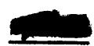

# Mixture

115

# Component

RbF

BeF2

# Mol %

50

50

# Wt. %

68.98

31.02

# Avg. M.W.

75.8

# Liquidus Temp.

$400^{\circ} \mathrm{C}(752^{\circ} \mathrm{F})$

# DENSITY

SOLID AT ROOM TEMPERATURE (gm/cc) 2.85

LIQUID $(\rho = g m / c c, T = ^{\circ} C)$

LIQUID $(\rho = 1\text{bs} / \text{ft}^3, \text{T} = {}^0\text{F})$ $\rho = 172.2 - 0.0173\text{T}$

MEAN VOLUMETRIC COEFFICIENT OF LIQUID EXPANSION $(1 / ^{\circ}C x 10^{4})$ 2.08

# ENTHALPY, HEAT CAPACITY AND HEAT OF FUSION

# SOLID

Enthalpy (cal/gm)

Heat Capacity (cal/gm $^\circ \mathrm{C}$ )

Heat Capacity at $300^{\circ}\mathrm{C}$ (572°F)

$$
\mathrm {H} _ {\mathrm {T}} - \mathrm {H} _ {\mathrm {O}} \mathrm {o} _ {\mathrm {C}} ^ {*} =
$$

$$
c _ {p} ^ {*} =
$$

$$
\mathbf {c} _ {\mathbf {p}} = 0. 2 2
$$

# LIQUID

Enthalpy (cal/gm)

Heat Capacity (cal/gm $^\circ \mathrm{C}$ )

Heat Capacity at $700^{\circ}\mathrm{C}$ (1292°F)

$$
\mathrm {H} _ {\mathrm {T}} - \mathrm {H} _ {\mathrm {O}} \mathrm {o} _ {\mathrm {C}} ^ {*} =
$$

$$
c _ {p} ^ {*} =
$$

$$
c _ {p} = 0. 3 1
$$

# HEAT OF FUSION (cal/gm)

$$
\mathrm {H} _ {\mathrm {L}} - \mathrm {H} _ {\mathrm {S}} ^ {*} =
$$

# THERMAL CONDUCTIVITY

K (BTU/hr ft $\mathbf{o}_{\mathbf{F}}$

# VISCOSITY

$\mathbf{\sigma}_{\mathrm{c}}$

600

700

800

(Centipoises)

11.5\* (Ref.22)

5.2

2.75

(Centistokes)

4.69

2.17

1.17

OF

1100

1300

1500

(lb./ft-hr)

30.3

12.3

6.1*

ft2/hr

0.1977

0.0821

0.0417

Exponential Form (centipoises) $\mu = 0.00534\mathrm{e}^{6701 / \mathrm{ToK}}$

Mixture

116

Component

KF BeF2

Mol %

79 21

Wt. %

82.30   
17.70

Avg. M.W.

55.8

Liquidus Temp.

$730^{\circ}C$ (1346°F)

# DENSITY

SOLID AT ROOM TEMPERATURE (gm/cc)

2.38

LIQUID $(\rho = g m / c c, T = {}^{\circ} C)$

$$
\rho = 2. 3 2 - 0. 0 0 0 4 0 \mathrm {T}
$$

LIQUID $(\rho = 1\mathrm{bs} / \mathrm{ft}^3,\mathrm{T} = {}^0\mathrm{F})$

$$
\rho = 1 4 5. 3 - 0. 0 1 3 9 \mathrm {T}
$$

MEAN VOLUMETRIC COEFFICIENT OF LIQUID EXPANSION $(1 / ^{\circ}C\times 10^{4})$ 1.97

# ENTHALPY, HEAT CAPACITY AND HEAT OF FUSION

# SOLID

Enthalpy (cal/gm)

$$
\mathrm {H} _ {\mathrm {T}} - \mathrm {H} _ {\mathrm {O}} \mathrm {o} _ {\mathrm {C}} ^ {*} =
$$

Heat Capacity (cal/gm $^\circ \mathrm{C}$ )

$$
c _ {p} ^ {*} =
$$

Heat Capacity at $300^{\circ}\mathrm{C}$ (572°F)

$$
\mathbf {c} _ {\mathbf {p}} = 0. 2 7
$$

# LIQUID

Enthalpy (cal/gm)

$$
\mathrm {H} _ {\mathrm {T}} - \mathrm {H} _ {\mathrm {O}} \mathrm {o} _ {\mathrm {C}} ^ {*} =
$$

Heat Capacity (cal/gm ${}^{\circ}\mathrm{C}$ )

$$
c _ {p} ^ {*} =
$$

Heat Capacity at $700^{\circ}\mathrm{C}$ (1292°F)

$$
c _ {p} =
$$

HEAT OF FUSION (cal/gm)

$$
\mathrm {H} _ {\mathrm {L}} - \mathrm {H} _ {\mathrm {S}} ^ {*} =
$$

# THERMAL CONDUCTIVITY

K (BTU/hr ft $\mathbf{o}_{\mathbb{F}}$

# VISCOSITY

C (Centipoises)

(Centistokes)

1.10

OF

1500

(lb./ft-hr)

5.0*

ft²/hr

0.0401

Exponential Form (centipoises) $\mu = 0.0770\mathrm{e}^{3600 / \mathrm{T}^{\mathrm{O}}\mathrm{K}}$

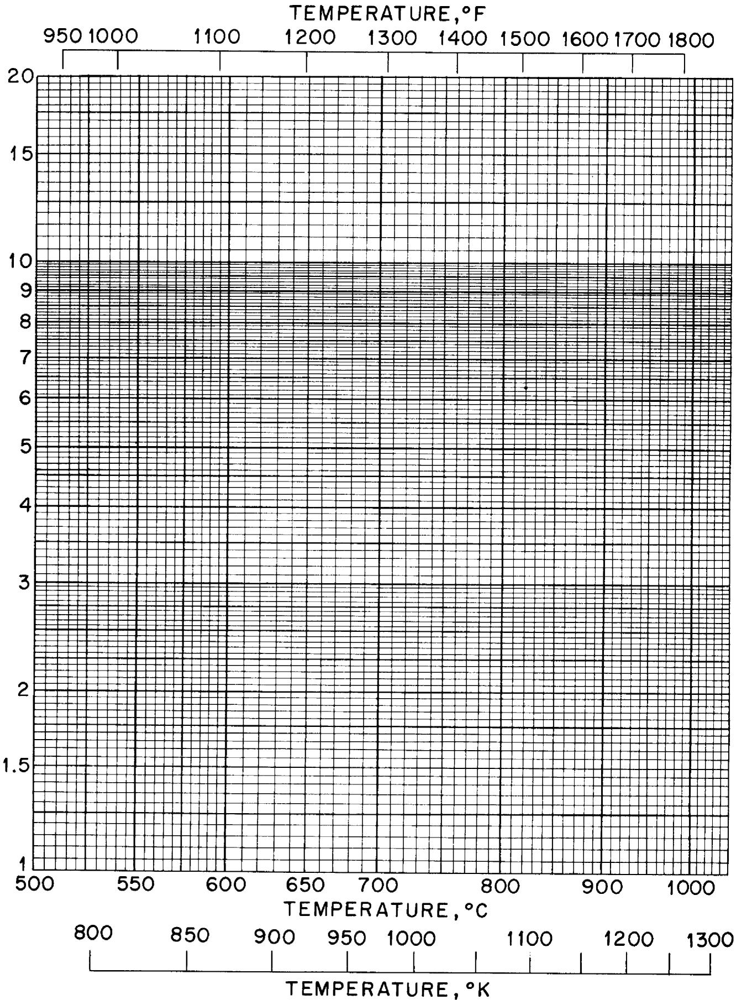  
Figure I. Viscosity Worksheet   
(This sheet of specially prepared graph paper has been included to facilitate interpolation and extrapolation of viscosity data).

# CONCLUDING REMARKS

The summary of physical properties presented in this report has been compiled for the various technical groups within the ANP Project who need it. Properties have been measured or predicted for a large portion of the fluoride systems that have been of interest to the Project thus far. It is anticipated that more measurements will be made for new fluoride systems as they become attractive.

In the meantime, however, in most cases the thermal properties of such new fluoride systems can be estimated satisfactorily for preliminary design purposes with the aid of the correlation relations that have been developed. For example, molten densities have been related uniquely to room temperature densities or molecular weight which can be calculated (see topical report, ORNL 1702). The heat capacities were found to be inversely proportional to the average molecular weight and directly proportional to the average number of atoms in the mixture (see topical report, ORNL 1956).

Topical reports on the viscosity and thermal conductivity research on fluorides are being prepared. Viscosities have been found to vary with molecular weight and also with molar volume along the lines indicated by the Batchinski relation. The thermal conductivities have been found to vary inversely with average molecular weight. In addition, liquid thermal conductivities have been proportioned into atomic and ionic contributions each of which has been separately correlated.

# REFERENCES

1. C. J. Barton, ORNL CF 55-9-78.   
2. C. J. Barton, personal communication.   
3. B. C. Blanke, MLM CF 55-11-14.   
4. W. D. Powers, G. C. Blalock, ORNL 1956, January 11, 1956.   
5. M. Tobias, S. I. Kaplan, S. J. Claiborne, ORNL CF 52-3-230.   
6. S. I. Kaplan, ORNL CF 51-8-97.   
7. M. Tobias, ORNL CF 51-7-169.   
8. S. I. Cohen, T. N. Jones, ORNL CF 55-4-32.   
9. National Research Council--Bulletin 118, "Data on Chemicals for Ceramic Use", 1949.   
10. S. I. Cohen, T. N. Jones, ORNL CF 53-7-126.   
11. L. Cooper, S. J. Claiborne, ORNL CF 52-8-163.   
12. S. I. Cohen, T. N. Jones, ORNL CF 56-5-33.   
13. N. D. Greene, ORNL CF 54-8-64.   
14. S. J. Claiborne, ORNL CF 53-1-233.   
15. J. Ciser, ORNL CF 51-11-78.   
16. S. I. Cohen, T. N. Jones, ORNL 1702, July 19, 1954.   
17. J. Cisar, ORNL CF 51-11-198.   
18. J. Cisar, personal communication.   
19. S. I. Cohen, T. N. Jones, ORNL CF 55-2-20.   
20. S. I. Cohen, T. N. Jones, ORNL CF 56-4-148.   
21. S. I. Cohen, T. N. Jones, ORNL CF 53-3-259.   
22. S. I. Cohen, T. N. Jones, unpublished data.   
23. R. F. Redmond, T. N. Jones, ORNL CF 52-11-105.   
24. S. I. Cohen, T. N. Jones, ORNL CF 55-12-128.   
25. S. I. Cohen, ANP Quarterly Progress Report for Period Ending December 10, 1955, ORNL 2012, page 180.   
26. S. J. Claiborne, ORNL CF 52-11-72.   
27. S. I. Cohen, T. N. Jones, ORNL CF 55-2-89.   
28. S. I. Cohen, T. N. Jones, ORNL CF 55-3-137.   
29. W. D. Powers, S. J. Claiborne, ORNL CF 54-10-139.   
30. S. I. Cohen, T. N. Jones, ORNL CF 55-9-31.   
31. S. I. Cohen, T. N. Jones, ORNL CF 55-3-61.   
32. S. I. Cohen, T. N. Jones, ORNL CF 55-5-59.   
33. W. D. Powers, G. C. Blalock, ORNL CF 56-5-68.   
34. S. I. Cohen, T. N. Jones, ORNL CF 55-5-58.

35. B. C. Blanke, personal communication.   
36. S. I. Cohen, T. N. Jones, ORNL CF 55-7-33.   
37. W. D. Powers, G. C. Blalock, ORNL CF 55-11-68.   
38. S. I. Cohen, T. N. Jones, ORNL CF 55-11-27.   
39. S. I. Cohen, T. N. Jones, ORNL CF 55-8-21.   
40. S. I. Cohen, T. N. Jones, ORNL CF 55-11-28.   
41. S. I. Cohen, T. N. Jones, ORNL CF 55-12-127.   
42. W. D. Powers, G. C. Blalock, ORNL CF 56-5-67.   
43. W. D. Powers, S. J. Claiborne, ORNL CF 54-7-145.   
44. S. I. Cohen, T. N. Jones, ORNL CF 55-8-22.   
45. W. D. Powers, S. J. Claiborne, R. M. Burnett, unpublished data.   
46. K. K. Kelley, Contributions to the Data on Theoretical Metallurgy, Bureau of Mines Bulletin 476, 1949.   
47. T. B. Douglas, J. L. Dever, Thermal Conductivity and Heat Capacity of Molten Materials, Part 1, The Heat Capacity of Lithium Fluoride From $0^{\circ}\mathrm{C}$ to $900^{\circ}\mathrm{C}$ , WADC 53-201, Part 1, October 1953.   
48. H. F. Poppendiek, ANP Quarterly Progress Report for Period Ending March 10, 1956, ORNL 2061, page 179.   
49. M. W. Rosenthal, H. F. Poppendiek, R. M. Burnett, ORNL CF 54-11-63.