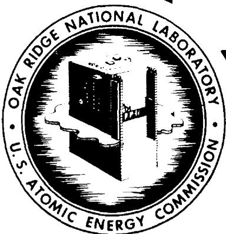
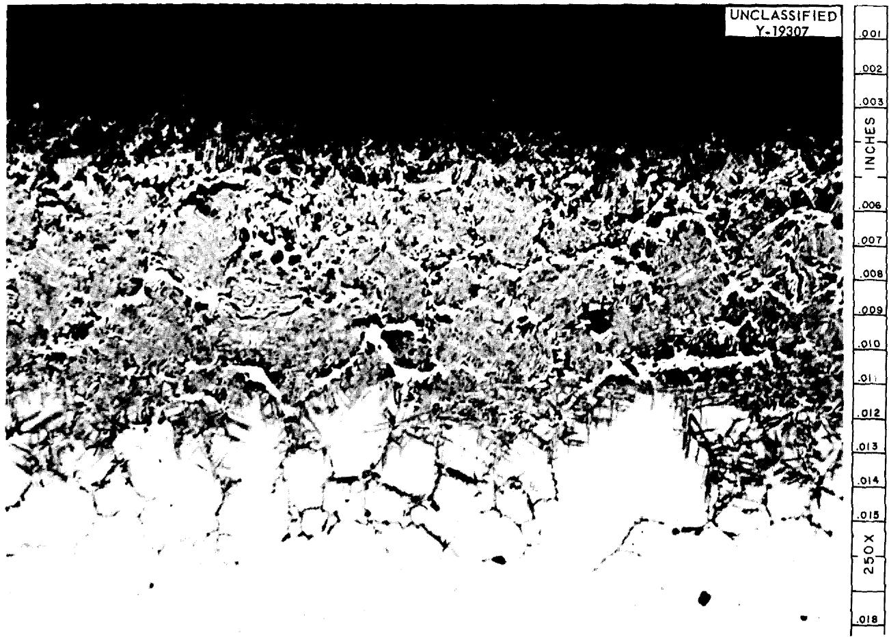
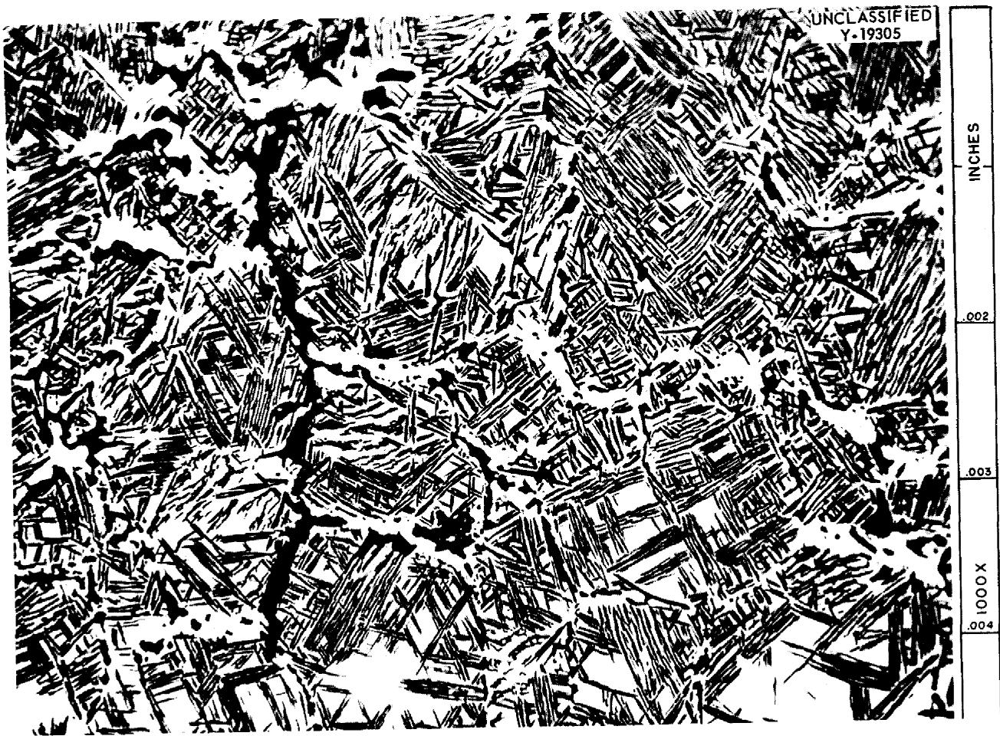
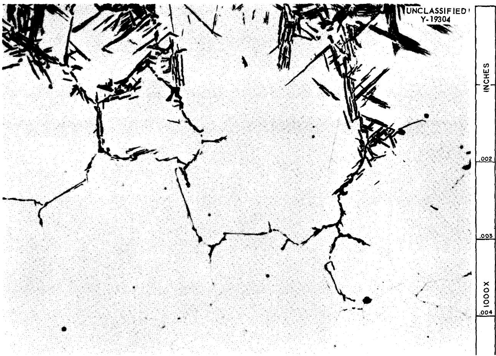
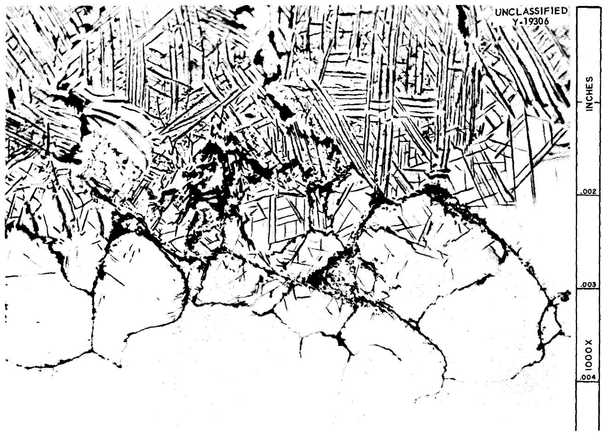
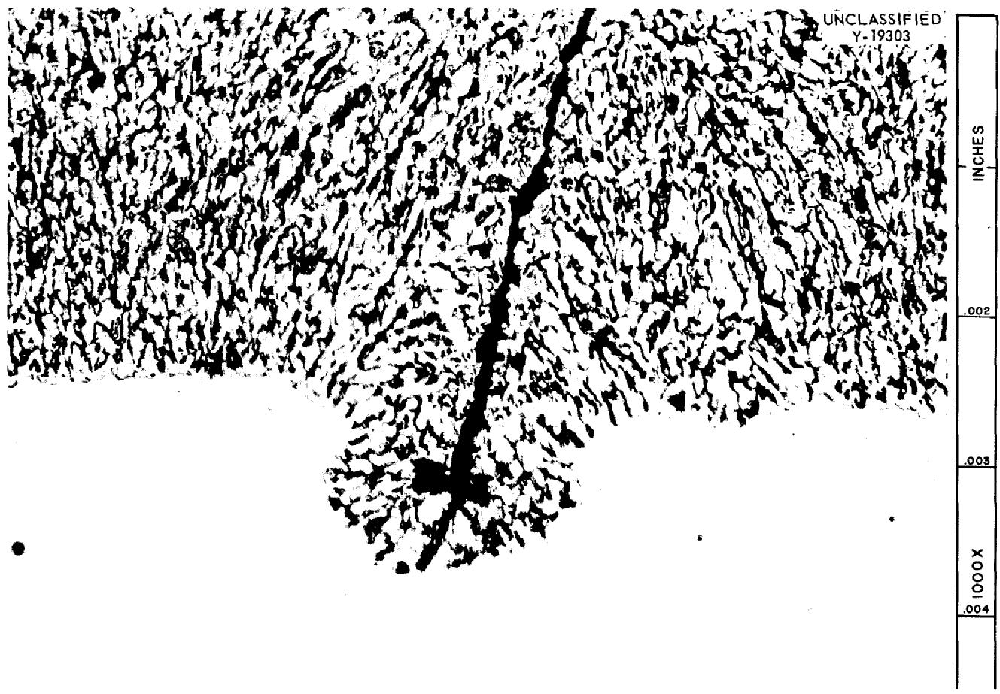
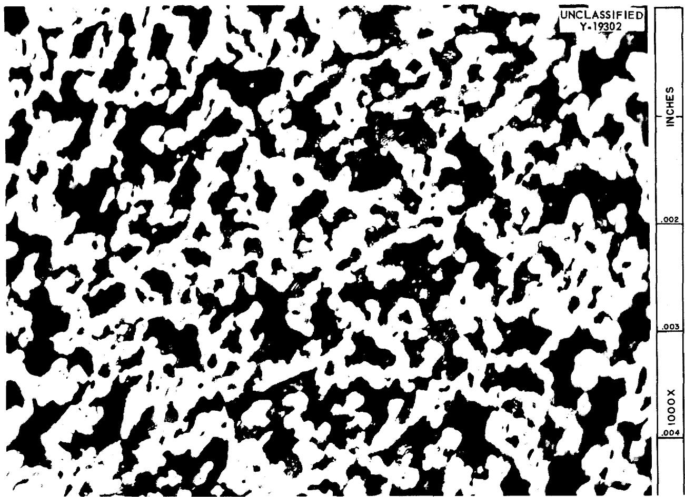

#

DOCT

CORROSION PRODUCTS FORMED IN THE REACTION

BETWEEN FUSED SODIUM HYDROXIDE AND IRON-RICH

ALLOYS OF IRON, CHROMIUM, AND NICKEL

G.P. Smith   
E. E. Hoffman

CENTRAL RESEARCH LIBRARY

DOCUMENT COLLECTION

LIBRARY LOAN COPY

DO NOT TRANSFER TO ANOTHER PERSON

If you wish someone else to see this document, send in name with document and the library will arrange a loan.

OAK RIDGE NATIONAL LABORATORY

OPERATED BY

UNION CARBIDE NUCLEAR COMPANY

A Division of Union Carbide and Carbon Corporation

UCC

POST OFFICE BOX X · OAK RIDGE, TENNESSEE

# LEGAL NOTICE

This report was prepared as an account of Government sponsored work. Neither the United States, nor the Commission, nor any person acting on behalf of the Commission:

A. Makes any warranty or representation, express or implied, with respect to the accuracy, completeness, or usefulness of the information contained in this report, or that the use of any information, apparatus, method, or process disclosed in this report may not infringe privately owned rights; or   
B. Assumes any liabilities with respect to the use of, or for damages resulting from the use of any information, apparatus, method, or process disclosed in this report.

As used in the above, "person acting on behalf of the Commission" includes any employee or contractor of the Commission to the extent that such employee or contractor prepares, handles or distributes, or provides access to, any information pursuant to his employment or contract with the Commission.

Contract No. W-7405-eng-26

METALLURGY DIVISION

CORROSION PRODUCTS FORMED IN THE REACTION

BETWEEN FUSED SODIUM HYDROXIDE AND IRON-RICH

ALLOYS OF IRON, CHROMIUM, AND NICKEL

G.P.Smith

E. E. Hoffman

DATE ISSUED

APR 26 1957

OAK RIDGE NATIONAL LABORATORY

Operated by

UNION CARBIDE NUCLEAR COMPANY

A Division of Union Carbide and Carbon Corporation

Post Office Box X

Oak Ridge, Tennessee

# UNCLASSIFIED

ORNL-2156

Metallurgy and Ceramics

TID-4500 (13th ed.)

# INTERNAL DISTRIBUTION

1. C. E. Center   
2. Biology Library   
3. Health Physics Library   
4. Metallurgy Library

S. Central Research Library

Reactor Experimental Engineering Library

8-12. Laboratory Records Department

13. Laboratory Records, ORNL R.C.

14. A. M. Weinberg

15. L. B. Emlet (K-25)

16. J. P. Murray (Y-12)

17. J. A. Swartout

18. E. H. Taylor

19. E.D. Shipley

20. M. L. Nelson

21. W.H. Jordan

22. C. P. Keim

23. R. S. Livingston

24. R. R. Dickison

25. S. C. Lind

26. F. L. Culler   
27. A. H. Snell   
28. A. Hollander   
29. M. T. Kelley   
30. K. Z. Morgan   
31. J. A. Lane   
32. A. S. Householder   
33. C. S. Harrill   
34. C. E. Winters   
35. D. S. Billington   
36. D. W. Cardwell   
37. E. M. King   
38. A. J. Miller   
39. D. D. Cowen   
40. P. M. Reyling   
41. R. A. Charpie

42. M. J. Skinner   
43. G. E. Boyd   
44. C. O. Smith   
45. J. H. Frye, Jr.   
46. W. W. Parkinson   
47. W. D. Manly   
48. J. E. Cunningham   
49. G. M. Adamson, Jr.   
50. R. J. Beaver   
51. E. S. Bomar, Jr.   
52. J.H. Coobs   
53. J. H. Devan   
54. L. M. Doney   
55. D. A. Douglas, Jr.   
56. R. J. Gray   
57. J. P. Hammond   
58. T. Hikido   
59. E. E. Hoffman

60-80.M.R.Hill

81. L. K. Jetter   
82. C. J. McHargue   
83. R. B. Oliver   
84. P. Patriarca   
85. M. L. Picklesimer   
86. G.P. Smith, Jr.   
87. A. Taboada   
88. H. L. Yakel, Jr.   
89. R. C. Waugh   
90. E. Creutz (consultant)   
91. N. J. Grant (consultant)   
92. H. Leidheiser, Jr. (consultant)   
93. T. S. Shevlin (consultant)   
94. E. E. Stansbury (consultant)   
95. C. S. Smith (consultant)   
96. ORNL - Y-12 Technical Library, Document Reference Section

# EXTERNAL DISTRIBUTION

97. R. F. Bacher, California Institute of Technology

98. Division of Research and Medicine, AEC, ORO

99-633. Given distribution as shown in TID-4500 (13th ed.) under Metallurgy

and Ceramics category (100 copies - OTS)

# UNCLASSIFIED

# CORROSION PRODUCTS FORMED IN THE REACTION BETWEEN FUSED SODIUM HYDROXIDE AND IRON-RICH ALLOYS OF IRON, CHROMIUM, AND NICKEL

G.P.Smith

E. E. Hoffman

# ABSTRACT

A study was made of the microstructures of corrosion-product layers formed by the action of fused sodium hydroxide at $815^{\circ}\mathrm{C}$ on types 304 and 347 stainless steel and on four high-purity iron-chromium-nickel alloys with nominal compositions of $80\%$ Fe-20% Cr, 80% Fe-10% Cr-10% Ni, 74% Fe-18% Cr-8% Ni, and 60% Fe-20% Cr-20% Ni. Each corrosion-product layer was found to consist of a nonmetallic network threading through a metallic matrix and to resemble similar layers formed by the action of hydroxide melts on Inconel.

# INTRODUCTION

This report is one of a series describing reactions between fused sodium hydroxide and alloys composed of elements which have widely differing reactivities in a hydroxide melt. Such reactions were found to involve complex solid-state processes which brought about the selective leaching of the more reactive alloy components. The decrease in volume of the alloy which accompanied this leaching process was accomplished by the retreat of the alloy surface along preferred paths to form a network of deep pits or channels extending inward from the alloy-hydroxide interface. For some alloys which have been studied these channels were filled with corroding medium, while for the alloy Inconel (nominal composition: $78\%$ Ni, $15\%$ Cr, and $7\%$ Fe) the channels were filled with reaction products. The metallographic evidence presented in this report indicates that the reaction between fused sodium hydroxide and iron-rich alloys of iron, chromium, and nickel is similar to the reaction between sodium hydroxide and Inconel.

Previous studies of the corrosion of alloys of iron, chromium, and nickel by fused sodium hydroxide, other than the above-mentioned work on Inconel, have given little information on microstructures. Williams and Miller studied reactions with type 304 stainless steel and with iron-nickel alloys which contained 36 and $64\%$ nickel. They reported that the mechanism seemed to involve severe penetration of the metal, but no metallographic data were given. Craighead, Smith, and Jaffee carried out reactions of sodium hydroxide with a variety of iron-chromium-nickel alloys for 24 hr at $538^{\circ}\mathrm{C}$ under a $90\%$ nitrogen- $10\%$ hydrogen blanketing atmosphere. In general they found a layer of scale with intergranular penetration and pit formation beneath. However, the metallographic data that they reported were very meager.

# PROCEDURE

The "capsule test technique" previously described was used to study the action of fused

sodium hydroxide on the commercial alloys types 304 and 347 stainless steel and on four special alloys with the following nominal compositions (by weight): $80\%$ Fe- $20\%$ Cr, $80\%$ Fe- $10\%$ Cr- $10\%$ Ni, $74\%$ Fe- $18\%$ Cr- $8\%$ Ni, and $60\%$ Fe- $20\%$ Cr- $20\%$ Ni. These special alloys were prepared as 30-lb ingots from high-purity elemental metals by vacuum melting and casting. The ingots were extruded into rods, which were machined into capsules and specimens for testing. The compositions of these special alloys were checked by chemical analysis, and the results are reported in Table 1. Contaminants, it will be noted, were found to be present only in small amounts.

Corrosion tests were run at $815^{\circ}C$ for 100 hr. Duplicate tests were run on each alloy. After test the capsules were cut open, the hydroxide was dissolved in water, and the test specimens were weighed and prepared for microscopic examination. All photomicrographs in this report show samples cut perpendicular to a corroded surface and left in the as-polished condition. As a result of the corrosion products reacting slowly with moisture and carbon dioxide in the air, the specimens had to be examined immediately after polishing.

# RESULTS

All specimens were found to have corroded by the formation at their surfaces of a mixed layer of metallic and nonmetallic phases. A more or less typical layer is shown in cross section in Fig. 1 at a magnification of $250\mathrm{X}$ . The alloy illustrated consisted of $74\%$ Fe, $18\%$ Cr, and $8\%$ Ni. At a higher magnification (1000X) the corrosion-product layer was found to be a network

of nonmetallic, acicular particles within a metallic matrix as seen in Fig. 2. Somewhat to the left of center and running from top to bottom of Fig. 2 may be seen a wide stringer of nonmetallic phase passing along what had been a grain boundary of the parent alloy. Other intergranular regions are occupied by the metallic phase interlaced by relatively large particles of the nonmetallic phase. Within what had been individual grains of the parent alloy, the acicular crystals showed a marked tendency to lie along preferred orientations.

Intergranular attack at the bottom of the two-phase corrosion-product layer is shown at 1000X in Fig. 3. It will be seen that limited transgranular attack branched out from a substantial portion of the affected intergranular regions.

Another alloy, composed of $80\%$ Fe, $10\%$ Cr, and $10\%$ Ni, had particularly long and slender nonmetallic particles in transgranular regions. These are illustrated in Fig. 4, at 1000X, which also shows intergranular attack at the bottom of the corrosion-product layer.

The corrosion-product microstructures shown in Figs. 1 through 4 are more or less typical of all specimens tested except for the specimens of the $80\%$ Fe- $20\%$ Cr alloy. The microstructures of the corrosion-product layer of this alloy are shown in Figs. 5 and 6 at 1000X. Figure 5 shows the boundary region between the corrosion-product layer and unattacked metal. An attacked grain boundary passes approximately down the center of the photomicrograph. Although there was a tendency for corrosion to advance more rapidly along the intergranular region, this tendency was not pronounced and the intergranular layer of corrosion product came to an abrupt end rather

Table 1. Composition of Alloys Tested   

<table><tr><td rowspan="2">Nominal Composition (wt %)</td><td colspan="6">Composition* (wt %) Determined by Analysis</td></tr><tr><td>Fe</td><td>Ni</td><td>Cr</td><td>C</td><td>Si</td><td>S</td></tr><tr><td>80 Fe-20 Cr</td><td>80.91</td><td></td><td>19.14</td><td>0.017</td><td>0.060</td><td>0.021</td></tr><tr><td>80 Fe-10 Cr-10 Ni</td><td>79.60</td><td>10.40</td><td>9.93</td><td>0.018</td><td>0.030</td><td>0.012</td></tr><tr><td>74 Fe-18 Cr-8 Ni**</td><td>73.50</td><td>8.11</td><td>18.70</td><td>0.022</td><td>0.030</td><td>0.019</td></tr><tr><td>60 Fe-20 Cr-20 Ni</td><td>61.43</td><td>19.88</td><td>19.66</td><td>0.005</td><td>0.040</td><td>0.013</td></tr></table>

*Manganese was less than 0.002% for all compositions.   
**The analyzed composition of this alloy falls within the specifications for AISI type 304L stainless steel.

  
Fig. 1. Corrosion-Product Layer Formed on $74\%$ Fe- $18\%$ Cr- $8\%$ Ni Alloy. Unetched. 250X.

than narrowing down to invisibility as it did with other alloy compositions. Transgranular attack also ceased along a well-defined front, as contrasted with that illustrated in Figs. 3 and 4. The nonmetallic phase in this transgranular attack showed no sign of the acicular particles found for all other alloys studied, but consisted instead of a network of irregular shapes. The particle size in the two-phase layer increased continuously from the lowest line of attack, shown in Fig. 5, up to the surface. The microstructure near the middle of the film is shown in Fig. 6. The ratio of volume of nonmetallic constituent to volume of metallic constituent increased with increasing particle size, so that the relative amount of metal near the external surface was small.

For all alloys it was found that the volume of the corrosion-product layer was significantly greater than the volume of the alloy consumed.

The more quantitative aspects of the corrosion data are presented in Table 2. Each measurement in this table is an average of duplicate tests. It will be noted that all specimens which were weighed gained in weight by an amount which increased with increasing thickness of the corrosion-product layer. Because of the small number of specimens tested, these numerical data should be taken as only an approximate indication of resistance to attack.

In all tests except those involving the two more corrosion-resistant alloys (marked by an asterisk in Table 2), a quantity of solidified droplets of

  
Fig. 2. Network of Nonmetallic Particles Within the Corrosion-Product Layer Shown in Fig. 1. Unetched. 1000X.

Table 2. Corrosion Data of Iron-Base Alloys Exposed to Sodium Hydroxide for 100 hr at $815^{\circ}C$   

<table><tr><td colspan="3">Nominal Composition (wt %)</td><td rowspan="2">Weight Gain (g/in.2)</td><td rowspan="2">Film Thickness (in. × 103)</td></tr><tr><td>Fe</td><td>Cr</td><td>Ni</td></tr><tr><td>80</td><td>20</td><td></td><td>0.76</td><td>23</td></tr><tr><td>80</td><td>10</td><td>10</td><td>0.04</td><td>6*</td></tr><tr><td>74</td><td>18</td><td>8</td><td>0.11</td><td>13</td></tr><tr><td>60</td><td>20</td><td>20</td><td>0.04</td><td>5*</td></tr><tr><td colspan="3">Type 304 stainless steel</td><td></td><td>20</td></tr><tr><td colspan="3">Type 347 stainless steel</td><td></td><td>17</td></tr></table>

*No metallic sodium found.

metallic sodium was found on the inside capsule walls at the completion of testing.

# DISCUSSION

The corrosion-product layers described in this report consisted of nonmetallic networks threading through metallic matrices. These layers resembled in many ways the corrosion-product layers formed on Inconel by reaction with fused sodium hydroxide. It was shown that the reaction between Inconel and fused sodium hydroxide consisted of the selective leaching of iron and chromium from

  
Fig. 3. Intergranular Attack at Bottom of Corrosion-Product Layer Shown in Fig. 1. Some transgranular attack can also be noted. Unetched, 1000X.

their solid solution with nickel to form a network of oxides and oxysalts of chromium and iron within a metallic matrix containing about $97\%$ nickel (balance iron plus chromium). This behavior was attributed to the great difference in relative reactivity between nickel on the one hand and iron and chromium on the other. It seems reasonable to assume that the two-phase corrosion products found for iron-rich alloys of iron, chromium, and nickel as described in this report were also formed by a selective leaching process.

The gaseous oxidation of nickel-iron alloys at elevated temperatures is known to give two-phase

corrosion products consisting of oxides of the more reactive metal, iron, embedded in metal enriched in the less reactive metal, nickel. Benard and Moreau7 assumed that the mechanism of this attack involved the dissolution of oxygen in the alloy lattice with a subsequent precipitation of oxides such as is known to occur in the so-called "subsurface scale formation" of a number of alloys. However, Wagner8 has shown that two-phase corrosion-product layers may, under certain conditions, be formed by a buckling of the oxide-metal interface rather than by precipitation of initially isolated particles of oxide within the metal.

  
Fig. 4. Network of Nonmetallic Particles Near Bottom of Corrosion-Product Layer Formed on $80\%$ Fe- $10\%$ Cr- $10\%$ Ni Alloy. Unetched, 1000X.

For most of the alloys described in this report, corrosive penetration proceeded more rapidly along grain boundaries than through grains, as evidenced by the regions of intergranular attack beneath the regions of transgranular attack. A similar sensitivity of grain boundaries to selective attack was noted for Inconel exposed to sodium hydroxide under certain conditions and for nickel-iron alloys exposed to gaseous oxygen.

One of the most striking microstructural features of corrosion-product layers formed on all but one of the alloys studied was that a substantial portion of the inorganic reaction product was contained in the form of very slender particles. In the study of corroded Inconel such shapes were also found, and speculation as to their origin was presented.6 The present research shows that such shapes are

not peculiar to an alloy of the composition of Inconel but are of more general occurrence.

The metallic sodium found on the inside capsule walls following test deserves special mention. Smith9 has outlined the known reactions between metals and fused sodium hydroxide. In brief the primary reactions are as follows. For all reactions the metal acts as a reducing agent. Hydrogen is generally produced, although very reactive metals such as zirconium will simultaneously generate metallic sodium with ease. The action of weak reducing agents such as nickel on sodium ions is brought to equilibrium by a very small concentration of sodium; therefore the generation of

  
Fig. 5. Network of Nonmetallic Particles Near Bottom of Corrosion-Product Layer Formed on $80\%$ Fe-20% Cr Alloy. Unetched. 1000X.

appreciable quantities of sodium is possible only under conditions in which the alkali metal can escape from the reacting mixture, as, for example, by distillation. Consequently, weak reducing metals generally react preferentially with hydroxyl ions, and not until this reaction has virtually ceased are significant quantities of sodium produced. For metals intermediate in reducing strength between zirconium and nickel, the reduction of sodium ions to form metallic sodium is complicated by a competing reaction in which metallic sodium reduces hydroxyl ions. The role of this competing reaction is obscure because of the lack of knowledge of both its kinetic and equilibrium aspects. However, Villard10 reported

the production of sodium by the action of nickel, iron, and chromium on fused sodium hydroxide, while Williams and Miller,[11] who also studied these reactions, reported that sodium metal was produced only after the reduction of hydroxyl ions had ceased.

In the experiments described in this report, sodium was not removed from the field of reaction but remained in the confined space immediately above the melt and at the same temperature as the melt. At the test temperature $(815^{\circ}C)$ sodium was near its normal boiling point $(889^{\circ}C)$ , so that a substantial pressure of gaseous sodium was in contact with the melt. At the completion of

# UNCLASSIFIED

  
Fig. 6. Network of Coarse-grained Nonmetallic Phase Near Middle of Corrosion-Product Layer Formed on $80\%$ Fe- $20\%$ Cr Alloy. Unetched. 1000X.

testing, the melt contained considerable unconsumed hydroxide. These results attest to the strong reducing action that the alloys of iron, chromium, and nickel have on sodium hydroxide at $815^{\circ}C$ , and, when compared with the data of Williams and Miller,[11] raise questions concerning the kinetics of sodium ion reduction.

# ACKNOWLEDGMENT

H. Inouye and T. K. Roche made the special alloys used in this study, and R. J. Gray and N. M. Atchley metallographically prepared the samples and took the photomicrographs.