# AEC RESEARCH AND DEVELOPMENT REPORT

MARTIN MARIETTA ENERGY SYSTEMS LIBRARIES

34456 03503046

AIRCRAFT NUCLEAR PROPULSION PROJECT

QUARTERLY PROGRESS REPORT

FOR PERIOD ENDING SEPTEMBER 10, 1956

TRAL RESEARCH LIBRARY

OCUMENT COLLECTION

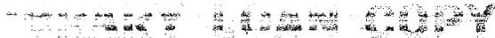

NOT TRANSFER TO ANOTHER PERSON

If you wish someone else to see this document, send in name with document and the library will change a 100th.

OAK RIDGE NATIONAL LABORATORY

OPERATED BY

UNION CARBIDE NUCLEAR COMPANY

A Division of Union Carbide and Carbon Corporations

UCC

POST OFFICE BOX X · OAK RIDGE, TENNESSEE

# LEGAL NOTICE

This report was prepared as an account of Government sponsored work. Neither the United States, nor the Commission, nor any person acting on behalf of the Commission:

A. Makes any warranty or representation, express or implied, with respect to the accuracy, completeness, or usefulness of the information contained in this report, or that the use of any information, apparatus, method, or process disclosed in this report may not infringe privately owned rights; or   
B. Assumes any liabilities with respect to the use of, or for damages resulting from the use of any information, apparatus, method, or process disclosed in this report.

ORNL-2157, Parts 1-5

C-84 - Reactors-Special Features of Aircraft Reactors

This document consists of 330 pages.

Copy 2/ of 237 copies. Series A.

Contract No. W-7405-eng-26

AIRCRAFT NUCLEAR PROPULSION PROJECT

QUARTERLY PROGRESS REPORT

For Period Ending September 10, 1956

W. H. Jordan, Director

S. J. Cromer, Co-Director

A. J. Miller, Assistant Director

DATE ISSUED

DEC 13 1956

OAK RIDGE NATIONAL LABORATORY

Operated by

UNION CARBIDE NUCLEAR COMPANY

A Division of Union Carbide and Carbon Corporation

Post Office Box X

Oak Ridge, Tennessee

RESTRICTED DATA

This document contains Restricted Data as defined in the Atomic Energy Act of 1954. Its transmission on the disclosure of its contents

in any manner to an unauthorized person is prohibited.

Reports previously issued in this series are as follows:

ORNL-528 Period Ending November 30, 1949

ORNL-629 Period Ending February 28, 1950

ORNL-768 Period Ending May 31, 1950

ORNL-858 Period Ending August 31, 1950

ORNL-919 Period Ending December 10, 1950

ANP-60 Period Ending March 10, 1951

ANP-65 Period Ending June 10, 1951

ORNL-1154 Period Ending September 10, 1951

ORNL-1170 Period Ending December 10, 1951

ORNL-1227 Period Ending March 10, 1952

ORNL-1294 Period Ending June 10, 1952

ORNL-1375 Period Ending September 10, 1952

ORNL-1439 Period Ending December 10, 1952

ORNL-1515 Period Ending March 10, 1953

ORNL-1556 Period Ending June 10, 1953

ORNL-1609 Period Ending September 10, 1953

ORNL-1649 Period Ending December 10, 1953

ORNL-1692 Period Ending March 10, 1954

ORNL-1729 Period Ending June 10, 1954

ORNL-1771 Period Ending September 10, 1954

ORNL-1816 Period Ending December 10, 1954

ORNL-1864 Period Ending March 10, 1955

ORNL-1896 Period Ending June 10, 1955

ORNL-1947 Period Ending September 10, 1955

ORNL-2012 Period Ending December 10, 1955

ORNL-2061 Period Ending March 10, 1956

ORNL-2106 Period Ending June 10, 1956

# INTERNAL DISTRIBUTION

1. R.G.Affel

50. R. B. Lindauer

2. C. J. Barton

51. R. S. Livingston

3. M. Bender

52. R. N. Lyon

4. D. S. Billington

53. F. C. Maienschein

5. F. F. Blankenship

54. W. D. Manly

6. E. P. Blizzard

55. E. R. Mann

7. C. J. Borkowski

56. L. A. Mann

8. W. F. Boudreau

57. W. B. McDonald

9. G.E. Boyd

58. F. R. McQuilkin

10. M. A. Bredig

59. R. V. Meghreblian

11. W.E. Browning

60. R. P. Milford

12. F. R. Bruce

61. A. J. Miller

13. A. D. Callihan

62. R. E. Moore

14. D. W. Cardwell

63. J. G. Morgan

15. C. E. Center (K-25)

64. K. Z. Morgan

16. R. A. Charpie

65. E. J. Murphy

17. C. E. Clifford

66. J. P. Murray (Y-12)

18. J.H. Coobs

67. M. L. Nelson

19. W. B. Cottrell

68. G. J. Nessle

20. D. D. Cowen

69. R. B. Oliver

21. S. Cromer

70. L. G. Overholser

22. R. S. Crouse

71. P. Patriarca

23. F. L. Culler

72. R.W. Peelle

24. J. H. Devan

73. A. M. Perry

25. L. M. Doney

74. J. C. Pigg

26. D. A. Douglas

75. H. F. Poppendiek

27. E. R. Dytko

76. P. M. Reyling

28. W. K. Eister

77. A. E. Richt

29. L. B. Emlet (K-25)

78. M. T. Robinson

30. D. E. Ferguson

79. H. W. Savage

31. A. P. Fraas

80. A. W. Savolainen

32. J. H. Frye

81. R. D. Schultheiss

33. W. T. Furgerson

82. E. D. Shipley

34. H. C. Gray

83. A. Simon

35. W. R. Grimes

84. O. Sisman

36. E. Guth

85. J. Sites

37. E. E. Hoffman

86. M. J. Skinner

38. H. W. Hoffman

87. G.P. Smith

39. A. Hollaender

88. A. H. Snell

40. A. S. Householder

89. C. D. Susano

41. J. T. Howe

90. J. A. Swartout

42. W. H. Jordan

91. E. H. Taylor

43. G. W. Keilholtz

92. R.E.Thoma

44. C. P. Keim

93. D. B. Trauger

45. M. T. Kelley

94. E. R. Van Artsdalen

46. F. Kertesz

95. G. M. Watson

47. E. M. King

96. A. M. Weinberg

48-49. J.A. Lane

97. J. C. White

# SECRET

98. G. D. Whitman   
99. E. P. Wigner (consultant)   
100. G. C. Williams   
101. J. C. Wilson   
102. C. E. Winters

103-112. ORNL - Y-12 Technical Library Document Reference Section   
113-119. Laboratory Records Department   
120. Laboratory Records, ORNL R.C.   
121-123. Central Research Library

# EXTERNAL DISTRIBUTION

124. AF Plant Representative, Baltimore   
125. AF Plant Representative, Burbank   
126. AF Plant Representative, Marietta

127-129. AF Plant Representative, Santa Monica

130-131. AF Plant Representative, Seattle

132. AF Plant Representative, Wood-Ridge   
133. Air Materiel Area   
134. Air Research and Development Command (RDGN)   
135. Air Technical Intelligence Center   
136. Allison Division

137-139. ANP Project Office, Fort Worth

140. Albuquerque Operations Office   
141. Argonne National Laboratory   
142. Armed Forces Special Weapons Project, Sandia   
143. Armed Forces Special Weapons Project, Washington   
144. Assistant Secretary of the Air Force, R&D

145-150. Atomic Energy Commission, Washington

151. Battelle Memorial Institute

152-153. Bettis Plont (WAPD)

154. Bureau of Aeronautics   
155. Bureau of Aeronautics (Code 24)   
156. Bureau of Aeronautics General Representative   
157. Chicago Operations Office   
158. Chicago Patent Group   
159. Chief of Naval Research   
160. Convair-General Dynamics Corporation   
161. Engineer Research and Development Laboratories

162-165. General Electric Company (ANPD)

166. Hartford Area Office   
167. Headquarters, Air Force Special Weapons Center   
168. Idaho Operations Office   
169. Knolls Atomic Power Laboratory   
170. Lockheed Aircraft Corporation (Richard G. Rowe)   
171. Lockland Area Office   
172. Los Alamos Scientific Laboratory   
173. Mound Laboratory   
174. National Advisory Committee for Aeronautics, Cleveland   
175. National Advisory Committee for Aeronautics, Washington   
176. Naval Air Development and Material Center   
177. Naval Research Laboratory   
178. New York Operations Office   
179. North American Aviation, Inc. (Aerophysics Division)   
180. North American Aviation, Inc. (Canoga Park)

181. Nuclear Development Corporation of America   
182. Office of the Chief of Naval Operations (OP-361)   
183. Patent Branch, Washington

184-187. Pratt & Whitney Aircraft Division (Fox Project)

188. Sandia Corporation   
189. School of Aviation Medicine   
190. Sylvania Electric Products, Inc.   
191. USAF Project RAND   
192. University of California Radiation Laboratory, Livermore

193-210. Wright Air Development Center (WCOSI-3)

211-235. Technical Information Service Extension, Oak Ridge   
236. Division of Research and Development, AEC, ORO   
237. Technical Research Group, New York

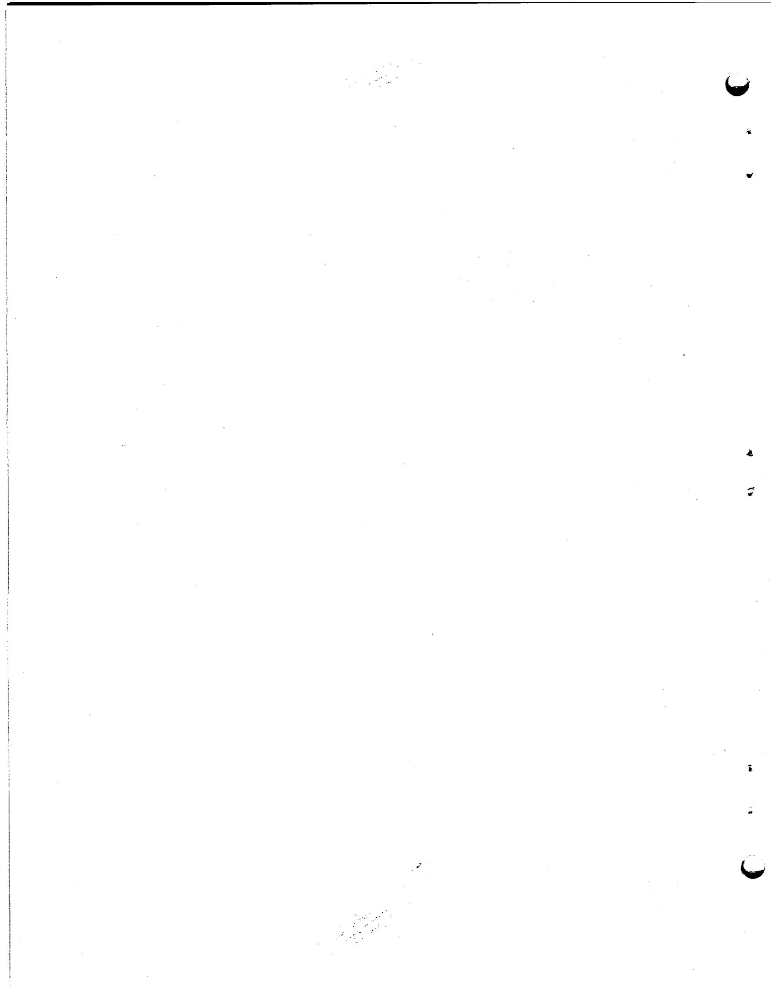

# FOREWORD

This quarterly progress report of the Aircraft Nuclear Propulsion Project at ORNL records the technical progress of the research on circulating-fuel reactors and other ANP research at the Laboratory under its Contract W-7405-eng-26. The report is divided into five major parts: 1. Aircraft Reactor Engineering, 2. Chemistry, 3. Metallurgy, 4. Heat Transfer and Physical Properties, Radiation Damage, Fuel Recovery and Reprocessing, and Critical Experiments, and 5. Reactor Shielding.

The ANP Project is comprised of about 550 technical and scientific personnel engaged in many phases of research directed toward the achievement of nuclear propulsion of aircraft. A considerable portion of this research is performed in support of the work of other organizations participating in the national ANP effort. However, the bulk of the ANP research at ORNL is directed toward the development of a circulating-fuel type of reactor.

The design, construction, and operation of the Aircraft Reactor Test (ART), with the cooperation of the Pratt & Whitney Aircraft Division, are the specific objectives of the project. The ART is to be a power plant system that will include a 60-Mw circulating-fuel reflector-moderator reactor and adequate means for heat disposal. Operation of the system will be for the purpose of determining feasibility and for studying the problems associated with the design, construction, and operation of a high-power circulating-fuel reflector-moderated aircraft reactor system.

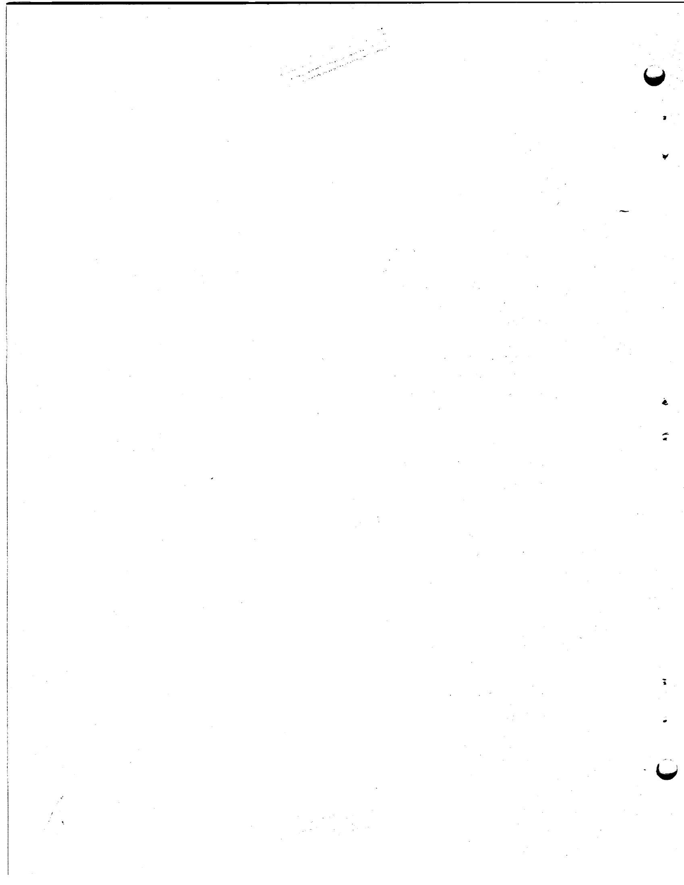

# CONTENTS

FOREWORD VII

SUMMARY 1

# PART 1. AIRCRAFT REACTOR ENGINEERING

1.1.AIRCRAFT REACTOR TEST DESIGN 17

Status of ART Design 17   
Reactor Assembly 17   
Reflector-Moderator Cooling Circuit 17   
Heat Exchangers 17   
FuelPumpsandExpansionTank. 17   
Fuel Recovery Tank 17

Applied Mechanics and Stress Analysis 18

Reactor Support 18   
NaK Piping Inside Reactor Cell 18   
Fill-and-Drain Tank and Support 21   
Core-Shell Low-Frequency Thermal-Cycling Test 23

Core Hydrodynamics 26

1.2.ART PHYSICS 29

Comparison of Basic Gamma-Ray Data with Bulk Shielding Reactor Gamma   
Heating Measurements 29   
Gamma-Ray Heating in ART 31   
Gamma-Ray Source Strength 31   
Gamma-Ray Heating 32

1.3.ART INSTRUMENTS AND CONTROLS 35

Reflector-Moderator Temperature Control Simulation 35   
Instrument Development 35   
Fuel-Expansion-Tank Level Indicator 35   
Systems for Testing Liquid-Level-Sensing Devices in Flowing Liquids 36   
High-Temperature Turbine-Type Flowmeter 36   
High-Temperature Pressure Transmitter 37   
Tests of Heliarc-Welded Inconel-Sheathed Thermocouples in Sodium 37   
Thermocouple Data Reduction 37

1.4. COMPONENT DEVELOPMENT AND TESTING 39

Pump Development Tests 39   
39   
Test of Gas Attenuation by Seals 39   
Fuel Pump Development Tests 40   
Fuel Pump Endurance Tests 42   
Sodium Pump Development Tests 43   
Primary and Auxiliary NaK Pump Development Tests 43

Heat Exchanger and Radiator Development Tests 43

Intermediate Heat Exchanger Tests 43   
Small Heat Exchanger Tests 47   
Cold-Trap Evaluation in Heat Exchanger Test Loops 51

# SECRET

Water Flow Tests of Aluminum North-Head Mockup 52   
Dump Valve Development Tests 53   
Outer Core Shell Thermal Stability Test 55   
Auxiliary Component Development 56   
High-Frequency Thermal-Cycling Apparatus 56   
Cold Traps and Plugging Indicators 57   
Liquid-Metal-Vapor Condensers 60   
Zirconium Fluoride Vapor Trap 61

# 1.5.PROOCUREMENT AND CONSTRUCTION 64

ART Facility 64

ART-ETU Reactor Construction 78

ETU Facility 78   
ART-ETU Reactor Fabrication and Assembly 78   
ART Cell Components 79

ART-ETU Reactor Component Procurement 79

Fuel-to-NaK Heat Exchangers 79   
Sodium-to-NaK Heat Exchangers 79   
Core Shells 79   
Beryllium Reflector-Moderator 80   
Boron Layers 80   
Pressure Shell 80   
Inconel 80

# 1.6. IN-PILE LOOP DEVELOPMENT AND TESTS 81

Operation of In-Pile Loop No. 5 81   
In-Pile Loop No. 6 81   
Horizontal-Shaft Sump Pump for In-Pile Loops 81

# 1.7.ADVANCED REACTOR DESIGN 82

Graphite and Beryllium Oxide Moderated Circulating-Fluoride-Fuel Reactor 82   
Hydride-Moderated Circulating-Fuel Reactor 84

# PART 2. CHEMISTRY

# 2.1. PHASE EQUILIBRIUM STUDIES 87

The System LiF-RbF 87   
The System LiF-UF 87   
The System RbF-UF 88   
The System NaF-RbF-UF 90   
The System NaF-RbF-ZrF4-UF 91   
The System RbF-CaF 2 91   
The Alkali Fluoride-Cerous Fluoride Systems 92   
The System CsF-BeF 2 92   
The System NaF-LiF-BeF 2 93   
The System NaF-RbF-BeF 2 94   
The System KCl-ZrCl 94

# SEGRET

# SECREI

2.2. CHEMICAL REACTIONS IN MOLTEN SALTS 96

Equilibrium Reduction of $\mathsf{NiF}_2$ by $H_{2}$ in NaF-ZrF 96

Stability of $\mathsf{NiF}_2$ in NaF-ZrF4 Mixtures 97

Activity of Chromium in Chromium-Nickel Alloys 100

Solubility and Stability of Structural Metal Fluorides in Various Fluoride Mixtures 100

Reduction of UF $^4$ by Structural Metals 103

Solubility Determinations by Measurement of Electromotive Forces of Concentration Cells 106

Activities in the RbF-ZrF System 108

Activities in the KF-ZrF $^4$ System 109

Solubility of $\mathsf{LaF}_3$ and of $\mathsf{CeF}_3$ in Molten Fluoride Mixtures 110

Solubility of Xenon in Fused Salts 113

Molten Salt Polarography 113

Activities from EMF Measurements on Solid Solutions of Salts 116

2.3. PHYSICAL PROPERTIES OF MOLTEN MATERIALS 118

Surface Tension and Density of NaF-ZrF4 Mixtures 118

Surface Tensions of Molten Salts 118

Fluorozirconate Mixtures 118

Uranium Tetrafluoride 119

2.4. PRODUCTION OF PURIFIED FLUORIDE MIXTURES 120

Laboratory-Scale Purification Operations 120

Quality Control of Raw Materials and Products 120

Pilot-Scale Purification Operations 120

Production-Scale Operations 120

Batching and Dispensing Operations 121

Preparation of $\mathbf{ZrF}_4$ from $\mathbf{ZrCl}_4$ 121

Special Services 121

Filling,Draining,and Sampling Operations 121

Special Enriched Fuel for In-Pile Loops 122

Shield Mockup Core Materials 122

Experimental Preparation of Various Fluorides 122

2.5. COMPATIBILITY OF MATERIALS AT HIGH TEMPERATURES 123

Penetration of Graphite by Molten Fluorides 123

Hydrogen Pressure of the NaOH-Ni Reaction 123

Physical Properties of Elastomers Exposed to Attack by Liquid Metals 124

Determination of Oxygen in NaK 124

2.6. ANALYTICAL CHEMISTRY 125

Determination of Rare-Earth Elements in Fluoride Fuels 125

Spectrophotometric Determination of Cerium 125

Spectrophotometric Determination of Lanthanum 125

# SECRET

Determination of Tantalum in Fluoride Salts 125

Determination of Oxygen in NaK 126

Sampler for Alkali Metals 126

Determination of Oxygen, Nitrogen, and Carbon in Metallic Lithium 127

Determination of Oxygen 127

Determination of Nitrogen and Carbon 128

Detection of Traces of NaK in Air 129

Compatibility of Fluoride Salts and Alkali Metals with Pump Lubricants 129

Extraction of ART Fuel Components with Trioctylphosphine Oxide 131

Determination of Chromium in Trioctylphosphine Oxide Extracts with

Diphenyl Carbazide 131

ANP Service Laboratory 132

# PART 3. METALLURGY

3.1.DYNAMIC CORROSION 135   
Forced-Circulation Loop Tests 135   
Fuel Mixtures in Inconel and Hastelloy B 135   
Sodium in Inconel and Stainless Steel 138   
Sodium-Beryllium-Inconel Compatibility 139   
Thermal-Convection Loop Tests 139   
Sodium-Beryllium-Hastelloy B Compatibility 139   
Sodium-Beryllium-Inconel Compatibility 141   
Fuel Mixtures in Hastelloy and Special Nickel-Molybdenum Alloy Loops 141   
Special NaF-ZrF $_4$ -UF $_4$ Mixtures in Inconel Loops 143   
Screening Tests of Special Fuel Mixtures 145   
Inconel Strain-Cycling Tests 147   
3.2. GENERAL CORROSION STUDIES 149   
Tests of Inconel Tube-to-Header Joints with Recrystallized Welds in NaK and in Fluoride Fuel 149   
Tests of Coast Metals Brazing Alloy No. 53 in NaK and in Fluoride Fuel 152   
Tests of Haynes Brazing Alloy No. 40 in NaK and in Fluoride Fuel 153   
Niobium in Sodium and in Lithium 154   
Vapor-Zone Attack in Inconel-Fluoride Fuel Systems 156   
Carburization of Various Alloys by Molten Sodium 156   
Sodium-Beryllium-Inconel Compatibility in a Static System (Test No. 2) 160   
Effect of Diffusion Cold Traps on Mass Transfer in Inconel-Sodium Thermal-Convection Loops 161   
Thermal-Convection Loop Tests of Various Structural Materials and Lithium 163   
Tests of Intermetallic Compounds in Sodium and in Fluoride Fuel 169   
3.3.FABRICATION RESEARCH 173   
Nickel-Molybdenum Alloy Development 173   
Battelle Memorial Institute Alloys 173

# SECRET

International Nickel Company Alloys 176   
ORNL Alloys 176   
Hastelloy W Seamless Tubing 177   
Consumable-Electrode Experiments 177

Shield Plug for ART Pumps 177

Gamma-Ray Shielding Material 177   
Thermal Shield 180

Neutron Shield Material for the ART 180

Ceramic B. C Tiles 180   
Clad Copper- $\mathsf{B}_4\mathsf{C}$ Cermets 180

Lithium-Magnesium Alloys 180   
Tubular Control Rods 181   
Seamless Tubular Fuel Elements 182   
Niobium Fabrication Studies 183

Evaluation of Arc-Melted Niobium 183   
Nb- $\mathrm{UO}_2$ Compacts 183   
Nb-U Alloys 183

Fabrication of Hydrides 183

3.4.WELDING AND BRAZING INVESTIGATIONS 184

Fabrication of Primary NaK Pump Volutes 184   
Fabrication of Primary NaK Pump Impellers 192   
Shrinkage of Inconel Core Shell Welds 192   
Examinations of NaK-to-Air Radiators After Service 195   
Fabrication of Cermet Valve Components 197   
Continuous Production of Sintered Brazing Alloy Rings 200   
Fabrication of Heat Exchangers and Radiators 201   
Studies of the Aging Characteristics of Hastelloy B 202

3.5.MECHANICAL PROPERTIES STUDIES 205

Relaxation Testing of Inconel 205   
Effects of Fused-Salt Corrosion on the Stress-Rupture Properties of Hastelloy X 206   
Creep-Rupture Testing of an $80\%$ Mg-20% Li Alloy 208

3.6.CERAMIC RESEARCH 211

Rare-Earth Materials 211   
Fuel and Moderating Materials 211   
2 Component Fabrication 211   
High-Temperature X-Ray Diffraction 211   
Fluoride Fuel Investigations 211

3.7. NONDESTRUCTIVE TESTING STUDIES 212

Eddy-Current Inspection of Small-Diameter Tubing 212   
Inspection of Tubing by the Ultrasonic Method 212

# SECRET

Inspection of Pipe 217   
Inspection of Thin Sheet 218

# 3.8.INSPECTION OF MATERIALS AND COMPONENTS 220

Weld Inspections 220   
Material Inspections 220   
Inspection of Components 221   
Fluorescent-Penetrant Inspection of Tubing 221   
Welder Qualification Program 221

# PART 4. HEAT TRANSFER AND PHYSICAL PROPERTIES, RADIATION DAMAGE, FUEL RECOVERY AND REPROCESSING, CRITICAL EXPERIMENTS

# 4.1. HEAT TRANSFER AND PHYSICAL PROPERTIES 225

ART Fuel-to-NaK Heat Exchanger 225   
ART Hydrodynamics 225

Core Hydrodynamics 225   
Sodium Flow in Reflector Cooling System 226

Fluid Flow Visualization 227

ART Core Heat Transfer Study 227   
Thermal-Cycling Experiment 228   
Shield Mockup Core Study 233   
Heat Capacity 233   
Viscosity and Density 233   
Thermal Conductivity 234

# 4.2. RADIATION DAMAGE 236

Examination of Disassembled MTR In-Pile Loops Nos. 3, 4, and 5 236   
Investigation of Materials Removed from MTR In-Pile Loops Nos. 3 and 5 239   
Creep and Stress-Corrosion Tests of Inconel 240   
MTR Stress-Corrosion Apparatus 243

Effect of Radiation on Static Corrosion of Structural Materials by Fused Salt Fuels 243

Holdup of Fission Gases by Charcoal Traps 245   
ART Off-Gas System Instrumentation Analysis 245   
LITR Vertical In-Pile Loop 245   
Design Calculations for LITR Vertical In-Pile Loop 248   
ART Reactivity Transients Associated with Fluctuations in Xenon-Removal Efficiency 250   
Use of $\mathbf{Zr}^{95}$ as a Fission Monitor 252   
Fast-Neutron Detectors 252   
Effects of Radiation on Electronic Components 254

# SEGRET

Irradiation Effects on Thermal-Neutron Shield Materials 256   
Irradiations of Stressed Shielding Materials 258

4.3. FUEL RECOVERY AND REPROCESSING 261

Volatility Pilot Plant Design and Construction 261   
Engineering Development 261   
Chemical Development 262

4.4.CRITICAL EXPERIMENTS 264

Reflector-Moderated Reactor Experiments 264   
Experiments at Room Temperature 264   
Experiments at Elevated Temperature 264

# PART 5. REACTOR SHIELDING

5.1. SHIELDING THEORY 271   
A Monte Carlo Study of the Gamma-Ray Energy Flux, Dose Rate, and Buildup Factors in a Lead-Water Slab Shield of Finite Thickness 271   
5.2.LID TANK SHIELDING FACILITY 278   
Study of Advanced Shielding Materials 278   
5.3. BULK SHIELDING FACILITY 291   
The Fission-Product Gamma-Ray Energy Spectrum 291   
Gamma-Ray Streaming Through the NaK Pipes that Penetrate the ART Shield 296   
5.4. SHIELD MockUP CORE 299   
Selection of Calculational Models 299   
301   
Calculations for SMC Configurations Using $\mathsf{UO}_2$ -Stainless Steel Fuel Elements 301   
Calculations for SMC Configurations Using Uranium-Aluminum Fuel Elements 305

Core Gamma Rays 309   
Neutron-Capture Gamma Rays from the Core Shells 310   
Neutron-Capture Gamma Rays from the Reflector 310   
Gamma Rays from the Heat Exchanger Region 310   
Neutron-Capture Gamma Rays from the Pressure Shell and Shield 310   
Neutron-Capture Gamma Rays from the Air and Crew Compartment 310

Design Status 310

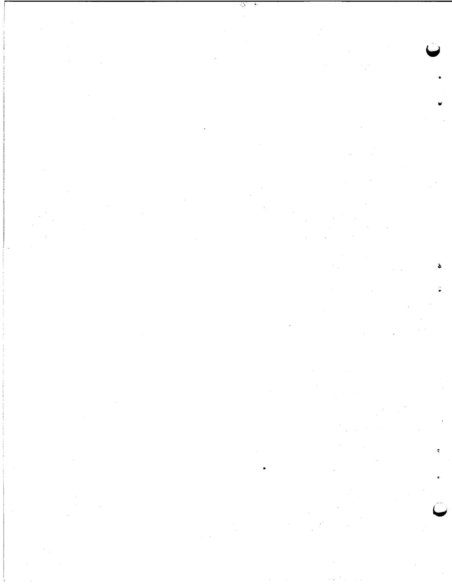

# ANP PROJECT QUARTERLY PROGRESS REPORT

SUMMARY

# PART 1. AIRCRAFT REACTOR ENGINEERING

# 1.1. Aircraft Reactor Test

Most of the detail drawings of the reactor-core, heat-exchanger, pump, and pressure-shell assembly have been completed, and design work on the reactor shield and the interior of the reactor cell is proceeding. A review of the detail drawings indicated that the pressure drop through the reflectormoderator cooling circuit would probably be higher than originally estimated, and therefore larger and higher-speed motors are being ordered for the sodium-pump drives. A re-examination is being made of the tolerances and clearances specified for the fuel-to-NaK heat exchangers in an effort to ease the fabrication problems.

Tests of a fuel pump in a high-temperature test rig have indicated that the cavitation limit is somewhat lower than anticipated. However, the increased cavitation suppression head required for satisfactory operation can be accommodated by increasing the fuel expansion tank pressure by about 10 psi. In tests of a fuel pump and expansion tank assembly no objectionable aeration or pressure fluctuations were observed in the system over the entire speed range when the fuel level in the fuel expansion tank was varied from $\frac{1}{2}$ to 3 in.

The preliminary design of the fuel-recovery tank was completed. The tank has been designed so that no electrical, cooling, or other lines will need to be connected to it at the time it is removed from the cell.

Studies of the reactor support structure were completed. The complete reactor and shield assembly is to be suspended from an overhead bridge-like structure. The weight of the reactor will be transmitted to the bridge structure through the four pump barrels. To allow for displacement of the reactor as a result of thermal expansion of the NaK lines, the lines are to be precut so that their expansion will move the reactor to the desired operating position. Several bends have been added to the NaK lines to allow for differential expansion between the lines.

The stresses to be expected in the fill-and-drain tank were also evaluated. The support of the fill-and-drain tank assembly is to be accomplished by means of a nitrogen cylinder located beneath the tank.

A series of low-frequency thermal-cycling tests of the core shells is under way. The thermal cycle being used in the tests simulates that to be expected in the reactor. In the initial test the model was subjected to 300 cycles, a factor of 10 more than expected in operation of the ART. Visual and dimensional inspection revealed no gross failures. Metallurgical examinations are being made.

Additional core flow studies were made on the full-scale model of the ART core. Heat transfer coefficients were calculated for the 0.010-in.-thick fuel layer adjacent to the outer and inner core walls for the core flow pattern established by using a swirl-type header with and without guide vanes.

# 1.2. ART Physics

The results of experiments performed to determine the rate of gamma heating in various target materials near the Bulk Shielding Facility (BSF) reactor were compared with results calculated by the method used for determining similar ART gamma heating rates. The good agreement between the experimental and the calculated heat generation values for samples near the BSF indicates that the basic gamma-ray data and the Pratt & Whitney gamma-ray deposition code used for the ART calculations should give representative results for the gamma-ray heat deposition in various parts of the ART.

Two-dimensional gamma-ray heating calculations for the ART have been performed by using a code developed for the IBM-704 computer by Kneidler and Wenzel at Pratt & Whitney. Source strengths for the calculations were obtained from two-dimensional multigroup neutron calculations and from critical experiments. The total gamma-ray deposition (excluding that caused by sources in the heat exchanger region) in the reactor was found to

be 3.86 Mw, which amounts to approximately $84\%$ of the total source. This means that about $16\%$ of the gamma-ray source energy escapes.

# 1.3. ART Instruments and Controls

The ART simulator was used for a study of temperature control of the reflector-moderator and the temperature responses of the reflector-moderator cooling system. A control system was evolved which will hold the mean reflector-moderator temperature constant to within $\pm 15^{\circ}\mathrm{F}$ for step changes between zero, 50, and $100\%$ design power and between 1200 and $1425^{\circ}\mathrm{F}$ mean fuel temperature (at $50\%$ and zero power).

Tests were continued on a helium-bubbler type of level indicator for the fuel expansion tank, and three test systems are being constructed for studying other liquid-level-sensing devices under controlled conditions in flowing liquids. Additional tests of a high-temperature turbine type of flow-meter have indicated that these units can be expected to operate satisfactorily at $1500^{\circ}\mathrm{F}$ for 3000 hr. A unit with a $3\frac{1}{2}$ -in.-dia housing for operation in a system with flow rates up to 1400 gpm is being fabricated.

Evaluation tests of several types of high-temperature pressure transmitters were continued. The effects of out-of-pile aging on the calibration of thermocouples are being studied, and plans are being made for in-pile tests. Life tests of two synchronized high-speed mercury-jet switches for scanning thermocouple signals are under way.

# 1.4. Component Development and Testing

Evaluation studies of lubricating and cooling fluids for pumps were continued. Tests are being made in order to determine the compatibility of various lubricants and reactor process fluids and to evaluate elastomers for seal application.

Preliminary test data were obtained which indicated that fission-gas leakage from the sumps of the ART fuel pumps would be attenuated by a factor of at least $10^{4}$ from the expansion tank to the shaft seal and by another factor of at least $10^{4}$ between the seal and the lubricating oil reservoir. These data are being analyzed to determine the radiation dose to be expected at the oil reservoirs.

Developmental test work on the fuel pump impeller continued. Modifications were made to the slinger impeller and to the seal plate over the

centrifuge cup to improve performance. An endurance test of a fuel pump was terminated after approximately 2000 hr of satisfactory operation. The pump was disassembled, examined, and reassembled for further high-temperature testing. More than 400 additional hours of satisfactory operation had been accumulated by the end of the report period.

Water testing of an ART sodium pump continued. Various configurations of the flow passages above the centrifuge were tested, and a configuration was found which gave stable operation of the pump in a performance-acceptance loop.

Water tests were also performed on Inconel parts for the NaK pumps. Data for the Inconel parts were found to be satisfactory when compared with data obtained previously with a brass impeller.

York NaK-to-air radiator No. 9, the first 500-kw radiator of the revised design to be tested, was found to be in satisfactory condition after completion of a program of 30 thermal cycles. Endurance testing of a heat exchanger at ART fuel-to-NaK heat exchanger design temperature and flow conditions with a heat load of 400 kw was initiated.

Two 4-in.-dia circulating cold traps equipped with stainless steel cooling coils were placed in operation with no difficulties from oxide plugging. A procedure for startup of the ART cold traps was developed.

Water tests of the aluminum mockup of the ART fuel system components of the north head were continued. Fabrication of a second aluminum north head is under way in which the sodium system components will be mocked up.

Four ART prototype dump valves received from vendors were tested, but none met performance specifications for ART operation. Assembly and welding procedures are being analyzed, and seat materials are being tested in fused salts.

Apparatus and techniques are being developed for investigating the effect of high-frequency thermal oscillations and the resultant thermal fatigue stresses on the ART core. A high-frequency pulse pump has been designed for dynamic mixing of hot and cold fluids to provide a thermal-oscillation frequency range of 1 to 10 cps and a surface amplitude of about $100^{\circ}\mathrm{F}$ .

Various types of cold traps and plugging indicators are being evaluated in test stands. The test stands are also equipped with Argonne samplers and Mine Safety Appliances samplers so that

chemical analyses of the NaK being circulated can be used to calibrate the plugging indicators.

Liquid-metal-vapor condensers are being developed for use in helium purge systems in the ART sodium and NaK circuits and the NaK dump tanks. High-temperature chemical absorbents and thermal-precipitation traps are being investigated in the development of a zirconium fluoride vapor trap. The most promising system consists of a bed of hot alumina which reacts with gaseous $\mathsf{ZrF}_4$ to form solid $\mathsf{ZrO}_2$ and $\mathsf{AlF}_3$ .

# 1.5. Procurement and Construction

Work on the building additions, building alterations, and cell installation for the ART has been completed, except for installation of six circuit breakers and the completion of modifications to the cell floor structure. A rigid leak test of the reactor cell was made; a zero leakage rate was obtained with a detector sensitive to 5 micron ft³/hr. Since the contract specification allowed 32 micron ft³/hr, the vessel satisfactorily met the leak tightness requirement. The installation of auxiliary services piping was completed, except for replacement of 15 incorrect valves in the nitrogen system. The electrical control centers and the spectrometer room electrical and air-conditioning equipment were completed. Work on the diesel generators was delayed because one of the generators and three control panels were damaged in shipment. Two of the four main blowers were installed.

Program and design planning for disassembly of the ART were initiated. Procedures and tools necessary for removing the reactor are being developed, and a new, large hot-cell facility is being planned.

Construction work started on the Engineering Test Unit (ETU) facility. Details of the main NaK piping were determined and the design of the air duct for the NaK-to-air radiators was prepared. The study of the reactor assembly problem was continued, and general assembly procedures were prepared. Nearly all the components and spare parts needed for three reactors have been ordered. Fabrication of the north head for the ETU reactor is $40\%$ complete. The lower half of the beryllium reflector-moderator has been contoured, and drilling of the coolant holes was started.

The York Corp. and Black, Sivalls & Bryson, Inc., are developing techniques for fabricating

the fuel-to-NaK heat exchangers. The sodium-to-NaK heat exchangers are being fabricated and should be available soon. The Hydrospin machine has been enlarged to produce the various shells required for the reactors, and the outer core shells for the ETU are being fabricated.

Acceptable samples of finished boron carbide tiles were received from the Norton Company. An order has been placed for forgings for the reactor pressure shell.

# 1.6. In-Pile Loop Development and Tests

Examination of in-pile loop No. 5, which was inserted in the MTR but could not be filled with fuel, revealed that a plug had formed in the fill line that was a mixture of fuel and zirconium oxide. In-pile loop No. 6, which is to be inserted in the MTR soon, is to operate at a maximum loop temperature of $1600^{\circ}\mathrm{F}$ with the fuel mixture $\mathrm{NaF - ZrF_4 - UF_4}$ (53.5-40-6.5 mole %), a $300^{\circ}\mathrm{F}$ temperature differential across the nose coil, and a power density of about $0.75\mathrm{kw/cm^3}$ . A horizontal-shaft sump pump, identical to that in in-pile loop No. 6, is operating satisfactorily in a test loop. It will have accumulated 1150 hr of operation by the time in-pile loop No. 6 is inserted in the MTR.

# 1.7. Advanced Reactor Design

Reactor designs are being investigated in which the fuel cools the moderator, in order to eliminate the sodium circuit used for cooling the moderator in reactors of the ART type. One of these designs depends on moderation by beryllium oxide in the reflector and some additional moderation by graphite in the core. Thermal stresses dictate the use of the graphite in the core. The relatively poor moderating properties of graphite are not too objectionable because of the relatively large core size (24 in. in diameter) required by the total power and the allowable power densities. On the other hand, the use of a very good moderator, such as zirconium or yttrium hydride, in the core would make the reactor independent of moderation by the reflector, and metals could be used in the reflector. Metals require few cooling holes and are good gamma-ray and fast-neutron shields. With presently assumed materials properties, the hydride-moderated reactors would be better than the graphite-beryllium oxide moderated reactors; on the other hand, the properties of graphite and beryllium oxide are somewhat better known.

# PART 2. CHEMISTRY

# 2.1. Phase Equilibrium Studies

Phase equilibrium studies of fuel system components were continued. A re-examination of the LiF-RbF system has revealed the compound LiF-RbF, and a revised equilibrium diagram has been prepared. Further examination of the LiF-UF $_4$ system has confirmed the identity of the previously arbitrarily designated compound 3LiF-UF $_4$ . There is evidence that the compound is metastable.

Studies of the $\mathsf{RbF - UF_4}$ system progressed sufficiently for a tentative equilibrium diagram to be prepared. The boundary curves, compatibility triangles, peritectic temperatures, and eutectic temperatures for the NaF-RbF-UF ternary system are now well-established. Detailed examination of the four-component system NaF-RbF-ZrF-UF has established several mixtures which are of possible interest as reactor fuels.

In studies of the RbF-CaF $_2$ system it has not been possible to get reproducible data for compositions containing more than 15 mole $\%$ CaF $_2$ . There is evidence of a compound with a cubic structure, which is presumed to be RbF-CaF $_2$ . Examinations of the systems LiF-CeF $_3$ , NaF-CeF $_3$ , and RbF-CeF $_3$ were continued, but, as yet, there is insufficient data for the preparation of equilibrium diagrams. The NaF-CeF $_3$ system was shown to have a binary eutectic, which melts at $775 \pm 10^{\circ}\mathrm{C}$ .

A study of the CsF-BeF $_2$ system was started in order to complete the study of the alkali fluoride-beryllium fluoride systems. This study is incomplete, but, as in other alkali fluoride-beryllium fluoride systems, liquidus temperatures diminish rapidly in this system with increasing BeF $_2$ content in the $33\%$ to 50 mole $\%$ BeF $_2$ region.

Study of the NaF-LiF-BeF $_2$ system progressed sufficiently for a plot of the boundary curves, compatibility triangles, and pertinent temperatures to be prepared, although the composition of one of the ternary compounds is not completely established. The ternary system NaF-RbF-BeF $_2$ requires additional study before the analogous diagram can be constructed.

Low-melting chloride systems, which are potentially useful as heat transfer mediums, are being investigated. The present investigation of the KCl-ZrF $_4$ system covers the composition range of 10 to 75 mole % ZrF $_4$ . It will be of interest to compare phase equilibrium behavior in these

MCl-ZrCl4 systems with behavior in the analogous MF-ZrF4 systems, which have been thoroughly studied at ORNL.

# 2.2. Chemical Reactions in Molten Salts

Investigation of the equilibrium reduction of $\mathsf{NiF}_2$ by $\mathsf{H}_2$ in $\mathsf{NaF - ZrF_4}$ was continued. A related investigation of the stability of $\mathsf{NiF}_2$ in the solvent was made that indicated the essential validity of the equilibration data which have been obtained at 500, 575, and $625^{\circ}C$ . The data obtained to date indicate that the activity coefficient for $\mathsf{NiF}_2$ in $\mathsf{NaF - ZrF_4}$ (53-47 mole %) must be about 2750 at $600^{\circ}C$ . The corresponding value for $\mathsf{FeF}_2$ in this solvent was previously found to be 3.28. In the investigation of the stability of $\mathsf{NiF}_2$ in the solvent, a number of peculiar effects were observed that appear to be important in mechanisms of corrosion of nickel by molten salts. Additional study of these phenomena is to be undertaken.

The study of the activity of chromium in chromium-nickel alloys was completed, and the values obtained at 750 and $965^{\circ}C$ are presented. The studies of the solubility and stability of the structural metal fluorides in fluoride mixtures were extended to include $\mathsf{CrF}_2$ , $\mathsf{FeF}_2$ , and $\mathsf{NiF}_2$ in the solvents LiF-ZrF $_4$ (52-48 mole %), NaF-ZrF $_4$ (59-41 mole %), and KF-ZrF $_4$ (52-48 mole %). In addition, the solubility of $\mathsf{CrF}_3$ in the NaF-LiF-KF eutectic was determined. The solubility of $\mathsf{CrF}_2$ in these solvents varied markedly with the solvent used. In all tests with $\mathsf{FeF}_2$ at $600^{\circ}C$ the solubility increased with excess $\mathsf{FeF}_2$ present and the zirconium-to-sodium ratios tended to decrease with increasing excess $\mathsf{FeF}_2$ . The solubility of $\mathsf{NiF}_2$ in NaF-ZrF $_4$ and KF-ZrF $_4$ was found to be the same and nearly independent of the amount of $\mathsf{NiF}_2$ added. However, the solubility in LiF-ZrF $_4$ is a function of the amount of $\mathsf{NiF}_2$ added at both 600 and $800^{\circ}C$ .

Studies of the reduction of $\mathsf{UF}_4$ by structural metals were extended to include the reaction media RbF-ZrF $_4$ (60-40 mole %) and LiF-BeF $_2$ (48-52 mole %). The equilibrium chromium concentrations in the RbF-ZrF $_4$ mixture at $800^{\circ}\mathsf{C}$ were found to be lower than those in any other alkali fluoride-ZrF $_4$ mixture studied. The equilibrium iron concentrations were found to be virtually independent of the reaction medium and in all cases were higher at 600 than at $800^{\circ}\mathsf{C}$ . This behavior is in marked contrast to that observed for the $\mathsf{Cr}^{0}\mathsf{-UF}_{4}$

system, which exhibits strong dependence on the reaction medium.

The solubilities of the structural metal fluorides $\mathrm{NiF}_2$ , $\mathrm{FeF}_2$ , and $\mathrm{CrF}_2$ in molten $\mathrm{NaF - ZrF_4}$ (53-47 mole %) that were determined by using concentration cells and an emf method are presented. The results fall within the range of the results obtained by filtration.

Vapor pressure data were used to calculate the effects of concentration and temperature on activities in the RbF-ZrF $_4$ and KF-ZrF $_4$ systems. Activities of KF were very slightly higher than the activities of RbF at corresponding compositions and temperatures, since the larger rubidium ion has less affinity for the fluoride and RbF is a better complexing agent than KF. The ZrF $_4$ activity was found to decrease with increasing ionic radius of the alkali cation.

A systematic investigation of the solubilities of rare-earth fluorides in ART-type fuels was initiated. In the initial studies, $\mathsf{LaF}_3$ and $\mathsf{CeF}_3$ were used in the solvents NaF-KF-LiF (11.5-42-46.5 mole %) and NaF-ZrF $_4$ (50-50 mole %). The results obtained thus far show the solubilities to be comfortably high from the standpoint of reactor operation. Apparatus is being assembled for the determination of the solubility of xenon in fused salts.

Polarography was utilized for quantitative analyses of structural metal ions in the NaF-KF-LiF eutectic. Half-wave potentials were identified for $\mathrm{Ni}^{+ + }$ $\mathrm{Fe}^{+ + + }$ ,and $\mathrm{Cr}^{+ + + }$ , and solubility determinations were made by following the plot of wave height vs concentration to the solubility limit and beyond.

Measurements of activities in the system AgCl-NaCl were made by an emf method as a trial study with a solid electrolyte of a technique which may be applicable to fluoride systems and also as a demonstration of some metastable solid solution behavior. The feasibility of making equilibrium measurements with a solid electrolyte was demonstrated. If such measurements on solid fluorides prove to be feasible, a ceramic container would no longer be required for cells containing fluorides, measurements could be made on solids by using cells designed to avoid transference potentials, and compositions with inconveniently high melting points could be studied.

# 2.3. Physical Properties of Molten Materials

Difficulties caused by partial plugging of the capillary tips in the apparatus for applying the maximum bubble-pressure method to determinations of surface tensions of NaF-ZrF4 mixtures have prevented the accumulation of accurate data. The equipment is being modified to minimize contamination.

Density determinations were made on NaF-ZrF₄ (53-47 mole %) at 600, 700, and 800°C. The values presented are believed to be accurate to within 2%.

The sessile-drop technique was used for additional measurements of surface tensions of NaF $\mathsf{ZrF}_4$ (53-47 mole %) mixtures. Experiments designed to study the effects on surface tension of change of composition as a function of temperature, pressure of the confining gas, and time of equilibration are under way. Experiments are also under way to determine the wetting properties and surface tensions of $\mathsf{UF}_4$ and of $\mathsf{UF}_4$ with small additions of $\mathsf{UO}_2$ on graphite.

# 2.4. Production of Purified Fluoride Mixtures

The use of copper-lined stainless steel reactor vessels has proved to be successful in all but one instance. It has been found that if NaF-KF-LiF-UF4 mixtures are frozen in the copper-lined vessels, the copper liner will rupture when the mixture is remelted. Therefore any large-scale production of such mixtures would require continuous operation of the production facility so that the mixture could be maintained molten at all times.

A dust filter is being installed so that the conversion of about 2000 lb of low-hafnium $\mathsf{ZrCl}_4$ to $\mathsf{ZrF}_4$ can be started. It is hoped that the filter will prevent large-scale loss of the product during the conversion and permit efficient operation.

MTR in-pile loop No. 6 was filled with a fuel mixture prepared with extreme care to assure that the mixture was oxide-free. Precautions were considered desirable after it was learned that the plug which prevented the filling of in-pile loop No. 5 may have resulted from oxide contamination of the fuel mixture.

Data are presented on the kinds and quantities of materials produced during the quarter.

# 2.5. Compatibility of Materials at High Temperatures

The diffusion of uranium fluoride-containing mixtures into graphite was studied by obtaining counts, with an alpha counter, on samples obtained by filing and scraping, in a uniform manner, the surfaces of the graphite specimens. After 10 hr of exposure to NaF-ZrF4-UF4 (53.5-40-6.5 mole %) at $600^{\circ}\mathrm{C}$ , there was no evidence of penetration, and, after 50 and 250 hr, only slight increases in alpha count were found. A graphite sample exposed at $800^{\circ}\mathrm{C}$ , however, showed a sufficient increase in the alpha count after 10 hr of exposure to indicate the presence of the salt inside the test specimen.

An apparatus was developed for measuring the equilibrium pressure of hydrogen from the reaction of NaOH and nickel. The new apparatus permits measurements of the pressure inside a sealed quartz envelope containing the NaOH-Ni system. The measurements can be made after the apparatus has cooled to room temperature. Results of preliminary experiments are presented.

Equipment has been assembled for testing elastomers under tension in NaK at 185 to $190^{\circ}\mathrm{C}$ . Screening tests are under way.

In the search for a reliable and practical method for analyzing for oxygen in NaK, a comparison was made of the amalgam and the butyl bromide methods. The values obtained by the two methods disagreed radically, and therefore further studies of these methods are under way.

# 2.6. Analytical Chemistry

Tiron (disodium-1,2-dihydroxybenzene-3,5-disulfonate) was applied to the spectrophotometric determination of cerium in NaF-KF-LiF-UF and NaF-ZrF4-UF. A colored complex, with its absorption maximum at 500 mμ, results from the reaction between cerium and Tiron in a slightly basic solution. Uranium, zirconium, iron, and fluoride interfere; however, their interference is readily eliminated by various means, including extraction. Sodium alizarin sulfonate is being investigated as a possible reagent for the spectrophotometric determination of lanthanum in fluoride salt mixtures.

The minimum concentration of tantalum that can be determined by the tannin-pyrogalol method in NaF-ZrF4-UF4 was found to be approximately 1000 μg.

The buffering action, which was observed when the aqueous solution from the dissolution of NaK in butyl bromide was titrated with acid, was found to be attributable to the presence of 7 to 20 ppm of aluminum in the alloy. Although these small concentrations will produce buffering, they cannot account for the high oxide concentrations that have been found in NaK by the butyl bromide method. A modified metal reactor was constructed so that the amalgamation procedure for the determination of oxygen in NaK can be used.

An apparatus for sampling alkali metals at high temperature was modified by substituting a glass-to-metal Wilson seal for a packing gland seal to facilitate complete removal of oxygen from the apparatus and by replacing the Teflon-packed gate valve with a Teflon-packed Jamesbury valve. This valve is a reliable, vacuum-tight, ball-type valve, which is completely opened or closed by a one-quarter turn of the handle.

Methods for the determination of oxygen, carbon, and nitrogen in lithium were studied. The last two elements were analyzed by dissolving the sample in water to convert nitrides and carbides to ammonia and acetylene, respectively, which were then determined by conventional methods.

An all-metallic apparatus for the determination of oxygen in lithium by amalgamation was constructed which will facilitate transfer of samples without atmospheric contamination. A modification of the butyl bromide method for oxygen was studied for application to lithium. The metal is dissolved in an ethereal solution of $n$ -butyl iodide in the presence of iodine. It is postulated that the lithium forms the neutral iodide salt, that lithium carbide and nitride are oxidized, and that the oxide remains unchanged by the dissolution of the metal.

The experimental investigation of means for the introduction of reproducible concentrations of sodium into air was continued with limited success. Stable aerosols were not formed when helium which had been equilibrated with 20 to $100\mu \mathrm{g}$ of sodium per liter of gas was mixed with 10 times its volume of air. Therefore, a test facility, which is essentially a mockup of the ART radiators, is being fabricated to test the instruments which have been developed for the detection of traces of NaK in air.

A device was constructed which will permit visual observation of compatibility tests of molten

fluoride salts and alkali metals with pump lubricants. Dowtherm-A at $200^{\circ}\mathrm{F}$ was found to be essentially inert to sodium at $1100^{\circ}\mathrm{F}$ ; however, under identical temperature conditions, Cellulube-150 underwent a vigorous, exothermic reaction.

An investigation was initiated to study the extraction of ART fuel components, corrosion products, and fission products from acidic solutions into solutions of trialkylphosphine oxides in organic solvents. The extractant was applied to evaluate the determination of chromium by extracting it with the phosphine oxide and then analyzing the extract directly by the diphenyl carbazide method.

# PART 3. METALLURGY

# 3.1. Dynamic Corrosion

Two Inconel forced-circulation loops were operated with the fuel mixture $\mathrm{NaF - ZrF_4 - UF_4}$ (56-39-5 mole %) at maximum fuel temperatures of about 1500 and $1650^{\circ}\mathrm{F}$ in order to compare the corrosion properties of this fuel mixture with those of the commonly used mixture $\mathrm{NaF - ZrF_4 - UF_4}$ (50-46-4 mole %). Chromium was found in a crystalline deposit in the cold zone of the loop operated at about $1500^{\circ}\mathrm{F}$ , but no crystals were found in the loop operated at about $1650^{\circ}\mathrm{F}$ . Deposits of this type have not been found in loops operated with $\mathrm{NaF - ZrF_4 - UF_4}$ (50-46-4 mole %). The depth of hot-leg attack, which was the same for both loops, 7 mils, was midway between the average depths of hot-leg attack found at 1500 (4.5 mils) and $1650^{\circ}\mathrm{F}$ (9 mils) in loops operated with $\mathrm{NaF - ZrF_4 - UF_4}$ (50-46-4 mole %).

Examination of a Hastelloy B forced-circulation loop that operated with NaF-KF-LiF-UF $_4$ (11.2-41-45.3-2.5 mole %) verified the excellent corrosion resistance of Hastelloy B to fluoride fuel mixtures as observed previously in thermal-convection loops.

An Inconel forced-circulation loop that had been operated with $\mathsf{NaF - ZrF_4 - UF_4}$ (50-46-4 mole %) in an endurance test was also examined. Operation had been terminated at 8300 hr because of a pump-drive failure. The loop was gas-fired, and it operated with a maximum fuel temperature of $1450^{\circ}F,$ a temperature drop of $200^{\circ}F,$ a maximum wall temperature of $1550^{\circ}F,$ and a Reynolds number of 10,000. The hot-leg surface was roughened, and there was heavy intergranular void formation to a depth of 25 mils. The cold-leg surface was roughened, but no metallic deposits were found. Another

Inconel loop that had operated with the same fuel mixture for 3000 hr with maximum and minimum fluid temperatures of 1600 and $1300^{\circ}\mathrm{F}$ , a Reynolds number of 5750, and a maximum wall temperature of $1700^{\circ}\mathrm{F}$ was also examined. The maximum attack was to a depth of 14 mils, and no deposits were found in the cold zones that could be attributed to mass transfer.

It was found that increasing the temperature drop from 300 to $400^{\circ}\mathrm{F}$ in Inconel loops circulating sodium at the same maximum fluid temperature appreciably increased the amount of mass transfer. The mass transfer was also appreciably increased by increasing the maximum fluid temperature from 1350 to $1500^{\circ}\mathrm{F}$ . For type 316 stainless steel loops circulating sodium, the effect of increasing the maximum fluid temperatures from 1500 to $1650^{\circ}\mathrm{F}$ was slight. A type 310 stainless steel loop showed substantially larger deposits than those found in a type 316 stainless steel loop operated under similar conditions.

Two Inconel forced-circulation loops with beryllium inserts in the hot legs were operated with sodium. As observed previously, alloying occurred where the beryllium and Inconel were in contact, but in areas where there was a positive separation between the beryllium and the Inconel no alloying was found. Similar results were obtained with Hastelloy B thermal-convection loops containing beryllium inserts. A series of five Inconel thermal-convection loops with beryllium inserts operated with sodium at temperatures varying from 1200 to $1500^{\circ}\mathrm{F}$ showed that attack of the beryllium increased with temperature. There was some alloy formation in all the loops operated at temperatures above $1300^{\circ}\mathrm{F}$ .

Examination of a Hastelloy X thermal-convection loop operated with $\mathsf{NaF - ZrF_4 - UF_4}$ (50-46-4 mole %) at $1500^{\circ}F$ showed heavy intergranular subsurfacevoid formation to a depth of 35 mils. In contrast, a Hastelloy W loop and a nickel-molybdenum alloy (85% Ni-15% Mo) loop operated with NaF-KF-LiF $\mathsf{UF}_4$ (11.2-41-45.3-2.5 mole %) under similar conditions showed maximum depths of attack in the hot leg of 0.5 and 2 mils, respectively.

Inconel loops operated with NaF-ZrF4-UF4 (50-46-4 mole %) prepared with especially pure ZrF4 showed 2 to 3 mils less attack than that found with the standard mixture. A similar reduction in attack was found in loops operated with fuel reclaimed from experiments.

Additional tests were completed in the screening tests of special fuel mixtures in Inconel thermal-convection loops. The results obtained to date are presented.

Data obtained in cyclic strain tests of Inconel in a helium atmosphere are also presented. At all temperatures studied (1200, 1400, and $1600^{\circ}\mathrm{F}$ ), a 2-hr hold time appears to produce cracks in fewer cycles than are required to produce cracks in tests with a $1/2$ -hr hold time. Cracks initiate at approximately the same time in tests at 1400 and $1600^{\circ}\mathrm{F}$ , but they propagate faster at $1600^{\circ}\mathrm{F}$ .

# 3.2. General Corrosion Studies

The recrystallized portion of resistance-welded Inconel tube-to-header joints fabricated by the "flange-during-welding method" and supplied by The Glenn L. Martin Co. was found to have good corrosion resistance to $\mathrm{NaF - ZrF_4 - UF_4}$ (50-46-4 mole %) and to NaK (56-44 wt %) at $1500^{\circ}\mathrm{F}$ during a 100-hr test. The maximum attack on the joints tested in NaK was 0.5 mil, and those tested in the fuel showed 1.5 mil of attack on the header portion and less than 0.5 mil of attack on the recrystallized portion of the worked tube.

Seesaw corrosion tests of Coast Metals brazing alloy No. 53 (81% Ni-8% Cr-4% B-4% Si-3% Fe) in NaF-ZrF $_4$ -UF $_4$ (53.5-40-6.5 mole %) and in NaK (56-44 wt %) showed the same type of boron depletion as that found previously with Coast Metals brazing alloy No. 52. Boron was depleted from the specimen tested in NaK for 100 hr at $1500^{\circ}\mathrm{F}$ to a depth of 2.5 mils and from the specimen tested in the fuel mixture to a depth of 1.5 mils.

Haynes brazing alloy No. 40 (nominal composition, in wt %: Cr, 13.5; Fe, 4.5; Si, 3.9; B, 3.2; Co, 1.0; C, 0.42; Mn, 0.25; Ni, balance) showed good corrosion resistance to NaK (56-44 wt %) but only fair resistance (3 mils of heavy attack) to NaF-ZrF $_4$ -UF $_4$ (50-46-4 mole %) during 100-hr tests at $1500^{\circ}\mathrm{F}$ .

No mass transfer and very little corrosion occurred in tests of niobium in sodium and in lithium in seesaw apparatus. In these tests for 100-hr periods the hot-zone temperature was $1535^{\circ}\mathrm{F}$ and the cold-zone temperature was $995^{\circ}\mathrm{F}$ .

Long-duration tests of static NaF-ZrF $_4$ -UF $_4$ (56-40-4 mole %) in Inconel in which temperature gradient was used to make the more volatile ZrF $_4$ crystallize above the fused-salt bath revealed that no attack occurred in the vapor zone and that the

attack in the bath region was less than that normally observed in fused-salt Inconel tests.

Of the four alloys subjected to carburization by exposure for 100 hr at $1500^{\circ}\mathrm{F}$ to static sodium containing various amounts of added graphite, the alloys that experienced the greatest amount of carbon pickup were, in descending order, type 430 stainless steel, type 316 stainless steel, type 310 stainless steel, and Hastelloy B. The alloys that suffered the greatest amount of carbon penetration were, in descending order, type 430 stainless steel, type 316 stainless steel, Hastelloy B, and type 310 stainless steel.

It was demonstrated that chromium-plating Inconel specimens prior to testing them in contact with beryllium while immersed in sodium at $1300^{\circ}\mathrm{F}$ was effective in reducing the extent of alloying. A minimum of 5 mils of chromium plate will be necessary to ensure that all the chromium is not consumed by an alloying reaction with beryllium.

Two Inconel thermal-convection loops were operated with sodium in tests conducted to determine the effect of a diffusion cold trap on the amount of mass transfer into the cold leg of the loop. Corrosion and mass transfer were found to be less in the loop with the diffusion cold trap than in a standard loop with no trap.

Seventeen thermal-convection loops constructed of various grades of the stainless steels and Inconel were operated with lithium. None of the stainless steels had satisfactory resistance to mass transfer at hot-zone temperatures of $1500^{\circ}\mathrm{F}$ and Inconel was not satisfactory at a temperature of $1300^{\circ}\mathrm{F}$ .

The intermetallic compounds NiAl, NiAl + 5% Ni, NiAl + 4% Zr, and MoAl were corrosion tested in static sodium and in NaF-ZrF $_4$ -UF $_4$ (53.5-40-6.5 mole %) for 100 hr at 1500°F. The compounds were not attacked by the sodium, but they were severely attacked by the fused salt.

# 3.3. Fabrication Research

Work on the development of Ni-Mo base alloys was continued, with emphasis on the fabrication of seamless tubing of the various alloys for corrosion evaluation. Tube blanks of the various alloys have been successfully extruded, and reduction of the tube blanks to tubing, by redrawing at the Superior Tube Co., has proceeded satisfactorily. However, the large material losses that now occur during the conditioning of the extruded

tube by machining prior to the tube-reducing operation are not satisfactory.

The reduction of tube blanks of the special alloys received from Battelle Memorial Institute and the International Nickel Company, which were extruded during the previous quarter, was only partly successful. The alloys which contained moderately high carbon contents of 0.12 to $0.25\%$ tended to crack badly during cold reduction. Metallographic examination revealed stringers of carbides in the microstructure; the cracks tended to propagate along the stringers.

Forged billets of four new alloys were received from Battelle Memorial Institute. These billets were extruded without difficulty, and the extrusions were sent to Superior Tube Co. for reduction to tubing.

The preparation of tubing of the ternary alloys based on Ni-17% Mo alloys with additions of Ti, Al, W, Nb, Cr, Fe, V, or C was continued. These alloys are being investigated to establish the upper limit, from a corrosion viewpoint, of the third element needed to improve the strength of the binary alloy. In addition, cast billets of three of the ORNL INOR-designated nickel-molybdenum base alloys were prepared and extruded to produce tubing for corrosion tests.

Tubing redrawn from the ternary alloys prepared previously was received and fabricated into thermal-convection loops. Acceptable yields of tubing were obtained from all the alloys.

Twenty-five feet of seamless Hastelloy W tubing 0.187 in. in diameter was redrawn from the first successful extrusion, reported previously, and the feasibility of producing seamless tubing of this type of alloy for heat exchanger applications was thereby demonstrated.

The fabrication of experimental compositions of tungsten carbide with nickel alloy binders for use in the ART pump impeller shield plug was continued. It was established that a composition of 25 to $30\%$ Hastelloy C with tungsten carbide had optimum properties. Hot-pressed models of the gamma-ray shield were successfully brazed to Inconel plate. Specimens of $\mathsf{ZrO}_2$ were fabricated and tested for use in the thermal shield of the shield plug and were found to be satisfactory.

A sample of the type 400 stainless steel clad Cu-B $C$ neutron shield material, which was fabricated by the Allegheny Ludlum Steel Corp., was evaluated. The sample plate was satisfactory,

except for thickness deviations and surface roughness.

Encouraging results were obtained in the fabrication of tubular control rods by co-extrusion. The proposed rods utilize a core of $70\%$ nickel- $30\%$ Lindsay oxide. Thermal conductivity data were obtained for the core material in the temperature range 165 to $554^{\circ}C.$

Simulated fuel element tubing redrawn from three-ply tube blanks extruded previously was received and evaluated. The redrawn tubing containing fine oxide particles showed tensile fractures in the core, while the tubing containing coarse oxide particles showed excessive stringering of the oxide particles in the core. The study of flow patterns in three-ply extrusions was continued, with the effects of sectional cores and cores with tapered ends being investigated. A 29-deg taper in the ends of the core reduced the lengths of the end defects.

An evaluation of arc-melted niobium is being carried out by comparing its properties with those of powder-base wrought material. An alloy of $80\%$ Nb-20% U is also being fabricated into strip for mechanical testing and cladding experiments.

# 3.4. Welding and Brazing Investigations

Experiments were conducted to determine the approximate weld shrinkage to be expected in the fabrication of the volutes and impellers for the ART primary NaK pumps and in the fabrication of the Inconel core shells. Procedures for obtaining the desired dimensions have been established.

A 500-kw high-conductivity-fin NaK-to-air radiator (design now obsolete) was examined that had operated for 1356 hr. Small cracks were found in several of the tube-to-support plate joints, and evidence of cracking was observed in several tube-to-sump plate joints. The results of the examination confirmed previous observations of the relationship between the incidence of fracture and the presence of support members or plates.

A modified procedure for fabricating cermet valve components was developed, and satisfactory disks and seats can now be obtained. The optimum temperature for consistent bonding was determined for each cermet composition and was found to vary slightly with the cermet type.

Equipment and procedures for the continuous production of sintered brazing alloy rings have been developed, and an experimental pilot plant

has been built in which a production rate of 8000 rings per hour has been attained. It is felt that production of this magnitude will definitely establish a satisfactory cost for ring production.

Experiments were conducted to determine the most satisfactory method for preplacing an adequate supply of braze metal at each joint in the assembly of multitube heat exchangers. The most successful method of initiating capillary flow was found to be the metal-spray primer technique.

Hardness values were determined for cold-rolled Hastelloy B sheet after aging treatments for various times at $1200^{\circ}\mathrm{F}$ . A microstructure correlation is being made to study the effect of aging on the physical properties of Hastelloy B.

# 3.5. Mechanical Properties Studies

Equipment has been designed and constructed with which it is possible to determine the relaxation behavior of metals at high temperatures. Information of this type is required in order to analyze the residual plastic strain induced by cyclic thermal stresses. Data on the relaxation characteristics of Inconel at 1300 and $1500^{\circ}\mathrm{F}$ are presented.

Tests were run to determine the effect of the fuel mixture $\mathrm{NaF - ZrF_4 - UF_4}$ (50-46-4 mole %) on the creep strength of Hastelloy X. The results indicate that Hastelloy X is subject to such severe corrosive attack by the fuel that a drastic reduction of its creep strength occurs at temperatures above $1500^{\circ}\mathrm{F}$ .

Creep-rupture testing of an $80\%$ Mg-20% Li alloy at $200^{\circ}\mathrm{F}$ is under way. The data obtained to date are presented in the form of design curves, with stress as the ordinate and times to various elongations and rupture as the abscissa.

# 3.6. Ceramic Research

A study of the fabrication and physical properties of europium oxide was initiated. Numerous shapes of nickel-rare earth oxide cermets, $\mathsf{Al}_2\mathsf{O}_3$ and $\mathsf{CaF}_2$ were produced for use in a high-temperature critical experiment. Test pieces were produced of high-density, high-purity beryllium oxide and of zirconium carbide. A hydriding furnace is being built for producing zirconium and yttrium hydrides. A die is being designed for fabricating a $1/4$ -in.-OD beryllium oxide rod with five longitudinal holes.

A high-temperature x-ray diffraction study of Hastelloy B at 500, 600, and $700^{\circ}C$ showed only

a slight shift to larger $d$ values with increasing temperature. No inversions were found, and a face-centered cubic pattern was obtained at all temperatures.

# 3.7. Nondestructive Testing Studies

Much time was devoted during the quarter to the routine inspection of approximately 17,000 ft of pipe and tubing for the reactor construction program. Both encircling-coil eddy-current and immersed-ultrasound methods of inspection were used. Metallographic examinations were made of regions that showed defects in order to correlate the defect types and sizes with the data presented by the inspection instruments.

An inspection method for the detection of small laminar defects in sheet material was developed. After consideration and rejection of such techniques as ultrasonic resonance, conventional pulse-echo ultrasound, and transmission attenuation of ultrasound by using transducers on opposite sides of the sheet, a new ultrasonic method was conceived and is presently being investigated. This method requires a pulse of ultrasound of 5 to $20\mu \mathrm{sec}$ duration tuned to such a frequency that the sheet thickness is an exact multiple of the half wavelength. Under these conditions a reverberation, or ringing, of the ultrasound between the two sheet surfaces is obtained, and the presence of laminations is detected by a decrease in the ringing. The reflectoscope is being modified for application to this sheet inspection technique.

# 3.8. Inspection of Materials and Components

Inspection of 3183 critical welds resulted in an $11\%$ rejection rate for porosity, cracks, misalignment, lack of fusion, and lack of penetration. Inspections by radiographic, dye-penetrant, ultrasonic, and visual techniques were completed on over 13,000 ft of tubing, and various amounts of pipe, plate, sheet, rod, and other Inconel material were inspected. The rejection rate for pipe and tubing has averaged approximately $10\%$ , except for two lots which were completely rejected, one for oxidation of the inner surface and the other for defects. Rejection rates for other shapes were not greater than $5\%$ and averaged much less.

Sixty feet of Inconel W and 208 ft of Hastelloy B tubing were also inspected. The Inconel W tubing was found to be acceptable, but over $65\%$ of the Hastelloy B tubing was rejected. However, because of the immediate need for the Hastelloy B

tubing, it was reworked and all but the grossest defects were accepted. Inspection of fabricated components included thermal-convection loops, dished Inconel heads, and small heat exchanger units.

Fluorescent-penetrant inspection equipment was installed, and tests are under way to compare this type of inspection with the dye-penetrant process it will replace. It appears that higher quality tubing can be ensured by the greater sensitivity of the new method.

# PART 4. HEAT TRANSFER AND PHYSICAL PROPERTIES, RADIATION DAMAGE, FUEL RECOVERY AND REPROCESSING, CRITICAL EXPERIMENTS

# 4.1. Heat Transfer and Physical Properties

The fluid friction characteristics of 60-deg staggered spacers and 60-deg inclined spacers placed alternately in a model of the ART fuel-to-NaK heat exchanger were determined, and the data are presented. A full-scale model of the present ART fuel-to-NaK heat exchanger, which contains more tubes and a somewhat different spacer configuration than that of the previous design, has been assembled, and pressure drop data are to be obtained.

A series of screens have been placed in the northern hemisphere of an ART core model for the purpose of stabilizing the fluid flow, and the screens have apparently eliminated the reverse flow on the outer core shell wall for the case of straight-through flow. Pressure drop measurements were made for this system.

The static pressure distributions in the reflector and island cooling annuli were calculated with the aid of information previously obtained from the experimental study of the flow distribution in a model of the reflector annulus.

Heat transfer experiments were conducted on the ART core model with a vaned entrance system under uniform volume heat source conditions. Mean, uncooled wall temperature measurements are presented and compared with predicted temperatures for an idealized system. Large temperature asymmetries, as well as large temperature fluctuations, were recorded which stem from hydrodynamic asymmetries and flow instabilities, respectively. These temperature fields are compared to those obtained previously for the swirl flow system.

Six thermal cycling experiments have been conducted in a simple heated-tube flow system in which cylic thermal stresses are generated in the tube. Some preliminary and specific information on corrosion rates and tube strength has been obtained.

The enthalpies and heat capacities of a zirconium-base fuel with additives to simulate fission products were determined; no significant effects of the additives were found. Viscosity measurements were made on a thorium-bearing fluoride mixture. A preliminary thermal conductivity correlation expression has been developed which satisfactorily relates the conductivities of a number of fused salt mixtures.

# 4.2. Radiation Damage

Disassembly and examination of MTR in-pile loop No. 3 has been completed, except for metallographic examination of the pump impeller. Corrosion of the nose coil varied from 1 mil near the inlet to a maximum of 3 mils near the outlet. No mass-transferred crystalline deposits were found. Disassembly of in-pile loop No. 4 has been started, but as yet no results are available. In-pile loop No. 5, which was inserted in the MTR but could not be filled, was received for disassembly. Examination of the fill line revealed the probable location of the plug which prevented filling. Fuel samples have been obtained from various sections of the system for chemical analyses.

Chemical analyses of materials from in-pile loop No. 3 have indicated that the amber-colored material found in the pump was probably an oil-decomposition product. Considerable deposits of $\mathbf{C}\mathbf{s}^{137}$ and $\mathbf{Sr}^{89}$ were found in the off-gas line, and small amounts of these fission products were present in in the charcoal adsorber trap. Iron, chromium, and nickel analyses of the fuel confirmed the metallographic observation that little corrosion had occurred.

A series of burst tests of Inconel tubing at a stress of 2000 psi in helium has been essentially completed out-of-pile and in the LITR at a temperature of $1500^{\circ}\mathrm{F}$ . A decrease in the rupture life of the 0.010-in.-wall, 0.191-in.-ID tubing that was used for these tests appears to have resulted from irradiation. The tubing stock used gave many indications of defects during ultrasonic nondestructive testing, however, and therefore carefully inspected tubing stock of the type to be used in

ART NaK-to-air radiators has been obtained for further burst tests in helium and in fuel mixtures.

Irradiation of static corrosion capsules in the MTR has been continued. Two Inconel capsules containing the fuel mixture NaF-ZrF4-UF4 (53.5-40-6.5 mole %) were irradiated at 6 kw/cm³ for over nine weeks. One capsule released fission-product activity after a temperature excursion resulting from the failure of a thermocouple, but contamination control by freezing the fuel made it unnecessary to interrupt MTR operation. Two other capsules are being irradiated at 6 kw/cm³. Five Inconel capsules have been opened, and samples have been submitted for chemical analysis and metallographic examination. Hastelloy B capsules have been filled with the fuel mixture NaF-KF-LiF-UF4 and are being prepared for bench tests and MTR irradiations.

A series of charcoal traps of different geometries but with the same amount of charcoal are being tested in radiokrypton holdup experiments. The results of the tests will provide information needed for the evaluation of the effects of the shape of the trap on the holdup efficiency.

The cause of failure of the pump in the LITR vertical in-pile loop was found to be a loose shear pin which lodged in the impeller, threw it out of balance, and bent the shaft until it rubbed against the impeller housing. In the future, internal loop parts are to be joined by welding. Thermal mockup and bearing tests have been run on a modified shaft which is shorter and stiffer and which has improved bearings. Pump performance tests were run with water to optimize impeller clearances, and the results were interpreted in terms of fuel Reynolds number in a loop with the optimized pump. A full-scale bench-test pump is being assembled, and in-pile loop parts are being modified to conform with the improved pump design.

A new electronic analog circuit has been developed for simulation of the thermal behavior of the LITR vertical in-pile loop. A series of calculations has been made which illustrates the behavior of the loop when circulating the fuel mixture NaF-ZrF4-UF4 (63-25-12-mole %) in position C-46 of the LITR.

Electronic analog simulation was used to investigate the possibility that fluctuations in the efficiency of removal of xenon from the fuel by the pumps might cause troublesome reactivity transients in the ART. It was found that no transient

exists which has a period that is short enough to cause concern for the controllability of the ART.

The fission yield of 65-day $\mathsf{Zr}^{95}$ was determined in enriched $\mathsf{U}_3\mathsf{O}_8$ and in the fuel mixture (No. 44) NaF- $\mathsf{ZrF}_4$ -UF $\mathsf{4}$ (53.5-40-6.5 mole %). For use in fission monitoring, the yield found for $\mathsf{Zr}^{95}$ is 0.0664 ± 0.0013 atom/fission.

Characteristic curves have been obtained for a Philco surface-barrier transistor before and after a series of irradiations in hole 51N of the ORNL Graphite Reactor. Although the collector characteristic showed considerable change, the grounded-base characteristic family of curves remained practically unchanged after irradiation to an integrated dose of about $10^{13}$ nvt. A model is proposed to explain why transistors of different construction show various sensitivities to surface conditions.

Metallographic examination of a sample of stainless-steel-clad $\mathsf{CaB}_{6}$ -Fe that had been irradiated in the LITR showed that the clad-core interface had retained its continuity. There was on evidence of gross cracking in the core or of deformation of the specimen. Additional samples are being irradiated. Irradiation tests were started in the LITR on stainless-steel-clad boron nitride-nickel cermet specimens at room temperature and at $1600^{\circ}F$ Experimental equipment was developed and shipped to the MTR for the irradiation of neutron shield materials at elevated temperatures. The first material to be tested will be a stainless-steel-clad copper-boron carbide cermet. The temperature of irradiation will be $1600^{\circ}F$ . Boron nitride powder samples were obtained and analyzed, and irradiations of pressed bodies of this material are planned.

Creep and compression tests on copper-boron carbide compacts have been made at elevated temperatures. High-temperature deformation was found to strengthen the material. Equipment for testing stressed material during irradiation in the LITR is being prepared.

# 4.3. Fuel Recovery and Reprocessing

The fused salt-fluoride volatility pilot plant is essentially complete and shakedown tests have started. Reliability tests were run on the freeze valve to be used in the molten salt lines. In 120 tests with 20 psi $\mathbf{N}_{2}$ , one test with 100 psi $\mathbf{N}_{2}$ and one test with 100 psi Freon, no leakage was

detected. A suitable stub for the junction of electrical cable to self-resistance-heated piping was designed which allows the temperature of the piping to be above $525^{\circ}C$ while the temperature of the connector to the copper cable is below $85^{\circ}C$ . In order to maintain the electrical insulating gaskets in the freeze valve vent lines at or below $140^{\circ}C$ , copper cooling fins were installed on the vent lines. A molten-salt sampler was tested and found to be satisfactory for pilot plant use.

The decomposition of the complex $\mathsf{UF}_{6} \cdot 3\mathsf{NaF}$ to a nonvolatile product was studied over the temperature range 245 to $355^{\circ}\mathsf{C}$ in order to evaluate the effect of the decomposition on operation of the NaF absorption-desorption step of the volatility process. At temperatures above $250^{\circ}\mathsf{C}$ the decomposition rate was of sufficient magnitude to seriously increase the uranium retention on the NaF bed if the temperature and sweep gas flow rate specified by the process flowsheet were not precisely controlled.

The probable decomposition reaction is

$$
U F _ {6} \cdot 3 N a F \rightarrow U F _ {5} \cdot x N a F + 0. 5 F _ {2}
$$

Data obtained on the temperature dependence of the reaction were successfully fitted by the expression

$$
\log r = 6. 0 9 - (5. 2 2 \times 1 0 ^ {3} / T),
$$

where $r$ is the decomposition rate and $T$ the absolute temperature. The activation energy for the decomposition reaction was calculated to be $+23.9\mathrm{kcal / mole}$ of $\mathrm{UF}_{6}\cdot 3\mathrm{NaF}$ .

# 4.4. Critical Experiments

Additional room-temperature experiments were made on a reconstructed critical assembly that represents the circulating-fuel reflector-moderated reactor. The fuel region consists of alternate laminae of Teflon and enriched uranium foil. It was found in experiments in which the outermost layer of the beryllium reflector was replaced with stainless steel that beryllium is 2.75 times more effective than stainless steel in this region.

The reactivity coefficients of several materials of engineering interest were evaluated at various points along the radius at the mid-plane of the reactor. The results are presented as the change in reactivity introduced by filling a void with the material. In the assembly being studied one end

duct is thicker than the other so that the effect of end-duct thickness can be measured.

Equipment is being fabricated for an elevated-temperature critical experiment for investigating the design features and nuclear characteristics of the circulating-fuel reflector-moderated reactor being designed by Pratt & Whitney Aircraft. The design of the assembly is quite similar to that of the ART high-temperature critical assembly which was tested previously.

# PART 5. REACTOR SHIELDING

# 5.1. Shielding Theory

The results of calculations of gamma-ray energy flux, dose rate, and buildup factors in a lead-water shield of finite thickness are presented. A Monte Carlo method was used for the calculations, which included 1-, 3-, and 6-Mev photons incident along a normal and at an angle of 60 deg. Comparisons are made with data from the results of the moments-method solution and from an earlier Monte Carlo calculation for 3-Mev photons normally incident upon a one-region finite lead shield.

The results of the calculations for radiation incident at 60 deg indicate that the practice of using only normal incidence data for shield designs can lead to a poor approximation. This problem becomes most acute when the number of mean free paths across the shield is small or when the angular distribution is such that a large portion of the radiation is not normal or nearly normal to the slab.

# 5.2. Lid Tank Shielding Facility

The studies of advanced shielding materials were continued with mockups consisting of a beryllium moderator region, a lead or depleted-uranium gamma-ray shield, and a lithium hydride and oil neutron shield. In some mockups a boral sheet was inserted outside the beryllium layer to prevent thermal neutrons from entering the gamma-ray shield material.

Data obtained thus far indicate a strong influence of the placement of the various materials on the gamma-ray dose rate. The thermal-neutron traverses for the various configurations, however, show the flux to be independent of the order of the lithium hydride and lead, except for the difference at the beginning of each traverse caused by variations in the amount of oil trapped between the various

slabs. For a similar arrangement containing depleted uranium, moving the uranium out of the intense neutron field reduced the thermal-neutron flux. The results of fast-neutron dose rate traverses are being analyzed, and studies of similar configurations are being continued.

# 5.3. Bulk Shielding Facility

The gamma-ray energy spectrum and time decay characteristics of the fission products of $U^{235}$ as related to circulating-fuel reactors are being investigated. Based on the preliminary energy-spectrum data obtained thus far, an integration of the spectra between 0.28 and 5.0 Mev and between 1.25 and 1600 sec gave a total of 2.81 photons emitted per fission with a total energy of 3.22 Mev per fission. These values are to be compared with data obtained from experiments on time decay characteristics which gave 2.92 photons per fission and 3.23 Mev per fission. All these values carry an estimated error of about ±25%.

Experiments are under way in an investigation of the effect on the dose rate outside the ART lead

shield of gamma-ray streaming through the NaK-filled pipes. Measurements made beyond a duct placed through a mockup of the ART shield at an angle of 51 deg 30 min are reported. Some measurements made beyond straight-through penetrations mocking up portions of the south-head ducts are being studied. Measurements are now being made in order to determine the effects of various components in the mockups and of adding patches to the shielding.

# 5.4. Shield Mockup Core

Nuclear calculations were made in order to provide information for detailed design of the reactor core-reflector-island region of the Shield Mockup Core (SMC). The SMC, a 5-Mw fixed-fuel reactor, is being designed for shielding studies of the circulating-fuel reflector-moderated reactor. The leakage fluxes of the SMC, with the exception of the fission-product radiation from the heat exchanger, are to be the same as those from the reactor now being designed by Pratt & Whitney Aircraft and designated as the PWAR-1.

# Part 1

# AIRCRAFT REACTOR ENGINEERING

S. J. Cromer

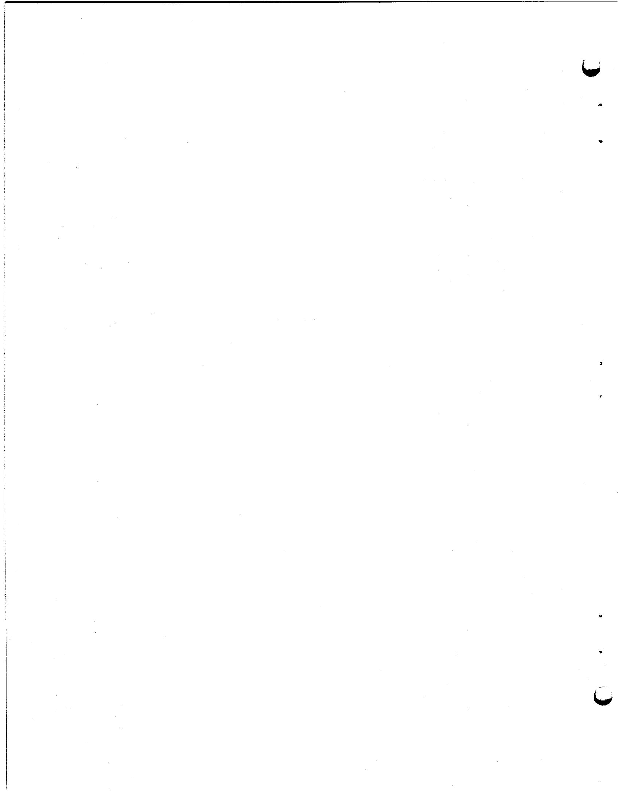

# 1.1. AIRCRAFT REACTOR TEST DESIGN

A. P. Fraas

# STATUS OF ART DESIGN

# Reactor Assembly

Most of the detail drawings of the reactor-core, heat-exchanger, pump, and pressure-shell assembly have been completed, and the drawings have been approved for procurement. Design work on the reactor shield and the cell interior is proceeding concurrently with the construction of a one-half-scale model of the reactor-pressure-shell, NaK-manifold, and lead-shield assembly, and a one-sixth-scale model of the reactor and cell. These models are proving most helpful in visualizing interference problems in both assembly and in maintenance. The preparation of written procedures for assembly, operation, and servicing is continuing, with major attention being given to unusual contingencies.

# Reflector-Moderator Cooling Circuit

A careful review of the detail drawings indicated that the pressure drop through the reflector-moderator cooling circuit was likely to be substantially higher than that originally estimated. In order to provide for this probable increase in pressure drop, larger and higher-speed motors are being ordered for the sodium-pump drives. Equipment is being assembled for water flow tests on the crucial elements of the sodium circuit, in particular, the beryllium cooling holes and annuli and the manifold at the inlet to the beryllium. Preliminary calculations indicate that the increased pressure drop will not present any serious problems from the stress standpoint, but the effects are being checked.

# Heat Exchangers

A great deal of work and experimentation by the heat exchanger vendors has revealed that it will be extremely costly in time and money to meet the close dimensional tolerances specified. A review of the design indicates that certain tolerances may be relaxed with only minor decreases in performance. By working closely with the vendors it is believed that compromises may be reached that will permit production of heat ex-changers that will give acceptable performance!

# Fuel Pumps and Expansion Tank

Further test work on the fuel pump prepared for the high-temperature test performance rigs has indicated that the cavitation limit is somewhat lower than had been anticipated from the early water tests. This condition could be improved substantially, as indicated by the early water tests, through the use of a modified impeller vane, which would be somewhat more, but not unreasonably, difficult to fabricate. Indications are, however, that the increased cavitation suppression head required to obtain satisfactory operation with the present impellers is not excessive and can be accommodated readily by increasing the fuel expansion tank pressure by about 10 psi. This problem is still being investigated (see Chap. 1.4, "Component Development and Testing").

Tests on the north-head fuel pump and expansion tank assembly have shown that satisfactory operation can be obtained with fuel levels in the fuel expansion tank running from $\frac{1}{2}$ to 3 in. with no objectionable aeration or pressure fluctuations in the system over the entire speed range. Test work is being continued with this setup in an effort to reduce the pressure difference between the fuel pump inlet and the expansion tank, and to improve its performance with one pump out or with one pump at a substantially different speed from the other. Reduction of the pressure differential between the pump inlet and the expansion tank is important because this pressure differential will largely determine the stresses in the upper and lower decks of the north head. It is believed that rather small modifications in the details of the bleed passages coupling the pump inlet with the expansion tank will permit a very marked reduction in this pressure differential.

# Fuel Recovery Tank

The preliminary design of the fuel recovery tank has been completed. The tank has been designed on the premise that no electrical, cooling, or other lines need be connected to the tank at the time that it is removed from the cell. This means that the afterheat being generated in the fuel must balance the heat losses to convection and radiation to hold the temperature in the fuel between

its melting point and $1600^{\circ}\mathrm{F}$ . Because of the sharp increase in radiation heat losses with temperature this provides a fairly wide latitude. In addition, the tank has been designed so that the amount of air circulating up between the four 8-in.-dia fuel tanks and the lead shield will be controllable, and hence the air flow through this stack-type of thermal-convection cooling system can be varied. It is believed that in this way it will be possible to hold the fuel temperature in the tank within the desired limits throughout a period of approximately 30 days, starting about 10 days after shutdown. Removal of the fuel from the cell to the reprocessing facility within 10 days of time of shutdown has been considered to be very important as a demonstration of the practicality of such an operation and, hence, the possibilities for operating with a low fuel inventory in a complete operational system.

# APPLIED MECHANICS AND STRESS ANALYSIS

R. V. Meghreblian

Reactor Support

The complete reactor and shield assembly is to be suspended from an overhead bridgelike structure, as shown in Fig. 1.1.1. Although the shield components will be in close contact with the outer shell of the reactor, the weight of these members will not be carried by the reactor. A separate system of tension members is to be provided for this purpose, and these members will transmit the shield loads directly to the bridge structure. The weight of the reactor will be transmitted to the bridge structure through the four pump barrels. The attachment of the individual barrels to the bridge will allow horizontal motion of the barrels in order to accommodate the relative thermal growth between the reactor (at operating temperature) and the bridge (at room temperature). Vertical motion of the barrels will be restrained through Fabreeka' pads, which are sufficiently resilient to distribute the load fairly uniformly between the four barrels. The bridge will be fixed at each end

to a flexible column consisting of 1.0-in.-thick steel plates, 28 in. wide and 123 in. long. The load carried by each column will be approximately 45,000 lb. This value is somewhere between one-fourth and one-half the load required to cripple the column. A precise figure cannot be given since the "end condition" of the top of the column is not well-defined.

The principal function of the flexible columns is to allow the NaK lines, which remove the heat from the reactor, complete freedom when expanding from room temperature to the operating temperature of the reactor (Fig. 1.1.2). During full-power operation, the upper row of NaK lines will be at $1070^{\circ}\mathrm{F}$ and the lower row at $1500^{\circ}\mathrm{F}$ . This will result in horizontal growth of 0.75 in. in the upper lines and 1.125 in. in the lower. If the reactor were mounted in the cold condition precisely over the center line of the column bases, these expansions would translate and rotate the reactor out of the neutral position and thereby cause bending stresses in the columns (Fig. 1.1.2a). The present plan is to precut the NaK lines short by the amounts mentioned above so that at room temperature the reactor will be located 1.0 in. off the neutral position. This displacement will be toward the cell wall through which the NaK lines enter (Fig. 1.1.2c). As the reactor heats up, the NaK lines will expand and move the reactor back to the neutral position and thus remove the bending loads on the columns and the axial loads in the pipes (Fig. 1.1.2b).

# NaK Piping Inside Reactor Cell

The flexible columns described above will allow for gross expansions of the NaK lines, but they do not provide for differential expansion between the lines of any one row. In order to provide some margin for operational incidents and accidents2 and greater freedom in controlling NaK temperatures, some additional flexibility has been introduced into the piping inside the cell. This has been accomplished by the addition of several bends in each line. The bends will accommodate 300 to $400^{\circ}\mathrm{F}$ temperature differences between adjacent lines. A horizontal view of the NaK

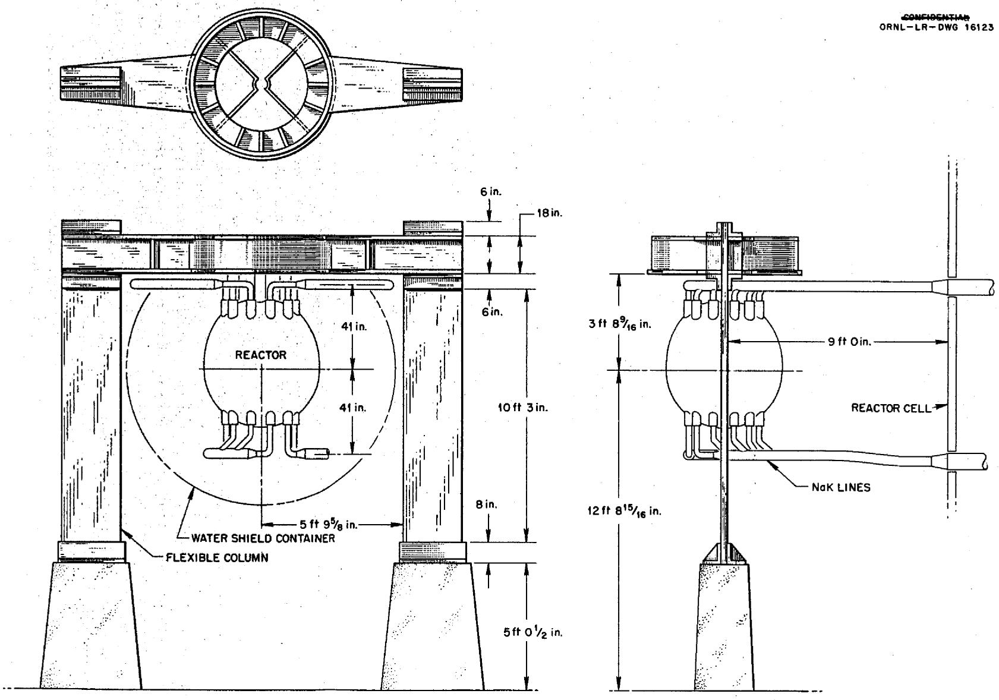  
Fig. 1.1.1. ART Support Structure.

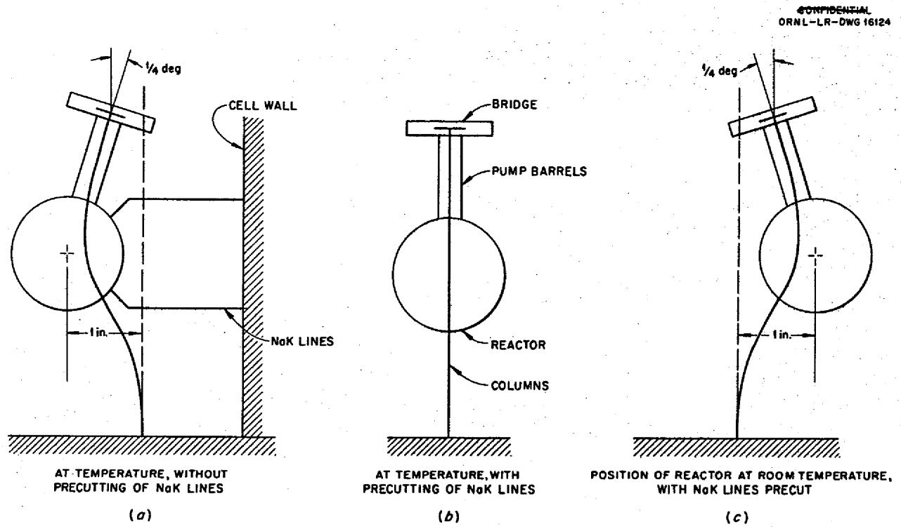  
Fig. 1.1.2. Movement of Reactor Caused by Expansion of NaK Lines.

piping inside the test cell is presented in Fig. 1.1.3. This layout was selected on the basis of a hand calculation for which the method of Spielvogel3 was used. A more exacting analysis, which includes a careful study of the manifolding system, is now under way at the M. W. Kellogg Co. These calculations are being carried out with the aid of fast computing machines.

A general schematic diagram of a complete NaK circuit is shown in Fig. 1.1.4. The essential feature of this system is that the NaK lines are rigidly attached at only one point, the reactor cell wall. The ends of each circuit, which terminate at the reactor and at the pump-radiator assembly, have considerable freedom to expand. The only constraints imposed on individual lines of a given circuit arise from the differential thermal growth between the various lines as a result of differences in length and irregularities in temperature control. The NaK piping external to the reactor cell was described previously.

The principal stresses in the NaK lines will be due to the thermal effects described above. Each time the reactor system passes from one operating condition to another, there will be a redistribution of the thermal stresses in the various lines. The stresses produced by relative thermal growths do not persist for all time, however. Relaxation tests (see Chap. 3.5, "Mechanical Properties Studies") indicate that stresses due to a fixed strain, such as that present here, decay rapidly. This decay takes place as more and more of the initial strain on the member is transformed to plastic deformation. The decay is sufficiently rapid that the plastic strain developed in a matter of minutes after loading is a significant fraction of that which would be developed in several hours. Thus with each change in operating conditions, the thermally loaded members will be subjected to some plastic deformation. An important criterion for design, then, is the strain-cycle life to which a given member can be subjected.

The strain-cycle criterion was used as a basis for the design of the NaK lines. The objective of various analyses now under way, therefore, is the determination of the plastic strain that will be

developed with each change in operating conditions. The results will then be compared with strain-cycling data by using a Coffin type of correlation. Some data for Inconel are presently available, and additional information is now being collected at the University of Alabama and at ORNL.

5L. F. Coffin, Jr., "A Study of the Effects of Cyclic Thermal Stresses on a Ductile Metal," Trans. Am. Soc. Mech. Engrs. 76, 931 (1954).   
6 Pratt & Whitney Aircraft, Nuclear Propulsion Program Engineering Progress Report No. 18, PWAC-554, Oct. 1, 1955-Dec. 31, 1955, p 63, Fig. 21.

# Fill-and-Drain Tank and Support

On the basis of the present design and the operational philosophy of the ART system, there is some reason to believe that the safest position for the fuel during the normal progress of the experiment will be in the reactor proper, because in the event of trouble it will be easier to dump the fuel into the fill-and-drain tank than to pressurize the fuel back into the reactor. It has been suggested that this may also be the safest place for the fuel during certain off-design situations, such as the one-pump-out condition, partly for the same reason

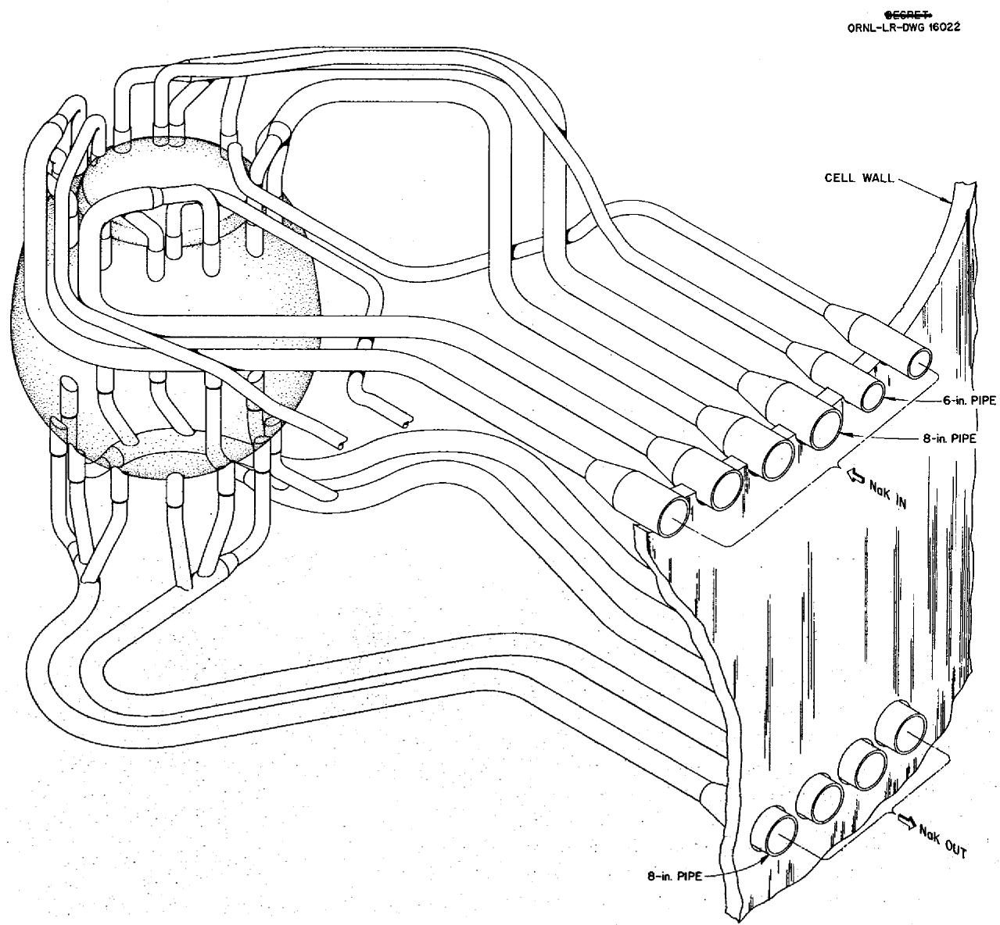  
Fig. 1.1.3. NaK Piping in the Reactor Cell.

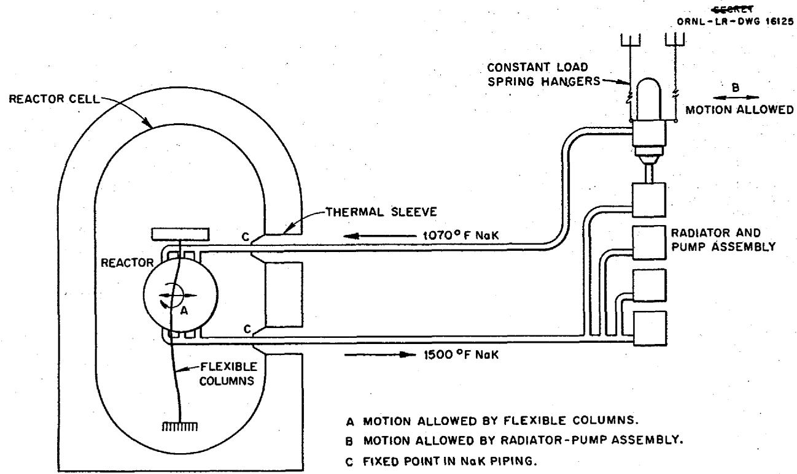  
Fig. 1.1.4. Overall Suspension and Constraints on NaK Piping System.

and partly because of the increased probability of a failure during the switching operations associated with an emergency condition. A study is now under way to determine the validity of these premises. In addition, there are several off-design conditions and accidents in which it will be clearly unsafe to leave the fuel in the reactor; for example, if there is an internal leak between the fuel and sodium (or NaK) systems, a chemical reaction might occur which could produce metallic uranium.7 Under certain operating conditions, the uranium could be deposited throughout the hot portions of the fuel circuit. In order to control these reactions and to minimize their effects, it would be necessary to remove the fuel from the reactor.

A fuel fill-and-drain tank for receiving the fuel is incorporated in the ART system design (Fig. 1.1.5). The tank will be an Inconel cylinder 38 in. in diameter and 38 in. in length, which will be kept at a steady-state temperature of $1100^{\circ}\mathrm{F}$ by means of a continuous flow of NaK from two independent external circuits. These circuits have

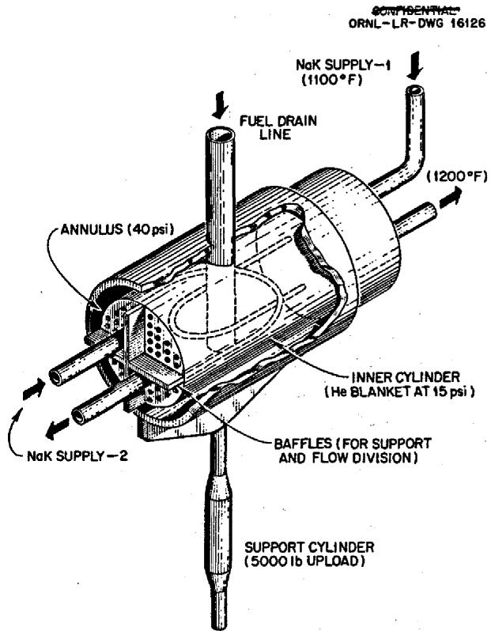  
Fig. 1.1.5. Fuel Fill-and-Drain Tank.

several functions. First, they will remove the decay afterheat from the fuel following a dump; second, they will keep the fuel above its freezing point at long times after the dump has occurred and the decay heat has been dissipated; and, third, they will maintain the tank at a sufficiently high temperature to minimize thermal shock effects when a dump takes place.

The design heat load for the tank is 1.75 Mw, even though it is estimated that the decay heat at the instant of shutdown after operation at 60 Mw for one month would be 3.6 Mw. This reduced operational requirement is based on the premise that the fuel will be cooled in the reactor to $1200^{\circ}\mathrm{F}$ before a dump and that a minimum of 8 sec will elapse after the coolant rod has been fully inserted and before the dump valves are opened.

Each of the two NaK cooling circuits will be capable of extracting the 1.75 Mw of decay heat under these conditions; however, it is expected that under one-circuit operation, the fuel and metal temperatures at certain locations within the tank may be as high as $2000^{\circ}\mathrm{F}$ . Such short-time effects will not be encountered during a normal dump. During normal operation, both circuits will be in use, and the maximum metal temperature is not expected to exceed $1600^{\circ}\mathrm{F}$ .

The primary structural loads within the tank will be due to the NaK pumping pressure of 40 psi. Since the tank is to serve as an ever-safe depository for the fuel, it is necessary that it be capable of surviving some 2000 hr of continuous operation at temperature and possibly several fast dumps. The principal structural requirements of the tank, then, are based on creep-rupture and thermal-shock considerations.

Analyses show that the most sensitive areas in this design are at the joints between the tube header sheets and the inner cylinder. The discontinuity stresses in these areas are of the order of 6000 psi. This is a relatively high stress level, but it is expected that these stresses will be markedly reduced as the metal in that region deforms in creep. Since the extent to which discontinuity stresses can relax is not known, a test program is under way to study this effect by means of tube-burst tests. Finally, because of the importance of this component to the over-all safety of the experiment, it is planned to test the entire tank assembly by using one of the NaK circuits. The test should demonstrate the adequacy of the

design in withstanding the creep and thermal shock effects mentioned above.

The support of the fill-and-drain tank assembly will be accomplished by means of a nitrogen cylinder located beneath the tank (Fig. 1.1.6). Although the tank will be attached rigidly to the reactor pressure shell through the fuel drain lines, the major portion of the tank weight will not be allowed to bear on the shell. The total weight of the tank, including the fuel, will be 6000 lb, of which 5000 lb will be carried by the nitrogen cylinder. The weight of the tank without the fuel will be 4000 lb. This support arrangement introduces some complication in the stability aspects of the system, but calculations show that the proposed distribution of lever arms, structural stiffness of the drain lines, and the weights are well within the stability limits of the system.

In the event of the failure of the nitrogen cylinder, all the tank weight will be exerted upon the drain line and reactor pressure shell. This situation will produce high local stresses in the shell at the points where the two drain lines will be attached and will add an additional 1000 lb to the load in each pump barrel. Although this will reduce the design safety margin in these components, the system can support the tank in this manner. The purpose of the nitrogen cylinder, then, is to reduce the operating loads in the barrels and in the pressure shell.

# Core-Shell Low-Frequency Thermal-Cycling Test

A one-fourth-scale model of the core shells is presently being subjected to the long-time temperature variations expected in the reactor as a result of changes in power level (see Chap. 1.4, "Component Development and Testing"). Such temperature variations produce thermal distortions in the shells, and these effects are among the most severe conditions imposed on the shells. The present operating plan for the ART anticipates that the reactor will be cycled from the idle condition $(1200^{\circ}\mathrm{F}$ isothermal) to full power some 30 times. One cycle consists of 8 hr at idle and 16 hr at full power. In passing from the idle condition to full power the temperature distribution in the core shells will change from a uniform profile to a linear distribution, with a maximum gradient of about $300^{\circ}\mathrm{F}$ through the wall.

The cyclic conditions described above have been simulated in the one-fourth-scale model of the

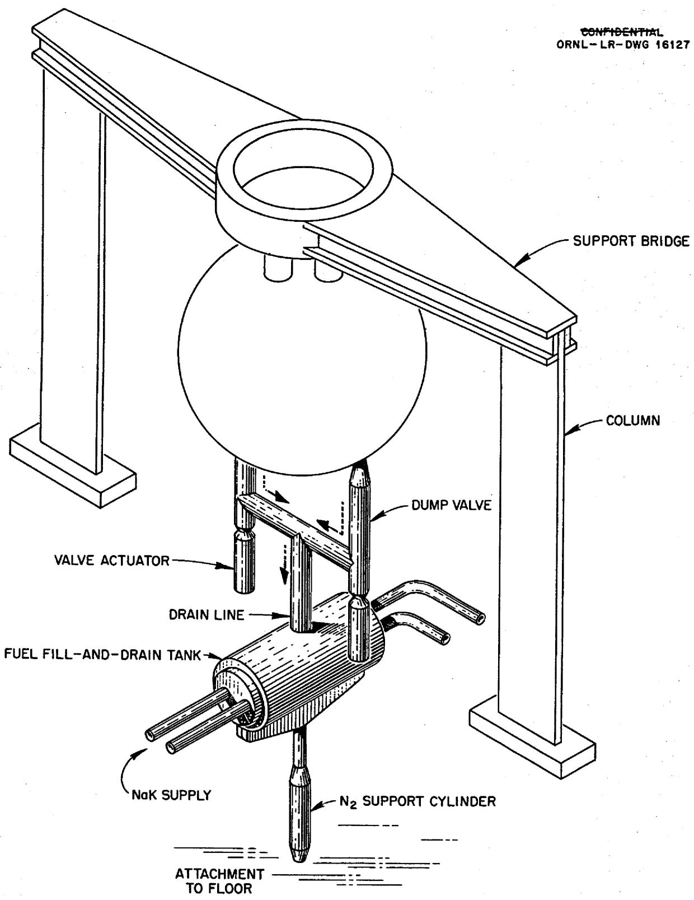  
Fig. 1.1.6. Fuel Fill-and-Drain Tank Support.

outer core shell by means of a dual NaK circuit which heats the inner surface of the shell and cools the outer surface. The test cycle selected was 1 hr at power and 1 hr isothermal at $1200^{\circ}\mathrm{F}$ . At the power condition the shell is exposed to a maximum temperature gradient of $300^{\circ}\mathrm{F}$ through the wall. The stress buildup and relaxation with each change in the operating conditions is illustrated in Fig. 1.1.7. The solid-line curve gives the stress-time variation expected in the actual shells during the operation of the reactor. The broken-line curve gives the stress-time history for the model.

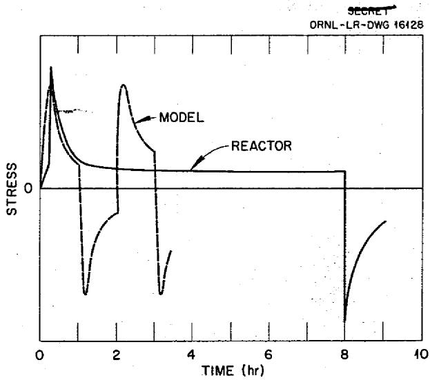  
Fig. 1.1.7. Stress-Time History of Model Used for Core-Shell Thermal-Cycling Tests in Comparison with Stress-Time History Expected in the ART.

In studying the relaxation data for Inconel, it was found that because of the very rapid decay of the stress it was not necessary to design the core-shell test for the 8- to 16-hr cycle time planned for the reactor. The 2-hr cycle time was found to be sufficient to develop a substantial fraction of the plastic deformation expected in the actual shells. A typical set of relaxation curves for Inconel, as obtained from various sources, is presented in Fig. 1.1.8. The curves labeled "ORNL" were obtained from measurements made by the Metallurgy Division of ORNL; the curves labeled "University of Michigan" are based on measurements made at the Engineering Research

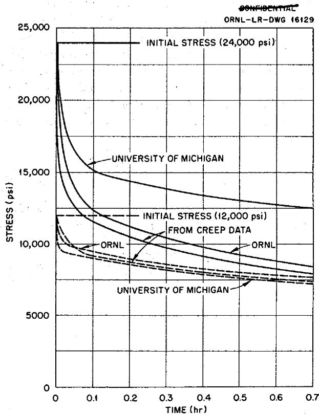  
Fig. 1.1.8. Relaxation Data for Inconel at $1300^{\circ}\mathrm{F}$ .

Institute of the University of Michigan; and the curves labeled "From Creep Data" were synthesized from creep curves.

It is evident from these curves that within a matter of minutes after the start of the test, because of the extremely rapid decay of the stress, an appreciable fraction of the applied deformation will have been converted to plastic strain. On this basis it was argued that the cycle times for the model test could be reduced to the 1-hr intervals being used, since approximately 70 to $90\%$ of the total strain developed in 8 to 16 hr could be achieved in 1 hr. In this way it was possible to reduce the total model test time by a factor of about 10.

The first of these low-frequency thermal-cycling tests has been completed. The model was subjected to 300 full cycles, a factor of 10 more than expected in operation of the ART, and appears to have survived without gross failure. It is believed that the factor of 10 increase in the number of test cycles, in comparison with the cycles expected in the ART, is not an overly conservative

margin for tests of so vital a structural component. A complete metallurgical examination of the shell has not yet been completed. It should be mentioned that the test program was interrupted after 57 cycles because of a leak in the external circuits and the specimen was allowed to cool to room temperature. At the completion of repairs, the model was brought to temperature again, and the test was resumed.

# CORE HYDRODYNAMICS

# W.J.Stelzman W.T.Furgerson

Further core flow studies were made on the full-scale model of the ART core by using the techniques described previously. The configuration

8G. D. Whitman, W. J. Stelzman, and W. T. Furgerson, ANP Quar. Prog. Rep. Dec. 10, 1955, ORNL-2012, p 23.

tested consisted of swirl-type header No. 2 with a simulated conical island expansion joint (Fig. 1.1.9). Tests were run with and without inlet guide vanes. The inlet-guide-vane system tested consisted of a set of 14 paired vanes designed by G. F. Wislicenus to induce radial mixing in the fuel annulus. The direction of rotation of the vortexes was to be alternately clockwise and counterclockwise around the annulus.

The flow pattern produced by the blades agreed with the design pattern in approximately the upper third of the core annulus, but the individual vortex cores rapidly degenerated into a region of low-velocity random motion at the equator. As the flow accelerated in the portion of the core below the

9Consultant.

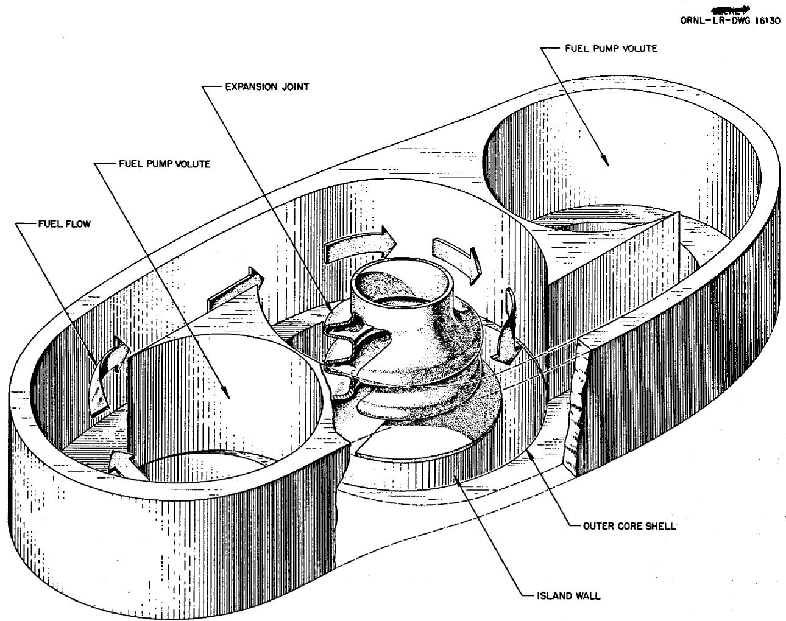  
Fig. 1.1.9. Swirl-Type Core Header No. 2.

equator it picked up a pattern of rotation centered around the core axis and was, in general, typical of the flow obtained in this region with other inlet configurations.

A lack of circumferential symmetry was noted in the flow pattern produced by these guide vanes. Previous configurations have not been perfectly symmetrical in this respect, but this system appears to be worse than the others. It is possible that the vanes themselves were not symmetrical. They are complex in shape and have no suitable reference surface to use in effecting their alignment. This analysis of the flow is based on observations of injected dye, and there are no quantitative data on this system. The decidedly three-dimensional character of the flow made the use of claw-probe traverses impractical.

Complete probe traverses were made of the same core-header combination without inlet guide vanes. Circumferential asymmetry of the axial velocity profiles, as indicated by the maximum deviation of the reading of either of two probes at each station from the average, was as follows:

<table><tr><td>Station</td><td>Maximum Deviation (%)</td></tr><tr><td>8</td><td>10</td></tr><tr><td>7</td><td>10</td></tr><tr><td>6</td><td>20</td></tr><tr><td>5</td><td>20</td></tr></table>

<table><tr><td>4</td><td>22</td></tr><tr><td>3</td><td>8</td></tr><tr><td>2</td><td>5</td></tr><tr><td>1</td><td>1</td></tr></table>

The profiles given by the two probes at each station were, in general, similar in shape.

In an effort to obtain information on the heat conduction to be expected through the core shells, local heat transfer coefficients were calculated by Reynolds number analogy from the probe survey data extrapolated to the walls by means of universal velocity distribution equations. The local coefficients thus obtained were then integrated from the wall out into the stream to obtain the film conductivity. The integration was carried out for an arbitrary distance of 0.010 in. from the wall. This dimension was chosen because further depth did not result in an appreciable change in the film conductivity. The fuel assumed for these calculations was the mixture (No. 30) $\mathrm{NaF - ZrF_4}$ $\mathrm{UF_4}$ (50-46-4 mole %). The heat transfer coefficients for the 0.010-in.-thick fluid layer adjacent to the walls, as obtained for the swirl-type header No. 2 without inlet guide vanes and with GS-2 guide vanes (Fig. 1.1.10), are presented in Table 1.1.1.

10W. H. McAdams, Heat Transfer, 3rd ed., p 209, McGraw-Hill, N. Y., 1954.

Fuel mixture: NaF-ZrF $_4$ -UF $_4$ (50-46-4 mole %)

TABLE 1.1.1. HEAT TRANSFER COEFFICIENTS FOR 0.010-in.-THICK FUEL LAYER ADJACENT TO OUTER AND INNER CORE WALLS OBTAINED FOR SWIRL-TYPE HEADER NO. 2 WITH AND WITHOUT INLET GUIDE VANES   

<table><tr><td rowspan="3">Station</td><td colspan="4">Heat Transfer Coefficients (Btu/hr·ft2.0F)</td></tr><tr><td colspan="2">No Guide Vanes</td><td colspan="2">GS-2 Guide Vanes</td></tr><tr><td>Outer Wall</td><td>Inner Wall</td><td>Outer Wall</td><td>Inner Wall</td></tr><tr><td>8</td><td>4986</td><td>2111</td><td>5411</td><td>4913</td></tr><tr><td>7</td><td>4631</td><td>2469</td><td>2418</td><td>2066</td></tr><tr><td>6</td><td>3800</td><td>3182</td><td>2651</td><td>2526</td></tr><tr><td>5</td><td>3394</td><td>3243</td><td>2601</td><td>2221</td></tr><tr><td>4</td><td>3032</td><td>4265</td><td>2559</td><td>2348</td></tr><tr><td>3</td><td>4959</td><td>4865</td><td>2494</td><td>2880</td></tr><tr><td>2</td><td>5678</td><td>5310</td><td>5794</td><td>3706</td></tr><tr><td>1</td><td>6193</td><td>5660</td><td>Not available</td><td>Not available</td></tr></table>

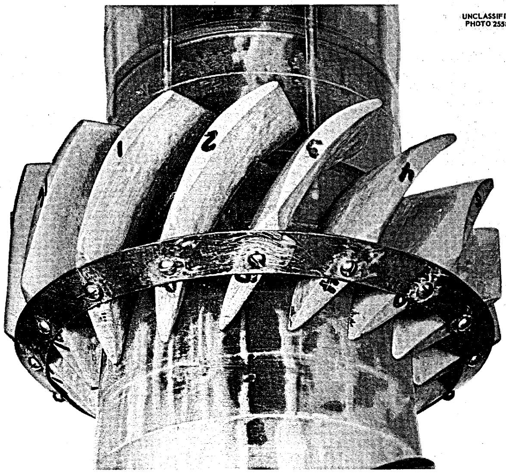  
Fig. 1.1.10. Guide Vane and Baffle-Plate Arrangement (GS-2) for Distribution of Flow in Plastic Model of ART Core.

# 1.2. ART PHYSICS

A. M. Perry

# COMPARISON OF BASIC GAMMA-RAY DATA WITH BULK SHIELDING REACTOR GAMMA HEATING MEASUREMENTS

H.W.Bertini C.M.Copenhagen

The series of experiments performed to determine the rate of gamma heating in various target materials near the Bulk Shielding Facility (BSF) reactor afforded an opportunity for a direct verification of the basic gamma-ray data and the method used for the ART heat-deposition calculations. Such a comparison is of considerable interest, since the agreement between the calculated results and the results for the BSF experiments tends to confirm the methods and data used in the ART calculations.

Experimental heat-generation rates were measured in aluminum, iron, and lead samples at several distances along the center line of the reactor, as illustrated by Fig. 1.2.1. In the experiments, measurements were made of the transient temperatures of the samples during heating in the gamma-ray field and during cooling after removal from the gamma-ray field.

The calculated heat-generation rates indicate that the energy deposition in the target metals is due to the following principal radiation components: 1. core gamma rays,   
2. reflector gamma rays (water capture gamma rays),   
3. target gamma and beta rays.

Since an Oracle code for the calculation of gamma heating in reactors of rectangular geometry3,4 was available, the heat generation rate in the target samples caused by gamma rays emanating from the core was determined. The heat generation

in the target caused by gamma rays from the ith energy group, $H_{i}(V)$ , for one volume element of the core is

$$
H _ {i} (V) = \frac {K N _ {i} (V) \bar {E} _ {i}}{4 \pi \left[ r _ {c} (V) + r _ {r} (V) \right] ^ {2}} e ^ {- x} B _ {a} \frac {\mu_ {E}}{\rho},
$$

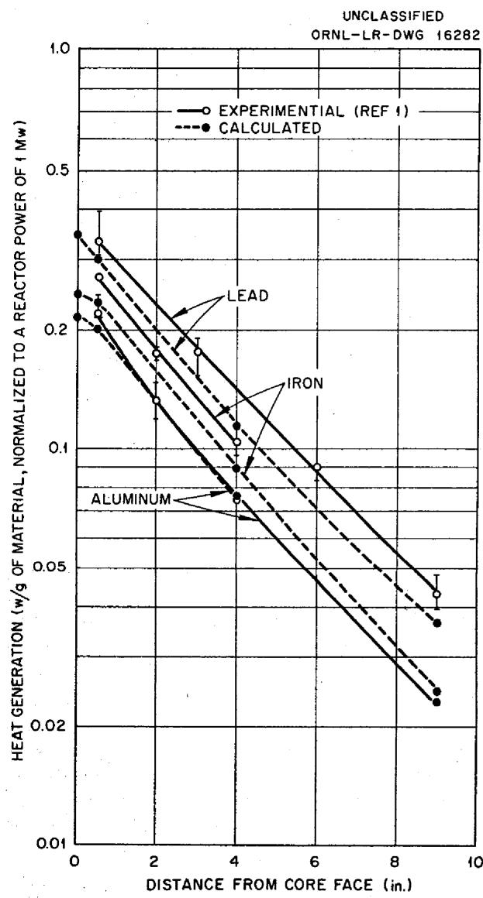  
Fig. 1.2.1. Gamma-Ray Heating in Metals at Various Distances from the Core Face of the BSF Reactor,

where

$K = a$ constant which normalizes the thermal flux to 1 Mw and converts Mev/sec to watts,

$N_{i}(V) =$ number of gamma rays per second in the ith energy group for the particular volume element, $V,$

$\overline{E}_i =$ average energy of the ith energy group,

$r_{c'} r_r = \text{radii of core and reflector, respectively},$

$x = \mu_{c}r_{c}(V) + \mu_{r}r_{r}(V)$ , where $\mu_{c}r_{c}(V)$ and $\mu_{r}r_{r}(V)$ are the number of mean free paths in a volume element, $V$ , of the core and reflector, respectively,

$B_{\alpha} = A(e^{ax} - 1) + 1,$ the energy absorption buildup factor (the constants $A$ and $\alpha$ were evaluated for the materials of interest in the report ORNL-2113),2

$\mu_{E} =$ energy absorption cross section for gamma rays for material being irradiated,

$\rho =$ density of material being irradiated.

Appropriate $B_{a}$ data were then calculated by using an equivalent atomic number and interpolating the available buildup factor data for point isotropic sources in homogeneous mixtures. Since the effective $Z$ of the core is 9.9 and the effective $Z$ of the reflector is 7.5, the homogeneous mixture approximation is valid, and an equivalent $Z$ of 9 was used.

The BSF reactor is a thermal reactor, and therefore the significant gamma radiation results from thermal neutron fission or capture. Thus, the spectrum of prompt gamma rays plus $\mathsf{U}^{235}$ capture gamma rays is 8.8 e-1.01E photons/Mev-fission. For 5500 kw/hr of reactor operation per day, the average daily fission-product decay gamma-ray energy would be about 85% of the saturation value and the resulting decay gamma-ray spectrum is 8.92 e-1.33E photons/Mev-fission. The gamma-ray energies per thermal neutron capture in aluminum for the various intervals from 3 to 10 Mev were obtained by summing up the individual contributions for each interval from a paper by Kinsey, Bartholomew, and Walker. An additional energy of

1.80 Mev was added to the third group (1.5 to 3.0 Mev) to account for the decay gamma-ray energy resulting from Al $^{28}$ (half life, 2.3 min). Thermal-neutron capture by water gives rise to a single gamma ray, 2.23 Mev, per capture by hydrogen.

The heating in the target sample by capture gamma rays emanating from the water reflector was obtained by using disk sources 2 in, thick and $40~\mathrm{cm}$ in radius. An average flux in the disk was obtained from the average flux along the disk center line, determined experimentally, as a function of distance from the reactor north face, multiplied by 0.8 to account for the decrease in flux in the disk radially.

In computing the heating in the target sample from self-absorption of gamma and beta rays resulting from thermal-neutron capture in the targets, local perturbations in flux caused by the presence of the target sample were not considered. The only significant beta-ray source in the target samples was the 2.87-Mev beta ray resulting from the decay of $\mathrm{Al}^{28}$ . This beta-ray source was assumed to be entirely absorbed in the aluminum sample. The fraction of gamma rays absorbed in the target sample was obtained from an expression by Storm et al. based on the straight-ahead scattering approximation for an infinite cylinder containing a uniform source distribution. Since the expression neglects multiple scattering effects, the energy absorbed in each cylinder was taken as the mean of the values calculated by using the energy-absorption and the total-absorption cross sections.

A comparison of the experimental and calculated results is shown in Fig. 1.2.1. The rounding of the calculated curves close to the reactor surface results from the peaking of the thermal flux curve in the reflector region. The magnitudes of the experimental and calculated values agree quite well where the $Z$ of the target metal is close to the $Z$ of the surrounding mixture, $Z = 9$ , but the agreement becomes worse as the difference in the atomic numbers increases. For materials having similar $Z$ 's, the equivalent $Z$ method should yield good results, as confirmed by the aluminum sample. However, for a heavy $Z$ material following a light $Z$ material, the large, low-energy spectrum built up in the light $Z$ material is highly absorbed in the first mean free path of the heavy $Z$ material, and a

buildup factor based upon a homogeneous mixture will yield a low result that becomes less and less accurate as the depth of penetration in the light material increases. This light-heavy sequence phenomenon has also been indicated by Monte Carlo calculations of gamma-ray energy deposition for water-lead slabs.[9]

In view of the good agreement between the experimental and calculated heat-generation values for samples near the BSF reactor, it seems reasonable to conclude that the basic gamma-ray data given elsewhere,2 used in conjunction with the Pratt & Whitney gamma-ray deposition code, should give representative results for the gamma-ray heat deposition in various parts of the ART.

# GAMMA-RAY HEATING IN ART

R. B. Stevenson

# Gamma-Ray Source Strength

The gamma-ray source strengths of the island, core shells, fuel, and reflector-moderator of the ART were determined so that a calculation of the heating due to these gamma rays could be carried out. The prompt, decay, and nonfission capture gamma rays in the fuel, the gamma rays caused by inelastic neutron scattering in the fuel, and the capture gamma rays in the Inconel core shells, beryllium, and the sodium coolant were taken into account in the calculation of the gamma-ray source strengths.

The capture gamma rays and the gamma rays caused by inelastic scattering were computed by using neutron fluxes determined by a Curtiss-Wright two-dimensional neutron calculation for the ART. The gamma rays resulting from inelastic scattering were assumed to be emitted with an energy of 1 MeV. The distribution of the prompt and decay gamma rays in the fuel was calculated from the fission power distribution determined from the Curtiss-Wright two-dimensional neutron calculation and from an analysis of the high-temperature critical experiment.[10]

In both the Curtiss-Wright two-dimensional calculation and the determination of the gamma-ray source strength, the ART was divided into a large number of regions, the materials in each region being considered to be homogeneous for ease of

computation. The basic data for the calculation of the gamma-ray sources were taken from a report by H. W. Bertini et al.11

The results of these calculations are shown in Figs. 1.2.2, 1.2.3, and 1.2.4. The distribution of the gamma-ray sources in the island, fuel, and reflector-moderator is shown in Fig. 1.2.2. The values given, in $\mathrm{W/cm}^3$ , are the sums over the seven energy groups actually used. The distribution of the gamma-ray source strength in the Inconel core shells as a function of the distance from the equatorial plane is given in Fig. 1.2.3, while Fig. 1.2.4 gives the source strength in the region adjacent to the control rod (a combination of sodium and Inconel) as a function of distance from the equatorial plane. The values given in these plots are felt to be fairly accurate, although there may be some discrepancies near the Inconel core shells due to the approximations in geometry used in the neutron flux calculations.

There is some ambiguity in the source strength values assigned to the Inconel core shells, and the values may be in error by as much as $20\%$ . This ambiguity arises from the fact that use was made of two different two-dimensional neutron calculations in determining the core shell neutron absorptions. One neutron calculation was for the high-temperature critical experiment, which contained no sodium, while the second was for the ART with four times more sodium than will be present. The resulting neutron absorptions in the core shells are quite different for these two cases, so an appropriate average was used in calculating the values given in Fig. 1.2.3.

The gamma-ray source strength in the core shells represents the absorption of approximately $3.1\%$ of the total number of neutrons. This is substantially lower than the figure of $7.5\%$ which was obtained for a spherical mockup of the ART. However, recent calculations12 of the Pratt & Whitney reactor, with both spherical and cylindrical geometry, have shown that for a cylindrical mockup the percentage of neutrons absorbed in the core shells is less than that for a spherical mockup by about a factor of 2. Thus the figure of $3.1\%$ obtained from the two-dimensional neutron calculations does not

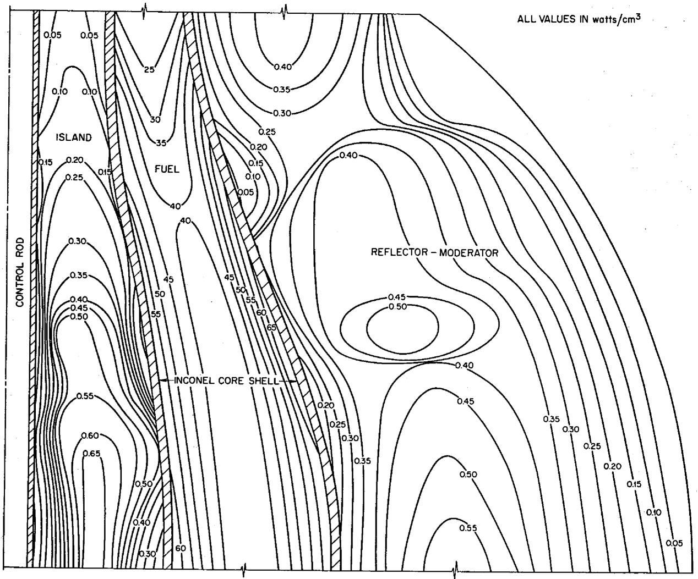  
SECREPORNL-LR-DWG 16288   
Fig. 1.2.2. Gamma-Ray Source Strength in ART.

seem to be inconsistent with figures obtained for a spherical mockup of the ART.

The total gamma-ray source strength in the ART was found to be 4.6 Mw, of which approximately 4.1 Mw comes from the core, and 0.28 Mw comes from the Inconel core shells. The remainder comes from the capture gamma rays in the island and the reflector-moderator.

# Gamma-Ray Heating

The heating resulting from the gamma-ray sources described above has been obtained by using a two-dimensional gamma-ray heating calculation. The calculation, which was carried out on an IBM-704 computer, utilized a program developed by Kniedler and Wenzel of Pratt & Whitney Aircraft. The program uses a buildup factor approach to account

for the scattered gamma-ray photons. In the case described here, the buildup factor for water was used throughout the reactor.

The sources were computed at a number of points in the reactor, the volume associated with each source point being approximately a cube 4 cm on a side. Each source was divided into seven energy groups. The heating was determined at a large number of points for each energy group for all source points within a specified distance from the heating point. This distance was taken as 40 cm. Thus, a point at the outside of the reflector on the equatorial plane "sees" the entire fuel system source on the equator.

The results are shown in Figs. 1.2.5, 1.2.6, and 1.2.7. The heating in the island, core, and reflector-moderator are shown in Fig. 1.2.5. The

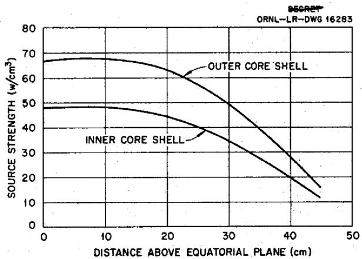  
Fig. 1.2.3. Gamma-Ray Source Strength in Inconel Core Shells as a Function of Distance Above Equatorial Plane.

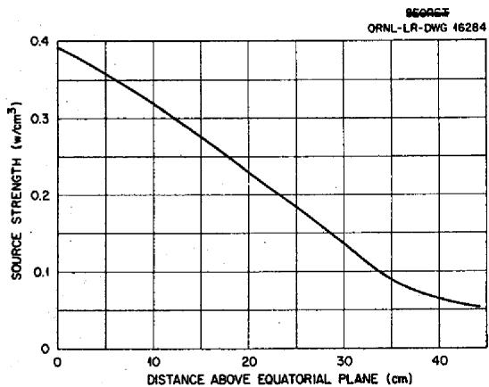  
Fig. 1.2.4. Gamma-Ray Source Strength in Region Adjacent to Control Rod as a Function of Distance Above Equatorial Plane,

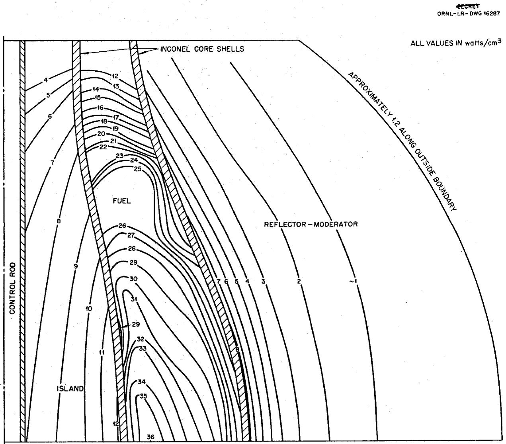  
Fig. 1.2.5. Gamma-Ray Heating in the ART.

values given, in $\mathbf{w} / \mathbf{cm}^3$ , are the sums over the seven groups used. The heating in the Inconel core shells as a function of distance from the equatorial plane is given in Fig. 1.2.6. The heating in the region adjacent to the control rod is shown in Fig. 1.2.7. The heating caused by the gamma rays from the control rod is not included in these results. The heating from the heat exchanger region was reported previously[13] and is included in the outer regions of the reflector.

13H. W. Bertini, ANP Quar. Prog. Rep. June 10, 1956, ORNL-2106, p 28.

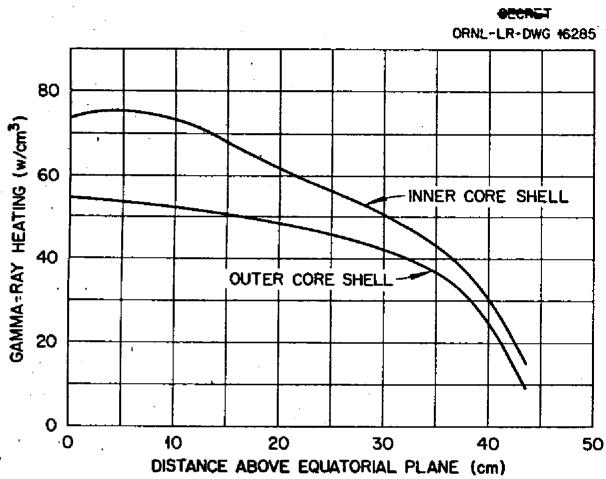  
Fig. 1.2.6. Gamma-Ray Heating in Inconel Core Shells as a Function of Distance Above Equatorial Plane.

The uncertainty in the source strength of the Inconel core shells does not have much of an effect on the heating values, since the source of gamma rays in the core is so much greater than that in the core shells. A test calculation has shown that a $50\%$ change in the source strength of the core shells will change the heating values at a point close to the core shells by less than $5\%$ .

The total gamma-ray energy deposition (excluding that caused by sources in the heat exchanger region) in the reactor was found to be 3.86 Mw, which amounts to approximately $84\%$ of the total source. This means that about $16\%$ of the gamma-ray source energy escapes.

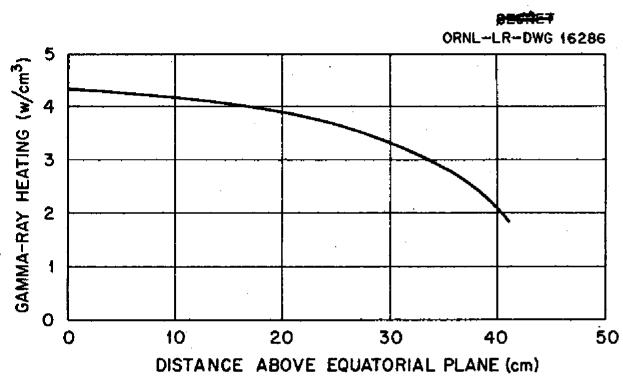  
Fig. 1.2.7. Gamma-Ray Heating in Area Adjacent to Control Rod as a Function of Distance Above Equatorial Plane.

# 1.3. ART INSTRUMENTS AND CONTROLS

E. R. Mann

C. S. Walker

# REFLECTOR-MODERATOR TEMPERATURE CONTROL SIMULATION

J.M.Eastman F.P.Green

E. R. Mann

The ART simulator was used for a study of a reflector-moderator temperature control system and the temperature responses of the cooling system which will circulate sodium through the reflector-moderator and through sodium-to-NaK heat ex-changers. The NaK is cooled in external NaK-to-air radiators. With the reactor held at design-point conditions, abrupt closure of the louver of one of the two NaK-to-air radiators caused an increase of approximately $100^{\circ}\mathrm{F}$ in the maximum sodium temperature (at the core outlet) and in the mean beryllium temperature. The response was essentially first order, with a time constant of approximately $2\frac{1}{3}$ min. A $50\%$ reduction in power from design-point conditions caused a decrease of about $150^{\circ}\mathrm{F}$ in the maximum sodium temperature and in the mean beryllium temperature, with a time constant of approximately 3 min. For operation at $50\%$ power, an abrupt change of the mean fuel temperature from 1425 to $1250^{\circ}\mathrm{F}$ caused a decrease of about $160^{\circ}\mathrm{F}$ in the maximum sodium and the mean beryllium temperatures, with, again, about a 3-min time constant.

The mean reflector-moderator temperature was computed in the process of simulation and was used as the main criterion for evaluating the temperature control system. A control system was evolved which performed satisfactorily and will be used for the ART. The control method consisted in (1) holding constant a signal composed of the maximum sodium temperature biased with the temperature differential in the NaK across the radiators and (2) causing the louvers to open when this signal exceeded its set value by more than $2^{\circ}\mathsf{F}$ and to close when the signal became less than the set value by more than $2^{\circ}\mathsf{F}$ . This arrangement provided a proportionality characteristic adjusted to cause the maximum sodium temperature to be held at $1200^{\circ}\mathsf{F}$ for zero reactor power and $1250^{\circ}\mathsf{F}$ for design-point power. These are

the values calculated (and built into the simulator) for holding the mean beryllium temperature constant at $1200^{\circ}\mathrm{F}$ . The louver actuating speed was adjusted to give full stroke in 30 sec.

This control system was operated on the simulator with step changes between 0, 50, and $100\%$ design power and between 1200 and $1425^{\circ}\mathrm{F}$ mean fuel temperature (at $50\%$ and at zero power). For these disturbances the mean moderator temperature was held constant to within $\pm 15^{\circ}\mathrm{F}$ . The system was not stable in the sense that the louvers remained fixed for steady-state conditions. In order to maintain the desired temperatures, the control system caused the louvers to shift positions at 30- to 60-sec intervals. When the temperature control system hardware has been assembled, it will be checked on the simulator.

# INSTRUMENT DEVELOPMENT

R.G.Affel

# Fuel-Expansion-Tank Level Indicator

R. F. Hyland

Tests were continued on a helium-bubbler type of level indicator, described previously, for the ART fuel expansion tank. In these preliminary tests made to check the operation of the bubbler, two bubbler tubes are used and the fuel is static. One test rig was shut down after 3000 hr of operation at a fuel temperature of $1150^{\circ}\mathrm{F}$ ; neither bubbler tube had clogged. Another rig has completed 2686 hr at $1500^{\circ}\mathrm{F}$ , and another has completed 2352 hr at $1500^{\circ}\mathrm{F}$ . In both these rigs one of the two bubbler tubes has become clogged.

Examination of a bubbler tube from the rig that was terminated showed that a thin film had deposited on the inner surface. A chemical analysis of a 10-mg sample of the film showed it to contain $7\mathrm{mgZrO_2}$ and about $1.8\mathrm{mgO_2}$ . Since the helium supply of the building contains an average of 1.5 ppm $\mathsf{O}_2$ sufficient oxygen was present in 1000 liters of helium (the approximate flow for a 75-hr period) to account for the entire $1.8\mathrm{mg}$ of $\mathsf{O}_2$ , if complete reaction is assumed. Analyses

of the contents of two bubbler tubes that plugged in a previous test at $1500^{\circ}\mathrm{F}$ , during which the system was accidentally contaminated with oxygen, also showed high $\mathsf{ZrO}_2$ contents. It is apparent therefore that the cause of bubbler-tube clogging is oxygen contamination and the subsequent formation of $\mathsf{ZrO}_2$ , a high-melting-point $(3000^{\circ}\mathrm{C})$ solid, rather than $\mathsf{ZrF}_4$ -vapor deposits or fuel, as anticipated. It is planned to use either a NaK scrubber or the incandescent-titanium-sponge method to purify the helium used in further tests.

# Systems for Testing Liquid-Level-Sensing Devices in Flowing Liquids

H. J. Metz

Three test systems are being constructed for studying the operational characteristics of various liquid-level-sensing devices under controlled conditions in flowing liquids. The test system consists of pressure vessels at both ends of a motor-driven teeter-totter. Liquid will flow from the rising vessel to the vessel going down and the liquid levels in the vessels will remain constant. A gear-motor drive is provided which can rock the vessels at a rate of 0 to $10~\mathrm{cpm}$ . A helium atmosphere at a pressure of about 1 to 3 psig is provided in a closed circuit over the vessels to prevent contamination of the fluid. The desired temperatures are obtained and maintained with heaters and variable autotransformers.

Each vessel has six spark-plug probes connected to level-indicating lamps, and the liquid levels in the vessels can be adjusted from 1 to 10 in. Two level-sensing devices can be tested in each vessel at various levels. The tests will be of long duration to assure that the level-sensing devices will work for 2000 to 3000 hr with the surface of the fluid in constant motion.

# High-Temperature Turbine-Type Flowmeter

G. H. Burger

The first turbine-type flowmeter was designed and built in October 1955 for measuring flow in I-in.-ID tubing. Since then numerous tests have been made in order to determine the operating

characteristics and the life of the units. The initial design has been modified as test data have indicated the need for changes, and three successive models have been built.3

The test results obtained thus far have been disappointing, particularly the life test results. As stated above, four flowmeters have been tested, but none has even approached the required 3000 hr of operation. The brevity of the test, however, in all cases except the first, has been due to system failures, such as pipe leaks and pump difficulties.

Performance tests of the units have been quite satisfactory. The units have been tested in both NaK and fused-salt fuel mixtures with excellent results. The accuracy of the measurements in the NaK system have been well within $1\%$ , as checked against a magnetic flowmeter and venturi. The accuracy of the units in the fused-salt mixtures could not be precisely determined because of the absence of a venturi in the system. The salt system also had a very low maximum flow rate which was out of the design range of the flowmeter. The bearing material and the bearing design of the unit tested in the fused salt appeared to be satisfactory, since no evidence of bearing-sticking or self-welding was evident from the operation of the units or from metallurgical examination of the units after removal from the system. The turbine blades and the turbine body appeared to be unmarked by the fuel or the NaK. Even though the tests in fuel and in NaK have been relatively short, in the neighborhood of 300 hr, the units have operated at temperatures up to $1500^{\circ}\mathrm{F}$ , and the indications are that the units can be expected to operate satisfactorily for 3000 hr.

A fifth model of the flowmeter has been fabricated which incorporates improved bearings. The water test and calibration of the unit have been completed, and it appears to be quite satisfactory. A similar turbine-type flowmeter with a $3\frac{1}{2}$ -in.-dia housing has been designed for operation in a system with flow rates up to 1400 gpm and is now being fabricated. This unit will be evaluated in a loop for testing NaK pumps. It will be calibrated against a venturi installed in the system.

# High-Temperature Pressure Transmitter

W. R. Miller

Pressure transmitters of several types obtained from five different vendors have been tested at temperatures between room temperature and $1400^{\circ}\mathrm{F}$ . Four models were of the pneumatic force-balance type which employs a bellows or diaphragm as the sensing element. The all-welded bellows appears to be the most satisfactory. Six of the transmitters tested produced an average accuracy of $\pm 0.37\%$ full range if held at a constant temperature, but zero shifts as large as $\pm 3\%$ full scale were observed between room temperature and $1400^{\circ}\mathrm{F}$ .

Five units were tested which utilized a diaphragm-isolated NaK-filled tube system in which NaK hydrostatically transmits the diaphragm sensor motion to a 3- to 15-psi transmitter-indicator. These units are available in ranges from 0 to 50 and 0 to 200 psi with tube system capillary lengths of up to 50 ft. The units tested were random selections from a lot of 25 and were found to have an average accuracy of $\pm 0.43\%$ full scale, with zero shifts between room temperature and $1400^{\circ}\mathrm{F}$ which averaged $\pm 1.7\%$ full scale.

Tests have been performed on three units which employ the tube-system type of sensor but terminate in a four-legged unbonded strain-gage bridge. Results to date show an average accuracy of $\pm 0.25$ full scale at a constant temperature, with zero shifts of $\pm 1.7\%$ between room temperature and $1400^{\circ}\mathrm{F}$ . Although these units are the most accurate and promising to date, tests show that temperature variations at the strain gage produce span shifts of $\pm 2\%$ full scale when the temperature of the strain-gage housing is elevated to $150^{\circ}\mathrm{F}$ . One more unit of this type remains to be tested, as well as two units which utilize a two-legged strain-gage bridge.

# Tests of Heliarc-Welded Inconel-Sheathed Thermocouples in Sodium

J. T. DeLorenzo

Tests have been made in an attempt to determine the effect of a helioc-welded Inconel sheath on the calibration of a thermocouple. The data indicate that the weldment produces no noticeable

# 5d DUP

deviation of the calibration from the normal changes induced by aging effects over the interval of the tests. Equipment is being fabricated and assembled for aging tests of such welds in static sodium at temperatures above $1000^{\circ}\mathrm{F}$ for 3000 hr.

A preliminary investigation of possible in-pile calibration tests is under way. For these tests sodium vapor pressure would be used as a temperature standard. The instrumentation requirements and the system design are being studied.

# Thermocouple Data Reduction

J. T. DeLorenzo

Life tests were begun on two synchronized high-speed mercury-jet switches, described previously, which operate at 1800 rpm and scan 80 thermocouple signals per revolution. The input signal to the transmitter switch consists of a voltage-divider network with 79 one-millivolt increments and one 0.5-v tap, which triggers the sweep of a 17-in. oscilloscope. The oscilloscope monitors the common line between the switches. The input signal produces a stair-stepped trace that ranges on the oscilloscope from 1 to 79 mv in 79 steps. It was found that any ten consecutive output points on the receiver switch could be recorded reliably on a standard 12-point recorder after a slight modification of its input-damping network.

Initially, the life tests had to be terminated repeatedly (after intervals ranging from one to three weeks) because of plugging in the jet nozzles. After each case of plugging, the switches were disassembled and examined. In each case, a heavy black scum was found on the surface of the mercury and adhering to the various surfaces of the mercury pool. A chemical analysis revealed that the scum was primarily mercurous oxide.

In an attempt to eliminate the formation of this oxide, one switch was continuously purged with dry nitrogen. After approximately 20 days the unpurged switch showed indications of plugging. The marked improvement produced by the nitrogen purge is illustrated in Fig. 1.3.1. In further life testing of the system both switches will be purged.

UNCLASSIFIED PHOTO 26928

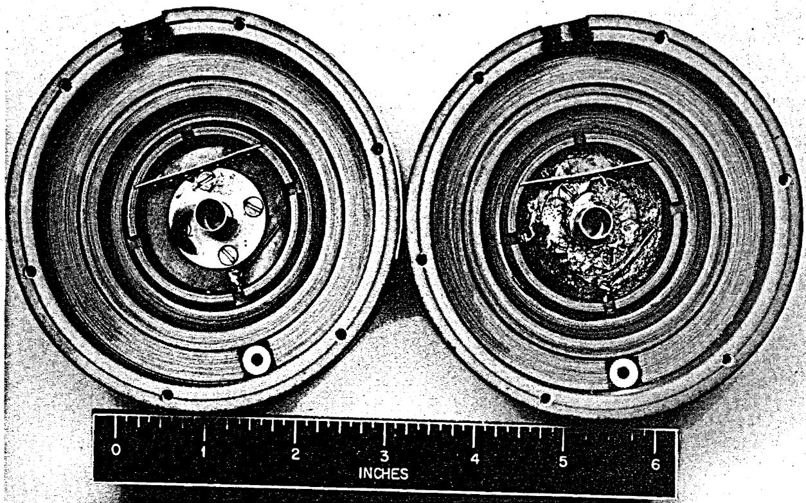  
Fig. 1.3.1. Nozzles of Two Mercury-Jet Switches Showing Clean Condition of Switch That Was Continuously Purged with Dry Nitrogen in Comparison with Mercurous Oxide Scum Formation on Switch That Was Not Purged.

# 1.4. COMPONENT DEVELOPMENT AND TESTING

H. W. Savage

# PUMP DEVELOPMENT TESTS

E. R. Dytko

A. G. Grindell

# Bearing and Seal Tests

W. L. Snapp

W. K. Stair²

A petroleum lubricant for the ART reactor pumps has been specified on the basis of present information, but the search for better lubricating and cooling fluids for pumps has continued. A test program for determining the compatibility of various lubricating fluids with the reactor process fluids (sodium and fuel) has been undertaken. The first tests were conducted with Dowtherm A and Cellulube 150 heated to $200^{\circ}\mathrm{F}$ under a helium atmosphere. The heated lubricant was admitted to a container of sodium at a temperature of $1100^{\circ}\mathrm{F}$ , which was also helium blanketed. The reaction of the Cellulube 150 was vigorous enough to be near explosive proportions, while there was very little reaction between the molten sodium and Dowtherm A. These results were sufficient to preclude further Cellulube testing.

A loaded journal-bearing test was conducted with Dowtherm A as the lubricant and with an applied bearing load of 250 lb. This test was terminated after 659 hr of trouble-free operation. The total measured seal leakage was $1\mathrm{cm}^3$ at the upper seal and $12\mathrm{cm}^3$ at the lower seal. The process sides of both seals were found to have the same type of gummy carbon deposit as that found previously in tests in which Dowtherm A was used as the lubricant. There was some visible evidence of bearing rubbing, which was apparently minor since no deleterious effects could be found in either the bearing operation or in the drive-motor power trace.

An investigation of the possible effects of increasing the present reactor-pump (fuel and sodium) rotary-element operating speed range is to be made. Tests will be started soon with higher operating speeds and increased bearing loads. Similar tests are planned for the NaK pump rotary element.

Excessive axial motion was found in the original NaK pump thrust-bearing design. A change to a duplex pair of angular-contact ball bearings mounted face-to-face has provided the desired axial rigidity without sacrificing transverse flexibility.

A seal design proposed for the NaK pump by a vendor is now being tested. In general, it has been found that the vendor's seal operates with modest leakage rates during the early part of a test but that subsequent operation always results in much higher leakage rates. A bellows type of seal, similar to that to be used in the reactor pumps, has been tested for NaK pump application, with inconclusive results. Further tests should result in a modification of this type of seal which will give acceptable performance. Modified Durametallic seals have been received and are to be tested soon.

Testing of elastomers for seal application has been impeded by delays encountered in obtaining test samples of recommended materials. A test was conducted, however, in which Cellulube 150 and Buna-N base elastomers were used. Since Cellulube 150 requires the use of butyl rubber elastomers, the results, as expected, were poor with respect to strength and hardness of the seal material. The Buna-N O-rings did, however, maintain a satisfactory seal throughout the 800 hr of test operation at $220^{\circ}\mathrm{F}$ . It is evident that more compatibility data are necessary for a realistic evaluation of elastomers, since the unsatisfactory performance observed thus far in tests at $220^{\circ}\mathrm{F}$ is in contrast to satisfactory results reported for tests of elastomers at $150^{\circ}\mathrm{F}$ in other fluids.[5]

# Tests of Gas Attenuation by Seals

S.M.DeCamp,Jr. W.K.Stair

Tests have been concluded that were designed to determine whether there would be fission-gas leakage from the sumps of the ART fuel pumps into the lubricating oil catch basins and thence

into the lubricant reservoirs external to the reactor cell. Attenuation of the fission-gas concentration by a factor of $10^{10}$ from the fuel expansion tank to the lubricant reservoir was considered to be necessary to eliminate biological shielding of the lubricant systems. Preliminary test data indicate attenuation by a factor of at least $10^{4}$ from the expansion tank to the pump shaft seal and by another factor of at least $10^{4}$ between the seal and the reservoir. These data are being analyzed to determine the upper limit to be expected for the radiation dose from the lubricating-oil tank.

# Fuel Pump Development Tests

J. J. W. Simon

M.E.Lackey G.Samuels

Developmental test work on the fuel pump impeller continued, with water being used as the pumped fluid. Efforts are under way to reduce the magnitude of the system pressure fluctuations, to produce the desired gas pressure gradient down the shaft annulus in the direction of the purge gas flow, to determine the fuel flow through the centrifuge, to reduce the pressure level of the system to meet the stress limitations of the north-head deck plate, and to obtain cavitation data. Some of these problems are, as yet, only partly solved.

Part of the work on the reduction of the magnitude of the pressure fluctuations has been carried on in conjunction with the efforts to obtain the desired gas pressure gradient down the pump shaft into the expansion tank and out into the off-gas line. These two problems are interrelated because both are affected by the upper seal face of the slinger impeller, area 1 in Fig. 1.4.1. The increase in the pressure fluctuations that was experienced during operation with high liquid levels in the expansion tank can be attributed to the priming and unpriming of the slinger impeller or perhaps to a hunting of the liquid level on the face of this impeller. As changes were made to the slinger impeller in attempts to remove the pressure fluctuations, the changes in the gas pressure gradient were noted. With the original slinger impeller design, complete with 12 blades on the upper surface, both the fluctuations and the reverse pressure gradient were at their maximums. The reverse pressure gradient indicated that the upper seal face of the slinger impeller could act as an effective gas pump and cause gas pressure in the expansion tank to build up to greater than

the gas supply pressure, with the gas pressure in the oil-leakage catch basin in the rotary element being the lowest pressure in the system. This condition would be especially undesirable if the pump stopped abruptly or even if there were a sudden reduction in the pump speed, because the gas pressures would be such that fuel might be forced into the seal region of the rotary element.

The upper seal face of the slinger impeller has been modified so that it is a smooth disk, and the axial clearance, as well as the radial clearance, of the impeller is kept as small as possible. This configuration keeps the amount of liquid in and around the impeller face to a minimum, regardless of the liquid level in the expansion tank. Operation with this modified impeller produced a normal gas pressure drop in the direction of flow, with the oil-catch-basin gas pressure being at an intermediate level and above the expansion tank gas pressure. Further modifications of this region are being tested in an attempt to provide a pressure equalizing volume that may be necessary for alleviating any possible unequal liquid level distribution around the pump shaft. These tests will provide a basic shape for further development tests in the twin-pump aluminum-north-head water tests, where the effects of unequal pump speeds can be noted.

A second trouble area with respect to pressure fluctuations was found to exist at the lower face of the slinger, that is, the degassing face of the slinger impeller, which is area 2 of Fig. 1.4.1. The first modification for correcting this situation consisted in simply removing the vanes, or blades, from the impeller face. The resulting large clearance rendered the degassing feature of the centrifuge ineffective. The shape that appears to function acceptably consists of a smooth disk that maintains the previous clearances.

Modifications were also made to the seal plate over the centrifuge cup, area 3 of Fig. 1.4.1, in an effort to reduce the centrifuge leakage flow. A lip was added that extended vertically downward from the inner surface of the seal plate to the top of the centrifuge cup. This resulted in operation that was, in general, poorer than before. The pressure fluctuations were greater and the degassing time was longer because the greatly increased velocity of the liquid discharging into the already restricted flow area only further restricted the centrifuge cup inlet flow. When this lip was

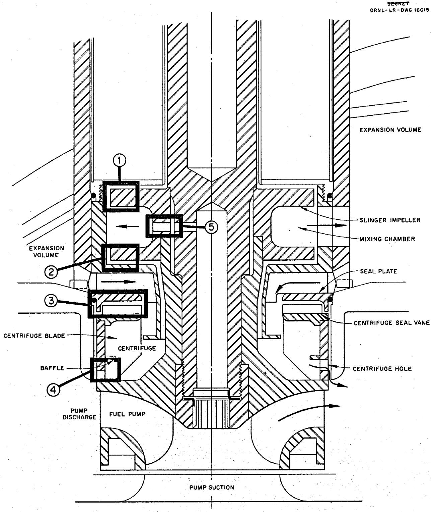  
Fig. 1.4.1. Diagram of Impeller Region of ART Fuel Pump.

removed and a similar one placed on the outer surface of the seal plate, the operation of the pump was improved. In locating this lip on the outer surface, the axial clearance from the lower edge of the lip to the top of the centrifuge cup was made identical to that existing between the top of the centrifuge seal vanes and the lower side of the seal plate. While this modification increased the resistance of the flow passage from the centrifuge discharge holes, area 4 of Fig. 1.4.1, to the centrifuge inlet, it did not reduce the available head of the seal vanes on the top of the centrifuge cup and thus did not affect the discharge pressure of the centrifuge in any way. This reduced flow has less effect upon the character of the flow at the centrifuge inlet, and pressure fluctuations are therefore less.

Another series of tests was performed to determine the amount of flow that passes through the shaft feed holes, area 5 of Fig. 1.4.1, the expansion tank, and the centrifuge. An indirect method was used to measure the flow, since it is virtually impossible to measure it directly. The internal xenon-removal feed flow up the shaft was blocked, and data were taken while known xenon-removal feed flows were added to the expansion tank through an external circuit. The pressure difference between the expansion tank and the pump suction was plotted vs the external circuit flow for a constant main loop flow and a constant pump speed. This pressure difference was equated to the difference determined with the unblocked shaft. The shaft flow was computed from this pressure difference and was found to be approximately 11.5 gpm.

The reduction of the fuel system pressure level will be attempted by two methods. The first will involve reducing the size of the centrifuge discharge holes in an attempt to reduce the head developed by the centrifuge. The second will involve increasing the internal diameter of the centrifuge cup to reduce the centrifuge head. Results of incomplete tests performed on each of these modifications indicated that each will allow a reduction of the pressure level to obtain an acceptable stress in the north-head upper and lower decks. The final selection of one of these modifications will be determined by future tests concerning the stability of the pressure level as a function of the liquid level in the expansion tank.

The results from some initial test runs indicated that a potential problem of cavitation exists with the present impeller blade design. Values of Thoma's cavitation parameter, $\sigma_{i}$ are about 0.71 for 2400 rpm and 0.51 for 2700 rpm. An impeller with new blades having an improved entrance angle was tested for cavitation, and $\sigma$ was found to be about 0.54 for 2400 rpm and 0.41 for 2700 rpm. Investigations of the cavitation characteristics of the present impeller design will be continued.

# Fuel Pump Endurance Tests

S. M. DeCamp, Jr.

An endurance test of an ART fuel (MF-2) pump was started on April 10, 1956, and was terminated on July 2, 1956, after 1964 hr of operation. Operation during this period was satisfactory. Troubles experienced earlier with gas flow down the pump shaft and with removal of oil from the lower catch basin drain did not recur. Removal of the pump from the pump barrel was relatively easy, and disassembly of the pump was accomplished by heating the pump impeller and associated equipment and removing the parts while they were still hot.

The test was terminated when the operating sounds of the pump changed and the source of the sounds could not be definitely located. Examination of the components after disassembly gave no indication of trouble in the pump. It was reassembled and installed in the cold mechanical shakedown stand, where it was run for 100 hr. At the end of this period the pump was operating satisfactorily, with no leakage detectable at the lower seal.

The pump and a new hydraulic motor were then reinstalled in the high-temperature endurance stand for further testing. At the end of 400 hr, the pump was still operating satisfactorily, with no sign of lower seal leakage. Operation of this pump is continuing.

# Sodium Pump Development Tests

S. M. DeCamp, Jr.

Water testing of an ART sodium pump in a performance-acceptance loop, initiated previously, was continued. The tests conducted previously were aimed at solving the problems of bypass flow around the main impeller and ingassing of the main fluid circuit. The bypass flow was from pump discharge through a pressure breakdown labyrinth to the expansion tank, and it was returned to pump suction. Bypass flows as high as 10 gpm were possible without ingassing with this bypass flow circuit. Examination of the reactor north-head geometry and thermal stress conditions, however, indicated that bypass flow of this type was undesirable because of the low sodium temperature $(1050^{\circ}\mathrm{F})$ in the expansion tank. A preferred solution is to bring hot sodium $(1250^{\circ}\mathrm{F})$ from directly below the lower deck of the sodium expansion tank to cool the top lid of the sodium tank and then to return this flow to pump discharge by means of a centrifuge.

Various configurations of the flow passages above the centrifuge have been tested. The most recently tested configuration is shown in Fig. 1.4.2, and performance curves obtained for the configuration are presented in Fig. 1.4.3.

It became apparent in earlier tests that the size of the slot in the side of the pump barrel was inadequate to handle the return flow of liquid to the centrifuge. In order to handle the required flow, a second slot was cut into the barrel below the original slot. The addition of this slot increased the maximum obtainable flow into the centrifuge and, at the same time, caused more stable operation of the loop.

# Primary and Auxiliary NaK Pump Development Tests

H.C.Young J.G.Teague

The first Inconel stationary assembly for an ART primary NaK pump (PK-P), consisting of volute and pump tank, was received. This assembly was welded into a high-temperature test

loop made up of approximately 60 ft of $3\frac{1}{2}$ and 4-in. IPS Inconel pipe. A heat exchanger and the necessary instrumentation were added to the loop, and water tests were conducted.

Initial tests indicated that the pump would not prime because of excessive quantities of gas having been trapped in the discharge pipe during the loop filling operation. A $3/2$ -in.-dia hole was therefore drilled through the top of the discharge pipe inside the pump tank to permit the trapped gas to be vented during filling. After the pump was primed, a continuous leakage of 2 to 3 gpm flowed through this vent to the pump tank. A baffle and a deflector were developed and installed to control the splashing caused by this high-velocity leakage. The pump primed satisfactorily after the vent was installed, and such a vent will be incorporated into all future PK-P pumps.

The water test performance data obtained on these Inconel pump parts agree very well with initial data obtained with the original brass impeller and aluminum volute; however, a slightly higher efficiency was obtained in these tests. The cavitation performance of the Inconel impeller was not so good as that of the brass impeller; however, the cavitation characteristics are still considered to be satisfactory.

Weld shrinkage tests of pump volute halves have shown that the shrinkage can be controlled to within acceptable tolerances (see Chap. 3.4, "Welding and Brazing Investigations"). Several pairs of Inconel volute halves, with the volute passage profile machined, have been received from the vendor.

# HEAT EXCHANGER AND RADIATOR DEVELOPMENT TESTS

E. R. Dytko

R.E.MacPherson J.C.Amos

# Intermediate Heat Exchanger Tests

J.W.Cooke H.C.Hopkins

A summary of intermediate heat exchanger test stand operations during this quarter is presented in Table 1.4.1. York radiator No. 9 completed a program of 30 thermal cycles and was removed from test stand A for metallographic examination. The

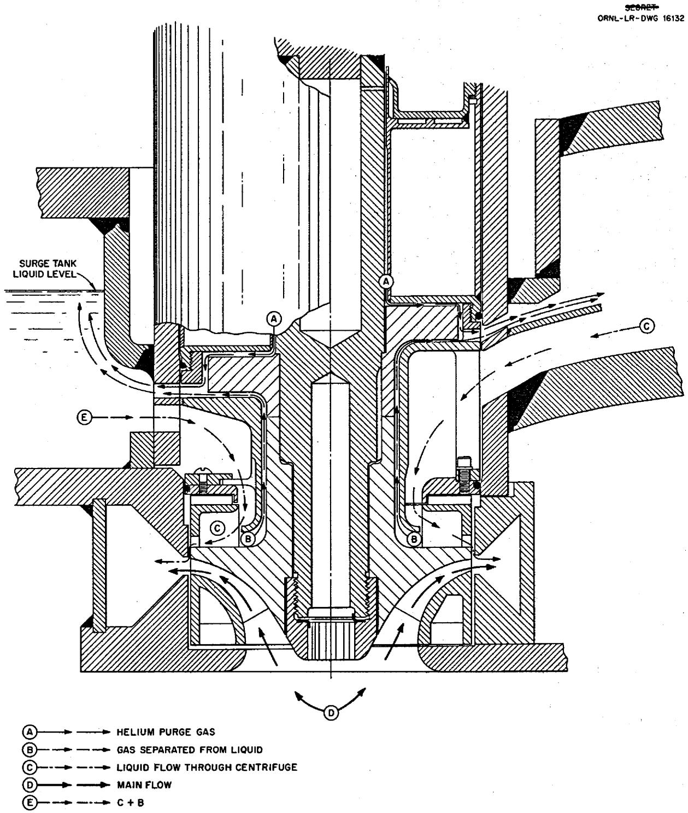  
Fig. 1.4.2. Diagram of Impeller and Centrifuge Regions of ART Sodium Pump.

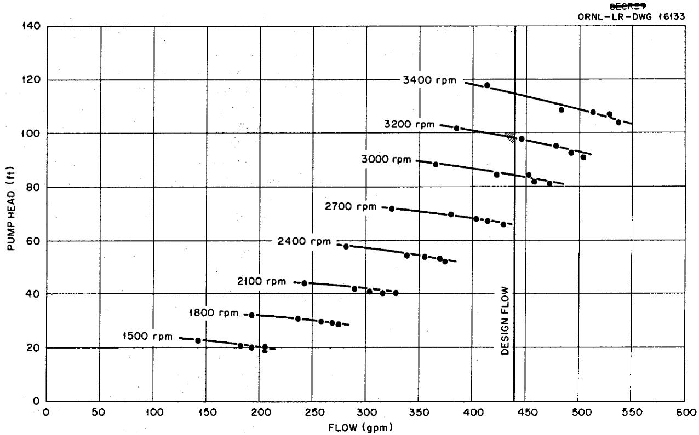  
Fig. 1.4.3. Water Test Performance Characteristics of ART Sodium Pump.

TABLE 1.4.1. SUMMARY OF INTERMEDIATE HEAT EXCHANGER TEST STAND OPERATION  

<table><tr><td>Test Unit*</td><td>Hours of Nonisothermal Operation</td><td>Total Hours of Operation</td><td>Number of Thermal Cycles</td><td>Reason for Termination</td></tr><tr><td colspan="5">Test Stand A</td></tr><tr><td>York radiator No. 9 (revised design)</td><td>695</td><td>1283</td><td>30</td><td>Test completed</td></tr><tr><td>Circulating cold trap No. 2 (4 in. in diameter)</td><td></td><td>1430</td><td></td><td>Test completed</td></tr><tr><td>NaK screen filter</td><td></td><td>264</td><td></td><td>Test completed</td></tr><tr><td colspan="5">Test Stand B</td></tr><tr><td>Black, Sivalls &amp; Bryson heat exchangers Nos. 1 and 2 (type IHE-3)</td><td>1008</td><td>1398</td><td>11</td><td>Test completed</td></tr><tr><td>Cambridge radiators Nos. 1 and 2 (modification 3)</td><td>1466</td><td>2045</td><td>14</td><td>Test completed</td></tr><tr><td>Circulating cold trap No. 5 (4 in. in diameter)</td><td></td><td>1260</td><td></td><td>Test completed</td></tr></table>

*Includes only units tested during this quarter.

radiator performance data and details of the thermal-cycling program were reported previously. This radiator was the first 500-kw radiator of the revised design to be tested. Post-operational examination showed no evidence of cracks in the radiator tubes. The available information on maximum mass transfer and total increase in NaK pressure drop for all radiators tested, including York No. 9, is summarized in Table 1.4.2. At the completion of York radiator No. 9 testing, test stand A was dismantled to provide floor space for the Engineering Test Unit (ETU). Analysis of the contents of the NaK screen filter tested in this stand revealed no significant amount of metal particles or foreign material.

Testing of Cambridge radiators Nos. 1 and 2 and Black, Sivalls & Bryson heat exchangers Nos. 1 and 2, type IHE-3, described previously, $^{12}$ was completed in test stand B. These test units are currently undergoing metallographic examination. The data on NaK pressure-drop increases and maximum mass-transfer deposits in the Cambridge radiators are given in Table 1.4.2. These radiators were of the original 500-kw design modified by removing the side plates and slitting the sup

port plates and base plates. Metallographic examination revealed cracks in the radiator tubes at the rigid base plate and support plates. With the exception of the degree of increase in NaK pressure drop, the performance data obtained on these radiators and heat exchangers were in substantial agreement with data obtained from units previously tested. The NaK pressure drop in Black, Sivalls & Bryson heat exchanger No. 2, where heat was transferred from fuel to NaK, did not increase throughout the test, whereas, in heat exchanger No. 1, where the heat was transferred from NaK to fuel, there was a total NaK pressure-drop increase of approximately $240\%$ . This pressure-drop increase is attributed to mass-transfer deposits and has been observed as a function of time in all test units in which NaK has been cooled.

York radiators Nos. 11 and 12 (revised design) have been installed in test stand B, and tests will start as soon as Black, Sivalls & Bryson heat exchangers Nos. 1 and 2, type IHE-8, previously described, have been received and installed in the stand. Construction of test stand C is essentially complete, with the exception of the installation of the ART test radiator being supplied by York Corp. The delivery of this radiator has been delayed by fabricational difficulties.

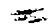

TABLE 1.4.2. SUMMARY OF DATA OBTAINED ON NoK PRESSURE DROP INCREASES AND MASS TRANSFER BUILDUP IN TEST RADIATORS   

<table><tr><td>Test Unit</td><td>Test Stand</td><td>Total Hours of Nonisothermal Operation</td><td>Maximum NaK Temperature (°F)</td><td>Maximum Temperature Differential (°F)</td><td>Pressure Drop Increase (%)</td><td>Maximum Thickness of Mass Transfer Deposit (in.)*</td></tr><tr><td>PWA-1 and 2</td><td>IHE-B</td><td>585</td><td>1500</td><td>500</td><td>50</td><td>0.004</td></tr><tr><td>ORNL-3</td><td>SHE-B</td><td>295</td><td>1500</td><td>230</td><td>30</td><td>0.0035</td></tr><tr><td>York-4</td><td>SHE-B</td><td>748</td><td>1500</td><td>265</td><td>30</td><td>0.003</td></tr><tr><td>York-9</td><td>IHE-A</td><td>695</td><td>1500</td><td>400</td><td>118</td><td>0.006</td></tr><tr><td>Cambridge 1 and 2</td><td>IHE-B</td><td>1466</td><td>1450</td><td>210</td><td>140</td><td>0.005</td></tr></table>

*Maximum mass transfer occurred in air inlet side (cold side) of the radiator in each instance. The density of the mass transfer and the length of radiator tube over which mass transfer was found were greater in the units which exhibited the greater pressure drop increases.

# Small Heat Exchanger Tests

L.H.Devlin J.G.Turner

A summary of small heat exchanger test stand operation during this quarter is presented in Table 1.4.3. Testing of York radiator No. 7 and Process Engineering Corp. heat exchanger No. 1, type SHE-2, is continuing in test stand B. The radiator NaK pressure drop increased approximately $100\%$ during the first 970 hr of nonisothermal operation and remained essentially unchanged thereafter. This latter period of operation has been at a maximum NaK temperature of $1500^{\circ}\mathrm{F}$ , with a radiator NaK temperature drop of $100^{\circ}\mathrm{F}$ for 216 hr and $430^{\circ}\mathrm{F}$ for 144 hr.

The radiator was initially placed on power operation in a series of steps designed to simulate temperature conditions which will be experienced by the ART radiators as the reactor is taken to

full power. Radiator NaK temperatures, operating times, plugging-indicator maximum break temperature, and increase in radiator NaK pressure drop for these steps are given in Table 1.4.4. During the test, cold-trap flow was maintained at $0.25\mathrm{gpm}$ (equivalent to rate of ART cold-trap system flow) and an outlet temperature of $300^{\circ}\mathrm{F}$ .

Testing of the Process Engineering Corp. small heat exchanger No. 1, type SHE-7, in test stand C was interrupted by the failure of York radiator No. 5, shown in Fig. 1.4.4. This was the last modified radiator of the original 500-kw design to be tested. The shift in elevation of the $\frac{1}{16}$ -in. support plates graphically illustrates the necessity of eliminating the rigid support plates and base plates from the radiator fin matrix in order to minimize thermal stresses. This radiator was replaced by York radiator No. 8 (revised design), and test operations were resumed.

TABLE 1.4.3. SUMMARY OF SMALL HEAT EXCHANGER TEST STAND OPERATION  

<table><tr><td>Test Unit*</td><td>Hours of Nonisothermal Operation</td><td>Total Hours of Operation**</td><td>Number of Thermal Cycles</td><td>Status of Test</td></tr><tr><td colspan="5">Test Stand B</td></tr><tr><td>Process Engineering Corp. heat exchanger No. 1 (type SHE-2)</td><td>1330</td><td>2165</td><td>13½</td><td>Test continuing</td></tr><tr><td>York radiator No. 7 (revised design)</td><td>1330</td><td>2165</td><td>13½</td><td>Test continuing</td></tr><tr><td>Circulating cold trap No. 6 (4 in. in diameter, modification 1)</td><td></td><td>2165</td><td></td><td>Test continuing</td></tr><tr><td colspan="5">Test Stand C</td></tr><tr><td>Process Engineering Corp. heat exchanger No. 1 (type SHE-7)</td><td>356</td><td>598</td><td>12</td><td>Test continuing</td></tr><tr><td>York radiator No. 5 (modification 2)</td><td>223</td><td>1265</td><td>22½</td><td>Terminated because of radiator failure</td></tr><tr><td>York radiator No. 8 (revised design)</td><td>239</td><td>300</td><td>7½</td><td>Test continuing</td></tr><tr><td>Circulating cold trap No. 4 (4 in. in diameter)</td><td></td><td>298</td><td></td><td>Replaced by cold trap with stainless steel cooling coil</td></tr><tr><td>Circulating cold trap No. 7 (4 in. in diameter, modification 1)</td><td></td><td>300</td><td></td><td>Test continuing</td></tr></table>

*Includes only units tested during this quarter.   
**For tests in progress the operating hours are shown as of August 15, 1956.

The type SHE-7 heat exchanger, shown in Fig. 1.4.5, was designed to operate at ART intermediate heat exchanger design temperature and flow conditions with a heat load of $400\mathrm{kw}$ . The actual operating conditions obtained are shown in Fig.

1.4.6. Endurance testing of this heat exchanger is currently under way.

A summary of the operating conditions and the corrosion of the fuel side of the heat exchangers tested thus far is presented in Table 1.4.5.

TABLE 1.4.4. STEP INCREASES IN OPERATING CONDITIONS FOR YORK RADIATOR NO. 7  
Plugging indicator maximum break temperature: $300^{\circ}\mathrm{F}$   

<table><tr><td>Radiator Inlet Temperature (°F)</td><td>Radiator Outlet Temperature (°F)</td><td>Hours at Temperature Indicated</td><td>Increase in Pressure Drop (%)</td><td>Increase (%/hr)</td></tr><tr><td>1195</td><td>1125</td><td>20</td><td>0</td><td>0</td></tr><tr><td>1230</td><td>1160</td><td>25</td><td>0</td><td>0</td></tr><tr><td>1250</td><td>1070</td><td>17</td><td>0</td><td>0</td></tr><tr><td>1290</td><td>1070</td><td>72</td><td>14</td><td>0.192</td></tr><tr><td>1355</td><td>1070</td><td>30</td><td>3</td><td>0.100</td></tr><tr><td>1430</td><td>1070</td><td>49</td><td>14</td><td>0.285</td></tr><tr><td>1500</td><td>1070</td><td>98</td><td>35</td><td>0.365</td></tr></table>

TABLE 1.4.5. SUMMARY OF OPERATING CONDITIONS AND CORROSION FOUND ON FUEL SIDE OF TEST HEAT EXCHANGERS  

<table><tr><td rowspan="2">Unit</td><td rowspan="2">Test Stand</td><td rowspan="2">Total Hours of Operation</td><td colspan="3">Hours of Operation at Various Maximum Fuel Temperatures</td><td rowspan="2">Maximum Depth of Corrosion (mils)</td><td rowspan="2">Remarks</td></tr><tr><td>1600-1500°F</td><td>1500-1400°F</td><td>1400-1200°F</td></tr><tr><td>ORNL-1, type SHE-1</td><td>SHE-A</td><td>1557</td><td>928</td><td>606</td><td>23</td><td>7</td><td></td></tr><tr><td>ORNL-1, type IHE-3*</td><td>IHE-B</td><td>1129</td><td></td><td>965</td><td>164</td><td>12</td><td>Area where failure occurred excluded in depth of corrosion determination</td></tr><tr><td>ORNL-2, type IHE-3</td><td>IHE-B</td><td>1129</td><td></td><td>965</td><td>164</td><td>4</td><td>Examination of end sections is not yet completed</td></tr><tr><td>ORNL-1, type SHE-2</td><td>SHE-B</td><td>2071</td><td>214</td><td>412</td><td>1445</td><td>6</td><td></td></tr></table>

*This heat exchanger transferred heat from NaK to fuel; therefore the NaK temperatures and the tube wall temperatures were higher than the fuel temperatures. This will not be the case in the ART intermediate heat exchanger.

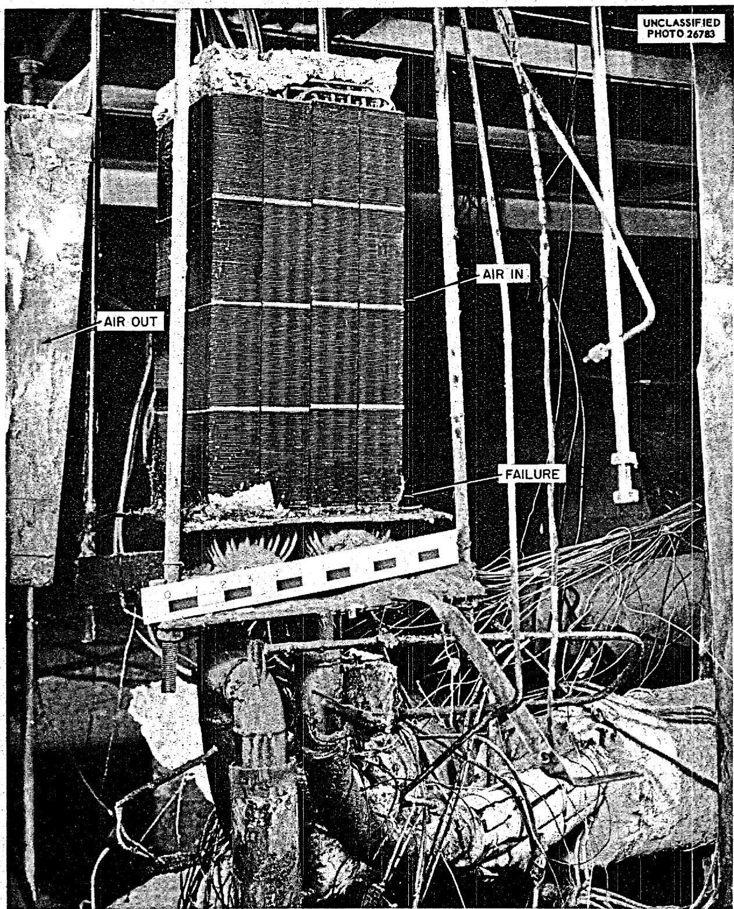  
Fig. 1.4.4. York Radiator No. 5 After Failure in Test Operation.

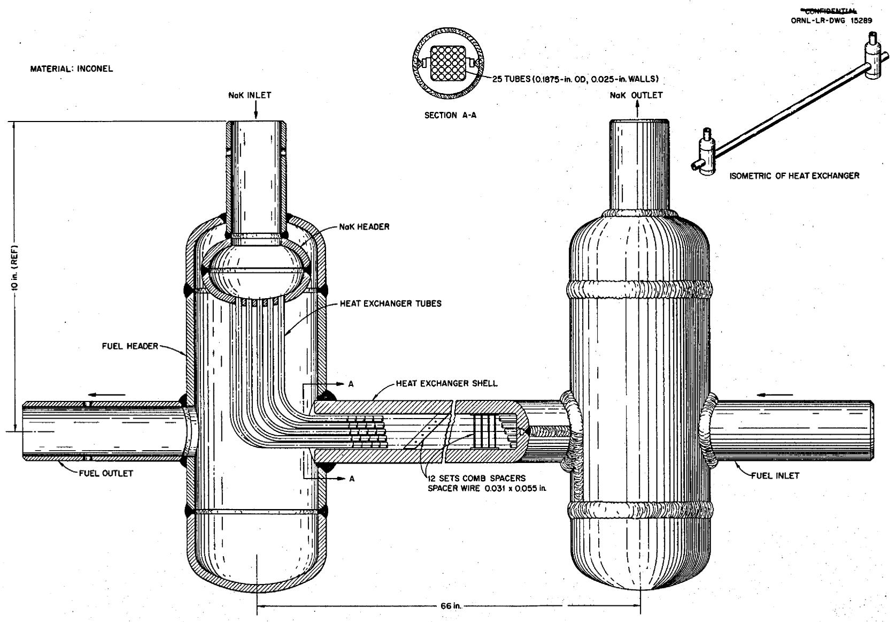  
Fig. 1.4.5. Small Fuel-to-NoK Heat Exchanger Type SHE-7.

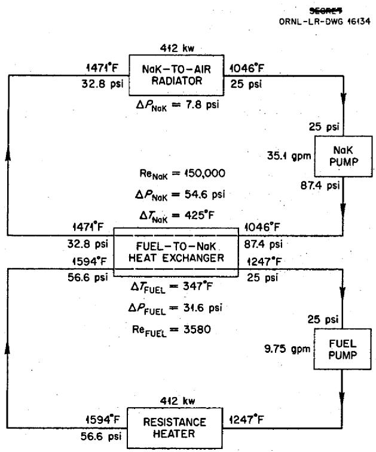  
Fig. 1.4.6. Operating Conditions for Tests of Process Engineering Corp. Small Heat Exchanger No.1, Type SHE-7. Conditions given are approximately the design conditions for the ART.

# Cold-Trap Evaluation in Heat Exchanger Test Loops

F. A. Anderson 15 J. C. Amos

Two 4-in.-dia circulating cold traps equipped with stainless steel cooling coils have been placed in operation with no difficulties from oxide plugging. The procedure listed below, which has been proposed for ART cold-trap startup, was followed in each case:

1. Operate with maximum cold-trap NaK flow and no cooling until main NaK system reaches $1200^{\circ}\mathrm{F}$ .   
2. Turn air cooling to maximum and maintain the cold-trap inlet temperature above the plugging indicator break temperature.   
3. Reduce the cold-trap outlet temperature by reducing the cold-trap NaK flow as the break temperature drops.   
4. When cold-trap outlet temperature reaches $300^{\circ}\mathrm{F}$ or less, transfer to water cooling and in

crease the cold-trap NaK flow to design rate. Adjust water flow to obtain desired cold-trap temperatures.

During ART operation it may be necessary, for maintenance purposes, to cool the reactor to approximately $300^{\circ}\mathrm{F}$ and subsequently reheat it. A test was therefore run on the NaK loop of SHE test stand C to determine whether such operation would seriously upset the oxide balance or otherwise cause cold-trap operating difficulties. With a system temperature of $1100^{\circ}\mathrm{F}$ and the cold trap operating at approximately 0.75 gpm at a NaK outlet temperature of $300^{\circ}\mathrm{F}$ and an oxide saturation temperature of $270^{\circ}\mathrm{F}$ , the main loop was cooled to $300^{\circ}\mathrm{F}$ and reheated without disturbing the cold-trap NaK or coolant flows. No adverse effect on the cold trap was noted, and at no time during the course of the test did the oxide saturation temperature rise above its initial level. The results of this test are plotted in Fig. 1.4.7.

In order to obtain a comparison of actual and predicted over-all heat transfer coefficients for the cold-trap circuit, a series of tests were run on the 40-in. economizer and on the 4-in. circulating cold trap on test stand C with water as the coolant passing through the slightly flattened, copper cooling coil wound around the cold trap. Experimental over-all heat transfer coefficients were obtained that ranged from 9.9 to 20.9, in comparison

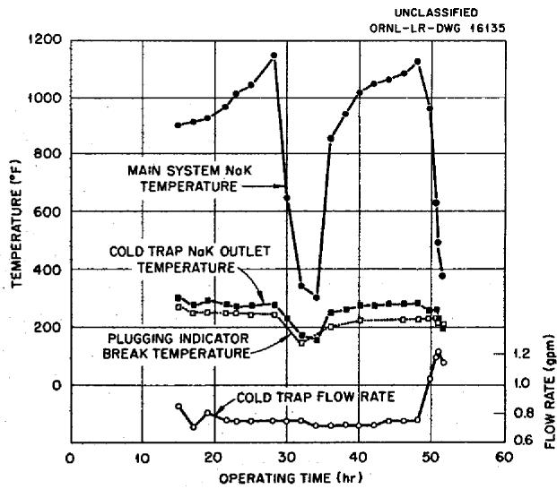  
Fig. 1.4.7. Cold Trap Operation During Cooling and Reheating of Main NaK System in SHE Test Stand C.

with predicted values of $\sim 20$ Btu/hr.ft².°F. The coefficients increased significantly with increased NaK flow (range, 0.45 to 1.5 gpm), but they were essentially unaffected by a $30\%$ variation in the water flow rate. A plot of the over-all coefficient, $U_{s}$ vs the logarithm of the NaK flow rate, $x$ (in gpm), yields a straight line, which can be represented by the following equation:

$$
\log x = 0. 0 4 9 U - 0. 8 5 5.
$$

The over-all coefficients obtained with air used as the coolant ranged from 7.2 to 10.7, in comparison to a predicted value of $\sim 10$ Btu/hr·ft²·°F, and appeared to be, within experimental error, almost independent of NaK flow rates in the range from 0.50 to 1.0 gpm. For both air and water cooling, the over-all coefficients were based on the inside circumferential area of the packed section of the cold trap.

In the economizer unit the over-all coefficients (based on the outside area of the inner pipe) ranged from 458 to 664, in comparison with an average calculated value of 656 Btu/hr·ft²·°F, and increased as the NaK flow rate increased from 0.50 to 1.5 gpm.

Since the ART cold traps will be equipped with $5\%$ -in. stainless steel cooling coils, the tests reported above were repeated for an identical 4-in. cold trap wound with the ART type of coil. With water as the coolant, the overall coefficients ranged from 17.9 to 29.0 Btu/hr-ft².⁰F as the NaK flow rate was increased from 0.43 to 1.25 gpm. These values for the coefficient are approximately $50\%$ greater than the values obtained for the trap wound with the copper coil. It is thought that the higher values are a result of better contact of the stainless steel cooling coil with the cold-trap shell. With air as the coolant, the effect of the better contact was again noticeable, the overall coefficients for the new trap being somewhat better than those obtained for the original copper coil trap.

# WATER FLOW TESTS OF ALUMINUM NORTH-HEAD MockUP

E. R. Dytko

R. E. MacPherson

R.Curry

D. R. Ward

It was originally planned that the ART fuel system components of the north head would be fabri

cated and water-tested and then that the sodium system components would be added for testing. The desire to extend the fuel circuit testing and the urgent need for starting the sodium circuit testing have led, however, to the decision to build a second aluminum north-head mockup for water tests of the sodium system components. The aluminum parts for the sodium-circuit water tests are about $75\%$ completed.

Water tests that simulated reactor fuel system filling revealed that the addition of water into the bottom of the system at a rate of 1 gpm with both pumps running at 200 rpm or less caused only minor ingassing. Most of the gas in the system apparently vented upward into the surge tank during filling. At pump speeds of 400 rpm, however, the trapped gas was mixed thoroughly into the liquid being pumped, and extensive ingassing was observed.

In another set of experiments, water was drained from the simulated fuel system while both pumps were running at various matched speeds from 800 to 3000 rpm. It was found, in all cases, that the liquid level dropped to the floor of the fuel surge tank before ingassing could be observed. During this drop in liquid level the pump discharge and suction pressures dropped in unison, and the pumping heads remained essentially constant. When the ingassing occurred, the pump suction pressure was within 1 psi of the surge tank pressure. Final confirmation of satisfactory performance, with water, of the twin fuel pumps in the north-head configuration will be sought when a final impeller design has been established, based on single pump tests.

Work has progressed on solving the problem of pressure and flow surging in the test system. As reported previously, these pressure fluctuations were believed to be due partly to the hydraulic characteristics of the pump centrifuge section and partly to the unfavorable pump inlet configuration. In an attempt to separate these two effects, the external circuit was rebuilt to provide a 10-dia straight inlet to the pump suction. To further idealize the pump inlet, straightening vanes were provided in the inlet section. Subsequent operations demonstrated a $75\%$ reduction in pressure and flow fluctuations, and it is felt that some

portion of the remaining instability will be relieved by the final impeller design.

The sensitivity of the loop to pump inlet geometry has demonstrated the desirability of mocking up, as a later step in the fuel circuit mockup test program, the actual reactor fuel pump inlet region. As a further refinement to the test unit, provisions are being made for the later addition of a full-scale aluminum core mockup that is to be tested in conjunction with the mockup of the reactor pump inlet region.

# DUMP VALVE DEVELOPMENT TESTS

E. R. Dytko

R.E.MacPherson L.P.Carpenter M.H.Cooper

Four ART prototype dump valves have been received from vendors, but none have met the performance specifications for ART operation. In all cases the seat leakage rate was excessive.[17] Other difficulties encountered have included oxidation of the flame-plated stem in air and failure of the seat-ring braze joint. The cause of the braze joint failure has been corrected, but a satisfactory oxidation-resistant flame-plated stem has not yet been tested.[18]

17L.P.Carpenter,J.W.Kingsley,and J.J.Milich, ANPQuar.Prog.Rep.March 10,1956,ORNL-2061,p60. 18L.P.Carpenter,ANPQuar.Prog.Rep.June 10, 1956,ORNL-2106,p62.

The seat materials of the valves tested thus far were Kennametals 152B, 151A, and 162B (see Chap. 3.4, "Welding and Brazing Investigations," for compositions of these cermets). These Kennametals showed the greatest resistance to solid-phase bonding in screening tests.

The exterior of the valve body will operate in air at a high temperature for an extended period of time. Therefore a stem plating which will not oxidize is required. A Stellar 6 weld overlay on the stem at the stem guides and an aluminum oxide flame plate are to be performance tested.

The excessive seat leakage of the first four prototype dump valves was caused by welding distortion and misalignment of the assembly prior to final welding. The assembly and welding procedures have therefore been altered in an attempt to attain satisfactory alignment. The seat materials were satisfactorily tested for leakage, with water and air, prior to assembly in the valves. In each case the leakage with water and air increased after the valves had been assembled and welded. The test results on the four prototype dump valves are summarized in Table 1.4.6.

Several rigs are being constructed for testing valve seat materials in contact with fused salts. In addition to the Kennametals that are being tested, tests will be made on molybdenum, copper, tungsten, and titanium carbide. For these tests the seat ring is brazed to the bottom of the valve

TABLE 1.4.6. SUMMARY OF PROTOTYPE DUMP VALVE TESTS IN THE FUEL MIXTURE (No. 30) NaF-ZrF $_4$ -UF $_4$ (50-46-4 mole %) AT $1200^{\circ}$ F   

<table><tr><td>Prototype Valve No.</td><td>Seat Leakage (cm3/hr)</td><td>Pressure Differential Across Seat (psi)</td><td>Total Stem Thrust (lb)</td><td>Remarks</td></tr><tr><td>1</td><td>0.59</td><td>6</td><td>1200</td><td>Leak rate decreased with time</td></tr><tr><td></td><td>0.9</td><td>90</td><td>1200</td><td>Removed to determine cause for sticking of stem</td></tr><tr><td>2</td><td>2.13</td><td>6</td><td>1200</td><td>Valve removed when seat ring pulled loose</td></tr><tr><td>3</td><td>0.55</td><td>6</td><td>700</td><td>Valve would not open with 2250-lb stem pull and would not fully close</td></tr><tr><td>4</td><td>1.3</td><td>6</td><td>1050</td><td>Spring-loaded valve operator used</td></tr><tr><td></td><td>35</td><td>50</td><td>1050</td><td>After being closed for two weeks, seat leakage increased rapidly on opening and reseating</td></tr></table>

barrel, and the plug is rigidly mounted on the stem, which passes through an O-ring seal to a hydraulic operator. The seat ring and plug are shown in Fig. 1.4.8. Salt from a sump is forced through a dip line and against the seat and plug by helium pressure. The leakage collects in the valve body and drains through an overflow line into a tared receiver. To ensure the removal of gas pockets from the dip line, the plug is not seated in the ring until after the salt flows through the overflow line. The stem thrust, the pressure differential across the seat, and the leakage are accurately measured.

The results of seat materials test No. 1, in which the seat ring was Kennametal 162B and the plug was Kennametal 152B, are summarized in

Fig. 1.4.9. The valve had been cycled 15 times as of August 15, with the maximum leakage being $2.0~\mathrm{cm}^3/\mathrm{hr}$ . The stem force is 750 lb; the seat pressure differential, 80 psi; and the test temperature, $1200^{\circ}\mathrm{F}$ . After 1000 hr in test, the valve will be left closed for 500 hr to test for long-range self-welding.

Seat materials test No. 2 was terminated 24 hr after its start because of excessive leakage. The seat ring material was Kennametal 152B and the plug material was Kennametal 151A. The leak rate was $38~\mathrm{cm}^3/\mathrm{hr}$ at 25-psi differential pressure across the seat and a 750-lb stem thrust. The high leakage was caused by misalignment of the stem.

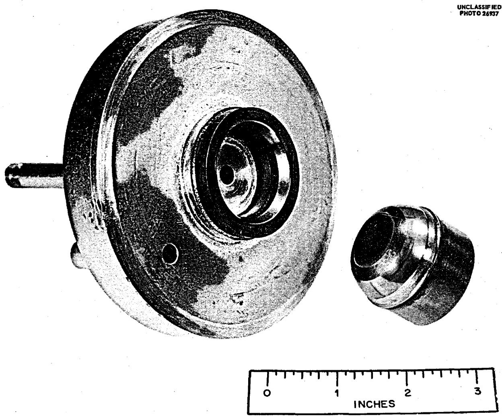  
Fig. 1.4.8. Kennametal Seat Ring and Plug.

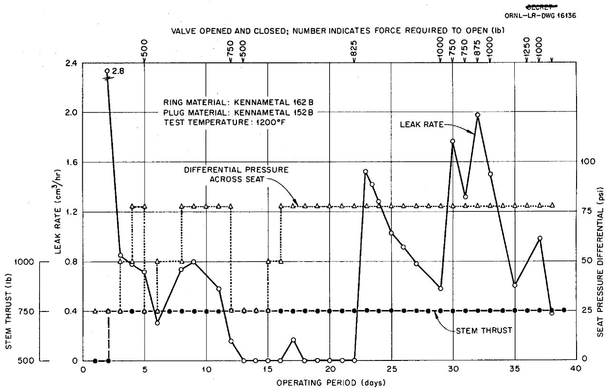  
Fig. 1.4.9. Results of Valve Seat Materials Test (No. 1) in the Fuel Mixture (No. 30) NaF-ZrF $_4$ -UF $_4$ (50-46-4 mole%).

# OUTER CORE SHELL THERMAL STABILITY TEST

E. R. Dytko

R.E.MacPherson J.C.Amos L.H.Devlin

The 300 thermal cycles scheduled for the outer core shell thermal stability test were completed. The model was disassembled, and the core shell was removed for examination. Dye-penetrant and x-ray inspections revealed no surface cracks or internal flaws.

Measurements were carefully made of the inside surface of the shell by using the same procedure as that used for obtaining measurements after 57 cycles.[19] The previous measurements showed the shell to be slightly elliptical, and after completion of 300 cycles the elliptical deformation was even more pronounced.

The core shell was subjected to sodium temperatures of $1200^{\circ}\mathrm{F}$ or higher for 1050 hr. A thermal cycle comprised 1 hr with a temperature differential and 1 hr of isothermal operation at $1250^{\circ}\mathrm{F}$ . The transient time was 10 min. Bursting pressures of 24 and 16 psi existed across the shell at the bottom and top, respectively.

The temperatures of the sodium flowing inside and outside the shell were measured by thermocouples located on the pipe walls at their respective entrances and exits to the model assembly. During the temperature differential phase of a cycle these temperatures were approximately as follows:

Inner sodium entrance 1600°F

Inner sodium exit 1235°F

Outer sodium exit 1085°F

Outer sodium entrance 980°F

The temperature differential from the inner stream to the outer stream, which were flowing counter

current to one another, was $515^{\circ}F$ at the bottom and $255^{\circ}F$ at the top.

The core shell will now be subjected to a creep-buckling test at a temperature of $1500^{\circ}\mathrm{F}$ and an external pressure of 52 psi. The time to buckle and the type of failure will be observed. A new shell will be installed in the thermal stability test apparatus, and a second test program, which will be identical to the one just completed, will be initiated.

# AUXILIARY COMPONENT DEVELOPMENT

# J. J. Keyes

# High-Frequency Thermal-Cycling Apparatus

W. J. Stelzman J. M. Trummel20

Apparatus and techniques are being developed for investigating the effect of high-frequency thermal oscillations and the resultant thermal fatigue stresses on the ART core. Based on volume heat

source data,21 a frequency range of from 1 to 10 cps and a surface temperature amplitude of about $100^{\circ}\mathrm{F}$ have been suggested for simulating possible ART conditions. Dynamic mixing of hot and cold fluids appears to be a feasible method for achieving this frequency range and amplitude. A schematic diagram of a high-frequency pulse pump currently being developed is shown in Fig. 1.4.10. Alternate slugs of hot and cold fluid are dynamically mixed at the "T" joining the legs of the system by pneumatically pulsing the level in two static pots joined to the hot and cold legs and connected to a pair of pistons operating in phase opposition. This design produces nearly sinusoidal temperature variations in the common line, as well as steady flow, for convenience from the point of view of data analysis.

The amplitude of the temperature oscillations generated depends on many factors, but it can be

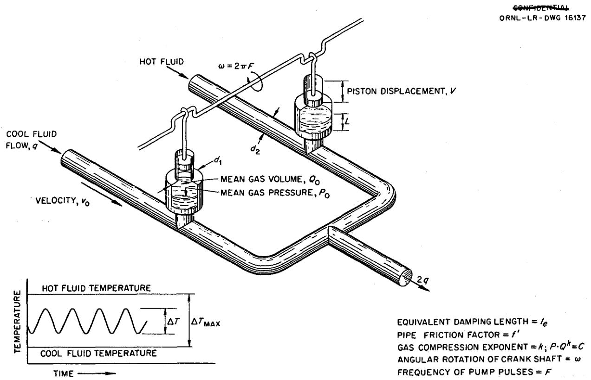  
Fig. 1.4.10. Schematic Diagram of High-Frequency Pulse Pump and Outlet Fluid Temperature Variation.

made to approach, as a theoretical limit,

$$
A _ {\max } = \frac {\left(T _ {\text {H o t L e g}} - T _ {\text {C o l d L e g}}\right)}{2} = \frac {\Delta T _ {\max }}{2}.
$$

From energy-balance consideration, it can be shown that the efficiency of the pulse pump, defined as the ratio of output amplitude to the maximum amplitude, is given by the equation

tially maximum efficiency up to 7.5 cps, with only a slight drop in efficiency at 10 cps.

# COLD TRAPS AND PLUGGING INDICATORS

R. D. Peak

The first cold trap evaluation test stand, described previously,[22] has been shut down and dis

$$
\frac {A}{A _ {\max }} = \frac {\Delta T}{\Delta T _ {\max }} = \frac {\omega V}{2 q} \left(\left[ \frac {\frac {l _ {e}}{d _ {2}} f ^ {\prime} \rho v _ {0} \left(\frac {d _ {1}}{d _ {2}}\right) ^ {2}}{\frac {P _ {0} \pi d _ {1} ^ {2}}{4 Q _ {0}}} \right] ^ {2} \omega^ {2} + \left\{1 - \frac {\omega^ {2} \rho \left[ L + l \left(\frac {d _ {1}}{d _ {2}}\right) ^ {2} \right]}{\frac {g _ {c} k P _ {0} \pi d _ {1} ^ {2}}{4 Q _ {0}}} \right\}\right) ^ {- 1 / 2},
$$

# where

$\omega =$ angular rotation of crank shaft,

$V =$ piston displacement,

$q =$ flow rate of fluid,

$l_{\bullet} =$ equivalent damping length,

$\tilde{f}^{\prime} =$ pipe friction factor,

$\rho =$ density of fluid,

$\nu_{0} =$ velocity of fluid,

$d_{1} =$ pulse chamber diameter,

$d_{2} =$ pipe diameter,

$P_{0} =$ mean gas pressure,

$Q_{0} =$ mean gas volume,

$\tilde{L} =$ mean height of fluid in pulse chamber,

$l =$ length of pipe from pulse chamber to $T,$

$g_{C} =$ gravitational correction factor,

$k =$ gas compression exponent $(P\cdot Q^{k} = a$ constant).

A graph of the relationship, for the specific conditions indicated for water, is presented in Fig. 1.4.11. The circled points are test data obtained on a mockup of the pump; water was used as the test fluid. There is good agreement of the test data with the calculations for adiabatic compression of the gas ( $k = 1.4$ ). The plateau in the data occurs for $\Delta T / \Delta T_{\max} = 1$ , which corresponds to the particular piston displacement, $V = 1.36 \times 10^{-3}$ ft³, used in the tests. Obviously, to increase the amplitude at low and at high frequency, it is necessary only to increase the piston displacement.

Based on satisfactory agreement of the calculations with water test data, a pulse pump to be used with the fuel mixture (No. 70) NaF-ZrF $_4$ -UF $_4$ (56-39-5 mole %) has been designed for substan

mantled. A third test stand is being assembled to test the plugging indicator and cold trap planned for use in the 70-gal NaK systems of the ART. These units are shown in Figs. 1.4.12 and 1.4.13. The plugging indicator is cooled by air in the outer jacket, and the cold trap is cooled by air or water flowing through the stainless steel tubing wound tightly around the packed length of the trap. The stand will have instruments to measure the air and water flows under various operating conditions in order to determine utility requirements for the ART. The stand also has provisions for connecting both Argonne samplers and Mine Safety Appliances samplers in order to calibrate the plugging indicator against chemical analysis of the sodium oxide in the NaK.

The second test stand, described previously,[23] has been used to calibrate two different types of plugging indicators against chemical analysis. The first type used seven lengths of tubing in parallel, the tubing being 2 in. long and 0.055 in. ID, instead of a plugging disk. The stand operated for 14 days, during which time the plugging indicator was run 46 times and 17 samples were taken for chemical analysis with the Argonne sampler. Data for one 14-hr period under constant conditions showed that, with a cold-trap outlet temperature of $780^{\circ}\mathrm{F}$ (equivalent to $350\mathrm{ppm}O_2$ ), the plugging indicator break temperature was

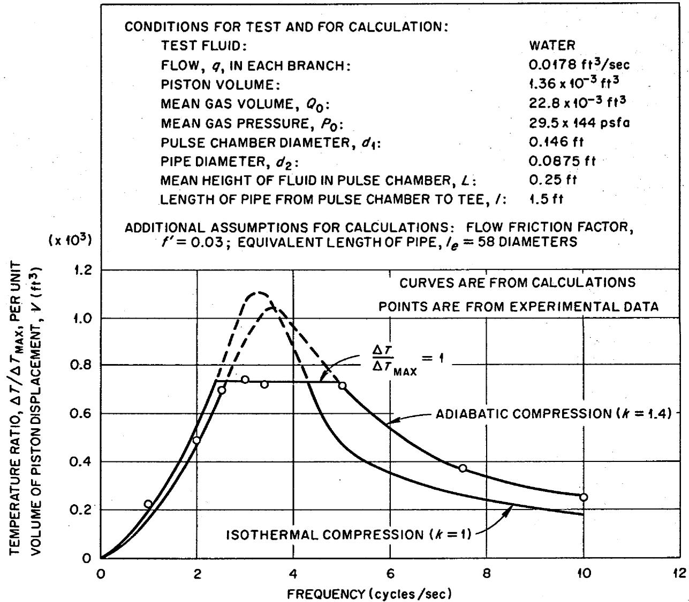  
CONFIDENTAL NL-LR-DWG 16138   
Fig. 1.4.11. Response of Pulse Pump as a Function of Frequency.

$615^{\circ}F$ (equivalent to $135\mathrm{ppm}$ $\mathsf{O}_2$ ), while chemical analysis of the NaK gave only $82~\mathrm{ppm}$ $\mathsf{O}_2$ . This type of plugging indicator was considered unsatisfactory, because the characteristic break in NaK flow was not obtained for oxide saturation temperatures below $400^{\circ}F$ . This made interpretation of low oxide contents virtually impossible.

The second type of plugging indicator used a plugging disk with 18 holes 0.31 in. in diameter and one hole 0.049 in. in diameter. The stand

operated for 25 days, during which time the plugging indicator was run 68 times and 47 samples were taken for chemical analysis with two Argonne samplers. Averaged data for a 24-hr period under constant conditions showed that, with the cold-trap outlet temperature at $900^{\circ}\mathrm{F}$ (equivalent to $470\mathrm{ppm}O_2$ ), the plugging indicator break temperature was $640^{\circ}\mathrm{F}$ (equivalent to $160\mathrm{ppm}O_2$ ), while the chemical analysis of the NaK showed $170\mathrm{ppm}O_2$ . Performance of this plugging indicator was, in general, satisfactory.

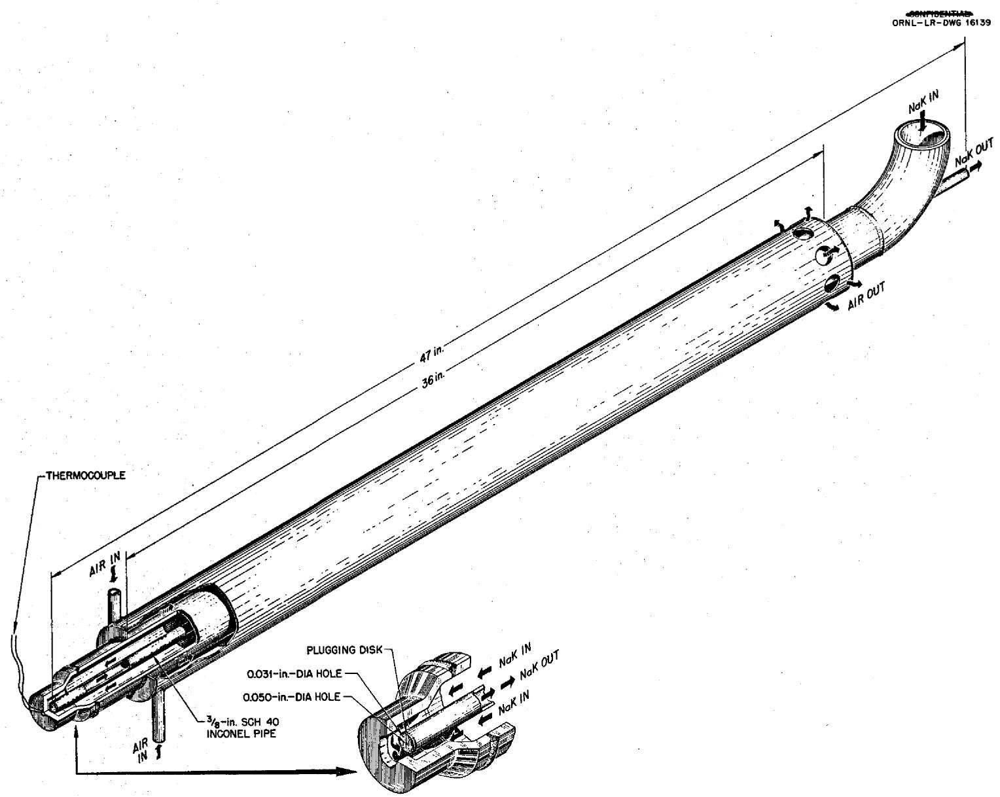  
Fig. 1.4.12. ART Plugging Indicator.

B

ORNL-LR-DWG16140

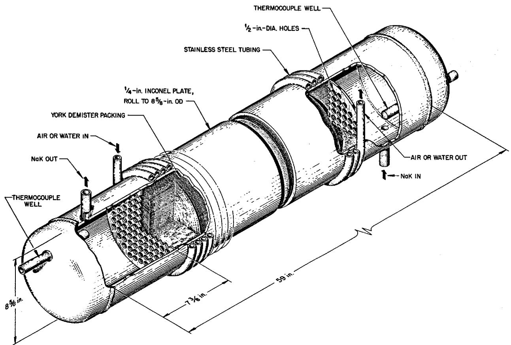  
Fig. 1.4.13. ART Circulating Cold Trap for 70-gal NaK System.

# LIQUID-METAL-VAPOR CONDENSERS

# M. H. Cooper

The specification of bleed gas purges through ART sodium and NaK pumps requires that condensers be provided for removing liquid metal vapor from the exit helium streams. In addition, the NaK dump tanks must be provided with similar condensers capable of removing the NaK vapor from the helium exhausted by an emergency NaK dump.

Development work on such condensers is under way, and the dimensions and design parameters of the units currently being investigated are given below:

<table><tr><td></td><td>For Na
Vapor</td><td>For NaK
Vapor</td></tr><tr><td>Condenser diameter</td><td>3/8-in.-IPS pipe</td><td>1-in. tubing</td></tr><tr><td>Condenser length</td><td>60 in.</td><td>36 in.</td></tr><tr><td>Helium flow rate</td><td>500 liters/day</td><td>1.7 cfm</td></tr><tr><td>Inlet temperature</td><td>1200°F</td><td>1200°F</td></tr><tr><td>Outlet temperature</td><td>200°F</td><td>600°F</td></tr></table>

Schematic test layouts are shown in Figs. 1.4.14 and 1.4.15. For the NaK test, helium at $1200^{\circ}\mathrm{F}$ , saturated with NaK vapor, was periodically vented from the $15\text{-ft}^3$ sump at a flow of 1.7 cfm and exhausted to the atmosphere through the condenser. Two condensers were tested, the second of which was refined by adding external fins $(2)_{2}$ -in.-dia Inconel, eight per inch) and internal Demister packing.

The first test, for which the conditions were those tabulated above except that the outlet temperature was $300^{\circ}\mathrm{F}$ , was terminated after the second cycle because of entrained NaK in the control panel. The second test, for which fins were added to the condenser and the outlet temperature was $100^{\circ}\mathrm{F}$ , was terminated after 70 cycles because of entrained NaK in the control panel. A larger trap downstream of the condenser was used in the second test and may have been responsible for the improved performance.

The test results obtained to date indicate that the NaK condenser design is inadequate for ART

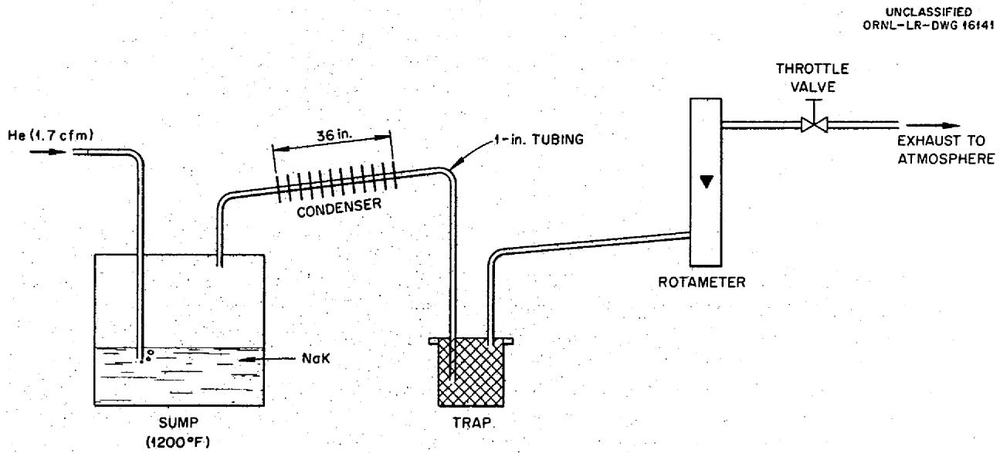  
Fig. 1.4.14. Layout of NaK-Vapor-Condenser Test Apparatus.

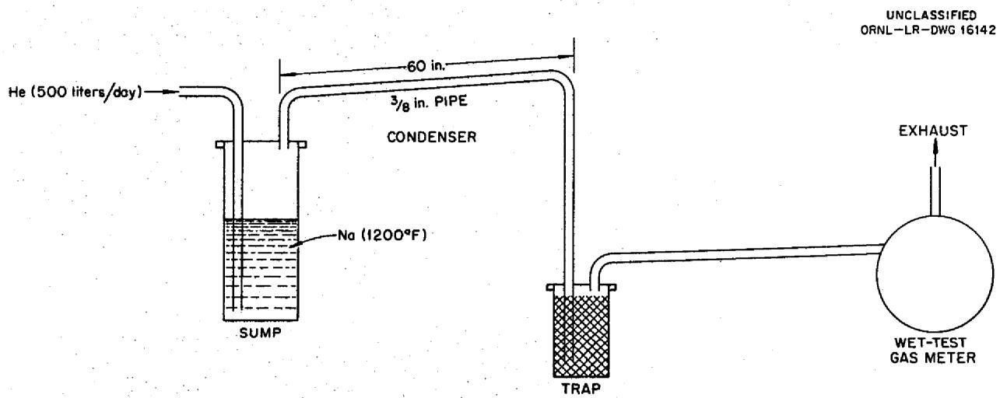  
Fig. 1.4.15. Layout of Sodium-Vapor-Condenser Test Apparatus.

application. A reliable gas-liquid separator must be used to remove condensed NaK entrained in the helium stream.

For the sodium test, helium at a flow of 500 liters/day was bubbled through a small sump containing sodium at $1200^{\circ}\mathrm{F}$ and vented to the atmosphere through the sodium condenser. The sodium condenser plugged 10 hr after flow commenced. A sodium oxide plug had formed at the Swagelok joint between the sump and the condenser inlet

tube. Therefore the test equipment is being re-designed to eliminate the mechanical joint.

# ZIRCONIUM FLUORIDE VAPOR TRAP

F. A. Anderson

M. H. Cooper

High-temperature chemical absorbents and thermal-precipitation traps are being investigated in the program for the development of a zirconium fluoride vapor trap. The most promising system consists of a bed of hot aluming which reacts with gaseous $\mathsf{ZrF}_4$ to form solid $\mathsf{ZrO}_2$ and $\mathsf{AlF}_3$ . All

the thermal-precipitation traps tested have formed $\mathsf{ZrF}_4$ plugs at the initial cold section.

The second test with an alumina bed, initiated previously,[24] was terminated after 450 hr of operation because of flow stoppage. X-ray diffraction analysis of the packing showed that the $\mathrm{Al}_{2}\mathrm{O}_{3}$ had reacted with the $\mathrm{ZrF}_4$ according to the following equation:

$$
3 Z r F _ {4} + 2 A l _ {2} O _ {3} \rightarrow 3 Z r O _ {2} + 4 A l F _ {3}
$$

Wet analysis of the packing showed that the reaction was about $90\%$ complete. The wet analysis also showed that the plug was caused by thermal precipitation of $\mathsf{ZrF}_{4^{\prime}}$ in the cooled outlet section of the test piece, after the $\mathsf{Al}_2\mathsf{O}_3$ had been depleted.

A shell-and-tube prototype trap $^{25}$ was packed with 4- to 8-mesh $\mathsf{Al}_2\mathsf{O}_3$ pellets. The schematic flowsheet for the test is shown in Fig. 1.4.16.

24M. H. Cooper, ANP Quar. Prog. Rep. June 10, 1956, ORNL-2106, p 63.   
25J. J. Milich and J. W. Kingsley, ANP Quar. Prog. Rep. Dec. 10, 1956, ORNL-2012, p 60.

Helium was bubbled through the sump containing the fuel mixture (No. 30) NaF-ZrF $_4$ -UF $_4$ (50-46-4 mole %) at $1500^{\circ}\mathrm{F}$ at a rate of 5000 liters/day and exhausted through the trap, which was heated to $1350^{\circ}\mathrm{F}$ . This test, in which the fuel temperature was $100^{\circ}\mathrm{F}$ higher than the temperature anticipated in the ART, operated for 690 hr before the pressure required to maintain the ART design flow rate started to increase. Examination of the packing after termination of the test indicated that the flow stoppage had been caused by thermal precipitation of $\mathsf{ZrF_4}$ after the $\mathsf{Al}_2\mathsf{O}_3$ had been consumed.

The test of $\mathsf{UF}_4$ pellets as a high-temperature absorbent for $\mathsf{ZrF}_4$ was unsuccessful. The $\mathsf{ZrF}_4$ was not removed from the helium, and plugs of thermally precipitated $\mathsf{ZrF}_4$ were formed in the outlet of the test piece.

A thermal trap was modified by the addition of four water-cooled baffles, as shown in Fig. 1.4.17. Helium, at the ART design flow rate of 5000 liters/day, was bubbled through the fuel (No. 30) at $1400^{\circ}\mathrm{F}$ and passed through the trap. This test was terminated after 231 hr as a result of a $\mathsf{ZrF}_4$ plug, shown in Fig. 1.4.18, at the first baffle.

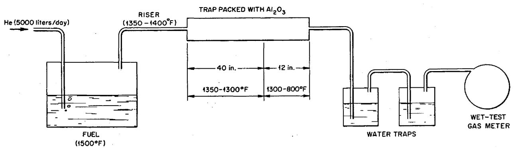  
SECRET
-LR-DWG 16143   
Fig. 1.4.16. Schematic Flowsheet for Tests of $\mathsf{Al}_2\mathsf{O}_3$ Trap for $\mathsf{ZrF_4}$ Vapor.

DEGRE

ORNL-LR-DWG 16144

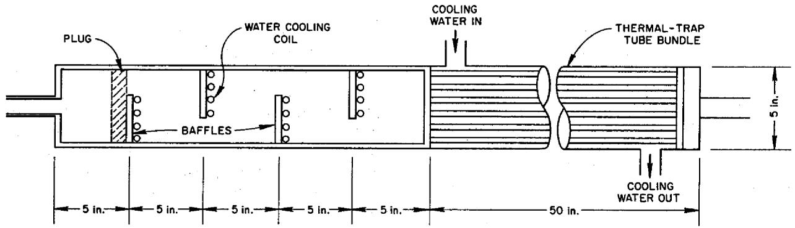  
Fig. 1.4.17. Modified Thermal Trap for $\mathsf{ZrF}_4$ Vapor.

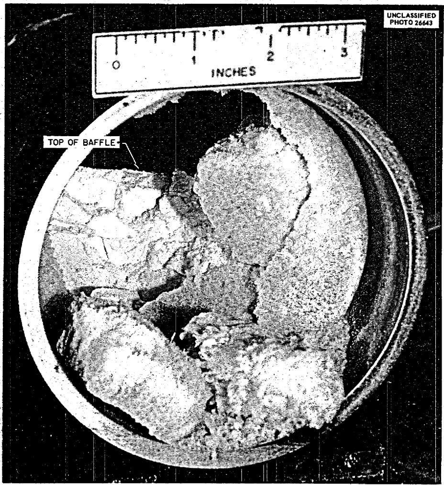  
Fig. 1.4.18. Plug of $\mathbf{ZrF}_4$ at First Baffle of Modified Thermal Trap. Deposit broken through to show thickness. (Secret with caption)

# 1.5. Procurement and Construction

W. F. Boudreau

# ART FACILITY

F. R. McQuilkin

Construction work on the contract portion of the ART facility in Building 7503 is in the final stages. Work on the building additions, building alterations, and cell installation (package 1) has been completed, with the exception of installation of the last six circuit breakers (which were delayed by the Westinghouse strike) and completion of two modifications to the cell floor structure (which were ordered late in the contract period).

Work performed during the quarter included completion and testing of the cell; installation of mechanical items, such as the penthouse coolers, a 3-ton hoist, the air duct liner and insulation; electrical testing; painting; grading and paving; and miscellaneous cleanup jobs. The contractor vacated his site office on July 20, 1956.

In order to ascertain the leak tightness of the reactor cell, the 24-ft-dia tank was completely assembled (with temporary test plates over all nozzles) and subjected to a rigid leak test. Following a satisfactory pressure rise test of 50-hr duration, the annulus between the two vessels was flooded with $21,000\mathrm{ft}^3$ of circulating helium for the leak-rate measurement. By using standard leaks of 14.7 and 28.24 micron ft³/hr on the system, it was established that the two Model 24-102 Consolidated Engineering Company leak detectors could detect a system leakage rate of 5 micron ft³/hr or larger. Inasmuch as a zero leak rate was measured and the contract specification allowed 32 micron ft³/hr, the vessel satisfactorily met the leak tightness requirements.

Work on the installation of auxiliary services piping (package A) has been completed, with the exception of replacement of 15 valves in the nitrogen system. Erroneous vendor information led to the installation of incorrect valves for the service. They were rejected when pressure and leak testing revealed the error and their inadequacy. Otherwise, work performed during the quarter included completion and testing of the contractor-established portions of the lube oil, hydraulic drive oil, cooling water, air, nitrogen, helium, and vent piping systems.

The work which includes the installation of the diesel generators and facility, electrical control

centers, and spectrometer room electrical air conditioning equipment (package 2) was at the $91.8\%$ completion point on September 1, 1956. All work has been completed on this contract, with the exception of the installation and testing of the diesel generators. This work has been delayed because one of the deisel-generator units and three control panels were damaged in shipment. The damaged components were returned to the manufacturer for repair and are scheduled for reshipment early in October 1956. Special vibration testing of the units will be performed during the field tests to ascertain that all damage has been accounted for. Two other items of work were negotiated with the package 2 contractor for execution while he completes his other work. The contractor was given an order to remove the shield blocks now occupying three sides of the ARE pit to nearby outside storage so that this building space can be used. To provide complete access into the high bay through the north door and to provide greater flexibility in the use of the building cranes in unloading, the contractor was also given an order to remove the parapet wall above the floor level at an elevation of 852 ft around the ARE pits. The roof plugs for the pits will provide the floor surface over them.

Design work continued and installation work was started on package 3, which concerns the installation of process piping, process equipment, etc. Completion of the design is currently scheduled for October 1, 1956. During the quarter two of the four main blowers were installed.

Some of the construction work may be seen in Figs. 1.5.1 through 1.5.13.

Program and design planning for disassembly of the ART were initiated. The problem is being handled in two basic parts; the first being that of removal of the reactor from the cell, and the second that of transporting and disassembling it in hot-cell facilities. Procedures and tools necessary for removing the reactor are being developed. A new, large hot-cell facility is being planned. It is proposed that the new facility be constructed in conjunction with the construction of a group of smaller examination cells. The tentative location of these cells is on the north side of the ORNL Area adjacent to the Bethel Valley Road. Transfer

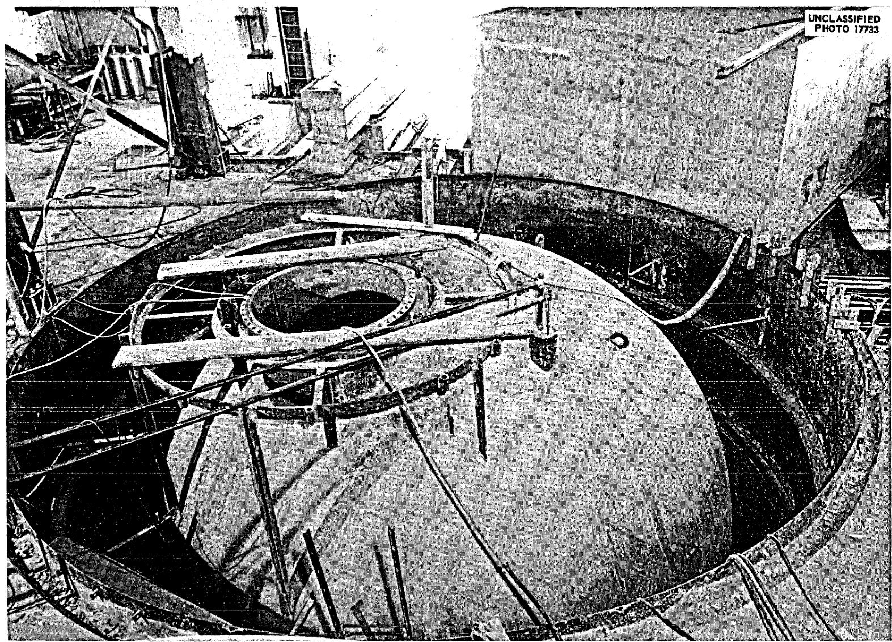  
Fig. 1.5.1. View Looking South Across the 7503 Cell. In the foreground is the top of the cell inner vessel. At the top right is the concrete penthouse structure which will house the primary coolant pumps and their drive motors. To the left of the penthouse are the roof plugs which will cover the special equipment room immediately below.

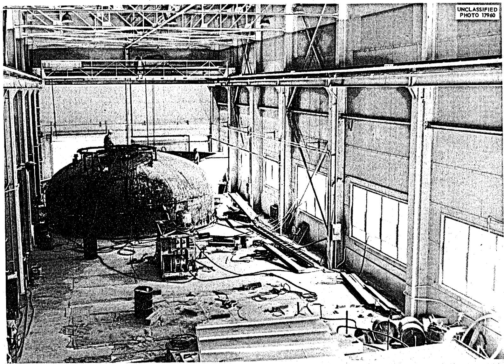  
Fig. 1.5.2. View Looking South from the North End of the Original 7503 Building. This view, showing the top of the cell water tank in place as it will be located during ART operation, was photographed during the vacuum-testing operation on the inner vessel, which is enclosed by the water tank.

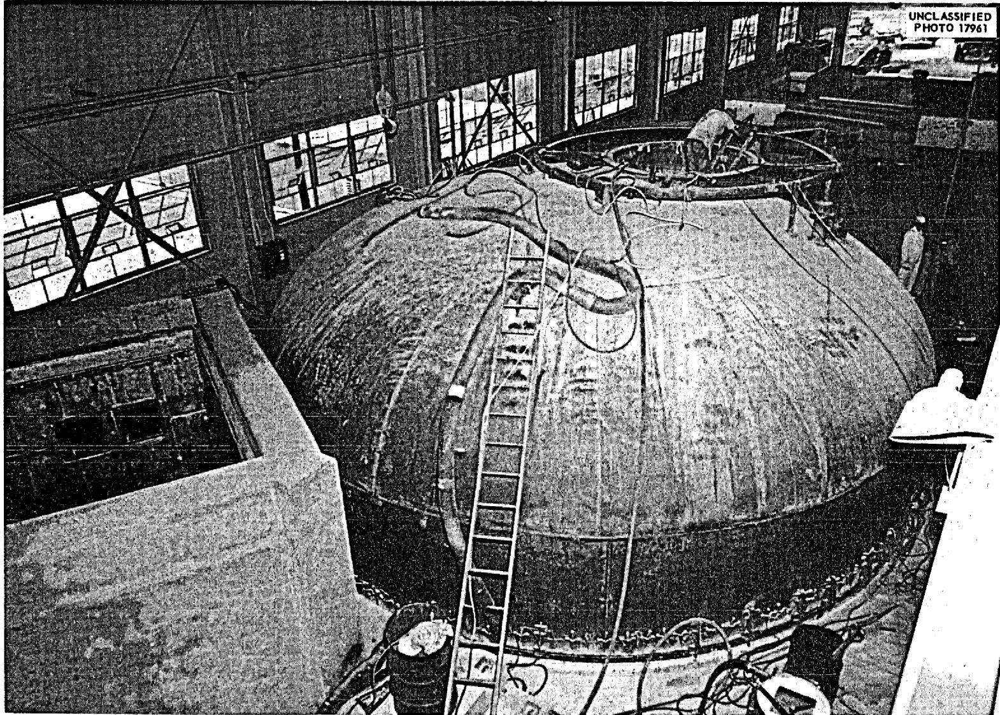  
Fig. 1.5.3. View Looking North Across the Cell While the Water Tank Top Is in Place. At the lower left are the penthouse structure and the area in which the main coolant pumps and motors will be located.

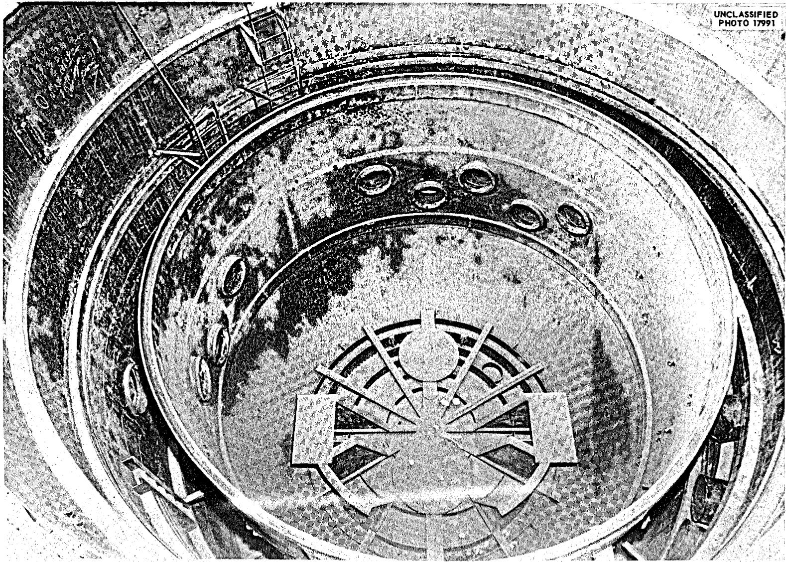  
Fig. 1.5.4. View Looking North Across the Opened 7503 Cell Tank. The rectangular plates shown on the floor structure of the inner vessel will support the reactor. The circular plates shown will support the shielded fuel fill-and-drain tank and fuel removal tank. The 24-in.-dia nozzles through the side wall of the vessel will provide for the penetration of the instrumentation and control lines, lube oil lines, hydraulic drive lines, cooling water lines, gas lines, and heater leads to the cell equipment.

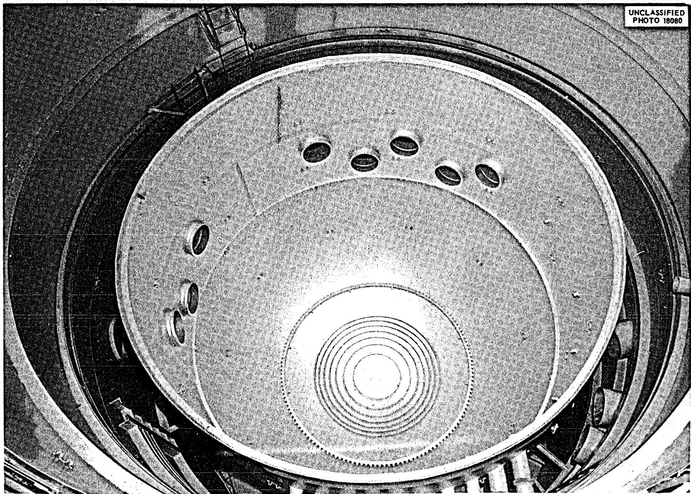  
Fig. 1.5.5. View Looking North Across the Completed and Painted 7503 Cell Tanks. The floor structure was removed from the inner vessel at the time this photograph was taken and therefore the fluid distribution weirs located in the bottom of the vessel may be seen. The scalloped ring shown outside of the weirs is the support for the floor structure. At the extreme bottom of the photograph are the NaK piping sleeves with their expansion joints which penetrate the two cell tanks. To the right of these sleeves are portions of three of the 24-in.-dia spectrometer tubes.

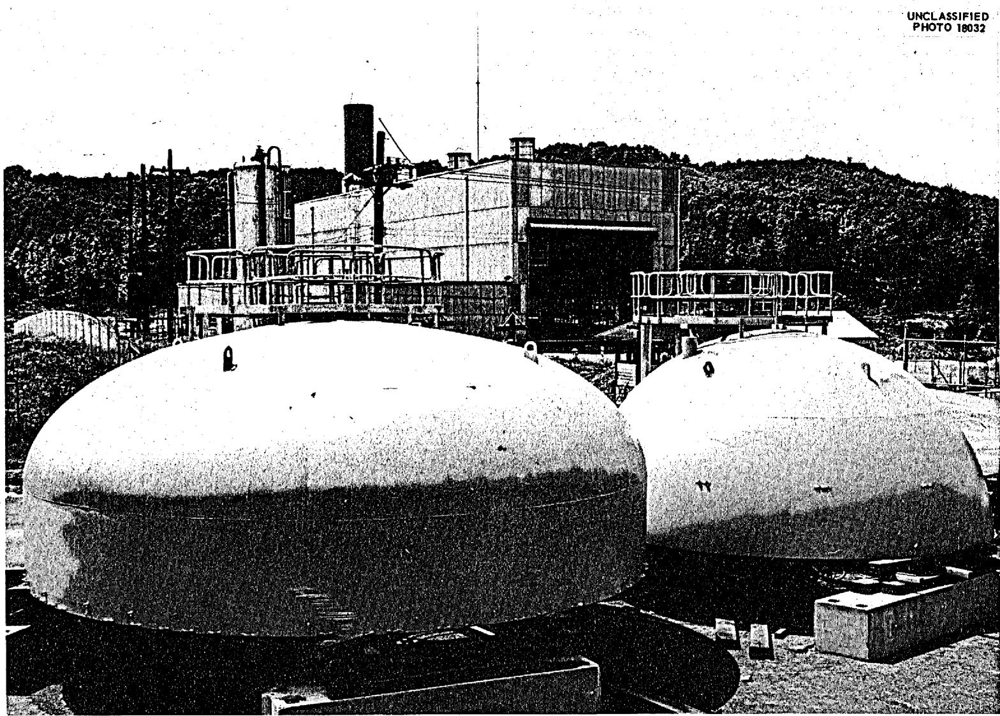  
Fig. 1.5.6. View Looking Southwest Toward the Modified Building. In the foreground are the two top heads for the cell tanks which have been removed to storage outside the facility.

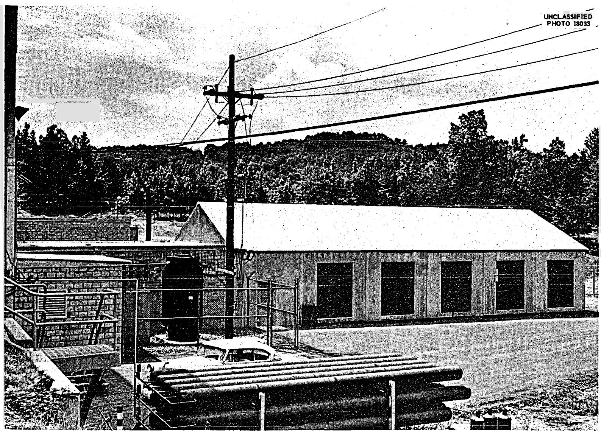  
Fig. 1.5.7. View Looking Southwest Toward the Diesel-Generator House. In the lower left is the substation for the 13.8-kv purchased-power supply from the TVA system. The gas cylinders in the lower center of the photograph will be used for storage of nitrogen during ART operation.

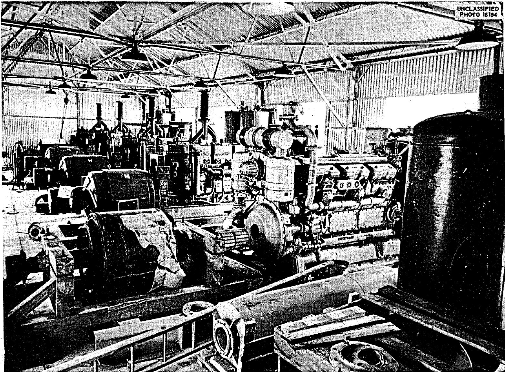  
Fig. 1.5.8. View Looking West Inside the Diesel-Generator House Which Shows a Stage of the Installation Work on the Five Diesel-Generator Units for the Auxiliary Power System.

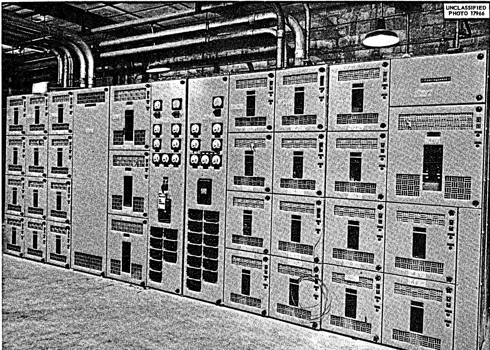  
Fig. 1.5.9. View Taken in the Switchhouse Which Shows the Primary Switchgear and Instruments Associated With the Receipt and Distribution of the Two Power Supplies to the Facility. The switchgear and instruments on the left will serve the incoming purchased-power from TVA. Those on the right are for the diesel-generator power.

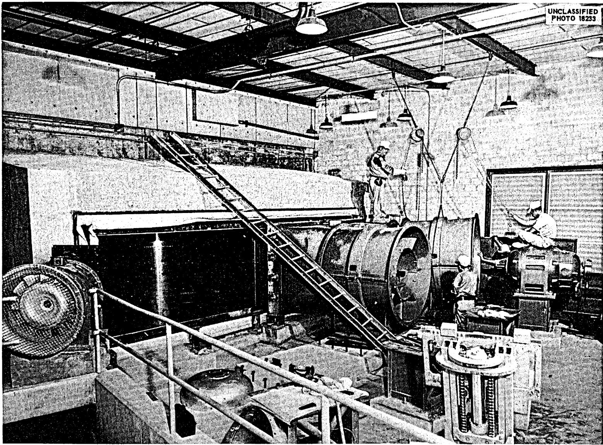  
Fig. 1.5.10. View Taken Inside the Blower House Which Shows the Supply End of the Main Cooling Air Duct and Installation Work on Two of the Four 82,000-cfm Blowers. On both sides of the main duct are the 10,000-cfm blowers which will supply air into the annulus between the building concrete and the insulated steel duct for the purpose of preventing overheating of the building structure. At the lower left is the opening for the ramp which leads down to the radiator pit beneath the cooling air duct.

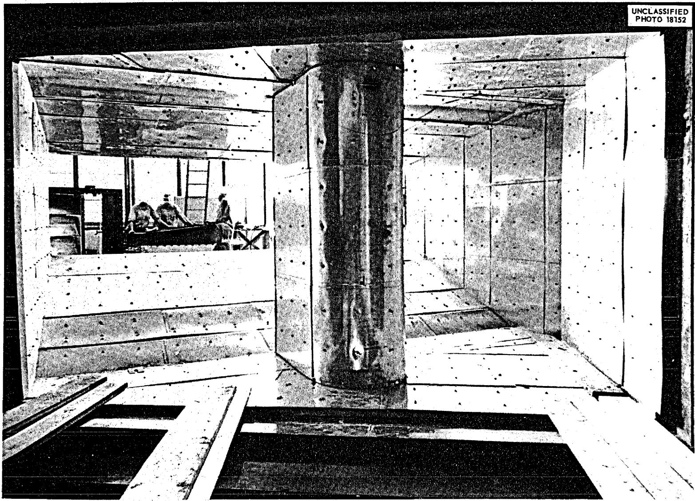  
Fig. 1.5.11. View Looking West and from Inside the Cooling Air Duct. This view shows the 16-gage stainless steel facing over the insulated steel liner of the duct. The supply end of the duct is the opening shown in the center of the photograph.

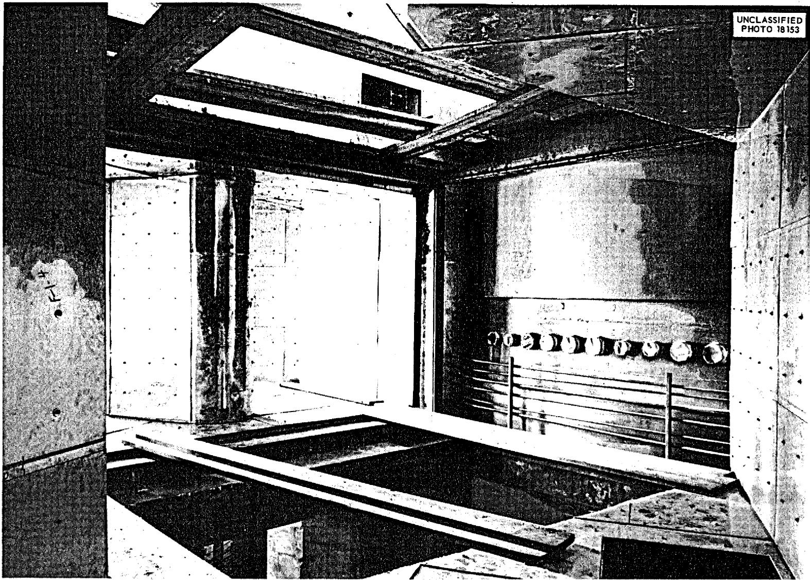  
Fig. 1.5.12. View Taken Inside the Main Air Duct from the Base of the Discharge Stack. This photograph shows the portion of the duct in which the NaK-to-air radiator banks will hang. At the right center are the exterior facing of the cell water tank and the sleeves through which the NaK pipe lines will pass. Above the duct, through the opening shown, is the penthouse. Below the duct, through the opening in the floor, is the radiator pit.

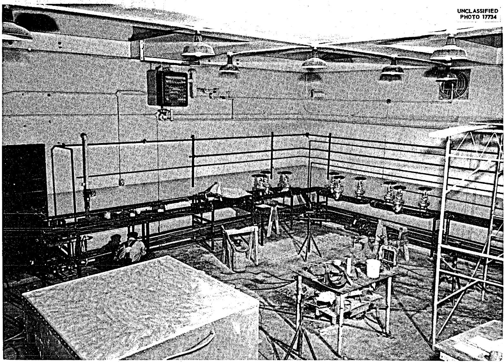  
Fig. 1.5.13. View Showing the Southwest Corner of the Auxiliary Equipment Room. This room, which was used during ARE operation as the heat exchanger pit, is being modified to serve as the auxiliary equipment room and will house the lubricating oil pumping system and the hydraulic drive equipment.

of the radioactive reactor from Building 7503 to the disassembly cell would be by a shielded "low boy" carrier and from the larger cell to the smaller cells by means of a conveyor in a shielded transfer and storage facility.

# ART-ETU REACTOR CONSTRUCTION

M. Bender

G. D. Whitman

# ETU Facility

T. J. Balles

V. J. Kelleghan

P.A.Gnadt

A. M. Smith

Construction work has started on the ETU facility. Structural steel is being fabricated, and erection of the stand from which the NaK pumps and piping are to be supported has begun. The H.K. Furgerson Company is procuring steel which will be installed under the track floor to support the weight of the stand. Designs for this work are complete. Design of the control room enclosure is complete except for minor details.

The details of the main NaK piping have been determined, and piping layouts are being reviewed. The economizers and the plug indicators for the NaK cold-trap loops are being fabricated.

The design of the air duct for the NaK-to-air radiators is being reviewed. The air duct is to be supported from the stand which supports the NaK system. A variable-speed blower will send air through the duct and across the radiators. The air will be discharged outside the building.

A second layout of the piping for auxiliary services has been completed. The auxiliary services include instrument air, plant air, water, helium, lube oil, and hydraulic oil. Changes in the system requirements have caused delays in the start of construction of these systems. Necessary changes have been made in the existing gas piping to the furnaces which will be used to provide the heat load for the ETU.

The basic electrical system has been designed. A normal-supply substation of 1500-kva capacity will be used. This power will be distributed by means of a 460-v switchgear unit. Individual circuit breakers in this switchgear unit will supply power to six wound-rotor NaK motors; to a process-air-blower motor; to a motor control center for the reactor pump drive motors; to motor control centers for the lubrication pump drive motors; to trans

former banks which will, in turn, supply power for controls and instrumentation, valve actuators, and control motors; and to two sets of transformer banks which will, in turn, supply power to the heating circuits.

An emergency electrical supply will also be available which will consist of a 300-kw capacity, 480-v, 3-phase, diesel-generator unit. Upon failure of the normal supply this emergency unit will supply power through automatic switching devices for an orderly shutdown of the equipment. The spare lube oil systems drive motors, instruments and controls, valve actuators, and some necessary heaters in the system will continue to function until it is felt that the experiment can be safely stopped or restarted. The drives for the fuel, sodium, and NaK pumps are not connected to this emergency supply because of its limited capacity. Preheat and additional auxiliary heat required during the course of the experiment will be supplied by means of ceramic clamshell and tubular heaters designed for high-temperature applications. The 1500-kva substation, 460-v switchgear unit, and the emergency diesel generator have been installed.

# ART-ETU Reactor Fabrication and Assembly

R. Cordova

C. K. McGlothlan

G.W.Peach

The study of the reactor assembly problem has continued, and general assembly procedures have been prepared and reviewed. A sequence of operations has been outlined which covers the assembly of the reflector-moderator, north head, heat exchangers, island, and the various shells into a complete reactor. Detailed instruction sheets are being prepared from this general outline, which will serve as the assembly manual for the craftsmen who will assemble the reactor.

The more detailed review of the reactor assembly problem has indicated the need for many jigs and assembly fixtures, and design of such tools is proceeding. A device for checking the concentricity of the reflector-moderator components about the polar axis during assembly has been designed.

Weld shrinkage tests on geometries peculiar to the reactor design are continuing (see Chap. 3.4, "Welding and Brazing Investigations"). It is necessary that the weld shrinkage be predictable to within a few thousands of an inch if the close tolerances designed into the reactor are to be held.

This is particularly true in the fitup of the thin Inconel shells surrounding the reflector-moderator.

Nearly all the component parts and spare parts for three reactors have been ordered. Fabrication of the north head for the ETU reactor has continued without difficulty and is approximately $40\%$ complete.

A gas-drying facility is being designed for installation in the Y-12 foundry. This equipment will be used to supply the controlled atmospheres necessary for proper heat treatment of the north head and similar weldments.

The lower half of the beryllium reflector-moderator has been contoured, and drilling of the coolant holes has been started. A rough dimensional check of the contoured piece of beryllium indicated that it was acceptable.

The water-flow tests to be run on the first reactor assembled have been defined, and design work is practically complete on the equipment for the first of these tests, which is to be run on the beryllium reflector-moderator. Four water-flow tests are scheduled for the critical sodium circuits to determine flow distribution and pressure drops in the reflector-moderator and island sodium passages. Dummy parts will be used in some cases in order to expedite these tests.

The construction work on the reactor assembly and inspection area was completed. This area has been air conditioned and a 20-ton bridge crane has been reinstalled over the building main floor for lifting-access to the assembly area through a hatch equipped with removable covers. Space has also been made available for a degreaser, a vacuum-drying facility, and a storage area for reactor parts.

# ART Cell Components

A.M.Smith

Design work on various ART cell components and installation layouts is continuing. Layout drawings of the lead shield, the top support platform, the fuel fill-and-drain tank, piping manifolds, auxiliary piping, and the junction panel and junction panel expansion joint have been completed, and fabrication and procurement are under way. These items constitute approximately $5\%$ of the equipment needed for the cell. Design of the hydraulic piping layout inside the cell is approximately $90\%$ complete, and the lube oil piping layout is about $40\%$ complete.

# ART-ETU REACTOR COMPONENT Procurement

W. R. Osborn

J. Zasler

The fabrication of the fuel-to-NaK and the sodium-to-NaK heat exchangers still appears to be one of the most difficult procurement problems. Although considerable progress has been made, much remains to be done in refining the design and in developing machining, tube bending, welding, and brazing techniques for both these heat exchangers.

# Fuel-to-NaK Heat Exchangers

The York Corp. has ordered all the tooling necessary for production of the fuel-to-NaK heat exchangers based on the use of stretch-formed tubes and of channels made from premachined parts, which will be welded and stress-relieved as a final operation. Black, Sivalls & Bryson, Inc., feel that the channels must be machined after welding to hold the required tolerances, and they are providing special tooling for their large boring mill for this purpose. They are also developing at least two different means of forming tubes to avoid some of the uncertainties of stretch-forming. Work is being carried out at ORNL, as well as at the plants of the two vendors, on the various welding and brazing problems, and some design changes are being studied for overcoming existing difficulties with close tolerances, accessibility for welding, and distortion problems.

# Sodium-to-NaK Heat Exchangers

Minor redesign of the sodium-to-NaK heat ex-changers and major improvement of the vendors' tooling have been found necessary to permit fabrication of this unit within the required tolerances. This work is now in progress, and should result in the delivery of the sodium-to-NaK heat exchangers for the ETU during the next quarter.

# Core Shells

The modification of the Hydrospin machine to increase the size of the shells that can be produced has been completed, and a number of reasonably successful efforts have been made to spin the island core shell. The mandrels for the outer core shell are essentially complete, and both these shells should be available for shipment to ORNL in September. The mandrels for all the remaining shells are in various stages of manufacture and will be completed during the next quarter.

# Beryllium Reflector-Moderator

The Brush Beryllium Co. is now machining both the north beryllium hemisphere for the ETU (to be shipped about October 5, 1956) and a hemisphere for the ART. The major difficulties in the fabrication of these units seem to have been overcome.

# Boron Layers

Acceptable samples of finished boron carbide tiles have been received from the Norton Company, and no major difficulties are expected with production of these components. Sample sheets of the boron-copper cermet have been received from Allegheny-Ludlum which are acceptable except for surface finish. Some difficulties are anticipated in forming and finishing this material.

# Pressure Shell

An order has been placed for forgings for the reactor pressure shell with the Ladish Co. These forgings will be machined by the Allis-Chalmers Mfg. Co.

# Inconel

The availability of adequate supplies of Inconel in the proper forms that are acceptable according to ART processing and inspection standards continues to be a major problem and a limitation on the speed of fabrication for many items. A great deal of work is being done with the International Nickel Company and the Superior Tube Co. toward the solution of this problem.

# 1.6. IN-PILE LOOP DEVELOPMENT AND TESTS

H.W.Savage

D. B. Trauger

# OPERATION OF IN-PILE LOOP NO.5

C. C. Bolta

B. L. Greenstreet

J.A.Conlin

D. M. Haines

R. A. Dreisbach

M. M. Yarosh

In-pile loop No. 5 was inserted in the MTR on June 11, 1956, but it could not be filled. It was therefore returned to ORNL for disassembly and inspection. The fill system consisted of a fill tank, a vent line, and a fill line to the pump sump. In this system the fluid flows by gravity into the preheated loop when a plug of frozen fuel mixture is melted out of the fill line. Upon disassembly and analysis a section of the fill line was found to have a plug formed of a 50-50 mixture of fuel and zirconium oxide. Subsequent examination of the initial batch of fuel showed it to contain $0.5\%$ zirconium oxide. It was also determined that repeated melting and freezing of the fuel salt could cause the zirconium oxide to separate out and settle in the bottom of the fill tank; however, it has not been possible to positively establish that this was the mechanism of formation of the oxide plug in the fill lines. Another consideration was the possibility of accidental exposure of the molten salt to moisture. However, the evacuation and purging of the system with inert gas, which were done prior to filling the tank, plus the evacuation before and purging during the attempted melt-out preclude the presence of air or moisture in the system. Close control was held on loop cleaning during assembly. Future loops will be filled with salt produced under stricter control, and every precaution will be continued to prevent air and moisture from entering the loop prior to and after charging of the fill tank. Increased efforts will be made to minimize thermal cycling during initial filling and melt-out of the fill system.

# IN-FILE LOOP NO.6

In-pile loop No. 6 is nearing completion and is scheduled for insertion in the MTR on September 3. This loop is similar to previous loops, with the principal variations being the installation of a modified (Mark II) horizontal-shaft sump pump, improved electrical hermetic seals between the nose and intermediate, or bearing housing, region, and the use of fuel in which the zirconium oxide content has been minimized. The planned operating conditions for this loop are a $1600^{\circ}\mathrm{F}$ maximum loop temperature with the fuel mixture (No. 44) $\mathrm{NaF - ZrF_4 - UF_4}$ (53.5-40-6.5 mole %), a $300^{\circ}\mathrm{F}$ temperature differential across the nose coil, and a power density of about $0.75\mathrm{kw/cm}^3$ . These conditions are to be maintained over two MTR operating cycles to give approximately 700 hr of operation with the reactor at full power.

# HORIZONTAL-SHAFT SUMP PUMP FOR IN-PILE LOOPS

J. A. Conlin

D. M. Haines

W. S. Karn

A prototype (Mark II) horizontal-shaft sump pump for in-pile loops was modified to increase the radial clearance between the pump housing and shaft slinger from 6 to 60 mils in an effort to prevent shaft seizure such as that which occurred previously because of $\mathsf{ZrF}_4$ vapor deposits. This pump, which is identical to that installed in loop No. 6, is now being tested and should have accumulated 1150 hr of operation by the MTR insertion date for loop No. 6. The pump temperature in loop No. 6 will be higher than in previous tests, but it will be 50 to $75^{\circ}\mathsf{F}$ lower than the temperature of the test pump now operating. It should therefore have a lower rate of zirconium fluoride accumulation than the test pump will have.

# 1.7. ADVANCED REACTOR DESIGN

W. K. Ergen

A. M. Perry

# GRAPHITE AND BERYLLIUM OXIDE MODERATED CIRCULATING-FLUORIDE-FUEL REACTOR

W. K. Ergen

The complexities involved in the use of sodium to cool the beryllium reflector-moderator of the ART have directed thinking toward a reactor design in which the moderator is cooled by the circulating fuel. A new design now being studied is based on a multitubular core, similar to that used for the ARE, in which fuel passages would penetrate a moderator block or, alternatively, moderator rods would be immersed in the circulating fuel.

If the fuel is to accept heat from the moderator, the moderator must be at a higher temperature than the fuel. This eliminates beryllium metal, as used in the ART, from consideration because of its poor mechanical properties at temperatures above the fuel temperature of interest, that is, $1600^{\circ}\mathrm{F}$ . Therefore graphite, beryllium oxide, and the hydrides of zirconium and yttrium are being considered as possible moderators.

The required volume of the multitubular reactor core will, of course, depend largely on the desired total reactor power and the permissible power density in the fuel. A 24-in.-dia sphere has a volume of $1.2 \times 10^{5} \mathrm{~cm}^{3}$ , and, if it is assumed, optimistically, that $80\%$ of this volume could be occupied by fuel, about $10^{5} \mathrm{~cm}^{3}$ of fuel volume would be available. Thus, in a 24-in.-dia multitubular core, $100 \mathrm{Mw}$ of power could be generated with a power density of $1 \mathrm{~kw} / \mathrm{cm}^{3}$ , which is approximately twice the average power density of the ART, and $300 \mathrm{Mw}$ would require $3 \mathrm{~kw} / \mathrm{cm}^{3}$ . It is clear that in many cases of interest, therefore, larger, rather than smaller, core volumes may be necessary. Thus far, this study has been limited to an evaluation of 24-in.-dia spherical cores, but the general conclusions are applicable to larger cores.

The rate of heat generation in the moderator and the resulting thermal stresses would be of prime

importance. The gamma-ray heat sources² have been shown to be prompt gamma rays plus U²³⁵ capture gamma rays (9 Mev), fission-fragment-decay gamma rays (1 Mev, based on 20% of the fuel being inside the core), gamma rays resulting from captures in material other than U²³⁵ (5 Mev, depending strongly on the "thermal utilization" of the reactor), and gamma rays resulting from inelastic scattering (1 Mev). This adds up to about 8% of the fission energy. The density of the fuel was considered to be 3.2 g/cm³, which is approximately the density of the fuel mixture (No. 30) NaF-ZrF₄·UF₄ (50-46-4 mole %).³ Hence, the radius assumed for the core would correspond to 2 or 3 relaxation lengths of the gamma rays, even if allowance were made for the moderator, which would occupy some of the core and would have a somewhat lower density than that of the fuel. Most of the gamma rays generated at the center of the core would be absorbed in the core. At points closer to the surface, the power generation by gamma-ray absorption would be less.

The gamma-ray absorption would be distributed between the fuel and the moderator approximately according to the densities. In a volume filled to $80\%$ by fuel of density 3.2 and to $20\%$ by graphite of density 1.8, the graphite would contribute about $\frac{1}{8}$ to the density. Beryllium oxide, of density 2.8, if it occupied the same volume fraction in the same fuel, would contribute about $\frac{1}{6}$ to the density. With a heat generation rate in the fuel of $1\mathrm{kw/cm^3}$ and a fuel volume fraction of $80\%$ , $0.8\mathrm{kw/cm^3}$ would be generated, on the average, over the core; $8\%$ of this, or $64\mathrm{w/cm^3}$ , would be gamma-ray energy, of which $\frac{1}{8}$ or $\frac{1}{6}$ would be absorbed in the moderator, depending on whether the moderator is graphite or beryllium oxide. Since the moderator would occupy $\frac{1}{5}$ of the volume, the power density in the graphite would be $40\mathrm{w/cm^3}$ , and, in the beryllium oxide, $60\mathrm{w/cm^3}$ .

The heating as a result of neutron moderation should, of course, be added to the gamma-ray heating. However, the neutron heating in the core would depend strongly on the design of the reactor, and, therefore, for the purpose of this discussion, it has been assumed that it is compensated by the loss of gamma rays from the core.

The permissible stress for graphite has been assumed to be 2000 psi, and, for beryllium oxide, 4 1000 psi. The stress data and the power density data given above were used to obtain the following maximum dimensions for beryllium oxide and graphite bodies in the proposed multitubular core:

<table><tr><td></td><td>Flat Plates, Thickness (in.)</td><td>Rods, Diameter (in.)</td></tr><tr><td>Beryllium oxide</td><td>0.16</td><td>0.26</td></tr><tr><td>Graphite</td><td>5.6</td><td>9.1</td></tr></table>

As may be seen, if beryllium oxide were used, the structures in the core would have to be rather delicate. Graphite, on the other hand, would allow rather rugged construction, in spite of nuclear considerations, such as self-shielding, which would require a somewhat finer structure than that indicated by the stress limitations. Furthermore, the cladding that would be required around beryllium oxide bodies would add appreciably to the poisoning of the core, whereas the cladding around graphite, with its small surface-area-to-volume ratio, would add negligible poisoning.

With the advantages of graphite in mind, a three-group reactor calculation based on the multitubular core was performed on the Oracle. According to this calculation, a 24-in.-dia sphere containing 80 vol % of the fuel mixture (No. 30) NaF-ZrF $_4$ . UF $_4$ (50-46-4 mole %) and 20 vol % of graphite would be somewhat supercritical. In this calculation poison was considered to be present in the form of a material having a macroscopic absorption

cross section of $10\%$ of the macroscopic absorption cross section of the fuel, both absorption cross sections being averaged over the core. This amount of poisoning is far in excess of that which could be caused by the cladding of the graphite. The results of the calculation indicated that there would be no need from the criticality viewpoint to use beryllium oxide in the core and that graphite would be an acceptable moderator. Since the reactor power and the permissible power density prescribe a relatively large core volume, the somewhat poorer moderating properties of the graphite appear to be adequate.

An essentially infinite graphite reflector was assumed in the Oracle calculation. Because of the relatively poor moderating properties of the graphite, such a reflector would have to be rather thick. Also, graphite has a relatively small macroscopic removal cross section for fast neutrons, that is, $0.073\mathrm{cm}^{-1}$ compared with $0.14\mathrm{cm}^{-1}$ for beryllium oxide, $0.17\mathrm{cm}^{-1}$ for nickel and copper, and $0.096\mathrm{cm}^{-1}$ for zirconium metal. The small removal cross section would result in large neutron leakage and intense sodium activation in the heat exchanger. On the other hand, the power density in the reflector would be smaller than that in the core, and there would be no need to use graphite. An "essentially infinite" beryllium oxide reflector would be thinner than an "essentially infinite" graphite reflector, because of the lower age in beryllium oxide, and in any geometry, except plane geometry, the beryllium oxide reflector would give greater reactivity because of the larger solid angle which the core would subtend, as viewed from the location of a neutron which had slowed down to thermal or any other given lethargy.

Thus, there emerges a picture of a circulating-fluoride-fuel reactor with graphite as a moderator on the inside, where the heat generation is large, and beryllium oxide as a moderator in at least the outer part of the reflector. The design of the interface between the beryllium oxide and the graphite remains to be established.

Even at the outside of the reflector there would be a certain amount of heat generation, and, hence, fuel passages would be required for cooling. Fissions in these passages would act as sources of fast neutrons, which, on one hand, might find

their way back to the core and increase the reactivity, but which, on the other hand, would also leak out and increase the shielding requirements and the sodium activation. Therefore it would probably be advantageous to poison some of the outer fuel passages, but the radius at which the poisoning should start also has not yet been established.

Both graphite and beryllium oxide are poor gamma-ray shields. It may therefore be advantageous to introduce some heavy material into the moderator, at the expense of reducing the moderating effectiveness. The heavy material would protect the outer layer from gamma-ray heating and would make it possible to use beryllium oxide rather than graphite farther into the core and thus gain back the lost moderation.

# HYDRIDE-MODERATED CIRCULATING-FUEL REACTOR

A.M.Perry

An alternative design now being studied includes the use of a somewhat more effective moderator in the core, such as the hydrides of zirconium or yttrium, than the graphite and beryllium oxide moderators discussed above. The hydride moderators would reduce the dependence of the reactor

on its reflector for moderation and would introduce the possibility of using a heavy material, such as nickel or copper, for the reflector. These materials have unusually large removal cross sections for fast neutrons, as given above, and are far more effective as gamma-ray absorbers than the moderating materials usually used as reflectors. Thus a significant portion of the gamma-ray shield might be placed immediately around the core, where its volume would be greatly reduced. While the density of radiation heating in a metal reflector would be greater than in a beryllium oxide reflector, the allowable stress would be much greater also, so that fewer cooling holes would be required for a nickel than for a beryllium oxide reflector. In the case of copper, the conductivity is so high that cooling might be required only at the inner and outer surfaces of an 8-in.-thick reflector.

Preliminary calculations indicate that a few thousand pounds in shield weight might be saved by using a dense metal reflector. The effect of capture gamma rays in the reflector, as well as the activation of NaK in the heat exchanger, remain to be determined. Further calculations of fuel concentrations in reactors with metal reflectors are also required.

# Part 2

# CHEMISTRY

W. R. Grimes

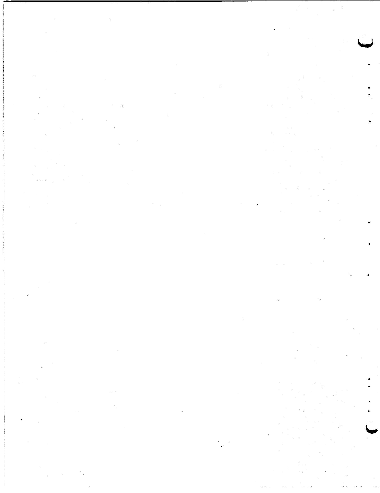

# 2.1. PHASE EQUILIBRIUM STUDIES

C. J. Barton

R.E.Moore

R. E. Thoma

H. Insley, Consultant

Phase equilibrium studies with a variety of binary, ternary, and quaternary systems have been continued. Each of the several methods described in previous reports of this series has been applied to several of the systems. Although earlier studies in this laboratory and elsewhere did not disclose its existence, careful examination of the LiF-RbF system has revealed the compound LiF-RbF. Careful re-examination of the LiF-UF4 system has yielded evidence which strongly indicates that the compound 3LiF-UF4 is metastable.

Study of the $\mathsf{RbF - UF}_4$ system has progressed to a point such that a tentative diagram for this complex system can be presented. The boundary curves, compatibility triangles, peritectic temperatures, and eutectic temperatures for the NaF-RbF-UF ternary system are now well established. The four-component system NaF-RbF-ZrF-UF has been examined in some detail. Several mixtures which are of possible interest for reactor fuels have been established.

Study of the NaF-LiF-BeF $_2$ system has progressed sufficiently for a plot of the boundary curves, compatibility triangles, and pertinent temperatures to be presented, although the composition of one of the ternary compounds is not completely established. The ternary system NaF-RbF-BeF $_2$ requires additional study before the analogous diagram can be constructed.

# THE SYSTEM LiF-RbF

# L. M. Bratcher

A recently published $^2$ equilibrium diagram for the system LiF-CsF showed the existence of an incongruently melting compound LiF-CsF that was analogous to the binary compound previously observed $^3$ on petrographic examination of mixtures containing LiF and RbF. Earlier thermal analysis

studies $^{4,5}$ failed to reveal the existence of the LiF-RbF compound. The system was re-examined recently by the thermal analysis technique, and selected compositions were examined petrographically and by x-ray diffraction. A revised equilibrium diagram for the system, based on the results of these examinations, is shown in Fig. 2.1.1. The shape of the liquidus curves gives evidence of complex formation. However, the difference between the melting point of the LiF-LiF-RbF eutectic and the incongruent melting point of the LiF-RbF compound (about $5^{\circ}C$ ) is less than the uncertainty of the temperature measurements. Petrographic examination of a mixture containing 50 mole % LiF showed that the birefringent complex was the predominant phase present; excess LiF and the complex were found in a mixture containing 70 mole % LiF.

# THE SYSTEM LIF-UF4

B.A.Soderberg R.E.Moore

H. Davis

The discussion of the system $\mathsf{LiF - UF}_4$ , which was given previously,7 mentioned a phase containing 20 to 25 mole $\%$ UF4 whose formula and stability characteristics were unknown. Recently, thermal gradient quenching studies were made in an attempt to completely characterize this compound.

The evidence from these and other quenched samples from this system indicates that there is a metastable compound in the $\mathsf{LiF - UF_4}$ system whose formula is $3\mathsf{LiF - UF}_4$ In the quenched samples the compound has the appearance of quench growth. The crystals are sufficiently well formed to give a good uniaxial-negative interference figure and a refractive index of approximately 1.514, but they have the characteristic mottled texture and wavy extinction of quench

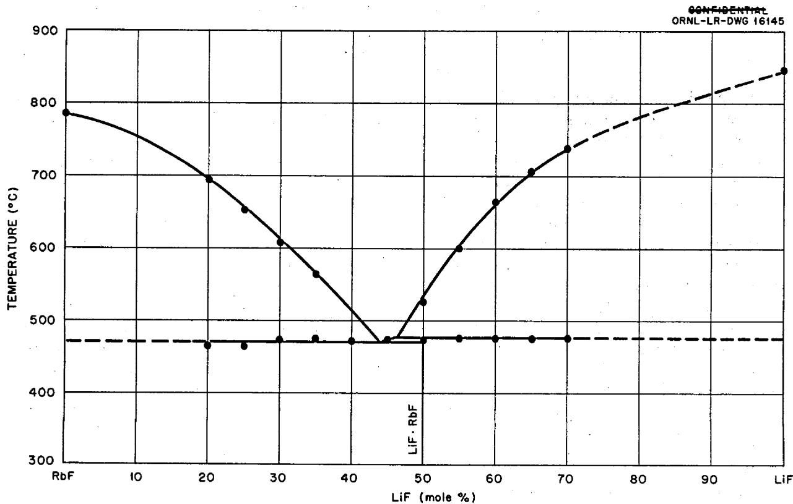  
Fig. 2.1.1. The System LiF-RbF.

growths. X-ray diffraction patterns of these samples are distinct and unique in the LiF-UF4 system.

Large quenched samples ( $\sim 10$ mg) contained $3\mathrm{LiF}\cdot \mathrm{UF}_4$ as quench growth. Medium-sized ( $\sim 5\mathrm{mg}$ ) or very small samples (2 to $3\mathrm{mg}$ ) quenched in platinum tubes allowed the liquid to freeze to material with a glassy appearance and isotropic optical character, but even in these samples x-ray analysis showed the glassy material to be largely $3\mathrm{LiF}\cdot \mathrm{UF}_4$ . There is no observable difference, optically or by x-ray pattern, in the $3\mathrm{LiF}\cdot \mathrm{UF}_4$ which occurs below the liquidus and that from quenches which were attempted well above the accepted liquidus. Under no conditions has $3\mathrm{LiF}\cdot \mathrm{UF}_4$ been observed as homogeneous, well-crystallized material free of quench growth texture. The inconsistency of the appearance, petrographically, of the $3\mathrm{LiF}\cdot \mathrm{UF}_4$ which occurs as a glass (isotropic, no optic figures) and that which occurs as quench growth, with texture gradation, is evidence of the metastability of the compound.

Since the quenched samples of 25 mole $\%$ UF-75 mole $\%$ LiF are more consistently single-phase than those of any other composition, the formula of the compound is considered to be $3\text{LiF} \cdot \text{UF}_4$ .

# THE SYSTEM RbF-UF4

H.A.Friedman R.E.Moore

Quenching studies on the system $\mathsf{RbF - UF_4}$ are not complete, but considerable progress has been made. A tentative phase diagram, based on thermal analysis studies and petrographic and x-ray diffraction examinations of quenched and slowly cooled samples, is presented in Fig. 2.1.2. The formulas of $\mathsf{RbF - UF_4},$ 2RbF-3UF, RbF-3UF, and $\mathsf{RbF - 6UF_4}$ were established on the basis of nearly single-phase material that was found in quenched samples of the corresponding compositions which had been equilibrated just below the solidus temperatures. The recently obtained thermal analysis data are given in Table 2.1.1, and the results of quenching studies are presented in Table 2.1.2.

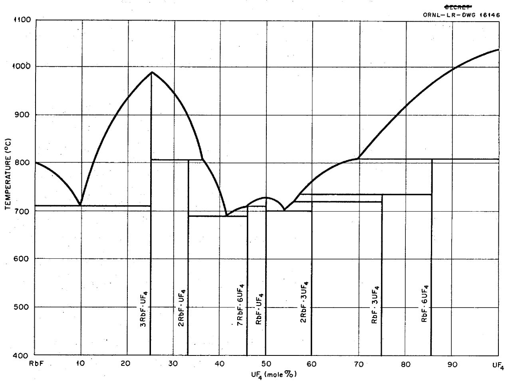  
Fig. 2.1.2. The System RbF-UF4.

TABLE 2.1.1. THERMAL ANALYSIS DATA FOR RbF-UF ${}_{4}$ MIXTURES   

<table><tr><td>UF4Content(mole %)</td><td>Liquidus Temperature(°C)</td><td>Solidus Temperature(°C)</td><td>UF4Content(mole %)</td><td>Liquidus Temperature(°C)</td><td>Solidus Temperature(°C)</td></tr><tr><td>33.3</td><td>910</td><td>818</td><td>60</td><td>740</td><td>729</td></tr><tr><td>46.2</td><td>717</td><td>700</td><td>62.5</td><td>740</td><td></td></tr><tr><td>50</td><td>725</td><td></td><td>66.7</td><td>802</td><td>745</td></tr><tr><td>51</td><td>723</td><td>686</td><td>75</td><td>825</td><td>743</td></tr><tr><td>53</td><td>725</td><td>690</td><td>80</td><td>937</td><td></td></tr><tr><td>57</td><td>728</td><td>688</td><td>85.8</td><td>967</td><td>875</td></tr></table>

TABLE 2.1.2. RESULTS OF QUENCHING STUDIES OF RbF-UF ${}_{4}$ MIXTURES   

<table><tr><td>UF4Content(mole %)</td><td>Liquidus Temperature(°C)</td><td>Primary Phase*</td><td>Transition Temperature(°C)</td><td>Phases* Below Transition</td><td>Solidus Temperature(°C)</td><td>Phases* Below Solidus</td></tr><tr><td>33.3</td><td></td><td></td><td>&lt;572</td><td>2RbF·UF4</td><td>&gt;745</td><td>2RbF·UF4</td></tr><tr><td>46.2</td><td>712</td><td>RbF·UF4</td><td></td><td></td><td>683</td><td>7RbF·6UF4, RbF·UF4</td></tr><tr><td>50</td><td>727</td><td>RbF·UF4</td><td></td><td></td><td>727</td><td>RbF·UF4</td></tr><tr><td>51</td><td>736</td><td>RbF·UF4</td><td></td><td></td><td>706</td><td>RbF·UF4, [u.m.]</td></tr><tr><td>53</td><td>721</td><td>RbF·UF4</td><td></td><td></td><td>709</td><td>RbF·UF4, [u.m.]</td></tr><tr><td>53</td><td>725</td><td>RbF·UF4</td><td></td><td></td><td>710</td><td>RbF·UF4, 2RbF·3UF4</td></tr><tr><td>53</td><td>721</td><td>RbF·UF4</td><td></td><td></td><td>715</td><td>RbF·UF4, 2RbF·3UF4</td></tr><tr><td>57</td><td>737</td><td>RbF·6UF4</td><td>724</td><td>2RbF·3UF4, Q.G.</td><td>714</td><td>2RbF·UF4, RbF·UF4</td></tr><tr><td>60</td><td>&gt;772</td><td>(RbF·6UF4)</td><td></td><td></td><td></td><td></td></tr><tr><td>60</td><td>&gt;770</td><td>(RbF·6UF4)</td><td>731</td><td>RbF·3UF4, Q.G.</td><td>720</td><td>2RbF·3UF4, [u.m.]</td></tr><tr><td>62.5</td><td></td><td></td><td></td><td></td><td>723</td><td>2RbF·3UF4, RbF·3UF4, [Q.G.]</td></tr><tr><td>66.7</td><td>&gt;752</td><td>(RbF·6UF4)</td><td>733</td><td>RbF·3UF4, Q.G.</td><td>709</td><td>RbF·3UF4, 2RbF·3UF4</td></tr><tr><td>66.7</td><td>&gt;757</td><td>(RbF·6UF4)</td><td>725</td><td>RbF·3UF4, Q.G.</td><td>717</td><td>RbF·3UF4, 2RbF·3UF4</td></tr><tr><td>66.7</td><td>&gt;758</td><td>(RbF·6UF4)</td><td>745</td><td>RbF·3UF4, Q.G.</td><td>714</td><td>2RbF·3UF4, RbF·3UF4</td></tr><tr><td>75</td><td>&gt;755</td><td>(RbF·6UF4)</td><td></td><td></td><td>714</td><td>RbF·3UF4</td></tr><tr><td>75</td><td>&gt;753</td><td>(RbF·6UF4)</td><td></td><td></td><td>721</td><td>RbF·3UF4</td></tr><tr><td>80</td><td>&gt;760</td><td>(RbF·6UF4)</td><td></td><td></td><td>724</td><td>RbF·6UF4, RbF·3UF4</td></tr><tr><td>85.8</td><td></td><td></td><td></td><td></td><td>&gt;824</td><td>RbF·6UF4</td></tr></table>

*The phase present in greatest quantity is given first. Phases found in very small or trace amounts are in brackets. Where a phase is enclosed in parentheses it is the phase found below the indicated temperature, but it is not necessarily the primary phase. Quench growth is indicated by $Q_{\mathrm{G}}$ , unidentified material by $u_{\mathrm{m}}$ .

# THE SYSTEM NaF-RbF-UF4

H. A. Friedman

H. Davis

B. A. Soderberg

V. Frechette

An intensive study of the phase-equilibrium characteristics of the system NaF-RbF-UF has been made. Equilibrium data were derived from petrographic and x-ray diffraction examination of quenched and slowly cooled melts. The boundary curves, compatibility triangles, and the peritectic and eutectic temperatures characteristic of the

system are shown in Figs. 2.1.3 and 2.1.4. It is noteworthy that there is extensive solid solution along the join $7\mathrm{NaF}\cdot 6\mathrm{UF}_4\cdot 7\mathrm{RbF}\cdot 6\mathrm{UF}_4$ . The extent of the miscibility gap is not yet determined. This solid solution effect is general among the compounds $7\mathrm{MF}\cdot 6\mathrm{UF}_4$ , where MF is an alkali fluoride. There is one ternary compound in the system, with the formula NaF·RbF·UF₄. The compound has a subsolidus existence at its composition below $530^{\circ}\mathrm{C}$ . The system contains the following five ternary eutectics:

<table><tr><td colspan="3">Composition (mole %)</td><td rowspan="2">Melting Point (°C)</td></tr><tr><td>NaF</td><td>RbF</td><td>UF4</td></tr><tr><td>25</td><td>25</td><td>50</td><td>630</td></tr><tr><td>26</td><td>27</td><td>47</td><td>620</td></tr><tr><td>33</td><td>30</td><td>37</td><td>535</td></tr><tr><td>47</td><td>33</td><td>20</td><td>470</td></tr><tr><td>18</td><td>73</td><td>9</td><td>670</td></tr></table>

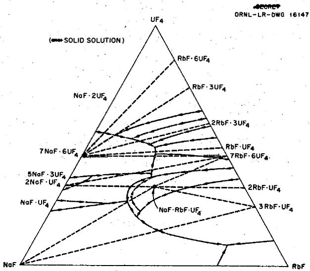  
Fig. 2.1.3. Boundary Curves and Compatibility Triangles in the System NaF-RbF-UF4.

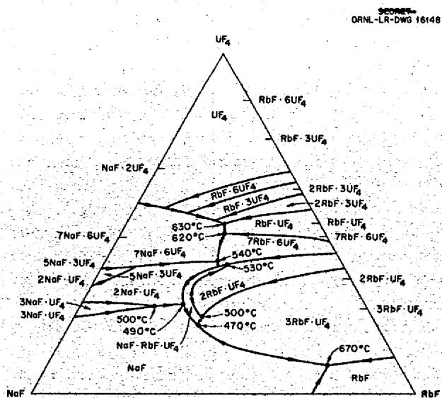  
Fig. 2.1.4. Primary Phase Fields and Peritectic and Eutectic Temperature in the System NaF-RbF-UF4.

The boundary curve between the $2\mathsf{RbF}\cdot \mathsf{UF}_4$ and NaF.RbF.UFprimary phase fields has its highest liquidus temperature at the intersection of the boundary curve and the extension of the 7RbF-6UF-NaF-RbF-UFAlkemade line. ("Alkemade Line: In a ternary phase diagram a straight line connecting the composition points of two primary phases whose areas are adjacent and the intersection of which forms a boundary curve."8)

The subsolidus compound $\mathsf{NaF}\cdot \mathsf{UF}_4$ has no primary phase field in the equilibrium diagram. At liquidus temperatures which will permit an $\mathsf{NaF}\cdot 2\mathsf{UF}_4$ primary phase field, $\mathsf{RbF}\cdot \mathsf{UF}_4$ compounds are the primary phases.

# THE SYSTEM NaF-RbF-ZrF4-UF4

H. A. Friedman

B. A. Soderberg

H. Davis

The system NaF-RbF-ZrF4-UF4 offers several mixtures which may be satisfactory fuels for a circulating-fuel reactor.9 Quenching studies of this system were continued in order to establish the primary phase fields of the uranium-containing compounds. Primary phase determinations were also made on slowly cooled melts. These studies provide a basis for indicating the potential fuel mixtures from which the high-uranium-content compounds might segregate.

The results shown in Figs. 2.1.5 and 2.1.6 are for the ternary compositions NaF-RbF-ZrF4 recalculated from the quaternary data. Where both the primary and secondary phases contain uranium, the secondary phase is shown as the second listing.

# THE SYSTEM RbF-CaF

# L. M. Bratcher

Application of thermal analysis to mixtures of RbF and $\mathsf{CaF}_2$ has consistently failed to yield reproducible data for compositions containing more than 15 mole $\% \mathsf{CaF}_2$ . Neither the use of slower than normal cooling rates nor the substitution of very thin thermocouple shields served to improve the data obtained. The failure of thermocouple

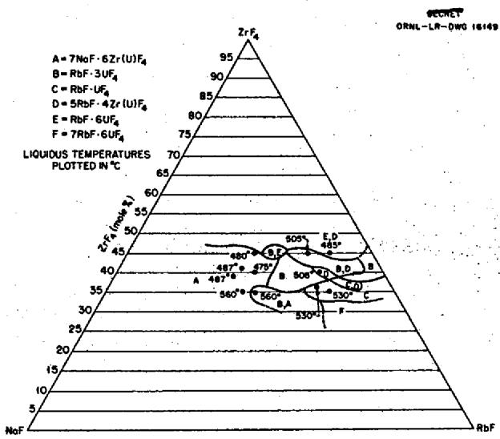  
Fig. 2.1.5. Primary and Secondary Uranium-Containing Phases in the System NaF-RbF-ZrF $_4$ . UF $_4$ with 4 mole % UF $_4$ .

shields after a few experiments suggests that the mixture is extremely corrosive; this may be due to the presence of some sulfate in the $\mathsf{CaF}_2$ .

Examinations of slowly cooled melts by x-ray diffraction and by the petrographic microscope reveal a compound with a cubic structure, which is presumably $\mathsf{RbF}\cdot \mathsf{CaF}_2$ (ref 10). Since free $\mathsf{CaF}_2$ has been observed in mixtures containing 40 to 45 mole $\% \mathsf{CaF}_{2^{\prime}}$ it seems likely that RbF-CaF $_2$ melts incongruity.

# THE ALKALI FLUORIDE-CEROUS FLUORIDE SYSTEMS

L. M. Bratcher

Examinations of the systems LiF- $\mathsf{CeF}_3$ NaF $\mathsf{CeF}_3,$ and RbF- $\mathsf{CeF}_3$ were continued; however, the data do not yet permit construction of satisfactory equilibrium diagrams for these systems. Comparisons of data obtained with $\mathsf{CeF}_3$ prepared at ORNL with data obtained with commercially prepared $\mathsf{CeF}_3$ strongly suggest that the commercial material contains a small amount of water. It appears that treatment of the $\mathsf{MF - CeF}_3$ mixture with $\mathsf{NH}_4\mathsf{HF}_2$ will suffice to eliminate difficulty from this source. The NaF- $\mathsf{CeF}_3$ system has been shown to have a binary eutectic, which melts at $775\pm 10^{\circ}\mathsf{C},$ between $\mathsf{CeF}_3$ and a binary compound believed to have the composition NaF- $\mathsf{CeF}_3$

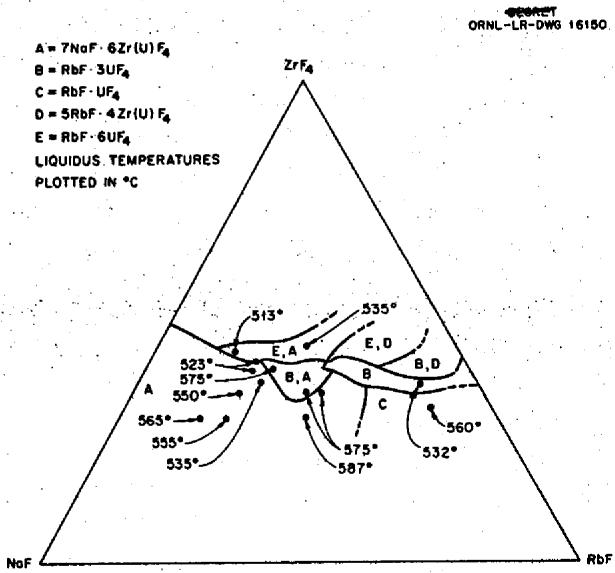  
Fig. 2.1.6. Primary and Secondary Uranium-Containing Phases in the System NaF-RbF-ZrF $_4$ . UF $_4$ with 7 mole% UF $_4$ .

# THE SYSTEM CsF-BeF2

L. M. Bratcher

Study of the system CsF-BeF $_2$ was started recently in order to complete the study of the alkali fluoride-beryllium fluoride systems and to obtain additional data on the effect of varying ion size on phase relationships. Thermal analysis data have been obtained with mixtures at 5 mole % intervals in the range 5 to 50 mole % BeF $_2$ , but study of the slowly cooled melts is incomplete. There is a eutectic, presumably between CsF and 3CsF-BeF $_2$ , which melts at $605 \pm 5^{\circ}\mathrm{C}$ and contains about 14 mole % BeF $_2$ . Melting point relationships of the compound 3CsF-BeF $_2$ have not been definitely established. The compound 2CsF-BeF $_2$ undoubtedly melts congruently, probably at a temperature below that of the analogous compound 2RbF-BeF $_2$ ( $800^{\circ}\mathrm{C}$ ). As in the other alkali fluoride-beryllium fluoride systems, liquidus temperatures diminish rapidly in this system with increasing BeF $_2$ content in the $33\frac{1}{3}$ to 50 mole % BeF $_2$ region. The solidus temperature for mixtures containing 35 to 45 mole % BeF $_2$ appears to be about $450^{\circ}\mathrm{C}$ , which is very close to the reported incongruent melting point of RbF-BeF $_2$ .

# THE SYSTEM NaF-LiF-BeF2

# R. E. Meadows

A diagram of the half of the system NaF-LiF-BeF $_2$ represented by the triangle NaF-LiF-NaF-BeF $_2$ was published recently. $^{12}$ The quenching study of the LiF-NaF-BeF $_2$ -BeF $_2$ triangle is now sufficiently complete to permit construction of a tentative diagram for the entire system, as shown in Fig. 2.1.7. Binary eutectics, ternary eutectics, and peritectic points are indicated in the diagram, along with the corresponding temperatures. Sub-solidus compounds are shown in parentheses. The temperatures following all the compound formulas are the liquidus temperatures for congruently melting compounds or the upper stability limits for other compounds.

Difficulties in the petrographic identification of the phases in the system, as mentioned previously, are also present in the work on the LiF-NaF-BeF $_2$ BeF $_2$ portion of the system. Consequently it has been necessary, in some cases, to prepare and examine petrographically and by x-ray diffraction a great many samples in order to obtain a single result.

Examination of slowly cooled samples, as well as quenched ternary samples, shows that a ternary compound containing more than 50 mole $\%$ $\mathsf{BeF}_2$ exists in this system. Its identity has not been completely established, but it is indicated on the

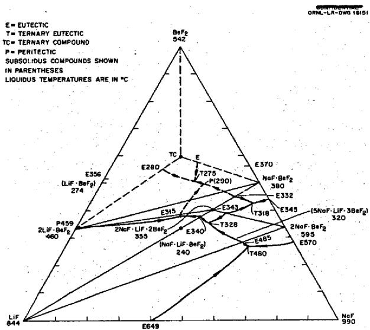  
Fig. 2.1.7. The System NaF-LiF-BeF $_2$ .

diagram by the symbol "TC" at 60 mole $\%$ BeF $_2$ -20 mole $\%$ LiF-20 mole $\%$ NaF. The possibility that it may be an unreported binary compound has been eliminated by x-ray diffraction examination of equilibrated and quenched samples containing 66.7 mole $\%$ BeF $_2$ -33.3 mole $\%$ NaF and 66.7 mole $\%$ BeF $_2$ -33.3 mole $\%$ LiF.

The join $2\text{LiF} \cdot \text{BeF}_2 - 2\text{NaF} \cdot \text{LiF} \cdot 2\text{BeF}_2$ was established as a quasi-binary system by the examination of equilibrated and quenched samples at 38 mole $\% \text{BeF}_2 - 35$ mole $\% \text{LiF} - 27$ mole $\% \text{NaF}$ . The liquidus is $334^{\circ}\text{C}$ and the primary phase is $2\text{LiF} \cdot \text{BeF}_2$ . The phases below the solidus ( $315^{\circ}\text{C}$ ) are $2\text{LiF} \cdot \text{BeF}_2$ and $2\text{NaF} \cdot \text{LiF} \cdot 2\text{BeF}_2$ . An extrapolation places the binary eutectic at 38.5 mole $\% \text{BeF}_2 - 30.5$ mole $\% \text{LiF} - 31$ mole $\% \text{NaF}$ . The join is not a true binary system because the primary phase field of LiF overhangs the compound $2\text{LiF} \cdot \text{BeF}_2$ very slightly. $^{13}$ The triangle LiF- $2\text{LiF} \cdot \text{BeF}_2 - 2\text{NaF} \cdot \text{LiF} \cdot 2\text{BeF}_2$ is a compatibility triangle; no phases other than the three mentioned have been found in samples within the triangle. Examinations of quenches of a composition containing 50 mole $\% \text{BeF}_2 - 38$ mole $\% \text{LiF} - 12$ mole $\% \text{NaF}$ , which is on the join $2\text{LiF} \cdot \text{BeF}_2 - 3\text{TC}$ , show that the liquidus is above $354^{\circ}\text{C}$ and that the primary phase is $2\text{LiF} \cdot \text{BeF}_2$ . The solidus is $280^{\circ}\text{C}$ , and the secondary phase is the ternary compound TC. The absence of a third phase indicates that the composition is on or near the binary system $2\text{LiF} \cdot \text{BeF}_2 - 3\text{TC}$ . At the composition 50 mole $\% \text{BeF}_2 - 12$ mole $\% \text{LiF} - 38$ mole $\% \text{NaF}$ the liquidus is $344^{\circ}\text{C}$ , and the primary phase is NaF-BeF $_2$ . Below the solidus ( $280^{\circ}\text{C}$ ) the three phases NaF-BeF $_2$ , $2\text{LiF} \cdot \text{BeF}_2$ , and the ternary phase TC coexist. At the composition 50 mole $\% \text{BeF}_2 - 25$ mole $\% \text{LiF} - 25$ mole $\% \text{NaF}$ the liquidus was found to be $276^{\circ}\text{C}$ , with $2\text{LiF} \cdot \text{BeF}_2$ as the primary phase. The same three phases, NaF-BeF $_2$ , $2\text{LiF} \cdot \text{BeF}_2$ , and the ternary phase TC, were found to be present below the solidus ( $271^{\circ}\text{C}$ ). The results of these experiments show that $2\text{LiF} \cdot \text{BeF}_2$ , NaF-BeF $_2$ , and the ternary phase TC form a compatibility triangle. However, the join $2\text{LiF} \cdot \text{BeF}_2 - 2\text{NaF} \cdot \text{BeF}_2$ is not a true binary system, even if the slight overhang of $2\text{LiF} \cdot \text{BeF}_2$ by the primary phase field of LiF is disregarded. Quenching experiments with the composition 45 mole $\% \text{BeF}_2 - 20$ mole $\% \text{LiF} - 35$ mole $\% \text{NaF}$ , which is on the join, show that, down to $300^{\circ}\text{C}$ , $2\text{LiF} \cdot \text{BeF}_2$

and $2\mathrm{NaF}\cdot \mathrm{LiF}\cdot 2\mathrm{BeF}_2$ are present. Thus the primary phase field of $2\mathrm{NaF}\cdot \mathrm{LiF}\cdot 2\mathrm{BeF}_2$ cuts across the join. There must be a peritectic point below $300^{\circ}\mathrm{C}$ in the triangle $2\mathrm{LiF}\cdot \mathrm{BeF}_2\cdot \mathrm{NaF}\cdot \mathrm{BeF}_2$ . TC, where $2\mathrm{LiF}\cdot \mathrm{BeF}_2$ , $2\mathrm{NaF}\cdot \mathrm{LiF}\cdot 2\mathrm{BeF}_2$ , $2\mathrm{NaF}\cdot \mathrm{BeF}_2$ are in equilibrium. Locations of the phase boundaries, the peritectic point, and the ternary eutectic were deduced from the evidence given above and are considered to be tentative.

# THE SYSTEM NoF-RbF-BeF2

L. M. Bratcher

Study of the ternary system NaF-RbF-BeF $_2$ by thermal analysis supplemented by petrographic and x-ray examination of the slowly cooled melts was continued. Cooling curves obtained with compositions within the triangle NaF-RbF-3RbF-BeF $_2$ , previously reported to comprise a compatibility triangle, $^{14}$ indicated the existence of a ternary eutectic having a melting point of approximately $625^{\circ}\mathrm{C}$ . Additional data will be required in order to determine the eutectic composition, but the available data show that it will be close to the NaF-RbF eutectic (74 mole % RbF, melting point $675^{\circ}\mathrm{C}$ ). An unidentified crystalline phase, believed to be a ternary compound, has been observed in a number of slowly cooled melts containing 45 to 60 mole % BeF $_2$ ; this phase is usually associated with an isotropic phase believed to be glass. The cooling curves for the mixture NaF-RbF-BeF $_2$ (35-15-50 mole %) showed only one thermal effect at about $240^{\circ}\mathrm{C}$ , and the cooled melt was found to be predominantly glass. The occurrence of glass in ternary mixtures having BeF $_2$ concentrations that produce only crystalline compounds in the corresponding binary alkali fluoride-beryllium fluoride systems was noted previously in the NaF-KF-BeF $_2$ system. $^{15}$ This interesting phenomenon may be due either to the difference in ion sizes of the alkali ions involved or to the lowering of solidus temperatures in the ternary system to the point where the high viscosity of the melt inhibits crystallization. Recent petrographic and x-ray diffraction studies of slowly cooled melts have confirmed the existence of the ternary compound 2NaF-RbF-BeF $_2$ ; it also appears that

the compounds $2\mathsf{RbF}\cdot \mathsf{BeF}_{2^{\prime}}$ 2NaF-RbF-BeF2' and NaF-BeF2 comprise a compatibility triangle. The NaF-BeF2-2NaF-RbF-BeF2 side of this triangle passes through the minimum melting-point mixture (480 ± 5°C) on the 2NaF-BeF2-2RbF-BeF2 join.

# THE SYSTEM KCl-ZrCl4

R.J. Sheil

Interest in zirconium chloride-alkali chloride systems stems from several sources. Low-melting-point chloride systems are potentially useful as heat transfer media. It is possible that fused-salt systems containing $\mathsf{ZrCl}_4$ will be of interest in the $\mathsf{ZrCl}_4$ volatility method proposed for processing of metallic zirconium-uranium fuel elements.[16] In addition it is of interest to compare phase equilibrium behavior in these MCI-ZrCl $_4$ systems with behavior in the analogous MF-ZrF $_4$ systems, which have been thoroughly studied at ORNL.

The alkali chloride-zirconium chloride systems have received relatively little attention. A Russian investigation of the NaCl-ZrCl $_4$ system is on record.[17] Preliminary data obtained at ORNL indicate serious errors in the published data; the study being made here is not, however, sufficiently complete to permit a diagram to be drawn.

Some data on the KCl-ZrCl₄ and NaCl-ZrCl₄ systems in the ZrCl₄-rich parts of the systems were obtained by investigators at Columbia University. The present investigation of the KCl-ZrCl₄ system covers the composition range 10 to 75 mole % ZrCl₄. The data obtained are in reasonably good agreement with the Columbia data in the limited area where the two investigations overlap. The thermal analysis data obtained from cooling curves with mixtures contained in sealed glass, quartz, or nickel tubes fitted with thermocouple wells are shown in Fig. 2.1.8. In addition to the use of the thermal analysis technique, visual observation and quenching techniques were applied to the study of several mixtures in the

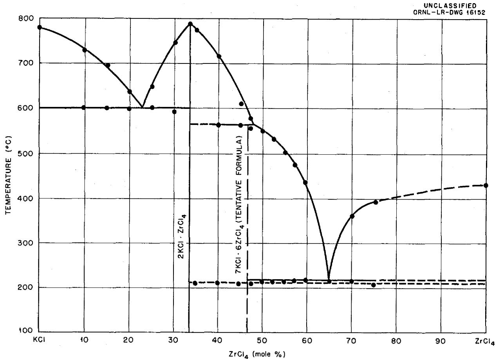  
Fig. 2.1.8. Tentative Diagram of the System KCl-ZrCl4.

system, and most of the slowly cooled melts used for thermal analysis were examined petrographically. As shown by Fig. 2.1.8, there is a eutectic between KCl and the compound $2\mathrm{KCl}\cdot \mathrm{ZrCl}_4$ which melts congruently at $790\pm 5^{\circ}C.$ The eutectic melts at $600\pm 5^{\circ}C$ and contains about 23 mole $\%$ $\mathrm{ZrCl}_4$ . There is also another compound, tentatively assigned the formula $7\mathrm{KCl}\cdot 6\mathrm{ZrCl}_4,$ which appears to melt incongruity to give $2\mathrm{KCl}\cdot \mathrm{ZrCl}_4$ and liquid at $565\pm 5^{\circ}C.$ The choice of the compound formula was based partly upon thermal analysis data, which indicate that the compound contains less than 50 mole $\%$ $\mathrm{ZrCl}_4,$ and partly upon the results of petrographic examination of slowly cooled and quenched samples in this region. More careful study, particularly of quenched samples, will be required to eliminate uncertainty in regard to the compound composition. Thermal effects on cooling curves at temperatures ranging from about 218 to $225^{\circ}C$ were noted with compositions containing more than $33\frac{1}{3}$ mole $\%$ $\mathrm{ZrCl}_4$

Since this is reasonably close to the reported $18$ melting point of the eutectic at 65 mole $\%$ $\mathrm{ZrCl}_4$ $(234.5^{\circ}\mathrm{C})$ , the appearance of the thermal effect at a temperature close to this value with compositions containing less than 50 mole $\%$ $\mathrm{ZrCl}_4$ might be taken as an indication of incomplete reaction of liquid with solid $2\mathrm{KCl} \cdot \mathrm{ZrCl}_4$ at the peritectic point. However, the magnitude of the thermal effect on cooling curves, coupled with the fact that no liquid was visible in mixtures containing less than 50 mole $\%$ $\mathrm{ZrCl}_4$ at temperatures below $250^{\circ}\mathrm{C}$ , indicates the likelihood that a solid phase transition occurs at a temperature so close to the solidus temperature that the two effects cannot be differentiated either by thermal analysis or differential thermal analysis. Petrographic examination of a quenched sample containing 55 mole $\%$ $\mathrm{ZrCl}_4$ showed that, above $237^{\circ}\mathrm{C}$ , well-crystallized phases were present but that at $219^{\circ}\mathrm{C}$ and lower temperatures the samples contained only microcrystalline aggregates.

# 2.2. CHEMICAL REACTIONS IN MOLTEN SALTS

F. F. Blankenship

R. F. Newton

L. G. Overholser

G. M. Watson

# EQUILIBRIUM REDUCTION OF $\mathsf{NIF}_2$ BY $\mathsf{H}_2$ IN NaF-ZrF4

C. M. Blood

Investigation of the equilibrium

$$
\mathrm {N i F} _ {2} (d) + \mathrm {H} _ {2} (g) \rightleftharpoons \mathrm {N i} (s) + 2 \mathrm {H F} (g)
$$

with NaF-ZrF $_4$ (53-47 mole %) as the reaction medium was continued. Since the system was observed to behave rather peculiarly at high temperatures, this study was interrupted while related investigations of the stability of NiF $_2$

in this solvent were conducted. These experiments have served to indicate the essential validity of the equilibration data previously obtained at $625^{\circ}C$ and of the data obtained at 500 and $575^{\circ}C,$ as reported below. The experimental data obtained by using sintered-copper filters and the general technique described previously are shown in Table 2.2.1. The mean of 18 values previously obtained for the equilibrium constant at $625^{\circ}C$ was $3.0\times 10^{-4}$ atmosphere.

$^{1}$ C. M. Blood, ANP Quar. Prog. Rep. June 10, 1956, ORNL-2106, P 100.

$$
\mathrm {N i F} _ {2} (d) + \mathrm {H} _ {2} (g) \rightleftharpoons \mathrm {N i} (s) + 2 \mathrm {H F} (g)
$$

TABLE 2.2.1. EQUILIBRIUM RATIOS FOR THE REACTION   

<table><tr><td>Ni in Melt
(ppm)</td><td>Pressure of H2*
(atm)</td><td>Pressure of HF
(atm)</td><td>Kx** × 10-4</td></tr><tr><td colspan="4">Measurements Made at 575°C</td></tr><tr><td>315</td><td>0.0266</td><td>0.434</td><td>1.32</td></tr><tr><td>345</td><td>0.0257</td><td>0.453</td><td>1.25</td></tr><tr><td>365</td><td>0.0248</td><td>0.472</td><td>1.45</td></tr><tr><td>385</td><td>0.0245</td><td>0.477</td><td>1.42</td></tr><tr><td>420</td><td>0.0243</td><td>0.482</td><td>1.34</td></tr><tr><td>435</td><td>0.0241</td><td>0.486</td><td>1.32</td></tr><tr><td>180</td><td>0.0301</td><td>0.358</td><td>1.38</td></tr><tr><td>165</td><td>0.0297</td><td>0.368</td><td>1.62</td></tr><tr><td>185</td><td>0.0293</td><td>0.375</td><td>1.52</td></tr><tr><td>220</td><td>0.0290</td><td>0.382</td><td>1.35</td></tr><tr><td>150</td><td>0.0309</td><td>0.342</td><td>1.49</td></tr><tr><td></td><td></td><td></td><td>Av 1.40 ± 0.09</td></tr><tr><td colspan="4">Measurements Made at 550°C</td></tr><tr><td>175</td><td>0.0318</td><td>0.321</td><td>1.09</td></tr><tr><td>205</td><td>0.0309</td><td>0.341</td><td>1.08</td></tr><tr><td>205</td><td>0.0306</td><td>0.347</td><td>1.12</td></tr><tr><td>200</td><td>0.0306</td><td>0.347</td><td>1.15</td></tr></table>

*Initial H₂-He mixture was 4.69% H₂.   
$\star \star K_{x} = P_{HF}^{2} / X_{NIF_{2}}P_{H_{2}}$ where $x$ is mole fraction and $P$ is pressure in atmospheres.

From the data obtained to date it appears that the activity coefficient for $\mathsf{NiF}_2$ must be about 2750 at $600^{\circ}\mathsf{C}$ , with $\mathsf{NiF}_2(s)$ taken as the standard state. The corresponding figure for $\mathsf{FeF}_2$ in this solvent was 3.28 (ref 2). The very large apparent activity coefficient for $\mathsf{NiF}_2$ is considered to be quite surprising.

# STABILITY OF $\mathsf{NIF}_2$ IN NoF-ZrF4 MIXTURES

J.G.Eversole C.M.Blood

The very high apparent activity coefficients obtained for $\mathsf{NiF}_2$ in molten NaF-ZrF prompted a careful examination of the behavior of such solutions under a variety of conditions. While this examination has served to substantiate the validity of the equilibration data obtained, a number of rather peculiar effects have been observed.

An initial investigation was performed to disclose whether any uncertainties in the chemical analyses were obscuring the real picture. A total of ten standard samples prepared by adding weighed quantities of $\mathsf{NiF}_2$ with or without added $\mathsf{CuF}_2$ to powdered $\mathsf{NaF - ZrF}_4$ mixture were prepared and submitted for analysis. Analytical results for these samples covered the range from 125 to 2000 ppm nickel and were, with a single exception, within $\pm 5\%$ of the theoretical value; the single exception was the most dilute sample, for which the analytical result differed from the "true" value by $22\%$ . In addition the reproducibility of the chemical analyses was tested by submitting, in duplicate, finely ground samples of filtrates from solutions of $\mathsf{NiF}_2$ in $\mathsf{NaF - ZrF}_4$ . The duplicate samples were submitted under different sample numbers, with one to two weeks being allowed between the time the sample and its duplicate were submitted. The data presented below show excellent agreement in every case:

Nickel Found (ppm)   

<table><tr><td>Initial Sample</td><td>Duplicate Sample</td></tr><tr><td>965</td><td>960</td></tr><tr><td>1040</td><td>1040</td></tr><tr><td>115</td><td>115</td></tr><tr><td>1005</td><td>1015</td></tr><tr><td>1030</td><td>1025</td></tr><tr><td>40</td><td>40</td></tr></table>

2C. M. Blood and G. M. Watson, ANP Quar. Prog. Rep. March 10, 1956, ORNL-2061, p 89.

<table><tr><td>40</td><td>35</td></tr><tr><td>40</td><td>35</td></tr><tr><td>260</td><td>260</td></tr><tr><td>1165</td><td>1115</td></tr><tr><td>1070</td><td>1050</td></tr><tr><td>1030</td><td>1010</td></tr><tr><td>1030</td><td>1030</td></tr></table>

It seems clear that uncertainties in analyses for $\mathbf{NiF}_2$ in the samples submitted is not a contributor to the surprising observations.

It has been observed that $\mathsf{NiF}_2$ dissolved in NaF-ZrF4 mixtures is stable in containers of A-nickel under continuous sparging with helium up to temperatures of $625^{\circ}C$ . At temperatures of $700^{\circ}C$ and above, however, the concentration of dissolved nickel decreases continuously. The results of a typical experiment are presented in Table 2.2.2. It may be observed that the $\mathsf{NiF}_2$ concentration remained constant during about 50 hr of sparging with helium at $625^{\circ}C$ . During equilibration experiments it is necessary to sparge the system with helium for about 30 min when samples are taken. In view of this stability under long sparging, however, it appears that no significant quantity of $\mathsf{NiF}_2$ is lost during the short treatment required in equilibration experiments.

The disappearance of $\mathrm{NiF}_2$ from solution at the higher temperatures is not well understood. The presence of significant concentrations of reducing impurities, such as hydrogen, methane, or oil vapor on the helium, can apparently be eliminated from consideration. The influent helium stream was passed over a bed of copper oxide at $500^{\circ}\mathrm{C}$ , a magnesium perchlorate drying tower, and a liquid nitrogen cold trap without affecting the experimental results. Moreover, the effluent helium was carefully monitored by passage through KOH solution. The amount of HF recovered was only a few per cent of that recoverable from the $\mathrm{NiF}_2$ lost from solution. And finally, even though the $\mathrm{NiF}_2$ is apparently lost from the solution, passage of hydrogen gas through the system liberates essentially the stoichiometric quantity of HF.

Thermodynamic considerations indicate that the equilibrium pressure for decomposition of $\mathsf{NiF}_2$ into $\mathsf{Ni}^0$ and $\mathsf{F}_2$ is negligibly small. It is possible, however, that a volatile subfluoride of nickel may be responsible for this peculiar behavior. If the reaction

$$
\operatorname {N i F} _ {2} (d) + \operatorname {N i} (s) \rightleftharpoons 2 \operatorname {N i F} (g)
$$

TABLE 2.2.2. STABILITY OF ${\mathrm{{NiF}}}_{2}$ IN NaF-ZrF ${}_{4}{\left( {53} - {47}\text{ mole }\% \right) }^{ * }$ UNDER CONTINUOUS SPARGING WITH HELIUM   

<table><tr><td rowspan="2">Temperature (°C)</td><td rowspan="2">Time at Temperature (hr)</td><td rowspan="2">Filter Material</td><td colspan="3">Found in Filtrate (ppm)</td></tr><tr><td>Ni</td><td>Fe</td><td>Cr</td></tr><tr><td>625</td><td>24</td><td>Ni</td><td>1115</td><td>225</td><td>25</td></tr><tr><td></td><td>48-50</td><td>Ni</td><td>1050</td><td>255</td><td>25</td></tr><tr><td></td><td></td><td>Ni</td><td>1030</td><td>240</td><td>25</td></tr><tr><td></td><td></td><td>Cu</td><td>1010</td><td>225</td><td>30</td></tr><tr><td></td><td></td><td>Ni</td><td>1025</td><td>250</td><td>30</td></tr><tr><td></td><td></td><td>Cu</td><td>1015</td><td>245</td><td>25</td></tr><tr><td></td><td></td><td>Ni</td><td>1040</td><td>250</td><td>20</td></tr><tr><td>800</td><td>65</td><td>Ni</td><td>35</td><td>145</td><td>20</td></tr></table>

*Initial charge: 1 kg of NaF-ZrF₄ containing 260 ppm Ni and 220 ppm Fe. Additive: 1000 ppm Ni as NiF₂.

can occur, it may be possible to explain the phenomenon observed. No concrete evidence for existence of this compound has been found.

A large number of equilibration measurements have been performed by using copper filtering tubes. During the course of the sampling procedure the copper filter tube becomes plated with nickel. It has, accordingly, been necessary to determine whether the concentration of nickel in solution is changed by the introduction of the copper tube. The results listed in Table 2.2.2, for samples taken in the interval of 48 to 50 hr indicate that nickel plating of the copper tubes does not change the nickel concentration in solution. In addition, a copper tube was immersed in the solution for 24 hr immediately following the 48- to 50-hr period, and a massive nickel deposit, which contained large dendritic nickel crystals, was obtained (Fig. 2.2.1). The weight of the deposit was determined to be approximately 15 g; the weight of nickel in solution just before immersion of the copper tube was only about 0.4 g. The nickel concentration of the solution immediately after the heavy nickel plating occurred was determined to be 960 ppm, as compared with a value of 1030 ppm obtained by averaging the results for all the samples taken during the 48- to 50-hr period.

The formation of a nickel plate on the copper tubing could be explained by simple concentration cell action; however, such a mechanism would

cease to function after a very thin film of nickel was laid down unless a copper-nickel alloy were formed. Careful examination of the massive deposit shown in Fig. 2.2.1 revealed essentially no copper on the outer surface. If the driving force for this plating process were the temperature difference between the nickel reactor wall and copper tube, which was cooled by influent helium gas, similar deposits of nickel should have appeared on the nickel sampling tubes, but no such deposits have ever been observed. In all these experiments the copper tubing was inserted through a stainless steel Swagelok fitting at the top of the reactor, where the temperature was about $200^{\circ}\mathrm{C}$ . Accordingly a low-temperature copper-steel-nickel junction was in electrical contact in series with a high-temperature copper-nickel junction through the molten salt. It appears likely that the resulting thermoelectric potential may have been the driving force for the plating process. Although experiments are planned to supply explanations for some of these phenomena, it can be concluded that the use of copper filters introduces no significant error into the results presented.

In an effort to obtain concrete evidence for the formation of a volatile nickel subfluoride, two platinum crucibles were loaded with known weights of nickel fluoride and three nickel crucibles were charged with mixtures of metallic nickel powder

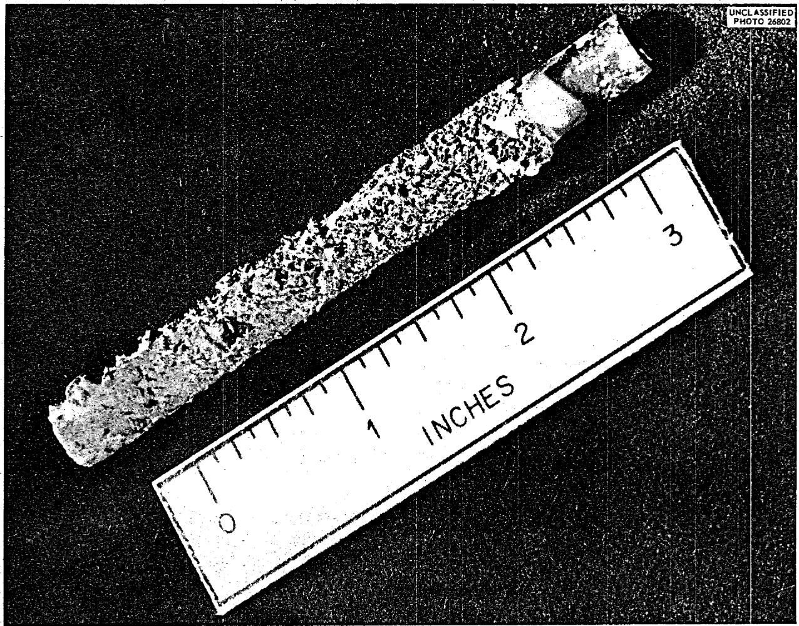  
Fig. 2.2.1. Massive Nickel Deposit with Large Dendritic Crystals on Copper Tube That Was Immersed for 24 hr in an NaF-ZrF $_4$ (53-47 mole %) Solution Containing NiF $_2$ .

and nickel fluoride. The five crucibles were enclosed in a nickel vessel fitted with a copper spiral coil to serve as a condenser. Cool helium gas was passed through the copper coil continuously at high rates. A flowing atmosphere of helium gas was also continuously passed over the samples as the temperature of the system was brought to $800^{\circ}\mathrm{C}$ and held constant for a period of 3 hr. The samples were allowed to cool and were reweighed. The material condensed on the copper coil was carefully collected and submitted for petrographic and x-ray diffraction examination. After having been weighed, the loaded crucibles were heated again in the same manner for an additional 19 hr. The results of the experiment are summarized in Table 2.2.3.

At the end of 3 hr the $\mathsf{NiF}_2$ in the platinum crucibles was discolored and a considerable amount of magnetic material, later identified as $\mathbf{N}\mathbf{i}^0$ , was present. No appreciable change in weight of the platinum occurred. Slight deposits on the copper condenser tube were tentatively identified as $\mathsf{NiF}_{2},\mathsf{Ni},$ and $\mathsf{CuF}_2$

The data may be interpreted as possibly supporting the reversible reaction:

$$
\mathrm {N i F} _ {2} (s) + \mathrm {N i} (s) = 2 \mathrm {N i F} (g)
$$

The magnitude of the effect noted was, however, so small that there is no conclusive proof of such a mechanism. No explanation can be offered for the partial reduction of $\mathsf{NiF}_2$ in the platinum crucibles.

TABLE 2.2.3. WEIGHT LOSSES OF ${\mathrm{{NiF}}}_{2}\left( s\right)$ ON HEATING TO ${800}^{ \circ  }\mathrm{C}$   

<table><tr><td rowspan="2">Crucible Material</td><td colspan="3">Weight Loss of Initial NIF2 (%)</td></tr><tr><td>After 3 hr</td><td>After 22 hr</td><td>Total</td></tr><tr><td>Platinum</td><td>1.78</td><td>0.18</td><td>1.96</td></tr><tr><td>Platinum</td><td>2.34</td><td>0.38</td><td>2.72</td></tr><tr><td>Nickel</td><td>3.58</td><td>0.93</td><td>4.51</td></tr><tr><td>Nickel</td><td>3.06</td><td>0.78</td><td>3.84</td></tr><tr><td>Nickel</td><td>3.11</td><td>0.86</td><td>3.97</td></tr></table>

All these phenomena will, presumably, be important in mechanisms of corrosion of nickel by molten salts. It is anticipated that considerable additional study of these problems will be undertaken.

# ACTIVITY OF CHROMIUM IN CHROMIUM-NICKEL ALLOYS

M. B. Panish

The determination of the activity of chromium in chromium-nickel alloys has been completed with the use of the electrode concentration cells and the techniques previously described.3,4 The values obtained for the activity of chromium in various chromium-nickel alloys at 750 and $965^{\circ}C$ during this investigation are shown in Fig.2.2.2. The curve obtained by Grube and Flad at $1100^{\circ}C$ is shown for comparison. From these data it appears that at concentrations below about 25 at. $\%$ the activity of chromium is somewhat lower than its atomic fraction in the alloy.

The curve obtained at $750^{\circ}C$ in this investigation is consistent with the expected behavior of a system which has an immiscibility gap. However, both the Grube and Flad curve and the data obtained at $965^{\circ}C$ in this investigation seem to yield implausibly low chromium activities for the chromium-rich solid solutions.

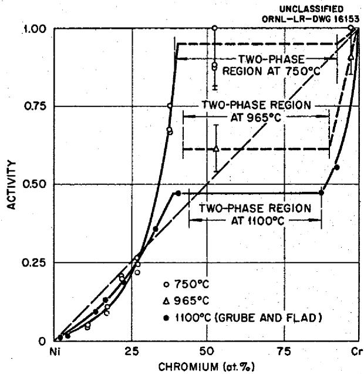  
Fig. 2.2.2. Activity of Chromium in Nickel-Chromium Alloys.

# SOLUBILITY AND STABILITY OF STRUCTURAL METAL FLUORIDES IN VARIOUS FLUORIDE MIXTURES

J. D. Redman

Data gathered from studies on the stability and solubility of $\mathsf{CrF}_{2^{\prime}}$ , $\mathsf{FeF}_{2^{\prime}}$ and $\mathsf{NiF}_{2}$ in NaF-ZrF₄ (53-47 mole %) at 600 and $800^{\circ}\mathsf{C}$ were reported previously. The results obtained at $600^{\circ}\mathsf{C}$ demonstrated that the solubility of the structural metal fluoride was a function of the excess of structural metal fluoride present. It is believed that the change in solubility is caused by the presence of a solid phase, probably $\mathsf{MF}_{2} \cdot \mathsf{ZrF}_{4^{\prime}}$ and the resulting change of the NaF concentration in the melt. The studies have been extended to include the solvents LiF-ZrF₄ (52-48 mole %), NaF-ZrF₄ (59-41 mole %), and KF-ZrF₄ (52-48 mole %), and additional studies have been made on the solubility of $\mathsf{CrF}_{3}$ in the NaF-LiF-KF eutectic.

Data for the solubility of $\mathsf{CrF}_2$ at $600^{\circ}\mathsf{C}$ in the three additional solvents mentioned above, as presented in Tables 2.2.4, 2.2.5, and 2.2.6, show that the solubility varies markedly with the solvent

TABLE 2.2.4. SOLUBILITY AND STABILITY OF ${\mathrm{{CrF}}}_{2}$ IN MOLTEN LIF-ZrF ${}_{4}$ (52-48 mole %) AT 600 AND ${800}^{ \circ  }\mathrm{C}$   

<table><tr><td colspan="3">Conditions of Equilibration</td><td colspan="5">Found In Filtrate</td></tr><tr><td>Temperature (°C)</td><td>Cr++ (wt %)</td><td>Zr-to-Cr Mole Ratio</td><td>Zr (wt %)</td><td>Li (wt %)</td><td>Zr-to-Li Mole Ratio*</td><td>Cr++ (wt %)</td><td>Total Cr (wt %)</td></tr><tr><td rowspan="7">600</td><td>2.5</td><td>10</td><td>44.4</td><td>4.15</td><td>0.81</td><td>1.31</td><td>1.59</td></tr><tr><td>2.5</td><td>10</td><td>44.8</td><td>4.19</td><td>0.82</td><td>1.25</td><td>1.54</td></tr><tr><td>5.0</td><td>4.9</td><td>43.2</td><td>4.33</td><td>0.76</td><td>2.0</td><td>2.3</td></tr><tr><td>5.0</td><td>4.9</td><td>43.0</td><td>4.32</td><td>0.76</td><td>2.4</td><td>2.6</td></tr><tr><td>10.0</td><td>2.2</td><td>40.4</td><td>4.35</td><td>0.71</td><td>4.6</td><td>5.8</td></tr><tr><td>10.0</td><td>2.2</td><td>40.2</td><td>4.28</td><td>0.72</td><td>4.6</td><td>5.8</td></tr><tr><td>10.0</td><td>2.2</td><td>40.2</td><td>4.24</td><td>0.72</td><td>5.0</td><td>5.9</td></tr><tr><td rowspan="4">800</td><td>10.0</td><td>2.2</td><td>38.6</td><td>3.32</td><td>0.89</td><td>6.4</td><td>9.5</td></tr><tr><td>10.0</td><td>2.2</td><td>38.7</td><td>3.49</td><td>0.85</td><td>6.1</td><td>9.5</td></tr><tr><td>20</td><td>0.9</td><td>30.6</td><td>2.45</td><td>0.95</td><td>12.8</td><td>19.1</td></tr><tr><td>20</td><td>0.9</td><td>30.6</td><td>3.13</td><td>0.75</td><td>14.1</td><td>19.0</td></tr></table>

*Ratio of Zr to Li was 0.92 in charge material.

TABLE 2.2.5. SOLUBILITY AND STABILITY OF ${\mathrm{{CrF}}}_{2}$ IN MOLTEN NaF-ZrF ${}_{4}$ (59-41 mole %) AT 600 AND 800°C   

<table><tr><td colspan="3">Conditions of Equilibration</td><td colspan="5">Found In Filtrate</td></tr><tr><td>Temperature (°C)</td><td>Cr++ (wt %)</td><td>Zr-to-Cr Mole Ratio</td><td>Zr (wt %)</td><td>Na (wt %)</td><td>Zr-to-Na Mole Ratio*</td><td>Cr++ (wt %)</td><td>Total Cr (wt %)</td></tr><tr><td rowspan="6">600</td><td>1.5</td><td>15</td><td>39.2</td><td>14.4</td><td>0.69</td><td>1.14</td><td>1.34</td></tr><tr><td>1.5</td><td>15</td><td>39.2</td><td>14.2</td><td>0.69</td><td>1.03</td><td>1.35</td></tr><tr><td>6.0</td><td>3.5</td><td>36.0</td><td>13.7</td><td>0.66</td><td>4.7</td><td>5.4</td></tr><tr><td>6.0</td><td>3.5</td><td>36.4</td><td>13.2</td><td>0.69</td><td>4.6</td><td>5.4</td></tr><tr><td>10.0</td><td>2.0</td><td>34.0</td><td>12.1</td><td>0.71</td><td>8.1</td><td>8.9</td></tr><tr><td>10.0</td><td>2.0</td><td>34.3</td><td>12.5</td><td>0.69</td><td>8.0</td><td>8.0</td></tr><tr><td rowspan="4">800</td><td>12.0</td><td>1.5</td><td>32.9</td><td>12.4</td><td>0.67</td><td>8.8</td><td>10.3</td></tr><tr><td>12.0</td><td>1.5</td><td>32.3</td><td>12.1</td><td>0.68</td><td>9.3</td><td>11.3</td></tr><tr><td>20</td><td>0.8</td><td>26.6</td><td>9.8</td><td>0.68</td><td>17.5</td><td>19.3</td></tr><tr><td>20</td><td>0.8</td><td>26.7</td><td>9.6</td><td>0.70</td><td>17.5</td><td>19.3</td></tr></table>

*Ratio of Zr to Na was 0.70 in charge material.

TABLE 2.2.6. SOLUBILITY AND STABILITY OF ${\mathrm{{CrF}}}_{2}$ IN MOLTEN $\mathrm{{KF}} - {\mathrm{{ZrF}}}_{4}$ (52-48 mole %) AT 600 AND ${800}^{ \circ  }\mathrm{C}$   

<table><tr><td colspan="3">Conditions of Equilibration</td><td colspan="5">Found in Filtrate</td></tr><tr><td>Temperature (°C)</td><td>Cr++ (wt %)</td><td>Zr-to-Cr Mole Ratio</td><td>Zr (wt %)</td><td>K (wt %)</td><td>Zr-to-K Mole Ratio*</td><td>Cr++ (wt %)</td><td>Total Cr (wt %)</td></tr><tr><td rowspan="4">600</td><td>5.0</td><td>4.2</td><td>35.8</td><td>17.0</td><td>0.90</td><td>4.8</td><td>4.8</td></tr><tr><td>5.0</td><td>4.2</td><td>34.2</td><td>16.8</td><td>0.88</td><td>4.3</td><td>4.8</td></tr><tr><td>10</td><td>1.9</td><td>34.5</td><td>16.3</td><td>0.91</td><td>6.9</td><td>6.8</td></tr><tr><td>10</td><td>1.9</td><td>34.8</td><td>16.3</td><td>0.92</td><td>7.1</td><td>7.0</td></tr><tr><td rowspan="4">800</td><td>10</td><td>1.9</td><td>32.8</td><td>15.0</td><td>0.94</td><td>9.4</td><td>9.7</td></tr><tr><td>10</td><td>1.9</td><td>33.1</td><td>15.6</td><td>0.91</td><td>0.2</td><td>9.7</td></tr><tr><td>20</td><td>0.8</td><td>26.0</td><td>13.4</td><td>0.84</td><td>17.5</td><td>19.4</td></tr><tr><td>20</td><td>0.8</td><td>26.1</td><td>12.8</td><td>0.88</td><td>15.8</td><td>19.5</td></tr></table>

*Ratio of Zr to K was 0.92 in charge material.

employed. The solubility in $\mathrm{NaF - ZrF_4}$ (59-41 mole %), as shown in Table 2.2.5, is higher than that previously found for $\mathrm{NaF - ZrF_4}$ (53-47 mole %) and substantiates the belief that the solubility increases with increasing NaF concentrations. Only in the case of LiF-ZrF4 was a sufficient excess of $\mathrm{CrF_2}$ present to affect the zirconium-toalkali ratio. An examination of Table 2.2.4 reveals a decrease in this ratio as the excess of $\mathrm{CrF_2}$ present increases. The solute is too soluble at $800^{\circ}\mathrm{C}$ in all the solvents studied to show any similar effect, if indeed it does exist. Divalent chromium appears to be the stable valence state in these solvents, although there is some indication that a smaller fraction of the chromium is present as $\mathrm{Cr^{++}}$ in the LiF-ZrF4 mixture than in the other two solvents.

Comparable data for the solubility of $\mathsf{FeF}_2$ in these solvents are presented in Tables 2.2.7 and 2.2.8. It may be seen that in all tests at $600^{\circ}\mathrm{C}$ the solubility increased with excess $\mathsf{FeF}_2$ present and that the zirconium-to-sodium ratios tended to decrease with increasing excess $\mathsf{FeF}_2$ . The solubility of $\mathsf{FeF}_2$ at $600^{\circ}\mathrm{C}$ is higher in the $\mathsf{NaF - ZrF_4}$ mixture than in either the $\mathsf{LiF - ZrF_4}$ mixture or the $\mathsf{KF - ZrF_4}$ mixture. However, if the solubility in these two solvents is compared with the solubility in $\mathsf{NaF - ZrF_4}$ (53-47 mole %), it will be found that with $1\mathrm{wt}\%$ $\mathsf{FeF}_2$ added the solubility in the $\mathsf{NaF - ZrF_4}$ mixture is lower than in any of the

others and that for a 5 wt % addition all three give essentially the same values. The increase of the NaF content in the NaF-ZrF₄ mixtures causes an increase in the solubility of FeF₂ which is most pronounced at the lower iron concentrations. The data indicate that divalency is the stable form of iron in these solvents. There is a slight indication that Fe++ is not so stable in NaF-ZrF₄ (59-41 mole %) as in the other solvents studied, including NaF-ZrF₄ (53-47 mole %).

Comparable data on the solubility of $\mathsf{NiF}_2$ in these solvents are presented in Tables 2.2.9, 2.2.10, and 2.2.11. From the data it is apparent that the solubility of $\mathsf{NiF}_2$ in NaF-ZrF4 and KF-ZrF4 is nearly the same and independent of the amount of $\mathsf{NiF}_2$ added. However, the solubility of $\mathsf{NiF}_2$ in the LiF-ZrF4 mixture is a function of the amount of $\mathsf{NiF}_2$ added at both 600 and $800^{\circ}\mathsf{C}$ . Values found previously in NaF-ZrF4 (53-47 mole %) are quite similar to those found for the LiF-ZrF4 mixture and smaller than those given for NaF-ZrF4 (59-41 mole %) at $600^{\circ}\mathsf{C}$ with 1.5 wt % $\mathsf{NiF}_2$ additions, but they are essentially equal with 5 wt % $\mathsf{NiF}_2$ present.

Data were reported previously for the solubility of $\mathsf{CrF}_3$ in NaF-LiF-KF (11.5-46.5-42 mole %) at 600 and $800^{\circ}\mathrm{C}$ . Although the results in all

TABLE 2.2.7. SOLUBILITY AND STABILITY OF ${\mathrm{{FeF}}}_{2}$ IN MOLTEN NaF-ZrF ${}_{4}$ (59-41 mole %) AT 600 AND ${800}^{ \circ  }\mathrm{C}$   

<table><tr><td colspan="3">Conditions of Equilibration</td><td colspan="6">Found in Filtrate</td></tr><tr><td>Temperature (℃)</td><td>Fe++ (wt %)</td><td>Zr-to-Fe Mole Ratio</td><td>Zr (wt %)</td><td>Na (wt %)</td><td>Zr-to-Na Mole Ratio*</td><td>F (wt %)</td><td>Fe++ (wt %)</td><td>Total Fe (wt %)</td></tr><tr><td rowspan="6">600</td><td>3.0</td><td>7.9</td><td>38.3</td><td>14.5</td><td>0.67</td><td>45.1</td><td>1.8</td><td>1.8</td></tr><tr><td>3.0</td><td>7.9</td><td>38.3</td><td>14.6</td><td>0.66</td><td>46.0</td><td></td><td>1.6</td></tr><tr><td>5.0</td><td>4.7</td><td>37.4</td><td>15.2</td><td>0.62</td><td>44.1</td><td>3.6</td><td>3.8</td></tr><tr><td>5.0</td><td>4.7</td><td>37.5</td><td>15.3</td><td>0.62</td><td>44.1</td><td>2.9</td><td>3.8</td></tr><tr><td>10.0</td><td>2.1</td><td>37.6</td><td>14.8</td><td>0.64</td><td></td><td></td><td>3.7</td></tr><tr><td>10.0</td><td>2.1</td><td>37.6</td><td>15.9</td><td>0.60</td><td>44.9</td><td>3.5</td><td>3.7</td></tr><tr><td rowspan="5">800</td><td>10.0</td><td>2.1</td><td>34.4</td><td>12.5</td><td>0.67</td><td>43.5</td><td>8.0</td><td>10.2</td></tr><tr><td>10.0</td><td>2.1</td><td>34.0</td><td>11.9</td><td>0.72</td><td>44.1</td><td>7.7</td><td>9.7</td></tr><tr><td>10.0</td><td>2.1</td><td>33.9</td><td>11.8</td><td>0.72</td><td>44.3</td><td>7.2</td><td>9.4</td></tr><tr><td>20</td><td>0.8</td><td>31.2</td><td>11.5</td><td>0.68</td><td>43.8</td><td>12.0</td><td>14.8</td></tr><tr><td>20</td><td>0.8</td><td>30.1</td><td>11.2</td><td>0.68</td><td>42.9</td><td>11.9</td><td>16.0</td></tr></table>

*Ratio of Zr to Na was 0.70 in charge material.

cases indicated that trivalent chromium was stable in this solvent, wide variations in the values for the solubility were found. It has been established that these variations resulted from errors in analysis, and, following the elimination of the analytical difficulties, the experiments were rerun. The results of the reruns, which are presented in Table 2.2.12, are believed to represent the solubility under these conditions.

# REDUCTION OF UF4 BY STRUCTURAL METALS J.D.Redman

Additional studies on the reduction of $\mathsf{UF}_4$ by $\mathsf{Cr}^0$ or $\mathsf{Fe}^0$ have been made in various reaction media by using the filtration method. Data obtained from earlier studies on these reactions with the solvents NaF-ZrF $_4$ (50-50 mole %, 53-47 mole %, and 59-41 mole %), LiF-KF (52-48 mole %), KF-ZrF $_4$ (52-48 mole %), LiF-NaF-ZrF $_4$ (55-22-23 mole %), and NaF-LiF-KF (11.5-46.5-42 mole %) as the reaction media were presented previously. $^8$ More recently RbF-ZrF $_4$ (60-40 mole %) and

LiF-BeF $_2$ (48-52 mole %) have been studied as the reaction media.

Preliminary data for the reaction of $\mathsf{UF}_4$ with $\mathsf{Cr}^0$ at 600 and $800^{\circ}\mathsf{C}$ in the solvent $\mathsf{RbF - ZrF}_4$ (60-40 mole %) are given in Table 2.2.13. Approximately $2\textbf{g}$ of $\mathsf{Cr}^0$ was reacted with $\mathsf{UF}_4$ (9.2 wt %, 4.0 mole %) dissolved in approximately $40\textbf{g}$ of the $\mathsf{RbF - ZrF}_4$ mixture contained in nickel in these tests. Similar studies with $\mathsf{Fe}^0$ in place of $\mathsf{Cr}^0$ yielded the results reported in Table 2.2.14.

The $800^{\circ}C$ data shown in Table 2.2.13 are not satisfactorily precise. However, it appears that the equilibrium chromium concentrations existing in the $\mathsf{RbF - ZrF}_4$ mixture are lower than those noted in any of the other alkali fluoride- $\mathsf{ZrF}_4$ mixtures studied. The lowest values found previously were those measured in the $\mathsf{KF - ZrF}_4$ (52-48 mole $\%$ ) mixture, where roughly 1000 ppm of chromium was found at both 600 and $800^{\circ}C$ . Values for other mixtures are: LiF- $\mathsf{ZrF}_4$ (52-48 mole $\%$ ), 2900 and 3900 ppm at 600 and $800^{\circ}C$ , respectively; NaF- $\mathsf{ZrF}_4$ (53-47 mole $\%$ ), 1700 and 2100 ppm at 600 and $800^{\circ}C$ , respectively. Thus it appears that the fluoride ion activity, as measured by the equilibrium chromium concentration, decreased,

TABLE 2.2.8. SOLUBILITY AND STABILITY OF $\mathsf{FeF}_2$ IN LiF-ZrF4 (52-48 mole %) AND KF-ZrF4 (52-48 mole %) AT 600 AND $800^{\circ}C$   

<table><tr><td colspan="2">Conditions of Equilibration</td><td colspan="2">Found in Filtrate (wt %)</td></tr><tr><td>Temperature (°C)</td><td>Fe++ (wt %)</td><td>Fe++</td><td>Total Fe</td></tr><tr><td colspan="4">Solvent: LiF-ZrF4</td></tr><tr><td rowspan="4">600</td><td>1.0</td><td>0.59</td><td>0.63</td></tr><tr><td>1.0</td><td>0.48</td><td>0.43</td></tr><tr><td>5.0</td><td>1.0</td><td>1.1</td></tr><tr><td>5.0</td><td>1.3</td><td>1.1</td></tr><tr><td rowspan="6">800</td><td>5.0</td><td>4.8</td><td>5.1</td></tr><tr><td>5.0</td><td>4.9</td><td>5.0</td></tr><tr><td>10</td><td>9.0</td><td>9.4</td></tr><tr><td>10</td><td>8.7</td><td>9.4</td></tr><tr><td>18</td><td>15.6</td><td>17.5</td></tr><tr><td>18</td><td>14.6</td><td>17.2</td></tr><tr><td colspan="4">Solvent: KF-ZrF4</td></tr><tr><td rowspan="5">600</td><td>1.0</td><td>1.0</td><td>1.1</td></tr><tr><td>1.0</td><td>1.0</td><td>1.2</td></tr><tr><td>5.0</td><td>1.3</td><td>1.5</td></tr><tr><td>5.0</td><td>1.4</td><td>1.6</td></tr><tr><td>10</td><td>2.3</td><td>3.3</td></tr><tr><td rowspan="6">800</td><td>5.0</td><td>4.5</td><td>5.0</td></tr><tr><td>5.0</td><td>4.9</td><td>4.9</td></tr><tr><td>10</td><td>8.3</td><td>9.3</td></tr><tr><td>10</td><td>8.3</td><td>9.0</td></tr><tr><td>18</td><td>8.8</td><td>10.2</td></tr><tr><td>18</td><td>9.1</td><td>9.7</td></tr></table>

in the order listed, for the alkali fluoride- $\mathsf{ZrF}_4$ mixtures containing Rb, K, Na, and Li.

The data presented in Table 2.2.14 suggest that equilibrium for the $\mathsf{Fe}^0\text{-}\mathsf{UF}_4$ system is attained rather slowly in $\mathsf{RbF - ZrF}_{4'}$ and, although it is believed that equilibrium was attained after 5 hr of heating, longer periods will be studied to establish this point. If it is assumed that the values for the 5-hr heating period are equilibrium values, a comparison of these with the iron values obtained for the other alkali fluoride- $\mathsf{ZrF}_4$ mixtures shows that the iron concentrations at both temperatures studied are virtually independent of the reaction medium used and in all cases are higher

TABLE 2.2.9. SOLUBILITY OF ${\mathrm{{NiF}}}_{2}$ IN MOLTEN LIF-ZrF ${}_{4}$ (52-48 mole %) AT 600 AND ${800}^{ \circ  }\mathrm{C}$   

<table><tr><td colspan="2">Conditions of Equilibration</td><td rowspan="2">Total Ni Found in Filtrate (wt %)</td></tr><tr><td>Temperature (℃)</td><td>Ni++ (wt %)</td></tr><tr><td>600</td><td>1.5</td><td>0.12</td></tr><tr><td></td><td>1.5</td><td>0.15</td></tr><tr><td></td><td>5.0</td><td>0.33</td></tr><tr><td></td><td>5.0</td><td>0.23</td></tr><tr><td></td><td>8.0</td><td>0.33</td></tr><tr><td></td><td>8.0</td><td>0.49</td></tr><tr><td>800</td><td>1.5</td><td>1.3</td></tr><tr><td></td><td>1.5</td><td>1.3</td></tr><tr><td></td><td>5.0</td><td>2.2</td></tr><tr><td></td><td>5.0</td><td>2.3</td></tr></table>

at 600 than at $800^{\circ}C$ . This behavior is in marked contrast to that observed for the $\mathrm{Cr^{0} - UF_{4}}$ system, which exhibits a marked dependence on the reaction medium employed. No satisfactory explanation can be offered for this indifference of the $\mathrm{Fe^{0} - UF_{4}}$ system toward changing fluoride ion activities.

Studies were also made of the reaction of $\mathbf{Cr}^{\mathbf{0}}$ with $\mathsf{U}\mathsf{F}_{4}$ in molten LiF-BeF $_2$ (48-52 mole %). The data are reported in Table 2.2.15. In these tests approximately $2\mathrm{g}$ of $\mathbf{Cr}^{\mathbf{0}}$ was reacted with $\mathsf{U}\mathsf{F}_{4}$ (11.5 wt %, 1.5 mole %) dissolved in approximately $30\mathrm{g}$ of the $\mathsf{LiF - BeF}_2$ mixture contained in nickel. The data presented in Table 2.2.15 show that the $\mathsf{Cr}^{\mathbf{0}}$ - $\mathsf{U}\mathsf{F}_{4}$ system is strongly temperature dependent over the range studied, and consequently the attack by $\mathsf{U}\mathsf{F}_{4}$ on chromium-containing alloys in this system might be expected to be serious. The only solvent previously studied with which a comparison can be made is LiF-ZrF $_4$ (52-48 mole %). This mixture yielded chromium values of 2900 and 3900 ppm at 600 and $800^{\circ}\mathrm{C}$ , values which are considerably higher than those reported for the LiF-BeF $_2$ mixture.

Several experiments were performed in which $5\mathrm{wt}\% \mathrm{Cr}_i$ either as $\mathsf{CrF}_2$ or $\mathsf{CrF}_{3^{\prime}}$ was added to the LiF-BeF $^2$ mixture and equilibrated for 5 hr at $800^{\circ}C.$ In the case of the $\mathsf{CrF}_2$ addition, all the

TABLE 2.2.10. SOLUBILITY OF ${\mathrm{{NiF}}}_{2}$ IN MOLTEN $\mathrm{{NaF}} - {\mathrm{{ZrF}}}_{4}\left( {{59} - {41}\text{ mole }\% }\right)$ AT 600 AND ${800}^{ \circ  }\mathrm{C}$   

<table><tr><td colspan="3">Conditions of Equilibration</td><td colspan="4">Found in Filtrate</td></tr><tr><td>Temperature (°C)</td><td>Ni++ (wt %)</td><td>Zr-to-Ni Mole Ratio</td><td>Zr (wt %)</td><td>Na (wt %)</td><td>Zr-to-Na Mole Ratio*</td><td>Total Ni (wt %)</td></tr><tr><td rowspan="4">600</td><td>1.5</td><td>17</td><td>40.3</td><td>15.5</td><td>0.66</td><td>0.38</td></tr><tr><td>1.5</td><td>17</td><td>40.2</td><td>15.0</td><td>0.68</td><td>0.36</td></tr><tr><td>5.0</td><td>4.7</td><td>40.2</td><td>14.9</td><td>0.68</td><td>0.36</td></tr><tr><td>5.0</td><td>4.7</td><td>40.3</td><td>15.2</td><td>0.67</td><td>0.32</td></tr><tr><td rowspan="4">800</td><td>1.5</td><td>17</td><td>39.9</td><td>15.1</td><td>0.67</td><td>0.98</td></tr><tr><td>1.5</td><td>17</td><td>40.1</td><td>14.9</td><td>0.68</td><td>0.87</td></tr><tr><td>5.0</td><td>4.7</td><td>40.4</td><td>15.1</td><td>0.68</td><td>0.94</td></tr><tr><td>5.0</td><td>4.7</td><td>40.0</td><td>15.2</td><td>0.67</td><td>1.03</td></tr></table>

*Ratio of Zr to Na was 0.69 in charge material.

TABLE 2.2.11. SOLUBILITY OF ${\mathrm{{NIF}}}_{2}$ IN MOLTEN $\mathrm{{KF}} - {\mathrm{{ZrF}}}_{4}\left( {{52} - {48}\text{ mole }\% }\right)$ AT 600 AND ${800}^{ \circ  }\mathrm{C}$   

<table><tr><td colspan="3">Conditions of Equilibration</td><td colspan="4">Found in Filtrate</td></tr><tr><td>Temperature (°C)</td><td>Ni++ (wt %)</td><td>Zr-to-Ni Mole Ratio</td><td>Zr (wt %)</td><td>K (wt %)</td><td>Zr-to-K Mole Ratio*</td><td>Total Ni (wt %)</td></tr><tr><td rowspan="4">600</td><td>1.5</td><td>17</td><td>38.3</td><td>18.6</td><td>0.89</td><td>0.35</td></tr><tr><td>1.5</td><td>17</td><td>37.9</td><td>18.7</td><td>0.87</td><td>0.33</td></tr><tr><td>5.0</td><td>4.6</td><td>37.9</td><td>18.9</td><td>0.86</td><td>0.21</td></tr><tr><td>5.0</td><td>4.6</td><td>38.1</td><td>18.9</td><td>0.87</td><td>0.34</td></tr><tr><td rowspan="4">800</td><td>1.5</td><td>17</td><td>38.5</td><td>18.1</td><td>0.91</td><td>0.98</td></tr><tr><td>1.5</td><td>17</td><td>38.4</td><td>18.4</td><td>0.90</td><td>0.91</td></tr><tr><td>5.0</td><td>4.6</td><td>38.5</td><td>18.4</td><td>0.90</td><td>1.0</td></tr><tr><td>5.0</td><td>4.6</td><td>38.5</td><td>18.4</td><td>0.90</td><td>0.90</td></tr></table>

\*Ratio of Zr to K was 0.92 in charge material.

TABLE 2.2.12. SOLUBILITY OF ${\mathrm{{CrF}}}_{3}$ IN NaF-LiF-KF (11.5-46.5-42 mole %) AT 600 AND ${800}^{ \circ  }\mathrm{C}$   

<table><tr><td colspan="2">Conditions of Equilibration</td><td colspan="2">Found in Filtrate</td><td colspan="2">Conditions of Equilibration</td><td colspan="2">Found in Filtrate</td></tr><tr><td>Temperature (°C)</td><td>Cr+++ (wt %)</td><td>Total Cr (wt %)</td><td>Total Ni (ppm)</td><td>Temperature (°C)</td><td>Cr+++ (wt %)</td><td>Total Cr (wt %)</td><td>Total Ni (ppm)</td></tr><tr><td rowspan="4">600</td><td>1.0</td><td>0.20</td><td>125</td><td rowspan="4">800</td><td>5.0</td><td>3.0</td><td>65</td></tr><tr><td>1.0</td><td>0.19</td><td>30</td><td>5.0</td><td>3.1</td><td>70</td></tr><tr><td>5.0</td><td>0.23</td><td>195</td><td>10</td><td>3.6</td><td>25</td></tr><tr><td>5.0</td><td>0.27</td><td>205</td><td>10</td><td>4.6</td><td>235</td></tr></table>

TABLE 2.2.13. DATA FOR THE REACTION OF UF4 WITH Cr0 IN MOLTEN RbF-ZrF4 (60-40 mole %) AT 600 AND 800°C   

<table><tr><td colspan="2">Conditions of Equilibration</td><td colspan="3">Present in Filtrate</td></tr><tr><td>Temperature (°C)</td><td>Time (hr)</td><td>Total U (wt %)</td><td>Total Cr* (ppm)</td><td>Total Ni (ppm)</td></tr><tr><td rowspan="4">600</td><td>3</td><td>6.9</td><td>550</td><td>45</td></tr><tr><td>3</td><td>6.9</td><td>570</td><td>50</td></tr><tr><td>5</td><td>6.8</td><td>630</td><td>60</td></tr><tr><td>5</td><td>7.0</td><td>650</td><td>65</td></tr><tr><td rowspan="4">800</td><td>3</td><td>7.1</td><td>520</td><td>55</td></tr><tr><td>3</td><td>7.1</td><td>370</td><td>70</td></tr><tr><td>5</td><td>7.1</td><td>1100</td><td>70</td></tr><tr><td>5</td><td>7.1</td><td>630</td><td>55</td></tr></table>

*Blank of 150 ppm of Cr at $800^{\circ}\mathrm{C}$ .

TABLE 2.2.14. DATA FOR THE REACTION OF UF ${}_{4}$ WITH ${\mathrm{{Fe}}}^{0}$ IN MOLTEN ${\mathrm{{RbF}}}_{ - }{\mathrm{{ZrF}}}_{4}\left( {{60} - {40}\text{ mole }\% }\right)$ AT 600 AND ${800}^{ \circ  }\mathrm{C}$   

<table><tr><td colspan="2">Conditions of Equilibration</td><td colspan="3">Present in Filtrate</td></tr><tr><td>Temperature (°C)</td><td>Time (hr)</td><td>Total U (wt %)</td><td>Total Fe* (ppm)</td><td>Total Ni (ppm)</td></tr><tr><td rowspan="4">600</td><td>3</td><td>7.1</td><td>300</td><td>45</td></tr><tr><td>3</td><td>7.0</td><td>320</td><td>40</td></tr><tr><td>5</td><td>7.1</td><td>530</td><td>70</td></tr><tr><td>5</td><td>7.2</td><td>540</td><td>75</td></tr><tr><td rowspan="4">800</td><td>3</td><td>7.3</td><td>100</td><td>35</td></tr><tr><td>3</td><td>7.3</td><td>110</td><td>140</td></tr><tr><td>5</td><td>7.2</td><td>420</td><td>75</td></tr><tr><td>5</td><td>7.2</td><td>360</td><td>65</td></tr></table>

*Blank of 150 ppm of Fe at $800^{\circ}\mathrm{C}$ .

chromium was soluble and at least $80\%$ of it was present as $\mathbf{Cr}^{+ + }$ In the case of the $\mathrm{CrF}_3$ addition, all the chromium was soluble, but only about $20\%$ was reduced to $\mathbf{Cr}^{+ + }$ by interaction with the nickel container. A fair balance was observed between the quantities of $\mathbf{Cr}^{+ + }$ and $\mathbf{Ni}^{+ + }$ formed. It appears that $\mathbf{Cr}^{+ + }$ is the stable valence state for chromium in the LiF-BeF $_2$ mixture and that $\mathbf{Cr}^{+ + + }$ is reduced to $\mathbf{Cr}^{+ + }$ by nickel in this solvent. This behavior is in agreement with that noted for chromium in the various alkali fluoride- $\mathbf{ZrF}_4$ mixtures studied.

# SOLUBILITY DETERMINATIONS BY MEASUREMENT OF ELECTROMOTIVE FORCES OF CONCENTRATION CELLS

L. E. Topol

The solubilities of the structural metal fluorides $\mathsf{NiF}_{2^{\prime}}$ , $\mathsf{FeF}_{2^{\prime}}$ and $\mathsf{CrF}_{2}$ in molten $\mathsf{NaF-ZrF}_{4}$ (53-47 mole %) that were determined by using concentration cells and an emf method are presented in

TABLE 2.2.15. DATA FOR THE REACTION OF UF4 WITH Cr0 IN MOLTEN LIF-BeF2 (48-52 mole %)   

<table><tr><td rowspan="2">Temperature of Equilibration (°C)</td><td colspan="3">Present in Filtrate</td></tr><tr><td>Total U (wt %)</td><td>Total Cr* (ppm)</td><td>Total Ni (ppm)</td></tr><tr><td rowspan="2">550</td><td>7.4</td><td>930</td><td>370</td></tr><tr><td>7.8</td><td>920</td><td>310</td></tr><tr><td rowspan="4">650</td><td>8.1</td><td>1470</td><td>240</td></tr><tr><td>7.9</td><td>980</td><td>320</td></tr><tr><td>8.0</td><td>1450</td><td>310</td></tr><tr><td>8.0</td><td>1300</td><td>280</td></tr><tr><td rowspan="4">800</td><td>8.3</td><td>2260</td><td>270</td></tr><tr><td>8.3</td><td>1900</td><td>230</td></tr><tr><td>8.4</td><td>1850</td><td>330</td></tr><tr><td>8.3</td><td>2220</td><td>270</td></tr></table>

*Blank of 450 ppm of Cr at $800^{\circ}\mathrm{C}$ .

Fig. 2.2.3. The procedure consisted in measuring the emf of cells of the type

$$
M \left| M F _ {2} \left(c _ {1}\right), N a F - Z r F _ {4} \right| \left| N a F - Z r F _ {4}, M F _ {2} \left(c _ {2}\right) \right| M
$$

where $M$ is the structural metal, as a function of temperature. The temperature at which the solute becomes soluble on heating or precipitates out on cooling is readily determined by a discontinuity in the plot of voltage against temperature. The cells were contained in crucibles of alumina, platinum, or the metal $M_{s}$ and measurements were made in a helium atmosphere. The temperature range was 525 to $750^{\circ}C$ . Electrical contact between the half cells was effected by using a $\mathsf{ZrO}_2$ bridge impregnated with the solvent NaF-ZrF.

Further efforts to determine the formula of the saturating phase, previously thought to be $MF_{2} \cdot ZrF_{4}$ were unsuccessful. The solubilities shown in Fig. 2.2.3, in general, fall within the range reported by Redman for solubility samples

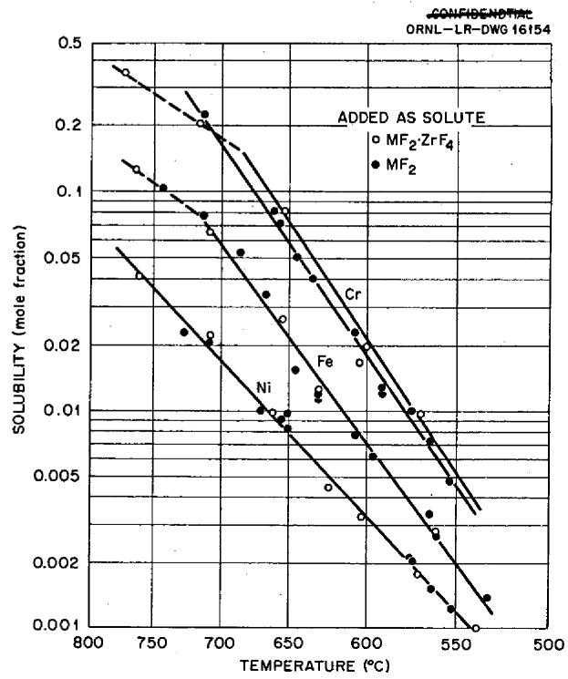  
Fig. 2.2.3. Solubility of Structural Metal Fluorides in NaF-ZrF $_4$ (53-47 mole%).

obtained by filtration. However, in order to be consistent with the filtration data, the emf values should correspond to filtration values extrapolated to correspond to a negligible amount of precipitate. An adequate explanation for the emf values being higher than the extrapolated filtration values has not been found.

From the $\mathsf{FeF}_2$ solubility values listed previously and the more recent values of 0.57 wt $\%$ or 0.62 mole $\%$ at $598^{\circ}C,$ and 5.00 wt $\%$ or 5.37 mole $\%$ at $684^{\circ}C,$ the solubility of $\mathsf{FeF}_2$ in NaF-ZrF (53-47 mole $\%$ ) can be expressed by

$$
\log N = - \frac {3 6 . 0 \times 1 0 ^ {3}}{4 . 5 7 6 T} + 6. 8 7,
$$

where $N$ is the mole fraction of the solute and $T$ is in degrees Kelvin. These data yield a heat of

solution of 36.0 kcal and an "ideal" melting point of $873^{\circ}C$ for $\mathsf{FeF}_2\cdot \mathsf{ZrF}_4$ .

Solubility data obtained for $\mathsf{CrF}_2$ in NaF-ZrF4 (53-47 mole %) are presented below:

<table><tr><td rowspan="2">Temperature (°C)</td><td colspan="2">CrF2Found</td></tr><tr><td>wt %</td><td>mole %</td></tr><tr><td>554</td><td>0.42</td><td>0.47</td></tr><tr><td>565</td><td>0.65</td><td>0.73</td></tr><tr><td>575</td><td>0.90</td><td>1.00</td></tr><tr><td>592</td><td>1.07</td><td>1.19</td></tr><tr><td>592</td><td>1.14</td><td>1.28</td></tr><tr><td>606</td><td>1.50</td><td>1.68</td></tr><tr><td>609</td><td>2.04</td><td>2.28</td></tr><tr><td>634</td><td>3.57</td><td>3.99</td></tr><tr><td>644</td><td>4.45</td><td>4.98</td></tr><tr><td>657</td><td>6.40</td><td>7.13</td></tr><tr><td>660</td><td>7.23</td><td>8.06</td></tr><tr><td>710</td><td>20.28</td><td>22.20</td></tr></table>

These data can be expressed as

$$
\log N = - \frac {3 8 . 4 \times 1 0 ^ {3}}{4 . 5 7 6 T} + 7. 8 6,
$$

and they yield a heat of solution of 38.4 kcal and a melting point of $795^{\circ}C$ .

The solubilities of $\mathsf{FeF}_2$ , $\mathsf{CrF}_2$ , and $\mathsf{NiF}_2$ , as well as those of the corresponding fluorozirconate complexes $(\mathsf{MF}_2\cdot \mathsf{ZrF}_4)$ , were determined in an effort to find a quasi binary. As can be seen in Fig. 2.2.3, there is no detectable difference in solubility between each metal fluoride and its corresponding fluorozirconate, except for chromium, and even for chromium the difference is small and may be due to experimental error. This means that the liquidus temperatures along the two joins $(\mathsf{MF}_2\cdot 7\mathsf{NaF}\cdot 6\mathsf{ZrF}_4$ and $\mathsf{MF}_2\cdot \mathsf{ZrF}_4\cdot 7\mathsf{NaF}\cdot 6\mathsf{ZrF}_4)$ in the ternary phase diagram are almost the same. The most recent evidence from quenched preparations suggests that only in the case of $\mathsf{FeF}_2$ is $\mathsf{FeF}_2\cdot \mathsf{ZrF}_4$ the saturating phase and that a solid ternary phase is precipitated in the other systems.

Similar concentration cells containing $\mathsf{CuF}_2$ (with copper crucibles and electrodes) have frequently yielded indeterminate results. Although $\mathsf{CuF}_2$ in the presence of metallic copper in NaF $\mathsf{ZrF}_4$ melts might be expected to reduce completely to $\mathsf{CuF}_2$ , the cells have behaved as though

both $\mathsf{CuF}$ and $\mathsf{CuF}_2$ were present, with the monovalent salt predominating at higher temperatures.

A vessel fabricated of boron nitride (obtained from the Carborundum Co.) was charged with an NaF-KF-LiF (eutectic) mixture and heated for three days at temperatures from 550 to $770^{\circ}\mathrm{C}$ in a helium atmosphere. The resistance between a nickel wire immersed in the melt and the metal platform supporting the crucible remained high $(10^{9}\mathrm{ohms}$ at $650^{\circ}\mathrm{C},4\times 10^{4}\mathrm{ohms}$ at $770^{\circ}\mathrm{C})$ and was reproducible during the run. Examination of a cross section of the cooled container revealed penetration by the melt of about $\frac{1}{8}$ in., but no petrographic evidence of contamination of the melt was found. Further tests will be made to study the stability of this ceramic to fused fluorides.

# ACTIVITIES IN THE RbF-ZrF4 SYSTEM

S. Cantor

S. D. Christian

The vapor pressure data previously reported $^{12}$ for the RbF-ZrF $_4$ and the KF-ZrF $_4$ systems have been processed to yield some information on how the activities change with the concentration and temperature. Since ZrF $_4$ was found to be the only volatile constituent, the activities of ZrF $_4$ based on liquid standard states were obtained from the appropriate log $p$ vs $1/T$ equation, presented previously, $^{12}$ by calculating the pressure at a given temperature and dividing by the pressure of pure, liquid ZrF $_4$ .

The only value available for the vapor pressure of pure, liquid $\mathsf{ZrF}_4$ was obtained at the melting point, $912^{\circ}\mathrm{C}$ . To obtain vapor pressures for pure, liquid $\mathsf{ZrF}_4$ at lower temperatures the following relation was used:

$$
\log \frac {P _ {s}}{P _ {1}} = \frac {\Delta H _ {m}}{2 . 3 0 3 R} \left(\frac {1}{T _ {m}} - \frac {1}{T}\right),
$$

where

$$
\begin{array}{l} \Delta H _ {m} = \text {h e a t o f m e l t i n g i n c a l / m o l e ,} \\ T _ {m} ^ {m} = \text {m e l t i n g p o i n t i n d e g r e e s K e l v i n}, \\ P _ {s} = \text {s u b l i m a t i o n p r e s s u r e}, \\ P _ {1} = \text {s u p e r c o o l e d} \quad \text {l i q u i d} \quad \text {v a p o r} \quad \text {p r e s s u r e}, \\ R = \text {g a s c o n s t a n t}. \\ \end{array}
$$

If a tentatively estimated value of 13.5 kcal/mole is adopted for the heat of fusion of $\mathsf{ZrF}_{4^{\prime}}\mathsf{P}_{1}$ for

$\mathsf{ZrF}_4$ is found to be 2.64, 25.9, and 164 mm at 600, 700, and $800^{\circ}\mathrm{C}$ , respectively. At $912^{\circ}\mathrm{C}$ the vapor pressure of pure $\mathsf{ZrF}_4$ is 905 mm. A plot of the vapor pressure of $\mathsf{ZrF}_4$ from solutions of RbF in $\mathsf{ZrF}_4$ at various temperatures is shown in Fig. 2.2.4, and the activities of $\mathsf{ZrF}_4$ obtained from these values are given in Table 2.2.16.

A curve-fitting process showed that the activities of $\mathsf{ZrF}_4$ at $912^{\circ}\mathsf{C}$ could be expressed by the following analytical equation:

$$
\frac {\log \frac {a _ {Z r F _ {4}}}{X _ {Z r F _ {4}}}}{X _ {R b F} ^ {2}} = - 8. 4 5 + 6. 4 0 X _ {Z r F _ {4}},
$$

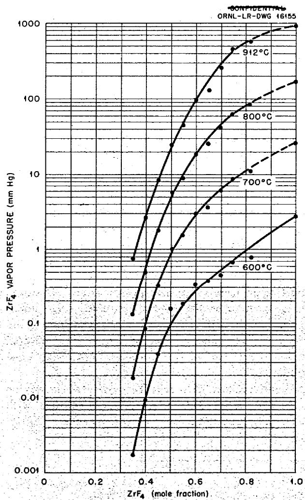  
Fig. 2.2.4. Vapor Pressure vs Composition in the RbF-ZrF₄ System.

where $a$ is the activity and $X$ is the mole fraction of the species indicated by the subscript. By the use of the Gibbs-Duhem equation in the form

$$
X _ {Z r F _ {4}} d \ln \frac {a _ {Z r F _ {4}}}{X _ {Z r F _ {4}}} + X _ {R b F} d \ln \frac {a _ {R b F}}{X _ {R b F}} = 0,
$$

the analytical equation

$$
\frac {\log \frac {a _ {R b F}}{X _ {R b F}}}{X ^ {2} Z r F _ {4}} = - 1 1. 6 5 + 6. 4 0 X _ {Z r F _ {4}}
$$

was obtained. From the two analytical expressions, the activities of $\mathsf{ZrF}_4$ and RbF shown in Fig. 2.2.5 were then calculated.

Rational activities of RbF were not calculated for lower temperatures because of uncertainties which developed when the curve-fitting procedure was attempted. There were insufficient data to avoid large uncertainties from extrapolation into regions where $X_{\text{RbF}}$ approached unity.

# ACTIVITIES IN THE KF-ZrF4 SYSTEM

S. Cantor S. D. Christian

The $\mathsf{ZrF}_4$ activities for the KF-ZrF system were calculated, by the same method as that used for the RbF-ZrF system, from the vapor pressures shown in Fig. 2.2.6. The results are tabulated in Table 2.2.17 and plotted in Fig. 2.2.7.

The expressions used in getting rational activities of KF at $912^{\circ}C$ were

$$
\frac {\log \frac {a _ {Z r F _ {4}}}{X _ {Z r F _ {4}}}}{X ^ {2} _ {K F}} = - 8. 5 0 + 7. 7 4 X _ {Z r F _ {4}}
$$

and

$$
\frac {\log \frac {a _ {K F}}{X _ {K F}}}{X ^ {2} Z _ {r F _ {4}}} = - 1 2. 3 7 + 7. 7 4 X _ {Z r F _ {4}}.
$$

From these equations the curve for $a_{\mathbf{K}\mathbf{F}}$ vs composition, as shown in Fig. 2.2.7, was calculated.

TABLE 2.2.16. ACTIVITIES OF ${\mathrm{{ZrF}}}_{4}$ IN $\mathrm{{RbF}} - {\mathrm{{ZrF}}}_{4}$ SOLUTIONS   

<table><tr><td rowspan="2">Composition (mole fraction ZrF4)</td><td colspan="4">Activity</td></tr><tr><td>At 600°C</td><td>At 700°C</td><td>At 800°C</td><td>At 912°C</td></tr><tr><td>0.816</td><td>0.293</td><td>0.398</td><td>0.507</td><td>0.632</td></tr><tr><td>0.746</td><td>0.260</td><td>0.219</td><td>0.382</td><td>0.446</td></tr><tr><td>0.700</td><td>0.209</td><td>0.230</td><td>0.253</td><td>0.273</td></tr><tr><td>0.651</td><td>0.194</td><td>0.192</td><td>0.192</td><td>0.190</td></tr><tr><td>0.600</td><td>0.131</td><td>0.119</td><td>0.112</td><td>0.104</td></tr><tr><td>0.548</td><td>0.0687</td><td>0.0595</td><td>0.0536</td><td>0.0482</td></tr><tr><td>0.504</td><td>0.0581</td><td>0.0390</td><td>0.0338</td><td>0.0270</td></tr><tr><td>0.452</td><td>0.0146</td><td>0.0123</td><td>0.0109</td><td>0.00920</td></tr><tr><td>0.400</td><td>0.00345</td><td>0.00316</td><td>0.00305</td><td>0.00288</td></tr><tr><td>0.350</td><td>0.000645</td><td>0.000710</td><td>0.000780</td><td>0.000839</td></tr></table>

As a consequence of strong complexing, the activities decrease extremely rapidly with composition. Activities of KF are very slightly higher than the activities of RbF at corresponding compositions and temperatures, since the larger rubidium ion has less affinity for the fluoride and RbF is therefore a better complexing agent than KF.

An interesting comparison is found in the plot of $a_{\mathsf{ZrF}_4}$ in alkali fluoride solutions against ionic radius of the alkali metal. If the activity of $\mathsf{ZrF}_4$ is arbitrarily chosen as that at 50 mole $\%$ , the plot shown in Fig. 2.2.8 is obtained at $912^{\circ}\mathsf{C}$ . The $\mathsf{ZrF}_4$ activity decreases with increasing ionic radius of the alkali cation. The activities in LiF-ZrF (ref 13) and NaF-ZrF (ref 14) solutions were obtained by dividing the vapor pressure of the solution by 905 mm, the vapor pressure for pure $\mathsf{ZrF}_4$ .

# SOLUBILITY OF $\mathsf{L}\alpha \mathsf{F}_3$ AND OF $\mathsf{CeF}_3$ IN MOLTEN FLUORIDE MIXTURES

W. T. Ward

A systematic investigation of solubilities of some rare-earth fluorides in ART-type fuels was initiated. Two introductory experiments related to this investigation were reported previously.[15,16] Cost and availability considerations indicated lanthanum and cerium fluorides to be logical starting materials for the investigation. Mixtures considered to be the least difficult from the standpoint of chemical analysis were investigated first. The solvents NaF-KF-LiF (11.5-42-46.5 mole %) and NaF-ZrF₄ (50-50 mole %) have been studied.

The experimental procedure consisted in mixing a given quantity of the rare-earth fluoride with previously purified solvent to make an initial

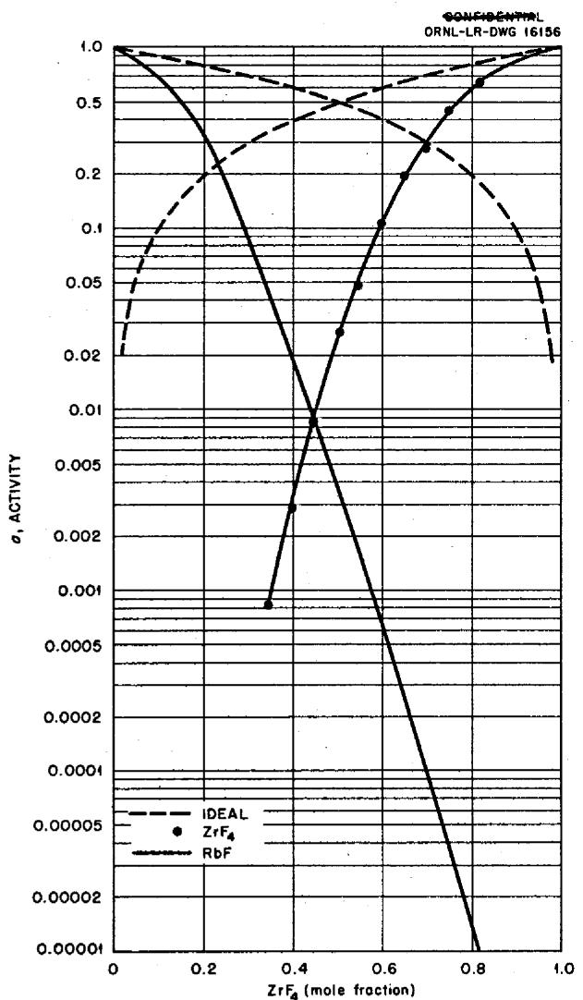  
Fig. 2.2.5. Activities of $\mathsf{ZrF}_4$ and RbF at $912^{\circ}\mathsf{C}$ vs Composition in the RbF $\cdot$ ZrF $_4$ System.

charge of 1 kg. The mixture was purified in a nickel reactor by hydrofluorination and hydrogenation at $800^{\circ}\mathrm{C}$ . Then, with continuous helium sparging, the temperature of the system was increased to $850^{\circ}\mathrm{C}$ , and the mixture was stirred for approximately 30 min. The temperature was then lowered to $800^{\circ}\mathrm{C}$ , and, after approximately 60 min, a filtrate was obtained with a nickel filtering tube. The temperature was then further lowered, and filtrates were obtained in a similar manner at 700, 600, and 550 or $500^{\circ}\mathrm{C}$ depending on the liquidus temperature of the solvent used. In order to avoid cold spots in the reactor and pronounced

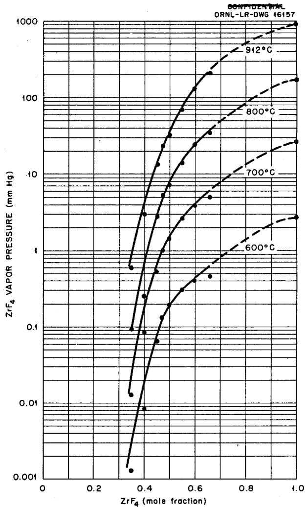  
Fig. 2.2.6. Vapor Pressure vs Composition in the KF-ZrF4 System.

temperature gradients, two independently operated Calrod heaters were installed at the bottom and top sections of the reactor. Prior to obtaining each filtrate, the temperatures of the auxiliary heaters were adjusted until temperature-depth surveys in the solution revealed temperature differences no greater than 10 deg. In attempting to ascertain whether the solubility of the additive was a function of the amount added, the filtration procedure was repeated after the initial quantity of rare-earth fluoride had been doubled by the proper addition of more rare-earth fluoride. The system was cooled overnight prior to the additions in order to avoid possibilities of contamination and the losses inherent in high-temperature additions. The

results of several experiments are summarized in Tables 2.2.18 through 2.2.21.

The results presented in Table 2.2.18 indicate that the solubility of $\mathsf{CeF}_3$ in the NaF-KF-LiF eutectic mixture is at least 6 wt $\%$ at $500^{\circ}\mathrm{C}$ . When the survey of other ART fuels is completed this experiment will be repeated with greater additions of $\mathsf{CeF}_3$ . The data in Table 2.2.19 indicate that the solubility of $\mathsf{LaF}_3$ in the NaF-KF-LiF eutectic mixture is at least 12.0 wt $\%$ (4.12 mole $\%$ ) at $500^{\circ}\mathrm{C}$ . Petrographic and x-ray diffraction examination of the second $800^{\circ}\mathrm{C}$

filtrate revealed traces of $\mathsf{KLaF}_4$ . The $\mathsf{NaLaF}_4$ compound was not detected.

The data in Table 2.2.20 indicate that, within the apparent analytical precision, the solubility of $\mathsf{CeF}_3$ in NaF- $\mathsf{ZrF}_4$ (50-50 mole %) is independent of the amount of $\mathsf{CeF}_3$ added. Petrographic and x-ray examination of the reactor heel revealed relatively large quantities of pure $\mathsf{CeF}_3$ , and only traces of an unidentified phase that exhibited high birefringence. Free $\mathsf{CeF}_3$ was present in the $800^{\circ}\mathsf{C}$ filtrates.

TABLE 2.2.17. ACTIVITIES OF ${\mathrm{{ZrF}}}_{4}$ IN $\mathrm{{KF}} - {\mathrm{{ZrF}}}_{4}$ SOLUTIONS   

<table><tr><td rowspan="2">Composition (mole fraction ZrF4)</td><td colspan="4">Activity</td></tr><tr><td>At 600°C</td><td>At 700°C</td><td>At 800°C</td><td>At 912°C</td></tr><tr><td>0.659</td><td>0.201</td><td>0.221</td><td>0.240</td><td>0.260</td></tr><tr><td>0.596</td><td>0.155</td><td>0.151</td><td>0.149</td><td>0.146</td></tr><tr><td>0.550</td><td>0.118</td><td>0.0998</td><td>0.0872</td><td>0.0765</td></tr><tr><td>0.499</td><td>0.0739</td><td>0.0557</td><td>0.0443</td><td>0.0358</td></tr><tr><td>0.476</td><td>0.0508</td><td>0.0395</td><td>0.0321</td><td>0.0264</td></tr><tr><td>0.453</td><td>0.0243</td><td>0.0200</td><td>0.0174</td><td>0.0150</td></tr><tr><td>0.404</td><td>0.00432</td><td>0.00436</td><td>0.00441</td><td>0.00450</td></tr><tr><td>0.349</td><td>0.000688</td><td>0.000811</td><td>0.000880</td><td>0.00105</td></tr></table>

TABLE 2.2.18. SOLUBILITY OF ${\mathrm{{CeF}}}_{3}$ IN NaF-KF-LIF (11.5-42-46.5 mole-%)   

<table><tr><td colspan="2">CeF3Added</td><td rowspan="2">Temperature (°C)</td><td colspan="2">Ce Found in Filtrate (wt %)</td></tr><tr><td>wt % Ce</td><td>mole % Ce</td><td>Colorimetrically</td><td>By Titration</td></tr><tr><td>3.00</td><td>0.914</td><td>800</td><td></td><td>3.2</td></tr><tr><td></td><td></td><td>700</td><td></td><td>3.0</td></tr><tr><td></td><td></td><td>600</td><td></td><td>3.1</td></tr><tr><td></td><td></td><td>500</td><td></td><td>3.1</td></tr><tr><td>6.13</td><td>1.94</td><td>800</td><td>6.2</td><td>6.4</td></tr><tr><td></td><td></td><td>700</td><td>6.3</td><td>6.3</td></tr><tr><td></td><td></td><td>600</td><td>6.1</td><td>5.7</td></tr><tr><td></td><td></td><td>500</td><td>6.3</td><td>6.2</td></tr></table>

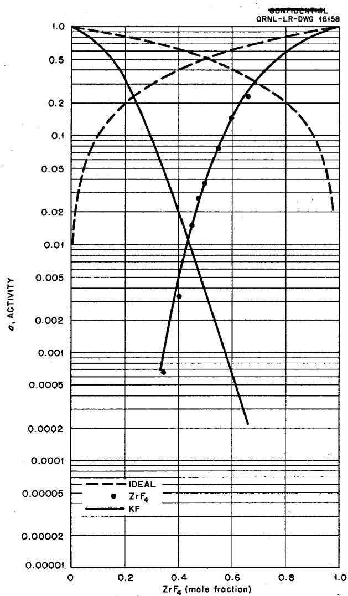  
Fig. 2.2.7. Activities of $\mathbf{ZrF}_4$ and KF at $912^{\circ}\mathrm{C}$ in the KF- $\mathbf{ZrF}_4$ System.

Petrographic and x-ray diffraction examinations of the reactor heel from the experiments reported in Table 2.2.21 showed large amounts of free $\mathsf{LaF}_{3^{\prime}}$ the compound $7\mathrm{NaF}\cdot 6\mathrm{ZrF}_{4^{\prime}}$ and a trace of an unidentified compound. The third $800^{\circ}\mathrm{C}$ filtrate showed a small amount of free $\mathsf{LaF}_{3}$ and a large amount of the compound $7\mathrm{NaF}\cdot 6\mathrm{ZrF}_{4}$ . From the standpoint of reactor operation, the solubilities are comfortably high. Efforts will be made to study the feasibility of exchange and fractional crystallization of the $\mathsf{LaF}_{3}$ from the solution at the lower temperatures in order to provide information for use in fuel reprocessing.

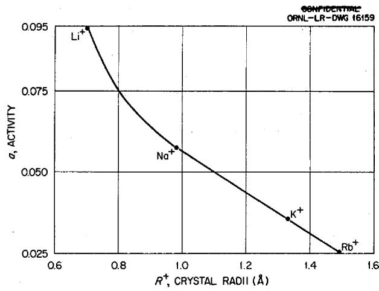  
Fig. 2.2.8. Activity of $\mathbf{ZrF}_4$ at 50 mole % in Alkali Fluoride Binary Systems at $912^{\circ}\mathrm{C}$ vs Size of Alkali Cation.

# SOLUBILITY OF XENON IN FUSED SALTS

# R. F. Newton

The components of apparatus for the determination of the solubility of xenon in fused salts have been constructed and assembly is nearly complete. The radioactive isotope $\mathrm{Xe}^{133}$ is to be used for these studies. Saturation will be accomplished in a slowly rocking, nearly horizontal, tube about half full of melt. Small samples of the saturated melt will then be counted with a scintillation counter. The sensitivity of the counter is such that a solubility of $10^{-9}$ mole/cm³ should be determinable to within perhaps 20%, and a solubility as low as $10^{-10}$ mole/cm³ can probably be detected.

Xenon-133 is particularly suitable for this determination because it decays to a stable daughter, $\text{Cs}^{133}$ , and hence the results will not be falsified by the counting of a radioactive daughter which is readily soluble in the melt. The xenon is readily obtainable in quantities more than sufficient for the purpose from the waste gas from the recovery of iodine from spent fuel slugs.

# MOLTEN SALT POLAROGRAPHY

# B. H. Clompitt

The use of polarography in the analysis of molten fluorides has been developed sufficiently for it to be possible to carry out quantitative

analyses of structural metal ions in the NaF-KF-LiF eutectic. Half-wave potentials have been identified for $\mathrm{Ni}^{++}$ , $\mathrm{Fe}^{+++}$ , and $\mathrm{Cr}^{+++}$ , and solubility determinations were made by following the plot of wave height vs concentration to the solubility limit and beyond.

The successful determinations were made with a "bubble cathode" of the type employed by Ludwig

and Carter. $^{17}$ This type of electrode was originally designed by Lyalikov and Karmazin $^{18}$ for use in molten $\mathsf{KNO}_3$ .

17 Carter Laboratory Progress Report for Dec. 1955, Subcontract No. 530, Pasadena, California.

18Yu S. Lyalikov and V. I. Karmazin, Zavodskaya Lab. 14, 144 (1948).

TABLE 2.2.19. SOLUBILITY OF ${\mathrm{{LaF}}}_{3}$ IN NaF-KF-LIF (11.5-42-46.5 mole %)   

<table><tr><td colspan="2">LaF3Added</td><td rowspan="2">Temperature (°C)</td><td rowspan="2">La Found in Filtrate (wt %)</td></tr><tr><td>wt % La</td><td>mole % La</td></tr><tr><td>5.99</td><td>1.91</td><td>800</td><td>6.2</td></tr><tr><td></td><td></td><td>700</td><td>5.8</td></tr><tr><td></td><td></td><td>600</td><td>6.0</td></tr><tr><td></td><td></td><td>500</td><td>5.9</td></tr><tr><td>12.01</td><td>4.12</td><td>800</td><td>12.2</td></tr><tr><td></td><td></td><td>700</td><td>12.3</td></tr><tr><td></td><td></td><td>600</td><td>12.4</td></tr><tr><td></td><td></td><td>500</td><td>12.6</td></tr></table>

TABLE 2.2.20. SOLUBILITY OF ${\mathrm{{CoF}}}_{3}$ IN $\mathrm{{NaF}} - {\mathrm{{ZrF}}}_{4}$ (50-50 mole %)   

<table><tr><td colspan="2">CeF3Added</td><td rowspan="2">Temperature (°C)</td><td colspan="2">Ce Found in Filtrate (wt %)</td></tr><tr><td>wt % Ce</td><td>mole % Ce</td><td>Colorimetrically</td><td>By Titration</td></tr><tr><td>3.00</td><td>2.28</td><td>800</td><td>2.8</td><td>2.9</td></tr><tr><td></td><td></td><td>700</td><td>2.8</td><td>2.6</td></tr><tr><td></td><td></td><td>600</td><td>2.7</td><td>2.6</td></tr><tr><td>6.00</td><td>4.67</td><td>800</td><td>5.4</td><td>5.3</td></tr><tr><td></td><td></td><td>700</td><td>3.9</td><td>3.8</td></tr><tr><td></td><td></td><td>600</td><td>2.8</td><td>2.7</td></tr><tr><td></td><td></td><td>550</td><td>2.6</td><td>2.4</td></tr><tr><td>12.0</td><td>9.73</td><td>800</td><td></td><td>5.9</td></tr><tr><td></td><td></td><td>700</td><td></td><td>3.9</td></tr><tr><td></td><td></td><td>600</td><td></td><td>3.0</td></tr><tr><td></td><td></td><td>550</td><td></td><td>2.8</td></tr></table>

TABLE 2.2.21. SOLUBILITY OF ${\mathrm{{LaF}}}_{3}$ IN NaF-ZrF ${}_{4}$ (50-50 mole %)   

<table><tr><td colspan="2">LaF3Added</td><td rowspan="2">Temperature (°C)</td><td rowspan="2">La Found in Filtrate (wt %)</td></tr><tr><td>wt % La</td><td>mole % La</td></tr><tr><td>3.0</td><td>2.30</td><td>800</td><td>3.1</td></tr><tr><td></td><td></td><td>700</td><td>3.2</td></tr><tr><td></td><td></td><td>600</td><td>3.3</td></tr><tr><td></td><td></td><td>550</td><td>3.3</td></tr><tr><td>6.0</td><td>4.70</td><td>800</td><td>6.0</td></tr><tr><td></td><td></td><td>700</td><td>4.2</td></tr><tr><td></td><td></td><td>600</td><td>3.3</td></tr><tr><td></td><td></td><td>550</td><td>2.8</td></tr><tr><td>12.0</td><td>9.81</td><td>800</td><td>5.7</td></tr><tr><td></td><td></td><td>700</td><td>4.2</td></tr><tr><td></td><td></td><td>600</td><td>3.1</td></tr><tr><td></td><td></td><td>550</td><td>2.9</td></tr></table>

The electrode was a thin wire of noble metal which barely protruded from a tube through which inert gas was passed. When the electrode was immersed in a melt, the escaping bubbles caused an intermittent contact of the wire with the melt, and thus provided a periodic renewal of the diffusion layer which approximated the behavior at a dropping-metal electrode.

Because of the high conductivity of molten alkali fluorides, the polarographic circuit was designed to operate at currents as high as $100\mathrm{mA}$ . Suitable bubble rates (30/min) required a recorder with a much faster response than that commonly found on aqueous polarographs. To attain this speed, a recorder with a 1-sec full-scale response was equipped with a ratchet which allowed the recorder pen to travel only in the direction of increasing current.

The dipping cathode was a silver wire fused into a thin Morganite tube, which was, in turn, surrounded by a 3-in. nickel tube. The Morganite tube limited the effective electrode area to a very small value. A nickel crucible served both as a container and as the anode. The entire cell assembly was placed in a helium-filled chamber that was supplied with electrical leads and glove parts and equipped with a furnace.

Because the anode was nickel, the polarographic wave for $\mathbf{N}\mathbf{i}^{+ + }$ in NaF-KF-LiF (11.5-42-46.5 mole %) occurred between 0 and 0.1 v. The diffusion current (that is, the height of the polarographic wave) was a linear function of the concentration.

The results of the determination of the solubility of $\mathsf{NiF}_2$ at $550^{\circ}\mathsf{C}$ are shown in Fig. 2.2.9, which is a plot of diffusion current vs amount of $\mathsf{NiF}_2$ added to $33.4\mathrm{g}$ of the NaF-KF-LiF mixture. The break represents the saturation concentration at $0.42\mathrm{wt}\% \mathsf{NiF}_2$ .

It had been anticipated that once saturation was reached the diffusion current would remain constant. The large increase in the current above saturation is probably explained by the presence of colloidal particles of $\mathrm{NiF}_2$ in the saturated melt; the $\mathrm{NiF}_2$ particles impede the establishment of a concentration gradient around the microelectrode. As observed visually, the melt was clear until saturated, while further addition of $\mathrm{NiF}_2$ caused turbidity.

Similar diffusion current-concentration curves for $\mathsf{NiF}_2$ in NaF-KF-LiF (11.5-42-46.5 mole %) at $500^{\circ}\mathsf{C}$ gave a solubility of 0.146 wt % $\mathsf{NiF}_2$ . In tests with $\mathsf{CrF}_3$ , a reproducible half-wave potential of 0.9 v was found, but no solubility measurements were attempted.

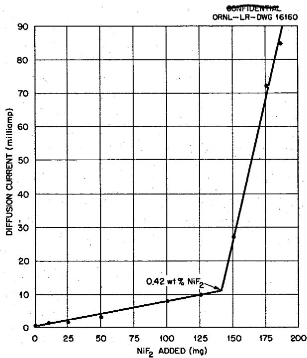  
Fig. 2.2.9. Diffusion Current vs $\mathsf{NiF}_2$ Concentration in 33.4 g of NaF-KF-LiF (11.5-42-46.5 mole %) at $550^{\circ}\mathbf{C}$ .

The half-wave potential for the reaction

$$
F e ^ {+ + +} \rightarrow F e ^ {+ +} + e
$$

was $0.4\mathrm{v}$ The change in diffusion current upon the addition of $\mathsf{FeF}_3$ to 26.6 g of NaF-KF-LiF eutectic at $550^{\circ}C$ is shown in Fig. 2.2.10. The $\mathsf{NiF}_2$ diffusion current remained very low during this process until saturation was approached, and then it increased rapidly, probably because of the reaction

$$
\mathrm {N i} + 2 \mathrm {F e F} _ {3} \rightarrow 2 \mathrm {F e F} _ {2} + \mathrm {N i F} _ {2}, \quad F ^ {\circ} = - 2 4 \mathrm {k c a l}.
$$

Apparently the dissolved $\mathsf{FeF}_3$ was so highly complexed that reaction could not occur in spite of the favorable free energy, but the presence of excess $\mathsf{FeF}_3$ changed the situation. Saturation occurred at 0.19 wt $\%$ $\mathsf{FeF}_3$ .

Much time was devoted to an unsuccessful attempt to obtain reproducible results for $\mathsf{NiF}_2$ in NaF $\cdot$ ZrF $_4$ . The failure may be related to the peculiar behavior reported above for $\mathsf{NiF}_2$ and nickel.

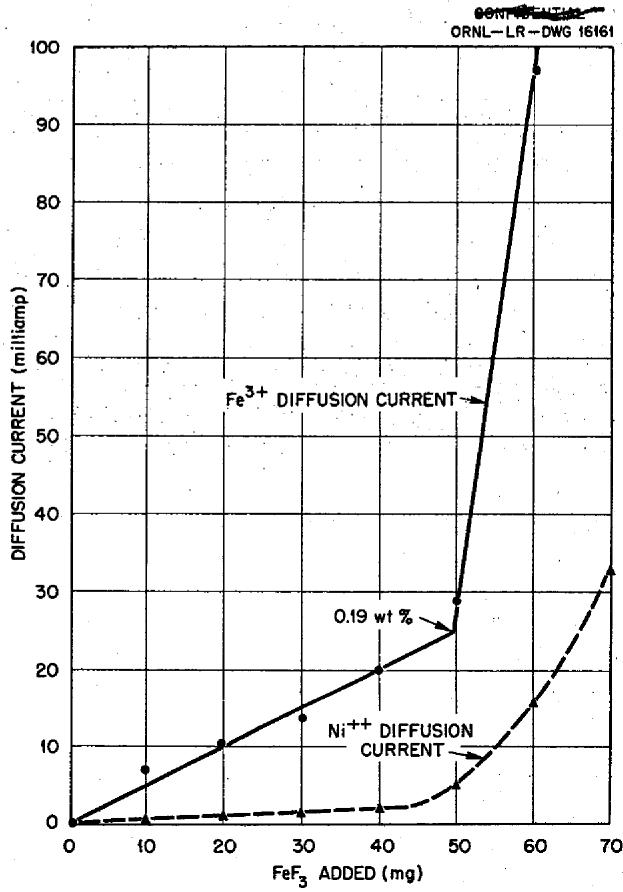  
Fig. 2.2.10. Diffusion Currents Obtained from Adding $\mathsf{FeF}_3$ to $26.6\mathrm{g}$ of NaF-KF-LiF (11.5-42-46.5 mole %) at $550^{\circ}C.$

# ACTIVITIES FROM EMF MEASUREMENTS ON SOLID SOLUTIONS OF SALTS

M.B.Panish

Measurements of activities in the system AgCl-NaCl by an emf method have been of interest both as a trial study with a solid electrolyte of a technique which may be applicable to fluoride systems and also as a demonstration of some metastable solid solution behavior. The cell being investigated was comprised of $\mathsf{Ag}^0$ and $\mathsf{Cl}_2^0$ electrodes, with AgCl-NaCl as the electrolyte, so that the cell reaction was the formation of AgCl from the elements. The activity of AgCl was determined from the emf by comparison with pure AgCl. The electrolyte concentration was varied from 3 mole % to pure AgCl, and the temperature range was extended from the liquid into the

solid region, that is, to temperatures as low as $250^{\circ}\mathrm{C}$   
The feasibility of making equilibrium measurements with a solid electrolyte, as reported by earlier workers,[19] was demonstrated. This is probably easier with the $\mathrm{Ag^{+}}$ ion in a chloride system, but, with a suitable amplifier, measurements on solid fluorides might also be feasible. If so, a ceramic container would no longer be a problem for cells containing fluorides, measurements could be made on solids by using cells designed to avoid transference potentials, and compositions with inconveniently high melting points could be studied.   
In the liquid state, the AgCl-NaCl system showed a slight positive deviation from ideality. From the phase diagram, a continuous series of solid solutions was expected below the solidus. However, the activity of AgCl in the solid solution was not a monotonic function of concentration. The AgCl-rich solutions showed marked positive deviation

from Raoult's law and gave an activity vs concentration curve which rose well above, and presumably did not connect with, the curve for NaCl-rich compositions. The NaCl-rich compositions showed a slight negative deviation, if any, from Raoult's law. There was apparently a region in the middle where the two curves overlapped without connecting; however, the experimental uncertainty in this region was large. Obviously the solution with the higher AgCl activity was unstable with respect to the lower one, but no transition from the higher curve to the lower was noted. Also an activity-concentration relation of this type requires that the stable condition is separation into conjugate solutions; no evidence of such phase separation was found by petrographic or x-ray examinations. The metastable condition was produced by quenching from the liquid and was maintained, in spite of annealing, because of the slowness of diffusion in the solid. These findings agree qualitatively with those found for the same solid solution by Wachter,[19] who worked at a lower temperature and used different electrodes.

# 2.3. PHYSICAL PROPERTIES OF MOLTEN MATERIALS

F. F. Blankenship

G.M.Watson

# SURFACE TENSION AND DENSITY OF NaF-ZrF4 MIXTURES

F.W.Miles

Attempts to apply the maximum bubble-pressure method to determinations of surface tensions of NaF-ZrF₄ mixtures have been accompanied by difficulties caused by partial plugging of the capillary tips. Therefore the values that have been obtained are not considered to be sufficiently accurate to report. Additional equipment is being added to the gas-purification train, and the bubble-pressure apparatus is being simplified in an effort to minimize contamination of the system and consequent plugging of the tips.

The results of several density determinations on NaF-ZrF $_4$ (53-47 mole %) are now available. The density data (in g/ml) are summarized below:

<table><tr><td>At 600°C</td><td>At 700°C</td><td>At 800°C</td></tr><tr><td>3.049</td><td>2.916</td><td>2.805</td></tr><tr><td>3.014</td><td>2.948</td><td>2.813</td></tr><tr><td>3.051</td><td>2.895</td><td>2.821</td></tr><tr><td>3.039</td><td>2.946</td><td>2.833</td></tr><tr><td>3.003</td><td></td><td></td></tr><tr><td>3.020</td><td></td><td></td></tr></table>

Av 3.03 ± 0.02 2.93 ± 0.02 2.82 ± 0.01

The average values may be represented by the equation

$$
d = 3. 6 5 1 - (1. 0 4 \times 1 0 ^ {- 3}) T,
$$

where $T$ is temperature in ${}^{\circ}\mathsf{C}$

The data were obtained on several different batches of NaF-ZrF4 mixture of the same composition. It is believed, however, that the density values are probably correct to within 2%. The calculated densities2 corresponding to this composition are higher by approximately 5% than the

average values listed. Efforts are being made to improve the precision of the density and surface tension measurements.

# SURFACE TENSIONS OF MOLTEN SALTS

S. Langer

# Fluorozirconate Mixtures

Additional measurements of the surface tensions of NaF-ZrF $_4$ (53-47 mole %) mixtures have been made by using the sessile-drop technique, previously described. $^{3,4}$ Recent experiments at $600^{\circ}\mathrm{C}$ tend to substantiate the results reported previously. Some data have been obtained at $700^{\circ}\mathrm{C}$ , and a preliminary experiment at $800^{\circ}\mathrm{C}$ has been run. The data accumulated to date are summarized in Table 2.3.1. Data from the previous report $^{4}$ are included and corrected by the use of more precise densities calculated from the equation

$$
d = 3. 6 5 1 - (1. 0 4 \times 1 0 ^ {- 3}) T (^ {\circ} C),
$$

reported above.

The "best" values for the surface tension of these mixtures are $127 \pm 6$ dynes/cm at $600^{\circ}\mathrm{C}$ and $119 \pm 4$ dynes/cm at $700^{\circ}\mathrm{C}$ , where the error range is the root-mean-square deviation. It should be noted that there appears to be a small difference (within experimental error) between the data obtained in helium and in hydrogen atmospheres at $600^{\circ}\mathrm{C}$ . The average surface tension in helium is 128 dynes/cm, while the average in hydrogen is 122 dynes/cm. More experimental work will be needed to demonstrate the effect of the atmosphere.

The first evidence of a large change of surface tension with composition is shown by the data at $800^{\circ}C$ . The large loss of weight due to vaporization of $\mathsf{ZrF}_4$ from the sessile drop and the concomitant change of composition probably explain the increase in the surface tension of the melt. Experiments designed to study the effects of change of composition as a function of temperature, pressure of the confining gas, and time of equilibration are under way. The results will

TABLE 2.3.1. SURFACE TENSIONS OF NaF-ZrF4 (53-47 mole %) MIXTURES OBTAINED BY THE SESSILE-DROP TECHNIQUE   

<table><tr><td>Temperature (°C)</td><td>Sample Weight (g)</td><td>Pressure (mm Hg)</td><td>Weight Loss (%)</td><td>Composition (mole % ZrF4)a</td><td>Number of Photographs Taken</td><td>Surface Tensionb (dynes/cm)</td></tr><tr><td rowspan="4">600</td><td>0.4502</td><td>240</td><td>3.1</td><td>46.0</td><td>6</td><td>132 ± 6</td></tr><tr><td>0.5097</td><td>250</td><td>3.7</td><td>45.8</td><td>6</td><td>125 ± 4.3</td></tr><tr><td>0.5978</td><td>410</td><td></td><td></td><td>2</td><td>126 ± 4.6</td></tr><tr><td>0.3154</td><td>350</td><td>4.3</td><td>45.6</td><td>6</td><td>122 ± 2.6c</td></tr><tr><td rowspan="4">700</td><td>0.7758</td><td>260</td><td>17.3</td><td>40.8</td><td>5</td><td>118 ± 0.8</td></tr><tr><td>0.4632</td><td>515</td><td>12.9</td><td>40.1</td><td>4</td><td>116 ± 4.5</td></tr><tr><td>0.4481</td><td>515</td><td>9.0</td><td>41.4</td><td>4</td><td>122 ± 1.4</td></tr><tr><td></td><td>515</td><td>10.5</td><td>41.6</td><td>3</td><td>123 ± 0.6</td></tr><tr><td>800</td><td>0.3513</td><td>530</td><td>35.4</td><td>29.8</td><td>5</td><td>138 ± 7</td></tr></table>

${}^{a}$ Calculated from the weight loss of the sample by assuming that only ${\mathrm{{ZrF}}}_{4}$ is volatilized.   
${}^{b}$ Samples measured on graphite plaques under a helium atmosphere. The error range is the root-mean-square devi- ation.   
cThis sample was measured under hydrogen rather than helium.

permit the estimation of the surface tensions over a range of compositions from a single sample.

In the previous report5 the penetration of APC graphite by NaF-ZrF4 (53-47 mole %) mixtures was described. This behavior is surprising in view of the nonwetting properties of this mixture on C-18 graphite, as evidenced by the surface-tension measurements reported here. Several preliminary experiments in which APC graphite was used as the supporting plaque have therefore been carried out. While the experimental conditions are somewhat different from those of the penetration studies, the sessile drops do not appear to have either wet or penetrated the plaque. The reason for the discrepancy between these data and the previous observations is not immediately apparent.

# Uranium Tetrafluoride

Several preliminary experiments have been carried out to study the wetting properties and surface tensions of $\mathsf{U}\mathsf{F}_4$ and of $\mathsf{U}\mathsf{F}_4$ with small additions of $\mathsf{U}\mathsf{O}_2$ . Visual observation had previously indicated that melts containing $4\%$ , or more, $\mathsf{U}\mathsf{O}_2$ would penetrate graphite. This observation was borne out by preliminary observations of the surface tension: No values for the surface tensions are available as yet, but the preliminary experiments have shown that, even though $\mathsf{U}\mathsf{F}_4$ with about $1\% \mathsf{U}\mathsf{O}_2$ did not immediately wet C-18 or APC graphite, after a period of time, during which small amounts of air leaked into the system, the contact angle receded and the $\mathsf{U}\mathsf{F}_4\cdot \mathsf{U}\mathsf{O}_2$ melt started to wet the plaques. These studies will be continued.

# 2.4. PRODUCTION OF PURIFIED FLUORIDE MIXTURES

G. J. Nessle

G.M.Watson

# LABORATORY-SCALE PURIFICATION OPERATIONS

W. T. Ward

The standard hydrofluorination-hydrogenation process was used, with appropriate modifications to laboratory-scale equipment, to prepare a number of especially pure fluoride mixtures requested for various research programs. Several of these compositions were dispensed directly into containers furnished by the requester to minimize atmospheric contamination and handling.

# QUALITY CONTROL OF RAW MATERIALS AND PRODUCTS

W. T. Word

The processing characteristics of an NaF-ZrF4 mixture supplied by a commercial vendor were determined, and the product was found to meet specifications. Samples of all production batches were obtained for petrographic and x-ray diffraction analysis to assure quality control.

# PILOT-SCALE PURIFICATION OPERATIONS

C. R. Croft

J. Truitt

J. P. Blakely

The pilot-scale purification facility processed 53 batches totaling 835 lb of various fluoride compositions for use in small-scale corrosion testing, phase equilibrium studies, and physical property studies. The demand for special compositions continued at a fairly constant level, and thus efficient operation and maintenance of these facilities at about $30\%$ capacity was possible without accumulating a backlog.

The use of copper-lined stainless steel reactor vessels in these small size units has proved successful in all but one case. Mixtures containing NaF, LiF, KF, and UF4 cannot be frozen in the copper liners and then remelted. In three attempts to process NaF-KF-LiF-UF4 (11.2-41-45.3-2.5 mole %) the copper liners ruptured when the melt was frozen and then remelted in the reactor vessel. This means that any full-scale operation of the 250-lb facility for the preparation of such mixtures would necessitate a 24-hr-day 7-day-week basis of operation so that the mixture could be maintained molten at all times.

# PRODUCTION-SCALE OPERATIONS

J. E. Eorgan

J. P. Blakely

The production-scale facility processed 19 batches totaling about 4550 lb of purified fluoride melts. The use of copper-lined stainless steel reactor vessels continued to prove very satisfactory in this facility. One reactor vessel has now produced sixteen 250-lb batches, and it shows no signs of deterioration. Product quality has remained excellent throughout the equipment life; however, some difficulties have been encountered because of the high oxygen and water content of the poor-grade hydrogen now being supplied in this area. This difficulty has apparently been overcome by installation of catalyst trains and cold traps of higher capacity than previously used on the hydrogen purification system.

The production facility was shut down during July because the relatively low consumption rate resulted in a shortage of receivers for storage of purified product. The present disposition of sixty-four 250-lb containers is the following:

Held by Pratt & Whitney 23

To be shipped to Pratt & Whitney (August) 8

ART High-Temperature Critical Experiment 3 storage

Stock inventory (full) 20

Empty containers on hand 10

Total 64

Forty new 250-lb storage containers are presently on order. Delivery of these containers is expected to begin in September, and reactivation of the production facility is scheduled accordingly. It is extremely unlikely, however, that the shortage of such containers will be alleviated before January. Accordingly production of purified materials will probably be 8,000 to 10,000 lb behind presently scheduled demands by the end of this calendar year.

An order for 30,000 lb of $\mathsf{NaZrF}_5$ has been placed with a commercial vendor. It is estimated that this amount should be sufficient to maintain operation for FY 1957. Delivery of 4000 lb of this material per month is expected to begin in

August 1956. Each shipment will be analyzed thoroughly to ascertain that specifications of purity have been met.

# BATCHING AND DISPENSING OPERATIONS

F. A. Doss

J. P. Blakely

The batching and dispensing facility dispensed 128 batches totaling approximately 8025 lb of processed fluorides in batch sizes ranging from 1 to 250 lb. This is a sizeable increase over the amount normally handled because of large shipments to Pratt & Whitney. As a result, the stock inventory of processed fluorides decreased appreciably. A material balance for the quarter is given in Table 2.4.1.

The main consumers of the processed fluoride mixtures and their allotments during the quarter are given below:

<table><tr><td colspan="2">ORNL-ANP groups</td></tr><tr><td>For chemical and physical properties studies</td><td>258 lb</td></tr><tr><td>For experimental engineering tests</td><td>2680</td></tr><tr><td>For metallurgical studies and fuel reprocessing development</td><td>593</td></tr><tr><td>Pratt &amp; Whitney Aircraft</td><td>3207</td></tr><tr><td>Other contractors, including BMI, NRL, and WADC</td><td>200</td></tr><tr><td>Salvage and reprocessing</td><td>1087</td></tr><tr><td>Total</td><td>8025 lb</td></tr></table>

# PREPARATION OF $\mathsf{ZrF}_4$ FROM $\mathsf{ZrCl}_4$

J. E. Eorgan

J. P. Blakely

A dust filter for the $\mathsf{ZrCl}_4$ -conversion unit is presently being installed. Conversion of some 2000 lb of low-hafnium $\mathsf{ZrCl}_4$ to $\mathsf{ZrF}_4$ will begin as soon as installation of the filter is complete. It is hoped that the new dust filter will prevent large-scale loss of the product during the conversion and permit efficient operation. The conversion unit will be operated on a 24-hour-day five-day-week basis until the present supply of $\mathsf{ZrCl}_4$ is all converted to $\mathsf{ZrF}_4$ . The recent demand for 1200 lb of low-hafnium NaF- $\mathsf{ZrF}_4$ (50-50 mole %) for the Pratt & Whitney high-temperature critical test has made it imperative that this unit be operated as soon as possible.

In order to meet known demands in FY 1957 for fluoride compositions requiring low-hafnium $\mathsf{ZrF}_{4}$ , an order for 7000 lb of low-hafnium $\mathsf{ZrCl}_{4}$ has recently been initiated. At least half this order has been requested for delivery before December 1956, and the remainder is to be delivered sometime in the last half of FY 1957.

# SPECIAL SERVICES

F. A. Doss

J. P. Blakely

J. Truitt

N.V. Smith

Filling, Draining, and Sampling Operations

The filling, draining, and sampling operations were at a normal level during the quarter. Approximately 2700 lb of processed fluorides and 1000 lb of liquid metals were used to charge

TABLE 2.4.1. MATERIAL BALANCE FOR FLUORIDE MIXTURE PRODUCTION AND USE   

<table><tr><td rowspan="2"></td><td colspan="5">Material (lb)</td><td rowspan="2">Total</td></tr><tr><td>Mixture No. 30, NaF-ZrF4-UF4(50-46-4 mole %)</td><td>Mixture No. 31, NaF-ZrF4(50-50 mole %)</td><td>Mixture No. 108, NaF-ZrF4-UF4(56-37.5-6.5 mole %)</td><td>Mixture No. 71, NaF-ZrF4(54.1-45.9 mole %)</td><td>Special Mixtures</td></tr><tr><td>On hand at beginning of quarter</td><td>5,950</td><td>2,073</td><td></td><td></td><td>1,302</td><td>9,325</td></tr><tr><td>Produced during quarter</td><td>655</td><td>0</td><td>2,673</td><td>1,232</td><td>835</td><td>5,395</td></tr><tr><td>Total</td><td>6,605</td><td>2,073</td><td>2,673</td><td>1,232</td><td>2,137</td><td>14,720</td></tr><tr><td>Dispensed during quarter</td><td>4,161</td><td>833</td><td>1,679</td><td>242</td><td>1,110</td><td>8,025</td></tr><tr><td>On hand at end of quarter</td><td>2,444</td><td>1,240</td><td>994</td><td>990</td><td>1,027</td><td>6,695</td></tr></table>

engineering tests in charge sizes ranging from 1 to 500 lb. Electric power has been installed at the liquid metals disposal quarry to facilitate the disposal of bulk quantities of NaK and Na.

# Special Enriched Fuel for In-Pile Loops

In-pile loop No. 5 failed to operate at the MTR because of inability to move the fuel from the sump tank to the pump (see Chap. 1.6, "In-Pile Loop Development and Tests"). Later investigations showed that the fill line between the pump and the sump tank was plugged. This plug was found to be nearly $50\%$ $\mathsf{ZrO}_2$ , and subsequent analysis of the original batch showed evidence of oxides and oxyfluorides. Examination of two other unused batches showed oxides and oxyfluorides to be present in undesirable quantities. As a result of these findings, a new batch of the fuel mixture (No. 44) $\mathsf{NaF - ZrF_4 - UF_4}$ (53.5-40-6.5 mole %) was processed with extreme care for use in in-pile loop No. 6. The barren carrier was prepared and processed first to determine whether oxides of zirconium were persisting in the batch. Since the carrier was found to be oxide-free, the U235-enriched $\mathsf{UF}_4$ was added to the batch, and the processing was repeated. When the batch was shown to be oxide-free, a fuel charge was transferred from the batch into a loading can. A sample was taken during this operation to reverify the oxide purity of the charge. The charge was then loaded into the loop, with a sample being taken as the charge moved from the loading can into the loop. This sample was also verified as being oxide-free. Therefore, it can be assumed that the charge that went into the sump tank of in-pile loop No. 6 was in satisfactory condition.

Spectrographic analysis of the plug in the fill line of in-pile loop No. 5 revealed sufficient amounts of foreign impurities, such as aluminum, silicon, calcium, and zinc, for there to be reasonable doubt as to whether the oxide content of the original charge was the actual cause of the plug formation. However, to remove at least one uncertainty in future loop operation, extreme care will be taken to assure the delivery of pure material into the loop sump tanks.

# Shield Mockup Core Materials

Fabrication of two "orange slices" which simulate sections of the SMC has been completed (see Chap. 5.4, "Shield Mockup Core"). Attempts will

be made to pour into these sections the molten salt NaF-ZrF4-UF4-KF (61.7-16.4-1.4-20.5 mole %), which will be used to simulate the fuel and NaK coolant in the heat exchanger region. Critical measurements of the "orange slices" have been made and any changes in these dimensions as a result of the pouring operation will be noted. One section is fabricated from ½-in. type 310 stainless steel plate and the other from ½-in. type 310 stainless steel plate. After pouring and cooling, the "orange slices" will be sectioned thoroughly to determine the possibility of void formation in the frozen salt and whether any segregation of the uranium occurred in the freezing process.

# EXPERIMENTAL PREPARATION OF VARIOUS FLUORIDES

B.J.Sturm L.G.Overholser

Additional quantities of the several structural metal fluorides have been prepared by the methods employed previously. Increasing interest in the use of rare-earth fluorides for various experimental purposes required the preparation of several such fluorides in substantial quantities. Continued use has been made of chemical, x-ray, and petrographic examinations to establish the identity and purity of the products.

Several batches of $\mathsf{CrF}_2$ were prepared by hydrogen reduction of $(\mathsf{NH}_4)_3\mathsf{CrF}_6,$ and additional $\mathsf{NiF}_2$ was obtained by hydrofluorination of $\mathsf{NiCl}_2$ . Three pounds of $\mathsf{K}_2\mathsf{FeF}_6$ was synthesized from aqueous solutions of $\mathsf{FeCl}_3$ and KF. Four pounds of $\mathsf{CeF}_3$ was prepared by the interaction of an aqueous HF solution with $\mathsf{Ce}_2(\mathsf{CO}_3)_3$ , followed by washing and drying. A small batch of $\mathsf{YF}_3$ was prepared in a similar manner, with $\mathsf{YCl}_3$ being used as the starting material. Approximately $1/2$ lb of $\mathsf{NdF}_3$ was synthesized from $\mathsf{Nd}_2(\mathsf{CO}_3)_3$ by using an aqueous HF solution. Also a small batch of $\mathsf{PrF}_3$ was prepared by the same general method by starting with $\mathsf{PrCl}_3$ . A small quantity of $\mathsf{K}_2\mathsf{TeF}_6$ was synthesized by the addition of aqueous KF to an aqueous mixture of $\mathsf{TeO}_2$ and HF. A sample of $\mathsf{CaF}_2$ was treated with $\mathsf{NH}_4\mathsf{F}\cdot\mathsf{HF}$ and ignited at $1125^{\circ}\mathsf{C}$ . A sample of $\mathsf{K}_2\mathsf{ZrF}_6$ was freed of oxide by hydrofluorination at $700^{\circ}\mathsf{C}$ . Recently, work was started on the preparation of molybdenum fluorides by using the reduction of $\mathsf{MoF}_6$ and separation of the reduction products by condensation at various temperatures.

# 2.5. COMPATIBILITY OF MATERIALS AT HIGH TEMPERATURE

F. Kertesz

# PENETRATION OF GRAPHITE BY MOLTEN FLUORIDES

H.J.Buttram G.F.Schenck

The study of the behavior of graphite exposed to molten fluoride fuel mixtures was continued. Previously reported preliminary results showed that APC graphite was completely penetrated by NaF-ZrF $_4$ (53-47 mole %) in 1 hr at $600^{\circ}\mathrm{C}$ , while NaF-ZrF $_4$ -UF $_4$ (53.5-40-6.5 mole %) had not detectably penetrated the graphite after 10 hr. In an attempt to investigate this behavior more thoroughly, an alpha counter was employed to follow the diffusion of the uranium-fluoride-containing mixture into the graphite. After exposure of $\frac{1}{4} \times \frac{1}{4} \times \frac{1}{2}$ in graphite specimens to the fluoride mixture at $600^{\circ}\mathrm{C}$ , counts were taken on various samples obtained by filing and scraping the surfaces in a uniform manner.

The petrographic microscope was used for the examination of samples, as in the previously described experiment,2 and it was found that after 10 hr of exposure to NaF-ZrF4-UF4 (53.5-40-6.5 mole %) there was no evidence of penetration into the graphite specimens. After 50 and 250 hr, only slight increases in alpha count were found, while no penetration could be detected by microscopic examination. A graphite sample was then exposed to the NaF-ZrF4-UF4 mixture at $800^{\circ}\mathrm{C}$ and it was observed that after 10 hr there was a sufficient increase in the alpha count to indicate the presence of the salt inside the test specimen.

# HYDROGEN PRESSURE OF THE NaOH-NI REACTION

H.J.Buttram F.A.Knox

The equilibrium pressure of hydrogen from the reaction of NaOH and nickel was studied earlier in an apparatus in which a manometer was connected to a quartz envelope containing the NaOH in a metal crucible. More recently an apparatus was developed which permits measurements of the pressure inside a sealed quartz envelope containing the NaOH-Ni system. The measurements

can be made after the apparatus has cooled to room temperature.

In a series of experiments, 10-g samples of NaOH were sealed in $\frac{1}{2} \times 3$ in. tubes of nickel, and each tube was sealed in a quartz jacket. Three sizes of quartz jackets, approximately 25, 42, and $73\mathrm{ml}$ , respectively, were used. The specimens were soaked at $800^{\circ}\mathrm{C}$ for periods of 3 to 729 hr, and after cooling to room temperature the pressure of $\mathsf{H}_2$ in each was determined by breaking the quartz jacket inside a calibrated volume in which the pressure could be ascertained.

The quantities of hydrogen recovered from the capsules are shown in Table 2.5.1, and the pressure (extrapolated to $800^{\circ}\mathrm{C}$ ) of hydrogen in each capsule is plotted in Fig. 2.5.1. It is apparent

TABLE 2.5.1. HYDROGEN COLLECTED FROM REACTION OF NaOH WITH Ni ${}^{ \circ  }$ AT ${800}^{ \circ  }\mathrm{C}$   

<table><tr><td rowspan="2">Exposure Time (hr)</td><td colspan="3">Hydrogen Collected (cm3·atm)</td></tr><tr><td>From 25-ml Capsule</td><td>From 42-ml Capsule</td><td>From 73-ml Capsule</td></tr><tr><td>3</td><td>11.3</td><td>16.2</td><td>21.8</td></tr><tr><td>27</td><td>37.2</td><td>42.0</td><td>50.6</td></tr><tr><td>81</td><td>47.5</td><td>54.5</td><td>56.0</td></tr><tr><td>243</td><td>23.0</td><td>32.4</td><td>47.4</td></tr><tr><td>729</td><td>0.61</td><td>1.1</td><td>3.8</td></tr></table>

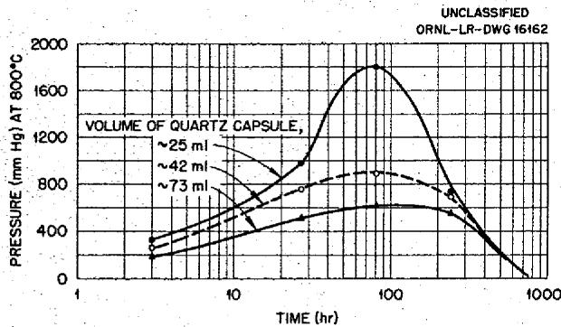  
Fig. 2.5.1. Hydrogen Pressures Developed in Quartz-Jacketed Nickel Capsules Containing NaOH After Various Periods of Exposure at $800^{\circ}\mathrm{C}$ .

from the data that in these experiments the hydrogen pressure, as calculated, and the amount of hydrogen recovered passes through a relatively sharp maximum at about 100 hr and drops to a negligible value. The amounts of hydrogen recovered seem to be somewhat dependent on the volume of the system.

These results must be considered somewhat surprising in that they indicate that after about 100 hr the rate of evolution of hydrogen from the system became slow with respect to the rate of loss of hydrogen by diffusion from the quartz envelope. Whether this phenomenon is due to a much reduced rate of reaction or whether the character of the reaction changes abruptly is not known at present. Further studies of this situation will be conducted.

# PHYSICAL PROPERTIES OF ELASTOMERS EXPOSED TO ATTACK BY LIQUID METALS

D. Zucker

Equipment has been assembled for the testing of elastomers exposed to NaK. In the tests, fresh samples of various elastomer materials are heated slowly under tension to 185 to $190^{\circ}\mathrm{C}$ in NaK in a dry box containing a high-purity helium atmosphere. Two samples of G-E silicone 81576 failed below $165^{\circ}\mathrm{C}$ , both samples of silicone 81577 failed shortly after reaching 180 to $185^{\circ}\mathrm{C}$ , and one sample of silicone 81578 failed after a few hours at 185 to $190^{\circ}\mathrm{C}$ . A second specimen of silicone 81578 was still intact after 25 days of exposure. Two of three Du Pont materials showed promise; sample SR-5550 failed at 150 to $160^{\circ}\mathrm{C}$ , but SR-5570 remained intact for nine days at 185 to $190^{\circ}\mathrm{C}$ . Sample 5806, a silicone-resin-treated fabric, was still intact after 25 days.

# DETERMINATION OF OXYGEN IN NaK

E. E. Ketchen G. F. Schenck

A source of NaK of known oxygen content is needed in connection with studies on the solubility of structural metals in NaK, and thus a reliable and practical method for analyzing for oxygen is required. A study has been made of oxygen determinations by the amalgam and the butyl bromide methods in an attempt to evaluate the methods and establish whether or not any correlation exists between the results obtained. The amalgam method, in which NaK is removed from the oxides by mercury, appeared to be the most adaptable, since it could be carried out in the vacuum drybox at the time samples of NaK were loaded into the capsules used in the solubility studies. In this method, samples of NaK which had been passed through a $10 - \mu$ sintered-glass filter, as well as samples from the same lot that had not been filtered, were analyzed. The results showed about 10 and 25 ppm of oxygen for the filtered and unfiltered samples, respectively. The precision was good in all cases. To test the butyl bromide method, samples of the filtered NaK were removed from the drybox and reacted with dry, purified $n$ -butyl bromide in a glass vacuum system. When the water extracts were titrated with $0.1N\text{HCl}$ to a pH of 6.5, values of 80 and 130 ppm of oxygen were obtained. Thus the values obtained by the butyl bromide method are completely out of line with those obtained by the amalgam method. It was observed, however, that the aqueous extracts behaved as if they were buffered, and consequently these results cannot be considered at all reliable. The cause of this buffering action is being studied (see Chap. 2.6, "Analytical Chemistry").

# 2.6. ANALYTICAL CHEMISTRY

J. C. White

# DETERMINATION OF RARE-EARTH ELEMENTS IN FLUORIDE FUELS

A. S. Meyer, Jr. B. L. McDowell

The procedure for the determination of lanthanum in samples of $\mathrm{NaF - ZrF_4 - UF_4}$ by precipitation as the oxalate has been applied with good precision and accuracy to the determination of lanthanum in virtually pure $\mathrm{LaF}_3$ . The same procedure, however, did not yield very precise or accurate results for the determination of cerium in samples of $\mathrm{CeF}_3$ or in $\mathrm{NaF - ZrF_4 - UF_4}$ that contained $\mathrm{CeF}_3$ . Accordingly, spectrophotometric methods for the determination of cerium are being investigated. The procedure for the determination of lanthanum is, as reported earlier, quite lengthy, and therefore spectrophotometric methods for the determination of lanthanum are also being studied.

# Spectrophotometric Determination of Cerium

A spectrophotometric method for the determination of cerium with Tiron (disodium-1,2-dihydroxybenzene-3,5-disulfonate) was applied to the determination of cerium in samples of NaF-LiF-KF and $\mathrm{NaF - ZrF_4}$ which contained $\mathrm{CeF}_3$ . The reaction of cerium with Tiron yields a colored complex which exhibits an absorption maximum at $500~\mathrm{m}\mu$ . This reaction is selective for cerium in that colored reaction products are not formed with any other lanthanide element. The color is developed in solutions of high ionic strength at a pH greater than 8. Although the color development is instantaneous with cerium(IV), at least 6 hr is required for complete color development with cerium(III). For solutions of cerium(III) sulfate, the coefficient of variation of this method is less than 2% for the range of cerium concentration of 2 to $50~\mu \mathrm{g / ml}$ .

Several elements that are normally present in fluoride fuels interfere with this determination. Iron and uranium react with Tiron to form colored products that absorb in this region. Zirconium reacts to form a colorless complex and thereby consumes reagent, while fluoride destroys the

cerium(III)-Tiron product. Fluoride is normally removed by volatilization during the dissolution of the sample with sulfuric acid. The metallic interferences can be removed by extraction with trioctylphosphine oxide (TOPO) (see subsequent section, "Extraction of ART Fuel Components with Trioctylphosphine Oxide," this chapter).

# Spectrophotometric Determination of Lanthanum

The method of Rinehart for the spectrophotometric determination of the rare earths and yttrium with sodium alizarin sulfonate (alizarin red-S) is being investigated. The complex which is formed by the reaction of alizarin red-S and lanthanum in an acetate-buffered solution exhibits an absorption maximum at $535\mathrm{m}\mu$ . This system conforms to Beer's law for concentrations of lanthanum from 2 to $20\mu\mathrm{g/ml}$ . For solutions of lanthanum chloride the coefficient of variation of the method is $2\%$ .

All the rare-earth elements form complexes which possess similar molar absorbance indices. Therefore, samples which contain both lanthanum and cerium can be analyzed by determining the total molar concentration of rare-earth elements by the alizarin red-S method, determining the cerium by the Tiron method, and calculating the lanthanum by difference.

Most ions which would normally occur in sulfate solutions of the samples of NaF-ZrF4-UF4 and rare-earth elements interfere seriously with this method. Some of these interfering ions are $\mathsf{UO}_2^{++}$ , Fe++, Al++, ZrO++, F-, and SO4--. The extraction of the solution with TOPO is being tested as a method for the elimination of these interferences.

# DETERMINATION OF TANTALUM IN FLUORIDE SALTS

J.P.Young J.R.French

The determination of tantalum in NaF-ZrF4-UF4 was studied further in order to ascertain the minimum concentration of tantalum that can be found by the present method. The determination of tantalum in the range 900 to 1500 ppm in fluoride salts was

discussed previously.4,5 The sample of approximately 1 g of salt is carefully digested with dilute $\mathsf{H}_2\mathsf{SO}_4$ in order to hydrolyze any TaF to TaO; then the solution is evaporated to dryness. The residue is fused with potassium pyrosulfate, following which the melt is dissolved in a solution of ammonium oxalate. If the sample consists of alkali fluorides only, the tantalum is determined colorimetrically in the solution of ammonium oxalate with pyrogallol.6 The absorbance of the complex is measured at $330~\mathrm{m}\mu$ . If the sample contains either $\mathsf{ZrF}_4$ or $\mathsf{UF}_4$ , the tantalum is precipitated with tannin at a pH of 5 in a hot solution. The precipitate is filtered, washed, and then ignited to TaO. This oxide is fused with potassium pyrosulfate, the melt is dissolved in ammonium oxalate, and the tantalum is determined with pyrogallol.

An investigation was made of the minimum concentration of tantalum that could be recovered from synthetic samples by means of the tannin precipitation. It was found that approximately $100\mu \mathrm{g}$ of tantalum was lost in the precipitation step. This amount of tantalum appeared to be fairly constant for the separation of tantalum from uranium, zirconium, or a mixture of these two elements. The separation of tantalum from uranium or zirconium seems to be practical only for amounts of tantalum greater than $1000\mu \mathrm{g}$ .

# DETERMINATION OF OXYGEN IN NaK

A. S. Meyer, Jr. T. W. Gilbert, Jr.

A comparison of the methods for the determination of oxygen in highly purified NaK has shown that significantly higher oxide concentrations are indicated when the butyl bromide method is used than when the amalgamation procedure is used (see Chap. 2.5, "Compatibility of High-Temperature Materials"). It was noted that the usual strong-base-strong-acid titration curves were obtained when the oxide residues from the amalgamations

were titrated and that a buffering action occurred in the titration when the NaK was reacted with butyl bromide. Since no buffering was observed in the titration of the oxide in the butyl bromide determination of oxygen in metallic sodium, an investigation is being carried out to determine the the source of the buffering action and to evaluate such action as a source of error in the butyl bromide method.

No evidence was found for the formation of weak organic acids during the reaction of NaK with butyl bromide, and it was therefore postulated that the buffering could be caused by the presence of traces of metallic contaminants in the NaK. If the metallic ions formed weakly dissociated hydroxides, they could produce the observed buffering effect.

Spectrographic analyses of NaK samples showed aluminum and silicon to be the principal contaminants. The aluminum content was found to vary from 7 to $20~\mathrm{ppm}$ , and it is known that $20~\mathrm{ppm}$ is sufficient to cause buffering comparable to that observed in the titration of oxygen in NaK. The aluminum cannot, however, account for the extent to which the oxide concentrations found by using the butyl bromide method are higher than those obtained by using the amalgamation procedure.

Experiments are being continued to determine whether other contaminants which might contribute to the high oxide titration are present in NaK. Also, tests of the amalgamation procedure will be carried out in metal apparatus which was designed by Nuclear Development Associates.[10] The amalgam is filtered through a $10 - \mu$ filter in this apparatus, and alkali metal oxide should be detected which may be entrained in the amalgam during the usual analytical procedure.

# SAMPLER FOR ALKALIMETALS

A. S. Meyer, Jr. G. Goldberg

A device that was developed by the Mine Safety Appliances Co.11 for obtaining samples of alkali metals was adapted for sampling dynamic and static systems at operating temperatures. The original sampler can be used only when a special chamber, connected to a source of inert gas, is

incorporated in the part of the system from which the sample is to be removed. The modified sampler12 can be attached at any point in a system at which a Jamesbury valve can be connected to provide access to the alkali metal. A Jamesbury valve is a reliable, compact, vacuum-tight, ball-type valve which is completely opened, or closed, by a one-quarter turn of the handle. In the modified sampler, a glass-to-metal Wilson seal was used in place of the original packing-gland seal to facilitate the complete removal of oxygen from the sampling apparatus, and a Teflon-packed Jamesbury valve, as described above, was used in place of the Teflon-packed gate valve.13 The modified sampler is similar to a sampler used earlier by the Metallurgy Division at ORNL.14

A sample is obtained with the modified apparatus by placing a nickel bucket in the sampler and then connecting the sampler to the sampling port. The sampler and the sampling port are freed of air by alternately evacuating and purging with dry, oxygen-free helium. The bucket is lowered into the alkali metal through the sampling port. The filled bucket is withdrawn and transferred to a pyrex receiver, where it is sealed off under vacuum. There is apparently negligible contamination of the alkali metal during sampling. Concentrations of oxygen as low as 20-ppm have been determined in samples of sodium that were taken by using this sampler.

# DETERMINATION OF OXYGEN, NITROGEN, AND CARBON IN METALLIC LITHIUM

A. S. Meyer, Jr.  
R. E. Feathers T. W. Gilbert  
G. Goldberg

Sensitive methods for the determination of oxygen, nitrogen, and carbon in metallic lithium are being investigated, since traces of these elements are believed to influence the rate of corrosion of structural metals by molten lithium. Results of the determinations will be useful in the search for

structural metals that are compatible with metallic lithium at high temperatures.

# Determination of Oxygen

An apparatus for the determination of oxygen in metallic lithium by the amalgamation method has been assembled. In this apparatus, which was designed by Nuclear Development Associates,[15] the sample of lithium is amalgamated in a heated stainless steel reaction chamber in order to limit explosion hazards and to eliminate possible oxide contamination of the lithium by contact with glassware. The lithium oxide is separated from the amalgam by filtration through a nickel micrometallic filter of $10 - \mu$ porosity, which is welded into the bottom of the amalgamation vessel. After the oxide is washed free of amalgam with mercury, it is dissolved in water and titrated with a standardized solution of acid. This titration must be corrected by subtracting the volume of titrant that is required to titrate the $\mathsf{Li}_3\mathsf{N}$ and $\mathsf{Li}_2\mathsf{C}_2$ which accompany the oxide.

The apparatus, which is shown in Fig. 2.6.1, was modified by the addition of a special sample port to the amalgamation chamber. A $3/4$ -in. Jamesbury valve was welded to the upper opening of the amalgamation vessel, and the valve was fitted with a 29/42 standard-taper joint fabricated from stainless steel. When the joint is coupled to a sample chamber that is also fitted with a Jamesbury valve and a standard-taper joint, the intervening volume can be evacuated and purged with an inert gas. The sample can then be transferred without atmospheric contamination.

Investigations are also being carried out to find a method for the determination of oxygen in metallic lithium by titration of the oxide, after conversion of the metallic lithium to a neutral lithium halide. The butyl bromide method, which was found to be more convenient for the determination of oxygen in sodium than the amalgamation procedure, cannot be applied to the analysis of lithium. The reaction between lithium and $n$ -butyl bromide is too slow for analytical application and may yield lithium alkyls which react with water to form hydroxides. It was found that the lithium alkyls could be eliminated effectively by the addition of an excess of elemental halogen. The lithium metal

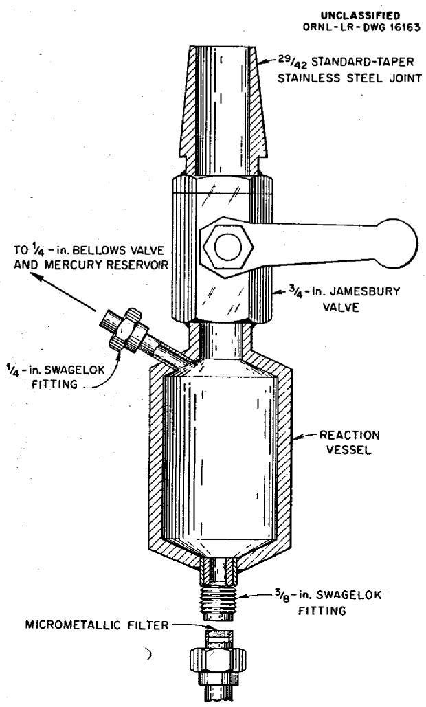  
Fig. 2.6.1. Reactor for the Determination of Oxygen in Lithium by an Amalgamation Method.

is dissolved much more rapidly in the presence of ether, in a manner analogous to the Grignard reaction. The most rapid dissolution was accomplished with solutions of $n$ -butyl iodide in diethyl ether. Iodine is added to the solution to destroy organolithium compounds. Samples of lithium of approximately $2\mathrm{g}$ will dissolve in $\frac{1}{2}\mathrm{hr}$ . The following reactions are postulated for the dissolution of lithium:

$$
\begin{array}{l} 2 \mathrm {L i} + 2 \mathrm {C} _ {4} \mathrm {H} _ {9} \mathrm {I} \rightarrow 2 \mathrm {L i I} + \mathrm {C} _ {8} \mathrm {H} _ {1 8} \\ 2 \mathrm {L i} + \mathrm {C} _ {4} \mathrm {H} _ {9} \mathrm {I} + \left(\mathrm {C} _ {2} \mathrm {H} _ {5}\right) _ {2} \mathrm {O} \longrightarrow \mathrm {L i C} _ {4} \mathrm {H} _ {9} \cdot \left(\mathrm {C} _ {2} \mathrm {H} _ {5}\right) _ {2} \mathrm {O} + \mathrm {L i I} \\ \operatorname {L i C} _ {4} \mathrm {H} _ {9} \cdot \left(\mathrm {C} _ {2} \mathrm {H} _ {5}\right) _ {2} \mathrm {O} + \mathrm {I} _ {2} \rightarrow \operatorname {L i l} + \mathrm {C} _ {4} \mathrm {H} _ {9} \mathrm {I} + \left(\mathrm {C} _ {2} \mathrm {H} _ {5}\right) _ {2} \mathrm {O} \\ \end{array}
$$

The halogenation procedure may offer additional advantages in that the free iodine is postulated to

oxidize lithium nitride and carbide and thus eliminate their contribution to the alkalimetric titration. Thus the oxide is determined by direct titration, and the uncertainties inherent in the determination by difference are eliminated. These postulated oxidation reactions, which are thermodynamically feasible, have not yet been demonstrated with pure $\mathsf{Li}_3\mathsf{N}$ and $\mathsf{Li}_2\mathsf{C}_2$ but they are supported by analyses of lithium samples in which the oxide titration is significantly less than that required for the titration of the nitrides and carbides.

In the procedure that is now being tested, a 2-g sample of metallic lithium is added to a solution that contains $100\mathrm{ml}$ of $\pi$ -butyl iodide, $200\mathrm{ml}$ of diethyl ether, and $15\mathrm{g}$ of iodine. After the dissolution of the sample is completed, the ether is volatilized and the organic solvent is extracted with water. The aqueous phase is titrated potentiometrically with a O.01 N solution of hydrochloric acid to a pH of 7. The iodine is removed from an aliquot of the titrated solution and the lithium iodide in the aliquot is titrated with a solution of silver nitrate to determine the sample weight. Concentrations of oxygen in lithium as low as 200 ppm have been determined by this procedure.

# Determination of Nitrogen and Carbon

The method proposed by Nuclear Development Associates for the determination of nitrogen and carbon in metallic lithium is being evaluated. In this procedure the sample is dissolved in water to convert the nitrides and carbides into ammonia and acetylene, respectively. Ammonia is absorbed from the exit gases by a boric acid scrubber and is determined spectrophotometrically. After the moisture is removed, the acetylene is passed over heated copper oxide to convert it to carbon dioxide, which is absorbed on ascarite and weighed. A modification of this procedure in which the acetylene is absorbed in a solution of $\mathrm{AgNO_3}$ is being tested as a possible means for improving the sensitivity of the determination of carbide. The acetylene is absorbed in a $35\%$ solution of $\mathrm{AgNO_3}$ . When the solution is diluted twentyfold, the acetylene is precipitated and weighed as the compound $\mathrm{Ag_2C_2\cdot AgNO_3}$ . This procedure offers a fivefold increase in the sensitivity of the determination and is selective for acetylene.

# DETECTION OF TRACES OF NaK IN AIR

A. S. Meyer, Jr. J. P. Young

Two methods are being studied for the detection of traces of NaK in air. Functional descriptions of the methods and the operational requirements of the necessary apparatus were presented previously.[16] The electronic and optical components of the instrument designed for the photometric detection of microgram quantities of NaK in air have been fabricated. The detailed engineering drawings of the instrument for the detection of submicrogram quantities of NaK in air by observation of the sodium resonance radiation have been prepared.

Experiments were continued in an effort to find a means for introducing reproducible concentrations of sodium into air.[17] When helium which contained 20 to $100\mu \mathrm{g}$ of sodium vapor per liter was mixed with 10 times its volume of air, at least $95\%$ of the sodium was removed from the air stream before it had traversed a 3-in. length of transfer line. The stability of such suspensions of sodium oxide was not improved by varying the temperature of the transfer line from 150 to $900^{\circ}\mathrm{C}$ or by altering the design of the mixing chamber to increase the velocities of the streams of helium and air.

Since it was not possible to prepare mixtures of sodium oxide in air that could be transferred by a jet of helium, a small test facility will be fabricated which will more closely simulate the condition of a radiator leak. An apparatus is being constructed for the ejection of minute quantities of NaK at a metered rate. This jet of NaK will be injected directly into an air duct. The air will be passed through the duct at velocities comparable to those required for the cooling of NaK radiators in the ART, and the air will be heated electrically to temperatures as high as $1400^{\circ}\mathrm{F}$ . This test facility should provide samples for definitive tests of the applicability of the proposed leak detectors.

# COMPATIBILITY OF FLUORIDE SALTS AND ALKALI METALS WITH PUMP LUBRICANTS

A. S. Meyer, Jr. G. Goldberg

Tests are being conducted at elevated temperatures to ascertain the compatibility of alkali metals

and molten fluoride salts with the lubricants which are proposed for use in ART pumps. These experiments are designed to simulate the conditions that would exist if leaks developed in the seals of the fuel or coolant pumps. It is necessary to determine whether a hazardous condition would result from an exothermic reaction between the molten materials and the lubricants.

The reactions between samples of Dowtherm-A (diphenyl oxide) and of Cellulube-150 (tricresyl phosphate) at $200^{\circ}\mathrm{F}$ with sodium maintained at $1100^{\circ}\mathrm{F}$ were carried out in the apparatus18 which was developed for the determination of oxygen in sodium by the addition of molten sodium to butyl bromide. Approximately $100\mathrm{ml}$ of each of these lubricants was placed in the glass reaction vessel and heated to the desired temperature with a heating mantle. The temperature of the oil was measured by placing a thermometer within the reaction vessel. After the transfer line was flushed with sodium at $1100^{\circ}\mathrm{F}$ , approximately $5\mathrm{g}$ of the metal was allowed to drop into the lubricant. The reaction with the Cellulube was quite vigorous and exothermic, while there was very little reaction between the molten sodium and the Dowtherm-A sample.

In order to provide a versatile apparatus for testing the compatibility of additional lubricants with both alkali metals and fused fluoride salts, the test apparatus shown in Fig. 2.6.2 was designed and constructed. In operation, the melt pot is half-filled with either alkali metal or fluoride salt. After the addition of the oil sample to the reaction vessel, the apparatus is assembled as pictured. The apparatus is then evacuated and the system is pressurized with helium at 1 to 2 psi. The material in the melt pot is heated to $1100^{\circ}\mathrm{F}$ by using the pot furnace; a heating mantle is used to raise the temperature of the oil to $200^{\circ}\mathrm{F}$ .

When the desired temperatures are reached, the helium outlet valve is opened, and the helium inlet regulator is set at 1 to 2 psi to maintain a helium flush of the apparatus. (The helium outlet is provided to relieve possible pressure surges after the addition of the molten material to the oil.) By means of the manual gear drive the hollow plunger is lowered to displace the melt which flows through

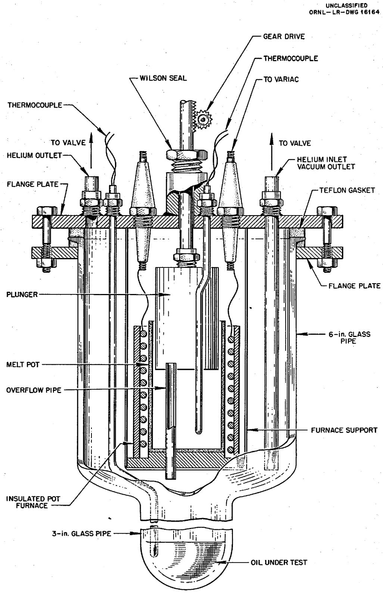  
Fig. 2.6.2. Apparatus for Testing the Compatibility of Alkali Metals and Molten Fluoride Salts with Pump Lubricants.

the overflow tube and drops into the heated lubricant. Any reaction that occurs is observed visually through a $\frac{1}{2}$ -in.-thick plastic pipe (not shown), which encloses the entire apparatus. Temperature changes are recorded on a fast-chart-drive, one-point recorder.

# EXTRACTION OF ART FUEL COMPONENTS WITH TRIOCTYLPHOSPHINE OXIDE

A. S. Meyer, Jr. W. J. Ross

An investigation has been initiated of the extraction of ART fuel components, corrosion products, and fission products from acidic solutions into solutions of trialkylphosphine oxides in an organic solvent. Trioctylphosphine oxide (TOPO), which has been recommended for the extraction of uranium from leach liquor,[19] has been found to offer two methods for supplementing the existing analytical methods. Traces of structural metals, iron, and chromium can be readily concentrated by extraction from solutions of the fluoride fuels or alkali metals, and thus the sensitivity of the measurement of the accumulation of corrosion products can be improved. The extraction may also be used to isolate certain elements, particularly rare earths, so that sensitive and convenient methods may be applied to their determination.

Initial results show that TOPO extracts metal ions from acidic solutions into organic solvents, such as cyclohexane or Varsol, through the formation of definite complexes. The extent to which the extraction of $\mathrm{Cr^{6+}}$ , $\mathrm{Fe^{3+}}$ , and $\mathrm{Zr^{4+}}$ occurs can be made quantitative, or the extraction of the elements can be completely prevented by varying such experimental conditions as type and concentration of the acid that is used as a solvent for the fluoride salt mixture. The results are practically independent of equilibration periods longer than 5 min and of ratios of volumes of the aqueous and organic phases. A rapid method of isolating and concentrating the components is therefore available.

Experimental results have shown that 0.5 mmoles of TOPO in cyclohexane extracts quantitatively, in a single equilibration, (1) $10\mathrm{mg}$ of $\mathsf{Cr}^{6 + }$ from 1 to 7 M HCl and 1 to $7M\text{H}_2\text{SO}_4$ approximately 9 mg from 8 to $12M\text{H}_3\text{PO}_4$ and 1 M HNO₃, and lesser

amounts from other concentrations of these acids; (2) $10\mathrm{mg}$ of $\mathsf{Fe}^{+ + + }$ from 4 to $7M$ HCI and lesser amounts from $1M$ HCI, but none from $\mathsf{HNO}_3,\mathsf{H}_2\mathsf{SO}_4,$ or $\mathsf{H}_3\mathsf{PO}_4;$ (3) $10\mathrm{mg}$ of $\mathsf{Zr}^{4 + }$ from 1 to $10M$ HCI and $\mathsf{H}_2\mathsf{SO}_4,$ but none from $\mathsf{H}_3\mathsf{PO}_4$ or $\mathsf{HNO}_3;$ and (4) milligram amounts of $\mathsf{UO}_2^{+ + 3}$ from all four acids. Trioctylphosphine oxide does not extract $\mathsf{Ni}^{+ + }$ $\mathsf{Cr}^{+ + + },\mathsf{La}^{+ + + }$ , or the rare earths. Ferrous ion is partially extracted from HCI because of slow oxidation to $\mathsf{Fe}^{+ + + }$

Since the excess TOPO remains in the organic phase, the elements which are not extracted can be determined by the usual methods. Thus, the rare-earth elements can be separated from the fuel constituents which would interfere with their spectrophotometric determination. Preliminary studies indicate that other typical fission products, such as barium and rubidium, also remain in the aqueous solution.

While the extracted ions can be stripped from the organic phase for subsequent spectrophotometric determination in the aqueous solution, more convenient determinations of iron and chromium can be carried out by direct measurement of the absorbance of the extract. The molar absorbance indices for the absorption maxima of the $\mathsf{Fe}^{+ + + }$ complex that is extracted from 2 to $9M$ HCI is 8000 at $365\mathrm{m}\mu$ and 7500 at $317~\mathrm{m}\mu$ These values are comparable to the molar absorbance index of the iron orthophenanthroline complex (11,400 at $508~\mathrm{m}\mu$ ).20

Extracts of hexavalent chromium exhibit absorption maxima at $366\mathrm{m}\mu$ and $285\mathrm{m}\mu$ , with indices of 1300 and 1700, respectively. A more sensitive spectrophotometric determination of chromium may be obtained by developing the color with diphenyl carbazide in the organic phase. A survey of the extractability of other elements which may be present in experimental fuels is now being carried out.

# DETERMINATION OF CHROMIUM IN TRIOCTYL- PHOSPHINE OXIDE EXTRACTS WITH DIPHENYL CARBAZIDE

C. K. Mann21

The diphenyl carbazide method has been applied to the spectrophotometric determination of hexavalent chromium after its extraction into solutions

of trioctylphosphine oxide (TOPO) in organic solvents. When a $0.25\%$ solution of diphenyl carbazide in ethanol is added to solutions of hexavalent chromium which have been extracted from $2M$ solutions of sulfuric or hydrochloric acid, a violet color is developed which is similar to that formed in an aqueous solution. The organic solutions exhibit an absorbance maximum at the same wavelength as that observed in the aqueous solution $(550~\mathrm{m}\mu)$ . When ethanol is used as a diluent, the molar absorbance index is identical to that obtained in aqueous solutions. Since the chromium may be concentrated at least twentyfold by extracting the aqueous solutions with small volumes of TOPO solution, the method affords a significant increase in sensitivity. The method may also offer a means for the elimination of the interference of vanadium, which is not extracted from solutions of sulfuric acid.

It is proposed to apply this procedure to the determination of hexavalent chromium in a sulfuric acid solution of fluoride salts or in acid solutions of alkali metals in $2M\mathrm{H}_2\mathrm{SO}_4$ or HCl. The solution is equilibrated with $5\mathrm{ml}$ of a 0.1 M solution of TOPO in benzene. An aliquot of the organic phase is transferred immediately to a 25-ml volumetric flask. Two milliliters of a $0.25\%$ solution of

diphenyl carbazide is added, and the solution is diluted to volume with ethanol. After 1 hr the absorbance of the solution is measured at $550\mathrm{m}\mu$ Tests are currently being made to evaluate this particular application.

# ANP SERVICE LABORATORY

# W. F. Vaughan

A total of 1427 samples was analyzed, which involved 5247 reported results, an average of 3.7 per sample. A breakdown of the work is given below:

<table><tr><td></td><td>Number of Samples</td><td>Number of Reported Results</td></tr><tr><td>Reactor Chemistry</td><td>738</td><td>2615</td></tr><tr><td>Experimental Engineering</td><td>626</td><td>2370</td></tr><tr><td>Metallurgy</td><td>28</td><td>30</td></tr><tr><td>WADC</td><td>27</td><td>189</td></tr><tr><td>Miscellaneous</td><td>8</td><td>43</td></tr><tr><td></td><td>1427</td><td>5247</td></tr></table>

The program of the analysis of special samples from the Wright Air Development Command (WADC) was completed.

# Part 3

# METALLURGY

W. D. Manly

# 3.1. DYNAMIC CORROSION

J.H.DeVan

# FORCED-CIRCULATION LOOP TESTS

J. H. DeVan

# Fuel Mixtures in Inconel and Hastelloy B

Two Inconel forced-circulation loops were examined following 1000 hr of operation with the fuel mixture (No. 70) NaF-ZrF4-UF4 (56-39-5 mole %). The purpose of these tests was to compare the corrosion properties of this fuel mixture with those of the similar, more commonly used, fuel mixture (No. 30) NaF-ZrF4-UF4 (50-46-4 mole %). The lower ZrF4 content of mixture No. 70 gives a fuel with a considerably lower vapor pressure at reactor operating temperatures than that of mixture No. 30.

The conditions of operation for these two loops, 7425-14 and 7425-15, are given in Table 3.1.1. Operation of the loops, including the cleaning procedure, followed the same pattern as that normally employed for tests with fuel mixture No. 30. Visual examination of loop 7425-14, which was operated with a maximum fluid temperature of about $1500^{\circ}\mathrm{F}$ , showed the presence of a few very small metallic crystals in the top section of the cooling coil and along the fluid-inert gas interface in the pump. These crystals were found by

spectrographic examination to be $>5\%$ Cr, $>5\%$ Zr, $2\%$ Ni, and $0.2\%$ Fe. Although the fuel undoubtedly comprised a large portion of the crystals, the presence of chromium indicates possible mass transfer. However, no crystals could be found in loop 7425-15, which operated with the same temperature gradient but a higher maximum fluid temperature of about $1650^{\circ}\mathrm{F}$ .

The maximum hot-leg attack observed metallographically was to a depth of 7 mils and was approximately the same for both loops. The attack occurred as light to moderate void formation, as shown in Fig. 3.1.1.

The similarity in the attack in the two loops (7425-14 and -15), which operated at different maximum fluid temperatures, is thought to have limited significance. For loops operated with fuel No. 30 under similar conditions, the average hot-leg attack is 4.5 mils at a maximum fluid temperature of $1500^{\circ}\mathrm{F}$ and 9 mils at a maximum fluid temperature of $1650^{\circ}\mathrm{F}$ . The value of 7 mils for the hot-leg attack at both temperatures in the tests with fuel No. 70 is felt to be within the range of possible experimental deviations and does not represent an abnormally large difference from either of the values obtained for fuel No. 30.

Operating time: 1000 hr

Temperature gradient: $200^{\circ}F$

Ratio of hot-leg surface to loop volume: 2.08 in.

TABLE 3.1.1. CONDITIONS OF OPERATION OF THREE FORCED-CIRCULATION LOOPS WITH FUEL MIXTURES  

<table><tr><td rowspan="2">Operating Conditions</td><td colspan="3">Loop Number</td></tr><tr><td>7425-14</td><td>7425-15</td><td>7425-13</td></tr><tr><td>Loop material</td><td>Inconel</td><td>Inconel</td><td>Hastelloy B</td></tr><tr><td>Fuel mixture</td><td>No. 70*</td><td>No. 70*</td><td>No. 107**</td></tr><tr><td>Maximum fuel mixture temperature, °F</td><td>1525</td><td>1643</td><td>1505</td></tr><tr><td>Maximum tube wall temperature, °F</td><td>1595</td><td>1712</td><td>1555</td></tr><tr><td>Reynolds number of fuel</td><td>10,000</td><td>9500</td><td>10,000</td></tr><tr><td>Velocity of fuel, fps</td><td>4.8</td><td>2.6</td><td>3.2</td></tr></table>

*Composition: NaF-ZrF $_4$ -UF $_4$ (56-39-5 mole %).   
**Composition: NaF-KF-LiF-UF₄ (11.2-41-45.3-2.5 mole %).

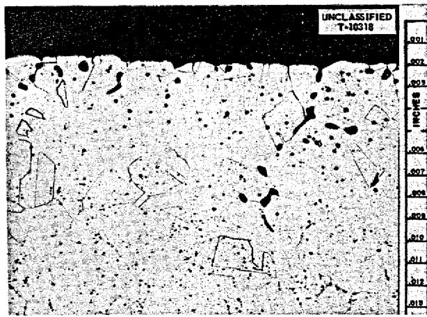  
Fig. 3.1.1. Hot-Leg Surface of Inconel Forced-Circulation Loop 7425-14 After Operation with the Fuel Mixture (No. 70) NaF-ZrF $_4$ -UF $_4$ (56-39-5 mole %) for 1000 hr at a Maximum Fuel Temperature of $1525^{\circ}\mathrm{F}$ . 250X. Reduced 34%. (Secret with caption)

A sample of the very thin metallic layer which was deposited in the cold legs of both loops is shown in Fig. 3.1.2. The layer was barely visible at a magnification of $500\mathrm{X}$ , and thus may be seen to be quite thin. It was not possible to analyze this layer. Deposited layers of this type have not been found in loops operated with fuel No. 30.

Analyses of fuel samples taken before and after operation of these loops are presented in Table 3.1.2. The analyses indicate that the chromium content increased during the tests, but the final chromium values were somewhat lower than those usually found in the fuel mixture (No. 30) NaF-ZrF4-UF4 (50-46-4 mole %), when tested under comparable conditions.

A Hastelloy B forced-circulation loop (7425-13) was also examined following 1000 hr of operation. This loop circulated the fuel mixture (No. 107) NaF-KF-LiF-UF $_4$ (11.2-41-45.3-2.5 mole %) under the conditions given in Table 3.1.1. The loop was constructed of $\frac{1}{2}$ -in.-OD, 0.035-in.-wall tubing and was identical in configuration and manner of heating to the standard loops presently employed for Inconel corrosion tests. $^1$

The results of the examination verified the excellent corrosion resistance of Hastelloy B to

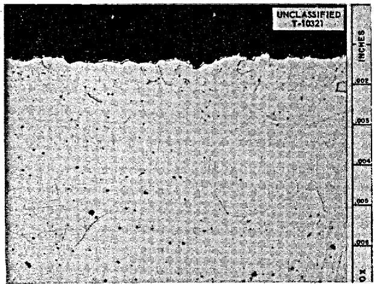  
Fig. 3.1.2. Thin Layer Deposited in Cold Leg of Inconel Forced-Circulation Loop 7425-15 After Operation with the Fuel Mixture (No. 70) NaF-ZrF $_4$ -UF $_4$ (56-39-5 mole %) for 1000 hr. 500X. Reduced 30.5%. (Secret with caption)

TABLE 3.1.2. URANIUM AND IMPURITY ANALYSES OF FUEL MIXTURE (NO.70) NaF-ZrF4-UF4 (56-39-5 MOLE %) BEFORE AND AFTER CIRCULATION IN INCONEL LOOPS 7425-14 AND -15   

<table><tr><td rowspan="2">Loop No.</td><td rowspan="2">Sample Taken</td><td rowspan="2">Uranium Content (wt %)</td><td colspan="3">Impurities Found (ppm)</td></tr><tr><td>Ni</td><td>Cr</td><td>Fe</td></tr><tr><td rowspan="2">7425-14</td><td>Before filling</td><td>11.2</td><td>15</td><td>85</td><td>50</td></tr><tr><td>After draining</td><td>11.4</td><td>30</td><td>290</td><td>90</td></tr><tr><td rowspan="2">7425-15</td><td>Before filling</td><td>11.1</td><td>95</td><td>90</td><td>35</td></tr><tr><td>After draining</td><td>11.6</td><td>4*</td><td>255</td><td>110</td></tr></table>

*This value is in doubt.

fluoride fuel mixtures as observed previously in thermal-convection loops. Very little attack was found in the examination. Some pitting, to a maximum depth of 1.5 mils, was observed along both the hot and cold legs, but the surfaces were quite similar to those of as-received tubing, as illustrated in Fig. 3.1.3. No deposits were found metallographically either in the hot or the cold legs of the loop. A visual examination of the cold leg revealed small metallic-appearing deposits in

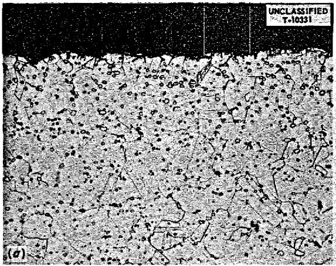

TABLE 3.1.3. URANIUM AND IMPURITY ANALYSES OF FUEL MIXTURE (NO. 107) NaF-KF-LIF-UF ${}_{4}$ (11.2-41-45.3-2.5 MOLE %) BEFORE AND AFTER CIRCULATION IN HASTELLOY B LOOP 7425-13   

<table><tr><td rowspan="2">Sample Taken</td><td rowspan="2">Uranium 
Content 
(wt %)</td><td colspan="4">Impurities Found (ppm)</td></tr><tr><td>Ni</td><td>Cr</td><td>Fe</td><td>Mo</td></tr><tr><td>Before filling</td><td>12.5</td><td>215</td><td>35</td><td>60</td><td></td></tr><tr><td>After draining</td><td>13.2</td><td>80</td><td>195</td><td>105</td><td>7</td></tr></table>

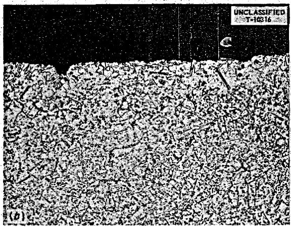  
001   
002   
003   
004   
005   
006   
007   
008   
009   
010   
011   
012   
Fig. 3.1.3. (a) As-Received Hastelloy B Tubing Used in the Construction of Loop 7425-13. (b) Hot Leg Surface of Hastelloy B Loop 7425-13 After Circulating the Fuel Mixture (No. 107) NaF-KF-LiF-UF $_4$ (11.2-41-45.3-2.5 mole %) for 1000 hr at a Maximum Fuel Temperature of $1505^{\circ}\text{F}$ . Note increased amount of second phase in (b). 250X. Reduced 34%. (Secret with caption)

one area, but, from the metallographic examination, these appear to have been fluorides rather than metallic crystals.

Chemical analyses of the fuel before and after operation (Table 3.1.3) showed a small increase in chromium content that possibly reflects small residual quantities of chromium in the tubing or in the welds. There was also a small increase in the iron content and a small decrease in the nickel content. A molybdenum analysis was not obtained for the fuel before the test, but the level of this impurity after the test indicates that the molyb

denum content was probably not affected to a measurable degree during the test.

The operation of an Inconel forced-circulation loop as an endurance test with the fuel mixture (No. 30) NaF-ZrF $_4$ -UF $_4$ (50-46-4 mole %) was terminated because of a pump-drive failure after 8300 hr. A leak developed in the cold leg while the loop was being heated to re-establish operation after repair of the pump drive. The loop (4935-6) was gas-fired and operated with a maximum fuel temperature of $1450^{\circ}\mathrm{F}$ , a temperature drop of $200^{\circ}\mathrm{F}$ , a maximum wall temperature of $1550^{\circ}\mathrm{F}$ , and a Reynolds number of 10,000. Metallographic examination showed roughening of the hot-leg surface and heavy intergranular void formation to a depth of 25 mils. The cold-leg surface was also roughened, but there was no evidence of mass-transferred deposits.

Another forced-circulation loop (7425-9) was examined that had operated for 3000 hr. This loop, which was heated by electrical resistance, also circulated fuel No. 30. The maximum and minimum fluid temperatures employed were 1600 and $1300^{\circ}\mathrm{F}$ , and the Reynolds number was 5750. The maximum wall temperature was $1700^{\circ}\mathrm{F}$ . The maximum attack in this loop, which was to a depth of 14 mils, occurred in the area of highest wall temperature. Visual and metallographic examinations failed to reveal deposits in the cold zones that could be attributed to mass transfer.

The chromium buildup in the fuels during the course of operation of both these loops (4935-6 and 7425-9) was comparable to that found in fuels used in 1000-hr tests. These findings substantiate previous observations2 on the effect of time on fluoride fuel corrosion. In the earlier report

the rate of attack noted in the test period from 50 to $1000\mathrm{hr}$ was 3 to 4 mils per $1000\mathrm{hr}$ . It would appear on the basis of these tests of longer duration, however, that the rate of attack decreased for the longer operating times, although the operating conditions of the loops are unfortunately not similar enough to provide a comprehensive study of attack for operating periods beyond $1000\mathrm{hr}$ .

# Sodium in Inconel and Stainless Steel

An Inconel forced-circulation loop (7426-11) was examined which had circulated sodium at a maximum temperature of $1350^{\circ}\mathrm{F}$ for 1000 hr. Only scattered metal deposits were found in cold-zone sections. The loop was operated with a fluid temperature drop of $300^{\circ}\mathrm{F}$ , and it contained a bypass cold trap operated at $300^{\circ}\mathrm{F}$ . The deposits reached a maximum thickness of 3 mils, as shown in Fig. 3.1.4, and were found by analysis to be predominantly nickel. The hot leg of the loop showed slight intergranular attack to a depth of 0.5 mil.

A relatively heavy deposit, also predominantly nickel, was found in Inconel loop 7426-12 which circulated sodium at a maximum temperature of $1500^{\circ}\mathrm{F}$ , with a temperature gradient of $400^{\circ}\mathrm{F}$ , for 1000 hr. The loop included a cold trap identical to that used in loop 7426-11. The deposits were found primarily in the economizer section of this loop, and they reached thicknesses of 20 mils, as shown in Fig. 3.1.5. There was intergranular

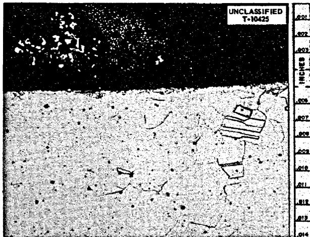  
Fig. 3.1.4. Deposits Found in Inconel Forced Circulation Loop 7426-11 Which Circulated Sodium at a Maximum Temperature of $1350^{\circ}$ F for 1000 hr. 250X. Reduced $32\%$ . (Confidential with caption)

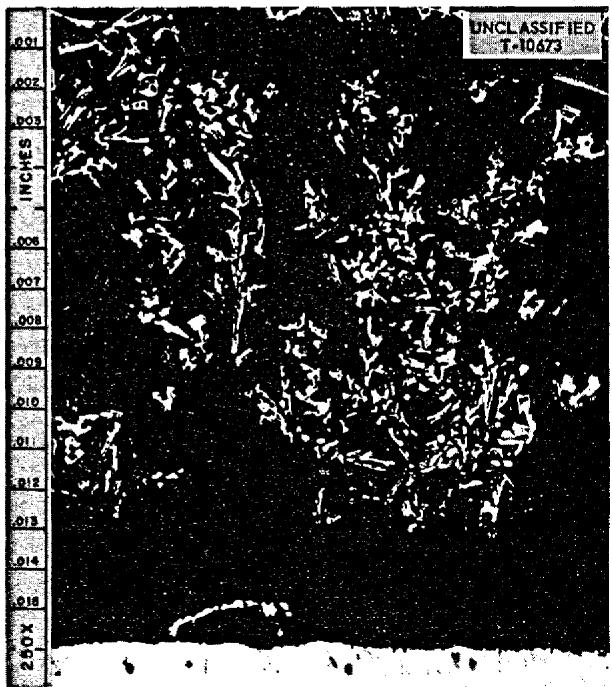  
Fig. 3.1.5. Deposits Found in Inconel Forced-Circulation Loop 7426-12 Which Circulated Sodium at a Maximum Temperature of $1500^{\circ}$ F for 1000 hr. 250X. Reduced $18\%$ . (Confidential with caption)

attack in the hot zone to a depth of 2 mils. The deposits were scraped from the loop walls and were found to weigh 21 g. This weight value is to be compared with a value of 15 g reported previously for the deposits found in a loop operated for the same length of time with the same maximum fluid temperature but with a $300^{\circ}\mathrm{F}$ temperature drop. It thus appears that the increase in temperature drop from 300 to $400^{\circ}\mathrm{F}$ appreciably increased the amount of mass transfer. Also it can be seen that the amount of mass transfer was considerably more in these loops operated at $1500^{\circ}\mathrm{F}$ than in the loop operated at $1350^{\circ}\mathrm{F}$ .

A type 316 stainless steel forced-circulation loop (7426-14) that had operated for 1000 hr with sodium at a maximum temperature of $1650^{\circ}\mathrm{F}$ and a temperature drop of $300^{\circ}\mathrm{F}$ was also examined. Very little increase in mass transfer was found in comparison with that found in a similar loop operated previously at a maximum temperature of

$1500^{\circ}F$ . Deposits appeared as occasional clusters of metal crystals 3 to 5 mils thick and comprised a total weight of $1.7\mathrm{g}$ . An analysis of the deposits showed $5.5\%$ Ni, $72.4\%$ Cr, and $22.0\%$ Fe. The hot leg was attacked intergranularly to a depth of 2 mils, and small voids appeared to a depth of 5 mils. A loop fabricated of type 310 stainless steel (7426-13) and operated under similar conditions but at a maximum temperature of $1500^{\circ}F$ showed substantially more extensive deposits than did the type 316 stainless steel loop. The total mass of the deposits was only $2.25\mathrm{g}$ , although the deposit thickness reached 9 mils. Hot-leg attack in this loop was quite severe, with intergranular attack and void formation reaching to a depth of 13 mils, as shown in Fig. 3.1.6.

4J. H. Devan, E. A. Kavacevich, and R. S. Crouse, ANP Quar. Prog. Rep. March 10, 1956, ORNL-2061, p 117.

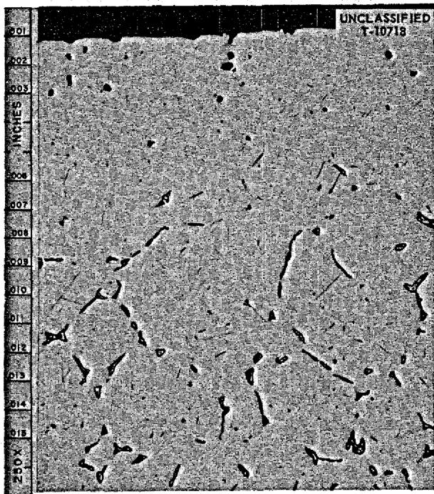  
Fig.3.1.6. Hot-Leg Attack in Type 310 Stainless Steel Forced-Circulation Loop (7426-13) Which Circulated Sodium at a Maximum Temperature of $1500^{\circ}\mathrm{F}$ for 1000 hr. 250X. Reduced $17\%$ . (Confidential with caption)

# Sodium-Beryllium-Inconel Compatibility

Two Inconel forced-circulation loops with beryllium inserts in the hot legs were examined that had operated with sodium at maximum temperatures of 1250 and $1300^{\circ}\mathrm{F}$ . The beryllium insert was machined to the form of a hollow cylinder $2\frac{1}{2}$ in. long, and it contained an Inconel island that was concentric within the insert. The insert was separated from the loop wall by a distance of 0.040 in. along 1 in. of its length and by 0.094 in. along another 1 in. of its length; the remaining $\frac{1}{2}$ in. of the insert was in direct contact with the Inconel loop wall. The Inconel island was spaced $\frac{1}{4}$ in. from the inside surface of the insert. The beryllium insert tested at $1300^{\circ}\mathrm{F}$ for 1000 hr showed scattered void formation to a depth of 7 mils. Alloying between the beryllium and Inconel in contact with it produced a brittle layer approximately 3.5 mils thick. In areas where a positive separation between the beryllium and Inconel was maintained, no attack or alloying was seen on the Inconel. In the loop operated at $1250^{\circ}\mathrm{F}$ for 1000 hr, voids formed in the beryllium insert to a depth of 5 mils. Although no alloy formation between beryllium and Inconel was found, even in areas of direct contact, this result is considered to be anomalous, since alloying has been seen to occur even at temperatures as low as $1200^{\circ}\mathrm{F}$ between Inconel and beryllium in direct contact in sodium. Both the loops operated with cold traps maintained at $300^{\circ}\mathrm{F}$ . No mass-transferred particles or layers were produced in either loop.

# THERMAL-CONVECTION LOOP TESTS

E.A.Kovacevich J.H.DeVan

# Sodium-Beryllium-Hastelloy B Compatibility

Two Hastelloy B thermal-convection loops with beryllium inserts in the hot legs were examined which had circulated sodium at 1200 and $1300^{\circ}\mathrm{F}$ for 1000 hr. The insert consisted of a hollow cylinder 6 in. long, with a tube wall thickness of 0.080 in. The spacing between the Hastelloy B and the beryllium was $0.020 \pm 0.005$ in. Holes were drilled at the top and the bottom of the insert to permit sodium flow between the beryllium and the Hastelloy B and to eliminate stagnant sodium areas in the system. The results of examination of these loops (899 and 900) are presented in Table 3.1.4.

TABLE 3.1.4. RESULTS OF EXAMINATIONS OF HASTELLOY B AND INCONEL THERMAL-CONVECTION LOOPS WITH BERYLLIUM INSERTS IN THE HOT LEGS AFTER CIRCULATING SODIUM AT VARIOUS TEMPERATURES FOR 1000 hr   

<table><tr><td rowspan="3"></td><td colspan="7">Depth of Attack (mils) and Corrosion Results</td></tr><tr><td colspan="2">Hastelloy B</td><td colspan="5">Inconel</td></tr><tr><td>Loop No. 899 (1200°F*)</td><td>Loop No. 900 (1300°F*)</td><td>Loop No. 912 (1200°F*)</td><td>Loop No. 913 (1250°F*)</td><td>Loop No. 914 (1300°F*)</td><td>Loop No. 915 (1400°F*)</td><td>Loop No. 916 (1500°F*)</td></tr><tr><td>Hot leg</td><td>1</td><td>1</td><td>1</td><td>1</td><td>1</td><td>1</td><td>1</td></tr><tr><td>Cold leg</td><td>1</td><td>1</td><td>Surface roughened</td><td>Surface roughened</td><td>Surface roughened</td><td>Surface roughened</td><td>Surface roughened</td></tr><tr><td>Sleeve</td><td></td><td></td><td></td><td></td><td></td><td></td><td></td></tr><tr><td>Top section</td><td>2</td><td>1</td><td>Surface roughened</td><td>Surface pitted</td><td>Surface pitted</td><td>1 Ni-Be alloy formed</td><td>0.5 Ni-Be alloy formed</td></tr><tr><td>Center section</td><td>1.5</td><td>2</td><td>Surface pitted</td><td>1</td><td>Surface pitted</td><td>1</td><td>Surface pitted; Ni-Be alloy formed</td></tr><tr><td>Bottom section</td><td>1.5</td><td>1</td><td>Surface roughened</td><td>Surface roughened</td><td>1 1-mil layer of Ni-Be alloy formed</td><td>1 3.5-mil layer of Ni-Be alloy formed</td><td>1 Ni-Be alloy formed</td></tr><tr><td>Beryllium insert</td><td></td><td></td><td></td><td></td><td></td><td></td><td></td></tr><tr><td>Inner surface top section</td><td>1</td><td>1</td><td>2</td><td>Surface pitted</td><td>1</td><td>1</td><td>2</td></tr><tr><td>Inner surface center section</td><td>2</td><td>1</td><td>2</td><td>2</td><td>1</td><td>1</td><td>2</td></tr><tr><td>Inner surface bottom section</td><td>1</td><td>1</td><td>3</td><td>2</td><td>3</td><td>2</td><td>2</td></tr><tr><td>Outer surface top section</td><td>3</td><td>3</td><td>2</td><td>5</td><td>6</td><td>9</td><td>13</td></tr><tr><td>Outer surface center section</td><td>3</td><td>2</td><td>2.5</td><td>7</td><td>5</td><td>8</td><td>10</td></tr><tr><td>Outer surface bottom section</td><td>1</td><td>1</td><td>3</td><td>3</td><td>6</td><td>8</td><td>8</td></tr></table>

*Maximum fluid temperature.

The maximum attack on the beryllium was in the form of small voids on the outside surface of the insert. No alloying occurred between the Hastelloy B and the beryllium across the 0.020-in. separation in either loop (899 and 900), but there was alloy formation where the beryllium came in direct contact with the Hastelloy B. It appeared as a homogeneous layer 1 mil thick in loop 899 and as a two-phase layer 3 mils thick in loop 900. The insert removed from loop 900 had a gray scale on the outside surface, but no such scale was present on the insert removed from loop 899. The x-ray diffraction pattern identified the scale as $\mathrm{Be}_{21}\mathrm{Ni}_{5}$ . No cold leg deposits were found in either loop.

# Sodium-Beryllium-Inconel Compatibility

A series of five Inconel thermal-convection loops with beryllium inserts in the hot legs, similar to those used in the Hastelloy B loops, were operated with sodium for 1000 hr at maximum fluid temperatures of 1200, 1250, 1300, 1400, and $1500^{\circ}\mathrm{F}$ . Metallographic examination of the Inconel adjacent to the beryllium insert, which was spaced $0.020 \pm 0.005$ in. from the Inconel, showed some alloy formation in the loops operated at temperatures of $1300^{\circ}\mathrm{F}$ and above. Nickel-beryllium alloying typical of that observed is shown in Fig. 3.1.7. The attack on the beryllium increased, as shown in Table 3.1.4, with increased fluid temperatures. The deepest attack occurred on the outside surface of the insert. In all instances, a gray scale, accompanied by a black deposit, shown in Fig. 3.1.8, was observed on the outside and inside surfaces of the insert after the test. These deposits were also identified by x-ray diffraction as $\mathrm{Be}_{21}\mathrm{Ni}_5$ . The thicknesses of the nickel-beryllium alloy formations ranged from 1 mil in loop 914 to a maximum depth of 3.5 mils in loop 915; the 3.5-mil formation is shown in Fig. 3.1.7. The alloy formed in loop 915 was reported to consist of two phases; however, in the other loops only one phase was observed. No metallic deposits were found in the cold legs of these loops. Chemical analyses showed the sodium drained from these loops to contain approximately 300 ppm of beryllium.

# Fuel Mixtures in Hastelloy and Special Nickel-Molybdenum Alloy Loops

Hastelloy X thermal-convection loop 983 was operated for 1000 hr with the fuel mixture (No. 30)

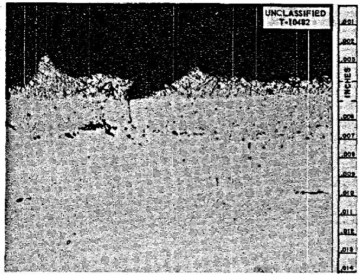  
Fig. 3.1.7. Nickel-Beryllium Alloy Formed in Inconel Thermal-Convection Loop 915 Which Contained a Beryllium Insert in the Hot Leg and Was Operated with Sodium at a Maximum Temperature of $1400^{\circ}\mathrm{F}$ . 250X. Reduced $32.5\%$ . (Confidential with reoption)

NaF-ZrF4-UF4 (50-46-4 mole %) at a maximum temperature of 1500°F to confirm corrosion results reported previously for Hastelloy X thermal-convection loops operated with this fuel No. 30. The maximum hot-leg attack observed in this loop was to a depth of 35 mils, shown in Fig. 3.1.9, and it occurred as heavy intergranular subsurfacevoid formation. Metallographic examination also revealed light surface roughening in the cold leg, along with numerous small- to medium-sized metallic crystals, shown in Fig. 3.1.10. Macroscopic examination of this loop also revealed metallic crystals in the trap area. Chemical analysis of the fluorides taken from the trap showed 6.25% U and the following impurities: 422 ppm Ni, 16.6% Cr, and 170 ppm Fe.

Hastelloy W thermal-convection loop 897 was operated with the fuel mixture (No. 107) NaF-KF-LiF-UF $_4$ (11.2-41-45.3-2.5 mole %) for 1000 hr at $1500^{\circ}\mathrm{F}$ . The maximum attack was to a depth of 0.5 mil in the hot leg, and it appeared as surface roughening and pitting, as shown in Fig. 3.1.11. The cold leg showed light surface roughening but no evidence of metal deposits.

A nickel-molybdenum alloy (85% Ni-15% Mo) loop was similarly operated with the fuel mixture (No. 107) for 1000 hr at a maximum temperature of

UNCLASSIFIED T-9944

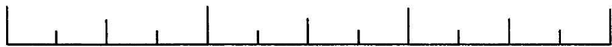

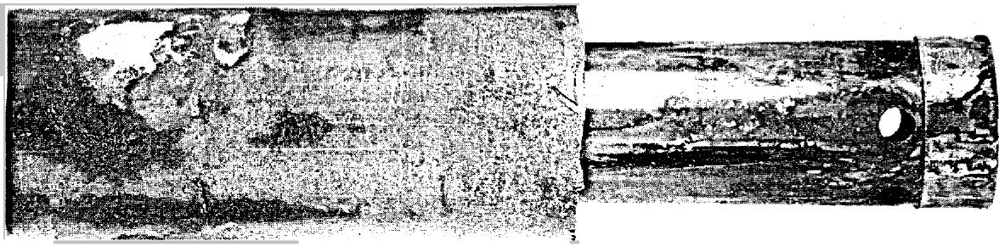

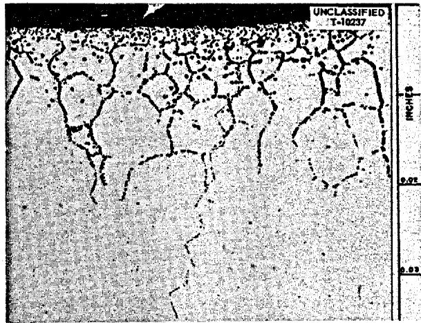  
Fig. 3.1.8. Beryllium Insert and Inconel Sleeve from Inconel Thermal-Convection Loop 913 Showing the Scale Formed During 1000 hr of Operation with Sodium at a Maximum Temperature of $1250^{\circ}$ F. 250X. Reduced $7\%$ . (Confidential with caption)   
Fig. 3.1.9. Maximum Hot-Leg Attack in Hastelloy X Thermal-Convection Loop 983. 1000: Reduced $32.5\%$ .

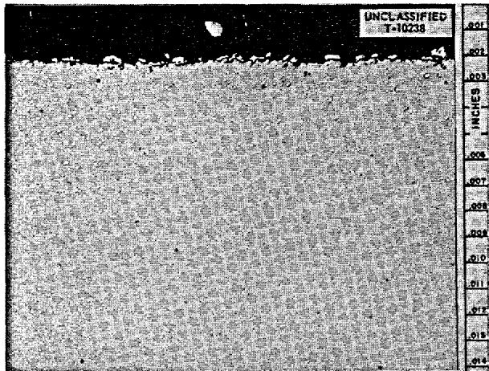  
Fig. 3.1.10. Small-to-Medium-Sized Crystals Formed in Cold Leg of Hastelloy X Thermal-Convection Loop 983. 250X. Reduced $32.5\%$ .

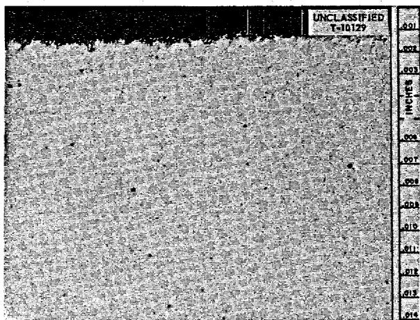  
Fig. 3.1.11. Maximum Hot-Leg Attack in Hastelloy W Thermal-Convection Loop 897 Oper- ated for 1000 hr with the Fuel Mixture (No. 107) NaF-KF-LiF-UF $^4$ (11.2-41-45.3-2.5 mole $\%$ ) at a Maximum Temperature of $1500^{\circ}\mathrm{F}$ . 250X. Reduced $33\%$ . (Secret with caption)

$1500^{\circ}F$ . This loop (986) also showed good corrosion resistance. A few scattered areas revealed attack to a depth of 2 mils, as shown in Fig. 3.1.12, but, in general, the surfaces appeared to be unaffected over most of the hottest portions of the loop. The cold leg had light to moderate surface roughening.

# Special NaF-ZrF $_4$ -UF $_4$ Mixtures in Inconel Loops

Tests were conducted in standard Inconel thermal-convection loops 987 and 988 to determine the corrosion behavior of a special batch (EE 808) of the fuel mixture (No. 30) NaF-ZrF4-UF4 (50-46-4 mole %) that was prepared with especially pure ZrF4. These loops were operated with maximum fluid temperatures of $1500^{\circ}\mathrm{F}$ for 500 hr.

The maximum hot-leg attack of these loops, as reported in Table 3.1.5, was 2 to 3 mils less than the attack observed in standard loops 860 and 861, which operated with standard fuel No. 30 (batch EE 526Pf2) containing the commercial-grade zirconium fluoride normally used in the production of fuel No. 30. As shown in Table 3.1.6, lower concentrations of chromium were found after the tests in the fuels prepared with especially pure

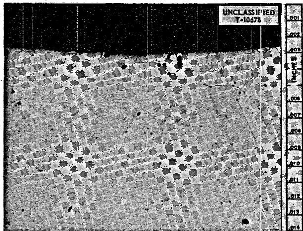  
Fig. 3.1.12. Maximum Hot-Leg Attack in Nickel-Molybdenum Alloy (85% Ni-15% Mo) Loop 986 Operated for 1000 hr with the Fuel Mixture (No. 107) NaF-KF-LiF-UF $_4$ (11.2-41-45.3-2.5 mole %) at a Maximum Temperature of $1500^{\circ}\text{F}$ . 250X. Reduced 32%. (Secret with caption)

Test duration: 500 hr Maximum fluid temperature: $1500^{\circ}\mathrm{F}$

TABLE 3.1.5. METALLOGRAPHIC EXAMINATION OF STANDARD INCONEL THERMAL-CONVECTION LOOPS OPERATED WITH STANDARD FUEL NO. 30, RECLAIMED FUEL NO. 30, AND FUEL NO. 30 PREPARED WITH ESPECIALLY PURE ZrF4  

<table><tr><td>Loop No.</td><td>Fluid Circulated</td><td>Maximum Hot-Leg Attack (mils)</td></tr><tr><td>987</td><td>Fuel No. 30 (prepared with especially pure ZrF4)</td><td>7</td></tr><tr><td>988</td><td>Fuel No. 30 (prepared with especially pure ZrF4)</td><td>7</td></tr><tr><td>858</td><td>Reclaimed Fuel No. 30</td><td>8.5</td></tr><tr><td>859</td><td>Reclaimed Fuel No. 30</td><td>5</td></tr><tr><td>984</td><td>Reclaimed Fuel No. 30</td><td>6</td></tr><tr><td>860</td><td>Standard Fuel No. 30</td><td>10.5</td></tr><tr><td>861</td><td>Standard Fuel No. 30</td><td>9</td></tr></table>

TABLE 3.1.6. CHEMICAL ANALYSES OF THE NaF-ZrF4-UF4 (50-46-4 MOLE %) MIXTURES CIRCULATED IN INCONEL THERMAL-CONVECTION LOOPS 987, 988, 860, AND 861   

<table><tr><td rowspan="2">Sample Taken From</td><td rowspan="2">Uranium 
Content 
(wt %)</td><td colspan="3">Impurities Found 
(ppm)</td></tr><tr><td>Ni</td><td>Cr</td><td>Fe</td></tr><tr><td>Batch EE 808*</td><td>8.78</td><td>40</td><td>45</td><td>60</td></tr><tr><td>Batch EE 526Pf2</td><td>8.71</td><td>20</td><td>90</td><td>50</td></tr><tr><td>Loop 987</td><td></td><td></td><td></td><td></td></tr><tr><td>Before operation</td><td>8.99</td><td>115</td><td>90</td><td>85</td></tr><tr><td>After operation</td><td>8.98</td><td>25</td><td>625</td><td>70</td></tr><tr><td>Loop 988</td><td></td><td></td><td></td><td></td></tr><tr><td>Before operation</td><td>9.89</td><td>50</td><td>65</td><td>155</td></tr><tr><td>After operation</td><td>8.96</td><td>20</td><td>720</td><td>80</td></tr><tr><td>Loop 860</td><td></td><td></td><td></td><td></td></tr><tr><td>Before operation</td><td>8.00</td><td>&lt;2</td><td>80</td><td>95</td></tr><tr><td>After operation</td><td>8.50</td><td>15</td><td>1060</td><td>80</td></tr><tr><td>Loop 861</td><td></td><td></td><td></td><td></td></tr><tr><td>Before operation</td><td>8.70</td><td>345**</td><td>150</td><td>105</td></tr><tr><td>After operation</td><td>8.79</td><td>35</td><td>820</td><td>100</td></tr></table>

*In addition to the uranium, the analysis showed 38.1 wt % Zr, 11.2 wt % Na, and 42.0 wt % F.   
**Filled at the same time as loop 860; value in doubt.

$\mathsf{ZrF}_4$ than in the standard fuels, as would be expected in view of the lower attacks observed.

Another series of three standard Inconel thermal convection loops, 858, 859, and 984, was operated for 500 hr at $1500^{\circ}\mathrm{F}$ with reclaimed fuel No. 30. The purpose of these tests was to determine the difference, if any, in corrosion results from loops operated with standard fuel and with fuel reclaimed after use in other experimental tests. In all cases the reclaimed fuel had been used in Inconel systems. The reclamation procedure, which was described previously, consisted of the equilibration of the fuel with zirconium metal chips and the use of the standard hydrofluorination-hydrogenation treatment for the removal of impurities.

Chemical analyses of the fuel before and after the treatment are presented in Table 3.1.7. As

TABLE 3.1.7. CHEMICAL ANALYSES OF THE NaF-ZrF4-UF4 (50-46-4 MOLE %) MIXTURES RECLAIMED AND CIRCULATED IN INCONEL THERMAL-CONVECTION LOOPS   

<table><tr><td rowspan="2">Sample Taken</td><td rowspan="2">Uranium 
Content 
(wt %)</td><td colspan="3">Impurities Found 
(ppm)</td></tr><tr><td>Ni</td><td>Cr</td><td>Fe</td></tr><tr><td>Before reclaiming</td><td>8.66</td><td>2</td><td>305</td><td>120</td></tr><tr><td>After reclaiming</td><td>8.21</td><td>220</td><td>110</td><td>135</td></tr><tr><td>Before circulation in 
loop 858</td><td>8.36</td><td>250</td><td>170</td><td>95</td></tr><tr><td>After circulation in 
loop 858</td><td>8.95</td><td>15</td><td>670</td><td>120</td></tr><tr><td>Before circulation in 
loop 859</td><td>7.57</td><td>2*</td><td>120</td><td>115</td></tr><tr><td>After circulation in 
loop 859</td><td>8.84</td><td>30</td><td>620</td><td>100</td></tr><tr><td>Before circulation in 
loop 984</td><td>8.13</td><td>285</td><td>155</td><td>65</td></tr><tr><td>After circulation in 
loop 984</td><td>8.79</td><td>20</td><td>820</td><td>100</td></tr></table>

*This value is in doubt.

may be seen, a definite reduction in chromium content was effected in the purification treatment.

The summary of the corrosion results, presented in Table 3.1.5, indicates that a reduction of maximum hot-leg attack, 2 to 3 mils, occurred in loops operated with reclaimed fuel that was similar to the reduction obtained with the fuel prepared with especially pure $\mathsf{ZrF}_4$ . This reduction in attack may be attributed to the removal of impurities from the fuel through the corrosion processes that occurred during previous operation. It does not appear to be due to any effect on the level of chromium stemming from prior use of the fuel, since, as may be seen in Table 3.1.7, the reclamation procedure used resulted in a chromium content in the reclaimed fuel comparable to that of a newly prepared fuel. However, it should be noted that any increase in $\mathsf{U}^{++}$ content in these fuels that resulted from changes in the procedure used to prepare the fuels would cause a significant decrease in attack. This possibility unfortunately is difficult to evaluate through conventional chemical analyses.

# Screening Tests of Special Fuel Mixtures

A screening program is currently under way in which the corrosion properties of numerous fluoride mixtures are being evaluated in standard Inconel thermal-convection loops. Test periods of 500 hr and maximum fluid temperatures of $1500^{\circ}\mathrm{F}$ are being used. Standard loop filling procedures are followed, but, since limited amounts of the fuels are available, the standard precleaning steps which utilize an extra fill are omitted.

The results of the tests that have been completed are presented in Table 3.1.8 with the data grouped according to the variable investigated. Group 1 consists of the zirconium-base fluoride mixture in which the alkali metal fluoride components (KF, LiF, RbF, and NaF) were interchanged, while the polyvalent fluoride components $(\mathsf{ZrF}_4$ and $\mathsf{UF}_4)$ remained constant. The mixtures are all similar to the fuel mixture (No. 30) NaF-ZrF-UF (50-46-4 mole %). In these fuel systems it was desired to establish the corrosion properties accompanying the various alkali fluoride in combination with $\mathsf{ZrF}_4$ and $\mathsf{UF}_4$ . Fuels of the same type but with slightly higher alkali metal fluoride contents are also included in this group.

In group 2 are listed fluoride mixtures which are complexed with sodium and lithium and which contain various amounts of $\mathsf{ZrF}_4$ . These fuels were tested to determine the level of $\mathsf{ZrF}_4$ below which such mixtures show corrosion behavior typical of the fluoride mixture (No. 12) NaF-KF-LiF (11.5-42-46.5 mole %) rather than the higher $\mathsf{ZrF}_4$ -content fuels such as fuel No. 30.

The fuels listed in group 3 were investigated to determine what effect an increase of the $\mathsf{UF}_4$ content in a zirconium-base mixture would have on the corrosion of Inconel. This list of fuels is incomplete, with several mixtures remaining to be evaluated.

The fuels in group 4 were tested to determine whether mass transfer in systems containing $\mathsf{BeF}_2$ is a function of the ratio of NaF to $\mathsf{BeF}_2$ .

In the group 1 tests involving KF, LiF, RbF, and NaF systems in combination with ZrF₄, the lowering of the ZrF₄ content from 46 to 40 mole % produced no significant effect on the attack in NaF-containing systems and increased the attack from 1 to 2 mils in the KF- and RbF-containing systems. The system containing LiF showed quite anomalous behavior in that the attack de

creased markedly with the decrease in $\mathsf{ZrF}_4$ content.

The loops operated with fuels containing more than 50 mole % of the alkali-metal fluoride, with the exception of the KF-containing system, showed traces of metallic crystals in the cold leg. In analyzing the systems from the standpoint of interchanging the alkali-metal fluoride component while maintaining the over-all composition constant (specifically $MF-ZrF_{4}-UF_{4}$ , 50-46-4 mole % and 56-40-4 mole %), it was observed that the KF-containing system gave the least attack. At the beginning of the tests, it was expected that the LiF system would yield the least corrosion; however, as seen from the data, it produced the maximum attack.

In order to obtain further corrosion data for the $\mathsf{KF - ZrF_4 - UF_4}$ (50-46-4 mole %) mixture, which showed somewhat less attack than the other systems, two additional Inconel loops were operated under the same conditions but for a period of 1500 hr. This increase of operating time from 500 to 1500 hr was accompanied by an increase in maximum attack of only 2 mils.

In the group 2 tests, little change in hot-leg attack accompanied the $\mathsf{ZrF}_4$ -content decreases. However, in contrast to results obtained in standard loops operated with the NaF-ZrF $_4$ -UF $_4$ (50-46-4 mole %) mixture (fuel No. 30), evidences of metallic layers and/or evidences of metallic crystals were observed metallographically. The presence of LiF in such mixtures, even those with 46 mole % $\mathsf{ZrF}_4$ , did not affect the corrosion appreciably.

As may be seen in Table 3.1.8, an appreciable increase in attack was observed in the tests of fuel mixtures containing 26 mole $\%$ UF $_4$ (group 3). Also, metallographic examination showed metallic deposits, possibly uranium, in the hot legs of these loops. However, the increase from 5 to 12 mole $\%$ UF $_4$ did not seem to affect the corrosion. No hot-leg deposits were noted in the loops operating with the fuel mixture containing the lower concentrations of uranium fluoride.

In the bulk of the tests of special fuel mixtures, especially those in group 4, metallic layers and/or metallic deposits were noted in the cold legs. However, because these tests were conducted for a relatively short time, 500 hr, it is not possible to accurately assess the mass-transfer properties. It should be noted that increasing the LiF content

TABLE 3.1.8. RESULTS OF METALLOGRAPHIC EXAMINATION OF INCONEL THERMAL-CONVECTION LOOPS OPERATED WITH SPECIAL FLUORIDE FUEL MIXTURES AT A HOT-LEG TEMPERATURE OF ${1500}^{ \circ  }\mathrm{F}$ FOR ${500}\mathrm{{hr}}$   

<table><tr><td rowspan="2">Loop No.</td><td rowspan="2">Fuel Mixture Code Designation</td><td rowspan="2">Fuel Mixture and Composition (mole %)</td><td colspan="2">Metallographic Results</td></tr><tr><td>Hot-Leg Attack (mils)</td><td>Cold-Leg Appearance</td></tr><tr><td colspan="5">Group 1</td></tr><tr><td>839</td><td>95</td><td>50 RbF-46 ZrF4-4 UF4</td><td>9</td><td>Metallic layer</td></tr><tr><td>840</td><td>95</td><td>'' '' ''</td><td>9</td><td>'' ''</td></tr><tr><td>932</td><td>WR-5</td><td>56 RbF-40 ZrF4-4 UF4</td><td>10</td><td>Layer and crystals</td></tr><tr><td>933</td><td>WR-5</td><td>'' '' ''</td><td>11</td><td>'' '' ''</td></tr><tr><td>845</td><td>94</td><td>50 KF-46 ZrF4-4 UF4</td><td>6.5</td><td>Metallic layer</td></tr><tr><td>846</td><td>94</td><td>'' '' ''</td><td></td><td>'' ''</td></tr><tr><td>930</td><td>WR-4</td><td>56 KF-40 ZrF4-4 UF4</td><td></td><td>'' ''</td></tr><tr><td>931</td><td>WR-4</td><td>'' '' ''</td><td></td><td>'' ''</td></tr><tr><td>847</td><td>93</td><td>50 LiF-46 ZrF4-4 UF4</td><td>17.5</td><td>Layer and crystals</td></tr><tr><td>848</td><td>93</td><td>'' '' ''</td><td>19</td><td>'' '' ''</td></tr><tr><td>928</td><td>WR-3</td><td>56 LiF-40 ZrF4-4 UF4</td><td>10</td><td>'' '' ''</td></tr><tr><td>929</td><td>WR-3</td><td>'' '' ''</td><td>10</td><td>'' '' ''</td></tr><tr><td>924</td><td>WR-1</td><td>56 NaF-39 ZrF4-5 UF4</td><td>7</td><td>Layer and crystals</td></tr><tr><td>925</td><td>WR-1</td><td>'' '' ''</td><td>9</td><td>'' '' ''</td></tr><tr><td>926</td><td>WR-2</td><td>56 NaF-40 ZrF4-4 UF4</td><td>9</td><td>'' '' ''</td></tr><tr><td>927</td><td>WR-2</td><td>'' '' ''</td><td>7</td><td>'' '' ''</td></tr><tr><td>860</td><td>30</td><td>50 NaF-46 ZrF4-4 UF4</td><td>10.5</td><td>No layer or crystals</td></tr><tr><td>861</td><td>30</td><td>'' '' ''</td><td>9</td><td>'' '' ''</td></tr><tr><td>948</td><td>WR-13</td><td>75 LiF-21 ZrF4-4 UF4</td><td>14.5</td><td>Layer and crystals</td></tr><tr><td>949</td><td>WR-13</td><td>'' '' ''</td><td>11</td><td>'' '' ''</td></tr><tr><td colspan="5">Group 2</td></tr><tr><td>950</td><td>WR-14</td><td>25 LiF-25 NaF-46 ZrF4-4 UF4</td><td>12</td><td>Layer and crystals</td></tr><tr><td>951</td><td>WR-14</td><td>'' '' ''</td><td>11</td><td>'' '' ''</td></tr><tr><td>952</td><td>WR-15</td><td>20 LiF-36 NaF-40 ZrF4-4 UF4</td><td>10</td><td>Layer and crystals</td></tr><tr><td>953</td><td>WR-15</td><td>'' '' ''</td><td>11</td><td>'' '' ''</td></tr><tr><td>954</td><td>WR-16</td><td>25 LiF-41 NaF-30 ZrF4-4 UF4</td><td>8.5</td><td>Metallic layer</td></tr><tr><td>955</td><td>WR-16</td><td>'' '' ''</td><td>15</td><td>Crystals</td></tr><tr><td>841</td><td>82</td><td>55 LiF-20 NaF-21 ZrF4-4 UF4</td><td>14</td><td>Metallic layer</td></tr><tr><td>842</td><td>82</td><td>'' '' ''</td><td>12.5</td><td>'' ''</td></tr><tr><td>843</td><td>91</td><td>35 LiF-53 NaF-8 ZrF4-4 UF4</td><td>15</td><td>Metallic crystals</td></tr><tr><td>844</td><td>91</td><td>'' '' ''</td><td>10</td><td>'' layer</td></tr><tr><td colspan="5">Group 3</td></tr><tr><td>934</td><td>WR-6</td><td>60 NaF-40 ZrF4</td><td>5</td><td>Layer and fine crystals</td></tr><tr><td>935</td><td>WR-6</td><td>'' ''</td><td>5</td><td>'' '' ''</td></tr><tr><td>936</td><td>WR-7</td><td>60 NaF-35 ZrF4-5 UF4</td><td>10.5</td><td>Layer and crystals</td></tr><tr><td>937</td><td>WR-7</td><td>'' '' ''</td><td>10</td><td>'' '' ''</td></tr><tr><td colspan="5">Group 3</td></tr><tr><td>942</td><td>WR-10</td><td>74 NaF-26 UF4</td><td>15</td><td>Layer and crystals</td></tr><tr><td>943</td><td>WR-10</td><td>" "</td><td>18</td><td>" " "</td></tr><tr><td>944</td><td>WR-11</td><td>74 LiF-26 UF4</td><td>21</td><td>Layer and crystals</td></tr><tr><td>945</td><td>WR-11</td><td>" "</td><td>20</td><td>" " "</td></tr><tr><td>938</td><td>WR-8</td><td>60 NaF-28 ZrF4-12 UF4</td><td>10</td><td>Metallic layer</td></tr><tr><td>939</td><td>WR-8</td><td>" " " "</td><td>13</td><td>" "</td></tr><tr><td>940</td><td>WR-9</td><td>60 NaF-14 ZrF4-26 UF4</td><td>11.5</td><td>Layer</td></tr><tr><td>941</td><td>WR-9</td><td>" " " "</td><td>9</td><td>Layer and crystals</td></tr><tr><td colspan="5">Group 4</td></tr><tr><td>853</td><td>92</td><td>49.5 NaF-48 BeF2-2.5 UF4</td><td>12</td><td>Metallic layer</td></tr><tr><td>954</td><td>92</td><td>" " " "</td><td>17</td><td>Metallic layer</td></tr><tr><td>851</td><td>75</td><td>67 LiF-30.5 BeF2-2.5 UF4</td><td>17</td><td>Metallic layer</td></tr><tr><td>852</td><td>75</td><td>" " " "</td><td>17</td><td>" " "</td></tr><tr><td>849</td><td>79</td><td>15 LiF-55 NaF-27.5 BeF2-2.5 UF4</td><td>11</td><td>Layer and crystals</td></tr><tr><td>850</td><td>79</td><td>" " " " " "</td><td>10</td><td>" " " "</td></tr><tr><td>956</td><td>WR-17</td><td>50 NaF-47 BeF2-3 UF4</td><td>8</td><td>Layer and crystals</td></tr><tr><td>957</td><td>WR-17</td><td>" " " "</td><td>9</td><td>" " " "</td></tr><tr><td>958</td><td>WR-18</td><td>50 LiF-47 BeF2-3 UF4</td><td>20</td><td>Metallic layer</td></tr><tr><td>960</td><td>WR-19</td><td>25 LiF-25 NaF-47 BeF2-3 UF4</td><td>13</td><td>Metallic layer</td></tr><tr><td>961</td><td>WR-19</td><td>" " " " " "</td><td>12</td><td>" " "</td></tr><tr><td>962</td><td>WR-20</td><td>66 NaF-31 BeF2-3 UF4</td><td>9</td><td>Metallic layer and crystals</td></tr><tr><td>963</td><td>WR-20</td><td>" " " " "</td><td>9</td><td>" " " " "</td></tr><tr><td>964</td><td>WR-21</td><td>33 NaF-33 LiF-31 BeF2-3 UF4</td><td>13</td><td>Metallic layer</td></tr><tr><td>965</td><td>WR-21</td><td>" " " " " "</td><td>15</td><td>" " "</td></tr></table>

in the beryllium-containing systems appears to also increase the maximum hot-leg attack. In these systems, replacing the NaF with LiF increased the attack almost twofold.

# INCONEL STRAIN-CYCLING TESTS

# J. H. DeVan

Tests to study the effect of cyclic strains on Inconel have continued. To date, tests have been made at 1200, 1400, and $1600^{\circ}\mathrm{F}$ in a helium atmosphere. Two bend-test assemblies are used to induce alternate compressive and tensile strains ranging from 0.2 to $1.0\%$ , as measured in the outer fibers of the test specimens. Time periods employed between strain reversals are from $\frac{1}{2}$ to $2\mathrm{hr}$ .

Modifications in the test assemblies, discussed previously, have apparently eliminated the specimen warpage encountered in earlier tests. The results of tests completed after these modifications were made are presented in Table 3.1.9. At all temperatures, a 2-hr hold time appears to produce cracks in fewer cycles than are required to produce cracks in tests with a $\frac{1}{2}$ -hr hold time. Cracks initiate at approximately the same time in tests at $1400^{\circ}\mathrm{F}$ and at $1600^{\circ}\mathrm{F}$ , but they propagate faster at $1600^{\circ}\mathrm{F}$ .

TABLE 3.1.9. RESULTS OF INCONEL STRAIN-CYCLING TESTS  

<table><tr><td>Test No.</td><td>Strain (%)</td><td>Cycle Time (hr)</td><td>Number of Cycles</td><td>Maximum Depth of Cracks (mils)</td><td>Average Depth of Cracks (mils)</td><td>Number of Cracks Per 1/4 in.</td></tr><tr><td colspan="7">Test temperature: 1600°F</td></tr><tr><td>1K4</td><td>1</td><td>½</td><td>150</td><td>1.5</td><td>0.75</td><td>73</td></tr><tr><td>1L4</td><td>1</td><td>½</td><td>200</td><td>3</td><td>1.25</td><td>87</td></tr><tr><td>1J4</td><td>1</td><td>2</td><td>50</td><td>0.5</td><td>0.25</td><td>28</td></tr><tr><td>1I4</td><td>1</td><td>2</td><td>60</td><td>0.5</td><td>0.25</td><td>35</td></tr><tr><td>1N1</td><td>0.4</td><td>2</td><td>100</td><td>0.25</td><td>0.125</td><td>4</td></tr><tr><td>1M1</td><td>0.4</td><td>2</td><td>150</td><td>0.25</td><td>0.125</td><td>5</td></tr><tr><td colspan="7">Test temperature: 1400°F</td></tr><tr><td>1A7</td><td>1</td><td>½</td><td>60</td><td>0</td><td></td><td></td></tr><tr><td>1B7</td><td>1</td><td>½</td><td>62</td><td>0</td><td></td><td></td></tr><tr><td>1I1</td><td>1</td><td>½</td><td>103</td><td>0.75</td><td>0.5</td><td></td></tr><tr><td>1J1</td><td>1</td><td>½</td><td>117</td><td>1</td><td>0.5</td><td></td></tr><tr><td>1L2</td><td>1</td><td>½</td><td>150</td><td>1.75</td><td>0.5</td><td>78</td></tr><tr><td>1H2</td><td>1</td><td>½</td><td>150</td><td>1.5</td><td>0.25</td><td>92</td></tr><tr><td>1K2</td><td>1</td><td>½</td><td>200</td><td>1.5</td><td>0.5</td><td>30</td></tr><tr><td>1G2</td><td>1</td><td>½</td><td>200</td><td>1</td><td>0.75</td><td>25</td></tr><tr><td>1D5</td><td>1</td><td>2</td><td>50</td><td>0</td><td></td><td></td></tr><tr><td>1H7</td><td>1</td><td>2</td><td>50</td><td>0.75</td><td>0.25</td><td>14</td></tr><tr><td>1C5</td><td>1</td><td>2</td><td>60</td><td>0.5</td><td>0.25</td><td>10</td></tr><tr><td>1G7</td><td>1</td><td>2</td><td>60</td><td>0.5</td><td></td><td></td></tr><tr><td>2B1</td><td>0.4</td><td>½</td><td>100</td><td>0.5</td><td></td><td></td></tr><tr><td>2A1</td><td>0.4</td><td>½</td><td>100</td><td>0.5</td><td></td><td></td></tr><tr><td>2I1</td><td>0.2</td><td>½</td><td>150</td><td></td><td></td><td></td></tr><tr><td>2L1</td><td>0.2</td><td>½</td><td>100</td><td>0.25</td><td>0.125</td><td>5</td></tr><tr><td>2A2</td><td>0.2</td><td>½</td><td>300</td><td>0.25</td><td>0.125</td><td>15</td></tr><tr><td>2B2</td><td>0.2</td><td>½</td><td>200</td><td></td><td></td><td></td></tr><tr><td colspan="7">Test temperature: 1200°F</td></tr><tr><td>1L3</td><td>1</td><td>2</td><td>50</td><td>Badly cracked</td><td></td><td></td></tr><tr><td>1B5</td><td>1</td><td>2</td><td>50</td><td>0</td><td></td><td></td></tr><tr><td>1K3</td><td>1</td><td>2</td><td>60</td><td>Badly cracked</td><td></td><td></td></tr><tr><td>1A5</td><td>1</td><td>2</td><td>60</td><td>0</td><td></td><td></td></tr><tr><td>2E1</td><td>1</td><td>½</td><td>300</td><td>3.5</td><td>1.75</td><td>81</td></tr><tr><td>2F1</td><td>1</td><td>½</td><td>200</td><td>3.75</td><td>1.5</td><td>79</td></tr></table>

# 3.2. GENERAL CORROSION STUDIES

E. E. Hoffman

# TESTS OF INCONEL TUBE-TO-HEADER JOINTS WITH RECRYSTALLIZED WELDS IN NoK AND IN FLUORIDE FUEL

D. H. Jansen

Welded Inconel tube-to-header joints fabricated by The Glenn L. Martin Co. were corrosion tested in NaK (56-44 wt %) and in the fuel mixture (No. 30) NaF-ZrF $_4$ -UF $_4$ (50-46-4 mole %) in seesaw apparatus at $1500^{\circ}\mathrm{F}$ for 100 hr. The test specimens were resistance welded by using the "flange-during-welding method." These welds are made

by forging a preflared tube into a drilled header plate; the edge of the header hole is heated to a plastic state, which allows the tube to be forged into position, as shown in Figs. 3.2.1 and 3.2.2. The bond is achieved by recrystallization of the tube-to-header interface. The purpose of the tests was to determine the corrosion resistance of this recrystallized area. It was found that the NaK attacked the specimen to a maximum depth of 0.5 mil in the recrystallized area and the header plate (Fig. 3.2.3). The fused salt attacked the header plate to a maximum depth of 1.5 mils in the form of small, subsurface voids, but this attack dropped to a maximum of about 0.5 mil in the worked tube and in the recrystallized area (Figs. 3.2.4 and 3.2.5).

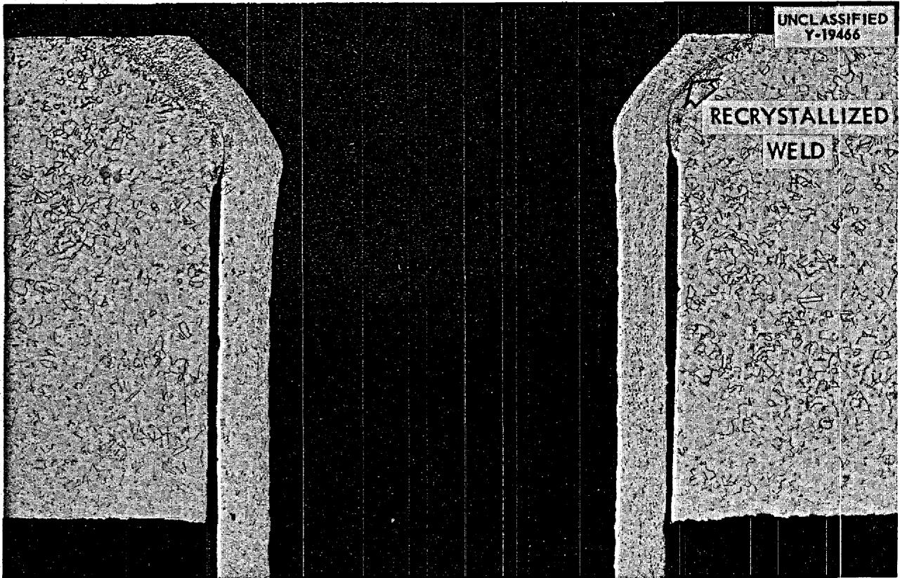  
Fig. 3.2.1. As-Received Tube-to-Header Joint Welded by the "Flange-During-Welding Method." The recrystallized area and the worked portion of the tube can be seen at the top of the header plate. Etched with aqua regia. 12X.

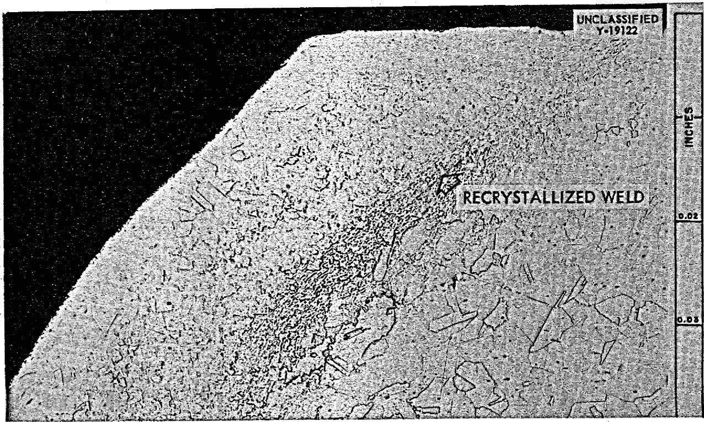

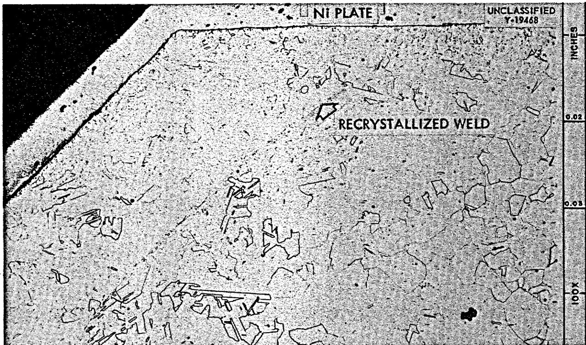  
Fig. 3.2.2. Enlargement of Recrystallized Area Shown in Fig. 3.2.1. Etched with glyceria regia. 100X. Reduced $4\%$ .   
Fig. 3.2.3. Recrystallized Area of Welded Tube-to-Header Joint Exposed to NaK (56-44 wt %) for 100 hr at $1500^{\circ}\mathrm{F}$ in Seesaw Apparatus. Etched with glyceria regia. 100X. Reduced 4%. (Confidential with caption)

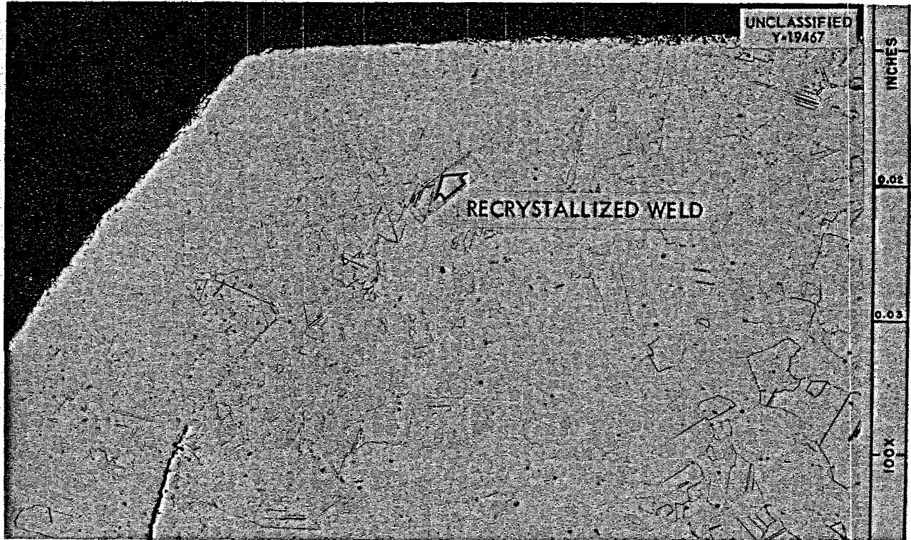  
Fig. 3.2.4. Recrystallized Area of Welded Inconel Tube-to-Header Joint Exposed to the Fuel Mixture (No. 30) NaF-ZrF₄-UF₄ (50-46-4 mole %) for 100 hr at 1500°F in Seesaw Apparatus. Etched with glyceria regia. 100X. Reduced 3%. (Secret with caption)

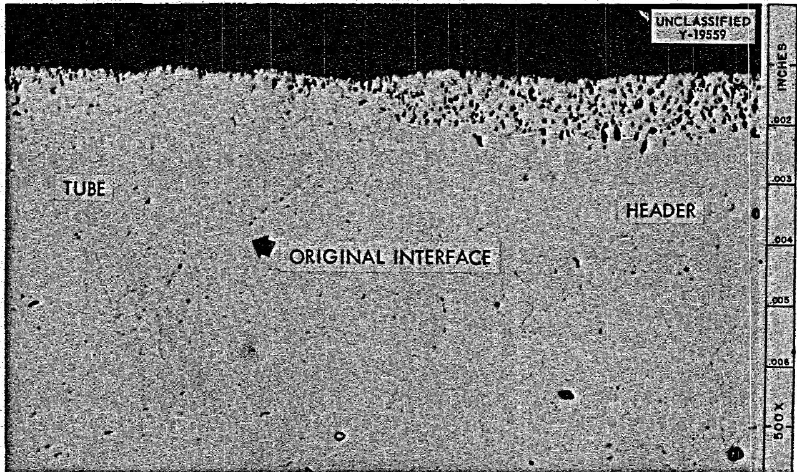  
Fig. 3.2.5. Enlargement (500X) of Fig. 3.2.4. Note decrease in attack by the NaF-ZrF $_4$ -UF $_4$ (50-46-4 mole %) in the worked tube area. Etched with glyceria regia. Reduced 1.5%. (Secret with caption)

# TESTS OF COAST METALS BRAZING ALLOY NO.53 IN NaK AND IN FLUORIDE FUEL

D. H. Jansen

It was established in previous corrosion tests that boron is leached from the surface of Coast Metals brazing alloy No. 52 (89% Ni-5% Si-4% B-2% Fe) when it is exposed to the fluoride fuels at $1500^{\circ}\mathrm{F}$ , and it was therefore decided to test a substitute alloy which might not be as susceptible to boron leaching but would still maintain good corrosion resistance to the fluoride fuels. Buttons of Coast Metals No. 53 (81% Ni-8% Cr-4% B-4% Si-3% Fe) were corrosion tested in the fuel mixture (No. 44) NaF-ZrF $_4$ -UF $_4$ (53.5-40-6.5 mole%) and in NaK (56-44 wt %) in the hope that the chromium would tie up the boron and retard its removal from the surface of the alloy. The same type of depleted area as found in Coast Metals No. 52 appeared, however, in the No. 53 alloy after both

the test in NaK and the test in the fluoride fuel. The No. 53 alloy is shown in Fig. 3.2.6 after exposure to the fuel mixture at temperatures of 1400 and $1500^{\circ}\mathrm{F}$ for 100 hr. A spectrographic traverse on the alloy button tested in NaK at $1500^{\circ}\mathrm{F}$ showed that, between the surface and a depth of 6 to 7 mils, the concentration of boron was less than one-third its value in the interior. Chemical analyses of the NaK and the fuel mixture have not yet been completed. All the test systems had surface-to-volume ratios of 0.83 in. This ratio was calculated by using only the surface areas of the alloy buttons; the area of the capsule wall that was covered with the test bath was not included. Tests will be conducted later in which the surface-to-volume ratio will be altered to determine whether it has any effect on the rate of depletion. Results of the tests described above are given in Table 3.2.1.

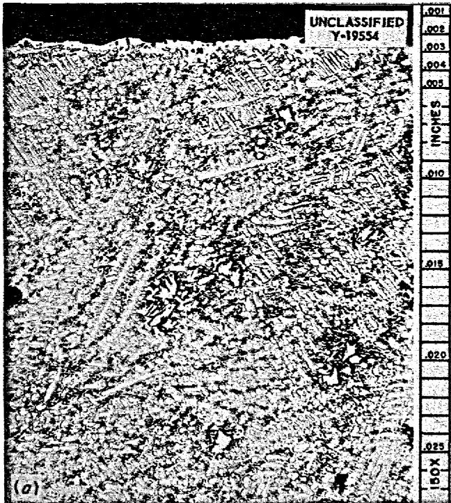

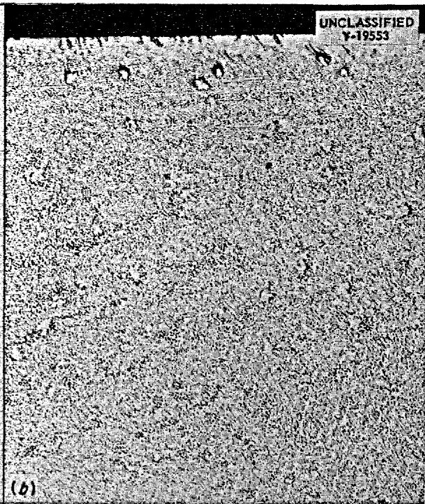  
Fig. 3.2.6. Coast Metals Brazing Alloy No. 53 After Exposure to Fuel Mixture (No. 44) NaF-ZrF4·UF4 (53.5-40-6.5 mole %) for 100 hr at (a) 1400°F and (b) 1500°F. Note the increase in the depth of the depleted area in the specimen tested at 1500°F. Etched with oxalic acid. 150X. Reduced 11.1%. (Secret with caption)

# TESTS OF HAYNES BRAZING ALLOY NO.40 IN NaK AND IN FLUORIDE FUEL

D. H. Jansen

Inconel tube-to-header joints brazed with Haynes brazing alloy No. 40 (nominal composition, in wt %: Cr, 13.5; Fe, 4.5; Si, 3.9; B, 3.2; Co, 1.0; C, 0.42; Mn, 0.25; Ni, balance) were corrosion tested in the fuel mixture (No. 30). NaF-ZrF₄-UF₄ (50-46-4 mole %) and in NaK (56-44 wt %) in seesaw apparatus. The

test periods were 100 hr, and the hot zone was maintained at $1500^{\circ}\mathrm{F}$ . The specimens were retained in the hot zones of the capsules during the tests.

The alloy showed good corrosion resistance to NaK but only fair resistance to the fuel mixture. There was attack to a depth of 2.5 to 3 mils on the specimen exposed to the fuel mixture, as shown in Fig. 3.2.7. A considerable amount of porosity was found in the braze fillets.

TABLE 3.2.1. RESULTS OF EXPOSURE OF BUTTONS OF COAST METALS BRAZING ALLOY NO.53 TO NaK AND TO FLUORIDE FUEL FOR 100 hr AT 1400 AND ${1500}^{ \circ  }F$   

<table><tr><td>Bath</td><td>Temperature (°F)</td><td>Depth of Boron-Depleted Area (mils)</td><td>Metallographic Notes</td></tr><tr><td rowspan="2">NaK (56-44 wt %)</td><td>1400</td><td>0.8</td><td>No apparent attack</td></tr><tr><td>1500</td><td>2.5</td><td>Small subsurface voids in depleted area</td></tr><tr><td rowspan="2">NaF-ZrF4-UF4(53.5-40-6.5 mole %)</td><td>1400</td><td>0</td><td>Small intermittent subsurface voids along edge to maximum depth of 0.5 mil</td></tr><tr><td>1500</td><td>1.5</td><td>Small intermittent stringers along edge to a maximum depth of 1.5 mils</td></tr></table>

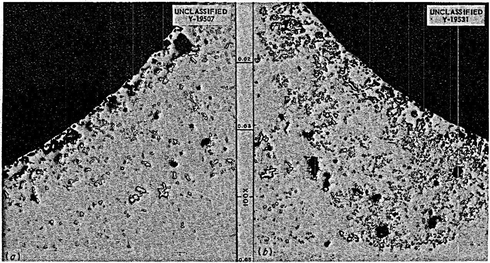  
Fig. 3.2.7. Haynes Brazing Alloy No. 40 After Exposure for 100 hr at $1500^{\circ}\mathrm{F}$ to (a) the Fuel Mixture (No. 30) $\mathsf{NaF - ZrF}_4\mathsf{-UF}_4$ (50-46-4 mole %) and to (b) NaK (56-44 wt %) in Seesaw Apparatus. Unetched. 100X. Reduced 11%. (Secret with caption)

# NIOBIUM IN SODIUM AND IN LITHIUM R. Carlander2

Seesaw apparatus was used for corrosion tests of niobium in sodium and in lithium in order to determine the corrosion resistance of this material in a dynamic system. Two niobium capsules, 15 in long, were filled to $40\%$ of their volume, one with sodium and the other with lithium, and sealed under an inert atmosphere. The capsule filled with sodium was enclosed in an Inconel container, and the capsule filled with lithium was enclosed in a Hastelloy B container. The space between both the lithium- and the sodium-filled capsules and their containers was then filled to $40\%$ of its volume with sodium in order to obtain good heat transfer between the capsule and the container (Fig. 3.2.8). The capsules were tested in a tilting furnace at 1 cpm for 100 hr with the hot zone at $1535^{\circ}\mathrm{F}$ and the cold zone at $995^{\circ}\mathrm{F}$ .

No mass transfer was found in the niobium capsules, but some dissimilar-metal mass transfer, detectable only at high magnifications, was found on the Hastelloy B and the Inconel container walls (Fig. 3.2.9). The attack in both tests was very

small. Photomicrographs of the niobium capsule that contained lithium are shown in Fig. 3.2.10. The results of metallographic examination of the test specimens are given in Table 3.2.2.

SECRET ORNL-LR-DWG 15481

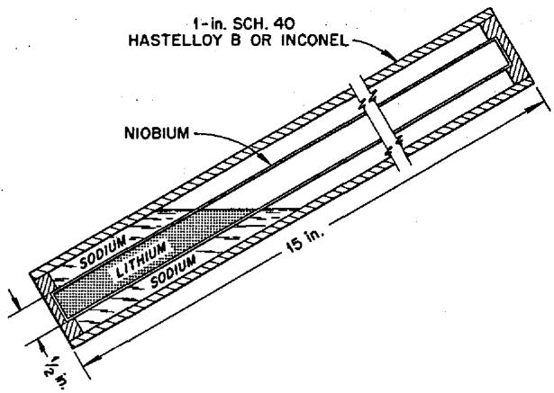  
Fig. 3.2.8. Schematic Diagram of Capsule and Container for Corrosion Tests in Seesaw Apparatus of Niobium in Lithium and in Sodium.

Test duration: 100 hr  
Hot-zone temperature: $1535^{\circ}F$ Cold-zone temperature: $995^{\circ}F$

TABLE 3.2.2. RESULTS OF TESTS OF NIOBIUM IN LITHIUM AND IN SODIUM IN SEESAW APPARATUS   

<table><tr><td>Test No.</td><td>Material</td><td>Bath</td><td>Attack (mils)</td><td>Metallographic Notes</td></tr><tr><td rowspan="3">1</td><td rowspan="2">Niobium capsule</td><td>Lithium on inner surface</td><td>2</td><td rowspan="2">Intergranular penetration found on both the inner and the outer surfaces</td></tr><tr><td>Sodium on outer surface</td><td>2</td></tr><tr><td>Hastelloy B container</td><td>Sodium on inner surface</td><td>1.5</td><td>Attack in form of voids; small amount of dissimilar-metal mass transfer detectable at 500X; precipitate found on inner surface</td></tr><tr><td rowspan="3">2</td><td rowspan="2">Niobium capsule</td><td>Sodium on inner surface</td><td>None</td><td rowspan="2">Cracks found in one area of the outer surface; not clearly evident that the cracks were due to sodium attack</td></tr><tr><td>Sodium on outer surface</td><td>1.5</td></tr><tr><td>Inconel container</td><td>Sodium on inner surface</td><td>None</td><td>Surface roughened; small amount of dissimilar-metal mass transfer crystals detectable at 500X</td></tr></table>

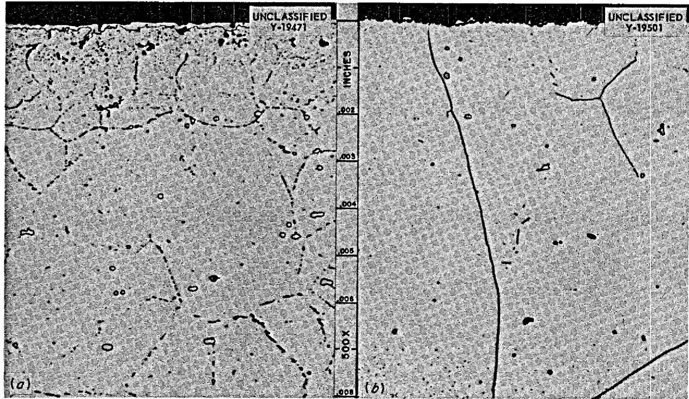

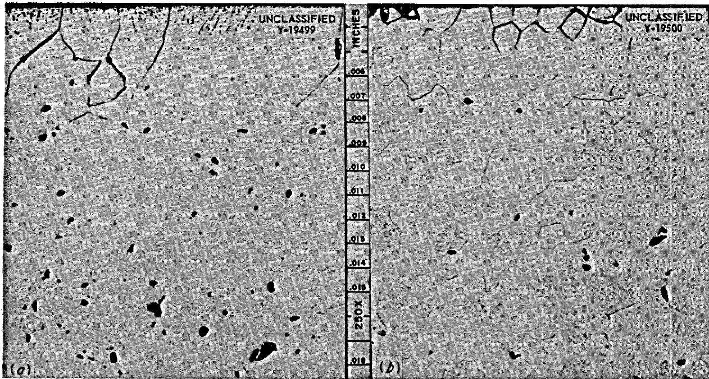  
Fig. 3.2.9. Inner Surfaces of (a) Hastelloy B and (b) Inconel Containers for Niobium Capsules After Exposure to Sodium for 100 hr at a Hot-Zone Temperature of $1535^{\circ}\mathrm{F}$ in Seesaw Apparatus. Note the dissimilar-metal mass-transfer layer on both the Inconel and the Hastelloy B. (a) Etched with $20\mathrm{cm}^3$ of $10\%$ chromic acid and $30\mathrm{cm}^3$ of HCl. (b) Etched with $10\%$ oxalic acid. 500X. Reduced $11\%$ . (Secret with caption)   
Fig. 3.2.10. Niobium Capsule That Was Exposed (a) to Lithium on Its Inner Surface and (b) to Sodium on Its Outer Surface in Seesaw Apparatus for 100 hr at a Hot-Zone Temperature of $1535^{\circ}\mathrm{F}$ . Etched with $\mathrm{HF - HNO_3 - H_2O}$ (25-25-50 vol %), 250X. Reduced 11%. (Secret with caption)

# VAPOR-ZONE ATTACK IN INCONEL-FLUORIDE FUEL SYSTEMS

R. Carlander

In several creep experiments on Inconel in the fuel mixture (No. 44) NaF-ZrF $_4$ -UF $_4$ (53.5-40-6.5 mole %) extremely heavy attack on portions of the system in the regions above the bath level has been detected. This type of attack was also noted in experimental tests of a ZrF $_4$ -vapor trap fabricated from type 316 stainless steel. A further investigation has now been made in a test conducted in a manner to approximate roughly the conditions in the creep experiments where the heavy attack on Inconel was originally noted.

Evacuated Inconel capsules were exposed to static $\mathsf{NaF - ZrF_4 - UF_4}$ (53.5-40-6.5 mole %) at $1600^{\circ}F$ for 500 and 1000 hr. Two capsules, 12 in. long, were used in which $\frac{1}{2}$ -in.-dia Inconel thermocouple probes extended to within 1 in. of the bottom. The level of the fluoride mixture bath and the height of the heated zone was 4 in. A temperature gradient was maintained over the rest of the system. Examinations of the capsules after the tests revealed that the $\mathsf{ZrF_4}$ vapor had deposited around the walls of the capsule approximately 1 in. above the original bath level, where the temperature was approximately $1100^{\circ}C$ . A hard layer that reached a maximum thickness of $\frac{1}{4}$ in. and consisted of the fluorides ( $\mathsf{NaF}, \mathsf{ZrF_4},$ and $\mathsf{UF_4}$ ) and small particles of NiO, Fe, and Cr was found in a region $\frac{1}{2}$ in. above and below the original bath level. The capsule tested for 1000 hr is shown in Fig. 3.2.11. Chemical analysis of the bath and of the thermocouple probe revealed that chromium, as could be expected, was the main element leached out of the Inconel in both tests. A sample of the fluoride mixture taken from the bottom of the bath was richer in chromium than a sample taken from the top. The results of the chemical analyses are given in Table 3.2.3.

Metallographic examination revealed that the portion of the capsule wall around which the vapor deposited was unattacked in both capsules. The heaviest attack occurred in the bath zone of both capsules. The attack reached a maximum depth of 4 mils in the 500-hr test and 5 mils in the 1000-hr test (Fig. 3.2.12). The depletion of $\mathsf{ZrF}_4$ from the bath actually decreased the attack from that normally observed, and this attack, by itself, could not have caused the failures in the creep tests.

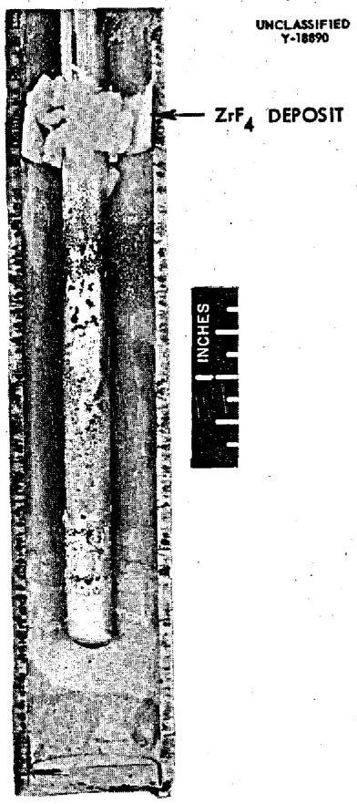  
Fig. 3.2.11. Inconel Capsule and Probe Following Exposure to the Fuel Mixture (No. 44) NaF-ZrF $_4$ -UF $_4$ (53.5-40-6.5 mole %) for 1000 hr at $1600^{\circ}\mathrm{F}$ . (Secret with caption)

# CARBURIZATION OF VARIOUS ALLOYS BY MOLTEN SODIUM

E. E. Hoffman R. Carlander

The carburization and decarburization of various alloys by molten sodium at elevated temperatures has often been observed. The carburization of stainless steel by sodium contaminated with carbon results in precipitation at the grain boundaries of a complex iron-chromium carbide. This precipitation depletes the adjacent grain boundary areas of chromium, and thus forms areas of a different "stainless" composition. Also, the grain boundaries become susceptible to intergranular corrosion. Hence, an effort was made to study the various factors that affect the carburization of various alloys by sodium.

TABLE 3.2.3. RESULTS OF CHEMICAL ANALYSES FOR NICKEL, IRON, AND CHROMIUM OF THE NaF-ZrF4-UF4 (53.5-40-6.5 MOLE %) BATH AND THE INCONEL CAPSULE FOLLOWING A TEST FOR 1000 hr AT 1600°F   

<table><tr><td>Location of Sample</td><td>Nickel (wt %)</td><td>Iron (wt %)</td><td>Chromium (wt %)</td></tr><tr><td colspan="4">Inconel Probe</td></tr><tr><td>Vapor zone</td><td>75.00</td><td>7.39</td><td>16.08</td></tr><tr><td>Bath zone</td><td>75.80</td><td>7.42</td><td>14.37</td></tr><tr><td>Top of the fused-salt bath</td><td>&lt;0.01</td><td>0.068</td><td>0.002</td></tr><tr><td>Bottom of the fused-salt bath</td><td>0.32</td><td>0.61</td><td>3.95</td></tr></table>

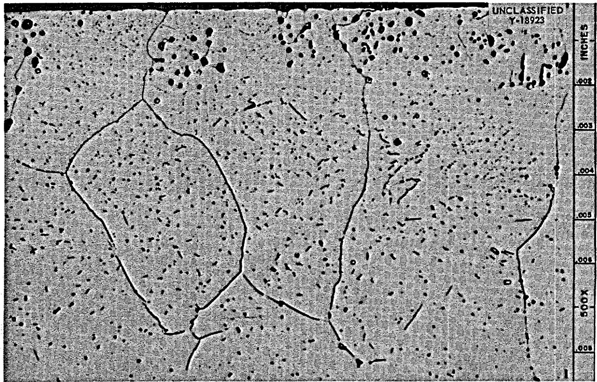  
Fig. 3.2.12. Bath Zone of Inconel Capsule Exposed to NaF-ZrF $_4$ -UF $_4$ (53.5-40-6.5 mole %) for 1000 hr at $1600^{\circ}\mathrm{F}$ . Etched with $10\%$ oxalic acid. 500X. Reduced $2\%$ . (Secret with caption)

Specimens $(2 \times 1 \times \frac{1}{8}$ in.) of Hastelloy B and types 310, 316, and 430 stainless steel were measured, polished, and weighed prior to testing. The specimens were loaded into capsules of the same material, filled with sodium plus 1, 5, and 10 wt % additions of graphite, and sealed under vacuum. The capsules were then tested in static

sodium at $1500^{\circ}\mathrm{F}$ for 100 hr. Upon completion of the tests, the specimens were removed from the capsules, cleaned, and weighed, and portions of each were analyzed chemically and metallographically. The results are presented in Tables 3.2.4 and 3.2.5. Of the four materials tested, Hastelloy B and type 310 stainless steel (Fig.

TABLE 3.2.4. CARBON ANALYSIS, TOTAL CARBON PICKUP, AND TOTAL WEIGHT CHANGE OF VARIOUS ALLOYS AFTER EXPOSURE TO SODIUM AND GRAPHITE FOR $100\mathrm{hr}$ AT $1500^{\circ}\mathrm{F}$   

<table><tr><td>Capsule Material</td><td>Nominal Composition (wt %)</td><td>Graphite Added to Sodium (wt %)</td><td>Carbon Found in 3-mil Surface Cut (wt %)</td><td>Total Carbon Pickup (mg)</td><td>Total Weight Change of Specimen (mg)</td></tr><tr><td rowspan="3">Hastelloy B</td><td rowspan="3">25 Cr-20 Mo-0.25 C (max)-bal Ni</td><td>1</td><td>0.680</td><td>2.6</td><td>25.8</td></tr><tr><td>5</td><td>0.577</td><td>16.4</td><td>46.8</td></tr><tr><td>10</td><td>1.118</td><td>22.4</td><td>47.1</td></tr><tr><td rowspan="3">Type 310 stainless steel</td><td rowspan="3">25 Cr-20 Ni-0.25 C (max)-bal Fe</td><td>1</td><td>0.388</td><td>0.5</td><td>39.3</td></tr><tr><td>5</td><td>0.994</td><td>8.8</td><td>47.2</td></tr><tr><td>10</td><td>1.43</td><td>No analysis</td><td>55.5</td></tr><tr><td rowspan="3">Type 316 stainless steel</td><td rowspan="3">17 Cr-12 Ni-0.10 C (max)-bal Fe</td><td>1</td><td>0.606</td><td>10.1</td><td>48.1</td></tr><tr><td>5</td><td>1.09</td><td>30.7</td><td>90.6</td></tr><tr><td>10</td><td>2.35</td><td>50.2</td><td>119.3</td></tr><tr><td rowspan="3">Type 430 stainless steel</td><td rowspan="3">16 Cr-0.10 C (max)-bal Fe</td><td>1</td><td>0.267</td><td>10.7</td><td>36.3</td></tr><tr><td>5</td><td>1.30</td><td>25.2</td><td>81.3</td></tr><tr><td>10</td><td>1.47</td><td>55.4</td><td>153.4</td></tr></table>

TABLE 3.2.5. METALLOGRAPHICALLY OBSERVED DEPTH OF CARBURIZATION OF VARIOUS ALLOYS EXPOSED TO STATIC SODIUM FOR 100 hr AT ${1500}^{ \circ  }F$   

<table><tr><td rowspan="2">Graphite Added to Sodium (wt %)</td><td colspan="4">Depth of Carburization (mils)</td></tr><tr><td>Hastelloy B</td><td>Type 310 Stainless Steel</td><td>Type 316 Stainless Steel</td><td>Type 430 Stainless Steel</td></tr><tr><td>1</td><td>5</td><td>2</td><td>0-10 (varied over the surface)</td><td>4</td></tr><tr><td>5</td><td>8</td><td>4</td><td>10</td><td>10</td></tr><tr><td>10</td><td>8</td><td>6</td><td>13</td><td>24</td></tr></table>

3.2.13) exhibited the least amount of carburization, while types 316 and 430 stainless steel (Fig. 3.2.14) were heavily carburized.

The results can be explained by the use of generally accepted facts about carburization. Nickel, for example, decreases the rate of penetration of carbon in steel. Therefore, comparing the three stainless steels, type 430 stainless steel (less than 0.5 wt % Ni) was carburized to the deepest extent, while type 310 stainless steel (20 wt % Ni) experienced the smallest depth of carbon penetration. Also, the austenitic lattice dissolves more carbon than the ferritic lattice; hence, although the depth of carburization was

less in the type 310 stainless steel (austenitic), the amount of carbon in a 3-mil surface cut was approximately the same as that in a similar cut of type 430 stainless steel (ferritic). Type 316 stainless steel, which has less nickel and chromium than type 310 stainless steel, experienced a greater depth of carbon penetration and had a greater carbon concentration at the surface. Because of its nickel content, Hastelloy B was not expected to carburize as heavily as it actually did. However, the presence of molybdenum (a strong carbide former) in stainless steels renders them more susceptible to carburization, and this may explain the carburization of Hastelloy B, which also contains molybdenum.

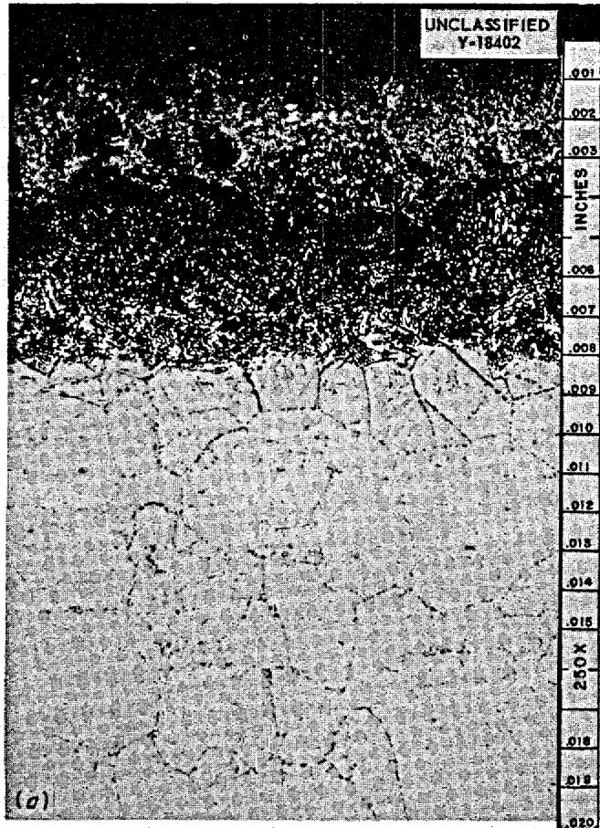

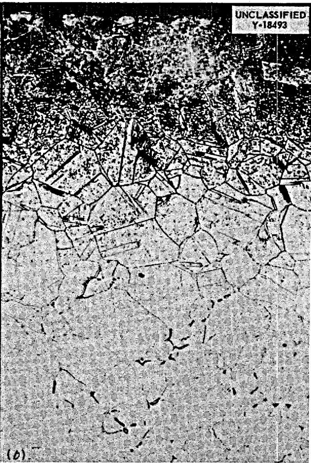  
Fig. 3.2.13. Hastelloy B (a) and Type 310 Stainless Steel (b) After Exposure to Static Sodium with 10 wt % Graphite Added for 100 hr at $1500^{\circ}\mathrm{F}$ . (a) Etched with phosphoric acid plus $\mathsf{H}_2\mathsf{O}_2$ . (b) Etched with glyceria regia. 250X. Reduced 10.5%. (Secret with caption)

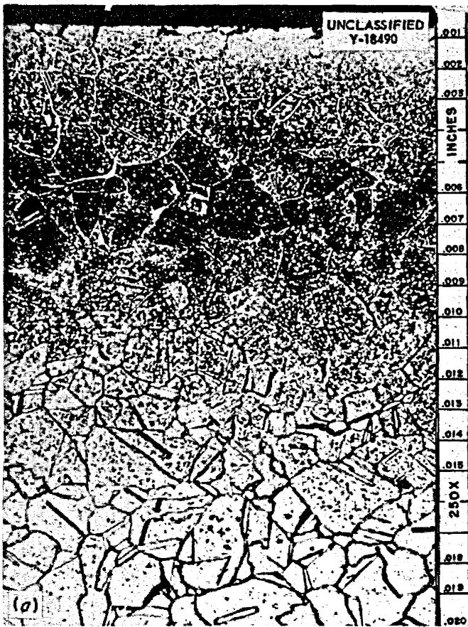

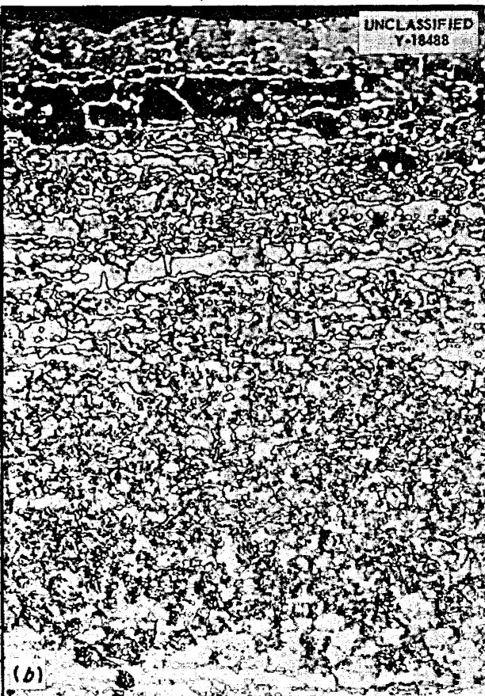  
Fig. 3.2.14. Type 316 Stainless Steel (a) and Type 430 Stainless Steel (b) After Exposure to Static Sodium with $10\mathrm{wt}\%$ Graphite Added for $100\mathrm{hr}$ at $1500^{\circ}\mathrm{F}$ . Etched with glyceria regia. 250X. Reduced $11\%$ . (Secret with caption)

# SODIUM-BERYLLIUM-INCONEL COMPATIBILITY IN A STATIC SYSTEM (TEST NO. 2)

The test procedure and the results of sodium- beryllium-Inconel compatibility test No. 1 were given in the previous report.3 The results of the first test indicated that a chromium plate on the Inconel surface in contact with the beryllium would reduce the extent of the alloying reaction which occurs when Inconel and beryllium are in direct contact in sodium. The thin chromium platings (1 and 2 mils) used in the first test were entirely consumed by alloying during the 1000-hr test period at $1300^{\circ}\mathrm{F}$ . Therefore a second test was conducted in which heavier platings were used. A beryllium oxide specimen was also included in this test to determine whether a reaction would occur between

beryllium oxide and beryllium or beryllium oxide and Inconel.

The results of this test are given in Table 3.2.6. The presence of a chromium plate "diffusion barrier" on the Inconel specimen resulted in the formation of an alloy layer (principally $\mathrm{Be}_2\mathrm{Cr}$ ) which was approximately one-third the thickness of the alloy layer which forms when Inconel is placed in direct contact with beryllium under the conditions of this test.

Analyses of the test results indicate that a minimum of 5 mils of chromium plate will be necessary to ensure that all the chromium is not consumed by the alloying reaction with beryllium. The $\mathrm{Be}_2\mathrm{Cr}$ phase was identified by x-ray analysis. This phase has a Vickers hardness of 2440, as compared with hardnesses of 1495 for $\mathrm{Be}_{21}\mathrm{Ni}_{5^{\prime}}$ the phase which forms when Inconel and beryllium are in direct contact, and 180 for Inconel (Figs.

Test duration: 1000 hr  
Test temperature: $1300^{\circ}\mathrm{F}$ Contact pressure between specimens: 500 psi

TABLE 3.2.6. RESULTS OF METALLOGRAPHIC EXAMINATION OF INTERFACES OF SPECIMENS FROM SODIUM-BERYLLIUM-INCONEL COMPATIBILITY TEST NO.2   

<table><tr><td>Interface</td><td>Results of Metallographic Examination</td></tr><tr><td>Inconel vs beryllium, direct contact (standard)</td><td>Alloy formation (Be21Ni5and BeNi) 25 mils deep along interface; in earlier test 24 mils of alloy formed; 4 to 5 mils of Inconel consumed by alloying reaction</td></tr><tr><td>Inconel plus 4-mil chromium plate vs beryllium</td><td>Alloys formed between chromium plate and beryllium to a depth of 8 mils, which consisted of 7 mils of Be2Cr and 1 mil of Be5Cr(?); 0 to 2 mils of chromium plate remained after the test; 2 to 3 mils of Inconel consumed, probably by alloying with the chromium plate.</td></tr><tr><td>Inconel plus 6-mil chromium plate vs beryllium</td><td>Alloys formed between chromium plate and beryllium to a depth of 9 mils, which consisted of 8 mils of Be2Cr and 1 mil of Be5Cr(?); 3 mils of chromium plate remained after the test; approximately 2 mils of Inconel consumed by alloying with the chromium plate</td></tr><tr><td>Beryllium vs beryllium oxide</td><td>Surface of beryllium oxide discolored slightly; specimens were easily separated and no bonding was evident</td></tr><tr><td>Beryllium oxide vs Inconel</td><td>Neither the beryllium oxide nor the Inconel surface affected by test</td></tr></table>

3.2.15 and 3.2.16). No reactions were anticipated between beryllium oxide and beryllium or beryllium oxide and Inconel, and none were found to have occurred during this test.

# EFFECT OF DIFFUSION COLD TRAPS ON MASS TRANSFER IN INCONEL-SODIUM THERMAL-CONVECTION LOOPS

E. E. Hoffman

The purpose of operation of the two Inconel-sodium thermal-convection loops discussed here was to determine whether the presence of a diffusion cold trap would affect the extent of mass transfer observed in the cold legs. The loops were loaded with sodium which had been pretreated by cold trapping for several months to lower the oxygen content. One loop was provided with a diffusion cold trap near the bottom of the cold leg in order to reduce the sodium oxide content during operation, while the other loop was of standard design, with no cold trap.

Although many thermal-convection loop tests conducted on Inconel-sodium systems in the past

have failed to show any mass transfer, it has been demonstrated that mass transfer will occur in such systems if the hot-zone temperature is in excess of $1500^{\circ}\mathrm{F}$ and if a steep temperature gradient is induced in the cold leg by directing an air blast on a small area near the bottom of the cold leg. These loops (Nos. 28 and 29) were therefore operated for 1000 hr at hot- and cold-zone temperatures of 1600 and $990^{\circ}\mathrm{F}$ , respectively. The loops were carefully stripped of sodium after the tests. The mass-transfer deposits found in the cold zones of these loops are shown in Fig. 3.2.17. Although only small amounts of mass-transfer crystals were found in these loops, it is apparent that slightly more deposition occurred in the loop which had no diffusion cold trap than in the loop which included a cold trap. The results of spectrographic analysis of the metallic crystals recovered from these loops are presented in Table 3.2.7, along with the analysis of the Inconel pipe prior to test. More tests will be required to establish whether the differences in chromium and iron contents of the crystals from the two loops are significant. The mass-transfer crystals found in a thermal-convection

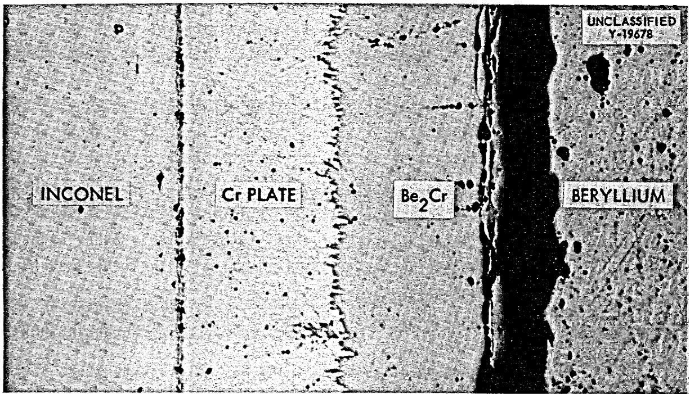

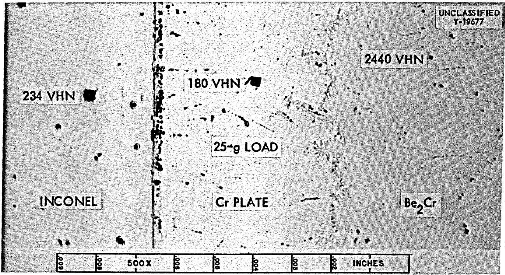  
Fig. 3.2.15. Alloying Between Chromium-Plated Inconel and Beryllium During 1000-hr Compatibility Test in Static Sodium at $1300^{\circ}\mathrm{F}$ . Dark area between $\mathsf{Be}_2\mathsf{Cr}$ and beryllium is due to separation of specimens after the test. Unetched. 300X. (Secret with caption)   
Fig. 3.2.16. Enlargement of Area Shown in Fig. 3.2.15. Note extreme hardness of $\mathsf{Be}_2\mathsf{Cr}$ phase as compared with the hardness of the Inconel and the chromium plate. Unetched. 500X. (Secret with caption).

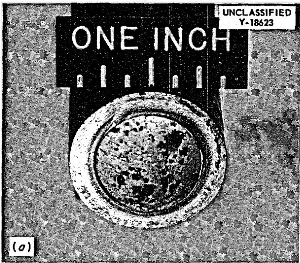

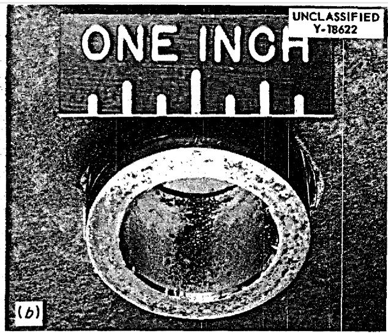  
Fig. 3.2.17. Mass-Transfer Deposits in Cold Zones of Inconel Thermal-Convection Loops Which Circulated Sodium at a Hot-Zone Temperature of $1600^{\circ}\mathrm{F}$ and a Cold-Zone Temperature of $990^{\circ}\mathrm{F}$ . (a) Cold-zone section of loop which had no diffusion cold trap (loop No. 29). (b) Cold-zone section of loop which had a diffusion cold trap (loop No. 28). (Confidential with caption)

Operating period: 1000 hr

Hot-zone temperature: $1600^{\circ}\mathrm{F}$

Cold-zone temperature: $990^{\circ}\mathrm{F}$

TABLE 3.2.7. ANALYSES OF MASS-TRANSFER CRYSTALS FROM INCONEL-SODIUM THERMAL-CONVECTION LOOPS   

<table><tr><td rowspan="2">Material Analyzed</td><td colspan="5">Chemical Analysis (wt %)</td></tr><tr><td>Ni</td><td>Cr</td><td>Fe</td><td>Cu</td><td>Mn</td></tr><tr><td>Crystals from loop No. 28 which included a diff-fusion cold trap</td><td>84.4</td><td>10.6</td><td>4.6</td><td>0.33</td><td>0.07</td></tr><tr><td>Crystals from loop No. 29 which had no cold trap</td><td>77.4</td><td>13.3</td><td>9.1</td><td>0.06</td><td>0.08</td></tr><tr><td>Inconel pipe (as-received)</td><td>73.15</td><td>14.81</td><td>6.62</td><td></td><td>0.40</td></tr></table>

loop operated previously at a hot-zone temperature of $1500^{\circ}\mathrm{F}$ had a much lower iron concentration. The results of metallographic examination of specimens from similar locations in the loops are given in Table 3.2.8. Examinations of these results indicate that the loop with no cold trap (No. 29) had slightly heavier attack in the hot leg (Fig. 3.2.18) than the loop with a cold trap (No. 28).

The deposits found on the cold-leg surfaces of these loops may be seen in Fig. 3.2.19.

# THERMAL-CONVECTION LOOP TESTS OF VARIOUS STRUCTURAL MATERIALS

AND LITHIUM

E. E. Hoffman

There has been considerable interest in the possible application of lithium as a reactor coolant and, in particular, as a coolant for a solid-fuel-element aircraft reactor. The corrosion problems

TABLE 3.2.8. RESULTS OF METALLOGRAPHIC EXAMINATION OF VARIOUS SECTIONS FROM INCONEL-SODIUM THERMAL-CONVECTION LOOPS   

<table><tr><td rowspan="2">Location of Specimen</td><td rowspan="2">Operating Temperature (°F)</td><td colspan="2">Metallographic Results</td></tr><tr><td>Loop No. 28 (Diffusion cold trap)</td><td>Loop No. 29 (No cold trap)</td></tr><tr><td>Top of hot leg</td><td>1600</td><td>Grain boundary voids to a depth of less than 1 mil</td><td>1 to 2 mils of grain boundary attack</td></tr><tr><td>Top of cold leg</td><td>1350</td><td>Slightly irregular surface</td><td>Slightly irregular surface</td></tr><tr><td>Bottom of cold leg</td><td>990</td><td>Two-phase surface layer 0.5 mil thick</td><td>Two-phase surface layer 0.5 mil thick</td></tr></table>

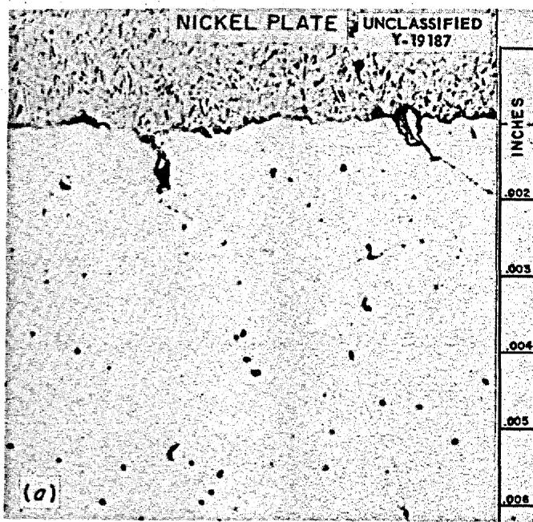

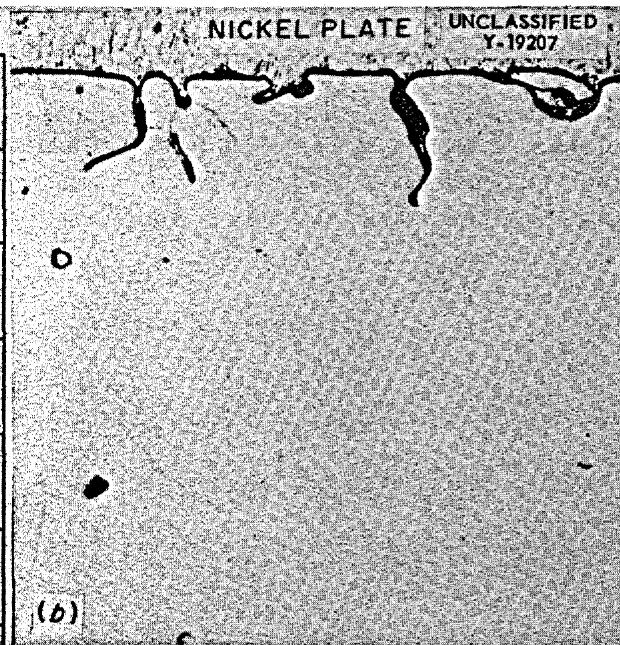  
Fig. 3.2.18. Hot-Leg Surfaces of Inconel-Sodium Thermal-Convection Loops Operated for 1000 hr with a Hot-Zone Temperature of $1600^{\circ}\mathsf{F}$ and a Cold-Zone Temperature of $990^{\circ}\mathsf{F}$ . (a) Hot-leg specimen from loop No. 28 which included a diffusion cold trap. (b) Hot-leg specimen from loop No. 29 which had no cold trap. 500X. Reduced $4\%$ . (Confidential with caption.)

encountered in attempting to contain lithium in high-temperature systems are much more difficult than those found with liquid sodium at high temperatures. Analyses of a large number of static tests have indicated that nickel and nickel-base alloys are very heavily attacked even by static, isothermal lithium, and thus many of the commercially available high-temperature alloys, are eliminated from consideration. Pure iron has shown

good resistance to lithium, and therefore considerable effort has been directed towards tests on iron-base alloys, in particular, the stainless steels. The results of thermal-convection loop tests of various materials are summarized in Table 3.2.9. The important information contained in this table is whether or not the loop plugged, the weight of metal crystals recovered from the cold leg of the loop, and the depth of attack in the hot

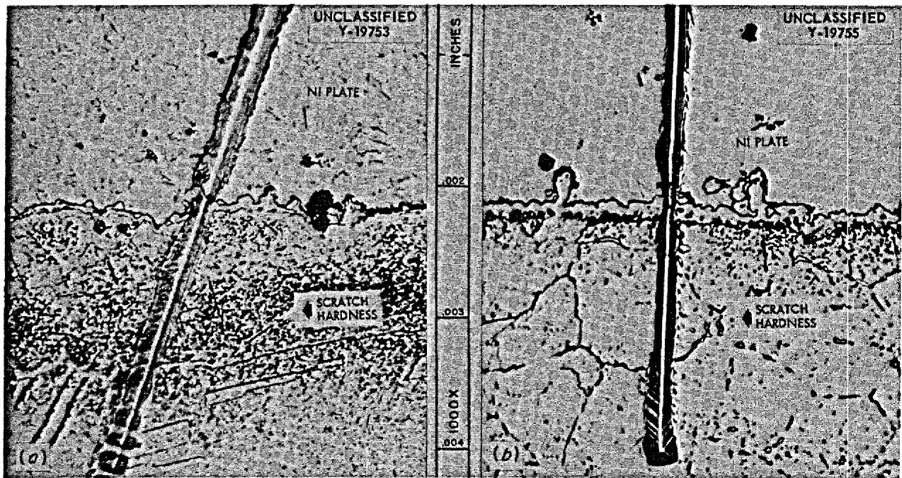  
Fig. 3.2.19. Cold-Leg Surfaces of Inconel-Sodium Thermal-Convection Loops Showing Mass-Transfer Deposits. The decreased width of the scratch at the edge of the specimens indicates that this deposit is quite hard (possibly a carbide) as compared with Inconel or nickel plate. (a) Cold-leg specimen from loop No. 28 which included a diffusion cold trap. (b) Cold-leg specimen from loop No. 29 which had no cold trap. Etched with aqua regia. 1000X. Reduced $6\%$ . (Confidential with caption)

leg. All the loops were constructed of $\frac{1}{2}$ -in.sched-40 pipe (0.84 in. OD, 0.622 in. ID).

The low-sodium-content lithium used in these tests was received from the vendor packed in gastight helium-filled containers. The loops were loaded with lithium and inert-gas arc-welded.

Inconel (nominal composition, in wt $\%$ : Ni, 77; Cr, 15; Fe, 7) showed extensive mass transfer and hot-leg attack, even at hot-leg temperatures as low as $1300^{\circ}\mathrm{F}$ . This result is typical of nickel-base alloys exposed to lithium under these conditions.

The six type 316 stainless steel (nominal composition, in wt $\%$ Fe, 68; Cr, 17; Ni, 12; Mo, 2) loops tested showed less mass transfer and less of a tendency to plug in the three tests conducted with hot-leg temperatures of approximately $1500^{\circ}\mathrm{F}$ than in the other tests conducted at hot-zone temperatures of approximately $1400^{\circ}\mathrm{F}$ and $1300^{\circ}\mathrm{F}$ (Figs. 3.2.20 and 3.2.21). The loop (No. 25) operated with a hot-zone temperature of $1400^{\circ}\mathrm{F}$

had more mass-transfer crystals in the cold leg than did the loop (No. 16) operated with a hot-zone temperature of $1310^{\circ}\mathrm{F}$ ; however, loop No. 25 operated over seven times longer before it plugged than did loop No. 16. The hot- and cold-leg surfaces of loop No. 25 after the test are shown in Fig. 3.2.22, and the hot- and cold-leg surfaces of loop No. 16, which plugged in 290 hr, are shown in Fig. 3.2.23. The formation of carbide crystals on the surfaces of lithium loops has been noted in almost all tests conducted with stainless steels, and it usually occurs in that section of the loop which is at a temperature of approximately $1300^{\circ}\mathrm{F}$ . The carbide deposits have been found in the hot legs of some loops and in the cold legs of others.

Type 321 stainless steel (nominal composition, in wt $\%$ Fe, 70; Cr, 18; Ni, 10; Ti, 0.5) when tested at a hot-leg temperature of $1500^{\circ}\mathrm{F}$ completely plugged with crystals in 204 hr. Type 347 stainless steel (nominal composition, in wt $\%$ Fe, 70; Cr, 18; Ni, 10; Nb, 1) showed results similar to those for type 321 stainless steel, with

TABLE 3.2.9. RESULTS OF THERMAL-CONVECTION LOOP TESTS OF VARIOUS ALLOYS EXPOSED TO CIRCULATING LITHIUM   

<table><tr><td rowspan="2">Material</td><td colspan="3">System Temperatures (°F)</td><td rowspan="2">Test Duration (hr)</td><td colspan="2">Metallographic Results</td></tr><tr><td>Hot Leg</td><td>Cold Leg</td><td>Differential</td><td>Hot-Leg Attack (mils)</td><td>Cold Leg</td></tr><tr><td>Inconel</td><td>1300</td><td>1200</td><td>100</td><td>1000</td><td>16</td><td>15.1 g of crystals</td></tr><tr><td>Stainless steel</td><td></td><td></td><td></td><td></td><td></td><td></td></tr><tr><td rowspan="6">Type 316</td><td>1500</td><td>1292</td><td>208</td><td>500</td><td>13</td><td>0.5 g of crystals</td></tr><tr><td>1490</td><td>1220</td><td>270</td><td>1000</td><td>1.5</td><td>0.1 g of crystals</td></tr><tr><td>1472</td><td>1335</td><td>117</td><td>1000</td><td>3</td><td>0.1 g of crystals</td></tr><tr><td>1400</td><td>1130</td><td>270</td><td>2150*</td><td>23</td><td>4.7 g of crystals</td></tr><tr><td>1310</td><td>1058</td><td>252</td><td>290*</td><td>2</td><td>0.8 g of crystals</td></tr><tr><td>1292</td><td>1094</td><td>198</td><td>1000</td><td>15</td><td>0.25 g of crystals</td></tr><tr><td rowspan="2">Type 321</td><td>1500</td><td>1220</td><td>280</td><td>204*</td><td>0.5</td><td>1.0 g of crystals</td></tr><tr><td>1310</td><td>980</td><td>330</td><td>1230*</td><td>3.0</td><td>0.7 g of crystals</td></tr><tr><td rowspan="4">Type 347</td><td>1500</td><td>1112</td><td>388</td><td>280*</td><td>2</td><td>1.5 g of crystals</td></tr><tr><td>1310</td><td>1060</td><td>250</td><td>1000</td><td>3.0</td><td>1.3 g of crystals</td></tr><tr><td>1000</td><td>618</td><td>382</td><td>1000</td><td>1</td><td>Crystals 0.2 mil thick</td></tr><tr><td>1000</td><td>618</td><td>382</td><td>3000</td><td>1.5</td><td>Crystals 0.3 mil thick</td></tr><tr><td>Type 430</td><td>1500</td><td>1220</td><td>280</td><td>1500</td><td>4.0</td><td>1.0 g of crystals</td></tr><tr><td rowspan="3">Type 446</td><td>1500</td><td>1166</td><td>334</td><td>864*</td><td>1.0</td><td>9 g of crystals (84 mils of attack)</td></tr><tr><td>1500</td><td>1200</td><td>300</td><td>700*</td><td>16</td><td>6.8 g of crystals (84 mils of attack)</td></tr><tr><td>1292</td><td>1058</td><td>234</td><td>1500</td><td>25</td><td>0.23 g of crystals (65 mils of attack)</td></tr></table>

*Loop plugged with crystals.

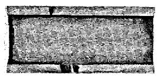  
(0)

  
UNCLASSIFIED Y-18640

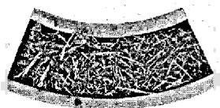  
(b)

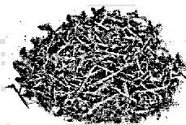

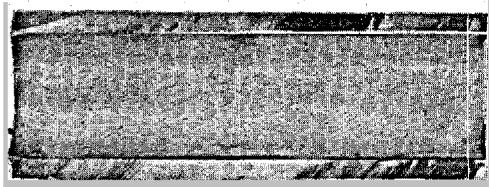  
UNCLASSIFIED Y-18373   
(a)   
Fig. 3.2.20. Type 316 Stainless Steel Thermal-Convection Loop (No. 25) Which Circulated Lithium for 2150 hr at a Hot-Zone Temperature of $1400^{\circ}\mathrm{F}$ and a Cold-Zone Temperature of $1130^{\circ}\mathrm{F}$ . (a) Specimen from hot zone. (b) Specimen from cold zone. (Confidential with caption)

plugging occurring in 280 hr when a hot-leg temperature of $1500^{\circ}\mathrm{F}$ was used. A 3000-hr test of a type 347 stainless steel loop with a hot-leg temperature of $1000^{\circ}\mathrm{F}$ indicated that this material would be satisfactory for operation in this temperature range for very long periods of time if a small amount of attack and mass transfer could be tolerated.

A type 430 stainless steel (nominal composition, in wt $\%$ : Fe, 83; Cr, 16; C, 0.10) loop operated at a hot-leg temperature of $1500^{\circ}\mathrm{F}$ (cold leg temperature, $1220^{\circ}\mathrm{F}$ ) for 1500 hr without plugging, but it showed considerable mass transfer (Fig. 3.2.24). Two type 446 stainless steel (nominal composition, in wt $\%$ : Fe, 74; Cr, 25; C, 0.35) loops tested at a hot-leg temperature of $1500^{\circ}\mathrm{F}$ (cold leg temperature, $1200^{\circ}\mathrm{F}$ ) completely plugged in less than 900 hr and had 6.8 and 9 g of metal crystals in the cold legs (Fig. 3.2.25). The wall-crystal interface on the cold-leg surface is shown in Fig. 3.2.26. The bulk of the crystals are ferrite (composition, in wt $\%$ : Fe, 90; Cr, 6), while those attached to the surface of the type 446 stainless steel wall have been identified by x-ray analysis as $\mathbf{Cr}_{23}\mathbf{C}_{6}$ . The relative hardnesses of these two phases may be noted in the illustration.

The results of chemical analysis of the mass-transfer crystals from the nickel-iron-chromium and iron-chromium alloy loops show that all three

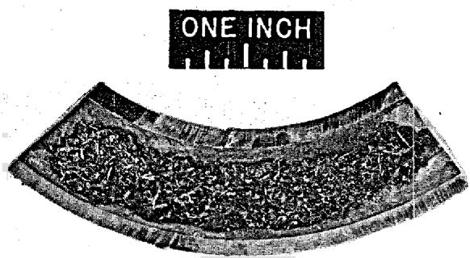  
(b)   
Fig. 3.2.21. Type 316 Stainless Steel Thermal-Convection Loop (No. 16) Which Circulated Lithium for 290 hr at a Hot-Zone Temperature of $1310^{\circ}\mathrm{F}$ and a Cold-Zone Temperature of $1058^{\circ}\mathrm{F}$ . (a) Specimen from hot zone. (b) Specimen from cold zone. (Confidential with caption)

metals are transferred in appreciable quantities. If the alloy contains nickel, the mass-transfer crystals are richer in nickel than is the container alloy. In iron-chromium alloy loops, the crystals deposited are richer in iron than is the container alloy. Of the three metals - nickel, iron, and chromium - chromium has the least tendency to mass transfer, but it is still found to be present to the extent of 5 to $10\%$ in the mass-transfer crystals found in stainless steel-lithium tests.

The data obtained in these thermal-convection loop tests indicate clearly that further work needs to be done to resolve the apparent discrepancies which exist between the results for type 316 stainless steel and other austenitic stainless steels which contain little or no molybdenum. Also, types 317 and 318 stainless steels, which contain

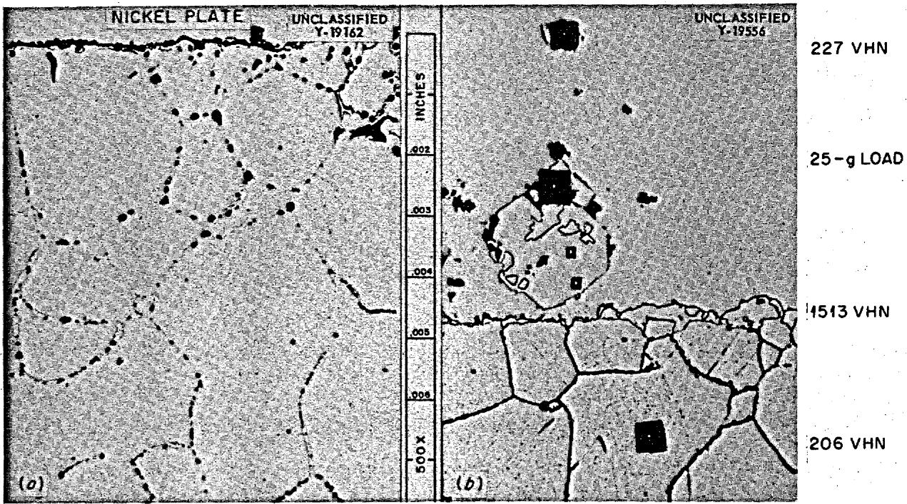

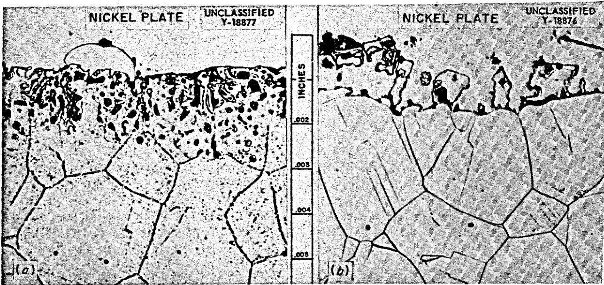  
Fig. 3.2.22. Hot- (a) and Cold-Leg (b) Surfaces of Type 316 Stainless Steel Loop No. 25 Which Circulated Lithium (See Fig. 3.2.20). Hot-leg surface attacked along grain-boundary carbides. Two-phase mass-transfer crystal (chromium carbide, VHN, 1513) plus attached crystal containing iron, nickel, and chromium are shown on cold-leg surface. Etched with glyceria regia. 500X. Reduced $13\%$ . (Confidential with caption)   
Fig. 3.2.23. Hot- (a) and Cold-Leg (b) Surfaces of Type 316 Stainless Steel Loop No. 16 Which Circulated Lithium (See Fig. 3.2.21). Crystal on hot-leg surface is chromium carbide. Note mass-transfer crystals on cold-leg surface. Etched with glyceria regia. (Confidential with caption)

UNCLASSIFIED Y-18087

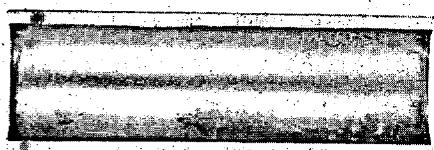  
(0)

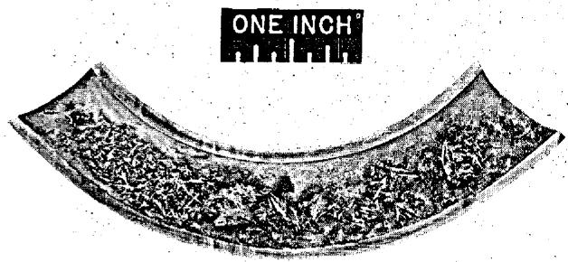  
(b)   
Fig. 3.2.24. Type 430 Stainless Steel Thermal-Convection Loop (No. 14) which Circulated Lithium for 1500 hr at a Hot-Zone Temperature of $1500^{\circ}\mathrm{F}$ and a Cold-Zone Temperature of $1220^{\circ}\mathrm{F}$ . (a) Specimen from hot zone. (b) Specimen from cold zone. (Confidential with caption)

more molybdenum than is present in type 316 stainless steel, will be tested to determine the effect of molybdenum on the mass-transfer tendency of stainless steels in contact with molten lithium. The ferritic stainless steel test results are not encouraging, especially those for type 446 stainless steel, which suffers very deep intergranular attack because of preferential attack of the grain-boundary carbides. Further tests are planned for type 430 stainless steel. The superior corrosion resistance of type 430 stainless steel, in comparison with type 446 stainless steel, can be attributed to the lower carbon content of the type 430 stainless steel (0.10% C maximum). Type 446 stainless steel has a maximum of 0.35% C.

The data obtained in static and thermal-convection loop tests are summarized in Fig. 3.2.27, which shows that the materials tested thus far are un

satisfactory as containers for lithium at hot-leg temperatures of approximately $1500^{\circ}\mathrm{F}$ in flowing systems. Tests are presently being conducted on niobium, molybdenum, and zirconium in dynamic systems, and it is believed that these refractory metals, especially molybdenum, will withstand the corrosive action of lithium under these conditions, but, as yet, this has not been demonstrated. The effect of various amounts of nitride contamination on the amount of mass transfer will be studied further. Experiments will be conducted in order to determine the maximum temperature (in the range from 1000 to $1300^{\circ}\mathrm{F}$ ) at which a stainless steel-dynamic lithium system may be operated, since these alloys at present seem to be satisfactory at $1000^{\circ}\mathrm{F}$ and, in general, unsatisfactory at $1300^{\circ}\mathrm{F}$ . The temperature limits indicated in Fig. 3.2.27 are merely estimates arrived at by evaluating the data obtained thus far, and they may be in error by as much as $100^{\circ}\mathrm{F}$ .

# TESTS OF INTERMETALLIC COMPOUNDS IN SODIUM AND IN FLUORIDE FUEL

W. H. Cook

The intermetallic compounds NiAl, NiAl + 5% Ni, NiAl + 4% Zr, and MoAl have been screen tested for 100 hr in static sodium and in static NaF-ZrF $_4$ -UF $_4$ (53.5-40-6.5 mole %) at $1500^{\circ}\mathrm{F}$ . No attack was found on the specimens tested in the sodium. Those tested in the fused salt were severely attacked. The test results, which were obtained by metallographic comparisons of untested and tested specimens, are presented in Table 3.2.10. Chemical analyses of the test mediums are being made.

All the intermetallic compounds were found to have a common phase that may have been an oxide added by the fabricator for strengthening. This phase constituted less than $5\%$ of the surface of any sectioned intermetallic compound. It was homogeneously distributed in all specimens with the exception of the NiAl + $5\%$ Ni compound, in which some segregation was apparent. In addition to this common phase, all the intermetallic compounds had one major phase, except the NiAl + $4\%$ Zr compound, which contained two additional phases. The major phase was present as well-bonded globular particles, and the three minor

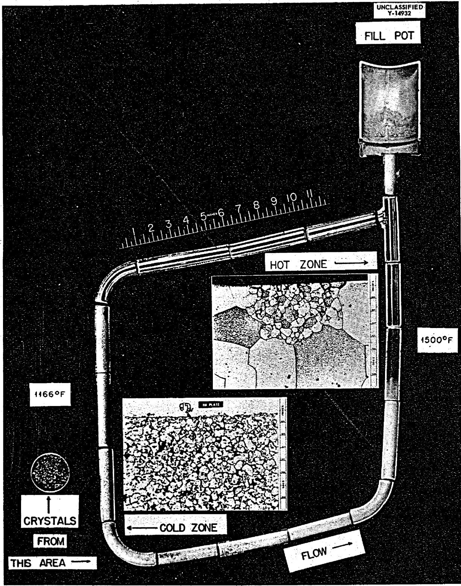  
Fig. 3.2.25. Type 446 Stainless Steel Thermal-Convection Loop Which Circulated Lithium for 864 hr. (Confidential with caption)

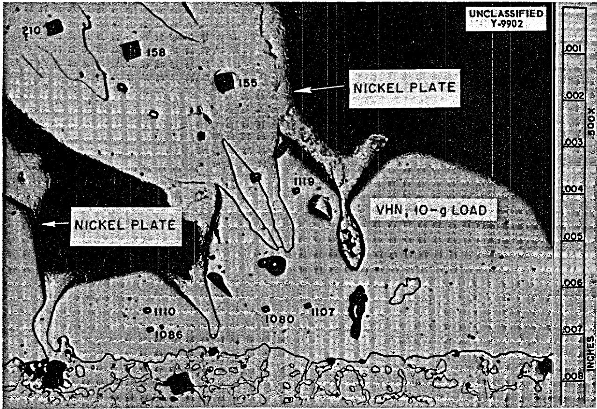  
Fig. 3.2.26. Cold-Leg Surface of Type 446 Stainless Steel Loop Which Circulated Lithium (See Fig. 3.2.25). Very hard phase (VHN, $\sim 1100$ ) is $\mathsf{Cr}_{23}\mathsf{C}_6$ , while soft crystal attached to it is a ferrite crystal containing $90\%$ Fe and $6\%$ Cr. Etched with glyceria regia. (Confidential with caption)

TABLE 3.2.10. SUMMARY OF THE RESULTS OF EXPOSURE OF INTERMETALLIC COMPOUNDS FOR ${100}\mathrm{{hr}}$ IN STATIC NaF-ZrF ${}_{4}$ -UF ${}_{4}$ (53.5-40-6.5 MOLE %) AT ${1500}^{ \circ  }\mathrm{F}$   

<table><tr><td rowspan="2">Intermetallic Compound</td><td colspan="3">Attack (mils)</td><td rowspan="2">Metallographic Results</td></tr><tr><td>Maximum</td><td>Average</td><td>Minimum</td></tr><tr><td>MoAl</td><td></td><td></td><td></td><td>Quantitative measurements could not be made on the MoAl compound because of its extreme brittleness, but visual examination indicated that it had been attacked by the fused salt</td></tr><tr><td>NiAl</td><td>20</td><td>15</td><td>8</td><td>The attack produced alternate zones (bands) of various degrees of porosity parallel to the surfaces of the specimen</td></tr><tr><td>NiAl + 5% Ni</td><td>32</td><td>8</td><td>3</td><td>The end of the specimen where the maximum attack was found did not appear to be bonded as well as the remainder of the specimen</td></tr><tr><td>NiAl + 4% Zr</td><td>74</td><td>61</td><td>49</td><td>The attack was severe to the depths indicated, but it was most severe along the edges for an average depth of 6 mils</td></tr></table>

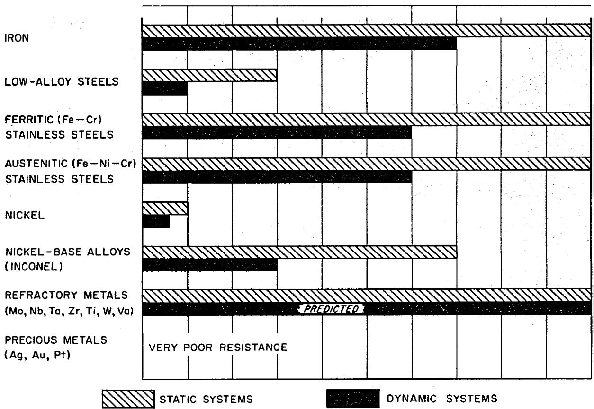  
Fig. 3.2.27. Corrosion Resistance of Various Metals and Alloys in Lithium. Bars indicate approximate temperatures below which a system might be operated for 1000 hr with less than 0.005 in. of attack or container surface removal. (Confidential with caption)

phases were located in the few open spaces between the particles of the major phase. The NiAl + 5% Ni specimens were the only ones in which porosity was found, and it was negligible in these.

For the NiAl-base intermetallic compounds the fused-salt attack was probably due to the aluminum. The attack began intergranularly and advanced into the grains. The differences in the extent of the fused salt attack on the NiAl-base intermetallic compounds was probably caused by differences in the accessibility of the NiAl to the fused salt. In the NiAl + 5% Ni specimen it was noted that the attack was most severe where the "oxide" phase was concentrated. It is assumed that oxide quickly

corroded away and allowed the fused salt to attack the intermetallic compound.

The severe attack in the case of the NiAl + 4% Zr specimen can probably be explained by the removal of both the common phase and the zirconium. These corrosion tests indicate that the NiAl compound in the NiAl-base intermetallic compound was attacked when it was exposed to NaF-ZrF $_4$ UF $_4$ (53.5-40-6.5 mole %) at $1500^{\circ}\mathrm{F}$ .

The poor corrosion resistance of these intermetallic compounds in the fused salt obviates further tests in this medium. However, the results of the sodium tests are encouraging enough to warrant more severe corrosion tests in sodium.

# 3.3. FABRICATION RESEARCH

J. H. Coobs

# NICKEL-MOLYBDENUM ALLOY DEVELOPMENT

H. Inouye T. K. Roche

The search was continued for a superior nickel-molybdenum-base alloy with the corrosion resistance of Hastelloy B and elevated-temperature strength at least equal to that of Hastelloy X. Seamless tubing has been fabricated from the various alloys under consideration to provide material for evaluation in thermal-convection loops. The extrusion techniques described previously have been successfully used to produce tube blanks of the variety of alloy compositions being studied.

The nickel-molybdenum-base-alloy tube blanks submitted to the Superior Tube Co. for redrawing responded satisfactorily, in general, with the several exceptions being notably the high-carbon-content compositions. The processing procedure used for the as-extruded, 1.5-in.-OD, 0.25-in.-wall tube blanks is to (1) condition the tube blanks by machining (resultant average weight loss, $50\%$ ); (2) reduce to 0.875-in. OD and 0.095-in. wall tubing; (3) anneal at $2050^{\circ}\mathrm{F}$ in a dry hydrogen atmosphere and water quench; (4) rod draw and sink to final size, with intermediate anneals; and (5) finish by sand blasting and rotary polishing. An average yield of $70\%$ is being obtained from the blanks after the initial conditioning operation. It has been found in the processing of these alloys that lighter cold reductions per pass must be taken than in the case of stainless steel or Inconel. A $20\%$ reduction in area per pass is considered to be optimum.

# Battelle Memorial Institute Alloys

Ten tube blanks of three different alloys were extruded and submitted to Superior Tube Co. for redrawing in order to assist Battelle Memorial Institute with nickel-molybdenum alloy development work under way there.1 The results of processing these extrusions to 0.500-in.-OD, 0.035-in.-wall tubing are presented in Table 3.3.1.

The response of these compositions to cold tube-forming techniques was only moderately successful. The difficulties encountered are illustrated in Fig. 3.3.1. Metallographic examination of the failure found in the tube blank of alloy B-2898 (20% Mo-1% Nb-2% Ti-0.80% Mn-0.12% C-bal Ni) revealed the stringering of second-phase particles (that is, carbides), as shown in Fig. 3.3.2, to be the probable source of the difficulty.

All attempts to produce seamless tubing of alloy B-2899 (20% Mo-1% Nb-0.80% Mn-0.20% C-bal Ni) failed. Two of the four extrusions of this alloy developed longitudinal cracks along their lengths, as shown in Fig. 3.3.1, while on the draw bench. The other extrusions, also shown in Fig. 3.3.1, failed during the initial tube-reducing operation. Examination of the cracks again revealed that stringering of the numerous precipitates was the source of failure.

The results indicate that carbon in amounts of $0.20\%$ or greater in the nickel-molybdenum alloys being investigated will make improbable the success of the tube-forming process and that $0.12\%$ carbon is marginal in this respect.

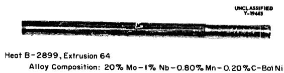

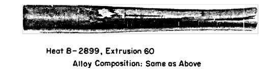

Fig. 3.3.1. Examples of Failures Which Occurred During Cold Reduction of Tube Blanks Fabricated from Battelle Memorial Institute Nickel-Molybdenum Alloys.   
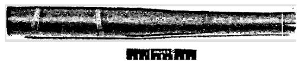  
Heat B-2898, Extrusion 107 Alloy Composition: $20\%$ Mo-1% Nb-2% Ti-0.80% Mn-0.12%C-Bal Ni

TABLE 3.3.1. RESULTS OF REDRAWING OF BATTELLE MEMORIAL INSTITUTE, INTERNATIONAL NICKEL COMPANY, AND ORNL SPECIAL NICKEL MOLYBDENUM ALLOYS TO 0.500-In.-OD, 0.035-In.-WALL TUBING   

<table><tr><td>Alloy No.</td><td>Nominal Composition (wt %)</td><td>Number of Extruded Tube Blanks</td><td>Total Length of Tubing Received</td><td>Yield* (%)</td><td>Number of Loops Being Fabricated**</td><td>Remarks</td></tr><tr><td colspan="7">Battelle Memorial Institute Alloys</td></tr><tr><td>B-2897</td><td>20 Mo-1 Nb-1 Ti-0.80 Mn-0.12 C-bal Ni</td><td>2</td><td>9 ft 2 in.</td><td>40</td><td>1</td><td></td></tr><tr><td>B-2898</td><td>20 Mo-1 Nb-2 Ti-0.80 Mn-0.12 C-bal Ni</td><td>4</td><td>19 ft 6 in.</td><td></td><td>2</td><td>One tube blank split on tube reducer</td></tr><tr><td>B-2899</td><td>20 Mo-1 Nb-0.80 Mn-0.20 C-bal Ni</td><td>4</td><td>0</td><td>0</td><td>0</td><td>Two tube blanks split on tube reducer; two split on draw bench</td></tr><tr><td colspan="7">International Nickel Company Alloys</td></tr><tr><td>T-23011</td><td>15 Mo-5 Cr-3 Nb-3 W-0.5 Al-0.02 C-bal Ni</td><td>2</td><td>11 ft 11 in.</td><td>43</td><td>1</td><td></td></tr><tr><td>T-23012</td><td>17 Mo-0.5 Al-0.02 C-bal Ni</td><td>1</td><td>12 ft</td><td>69</td><td>1</td><td></td></tr><tr><td>T-23013</td><td>15 Mo-3 Nb-3 W-0.5 Al-0.02 C-bal Ni</td><td>3</td><td>27 ft 6 in.</td><td>76</td><td>2</td><td></td></tr><tr><td>T-23014</td><td>15 Mo-1.5 Ti-1 Al-0.02 C-bal Ni</td><td>1</td><td>7 ft 4 in.</td><td>80</td><td>0</td><td>Both blanks failed on tube reducer</td></tr><tr><td colspan="7">ORNL Alloys</td></tr><tr><td>30-1</td><td>17 Mo-3 Cr-0.06 C-bal Ni</td><td>3</td><td>30 ft 10 in.</td><td>76</td><td>2</td><td></td></tr><tr><td>37A-1</td><td>20 Mo-3 Cr-0.02 C-bal Ni</td><td>1</td><td>8 ft 2 in.</td><td>69</td><td>1</td><td></td></tr><tr><td>30-2</td><td>17 Mo-5 Cr-0.06 C-bal Ni</td><td>3</td><td>36 ft 3 in.</td><td>81</td><td>3</td><td></td></tr><tr><td>43A-3</td><td>20 Mo-7 Cr-0.02 C-bal Ni</td><td>1</td><td>8 ft 4 in.</td><td>73</td><td>1</td><td></td></tr><tr><td>30-4</td><td>17 Mo-10 Cr-0.06 C-bal Ni</td><td>2</td><td>21 ft 6 in.</td><td>81</td><td>2</td><td></td></tr></table>

*Percentage yield of tubing from conditioned tube blank.   
**Approximately 10 ft of tubing is required to fabricate a thermal-convection loop.

The compositions of new alloys that have been received from Battelle Memorial Institute for evaluation are presented in Table 3.3.2. These alloys were received in the form of forged extrusion billets, swaged impact-tensile specimens, and rolled creep-rupture specimens. The impact

tensile specimens were sent to Rensselaer Polytechnic Institute for weldability studies, and the creep-rupture specimens will be tested at ORNL in the fuel mixture (No. 107) NaF-KF-LiF-UF $_4$ (11.2-41-45.3-2.5 mole %). Extrusion experiments were conducted at ORNL on two forged

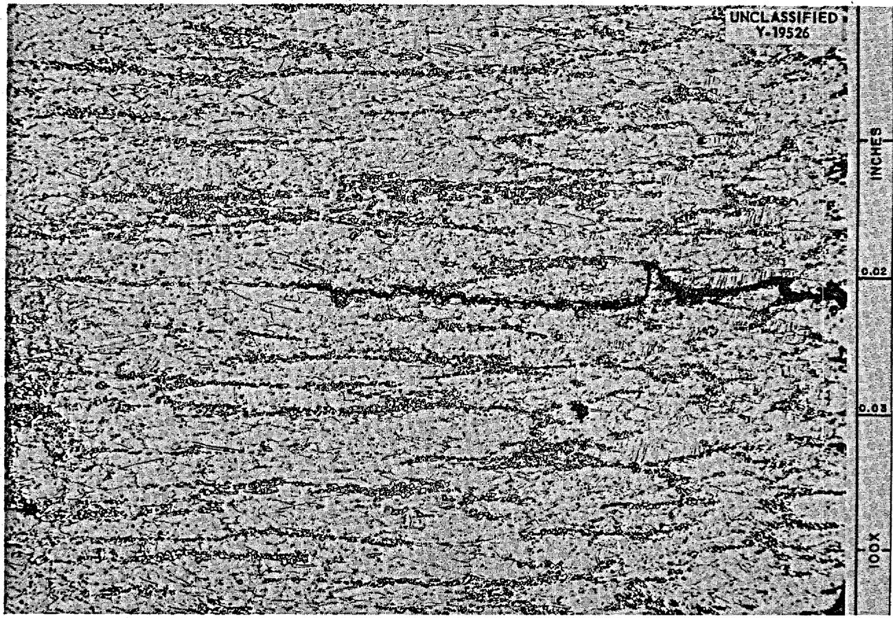  
Fig. 3.3.2. Longitudinal Section of Tube Blank of Alloy B-2898, Showing Crack Propagation Along Carbide Stringers That Occurred During Tube Reducing. Etched with chrome regia. 100X.

TABLE 3.3.2. COMPOSITION OF NEW ALLOYS RECEIVED FROM BATTELLE MEMORIAL INSTITUTE FOR EVALUATION   

<table><tr><td rowspan="2">Alloy No.</td><td colspan="8">Nominal Composition (wt %)</td></tr><tr><td>Mo</td><td>C</td><td>Mn</td><td>Al</td><td>Nb</td><td>Cr</td><td>Fe</td><td>Ni</td></tr><tr><td>B-3275</td><td>20</td><td>0.12</td><td>0.80</td><td></td><td></td><td>7</td><td></td><td>Bal</td></tr><tr><td>B-3276</td><td>20</td><td>0.12</td><td>0.80</td><td></td><td>2</td><td>7</td><td>1</td><td>Bal</td></tr><tr><td>B-3277</td><td>20</td><td>0.12</td><td>0.80</td><td>1</td><td>2</td><td>7</td><td>1</td><td>Bal</td></tr><tr><td>B-3278</td><td>20</td><td>0.12</td><td>0.80</td><td>2</td><td></td><td>7</td><td></td><td>Bal</td></tr></table>

billets of each composition to investigate the feasibility of producing seamless tubing of the alloys. The tube blanks were extruded at $2150^{\circ}\mathrm{F}$ at a ratio of 7:1. All compositions were fabricated successfully and sent to Superior Tube Co. for redrawing.

# International Nickel Company Alloys

Tube blanks which were fabricated from airmelted nickel-molybdenum base alloys supplied by the International Nickel Company have been returned by Superior Tube Co. after having been processed to 0.500-in.-OD, 0.035-in.-wall tubing. The results of the processing are given in Table 3.3.1.

For the most part the limited data indicate that these International Nickel Company alloys are amenable to tube-producing practice, with one exception. Alloy T-23015, which contained $0.25\%$ C, could not be successfully reduced to tubing.

Although the failures from these particular tube blanks were not examined metallographically, it is felt that carbide stringers, similar to those shown in Fig. 3.3.2, were again the cause of the difficulty. Thermal-convection loops are to be constructed from the various lengths of tubing received.

# ORNL Alloys

Extrusion experiments outlined previously for producing seamless tubing of ternary alloys containing nickel, 15 to $20\%$ molybdenum, and a third element were continued, with the intention of determining the amount of a particular strengthening element which can be tolerated without serious effect on the corrosion resistance of the base composition to fuel No. 107. The tube blanks which were fabricated during the quarter and submitted to Superior Tube Co. for redrawing are listed in Table 3.3.3. The extrusion of these

TABLE 3.3.3. ORNL ALLOYS EXTRUDED FOR TUBING FABRICATION AND CORROSION EVALUATION   

<table><tr><td>Alloy No.</td><td>Nominal Composition (wt %)</td><td>Number of Extruded Tube Blanks</td></tr><tr><td>30-6</td><td>17 Mo-0.06 C-7 Cr-bal Ni</td><td>2</td></tr><tr><td>30-7</td><td>17 Mo-0.06 C-2 Al-bal Ni</td><td>3</td></tr><tr><td>30-17</td><td>17 Mo-0.06 C-4 Al-bal Ni</td><td>2</td></tr><tr><td>30-8</td><td>17 Mo-0.06 C-2 Ti-bal Ni</td><td>3</td></tr><tr><td>30-18</td><td>17 Mo-0.06 C-4 Ti-bal Ni</td><td>3</td></tr><tr><td>30-9</td><td>17 Mo-0.06 C-2 W-bal Ni</td><td>3</td></tr><tr><td>30-19</td><td>17 Mo-0.06 C-4 W-bal Ni</td><td>3</td></tr><tr><td>30-10</td><td>17 Mo-0.06 C-2 V-bal Ni</td><td>3</td></tr><tr><td>30-20</td><td>17 Mo-0.06 C-4 V-bal Ni</td><td>3</td></tr><tr><td>30-11</td><td>17 Mo-0.06 C-4 Fe-bal Ni</td><td>3</td></tr><tr><td>30-12</td><td>17 Mo-0.06 C-3 Nb-bal Ni</td><td>3</td></tr><tr><td>30-21</td><td>17 Mo-0.06 C-5 Nb-bal Ni</td><td>*</td></tr><tr><td>30-13 (INOR-3)</td><td>16 Mo-1.5 Ti-1 Al-0.06 C-bal Ni</td><td>3</td></tr><tr><td>30-14 (INOR-4)</td><td>16 Mo-1.5 Ti-2 Al-0.06 C-bal Ni</td><td>3</td></tr><tr><td>30-15 (INOR-5)</td><td>15 Mo-2 Nb-2 W-0.06 C-bal Ni</td><td>*</td></tr><tr><td>30-16 (INOR-6)</td><td>16 Mo-5 Cr-1.5 Ti-1 Al-0.06 C-bal Ni</td><td>3</td></tr><tr><td>30-22 (INOR-7)</td><td>16 Mo-6 Cr-1 Nb-1 Al-0.08 C-bal Ni</td><td>*</td></tr></table>

*Extrusion not yet made.

alloys was carried out at $2150^{\circ}\mathrm{F}$ at a ratio of 7:1. The extrusion techniques described previously were used, and no difficulty was encountered with these ternary alloys, except the $79\%$ Ni-17% Mo-4% Al alloy, which offered relatively high resistance to plastic deformation. This is an indication of the potency of aluminum in increasing the elevated-temperature strength of the base composition.

In addition to the ternary alloys, 36-lb vacuum induction melts of the new alloys INOR-3, -4, and -6 were prepared and extruded to tube blanks. The compositions of these alloys and the results of the extrusions are given in Table 3.3.3. The purposes of this series of experiments were to determine the extrudability of these alloys and to gain a supply of tubing for corrosion testing. As indicated in Table 3.3.3, three billets of each alloy were successfully extruded. These extrusions were carried out at $2150^{\circ}\mathrm{F}$ at a ratio of 7:1.

The quantities of tubing obtained from extruded tube blanks previously submitted to Superior Tube Co. are listed in Table 3.3.1. In general the redrawing of the chromium-bearing alloys with intermediate carbon contents (0.06% or less) proved to be satisfactory. The percentage yields of 0.500-in.-OD, 0.035-in.-wall tubing from conditioned tube blanks, as well as the total length of tubing of each composition, are also shown in Table 3.3.1. This tubing is to be fabricated into thermal-convection loops for corrosion testing.

# Hastelloy W Seamless Tubing

Results of processing a tube blank of Hastelloy W, which was successfully extruded at ORNL, to 0.187-in.-OD, 0.025-in.-wall tubing indicate the feasibility of producing small-diameter seamless tubing of Hastelloy-type alloys for heat exchanger application. A yield of 25 ft of tubing was obtained from this extrusion. Longitudinal and transverse sections of the tube wall are shown in Fig. 3.3.3.

# Consumable-Electrode Experiments

Electrodes of nickel and four nickel-base alloys, $83\%$ Ni-17% Mo, 76% Ni-17% Mo-7% Cr, Hastelloy B, and Hastelloy W, which were submitted to Battelle Memorial Institute for consumable-electrode arc melting, have been melted and returned to ORNL for evaluation. Suitable test specimens will be fabricated from the ingots to determine

whether arc-melting is instrumental in improving the properties of these alloys.

# SHIELD PLUG FOR ART PUMPS

J.H.Coobs J.P.Page

# Gamma-Ray Shielding Material

The thermal conductivities of the six tungsten carbide-constantan specimens described in the previous report were determined, and the data are presented in Table 3.3.4.

A plot of these data as functions of the volume percentages of tungsten carbide, constantan, and pores is presented in Fig. 3.3.4. Examination of this graph shows the thermal conductivity of this system to be primarily a function of the tungsten carbide content, with only minor effects resulting from variations in porosity. These specimens bracket quite completely the composition range at a bulk density of $12.0\mathrm{g/cm^3}$ and indicate fairly conclusively that the specifications for the gamma-ray shielding material (density, $12.0\mathrm{g/cm^3}$ - minimum; conductivity, 0.10 cal/cm-sec- $\circ C$ maximum) cannot be met by the tungsten carbide-constantan material.

A search for a lower conductivity nickel-base alloy for use as a binder resulted in the selection of Hastelloy C. This alloy has a reported conductivity of 0.03 cal/cm-sec- $\mathbf{^o C}$ as compared to

TABLE 3.3.4. THERMAL CONDUCTIVITY OF EXPERIMENTAL COMPOSITES OF TUNGSTEN CARBIDE AND CONSTANTAN   

<table><tr><td rowspan="2">Density (g/cm3)</td><td colspan="2">Composition (wt %)</td><td rowspan="2">Thermal Conductivity (cal/cm·sec-1°C)</td></tr><tr><td>WC</td><td>Constantan</td></tr><tr><td>11.53</td><td>57</td><td>43</td><td>0.11</td></tr><tr><td>11.63</td><td>71</td><td>29</td><td>0.12</td></tr><tr><td>11.60</td><td>85</td><td>15</td><td>0.12</td></tr><tr><td>11.55</td><td>94</td><td>6</td><td>0.12</td></tr><tr><td>12.96</td><td>79</td><td>21</td><td>0.13</td></tr><tr><td>12.67</td><td>93</td><td>7</td><td>0.15</td></tr></table>

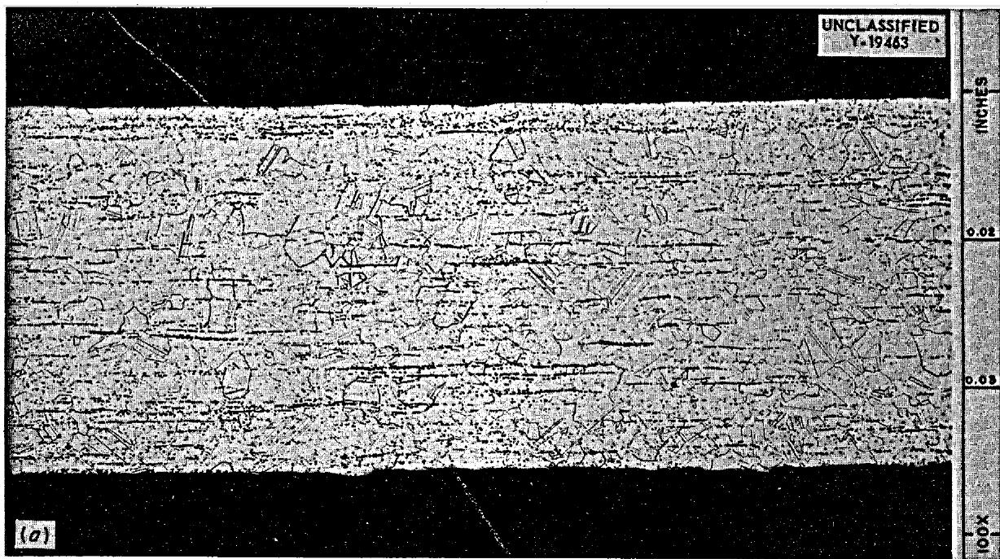

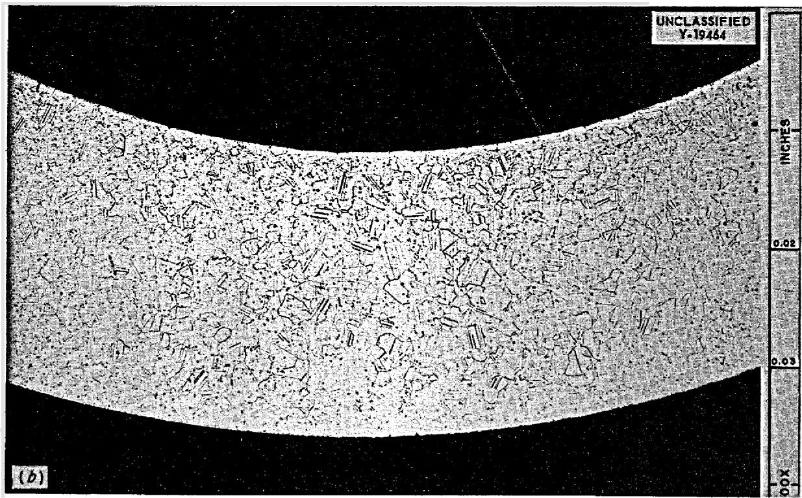  
Fig. 3.3.3. Longitudinal (a) and Transverse (b) Sections of 0.187-in.-OD, 0.025-in.-Wall Seamless Hastelloy W Tubing.

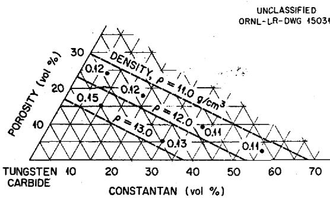  
Fig. 3.3.4. Thermal Conductivity (cal/cm·sec·°C) of Hot-Pressed Tungsten Carbide-Constantan Gamma-Ray Shielding Material as a Function of Composition and Porosity.

0.06 cal/cm·sec·°C for constantan. Also, pre-alloyed powder is commercially available at a reasonable price (approximately $5/lb).

Four tungsten carbide-Hastelloy C thermal conductivity specimens were hot pressed, machined, and tested. The results are shown in Table 3.3.5.

These data are plotted in Fig. 3.3.5, again as functions of the three composition parameters: tungsten carbide, Hastelloy C, and porosity. It is evident that the specifications for the gamma-ray shielding material are satisfactorily fulfilled by this material.

The 70 wt % tungsten carbide-30 wt % Hastelloy C specimen was considered to be the easiest to hot press and was tentatively chosen as the material for the ART shield plug. Two models of the shield plug have been hot pressed from this 70 wt % tungsten carbide material that have the following dimensions and density:

<table><tr><td></td><td>Model 1</td><td>Model 2</td></tr><tr><td>Inside diameter, in.</td><td>1.195</td><td>2.362</td></tr><tr><td>Outside diameter, in.</td><td>2.229</td><td>3.860</td></tr><tr><td>Height, in.</td><td>1.245</td><td>1.740</td></tr><tr><td>Density, g/cm3</td><td>11.90</td><td>12.45</td></tr></table>

These models are not true miniatures of the plugs, but they have the same ratio of wall-surface area to cross-sectional area as the shield plugs; this ratio is an important variable in the hot-pressing operation. Neither of these models was

TABLE 3.3.5. THERMAL CONDUCTIVITY OF EXPERIMENTAL COMPOSITES OF TUNGSTEN CARBIDE AND HASTELLOY C   

<table><tr><td rowspan="2">Density (g/cm3)</td><td colspan="2">Composition (wt %)</td><td rowspan="2">Thermal Conductivity (cal/cm·sec·°C)</td></tr><tr><td>WC</td><td>Hastelloy C</td></tr><tr><td>11.80</td><td>92</td><td>8</td><td>0.08</td></tr><tr><td>11.99</td><td>81</td><td>19</td><td>0.07</td></tr><tr><td>13.45</td><td>90</td><td>10</td><td>0.13</td></tr><tr><td>11.90</td><td>70</td><td>30</td><td>0.07</td></tr></table>

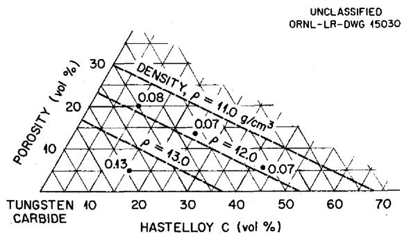  
Fig. 3.3.5. Thermal Conductivity (cal/cm·sec·°C) of Hot-Pressed Tungsten Carbide-Hastelloy C Gamma-Ray Shielding Material as a Function of Composition and Porosity.

difficult to press, although an alumina coating on the graphite die is required to prevent a graphite-nickel reaction at the pressing temperature. Unless severe temperature gradients are encountered in the larger die to be used for the ART plug, it should be possible to hot press the plug as one piece.

A secondary specification is that the material be readily brazed to Inconel. The 70 wt % tungsten carbide material satisfactorily meets this requirement. Copper readily wets the composite, and the coefficients of expansion of the composite and of Inconel appear to be similar. Several small test pieces and the two models have been successfully copper-brazed to Inconel plate.

# Thermal Shield

Three specimens of $\mathsf{ZrO}_2$ were fabricated at ORNL and sent to Battelle Memorial Institute for thermal conductivity determinations. Results for the first two specimens tested are presented in Table 3.3.6.

TABLE 3.3.6. THERMAL CONDUCTIVITY OF ${\mathrm{{ZrO}}}_{2}$ SPECIMENS   

<table><tr><td rowspan="2">Test Temperature (℃)</td><td colspan="2">Thermal Conductivity (cal/cm·sec-1°C)</td></tr><tr><td>Specimen with Density of 3.52 g/cm3</td><td>Specimen with Density of 3.08 g/cm3</td></tr><tr><td>20</td><td>0.00251</td><td>0.00163</td></tr><tr><td>100</td><td>0.00244</td><td>0.00158</td></tr><tr><td>200</td><td>0.00235</td><td>0.00153</td></tr><tr><td>300</td><td>0.00225</td><td>0.00146</td></tr><tr><td>400</td><td>0.00218</td><td>0.00141</td></tr><tr><td>500</td><td>0.00211</td><td>0.00134</td></tr><tr><td>600</td><td>0.00203</td><td>0.00129</td></tr><tr><td>700</td><td>0.00196</td><td>0.00122</td></tr><tr><td>800</td><td>0.00192</td><td>0.00115</td></tr></table>

# NEUTRON SHIELD MATERIAL FOR THE ART

J.H.Coobs

M. R. D'Amore

Ceramic B4C Tiles

The configuration of the neutron shield for the ART was described previously.4 The contract for fabrication of the ceramic $\mathsf{B}_4\mathsf{C}$ tiles for the ART was awarded to the Norton Company during the quarter. The tiles will be fabricated by hot-pressing high-purity $\mathsf{B}_4\mathsf{C}$ powder to a minimum guaranteed density of 1.7 g of boron per cubic centimeter.

# Clad Copper-B4C Cermets

The Allegheny Ludlum Steel Corp. is being considered as a potential supplier of the 0.100-in.-

thick type 430 stainless steel-clad copper-B₄C (6.6 wt % B₄C) neutron shield material. A plate of this material that was fabricated by Allegheny Ludlum Steel Corp. was evaluated. The plate was approximately $7\frac{3}{4} \times 23$ in. and 0.100 in. thick. The evaluation included examination of the surface finish, radiography, bend tests, tensile tests, thickness uniformity measurements, core density measurements, microstructure examinations, and investigation of the integrity of the clad-to-core bonding. No pinholes were evident in the 10-mil-thick cladding stripped from the core material, although the surface finish on the cladding was rough. No segregation of the B₄C or cracking of the core was observed, and the clad was well-bonded to the core material. The density of the copper-B₄C cernet, as measured by the water-displacement method, was 97.9% of theoretical. Small specimens that had been cut parallel and transverse to the rolling direction were bent to a radius of curvature of $9\frac{1}{6}$ and $27\frac{1}{32}$ in., respectively, before fracture occurred. The plate tapered along the length from a maximum thickness of 0.099 in. to a minimum thickness of 0.092 in. The dispersion of B₄C particles in the copper matrix was excellent. The room-temperature tensile strength data for the material are presented in Table 3.3.7.

The tensile specimens were punched out with a blanking die and were 5 in. long with a 2-in. gage length. The as-punched tensile specimen showed no elongation and failed at the yield point of the material. Specimen 4 was prepared by stripping the cladding from the copper-B $_4$ C core prior to punching the specimen.

# LITHIUM-MAGNESIUM ALLOYS

R. E. McDonald

Efforts to develop a $20\%$ Li-80% Mg alloy for shielding application were continued, with the possibility of roll cladding the alloy being investigated further. As reported earlier,6 2S aluminum forms a brittle intermetallic compound with the alloy, and, in an effort to overcome this difficulty, nickel foil was used as a diffusion barrier; some bonding resulted. Work will be continued with barrier materials during the next quarter.

TABLE 3.3.7. ROOM-TEMPERATURE STRENGTH OF TYPE 430 STAINLESS STEEL CLAD COPPER- $B_4$ C CERMETS  

<table><tr><td>Specimen No.</td><td>Orientation</td><td>Condition</td><td>Yield Strength at 0.2 % Offset (psi)</td><td>Tensile Strength (psi)</td><td>Elongation (% in 2 in.)</td></tr><tr><td>1</td><td>Transverse to rolling direction</td><td>As punched</td><td>24,500</td><td>24,500</td><td>0.0</td></tr><tr><td>2</td><td>Transverse to rolling direction</td><td>Annealed 20 min at 1650°F</td><td>20,000</td><td>31,200</td><td>5.6</td></tr><tr><td>3</td><td>Parallel to rolling direction</td><td>Annealed 20 min at 1650°F</td><td>19,000</td><td>34,000</td><td>7.5</td></tr><tr><td>4</td><td>Core material unclad; transverse to rolling direction</td><td>Annealed 20 min at 1650°F</td><td>15,100</td><td>21,400</td><td>3.5</td></tr></table>

Creep and stress-rupture data obtained for this lithium-magnesium alloy are reported in Chap. 3.5, "Mechanical Properties Studies." Further work is being done on the powder-metalurgy approach to the preparation of this shield material. Lithium orthosilicate is being tested as a substitute for lithium oxide, since it is less reactive in air and water and easier to handle. However, it has only one-half the lithium content of lithium oxide.

# TUBULAR CONTROL RODS

# M. R. D'Amore

The feasibility study of extrusion of tubular control rods, described previously,7 was continued. A simulated control rod billet consisting of a type 316 stainless steel can with a core composed of 34 vol $\%$ Al $_2$ O $_3$ (to simulate Lindsay oxide) in nickel powder was extruded at $2150^{\circ}$ F to a $1\frac{1}{2}$ -in.-OD, $3/4$ -in.-ID tube. The billet was designed to determine the feasibility of extruding thin (about 0.050-in.-thick) inner and outer cladding on control rod cores and of preparing cores by tamping the loose powder mixture into the billet cans.

Evaluation of the extruded tube showed that the cladding thickness was satisfactory. However, tamping of the loose powder does not appear to be

promising as a core-preparation method. Transverse sections of the extruded tube showed the core cross section to be fairly uniform, except in one area. The nonuniform area can be attributed to the sintering and concomitant shrinkage of the core during the preheating operation, which can cause longitudinal cracks in the core as a result of shrinkage around the inner cladding layer or the formation of void areas between the core and the outer cladding layer. The void areas can, in turn, cause buckling of the outer cladding layer during extrusion.

A Hastelloy X billet containing a hot-pressed core of 30 wt % Lindsay oxide-70 wt % nickel has been prepared for extrusion. Tensile specimens are being machined from plates of 30 wt % Lindsay oxide-70 wt % nickel cermet clad with Inconel, which were fabricated by hot rolling and using the picture-frame technique. The specimens will be used to investigate the effect of the Lindsay oxide particle size on the elevated-temperature tensile strength of the cermet. The oxide particle sizes being investigated are in the following ranges: 1 to 3 μ, 1 to 200 μ, and 52 to 200 μ.

As-received Lindsay oxide is a mixture of very fine particles that are about 1 to $3\mu$ in size. A 1-kg sample of the Lindsay oxide was converted into larger particles by pressing the as-received powder to a low-density compact and sintering at $2460^{\circ}\mathrm{F}$ in air. The sintered compacts were then

crushed and ground in a micropulverizer to attain the desired particle size.

Thermal conductivity data were obtained for a 30 wt % Lindsay oxide-70 wt % nickel specimen at temperatures between 165 and $554^{\circ}\mathrm{C}$ , and the results are shown in graph form in Fig. 3.3.6. The slopes and intercepts of the two lines were calculated from test results by using the least-squares method.

# SEAMLESS TUBULAR FUEL ELEMENTS

# M. R. D'Amore

Two three-ply blanks containing cores of 30 vol $\%$ Al $_2$ O $_3$ (to simulate UO $_2$ ) dispersed in type 302B stainless steel powder were redrawn from 1.0-in.-OD, 0.125-in.-wall tubing to 0.187-in.-OD, 0.015-in.-wall tubing at the Superior Tube Co. The inner and outer layers of the three-ply composites were type 316 stainless steel. The finished tubing and samples taken at various stages in the reduction schedule have been received and evaluated.

The first extruded tube, for which the core was prepared by hot pressing a mixture of -325 mesh particle size $\mathrm{Al}_{2}\mathrm{O}_{3}$ and stainless powder mixture, exhibited tensile fractures in the core after $30\%$ total reduction. The finished tubing had severe fractures in the core.

The second extruded tube blank was prepared by tamping the powder mixture $(-105 + 325$ mesh $\mathrm{Al}_{2}\mathrm{O}_{3}$ in type 302B stainless steel) into the

billet can. Examination of the redrawn tubing did not reveal any tensile fractures in the core. However, the relatively large particles of $\mathrm{Al}_{2}\mathrm{O}_{3}$ were fractured, and they tended to form stringers that finally resulted in longitudinal cracking of the core as the total reduction values increased. Radiographs of the finished tubing revealed the core fractures in tube No. 1 but did not show the longitudinal cracks in the core of tube No. 2.

It is evident from the examinations of the redrawn tubing that the core containing the larger $\mathrm{Al}_{2}\mathrm{O}_{3}$ particles was stronger than the core with the fine $\mathrm{Al}_{2}\mathrm{O}_{3}$ particle dispersion. Tamping of a loose powder mixture into a billet can therefore appears to be a satisfactory method of preparing cores of 30 vol % $\mathrm{Al}_{2}\mathrm{O}_{3}$ dispersed in 70 vol % of type 302B stainless steel.

The study of flow patterns in three-ply extruded tubes containing cermet cores was continued with the extrusion of two three-ply billets to $1\frac{1}{4}$ -in.-OD, $3\frac{1}{4}$ -in.-ID tubes at $2150^{\circ}\mathrm{F}$ . The billet can material was type 316 stainless steel, and the cores were fabricated by hot pressing a powder mixture of type 304 stainless steel and 30 vol $\%$ Al $_2$ O $_3$ . A 29-deg taper was machined into the ends of the core of one billet in an effort to eliminate end defects in the extruded tube and thus to improve material recovery. This taper resulted in a slight reduction in the length of the defect.

The second billet contained a core made in three sections to determine whether nonuniform areas

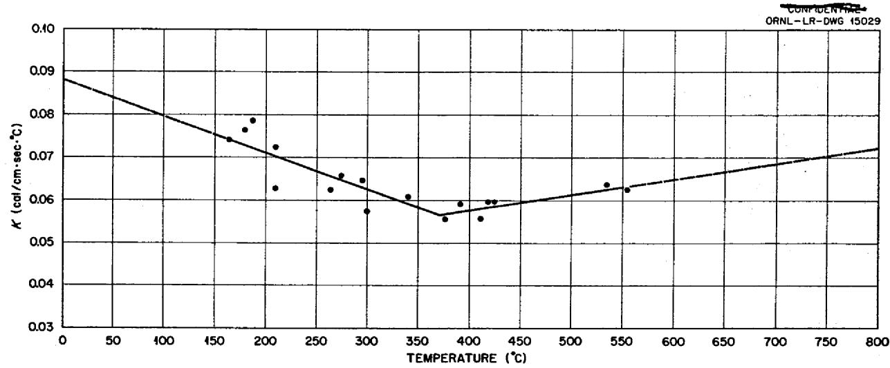  
Fig. 3.3.6. Thermal Conductivity of a $70\%$ Nickel- $30\%$ Lindsay Oxide Specimen.

would appear at the interfaces between core sections. The extruded tube is being sectioned for examination,

# NIOBIUM FABRICATION STUDIES

H. Inouye V. M. Kolba

J.P.Page

# Evaluation of Arc-Melted Niobium

The physical and mechanical properties of arc-melted niobium are being investigated in order to compare this material with niobium prepared by conventional powder-metallurgy techniques. Macro-etching of a section of an arc-melted, cast, and cold-worked ingot has revealed the large-grained, severely distorted structure that is usually obtained through such a fabrication process. An attempt to cold roll a section of as-received $\frac{1}{2}$ -in. plate was terminated after two $3\%$ passes when some end cracking was noticed.

The cracked ends were cut off, and the remaining material was annealed 1 hr at $1100^{\circ}\mathrm{C}$ at a vacuum of $2 \times 10^{-5} \mathrm{~mmHg}$ . This 0.485-in.-thick section was then successfully cold rolled to 10-mil strip, a reduction in thickness of about $98\%$ . The hardness increased rapidly from 160 VHN (2.5-kg load) to 190 VHN in the first few passes, and then it increased very slowly to 206 at $98\%$ reduction in thickness. Samples were taken at several stages in the reduction, split into thirds, and annealed for $1/2$ hr at 850, 1050, and $1150^{\circ}\mathrm{C}$ in high vacuum. These samples will be examined metallographically to determine the amount of reduction necessary to produce fine-grained material after annealing.

# $\mathsf{Nb - UO}_2$ Compacts

Two batches of niobium powder made from wrought sheet were analyzed and were found to be

somewhat contaminated. The analytical results are presented in Table 3.3.8. The Nb-3-C batch was chosen to make five 70 wt % Nb-30 wt % $\mathsf{UO}_2$ compacts for sintering and reaction studies. The $\mathsf{UO}_2$ used had previously been high-fired in a hydrogen atmosphere. The compacts were $82\%$ dense, as compacted, and had good "green" strength. These compacts are being sent to GE-ANPD for sintering at $2000^{\circ}\mathrm{C}$ . Attempts to secure high-purity powder from commercial sources have been unsuccessful.

# Nb-U Alloys

A finger melt of an $80\%$ Nb-20% U alloy was made. Segregation noted in the initial casting was reduced by subsequent remelting. The hardness of the as-cast sample was $\mathsf{R}_{\mathsf{B}}$ 86. Attempts to cold roll the as-cast material proved to be unsuccessful. A sample of the alloy was then encapsulated and hot rolled successfully at $1050^{\circ}\mathrm{C}$ to a reduction of $85\%$ . Metallographic examination of the hot-rolled structure revealed that the as-cast structure had not been broken up during the rolling process. The as-rolled hardness was $\mathsf{R}_{\mathsf{B}}$ 95.

Vacuum-annealing tests are being conducted on the hot-rolled alloy at 1100, 1200, and $1300^{\circ}\mathrm{C}$ to determine the recrystallization temperature of the alloy. Further rolling studies will then be made.

# FABRICATION OF HYDRIDES

# R.E.McDonald

A survey of available literature on the fabrication of hydrides has been completed, and a hydriding furnace and purification system is being built (see Chap. 3.6, "Ceramic Research"). Yttrium and zirconium and their alloys will be hydrided and fabricated, and the compatibility of various barrier materials will be studied.

TABLE 3.3.8. IMPURITIES FOUND BY ANALYSES OF TWO SAMPLES OF NIOBIUM POWDER   

<table><tr><td rowspan="2">Sample</td><td colspan="4">Impurities (wt %)</td><td rowspan="2">Hardness (VHN)</td></tr><tr><td>C</td><td>O2</td><td>N2</td><td>H2</td></tr><tr><td>Nb-2-C</td><td>0.042</td><td>0.29</td><td>0.018</td><td>8.2 × 10-4</td><td>292</td></tr><tr><td>Nb-3-C</td><td>0.103</td><td>0.18</td><td>0.019</td><td>5.8 × 10-4</td><td>179</td></tr></table>

# 3.4. WELDING AND BRAZING INVESTIGATIONS

P. Patriarca

# FABRICATION OF PRIMARY NaK PUMP VOLUTES

P. Patriarca E.J.Wilson

Preliminary experiments designed to determine the approximate weld shrinkage to be expected in the fabrication of primary NaK pump volutes were conducted, and the results were reported.1 (The primary NaK pumps are the pumps for circulating NaK in the ART fuel-to-NaK heat exchange system.) The information obtained from these tests has now been used to successfully fabricate three Inconel volutes, one by the metallic-arc welding procedure and two by inert-arc welding procedures.

The shrinkage of volute No. 1, fabricated by using the metallic-arc (coated-electrode) welding procedure, compared favorably with that of simulated test components. However, radiographic inspection of the weld revealed porosity to an unacceptable degree. The exclusive use of inert-arc welding was therefore specified for the joining of future volute halves in order to ensure acceptable quality.

It was recognized that the magnitude of the weld shrinkage would differ significantly for the two welding processes, and, since the existing data were not adequate for predicting the dimensional changes, an additional shrinkage test was conducted. Two test pieces were machined from 2-in. Inconel plate, as described previously, and welded in accordance with the procedure described in Fig. 3.4.1. Micrometer measurements were made at four radial sections, as described in Fig. 3.4.2, prior to and after each subsequent operation. The completed test piece is shown in Fig. 3.4.3. The results of the micrometer measurements are summarized in Table 3.4.1.

These data provided a first approximation of the shrinkage to be expected when welding of volute No. 2 was undertaken. A 0.125-in. shrinkage allowance was incorporated into the joint design and, after machining, the volute halves were scribed as shown in Fig. 3.4.4. Micrometer

UNCLASSIFIED

ORNL-LR-DWG 16167

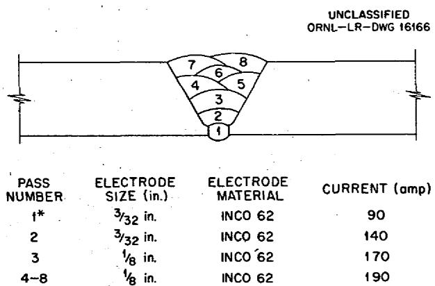  
*ROOT PASS: 6 TACKS, EACH APPROSIMATELY 2 in. IN LENGTH, FOLLOWED BY TIE-INS BETWEEN TACKS.

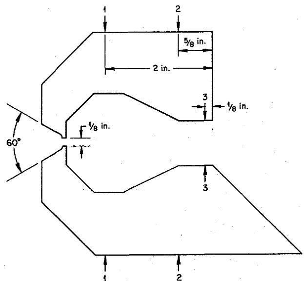  
Fig. 3.4.1. Procedure and Joint Design for the Inert-Arc Welding of Primary NaK Pump Volute Weld Shrinkage Test Pieces (No. 1). Test pieces rotated in horizontal position.   
Fig. 3.4.2. Details of Micrometer Measurements on Welded Primary NaK Pump Volute Weld Shrinkage Test Pieces. Measurements made at four radial sections (A through D) at 90-deg intervals at positions 1, 2, and 3 (see Table 3.4.1).

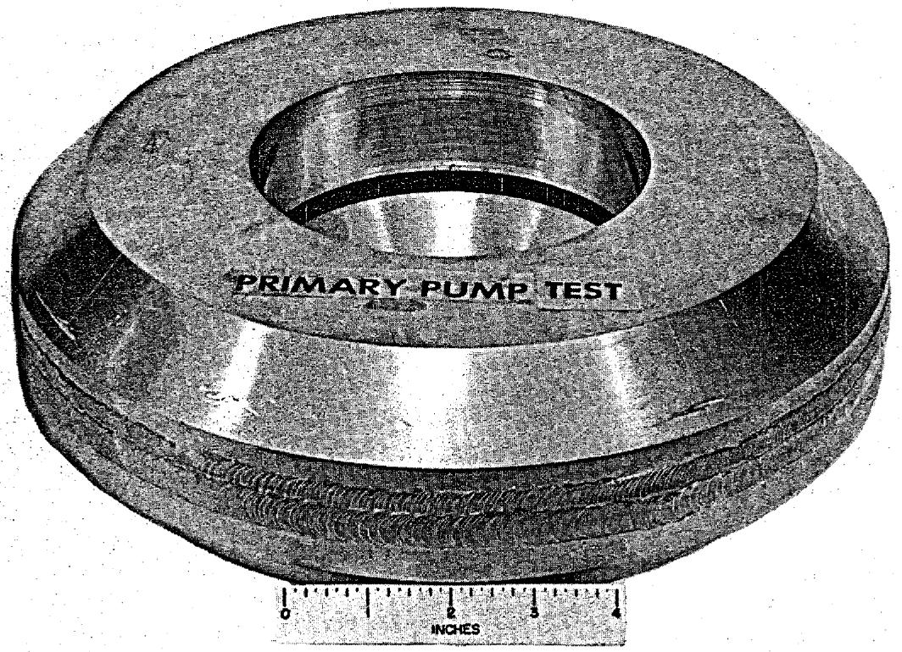  
UNCLASSIFIED PHOTO 17788  
Fig. 3.4.3. Completed Inert-Arc-Welded Primary NaK Pump Volute Weld Shrinkage Test Piece.

measurements were made before and after each operation at each intersection shown.

The volute halves are shown assembled for welding in Fig. 3.4.5. The welding procedure used was essentially the same as that shown in Fig. 3.4.1, that is, eight passes in the downhand position, except that as many as six additional passes were required to complete the weld at the volute exit where the section was about 1 in. thick. The completed volute is shown in Fig. 3.4.6.

The results of the micrometer measurements are summarized in Table 3.4.2. It may be noted that the shrinkage was somewhat less than that desired. The volute entrance dimension is considered to be the most critical dimension in the pump, and, after an analysis of the data, a shrinkage al

lowance of 0.115 in, was selected for incorporation into the joint design of volute No. 3.

The volute halves for volute No. 3 were machined, assembled, welded, and annealed, with the welding procedure again being similar to that given on Fig. 3.4.1. Micrometer measurements were made before and after each important operation, and the data are summarized in Table 3.4.3. It may be noted that adjusting the shrinkage allowance to 0.115 in. achieved a close approach to the dimensional requirements of the volute entrance. A further refinement is planned for volute No. 4 in that a shrinkage allowance of 0.110 in. will be incorporated into the joint design. Any shrinkage of the volute entrance to less than 0.650 in. will be prevented by the use of Inconel spacers where needed.

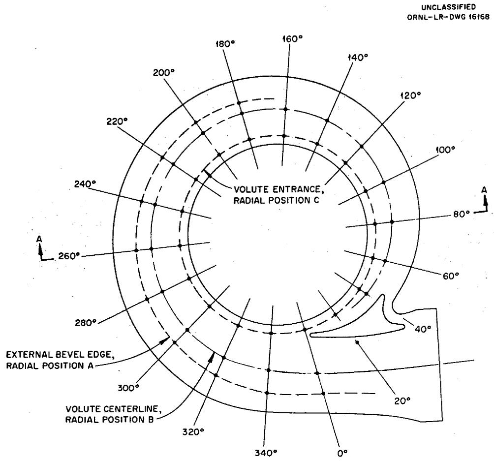

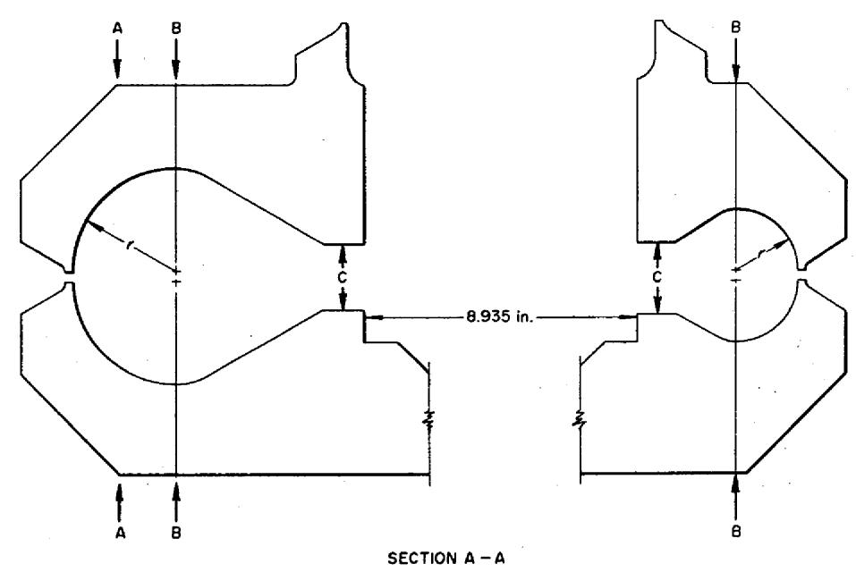  
Fig. 3.4.4. Details of Micrometer Measurement on Volute No. 2.

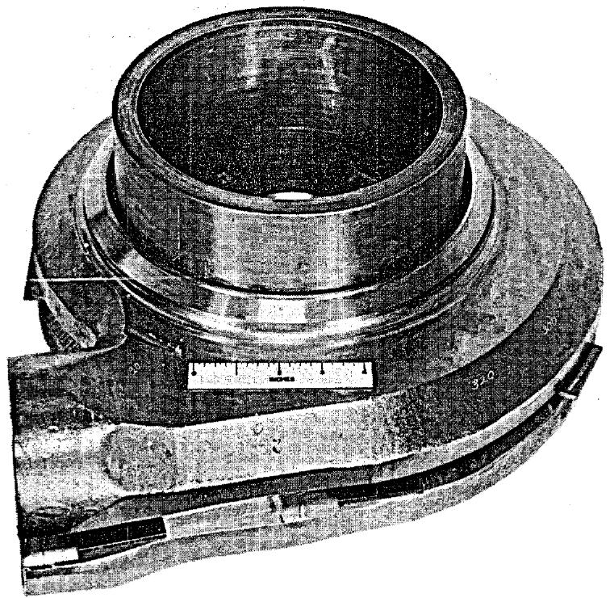  
UNCLASSIFIED PHOTO 17583  
Fig. 3.4.5. Volute No. 2 Assembled for Welding.

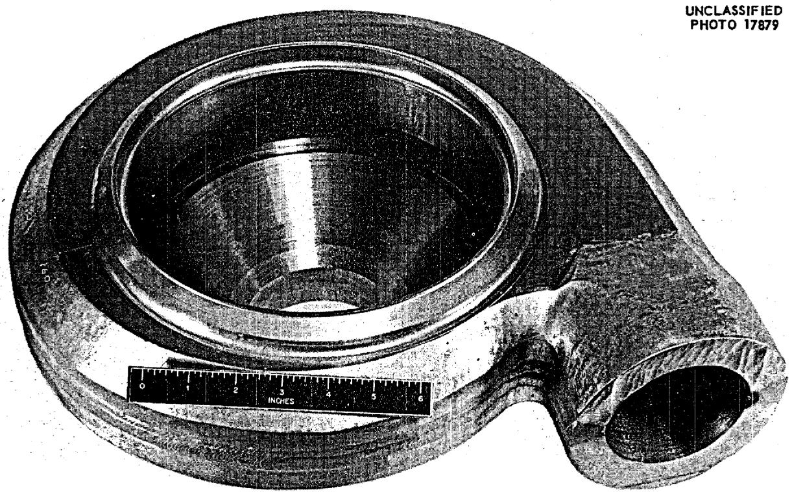  
Fig. 3.4.6. Volute No. 2 After Inert-Arc Welding and Annealing.

TABLE 3.4.1. INERT-ARC WELDED PRIMARY NoK PUMP VOLUTE WELD SHRINKAGE DATA FOR TEST NO. 1   

<table><tr><td rowspan="2">Position</td><td colspan="5">Dimensions (in.)</td></tr><tr><td>Before Welding</td><td>After Welding</td><td>Change</td><td>After Annealing**</td><td>Net Change</td></tr><tr><td>A 1*</td><td>0.366</td><td>0.244</td><td>0.122</td><td>0.240</td><td>0.126</td></tr><tr><td>B 1</td><td>0.382</td><td>0.254</td><td>0.128</td><td>0.248</td><td>0.134</td></tr><tr><td>C 1</td><td>0.388</td><td>0.264</td><td>0.124</td><td>0.259</td><td>0.129</td></tr><tr><td>D 1</td><td>0.378</td><td>0.249</td><td>0.129</td><td>0.244</td><td>0.133</td></tr><tr><td>A 2*</td><td>0.377</td><td>0.259</td><td>0.118</td><td>0.254</td><td>0.122</td></tr><tr><td>B 2</td><td>0.381</td><td>0.260</td><td>0.121</td><td>0.254</td><td>0.127</td></tr><tr><td>C 2</td><td>0.388</td><td>0.268</td><td>0.120</td><td>0.264</td><td>0.124</td></tr><tr><td>D 2</td><td>0.384</td><td>0.263</td><td>0.121</td><td>0.257</td><td>0.127</td></tr><tr><td>A 3</td><td>0.468</td><td>0.349</td><td>0.119</td><td>0.346</td><td>0.122</td></tr><tr><td>B 3</td><td>0.469</td><td>0.348</td><td>0.121</td><td>0.343</td><td>0.126</td></tr><tr><td>C 3</td><td>0.469</td><td>0.349</td><td>0.120</td><td>0.345</td><td>0.124</td></tr><tr><td>D 3</td><td>0.469</td><td>0.348</td><td>0.121</td><td>0.344</td><td>0.125</td></tr></table>

*Add 3.317-in. micrometer correction to readings shown at positions 1 and 2.   
**Annealed at $1950^{\circ}\mathrm{F}$ for 2 hr and furnace cooled at a rate of $500^{\circ}\mathrm{F/hr}$ .

TABLE 3.4.2. RESULTS OF MICROMETER MEASUREMENTS OF WELDED VOLUME NO. 2   

<table><tr><td rowspan="2">Angular Position (deg)</td><td colspan="5">Dimensions (in.)</td></tr><tr><td>Before Welding</td><td>After Welding</td><td>After Annealinga</td><td>Total Shrinkage</td><td>Deviationb</td></tr><tr><td colspan="6">At Radial Position Ac</td></tr><tr><td>0</td><td>0.754</td><td>0.646</td><td>0.648</td><td>0.106</td><td>-0.019</td></tr><tr><td>200</td><td>0.765</td><td>0.649</td><td>0.647</td><td>0.118</td><td>-0.007</td></tr><tr><td>220</td><td>0.771</td><td>0.655</td><td>0.652</td><td>0.119</td><td>-0.006</td></tr><tr><td>240</td><td>0.758</td><td>0.641</td><td>0.639</td><td>0.119</td><td>-0.006</td></tr><tr><td>260</td><td>0.763</td><td>0.642</td><td>0.641</td><td>0.122</td><td>-0.003</td></tr><tr><td>280</td><td>0.763</td><td>0.639</td><td>0.639</td><td>0.124</td><td>-0.001</td></tr><tr><td>300</td><td>0.777</td><td>0.654</td><td>0.654</td><td>0.123</td><td>-0.002</td></tr><tr><td>320</td><td>0.778</td><td>0.653</td><td>0.654</td><td>0.124</td><td>-0.001</td></tr><tr><td>340</td><td>0.773</td><td>0.644</td><td>0.647</td><td>0.126</td><td>+0.001</td></tr><tr><td colspan="6">At Radial Position Bc</td></tr><tr><td>0</td><td>0.804</td><td>0.690</td><td>0.689</td><td>0.115</td><td>-0.010</td></tr><tr><td>20</td><td>0.771</td><td>0.665</td><td>0.665</td><td>0.106</td><td>-0.019</td></tr><tr><td>40</td><td>0.802</td><td>0.696</td><td>0.694</td><td>0.108</td><td>-0.017</td></tr><tr><td>60</td><td>0.787</td><td>0.675</td><td>0.674</td><td>0.113</td><td>-0.012</td></tr><tr><td>80</td><td>0.778</td><td>0.664</td><td>0.662</td><td>0.016</td><td>-0.009</td></tr><tr><td>100</td><td>0.774</td><td>0.659</td><td>0.656</td><td>0.118</td><td>-0.007</td></tr><tr><td>120</td><td>0.771</td><td>0.655</td><td>0.653</td><td>0.118</td><td>-0.007</td></tr><tr><td>140</td><td>0.779</td><td>0.664</td><td>0.661</td><td>0.118</td><td>-0.007</td></tr><tr><td>160</td><td>0.773</td><td>0.656</td><td>0.654</td><td>0.119</td><td>-0.006</td></tr><tr><td>180</td><td>0.766</td><td>0.650</td><td>0.649</td><td>0.117</td><td>-0.008</td></tr><tr><td>200</td><td>0.779</td><td>0.665</td><td>0.663</td><td>0.116</td><td>-0.009</td></tr><tr><td>220</td><td>0.777</td><td>0.668</td><td>0.663</td><td>0.111</td><td>-0.014</td></tr><tr><td>240</td><td>0.764</td><td>0.649</td><td>0.648</td><td>0.116</td><td>-0.009</td></tr><tr><td>260</td><td>0.771</td><td>0.654</td><td>0.652</td><td>0.119</td><td>-0.006</td></tr><tr><td>280</td><td>0.776</td><td>0.659</td><td>0.657</td><td>0.119</td><td>-0.006</td></tr><tr><td>300</td><td>0.780</td><td>0.664</td><td>0.663</td><td>0.117</td><td>-0.008</td></tr><tr><td>320</td><td>0.784</td><td>0.668</td><td>0.667</td><td>0.117</td><td>-0.008</td></tr><tr><td>340</td><td>0.794</td><td>0.674</td><td>0.673</td><td>0.121</td><td>-0.004</td></tr><tr><td colspan="6">At Radial Position Cd</td></tr><tr><td>0</td><td>0.780</td><td>0.675</td><td>0.674</td><td>0.106</td><td>+0.014</td></tr><tr><td>20</td><td>0.781</td><td>0.678</td><td>0.677</td><td>0.104</td><td>+0.017</td></tr><tr><td>40</td><td>0.784</td><td>0.681</td><td>0.680</td><td>0.104</td><td>+0.020</td></tr><tr><td>60</td><td>0.785</td><td>0.679</td><td>0.674</td><td>0.111</td><td>+0.014</td></tr><tr><td>80</td><td>0.785</td><td>0.678</td><td>0.679</td><td>0.106</td><td>+0.019</td></tr><tr><td>100</td><td>0.784</td><td>0.675</td><td>0.675</td><td>0.109</td><td>+0.015</td></tr><tr><td>120</td><td>0.783</td><td>0.674</td><td>0.674</td><td>0.109</td><td>+0.014</td></tr><tr><td>140</td><td>0.781</td><td>0.673</td><td>0.673</td><td>0.108</td><td>+0.013</td></tr><tr><td>160</td><td>0.780</td><td>0.673</td><td>0.672</td><td>0.108</td><td>+0.012</td></tr><tr><td>180</td><td>0.781</td><td>0.673</td><td>0.673</td><td>0.108</td><td>+0.013</td></tr><tr><td>200</td><td>0.781</td><td>0.675</td><td>0.673</td><td>0.108</td><td>+0.013</td></tr><tr><td>220</td><td>0.782</td><td>0.676</td><td>0.674</td><td>0.108</td><td>+0.014</td></tr><tr><td>240</td><td>0.782</td><td>0.676</td><td>0.674</td><td>0.108</td><td>+0.014</td></tr><tr><td colspan="6">At Radial Position Cd</td></tr><tr><td>260</td><td>0.782</td><td>0.675</td><td>0.674</td><td>0.108</td><td>+0.014</td></tr><tr><td>280</td><td>0.782</td><td>0.674</td><td>0.674</td><td>0.108</td><td>+0.014</td></tr><tr><td>300</td><td>0.782</td><td>0.674</td><td>0.673</td><td>0.109</td><td>+0.013</td></tr><tr><td>320</td><td>0.781</td><td>0.673</td><td>0.673</td><td>0.108</td><td>+0.013</td></tr><tr><td>340</td><td>0.781</td><td>0.673</td><td>0.674</td><td>0.107</td><td>+0.014</td></tr></table>

${}^{a}$ Annealed at ${1950}^{ \circ  }\mathrm{F}$ for $2\mathrm{{hr}}$ and furnace cooled at a rate of ${500}^{ \circ  }\mathrm{F}/\mathrm{{hr}}$ ,   
bAt radial positions A and B the deviation is given as the deviation from the ideal change of 0.125 in. At radial position C the deviation is given as the deviation from the desired dimension of $0.660\pm 0.010$ in.   
cAdd 3.317-in. micrometer correction to readings shown.   
$d$ Dimensions shown are absolute micrometer measurements.

TABLE 3.4.3. RESULTS OF MICROMETER MEASUREMENTS OF WELDED VOLTUE NO. 3   

<table><tr><td rowspan="2">Angular Position (deg)</td><td colspan="5">Dimensions (in.)</td></tr><tr><td>Before Welding</td><td>After Welding</td><td>After Annealinga</td><td>Total Shrinkage</td><td>Deviationb</td></tr><tr><td colspan="6">At Radial Position Ac</td></tr><tr><td>0</td><td>0.741</td><td>0.597</td><td>0.597</td><td>0.144</td><td>+0.029</td></tr><tr><td>180</td><td>0.723</td><td>0.604</td><td>0.602</td><td>0.121</td><td>+0.006</td></tr><tr><td>200</td><td>0.723</td><td>0.604</td><td>0.601</td><td>0.122</td><td>+0.007</td></tr><tr><td>220</td><td>0.719</td><td>0.598</td><td>0.596</td><td>0.123</td><td>+0.008</td></tr><tr><td>240</td><td>0.716</td><td>0.593</td><td>0.593</td><td>0.123</td><td>+0.008</td></tr><tr><td>260</td><td>0.719</td><td>0.594</td><td>0.593</td><td>0.126</td><td>+0.011</td></tr><tr><td>280</td><td>0.725</td><td>0.597</td><td>0.596</td><td>0.129</td><td>+0.014</td></tr><tr><td>300</td><td>0.737</td><td>0.604</td><td>0.606</td><td>0.131</td><td>+0.016</td></tr><tr><td>320</td><td>0.730</td><td>0.594</td><td>0.599</td><td>0.131</td><td>+0.016</td></tr><tr><td>340</td><td>0.733</td><td>0.594</td><td>0.596</td><td>0.137</td><td>+0.022</td></tr><tr><td colspan="6">At Radial Position Bc</td></tr><tr><td>0</td><td>0.741</td><td>0.616</td><td>0.608</td><td>0.133</td><td>+0.018</td></tr><tr><td>20</td><td>0.755</td><td>0.651</td><td>0.645</td><td>0.110</td><td>-0.005</td></tr><tr><td>40</td><td>0.780</td><td>0.678</td><td>0.673</td><td>0.107</td><td>-0.008</td></tr><tr><td>60</td><td>0.770</td><td>0.666</td><td>0.662</td><td>0.108</td><td>-0.007</td></tr><tr><td>80</td><td>0.738</td><td>0.629</td><td>0.625</td><td>0.113</td><td>-0.002</td></tr><tr><td colspan="6">At Radial Position Bc</td></tr><tr><td>100</td><td>0.738</td><td>0.626</td><td>0.624</td><td>0.114</td><td>-0.001</td></tr><tr><td>120</td><td>0.734</td><td>0.619</td><td>0.618</td><td>0.116</td><td>+0.001</td></tr><tr><td>140</td><td>0.728</td><td>0.614</td><td>0.610</td><td>0.118</td><td>+0.003</td></tr><tr><td>160</td><td>0.728</td><td>0.611</td><td>0.610</td><td>0.118</td><td>+0.003</td></tr><tr><td>180</td><td>0.728</td><td>0.610</td><td>0.609</td><td>0.119</td><td>+0.004</td></tr><tr><td>200</td><td>0.723</td><td>0.606</td><td>0.603</td><td>0.123</td><td>+0.008</td></tr><tr><td>220</td><td>0.725</td><td>0.608</td><td>0.605</td><td>0.125</td><td>+0.010</td></tr><tr><td>240</td><td>0.728</td><td>0.609</td><td>0.606</td><td>0.128</td><td>+0.013</td></tr><tr><td>260</td><td>0.728</td><td>0.608</td><td>0.606</td><td>0.128</td><td>+0.013</td></tr><tr><td>280</td><td>0.733</td><td>0.609</td><td>0.606</td><td>0.127</td><td>+0.012</td></tr><tr><td>300</td><td>0.735</td><td>0.609</td><td>0.607</td><td>0.128</td><td>+0.013</td></tr><tr><td>320</td><td>0.735</td><td>0.607</td><td>0.603</td><td>0.132</td><td>+0.017</td></tr><tr><td>340</td><td>0.735</td><td>0.606</td><td>0.603</td><td>0.132</td><td>+0.017</td></tr><tr><td colspan="6">At Radial Position Cd</td></tr><tr><td>0</td><td>0.773</td><td>0.663</td><td>0.656</td><td>0.117</td><td>-0.004</td></tr><tr><td>20</td><td>0.774</td><td>0.670</td><td>0.662</td><td>0.112</td><td>+0.002</td></tr><tr><td>40</td><td>0.775</td><td>0.673</td><td>0.669</td><td>0.112</td><td>+0.002</td></tr><tr><td>60</td><td>0.775</td><td>0.672</td><td>0.671</td><td>0.104</td><td>+0.009</td></tr><tr><td>80</td><td>0.775</td><td>0.671</td><td>0.671</td><td>0.104</td><td>+0.011</td></tr><tr><td>100</td><td>0.774</td><td>0.668</td><td>0.668</td><td>0.106</td><td>+0.008</td></tr><tr><td>120</td><td>0.774</td><td>0.666</td><td>0.666</td><td>0.108</td><td>+0.006</td></tr><tr><td>140</td><td>0.774</td><td>0.665</td><td>0.665</td><td>0.109</td><td>+0.005</td></tr><tr><td>160</td><td>0.774</td><td>0.665</td><td>0.665</td><td>0.109</td><td>+0.005</td></tr><tr><td>180</td><td>0.774</td><td>0.665</td><td>0.663</td><td>0.111</td><td>+0.003</td></tr><tr><td>200</td><td>0.774</td><td>0.665</td><td>0.663</td><td>0.111</td><td>+0.003</td></tr><tr><td>220</td><td>0.774</td><td>0.665</td><td>0.662</td><td>0.112</td><td>+0.002</td></tr><tr><td>240</td><td>0.774</td><td>0.665</td><td>0.661</td><td>0.113</td><td>+0.001</td></tr><tr><td>260</td><td>0.774</td><td>0.664</td><td>0.659</td><td>0.115</td><td>-0.001</td></tr><tr><td>280</td><td>0.774</td><td>0.663</td><td>0.658</td><td>0.116</td><td>-0.002</td></tr><tr><td colspan="6">At Radial Position Cd</td></tr><tr><td>300</td><td>0.773</td><td>0.660</td><td>0.654</td><td>0.119</td><td>-0.006</td></tr><tr><td>320</td><td>0.773</td><td>0.659</td><td>0.653</td><td>0.120</td><td>-0.007</td></tr><tr><td>340</td><td>0.773</td><td>0.660</td><td>0.653</td><td>0.120</td><td>-0.007</td></tr></table>

${}^{a}$ Annealed at ${1950}^{ \circ  }\mathrm{F}$ for $2\mathrm{{hr}}$ and furnace cooled at a rate of ${500}^{ \circ  }\mathrm{F}/\mathrm{{hr}}$ .   
bAt radial positions A and B the deviation is given as the deviation from the ideal change of 0.115 in. At radial position C the deviation is given as the deviation from the desired dimension of $0.660\pm 0.010$ in.   
$c_{\text{Add 3.317-in, micrometer correction to readings shown}}$   
$d^{k}$ Dimensions shown are absolute micrometer measurements,

# FABRICATION OF PRIMARY NaK PUMP IMPELLERS

P. Patriarca

G. M. Slaughter

Four primary NaK pump impellers have been fabricated by furnace brazing with Coast Metals brazing alloy No. 52. Since slow heating and cooling rates are required to minimize distortion and braze cracking, each impeller brazing cycle entails a furnace time of 10 to 12 hr. As can be seen in Fig. 3.4.7, which shows a typical impeller, the vanes were inert-arc-welded to the housing, where accessibility permitted, to achieve additional reinforcement.

# SHRINKAGE OF INCONEL CORE SHELL WELDS

P. Patriarca

A. E. Goldman

Preliminary transverse weld shrinkage tests of Inconel core shell welds were discussed in the previous report. Further experiments have now been conducted to study the shrinkage for other thicknesses of plate. The procedure for the shrinkage tests of welds of $\frac{1}{6}$ -in.-thick plates is described below, and the results are compared with the results obtained for other thicknesses of Inconel plate.

The initial phase of the test consisted of the inert-arc welding of two $\frac{1}{8}$ -in. Inconel sheets, each $6 \times 20$ in. A 50-deg bevel with a $\frac{1}{32}$ -in.

land was machined on one long edge of each sheet. The sheets were assembled as shown in Fig. 3.4.8 and held against a flat horizontal plate by means of C-clamps. The edges of the assembly were sealed with tape to prevent air leakage, since only the torch gas was used to supply

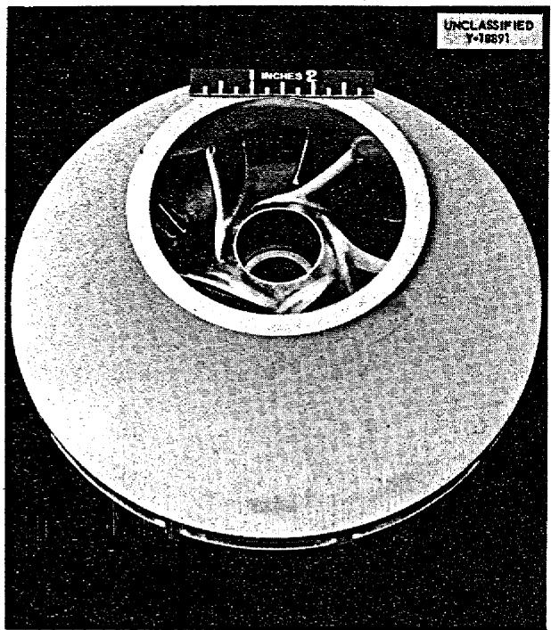  
Fig. 3.4.7. Completed Primary NaK Pump Impeller in Which the Vanes Were Both Inert-Arc-Welded and Furnace-Brazed.

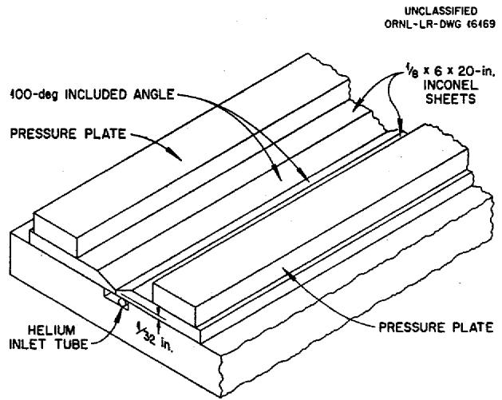  
Fig. 3.4.8. Joint Design for Shrinkage Test of Inconel Plate Welds.

backing gas and weld coverage for this test. A $\frac{1}{2}$ -in.-long tack weld was placed near each end of the root, and two other $\frac{1}{2}$ -in.-long tack welds were equally spaced along the root. The root pass was made, without filler metal, and, after wire brushing and cleaning the weld with acetone, a final pass was made for which $\frac{1}{6}$ -in. Inco No. 62 filler wire was used.

A second test was made that was similar to the first, except that backing gas was used to eliminate oxidation of the underside of the weld. No shrinkage measurements were taken on these plates, since the test plates were made solely to aid the welding operator in adapting his technique.

Based upon the plate tests, two tests were made with $\frac{1}{2}$ -in. Inconel sheets, each $6 \times 33$ in., that were bent and welded into $10\frac{1}{2}$ -in.-dia hoops. A 50-deg bevel with a $\frac{1}{32}$ -in. land was machined on one long edge of each sheet. The first hoop was placed on the flat, horizontal bed of the welding positioner, and the second hoop was placed above it. The two hoops were aligned by placing a large perforated steel band around the root girth and tightening the band with C-clamps, as shown in Fig. 3.4.9. Transverse micrometer measurements were then taken at 4-in. intervals around the circumference. Eleven $\frac{1}{2}$ -in.-long tack welds were equally spaced around the circumference, about 3 in. apart. Helium backing gas was applied through a copper cone. No dressing of the land or feathering of the weld beads was permitted prior to deposition of the root pass.

After the tack welds were made, the steel band was removed, micrometer measurements were again taken, and the assembly was enclosed as shown in Fig. 3.4.10. The interior was purged

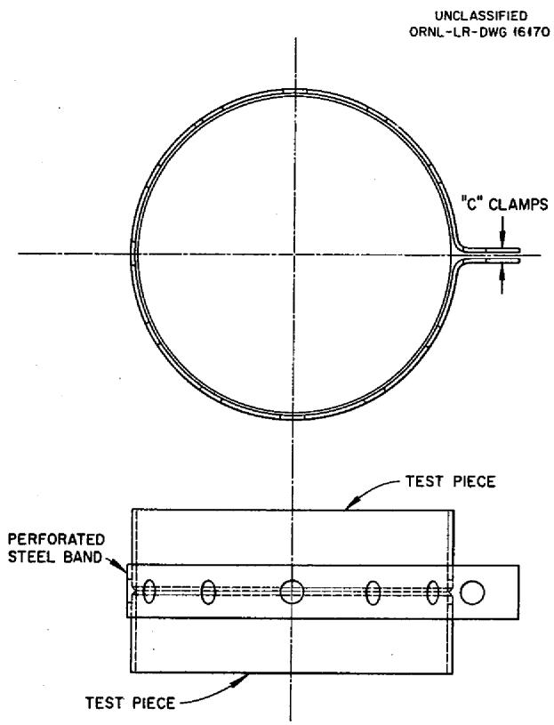

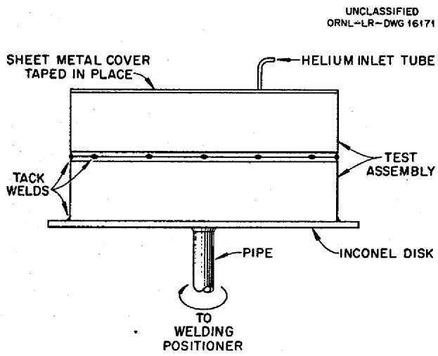  
Fig. 3.4.9. Method of Assembling Hoops for Welding.   
Fig. 3.4.10. Hoop Welding Test Assembly After Tack Welding.

for 10 min, after which the root pass was made. After wire brushing and cleaning the weld with acetone, the final pass was made, with $\frac{1}{6}$ -in. Inco No. 62 filler wire again being used. Final micrometer measurements were taken after the disks were removed from the ends of the assembly.

Two additional tests were then carried out in an identical manner with $\frac{1}{2}$ -in. Inconel sheets, each $6 \times 70$ in., bent and welded into 22-in.-dia hoops. These hoops were aligned with C-clamps, rather than with a steel band. The pertinent welding data for the four hoops are listed in Table 3.4.4, and the micrometer measurements are given in Table 3.4.5.

The deposited welds were clean and had slight concavity on the inside surfaces. It was found

that short tack welds enabled the welding operator to fuse the tack welds into the root pass more readily. For $\frac{1}{8}$ -in. Inconel sheets, inert-arc-welded under the conditions utilized in this test, the transverse shrinkage to be expected for $10\frac{1}{2}$ -in. hoops is $0.050 \pm 0.010$ in. and, for 22-in. hoops, $0.041 \pm 0.010$ in. The circumferential shrinkage was less than measurable for both hoop sizes.

A summary of the weld shrinkage results for $\frac{1}{16}$ , $\frac{1}{8}$ , $\frac{1}{4}$ , and $\frac{3}{8}$ in. Inconel sheet is presented in Table 3.4.6. It should be noted that the data are pertinent only under the conditions utilized for these tests. Any change in the variables may cause significant variations in the actual weld shrinkage encountered.

TABLE 3.4.4. WELDING DATA FOR HOOP WELD SHRINKAGE TESTS  

<table><tr><td></td><td>Current (amp)</td><td>Time (min)</td><td>Torch Gas (ft3/hr)</td><td>Backing Gas (ft3/hr)</td><td>Filler Rod (in.)</td></tr><tr><td>Hoop No. 1 (101/2 in. dia)</td><td></td><td></td><td></td><td></td><td></td></tr><tr><td>Tack weld</td><td>100</td><td>8</td><td>25</td><td>15</td><td></td></tr><tr><td>Fusion weld</td><td>100</td><td>13</td><td>25</td><td>10</td><td></td></tr><tr><td>Final weld</td><td>80</td><td>25</td><td>25</td><td>10</td><td>110</td></tr><tr><td>Hoop No. 2 (101/2 in. dia)</td><td></td><td></td><td></td><td></td><td></td></tr><tr><td>Tack weld</td><td>75</td><td>7</td><td>25</td><td>10</td><td></td></tr><tr><td>Fusion weld</td><td>80</td><td>11</td><td>25</td><td>10</td><td></td></tr><tr><td>Final weld</td><td>80</td><td>26</td><td>25</td><td>10</td><td>115.5</td></tr><tr><td>Hoop No. 3 (22 in. dia)</td><td></td><td></td><td></td><td></td><td></td></tr><tr><td>Tack weld</td><td>100</td><td>13</td><td>26</td><td>17</td><td></td></tr><tr><td>Fusion weld</td><td>90-95</td><td>18</td><td>26</td><td>17</td><td></td></tr><tr><td>Final weld</td><td>75-80</td><td>47</td><td>26</td><td>17</td><td>212.5</td></tr><tr><td>Hoop No. 4 (22 in. dia)</td><td></td><td></td><td></td><td></td><td></td></tr><tr><td>Tack weld</td><td>80</td><td>13</td><td>26</td><td>20</td><td></td></tr><tr><td>Fusion weld</td><td>100</td><td>15</td><td>26</td><td>20</td><td></td></tr><tr><td>Final weld</td><td>80</td><td>47</td><td>26</td><td>20</td><td>209.5</td></tr></table>

TABLE 3.4.5. MICROMETER MEASUREMENTS OF HOOP WELDS   

<table><tr><td rowspan="2"></td><td colspan="4">Transverse Shrinkage (in.)</td></tr><tr><td>Average</td><td>Maximum</td><td>Minimum</td><td>Deviation, Station to Station</td></tr><tr><td>Hoop No. 1(10.5 in. dia)</td><td>0.051</td><td>0.056</td><td>0.044</td><td>0.007</td></tr><tr><td>Hoop No. 2(10.5 in. dia)</td><td>0.050</td><td>0.054</td><td>0.045</td><td>0.009</td></tr><tr><td>Hoop No. 3(22 in. dia)</td><td>0.041</td><td>0.048</td><td>0.036</td><td>0.010</td></tr><tr><td>Hoop No. 4(22 in. dia)</td><td>0.041</td><td>0.045</td><td>0.037</td><td>0.036</td></tr></table>

Note: Longitudinal shrinkage was less than measurable because of the small diameters of the hoops.

TABLE 3.4.6. SUMMARY OF HOOP WELD SHRINKAGE DATA   

<table><tr><td rowspan="2">Inconel Sheet Thickness (in.)</td><td rowspan="2">Hoop* Diameter (in.)</td><td colspan="4">Transverse Shrinkage (in.)</td><td rowspan="2">Recommended Design Allowance for Transverse Shrinkage (in.)</td><td rowspan="2">Longitudinal Shrinkage (in./in.)</td></tr><tr><td>Average</td><td>Maximum</td><td>Minimum</td><td>Greatest Deviation, Station to Station</td></tr><tr><td>1/16</td><td>45</td><td>0.024</td><td>0.026</td><td>0.018</td><td>0.005</td><td>0.024 ± 0.010</td><td>0.00045</td></tr><tr><td>1/8</td><td>10.5</td><td>0.051</td><td>0.056</td><td>0.044</td><td>0.009</td><td>0.051 ± 0.010</td><td>Not measurable</td></tr><tr><td>1/8</td><td>22</td><td>0.041</td><td>0.045</td><td>0.036</td><td>0.010</td><td>0.041 ± 0.010</td><td>Not measurable</td></tr><tr><td>1/4</td><td>44</td><td>0.120</td><td>0.138</td><td>0.111</td><td>0.011</td><td>0.120 ± 0.015</td><td>0.002–0.003</td></tr><tr><td>3/8</td><td>52</td><td>0.168</td><td>0.184</td><td>0.155</td><td>0.014</td><td>0.168 ± 0.020</td><td>0.002–0.003</td></tr></table>

*Vertical dimension of all hoops was 12 in.

# EXAMINATIONS OF NaK-TO-AIR RADIATORS AFTER SERVICE

P. Patriarca

A.E.Goldman G.M.Slaughter

A 500-kw high-conductivity-fin NaK-to-air radiator, designated York HCF Radiator No. 4, was removed from a test stand on March 3, 1956, after 1356 hr of service. This radiator was tested in the temperature range of 1000 to $1600^{\circ}\mathrm{F}$ , with a temperature differential imposed on the system during 748 hr of the test.

This radiator differed from radiators tested previously in that the side plates were removed, the horizontal spacer plates were cut, and the base plate was sliced through the middle parallel to the air flow. These modifications were among those suggested in previous reports.[3,4]

Twenty-four specimens were cut from the radiator as shown in Fig. 3.4.11. Each specimen contained a portion of three tubes, with each tube joined to 15 or more fins. The specimens were cross sectioned to expose two opposed joint areas, mounted, and examined at $80\mathrm{X}$ .

A total of 2757 joint areas were examined. The percentages of fin-to-tube adherence and the degree of oxidation of the fin collars were noted.

The results of this examination in comparison with the results of examinations of five radiators operated previously are presented in Table 3.4.7. Small cracks were found in several of the tube-to-support plate joints, and evidence of cracking was observed in several tube-to-sump plate joints. The relationship between the incidence of fracture and the presence of support members or plates was previously demonstrated.3,4

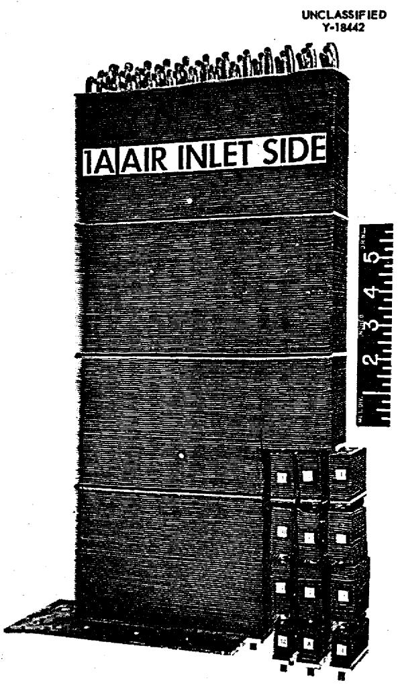

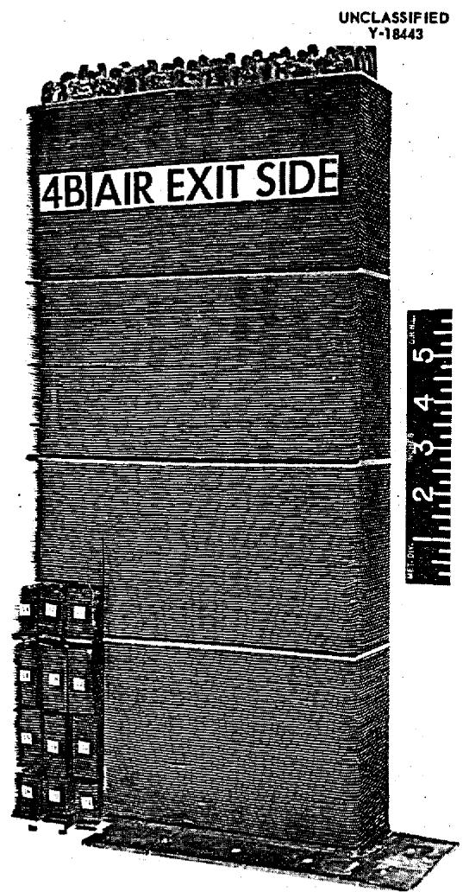  
Fig. 3.4.11. Air Inlet and Exit Sides of York HCF Radiator No. 4 Showing Location of Specimens Cut for Metallographic Examination After Service for 1356 hr.

TABLE 3.4.7. SUMMARY OF RESULTS OF METALLOGRAPHIC EXAMINATION OF YORK HCF RADIATOR NO. 4 AND FIVE PREVIOUSLY OPERATED RADIATORS  

<table><tr><td rowspan="2"></td><td colspan="6">Radiator Designation</td></tr><tr><td>York No. 4</td><td>York No. 3</td><td>York No. 1</td><td>PWA No. 2</td><td>ORNL No. 3</td><td>ORNL No. 1</td></tr><tr><td>Number of hours of service in the temperature range 1000 to 1600°F</td><td>1356</td><td>361</td><td>152</td><td>1199</td><td>716</td><td>608</td></tr><tr><td>Number of joint areas examined</td><td>2757</td><td>2684</td><td>3847</td><td>3210</td><td>2282</td><td>4150</td></tr><tr><td>Percentage of joint areas having 75 to 100% adherence</td><td>60.7</td><td>90.4</td><td>67.4</td><td>100</td><td>87.7</td><td>91.8</td></tr><tr><td>Percentage of joint areas having 50 to 74% adherence</td><td>18.8</td><td>5.9</td><td>13.0</td><td></td><td>3.5</td><td>4.2</td></tr><tr><td>Percentage of joint areas having 25 to 49% adherence</td><td>5.5</td><td>1.1</td><td>7.3</td><td></td><td>1.4</td><td>1.4</td></tr><tr><td>Percentage of joint areas having 0 to 24% adherence</td><td>15.0</td><td>2.6</td><td>12.3</td><td></td><td>7.4</td><td>2.6</td></tr><tr><td>Percentage of joint areas having non-oxidized copper fins</td><td>61.9</td><td>84.5</td><td>75.4</td><td>100</td><td>12.1</td><td>59.3</td></tr><tr><td>Percentage of joint areas having slightly oxidized copper fins</td><td>19.5</td><td>7.5</td><td>22.0</td><td></td><td>2.5</td><td>20.1</td></tr><tr><td>Percentage of joint areas having oxidized copper fins</td><td>18.6</td><td>8.0</td><td>2.6</td><td></td><td>85.4</td><td>20.6</td></tr></table>

# FABRICATION OF CERMET VALVE COMPONENTS

P. Patriarca G.M.Slaughter

A description of the high-temperature cermet bonding procedure used in the fabrication of several valve components was presented previously.5 At the relatively high temperatures required for bonding (approximately $1350^{\circ}\mathrm{C}$ ), the cermets lose strength to such an extent that occasionally significant distortion or warpage of the cermet body is observed.

A modification in the fabrication procedure was therefore developed which has permitted the successful fabrication of disks and seats for four different test valve assemblies. The minimum temperature for consistent bonding was determined

for each cermet composition and was found to vary slightly with the cermet type, as shown in Table 3.4.8. Occasionally these optimum temperatures were found to vary slightly with different components of the same general composition. This observation can probably be related to variations in the compacting and sintering procedure by the original manufacturer of the cermet bodies. Accordingly, each component was treated as an individual problem.

Observation ports were machined in the nickel transition layer to permit a visual determination of the initiation of bonding. This visual observation was found to be an essential addition to the precise control and measurement of temperatures for the consistent prevention of distortion of the cermets. These ports are clearly visible as black spots when the assembly in the furnace hot zone is viewed with dark glasses. When the liquid reaction product forms, the ports are filled, and

they disappear from view, with simultaneous formation of a fillet, which can also be detected by careful observation through dark glasses. Cooling rates of approximately $1000^{\circ}\mathrm{C/hr}$ were used to minimize stresses during cooling.

Exploded views of the two steps employed in the fabrication of the valve disks are shown in

Fig. 3.4.12. The cermet-to-nickel subassembly shown in step 2 was copper-brazed to the Inconel shank by conventional dry-hydrogen techniques. Cooling rates of approximately $400^{\circ}\mathrm{C/hr}$ were used to prevent cracking. The stages used in the fabrication of the valve seat components are shown in Fig. 3.4.13.

TABLE 3.4.8. MINIMUM TEMPERATURES FOR CONSISTENT BONDING OF CERMET VALVE COMPONENTS  

<table><tr><td>Cermet Trade Designation</td><td>Cermet Composition (wt %)</td><td>Bonding Temperature (°C)</td></tr><tr><td>K-151A</td><td>70 TiC-10 NbTaTiC3-20 Ni</td><td>1350</td></tr><tr><td>K-152B</td><td>64 TiC-6 NbTaTiC3-30 Ni</td><td>1350</td></tr><tr><td>K-162B</td><td>64 TiC-6 NbTaTiC3-25 Ni-5 Mo</td><td>1340</td></tr></table>

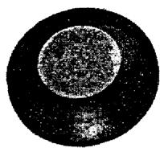  
STEP1   
UNCLASSIFIED Y-18799   
CERMET VALVE DISK

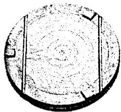  
NICKEL TRANSITION LAYER WITH MACHINED OBSERVATION PORTS

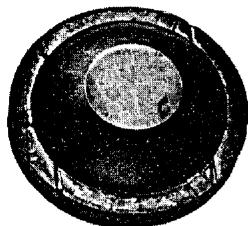  
COMPLETED CERMET-TO-NICKEL SUB-ASSEMBLY

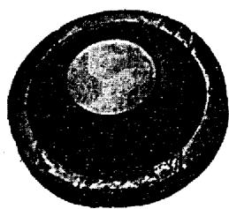  
ONE INCH  
STEP 2   
CERMET-TO-NICKEL  
SUB-ASSEMBLY

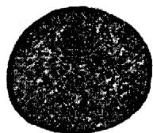  
COPPER BRAZING SHIM

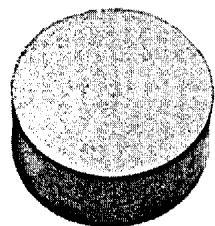  
INCONEL  
SHANK

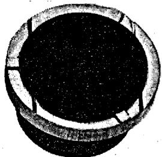  
UNCLASSIFIED Y-18800   
COMPLETED VALVES DISK ASSEMBLY

  
Fig. 3.4.12. Steps in the Fabrication of a Cermet Valve Disk Assembly.

UNCLASSIFIED Y-18852

STEP1

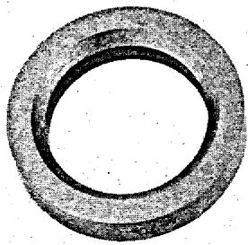  
CERMET VALVE SEAT

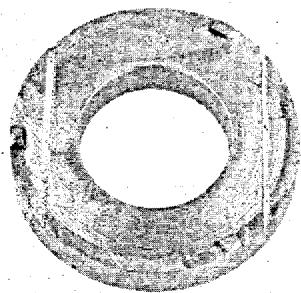  
NICKEL TRANSITION LAYER WITH MACHINED OBSERVATION PORTS

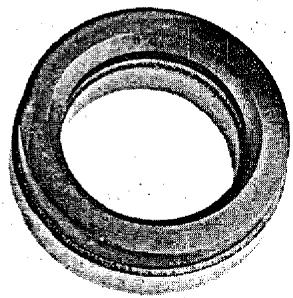  
COMPLETED CERMET-TO-NICKEL SUB-ASSEMBLY

  
STEP 2

UNCLASSIFIED Y-18853

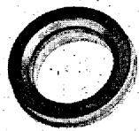

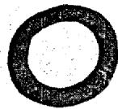  
CERMET-TO-NICKEL SUB-ASSEMBLY  
COPPER BRAZING SHIM

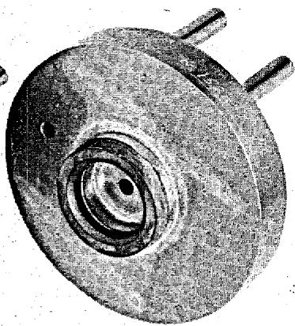  
INCONEL HOUSING   
COMPLETED VALVE SEAT ASSEMBLY   
Fig. 3.4.13. Steps in the Fabrication of a Cermet Valve Seat Assembly.

# CONTINUOUS PRODUCTION OF SINTERED BRAZING ALLOY RINGS

P. Patriarca

R. E. Clausing

The use of sintered Coast Metals brazing alloy No. 52 rings for the brazing of ART radiators is dependent upon the achievement of production rates adequate to reduce the cost per ring to a value which can compete with the present means of preplacing the brazing alloy. An experimental pilot plant has been built which has attained a production rate of more than 8000 rings per hour. In the first production run, 33,000 rings were made in 5 hr. It is felt that production of this magnitude will definitely establish a satisfactory cost for ring production.

Graphite molds are used, as shown in Fig. 3.4.14, for the production of the brazing alloy rings. The

depth of cut in the mold is adjusted to yield rings that weigh $4.5\mathrm{g}$ per 100 rings. The size of the ring is based on the quantity of alloy required to produce an acceptable tube-to-fin joint. The molds are loaded flush with brazing alloy powder and stacked four high, with each mold serving as a lid for the one below it.

The furnace used in the pilot plant is shown schematically in Fig. 3.4.15. This furnace is essentially a two section unit. The first section serves as a preheater, and the second section adjusts the temperature to the narrow range in which satisfactory rings are produced and maintains this temperature long enough to allow the entire mass of the molds to reach this temperature. A continuous stainless steel ribbon conveyor belt runs through the furnace and is driven by a variable-speed drive. When this equipment is operated

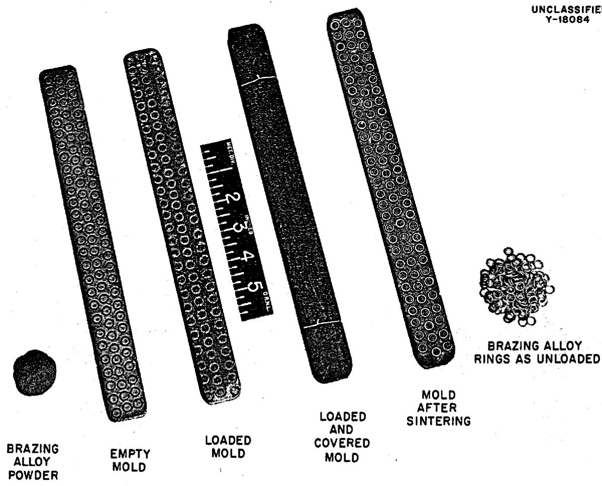  
Fig. 3.4.14. Steps in the Production of Sintered Rings of Coast Metals Brazing Alloy No. 52.

at a belt speed of 5 in./min, 9000 rings can be produced in 1 hr; however, the control of the furnace temperature becomes quite critical at this speed. The optimum operating speed for this equipment is 4 in./min, at which speed 7200 rings/hr or approximately 50,000 per 8-hr day are produced.

A thermal cycle which produces satisfactory rings is shown in Fig. 3.4.16. This graph was reproduced from a recording of the output of a thermocouple attached to a set of molds passing through the furnace at 4 in./min. Proper control of the temperature permits the easy removal of the sintered rings from the molds through the use of a vibrating tool. The rings may be grit blasted or tumbled in brazing alloy powder, if necessary, to remove any traces of carbon or small surface imperfections. If the temperature is carefully controlled (within a $5^{\circ}\mathrm{C}$ range), rings with no rejects and very good surface finish will be produced. Rings of satisfactory quality are produced if the temperature is controlled within a range of about $10^{\circ}\mathrm{C}$ .

# FABRICATION OF HEAT EXCHANGERS AND RADIATORS

P. Patriarca

A.E.Goldman G.M.Slaughter

One of the problems associated with the assembly of multitube heat exchangers involves preplacement of an adequate supply of braze metal at each joint. A heat exchanger job sample on which the Coast Metals brazing alloy No. 52 was preplaced by the metal-spray process is shown in Fig. 3.4.17. Several tubes, one of which is indicated by an arrow, failed to form a braze fillet, the alloy having been "stolen" by the adjacent tubes.

Several experiments were conducted which indicated that intimate contact between the tube, tube sheet, and brazing alloy was desirable during heating to the brazing temperature. Once the initial capillary flow was established, each tube drew sufficient alloy from the metal-sprayed tube sheet to form a satisfactory fillet.

UNCLASSIFIED

ORNL-LR-DWG 16172

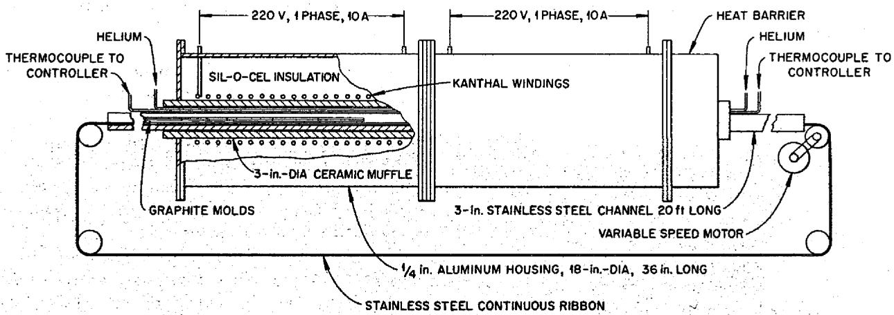  
Fig. 3.4.15. Schematic Diagram of Furnace for Continuous Production of Sintered Rings of Coast Metals Brazing Alloy No. 52.

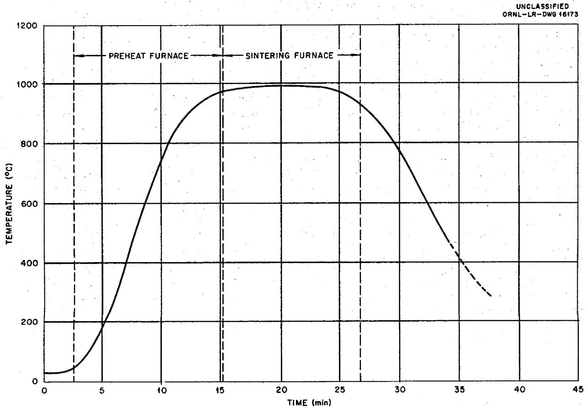

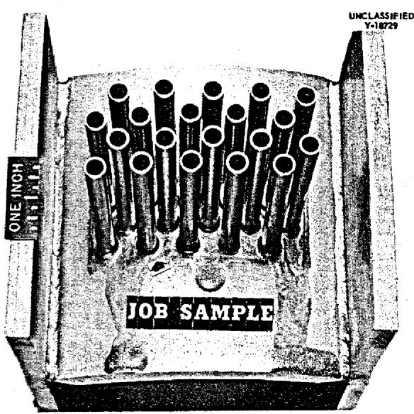  
Fig. 3.4.16. Sintering Cycle for the Continuous Production of Brazing Alloy Rings at a Belt Speed of 4 in./min.   
Fig. 3.4.17. Heat Exchanger Job Sample.

The most successful method of initiating capillary flow was found to be the metal-spray "primer" technique. As each row of tubes is assembled into the previously metal-sprayed tube sheet, the tubes are attached to the tube sheet with a small amount of metal-sprayed brazing alloy. A tungsten sheet is used as a mask to prevent accumulation of alloy on the tubes. In a modification of this method, sintered brazing alloy rings are attached to the previously sprayed tube sheet during the "priming" operation. Single rings are shown attached to the tube and sprayed tube sheet in Fig. 3.4.18, and multiple rings are shown attached in Fig. 3.4.19.

# STUDIES OF THE AGING CHARACTERISTICS OF HASTELLOY B

R. E. Clausing

Preliminary physical property tests on Hastelloy B indicate that residual stresses induced by cold

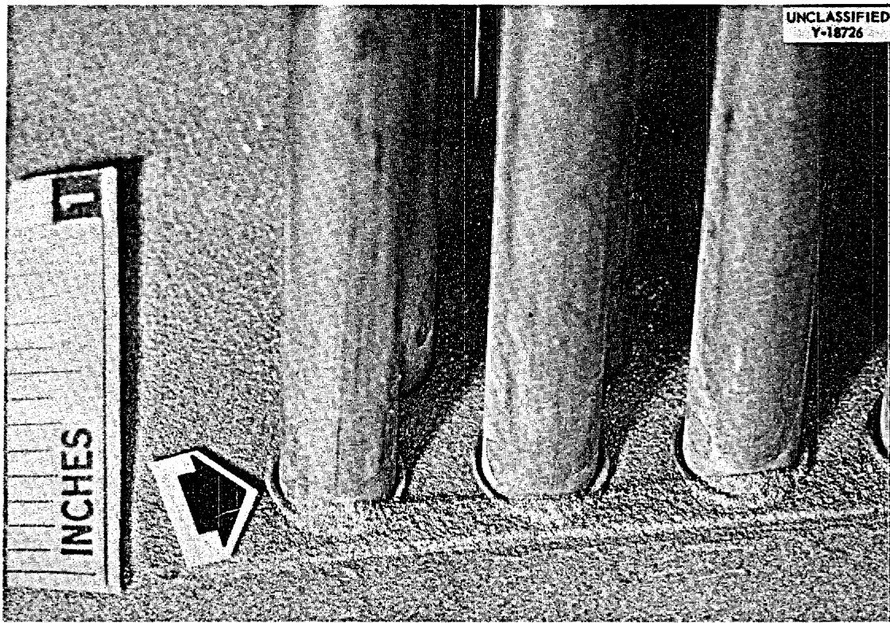

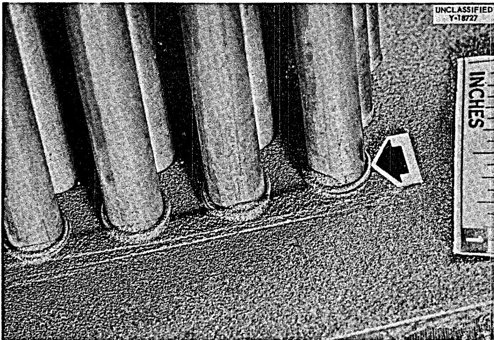  
Fig. 3.4.18. Sintered Rings and Metal-Sprayed Coast Metals Brazing Alloy No. 52 on Heat Exchanger Tube Sheet.   
Fig. 3.4.19. Multiple Sintered Rings and Metal-Sprayed Coast Metals Brazing Alloy No. 52 on Heat Exchanger Tube Sheet.

rolling or heat treatment may have pronounced effects on the rate of elevated-temperature precipitation in the alloy. Hardness values for cold-rolled sheet, originally $\frac{1}{8}$ in. thick, have been determined after aging treatments for various times at $1200^{\circ}F$ . The results are shown in

Fig. 3.4.20. Tensile tests show the ductility to be much lower in specimens aged from the stressed condition than in those annealed prior to aging. A microstructure correlation is presently being made as a means of studying this effect.

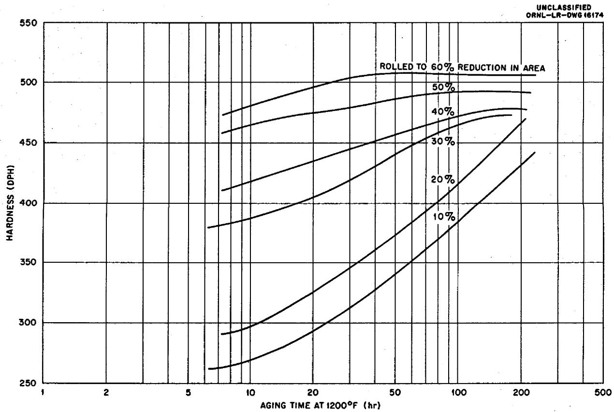  
Fig. 3.4.20. Aging Characteristics of Hastelloy B Sheet Containing Residual Stresses from Cold Rolling.

# 3.5. MECHANICAL PROPERTIES STUDIES

D. A. Douglas

# RELAXATION TESTING OF INCONEL

C. R. Kennedy

The evaluation studies of the creep and creep-rupture characteristics of metals under constant load and in various environments have been continued, and, recently, equipment was designed and constructed for the study of the decay, or relaxation, of stresses in metals under constant strain. This phenomenon is time and temperature dependent and assumes particular importance in cases of thermally induced cyclic stresses. For example, if a structural member is held rigidly at both ends, and the temperature is raised and then lowered rapidly, tensile and compressive loads will result. It is essential in the stress analysis of this situation to know how much the stress has decreased, that is, relaxed, in each condition before the reverse load is applied.

There have been many different machines and methods used by previous experimenters to determine the relaxation characteristics of metals; however, most of the work has been in temperature ranges well below the annealing temperature of the material tested. Extrapolation of these results to higher temperature does not give reliable values. Therefore it was necessary that new experimental techniques be devised to achieve the accuracy desired for temperatures in the range of 1200 to $1800^{\circ}\mathrm{F}$ . The equipment designed for the tests is shown in Fig. 3.5.1. The test is run by setting the extensometer for the desired strain and then applying and automatically controlling the stress to produce and maintain this strain. The positions of the electric contacts are established by micrometer screws on a 20 to 1 magnification extensometer similar to the Westinghouse extensometer. When

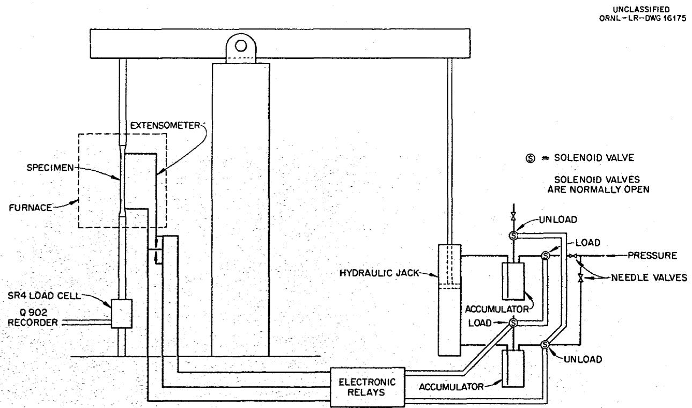  
Fig. 3.5.1. Equipment for Relaxation Testing of Metals in the Temperature Range 1200 to $1800^{\circ}$ F.

the extensometer makes contact the 4-v grid bias is cut out, and the grid-glow relay opens the proper solenoid valves to control the hydraulic pressure and thus the stress in the specimen. The furnace is shunt-wound and is controlled by a Leeds & Northrup model H Speedomax recorder and DAT 60 controller which will control to $\pm 2^{\circ}\mathrm{F}$ with a temperature gradient over the 6-in. gage length of less than $5^{\circ}\mathrm{F}$ .

Test results of relaxation testing of Inconel at 1300 and $1500^{\circ}\mathrm{F}$ are shown in Figs. 3.5.2 and 3.5.3. To produce a plot on which all the relaxation characteristics can be shown, the first 0.1-hr period is plotted linearly and the remaining time is shown on a semilog plot. The initial stresses ob

tained at both temperatures agree with the moduli of elasticity of Inconel at the respective temperatures. The plots shown in Figs. 3.5.2 and 3.5.3 are averages of from 5 to 10 tests, and the material was tested with varying degrees of plastic strain at the test temperatures. This information can be used to determine the residual stresses in structural members which have undergone a thermal cycle. The data can only be considered valid for thermal cycles which produce strains within the range investigated. Further testing is now in progress to determine the relaxation characteristics at higher strains and various temperatures to establish a complete understanding of the relaxation characteristics of Inconel.

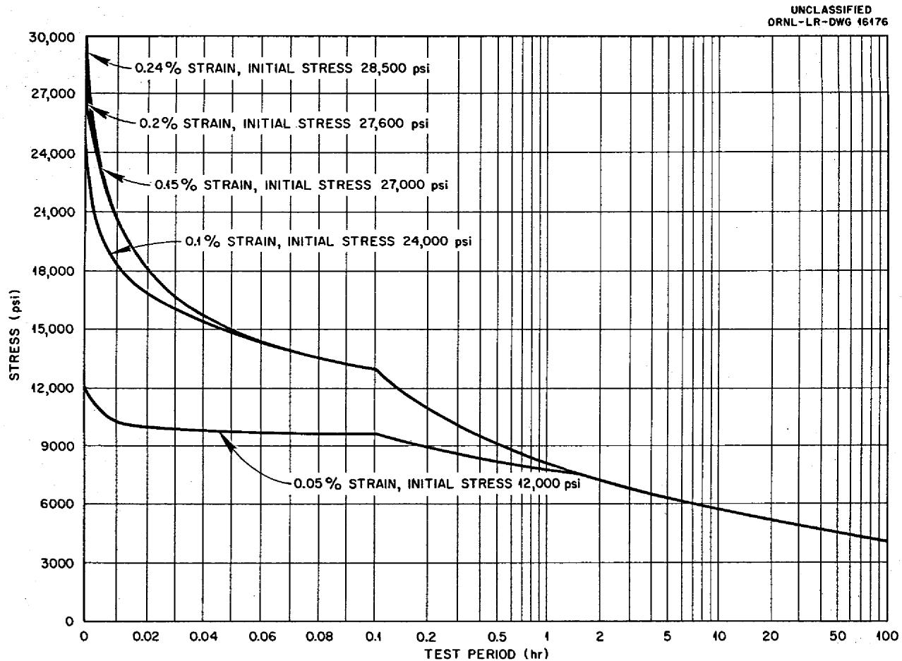  
Fig. 3.5.2. Relaxation Characteristics of As-Received Inconel at $1300^{\circ}\mathrm{F}$ When Stressed to Produce a Constant Strain.

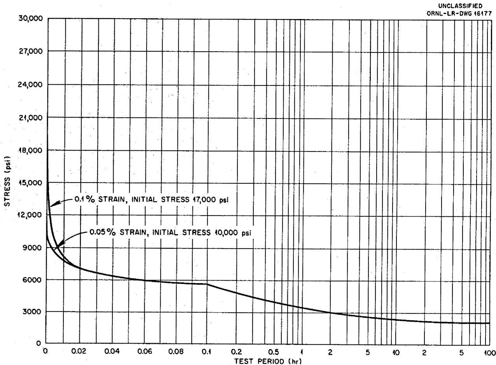  
Fig. 3.5.3. Relaxation Characteristics of As-Received Inconel at $1500^{\circ}\mathrm{F}$ When Stressed to Produce a Constant Strain.

# EFFECTS OF FUSED-SALT CORROSION ON THE STRESS-RUPTURE PROPERTIES OF HASTELLOY X

C. R. Kennedy

A series of tests was run to determine the effect of the fuel mixture (No. 30) NaF-ZrF4-UF4 (50-46-4 mole %) on the creep strength of Hastelloy X. This alloy, which has the nominal composition 22% Cr, 19% Fe, 9% Mo, and the balance Ni, has demonstrated reasonably good creep strength and ductility at high temperatures in air; however, as may be seen in Fig. 3.5.4, the fuel environment has deleterious effects on its creep strength at

temperatures above $1500^{\circ}\mathrm{F}$ . Since the fuel leaches chromium, the observed reduction in creep strength was expected over the entire temperature range; however, at $1500^{\circ}\mathrm{F}$ the amount of corrosion is small, as seen in Fig. 3.5.5, and does not appear to affect the creep strength. In creep tests at 1650 and $1800^{\circ}\mathrm{F}$ , the expected intergranular corrosion occurred, as may be seen in Figs. 3.5.6 and 3.5.7, and there was a serious decrease in creep strength. From these tests it appears that Hastelloy X should not be used where it will be in contact with the fuel mixture (No. 30) NaF-ZrF $_4$ -UF $_4$ (50-46-4 mole %) at service temperatures above $1500^{\circ}\mathrm{F}$ .

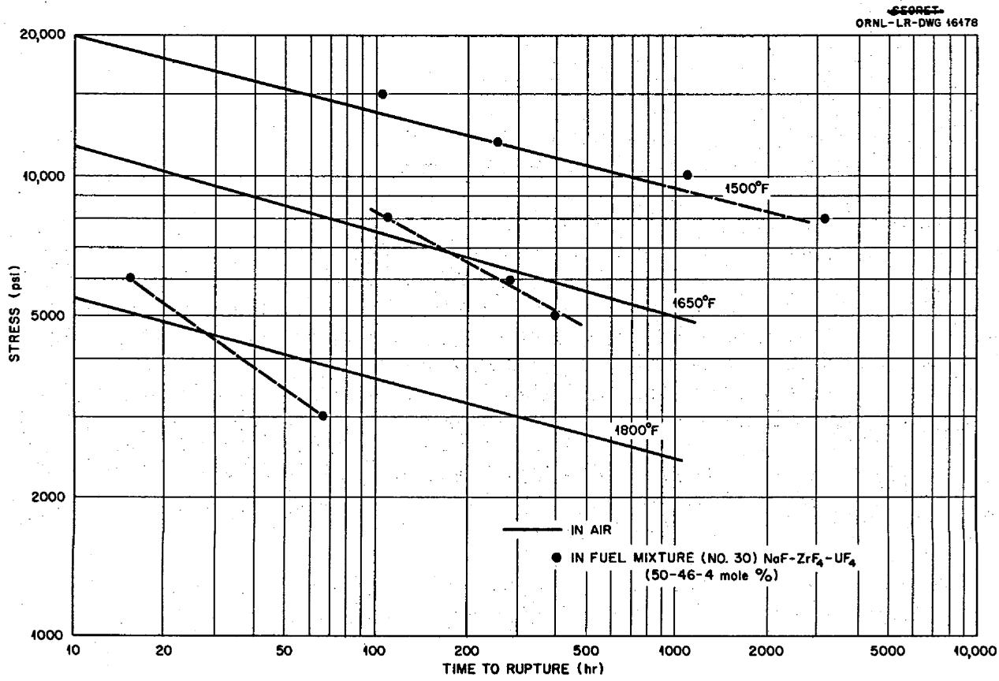  
Fig. 3.5.4. Comparison of the Stress-Rupture Properties of Hastelloy X in Air and the Fuel Mixture (No. 30) NaF-ZrF $_4$ -UF $_4$ (50-46-4 mole %) at 1500, 1650, and $1800^{\circ}$ F.

# CREEP-RUPTURE TESTING OF AN $80\%$ Mg-20% LI ALLOY

J.R.Weir

C. W. Dollins

Creep-rupture testing of an $80\%$ Mg-20% Li alloy was initiated. The results of creep-rupture testing of this alloy at $200^{\circ}\mathrm{F}$ in air are summarized in Fig. 3.5.8, in which the stress is plotted vs time to 0.2, 0.5, 1, 2, 5, 10, and 20% elongation and rupture. The specimens tested at stresses below 400 psi had not deformed to any measurable extent in 500 hr.

The test specimens were given a chemical surface treatment before the tests to improve their oxidation resistance. The treatment consisted of a nitric acid dip, followed by a rinse in water and immersion in phosphoric acid until the reaction ceased, followed by an acetone rinse. No oxidation was observed after 500 hr of testing in air. Tests will be run on a few untreated specimens for comparison.

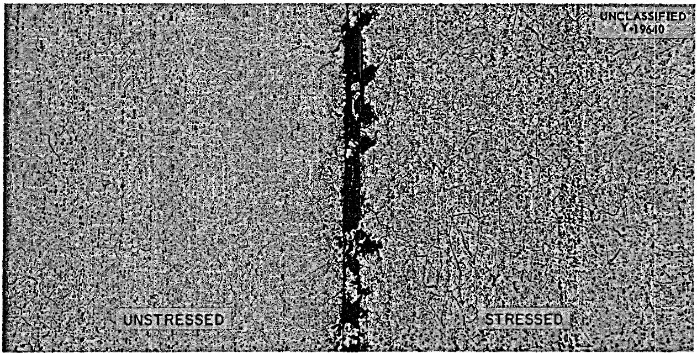

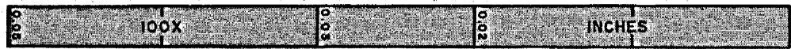  
Fig. 3.5.5. Surfaces of the Stressed and Unstressed Portions of a Hastelloy X Specimen After Creep-Rupture Testing in the Fuel Mixture (No. 30) NaF-ZrF $_4$ ·UF $_4$ (50-46-4 mole %) at $1500^{\circ}\mathrm{F}$ . 100X. (Secret with caption)

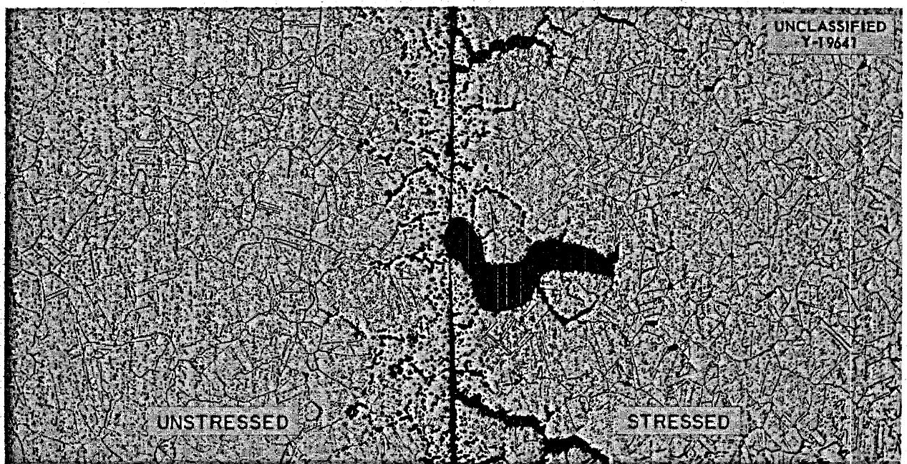

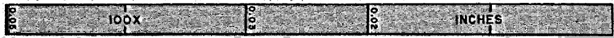  
Fig. 3.5.6. Surfaces of the Stressed and Unstressed Portions of a Hastelloy X Specimen After Creep-Rupture Testing in the Fuel Mixture (No. 30) NaF-ZrF $_4$ -UF $_4$ (50-46-4 mole %) at $1650^{\circ}\mathrm{F}$ . 100X. (Secret with caption)

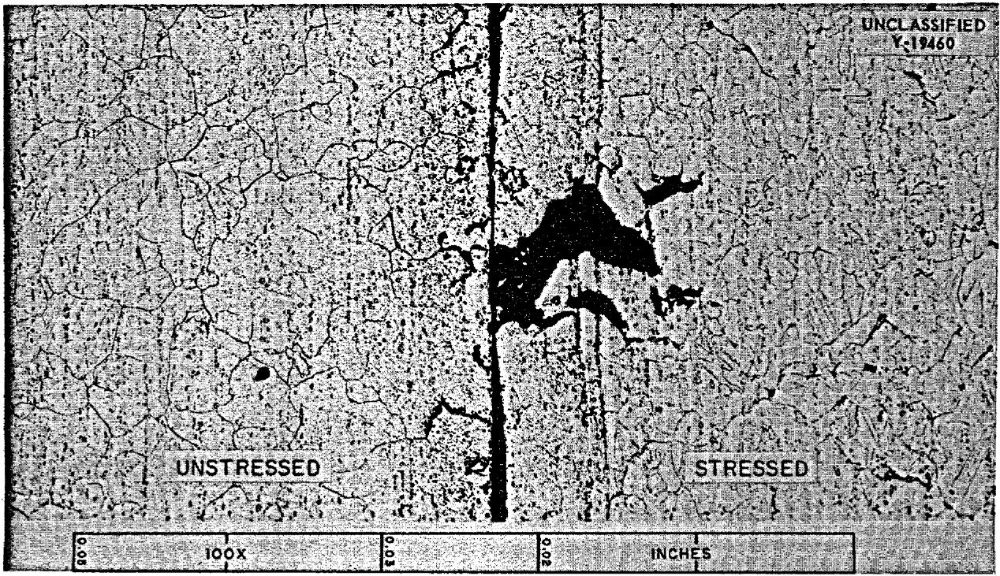  
Fig. 3.5.7. Surfaces of the Stressed and Unstressed Portions of a Hastelloy X Specimen After Creep-Rupture Testing in the Fuel Mixture (No. 30) NaF-ZrF $_4$ -UF $_4$ (50-46-4 mole %) at $1800^{\circ}\mathrm{F}$ . 100X. (Secret with caption)

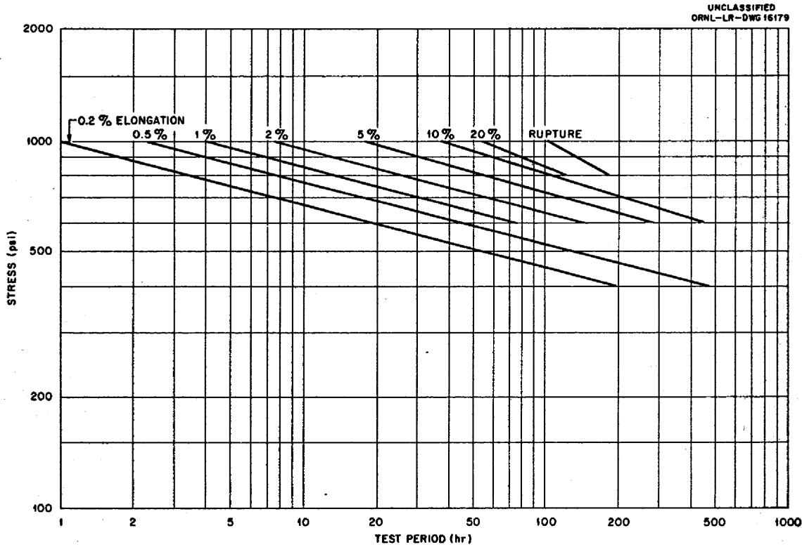  
Fig. 3.5.8. Summary of Creep-Rupture Data for the Surface-Treated $80\%$ Mg-20% Li Alloy Tested at $200^{\circ}$ F in Air.

# 3.6. CERAMIC RESEARCH

L. M. Doney

# RARE-EARTH MATERIALS

C.E.Curtis J.A.Griffin

L. M. Doney

A study of the properties of europium oxide was initiated. Physical properties, sintering characteristics, and fabrication techniques will be investigated.

Numerous shapes of nickel-rare-earth oxide cermets, $\mathrm{Al}_{2}\mathrm{O}_{3}$ , and $\mathrm{CaF}_{2}$ are being produced. These materials are to be used in the fabrication of a high-temperature critical experiment to be performed by ORNL for Pratt & Whitney Aircraft.

# FUEL AND MODERATING MATERIALS

R. L. Hamner R. A. Potter

The production of test pieces of high-density, high-purity beryllium oxide by hot pressing was continued. Densities of 97 to $98\%$ of theoretical have been obtained. These pieces will be tested for corrosion resistance in molten sodium. Facilities are being prepared for the fabrication of large pieces.

A small batch of zirconium carbide was made by the McKenna-Menstruum process. This material is being processed for hot pressing. Physical properties tests of the fabricated pieces will be made.

A hydriding furnace is being built from a design obtained from the General Electric Co. The

furnace will be used to produce both zirconium and yttrium hydrides for use in physical properties investigations and in cladding studies.

# COMPONENT FABRICATION

C. E. Curtis

The problem of die design for the production of a $\frac{1}{4}$ -in.-OD beryllium oxide rod with five longitudinal holes is being studied. This material is desired for use in a Calrod type of thermocouple.

# HIGH-TEMPERATURE X-RAY DIFFRACTION

G. D. White

High-temperature x-ray diffraction plots were obtained for samples of Hastelloy B at 500, 600, and $700^{\circ}\mathrm{C}$ . These plots were taken to determine whether an inversion occurs in the vicinity of $600^{\circ}\mathrm{C}$ . At all temperatures a face-centered cubic pattern was obtained. The only difference in the patterns at the three temperatures was a slight shift to larger $d$ values with increasing temperature because of thermal expansion.

# FLUORIDE FUEL INVESTIGATIONS

G.D. White T.N.McVay, Consultant

Microscopic examinations were made of approximately 600 samples of fluoride salts. The samples included routine test mixtures from experimental engineering materials and component test stands, quenches for equilibrium diagram determinations, and batches from various research experiments.

# 3.7. NONDESTRUCTIVE TESTING STUDIES

R. B. Oliver

# EDDY-CURRENT INSPECTION OF SMALL-DIAMETER TUBING

J.W.Allen

The results of eddy-current inspection of 14,540 ft of CX-900 Inconel tubing are presented in Table 3.7.1. The undersize and oversize figures include rejections on both out-of-tolerance wall thicknesses and out-of-tolerance diameters, since the two appear inseparably in the cyclograph type of eddy-current readout. The discontinuity indications were due to cracks, gouges, and the pickup of foreign metal on the inside of the tube.

The presence of foreign metal embedded in the inside wall of $3\%$ -in.-OD, 0.025-in.-wall, CX-900 Inconel tubing has been detected in recent shipments by the encircling-coil eddy-current test. Subsequent longitudinal macrosections of two such areas that occurred in one 42-in. length of tubing are shown in Fig. 3.7.1, along with the eddy-current signal trace produced by this tube. The defective areas are indicated by the sharp downward spikes in the trace. The spikes are similar to the spikes which result from short longitudinal cracks, except that they are in the direction of increased wall thickness rather than in the direction of decreased wall thickness. Stains of the type shown in Fig. 3.7.1 are yellow to red in color and are sometimes, but not always, present in the

1J. W. Allen, ANP Quar. Prog. Rep. June 10, 1956, ORNL-2106, p 214.

areas that have picked up foreign metal. Transverse microsections through several of the defective areas have failed to reveal that the defects have perceptible depth. Therefore the foreign metal must be highly permeable to have produced such large eddy-current indications as those shown in Fig. 3.7.1, which suggests that the foreign metal consists of bits of steel picked up from the mandrel over which the tubing was drawn. Further metallographic study and microspark spectrographic analysis of these areas is planned.

# INSPECTION OF TUBING BY THE

# ULTRASONIC METHOD

R.W.McClung

Large quantities of tubing are now being inspected by the immersed ultrasonic technique. During this quarter 4224 pieces of $3\%$ -in.-OD, 0.025-in.-wall, 42-in.-long, CX-900 Inconel tubing were inspected; 4143 lengths were accepted for critical use. The rejection rate was slightly less than $2\%$ , and thus it appears that high-quality tubing is being received. All the rejected lengths contained only very small, single defects. Attempts to metallographically examine some of the defects were unsuccessful because of the difficulty of precisely marking the defect and the tendency of the metal to smear over small defects during polishing. Further metallographic studies are planned.

A total of 2360 ft of 0.242-in.-ID, 0.030-in.-wall, thermocouple-well tubing in random lengths from

TABLE 3.7.1. RESULTS OF EDDY-CURRENT INSPECTION OF 14,540 ft OF CX-900 INCONEL TUBING  

<table><tr><td>Tubing Size</td><td>Total Number of Pieces Inspected</td><td>Total Number of Pieces Rejected</td><td>Number of Pieces Undersize</td><td>Number of Pieces Oversize</td><td>Number of Pieces with Indications of Discontinuities</td></tr><tr><td>3.16-in. OD, 0.025-in. wall, 42-in. lengths</td><td>3003</td><td>167</td><td>71</td><td>57</td><td>39</td></tr><tr><td>0.229-in. OD, 0.025-in. wall, 78-in. lengths</td><td>229</td><td>3</td><td>3</td><td>0</td><td>0</td></tr><tr><td>0.242-in. ID, 0.035-in. wall, 132-in. lengths</td><td>236</td><td>6</td><td>6</td><td>0</td><td>0</td></tr></table>

644 001

UNCLASSIFIED

ORNL-LR-DWG 14681A

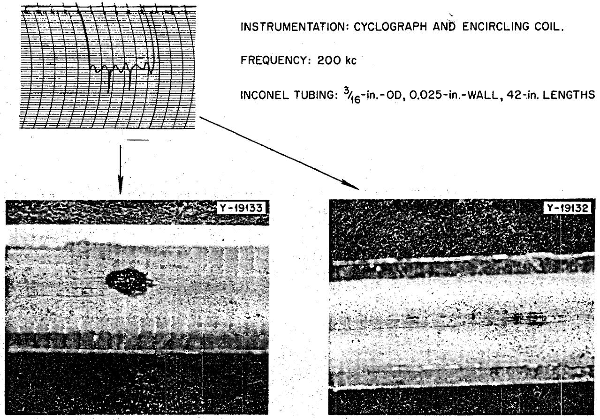  
Fig. 3.7.1. Eddy-Current Signal Trace of Defective $\frac{3}{16}$ -in.-OD, 0.025-in.-Wall, Inconel Tubing and Macrosections of Two Areas Detected.

10 to 12 ft was inspected ultrasonically. Each of 28 lengths was found to have one short defect. One length had a series of short defects throughout the tube. Since the minimum usable length of this tubing was 10 ft, only about one-half the rejected lengths were usable after removal of the defective area. Thus the rejection rate was approximately $6\%$ . Metallographic sectioning of a few of the defective areas disclosed a small gouge on the outside of one tube that was approximately 0.005 in. deep, 0.012 in. wide, and 32 in. long, and on the outside of another tube there was a small crack approximately 0.003 in. deep. Again, trouble was encountered in precisely locating the defects, and there was some smearing during metallographic polishing.

Over 1000 ft of $3\%$ -in.-OD, 0.035-in.-wall, Hastelloy C tubing in random lengths was inspected ultrasonically. The rejection rate for this tubing was approximately $30\%$ . Metallographic sectioning disclosed the presence of the cracks and other discontinuities illustrated in Figs. 3.7.2 through 3.7.5. A photomacrograph of the inside surface along the weld of weld-drawn Hastelloy C tubing is shown in Fig. 3.7.2. There are tiny tears along the weld to parent metal interface, and there is an apparent lack of fusion. An internal crack which did not extend either to the inside or to the outside surface of the tube wall is shown in Fig. 3.7.3. The crack appears to be in the heat-affected zone adjacent to the weld. An unetched sample of Hastelloy C tubing that has two cracks is shown

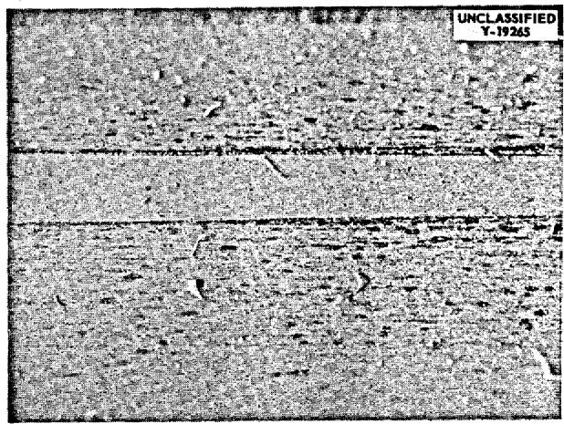  
Fig. 3.7.2. Inside Surface of Weld-Drawn Hastelloy C Tubing.

in Fig. 3.7.4a. One crack is approximately 0.015 in. deep, and the shallower one is about 0.005 in. deep. Etching of this sample, as shown in Fig. 3.7.4b, disclosed that the cracks were actually about 0.020 in. and 0.015 in. deep.

Another crack is shown in Fig. 3.7.5a and $b$ in the etched and unetched conditions. It may again be noted that the crack, although it is about 0.015 in deep, does not extend to either surface. Again, difficulty was encountered in the preparation of metallographic sections because the soft matrix smeared over the defects during the polishing operation. However, a greater degree of success was achieved in locating the defects in this material than in the Inconel tubing. This can probably be attributed to the larger size of the defects that seem to regularly occur in Hastelloy tubing.

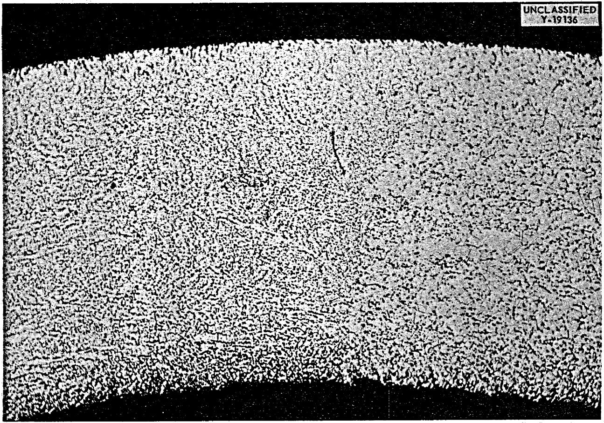  
Fig. 3.7.3. Internal Crack in Heat-Affected Zone Adjacent to Weld in Weld-Drawn Hastelloy C Tubing. Etched with chrome regia. 100X.

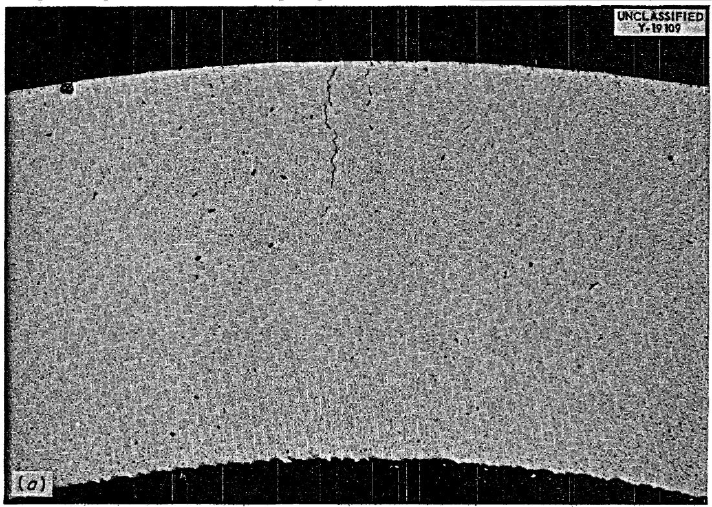

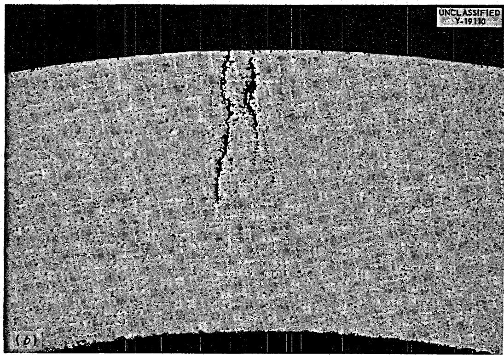  
Fig. 3.7.4. Intergranular Cracks in Hastelloy C Tube. (a) Unetched. (b) Etched with chrome regia. 100X. Reduced $13\%$ .

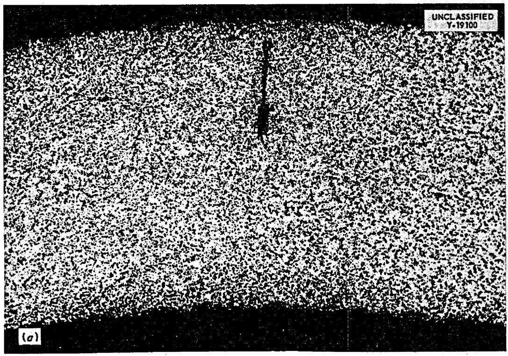

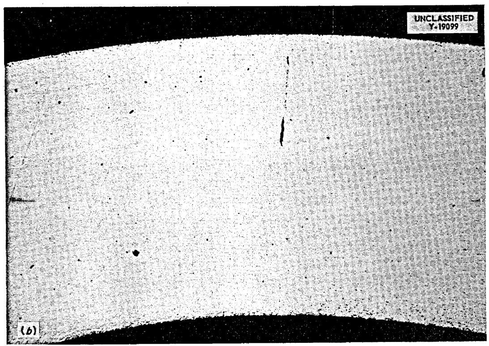  
Fig. 3.7.5. A Crack in Hastelloy C Tubing. (a) Unetched. (b) Etched with chrome regia. 100X. Reduced $13.5\%$ .

Over 1000 ft of $3\%$ -in.-OD, 0.035-in.-wall, CX-900 Inconel tubing in random lengths was examined ultrasonically, and a total of approximately 25 ft was rejected. The few defects detected seemed to be very small. In general, the quality of this tubing was quite high, as indicated by the rejection rate of less than $2.5\%$ . Metallographic examinations also failed to disclose any defects of appreciable size. Of the 229 pieces of 0.229-in.-OD, 0.025-in.-wall, 78-in.-long, CX-900 Inconel tubing also examined ultrasonically, 31 pieces were rejected.

An attempt is being made to compare the detection of defects by ultrasound and by other inspection methods, and, for the larger defects, correlations are normally possible. However, for many of the very small defects, particularly those on the inside of tubing, ultrasound seems to be the only feasible detection method. It is hoped that, despite the inherent difficulties, metallographic examinations will continue to provide additional information concerning the nature of the defects.

# INSPECTION OF PIPE

J. K. White

R. B. Oliver

The pipe inspection facility was installed in April, and about 6000 ft of pipe ranging in size from $3/8$ in. IPS to 7 in. OD has been inspected; most of this material has been Inconel. As a result of this experience only minor changes in the details of the inspection technique previously described have been made. Because of the excessive camber in large pipe and the end whip frequently experienced in small pipe, the present system of using the pipe as a transducer guide appears to be the only practical method for maintaining alignment. In this system a hand-held search-tube positioner is used with a series of interchangeable side plates cut to fit each pipe size. The positioner is translated along the pipe by hand, and a motor-driven string is used as a speed guide (Fig. 3.7.6). The positioner (Fig. 3.7.7) can be adjusted to change the transducer-to-pipe distance (delay), the rotation of the transducer in the plane perpendicular to the sound beam, and the angle of incidence of the beam upon the outside surface of the pipe. The angle of incidence de

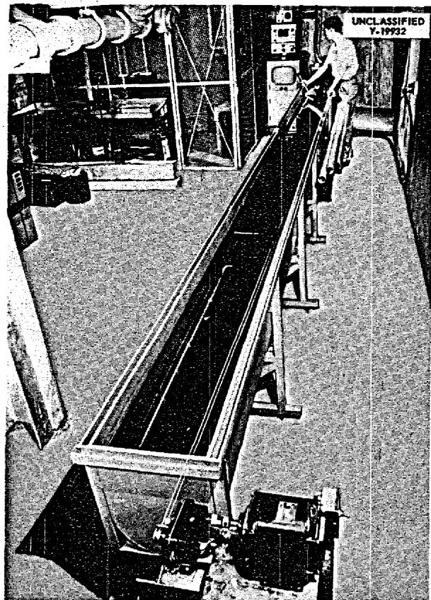  
Fig. 3.7.6. Facility for the Inspection of Pipe by the Immersed Ultrasonic Method.

termines the depth of inspection of the pipe wall. With materials of the same acoustic impedance as Inconel and approximately the same wall-thickness-to-diameter ratio as sched-40 pipe, the usable range of angles is from 10 to 30 deg. Incident angles of less than 10 deg cause interference because of reverberations across the pipe wall. Angles greater than 30 deg set up Rayleigh (surface) waves and accentuate scratches selectively more than deeper defects. Within these limits the incident angles used are chosen to balance the indications from $5\%$ notches on the inside and outside surfaces. Internal defects show up strongly when angles of about 10 to 17 deg are used. External defects show up strongest when angles of about 23 to 90 deg are used.

Rotation of the transducer in the plane perpendicular to the sound beam is sometimes necessary

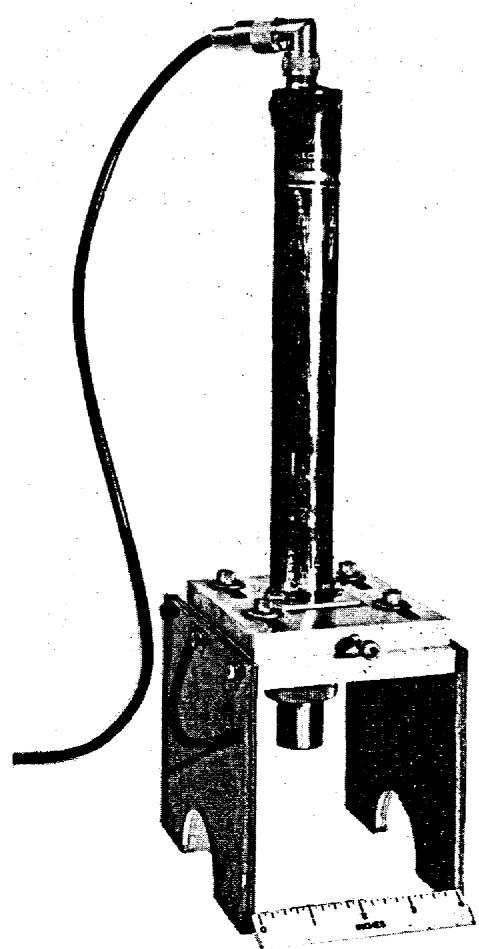  
Fig. 3.7.7. Ultrasound Search Tube Mounted for the Inspection of Pipe.

because the transducers presently available do not emit energy uniformly. Apparently, uniform crystal damping is difficult to achieve and poorly damped areas, or "hot spots," are common. The purchase of a square transducer is contemplated to minimize this "hot spot" effect and to achieve higher coverage per revolution and hence greater scanning speeds.

Heretofore, experience had been limited to inspections made at a frequency of 5 Mc, but for thick-walled pipe, 2.25 Mc appears to be a promising frequency, as evidenced by some recent success. More observations will be made at this frequency in the near future.

It has been observed that, in general, pipe quality has improved since the inspection program was initiated. Several entire pipe orders were rejected

during the early stages of the inspection program. During the last few months the special care exercised in preparing the pipe, crating it for protection during shipment, etc., have resulted in marked improvement in quality, as evidenced by numerous pipe orders inspected without detection of a single defect.

# INSPECTION OF THIN SHEET

J.W.Allen R.W.McClung

R. B. Oliver

Sheet material has extensive application in power reactors, and, in many cases, formed sheet will function both as a container for fluids and as a heat transfer medium between two fluids. Since high heat fluxes and thermal stresses are involved, the presence of laminar defects is very undesirable. The problem of detecting such defects in sheet has, currently, only one solution, which, in turn, poses a very difficult mechanical problem. This situation has motivated an investigation to develop a similar and better inspection method. Liquid penetrant, radiographic, and eddy-current methods cannot be used because of the unfavorable defect orientation. The ultrasonic resonance method is not an adequate approach, since it is not capable of resolving small defects and it inherently requires slow contact scanning of the sheet. The conventional pulse-echo ultrasonic inspection, even with a pulse length as short as 1 $\mu$ sec, is not practical for sections thinner than 0.20 in. The transmission-attenuation technique is capable of detecting small laminations in thin sections, but, since it requires critical alignment of two transducers on opposite sides of the sheet, it is a very difficult method to apply to the inspection of large or nonplanar areas.

A new ultrasonic method has been proposed, and preliminary experiments have given promising results. The new method requires a pulse of ultrasound having a duration of 5 to $20\mu \mathrm{sec}$ , with the sound tuned to such a frequency that the sheet thickness is an exact multiple of the half wavelength. With these conditions the ultrasound reverberates, or rings, between the two sheet surfaces for a period of time that is several times greater than the pulse duration. When a lamination exists in the sheet the ringing is decreased, both in duration and amplitude, as a function of the area of the lamination relative to the transducer area. To test this method, flat-bottom holes with

several different areas were milled into one side of a sheet of Inconel to various depths. In experiments with existing equipment most of these reference defects were located. To properly instrument this test method, the reflectoscope has been drastically altered. The pulse repetition was increased from 60 to 500 pulses per second,

appropriate filters were added to the circuits, a variable-sweep delay circuit was added to permit immersed scanning, and external connections were provided for synchronization signals. This last change will permit the addition of gated alarm circuits and various data presentation and recording units in the near future.

material was not available, this material was reworked by centerless grinding in order to remove most of the surface imperfections. A waiver was made on the porosity, which resulted in rejection of only large-size porosity defects.

# INSPECTION OF COMPONENTS

R. L. Heestand

Sixty thermal-convection loops were received, and the welds were inspected by the dye-penetrant method. Thirty-six of these loops were found to have welds which showed numerous indications of cracks, pinholes, and other defects. The remaining loops were accepted for use. The defective loops were repaired and reinspected prior to acceptance.

Thirty-eight pieces of Inconel plate were inspected prior to shipment for fabrication into dished heads, and then they were re-examined for manufacturing defects upon return. Several were found to have numerous pits that were apparently caused by a foreign material becoming embedded in the surfaces during the pressing operation. Four heads were found to have cracks running from the edge inward, which appeared to be as deep as $\frac{1}{2}$ in. These cracks are to be repaired, and the areas will be reinspected prior to use.

Four small heat exchanger units were received and inspected. They were found to be acceptable for use in test operation.

# FLUORESCENT-PENETRANT INSPECTION

# OF TUBING

G. Tolson

The installation of the fluorescent-penetrant equipment to be used in the inspection of small-diameter, thin-walled tubing was completed. Tests are now being performed to compare the fluorescent-penetrant with the dye-penetrant type of inspection used heretofore. Indications are that it will be possible to ensure higher quality tubing with the new method because of its higher sensitivity. The fluorescent penetrant has revealed small pinholes and tight laplike defects which were not discernible by the dye-penetrant method. Exploration of some of these areas by polishing showed them to be as deep as 0.002 in. in some cases. However, the greater sensitivity of the new method will present some problems, initially, because experience will be required to distinguish indications of superficial imperfections from indications of true defects.

# WELDER QUALIFICATION PROGRAM

A. E. Goldman

The number of welders qualified under ORNL welding specifications for ANP work is now 42. An estimate of the additional qualified welders that will be required is now being prepared, and as soon as these requirements are known, qualification tests will be given. A qualification program is now under way at the Paducah installation, but, to date, no welders have qualified.

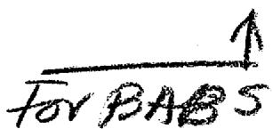

# Part 4

# HEAT TRANSFER AND PHYSICAL PROPERTIES

H. F. Poppendiek

# RADIATION DAMAGE

G.W. Keilholtz

# FUEL RECOVERY AND REPROCESSING

R. B. Lindauer

# CRITICAL EXPERIMENTS

A. D. Callihan

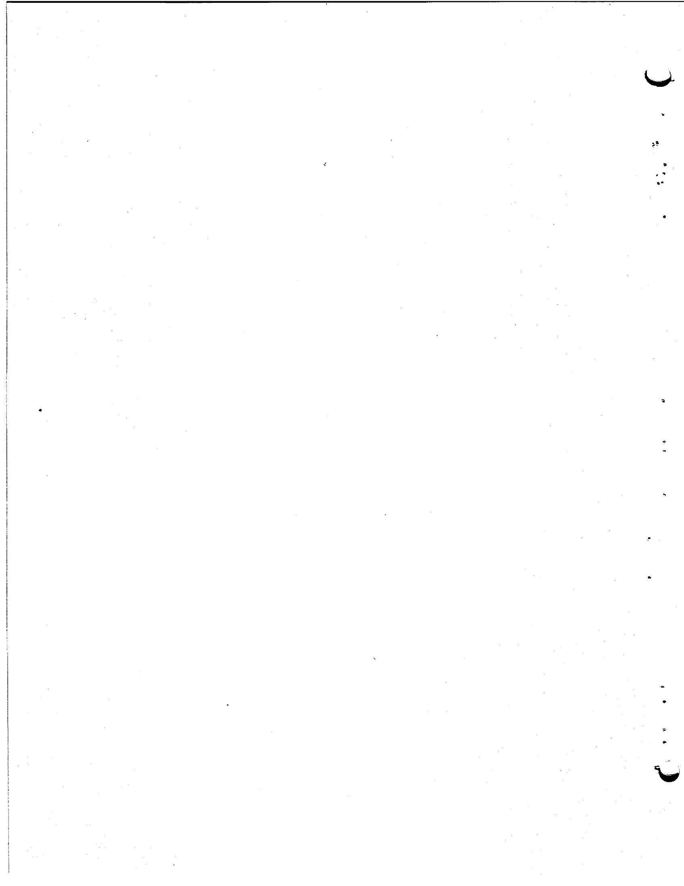

# 4.1. HEAT TRANSFER AND PHYSICAL PROPERTIES

# H. F. Poppendiek

# ART FUEL-TO-NaK HEAT EXCHANGER

J. L. Wantland

S. I. Cohen

The fluid friction characteristics of the ART fuel-to-NaK heat exchanger were determined with six 60-deg staggered spacers and six 60-deg inclined spacers alternately placed at 6-in. intervals. These data are presented in Fig. 4.1.

A full-scale model of the present ART fuel-to-NaK heat exchanger (which contains more tubes and a somewhat different spacer configuration than the previous system) has been assembled. Pressure drop data will soon be obtained for it. The friction characteristics of this heat exchanger have been predicted by using the technique previously described.2 The results indicate that the experimental data to be obtained should lie very near the curve in Fig. 4.1.1 for the staggered and inclined spacers.

Isothermal friction measurements for the delta-array heat exchanger have nearly been completed. Heat transfer experimentation will commence in the near future.

# ART HYDRODYNAMICS

C. M. Copenhaver

F. E. Lynch

G. L. Muller3

# Core Hydrodynamics

A new method for stabilizing the flow in the ART core was studied. It consisted of placing a number of screens in the northern hemisphere of the core, as shown in Fig. 4.1.2. Qualitative velocity profiles, which were determined by the phosphorescent-particle flow-visualization technique, are shown in Fig. 4.1.3. The regions of flow separation on the outer core shell walls, which existed in a system without screens, apparently were eliminated because of the local turbulence generated by the screens.

The over-all friction loss in the core was determined and is plotted in Fig. 4.1.4 in terms of a loss coefficient and the Reynolds number. The loss coefficient of this system was also estimated on the basis of screen friction data available in the literature. The two loss coefficients were in

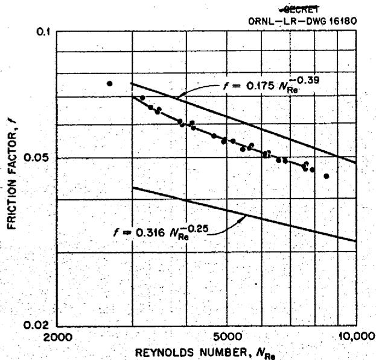  
Fig. 4.1.1. Friction Characteristics of 60-deg Staggered Spacers and 60-deg Inclined Spacers in the ART Fuel-to-NaK Heat Exchanger.

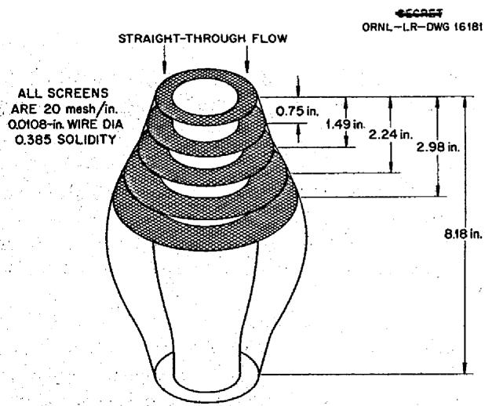  
Fig. 4.1.2. Schematic Diagram of Screen Arrangement in 10/44-Scale Model of ART Core.

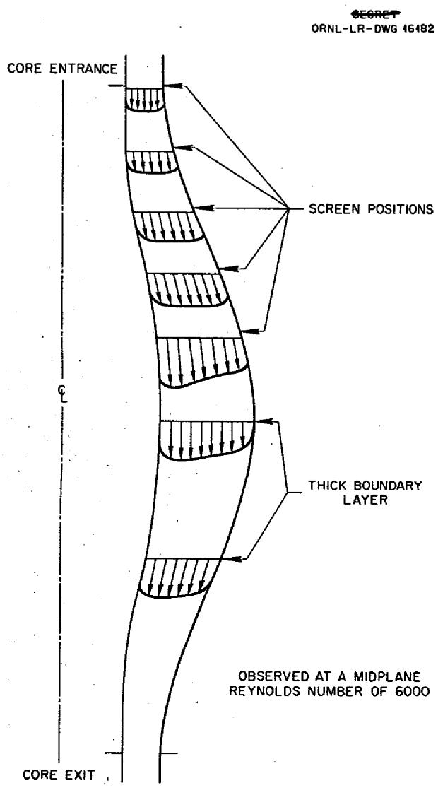  
Fig. 4.1.3. Qualitative Velocity Profiles for Straight-Through Flow in Model Shown in Fig. 4.1.2.

general agreement. In an actual reactor system the screens would probably be replaced with perforated plates having an equivalent pressure drop. A rough estimate of the amount of Inconel that might be required for such plates in an ART core is about $7\mathrm{kg}$

Flow studies are to be started soon on a straight, annular core with a diverging entrance and converging exit. Screens will be placed in the entrance. The advantage of this arrangement is that the screens will be in a relatively low neutron-flux region and thus will yield less reactor poisoning than they would in the system described above.

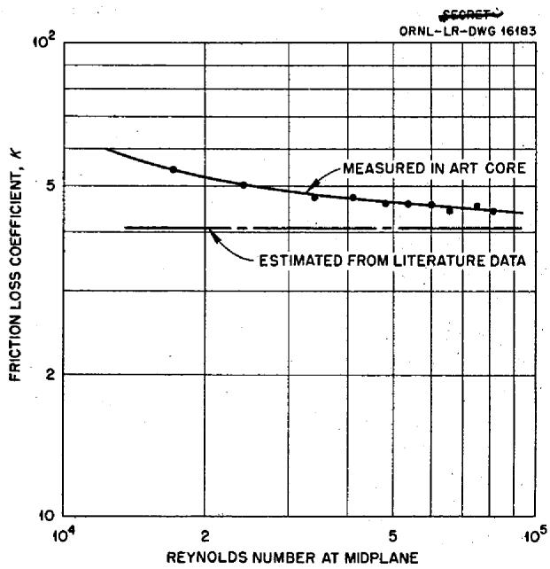  
Fig. 4.1.4. Friction Loss Coefficient in ART Core with Screens as a Function of the Mid-Plane Reynolds Number.

# Sodium Flow in Reflector Cooling System

The pertinent data for the flow distribution in the reflector cooling system for concentric and eccentric annulus conditions were presented in detail in the preceding report.4 The static pressure distributions for the reflector and island annuli were not included, however, and they are presented here. The experimental studies indicate that the pressure losses through the annuli can be expressed as

$$
\Delta P = \left(\frac {f L}{2 t} + n K _ {s} + K _ {d}\right) \frac {\rho \bar {V} ^ {2}}{2 g},
$$

where

$f =$ friction factor in a smooth duct having an equivalent diameter of $2t,$

$t =$ annulus thickness,

$L =$ annulus length,

$n =$ number of spacer rows,

$K_{s} =$ resistance coefficient per spacer row,

$K_{d} =$ diffusion coefficient (1.0 for reflector annulus and 0.5 for island annulus),

$\rho =$ fluid density,

$\overline{V} =$ mean velocity in annulus,

$g =$ acceleration of gravity.

The results of static pressure distribution calculations are presented in Fig. 4.1.5.

# Fluid Flow Visualization Study

A new attack on the problem of photographing phosphorescent particles used in the flow-visualization technique has been initiated. The following factors are being investigated: (1) the matching of the phosphorescence emission spectrum and the film sensitivity spectrum, (2) optimization of the optical system of the camera, and (3) optimization of the film development process. If satisfactory photographs can be obtained, the qualitative phosphorescent-particle flow-visualization method can become a quantitative method.

# ART CORE HEAT TRANSFER STUDY

G.W.Greene L.D.Palmer   
N. D. Greene H. F. Poppendiek   
G. L. Muller G. M. Winn

The results of an experimental and analytical study of the temperature structure in an uncooled ART core with a swirl entrance system were presented in the previous report. Experimental mean and transient temperature fields in the outer and inner core shell walls and within the circulating electrolyte were obtained from the ART volume-heat-source model.

Recently a study of the temperature structure in the ART core with a vaned entrance was completed. The vane system, described previously,6 eliminated the flow separation region on the island in the northern hemisphere. Six complete power runs were made for the case of both pumps in operation for a series of Reynolds numbers which ranged from below to above design flow conditions. Three power runs were also made for the simulated case of "one pump off." Heat balances were again within $\pm 4\%$ of being perfect.

The mean, uncooled wall and fluid temperature profiles obtained in the ART core with the vaned entrance are presented in Fig. 4.1.6. The asymmetries in the outer core shell and island (inner) core shell wall temperatures can be explained on the basis of hydrodynamic flow asymmetries. Note that the high Island core shell wall temperatures found for the previous swirl-entrance case are no

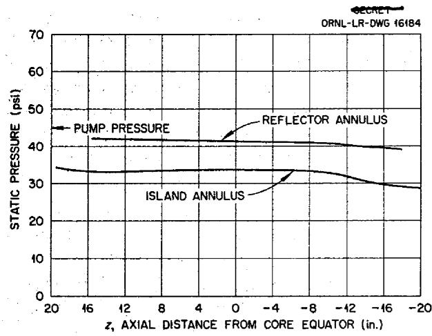  
Fig. 4.1.5. Static Pressure Distributions for ART Reflector and Island Annuli.

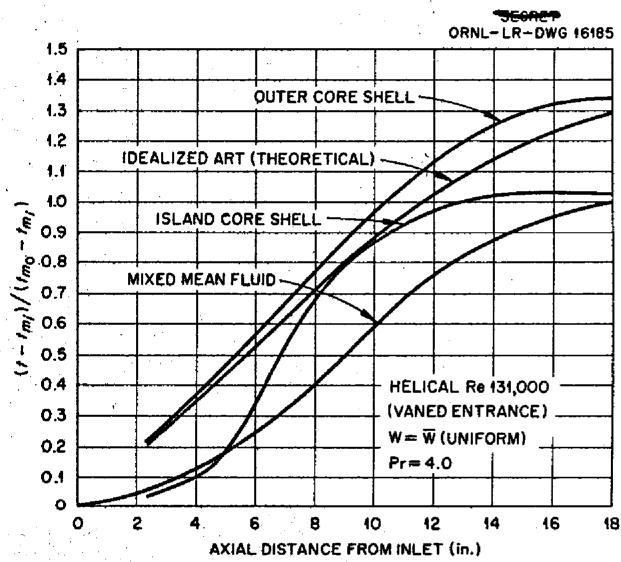  
Fig. 4.1.6. Mean, Uncooled Outer Core Shell and Island (Inner) Core Shell Wall Temperature Measurements for the Half-Scale ART Core Model with a Uniform Volume Heat Source.

longer present because the vane system contained a deflector ring which practically eliminated flow separation on the island core shell wall. The wall temperature solution for an idealized ART (a parallel-plates system) is also plotted in Fig. 4.1.6;

this predicted uncooled-wall temperature profile lies between the island and outer core shell wall temperature measurements. Typical experimental transient wall and fluid temperature measurements are shown in Fig. 4.1.7. The results are expressed in terms of the total temperature fluctuation divided by the axial temperature rise of the fluid going through the core.

Fig. 4.1.7. Transient ART Surface and Fluid Temperatures (Uniform Volume Heat Source).   
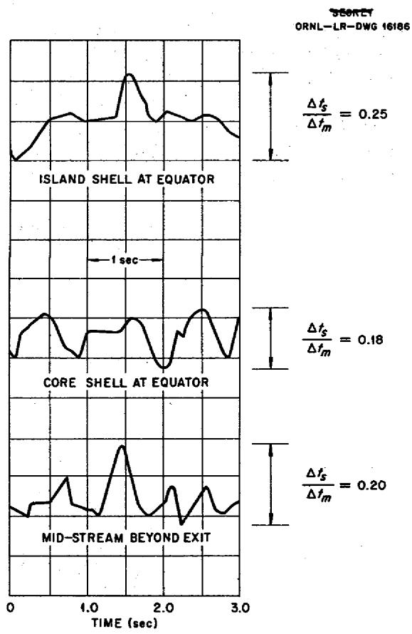  
HELICAL Re = 131,000   
W=W(UNIFORM)   
$\Delta f_{s} =$ TOTAL CHANGE IN WALL TEMPERATURE  
$\Delta t_{m} =$ AXIAL FLUID TEMPERATURE RISE IN GOING THROUGH CORE

The mean, uncooled outer and island core shell wall temperatures (except the island core shell wall in the northern hemisphere) for the vaned system were greater than those found previously for the swirl flow system; this results from the helical Reynolds number for the vaned system being significantly lower than that for the swirl system. The

temperature fluctuations of the island and outer core shell walls in the northern hemisphere were relatively lower for the vaned system than for the swirl system; conversely, the temperature fluctuations in the southern hemisphere were relatively larger for the vaned system than for the swirl system. The fluid temperature fluctuations beyond the core exit were also larger for the vaned system than for the swirl system.

The frequency spectrums of the temperature fluctuations for the vaned system were very similar to the spectrums observed in the swirl system. The peripheral asymmetries were greater in the vaned system than in the swirl system; this characteristic was also observed in the corresponding hydrodynamic structure.

The uncooled wall temperature rises above the mixed mean temperature in the actual ART system, where the radial volume heat source distribution will be approximately a hyperbolic cosine function, were previously shown to be greater than twice those for a uniform power density distribution such as that which existed in the volume heat source experiment. Consequently, temperatures as high as about $1850^{\circ}\mathrm{F}$ may occur in the vaned system if the core shell walls are not cooled properly. Some interpretations of the wall temperature fluctuations in the outer core shell, island core shell, and heat exchanger walls in the actual reactor system have been described previously. For example, in the event that a momentary flow stagnation exists adjacent to the core shell wall, the fuel-Inconel interface temperature fluctuation will be only about one-fourth as large as the fluctuation in the temperature of the fuel at some distance from the wall; this reduction in the temperature rise occurs because of the relatively good heat transfer for the Inconel when the fuel is momentarily stagnant. However, when a high-velocity turbulent eddy of lower or higher temperature level suddenly wipes the Inconel surface, calculations have shown that the relative heat transfer to or from the Inconel is then poor, and consequently the fuel-Inconel interface temperatures are nearly as large as those that would exist if the wall were insulated.

# THERMAL-CYCLING EXPERIMENT

H.W.Hoffman D.P.Gregory8

The experimental system designed to investigate the effect of thermal cycling at an intermediate

frequency range $(\frac{1}{4}$ to 2 cps) on metals in the presence of reactor fuel mixtures has been successfully operated. The data obtained at two temperature levels with NaF-ZrF4-UF4 (50-46-4 mole %) flowing turbulently through $\frac{1}{4}$ -in.-OD, 0.035-in.-wall Inconel tubes are summarized in Table 4.1.1. The corrosion attack on the metal in both the heater and test sections during these runs is shown in Figs. 4.1.8 through 4.1.12.

In the ART core, the high differential temperature cycling will be experienced by the Inconel core shell surfaces and the heat exchanger tubes as a result of the hydrodynamic instabilities that will exist in the system. These temperature fluctuations have been simulated in a bench-scale experiment by subjecting the salt flowing through an electrically heated tube to cyclic heating. The experimental system is shown in Fig. 4.1.13. As

TABLE 4.1. PRELIMINARY THERMAL-CYCLING DATA FOR INCONEL TUBES EXPOSED TO THE FUEL MIXTURE (NO. 30) NaF-ZrF $_4$ -UF $_4$ (50-46-4 MOLE %)   

<table><tr><td rowspan="3">Run</td><td rowspan="3">Duration (hr)</td><td rowspan="3">Mean Inlet Fluid Temperature (°F)</td><td colspan="3">Heater Section</td><td colspan="3">Test Section</td><td rowspan="3">Cause of Termination of Test</td></tr><tr><td colspan="2">Inside Surface Temperature (°F)</td><td rowspan="2">Average Depth of Attack (mils)</td><td colspan="2">Inside Surface Temperature (°F)</td><td rowspan="2">Average Depth of Attack (mils)</td></tr><tr><td>Average</td><td>Fluctuation</td><td>Average</td><td>Fluctuation</td></tr><tr><td rowspan="2">ET-A</td><td>16</td><td>1265</td><td>1455</td><td>±180</td><td>3</td><td>1273</td><td>±7</td><td>0.5</td><td>Oxidized electrode</td></tr><tr><td>14</td><td>1265</td><td>1546</td><td>±225</td><td></td><td>1287</td><td>±12</td><td></td><td></td></tr><tr><td>ET-B</td><td>240</td><td>1275</td><td>1415</td><td>±170</td><td>8</td><td>1330</td><td>±16</td><td>1</td><td>Stopped to alter test conditions</td></tr><tr><td>ET-C</td><td>4</td><td>1580</td><td>1755</td><td>±189</td><td>2</td><td>1613</td><td>±36</td><td>2</td><td>Melted electrode</td></tr><tr><td>ET-D</td><td>14</td><td>1580</td><td>1845</td><td>±240</td><td>5</td><td>1590</td><td>±83</td><td>4</td><td>Tube break</td></tr><tr><td>ET-E</td><td>5</td><td>1615</td><td>1905</td><td>±235</td><td>5</td><td>1635</td><td>±43</td><td>0.5</td><td>Tube break</td></tr></table>

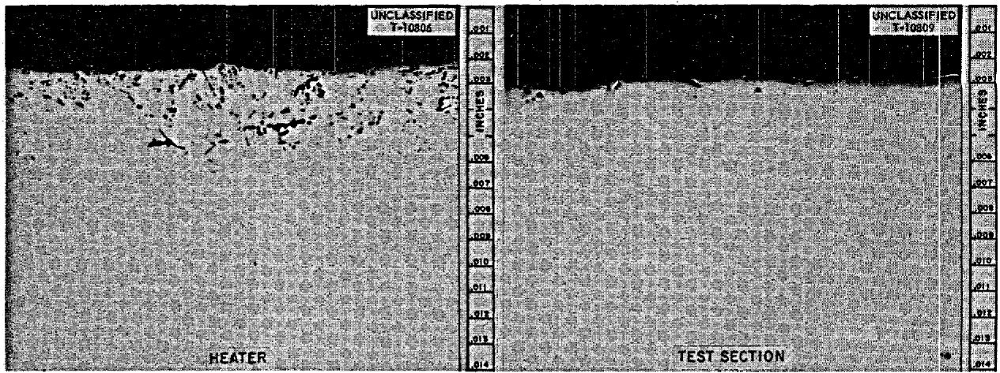  
Fig. 4.1.8. Corrosion Results of Thermal Cycling of Inconel Tubes Exposed to the Fuel Mixture (No. 30) NaF-ZrF $_4$ UF $_4$ (50-46-4 mole %). Run ET-A: mean fluid temperature, $1265^{\circ}\text{F}$ ; heater inside surface temperature, $1500 \pm 200^{\circ}\text{F}$ ; test section inside surface temperature, $1280 \pm 10^{\circ}\text{F}$ . 250X. Reduced 31%. (Secret with caption)

the fluid moves downstream, the surface of the test section is exposed to periodic temperature fluctuations imposed on the fluid in the heater. Because of the poor thermal diffusivity of Inconel, the major effect of this thermal cycling is confined to a region close to the metal-fuel interface. In this region the combination of the high coefficient of

thermal expansion and the high modulus of elasticity of Inconel, with its poor thermal conductivity, may result in thermal stresses which are of sufficient magnitude to cause eventual damage to the metal by fatigue. These thermal-cycling experiments are being made in order to determine the extent of fatigue damage.

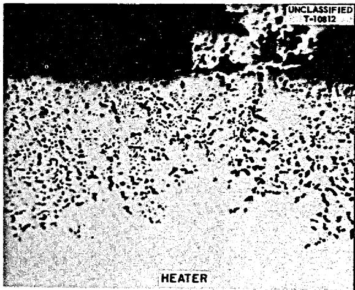

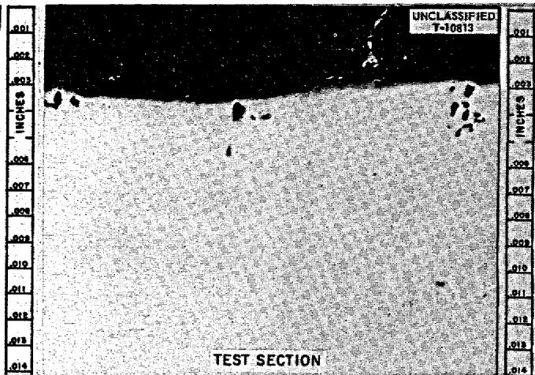  
Fig. 4.1.9. Corrosion Results of Thermal Cycling of Inconel Tubes Exposed to the Fuel Mixture (No. 30) $\mathsf{NaF - ZrF_4 - UF_4}$ (50-46-4 mole %). Run ET-B: mean fluid temperature, $1275^{\circ}F$ ; heater inside surface temperature, $1415 \pm 170^{\circ}F$ ; test section inside surface temperature, $1330 \pm 17^{\circ}F$ . 250X. Reduced $31\%$ . (Secret with caption)

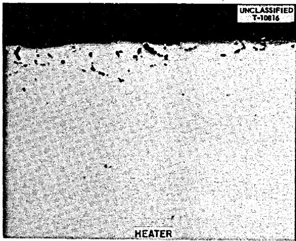

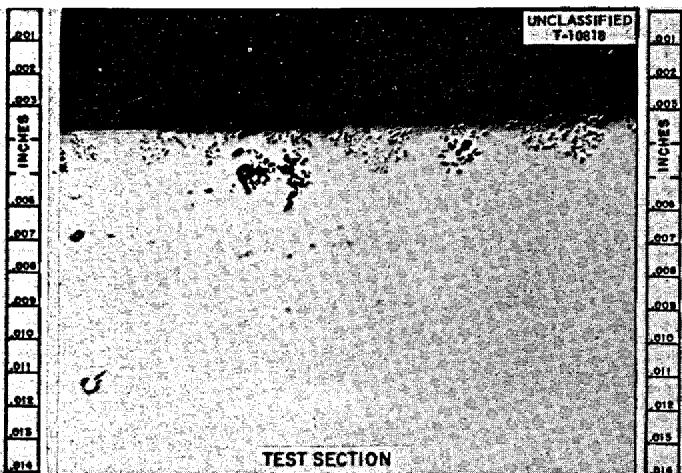  
Fig. 4.1.10. Corrosion Results of Thermal Cycling of Inconel Tubes Exposed to the Fuel Mixture (No. 30) NaF-ZrF $_4$ -UF $_4$ (50-46-4 mole %). Run ET-C: mean fluid temperature, $1580^{\circ}\mathrm{F}$ ; heater inside surface temperature, $1755 \pm 190^{\circ}\mathrm{F}$ ; test section inside surface temperature, $1613 \pm 37^{\circ}\mathrm{F}$ . 250X. Reduced 31%. (Secret with caption.)

The use of the "floating" electrodes previously described has been temporarily abandoned because of continuing failures at the electrodes. The modified electrodes (Fig. 4.1.13), fabricated of Inconel, are welded or brazed to the tube and

supported from above by thin, flexible rods. The power connections are made through copper braids clamped to the electrodes. The bellows provided to relieve the stresses of linear thermal expansion has been relocated so that the forces are applied along the axis of the bellows.

While the thermal cycling data presented here are preliminary, the rate of corrosive attack on the

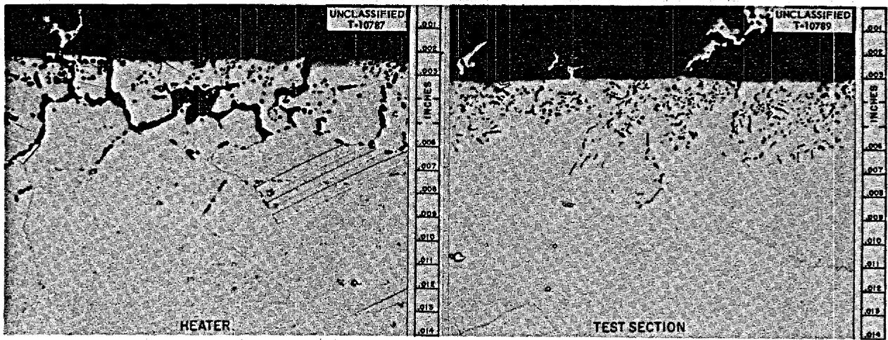  
Fig. 4.1.11. Corrosion Results of Thermal Cycling of Inconel Tubes Exposed to the Fuel Mixture (No. 30) NaF-ZrF₄-UF₄ (50-46-4 mole %). Run ET-D: mean fluid temperature, 1580°F; heater inside surface temperature, 1755 ± 190°F; test section inside surface temperature, 1590 ± 83°F. 250X. Reduced 30%. (Secret with caption)

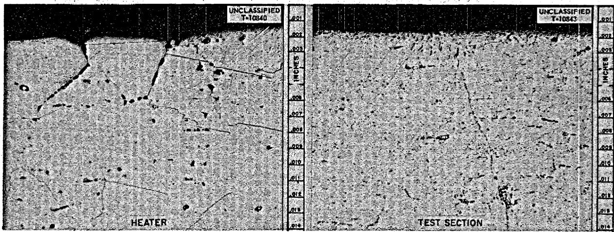  
Fig. 4.1.12. Corrosion Results of Thermal Cycling of Inconel Tubes Exposed to the Fuel Mixture (No. 30) NaF-ZrF $_4$ -UF $_4$ (50-46-4 mole %). Run ET-E: mean fluid temperature, $1615^{\circ}\text{F}$ ; heater inside surface temperature, $1905 \pm 235^{\circ}\text{F}$ ; test section inside surface temperature, $1635 \pm 43^{\circ}\text{F}$ . 250X. Reduced 31%. (Secret with caption).

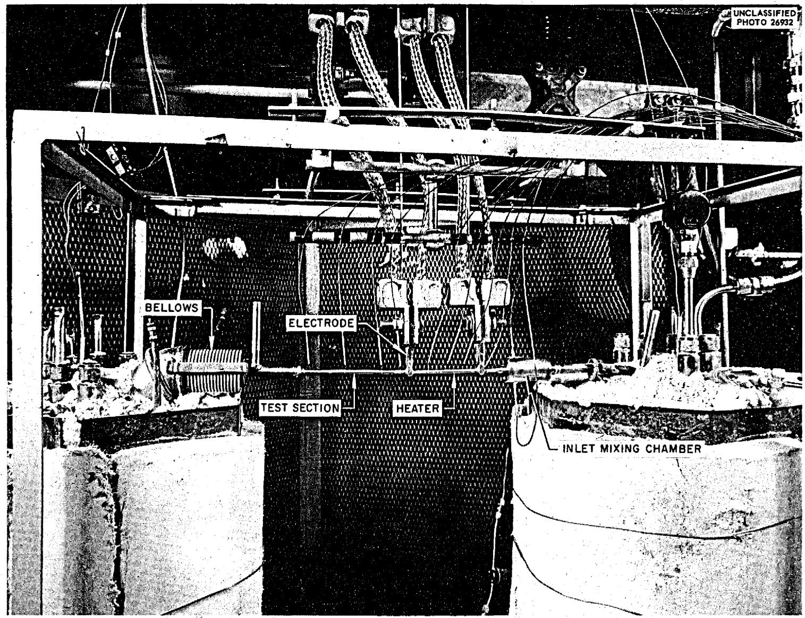  
ANP PROJECT PROGRESS REPORT   
Fig. 4.1.13. Thermal Cycling System.

Inconel for the runs ET-C, ET-D, and ET-E is noteworthy. Whether this is to be attributed to the very large fuel volumes and the small areas of heated surface, to the high temperatures at the metal-fluid interface, or to thermal cycling of this interface has not yet been established. An experiment is now in progress to establish a base corrosion rate for this specific system under isothermal conditions with interface temperatures in the range of 1600 to $1800^{\circ}\mathrm{F}$ . It is to be noted that both runs ET-D and ET-E failed due to breaks in the Inconel tube at the outlet end of the heater, immediately adjacent to the electrode. The effect on the tube of the constraint imposed by the electrode is not known. Experiments are planned in which the electrode will contact only one-half of the tube circumference at the electrode position. Alternative approaches to thermal cycling experiments that eliminate the need for electrodes are being investigated.

# SHIELD MockUP CORE STUDY

L. C. Palmer

The recently initiated study of the temperature structure in the Shield Mockup Core is continuing. In particular, the temperature distributions in the beryllium reflector and the various Inconel shells are being determined. An effort is being made to explore the possibility of eliminating the cooling system for the beryllium reflector by the reduction of certain high thermal resistances in the system.

10S. I. Cohen, W. D. Powers, and N. D. Greene, A Physical Property Summary for ANP Fluoride Mixtures, ORNL-2150 (Aug. 23, 1956).

# HEAT CAPACITY

W. D. Powers

A study was conducted to determine the influence of fission products in a fluoride fuel mixture on the enthalpy and heat capacity in the liquid state. Quantities of $\mathsf{RbF}$ , $\mathsf{BaF}_2$ , and $\mathsf{LaF}_3$ were added to a zirconium-base fuel to simulate an ANP fuel heavily laden with fission products resulting from 1000 hr of exposure to a neutron flux of $10^{15}$ neutrons/cm²·sec. The results of the measurements, presented in Table 4.1.2, indicated that, within experimental error, the change in heat capacity as a result of the addition of simulated fission products was negligible. This result had previously been predicted on the basis of the established heat capacity correlation expression. The enthalpies of the fuel with the additives were about 10 cal/g less than those of the fuel alone. Earlier enthalpy and heat capacity measurements on the fuel without additives are also given in Table 4.1.2 to illustrate the reproducibility of the data.

# VISCOSITY AND DENSITY

S. I. Cohen

A summary of the density, viscosity, heat capacity, thermal conductivity, electric conductivity, and surface tension measurements that have been made at ORNL during the past several years was prepared and issued. Viscosity measurements were made on LiF-BeF $_2$ -ThF $_4$ -UF $_4$ (71-16-12-1 mole %), which is a mixture of possible interest in

TABLE 4.1.2. COMPARISON OF ENTHALPIES AND HEAT CAPACITIES OF FUEL MIXTURES WITH AND WITHOUT SIMULATED FISSION-PRODUCT ADDITIVIES   

<table><tr><td rowspan="2">Material</td><td colspan="3">Enthalpy, HT-H30°C (cal/g)</td><td colspan="3">Heat Capacity (cal/g·°C)</td></tr><tr><td>At 600°C</td><td>At 700°C</td><td>At 800°C</td><td>At 600°C</td><td>At 700°C</td><td>At 800°C</td></tr><tr><td>NaF-ZrF4-UF4(50-46-4 mole %)</td><td></td><td></td><td></td><td></td><td></td><td></td></tr><tr><td>Data obtained in 1955</td><td>171.0</td><td>197.2</td><td>222.6</td><td>0.266</td><td>0.258</td><td>0.249</td></tr><tr><td>Data obtained in 1956</td><td>168.1</td><td>195.2</td><td>221.3</td><td>0.276</td><td>0.266</td><td>0.256</td></tr><tr><td>NaF-ZrF4-UF4-RbF-BoF2-LaF3 (47.6-43.7-3.8-1.1-1.0-2.8 mole %)</td><td>158.5</td><td>186.0</td><td>212.0</td><td>0.283</td><td>0.268</td><td>0.253</td></tr></table>

the fused-salt power reactor program. The viscosities were found to vary from about 13 centipoises at $600^{\circ}\mathrm{C}$ to 4.8 centipoises at $800^{\circ}\mathrm{C}$ .

# THERMAL CONDUCTIVITY

# W. R. Gambill

A tentative correlation has been developed for the prediction of the thermal conductivities of fused salts and salt mixtures at their melting points. For this correlation the total conductive heat transmission of the fused salt is divided into the two distinct contributions. One is the atomic or lattice portion, which arises from the short-range atomic or molecular order present in liquids, in general; and the other is the ionic portion, which arises from a drift of ions, and subsequent energy transfer, between atoms.

11W. R. Gambill, Prediction of the Thermal Conductivity of Fused Salts, ORNL CF-56-8-61 (Aug. 10, 1956).

The atomic portion of the total conductivity, $(k_{A})_{m^{\prime}}$ in Btu/hr.ft²(°F/ft), may be correlated by the expression

$$
(k _ {A}) _ {m} = 1 0. 4 3 \frac {T _ {m} ^ {1 / 2} \rho_ {m} ^ {4 / 5}}{\bar {M} ^ {9 / 5}},
$$

where

$T_{m} =$ melting temperature or liquidus tempera-ture (for mixtures), ${}^{\circ}\mathsf{K},$

$\rho_{m} =$ density of fused salt at $T_{m}, g/cm^{3}$

M = molecular weight for pure salts = $\sum_{i}x_{i}M_{i}$

for salt mixtures,

$x_{i} =$ mole fraction of ith component,

$M_{i} =$ molecular weight of ith component.

The ionic portion of the total conductivity is plotted in Fig. 4.1.14. With the exception of NaOH,

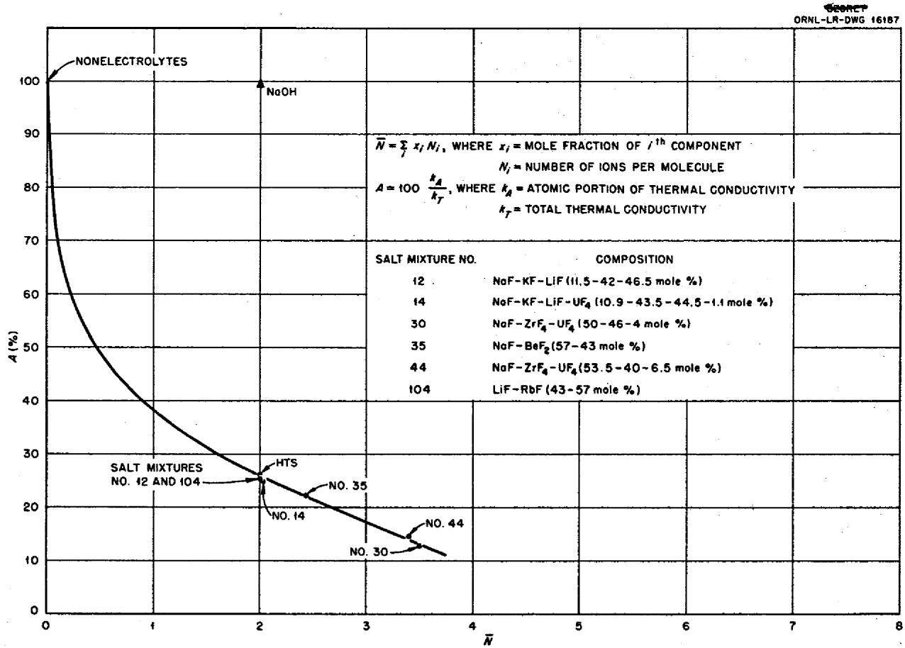  
Fig. 4.1.14. Thermal Conductivities of Fused Salts at Their Melting Temperatures and Salt Mixtures at Their Liquidus Temperatures.

the data lie along a smooth curve. The deviation of NaOH is believed to be caused by the intense hydrogen bonding (between OH radicals), which effectively reduces the ionic component of the conductivity to a negligible value.

A relation for predicting the temperature dependence of the thermal conductivities of fused salts is currently being studied. It can not satisfactorily be evaluated, however, until more temperature-dependent conductivity data are available.

# 4.2. RADIATION DAMAGE

# G.W. Keilholtz

# EXAMINATION OF DISASSEMBLED MTR IN-PILE LOOPS NOS. 3, 4, AND 5

A. E. Richt

C. Ellis

R. N. Ramsey

E. J. Manthos

E. D. Sims

W. B. Parsley

R. M. Wallace

Examination of MTR in-pile loop No. 3, described previously, was completed, except for metallographic examination of the pump impeller. Corrosion of the nose coil was found to vary from 1 mil near the inlet to a maximum of 3 mils of intergranular attack near the outlet, Fig. 4.2.1. Comparisons of the inner wall of the nose-coil tubing

$^{1}$ L. P. Carpenter et al., ANP Quar. Prog. Rep. Dec. 10, 1955, ORNL-2012, p 27.

UNCLASSIFIED L-LR-DWG 16188

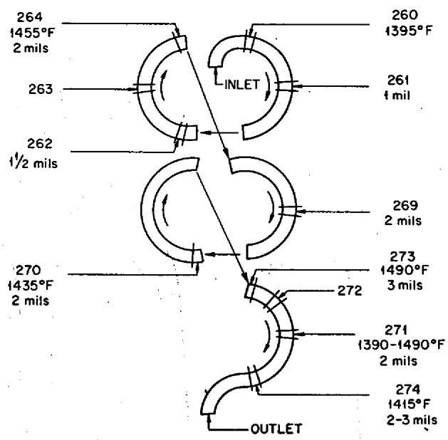  
Fig. 4.2.1. Diagram of Sectioned Nose Coil of MTR In-Pile Loop No. 3 Showing Locations from Which Metallographic Samples Were Taken, the Maximum Temperature Which Occurred at the Particular Location During Operation, and the Depth of Corrosive Attack Found by Subsequent Metallographic Examination of the Samples.

on the compression side of the coil with the opposite inner wall on the tension side showed no differences in depth of attack. The depths of attack found on the straight sections of the fuel tube are compared in Fig. 4.2.2. Photomicrographs of samples from the nose coil and the straight sections are presented in Figs. 4.2.3 through 4.2.7. No mass-transferred crystals were found on any of the specimens.

Disassembly of MTR in-pile loop No. 4 has been started, but as yet no results are available. Operation of this loop was described previously.2

In-pile loop No. 5, which was inserted in the MTR but could not be filled, was shipped to ORNL for disassembly after the section behind the pump motor was removed at the MTR. During the attempt to fill the loop the fuel-circulating pump seemed to be chattering, some of the thermocouples were not functioning properly, leakage occurred through the pump bulkhead, and a fill-line Calrod heater failed after it had been raised to higher than normal operating temperatures.

2C. C. Bolta et al., ANP Quar. Prog. Rep. June 10, 1956, ORNL-2106, p 75.

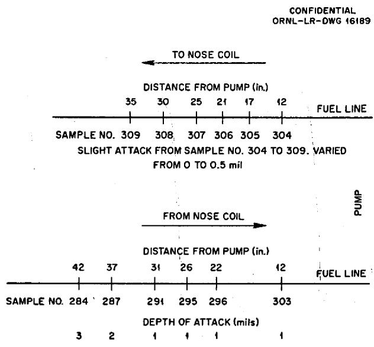  
Fig. 4.2.2. Results of Metallographic Examinations of Straight Sections of Fuel Tubing from In-Pile Loop No.3.

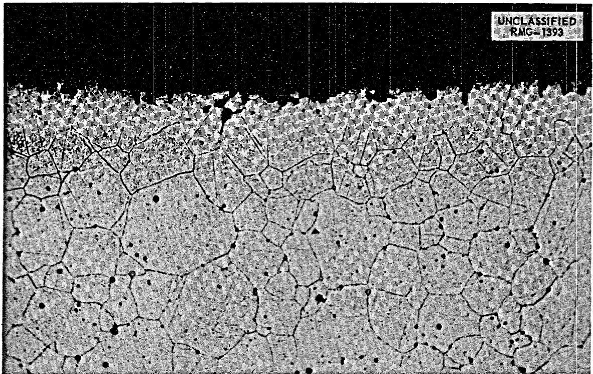

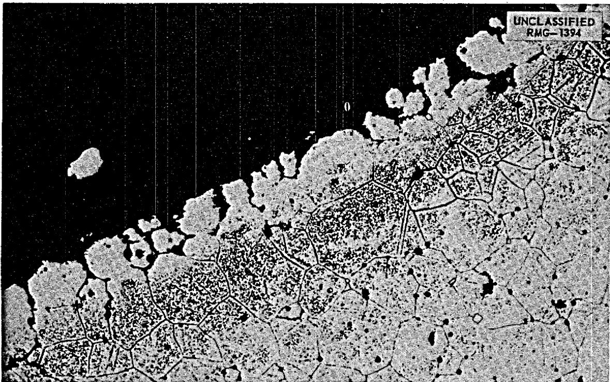  
Fig. 4.2.3. Sample No. 264, Taken Near Inlet End of Nose Coil of MTR In-Pile Loop No. 3, Showing Intergranular Corrosion to a Depth of 2 mils. 250X. (Confidential with caption)   
Fig. 4.2.4. Sample No. 273, Taken Near Outlet End of Nose Coil of MTR In-Pile Loop No. 3, Showing Intergranular Corrosion to a Depth of 3 mils. 250X. (Confidential with caption)

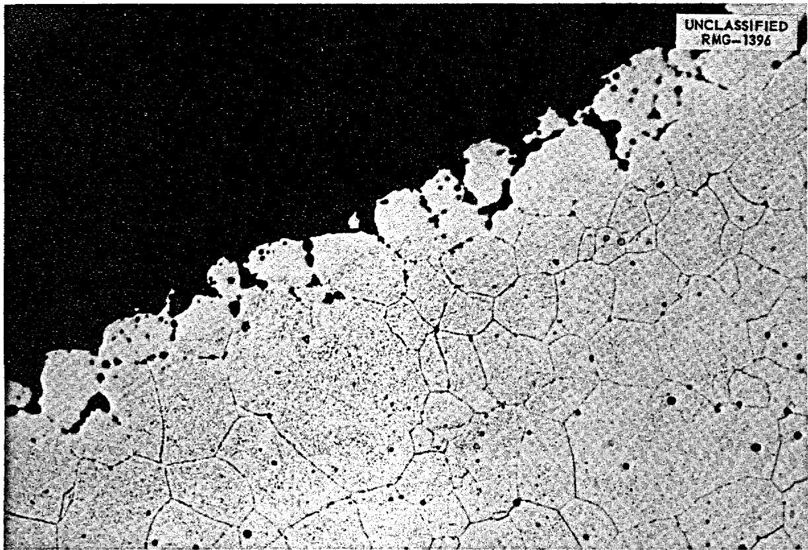

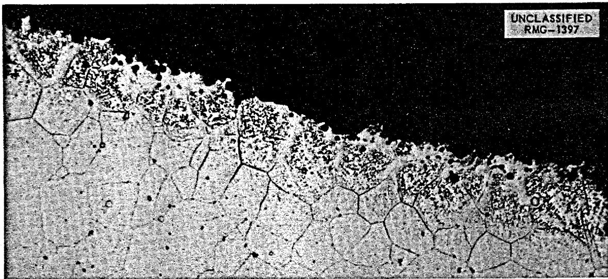  
Fig. 4.2.5. Sample No. 284 Taken from Straight Section of Fuel Tubing Near Outlet of Nose Coil at a Point 42 in. from the Pump of MTR In-Pile Loop No. 3. Intergranular corrosion to a depth of 3 mils may be seen. 250X. (Confidential with caption.)   
Fig. 4.2.6. Sample No. 303 Taken from Straight Section of Fuel Tubing Between the Nose Coil Outlet and the Pump at a Point 12 in. from the Pump of MTR In-Pile Loop No. 3. Intergranular corrosion to a depth of 1 mil may be seen. 250X. (Confidential with caption)

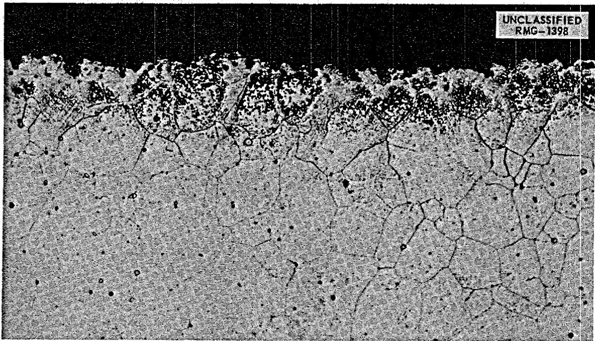  
Fig. 4.2.7. Sample No. 304 Taken from Straight Section of Fuel Tubing Between Pump and Nose Coil Inlet at a Point 12 in. from the Pump of MTR In-Pile Loop No. 3. Intergranular corrosion to a depth of 0.5 mil may be seen. 250X. (Confidential with caption)

The inlet fuel line to the nose coil was found to be full of fuel at a point $24\frac{1}{2}$ in. from the face of the pump, and a shallow layer of fuel was found in the outlet line from the nose coil at the same distance from the pump. The fuel in the inlet and outlet lines at a point $22\frac{3}{4}$ in. from the face of the pump is shown in Fig. 4.2.8.

A radiograph of the fill tank, fill line, and vent line, Fig. 4.2.9, showed the fuel in the fill line to have frozen solid for the first $4\frac{1}{2}$ in. from the fill tank, and, from that point on, there were cavities in the fuel. The vent line appeared to be clear, except for a few particles and a deposit close to the pump. The fuel in the fill line at the point of maximum fuel porosity, 1.6 in. from the pump, is shown in Fig. 4.2.10. The plug probably occurred in the fill line at this point, since the fuel found here was different in appearance from that found closer to the fuel tank where no porosity was observed. The fuel in the fill tank is shown in Fig. 4.2.11. The pump sump was devoid of fuel. Thirteen fuel samples were obtained for chemical analysis at various locations around the loop.

The fill-line Calrod heater failure was located and is shown in Fig. 4.2.12. The pump chattering

was probably caused by rubbing of a wiper ring behind the slingers on the slinger shaft, Fig. 4.2.13. All the thermocouples in the nose-coil region appeared to be in operating condition. Thermocouple No. 28, which was at the rear of the fill line, could not be found. The cause of the leakage through the pump bulkhead could not be determined, since the damage of the glass seals may have occurred during disassembly.

# INVESTIGATION OF MATERIALS REMOVED FROM MTR IN-PILE LOOPS NOS.3 AND 5

R. P. Shields

Chemical analyses of fuel and other materials from MTR in-pile loop No. 3 have been made. A partially completed study of the results has indicated that, on the basis of the chemical analysis of the fuel for iron, chromium, and nickel, very slight, if any, corrosion occurred. The amber-colored material found in the pump region was probably an oil-decomposition product. This conclusion is based on the fact that the material is

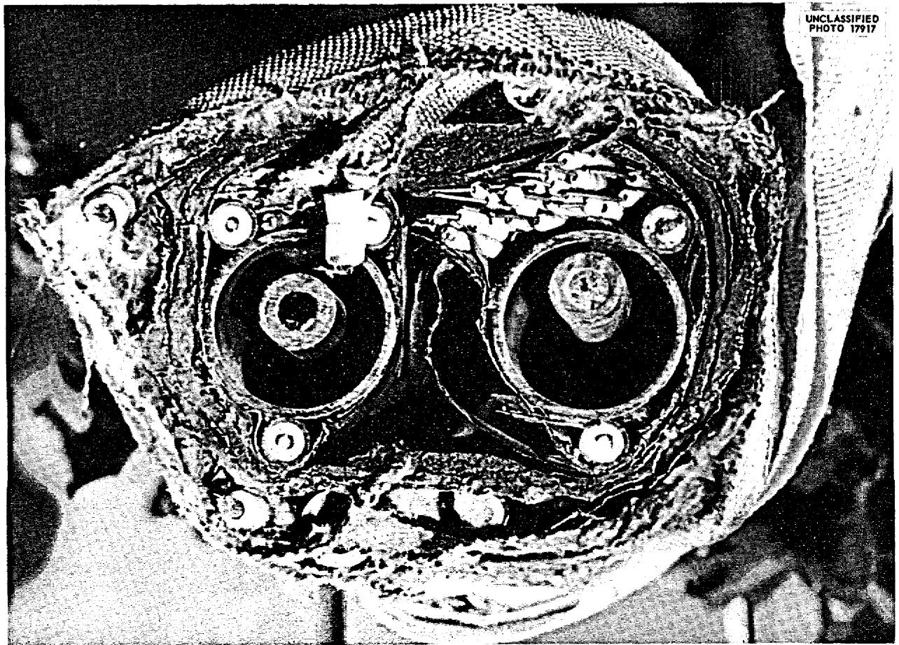  
Fig. 4.2.8. Section Through Straight Sections of Fuel Tubing Between Nose Coil and Pump at a Point $22\frac{3}{4}$ in. from Pump of MTR In-Pile Loop No. 5. The small-diameter tube that is full of fuel is the inlet line, and the small-diameter tube that has a shallow layer of fuel is the outlet line.

soluble in acetone, is waxlike in consistency, and has a fairly broad melting point of $225 \pm 10^{\circ} \mathrm{C}$ . Considerable deposits of $\mathbf{C s}^{137}$ and $\mathbf{S r}^{89}$ were found inside the copper lines leading to the fission-gas-adsorber trap. Samples of carbon taken from the trap showed no evidence of oil deposits and had low radioactivity after they had been flushed with helium. The fission products $\mathbf{C s}^{137}$ and $\mathbf{S r}^{89}$ were present in the carbon in small amounts.

Samples of fuel from MTR in-pile loop No. 5 were taken for analysis. The analysis of the fuel may give some indication as to why it was not possible to fill this loop successfully.

# CREEP AND STRESS-CORROSION TESTS OF INCONEL

J. C. Wilson

W.W.Davis N.E.Hinkle J.C.Zukas

A series of burst tests of Inconel tubing at a stress of 2000 psi in helium has been essentially completed out-of-pile and in the LITR at temperatures of 1450, 1500, and $1550^{\circ}\mathrm{F}$ . The scatter of the limited amount of data obtained at 1450 and $1550^{\circ}\mathrm{F}$ prevents any quantitative interpretations of effects of irradiation at those temperatures. Ten tests have been completed at $1500^{\circ}\mathrm{F}$ , however, and

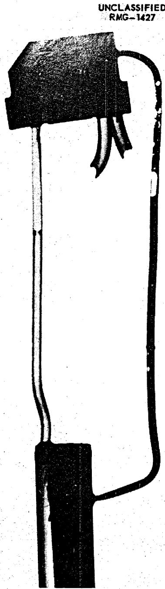  
Fig. 4.2.9. Radiograph of Fill Tank, Fill Line, and Vent Line of MTR In-Pile Loop No.5. (Confidential with caption)

two more tests are under way. Specimens irradiated in HB-3 of the LITR broke at times varying from 113 to 560 hr, with the arithmetic mean time for rupture being 260 hr. The out-of-pile test specimens fractured at times varying from 350 to 1270 hr

(with two specimens still in test at 407 and $490\mathrm{hr}$ with a mean rupture time of at least 760 hr. Thus, a decrease in rupture life of this thin-walled (0.010-in.-wall, 0.191-in.-ID) tubing appears to have resulted from irradiation.

As was reported earlier,4 the tubing stock used gave many indications of defects during ultrasonic nondestructive testing, but attempts to find the indicated defects metallographically were seldom successful. The presence of defects in the tubing may have influenced the results of the tests in the LITR. Carefully inspected tubing stock of the type to be used in ART NaK-to-air radiators has been received for burst tests in helium and in fused salt fuel mixtures. Additional temperature controllers and pneumatic gaging equipment have been received with which to expedite the tests.

Another test of the stress-corrosion apparatus designed for operation in HB-3 of the LITR was made. The fuel mixture (No. 46) NaF-ZrF $_4$ -UF $_4$ (62.5-12.5-25 mole %) was used in an effort to attain the desired maximum temperature of $1500^{\circ}\mathrm{F}$ , but the highest temperature reached was only $1200^{\circ}\mathrm{F}$ . In order to assure a maximum temperature of $1500^{\circ}\mathrm{F}$ during the next irradiation an improved heater is to be used and the number of conductive fins will be reduced. Improved instrumentation has been built to record continuously the test variables and to reduce the fission-gas hazard. Work continues on improved safety systems for the high-pressure circuit in order to adapt the apparatus for use in the MTR. Furnace arrangements for the MTR irradiations are also being tested.

Two tensile-creep bench tests of Inconel bar were made at $1500^{\circ}\mathrm{F}$ and a stress of 1500 psi in helium that duplicated the tensile-creep test made in HB-3 of the MTR. Both bench specimens fractured out of gage at 542 and 614 hr. Elongations in the bench tests were 1.0 and $1.9\%$ , respectively. Preliminary examination suggested that local overheating outside the gage length had caused premature fracture. The in-pile test showed $1.7\%$ elongation after 760 hr.

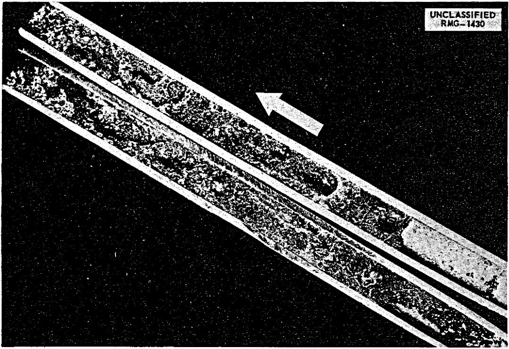  
Fig. 4.2.10. Sectioned Fill Line, 3 in. Long, from Point at Which Maximum Fuel Porosity Is Shown in Fig. 4.2.9, 1.6 in. from Pump. 2.4X. Reduced $10\%$ . (Confidential with caption)

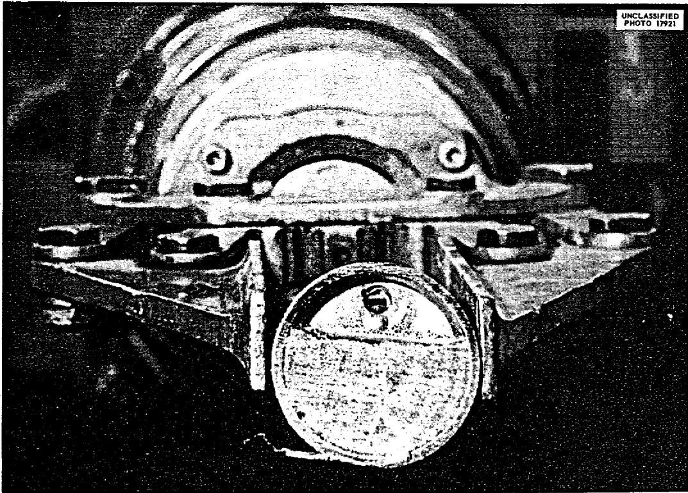  
Fig. 4.2.11. Cap from Fill Tank of MTR In-Pile Loop No. 5 with Fuel in It. The hole in the cap is the vent line entrance. (Confidential with caption)

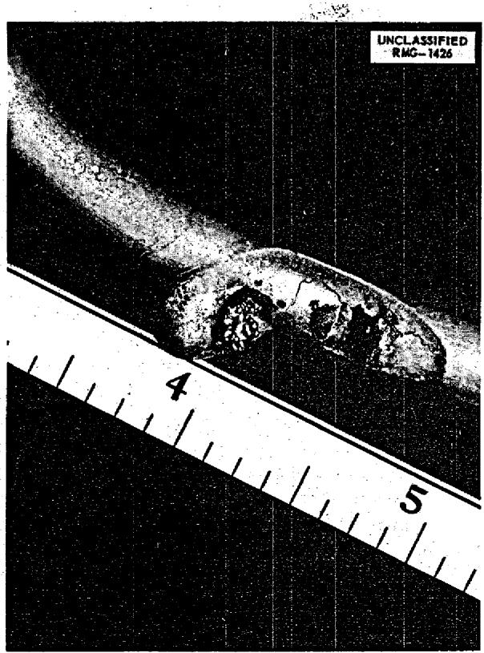  
Fig. 4.2.12. Fuel Fill-Line Calrod Heater That Failed During Attempt to Fill MTR In-Pile Loop No.5. (Confidential with caption)

# MTR STRESS-CORROSION APPARATUS

J.C.Wilson

C. D. Baumann

W. E. Brundage

Final assembly of equipment for MTR stress-corrosion experiments has been held up by a delay in shipment of the proper high-temperature, high-pressure hermetic seals. Molybdenum wire heaters for the apparatus have been successfully fabricated inside a tubular ceramic form. The fuel mixture NaF-ZrF4-UF4, containing sufficient uranium to give the heating desired, has been received and loaded into the Inconel specimen tube.

# EFFECT OF RADIATION ON STATIC CORROSION OF STRUCTURAL MATERIALS BY FUSED SALT FUELS

W.E.Browning

H. L. Hemphill

The study of the effect of radiation on the corrosion of structural materials by fused salt fuels has been continued. Two static Inconel capsules containing the fuel mixture (No. 44) NaF-ZrF $_4$ -UF $_4$ (53.5-40-6.5 mole %) were irradiated in the MTR for over nine weeks at approximately $6 \, \text{kw/cm}^3$ . The capsules were at a temperature of $1570^{\circ}\text{F}$ during the irradiation. Near the end of the test period, a thermocouple failure led to a temperature

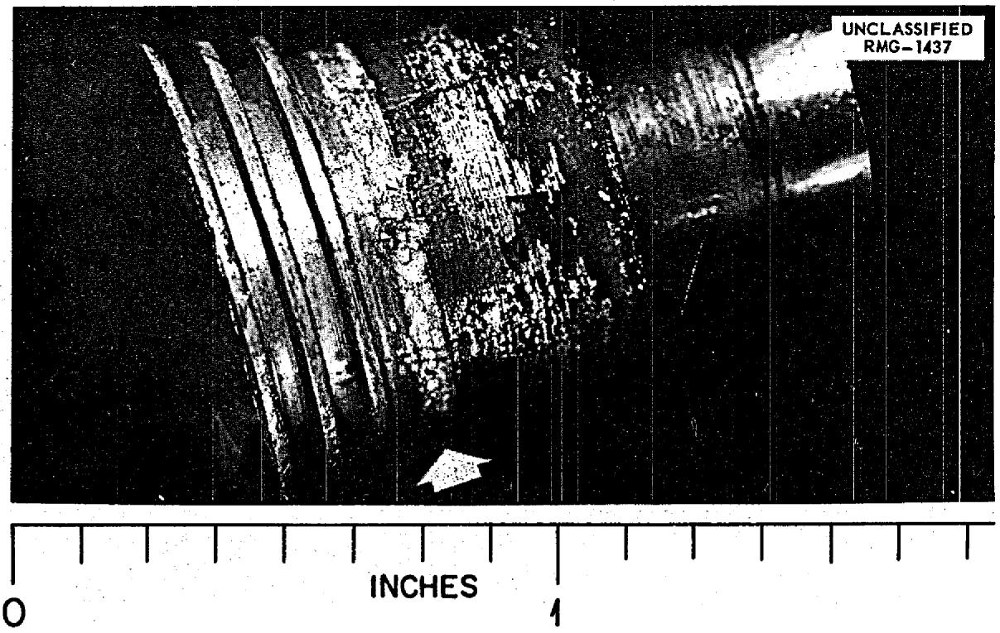  
Fig. 4.2.13. Abraded Region on Pump Slinger Shaft That Was Caused by Rubbing of a Wiper Ring Behind the Slingers During Attempt to Fill MTR In-Pile Loop No. 5. (Confidential with caption)

excursion, as yet unevaluated, and one capsule released fission-product activity into the cooling air off-gas line. By increasing the flow of cooling-air sufficiently to freeze the fuel, the radiation level at the top of the reactor due to the off-gas line activity was reduced from 200 r/hr to 100 mr/hr without interruption of reactor operation. The radioactivity was confined to the off-gas system and there was no contamination of the air of the building. The irradiation of the other capsule was completed without incident. A second pair of Inconel capsules containing the same fuel mixture (No. 44) is being irradiated at $1500^{\circ}\mathrm{F}$ , and the planned exposure period is again nine weeks.

Five Inconel capsules containing NaF-ZrF4-UF4 fuel mixtures that were previously irradiated have been opened, and samples have been submitted for chemical analysis and metallographic examination. Hastelloy B capsules have been filled with

an NaF-KF-LiF-UF4 fuel mixture containing 5.8 mole % UF4 and are being prepared for bench tests and MTR irradiation. These capsules are nickel-chromium plated on the outside surface to provide protection from atmospheric oxidation.

Some improvements in design of the MTR-ORNL2B irradiation facility have been accomplished. The capsule, shown in Fig. 4.2.14, is prepared in the same way as before; the test capsule is the part in the center of the photograph with the thermocouples attached. The separate part to the left is the sleeve which slips over the capsule and defines the cooling-air annulus. The three small flattened tubes carry the thermocouple wires into the tube at the right. The complete length of the tube at the right can be seen in Fig. 4.2.15 with a compression spring on the end. The thrust of the spring keeps the air annulus sleeve in place in a tapered seat in the outer tube shown at the top

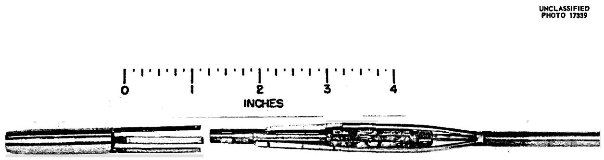

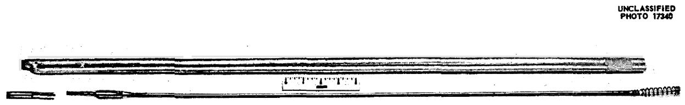  
Fig. 4.2.14. Inconel Capsule and Associated Equipment for MTR Irradiation.   
Fig. 4.2.15. Equipment, Including Outer Jacket, for Irradiation of Inconel Capsules in the MTR.

of Fig. 4.2.15. The outer tube has two parts, a 5.8-in.-OD tube for the capsule and a 3.8-in.-OD air-return tube. Both parts are welded to $\frac{3}{8}$ -in.-OD air tubes which extend to the top of the reactor tank; the air-in tube carries the thermocouple leads. Each capsule is jacketed individually in this way. This assembly can be irradiated either in the B-4 facility or in one of the standard A positions in the MTR.

# HOLDUP OF FISSION GASES BY CHARCOAL TRAPS

W.E.Browning

D. E. Guss6

A series of charcoal traps of different geometries but with the same amount of charcoal are being tested in radiokrypton holdup experiments. Nitrogen purge gas is used for these tests at various temperatures below room temperature. The results of these tests will aid in extending the relationships reported earlier to the evaluation of traps of different shapes.

# ART OFF-GAS SYSTEM INSTRUMENTATION ANALYSIS

W.E.Browning

R.P. Shields

Preparations are being made for investigating the resolution, sensitivity, and general performance of scintillation gamma-ray spectrometers of the type to be used on the ART off-gas system. The purpose of the tests will be to determine the limitations which might result from the rather drastic departure which must be made from conventional spectrometer geometry because of the high intensity of the source.

# LITR VERTICAL IN-PILE LOOP

W.E.Browning

D. E. Guss

H. E. Robertson

M. F. Osborne

R. P. Shields

The cause of the failure of the pump in the LITR vertical in-pile loop, previously described, has been determined. A screw came loose and lodged in the impeller and thus threw the impeller out of balance enough to bend the shaft. The bent shaft rubbed against the impeller housing and stalled the

motor. The screw served as a shear pin to prevent the impeller from unscrewing from the shaft. The shaft was peened around the screw to hold it in place. It is not known why the peening failed to hold the screw. This method of fastening various internal parts will be replaced by welding in future loop fabrication.

Tests have been continued on a modified pump for use in future loops. The modified motor and pump assemblies are shown in Fig. 4.2.16. The modifications include precision bearings, a shorter and stiffer shaft, a greater clearance around the impeller, and an enlarged pump exhaust port. An improved radiation-resistant grease has become available for use in future operation.

High-temperature tests of the new shaft have led to a design in which the highest bearing-part temperature will be $105^{\circ}\mathrm{C}$ , even when the temperature of the shaft where it enters the fuel is as high as $950^{\circ}\mathrm{C}$ . These temperatures are for a stationary shaft; the bearing temperature for a rotating shaft will be lower because of heat transfer by the rolling balls. The overall shaft overhang is only 4 in., of which $1\frac{3}{4}$ in. is in the fuel. Longitudinal conductive heat transfer is suppressed by use of a hollow shaft and the four rows of radial holes visible in Fig. 4.2.16a. Radial heat transfer from the shaft to the lower bearing is decreased by a set of longitudinal grooves which reduce the area of contact between the shaft and the lower bearing. This distributes the heat flux more equally between the two bearings and thus reduces the temperature of the inner race of the lower bearing.

Bearing tests have been run in helium under simulated conditions of temperature and heat flux with both the new and old radiation-resistant lubricants. The satisfactory performance obtained under these conditions indicates that the bearing clearance is sufficient for the design thermal gradient through the bearing and that the bearing temperatures are not so high that the grease will be damaged in the absence of radiation.

In the design of the pump a compromise had to be made on the impeller clearance. A large clearance was desired to ease the shaft alignment problem, but the clearance must not be so large as to allow leakage that would greatly reduce pump efficiency. Performance tests have been run to optimize this design choice. Impeller clearances have been increased from a range of 0.010 to 0.020 in. at various positions to 0.050 to 0.070 in. This

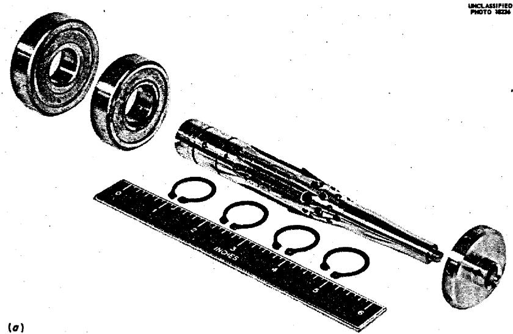

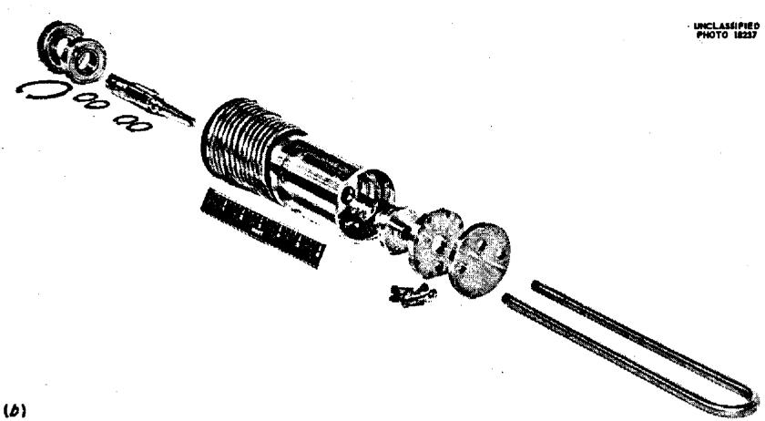

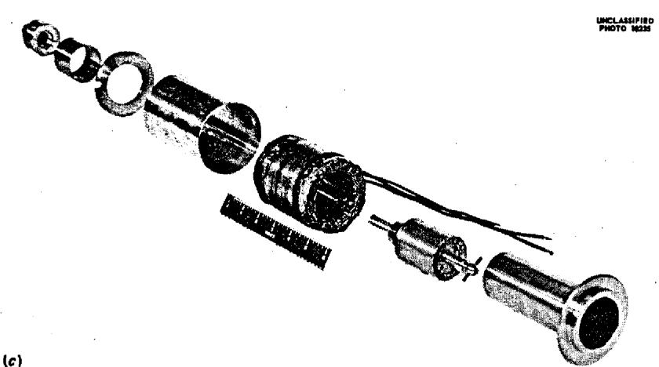  
Fig. 4.2.16. Modified Motor and Pump for Use in LITR Vertical In-Pile Loop. (a) Impeller and shaft components. (b) Pump assemblies. (c) Motor parts.

increase caused a measurable but unimportant decrease in pump efficiency. The pump performance tests were run with water in a plastic model of the pump. The test results are presented in Fig. 4.2.17, which shows the pump pressure as a function of water flow before and after the increase in clearance for various pump speeds. The resistance curve for the test loop is also shown. Both sets of curves are for a pump having a larger exit port than was formerly used. The results of the two changes are approximately equal and opposite at the design point, so the pump is still operated at about the same speed.

The pressure vs flow data obtained with water were converted to values for fused salt fuel by using recently obtained values for the viscosity and density of the fuel mixture (No. 41) NaF-ZrF $_4$ . UF $_4$ (63-25-12 mole %). A plot of the estimated Reynolds number for the fuel in the LITR vertical in-pile loop as a function of pump speed is presented in Fig. 4.2.18.

A full-scale Inconel pump has been assembled that is identical with the pumps to be used in the

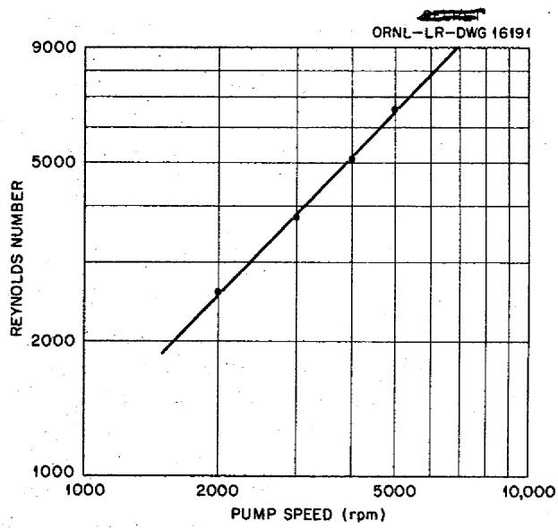  
Fig. 4.2.18. Estimated Reynolds Number of the Fuel Mixture (No. 41) NaF-ZrF $_4$ -UF $_4$ (63-25-12 mole %) in LITR Vertical In-Pile Loop as a Function of Pump Speed.

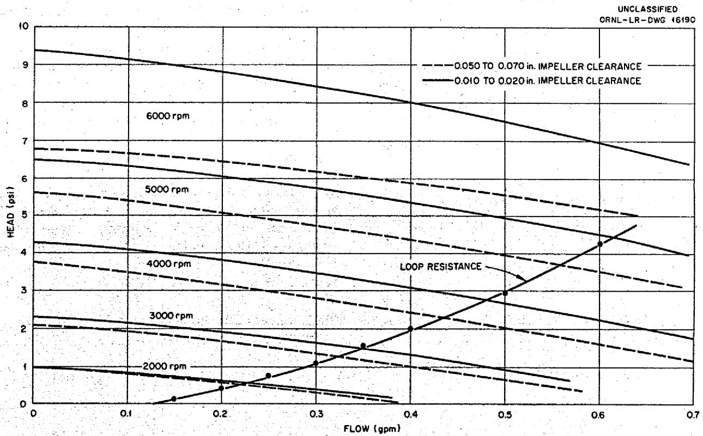  
Fig. 4.2.17. Performance Curves with Water for Modified Pump for LITR Vertical In-Pile Loop Before and After Increasing Impeller Clearances.

Inconel in-pile loops. It will be filled with depleted fuel and run in the laboratory under conditions as nearly like those which will exist in the reactor as possible. The existing parts for in-pile loops are being modified to incorporate these recent changes.

# DESIGN CALCULATIONS FOR LITR VERTICAL IN-PILE LOOP

M. T. Robinson J. F. Krause

An extensive series of design calculations for the LITR vertical in-pile loop was previously reported. In an appendix to that report, a method was presented for making such calculations by electronic analog simulation. The method was based on partial analytical solution of the differential equations describing the heat balance in the loop, followed by analog computation, supported by some desk-machine computation. The correct solutions were then found by interpolation among a family of analog computer results. A much-improved method of analog computation has now been devised which eliminates the interpolation procedure and the desk-machine work, as well as substantially shortens the amount of analog computation required to obtain correct solutions.

The new circuit has been used to make calculations of the behavior of the Mark VIII loop10 when circulating the fuel mixture (No. 41) NaF-ZrF4-UF4 (63-25-12 mole %) in position C-46 of the LITR. The flux data previously reported11 for that position were used. The physical property

data used for air were the same as those used for the previous calculations.10 The physical property data for the fuel mixture are given below:

Viscosity 4.3 centipoises

Specific heat 1.0 joule/g°C

Thermal conductivity 0.14 w/cm $^{\circ}$ C

Density 3.38 g/cm³

The loop was considered to be located with its tip at the mid-plane of the LITR. The flux was assumed to be depressed $50\%$ by the presence of the loop. The initial air temperature, $T_{a}^{0}$ , was always taken as $30^{\circ}C$ . A Reynolds number of 4000 was assumed for the fuel.

Some results of the calculations are summarized in Tables 4.2.1 and 4.2.2 and in Figs. 4.2.19 and 4.2.20. Typical profiles of the mixed-mean fuel temperature, $T_{f}$ , the fuel-metal interface temperature, $T_{1}$ , and metal-air interface temperature, $T_{2}$ are shown in Fig. 4.2.19, and profiles of the air temperature, $T_{a}$ , and of the heat transfer function, $y$ , are shown in Fig. 4.2.20. The discontinuities that occur in the plots of $T_{1}, T_{2}, T_{a}$ and $y$ result from the use of two separate cooling-air streams. Local heat flow would be expected to remove these discontinuities in the actual loop. The very different shapes of $T_{f}$ and of $T_{1}$ and $T_{2}$ are notable. This feature is important in analyzing experimental data, since $T_{2}$ is the only quantity for which a direct measurement can be obtained. Data on the effect of the initial fuel temperature ( $T_{f}^{0}$ ) on other quantities are presented in Table 4.2.1. As was realized before, $\Delta T_{f}$ is very little affected by changes in $T_{f}^{0}$ . It should be noted, however, that appreciable changes in cooling-air requirements are associated with changes in $T_{f}^{0}$ . Table 4.2.2 illustrates the effect of fuel flow rate on other quantities. The important points to notice are the close similarity of the values $\Delta T_{2}$ and $\Delta T_{f}$ , except at the lowest fuel Reynolds numbers; the

TABLE 4.2.1. EFFECT OF INITIAL FUEL TEMPERATURE ON COOLING-AIR REQUIREMENTS  

<table><tr><td>Tf0(℃)</td><td>Air
Reynolds
Number</td><td>T10(℃)</td><td>T20(℃)</td><td>ΔTf(℃)</td><td>ΔT1(℃)</td><td>ΔT2(℃)</td></tr><tr><td>750</td><td>34,500</td><td>659</td><td>641</td><td>87</td><td>81</td><td>83</td></tr><tr><td>800</td><td>31,500</td><td>708</td><td>690</td><td>88</td><td>83</td><td>85</td></tr><tr><td>850</td><td>29,750</td><td>756</td><td>738</td><td>89</td><td>85</td><td>86</td></tr></table>

TABLE 4.2.2. EFFECTS OF FUEL FLOW RATE ON COOLING-AIR REQUIREMENTS FOR AN INITIAL FUEL TEMPERATURE, $T_{f}^{0}$ , OF $800^{\circ}\mathrm{C}$   

<table><tr><td>Fuel Reynolds Number</td><td>Air Reynolds Number</td><td>T01(℃)</td><td>T02(℃)</td><td>ΔTf(℃)</td><td>ΔT1(℃)</td><td>ΔT2(℃)</td></tr><tr><td>2,000</td><td>46,000</td><td>477</td><td>460</td><td>163</td><td>134</td><td>139</td></tr><tr><td>3,000</td><td>34,000</td><td>650</td><td>632</td><td>114</td><td>104</td><td>106</td></tr><tr><td>4,000</td><td>31,500</td><td>708</td><td>690</td><td>88</td><td>83</td><td>85</td></tr><tr><td>6,000</td><td>29,500</td><td>751</td><td>732</td><td>59</td><td>57</td><td>58</td></tr><tr><td>8,000</td><td>29,000</td><td>764</td><td>746</td><td>44</td><td>43</td><td>45</td></tr><tr><td>10,000</td><td>29,000</td><td>770</td><td>752</td><td>36</td><td>35</td><td>36</td></tr></table>

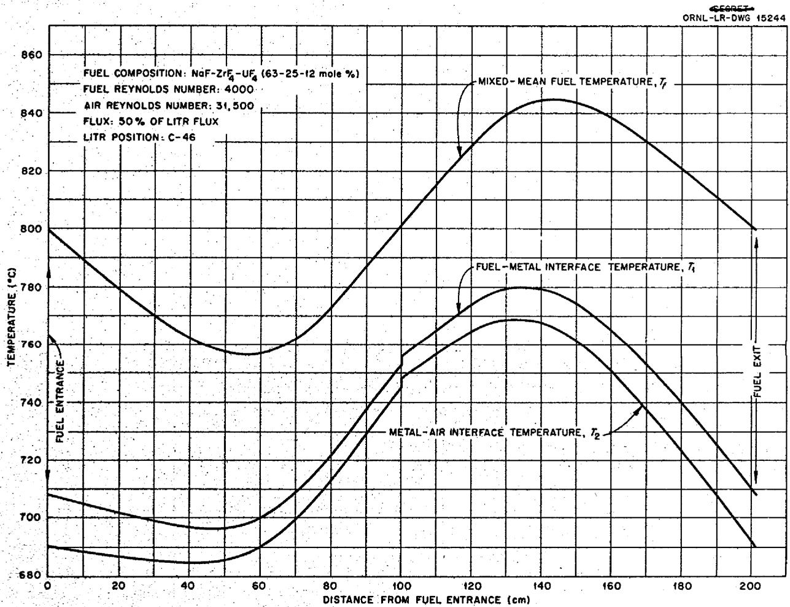  
Fig. 4.2.19. Calculated Temperature Profiles for LITR Vertical In-Pile Loop (Mark VIII).

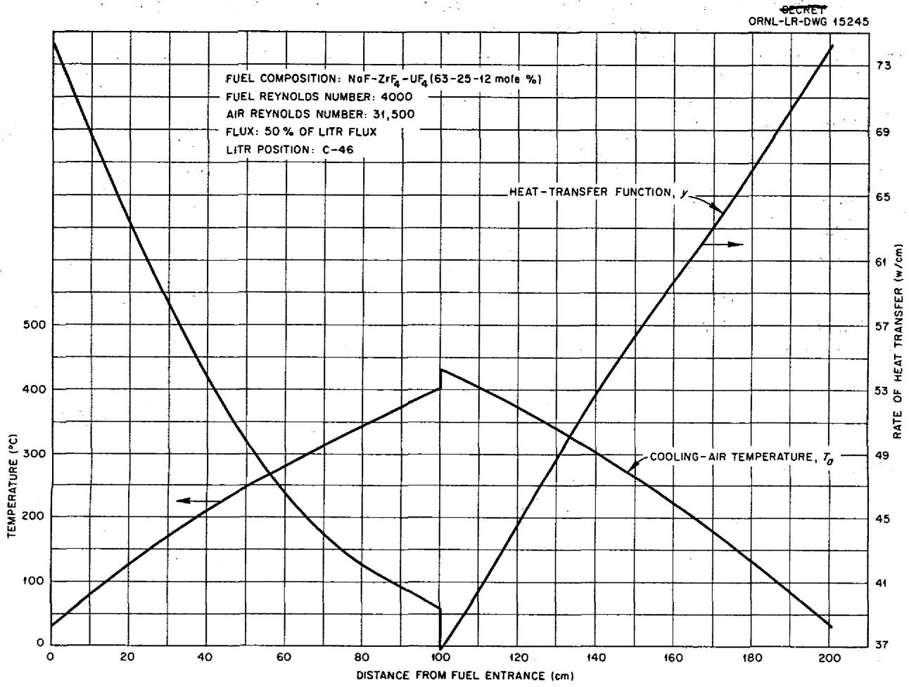  
Fig. 4.2.20. Calculated Air-Temperature and Heat-Transfer-Function Profiles for LITR Vertical In-Pile Loop (Mark VIII).

small difference between $T_{1}^{0}$ and $T_{2}^{0}$ ; and the large difference between $T_{f}^{0}$ and $T_{1}$ , especially at lower flow rates. The first point suggests that experimental values of $\Delta T_{2}$ may be used without correction to characterize fuel " $\Delta T$ " . The second point results from the fairly small heat extraction rate, around 30 w/cm² or less. The third point is most important in assessing corrosion results.

# ART REACTIVITY TRANSIENTS ASSOCIATED WITH FLUCTUATIONS IN XENON-REMOVAL EFFICIENCY

M. T. Robinson

J. F. Krause

The possibility has been investigated that fluctuations in efficiency of the ART xenon-removal equipment might lead to troublesome transients in reactivity. The calculations previously reported12

have been extended for this purpose. Since only short times are of interest here, the equations may be simplified to

(1) $\dot{x} = \lambda_{f}(a_{2}y - x)$   
(2) $\dot{y} = \beta \lambda_{f}(x - a_{2}y) - \lambda_{g}y = -\beta \dot{x} - \lambda_{g}y,$

where

$x = \mathrm{Xe}^{135}$ poisoning in the fuel,   
$y =$ "equivalent poisoning" in the gas phase,

$a_{2} = R T S_{s}$ the product of the universal gas constant, $R_{s}$ times the absolute temperature, $T_{s}$ times the solubility coefficient of xenon in the fuel, $S_{s}$

$\beta =$ ratio of volume of fuel to volume of gas phase,

$\lambda_{f} =$ rate constant for transfer of xenon from fuel to gas,

$\lambda_{g} =$ rate constant for removal of xenon from system by off-gas flow.

Equations 1 and 2 were solved with an electronic analog computer by using the block diagram shown in Fig. 4.2.21. The output of amplifier 1 is a

voltage proportional to $\dot{x}$ . This voltage is integrated in amplifier 2, the initial condition on the integration being set by the potentiometer $0.2x_{0}''$ . A voltage proportional to $x$ is fed to the recorder and to one input of the summing amplifier 4. The output of amplifier 1 is also fed through the potentiometer $a_{2}\beta''$ to one input of the summer-integrator, amplifier 3. The output of amplifier 3 is fed back through the potentiometer $a_{g}''$ to a second input of amplifier 3. This amplifier thus

UNCLASSIFIED

ORNL-LR-DWG 15241

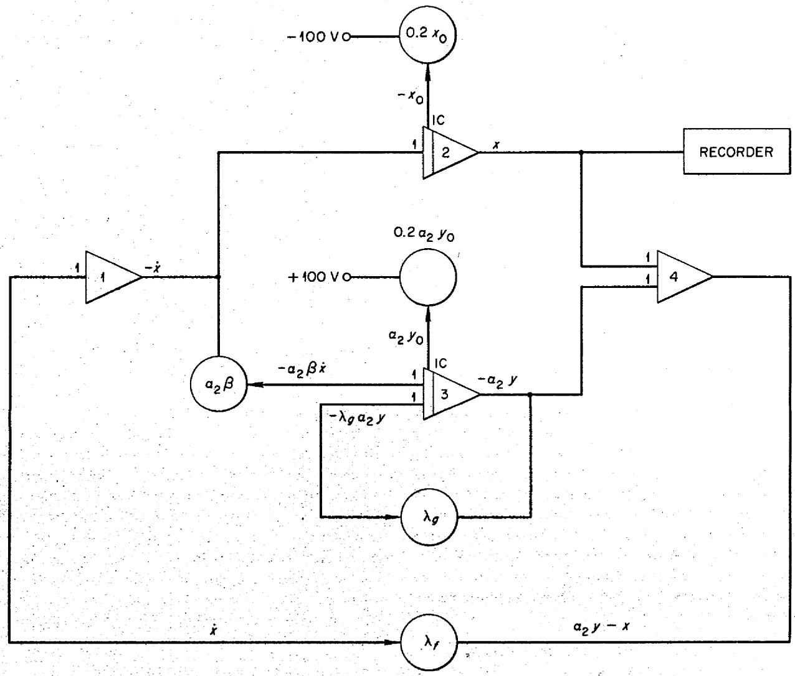  
Fig. 4.2.21. Block Diagram of an Electronic Analog Simulator for the Equations $\dot{x} = \lambda_{f}(\alpha_{2}y - x)$ and $\dot{y} = \beta \lambda_{f}(x - \alpha_{2}y) - \lambda_{g}y$ .

performs the operation

$$
a _ {2} \beta \dot {x} + a _ {2} \lambda_ {\varepsilon} y = - a _ {2} \dot {y}
$$

and then integrates $\dot{y}_i$ subject to the initial condition set by the potentiometer $0.2a_2y_0$ . A voltage proportional to $a_2y$ is fed from amplifier 3 to the second input of amplifier 4. The output of amplifier 4, proportional to $(a_2y - x)$ , is fed through the potentiometer $" \lambda _ { j } ^ { \prime \prime }$ to the input of amplifier 1. In analyzing Fig. 4.2.21, it should be noted that, in addition to performing the appropriate mathematical operation, each amplifier inverts the phase of the input voltage.

Scale factors for the computation were selected such that all constants had their true values. The scale chosen for $x$ and $y$ was such that 1% poisoning was represented by 20 v. The recorder could be used with either 20 v (1%) or 100 v (5%) full-scale settings. Real time was used throughout the computation. The data employed were taken from the previous report, [12] subsequent modifications in ART design being considered more or less irrelevant. It was assumed that the reactor had reached xenon equilibrium under conditions specified by selected values of $\lambda_f$ and $\lambda_g$ , which allowed calculation of $x_0$ and $y_0$ from the steady-state relations given before. At the start of a calculation, either $\lambda_f$ or $\lambda_g$ was assumed to change very rapidly to a new value, and the change in $x$ was plotted during an interval of time up to 2 min. The results obtained are collected in Table 4.2.3. For each case the initial slope, $-(dx/dt)_0$ , and the initial period, $x_0/(dx/dt)_0$ , are given. Some typical results are plotted in Fig. 4.2.22.

Examination of Table 4.2.3 shows that the initial period is essentially independent of $\lambda_{g}$ and of changes in $\lambda_{g'}$ however large. The period decreases with increasing $\lambda_{f'}$ whether the disturbance is a change in $\lambda_{f}$ or in $\lambda_{g'}$ . In no case is the period sufficiently short to cause concern for the controllability of the ART. The compensating effects of the delayed neutrons and of the negative temperature coefficient of the reactor are sufficient to overcome fluctuating behavior of xenon-removal equipment.

USE OF Zr95 AS A FISSION MONITOR

W. A. Brooksbank, Jr.

It has been found that the use of $\mathbf{C}\mathbf{s}^{137}$ as a monitor for U235 fission in fluoride fuels would not be entirely satisfactory because of possible

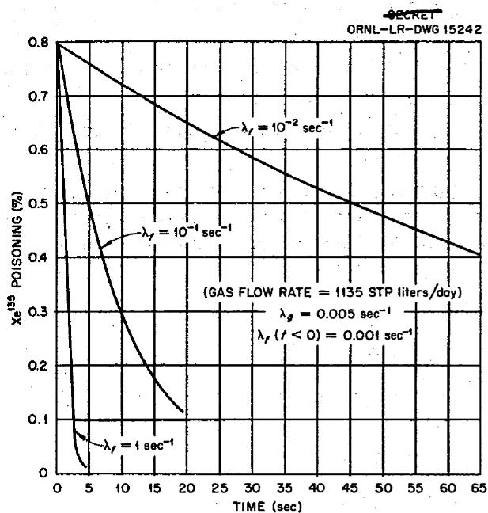  
Fig. 4.2.22. Change in $Xe^{135}$ Poisoning in ART Following a Change in Phase-Transfer Rate Constant.

loss of its parent, 3.9-min $\mathbf{X}\mathbf{e}^{137}$ . As a substitute, 65-day $\mathbf{Zr}^{95}$ has been suggested. In order to calibrate the use of this isotope, two samples of enriched uranium were irradiated, as solutions, for 2.375 days in hole 10 of the ORNL Graphite Reactor. One solution was prepared from $\mathsf{U}_3\mathsf{O}_8$ , the other from fluoride fuel composition. After allowing the samples to decay for ten days, radiochemical determinations were made of $C s^{137}$ and of $\mathbf{Zr}^{95}$ . From these results, the fission yield of $\mathbf{Zr}^{95}$ was calculated to be $0.0664 \pm 0.0013$ atom/fission. If the fission yield is calculated from the radiochemical $\mathbf{Zr}^{95}$ analyses and the cobalt activation neutron flux observed from a monitor irradiated with the samples, the result obtained is $0.0632 \pm 0.0021$ atom/fission. The discrepancy between the two results is removed if the cobalt activation flux is corrected for the cadmium ratio prevailing in hole 10 (about 30). The fission yield recommended for use in fission monitoring with $\mathbf{Zr}^{95}$ is $0.0664 \pm 0.0013$ atom/fission.

FAST-NEUTRON DETECTORS

D. Binder

J. F. Krause

An investigation is being made of methods for measuring the fast neutron flux of reactors (>500 ev)

TABLE 4.2.3. INITIAL INCREASES IN ART REACTIVITY FOLLOWING FLUCTUATIONS IN XENON-REMOVAL EFFICIENCY   

<table><tr><td rowspan="2">x0(%)</td><td colspan="2">λf(sec-1)</td><td colspan="2">λg(sec-1)*</td><td rowspan="2">Initial Slope (%/sec)</td><td rowspan="2">Initial Period (sec)</td></tr><tr><td>t&lt;0</td><td>t&gt;0</td><td>t&lt;0</td><td>t&gt;0</td></tr><tr><td>3.98</td><td>1</td><td>1</td><td>0</td><td>0.025</td><td>1.44</td><td>3</td></tr><tr><td></td><td>0.5</td><td>0.5</td><td>0</td><td>0.025</td><td>0.54</td><td>3</td></tr><tr><td></td><td>0.1</td><td>0.1</td><td>0</td><td>0.025</td><td>0.35</td><td>11</td></tr><tr><td></td><td>0.05</td><td>0.05</td><td>0</td><td>0.025</td><td>0.19</td><td>21</td></tr><tr><td></td><td>0.01</td><td>0.01</td><td>0</td><td>0.025</td><td>0.037</td><td>106</td></tr><tr><td></td><td>0.005</td><td>0.005</td><td>0</td><td>0.025</td><td>0.019</td><td>206</td></tr><tr><td>0.74</td><td>0.001</td><td>0.01</td><td>0.025</td><td>0.025</td><td>0.0069</td><td>106</td></tr><tr><td></td><td>0.001</td><td>0.1</td><td>0.025</td><td>0.025</td><td>0.063</td><td>12</td></tr><tr><td></td><td>0.001</td><td>1</td><td>0.025</td><td>0.025</td><td>0.27</td><td>3</td></tr><tr><td>0.75</td><td>0.001</td><td>0.01</td><td>0.015</td><td>0.015</td><td>0.0072</td><td>105</td></tr><tr><td></td><td>0.001</td><td>0.1</td><td>0.015</td><td>0.015</td><td>0.067</td><td>11</td></tr><tr><td></td><td>0.001</td><td>1</td><td>0.015</td><td>0.015</td><td>0.27</td><td>3</td></tr><tr><td>0.82</td><td>0.001</td><td>0.01</td><td>0.005</td><td>0.005</td><td>0.0075</td><td>109</td></tr><tr><td></td><td>0.001</td><td>0.1</td><td>0.005</td><td>0.005</td><td>0.071</td><td>12</td></tr><tr><td></td><td>0.001</td><td>1</td><td>0.005</td><td>0.005</td><td>0.27</td><td>3</td></tr><tr><td>0.97</td><td>0.001</td><td>0.01</td><td>0.002</td><td>0.002</td><td>0.0095</td><td>102</td></tr><tr><td></td><td>0.001</td><td>0.1</td><td>0.002</td><td>0.002</td><td>0.080</td><td>12</td></tr><tr><td></td><td>0.001</td><td>1</td><td>0.002</td><td>0.002</td><td>0.26</td><td>4</td></tr><tr><td>3.98</td><td>0.001</td><td>0.01</td><td>0</td><td>0</td><td>0.038</td><td>104</td></tr><tr><td></td><td>0.001</td><td>0.1</td><td>0</td><td>0</td><td>0.35</td><td>11</td></tr><tr><td></td><td>0.001</td><td>1</td><td>0</td><td>0</td><td>1.44</td><td>3</td></tr></table>

* The spargling gas flow rate is $\nu_{g}$ (STP liters/day) = 2.27 × 10^5 $\lambda_{g} (\sec^{-1})$ .

and for determining the variation of irradiation effects with energy. A boron shield has been fabricated to measure the fast flux by the method of Hurst et al. The shield will be used in conjunction with $\mathsf{Pu}^{239}$ , $\mathsf{Np}^{237}$ , and $\mathsf{U}^{238}$ foils. In order to compensate for the high fission cross section of $\mathsf{Pu}^{239}$ at low energies a 1.5-cm path of $\mathsf{B}^{10}$ to the foil was required. To check for leakage, various resonance detectors were irradiated inside

the $\mathsf{B}^{10}$ shield and inside cadmium. The ratios of the boron-covered to cadmium-covered activities for cobalt and manganese detectors were 60 and 20, respectively. For no shielding at the resonance energy, a ratio of about 2 would have been observed.[14] Therefore, 135- and 340-ev neutrons are strongly absorbed by the shield.

A photoneutron source was used as part of the study of the variation of displacements with neutron energy before the exact effectiveness of gamma rays in displacing atoms was learned. Depending on the energies, a neutron is 100 to 1000 times as effective as a gamma ray. This is a sufficient ratio for reactor or accelerator irradiations but not for photoneutron sources. The antimony-beryllium source which was used produced detectable effects in $n$ -type germanium with initial concentrations of $10^{13}$ donors/cm $^3$ , but the ratio of gamma rays to neutrons was on the order of $10^5$ , which made the gamma rays about 100 times as effective as the neutrons.

# EFFECTS OF RADIATION ON ELECTRONIC COMPONENTS

J. C. Pigg

C. C. Robinson

In the previous report16 the behavior of the characteristic curves of transistor and semiconductor diodes was compared. The emitter characteristic of the transistor was compared with the forward characteristic of the diode. The collector characteristic of the transistor was compared with the reverse characteristic of the diode. Correlations were drawn between $\text{Co}^{60}$ gamma irradiation and reactor neutron effects on the characteristics of these devices. It was noted, however, that the barrier change resulting from $\text{Co}^{60}$ gamma irradiation showed properties not noted previously with reactor irradiation.

Electrical annealing, that is, removal of charged interstitial atoms by the strong electric field present in the barrier, was noted. It was pointed out that because of this effect, the bias applied to a semiconductor component might affect the change observed when the component was operating in a radiation field.

Exposures of Philco surface-barrier transistors have been made in the ORNL Graphite Reactor, but, thus far, attempts to measure the amplification characteristics of these surface-barrier transistors under irradiation have been unsuccessful. However, the photo-emfs developed across the collector and emitter barriers during reactor irradiation have been measured, and a series of before and after measurements of collector characteristics have

been made. Since a sharp barrier is desirable for an emitter and a diffuse barrier is desirable for a collector, it would be expected that there might be some difference in the behavior of these barriers in a radiation field. The photo-emfs developed across such barriers during irradiation in hole 51N are shown as a function of integrated dose in Fig. 4.2.23. There is a considerable difference in the photo-emfs observed until after the integrated dose has reached about $10^{14}$ nvt at which time the barriers become comparable.

The change in collector characteristic with the emitter circuit open, as observed after successive irradiations, is shown in Fig. 4.2.24. As reported previously, this behavior compares with the characteristic of a diode biased in the reverse direction. After the third exposure, the sample was allowed to anneal for 18 hr at room temperature. The characteristic taken after the 18-hr anneal showed that the saturation current dropped back toward its original value and that the leakage current, as indicated by the slope of the curve, increased.

The data agree with previous observations of annealing due to the electrostatic field of the barrier in that the saturation current returns toward its initial value. The change in slope or leakage current can be considered to be due to the same mechanism. Since the base material in this transistor is $n$ -type and the surface of all germanium crystals is $p$ -type, there is a $p-n$ junction between the bulk material and its surface. In the case of a $p-n-p$ junction device, a $p$ -type channel occurs along the surface through which current may flow without crossing a barrier, as illustrated in Fig. 4.2.25. It would be expected that, as a $p-n-p$ device was irradiated and the $n$ -type material changed toward $p$ -type, the $p$ -type surface layer would become thicker and more $p$ -type. Both results would lower the resistance of this channel and lower the leakage resistance. It would be expected that an $n-p-n$ device, however, would require the current to cross a barrier in going from one $n$ -type region to another, and thus no channel would be present. Consequently a $p-n-p$ unit should be more sensitive to surface conditions than would an $n-p-n$ unit.

The change in the grounded-base characteristic family of curves after an integrated dose of $9.96 \times 10^{12} \mathrm{vnt}_{\mathrm{f}}$ is shown in Fig. 4.2.26. Instead of an increase in the collector characteristic, there is a decrease, and there is no detectable change in

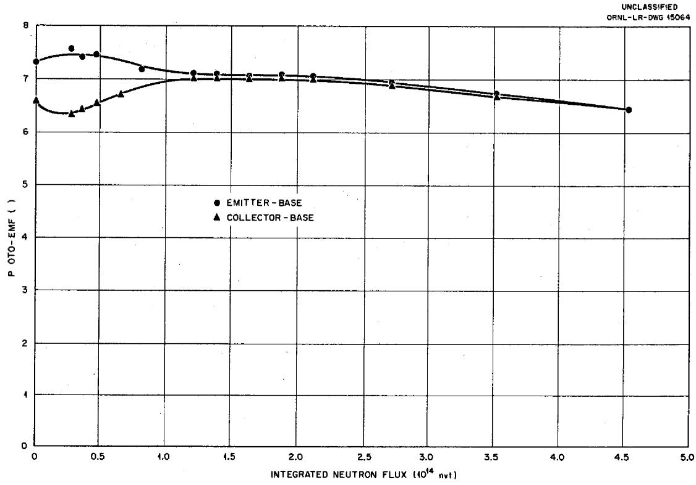  
Fig. 4.2.23. Photo-emfs of a Philco Type-L5106 Surface-Barrier Transistor as a Function of Integrated Neutron Flux.

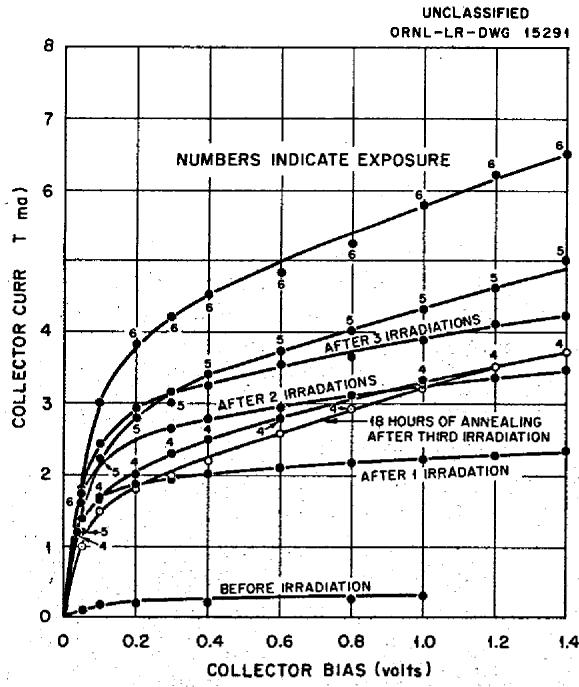  
Fig. 4.2.24. Changes in Collector Current Characteristic of a Philco Type-L5106 Surface-Barrier Transistor as a Result of a Series of 2-min Exposures at a Flux of $8.3 \times 10^{11} \mathrm{~nV}_{\mathrm{f}}$ .

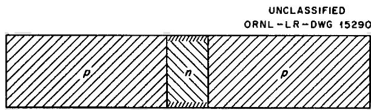

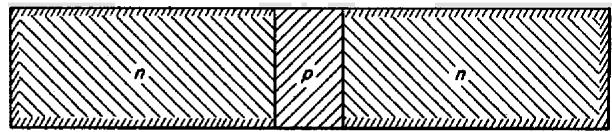  
Fig. 4.2.25. Illustration of Surface Leakage Mechanism.

slope. The separation of the curves for different emitter currents is about the same as it was before bombardment. A circuit designed with normal engineering tolerances would still be operating providing there had been no violent fluctuations of behavior during the bombardment. The smoothness of the transition is illustrated in Fig. 4.2.27, which shows the collector characteristic at 1-v bias at

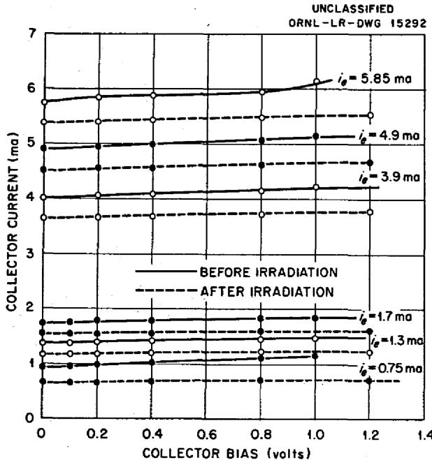  
Fig. 4.2.26. Change in Collector Characteristic of a Philco Type-L5106 Surface-Barrier Transistor as a Result of Irradiation to an Integrated Dose of $9.96 \times 10^{12} \mathrm{~nvt}_{\mathrm{f}}$ .

different emitter currents as a function of the integrated dose. These curves are the results of measurements before and after irradiation, however, and may not be indicative of behavior in the presence of the radiation field.

# IRRADIATION EFFECTS ON THERMAL-NEUTRON SHIELD MATERIALS

J. G. Morgan

R.M.Carroll M.T.Morgan

P. E. Reagan

The thermal-neutron shield for the ART should have a high absorption cross section, it should be compatible with adjacent reactor materials, and it should retain its bulk structure at elevated temperatures under irradiation. Gas release from the material should be at a minimum. For temperatures up to $1600^{\circ}\mathrm{F}$ , two cermet shield materials, $\mathrm{CaB}_6$ -Fe and BN-Ni, clad with stainless steel are being tested. These were fabricated by mixing the powdered components for 2 hr in an offset rotary blender, cold pressing the mixed powders at 33 psi

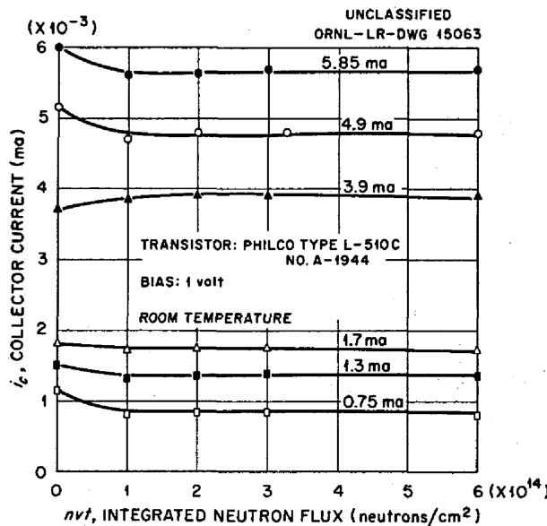  
Fig. 4.2.27. Changes in the Collector Current of a Philco Type-L5106 Surface-Barrier Transistor as a Function of Irradiation.

in a $2 \times 2\frac{1}{4}$ -in. steel die, sintering the compacts for 1 hr at $2000^{\circ}F$ in a hydrogen atmosphere, coining the compacts at 33 tsi to 0.250 in. thickness in a $2 \times 2\frac{1}{4}$ -in. steel die, encapsulating the coined compacts in type 304 stainless steel picture frames, hot rolling the composites at $2000^{\circ}F$ to a total reduction in thickness of 7:1, and machining $0.1875 \times 0.500 \times 0.050$ -in.-thick specimens from the rolled composite sheet. The powder particle sizes and the compositions of the cermet core materials are given in Table 4.2.4. A $\mathsf{CaB}_6$ -Fe sample was irradiated in helium in the LITR to a thermal-neutron dosage of $5.2 \times 10^{19}$ nvt. The sample, sealed in quartz, was cooled by the LITR water. Metallographic examination18 of the specimens after irradiation (Fig. 4.2.28) showed that the clad-core interface had retained its continuity. The core material was clad to ensure compatibility with the Inconel to be used as the structural material of the reactor. Many $\mathsf{CaB}_6$ crystals may be seen in the core matrix, although some were removed in sample preparation. The samples shown in Fig. 4.2.28 are shown again in Fig. 4.2.29 at a lower magnification so that the cladding on both faces of the sample may be seen.

TABLE 4.2.4. PARTICLE SIZES AND COMPOSITIONS OF CERMET SHIELD MATERIALS   

<table><tr><td>Cermet</td><td>Component</td><td>Particle Size (μ)</td><td>Weight of Component (%)</td><td>Volume of Component (%)</td></tr><tr><td rowspan="2">CaB6-Fe</td><td>CaB6</td><td>44 to 100</td><td>7.6</td><td>21.0</td></tr><tr><td>Fe</td><td>147</td><td>92.4</td><td>79.0</td></tr><tr><td rowspan="2">BN-Ni</td><td>BN</td><td>10</td><td>10.3</td><td>30</td></tr><tr><td>Ni</td><td>10</td><td>89.7</td><td>70</td></tr></table>

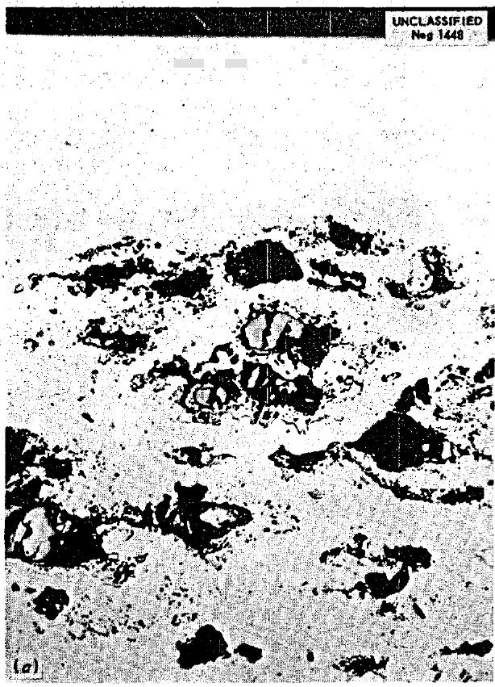

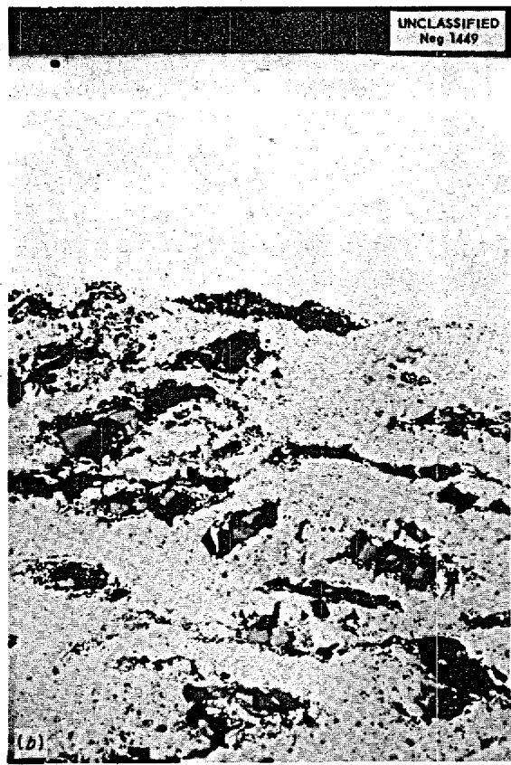  
Fig. 4.2.28. Type 304 Stainless Steel Clad $\mathsf{CaB}_6$ -Fe Cermet Before and After Irradiation in the LITR to a Thermal-Neutron Dose of $5.2 \times 10^{19}$ nvt. (a) Unirradiated. (b) Irradiated. 250X. Reduced $27\%$ .

There is no evidence of gross cracking in the core or of deformation of the specimen. Because of the inhomogeneity of the core, hardness tests were inconclusive; however, a slight increase in hardness was observed.

Samples of BN-Ni are being irradiated in the LITR for six weeks and will be examined. The specimens are being irradiated in the same facility as that used for the $\mathsf{CaB}_6$ -Fe specimens. In addi

tion, a high-temperature irradiation of the clad BN-Ni material is under way in C-48 of the LITR. The sample was sealed under vacuum in an Inconel capsule. A platinum resistance heater is being used to control the temperature during the irradiation at $1600^{\circ}\mathrm{F}$ . Gas formed as a result of the irradiation will be removed and analyzed.

Six samples of copper-boron carbide were prepared for MTR irradiation. The capsules will be

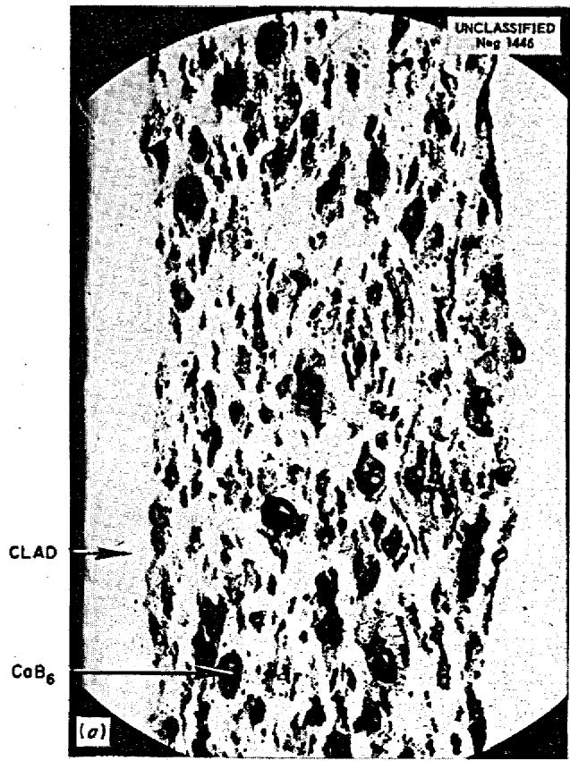

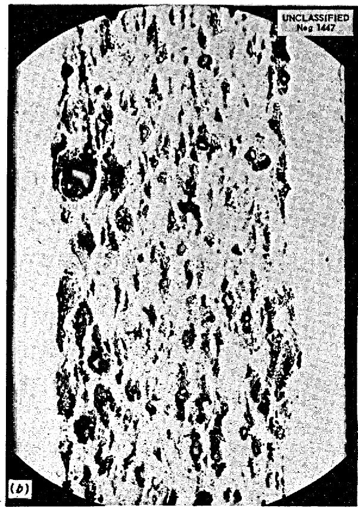  
Fig. 4.2.29. Type 304 Stainless Steel Clad $\mathsf{CaB}_6$ -Fe Cermet Specimens Shown in Fig. 4.2.28 at a Lower Magnification. Both cladding-cermet interfaces may be seen. (a) Unirradiated. (b) Irradiated. 75X. Reduced $27\%$ .

inserted in an "A" piece and irradiated to a thermal-neutron dosage of $3 \times 10^{20}$ nvt while the samples are held at a temperature of $1600^{\circ}\mathrm{F}$ . The instrumentation for the experiment has been constructed and shipped to the site. The test will be operated to attain a maximum boron burnup equivalent to that expected in the ART.[19] The samples are $0.1875 \times 0.500 \times 0.102$ in. in thickness and clad on two faces.[20] The composition is $6.6\mathrm{wt}\%$ $\mathtt{B}_4\mathtt{C}, -325$ mesh, clad with a 3-mil copper diffusion barrier and 7 mils of type 430 stainless steel. The samples are mounted in two capsules, with three samples per capsule, as shown in Fig. 4.2.30. After irradiation, the samples will be returned to ORNL for postirradiation examination.

Another promising neutron shield material is hot-pressed boron nitride. Boron contents of up to

44 wt % can be obtained with a density of 2.1 g/cm³ in a molded and self-bonded structure. Boron nitride has a crystalline structure similar to that of graphite and directionalism is present in all physical properties,[21] especially thermal expansion. Pure (98% and above) boron nitride powder was obtained from two sources, and complete analyses were made. Bodies from these powders will be fabricated for irradiation studies.

# IRRADIATIONS OF STRESSED SHIELDING MATERIALS

J. C. Wilson

W.E.Brundage W.W.Davis

Testing equipment is nearly completed and calibrated for the irradiation of a 1 wt % boron (B10)–stainless steel alloy under stress in the LITR.

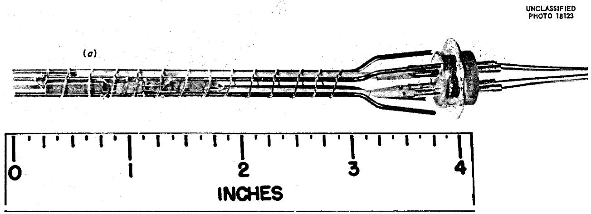

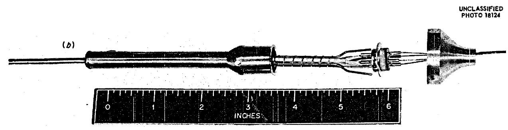

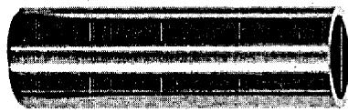  
(c)

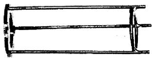

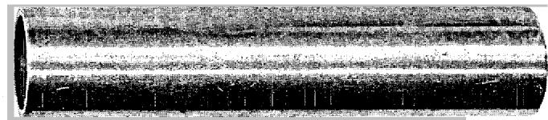  
（d）  
Fig. 4.2.30. Equipment for the Irradiation of Clad Cermet Shielding Materials in the LITR. (a) Specimens in support-grid assembly with thermocouples attached. (b) Inner capsule in which the support-grid assembly will be weld-sealed in a helium atmosphere. The ceramic hermetic seal through which the thermocouple leads are brought out may be seen at the right. (c) Electrical heater made of platinum coils in an alumina form and stainless steel can in which inner capsule will be inserted. (d) Aluminum container for assembly.

Creep in compression of the specimens will be measured during the tests by a Bourdon-tube deflectometer.

Short-time compression tests on copper-boron carbide cylinders were run at elevated temperatures. A special setup in an Instron testing machine permitted load-deformation curves to be recorded directly. Yield stresses were determined

for copper and copper plus 20 and $40 \text{wt} \% \mathrm{B}_4\mathrm{C}$ at $1300^{\circ}\mathrm{F}$ . Creep tests were run at the same temperature at a stress of 500 psi. Unloading and reloading of short-time creep specimens improved resistance to deformation. This suggests that hot pressing or hot working improves the strength of the materials. Creep tests were also run at 1450 and $1500^{\circ}\mathrm{F}$ at a stress of 50 psi.

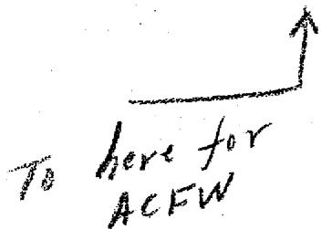

# 4.3. FUEL RECOVERY AND REPROCESSING

R. B. Lindauer

D.E.Ferguson W.K.Eister H.E.Goeller

# VOLATILITY PILOT PLANT DESIGN AND CONSTRUCTION

F. N. Browder

W.H.Carr W.H.Lewis

R.P.Milford

Construction of the fused salt-fluoride volatility pilot plant is essentially complete and shakedown tests have been started. Studies have indicated that cooling the $\mathsf{UF}_6$ to $0^{\circ}\mathsf{C}$ while the product cylinder is still connected to the recovery cold traps will significantly reduce the $\mathsf{UF}_6$ holdup in the cold traps after each run. Equipment is therefore being designed and procured for circulating a blast of cold dry air or nitrogen through the annulus between the product cylinder and its heater after most of the $\mathsf{UF}_6$ has drained as a liquid into the cylinder. Freon 12 will be used in a direct-expansion extended-surface coil to chill the coolant gas.

A project engineering report covering the design and construction of the pilot plant is being prepared.

# ENGINEERING DEVELOPMENT

J. T. Long S. H. Stainer

Engineering development work has been chiefly concerned with demonstrations of the reliability of freeze valves to be used in the molten salt lines. A freeze valve of the type to be used in the pilot plant showed no leakage in 120 pressure tests with 20-psi $\mathsf{N}_2$ for $20\mathrm{min}$ . This valve also showed no leakage that could be detected with a halide leak detector in a test with 100-psi $\mathsf{N}_2$ and in a test with Freon. Diameter measurements showed slight distortion of the pipe after 99 pressure tests (Table 4.3.1).

A stub for the junction of electric cable to self-resistance-heated salt transfer lines was designed which allows the temperature of the piping to be

Tests carried out in elliptical loop, 9 in. on long diameter, with a 3-in. radius of curvature at the ends, made of $\frac{1}{2}$ -in. sched-40 Inconel pipe; 2-in. layer of insulation around valve

Heating cycle: 200 to $650^{\circ}C$

Heating current through pipe: 250 amp

Molten salt: NaF-ZrF₄-UF₄ (56-40-4 mole %)

TABLE 4.3.1. DIAMETER MEASUREMENTS OF PIPE IN A MOLTEN SALT FREEZE VALVE BEFORE AND AFTER PRESSURE TESTS   

<table><tr><td rowspan="2">Point on Loop</td><td rowspan="2">Orientation of Measurement with Respect to Plane of Loop</td><td colspan="3">Outside Diameter of Pipe (in.)</td></tr><tr><td>Before Testing</td><td>After 70 Pressure Tests</td><td>After 99 Pressure Tests</td></tr><tr><td rowspan="2">“9-o&#x27;clock”</td><td>Parallel</td><td>0.840</td><td>0.842</td><td>0.845</td></tr><tr><td>Transverse</td><td>0.840</td><td>0.840</td><td>0.835</td></tr><tr><td rowspan="2">“6-o&#x27;clock”</td><td>Parallel</td><td>0.780</td><td>0.780</td><td>0.780</td></tr><tr><td>Transverse</td><td>0.880</td><td>0.884</td><td>0.888</td></tr><tr><td rowspan="2">“3-o&#x27;clock”</td><td>Parallel</td><td>0.850</td><td>0.850</td><td>0.850</td></tr><tr><td>Transverse</td><td>0.840</td><td>0.840</td><td>0.840</td></tr></table>

above $525^{\circ}C$ while the temperature of the connector to the copper cable is below $85^{\circ}C$ . The stub consists of 6 in. of sched-40 Inconel pipe welded to the salt transfer line, with 6 in. of 1-in. nickel bar butt-welded to the Inconel pipe. The nickel bar is covered with a 2-in. layer of Superex insulation to within 2 in. of the Inconel-nickel junction.

The temperature of electrical insulating gaskets in the freeze valve vent lines must be maintained at or below $140^{\circ}\mathrm{C}$ . It was found experimentally that the temperature of the piping at the location of the gaskets would be $300^{\circ}\mathrm{C}$ but that two 6-in.-dia copper fins spaced 1 in. apart and silver-soldered to the vent lines just above the vent furnace would reduce the temperature at the gasket location to the required $140^{\circ}\mathrm{C}$ .

A device for sampling the molten salt (Fig. 4.3.1) was tested and found to be suitable for pilot plant use. A minimum sample of $2\mathrm{g}$ was desired, and it was found to be possible to obtain a 2.9-g sample. The sample cup used for the tests was fabricated of low-density graphite, and some difficulty was experienced in removing the salt from the pores of the graphite. A high-density-graphite sample cup will therefore be tested in an attempt to improve recovery of the sample.

# CHEMICAL DEVELOPMENT

M.R.Bennett G.I.Cathers R.L.Jolley

A study of the decomposition of the UF $_6$ -3NaF complex at temperatures of $245^{\circ}\mathrm{C}$ and higher has confirmed the belief that uranium retention on the NaF bed will be excessive in the NaF desorption step if the temperature and sweep gas flow rate are not properly controlled. The retention results from decomposition of the UF $_6$ -3NaF complex to a complex of NaF with UF $_5$ , which is not volatile. Maximum decomposition rates of about 0.01, 0.09, and 0.5% per minute would be incurred at 250, 300, and $350^{\circ}\mathrm{C}$ , respectively, in the absence of fluorine if all the uranium were in the form of the solid complex UF $_6$ -3NaF. Under optimum conditions, UF $_6$ desorption from the NaF bed competes favorably with the decomposition effect, and the final uranium retention is small.

The presence of fluorine appears to be essential in inhibiting the decomposition reaction and,

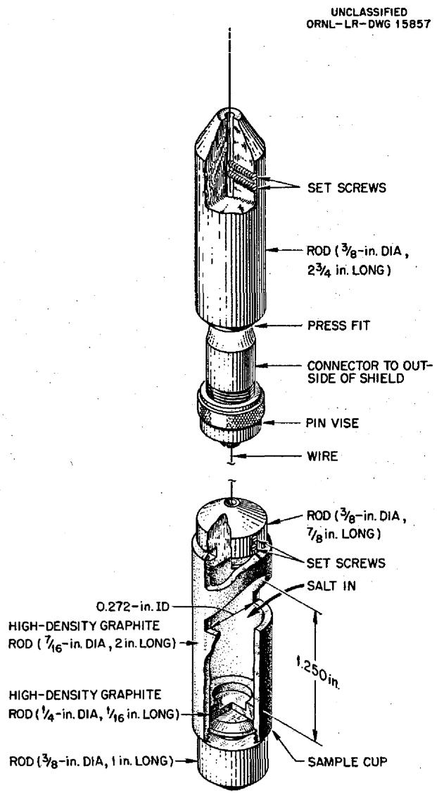  
Fig. 4.3.1. Molten-Salt Sampler for Volatility Pilot Plant.

possibly, in promoting refluorination of the non-volatile compound formed by the decomposition. The possibility of uranium retention by the decomposition mechanism in the absorption step at $100^{\circ}C$ appears to be insignificant, even over extended periods of time.

The dependence of the rate of decomposition of $\mathsf{UF}_6\cdot 3\mathsf{NaF}$ was determined in a series of runs over the temperature range 245 to $355^{\circ}C$ (Fig. 4.3.2). The reaction involved is probably

$$
\begin{array}{r l} \mathrm {U F} _ {6} \cdot 3 \mathrm {N a F} (\text {s o l i d}) & \longrightarrow \mathrm {U F} _ {5} \cdot x \mathrm {N a F} (\text {s o l i d}) + \\ & + 0. 5 \mathrm {F} _ {2} (\text {g a s}) \end{array}
$$

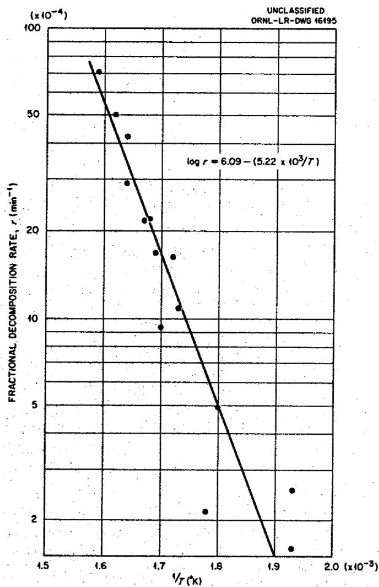  
Fig. 4.3.2. Dependence of Rate of Decomposition of $\mathbf{U}\mathbf{F}_{6}\cdot 3\mathbf{N}\mathbf{a}\mathbf{F}$ on Temperature,

The dependence of the decomposition rate on temperature is given by the expression

$$
\log r = 6. 0 9 - (5. 2 2 \times 1 0 ^ {3} / T),
$$

where $r$ is the fractional decomposition rate in reciprocal minutes and $T$ is the absolute temperature. The rate was calculated on the basis of an absorption capacity of 1.33 g of $\mathsf{UF}_6$ per gram of NaF. The energy of activation was calculated as +23.9 kcal/mole of $\mathsf{UF}_6 \cdot 3\mathsf{NaF}$ complex. It is possibly significant that this energy change is

approximately the same as the enthalpy change of $+23.2\mathrm{kcal / mole}$ involved in the volatilization of $\mathsf{UF}_6$ from the UF-3NaF complex.

The decomposition data were obtained with 4- to 5-g samples of NaF (Harshaw grade, classified to 12-20 mesh) held in a U-tube $(\frac{1}{2}$ -in.-dia stainless steel tubing), through which gaseous UF₆ was passed at atmospheric pressure. An oil bath was used for manually controlling the temperature to ±3°C during the course of each experiment. The runs were terminated by removing the oil bath and cooling the sample rapidly. The UF₆·3NaF was formed at the beginning by saturating the NaF at a high UF₆ flow rate, after which it was decreased to a rate of 0.1 to 1 g/min for the remaining time. The lengths of the runs at various temperatures were adjusted to obtain a uranium(V) content in the final product of 1 to 10%. The excess UF₆ still absorbed on the NaF at the end of each test was not desorbed because of the difficulty of achieving this without changing the uranium(V) content. The amount of UF₆·3NaF complex affected by the reaction was determined from uranium(V) and uranium(VI) analyses. The temperature was not increased to above 355°C, since at the higher temperatures it would have been difficult to maintain saturation of the NaF with the UF₆ without the use of a pressurized system.

In preliminary work on the decomposition reaction it was determined that a uranium(V) content of 20 to $26\%$ represented a limit which could not be exceeded in one cycle of saturation of the NaF with $\mathsf{UF}_6$ at $100^{\circ}\mathsf{C}$ followed by heating as a closed system to 350 to $400^{\circ}\mathsf{C}$ . Usually in these runs the NaF weight increase corresponded closely to the estimate based on the assumption that the decomposition product is a complex of $\mathsf{UF}_5$ with NaF. X-ray crystallography data indicated that the $\mathsf{UF}_5\cdot x\mathsf{NaF}$ complex in the decomposition product has an orthorhombic structure with cell dimensions $a_0 = 4.90\textup{\AA}, b_0 = 5.47\textup{\AA},$ and $c_0 = 3.87\textup{\AA}$ . The x-ray patterns of $\gamma-$ and $\beta$ - $\mathsf{UF}_5$ were not observed in the material.

# 4.4. CRITICAL EXPERIMENTS

A. D. Callihan

# REFLECTOR-MODERATED REACTOR EXPERIMENTS

D. Scott

J. J. Lynn

E. Demski

D. E. McCarty

W.J.Fader

W.C.Tunnell

D. A. Harvey

E. V. Sandin

# Experiments at Room Temperature

One of the room-temperature critical assemblies representing the reflector-moderated reactor with circulating fuel has been reconstructed in order to extend the earlier studies in this program. The fuel region contains alternate laminae of Teflon and enriched uranium foil. In this particular variation, assembly CA-22-2, one of the fuel end ducts is somewhat thicker than the other to allow further investigation of end-duct thickness as a variable. The array was critical with a loading of 23.4 kg of U235, with about 0.5% excess reactivity. The estimated critical mass of 22.5 kg is in good agreement with the value of 23.3 ± 1.0 kg, which was based on the excess reactivity observed in the previous loading of 28.35 kg in the same geometry.

Reflector Evaluation. - The effect on reactivity of replacing a part of the outermost layer of the beryllium reflector with stainless steel was measured. This peripheral layer, which is approximately cylindrical and is separated by $8\frac{5}{8}$ in. of beryllium from the outer core shell, is $2\frac{7}{8}$ in. thick and $19\frac{1}{2}$ in. long and is centered about the mid-plane. Removal of $27.3\%$ of the beryllium in this layer gave a $45.9\%$ loss in reactivity, whereas the addition of stainless steel increased the reactivity $16.7\%$ . The beryllium is, therefore, 2.75 times more effective than stainless steel in this region.

Reactivity Coefficients. - The reactivity coefficients of a number of materials of engineering interest were evaluated at various positions along

the radius at the mid-plane of the reactor, and the results are given in Figs. 4.4.1 and 4.4.2. In each case the value given is the change in reactivity introduced by filling a void with the material.

An error appeared in the results of the beryllium reactivity coefficient measurements in the compact-core reflector-moderated reactor experiments reported previously. The error resulted from a mistake in dimensioning a sample, and the corrected data are shown in Fig. 4.4.3.

# Experiments at Elevated Temperature

A number of design features and nuclear characteristics of the circulating-fuel reflector-moderated reactor being designed by Pratt & Whitney Aircraft are to be investigated in a critical experiment to be performed at ORNL late in 1956. The equipment and the experimental program are being prepared in close collaboration with Pratt & Whitney Aircraft personnel, who are fabricating most of the components for assembly at ORNL. The experiment will be performed at about $1300^{\circ}\mathrm{F}_{\cdot}$ and a molten $\mathsf{U}^{235}$ -enriched NaF-ZrF4-UF4 mixture will be used as the fuel. This salt mixture will not be circulated, but it will be transferred pneumatically from the storage reservoir to the annular fuel region. The purposes of the experiment are to determine the critical uranium concentration, the effectiveness of control materials, and an over-all temperature coefficient. A limited number of neutron-flux and fission-rate distributions will be measured with appropriate detectors.

The design of this experiment follows quite closely that of the ART high-temperature critical test performed last year and reported previously,2 although the dimensions and shape of the core region will be somewhat different. The central beryllium island of the critical assembly (Fig. 4.4.4) will be a right circular cylinder (8.0-in.-dia) enclosed in a Hastelloy X shell (8.5-in.-OD, $1/8$ -in.-thick). A 2.94-in.-dia axial hole in the island, lined with a 0.12-in.-thick Hastelloy X thimble (2.88-in.-OD), will accommodate the control assembly. The poison section of the control rod, which will be enclosed in Inconel, will be an

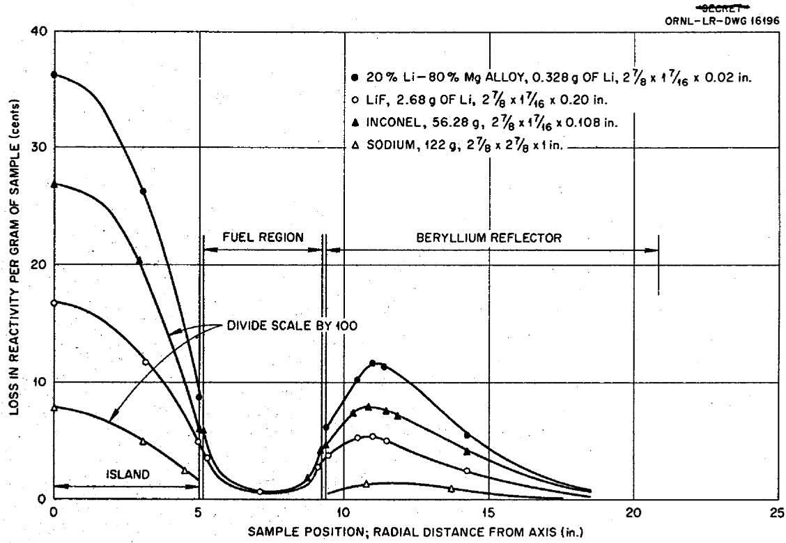

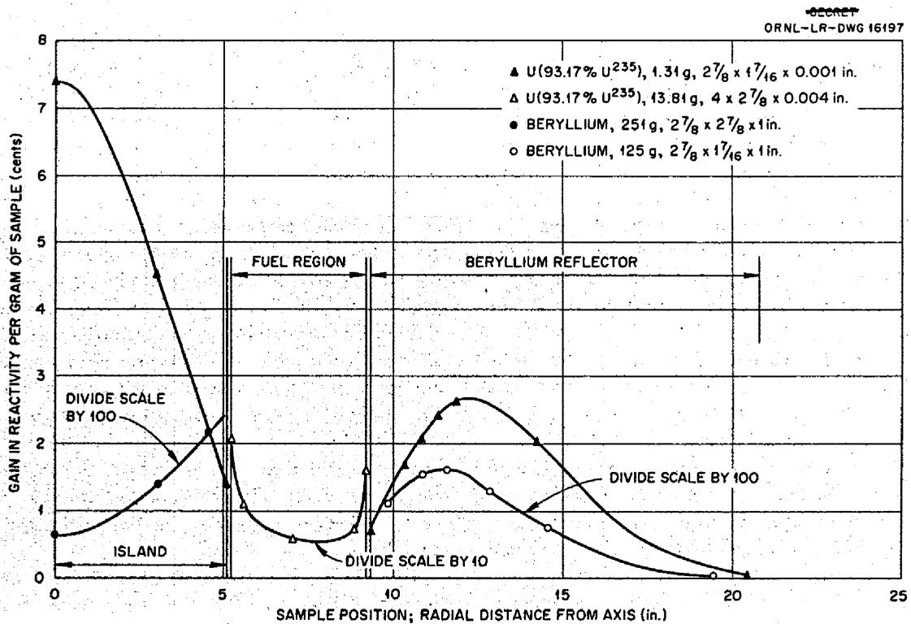  
Fig. 4.4.1. Reactivity Changes Effected by the Addition of Various Materials to the RMR Critical Assembly CA-22-2.   
Fig. 4.4.2. Reactivity Changes Effected by the Addition of Various Materials to the RMR Critical Assembly CA-22-2.

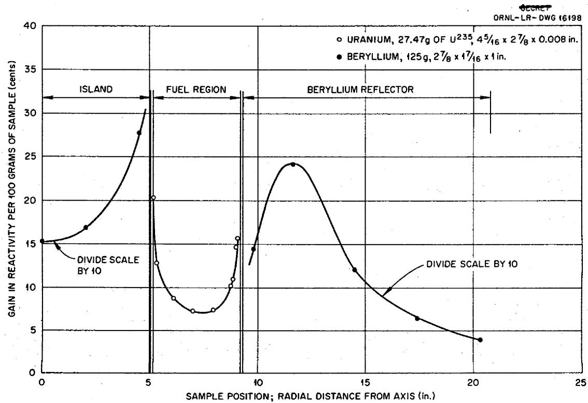  
Fig. 4.4.3. Reactivity Changes Effected by the Addition of Various Materials in the Compact-Core RMR Critical Assembly.

annulus (2.46-in.-OD, 1.97-in.-ID) made of a mixture of $30\%$ rare earth oxides (samarium and gadolinium) and $70\%$ nickel. The outer core shell, also of Hastelloy X, will have an inside diameter varying from 14.85 to 21.05 in. The wall thickness will be 0.16 in. at the center, increasing to 0.25 in. at the top and bottom. The bottom of the fuel section will be flared to represent the region in the power reactor where the fuel will be directed radially outward and upward into the heat ex-changers.

The reflector will be built up of 13 annular slabs of beryllium with outside diameters varying from 22.5 in. at the top to 48.0 in. at the mid-plane and 32.0 in. at the bottom. The central holes will be tapered to conform approximately with the shape of the outer core shell. The beryllium reflector, therefore, will be slightly over 13 in. thick for a distance of 8 in. on each side of the mid-plane and will decrease to 3.3 in. at the top and 6.5 in. at the bottom. To mock up the coolant passages, 832 vertical holes, 0.25 in. in diameter, will be

drilled through the reflector, and 125 holes, also 0.25 in. in diameter, will be drilled through the island. The coolant which would normally occupy these holes was not mocked up because of operational and safety considerations.

Fast-neutron leakage from the entrance and exit ducts of the power reactor is to be reduced by suppressing the fission rates in these regions. In current designs, this suppression is to be accomplished by shielding the fuel from neutrons reflected by the beryllium. In the critical experiment, shields composed of a mixture of boron carbide and copper will be placed in the beryllium regions at the bottom of the reactor adjacent to both the core shells. In similar locations at the top of the reactor, cylindrical shells of $\mathsf{B}^{10}$ , 0.1 in. thick, in Hastelloy X annular containers, can be inserted vertically to a position 6 in. below the top of the beryllium.

The volume of the reflector, island, and fuel region will be $36.7\text{ft}^3$ , and the volume of the fuel region alone will be $5.3\text{ft}^3$ .

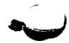  
ORNL-LR-DWG 16199

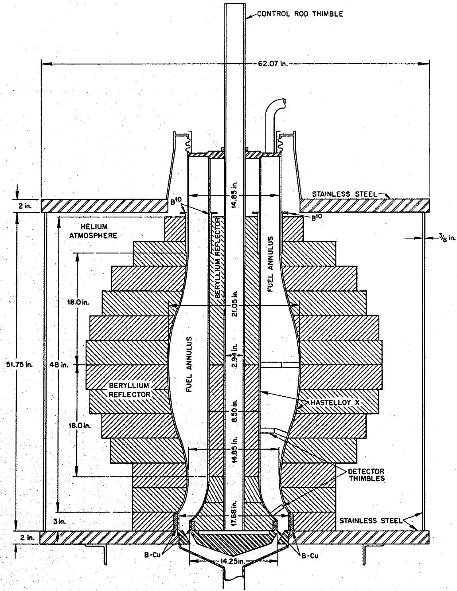  
Fig. 4.4.4. Schematic Diagram of High-Temperature RMR Critical Assembly.

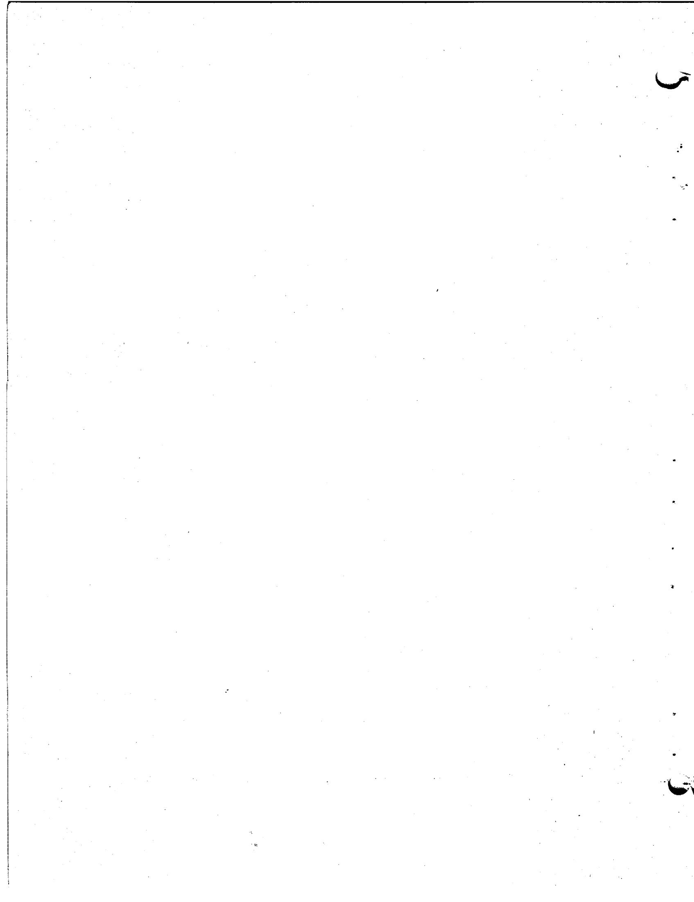

# A MONTE CARLO STUDY OF THE GAMMA-RAY ENERGY FLUX, DOSE RATE, AND BUILDUP FACTORS IN A LEAD-WATER SLAB SHIELD OF FINITE THICKNESS

S. Auslander

The gamma-ray energy flux, dose rate, and buildup factors in a lead-water shield of finite thickness have been calculated by a Monte Carlo method. The calculation included 1-, 3-, and 6-Mev photons incident on the slab both along a normal and at an angle of 60 deg. (Calculations for an angle of $75\frac{1}{2}$ deg were also performed, but they are not included here since the attenuation was quite large in spite of the large buildup factor. For the same reason the results for 1-Mev photons incident at an angle of 60 deg were also omitted.) The buildup factors for energy and dose obtained in this calculation were compared with those obtained by the use of the moments method for monoenergetic, plane monodirectional sources normally incident upon a semi-infinite, homogeneous medium.

The thicknesses of the lead-water shield in centimeters and in mean free paths for the various incident gamma-ray energies are given in Table 5.1.1, and the tissue dose equivalents for the incident fluxes (no shield present) are given in Table 5.1.2.

TABLE 5.1.2. TISSUE DOSE EQUIVALENT FOR INCIDENT FLUX   

<table><tr><td>Photon Energy (Mev)</td><td>D0/φI(mr/hr /y/cm2·sec)</td></tr><tr><td>1</td><td>0.001923</td></tr><tr><td>3</td><td>0.004368</td></tr><tr><td>6</td><td>0.007206</td></tr></table>

The results of the calculations for 1-Mev photons are presented in Figs. 5.1.1 through 5.1.4, those for 3-Mev photons in Figs. 5.1.5 through 5.1.10, and those for 6-Mev photons in Figs. 5.1.11 through 5.1.16.

The normalized energy fluxes for the 1-, 3-, and 6-Mev energy groups are plotted in Figs. 5.1.1, 5.1.5, and 5.1.11, respectively, as functions of the normal thickness of the shield (in centimeters). The uncollided energy flux, normalized to unity at the initial boundary, is also plotted. The third curve in each figure is the energy buildup factor, $B_{E}$ , which is the ratio of the two energy flux curves:

$$
B _ {E} \equiv \frac {\phi_ {E} / E _ {0} \phi_ {I}}{e ^ {- t / \lambda}} \equiv \frac {\phi_ {E}}{E _ {0} \phi_ {I} e ^ {- t / \lambda}},
$$

1On assignment from Pratt & Whitney Aircraft. 2S.Auslender, ANP Quar.Prog.Rep.March 10,1956, ORNL-2061,p 223. 3H.Goldstein and J.E.Wilkins,Jr.Calculations of the Penetration of Gamma Rays.Final Report,NYO- 3075 (June 30,1954).

TABLE 5.1.1. NORMAL THICKNESSES OF A LEAD-WATER SLAB SHIELD   

<table><tr><td rowspan="3">Region</td><td colspan="4">Thickness</td></tr><tr><td rowspan="2">cm</td><td colspan="3">Mean Free Paths (mfp)</td></tr><tr><td>For 1-Mev 
Photons</td><td>For 3-Mev 
Photons</td><td>For 6-Mev 
Photons</td></tr><tr><td>Pb</td><td>11.58</td><td>9.089</td><td>5.654</td><td>5.878</td></tr><tr><td>H2O</td><td>35.81</td><td>2.542</td><td>1.382</td><td>0.996</td></tr><tr><td>Total</td><td>47.40</td><td>11.630</td><td>7.035</td><td>6.874</td></tr></table>

where

$$
\phi_ {E} \left(\text {M e v} / \text {c m} ^ {2} \cdot \sec\right) = \text {e n e r g y f l u x a t t h e p o i n t o f}
$$

$$
E _ {0} (M e v / \gamma) = i n i t i a l p h o t o n e n e r g y,
$$

$$
\phi_ {l} \left(\gamma^ {\prime} s / c m ^ {2} \cdot \sec\right) = \text {n u m b e r} f l u x \quad \text {i n c i d e n t} \quad \text {o n}
$$

$$
t (\mathrm {c m}) = \text {d i s t a n c e}
$$

$$
\lambda (\mathrm {c m}) = \text {r e l a x a t i o n}
$$

$$
e ^ {- t / \lambda} = \text {u n c o l l i d e d e n e r g y f l u x a t}
$$

In a similar manner the normalized dose rates and dose buildup factors, $B_{r}$ , for the three energies

are plotted in Figs. 5.1.3, 5.1.7, 5.1.9, 5.1.13, and 5.1.15. Here

$$
B _ {r} \equiv \frac {D / \phi_ {I}}{D _ {0} e ^ {- t \sec \theta / \lambda / \phi_ {I}}} \equiv \frac {D}{D _ {0} e ^ {- t \sec \theta / \lambda}},
$$

where

$$
D (\mathrm {m r} / \mathrm {h r}) = \text {d o s e r a t e (t i s s u e) a t t h e p o i n t o f}
$$

$$
D _ {0} (\mathrm {m r / h r}) = \text {d o s e r a t e (t i s s u e) o f t h e u n c o l l i d e d}
$$

The various energy buildup factors as functions of oblique thickness, in mean free paths, are presented in Figs. 5.1.2, 5.1.6, and 5.1.12. Corresponding dose buildup factors are given in Figs. 5.1.4, 5.1.8, 5.1.10, 5.1.14, and 5.1.16. Data from the results of the moments method solution3 are also plotted for purposes of comparison, although it must be remembered that those calculations were for infinite homogeneous media and are not directly comparable to the present calculations for a finite two-region slab. The calculations for lead do agree reasonably well for the first few relaxation lengths where the effects stemming from the dissimilarity of the slabs should be least.

The dose rate and dose buildup factors resulting from an earlier Monte Carlo calculation for 3-Mev photons normally incident upon a one-region 8-mfp-thick lead shield are also presented (Figs. 5.1.17 and 5.1.18) as an example of a case intermediate between the Monte Carlo calculation for a two-region finite shield and the moments method solution for the one-region semi-infinite shield. A comparison of the dose rate in the one-region finite shield with the dose rate in the one-region semi-infinite shield (calculated from buildup factors reported in ref 3) shows good agreement. The characteristic dip near the final boundary of the finite lead shield is apparent.

The dose buildup factors for the 3-Mev incident photons in the two-region and one-region finite shields (Figs. 5.1.8 and 5.1.18) are identical to within 2 mfp of the lead-water interface. It is apparent that at this energy and angle of incidence the back scattering is important in lead for a distance of about 4 cm ( $\lambda_{P_b} = 2.05$ cm at 3 MeV). The scattering in the water tends to compensate

for the finite thickness of the lead-water slab. It can also be concluded that the back-scattered flux at that interface is about $12\%$ of the total flux and about $20\%$ of the scattered flux. The differences for the finite and the semi-infinite one-region shields (Fig. 5.1.18) are partially due to differences in the cross-section data used for the calculations. An extensive discussion of the errors in the calculations from the moments method is included in ref 3. Consistent errors may exist that will bias the answers obtained with that method. The Monte Carlo data is much less subject to bias than to statistical fluctuation. (The large fluctuation of the data in Fig. 5.1.9 may indicate a relatively large error, but this is still probably less than $10\%$ .)

Since the Monte Carlo calculations for the two-region finite shield and the moments method solution for the one-region semi-infinite shield were in general agreement, the striking differences in the buildup factors near the lead-water interface and near the final boundary should be enlightening. In Figs. 5.1.2 and 5.1.4, for example, the energy and dose buildup factors for I-Mev photons in a finite two-region shield increase sharply in water to a value about half way between those for semi-infinite one-region shields of water and lead. At this energy the finite water region is $2\frac{1}{2}$ mfp thick, and, at first, the buildup increases almost at the same rate as it does initially in the semi-infinite water shield. This confirms that at this energy, which is below the minimum in the total cross section, the uncollided radiation dominates in the penetration of the lead, as it should.

In Figs. 5.1.6 and 5.1.8 the increase of the buildup factors in the water is very small, since, for the primary 3-Mev photons for both lead and water, the major portion of the total cross section is attributable to scattering. Hence, the difference in the behavior of the flux in water and in lead is due to that small portion of the flux which is absorbed in the lead but is scattered in the water. For 6-Mev photons (Figs. 5.1.12 and 5.1.14) the absorption cross section of lead is no longer so small that the absorption in it is almost negligible. In this case the buildup factor increases rather abruptly in the water, almost to the buildup factor for $6\frac{1}{2}$ mfp of water calculated by using the moments method.

It is evident from the results of the calculations for radiation incident at 60 deg (Figs. 5.1.9, 5.1.10,

# Part 5

# REACTOR SHIELDING

E. P. Blizzard

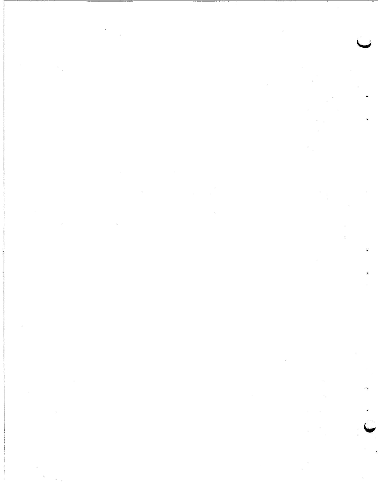

5.1.15, and 5.1.16) that the practice of using only normal incidence data for shield designs can lead to a poor approximation. This problem becomes most acute when the number of mean free paths across the shield is small or when the angular distribution is such that a large portion of the

radiation is not normal or nearly normal to the slab. Figure 5.1.16, which shows the flux depression near the initial boundary and the large buildup factor into the slab, is an excellent example of streaming (or short-circuiting).

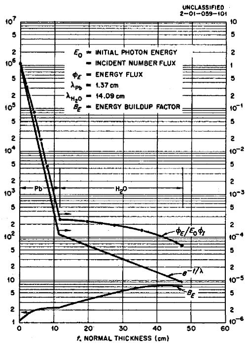  
Fig. 5.1.1. Gamma-Ray Energy Flux and Energy Buildup Factor as a Function of the Normal Thickness (Centimeters) of a Finite Lead-Water Slab Shield: 1-Mev Normally Incident Photons.

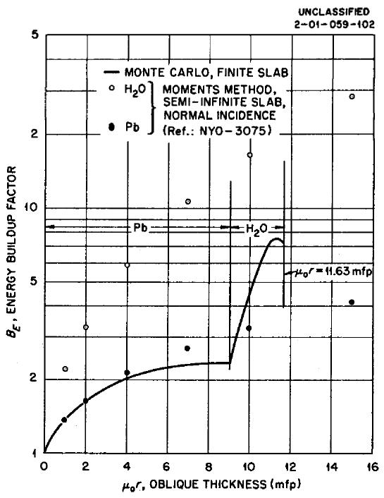  
Fig. 5.1.2. Gamma-Ray Energy Buildup Factor as a Function of the Oblique Thickness (Mean Free Paths) of a Finite Lead-Water Slab Shield: 1-Mev Normally Incident Photons.

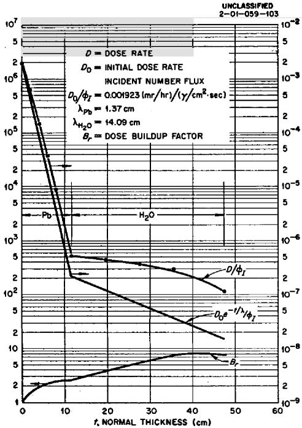  
Fig. 5.1.3. Gamma-Ray Dose Rate and Dose Buildup Factor as a Function of the Normal Thickness (Centimeters) of a Finite Lead-Water Slab Shield: 1-Mev Normally Incident Photons.

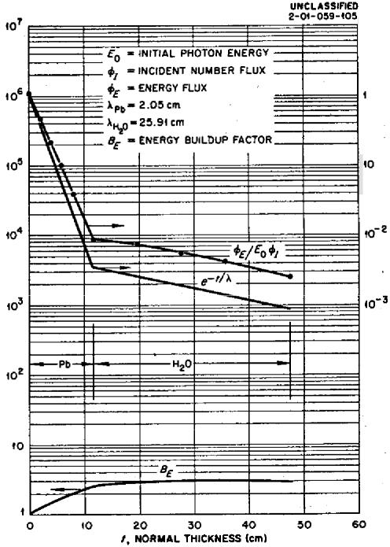  
Fig. 5.1.5. Gamma-Ray Energy Flux and Energy Buildup Factor as a Function of the Normal Thickness (Centimeters) of a Finite Lead-Water Slab Shield: 3-Mev Normally Incident Photons.

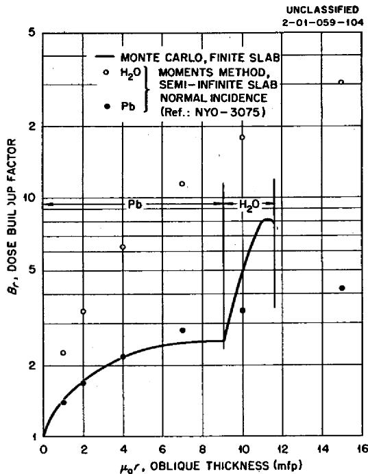  
Fig. 5.1.4. Gamma-Ray Dose Buildup Factor as a Function of Oblique Thickness (Mean Free Paths) of a Finite Lead-Water Slab Shield: I-Mev Normally Incident Photons.

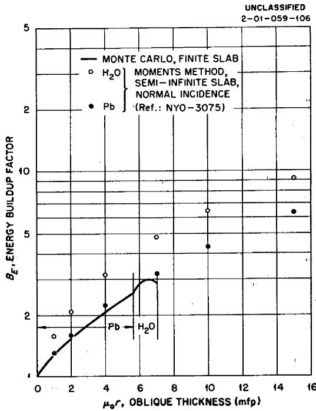  
Fig. 5.1.6. Gamma-Ray Energy Buildup Factor as a Function of the Oblique Thickness (Mean Free Paths) of a Finite Lead-Water Slab Shield: 3-Mev Normally Incident Photons.

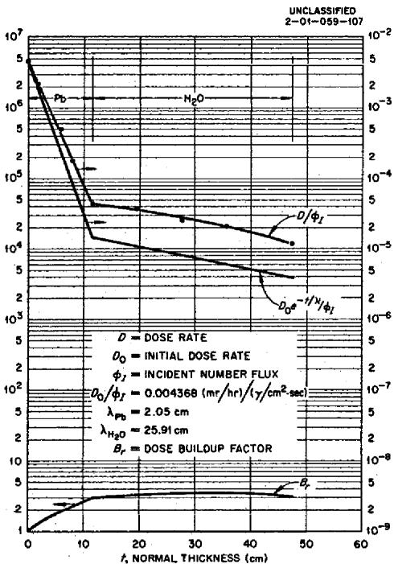  
Fig. 5.1.7. Gamma-Ray Dose Rate and Dose Buildup Factor as a Function of the Normal Thickness (Centimeters) of a Finite Lead-Water Slab Shield: 3-Mev Normally Incident Photons.

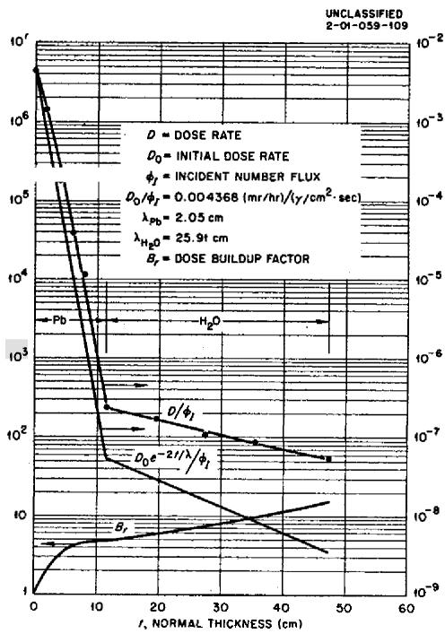  
Fig. 5.1.9. Gamma-Ray Dose Rate and Dose Buildup Factor as a Function of the Normal Thickness (Centimeters) of a Finite Lead-Water Slab Shield: 3-Mev Photons Incident at a 60-deg Angle.

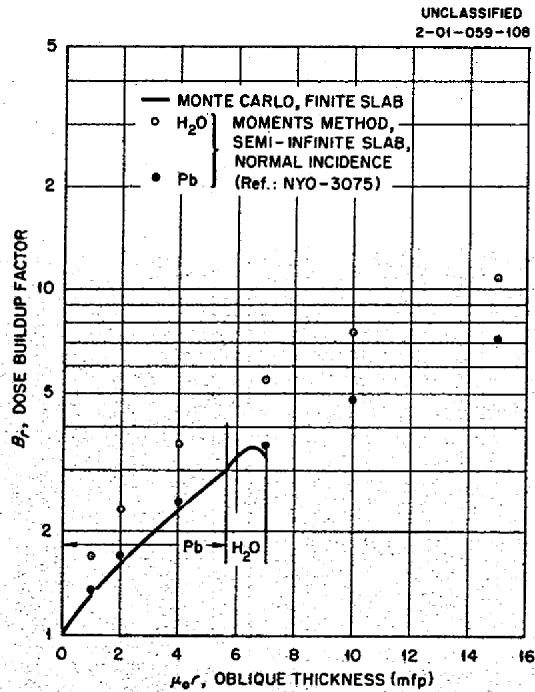  
Fig. 5.1.8. Gamma-Ray Dose Buildup Factor as a Function of Oblique Thickness (Mean Free Paths) of a Finite Lead-Water Slab Shield: 3-Mev Normally Incident Photons.

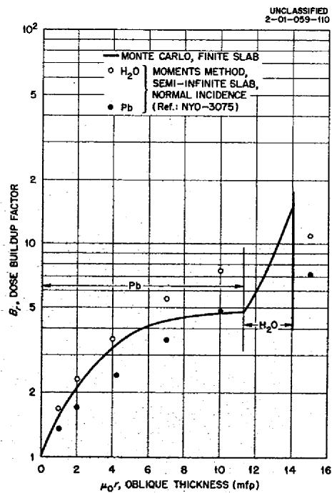  
Fig. 5.1.10. Gamma-Ray Dose Buildup Factor as a Function of Oblique Thickness (Mean Free Paths) of a Finite Lead-Water Slab Shield: 3-Mev Photons Incident at a 60-deg Angle.

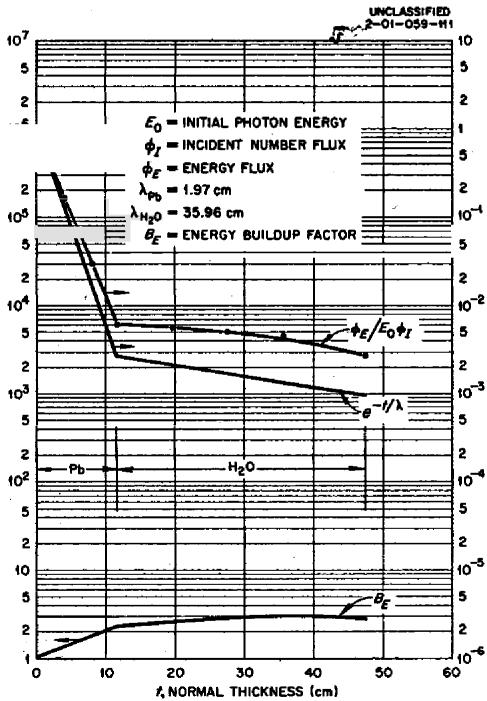  
Fig. 5.1.11. Gamma-Ray Energy Flux and Energy Buildup Factor as a Function of the Normal Thickness (Centimeters) of a Finite Lead-Water Slab Shield: 6-Mev Normally Incident Photons.

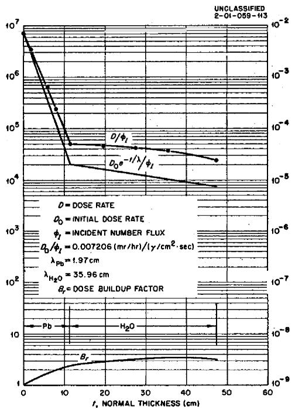  
Fig. 5.1.13. Gamma-Ray Dose Rate and Dose Buildup Factor as a Function of the Normal Thickness (Centimeters) of a Finite Lead-Water Slab Shield: 6-Mev Normally Incident Photons.

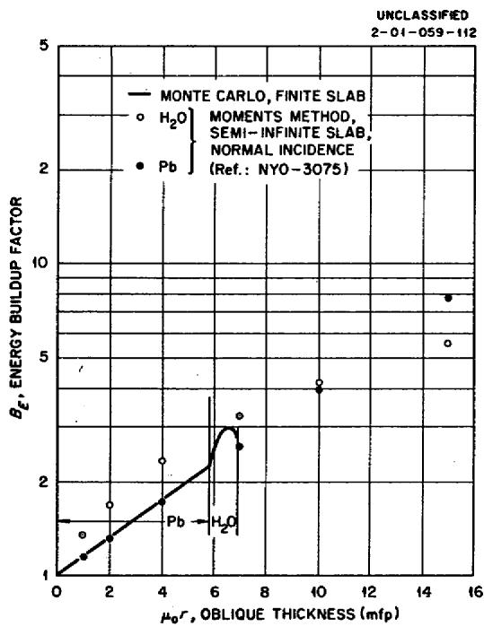  
Fig. 5.1.12. Gamma-Ray Energy Buildup Factor as a Function of the Oblique Thickness (Mean Free Paths) of a Finite Lead-Water Slab Shield: 6-Mev Normally Incident Photons.

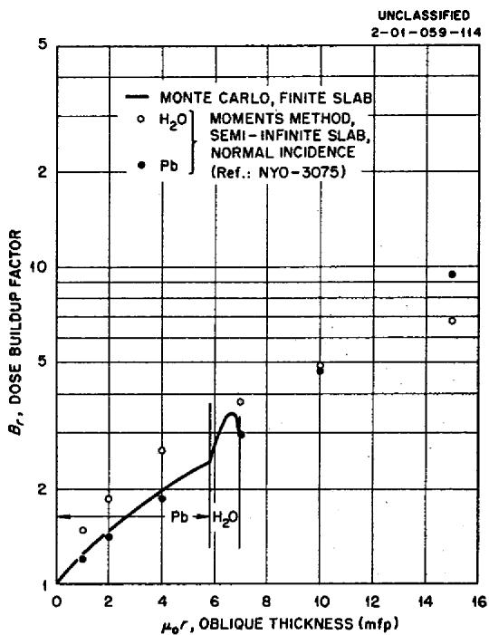  
Fig. 5.1.14. Gamma-Ray Dose Buildup Factor as a Function of Oblique Thickness (Mean Free Paths) of a Finite Lead-Water Slab Shield: 6-Mev Normally Incident Photons.

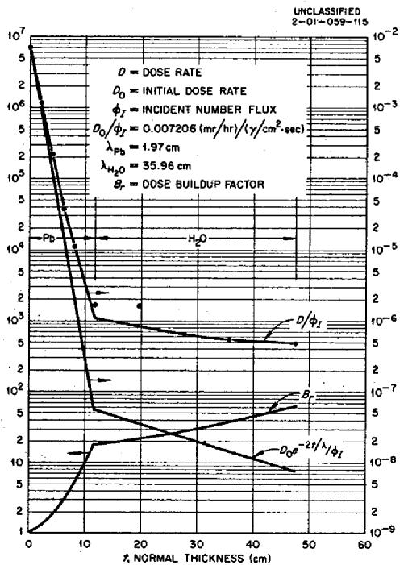  
Fig. 5.1.15. Gamma-Ray Dose Rate and Dose Buildup Factor as a Function of the Normal Thickness (Centimeters) of a Finite Lead-Water Slab Shield: 6-Mev Photons Incident at a 60-deg Angle.

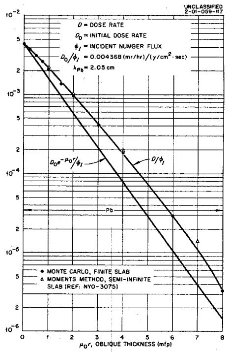  
Fig. 5.1.17. Gamma-Ray Dose Rate as a Function of Normal Thickness (Mean Free Paths) of a Finite Lead Slab Shield: 3-Mev Normally Incident Photons.

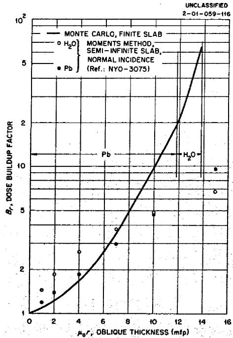  
Fig. 5.1.16. Gamma-Ray Dose Buildup Factor as a Function of Oblique Thickness (Mean Free Paths) of a Finite Lead-Water Slab Shield: 6-Mev Photons Incident at a 60-deg Angle.

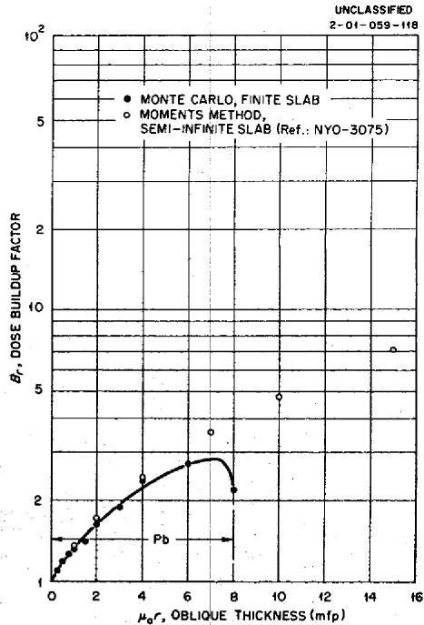  
Fig. 5.1.18. Gamma-Ray Dose Buildup Factor as a Function of Oblique Thickness (Mean Free Paths) of a Finite Lead Slab Shield: 3-Mev Normally Incident Photons.

# 5.2. LID TANK SHIELDING FACILITY

# R.W.Peelle

# STUDY OF ADVANCED SHIELDING MATERIALS

W. R. Burrus

J.M.Miller

J. R. Smolen

D. R. Otis

P. B. Hemmig1

The studies of advanced shielding materials4,5 have now included tests on mockups consisting of

1On assignment from U. S. Air Force.   
$^{2}$ On assignment from Pratt & Whitney Aircraft.   
$^{3}O_{n}$ assignment from Convalr, San Diego.   
4These experiments have been designed to be of particular interest to GE-ANPD.   
5R. W. Peille et al., ANP Quar. Prog. Rep. June 10, 1956, ORNL-2106, p 269.

a beryllium moderator region, a lead or depleted uranium gamma-ray shield, and a lithium hydride and oil neutron shield. In some tests a boral sheet was inserted outside the beryllium layer to prevent thermal neutrons from entering the gamma-ray shield. The specific configurations tested are summarized in Table 5.2.1. The compositions and dimensions of all the materials except the beryllium and boral were previously reported.5 The metallic beryllium slab is $48 \times 49 \times 4$ in. and the boral sheet is $48 \times 48 \times \frac{1}{2}$ in. The latter has an average density of $2.6\mathrm{g/cm}^3$ and contains about $20\mathrm{wt}\%$ boron, or $0.66\mathrm{g}$ of boron per square centimeter.

TABLE 5.2.1. SUMMARY OF THE CONFIGURATIONS USED FOR LTSF MockUP TESTS OF ADVANCED SHIELDING MATERIALS   

<table><tr><td>Configuration No.</td><td>Composition</td></tr><tr><td rowspan="3">69-3</td><td>4 in. of Be in oil</td></tr><tr><td>4 in. of Be + 12 in. of LiH in oil</td></tr><tr><td>4 in. of Be + 24 in. of LiH in oil</td></tr><tr><td rowspan="4">69-12</td><td>4 in. of Be + 3 in. of Pb in oil</td></tr><tr><td>4 in. of Be + 3 in. of Pb + 1 ft of LiH in oil</td></tr><tr><td>4 in. of Be + 3 in. of Pb + 2 ft of LiH in oil</td></tr><tr><td>4 in. of Be + 3 in. of Pb + 3 ft of LiH in oil</td></tr><tr><td rowspan="4">69-13</td><td>4 in. of Be + ½ in. of boral + 3 in. of Pb in oil</td></tr><tr><td>4 in. of Be + ½ in. of boral + 3 in. of Pb + 1 ft of LiH in oil</td></tr><tr><td>4 in. of Be + ½ in. of boral + 3 in. of Pb + 2 ft of LiH in oil</td></tr><tr><td>4 in. of Be + ½ in. of boral + 3 in. of Pb + 3 ft of LiH in oil</td></tr><tr><td rowspan="4">69-14</td><td>4 in. of Be + 3 in. of U238* in oil</td></tr><tr><td>4 in. of Be + 3 in. of U238 + 1 ft of LiH in oil</td></tr><tr><td>4 in. of Be + 3 in. of U238 + 2 ft of LiH in oil</td></tr><tr><td>4 in. of Be + 3 in. of U238 + 3 ft of LiH in oil</td></tr><tr><td rowspan="4">69-15</td><td>4 in. of Be + ½ in. of boral + 3 in. of U238 in oil</td></tr><tr><td>4 in. of Be + ½ in. of boral + 3 in. of U238 + 1 ft of LiH in oil</td></tr><tr><td>4 in. of Be + ½ in. of boral + 3 in. of U238 + 2 ft of LiH in oil</td></tr><tr><td>4 in. of Be + ½ in. of boral + 3 in. of U238 + 3 ft of LiH in oil</td></tr></table>

*Uranium depleted to 0.24 wt % in U235.

The materials were placed within the oil medium as close as possible to the Lid Tank converter plate. The thermal-neutron fluxes quoted from the data are equal to the neutron density times 2200 m/sec. The gamma-ray tissue dose rate measurements were obtained with an anthracene scintillation detector calibrated against a standardized radium source.

The gamma-ray dose rates beyond the various configurations are shown in Figs. 5.2.1 through 5.2.5. It is not yet clear to what extent these results were influenced by the thin layers of oil between the slabs in the configurations. Neutrons slowed down in these oil layers may give rise to secondary production in the adjoining slabs of materials, as well as in the oil itself. The average total thickness of these layers was $3\mathrm{cm}$ for each configuration, and tests to study their effects are being planned.

Since there was a noticeable decrease in the gamma-ray dose rate whenever lithium hydride was added to the configuration immediately behind the gamma-ray shield material, an investigation was performed to determine how much of this reduction could be attributed to the elimination of oil capture gamma rays. Measurements were taken beyond a configuration in which there was a 1-ft layer of oil between a lead gamma-ray shield (followed by boral) and the lithium hydride. The gamma-ray dose rate was considerably increased (Fig. 5.2.6),

and a curve of the difference between the two curves should largely represent the attenuation curve of oil capture gamma rays.

There was a strong reduction in the gamma-ray dose rate when the depleted uranium slab was moved to a region of relatively low neutron flux (Fig. 5.2.5). The preliminary interpretation of this reduction is that fissions caused by intermediate and fast neutrons were largely eliminated by the additional neutron shielding.

The thermal-neutron traverses for the various configurations are shown in Figs. 5.2.7 through 5.2.11. Only the traverse in oil was checked against gold-foil measurements. Figure 5.2.9 shows that the thermal-neutron flux is independent of the order of the lithium hydride and lead, except for the difference at the beginning of each traverse caused by variations in the amount of oil trapped between the various slabs. In Fig. 5.2.11, however, for a similar arrangement containing depleted uranium, moving the uranium out of the intense neutron field reduced the thermal-neutron flux. This seems to be the result of the intermediate or fast fissions discussed above in connection with the gamma-ray measurements.

Studies are being continued on configurations similar to those reported here. In addition, fast-neutron dose rate traverses will be made available in a future report.

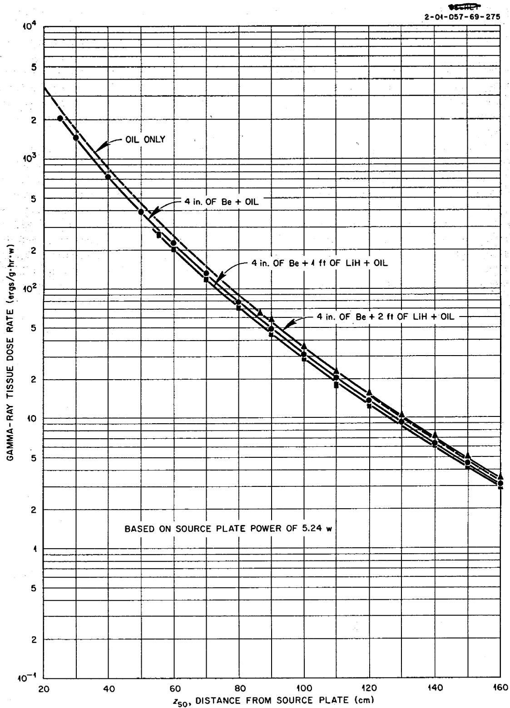  
Fig. 5.2.1. Gamma-Ray Tissue Dose Rate Traverses Beyond Configuration 69-3.

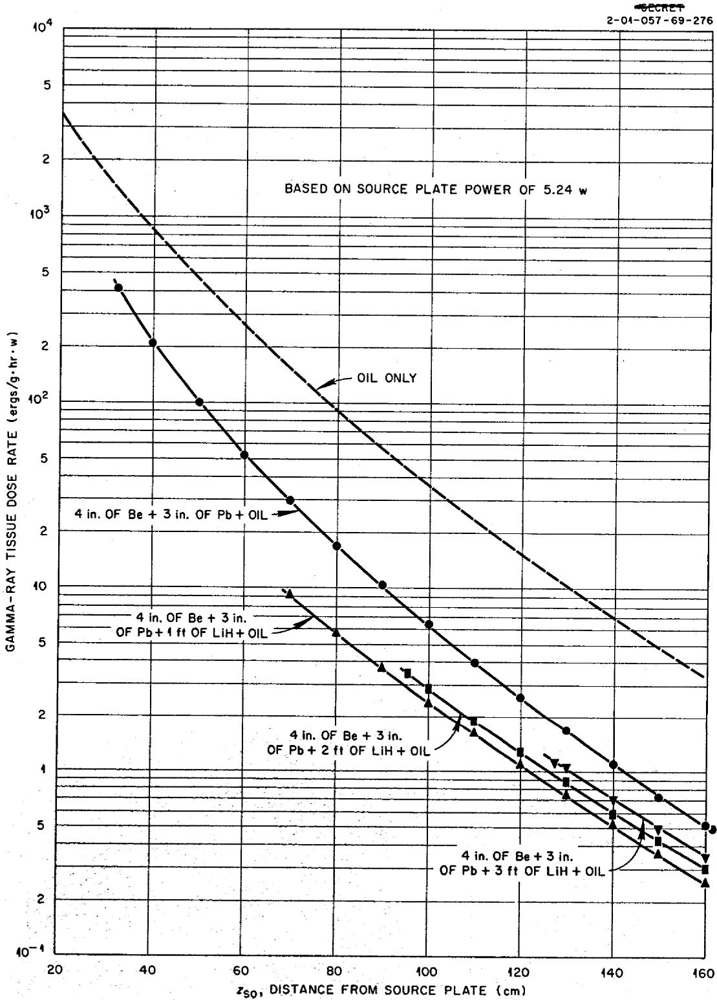  
Fig. 5.2.2. Gamma-Ray Tissue Dose Rate Traverses Beyond Configuration.69-12.

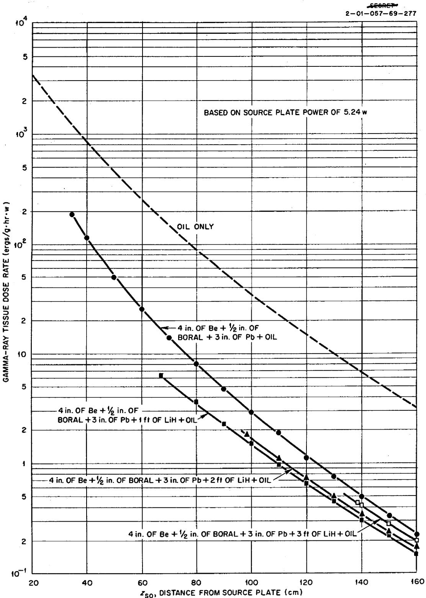  
Fig. 5.2.3. Gamma-Ray Tissue Dose Rate Traverses Beyond Configuration 69-13.

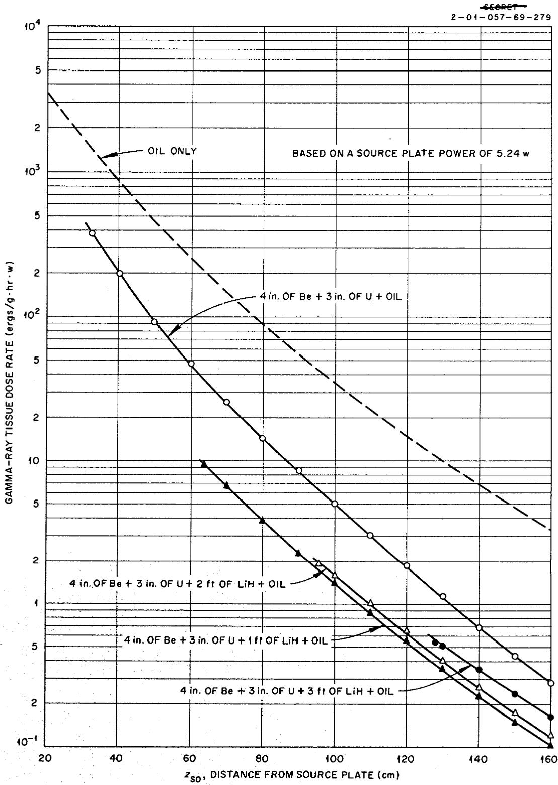  
Fig. 5.2.4. Gamma-Ray Tissue Dose Rate Traverses Beyond Configuration 69-14.

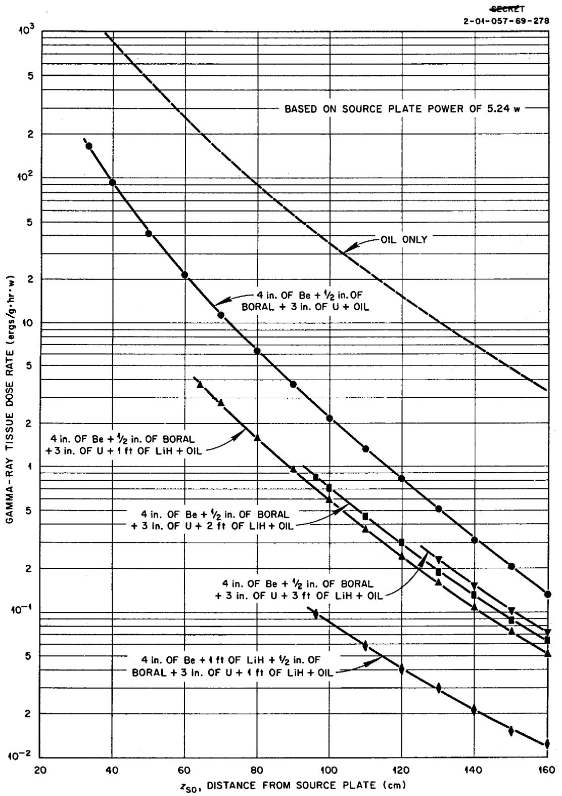  
Fig. 5.2.5. Gamma-Ray Tissue Dose Rate Traverses Beyond Configuration 69-15.

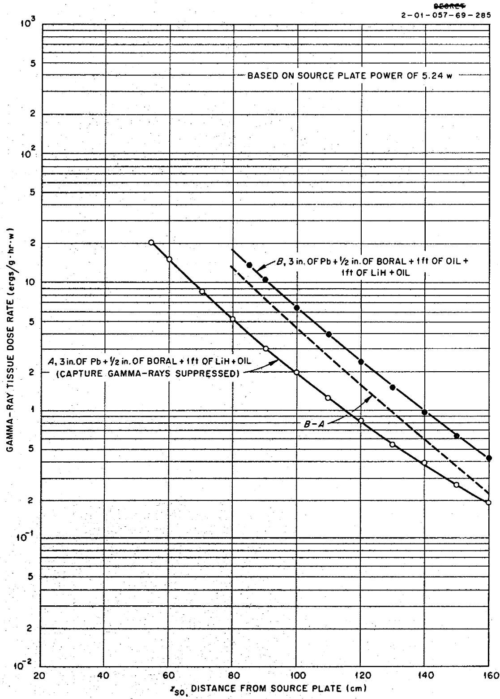  
Fig. 5.2.6. Attenuation of Gamma Rays Produced by Neutrons Captured in Oil Beyond 3 in. of Lead.

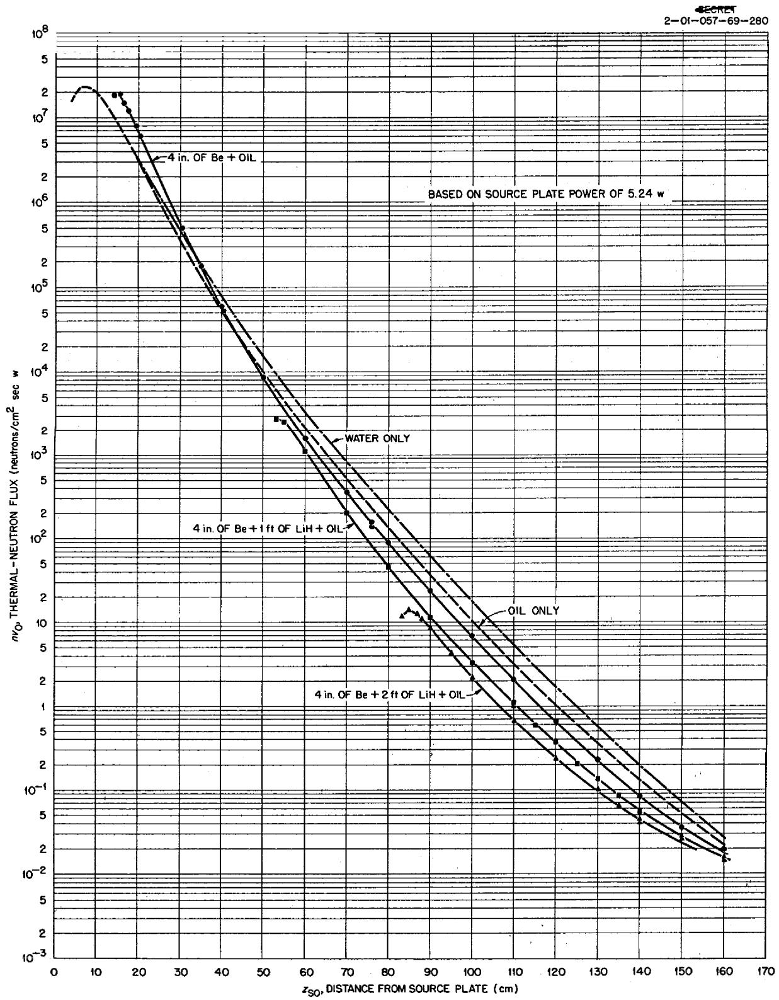  
Fig. 5.2.7. Thermal-Neutron Flux Traverses Beyond Configuration 69-3.

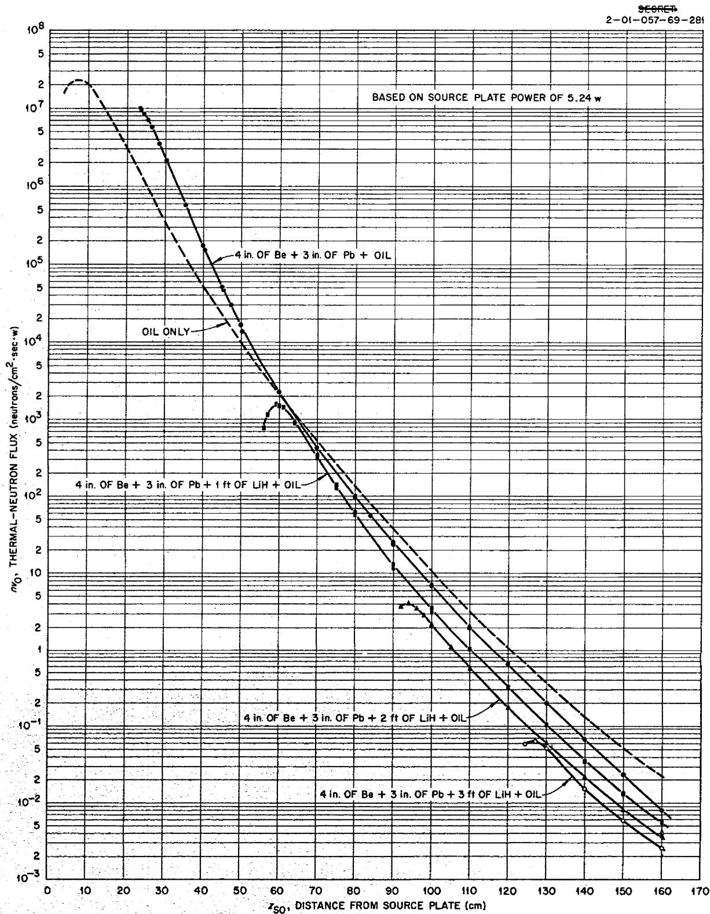  
Fig. 5.2.8. Thermal-Neutron Flux Traverses Beyond Configuration 69-12.

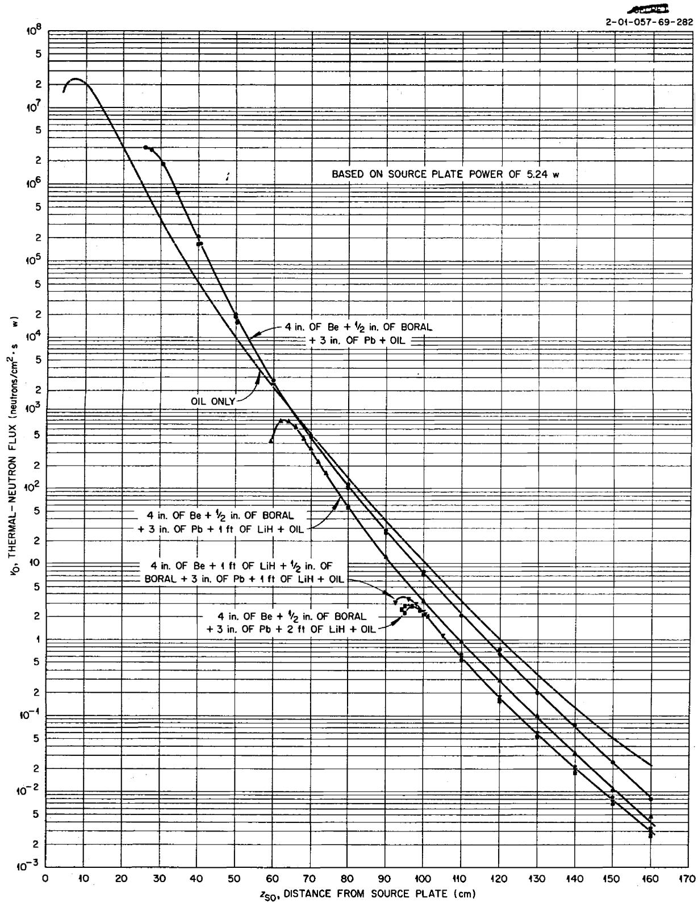  
Fig. 5.2.9. Thermal-Neutron Flux Traverses Beyond Configuration 69-13.

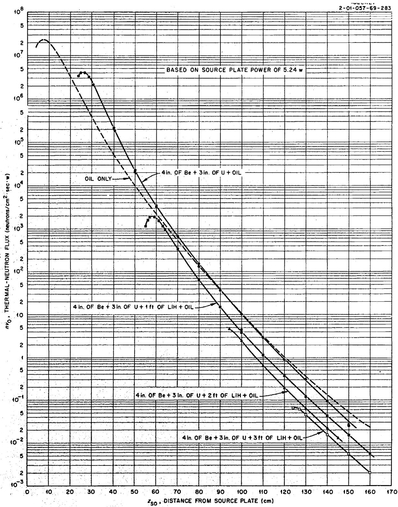  
Fig. 5.2.10. Thermal-Neutron Flux Traverses Beyond Configuration 69-14.

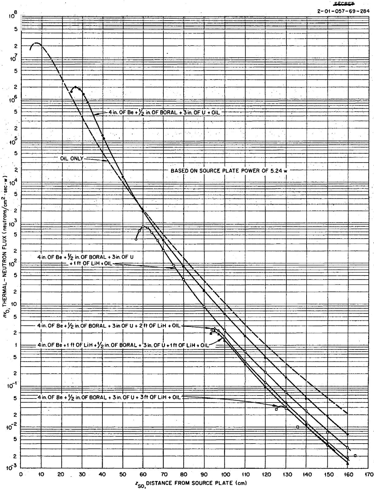  
Fig. 5.2.11. Thermal-Neutron Flux Traverses Beyond Configuration 69-15.

# 5.3. BULK SHIELDING FACILITY

F. C. Maienschein

# THE FISSION-PRODUCT GAMMA-RAY ENERGY SPECTRUM

W.Zobel T.A.Love

The importance of obtaining information about the gamma-ray energy spectrum and time decay characteristics of the fission products of $U^{235}$ as related to circulating-fuel reactors has been repeatedly emphasized. The preliminary results on the time decay characteristics (Phase I of the experiment) were presented in a previous report, and equally preliminary results on the energy spectrum (Phase II) of these fission-product gamma rays at different lengths of time after fission are presented here.

The equipment used in the experiment has been described elsewhere.4 Samples of enriched uranium weighing about 2, 7, 15, and $32\mathrm{mg}$ , respectively, were irradiated in the ORNL Graphite Reactor for periods varying between 1 and 64 sec, depending on the run. The weight and bombarding time were chosen so that the counting rate during a run did not exceed a manageable value. The energy calibration of the spectrometer was carried out in the usual manner, with $\mathsf{Na^{22}}$ , $\mathsf{Y^{88}}$ , and $\mathsf{ThC}^{\prime \prime}$ sources. Sources of $\mathsf{Hg^{203}}$ , $\mathsf{Cs^{137}}$ , $\mathsf{Na^{22}}$ , $\mathsf{Zn^{65}}$ , $\mathsf{Co^{60}}$ , and $\mathsf{Na^{24}}$ , whose absolute source strengths were determined with the aid of the high-pressure ion chamber of the ORNL Radioisotopes Control Laboratory, were used for the calibration of the efficiency of the spectrometer as a function of photon energy. The efficiency thus obtained was the total efficiency of the spectrometer, rather than the peak efficiency, which is sometimes used. To correct the data for counting losses, the average count rate over the counting period was used. The counting

losses for a given count rate were determined experimentally.

The determination of the number of fissions taking place in a sample depends on the length of time the sample is exposed to the thermal neutrons and the intensity of the flux. In an experiment of this type, where the sample is moved into and out of the flux, the bombarding times and fluxes used in the calculations must be the "effective" bombarding times and neutron flux. The effective thermal-neutron flux was obtained by exposing bare and cadmium-covered gold foils for a nominal 32 sec at the time of each run and computing the flux from the cadmium difference. The effective bombarding time was computed from the activities of gold foils, which were also exposed for the nominal bombarding times used in the experiment. It was found that the flux differed from the previously used value by about $27\%$ . Also, the bombarding times differed somewhat from the earlier ones.

The energy spectra obtained at 1.7, 6.2, 10.7, 40, 70, 100, 250, 700, 1000, and 1550 sec after fission are shown in Figs. 5.3.1 and 5.3.2. They have been separated to avoid any confusion which might arise owing to the scatter of the points belonging to adjacent curves. It should be pointed out that the peaks merely represent an attempt to show some of the structure in the curves. The error on the points has not yet been computed, so that these peaks are not necessarily final. They do appear on successives curves, however, which lends some credence to their existence. No attempt has yet been made to assign these peaks to specific isotopes.

An integration of the spectra in Figs. 5.3.1 and 5.3.2 between 0.28 and 5.0 Mev and between 1.25 and 1600 sec gave a total of 2.81 photons emitted per fission with a total energy of 3.22 Mev per fission. These values carry an estimated error of about $\pm 25\%$ . They should be compared with the values obtained in Phase I of the experiments, which, when corrected for differences discovered in the evaluation, were 2.92 ( $\pm 25\%$ ) photons per fission and 3.23 ( $\pm 25\%$ ) Mev per fission. The agreement between the two phases is good; this is also shown in Figs. 5.3.3 and

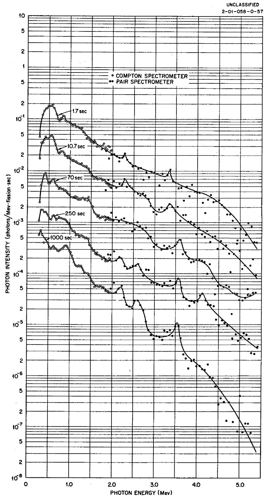  
Fig. 5.3.1. Fission-Product Photon Energy Spectrum at 1.7, 10.7, 70, 250, and 1000 sec After Fission.

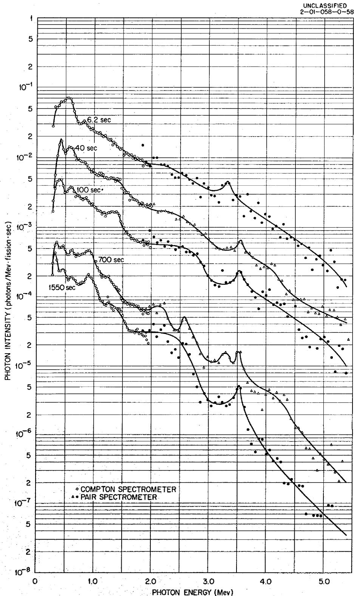  
Fig. 5.3.2. Fission-Product Photon Energy Spectrum at 6.2, 40, 100, 700, and 1550 sec After Fission.

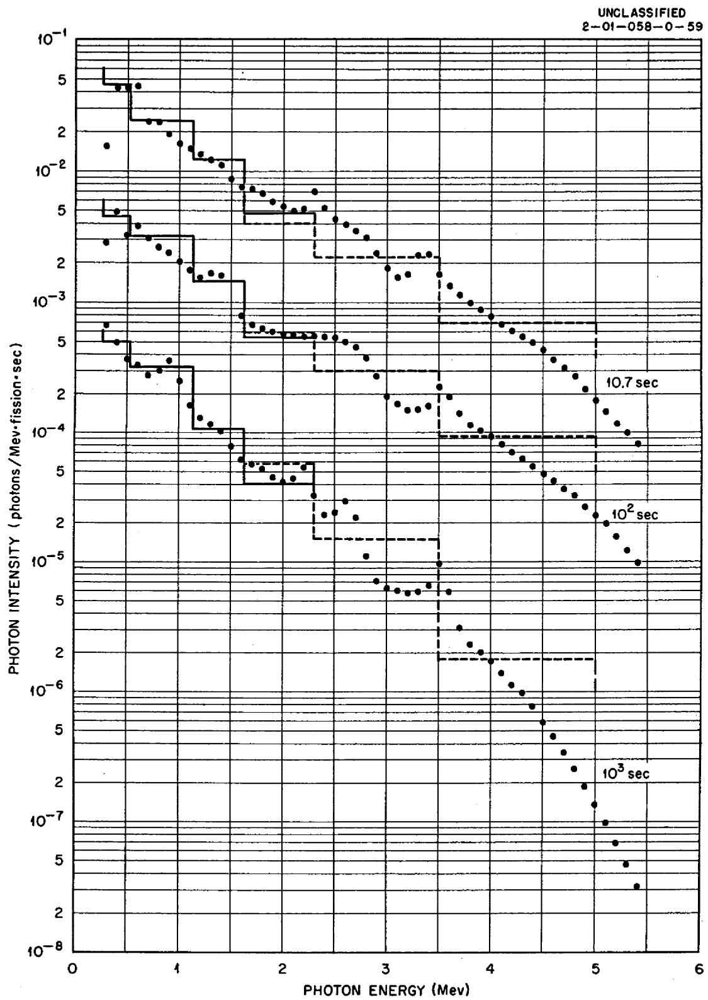  
Fig. 5.3.3. Fission-Product Photon Energy Spectrum from Phase II of Experiment with Superimposed Spectrum from Phase I.

5.3.4, where cross plots of the data from one phase of this experiment are shown with the appropriate points from the other phase. Another comparison may be made with the spectra obtained in the experiment carried out at the LTSF.2 It should be kept in mind, however, that there are systematic differences in the evaluation of the data in that experiment and the one described

here. The values obtained in the LTSF experiment were 4.2 (±20%) photons per fission and 4.8 (±20%) Mev per fission.

Further refinement of the evaluation of the data is contemplated. It is expected that such re-evaluation will show better agreement between

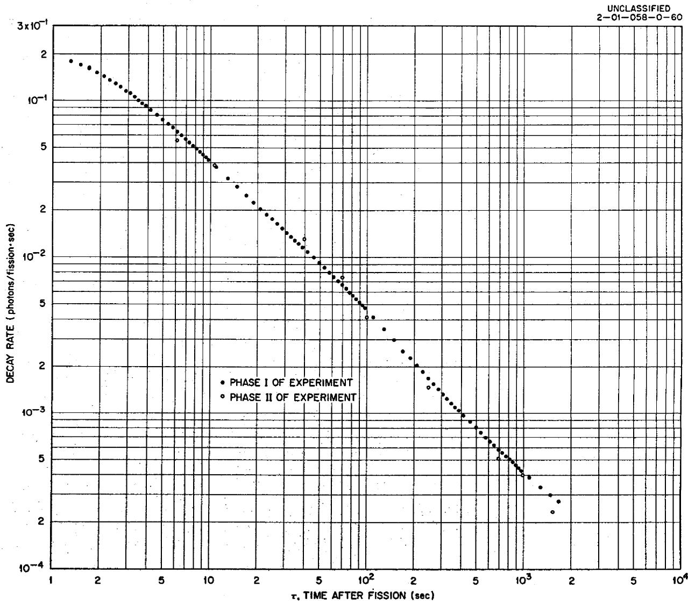  
Fig. 5.3.4. Decay Rate of Fission-Product Gamma Rays from Phase I of Experiment for a 0.28-to 5.0-Mev Energy Range with Superimposed Points from Phase II.

the different experiments and lead to a more definite answer.

# GAMMA-RAY STREAMING THROUGH THE NoK PIPES THAT PENETRATE THE ART SHIELD

T. V. Blosser

D. K. Trubey

A mockup experiment5,6 to investigate the increase in the dose rate outside the ART lead shield caused by gamma-ray streaming through the NaK-filled pipes that penetrate the shield has now included measurements beyond a duct placed through a mockup of the ART shield at an angle of

5T.V. Blosser, ANP Quar. Prog. Rep. March 10, 1956, ORNL-2061, p 249.   
6T. V. Blosser and D. K. Trubey, ANP Quar. Prog. Rep. June 10, 1956, ORNL-2106, p 274.

51 deg 30 min (Fig. 5.3.5). The duct consists of two concentric Inconel pipes (separated by a thin air layer) filled with aluminum turnings and fitted with a tungsten collar at the top. The axis of the duct in the horizontal plane was at a 45-deg angle from the $x$ axis. For this particular arrangement a specific coordinate system using $x'$ and $y'$ axes was adopted to designate the points of measurement. The $x', y'$ axes were at an angle of 45 deg to the $x, y$ axes as shown in Fig. 5.3.6. Measurements were made beyond the ducts along several $x'$ traverses (labeled A through E in Fig. 5.3.6) for two $z$ distances (10.5 and 20.5 cm) from the lead shield.

The ratio of the dose rate beyond the water-filled hole (that is, with the duct not in position) to the

UNCLASSIFIED

ORNL-LR-DWG 16200

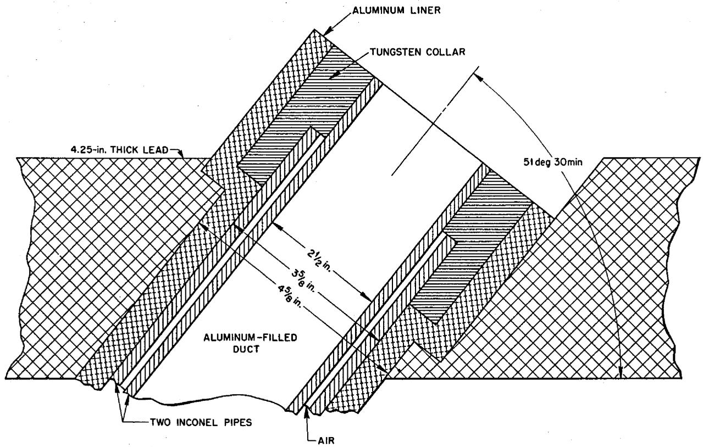  
Fig. 5.3.5. Mockup of an ART Duct Penetrating the Lead Shield at an Angle of 51 deg 30 min.

dose rate beyond the solid lead shield is plotted in Fig. 5.3.7, as well as the actual dose rate beyond the solid lead. (For convenience in plotting, the curve actually represents twice the measured dose rate.) The ratios of the dose rates beyond the aluminum-filled duct to the dose rate

beyond the solid lead are shown in Figs. 5.3.8 and 5.3.9. Again the actual dose rates beyond the solid lead are plotted on the lower portions of the figures.

The reduction in dose due to tilting the duct is about a factor of 4. This indicates that the

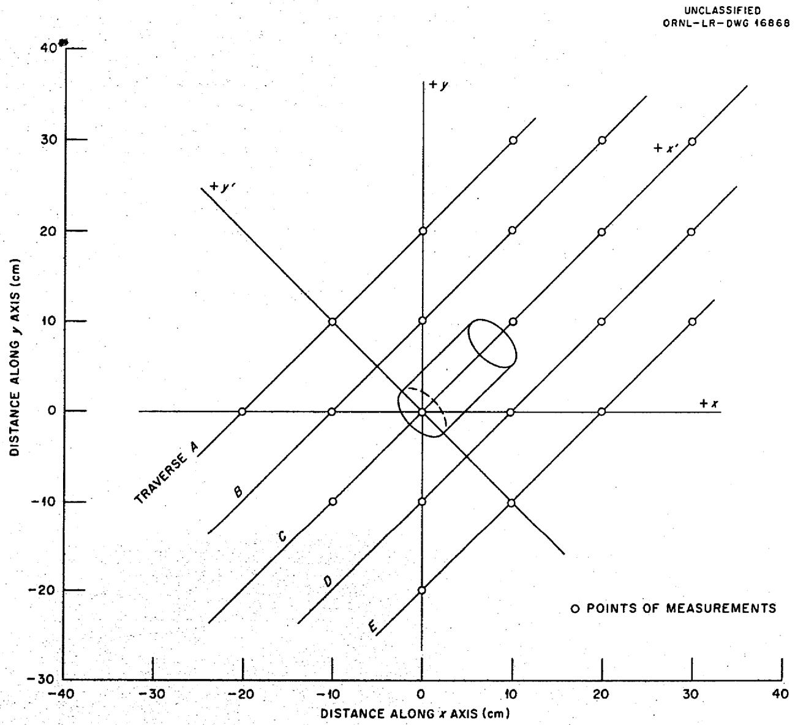  
Fig. 5.3.6. Coordinate System for ART 51-deg 30-min Duct Mockup Tests.

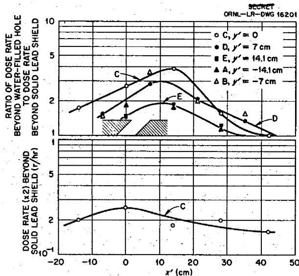  
Fig. 5.3.7. Gamma-Ray Dose Rates Beyond a Water-Filled Hole Penetrating a Mockup of the ART Shield at an Angle of 51 deg 30 min.

mockup gamma-ray source has an approximate distribution proportional to $\cos^3\theta$ . This is in agreement (within the uncertainty) with the estimate of the distribution reported previously. It must be remembered, however, that the source distribution of the ART will probably not correspond to that of the mockup source, even though the angle of penetration is the same as that of the mockup reported here. That is, the fuel in the heat exchanger is directly in line with the axis of the duct in the ART, but the source of the mockup is believed to be a $\cos^2\theta$ distribution about the normal to the lead. For this reason it would probably be more realistic to apply the previously reported results for the straight-through penetrations, which mocked up portions of the north-head ducts.

Some measurements have been made beyond straight-through penetrations mocking up portions of the south-head ducts, and the results will be published later. The effects of various components in the mockups and the effects of patches are now being investigated.

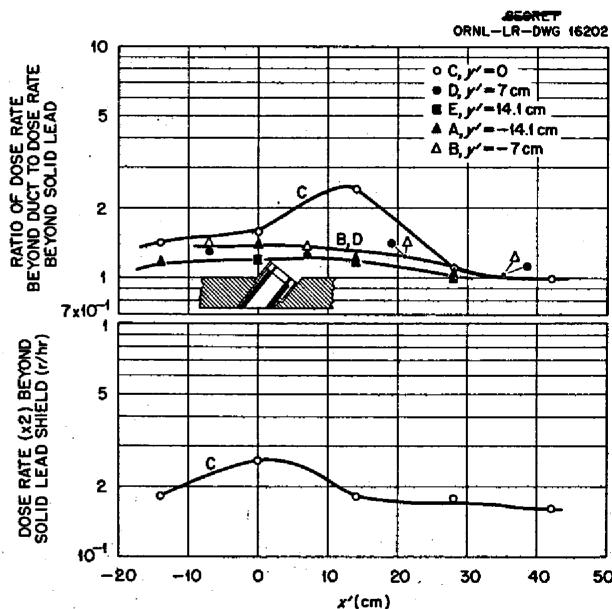  
Fig. 5.3.8. Gamma-Ray Dose Rates Beyond Aluminum-Filled Ducts Penetrating a Mockup of the ART Lead Shield at an Angle of 51 deg 30 min ( $z = 10.5 \, \text{cm}$ ).

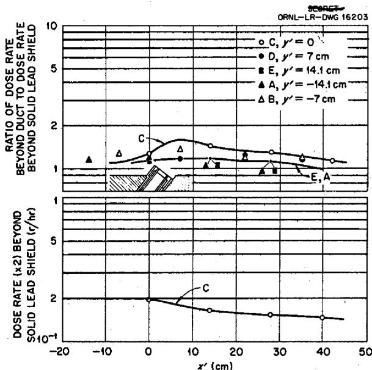  
Fig. 5.3.9. Gamma-Ray Dose Rates Beyond Aluminum-Filled Ducts Penetrating a Mockup of the ART Lead Shield at an Angle of 51 deg 30 min $(x = 20.5\mathrm{cm})$

# 5.4. SHIELD MockUP CORE

C. E. Clifford

L. B. Holland

The design of the Shield Mockup Core (SMC),1 a 5-Mw fixed-fuel reactor proposed for shielding studies of the circulating-fuel reflector-moderated reactor (CFRMR), has been altered somewhat as dictated by nuclear and shielding calculations performed by the Engineering Physics Group at Pratt & Whitney Aircraft.2 Other changes also became necessary for engineering or economical reasons.

The SMC has been designed so that the leakage fluxes, with the exception of the fission-product radiation from the heat exchanger, will be the same as those from a CFRMR (PWAR-1) now contemplated for aircraft propulsion. The core will consist of 204 modified MTR-type fuel plates

placed radially around the island reflector. The shape of the plates will be such that when they are all in position the geometry of the CFRMR will be simulated. Numerous calculations have been performed to compare the SMC with the CFRMR, and each deviation from the CFRMR design was considered. A summary of the calculations which led to the current SMC design (Fig. 5.4.1) is given below.

# SELECTION OF CALCULATIONAL MODELS

The nonregular geometry of the CFRMR core, which is somewhere between a sphere and a cylinder, necessitated the use of several cylindrical and spherical calculational models to determine the upper and lower limits of the critical mass. The validity of the nuclear models was checked by using them in calculations of the critical mass of the ART high-temperature critical experiment. As shown in Table 5.4.1, the results

TABLE 5.4.1. COMPARISON OF CALCULATED AND EXPERIMENTAL CRITICAL MASS AND VOLUME OF THE ART HIGH-TEMPERATURE CRITICAL EXPERIMENT  

<table><tr><td></td><td>Critical Mass (kg)</td><td>Core Volume (liters)</td></tr><tr><td>Experimental</td><td>18.2</td><td></td></tr><tr><td>Calculated</td><td></td><td></td></tr><tr><td>Spherical models</td><td></td><td></td></tr><tr><td>Equatorial crosscut</td><td>17.6</td><td>64</td></tr><tr><td>Equal core volume, actual mid-plane thickness of island, and actual mid-plane outer diameter of reflector</td><td>18.6*</td><td>95.2</td></tr><tr><td>Equal volumes for all regions</td><td>21.8</td><td>96.3</td></tr><tr><td>Cylindrical models</td><td></td><td></td></tr><tr><td>Equatorial crosscut</td><td>29.6</td><td></td></tr><tr><td>Equal core volume, actual mid-plane thickness of island, and actual mid-plane outer diameter of reflector</td><td>22.8</td><td></td></tr><tr><td>Equal importance: actual mid-plane thickness of island, and actual outer radius of reflector; core radius determined by weighting that volume of the core which deviates from a cylinder** by a cosine function and adding to the cylindrical core volume (critical mass determined with actual core volume)</td><td>18.7*</td><td></td></tr></table>

*Models used in SMC calculations.   
\*\*That is, region 5 in Fig. 5.4.7.

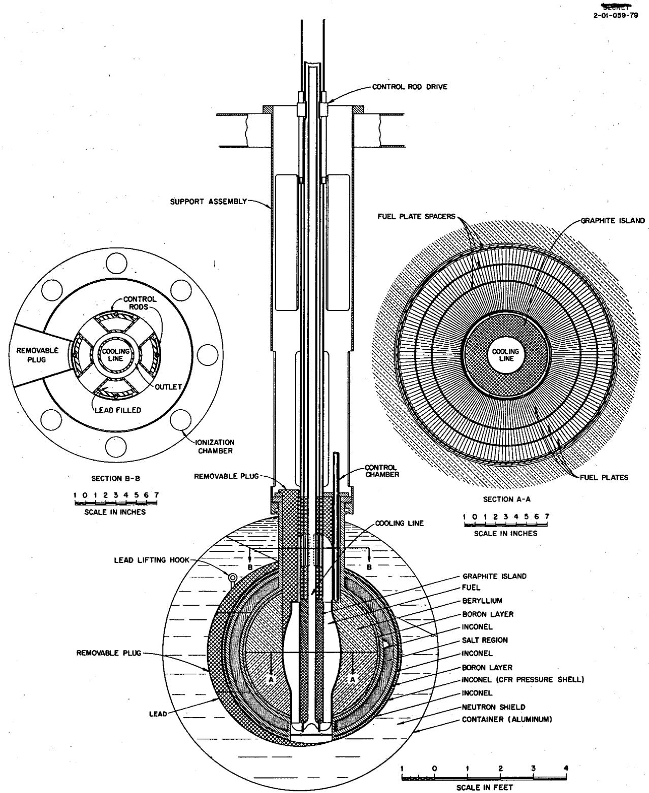  
Fig. 5.4.1. The Shield Mockup Core (SMC).

of both a spherical and a cylindrical model were in agreement with the experimental critical mass. Both a continuous slowing-down model and a Goertzel-Selengut slowing-down model were used to account for the energy degradation of neutrons in the light water used as the coolant in the core. The agreement was good enough to permit the use of the continuous slowing-down model for parametric studies to determine a design point.

# CALCULATIONAL PROCEDURE

The calculational procedure first included a determination of the fuel loading for a critical condition of a given core configuration by a multigroup machine calculation. Parametric studies were then carried out to match the core power distribution and neutron-absorption distribution in the beryllium of the SMC with those in the CFRMR. Once these distributions were in agreement the contributions of the various radiation sources in both the SMC and CFRMR to the total dose in the crew compartment were calculated. The SMC configuration which gave the proper dose contributions was then selected.

In the method used to determine whether the doses from the gamma-ray sources in the SMC and the CFRMR were matched, both reactors were divided into 35 spherical shells, and the dose rate from each material of each shell at a point 50 ft from the reactor was calculated. The total contribution from each material in a particular region was then obtained by adding the dose rate from that material in each shell in that region. The calculations were based on the neutron absorptions from the critical calculations and published data on capture gamma rays. In the first calculations an average capture gamma-ray energy was assumed, but in later calculations a capture gamma-ray spectrum was approximated by using the appropriate number of 2-, 4-, 6-, 7-, and 9-Mev photons indicated for a particular material. Since the operating temperature of the CFRMR will be approximately $1300^{\circ}\mathrm{F}$ higher than that of the SMC, and therefore the thermal-neutron cross section will be much smaller, it was necessary to match the neutron absorptions, rather than the thermal-neutron flux, in the beryllium and other materials

of the two reactors to obtain the proper capture gamma-ray distribution.

The fission neutrons which contribute to the neutron dose in the crew compartment and thus are of concern to the shield designer are those born at high energies. (Fast neutrons thermalized in the core or reflector will not pass through the boral curtain in outside the reflector. They contribute to the dose in the crew compartment through the capture gamma rays which they produce in the core-reflector region.) It is assumed that if the removal cross sections of the materials in the SMC core are very nearly the same for fast neutrons as the removal cross section of the fused salt fuel in the CFRMR, that if the normalized core power distributions are matched, and that if the regions outside the core are correctly mocked up in the SMC, the number and energy spectrum of neutrons leaving the SMC shield should be the same as those leaving the CFRMR shield.

# CALCULATIONS FOR SMC CONFIGURATIONS USING $\mathsf{UO}_2$ -STAINLESS STEEL FUEL ELEMENTS

It was assumed originally that the CFRMR leakage fluxes could best be mocked up in the SMC with $\mathsf{UO}_2$ -stainless steel fuel elements cooled with $\mathsf{D}_2\mathsf{O}$ . The results of early calculations confirmed that a better match of the core power distribution and the neutron absorptions in the beryllium could be obtained if $\mathsf{D}_2\mathsf{O}$ rather than $\mathsf{H}_2\mathsf{O}$ were used (Figs. 5.4.2 and 5.4.3). This result was to be expected, since the moderation of neutrons by $\mathsf{D}_2\mathsf{O}$ is closer to that of the fused salts than is the moderation by $\mathsf{H}_2\mathsf{O}$ . However, the use of a closed $\mathsf{D}_2\mathsf{O}$ system in an $\mathsf{H}_2\mathsf{O}$ storage pool at the TSF or the BSF posed many handling problems and a safety problem that could not be tolerated. It became apparent from a plot of the critical mass of the SMC for all mixtures of $\mathsf{D}_2\mathsf{O}$ and $\mathsf{H}_2\mathsf{O}$ (Fig. 5.4.4) that a supercritical condition could arise almost instantaneously if $\mathsf{H}_2\mathsf{O}$ were inadvertently pumped into the $\mathsf{D}_2\mathsf{O}$ -cooled core as a result of component failure or mishandling. It was therefore decided that $\mathsf{H}_2\mathsf{O}$ should be used as the coolant in the SMC.

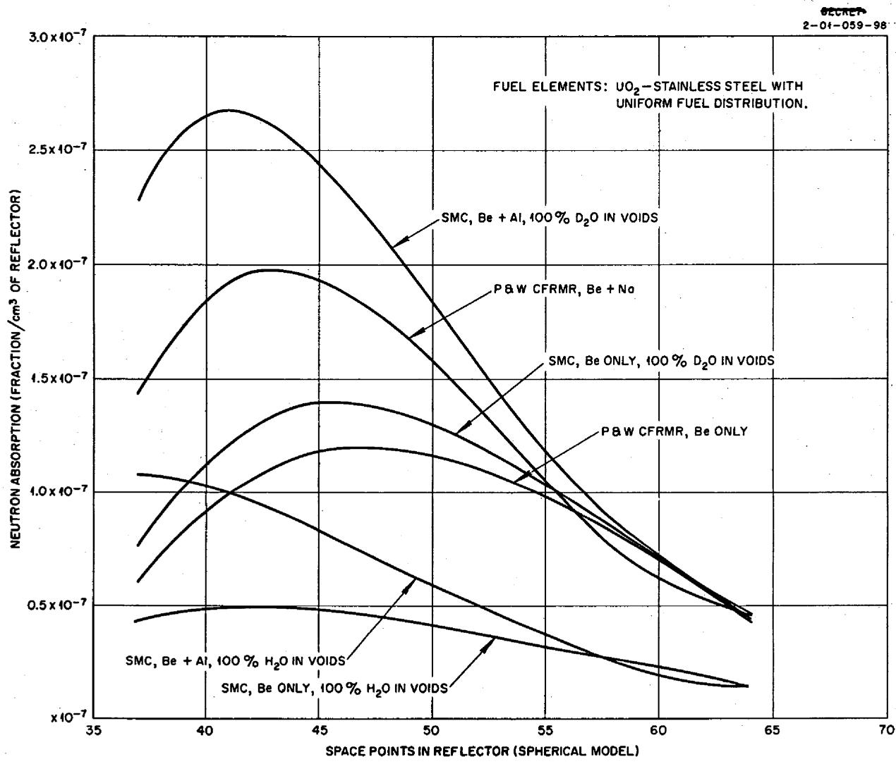  
Fig. 5.4.2. Neutron Absorptions in Reflector Region of an SMC Using $\mathsf{UO}_2$ -Stainless Steel Fuel Elements and $\mathsf{H}_2\mathsf{O}$ or $\mathsf{D}_2\mathsf{O}$ Coolant.

Because of the excessive moderation of neutrons in the core by $\mathsf{H}_2\mathsf{O}$ and the consequent reduction of neutron absorptions in the reflector of the SMC, it was necessary to devise some means of reducing the amount of $\mathsf{H}_2\mathsf{O}$ in the core. A parametric study was therefore carried out to determine the effect of substituting aluminum (by means of wedges between the fuel plates) for some of the $\mathsf{H}_2\mathsf{O}$ . As shown in Fig. 5.4.5, the combination which resulted in a neutron absorption distribution in the SMC reflector that most nearly matched that in the CFRMR reflector was $25\%$ $\mathsf{H}_2\mathsf{O}$ and $75\%$

aluminum in the spaces between the fuel plates. [The calculations were for absorptions in the beryllium, aluminum, and $\mathsf{H}_2\mathsf{O}$ (ref 5) in the SMC reflector and for beryllium and sodium in the CFRMR reflector.] The agreement for the region near the core-reflector interface is poor, but this difference can be minimized by adjusting the amount of aluminum in the SMC reflector.

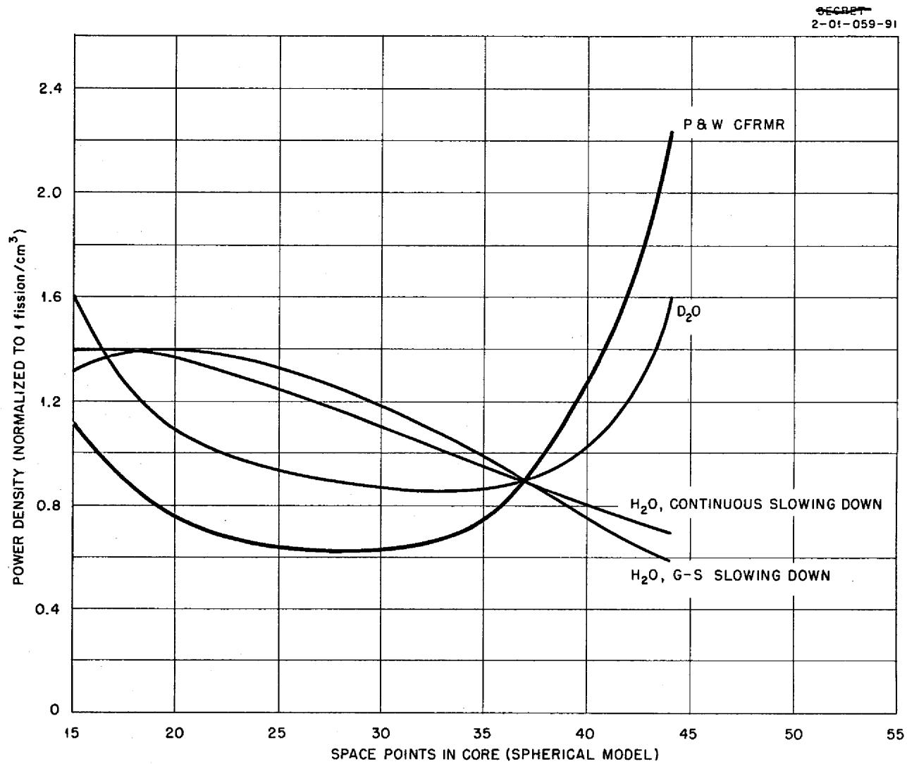  
Fig. 5.4.3. Power Distribution in an SMC Using $\mathsf{UO}_2$ -Stainless Steel Fuel Elements and $\mathsf{H}_2\mathsf{O} - \mathsf{D}_2\mathsf{O}$ Coolant.

In order to further investigate the effect of substituting aluminum for $\mathsf{H}_2\mathsf{O}$ in the core, the power distribution in the core was determined for each $\mathsf{H}_2\mathsf{O}$ -aluminum combination (see Fig. 5.4.6). Once again the power distribution for the $25\%$ $\mathsf{H}_2\mathsf{O}-75\%$ aluminum combination most nearly approached that of the CFRMR, but the agreement was not good enough. It was felt that this could be attributed to the fact that the radial arrangement of the SMC fuel plates will cause a reduction in the uranium density with increasing radius, whereas the homogeneous fused salts in the CFRMR

will give a uniform uranium density. If the uranium loading in the SMC fuel plates is varied so that only the outer regions of some of the plates contain fuel, as in Fig. 5.4.7, for example, the fuel density in the core will become more nearly constant. For calculational purposes the core was divided into five concentric regions and the fuel loading in the outer three regions was varied. As shown in Fig. 5.4.8, the power density which most nearly approached that of the CFRMR was for a 1:1:1:2:3 fuel distribution. A comparison of neutron absorptions in the reflector of the

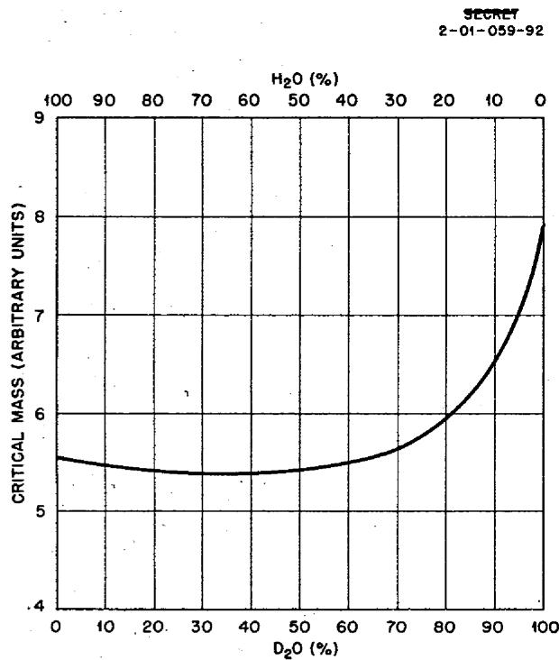

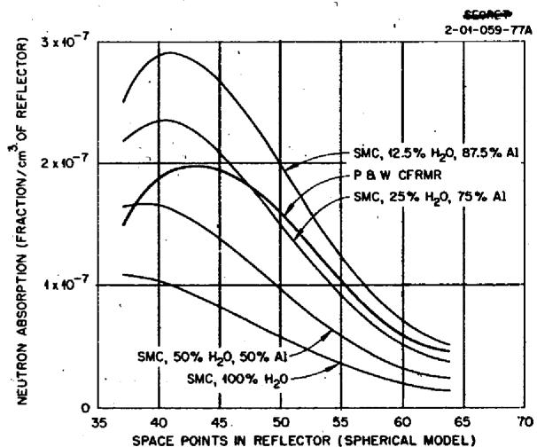  
Fig. 5.4.4. Critical Mass of an SMC Using $\mathsf{UO}_2$ -Stainless Steel Fuel Elements and $\mathsf{D}_2\mathsf{O}-\mathsf{H}_2\mathsf{O}$ Coolant.   
Fig. 5.4.5. Fraction of Neutron Absorption in Entire Reflector Region (Be + Al + H₂O) for Various Core Configurations of an SMC Using UO₂-Stainless Steel Fuel Elements and H₂O Coolant.

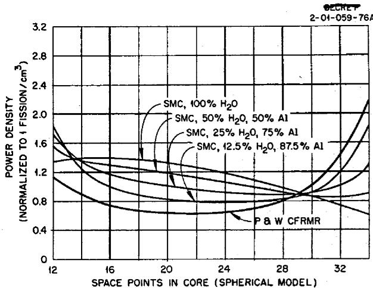  
Fig. 5.4.6. Power Distribution in Various Core Configurations of an SMC Using $\mathsf{UO}_2$ -Stainless Steel Fuel Elements and $\mathsf{H}_2\mathsf{O}$ Coolant.

SMC using this configuration with those in the reflector of the CFRMR also showed good agreement.

On the basis of the above results, the first shielding calculations, that is, the first calculations of contributions to the gamma-ray dose by the various regions of the reactor, were performed for an SMC using $\mathrm{UO}_2$ -stainless steel fuel elements with a 1:1:1:2:3 fuel distribution and $\mathrm{H}_2\mathrm{O}$ as the coolant filling $25\%$ of the voids between the fuel plates. It immediately became apparent that for the lower operating temperature of the SMC the capture gamma-ray production in the Inconel core shells was too high. Since the shell at the core-reflector interface was the important contributor, succeeding calculations were made for an SMC with a half-thickness Inconel shell at that interface. The results of these calculations are shown in Table 5.4.2 for two different shield configurations.

The effect that the thinner shell had on the power distribution was then calculated. As can be seen in Fig. 5.4.8, the results were in closer agreement with the power distribution for the CFRMR than any of the other SMC configurations.

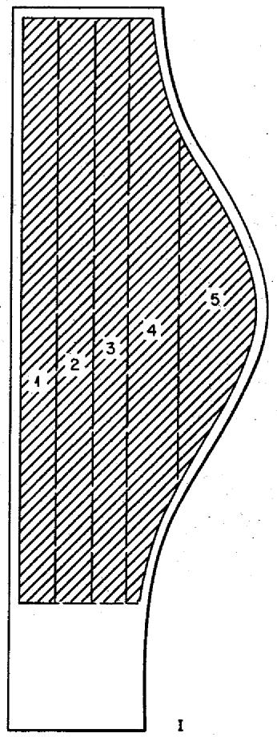  
SEGRET   
2-04-059-100

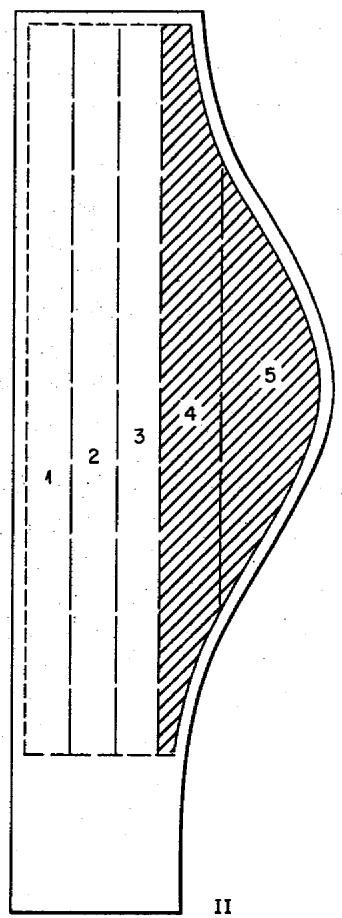

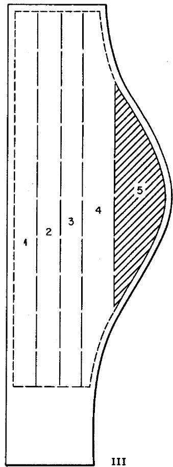  
NOTE:   
REGIONS 1 THROUGH 5 INDICATE THEORETICAL DIVISIONS OF THE CORE VOLUME FOR NUCLEAR CALCULATIONS

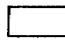  
A1

Fig. 5.4.7. Proposed Uranium Loading of SMC Fuel Plates.   
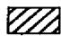  
NOT TO SCALE

U-A1

When the neutron absorptions in the reflector regions also corresponded (Fig. 5.4.9), it was felt that the best configuration for an SMC using $\mathrm{UO}_2$ -stainless steel fuel elements had been attained. At the same time, it was realized (Table 5.4.2) that the capture gamma-ray dose rate from the stainless steel in the fuel elements was excessive, even though the first calculations were made for a single capture gamma-ray energy for each element rather than for an energy spectrum. It was then decided to convert to uranium-aluminum

fuel elements and to repeat all the calculations using the spectrum of capture gamma-ray energies previously indicated for the dose rate calculations.

# CALCULATIONS FOR SMC CONFIGURATIONS USING URANIUM-ALUMINUM FUEL ELEMENTS

The use of uranium and aluminum in the core will necessitate a thicker fuel plate design; however, the thickness of the aluminum wedges between the plates will be adjusted so that the

amount of $\mathsf{H}_2\mathsf{O}$ in the core region will remain the same and it will continue to be referred to as a $25\%$ $\mathsf{H}_2\mathsf{O} - 75\%$ aluminum case.

The power distribution in an SMC configuration using uranium-aluminum fuel elements is shown in Fig. 5.4.10 for three different fuel distributions. The 1:1:1:2:3 distribution again gave the best agreement with the CFRMR. This distribution was

then used in the calculations of the neutron absorptions in the reflector region (Fig. 5.4.11). A comparison of Fig. 5.4.11 with Fig. 5.4.9 shows that the substitution of aluminum for stainless steel in the core will not appreciably change the number of neutron absorptions in the reflector.

In view of the agreement in the nuclear calculations, shielding calculations were then performed

TABLE 5.4.2. COMPARISON OF CALCULATED GAMMA-RAY DOSE RATES ${}^{a}$ FROM CORE-REFLECTOR REGIONS OF THE CFRMR AND THE SMC ${}^{b}$ USING ${\mathrm{{UO}}}_{2}$ -STAINLESS STEEL FUEL ELEMENTS   

<table><tr><td rowspan="3">Region</td><td rowspan="3">Material</td><td colspan="4">Dose Rate at 50 ft (r/hr)</td></tr><tr><td colspan="2">32-cm Alkylibenzene Reactor Shield (No Pb)</td><td colspan="2">5-in.-Pb-43-cm-Alkylbenzene Reactor Shield</td></tr><tr><td>SMC</td><td>CFRMR</td><td>SMC</td><td>CFRMR</td></tr><tr><td rowspan="4">Island-core shell</td><td>Inconelc</td><td>332</td><td>96.17</td><td>0.2330</td><td>0.0544</td></tr><tr><td>H2Od</td><td>11.37</td><td></td><td>0.00079</td><td></td></tr><tr><td>Sodium</td><td></td><td>0.1377</td><td></td><td>0.0002</td></tr><tr><td>Subtotal</td><td>343.0</td><td>96.0</td><td>0.2338</td><td>0.0546</td></tr><tr><td rowspan="5">Core</td><td>Stainless steel</td><td>1,785</td><td></td><td>1.8969</td><td></td></tr><tr><td>H2O</td><td>11.53</td><td></td><td>0.0169</td><td></td></tr><tr><td>Aluminum</td><td>417.9</td><td></td><td>0.442</td><td></td></tr><tr><td>Fuel</td><td>3,385</td><td>3979</td><td>6.456</td><td>7.588</td></tr><tr><td>Subtotal</td><td>5,599</td><td>3979</td><td>8.8118</td><td>7.588</td></tr><tr><td rowspan="4">Core-reflector shell</td><td>Inconel</td><td>1,570</td><td>1454</td><td>0.8100</td><td>0.7714</td></tr><tr><td>H2O</td><td>0.54</td><td></td><td>0.0166</td><td></td></tr><tr><td>Sodium</td><td></td><td>2.017</td><td></td><td>0.0029</td></tr><tr><td>Subtotal</td><td>1,571</td><td>1456</td><td>0.8266</td><td>0.7743</td></tr><tr><td rowspan="4">Reflector</td><td>Beryllium</td><td>4,238</td><td>3868</td><td>4.272</td><td>3.883</td></tr><tr><td>Aluminum</td><td>1,708</td><td></td><td>1.735</td><td></td></tr><tr><td>Sodium</td><td></td><td>262.8</td><td></td><td>0.382</td></tr><tr><td>Subtotal</td><td>5,946</td><td>4131</td><td>6.007</td><td>4.265</td></tr><tr><td>Total</td><td></td><td>13,459</td><td>9662</td><td>15.879</td><td>12.682</td></tr></table>

An average capture gamma-ray energy was assumed.   
bSMC configuration includes $\mathsf{UO}_2$ -stainless steel fuel plates with 1:1:1:2:3 fuel distribution, $25\%$ $\mathsf{H}_2\mathsf{O}$ and $75\%$ aluminum in core voids, a half-thickness Inconel shell at the core-reflector interface, and a full-thickness Inconel shell at the island-core interface.   
$c_{A}$ A comparison of the capture gamma-ray production in the individual elements of Hastelloy X, which will be used in the CFRMR, and Inconel, which is more available and inexpensive for the SMC, showed that there was sufficient agreement to justify using Inconel in all the calculations.   
$d_{\text{Small}}$ amount of water in the tolerance region between the fuel plates and the Inconel shell.

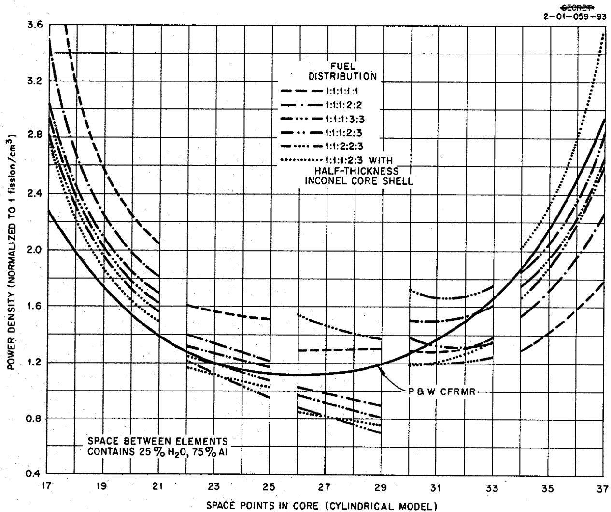

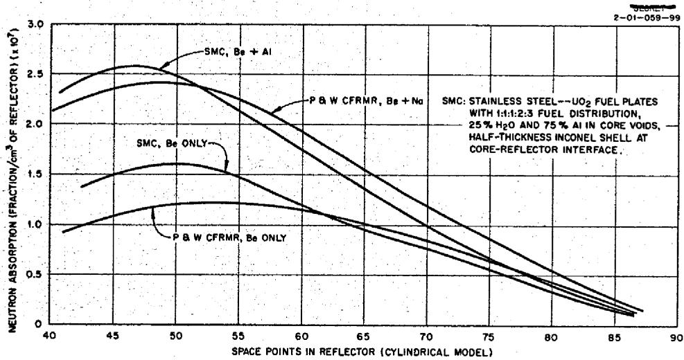  
Fig. 5.4.8. Power Distribution for Various Fuel Distributions in an SMC Using $\mathsf{UO}_2$ -Stainless Steel Fuel Elements and $\mathsf{H}_2\mathsf{O}$ Coolant.   
Fig. 5.4.9. Neutron Absorptions in Beryllium Reflector Region of an SMC Using $\mathsf{UO}_2$ -Stainless Steel Fuel Elements and $\mathsf{H}_2\mathsf{O}$ Coolant.

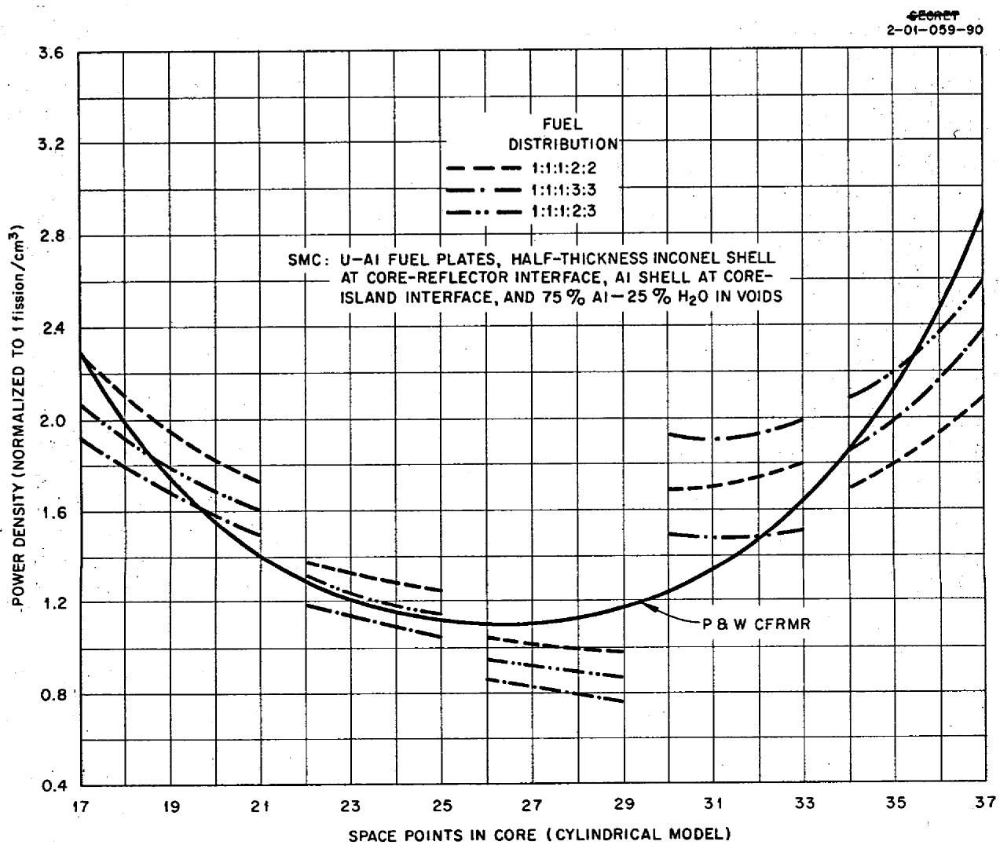

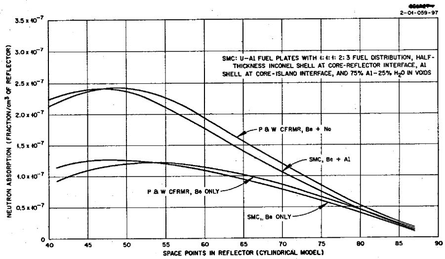  
Fig. 5.4.10. Comparison of Calculated Power Distributions in the SMC and the P & W CFRMR.   
Fig. 5.4.11. Comparison of Calculated Neutron Absorption in Reflector Region of the SMC and the P & W CFRMR.

for an SMC using this configuration, that is, using uranium-aluminum fuel elements, a 1:1:1:2:3 fuel distribution, $\mathsf{H}_2\mathsf{O}$ as the coolant filling $25\%$ of the voids between the fuel plates, and a half-thickness Inconel shell at the core-reflector interface. In addition, a full-thickness aluminum shell was substituted for the Inconel shell at the core-island interface, since the contribution from that shell had been too high in the calculations for the earlier configurations. (The total contribution

from this shell was only on the order of $1\%$ , however.) The results of the shielding calculations, which are for two shielding configurations, are presented in Table 5.4.3 and discussed below.

# Core Gamma Rays

The gamma rays from the fused salts in the CFRMR will be mocked up in the SMC by fission gamma rays from the uranium plus capture gamma rays from the aluminum.

TABLE 5.4.3. COMPARISON OF CALCULATED GAMMA-RAY DOSE RATES ${}^{a}$ FROM CORE-REFLECTOR REGIONS OF CFRMR AND SMCb USING URANIUM-ALUMINUM FUEL ELEMENTS   

<table><tr><td rowspan="3">Region</td><td rowspan="3">Material</td><td colspan="4">Dose Rate at 50 ft (r/hr)</td></tr><tr><td colspan="2">32-cm Alkylbenzene Reactor Shield (No Pb)</td><td colspan="2">5-in.-Pb-43-cm-Alkylbenzene Reactor Shield</td></tr><tr><td>SMC</td><td>CFRMR</td><td>SMC</td><td>CFRMR</td></tr><tr><td rowspan="5">Island-core shell</td><td>InconelC</td><td></td><td>101</td><td></td><td>0.0806</td></tr><tr><td>Aluminum</td><td>31.6</td><td></td><td>0.0384</td><td></td></tr><tr><td>H2Od</td><td>2.0</td><td></td><td>0.0021</td><td></td></tr><tr><td>Sodium</td><td></td><td>1</td><td></td><td>0.0018</td></tr><tr><td>Subtotal</td><td>33.6</td><td>102</td><td>0.0405</td><td>0.0824</td></tr><tr><td rowspan="4">Core</td><td>Uranium</td><td>1141</td><td>1525</td><td>1.823</td><td>2.399</td></tr><tr><td>Aluminum</td><td>360.9</td><td></td><td>0.509</td><td></td></tr><tr><td>H2O</td><td>66.9</td><td></td><td>0.097</td><td></td></tr><tr><td>Subtotal</td><td>1568.5</td><td>1525</td><td>2.429</td><td>2.399</td></tr><tr><td rowspan="4">Core-reflector shell</td><td>Inconel</td><td>1938</td><td>1453</td><td>1.516</td><td>1.141</td></tr><tr><td>H2O</td><td>13.9</td><td></td><td>0.020</td><td></td></tr><tr><td>Sodium</td><td></td><td>13.01</td><td></td><td>0.020</td></tr><tr><td>Subtotal</td><td>1951.9</td><td>1466.01</td><td>1.536</td><td>1.161</td></tr><tr><td rowspan="4">Reflector</td><td>Beryllium</td><td>3745</td><td>4125</td><td>4.493</td><td>4.959</td></tr><tr><td>Aluminum</td><td>1894</td><td></td><td>2.666</td><td></td></tr><tr><td>Sodium</td><td></td><td>1634</td><td></td><td>2.548</td></tr><tr><td>Subtotal</td><td>5639</td><td>5759</td><td>7.159</td><td>7.507</td></tr><tr><td>Total</td><td></td><td>9193</td><td>8852</td><td>11.17</td><td>11.15</td></tr></table>

aThe gamma-ray spectrum was approximated by using the appropriate number of 2-, 4-, 6-, 7-, and 9-Mev photons indicated for a particular material.   
bSMC configuration includes U-Al fuel plates with 1:1:1:2:3 fuel distribution, $25\%$ $\mathsf{H}_2\mathsf{O}$ and $75\%$ aluminum in core voids, a half-thickness Inconel shell at core-reflector interface, and an aluminum shell at island-core interface.   
$c_{A}$ comparison of the capture gamma-ray production in the individual elements of Hastelloy X, which will be used in the CFRMR, and Inconel, which is more available and inexpensive for the SMC, showed that there was sufficient agreement to justify using Inconel in all the calculations.   
$d_{\text{Small}}$ amount of water in the tolerance region between the fuel plates and the Inconel shell.

# SECRE

# Neutron-Capture Gamma Rays from the Core Shells

The capture gamma rays from neutron absorptions in the two Hastelloy X shells at the island-core and core-reflector interfaces of the CFRMR will be mocked up by neutron absorptions in the half-thickness Inconel shell and the full-thickness aluminum shell of the SMC, respectively. The calculations indicated that the dose from the half-thickness Inconel shell was still too high, but from the viewpoint of fabrication it was not feasible to reduce the shell thickness further.

# Neutron-Capture Gamma Rays from the Reflector

The beryllium reflector of the SMC will be almost an exact copy of the CFRMR beryllium reflector, but this will not ensure the proper mockup of the gamma-ray sources in the reflector region, since the temperature difference again will affect the gamma-ray source through the thermal-neutron cross section. The thermal-neutron flux required to produce the correct number of absorptions in the reflector will be much lower in the SMC. As mentioned above, the flux in the SMC beryllium and the power distribution in the core can be adjusted by varying the amount of moderation in the core region (see Fig. 5.4.5). The total gamma-ray dose rate from the SMC reflector will be adjusted by the amount and distribution of aluminum used to mock up the sodium coolant in the CFRMR reflector (see Figs. 5.4.9 and 5.4.11).

# Gamma Rays from the Heat Exchanger Region

In the CFRMR the most important source of gamma rays from regions outside the reflector will be from fission-product gamma rays from the circulating fuel in the heat exchanger. Since the SMC will use fixed fuel the fission-product source will not be mocked up, although the heat exchanger region will be (that is, with Inconel,

NaK, and fused salts), so that the proper attenuation of core radiation will be effected. Gamma rays resulting from neutron captures in the heat exchanger region will be reduced to an insignificant level, as far as the crew compartment dose is concerned, by boron curtains on each side of the heat exchanger in the CFRMR. These boron curtains will be mocked up in the SMC.

# Neutron-Capture Gamma Rays from the Pressure Shell and Shield

Gamma rays resulting from neutron captures in the Inconel pressure shell and the lead and water shield will also contribute to the crew compartment dose. The boron curtain in outside the heat exchanger will reduce the number of capture gamma rays from the outer Inconel shell. The relative importance of the capture gamma-ray sources in the lead and water is essentially a function of the lead thickness. For the CFRMR lead shield now contemplated the total contribution of capture gamma rays from the lead to the dose will be less than $5\%$ .

# Neutron-Capture Gamma Rays from the Air and Crew Compartment

The gamma-ray dose in the crew compartment resulting from neutron capture in air and the crew compartment materials is a function of the spectrum of neutrons leaving the reactor shield. Since this spectrum will be mocked up in the SMC these capture gamma-ray sources should be correct.

# DESIGN STATUS

At this point the nuclear calculations are considered to be final enough to allow complete detailed design of the reactor core-reflector-island region. When the mechanical designs are completed, final nuclear calculations will again be made, both by Pratt & Whitney and ORNL, to check the nuclear model with the mechanical design.

OFFICIAL USE ONLY

October 1, 1956

ANP PROJECT DIRECTOR

CO-DIRECTOR

ASSIST DIRECTOR D.HUYSERSE

W.H.JORDAN

S.J.CROMER

A.J.MILLER 1

RD

RD

${Rt} \bigtriangleup  {ABD}$

1

$\therefore m = \frac{3}{11}$

1

PRATT & WHITNEY AIRCRAFT

E.R.DYTKO,ASST.PROJ.ENG

PWA

A.GIANGREGORIO,ADM.ASST

E. FATE, SEC:

REPORTS

A.W.

${13}/{14}$

AVOLAI

D.WIL

EN

LIAMS

E SEARCHES

RE

RE

RE

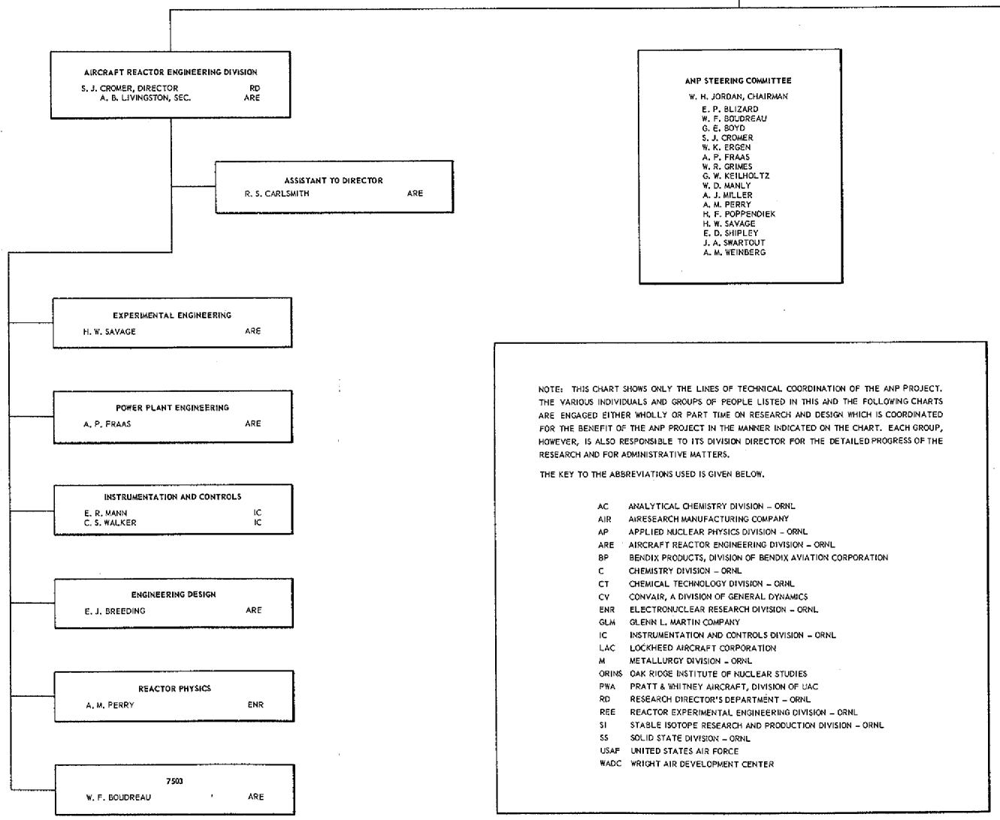  
THE AIRCRAFT NUCLEAR PROPULSION PROJECT   
AT THE OAK RIDGE NATIONAL LABORATORY

SUPPORTING RESEARCH

i

W.H.   
A.J.

一

1

$\frac{a - b}{a + b} = \frac{c - d}{c + d}$

$\therefore m = \frac{3}{11}$

META

STAFF

-

${13}/{14}$

一

CHE

STAFF

3.1.1

一

$\frac{1}{2} =$

$\therefore m = \frac{3}{11}$

IED NU

$\therefore m = \frac{3}{11}$ ;

,STAF

$\therefore m = \frac{3}{11}$

一

··

AD11

T7.S1

12. 1

$\frac{1}{2} =$

$\frac{1}{2} =$

ER AND PHYSICAL PROPERTIES

DIEK STAFF ASSISTANT 955

DIER, STAFF ASSISTANT REE

$\therefore \overrightarrow{PB} \cdot  \left( {\overrightarrow{PA} - \overrightarrow{PC}}\right)  = 0$

#

REACT

(2)

STAFF

一

$\frac{1}{2}x - 1 > 0$

WELDERPROCESSING

DEL RE

EBSTA

$\therefore m = \frac{3}{11}$ ;

$\frac{1}{2} =$

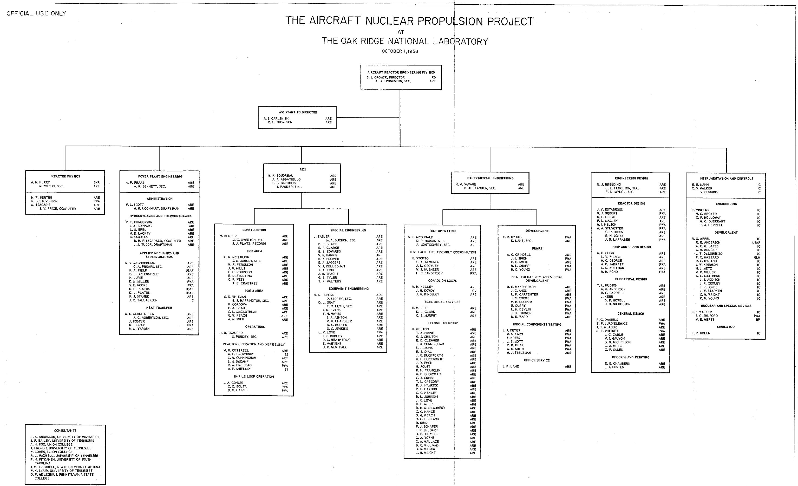

# THE AIRCRAFT NUCLEAR PROPULSION PROJECT

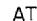

# THE OAK RIDGE NATIONAL LABORATORY

OCTOBER 1, 1956

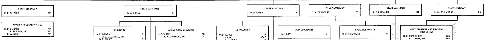

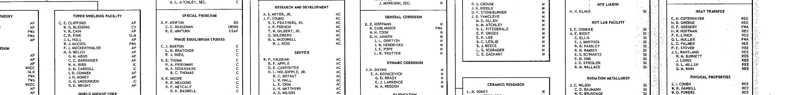

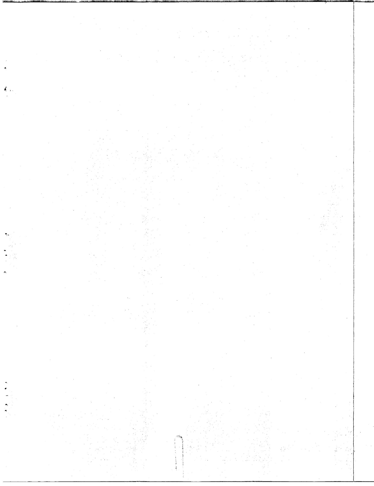