# AEC RESEARCH AND DEVELOPMENT REPORT Chemistry-Separ

Processes for Plutonium and Uranium

CENTRAL RESEARCH LIBRARY DOCUMENT COLLECTION

LIBRARY LOAN COPY

DO NOT TRANSFER TO ANOTHER PERSON

If you wish someone else to see this document, send in name with document and the library will arrange a loan.

3445603503466

DISSOLUTION OF URANIUM-ZIRCONIUM

FUEL ELEMENTS IN FUSED NaF-ZrF

R.G.Wymer

DECLASSIFIED

CLASSIFICATION CHANGED TO:

BY AUTHORITY OF: $T/{10} - {1231}$

By: 72. Baulmam, $8/26/{10}$

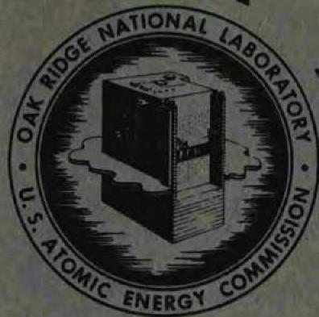

This document contains Confidential Restricted Data relating to Civilian Applications of Atomic Energy.

# OAK RIDGE NATIONAL LABORATORY

OPERATED BY

UNION CARBIDE NUCLEAR COMPANY

A Division of Union Carbide and Carbon Corporation

UCC

POST OFFICE BOX X · OAK RIDGE, TENNESSEE

Printed in USA. Charge 35 cents. Available from the U.S. Atomic Energy Commission, Technical Information Extension, P.O. Box 1001, Oak Ridge, Tennessee. Please direct to the same address inquires covering the procurement of other classified AEC reports.

# LEGAL NOTICE

This report was prepared as an account of Government sponsored work. Neither the United States, nor the Commission, nor any person acting on behalf of the Commission:

A. Makes any warranty or representation, express or implied, with respect to the accuracy, completeness, or usefulness of the information contained in this report, or that the use of any information, apparatus, method, or process disclosed in this report may not infringe privately owned rights; or   
B. Assume any liabilities with respect to the use of, or for damages resulting from the use of any information, apparatus, method, or process disclosed in this report.

As used in the above, "person acting on behalf of the Commission" includes any employee or contractor of the Commission to the extent that such employee or contractor prepares, handles or distributes, or provides access to, any information pursuant to his employment or contract with the Commission.

Contract No. W-7405-eng-26

CHEMICAL TECHNOLOGY DIVISION

Chemical Development Section B

DISSOLUTION OF URANIUM-ZIRIONIUM FUEL ELEMENTS

IN FUSED NaF-ZrF,

R. G. Wymer

Technician: J. F. Land

DATE ISSUED

JAN 21 1057

OAK RIDGE NATIONAL LABORATORY

e m e d . b u r

A Division of

UNION CARBIDE AND CARBON CORPORATI ON

Post Office Box X

Oak Ridge, Tennessee

# INTERNAL DISTRIBUTION

1. C. E. Center   
2. Biology Library   
3. Health Physics Library

4-5. Central Research Library

6. Reactor Experimental

Engineering Library

7-11. Laboratory Records Department   
12. Laboratory Records, ORNL R.C.   
13. A. M. Weinberg   
14. L. B. Eulet (K-25)   
15. J. P. Murray (Y-12)   
16. J. A. Swartout   
17. E. H. Taylor   
18. E. D. Shipley   
19-20. F. L. Culler   
21. M. L. Nelson   
22. W. H. Jordan   
23.C.P.Keim   
24. J. H. Frye, Jr.   
25. S. C. Lind   
26. A. H. Snell   
27. A. Hollaender   
28. K. Z. Morgan   
29. M. T. Kelley   
30. T. A. Lincoln   
31. R. S. Liveson   
32. A. S. Householder   
33. C. S. Harril   
34. C. E. Winters   
35. D. W. Carwell   
36. E. M. King   
37. W. K. Mister   
38. F. R. Bruce   
39. D. E. Ferguson   
40. R. Lindauer   
41. H.E. Goeller   
42. D D. Cowen   
43. A. A. Charpie   
44. J. A. Lane   
45 M. J. Skinner

46. P. E. Blanco   
47. G. E. Boyd   
B.W.E.Unger   
49. R. R. Dickison   
50. A. T. Gresky   
51. E. D. Arnold   
52. C. E. Guthrie   
53. J. W. Ullmann   
54. K. B. Brown   
55. K. O. Johnsson   
56. H. M. McLeod   
57. J. C. Bresee   
58. W. H. Carr   
59. G. I. Cathers   
60. W. E. Clark   
61. O. C. Dean   
62. L. M. Ferris   
63. J. R. Flanary   
64. I. R. Higgins   
65. J. F. Land   
66. W. H. Lewis   
67. R. E. Leuze   
68. J. T. Long   
69. J. P. McBride   
70. J. A. McLaren   
71. R. A. McNees   
72. R. P. Milford   
73. R. H. Rainey   
74. J. T. Roberts   
75. J. E. Savolainen   
76. S. H. Stainer   
7. W. W. Weinrich (consultant)   
78. M. D. Peterson (consultant)   
79. D. L. Katz (consultant)   
80. G. T. Seaborg (consultant)   
81. M. Benedict (consultant)   
82. C.E. Larson (consultant)   
83. ORNI - Y-12 Technical Library, Document Reference Section

84. Division of Research and Development, AEC, ORO 85-363. Given distribution as shown in M-3679 under Chemi Processes for Plutonium and Uranium category

# CONTENTS

# Page

1.0 ABSTRACT 1   
2.0 INTRODUCTION 1   
3.0 EXPERIMENTAL WORK 2   
4.0 RESULTS 7   
5.0 DISSOLUTION MECHANISM 17   
6.0 REFERENCES 21   
7.0 APPENDIX 22

# 1.0 ABSTRACT

Further experiments confirmed previous indications that $\mathrm{NaF - ZrF_4}$ is a satisfactory dissolvent for zirconium-uranium fuel elements. A very preliminary dissolution flowsheet, as a basis for a fused salt--fluoride volatility process, is presented.

# 2.0 INTRODUCTION

Dissolution in fused salt media of heterogeneous reactor fuels containing enriched uranium is economically attractive as a means of converting the uranium to a pure, easily recoverable form. Fluoride media are currently receiving attention, and STR fuel elements, whose principal constituent is zirconium, are particularly amenable to dissolution in fused salt media containing $\mathrm{ZrF}_4$ . Previous studies1-5 have shown the feasibility of fused salt processing. The experiments reported here were carried out in order to obtain additional dissolution data needed for design of a tentative STR processing flowsheet. The results presented are very preliminary, and are based on only a few laboratory-scale experiments.

The author acknowledges the assistance received during the studies from G. R. Wilson and his group, of the Analytical Chemistry Division, who performed the many new and difficult chemical analyses which made this work possible, and of the late G. E. Klein of the Solid State Division, who made the x-ray analyses.

# 3.0 EXPERIMENTAL WORK

The equipment used in these studies (Fig. 1) consisted of a nickel dissolver vessel, an HF cold trap and wet test meter for measuring $\mathsf{H}_2$ evolved, a voltage supply recorder for the metering equipment, and HF and $\mathsf{N}_2$ gas metering equipment. In general, dissolution rates were determined both by $\mathsf{H}_2$ evolution (as measured by the wet test meter) and by direct weighing of the specimens before and after their partial dissolution.

The initial dissolutions were made in a tubular dissolver (Fig. 2) in which the entire melt was agitated by the flowing gas. Reproducibility of data was very poor, and examination of the specimens after a dissolution run showed extreme inhomogeneity of attack. Attack was severe where the HF gas passed over the surface of the specimens, but was mild on the remainder of the surfaces. For later experiments, the dissolver was modified so that the entire specimen was contacted with HF gas as long as any gas was flowing to ensure greater dissolution uniformity. The modified dissolver (Fig. 3) was actually a lift pump, in which the gas, and therefore the melt agitation, was localized to a small region in the vicinity of the metal specimens. The fused salt was pumped up over the STR specimen by the pumping action of the HF gas, so that attack on the specimens was much more uniform. In spite of this, reproducibility of dissolution rate data was still poor. All dissolutions were made with the HF gas at atmospheric pressure, and $100\mathrm{ml}$ of fused salt was used in all runs.

In the lift-pump dissolver, effects due to HF alone cannot be differentiated from those due to HF dissolved in the fused salt. Studies on the mechanism of the reaction were therefore made in a U-tube dissolver (Fig. 4). In this dissolver an STR specimen can be

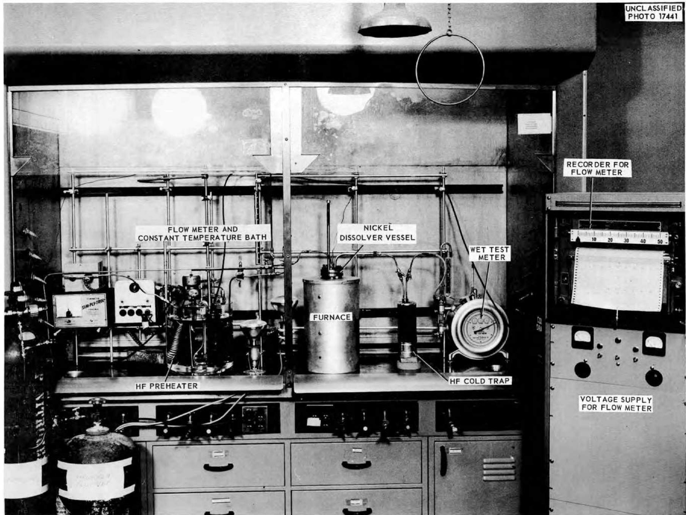  
Fig. 1. Fused Salt Dissolution Equipment.

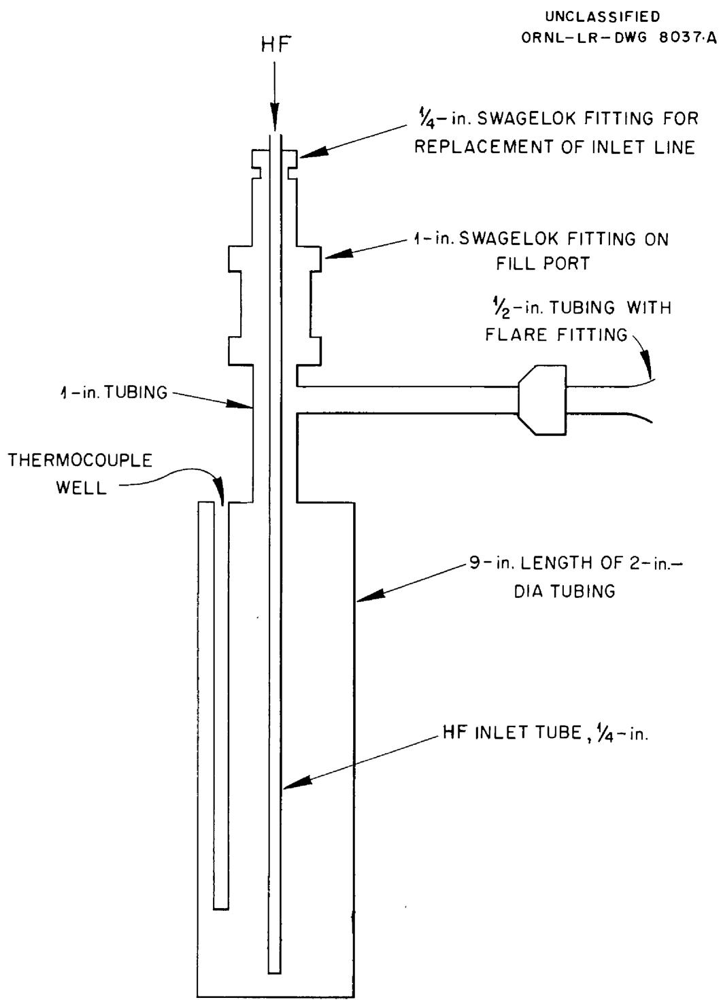  
Fig. 2. Schematic Diagram of Reactor Used in Initial Dissolution Experiments.

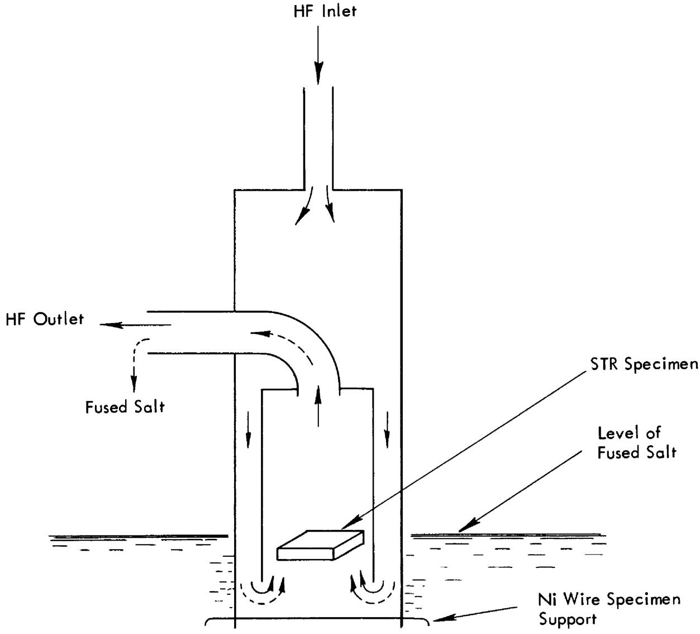  
Fig. 3. Schematic Drawing of HF Lift Pump Dissolver. The HF gas follows the paths of the solid arrows and the fused salt, the broken arrows.

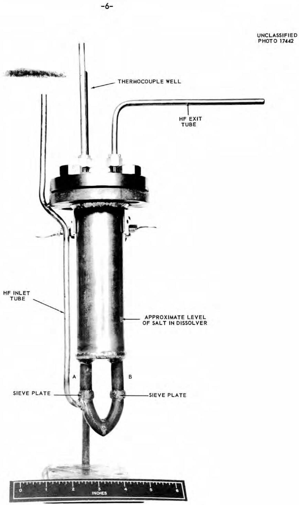  
Fig. 4. U-Tube Dissolver.

placed in each of the arms, A and B, of the U tube attached to the bottom of the dissolver. The specimens rest on sieve plates. When HF gas is passed in through the inlet tube, it goes up through arm A, over the specimen on the sieve plate, rises through the salt in the main body of the dissolver, and passes out the HF exit tube. This sets up a salt-pumping action in arm A, which causes circulation of salt around the loop. At the same time, the fused salt becomes laden with dissolved HF. The specimen in arm B is thus exposed to salt containing dissolved HF but not to HF gas. The small diameter of arm A provides uniform gas coverage and dissolution, much as that achieved in the lift-pump dissolver. The auxiliary $\mathbf{N}_2$ drying and deoxygenating equipment attached to the U tube for the experiments in which HF was replaced by nitrogen is shown in Fig. 5.

In order to avoid corrosion, insulation deterioration, and other problems associated with very high temperature processing of fluoride mixtures, $550^{\circ}\mathrm{C}$ was set as the maximum melting point of the salt. This restricts the $\mathrm{ZrF}_4$ content of the fluoride melt to the range 38-57 mole % (Fig. 6).

# 4.0 RESULTS

The dissolution rate of the simulated STR fuel element pieces was affected by the HF flow rate, temperature, and melt composition. Because of considerable scatter in the data, the results may be considered only as indicative of a trend. The nature of the metal did not affect the rate of dissolution, but did affect the type of attack by the reagent.

Effect of HF Flow Rate. At $700^{\circ}\mathrm{C}$ the dissolution rate increased

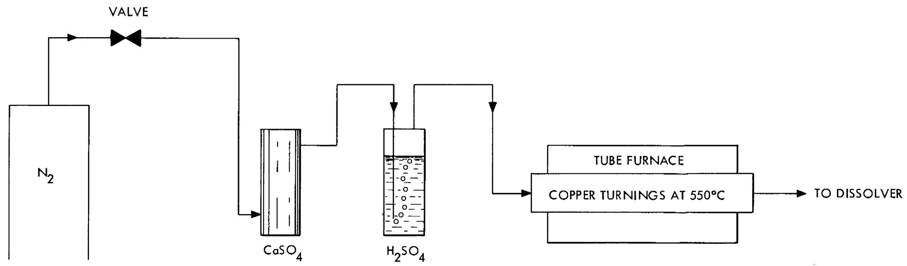  
UNCLASSIFIED ORNL-LR-DWG.15104   
Fig. 5. Auxiliary $\mathsf{N}_2$ Drying and Deoxygenating Equipment.

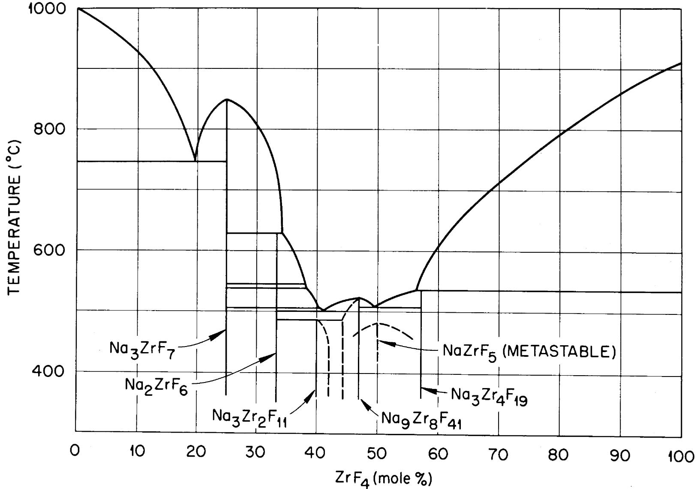  
Fig. 6. The System NaF-ZrF4.

with increasing HF flow rate (Fig. 7). There did not appear to be any effect at $600^{\circ}\mathrm{C}$ , but at $800^{\circ}\mathrm{C}$ the rate increased and then decreased. In the preliminary studies in the ordinary dissolver, the rate at $600^{\circ}\mathrm{C}$ increased with increasing HF flow rate (Table 1). Comparison of results in the two dissolvers indicates a definite dependence of dissolution rate on HF flow rate, even at $600^{\circ}\mathrm{C}$ , up to a maximum value. It is assumed that this maximum value is reached at or before an HF flow rate of 25 mg/min in the lift-pump dissolver, where the excellent agitation leads to a high HF utilization efficiency.

Table 1. Dissolution Rates in Ordinary Dissolver   
Conditions: $600^{\circ}\mathrm{C}$ ; $\mathrm{NaF} / \mathrm{ZrF}_{4} = 1 / 1$ ; atmospheric pressure; $100 \, \text{ml}$ of melt   

<table><tr><td>HF Flow Rate (mg/min)</td><td>Dissolution Rate (mg/min/cm2)</td></tr><tr><td>25</td><td>0.58</td></tr><tr><td>40</td><td>0.50</td></tr><tr><td>50</td><td>0.74</td></tr><tr><td>83</td><td>1.1</td></tr></table>

The efficiency of HF utilization decreased rapidly with increasing flow rate (Fig. 8). This factor affects the magnitude of the HF recycle problem on a plant scale.

Effect of Temperature. At all HF flow rates tested, the dissolution rate increased with increasing temperature (Fig. 9). This confirmed observations of other workers. $^{1,2}$

Effect of Melt Composition. In the range 38 to 57 mole $\%$ ZrF $_4$

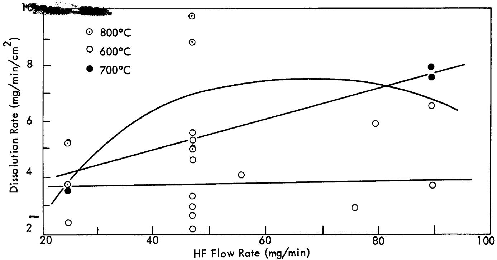  
Fig. 7. Dissolution Rate of STR Specimens in 50-50 mole % NaF-ZrF $_4$ as a Function of HF Flow Rate.

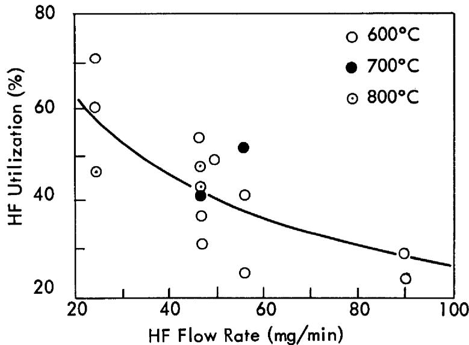  
Fig. 8. Utilization of HF as a Function of Flow Rate in Dissolution of STR Specimens in 50-50 mole % NaF-ZrF4.

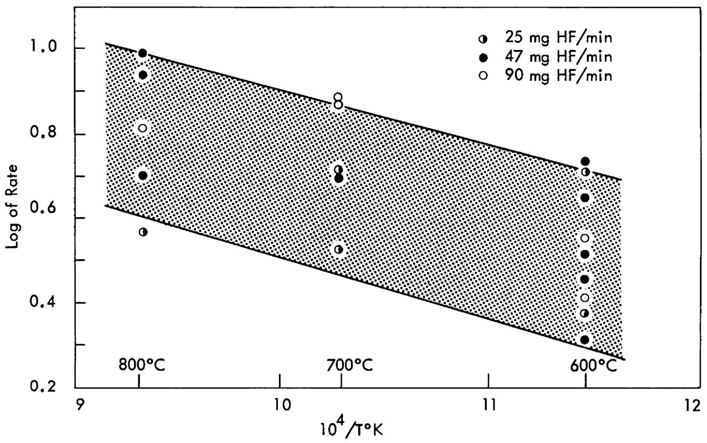  
Fig. 9. Dissolution Rate of STR Specimens in 50-50 mole % NaF-ZrF $_4$ as a Function of Temperature.

the dissolution rate was considerably higher with the lower percentages of $\mathbf{ZrF}_4$ :

<table><tr><td>NaF/ZrF11mole ratio</td><td colspan="2">Dissolution Rate (mg/min/cm2)</td></tr><tr><td rowspan="3">0.62/0.38</td><td>7.9</td><td></td></tr><tr><td>9.6</td><td>avg. = 8.3</td></tr><tr><td>7.3</td><td></td></tr><tr><td rowspan="2">0.43/0.57</td><td>1.0</td><td>avg. = 0.9</td></tr><tr><td>0.8</td><td></td></tr></table>

The dissolution rate in 50-50 mole $\%$ LiF-ZrF₄, which is about half as viscous as the comparable NaF-ZrF₄, was only 2.9 mg/min/cm². The dissolutions were made at 600°C, with an HF flow rate of 47 mg/min, at atmospheric pressure, in 100 ml of melt.

Effect of Nature of Metal. There was no significant difference between the dissolution rates of STR specimens, zircaloy-2, and crystal bar zirconium. There was a difference in the nature of the attack. With the STR specimens the attack on the core was greater than on the cladding (Fig. 10). With the zircaloy-2 specimens the attack along the upper edge was very regular (Fig. 11). With crystal bar zirconium there was extreme hydride formation, as indicated by myriad black areas suffusing the specimen (Fig. 12).

Nature of Product and Residue. After typical dissolution experiments, when the molten salt was poured onto a stainless steel pan it froze to a chalk-white solid. Invariably black particles 1 to $2\mathrm{mm}$ in diameter were distributed throughout the solid. X-ray analysis of the particles, which were picked out of the bulk of the salt, showed lines which could be taken as evidence for uranium metal, $\mathrm{ZrOF}_2$ , $\mathrm{UO}_2$ , $\mathrm{ZrO}_2$ , and $\mathrm{UF}_4$ . There were also lines for a metastable compound whose composition lay between $\mathrm{NaZrF}_5$ and $\mathrm{ZrF}_4$ . It may be conjectured that the uranium metal was deposited from a fluoride of uranium in the melt by reduction by the more electropositive zirconium metal. The uranium would have been introduced

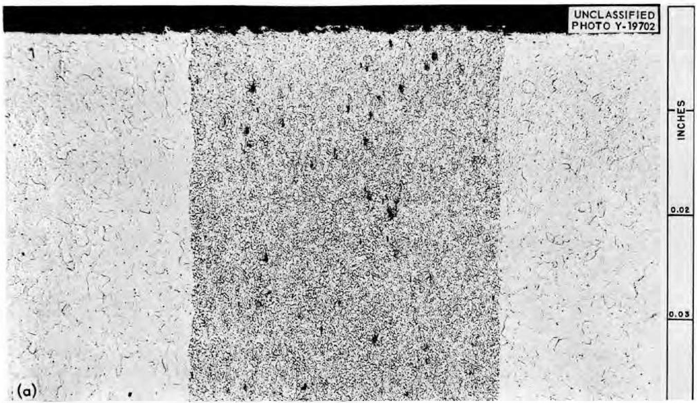

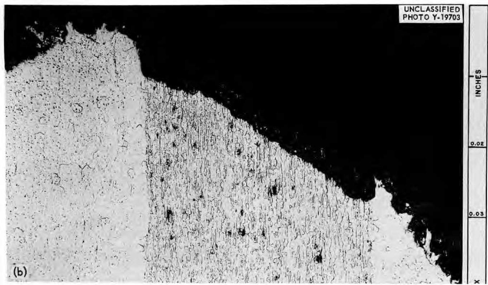  
Fig. 10. STR Fuel Plate. Bright field; $100\mathrm{X}$ . (a) As received. (b) After dissolution treatment. (Confidential with caption)

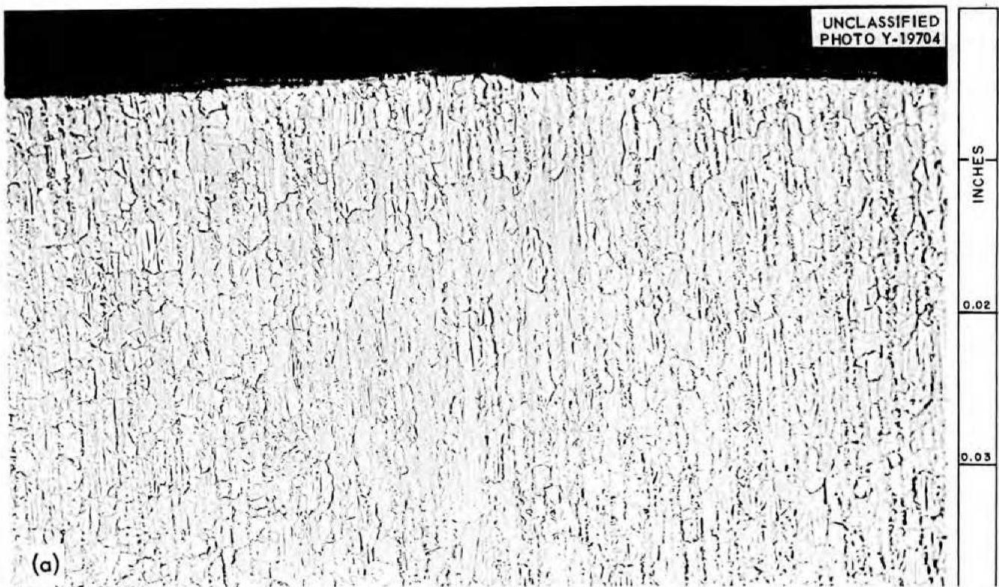

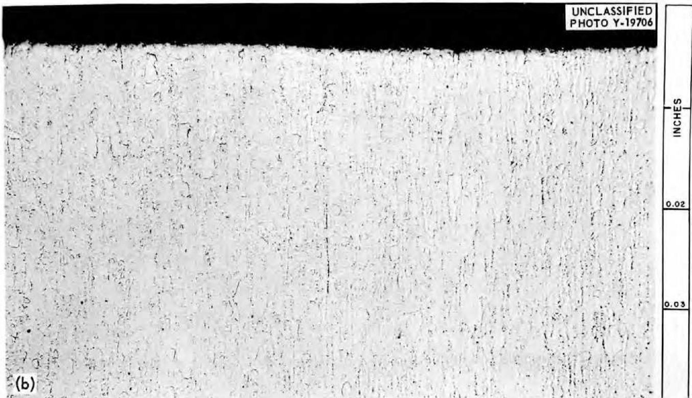  
Fig. 11. Zircaloy-2. Bright field; $100\mathrm{X}$ . (a) As received. (b) After dissolution treatment. (Confidential with caption)

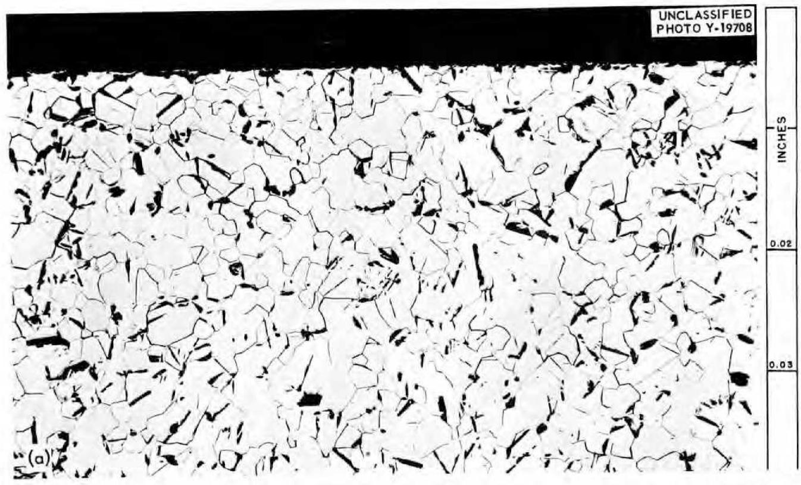

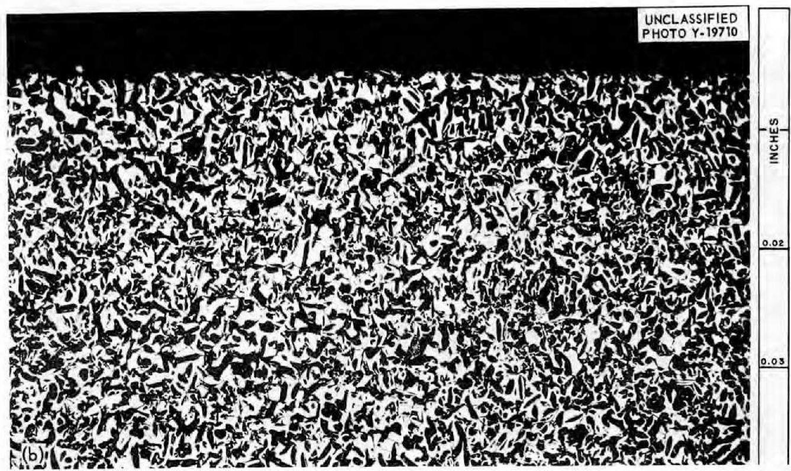  
Fig. 12. Crystal Bar Zirconium. Bright field; $100\mathrm{X}$ . (a) As received. (b) After dissolution treatment. (Confidential with caption)

into the melt in the first place by dissolution out of that fraction of the core which was exposed along the edges of the STR specimens.

In general, the partially dissolved STR specimens were covered with a black adherent layer. When some of this layer was scraped off and analyzed by x-ray diffraction, lines attributable to $\mathrm{UO}_2$ and zirconium metal were obtained.

# 5.0 DISSOLUTION MECHANISM

Little work has been reported so far that gives much insight into the details of the mechanism of dissolution. Results of a limited number of experiments designed to clarify this point indicated that the presence of HF is not necessary for dissolution.

The slight attack of STR fuel elements by HF gas alone is attributed to the presence of a protective coating of $\mathrm{ZrF}_4$ , which dissolves in the presence of fused salt and exposes more bare metal to the HF gas. However, in experiments in the U-tube dissolver (Fig. 5), there was no significant difference between the dissolution rate of STR specimens in fused salt containing dissolved HF with or without the flowing HF gas (Table 2). In the complete absence of HF, i.e., when the flowing HF gas was replaced by dry oxygen-free nitrogen, the rate of dissolution was still quite satisfactory (Table 3). Possible mechanisms in keeping with these results are pyrosol formation, as has been suggested for dissolution of titanium in chloride melts, and reactions of the type

$$
\begin{array}{l} Z r ^ {0} + 3 Z r ^ {4 +} \rightleftharpoons Z r ^ {3 +} + 3 Z r ^ {3 +} \\ Z r ^ {0} + Z r ^ {4 +} \Longrightarrow Z r ^ {2 +} + Z r ^ {2 +} \\ \end{array}
$$

in which HF is not required for the primary disintegration step.

Table 2. Dissolution Rates of STR Specimens in Fused Salt Containing Dissolved HF, with and without HF Gas

Conditions: $600^{\circ}\mathrm{C}$ ; $\mathrm{NaF} / \mathrm{ZrF}_{4} = 1 / 1$ ; atmospheric pressure

Table 3. Dissolution of STR Specimens in Fused Salt in Complete Absence of HF   

<table><tr><td rowspan="2">HF Flow Rate (mg/min)</td><td rowspan="2">Volume of Melt (ml)</td><td colspan="2">Dissolution Rate (mg/min/cm2)</td></tr><tr><td>In Salt</td><td>In Salt + Gas</td></tr><tr><td>25</td><td>75</td><td>2.2</td><td>2.6</td></tr><tr><td>56</td><td>75</td><td>3.0</td><td>2.8</td></tr><tr><td>47</td><td>100</td><td>5.1</td><td>4.2</td></tr></table>

Conditions: $600^{\circ}\mathrm{C}$ ; $\mathrm{NaF} / \mathrm{ZrF}_4 = 1/1$ ; melts swept for 2 hr with dry, oxygen-free nitrogen before specimens lowered into it; 100 ml of melt

<table><tr><td>Duration of Run (min)</td><td>N2Flow Rate (arbitrary units)</td><td>Dissolution Rate (mg/min/cm2)</td></tr><tr><td>42</td><td>12</td><td>1.4</td></tr><tr><td>52</td><td>---</td><td>1.1</td></tr><tr><td>120</td><td>42</td><td>0.4</td></tr></table>

Reducing Normality of Melts. Since STR specimens dissolve in the absence of known oxidizing agents, the resulting melts should be reducing in nature. The reducing normality of a 50-50 mole $\%$ NaF $\mathrm{ZrF}_4$ melt was found to be of the order of $10^{-3}$ meq/g (Table 4). In these experiments an ordinary dissolution was first performed, using HF gas in the usual way. The melt was cooled under dried nitrogen until it solidified, and was then transferred to a dry box where an

approximately 50-g sample was dug out. This sample was dissolved in $300\mathrm{ml}$ of solution* which was $1\underline{\mathbf{M}}$ in $\mathrm{Al}_{2}(\mathrm{SO}_{4})_{3}$ , $1.5\underline{\mathbf{M}}$ in $\mathrm{H}_{2}\mathrm{SO}_{4}$ , and $0.017\underline{\mathbf{M}}$ in $\mathrm{K}_{2}\mathrm{Cr}_{2}\mathrm{O}_{7}$ , and the amount of a standard reductant required for a back titration was compared with that required for a blank. In a second experiment, nitrogen was used instead of HF. In the third run nitrogen gas replaced the HF, but no STR specimen was used, so that any reducing normality present came from the melt itself, from dissolver vessel corrosion products, or from the nitrogen supply. Run 4 was a check made because a new supply of $\mathrm{ZrF}_{4}$ salt for melts was obtained, and it was important to determine that no reducing impurity was introduced from this source. Run 5 was made with $\mathbb{N}_2$ and no STR specimen, exactly as in runs 3 and 4, except that 1 wt % $\mathrm{NiF}_{2}$ was added to see what effect the nickel salt would have on the reducing normality. Run 6 was a check for reducing impurities in the HF gas used.

There appeared to be an equilibrium between the oxidized and reducing forms of nickel. When $1 \, \text{wt} \, \% \, \text{NiF}_2$ was added to a typical melt, which contained $0.05 \, \text{wt} \, \% \, \text{NiF}_2$ initially, the reducing normality was doubled. The implication is that the nickel vessel wall enters into an equilibrium of the type $\text{Ni} + \text{NiF}_2 = 2\text{NiF}$ . At $600^{\circ}\text{C}$ the solubility of $\text{NiF}_2$ in a $50 - 50 \, \text{mole} \, \% \, \text{NaF/ZrF}_4$ melt is $\sim 0.4\%$ . Therefore the NiF concentration in the postulated equilibrium is fixed when the $\text{NiF}_2$ is present in concentrations above $1 \, \text{wt} \, \%$ and vessel corrosion by $\text{NiF}_2$ is inhibited.

It is apparent that the zirconium which dissolves in the absence of HF gas is not a factor contributing to the reducing

normality. It may be supposed that the zirconium dissolves by pyrosol formation, but that the resulting dispersed metal is not oxidized by the dichromate-containing solution, and so is not measured in this way.

Conditions: $600^{\circ} \mathrm{C}$ ; $\mathrm{NaF} / \mathrm{ZrF}_{4} = 1 / 1$ ; $100 \mathrm{ml}$ of melt; atmospheric pressure

Table 4. Reducing Normalities of Various Melts   

<table><tr><td>Run</td><td>Gas</td><td>STR Specimen in Melt</td><td>NiF2in Melt (wt %)</td><td>Run Time (hr)</td><td>Dissolution Rate (mg/min/cm2)</td><td>Reducing Normality of Melt (meq/g)</td></tr><tr><td>1</td><td>HF</td><td>Yes</td><td>~0.05</td><td>1</td><td>4.0</td><td>6.0 x 10-3</td></tr><tr><td>2</td><td>N2</td><td>Yes</td><td>~0.05</td><td>2</td><td>0.36</td><td>6.7 x 10-3</td></tr><tr><td>3</td><td>N2</td><td>No</td><td>~0.05</td><td>---</td><td>---</td><td>6.8 x 10-3</td></tr><tr><td>4</td><td>N2</td><td>No</td><td>~0.05</td><td>2</td><td>---</td><td>6.1 x 10-3</td></tr><tr><td>5a</td><td>N2</td><td>No</td><td>1</td><td>2</td><td>---</td><td>12.2 x 10-3</td></tr><tr><td>6b</td><td>HF</td><td>No</td><td>1</td><td>1</td><td>---</td><td>8.6 x 10-3</td></tr></table>

a1 wt % NiF2 was added to the melt.   
${}^{\mathrm{b}}\mathrm{A}$ different source of HF gas was used.

# 6.0 REFERENCES

1. G. I. Cathers and R. E. Leuze, "A Volatilization Process for Uranium Recovery," Nuclear Engineering and Science Congress, Cleveland, Ohio, December 1955.   
2. S. I. Cohen and T. N. Jones, "Summary of Density Measurements on Molten Fluoride Mixtures and a Correlation Useful for Predicting Densities of Fluoride Mixtures," ORNL-1702 (May 14, 1954).   
3. R. E. Leuze, G. I. Cathers, and C. E. Schilling, "Dissolution of Metals in Fused Fluorides," ORNL-1877 (September 28, 1955).   
4. G. I. Cathers and M. R. Bennett, "A Fused Salt--Fluoride Volatility Process for Recovery and Decontamination of Uranium," ORNL-1885 (September 27, 1955).   
5. "Chemical and Engineering Division Summary Report, January, February, and March 1955," ANL-5422, p. 26.   
6. A. W. Schleten, M. E. Straumanis, and C. B. Gill, "Deposition of Titanium Coatings from Pyrosols," J. Electrochem. Soc., 102, 81-5 (1955).

# 7.0 APPENDIX*

A tentative flowsheet for fused salt dissolutions was designed (Fig. 13). Since no engineering studies were made, this flowsheet is highly preliminary.

Size of Hydrofluorinator. The hydrofluorinator must be small enough in diameter that the initial salt charge covers the portion of subassembly charged. It must be large enough to accommodate the largest subassembly in less than half its diameter if a central HF pump is to be used (unless the assembly is put into the HF pump tube, as at ANL). Since the assemblies can be quartered, and may be handled in this way, the vessel must contain at least 12 in. of salt to cover such a portion. Subassemblies come with 5, 12, 14, and 17 fuel plates. Since each subassembly has two side plates, there are 7, 14, 16, and 19 plates, respectively, in these subassemblies. The edges of the plates are $6\mathrm{mm}$ thick, so the thickest subassembly is about $0.6 \times 19 = 11.4\mathrm{cm}$ , or 4.5 in., thick. A 12-in.-i.d. dissolver would thus allow enough room for a 3-in.-o.d. HF pump, and a 14-in.-i.d. tank would allow enough for a 5-in.-o.d. HF pump, if such a device was used.

A salt charge to the hydrofluorinator should be sufficient to process as much as one complete 17-fuel-plate subassembly on the one hand, or as little as one complete 12-plate subassembly on the other. These are the charge limits which may be met in operation (Table 5). Thus, the total weight of zirconium to be dissolved ranges from $16 \times 1.23 = 19.7 \, \text{kg}$ to $21 \times 1.23 = 25.8 \, \text{kg}$ . These values may be rounded off to $20 - 26 \, \text{kg}$ of zirconium.

Fig. 13. Tentative Flowsheet for Fused Salt Dissolution. Dissolution time: approximately 15 hr.   
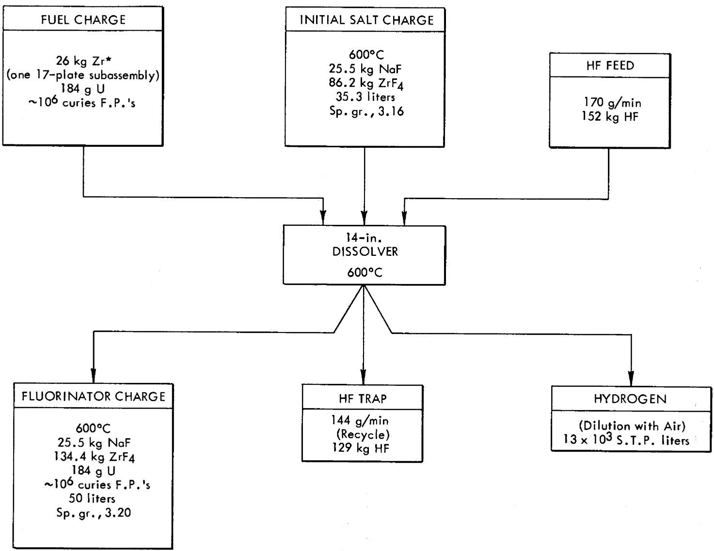  
*To be added one-quarter of a subassembly at a time.

Table 5. Number of Fuel Plates in a Hydrofluorinator Charge   

<table><tr><td>No. of Fuel Plates in Subassembly</td><td>No. of Subassemblies per Batch</td><td>Total No. of Platesa</td></tr><tr><td>5</td><td>2</td><td>18</td></tr><tr><td>12</td><td>1</td><td>16</td></tr><tr><td>14</td><td>1</td><td>18</td></tr><tr><td>17</td><td>1</td><td>21</td></tr></table>

aThe end plates are twice as thick as the fuel plates; they contain twice the amount of zirconium, and each is counted twice.

Setting 50 liters as the approximate volume desired for subsequent use in the fluorination, we may calculate the initial amount of salts to be charged to the hydrofluorinator. The density of a 57 mole $\% \mathrm{ZrF}_{4} = 43$ mole $\%$ NaF melt at $600^{\circ}\mathrm{C}$ is 3.2.* Therefore, 50 liters contains $50 \times 3.2 = 160\mathrm{kg}$ of salt, or

$$
\mathrm {k g N a F} = \frac {1 6 0 \times \frac {4 2 \times 0 . 4 3}{1 6 7 \times 0 . 5 7}}{1 + \frac {4 2 \times 0 . 4 3}{1 6 7 \times 0 . 5 7}} = \frac {3 0 . 4}{1 + 0 . 1 9 0} = 2 5. 5
$$

$$
\mathrm {k g} \mathrm {Z r F} _ {4} = \frac {1 6 0 \times \frac {0 . 5 7}{0 . 4 3} \times \frac {1 6 7}{4 2}}{1 + \frac {1 6 7}{4 2} \times \frac {0 . 5 7}{0 . 4 3}} = \frac {5 . 2 8 \times 1 6 0}{1 + 5 . 2 8} = 1 3 4. 4
$$

From this, it follows that the weight of zirconium present is $134 \times 91.2 / 167 = 73.2$ kg. Subtracting this from $26$ kg, which is the most zirconium to be dissolved in a single melt, we arrive at a value of approximately $47$ kg of zirconium, which is the least amount with which we may start in the melt. This leads to an initial melt of $25.5$ kg of

NaF and $47 \times 169 / 91.2 = 86.2 \, \text{kg}$ of $\mathsf{ZrF}_4$ . The composition is $45.9\%$ $\mathsf{ZrF}_4 - 54.1\%$ NaF. At $600^{\circ} \text{C}$ the density of such a melt is $3.16 \, \text{g/cc}$ , so the volume, V, is $(25.5 + 86.2)$ $3.16 = 35.3$ liters. In a 12-in.-dia hydrofluorinator this would mean a depth of 19.0 in. of salt; in a 14-in.-dia hydrofluorinator it would mean a depth of 14 in. of salt. Both these values exceed the minimum requirement of 12 in. of depth. For increased capacity and freeboard space, a 14-in.-dia dissolver is recommended.

The following equation is useful in making calculations of the weight of one of the salts in a system when the mole fractions and total salt weight are known:

$$
W _ {1} = \frac {T}{1 + \frac {M _ {2} F _ {2}}{M _ {1} F _ {1}}}
$$

where $W_{1} =$ weight of salt of interest $F_{1} =$ mole fraction of salt of interest $M_{1} =$ molecular weight of salt of interest $F_{2} =$ mole fraction of second salt $M_{2} =$ molecular weight of second salt  
T = total weight of combined salts

Calculation of Hydrogen Fluoride Requirements. If the fused melt is well agitated, dissolution rates of $2 - 5\mathrm{mg / min / cm}^2$ may be expected. A value of $3\mathrm{mg / min / cm}^2$ has been selected for these calculations.

Consideration of the physical construction of the fuel assemblies leads to the conclusion that a thickness of 0.65 cm must be dissolved to produce a melt practically free of metal. (In practice, unavoidable dissolution heterogeneities will be experienced, and additional dissolution time beyond that required to dissolve a thickness of 0.65 cm will be necessary to ensure that no pieces of metal remain.) The uranium-containing portions of the fuel assemblies are only 0.3 cm

thick; therefore complete dissolution of the twice-as-thick edge portions will ensure that the uranium-containing part has completely dissolved.

Taking the dissolution rate of $3\mathrm{mg / min / cm}^2$ , and half of $0.65~\mathrm{cm}$ or $0.33~\mathrm{cm}$ , as the maximum distance which must be penetrated (since dissolution takes place on both sides of the $0.65$ -cm-thick edge), a value of $0.33\times 6.4 / 0.003\times 60 = 12$ hr is obtained for the time required for complete dissolution. If $26\mathrm{kg}$ of zirconium is to be dissolved, then $26,000\times 4 / 91.2 = 1140$ moles of hydrogen fluoride will be used, assuming $100\%$ efficiency of utilization. This corresponds to a hydrogen fluoride flow rate of $1140\times 20 / 12\times 60\times 43 = 0.74$ mg/min/ml. While it is not a valid procedure to attempt to compare hydrogen fluoride flow rates on the basis of volumes of hydrogen fluoride passed into a fixed volume of salt in a given time when other scale-up factors are not comparable, it is the best method at hand. On the basis of such a comparison, a hydrogen fluoride utilization efficiency of about $30\%$ may be estimated. This means, however, that $3\times 1140 = 3420$ moles of hydrogen fluoride is required, which in turn increases the flow rate to $3\times 0.74 = 2.2\mathrm{mg / min / ml}$ , at which rate only about $15\%$ hydrogen fluoride utilization may be expected. Finally, therefore, an approximate value of $1140 / 0.15 = 7600$ moles of hydrogen fluoride required to dissolve $26\mathrm{kg}$ of zirconium is obtained. This means that $7600 - 1140 = 6460$ moles of hydrogen fluoride must be recycled in what may be a somewhat radioactive operation as volatile fluorides (such as $\mathrm{ZrF_4}$ , $\mathrm{MoF_6}$ , $\mathrm{NbF_5}$ ) accumulate.

In order to ensure that no metal remains, a dissolution time of 15 hr would be desirable. Therefore, a hydrogen fluoride flow rate to the dissolver of $7600 \times 20 / 15 \times 60 = 170 \, \text{g/min}$ is required, and of this $0.85 \times 170 = 144 \, \text{g/min}$ must be trapped for recycle.