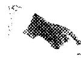

ORNL-2192

Chemistry

137

OPTICAL PROPERTIES AND X-RAY DIFFRACTION

DATA FOR SOME INORGANIC FLUORIDE

AND CHLORIDE COMPOUNDS

H. Insley

T.N.McVoy

R.E.Thoma

G.D. White


CENTRAL RESEARCH LIBRARY DOCUMENT COLLECTION

LIBRARY LOAN COPY

DO NOT TRANSFER TO ANOTHER PERSON

If you wish someone else to see this document, send in name with document and the library will arrange a loan.

OAK RIDGE NATIONAL LABORATORY

OPERATED BYUNION CARBIDE NUCLEAR COMPANY

A Division of Union Carbide and Carbon Corporation

图

POST OFFICE BOX P · OAK RIDGE, TENNESSEE

Printed in USA. Price 45 cents. Available from the

Office of Technical Services

U.5.Department of Commerce

Washington 25, D. C.

# LEGAL NOTICE

This report was prepared as an account of Government sponsored work. Neither the United States, nor the Commission, nor any person acting on behalf of the Commission:

A. Makes any warranty or representation, express or implied, with respect to the accuracy, completeness, or usefulness of the information contained in this report, or that the use of any information, apparatus, method, or process disclosed in this report may not infringe privately owned rights, or   
B. Assumes any liabilities with respect to the use of, or for damages resulting from the use of any information, apparatus, method, or process disclosed in this report.

As used in the above, "person acting on behalf of the Commission" includes any employee or contractor of the Commission to the extent that such employee or contractor prepares, handles or distributes, or provides access to, any information pursuant to his employment or contract with the Commission.

UNCLASSIFIED

ORNL-2192

Contract No. W-7405-eng-26

CHEMISTRY DIVISION

and

METALLURGY DIVISION

OPTICAL PROPERTIES AND X-RAY DIFFRACTION DATA

FOR SOME INORGANIC FLUORIDE AND CHLORIDE COMPOUNDS

H. Insley, Consultant   
T. N. McVay, Consultant   
R. E. Thoma, Chemistry Division   
G. D. White, Metallurgy Division

Date Issued

0C723 196

OAK RIDGE NATIONAL LABORATORY

Operated by

UNION CARBIDE NUCLEAR COMPANY

A Division of Union Carbide and Carbon Corporation

Oak Ridge, Tennessee

UNCLASSIFIED


3445601339499

#

。

.

。

# INTERNAL DISTRIBUTION

1. R. G. Affel   
2. C. J. Barton   
3. M. Bender   
4. D. S. Billington   
5. F. F. Blankenship   
6. E. P. Blizzard   
7.C.J.Borkowski   
8. W. F. Boudreau   
9. G. E. Boyd   
10. M. A. Bredig   
ll. W. E. Browning   
12. F. R. Bruce   
13. A. D. Callihan   
14. D. W. Cardwell   
15. C. E. Center (K-25)   
16. R. A. Charpie   
17. C. E. Clifford   
18. J. H. Coobs   
19. W. B. Cottrell   
20. D. D. Cowen   
21. S. J. Cromer   
22. R. S. Crouse   
23. F. L. Culler   
24. J. H. Devan   
25. L. M. Doney   
26. D. A. Douglas   
27. E. R. Dytko   
28. W. K. Eister   
29. L. B. Emlet (K-25)   
30. D. E. Ferguson   
31. A. P. Fraas   
32. J. H. Frye, Jr.   
33. W. T. Furgerson   
34. H. C. Gray   
35. W, R. Grimes   
36. E. E. Hoffman   
37. H. W. Hoffman   
38. A. Hollaender   
39. A. S. Householder   
40. J. T. Howe   
41. W. H. Jordan   
42. G. W. Keilholtz   
43.C.P,Keim   
44. M. T. Kelley   
45. F. Kertesz   
46. E. M. King   
47. J. A. Lane

48. R. B. Lindauer   
49. R. S. Livingston   
50. R. N. Lyon   
51. F. C. Maienschein   
52. W. D. Manly   
53. E. R. Mann   
54. L. A. Mann   
55. W. B. McDonald   
56. F. R. McQuilkin   
57. R. V. Meghreblian   
58. R. P. Milford   
59. A. J. Miller   
60. R. E. Moore   
61. J. G. Morgan   
62. K. Z. Morgan   
63. E. J. Murphy   
64. J. P. Murray (Y-12)   
65. M. L. Nelson   
66. G. J. Nessle   
67. R. B. Oliver   
68. L. G. Overholser   
69. P. Patriarca   
70. R. W. Feeille   
71. A. M. Perry   
72. J, C. Pigg   
73. H. F. Poppendiek   
74. A. E. Richt   
75. M. T. Robinson   
76. H. W. Savage   
77. A. W. Savolainen   
78. R. D. Schultheiss   
79. E. D. Shipley   
80. A. Simon   
81. O. Sisman   
82. J. Sites   
83. M. J. Skinner   
84. G. P. Smith   
85. A. H. Snell   
86. C. D. Susano   
87. J. A. Swartout   
88. E. H. Taylor   
91. R. E. Thoma   
92. D. B. Trauger   
93. E. R. Van Artsdalen   
94. G. M. Watson   
95. A. M. Weinberg   
96. J. C. White

97. G. D. Whitman

98. E. P. Wigner (consultant)

99. J. C. Wilson

100. C. E. Winters

1.01. P. A. Agron

102-104. T. N. McVay (consultant)

105-107. H. Insley (consultant)

108. R. M. Steele



109-111. G. D. White

112. H. L. Yakel, Jr.

113-114. ORNL - Y-12 Technical Library,

Document Reference Section

115-134. Laboratory Records Department

135. Laboratory Records, ORNL R.C.

136. Metallurgy Library

137-138. Central Research Library

# EXTERNAL DISTRIBUTION

139. R. F. Bacher, California Institute of Technology

140. Division of Research and Development, AEC, ORO

141-725. Given distribution as shown in TID-4500 under Chemistry category (200 copies - OTS)

DISTRIBUTION PAGE TO BE REMOVED IF REPORT IS GIVEN PUBLIC DISTRIBUTION

# OPTICAL PROPERTIES AND X-RAY DIFFRACTION DATA

# FOR SOME INORGANIC FLUORIDE AND CHLORIDE COMPOUNDS

H. Insley, Consultant   
T. N. McVay, Consultant   
R. E. Thoma, Chemistry Division   
G. D. White, Metalurgy Division

# ABSTRACT

Optical properties and X-ray diffraction data are listed for various inorganic fluoride and chloride compounds. This publication extends and replaces ORNL-1712, Properties of Some Inorganic Fluoride and Chloride Compounds, by T. N. McVay and G. D. White.

# INTRODUCTION

Optical and X-ray diffraction data have been collected for many compounds whose existence was not known prior to their discovery incidental to the phase equilibrium studies made in the High Temperature Section of the Chemistry Division. A few compounds are listed and mentioned in the footnotes whose initial discovery was not made at ORNL; however, the original optical measurements on these compounds were made by H. Insley, T. N. McVay, and G. D. White of the Ceramics Laboratory, Metallurgy Division.

The standard X-ray diffraction patterns included herein were derived, in general, from the same samples on which the optical data were taken. Standard patterns were made from powder samples with a Norelco-Phillips high angle diffractometer, using Cu $\mathbf{K}_{\alpha}$ filtered radiation from a General Electric CA-7 X-ray tube. The diffractometer was equipped with a Geiger Muller tube counting arrangement. The X-ray data have not been corrected for absorption. Values for interplanar distances (d, measured in Angstrom units) and relative intensities of diffracting maxima conform to the conventions used in the ASTM X-ray diffraction data cards.

The refractive indices of the compounds included are believed to be precise to $\pm 0.003$ ; the optic angles of biaxial crystals were estimated.

This publication is divided into Part I (optical properties) and Part II (X-ray diffraction data). The three strongest X-ray lines accompany the optical data of each compound for which ASTM X-ray diffraction data are not available, if those X-ray data were derived at ORNL. X-ray diffraction data in Part II are separated according to the purity of the samples used for standards. Patterns for the compounds in the first section were derived from single-phase samples of known chemical analysis which had met optical standards. In the second section are listed data on compounds whose purity has not been absolutely established.

# ACKNOWLEDGEMENTS

The authors wish to acknowledge the assistance of L. M. Bratcher, V. S. Coleman, H. A. Friedman, R. J. Sheil, B. J. Sturm, J. Truitt, and W. C. Whitley, who prepared the samples under the direction of C. J. Barton, F. F. Blankenship, R. E. Moore and W. R. Grimes.

# PART I

OPTICAL PROPERTIES

Ammonium beryllium fluoride, 2 $\mathrm{NH_4}\cdot \mathrm{BeF_2}$ Uniaxial $^+$ n = 1.319 Low birefringence Colorless Questionable. National Research Council Bulletin 118 describes it as rhombic.

Beryllium fluoride, $\mathbf{BeF}_2$ Uniaxial $^+$ n $= 1.325$ Low birefringence estimated .006 Quartz form Colorless Sample prepared at Mound Laboratory.

Beryllium lead fluoride, $\mathbf{BeF}_2\cdot \mathbf{PbF}_2$ Biaxial - $2\mathrm{V} = 70^{\circ}$ $\alpha = 1.602$ $\gamma = 1.627$ Colorless

Cesium beryllium fluoride, 2 CsF·BeF $_2$ n = 1.452  
Very low birefringence  
Colorless.  
Cesium beryllium fluoride, CsF·BeF $_2$ n = 1.382  
Low birefringence  
Length slow. Parallel extinction. Colorless.

```txt
Cesium lanthanum fluoride, 3 CsF·LaF₃ Cubic n = 1.462 Colorless X-ray lines: 3.49, 2.478, 2.021. 
```

```txt
Cesium uranium fluoride, CsF·UF4  
Biaxial + 2V = 45°  
α = 1.553 γ = 1.560  
Polysynthetic twinning XAc = 10° Z = sky blue  
X = greenish blue  
X-ray lines: 7.31, 4.00, 3.62 
```

Cesium uranium fluoride, 2 CsF·UF<sub>4</sub>

Biaxial + 2V = 45°  
α = 1.516 γ = 1.524  
X = light greenish blue Z = light blue  
X-ray lines: 6.19, 3.55, 3.44.

Cesium zinc fluoride, 2 CsF·ZnF<sub>2</sub>

Biaxial + 2V = small $\alpha = 1.446$ $\gamma = 1.458$ Colorless

Cesium zirconium fluoride, CsF·ZrF₄

Biaxial - $2\mathbf{V} = 20^{\mathrm{O}} - 45^{\mathrm{O}}$ (varies) $\alpha = 1.464$ $\gamma = 1.476$ Colorless X-ray lines: 3.73, 3.62, 3.26

Cesium zirconium fluoride, 2 CsF·ZrF<sub>4</sub>

Uniaxial - $\epsilon = 1.460$ $\omega = 1.482$ Colorless  
X-ray lines: 3.73, 3.20, 2.430.

Chromium fluoride, $\mathbf{CrF}_2$

Biaxial + $2\mathbf{V} = 10^{\circ}$ Monoclinic $\mathbf{X}_{\mathrm{AC}} = 38^{\circ}$ $\alpha = 1.511$ $\gamma = 1.525$ Gray green  
X-ray lines: 3.53, 2.97, 2.805

Iron fluoride, $\mathbf{FeF_2}$

Uniaxial $^+$ $\omega = 1,524$ （20 $\in = 1.540$ Brown

Iron zirconium fluoride, $\mathsf{FeF}_2\cdot \mathsf{ZrF}_4$

Cubic $\mathbf{n} = 1.432$ X-ray lines: 4.04, 2.016, 1.805

Lanthanum fluoride, LaF₃

Uniaxial -

Hexagonal

$\omega = 1.605$

Length fast

Prismatic

Colorless.

$$
e = 1. 5 9 4
$$

Lanthanum zirconium uranium fluoride, LaF₃·6ZrF₄·UF₄

Biaxial +

$$
2 \mathbf {V} = 7 0 ^ {\circ}
$$

$\alpha = 1.528$

$$
\gamma = 1. 5 4 5
$$

Light green.

Lead uranium fluoride, $\mathbf{PbF}_2\cdot \mathbf{U}\mathbf{F}_4$

Uniaxial -

$\omega = 1.750$

$$
\epsilon = 1. 7 3 0
$$

Green.

Lead uranium fluoride, 6 $\mathsf{PbF}_2\cdot \mathsf{U}\mathsf{F}_4$

Cubic

$\mathbf{n} = \mathbf{1.77}$

Light blue.

Lithium beryllium fluoride, 2 LiF-BeF $_2$

Uniaxial +

$\omega = 1.312$

$$
\epsilon = 1. 3 1 9
$$

Colorless.

Lithium cesium fluoride, LiF·CsF

Biaxial +

$$
2 \mathrm {V} = \text {s m a l l}
$$

$\mathbf{n} = \mathbf{1},458$

Estimated birefringence 0.006

Colorless

Lithium chromium fluoride, 3 LiF-CrF<sub>3</sub>

Biaxial -

$$
2 \mathbf {V} = 4 0 ^ {\circ}
$$

$\alpha = 1,444$

$$
\gamma = 1. 4 6 4
$$

Green

X-ray lines: 4.29, 4.16, 2.176.

Lithium rubidium fluoride, LiF·RbF

Biaxial +

Orthorhombic

$\textbf{n} = \textbf{1.396}$

Low birefringence

Colorless.

Lithium sodium beryllium fluoride, LiF·2NaF·2BeF $_2$

Uniaxial -

$\mathbf{n} = 1.311$

Low birefringence

Colorless.

Lithium uranium fluoride, 4LiF·UF<sub>4</sub>

Biaxial + $2\mathbf{V} = 45^{\mathbf{O}}$

$\alpha = 1.460$ $\gamma = 1.472$

X = light green Z = dark green

X-ray lines: 5.13, 4.93, 4.44.

Lithium uranium fluoride, 7LiF·6UF₄

Uniaxial -

$\omega = 1.554$ $\epsilon = 1.551$

Deep green

X-ray lines: 5.24, 3.33, 2.99.

Lithium uranium fluoride, LiF·4UF<sub>4</sub>

Biaxial - $2\mathbf{V} = 10^{\mathbf{O}}$

$\alpha = 1.584$ $\gamma = 1.600$

Yellowish green

X-ray lines: 4.25, 3.78, 3.52.

Lithium zirconium fluoride, LiF·ZrF₄

Biaxial + $2\mathbf{V} = 30^{\circ}$

$\alpha = 1.468$ $\gamma = 1.476$

Colorless

Quench determinations show this phase to have

compositions 3LiF·4ZrF₄ with biaxial +.

X-ray lines: 3.90, 3.33, 3.16.

Lithium zirconium fluoride, 3LiF·4ZrF<sub>4</sub>

Biaxial + $2\mathbf{V} = 30^{\circ}$

$\alpha = 1.463$ $\gamma = 1.473$

Colorless

X-ray lines: 3.90, 3.33, 3.16.

Lithium zirconium fluoride, 2 LiF·ZrF<sub>4</sub>

Uniaxial +

$\omega = 1.468$

$\epsilon = 1.478$

Colorless

X-ray lines: 4.29, 3.15, 2.19

Lithium zirconium fluoride, 3 LiF·ZrF<sub>4</sub>

Biaxial -

$2\mathbf{V} = 30^{\circ}$

$\alpha = 1.445$

$\gamma = 1.465$

Colorless

X-ray lines: 5.49, 4.88, 2.07

Manganese fluoride, MnFz

Uniaxial +

$\omega = 1.476$

$\varepsilon = 1.504$

X = colorless

Z = gray

Nickel fluoride, NiF<sub>2</sub>

Uniaxial +

$\omega = 1.526$

$\epsilon = 1.560$

Light greenish yellow.

Nickel zirconium fluoride, NiF $_2$ ·ZrF $_4$

$\mathbf{n} = \mathbf{1.442}$

Very low birefringence

X-ray lines: 3.91, 1.964, 1.767.

Potassium aluminum fluoride, 3 KF·AlF₃

Cubic

$\mathbf{n} = \mathbf{1}.376$

Colorless.

Potassium beryllium fluoride, 3 KF·BeF2

Uniaxial +

$\omega = 1.357$

$\epsilon = 1.366$

Colorless

X-ray lines: 2.98, 2.39, 2.27.

Potassium beryllium fluoride, 2KF·BeF $_2$

Biaxial +

$2\mathbf{V} = 30^{\circ}$

$\alpha = 1.357$

$\gamma = 1.366$

Probably monoclinic

XAC=40°

Colorless.

Potassium beryllium fluoride, $\mathbf{KF}\cdot \mathbf{BeF}_2$

Biaxial - $2\mathrm{V} = 45^{\circ}$ $\alpha = 1.319$ $\gamma = 1.323$ Colorless X-ray lines: 5.99, 3.33, 3.01.

Potassium beryllium fluoride, $\mathbf{KF}\cdot 2\mathbf{BeF}_2$

Uniaxial - $\omega = 1.319$ $\epsilon = 1.312$ Colorless X-ray lines: 3.31, 3.00, 2.29.

Potassium chromium fluoride, 3 KF·CrF₃

```txt
Cubic n = 1.422 Green X-ray lines: 4.95, 3.03, 2.35. 
```

Potassium fluoride acid, KF·HF

Uniaxial -. Some crystals have a small optic angle. $\omega = 1.354$ $\epsilon = 1.331$

Potassium iron chloride, KCl·FeCl $_2$

Biaxial $^+$ 2V=20 $\alpha = 1.700\pm 0.005$ $\gamma = 1.740\pm 0.005$ Colorless.

Potassium iron chloride, 2 KCl·FeCl $_2$

Uniaxial $^+$ $\omega = 1.600$ $\epsilon = 1.636$ Colorless.

Potassium lanthanum fluoride, $\mathbf{KF}\cdot \mathbf{LaF}_3$

Uniaxial $^+$ $\omega = 1.493$ $\epsilon = 1.510$ Colorless X-ray lines: 7.77, 2.747, 1.857.

Potassium nickel fluoride, 2 KF·NiF<sub>2</sub>

Uniaxial - Tetragonal $\omega = 1.434$ $\varepsilon = 1.426$ Yellow X-ray lines: 6.51, 2.94, 2.173.

Potassium sodium beryllium fluoride, KF·NaF·BeF2

Biaxial + $2\mathbf{V} = \mathbf{sma}\mathbf{l}\mathbf{l}$

$\mathbf{n} = 1,343$

Low birefringence

Colorless

X-ray lines: 2.786, 2.367, 1.995.

Potassium sodium iron fluoride, 2 KF·NaF·FeF₃

Cubic

$\pmb{n} = \pmb{1.414}$

Colorless

Potassium sodium zirconium fluoride, 3 KF·3NaF·2ZrF<sub>4</sub>

Biaxial + $2\mathbf{V} = 30^{\circ}$

$\alpha = 1.410$ $\gamma = 1.421$

Colorless

X-ray lines: 4.90, 4.09, 2.97.

Potassium sodium zirconium fluoride, KF·NaF·ZrF₄

Biaxial - 2V = 60°

$\alpha = 1.378$ $\gamma = 1.385$

Colorless

Often fibrous or prismatic

X-ray lines: 4.85, 4.09, 3.34

Potassium sodium zirconium fluoride, 3KF·2NaF·5ZrF₄

Biaxial - 2V = about: $80^{\circ}$

$\alpha = 1.478$ $\gamma = 1.488$

Colorless

Probably monoclinic

Marked cleavage; ZA elong. about 70

X-ray lines: 8.51, 7.70, 3.86.

Potassium tellurium fluoride, KTeF $_5$ ·H $_2$ O

Biaxial + $2\mathbf{V} = 30^{\circ}$

$\alpha = 1.436$ $\gamma = 1.460$

Colorless

X-ray lines: 5.64, 4.27, 3.575.

Potassium thorium fluoride, 3 KF·ThF<sub>4</sub>

Cubic

$\mathbf{n} = 1.424$

Colorless

Potassium uranium chloride, KCl·UCl₄

Biaxial + 2V = small $\alpha = 1.692$ $\beta = 1.705$ $\gamma = 1.759$ X = gray Z = blue green

Potassium uranium fluoride, 7 KF·6 UF<sub>4</sub>

Uniaxial - $\omega = 1.510$ （20 $\epsilon = 1.504$ Green   
X-ray lines: 4.82,3.44,1.793

Potassium uranium fluoride, $\mathbf{KF}\cdot \mathbf{UF}_3$

Isomorphous with $\mathbf{NaF} \cdot \mathbf{UF}_3$ Similar optical properties.

Potassium uranium fluoride, $\mathbf{KF}\cdot 2\mathbf{U}\mathbf{F}_4$

Biaxial - $2\mathbf{V} = 15^{\circ}$ $\alpha = 1.520$ $\gamma = 1.584$

Green.

Potassium uranium fluoride, 2 KF·UF<sub>4</sub>

Uniaxial $^+$ $\omega = 1.484$ （20 $\epsilon = 1,512$ Light olive drab.

Potassium zinc fluoride, $\mathbf{KF}\cdot \mathbf{ZnF}_2$

Cubic n = 1.462 Colorless,

Potassium zinc fluoride, 2 KF·ZnF<sub>2</sub>

Uniaxial - $\omega = 1.416$

Potassium zirconium fluoride, 2 KF·ZrF<sub>4</sub>

"Low temperature" form  
Biaxial + 2V = 10°  
α = 1.412 γ = 1.424  
Polysynthetic twinning frequent  
Colorless.

Potassium zirconium fluoride, $\alpha \mathbf{KF} \cdot \mathbf{ZrF}_4$

Biaxial - $2\mathbf{V} = 80^{\circ}$

$\alpha = 1.412$ $\gamma = 1.428$

Colorless

X-ray lines: 5.83, 4.40, 3.86.

Potassium zirconium fluoride, $\beta \mathbf{KF} \cdot \mathbf{ZrF}_4$

Biaxial + $2\mathbf{V} = 75^{\circ}$

$\alpha = 1.488$ $\gamma = 1.504$

Colorless

X-ray lines: 6.32, 3.29, 3.15.

Rubidium beryllium fluoride, RbF·2BeF $_2$

Biaxial - $2\mathbf{V} = 70^{\circ}$

$\mathbf{n} = \mathbf{1}$ 333

Birefringence about 0.008

Colorless

Rubidium cerium fluoride, RbF·CeF₃

Biaxial + $2\mathbf{V} = 75^{\circ}$

$\alpha = 1.500$ $\gamma = 1.520$

Rubidium lanthanum fluoride, RbF·LaF₃

Biaxial + $2\mathbf{V} = 70^{\mathrm{o}}$

$\alpha = 1.498$ $\gamma = 1.519$

Colorless

X-ray lines: 3.43, 2.25, 1.90.

Rubidium lanthanum fluoride, 3 RbF·LaF₃

Cubic

n = 1.424

Colorless

X-ray lines: 3.30, 2.821, 3.11.

Rubidium sodium beryllium fluoride, RbF·2NaF·BeF $_2$

Cubic

$\mathbf{n} = 1.374$

Colorless.

X-ray lines: 2.99, 2.875, 2.494.

Rubidium sodium uranium fluoride, RbF·NaF·UF4

Uniaxial +

$\omega = 1.484$ $\epsilon = 1.486$

Anomalous purple interference color characteristic.

Pale green

X-ray lines: 8.12, 3.26, 2.034.

Rubidium uranium fluoride, 3 RbF·UF<sub>4</sub>

Cubic $\mathbf{n} = 1.438$ Green   
X-ray lines: 5.56, 3.40, 1.959.

Rubidium uranium fluoride, $\mathbf{RbF}\cdot \mathbf{UF}_4$

Biaxial - $2\mathbf{V} = 75^{\circ}$ $\alpha = 1.514$ $\gamma = 1.528$ Polysynthetic twinning $\mathrm{Y}_{\mathrm{AC}} = 20^{\circ}$ Lath-shaped crystals $\mathbf{X} = \text{green}$ $\mathbf{Z} = \text{blue}$ Marked dispersion of optic axes  
X-ray lines: 6.86, 3.46, 3.43.

Rubidium uranium fluoride, 2 RbF·UF<sub>4</sub>

Biaxial + 2V = 70°  
α = 1.473 γ = 1.487  
X = light green Z = light violet  
Polysynthetic twinning common  
X-ray lines: 6.03; 3.49, 2.008.

Rubidium uranium fluoride, 7 RbF·6 UF<sub>4</sub>

Uniaxial - $\omega = 1.518$ $\epsilon = 1.512$ X-ray lines: 3.51, 2.140, 1.835.

Rubidium uranium fluoride, 2 RbF·3 UF<sub>4</sub>

Biaxial - $2\mathbf{V} = 60^{\mathrm{o}}$ $\alpha = 1.542$ $\gamma = 1.550$ Inclined extinction Pleochroic, bluish green and pale violet-green X-ray lines: 5.80, 3.50, 2.038.

Rubidium uranium fluoride, RbF·3UF<sub>4</sub>

Biaxial $+2\mathrm{V} = 70^{\circ}$ $\alpha = 1.588$ $\gamma = 1.598$ Yellow green with slight dichroism   
Strong dispersion of optic axes   
Anomalous dispersion of birefringence in purplish red   
X-ray lines:3.52,3.36,2.002.

Rubidium uranium fluoride, RbF-6UF4 Uniaxial - Probably tetragonal $\omega = 1.596$ 6 = 1.586 Deep green X-ray lines: 4.13, 3.47, 2.049 III

```txt
Rubidium uranium fluoride, 3RbF·UF₃ Cubic n = 1.440 approximate Pinkish brown. 
```

```txt
Rubidium zirconium fluoride, 3RbF·ZrF₄ Cubic n = 1.420 Colorless X-ray lines: 3.290, 2.236, 1.990 
```

```txt
Rubidium zirconium fluoride, Z RbF·ZrF₄  
Uniaxial - (low temperature form)  
ω = 1.440 ∈ = 1.426  
Colorless  
X-ray lines: 3.590, 3.080, 2.338. 
```

```txt
Rubidium zirconium fluoride, 5 RbF·4ZrF₄  
Biaxial - 2V about 85°  
α = 1.442 γ = 1.452  
Colorless  
X-ray lines: 3.44, 3.36, 3.29. 
```

```txt
Rubidium zirconium fluoride, RbF·ZrF₄  
Biaxial - 2V = about 75°  
α = 1.490 γ = 1.502  
Elong. fast extinction about 2°  
X-ray lines: 3.42, 3.36, 3.325. 
```

```txt
Sodium beryllium fluoride, NaF·BeF2  
Biaxial 2V = large  
n = 1.312  
Low birefringence  
Length slow  
colorless 
```

Sodium beryllium fluoride, 2 NaF·BeF $_2$

```txt
Low temperature  
Biaxial  
n = 1.303  
Low birefringence  
Yllc  
Colorless  
Sometimes twinned. 
```

Sodium beryllium fluoride, 2 NaF·BeF $_2$

High temperature form. Cubic $n = 1.333$ Colorless.

Sodium cerium fluoride, NaF·CeF₃

Uniaxial $^+$ $\omega = 1.493$ $\epsilon = 1.514$ X-ray lines: 3.09, 2.57, 1.777.

Sodium chromium fluoride, 3 NaF.CrF₃

Cubic $\mathbf{n} = 1.411$ Green

Sodium fluoride acid, NaF·HF

Uniaxial $^+$ $\omega = 1.261$ 0 1.328 Colorless

Sodium lanthanum fluoride, NaF·LaF₃

Uniaxial $^+$ $\omega = 1.486$ $\epsilon = 1.500$ X-ray lines: 3.11, 3.09, 2.194.

Sodium thorium fluoride, 2 NaF·ThF<sub>4</sub>

Uniaxial $^+$ $\omega = 1.464$ $\pmb {\epsilon} = 1.496$ Colorless   
X-ray lines: 5.17, 2.99, 1.742

Sodium uranium chloride, 2 NaCl·UCl₄

Uniaxial

$\omega = 1.664$

$\epsilon = 1.652$

Pale green

Sodium uranium fluoride, NaF·UF₃

Uniaxial +

$\omega = 1.552$

$\epsilon = 1.564$

Dark blue

X-ray lines: 3.09, 2.179, 1.779.

Sodium uranium fluoride, 2 NaF·UF<sub>4</sub>

Uniaxial -

$\omega = 1.495$

$\epsilon = 1.490$

Green

X-ray lines: 7.25, 4.28, 2.99.

Sodium uranium fluoride, 32, 2NaF·UF4

Uniaxial +

$\omega = 1.484$

$\in = 1.522$

X = greenish-tan

Z = gray-tan

Sodium uranium fluoride, 3NaF·UF4

Uniaxial -

$\omega = 1.417$

$\in = 1.411$

Greenish blue

X-ray lines: 5.15, 2.97, 2.102.

Sodium uranium fluoride, 5NaF·3UF4

Cubic

$\mathbf{n} = 1.475$

Green

X-ray lines: 3.19, 1.964, 1.684.

Sodium uranium fluoride, NaF·2UF<sub>4</sub>

Biaxial

$2\mathbf{V} = 60^{\circ}$

Orthorhombic

$\gamma = 1.584$

$\alpha = 1.516$

Yellowish green

X-ray lines: 5.61, 3.26, 3.08.

Sodium uranium fluoride, 7 NaF·6 UF<sub>4</sub>

Uniaxial -

$$
\omega = 1. 5 2 0
$$

$$
\epsilon = 1. 5 1 2
$$

Green

X-ray lines: 4.32, 3.33, 3.25.

Sodium zinc fluoride, 2 NaF·ZnF $_2$

Uniaxial

Tetragonal

$$
\omega = 1, 4 1 8
$$

$$
\epsilon = 1. 4 1 0
$$

Colorless

Sodium zirconium fluoride, 3 NaF·4 ZrF₄

Biaxial +

$$
2 \mathbf {V} = 3 0 ^ {\mathbf {O}}
$$

$$
\alpha = 1. 4 2 0
$$

$$
\gamma = 1. 4 3 2
$$

Colorless

X-ray lines: 4.15, 3.36, 2.074.

Sodium zirconium fluoride, NaF·ZrF<sub>4</sub>

Metastable phase

Uniaxial +

$$
\omega = 1. 4 1 7
$$

$$
\in = 1. 4 4 6
$$

Colorless

X-ray lines: 3.37, 3.86, 2.09.

Sodium zirconium fluoride, 7 NaF·6 ZrF<sub>4</sub>

Uniaxial -

$$
\omega = 1. 5 0 8
$$

$$
\epsilon = 1. 5 0 0
$$

Indices depend on composition

Colorless

Some solid solution in this area

X-ray lines: 3.13, 1.92, 1.91.

Sodium zirconium fluoride, 2 NaF·ZrF<sub>4</sub>

"β1" form

Uniaxial +

$$
\omega = 1. 4 0 6
$$

$$
\epsilon = 1. 4 0 8
$$

Colorless

Partially miscible with 3 NaF·ZrF<sub>4</sub>

X-ray lines: 5.15, 3.09, 1.890.

Sodium zirconium fluoride, 2 NaF·ZrF₄

Biaxial - $2\mathbf{V} = 75^{\circ}$ $\alpha = 1.412$ $\gamma = 1.419$ Colorless " $\beta_{2}$ " form X-ray lines: 5.47, 3.11, 1.912.

Sodium zirconium fluoride, 2 NaF·ZrF₄

```txt
"β3" form, stable 500-530° approx.  
Uniaxial + ω = 1.376 ∈ = 1.386  
Colorless  
X-ray lines: 4.55, 2.893, 1.894. 
```

Sodium zirconium fluoride, 2 NaF·ZrF₄

```txt
"β4" form  
Biaxial + 2V = 75°  
α = 1.408 γ = 1.412  
Colorless  
X-ray lines: 5.12, 3.83, 3.25. 
```

Sodium zirconium fluoride, 2 NaF·ZrF<sub>4</sub>

"Y" form  
Biaxial - 2V > 70° $\alpha = 1.420$ $\gamma = 1.429^{\circ}$ Colorless  
Polysynthetic twinning common  
X-ray lines: 4.98, 4.19, 3.07.

Sodium zirconium fluoride, 3 NaF·ZrF<sub>4</sub>

Uniaxial - $\omega = 1.386$ $\epsilon = 1.381$ Colorless X-ray lines: 4.75, 3.06, 1.87.

Thorium fluoride, ThF<sub>4</sub>

Biaxial - $2\mathrm{V} = 60^{\circ}$ $\alpha = 1.500$ $\gamma = 1.534$ Colorless

Uranium chloride, UCl₃

Uniaxial probably -

High n 2.04

Low n 1.94

Dark brownish red

Uranium chloride, UCl4

Uniaxial -

$\omega = 2.03$

$\epsilon = 1.95$

X = light brownish green

Z = greenish brown

Yttrium fluoride, $\mathbf{Y}\mathbf{F}_3$

Biaxial

$2\mathrm{V}\sim 90^{\circ}$

$\alpha = 1.536$

$\gamma = 1.568$

Colorless

Zinc fluoride, $\mathbf{ZnF}_2$

Uniaxial +

$\omega = 1.501$

$\epsilon = 1.526$

Colorless

Zinc zirconium fluoride, $\mathrm{ZnF_2}\cdot \mathrm{ZrF_4}$

Cubic

n = 1.434

Colorless.

Zirconium chloride, $\mathbf{ZrCl}_4$

Probably monoclinic

Biaxial

2V = Large

$\alpha = 1,76$

$\gamma = 1,83$

ZAC 220

Colorless

Zirconium uranium fluoride, 3 $\mathbf{ZrF_4} \cdot \mathbf{UF_3}$

Biaxial

2V = Large

$\mathbf{n} = 1.560$ approximate average

Red

X-ray lines: 4.11, 3.72, 2.06

# PART II

X-RAY DIFFRACTION DATA

A. X-ray diffraction patterns for the compounds listed below are included in this section:

<table><tr><td>BeF2</td><td>3KF·2NaF·5ZrF4</td><td>RbF·NaF·2ZrF4</td></tr><tr><td>2CsF·BeF2</td><td>KF·NaF·ZrF4</td><td>RbF·NaF·ZrF4</td></tr><tr><td>CsF·BeF2</td><td>2KF·NiF2</td><td>NaF·CeF3</td></tr><tr><td>3CsF·LaF3</td><td>KF·TeF4</td><td>NaF·CrF2</td></tr><tr><td>2CsF·UF4</td><td>7KF·6UF4</td><td>3NaF·HfF4</td></tr><tr><td>CsF·UF4</td><td>3KF·2ZrF4</td><td>NaF·HfF4</td></tr><tr><td>2CsF·ZrF4</td><td>α-KF·ZrF4</td><td>NaF·FeF2</td></tr><tr><td>CsF·ZrF4</td><td>β-KF·ZrF4</td><td>NaF·LaF3</td></tr><tr><td>CrF2</td><td>3RbF·BeF2</td><td>NaF·2LiF·CrF3</td></tr><tr><td>CrF3</td><td>2RbF·BeF2</td><td>NaF·NiF2</td></tr><tr><td>CrF2·ZrF4</td><td>RbF·BeF2</td><td>2NaF·ThF4</td></tr><tr><td>FeF2·ZrF4</td><td>RbF·2BeF2</td><td>NaF·UF3</td></tr><tr><td>3LiF·CrF3</td><td>3RbF·CrF3</td><td>α-3NaF·UF4</td></tr><tr><td>3LiF·NiF2</td><td>RbF·LaF3</td><td>β-3NaF·UF4</td></tr><tr><td>4LiF·UF4</td><td>RbF·2NaF·BeF2</td><td>β-2 2NaF·UF4</td></tr><tr><td>3LiF·UF4</td><td>RbF·NaF·UF4</td><td>β-3 2NaF·UF4</td></tr><tr><td>7LiF·6UF4</td><td>3RbF·3NaF·2ZrF4</td><td>γ 2NaF·UF4</td></tr><tr><td>LiF·4UF4</td><td>3RbF·UF4</td><td>5NaF·3UF4</td></tr><tr><td>3LiF·ZrF4</td><td>2RbF·UF4</td><td>7NaF·6UF4</td></tr><tr><td>2LiF·ZrF4</td><td>7RbF·6UF4</td><td>NaF·2UF4</td></tr><tr><td>3LiF·4ZrF4</td><td>RbF·UF4</td><td>3NaF·ZrF4</td></tr><tr><td>NiF2·ZrF4</td><td>2RbF·3UF4</td><td>β-1 2NaF·ZrF4</td></tr><tr><td>3KF·BeF2</td><td>RbF·3UF4</td><td>β-2 2NaF·ZrF4</td></tr><tr><td>KF·BeF2</td><td>RbF·6UF4</td><td>β-3 2NaF·ZrF4</td></tr><tr><td>KF·2BeF2</td><td>3RbF·ZrF4</td><td>β-4 2NaF·ZrF4</td></tr><tr><td>3KF·CrF3</td><td>2RbF·ZrF4</td><td>γ 2NaF·ZrF4</td></tr><tr><td>KF·LaF3</td><td>5RbF·4ZrF4</td><td>7NaF·6ZrF4</td></tr><tr><td>KF·NaF·BeF2</td><td>αRbF·ZrF4</td><td>3NaF·4ZrF4</td></tr><tr><td>KF·2NaF·UF4</td><td>βRbF·ZrF4</td><td>UF3·3ZrF4</td></tr><tr><td>3KF·3NaF·2ZrF4</td><td>3RbF·3NaF·4ZrF4</td><td>ZnF2·ZrF4</td></tr></table>

Beryllium Fluoride, $\mathbf{BeF}_2$ (1)

<table><tr><td>d (Å)</td><td>I/I1</td><td>Lkl</td></tr><tr><td>4.09</td><td>70</td><td>100</td></tr><tr><td>3.21</td><td>100</td><td>101</td></tr><tr><td>2.367</td><td>100</td><td>110</td></tr><tr><td>2.189</td><td>100</td><td>102</td></tr><tr><td>2.154</td><td>100</td><td>111</td></tr><tr><td>1.905</td><td>70</td><td>201</td></tr><tr><td>1.748</td><td>50</td><td>112</td></tr><tr><td>1.606</td><td>35</td><td>202</td></tr><tr><td>1.591</td><td>20</td><td>103</td></tr><tr><td>1.550</td><td>30</td><td>210</td></tr><tr><td>1.484</td><td>30</td><td>211</td></tr><tr><td>1.320</td><td>30</td><td>203</td></tr><tr><td>1.233</td><td>15</td><td>104</td></tr><tr><td>1.208</td><td>15</td><td>302</td></tr></table>

Cesium Beryllium Fluoride, 2CsF.BeF $_2$

<table><tr><td>d (A)</td><td>I/I1</td></tr><tr><td>5.34</td><td>10</td></tr><tr><td>4.46</td><td>25</td></tr><tr><td>4.02</td><td>15</td></tr><tr><td>3.80</td><td>15</td></tr><tr><td>3.62</td><td>60</td></tr><tr><td>3.40</td><td>30</td></tr><tr><td>3.28</td><td>10</td></tr><tr><td>3.23</td><td>100</td></tr><tr><td>3.08</td><td>80</td></tr><tr><td>2.871</td><td>10</td></tr><tr><td>2.685</td><td>10</td></tr><tr><td>2.636</td><td>35</td></tr><tr><td>2.543</td><td>20</td></tr><tr><td>2.398</td><td>20</td></tr><tr><td>2.355</td><td>15</td></tr><tr><td>2.242</td><td>20</td></tr><tr><td>2.164</td><td>15</td></tr><tr><td>2.106</td><td>20</td></tr><tr><td>2.079</td><td>15</td></tr><tr><td>2.025</td><td>15</td></tr><tr><td>2.000</td><td>10</td></tr><tr><td>1.959</td><td>10</td></tr><tr><td>1.901</td><td>30</td></tr><tr><td>1.822</td><td>10</td></tr><tr><td>1.805</td><td>5</td></tr><tr><td>1.770</td><td>10</td></tr><tr><td>1.724</td><td>15</td></tr><tr><td>1.673</td><td>10</td></tr><tr><td>1.620</td><td>5</td></tr><tr><td>1.584</td><td>5</td></tr><tr><td>1.541</td><td>10</td></tr></table>

Cesium Beryllium Fluoride, CsF·BeF2   

<table><tr><td>d (A)</td><td>I/I1</td></tr><tr><td>5.99</td><td>10</td></tr><tr><td>5.43</td><td>50</td></tr><tr><td>4.25</td><td>5</td></tr><tr><td>3.98</td><td>10</td></tr><tr><td>3.85</td><td>35</td></tr><tr><td>3.60</td><td>30</td></tr><tr><td>3.55</td><td>35</td></tr><tr><td>3.47</td><td>85</td></tr><tr><td>3.31</td><td>10</td></tr><tr><td>3.20</td><td>100</td></tr><tr><td>3.00</td><td>40</td></tr><tr><td>2.822</td><td>10</td></tr><tr><td>2.667</td><td>5</td></tr><tr><td>2.622</td><td>10</td></tr><tr><td>2.413</td><td>10</td></tr><tr><td>2.367</td><td>25</td></tr><tr><td>2.184</td><td>10</td></tr><tr><td>2.130</td><td>20</td></tr><tr><td>2.115</td><td>10</td></tr><tr><td>1.975</td><td>10</td></tr><tr><td>1.928</td><td>5</td></tr><tr><td>1.812</td><td>15</td></tr><tr><td>1.779</td><td>10</td></tr><tr><td>1.599</td><td>10</td></tr></table>

Cesium Lanthanum Fluoride, 3CsF·LaF₃   

<table><tr><td>d (Å)</td><td>I/I1</td></tr><tr><td>3.49</td><td>100</td></tr><tr><td>2.478</td><td>35</td></tr><tr><td>2.021</td><td>60</td></tr><tr><td>1.751</td><td>20</td></tr><tr><td>1.569</td><td>12</td></tr></table>

Cesium Uranium Fluoride 2CsF·UF4   

<table><tr><td>d (A)</td><td>I/I1</td></tr><tr><td>6.92</td><td>15</td></tr><tr><td>6.19</td><td>50</td></tr><tr><td>4.90</td><td>15</td></tr><tr><td>4.04</td><td>10</td></tr><tr><td>3.98</td><td>10</td></tr><tr><td>3.93</td><td>35</td></tr><tr><td>3.80</td><td>25</td></tr><tr><td>3.65</td><td>35</td></tr><tr><td>3.59</td><td>45</td></tr><tr><td>3.55</td><td>100</td></tr><tr><td>3.44</td><td>100</td></tr><tr><td>3.31</td><td>15</td></tr><tr><td>3.29</td><td>15</td></tr><tr><td>3.09</td><td>15</td></tr><tr><td>3.00</td><td>10</td></tr><tr><td>2.93</td><td>5</td></tr><tr><td>2.89</td><td>10</td></tr><tr><td>2.814</td><td>20</td></tr><tr><td>2.731</td><td>15</td></tr><tr><td>2.652</td><td>10</td></tr><tr><td>2.475</td><td>20</td></tr><tr><td>2.453</td><td>20</td></tr><tr><td>2.286</td><td>15</td></tr><tr><td>2.226</td><td>10</td></tr><tr><td>2.101</td><td>20</td></tr><tr><td>2.060</td><td>40</td></tr><tr><td>2.034</td><td>55</td></tr><tr><td>1.955</td><td>10</td></tr><tr><td>1.815</td><td>5</td></tr><tr><td>1.776</td><td>20</td></tr><tr><td>1.770</td><td>20</td></tr><tr><td>1.708</td><td>10</td></tr><tr><td>1.640</td><td>5</td></tr><tr><td>1.601</td><td>10</td></tr></table>

Cesium Uranium Fluoride, CsF·UF4   

<table><tr><td>d (A)</td><td>I/I1</td></tr><tr><td>8.04</td><td>45</td></tr><tr><td>7.31</td><td>70</td></tr><tr><td>5.80</td><td>20</td></tr><tr><td>5.30</td><td>10</td></tr><tr><td>5.13</td><td>5</td></tr><tr><td>4.48</td><td>10</td></tr><tr><td>4.35</td><td>5</td></tr><tr><td>4.15</td><td>20</td></tr><tr><td>4.00</td><td>80</td></tr><tr><td>3.78</td><td>15</td></tr><tr><td>3.62</td><td>100</td></tr><tr><td>3.55</td><td>70</td></tr><tr><td>3.25</td><td>20</td></tr><tr><td>3.17</td><td>10</td></tr><tr><td>2.875</td><td>40</td></tr><tr><td>2.822</td><td>10</td></tr><tr><td>2.739</td><td>5</td></tr><tr><td>2.660</td><td>20</td></tr><tr><td>2.615</td><td>5</td></tr><tr><td>2.410</td><td>35</td></tr><tr><td>2.292</td><td>10</td></tr><tr><td>2.244</td><td>10</td></tr><tr><td>2.189</td><td>10</td></tr><tr><td>2.111</td><td>5</td></tr><tr><td>2.069</td><td>35</td></tr><tr><td>2.025</td><td>25</td></tr><tr><td>2.000</td><td>30</td></tr><tr><td>1.916</td><td>10</td></tr><tr><td>1.890</td><td>5</td></tr><tr><td>1.805</td><td>60</td></tr><tr><td>1.757</td><td>5</td></tr><tr><td>1.679</td><td>5</td></tr><tr><td>1.654</td><td>10</td></tr><tr><td>1.609</td><td>10</td></tr><tr><td>1.538</td><td>5</td></tr><tr><td>1.532</td><td>5</td></tr><tr><td>1.520</td><td>5</td></tr><tr><td>1.485</td><td>5</td></tr></table>

Cesium Zirconium Fluoride, 2CsF·ZrF<sub>4</sub>   

<table><tr><td>d (Å)</td><td>I/I1</td></tr><tr><td>4.11</td><td>35</td></tr><tr><td>3.88</td><td>5</td></tr><tr><td>3.73</td><td>100</td></tr><tr><td>3.54</td><td>10</td></tr><tr><td>3.34</td><td>5</td></tr><tr><td>3.20</td><td>40</td></tr><tr><td>2.96</td><td>10</td></tr><tr><td>2.771</td><td>10</td></tr><tr><td>2.687</td><td>10</td></tr><tr><td>2.529</td><td>5</td></tr><tr><td>2.501</td><td>10</td></tr><tr><td>2.430</td><td>40</td></tr><tr><td>2.286</td><td>20</td></tr><tr><td>2.140</td><td>5</td></tr><tr><td>2.056</td><td>5</td></tr><tr><td>1.932</td><td>20</td></tr><tr><td>1.857</td><td>20</td></tr><tr><td>1.779</td><td>5</td></tr><tr><td>1.773</td><td>5</td></tr><tr><td>1.667</td><td>10</td></tr><tr><td>1.609</td><td>10</td></tr><tr><td>1.601</td><td>10</td></tr><tr><td>1.480</td><td>10</td></tr></table>

Cesium Zirconium Fluoride CsF·ZrF   

<table><tr><td>d (Å)</td><td>I/I1</td></tr><tr><td>6.76</td><td>35</td></tr><tr><td>6.30</td><td>15</td></tr><tr><td>5.87</td><td>10</td></tr><tr><td>5.45</td><td>10</td></tr><tr><td>5.07</td><td>15</td></tr><tr><td>4.80</td><td>10</td></tr><tr><td>4.37</td><td>20</td></tr><tr><td>4.33</td><td>20</td></tr><tr><td>4.00</td><td>15</td></tr><tr><td>3.91</td><td>25</td></tr><tr><td>3.85</td><td>15</td></tr><tr><td>3.73</td><td>100</td></tr><tr><td>3.62</td><td>85</td></tr><tr><td>3.42</td><td>50</td></tr><tr><td>3.26</td><td>85</td></tr><tr><td>3.12</td><td>40</td></tr><tr><td>2.593</td><td>15</td></tr><tr><td>2.333</td><td>10</td></tr><tr><td>2.264</td><td>15</td></tr><tr><td>2.222</td><td>25</td></tr><tr><td>2.164</td><td>10</td></tr><tr><td>2.079</td><td>15</td></tr><tr><td>1.932</td><td>15</td></tr><tr><td>1.879</td><td>15</td></tr><tr><td>1.658</td><td>10</td></tr><tr><td>1.543</td><td>15</td></tr></table>

Chromium(II) Fluoride $\mathbf{CrF}_2$   

<table><tr><td>d (A)</td><td>I/I1</td></tr><tr><td>3.690</td><td>20</td></tr><tr><td>3.56</td><td>5</td></tr><tr><td>3.35</td><td>50</td></tr><tr><td>3.28</td><td>25</td></tr><tr><td>3.10</td><td>10</td></tr><tr><td>2.97</td><td>100</td></tr><tr><td>2.805</td><td>30</td></tr><tr><td>2.660</td><td>5</td></tr><tr><td>2.508</td><td>15</td></tr><tr><td>2.398</td><td>10</td></tr><tr><td>2.355</td><td>10</td></tr><tr><td>2.322</td><td>5</td></tr><tr><td>2.074</td><td>10</td></tr><tr><td>1.884</td><td>15</td></tr><tr><td>1.843</td><td>10</td></tr><tr><td>1.763</td><td>15</td></tr><tr><td>1.743</td><td>10</td></tr><tr><td>1.665</td><td>10</td></tr><tr><td>1.594</td><td>10</td></tr></table>

Chromium(III) Fluoride $\mathbf{CrF}_3$   

<table><tr><td>d(A)</td><td>I/I1</td></tr><tr><td>4.00</td><td>30</td></tr><tr><td>3.62</td><td>100</td></tr><tr><td>2.91</td><td>5</td></tr><tr><td>2.885</td><td>5</td></tr><tr><td>2.622</td><td>25</td></tr><tr><td>2.501</td><td>10</td></tr><tr><td>2.410</td><td>10</td></tr><tr><td>2.169</td><td>25</td></tr><tr><td>2.004</td><td>5</td></tr><tr><td>1.829</td><td>10</td></tr><tr><td>1.809</td><td>20</td></tr><tr><td>1.649</td><td>30</td></tr><tr><td>1.622</td><td>5</td></tr><tr><td>1.586</td><td>10</td></tr><tr><td>1.543</td><td>10</td></tr></table>

Chromium Zirconium Fluoride, $\mathrm{CrF}_2\cdot \mathrm{ZrF}_4$   

<table><tr><td>d (A)</td><td>I/I1</td></tr><tr><td>4.72</td><td>10</td></tr><tr><td>4.55</td><td>30</td></tr><tr><td>4.41</td><td>10</td></tr><tr><td>4.09</td><td>100</td></tr><tr><td>4.00</td><td>45</td></tr><tr><td>3.88</td><td>5</td></tr><tr><td>2.866</td><td>25</td></tr><tr><td>2.275</td><td>15</td></tr><tr><td>2.065</td><td>65</td></tr><tr><td>1.999</td><td>25</td></tr><tr><td>1.829</td><td>25</td></tr><tr><td>1.799</td><td>15</td></tr><tr><td>1.667</td><td>10</td></tr></table>

Lithium Chromium Fluoride, 3LiF·CrF  

<table><tr><td>d (A)</td><td>I/I</td></tr><tr><td>4.29</td><td>45</td></tr><tr><td>4.16</td><td>100</td></tr><tr><td>3.45</td><td>35</td></tr><tr><td>2.67</td><td>30</td></tr><tr><td>2.212</td><td>25</td></tr><tr><td>2.176</td><td>80</td></tr><tr><td>2.140</td><td>25</td></tr><tr><td>2.092</td><td>20</td></tr><tr><td>2.008</td><td>10</td></tr><tr><td>1.736</td><td>10</td></tr><tr><td>1.730</td><td>25</td></tr><tr><td>1.712</td><td>35</td></tr></table>

Iron Zirconium Fluoride $\mathbf{FeF}_2\cdot \mathbf{ZrF}_4$   

<table><tr><td>d (Å)</td><td>I/I1</td></tr><tr><td>4.95</td><td>10</td></tr><tr><td>4.65</td><td>40</td></tr><tr><td>4.48</td><td>45</td></tr><tr><td>4.35</td><td>8</td></tr><tr><td>4.04</td><td>100</td></tr><tr><td>3.16</td><td>15</td></tr><tr><td>2.857</td><td>45</td></tr><tr><td>2.436</td><td>8</td></tr><tr><td>2.237</td><td>15</td></tr><tr><td>2.016</td><td>50</td></tr><tr><td>1.997</td><td>25</td></tr><tr><td>1.805</td><td>65</td></tr><tr><td>1.649</td><td>25</td></tr><tr><td>1.489</td><td>15</td></tr><tr><td>1.426</td><td>10</td></tr><tr><td>1.412</td><td>15</td></tr></table>

Lithium Nickel Fluoride 3LiF·NiF2   

<table><tr><td>d (A)</td><td>I/I2</td></tr><tr><td>4.81</td><td>95</td></tr><tr><td>3.06</td><td>8</td></tr><tr><td>2.508</td><td>95</td></tr><tr><td>2.074</td><td>100</td></tr><tr><td>2.016</td><td>95</td></tr><tr><td>1.599</td><td>45</td></tr><tr><td>1.470</td><td>45</td></tr><tr><td>1.426</td><td>10</td></tr><tr><td>1.405</td><td>10</td></tr></table>

Lithium Uranium Fluoride 4LiF·UF<sub>4</sub>   

<table><tr><td>d (Å)</td><td>I/I1</td></tr><tr><td>5.67</td><td>20</td></tr><tr><td>5.46</td><td>25</td></tr><tr><td>5.13</td><td>70</td></tr><tr><td>4.93</td><td>100</td></tr><tr><td>4.55</td><td>45</td></tr><tr><td>4.44</td><td>100</td></tr><tr><td>4.23</td><td>7</td></tr><tr><td>3.82</td><td>40</td></tr><tr><td>3.55</td><td>30</td></tr><tr><td>3.03</td><td>50</td></tr><tr><td>2.89</td><td>25</td></tr><tr><td>2.866</td><td>30</td></tr><tr><td>2.747</td><td>50</td></tr><tr><td>2.468</td><td>40</td></tr><tr><td>2.398</td><td>20</td></tr><tr><td>2.221</td><td>40</td></tr><tr><td>2.167</td><td>75</td></tr><tr><td>2.074</td><td>20</td></tr><tr><td>2.025</td><td>20</td></tr><tr><td>1.872</td><td>20</td></tr><tr><td>1.836</td><td>25</td></tr></table>

Lithium Uranium Fluoride 3LiF·UF4 (2)   

<table><tr><td>d (A)</td><td>I/I1</td></tr><tr><td>4.98</td><td>20</td></tr><tr><td>4.80</td><td>15</td></tr><tr><td>4.41</td><td>100</td></tr><tr><td>4.34</td><td>100</td></tr><tr><td>3.98</td><td>15</td></tr><tr><td>3.91</td><td>8</td></tr><tr><td>3.60</td><td>80</td></tr><tr><td>3.40</td><td>10</td></tr><tr><td>3.14</td><td>25</td></tr><tr><td>3.07</td><td>50</td></tr><tr><td>2.84</td><td>80</td></tr><tr><td>2.771</td><td>30</td></tr><tr><td>2.529</td><td>35</td></tr><tr><td>2.169</td><td>15</td></tr><tr><td>2.083</td><td>75</td></tr><tr><td>2.055</td><td>35</td></tr><tr><td>1.943</td><td>50</td></tr><tr><td>1.913</td><td>25</td></tr><tr><td>1.861</td><td>30</td></tr><tr><td>1.751</td><td>25</td></tr><tr><td>1.723</td><td>25</td></tr><tr><td>1.685</td><td>25</td></tr><tr><td>1.662</td><td>8</td></tr><tr><td>1.646</td><td>20</td></tr><tr><td>1.599</td><td>8</td></tr></table>

Lithium Uranium Fluoride 7LiF·6UF4   

<table><tr><td>d (A)</td><td>I/I1</td></tr><tr><td>6.61</td><td>6</td></tr><tr><td>5.97</td><td>20</td></tr><tr><td>5.82</td><td>15</td></tr><tr><td>5.24</td><td>90</td></tr><tr><td>5.15</td><td>10</td></tr><tr><td>4.65</td><td>10</td></tr><tr><td>4.37</td><td>13</td></tr><tr><td>3.95</td><td>55</td></tr><tr><td>3.85</td><td>13</td></tr><tr><td>3.68</td><td>20</td></tr><tr><td>3.49</td><td>75</td></tr><tr><td>3.33</td><td>90</td></tr><tr><td>3.15</td><td>70</td></tr><tr><td>3.07</td><td>10</td></tr><tr><td>2.99</td><td>95</td></tr><tr><td>2.771</td><td>30</td></tr><tr><td>2.707</td><td>30</td></tr><tr><td>2.542</td><td>25</td></tr><tr><td>2.350</td><td>13</td></tr><tr><td>2.286</td><td>25</td></tr><tr><td>2.264</td><td>13</td></tr><tr><td>2.184</td><td>10</td></tr><tr><td>2.097</td><td>30</td></tr><tr><td>2.060</td><td>30</td></tr><tr><td>2.047</td><td>75</td></tr><tr><td>1.993</td><td>25</td></tr><tr><td>1.972</td><td>20</td></tr><tr><td>1.947</td><td>25</td></tr><tr><td>1.924</td><td>15</td></tr><tr><td>1.909</td><td>30</td></tr><tr><td>1.854</td><td>45</td></tr><tr><td>1.825</td><td>20</td></tr><tr><td>1.773</td><td>20</td></tr><tr><td>1.757</td><td>25</td></tr><tr><td>1.709</td><td>15</td></tr><tr><td>1.680</td><td>15</td></tr><tr><td>1.625</td><td>15</td></tr><tr><td>1.579</td><td>25</td></tr><tr><td>1.562</td><td>8</td></tr></table>

Lithium Uranium Fluoride LiF·4UF4   

<table><tr><td>d (Å)</td><td>I/I1</td></tr><tr><td>7.02</td><td>8</td></tr><tr><td>6.33</td><td>12</td></tr><tr><td>6.07</td><td>5</td></tr><tr><td>5.73</td><td>25</td></tr><tr><td>4.98</td><td>8</td></tr><tr><td>4.70</td><td>25</td></tr><tr><td>4.25</td><td>90</td></tr><tr><td>3.88</td><td>20</td></tr><tr><td>3.78</td><td>100</td></tr><tr><td>3.52</td><td>90</td></tr><tr><td>3.16</td><td>8</td></tr><tr><td>3.13</td><td>8</td></tr><tr><td>3.06</td><td>12</td></tr><tr><td>2.84</td><td>40</td></tr><tr><td>2.771</td><td>55</td></tr><tr><td>2.542</td><td>8</td></tr><tr><td>2.350</td><td>10</td></tr><tr><td>2.310</td><td>10</td></tr><tr><td>2.226</td><td>8</td></tr><tr><td>2.000</td><td>10</td></tr><tr><td>2.088</td><td>35</td></tr><tr><td>2.016</td><td>60</td></tr><tr><td>1.991</td><td>50</td></tr><tr><td>1.888</td><td>20</td></tr><tr><td>1.819</td><td>8</td></tr><tr><td>1.767</td><td>25</td></tr></table>

Lithium Zirconium Fluoride (low temperature form) 3LiF·ZrF<sub>4</sub>   

<table><tr><td>d (A)</td><td>I/I1</td></tr><tr><td>5.49</td><td>55</td></tr><tr><td>5.40</td><td>35</td></tr><tr><td>4.88</td><td>50</td></tr><tr><td>3.67</td><td>25</td></tr><tr><td>3.43</td><td>5</td></tr><tr><td>2.91</td><td>15</td></tr><tr><td>2.79</td><td>8</td></tr><tr><td>2.67</td><td>15</td></tr><tr><td>2.40</td><td>5</td></tr><tr><td>2.07</td><td>100</td></tr><tr><td>1.94</td><td>20</td></tr><tr><td>1.82</td><td>25</td></tr><tr><td>1.80</td><td>12</td></tr><tr><td>1.78</td><td>12</td></tr><tr><td>1.65</td><td>5</td></tr><tr><td>1.59</td><td>5</td></tr><tr><td>1.57</td><td>5</td></tr></table>

Lithium Zirconium Fluoride 2LiF·ZrF<sub>4</sub>   

<table><tr><td>d (A)</td><td>I/I1</td></tr><tr><td>5.14</td><td>10</td></tr><tr><td>4.75</td><td>10</td></tr><tr><td>4.62</td><td>25</td></tr><tr><td>4.29</td><td>100</td></tr><tr><td>3.15</td><td>100</td></tr><tr><td>2.75</td><td>10</td></tr><tr><td>2.49</td><td>15</td></tr><tr><td>2.42</td><td>10</td></tr><tr><td>2.38</td><td>10</td></tr><tr><td>2.26</td><td>7</td></tr><tr><td>2.19</td><td>60</td></tr><tr><td>2.15</td><td>20</td></tr><tr><td>2.05</td><td>20</td></tr><tr><td>1.95</td><td>25</td></tr><tr><td>1.70</td><td>30</td></tr><tr><td>1.63</td><td>45</td></tr><tr><td>1.58</td><td>10</td></tr><tr><td>1.54</td><td>10</td></tr></table>

Lithium Zirconium Fluoride (high temperature form) 3LiF·ZrF<sub>4</sub>   

<table><tr><td>d (Å)</td><td>I/I1</td></tr><tr><td>7.2</td><td>15</td></tr><tr><td>6.42</td><td>15</td></tr><tr><td>5.68</td><td>15</td></tr><tr><td>4.58</td><td>100</td></tr><tr><td>3.75</td><td>15</td></tr><tr><td>3.68</td><td>12</td></tr><tr><td>3.43</td><td>15</td></tr><tr><td>3.24</td><td>30</td></tr><tr><td>3.15</td><td>60</td></tr><tr><td>2.84</td><td>40</td></tr><tr><td>2.63</td><td>20</td></tr><tr><td>2.535</td><td>10</td></tr><tr><td>2.361</td><td>15</td></tr><tr><td>2.20</td><td>10</td></tr><tr><td>2.047</td><td>65</td></tr><tr><td>1.847</td><td>20</td></tr></table>

Lithium Zirconium Fluoride 3LiF·4ZrF<sub>4</sub>   

<table><tr><td>d (A)</td><td>I/I1</td></tr><tr><td>6.11</td><td>25</td></tr><tr><td>5.24</td><td>35</td></tr><tr><td>4.90</td><td>15</td></tr><tr><td>4.21</td><td>30</td></tr><tr><td>4.00</td><td>10</td></tr><tr><td>3.90</td><td>95</td></tr><tr><td>3.77</td><td>20</td></tr><tr><td>3.69</td><td>5</td></tr><tr><td>3.33</td><td>60</td></tr><tr><td>3.29</td><td>20</td></tr><tr><td>3.26</td><td>20</td></tr><tr><td>3.16</td><td>100</td></tr><tr><td>2.615</td><td>15</td></tr><tr><td>2.303</td><td>10</td></tr><tr><td>2.248</td><td>10</td></tr><tr><td>2.227</td><td>5</td></tr><tr><td>2.194</td><td>85</td></tr><tr><td>2.159</td><td>15</td></tr><tr><td>2.043</td><td>12</td></tr><tr><td>2.130</td><td>35</td></tr><tr><td>1.947</td><td>35</td></tr><tr><td>1.912</td><td>20</td></tr><tr><td>1.883</td><td>10</td></tr><tr><td>1.721</td><td>10</td></tr></table>

Potassium Beryllium Fluoride $3\mathrm{KF}\cdot \mathrm{BeF}_2$   

<table><tr><td>d (Å)</td><td>I/I1</td></tr><tr><td>3.42</td><td>5</td></tr><tr><td>3.30</td><td>7</td></tr><tr><td>3.07</td><td>25</td></tr><tr><td>2.98</td><td>75</td></tr><tr><td>2.81</td><td>10</td></tr><tr><td>2.64</td><td>30</td></tr><tr><td>2.54</td><td>35</td></tr><tr><td>2.51</td><td>15</td></tr><tr><td>2.39</td><td>100</td></tr><tr><td>2.27</td><td>70</td></tr><tr><td>2.04</td><td>5</td></tr><tr><td>1.96</td><td>5</td></tr><tr><td>1.85</td><td>12</td></tr><tr><td>1.78</td><td>12</td></tr><tr><td>1.73</td><td>10</td></tr><tr><td>1.72</td><td>10</td></tr><tr><td>1.69</td><td>7</td></tr><tr><td>1.60</td><td>5</td></tr><tr><td>1.56</td><td>5</td></tr><tr><td>1.54</td><td>5</td></tr></table>

Nickel Zirconium Fluoride $\mathrm{NiF}_2\cdot \mathrm{ZrF}_4$   

<table><tr><td>d (A)</td><td>I/I1</td></tr><tr><td>4.88</td><td>15</td></tr><tr><td>4.50</td><td>5</td></tr><tr><td>3.91</td><td>100</td></tr><tr><td>2.805</td><td>50</td></tr><tr><td>2.763</td><td>10</td></tr><tr><td>2.367</td><td>15</td></tr><tr><td>2.174</td><td>5</td></tr><tr><td>1.964</td><td>50</td></tr><tr><td>1.767</td><td>55</td></tr><tr><td>1.745</td><td>15</td></tr><tr><td>1.622</td><td>10</td></tr><tr><td>1.596</td><td>10</td></tr></table>

Potassium Beryllium Fluoride $\mathbf{KF}\cdot \mathbf{BeF}_2$   

<table><tr><td>d(A)</td><td>I/I1</td></tr><tr><td>6.65</td><td>15</td></tr><tr><td>5.99</td><td>60</td></tr><tr><td>3.69</td><td>5</td></tr><tr><td>3.58</td><td>10</td></tr><tr><td>3.33</td><td>90</td></tr><tr><td>3.23</td><td>35</td></tr><tr><td>3.01</td><td>100</td></tr><tr><td>2.92</td><td>5</td></tr><tr><td>2.734</td><td>15</td></tr><tr><td>2.636</td><td>20</td></tr><tr><td>2.542</td><td>5</td></tr><tr><td>2.442</td><td>5</td></tr><tr><td>2.410</td><td>5</td></tr><tr><td>2.292</td><td>15</td></tr><tr><td>2.220</td><td>7</td></tr><tr><td>2.190</td><td>5</td></tr><tr><td>2.010</td><td>35</td></tr><tr><td>1.979</td><td>25</td></tr><tr><td>1.745</td><td>7</td></tr><tr><td>1.641</td><td>10</td></tr></table>

Potassium Chromium(III) Fluoride 3KF·CrF₃   

<table><tr><td>d(A)</td><td>I/I1</td></tr><tr><td>4.95</td><td>35</td></tr><tr><td>4.26</td><td>15</td></tr><tr><td>3.35</td><td>35</td></tr><tr><td>3.03</td><td>100</td></tr><tr><td>2.475</td><td>25</td></tr><tr><td>2.154</td><td>20</td></tr><tr><td>2.135</td><td>55</td></tr><tr><td>1.743</td><td>15</td></tr><tr><td>1.516</td><td>15</td></tr></table>

Potassium Beryllium Fluoride $\mathbf{KF}\cdot 2\mathbf{BeF}_2$   

<table><tr><td>d (A)</td><td>I/I1</td></tr><tr><td>5.99</td><td>10</td></tr><tr><td>3.66</td><td>15</td></tr><tr><td>3.31</td><td>60</td></tr><tr><td>3.00</td><td>100</td></tr><tr><td>2.65</td><td>5</td></tr><tr><td>2.55</td><td>5</td></tr><tr><td>2.44</td><td>5</td></tr><tr><td>2.39</td><td>15</td></tr><tr><td>2.37</td><td>5</td></tr><tr><td>2.29</td><td>15</td></tr><tr><td>2.21</td><td>15</td></tr><tr><td>2.14</td><td>15</td></tr><tr><td>2.08</td><td>5</td></tr><tr><td>2.01</td><td>5</td></tr><tr><td>2.00</td><td>5</td></tr><tr><td>1.83</td><td>5</td></tr><tr><td>1.78</td><td>10</td></tr><tr><td>1.60</td><td>5</td></tr></table>

Potassium Lanthanum Fluoride $\mathbf{KF}\cdot \mathbf{LaF}_3$   

<table><tr><td>d (A)</td><td>I/I1</td></tr><tr><td>7.77</td><td>100</td></tr><tr><td>5.61</td><td>70</td></tr><tr><td>4.90</td><td>35</td></tr><tr><td>3.32</td><td>40</td></tr><tr><td>3.26</td><td>60</td></tr><tr><td>3.15</td><td>65</td></tr><tr><td>2.747</td><td>100</td></tr><tr><td>2.209</td><td>40</td></tr><tr><td>1.951</td><td>25</td></tr><tr><td>1.920</td><td>20</td></tr><tr><td>1.894</td><td>12</td></tr><tr><td>1.883</td><td>30</td></tr><tr><td>1.857</td><td>65</td></tr><tr><td>1.662</td><td>20</td></tr><tr><td>1.641</td><td>5</td></tr><tr><td>1.577</td><td>20</td></tr></table>

Potassium Nickel Fluoride(6) Potassium Sodium Uranium Fluoride 2KF·NiF2 KF·2NaF·UF4   

<table><tr><td>d (Å)</td><td>I/I1</td><td>d (Å)</td><td>I/I1</td></tr><tr><td>6.51</td><td>100</td><td>8.64</td><td>25</td></tr><tr><td>5.85</td><td>45</td><td>7.80</td><td>80</td></tr><tr><td>3.83</td><td>10</td><td>6.00</td><td>15</td></tr><tr><td>2.94</td><td>55</td><td>5.42</td><td>65</td></tr><tr><td>2.830</td><td>35</td><td>4.93</td><td>30</td></tr><tr><td>2.344</td><td>5</td><td>4.44</td><td>90</td></tr><tr><td>2.212</td><td>10</td><td>3.51</td><td>40</td></tr><tr><td>2.173</td><td>100</td><td>3.46</td><td>25</td></tr><tr><td>2.135</td><td>15</td><td>3.16</td><td>100</td></tr><tr><td>1.999</td><td>55</td><td>3.13</td><td>100</td></tr><tr><td>1.909</td><td>15</td><td>2.90</td><td>35</td></tr><tr><td>1.805</td><td>10</td><td>2.830</td><td>5</td></tr><tr><td>1.730</td><td>30</td><td>2.710</td><td>20</td></tr><tr><td>1.654</td><td>10</td><td>2.593</td><td>10</td></tr><tr><td>1.633</td><td>35</td><td>2.557</td><td>20</td></tr><tr><td>1.594</td><td>10</td><td>2.462</td><td>20</td></tr><tr><td>1.474</td><td>20</td><td>2.443</td><td>5</td></tr><tr><td></td><td></td><td>2.344</td><td>20</td></tr><tr><td colspan="2">Potassium Sodium Beryllium Fluoride</td><td>2.321</td><td>5</td></tr><tr><td colspan="2">KF·NaF·BeF2</td><td>2.222</td><td>80</td></tr><tr><td></td><td></td><td>2:189</td><td>5</td></tr><tr><td>d (A)</td><td>I/I1</td><td>2.156</td><td>5</td></tr><tr><td></td><td></td><td>2.074</td><td>5</td></tr><tr><td>7.08</td><td>5</td><td>2.047</td><td>10</td></tr><tr><td>3.85</td><td>25</td><td>1.995</td><td>25</td></tr><tr><td>3.17</td><td>15</td><td>1.977</td><td>25</td></tr><tr><td>3.08</td><td>30</td><td>1.947</td><td>20</td></tr><tr><td>2.866</td><td>60</td><td>1.872</td><td>20</td></tr><tr><td>2.786</td><td>100</td><td>1.833</td><td>20</td></tr><tr><td>2.675</td><td>10</td><td>1.809</td><td>65</td></tr><tr><td>2.626</td><td>60</td><td>1.776</td><td>5</td></tr><tr><td>2.593</td><td>10</td><td>1.754</td><td>15</td></tr><tr><td>2.528</td><td>15</td><td>1.727</td><td>5</td></tr><tr><td>2.410</td><td>10</td><td>1.654</td><td>25</td></tr><tr><td>2.367</td><td>100</td><td>1.606</td><td>15</td></tr><tr><td>2.287</td><td>70</td><td>1.579</td><td>10</td></tr><tr><td>2.212</td><td>15</td><td>1.560</td><td>15</td></tr><tr><td>2.189</td><td>10</td><td></td><td></td></tr><tr><td>2.159</td><td>10</td><td></td><td></td></tr><tr><td>2.125</td><td>5</td><td></td><td></td></tr><tr><td>1.995</td><td>60</td><td></td><td></td></tr><tr><td>1.967</td><td>10</td><td></td><td></td></tr><tr><td>1.819</td><td>5</td><td></td><td></td></tr><tr><td>1.806</td><td>5</td><td></td><td></td></tr><tr><td>1.777</td><td>25</td><td></td><td></td></tr><tr><td>1.691</td><td>10</td><td></td><td></td></tr><tr><td>1.620</td><td>10</td><td></td><td></td></tr><tr><td>1.605</td><td>15</td><td></td><td></td></tr></table>

Potassium Sodium Zirconium Fluoride, 3KF·3NaF·2ZrF4

<table><tr><td>d (A)</td><td>I/I1</td></tr><tr><td>6.11</td><td>15</td></tr><tr><td>4.90</td><td>100</td></tr><tr><td>4.82</td><td>25</td></tr><tr><td>4.55</td><td>15</td></tr><tr><td>4.27</td><td>55</td></tr><tr><td>4.09</td><td>75</td></tr><tr><td>3.78</td><td>12</td></tr><tr><td>3.40</td><td>20</td></tr><tr><td>3.28</td><td>20</td></tr><tr><td>2.99</td><td>20</td></tr><tr><td>2.97</td><td>90</td></tr><tr><td>2.72</td><td>12</td></tr><tr><td>2.682</td><td>12</td></tr><tr><td>2.585</td><td>5</td></tr><tr><td>2.455</td><td>25</td></tr><tr><td>2.417</td><td>20</td></tr><tr><td>2.368</td><td>12</td></tr><tr><td>2.270</td><td>25</td></tr><tr><td>2.226</td><td>50</td></tr><tr><td>2.135</td><td>40</td></tr><tr><td>2.051</td><td>50</td></tr><tr><td>1.931</td><td>15</td></tr><tr><td>1.822</td><td>40</td></tr><tr><td>1.748</td><td>20</td></tr><tr><td>1.721</td><td>25</td></tr></table>

Potassium Sodium Zirconium Fluoride, 3KF·2NaF·5ZrF<sub>4</sub>

<table><tr><td>d (Å)</td><td>I/I1</td></tr><tr><td>8.51</td><td>100</td></tr><tr><td>7.70</td><td>100</td></tr><tr><td>6.20</td><td>3</td></tr><tr><td>5.57</td><td>5</td></tr><tr><td>5.15</td><td>8</td></tr><tr><td>5.01</td><td>20</td></tr><tr><td>4.77</td><td>8</td></tr><tr><td>4.65</td><td>35</td></tr><tr><td>4.29</td><td>40</td></tr><tr><td>3.86</td><td>100</td></tr><tr><td>3.75</td><td>15</td></tr><tr><td>3.50</td><td>15</td></tr><tr><td>3.40</td><td>50</td></tr><tr><td>3.23</td><td>5</td></tr><tr><td>3.17</td><td>60</td></tr><tr><td>3.09</td><td>35</td></tr><tr><td>2.87</td><td>5</td></tr><tr><td>2.80</td><td>10</td></tr><tr><td>2.58</td><td>5</td></tr><tr><td>2.47</td><td>5</td></tr><tr><td>2.39</td><td>8</td></tr><tr><td>2.33</td><td>8</td></tr><tr><td>2.19</td><td>5</td></tr><tr><td>2.16</td><td>8</td></tr><tr><td>2.14</td><td>50</td></tr><tr><td>2.09</td><td>8</td></tr><tr><td>2.06</td><td>8</td></tr><tr><td>1.95</td><td>30</td></tr><tr><td>1.94</td><td>90</td></tr><tr><td>1.91</td><td>10</td></tr><tr><td>1.89</td><td>10</td></tr><tr><td>1.88</td><td>15</td></tr><tr><td>1.84</td><td>7</td></tr><tr><td>1.81</td><td>7</td></tr><tr><td>1.76</td><td>8</td></tr><tr><td>1.70</td><td>13</td></tr></table>

Potassium Sodium Zirconium Fluoride, KF·NaF·ZrF₄   

<table><tr><td>d(A)</td><td>I/I1</td></tr><tr><td>5.99</td><td>10</td></tr><tr><td>5.37</td><td>50</td></tr><tr><td>4.98</td><td>15</td></tr><tr><td>4.85</td><td>60</td></tr><tr><td>4.50</td><td>50</td></tr><tr><td>4.41</td><td>5</td></tr><tr><td>4.25</td><td>30</td></tr><tr><td>4.09</td><td>65</td></tr><tr><td>3.69</td><td>30</td></tr><tr><td>3.60</td><td>12</td></tr><tr><td>3.52</td><td>5</td></tr><tr><td>3.34</td><td>100</td></tr><tr><td>3.26</td><td>45</td></tr><tr><td>3.18</td><td>40</td></tr><tr><td>3.12</td><td>12</td></tr><tr><td>3.07</td><td>12</td></tr><tr><td>3.01</td><td>40</td></tr><tr><td>2.747</td><td>5</td></tr><tr><td>2.690</td><td>25</td></tr><tr><td>2.556</td><td>20</td></tr><tr><td>2.489</td><td>25</td></tr><tr><td>2.405</td><td>20</td></tr><tr><td>2.258</td><td>20</td></tr><tr><td>2.154</td><td>16</td></tr><tr><td>2.215</td><td>20</td></tr><tr><td>2.050</td><td>35</td></tr><tr><td>1.947</td><td>20</td></tr><tr><td>1.928</td><td>12</td></tr><tr><td>1.886</td><td>12</td></tr><tr><td>1.792</td><td>15</td></tr><tr><td>1.743</td><td>20</td></tr><tr><td>1.723</td><td>15</td></tr><tr><td>1.694</td><td>5</td></tr><tr><td>1.651</td><td>25</td></tr></table>

Potassium Tellurium Fluoride $\mathbf{KF}\cdot \mathbf{TeF}_4\cdot \mathbf{H}_2\mathbf{O}$   

<table><tr><td>d(A)</td><td>I/I1</td></tr><tr><td>5.64</td><td>100</td></tr><tr><td>4.61</td><td>60</td></tr><tr><td>4.27</td><td>100</td></tr><tr><td>3.95</td><td>10</td></tr><tr><td>3.575</td><td>75</td></tr><tr><td>3.170</td><td>15</td></tr><tr><td>2.910</td><td>25</td></tr><tr><td>2.805</td><td>50</td></tr><tr><td>2.303</td><td>25</td></tr><tr><td>2.134</td><td>10</td></tr><tr><td>2.034</td><td>10</td></tr><tr><td>1.963</td><td>45</td></tr><tr><td>1.872</td><td>20</td></tr><tr><td>1.812</td><td>10</td></tr><tr><td>1.779</td><td>10</td></tr><tr><td>1.742</td><td>15</td></tr><tr><td>1.641</td><td>5</td></tr><tr><td>1.606</td><td>10</td></tr></table>

Potassium Uranium Fluoride (4b) 7KF·6UF4

<table><tr><td>d (A)</td><td>I/I1</td></tr><tr><td>8.11</td><td>50</td></tr><tr><td>7.50</td><td>20</td></tr><tr><td>5.54</td><td>15</td></tr><tr><td>4.93</td><td>10</td></tr><tr><td>4.82</td><td>60</td></tr><tr><td>4.46</td><td>50</td></tr><tr><td>4.35</td><td>30</td></tr><tr><td>4.17</td><td>10</td></tr><tr><td>4.06</td><td>15</td></tr><tr><td>3.78</td><td>55</td></tr><tr><td>3.58</td><td>20</td></tr><tr><td>3.44</td><td>100</td></tr><tr><td>3.29</td><td>15</td></tr><tr><td>3.12</td><td>10</td></tr><tr><td>2.97</td><td>65</td></tr><tr><td>2.885</td><td>15</td></tr><tr><td>2.858</td><td>20</td></tr><tr><td>2.710</td><td>15</td></tr><tr><td>2.550</td><td>10</td></tr><tr><td>2.515</td><td>10</td></tr><tr><td>2.409</td><td>10</td></tr><tr><td>2.368</td><td>10</td></tr><tr><td>2.333</td><td>20</td></tr><tr><td>2.321</td><td>25</td></tr><tr><td>2.298</td><td>25</td></tr><tr><td>2.243</td><td>15</td></tr><tr><td>2.200</td><td>30</td></tr><tr><td>2.140</td><td>15</td></tr><tr><td>2.111</td><td>70</td></tr><tr><td>2.096</td><td>80</td></tr><tr><td>2.047</td><td>10</td></tr><tr><td>2.030</td><td>10</td></tr><tr><td>1.995</td><td>25</td></tr><tr><td>1.987</td><td>40</td></tr><tr><td>1.983</td><td>40</td></tr><tr><td>1.959</td><td>10</td></tr><tr><td>1.913</td><td>10</td></tr><tr><td>1.896</td><td>10</td></tr><tr><td>1.861</td><td>10</td></tr><tr><td>1.840</td><td>10</td></tr><tr><td>1.802</td><td>45</td></tr><tr><td>1.793</td><td>70</td></tr><tr><td>1.789</td><td>70</td></tr><tr><td>1.757</td><td>10</td></tr><tr><td>1.730</td><td>10</td></tr></table>

<table><tr><td>d(A)</td><td>I/I1</td></tr><tr><td>1.715</td><td>30</td></tr><tr><td>1.654</td><td>10</td></tr><tr><td>1.606</td><td>10</td></tr><tr><td>1.589</td><td>10</td></tr><tr><td>1.582</td><td>10</td></tr><tr><td>1.553</td><td>10</td></tr><tr><td colspan="2">Potassium Zirconium Fluoride 3KF·2ZrF4</td></tr><tr><td>d(O)(A)</td><td>I/I1</td></tr><tr><td>7.37</td><td>10</td></tr><tr><td>6.56</td><td>20</td></tr><tr><td>5.95</td><td>75</td></tr><tr><td>5.54</td><td>70</td></tr><tr><td>5.09</td><td>15</td></tr><tr><td>4.95</td><td>25</td></tr><tr><td>4.90</td><td>20</td></tr><tr><td>4.39</td><td>40</td></tr><tr><td>3.97</td><td>100</td></tr><tr><td>3.83</td><td>10</td></tr><tr><td>3.71</td><td>20</td></tr><tr><td>3.66</td><td>20</td></tr><tr><td>3.56</td><td>15</td></tr><tr><td>3.45</td><td>15</td></tr><tr><td>3.33</td><td>100</td></tr><tr><td>3.31</td><td>85</td></tr><tr><td>3.11</td><td>75</td></tr><tr><td>2.571</td><td>10</td></tr><tr><td>2.550</td><td>15</td></tr><tr><td>2.270</td><td>15</td></tr><tr><td>2.214</td><td>25</td></tr><tr><td>2.200</td><td>65</td></tr><tr><td>2.111</td><td>10</td></tr><tr><td>1.979</td><td>100</td></tr><tr><td>1.883</td><td>10</td></tr><tr><td>1.842</td><td>25</td></tr><tr><td>1.739</td><td>10</td></tr><tr><td>1.705</td><td>20</td></tr><tr><td>1.673</td><td>20</td></tr></table>

Potassium Zirconium Fluoride $\alpha$ -KF·ZrF₄   

<table><tr><td>d (A)</td><td>I/I1</td></tr><tr><td>5.83</td><td>60</td></tr><tr><td>4.89</td><td>35</td></tr><tr><td>4.40</td><td>80</td></tr><tr><td>4.29</td><td>20</td></tr><tr><td>4.07</td><td>5</td></tr><tr><td>3.86</td><td>100</td></tr><tr><td>3.08</td><td>20</td></tr><tr><td>2.90</td><td>10</td></tr><tr><td>2.52</td><td>5</td></tr><tr><td>2.475</td><td>15</td></tr><tr><td>2.232</td><td>5</td></tr><tr><td>2.200</td><td>20</td></tr><tr><td>2.140</td><td>15</td></tr><tr><td>2.088</td><td>10</td></tr><tr><td>2.043</td><td>5</td></tr><tr><td>2.016</td><td>10</td></tr><tr><td>1.912</td><td>5</td></tr><tr><td>1.850</td><td>10</td></tr><tr><td>1.779</td><td>5</td></tr></table>

Potassium Zirconium Fluoride $\beta$ -KF·ZrF₄   

<table><tr><td>d (A)</td><td>I/I1</td></tr><tr><td>8.26</td><td>7</td></tr><tr><td>6.97</td><td>50</td></tr><tr><td>6.32</td><td>100</td></tr><tr><td>5.50</td><td>15</td></tr><tr><td>5.31</td><td>30</td></tr><tr><td>3.93</td><td>15</td></tr><tr><td>3.49</td><td>40</td></tr><tr><td>3.36</td><td>35</td></tr><tr><td>3.29</td><td>60</td></tr><tr><td>3.15</td><td>100</td></tr><tr><td>2.763</td><td>7</td></tr><tr><td>2.731</td><td>10</td></tr><tr><td>2.392</td><td>15</td></tr><tr><td>2.332</td><td>15</td></tr><tr><td>2.179</td><td>12</td></tr><tr><td>2.120</td><td>12</td></tr><tr><td>2.106</td><td>40</td></tr><tr><td>2.065</td><td>15</td></tr><tr><td>1.967</td><td>10</td></tr><tr><td>1.916</td><td>60</td></tr><tr><td>1.865</td><td>15</td></tr><tr><td>1.843</td><td>35</td></tr><tr><td>1.748</td><td>15</td></tr><tr><td>1.665</td><td>5</td></tr><tr><td>1.579</td><td>70</td></tr></table>

Rubidium Beryllium Fluoride 3RbF·BeF2   

<table><tr><td>d (Å)</td><td>I/I1</td></tr><tr><td>3.83</td><td>10</td></tr><tr><td>3.55</td><td>10</td></tr><tr><td>3.45</td><td>35</td></tr><tr><td>3.21</td><td>10</td></tr><tr><td>3.11</td><td>10</td></tr><tr><td>2.95</td><td>60</td></tr><tr><td>2.755</td><td>10</td></tr><tr><td>2.655</td><td>5</td></tr><tr><td>2.629</td><td>5</td></tr><tr><td>2.488</td><td>55</td></tr><tr><td>2.373</td><td>5</td></tr><tr><td>2.125</td><td>25</td></tr><tr><td>2.047</td><td>15</td></tr><tr><td>1.987</td><td>5</td></tr><tr><td>1.920</td><td>10</td></tr><tr><td>1.809</td><td>15</td></tr><tr><td>1.799</td><td>15</td></tr><tr><td>1.688</td><td>40</td></tr><tr><td>1.577</td><td>35</td></tr><tr><td>1.531</td><td>5</td></tr><tr><td>1.425</td><td>100</td></tr><tr><td>1.421</td><td>100</td></tr><tr><td>1.328</td><td>10</td></tr></table>

Rubidium Beryllium Fluoride 2RbF·BeF   

<table><tr><td>d (A)</td><td>I/I2</td></tr><tr><td>5.10</td><td>10</td></tr><tr><td>4.25</td><td>20</td></tr><tr><td>3.98</td><td>5</td></tr><tr><td>3.82</td><td>15</td></tr><tr><td>3.59</td><td>10</td></tr><tr><td>3.45</td><td>50</td></tr><tr><td>3.40</td><td>25</td></tr><tr><td>3.26</td><td>30</td></tr><tr><td>3.22</td><td>10</td></tr><tr><td>3.11</td><td>15</td></tr><tr><td>3.07</td><td>100</td></tr><tr><td>2.95</td><td>100</td></tr><tr><td>2.822</td><td>15</td></tr><tr><td>2.747</td><td>10</td></tr><tr><td>2.691</td><td>20</td></tr><tr><td>2.592</td><td>5</td></tr><tr><td>2.556</td><td>90</td></tr><tr><td>2.482</td><td>60</td></tr><tr><td>2.423</td><td>70</td></tr><tr><td>2.350</td><td>5</td></tr><tr><td>2.338</td><td>5</td></tr><tr><td>2.275</td><td>25</td></tr><tr><td>2.242</td><td>15</td></tr><tr><td>2.125</td><td>25</td></tr><tr><td>2.097</td><td>5</td></tr><tr><td>2.065</td><td>5</td></tr><tr><td>2.047</td><td>50</td></tr><tr><td>1.975</td><td>10</td></tr><tr><td>1.928</td><td>25</td></tr><tr><td>1.897</td><td>30</td></tr><tr><td>1.868</td><td>25</td></tr><tr><td>1.799</td><td>20</td></tr><tr><td>1.730</td><td>35</td></tr><tr><td>1.699</td><td>15</td></tr><tr><td>1.641</td><td>10</td></tr><tr><td>1.599</td><td>5</td></tr><tr><td>1.472</td><td>20</td></tr><tr><td>1.468</td><td>10</td></tr></table>

Rubidium Beryllium Fluoride $\mathbf{RbF}\cdot \mathbf{BeF}_2$   

<table><tr><td>d (A)</td><td>I/I1</td></tr><tr><td>6.28</td><td>5</td></tr><tr><td>5.24</td><td>20</td></tr><tr><td>4.70</td><td>5</td></tr><tr><td>4.49</td><td>5</td></tr><tr><td>4.24</td><td>20</td></tr><tr><td>4.17</td><td>10</td></tr><tr><td>3.85</td><td>20</td></tr><tr><td>3.74</td><td>45</td></tr><tr><td>3.62</td><td>10</td></tr><tr><td>3.58</td><td>5</td></tr><tr><td>3.46</td><td>100</td></tr><tr><td>3.38</td><td>100</td></tr><tr><td>3.26</td><td>10</td></tr><tr><td>3.18</td><td>10</td></tr><tr><td>3.12</td><td>100</td></tr><tr><td>3.03</td><td>10</td></tr><tr><td>2.96</td><td>15</td></tr><tr><td>2.87</td><td>20</td></tr><tr><td>2.739</td><td>25</td></tr><tr><td>2.564</td><td>5</td></tr><tr><td>2.521</td><td>10</td></tr><tr><td>2.496</td><td>10</td></tr><tr><td>2.482</td><td>5</td></tr><tr><td>2.430</td><td>10</td></tr><tr><td>2.394</td><td>10</td></tr><tr><td>2.367</td><td>5</td></tr><tr><td>2.332</td><td>15</td></tr><tr><td>2.300</td><td>35</td></tr><tr><td>2.275</td><td>45</td></tr><tr><td>2.104</td><td>15</td></tr><tr><td>2.076</td><td>100</td></tr><tr><td>2.052</td><td>35</td></tr><tr><td>1.947</td><td>10</td></tr><tr><td>1.920</td><td>10</td></tr><tr><td>1.883</td><td>10</td></tr><tr><td>1.861</td><td>10</td></tr><tr><td>1.825</td><td>15</td></tr><tr><td>1.802</td><td>10</td></tr><tr><td>1.735</td><td>15</td></tr><tr><td>1.723</td><td>15</td></tr><tr><td>1.699</td><td>30</td></tr><tr><td>1.680</td><td>10</td></tr><tr><td>1.630</td><td>10</td></tr><tr><td>1.614</td><td>10</td></tr><tr><td>1.578</td><td>10</td></tr><tr><td>1.557</td><td>35</td></tr><tr><td>1.552</td><td>25</td></tr></table>

Rubidium Beryllium Fluoride $\mathbf{RbF}\cdot 2\mathbf{BeF}_2$   

<table><tr><td>d (A)</td><td>I/I1</td></tr><tr><td>6.16</td><td>70</td></tr><tr><td>3.39</td><td>40</td></tr><tr><td>3.31</td><td>20</td></tr><tr><td>3.10</td><td>100</td></tr><tr><td>2.715</td><td>5</td></tr><tr><td>2.475</td><td>35</td></tr><tr><td>2.410</td><td>15</td></tr><tr><td>2.327</td><td>10</td></tr><tr><td>2.201</td><td>5</td></tr><tr><td>2.149</td><td>20</td></tr><tr><td>1.876</td><td>5</td></tr><tr><td>1.852</td><td>10</td></tr><tr><td>1.819</td><td>15</td></tr><tr><td>1.552</td><td>15</td></tr></table>

Rubidium Chromium Fluoride 3RbF·CrF₃   

<table><tr><td>d (A)</td><td>I/I1</td></tr><tr><td>3.47</td><td>12</td></tr><tr><td>3.16</td><td>100</td></tr><tr><td>3.13</td><td>55</td></tr><tr><td>3.11</td><td>55</td></tr><tr><td>2.98</td><td>12</td></tr><tr><td>2.57</td><td>15</td></tr><tr><td>2.468</td><td>12</td></tr><tr><td>2.350</td><td>5</td></tr><tr><td>2.315</td><td>10</td></tr><tr><td>2.264</td><td>20</td></tr><tr><td>2.208</td><td>40</td></tr><tr><td>2.149</td><td>10</td></tr><tr><td>2.088</td><td>10</td></tr><tr><td>1.829</td><td>10</td></tr><tr><td>1.813</td><td>10</td></tr><tr><td>1.805</td><td>25</td></tr><tr><td>1.625</td><td>10</td></tr><tr><td>1.582</td><td>25</td></tr><tr><td>1.582</td><td>25</td></tr></table>

Rubidium Lanthanum Fluoride $\mathbf{RbF}^{\bullet}\mathbf{LaF}_{3}$   

<table><tr><td>d(A)</td><td>I/I1</td></tr><tr><td>8.11</td><td>25</td></tr><tr><td>5.07</td><td>15</td></tr><tr><td>4.04</td><td>8</td></tr><tr><td>3.43</td><td>100</td></tr><tr><td>2.48</td><td>25</td></tr><tr><td>2.25</td><td>40</td></tr><tr><td>1.97</td><td>15</td></tr><tr><td>1.93</td><td>15</td></tr><tr><td>1.90</td><td>40</td></tr><tr><td>1.87</td><td>12</td></tr><tr><td>1.71</td><td>15</td></tr><tr><td>1.68</td><td>15</td></tr><tr><td>1.46</td><td>8</td></tr></table>

Rubidium Sodium Beryllium Fluoride, RbF·2NaF·BeF<sub>2</sub>   

<table><tr><td>d (A)</td><td>I/I1</td></tr><tr><td>4.60</td><td>25</td></tr><tr><td>4.15</td><td>85</td></tr><tr><td>3.75</td><td>40</td></tr><tr><td>2.99</td><td>100</td></tr><tr><td>2.875</td><td>100</td></tr><tr><td>2.767</td><td>70</td></tr><tr><td>2.618</td><td>20</td></tr><tr><td>2.494</td><td>100</td></tr><tr><td>2.362</td><td>60</td></tr><tr><td>2.295</td><td>30</td></tr><tr><td>2.232</td><td>10</td></tr><tr><td>2.189</td><td>10</td></tr><tr><td>2.074</td><td>85</td></tr><tr><td>1.987</td><td>15</td></tr><tr><td>1.939</td><td>5</td></tr><tr><td>1.883</td><td>30</td></tr><tr><td>1.872</td><td>10</td></tr><tr><td>1.825</td><td>25</td></tr><tr><td>1.751</td><td>20</td></tr><tr><td>1.682</td><td>30</td></tr><tr><td>1.657</td><td>25</td></tr><tr><td>1.586</td><td>15</td></tr><tr><td>1.569</td><td>10</td></tr><tr><td>1.495</td><td>30</td></tr></table>

Rubidium Sodium Uranium Fluoride RbF. NaF·UF4   

<table><tr><td>d (A)</td><td>I/I1</td></tr><tr><td>8.12</td><td>100</td></tr><tr><td>7.20</td><td>10</td></tr><tr><td>6.48</td><td>30</td></tr><tr><td>5.47</td><td>60</td></tr><tr><td>5.02</td><td>10</td></tr><tr><td>4.55</td><td>55</td></tr><tr><td>3.77</td><td>45</td></tr><tr><td>3.26</td><td>80</td></tr><tr><td>3.15</td><td>60</td></tr><tr><td>2.94</td><td>10</td></tr><tr><td>2.862</td><td>5</td></tr><tr><td>2.723</td><td>10</td></tr><tr><td>2.588</td><td>15</td></tr><tr><td>2.508</td><td>20</td></tr><tr><td>2.430</td><td>15</td></tr><tr><td>2.264</td><td>60</td></tr><tr><td>2.211</td><td>5</td></tr><tr><td>2.106</td><td>10</td></tr><tr><td>2.051</td><td>10</td></tr><tr><td>2.034</td><td>75</td></tr><tr><td>1.995</td><td>10</td></tr><tr><td>1.920</td><td>10</td></tr><tr><td>1.905</td><td>30</td></tr><tr><td>1.838</td><td>40</td></tr><tr><td>1.815</td><td>15</td></tr><tr><td>1.799</td><td>10</td></tr><tr><td>1.773</td><td>7</td></tr><tr><td>1.701</td><td>25</td></tr><tr><td>1.625</td><td>25</td></tr><tr><td>1.574</td><td>5</td></tr><tr><td>1.555</td><td>10</td></tr></table>

Rubidium Sodium Zirconium Fluoride, 3RbF·3NaF·2ZrF4 (2)   

<table><tr><td>d (A)</td><td>I/I1</td></tr><tr><td>4.32</td><td>55</td></tr><tr><td>4.15</td><td>30</td></tr><tr><td>3.57</td><td>20</td></tr><tr><td>3.33</td><td>20</td></tr><tr><td>3.22</td><td>55</td></tr><tr><td>3.09</td><td>15</td></tr><tr><td>3.00</td><td>100</td></tr><tr><td>2.747</td><td>10</td></tr><tr><td>2.481</td><td>10</td></tr><tr><td>2.450</td><td>10</td></tr><tr><td>2.281</td><td>30</td></tr><tr><td>2.164</td><td>25</td></tr><tr><td>2.125</td><td>9</td></tr><tr><td>2.079</td><td>30</td></tr><tr><td>1.920</td><td>15</td></tr><tr><td>1.868</td><td>30</td></tr><tr><td>1.767</td><td>15</td></tr><tr><td>1.742</td><td>25</td></tr><tr><td>1.500</td><td>25</td></tr></table>

Rubidium Uranium Fluoride $3\mathrm{RbF}\cdot \mathrm{UF}_4$   

<table><tr><td>d (A)</td><td>I/I1</td></tr><tr><td>8.43</td><td>7</td></tr><tr><td>6.03</td><td>10</td></tr><tr><td>5.56</td><td>35</td></tr><tr><td>5.13</td><td>5</td></tr><tr><td>4.83</td><td>10</td></tr><tr><td>3.80</td><td>10</td></tr><tr><td>3.72</td><td>10</td></tr><tr><td>3.58</td><td>10</td></tr><tr><td>3.48</td><td>15</td></tr><tr><td>3.40</td><td>100</td></tr><tr><td>3.24</td><td>20</td></tr><tr><td>3.01</td><td>7</td></tr><tr><td>2.89</td><td>15</td></tr><tr><td>2.593</td><td>7</td></tr><tr><td>2.521</td><td>10</td></tr><tr><td>2.482</td><td>7</td></tr><tr><td>2.398</td><td>30</td></tr><tr><td>2.275</td><td>5</td></tr><tr><td>2.194</td><td>10</td></tr><tr><td>2.140</td><td>7</td></tr><tr><td>2.101</td><td>15</td></tr><tr><td>1.959</td><td>60</td></tr><tr><td>1.912</td><td>5</td></tr><tr><td>1.897</td><td>5</td></tr><tr><td>1.844</td><td>10</td></tr><tr><td>1.694</td><td>15</td></tr><tr><td>1.623</td><td>7</td></tr></table>

Rubidium Uranium Fluoride (low temperature form) 2RbF·UF4   

<table><tr><td>d (A)</td><td>I/I1</td></tr><tr><td>6.03</td><td>100</td></tr><tr><td>4.75</td><td>15</td></tr><tr><td>3.49</td><td>100</td></tr><tr><td>3.23</td><td>25</td></tr><tr><td>3.17</td><td>10</td></tr><tr><td>3.02</td><td>20</td></tr><tr><td>2.814</td><td>10</td></tr><tr><td>2.367</td><td>20</td></tr><tr><td>2.281</td><td>10</td></tr><tr><td>2.184</td><td>45</td></tr><tr><td>2.008</td><td>65</td></tr><tr><td>1.963</td><td>10</td></tr><tr><td>1.947</td><td>35</td></tr><tr><td>1.909</td><td>5</td></tr><tr><td>1.740</td><td>15</td></tr><tr><td>1.699</td><td>15</td></tr><tr><td>1.673</td><td>15</td></tr><tr><td>1.635</td><td>25</td></tr><tr><td>1.584</td><td>5</td></tr><tr><td>1.538</td><td>5</td></tr><tr><td>1.511</td><td>5</td></tr><tr><td>1.476</td><td>10</td></tr></table>

Rubidium Uranium Fluoride 7RbF·6UF4   

<table><tr><td>d(A)</td><td>I/I1</td></tr><tr><td>8.35</td><td>15</td></tr><tr><td>4.98</td><td>15</td></tr><tr><td>4.57</td><td>15</td></tr><tr><td>4.46</td><td>7</td></tr><tr><td>4.17</td><td>5</td></tr><tr><td>3.85</td><td>10</td></tr><tr><td>3.68</td><td>5</td></tr><tr><td>3.58</td><td>20</td></tr><tr><td>3.51</td><td>100</td></tr><tr><td>3.05</td><td>45</td></tr><tr><td>2.259</td><td>7</td></tr><tr><td>2.169</td><td>25</td></tr><tr><td>2.140</td><td>50</td></tr><tr><td>2.030</td><td>7</td></tr><tr><td>1.890</td><td>15</td></tr><tr><td>1.854</td><td>15</td></tr><tr><td>1.835</td><td>45</td></tr><tr><td>1.786</td><td>7</td></tr><tr><td>1.751</td><td>20</td></tr><tr><td>1.522</td><td>15</td></tr></table>

Rubidium Uranium Fluoride $\mathbf{RbF} \cdot \mathbf{UF}_4$   

<table><tr><td>d (A)</td><td>I/I1</td></tr><tr><td>8.26</td><td>5</td></tr><tr><td>7.56</td><td>10</td></tr><tr><td>6.86</td><td>100</td></tr><tr><td>4.44</td><td>15</td></tr><tr><td>4.02</td><td>15</td></tr><tr><td>3.96</td><td>10</td></tr><tr><td>3.85</td><td>5</td></tr><tr><td>3.79</td><td>5</td></tr><tr><td>3.56</td><td>10</td></tr><tr><td>3.46</td><td>50</td></tr><tr><td>3.43</td><td>100</td></tr><tr><td>3.25</td><td>5</td></tr><tr><td>3.04</td><td>12</td></tr><tr><td>2.630</td><td>5</td></tr><tr><td>2.607</td><td>10</td></tr><tr><td>2.527</td><td>10</td></tr><tr><td>2.315</td><td>5</td></tr><tr><td>2.286</td><td>20</td></tr><tr><td>2.201</td><td>10</td></tr><tr><td>2.164</td><td>7</td></tr><tr><td>2.130</td><td>7</td></tr><tr><td>2.008</td><td>5</td></tr><tr><td>1.987</td><td>30</td></tr><tr><td>1.916</td><td>5</td></tr><tr><td>1.901</td><td>10</td></tr><tr><td>1.865</td><td>5</td></tr><tr><td>1.850</td><td>5</td></tr><tr><td>1.829</td><td>5</td></tr><tr><td>1.733</td><td>5</td></tr><tr><td>1.714</td><td>25</td></tr><tr><td>1.579</td><td>5</td></tr><tr><td>1.518</td><td>5</td></tr></table>

<table><tr><td colspan="2">Rubidium Uranium Fluoride
2RbF·3UF4</td><td>d(A)</td><td>I/I1</td></tr><tr><td></td><td></td><td>3.59</td><td>15</td></tr><tr><td>d(A)</td><td>I/I1</td><td>3.52</td><td>100</td></tr><tr><td></td><td></td><td>3.43</td><td>10</td></tr><tr><td>6.39</td><td>12</td><td>3.36</td><td>80</td></tr><tr><td>5.80</td><td>45</td><td>3.34</td><td>35</td></tr><tr><td>5.04</td><td>7</td><td>3.24</td><td>60</td></tr><tr><td>4.18</td><td>7</td><td>3.10</td><td>35</td></tr><tr><td>3.86</td><td>40</td><td>3.00</td><td>5</td></tr><tr><td>3.50</td><td>100</td><td>2.98</td><td>5</td></tr><tr><td>3.22</td><td>15</td><td>2.90</td><td>40</td></tr><tr><td>3.07</td><td>5</td><td>2.848</td><td>10</td></tr><tr><td>2.780</td><td>10</td><td>2.736</td><td>10</td></tr><tr><td>2.614</td><td>15</td><td>2.706</td><td>20</td></tr><tr><td>2.417</td><td>10</td><td>2.667</td><td>10</td></tr><tr><td>2.361</td><td>10</td><td>2.629</td><td>20</td></tr><tr><td>2.259</td><td>25</td><td>2.571</td><td>15</td></tr><tr><td>2.184</td><td>30</td><td>2.501</td><td>10</td></tr><tr><td>2.038</td><td>60</td><td>2.469</td><td>10</td></tr><tr><td>1.943</td><td>10</td><td>2.433</td><td>5</td></tr><tr><td>1.935</td><td>5</td><td>2.404</td><td>15</td></tr><tr><td>1.843</td><td>10</td><td>2.341</td><td>15</td></tr><tr><td>1.805</td><td>10</td><td>2.315</td><td>5</td></tr><tr><td>1.773</td><td>7</td><td>2.247</td><td>15</td></tr><tr><td></td><td></td><td>2.237</td><td>15</td></tr><tr><td colspan="2">Rubidium Uranium Fluoride
RbF·3UF4</td><td>2.216</td><td>40</td></tr><tr><td></td><td></td><td>2.159</td><td>20</td></tr><tr><td>o</td><td></td><td>2.111</td><td>5</td></tr><tr><td>d(A)</td><td>I/I1</td><td>2.088</td><td>20</td></tr><tr><td></td><td></td><td>2.070</td><td>10</td></tr><tr><td>7.97</td><td>60</td><td>2.043</td><td>15</td></tr><tr><td>7.63</td><td>10</td><td>2.034</td><td>20</td></tr><tr><td>7.31</td><td>15</td><td>2.025</td><td>80</td></tr><tr><td>6.71</td><td>10</td><td>2.002</td><td>100</td></tr><tr><td>6.32</td><td>5</td><td>1.951</td><td>60</td></tr><tr><td>5.80</td><td>5</td><td>1.903</td><td>10</td></tr><tr><td>5.57</td><td>10</td><td>1.883</td><td>10</td></tr><tr><td>5.50</td><td>20</td><td>1.870</td><td>40</td></tr><tr><td>5.38</td><td>10</td><td>1.847</td><td>15</td></tr><tr><td>5.01</td><td>10</td><td>1.831</td><td>30</td></tr><tr><td>4.55</td><td>30</td><td>1.809</td><td>10</td></tr><tr><td>4.41</td><td>15</td><td>1.789</td><td>10</td></tr><tr><td>4.31</td><td>5</td><td>1.757</td><td>25</td></tr><tr><td>4.23</td><td>25</td><td>1.720</td><td>35</td></tr><tr><td>4.15</td><td>15</td><td>1.659</td><td>25</td></tr><tr><td>4.09</td><td>5</td><td>1.614</td><td>10</td></tr><tr><td>4.04</td><td>10</td><td>1.594</td><td>20</td></tr><tr><td>3.99</td><td>20</td><td>1.589</td><td>15</td></tr><tr><td>3.88</td><td>25</td><td>1.577</td><td>5</td></tr><tr><td>3.73</td><td>40</td><td>1.564</td><td>10</td></tr><tr><td>3.66</td><td>55</td><td>1.550</td><td>20</td></tr></table>

Rubidium Uranium Fluoride $\mathbf{RbF}\cdot 6\mathbf{U}\mathbf{F}_{4}$   

<table><tr><td>d (Å)</td><td>I/I1</td></tr><tr><td>7.14</td><td>15</td></tr><tr><td>6.53</td><td>20</td></tr><tr><td>4.82</td><td>10</td></tr><tr><td>4.56</td><td>25</td></tr><tr><td>4.35</td><td>30</td></tr><tr><td>4.13</td><td>75</td></tr><tr><td>3.93</td><td>20</td></tr><tr><td>3.85</td><td>25</td></tr><tr><td>3.68</td><td>10</td></tr><tr><td>3.55</td><td>50</td></tr><tr><td>3.47</td><td>100</td></tr><tr><td>3.30</td><td>10</td></tr><tr><td>3.22</td><td>10</td></tr><tr><td>3.11</td><td>10</td></tr><tr><td>3.05</td><td>5</td></tr><tr><td>2.98</td><td>60</td></tr><tr><td>2.90</td><td>25</td></tr><tr><td>2.747</td><td>10</td></tr><tr><td>2.686</td><td>20</td></tr><tr><td>2.410</td><td>15</td></tr><tr><td>2.367</td><td>5</td></tr><tr><td>2.270</td><td>15</td></tr><tr><td>2.172</td><td>20</td></tr><tr><td>2.049</td><td>75</td></tr><tr><td>2.030</td><td>10</td></tr><tr><td>2.006</td><td>20</td></tr><tr><td>1.957</td><td>45</td></tr><tr><td>1.833</td><td>40</td></tr><tr><td>1.763</td><td>20</td></tr><tr><td>1.724</td><td>5</td></tr><tr><td>1.688</td><td>15</td></tr><tr><td>1.641</td><td>10</td></tr><tr><td>1.630</td><td>10</td></tr><tr><td>1.620</td><td>5</td></tr><tr><td>1.606</td><td>5</td></tr></table>

Rubidium Zirconium Fluoride 3RbF·ZrF<sub>4</sub>   

<table><tr><td colspan="2">simple cubic a0 = 3.288 A</td></tr><tr><td>d(A)</td><td>I/I1</td></tr><tr><td>3.290</td><td>100</td></tr><tr><td>2.326</td><td>60</td></tr><tr><td>1.900</td><td>100</td></tr><tr><td>1.646</td><td>20</td></tr></table>

Rubidium Zirconium Fluoride $2\mathrm{RbF}\cdot \mathrm{ZrF}_4$ (low temperature form)   

<table><tr><td>5.350</td><td>10</td></tr><tr><td>4.835</td><td>8</td></tr><tr><td>3.590</td><td>100</td></tr><tr><td>3.080</td><td>34</td></tr><tr><td>2.414</td><td>5</td></tr><tr><td>2.338</td><td>40</td></tr><tr><td>2.199</td><td>20</td></tr><tr><td>1.861</td><td>15</td></tr><tr><td>1.789</td><td>15</td></tr><tr><td>1.569</td><td>12</td></tr><tr><td>1.422</td><td>8</td></tr></table>

Rubidium Zirconium Fluoride $5\mathrm{RbF}\cdot 4\mathrm{ZrF}_4$   

<table><tr><td>d (A)</td><td>I/I1</td></tr><tr><td>5.87</td><td>10</td></tr><tr><td>5.61</td><td>10</td></tr><tr><td>5.04</td><td>10</td></tr><tr><td>4.77</td><td>15</td></tr><tr><td>4.50</td><td>12</td></tr><tr><td>4.29</td><td>65</td></tr><tr><td>3.98</td><td>25</td></tr><tr><td>3.82</td><td>30</td></tr><tr><td>3.78</td><td>15</td></tr><tr><td>3.72</td><td>15</td></tr><tr><td>3.63</td><td>30</td></tr><tr><td>3.59</td><td>95</td></tr><tr><td>3.52</td><td>8</td></tr><tr><td>3.44</td><td>100</td></tr><tr><td>3.42</td><td>100</td></tr><tr><td>3.36</td><td>100</td></tr><tr><td>3.29</td><td>100</td></tr><tr><td>3.05</td><td>12</td></tr><tr><td>2.60</td><td>25</td></tr><tr><td>2.508</td><td>30</td></tr><tr><td>2.386</td><td>12</td></tr><tr><td>2.350</td><td>75</td></tr><tr><td>2.281</td><td>10</td></tr><tr><td>2.275</td><td>12</td></tr><tr><td>2.260</td><td>12</td></tr><tr><td>2.253</td><td>12</td></tr><tr><td>2.245</td><td>8</td></tr><tr><td>2.226</td><td>12</td></tr><tr><td>2.152</td><td>45</td></tr><tr><td>2.067</td><td>12</td></tr><tr><td>2.027</td><td>12</td></tr><tr><td>1.959</td><td>30</td></tr><tr><td>1.932</td><td>30</td></tr><tr><td>1.897</td><td>15</td></tr><tr><td>1.868</td><td>20</td></tr><tr><td>1.833</td><td>20</td></tr><tr><td>1.770</td><td>30</td></tr><tr><td>1.763</td><td>30</td></tr><tr><td>1.679</td><td>12</td></tr></table>

Rubidium Zirconium Fluoride $\alpha$ -RbF·ZrF<sub>4</sub>   

<table><tr><td>d (A)</td><td>I/I3</td></tr><tr><td>7.13</td><td>40</td></tr><tr><td>5.95</td><td>20</td></tr><tr><td>4.28</td><td>10</td></tr><tr><td>4.02</td><td>10</td></tr><tr><td>3.83</td><td>80</td></tr><tr><td>3.69</td><td>25</td></tr><tr><td>3.59</td><td>5</td></tr><tr><td>3.45</td><td>100</td></tr><tr><td>3.42</td><td>100</td></tr><tr><td>3.34</td><td>100</td></tr><tr><td>3.07</td><td>15</td></tr><tr><td>3.01</td><td>10</td></tr><tr><td>2.699</td><td>10</td></tr><tr><td>2.622</td><td>10</td></tr><tr><td>2.574</td><td>20</td></tr><tr><td>2.550</td><td>7</td></tr><tr><td>2.450</td><td>10</td></tr><tr><td>2.423</td><td>25</td></tr><tr><td>2.327</td><td>14</td></tr><tr><td>2.226</td><td>10</td></tr><tr><td>2.184</td><td>10</td></tr><tr><td>2.149</td><td>10</td></tr><tr><td>2.118</td><td>10</td></tr><tr><td>2.056</td><td>25</td></tr><tr><td>1.991</td><td>10</td></tr><tr><td>1.957</td><td>25</td></tr><tr><td>1.928</td><td>10</td></tr><tr><td>1.905</td><td>20</td></tr><tr><td>1.868</td><td>15</td></tr><tr><td>1.812</td><td>15</td></tr><tr><td>1.782</td><td>10</td></tr><tr><td>1.763</td><td>10</td></tr><tr><td>1.742</td><td>10</td></tr><tr><td>1.670</td><td>15</td></tr><tr><td>1.611</td><td>10</td></tr><tr><td>1.547</td><td>10</td></tr><tr><td>1.502</td><td>15</td></tr></table>

Rubidium Zirconium Fluoride $\beta$ -RbF·ZrF<sub>4</sub>   

<table><tr><td>d (A)</td><td>I/I1</td><td>d (A)</td><td>I/I2</td></tr><tr><td>7.37</td><td>12</td><td>2.191</td><td>30</td></tr><tr><td>6.66</td><td>40</td><td>2.116</td><td>40</td></tr><tr><td>6.32</td><td>5</td><td>2.074</td><td>10</td></tr><tr><td>5.53</td><td>5</td><td>2.034</td><td>5</td></tr><tr><td>5.17</td><td>5</td><td>1.997</td><td>30</td></tr><tr><td>5.01</td><td>20</td><td>1.989</td><td>50</td></tr><tr><td>4.67</td><td>5</td><td>1.935</td><td>50</td></tr><tr><td>4.54</td><td>5</td><td>1.929</td><td>50</td></tr><tr><td>4.46</td><td>5</td><td>1.926</td><td>55</td></tr><tr><td>4.35</td><td>12</td><td>1.903</td><td>30</td></tr><tr><td>3.99</td><td>12</td><td>1.894</td><td>5</td></tr><tr><td>3.88</td><td>5</td><td>1.872</td><td>12</td></tr><tr><td>3.77</td><td>30</td><td>1.857</td><td>10</td></tr><tr><td>3.72</td><td>35</td><td>1.836</td><td>10</td></tr><tr><td>3.69</td><td>40</td><td>1.773</td><td>5</td></tr><tr><td>3.61</td><td>40</td><td>1.757</td><td>5</td></tr><tr><td>3.42</td><td>100</td><td>1.751</td><td>5</td></tr><tr><td>3.36</td><td>100</td><td>1.742</td><td>5</td></tr><tr><td>3.325</td><td>100</td><td>1.731</td><td>15</td></tr><tr><td>3.090</td><td>10</td><td>1.728</td><td>15</td></tr><tr><td>3.060</td><td>15</td><td>1.719</td><td>24</td></tr><tr><td>2.960</td><td>5</td><td>1.716</td><td>15</td></tr><tr><td>2.900</td><td>5</td><td>1.709</td><td>15</td></tr><tr><td>2.822</td><td>5</td><td>1.699</td><td>10</td></tr><tr><td>2.788</td><td>40</td><td>1.694</td><td>10</td></tr><tr><td>2.767</td><td>45</td><td>1.679</td><td>20</td></tr><tr><td>2.678</td><td>5</td><td>1.662</td><td>5</td></tr><tr><td>2.614</td><td>5</td><td>1.654</td><td>20</td></tr></table>

Rubidium Sodium Zirconium Fluoride, 3RbF·3NaF·4ZrF₄   

<table><tr><td>d (A)</td><td>I/I1</td></tr><tr><td>6.77</td><td>5</td></tr><tr><td>6.11</td><td>15</td></tr><tr><td>5.72</td><td>15</td></tr><tr><td>5.37</td><td>30</td></tr><tr><td>4.67</td><td>9</td></tr><tr><td>4.21</td><td>35</td></tr><tr><td>4.11</td><td>10</td></tr><tr><td>3.98</td><td>15</td></tr><tr><td>3.82</td><td>20</td></tr><tr><td>3.72</td><td>30</td></tr><tr><td>3.56</td><td>5</td></tr><tr><td>3.50</td><td>10</td></tr><tr><td>3.44</td><td>100</td></tr><tr><td>3.31</td><td>8</td></tr><tr><td>3.22</td><td>30</td></tr><tr><td>3.17</td><td>65</td></tr><tr><td>3.11</td><td>100</td></tr><tr><td>3.07</td><td>5</td></tr><tr><td>3.01</td><td>20</td></tr><tr><td>2.95</td><td>5</td></tr><tr><td>2.571</td><td>10</td></tr><tr><td>2.482</td><td>8</td></tr><tr><td>2.356</td><td>8</td></tr><tr><td>2.243</td><td>8</td></tr><tr><td>2.164</td><td>10</td></tr><tr><td>2.111</td><td>15</td></tr><tr><td>2.088</td><td>15</td></tr><tr><td>2.060</td><td>35</td></tr><tr><td>2.025</td><td>30</td></tr><tr><td>2.004</td><td>8</td></tr><tr><td>1.976</td><td>8</td></tr><tr><td>1.947</td><td>30</td></tr><tr><td>1.909</td><td>20</td></tr><tr><td>1.861</td><td>85</td></tr><tr><td>1.812</td><td>5</td></tr><tr><td>1.727</td><td>10</td></tr><tr><td>1.638</td><td>10</td></tr><tr><td>1.591</td><td>10</td></tr></table>

Rubidium Sodium Zirconium Fluoride, RbF·NaF·2ZrF<sub>4</sub>   

<table><tr><td>d (A)</td><td>I/I1</td></tr><tr><td>7.43</td><td>5</td></tr><tr><td>6.71</td><td>5</td></tr><tr><td>6.54</td><td>5</td></tr><tr><td>5.91</td><td>40</td></tr><tr><td>4.55</td><td>20</td></tr><tr><td>4.41</td><td>5</td></tr><tr><td>4.13</td><td>50</td></tr><tr><td>3.90</td><td>8</td></tr><tr><td>3.71</td><td>60</td></tr><tr><td>3.52</td><td>45</td></tr><tr><td>3.40</td><td>8</td></tr><tr><td>3.35</td><td>100</td></tr><tr><td>3.29</td><td>12</td></tr><tr><td>3.23</td><td>10</td></tr><tr><td>3.13</td><td>12</td></tr><tr><td>2.826</td><td>20</td></tr><tr><td>2.481</td><td>5</td></tr><tr><td>2.430</td><td>5</td></tr><tr><td>2.392</td><td>5</td></tr><tr><td>2.380</td><td>5</td></tr><tr><td>2.344</td><td>5</td></tr><tr><td>2.286</td><td>5</td></tr><tr><td>2.237</td><td>5</td></tr><tr><td>2.194</td><td>10</td></tr><tr><td>2.159</td><td>20</td></tr><tr><td>2.142</td><td>10</td></tr><tr><td>2.083</td><td>5</td></tr><tr><td>2.060</td><td>10</td></tr><tr><td>1.983</td><td>8</td></tr><tr><td>1.963</td><td>12</td></tr><tr><td>1.943</td><td>15</td></tr><tr><td>1.935</td><td>25</td></tr><tr><td>1.920</td><td>5</td></tr><tr><td>1.854</td><td>8</td></tr><tr><td>1.836</td><td>8</td></tr><tr><td>1.757</td><td>40</td></tr><tr><td>1.754</td><td>45</td></tr><tr><td>1.694</td><td>8</td></tr><tr><td>1.676</td><td>40</td></tr><tr><td>1.670</td><td>30</td></tr></table>

Rubidium Sodium Fluoride $\mathbf{RbF} \cdot \mathbf{NaF} \cdot \mathbf{ZrF}_4$   

<table><tr><td>d (Å)</td><td>I/I1</td></tr><tr><td>5.21</td><td>10</td></tr><tr><td>4.82</td><td>5</td></tr><tr><td>4.68</td><td>40</td></tr><tr><td>4.21</td><td>45</td></tr><tr><td>3.75</td><td>15</td></tr><tr><td>3.65</td><td>5</td></tr><tr><td>3.59</td><td>10</td></tr><tr><td>3.39</td><td>65</td></tr><tr><td>3.34</td><td>10</td></tr><tr><td>3.29</td><td>20</td></tr><tr><td>3.24</td><td>35</td></tr><tr><td>2.571</td><td>10</td></tr><tr><td>2.514</td><td>8</td></tr><tr><td>2.350</td><td>15</td></tr><tr><td>2.332</td><td>30</td></tr><tr><td>2.321</td><td>30</td></tr><tr><td>2.152</td><td>100</td></tr><tr><td>2.094</td><td>100</td></tr><tr><td>1.886</td><td>10</td></tr><tr><td>1.763</td><td>20</td></tr><tr><td>1.614</td><td>8</td></tr></table>

Sodium Cerium Fluoride NaF·CeF3   

<table><tr><td>d(A)</td><td>I/I;</td></tr><tr><td>5.95</td><td>15</td></tr><tr><td>5.35</td><td>60</td></tr><tr><td>3.43</td><td>40</td></tr><tr><td>3.09</td><td>90</td></tr><tr><td>2.57</td><td>100</td></tr><tr><td>2.411</td><td>10</td></tr><tr><td>2.392</td><td>15</td></tr><tr><td>2.179</td><td>35</td></tr><tr><td>2.097</td><td>5</td></tr><tr><td>2.016</td><td>5</td></tr><tr><td>1.967</td><td>25</td></tr><tr><td>1.894</td><td>10</td></tr><tr><td>1.843</td><td>10</td></tr><tr><td>1.815</td><td>10</td></tr><tr><td>1.777</td><td>90</td></tr><tr><td>1.612</td><td>10</td></tr><tr><td>1.538</td><td>15</td></tr><tr><td>1.375</td><td>15</td></tr></table>

Rubidium Uranium Fluoride $\mathbf{RbF}\cdot \mathbf{UF}_3$   

<table><tr><td>d (A)</td><td>I/I1</td></tr><tr><td>8.12</td><td>30</td></tr><tr><td>5.07</td><td>15</td></tr><tr><td>4.04</td><td>7</td></tr><tr><td>3.43</td><td>100</td></tr><tr><td>2.485</td><td>25</td></tr><tr><td>2.253</td><td>40</td></tr><tr><td>1.968</td><td>15</td></tr><tr><td>1.932</td><td>12</td></tr><tr><td>1.898</td><td>40</td></tr><tr><td>1.869</td><td>40</td></tr><tr><td>1.715</td><td>15</td></tr><tr><td>1.682</td><td>15</td></tr><tr><td>1.460</td><td>8</td></tr></table>

Sodium Chromium (II) Fluoride NaF·CrF2   

<table><tr><td>d(A)</td><td>I/I1</td></tr><tr><td>5.15</td><td>5</td></tr><tr><td>4.63</td><td>15</td></tr><tr><td>4.49</td><td>10</td></tr><tr><td>3.95</td><td>15</td></tr><tr><td>3.01</td><td>100</td></tr><tr><td>2.593</td><td>10</td></tr><tr><td>2.368</td><td>10</td></tr><tr><td>2.189</td><td>15</td></tr><tr><td>2.039</td><td>25</td></tr><tr><td>1.975</td><td>20</td></tr></table>

Sodium Hafnium Fluoride 3NaF·HfF4   

<table><tr><td>d (A)</td><td>I/I1</td></tr><tr><td>5.27</td><td>55</td></tr><tr><td>4.27</td><td>90</td></tr><tr><td>3.77</td><td>50</td></tr><tr><td>3.07</td><td>100</td></tr><tr><td>2.94</td><td>40</td></tr><tr><td>1.967</td><td>30</td></tr><tr><td>1.883</td><td>10</td></tr><tr><td>1.872</td><td>75</td></tr><tr><td>1.770</td><td>15</td></tr><tr><td>1.603</td><td>50</td></tr><tr><td>1.586</td><td>5</td></tr></table>

Sodium Hafnium Fluoride NaF·HfF   

<table><tr><td>d (A)</td><td>I/I1</td></tr><tr><td>7.37</td><td>30</td></tr><tr><td>5.61</td><td>100</td></tr><tr><td>5.37</td><td>80</td></tr><tr><td>5.04</td><td>15</td></tr><tr><td>4.37</td><td>30</td></tr><tr><td>4.17</td><td>20</td></tr><tr><td>4.05</td><td>45</td></tr><tr><td>3.98</td><td>60</td></tr><tr><td>3.87</td><td>100</td></tr><tr><td>3.69</td><td>10</td></tr><tr><td>3.45</td><td>15</td></tr><tr><td>3.35</td><td>20</td></tr><tr><td>3.31</td><td>15</td></tr><tr><td>3.26</td><td>15</td></tr><tr><td>3.13</td><td>85</td></tr><tr><td>3.03</td><td>20</td></tr><tr><td>2.85</td><td>20</td></tr><tr><td>2.82</td><td>20</td></tr><tr><td>2.75</td><td>15</td></tr><tr><td>2.71</td><td>40</td></tr><tr><td>2.62</td><td>10</td></tr><tr><td>2.51</td><td>35</td></tr><tr><td>2.49</td><td>15</td></tr><tr><td>2.28</td><td>40</td></tr><tr><td>2.21</td><td>40</td></tr><tr><td>2.03</td><td>10</td></tr><tr><td>2.02</td><td>10</td></tr><tr><td>1.99</td><td>15</td></tr><tr><td>1.95</td><td>15</td></tr><tr><td>1.91</td><td>60</td></tr><tr><td>1.86</td><td>35</td></tr><tr><td>1.84</td><td>10</td></tr><tr><td>1.81</td><td>10</td></tr><tr><td>1.78</td><td>35</td></tr><tr><td>1.73</td><td>15</td></tr><tr><td>1.71</td><td>40</td></tr><tr><td>1.66</td><td>25</td></tr><tr><td>1.65</td><td>55</td></tr><tr><td>1.63</td><td>65</td></tr><tr><td>1.61</td><td>5</td></tr><tr><td>1.58</td><td>10</td></tr><tr><td>1.56</td><td>15</td></tr><tr><td>1.55</td><td>15</td></tr></table>

Sodium Iron (II) Fluoride NaF·FeF2   

<table><tr><td>d (A)</td><td>I/I</td></tr><tr><td>4.35</td><td>25</td></tr><tr><td>3.92</td><td>90</td></tr><tr><td>3.08</td><td>15</td></tr><tr><td>2.83</td><td>30</td></tr><tr><td>2.78</td><td>50</td></tr><tr><td>2.731</td><td>12</td></tr><tr><td>2.462</td><td>15</td></tr><tr><td>2.174</td><td>45</td></tr><tr><td>1.964</td><td>100</td></tr><tr><td>1.783</td><td>35</td></tr><tr><td>1.757</td><td>20</td></tr><tr><td>1.739</td><td>12</td></tr></table>

Sodium Lithium Chromium Fluoride NaF·2LiF·CrF₃  

<table><tr><td>d(A)</td><td>I/I2</td></tr><tr><td>4.36</td><td>100</td></tr><tr><td>4.17</td><td>20</td></tr><tr><td>3.17</td><td>10</td></tr><tr><td>3.08</td><td>60</td></tr><tr><td>2.76</td><td>15</td></tr><tr><td>2.68</td><td>15</td></tr><tr><td>2.629</td><td>15</td></tr><tr><td>2.515</td><td>20</td></tr><tr><td>2.416</td><td>20</td></tr><tr><td>2.327</td><td>10</td></tr><tr><td>2.247</td><td>30</td></tr><tr><td>2.216</td><td>10</td></tr><tr><td>2.176</td><td>20</td></tr><tr><td>2.097</td><td>10</td></tr><tr><td>2.012</td><td>5</td></tr><tr><td>1.995</td><td>30</td></tr><tr><td>1.947</td><td>40</td></tr><tr><td>1.708</td><td>20</td></tr></table>

Sodium Lanthanum Fluoride (4a) NaF·LaF₃   

<table><tr><td>d(A)</td><td>I/I1</td></tr><tr><td>5.37</td><td>65</td></tr><tr><td>3.11</td><td>100</td></tr><tr><td>2.09</td><td>100</td></tr><tr><td>2.69</td><td>15</td></tr><tr><td>2.405</td><td>20</td></tr><tr><td>2.194</td><td>90</td></tr><tr><td>2.021</td><td>15</td></tr><tr><td>1.913</td><td>15</td></tr><tr><td>1.783</td><td>80</td></tr><tr><td>1.627</td><td>15</td></tr><tr><td>1.545</td><td>12</td></tr><tr><td>1.485</td><td>10</td></tr><tr><td>1.383</td><td>20</td></tr></table>

Sodium Nickel Fluoride NaF·NiF2   

<table><tr><td>d (Å)</td><td>I/I1</td></tr><tr><td>4.25</td><td>10</td></tr><tr><td>3.85</td><td>100</td></tr><tr><td>3.45</td><td>8</td></tr><tr><td>3.33</td><td>5</td></tr><tr><td>3.05</td><td>5</td></tr><tr><td>3.01</td><td>10</td></tr><tr><td>2.764</td><td>35</td></tr><tr><td>2.723</td><td>50</td></tr><tr><td>2.682</td><td>20</td></tr><tr><td>2.398</td><td>10</td></tr><tr><td>2.327</td><td>10</td></tr><tr><td>2.309</td><td>25</td></tr><tr><td>2.130</td><td>15</td></tr><tr><td>2.070</td><td>10</td></tr><tr><td>2.034</td><td>25</td></tr><tr><td>1.924</td><td>100</td></tr><tr><td>1.796</td><td>5</td></tr><tr><td>1.757</td><td>20</td></tr><tr><td>1.742</td><td>35</td></tr><tr><td>1.720</td><td>30</td></tr><tr><td>1.697</td><td>10</td></tr><tr><td>1.586</td><td>20</td></tr><tr><td>1.579</td><td>20</td></tr><tr><td>1.557</td><td>40</td></tr></table>

Sodium Thorium Fluoride (4a) 2NaF·ThF<sub>4</sub>   

<table><tr><td>d (A)</td><td>I/I1</td></tr><tr><td>6.22</td><td>10</td></tr><tr><td>5.72</td><td>45</td></tr><tr><td>5.38</td><td>10</td></tr><tr><td>5.17</td><td>100</td></tr><tr><td>4.53</td><td>10</td></tr><tr><td>4.11</td><td>20</td></tr><tr><td>3.83</td><td>5</td></tr><tr><td>3.69</td><td>5</td></tr><tr><td>3.65</td><td>5</td></tr><tr><td>3.40</td><td>10</td></tr><tr><td>3.31</td><td>15</td></tr><tr><td>3.07</td><td>35</td></tr><tr><td>2.99</td><td>70</td></tr><tr><td>2.863</td><td>20</td></tr><tr><td>2.590</td><td>55</td></tr><tr><td>2.442</td><td>5</td></tr><tr><td>2.374</td><td>10</td></tr><tr><td>2.352</td><td>20</td></tr><tr><td>2.197</td><td>40</td></tr><tr><td>2.056</td><td>5</td></tr><tr><td>1.987</td><td>5</td></tr><tr><td>1.955</td><td>15</td></tr><tr><td>1.928</td><td>15</td></tr><tr><td>1.909</td><td>10</td></tr><tr><td>1.793</td><td>10</td></tr><tr><td>1.742</td><td>55</td></tr><tr><td>1.724</td><td>20</td></tr><tr><td>1.705</td><td>5</td></tr><tr><td>1.609</td><td>5</td></tr><tr><td>1.572</td><td>5</td></tr></table>

Sodium Uranium (III) Fluoride NaF·UF3   

<table><tr><td>d (A)</td><td>I/I1</td></tr><tr><td>5.34</td><td>30</td></tr><tr><td>3.09</td><td>100</td></tr><tr><td>2.392</td><td>15</td></tr><tr><td>2.179</td><td>55</td></tr><tr><td>2.016</td><td>50</td></tr><tr><td>1.898</td><td>10</td></tr><tr><td>1.779</td><td>75</td></tr><tr><td>1.614</td><td>10</td></tr><tr><td>1.541</td><td>10</td></tr></table>

Sodium Uranium Fluoride (3) α 3NaF·UF4   

<table><tr><td>d(A)</td><td>I/I1</td></tr><tr><td>5.47</td><td>35</td></tr><tr><td>4.87</td><td>100</td></tr><tr><td>3.85</td><td>50</td></tr><tr><td>3.15</td><td>75</td></tr><tr><td>3.03</td><td>30</td></tr><tr><td>2.721</td><td>30</td></tr><tr><td>2.435</td><td>30</td></tr><tr><td>2.378</td><td>25</td></tr><tr><td>2.224</td><td>30</td></tr><tr><td>2.022</td><td>15</td></tr><tr><td>1.926</td><td>45</td></tr><tr><td>1.815</td><td>25</td></tr><tr><td>1.791</td><td>30</td></tr><tr><td>1.722</td><td>35</td></tr><tr><td>1.642</td><td>30</td></tr><tr><td>1.574</td><td>15</td></tr><tr><td>1.511</td><td>15</td></tr><tr><td>1.496</td><td>15</td></tr><tr><td>1.457</td><td>15</td></tr></table>

Sodium Uranium Fluoride (3) $\beta - 3\mathrm{NaF} \cdot \mathrm{UF}_4$   

<table><tr><td>d(A)</td><td>I/I2</td></tr><tr><td>6.28</td><td>45</td></tr><tr><td>5.15</td><td>100</td></tr><tr><td>3.98</td><td>60</td></tr><tr><td>3.65</td><td>10</td></tr><tr><td>3.29</td><td>10</td></tr><tr><td>2.97</td><td>100</td></tr><tr><td>2.578</td><td>25</td></tr><tr><td>2.206</td><td>10</td></tr><tr><td>2.164</td><td>30</td></tr><tr><td>2.102</td><td>80</td></tr><tr><td>1.991</td><td>20</td></tr><tr><td>1.943</td><td>15</td></tr><tr><td>1.897</td><td>5</td></tr><tr><td>1.857</td><td>15</td></tr><tr><td>1.819</td><td>10</td></tr><tr><td>1.751</td><td>10</td></tr><tr><td>1.718</td><td>85</td></tr><tr><td>1.552</td><td>25</td></tr><tr><td>1.506</td><td>10</td></tr><tr><td>1.485</td><td>15</td></tr></table>

Sodium Uranium Fluoride (2,3,4a) $\beta - 2 - 2\mathrm{NaF} \cdot \mathrm{UF}_4$   

<table><tr><td>d (A)</td><td>I/I1</td></tr><tr><td>5.12</td><td>100</td></tr><tr><td>3.72</td><td>10</td></tr><tr><td>3.02</td><td>85</td></tr><tr><td>2.97</td><td>40</td></tr><tr><td>2.578</td><td>35</td></tr><tr><td>2.327</td><td>55</td></tr><tr><td>2.121</td><td>90</td></tr><tr><td>1.947</td><td>35</td></tr><tr><td>1.869</td><td>15</td></tr><tr><td>1.754</td><td>15</td></tr><tr><td>1.730</td><td>100</td></tr><tr><td>1.583</td><td>15</td></tr><tr><td>1.562</td><td>25</td></tr></table>

Sodium Uranium Fluoride(3) $\beta - 3$ 2NaF·UF   

<table><tr><td>d (A)</td><td>\( I/I_1 \)</td><td>hk1</td></tr><tr><td>7.25</td><td>100</td><td>001</td></tr><tr><td>5.31</td><td>20</td><td>100</td></tr><tr><td>4.28</td><td>75</td><td>101</td></tr><tr><td>3.06</td><td>35</td><td>110</td></tr><tr><td>2.99</td><td>60</td><td>102</td></tr><tr><td>2.817</td><td>10</td><td>111</td></tr><tr><td>2.644</td><td>5</td><td>200</td></tr><tr><td>2.488</td><td>15</td><td>201</td></tr><tr><td>2.410</td><td>20</td><td>003</td></tr><tr><td>2.338</td><td>5</td><td>112</td></tr><tr><td>2.194</td><td>10</td><td>103</td></tr><tr><td>2.135</td><td>35</td><td>202</td></tr><tr><td>1.999</td><td>5</td><td>210</td></tr><tr><td>1.928</td><td>15</td><td>211</td></tr><tr><td>1.890</td><td>15</td><td>113</td></tr><tr><td>1.809</td><td>20</td><td>004</td></tr><tr><td>1.783</td><td>5</td><td>203</td></tr><tr><td>1.760</td><td>15</td><td>300</td></tr><tr><td>1.748</td><td>25</td><td>212</td></tr><tr><td>1.712</td><td>15</td><td>104</td></tr><tr><td>1.555</td><td>10</td><td>114</td></tr><tr><td>1.538</td><td>5</td><td>213</td></tr><tr><td>1.527</td><td>5</td><td>220</td></tr><tr><td>1.491</td><td>5</td><td>221, 204</td></tr><tr><td>1.436</td><td>5</td><td>311</td></tr><tr><td>1.422</td><td>5</td><td>303</td></tr><tr><td>1.394</td><td>15</td><td>105</td></tr><tr><td>1.358</td><td>5</td><td>312</td></tr><tr><td>1.340</td><td>5</td><td>214</td></tr></table>

Sodium Uranium Fluoride(2,3) $\gamma$ 2NaF·UF4   

<table><tr><td>d(A)</td><td>I/I1</td></tr><tr><td>5.79</td><td>50</td></tr><tr><td>4.92</td><td>100</td></tr><tr><td>3.78</td><td>40</td></tr><tr><td>3.24</td><td>50</td></tr><tr><td>3.17</td><td>70</td></tr><tr><td>2.91</td><td>20</td></tr><tr><td>2.831</td><td>40</td></tr><tr><td>2.767</td><td>30</td></tr><tr><td>2.501</td><td>20</td></tr><tr><td>2.235</td><td>50</td></tr><tr><td>2.173</td><td>50</td></tr><tr><td>2.151</td><td>50</td></tr><tr><td>2.003</td><td>50</td></tr><tr><td>1.967</td><td>100</td></tr><tr><td>1.947</td><td>20</td></tr><tr><td>1.896</td><td>20</td></tr><tr><td>1.860</td><td>30</td></tr><tr><td>1.826</td><td>20</td></tr><tr><td>1.696</td><td>10</td></tr><tr><td>1.669</td><td>80</td></tr></table>

Sodium Uranium Fluoride (4c,5) 5NaF·3UF   

<table><tr><td>d (A)</td><td>I/I1</td></tr><tr><td>3.19</td><td>100</td></tr><tr><td>2.777</td><td>30</td></tr><tr><td>1.964</td><td>65</td></tr><tr><td>1.684</td><td>65</td></tr><tr><td>1.609</td><td>15</td></tr><tr><td>1.396</td><td>15</td></tr><tr><td>1.282</td><td>-</td></tr><tr><td>1.248</td><td>-</td></tr><tr><td>1.144</td><td>-</td></tr></table>

Sodium Uranium Fluoride (4d,5) 7NaF·6UF4   

<table><tr><td>d(A)</td><td>I/I1</td></tr><tr><td>7.76</td><td>40</td></tr><tr><td>5.34</td><td>20</td></tr><tr><td>4.55</td><td>50</td></tr><tr><td>4.32</td><td>70</td></tr><tr><td>4.25</td><td>55</td></tr><tr><td>3.87</td><td>10</td></tr><tr><td>3.68</td><td>25</td></tr><tr><td>3.43</td><td>10</td></tr><tr><td>3.33</td><td>85</td></tr><tr><td>3.25</td><td>100</td></tr><tr><td>3.03</td><td>20</td></tr><tr><td>2.97</td><td>20</td></tr><tr><td>2.863</td><td>50</td></tr><tr><td>2.786</td><td>50</td></tr><tr><td>2.595</td><td>15</td></tr><tr><td>2.585</td><td>30</td></tr><tr><td>2.437</td><td>10</td></tr><tr><td>2.342</td><td>10</td></tr><tr><td>2.177</td><td>35</td></tr><tr><td>2.114</td><td>25</td></tr><tr><td>2.073</td><td>10</td></tr><tr><td>2.047</td><td>10</td></tr><tr><td>2.041</td><td>30</td></tr><tr><td>1.909</td><td>15</td></tr><tr><td>1.731</td><td>40</td></tr><tr><td>1.773</td><td>45</td></tr><tr><td>1.664</td><td>10</td></tr></table>

Sodium Uranium Fluoride NaF·2UF4   

<table><tr><td>d (Å)</td><td>I/I1</td><td>d (Å)</td><td>I/I1</td></tr><tr><td>7.80</td><td>8</td><td>2.449</td><td>8</td></tr><tr><td>6.61</td><td>8</td><td>2.411</td><td>8</td></tr><tr><td>6.19</td><td>20</td><td>2.355</td><td>10</td></tr><tr><td>6.03</td><td>20</td><td>2.290</td><td>10</td></tr><tr><td>5.61</td><td>100</td><td>2.250</td><td>8</td></tr><tr><td>5.47</td><td>25</td><td>2.211</td><td>8</td></tr><tr><td>5.21</td><td>12</td><td>2.184</td><td>8</td></tr><tr><td>4.98</td><td>10</td><td>2.152</td><td>8</td></tr><tr><td>4.92</td><td>10</td><td>2.144</td><td>8</td></tr><tr><td>4.80</td><td>8</td><td>2.137</td><td>8</td></tr><tr><td>4.65</td><td>25</td><td>2.128</td><td>25</td></tr><tr><td>4.33</td><td>35</td><td>2.090</td><td>8</td></tr><tr><td>4.09</td><td>10</td><td>2.065</td><td>30</td></tr><tr><td>4.04</td><td>15</td><td>2.034</td><td>15</td></tr><tr><td>3.91</td><td>15</td><td>2.010</td><td>10</td></tr><tr><td>3.80</td><td>8</td><td>1.983</td><td>15</td></tr><tr><td>3.69</td><td>50</td><td>1.947</td><td>15</td></tr><tr><td>3.60</td><td>15</td><td>1.939</td><td>20</td></tr><tr><td>3.51</td><td>15</td><td>1.931</td><td>30</td></tr><tr><td>3.43</td><td>20</td><td>1.912</td><td>35</td></tr><tr><td>3.42</td><td>20</td><td>1.865</td><td>10</td></tr><tr><td>3.41</td><td>20</td><td>1.840</td><td>8</td></tr><tr><td>3.30</td><td>45</td><td>1.817</td><td>25</td></tr><tr><td>3.26</td><td>70</td><td>1.792</td><td>8</td></tr><tr><td>3.15</td><td>20</td><td>1.790</td><td>8</td></tr><tr><td>3.12</td><td>8</td><td>1.754</td><td>10</td></tr><tr><td>3.08</td><td>65</td><td>1.742</td><td>10</td></tr><tr><td>2.98</td><td>8</td><td>1.730</td><td>20</td></tr><tr><td>2.90</td><td>8</td><td>1.720</td><td>15</td></tr><tr><td>2.87</td><td>10</td><td>1.643</td><td>15</td></tr><tr><td>2.813</td><td>45</td><td>1.638</td><td>10</td></tr><tr><td>2.747</td><td>8</td><td>1.586</td><td>15</td></tr><tr><td>2.731</td><td>8</td><td>1.584</td><td>10</td></tr><tr><td>2.675</td><td>8</td><td>1.576</td><td>15</td></tr><tr><td>2.622</td><td>8</td><td>1.572</td><td>15</td></tr><tr><td>2.600</td><td>8</td><td>1.554</td><td>20</td></tr></table>

Sodium Zirconium Fluoride $3\mathrm{NaF}\cdot \mathrm{ZrF}_4$ (3)   

<table><tr><td>d(A)</td><td>I/I1</td></tr><tr><td>5.25</td><td>35</td></tr><tr><td>4.75</td><td>75</td></tr><tr><td>3.75</td><td>20</td></tr><tr><td>3.06</td><td>100</td></tr><tr><td>2.93</td><td>10</td></tr><tr><td>2.32</td><td>10</td></tr><tr><td>1.97</td><td>5</td></tr><tr><td>1.88</td><td>20</td></tr><tr><td>1.87</td><td>35</td></tr><tr><td>1.77</td><td>5</td></tr><tr><td>1.60</td><td>15</td></tr><tr><td>1.59</td><td>5</td></tr><tr><td>1.46</td><td>5</td></tr></table>

Sodium Zirconium Fluoride $\beta -2$ 2NaF·ZrF4 (3)   

<table><tr><td>d(A)</td><td>I/I1</td></tr><tr><td>5.72</td><td>20</td></tr><tr><td>5.47</td><td>80</td></tr><tr><td>5.38</td><td>50</td></tr><tr><td>3.78</td><td>80</td></tr><tr><td>3.31</td><td>20</td></tr><tr><td>3.11</td><td>100</td></tr><tr><td>2.675</td><td>20</td></tr><tr><td>2.410</td><td>20</td></tr><tr><td>2.216</td><td>20</td></tr><tr><td>2.043</td><td>20</td></tr><tr><td>1.912</td><td>100</td></tr><tr><td>1.897</td><td>80</td></tr><tr><td>1.793</td><td>20</td></tr><tr><td>1.645</td><td>20</td></tr><tr><td>1.617</td><td>50</td></tr><tr><td>1.557</td><td>10</td></tr></table>

Sodium Zirconium Fluoride $\beta -1$ 2NaF·ZrF4 (3)   

<table><tr><td>d(A)</td><td>I/I1</td></tr><tr><td>5.45</td><td>10</td></tr><tr><td>5.15</td><td>55</td></tr><tr><td>4.73</td><td>25</td></tr><tr><td>4.06</td><td>15</td></tr><tr><td>3.83</td><td>5</td></tr><tr><td>3.72</td><td>40</td></tr><tr><td>3.48</td><td>15</td></tr><tr><td>3.43</td><td>5</td></tr><tr><td>3.15</td><td>5</td></tr><tr><td>3.09</td><td>100</td></tr><tr><td>2.839</td><td>5</td></tr><tr><td>2.682</td><td>10</td></tr><tr><td>2.593</td><td>5</td></tr><tr><td>2.327</td><td>10</td></tr><tr><td>2.237</td><td>5</td></tr><tr><td>2.206</td><td>10</td></tr><tr><td>2.169</td><td>5</td></tr><tr><td>2.088</td><td>10</td></tr><tr><td>2.038</td><td>15</td></tr><tr><td>1.995</td><td>10</td></tr><tr><td>1.951</td><td>6</td></tr><tr><td>1.890</td><td>100</td></tr><tr><td>1.847</td><td>5</td></tr><tr><td>1.812</td><td>5</td></tr><tr><td>1.776</td><td>10</td></tr><tr><td>1.711</td><td>5</td></tr><tr><td>1.688</td><td>5</td></tr><tr><td>1.630</td><td>5</td></tr><tr><td>1.611</td><td>45</td></tr></table>

Sodium Zirconium Fluoride $\beta -3$ 2NaF·ZrF4 (3)   

<table><tr><td>d(A)</td><td>I/I1</td></tr><tr><td>5.12</td><td>100</td></tr><tr><td>4.80</td><td>10</td></tr><tr><td>4.55</td><td>100</td></tr><tr><td>4.00</td><td>5</td></tr><tr><td>3.89</td><td>10</td></tr><tr><td>3.60</td><td>90</td></tr><tr><td>3.24</td><td>25</td></tr><tr><td>3.12</td><td>10</td></tr><tr><td>3.04</td><td>10</td></tr><tr><td>2.95</td><td>40</td></tr><tr><td>2.893</td><td>100</td></tr><tr><td>2.557</td><td>10</td></tr><tr><td>2.550</td><td>10</td></tr><tr><td>2.475</td><td>40</td></tr><tr><td>2.275</td><td>30</td></tr><tr><td>2.221</td><td>30</td></tr><tr><td>2.085</td><td>10</td></tr><tr><td>1.894</td><td>100</td></tr><tr><td>1.799</td><td>30</td></tr><tr><td>1.708</td><td>60</td></tr><tr><td>1.608</td><td>6</td></tr><tr><td>1.543</td><td>20</td></tr></table>

Sodium Zirconium Fluoride $\beta -4$ 2NaF·ZrF   

<table><tr><td>d(A)</td><td>I/I1</td></tr><tr><td>7.97</td><td>35</td></tr><tr><td>5.54</td><td>15</td></tr><tr><td>5.12</td><td>80</td></tr><tr><td>4.88</td><td>65</td></tr><tr><td>4.48</td><td>15</td></tr><tr><td>4.33</td><td>20</td></tr><tr><td>4.00</td><td>70</td></tr><tr><td>3.83</td><td>70</td></tr><tr><td>3.25</td><td>100</td></tr><tr><td>3.12</td><td>50</td></tr><tr><td>3.04</td><td>40</td></tr><tr><td>2.89</td><td>15</td></tr><tr><td>2.759</td><td>25</td></tr><tr><td>2.666</td><td>20</td></tr><tr><td>2.564</td><td>20</td></tr><tr><td>2.398</td><td>15</td></tr><tr><td>2.361</td><td>15</td></tr><tr><td>2.327</td><td>15</td></tr><tr><td>2.034</td><td>20</td></tr><tr><td>1.979</td><td>15</td></tr><tr><td>1.935</td><td>20</td></tr><tr><td>1.912</td><td>50</td></tr><tr><td>1.796</td><td>15</td></tr><tr><td>1.751</td><td>10</td></tr><tr><td>1.711</td><td>20</td></tr><tr><td>1.619</td><td>10</td></tr><tr><td>1.596</td><td>20</td></tr><tr><td>1.574</td><td>15</td></tr></table>

Sodium Zirconium Fluoride $\gamma$ 2NaF·ZrF   

<table><tr><td>d(A)</td><td>I/I1</td></tr><tr><td>4.98</td><td>100</td></tr><tr><td>4.37</td><td>50</td></tr><tr><td>4.19</td><td>80</td></tr><tr><td>3.96</td><td>50</td></tr><tr><td>3.45</td><td>50</td></tr><tr><td>3.36</td><td>60</td></tr><tr><td>3.16</td><td>40</td></tr><tr><td>3.07</td><td>80</td></tr><tr><td>2.839</td><td>70</td></tr><tr><td>1.843</td><td>50</td></tr></table>

Sodium Zirconium Fluoride 7NaF 6ZrF4 (5)   

<table><tr><td>d(A)</td><td>I/I</td></tr><tr><td>7.37</td><td>20</td></tr><tr><td>6.86</td><td>10</td></tr><tr><td>5.07</td><td>10</td></tr><tr><td>4.85</td><td>5</td></tr><tr><td>4.37</td><td>20</td></tr><tr><td>4.06</td><td>23</td></tr><tr><td>3.98</td><td>5</td></tr><tr><td>3.69</td><td>10</td></tr><tr><td>3.55</td><td>5</td></tr><tr><td>3.45</td><td>40</td></tr><tr><td>3.25</td><td>5</td></tr><tr><td>3.13</td><td>100</td></tr><tr><td>2.85</td><td>5</td></tr><tr><td>2.72</td><td>15</td></tr><tr><td>2.64</td><td>5</td></tr><tr><td>2.37</td><td>5</td></tr><tr><td>2.32</td><td>5</td></tr><tr><td>2.19</td><td>5</td></tr><tr><td>2.09</td><td>10</td></tr><tr><td>2.03</td><td>10</td></tr><tr><td>2.00</td><td>15</td></tr><tr><td>1.95</td><td>15</td></tr><tr><td>1.92</td><td>100</td></tr><tr><td>1.91</td><td>100</td></tr><tr><td>1.86</td><td>15</td></tr><tr><td>1.81</td><td>10</td></tr><tr><td>1.79</td><td>10</td></tr><tr><td>1.74</td><td>10</td></tr><tr><td>1.70</td><td>10</td></tr><tr><td>1.68</td><td>10</td></tr><tr><td>1.63</td><td>50</td></tr><tr><td>1.61</td><td>5</td></tr><tr><td>1.58</td><td>5</td></tr><tr><td>1.56</td><td>10</td></tr><tr><td>1.51</td><td>15</td></tr><tr><td>1.48</td><td>10</td></tr></table>

Sodium Zirconium Fluoride NaF $\cdot$ ZrF4 (2)   

<table><tr><td>d(A)</td><td>I/I1</td></tr><tr><td>5.57</td><td>30</td></tr><tr><td>3.37</td><td>40</td></tr><tr><td>3.96</td><td>30</td></tr><tr><td>3.86</td><td>100</td></tr><tr><td>3.01</td><td>15</td></tr><tr><td>2.86</td><td>10</td></tr><tr><td>2.75</td><td>7</td></tr><tr><td>2.72</td><td>7</td></tr><tr><td>2.51</td><td>7</td></tr><tr><td>2.28</td><td>25</td></tr><tr><td>2.21</td><td>20</td></tr><tr><td>2.09</td><td>30</td></tr><tr><td>2.05</td><td>5</td></tr><tr><td>2.02</td><td>15</td></tr><tr><td>2.00</td><td>5</td></tr><tr><td>1.99</td><td>10</td></tr><tr><td>1.86</td><td>15</td></tr><tr><td>1.84</td><td>7</td></tr><tr><td>1.70</td><td>20</td></tr><tr><td>1.65</td><td>20</td></tr><tr><td>1.63</td><td>12</td></tr><tr><td>1.61</td><td>7</td></tr><tr><td>1.56</td><td>10</td></tr></table>

Sodium Zirconium Fluoride 3NaF·4ZrF4 (5)   

<table><tr><td>d(A)</td><td>I/I1</td></tr><tr><td>7.56</td><td>15</td></tr><tr><td>7.42</td><td>45</td></tr><tr><td>5.47</td><td>15</td></tr><tr><td>4.15</td><td>100</td></tr><tr><td>3.78</td><td>20</td></tr><tr><td>3.74</td><td>20</td></tr><tr><td>3.42</td><td>25</td></tr><tr><td>3.39</td><td>35</td></tr><tr><td>3.36</td><td>60</td></tr><tr><td>2.630</td><td>15</td></tr><tr><td>2.074</td><td>75</td></tr><tr><td>1.935</td><td>12</td></tr><tr><td>1.766</td><td>50</td></tr><tr><td>1.506</td><td>25</td></tr></table>

Uranium Zirconium Fluoride $\mathbf{U}\mathbf{F}_{3} \cdot 3\mathbf{ZrF}_{4}$   

<table><tr><td>d(A)</td><td>I/I1</td></tr><tr><td>6.15</td><td>35</td></tr><tr><td>4.11</td><td>100</td></tr><tr><td>3.95</td><td>20</td></tr><tr><td>3.88</td><td>8</td></tr><tr><td>3.72</td><td>75</td></tr><tr><td>3.44</td><td>35</td></tr><tr><td>3.22</td><td>20</td></tr><tr><td>3.17</td><td>35</td></tr><tr><td>2.77</td><td>12</td></tr><tr><td>2.69</td><td>30</td></tr><tr><td>2.51</td><td>25</td></tr><tr><td>2.29</td><td>20</td></tr><tr><td>2.25</td><td>17</td></tr><tr><td>2.12</td><td>12</td></tr><tr><td>2.06</td><td>85</td></tr><tr><td>2.02</td><td>10</td></tr><tr><td>2.01</td><td>10</td></tr><tr><td>1.98</td><td>8</td></tr><tr><td>1.95</td><td>10</td></tr><tr><td>1.92</td><td>35</td></tr><tr><td>1.86</td><td>30</td></tr><tr><td>1.84</td><td>35</td></tr><tr><td>1.81</td><td>20</td></tr><tr><td>1.77</td><td>20</td></tr><tr><td>1.73</td><td>20</td></tr><tr><td>1.68</td><td>15</td></tr><tr><td>1.64</td><td>5</td></tr><tr><td>1.62</td><td>7</td></tr><tr><td>1.59</td><td>7</td></tr><tr><td>1.58</td><td>7</td></tr><tr><td>1.54</td><td>10</td></tr></table>

Zinc Zirconium Fluoride

$\mathbf{ZnF}_2 \cdot \mathbf{ZrF}_4$

<table><tr><td>d(Å)</td><td>I/I1</td></tr><tr><td>4.68</td><td>5</td></tr><tr><td>4.49</td><td>35</td></tr><tr><td>4.15</td><td>5</td></tr><tr><td>4.06</td><td>100</td></tr><tr><td>3.55</td><td>15</td></tr><tr><td>3.15</td><td>15</td></tr><tr><td>2.852</td><td>50</td></tr><tr><td>2.226</td><td>15</td></tr><tr><td>2.008</td><td>35</td></tr><tr><td>1.989</td><td>20</td></tr><tr><td>1.815</td><td>10</td></tr><tr><td>1.796</td><td>65</td></tr><tr><td>1.793</td><td>50</td></tr><tr><td>1.638</td><td>30</td></tr></table>

B. X-ray diffraction patterns for the compounds below are listed in this section. The purity of these compounds has never been absolutely established, nor have these compounds been isolated as single phases.

2KF·LiF·CrF,

2KF·NaF·CrF3

KF·NaF·LiF·CrF<sub>3</sub>

$3\mathbf{KF}\cdot 2\mathbf{UF}_3$

3KF·UF3

3RbF·CeF

3RbF·LaF

$\mathbf{U}\mathbf{F}_3\cdot \mathbf{U}\mathbf{F}_4\cdot \mathbf{Zr}\mathbf{F}_4$

2UF3·ZrF4

Potassium Lithium Chromium (III) Fluoride 2KF·LiF·CrF₃  

<table><tr><td>d(A)</td><td>I/I1</td></tr><tr><td>4.61</td><td>75</td></tr><tr><td>3.33</td><td>20</td></tr><tr><td>2.95</td><td>15</td></tr><tr><td>2.822</td><td>90</td></tr><tr><td>2.667</td><td>15</td></tr><tr><td>2.482</td><td>15</td></tr><tr><td>2.407</td><td>30</td></tr><tr><td>2.327</td><td>30</td></tr><tr><td>2.303</td><td>90</td></tr><tr><td>2.012</td><td>45</td></tr><tr><td>1.993</td><td>100</td></tr><tr><td>1.672</td><td>15</td></tr><tr><td>1.628</td><td>40</td></tr><tr><td>1.536</td><td>15</td></tr></table>

Potassium Sodium Lithium Chromium (III) Fluoride $\mathbf{KF}\cdot \mathbf{NaF}\cdot \mathbf{LiF}\cdot \mathbf{CrF}_3$   

<table><tr><td>d(A)</td><td>I/I1</td></tr><tr><td>4.74</td><td>45</td></tr><tr><td>4.09</td><td>10</td></tr><tr><td>2.90</td><td>100</td></tr><tr><td>2.478</td><td>15</td></tr><tr><td>2.373</td><td>55</td></tr><tr><td>2.321</td><td>20</td></tr><tr><td>2.052</td><td>85</td></tr><tr><td>2.010</td><td>30</td></tr><tr><td>1.676</td><td>40</td></tr><tr><td>1.582</td><td>10</td></tr></table>

Potassium Sodium Chromium (III) Fluoride 2KF·NaF·CrF₃   

<table><tr><td>d(A)</td><td>I/I1</td></tr><tr><td>4.78</td><td>30</td></tr><tr><td>4.14</td><td>20</td></tr><tr><td>2.93</td><td>95</td></tr><tr><td>2.495</td><td>10</td></tr><tr><td>2.385</td><td>65</td></tr><tr><td>2.292</td><td>5</td></tr><tr><td>2.069</td><td>100</td></tr><tr><td>1.688</td><td>55</td></tr></table>

Potassium Uranium Fluoride $3\mathrm{KF}\cdot 2\mathrm{UF}_3$   

<table><tr><td>d(A)</td><td>I/I1</td></tr><tr><td>5.37</td><td>60</td></tr><tr><td>4.67</td><td>25</td></tr><tr><td>3.43</td><td>90</td></tr><tr><td>3.25</td><td>100</td></tr><tr><td>2.97</td><td>60</td></tr><tr><td>2.79</td><td>20</td></tr><tr><td>2.73</td><td>20</td></tr><tr><td>2.33</td><td>20</td></tr><tr><td>2.10</td><td>80</td></tr><tr><td>1.98</td><td>40</td></tr><tr><td>1.79</td><td>75</td></tr><tr><td>1.71</td><td>20</td></tr><tr><td>1.53</td><td>20</td></tr><tr><td>1.36</td><td>35</td></tr></table>

Potassium Uranium Fluoride 3KF·UF3   

<table><tr><td>d(A)</td><td>I1/I1</td></tr><tr><td>6.27</td><td>70</td></tr><tr><td>5.68</td><td>30</td></tr><tr><td>5.24</td><td>100</td></tr><tr><td>3.69</td><td>70</td></tr><tr><td>3.47</td><td>40</td></tr><tr><td>3.24</td><td>50</td></tr><tr><td>2.88</td><td>20</td></tr><tr><td>2.60</td><td>80</td></tr><tr><td>2.50</td><td>20</td></tr><tr><td>2.164</td><td>30</td></tr><tr><td>2.074</td><td>15</td></tr><tr><td>1.955</td><td>20</td></tr><tr><td>1.928</td><td>30</td></tr><tr><td>1.840</td><td>25</td></tr><tr><td>1.730</td><td>20</td></tr></table>

Rubidium Lanthanum Fluoride 3RbF·LaF₃   

<table><tr><td>d(A)</td><td>I/I1</td></tr><tr><td>4.93</td><td>30</td></tr><tr><td>3.66</td><td>30</td></tr><tr><td>3.47</td><td>20</td></tr><tr><td>3.40</td><td>20</td></tr><tr><td>3.30</td><td>90</td></tr><tr><td>3.11</td><td>60</td></tr><tr><td>2.821</td><td>100</td></tr><tr><td>2.344</td><td>40</td></tr><tr><td>2.237</td><td>20</td></tr><tr><td>2.206</td><td>15</td></tr><tr><td>2.184</td><td>20</td></tr><tr><td>1.991</td><td>40</td></tr><tr><td>1.905</td><td>30</td></tr><tr><td>1.701</td><td>40</td></tr><tr><td>1.627</td><td>20</td></tr></table>

Rubidium Cerium Fluoride 3RbF·CeF<sub>3</sub>   

<table><tr><td>d(A)</td><td>I/I1</td></tr><tr><td>5.91</td><td>15</td></tr><tr><td>4.93</td><td>15</td></tr><tr><td>3.68</td><td>25</td></tr><tr><td>3.58</td><td>20</td></tr><tr><td>3.45</td><td>45</td></tr><tr><td>3.31</td><td>100</td></tr><tr><td>3.24</td><td>55</td></tr><tr><td>3.21</td><td>35</td></tr><tr><td>3.05</td><td>15</td></tr><tr><td>2.608</td><td>15</td></tr><tr><td>2.522</td><td>40</td></tr><tr><td>2.355</td><td>45</td></tr><tr><td>2.296</td><td>20</td></tr><tr><td>2.088</td><td>10</td></tr><tr><td>2.060</td><td>10</td></tr><tr><td>1.968</td><td>10</td></tr><tr><td>1.943</td><td>10</td></tr><tr><td>1.924</td><td>25</td></tr><tr><td>1.905</td><td>15</td></tr><tr><td>1.882</td><td>25</td></tr><tr><td>1.840</td><td>15</td></tr><tr><td>1.812</td><td>15</td></tr><tr><td>1.789</td><td>10</td></tr><tr><td>1.694</td><td>15</td></tr></table>

Uranium Zirconium Fluoride $\mathbf{UF}_3\cdot \mathbf{UF}_4\cdot \mathbf{ZrF}_4$   

<table><tr><td>d(A)</td><td>1/11</td></tr><tr><td>6.42</td><td>15</td></tr><tr><td>4.07</td><td>100</td></tr><tr><td>3.98</td><td>65</td></tr><tr><td>3.58</td><td>12</td></tr><tr><td>3.39</td><td>40</td></tr><tr><td>3.22</td><td>30</td></tr><tr><td>3.01</td><td>40</td></tr><tr><td>2.63</td><td>20</td></tr><tr><td>2.08</td><td>50</td></tr><tr><td>2.02</td><td>12</td></tr><tr><td>1.98</td><td>15</td></tr><tr><td>1.94</td><td>12</td></tr><tr><td>1.89</td><td>50</td></tr><tr><td>1.80</td><td>25</td></tr><tr><td>1.54</td><td>20</td></tr></table>

Uranium Zirconium Fluoride $2\mathrm{UF}_{3} \cdot \mathrm{ZrF}_{4}$   

<table><tr><td>d(A)</td><td>I/I1</td></tr><tr><td>4.05</td><td>100</td></tr><tr><td>3.98</td><td>25</td></tr><tr><td>3.58</td><td>15</td></tr><tr><td>3.39</td><td>40</td></tr><tr><td>3.22</td><td>35</td></tr><tr><td>3.00</td><td>40</td></tr><tr><td>2.63</td><td>15</td></tr><tr><td>2.07</td><td>40</td></tr><tr><td>2.02</td><td>12</td></tr><tr><td>1.94</td><td>30</td></tr><tr><td>1.89</td><td>40</td></tr><tr><td>1.84</td><td>12</td></tr><tr><td>1.79</td><td>25</td></tr></table>

# Footnotes

1. This compound is rhombohedral and is isostructural with $\mathrm{SiO}_2$ .

2. This compound has only metastable existence in a system of its own composition.

3. The original measurements on this material were made by P. A. Agron (Chemistry Division), B. S. Borie, Jr., and R. M. Steele (Metallurgy Division).

4. a. This compound has been reported by W. H. Zachariasen, J. Am. Chem. Soc. 70, 2147-51 (1948)

b. This compound was reported by W. H. Zachariasen, idem., to be $\mathbf{KF} \cdot \mathbf{UF}_4$ .   
c. This compound was reported by W. H. Zachariasen, idem., to be $\alpha$ -2NaF·UF₄.   
d. This compound was reported by W. H. Zachariasen, idem., to be NaF·UF<sub>4</sub>

5. The original ORNL measurements on this material were made by P. A. Agron (Chemistry Division), B. S. Borie, Jr., and R. M. Steele (Metallurgy Division). The compound formula was established at a later date by the authors.

6. A graphical representation of a Debye-Scherrer pattern for this compound is reported by Wagner and Balz, Z. Electrochem, 56, 576 (1952).

#

.

，

1

#

#

#

<table><tr><td>Compound</td><td colspan="3">dA°</td><td colspan="3">I/I1</td><td>Page</td></tr><tr><td>3KF·2NaF·5ZrF4</td><td>8.51</td><td>7.70</td><td>3.86</td><td>100</td><td>100</td><td>100</td><td>35</td></tr><tr><td>RbF·NaF·UF4</td><td>8.12</td><td>3.26</td><td>2.034</td><td>100</td><td>80</td><td>75</td><td>41</td></tr><tr><td>KF·LaF3</td><td>7.77</td><td>2.747</td><td>5.61</td><td>100</td><td>100</td><td>70</td><td>33</td></tr><tr><td>B-32NaF·UF4</td><td>7.25</td><td>4.28</td><td>2.99</td><td>100</td><td>75</td><td>60</td><td>54</td></tr><tr><td>RbF·UF4</td><td>6.86</td><td>3.43</td><td>3.46</td><td>100</td><td>100</td><td>50</td><td>43</td></tr><tr><td>2KF·NiF2</td><td>6.51</td><td>2.173</td><td>1.999</td><td>100</td><td>100</td><td>55</td><td>34</td></tr><tr><td>B-KF-ZrF4</td><td>6.32</td><td>3.15</td><td>1.579</td><td>100</td><td>100</td><td>70</td><td>38</td></tr><tr><td>2RbF·UF4</td><td>6.03</td><td>3.49</td><td>1.963</td><td>100</td><td>100</td><td>65</td><td>43</td></tr><tr><td>KF·TeF4H2O</td><td>5.64</td><td>4.27</td><td>3.575</td><td>100</td><td>100</td><td>75</td><td>36</td></tr><tr><td>NaF·HFF4</td><td>5.61</td><td>3.87</td><td>3.13</td><td>100</td><td>100</td><td>85</td><td>50</td></tr><tr><td>NaF·2UF4</td><td>5.61</td><td>3.26</td><td>3.08</td><td>100</td><td>70</td><td>65</td><td>56</td></tr><tr><td>2NaF·THF4</td><td>5.17</td><td>2.99</td><td>2.590</td><td>100</td><td>70</td><td>55</td><td>52</td></tr><tr><td>B3NaF·UF4</td><td>5.15</td><td>2.97</td><td>1.718</td><td>100</td><td>100</td><td>85</td><td>53</td></tr><tr><td>B-32NaFZrF4(3)</td><td>5.12</td><td>4.55</td><td>2.893</td><td>100</td><td>100</td><td>100</td><td>57</td></tr><tr><td>B-22NaF·UF4</td><td>5.12</td><td>1.730</td><td>2.121</td><td>100</td><td>100</td><td>90</td><td>53</td></tr><tr><td>γ2NaF·ZrF4</td><td>4.98</td><td>4.19</td><td>3.07</td><td>100</td><td>100</td><td>80</td><td>58</td></tr><tr><td>LiF·UF4</td><td>4.93</td><td>4.44</td><td>5.13</td><td>100</td><td>100</td><td>70</td><td>29</td></tr><tr><td>γ-2NaF·UF4</td><td>4.92</td><td>1.967</td><td>1.669</td><td>100</td><td>100</td><td>80</td><td>54</td></tr><tr><td>3KF·3NaF·2ZrF4</td><td>4.90</td><td>2.72</td><td>3.78</td><td>100</td><td>90</td><td>75</td><td>35</td></tr><tr><td>α-3NaF·UF4</td><td>4.87</td><td>3.15</td><td>3.85</td><td>100</td><td>75</td><td>50</td><td>53</td></tr><tr><td>3LiF·UF4</td><td>4.41</td><td>4.43</td><td>3.60</td><td>100</td><td>100</td><td>80</td><td>29</td></tr><tr><td>NaF·2LiF·CrF3</td><td>4.36</td><td>3.08</td><td>1.947</td><td>100</td><td>60</td><td>40</td><td>51</td></tr><tr><td>2LiF·ZrF4</td><td>4.29</td><td>3.15</td><td>2.19</td><td>100</td><td>100</td><td>60</td><td>31</td></tr><tr><td>3LiF·CrF3</td><td>4.16</td><td>2.176</td><td>4.29</td><td>100</td><td>80</td><td>45</td><td>28</td></tr><tr><td>3NaF·HZrF4(5)</td><td>4.15</td><td>2.074</td><td>2.630</td><td>100</td><td>75</td><td>60</td><td>59</td></tr></table>

<table><tr><td>Compound</td><td colspan="3">dA°</td><td colspan="3">I/I1</td><td>Page</td></tr><tr><td>UF3·2ZrFL4</td><td>4.11</td><td>2.06</td><td>3.72</td><td>100</td><td>85</td><td>75</td><td>59</td></tr><tr><td>CrF2·ZrFL4</td><td>4.09</td><td>2.065</td><td>4.00</td><td>100</td><td>65</td><td>45</td><td>28</td></tr><tr><td>ZnF2·ZrFL4</td><td>4.06</td><td>1.796</td><td>2.852</td><td>100</td><td>65</td><td>50</td><td>60</td></tr><tr><td>FeF2·ZrFL4</td><td>4.04</td><td>1.805</td><td>2.016</td><td>100</td><td>65</td><td>50</td><td>28</td></tr><tr><td>3KF·2ZrFL4</td><td>3.97</td><td>3.33</td><td>1.979</td><td>100</td><td>100</td><td>100</td><td>37</td></tr><tr><td>NiF2·ZrFL4</td><td>3.91</td><td>1.767</td><td>2.805</td><td>100</td><td>55</td><td>50</td><td>32</td></tr><tr><td>α-KF·ZrFL4</td><td>3.86</td><td>4.40</td><td>5.83</td><td>100</td><td>80</td><td>60</td><td>38</td></tr><tr><td>NaF·ZrFL4(2)</td><td>3.86</td><td>3.37</td><td>5.57</td><td>100</td><td>40</td><td>30</td><td>59</td></tr><tr><td>NaF·NiF2</td><td>3.85</td><td>1.924</td><td>2.723</td><td>100</td><td>100</td><td>50</td><td>52</td></tr><tr><td>LiF·luF4</td><td>3.78</td><td>4.25</td><td>3.52</td><td>100</td><td>90</td><td>90</td><td>30</td></tr><tr><td>CsF·ZrFL4</td><td>3.73</td><td>3.62</td><td>3.26</td><td>100</td><td>85</td><td>85</td><td>27</td></tr><tr><td>2CsF·ZrFL4</td><td>3.73</td><td>3.20</td><td>2.43</td><td>100</td><td>40</td><td>40</td><td>26</td></tr><tr><td>CrF3</td><td>3.62</td><td>4.00</td><td>1.649</td><td>100</td><td>30</td><td>30</td><td>27</td></tr><tr><td>2RbF·ZrFL4</td><td>3.590</td><td>2.338</td><td>3.080</td><td>100</td><td>40</td><td>34</td><td>45</td></tr><tr><td>2CsF·UF4</td><td>3.55</td><td>3.44</td><td>2.03</td><td>100</td><td>100</td><td>55</td><td>25</td></tr><tr><td>RbF·3UF4</td><td>3.52</td><td>2.002</td><td>3.36</td><td>100</td><td>100</td><td>80</td><td>44</td></tr><tr><td>7RbF·6UF4</td><td>3.51</td><td>2.140</td><td>3.05</td><td>100</td><td>50</td><td>45</td><td>43</td></tr><tr><td>2RbF·3UF4</td><td>3.50</td><td>2.038</td><td>5.80</td><td>100</td><td>60</td><td>45</td><td>44</td></tr><tr><td>3CsF·LaF3</td><td>3.49</td><td>3.62</td><td>4.00</td><td>100</td><td>100</td><td>80</td><td>25</td></tr><tr><td>RbF6UF4</td><td>3.47</td><td>3.93</td><td>2.030</td><td>100</td><td>75</td><td>75</td><td>45</td></tr><tr><td>RbF·BeF2</td><td>3.46</td><td>3.38</td><td>3.12</td><td>100</td><td>100</td><td>100</td><td>40</td></tr><tr><td>α-RbF·ZrFL4</td><td>3.45</td><td>3.42</td><td>3.34</td><td>100</td><td>100</td><td>100</td><td>46</td></tr><tr><td>5RbF·4ZrFL4</td><td>3.44</td><td>3.42</td><td>3.36</td><td>100</td><td>100</td><td>100</td><td>46</td></tr><tr><td>3RbF·3NaF·4ZrFL4</td><td>3.44</td><td>3.11</td><td>1.861</td><td>100</td><td>100</td><td>85</td><td>48</td></tr><tr><td>7KF·6UF4</td><td>3.44</td><td>2.096</td><td>2.111</td><td>100</td><td>80</td><td>70</td><td>37</td></tr><tr><td>RbF·UF3</td><td>3.43</td><td>2.253</td><td>1.898</td><td>100</td><td>40</td><td>40</td><td>49</td></tr><tr><td>RbF·LaF3</td><td>3.43</td><td>2.25</td><td>1.87</td><td>100</td><td>40</td><td>40</td><td>41</td></tr></table>

<table><tr><td>Compound</td><td colspan="3">dA°</td><td colspan="3">I/I1</td><td>Page</td></tr><tr><td>B-RbF-ZrF4</td><td>3.42</td><td>3.36</td><td>3.325</td><td>100</td><td>100</td><td>100</td><td>47</td></tr><tr><td>3RbF-UF4</td><td>3.40</td><td>1.959</td><td>5.56</td><td>100</td><td>60</td><td>35</td><td>42</td></tr><tr><td>RbF-NaF-2ZrF4</td><td>3.35</td><td>3.71</td><td>4.13</td><td>100</td><td>60</td><td>50</td><td>48</td></tr><tr><td>KF-NaF-ZrF4</td><td>3.34</td><td>4.09</td><td>4.85</td><td>100</td><td>65</td><td>60</td><td>36</td></tr><tr><td>3RbF-ZrF4</td><td>3.290</td><td>1.900</td><td>2.326</td><td>100</td><td>100</td><td>60</td><td>45</td></tr><tr><td>Bu 2NaF-ZrF4</td><td>3.25</td><td>5.12</td><td>4.00</td><td>100</td><td>80</td><td>70</td><td>58</td></tr><tr><td>7NaF-6UF4</td><td>3.25</td><td>3.33</td><td>4.32</td><td>100</td><td>85</td><td>70</td><td>55</td></tr><tr><td>2CsF-BeF2</td><td>3.23</td><td>3.08</td><td>3.62</td><td>100</td><td>80</td><td>60</td><td>24</td></tr><tr><td>BeF2</td><td>3.21</td><td>2.367</td><td>2.189</td><td>100</td><td>100</td><td>100</td><td>24</td></tr><tr><td>CsF-BeF2</td><td>3.20</td><td>5.43</td><td>3.00</td><td>100</td><td>50</td><td>40</td><td>25</td></tr><tr><td>5NaF-3UF4</td><td>3.19</td><td>1.964</td><td>1.684</td><td>100</td><td>65</td><td>65</td><td>55</td></tr><tr><td>3LiF-LzrF4</td><td>3.16</td><td>3.90</td><td>2.194</td><td>100</td><td>95</td><td>80</td><td>32</td></tr><tr><td>KF-2NaF-UF4</td><td>3.16</td><td>3.13</td><td>4.44</td><td>100</td><td>100</td><td>90</td><td>34</td></tr><tr><td>3RbF-CrF3</td><td>3.16</td><td>3.13</td><td>3.11</td><td>100</td><td>55</td><td>55</td><td>40</td></tr><tr><td>NaF-6ZrF4(5)</td><td>3.13</td><td>1.92</td><td>1.91</td><td>100</td><td>100</td><td>100</td><td>58</td></tr><tr><td>NaF-LaF3</td><td>3.11</td><td>2.09</td><td>2.194</td><td>100</td><td>100</td><td>90</td><td>51</td></tr><tr><td>R-2 2NaF-ZrF4(3)</td><td>3.11</td><td>1.912</td><td>5.47</td><td>100</td><td>100</td><td>80</td><td>57</td></tr><tr><td>RbF-2BeF2</td><td>3.10</td><td>6.16</td><td>3.39</td><td>100</td><td>70</td><td>40</td><td>40</td></tr><tr><td>R-1 2NaF-ZrF4(3)</td><td>3.09</td><td>1.890</td><td>5.15</td><td>100</td><td>100</td><td>55</td><td>57</td></tr><tr><td>NaF-UF3</td><td>3.09</td><td>1.779</td><td>2.179</td><td>100</td><td>75</td><td>55</td><td>53</td></tr><tr><td>3NaF-HF4</td><td>3.07</td><td>4.27</td><td>1.872</td><td>100</td><td>90</td><td>75</td><td>50</td></tr><tr><td>2RbF-BeF2</td><td>3.07</td><td>2.95</td><td>2.556</td><td>100</td><td>100</td><td>90</td><td>39</td></tr><tr><td>3NaF-ZrF4(3)</td><td>3.06</td><td>4.75</td><td>5.25</td><td>100</td><td>75</td><td>35</td><td>57</td></tr><tr><td>3KF-CrF3</td><td>3.03</td><td>2.135</td><td>4.95</td><td>100</td><td>55</td><td>35</td><td>33</td></tr><tr><td>KF-BeF2</td><td>3.01</td><td>3.23</td><td>5.99</td><td>100</td><td>90</td><td>60</td><td>33</td></tr><tr><td>NaF-CrF2</td><td>3.01</td><td>2.039</td><td>1.975</td><td>100</td><td>25</td><td>20</td><td>49</td></tr><tr><td>3RbF-3NaF-2ZrT4</td><td>3.00</td><td>4.32</td><td>3.22</td><td>100</td><td>55</td><td>55</td><td>42</td></tr></table>

<table><tr><td>Compound</td><td colspan="3">\( dA^0 \)</td><td colspan="3">\( I/I_1 \)</td><td>Page</td></tr><tr><td>\( KF·2BeF_2 \)</td><td>3.00</td><td>3.31</td><td>3.66</td><td>100</td><td>60</td><td>15</td><td>33</td></tr><tr><td>\( 7LiF·6UF_4 \)</td><td>2.99</td><td>5.24</td><td>3.33</td><td>95</td><td>90</td><td>90</td><td>30</td></tr><tr><td>\( CrF_2 \)</td><td>2.97</td><td>3.35</td><td>2.805</td><td>100</td><td>50</td><td>30</td><td>27</td></tr><tr><td>\( KF·NaF·ReF_2 \)</td><td>2.786</td><td>2.367</td><td>2.287</td><td>100</td><td>100</td><td>70</td><td>34</td></tr><tr><td>\( NaF·CeF_3 \)</td><td>2.57</td><td>3.09</td><td>1.777</td><td>100</td><td>90</td><td>90</td><td>49</td></tr><tr><td>\( 3KF·FeF_3 \)</td><td>2.39</td><td>2.98</td><td>2.27</td><td>100</td><td>75</td><td>70</td><td>32</td></tr><tr><td>\( RbF·NaF·ZrF_4 \)</td><td>2.152</td><td>2.094</td><td>3.39</td><td>100</td><td>100</td><td>65</td><td>49</td></tr><tr><td>\( 3LiF·ZrF_4 \)</td><td>2.07</td><td>5.49</td><td>4.88</td><td>100</td><td>55</td><td>50</td><td>31</td></tr><tr><td>\( NaF·TeF_2 \)</td><td>1.964</td><td>3.92</td><td>2.78</td><td>100</td><td>90</td><td>50</td><td>51</td></tr><tr><td>\( 3RbF·FeF_2 \)</td><td>1.425</td><td>1.421</td><td>2.95</td><td>100</td><td>100</td><td>60</td><td>39</td></tr></table>