# AEC RESEARCH AND DEVELOPMENT REPORT

ORNL-2198

C-84 - Reactors-Special

Features of Aircraft Reactors

4A

MARTIN MARIETTA ENERGY SYSTEMS LIBRARIES

3445603504376

ANALYTICAL AND EXPERIMENTAL STUDIES

OF THE TEMPERATURE STRUCTURE

WITHIN THE ART CORE

H. F. Poppendiek   
N. D. Greene   
L. D. Palmer   
G. L. Muller   
G.M.Winn

CENTRAL RESEARCH LIBRARY DOCUMENT COLLECTION

LIBRARY LOAN COPY

DO NOT TRANSFER TO ANOTHER PERSON

If you wish someone else to see this document, send in name with document and the library will arrange a loan.

OAK RIDGE NATIONAL LABORATORY

OPERATED BY

UNION CARBIDE NUCLEAR COMPANY

A Division of Union Carbide and Carbon Corporation

UCC

POST OFFICE BOX X · OAK RIDGE, TENNESSEE

# LEGAL NOTICE

This report was prepared as an account of Government sponsored work. Neither the United States, nor the Commission, nor any person acting on behalf of the Commission:

A. Makes any warranty or representation, express or implied, with respect to the accuracy, completeness, or usefulness of the information contained in this report, or that the use of any information, apparatus, method, or process disclosed in this report may not infringe privately owned rights; or   
B. Assumes any liabilities with respect to the use of, or for damages resulting from the use of any information, apparatus, method, or process disclosed in this report.

As used in the above, "person acting on behalf of the Commission" includes any employee or contractor of the Commission to the extent that such employee or contractor prepares, handles or distributes, or provides access to, any information pursuant to his employment or contract with the Commission.

This document consists of 106 pages.

Copy of 272 copies. Series A.

Contract No. W-7405-eng-26

Reactor Experimental Engineering Division

ANALYTICAL AND EXPERIMENTAL STUDIES OF THE TEMPERATURE STRUCTURE

WITHIN THE ART CORE

H. F. Poppendiek   
N. D. Greene   
L. D. Palmer   
G. L. Muller   
G. M. Winn

DATE ISSUED

JAN 31 1957

OAK RIDGE NATIONAL LABORATORY

Operated by

UNION CARBIDE NUCLEAR COMPANY

A Division of Union Carbide and Carbon Corporation

Post Office Box X

Oak Ridge, Tennessee

# INTERNAL DISTRIBUTION

C. 1. Center for Biology Library  
1. Health Physics Library  
2. Central Research Library  
3. Reactor Experimental  
4. Engineering Library   
725. Laboratory Records Department   
27. Laboratorie Records, ORNL R.C.   
28. A. M. Wielbauer   
29. L. B. E. E. H. T. (1-25)   
30.J.P. Murray (Y-12)   
31. J. A. Warkout   
32.E.   
33.E.   
34. M. B. Nelson   
35. S. C. Lind   
36. F. L. Culler   
37. A. H. Snell   
38. A.Hollander   
39. M. T. Kelley   
40. K. Z. Horgan   
41. J.H.Frve, Jr.   
42. C.P.Kelim   
43. R.Schinskyston   
44. A. S. Householder   
45.C.S. Hare111   
46. C. E. Winters   
47. D. W. Cardwell   
48. E, N King   
49. A. J. Muller   
50. D. E. O'wen   
51. R A C H aripe   
52   
53. $\frac{1 + x}{2} = 1$ , $\frac{x}{2} = 1$   
$\therefore \overrightarrow{PB} \cdot  \left( {\overrightarrow{PA} - \overrightarrow{PC}}\right)  = 0$   
$\therefore m = \frac{3}{11}$   
56. R.I. Grd.   
57. D. P. Grégory   
58. G. L. Muller   
59. R. D. Peak   
60. J. C. Amos   
61. W. B. Gottrell   
62. S. J. Cromer   
63. C. W. Cunningham   
64. J. H. Devan

65. W. K. Ergen   
66. A. P. Fraas   
67. W. T. Furgerson   
68. A. Grindell   
69. W. J. Jordan   
70. M. Luckey   
71. 2.6.3.8.4.15   
72.   
73. F. Slinkenship   
74. R:R frames   
75. Kortz   
76. W page   
77. W:W:Hvon   
78. G. Ma'Pherson   
79. D: 1   
80. J. Whitman   
81. A L: Eoch   
82.   
83.   
84. D#s? 1mington   
85. E.P. Hlbfzrd   
86. c. E. clifford   
87. L.M.: Dore   
88. L.B. Nothind   
89. S.E.Bea   
90. R.B.Briggs   
91. S.I. Gohet   
92. C. M. Copeland   
93. W.   
94. W.R.Gamb11   
95. G. W. Greene   
96. N. D. Greene   
97. H. Hörfmann   
98. F. Lynch   
99.R.   
100. L. D. Palmer   
101. W. D. Powers   
102. D. G. Thomas   
103. J. I. Wantland   
104. G. M. Winn   
105. R. R. MacPherson   
106. F. I. Magley   
107. E. H. Mann   
108. L. A. Mann   
109. W. McDonald

110. R. V. Mech. Bull. 23, 1968 126. L. G. Alexander   
111. A. M. Ren 127. E. J. Breeding   
112. B. Horiata 128.W.F.Bondresu   
113. B. I. 1at' 129. H. C. Claiborne   
114.A.W.Bavolthen 130.D.A.Douglas   
115.R.D.Schultheiss 131.D.A.Garrison   
116. W. L. Scott 132. J. J. Keyes   
117.W.J.Stelzman 133.R.B.Lindauer   
118. D. B. Trauger 134. W. R. Osborn   
119. G. D. Whittem 135. M. W. Rosenthal   
120. M. Yarosht 136. G. Samuels   
121. I. Spiewak 137. I.   
122. M. S. Skjepet 138. A. Simon   
123.A. Calhlan 139.C.S.Walker   
124. C. W. Keilholtz 140-141. ORNE - Y-12 Technical Library, 125. O. Sisman Document Reference Section

# EXTERNAL DISTRIBUTION

142. AF Plant Representative, Baltimore   
143. AF Plant Representative, Burbank.   
144. AF Plant Representative, Marietta

145-147. AF Plant Representative Santa Monica

148-149. AF Plant Representative, Seattle

150. AF Plant Representations: Wood-Ridge   
151. Air Material Area   
152. Air Research and Development Command (RDGN)   
153. Air Technical Intelligence Center   
154. Allison Division

155-157. AB Project Office, Fort Worth

158. Artique Operations Office   
159. Argentine National Laboratory   
160 Armed Forces Special Weapon Project, Sandia   
161 | Freelorce Special Weapons Project, Washington   
162 As I tnt Secretary of the AyrFyne, R&D

163-168 Atmic Energy Commission, Washington

1697 Stellle Memorial Institute

170-171:Settis Plant (WAPD)

172 Bureau of Aeronautics   
173 Suror of Aeronautics (Crd 24)   
174. Burst of Aeronautics, General Representative   
176. Cilbop Operations Office   
176.2Cima o Patent Group   
17. Scif of Naval Research   
173. Cnair-General Dynamics Corroation   
179. Engineer Research and Development Laboratories

180-183. General Electric Company (APPROX)

184. Hartford Area Office   
185. Headquarters, Air Force Special Weapons Center

186. Idaho Operations Office   
187: Knolls Atomic Power Laboratory   
188. Flockland Area Office   
189. Lockheed Aircraft Corporation (R. G. Rowe)   
190. Los Alamos Scientific Laboratory   
191 National Advisory Committee for Aeronautics, Cleveland   
1923 National Advisory Committee for Aeronautics, Washington   
193. Naval Air Development and Material Center   
197. Naval Research Laboratory   
195 New York Dope nations Office   
196. North American Aviation, Inc. (Aerophysics Division)   
197. North American Aviation, Inc. (Canoga Park)   
198. Nuclear Development Corporation of America   
199. Office of the Chief of Naval Operations (OP-361)   
200. Patent 31, Washington   
201-220. Pratt and Naitley Aircraft Division (Box Project) (1 copy ea. to G. E. Leursie, C. C. Bigelow, A. I. Chalfant, W. Corliss, R. A. Boek, S. Farmer, H. C. Gray, M. Hoenig, C. E. Holtsinger, K. J. Kelley, W. Kelley, A. T. Oneman, B. A. Schmickrath, R. I. Stong, R. N. Wallace, and T. J. Woods)   
221. Sandia Corporation   
222. School of Aviation Medicine   
223. Sylvanic Electric Products, Inc.   
224. USAF Project Rand   
225. University of California Radiation Laboratory, Livermore   
226-245. Wright Air Development Center (COS) (1 copy ea. to C. D. Gasser A. L. Wood)   
246. Technical Research Group, New York   
247. Division of Research and Development, AEC, ORO   
248-272. Technical Information Service Extension, Oak Ridge

# TABLE OF CONTENTS

# Page

SUMMARY 1   
NOMENCLATURE 3   
INTRODUCTION 8   
MATHEMATICAL HEAT TRANSFER ANALYSES 12   
Uncooled Core Wall Temperature Structure 12   
A Cooling Analysis for Variable-Gap Channel (Idealized ART) 15   
Radial Fuel Temperature Structure with Wall Cooling 22   
Transient Temperature Analyses 24   
EXPERIMENTAL SYSTEM 30   
Technique 30   
Electrode Geometry 31   
Flow Circuit 33   
Half-Scale Core Model 33   
Power Circuit and Instrumentation 42   
EXPERIMENTAL PROCEDURE 49   
Calibration 49   
Operational Technique 50   
MEAN AND TRANSIENT TEMPERATURE RESULTS 53  
Swirl-Flow Case; Two Pumps 53   
Vaned-Flow Case; Two Pumps 59   
Swirl-Flow and Vaned-Flow Cases; One Pump 71   
GENERAL COMPARISON OF HYDRODYNAMIC AND THERMAL FIELDS 73   
CONCLUSIONS 77   
ART Core 77   
Reflector-Moderated Reactor Cores in General 79   
New Core Configurations 80   
ACKNOWLEDGEMENTS 81

# Page

AEPINIE

Electrolysis Research 82

Physical Properties of Electrolyte 85

Materials of Construction and Flow System Components 92

Calibrations 94

REFERENCES 99

# SUMMARY

This report is concerned with a series of studies which describe the temperature structure within the core of the ART for several different entrance flow conditions. Both analytical and experimental techniques of analysis are used in the investigation. Mean and transient temperature fields are predicted on the basis of the mathematical behaviour of idealized cores; these results are compared with experimental temperature measurements obtained in a half-scale model of the ART core, within which the volume heat sources are generated electrically.

The heat transfer studies presented here reveal the following facts about the ART core:

1) Unless the core shell walls are cooled, maximum wall temperatures ranging from $1750^{\circ}\mathbf{F}$ to $1850^{\circ}\mathbf{F}$ (depending upon the type of entrance flow) will exist near the core exit. About three per cent of the heat generated within the core must be extracted to accomplish the cooling task.   
2) Unless the sodium coolant flows through the cooling annuli in a uniform fashion, hot and cold spots will exist in the core shells.   
3) Peak fuel temperatures at the core exit, under wall cooling conditions, are from 100 to $170^{\circ}\mathbf{F}$ higher than the mixed-mean fuel temperature (depending upon the type of entrance flow).   
4) The temperature structure within the core is significantly asymmetric with respect to peripheral position when one pump is not in operation.

5) The core shell interface and fuel temperatures are transient in nature (frequency spectrum ranges from about $1/2$ to 4 cycles per second).

It is suggested that a greater research effort is required to determine how seriously these temperature structures influence material strength and corrosion. Some of the general principles upon which circulating-fuel reactors should be designed from the standpoint of heat transfer and fluid flow are discussed. Several reactor cores other than the ART are reviewed.

# NOMENCLATURE

# Letters

A cross sectional heat transfer area, ft²  
a thermal diffusivity, ft²/hr  
af fuel thermal diffusivity, ft²/hr  
aI Inconel thermal diffusivity, ft²/hr  
bc distance between coolant channel walls in Figure 3, ft  
bf distance between fuel channel walls in Figure 3, ft  
cp heat capacity, Btu/lb ${}^{\circ}\mathbb{F}$ pc coolant heat capacity, Btu/lb ${}^{\circ}\mathbb{F}$ pf fuel heat capacity, Btu/lb ${}^{\circ}\mathbb{F}$ c pI Inconel heat capacity, Btu/lb ${}^{\circ}\mathbb{F}$ f frequency, cycles/sec  
hc coolant heat transfer conductance or coefficient, Btu/hr ft² ${}^{\circ}\mathbb{F}$ hf fuel heat transfer conductance or coefficient, Btu/hr ft² ${}^{\circ}\mathbb{F}$ Ko reciprocal of the thermal diffusion length, ft-1  
k thermal conductivity, Btu/hr ft² (°F/ft)  
k eddy sum of turbulent and molecular conductivity, Btu/hr ft² (°F/ft)  
kf fuel thermal or eddy conductivity, Btu/hr ft² (°F/ft)  
KI Inconel thermal conductivity, Btu/hr ft² (°F/ft)  
kw channel wall thermal conductivity, Btu/hr ft² (°F/ft)  
L total axial length of channel or core, ft  
mc coolant mass flow rate, lb/hr  
mf fuel mass flow rate, lb/hr

$\mathbf{P}_{t}$ total electrical power generated in the electrolyte in core, Megawatts   
q heat transfer rate, Btu/hr   
qcooling channel or core cooling heat transfer rate, Btu/hr   
qfuel heat generation rate within volume of fuel, Btu/hr   
$q_{1}$ cooling heat transfer rate at interface 1 in Figure 3, Btu/hr   
r distance from channel center, ft   
$r_d$ distance from channel center to where the reference temperature $t_d$ is stipulated, ft   
one-half distance between channel walls, ft   
s breadth of channel walls in Figure 3, ft   
t temperature, ${}^{\mathrm{o}}\mathbf{F}$   
ta a uniform step function temperature distribution, ${}^{\mathrm{O}}\mathbf{F}$   
t. mixed-mean-coolant temperature, ${}^{\mathrm{O}}\mathbf{F}$   
$t_{ci}$ mixed-mean coolant temperature at entrance of channel, $^{\mathrm{o}}\mathbf{F}$   
$\mathbf{t}_{\star}$ fluid temperature at channel center, ${}^{\mathrm{o}}\mathbf{F}$   
td a reference temperature at radius $\mathbf{r_d}$ F   
$\mathbf{t}_{\mathbf{f}}$ mixed-mean fuel temperature, ${}^{\mathrm{o}}\mathbf{F}$   
$t_{\phi j}$ mixed-mean fuel temperature at entrance of channel, ${}^{\mathrm{o}}\mathbf{F}$   
$\mathbf{t}_{\mathbf{i}}(\mathbf{y})$ initial temperature distribution, ${}^{\mathrm{o}}\mathbf{F}$   
$\mathbf{t}_{\text {interface }}$ fuel-Inconel interface temperature, $^\circ \mathbf{F}$   
tm mixed-mean fluid temperature, ${}^{\mathrm{o}}\mathbf{F}$   
$t_{mi}$ mixed-mean electrolyte temperature at entrance of core model, ${}^{\mathrm{o}}\mathbf{F}$   
$t_{\text{mo}}$ mixed-mean electrolyte temperature at exit of core model, $^\circ \mathbf{F}$   
t uncooled channel or core wall temperature, ${}^{\mathrm{o}}\mathbf{F}$   
fuel-wall interface temperature in Figure 3, $^\circ \mathbf{F}$

$t_2$ coolant-wall interface temperature in Figure 3, ${}^{\circ}\mathbf{F}$

$\Delta t_{s}$ total temperature fluctuation, ${}^{\mathrm{o}}\mathbf{F}$

u(r) axial fluid velocity distribution, ft/hr

$\bar{\mathbf{u}}$ mean fluid velocity, ft/hr

$\bar{u}_{s}$ mean vectorial fluid velocity, ft/hr

W(r) radial volume-heat-source distribution, Btu/hr ft³

W mean volume-heat-source, Btu/hr ft

Wc mean volume-heat-source of coolant, Btu/hr ft3

W volume-heat-source of fuel at channel center, Btu/hr ft3

$\overline{W}_{f}$ mean volume-heat-source of fuel, Btu/hr ft

$W_{f}(y)$ radial volume-heat-source distribution in fuel, Btu/hr ft

$W_{I}(y)$ radial volume-heat-source distribution in Inconel wall, Btu/hr ft³

W mean volume-heat-source of channel wall, Btu/hr ft3

x axial distance from core entrance, ft

y coordinate which is normal to the x coordinate, ft

$\mathbf{y}_{\mathbf{I}}$ thickness of Inconel wall, ft

weight density, lb/ft3

$\gamma_{f}$ fuel weight density, lb/ft3

$\gamma_{\mathrm{I}}$ Inconel weight density, lb/ft³

$\delta$ channel wall thickness, ft

$\epsilon (\bar{\mathbf{u}},r)$ eddy diffusivity, ft²/hr

$\overline{\epsilon}_{f}$ a mean eddy diffusivity of a high velocity fuel eddy, ft²/hr

time, hr

kinematic viscosity, ft²/hr

coolant kinematic viscosity, ft²/hr

fuel kinematic viscosity, ft²/hr

$\sigma$ current density, amps/in²

# Terms

$\mathbf{Nu}_{\mathbf{f}} = \frac{\mathbf{h}_{\mathbf{f}}^{4}\mathbf{r}_{\mathbf{0}}}{\mathbf{k}_{\mathbf{f}}}$ Fuel Nusselt Modulus for channels

Pr = $\frac{\gamma c v}{k}$ , Prandtl Modulus

$\mathbf{Pr}_{\mathbf{f}} = \frac{\gamma_{\mathbf{f}}\mathbf{c}_{\mathbf{pf}}\mathbf{v}_{\mathbf{f}}}{\mathbf{k}_{\mathbf{f}}}$ Fuel Prandtl Modulus

$\mathrm{Re} = \frac{\bar{u} 4r_0}{v}$ , Reynolds Modulus for channel

$\mathrm{Re}_{\mathbf{c}} = \frac{\overline{\mathbf{u}}_{\mathbf{c}}2\mathbf{b}_{\mathbf{c}}}{\nu_{\mathbf{c}}}$ Coolant Reynolds Modulus for channel

$\mathbf{Re}_{\mathrm{s}} = \frac{\bar{\mathbf{u}}_{\mathrm{s}} 4 \mathbf{r}_{\mathrm{o}}}{\nu}$ , Vectorial Reynolds Modulus for channel or core

$\left(\mathrm{Re}_{\mathrm{s}}\right)_{\mathrm{f}} = \frac{\overline{\mathrm{u}}_{\mathrm{sf}}^{4} \mathrm{r}_{0}}{\nu_{\mathrm{f}}}$ , Vectorial fuel Reynolds Modulus for channel or core

$$
T = \left(t _ {F} - t _ {C}\right)
$$

$$
\mathrm {T} _ {\mathrm {o}} = \left(\mathrm {t} _ {\mathrm {f i}} - \mathrm {t} _ {\mathrm {c i}}\right)
$$

$$
N = \frac {1}{\frac {m _ {f}}{2} c _ {p f}} - \frac {1}{m _ {c} c _ {p c}}
$$

$$
M ^ {\prime \prime} = \frac {\overline {{W}} _ {f} b _ {f} s}{m _ {f} c _ {p f}} - \frac {\overline {{W}} _ {c c} b _ {c s}}{m _ {c c} c _ {p c}} - \frac {\overline {{W}} _ {w} \delta s}{m _ {c c} c _ {p c}}
$$

U Overall heat transfer conductance or coefficient, Btu/hr ft²°F

Us Normalized vectorial velocity profile $\mathbf{\dot{u}}_{\mathrm{s}_{\mathrm{max}}}$

$$
\begin{array}{l} \rho = \frac {r}{r _ {0}} \\ \Delta t _ {w} = \frac {\bar {w} _ {w} \delta^ {2}}{2 k _ {w}} + \frac {\bar {w} _ {w} \delta}{h _ {c}} \\ \end{array}
$$

The wall temperature rise above the mixed-mean fluid temperature that exists for the coolant with no wall heat flux, ${}^{\mathrm{o}}\mathbf{F}$

The wall temperature rise above the mixed-mean fluid temperature that exists for the fuel with no wall heat flux, ${}^{\mathrm{O}}\mathbf{F}$

$\left(\frac{\Delta t_{\mathrm{VHS}}}{\overline{\mathrm{W}}r^2}\right)$ uniform W(r)

Dimensionless wall-fluid temperature difference for a parallel plates system with a uniform volume heat source and no wall heat transfer

△tVHSuniform Wf

Dimensionless wall-fuel temperature difference for a parallel plates system with a uniform volume heat source and no wall heat transfer (reference 2)

$\left(\frac{\Delta t_{\mathrm{VHS}_f}}{\overline{W}_{\mathrm{f}}r^2}\right)$ nonuniform Wf

Dimensionless wall-fuel temperature difference for a parallel plates system with a nonuniform volume heat source and no wall heat transfer (see section on Mathematical Heat Transfer Analyses)

t - t paral1 plates

Dimensionless wall-fluid centerline temperature difference for a parallel plates system with no wall heat transfer

$\left(\frac{t - t_m}{\overline{W}_f r_o^2}\right)$ parallel plates

Dimensionless fluid temperature above the mixedmean for a parallel plates system

# INTRODUCTION

During the period 1953-1954, the ANP Project made the decision to design and construct a 60-Megawatt circulating-fuel reactor of the reflectormoderated type which was named the ART (reference 1). The circulating fuel flows into a thick annular core whose flow cross-sectional area increases by a factor of four from the inlet to the equator, and then decreases by a factor of four from the equator to the core exit. A preliminary heat transfer analysis of the proposed core configuration was conducted at that time. It was shown that the ART core would have certain unique thermal characteristics which would perhaps be undesirable. These characteristics were identified as follows:

1. Large Radial Temperature Differences Within the Fuel

Mathematical temperature solutions for a simplified flow system revealed that significant radial fuel temperature differences would exist in the reactor core primarily because the volume heat sources within the fuel were high and the mean thickness of the fuel annulus was great (reference 2). The core shell wall temperatures were so high that a wall cooling system capable of extracting several per cent of the heat being generated within the core was required.

2. Asymmetric Temperature Core Shell Structure

From elementary fluid flow considerations, it became apparent that flow asymmetries could exist under certain circumstances in the fuel passing through the core or within the sodium flowing in the wall-cooling annuli that had been proposed (reference 3). Under

such circumstances, asymmetrical core shell temperature distributions would be established, giving rise to hot spots.

# 3. Transient Temperature Field

On the basis of fluid flow phenomena, it was believed that the four-to-one area expansion ratio in the northern hemisphere of the core would, in general, create unstable flow within the ART fuel annulus. The combination of a nonuniform radial temperature profile and an unstable velocity field would, of course, generate a transient temperature field that could initiate cyclic thermal stresses in core shell and heat exchanger tube walls.

One of the first steps taken in evaluating the above problems was to study the fluid flow in simple systems that in a sense approximated the actual ART fuel annulus. Nikuradse's classical experimental study of fluid flow in diverging and converging channels (reference 4) was used to describe the flow features in the northern and southern hemisphere of the ART core for the straight-through flow condition (reference 5). On the basis of Nikuradse's work, flow asymmetries and transients were predicted to be present in the core for this case. The investigation of fluid flow between curved channels by Wattendorf (reference 6) yielded fundamental information on velocity and eddy diffusivity distributions which was used to estimate the asymmetric hydrodynamic structure in the ART core for the case of superposed rotational flow (reference 7).

In 1954 the phosphorescent particle technique was first used to study the flow features in a quarter-scale model of an early version of the ART

core. For straight-through flow, large reverse-flow layers were found to exist on the outer core wall (reference 8); these were typical of the flow separations found by Nikuradse in large-angle diverging channels. When a significant rotational component was superposed on the axial flow, a reverse-flow layer next to the inner wall in the northern hemisphere was observed (reference 9). These flow visualization studies as well as a quantitative investigation of the velocity structure in the core (reference 10) also demonstrated that the flow was generally transient in nature because of hydrodynamic instability. These data substantiated the earlier belief that flow transients would exist in the ART core and supported the prediction that corresponding temperature transients would also be present. Detailed information on this hydrodynamic research, chiefly with quarter-scale models, is to be summarized in ORNL-2199.

Mathematical analyses of the temperature structure in an idealized ART core with sodium wall cooling were carried out (references 11 and 12). Determinations of cooling requirements and sodium flow rates were made. From these analyses maximum fuel-Inconel and sodium-Inconel interface temperatures at the core exit were calculated. The presence and magnitude of the high temperature peak within the fuel a short distance from the core walls was also described. Inconel-fuel interface temperature fluctuations in the ART core shell and heat exchanger tubes were considered. Estimates of interface temperature fluctuations under conditions of momentary flow stagnations and high-velocity flow instabilities were made.

In order to determine information about the asymmetries in the mean temperature structure within the ART core and wall and fluid temperature

fluctuations, it was decided to obtain experimentally the core wall and fluid temperature structures. Several types of entrance flow conditions were studied in a half-scale core model for the uncooled-wall case. The volume heat source was generated electrically within an electrolyte which circulated through the core model. The experimental mean and transient temperature fields determined in this system were generalized and compared with predicted temperature fields (references 13 and 14).

After the detailed analytical and experimental descriptions of the mean and transient ART core temperature structures presented here, the influence of the temperature field on structural integrity will be considered. Certain fundamental research on corrosion and material strength is suggested in view of these heat transfer studies.

# MATHEMATICAL HEAT TRANSFER ANALYSES

# 1. Uncooled Core Wall Temperature Structure

It was determined from the ART hot critical experiment that, on the average, the volume heat source at the core wall was two times as large as at the centerline. Thus, a new radial temperature solution accounting for the source variation in a parallel plates system was derived. An earlier analysis (reference 2) only accounted for a uniform radial source distribution. The boundary value problem is defined by the

following equations:

$$
\left. \begin{array}{l} u (r) \frac {\partial t}{\partial x} = \frac {\partial}{\partial r} \left(\left[ a + \epsilon (\bar {u}, r) \right] \frac {\partial t}{\partial r}\right) + \frac {W (r)}{\gamma c _ {p}} \\ \frac {d q}{d A} (r = r _ {o}) = 0 \\ t (r = r _ {d}) = t _ {d} \end{array} \right\} \tag {1}
$$

From the activity data obtained in the hot critical experiment by

A. D. Callihan et al, it was determined that the averaged, radial power density distribution could be represented satisfactorily by a hyperbolic cosine function (see Figure 1). This power density function together with the generalized turbulent velocity profile was substituted into the above differential equation. The solution of this boundary value problem for established flow was obtained (reference 12), and it was found that the resulting uncooled-wall temperature above the mixed-mean fluid temperature was more than twice as great as the corresponding temperature difference in a uniform volume-heat-source system. The two temperature profiles in dimensionless form are shown plotted in Figure 2 for Re = 100,000 and

which are representative of ART conditions.

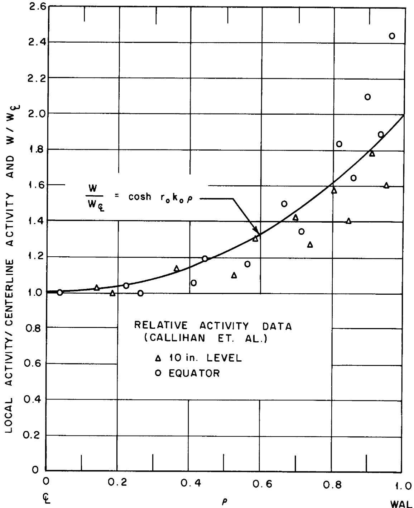  
Fig. 1. Activity Data for ART Core and a Simplified Radial Volume-Heat-Source Distribution

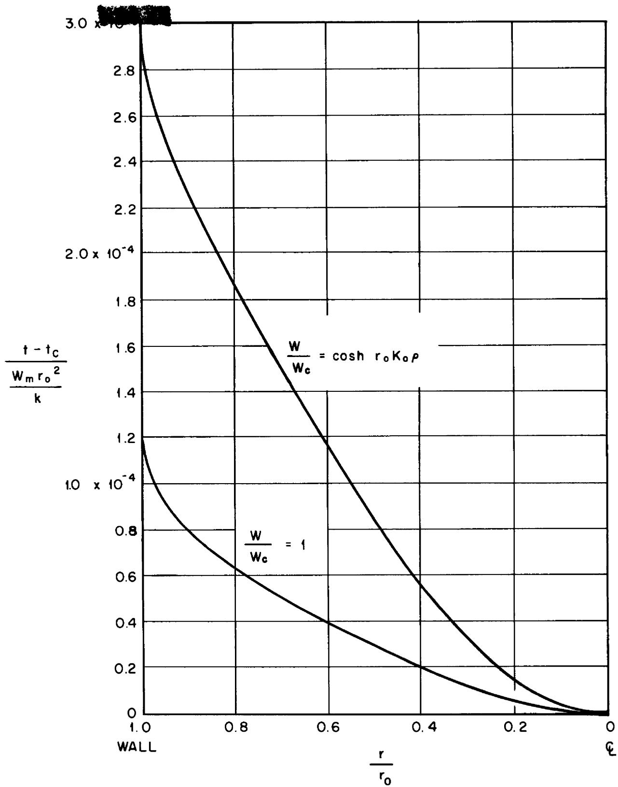  
Fig. 2. Dimensionless Radial Temperature Distributions in Parallel Plates Systems with No Wall Heat Transfer (Re=100,000 and Pr = 4)

2. A Cooling Analysis for a Variable-Gap Channel (Idealized ART)

A variable-gap channel representing the spiraling annular passage through which the fuel flows in the ART with the swirl-flow entrance was studied. The variable-gap channel was divided into a series of channels with parallel walls, having different wall spacings. The heat transfer analyses of these individual channels were performed as described previously in ORNL-1933. The idealized system shown in

Figure 3 for each channel is defined as follows:

a) Thermal and hydrodynamic patterns are established (long channels).   
b) Steady state exists.   
c) Volume heat sources exist in the fuel, wall, and coolant.   
d) Physical properties are invariant with temperature.   
e) The fuel channel is being cooled nonuniformly along its length by the coolant.   
f) The walls of the fuel channel are thin.

The three equations describing heat flow from the fuel to the coolant can be expressed as,

$$
\mathrm {d q} _ {1} = h _ {f} \mathrm {d A} \left(\Delta t _ {\mathrm {V H S} _ {f}} + t _ {f} - t _ {l}\right) \tag {2}
$$

$$
\mathrm {d q} _ {1} + \frac {\bar {W} _ {w}}{2} \mathrm {d A} = \frac {k _ {w}}{\delta} \mathrm {d A} \left(t _ {1} - t _ {2}\right) \tag {3}
$$

$$
\mathrm {d q} _ {1} + \bar {W} _ {w} \delta \mathrm {d A} = h _ {c} \mathrm {d A} \left(t _ {2} - t _ {c} - \triangle t _ {\mathrm {V H S} _ {c}}\right) \tag {4}
$$

From equations (2), (3), and (4) one can obtain,

$$
\mathrm {d q} _ {1} = \text {U s d x} \left(t _ {\mathrm {f}} - t _ {\mathrm {c}} + \Delta t _ {\mathrm {V H S} _ {\mathrm {f}}} - \Delta t _ {\mathrm {V H S} _ {\mathrm {c}}} - \Delta t _ {\mathrm {w}}\right) \tag {5}
$$

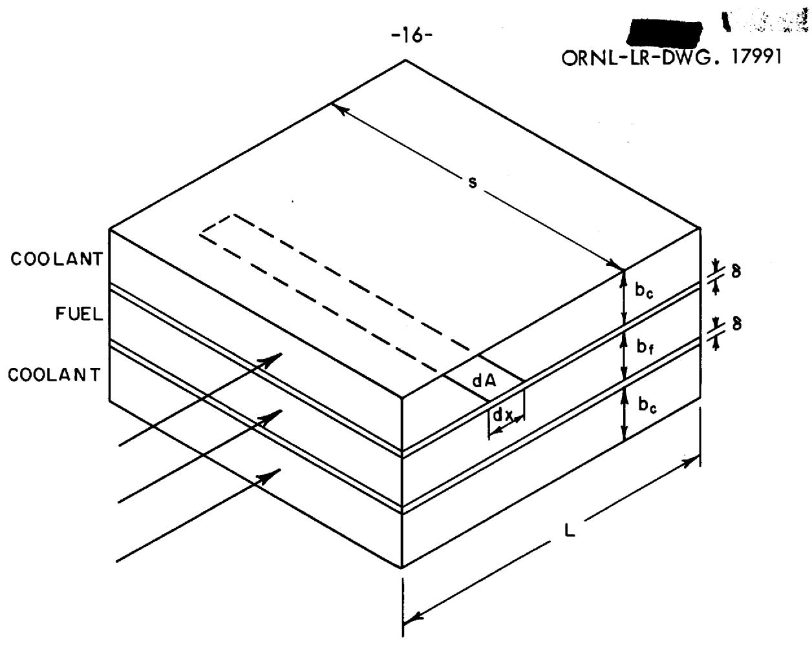

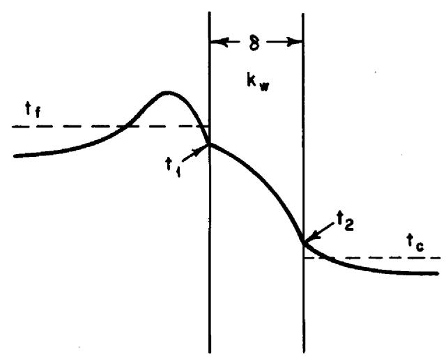  
Fig 3. An Element of the Variable-Gap Channel (Idealized ART)

The two additional equations arising when making a heat rate balance on the two fluid streams in a length $dx$ are,

$$
\mathrm {d q} _ {1} = \frac {\bar {W} _ {f} ^ {b} f ^ {d} A}{2} - \frac {m _ {f} c _ {p f}}{2} \tag {6}
$$

$$
\mathrm {d q} _ {\perp} + \bar {W} _ {W} \delta \mathrm {d A} = m _ {c} c _ {p c} \mathrm {d t} _ {c} - \bar {W} _ {c} b _ {c} \mathrm {d A} \tag {7}
$$

From equations (6) and (7) one can obtain,

$$
\mathrm {d} \mathrm {T} = - \mathrm {N d q} _ {\perp} + \mathrm {M} ^ {\prime \prime} \mathrm {d x} \tag {8}
$$

where,

$$
\mathbf {T} = \mathbf {t} _ {\mathbf {f}} - \mathbf {t} _ {\mathbf {c}}
$$

$$
N = \frac {1}{\frac {m _ {f}}{2} c _ {p f}} - \frac {1}{m _ {c} c _ {p c}}
$$

$$
M ^ {\prime \prime} = \frac {\bar {W} _ {f} b _ {f} s}{m _ {f} c _ {p f}} - \frac {\bar {W} _ {c c} b s}{m c p c} - \frac {\bar {W} _ {w} \delta s}{m c p c}
$$

Upon substituting equation (5) into (8) and reducing, one obtains the solutions,

$$
T + \Delta t _ {V H S _ {f}} - \Delta t _ {V H S _ {c}} - \Delta t _ {w} = \left(T _ {o} + \Delta t _ {V H S _ {f}} - \Delta t _ {V H S _ {c}} - \Delta t _ {w} - \frac {M ^ {\prime \prime}}{N U s}\right) e ^ {- N U s x} + \frac {M ^ {\prime \prime}}{N U s} \tag {9}
$$

$$
q _ {1} = \frac {1}{N} \left(T _ {O} + \Delta t _ {V H S _ {f}} - \Delta t _ {V H S _ {c}} - \Delta t _ {w} - \frac {M ^ {\prime \prime}}{N U s}\right) (1 - e ^ {- N U s x}) + \frac {M ^ {\prime \prime}}{N} x \tag {10}
$$

$$
t _ {c} - t _ {c 1} = \frac {q _ {l} + \bar {W} _ {w} \delta s x + \bar {W} _ {c} b _ {c} s x}{m c p c} \tag {11}
$$

$$
t _ {f} - t _ {f 1} = \frac {\bar {W} _ {f} b _ {f} s x}{m _ {f} c _ {p f}} - \frac {q _ {l}}{\frac {m _ {f}}{2} c _ {p f}} \tag {12}
$$

$$
t _ {1} = - \frac {U}{h _ {f}} \left(T + \Delta t _ {V H S _ {f}} - \Delta t _ {V H S _ {c}} - \Delta t _ {w}\right) + \Delta t _ {V H S _ {f}} + t _ {f} \tag {13}
$$

$$
t _ {2} = t _ {1} - U \frac {\delta}{k} \left(T + \Delta t _ {V H S _ {p}} - \Delta t _ {V H S _ {c}} - \Delta t _ {W}\right) - \frac {\bar {W} \delta^ {2}}{2 k} \tag {14}
$$

The fuel, wall, and sodium temperatures within the ART core as well as the sodium cooling requirements and flow rates were determined with the mathematical relations developed above for the following specific conditions that define the ART core with the swirl-flow entrance.

Reactor fuel: Fluoride composition No. 30 with properties evaluated at $1425^{\circ}\mathbf{F}$

Coolant: Sodium with properties evaluated at $1125^{\circ} \mathrm{F}$

Wall material: Inconel

Fuel power densities: Radial profiles obtained from "ART hot critical" experiment (see Figure 1)

Inconel wall power density: A mean value of 54 watts/cc

Beryllium power density in vicinity of sodium annuli: A mean value of 16.5 watts/cc

Equivalent power density in sodium1: A mean value of 52.8 watts/cc  
Mixed-mean fuel temperature rise: About $350^{\circ}\mathbf{F}$ , depending upon the  
total reactor power and wall-cooling losses

1. Gamma and neutron heat generated in the beryllium reflectors is carried away by sodium flowing through cooling holes and annuli. The heat generated in the thin layers of beryllium (next to the annuli) flows into the sodium and hence raises its bulk temperature. In the analysis, this heat flow was simply treated as an equivalent volume-heat-source term in the sodium itself. Although this technique correctly accounts for all the sodium heat transfer, the beryllium-sodium interface temperature is not explicitly determined. However, a separate calculation of the beryllium-sodium interface temperature shows that it lies only about $4^{\circ}\mathbf{F}$ above the bulk sodium temperature.

$$
m _ {f} = 2. 2 5 \times 1 0 ^ {6} \mathrm {l b / h r}
$$

$$
\left(\operatorname {R e} _ {\mathrm {s}}\right) _ {\mathrm {f}} = 3 7 2, 0 0 0 (\text {f o o t n o t e} 2)
$$

$$
P r _ {p} = 2. 3
$$

$$
\bar {W} _ {f} = 6 0 \mathrm {M W} \text {p e r r a c t o r c o r e v o l u m e (3 . 2 3 f t ^ {3})}
$$

$$
\mathrm {N u} _ {\rho} = 1 0 2 0
$$

$$
m _ {c} = 0. 1 0 2 \times 1 0 ^ {6} l b / h r
$$

$$
R e _ {c} = 1 2 5, 0 0 0
$$

From the fuel Reynolds and Prandtl numbers given above, the following uncooled-wall temperatures above the mixed-mean fuel temperatures were determined:

$$
\left( \begin{array}{l} \frac {\Delta t _ {V H S _ {f}}}{\overline {{W}} _ {f} r _ {o} ^ {2}} \\ \frac {k _ {f}}{k _ {f}} \end{array} \right) \text {u n i f o r m} W _ {f} = 4. 5 \times 1 0 ^ {- 5} (\text {r e f e r e n c e 2})
$$

$$
\left( \begin{array}{l} \frac {\Delta t _ {V H S _ {F}}}{\overline {{W}} _ {F} r _ {0} ^ {2}} \\ \frac {k _ {F}}{k _ {F}} \end{array} \right) = (2. 2 6) (4. 5 x 1 0 ^ {- 5}) = 1 0. 2 x 1 0 ^ {- 5}
$$

2. A mean vector Reynolds number for the fuel was used in the analysis because the maximum variation of the local vector Reynolds number was only $\pm 12$ per cent.

3. The analysis of the radial temperature structure in the ART fuel under actual nonuniform radial power density conditions described above indicated that the dimensionless radial temperature difference for the nonuniform power density case was 2.26 times greater than the corresponding temperature difference for a uniform radial power density system. An entrance length analysis which is discussed in a later section of this report showed that the thermal and hydrodynamic flow layers are established by the time the fuel arrives at the exit of the idealized core. However, the whole northern hemisphere lies in the entrance region. The fact that both the local Nusselt number and $\Delta t_{\mathrm{VHS}}$ functions vary in compensating

fashions in this entrance region validates the analysis there.

The calculated temperature distributions in the fuel, wall, and sodium coolant streams are shown plotted in Figure 4. The sodium flow rates and cooling requirements in the variable-gap channel system pertained to a passage having identical wall areas from which heat was transferred to the coolant streams. In the actual ART annulus system, the inner and outer wall areas are not identical; thus, the results of the variable-gap channel analysis were apportioned to account for the fact that the ART outer wall area was larger than the inner wall area.

The flow rates and cooling requirements so obtained follow:

flow rate in inner sodium annulus: 0.071 x 106 lb/ar

flow rate in outer sodium annulus: 0.133 x $10^{6}$ lb/hr

total cooling power capacity of sodium stream in inner annulus: 0.89 MW

total cooling power capacity of sodium stream in outer annulus: 1.65 MW

total cooling power capacity of both sodium streams: 2.54 MW

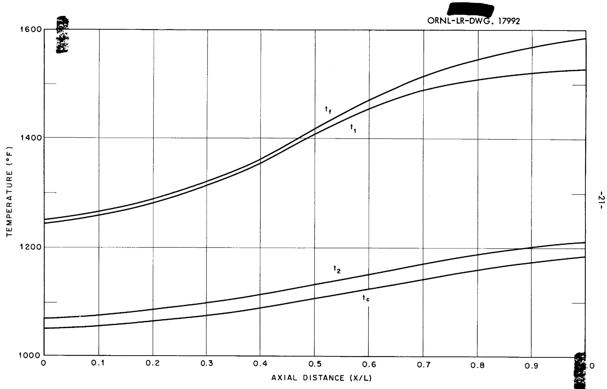  
Fig.4. Temperature Structure Within Idealized ART Core.

# 3. Radial Fuel Temperature Structure with Wall Cooling

In order to illustrate the nonuniformity of the radial fuel temperature profile at the exit of the reactor core, the following analysis is

presented. The radial fuel temperature profile for the uncooled wall

case, under the representative ART conditions of $\mathrm{Re} = 100,000$ and $\mathrm{Pr} = 4$ ,

is graphed in Figure 5. In order to maintain the Inconel-fuel interface

temperature at the core outlet at approximately $50^{\circ}\mathrm{F}$ below the mixed-mean

fuel temperature, about 3 per cent of the heat generated in the core must

be removed by the wall coolant. The radial fuel temperature profile for

this case was obtained by the superposition process described in reference 11

and is graphed in Figure 5 for purposes of comparison. Note that the peak

fuel temperature above the mixed-mean fuel temperature in the wall-cooled

case was still 62 per cent of the corresponding peak temperature difference

for the uncooled wall case.

An analysis of the degree of decay of the fuel temperature peak, for

the wall-cooled case, in the short passage between the core exit and heat

exchanger entrance will be discussed in a following section of this report.

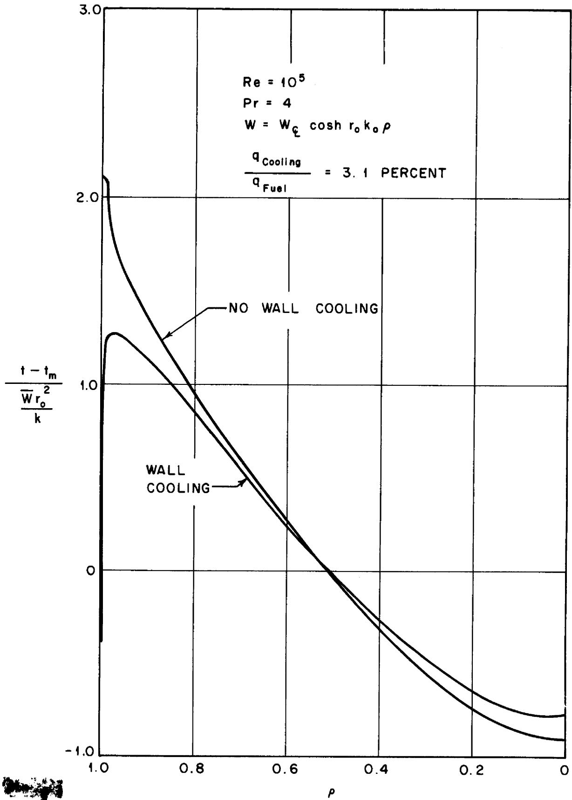  
Fig. 5. Radial Fuel Temperature Distributions in a Parallel Plates System with and without Wall Cooling

# 4. Transient Temperature Analyses

The hydrodynamic studies conducted with the quarter scale ART core models revealed that, under unstable flow conditions, a series of different types of flow phenomena existed in the vicinity of the core walls; high velocity layers, stagnant layers, and reverse flow or separation layers could be identified at different moments during the complicated turbulent history. Two specific transient processes will be considered; namely, the cases of a momentary flow stagnation and a high velocity eddy for an Inconel-fluoride system will be analyzed.

# a. Momentary Flow Stagnation

Postulate that, at time equal to zero, the fuel contiguous to the Inconel wall remains perfectly stagnant for a short period of time (perhaps several tenths of a second). The problem is to determine the transient temperature structure in the Inconel wall, in the adjacent fuel, and at the interface between the two. The equations which define this boundary value problem follow:

$$
\begin{array}{l} \frac {\partial t}{\partial \theta} = a _ {I} \frac {\partial^ {2} t}{\partial y ^ {2}} + \frac {w _ {I} (y)}{\gamma_ {I} c _ {p I}}, 0 <   y <   y _ {I} \quad (\text {I n c o n e l w a l l}) \\ \frac {\partial t}{\partial \theta} = a _ {f} \frac {\partial^ {2} t}{\partial y ^ {2}} + \frac {w _ {f} (y)}{\gamma_ {f} c _ {p f}}, y > y _ {I} \quad (\text {F u e l}) \tag {15} \\ t (\theta = 0, \mathbf {y}) = t _ {i} (\mathbf {y}) \\ - k _ {I} \frac {\partial t}{\partial y} (\theta , y = 0) = h _ {c} [ t (\theta , y = 0) - t _ {c} ] \\ \end{array}
$$

An analytical solution of this set of equations would be laborious4 and was actually not required for this specific study; thus, a solution was obtained very quickly by the graphical technique. A 0.2 second flow stagnation in the fuel with a volume heat source of $2\mathrm{kw / cc}$ created a $208^{\circ}\mathbf{F}$ temperature rise within the fuel at a sufficient distance from the wall where heat conduction was no longer important. However, the Inconel-fuel interface only increased by $48^{\circ}\mathbf{F}$ during the same time interval because of the transient conduction of heat into the Inconel. Thus, in the case of flow stagnation in an Inconel-fuel system, the wall-fuel interface fluctuation is only about one-quarter of the value occurring in the fuel at some distance from the wall.

b. High-Velocity Eddy

Consider the case of a momentary high-velocity eddy which flows past the core shell wall in the vicinity of the equator where the influence of the divergent flow exists. The problem is to estimate the transient temperature structure in the Inconel and fuel for such a case. The mean boundary layer thicknesses and turbulent conductivities for the swirl-flow case were obtained from the fundamental velocity data for simple ducts and converging and diverging channels. Some of the results are shown in Table 1.

4. A mathematical solution to a slightly simplified boundary value problem was derived, however, which could be used to closely approximate the transient temperature behaviour of this system.

# TABLE

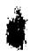

# Region

Thermal or Eddy Conductivity5, Btu/hr ft2 (°F/ft)

Inconel Shell

13

Laminar Sublayer

1.5

$$
(0 <   \mathbf {y} <   0. 0 0 1)
$$

Buffer Layer

$$
(0. 0 0 1 ^ {\prime \prime} <   y <   0. 0 0 5 8 ^ {\prime \prime})
$$

12.8 (a mean value)

Turbulent Core

$$
\mathbf {y} = 0. 0 0 5 8 ^ {n}
$$

56

$$
y = 0. 1 8 2 ^ {\prime \prime} (1 / 1 0 o f m e a n r a d i u s)
$$

1550

$$
y = 0. 9 1 2 ^ {n} (1 / 2 o f m e a n r a d i u s)
$$

4270

5. The eddy conductivity of a fluid is the sum of the molecular and turbulent terms, $\mathbf{k}_{\text{eddy}} = \mathbf{k} \left(1 + \frac{\epsilon}{\nu} \Pr \right)$ .

On the basis of the hydrodynamic research conducted in quarter-scale models of the ART, it is believed that the sudden high-velocity fluctuations observed near the core boundaries were due to momentary high-velocity eddies which greatly increase radial momentum and heat transfer during their existence. The following boundary value problem represents an idealized description of the transient temperature structure during this event.

$$
\begin{array}{l} \left. \begin{array}{l} \frac {\partial t}{\partial \theta} = a _ {I} \frac {\partial^ {2} t}{\partial y ^ {2}} \\ t (y, 0) = 0 \\ \lim  t (y, \theta) = 0 \\ y \longrightarrow - \infty \end{array} \right\} \quad y <   0 \tag {16} \\ \left. \begin{array}{l} \frac {\partial t}{\partial \theta} = \bar {\epsilon} _ {f} \frac {\partial^ {2} t}{\partial y ^ {2}} \\ t (y, 0) = t _ {a} \\ \lim  t (y, \theta) = t _ {a} \\ y \longrightarrow \infty \end{array} \right\} \quad y > 0 \\ \end{array}
$$

It is assumed that the high-velocity eddy suddenly presents the Inconel and thin laminar sublayer and buffer layer with a new slab of fuel having a new higher or lower uniform temperature above the initial datum, $t_{\mathrm{a}}$ . This new slab also has a higher eddy conductivity representative of a region a short distance from the wall where the eddy originated. The source terms in both the Inconel and fuel have been neglected here.

A layer of Inconel having the same combined thermal resistance and capacitance as the thin laminar sublayer and buffer layers was added to the Inconel wall.

The solution to this boundary value problem is prosaic and can be found readily in the literature (reference 15). The ratio of the actual Inconel-fuel interface temperature to the uniform fuel step function temperature, $t_{\text{interface}} / t_{\text{a}}$ , was evaluated for several different eddy sizes. A typical one, which was defined by an eddy coming from 0.18 inch from the wall (a mean $k_{f}$ equal to sixty times the value for Inconel) was $t_{\text{interface}} / t_{\text{a}} = 0.79$ in 0.2 second.

The high velocity eddy analysis presented above is based on a conservative system. From photomicrographs of the surface of Inconel exposed to fuel, it was observed that the surface roughness was of the same size as the thickness of the calculated laminar sublayer. Many hydrodynamicists believe that if this is the case, then there would be no laminar sublayer. Further, the layer thickness used in the above analysis was calculated for the average flow condition; actually, it would be thinner because of the momentary higher local velocities. The thermal resistance and capacitance of the laminar sublayer as well as the buffer layer were so small that the calculated ratio, $t_{\text{interface}} / t_{\text{a}}$ , given above would only increase 12 per cent if these two layers were neglected. It is also pointed out that in the analysis it was postulated

6. The actual Inconel-fuel interface was located at $y = -0.009$ inch; the 9 mil layer represented the equivalent fuel laminar sublayer and buffer layer described above.

that a slab of fuel was suddenly exposed to the boundary layers and the Inconel; however, the high-velocity eddy would continually supply new fuel, thus further raising the temperature ratio calculated above. Finally, calculations have been made which show that the thermal conductivity of a layer of Inconel, penetrated uniformly with subsurface corrosion voids, can suffer a significant reduction. For example, the reduction in conductivity of a uniformly pitted layer having a void volume of 30 per cent would be 38 per cent.

The above calculations indicate that high velocity eddies of the type pictured here can transfer heat so effectively that Inconel-fuel interface temperature fluctuations are not drastically reduced below the temperature fluctuations in the fuel.

# EXPERIMENTAL SYSTEM

# 1. Technique

In order to determine a more detailed description of the mean and transient temperature structure within the ART core, it was decided to perform a heat transfer experiment in a half-scale model of the core. The most effective way of generating heat within the volume of an aqueous solution7 flowing through the model was found to be the "resistance heating" technique, using alternating current. This method was found to possess the following advantages:

a) High specific powers are attainable.   
b) Fluid and surface temperature measurements can readily be made.   
c) Proper electrode spacing and voltage regulation yield control of the power density distribution.   
d) Power densities can be accurately determined from voltage and current measurements.

In order to obtain sufficiently large temperature differences within the electrolyte flowing through the core, intense volume heat sources had to be generated. It was observed, however, if the alternating current densities at the electrodes of the system were in excess of a certain value, then undesirable hydrogen and oxygen liberation would occur at the electrode surfaces. Hence, it was necessary to so adjust the electrical

resistivity of the electrolyte, by varying the specific gravity, so that a maximum current density just below the critical value for gas generation was obtained. It was also found that platinum electrodes made it possible to obtain higher current densities. Further details on electrolysis research can be found in Appendix 1.

# 2. Electrode Geometry

It was found essentially impossible to create an electric flux field within the electrolyte flowing through the core which would generate a volume heat source that would peak sharply at the core wall as previously shown in Figure 1. It was possible, however, to create an electric flux field which was nearly uniform throughout the whole core. It is possible to transform the experimental temperature profiles obtained in the uniform power density case to those corresponding to the nonuniform power density case (ART) with the aid of the mathematical temperature solutions carried out previously for these two systems.

The electrode arrangement used in the experiment is shown in Figure 6. It can be shown that if the axial potential gradient is a uniform value throughout a conducting system (linear voltage drop), a uniform volume heat source will be generated. The electrode arrangement in Figure 6 yielded a potential field that had an axial potential gradient that was within $\pm 6$ per cent of being uniform (excluding the extreme ends of the potential field); this means that the volume heat source was within $\pm 12$ per cent of being uniform. The potential difference of each electrode set was adjusted such that the potential drop between adjacent electrodes remained constant.

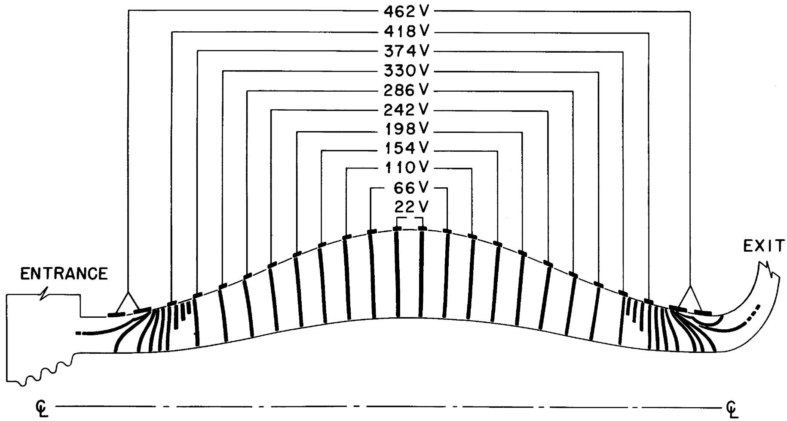  
Fig. 6. Electrode Arrangement, Voltages, and Potential Field for Half-Scale Core.

A dilute solution of sulfuric acid (1% by weight) was used for the circulating electrolyte. Some of the physical properties of this solution are presented in Appendix 2.

# 3. Flow Circuit

A perspective drawing of the ART volume-heat-source system is shown in Figure 7. The components consist of an electrolyte reservoir, two centrifugal pumps, flow-control valves, and orifice meter, the half-scale core model, and a water-cooled heat exchanger. The entire flow system was enclosed by plywood and Plexiglas walls in order to protect the operators from sulfuric acid in the event of a system leak. The electrolyte was pumped from the reservoir to the test section (where heat was generated within its volume) to the heat exchanger (where it was cooled) and finally back to the reservoir. Information on materials of construction and flow system components, excluding the core model which will be described next, can be found in Appendix 3.

# 4. Half-Scale Core Model

Figure 8 shows a cross-sectional view of the core model including entrance and exit sections. A transparent Plexiglas pipe was located at the core entrance so that the presence of entrained gas in the electrolyte could be observed. A mixing chamber used to obtain a mixed-mean fluid temperature was also located in this pipe. The two flow control valves located above the pump volutes were used to simulate single and dual ART pump operation. A view of the pump volutes and the core entrance region is shown in Figure 9. The flow either spiraled through the core unguided (swirl-flow entrance) or was guided by a set of turning vanes (vaned-flow

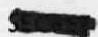

ORNL-LR-DWG. 17994

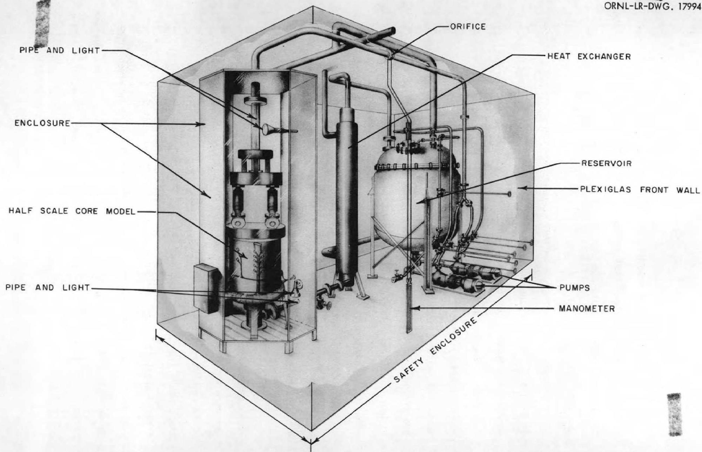  
Fig 7. ART Volume-Heat-Source Experimental System

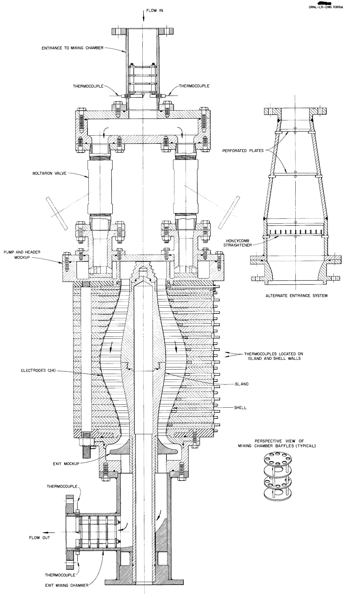  
Fig. 8. Cross-Section of Half-Scale ART Core Model Including Entrance and Exit Section.

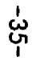

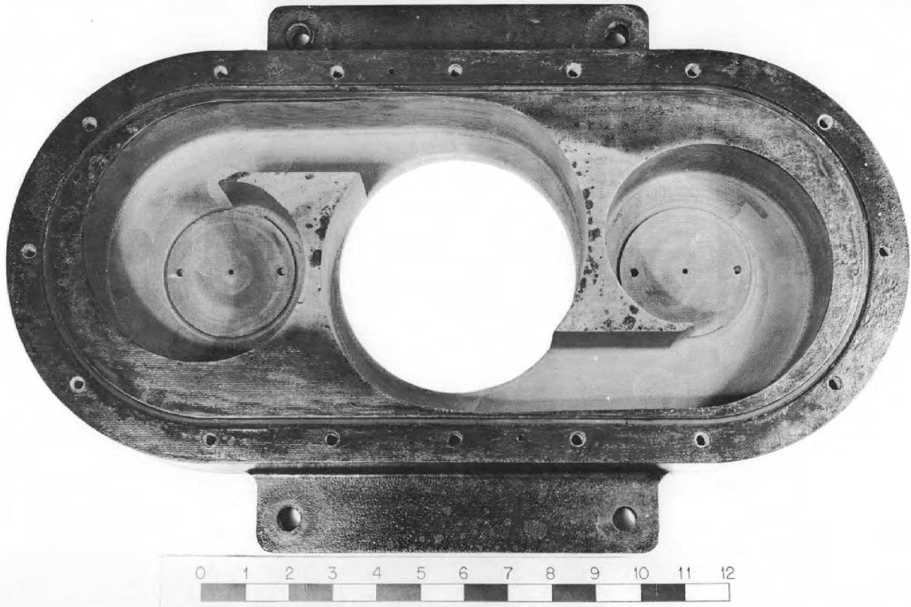  
Fig. 9. Top View of Pump Volutes and Core Entrance.

entrance). The turning vanes in the core entrance are shown in Figure 10.

Wall temperatures within the core model were determined by forty No. 36 gauge copper-constantan thermocouples, located about 0.030 inch below the plastic surface, and twenty-four No. 30 gauge platinum-platinum + $10\%$ rhodium thermocouples which were honed flush with the wall surfaces. In all cases, the junctions were of the butt type, and the couples were positioned in a plane parallel to the wall-fluid interface. Figure 11 shows a view looking down into the core from the entrance. This photograph was made after the first two sets of runs were completed. The simulated bellows on the island is observed in the center, and around it are seen the dark platinum electrode rings in the outer wall of the core. Several copper-constantan thermocouples may be seen through their transparent Araldite resin coverings. The copper-constantan thermocouples were spaced at five axial stations; four were located $90^{\circ}$ apart at each station on the inner and outer walls. The platinum-platinum + $10\%$ rhodium thermocouples were spaced at four axial stations; three were located $120^{\circ}$ apart at each station on the inner and outer walls. Table 2 gives the couple positions.

Platinum tubes, 1/16 inch in diameter, with platinum + $10\%$ rhodium wires inside joined at the tips were fashioned into thermocouple probes whose junctions were positioned in the flow stream 1/8 inch below the exit plane (see Figure 12). The probe tips were rotated $45^{\circ}$ from the vertical so that they faced in the general direction of the rotating flow from the exit of the core.

An exit section similar to the ART exit can be seen in Figure 8; a mixing chamber to measure the exit mixed-mean fluid temperature is also

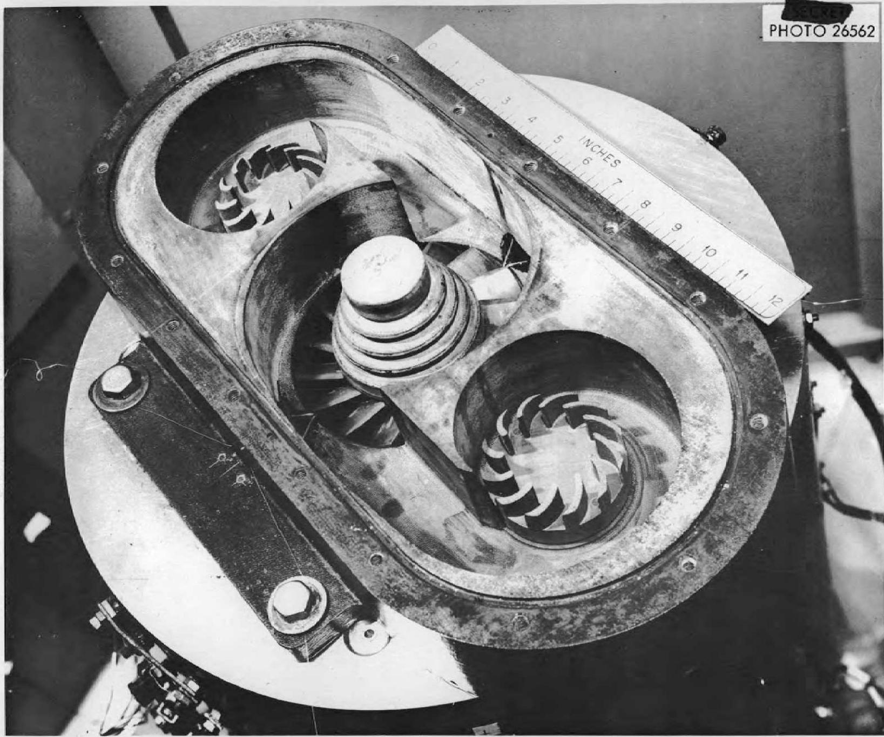  
Fig. 10. Pump Volutes and Core Entrance Region with Top Removed. Mounted on Core Test Section with Guide Vanes in Entrance.

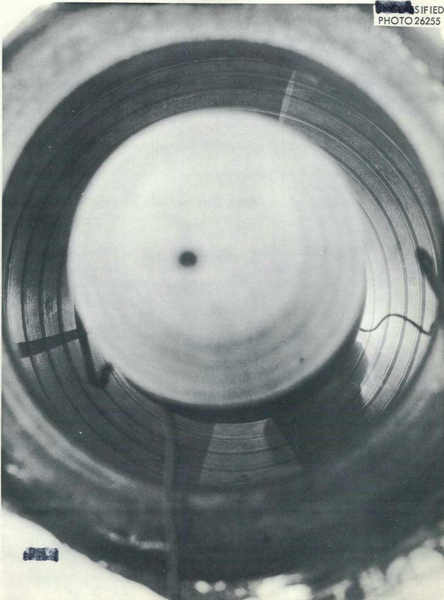  
Fig.11. View of Inside of Core Through Entrance.

TABLE 2   

<table><tr><td>Distance from Core Midplane (inches)</td><td>Copper-Constantan Thermocouples</td><td>Platinum-Platinum + 10% Rhodium Thermocouples</td></tr><tr><td>7.500</td><td>X</td><td></td></tr><tr><td>6.000</td><td></td><td>X</td></tr><tr><td>3.375</td><td>X</td><td></td></tr><tr><td>1.500</td><td></td><td>X</td></tr><tr><td>0.000</td><td>X</td><td></td></tr><tr><td>-1.500</td><td></td><td>X</td></tr><tr><td>-3.375</td><td>X</td><td></td></tr><tr><td>-6.000</td><td></td><td>X</td></tr><tr><td>-7.500</td><td>X</td><td></td></tr></table>

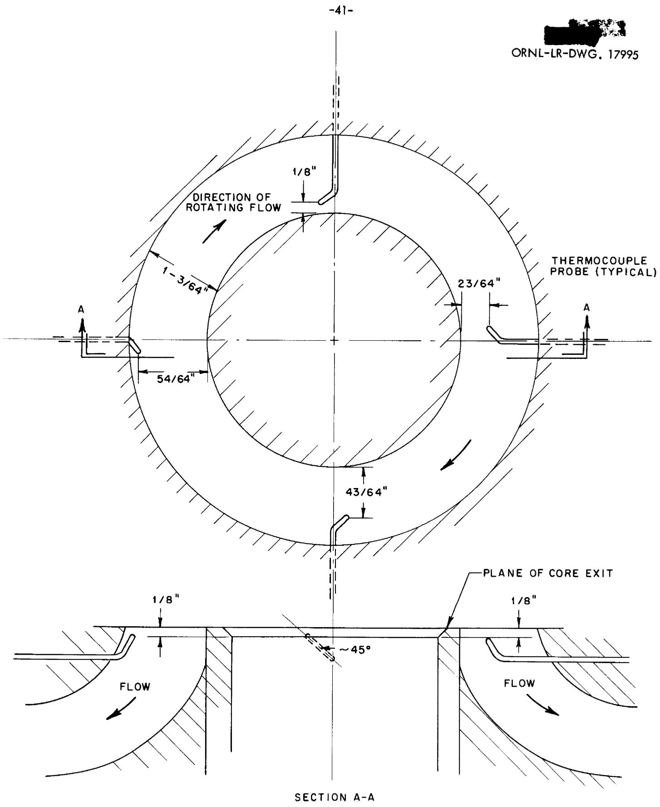

shown. A transparent pipe through which the solution could be inspected for gas generation followed the mixing chamber.

A photograph showing the assembled core model with power leads and thermocouple leads in place can be seen in Figure 13.

5. Power Circuit and Instrumentation

Figure 14 shows a schematic diagram of the electrical power system. A saturable reactor shown in the diagram was only used to control the voltages of the end electrodes at certain times. The voltages of the intermediate electrodes (3 through 22) were controlled in pairs by variable autotransformers. The power level was controlled by varying the strength of the acid solution up to one per cent by weight, thus changing its resistivity. The maximum total power dissipated in the test section was about 125 KW.

Figure 15 shows a photograph of the control and instrument panels. The power control Variacs are on the panels at the right with their voltmeters and ammeters. An accurate voltmeter (less than one per cent error) with a selector switch so that any electrode potential could be measured was installed later and used throughout the experiments. Accurate ammeters (less than one per cent error) were used to measure the currents drawn by the electrodes. The total electrical power dissipated within the core model was obtained by summing the individual wattages consumed by the individual electrode pairs.

Mean temperature measurements were obtained with the copper-constantant thermocouples. The voltages of these couples were recorded on four twelve-point recording potentiometers which are shown at the far left in Figure 15;

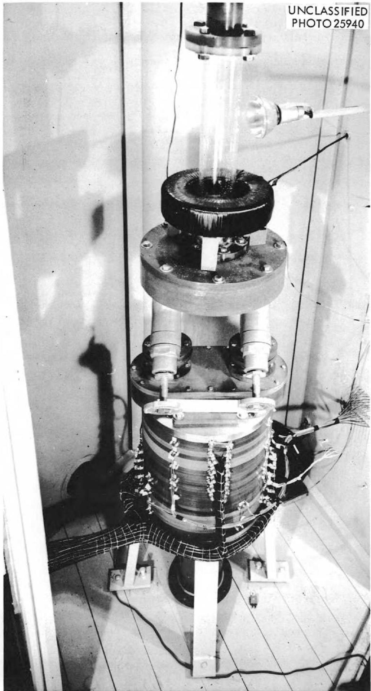  
Fig. 13. Overall View of Core Model.

TD-E-4589 Rev. E

UNCLASSIFIED

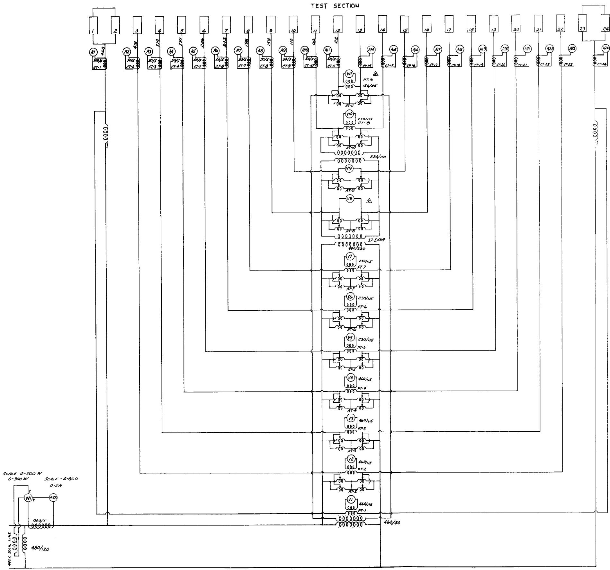  
Fig. 14. Schematic Diagram of Electrical Power System.

portable precision potentiometers were used most of the time to obtain these voltages, however. The platinum-platinum + $10\%$ rhodium thermocouples, which were normally used to obtain transient data, were also used to determine mean voltages to verify the copper-constantan measurements.

Two methods of measuring temperature fluctuations were used. One consisted of connecting a sensitive mirror galvanometer, made by the Hathaway Instrument Company, to the platinum-platinum + $10\%$ rhodium thermocouples (see Figure 16). Galvanometer deflections were then calibrated in terms of couple voltages or temperatures. Motion pictures were made of the galvanometer deflections. The second method of measuring transient temperatures involved using a Brush recorder with a special isolated preamplifier8. A photograph of this system is shown in Figure 17.

To protect the test section and the people working with the experiment, several automatic safety controls were included in the electrical system. The power circuit to the core model was instantaneously opened by control equipment when the following events occurred:

a) reduction of electrolyte flow rate below a preset value   
b) reduction of cooling water flow rate below a preset value   
c) opening of door to room containing the volume-heat-source experiment.

An alarm system immediately made known the occurrence of any of the above events.

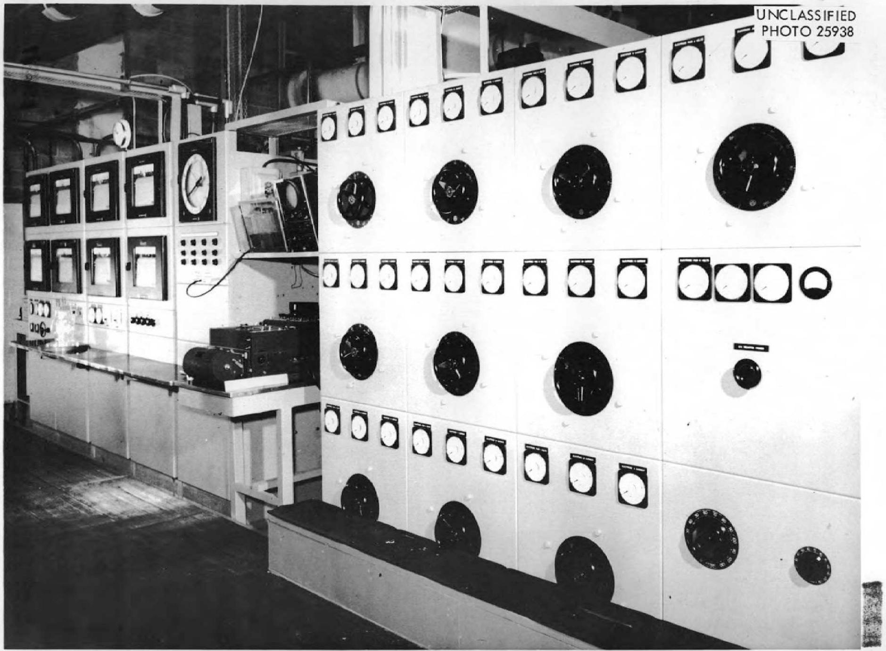  
Fig. 15. Control and Instrument Panels.

Pt - Pt + 10% Rh

TRANSIENT THERMOCOUPLE

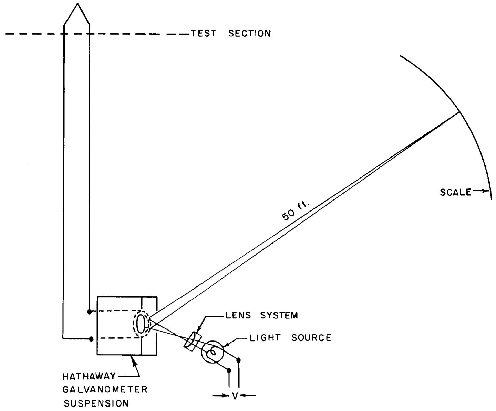  
Fig. 16. The Hathaway Galvanometer System

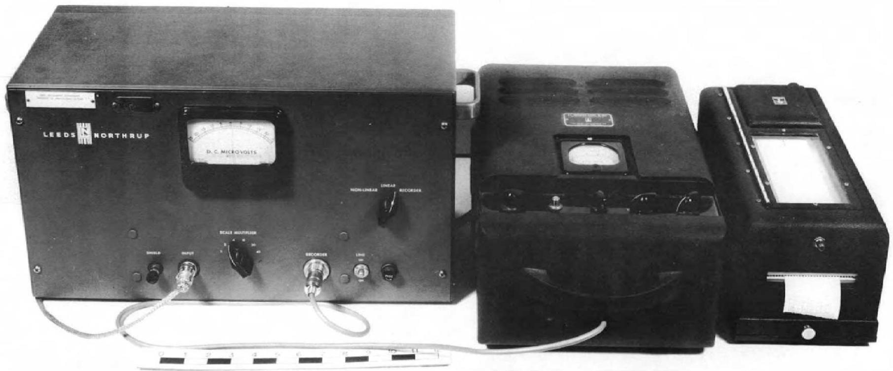  
Fig. 17. Components of Electronic Transient Temperature Recording System.

# EXPERIMENTAL PROCEDURE

# 1. Calibration

a. Brush Recorder and Hathaway Systems

When all the transient thermocouples within the core model were held at some known, uniform environment temperature, a zero reading was obtained on the Brush recorder. The environment temperature was then raised to some new uniform temperature level and the deflection of the Brush recorder again noted. The calibration constant was thereby derived directly in degrees centigrade per recorder scale division. An alternate method of calibrating the Brush recorder was used to verify the previous method. A direct current signal was applied to the Brush amplifier and then changed by a known increment. This increment was then converted to a temperature change, and the Brush recorder scale deflection was noted. The calibration constant so obtained was found to be within 5 per cent of the one determined by the previous method.

The Hathaway system was calibrated in the following manner. The output of the platinum-platinum + $10\%$ rhodium thermocouple was impressed directly upon the galvanometer suspension. The light arm deflection was noted for a given thermocouple environment temperature. The temperature level was then raised a known number of degrees, and the deflection of the light arm recorded.

b. Thermocouple Response

An experimental and analytical study of the response of the transient thermocouples under periodic and step function conditions was

conducted. It was found that the thermocouple response itself was far greater than those associated with the Brush recorder and Hathaway galvanometer suspension systems.

c. Frequency Response of Recorder and Galvanometer

Calibration of the frequency response of the Brush recorder was accomplished by impressing a known signal of variable frequency on the system input. The amplitude of the output on the Brush oscillograph was measured, and the results appear in Appendix 4 in terms of percentage of D-C response versus frequency in cycles/sec. A similar calibration of the frequency response of the Hathaway mirror galvanometer was made. The results are also presented in Appendix 4. Both of these Brush recorder and Hathaway response curves show that the 60 cycle per second response is very small compared to the low frequency spectrum.

d. Orifice Meter

The orifice meter was calibrated by measuring the weight flow rates and manometer deflections over the range of operating conditions. The calibration for a two-inch orifice is presented in Appendix 4; a graph of the mean Reynolds number as a function of manometer deflection can also be found there.

2. Operational Technique

Four sets of volume-heat-source experiments were conducted during this investigation. Two sets of measurements were made with a swirl-flow entrance; in one case, both simulated pump inlets were open, and in the other

case, one inlet was closed. Two additional sets of measurements were obtained with vanes located at the core entrance; the one and two pump flow simulation was again examined.

All heat transfer and fluid flow data were recorded only after the following steps were completed in the indicated sequence:

a) The system was filled with the electrolyte.   
b) The electrolyte was circulated through the system by means of the two pumps.   
c) The datum temperature of the electrolyte was maintained by an automatically controlled cooling water flow rate in the heat exchanger.   
d) A predetermined voltage distribution for the electrode system was established before the power was applied.   
e) Power was turned on.   
f) A final check was made on the desired electrode voltage distribution as shown in Figure 6.   
g) Thermal equilibrium was established in the flow system. The external core model environment temperature was matched to the mean wall temperature within the core in order to establish the uncooled-wall condition.

During the subsequent period of data recording, it was observed that the mean temperature and electric flux fields were extremely stable. For example, the variation in the mean temperature structure was less than one-quarter of one per cent. Further, only negligibly small gaseous electrolysis products existed in the exit flow as detected by the Tyndall light

scattering effect. A minute amount of leakage current was conducted through the external flow circuit from the core (less than 0.001 amps).

# MEAN AND TRANSIENT TEMPERATURE RESULTS

# 1. Swirl-Flow Case; Two Pumps

Fifteen complete power runs were made for the core model using the swirl-flow entrance. Both flow valves were open, thus simulating the ART flow with both pumps in operation. The ranges of parameters investigated follow:

$$
\begin{array}{l} 6 6, 0 0 0 <   \operatorname {R e} _ {\mathrm {s}} <   2 5 6, 0 0 0 \\ 4 <   P r <   5 \\ 5 <   t _ {m o} - t _ {m i} <   1 0 ^ {\circ} F \\ 0. 0 8 <   P _ {t} <   0. 1 2 \text {M e g a w a t t s} \\ \end{array}
$$

The heat balances obtained for the system were within $\pm 5$ per cent of being perfect. Typical mean, uncooled wall and mixed-mean fluid temperature profiles obtained in these experiments with a uniform volume heat source are presented in Figure 18 in a generalized form. The asymmetries in the outer and inner core wall temperatures can be explained on the basis of hydrodynamic asymmetries. For example, the high inner core wall temperature in the northern hemisphere existed because of a separation region which completely encompassed the inner wall (island wall) in that region.

The hydrodynamic structure in the northern hemisphere of both the swirl-flow and vaned-flow entrance cases is extremely complex. The shear stress and turbulence distributions are unknown in that region. Therefore, it was

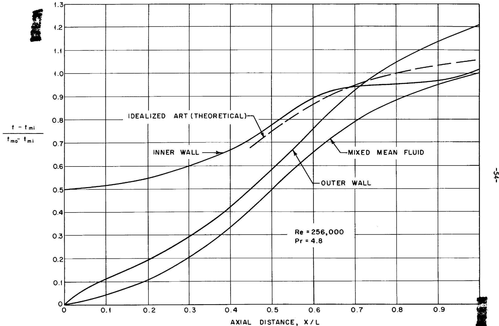  
Fig. 18. Mean, Uncooled Inner and Outer Core Wall Temperature Measurements for the Half-Scale ART with a Uniform Volume Heat Source (Swirl Entrance)

felt that predictions of the detailed, uncooled-wall temperature structure in the entrance region would probably be too simplified and hence were not made $^{10}$ . A calculation of the entrance length in a simple parallel plates system was made along the lines of Latzko's analysis (reference 16). It was found that the entrance length for the swirl-flow case was about 36 diameters. This meant that the flow was established in most of the southern hemisphere because the physical, vectorial channel length in this case was also 36 diameters. Consequently, the solution for established temperature structure in a parallel plates system (reference 2) was used to predict the local uncooled wall-fluid temperature difference in the southern hemisphere. It can be shown that,

$$
\frac {t _ {O} - t _ {m}}{t _ {m o} - t _ {m i}} = \frac {r _ {O}}{4 L} \text {R e} \Pr \left(\frac {\Delta t _ {V H S}}{\bar {W} r _ {o} ^ {2}}\right) \quad \text {u n i f o r m W (r)} \tag {17}
$$

This relation was evaluated with the aid of the solution in reference 2 for the swirl-flow case and is seen graphed in Figure 18; the predicted temperature profile lies between the experimental temperature profiles for the inner and outer walls.

Variations in the experimental uncooled core wall temperatures with respect to peripheral position were observed in the system. For example, the uncooled wall-fluid temperature difference, on the inner wall in the

equatorial region, varied by plus or minus 30 per cent from the mean wall-fluid temperature difference at that plane. The corresponding variations in wall-fluid temperature difference for the cooled-wall core would probably be much less because the peripheral variation in the heat transfer coefficient no doubt would be a compensating factor.

The experimental temperature profiles obtained for the uniform power density case were transformed to those corresponding to the radial, non-uniform power density case (Figure 1) with the aid of the mathematical temperature analyses presented earlier in this report. The axial mixed-mean temperature distributions for both the ART axial power distribution (reference 21) and the uniform axial power distribution are compared in Figure 19. The maximum difference is seen to be less than one per cent of the total mixed-mean temperature rise. The results can be seen in Figure 19 together with a corresponding analytical solution. Note that wall temperatures as high as $1750^{\circ}\mathbf{F}$ would occur if the wall were not cooled.

Typical transient wall and fluid temperature data are shown in Figure 20 in terms of the total temperature fluctuation divided by the axial temperature rise of the fluid going through the core. The frequencies of the temperature fluctuations for this half-scale model varied from about one-half cycle per second to four cycles per second. The frequency range of temperature fluctuations in the full-scale ART system, operating with fluoride fuel, should be similar to that in the half-scale model experiment with the acid solution. A simple average of the maximum wall and fluid temperature fluctuations with respect to peripheral position was

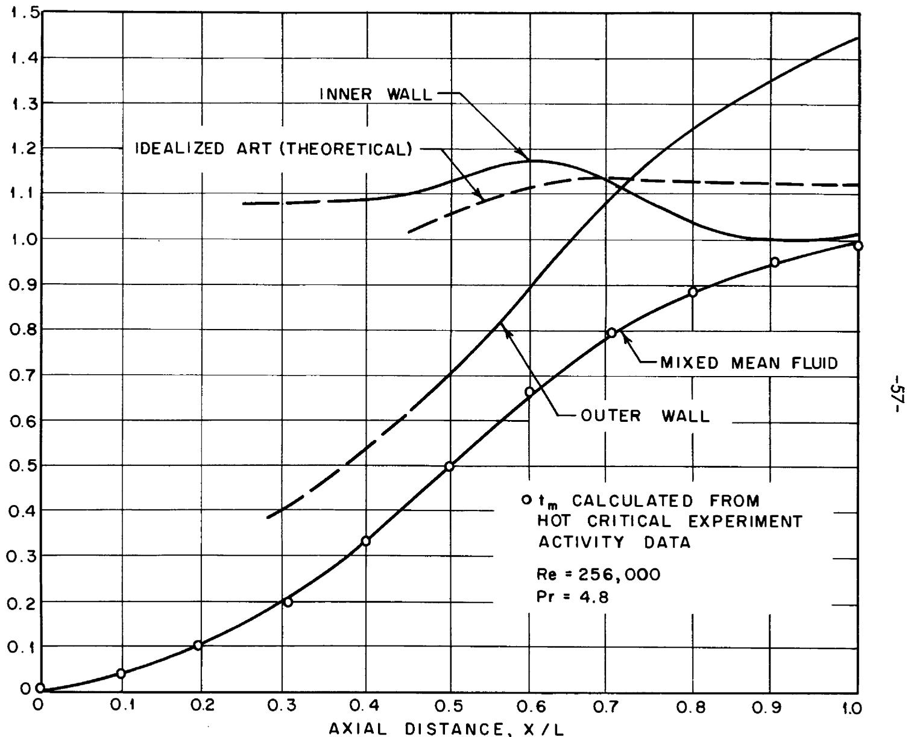  
t-tmi tmo-tmi   
ORNL-LR-DWG. 17999   
Fig. 19. Mean, Uncooled Inner and Outer Core Wall Temperature Profiles for the Half-Scale ART with a Nonuniform Volume Heat Source (Swirl-Flow Entrance

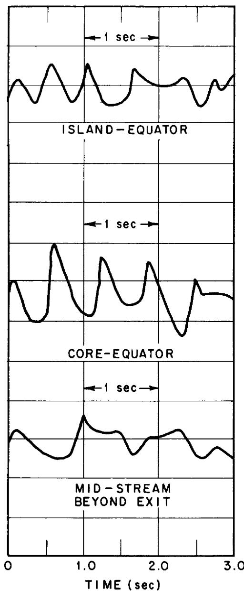

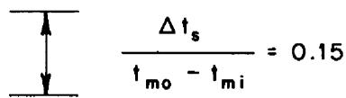

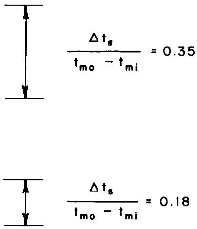  
$\mathbf{Re}_{s} = 256,000$ $\mathbf{W} = \overline{\mathbf{W}}$ (UNIFORM)

  
Fig. 20. Typical Transient Surface and Fluid Temperatures for Swirl-Flow Case.

3

obtained. Typical measurements uncorrected for frequency response are shown plotted as a function of axial distance in Figure 21 for the uniform power density case. These fluctuations would, of course, be larger for the nonuniform power density case. Note that the outer wall temperature fluctuations are greater than those measured at the inner wall; this difference appears to reflect the Rayleigh stability criterion. A detailed frequency response correction is laborious because of the difficulty in determining instantaneous frequencies for the complex fluctuation spectrum. However, on the basis of a mean fluctuation frequency of about two cycles per second, one would expect to increase the magnitude of the fluctuations given in Figure 21 by a factor of about 1.5.

# 2. Vaned-Flow Case; Two Pumps

Six complete power runs were made for the core model using the vanedflow entrance. Again, both valves were opened to simulate normal ART operating conditions. The ranges of parameters investigated follow:

$$
\begin{array}{l} 6 0, 0 0 0 <   \mathrm {R e} _ {\mathrm {s}} <   1 8 0, 0 0 0 \\ 4 <   \Pr <   5 \\ 5 <   t _ {m o} - t _ {m i} <   1 0 ^ {\circ} F \\ 0. 0 8 <   P _ {t} <   0. 1 2 \text {M e g a w a t t s} \\ \end{array}
$$

Heat balances were again within $\pm 5$ per cent of being perfect. Typical mean, uncooled-wall and mixed-mean fluid temperature profiles for a uniform volume heat source are presented in Figure 22. Note that the high inner wall temperatures in the northern hemisphere obtained in the previous swirl-flow case are no longer present because the vane system almost

$$
\frac {\triangle t _ {s}}{t _ {m o} - t _ {m i}}
$$

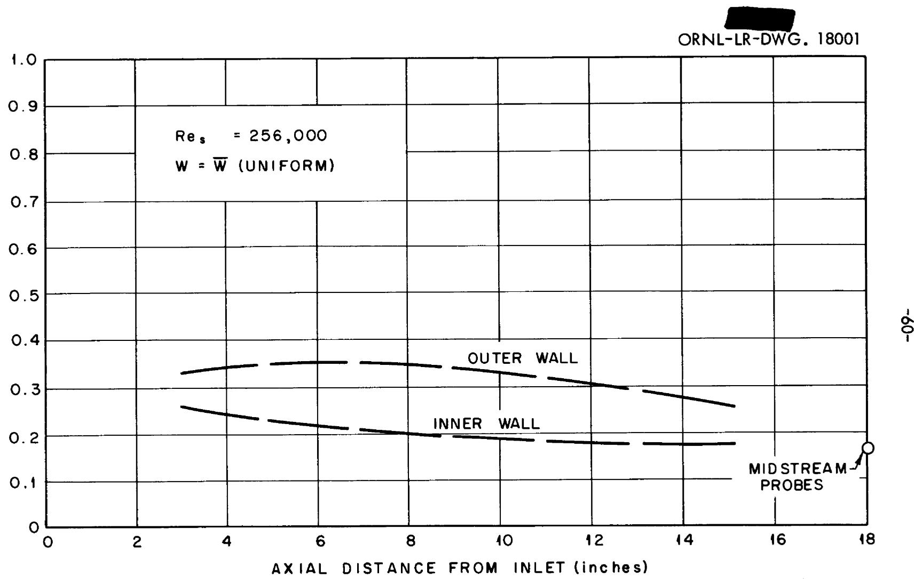  
Fig. 21. Peripherally Averaged Maximum Temperature Fluctuations for Swirl-Flow Core

$$
\frac {t - t _ {m i}}{t _ {m o} - t _ {m i}}
$$

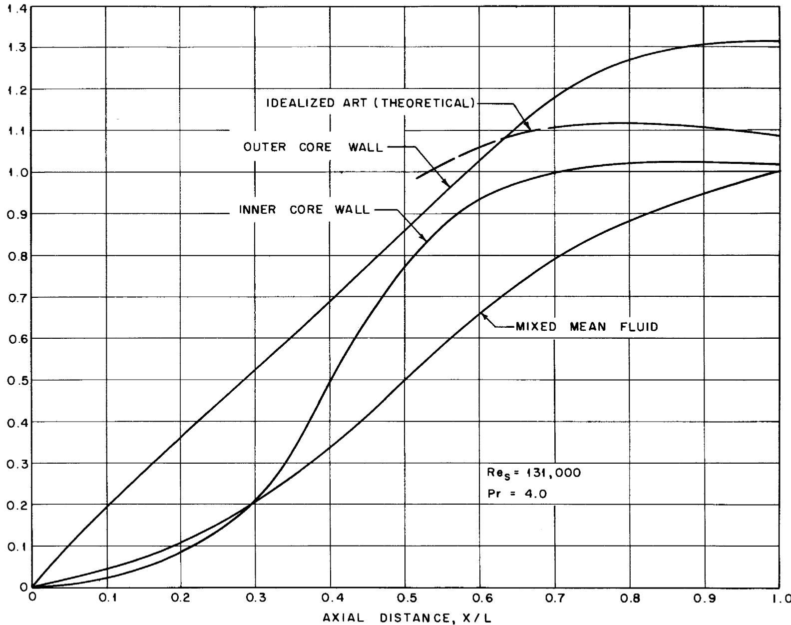

#

  
Fig. 22. Mean, Uncooled Inner and Outer Core Wall Temperature Measurements for the Half-Scale ART with a Uniform Volume Heat Source (Vaned Flow Entrance)

completely eliminated the flow separation in that region. However, the uncooled-wall temperatures in all other regions were higher for the vaned-flow case than those for the swirl-flow case because the latter case was characterized by a significantly higher vector Reynolds number.

A calculation revealed that the entrance length in a simple parallel plates system corresponding to the vaned-flow case was about 29 diameters. Since the physical vectorial channel length was only 16 diameters for this case, the thermal boundary layers were about 67 per cent of the fully established values at the idealized core exit. However, the analytical, uncooled-wall temperature profile for the southern hemisphere shown in Figure 22 was carried out for established temperature conditions.

Peripheral variations in the experimental uncooled-wall temperatures were again observed. However, they were generally larger than those found in the swirl-flow case. For example, the uncooled wall-fluid temperature difference, on the inner wall in the equatorial region, varied by $\pm 90$ per cent from the mean temperature difference at that plane.

The experimental temperature profiles obtained for the uniform power density case were transformed to those corresponding to the nonuniform power density case as was done previously. The results can be observed in Figure 23 together with the analytical prediction. Note that wall temperatures as high as $1850^{\circ}\mathbf{F}$ would result if the walls were not cooled.

Typical transient wall and fluid temperature data for the vaned-flow case are presented in Figure 24. The frequency spectrum of the temperature fluctuation for this case was, in general, similar to the one found for the swirl-flow case. However, at certain flow conditions in the northern

  
t-tmi tmo-tmi

ORNL-LR-DWG. 18003

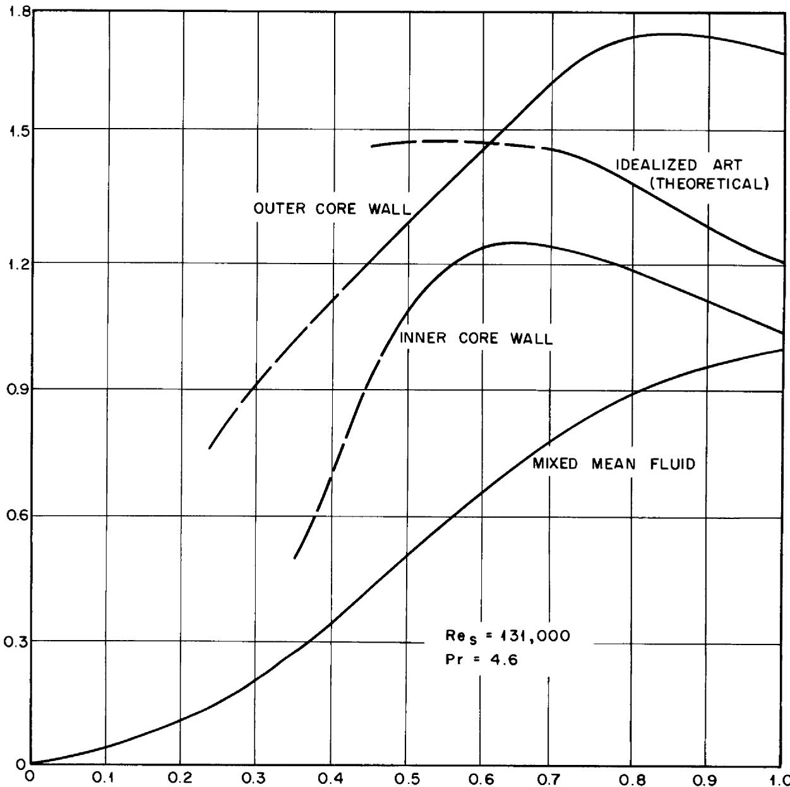  
AXIAL DISTANCE, X / L   
Fig. 23. Mean, Uncooled Inner and Outer Core Wall Temperature Profiles for the Half-Scale ART with a Nonuniform Volume Heat Source (Vaned-Flow Entrance)

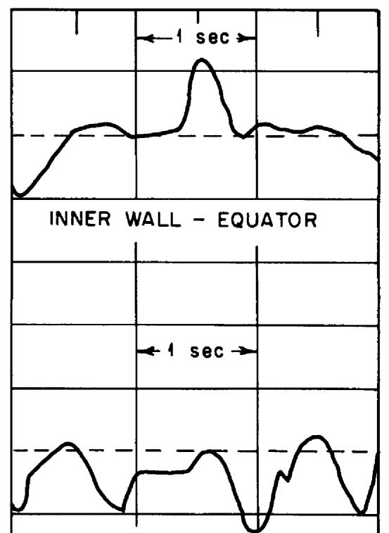

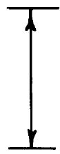

$$
\frac {\Delta t _ {s}}{t _ {m o} - t _ {m i}} = 0. 2 5
$$

$$
R e _ {s} = 1 3 1, 0 0 0
$$

$$
W = \bar {W} (U N I F O R M)
$$

$$
\begin{array}{c} \text {V A N E D E N T R A N C E} \end{array}
$$

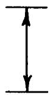

$$
\frac {\Delta t _ {s}}{t _ {m o} - t _ {m i}} = 0. 1 8
$$

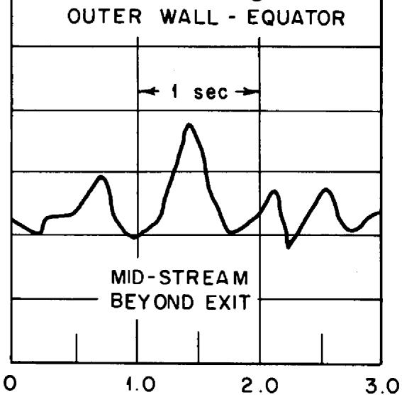

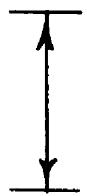  
Fig. 24. Typical Transient Surface and Fluid Temperature for the Vaned-Flow Case

$$
\frac {\Delta t _ {s}}{t _ {m o} - t _ {m i}} = 0. 2 0
$$

TIME,sec.

hemisphere, some large amplitude, low-frequency fluctuations were note in the vaned-flow case. Maximum wall and fluid temperature fluctuations,

averaged with respect to peripheral position, are shown in Figure 25 as a function of axial position; frequency response corrections were not made.

The outer wall temperature fluctuations in the northern hemisphere were significantly lower for the vaned-flow condition than in the previous case. However, wall and fluid temperature fluctuations in the southern hemisphere were somewhat larger for the vaned-flow case. These increases in fluctuation magnitudes appear to correspond to similar increases in the mean radial temperature differences for the vaned-flow case.

The four heavy platinum thermocouple probes located just beyond the core exit were used to obtain local fluid temperature fluctuations as well as a mean radial fluid temperature distribution in that region. The transient temperature distribution within a platinum probe was calculated for the case of a sudden step function increase in the temperature of the electrolyte flowing past the probe. A similar calculation was made for the probe on the basis that it was made of Inconel rather than platinum11. It was shown that shortly after the step function had been applied to the two systems (about 0.03 seconds), the fluid-metal interface temperatures of both probes increased almost by the same amount. The centerline temperature of

11. A comparison of these two cases allows one to describe the probable transient temperature behavior in the Inconel heat exchanger walls under high frequency cycling. Note that the radial wall thickness of the Inconel tubes (25 mils) and the platinum probes (35 mils) were nearly equal.

  
ORNL-LR-DWG. 18005

$$
\frac {\Delta \mathrm {t} _ {\mathrm {S}}}{\mathrm {t} _ {\mathrm {m o}} - \mathrm {t} _ {\mathrm {m i}}}
$$

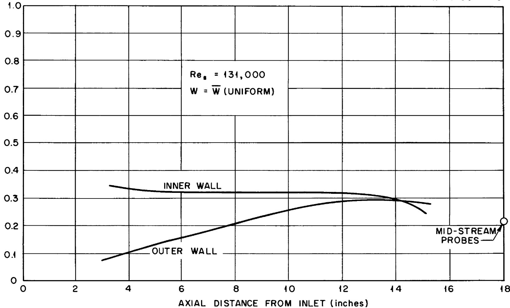  
Fig. 25. Peripherally Averaged Transient Temperature Fluctuations for the Vaned-Flow Co

1

the platinum probe (where the thermocouple was located) had increased by an amount that was 88 per cent of the temperature rise at the probe-fluid interface. However, in the case of the Inconel probe, the centerline temperature increased by an amount that was only 61 per cent of the temperature rise at the probe-fluid interface; for this case, the centerline temperature had only increased by 18 per cent above the original initial temperature level as compared to a 52 per cent increase for the platinum probe. Further, more than one and one-half times as much heat was transferred to the platinum probe. These simple calculations indicated that the temperature fluctuations measured in the center of the platinum probe would be at least as large as those which would exist at the surface of an Inconel tube located at that position under such rapid transient conditions.

A graph of the mean radial fluid temperature distribution just beyond the core outlet in terms of the mixed-mean fluid temperature at core inlet and outlet can be seen in Figure 26. The uncooled core wall temperature profile is not symmetrical about the channel centerline12; its shape is quite similar to the theoretical one shown previously in Figure 2. It is noted in Figure 26 that, upon the comparison of the measured fluid temperature distribution with the mixed-mean fluid temperature at exit, more area between the two curves lies above the mixed-mean temperature than lies below it. This is as expected, because the mixed-mean fluid temperature is averaged with respect to velocity as well as temperature. Hydrodynamic studies have shown that more fluid flows axially through the inner

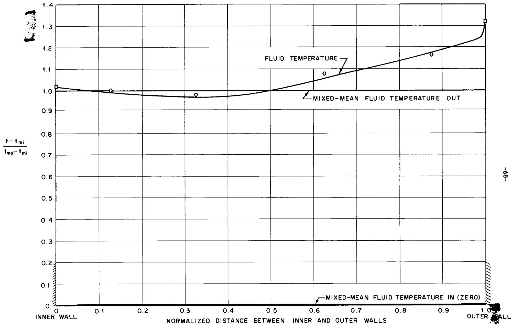  
Fig. 26. A Comparison of the Radial Fluid Temperature Profile with Inlet and Outlet Mixed-Mean Temperature (Vaned-Flow Case)

portion of the channel at exit than flows in the outer portion. It is also pointed out that the radial fluid temperature profile plotted in Figure 26 is based on only four thermocouple determinations; it would have been desirable to have had more data to establish a mean profile.

It was of interest to determine what the peak fuel temperatures would be in the ART core exit. These temperatures were estimated for both the swirl-flow and vaned-flow cases as follows:

a) The experimental radial temperature profiles for uniform volume-heat-source conditions were transformed to profiles corresponding to an averaged nonuniform volume-heat-source distribution (see Figure 1).   
b) The results of the wall cooling analysis described in the section on Mathematical Heat Transfer Analyses were then used to determine the peak fuel temperatures.

Local fuel temperatures so estimated ranged from $100^{\circ}\mathbf{F}$ to $170^{\circ}\mathbf{F}$ higher than mixed-mean fluid temperatures for the swirl-flow and vaned-flow cases, respectively.

The complicated question of how much decay takes place in the fuel temperature peak (for the wall-cooled case as described in Figure 5) as the fuel flows through the short exit passage to the heat exchanger entrance was investigated. This passage was divided into two regions. The first half of the passage was treated as a simple curved-wall channel system, and the second half was considered to be a simple straight channel. The decay of the turbulent thermal boundary layer in the curved channel

system on the convex side (where the high temperature peak exists) was carried out by the usual Von Karman technique with the exception that, in this case, hydrodynamic data (velocity profiles and wall shear stresses) characteristic of curved channel systems were used. The results for the first half of the passage showed that, on the convex side, the boundary layer would take about 80 diameters to become established (because of the great decrease in eddy diffusivity on that side of the channel). As the physical length of that portion of the passage was only 9 diameters, a negligible decay of the peak would occur in that region. Thermal boundary layer decay in the second half of the passage was calculated on the basis of the work of Latzko (reference 16) for straight ducts. The results indicated that it would take about 33 diameters for the thermal boundary layers to become established; the physical length of that portion of the passage was only 9 diameters. On the basis of the functional relationship between boundary layer thickness with axial distance in the passage, this means that at the heat exchanger entrance there would be approximately a 36 per cent decay of the original fuel temperature peak. On the basis of these simplified decay analyses and the previous experimental and analytical studies of the fuel temperature structure within the core itself, it was estimated13 that peak fuel temperatures at the heat exchanger entrance will be about $90^{\circ}\mathrm{F}$ in excess of the mean fluid temperature for the

13. Peak fuel temperatures were calculated at the core exit in the manner outlined in the previous paragraph. However, the actual volume-heat-source distribution near the outer wall was used rather than the averaged profile shown in Figure 1.

swirl-flow case and about $150^{\circ}\mathbf{F}$ in excess of the mean fluid temperature for the vaned-flow case.

3. Swirl-Flow and Vaned-Flow Cases; One Pump

During both the swirl-flow and vaned-flow experiments, a series of runs were made for the simulated case of one-pump operation. In general, it was found that relatively large peripheral and axial asymmetries existed in the uncooled-wall temperature distributions. The wall and fluid temperature fluctuations were also larger than had been found for the corresponding two-pump experiments. Typical uncooled-wall temperature data are shown in Figure 27 for the swirl-flow case. The peripheral locations of individual temperature measurements are not indicated in the figure. Note that now, some points lie below the mixed-mean fluid temperature and other points lie far above.

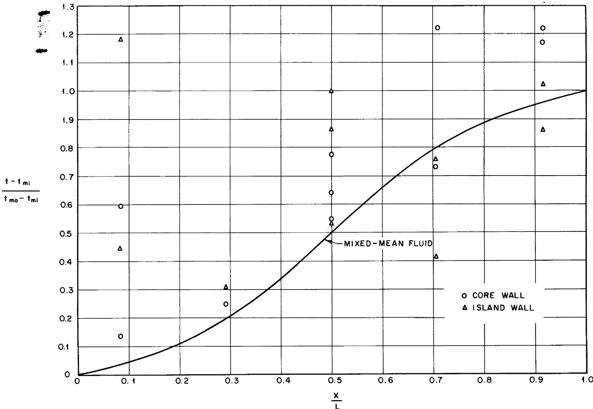  
Fig. 27. Experimental Uncooled-Wall Temperature Measurements for Swirl-Flow Case with One Pump in Operation

# GENERAL COMPARISON OF HYDRODYNAMIC AND THERMAL FIELDS

It is obvious from analytical considerations that there is a direct relationship between the hydrodynamic and thermal fields for a given flow system. The forced contact heat transfer equations contain heat flow functions that are uniquely defined in terms of the fluid velocity components.

Several specific examples of how the steady velocity field influences the steady temperature field have already been mentioned in the past section; it may be of interest, at this point, to examine in more detail one such case. In Figure 18, it was observed that the uncooled outer core wall temperature at the core exit was significantly greater than the one at the inner wall. This feature can be explained by studying the vectorial velocity distributions in the southern hemisphere shown in Figure 28. Note that these velocity profiles, which were determined from experimental axial and tangential velocity measurements (reference 17), are asymmetric in shape. Consider the channel flow to be divided into a narrow inner layer and a wide outer layer, which possesses a somewhat lower velocity. From the previously developed analytical temperature solutions for a simple parallel plates system, it would be expected that the outer uncooled core wall temperature would be greater than the corresponding inner temperature.

A comparison of the transient velocity and temperature fields was also made. A study of the fluctuating velocity structure in the vicinity of the core walls was carried out with motion pictures (reference 18) of dye filaments in a full-scale plastic model of the core. Frequencies of the fluid

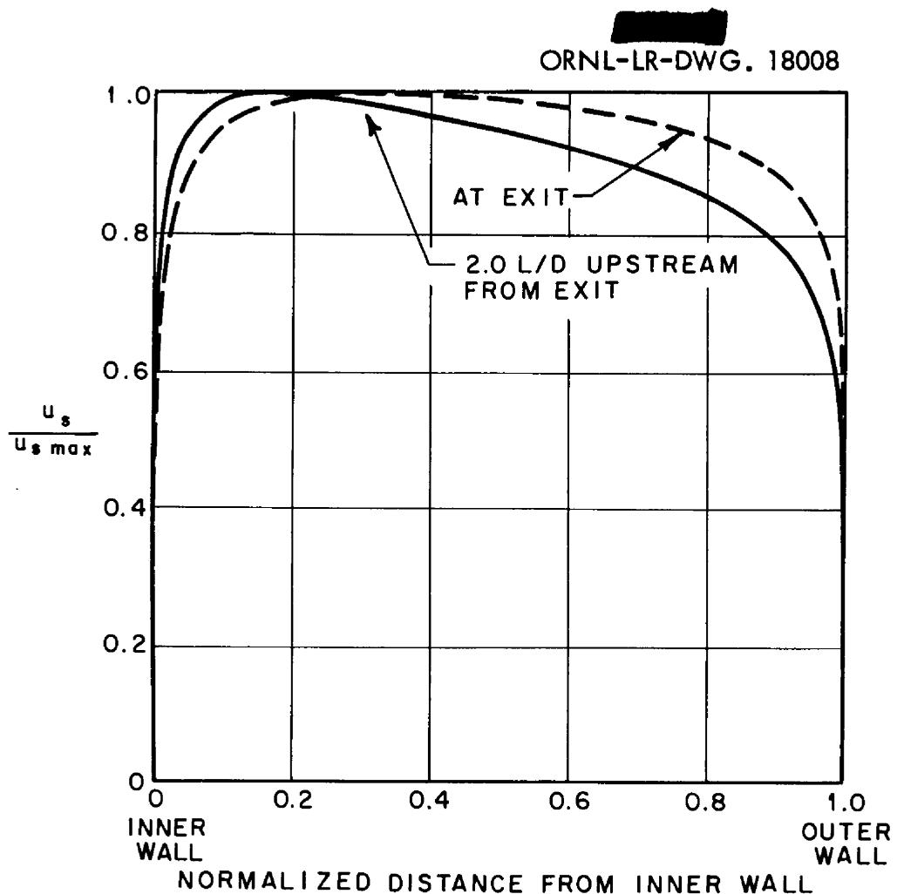  
Fig.28. Vectorial Velocity Profiles in Reactor Core Exit (Swirl-Flow Case)

velocity fluctuations as well as their angular displacements in the

vicinity of the walls were determined by counting the total number of

cycles a fluctuating dye filament underwent in a given unit of time as

well as by observing angular displacements. Figure 29 shows a plot of

the angular dye filament displacements $^{14}$ as a function of time, together

with wall temperature fluctuation measurements obtained in the half-

scale volume-heat-source system; both sets of measurements were determined

for the outer wall in the equatorial region. The velocity data presented

in Figure 29 suggests a mean frequency of perhaps one cycle per second,

whereas, the wall temperatures appear to be varying with a frequency of

about two cycles per second. This agreement is satisfactory because the

fluctuation frequency in the half-scale model should be double that of

the full-scale water model at the same Reynolds number. No attempt was

made to compare the magnitude of the dye filament deflections with the

temperature amplitudes chiefly because the exact locations of the dye

filaments from the core wall were variable and unknown.

TRANSIENT TEMPERATURE MINUS MEAN TEMPERATURE OF CORE WALL  
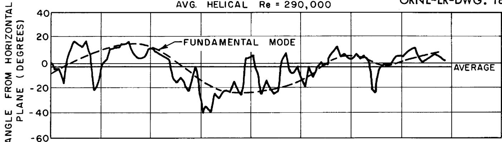  
Pt - Pt + 10% Rh THERMOCOUPLE AT STATION 4   
1.500" ABOVE MIDPLANE OF HALF-SCALE CORE   
AVG.HELICAL Re=256,000

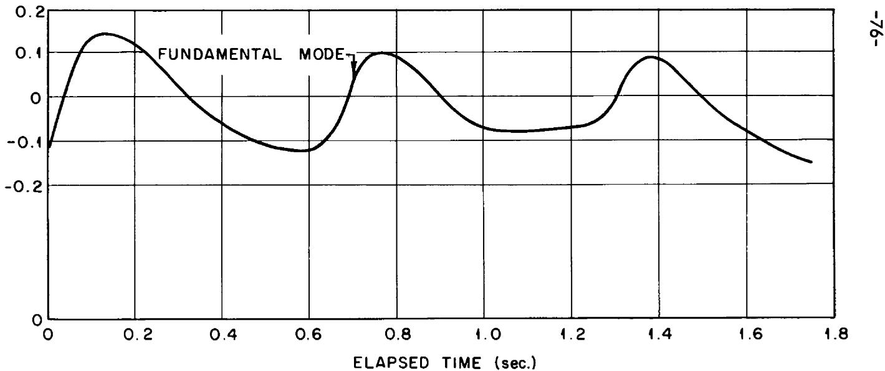  
t-t0 tmo-tml   
Fig. 29. Comparison of Transient Velocity and Temperature Data in the Swirl-Flow Case

# CONCLUSIONS

# 1. ART Core

The following statements about the thermal structure within the ART core can be made on the basis of the results obtained from the heat transfer and fluid flow research presented here:

a) Unless the core shell walls are cooled, maximum wall temperatures ranging from $1750^{\circ}\mathbf{F}$ to $1850^{\circ}\mathbf{F}$ (depending upon the type of entrance flow) will exist near the core exit. About 3 per cent of the heat generated within the core must be extracted to accomplish the cooling task.   
b) Unless the sodium coolant flows through the cooling annuli in a uniform fashion15, hot and cold spots will exist which will influence local shape, strength, and corrosion of the core shells.   
c) Local fuel temperatures at the core exit, under wall cooling conditions, are from $100^{\circ}\mathbf{F}$ to $170^{\circ}\mathbf{F}$ higher than the mixed-mean fuel temperature (depending upon the type of entrance flow). Decay calculations indicate that peak fuel temperatures will not be attenuated markedly as the fuel flows through the short exit passage to the heat exchanger entrance. These nonuniform fuel temperature distributions must be taken into account in estimating heat exchanger wall temperatures.

d) The temperature structure within the core becomes significantly asymmetric with respect to peripheral position when one pump is not in operation.   
e) The core shell interface and fuel temperatures are transient in nature (frequency spectrum ranges from about $1/2$ to 4 cycles per second). Cyclic stress calculations, on the basis of these temperature fluctuations, indicate that stresses as large as $\pm 13,000$ psi will exist in the surface layers of the Inconel core shells if the metal is elastic. The influence of these temperature fluctuations on corrosion and material strength is unknown at present.

It has been demonstrated that some hot spots as well as some high frequency thermal cycling will exist in the ART system. This suggests that a greater research effort is required to determine how seriously these temperature structures influence material strength and corrosion. Some thermal cycling research has already been initiated by the Heat Transfer and Physical Properties Section.

# 2. Reflector-Moderated Reactor Cores in General

During the past several years, the heat transfer and fluid flow research on high-temperature reflector-moderated reactors has brought to light certain fundamental problems which prevent the attainment of optimum thermodynamic efficiencies. These problems are:

a) High fuel temperatures exist at the core walls which must be reduced by substantial wall cooling.   
b) Radial fuel temperature distributions are normally so nonuniform in character that the highest mixed-mean fuel temperatures at the core outlets cannot be realized.   
c) Nonuniform radial fuel temperature distributions generate hot spots and significant temperature fluctuations if the fluid flow is asymmetrical and unstable in character.   
d) Complex moderator-cooling components are required to cool low-temperature moderators.

In order to remedy problems a, b, and c listed above, it is necessary to develop a circulating-fuel reactor core whose fuel temperature distribution is nearly uniform with respect to radius. This can be achieved in two ways: 1) generate a high turbulence level within the fuel by mechanical means and 2) control the fuel velocity distribution so that very little radial heat flow occurs.

# 3. New Core Configurations

One method of generating a high turbulence level within the fuel is to fill a fraction of the core volume with packing such as screens; this configuration would destroy thermal boundary layers. The hydrodynamic studies describing this method will be reported in ORNL-2199. Two problems associated with such a core would be the increase in the effective absorption cross-section of the reactor and the cooling of the packing, particularly under zero fuel flow conditions.

It has recently been shown that the stabilizing effect of a forced vortex within a circular tube permits the generation of axial fluid velocity distributions of many desired forms. A unique tubular fuel element based on this principle has been developed (reference 20) which makes it possible to control the velocity structure so that a nearly uniform radial temperature distribution can be obtained. A reactor core utilizing this fuel element would have the following advantages:

a) A separate core-wall cooling system is not required.   
b) An optimum thermodynamic efficiency can be achieved.   
c) Hot spot and thermal cycling problems would be greatly reduced.   
d) If a high-temperature reflector-moderator is used in the system, the fuel velocity structure can be so controlled at the core walls so that "fuel cooling" of the moderator can be achieved.

# ACKNOWLEDGEMENTS

A number of people played important roles in making the half-scale ART volume-heat-source experiment a success. The authors are indebted to the following people:

J. M. Cornwell and his colleagues were responsible for carrying out the design work for the half-scale model.

R. J. Fox and his associates in the X-10 machine shop constructed the complicated platinum-plastic core model.

E. R. Baxter and other Y-12 craftsmen assembled the volume-heat-source experiment.

G. W. Greene and J. A. Russell, Jr., designed the control and instrumentation circuits of the experiment.

R. T. Guice was responsible for the proper functioning of all the recording equipment.

F. E. Lynch and R. M. Burnett assisted in assembling the complicated thermocouple system and in the reduction of the data.

The authors also wish to thank M. D. Eden, M. B. Arnold, and S. E. Wassom who typed the manuscript and prepared the illustrations.

# APPENDIX 1

# Electrolysis Research

An experiment was conducted to determine separately the effects of voltage, current density, frequency, electrode materials, and temperature on electrolytic gas evolution. The results of this experiment indicated that current density, frequency, and electrode materials were significant. Faraday's law (the proportionality between liberated gas and current) was verified at bare electrode surfaces. Further, for a given amount of gas liberation at an electrode surface, the amount of gas liberated per unit surface area decreases as the total electrode area increases.

During the search for electrode materials, it was found that platinum possessed the unique property of forming a finely divided platinum surface film, which materially reduced electrolytic gas liberation. This is the result of the recombination of oxygen and hydrogen due to the catalytic action of the film. Measurements were made with time of the 60 cycle current required to initiate gas liberation at the surface of a platinum electrode of known area. As a result of the surface film accumulation, the current was observed to increase with time and eventually level off at approximately 12 amps/in². When this value was reached, the surface was considered fully passivised. However, 6 amps/in² was used conservatively as a design criterion.

Since the liberation of gas may be considered an effect of polarization, a study was also made of the influence of power source frequency on gas

generation. For a constant gas generation rate at a passivised platinum electrode surface in a 5 per cent $\mathrm{H}_2\mathrm{SO}_4$ solution, determinations were made of the required surface current density with frequency to initiate gassing. These results are given in Figure 30, where it appears that the surface current density varies directly as the square root of the frequency; namely,

$$
\sigma \sim \sqrt {f} \tag {18}
$$

This expression is the well-known Warburg law, which relates polarization at electrodes to frequency.

This study indicates that if one employs the resistance heating method of volume power generation, the following factors must be considered:

a) Platinum electrodes are superior to other types.   
b) High frequency electric currents make it possible to attain higher power densities without gas liberation at the electrode. However, the frequency must not be so great that the "skin effect" becomes important.   
c) For a given system with a fixed electrical power frequency, the volume heating intensity is proportional to the applied voltage, since the maximum surface current density is established.   
d) Electrode arrangements should be such as to distribute the current over the greatest electrode area.

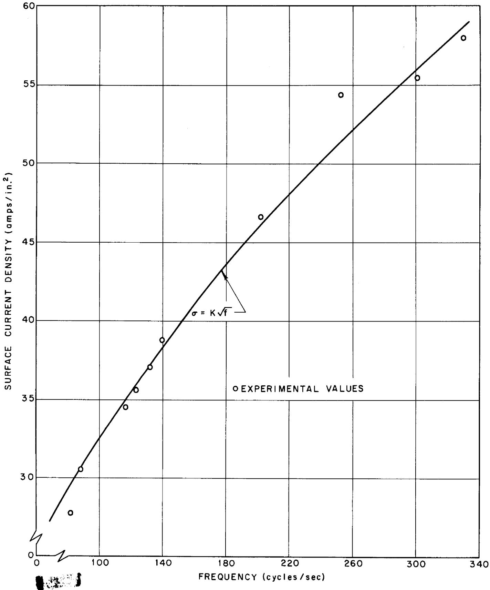  
Fig. 30. Variation of Maximum Surface Current Density with Frequency at a Passivised Platinum Electrode in an $\mathsf{H}_2\mathsf{SO}_4$ Solution.

# APPENDIX 2

Physical Properties of Electrolyte

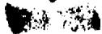

The electrolyte employed in this experiment was a one per cent (by weight) $\mathrm{H}_2\mathrm{SO}_4$ solution. Figures 31, 32, 33, 34, 35, and 36 show respectively the specific heat, thermal conductivity, viscosity, density, electrical conductivity, and Prandtl numbers of the sulphuric acid solution.

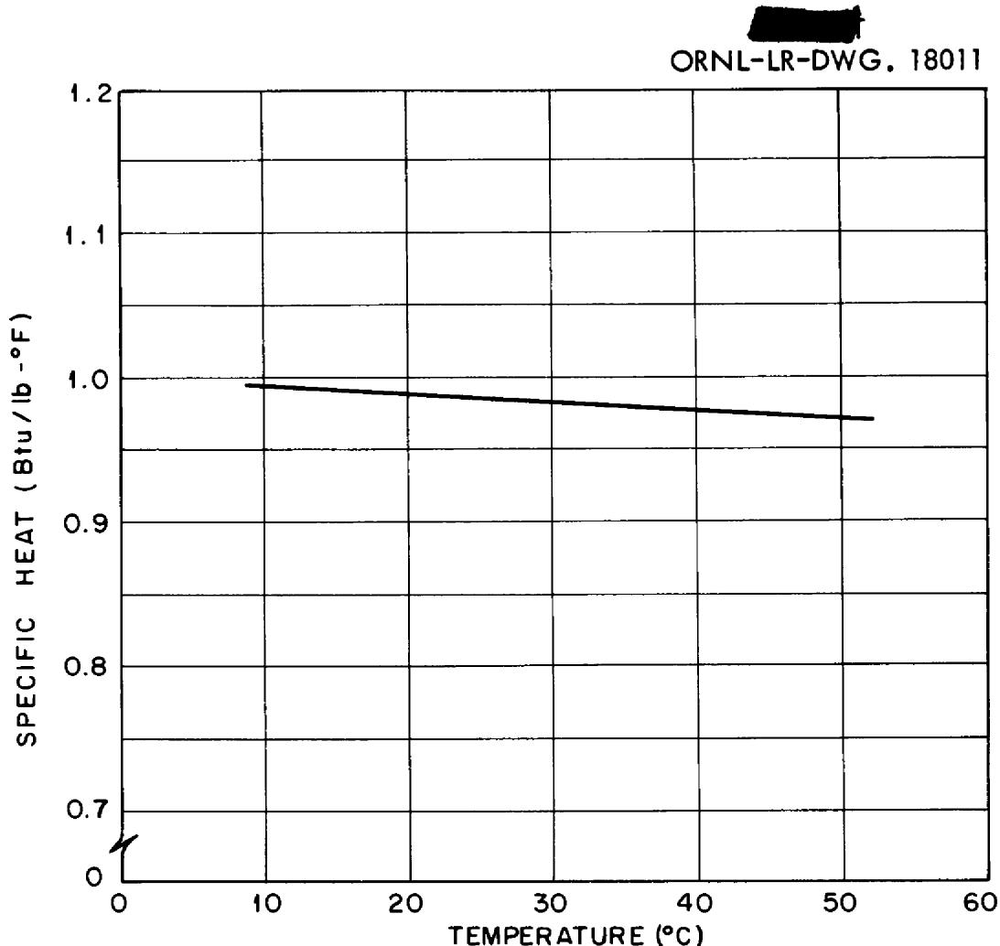  
Fig. 31. Specific Heat of a 4 Per Cent (By Weight) Aqueous $\mathsf{H}_2\mathsf{SO}_4$ Solution (Data from Int. Critical Tables)

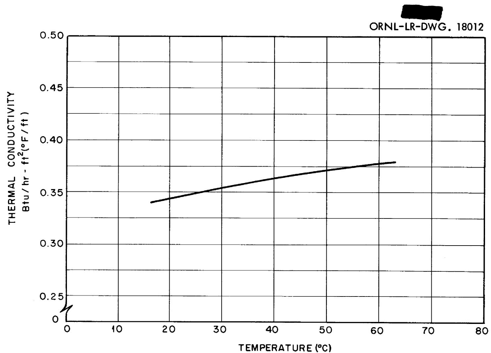  
Fig. 32. Thermal Conductivity of a 1 Per Cent (By Weight) Aqueous $\mathrm{SO}_4$ Solution (Data from Int. Critical Tables)

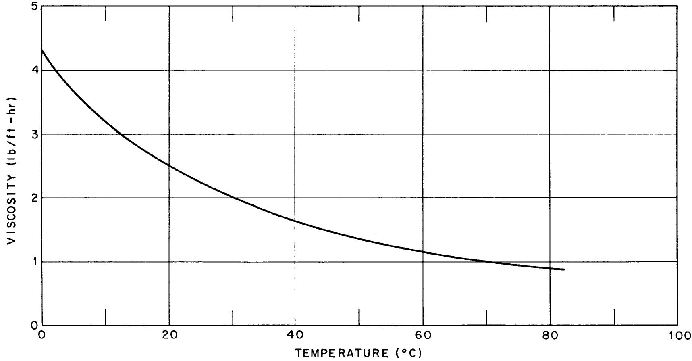  
Fig. 33. Viscosity of a 1 Per Cent (By Weight) Aqueous $\mathsf{H}_2\mathsf{SO}_4$ Solution (Data Taken from International Critical Tables)

ORNL-LR-DWG. 18014

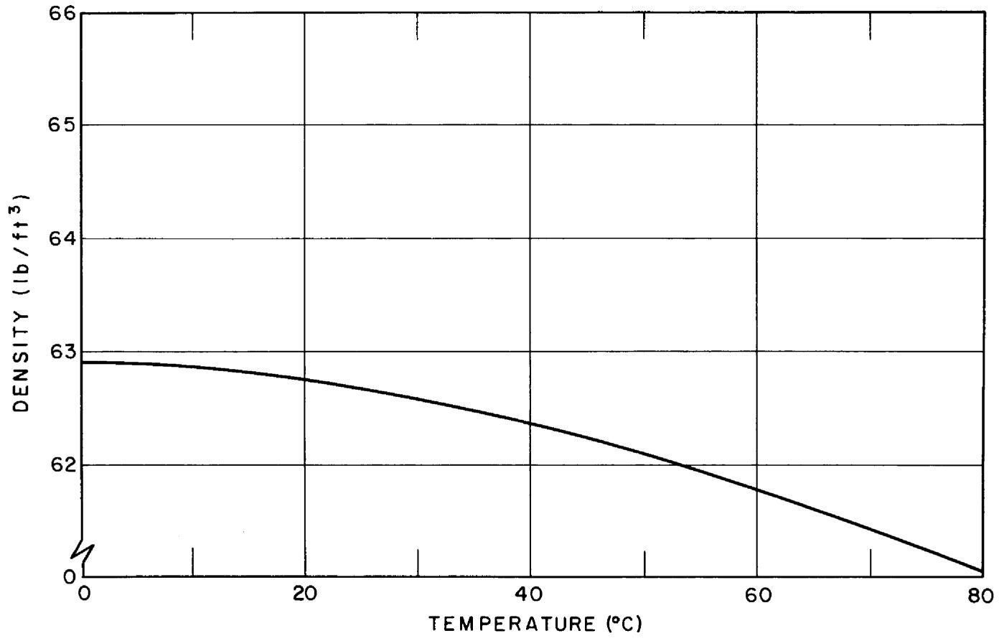  
Fig.34. Density of a 1 Per Cent (By Weight) Aqueous $\mathsf{H}_2\mathsf{SO}_4$ Solution (Data Taken from International Critical Tables)

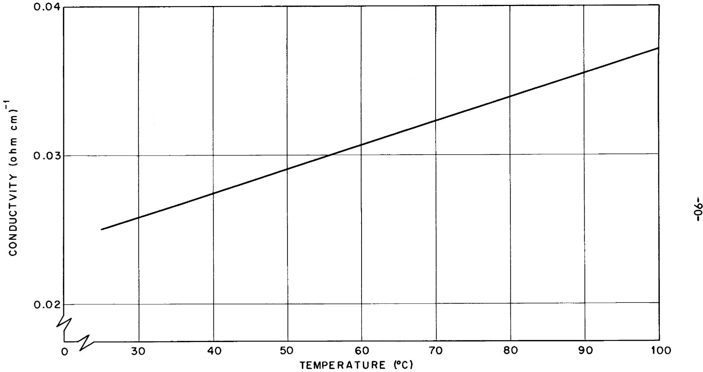  
Fig. 35. Electrical Conductivity of a 1 Per Cent (By Weight) H2SO4 Solution (Data Taken from International Critical Table)

ORNL-LR-DWG. 18016

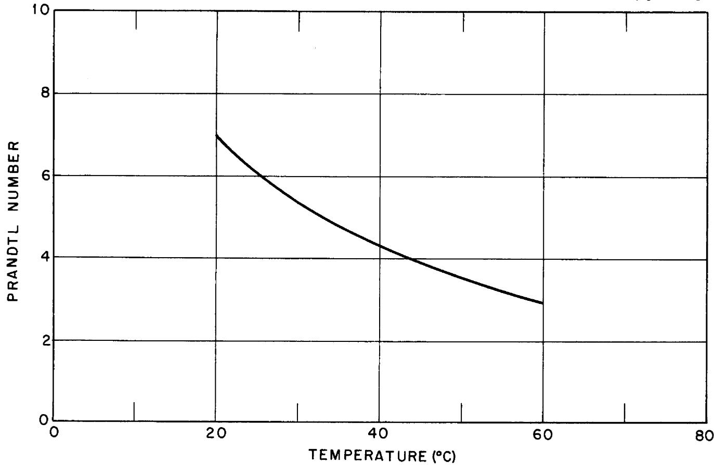  
Fig. 36. Prandtl Number of a 1 Per Cent (By Weight) Aqueous $\mathsf{H}_2\mathsf{SO}_4$ Solution.

# APPENDIX 3

Materials of Construction and Flow System Components

a. Materials of Construction

The materials directly in contact with the $\mathsf{H}_2\mathsf{SO}_4$ solution were Carpenter 20 alloy, platinum, Micarta plastic, Boltaron plastic, Araldite resin, Plexiglas, Pyrex, Teflon, and Neoprene. The pumps, heat exchanger, and flow regulator valves were also constructed of Carpenter 20 alloy. The core model (see Figure 8 for cross section) was made primarily of close-grain Micarta and platinum.

b. The Half-Scale Core Model

The exact half-scale model of the proposed ART core was constructed of laminated Micarta sheets in which were imbedded platinum rings of the desired shape. Bus bars contacting the electrodes conducted the current radially outward. The thermocouples, which were in contact with the electrolyte between the electrodes, were composed of platinum-platinum + 10% rhodium.

c. System Components

Two 20-h.p. Carpenter 20 single-stage centrifugal pumps withdrew the electrolyte from a glass-lined, 300-gallon reservoir. Carpenter 20 alloy globe valves regulated the electrolyte flow rates to a maximum of 200 gal/min at a 200-foot head. A thin plate VDI-type 2-inch diameter orifice in conjunction with a 50-inch manometer was used to measure electrolyte flow rates. The high resistance external electrical circuit was insured

by means of Boltaron plastic piping in the flow system ducting electrolyte to and from the core.

The Carpenter 20 alloy heat exchanger was of the cross-counter flow type having 50 one-half-inch tubes on three-fourth-inch centers in a triangular array. The outer diameter was 12 inches, with a total length of 12 feet, including the headers.

The electrolyte temperature level was maintained by means of a 2-inch pneumatic valve, which controlled the flow rate of cooling water through the heat exchanger in conjunction with an automatic regulator.

# APPENDIX 4

# Calibrations

Calibration curves for the Hathaway galvanometer and Brush recorders systems appear in Figures 37 and 38. The flow metering orifice coefficient versus the manometer deflection appears in Figure 39. The variation of the mean axial Reynolds number within the core is plotted with the manometer deflection in Figure 40.

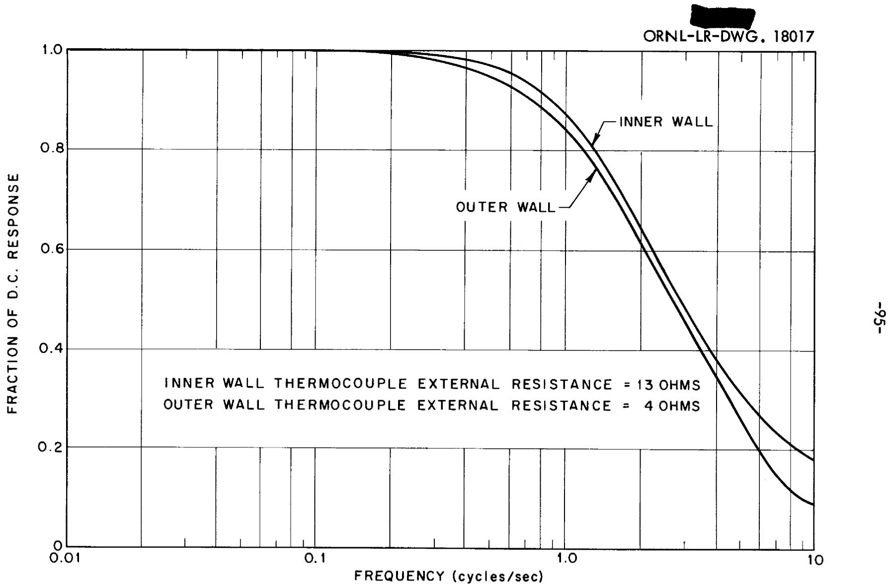  
Fig. 37. Frequency Response of Galvanometer 4036-2

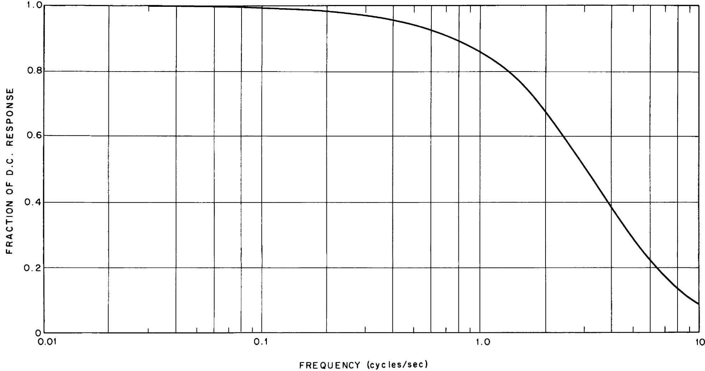  
ORNL-LR-DWG. 18018   
Fig. 38. Frequency Response of Brush Recorder - L & N Preamplifier System.

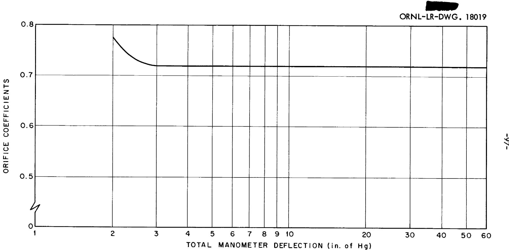  
Fig. 39. Volume-Heat-Source Experiment Orifice Calibration (2 in. Dia. Orifice in a 3 in. Pipe)

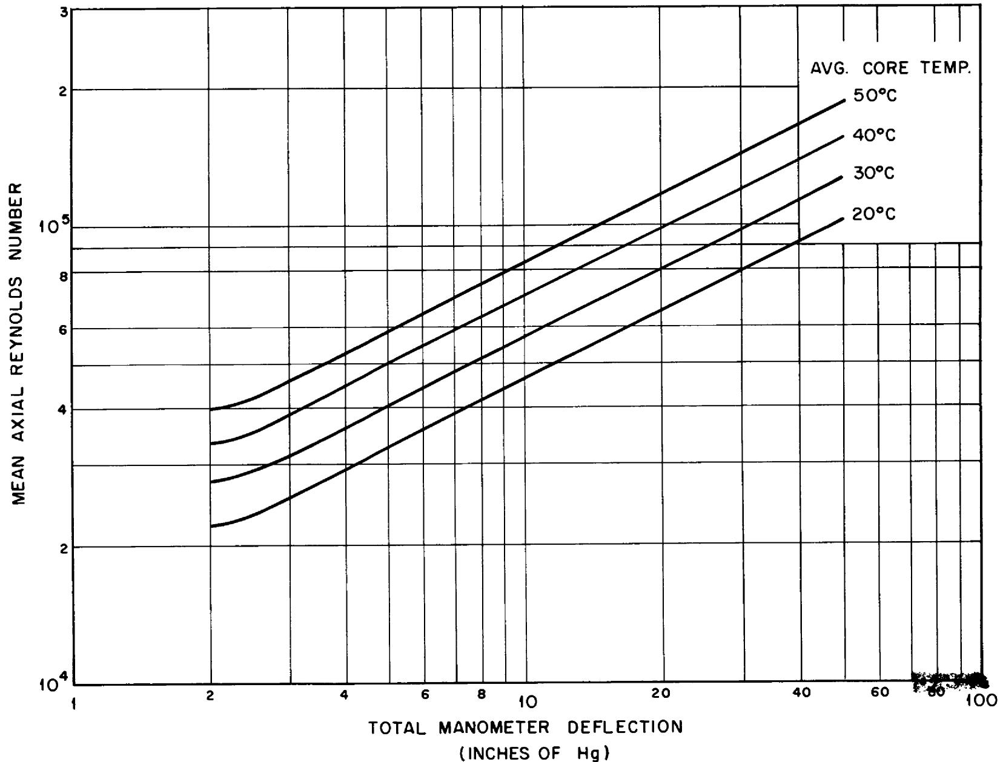  
Fig. 40. Axial Reynolds Number Based on Mean Core Perimeter

# REFERENCES

1. Fraas, A. P., ANP Quarterly Progress Report, June 1954, ORNL-1729, p. 28.   
2. Poppendiek, H. F. and Palmer, L. D., "Forced Convection Heat Transfer Between Parallel Plates and in Annuli with Volume Heat Sources Within the Fluids," ORNL-1701, May 1954.   
3. Poppendiek, H. F. and Palmer, L. D., ANP Quarterly Progress Report, September 1954, ORNL-1771, p. 131 and, Bradfute, J. O. et al, ANP Quarterly Progress Report, December 1954, ORNL-1816, p. 114.   
4. Nikuradse, Johann, "Untersuchungen Uber Die Stromungen Des Wassers In Konvergenten Und Divergenten Kanalen," Forschungsarbeiten, V. D. I., Volume 289, pp. 1-49, 1929.   
5. Poppendiek, H. F. and Palmer, L. D., ANP Quarterly Progress Report, September 1954, ORNL-1771, p. 131.   
6. Wattendorf, F. L., "A Study of the Effect of Curvature on Fully Developed Turbulent Flow," Proc. Roy. Soc., Vol. 148, 1935, pp. 565-598.   
7. Poppendiek, H. F. and Muller, G. L., ANP Quarterly Progress Report, December 1955, ORNL-2012, Parts 1-3, p. 177.   
8. Bradfute, J. O., "Qualitative Velocity Information Regarding the ART Core," CF 54-12-110.   
9. Muller, G. L. and Bradfute, J. O., "Qualitative Velocity Profiles with Rotation in 18-Inch ART Core," CF 55-3-15.   
10. Bradfute, J. O., Lynch, F. E., and Muller, G. L., "Fluid Velocity Measured in the 18-Inch ART Core by a Particle-Photographic Technique," CF 55-6-137.   
11. Poppendiek, H. F. and Palmer, L. D., "Application of Temperature Solutions for Forced Convection Systems with Volume Heat Sources to General Convection Problems," ORNL-1933, September 1955.   
12. Poppendiek, H. F. and Palmer, L. D., ANP Quarterly Progress Report, March 1956, ORNL-2061, Parts 1-3, p. 176.

13. Greene, N. D. et al, ANP Quarterly Progress Report, June 1956, ORNL-2106, Parts 1-5, p. 222.   
14. Greene, N. D. et al, ANP Quarterly Progress Report, September 1956, ORNL-2157, Parts 1-5, p. 227.   
15. Churchill, R. V., "Modern Operational Mathematics in Engineering," First Edition, McGraw-Hill Book Co., New York, 1944, p. 125.   
16. Latzko, H., "Der Warmeubergang an einen Turbulenten Flussigkeits oder Gasstrom," Zeit. für Ang. Math. und Mech., Vol. 1, No. 4, Aug. 1921.   
17. Furgerson, W. T., Stelzman, W. J., Whitman, G. D., personal communication of unpublished velocity data.   
18. Stelzman, W. J. and Whitman, G. D., personal communication of photographic records.   
19. Copenhaver, C. M. and Lynch, F. E., "ART Reflector Sodium Annulus Study," CF 56-7-155.   
20. Poppendiek, H. F., Greene, N. D., and Palmer, L. D., ANP Quarterly Progress Report, December 1956, ORNL-2221, Chapter 4.1, "Heat Transfer and Physical Properties: Heat Transfer in Reflector-Moderated Reactor Cores."   
21. Perry, A. M., "Core Power and Temperature Distribution," ART Design Memo No. 8-B-1, Add. 2, Feb. 17, 1956.