# AEC RESEARCH AND DEVELOPMENT REPORT

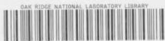

3445600229893

INCONEL AS A STRUCTURAL MATERIAL FOR A

HIGH-TEMPERATURE FUSED.SALT REACTOR

J.R.Weir, Jr.   
D. A. Douglas   
W.D.Manly

DECLASSIFIED

CLASSIFICATION CHANGED TO:

${AE} = C$ 又 $\because {AC} = 3$

BY:

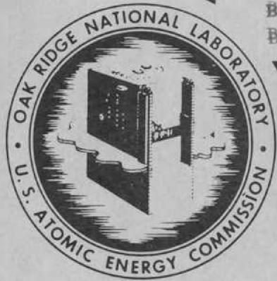

CENTRAL RESEARCH LIBRARY

DOCUMENT COLLECTION

LIBRARY LOAN COPY

DO NOT TRANSFER TO ANOTHER PERSON

If you wish someone else to see this document, send in name with document and the library will arrange a loan.

OAK RIDGE NATIONAL LABORATORY

OPERATED BY

UNION CARBIDE NUCLEAR COMPANY

A Division of Union Carbide and Carbon Corporation

UCC

POST OFFICE BOX X · OAK RIDGE, TENNESSEE

RESTRICTED DATA

SECRET

ORNL-2264

This document consists of 78 pages.

Copy of 191 copies. Series A.

Contract No. W-7405-eng-26

METALLURGY DIVISION

INCONEL AS A STRUCTURAL MATERIAL FOR A

HIGH-TEMPERATURE FUSED-SALT REACTOR

J.R.Weir, Jr.   
D. A. Douglas   
W. D. Manly

DATE ISSUED

JUN 41957

OAK RIDGE NATIONAL LABORATORY

Operated by

UNION CARBIDE NUCLEAR COMPANY

A Division of Union Carbide and Carbon Corporati

Post Office Box X

Oak Ridge, Tennessee

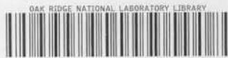

3445600229893

RESTRICTED DATA

This document contains Restricted Data as defined in the Atomic Energy Act of 1954. Its transmission or the disclosure of its contents in any manner to an unauthorized person is prohibited.

SECRET

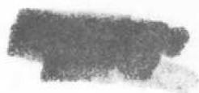

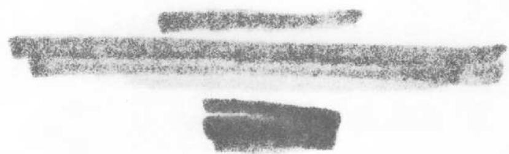

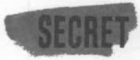

# CONTENTS

# SUMMARY

# INTRODUCTION 1

Corrosion Resistance 1

Fabricability 2

Nuclear Properties 2

Effects Produced by Neutron and Gamma Flux 2

Mechanical Properties of the Alloy in Contact with Various Environments at High Temperatures 2

# MATERIALS AND EQUIPMENT 3

# TESTING EQUIPMENT 3

# RESULTS AND INTERPRETATION 3

Creep-Rupture Tests 3

Effect of a Biaxial Stress System on the Stress-Rupture Properties 43

Effect of Section Thickness on the Creep-Rupture Properties in the Various Media 45

Effect of Welding on the Creep-Rupture Strength 53

Variations in Strength Among Various Heats of Inconel 56

Tensile Properties of Inconel 62

Some Physical Properties of Inconel 63

Design Data 64

# DISCUSSION 67

# CONCLUSIONS AND RECOMMENDATIONS 71

# ACKNOWLEDGMENTS 71

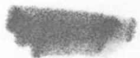

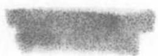

# INCONEL AS A STRUCTURAL MATERIAL FOR A HIGH-TEMPERATURE FUSED-SALT REACTOR

J.R.Weir, Jr.

D. A. Douglas

W. D. Manly

# SUMMARY

A prototype aircraft reactor test unit is being constructed in which fused fluoride salt No. 30 $(\mathrm{NaF - ZrF_4 - UF_4}, 50 - 46 - 4$ mole $\%$ ) is used as the fuel and as the primary-circuit heat transfer fluid, with sodium and NaK used as the secondary-circuit heat transfer media. Inconel was selected as the material to be used for the construction of this reactor, and an extensive testing program was initiated to evaluate its high-temperature mechanical properties.

The elevated-temperature creep-rupture properties were evaluated at 1300, 1500, and $1650^{\circ}\mathrm{F}$ in various reactor environments. The tests were carried out under constant load conditions, since this type of test produces more realistic design data. The data were obtained in the inert gas argon, and the results of creep data obtained in environments of sodium, fused salt No. 30, and air are compared with the argon data as a reference for determining environmental effects.

The fused salt, which is corrosive to Inconel, was found to reduce the creep strength and to decrease the rupture life in comparison with tests conducted in argon. High-purity sodium is inert to Inconel in an isothermal system, and creep results in this medium compare well with data obtained in argon. The results of creep tests in an air environment indicate that thin-sheet Inconel is strengthened by this oxidizing environment. In thicker sections this environment does not appreciably affect the creep rate but does prolong the rupture life at lower stress levels. The results of creep-rupture tests conducted with sheet specimens of various thickness indicate that the deleterious effect of the fused salts on the strength of Inconel becomes more pronounced as the specimen thickness is decreased.

Variations in structure resulting from annealing treatments have an effect on the creep properties. The data indicate that the fine-grained material has superior strength at low temperatures and high stresses and that the coarse-grained material has better strength at high temperatures and low stresses.

Considerable variation in properties may be expected from different heats of Inconel. Apparently these variations in strength result from small differences in chemical composition or fabrication procedures.

Tests in the sodium environment show that the liquid-metal coolants are inert under isothermal conditions if there is no contamination from oxygen. Sodium contaminated with oxygen decarburizes Inconel, thus decreasing the creep properties and rupture life.

Air tests reveal that in large sections the data will correspond very well with the argon data but that thin sections are significantly strengthened by the oxidizing environment.

# INTRODUCTION

The use of a circulating-fuel type of nuclear reactor as an energy source in aircraft propulsion systems imposes upon the structural material metallurgical restrictions which limit the applicability of certain types of alloys. The general factors which must be considered in the selection of an alloy for this application are corrosion resistance, fabricability, nuclear properties, radiation damage, and elevated-temperature strength. In the following discussion the importance of each of these topics will be pointed out and it will be shown that the selection of Inconel as a structural material was based on these criteria.

# Corrosion Resistance

The interaction between the structural material and the circulating fluids is of major importance, since all the reactor components in contact with these fluids must operate without leakage throughout the proposed 1000-hr operating life. In liquid media, corrosion phenomena such as dissimilar-metal transfer and temperature-induced mass transfer, as well as general solution, occur. The mode and rate of attack will depend upon such factors as the temperature, the thermodynamic activity and the solubility of the various metallic phases and elemental constituents of the alloy, and the chemical reactions involving the liquid,

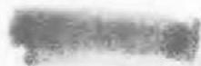

impurities of the liquid, and the elemental constituents of the alloy. The base metal must also be alloyed such that, in the presence of air moving at high velocity, the oxide formed will be protective.

# Fabricability

The alloy or alloys to be used in the construction of reactors of this type must be amenable to welding, brazing, and hot and cold forming.

Welding. - The weldability of an alloy is dependent primarily upon the physical and mechanical properties of the base metal during and after welding. During the welding operation stresses may be induced in the weld zone by volume changes resulting from the thermal coefficient of expansion, the allotropic phase transformations, and the solution and precipitation of gases and minor phases. The stresses may result in failure of the weld if the strength of the weld is low at temperatures near the melting point or if the weld is weakened by porosity, low-melting eutectics, or gross oxidation. Some of the problems associated with welding can be alleviated by carefully selecting the alloying elements to include deoxidizers and solid-solution strengthensers and by controlling the residual elements.

Brazing. - Alloys which are best suited for hydrogen-furnace brazing must have easily reducible oxides, form no stable hydrides, contain no alloying element which will form a brittle intermetallic compound with the brazing alloy, and be metallurgically stable at the brazing temperature, since further heat treatment involving any higher temperature is not possible.

Hot and Cold Forming. - Hot-forming operations such as tube or pipe extrusion and rolling must be performed at temperatures high enough to render the material weak so that prohibitively high-press capacities and roll pressures will not be involved. On the other hand, the temperature at which the material becomes "hot short" must be avoided. These two factors place a lower and upper temperature limitation on the hot-working range of the alloy. For both practicality and quality control, the best alloys are those with a wide temperature range in which hot work is possible. It is also desirable to have the metal ductile and soft at room temperature so that cold rolling and machining operations may be more easily accomplished. Although not a major consideration, the castability of the alloy may be important, since casting is less expensive and less time consuming than

forging and machining operations. The use of casting as a means of forming may be limited by the sometimes poor corrosion resistance and ductility of cast structures.

# Nuclear Properties

In order to attain high neutron efficiency in the core of a reactor, the structural material in this region must have a low neutron cross section, a requirement which limits the use of elements such as cobalt, tungsten, and manganese. The restriction of the use of cobalt is unfortunate since it is one of the most potent agents used to obtain strength at high temperatures.

# Effects Produced by Neutron and Gamma Flux

Although the data in the field are meager, it is known that neutron and gamma flux may affect the creep and tensile properties, the oxidation resistance, and the corrosion resistance of the materials exposed to this flux. The importance of these effects depends, of course, upon the flux density, the temperature, and the particular material involved.

# Mechanical Properties of the Alloy in Contact with Various Environments at High Temperatures

Some of the more important considerations in the selection of an alloy for aircraft reactor application are its strength and ductility at high temperatures in such environments as air, sodium, NaK, and the proposed liquid fuel. The advantages to be gained from the use of high-strength alloys are a decrease in reactor weight, an increased design margin of safety, and a longer life expectancy for critically stressed components.

Commercial high-temperature alloys may be classified into the two broad categories of second-phase-hardened and solid-solution-hardened alloys. At low temperatures the phase-hardened alloys have the advantage of being generally stronger than the solid-solution-hardened alloys, although less ductile. As the temperature is increased, however, they tend to lose their strength because of the instability of the precipitate and therefore lose this advantage.

A survey of the commercial high-temperature alloys, based on the factors discussed above as the criteria for selection, yielded Inconel as the most promising reactor material. It then became the responsibility of the Mechanical Properties Group to obtain the necessary data needed for the

design of a prototype reactor using fused fluoride No. 30 (NaF-ZrF4-UF4, 50-46-4 mole %) as the fuel and as the primary-circuit heat transfer fluid, with sodium and NaK as the secondary-circuit heat transfer media.

This report is a summary of the work of the Mechanical Properties Group in an effort to obtain the necessary mechanical properties data for Inconel in the temperature range 1200 to $1650^{\circ}\mathrm{F}$ .

# MATERIALS AND EQUIPMENT

The reactor design is such that formed sheet and tubular materials are used to a great extent in the construction. Since it follows that any surface reaction which might occur between the liquid-metal coolants and Inconel or between fused fluorides and Inconel would have a greater effect on the strength of a thin sheet than on the strength of a heavier section, it was decided that the testing of thin sheet and tube materials would produce the most useful design data.

The basic design of the sheet and tube specimens used in testing is shown in Fig. 1. The machining methods used to form these specimens are described in ORNL-2053. The ASTM specification for the

chemical composition of Inconel is reproduced in Table 1. Also listed are the chemical compositions of the various materials which have been tested.

# TESTING EQUIPMENT

The equipment used for creep-rupture tests and for tests of the tubular specimens in the various liquid and gaseous environments is described in detail in ORNL-2053.2

# RESULTS AND INTERPRETATION

# Creep-Rupture Tests

For the purpose of obtaining the basic design data a large quantity of 0.060-in.-thick sheet Inconel was obtained. The chemical composition of this heat (designated as heat B) of Inconel is given in Table 1. Specimens from this heat of Inconel were creep-rupture tested at 1300, 1500, and $1650^{\circ}\mathrm{F}$ except for tests in sodium, which did

1D. A. Douglas and W. D. Manly, A Laboratory for the High Temperature Creep Testing of Metals and Alloys in Controlled Environments, ORNL-2053 (Sept. 18, 1956). 2 Ibid., p 9.

Table 1. Chemical Composition (%) of Various Heats of Inconel   

<table><tr><td rowspan="2">Components</td><td rowspan="2">ASTM Specification</td><td colspan="2">0.060-in.-Sheet Specimens</td><td rowspan="2">0.020-in.-Sheet Specimens</td><td rowspan="2">Tube Specimens</td></tr><tr><td>Heat A</td><td>Heat B</td></tr><tr><td>Ni</td><td>72 (min)</td><td>78</td><td>76</td><td>76</td><td>76</td></tr><tr><td>Cr</td><td>14-17</td><td>14.9</td><td>15.4</td><td>14.8</td><td>16.0</td></tr><tr><td>Fe</td><td>6-10</td><td>6.4</td><td>7.4</td><td>8.1</td><td>7.6</td></tr><tr><td>Mn</td><td>1.0 (max)</td><td></td><td>0.31</td><td>0.23</td><td>0.29</td></tr><tr><td>C</td><td>0.15 (max)</td><td>0.04</td><td>0.04</td><td>0.02</td><td>0.04</td></tr><tr><td>Cu</td><td>0.5 (max)</td><td>0.13</td><td>0.09</td><td>0.13</td><td>0.13</td></tr><tr><td>Si</td><td>0.5 (max)</td><td>0.18</td><td>0.21</td><td>0.09</td><td>0.22</td></tr><tr><td>S</td><td>0.01 (max)</td><td>0.007</td><td>0.007</td><td>0.007</td><td>0.007</td></tr><tr><td>AI</td><td></td><td>0.08</td><td>0.19</td><td>0.15</td><td></td></tr><tr><td>Ti</td><td></td><td>0.16</td><td>0.33</td><td>0.20</td><td></td></tr><tr><td>B</td><td></td><td>0.091</td><td>0.094</td><td></td><td></td></tr><tr><td>N2</td><td></td><td>0.091</td><td>0.027</td><td></td><td></td></tr></table>

ALL DIMENSIONS ARE IN INCHES

UNCLASSIFIED ORNL-LR-DWG 17942

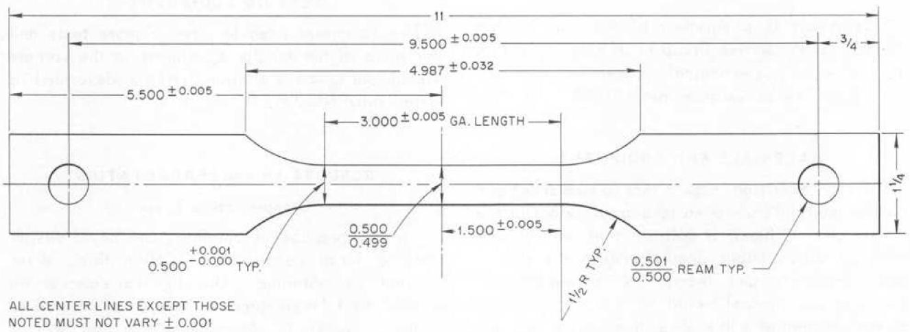  
SHEET TYPE SPECIMEN

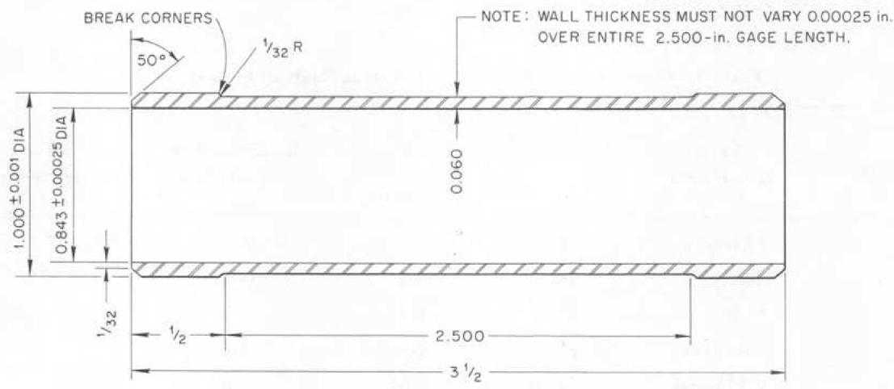  
TUBE BURST SPECIMEN   
Fig. 1. Drawing of Sheet and Tubular Types of Specimen.

not exceed $1500^{\circ}\mathrm{F}$ in the environments and conditions listed below:

Specimen Condition

Environment

As-received

Argon

Fused salt No. 30

Sodium

Air

Annealed at $2050^{\circ}\mathrm{F}$ for 2 hr

Argon

Fused salt No. 30

The material designated "as-received" was tested in the condition in which it was received from International Nickel Company, Inc. The INCO sheet fabrication procedure consists of

1. hot working from $18 \times 18$ in. ingot to $20\%$ over finish size,   
2. passing through the $1900^{\circ}F$ hot zone of the annealing furnace in $3\frac{1}{2}$ min,   
3. pickling in an $\mathsf{HNO}_3$ -HF mixture,   
4. $20\%$ cold working to size,   
5. passing through the $1900^{\circ}F$ hot zone of the annealing furnace in $4\frac{1}{2}$ min,

6. pickling in an $\mathsf{HNO}_3$ -HF mixture, 7. roller leveling.

The microstructure resulting from this treatment is shown by the photomicrographs of the as-received material in Figs. 2 and 3. The material in this condition is fine-grained, having an ASTM grain size number of 6 to 7. The fine precipitate seen within the grains at a magnification of 100 dia (Fig. 2) appears at 500 dia (Fig. 3) as precipitate originally present in the grain boundaries before the material was given the mill anneal.

The material designated as "annealed" was annealed at $2050^{\circ}\mathrm{F}$ for 2 hr before it was tested. The microstructure of the annealed material is shown in Fig. 4. This high-temperature anneal results in the solution of the carbide precipitates seen in the as-received material and in grain coarsening to an ASTM grain size number of 1.

Tests in Argon. - The creep-rupture data obtained in an atmosphere of pure argon are used as a basis for comparison in studying the effect of other environments on the creep-rupture properties of Inconel. The argon atmosphere is considered to have no effect on the properties of a metal at high temperature, since no interaction between the

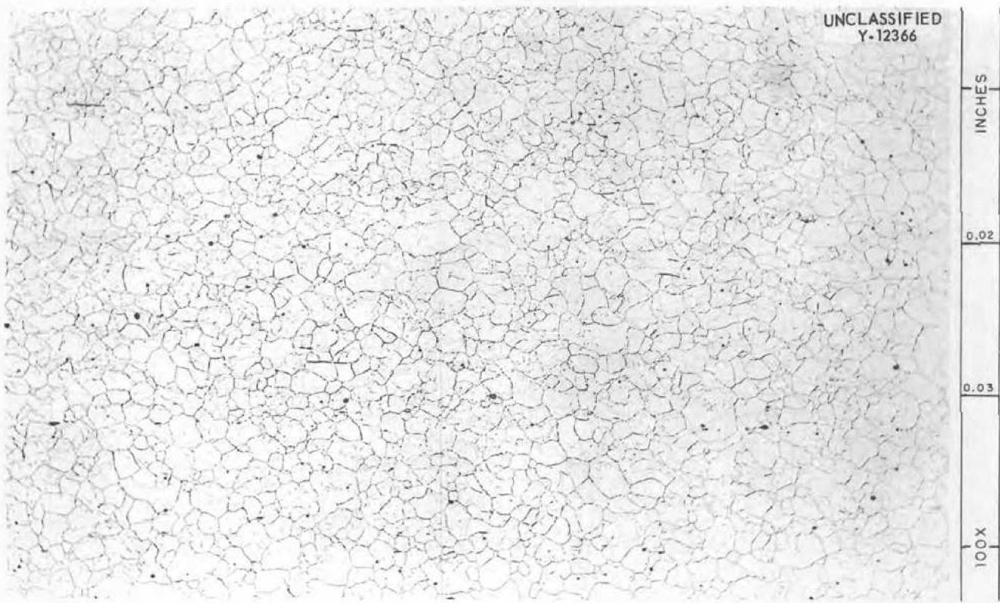  
Fig. 2. Photomicrograph of As-Received Inconel. 100X. Electrolytically etched with $10\%$ oxalic acid.

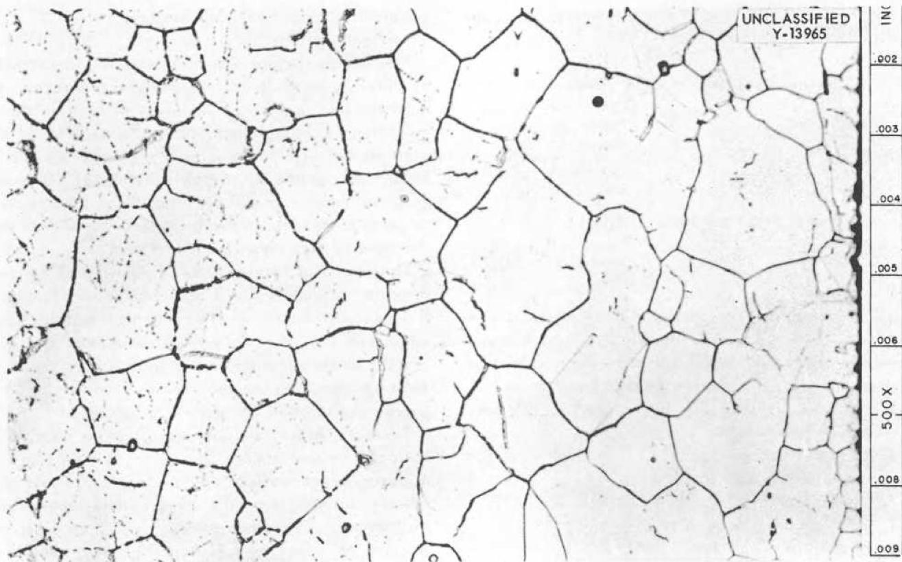

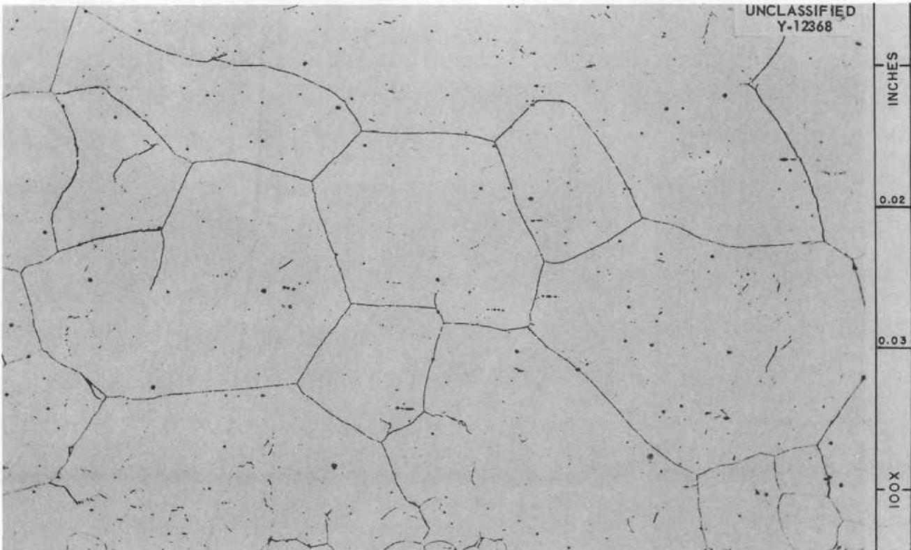  
Fig. 3. Photomicrograph of As-Received Inconel. 500X. Electrolytically etched with $10\%$ oxalic acid.   
Fig. 4. Photomicrograph of Annealed Inconel. 100X. Electrolytically etched with $10\%$ oxalic acid.

metal and argon is possible. However, if the gas contains a high level of impurities such as $O_{2}$ , $C O_{2}$ , $H_{2}O$ , or $N_{2}$ , the properties of the metal may be altered as a result of interaction with these impurities. The argon used as an environment in the creep-rupture testing of Inconel was purified by being scrubbed with liquid sodium. This procedure for gas purification is described in detail in ORNL-2053.

The results of creep-rupture testing of Inconel (heat B) in the as-received and annealed conditions tested in argon at 1300, 1500, and $1650^{\circ}\mathrm{F}$ are presented as graphs of stress vs time to 0.5, 1, 2, 5, $10\%$ elongation and rupture in Figs. 5 through 10. At the stress levels for which these design curves are drawn, the as-received material is seen to have better creep properties than the annealed material at all three temperatures in that at approximately the same stress level the time to the various elongations is greater. The stiffness exhibited by the as-received material may be attributed to residual cold work and to the precipitate which

exists in the microstructure, neither of which is present in the annealed material.

The stress-rupture properties of the as-received and annealed materials tested at 1300, 1500, and $1650^{\circ}\mathrm{F}$ in argon are compared in Fig. 11. The asreceived material is seen to have better rupture properties at 1300 and $1500^{\circ}\mathrm{F}$ , whereas the annealed material exhibits better rupture properties at $1650^{\circ}\mathrm{F}$ . Selected representative microstructures of material taken from stressed and unstressed portions of as-received and annealed specimens tested at 1300, 1500, and $1650^{\circ}\mathrm{F}$ are presented in Figs. 12 through 29.

The photomicrographs of specimens tested at $1300^{\circ}\mathrm{F}$ (Figs. 12-17) indicate that transgranular slip is the principal mode of deformation at this temperature for both the as-received and the annealed material. A tendency for precipitation to occur in primary slip planes and in previous grain-boundary areas left segregated by the short high-temperature annealing treatment is seen in the case of the annealed material.

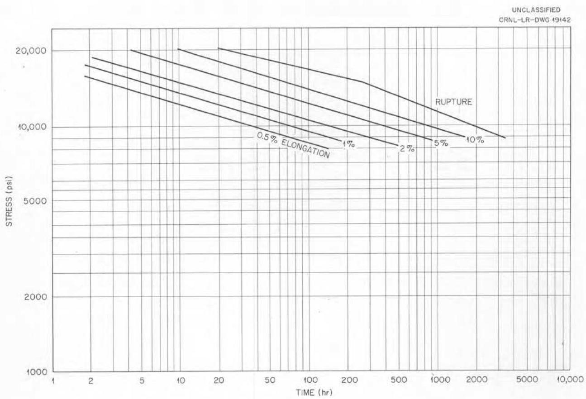  
Fig. 5. Design Curve for As-Received Inconel Tested in Argon at $1300^{\circ}$ F.

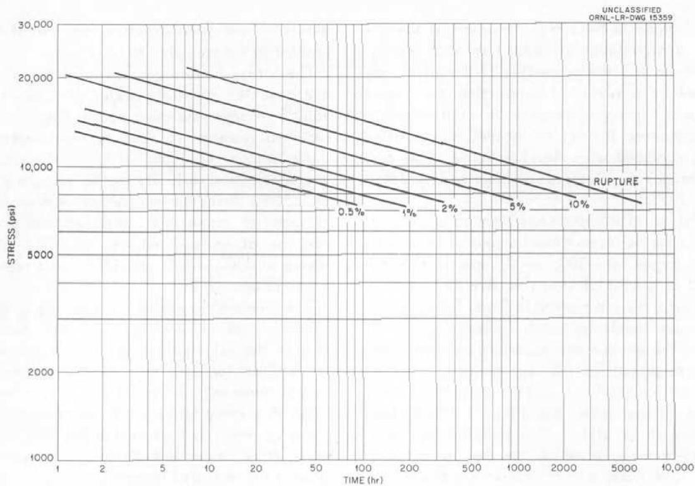  
Fig. 6. Design Curve for Annealed Inconel Tested in Argon at $1300^{\circ}$ F.

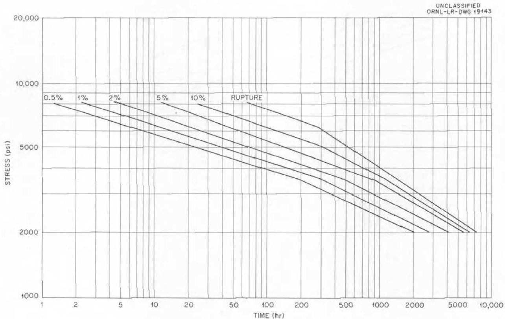  
Fig. 7. Design Curve for As-Received Inconel Tested in Argon at $1500^{\circ}$ F.

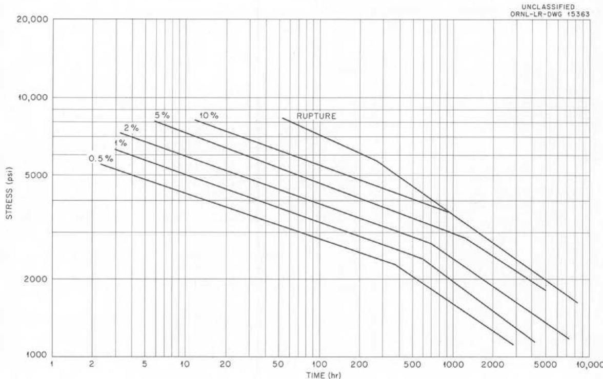

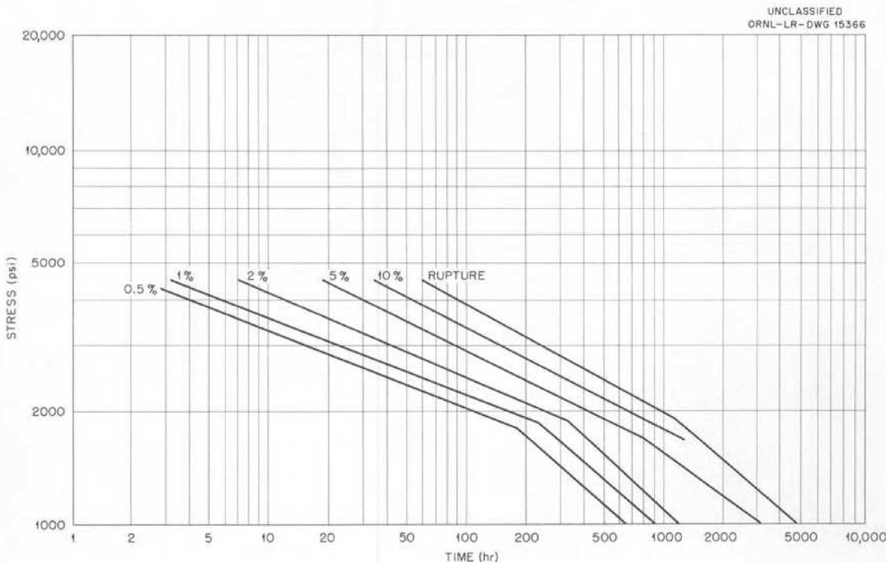  
Fig. 8. Design Curve for Annealed Inconel Tested in Argon at $1500^{\circ}$ F.   
Fig. 9. Design Curve for As-Received Inconel Tested in Argon at $1650^{\circ}\mathrm{F}$ .

Photomicrographs taken from as-received and annealed specimens tested at 1500 and $1650^{\circ}\mathrm{F}$ show (Figs. 19, 20, 22) that considerable grain-boundary cracking occurs during test, indicating that at these temperatures the mode of deformation

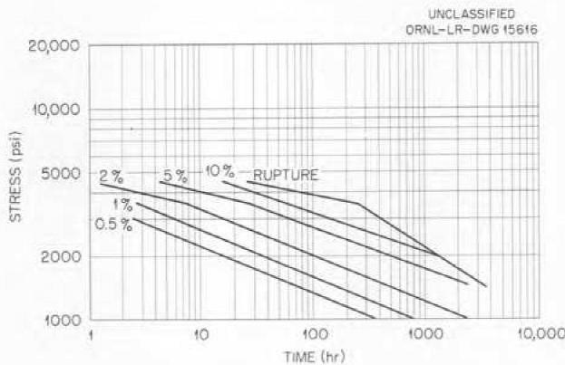  
Fig. 10. Design Curve for Annealed Inconel Tested in Argon at $1650^{\circ}\mathrm{F}$ .

is intergranular, that is, by grain-boundary sliding rather than by transgranular slip. However, in tests of the as-received and annealed material at $1500^{\circ}\mathrm{F}$ under stresses which produce rupture in less than approximately 200 hr, the strain rate is rapid enough for some transgranular slip to occur, as is illustrated in Figs. 18 and 21. The photomicrograph in Fig. 27 shows that the annealed material behaves at $1650^{\circ}\mathrm{F}$ in a manner similar to that at $1500^{\circ}\mathrm{F}$ , in that at stresses which produce rupture in less than approximately 80 hr some transgranular slip is seen to occur.

At $1500^{\circ}\mathrm{F}$ a rather slight tendency for carbides to precipitate from the annealed matrix exists. This phenomenon is not always reproducible and usually takes place in tests in excess of 1000-hr duration. The microstructures of two specimens tested at $1500^{\circ}\mathrm{F}$ under a stress of 3500 psi are compared in Figs. 30 and 31. The specimen in which the precipitation occurred ruptured in 3300 hr (Fig. 31), whereas the specimen in which no precipitate occurred ruptured in 1200 hr (Fig. 30).

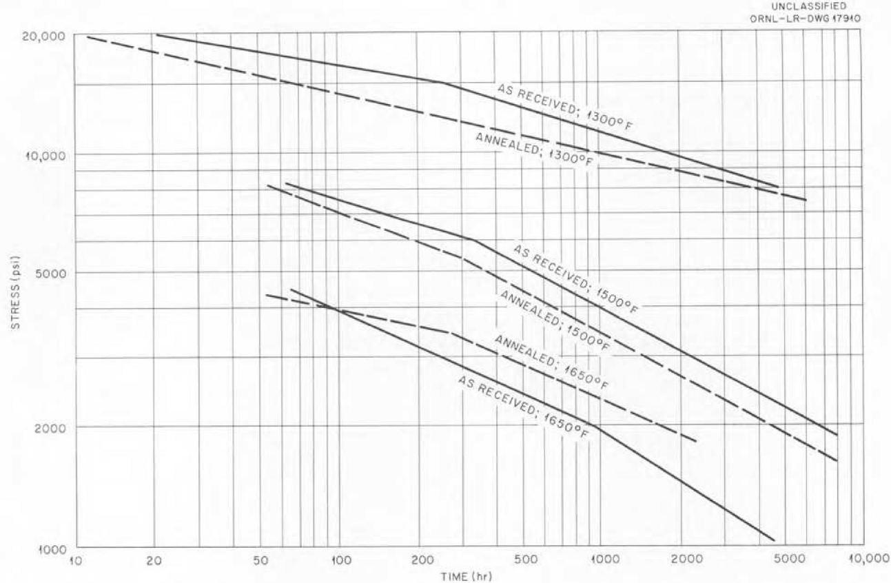  
Fig. 11. Comparison of the Stress-Rupture Properties of As-Received and Annealed Inconel Tested in Argon at 1300, 1500, and $1650^{\circ}\mathrm{F}$ .

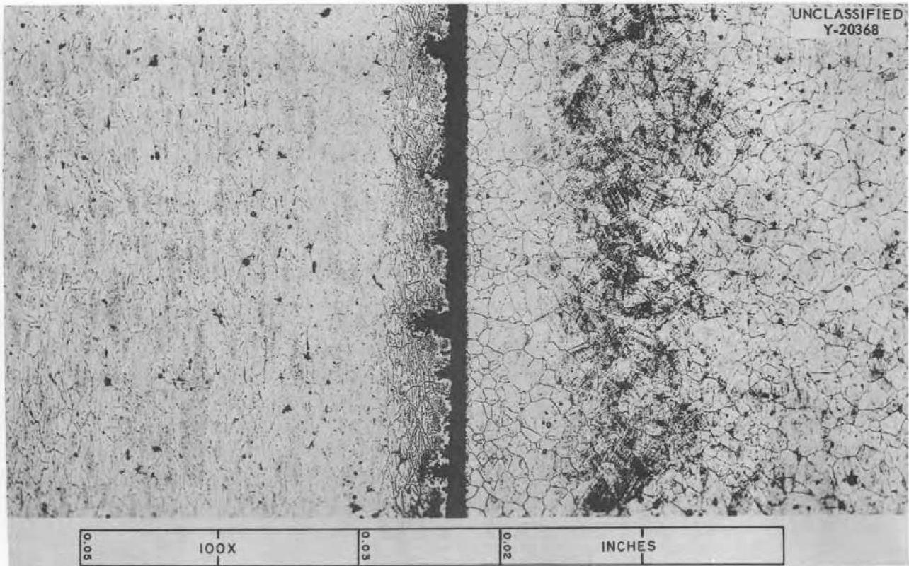

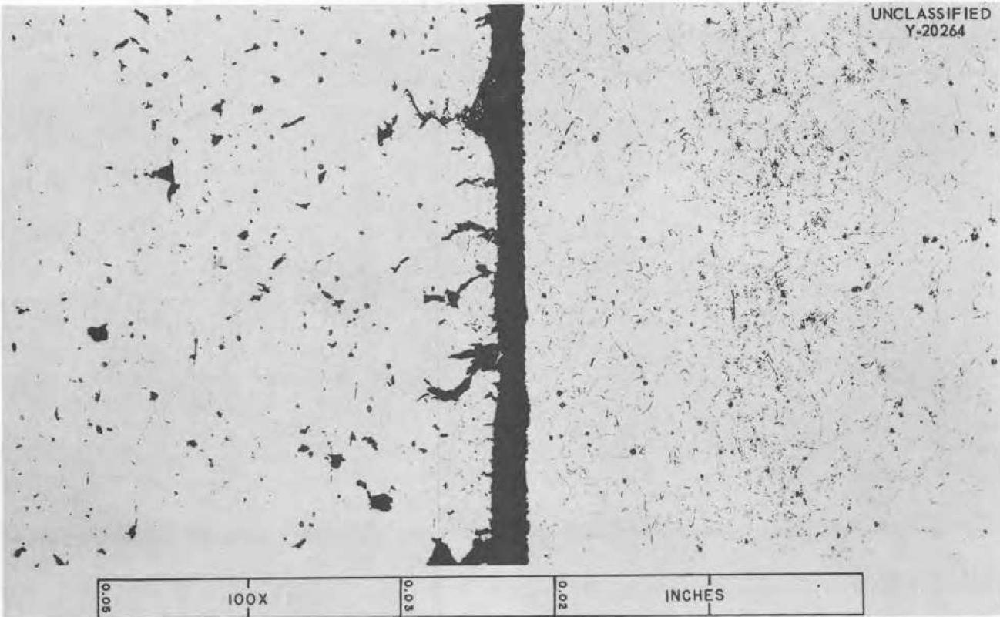  
Fig. 12. Photomicrograph of As-Received Inconel Tested at $1300^{\circ}\mathrm{F}$ Under 15,000 psi Stress in Argon. The surface of the stressed specimen is shown on the left. 100X. Electrolytically etched with $10\%$ oxalic acid.   
Fig. 13. Photomicrograph of As-Received Inconel Tested at $1300^{\circ}\mathrm{F}$ Under 12,000-psi Stress in Argon. The surface of the stressed specimen is shown on the left. 100X. Electrolytically etched with $10\%$ oxalic acid.

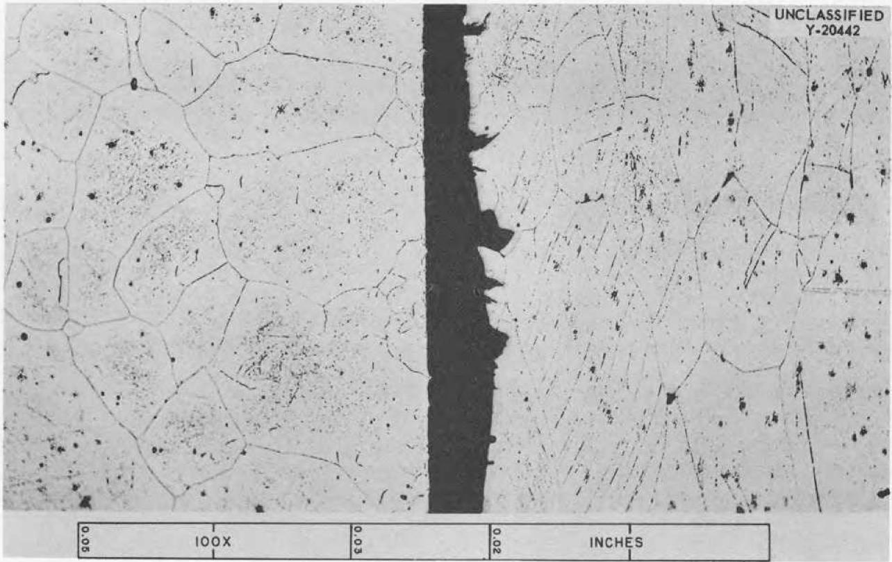

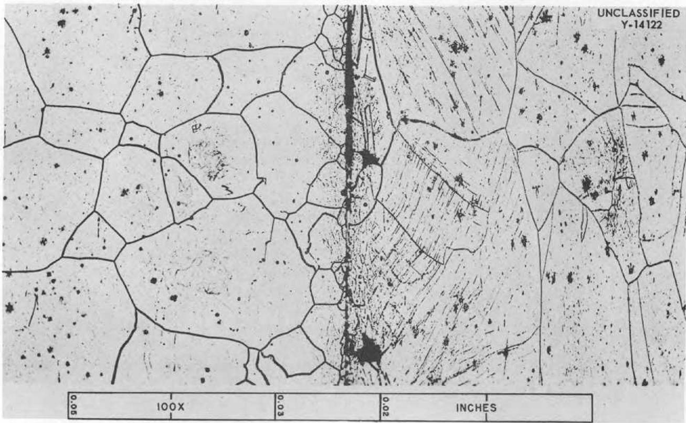  
Fig. 14. Photomicrograph of As-Received Inconel Tested at $1300^{\circ}$ F Under 11,000-psi Stress in Argon. The surface of the stressed specimen is shown on the right. 100X. Electrolytically etched with $10\%$ oxalic acid.   
Fig. 15. Photomicrograph of Annealed Inconel Tested at $1300^{\circ}\mathrm{F}$ Under 11,500-psi Stress in Argon. The surface of the stressed specimen is shown on the right. 100X. Electrolytically etched with $10\%$ oxalic acid.

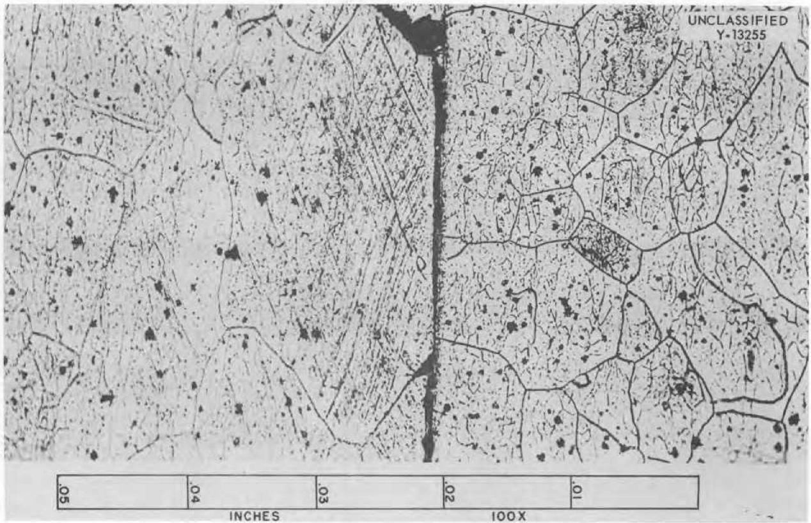  
Fig. 16. Photomicrograph of Annealed Inconel Tested at $1300^{\circ}\mathrm{F}$ Under 10,000-psi Stress in Argon. The surface of the stressed specimen is shown on the left. 100X. Electrolytically etched with $10\%$ oxalic acid.

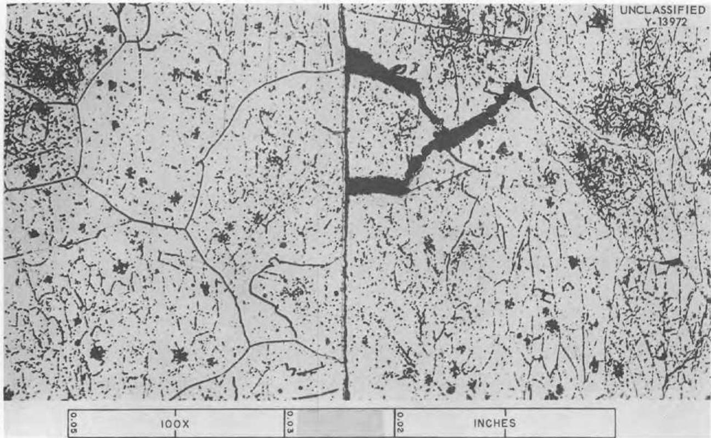  
Fig. 17. Photomicrograph of Annealed Inconel Tested at $1300^{\circ}$ F Under 8000-psi Stress in Argon. The surface of the stressed specimen is shown on the right. 100X. Electrolytically etched with $10\%$ oxalic acid.

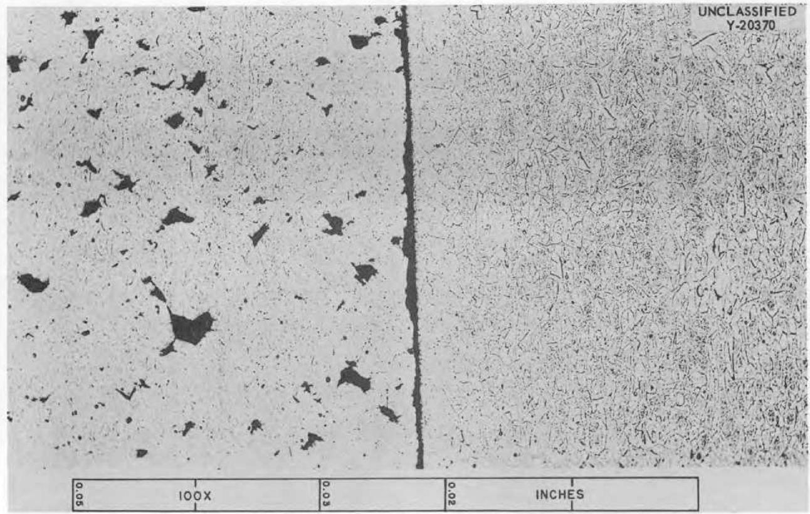

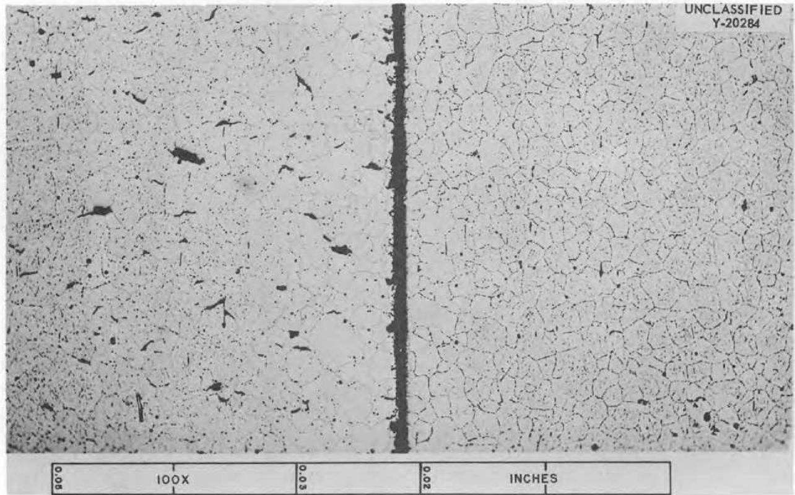  
Fig. 18. Photomicrograph of As-Received Inconel Tested at $1500^{\circ}\mathrm{F}$ Under 6500 psi Stress in Argon. The surface of the stressed specimen is shown on the left. 100X. Electrolytically etched with $10\%$ oxalic acid.   
Fig. 19. Photomicrograph of As-Received Inconel Tested at $1500^{\circ}\mathrm{F}$ Under 3500-psi Stress in Argon. The surface of the stressed specimen is shown on the left. 100X. Electrolytically etched with $10\%$ oxalic acid.

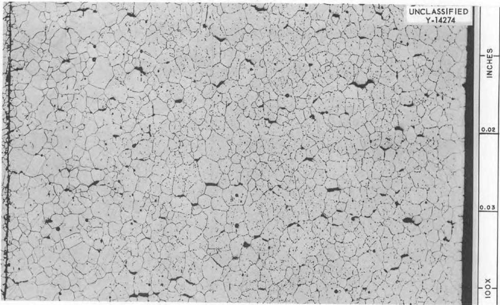

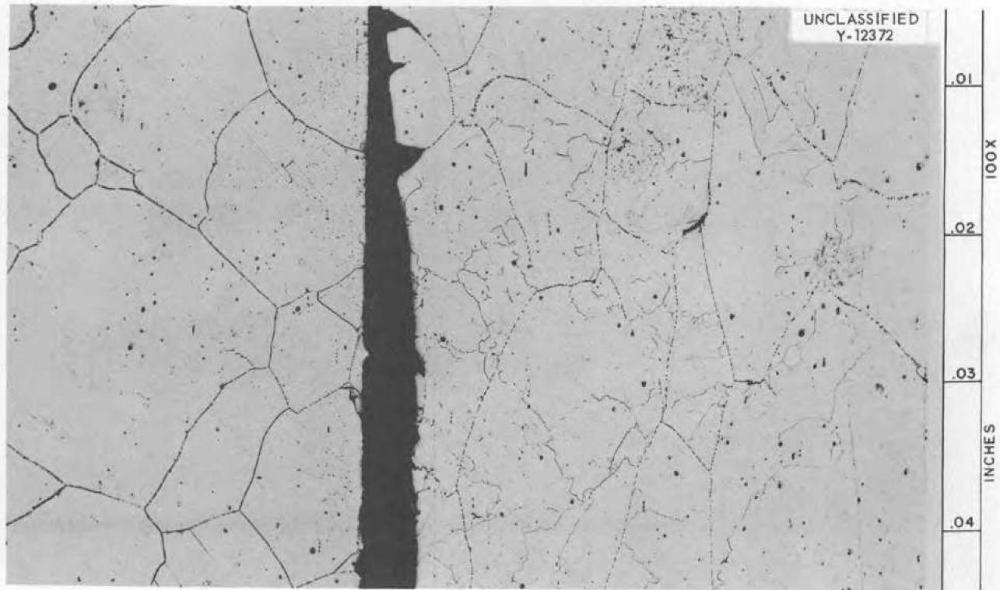  
Fig. 20. Photomicrograph of As-Received Inconel Tested at $1500^{\circ}\mathrm{F}$ Under 2500-psi Stress in Argon, 100X. Electrolytically etched with $10\%$ oxalic acid.   
Fig. 21. Photomicrograph of Annealed Inconel Tested at $1500^{\circ}\mathrm{F}$ Under 6500-psi Stress in Argon. The surface of the stressed specimen is shown on the right. 100X. Electrolytically etched with $10\%$ oxalic acid. Reduced $4\%$ .

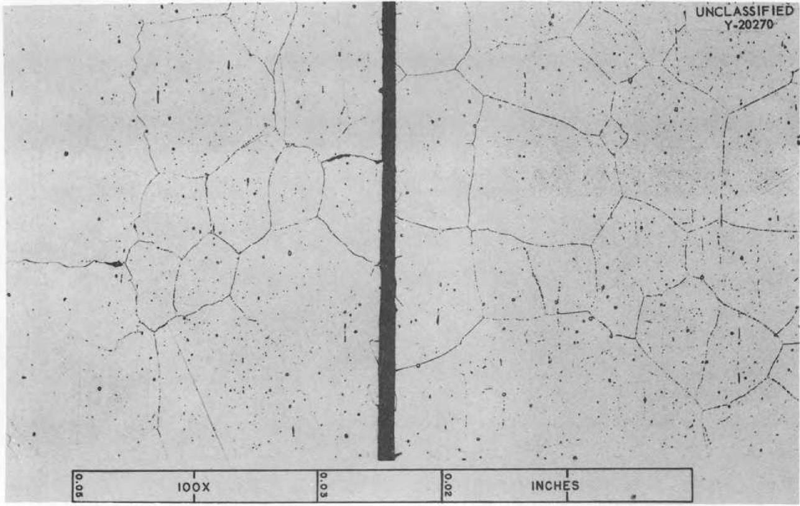

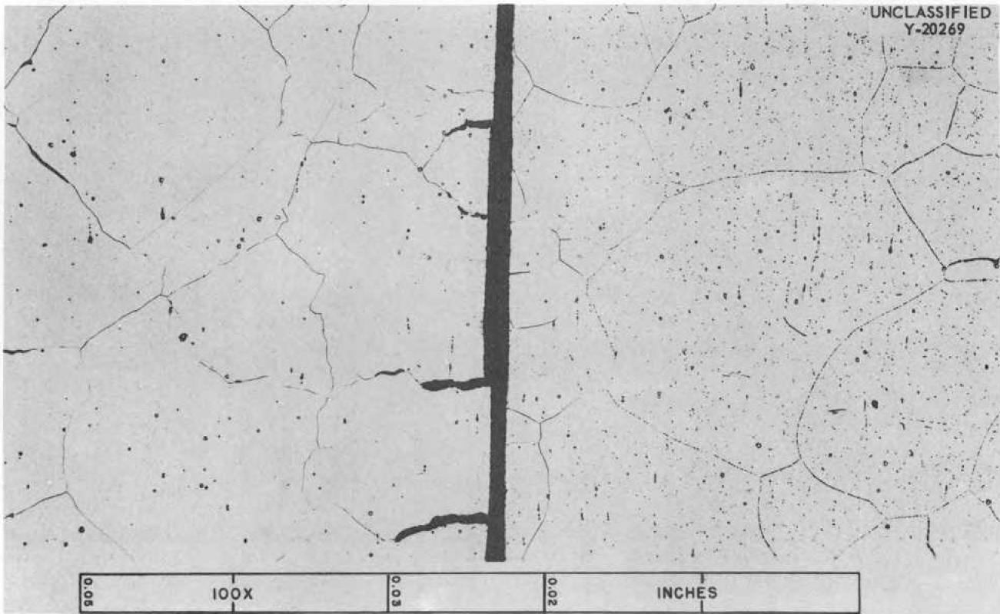  
Fig. 22. Photomicrograph of Annealed Inconel Tested at $1500^{\circ}\mathrm{F}$ Under 3000-psi Stress in Argon. The surface of the stressed specimen is shown on the right. 100X. Electrolytically etched with $10\%$ oxalic acid.   
Fig. 23. Photomicrograph of Annealed Inconel Tested at $1500^{\circ}$ F Under 2000-psi Stress in Argon. The surface of the stressed specimen is shown on the left. 100X. Electrolytically etched with $10\%$ oxalic acid.

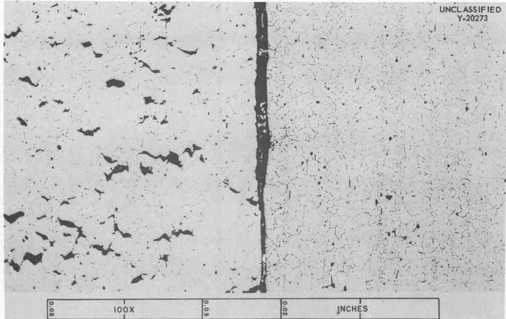

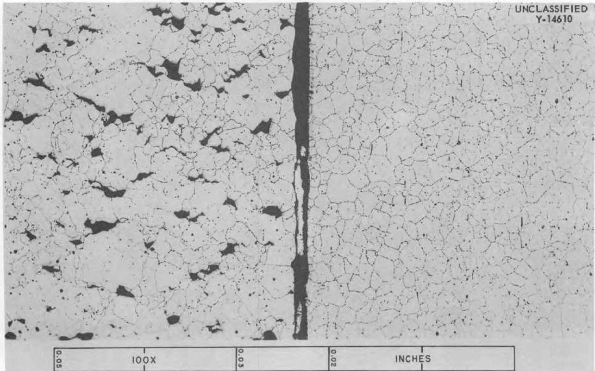  
Fig. 24. Photomicrograph of As-Received Inconel Tested at $1650^{\circ}\mathrm{F}$ Under 4500-psi Stress in Argon. The surface of the stressed specimen is shown on the left. 100X. Electrolytically etched with $10\%$ oxalic acid.   
Fig. 25. Photomicrograph of As-Received Inconel Tested at $1650^{\circ}\mathrm{F}$ Under 2500-psi Stress in Argon. The surface of the stressed specimen is shown on the left. 100X. Electrolytically etched with $10\%$ oxalic acid.

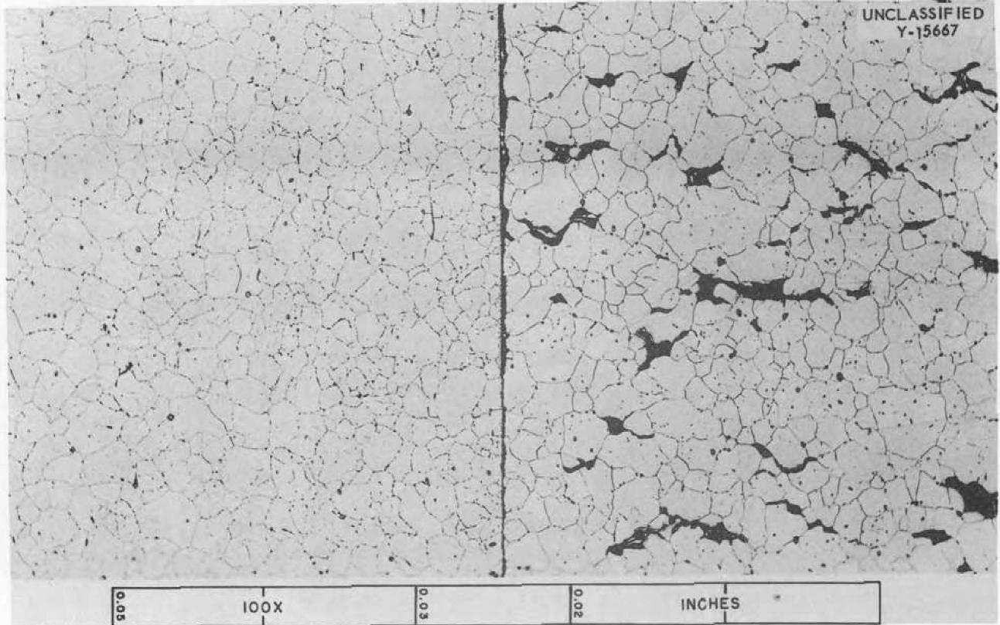

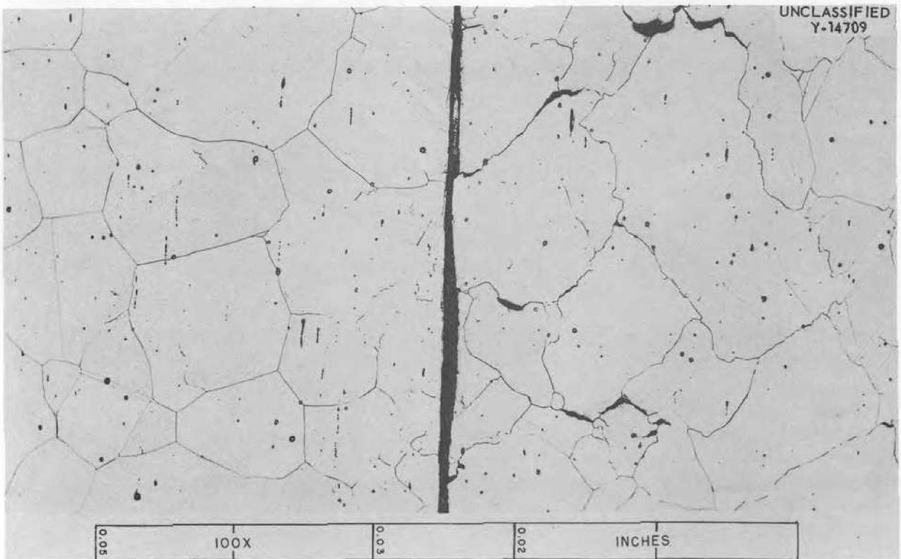  
Fig. 26. Photomicrograph of As-Received Inconel Tested at $1650^{\circ}\mathrm{F}$ Under 1750-psi Stress in Argon. The surface of the stressed specimen is shown on the right. 100X. Electrolytically etched with $10\%$ oxalic acid.   
Fig. 27. Photomicrograph of Annealed Inconel Tested at $1650^{\circ}\mathrm{F}$ Under 4500-psi Stress in Argon. The surface of the stressed specimen is shown on the right. 100X. Electrolytically etched with $10\%$ oxalic acid.

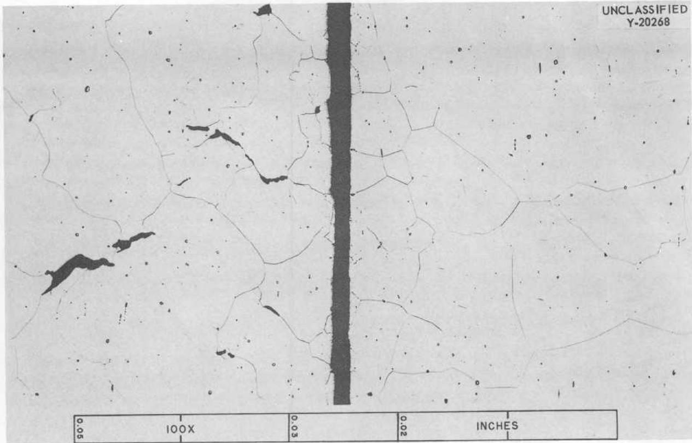

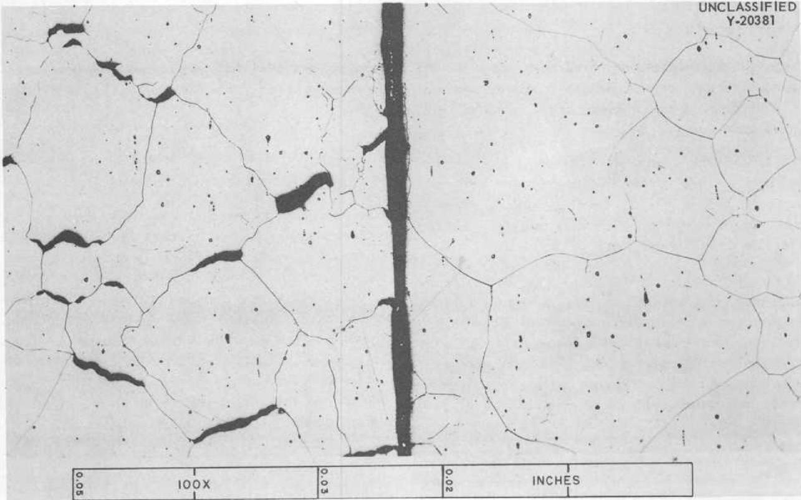  
Fig. 28. Photomicrograph of Annealed Inconel Tested at $1650^{\circ}\mathrm{F}$ Under 2500-psi Stress in Argon. The surface of the stressed specimen is shown on the left. 100X. Electrolytically etched with $10\%$ oxalic acid.   
Fig. 29. Photomicrograph of Annealed Inconel Tested at $1650^{\circ}\mathrm{F}$ Under 2000-psi Stress in Argon. The surface of the stressed specimen is shown on the left. 100X. Electrolytically etched with $10\%$ oxalic acid.

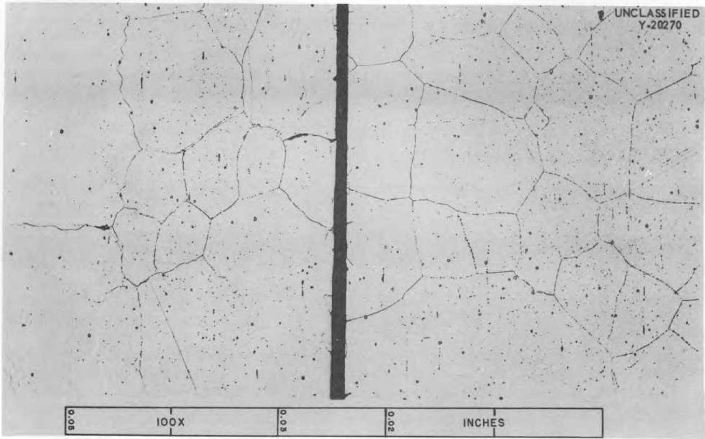  
Fig. 30. Photomicrograph of Annealed Inconel Tested at $1500^{\circ}$ F Under 3500-psi Stress in Argon. The surface of the stressed specimen, which ruptured in 1200 hr, is shown on the left. 100X. Electrolytically etched with $10\%$ oxalic acid.

Since this precipitation does not occur in all cases, the design plot for the annealed material at $1500^{\circ}\mathrm{F}$ does not include tests in which precipitation occurred.

At $1650^{\circ}F$ the solubility of carbon is high enough for little carbide to precipitate from the solution-annealed matrix during testing, and that which does occur is of large size and therefore not so effective as a strengthensener.

Tests in Fused Salt No. 30. - The testing apparatus used in creep-rupture testing in liquid media is described in detail in ORNL-2053. Essentially, the apparatus consists of a chamber filled with liquid, into which may be placed the test specimen. A bellows and pull-rod system allows for a load to be applied to the specimen by external means.

The mechanism by which the fused salts corrode Inconel involves the selective leaching of chromium from the surface of the metal in contact with the salt. This leaching action is accomplished by the following reactions between the chromium in the

Inconel and the UF4 and metal fluoride impurities in the salt:

$$
\begin{array}{l} C r + 2 U F _ {4} = C r F _ {2} + 2 U F _ {3} \\ C r + F e F _ {2} = C r F _ {2} + F e \\ C r + N i F _ {2} = C r F _ {2} + N i \\ \end{array}
$$

A summary of the creep-rupture data for asreceived and annealed Inconel in fused salt No. 30 at 1300, 1500, and $1650^{\circ}\mathrm{F}$ is afforded by Figs. 32 through 37. Stress is plotted vs time to 0.5, 1, 2, 5, $10\%$ elongation and rupture. Photomicrographs of the surfaces of as-received and annealed specimens tested under various stresses in fused salt No. 30 are presented in Figs. 38 through 55.

The following might be concluded from a comparison of the properties of the as-received and the annealed materials in fused salt No. 30.

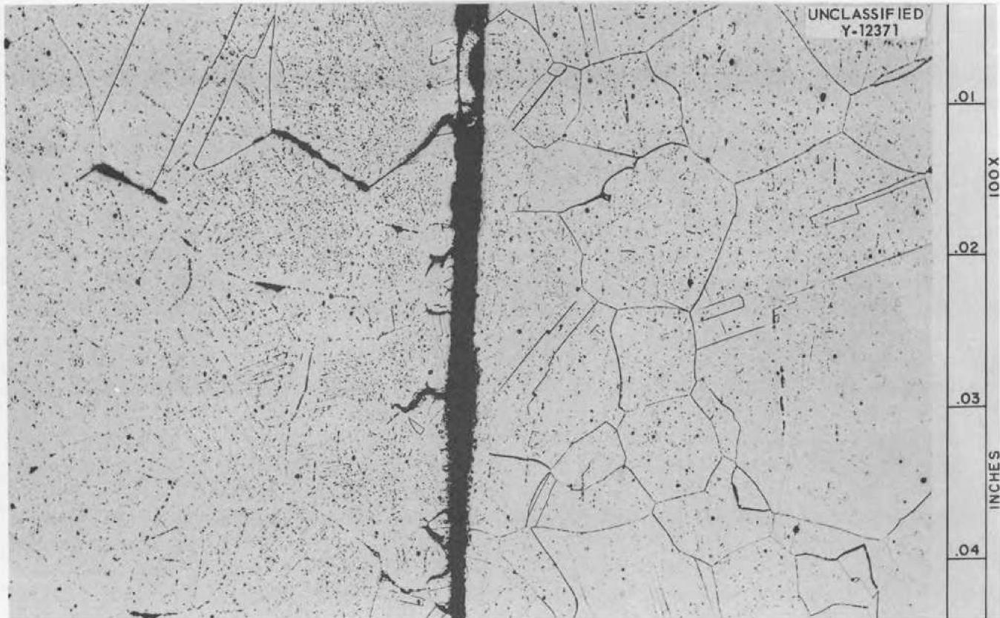

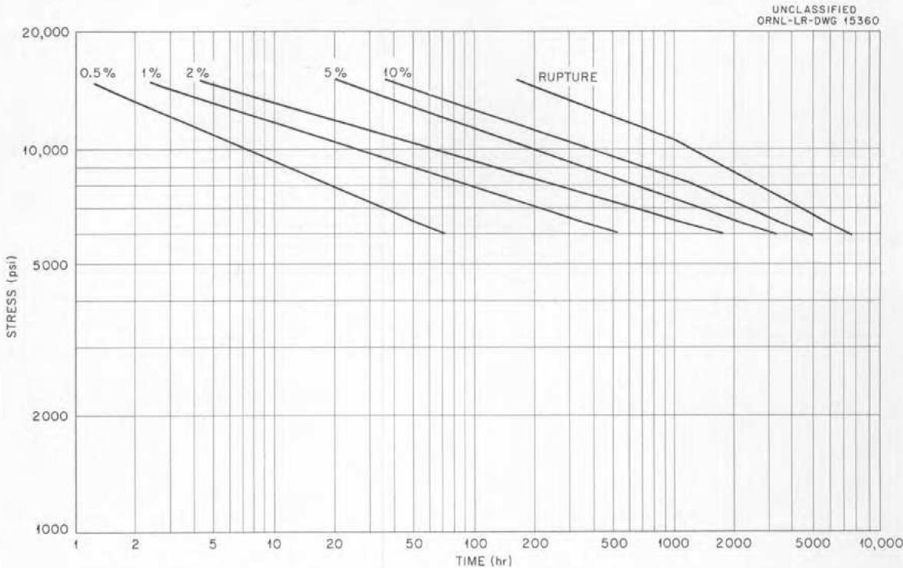  
Fig. 31. Photomicrograph of Annealed Inconel Tested at $1500^{\circ}$ F Under 3500-psi Stress in Argon. The surface of the stressed specimen, which ruptured in 3300 hr, is shown on the left. 100X. Electrolytically etched with $10\%$ oxalic acid. Reduced $4\%$ .   
Fig. 32. Design Curve for As-Received Inconel Tested in Fused Salt No. 30 at $1300^{\circ}\mathrm{F}$ . (Secret with caption)

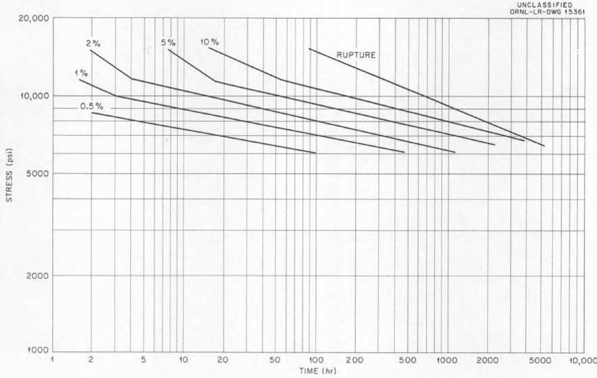  
Fig. 33. Design Curve for Annealed Inconel Tested in Fused Salt No. 30 at $1300^{\circ}\mathrm{F}$ . (Secret with caption)

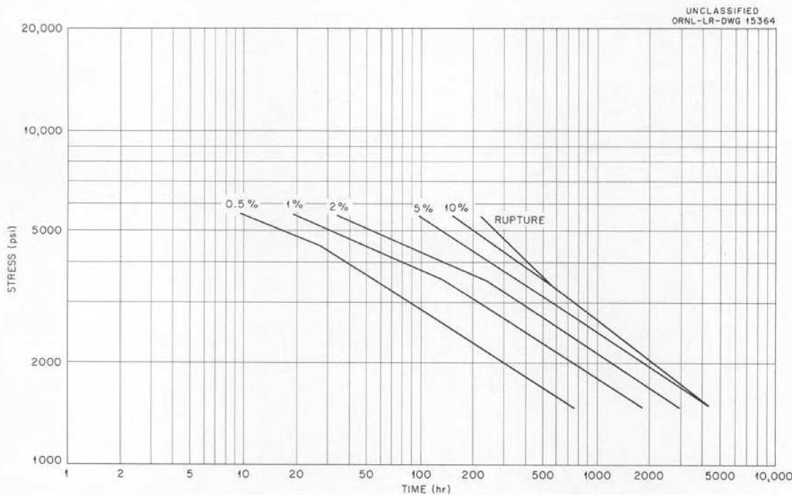  
Fig. 34. Design Curve for As-Received Inconel Tested in Fused Salt No. 30 at $1500^{\circ}\mathrm{F}$ . (Secret with caption)

1. At $1300^{\circ}\mathrm{F}$ , under stresses over 6000 psi, the as-received material exhibits greater creep and rupture strength. At stresses below 6000 psi the annealed material exhibits greater creep-rupture strength.   
2. At $1500^{\circ}\mathrm{F}$ the annealed Inconel is superior to the as-received material in rupture life and, after $0.5\%$ elongation, in creep properties.   
3. At $1650^{\circ}F$ the as-received material exhibits better creep properties at stresses above roughly 1500 psi and better rupture properties at stresses above roughly 2500 psi.

A comparison of the rupture properties of as-received Inconel and of annealed Inconel, tested in fused salt No. 30 and in argon, is afforded by Figs. 56 and 57, respectively. At 1300, 1500, and $1650^{\circ}\mathrm{F}$ the strength of the as-received material is seen to be more drastically affected by the corrosive action of the salt than is the strength of the annealed material.

Comparison of the photomicrographs of the surfaces of as-received and annealed specimens

tested in fused salt No. 30 reveals that, in general, the entire surface of the as-received specimens has been chemically altered but that the annealed specimens have been attacked only in isolated grain-boundary areas on the surface. A reasonable

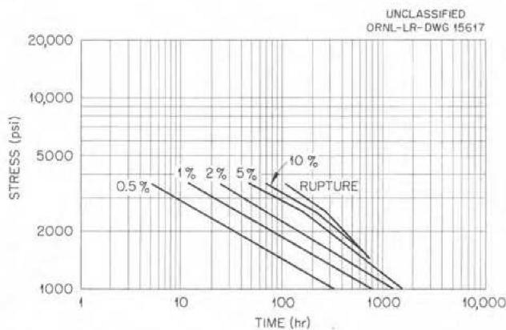  
Fig. 36. Design Curve for As-Received Inconel Tested in Fused Salt No. 30 at $1650^{\circ}\mathrm{F}$ . (Secret with caption)

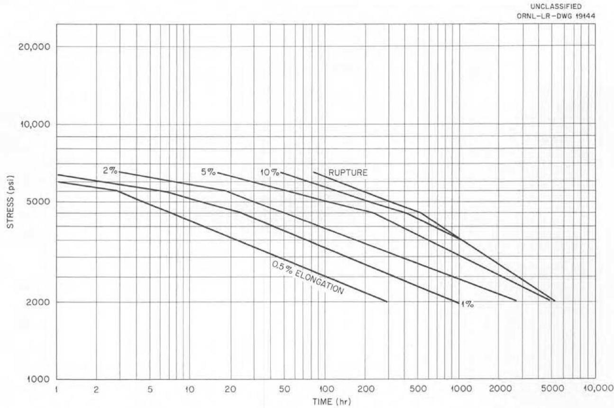  
Fig. 35. Design Curve for Annealed Inconel Tested in Fused Salt No. 30 at $1500^{\circ}\mathrm{F}$ . (Secret with caption)

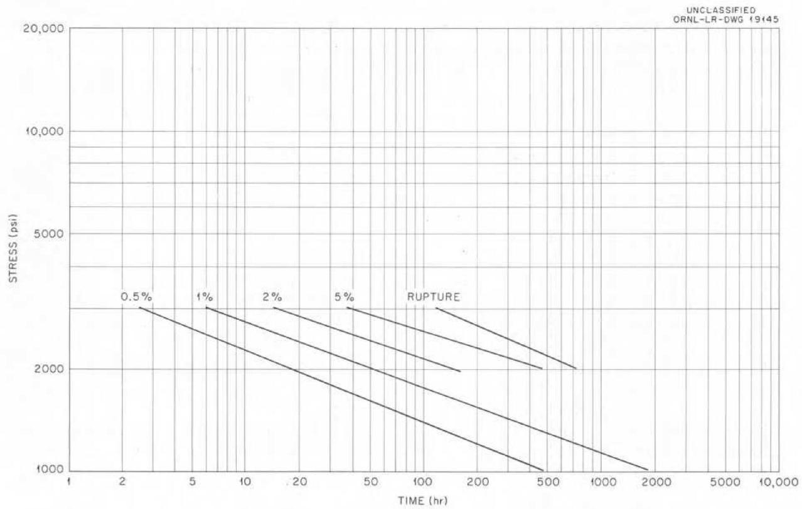

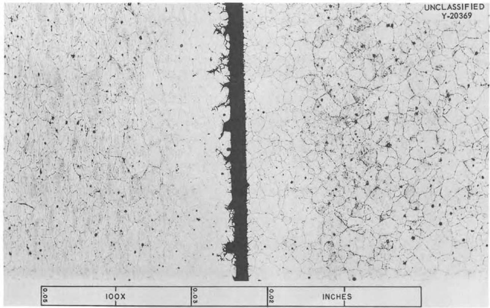  
Fig. 37. Design Curve for Annealed Inconel Tested in Fused Salt No. 30 at $1650^{\circ}\mathrm{F}$ . (Secret with caption)   
Fig. 38. Photomicrograph of As-Received Inconel Tested at $1300^{\circ}$ F Under 1500-psi Stress in Fused Salt No. 30. The surface of the stressed specimen is shown on the left. 100X. Electrolytically etched with $10\%$ oxalic acid. (Secret with caption)

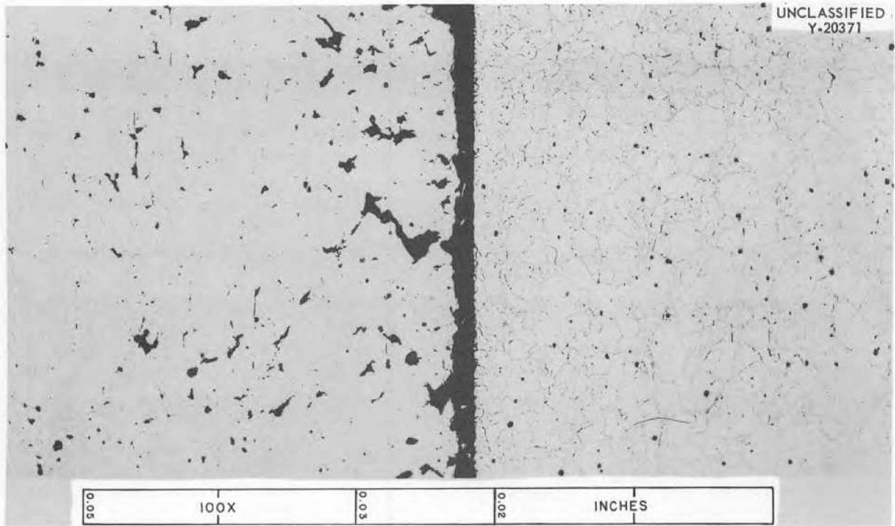

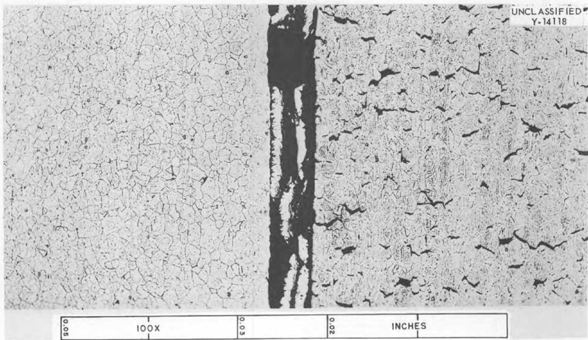  
Fig. 39. Photomicrograph of As-Received Inconel Tested at $1300^{\circ}$ F Under 11,000-psi Stress in Fused Salt No. 30. The surface of the stressed specimen is shown on the left. 100X. Electrolytically etched with $10\%$ oxalic acid. (Secret with caption)   
Fig. 40. Photomicrograph of As-Received Inconel Tested at $1300^{\circ}$ F Under 6000-psi Stress in Fused Salt No. 30. The surface of the stressed specimen is shown on the right. 100X. Electrolytically etched with $10\%$ oxalic acid. (Secret with caption)

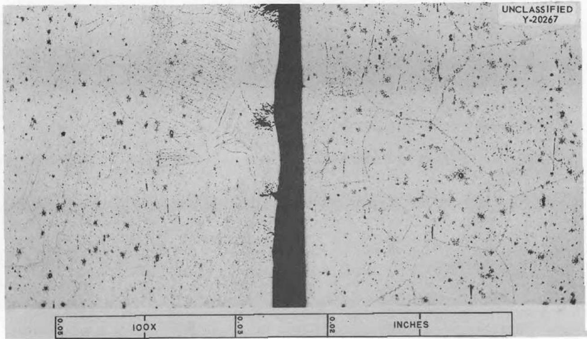  
Fig. 41. Photomicrograph of Annealed Inconel Tested at $1300^{\circ}\mathrm{F}$ Under 15,000-psi Stress in Fused Salt No. 30. The surface of the stressed specimen is shown on the left. 100X. Electrolytically etched with $10\%$ oxalic acid. (Secret with caption)

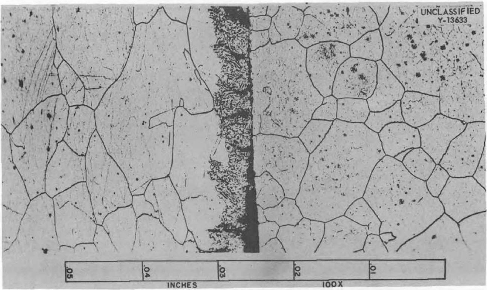  
Fig. 42. Photomicrograph of Annealed Inconel Tested at $1300^{\circ}\mathrm{F}$ Under 12,000-psi Stress in Fused Salt No. 30. The surface of the stressed specimen is shown on the left. 100X. Electrolytically etched with $10\%$ oxalic acid. (Secret with caption)

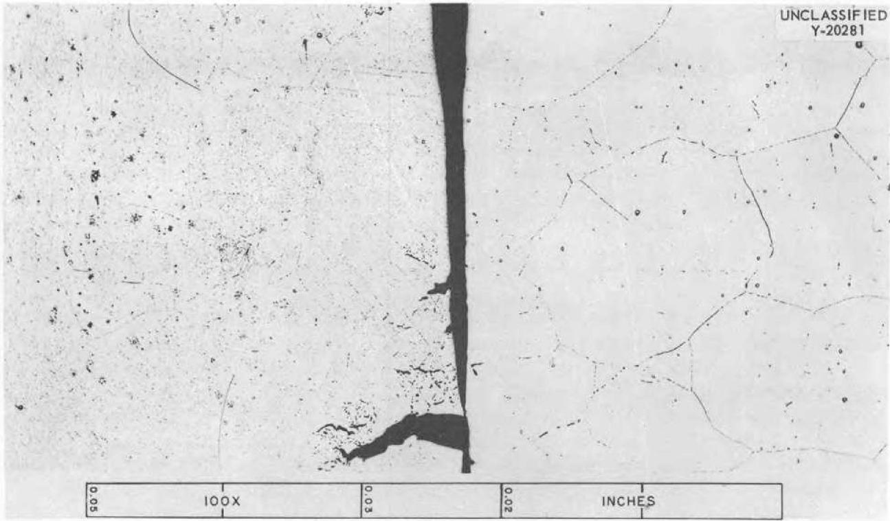

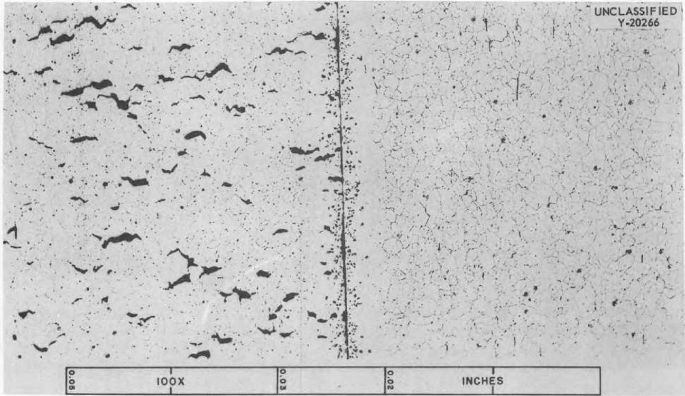  
Fig. 43. Photomicrograph of Annealed Inconel Tested at $1300^{\circ}$ F Under 8000-psi Stress in Fused Salt No. 30. The surface of the stressed specimen is shown on the left. 100X. Electrolytically etched with $10\%$ oxalic acid. (Secret with caption)   
Fig. 44. Photomicrograph of As-Received Inconel Tested at $1500^{\circ}\mathrm{F}$ Under 3500-psi Stress in Fused Salt No. 30. The surface of the stressed specimen is shown on the left. 100X. Electrolytically etched with $10\%$ oxalic acid. (Secret with caption)

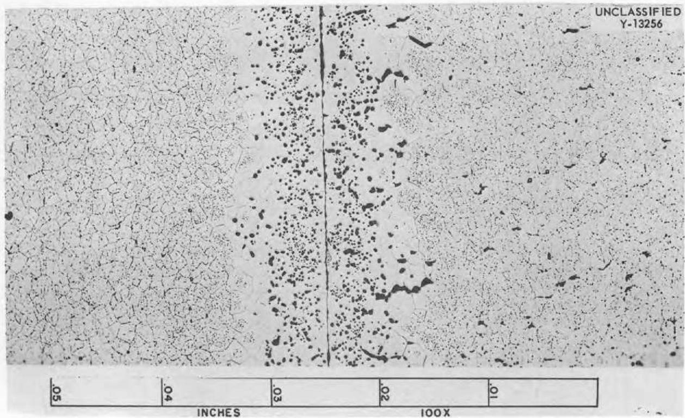  
Fig. 45. Photomicrograph of As-Received Inconel Tested at $1500^{\circ}\mathrm{F}$ Under 2000-psi Stress in Fused Salt No. 30. The surface of the stressed specimen is shown on the right. 100X. Electrolytically etched with $10\%$ oxalic acid. (Secret with caption)

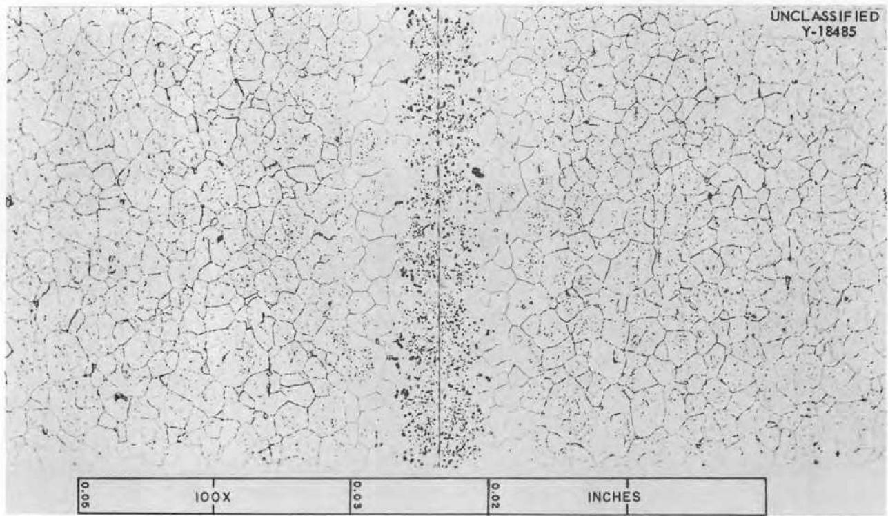  
Fig. 46. Photomicrograph of As-Received Inconel Tested at $1500^{\circ}$ F Under 1000-psi Stress in Fused Salt No. 30. The surface of the stressed specimen is shown on the right. 100X. Electrolytically etched with $10\%$ oxalic acid. (Secret with caption)

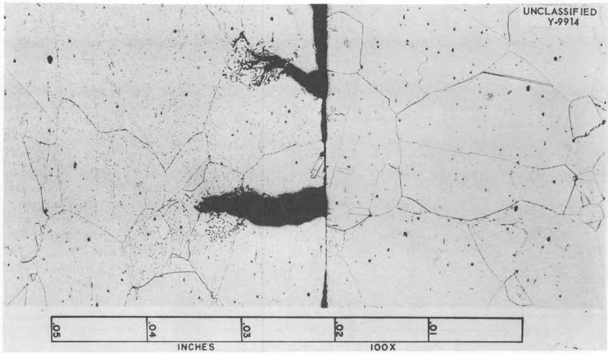

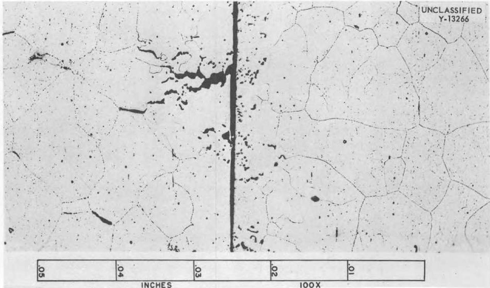  
Fig. 47. Photomicrograph of Annealed Inconel Tested at $1500^{\circ}$ F Under 7500-psi Stress in Fused Salt No. 30. The surface of the stressed specimen is shown on the left. 100X. Electrolytically etched with $10\%$ oxalic acid. (Secret with caption)   
Fig. 48. Photomicrograph of Annealed Inconel Tested at $1500^{\circ}\mathrm{F}$ Under 3500-psi Stress in Fused Salt No. 30. The surface of the stressed specimen is shown on the left. 100X. Electrolytically etched with $10\%$ oxalic acid. (Secret with caption)

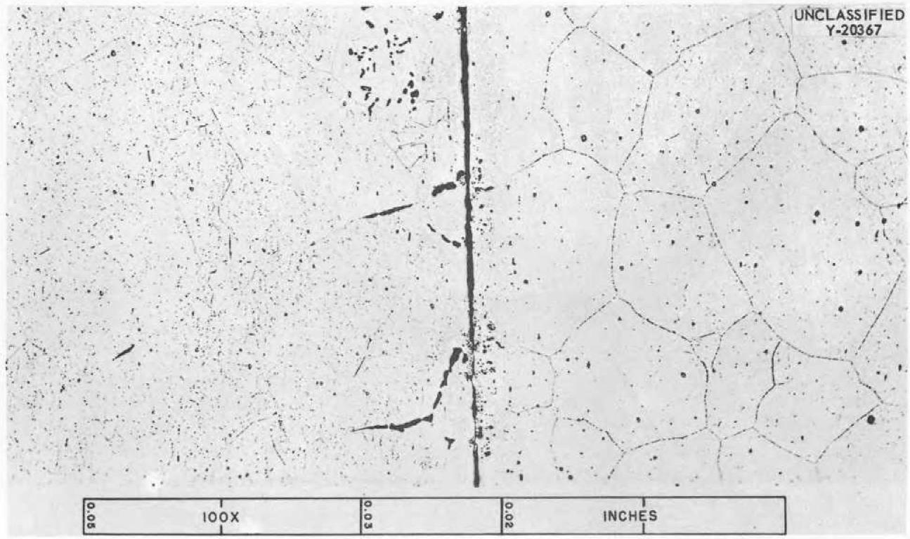

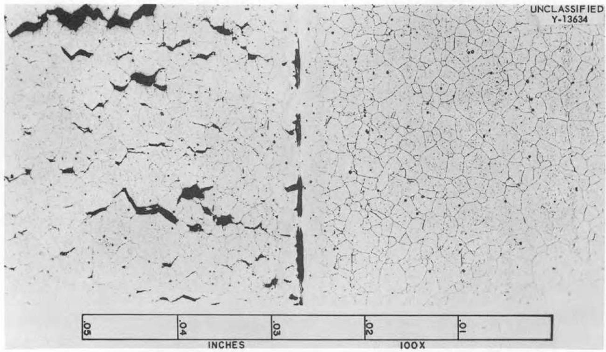  
Fig. 49. Photomicrograph of Annealed Inconel Tested at $1500^{\circ}\mathrm{F}$ Under 2500-psi Stress in Fused Salt No. 30. The surface of the stressed specimen is shown on the left. 100X. Electrolytically etched with $10\%$ oxalic acid. (Secret with caption)   
Fig. 50. Photomicrograph of As-Received Inconel Tested at $1650^{\circ}\mathrm{F}$ Under 3500-psi Stress in Fused Salt No. 30. The surface of the stressed specimen is shown on the left. 100X. Electrolytically etched with $10\%$ oxalic acid. (Secret with caption)

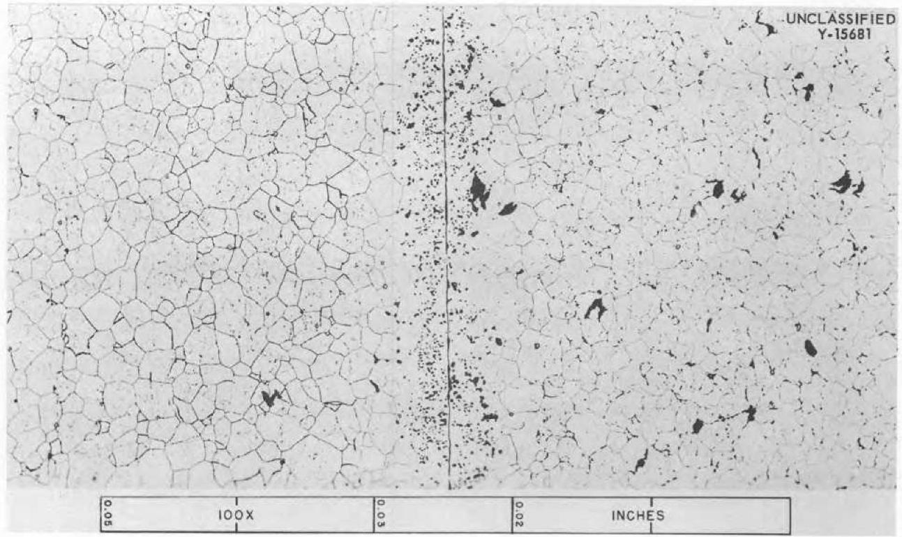

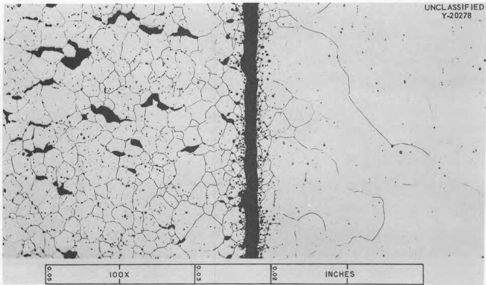  
Fig. 51. Photomicrograph of As-Received Inconel Tested at $1650^{\circ}$ F Under 2000-psi Stress in Fused Salt No. 30. The surface of the stressed specimen is shown on the right. 100X. Electrolytically etched with $10\%$ oxalic acid. (Secret with caption)   
Fig. 52. Photomicrograph of As-Received Inconel Tested at $1650^{\circ}$ F Under 1000-psi Stress in Fused Salt No. 30. The surface of the stressed specimen is shown on the left. 100X. Electrolytically etched with $10\%$ oxalic acid. (Secret with caption)

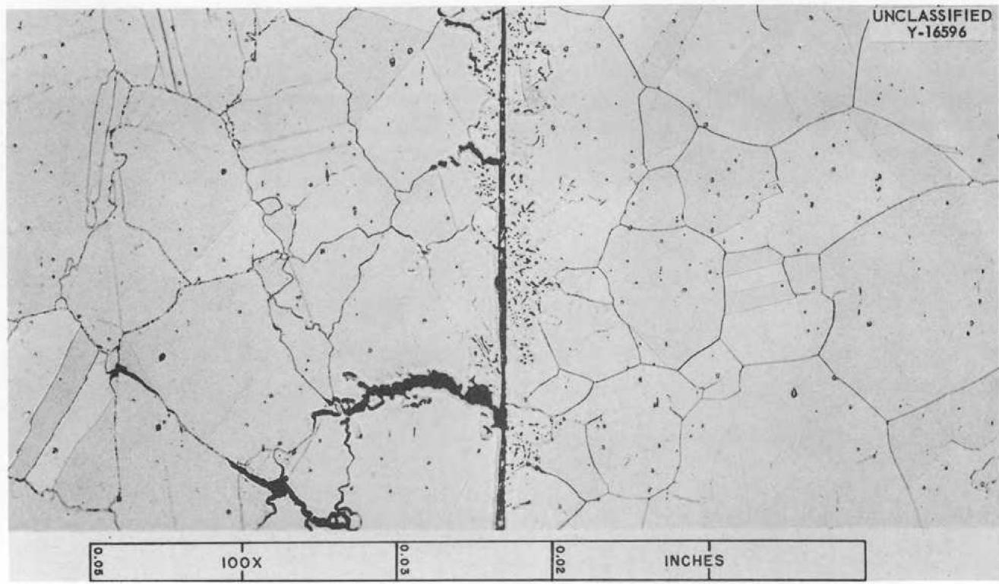

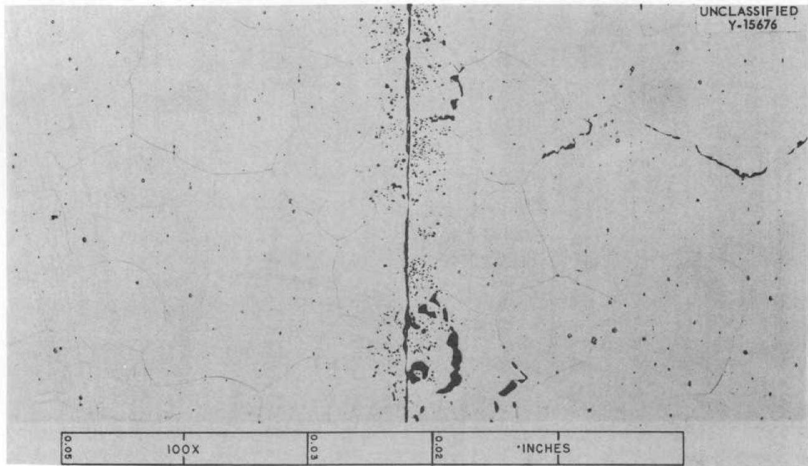  
Fig. 53. Photomicrograph of Annealed Inconel Tested at $1650^{\circ}$ F Under 4000-psi Stress in Fused Salt No. 30. The surface of the stressed specimen is shown on the left. 100X. Electrolytically etched with $10\%$ oxalic acid. (Secret with caption)   
Fig. 54. Photomicrograph of Annealed Inconel Tested at $1650^{\circ}\mathrm{F}$ Under 1500-psi Stress in Fused Salt No. 30. The surface of the stressed specimen is shown on the right. 100X. Electrolytically etched with $10\%$ oxalic acid. (Secret with caption)

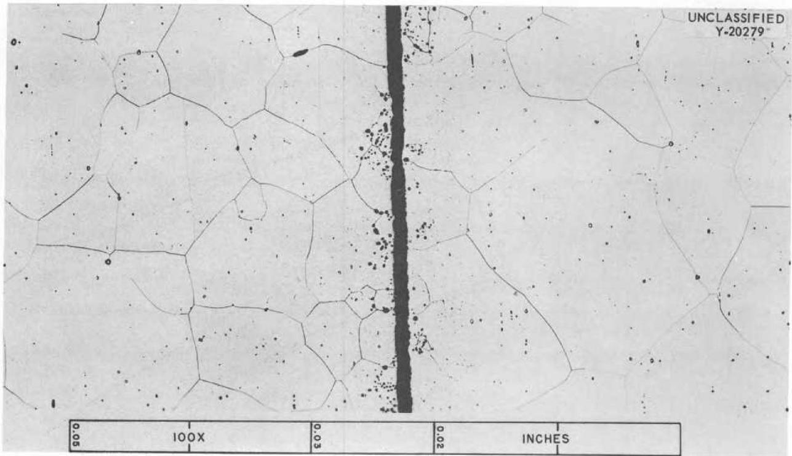  
Fig. 55. Photomicrograph of Annealed Inconel Tested at $1650^{\circ}\mathrm{F}$ Under 1000-psi Stress in Fused Salt No. 30. The surface of the stressed specimen is shown on the left. 100X. Electrolytically etched with $10\%$ oxalic acid. (Secret with caption)

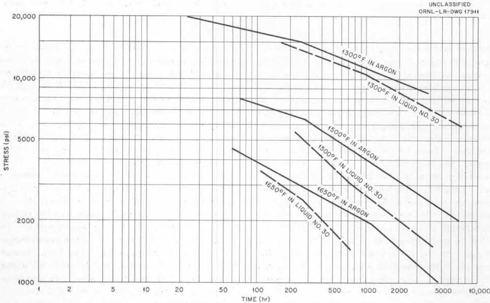  
Fig. 56. Comparison of the Stress-Rupture Properties of As-Received Inconel Tested at 1300, 1500, and $1650^{\circ}\mathrm{F}$ in Argon and in Fused Salt No. 30. (Secret with caption)

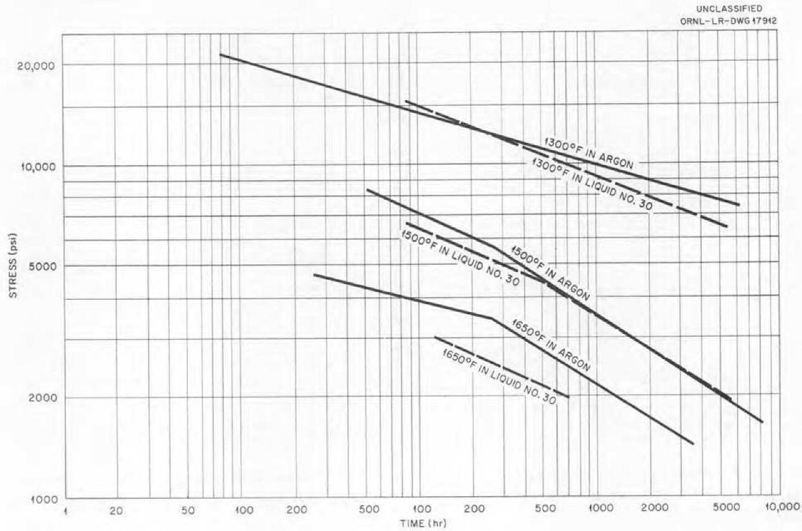  
Fig. 57. Comparison of the Stress-Rupture Properties of Annealed Inconel Tested at 1300, 1500, and $1650^{\circ}\mathrm{F}$ in Argon and in Fused Salt No. 30. (Secret with caption)

explanation for the sensitivity of the as-received Inconel to the corrosive attack is not immediately obvious. However, a possible explanation lies in the carbide strengthening mechanism for the as-received material and the effect of the corrosion on these carbides. Deletion of the chromium from the surface of the as-received material causes an increase in the solubility of the complex chromium carbides. The carbide is then dissolved in the matrix, and the source of strength for the as-received material is removed. Although the surface void formation resulting from deletion of the chromium from the surface extends to a depth of only a few mils, the depth to which the chromium is depleted enough to cause solution of the carbides is great enough to significantly affect the strength of the as-received material. Since the strength of the annealed Inconel does not depend on the carbide precipitate, it is not so seriously weakened by the corrosive attack.

Tests in Sodium. - Creep-rupture tests were carried out in liquid sodium at 1300 and $1500^{\circ}\mathrm{F}$

to determine the effect of this environment on the strength properties of as-received Inconel. The results of the creep-rupture tests at $1300^{\circ}\mathrm{F}$ are summarized in Fig. 58 and at $1500^{\circ}\mathrm{F}$ in Fig. 59. The data obtained in sodium may be compared with the data for argon shown in Figs. 5 and 7. Although the data points for rupture obtained in sodium are somewhat scattered, they do indicate that the strength of Inconel in argon and sodium is essentially the same.

Photomicrographs of the specimens tested in sodium are shown in Figs. 60 through 66. Evidence of the Inconel having decarburized, as a result of too high an oxide content in the sodium, is seen in some of the photomicrographs. The effect of this decarburization on the creep characteristics is to increase the creep rate, increase the elongation at rupture, and decrease the rupture life. The magnitude of these effects is, of course, dependent on the severity of the decarburization.

Based on these data, then, it appears that if the purity of the sodium or NaK is high, design for

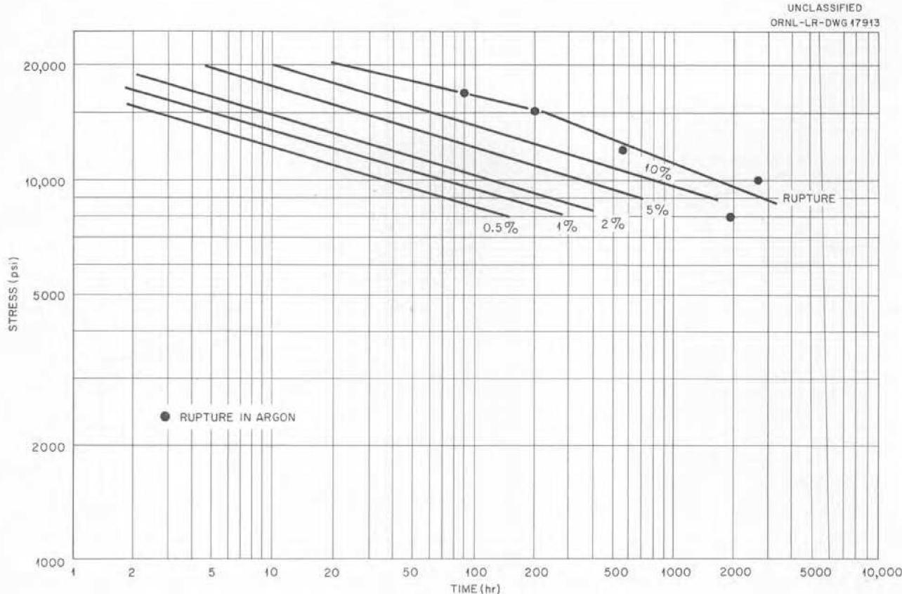  
Fig. 58. Design Curve for As-Received Inconel Tested in Sodium at $1300^{\circ}\mathrm{F}$ . (Compare with Fig. 5 for data obtained in argon.)

components in contact with these liquids may be based on creep data obtained in an argon atmosphere.

Tests in Air. - The data in the literature on the effect of gaseous and liquid environments on the mechanical properties of materials at low and high temperatures is somewhat controversial. The effect of oxide surface films on the mechanical properties has been studied, and many proposals have been made concerning the mechanism by which the film affects the strength of the material.4-7 Much of the experimental work has been carried

out with single crystals of very pure metals, and theories based on dislocation models derived from these experiments are not easily applied to the creep behavior of polycrystalline alloys at high temperatures.

The creep-rupture data obtained in an air environment on as-received 0.060-in.-thick Inconel sheet at 1300, 1500, and $1650^{\circ}\mathrm{F}$ are superimposed on the argon data for comparative purposes in Figs. 67 through 69. The data obtained at $1300^{\circ}\mathrm{F}$ indicate that an air environment does not significantly affect the creep or rupture strength of as-received 0.060-in.-thick Inconel sheet when tested at stress levels which produce rupture in less than 1000 hr. However, the specimen tested in air at 10,000 psi exhibited somewhat better creep properties and longer rupture life than the material tested in argon.

At $1500^{\circ}\mathrm{F}$ and at stress levels above 4000 psi the creep and rupture strength of Inconel tested in air is similar to that of the Inconel tested in argon. The data obtained at stresses which produce rupture in over roughly 1000 hr indicate that the Inconel

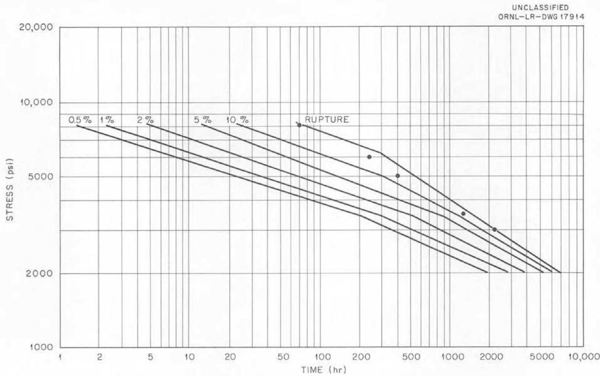

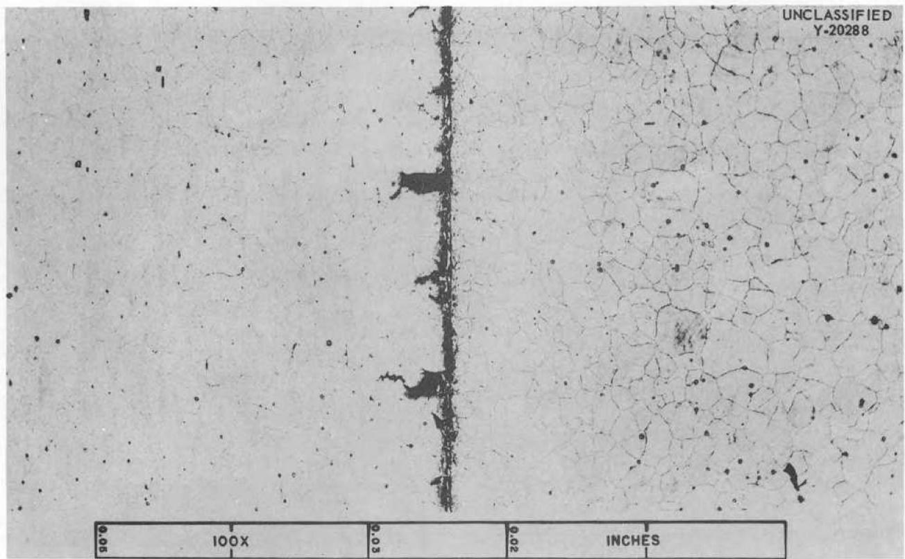  
Fig. 59. Design Curve for As-Received Inconel Tested in Sodium at $1500^{\circ}\mathrm{F}$ . (Compare with Fig. 7 for data obtained in argon.)   
Fig. 60. Photomicrograph of As-Received Inconel Tested at $1300^{\circ}$ F Under 17,000-psi Stress in Sodium. The surface of the stressed specimen is shown on the left. 100X. Electrolytically etched with $10\%$ oxalic acid.

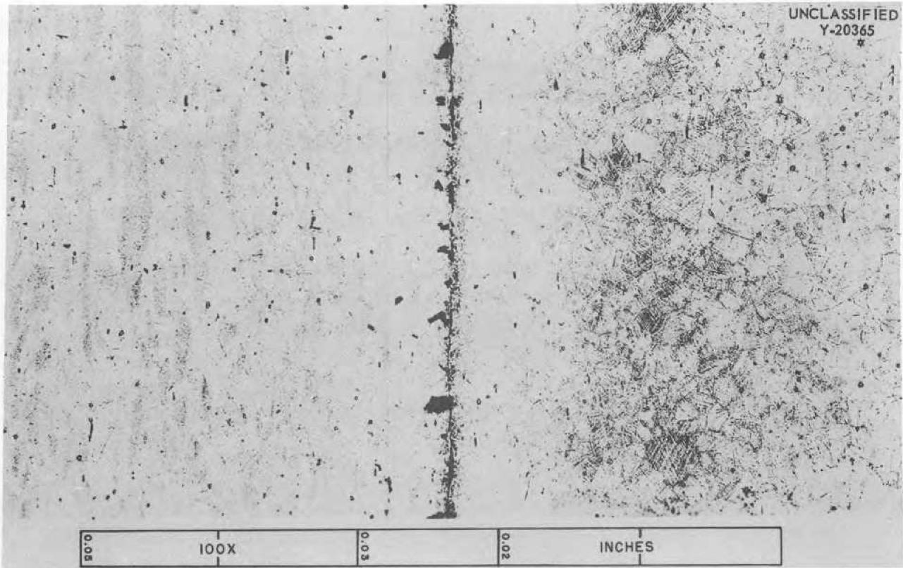

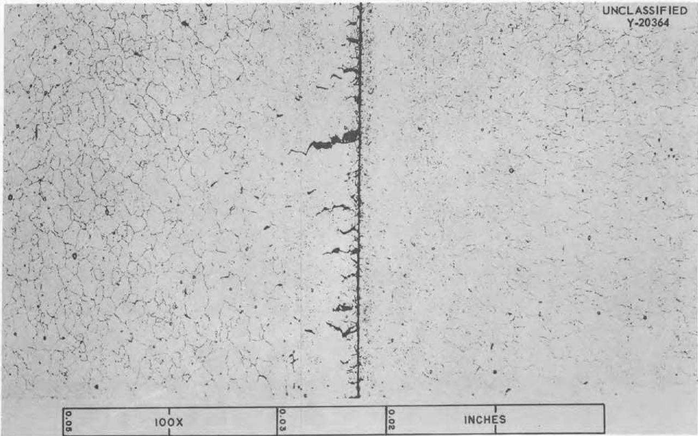  
Fig. 61. Photomicrograph of As-Received Inconel Tested at $1300^{\circ}\mathrm{F}$ Under 15,000-psi Stress in Sodium. The surface of the stressed specimen is shown on the left. 100X. Electrolytically etched with $10\%$ oxalic acid.   
Fig. 62. Photomicrograph of As-Received Inconel Tested at $1300^{\circ}$ F Under 8000-psi Stress in Sodium. The surface of the stressed specimen is shown on the left. 100X. Electrolytically etched with $10\%$ oxalic acid.

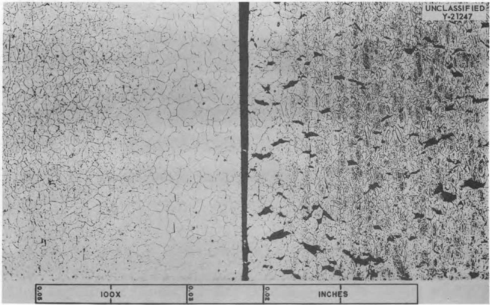

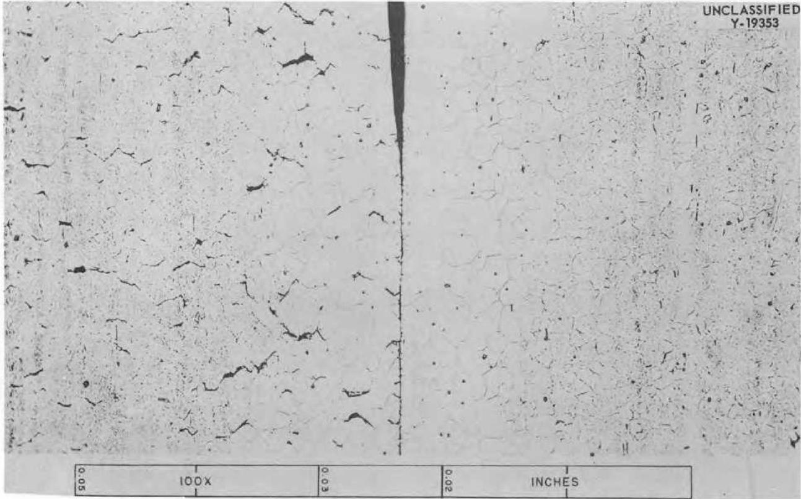  
Fig. 63. Photomicrograph of As-Received Inconel Tested at $1500^{\circ}\mathrm{F}$ Under 6000-psi Stress in Sodium. The surface of the stressed specimen is shown on the right. 100X. Electrolytically etched with $10\%$ oxalic acid.   
Fig. 64. Photomicrograph of As-Received Inconel Tested at $1500^{\circ}$ F Under 5000-psi Stress in Sodium. The surface of the stressed specimen is shown on the left. 100X. Electrolytically etched with $10\%$ oxalic acid.

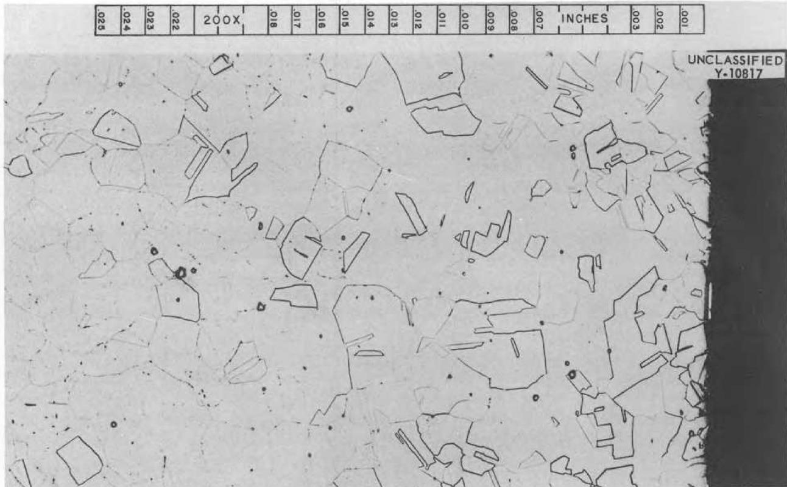

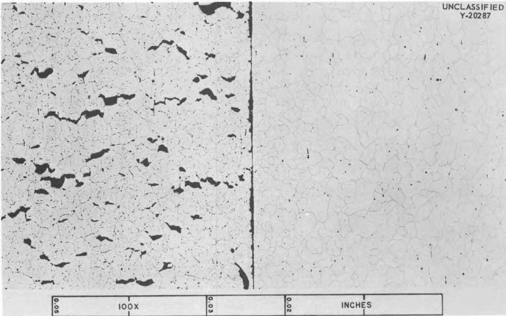  
Fig. 65. Photomicrograph of As-Received Inconel Tested at $1500^{\circ}$ F Under 3500-psI Stress in Sodium. 200X. Electrolytically etched with $10\%$ oxalic acid.   
Fig. 66. Photomicrograph of As-Received Inconel Tested at $1500^{\circ}$ F Under 3000-psi Stress in Sodium. The surface of the stressed specimen is shown on the left. 100X. Electrolytically etched with $10\%$ oxalic acid.

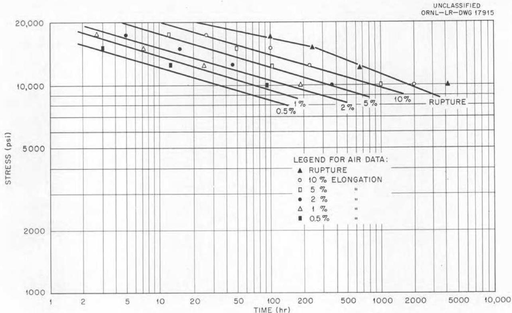

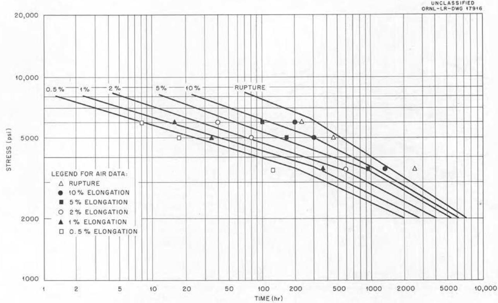  
Fig. 67. Comparison of the Creep-Rupture Properties of As-Received Inconel Obtained in Argon with Those Obtained in Air at $1300^{\circ}$ F.   
Fig. 68. Comparison of the Creep-Rupture Properties of As-Received Inconel Obtained in Argon with Those Obtained in Air at $1500^{\circ}\mathrm{F}$ .

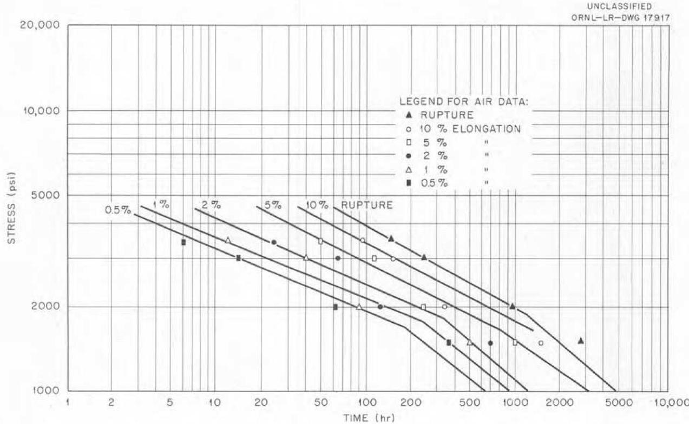  
Fig. 69. Comparison of the Creep-Rupture Properties of As-Received Inconel Obtained in Argon with Those Obtained in Air at $1650^{\circ}\mathrm{F}$ .

is strengthened by the air atmosphere. At $1650^{\circ}\mathrm{F}$ the air environment is seen to strengthen Inconel when tested at the lower stress levels.

The exact mechanism by which an air environment strengthens as-received Inconel is not fully understood. However, some useful observations may be made on the gross effects of the air environment. The creep curves plotted in Fig. 70 illustrate somewhat more graphically the comparative behavior of as-received Inconel at $1500^{\circ}\mathrm{F}$ in argon and air environments. The strengthening in air is seen to occur only after considerable deformation has taken place. The microstructures of specimens tested in air and in argon are shown in Figs. 71 and 72. These photomicrographs indicate that the air environment retards the rate of propagation of intergranular cracks and allows the deformation to proceed without rupture for a considerably longer time.

The effect of an air environment on the creep-rupture properties of annealed 0.060-in.-thick Inconel sheet is illustrated in Fig. 73. Creep curves are plotted for tests in air and in argon at two stress levels. The creep rate for the annealed

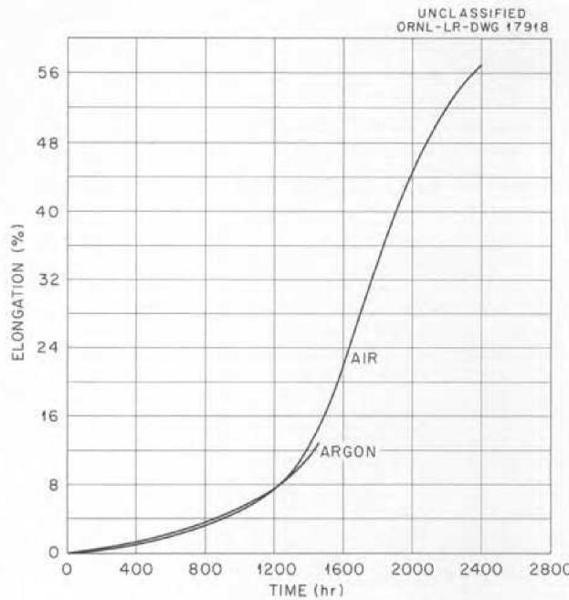  
Fig. 70. Comparison of the Creep Behavior of As-Received Inconel Tested in Air and in Argon at $1500^{\circ}$ F Under 3500-psi Stress.

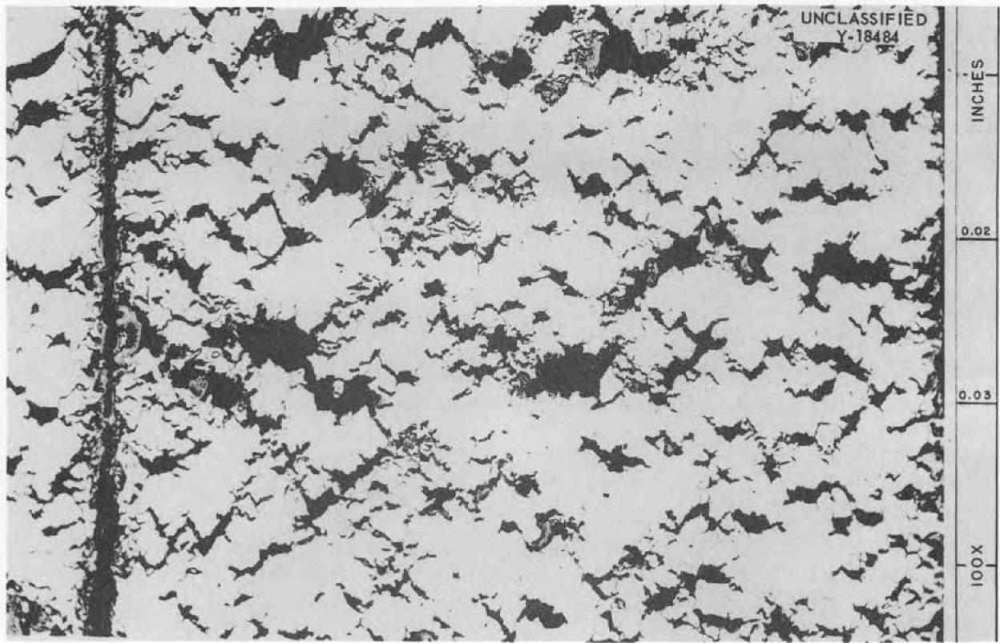

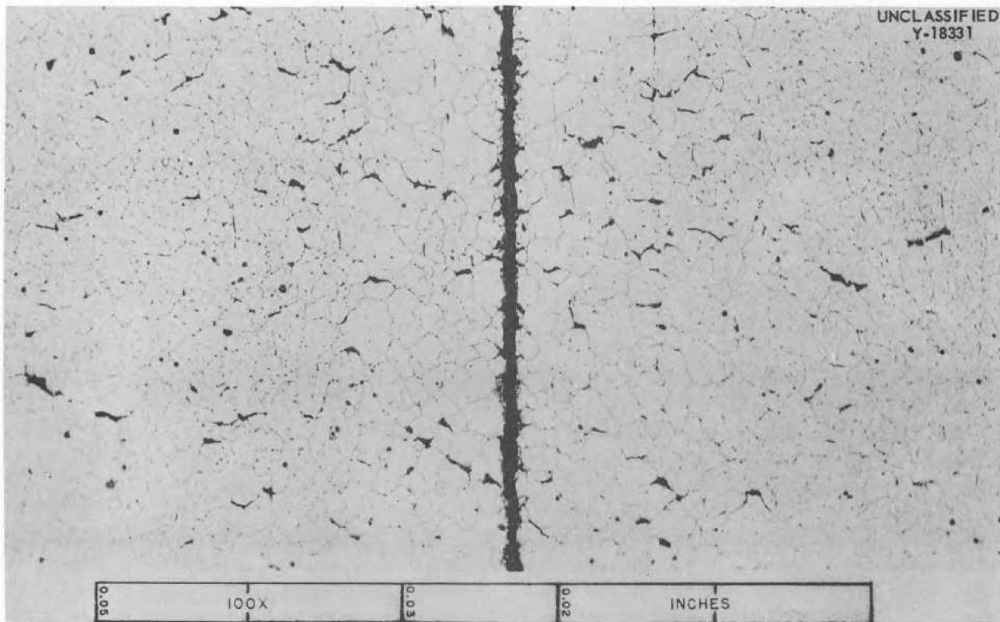  
Fig. 71. Photomicrograph of As-Received Inconel Tested at $1500^{\circ}\mathrm{F}$ Under 3500-psi Stress in Air. 100X. Electrolytically etched with $10\%$ oxalic acid.   
Fig. 72. Photomicrograph of As-Received Inconel Tested at $1500^{\circ}$ F Under 3500-psi Stress in Argon. 100X. Electrolytically etched with $10\%$ oxalic acid.

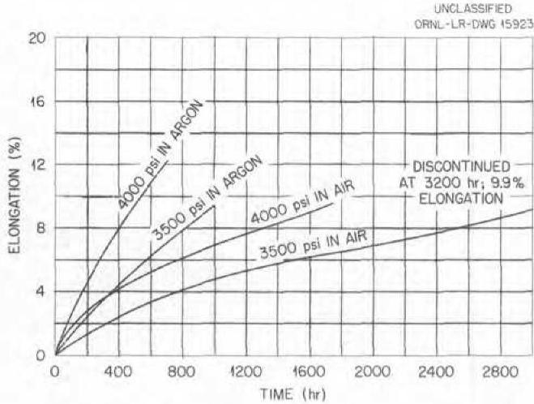  
Fig. 73. Comparison of Typical Creep Behavior for Annealed Inconel Tested in Air and Argon at $1500^{\circ}\mathrm{F}$ at Two Stress Levels.

Inconel tested in air is lower than that for the similar tests in argon throughout the entire life of the test, and the rupture life is considerably longer.

In general, then, the effect of an air environment is to strengthen as-received Inconel when the strain rate, that is, the stress, is low enough that the mode of deformation tends to be intergranular and has no effect on the strength at low temperatures or at high strain rates, where the mode of deformation is mainly transgranular. The limited data on the annealed material indicate that it is strengthened by an air environment, but the stress dependency of this strengthening effect has not been established.

# Effect of a Biaxial Stress System on the Stress-Rupture Properties

Since the static stresses in the components of the reactor generally arise as a result of fluid pressure in tubes and spherically shaped shells, the stresses will not be uniaxial. Therefore the effect of a biaxial stress system on the high-temperature strength properties of Inconel is an important consideration when creep-rupture data based on uniaxially stressed sheet are used for design purposes.

Gensamer has observed that, in tensile tests at room temperature of various materials under a biaxial stress system, failure depends on the properties of the material in the direction of

the larger of the two combined stresses. Although the mechanism of deformation of metals under static loads at elevated temperatures differs from that which occurs in a tensile test at room temperature, the major stress component is still the controlling factor determining the type and time to failure.

The stress-rupture properties of 0.060-in.-wall tubes under a hoop-to-axial-stress ratio of 2:1 are compared with those of uniaxially stressed 0.060-in.-sheet Inconel at 1500 and $1650^{\circ}\mathrm{F}$ in argon and in fused salt in Figs. 74 and 75. In the tube-burst tests the data are based on the hoop stress. It is seen that there is good agreement between the stress-rupture properties of the 0.060-in.-wall tubing and the 0.060-in.-thick sheet at both temperatures and in both environments. The small differences which exist may be due to anisotropy in the tubing or to the two types of specimens having been taken from different heats of Inconel and consequently having different chemical composition and fabrication history.

Although the stress-rupture strength of 0.060-in.-wall Inconel tubing is very similar to that of 0.060-in.-thick Inconel sheet specimens, there is a significant difference in the total deformation at rupture of the two types of specimens. Table 2 shows the relative values for the per cent elongation in the direction of the maximum stress for

Table 2. Comparison of the Total Deformation at Rupture of 0.060-in.-Thick Inconel Sheet with That of 0.060-in.-Wall Inconel Tubing   

<table><tr><td rowspan="3">Temperature (°F)</td><td rowspan="3">Stress* (psi)</td><td colspan="4">Per Cent Elongation</td></tr><tr><td colspan="2">In Argon</td><td colspan="2">In Fused Salt No. 30</td></tr><tr><td>Tubing</td><td>Sheet</td><td>Tubing</td><td>Sheet</td></tr><tr><td rowspan="4">1500</td><td>5000</td><td>9.2</td><td>28</td><td>10.2</td><td>17</td></tr><tr><td>4000</td><td>5.2</td><td>20</td><td>5.5</td><td>13</td></tr><tr><td>3000</td><td>1.7</td><td>12</td><td>3.7</td><td>8</td></tr><tr><td>2000</td><td>1.3</td><td>12</td><td></td><td></td></tr><tr><td rowspan="4">1650</td><td>3000</td><td>6.7</td><td>30</td><td>6.8</td><td>19</td></tr><tr><td>2500</td><td>3.6</td><td>30</td><td>5.3</td><td>16</td></tr><tr><td>2000</td><td>3.8</td><td>30</td><td>3.3</td><td>15</td></tr><tr><td>1500</td><td>3.1</td><td>12</td><td>2.8</td><td>8</td></tr></table>

*Represents the hoop stress in the case of the tube-burst tests.

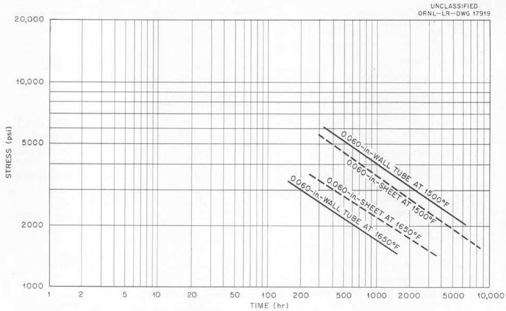

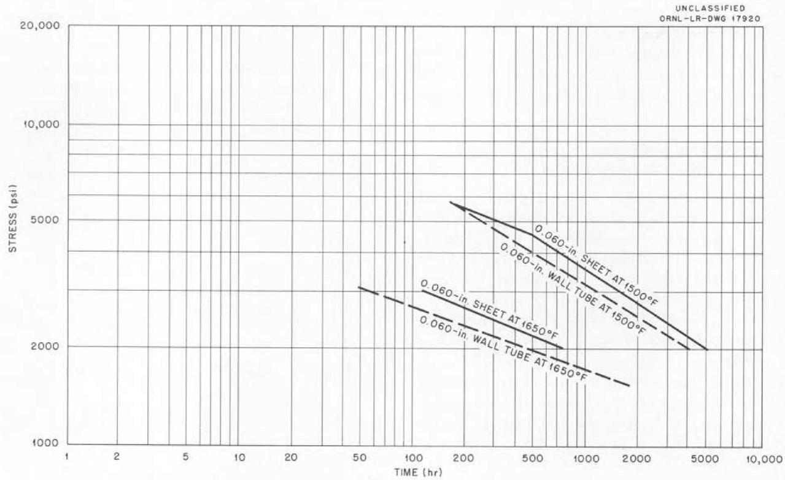  
Fig. 74. Comparison of Stress-Rupture Properties of Annealed 0.060-in.-Thick Inconel Sheet with Annealed 0.060-in.-Wall Tubes Tested in Argon at 1500 and $1650^{\circ}$ F.   
Fig. 75. Comparison of Stress-Rupture Properties of Annealed 0.060-in.-Thick Inconel Sheet with Annealed 0.060-in.-Wall Tubes Tested in Fused Salt No. 30 at 1500 and $1650^{\circ}\mathrm{F}$ . (Secret with caption)

specimens tested at several stresses at 1500 and $1650^{\circ}\mathrm{F}$ in argon and in the fused salt.

The data presented in Table 2 were obtained from before- and after-test measurements of the gage length in the case of the sheet specimens and the diameter in the case of the tubular specimens. No detectable change in dimension was noted in the axial direction in the case of the tube specimens; however, accurate measurements of the change in the axial dimension were not possible.

The lower total deformation at rupture exhibited in the tube-burst type of test may be attributed to the biaxial stress system set up on a closed-end pressurized tube. Metals that are deformed at room temperature under various states of biaxial stress exhibit increasing or decreasing ductility, as compared with uniaxial tensile ductility, depending on whether the stress system tends to increase or decrease the maximum shear stress. In a biaxial tensile stress system, such as is found in the tube-burst test, the maximum shear stress, in the circumferential direction, is decreased by the action of the smaller axial stress so that slip in the cir

cumferential direction is restricted. This results in the lower ductility at rupture.

Photomicrographs taken from several tubes tested in argon and in fused salt No. 30 (Figs. 76 through 87) indicate that the deformation mechanism is similar to that which occurs in uniaxially loaded sheet type of specimens.

# Effect of Section Thickness on the Creep-Rupture Properties in the Various Media

The applicability of the data presented in this report to design is limited in that the data are valid only when the material is subjected to operating conditions similar to those under which the material is tested. In a design where various shapes and thicknesses of material are employed in contact with corrosive media, the effect of section thickness becomes an important consideration in the intelligent use of the available data.

The effect of section thickness on the creep-rupture properties of fine-grained Inconel sheet

9 Ibid., P 20.

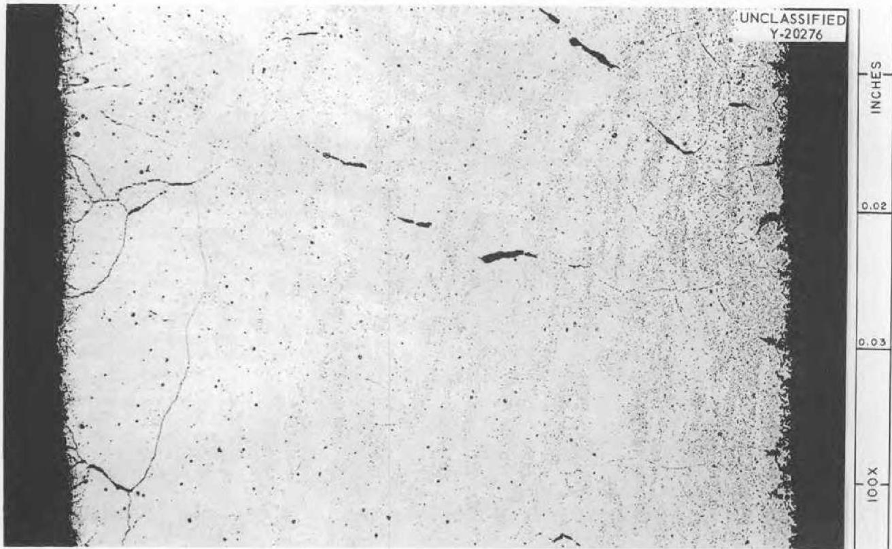  
Fig. 76. Photomicrograph from Inconel Tube-Burst Specimen Tested in Argon at $1500^{\circ}\mathrm{F}$ Under 5000-psi Stress, 100X. Electrolytically etched with $10\%$ oxalic acid.

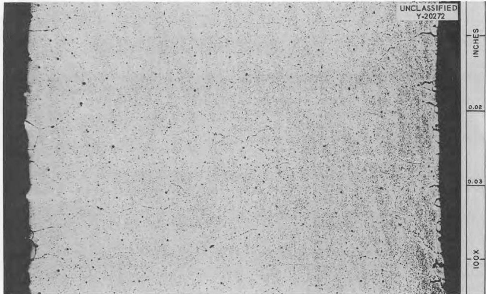

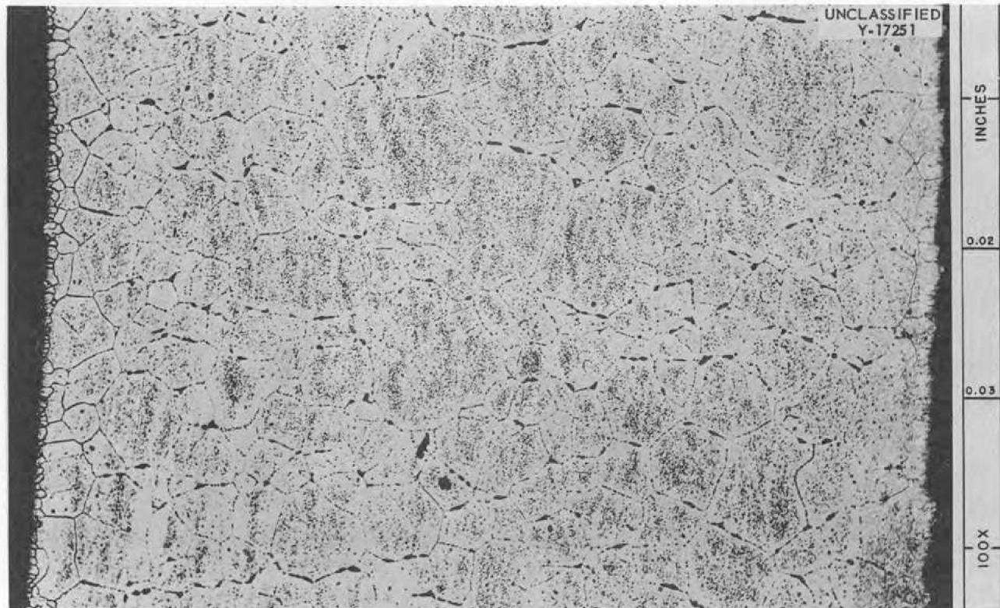  
Fig. 77. Photomicrograph from Inconel Tube-Burst Specimen Tested in Argon at $1500^{\circ}$ F Under 4000-psi Stress. 100X. Electrolytically etched with $10\%$ oxalic acid.   
Fig. 78. Photomicrograph from Inconel Tube-Burst Specimen Tested in Argon at $1500^{\circ}\mathrm{F}$ Under 3000-psi Stress, 100X. Electrolytically etched with $10\%$ oxalic acid. Reduced $3\%$ .

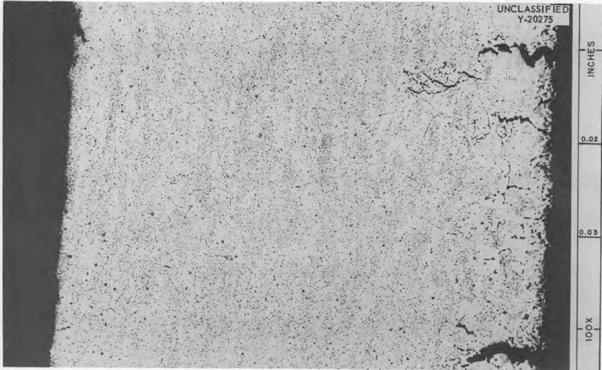

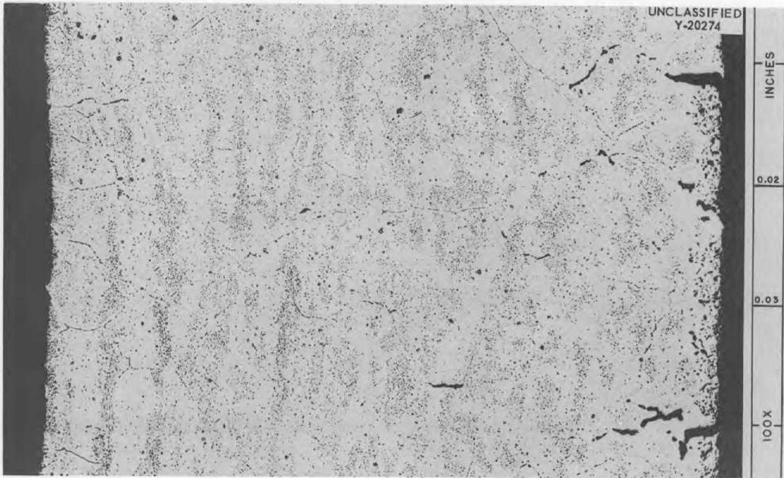  
Fig. 79. Photomicrograph from Inconel Tube-Burst Specimen Tested in Fused Salt No. 30 at $1500^{\circ}\mathrm{F}$ Under 5000-psi Stress. 100X. Electrolytically etched with $10\%$ oxalic acid. (Secret with caption)   
Fig. 80. Photomicrograph from Inconel Tube-Burst Specimen Tested in Fused Salt No. 30 at $1500^{\circ}\mathrm{F}$ Under 4000-psi Stress. 100X. Electrolytically etched with $10\%$ oxalic acid. (Secret with caption)

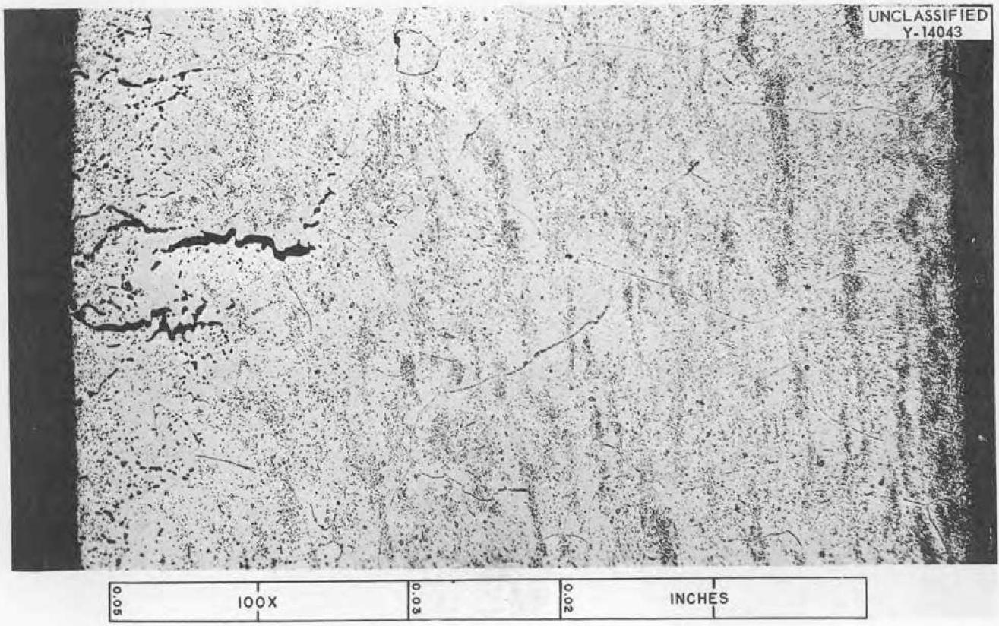

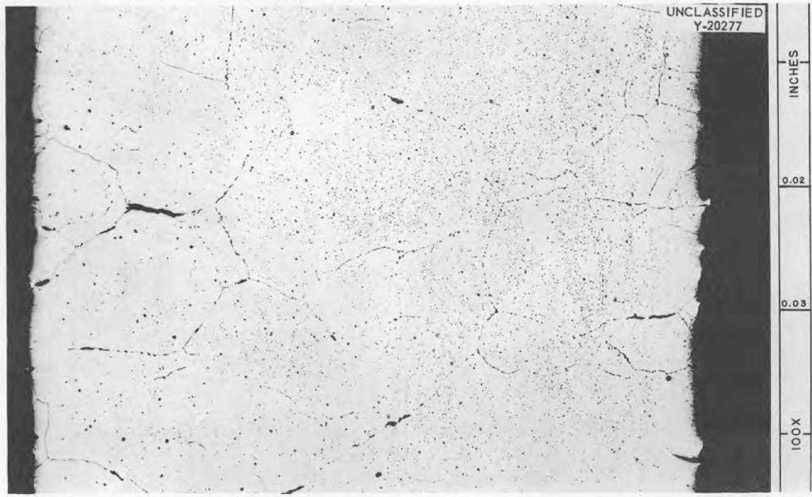  
Fig. 81. Photomicrograph from Inconel Tube-Burst Specimen Tested in Fused Salt No. 30 at $1500^{\circ}\mathrm{F}$ Under 3500-psi Stress. 100X. Electrolytically etched with $10\%$ oxalic acid. (Secret with caption)   
Fig. 82. Photomicrograph from Inconel Tube-Burst Specimen Tested in Argon at $1650^{\circ}\mathrm{F}$ Under 3000-psI Stress. 100X. Electrolytically etched with $10\%$ oxalic acid.

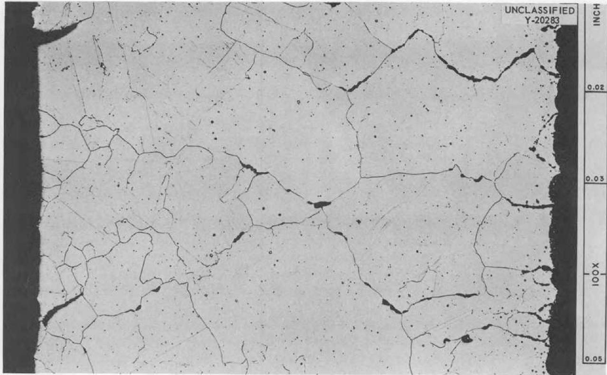

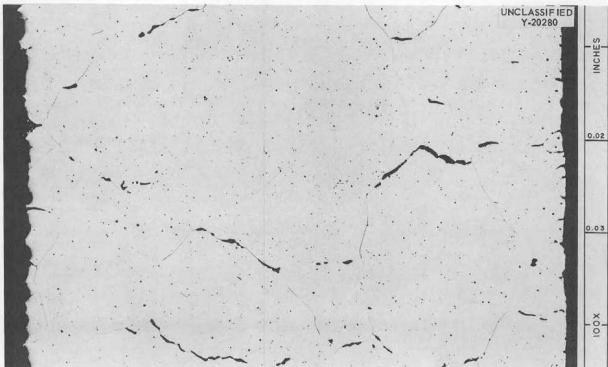  
Fig. 83. Photomicrograph from Inconel Tube-Burst Specimen Tested in Argon at $1650^{\circ}$ F Under 2000-psi Stress, 100X. Electrolytically etched with $10\%$ oxalic acid. Reduced $3\%$ .   
Fig. 84. Photomicrograph from Inconel Tube-Burst Specimen Tested in Argon at $1650^{\circ}$ F Under 1500-psi Stress. 100X. Electrolytically etched with $10\%$ oxalic acid.

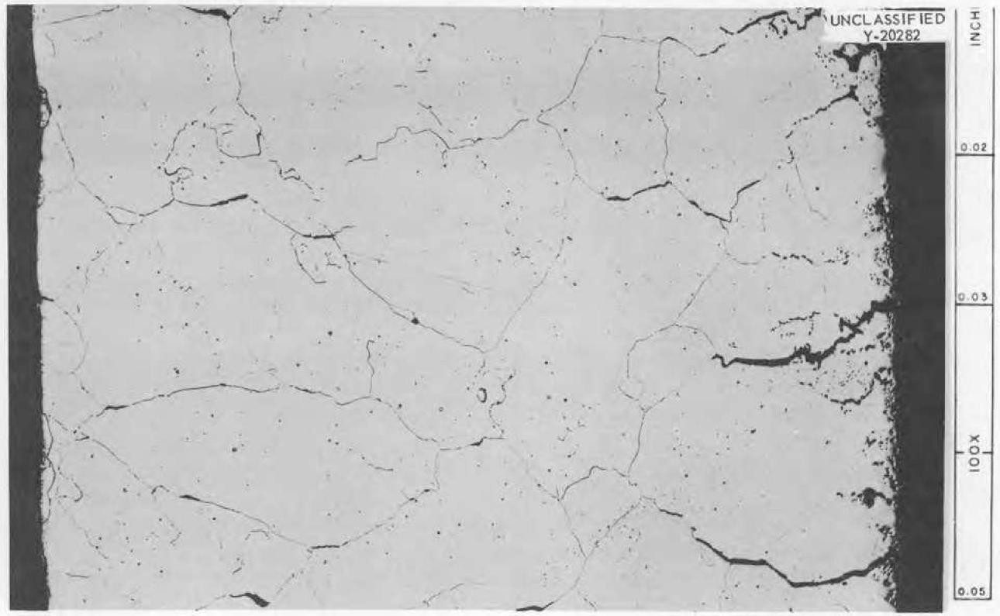

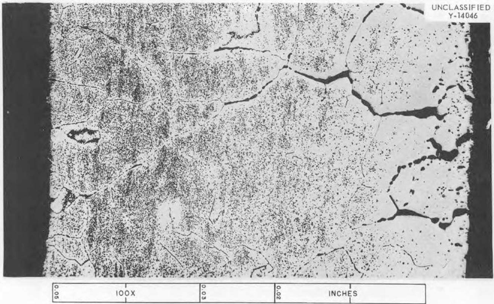  
Fig. 85. Photomicrograph from Inconel Tube-Burst Specimen Tested in Fused Salt No. 30 at $1650^{\circ}$ F Under 3000-psi Stress. 100X. Electrolytically etched with $10\%$ oxalic acid. Reduced $3\%$ . (Secret with caption)   
Fig. 86. Photomicrograph from Inconel Tube-Burst Specimen Tested in Fused Salt No. 30 at $1650^{\circ}$ F Under 2000-psi Stress. 100X. Electrolytically etched with $10\%$ oxalic acid. (Secret with caption)

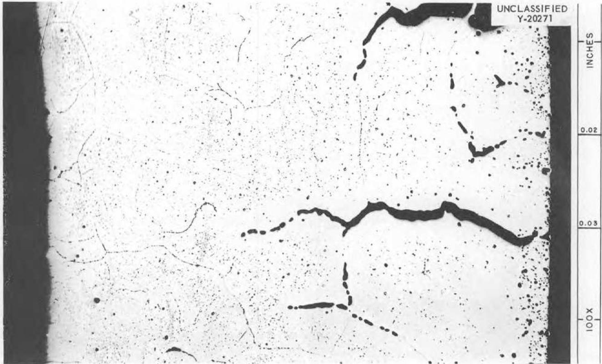  
Fig. 87. Photomicrograph from Inconel Tube-Burst Specimen Tested in Fused Salt No. 30 at $1650^{\circ}\mathrm{F}$ Under 1750-psi Stress. 100X. Electrolytically etched with $10\%$ oxalic acid. (Secret with caption)

completely immersed in fused salt No. 30 is illustrated in Fig. 88. Time is plotted vs section thickness with 2, 5, and $10\%$ elongation, with rupture, and with elongation at rupture as parameters. The specimens were tested at $1500^{\circ}\mathrm{F}$ under 3500-psi stress. Considerable loss in strength and ductility is exhibited by the thinner sections, although the strength of sections over 0.060-in. thick is not so sensitive to changes in section thickness. A more extensive comparison of the creep-rupture properties of 0.020- and 0.060-in.-thick Inconel sheet in fused salt No. 30 at $1500^{\circ}\mathrm{F}$ is presented in Fig. 89.

The stress-rupture properties of annealed tubular specimens of 0.020-in.-wall thickness tested in argon are compared in Fig. 90 with those of the specimens tested in fused salt No. 30. A similar comparison for 0.060-in.-wall specimens is given in Fig. 91. The deleterious effect of the salt on the rupture properties of the tubes of 0.020-in.-wall thickness is seen to be much greater than on the tubes of 0.060-in.-wall thickness. It is intended that only the relative properties of the material in the two environments be considered, since the two

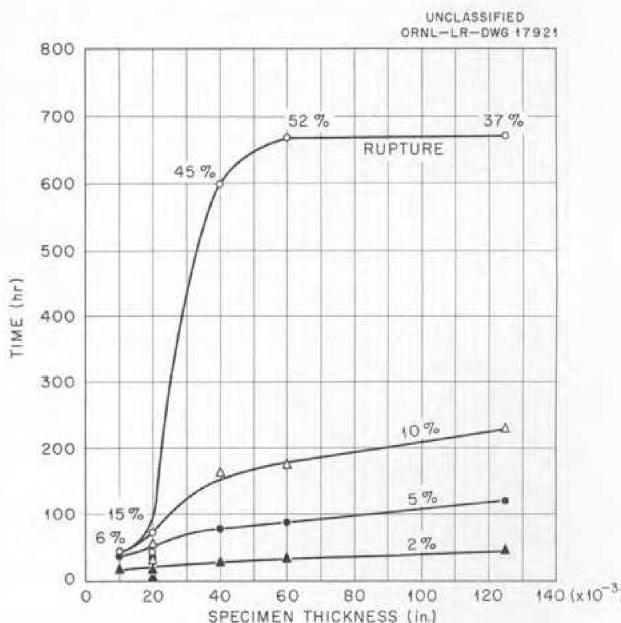  
Fig. 88. Effect of Section Thickness on Creep-Rupture Properties of As-Received Inconel Tested in Fused Salt No. 30 at $1500^{\circ}\mathrm{F}$ Under 3500 psi Stress. (Secret with caption)

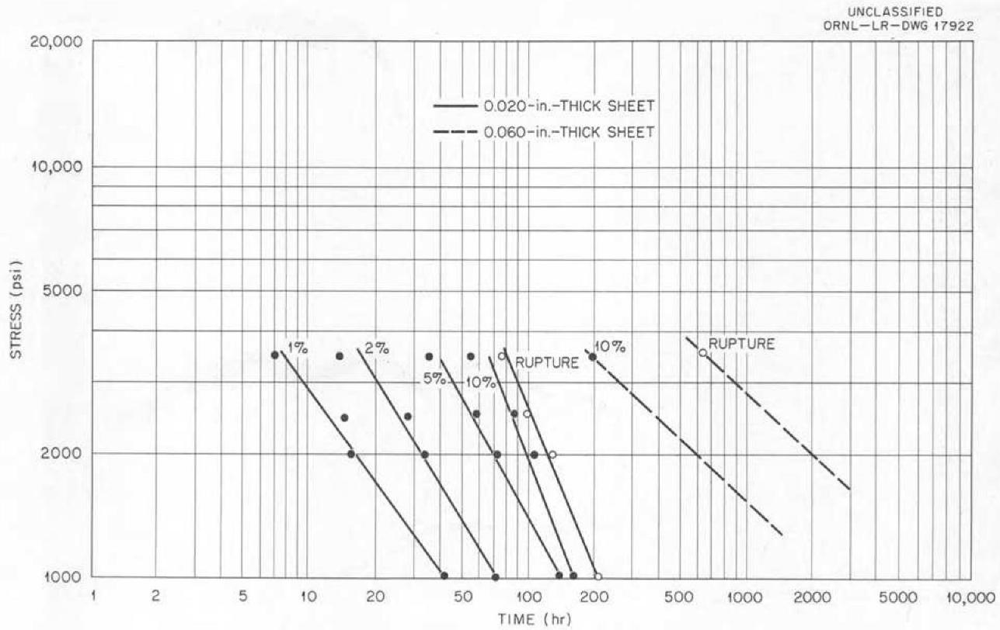

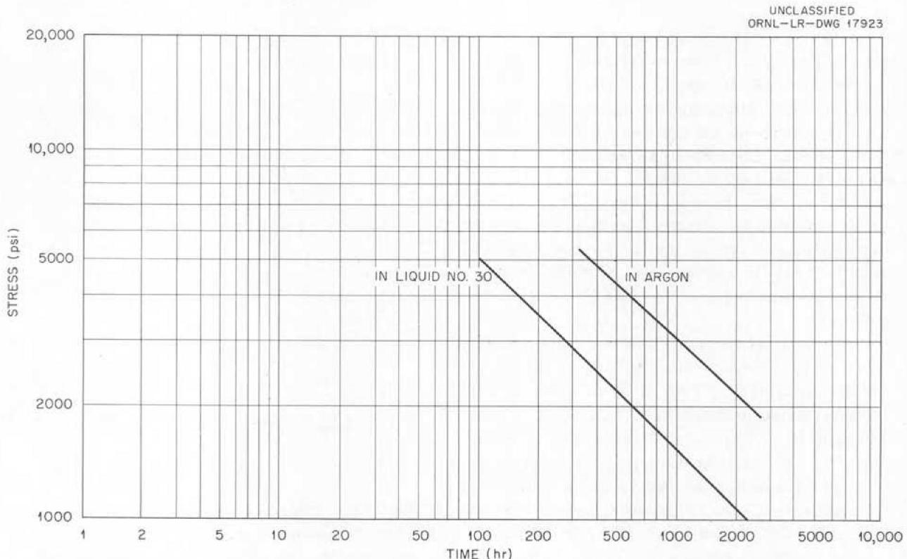  
Fig. 89. Comparison of Creep-Rupture Properties of 0.020- and 0.060-in. Fine-Grained Inconel Sheet Tested in Fused Salt. No. 30 at $1500^{\circ}\mathrm{F}$ . (Secret with caption)   
Fig. 90. Comparison of Stress-Rupture Properties of Annealed 0.020-in. Inconel Tube-Burst Specimens Tested in Argon and in Fused Salt No. 30 at $1500^{\circ}\mathrm{F}$ . (Secret with caption)

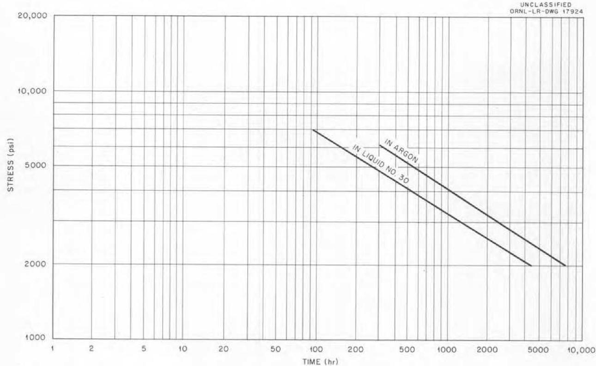  
Fig. 91. Comparison of Stress-Rupture Properties of Annealed 0.060-in. Inconel Tube-Burst Specimens Tested in Argon and in Fused Salt No. 30 at $1500^{\circ}\mathrm{F}$ . (Secret with caption)

sizes of specimens were not taken from the same heat of Inconel.

It is believed that a major portion of the strength decrement observed in the thinner cross sections may be attributed to the corrosive action of the salt. However, there is some experimental evidence[10,11] that the strength of a material may vary with the cross-sectional area when it is tensile tested in air at room temperature. Although this phenomenon is not well understood, it is believed to be attributable to the statistically inhomogeneous stress and strain distribution over the small cross sections that results from the difference in strength between the grain boundary and the bulk grain.

# Effect of Welding on the Creep-Rupture Strength

Several 0.060-in.-thick-sheet type of creep specimens were machined from inert-gas-welded $\frac{1}{8}$ -in.-sheet stock, and creep-rupture tests were carried out in fused salt No. 30 and in argon to determine the joint efficiency of Inconel weldments in the two media. The results of these tests are summarized in Table 3.

In all tests the failure occurred roughly $\frac{3}{4}$ in. from the weld in the parent metal, indicating that the weld metal is somewhat stronger than the parent metal at these temperatures. The position of the failures was not considered to be within the weld heat-affected zone.

Photomicrographs of the specimens tested in fused salt No. 30 are presented in Figs. 92, 93, and 94. The short rupture times exhibited in the case of the tests at $1300^{\circ}\mathrm{F}$ in fused salt No. 30 and the test of the annealed specimen at 4000 psi at $1500^{\circ}\mathrm{F}$ in fused salt No. 30 are attributed to the excessive corrosive attack seen in the photomicrographs of these two specimens. It is believed that a leak developed in the testing apparatus during the tests, which admitted oxygen into the salt and thereby increased the rate of attack. The photomicrographs indicate that the weld metal is

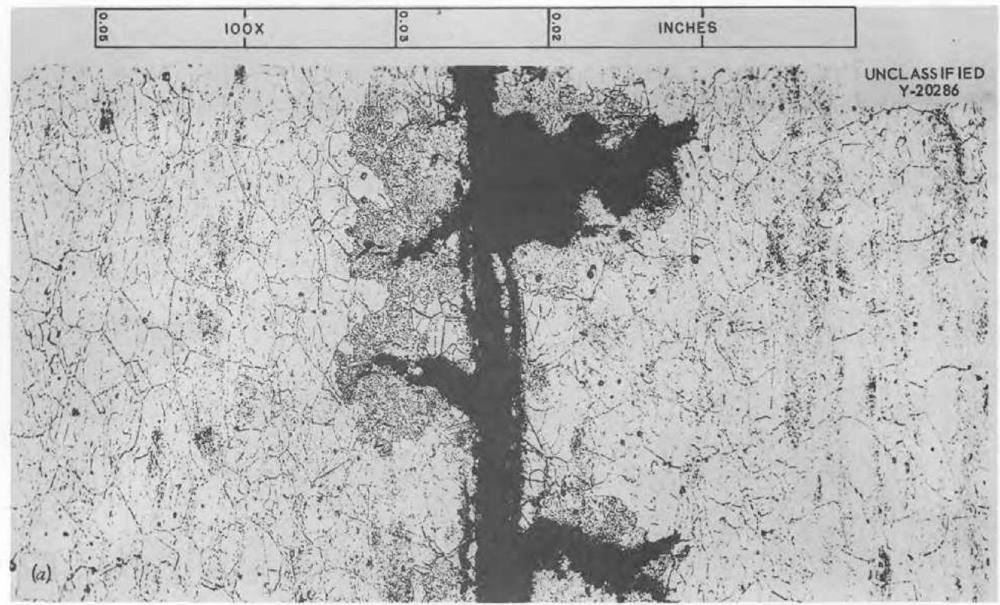

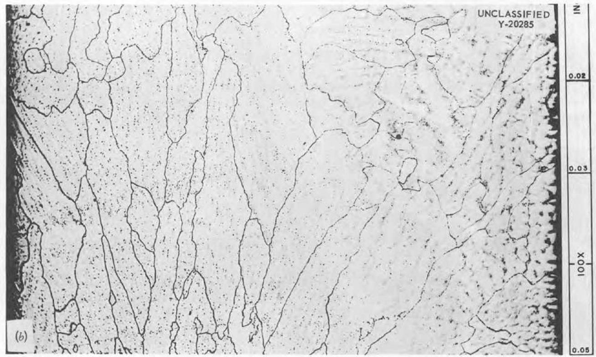  
Fig. 92. Photomicrograph Showing Corrosion of Inconel Specimen Tested in Fused Salt No. 30 at $1300^{\circ}\mathrm{F}$ Under 12,000-psi Stress. (a) Wrought sheet Inconel above weld area; (b) as-welded Inconel sheet. 100X. Electrolytically etched with $10\%$ oxalic acid. (Secret with caption)

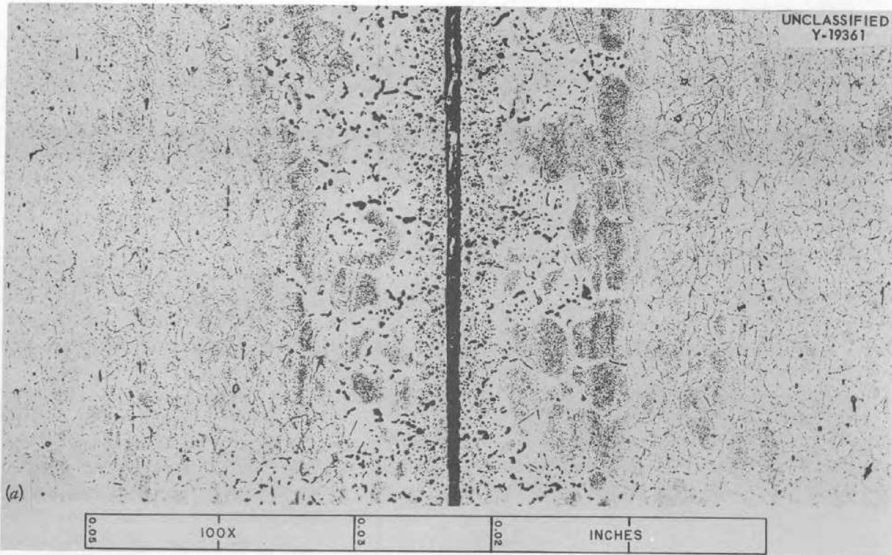

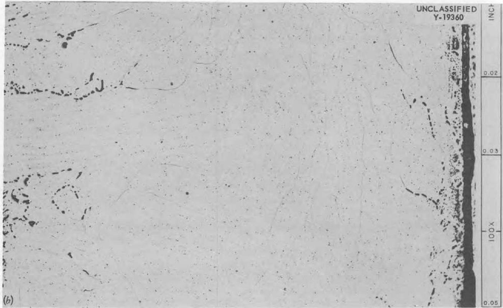  
Fig. 93. Photomicrograph of Inconel Sheet Tested in Fused Salt No. 30 at $1500^{\circ}$ F Under 3000-psi Stress. (a) Wrought sheet Inconel above weld area; (b) as-welded Inconel sheet. 100X. Electrolytically etched with $10\%$ oxalic acid. (Secret with caption)

as corrosion resistant as the parent metal. These data and the data of Scott12 indicate that the joint efficiencies of Inconel weldments in the temperature range 1300 to $1500^{\circ}\mathrm{F}$ are from 95 to $100\%$ .

# Variations in Strength Among Various Heats of Inconel

Comparison of the creep-rupture properties of various heats of Inconel has revealed considerable differences in strength among these heats. A summary of the creep-rupture characteristics of heat A tested at $1500^{\circ}\mathrm{F}$ in argon in the as-received

Table 3. Summary of Creep-Rupture Test Data on Inconel Weldments   

<table><tr><td>Stress (psi)</td><td>Temperature (°F)</td><td>Environment</td><td>Specimen Condition</td><td>Rupture Life (hr)</td><td>Per Cent Elongation</td><td>Rupture Life of Heat B Inconel</td></tr><tr><td>12,000</td><td>1300</td><td>Fused salt No. 30</td><td>As welded</td><td>110</td><td>21</td><td>600</td></tr><tr><td>4,000</td><td>1500</td><td>Fused salt No. 30</td><td>Annealed</td><td>380</td><td>11</td><td>700</td></tr><tr><td>4,000</td><td>1500</td><td>Argon</td><td>Annealed</td><td>1400</td><td>16</td><td>850</td></tr><tr><td>3,000</td><td>1500</td><td>Fused salt No. 30</td><td>As welded</td><td>820</td><td>5</td><td>850</td></tr><tr><td>3,000</td><td>1500</td><td>Argon</td><td>As welded</td><td>2900</td><td>7</td><td>2200</td></tr></table>

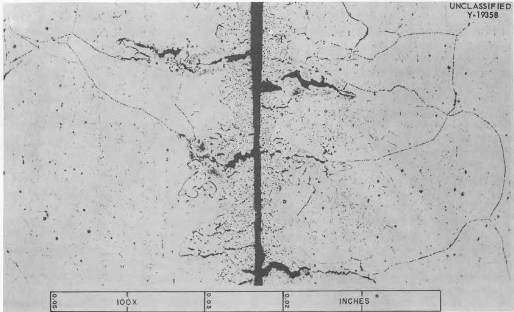  
Fig. 94. Photomicrograph of Annealed Inconel Sheet Tested in Fused Salt No. 30 at $1500^{\circ}\mathrm{F}$ Under 4000-psi Stress. The surface of the stressed specimen is shown on the left. 100X. Electrolytically etched with $10\%$ oxalic acid. (Secret with caption)

and annealed conditions is shown in Figs. 95 and 96. A comparison of the stress-rupture curves with similar curves for heat B (Figs. 7 and 8) is given for the two heats in Fig. 97.

The total deformation at rupture for fine- and coarse-grained material from the two heats is shown as a per cent elongation vs rupture time graph in Fig. 98.

The following may be concluded from the above comparisons:

1. Heat B exhibits rupture strengths 20 to $40\%$ higher than heat A at $1500^{\circ}\mathrm{F}$ .   
2. A grain-coarsening anneal reduces the rupture properties as compared with the fine-grained material of both heats by the same magnitude at $1500^{\circ}\mathrm{F}$ .   
3. The creep properties of heat B are superior to those of heat A at $1500^{\circ}\mathrm{F}$   
4. Heat B exhibits greater ductility at rupture than heat A based on a comparison of per cent elongation at rupture vs rupture time for both heats.

The microstructures of the two heats in the asreceived and annealed conditions are shown in

Figs. 99, 100, 101, and 102. No significant difference is seen in the amount or type of precipitate in the as-received material nor in the appearance of the material which was given the grain-coarsening anneal.

The strain aging or precipitation phenomenon noted with heat B also occurs at $1500^{\circ}\mathrm{F}$ with annealed heat A. Figures 103 and 104 are photomicrographs taken after creep-rupture testing of annealed material from heat A at $1500^{\circ}\mathrm{F}$ and 4000 psi stress. The precipitate seen in Fig. 104 is similar to that which occurs in material from heat B (Figs. 30 and 31) at a similar stress and temperature.

It appears that no microstructural difference exists to which may be attributed the observed variation in strength between the two heats of Inconel. Based on these data and on the quality control data obtained at the Huntington, West Virginia, plant of the International Nickel Company, Inc., it must be concluded that the creep properties of Inconel are subject to variations from heat to heat. Heats A and B exhibit the widest spread in creep

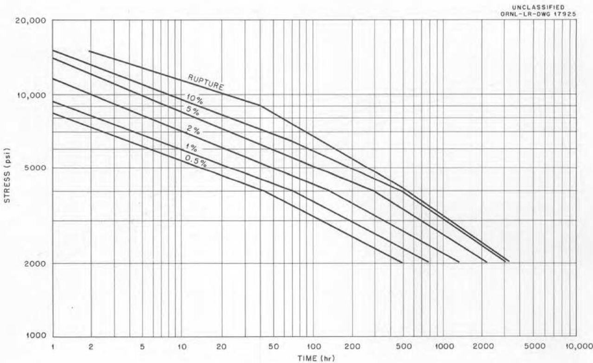  
Fig. 95. Design Curve for As-Received Inconel (Heat A) Tested in Argon at $1500^{\circ}\mathrm{F}$ .

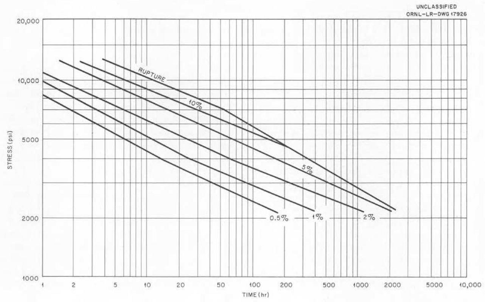

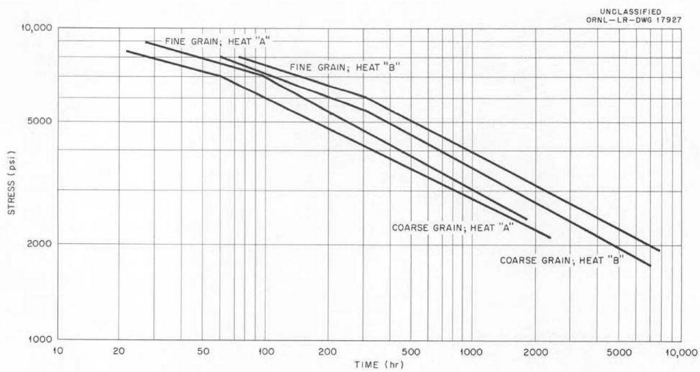  
Fig. 96. Design Curve for Annealed Inconel (Heat A) Tested in Argon at $1500^{\circ}\mathrm{F}$ .   
Fig. 97. Comparison of the Stress-Rupture Properties of Heats A and B in the As-Received and Annealed Conditions.

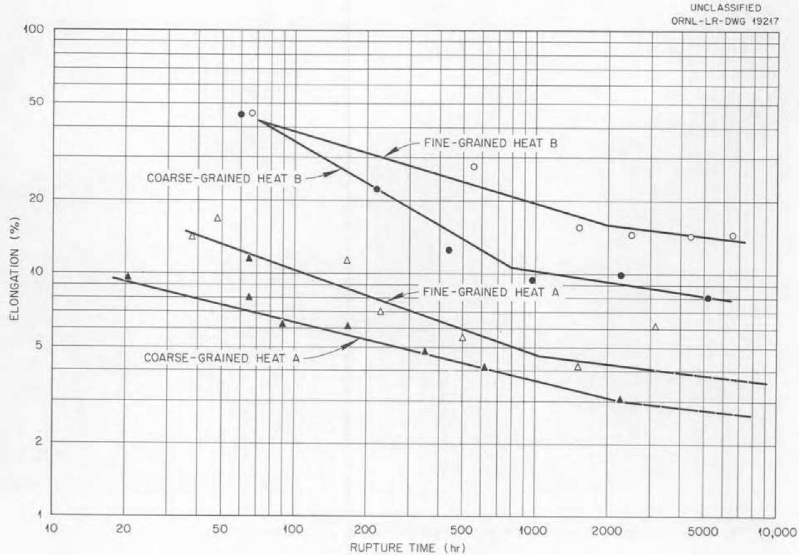  
Fig. 98. Creep-Rupture Properties of Inconel from Heats A and B Tested in Argon at $1500^{\circ}$ F.

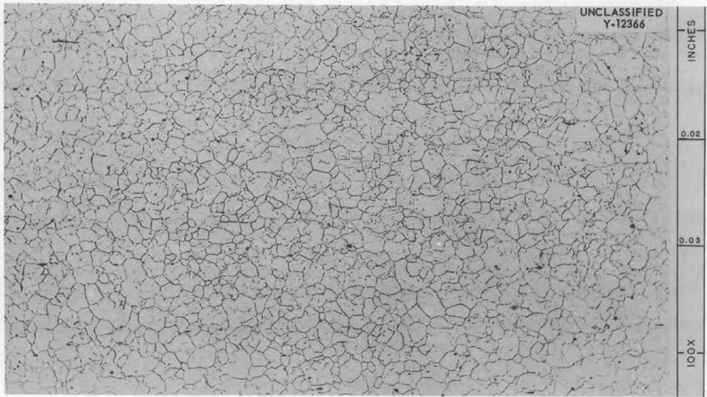  
Fig. 99. Photomicrograph of As-Received Inconel (Heat A). 100X. Electrolytically etched with $10\%$ oxalic acid.

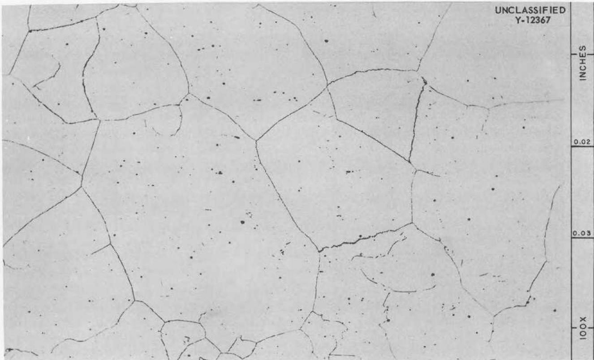

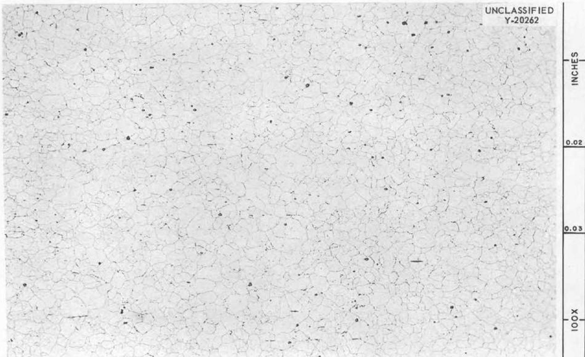  
Fig. 100. Photomicrograph of Annealed Inconel (Heat A). 100X. Electrolytically etched with $10\%$ oxalic acid.   
Fig. 101. Photomicrograph of As-Received Inconel (Heat B). 100X. Electrolytically etched with $10\%$ oxalic acid. Reduced $3\%$ .

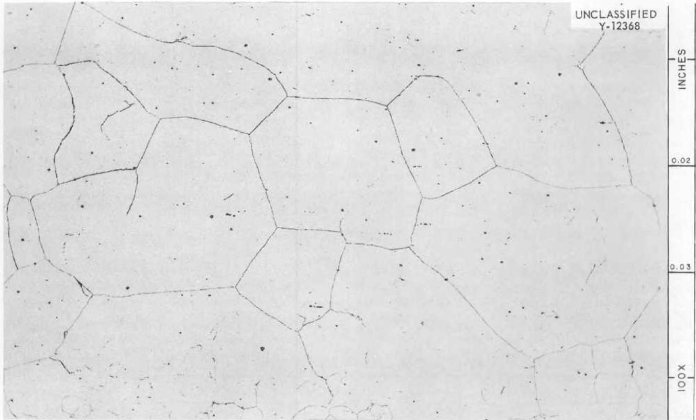

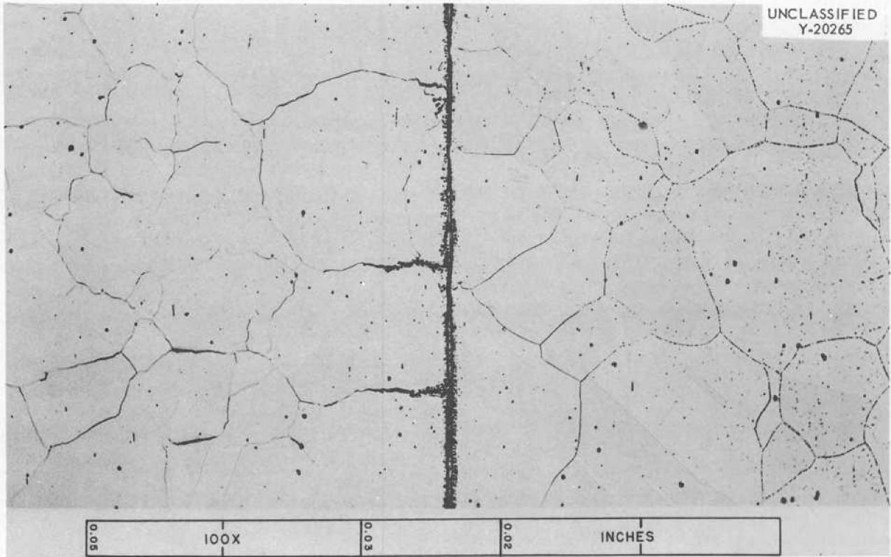  
Fig. 102. Photomicrograph of Annealed Inconel (Heat B). 100X. Electrolytically etched with $10\%$ oxalic acid.   
Fig. 103. Photomicrograph of Annealed Inconel (Heat A) Tested at $1500^{\circ}\mathrm{F}$ Under 4000-psi Stress. The surface of the stressed specimen, which ruptured at 240 hr, is shown on the left. 100X. Electrolytically etched with $10\%$ oxalic acid.

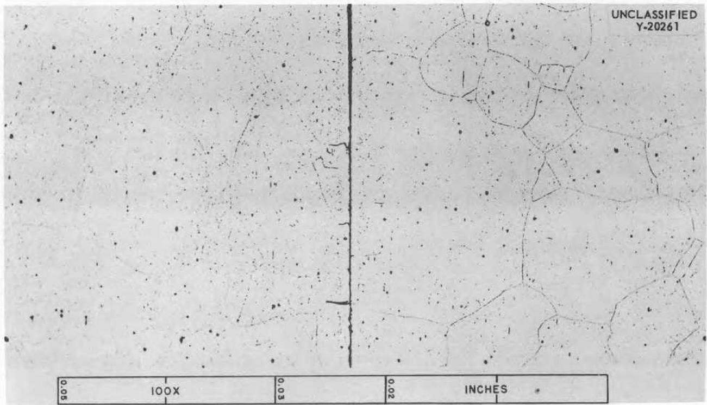  
Fig. 104. Photomicrograph of Annealed Inconel (Heat A) Tested at $1500^{\circ}\mathrm{F}$ Under 4000-psi Stress. The surface of the stressed specimen, which ruptured in 1300 hr, is shown on the left. 100X. Electrolytically etched with $10\%$ oxalic acid.

properties of all the heats examined at ORNL and thus bracket the range in values which can be expected for 0.060-in.-thick sheet.

# Tensile Properties of Inconel

The results of tensile tests performed at a strain rate of 0.016 in./min at temperatures ranging from room temperature to $2200^{\circ}\mathrm{F}$ on as-received and annealed Inconel are shown in Fig. 105. Stress is plotted vs temperature with the ultimate strength and the $0.2\%$ offset yield stress as parameters.

The modulus of elasticity values for hot-rolled Inconel at temperatures up to $1800^{\circ}\mathrm{F}$ are tabulated graphically in Fig. 106. The as-received material is seen to exhibit higher yield and tensile strengths at temperatures up to roughly $1700^{\circ}\mathrm{F}$ , although both as-received and annealed materials lose strength rapidly as the temperature increases above $1000^{\circ}\mathrm{F}$ . The higher yield and ultimate strengths of the as-received material may be attributed to the residual cold work and to the carbide precipitate which exists in the microstructure. The modulus of elasticity decreases with temperature above $1500^{\circ}\mathrm{F}$ but not so rapidly as do the other tensile properties.

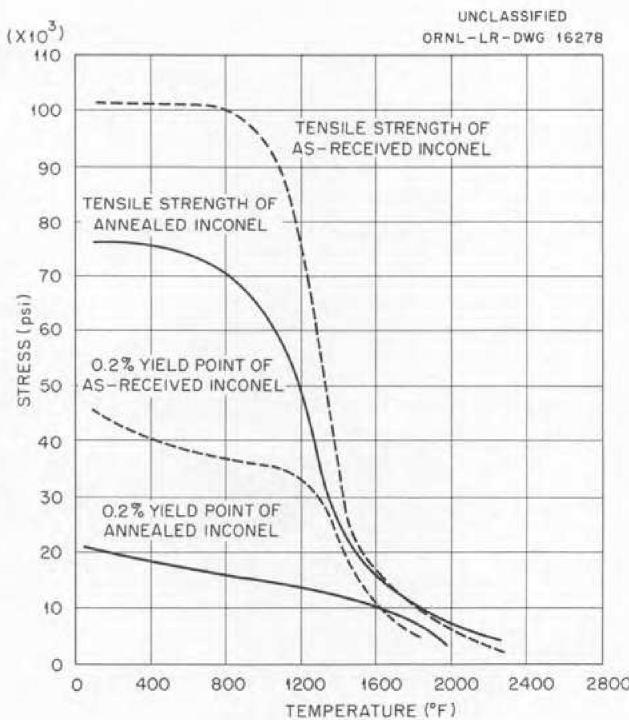  
Fig. 105. Tensile Properties of As-Received and Annealed Inconel Tested at a Strain Rate of 0.016 in./min.

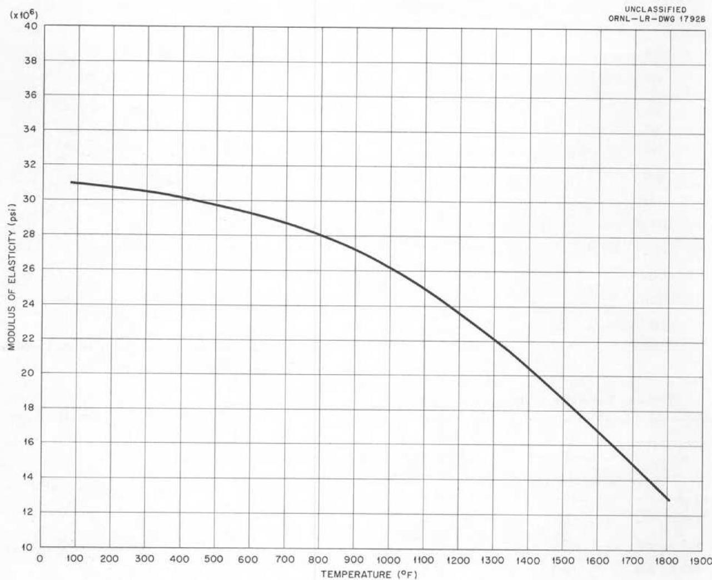  
Fig. 106. Modulus of Elasticity of As-Received Inconel.

# Some Physical Properties of Inconel

Although a discussion of the physical properties of Inconel is beyond the intended scope of this report, it was deemed advisable to include data on the thermal conductivity and the coefficient of thermal expansion because they are so important in the calculation and evaluation of thermal stresses.

The mean and instantaneous linear coefficients of thermal expansion for Inconel at temperatures up to $1800^{\circ}\mathrm{F}$ , which were obtained from the International Nickel Company, Inc., are presented in Table 4. The data on the variation of thermal conductivity of Inconel with temperature for temperatures up to $1500^{\circ}\mathrm{F}$ are given on the following page:

<table><tr><td>Temperature (°F)</td><td>Conductivity [Btu/ft2·sec/(°F/in.)]</td></tr><tr><td>300</td><td>0.032</td></tr><tr><td>400</td><td>0.033</td></tr><tr><td>500</td><td>0.034</td></tr><tr><td>600</td><td>0.035</td></tr><tr><td>700</td><td>0.036</td></tr><tr><td>800</td><td>0.037</td></tr><tr><td>900</td><td>0.038</td></tr><tr><td>1000</td><td>0.039</td></tr><tr><td>1100</td><td>0.040</td></tr><tr><td>1200</td><td>0.041</td></tr><tr><td>1300</td><td>0.042</td></tr><tr><td>1400</td><td>0.043</td></tr><tr><td>1500</td><td>0.044</td></tr></table>

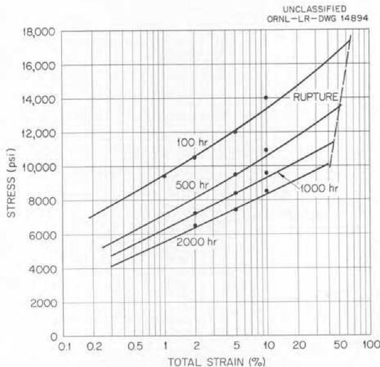  
Fig. 107. Isochronous Design Charts for As-Received Inconel Tested at $1300^{\circ}$ F in Argon.

Table 4. Expansion Coefficients of Inconel   

<table><tr><td>Temperature Range (°F)</td><td>Mean Coefficient in./in. \( /{}^{ \circ  }\mathrm{F}\left( {\times {10}^{-6}}\right) \)</td><td>Instantaneous Coefficient in./in. \( /{}^{ \circ  }F\left( {\times {10}^{-6}}\right) \)</td></tr><tr><td>100 – 200</td><td>8.0</td><td>8.2</td></tr><tr><td>100 – 400</td><td>8.1</td><td>8.6</td></tr><tr><td>100 – 600</td><td>8.2</td><td>8.8</td></tr><tr><td>100 – 800</td><td>8.3</td><td>8.9</td></tr><tr><td>100 – 1000</td><td>8.5</td><td>9.8</td></tr><tr><td>100 – 1200</td><td>8.9</td><td>10.5</td></tr><tr><td>100 – 1400</td><td>9.2</td><td>10.8</td></tr><tr><td>100 – 1600</td><td>9.4</td><td>10.8</td></tr><tr><td>100 – 1800</td><td>9.6</td><td>10.8</td></tr></table>

# Design Data

The design data for as-received and annealed 0.060-in.-thick Inconel sheet tested in argon and in fused salt No. 30 at 1300, 1500, and $1650^{\circ}\mathrm{F}$ have been replotted in two more convenient forms for use in design.

In Figs. 107 through 118 the data are plotted in the form of isochronous curves. Stress is plotted vs strain with 100, 500, 1000, and 2000 hr as time

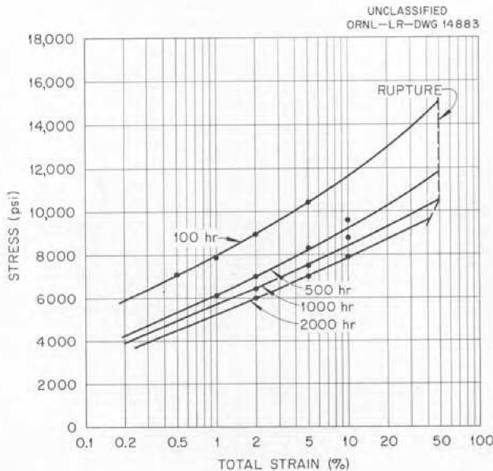  
Fig. 108. Isochronous Design Chart for Annealed Inconel Tested at $1300^{\circ}$ F in Argon.

parameters. These curves are used in the following manner. If in design a limiting strain in 1000 hr at $1500^{\circ}\mathrm{F}$ is the criterion for failure, the stress which will produce this strain may be picked from the proper chart.

To facilitate interpolation between the testing temperatures, stress is plotted vs temperature, at

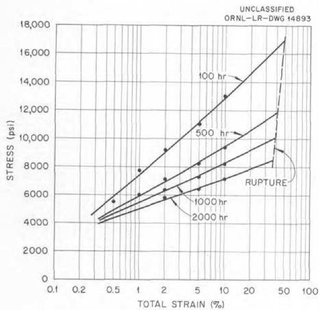  
Fig. 109. Isochronous Design Chart for As-Received Inconel Tested at $1300^{\circ}\mathrm{F}$ in Fused Salt No. 30. (Secret with caption)

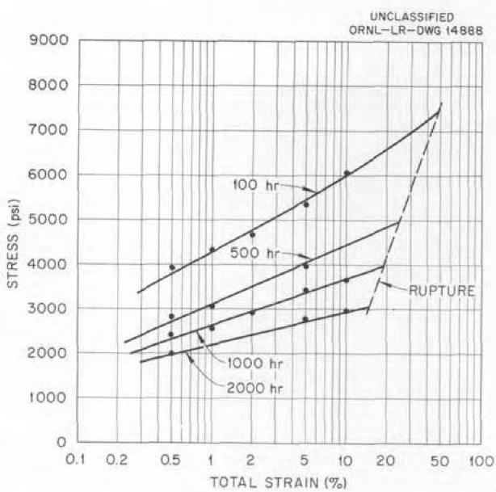  
Fig. 111. Isochronous Design Charts for As-Received Inconel Tested at $1500^{\circ}\mathrm{F}$ in Argon.

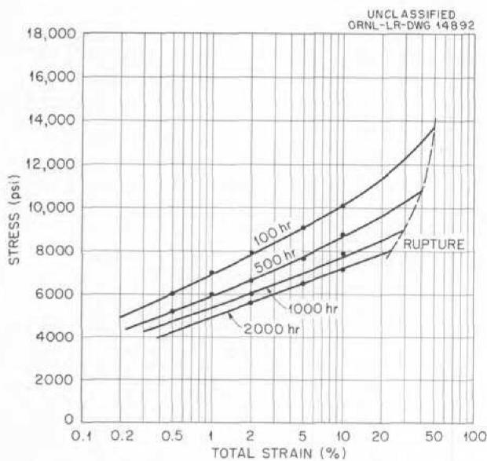  
Fig. 110. Isochronous Design Charts for Annealed Inconel Tested at $1300^{\circ}\mathrm{F}$ in Fused Salt No. 30. (Secret with caption)

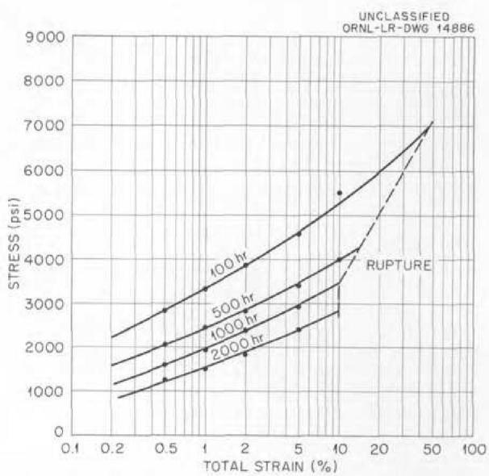  
Fig. 112. Isochronous Design Charts for Annealed Inconel Tested at $1500^{\circ}$ F in Argon.

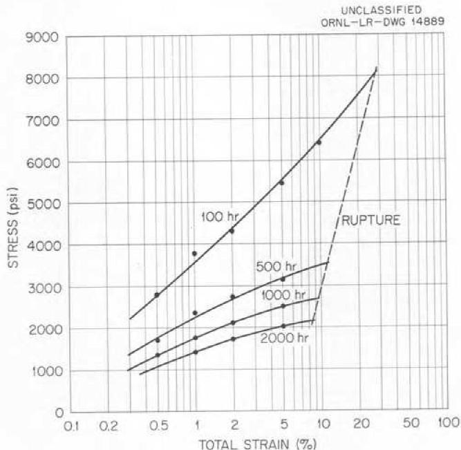  
Fig. 113. Isochronous Design Charts for As-Received Inconel Tested at $1500^{\circ}\mathrm{F}$ in Fused Salt No. 30. (Secret with caption)

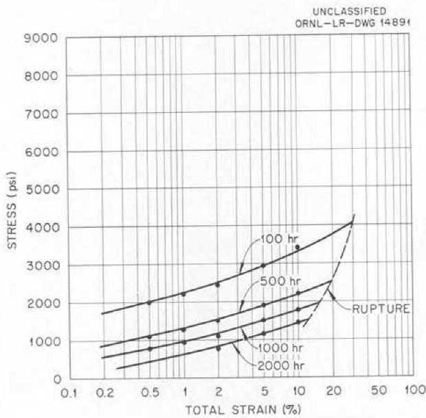  
Fig. 115. Isochronous Design Charts for As-Received Inconel Tested at $1650^{\circ}\mathrm{F}$ in Argon.

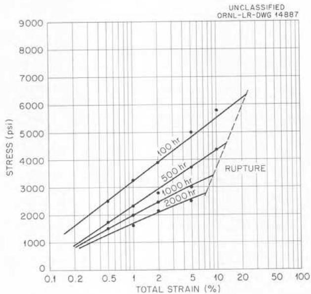  
Fig. 114. Isochronous Design Charts for Annealed Inconel Tested at $1500^{\circ}\mathrm{F}$ in Fused Salt No. 30. (Secret with caption)

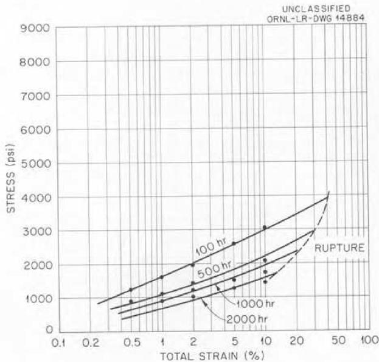  
Fig. 116. Isochronous Design Charts for Annealed Inconel Tested at $1650^{\circ}\mathrm{F}$ in Argon.

constant time, with 0.5, 1, 2, 5, and $10\%$ elongation and rupture as parameters in Figs. 119 through 130.

It must be remembered that these data are subject to modification by any of the previously discussed

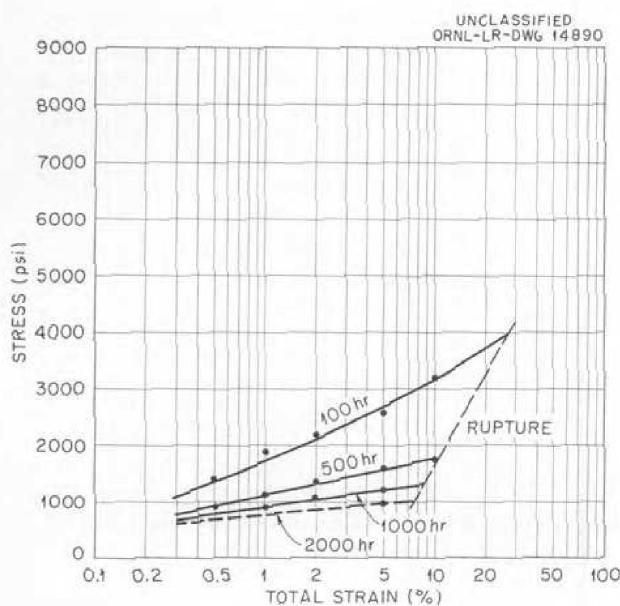

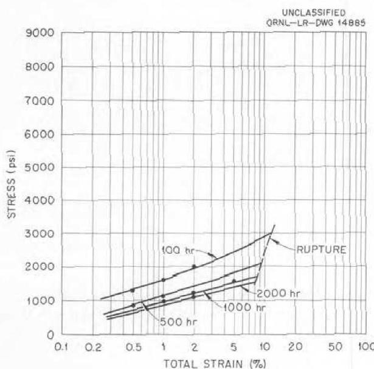  
Fig. 117. Isochronous Design Charts for As-Received Inconel Tested at $1650^{\circ}\mathrm{F}$ in Fused Salt No. 30. (Secret with caption)   
Fig. 118. Isochronous Design Charts for Annealed Inconel Tested at $1650^{\circ}\mathrm{F}$ in Fused Salt No. 30. (Secret with caption)

effects such as section size, biaxial stress, environment, and previous mechanical and thermal treatment.

# DISCUSSION

In the evaluation of the data presented from tests conducted in the sodium and in the fused-salt environments, it must be recognized that certain errors

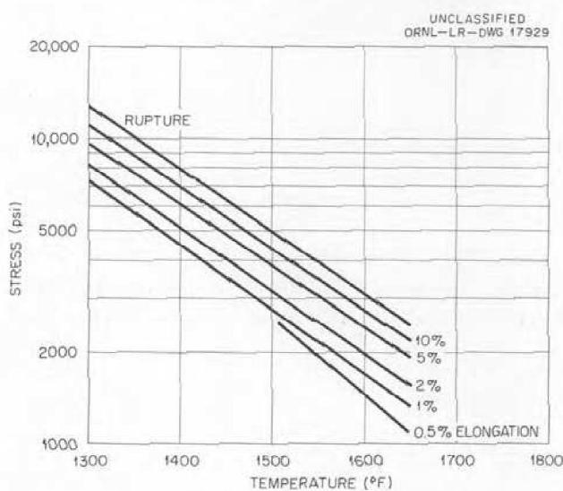  
Fig. 119. Temperature Dependence of the Creep-Rupture Strength of As-Received Inconel Tested in Argon for 500 hr.

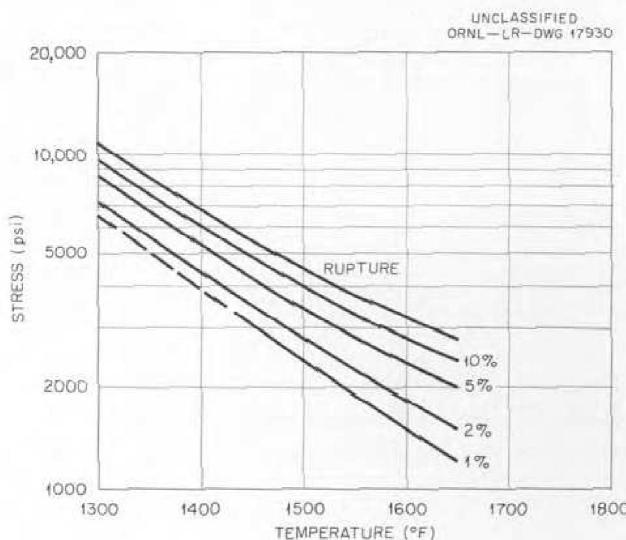  
Fig. 120. Temperature Dependence of the Creep-Rupture Strength of Annealed Inconel Tested in Argon for 500 hr.

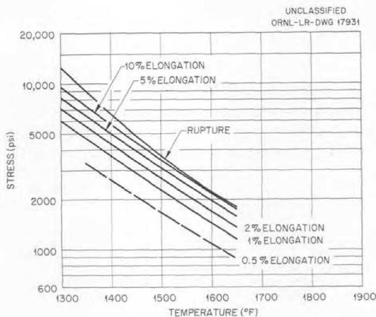  
Fig. 121. Temperature Dependence of the Creep-Rupture Strength of As-Received Inconel Tested in Fused Salt No. 30 for 500 hr. (Secret with caption)

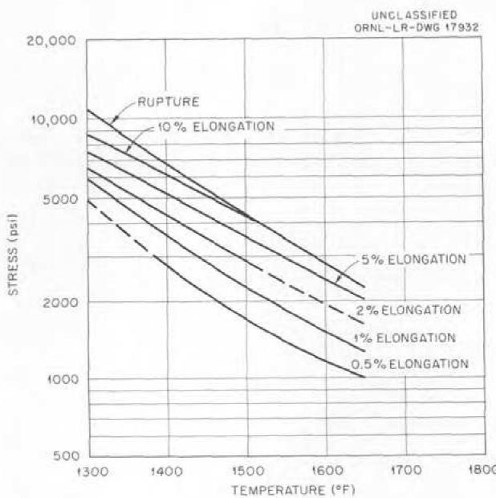  
Fig. 122. Temperature Dependence of the Creep-Rupture Strength of Annealed Inconel Tested in Fused Salt No. 30. (Secret with caption)

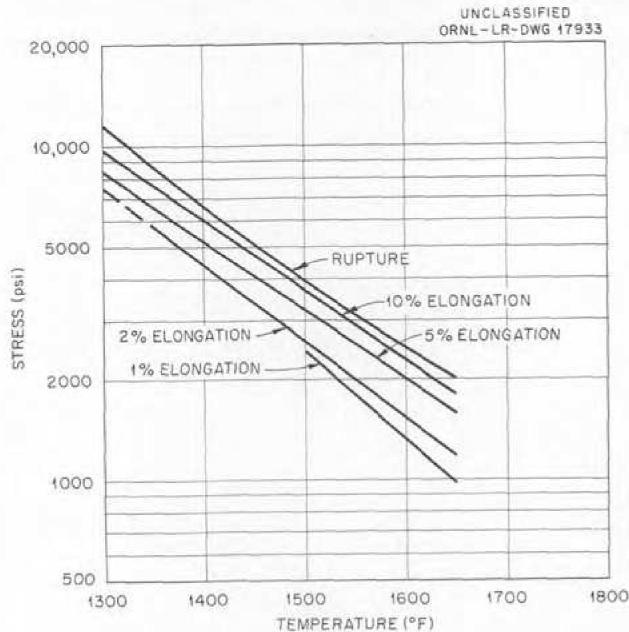

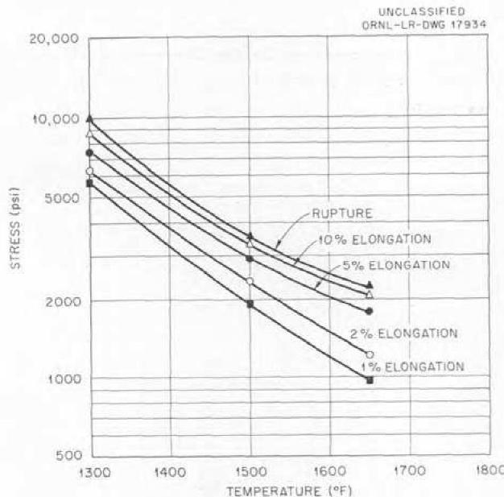  
Fig. 123. Temperature Dependence of the Creep-Rupture Strength of As-Received Inconel Tested in Argon for 1000 hr.   
Fig. 124. Temperature Dependence of the Creep-Rupture Strength of Annealed Inconel Tested in Argon for 1000 hr.

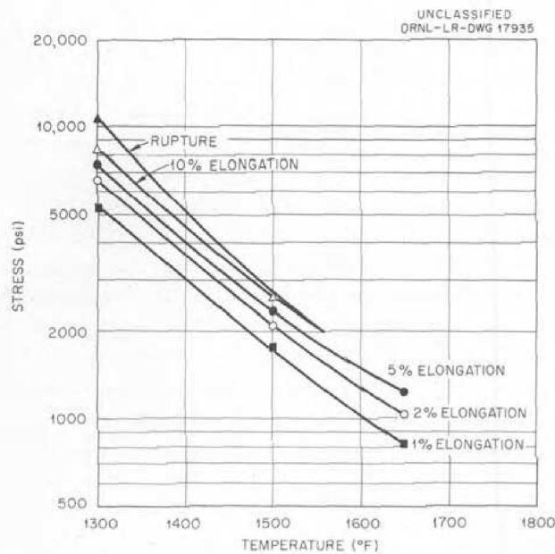  
Fig. 125. Temperature Dependence of the Creep-Rupture Strength of As-Received Inconel Tested in Fused Salt No. 30 for 1000 hr. (Secret with caption)

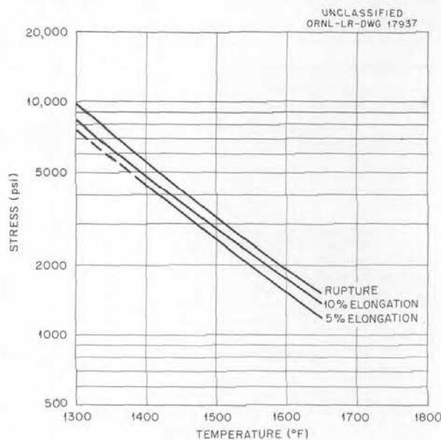  
Fig. 127. Temperature Dependence of the Creep-Rupture Strength of As-Received Inconel Tested in Argon for 2000 hr.

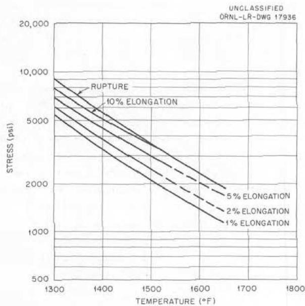  
Fig. 126. Temperature Dependence of the Creep-Rupture Strength of Annealed Inconel Tested in Fused Salt No. 30 for 1000 hr. (Secret with caption)

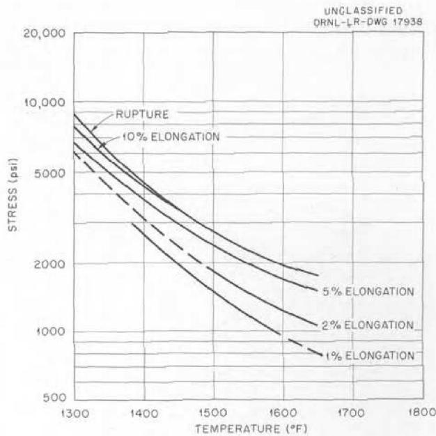  
Fig. 128. Temperature Dependence of the Creep-Rupture Strength of Annealed Inconel Tested in Argon for 2000 hr.

exist in the reported strain values because of inherent inaccuracies in the method of strain measurement. Conventional types of strain-sensing systems cannot be used because of the high temper

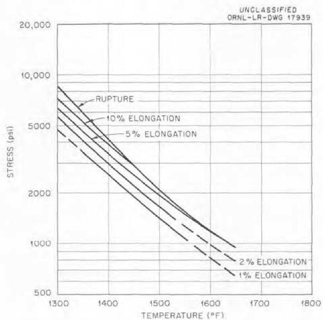  
Fig. 129. Temperature Dependence of the Creep-Rupture Strength of As-Received Inconel Tested in Fused Salt No. 30 for 2000 hr. (Secret with caption)

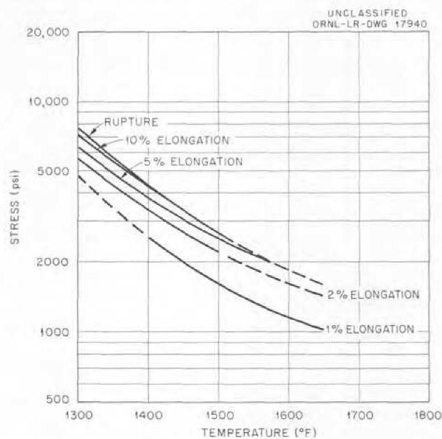  
Fig. 130. Temperature Dependence of the Creep-Rupture Strength of Annealed Inconel Tested in Fused Salt No. 30 for 2000 hr. (Secret with caption)

atures and the existence of corrosive vapors in the test chamber. Consequently, the movement resulting from deformation of the test specimen is monitored outside the test chamber roughly 18 in. from the gage length of the specimen. Thus the dial gage records, in addition to the movement due to deformation in the gage length of the specimen, the movement resulting from deformation in the pull rods and the shoulder of the specimen. The result of this error is that the dial gage indicates shorter time intervals to the lower strains than are actually occurring in the gage length of the specimen. However, the magnitude of this error is constant, and as the strain values increase, the percentage error decreases rapidly and therefore the recorded strains above $1\%$ are actually quite accurate. Since, for design purposes, it is desirable to obtain accurate low-strain data, an attempt is being made to devise a more accurate method for measuring creep under these conditions. A recent technique has involved the use of a variable permeance transducer, the coils of which are "canned" in a corrosion resistant material, actuated by rods fastened directly to the ends of the gage length of the specimen. One such test has been conducted with encouraging results. It is therefore believed that in future testing programs the accuracy of the data obtained in liquid environment will be comparable to that obtained in gaseous environments.

The data presented in this report represent the results of an extensive investigation of the high-temperature properties of Inconel under static load conditions. It is known that certain parts of the reactor will be subjected to transient stresses imposed either thermally or mechanically. In recognition that these data are inadequate for all design purposes and that they should be supplemented by tests in which cyclic stresses or strains are imposed on the material, a program has been initiated to obtain the type of design data which will more closely approach actual service conditions.

It was pointed out in the introduction to this report that one of the factors considered in the selection of a material for reactor use is its stability under radiation. Although no data have been presented, the importance of this effect has not been overlooked. This portion of the testing program is being conducted by the Mechanical Properties Group of the Solid State Division. A coordinated testing program between the above named group and the Mechanical Properties Group

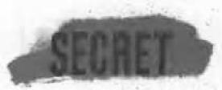

of the Metallurgy Division is in progress in an effort to establish the magnitude of the effect of radiation on the creep-rupture properties of Inconel in the temperature range of reactor operation.

# CONCLUSIONS AND RECOMMENDATIONS

In the range of temperatures and stresses investigated, the factors which were found to have a pronounced effect on the creep-rupture properties of Inconel are summarized as follows:

1. The effect of grain size or annealing treatment prior to test depends on the testing temperature and environment. At $1300^{\circ}\mathrm{F}$ the fine-grained material is stronger than the coarse-grained material in all environments. At $1500^{\circ}\mathrm{F}$ the fine-grained Inconel is stronger than the coarse-grained material in argon and in sodium but weaker in the fused salt. At $1650^{\circ}\mathrm{F}$ the fine-grained Inconel is weaker than the coarse-grained Inconel in all environments.   
2. The corrosion induced by the fused salt causes a reduction in the creep and rupture properties of Inconel at all temperatures. This reduction in strength becomes more marked as the temperature is increased.   
3. The effectiveness of the fused salt in decreasing the strength of Inconel increases rapidly as the section thickness is decreased below 0.060 in.   
4. Large variations in creep-rupture strength were observed between different heats of Inconel. Although the reasons for these variations have not been definitely established, it appears that they may be attributed to minor compositional differences induced by melting practice or to variations in fabrication history.

5. Oxidizing environments were found to reduce the creep rate and to increase the rupture life of thinner sections. This effect on sections greater than 0.060 in, thick is to increase the rupture elongation and time only.

Sodium was found to have no significant effect on the creep-rupture properties if the purity of the sodium is high. It is shown that Inconel may be decarburized by sodium if the oxide content of the sodium is high. It has also been observed that Inconel may be carburized by sodium contaminated with carbon. Since it is anticipated that high-purity sodium and NaK will be used in reactors, it is believed that creep data obtained in the argon environment may be used in the design of structures in contact with sodium or NaK.

Although a biaxial stress system consisting of simple hoop and axial stresses does not decrease the rupture life of the Inconel, the total elongation at failure in the direction of the maximum stress may be substantially reduced.

Application of the information contained in this report for specific design situations will need to be tempered with considerable caution in certain cases because of the presence of dynamic or complex stress conditions induced by thermal fluctuations.

# ACKNOWLEDGMENTS

The authors would like to acknowledge the contributions of J. D. Hudson, B. McNabb, C. W. Walker, J. T. East, C. K. Thomas, V. G. Lane, K. W. Boling, E. Bolling, E. B. Patton, and F. L. Beeler of the Mechanical Properties Group in performing the tests and the metallographic work of N. M. Atchely of the Metallography Group.

SECRET

SECRET