AIRCRAFT NUCLEAR PROPULSION PROJECT

QUARTERLY PROGRESS REPORT

FOR PERIOD ENDING MARCH 31, 1957

2019  RETIEN OF

DECLASSIFIED REPORTS

This Document is Properly Declassified.

Rovieod by R. S. Baker.

ORNL Classificatio1 Offic

OAK RIDGE NATIONAL LABORATORY

OPERATED BY

UNION CARBIDE NUCLEAR COMPANY

A Division of Union Carbide and Carbon Corporation

UCC

POST OFFICE BOX X · OAK RIDGE, TENNESSEE

Contract No. W-7405-eng-26

# AIRCRAFT NUCLEAR PROPULSION PROJECT

# QUARTERLY PROGRESS REPORT

For Period Ending March 31, 1957

W. H. Jordan, Director

S. J. Cromer, Co-Director

A. J. Miller, Assistant Director

DATE ISSUED

JUL 51957

CLASSIFICATION CANCELLED

DATE

For The Atomic Energy Commission

74.B Caneel

Chief, Declassification Branch

OAK RIDGE NATIONAL LABORATORY

Operated by

UNION CARBIDE NUCLEAR COMPANY

A Division of Union Carbide and Carbon Corporation

Post Office Box X

Oak Ridge, Tennessee

Reports previously issued in this series are as follows:

ORNL-528 Period Ending November 30, 1949

ORNL-629 Period Ending February 28, 1950

ORNL-768 Period Ending May 31, 1950

ORNL-858 Period Ending August 31, 1950

ORNL-919 Period Ending December 10, 1950

ANP-60 Period Ending March 10, 1951

ANP-65 Period Ending June 10, 1951

ORNL-1154 Period Ending September 10, 1951

ORNL-1170 Period Ending December 10, 1951

ORNL-1227 Period Ending March 10, 1952

ORNL-1294 Period Ending June 10, 1952

ORNL-1375 Period Ending September 10, 1952

ORNL-1439 Period Ending December 10, 1952

ORNL-1515 Period Ending March 10, 1953

ORNL-1556 Period Ending June 10, 1953

ORNL-1609 Period Ending September 10, 1953

ORNL-1649 Period Ending December 10, 1953

ORNL-1692 Period Ending March 10, 1954

ORNL-1729 Period Ending June 10, 1954

ORNL-1771 Period Ending September 10, 1954

ORNL-1816 Period Ending December 10, 1954

ORNL-1864 Period Ending March 10, 1955

ORNL-1896 Period Ending June 10, 1955

ORNL-1947 Period Ending September 10, 1955

ORNL-2012 Period Ending December 10, 1955

ORNL-2061 Period Ending March 10, 1956

ORNL-2106 Period Ending June 10, 1956

ORNL-2157 Period Ending September 10, 1956

ORNL-2221 Period Ending December 31, 1956

# INTERNAL DISTRIBUTION

1. R.G.Affel   
2.C.J.Barton   
3. M. Bender   
4. D. S. Billington   
5. F, F, Blankenship   
6. E.P.Blizard   
7. C. J. Borkowski   
8. W. F. Boudreau   
9. G.E. Boyd   
10. M.A.Bredig   
11. E, J. Breeding   
12. W.E.Browning   
13. F.R.Bruce   
14. A, D. Callihan   
15. D. W. Cordwell   
16. C. E. Center (K-25)   
17. R.A. Charpie   
18. R. L. Clark   
19. C. E. Clifford   
20. J.H. Coobs   
21. W.B.Cottrell   
22. S.J.Cromer   
23. R.S.Crouse   
24. F. L. Culler   
25. D. R. Cuneo   
26. J.H.DeVom   
27. L.M.Doney   
28. D. A. Douglas   
29. E.R.Dytko   
30. W.K. Eister   
31. L.B. Emlet (K-25)   
32. D. E. Ferguson   
33. A.P.Froos  
34. J.H.Frye, Jr.   
35. W. T. Furgerson   
36. R. J. Gray   
37. A, T. Gresky.   
38. W. R. Grimes   
39. A. G. Grindell   
40. E. Guth   
41. C, S. Horrill   
42. E. E. Hoffman   
43. H.W.Hoffman   
44. A. Hollander   
45. A. S. Householder   
46. J.T.Howe

47. W.H. Jordan   
48. G.W. Keilholtz   
49. C.P. Keim   
50. F. L. Keller   
51. M. T. Kelley   
52. F. Kertesz   
S3.J.J.Keyes

54-55. J, A. Lane   
56. R. B. Lindauer   
57. R. S. Livingston   
58. R.N.Lyon   
59. H. G. MacPherson   
60. R, E. MacPherson   
61. F.C. Maienschein   
62. W.D. Manly   
63. E.R.Mann   
64. L. A. Mann   
65. W. B. McDonald   
66. J.R.McNally   
67. F.R. McQuilkin   
68. R.V. Meghreblian   
69. R.P.Milford   
70. A. J. Miller   
71. R, E. Moore   
72. J.G. Morgan   
73. K. Z. Morgan   
74. E. J. Murphy   
75. J.P. Murray (Y-12)   
76. M. L. Nelson   
77. G.J.Nessle   
78. R. B. Oliver   
79. L. G. Overholser   
80. P. Patriarca   
81. S.K. Penny   
82. A.M.Perry   
83. D. Phillips   
84. J.C.Pigg   
85. P. M. Reyling   
86. A. E. Richt   
87. M. T. Robinson   
88. H.W.Savage   
89. A.W. Savolainen   
90. R. D. Schultheiss   
91. D. Scott   
92. J. L. Scott   
93. E. D. Shipley

94. A. Simon

95. O. Sisman

96. J. Sites

97. M.J. Skinner

98. A.H. Snell

99. C. D. Susano

100. J.A. Swartout

101. E.H. Taylor

102. R. E. Thoma

103. D. B. Trouger

104. D. K. Trubey

105. G.M. Watson

106. A. M. Weinberg

107. J. C. White

108. G. D. Whitman

109. E, P. Wigner (consultant)

110. G.C. Williams

III. J.C.Wilson

112. C. E. Winters

113. W. Zobel

114-116. ORNL - Y-12 Technical Library, Document Reference Section

117-124. Laboratory Records Department

125. Laboratory Records, ORNL R.C.

126-128. Central Research Library

# EXTERNAL DISTRIBUTION

29. Aerojet-General Corporation

130. AF Plant Representative, Baltimore

131. AF Plant Representative, Burbank

132. AF Plant Representative, Clifton

133. AF Plont Representative, Long Beach

134-135. AF Plant Representative, Marietta

136-138. AF Plant Representative, Santa Monica

139~140. AF Plant Representative, Seattle

141. AF Plant Representative, Wichita

142. Air Material Command

143. Air Research and Development Command (RDGN)

144. Air Technical Intelligence Center

145-147. ANP Project Office, Fort Worth

148. Albuquerque Operations Office

149. Argonne National Laboratory

150. Armed Forces Special Weapons Project, Sandia

151. Armed Forces Special Weapons Project, Washington

152. Assistant Secretary of the Air Force, R&D

153-158. Atomic Energy Commission, Washington

159. Atomics International

160. Bontelle Memorial Institute

161-162. Bettis Plant (WAPD)

163. Bureau of Aeronautics

164. Bureau of Aeronautics (Code 24)

165. Bureau of Aeronautics General Representative

166. Chicago Operations Office

167. Chicago Patent Group

168. Chief of Naval Research

169. Convair-General Dynamics Corporation

170. Curtiss-Wright Corporation

171. Engineer Research and Development Laboratories

172~175. General Electric Company (ANPD)

176. General Nuclear Engineering Corporation

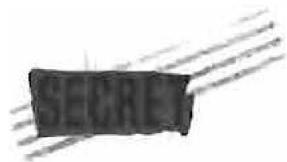

177. Glenn L. Martin Company   
178. Hartford Area Office

179-180. Headquarters, Air Force Special Weapons Center

181. Idaho Operations Office   
182. Knolls Atomic Power Laboratory   
183. Lockland Area Office   
184. Los Alamos Scientific Laboratory   
185. Marquardt Aircraft Company   
186. National Advisory Committee for Aeronautics, Cleveland   
187. National Advisory Committee for Aeronautics, Washington

188-190. Naval Air Development and Material Center

191. Naval Research Laboratory   
192. New York Operations Office   
193. North American Aviation, Inc. (Missile Development Division)   
194. Nuclear Development Corporation of America   
195. Office of the Chief of Naval Operation (OP-361)   
196. Potent Branch, Washington   
197. Patterson-Moos

198-201. Pratt & Whitney Aircraft Division (Fox Project)

202. San Francisco Operations Office   
203. Sandia Corporation   
204. School of Aviation Medicine   
205. Sylvania Electric Product, Inc.   
206. Technical Research Group, New York   
207. USAF Headquarters   
208. USAF Project RAND   
209. U.S. Naval Radiological Defense Laboratory   
210. University of California Radiation Laboratory, Livermore

211-228. Wright Air Development Center (WCOSI-3)   
229-253. Technical Information Service Extension, Oak Ridge   
254. Division of Research and Development, AEC, ORO

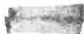

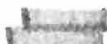

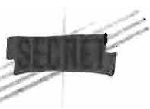

# FOREWORD

This quarterly progress report of the Aircraft Nuclear Propulsion Project at ORNL records the technical progress of the research on circulating-fuel reactors and other ANP research at the Laboratory under its Contract W-7405-eng-26. The report is divided into five major parts: 1. Aircraft Reactor Engineering, 2. Chemistry, 3. Metallurgy, 4. Radiation Damage and Fuel Recovery and Reprocessing, and 5. Critical Experiments and Reactor Shielding.

The ANP Project personnel are engaged in many phases of research directed toward the achievement of nuclear propulsion of aircraft. A considerable portion of this research is performed in support of the work of other organizations participating in the national ANP effort. However, the bulk of the ANP research at ORNL is directed toward the development of a circulating-fuel type of reactor.

The design, construction, and operation of the Aircraft Reactor Test (ART), are the current objectives of the project. The ART is to be a power plant system that will include a 60-Mw circulating-fuel reflector-moderator reactor and adequate means for heat disposal. Operation of the system will be for the purpose of determining feasibility and for studying the problems associated with the design, construction, and operation of a high-power circulating-fuel reflector-moderated aircraft reactor system.

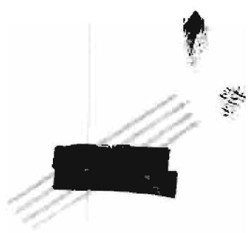

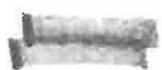

身

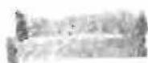

# CONTENTS

FOREWORD vii

SUMMARY XVII

# PART 1. AIRCRAFT REACTOR ENGINEERING

# 1.1.AIRCRAFT REACTOR TEST DESIGN 3

Applied Mechanics and Stress Analysis 3

Tests of ART Structural Design Criteria. 3

Thermol Stress Analyses of Shells 3

Design Analysis for Creep Bending 6

Radiator Stress Analysis Problems 8

Core-Shell Thermal Shield 10

Core Hydrodynamics 12

# 1.2. REACTOR PHYSICS 14

ART Shielding 14

# 1.3. ART INSTRUMENTS AND CONTROLS 16

Flow Decay in ART Primary NaK System Following Power Loss 16

Liquid-Metal-Level Transducers 18

On-Off Level Probes 21

Fuel-Expansion-Tank Level Indicator 22

Dynamic-Level Tests 22

Static-Level Tests 23

Pressure Transmitters for Use at High Temperatures 23

Magnetic Flowmeters 24

Remotely Adjustable Pressure Regulators 26

Turbine Flowmeters for Use at High Temperatures 26

ART Thermocouples 27

# 1.4. COMPONENT DEVELOPMENT AND TESTING 30

Pump Development Tests 30

Bearing and Seal Tests 30

Fuel Pump Development Water Tests 31

Fuel Pump High-Temperature Performance Tests 34

Fuel Pump Endurance Tests 34

Sodium Pump Development Water Tests 35

Sodium Pump Barrel Seal Test 35

Sodium Pump Endurance Tests 38

Primary NoK Pump Development Tests 39

Auxiliary NoK Pump Development Water Tests 42

# Reactor Component Development Tests 43

Heat Exchanger and Radiator Development Tests 43

Water Flow Tests on Aluminum North-Head Mockup 46

Dump Volve Development Tests 48

Outer Core Shell Thermal Stability Test 50   
Sodium Circuit Water Flow Tests 51   
Auxiliary Component Development Tests 53   
High-Frequency Thermal-Cycling Water Tests 53   
High-Frequency Thermal-Cycling Test Loop 55   
Cold Traps and Plugging Indicators 57   
Liquid-Metal-Vapor Condensers 60   
Zirconium Fluoride Vapor Trops 61   
Insulation Tests 62

# 1.5. REACTOR AND FACILITY CONSTRUCTION 65

ART-ETU Reactor Construction and Assembly 65

North-Head Assembly 65   
Reflector-Moderator Assembly 65   
Island and Pressure Shell Liner 66   
Fuel-to-NoK Heat Exchangers 66   
Assembly Methods Development 67

ETU Facility 67

Test Cell Components 69   
ARTFacility 70   
Test Facility 70   
Disassembly Facility 70

# 1.6.ART,ETU,AND IN-PILE OPERATIONS 73

ARTOperation Planning 73   
ETU Operation Planning 74   
ART Disassembly Procedures 75   
In-Pile Experimentation 75   
In-Pile Loops 75   
Prototype ln-Pile Pump 75   
In-Pile Loop Heat Exchanger Tests 76   
In-Pile Test of Moderator Materials 76

# 1.7. HEAT TRANSFER STUDIES 77

ART Fuel-to-NoK Heat Exchanger 77

ART Hydrodynamics 79

Core Hydrodynamics 79   
Instantaneous Velocity Profile Measurements 80

Heat Transfer in Reflector-Moderated Reactor Cores 81

ART Core Heat Transfer 81   
Vortex Tube Heat Transfer 82

Thermal Cycling Experiments 82   
Physical Properties 87   
Enthalpy and Heat Capacity 87   
Viscosity 87   
Thermal Conductivity 88   
Electrical Conductivity 88

# PART 2. CHEMISTRY

# 2.1. PHASE EQUILIBRIUM STUDIES 91

Modification of Apparatus for Thermal Analysis 91   
Visual Observation and Differential Thermal Analysis of Small Quantities of Fused Solts 91   
The System LiF-UF 92   
The System NaF-HFF 93   
The System LiF- $\mathsf{CeF}_3$ 93   
The System KF-BeF 2 93   
The System NaF-RbF-BeF 2 96   
The System NaF-LiF-UF 96   
NaF-ZrF-A-Structural Metal Fluoride Systems 96   
Optical Properties and X-Ray Diffraction Patterns for Compounds in Fluoride Systems 99   
Subcontract Work at Mound Laboratory and at Bottelle Memorial Institute 101

# 2.2. CHEMICAL REACTIONS IN MOLTEN SALTS 102

Equilibrium Reduction of $\mathsf{NiF}_2$ by $H_{2}$ in NaF-ZrF4 102   
Solubility of $\mathsf{NiF}_2$ in NaF-ZrF 103   
Stability of Chromium Fluorides in LiF-ThF and LiF-BeF-ThF Mixtures 103   
Reduction of UF4 by Structural Metals 104   
Reduction in Molten RbF-ZrF4 Mixtures 104   
Reduction in $\mathsf{ThF}_4$ -Bearing Melts. 105

Measurements of Solubility of Rore-Earth Fluorides in Molten NaF-ZrF4-UF4 Mixtures 105

Solubility of CeF 106   
Solubility of $\mathsf{LaF}_3$ 106   
Solubilities of $\mathsf{CeF}_3$ and $\mathsf{LaF}_3$ in Combination 106   
Solubility of $\mathsf{SmF}_3$ 107   
Effect of $\mathsf{BaF}_2$ or $\mathsf{SrF}_2$ on Solubility of CeF 108

Solubility Relationships Among Rare-Earth Fluorides in Molten NoF-ZrF4-UF 109

Solubility of Individual Rare Earths 109   
Solubility of Binary Rare-Earth Mixtures 109

Solubility of Xenon Gos in NaF-ZrF4-UF 111

Comparison of the Solubilities of Helium and Xenon Gases in NaF-ZrF4-UF 112

Solubility of HF in NaF-ZrF4 116

EMF Measurements in Molten Fluorides. 118

Concentration Cells with $\mathsf{Zr}^{\circ}\mathsf{ZrF}_{\mathsf{A}}$ Electrodes 118   
Concentration Cells with NiNiF2 Electrodes 118   
Daniell Cells 119

Activities from EMF Measurements of Molten and Solid Solutions of Salts 120

Electromigration in Molten Salts as a Possible Separation Technique for Processing Fuel 121

# 2.3. THEORY OF MOLTEN FLUORIDE BEHAVIOR 123

Correlations of Molten Fluoride Behavior Based on Charge-to-Ion Radius Ratios 123

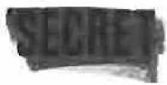

Some Aspects of Solution Behavior of Fluoride Melts 123

A Structure Model and an Acid-Base System for Fuel Mixtures 126

2.4. PHYSICAL PROPERTIES OF MOLTEN MATERIALS 128

Vapor Pressures of Molten Fluorides 128

Surface Tension and Density of Molten UF 129

2.5. PRODUCTION OF PURIFIED FLUORIDE MIXTURES 130

Preparation of Various Pure Fluorides 130

Preparation of $\mathsf{YF}_3$ 130

Preparation of Fluorides of Molybdenum 130

Preparation of Other Materials 130

Pilot-Scale Purification Operations 130

Production-Scale Operations 131

Batching and Dispensing Operations 131

Special Services. 132

Filling, Droining, and Sampling Operations 132

Filling of Pratt & Whitney High-Temperature Critical Assembly 132

2.6. COMPATIBILITY OF MATERIALS AT HIGH TEMPERATURE 133

Penetration of Graphite by Moften Fluorides 133

Electrolysis of the NoOH-Ni System. 133

Physical Properties of Elastomers Exposed to Attack by Liquid Metals 135

2.7.ANALYTICAL CHEMISTRY 137

Detection of Traces of NoK in Air 137

Determination of Oxygen in Metallic Lithium 138

Apparatus for Sampling and Analyzing Alkali Metals 140

Analyses of Lithium-Base Fluoride Salts for Metallic Impurities 140

Aluminum 140

Vanadium 141

Titonium 141

Spectrophotometric Determination of Nickel in Alkali Metals. 141

Determination of Trace Amounts of Zirconium in Sulfate Solutions with

Pyrocatechol Violet 142

Determination of Sulfur in Fluoride Fuels 142

Oxidation of Chromium with Argentic Oxide 143

Solvent Extraction of Molybdenum from Acidic Solutions with

Tri-n-octylphosphine Oxide 143

Preparation of Rare-Earth Fluoride Tracers 144

Service Laboratory. 144

Vapor-Phase Polymers in Alkali-Halide Salts 144

# PART 3. METALLURGY

# 3.1.DYNAMIC CORROSION STUDIES 147

Forced-Circulation Loop Tests 147

Fuel Mixtures in Inconel and in Hastelloy B 147   
NoK in Inconel 150   
Sodium in Inconel and in Stainless Steel 154   
Long-Duration Tests of NaK and Sodium in Inconel 155

Thermal-Convection Loop Tests 157

NaF-KF-LiF-UF and Sodium in Nickel-Molybdenum Alloys 157   
Void Migration in Inconel Exposed to NaF-ZrF4-UF 161   
NaF-KF-LiF-UF and Sodium in Niobium 162

# 3.2. GENERAL CORROSION STUDIES 164

Tests of Inconel Tube-to-Header Joints with Recrystallized Welds 164   
Tests of Haynes No. 8244 Brazing Alloy. 164   
Compatibility of Molybdenum and Nickel-Molybdenum Alloys in NaF-KF-LiF-UF 165   
Thermal-Convection Loop Test of Sodium in Hostelloy B. 166   
Sodium-Beryllium-Inconel Compatibility in a Static System (Test No. 3) 166   
Effect of Zirconium on Corrosion in on Inconel-Sodium System 169   
Molybdenum-Beryllium Compatibility in Sodium 169   
Titanium Carbide~Nickel Cermets in Molten Sodium 171   
Boron Carbide and Boron Nitride in Molten Sodium 173   
SiC-Si in Molten Sodium 174   
Leod-Lithium Alloy in Water 174   
Volatility Pilot Plant Corrosion Studies 175   
Experimental Studies with Molten Lithium 176

# 3.3.FABRICATION RESEARCH 177

Nickal-Molybdenum Alloy Development 177

General Status of Development Program 177   
Properties of Alloy INOR-8 182   
Properties of Alloy INOR-9 183   
Fabrication of ORNL Experimental Alloys 183   
Production of Commercial-Size Heats of Nickel-Molybdenum Alloys 183   
Phase Diagram Studies at the University of Tennessee 186   
Alloy Development at Battelle Memorial Institute 187

Fabrication of Composite Tubing at Superior Tube Co. 188   
Shield Plugs for ART Pumps 188   
Neutron Shield Material 188   
Tubular Control Rods 189   
Evaluation of Arc-Cast and Powder-Metallurgy Niobium 190   
Metal Hydrides for Use as Moderators in High-Temperature Reactors 192   
Capsules for In-Pile Tests 192   
Hydriding Equipment 193

Yttrium Metal Production 193   
Clodding Studies 194

# 3.4.WELDING AND BRAZING INVESTIGATIONS 195

Heat Exchanger Fabrication 195

ART Sodium-to-NoK Heat Exchangers 195   
Investigation of Rapid Heating Cycles 195

Fabrication of Valve Components 198   
ART Fill-and-Drain Tonk Fabrication 200

Welding and Brazing of Nickel-Molybdenum Alloys 201

Studies of Hastelloy B and W Welds 201   
Welding and Brazing Studies of Experimental Nickel-Molybdenum Alloys 201   
Hot-Ductility Tests of Experimental Nickel-Molybdenum Alloys 205

NaK-to-Air Radiator Fobrication 205

Effects of Brazing Variables on Braze Adherence 205   
Assistance to Vendors 208

Studies of Grain Growth in Inconel Tubes 208

Influence of Brazing Temperatures 209   
Influence of Time at Temperature 209   
Influence of Tube-Straightening and Tube-Polishing Operations 209   
Influence of Cold Work 211

Subcontract Work 215

# 3.5.MECHANICAL PROPERTIES STUDIES 216

Dynamic Strain Properties of Inconel 216   
Alloy Development 220   
Testing of Beryllium 224

# 3.6. NONDESTRUCTIVE TESTING AND INSPECTION OF MATERIALS AND COMPONENTS 225

Eddy-Current Inspection Techniques 225

Tubing Inspection 225   
Cladding Thickness Measurements 227

Radiographic Inspection Techniques 230   
Examination of Leak in Sump Tank of Pratt & Whitney High-Temperature   
Critical Assembly 231   
Material Inspection 232   
Tubing 232   
Plate 236   
Beryllium Hot Pressings 236   
Welds 239

# PART 4. RADIATION DAMAGE AND FUEL RECOVERY AND REPROCESSING

# 4.1.RADIATION DAMAGE 243

Examinations of Components and Materials Tested in the MTR 243

In-Pile Loops 243   
Irradiated Moderator Materials 243

Creep and Stress-Rupture Tests of Inconel 248

Apparatus for Stress-Rupture Tests of Tubing in the MTR 248   
Tube-Burst Tests in the LITR 249

Effect of Radiation on Corrosion of Structural Materials by Static Fused Salts 250

Inconel Capsules 250   
Hastelloy B Capsules 250

In-Pile Loop Experiments 254

Out-of-Pile Test of Pump for LITR Vertical Loop 254   
Assembly of LITR Vertical Loop 256   
Irradiation Facilities in Oak Ridge Research Reactor 257

Investigation of Sulfur Contamination of a Dry Box by Neoprene Rubber 257

Effect of Radiation on Thermal-Neutron Shield Materials 257

Fused Salt Polarography 260   
Neutron Flux Studies 260   
Effects of Radiation on Electronic Components 265

Minority Carrier Lifetime Measurements in $n$ -Type Germanium 265   
Diode Irradiations 266   
Transistors 268   
A Safe for Removal of Samples from the Reactor 269   
Modifications to Hole 30 of the ORNL Graphite Reactor 269   
Electric Constant and Loss Tangent of Irradiated Plastics at Microwave Frequencies 269

4.2. FUEL RECOVERY AND REPROCESSING 274

Pilot Plant 274   
Sulfur Embrittlement of Nickel 274   
Oxidation Resistance of Alloys in Fluoride Systems 278   
Porosity and Density of NaF 279   
Ruthenium Decontamination 281

# PART 5. CRITICAL EXPERIMENTS AND REACTOR SHIELDING

5.1.CRITICAL EXPERIMENTS 285   
Reflector-Moderated Reactor Experiments at High Temperatures 285   
5.2. SHIELDING THEORY 286   
Summary of Monte Carlo Calculations of Gamma-Ray Penetration in Multiregion Shields with Slab Geometry 286   
5.3.LID TANK SHIELDING FACILITY 290   
New Instrument Carriage at the LTSF 290   
Investigation of the Physical Properties of Lithium Borohydride-Ammonia Under   
Subcontract No. 390 290   
Pressure-Temperature-Composition Relationships 292   
Density Relationships 292   
Survey of Shielding Materials Under Subcontract No. 931 293

# 5.4.TOWER SHIELDING REACTOR II 294

Nucleor Parameter Study 294

Heat Removal Study 299

Future Studies 300

# ORGANIZATION CHARTS 301

# ANP PROJECT QUARTERLY PROGRESS REPORT

SUMMARY

# PART 1. AIRCRAFT REACTOR ENGINEERING

# 1.1. Aircraft Reactor Test Design

Tests are under way or have been proposed with which to evaluate the ART structural design criteria, since experience in the design of structures for operation at temperatures in excess of $1000^{\circ}\mathrm{F}$ is limited and in general not directly applicable. The high operating temperature will greatly affect the creep and relaxation of the structure, and temperature cycling will cause strain cycling. The only test completed in this study thus far was the initial core-shell low-frequency thermal-cycling experiment. The results of this one test indicate that the strain-cycling criterion used for the core shells is conservative. Information on strain-cycling and creep characteristics of Inconel, as well as on the effects of "cumulative damage," is to be obtained in heat exchanger tests that are now under way. An attempt to predict the life of the heat exchanger revealed the need for creep measurements of Inconel in fused salts at the corrosion rates expected in the reactor.

The distribution of stresses in the various shells that will result from design-point temperature and pressure profiles is being analyzed. Shells V and VI (shell V separates the boron-tile curtain around the heat exchanger from the fuel, and shell VI is the pressure shell liner) have been studied, and final designs for the junctions of these shells have been prepared on the basis of the onolyses.

Efforts are being made to predict the stress-rupture life of tubes subjected to a bending stress on a short section. The results of this study indicate that the calculated maximum stress is quickly reduced to about $80\%$ of the predicted elastic value and remains essentially constant for the life of the member. The study also indicated that constant-stress data are required for calculations of this type, rather than constant-load data. An experimental attempt to verify the "reduced-stress effect" is being made.

Detailed stress analyses of the ART fin-type NoK-to-air radiators are under way. Several critical areas in the design have been identified, and

alterations required by stress considerations have been made. Studies were made of weight and air drag loads, relative thermal expansion between fins and header, and relative thermal expansion between adjacent tubes in the event of flow stoppage as a result of oxide plugging.

Series of tests and experiments are under way in order to determine the fatigue life of Inconel under simulated ART conditions, since the core shells might be subjected to surface temperature oscillations as large as $80^{\circ}\mathrm{F}$ at frequencies of from $\frac{1}{4}$ to 4 cps. If it is found that Inconel does not possess adequate fatigue strength, design modifications may be required to alleviate the temperature oscillations. One proposal being studied provides for mounting a pair of thin Inconel shells in the core to serve as "thermal shields" for the structural core shells.

Flow studies of the full-scale 21-in. plastic model of the ART core were continued in order to investigate wall temperature fluctuations, which may be analogous to the fluid temperature fluctuations observed in the one-half-scale volume-heat-source experiment. Various types of probes and thermocouple arrangements are being investigated for use in these studies. The flow-guidance experiments continued with tests of the core entrance region alone, the core entrance and equatorial regions simultaneously, and the core island bellows region within the center volute of the axial-flow type of header. Some improvements in flow distribution, both radially and circumferentially, were obtained with an inlet guide vane, a conical baffle plate, and a slotted disk, which was located 6 in. above the equator.

# 1.2. Reactor Physics

The gamma-ray dose rate at the outer surface of the ART neutron shield was computed as a first step in a re-evaluation of the shielding of the ART and auxiliary equipment. Gamma-ray source strengths were obtained through the use of two-dimensional neutron-diffusion calculations. Secondary gamma rays from the lead shield were neglected, since Lid Tank Shielding Facility

(LTSF) experiments showed that the dose varied exponentially with lead thickness up to about 4.5 in.; the ART lead is 4.3 in. thick. The LTSF data are interpreted to mean that the intensity of gamma rays penetrating the 4.3-in.-thick lead shield of the ART will be much greater than the intensity of gamma rays produced in the lead. The calculated dose rate at the surface of the shield was found to be 1840 r/hr. The relative importance of each source is indicated by the percentage contribution to the total dose rate: core, $22\%$ ; outer core shell, $9\%$ ; reflector, $12\%$ ; reflector shell, $35\%$ ; heat exchanger, $22\%$ .

The fast-neutron dose rate at the shield surface was computed from LTSF data. It was found that at a distance of 50 ft from the center of the ART operating at 60 Mw with a 4.3-in.-lead and 31.5-in.-water shield, the calculated gamma-ray dose is 22.8 rem/hr and the fast-neutron dose rate is 0.05 rem/hr.

# 1.3. ART Instruments and Controls

The ART NaK circuit flow-decay characteristics were investigated as an initial step in evaluating the significance of a pump power failure in terms of temperature and pressure transients in the ART heat-dump system. Experimental data were obtained for a loop in which an ART prototype NoK pump was being tested at high temperatures. During shutdown tests, complete tabulations of pump shaft revolutions as a function of time were obtained from which speed vs time data could be obtained through numerical differentiation. The data thus obtained were correlated with computed volumes of segments of the ART primary NoK heat-dump circuit.

Tests of commercially available resistance-type liquid-metal-level transducers were continued, and when the tests were terminated at 3732 hr, during which time the NaK level of the system was cycled 65,000 times, only one of the four instruments was in operating condition. The other three units failed because NaK seeped into the insulation through cracks at the U-bends. The reaction of the NaK with the insulation caused visible deformation. ORNL-designed units, which will be clamped into place rather than welded, are being prepared for further tests. The ORNL units will have improved temperature compensation, and the weld design has been modified.

All-welded resistance-type on-off level probes are being developed as replacements for conventional spark-plug probes, which are not suitable for pressurized systems and temperatures above $450^{\circ}\mathrm{F}$ . An especially fabricated spark plug with a beryllium oxide insulator was tested in NaK as an on-off level probe, but it failed in 20 hr of operation because of short circuiting of the insulator. Several special plugs with insulators high in alumina and magnesium content were received for testing.

Tests of the helium-bubbler-type fuel-level indicators were continued, and tests to determine the cause of bubbler plugging were initiated. It is thought that the material which plugs the bubbler tubes is $\mathsf{ZrO}_2$ . Special static-level tests are to be run therefore in which the oxygen content will be carefully controlled. It is hoped that the present average life of 1100 hr in a static-level system can be increased to the specified 3000 hr.

Evaluation tests of commercial pressure transmitters for use at high temperatures were continued. Units that employ differential transformers were found to be difficult to use because the field of the Calrod heaters used to maintain the operating temperature has an effect on the output readings. A unit that employs a variable-permeance type of pressure transducer was unsatisfactory because of lack of suitable aligning guides. Additional tests of the promising four-legged strain-gage transmitters are being made. Also a second set of pneumatic-output transmitters completed a successful 3000-hr life test in a NaK-filled test loop.

Six of the $3\frac{1}{2}$ -in. magnetic flowmeters purchased for the ETU and the ART were installed in the flowmeter test loop for calibration. Preliminary indications are that at least four of these flowmeters will be acceptable for ETU installation. Six 2-in. magnetic flowmeters are available for calibration, and the $\frac{3}{8}$ -in. models designed for plug indicators and cold traps are being fabricated.

Two prototype models of remotely adjustable pressure regulators were tested. These units were found to be stable under line-voltage, supply-pressure, and normal ambient-temperature variations. Life tests are to be run on these instruments.

A 1-in. turbine flowmeter ceased to operate after 340 hr of an endurance test scheduled for 3000 hr in a circulating fused salt. X-ray examination

showed that the unit was not broken, and it is thought that oxidation resulting from previous operation in NaK systems may have caused the unit to bind. The unit will be removed for examination when the loop is drained. A $3\frac{1}{2}$ -in. turbine flowmeter operating in a NaK system failed some time during the first 40 hr of operation. Disassembly of the loop showed eight of the ten blades to be missing; the remaining two blades were bent; and both shafts were broken. The cause of this failure is being investigated.

Tests of closure welds of Inconel-sheathed thermocouples in sodium and in fused salts are under way. The Heliarc welding process has been found to yield 30 to $50\%$ acceptable welds. Bend tests were made, and single U-bends on a $\frac{3}{4}$ -in. radius were found to have little effect on accuracy. Repeated bending caused a 2 to $3^{\circ}$ shift. The drift of data obtained with sheathed and with beaded Chromel-alumel thermocouples as a function of time and temperature is being studied.

# 1.4. Component Development and Testing

Irradiation tests of a full-scale ART fuel pump rotary assembly are to be run in a gamma-irradiation facility in the MTR canal. The final selection of a lubricant-coolant for the reactor pumps will be based on the results of these tests.

On the basis of further satisfactory test performance, modified Durametallic seals have been specified for use in the ART NaK pumps. If the irradiation tests show either UCON LB-140-X or Gulfcrest 34 lubricants to be satisfactory, buna-N-base O-rings will be specified for the reactor pump seals. If the MTR tests prove these lubricants to be unsatisfactory, the seal material may again become a problem.

The development tests with water of an acceptable impeller configuration (designated model 32) for the ART fuel pump were completed. The tests showed that flow rate, head, and pumping power remained fairly constant when the liquid level in the expansion tank was reduced from 3 to $\frac{3}{4}$ in. Further reductions in the level resulted in definite decreases in flow rate, head, and pumping power. Tests for determining degassing times were also conducted with the liquid level in the expansion tank at 3 in. and the pump operating at the design speed of 2700 rpm. Degassing of an injected air sample was complete in less than 1 min. Tests of the pump at high temperatures

with NaF-ZrF4-UF4 (50-46-4 mole %, fuel 30) as the circulated fluid were started. The pump head is 1 to 2 ft lower than that obtained with water, and this discrepancy is being investigated. Performance and cavitation data are being obtained.

A similar pump that operated with fuel 30 in an endurance test was shut down after a total of 2587 hr of operating time and 120 thermal cycles in the temperature range of 1400 to $1100^{\circ}\mathrm{F}$ . Examination showed the pump to be in good condition, and it has been cleaned, reassembled with new seals, and put back into operation. There was no trouble with the hydraulic drive during the last 1240 hr of operation because a back pressure was maintained on the discharge side of the motor to ensure that the piston shoes were seated on the wobble plate at all times.

The ART sodium pump is now being subjected to development testing with water on the same basis as that used for the fuel pump. Tests to date have been hampered by ingassing of the loop in which the pump is installed. Since free movement between the sodium pump barrel and volute will be required in the ART to allow for radial movement, a seal is being developed for this region to minimize leakage of sodium between the heat exchanger inlet and the pump centrifuge outlet. Two types of multiple-ring seals are being considered, as well as a simpler seal with a single ring.

An ART sodium pump is also being tested in an endurance test with sodium and has accumulated 1584 hr of operating time with 300 thermal cycles in the temperature range of 1250 to $1050^{\circ}\mathrm{F}$ . The pump priming difficulties encountered previously were solved by stopping the pump when transferring sodium to the pot. The off-gas line plugging problem was resolved by lowering the liquid level in the pump pot.

High-temperature testing of an ART primary NaK pump was continued, and performance and efficiency curves were obtained on a NaK temperature of $1200^{\circ}\mathrm{F}$ . The data are in good agreement with the data obtained with water. An ART auxiliary NaK pump is being tested with water and an Inconel impeller in place of the brass impeller used previously. Cavitation performance of the Inconel impeller has been found to be entirely satisfactory. After a vent was provided for gas trapped during filling, the pump primed satisfactorily. A specific technique for starting and stopping the pump was developed.

Fuel-to- $\mathsf{NaK}$ heat exchanger and NaK-to-air radiator test operations were continued. One test was terminated by a NaK leak in the circulating cold-trap economizer after a total of 1845 hr of operation. The heat exchanger and the radiator in this system had been operated nonisothermally for 1456 hr, including 552 hr at a fuel inlet temperature of $1600^{\circ}F$ and 29 thermal cycles. Dato obtained in this test are being analyzed as part of a study of mass transfer in a NaK circuit.

A 20-tube semicircular heat exchanger was designed and is being fabricated that simulates the tube geometries of the ART main heat exchangers. This heat exchanger will be subjected to a thermal cycling program in order to verify the stress analysis of the ART heat exchangers.

The ART twin fuel pump system was tested further as part of the water flow tests of the aluminum north-head mockup. With the improved model 32 impellers in the pumps, the liquid spraying and sloshing noted previously in the expansion tank and the resultant wetting of the tank ceiling were greatly reduced. The model 32 impeller also resolved the problem of liquid rising in the shaft annulus of a stopped pump if the other pump was still running.

Tests of ART prototype dump valves were continued. Valves which have rigidly mounted plugs are now considered to be essential for satisfactory operation. The seat and plug materials which have been found to be the most satisfactory are the Kentanium cermets K-151A vs K-152B and KM vs K-162B. All tests to date have been made with fuel 30, but a test stand is now being modified for tests with NaK.

The second of the two proposed thermal-stability tests of the outer core shell was started under conditions similar to those used previously. Dimensions were carefully taken for later comparison with dimensions to be taken after the test.

Orifice plugs were tested for controlling sodium flow through the cooling holes in the ART beryllium reflector in order to obtain a uniform temperature throughout the beryllium. A full-scale wooden mockup of one-half of the symmetrical sodium circuit in the reflector entrance region was also tested. The head and flow distribution measurements obtained in these tests are being used in design analyses. A water test was also conducted on a proposed bypass slot to be cut between the sodium-to- $\mathrm{NaK}$ heat exchanger shell

and the external pressure shell of the reactor. This slot will allow some sodium to bypass the present slots between the pressure shell and the upper-deck outer shell and will provide a more direct entrance for flow into the heat exchanger inlet.

The high-frequency thermal-cycling test loop designed for studying the effect of thermal cycling on Inconel tubing was completed. The loop has operated satisfactorily at design specifications in water tests, and data are being taken on temperature amplitudes at the test section as a function of frequency and flow rate. The water tests will be continued until thorough familiarization with the operation is achieved.

The plugging indicators that are to be provided in each of the eight NoK cold-trap circuits of the ART to monitor the sodium oxide level were calibrated against chemical analyses. The calibration curves obtained include most of the practical range of plugging-indicator application.

Tests were made on modified liquid-metal-vapor condensers. A satisfactory NaK condenser is now available, but further developmental effort is required to obtain a satisfactory sodium condenser.

The design of an experimental prototype of the ART zirconium fluoride thermal-condensation vapor trap was completed, and a unit is being fabricated. Traps packed with $\mathrm{Al}_{2}\mathrm{O}_{3}$ have operated satisfactorily in several tests.

Tests were run on three brands of insulation being considered for use on piping carrying high-temperature NaK. The thermal conductivities and heat losses were obtained.

# 1.5. Reactor and Facility Construction

The detailed design of the reactor is essentially complete, with some work remaining to be done on the design of sodium annuli surrounding the fuel overflow, off-gas, and fill-and-drain lines. Numerous design changes have been made based on further design studies, development tests, component fabrication difficulties, and weld shrinkage tests.

The schedule for assembly of the ETU and ART reactors was revised on the basis of delayed delivery of components being produced by outside vendors. Work on the north-head assembly is awaiting delivery of the sodium-to-NaK heat ex-changers. The components for two reflectormoderator assemblies are now available, and the

assembly for the ETU is progressing satisfactorily. Work is also progressing on the strut-load ring assembly. Most of the boron carbide tiles required for two reactors are available, and no difficulty is anticipated in obtaining the remainder. Some difficulties are being experienced by the fabricator of the stainless-steel-clad boron-copper shielding material that may be resolved by a relaxation in tolerances.

The fabrication of the Inconel shells by the spinning process remains a major problem, but progress is being made. An alternate effort is being made to fabricate the thin core shells by hot forming oversized parts and then finish machining them to final thickness. It is doubtful, however, that shells produced in this manner will have satisfactory metallurgical structure.

One set of beryllium island parts is complete, and work is under way on the pressure shell liner. The dual effort on fuel-to-NaK heat exchanger fabrication was evaluated, and Black, Sivalls & Bryson was selected as the fabricator.

Extensive tests of reactor assembly methods have been performed, and the assembly procedures have been developed. The assembly area and fixtures are almost completed.

Much installation work on the ETU assembly has been done, and preliminary estimates show an expected ETU facility completion date, exclusive of the reactor and its associated equipment, of September 1, 1958. A further study of the items to be placed within the ETU cell that simulates the ART cell brought about several changes, including the elimination of the equatorial and south-head lead shielding. Design of the cell components (other than the reactor) is well under way, and fabrication of many items has been initiated.

Much of the outside contract work on the ART facility has been completed. The work to be done by ORNL forces on the installation of process piping and equipment remains, and design work on this phase of the project is well under way. Procurement was initiated on a few items.

Plans for removing and sectioning the ART after operation were studied further. A $\frac{1}{12}$ -scale model of a proposed hot cell is now available as an aid in visualizing the complex techniques that will be involved and in designing the tools and fixtures that will be required.

# 1.6. ART, ETU, and In-Pile Operations

A critical review of the reactor system operability is being made, and conflicts among the design, construction, and instrumentation phases of the project are being resolved. A study of manpower required for various phases of the program indicated that the peak work load during operation of the ART will require 40 engineers and 18 technicians.

As the result of a design review, additional provisions have been made for the containment of activity at the ART facility in the event of concurrent heat exchanger and radiator leaks; a number of design and instrument changes have been incorporated into the system; and additional component development tests have been scheduled to demonstrate the adequacy of the system for the prescribed test program. Procedures for filling the various systems were prepared.

The planning for ETU operation is paralleling that for ART operation, with the maintenance of ETU flow sheets, instrument lists, and valve tabulations being emphasized. A preliminary study of ART emergency conditions to be simulated with the ETU is under way.

Procedures for disassembling the ART were studied further. Possible methods for performing the remote cutting operations that will be required within the cell were studied, and several disadvantages of a proposed underwater operation have developed.

Developmental work is under way on the higher performance pump and heat exchanger that will be required for in-pile loop experiments with the new nickel-molybdenum alloys and lithium-base fuels. A pump is now available that will be suitable for a loop with maximum temperatures in the range of 1600 to $1650^{\circ}\mathrm{F}$ , which correspond to a pump temperature of $1500^{\circ}\mathrm{F}$ . In an effort to increase the capacity of the heat exchanger, a unit with machined nickel fins has been designed and is being fabricated for testing.

In-pile tests of moderator materials continued with the preparation for insertion in the MTR of capsules containing beryllium oxide, graphite, and zirconium hydride specimens.

# 1.7. Heat Transfer and Physical Properties

Heat transfer studies with the delta-array heat exchanger were continued. Flow in the laminar region was investigated to establish the effect of natural convection on the total heat transfer. No effect could be observed over the Reynolds modulus range examined. The fluid friction characteristics on the fuel side of a straight-tube model of the ART fuel-to-NaK heat exchanger were tested further, with measurements being taken down to a Reynolds modulus of 150. The early transition in the data indicates the effect of the turbulent spacer wakes on the system pressure drop. Preliminary designs have been made for an apparatus to study the heat transfer and velocity structures in a single fuel-side channel of an ART type of heat exchanger.

Additional data on the stabilizing effect of screens in reactor cores are to be obtained with the use of the swirl entrance system. A mathematical analysis indicated that even under fuel dump conditions reactor core screens will not reach dangerously high temperatures. Photographic records have been made of laminar and turbulent velocity profiles in a number of geometries. Quantitative data on the turbulent velocity structure of water flowing through a circular tube were obtained by superimposing the velocity profile photograph on a grid photograph.

A volume-heat-source experiment is planned with which to establish the effect of screens on the thermal structure in the ART core. A series of vortex tube heat transfer and hydrodynamic experiments have been outlined for determining quantitatively the characteristics of this system. Thermal-cycling studies of the strength and corrosion characteristics of Inconel in a fluoride salt mixture environment were continued. The significance and limits of some of the experimental variables have been determined. There is some indication that high-frequency thermal cycling causes greater corrosive attack than does low-frequency cycling.

The enthalpy and heat capacity for the mixture NaF-ZrF4-UF4 (50-25-25 mole %) were determined in both the solid and liquid states. Data on the pure compound UF4 have been obtained for the solid state only. Viscosity measurements have been made with three mixtures in the NaF-RbFZrF4-UF4 system. The viscosities ranged from 7.5 to 9.5 centipoises at $600^{\circ}\mathrm{C}$ down to 3.3 to

3.5 centipoises at $800^{\circ}\mathrm{C}$ . Thermal conductivity studies have concentrated on the problems of eliminating from the experimental data the effects of variable heat flows. An experimental study has been initiated to determine the electrical conductivity of liquid sodium and of sodium-potassium alloys.

# PART 2. CHEMISTRY

# 2.1. Phase Equilibrium Studies

A simple modification was made to the thermal analysis apparatus in order to minimize losses by vaporization. With the modified apparatus it has been possible to analyze samples containing up to $80\% \mathrm{ZrF}_4$ with negligible loss in weight of the sample.

A new vacuum furnace that is adaptable to microscopic observations was developed and fabricated for use in visual observation of liquidus and solidus points and for differential thermol analyses of small quantities of fused salts. Preliminary visual observations indicate that reasonably accurate melt temperatures can be measured with only $150\mathrm{mg}$ of material.

Quenching studies of $\mathsf{LiF - UF_4}$ systems that contain 20 to 32 mole $\%$ $\mathsf{UF}_4$ confirmed the liquidus and solidus relationships previously reported. It was found that the compound $4\mathsf{LiF - UF}_4$ undergoes very slow subsolidus decomposition to LiF and $7\mathsf{LiF - UF}_4$ at about $470^{\circ}C$ . Thermal analysis studies showed that these mixtures undercooled readily if the melt was first heated to over $800^{\circ}C$ . In order to be sure that the quenching results characterized the equilibrium conditions, a seeding experiment was conducted on a mixture containing 24 mole $\%$ $\mathsf{UF}_4$ . The results were in accordance with the results of the quenching studies, except that the temperatures of the thermal effects were about $10^{\circ}C$ lower.

A study of the similarities of the systems NaF-HfF and NaF-ZrF has revealed three NaF-HfF compounds that are analogous to NaF-ZrF compounds. The high-temperature furnace was used for visual observations of liquidus temperatures of mixtures in the LiF-CeF system. A diagram of the system was prepared. Examination of slowly cooled melts showed only LiF and CeF to be present and confirmed thermal indications of the absence of complex compounds.

Thermal analysis of the system KF-BeF $_2$ indicated an incongruent melting point of $390^{\circ}\mathrm{C}$ and a

peritectic composition with about 52.5 mole $\%$ BeF $_2$ . The phase equilibrium diagram for the system was prepared.

Quenching studies of the system NoF-RbF-BeF $_2$ were initiated. For mixtures containing 33.3 and 40 mole % NoF, the ternary compound is the primary phase, the solidus temperature is $452^{\circ}\mathrm{C}$ , and RbF-BeF $_2$ is the other phase below the solidus. The phase relationships between the liquidus and solidus have not yet been established.

A large number of quenching experiments were completed that showed the tentative phase equilibrium diagram presented previously for the system NaF-LiF-UF4 to be in error in several respects. A revised diagram was therefore prepared.

Phase equilibrium studies of the systems NaF-CrF $_2$ -ZrF $_4$ , NaF-FeF $_2$ -ZrF $_4$ , and NaF-NiF $_2$ -ZrF $_4$ were undertaken in order to determine the formula and phase relationships of the ternary compound in each of these systems. Only one ternary compound was observed in each system.

Optical properties and x-ray diffraction data are presented for the following compounds: $\beta$ -KF·2BeF₂, 2KCl·FeCl₂, KCl·FeCl₂, 3NaF·HfF₄, 2NaF·HfF₄, NaF·CrF₂·2ZrF₄, NaF·FeF₂·2ZrF₄, and NaF·NiF₂·2ZrF₄.

# 2.2. Chemical Reactions in Molten Salts

The investigation of the equilibrium reduction of $\mathsf{NiF}_2$ by $H_{2}$ in NaF-ZrF4 at $550^{\circ}C$ was concluded, and the data were combined with those previously obtained. The data indicate that the equilibrium constant, $K_{x'}$ , is independent of the $\mathsf{NiF}_2$ concentration over the concentration range studied, which included values not for from the concentration of $\mathsf{NiF}_2$ in the saturated solution at this temperature.

In a careful determination of the solubility of nickel as $\mathsf{NiF}_2$ in NaF-ZrF4 (53-47 mole %) at $550^{\circ}C$ , a value of $352 \pm 11$ ppm was obtained. The data indicated that the solubility remained constant when the amount of saturating phase changed from a trace to a total of 1310 ppm $\mathsf{Ni}^{+ + }$ . Further, the value of 352 is in substantial agreement with a value of 400 ppm previously reported for the solubility obtained with an addition of 1700 ppm $\mathsf{Ni}^{+ + }$ .

Additional experiments on the reduction of $UF_{4}$ by $Fe^{0}$ in the reaction medium $RbF-ZrF_{4}$ (60-40 mole %) showed that equilibrium was established

in 5 hr and that the equilibrium concentration of $\mathsf{Fe}^{+ + }$ is significantly higher at 600 than of $800^{\circ}\mathrm{C}$ . The concentration values obtained fell in the range of those obtained in other alkali fluoride-binary mixtures, and no satisfactory explanation is available for the lack of effect of the reaction medium. In contrast, the studies of the $\mathsf{Cr}^{\circ}\mathsf{-UF}_4$ reaction showed that the chromium concentration increases in the order of use of RbF, KF, NaF, LiF, which is the order of decreasing ion size. Additional data on the reaction of UF with Cr in the RbF-ZrF reaction medium at 600 and at $800^{\circ}\mathrm{C}$ indicate that the fluoride ion activity increases only slightly when the RbF concentration is increased from 50 to 58 mole%.

Rare-earth fluorides labeled with Ce $^{141}$ , La $^{140}$ , and Sm $^{153}$ were used to study the solubilities of CeF $_3$ and LaF $_3$ alone and in combination and SmF $_3$ alone and in combination with CeF $_3$ in NaF-ZrF $_4$ -UF $_4$ (50-46-4 mole %) at various temperatures. The addition of both LaF $_3$ and SmF $_3$ decreased the solubility of CeF $_3$ . Similarly additions of BaF $_2$ and SrF $_2$ reduced the solubility of CeF $_3$ . The data indicate that the solubilities of the rare earth fluorides are sufficiently high to permit quite long-time operation of a reactor before precipitation of these materials becomes a problem.

The determination of the solubility of xenon gas in molten $\mathsf{NoF - ZrF_4 - UF_4}$ (50-46-4 mole %) as a function of pressure and temperature was successfully completed. As in the case of helium, the solubility was found to increase with increasing temperature.

A direct equilibration method was used for determining the solubility of HF in $\mathsf{NaF - ZrF}_4$ (53-47 mole %) at $600^{\circ}\mathrm{C}$ . The data obtained, which will be extended to higher temperatures and pressures, indicate that the solubility is $1.25 \times 10^{-5}$ moles of HF per cubic centimeter of melt at 1 atm. The data of the solubility of HF will be valuable in studies of methods of salt purification, some aspects of corrosion problems, and processes for dissolution of solid fuel elements for uranium recovery.

Preliminary measurements of concentration cells with $\mathrm{Ni}^{\circ} / \mathrm{NiF}_2$ electrodes and the solvent KF-LiF (50-50 mole %) indicate the solubility of $\mathrm{NiF}_2$ in this solvent to be about 10 times that in the solvent NaF-ZrF4 (53-47 mole %). This difference can probably be attributed to the basic nature of the KF-LiF solvent in which the weakly acid $\mathrm{NiF}_2$

would be more soluble than in the more acid $\mathsf{NaF - ZrF_4}$ mixture. In order to obtain more information regarding the change of solute activity coefficients with solvent composition, efforts are under way to develop more reliable types of Daniell cells and to measure a series of these cells in different media with varying but dilute concentrations of the metal fluorides, $\mathsf{NiF}_{2^{\prime}}$ , $\mathsf{FeF}_{2^{\prime}}$ , $\mathsf{CrF}_{2^{\prime}}$ and possibly other solutes.

The possibility of obtaining activities from emf measurements of molten and solid solutions of salts was studied further with measurements of the LiCl-AgCl system. The main deterrent to the application of similar techniques to fluoride fuels is the lack of a suitable substitute for a fluorine electrode.

Electromigration in molten salts has been shown to be a successful means for separating isotopes, and therefore it is of interest to determine the usefulness of this technique for the presumably easier problem of separating ions of different elements in fuel mixtures. Some preliminary experiments with $\mathsf{Li}^{+}$ and $\mathsf{Ni}^{++}$ ions in a chloride melt showed that if the chloride lattice is considered to be stationary, the $\mathsf{Li}^{+}$ ions moved about 20 times faster than the $\mathsf{Ni}^{++}$ ions. In principle, electromigration should be a very efficient means of recovering $\mathsf{Li}^{+}$ from a spent fuel, but the engineering arrangements for working in fluorides rather than chlorides present some extremely formidable problems. Even the chloride systems seem likely to be very awkward from an engineering standpoint.

# 2.3. Theory of Molten Fluoride Behavior

An attempt has been made to correlate the behavior of molten fluorides on the basis of chorgeto-ion radius $(Z / R)$ ratios. If the $Z / R$ ratios of the salts in a mixture differ considerably and especially if the salts are of widely different valence states, the extra stability of the mixture will be large, and the structure will be considerably distorted in comparison with the structures of the component salts, that is, the larger the difference in $Z / R$ ratios, the more stable the mixture relative to its components. For components which mix without a change in coordination number and with little distortion, the negative deviation from ideal solution behavior is accounted for, in general, by a decrease in cation repulsive energy upon mixing.

It is also convenient to correlate the behavior of the complex molten fluoride mixtures in terms of the attraction between the fluoride ions and neighboring cations. The ions in a solution tend to arrange themselves in positions of lowest energy. Accordingly, the mutual energy value determines the position of the fluoride ions with respect to alternative cations, and fluoride ions will prefer as nearest neighbors those cations which yield the largest $Z / R$ ratios. An increase in the difference in the $Z / R$ ratios of the cations of a fluoride solution will result in an increase in the negative deviations from ideal solution behavior shown by the mixture.

A useful qualitative model for describing the liquid structure of fuel mixtures based on the NaF-ZrF $_4$ system was devised in which liquid ZrF $_4$ is considered to be a somewhat disorganized lattice of fluoride bridges connecting zirconium ions. The addition of NaF to ZrF $_4$ results in the breaking of the bridges to give zirconium ions which are surrounded partially by bridging fluorides and partially by nonbridging fluorides. Since the complexing potentialities of a fluoride melt depend on the fluoride ion activity, it is very important to know how this activity, which cannot be measured, varies with composition.

The fluoride ion activity can be correlated in a qualitative manner by an acid-base scheme in which cations are rated according to their tendency to behave as fluoride donors or acceptors. If fluoride donors are defined as bases and fluoride acceptors as acids, the cations fall into the same general pattern as that used for the classification of oxides as acidic or basic. The NaF compound is an example of a strong base and $\mathsf{ZrF}_4$ of a strong acid.

In order to map the relative acidity of a fuel solvent, $Z / R$ ratios are plotted vs solvent composition. Such a plot permits estimates of the relative negative deviations of solutes, and, hence, also relative solubilities in case the pure solute is the saturating phase. An important use is the selection of solvent compositions which will reduce corrosion by complexing the corrosive agents rather than the corrosion products.

# 2.4. Physical Properties of Molten Materials

The vapor pressures of the less volatile components in fuel mixtures are being studied.

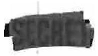

In order to determine the vapor species, the absolute vapor pressures of molten alkali fluorides were measured by a quasi-static method. A sufficiently wide temperature range was covered to give curvature on a log $p$ vs $l / T$ plot. Equations were established and constants evaluated for the compounds LiF, NaF, KF, RbF, and CsF. Tentative estimates were also made of the percentage of monomeric molecules in the saturated vapor of the various molten alkali fluorides.

A preliminary value for the density of molten $UF_4$ was obtained for use in a determination of the surface tension. At $1075^{\circ}C$ , a density of $6.80 \pm 0.09~\mathrm{g/cm^3}$ was found by using graphite pycnometers. The density of the molten material being greater than that of solid $UF_4$ ( $6.63~\mathrm{g/cm^3}$ based on x-ray data) and the behavior of the salt surface level upon freezing in the pycnometer indicate that $UF_4$ either contracts or expands only very slightly upon melting.

# 2.5. Production of Purified Fluoride Mixtures

The hydride of yttrium is being studied for use as a moderator in high-temperature reactors. Considerable quantities of $\mathrm{YF}_3$ ( $\sim 1400\mathrm{g}$ ) were therefore prepared for use in manufacturing the metallic yttrium from which the hydride is prepared.

The product of the reduction of $\mathsf{MoF}_6$ with $\mathsf{FeF}_2$ was collected in a condenser and redistilled, and the yellow product was found to melt at $78^{\circ}\mathrm{C}$ rather than the $60^{\circ}\mathrm{C}$ previously reported for the material before distillation. It has not yet been determined conclusively that the material is $\mathsf{MoF}_4$ .

In the pilot-scale equipment, 42 batches were processed that totaled 1575 lb of various fluoride compositions, with a major portion of the material being NaF-KF-LiF-UF $_4$ (11.2-41-45.3-2.5 mole %). Nickel storage receivers are unsatisfactory for the lithium-base mixture because of the large expansion of the material upon melting. Inconel cans are now being used for 50-lb batches, but when inadvertent exposure of the mixture to air or water occurs in Inconel cans, extensive contamination of the melt with $\mathrm{CrF}_2$ and $\mathrm{FeF}_2$ results. Since these contaminants cannot be removed economically by retreatment of the batch, the material must be discarded.

In the production-scale facility 46 batches totaling approximately 11,500 lb were processed. Some 18,000 of the 30,000 lb of NaZrF ordered from a vendor was received and found to be satis

factory. A total of 15,700 lb of processed fluorides was dispensed in batch sizes ranging from 1 to 250 lb. Approximately 4000 lb of processed fluorides and 2500 lb of liquid metals were charged into test units.

# 2.6. Compatibility of Materials at High Temperature

The study of the penetration of graphite by molten fluorides was continued. An experiment was performed in which commercial APC graphite was impregnated with NaF-ZrF₄ (53-47 mole %) and then subjected to a sublimation step in order to raise the melting temperature of the residual mixture to above that of the uranium-bearing mixture. The sublimation procedure increased the NaF-to-ZrF₄ ratio in the graphite, with the final ratio being about 16:1. This material will be tested in a molten uranium-bearing mixture to determine whether a solid impregnating material will resist penetration.

Two types of graphite (code Nos. R-28 and M-80) obtained from the National Carbon Company were immersed in NaF-ZrF4-UF4 (53.5-40-6.5 mole %) after impregnation with NaF-ZrF4 (53-47 mole %). Examinations revealed that these specimens were not penetrated to any considerable degree by either of the salt mixtures.

It has been established through electrolytic studies of the NaOH-Ni system that in a nonisothermal system the hot nickel electrode is usually anodic and the cold electrode is cathodic. This situation can, however, be reversed by the use of a hydrogen atmosphere. Since NaOH is a potential moderator-coolant material, attempts are being made to balance the current in an effort to find a way to eliminate the mass-transfer effects observed in NaOH circulated under a temperature gradient.

In service tests of valve seat materials exposed to helium saturated with NaK vapor, G-E SE-550 and SE-450, Dow-Corning Silastic-80, and Du Pont 5570 withstood NaK fairly well, with SE-550 possibly being superior to the other materials.

# 2.7. Analytical Chemistry

The apparatus for the detection of submicrogram amounts of sodium in air was assembled and tested. In preliminary tests 100 ppb of sodium could be easily detected. By means of appropriate refinements in the instrument it appears that the

desired limit of detection of 10 ppb is feasible with the present apparatus. Zirconium was found to be a suitable material from which to fabricate orifices for the injection of NaK into air. These orifices will be used in the testing of the NaK leak detectors.

The methanol-dissolution method for the determination of oxygen in lithium was investigated. In this method the lithium oxide forms an equivalent amount of water upon dissolution in methanol. The water is then titrated with Karl Fischer reagent. The reliability of the method is dependent on the degree to which the methanol can be dried. Methanol was produced with a concentration of 10 ppm of water.

An improved device for sampling alkali metals was developed which includes a Jamesbury valve modified so that it also serves as a sample holder. The valve is connected to the operating apparatus by means of a metal-to-glass standard taper joint.

Methods for the determination of microgram amounts of aluminum, vanadium, and titanium in lithium-base fluoride salts were modified in order to apply these methods in the presence of interfering metals. In the method for aluminum analysis, zirconium, iron, uranium, titanium, and vanadium are removed by extracting them with tri-n-octylphosphine oxide. This particular extraction essentially isolates the aluminum in the aqueous phase. For the vanadium determination, the interfering ions, including nickel, iron, chromium, and molybdenum, among other ions, were removed by deposition at the mercury cathode prior to determination of the vanadium as the benzohydroxamate complex. Titanium was separated from molybdenum by a basic carbonate precipitation and from niobium by extraction of the thiocyanate salts with diethyl ether.

A sensitive, spectrophotometric method for the determination of nickel with 4-isopropyl-1, 2-cyclohexanedionedioxime was developed. When the nickel-dioxime complex is extracted with xylene, the ultimate sensitivity is less than 0.5 ppm of nickel in a 5-g sample of alkali metal. The interference of iron is masked by use of the fluoride ion. This method is also applicable to the determination of nickel in solutions of zirconium- or lithium-base fused salt fuels.

A study of interferences of various cations in the spectrophotometric determination of microgram

amounts of zirconium in sulfate solutions with pyrocatechol violet was completed. Vanadium, titanium, and aluminum, as well as the anions that form relatively strong complexes with zirconium, were found to interfere seriously.

The methylene-blue method for the determination of sulfur in fluoride salts was improved by the substitution of a reducing mixture of stannous chloride and dehydrated phosphoric acid for the standard mixture of red phosphorus, hydriodic acid, and formic acid. As much as 1 g of the fluoride salt can be dissolved in 20 ml of the new mixture, whereas the fluoride salts are only slightly soluble in the red phosphorus mixture. The improved method is thus much more reliable, particularly for low concentrations of sulfur.

Argentic oxide was studied as an oxidant for chromium. This oxidant is efficient in solutions of all acids except hydrochloric. Excess oxidant is destroyed by heating the solution. The use of this reagent materially shortens the procedure for the spectrophotometric determination of chromium with diphenylcarbazide with apparently no sacrifice in precision.

The extraction of molybdenum from acidic solutions with tri-n-octylphosphine oxide was investigated. Under favorable conditions as much as $20\mathrm{mg}$ of molybdenum(VI) can be extracted quantitatively in a single extraction by 0.5 mmoles of reagent.

A satisfactory effusion cell was developed for use in mass-spectrometer investigations of the compositions of the vapor phases of fused-salt fuel mixtures. Preliminary measurements were made on alkali-halide salts.

# PART 3. METALLURGY

# 3.1. Dynamic Corrosion Studies

Three forced-circulation loops fabricated of Hastelloy B were examined that had circulated NaF-KF-LiF-UF $_4$ (11.2-41-45.3-2.5 mole %, fuel 107) at a maximum fluid temperature of $1650^{\circ}\text{F}$ . Two of the loops operated with maximum wall temperatures of about $1750^{\circ}\text{F}$ and showed no evidence of mass transfer after 407 and 1000 hr, respectively. A third loop, which operated with a maximum wall temperature of $1710^{\circ}\text{F}$ and at a relatively low flow rate, showed slight evidence of deposits near the pump. The hot legs of all loops were found to be badly pitted after the tests, but

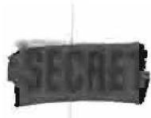

much of the surface roughness could be attributed to the condition of the inner surfaces of the tubing before the tests.

An Inconel forced-circulation loop was operated with NaF-ZrF4-UF (50-46-4 mole %, fuel 30) at a maximum fluid temperature of about $1700^{\circ}\mathrm{F}$ and a maximum wall temperature of $1840^{\circ}\mathrm{F}$ . After 1000 hr of operation the loop was found to have been attacked to a depth of 9 mils, and there were some deposits in cold-leg sections. The fuel mixture No. 70, NaF-ZrF4-UF (56-39-5 mole %), was tested in another Inconel forced-circulation loop operated at a fluid temperature of about $1500^{\circ}\mathrm{F}$ . Loop operation was terminated after 716 hr, and attack to a depth of 5 mils was found in the hot leg. A thin metallic layer was also noted in the cold leg. An examination of another Inconel forced-circulation loop that operated 500 hr with fuel mixture No. 30 also revealed hot-leg attack to a depth of 5 mils, but no cold-leg deposits were found.

An evaluation was made of the effectiveness of cold traps in the removal of oxide impurities from circulating NaK and the resultant effect on mass transfer in Inconel-NaK forced-circulation loops. Cold traps maintained at temperatures of 100, 300, 600, and $800^{\circ}\mathrm{F}$ , respectively, were utilized in conjunction with loops operating at a maximum NaK temperature of $1500^{\circ}\mathrm{F}$ and a fluid temperature drop through the loop of $300^{\circ}\mathrm{F}$ . A definite increase in the amount of deposit material was noted in the loop which contained the cold trap operated at $800^{\circ}\mathrm{F}$ as compared with the loop having the cold trap operated at $600^{\circ}\mathrm{F}$ . The change in the amount of deposited material accompanying a decrease in the cold-trap temperature below $600^{\circ}\mathrm{F}$ was less than the change from 800 to $600^{\circ}\mathrm{C}$ . The average sizes of the particles comprising the deposits also varied with the cold-trap temperature, becoming coarser as the cold-trap temperature increased. The deposits found in these NaK systems were less than one-half the weight of deposit found in sodium systems operated under similar temperature and time conditions.

Two Inconel-sodium forced-circulation loops which operated at flow rates of 1.5 and 3.0 gpm were also examined. The maximum sodium temperature in these tests was $1500^{\circ}\mathrm{F}$ , and the temperature gradient was $300^{\circ}\mathrm{F}$ . Operation of the loops for 1000 hr at the higher flow rate produced

deposited material that weighed 14 g compared with 10.4 g for the loop operated with the lower flow rate. The average thickness of the deposit was also higher in the loop operated with the higher flow rate.

A type 304 stainless steel forced-circulation loop after operation with sodium at $1500^{\circ}\mathrm{F}$ showed only slight traces of mass-transfer deposits. This loop was operated for 1000 hr with a thermal gradient of $300^{\circ}\mathrm{F}$ .

Long duration tests of Inconel forced-circulation loops were made with both NaK and sodium circulated at a maximum fluid temperature of $1500^{\circ}\mathrm{F}$ . The test with NaK, for which a temperature gradient of $600^{\circ}\mathrm{F}$ was used, was terminated after 2760 hr. The cooled section of this loop was found to contain extensive crystalline deposits that ranged to 14 mils in thickness. The loop operated with sodium for 4000 hr with a temperature gradient of $800^{\circ}\mathrm{F}$ showed considerably larger deposits that reached a thickness of 50 mils in some areas.

Thermal-convection loops fabricated from various experimental nickel-molybdenum alloys were tested with sodium and with NaF-KF-LiF-UF $_4$ (11.2-41-45.3-2.5 mole %, fuel 107), for 1000 and 500 hr, respectively, at maximum fluid temperatures of $1500^{\circ}\mathrm{F}$ . There was attack by the fuel mixture to an average depth of 1.5 mils in all loops except those constructed of alloys containing aluminum additions. For the alloys containing aluminum a maximum depth of attack of 3 mils was found. Correspondingly the pickup of aluminum by the fuel was high in the loops fabricated from alloys containing aluminum. Similarly tungsten was picked up by fuel circulated in alloys containing tungsten; however, no appreciable increase in attack accompanied the buildup of tungsten in the fuel. Vonadium, titanium, and niobium additions to the alloys had no apparent effect on corrosion; but the fuel picked up slight amounts of titanium and niobium.

An average hot-leg attack of 1 mil was found in several nickel-molybdenum alloy loops operated with sodium, and deposits were visible in the cold legs. These deposits did not adhere tightly to the loop wall, and consequently difficulty has been encountered in examining them metallographically.

A series of standard Inconel thermal-convection loops was operated with NaF-ZrF4-UF4 (50-46-4 mole %, fuel 30) at $1500^{\circ}\mathrm{F}$ to determine whether

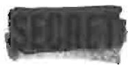

the migration into Inconel of voids instituted by the leaching of chromium during the corrosion process would continue if a loop were left at test temperature after the fuel was drained. The results showed that the migration of voids into Inconel did not proceed when the leaching of the chromium was stopped.

Three stainless-steel-clad niobium loops showed only slight hot-leg attack in tests with NaF-KF-LiF-UF $_4$ (11.2-4)-45.3-2.5 mole $\%$ , fuel 107) at $1500^{\circ}\mathrm{F}$ ; however, some cold-leg deposits were observed in niobium loops which operated 1000 hr or longer. A niobium loop was also operated 1000 hr with sodium at $1500^{\circ}\mathrm{F}$ . The attack was negligible, but cold-leg deposits were observed. Chemical analysis of the deposited material indicated that the sodium probably leaked into the cladding loop during operation.

# 3.2. General Corrosion Studies

Additional Inconel tube-to-header joints with recrystallized welds were corrosion tested in NaK (56.44 wt %) and in NaF-ZrF₄-UF₄ (50.46.4 mole %) for 100 hr in seesaw-furnace apparatus with a hot-zone temperature of 1500°F. These samples were fabricated by using a prechampered header plate which results in decreased material deformation and greater weld surface area. The tests showed no greater attack along the tube-header interface than on the tube and on the header,

Haynes No. 8244 brazing alloy (9.4% Cr-4.4% Fe-3.7% Si-2.2% B-0.3% Mn-0.06% C-bol Ni) on Inconel tube-to-header joints showed good corrosion resistance to NaK (56-44 wt %) in a 100-hr seesaw-furnace test at a hot-zone temperature of $1500^{\circ}\mathrm{F}$ . Subsurface voids to a depth of 3 mils were observed on the alloy when tested in NaF-ZrF $_4$ -UF $_4$ (50-46-4 mole %) under similar conditions.

A seesaw-fumace test of 500 hr at a hot-zone temperature of $1650^{\circ}\mathrm{F}$ was run to determine the compatibility of a $15\%$ Mo- $6\%$ Cr-bal Ni alloy and molybdenum when exposed to NoF-KF-LiF-UF4 (11.2-41-45.3-2.5 mole $\%$ , fuel 107). The presence of nickel on the surface of the molybdenum specimen after the test indicated dissimilar metal mass transfer. Similar results were found with a molybdenum specimen exposed in a $17\%$ Mo- $2\%$ V-bol Ni alloy capsule to fuel No. 107 under similar conditions.

A Hastelloy B thermal-convection loop was tested with sodium at a hot-leg temperature of

$1600^{\circ}F$ and a cold-leg temperature of $990^{\circ}F$ for 1000 hr. The attack and mass transfer in this loop were quite similar to the results obtained with sodium in Inconel thermal-convection loops.

A third sodium-beryllium-Inconel compatibility test has shown that chromium plating of Inconel reduces the amount of intermetallic compound formation to approximately one-third that found when Inconel and beryllium are placed in direct contact. Thermal cycling did not result in spalling of the $\mathrm{Be}_{2}\mathrm{Cr}$ phase.

A zirconium specimen exposed to sodium for 400 hr at $1600^{\circ}\mathrm{F}$ in an Inconel standpipe capsule was found to have absorbed oxygen from the sodium. This removal of oxygen from the sodium appeared, however, to have no effect on the amount of mass transfer as compared with that found in a standard Inconel standpipe capsule containing no zirconium and tested under similar conditions.

Molybdenum and beryllium were tested for compatibility when exposed to sodium. Exposures of 100 and 500 hr at $1500^{\circ}\mathrm{F}$ resulted in the formation of two extremely hard intermetallic compounds, $\mathsf{MoBe}_2$ and $\mathsf{MoBe}_{33}$ , at the interface.

Four titanium carbide-nickel cermets, three with 10, 20, and $30\%$ nickel and one with $25\%$ Ni plus $5\%$ Mo, were attacked to a depth of approximately 0.5 mil during a 100-hr exposure to sodium at $1500^{\circ}\mathrm{F}$ in a seesaw-furnace. In previous similar tests these cermets were not attacked by NaF-ZrF4-UF4.

Boron carbide specimens with theoretical densities of 85 and $90\%$ were found to have fair resistance to attack by static sodium in Inconel containers at $1500^{\circ}\mathrm{F}$ . A dense $(2.15\mathrm{g/cm}^3)$ boron nitride specimen was severely attacked in a 100-hr exposure to sodium at $1500^{\circ}\mathrm{F}$ in a seesaw furnace. Exposure of an SiC-Si specimen for 100 hr to sodium at $1500^{\circ}\mathrm{F}$ in a seesaw furnace resulted in complete removal of the silicon.

Lead-lithium alloys containing 0.65 wt % Li showed weight and dimensional increases when tested in water at various temperatures. The weight gains increased with the temperature and time of the test.

In the lithium corrosion research being carried out at Nuclear Development Corporation of America, base-line data for plugging of type 316 stainless steel-lithium thermal-convection loops has been obtained. The addition of titanium and zirconium as getters has led to increased loop life but has

not prevented mass transfer. The use of cold traps for impurities has also led to improved loop performance.

# 3.3. Fabrication Research

The nickel-molybdenum alloys fabricated and tested thus far have, in general, significantly better corrosion resistance and strength than Inconel without sacrifice of fabricability and weldability. These alloys now appear to offer definite possibilities of use as structural materials of reactors that utilize more efficient fuels at higher temperatures. The corrosion resistance of most of the alloys is equivalent to that of Hostelloy B, and the stress-rupture data for all alloys tested show an average life of 400 hr at $1500^{\circ}\mathrm{F}$ at a stress of 8000 psi. The fabricability depends largely upon the kinds and quantities of elements added to the basic nickel-molybdenum alloy, and with proper control reasonable yields of material are obtained from laboratory heats.

At present an alloy designated INOR-8, which is based on the Ni-Mo-Cr-Fe system, seems to best fulfill all the requirements. In order to investigate the range of mechanical properties developed in alloys of this system, the tensile and stress-rupture properties are being determined for a series of compositions, with the maximum content of the major components, other than nickel, being $20\%$ Mo, $10\%$ Cr, and $10\%$ Fe. The alloys tested to date with low and intermediate contents of Mo, Cr, and Fe are all stronger than Inconel and approach the strength of type 316 stainless steel. There is evidence that alloys with higher Mo, Cr, and Fe content will respond to aging and show even higher strengths.

A series of alloys designated INOR-9 are being investigated, in which the elements Cr, Al, Ti, and W have been eliminated because of their poor corrosion resistance in fuel 107. Alloys with a maximum of $15\%$ Mo and with significant additions of niobium and iron were prepared, and the limits of solubility and oxidation behavior were determined.

Six tube blanks of each of three nickel-molybdenum base alloys prepared at ORNL have been extruded and submitted to Superior Tube Co. for redrawing to tubing. These alloys were designed for studies of the effect of $10\%$ Cr and $7\%$ Fe, singly and together, on the corrosion resistance of a $17\%$ Mo-bal Ni base alloy.

Sheet, plate, wire, and bar products fabricated from the six 4800-lb heats designated INOR alloys l through 6 have been received. Alloys INOR-4 and INOR-6 become virtually $100\%$ scrap because of fabrication difficulties, while alloys INOR-2 and INOR-5 were processed with considerable success. The tube shells of the INOR alloys, two each of INOR alloys 1, 2, and 5 and one each of INOR alloys 3 and 6, are presently being tube reduced for conversion to small-diameter seamless tubing at Superior Tube Co.

The contract with the Westinghouse Electric Corporation covering the fabrication of large pilot heats of nickel-molybdenum base alloys has been signed, and work will begin immediately. Initially, one 3600-ib heat of alloy INOR-8 will be cast and fabricated into sheet, plate, wire, bar, and tube products for evaluation.

Various techniques are being utilized in studying the phase relationships of the Ni-Mo and Ni-Mo-Cr alloy systems under a subcontract at the University of Tennessee. Results show that the beta and gamma phases transform at somewhat higher temperatures than those previously reported.

A total of 16 tube blanks of four Ni-Mo base alloys which were extruded for Battelle Memorial Institute last quarter failed during tube reduction at Superior Tube Co. These processing failures substantiate earlier evidence that these alloys with $0.12\%$ C are not amenable to tube-drawing operations. Battelle has prepared new alloys with a lower carbon content and has submitted twelve billets of each of two of the alloys to ORNL for tube-blank fabrication. The tubing processed from these blanks is scheduled for forced-circulation loop tests at Battelle.

Large amounts of composite tubing may be required to circumvent mass transfer in nickel-base alloy systems. To demonstrate the feasibility of producing the material, several composite tubes shells of Inconel over type 316 stainless steel were processed on a production schedule. Excellent yields of sound tubing were obtained from the coextruded material.

Two full-sized gamma-ray shielding plugs composed of tungsten carbide and Hastelloy C were prepared for the ART fuel pumps. However, a die failure produced lateral expansion of the plugs, with the result that the parts are considerably oversize and will be used only for brazing tests. A redesigned die has been obtained.

Continued difficulty in producing the stainless-steel-clad Cu-B₄C shield material at Allegheny-Ludlum has required considerable coordination and evolution of materials. Recent work based on recommendations made by ORNL has resulted in good yields of sound material.

In attempts to eliminate lack of ductility resulting from stringering of fine dispersions of Lindsay Oxide, a technique was developed for producing dense, hard particles of the desired size. Three cores for extrusion billets were prepared with this material dispersed in electrolytic nickel powder.

The recovery and recrystallization of arc-cast and powder-metallurgy niobium are being studied prior to comparing their mechanical properties. Nearly identical microstructures were finally prepared from the two materials by an initial anneal at $1450^{\circ}\mathrm{C}$ followed by severe cold reduction and a long anneal at $1250^{\circ}\mathrm{C}$ . This material will be used in determining the recrystallization kinetics of the two types of niobium.

An in-pile test capsule of hydrided zirconium clad with molybdenum was fabricated. Equipment for the production of yttrium metal was designed and built. Studies on the cladding of molybdenum with nickel-molybdenum alloys were started.

# 3.4. Welding and Brazing Investigations

An investigation was conducted to determine optimum brazing procedures for fabrication of the ART sodium-to-NaK heat exchangers. The most influential variable was found to be the rate-of-rise to brazing temperature. A similar investigation is being conducted to determine the minimum rate-of-rise to brazing temperature required to effect a satisfactory back braze of the tube-to-tube sheet joints of heat exchangers.

The techniques developed previously for the fabrication of valve components were used in the preparation of various valve materials for testing under simulated service conditions.

A study of the problems associated with the fabrication of the ART fill-and-drain tank is under way. Tests are being run to establish welding and brazing procedures and joint designs that will result in crock-free fusion welds. A promising joint design now being investigated is a trepanned type.

Additional results were obtained in the investigation of the mechanical properties of Hastelloy B and W welds on $\frac{1}{2}$ -in. plate, and the results of all the tensile test data have been analyzed. The

$\frac{1}{2}$ -in. plate required for welding and brazing studies of some of the nickel-molybdenum experimental alloys was received and tests were initiated. No cracking tendencies were found in tests of INOR-7 and -8.

Results of tests at Rensselaer Polytechnic Institute on experimental and commercial nickel-base alloys indicate that it is usually sufficient to evaluate the hot ductility as measured at $2300^{\circ}\mathrm{F}$ during cooling from some higher temperature and to compare these data with the hot ductility measured at $2300^{\circ}\mathrm{F}$ during heating. The test results show that none of the INOR alloys behave in as ductile a manner as Inconel and they behave more like Inconel X than like Hastelloy B.

The effects of brazing variables on braze adherence in NaK-to-air radiators were studied further in order to assist the vendor in fabrication problems. Specific recommendations regarding the equipment, cleaning methods, and brazing techniques were made.

The initial result of a study of the effect of brazing and heat-treating operations on the grain growth of Inconel tubing indicates that stress relief treatments at $1500^{\circ}\mathrm{F}$ do not result in grain growth. Significant grain growth resulted, however, from $\frac{1}{2}$ -hr brazing cycles at approximately $1922^{\circ}\mathrm{F}$ . It was also noted that grain growth proceeded more rapidly in the grains located along the outer wall of the tube than in those located along the inner wall. Straightening and polishing operations had only minor effects on the grain growth. The influence of prior cold work is being studied.

In the molybdenum welding studies under subcontract at Battelle Memorial Institute the effect of atmosphere purity, various types of shields, and several cleaning techniques were investigated. Acid etched specimens were somewhat better than samples prepared by other methods. Also, the use of a trailing shield in open air welding was found to yield weldments with significantly greater ductility.

# 3.5. Mechanical Properties Studies

The behavior of Inconel when subjected to repeated thermal cycles is being investigated by means of relaxation tests and mechanically induced cyclic strain tests at ORNL; the University of Alabama is contributing to this study by conducting thermally induced strain cycle tests; and the

Battelle Memorial Institute is evaluating the effect of dynamic loads superimposed on static loads.

Relaxation data were obtained for coarse-grained Inconel at 1300, 1500, and $1650^{\circ}\mathrm{F}$ . Prior tensile strains at temperature were shown to have little effect on the relaxation behavior. Evidence that coarse-grained Inconel has poorer resistance than fine-grained material to repeated strain cycles has been obtained.

The evaluation studies of creep properties of the various new alloys being developed for reactor use were continued. The results of the alloy development program thus far indicate that considerable progress has been made toward achieving the objective of developing a material that is as fabricable as required for reactor construction, possesses adequate strength, and is corrosion resistant in high-temperature fuel mixtures, liquid metals, and air. It has been possible to improve the creep characteristics by additions of carbide-forming elements, such as niobium and tungsten, without seriously affecting the other good characteristics. Several alloys of this type have exhibited a stress-rupture life of 1000 hr when tested in fuel at 8000 psi and $1500^{\circ}\mathrm{F}$ .

Studies were made of the elevated-temperature properties of the beryllium blocks being fabricated for the ART by the Brush Beryllium Co. The tests indicate that the strength properties do not vary appreciably from those predicted on the basis of tests of smaller pressings.

# 3.6. Nondestructive Testing and Inspection of Materials and Components

The recently developed Impedograph, which measures both the a-c resistance and the reactance of its testing coil over a wide range of frequencies, was applied successfully in eddy-current inspections. This instrument simultaneously presents inspection information from both the inner and outer surface of tubing, regardless of the material or size of the tube.

Equipment and techniques were developed for using an eddy-current probe coil to measure the thicknesses of coatings or cladding. Measurements made of the cladding thickness on Mark X MTR fuel plates demonstrated the feasibility of the inspection techniques. With further experience it should be possible to measure cladding thicknesses of most alloys on a cermet core, of any of the oxidation-resistant alloys over molybdenum or niobium

cores, of on austenitic stainless steel over a nickel-molybdenum core, of a nickel-molybdenum alloy over an austenitic stainless steel core, or of the outer layer of duplex tubing. The ability to measure Inconel on austenitic stainless steel or austenitic stainless steel on Inconel is currently considered to be marginal.

Exposure data are being compiled for the radiography of various thicknesses of Inconel, stainless steel, nickel-molybdenum, and similar alloys. Also, test weldments in $\frac{1}{8}$ -in. Inconel sheet are being radiographed through 8 in. of beryllium to explore techniques for the inspection of the closure welds of the ART fuel-annulus core shells.

A 6-in.-dia cap, for use as a catch basin, which had been welded to the bottom of the sump tank of the Pratt & Whitney high-temperature critical assembly, was removed when leakage was detected and was found to be severely cracked. It was learned that the cap had been machined from bar stock rather than being a forged fitting, as specified.

Inspections of materials for construction of reactor and test components resulted in rejection rates for Inconel that varied from 0 to $63\%$ , depending on type and lot of material. All the Hastelloy B inspected was found to be completely inferior to requirements.

One of the six, large, beryllium hot dressings fabricated for the ETU and ART reflector-moderators was inspected under laboratory conditions to evaluate the techniques used for the field inspection. The "squirrel" technique being used in the field was demonstrated to be satisfactory, if used with care.

Welding inspections indicated a performance record of $83\%$ acceptance of critical welds and over $95\%$ acceptance of other standard welds.

# PART 4. RADIATION DAMAGE AND FUEL RECOVERY AND REPROCESSING

# 4.1. Radiation Damage

Metallographic specimens were cut from in-pile loop No.4 which circulated a fluoride fuel mixture in the MTR. None of the specimens examined thus far have shown attack greater than 1.5 mils in depth, and no signs of mass transfer have been found. Colored amorphous deposits were found on the pump slinger and on the forward bellows that were similar to deposits found in in-pile loop No.3.

The MTR-irradiated Inconel capsule containing beryllium oxide slugs was disassembled and examined. There was no evidence of BeO powder in the capsule, and no significant changes were observed in either the lengths or diameters of the slugs.

An apparatus for stress-rupture tests of Inconel tubing under irradiation in the MTR was essentially completed. Eight separate specimens will be tested simultaneously. Duplicate specimens will be tested out-of-pile at stresses of 2000, 3000, and 4000 psi at $1500^{\circ}$ F.

Rupture times of 1050 and 1650 hr were obtained for two specimens of Inconel tubing tested at 2000 psi and $1500^{\circ}\mathrm{F}$ while being exposed to a thermal- and fast-neutron flux of $6 \times 10^{12}$ neutrons/cm²·sec in hole HB-3 of the LITR. These rupture times for this 0.010-in.-wall tubing were in good agreement with out-of-pile data. A third in-pile specimen, stressed to 1000 psi at $1500^{\circ}\mathrm{F}$ , did not rupture in 1670 hr, and the total creep deformation will be measured upon disassembly of the apparatus.

Examination was completed on a tubular Inconel specimen that was stressed in bending at a maximum stress of 1000 psi and irradiated for 1120 hr at $1500^{\circ}\mathrm{F}$ while exposed to $\mathsf{NaF - ZrF_4 - UF_4}$ (63-25-12 mole %, fuel 41) on the inside and sodium on the outside. Corrosion on the fuel side was negligible and did not appear to depend on the sign or magnitude of the stress. On the sodium side there was attack to a depth of about 3 mils.

Two MTR-irradiated and two control capsules fabricated of Inconel and filled with fuel mixtures of the NaF-ZrF $_4$ -UF $_4$ system containing 2 mole % UF $_3$ were opened and examined. The capsule exposed to a flux of 1.5 kw/cm³ for 676 hr at 1500°F and its control capsule showed corrosion penetration so negligible as to be confused with surface faults. The capsule containing 4 mole % UF $_4$ , which was exposed to a flux of 3.7 kw/cm³, was attacked at the mid-point to a depth of 5 mils in 235 hr at 1500°F. The distribution of the attack was that anticipated on the basis of the temperature profile. The contribution of irradiation to the attack cannot be judged until control data and chemical analyses of the fuel are available. Hestelloy B capsules were tested out-of-pile, and similar capsules have been inserted in the MTR. Means for applying oxidation resistant coatings to the Hestelloy B capsules are still being investigated.

Out-of-pile tests of the pump designed for circulating fused-salt fuel in the LITR vertical in-pile loop have demonstrated that the newly designed $\mathsf{ZrF}_4$ -vapor control features are satisfactory. An in-pile loop incorporating a similar pump is being prepared for insertion in the LITR. Facilities are being planned for the operation of similar loops in the Oak Ridge Research Reactor.

During preparations for filling the LITR vertical in-pile loop, it was discovered that the interior of the dry box was contaminated by an unknown gaseous sulfur compound. Sulfur in the Neoprene rubber gloves was found to be the source of the contamination.

Irradiation exposures of nine $\mathsf{Cu - B}_4\mathsf{C}$ samples were completed in the MTR. Examinations of six of the samples are under way.

The applicability of polarographic techniques to the study of the fission-product chemistry of fused salts is being investigated. Means for accommodating the high electrical conductivity of the fused salts, as compared with aqueous solutions, are being developed.

A survey was made of the relative variation of neutron flux with distance in hole 51N of the ORNL graphite reactor by using sulfur and cadmium-covered gold detectors. A plot is presented of the relative activities of the detectors as a function of distance from the concrete shield.

The minority carrier lifetime of $n$ -type germanium has been found to change under irradiation according to a power law for both fast-neutron and gamma irradiation. Irradiation with $\mathrm{Co}^{60}$ gamma radiation and subsequent annealing show a complicated structure in the barrier change of diodes and transistors. The results of tests indicate that the properties of such devices would be changed by a pulse of gamma irradiation and that there would not be immediate recovery upon removal of the pulse.

A safe was designed for the removal of samples from the ORNL graphite reactor without subjecting personnel to radiation. The device can be used at the reactor loading face, or, by transferring it to another dolly, at holes 50, 51, and 52.

An exposure device has been designed for use in hole 30N of the Graphite Reactor with which a sample can be moved from the external shield to the irradiation position in about 10 sec. This device will facilitate measurements on semiconductor components under irradiation.

The loss tangents of polyethylene, polystyrene, Teflon, Nylon, and phenol formaldehyde were measured before and after a series of Co 60 irradiations. All samples showed measurable changes after exposures of $10^{8}$ r; however, the dielectric constant changes of these materials were less than the accuracy of measurement, that is, $\pm 5\%$ .

# 4.2. Fuel Recovery and Reprocessing

Construction of the fused salt-fluoride volatility pilot plant is essentially complete, except for the facilities for handling the ARE fuel, which will not be installed until runs with nonirradiated material are completed. Shakedown tests have been started.

The embrittlement of nickel and nickel alloys with sulfur was studied to determine the allowable sulfur contamination in the volatility process. A nickel foil test was devised which will detect 5 ppm of sulfur in a fused salt. Under ordinary conditions, however, in equipment with heavy nickel walls, a sulfur contamination of 200 to 500 ppm is necessary to produce any effect in one exposure, but the sulfur effect is cumulative. It appears that the scavenging of sulfur by nickel means that if the salt is once exposed in the fused state to nickel equipment it becomes relatively free of sulfur. The sulfur embrittlement of Inconel was found to be much less than that of nickel.

The gas-phase oxidation resistance of types 316 and 347 stainless steel was found to be quite unsatisfactory in laboratory tests of their use as containers for fused fluoride salts. This substantiated pilot plant experience with the charge melt vessel,

An over-all porosity of $65\%$ was found for the type of NaF to be used in the absorption-desorption step of the decontamination process. The particle and bed porosities were 48 and $33\%$ , respectively. There was little difference between different lots of Harshow Chemical Co. material.

Experiments were conducted to test whether plating out of ruthenium on metal surfaces could be used to achieve additional decontamination. In the initial tests, low decontamination was achieved in a nickel trap, but there was only a small amount of activity involved and the surface area of the nickel was small. It is anticipated that the removal of ruthenium with a nickel column may be made more effective by using a greater surface area or by operating at a higher temperature.

# PART S. CRITICAL EXPERIMENTS AND REACTOR SHIELDING

# 5.1. Critical Experiments

A critical assembly mocking up the circulating-fuel reflector-moderated reactor under study by Pratt & Whitney Aircraft was operated at temperatures near $1250^{\circ}\mathrm{F}$ . The fuel consisted of a molten mixture of sodium, zirconium, and uranium fluorides, and the control rod contained a mixture of $30\%$ rare earth oxides and $70\%$ nickel. With the control rod out, the critical concentration was 10.97 wt $\%$ U (5.1 mole $\%$ UF $_4$ ) at $1258^{\circ}\mathrm{F}$ ; with the rod inserted to the midplane, the critical concentration was 12.20 wt $\%$ U. The temperature coefficient of reactivity over the range of 1200 to $1350^{\circ}\mathrm{F}$ was $-3.6 \times 10^{-5} (\Delta k / k)^{\circ}\mathrm{F}$ .

# 5.2. Shielding Theory

Several Monte Carlo calculations have been performed on the Oracle to determine the dose rate, energy flux, energy deposition, and in some cases the energy spectra in laminated shields as a function of the energy of the gamma-ray source and the angle of incidence of the gamma rays on the shield. Since it is impractical to publish all the results from these calculations in a progress report, a summary of the problems is presented along with references to the published data.

# 5.3. Lid Tank Shielding Facility

A new instrument positioner has been installed at the Lid Tank Shielding Facility (LTSF) which will indicate the absolute position of any radiation detector in the tank water to within $\pm 0.5\mathrm{mm}$ . This is a considerable improvement over the old positioner with which absolute positions could not be determined to an accuracy greater than $\pm 5\mathrm{mm}$ . The new system also provides for remote control of the positioner.

Under Subcontract No. 390, Metal Hydrides, Inc., has investigated the physical properties of lithium borohydride-ammonia, which has been suggested as a neutron shield. Pressure-temperature-composition relationships have been determined for material temperatures ranging from 0 to $80^{\circ}\mathrm{C}$ . The ammonolysis reaction, which was found to occur to a small extent, was studied briefly between 50 and

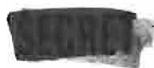

$100^{\circ}C.$ The densities of liquid lithium borohydride ammoniates were also determined.

A survey of shielding materials, which was performed by the Technical Research Group under Subcontract No. 931, confirmed that lithium hydride and polyethylene are the most effective neutron shields known to date. Lithium hydride is the only lightweight neutron shield material that can be used in the temperature range of 700 to $1200^{\circ}\mathrm{F}$ , which is the range that may be expected in some parts of the direct-cycle reactor shield. The high-density materials required for gamma-ray shields still center around lead, bismuth, tungsten, uranium, etc.

# 5.4. Tower Shielding Reactor II

From a nuclear parameter study and a cursory examination of the heat removal problem, the dimensions and composition of the Tower Shielding Reactor II (TSR-II) core have been established. The diameter of the internal water reflector will be 17.5 in., and the radial thickness of the core will be 5.5 in., with an aluminum-to-water volume ratio of 0.7. This will permit the use of the standard Bulk Shielding Facility reactor fuel plate and water moderator arrangement, that is, 60-mil-thick fuel plates separated by 120 mils of water. The cooling water flow rate will be 1000 gpm.

# Part 1

# AIRCRAFT REACTOR ENGINEERING

S. J. Cromer

# 1.1. AIRCRAFT REACTOR TEST DESIGN

A.P.Froos

# APPLIED MECHANICS AND STRESS ANALYSIS

R.V.Meghreblian

# Tests of ART Structural Design Criteria

Experience in the design of structures for operation at high temperatures, that is, temperatures in excess of $1000^{\circ}\mathrm{F}$ , is limited. Some experience has been gained throughout the technology from the design of jet and rocket engine components and very high-performance steam power plants, but little of this experience is directly applicable to the design of a system such as the Aircraft Reactor Test (ART). Therefore considerable effort has been devoted to establishing suitable design criteria for this reactor.

The high-temperature phenomena that will be encountered in the ART are creep, relaxation, and strain-cycling. The design problems associated with creep were discussed previously in connection with the stress analysis of the north-head structure, and the design criteria used for this analysis were given in a previous report. The design criteria for strain-cycling and relaxation analyses were discussed in connection with the core shell tests. The only test to date which could yield any information on the validity of the design criteria selected for the ART was the core-shell low-frequency thermal-cycling experiment. Only one such test has, as yet, been completed, but the results indicate that the strain-cycling criterion used for the core shells is conservative. It was not possible from this single test to deduce the degree of conservatism of the criterion.

Further tests are under way or have been proposed with which to evaluate the adequacy of the selected design criteria. In the heat exchanger test program presently under way it should be possible by suitable control of test procedures and careful selection of operating programs to obtain useful information on strain-cycling and creep characteristics of Inconel, as well as information on the effects of "cumulative damage." Such a program has been initiated, and the

first of these tests was completed on Black, Sivalls & Bryson heat exchanger type IHE-8 in test stand IHE-B (see Chap. 1.4, "Component Development and Testing"). This test was made under steady-state conditions with a maximum metal temperature in the heat exchanger tubes of the order of $1650^{\circ}\mathrm{F}$ . Since only a few relatively minor thermal cycles were imposed on the system, the principal loads on the structure were those due to the fluid drag forces on the tubes. The life of the heat exchanger was estimated on this basis, and the calculations indicated that the system should have operated for 600 hr before failure occurred. The test was shut down after 500 hr without a failure. This attempt to predict the life of a complex structure under creep and corrosion conditions demonstrated the importance of obtaining creep measurements of Inconel in fused salts at the corrosion rates expected in the reactor.

Additional heat exchanger tests, which will include power-cycling, are presently being prepared. These tests will be conducted on both the intermediate (IHE) and the small (SHE) straight-tube types of test heat exchangers. In an attempt to simulate the helical shape of the actual fuel-to-NaK heat exchanger in the ART, a special small heat exchanger (SHE-9) has been designed and is now being fabricated (see Fig. 1.4.16 in Chap. 1.4, "Component Development and Testing"). The tubes in this unit are in the form of 180-deg arcs, and the composite design will incorporate many structural features found in the ART heat exchangers. When tested under conditions which simulate the ART design conditions, this heat exchanger should demonstrate the adequacy of the reactor component.

# Thermal Stress Analyses of Shell

B. L. Greenstreet S. E. Moore

D.M.Miller J.R.Tallowson

A detailed program of analyses is presently under way in order to determine the distribution of stresses in the various shells that result from design-point

temperature and pressure profiles. Particular emphasis is being placed on the determination of the thermal stresses produced in the shells. The temperature distributions summarized in the previous progress report are being used as a basis for these calculations. In the computations of the corresponding thermal stresses, it is assumed that the entire structure remains elastic. This is not a valid assumption in certain local regions of the shells wherein the temperature profiles are extremely steep. In these regions, plastic deformation will occur. Nevertheless, it is expected that except for a few regions of extreme distortion the elastic analyses will give adequate estimates of the strains induced in the structure. The strains thus obtained are being used to determine the strain-cycling life of the structure. This procedure was applied in a study of shells V and VI. The analysis of shell V was completed and is summarized here.

The function of shell V is to separate the borontile curtain around the outer surface of the heat exchanger from the fuel, and thus it serves primarily as a container. Its importance as a structural member stems from the fact that a rupture in this shell would expose the tiles to the fused salt, and it is possible that such exposure might cause a significant change in reactivity because of the high boron content of the tiles.

Shell V consists of three ports, as shown previously, and each part is attached separately to shell VI (the pressure shell liner). The boron tiles are contained between these concentric shells. The inner surface of shell V is bathed with fuel from the core, and the outer surface of shell VI is bathed with sodium from the island circuit. At full power these fluids operate at markedly different temperatures, and this situation gives rise to differential thermal expansion between the two shells. Because of the appreciable difference in thickness of these shells $(\frac{3}{16}$ in. for shell V and $\frac{3}{8}$ in. for shell VI), the growth of

shell V is limited by shell VI, and thus the stress analysis is reduced principally to a study of shell V.

The most critical area in this assembly is the intermediate section which extends from just below the equator to about 30 deg south latitude (Fig. 1.1.1). This section is exposed to large temperature variations relative to shell VI, which produce free radial expansions at the equator of 0.021 in. and at the 30-deg south latitude junction of 0.035 in. (note that these growths represent interferences between the shells V and VI). In addition, there is a relative axial growth of 0.028 in. Much of the distortion produced by these relative expansions appears as local effects in shell V at the attachment points to shell VI. Because of the small thickness-to-radius ratio of shell V, however, the stresses arising from the edge displacements and rotations diminish rapidly with latitude angle.

UNCLASSIFIED

ORNL-LR-DWG20852

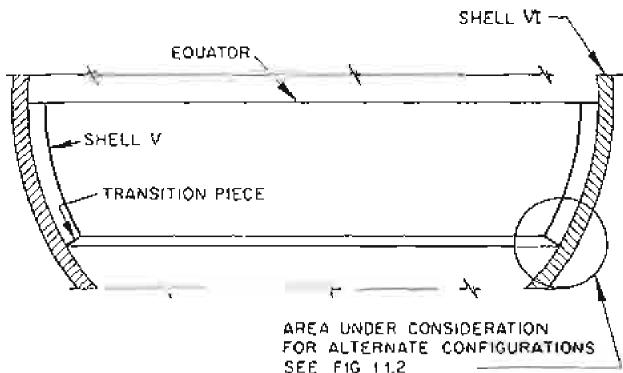  
Fig.1.1.1. Intermediate Section of Shell V.

The localized nature of the stresses allows for the reduction of the stress level by decreasing the difference between the mean shell temperatures and the temperature gradients in shell V near the junction points. Changes in the temperature differences and gradients from those present in the configuration of Fig. 1.1.1 can be accomplished by varying the shell thickness near the junction and/or by creating small regions of stagnant fuel around the junction. The latter effect can be achieved by placing a baffle around the edge of the shell.

Since the largest temperature effects occur at the lower edge of shell V (Fig. 1.1.2), this will also be the location of the largest stresses. Detailed two-dimensional temperature calculations, for which relaxation methods were used, were carried out for various configurations of this

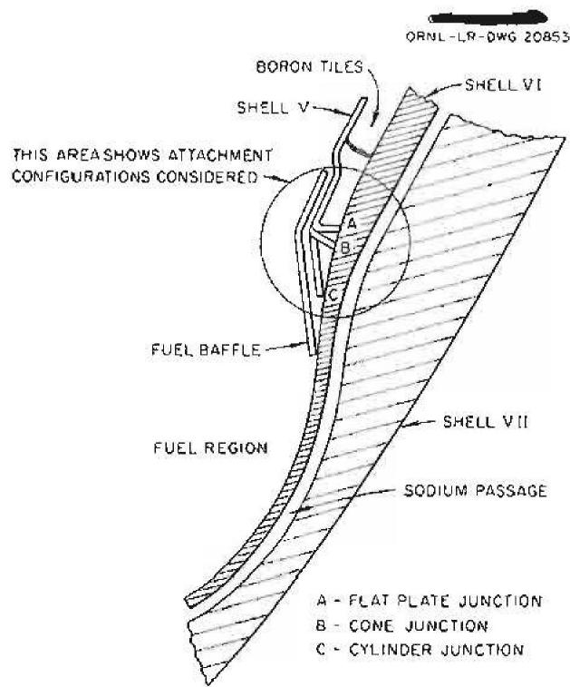  
Fig. 1.1.2. Lower Junction of Shell VI and Intermediate Section of Shell V.

region. The mean temperatures in shell V for two representative configurations considered in these studies are shown in Fig. 1.1.3. The calculations revealed that the largest reduction in relative expansion between the two shells could be achieved by the use of the fuel baffle mentioned above. It was also found that both the gradient and the mean temperature difference near the junction were affected by a change in the thickness of shell V, while a change in the thickness of the stagnant fuel layer affected only the temperature difference.

The temperature distributions obtained from these studies were applied to three geometric shapes for the transition section between shells V and VI, a cone, a cylinder, and a flat plate, as shown in Fig. 1.1.2. Stress analyses were performed

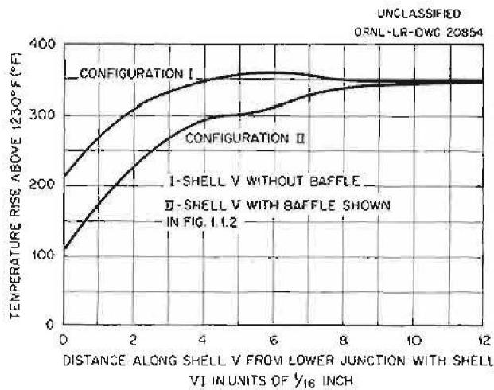  
Fig. 1.1.3. Mean Temperature of Shell V Above Temperature of Sodium at Junction of Shells V and VI.

for each of these geometries in which the temperature gradient and the temperature difference across the transition section were used as parameters. Secondary parameters in this study were the section thickness $(\gamma_{16}$ and $\gamma_{4}$ in.) and the thickness of the stagnant fuel region in the vicinity of the junction (0 to $\gamma_{16}$ in.). The results of these calculations were compared on the basis of the maximum combined stress occurring in each configuration (usually at the junction between the transition piece and shell V). The combined stresses were computed according to the octahedral shear stress theory. In two dimensions the octahedral shear stress is given by

$$
\tau = \frac {\sqrt {2}}{3} \sqrt {\sigma_ {1} ^ {2} + \sigma_ {2} ^ {2} - \sigma_ {1} \sigma_ {2}},
$$

where $\sigma_{1}$ and $\sigma_{2}$ denote the principal stresses in a biaxial system. The results for the three geometries with a $y_{16}$ -in. layer of stagnant fuel are summarized below:

T(psi)

Flat plate with baffle 20,500

Cylinder with baffle 40,400

Cone with baffle 100,700

Without the baffle, the maximum stresses were significantly larger. In the case of the flat-plate section, the octahedral shear stress was 25,000 psi.

The final design for the junction, selected on the basis of this study, is a $\frac{1}{16}$ -in. flat plate with a $\frac{1}{16}$ -in. region of stagnant fuel. This general configuration is used at other junctions of shells V and VI, but the baffle is omitted because the temperature differences are appreciably lower. A 20,500-psi value for the octahedral shear stress corresponds to a fatigue life of about 300 cycles. The ART will be power cycled, at most, 25 times.

# Design Analysis for Creep Bending

# D. L. Platus

It was mentioned above that the Black, Sivallis & Bryson heat exchanger type IHE-8 used in the design criterion test was operated at steady state and that under these conditions the tubes are subjected to a steady fluid drag force. These forces place a bending stress on a short section of each tube (Fig. 1.1.4), and in a first approximation the tubes behave as cantilever beams in the vicinity of the headers. In order to predict the stress-rupture life of these tubes it is necessary to take into account the effect of creep on the stress distribution over the cross section of the tube. Calculations indicate that if this effect is included a reduction of about $20\%$ can be realized in the maximum fiber stress in comparison with that predicted by the elastic theory. This could result in as much as a fivefold increase in stress-rupture life, as indicated by the tensile stress-rupture data. The calculations were based on a method in which tensile creep data are

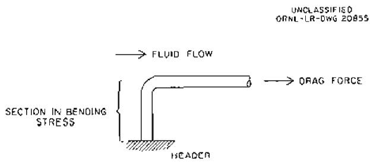  
Fig. 1,1,4. Drag Load on Heat Exchanger Tube Stem.

utilized to predict the creep rate and stress distribution in a beam under a bending stress. In this method it is assumed that a quasi-viscous state of creep exists, by considering the stresses to be a function of creep rate and time and to be independent of strain, and that the cross sections remain in a plane during bending. The latter assumption leads to the relation

$$
\dot {\varepsilon} (y) = \frac {2 y}{b} \dot {\varepsilon} _ {m},
$$

where $\dot{\epsilon} (y)$ is the strain rate in the beam at distance $y$ from the neutral axis, $\dot{\epsilon}_{m}$ is the strain rate in the extreme fiber at $y = b / 2,$ and $b$ is the outside diameter of the tube. If the tensile creep data can be easily expressed analytically, the equation may be used in an integral statement of the moment at any section to obtain an analytical solution of the stress distribution and the maximum strain rate as a function of time and the applied moment. If the creep data cannot be represented by a convenient mathematical expression, the equation must be solved with the moment relation by a numerical technique. For this purpose a set of stress vs creep-rate curves with time as a parameter is required, such as those in Fig. 1.1.5.

This general approach was used to analyze an Inconel heat exchanger tube in pure bending stress at $1500^{\circ}\mathrm{F}$ in an NaF-ZrF $_4$ -UF $_4$ (50-46-4 mole %, fuel 30) environment, and a numerical calculation was made for which the creep-rate data presented in Fig. 1.1.5 were used. A determination of the stress distributions and the maximum creep rate for a constant moment gave a calculated maximum elastic stress of 6500 psi (these conditions were selected in order to shorten the time required for a creep-rupture bend test). The results of the calculations are shown in Figs. 1.1.6 and 1.1.7. Figure 1.1.6 gives the maximum stress and creep rate in the tube, and Fig. 1.1.7 gives the stress distribution at various time intervals.

Two important observations may be based on this study. First, the calculated maximum stress is quickly reduced to about $80\%$ of the predicted elastic value and remains essentially constant for the life of the member. Second, constant-stress creep data are required for calculations of this type, rather than constant-load data.

An experimental attempt to verify the "reduced-stress effect" is being made with lead specimens subjected to pure bending loads. The immediate

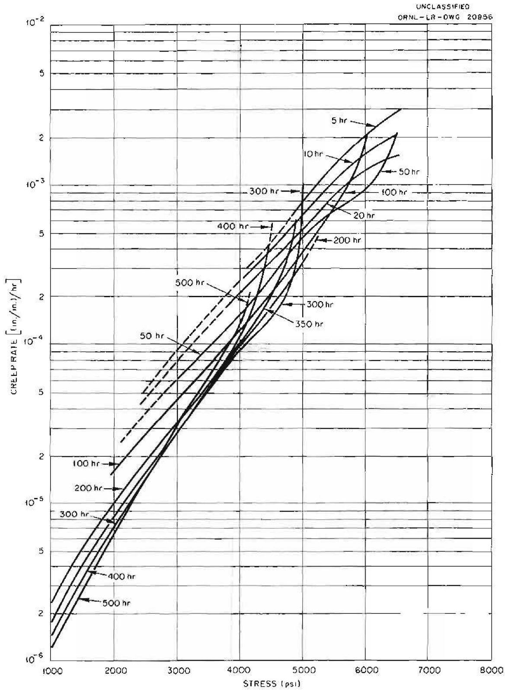  
Fig. 1.1.5. Tensile Creep Data for Annealed Inconel Tested at $1500^{\circ}\mathrm{F}$ in on NaF-ZrF $_4$ -UF $_4$ (50-46-4 Mole %, Fuel 30) Environment. (Secret with caption)

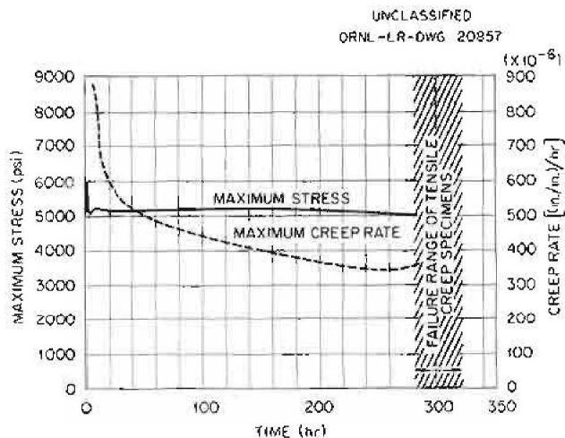  
Fig. 1,1,6. Maximum Stress and Creep Rate in on Annealed Inconel Tube Under Bending Stress in on NaF-ZrF₄-UF₄ (50-46-4 Mole %, Fuel 30) Environment. (Secret with caption)

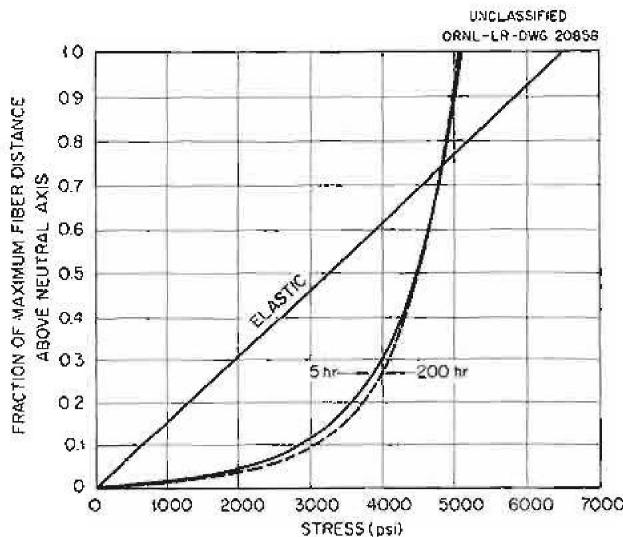  
Fig.1.1.7. Stress Distribution in an Annealed Inconel Tube Under Bending Stress in an NoF-ZrF4-UF4 (50-46-4 Male %, Fuel 30) Environment. (Secret with caption)

objective of the experiment is to predict the bending-rupture life of these specimens on the basis of the tensile creep data.

# Radiator Stress Analysis Problems

D. H. Platos

R.V.Meghreblian

Detailed stress analyses of the ART fin-type NaK-to-air radiators are presently under way. Although these analyses are not yet complete,

several critical areas in the design have been identified, and alterations required by stress considerations have been made in the design. Three problems have been examined, in particular, which appear to account for some of the failures experienced with these units. In these three analyses, studies were made of weight and air drag loads, relative thermal expansion between fins and header, and relative thermal expansion between adjacent tubes as a result of flow stoppage from oxide plugging.

The ART radiator consists of a butterfly arrangement of fins and headers with the fin banks resting on support plates rigidly attached to the headers. Expansion of the headers relative to the fins will lift the tube-fin banks off the support plates during power operation and thereby cause the tubes to behave as cantilever beams subjected to a uniform distribution of drag and weight loads. Since the tubes are connected by the fins, the tube bank will behave as a unit. The effect of the fins is to produce a restoring moment at each tube-fin connection that is proportional to the slope of the tube at that point (Fig. 1.1.8). This complex array of connected tubes may be treated as a homogeneous matrix if the system of discrete restoring moments at each fin-tube joint is replaced by a continuous distribution. The problem is then analogous to the classical "beam on elastic foundation." A calculation based on this model was performed for the ART radiator, and the air and weight loads were found to give tube stresses at the headers of the order of 1500 to 2000 psi. In the second problem, an analysis was made of a thermal strain-cycling effect induced by a

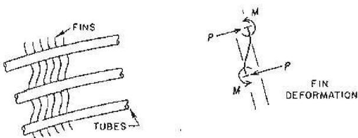  
UNCLASSIFIED ORNL-LR-WG 20859   
Fig. 1.1.8. Tube-Fin Deformations in Radiator.

temperature difference between the header drum and the nearby fins. The unfinned portions of tubes, shown in Fig. 1.1.9, will be subjected to bending as a result of cooling of the fins to below the header drum temperature. Based on strain-cycling and stress-strain characteristics of Inconel at $1500^{\circ}\mathrm{F}$ , a plastic analysis indicated that temperature differentials large enough to be likely to cause failure were produced in the 0.5-Mw test units. The radiator units presently being fabricated have been modified to accommodate the temperature differentials. The length $l$ indicated in Fig. 1.1.9 has been set at $1\frac{1}{4}$ in., and the entire fin bank has been sliced at $3\frac{1}{3}$ in. intervals (Fig. 1.1.10). (See Fig. 1.4.19 in Chap. 1.4, "Component Development and Testing"; this radiator, now being prepared for testing, will be provided with a thermocouple grid to measure the temperature distribution of the air leaving the radiator.)

In the third problem, an analysis was made of the effect of oxide plugging of one or more tubes in the matrix. The plugged tube(s) will be colder than adjacent members and will thereby be subjected to thermal strain as a result of relative expansion. Under these circumstances the fins behave as diaphragms and each exerts an axial force on the tube which tends to pull the tube away from the header (Fig. 1.1.11). The magnitude

11F. A. Field, Rectangular Cross Section Cantilever Beams in the Plastic Range, ORNL CF-56-6-85 (June 20, 1956).

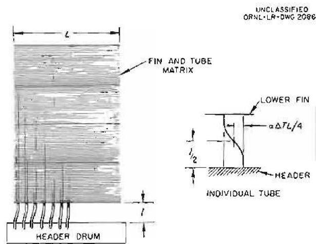  
Fig. 1.1.9. Differential Expansion Between Header and Fins,

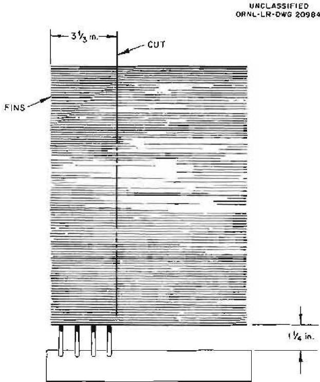  
Fig. 1.1.10. Radiator Modifications.

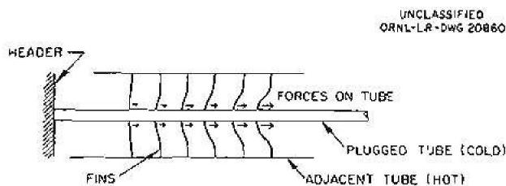  
Fig.1.1.11. Fin Loods on Plugged Tube.

of the force is determined by the flexural stiffness of the fin, by the stiffness of the tube in tension, and by the distance of the fin from the header. By treating this discrete set of forces as a continuous force distributed along the tube, it is possible to write a differential equation for the axial stress in the tube and a corresponding equation for the bending stress in the fins as a function of the position along the tube. This model indicated that the fins were relatively stiff and produced very nearly the maximum strain $(\alpha \Delta T)$ , that is, the amount that would be induced with a system of completely rigid fins. Nevertheless, it was not possible, on this basis, to

demonstrate that the maximum temperature differential conceivable in the system could cause failure of the tubes under the cyclic conditions of the test or of plugging. Metallurgical experience indicates that the resistance of Inconel to plastic strain cycling is seriously impaired by embrittlement in areas wetted by the brazing alloy. Since two radiators failed under conditions which indicated tube plugging, the embrittling effects of the brazing alloy on Inconel are being studied.

# Core-Shell Thermal Shield

D.H.PloTuS

Measurements obtained from the one-half-scale ART-core-model volume-heat-source experiment12 indicated that the core shells might be subjected to surface temperature oscillations as large as $80^{\circ}\mathrm{F}$ at frequencies of from $\frac{1}{4}$ to 4 cps. Series of tests and experiments are therefore under way in order to determine the fatigue life of Inconel tubing under simulated ART conditions. If these tests demonstrate that Inconel does not possess fatigue strengths adequate to meet the operating conditions anticipated for the ART, it may be necessary to introduce design modifications to olleviate the temperature oscillations in the core.

Several possible modifications have been suggested. One proposal is to mount a pair of thin Inconel shells in the core to serve as "thermal" shields" for the structural core shells. These shells would be similar in appearance to the actual core shells and would define two relatively thin flow channels, as shown in Fig. 1.1.12. The resulting hydrodynamic structure should be considerably more stable than that in the present core configuration. The instability in the present design results from several effects. One effect is associated with large radial temperature differences in a fluid flowing in a thick passage when a large volume heat source is present in the fluid. Another effect is the characteristic

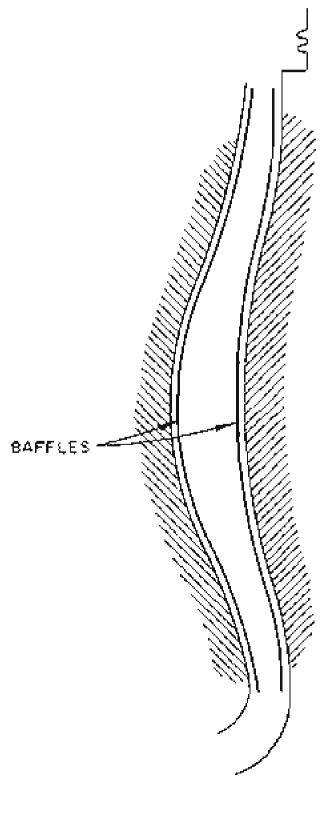  
Fig. 1,1,12. Proposed ART Core Baffles. (Secret with caption)

flow separation that occurs in a large-angle diverging channel.15 Another is the radial pressure variation associated with swirl about the island. These adverse effects would be alleviated within the thin channels, and the baffles would shield the core shells proper from the temperature oscillations in the thick central onnulus.

Calculations indicate that the divergence angle of the various channels can be maintained below that likely to induce flow separation by careful selection of the thermal shield configuration. A further advantage to be gained from the use of baffles is that the maximum uncooled core-shell temperatures predicted with the baffles are substantially lower than those in the present core. Comparative sketches of the temperature profiles

UNCLASSIFIED ORNL-LR-DWG 20862

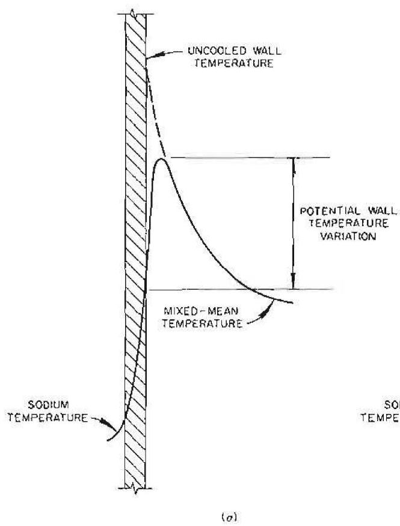

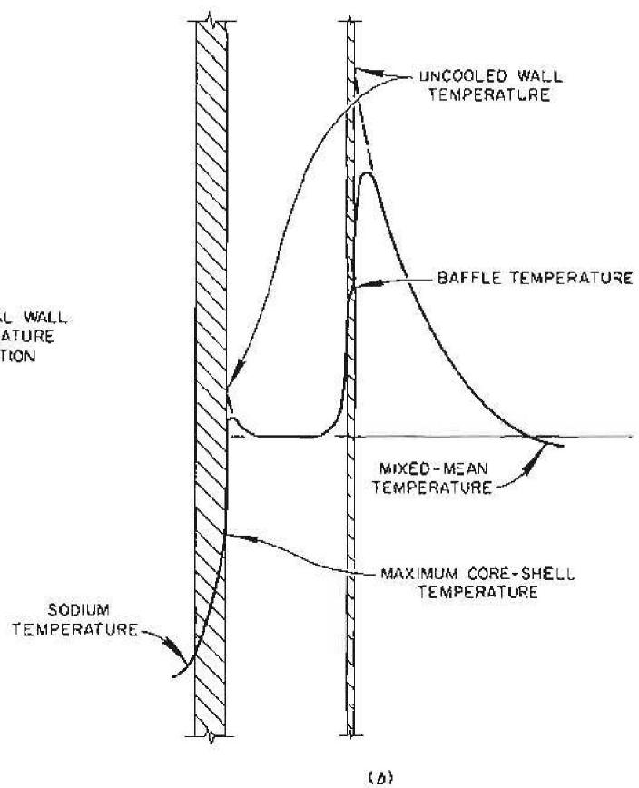  
Fig. 1.1.13. Radial Temperature Profiles in ART Core (a) Without and (b) With Core Baffles. (Secret with caption)

for the two cases are shown in Fig. 1.1.13. Moreover, because of the smaller radial temperature difference within the thin channels, the total power extracted by the sodium circuit would be reduced by approximately $50\%$ . Even if the sodium system were to fail and no heat was extracted through the core shells, the steady maximum temperature of the shells would not be more than 50 to $100^{\circ}\mathrm{F}$ above the mean fuel temperature, depending on the channel thickness. A comparison of axial temperature profiles with and without the baffles for channels of $\frac{1}{2}$ -in. constant thickness is presented in Fig. 1.1.14.

Several disadvantages and problems associated with the use of baffles have been recognized. The neutron poisoning effect of the Inconel baffles would require a critical mass increase of 10 to $15\%$ ; the thin baffle structures must be designed to withstand the static and dynamic fluid forces; and design of the entrance region to distribute

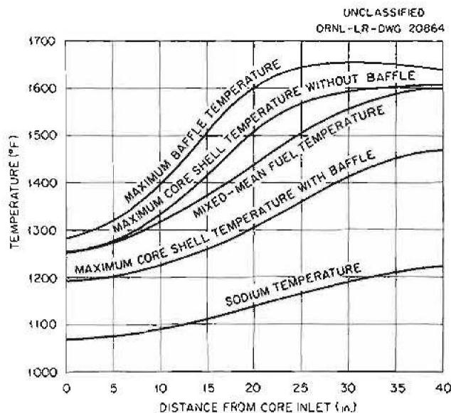  
Fig. 1,1,14. Axial Temperature Profiles in the ART With and Without Baffles In the Core. (Secret with caption)

the flow properly between the channels and the central annulus may be a difficult problem. These various factors are presently being considered, and experiments are being prepared for determining the optimum configuration for the baffle design.

# CORE HYDRODYNAMICS

W.T.Furgerson J.J.Keyes

W.J.Stelzman

Flow studies of the full-scale 21-in. plastic model of the ART core were continued in order to investigate wall temperature fluctuations, which may be analogous to the fluid temperature fluctuations observed in the one-half-scale volume-heat-source experiment,[12,16] and to test flow guidance devices in either the core entrance region or in the fuel annulus that would reduce flow reversals and other instabilities. An attempt was made to measure a transient surface-heat-transfer coefficient by utilizing a hot-wire probe located on the outer wall. The probe was made by winding a tight flat spiral of enameled Nichrome wire (0.006 in. in diameter) in the end of a $3\%$ -in.-OD metal tube; epoxy resin was used to hold the wire in place. The face of the tube was then machined

16C. W. Greene et al., ANP Quar. Prog. Rep. Sept. 10, 1956, ORNL-2157, p 227.

to expose the surface of the spiral wire. It should be possible from the variation in resistance of the heated wire with time to calculate the corresponding fluctuations in the heat transfer coefficient arising from boundary layer fluctuations, if the temperature coefficient of resistivity of the wire were known. Attempts were made to measure the temperature coefficient of resistivity of the wire, but unfortunately the resistance of the wire was not stable at the temperature required to make a satisfactory determination.

Improved probes are being developed in which the sensitive elements will be thin strips of nickel (vacuum evaporated) or silver (applied by painting from solution) on the ends of a plastic rod. It is believed that these elements will have good response to high-frequency fluctuations and sufficiently high temperature coefficients of resistivity to permit operation at relatively low probe temperatures.

In an alternative technique for measuring boundary-layer fluctuations in the core, measurements are made with a helium-cooled surface thermocouple. The design of the thermocouple is illustrated in Fig. 1.1.15. The thermocouple element is of the "gun-barrel" type, and it is

17J. E. Mott and A. G. Smith, Jr., ANP Quar. Prog. Rep. Dec. 31, 1956, ORNL-2221, p 54.

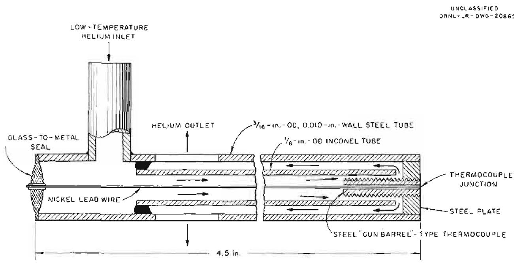  
Fig. 1.1.15. Schematic Diagram of Hellum-Cooled Surface Thermocouple,

mounted in a thin steel plate across which a thermal gradient is maintained by means of a steady blast of helium cooled by liquid nitrogen. The resulting heat flux is sufficient to maintain the probe surface at a temperature about $60^{\circ}\mathrm{F}$ below that of the ambient core fluid, whose temperature is constant at $95^{\circ}\mathrm{F}$ . Data are being obtained for several core geometries by the use of this technique.

The flow-guidance investigations were continued with studies of the core entrance region alone, the core entrance and equatorial regions simultaneously, and the core island bellows region within the center volute of the axial-flow type of header. The configuration used at the core entrance consisted of a combination of guide vanes, designated CA-1, and a series of annular liners, designated shrouds 1 and 2, which split the flow entering the central annulus of the header into separate concentric cylinders of fluid. The outer cylinder of fluid was allowed to proceed downward at its natural flow angle, whereas the component of downward flow of the inner cylinder of fluid was increased by the guide vanes. The purpose of this configuration was to reduce the flow reversal at the core entrance. Complete probe traverses of this system, as well as observations of dye injections, indicated that no significant improvements in flow characteristics were obtained in comparison with the characteristics of the swirl-type core header No. 2 without inlet vanes and with a simulated conical island expansion joint.[18]

The second configuration tested consisted of a combination of a core inlet arrangement, designated GS-2 inlet guide vane and GS-2-P10 conical baffle plate, in combination with a slotted disk, desig

nated "flame ring" 1, which was located 6 in. above the equator. The purpose of this combination was to stabilize and distribute the flow evenly across the annulus above the equator while preserving as much of the rotational component as possible.

Results of the test showed an increase in fuel circuit resistance equivalent to 1.3 ft of working fluid. Claw-probe traverse data showed that the flow distribution was improved both radially and circumferentially in comparison with that of series 17 tests of a configuration which had GS-2 inlet guide vanes and a GS-2-P10 baffle plate but no "flame ring" and in comparison with that of series 20 tests of a configuration which had a bare header and core configuration with no inlet guide vanes or baffle plates. The degree of variation of axial velocity with time was decreased, also, as observed by the decreased angle through which injected dye traces fluctuated. These effects on the flow distribution were more marked below the "flame ring" than above it.

The configuration of test series 24 consisted of the bare header and the core used in series 20 tests, but with the center body in the north-head region modified by an inverted conical section. The purpose of this modification was to decrease the adverse axial pressure gradient along the upper island surface and consequently to increase the axial flow component in this region.

Claw-probe traverses showed that more flow had been directed downward along the island surface. In the region above the equator this was apparent as a reduction in the amount of reversed flow. An undesirable side effect was shown by dye traces; namely, a region of large low-frequency fluctuations of flow with time was apparent which could lead to temperature fluctuations in a volume heat source.

# 1.2. REACTOR PHYSICS

A.M.Perry

# ART SHIELDING

C.M.Copenhagen A.M.Perry

A program of calculations has been undertaken to re-evaluate the shielding of the ART and such auxiliary equipment as the fuel fill-and-drain tank, fuel-recovery tank, etc. The first step was to compute the gamma-ray dose rate at the outer surface of the ART neutron shield, without taking into account the effects of the several penetrations for NaK lines, fuel lines, etc. The effects of such penetrations must be considered separately.

Gamma-ray source strengths in the ART1,2 were obtained through the use of two-dimensional neutron-diffusion calculations. In computing the dose at the surface of the neutron shield (the outer layer of the water region), an infinite-slab model was used that was based on the geometry and source strengths in the equatorial plane of the ART. The plane-to-sphere transformation3 was then applied to each portion of the source. Secondary gamma rays from the lead shield were neglected. The justification for this is that in the Lid Tank Shielding Facility (LTSF) tests of the gamma-ray dose rates in reflector-moderated reactor mockups with various lead thicknesses,4 the dose varied exponentially with lead thickness up to about 4.5 in.; the ART lead is 4.3 in. thick. These data are interpreted to mean that the intensity of gamma rays penetrating the 4.3-in.-thick lead shield of the ART will be much greater than the intensity of gamma rays produced in the lead.

The heat exchanger was regarded as a distributed source of gamma rays, the reflector as a family of five plane surface sources, and the core as a set of six plane surface sources. The shells were treated as plane surface sources. The energy

spectro² were divided into energy groups with upper limits at 0.75, 1.5, 3, 5, 7, and 9 MeV.

The buildup factors used were those for water, since the outer layer of the shield is 31.5 in. of water. The buildup factor was used in the form

$$
B (\mu r) = a + b \mu r,
$$

with the constants $a$ and $b$ evaluated to fit the buildup-factor curves for $\mu r$ between 5 and 15 mean free paths.

The calculated dose rate at the surface of the water bag $(r = 170\mathrm{cm})$ is $1840~\mathrm{r / hr}$ . The relative importance of each source is indicated by the percentage contributions to the total dose rate: core, $22\%$ ; outer core shell, $9\%$ ; reflector, $12\%$ ; reflector shell, $35\%$ ; heat exchanger, $22\%$ .

In such a calculation the question arises of whether the buildup-factor method can yield valid results for the reflector-moderated reactor geometry. The gamma rays penetrate a substantial thickness of lead, and, since the lead absorption cross section has a minimum for gamma-ray energies from 3 to 5 MeV, it might be supposed that most gamma rays entering the water would have energies in this range. For the higher energy sources, use of water buildup factors might then lead to appreciable errors. In order to check this point, an attempt was made to determine the energy spectrum of the gamma rays entering and leaving each component of the shield. Use was made of the energy spectra from monoenergetic point sources in infinite homogeneous media, as computed by Goldstein and Wilkins. The sources were divided into a set of point sources, and the dose rate at the inner surface of the lead shield was computed for each source energy group. Attenuation and degradation of the radiation in the lead were then computed as if the flux incident on the inner surface of the lead were due to a set of point monoenergetic sources at the center of a hollow cavity inside the lead. The same procedure was applied to the water with a new set of effective

point monoenergetic sources determined by the energy spectrum emerging from the lead.

This method of calculation yields a gamma-ray dose rate of $1610\mathrm{r / hr}$ at the shield surface. The energy fluxes at the shield surface in each gamma-ray energy group are listed below:

<table><tr><td>Gamma-Ray Energy Interval (MeV)</td><td>Flux (MeV/cm2·sec)</td></tr><tr><td></td><td>× 106</td></tr><tr><td>0.25–0.75</td><td>108</td></tr><tr><td>0.75–1.25</td><td>86</td></tr><tr><td>1.25–3</td><td>271</td></tr><tr><td>3~5</td><td>301</td></tr><tr><td>5–7</td><td>147</td></tr><tr><td>7–8</td><td>185</td></tr></table>

The fast-neutron dose rate at the shield surface was computed from LTSF data, with the use of the transformation from finite-disk surface source to spherical surface source and the factors that accounted for the additional boral attenuation and increased source-to-shield surface ratio in the LTSF configuration, as formulated by Dee and Otis. For an LTSF equivalent surface source strength of $0.428 \times 10^{-3} \mathrm{~W/cm}^2$ , the calculated fast-neutron dose rate of the ART shield surface was 3.86 rem/hr. Thus at a distance of 50 ft from the center of the ART operating at 60 Mw with a 4.3-in.-lead and 31.5-in.-water shield, the calculated gamma-ray dose rate is 22.8 rem/hr and the fast-neutron dose rate is 0.05 rem/hr.

# 1.3. ART INSTRUMENTS AND CONTROLS

E.R.Mann C.S.Walker

R.G.Affel

# FLOW DECAY IN ART PRIMARY NoK SYSTEM FOLLOWING POWER LOSS

W.E.Werts

A NaK pump power failure will produce temperature and pressure transients in the ART heat-dump system. The NaK circuit flow-decay characteristics were therefore investigated for use as a guide in evaluating the significance of such a power loss. This investigation was based on the premise that flow is proportional to pump speed when other fluid circuit conditions are constant.

Experimental data on the transient characteristics of a NaK circuit were obtained for a loop in which an ART prototype NaK pump was being tested at high temperatures. The loop contained about 6 ft³ of circulating NaK. During shutdown tests, high-speed motion pictures were taken of the pump shaft and of a pointer attached to a synchronous timing motor. This photographic record provided a reliable and accurate method of determining the number of pump-shaft revolutions as a function of time. With a complete tabulation of pump-shaft revolutions vs time established, speed vs time data could be obtained through numerical differentiation.

Several shutdown tests were made from each of two initial conditions. The NaK flow was essentially the same for both conditions, but the initial pump-shaft speed in one case was about three-fourths the initial speed in the other case. A hand valve was adjusted, as required, to provide the desired flow for the pump-shaft speed used.

The data were compared and evaluated according to the following system-operation-decay analytical relationship:

$$
\begin{array}{l} \left[ \begin{array}{l} \text {p o w e r s u p p l i e d} \\ \text {t o s y s t e m} \end{array} \right] = \left[ \begin{array}{l} \text {p o w e r t o} \\ \text {c i r c u l a t e f l u i d} \end{array} \right] + \\ + \left[ \begin{array}{c} \text {p o w e r t o c h a n g e} \\ \text {k i n e t i c e n e r g y} \end{array} \right] \\ \end{array}
$$

When the system driving power was terminated, the relationship became

$$
0 = \left[ \begin{array}{l} \text {p o w e r t o} \\ \text {c i r c u l a t e f l u i d} \end{array} \right] + \left[ \begin{array}{l} \text {p o w e r t o c h a n g e} \\ \text {k i n e t i c e n e r g y} \end{array} \right] \tag {1}
$$

If $N$ is rotor speed and $k_{1}$ and $k_{2}$ are equation constants, the

$$
\left[ \begin{array}{l} \text {p o w e r t o} \\ \text {c i r c u l o t e f l u i d} \end{array} \right] = H P = k _ {1} N ^ {3}
$$

and the

$$
\left[ \text {k i n e t i c e n e r g y} \right] = K E = k _ {2} N ^ {2},
$$

expressed in power-time units. Then the

$$
\left[ \begin{array}{l} \text {p o w e r t o c h a n g e} \\ \text {k i n e t i c e n e r g y} \end{array} \right] = \frac {d (\mathrm {K E})}{d t} = 2 k _ {2} N \frac {d N}{d t}. \tag {2}
$$

If Eq. 2 is substituted into the original expression, Eq. 1, the following expression for speed vs time is obtained:

$$
0 = k _ {1} N ^ {3} + 2 k _ {2} N \frac {d N}{d t}. \tag {3}
$$

The solution to Eq. 3 can be shown to be in any of the following forms, with the subscript 0 indicating the initial values at steady-state conditions before the start of operation decay:

$$
\begin{array}{l} \frac {1}{N} = \frac {k _ {1} t}{2 k _ {2}} + \frac {1}{N _ {0}}, (4) \\ \frac {N}{N _ {0}} = \frac {1}{\left(\mathrm {H P} _ {0} / \mathrm {K E} _ {0}\right) (i / 2) + 1}, (5) \\ t = \left(\frac {N _ {0}}{N} - 1\right) \left(\frac {2 K E _ {0}}{H P _ {0}}\right). (6) \\ \end{array}
$$

In Eqs. 4, 5, and 6, $N$ and $t$ are the only variables.

Plots of the speed decay vs time were made for various initial kinetic energy-to-power ratios, as shown on Fig. 1.3.1. The curves shown are theoretically valid for any type of pump, fluid system, or device, so long as the system power consumption is proportional to the cube of the mass-velocity involved. The initial kinetic energy-to-power ratio must be determined with the kinetic

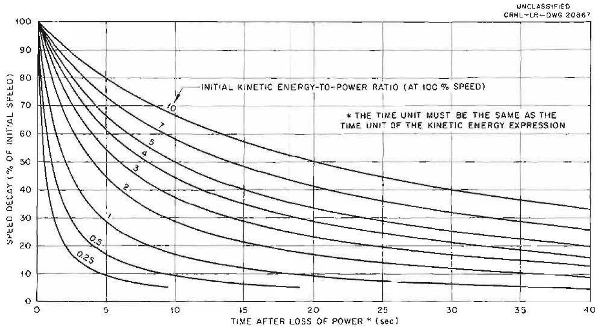  
Fig. 1.3.1. Speed Decay Characteristics of a Centrifugal Pump upon Loss of Power,

energy expressed in power-time units (such as horsepower-seconds, watt-hours, etc.) to give a term having the same units of time as those applied to the abscissa of the curve (seconds, hours, etc.).

The data were analyzed in detail for two shutdowns from the following initial steady-state operating conditions:

<table><tr><td>Condition</td><td>Run 1</td><td>Run 2</td></tr><tr><td>Shoft speed, rpm</td><td>3506</td><td>2678</td></tr><tr><td>Fluid flow, gpm</td><td>1220</td><td>1216</td></tr><tr><td>Discharge head, ft</td><td>394</td><td>212</td></tr><tr><td>Power supplied, hp</td><td>119.3</td><td>68.8</td></tr></table>

Partial checks of data from several other tests indicated almost identical results for the conditions involved. All the analyzed test data closely matched the computed decay characteristic shown on Fig. 1.3.1 for an initial kinetic energy-to-power ratio of 2, that is, $\mathrm{KE}_0 / \mathrm{HP}_0 = 2$ , and speed decay down to about $30\%$ . Below the $30\%$ speed-decay region, the system mechanical friction becomes increasingly more significant, since the

system kinetic-energy driving force has dropped to less than $10\%$ of the original value.

The operating decay characteristics were substantially the same for both sets of conditions, and therefore only the test data for the shutdown from a shaft speed of 3506 rpm were fully reduced to completed plots, as shown in Figs. 1.3.2 and 1.3.3. The pressure characteristic curve shown on Fig. 1.3.2 was obtained by using the premise that pressure varies as the square of the speed and the flow rate. With other conditions constant, the flow rate is considered to be proportional to the pump-shaft speed, as previously indicated.

The analytical expressions for the two test conditions would be identical if the initial kinetic energy-to-power ratios were the same. The power ratio for the two conditions is $119.3 / 68.8 = 1.735$ , and the experimental data indicated that the decay characteristics for the two sets of conditions were identical; therefore, the kinetic energy ratio must be nearly the same as the power ratio. An investigation of the rotating kinetic energy ratio for the two conditions revealed that

$$
\left(\frac {N _ {1}}{N _ {2}}\right) ^ {2} = \left(\frac {3 5 0 6}{2 6 7 8}\right) ^ {2} = 1. 7 1 5.
$$

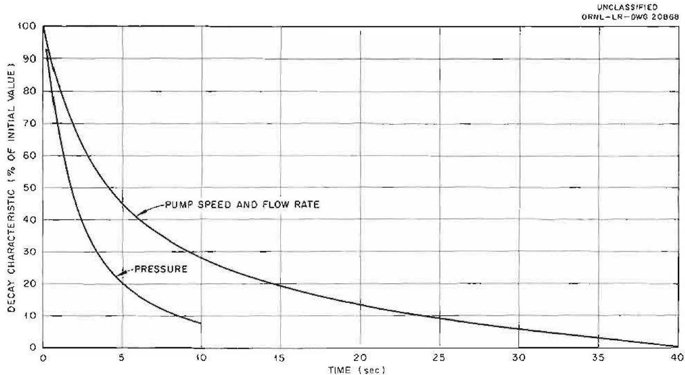  
Fig. 1.3.2. Flow Rate and Pressure Decay in NaK Circuit After Loss of Power to the Centrifugal Pump.

Thus it can be seen that the rotating kinetic energy-to-power ratios were about the same for the two test conditions.

The fluid kinetic energy cannot be included in the analytical expressions, since the flow was substantially constant. In view of this, it would seem that the flow inertia is negligible, as compared with the rotating inertia, in its contribution to the system kinetic energy. If the foregoing deductions are considered to be the case, the major contributors to continuing system operation after a power loss are the rotating elements of the pump and the electric drive motor. This also means that the only appreciable contribution to any extended continuing fluid circulation during the decay period is received from the stored kinetic energy in the mechanically rotating parts, and that the pump is still the driving force and is inducing fluid displacement in a manner substantially the same as during the previous steady-state operation.

Since the fluid flow is dependent upon the pump driving force, fluid travel around the circulating loop should be substantially proportional to the pump angular displacement. The information presented on Fig. 1.3.3 was determined by applying

this principle to the test data described above in combination with the computed volumes of segments of the ART primary NaK heat-dump circuit. The volumes used in the preparation of Fig. 1.3.3 were those designated circuit 1 in Table 1.3.1.

# LIQUID-METAL-LEVEL TRANSDUCERS

G.H. Burger A.M. Leppert R.E. Pidgeon, Jr.2

Tests of the commercial resistance-type liquid-metal-level transducers described previously were concluded. Operation of the NoK level test facility was continued until February 21, or which time only one of the four transducers originally installed in the test facility remained in operating condition. The performance of the transducer that remained in operation was excellent for a period of 3732 hr, during which time the NoK level of the system was cycled 65,000 times. The four transducers were removed from the test facility for examination, and the unit that remained in

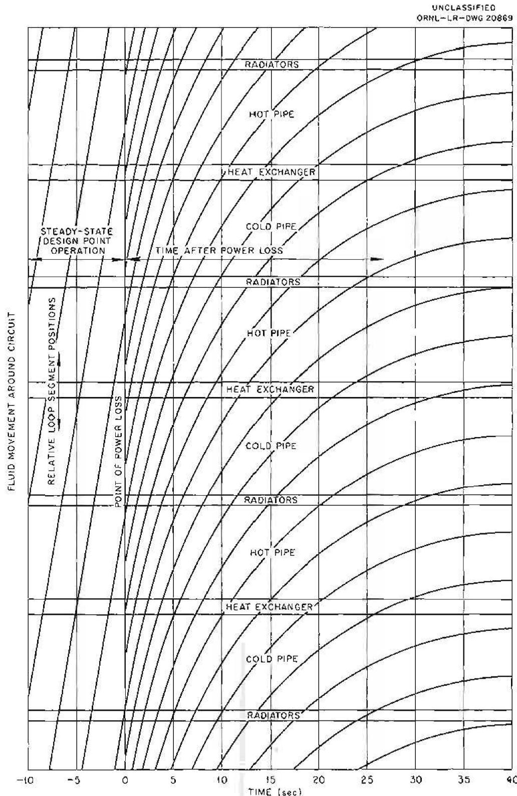  
Fig. 1.3.3. NaK Flow Rate Decay Characteristic After Power Loss Based on Loop Test Data and ART System Design Volumes. (Confidential with caption)

Table 1.3.1. Volumes of NaK in Various Segments of the Four NaK Circuits of the Art Primary Heat Dump System   

<table><tr><td rowspan="2">Segment</td><td colspan="5">NcK Volume (ft3)</td></tr><tr><td>Circuit 1</td><td>Circuit 2</td><td>Circuit 3</td><td>Circuit 4</td><td>Total for the Four Circuits*</td></tr><tr><td>Radiator to pump</td><td>1.411</td><td>1.411</td><td>1.411</td><td>1.411</td><td></td></tr><tr><td>Pump (circulating)</td><td>0.26</td><td>0.26</td><td>0.26</td><td>0.26</td><td></td></tr><tr><td>External cold pipe</td><td>1.787</td><td>1.546</td><td>1.305</td><td>1.064</td><td></td></tr><tr><td>Internal cold pipe</td><td>0.762</td><td>0.646</td><td>0.656</td><td>0.735</td><td></td></tr><tr><td>Branches (to header pipe)</td><td>0.123</td><td>0.123</td><td>0.123</td><td>0.123</td><td></td></tr><tr><td>North headers and connecting pipe</td><td>0.242</td><td>0.242</td><td>0.242</td><td>0.242</td><td></td></tr><tr><td>Total</td><td>4.585</td><td>4.228</td><td>3.997</td><td>3.835</td><td>16.645</td></tr><tr><td>Heat exchanger</td><td>0.722</td><td>0.722</td><td>0.722</td><td>0.722</td><td>2.888</td></tr><tr><td>South header and connecting pipe</td><td>0.171</td><td>0.171</td><td>0.171</td><td>0.171</td><td></td></tr><tr><td>Branches (header pipe to common line)</td><td>0.123</td><td>0.123</td><td>0.123</td><td>0.123</td><td></td></tr><tr><td>Internal hot pipe</td><td>0.646</td><td>0.838</td><td>0.694</td><td>0.687</td><td></td></tr><tr><td>External hot pipe</td><td>1.463</td><td>1.188</td><td>1.478</td><td>1.134</td><td></td></tr><tr><td>Pipe (2 in.) to elevation 834 ft, 8 in.</td><td>0.654</td><td>0.561</td><td>0.748</td><td>0.631</td><td></td></tr><tr><td>Hot pipe to radiator tubes</td><td>1.392</td><td>1.392</td><td>1.392</td><td>1.392</td><td></td></tr><tr><td>Total</td><td>4.449</td><td>4.273</td><td>4.606</td><td>4.138</td><td>17.466</td></tr><tr><td>Radiator</td><td>0.476</td><td>0.476</td><td>0.476</td><td>0.476</td><td>1.904</td></tr><tr><td>Total Circulating Volume</td><td>10.232</td><td>9.699</td><td>9.801</td><td>9.171</td><td>38.903</td></tr></table>

*Circuits 1, 2, 3, and 4 are referred to on 7503 Facility heat-dump piping drawings as loops B1, A2, A1, and B2, respectively.

operation for 3732 hr is shown in Fig. 1.3.4a. One of the three units which failed soon after the start of the test is shown in Fig. 1.3.4b. The failure of the unit was caused by NaK seepage into the insulation through the crack visible near the bottom of the U-bend, and the other two unsatisfactory units failed in a similar manner. The reaction of the NaK with the insulation caused the visible deformation.

The NaK-level test facility is being modified to provide facilities for testing ORNL-designed and -fabricated resistance-type level transducers. These level transducers are to be clamped into

place in the surge tanks (instead of welded) to facilitate installation and removal.

Fabrication of six ORNL-designed resistance-type level transducers is under way. These instruments will be similar to the commercial transducers, but they will have better temperature compensation, and improved weld design. A further design modification was made to increase the range of level determination; that is, with the ORNL-designed instruments, it will be possible to measure the level closer to the bottom of the tank. Design of a similar resistance-type level transducer for use in the ART sodium expansion tank was completed.

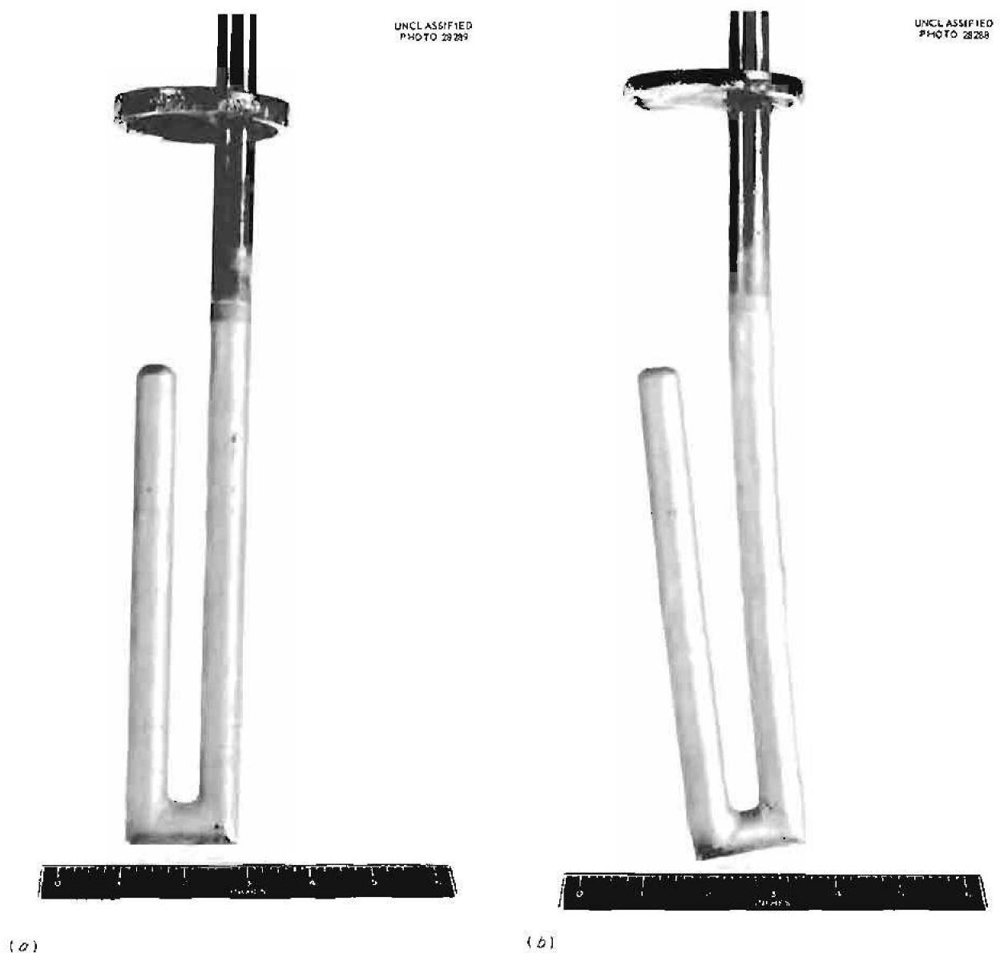  
Fig. 1.34. Resistance-Type Liquid-Metal-Level Transducers After Operation for 3732 hr In a NaK-Level Test Facility. (a) Unit that remained in operating condition throughout the test. (b) Unit that operated only 24 hr, but remained in the test facility exposed to NaK for 3732 hr.

# ON-OFF LEVEL PROBES

G.H.Burger A.M.Leppert

R.E.Pidgeon, Jr.

Eight of the resistance-type on-off level probes described previously were constructed and installed in the surge tonks used in the fluid-flow-measuring system in the facility for testing

magnetic flowmeters in NaK. These all-welded probes are being tested as a replacement for conventional spark-plug probes, which are not suitable for pressurized systems and temperatures above $450^{\circ}\mathrm{F}$ . The surge-tank level control system that incorporates these on-off probes was in operation on the test loop for about 2 days, but an apparent failure of the gas-pressure control system allowed helium to be forced into the NaK system. Some changes are being made in the

on-off probe and its control circuit to give better control and a better safety margin in operation.

The on-off level probe being tested consists of a $\frac{1}{8}$ -in.-dia copper wire contained in and insulated from a $\frac{1}{4}$ -in.-OD, 0.025-in.-wall Inconel tube at all points, except the bottom, where it is welded. A current of 8 to 10 amp, 60 cps, is supplied to the probe. A relay across the probe is energized when the NaK level is below the probe and de-energized when NaK touches the probe. A similar on-off probe with an Inconel center wire and a bridge amplifier for the control circuit is being studied. The probe would consist of a $\frac{3}{16}$ -in.-dia Inconel wire insulated in a $\frac{5}{16}$ -in.-OD, 0.025-in.-wall Inconel tube. The bridge circuit would be balanced when the NaK touched the probe and unbalanced when the NaK level was below the probe. Since the temperature coefficient of resistivity of Inconel is low, the zero shift resulting from a temperature change would not be so large as in the present probe. A specification has been prepared and submitted to manufacturers for a packaged amplifier to be used in this bridge circuit.

An especially fabricated spark plug with a beryllium oxide insulator was tested in NaK as an on-off level probe. The plug failed after 20 hr of operation because of short circuiting of the insulator. The plug was removed and reworked, and it is to be retested when the NaK-level test facility (referred to in previous section) is back in operation.

Several special plugs with insulators high in alumina and magnesium content were received from the Champion Spark Plug Co. for testing and evaluating. These plugs will also be tested in the NaK-level test facility or other test rigs as soon as possible.

The usefulness of the conventional type of spark plug as a reliable on-off probe is very doubtful at this time. The plug life is very short when the probe is operated at temperatures above 450 to $500^{\circ}F$ , and there is always the danger of gas leakage through the insulator. This leakage problem could be very serious if the plug were used with radioactive fluids, and it would be necessary to completely can or seal the plug. Therefore the use of the spark plug as a reactor type of level element is not recommended, and the development and testing of the resistance type of on-off probe is continuing. It is expected that

this unit will replace the spark plug except in systems which can be operated safely and reliably within the spark-plug limitations, or in systems in which the process fluid electrical conductivity is too low for use with the resistive type of on-off level probe.

# FUEL-EXPANSION-TANK LEVEL INDICATOR

R. F. Hyland

# Dynamic-Level Tests

Four helium-bubbler-type fuel-level indicators completed 1000-hr tests at $1500^{\circ}\mathrm{F}$ in the dynamic-level test rig, described previously, without plugging of the bubbler tubes. Two of the bubblers were fabricated of $\frac{3}{8}$ -in.-OD, 0.065-in.-wall Inconel tubing, and the other two were $\frac{1}{4}$ -in.-OD, 0.035-in.-wall Inconel tubing. The helium used for these tests was passed through a Drierite filter and through copper turnings maintained at $1000^{\circ}\mathrm{F}$ in order to getter the oxygen and remove the moisture.

After completion of these tests, the facility was modified in an attempt to obtain a better series of level calibrations. The modifications included a means for accurately varying the fuel level continuously in the two vessels by using gas pressure; a new bubbler design with a shallow V in the bottom of the tube was used; and the bubblers were positioned within 0.010 in. of the correct level while the vessel was at the operating temperature. An improved type of variable calibrating probe was designed, installed, and calibrated at the operating temperature. Also, the fuel was thoroughly mixed prior to calibration to preclude density errors due to thermal gradients. As a result of these modifications, the first accurate, reproducible series of static level calibrations was obtained. The maximum level error was 0.08 in. in 5 in., or $1.6\%$ . The results were reproducible within $1.5\%$ .

A dynamic-level test scheduled to operate for 3000 hr at $1500^{\circ}\mathrm{F}$ has completed 750 hr without bubbler plugging. Prior to startup, however, with the bubblers operating in static fuel at $1150^{\circ}\mathrm{F}$ , all four bubblers plugged in a period of 24 hr, for reasons unknown. Two bubblers were removed and the contents sent for analysis. The other two were unplugged by raising the fluid temperature

to $1500^{\circ} \mathrm{F}$ . The bubbler plugging problem has become so serious that a separate series of tests, described below, is to be made to determine the cause.

# Static-Level Tests

The average life of a helium-bubbler type of level indicator has been found to be about 1100 hr in a static-level system in which a NoK scrubber is used to reduce the moisture content of the helium and in which copper turnings maintained at $1000^{\circ}\mathrm{F}$ are used to reduce the oxygen content. Since the average life falls for short of the 3000-hr life specified, attempts are being made to determine the cause of plugging of the bubbler tubes. Although the techniques for analyzing fuel mixtures for oxygen compounds are not precise, it is thought that the material which plugs the bubbler tubes is $\mathsf{ZrO}_2$ . Therefore a special batch of oxyfluoride-free fuel will be used in the next series of tests.

It has been suggested that a cold trap be used in place of the NaK scrubbers for removing moisture from the helium, since NaK entrainment might contribute to the plugging. Methods for checking the oxygen content of the helium and for reducing the oxygen content are being studied. Further, the vessels used for future tests are to be hydrogen fired.

These recommendations are to be incorporated into a simple series of bubbler tests in static fuel, without level instrumentation, and the additional precautions described below will be taken.

1. An all-silver-soldered spectrometer-leak-tight system, with bellows valves, will be employed.   
2. The system will be flushed thoroughly by alternately pressurizing with helium and evacuating.   
3. The dewpoint and oxygen content of the supply helium will be continuously monitored.   
4. The purge helium will be preheated to the temperature of the fuel.

As a further check on the role of oxygen impurity in the helium as a cause of plugging, one test series will be run with helium of known oxygen content, as furnished in commercial gas, and another test series will be run with helium passed over uranium turnings held at $600^{\circ}\mathrm{C}$ to reduce the oxygen content to as low a value as possible.

# PRESSURE TRANSMITTERS FOR USE AT HIGH TEMPERATURES

W.R.Miller

Evaluation tests of commercial transmitters for use at high temperatures were continued. Two of the six units mentioned previously that employ differential transformers were tested. The first unit tested was not satisfactory in that the overall accuracy was only $3.3\%$ full scale at $1200^{\circ}\mathrm{F}$ . The other unit was somewhat better, with an overall accuracy of $2.1\%$ full scale at $1200^{\circ}\mathrm{F}$ . The differential-transformer method of detection has proved to be unusually difficult to use in that the field of the Calrod heaters used to maintain the operating temperature has an effect on the output readings. The use of magnetic shielding is helpful but does not relieve the situation completely. At present two more units of the type shown in Fig. 1.3.5 are undergoing tests.

The unit mentioned previously that employs a variable-permeance type of pressure transducer was tested, but no data were obtained. Lack of suitable aligning guides allowed the core of the transducer to rub the coil housing. This unit (Fig. 1.3.6), which was on consignment, has been returned to the manufacturer.

Redesigned models of the four-legged strain-gage type of transmitters (Fig. 1.3.7) were also tested. Armor was added to protect the capillary, and a shock-mounted sub-base was added within the case for vibration isolation. The redesigned case eliminates zero shift when the cover is tightened. Because of a poorly designed shipping clamp the strain gages were damaged during shipment, and therefore the test results for these models were not up to the standard set by the results obtained with the original six prototype models. The shipping clamp has now been modified by the manufacturer.

The next lot of four-legged strain-gage transmitters will feature a sensor housing with improved stress characteristics for use with more corrosive process fluids. The details of this design change have been satisfactorily resolved with the manufacturer.

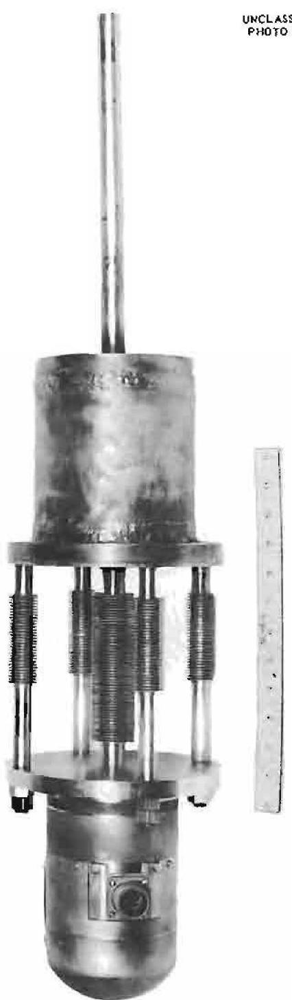  
Fig. 1.3.5. Callery Chemical Co. Pressure Transducer.

A second set of pneumatic-output transmitters completed a successful 3000-hr life test in a NaK-filled test loop. These units are presently being examined metallurgically for weld defects and corrosion.

# MAGNETIC FLOWMETERS

G.H.Burger C.L.Pearce

Six of the $3 \frac{1}{2}$ -in. magnetic flowmeters purchased for the ETU and the ART were installed in the flowmeter test loop filled with NaK for calibration against a water-calibrated (0.25% accurate) venturi. As stated previously8 the units will be calibrated over the widest temperature and flow-rate ranges possible with the test loop. These ranges will cover, in general, the design ranges of the ETU and the ART.

Operation of the loop began on February 12, 1957, and it had operated a total of 40 hr when it became necessary to drain the NaK for repairs and modifications of the loop. During the 40-hr operating period, fluid flow rates of up to 1600 gpm and fluid temperatures of up to $1350^{\circ}\mathrm{F}$ were achieved.

The data obtained with the magnetic flowmeters, while not at all conclusive because of the short operating time, did give general indications of the operating characteristics to be expected. It appears that at least four of the six flowmeters now installed in the loop will be acceptable for the ETU if the accuracy specifications are met in subsequent tests.

Six of the ART-ETU 2-in. magnetic flowmeters are being installed in another test loop for calibration against a water-calibrated (0.25% accurate) venturi. Operation of this loop will probably start in May 1957.

The $\frac{3}{8}$ -in. magnetic flowmeters designed for plug indicator and cold-trap flow rate measurements are being fabricated. Several of the units will be tested for temperature effects on the magnets. These units will not be calibrated because the accuracy requirement is $\pm 15\%$ .

UNCLE.SMIFIED PHO TO 17347

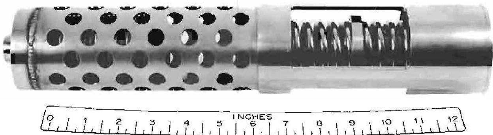  
Fig. 1.3.6. Crescent Engineering & Research Co. Pressure Transducer.

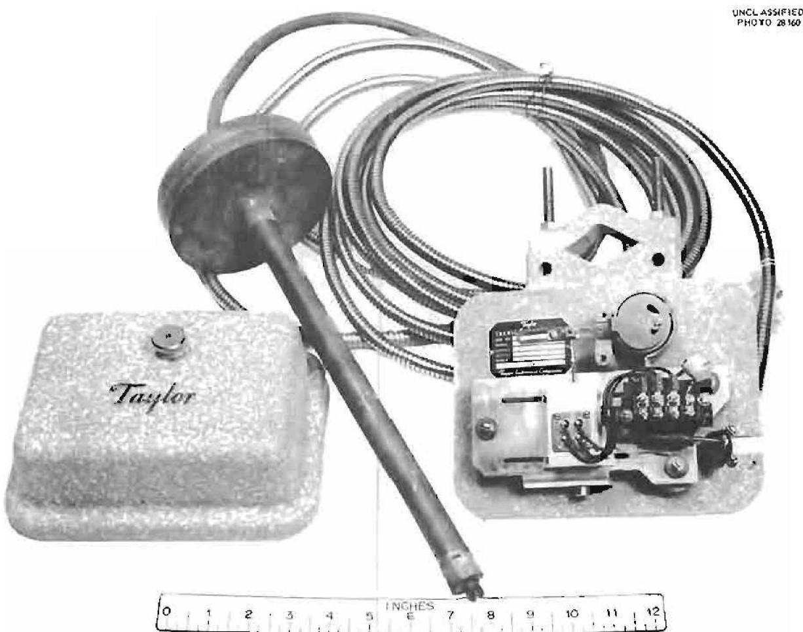  
Fig. 1.3.7. Taylor Instrument Companies Pressure Transducer.

# REMOTE ADJUSTABLE PRESSURE REGULATORS

W.R.Miller

Two prototype models of remotely adjustable pressure regulators were tested. These units were from different manufacturers but were quite similar in operation. A remotely adjusted direct current is passed through a voice-coil type of transducer to position the pilot operator of a pneumatic relay system. The resulting output pressure is directly proportional to the magnitude of the current in the transducer coil. Tests performed thus far showed these units to be stable under line-voltage, supply-pressure, and normal ambient-temperature variations. Tests will soon be initiated in which these units will be subjected to extreme ambient conditions in a 3000-hr life test.

# TURBINE FLOWMETERS FOR USE AT HIGH TEMPERATURES

G.H.Burger

The 1-in. turbine flowmeter, designated unit No. 2-Rev. 3, described previously, was installed in a forced-circulation gas-fired Inconel loop containing NaF-ZrF4-UF4 (50-46-4 mole %, fuel 30) for calibration against an orifice by using Taylor transducers as pressure sensors and for an endurance test of 3000 hr. Operation of the loop was started on January 8, 1957, and the turbine operated satisfactorily for approximately 340 hr. It was then noted that the turbine output frequency was considerably different from what it should have been based upon the orifice-measured flow rate, and an investigation showed that the unit was not operating. An x-ray examination of the unit showed, as far as could be determined, that the unit was not broken. It was therefore believed that, since the unit had been operated in NaK systems three times previously, the bearing had been oxidized to some extent and that operation in the salt mixture caused it to bind after a short operating time. The unit will be removed when the loop is drained and examined in order to determine the cause of failure.

A $3\frac{1}{2}$ -in. turbine flowmeter was installed in a forced-circulation loop filled with NaK in order to test the unit under actual operating conditions.

Prior to installation in the loop the unit had been tested and calibrated at a high flow rate in a loop containing water. The unit performed satisfactorily during the calibration tests. The calibration data are shown in Fig. 1.3.8. The only unusual operating characteristic was noted at a flow rate of $600\mathrm{gpm}$ , at which point the turbine "chattered"; at flow rates other than this no unusual chatter or vibration was noted. The total test time with water was approximately 6 to 8 hr, and flow rates of up to $1100\mathrm{gpm}$ were recorded. It was felt on the basis of the results of the water tests that the unit was satisfactory for calibration under operating conditions in a NaK system and that any possible failure of the unit could not damage the test loop.

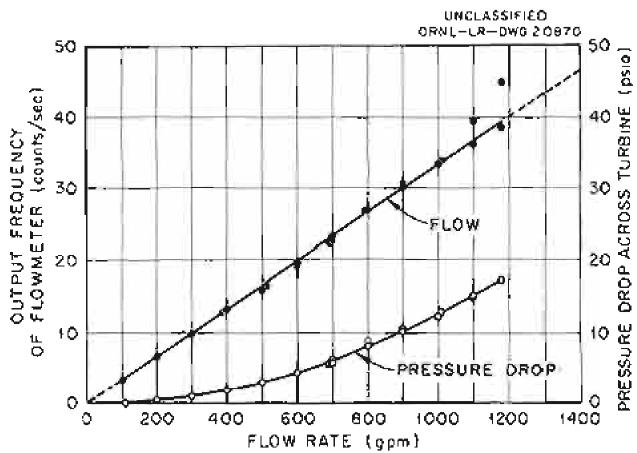  
Fig. 1.3.8. Water-Collbration Data for $0.3\frac{1}{2}$ -in, Turbine Flow meter.

Operation of the loop was started on February 12, 1957, and the turbine flowmeter operated as expected for approximately 12 min. The loop flow was started at 420 gpm and was rapidly increased to 1220 gpm, as indicated by the turbine flowmeter. At some point between the flow rates of 970 and 1220 gpm, however, the unit failed in some manner. At the approximate time of failure and possibly during all or part of the operating time, the loop operators could hear chattering of the unit. The temperature of the circulating NaK at the time of failure was $155^{\circ}\mathrm{F}$ . The loop continued to operate after the turbine failure and eventually reached a flow rate of 1680 gpm and a maximum fluid temperature of $1350^{\circ}\mathrm{F}$ , which was held for only a short time and then lowered. The loop operated

a total time of approximately 40 hr before pump surges necessitated shutdown. The surges may have resulted from ingassing brought about by improper operation of the surge tank level system while measuring venturi pressures.

On February 14, 1957, before disassembly of the loop, a radiograph was made of the turbine flowmeter which showed that the bearings were broken and that a number of blades were missing. On February 18 the flowmeter was removed from the loop, and the indications of the radiograph were confirmed, as shown in Fig. 1.3.9. Eight of the ten blades were missing; the two remaining blades were bent opposite to the direction of rotation; and both bearing shafts were broken. The main throttling valve was removed from the system, and six of the blades were found therein. A seventh blade was found under the valve housing in the drain line. The eighth blade has not yet

been found, but the search is continuing; the piping is to be x-rayed, flushed, and swabbed. The turbine has been disassembled and will be carefully examined in an effort to determine the cause of failure.

# ART THERMOCOUPLES

# J. T. DeLorenzo

Inconel-sheathed thermocouples with closure welds made by the Heliarc welding process are being tested. Nineteen closure welds on sheathed Chromel-alumel thermocouples that had previously passed x-ray and dye-penetrant inspections were exposed for 2100 hr at $1500^{\circ}F$ in sodium, and there were no evidences of leaks. Thirteen similar specimens are now being exposed to NaF-ZrF $_4$ -UF $_4$ (50-46-4 mole %, fuel 30) at $1500^{\circ}F$ . The closure welds on three platinum-platinum-10% rhodium thermocouples are also being tested in

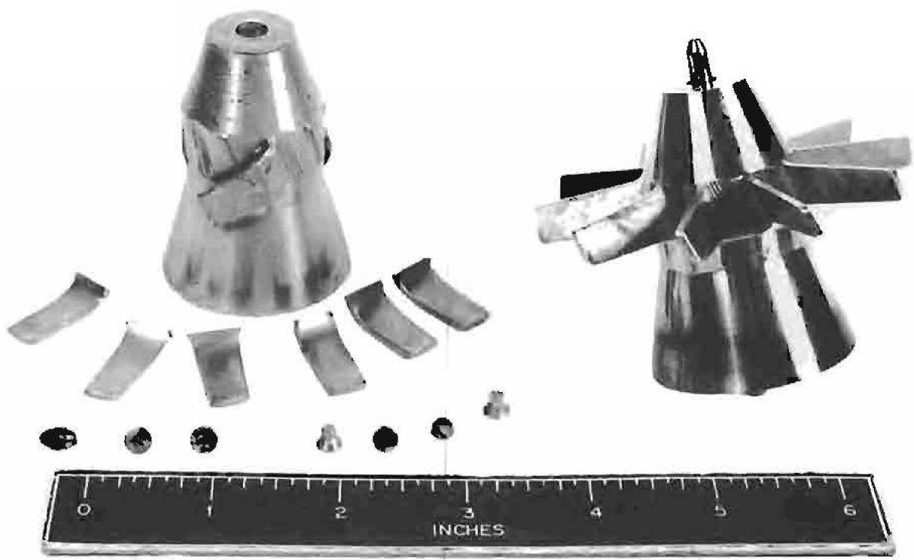  
UNCLASSIFIED
PHOTO 28284  
Fig. 1.3.9. Damaged $3\frac{1}{2}$ -in. Turbine Flowmeter as Compared with a Similar Undamaged Unit.

Table 1.3.2. Results of Drift Tests of Sheathed and Beaded Chromel-Alumel Thermocouples in Air at 1300, 1600, and $1800^{\circ}$ F for Various Times   

<table><tr><td rowspan="2">Test Period (hr)</td><td colspan="2">Sheathed Assembliesa</td><td colspan="2">Special Beaded Assembliesb</td><td colspan="2">Normal Beaded Assembliesc</td><td colspan="2">Sheathed Assembliesd</td></tr><tr><td>Deviatione(°F)</td><td>Spreadf(°F)</td><td>Deviatione(°F)</td><td>Spreadf(°F)</td><td>Deviatione(°F)</td><td>Spreadf(°F)</td><td>Deviatione(°F)</td><td>Spreadf(°F)</td></tr><tr><td colspan="9">Test Temperature: 1300°F</td></tr><tr><td>0</td><td>5.0</td><td>3.3</td><td>-7.0</td><td>2.1</td><td>-5.3</td><td>1.1</td><td></td><td></td></tr><tr><td>1000</td><td>5.5</td><td>3.7</td><td>-4.0</td><td>3.1</td><td>-4.4</td><td>2.2</td><td></td><td></td></tr><tr><td>2000</td><td>5.3</td><td>2.4</td><td>-3.8</td><td>3.5</td><td>-4.1</td><td>6.5</td><td></td><td></td></tr><tr><td>2500</td><td>9.3</td><td>2.2</td><td>-0.3</td><td>3.0</td><td>-0.5</td><td>4.0</td><td></td><td></td></tr><tr><td colspan="9">Test Temperature: 1600°F</td></tr><tr><td>0</td><td>3.8</td><td>2.8</td><td>6.0</td><td>2.0</td><td>-7.1</td><td>3.5</td><td>4.7</td><td>4.3</td></tr><tr><td>1000</td><td>6.4</td><td>2.6</td><td>3.9</td><td>2.5</td><td>-2.2</td><td>6.1</td><td>5.6</td><td>3.1</td></tr><tr><td>2000</td><td>7.0</td><td>2.7</td><td>6.2</td><td>5.5</td><td>-0.7</td><td>10.7</td><td></td><td></td></tr><tr><td>2500</td><td>9.1</td><td>3.3</td><td>9.4</td><td>5.3</td><td>-0.8</td><td>12.0</td><td></td><td></td></tr><tr><td colspan="9">Test Temperature: 1800°F</td></tr><tr><td>0</td><td>1.0</td><td>2.6</td><td>-7.5</td><td>4.3</td><td>1.3</td><td>2.1</td><td>5.5</td><td>4.2</td></tr><tr><td>1000</td><td>7.7</td><td>15.1</td><td>15.2</td><td>19.2</td><td>8.7</td><td>14.3</td><td>10.2</td><td>10.5</td></tr><tr><td>2000</td><td>8.0</td><td>16.2</td><td>26.2</td><td>9.5</td><td>11.7</td><td>19.2</td><td></td><td></td></tr><tr><td>2500</td><td>11.5</td><td>20.3</td><td>31.4</td><td>20.3</td><td>19.8</td><td>31.0</td><td></td><td></td></tr></table>

${}^{a}$ Six assemblies were tested and each assembly contained two thermocouples aged 24 hr at ${1350}^{ \circ  }\mathrm{F}$ in helium prior to testing.   
${}^{b}$ Six assemblies were tested and each assembly contained two thermocouples fabricated with especially cleaned wire (accuracy, $\pm  \%$ of $1\%$ over range 530 to ${2300}^{ \circ  }\mathrm{F}$ ) in carefully cleaned wells.   
Same as special assemblies except that they received no special cleaning.   
${}^{d}$ Some as assemblies described in footnote a except that they were aged for 200 hr at ${1350}^{ \circ  }\mathrm{F}$ in helium.   
e Deviation of the average of the readings of the twelve thermocouples tested from the standard test temperature of 1300, 1600, or $1800^{\circ}F$   
Maximum spread of the twelve readings obtained.

fuel 30. To date, the Heliarc welding process has yielded 30 to $50\%$ acceptable welds.

Bend tests have been made in order to determine the effect of bending the sheath on the output of the thermocouple. Single U-bends on a $\frac{3}{4}$ -in. radius had very little effect, even when the bent area was exposed to a temperature gradient of 100 to $150^{\circ}\mathrm{F}$ per inch. The inaccuracies induced were less than $0.5^{\circ}\mathrm{F}$ . The repeated bending of a single specimen appeared to cause a 2 to $3^{\circ}\mathrm{F}$ shift, but this change will be rechecked with several more test specimens.

The fabrication of the sheath weld similarly was found to have little effect on the accuracy of the thermocouple wire. All deviations measured were less than $0.5^{\circ}F$ .

The drift of the data obtained with sheathed and beaded Chromel-alumel thermocouples operating in air as a function of time and temperature is being studied. The results of tests at 1300, 1600, and $1800^{\circ}F$ are presented in Table 1.3.2. Data

obtained in the closure tests in static sodium, described above, showed less than 3 or $4^{\circ}$ F drift of sheathed Chromel-alumel thermocouples at $1500^{\circ}$ F in 2100 hr.

A program is being prepared for the Oracle to facilitate processing drift data. The emf vs temperature curves for Chromel-alumel and platinum-platinum-rhodium thermocouples have been tabulated on the Oracle magnetic tape memory, and a workable program has been outlined in preparation for actual computations with the raw data. The system will be checked with previously processed data before new data are used.

Furnaces in which the heating coils can be moved at a uniform rate were designed and fabricated for testing the uniformity of thermocouple wire. Two furnaces are now available which give either symmetrical or asymmetrical gradient patterns. The maximum gradients that can be obtained with the two furnaces are 300 and $700^{\circ}$ F per inch, respectively.

# 1.4. COMPONENT DEVELOPMENT AND TESTING

H. W. Savage

# PUMP DEVELOPMENT TESTS

E.R.Dytko

A. G. Grindell

Bearing and Seal Tests

W. L. Snapp

W. K. Stair²

The dynamic tests of lubricants under irradiation that were to be run in the LITR are, rather, to be run in a gamma-irradiation facility in the MTR canal. With the MTR facility it will be possible to use a slightly modified full-scale pump rotary assembly and to examine the unit for damage immediately upon removal from the gamma-irradiation field. The present schedule calls for test operations to begin next quarter.

The final selection of a lubricant-coolant for the reactor pumps will be based on the results of the gamma-irradiation tests in the MTR. Since both organic liquids and highly refined paraffin-base mineral oils are being considered at this time, all parts of the pumps and the external lubricant-pumping system are designed to be compatible with either liquid. For example, copper is incompatible with organic liquids, and therefore copper parts in the seals and journal bearings are being replaced. All-stainless-steel bellows-seal test assemblies were ordered and will be incorporated into the MTR test units. Journal bearings fabricated from Alcoa alloy 750-T5 were selected to replace the original bronze bearings. The small percentage of copper (0.7 to $1.3\%$ ) in this alloy is probably insignificant with respect to the organic liquids of interest, but a sample of the alloy will be tested in UCON LB-140-X, an organic liquid, before the MTR test is made. There are no copper parts in the external lubricant-pumping system.

Two 1000-hr tests were conducted to determine the suitability of the aluminum alloy, Alcoa 750-T5, for this particular bearing application in which the effective journal bearing area is 2.4 in.². Gulfcrest 34 was used as the lubricant in both tests. The test conditions are given in Table 1.4.1.

Neither test gave any evidence of bearing malfunction, and both the bearings were equally as good as bronze bearings tested under similar conditions. Aluminum alloy bearings have been placed in rotary elements for use in various other tests, and if satisfactory service is obtained the aluminum alloy will be used for all reactor pump journal bearings.

Table 1.4.1. Conditions of Test of Suitability of Alcoa Alloy 750-T5 for Pump Bearing Application   

<table><tr><td></td><td>Test 750-1</td><td>Test 750-2</td></tr><tr><td>Shaft speed, rpm</td><td>3400</td><td>4400</td></tr><tr><td>Test temperature, °F</td><td>180-200</td><td>170-190</td></tr><tr><td>Operating period, hr, at specified journal bearing loads:</td><td></td><td></td></tr><tr><td>300 lb</td><td>621</td><td>527</td></tr><tr><td>450 lb</td><td>287</td><td>214</td></tr><tr><td>600 lb</td><td>166</td><td>407</td></tr><tr><td>Continuous operating period, hr</td><td>1074</td><td>1148</td></tr></table>

Continued tests of the modified Durametallic seals3 being developed for use as seals in NaK pumps have produced further encouraging results. More than 5000 hr of operating time was logged for such seals, including 2500 hr in a rotary element pumping NaK at $1400^{\circ}$ F and 2500 hr in a mechanical shakedown stand with the seals subjected to a wide range of differential pressures from 20 psig, which simulates a vacuum filling operation, to 275 psig, which is more than a maximum catastrophe pressure, and to rubbing speeds from 0 to 60 fps.

It was found that for the very high differential pressures, above 200 psig, a slight design modification will be necessary to prevent relative motion between the positioning collar for the lower seal and the shaft. On the basis of these good test results, the Durametallic seals have been specified for use in the ART NaK pumps.

Tests have shown the buna-N-base O-rings recommended by outside vendors for use with UCON LB-140-X lubricant to be quite satisfactory. Similar tests showed the buna-N-base O-rings to be satisfactory for use with Gulfcrest 34 lubricant, and therefore this elastomeric seal can be used for the reactor pumps if either of these lubricants is acceptable. If, however, the MTR tests prove these lubricants to be unsatisfactory, the seal material may again become a problem. For the NaK pumps, similar commercially available elastomer seals will be satisfactory, since Gulfcrest 34 will be the lubricant used.

# Fuel Pump Development Water Tests

J. J. W. Simon

The development tests with water of an acceptable impeller configuration (designated model 32) for the ART fuel pump were completed with the

4On. assignment from Pratt & Whitney Aircraft. 5M.E.Lockey,G.Samuels, and J.J.W.SimonANP Quar.Prog.Rep.Dec.31,1956,ORNL-2221,p33.

tests described below. Performance tests were run for liquid levels of $\frac{1}{2}$ to 3 in. in the expansion tank to encompass the level chorges expected during the change from zero power to full power operation of the ART. In general, operation is not affected by a liquid-level change when the liquid level is 2 in. or more above the floor of the expansion tank. Below this level the fluid head showed a slight decrease, the expansion-tank flow rates decreased, the power required to drive the pump decreased slightly, and the flow rate in the main loop decreased slightly as the liquid level neared $\frac{1}{2}$ in.

The effects of decreasing the liquid level in the system on the flow rate, head, and pumping power are shown in Figs. 1.4.1, 1.4.2, and 1.4.3, respectively. It may be noted that the flow rate, head, and pumping power remained fairly constant down to the $\frac{3}{4}$ -in. level in the expansion tank. Below that level, definite decreases in flow rate, head, and pumping power occur, and, also, although not shown on the figures, fluctuations of all three

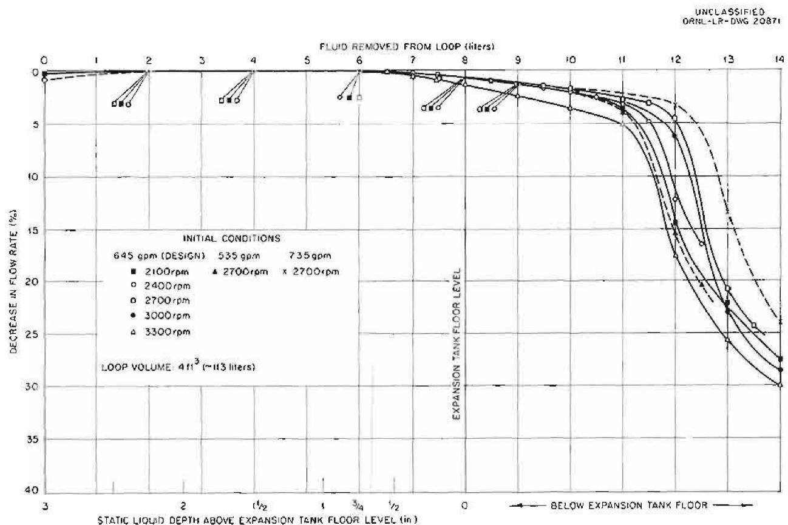  
Fig. 1.4.1. Effect of Liquid Level Changes on Flow Rate in a Loop Test of an ART Fuel Pump (Model 32 Impeller) with Water as the Pumped Fluid. (Secret with caption)

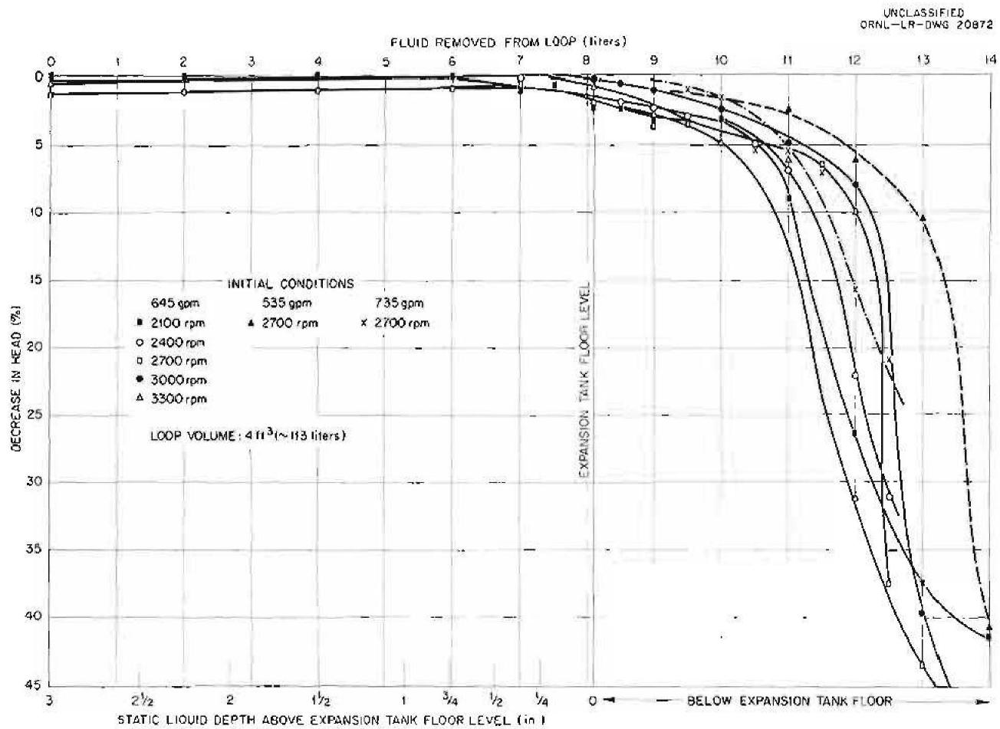  
Fig. 1.4.2. Effect of Liquid Level Changes on Fluid Head in a Loop Test of an ART Fuel Pump (Model 32 Impeller) with Water as the Pumped Fluid. (Secret with caption)

variables occurred when the level was changed from $\frac{3}{4}$ to 0 in. The fluctuations remained, but at a negligible level, in the next part of the continued loop draining period, during which the quantity of fluid removed was increased from 8 to 11.5 liters. With more than 8 liters of fluid removed, the liquid level in the system was below the expansion-tank floor. The loop ingassed continuously, and the ingassing was accompanied by large and rapid declines in flow rate, head, and pumping power after more fluid was removed. Further draining produced power fluctuations which indicated that slugs of liquid and gas were surging through the system.

Tests for determining degassing times were also conducted with the liquid level in the expansion tank at 3 in. and the pump operating at a speed of 2700 rpm. It was found that degassing of an injected air sample was complete in less than 1 min. The degassing time increased to about 10 min as the operating speed was reduced to about one-half of design speed (2700 rpm), as shown in Fig. 1.4.4, line A. The degassing time decreased with increased main loop flow rates, as shown in Fig. 1.4.5, and the increased main loop flow rates also increased the expansion tank bypass flow rates for the same operating speed. At the present design point of about 2700 rpm and

UNCLASSIFIED

ORNL-LR-DWG 20873

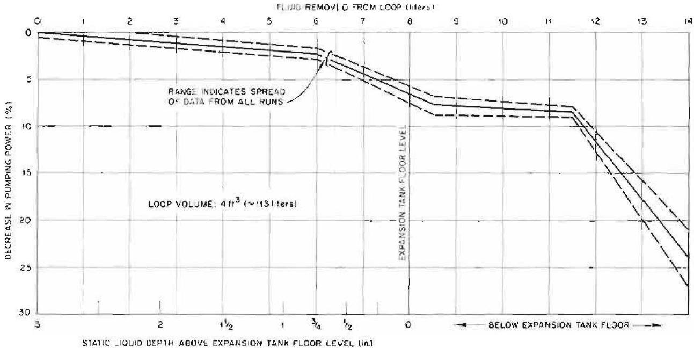  
Fig. 1.4.3. Effect of Liquid Level Changes on Pumping Power in a Loop Test of an ART Fuel Pump (Model 32 Impeller) with Water as the Pumped Fluid. (Secrets with caption)

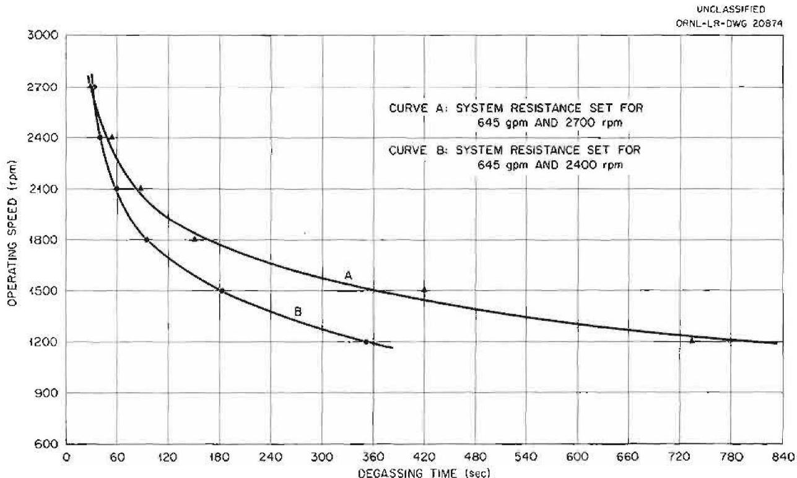  
Fig. 1.4.4. Effect of Operating Speed on Degassing Time for an ART Fuel Pump (Model 32 Impeller) Set for Constant Resistance with the Liquid Level 3 in. Above the Floor of the Expansion Tank. (Secret with caption)

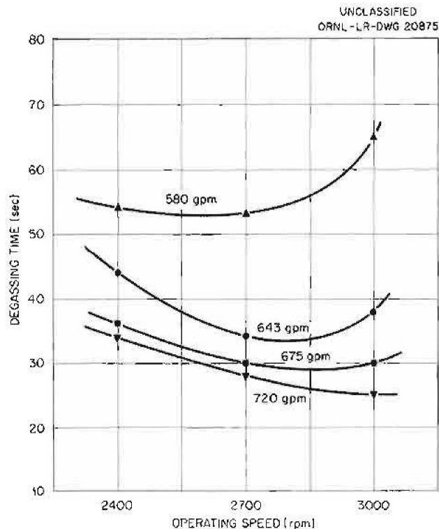  
Fig. 1.4.5. Effect of Loop Flow Rate on Degassing Time for an ART Fuel Pump (Model 32 Impeller) with the Liquid Level 3 in. Above the Floor of the Expansion Tank. (Secret with caption)

645 gpm, little, if any, increase in degassing time occurs with an increase in the expansion tank flow rate.

# Fuel Pump High-Temperature Performance Tests

H. C. Young

P. G. Smith

Test operation of an ART fuel pump with a model 32 impeller and NaF-ZrF4-UF4 (50-46-4 mole %, fuel 30) as the circulated fluid was started in December 1956. At the operating conditions of 645 gpm, 2700 rpm, and a fuel temperature of 1200°F, the head is 1 to 2 ft lower than that obtained for water with the same impeller, volute, and loop. Investigations are under way in order to determine the reason for the discrepancy between the water and fuel performance data. Considerable difficulty has been experienced with the Moore

pressure-measuringdevices in that the zero position shifts from day to day, and in order to obtain reliable pressure data it is necessary to calibrate these instruments before each test run by pressurizing the loop with helium to as high as 100 psig.

The off-gas riser connecting the pump pot to the $\mathsf{ZrF}_4$ -vapor trap has been replaced twice during the course of operation. The first time the riser had to be replaced because a $\mathsf{ZrF}_4$ plug formed when the fuel and metal temperatures were inadvertently allowed to reach $1500^{\circ}\mathsf{F}$ . The temperature that was being maintained on the riser line and the vapor trap was low enough in comparison with the fuel temperature to cause $\mathsf{ZrF}_4$ to deposit and plug the riser. The line was replaced without terminating the test. The off-gas riser had to be replaced o second time when a leak developed. This time the test operation had to be shut down. Partial plugs of $\mathsf{ZrF}_4$ have also occurred in the gas passage through the pump barrel, possibly as the result of reverse flow or back diffusion of gas through the pump barrel. Performance and cavitation data are being obtained, and endurance tests are planned.

# Fuel Pump Endurance Tests

P.G.Smith

The ART fuel pump being tested for endurance was shut down on November 29, 1956, with a total of 2587 hr of operating time and 120 thermal cycles over the temperature range of 1400 to $1100^{\circ}\mathrm{F}$ . The fluid circulated during these tests was $\mathsf{NoF - ZrF}_4\mathsf{-UF}_4$ (50-46-4 mole %, fuel 30).

Examination of the pump impeller after this test revealed that it was in good condition, and it showed only very slight damage, if any, as a result of high-temperature operation. Examination of other parts showed that the upper metal O-ring seal allowed fuel to leak into the annular space between the pump barrel and the thermal barrier can. This caused the formation of a $\mathsf{ZrF}_4$ plug in the riser connecting the pump pot to the vapor trap, which, in turn, caused the sluggish and erratic off-gas flow noted during operation.

There was no evidence of lube oil leakage from the pump seals during the tests, but upon disassembly the lower seal was found to be worn to such an extent that it should have permitted a small amount of leakage. There was evidence of this leakage inside the thermal barrier con, which was not filled with barrier material for this test

and which contained a small amount of carbon deposit.

The pump was cleaned and reassembled with new seals and placed back in operation for further testing. It has accumulated a total of 550 hr more of continuous operation and 35 thermal cycles over the temperature range of 1400 to $1100^{\circ}\mathrm{F}$ . The lube oil leakage rates are 5 cm³/day from the lower seal and zero from the upper seal.

There had been no trouble with the hydraulic drive for the past 1240 hr of pump operation. This may be attributed to a back pressure of 100 to 120 psig being maintained on the discharge side of the motor, as recommended by the manufacturer, to ensure that the piston shoes are seated on the wobble plate at all times.

# Sodium Pump Development Water Tests

J.J.W.Simon

The hydraulic problems to be solved in the ART sodium pump are not yet fully delineated. An initial appraisal and the results of development work to date indicate similarities between this pump and the fuel pump, for which five major points were investigated,[7] namely, system pressure fluctuations, gas pressure gradient down the shaft annulus in the direction of purge gas flow, flow through the centrifuge before ingassing occurs, pressure levels based on ART stress limitations, and cavitation. In considering each of these problems in relation to the sodium pump, it is apparent that, based on tests made to date, the pressure fluctuations are small, the flow required into the expansion tank is small enough (5 gpm maximum, per pump) not to cause ingassing through the centrifuge, and the ART stress limitations do not impose stringent requirements on the pressure levels. The sodium pump will require a decreasing gas-pressure gradient in the direction of gas flow from the oil catch basin down the shaft annulus into the expansion tank (Fig. 1.4.6). Cavitation data have not yet been obtained, and an investigation must be made of the loop ingassing which has occurred at throttled flow rates.

A new pump barrel was designed and is being fabricated that more closely mocks up the ART sodium pump barrel and the expansion tank configuration. The differences between the present configuration and the new pump barrel, which mock

up the reactor system, are shown in Fig. 1.4.7. The volute in the new configuration is now fully instrumented for measuring the radial unbalance force at the centrifuge discharge area. Also, the effect on pump performance of fluid leakage between the heat exchanger inlet and the volute can be determined.

The tests to date have been hampered by ingossing of the system, which becomes more pronounced when the flow rate in the main loop is reduced. Several runs were made to obtain performance data, however, and data obtained in a low-speed run correlated reasonably well with data obtained in the earlier development tests. The data obtained in runs at speeds sufficiently high to bracket the design head are shown in Fig. 1.4.8.

No work has been done, as yet, toward the solution of the gas-pressure gradient problem. At present the expansion tank operates at a pressure level greater than that in the rotary element oil catch basin. A modified degassing disk will be tested in the new pump barrel configuration.

# Sodium Pump Barrel Seal Test

J. W. Cooke

Free movement between the sodium pump barrel and volute will be required in the ART to allow for radial movement to accommodate thermal expansion and axial misalignment resulting from accumulative assembly tolerances. A seal must be provided in this region to minimize leakage of sodium between the heat exchanger inlet and the pump centrifuge outlet regions. Two designs of multiple-ring seals, Fig. 1.4.9, have been tested with water.

The maximum leakage rate for seal design No. 1 was 2.1 gpm at a pressure differential of 50 psi and an axial spacing of 0.015 in. The maximum leakage rate for seal design No. 2 was 1 gpm at a pressure differential of 80 psi and an axial spacing of 0.0135 in. Both the pressure differential and spacing at which these maximum leakage rates occurred are more severe than the estimated ART values. It is anticipated that the maximum leakage rates given above will not seriously interfere

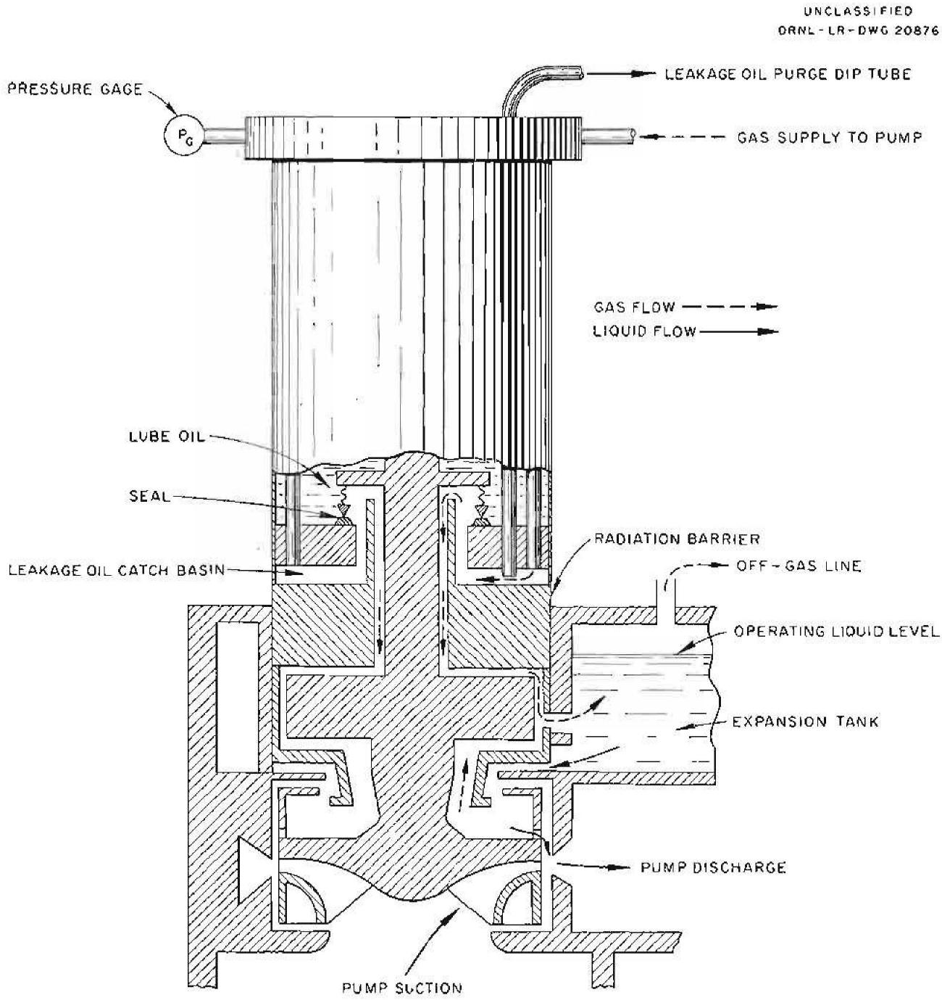  
Fig. 1.4.6. Schematic Diagram of Sodium Pump.

Fig. 1.4.7. Comparison of (a) Sodium Pump Configuration Presently Being Tested and (b) Modifications Being Made to Mock Up the Reactor System. (Confidential with caption)   
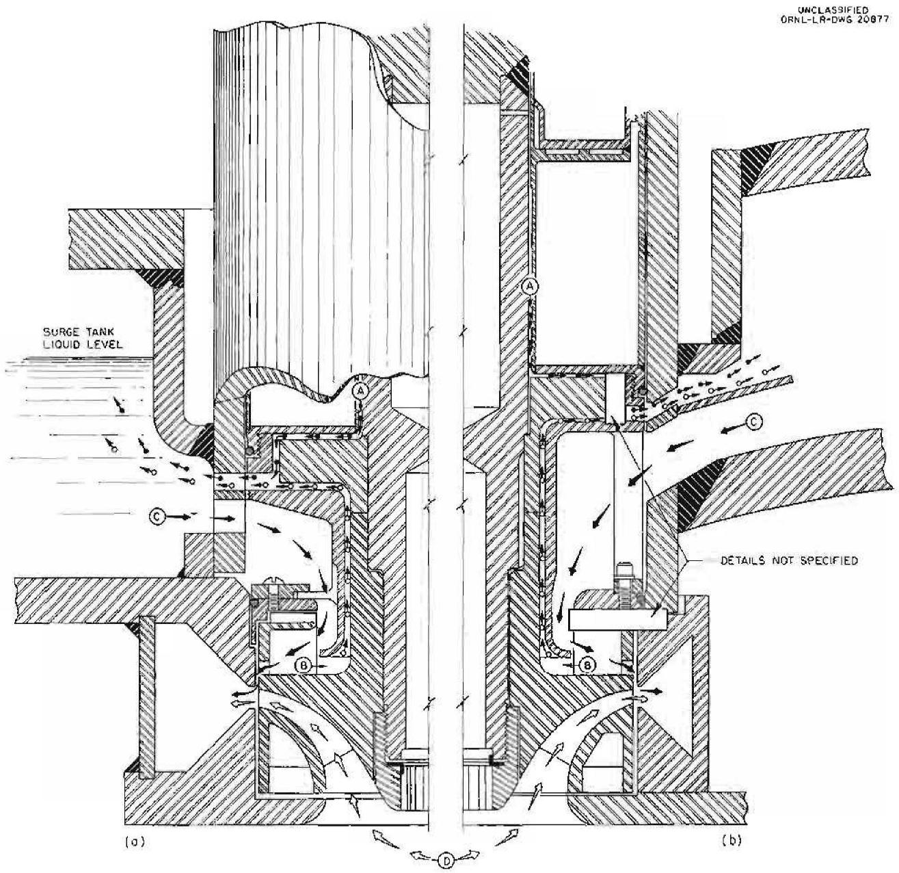  
A HELIUM PURGE GAS   
B GAS SEPARATED FROM LIQUID   
C LIQUID FLOW THROUGH CENTRIFuge   
MAIN FLOW

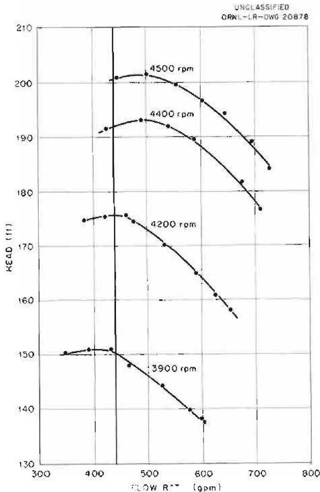  
Fig. 1.4.8. Performance Data for Sodium Pump Obtained in Development Tests with Water.

with normal sodium pump centrifuge operation; however, this point will be tested in future operation.

Another seal design, which incorporates larger radial clearances between the inner surface of the small ring and the outer surface of the pump barrel, will be tested with water. The purpose of this design modification is to reduce the assembly problems associated with the multiple-ring seal.

# Sodium Pump Endurance Tests

# P. G. Smith

A sodium pump is being operated in an endurance test with sodium and has accumulated a total of 1584 hr of operation, during which the pump pot has been thermally cycled 300 times over the

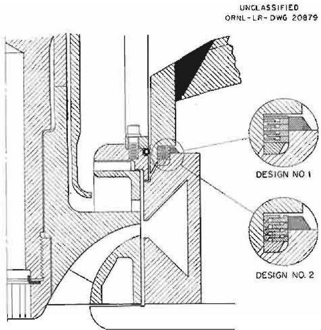  
Fig. 1,4.9. Partial Cross Section of Sodium Pump Assembly Showing Proposed Multiple-Ring Seal.

temperature range of 1250 to $1050^{\circ}\mathrm{F}$ . The operating conditions for this test are given below:

<table><tr><td>Pump pot temperature</td><td>1050 to 1250°F</td></tr><tr><td>Pump pot pressure</td><td>8 psi</td></tr><tr><td>Pump speed</td><td>3500 rpm</td></tr><tr><td>Catch basin helium off-gas purge</td><td>50 liters/day</td></tr><tr><td>Helium purge down pump shaft</td><td>500 liters/day</td></tr></table>

It was found that the pump priming difficulties, which were reported previously,[10] could be eliminated by stopping the pump when transferring the sodium into the pump pot. Previously, the transfers of sodium to the pump pot were made with the pump rotating at 500 rpm, and anywhere from 2 to 4 hr were required to prime the pump. The off-gas line plugging, also reported previously,[10] was found to be a result of too high a liquid level in the pump pot. The pump probes were found to be incorrectly sized.

The lube oil leakage rate varies from 5 to 20 cm³/day from the lower seal, and there is no measurable leakage from the upper seal. There is, however, a slight amount of leakage of lube oil

somewhere in the upper seal region. This leakage is not sufficient to be detrimental, and its source cannot be located until the operation is stopped.

# Primary NoK Pump Development Tests

H.C.Young J.N.Simpson

High-temperature testing of an ART primary NaK pump, designated PK-P-1, was continued. Performance and efficiency curves obtained at a NaK temperature of $1200^{\circ}\mathrm{F}$ are presented in Fig. 1.4.10. As stated previously the data being obtained are in good agreement with data obtained with water.

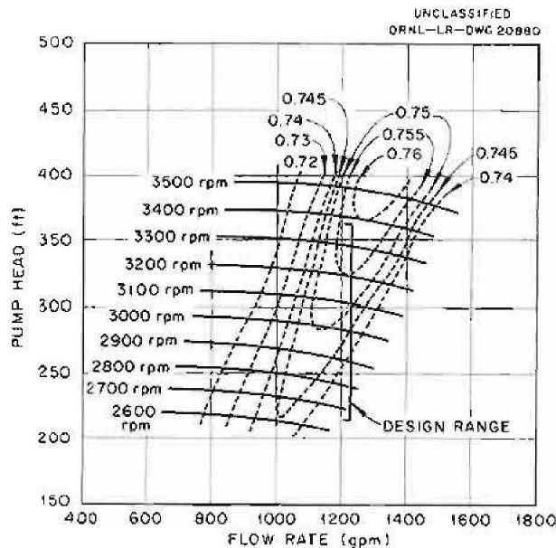  
Fig. 1.4.10. Performance and Efficiency Curves for Primary NoK Pump Operating at $1200^{\circ}\mathrm{F}$ .

The results of cavitation runs at several speeds and flow rates at a NaK temperature of $1200^{\circ}\mathrm{F}$ are presented in Fig. 1.4.11. The cavitation data had to be taken at different speeds for each of several constant flow rates, 1000, 1220, and 1400 gpm, since it was not possible to maintain a constant speed with the wound-rotor motor which has a step-type resistance speed control. The cavitation parameter, $\alpha$ , was plotted against speed

along lines of constant flow and then against flow along lines of constant speed. From the latter plot, the static suction pressure required to suppress cavitation over the normal pump operating range was plotted, as shown in Fig. 1.4.12, for two NaK temperatures, 1200 and $1400^{\circ}\mathrm{F}$ . The vapor pressure of NaK increases by 5.33 psi from 1200 to $1400^{\circ}\mathrm{F}$ , and the constant spread between a given constant speed line for each of the two temperatures is very nearly 5.33 psi. The gas pressure on the pump surge tank is 0.5 psi less than the static suction pressure and therefore can be determined from Fig. 1.4.12.

In order to further show the effect of vapor pressure on cavitation, data were taken at a given head and flow rate for NaK temperatures from $720^{\circ}\mathrm{F}$ , where the vapor pressure is essentially zero, to $1400^{\circ}\mathrm{F}$ , where the vapor pressure is approximately 7.5 psia. The results of these tests in terms of the cavitation parameter, $\sigma$ , are indicated by Fig. 1.4.13. If cavitation varied only with vapor pressure at a given pump operating point, it would be expected that $\sigma$ would remain constant over the temperature range. As may be seen in Fig. 1.4.13, there was essentially a constant $\sigma$ at temperatures from 1180 to $1400^{\circ}\mathrm{F}$ and a slightly higher but constant $\sigma$ at 720 and $914^{\circ}\mathrm{F}$ . It is believed that the results would be more significant if speed and flow rate were held constant instead of head and flow rate in order to hold constant impeller inlet conditions, and therefore additional cavitation data are to be obtained.

This pump and its associated loop have now been operated approximately 2100 hr at temperatures from 1100 to $1400^{\circ}\mathrm{F}$ . The rotary element of the pump was removed and inspected after 1700 hr operation, and it was confirmed that, as suspected, some NaK had entered the oil catch basin when the NaK level rose in the pump tank as the result of ingassing after approximately 800 hr of operation. The pump had, however, continued to operate satisfactorily for the next 900 hr. A considerable amount of carbon from the oil was deposited on the pump shaft and on the radiator baffles in the pump tank, and thus it was apparent that the oil seal leakage had run down the pump shaft, even though there was a 50-liter/day helium purge from the oil catch basin and a 500-liter/day helium purge down the pump shaft annulus and out the pump tank reflux condenser.

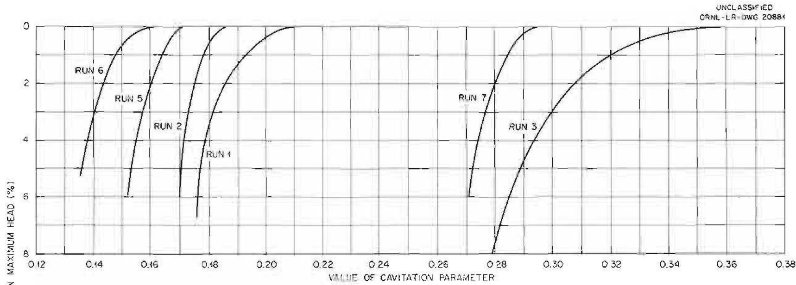

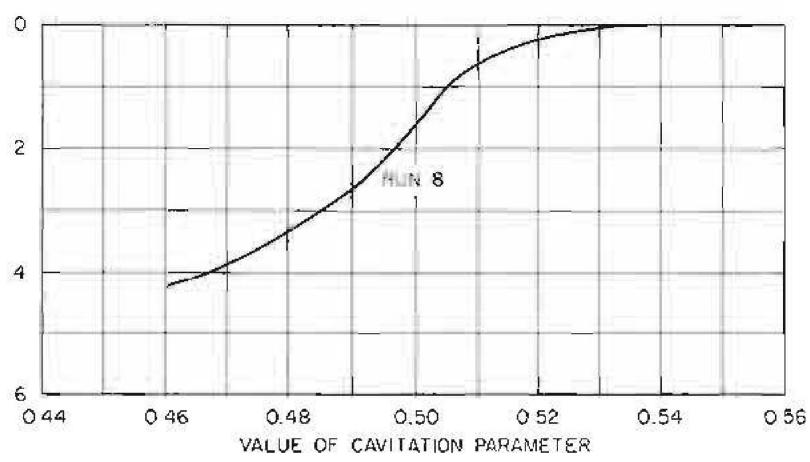  
Fig. 1.4.11. Cavitation Data for Primary NaK Pump at Various Flow Conditions with NaK at $1200^{\circ}\mathrm{F}$ .

<table><tr><td>RUN</td><td colspan="2">FLOW CONDITION</td></tr><tr><td>1</td><td colspan="2">1220 gpm, 3280 rpm, 355-ft HEAD</td></tr><tr><td>2</td><td colspan="2">1220 gpm, 3417 rpm, 381-ft HEAD</td></tr><tr><td>3</td><td colspan="2">1220 gpm, 2690 rpm, 225-ft HEAD</td></tr><tr><td>4</td><td colspan="2">1000 gpm, 2975 rpm, 281-ft HEAD, NO CAVITATION</td></tr><tr><td>5</td><td colspan="2">1000 gpm, 3230 rpm, 338-ft HEAD</td></tr><tr><td>6</td><td colspan="2">1000 gpm, 3510 rpm, 405-ft HEAD</td></tr><tr><td>7</td><td colspan="2">1400 gpm, 3150 rpm, 295-ft HEAD</td></tr><tr><td>8</td><td colspan="2">1400 gpm, 2580 rpm, 168-ft HEAD</td></tr></table>

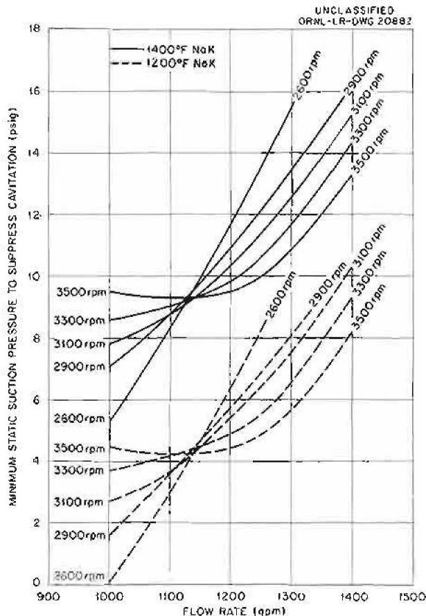  
Fig. 1.4.12. Minimum Static Suction Pressure Required to Suppress Cavitation of Primary NaK Pump.

It is believed that a cylindrical riser around the shaft to above the seal interface will direct the leakage oil into the catch basin and prevent leakage down the shaft into the NaK. On the pump being tested the riser was below the seal interface. Further examination showed that there were no signs of rubbing of the impeller against labyrinth seals, even though the pump was operated occasionally at conditions well off the volute-balance line.[13] The impeller and volute appeared to be in excellent condition.

The rotary assembly was reinstalled in the loop, and a test run of 408 hr was made without the helium bleed down the pump-shaft annulus. The 50-liter/day oil catch basin bleed was maintained. The rotary assembly was again inspected, and a very small amount of NaK and oil mixture was

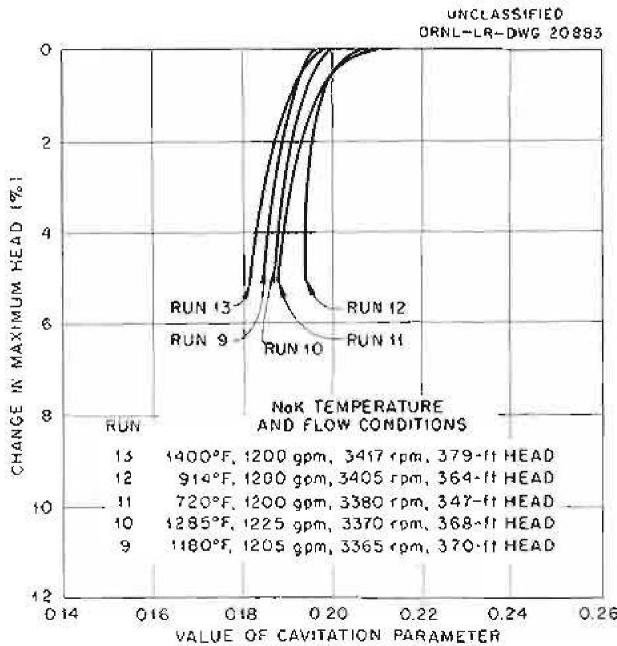  
Fig. 1.4.13. Cavitation Data for Primary NoK Pump at Various NoK Temperatures.

found in the oil catch bosin, but its presence had not affected the oil seal leakage purge system. The impeller surfaces had an etched appearance, but approval for further operation was given by the metallurgists. The critical dimensions of the rotary assembly were measured before and after this test run, and it was found that all dimensions had remained constant, except the volute mouth, which had opened up from 0.003 to 0.010 in., probably because of stress relief and pressure stresses. An additional test is planned to provide further data on operation without a helium bleed down the pump-shaft annulus.

Heat removal from the pump barrel by the lubrication and cooling oil was measured at several NaK temperatures and liquid levels in the pump tank. At lubricating and cooling oil flow rates of approximately 3.5 gpm, the heat removal ranged from 1.8 kw at $1200^{\circ}$ F, the normal operating level, to 2.3 kw at $1400^{\circ}$ F, the maximum operating level.

A resistance type of level indicator was used in the pump tank, and the level readings were compared with the level indicated by spark-plug probes. The resistance type of level indicator gave very satisfactory performance at temperatures above $650^{\circ}\mathrm{F}$ .

# Auxiliary NaK Pump Development Water Tests

H. C. Young

J. N. Simpson

Initial water tests were conducted on an auxiliary NaK pump with an Inconel impeller in a test loop designated PK-A-1. A single-poss shell-and-tube heat exchanger was installed in the 4-in. Inconel pipe loop to remove pump power heat. A 60-hp d-c drive motor was used to permit constant-speed measurements.

The performance data obtained in these initial tests of the auxiliary NaK pump with an Inconel impeller (No. 1) are compared in Fig. 1.4.14 with data obtained previously with a brass impeller and volute.[14] At moderate flow rates, the data correlate very well, but at high flow rates the head drops more rapidly for the Inconel impeller than for the brass impeller. It was suspected that cavitation caused the drop, and the tests were repeated with higher pump tank gas pressures than those which appeared to be normally adequate,

14H.C.Young,J.G.Teague,and M.E.Lackey, ANP Quar.Prog.Rep.June 10,1956,ORNL-2106,p54.

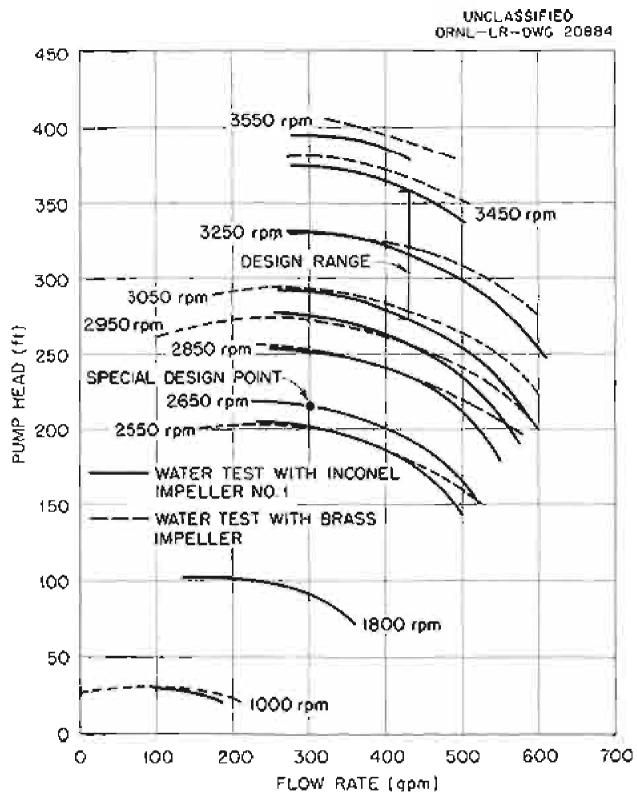  
Fig. 1.4.14. Performance Data for Auxiliary NoK Pump Operating with Water.

that is, 25 rather than 10 psig. The pump head remained the same, however, at the highest pressures.

The discharge opening of Inconel impeller No. 1 was approximately $10\%$ smaller than that of the brass impeller, and therefore another Inconel impeller (No. 3), with dimensions very close to those of the brass impeller, was tested. The results were the same as those obtained with Inconel impeller No. 1. All performance data were taken numerous times, and it is possible that the lack of correlation was caused by a difference in dimensions of the Inconel and the brass volutes or by a slight change in impeller inlet geometry. The variance is considered to be insignificant over the normal operating range of this pump.

More cavitation data were obtained for this pump operating with water than for any pump tested thus far. The Inconel impeller cavitation performance, Fig. 1.4.15, compared fairly well with that of the brass impeller. At 300 gpm the cavitation parameters were practically identical for the brass and Inconel impellers. At higher flow rates and speeds, the parameter was somewhat greater for the Inconel impeller and probably reflected fabrication differences between the brass

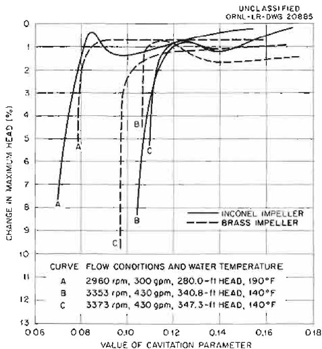  
Fig. 1.4.15. Cavitation Data for Auxiliary NaK Pump with an Inconel Impeller Operating with Water Compared with Data Obtained with a Brass Impeller.

and Inconel vones. On the basis of these tests the cavitation performance of the Inconel impeller is considered to be entirely satisfactory for operation with NaK over the ART design range. Some additional data will be taken, however, to assure adequate information for comparison with data to be taken with NaK.

Based on earlier experience with the primary NaK pumps, $^{15}$ a $3/2$ in.-dia hole was drilled through the top of the discharge pipe inside the pump tank to permit gas trapped in the discharge line during filling to be vented. This vent permitted satisfactory pump priming. In order to further determine the effectiveness of this vent, a section of piping was installed in the discharge leg of the test loop to deliberately trap any quantity of gas up to a value of 0.45 ft $^3$ . A series of pump priming tests was conducted wherein the loop was filled at 0 psig with 0.45 ft $^3$ of gas trapped in the loop. The pump tank gas pressure was then raised to 15 psig before attempting to start the pump. A later series of tests was also conducted wherein the gas pressure was raised to 15 psig before the loop was filled so that twice the previous amount of gas was trapped. In all cases, it was possible to start and fully prime the pump by following the starting and stopping technique described below. The pump is brought to an operating speed of 1800 rpm (this speed represents the first control step speed on the wound-rotor drive motor) and operated at that speed until the discharge pressure drops slightly, which indicates that gas has entered the pump, and then the pump is stopped. This procedure is repeated until the discharge pressure no longer drops. The average number of startup attempts required ranged from a minimum of seven for the first series of tests to 17 for the later series of tests with twice as much trapped gas. It appears that with this technique the pump can be started with trapped gas in the system, and it will not be necessary to vacuum-fill the loop.

# REACTOR COMPONENT DEVELOPMENT TESTS

D. B. Trauger  
Heat Exchanger and Radiator Development Tests  
J. C. Amos

L.H.Devlin R.L.Senn D.R.Ward

A summary of fuel-to-NaK heat exchanger and NaK-to-air radiator test operations during this quarter is presented in Table 1.4.2. Process Engineering heat exchanger No. 2 (type SHE-7) and Black, Sivalls & Bryson radiator No. 1 completed 1456 hr of nonisothermal operation, including 552 hr at a heat exchanger fuel inlet temperature of $1600^{\circ}\mathrm{F}$ , and 29 thermal cycles, in SHE test stand B. The test was finally interrupted by o NaK leak in the circulating cold-trap economizer after a total of 1845 hr of operation. At the time of the interruption, the test was operating on the tenth step of a 15-step program for obtaining data on mass transfer in the NaK circuit. The conditions imposed on the heat exchanger had been sufficiently severe, however, that it was decided to terminate the test rather than to complete the mass-transfer study program. Data covering the range of interest had been obtained and further operation would only have provided more intermediate and check points. Analyses of the data obtained during this test are being made. The heat exchanger is being examined metallurgically, and the economizer, which had operated in this stand for a total of 6490 hr, is also being examined to determine the cause of failure.

The test stand (SHE-B) is being modified to accommodate a 20-tube, semicircular heat exchanger, designated "small heat exchanger type SHE-9" (Fig. 1.4.16). The dimensions of this

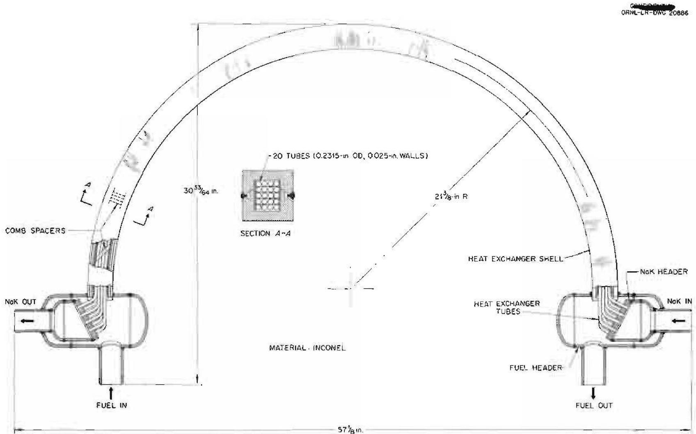  
Fig. 1.4.16, Semicircular Heat Exchanger Designated "Small Heat Exchanger Type SHE-9."

Table 1.4.2. Summary of Heat Exchanger and Radiator Operations   

<table><tr><td>Test Unit</td><td>Test Stand</td><td>Hours of Nonisothermal Operation</td><td>Total Hours of Operation</td><td>Number of Thermal Cycles</td><td>Status of Test</td></tr><tr><td>Process Engineering Corp. 
heat exchanger No. 2 
(type SHE-7)</td><td>SHE-B</td><td>1456</td><td>1845</td><td>29</td><td>Terminated because of failure of circulating cold-trap economizer</td></tr><tr><td>Block, Sivalls &amp; Bryson 
heat exchanger No. 1 
(type IHE-8)</td><td>IHE-B</td><td>547</td><td>911</td><td>5</td><td>Test completed</td></tr><tr><td>Block, Sivalls &amp; Bryson 
heat exchanger No. 2 
(type IHE-8)</td><td>IHE-B</td><td>547</td><td>911</td><td>5</td><td>Test continuing</td></tr><tr><td>York Corp. radiator No. 11</td><td>IHE-B</td><td>547</td><td>911</td><td>5</td><td>Test continuing</td></tr><tr><td>York Corp. radiator No. 12</td><td>IHE-B</td><td>547</td><td>911</td><td>5</td><td>Test continuing</td></tr><tr><td>Black, Sivalls &amp; Bryson 
radiator No. 1</td><td>SHE-B</td><td>1456</td><td>1845</td><td>29</td><td>Terminated because of failure of circulating cold-trap economizer (operated in conjunction with Process Engi-
neering Corp. heat exchanger No. 2, above)</td></tr></table>

heat exchanger, which is being fabricated of Inconel, are given below, and the proposed operating conditions are presented in Fig. 1.4.17.

Tube material Inconel

Number of tubes 20

Tube outside diameter, in. 0.2315

Tube inside diameter, in. 0.1815

Tube woll thickness, in. 0.025

NoK flow length, ft 6.138

NoK free flow area, ft 0.00358

NoK side heat transfer area, ft 2 5.74

Spocer dimensions, in. 0.018 x 0.040

45-deg stagger

0-deg incline

Number of spocers 14

Fuel flow length, ft 6.05

Fuel free flow area, ft² 0.0036

Fuel side heat transfer area, ft² 7.32

Fuel equivalent diameter, ft 0.0090

This heat exchanger was designed to simulate the tube geometries of the ART main heat ex-changers. The heat exchanger will be subjected to a thermal-cycling program in order to verify the stress analysis of the ART main heat ex-changers.

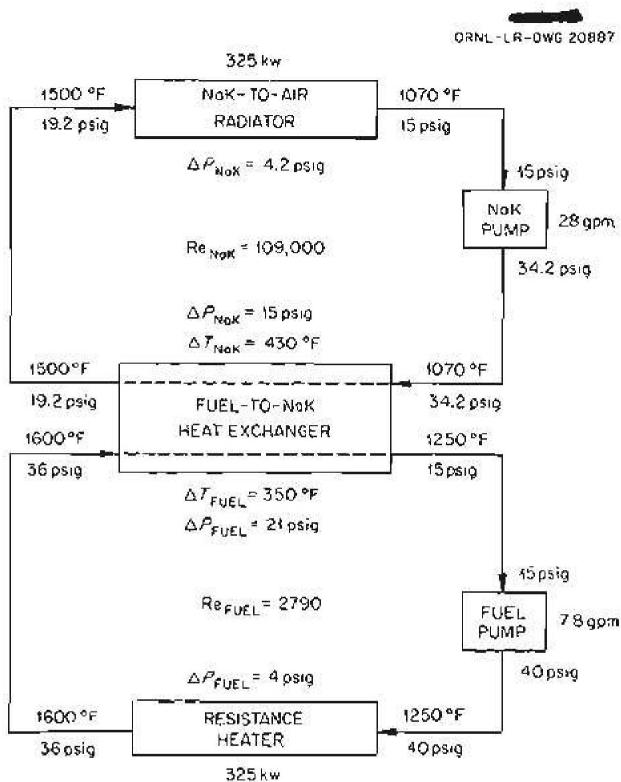  
Fig. 1.4.17. Operating Conditions for Semicircular Small Heat Exchanger Type SHE-9.

York Corp. radiator No. 15 was installed in SHE test stand C for operation in conjunction with Process Engineering Corp. heat exchanger No. 3, type SHE-7. When test operations were started, proper NaK flow could not be established. The loop was drained, and examination revealed that the cold-trap economizer inlet and all but four of the radiator tubes were plugged with oxide. The oxide had apparently been deposited in the main NaK piping at the end of the preceding test,[18] which, as described above, was terminated because of a failure of the cold-trap economizer. When operations were resumed, the oxide was transferred to the new radiator and to the economizer inlet line. York radiator No. 15 has been replaced with York radiator No. 16, and all NaK piping containing oxide has either been replaced or steam cleaned. Operation will be resumed to obtain information on the heat transfer and corrosion characteristics of a typical system when operating with NaF-ZrF $_4$ -UF $_4$ (56-39-5 mole %, fuel 70). York radiator No. 15 has been thoroughly cleaned and will be installed in SHE test stand B as the heat dump for the test of the semicircular heat exchanger.

The first part18 of the endurance test of Black, Sivalls & Bryson heat exchangers Nos. 1 and 2 (type IHE-8) was completed in IHE test stand B. The test included 503 hr of operation of heat exchanger No. 1 with a NaK inlet temperature of $1700^{\circ}\mathrm{F}$ and the other conditions of temperature, pressure, and flow rate shown in Fig. 1.4.18. The NaK pressure drop through heat exchanger No. 1, calculated on the basis of constant flow, increased to approximately 5.4 times the initial level, and the NaK pressure drop through the radiator increased to approximately 1.3 times the initial level. These pressure drop increases in the NaK circuit are attributed, as before,19 to the buildup of mass-transferred material in the small-diameter tubing of the test units. Black, Sivalls & Bryson heat exchanger No. 1 is being replaced by Black, Sivalls & Bryson heat exchanger No. 3, which is of the same type as No. 1. Endurance testing of heat exchanger No. 2 will continue during the second phase of the test. However, detailed programing for the second phase

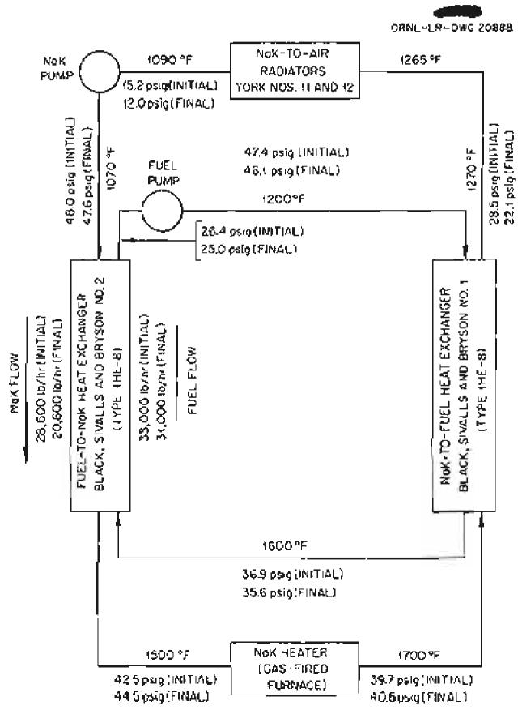  
Fig. 1.4.18. Operating Conditions During 503-hr Endurance Test of Black, Sivalls & Bryson Heat Ex-changers Nos. 1 and 2 (Type IHE-8).

of the test will not be established until the results of the metallographic examination of heat exchanger No. 1 are known.

ART-prototype test radiator No.1 was received from York Corp. during the quarter. It is currently being modified by slitting the fins as shown in Fig. 1.4.19. These modifications were recommended as the result of recent detailed stress analyses of this radiator design. Tests of this unit will be started soon.

Water Flow Tests of Aluminum North-Head Mockup

$$
R. C u r r y ^ {2 0} \quad J. W. C o o k e ^ {2 0}
$$

Additional tests were run of the ART twin fuel pump system as part of the water flow tests of the aluminum north-head mockup. For these tests the pumps incorporated the improved model 32 impellers

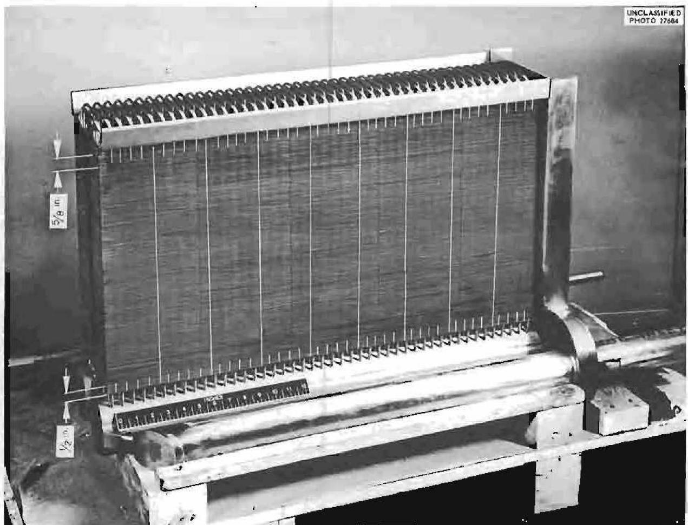  
Fig. 1.4.19. ART-Prototype Test Radiator No. 1 Showing Lines Where Fin Matrix Has Been Slit to Reduce Stress Concentrations. (Confidential with caption)

described previously.21 With the improved impellers the liquid spraying and sloshing noted previously in the expansion tank and the resultant wetting of the tank ceiling were greatly reduced because of the reduction in the gross inflow to the tank. Ingassing of the main circuits with one pump stopped and the other still running was not appreciably different with the improved impeller, and flow-rate fluctuation and pump suction pressures remained essentially unchanged. With the bypass loop connecting the pump suction pipes wide open, stopping one pump with the other still running caused the total flow through the external main loops to be reduced by a factor of $\frac{1}{2}$ . However, the flow continued in the normal direction in

each external main loop with no reversal, and the flow rate in the external main loop of the stopped pump was $\frac{7}{10}$ that in the external main loop of the operating pump. One significance of this result with regard to reactor operation is that any tendency for local overheating in an intermediate heat exchanger tube bundle would be minimized following stoppage of one-half the fuel, sodium, and NaK pumps.

The model 32 impeller has greatly reduced the problem of liquid rising in the shaft annulus. With the original impeller, liquid rose into the shaft annulus of a pump which was stopped if the other pump was still running. In tests of the new impeller over a wide range of pump speeds and gas flow rates down the shaft annulus, the only instance of liquid rising up the shaft annulus upon stoppage of one pump occurred when the

gas inflow was cut off completely; and even then more than 30 sec elapsed following pump stoppage before water was detected 0.4 in, up the annulus, the lowest sensing point. In operation of the reactor, the reactor dump cycle would be under way within this period if a pump stopped.

During the quarter the entire main loop circuit was sent to the Hydraulics Laboratory of the University of Tennessee for calibration of the external main loop orifices. This calibration showed orifice coefficients 2 to $3\%$ less than the accepted values, and also showed no variation of the coefficients with external main loop valve settings in the range of interest. A special test was also performed in which water was pumped into the common pump discharge pipe at a rate of 1300 gpm, and any fluctuations of main loop orifice differential pressures were observed. Several repetitions of this test yielded different results. In about half the runs no fluctuations were observed. In the other runs fluctuations of an orifice differential pressure, similar to those observed with the complete aluminum test rig, were observed. In these University of Tennessee tests, water was supplied by two dissimilar pumps

operating in parallel, and one of the pumps was known to be subject to some instability in the operating region of interest.

The pump volutes in the twin pumps were carefully examined while the loop was disassembled for the colibrotions described above. Differences in the design of the volutes in comparison with the volute design specified for the reactor were noted, and the aluminum volutes were modified to more closely resemble the reactor pump volutes. Both the orifice calibration and the reworking of the volutes were undertaken in the hope of eliminating an apparent loss of $10\%$ of pump output flow rate at design speed and head compared with the output observed for the same impellers in the single pump high-temperature test.

# Dump Valve Development Tests

I. T. Dudley M. H. Cooper22

Prototype Valves. - A summary of the tests conducted this quarter on ART prototype dump valves is presented in Table 1.4.3. One prototype

22On assignment from Pratt & Whitney Aircraft,

Volve temperature: 1300°F  
Pressure differential across coast: 50 psi

Table 1.4.3. Operating Conditions and Results of Prototype ART Dump Valve Tests with NaF-ZrF4-LiF4 (50-46-4 mole %, Fuel 30)   

<table><tr><td></td><td>Volve 4C</td><td>Volve 5B</td><td>Volve 5C</td></tr><tr><td>Seat material</td><td>K-151A</td><td>Copper</td><td>Copper</td></tr><tr><td>Plug materio!</td><td>K-151A</td><td>Molybdenum</td><td>Molybdenum</td></tr><tr><td>Operating time, hr</td><td>1500</td><td>430</td><td>1100</td></tr><tr><td>Number of cycles</td><td>50</td><td>23</td><td>36</td></tr><tr><td>Stem closing force, lb</td><td>750</td><td>750</td><td>1000</td></tr><tr><td>Stem opening force (max), lb</td><td>864</td><td>1850</td><td>2520</td></tr><tr><td>Leakage rate, cm³/hr</td><td></td><td></td><td></td></tr><tr><td>During first 25 cycles (av)</td><td>1.4</td><td>0</td><td>0.5</td></tr><tr><td>During 500-hr closure (av)</td><td>1.2</td><td></td><td>0</td></tr><tr><td>During last cycling period (av)</td><td>2.4</td><td></td><td>2.5</td></tr><tr><td>Maximum during test</td><td>5.6</td><td>0.6</td><td>6.7</td></tr></table>

valve was received during the latter part of the quarter from Black, Sivalls & Bryson, designated valve No. 6, which incorporates a swiveled plug. Since the swiveled plug design is now considered to be unsatisfactory, leakage rate tests will be made on this valve with water only. The two available test stands will be used to test only valves which have rigidly mounted plugs and which incorporate other refinements now considered to be essential for the successful operation of this valve design.

Valve 5B, which had a rigidly mounted, spherical molybdenum plug and a conical copper seat, exhibited negligible leakage during the first 23 operating cycles. The test of this valve was terminated after 430 hr because the bellows ruptured while the valve was closed. The bellows is composed of stamped Inconel disks welded together at their inner and outer peripheries, and failure occurred at an inner peripheral weld. Preliminary metallographic inspection showed that the failure was located at the point of fusion between the weld bead and the disk. Some scattered impurities were observed in this area which may have contributed to the failure. The pressure differential across the bellows was approximately 3 psi and therefore not high enough to cause direct stress failure.

Volve 5C was assembled by using refinished parts from valve 5B. The conical surface of the seat was remachined and the spherical surface of the plug was polished. The high initial leakage rates that occurred when tests of valve 5C were started made it necessary to use a stem closing force of 1000 lb. The average leakage rate was $0.5\mathrm{cm}^3/\mathrm{hr}$ during the first 25 operating cycles with this stem force. No measurable leakage occurred during the 500-hr closure test, and leakage rates during eleven operating cycles since the 500-hr closure test have been erratic, with an average of $2.5\mathrm{cm}^3/\mathrm{hr}$ . The leakage rate has increased rapidly since the thirty-third operating cycle. This valve has now been operated for 1100 hr, and the test will continue until an operating time of 1500 hr has been reached.

Valve 4C, which had a rigidly mounted, spherical Kentanium cermet (K-151A) plug and a conical Kentanium cermet (K-151A) seat, was tested for 1500 hr at $1300^{\circ}\mathrm{F}$ . The average leakage rate during the first 25 operating cycles was 1.4 $\mathrm{cm}^3/\mathrm{hr}$ , 1.2 $\mathrm{cm}^3/\mathrm{hr}$ during the 500-hr closure test, and 2.4 $\mathrm{cm}^3/\mathrm{hr}$ during the last 25 operating cycles. Relatively low stem forces, 500 to 864 lb,

were required for opening this valve. This valve is to be tested again with the diametrical clearance of the inner stem guide increased from 0.008 to 0.080 in. This valve has given the best overall performance of any valve tested to date.

A valve of a modified design is being fabricated for testing. The new design incorporates a backup bellows to supplement the seal bellows and improved stem-alignment control. Also, a valve that will have a spider guide mounted in the end connection directly above the seat ring is being assembled to determine whether volve alignment can be improved by guiding the plug at a point as close to the seat as practical. Kentanium 162B inserts are being used for the bearing surfaces of the guide.

"In-Line" Valve Operator. - A simple rig has been set up for tests of the Philadelphia Gear Works "in-line" actuator that is to be used on the ART NaK valves. The test assembly consists of a simulated valve on which the actuator is mounted and an opposing actuator that is used to determine the "in-line" stem thrust. Provisions are made for heating of the simulated valve body to determine the effect of temperature on the actuator operating characteristics.

Seat Materials. Twelve seat and plug materials combinations have been tested thus far in NaF-ZrF4-UF4 (50-46-4 mole %, fuel 30), and three other combinations are being tested. The tests completed during the quarter and those now under way are summarized in Table 1.4.4. One of two test stands was modified for use with NaK, and tests with NaK are under way. The seat and poppet combinations tested are described in Table 1.4.4. The 1500-hr test of each combination consists of 25 opening and reseating cycles, a 500-hr closure period, and finally, 25 opening and reseating cycles.

Two cermet combinations, K-151A vs K-152B and KM vs 162B, have given the most satisfactory results. The compositions of these cermets are (in wt %):

<table><tr><td>KM</td><td>90WTiC2-10Co</td></tr><tr><td>K-153A</td><td>70TiC-10NbTaTiC3~20Ni</td></tr><tr><td>K-152B</td><td>64TiC-6NbTaTiC3-30Ni</td></tr><tr><td>K-162B</td><td>64TiC-6NbTaTiC3-25Ni-5Mo</td></tr></table>

Table 1.4.4. Conditions and Results of Tests of Valve Seat and Plug Materialls All materials tested in NoF-ZrF $3^{\circ}$ UF $4$ (50-46-4 male %, fuel 30) except as indicated   

<table><tr><td>Seat Material</td><td>Plug Material</td><td>Operating Time (hr)</td><td>Volve Temperature (°F)</td><td>Number of Cycles</td><td>Comments</td></tr><tr><td>Mo</td><td>W</td><td>1875</td><td>1300--1500</td><td>27</td><td>Terminated for examination; leakage high after cycling</td></tr><tr><td>K-94</td><td>K-94</td><td>1560</td><td>1300</td><td>14</td><td>Terminated for examination; leakage high</td></tr><tr><td>Mallory 1000</td><td>Mallory 1000</td><td>1511</td><td>1300</td><td>21</td><td>Terminated for examination; leakage high after cycling</td></tr><tr><td>Cu</td><td>Mo</td><td>1638</td><td>1300</td><td>41</td><td>Operating</td></tr><tr><td>K-162B</td><td>KM</td><td>1001</td><td>1300</td><td>33</td><td>Operating; no leakage at any time</td></tr><tr><td>K-152B</td><td>K-162B</td><td>172</td><td>1300</td><td>2</td><td>Terminated because of misalignment</td></tr><tr><td>Inconsl</td><td>Stellite 6</td><td>696</td><td>1000</td><td>11</td><td>Operating; leakage high; test fluid is NoK</td></tr><tr><td>K-152B</td><td>K-151A</td><td>41.5</td><td>1300--1500</td><td>3</td><td>Operating</td></tr><tr><td>K-162B</td><td>KM</td><td></td><td></td><td></td><td>Being installed</td></tr></table>

The leakage of the K-151A vs K-152B combination, tested previously,[23] was less than $1\mathrm{cm}^3/\mathrm{hr}$ during the test; the KM vs K-162B combination, which is still in operation, has shown no leakage. The opening force after the 500-hr closure at $1300^{\circ}\mathrm{F}$ was 700 lb for the K-151A vs K-152B combination and 900 lb for the KM vs K-162B combination. A photograph of the K-151A vs K-152B combination after 1549 hr of operation in $\mathrm{NoF - ZrF_4 - UF_4}$ (50-46-4 mole % fuel 30) at $1300^{\circ}\mathrm{F}$ is presented in Fig. 1.4.20. Subsequent tests will be performed to determine the characteristics of these materials at higher temperatures.

A Stellite plug and Inconel seat combination is being tested with NaK at $1000^{\circ}\mathrm{F}$ . No self-welding of the materials has been experienced, but the leakage has been excessive, for example, 40 cm³/hr at a 50-psi differential pressure across the seat. Two KM vs K-162B combinations are being installed for testing in NaK.

# Outer Core Shell Thermal Stability Test

J.C.Amos

L. H. Devlin

The second of the two proposed thermal-stability tests of the outer core shell was started in

February. The test piece is a quarter-scale model of the bottom half of the ART outer core shell. The test program consists of three hundred cycles, with each cycle of magnitude comparable to those generated by an ART power cycle between zero and full power.

The test thermal cycle comprises 1 hr under a temperature gradient and 1 hr of isothermal operation at $1200^{\circ}\mathrm{F}$ . The transient time is 10 min. Internal thermocouples indicate the wall temperature at both ends of the shell. During the temperature gradient phase of a cycle the temperatures are:

Inner sodium entrance 1570 F

Inner sodium exit 1250F

Outer sodium exit 1075

Outer sodium entrance 1010

The operating conditions are thus approximately the same as those for the first test, $^{24}$ in which the shell successfully endured 300 cycles. The two sodium streams, which flow countercurrently

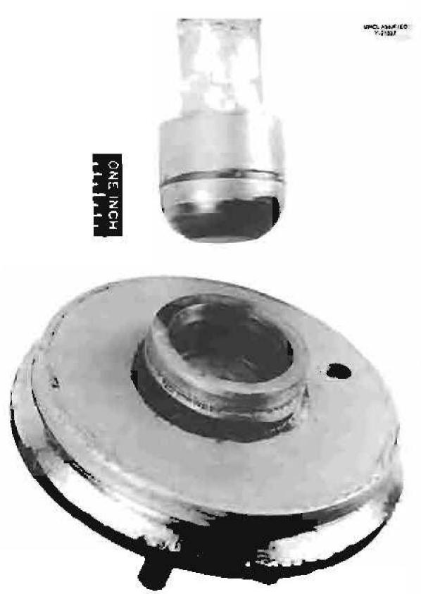  
Fig. 1.4.20. Kentanium Cermet K-151A Plug and K-152B Seat After 1549 hr in NaF-ZrF $_4$ -UF $_4$ (50-46-4 Mole %, Fuel 30) at $1300^{\circ}$ F.

over the shell, serve as the heat transfer mediums.  
Bursting pressures of 26 and 4 psi exist across the shell at the bottom and top, respectively.

Prior to the final assembly of the test housing, the dimensions of the inside surface of the shell were carefully measured. The measuring procedure was the same as that used on the first shell,[25] except that a bead of weld material (to serve as a reference point) was placed on the large end of the shell rather than on the housing, as in the first test. Relocation of the reference point resulted in more accurate measurements.

# Sodium Circuit Water Flow Tests

S. Kress26 R. D. Peak26

Many regions in the ART sodium circuit which are difficult to analyze are being individually

tested in mockups27 in order to determine the pressure drops. Three of these regions were tested this quarter. Since the heat loads, lengths, and entrance conditions of the five rows of cooling holes through the beryllium reflector are different, the sodium flow through these cooling holes must be controlled to achieve a uniform temperature pattern throughout the beryllium. A convenient method of control is to orifice individual holes at the beryllium equator joint with 3-in.-thick orifice plugs. Such plugs with orifice holes of 0.0595 to 0.1875 in. in inside diameter were tested.

The results of the tests are shown on Fig. 1.4.21 as pressure loss coefficients, which include the total loss for the entrance orifice and 4.56 in. of hole length, vs the orifice diameter. A range of orifice sizes was tested, with the smallest orifice in the reflector cooling hole reducing the flow to about $20\%$ of the flow with the largest orifice. As the result of an error in machining the first southern hemisphere of the beryllium reflector, holes 29 to 71 in the second row from the center

27S. Kress and R. D. Pook, ANP Quar. Prog. Rep. Dec. 31, 1956, ORNL-2221, p 58.

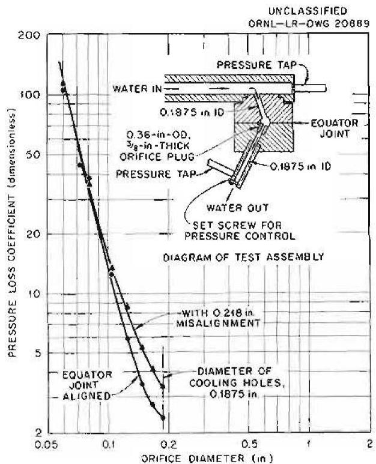  
Fig. 1.4.21. Pressure Loss Coefficients vs Orifice Diameter at Reflector Equator Joint.

were drilled 0.218 in, circumferentially off alignment. This misalignment will introduce an extra head loss at the equator joint, but it can be compensated by proper selection of the orifice size. A second series of orifice tests was run to determine the effect of this misalignment on the loss coefficient. The results of these tests are also shown on Fig. 1.4.21.

Another test involved a full-scale mockup of one-half of the symmetrical sodium circuit in the reflector entrance region where the sodium supply to the reflector flows down from the two pump tees, impinges on the circular boron cons, and spreads out over the top of the reflector and the core shell. The wooden test model of the top of the beryllium reflector with the circular boron-containing can in place and the spacer bars assembled is shown in Fig. 1.4.22, and Fig. 1.4.23 shows the model with the boron-containing conical

ring and the pressure ring in place. This model was fitted into on aluminum-Inconel-Plexiglas piece that simulated the underside of the Inconel north-head shells just above the reflector.

The head loss in this reflector entrance region at the design flow rate of 1.28 ft³/sec was found to be 3.0 ft compared with an estimated 7.5 ft. The relative flow distribution through the beryllium cooling holes was obtained by measuring the height of the water jet from each hole with the complete test assembly turned upside down, and loss coefficients (Fig. 1.4.24) were calculated for each hole based on the jet height and the hole orientation shown in Figs. 1.4.22 and 1.4.23. The measurements showed that the cooling holes on the shoulder around the pie-shaped depression in the reflector carry much less flow (2 to 3 times) than the rest of the holes.

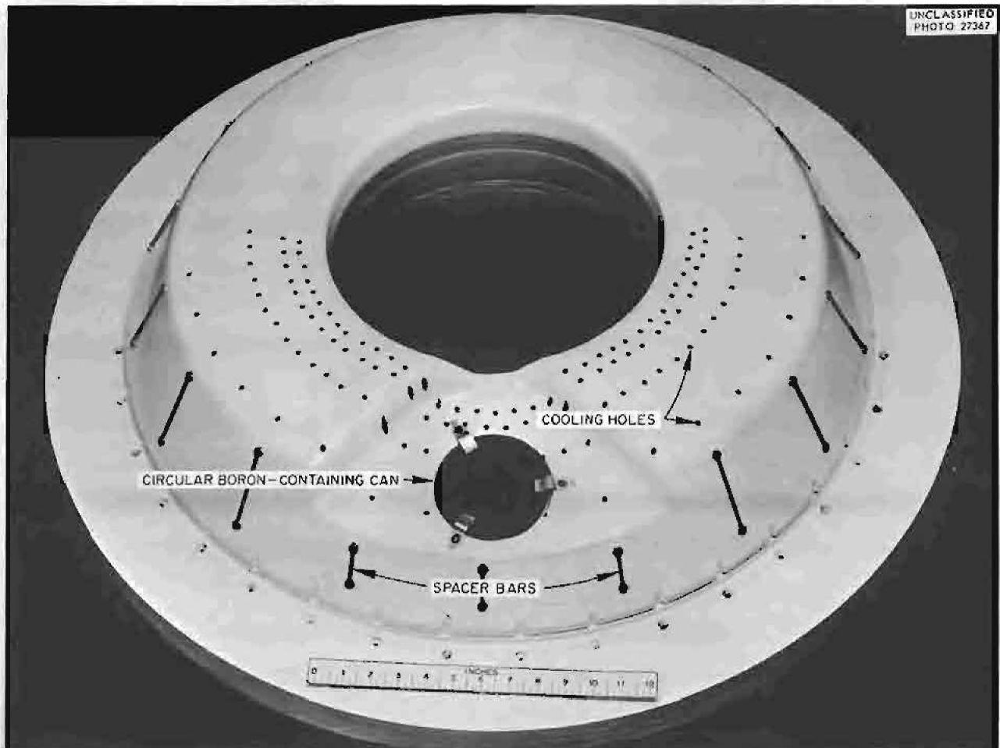  
Fig. 1.4.22. Wooden Model of Top of Reflector Showing the Baron-Containing Circular Can, the Spacer Bars, and One-Half of the Cooling Holes.

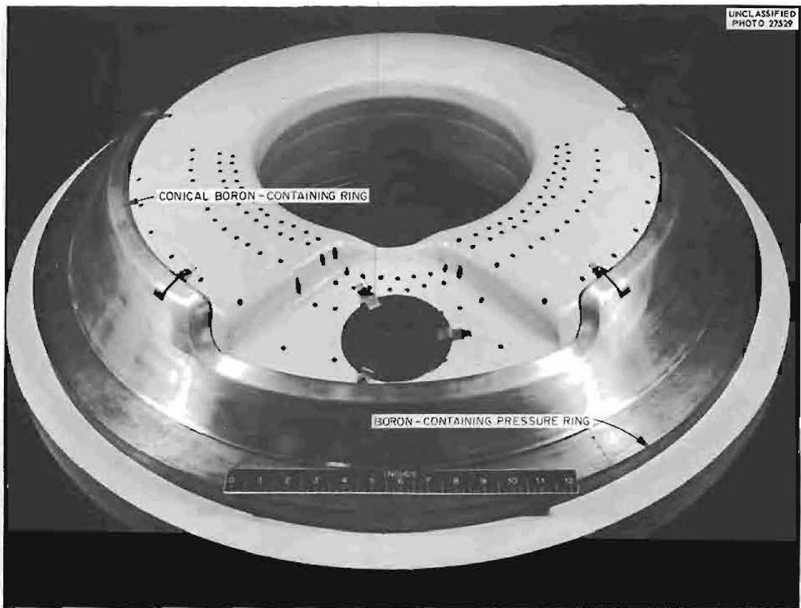  
Fig. 1.4.23. Wooden Model of Top of Reflector Showing Boron-Containing Conical Ring and Pressure Ring Assembly.

A water test was also conducted on a proposed bypass slot in the north-head sodium circuit. This slot is to be cut between the sodium-to-NaK heat exchanger shell and the external pressure shell of the reactor to allow some sodium flow to bypass the present slots between the pressure shell and the upper-deck outer shell and to give a more direct entrance for flow into the heat exchanger inlet. The slot tested, shown in Fig. 1.4.25, was approximately 5 in. wide, 0.8 in. long, and 0.1875 in. high. The Plexiglas top represented the pressure shell. The loss equation for this slot, as determined experimentally, is

$$
\Delta H = 1. 1 4 \frac {V ^ {1 . 9 7}}{2 g},
$$

where $\Delta H$ is the head loss, $V$ is the velocity of the flow through the slot, and $g$ is gravity.

# AUXILIARY COMPONENT DEVELOPMENT TESTS

J. J. Keyes

High-Frequency Thermal-Cycling Water Tests

J.J. Keyes J.E.Moff28

The time constant of a 36-goge Chromel-alumel thermocouple was determined to be less than 3.5 msec, and thus such a thermocouple may be used to measure, quite accurately, sinusoidal fluid temperature fluctuations of up to about 30 cps.

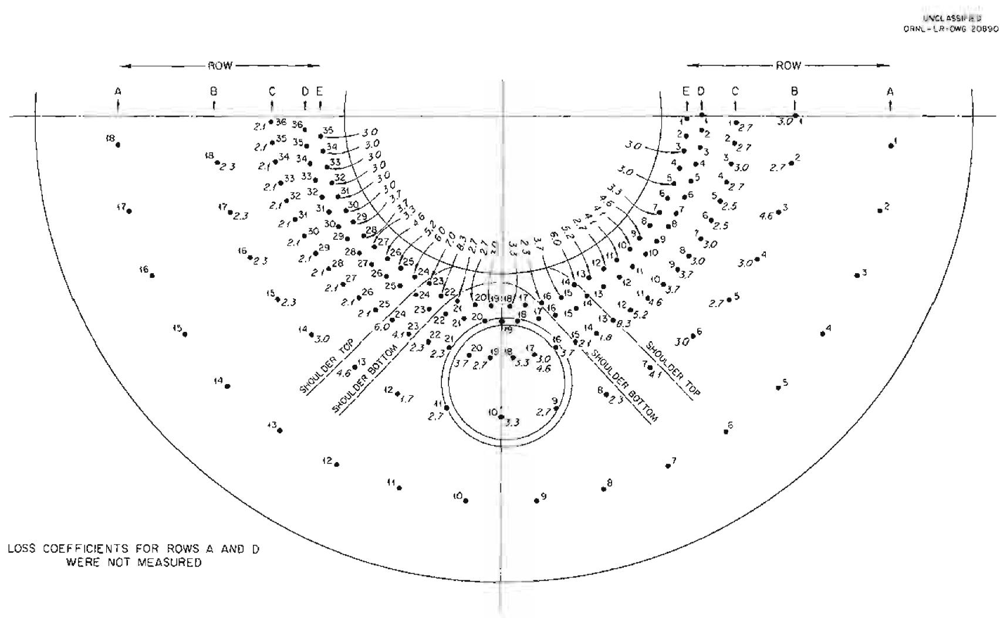  
Fig. 1.4.24. Loss Coefficients for Cooling Holes in Reflector.

  
Fig. 1.4.23. Wooden Model of Top of Reflector Showing Boron-Containing Conical Ring and Pressure Ring Assembly.

A water test was also conducted on a proposed bypass slot in the north-head sodium circuit. This slot is to be cut between the sodium-to-NoK heat exchanger shell and the external pressure shell of the reactor to allow some sodium flow to bypass the present slots between the pressure shell and the upper-deck outer shell and to give a more direct entrance for flow into the heat exchanger inlet. The slot tested, shown in Fig. 1.4.25, was approximately 5 in. wide, 0.8 in. long, and 0.1875 in. high. The Plexiglos top represented the pressure shell. The loss equation for this slot, as determined experimentally, is

$$
\Delta H = 1. 1 4 \frac {V ^ {1 . 9 7}}{2 g},
$$

where $\Delta H$ is the head loss, $V$ is the velocity of the flow through the slot, and $g$ is gravity.

# AUXILIARY COMPONENT DEVELOPMENT TESTS

J.J.Keyes

High-Frequency Thermal-Cycling Water Tests

J.J.Keyes J.E.Mott28

The time constant of a 36-gage Chromel-olumel thermocouple was determined to be less than 3.5 msec, and thus such a thermocouple may be used to measure, quite accurately, sinusoidal fluid temperature fluctuations of up to about 30 cps.

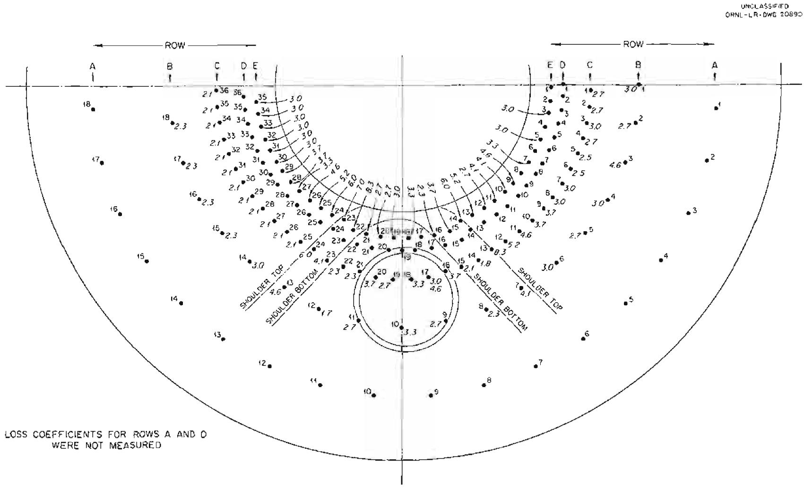  
Fig. 1.4.24. Loss Coefficients for Cooling Holes in Reflector.

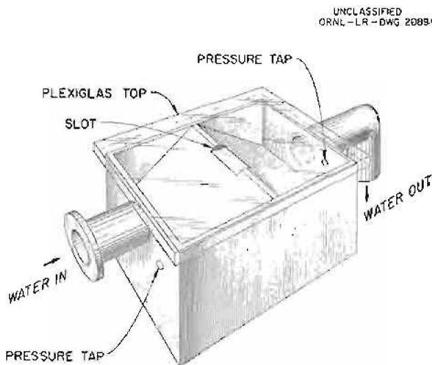  
Fig. 1.4.25. Diagram of North-Head-Slot Test Piece.

The Inconel-nickel "gun-barrel" thermocouple, described previously,[29] may be used to measure sinusoidal wall-temperature amplitudes in a $\frac{1}{2}$ -in.-dia, $\frac{1}{4}$ -in.-wall, Inconel tube for several surface heat transfer coefficients. The results of experiments with a film heat transfer coefficient of 3140 Btu/hr.ft². $\circ F$ are compared with the Jakob equation[30] in Fig. 1.4.26. The deviation of the experimental results from theoretical may be caused by perturbations of the boundary layer as a result of slight thermocouple protrusion ( $\sim 0.002$ in.) or by entrance region effects. The thermocouple was located about 30 diameters downstream, which was not far enough away from the entrance for uniform turbulent flow to be definitely established.

Measurements of the axial fluid temperature amplitude attenuation in turbulent flow through a straight tube as a result of heat exchange with the tube wall were made for comparison with theoretical predictions for metal and plastic walls. In addition, the results enabled an estimate of the wall attenuation ratio to be made, independent of direct wall measurements, which is in reasonable agreement with the Jakob equation. This work is being continued.

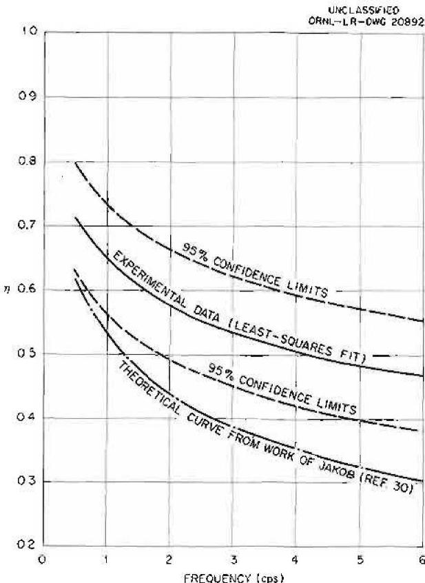  
Fig. 1.4.26. Ratio of Wall Temperature Amplitude to the Fluid Temperature Amplitude, $\eta$ , as a Function of the Frequency, $f$ , of the Thermal Cycle Imposed on the Fluid for a Thick-Walled Inconel Tube with a Film Heat Transfer Coefficient of 3140 Brv/hr-ft².

# High-Frequency Thermal-Cycling Test Loop

A.G.Smith, Jr.31

The high-frequency thermal-cycling test loop, described previously,[29] was completed, and Fig. 1.4.27 shows the pulse generator, pulse pump, and test piece. The pulse generator consists of two pistons which produce helium pressure pulses 180-deg out of phase. These pressure pulses are transmitted to the pulsers which force alternate hot and cold slugs of fluid through the test piece. A helium bubbler type of level device is used to record and control the fluid level in the pulse pump. The maximum and minimum fluid temperatures will be 1650 and $1150^{\circ}\mathrm{F}$ , respectively,

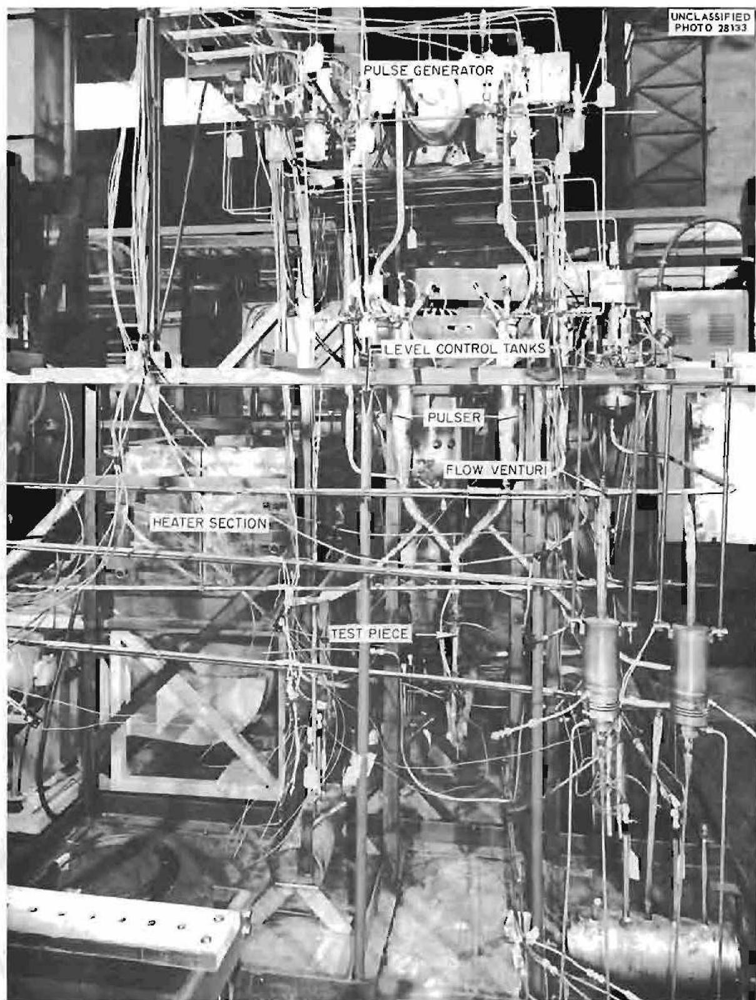  
Fig. 1.4.27. High-Frequency Thermal-Cycling Test Loop.

to give a maximum pulse-amplitude fluid temperature of $\pm 250^{\circ}\mathsf{F}$ . The frequency of these pulses can be varied from 0.5 to 10 cps. The maximum flow anticipated is 12 gpm, which will permit a calculated heat transfer coefficient of 5500 Btu/hr.ft². F in the test section, a 3% -in. sched-40 pipe.

Most of the control panel is shown in Fig. 1.4.28, including the gas panels for both the high- and low-temperature loops and sumps, alarm and motor control panels, and two of the four Variac cabinets. There are two 16-point Brown temperature recorders, and each contains an integral high- or low-temperature alarm as a safety measure. These recorders will monitor the 150 thermocouples mounted on the loop. The four Varioc cabinets contain 42 separate control circuits for preheating and for normal secondary heating. The 250-kva transformer for main loop resistance heat and the auxiliary gas panel are not shown.

The loop has operated satisfactorily at design specifications with water, and data are being taken on temperature amplitudes at the test section as a function of frequency and flow rate. This information will form a basis for high-temperature operation. Some control difficulties have occurred during startup and shutdown, but these are being eliminated. The water tests will be continued until thorough familiarization with the operation is achieved.

# Cold Trops and Plugging Indicators

R.D.Peak D.A.Gardiner

Plugging indicators are required in each of the eight NaK cold-trap circuits of the ART to monitor the sodium oxide level. The plugging indicator proposed for this service32 is essentially the same as the type which has been used successfully on all the heat exchanger test stands during the past two years. Since the plugging indicators used in the heat exchanger tests were never calibrated, calibration tests of an ART prototype plugging indicator were conducted. A cold-trap test stand33 was used for these calibration tests with the ART plugging indicator mounted vertically in the stand.

The results of a typical test with the ART plugging indicator are shown in Fig. 1.4.29. The test is started by turning the Calrod heater off and the cooling air on so that the NaK flowing through the plugging plate gradually cools. At a certain temperature the NaK flow rate starts decreasing abruptly because precipitated oxide has begun to plug holes in the plugging plate. This temperature, called the break temperature because of the change in flow rate, is an indication of the oxide content of the NaK. After the break temperature is determined, the air is turned off and the Calrod is turned on in order to dissolve the precipitated oxide.

All plugging indicator tests were made at a nominal NaK flow rate of 0.5 gpm. Experience on the heat exchanger test stands has shown that the break temperature is insensitive to this flow rate. Since the flow rates in ART application may vary, data on pressure drop vs flow rate were obtained and are shown in Fig. 1.4.30. Air flow rates were also varied, and it was found that the break temperature was duplicated to within $5^{\circ}\mathrm{F}$ at a $400^{\circ}\mathrm{F}$ break temperature with air flow rates varying from 30 to 80 scfm, and to within $20^{\circ}\mathrm{F}$ at a $800^{\circ}\mathrm{F}$ break temperature with air flow rates varying from 8 to 40 scfm. The air pressure drop is shown in Fig. 1.4.31.

The plugging indicator was calibrated against chemical analyses for sodium oxide obtained by the Argonne sampler distillation method.34 The chemical analyses showed much greater inherent variations than did the break temperatures. In an attempt to determine the causes for these variations, the Argonne sampler data were subjected to the standard techniques of analysis of variance. There appeared to be no significant differences in instrumentation or sampler units from test to test, but samples taken by one technician were significantly higher in sodium oxide than those obtained by the other nine technicians. The standard deviation of the analyses was very large and increased as the number of the analyses increased. Although 86 samples were taken, only 46 were analyzed successfully and used for the calibration. The results of these analyses are shown in Fig. 1.4.32 along with the corresponding

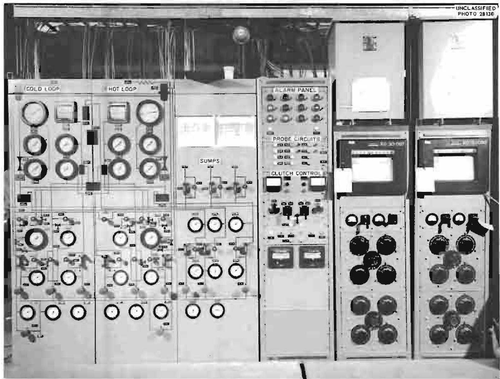  
Fig. 1.4.28. Control Panel for the High-Frequency Thermal-Cycling Test Loop.

plugging-indicator break temperatures. The least-squares correlation of break temperature based on oxide analyses is also shown. The calibration line has good validity, as indicated by a correlation coefficient of 0.89, even though the data appear to show wide scatter. The calibration curve includes most of the practical range of plugging-indicator application, and it should be used as a

criterion for the oxide content of NaK rather than the solubility line.

At low break temperatures, the correlation line is to the right of the oxide solubility line.35 A requirement that a given amount of oxide is

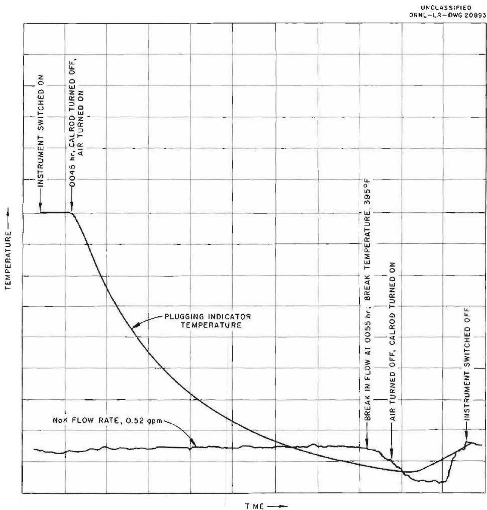  
Fig. 1.4.29. Results of a Typical Test with an ART Plugging Indicator. (Confidential with caption)

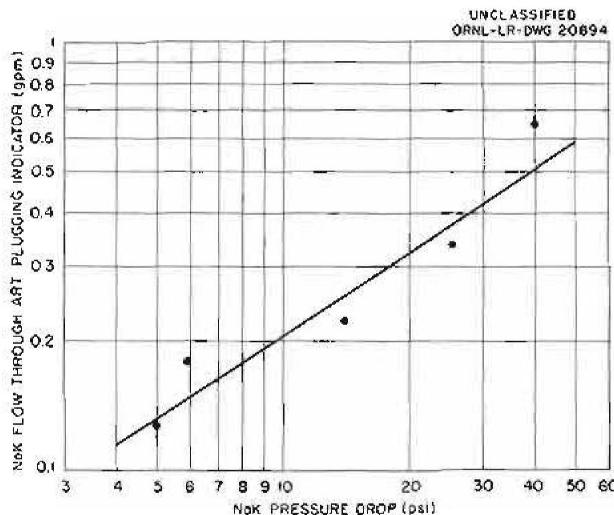

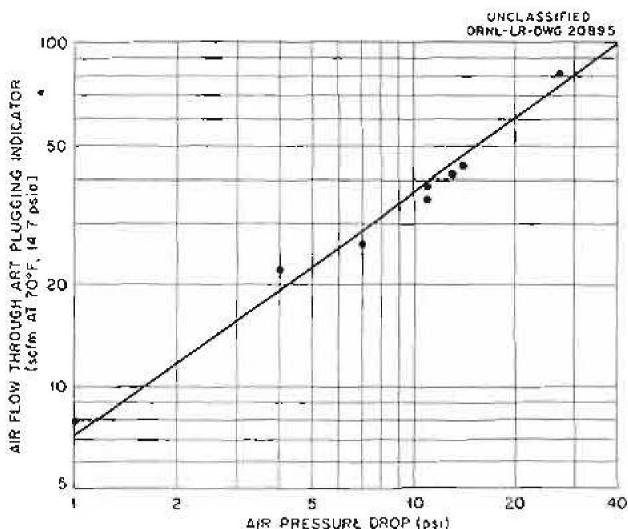  
Fig. 1.4.30. NaK Pressure Drop Through on ART Plugging Indicator. (Confidential with caption)   
Fig. 1.4.31. Air Pressure Drop Through an ART Plugging Indicator. (Confidential with caption)

necessary to plug the indicator holes and thus to show the flow break would move the correlation line to the left of the solubility line, since, as the oxide level falls, the NaK has to be cooled to a larger temperature interval below the saturation temperature before the required amount of oxide is deposited. The correlation line is to the right, however, and the above phenomenon may not occur or the solubility data may be in error at these low temperatures.

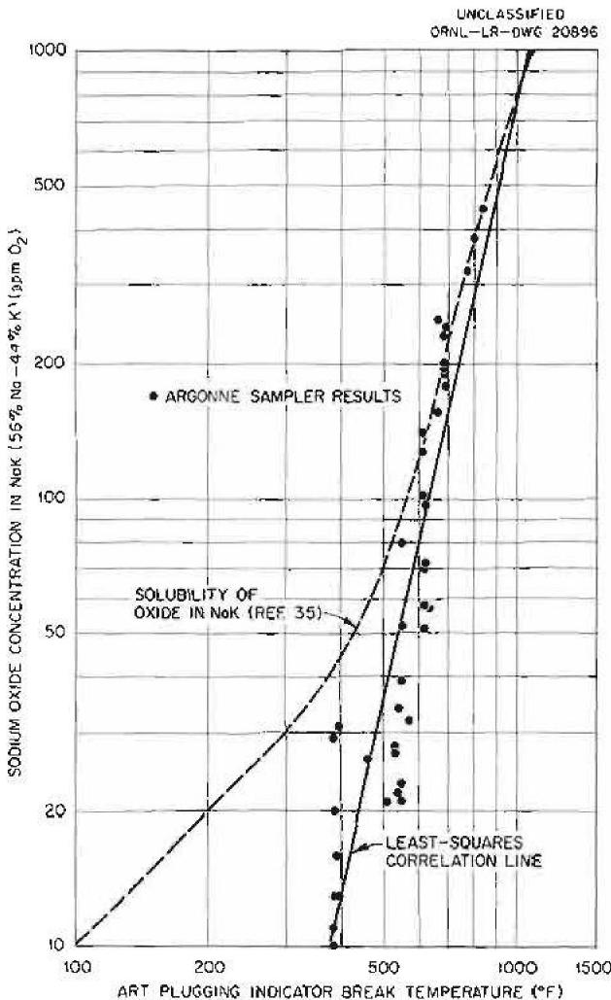  
Fig. 1.4.32. ART Plugging Indicator Calibration and Results of Chemical Analyses Obtained with an Argonne Sampler. (Confidential with caption)

# Liquid-Metal-Vapor Condensers

M. H. Cooper

Tests of the modified liquid-metal-vapor condensers $^{36}$ were completed. The NaK condenser functioned satisfactorily, but the sodium condenser became partially blocked. The results of these tests are summarized in Table 1.4.5. The reduction of the gas flow through sodium condenser III was caused by the condensation and freezing of sodium at the first baffle, as shown in Fig. 1.4.33.

Condenser inlet temperature: 1200°F

Condenser outlet temperature: 700°F

Table 1.4.5. Summary of Results of Liquid-Metal-Vapor Condenser Tests   

<table><tr><td>Condenser Designation</td><td>Helium Flow Rate</td><td>Comments</td></tr><tr><td>Sodium III</td><td>1.0-0.5 liter/min</td><td>Condenser became partially blocked after 230 hr and caused the helium flow to fall to 0.5 liter/min. No further decrease in flow occurred during 1500-hr test</td></tr><tr><td>NaK IV</td><td>1.7 cfm</td><td>Satisfactory operation through 100 high-flow cycles of 2½ to 3 min each</td></tr><tr><td>NaK IV</td><td>0.5 liter/min</td><td>Satisfactory performance for 300 hr; however, entrained NaK carried into downstream line by accidental, continuous high flow</td></tr></table>

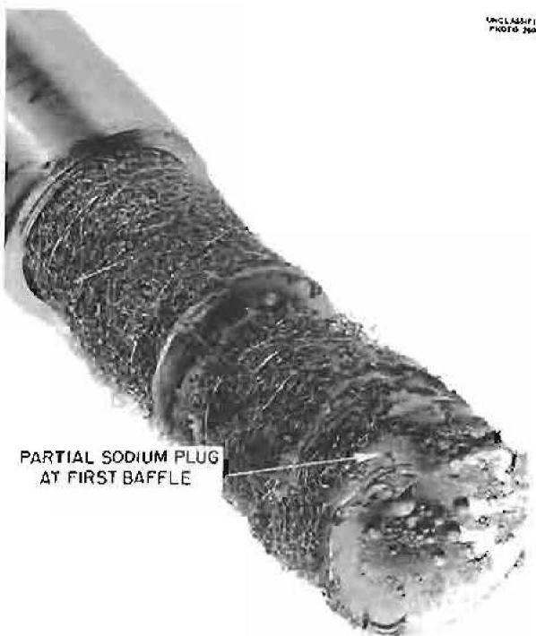  
Fig. 1.4.33. Inlet Section of Sodium Condenser III After 1500-hr Test.

Sodium condenser IV, which is to be tested, consists of a 7-ft length of $\frac{3}{4}$ -in. sched-40 Inconel pipe that will be maintained at $300^{\circ}$ F by electrical heaters and will be sloped toward the sump. It is expected that the sodium will condense and drain back into the sump, since the entire condenser will be above the freezing point of sodium $(208^{\circ}$ F). The dimensions of the NaK condenser IV have been modified, as shown in Fig. 1.4.34. The cooling section has been reduced from 24 to 12 in. and the separating section has been changed from a 24-in. section of 4-in. sched-40 pipe to a 12-in. section of 6-in. sched-40 pipe. The NaK condenser was shortened because of space limitations above the NaK sumps in the ART, and the diameter of the separating section was increased to compensate.

# Zirconium Fluoride Vapor Traps

M.H.Cooper

The detailed design of an experimental prototype of the ART zirconium fluoride thermol-condensation vapor trap, described previously,[37] was completed and a unit is being fabricated. A diagram of the experimental trap, which was designed to be easily disassembled for examination, is shown

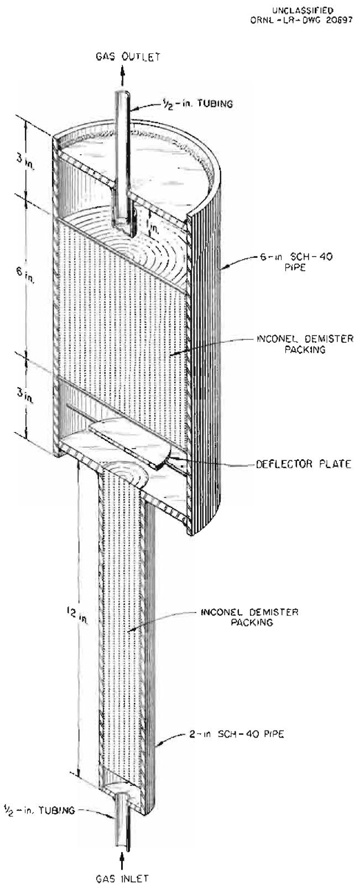  
Fig. 1.4.34. Modified NaK Condenser IV.

in Fig. 1.4.35. The experimental trap will be electrically heated and therefore does not include the sodium jacket that will surround it in ART use.

Three tests of $\mathsf{Al}_{2}\mathsf{O}_{3}$ reaction traps, also described previously, were conducted in order to determine the effect of temperature on the $\mathsf{Al}_{2}\mathsf{O}_{3} - \mathsf{ZrF}_{4}$ reaction. A section through the reaction zone of each test assembly is shown in Fig. 1.4.36. The reaction products fused in the tests made at 1600 and $1700^{\circ}\mathsf{F}$ , but they did not fuse in the test at $1500^{\circ}\mathsf{F}$ . It is believed that the fusion was caused either by the formation of complex reaction products or by impurities in the $\mathsf{Al}_{2}\mathsf{O}_{3}$ packing material.

An $\mathrm{Al}_{2}\mathrm{O}_{3}$ trop performed satisfactorily for 2000 hr in an in-pile loop test. Also, a fuel pump was purged at ART design conditions for 1400 hr through an $\mathrm{Al}_{2}\mathrm{O}_{3}$ trap without difficulty. The $\mathrm{Al}_{2}\mathrm{O}_{3}$ trap used in the Pratt & Whitney high-temperature critical experiment did not completely remove the $\mathrm{ZrF}_{4}$ from the purge gas during rapid fuel dumps. Some $\mathrm{ZrF}_{4}$ was detected in downstream gas control valves. However, the $\mathrm{ZrF}_{4}$ removal was more complete than in the ART high-temperature critical experiment for which a thermal-condensation trap was used.

# Insulation Tests

# R. D. Peak

Tests were run to measure the heat losses through three brands of insulation on piping carrying high-temperature NaK in order to determine the type of insulation best suited for the ETU and ART NaK piping.

The insulating materials tested were: (1) Fiberfrax, type XSW, manufactured by The Carborundum Company, which is a $\frac{1}{2}$ -in.-thick blanket of synthetic alumina-silica ceramic fiber; (2) Thermoflex, type RF-600, manufactured by Johns-Manville, which is a $\frac{1}{2}$ -in.-thick brown blanket of synthetic alumina-silica ceramic fiber; (3) Hy-Temp, manufactured by the Keasbey & Mattison Co., which is diatomaceous earth preformed for 2-in.-thick pipe. The Hy-Temp insulation was cut to length, placed on the piping, and tie-wired on. The Fiberfrax and Thermoflex insulations were placed on ordinary galvanized window fly screen and cut to size.

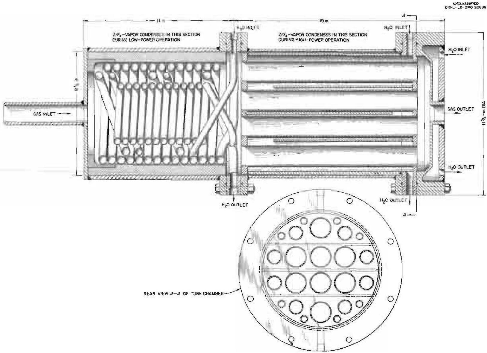  
Fig. 1.4.35. Experimental Zirconium Fluoride Vapor Trap.

The blanket and screen were then wrapped two full turns around the pipe to give o l-in, thickness on tie-wired on.

The thermal conductivities and the heat losses of the three brands of insulation are summarized in Table 1.4.6. The time required to apply the

Thermoflex insulations indicated that it could be applied at an average rate of 2 ft/mon-hour, as compared with a rate of $1\frac{1}{4}$ ft/man-hour for Fiberfrax. The rate for applying the Fiberfrax insulation is lower because it is brittle and requires greater care in handling.

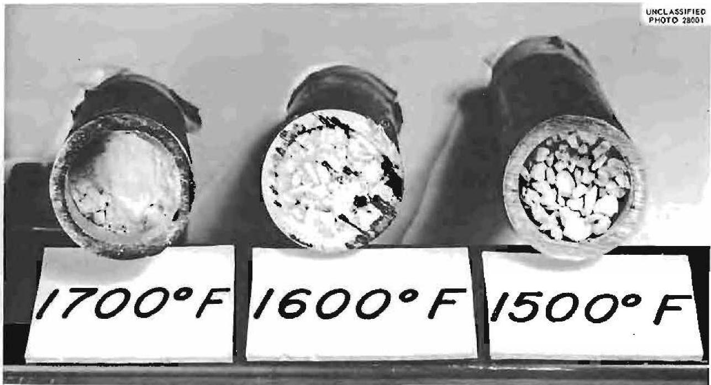  
Fig. 1.4.36. Packed Sections of Three $\mathsf{Al}_2\mathsf{O}_3$ Traps for $\mathsf{ZrF_4}$ Vapor Showing the Effect of Temperature on the Reaction Products.

Table 1.4.6. Heat Losses Through Insulation   

<table><tr><td rowspan="2"></td><td colspan="3">Type of Insulation Tested</td></tr><tr><td>Thermoflex</td><td>Fiberfrax</td><td>Hy-Temp</td></tr><tr><td>Mean thermal conductivity at 700°F, Btu/hr·ft2.0F</td><td>0.050</td><td>0.049</td><td>0.063</td></tr><tr><td>Thickness, in.</td><td>1</td><td>1</td><td>2</td></tr><tr><td>Power input required to hold at 1200°F with 90°F ambient temperature, w/ft</td><td></td><td></td><td></td></tr><tr><td>On 3/8 and 1/2-in. sched-40 pipe</td><td>130</td><td>107</td><td>86</td></tr><tr><td>On 1/2-in. tubing</td><td>154</td><td>143</td><td>149</td></tr></table>

# 1.5. REACTOR AND FACILITY CONSTRUCTION

W.F.Boudreau M.Bender

# ART-ETU REACTOR CONSTRUCTION AND ASSEMBLY

G. D. Whitman

H.M.Abele C.K.McGlothlan G.W.Peach

The schedule for assembly of the ETU and ART reactors was revised on the basis of delayed delivery of components being produced by outside vendors. It is planned to increase the local shop load by transferring the fabrication of all pressure shells, additional strut-load ring assemblies and filler plates from outside vendors' plants to the shops at the Y-12 plant. The local shop is fabricating the ETU north head and will assemble the reactors.

The detailed design of the reactor is essentially complete, with some work remaining to be done on the design of the sodium annuli surrounding the fuel overflow, off-gas, and fill-and-drain lines. Numerous design changes have been made based on further design studies, development tests, component fabrication difficulties, and weld shrinkage tests. The status of the major reactor sub-ashsemblies and components is described below.

# North-Head Assembly

Work has been stopped on assembly of the north head pending the arrival of the sodium-to-NoK heat exchangers. The lower deck assembly has been fabricated; the lower deck skirt has been hot formed and rough machined; and numerous other small subassemblies have been completed. Approximately $30\%$ of the assembly work is completed.

The work on the sodium-to-NaK heat exchangers is now progressing at a more satisfactory rate than previously. All 30 of the offset-bend-forming dies have been completed. The Griscom-Russell Co. has completed assembling the tubes for the first unit, and assembly of the tubes to the headers of the second unit has been started. Successful brazes are now being made, and it is felt that no further brazing development work will be needed.

# Reflector-Moderator Assembly

A lower beryllium hemisphere for the reflectormoderator assembly has been fabricated, and the spacer ferrules have been installed in the inner

surface. An upper beryllium hemisphere is complete, except for contouring the top surface immediately below the two sodium coolant inlet pipes. This beryllium component is shown in Fig. 1.5.1 during the machining operations on the top surface. A second set of beryllium hemispheres for the ART has been received, and hole-drilling operations are nearly complete in the lower half.

Work is progressing on a strut-load ring assembly, and the struts have been welded to the upper ring. The load ring forging has been received from the outside fabricator, and machining operations have started on this piece.

The majority of the boron carbide tiles, and spares, required for two reactors have been received, and no difficulty is anticipated in obtaining the remainder. The fabricator of the stainless-steel-clad boron-copper shielding has had difficulty in rolling the material to desired tolerances, and a relaxation in the tolerance on ratio of cladding to cernet in the matrix has been authorized. Difficulty has been encountered in rolling a product that is consistently acceptable metallurgically, and more development work remains to be done on this operation.

The fabrication of Inconel shells, notably the island and outer fuel core shells, continues to be a major problem. The effort has been concentrated on the shear spinning process, and to date no completely satisfactory component has been produced. The development problem has turned out to be more difficult than originally estimated. Raw material quality requirements have had to be improved in that the surface finish must be better than that normally obtained in the stock sizes used. The physical properties of the material, particularly hardness and grain size, must be carefully controlled throughout the forming process to prevent cracking. The tool forces on the stock during final forming of the inner and outer fuel core shells produce resultant forces that tend to pull the shells away from the mandrel. This occurs because of the reverse curve in these shells, and several light sizing passes have had to be employed to acquire satisfactory dimensional control.

Despite these problems a dimensionally acceptable outer shell has been produced, but over

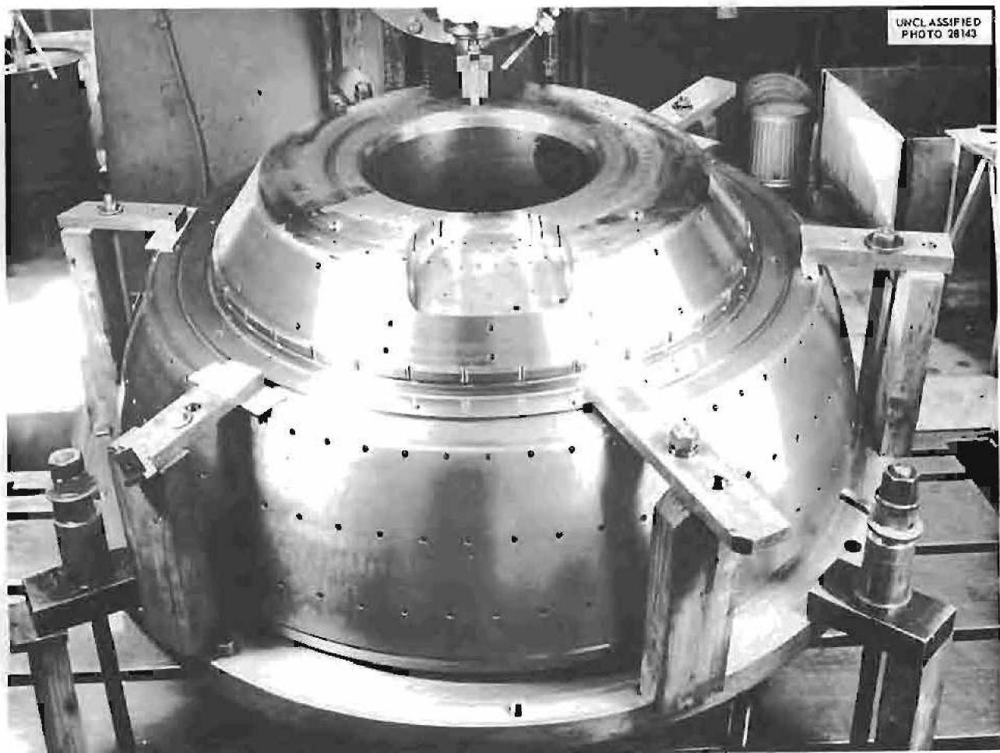  
Fig. 1.5.1. Upper Beryllium Hemisphere for ETU Reactor Assembly.

pickling after one of the heat-treating operations has resulted in excessive intergranular attack. It is possible that the surface of the shell may be cleaned without going below the tolerance on wall thickness.

A small parallel program has been initiated in an effort to fabricate the thin core shells by hot forming oversized parts and then finish machining them to final thickness. This seems to be a more positive approach to the problem; however, the metallurgical risks are theoretically greater since thicker stock, in which there is greater chance for flows, must be used, and there is none of the cold working of the raw material which is beneficial to the metallurgical structure if properly controlled.

# Island and Pressure Shell Liner

One set of beryllium island parts is complete, including the installation of the spacer ferrules.

No acceptable Inconel shell parts have been produced, however, as discussed above.

The lower section of the pressure shell liner is now to be fabricated by hot pressing and machining in lieu of combination cold forming, shear spinning, and machining. It is felt that the present plan is a safer approach, since there were so many unknowns in the cold forming and shear spinning aspects of the original plan. Bids for the fabrication of this component are being evaluated.

No fabrication work has been done to date on the $1_{16}$ -in.-thick shells to cover the shielding in the reactor. It is planned to fabricate the spherical sections of these parts by spinning and to fabricate the other sections by cold pressing.

# Fuel-to-NoK Heat Exchangers

The dual effort on fuel-to-NoK heat exchanger fabrication was evaluated, and Black, Sivolls &

Bryson was selected as the fabricator. All jigs, tools, and fixtures ordered and made by York Corp. are being transferred to Black, Sivalls & Bryson.

In the course of machining the first channel at Black, Sivalls & Bryson an error was discovered in the IBM data which was used to construct the cam. Corrections were made and the second channel machined showed the machining method to be satisfactory but demonstrated the need for changes in the method of forming the rough channel. The third channel is now being machined, and the second channel will be incorporated into a rough prototype assembly. The resistance-heating method of setting the tubes appears to be satisfactory, and enough tubes for the prototype have been formed.

# Assembly Methods Development

Weld shrinkage tests have continued, with a total of 24 tests being completed for the welds required for the $1/8$ , $1/4$ , and $1$ -in.-thick reactor shells. These tests have been performed in order to determine the magnitude of transverse and radial shell shrinkage as a result of the welding and to develop welding fixtures and procedures that will enable reasonably accurate prediction of shrinkage, distortion, and quality of the reactor core shell welds.

Test results have indicated that transverse shrinkage can be predicted to within $\pm 0.010$ in. for $1/8$ -in.-thick shells. Insufficient tests have been run with the heavier shell sections to estimate shrinkage variation. Very little success has been obtained in controlling the radial shrinkage. The concentricity of the parts has been held to within 0.010 in. total indicated reading, but the amount of radial shrinkage has varied from negligible values to 0.050 in. in the $1/8$ -in.-thick shells. Many of the tests have been performed on very poor quality rejected spun shells which have been very difficult to weld. The tests on shells that were closer to the required metallurgical and dimensional specifications have given much more usable welding data. An inner fuel-annulus core shell and welding fixture are shown in Fig. 1.5.2. This fixture is used in a lathe to align and support the shell during the welding operations.

The first test on the 1-in.-thick, 54-in.-dia hoops that simulated the reactor pressure shells showed the necessity of changing the reactor design to accommodate the radial shrinkage. These hoops

pulled in almost $\frac{1}{4}$ in. on the radius. The pressure shell design was changed from $1 -$ to $\frac{1}{2}$ in. thickness at the weld by tapering the cross section above the equator on the inner surface so that radial shrinkage would not restrict the flow passage or interfere with the shell liner. Additional tests must be performed on the thicker shells, and preparations are under way now to perform these tests.

Tests have been completed on spot welding 0.100-in.-thick stainless-steel-clad Cu-B $^4 C$ cermet shielding material to 0.250-in.-thick Inconel, and satisfactory results were obtained. Satisfactory results have also been obtained in spot welding the 0.005-in.-thick stainless steel cons of the copper-coated B $^4 C$ tiles to the stainless steel cladding of the Cu-B $^4 C$ cermets.

The reactor assembly procedures are being reviewed continually, and revisions are being incorporated as design changes and better assembly techniques are conceived. The reactor assembly area is complete except for one main section of floor reinforcement. The security enclosure around the assembly, inspection, cleaning, and storage areas is complete, and isolation from the remainder of the building will be effected when major reactor assembly operations begin.

# ETU FACILITY

G. D. Whitman

P.A.Gnadt A.M.Smith

All installation work on the ETU facility has been tentatively stopped until July 1, 1957, and the present status of the facility is described below:

1. bench fabrication of the main and auxiliary NaK piping $90\%$ complete;   
2. installation of the main furnace circuits approximately $70\%$ complete; no installation work started on the isothermal or auxiliary circuits;   
3. all cold-trap circuit components available for assembly;   
4. all floor supports installed;   
5. main air duct installation approximately $50\%$ complete; all parts available for installation;   
6. control room complete, except for a few miscellaneous items;   
7. intermediate runs of the auxiliary piping in the basement approximately $80\%$ complete; no additional work scheduled until components delivered;

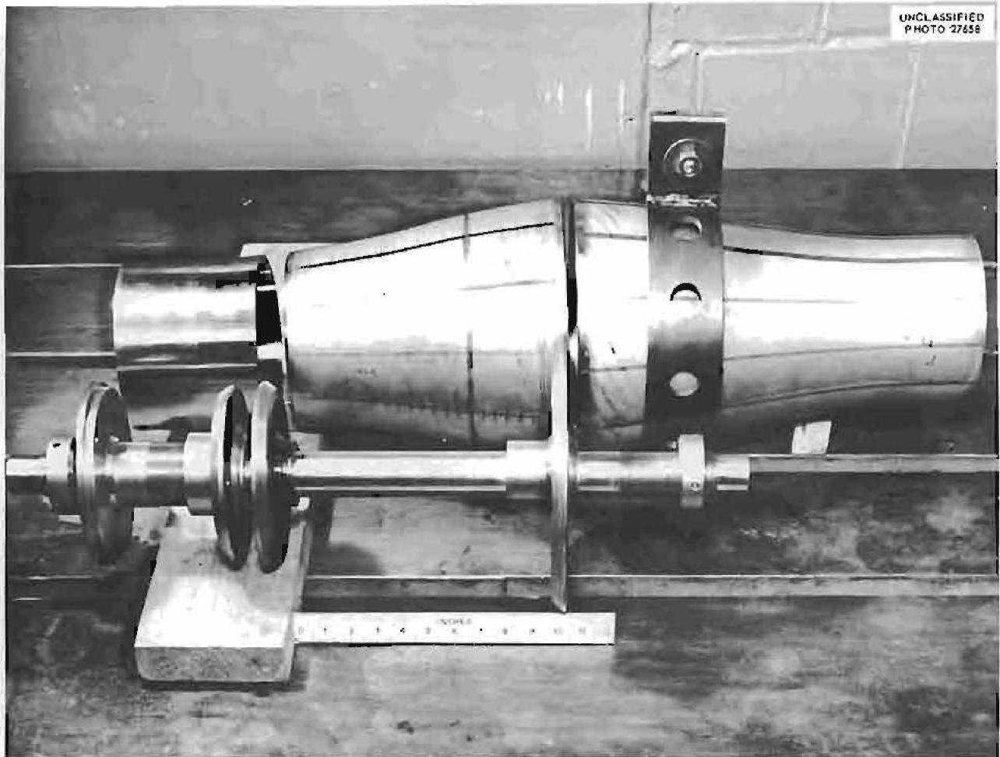  
Fig. 1.5.2. Inner Fuel Annulus Core Shell and Welding Fixture.

8. installation of the cable trays for the bosemement area $80\%$ complete; other normal electrical system installation work not started;   
9. emergency electrical system $95\%$ complete.

The following equipment is now on hand and ready for installation:

1. main and auxiliary NaK pump drive motors,   
2. main NaK pump drive motor controller and resistor units,   
3. all tubular and clamshell heaters,   
4. all pipe and components for fabrication and installation of cold-trap systems,   
5. NaK dump tanks for the isothermal and auxiliary circuits,   
6. induction regulators and Powerstots for voltage adjustment of heaters,   
7. motor control centers for hydraulic and lube oil pump motors.

Fabrication of long-term delivery components needed to complete the facility is under way on the following items:

1. all NaK pump stationary assemblies,   
2. furnace drain tanks,   
3. NaK-to-air radiators,   
4. NoK system flowmeters,   
5. isothermal-system throttling valves,   
6. control panels,   
7. hydraulic drive and lube oil packages.

Major efforts will be expended on these items since they affect the facility completion date. Some of these items are still in the development and testing stage, and therefore delivery dates cannot be quoted. Flowmeters are being calibrated in NoK pump component development tests. The delivery of these flowmeters is contingent upon the calibration test results, which are, in

turn, contingent upon the success of the NaK pump tests.

The NaK-to-air radiators are being fabricated by the York Corp., and several development problems in brazing techniques must be resolved before a delivery date can be established. Acceptable brazed fin sections have been produced, but a recent design change makes the fin bank more flexible, and sagging may occur during the brazing cycles.

The lube oil systems are nearly completed, but the units have not been tested. Delivery dates for these items are scheduled early enough to fit in with other piping work; however, leak testing and operational testing results may indicate unforeseen difficulties.

Major difficulties have been encountered in testing hydraulic drive units similar to the drives originally specified for use in the ETU. These difficulties have made it necessary to hold the purchase order for ETU units in abeyance until revised units can be proved. The specifications are being rewritten.

Detailed design of the NaK systems piping and supports is approximately $75\%$ complete, and the detailed electrical distribution design is approximately $75\%$ complete. The design of the auxiliary service piping external to the rest cell is approximately $25\%$ complete. Preliminary estimates show an expected ETU facility completion date, exclusive of the reactor and its associated equipment, of September 1, 1958.

# TEST CELL COMPONENTS

G. D. Whitman

A.M. Smith

A re-evaluation of the ETU program has brought about several changes in connection with items to be placed within the test cell that simulates the ART cell. The equatorial and south-head lead shielding on the ETU has been eliminated, and this port of the shield contract with Knapp Mills was canceled. Design and fabrication of the equatorial section of the ART lead shielding was stopped until a review of the shielding requirements can be completed. This review and necessary engineering work is to be completed by June 1, 1957. The design of the south-head shield is being continued by the vendor.

Contracts for detail design and fabrication of the ART fuel fill-and-drain tank and reactor support structures were canceled. The detailed lay

outs necessary for fabrication are now being made by the local design group. Fabrication of both components is scheduled to be done in the local shops when the necessary design is complete.

Preliminary design of the ART fill-and-drain tank lead shield was completed, but the final design must await establishment of a firm design for the tank.

Detail design of the nuclear instrument pod, which was scheduled as part of the design work to be done by outside sources, has been reassigned to the ORNL Instrument and Controls Department.

The ETU fuel fill-and-drain tank supports that have been fabricated will have to be reworked because design changes have increased the length of these supports.

The present status of procurement and fabrication of other components is given below:

1. The ETU fuel fill-and-drain tank has been received.

2. Prototype fuel dump valves have been received and are being tested and evaluated.

3. Design of the sodium expansion tank was approved, and an order was placed for the necessary Inconel. Fabrication of the tanks for the ETU and ART will be done by the local shops.

4. A contract for fabrication of the ETU and ART NaK manifolds has been let to the Midwest Piping Company, and they are now in the process of doing development work on bends and nozzle-to-header welds and of qualifying welders.

5. Design of the hydraulic oil piping inside the cell has been completed, and purchase orders were issued for procurement of the materials required for both the ETU and the ART cells.

6. The sodium system plugging indicator for use on the ETU and the two ART auxiliary piping junction panels were completed.

7. Fabrication of the ART enricher and enricher line assembly has continued without appreciable difficulty.

8. Welding procedures and designs for the joints between the bellows and nipple on the twelve junction panel expansion joints have been approved and the vendor is proceeding with fabrication.

Design work on other components inside the cell is continuing. Preliminary design layouts for the fuel-recovery tank, fuel overflow and off-gas piping, lube oil piping, and the north-head lead shielding are now being made. In addition, design

layers showing equipment locations at various elevations throughout both cells were started.

ART FACILITY

F. R. McQuilkin

Test Facility

W. F. Ferguson

G.C.Robinson

J.M.Mills, Jr.

R. D. Stulting

Contract work on the ART facility has been contracted in four stages established by the design program. The first two stages, packages 1 and A, which included building alterations, building additions, cell installation, and installation of auxiliary services piping, have been completed. The third stage, package 2, which included the installation of diesel generators and facility, electrical control centers, and spectrometer-room electrical and air conditioning equipment, was completed on February 20, 1957. The fourth stage, package 3A, which includes a distribution system for supplying electrical power to the pipe heaters and equipment heaters, a dry-air plant, and a building to house the air plant and wound-rotor-motor controllers, is $28.2\%$ complete.

As reported previously, the contract for package 3A work was awarded to the Rentenbach Engineering Company, effective December 7, 1956, at a contract price of $114,434, with a contract completion date of April 25, 1957.

Work performed during the quarter on package 2 included the completion of installation of anchor bolts and support plates in the penthouse walls, wiring of diesel-generator control panels, tests of the air compressor and fuel oil piping for the diesel units, and diesel-generator equipment operational and performance tests.

During the testing of the diesel-generator equipment the Caterpillar unit generator bearings were damaged because of improper lubrication and had to be replaced. The control equipment required minor design and wiring changes. The performance testing consisted in operating each generator in parallel with a common generator and loading with two 250-hp main blowers, which is approximately $60\%$ of full capacity of the two units. Necessary governor, voltage-regulator, and cross-current-compensator adjustments were made to give satisfactory load and current division. The five generator units were paralleled and satisfactorily loaded with the available load. Additional per

formance tests will be made when a larger test load is available.

Work performed during the quarter on package 3A included excavation, installation of underground piping, pouring of the footings, and erection of steel and siding for the compressor house, rearrangement of the electrical panels in the center basement, and installation of conduit and cable trays from the switch house to the heater distribution panel area.

Package 3 work on the design of the process piping and process equipment has continued. Procurement was initiated for the absorber pit piping, material for heat barrier doors, and steel for the fuel fill-and-drain tank coolant system pump supports.

# Disassembly Facility

A.A. Abbatiello

V. J. Kelleghun

J.H.Dowdy

L. W. Love²

M.G.Willey

Plans for removing and sectioning the ART after operation were studied further, with one objective being the determination of the important dimensions which must be taken during assembly in order to have basic information available with which to compare the changes after the reactor has been operated. It is apparent that much work will be required to take the measurements and to set up the sequence of disassembly cuts required to obtain meaningful data. This work is urgent because fixed reference points must be established in the assembly and "as built" dimensions must be obtained.

The hydraulic shear which has been tested appears to be an excellent severing device, and it can be remotely operated to cut and partially seal off lines. This was demonstrated with the use of a temporary closed-circuit television system. A further advantage of this device is that shearing dispenses the minimum of activity into the air as compared with the sowing and grinding methods also considered.3 Bids have been invited for a shear capable of cutting the $3\frac{1}{2}$ -in. sched-40 Inconel lines in the NoK system and operable from

a remote suspension. This would be the main cutting device used to remove the ART from the test cell. The locations of lines within the test cell have been studied to assure their accessibility if they must be severed with a remotely controlled device. The detailed operations to be undertaken in the hot cell are also being studied. In general, welds will be cut away and the reactor components will be removed in the reverse order of their assembly.

Conceptual designs based on the interlocking drilled or milled hole method of disassembly have been made for the principal items of heavy equipment needed in the hot cell. The interlocking hole technique was selected because it permits the greatest flexibility in the cut location with the minimum spread of activity. It is planned currently that the two main hot-cell tools will be a turntable mounted on a hydraulic lift, which will support the reactor, and a Bridgeport type of universal milling head carried on a cantilever floor mount, which will drive the cutting tool.

Tentative design criteria were prepared for the proposed disassembly facility. A large hot cell, 20 ft wide, 76 ft long, and 36 ft high, is to be

provided that will be divided into two rooms by a pair of shielding doors constructed of high-density concrete $4\frac{1}{2}$ ft thick. The cell equipment layout and tooling criteria will be more completely determined before more firm facility criteria are advanced.

A $12$ -scale model of the hot cell is now available. It is anticipated that the model will be a substantial aid in visualizing and analyzing the complex hot-cell techniques. The model is shown in Fig. 1.5.3 with the approximately 57-in.-dia reactor mounted on a turntable after the water and lead shields have been removed. Two floor-mounted milling machines are shown forward of the turntable, and proposed carriers for two overhead manipulators and a 30-ton crane are shown overhead. The longitudinal openings in the cell wall will provide means for determining optimum locations for viewing windows. Beyond the reactor can be seen a tank for decontamination of parts, as well as several parts and tools lying on the floor. The openings in the floor of each room provide access to the proposed underground tunnel for transfer of hot materials to storage or to smaller hot cells for subsequent component parts disassembly and close examination work.

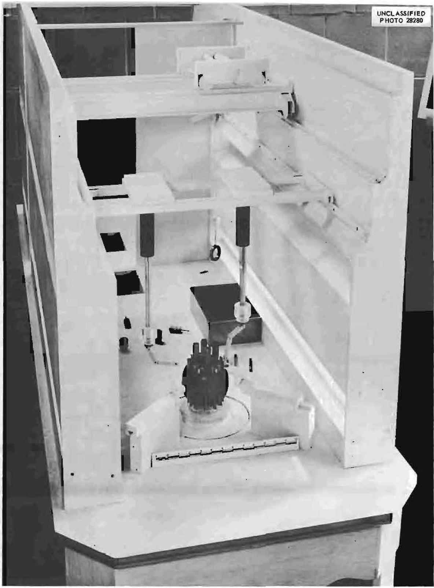  
Fig. 1.5.3. Study Model of Hot Cell for Disassembly of the ART After Operation.

# 1.6. ART, ETU, AND IN-PILE OPERATIONS

H.W.Savage

D. B. Trauger

# ART OPERATION PLANNING

W.B.Cottrell

C. W. Cunningham

R. A. Dreisbach

A critical review of the reactor system operability is being made, and conflicts among the design, construction, and instrumentation phases of the project are being resolved. A study was made of the manpower required during the various phases of operation of the ETU and the ART and the disassembly of the ART. The peak work load during operation of the ART will require 40 engineers and 18 technicians. Although the ETU operating crew will be about one third this size, all ART operating personnel will receive ETU operating experience. Furthermore, since the majority of project engineers have no experience in nuclear operations, arrangements are being made for training in the theoretical aspects of nuclear radiation, shielding, reactor theory, and control and for on-the-job experience at other operating reactors.

As a consequence of an extensive design review, supplementary provisions have been made for the containment of activity at the facility in the event of concurrent heat exchanger and radiator leaks, a number of design and instrument changes have been incorporated into the system, and additional component development tests have been scheduled to demonstrate the adequacy of the system for the prescribed test program. The final specifications of the test program will be based on the results of detailed analysis work and the component development test program (see Chaps. 1.1 and 1.4, "Aircraft Reactor Test Design" and "Component Development and Testing," respectively). In order to provide for the containment of activity in the event of concurrent heat exchanger and radiator leaks, the NaK system pressure will be maintained above that of the fuel at all points where a leak between the two systems could occur. In the event of a leak or leaks, this pressure will be maintained until either the activity has decayed to below seriously hazardous levels, or the NaK lines have been pinched off with remotely operated

clamps in order to seal the activity in the reactor away from the radiator leaks.

Further studies of the off-gas system have indicated the advisability of directing the reactor off-gas through the $\mathsf{ZrF}_4$ -vapor trap on the reactor without the option of using the vapor trap on the fill-and-drain tank if the reactor trap became restricted. Thus, the vapor trap on the fill-and-drain tank will never receive vapor from the reactor and should be in good condition when needed during a dump. Thus, it is expected that normal operation could continue without increased hazard even though the reactor vapor trap became restricted. Provisions are being made to bypass both traps. The equalizer line around the reactor vapor trap will be used during every dump, but the bypass around the vapor trap of the fill-and-drain tank will be for one-time emergency use only. Appropriate development tests that will simulate the different conditions to which the two traps will be subjected are to be performed. Unfortunately, it will not be possible to include fission gas heating, $20~\mathrm{W / cm}^3$ , in these tests. The postpower fuel-sampling system and the helium supply vent and bypass provisions to the fuel expansion tank are to be tested also.

The effect of xenon solubility in the ART fuel on the ability of the helium purge system to remove the xenon has been studied,2 and recent measurements have established a value for the solubility of xenon in the proposed reactor fuel (see Chap. 2.2, "Chemical Reactions in Molten Salts"). Therefore it was possible to predict the amount of xenon that will remain in the fuel for any given purge condition.3 Measurements will be taken in the ART of the xenon poisoning, which when compared with the calculated xenon poison effects should give a measure of the purging efficiency of the ART xenon removal system.

Procedures were prepared for filling the various systems with helium by pressurization and venting and for filling the NaK system with NaK. Although

bleed lines will have to be installed in the special NaK systems in order to fill the fill-and-drain tank tubes and annulus with NaK, recent pump tests indicate that the trapped gas in the auxiliary NaK system may be removed by the pump. If this is not so, bleed lines will have to be added to both auxiliary NaK systems. A drain line will be installed in each of the two special NaK systems in order to remove the NaK from the fill-and-drain tank. There will be some holdup of NaK in all NaK systems, but they will be flushed with kerosene and alcohol prior to disassembly.

Two independent analyses are to be made of the ART off-gas. First, a source from a branch of the off-gas line will be analyzed with a gamma-ray spectrometer. Because of the complexity of this off-gas and because of background, Compton scattering, shielding, and other effects, use of a 5-in. crystal is planned. The output of the crystal will be analyzed with a 256-channel analyzer. For the second analysis a suitable gas chromatography method will be used.

As a result of the various design studies, several significant changes have been made in the ART instrumentation and controls. The pressure regulator bypass around the fill-and-drain tank vent valves has been removed, and a pressure regulator has been added to the helium supply to provide better control and to limit the maximum pressure available for the filling operation. As stated above, an equalizer line has been provided from a point downstream of the vapor trap on the fill-and-drain tank to each of the fuel pump helium inlets to permit a fuel dump in the prescribed time even in the event that the reactor vapor trap is plugged. The equalizer line contains two solenoid valves in parallel, and check valves are located both in these bypass lines and in the helium supply lines where the two join ahead of both fuel pumps. The solenoid valves will be interlocked to open when the fuel drain valves are opened, and they will be manually operable from the control room at other times.

A line from the helium supply will be provided to admit gas into the fill-and-drain tank to periodically test the vapor trap for plugs. This line will have a fixed orifice and will include a solenoid valve, a pressure transmitter, and a check valve. The solenoid valves will be operated from the control room where the pressure will be continuously recorded.

The frangible-disk-operated valve for bypassing the vapor trap on the fill-and-drain tank will be energized on an emergency basis in the event of a plug in this vapor trap. A separate nitrogen supply has been provided for energizing the valve. The downstream taps of the two fuel expansion tank level indicators were moved to improve the reliability of the instruments in the event of a plug of the reactor vapor trap.

Provisions were made for venting the gas from the NaK pumps and dump tanks through a common vent header to the cell off-gas line. Two vacuum pumps in parallel with a bypass line and an isolation valve were provided in the cell off-gas line upstream of the charcoal bed and sample station. With these provisions it will be possible to maintain the cell at a pressure of 5 psia so that in the event of concurrent radiator and heat exchanger leaks, the cell may act as a sink for activity by venting the reactor fuel system to the cell. A vent connection was provided from the reactor off-gas line to the cell atmosphere that consists of a frangible-disk volve and a solenoid valve in a tee in the off-gas line downstream from the pressure control valve which maintains the reactor expansion tank pressure.

# ETU OPERATION PLANNING

W.B.Cottrell

C.W.Cunningham R.A.Dreisbach

S. M. DeCamp

The operation of the ETU is prerequisite to that of the ART, and the maintenance of ETU flow sheets, instrument lists, and valve tabulations is being emphasized. An instrument application tabulation was prepared which gives maximum, minimum, and normal values of the quantities to be measured, as well as the type of pickup instrument, location, and number required and the location, type, accuracy, and range for the reading instruments by which the various quantities are presented. A valve tabulation is currently being prepared.

A preliminary control block diagram was used as a basis for preparing a list of "emergency conditions for ETU operations." There will be no emergency conditions in the nuclear sense for the ETU reactor, but for training purposes it is proposed to set up annunciations of emergencies similar to those provided for in ART operation

planning, and insofar as possible the same procedures will be followed as would be required by such an emergency during ART operation.

# ART DISASSEMBLY PROCEDURES

W.B.Cottrell

W. E. Browning

R. P. Shields

A number of studies have been made of procedures for disassembling the ART, including disposal of radioactive materials. Water used to spray the inside of the test cell after operation of the ART will be highly contaminated. The Health Physics Division has recommended that this water be taken by truck to the tank farm at X-10. The Operations Division has a tank truck with a shielded cab and has indicated that it can be used for this purpose. One stipulation is that the water must be slightly alkaline. The problem of sodium and NaK disposal is still being investigated.

The method for effecting the remote cutting operations required within the test cell for removal of equipment is being studied, and several disadvantages of a proposed underwater operation have developed. The following factors are pertinent to this study.

1. Iron oxide and hydroxide are good scavengers for many types of radioactivity, especially strontium, and can be expected to concentrate activity.   
2. The following radiation levels would exist above the surface of water containing the indicated concentrations of radioactive strontium:

<table><tr><td>Concentration of Activity in the Water (curies/ml)</td><td>Dose 10 in. Above Surface (mr/hr)</td></tr><tr><td>0.35</td><td>18</td></tr><tr><td>1.5</td><td>85</td></tr><tr><td>1.9</td><td>110</td></tr></table>

3. Lead oxide metal paint adsorbs activity and is not easily decontaminated.   
4. Buoyancy and solubility effects in underwater cutting tend to remove contaminated materials from partially restricted areas where they might remain undisturbed in a gaseous atmosphere. Therefore, greater precautions must be taken to prevent escape of activity.

# IN-PILE EXPERIMENTATION

J.A.Conlin

In-Pile Loops

A shift of emphasis in ART supporting research has resulted in the cancellation of further in-pile loop tests of zirconium-fluoride-base fuels in Inconel systems. The information thus far obtained from the in-pile loop program has verified the results obtained through irradiation of capsules and through out-of-pile corrosion tests. The irradiation tests indicate that no substantial change in fuel properties or corrosion rate is to be expected because of radiation. Further in-pile loop tests will be initiated when suitable nickel-molybdenum alloys and lithium-base fuels are available.

In-pile loop No. 6, the operation of which was described previously,4 was cut up at NRTS and returned to the ORNL hot-cell facilities where it is awaiting disassembly and metallographic examination.

# Prototype In-Pile Pump

Future in-pile loop work will require a pump capable of operating for longer times and at higher temperatures than those used thus far. Therefore a development program has been initiated to extend the established operating range of the in-pile pump. To provide a margin of safety for future loop operation, the pump should be capable of operating at $1500^{\circ}\mathrm{F}$ at about $150\%$ of the present salt flow requirement and for 2000 hr. The shafts of each of the first two test pumps seized after approximately 1000 hr of operation as a result of zirconium fluoride accumulation around the shaft slinger. A third test, previously described, was set up for which a zirconium fluoride vapor trap of alumina was used and the circulated fuel mixture was NaF-ZrF4-UF4 (56-39-5 mole %, fuel 70). This pump satisfactorily met the required conditions by completing the 2000-hr test at $1500^{\circ}\mathrm{F}$ and

4500 rpm, which corresponds to a flow rate of 1.75 gpm at a 19-ft head. Postrun disassembly showed all pump parts to be in the as-built condition. There was some zirconium fluoride buildup on the pump housing surrounding the slinger but not enough to contact the shaft. The alumina in the vapor trap, which had operated for its design life, appeared to be fused and the trap was almost plugged; however, no difficulty had been experienced with the purge flow through the trap.

The results of the test justify the use of this pump in in-pile loops with maximum temperatures in the range of 1600 to $1650^{\circ}\mathrm{F}$ , which correspond to a pump temperature of $1500^{\circ}\mathrm{F}$ . This conclusion carries the limitation for zirconium-fluoride-base fuels, however, that the zirconium fluoride vapor pressure at pump temperatures must not exceed that of this test, $3.6\mathrm{mmHg}$ . Loop flow and test duration may also be increased safely over the previous limits.

# In-Pile Loop Heat Exchanger Tests

# C.C.Bolto

Future in-pile loops are expected to be operated at higher power densities for which the capacity, $30\mathrm{kw}$ , of the present in-pile loop heat exchanger is insufficient. A program was therefore initiated to develop a heat exchanger with a capacity of 45 kw or more. A test unit similar to a forced-convection loop with a resistance-heated section and a 5-gpm centrifugal pump was set up to accommodate various heat exchangers. The first series of tests were run on the standard in-pile loop heat exchanger to obtain data for comparison and to verify loop power generation data. Curves of heat removal vs air flow were obtained, and the results verified that with inlet air at a pressure of 90 psio a maximum of about 30 kw of heat can be removed.

In order to increase the capacity of the heat exchanger, water injection system was devised and

tested. This consisted of a small, high-pressure pump for injecting 0.12 gpm of water into the inlet air stream through a small shower-head nozzle. Preliminary calculations indicated that about 15 kw of heat should be absorbed by the heat of vaporization of the water alone. The test results showed an increase of only 2 to 3 kw, however, at all air flows. It was apparent that complete vaporization of the water was not obtained. Further development of this system was dropped because of the complications foreseen in developing an efficient water dispersion system for in-pile use. A second test heat exchanger with machined nickel fins has been designed and fabrication has been started.

# In-Pile Test of Moderator Material

# C.C.Bolto

The first in-pile test of moderator materials for use at high temperatures was completed. In this test four samples of beryllium oxide were irradiated in the HB-3 beam hole during two MTR cycles with gamma heat estimated at between 2 and $5\mathrm{W / g}$ and a fast neutron flux of about $10^{13}$ neutrons/cm²·sec. The high-temperature end of the capsule was normally at about $1500^{\circ}\mathrm{F}$ . The capsule was thermally cycled 32 times as a result of reactor power fluctuations, with temperature differentials ranging from 200 to $1400^{\circ}\mathrm{F}$ . The results of examination of the irradiated specimens are presented in Chap. 4.1, "Radiation Damage."

A second test assembly has been prepared for irradiation in the MTR which includes three capsules mounted side by side in a vertical position. A 1-in.-dia capsule contains three beryllium oxide specimens encased in a 0.020-in.-wall Inconel sheath; a 1.25-in.-dia capsule contains graphite encased in a 0.020-in.-wall nickel sheath; and a $\frac{1}{2}$ -in.-dia capsule contains zirconium hydride encased in a 0.025-in.-wall molybdenum sheath.

# 1.7. HEAT TRANSFER STUDIES

H.W.Hoffman

# ART FUEL-TO-NoX HEAT EXCHANGER

J. L. Wantford S. I. Cohen

Heat transfer studies of the delta-array heat exchanger were continued. Measurements were obtained in the laminar flow region for Reynolds moduli as low as 200. It may be seen from Fig. 1.7.1 that the data for Reynolds numbers of 500

J. L. Wantland and S. I. Cohen, ANP Quar. Prog. Rep. Dec. 31, 1956, ORNL-2221, p 277.

to 1000 are correlated by the equation

$$
\frac {N _ {N u}}{N _ {P r} ^ {0 . 4}} = 0. 4 7 N _ {R o} ^ {0. 3 6}.
$$

Below $N_{R_0} = 500$ the data fall progressively farther below the curve representing this correlating equation. However, the significance of these data is limited by experimental uncertainties relating to flow control and heat generation in

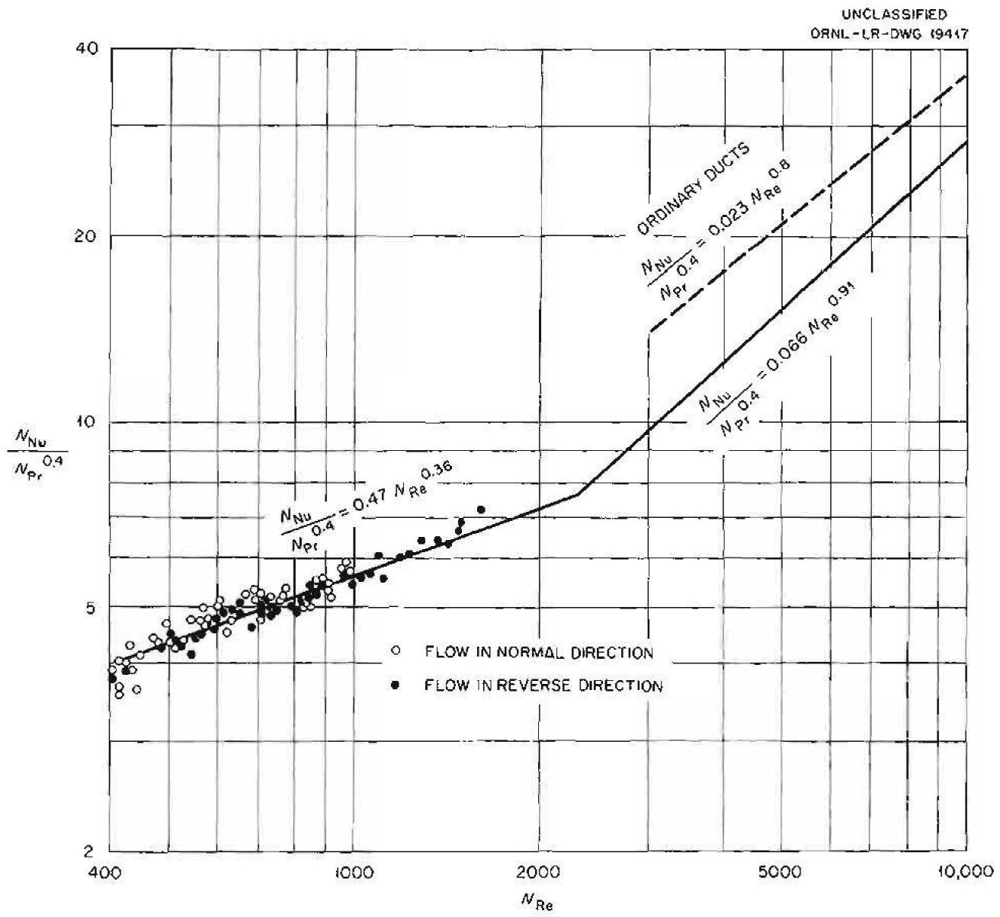  
Fig. 1.7.1. Heat Transfer Characteristics of the Delta-Array Heat Exchanger.

this very low Reynolds modulus region. At these low Reynolds moduli, the effects of natural convection assume greater importance in the total heat transfer. In order to evaluate the natural-convection contribution, the system was operated with flow in both directions through the heat exchanger. If the natural-convection mechanism is involved, the heat transfer for flow in the reverse direction (downward through the exchanger) should be less than that for flow in the normal direction. The data presented in Fig. 1.7.1 show no effect of natural convection over the Reynolds modulus range examined. From considerations of

the geometry and orientation of the heat exchanger, this result was to be expected.

Additional fluid friction data were obtained for the fuel side of a straight-tube model of the ART fuel-to-Nak heat exchanger. The data now available cover the Reynolds modulus range of 150 to 8000. The new data are shown in Fig. 1.7.2, along with the previously reported results. For comparison, the predictions based on experimental measurements with a 100-tube bundle having a similar spacing configuration are given also in Fig. 1.7.2. In the range from $N_{R_e} = 1000$ to $N_{R_e} = 500$ , the data fall along the extrapolation of the earlier data. Over

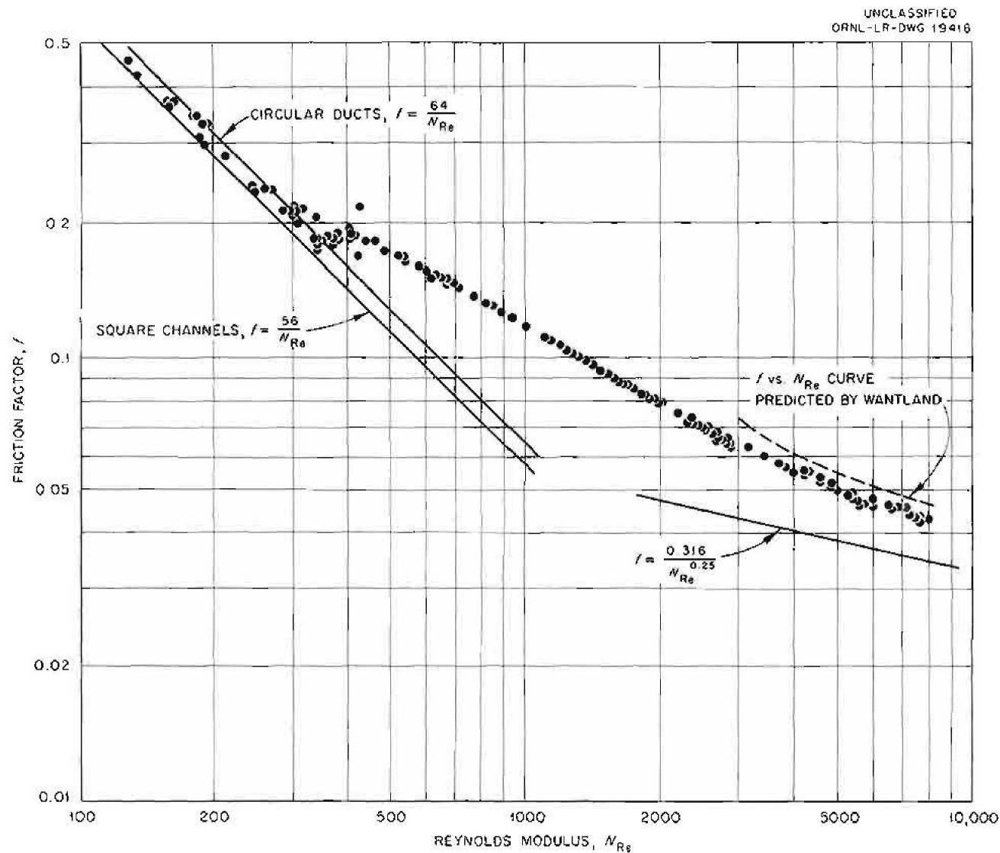  
Fig. 1.7.2. Fluid Friction Characteristics on the Fuel Side of a Straight-Tube Model of the ART Fuel-to-NoK Heat Exchanger. (Secret with caption)

the range $N_{R_0} = 500$ to $N_{R_0} = 3000$ , the data can be specified by the equation

$$
f = \frac {5 . 7}{N _ {R o} ^ {0 . 5 6}}.
$$

In the laminar region the data lie between the curves $f = 56 / N_{\text{Re}}$ , for square channels, and $f = 64 / N_{\text{Re}}$ for circular ducts. The early transition, in the vicinity of $N_{\text{Re}} = 400$ , results from the turbulent wakes behind the heat exchanger spacers.

Preliminary designs were made of a system for studying the heat transfer and velocity structures in a single fuel-side channel of an ART type of heat exchanger for both the square- and the delta-tube arrangements shown in Fig. 1.7.3. For the velocity profile determinations, the apparatus will be constructed of Plexiglas so that the profiles can be visualized and photographed by using the phosphorescent particle technique. The heat transfer experiments will be conducted in channels with flow cross sections identical to those used in the flow visualization studies. The individual tube sections will be constructed of stainless steel and will be electrically insulated from each other. Heat will be generated electrically in the tube sections and will be transferred to the water flowing through the test unit. It will be possible in this system to obtain the peripheral variation of the heat transfer coefficient.

# ART HYDRODYNAMICS

L.D.Polmer F.E.Lynch

G. L. Muller3

# Core Hydrodynamics

Earlier experimental studies of flow stabilization in reactor cores demonstrated the value of screens placed in the diverging portion of the flow channel. These experiments were made with an axial-flow entrance system. Measurements are now planned

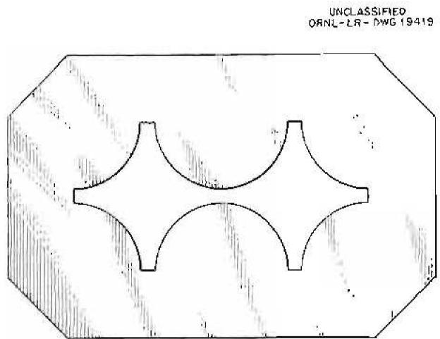  
{0} SQUARE ARRAY

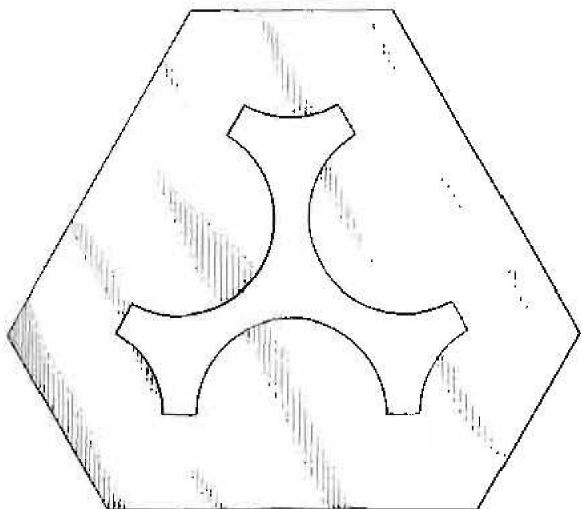  
(b) DELTA ARRAY   
Fig. 1.7.3. Typical Flow Channels for Velocity Profile Visualization Studies of Parallel-Tube Heat Exchangers.

with a swirl entrance system similar to that of the ART core header to determine the effect of screens on the hydrodynamic pattern of this system. The experimental system will again involve the 10/44-scale model of the ART core, along with provision for the introduction of various mesh screens at a number of planes in the diverging half of the channel. Preliminary calculations indicate that the pressure unbalances in the present ART header are of the same order of magnitude as the friction losses through the core. Under these conditions peripheral flow asymmetries in the core could develop. Such flow asymmetries were seen in velocity measurements in the full-scale Plexiglas

model of the ART core. Because of the velocity-modifying power of the screens and the cross-mixing between parallel streams flowing through the core, the extent to which these peripheral flow variations are "ironed-out" cannot be predicted. Thus, experimental observations with the core models are necessary.

Some calculations were made of the temperatures to be expected in such flow-stabilizing screens during reactor operation. The analysis indicated that the screens would be essentially at the fluid environment temperature during normal operation. During a fuel dump the screens would be subjected to gamma-ray heating without the cooling normally afforded by the flowing fuel. If one-dimensional heat conduction was assumed as the only heat-removal mechanism and the internal heat source was taken to be $8\mathrm{W / cm}^3$ a maximum screen-to-wall temperature difference of $1100^{\circ}\mathrm{F}$ was obtained. Thus, for a wall temperature of $1100^{\circ}\mathrm{F}$ , the maximum screen temperature would be $2200^{\circ}\mathrm{F}$ . This calculation provides a conservative upper limit in that natural-convection heat transfer to the surrounding helium and radiation heat transfer to the cooler walls were not considered.

# Instantaneous Velocity Profile Measurements

The program of photographic recording of instantaneous velocity profiles by using the phosphorescent dye technique has included studies with circular tubes of several diameters, a two-dimensional diffuser with a half angle of 8 deg, and a l-in. spiral. Examples of laminar flow in a circular tube and turbulent flow in the spiral were presented previously. Further illustrations under other flow conditions and different geometries

are given in Figs. 1.7.4 and 1.7.5. Figure 1.7.4 is a photograph of a turbulent-flow profile $(N_{R\bullet} = 27,000)$ in a 3-in. glass pipe. Figure 1.7.5 shows a group of three photographs of flow profiles in the diffuser over a Reynolds modulus range of 7000 to 8750. In part (a) of Fig. 1.7.5 the maximum velocity occurs close to the left wall of the channel. In part (b) the position of the maximum has shifted closer to the channel center, and the beginning of a reverse flow region on the right wall can be seen. In part (c) well-developed reverse flow is apparent. This shifting of the velocity pattern is not rapid in the diffuser studied, the photographs being taken during an entire afternoon of intermittent system operation. After each photograph the velocity in the system was increased sufficiently to ensure removal of all

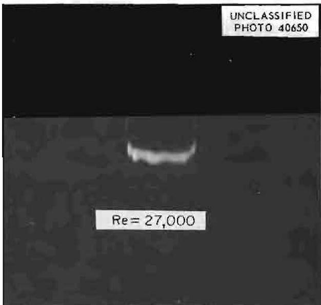  
Fig. 1.7.4. Turbulent-Flow Velocity Profile in a 3-in. Glass Pipe.

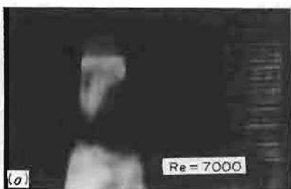

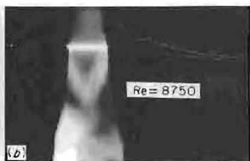

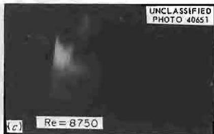  
Fig. 1.7.5. Velocity Profiles in a $\frac{1}{4} \times 6$ in. Diffuser with an 8-deg Half Angle.

the phosphorescent dye from the tubing walls. The flow was then reset to the desired test value and the system was allowed to reach equilibrium conditions before the next photograph was taken.

To obtain quantitative information on the fluid velocities, the profile photograph must be superimposed on a grid photograph. The grid is placed within the test section so that it lies in the plane of the collimated light beam used to obtain the velocity profile. The system is filled with water and a photograph is taken. Thus, the same distortion will exist in both the velocity profiles and the grid photographs. During this operation the camera remains rigidly positioned.

The velocity profile in the composite photograph of Fig. 1.7.6 was taken at a Reynolds modulus of 10,000 in a $2\frac{1}{2}$ -in. plastic tube. The slight dip in the profile near the tube center probably results from the particular entrance conditions of the test unit. The time interval for this picture (the time that elapsed between the flash of the collimated light beam which excites the phosphorescent particles and the opening of the camera shutter) was 0.2373 sec. The Reynolds modulus

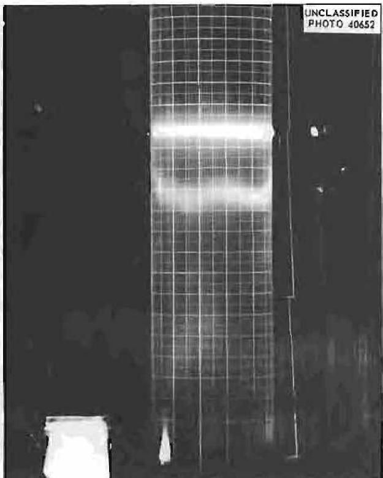  
Fig. 1.7.6. Composite of Grid and Velocity Profile Photographs for Flow Through a $2\frac{1}{2}$ -in. Tube at o Reynolds Number of 10,000.

based on the mean velocity evaluated from the grid-photograph data checked with the system Reynolds modulus as determined by calibrated rotameters to within $10\%$ . Further studies over a wide Reynolds modulus range are planned. The results of these studies will be compared with data obtained by using more conventional techniques, such as pitot tubes and hot wires.

# HEAT TRANSFER IN REFLECTOR-MODERATED REACTOR CORES

N.D.Greene W.R.Gombill

# ART Core Heat Transfer

The hydrodynamic experiments in which screens were used in the 10/44-scale plastic core model indicated the need for further volume-heat-source studies of a similar geometry. A heat-generation analysis has shown that a number of fine-mesh plastic screens can be placed in the northern hemisphere of the core without drastic disturbance of the flux field. In the pores of the screens (the region in which the flux density is highest) the heat generated will be $2\frac{1}{2}$ times that in the free fluid. The effect of these regions of high temperature on the overall temperature field is made negligible by two factors: (1) the volume of fluid affected is only a very small percentage of the total fluid volume, and (2) the stringers of high-temperature fluid issuing from the screen pores are rapidly dissipated in the highly turbulent wakes behind the screen wires. Such local increases in heat generation would be limited to resistance-heated systems, and thus similar screens in the ART core would not be subjected to the higher temperatures. Wall-temperature measurements will be made in the regions between the screens, as well as in the undisturbed southern hemisphere of the core. Fluid temperatures will be obtained with the adjustable thermocouple probes located at the core outlet. These probes will be used both to survey the fluid radially in a fixed axial plane and to investigate temperature-time correlations between the four thermocouple probes. These latter studies will be made for both the swirl entrance system with the core screens and for the swirl entrance alone. It is hoped that the results of these experiments will shed additional light on the origins of the temperature fluctuations which have been observed in the ART type of core geometry.

# Vortex Tube Heat Transfer

A volume-heat-source experiment was designed that utilizes the vortex flow principle. For these measurements a uniform volume heat source will be generated electrically within a sulfuric acid solution flowing through an insulated cylindrical pipe. The desired fluid velocity profile will be created by vanes in the entrance section of the tube. Both steady-state and transient temperature measurements will be obtained by using surface, as well as fluid, thermocouples. The fluid thermocouples will be located at the tube exit and will provide a radial traverse of the tube.

A similar experiment will involve the measurement of heat transfer coefficients in a heated-tube system containing a liquid vortex. It is estimated that the heat transfer in this system will be greater than that for conventional flow of fluid through a tube. In such a system it may be possible to maintain satisfactorily low tube-well temperatures without secondary cooling. The effect of centrifugal forces on the temperature structure will also be investigated. Hydrodynamic studies of the stability of the fluid vortex and other phenomena at the interface between the vortex and the main fluid flow are currently in progress.

# THERMAL-CYCLING EXPERIMENTS

H.W.Hoffman D.P.Gregory

Studies with the system for thermally cycling Inconel tubing were continued in order to determine the effects of fluctuating temperatures and stresses on Inconel exposed to flowing $\mathsf{NaF - ZrF_4 - UF_4}$ (50-46-4 mole $\%$ fuel 30). The results obtained to date are summarized in Tables 1.7.1, 1.7.2, and 1.7.3. Figures 1.7.7 through 1.7.14 show the maximum penetration observed in the test sections used for the experiments described in Tables 1.7.1, 1.7.2, and 1.7.3.

In order to investigate the possible effect on the depth of attack in Inconel of the interaction between the heater section and the test section and of the heater length, an experiment was performed (ET-S) in which the entire 12-in. test unit served as a heater. The heater was subjected to

temperature cycling under the same wall-temperature-difference conditions as existed in the test sections used in runs ET-H and ET-O. The test unit for run ET-H was divided into a 4-in. heater and an 8-in. test section, while the test unit for run ET-O was on 8-in. heater and a 4-in. test section. From the data in Table 1.7.1, it may be seen that the general subsurface-void formation was approximately the same in all three test sections. However, the ET-H test section showed deeper intergranular stringers than the ET-O test section. The specimen taken from the test unit for run ET-S showed a tendency toward intergranular attack in the regions of deepest penetration. The exposure times for runs ET-H and ET-O were approximately the same, while run ET-S lasted 16 hr less than ET-H. Although it is difficult to draw specific conclusions on the basis of these three runs alone, it appears that the heater-test section interaction and the heater length may not have significant effects on attack in this thermal-cycling system. This result possibly could have been predicted on the basis of the surface area-to-volume ratios in the system.

The results of run ET-S probably cannot be compared directly with those from runs ET-H and ET-O from the stress standpoint. The temperature difference across the volume-heated metal wall of the ET-S test section was less than that of the test sections used for runs ET-H and ET-O. Since the thermally induced stress is a function of the temperature gradient in the wall, it is to be expected that the stresses in run ET-S were lower than those in runs ET-H and ET-O. Therefore, run ET-T was made under temperature and geometry conditions identical to those of run ET-S with, however, continuous thermal cycling. Since run ET-T lasted for 97 hr, while run ET-S lasted for only 50 hr, the test unit used for run ET-T was at the system maximum temperature approximately four times as long as was the test unit used for run ET-S. A comparison of Figs. 1.7.12 and 1.7.13 shows that somewhat deeper attack occurred in run ET-T than in run ET-S. Further, while the number of voids in the specimen from run ET-T is less than in the specimen from run ET-S, the ET-T voids are much larger. Additional data must be obtained before hypotheses can be based on these results.

The series of runs ET-O, ET-P, and ET-Q was designed to obtain a comparison of the effects of low-frequency, high-frequency, and isothermal

Flowing NaF-ZrF4-UF4 (50-46-4 Mole %, Fuel 30)

Cycling rate: 0.4 cps

Tubing size: $\frac{1}{4}$ in. OD, 0.035-in. wall

Table 1.7.1. Results of High-Frequency Thermal-Cycling Tests of Inconel Tubing Exposed to   

<table><tr><td rowspan="3">Run</td><td rowspan="3">Duration of Run (hr)</td><td colspan="5">Heater Section</td><td colspan="4">Test Section</td><td rowspan="3">Inlet Mixed Mean and Tank Temperature (°F)</td></tr><tr><td rowspan="2">Length (in.)</td><td colspan="2">Interface Temperature (°F)</td><td colspan="2">Maximum Depth of Attack (mils) and Type of Subsurface Voids</td><td colspan="2">Interface Temperature (°F)</td><td colspan="2">Maximum Depth of Attack (mils) and Type of Subsurface Voids</td></tr><tr><td>Average</td><td>Fluctuation</td><td>General</td><td>Intergranular</td><td>Average</td><td>Fluctuation</td><td>General</td><td>Intergranular</td></tr><tr><td>ET-A</td><td>16</td><td>4</td><td>1455</td><td>180</td><td>6</td><td>6</td><td>1273</td><td>8</td><td>0</td><td>1</td><td>1260</td></tr><tr><td></td><td>14</td><td></td><td>1546</td><td>225</td><td></td><td></td><td>1273</td><td>12</td><td></td><td></td><td></td></tr><tr><td>-B</td><td>240</td><td>4</td><td>1415</td><td>170</td><td>9</td><td>None</td><td>1330</td><td>17</td><td>2</td><td>None</td><td>1250</td></tr><tr><td>-C</td><td>4</td><td>4</td><td>1755</td><td>189</td><td>None</td><td>2.5</td><td>1613</td><td>37</td><td>2</td><td>None</td><td></td></tr><tr><td>-D</td><td>14</td><td>4</td><td>1845</td><td>240</td><td>None</td><td>8</td><td>1590</td><td>83</td><td>4</td><td>None</td><td>1580</td></tr><tr><td>-E</td><td>5</td><td>4</td><td>1905</td><td>235</td><td>None</td><td>8</td><td>1635</td><td>43</td><td>3</td><td>None</td><td>1600</td></tr><tr><td>-G</td><td>23</td><td>4</td><td>1760</td><td>190</td><td>None</td><td>4</td><td>1583</td><td>13</td><td>4</td><td>None</td><td>1545</td></tr><tr><td>-H</td><td>66</td><td>4</td><td>1730</td><td>125</td><td>None</td><td>11</td><td>1600</td><td>32</td><td>6.5</td><td>9*</td><td>1570</td></tr><tr><td>-I</td><td>106</td><td>4</td><td>1850</td><td>125</td><td>None</td><td>9</td><td>1600</td><td>22</td><td>7.5</td><td>None</td><td>1575</td></tr><tr><td>-N</td><td>13</td><td>8</td><td>1740</td><td>110</td><td>3</td><td>4.5</td><td>1640</td><td>16</td><td>5</td><td>None</td><td>1585</td></tr><tr><td>-O</td><td>59</td><td>8</td><td>1730</td><td>120</td><td>None</td><td>10</td><td>1600</td><td>20</td><td>5.5</td><td>6.5*</td><td>1565</td></tr><tr><td>-R</td><td>100</td><td>8</td><td>1750</td><td>100</td><td>None</td><td>9.5</td><td>1615</td><td>30</td><td>3.5</td><td>5.5*</td><td>1565</td></tr><tr><td>-S</td><td>50</td><td>12</td><td>1600</td><td>22</td><td>5.5</td><td>None</td><td></td><td></td><td></td><td></td><td>1570</td></tr><tr><td>-T</td><td>97</td><td>12</td><td>1600</td><td>25</td><td>None</td><td>7.5</td><td></td><td></td><td></td><td></td><td>1570</td></tr><tr><td>-U</td><td>100</td><td>8</td><td>1785</td><td>100</td><td>1.5</td><td>13.5</td><td>1625</td><td>20</td><td>4.5</td><td>6*</td><td>1560</td></tr></table>

\*The intergranular attack appeared as stringers of voids that were more localized than the general void formation.

Table 1.7.2. Results of Low-Frequency Thermal-Cycling Tests of Inconel Tubing Exposed to Flowing NaF-ZrF4-UF4 (50-46-4 Mole %, Fuel 30)

Cycling rate: 0.01 cps  
Tubing size: in. OD, 0.035-in. wall

Table 1.7.3. Results of Isothermal Tests of Inconel Tubing Exposed to Flowing NaF-ZrF4-UF4 (50-46-4 Mole %, Fuel 30)   

<table><tr><td rowspan="3">Run</td><td rowspan="3">Duration of Run (hr)</td><td colspan="4">Heater Section</td><td colspan="3">Test Section</td><td rowspan="3">Inlet Mixed Mean and Tonk Temperature (°F) and Temperature During Second Half of Cycle</td></tr><tr><td rowspan="2">Length (in.)</td><td rowspan="2">Interface Temperature (°F) During First Half of Cycle</td><td colspan="2">Maximum Depth of Attack (mils) and Type of Subsurface Voids</td><td rowspan="2">Interfoce Temperature (°F) During First Half of Cycle</td><td colspan="2">Maximum Depth of Attack (mils) and Type of Subsurface Voids</td></tr><tr><td>General</td><td>Intergranular</td><td>General</td><td>Intergranular</td></tr><tr><td>ET-J</td><td>23</td><td>4</td><td>1800</td><td>5</td><td>5</td><td>1622</td><td>2</td><td>None</td><td>1585</td></tr><tr><td>-K</td><td>100</td><td>4</td><td>1850</td><td>2</td><td>13.5</td><td>1640</td><td>2</td><td>7</td><td>1565</td></tr><tr><td>-Q</td><td>59</td><td>8</td><td>1850</td><td>None</td><td>9</td><td>1660</td><td>None</td><td>5.5</td><td>1600</td></tr></table>

Tubing size: 1/4 in. OD, 0.035-in. wall

<table><tr><td rowspan="2">Run</td><td rowspan="2">Duration of Run (hr)</td><td rowspan="2">Temperature (°F)</td><td colspan="2">Maximum Depth of Attack (mils) and Type of Subsurface-Void Formation</td></tr><tr><td>General</td><td>Intergranular</td></tr><tr><td>ET-F</td><td>5</td><td>1635</td><td>None</td><td>None</td></tr><tr><td>-M</td><td>100</td><td>1580</td><td>5</td><td>None</td></tr><tr><td>-P</td><td>59</td><td>1600</td><td>1</td><td>4</td></tr></table>

operation. The heater sections used for runs ET-O and ET-Q were 8 in. long. A fresh fluoride salt mixture was charged to a new system for run ET-O, and the same salt mixture and tanks were then used successively in runs ET-P and ET-Q. The results of these runs are shown in Figs. 1.7.8, 1.7.9, and 1.7.10. The specimen from high-frequency run ET-O shows a higher frequency of attack than does the specimen from the low-frequency run ET-Q. This comparison is in reasonable agreement with the previously reported comparisons of run ET-G with run ET-J and of run ET-I with run ET-K. The attack in the isothermal run ET-P, although higher than that ob

served under isothermal conditions in thermal convection or forced-circulation loops, is less than that for runs ET-O or ET-Q. The high isothermal attack may be the result of the surface areo-to-volume ratio present in this system. However, since even in the isothermal runs there was some low-temperature-difference low-frequency cycling, the explanation for the high isothermal attack is not yet clear.

Runs ET-R and ET-U (Figs. 1.7.11 and 1.7.14) were made under essentially identical temperature conditions. However, fresh salt and a new system were used for run ET-R, while the salt and system for run ET-U had been used successively through runs ET-R, ET-S, and ET-T (approximately 250 hr). The specimen from run ET-U shows a somewhat finer void size than does the specimen from run ET-R, but both specimens show intergranular

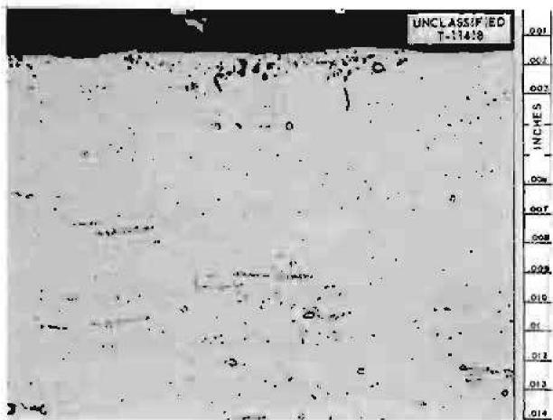  
Fig. 1.7.7. Run ET-M. Inconel Tubing After Exposure to Flowing NaF-ZrF4-UF4 (50-46-4 Male %, Fuel 30) at $1580^{\circ}\mathrm{F}$ (Isothermal) for 100 hr. Etchant: modified aquo regia. 250X. Reduced 32%. (Secret with caption)

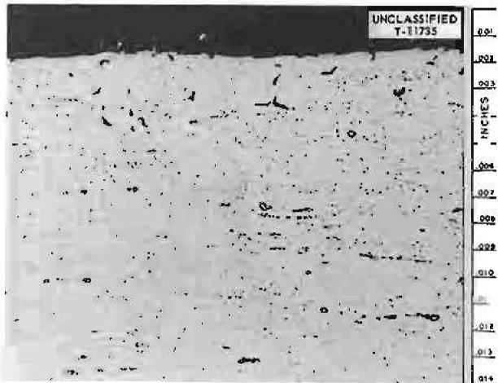  
Fig. 1.7.9. Run ET-P. Inconel Tubing After Exposure to Flowing NaF-ZrF4-UF4 (50-46-4 Mole %, Fuel 30) at $1600^{\circ}\mathrm{F}$ (Isothermal) for 59 hr. Etchant: modified aqua regia. 250X. Reduced 32%. (Secret with caption)

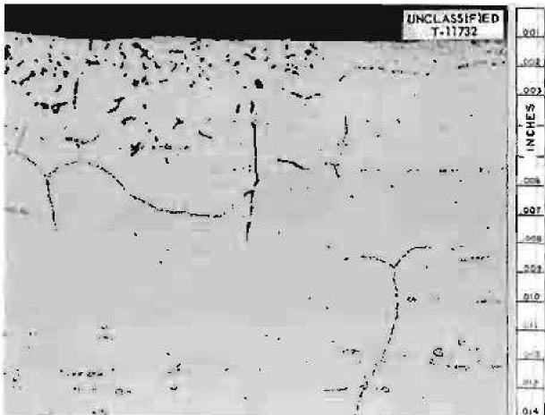  
Fig.1.7.8. Run ET-0, Specimen from Test Section of Inconel Tubing After Thermal Cycling While Exposed to Flowing NoF-ZrF4-UF4 (50-46-4 Mole %, Fuel 30). Cycle frequency: 0.4 cps. Cycle temperatures: 1600 ± 20°F. Duration of test: 59 hr. Etchant: modified aqua regia. 250X. Reduced 32% (Secret with caption)

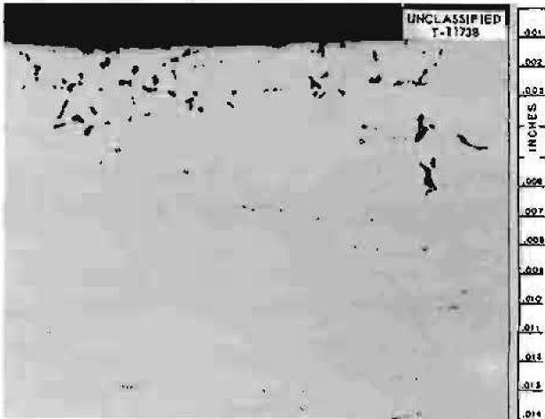  
Fig. 1,7,10. Run ET-Q. Specimen from Test Section of Inconel Tubing After Thermal Cycling While Exposed to Flowing NaF-ZrF4-UF4 (50-46-4 Mole %, Fuel 30). Cycle frequency: 0.01 cps. Cycle temperatures: $1660^{\circ}$ F during half of cycle and $1600^{\circ}$ F during other half of cycle. Duration of test: 59 hr. Etchant: modified aqua regio. 250X. Reduced 32%. (Secret with caption)

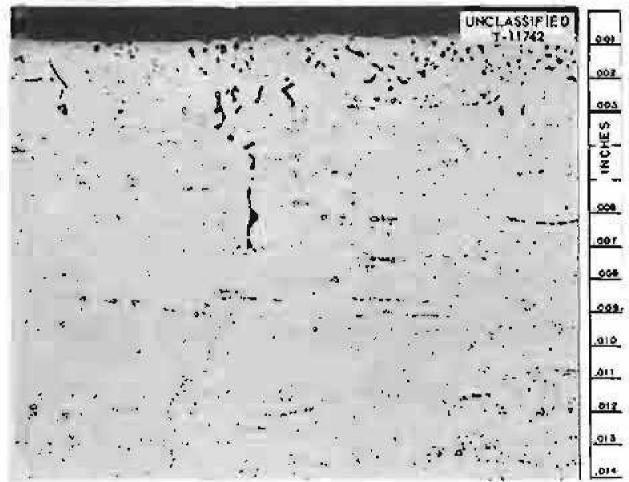  
Fig.1.7.11. Run ET-R. Specimen from Test Section of Inconel Tubing After Thermal Cycling While Exposed to Flowing NaF-ZrF4-UF4 (50-46-4 Mole %, Fuel 30). Cycle frequency: 0.4 cps. Cycle temperatures: 1615 ± 30°F. Duration of test 100 hr. Eschant: modified aqua regia. 250X. Reduced 32%. (Secret with caption)

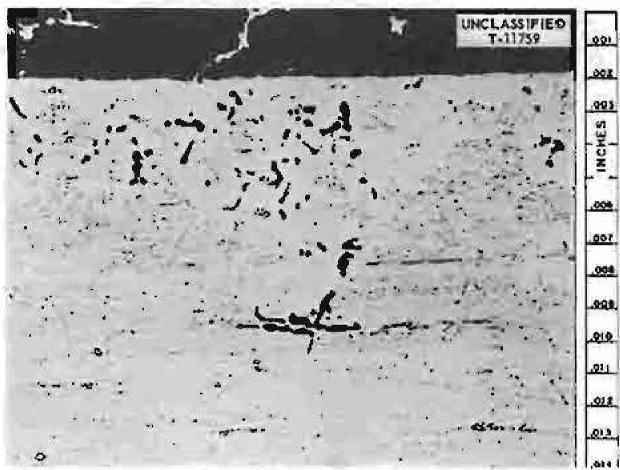  
Fig. 1.7.13. Run ET-T. Specimen from Heater Section of Inconel Tubing After Thermal Cycling While Exposed to Flowing NaF-ZrF4-UF4 (50-46-4 Mole %, Fuel 30). Cycle frequency: 0.4 cps. Cycle temperatures: 1600 ± 25°F. Duration of test: 97 hr. Etchant: modified aqua regia. 250X. Reduced 32%. (Secret with caption)

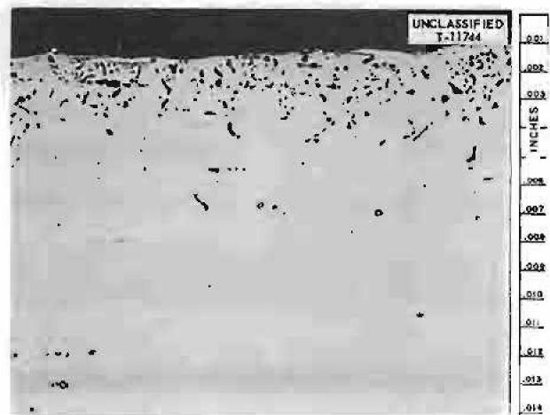  
Fig.1.7.12. Run ET-S, Specimen from Heater Section of Inconel Tubing After Thermal Cycling While Exposed to Flowing NaF-ZrF4-UF4 (50-46-4 Mole %, Fuel 30). Cycle frequency: 0.4 cps. Cycle temperatures: 1600 ± 22°C. Duration of test: 50 hr. Etchant: modified aquo regia. 250X. Reduced 32%. (Secret with caption)

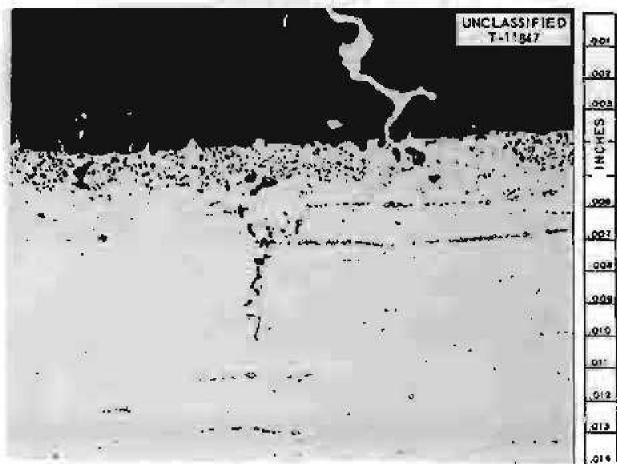  
Fig. 1.7.14. Run ET-U. Specimen from Test Section of Inconel Tubing After Thermal Cycling While Exposed to Flowing NaF-ZrF₄-UF₄ (50-46-4 Mole %, Fuel 30). Cycle frequency: 0.4 cps. Cycle temperatures: 1625 ± 20°F. Duration of test: 100 hr. Eschant: modified aqua regia, 250X. Reduced 32%. (Secret with caption)

stringers and general corrosion to approximately the same depths. Since the specimens from runs ET-R and ET-U are reasonable duplicates, it appears on the basis of these two runs that the thermal cycling results are independent (within limits) of the prior use of the salt mixture and the system.

# PHYSICAL PROPERTIES

5.1.Cohen

N. D. Greene

W.R.Gambill

W. D. Powers

# Enthalpy and Heat Capacity

The enthalpy and heat capacity for the mixture NaF-ZrF4-UF4 (50-25-25 mole %) were redetermined with the use of the copper-block calorimeter. In the previous measurements made with the use of Bunsen ice calorimeters, the heat capacity of this mixture was found to be 10.90 cal/g-atom, which was considerably higher than the average of 8.11 cal/g-atom found for all the other zirconium fluoride-containing salts studied. It was felt that this difference resulted in part from the high melting temperature of the salt mixture and the subsequent small temperature range over which the liquid was tested. The more precise measurement capable in the copper-block calorimeter resulted in a new value of 9.16 cal/g-atom for the NaF-ZrF4-UF4 (50-25-25 mole %) mixture. The results are listed below:

NaF-ZrF4-UF4(50-25-25 mole %)

Solid (120 to 458°C)

$$
\begin{array}{l} H _ {T} - H _ {3 0 ^ {\circ} C} = - 6. 2 0 + 0. 1 5 1 T \\ c _ {p} = 0. 1 5 1 \\ \end{array}
$$

8W. D. Powers and G. C. Blalock, Enthalpies and Heat Capacities of Solid and Molten Fluoride Mixtures, ORNL-1956 (Jan. 11, 1956).

Liquid (648 to 914°C)

$$
\begin{array}{l} H _ {T} - H _ {3 0 ^ {\circ} C} = - 4 0. 5 + 0. 3 2 3 T - \\ - (6. 8 7 \times 1 0 ^ {- 5}) T ^ {2} \\ \end{array}
$$

$$
\begin{array}{l} c _ {p} = 0. 3 2 3 - (1 3. 7 4 \times 1 0 ^ {- 5}) T \\ = 0. 2 2 7 a t 7 0 0 ^ {\circ} C \\ \end{array}
$$

Heat of fusion $(610^{\circ}C)$

$$
H _ {T} (\text {l i q}) - H _ {T} (\text {s o l i d}) = 4 5
$$

In these expressions

$$
\begin{array}{l} H = \text {e n t h a l p y i n c a l} g, \\ c _ {p} = \text {h e o t c a p o c i t y i n c o l / g .} ^ {\circ} C, \\ \end{array}
$$

T = temperature in °C.

Measurements are being made for obtaining the heat of fusion of the compound UF. To date only the enthalpy and the heat capacity in the solid state have been determined. The results are given below:

$$
\mathrm {U F} _ {4} (\text {s o l i d})
$$

$$
\begin{array}{l} H _ {T} - H _ {3 0 ^ {\circ} C} = - 2. 2 5 + 0. 0 8 5 T + \\ + (1. 5 2 \times 1 0 ^ {- 5}) T ^ {2} \\ \end{array}
$$

$$
c _ {p} = 0. 0 8 5 + (3. 0 4 \times 1 0 ^ {- 5}) T
$$

After several measurements of the liquid state (melting point of $\mathsf{UF}_4 = 1036^{\circ}\mathsf{C}$ ) were made, the capsules had weakened and one broke. A stronger capsule was therefore designed and is now being fabricated. The enthalpy data from both the solid and the liquid state measurements will be used to establish the heat of fusion of $\mathsf{UF}_4$ .

# Viscosity

Viscosity measurements were made for three mixtures in the NoF-RbF-ZrF4-UF4 system. The results, presented in Table 1.7.4, can be described

Table 1.7.4. Summary of Viscosity Measurements of Mixtures in the NoF-RbF-ZrF-UF System   

<table><tr><td colspan="4">Mixture Composition (mole %)</td><td rowspan="2">Liquidus Temperature (℃)</td><td colspan="3">Viscosity (centipoises)</td></tr><tr><td>No F</td><td>RbF</td><td>ZrF4</td><td>UF4</td><td>At 600°C</td><td>At 700°C</td><td>At 800°C</td></tr><tr><td>5.0</td><td>54.5</td><td>34.5</td><td>6.0</td><td>545</td><td>8.0</td><td>4.8</td><td>3.3</td></tr><tr><td>44.5</td><td>15.0</td><td>34.5</td><td>6.0</td><td>540</td><td>7.5</td><td>4.75</td><td>3.5</td></tr><tr><td>37.5</td><td>9.5</td><td>47.0</td><td>6.0</td><td>540</td><td>9.5</td><td>5.2</td><td>3.5</td></tr></table>

by the several schemes for viscosity correlation previously reported.

# Thermal Conductivity

The variable-gap device for the measurement of thermal conductivity was redesigned to eliminate the effects of varying the heating rate. Erratic results were obtained from measurements with two samples of the mixture $\mathsf{NaF - ZrF_4 - UF_4}$ (56-39-5 mole %) as the rate of heat flow was varied. The first modification of the system involved provisions for the measurement of the heat flow above and below the sample, and the modified system is currently being tested with liquids of known thermal conductivity. The design of a second device that incorporates a major modification of the variable-gap device was completed. The new design incorporates three sets of individually controllable

heaters, both above and below the test sample, in addition to a number of external guard heaters. Provisions were also made for many times the present number of thermocouples. With the many more heating circuits and thermocouples, it should be possible to ensure that one-dimensional heat flow will exist in the salt sample regardless of the rate of heat input.

# Electrical Conductivity

An Inconel conductivity cell for use in determining the specific electrical conductivity of liquid sodium and sodium-potassium alloy was designed and fabricated. The purpose of this investigation is to obtain reliable, absolute values of the conductivities of these metals in the temperature range of 200 to $1400^{\circ}\mathrm{F}$ for use in calibrating the ART electromagnetic flowmeters. The measurements of sodium-potassium alloys will cover those compositions of interest to the ANP program.

# Part 2

# CHEMISTRY

W. R. Grimes

# 2.1. PHASE EQUILIBRIUM STUDIES

C.J.Barton R.E.Moore R.E.Thoma H.Insley,Consultant

# MODIFICATION OF APPARATUS FOR THERMAL ANALYSIS

H, A. Friedman

Thermal analysis has been the most important exploratory technique used in phase-equilibrium studies at ORNL. For such analyses relatively large charges of melt (50 to 200 g) are maintained under a flowing atmosphere of helium and are stirred to assure homogeneity and to minimize temperature gradients in the liquid. Since several thermal excursions through the solidus and liquidus are used in each experiment, mixtures containing high concentrations of a volatile constituent change appreciably in composition during the experiment.

In order to minimize the losses by vaporization, a simple modification was made to the apparatus. The thermal analysis crucible is fitted with a disk of graphite that is drilled to accommodate the stirrer shaft and the thermocouple well. The diameter of the graphite disk is 0.1 in. less than the inside diameter of the crucible. When the charge of salt is melted, the graphite disk floats on the molten mixture, whose free surface is thus reduced nearly to zero. By using this technique it has been possible to subject samples containing 80 mole $\%$ $\mathsf{ZrF}_4$ to thermal analysis with negligible loss in weight of the sample.

# VISUAL OBSERVATION AND DIFFERENTIAL THERMAL ANALYSIS OF SMALL QUANTITIES OF FUSED SALTS

R.J.Sheil

The Leitz vacuum hot-stage microscope, which it was hoped could be used for visual observation of small quantities of fused salts in an inert atmosphere of high temperatures, was found to be unsatisfactory for this purpose. The design of the equipment permitted large thermal gradients

and made measurements of melt temperatures extremely unreliable. Since equipment that permits thermal data to be obtained with less than 1 g quantities of fused salts would be highly desirable for work with radioactive or toxic materials, the experience obtained with the commercial equipment was utilized in designing a new vacuum furnace that is adaptable to microscopic observation. This apparatus contains two concentric tubes of Alundum or other suitable insulating material. The inner tube is wound with a spiral of platinum-rhodium wire to provide resistance heating. A cylindrical nickel block 1 in. in diameter and 1 in. in thickness has a $\frac{1}{4}$ -in.-dia tube drilled in it to provide a sample compartment which can be lined with thin metal foil to facilitate removal of fused-salt samples. The furnace is enclosed in a vacuum-tight container equipped with a glass window through which the samples can be observed by means of a low-power microscope. Melt temperatures are measured with a thermocouple junction immersed directly in the melt.

This apparatus was tested initially for visual observation of liquidus and solidus temperatures by using approximately 0.15 g of the NaF-KF-LiF eutectic as the test material. When the sample was heated at a rate of about $17^{\circ}\mathrm{C / min}$ , values ranging from 444 to $457^{\circ}\mathrm{C}$ were obtained for the first appearance of liquid and from 464 to $475^{\circ}\mathrm{C}$ for complete melting. More consistent results were obtained upon cooling at approximately the same rate. Values ranging from 455 to $460^{\circ}\mathrm{C}$ for the first appearance of crystals and from 451 to $460^{\circ}\mathrm{C}$ for the solidus temperature were observed. A value of $459.5 \pm 1.5^{\circ}\mathrm{C}$ for the freezing point of this mixture was obtained by a different method by another ORNL investigator. The use of slower heating and cooling rates would undoubtedly improve the reproducibility of the data, but these preliminary visual observations indicated that reasonably accurate melt temperatures can be measured with only $150\mathrm{mg}$ of material.

Liquidus determinations by visual observation are subject to some uncertainty when the melts

are strongly colored, and therefore it seemed desirable to adapt this apparatus to the use of the differential thermal analysis technique. Only simple modifications to the apparatus were required. Two holes were drilled in the nickel block, symmetrically arranged, and two opposed thermocouple junctions, one for the sample and the other for the reference material (alumina), were introduced. The instrumentation is the same as that previously used for similar determinations. A Leeds & Northrup d-c amplifier is used to amplify the difference in emf between the opposed junctions before it is fed into an X-Y recorder. The temperature of the sample is recorded on the Y-axis of the recorder. Sharp breaks in the differential trace were obtained with the NaF-KF-LiF eutectic in both the heating and the cooling cycles. The heating breaks in three experiments varied from 457 to $459^{\circ}\mathrm{C}$ and the cooling breaks occurred at 461 and $459^{\circ}\mathrm{C}$ .

The principal difficulty observed with this apparatus has been failure to keep $\mathrm{NaF - ZrF_4}$ mixtures in the sample compartment regardless of the composition of the liner material. Similar behavior was observed with an $\mathrm{NaF - UF_4}$ mixture, in which case the liquid was seen to be leaving the compartment by way of the thermocouple wires. It is expected that wider spacing of the thermocouple wires and the use of taller containers will help to minimize and possibly eliminate the creep problem.

# THE SYSTEM LIF-UF4

H.A.Friedman

R.E.Moore

Recent quenching work with mixtures in the LiF-UF $_4$ systems that contain 20 to 32 mole $\%$ UF $_4$ has confirmed the liquidus and solidus relationships previously reported. $^3$ It was found, however, that the compound 4LiF-UF $_4$ undergoes very slow subsolidus decomposition to LiF and 7LiF-6UF $_4$ at about $470^{\circ}$ C. A series of samples of a mixture containing 28 mole $\%$ UF $_4$ , which originally contained no free LiF, was heated overnight and quenched from temperatures both above and below $470^{\circ}$ C. Just below $470^{\circ}$ C, LiF and 7LiF-6UF $_4$ were found, but, at still lower temperatures, 4LiF-UF $_4$ was found in addition to the other two

phases. Complete decomposition was apparently not achieved at the lower temperatures.

Thermal analysis studies showed that liquids containing 20 to 32 mole $\%$ UF4 undercool readily if the melt is first heated to over $800^{\circ}C$ . Two undercooling halts occur in the cooling curves at about 460 to $480^{\circ}C$ , and the resulting mixtures contain 4LiF. UF4, LiF, and 7LiF.6UF4. If the liquid is first heated only to $600^{\circ}C$ , the undercooling effect is absent, and a eutectic type of halt is obtained at about $490^{\circ}C$ . The solidified mixtures from this type of experiment contain only LiF and 7LiF.6UF4, which are the phases to be expected if 4LiF.6UF4 decomposes during the cooling; in this event the cooling curve should indicate a thermal effect at $470^{\circ}C$ , as well as the eutectic halt at about $490^{\circ}C$ . Because of the absence of the $470^{\circ}C$ effect and the sluggish nature of the decomposition of 4LiF.6UF4, it did not seem to be likely that the absence of 4LiF.6UF4 could be explained by its decomposition. These mixtures therefore had apparently cooled to a metastable eutectic between LiF and 7LiF.6UF4, which must freeze only a few degrees below the freezing point at $490^{\circ}C$ of the stable eutectic between 4LiF.6UF4 and 7LiF.6UF4.

In view of the existence of the peculiar thermal effects in the range 20 to 32 mole $\%$ UF $_4$ , a seeding experiment on a mixture containing 24 mole $\%$ UF $_4$ was conducted to be sure that the quenching results previously obtained truly characterize equilibrium conditions. The mixture was heated to over $800^{\circ}$ C and seeded upon cooling with small amounts of a mixture of the same composition that contained all the phases found in that region [LiF, 4LiF-UF $_4$ , 7LiF-6UF $_4$ , and "3LiF-UF $_4$ " (ref 4)]. The seed material was added at intervals of about $10^{\circ}$ C after the mixture had cooled to about $560^{\circ}$ C. The cooling curve had halts at 485 and $480^{\circ}$ C, with no evidence of undercooling. Petrographic examination of the mixture after it had cooled to room temperature showed that it consisted of 4LiF-UF $_4$ , 7LiF-6UF $_4$ , and a small amount of LiF. These results are in accordance with the results of quenching studies, except that the temperatures of the thermal effects are about $10^{\circ}$ C lower.

THE SYSTEM NoF-HFF 4

B. S. Londau H. A. Friedman

R, E. Thoma

The $\mathsf{Hf}^{4+}$ cation radius (0.86 Å) is so nearly the same as that of $\mathsf{Zr}^{4+}$ (0.87 Å) that the systems NaF-HfF $_4$ and NaF-ZrF $_4$ are probably quite similar. A preliminary study of the similarities was initiated recently with thermal analysis and thermal-gradient quenching experiments with compositions in the NaF-HfF $_4$ system. In these experiments three NaF-HfF $_4$ compounds, analogs of NaF-ZrF $_4$ compounds, were discovered. The melting characteristics of the analogous compounds are given in Table 2.1.1, and the optical and x-ray data are listed in the section of this chapter on "Optical Properties and X-Ray Diffraction Patterns for Compounds in Fluoride Systems." The x-ray

Table 2.1.1. Measuring Characteristics of Analogous Compounds in the System NaF-ZrF and NaF-HfF   

<table><tr><td>Compound Formula</td><td>Melting Point (℃)</td><td>Type of Compound</td></tr><tr><td>3NaF·ZrF4</td><td>850</td><td>Congruent</td></tr><tr><td>3NaF·HfF4</td><td>850</td><td>Congruent</td></tr><tr><td>2NaF·ZrF4</td><td>625</td><td>Incongruent; primary phase, 3NaF·ZrF4</td></tr><tr><td>2NaF·HfF4</td><td>555</td><td>Incongruent; primary phase, 3NaF·HfF4</td></tr><tr><td>7NaF·6ZrF4</td><td>520</td><td>Congruent</td></tr><tr><td>7NaF·6HfF4</td><td>540</td><td>Probably congruent</td></tr></table>

diffraction patterns for the analogous pairs $7\mathrm{NaF}\cdot 6\mathrm{ZrF}_4\cdot 7\mathrm{NaF}\cdot 6\mathrm{HfF}_4$ and $\beta_{4}2\mathrm{NaF}\cdot 2\mathrm{CrF}_{4}$ - $2\mathrm{NaF}\cdot \mathrm{HfF}_4$ are so nearly identical as to be interchangeable for $7\mathrm{NaF}\cdot 6\mathrm{ZrF}_4\cdot 7\mathrm{NaF}\cdot 6\mathrm{HfF}_4$ and almost interchangeable for $\beta_{4}2\mathrm{NaF}\cdot 2\mathrm{CrF}_{4}$ $2\mathrm{NaF}\cdot \mathrm{HfF}_4$ . Although $2\mathrm{NaF}\cdot \mathrm{ZrF}_4$ displays five polymorphic forms, the $2\mathrm{NaF}\cdot \mathrm{HfF}_4$ observed in the thermal-gradient quenching experiments occurred only in one form, the analog of $\beta_{4}$ $2\mathrm{NaF}\cdot \mathrm{ZrF}_4$ , which is the lowest temperature polymorph of $2\mathrm{NaF}\cdot \mathrm{ZrF}_4$ The x-ray patterns of $3\mathrm{NaF}\cdot \mathrm{ZrF}_4$ and $3\mathrm{NaF}\cdot \mathrm{HfF}_4$ strongly resemble each

other, and, although the spacings of the principal planes are identical, the compounds are not isomorphous, as is shown by their optical properties.

THE SYSTEM LIF-CeF

R.J.Sheil L.M.Bratcher

The high-temperature furnace previously used in the study of the $\mathsf{RbF - CaF}_2$ system was used for visual observations of liquidus temperatures of mixtures in the LiF-CeF system. A eutectic containing 19 mole $\%$ CeF and melting at $755\pm 5^{\circ}C$ was previously reported to exist in this system. The earlier efforts to complete the diagram were unsuccessful because no reliable liquidus values could be obtained with mixtures containing more than 19 mole $\%$ CeF.

It appears that the thermal analysis apparatus in use at that time was not sufficiently sensitive to detect the small heat effect associated with the separation of $\mathsf{CeF}_3$ from the melt. This difficulty was probably associated with heat conduction by the thermocouple well used to protect the thermocouples. With a $\mathsf{Pt - Pt} + 10\%$ Rh thermocouple immersed directly in the melt, it was possible to detect thermally the crystallization of $\mathsf{CeF}_3$ at the same time the crystals were observed visually to be forming in the melt. The diagram shown in Fig. 2.1.1 is a composite of the thermal analysis data obtained earlier (solid circles) and the recent data (open circles). The melting point of $\mathsf{CeF}_3$ used in Fig. 2.1.1 (1460°C) is the literature value.7 Examination of several slowly cooled melts showed only LiF and $\mathsf{CeF}_3$ to be present, and this confirmed the thermal indications of the absence of complex compounds in this system.

THE SYSTEM KF-BeF2

R.E.Meadows R.J.Sheil

The compound $\mathsf{KF - BeF}_2$ crystallizes too rapidly from the melts in the system $\mathsf{KF - BeF}_2$ to permit determination of its melting relationships by the

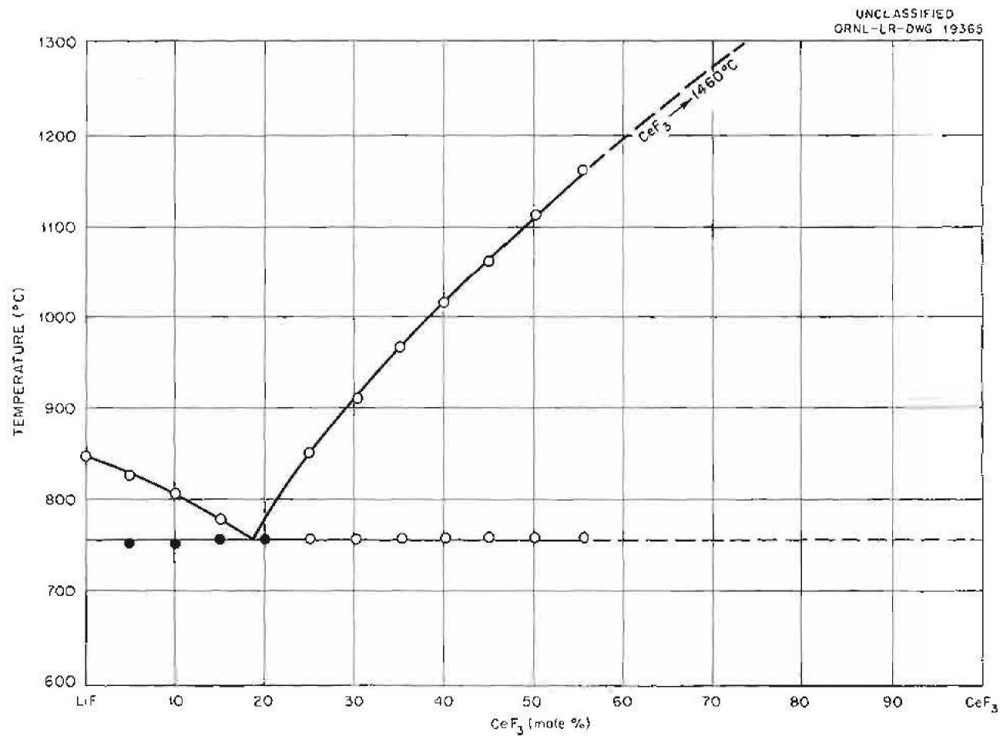  
Fig. 2.1.1. The System LiF- $\mathsf{CeF}_3$

use of the quenching method.8 When this material was subjected to thermal analysis in an apparatus in which its behavior could be observed visually, the data, presented in Table 2.1.2, indicated an incongruent melting point of $390^{\circ}C$ and a peritectic composition with about 52.5 mole $\%$ BeF $_2$ .

X-ray examinations of equilibrated and quenched materials have shown the inversion temperature of $\alpha$ and $\beta$ KF-2BeF $_2$ to be $334^{\circ}\mathrm{C}$ . The high-temperature modification, $\alpha$ KF-2BeF $_2$ , is the one found in slowly cooled preparations, presumably because the inversion is too slow to permit formation of the $\beta$ form at normal cooling rates.

Table 2.1.2. Visual-Observation Data for KF-BeF $_2$ Mixtures   

<table><tr><td>Composition (mole % BeF2)</td><td>Observed Liquidus (℃)</td><td>Observed Solidus (℃)</td></tr><tr><td>46</td><td>557</td><td>(385)*</td></tr><tr><td>48</td><td>542</td><td>(385)*</td></tr><tr><td>50</td><td>447</td><td>390</td></tr><tr><td>52</td><td>413</td><td>390</td></tr><tr><td>54</td><td>388</td><td>330</td></tr></table>

8L. M. Bratcher and R. E. Meadows, ANP Quan. Prog. Rep. Dec. 31, 1956, ORNL-2221, p 115.   
*Values in parentheses were established with less certainty than the others.

Recent studies have shown no evidence of the previously reported possibility of subsolidus decomposition of KF-2BeF $_2$ into KF-BeF $_2$ and BeF $_2$ . The solidus temperature between KF-BeF $_2$ and KF-2BeF $_2$ is $330^{\circ}\mathrm{C}$ ; the eutectic mixture contains 59 mole% BeF $_2$ .

The compound $2\mathrm{KF}\cdot \mathrm{BeF}_2$ was found as crystals with rounded corners and edges in samples containing 33.3 to 47 mole $\%$ $\mathrm{BeF}_2$ that were equilibrated above $370^{\circ}C$ and quenched. Although the raw materials for these preparations were well-crystallized $2\mathrm{KF}\cdot \mathrm{BeF}_2$ and $\mathrm{KF}\cdot \mathrm{BeF}_2$ , the rounded grains were obtained regardless of whether the equilibrium temperature was approached from above or below.

Rounded crystals are often considered evidence for the existence of immiscible liquid phases. This possibility can be eliminated because the rounded crystals consisted of single-phase

2KF-BeF. No explanation for the rounded grains can be offered at present.

Thermal analysis showed an inversion of $2\mathrm{KF} \cdot \mathrm{BeF}_2$ at $690^{\circ}\mathrm{C}$ . The inversion was so rapid, however, that only one modification (the $\beta$ or low-temperature form) was found in samples quenched after equilibration at temperatures above and below $690^{\circ}\mathrm{C}$ .

The solidus temperature between $3\mathrm{KF}\cdot \mathrm{BeF}_2$ and $2\mathrm{KF}\cdot \mathrm{BeF}_2$ (730°C), which was previously determined by thermal analysis, was confirmed by quenches of compositions with 27 and 30 mole % $\mathrm{BeF}_2$ . The liquidus and solidus temperatures for the mixture containing 27 mole % $\mathrm{BeF}_2$ are nearly the same, and thus it appears that this composition is near the eutectic composition. The phase-equilibrium diagram for this system is presented as Fig. 2.1.2.

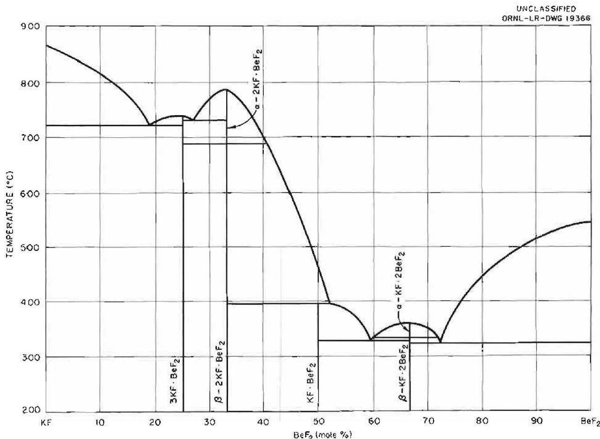  
Fig.2.1.2. The System KF-BeF2

# THE SYSTEM NoF-RbF-BeF2

R. E. Meadows

Quenching studies of the NaF-RbF-BeF $_2$ system were started recently. The only ternary compound previously reported in the low-BeF $_2$ part of the system was tentatively identified as 2NaF-RbF-BeF $_2$ on the basis of petrographic and x-ray studies of slowly cooled melts. Examinations of quenched compositions on the join NaF-RbF-BeF $_2$ indicate that the compound probably contains closer to 45 than 50 mole % NaF, but further study is needed to establish the identity of this phase conclusively. Previous examinations of slowly cooled compositions established the join NaF-RbF-BeF $_2$ as a binary system. Quenches of mixtures on the join containing 33.3 and 40 mole % NaF have shown that the ternary compound is the primary phase, that the solidus temperature is $452^{\circ}\mathrm{C}$ , and that RbF-BeF $_2$ is the other phase below the solidus. The phase relationships between the liquidus and solidus are not clear, as yet, and more work is required in this region.

# THE SYSTEM NaF-LiF-UF4

H.A.Friedman

B. S. Landau

A large number of thermal-gradient quenching experiments completed during the quarter have shown the tentative phase-equilibrium diagram previously reported for the system NaF-LiF-UF4 to be in error in several respects. A revised diagram is presented as Fig. 2.1.3. The unidentified material reported previously to be a ternary compound was found to be the compound NaF-2UF4, which has been shown to have a primary phase field in the ternary system. This compound thus became an apex of the compatibility triangle NaF-2UF4-7LiF-6UF4-7NaF-6UF4.

The compound $3\mathrm{NaF}\cdot \mathrm{UF}_4$ is unstable below $497^{\circ}C,$ and it is accordingly impossible for the primary phase field of LiF to contact that of $3\mathrm{NaF}\cdot \mathrm{UF}_4.$ The latter compound is not therefore an opex of a compatibility triangle. The compound $4\mathrm{LiF}\cdot \mathrm{UF}_4$ is unstable below $470^{\circ}C,$ and the

primary phase field of this material does not contact that of a sodium compound. Therefore $4\text{LiF} \cdot \text{UF}_4$ is not an apex of a compatibility triangle.

The compound $5\mathrm{NaF}\cdot 3\mathrm{UF}_4$ was shown to exist at the liquidus in the ternary system, and the extent of its primary phase field was established. Boundary paths separating the phase fields of $\mathsf{LiF}\cdot 4\mathsf{UF}_4$ and $\mathsf{NaF}\cdot 2\mathsf{UF}_4$ , $\mathsf{LiF}\cdot 4\mathsf{UF}_4$ and $7\mathsf{LiF}\cdot \mathsf{UF}_4$ , and $7\mathsf{NaF}\cdot 6\mathsf{UF}_4$ and $7\mathsf{LiF}\cdot 6\mathsf{UF}_4$ were also established. The boundary paths between the $7\mathrm{NaF}\cdot 6\mathrm{UF}_4$ and $7\mathrm{LiF}\cdot 6\mathrm{UF}_4$ phase fields were difficult to establish because of the extensive solid solution which occurs between these two compounds.

# NoF-ZrF4-STRUCTURAL METAL FLUORIDE SYSTEMS

H. A. Friedman

8. S. Landau

Phase equilibrium studies of the systems NaF $\mathsf{CrF}_2\mathsf{-ZrF}_4$ NaF-FeF $_2$ -ZrF $_4$ and NaF-NiF $_2$ -ZrF $_4$ were made during the quarter in order to determine the formula and phase relationships of the ternary compound in each of these systems. Only one ternary compound was observed in each system. The phases identified in several slowly cooled melts (50-g quantities) indicate, as shown in Table 2.1.3, that the NaF-CrF $_2$ -ZrF $_4$ ternary compound probably has one of the formulas NaF-CrF $_2$ -ZrF $_4$ , 3NaF-3CrF $_2$ -4ZrF $_4$ , NaF-CrF $_2$ -2ZrF $_4$ , or NaF-CrF $_2$ -3ZrF $_4$ . The compound is isomorphous with its analog in each of the three systems, and therefore it is likely to have the some stoichiometric formula in the three cases.

Thermal analysis and thermal-gradient quenching experiments were made along the join $\mathsf{NaF - CrF_2 - }$ $\mathsf{ZrF_4}$ which includes all the possible ternary compound formulas mentioned above. Equilibrium conditions were not approached closely enough for a determination of the formula by the use of phase-equilibrium experimental techniques. The composition that produced the most nearly single-phase material was $\mathsf{NaF - CrF_2 - 2ZrF_4}$ . Single crystals of the $\mathsf{NaF - FeF_2 - ZrF_4}$ ternary compound were obtained from a portion of a slowly cooled melt containing $33\%$ mole % of each component of the mixture. Chemical analysis of the sample showed that the composition of the compound is $\mathsf{NaF - FeF_2 - }$ $2\mathsf{ZrF_4}$ . The isomorphism displayed by the analogs of this compound in the $\mathsf{NaF - CrF_2 - ZrF_4}$ and

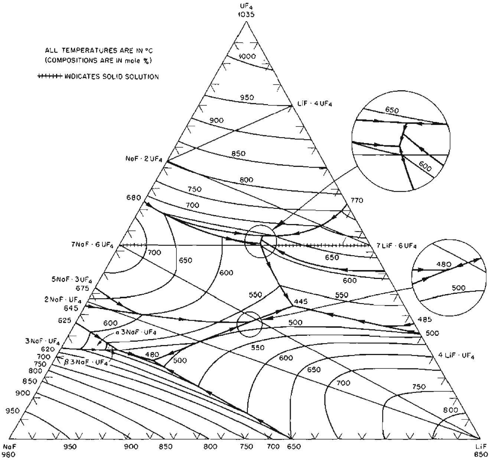  
Fig. 2.1.3. The System NaF-LiF-UF4.

$\mathsf{NaF - NiF_2 - ZrF_4}$ systems indicates that the formulas for the ternary compounds in those systems are almost surely $\mathsf{NaF - CrF_2 - 2ZrF_4}$ and $\mathsf{NaF - NiF_2 - 2ZrF_4}$ . A tentative diagram for a portion of the join $\mathsf{NaF - CrF_2 - ZrF_4}$ is shown in Fig. 2.1.4.

The very large thermal range of the $\mathrm{CrF}_2\cdot \mathrm{ZrF}_4$ primary phase field (see Fig. 2.1.4) suggests that

it may be the saturating phase for solutions of $\mathsf{CrF}_2$ in NaF-ZrF4 (53-47 mole %). Further experiments to outline the extent of the $\mathsf{CrF}_2\cdot \mathsf{ZrF}_4$ and the analogous $\mathsf{FeF}_2\cdot \mathsf{ZrF}_4$ and $\mathsf{NiF}_2\cdot \mathsf{ZrF}_4$ primary phase fields will be initiated. Optical and x-ray data for the compounds NaF-CrF2-2ZrF4, NaF-FeF2-2ZrF4, and NaF-NiF2-2ZrF4 are presented in the following section.

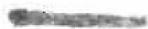

Table 2.1.3. Phases Observed in Slowly Cooled Melts in the System NaF-CrF $_{2}$ -ZrF $_{4}$   

<table><tr><td colspan="3">Composition (mole %)</td><td rowspan="2">Phases Observed*</td></tr><tr><td>NoF</td><td>CrF2</td><td>ZrF4</td></tr><tr><td>50</td><td>15</td><td>35</td><td>2NaF·ZrF4, ternary compound</td></tr><tr><td>46</td><td>15</td><td>39</td><td>2NaF·ZrF4, ternary compound</td></tr><tr><td>43</td><td>15</td><td>42</td><td>2NaF·ZrF4, ternary compound, CrF2·ZrF4</td></tr><tr><td>45</td><td>10</td><td>45</td><td>2NaF·ZrF4, 7NaF·6ZrF4, ternary compound, CrF2·ZrF4</td></tr><tr><td>48</td><td>5</td><td>47</td><td>2NaF·ZrF4, 7NaF·6ZrF4, ternary compound, CrF2·ZrF4</td></tr><tr><td>51</td><td>5</td><td>44</td><td>7NaF·6ZrF4, ternary compound</td></tr></table>

*Identification made by petrographic and x-ray diffraction examination.

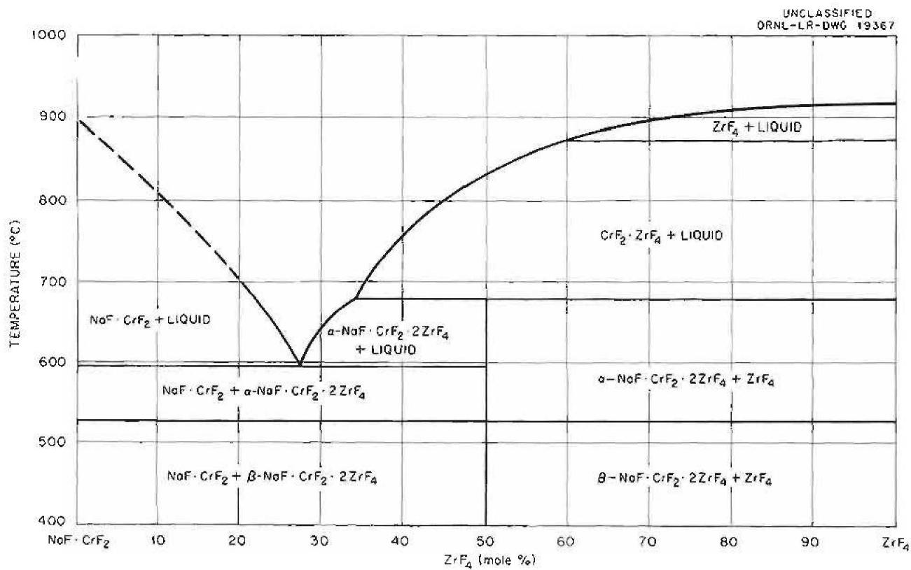  
Fig. 2.1.4. The Join NaF-CrF $_2$ -ZrF $_4$ (Tentative).

H. Insley T. N. McVay B. S. Landau R. E. Thoma

The identifying characteristics of some new compounds encountered in phase studies are listed below. The symbol $d(\mathbf{A})$ denotes the distance between reflecting planes measured in angstroms. The term $I / I_{1}$ refers to the relative intensity of the lines as compared with an arbitrary value of 100 for the strongest line. Under optical properties, $N_{a}$ and $N_{\gamma}$ refer to the lowest and highest indices of refraction, respectively, for biaxial crystals, and $2V$ refers to the acute angle between the optic axes in biaxial crystals; $N_{\omega}$ and $N_{e}$ refer to the ordinary and extraordinary indices of refraction of uniaxial crystals.

OPTICAL PROPERTIES AND X-RAY DIFFRACTION PATTERNS FOR COMPOUNDS IN FLUORIDE SYSTEMS  

<table><tr><td>β KF·2BeF2</td></tr><tr><td>Optical Data</td></tr><tr><td>Biaxial; sign not determined</td></tr><tr><td>Mean refractive index, 1.319</td></tr></table>

<table><tr><td colspan="2">X-Ray Data</td></tr><tr><td>d(A)</td><td>1/11</td></tr><tr><td>8.20</td><td>20</td></tr><tr><td>7.25</td><td>10</td></tr><tr><td>6.56</td><td>10</td></tr><tr><td>6.19</td><td>5</td></tr><tr><td>5.40</td><td>15</td></tr><tr><td>5.20</td><td>5</td></tr><tr><td>4.93</td><td>30</td></tr><tr><td>4.48</td><td>25</td></tr><tr><td>4.29</td><td>15</td></tr><tr><td>4.15</td><td>20</td></tr><tr><td>3.88</td><td>100</td></tr><tr><td>3.74</td><td>40</td></tr><tr><td>3.34</td><td>20</td></tr><tr><td>3.25</td><td>100</td></tr><tr><td>3.14</td><td>35</td></tr><tr><td>3.01</td><td>100</td></tr><tr><td>2.644</td><td>40</td></tr><tr><td>2.501</td><td>20</td></tr><tr><td>2.455</td><td>10</td></tr><tr><td>2.270</td><td>25</td></tr><tr><td>2.253</td><td>5</td></tr><tr><td>2.164</td><td>80</td></tr><tr><td>2.074</td><td>40</td></tr></table>

<table><tr><td>1.987</td><td>15</td></tr><tr><td>1.972</td><td>20</td></tr><tr><td>1.868</td><td>20</td></tr></table>

Optical and x-ray data were reported previously12 for $\mathsf{KF}\cdot 2\mathsf{BeF}_2$ (printed incorrectly as $\mathsf{KF}\cdot 2\mathsf{BeF}_4$ ). The discovery of the low-temperature form, $\beta \mathsf{KF}\cdot 2\mathsf{BeF}_2$ , requires that the previously reported form be designated a $\mathsf{KF}\cdot 2\mathsf{BeF}_2$ .

$$
2 K C l \cdot F e C l _ {2}
$$

# Optical Data

<table><tr><td>Uniaxial positive</td></tr><tr><td>Nω=1.600</td></tr><tr><td>Nε=1.636</td></tr></table>

<table><tr><td colspan="2">X-Ray Data</td></tr><tr><td>d(A)</td><td>I/I1</td></tr><tr><td>6.02</td><td>100</td></tr><tr><td>5.69</td><td>15</td></tr><tr><td>4.06</td><td>25</td></tr><tr><td>3.47</td><td>75</td></tr><tr><td>3.10</td><td>15</td></tr><tr><td>2.86</td><td>30</td></tr><tr><td>2.675</td><td>100</td></tr><tr><td>2.615</td><td>50</td></tr><tr><td>2.590</td><td>100</td></tr><tr><td>2.518</td><td>25</td></tr><tr><td>2.489</td><td>15</td></tr><tr><td>2.467</td><td>50</td></tr><tr><td>2.203</td><td>15</td></tr><tr><td>2.108</td><td>15</td></tr><tr><td>2.022</td><td>15</td></tr><tr><td>1.994</td><td>25</td></tr><tr><td>1.884</td><td>30</td></tr><tr><td>1.749</td><td>25</td></tr><tr><td colspan="2">KCL·FeCl2</td></tr></table>

# Optical Data

<table><tr><td>Biaxial positive</td></tr><tr><td>Na=1.700</td></tr><tr><td>Nγ=1.740</td></tr></table>

# X-Ray Data

<table><tr><td>d(Å)</td><td>I/I1</td></tr><tr><td>7.5</td><td>30</td></tr><tr><td>7.2</td><td>30</td></tr></table>

12R. E. Thomo et al., ANP Quar. Prog. Rep. Dec. 10, 1955, ORNL-2012, p 101.

<table><tr><td>d(A)</td><td>1/11</td></tr><tr><td>4.17</td><td>30</td></tr><tr><td>3.43</td><td>30</td></tr><tr><td>3.11</td><td>25</td></tr><tr><td>2.89</td><td>20</td></tr><tr><td>2.83</td><td>100</td></tr><tr><td>2.75</td><td>30</td></tr><tr><td>2.695</td><td>35</td></tr><tr><td>2.675</td><td>100</td></tr><tr><td>2.495</td><td>15</td></tr><tr><td>2.276</td><td>30</td></tr><tr><td>2.243</td><td>15</td></tr><tr><td>2.124</td><td>15</td></tr><tr><td>1.980</td><td>75</td></tr><tr><td>1.957</td><td>10</td></tr><tr><td>1.940</td><td>35</td></tr><tr><td>1.924</td><td>50</td></tr><tr><td>1.899</td><td>10</td></tr><tr><td>1.851</td><td>10</td></tr><tr><td>1.832</td><td>25</td></tr><tr><td>1.789</td><td>15</td></tr></table>

3NaF·HfF4   

<table><tr><td>Optical Data</td></tr><tr><td>Mean refractive index, slightly less than 1.386</td></tr><tr><td>Biaxial negative, 2V = 40 deg</td></tr></table>

<table><tr><td colspan="2">X-Ray Data</td></tr><tr><td>d(Å)</td><td>I/I1</td></tr><tr><td>5.26</td><td>80</td></tr><tr><td>4.74</td><td>100</td></tr><tr><td>3.75</td><td>70</td></tr><tr><td>3.06</td><td>100</td></tr><tr><td>2.93</td><td>40</td></tr><tr><td>2.373</td><td>15</td></tr><tr><td>2.321</td><td>35</td></tr><tr><td>2.154</td><td>20</td></tr><tr><td>2.120</td><td>5</td></tr><tr><td>1.967</td><td>25</td></tr><tr><td>1.883</td><td>20</td></tr><tr><td>1.872</td><td>50</td></tr><tr><td>1.770</td><td>10</td></tr><tr><td>1.685</td><td>5</td></tr><tr><td>1.604</td><td>25</td></tr></table>

2NaF·HfF 4   

<table><tr><td>Optical Data</td></tr><tr><td>Biaxial positive, 2V ≈ 40 to 60 deg</td></tr><tr><td>Mean refractive index, slightly less than 1.386</td></tr><tr><td>Low birefringence, ∼ 0.006</td></tr></table>

<table><tr><td colspan="2">X-Ray Data</td></tr><tr><td>d(A)</td><td>l/11</td></tr><tr><td>8.01</td><td>30</td></tr><tr><td>6.39</td><td>5</td></tr><tr><td>5.54</td><td>30</td></tr><tr><td>5.13</td><td>100</td></tr><tr><td>4.80</td><td>90</td></tr><tr><td>4.49</td><td>20</td></tr><tr><td>4.33</td><td>40</td></tr><tr><td>3.99</td><td>75</td></tr><tr><td>3.82</td><td>90</td></tr><tr><td>3.55</td><td>5</td></tr><tr><td>3.24</td><td>90</td></tr><tr><td>3.08</td><td>20</td></tr><tr><td>3.02</td><td>80</td></tr><tr><td>2.88</td><td>10</td></tr><tr><td>2.822</td><td>5</td></tr><tr><td>2.755</td><td>40</td></tr><tr><td>2.706</td><td>5</td></tr><tr><td>2.667</td><td>20</td></tr><tr><td>2.564</td><td>20</td></tr><tr><td>2.529</td><td>10</td></tr><tr><td>2.405</td><td>25</td></tr><tr><td>2.361</td><td>10</td></tr><tr><td>2.327</td><td>10</td></tr><tr><td>2.301</td><td>5</td></tr><tr><td>2.242</td><td>10</td></tr><tr><td>2.194</td><td>5</td></tr><tr><td>2.154</td><td>10</td></tr><tr><td>2.034</td><td>25</td></tr><tr><td>2.008</td><td>10</td></tr><tr><td>1.979</td><td>10</td></tr><tr><td>1.935</td><td>20</td></tr><tr><td>1.898</td><td>40</td></tr><tr><td>1.840</td><td>15</td></tr><tr><td>1.819</td><td>20</td></tr><tr><td>1.792</td><td>5</td></tr><tr><td>1.754</td><td>10</td></tr><tr><td>1.712</td><td>25</td></tr><tr><td>1.599</td><td>25</td></tr><tr><td>1.567</td><td>15</td></tr><tr><td>1.535</td><td>5</td></tr></table>

$$
N a F \cdot C r F _ {2} \cdot 2 Z r F _ {4}
$$

Optical Data

Biaxial negative

Exhibits polysynthetic twinning

Mean refractive index, $\sim 1.456$

X-Roy Dato

$$
d (A) \quad l / l _ {1}
$$

$$
5. 2 1 \quad 4 0
$$

$$
4. 5 0 \quad 1 5
$$

$$
4. 0 6 \quad 1 0 0
$$

$$
3. 8 6 \quad 1 0
$$

$$
3. 4 8 \quad 5 0
$$

$$
3. 4 3 \quad 3 0
$$

$$
3. 3 1 \quad 4 5
$$

$$
2. 6 2 2 \quad 1 5
$$

$$
2. 7 9 4 \quad 2 5
$$

$$
2. 0 3 4 \quad 2 5
$$

$$
2. 0 1 6 \quad 1 5
$$

$$
1. 9 5 1 \quad 1 5
$$

$$
1. 7 7 0 \quad 1 5
$$

$$
1. 7 3 9 \quad 2 0
$$

$$
N a F \cdot F e F _ {2} \cdot 2 Z r F _ {4}
$$

Optical Data

Biaxial negative, $2V = 75$ deg

$N_{\alpha} = 1.452, N_{\gamma} = 1.459$

Exhibits polysynthetic twinning

Compound is probably monoclinic

X-Ray Data

$$
d (\overset {\circ} {A}) \quad l / l _ {1}
$$

$$
5. 2 0 \quad 4 0
$$

$$
4. 5 0 \quad 1 0
$$

$$
4. 0 6 \quad 1 0 0
$$

$$
3. 7 9 \quad 5
$$

$$
3. 6 9 \quad 5
$$

$$
3. 3 6 \quad 1 0 0
$$

$$
2. 6 0 7 \quad 5
$$

$$
2. 5 2 1 \quad 2 0
$$

$$
2. 0 3 4 \quad 2 0
$$

$$
1. 9 4 3 \quad 4 0
$$

$$
1. 8 1 2 \quad 5
$$

$$
1. 7 5 7 \quad 1 5
$$

$$
1. 7 3 3 \quad 2 0
$$

$$
1. 6 8 2 \quad 3 0
$$

$$
1. 5 1 3 \quad 2 0
$$

$$
\mathrm {N a F} \cdot \mathrm {N i F} _ {2} \cdot 2 \mathrm {Z r F} _ {4}
$$

Optical Data

Bioxial positive

Exhibits polysynthetic twinning

Mean refractive index, $\sim 1.460$

X-Ray Data

$$
d (\stackrel {\circ} {A}) \quad I / I _ {1}
$$

$$
5. 4 2 \quad 1 0
$$

$$
5. 1 5 \quad 3 5
$$

$$
4. 4 8 \quad 2 5
$$

$$
4. 0 5 \quad 1 0 0
$$

$$
3. 3 4 \quad 1 0 0
$$

$$
2. 5 0 0 \quad 1 0
$$

$$
2. 0 2 2 \quad 2 5
$$

$$
1. 9 3 2 \quad 1 5
$$

$$
1. 6 7 0 \quad 1 5
$$

# SUBCONTRACT WORK AT MOUND

# LABORATORY AND AT BATTELLE

# MEMORIAL INSTITUTE

During the period covered by this report the Mound Laboratory continued investigations of beryllium-containing fluoride mixtures of interest to the ANP program. This work included phase equilibrium studies of the following systems: LiF-BeF $_2$ -UF $_4$ , NoF-BeF $_2$ -UF $_4$ , LiF-RbF-BeF $_2$ . In addition density and viscosity values were obtained for various compositions of these mixtures at 600, 700, and $800^{\circ}$ C. This work is reported in detail in Mound Laboratory memoranda numbered 57-1-28 and 57-2-24.

Studies of interest to ANP were also continued at the Battelle Memorial Institute under subcontract No. 982. Determinations of the vapor pressure of three compositions of the $\mathsf{RbF - ZrF_4}$ system by the transpiration method were carried out, and fabrication and assembly are under way on apparatus for the static method of determining vapor pressures. The transport of chromium from Inconel exposed to the $\mathsf{NaF - ZrF_4 - UF_4}$ salt system is being studied by using $\mathsf{Cr}^{51}$ -labeled $\mathsf{CrF}_2$ . Apparatus is being built for determining the absorption spectra of fused mixtures of the fluorides of sodium, uranium, and zirconium. Studies of the stability of uranium-bearing liquid-metal slurries are continuing. This work is reported in detail in report BMI-1171, issued February 20, 1957.

# 2.2. CHEMICAL REACTIONS IN MOLTEN SALTS

F. F. Blankenship

R.F.Newton

L.G.Overholser

G.M.Watson

# EQUILIBRIUM REDUCTION OF $\mathsf{NIF}_2$ BY $\mathsf{H}_2$ IN NoF-ZrF

C. M. Blood

Investigation of the equilibrium

$$
\mathrm {N i F} _ {2} (d) + \mathrm {H} _ {2} (g) \xrightarrow {\sim} \mathrm {N i} (s) + 2 \mathrm {H F} (g)
$$

in NaF-ZrF4 (53-47 mole %) at 550°C was con- cluded during the quarter, and the additional data obtained are summarized in Table 2.2.1. The new data were combined with the data previously obtained at 550°C, and the values are plotted in Fig. 2.2.1. A straight line drawn from the origin with a slope of $0.76 \times 10^{4}$ atm, numerically equal to $K_{x}$ , may be seen to agree quite well with the experimental results. This line has been extended to the value of the solubility of NiF2 in this solvent at 550°C. Accordingly, it is observed that, within the precision of the ex-periment, $K_{x}$ is independent of the NiF2 concentration over the concentration range studied, which

includes values not far from the concentration of $\mathsf{NiF}_2$ in the saturated solution of this temperature. The most dilute solution studied contained 85 ppm Ni as $\mathsf{NiF}_2$ , and the most concentrated solution had 313 ppm. The solubility of $\mathsf{NiF}_2$ in this solvent at $550^{\circ}\mathsf{C}$ was determined to be $352 \pm 11$ ppm, as described below.

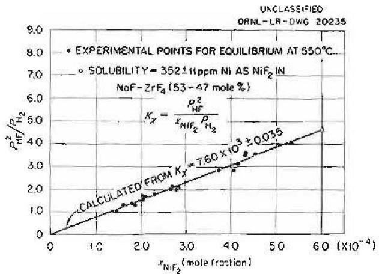  
Fig. 2.2.1. Equilibrium Reduction of $\mathsf{NiF}_2$ by $\mathsf{H}_2$ in $\mathsf{NaF - ZrF}_4$ .

C. M. Blood and G. M. Palmer, ANP Quar. Prog. Rep. Dec. 31, 1956, ORNL-2221, p 120.

Table 2.2.1. Equilibrium Ratios for the Reaction NiF $_2$ (d) + H $_2$ (g) ⇌ Ni (s) + 2HF (g) at 550°C in NoF-ZrF $_4$ (53-47 MoIe %)   

<table><tr><td>Ni in Melt (ppm)</td><td>Pressure of H2(atm)</td><td>Pressure of HF (atm)</td><td>Kx</td></tr><tr><td></td><td></td><td></td><td>×104</td></tr><tr><td>85</td><td>0.0530</td><td>0.239</td><td>0.74</td></tr><tr><td>95</td><td>0.0517</td><td>0.257</td><td>0.79</td></tr><tr><td>120</td><td>0.0496</td><td>0.287</td><td>0.81</td></tr><tr><td>120</td><td>0.0493</td><td>0.292</td><td>0.85</td></tr><tr><td>135</td><td>0.0491</td><td>0.295</td><td>0.77</td></tr><tr><td>220</td><td>0.0448</td><td>0.356</td><td>0.75</td></tr><tr><td>313</td><td>0.0413</td><td>0.406</td><td>0.75</td></tr><tr><td colspan="3">Average value of 12 determinations previously reported</td><td>0.76 ± 0.04</td></tr><tr><td colspan="3">Total average</td><td>0.76 ± 0.04</td></tr></table>

$\star K_{x} = P_{HF}^{2} / X_{NiF_{2}}P_{H_{2}}$ where $X_{NiF_2}$ is mole fraction of NiF2 found in solution and $\mathcal{P}$ is pressure in atmospheres.

# SOLUBILITY OF $\mathsf{N}\mathsf{i}\mathsf{F}_2$ IN NoF-ZrF4

C. M. Blood

Considerable attention has been given $^{2-4}$ to determining the solubility of $\mathrm{NiF}_2$ in $\mathrm{NaF-ZrF}_4$ (53-47 mole $\%$ ). It was shown previously $^{2}$ that the solubility of $\mathrm{NiF}_2$ in this solvent was a function of the total amount of $\mathrm{NiF}_2$ added in the range 0.5 to 10 wt $\%$ , but no determinations were made with only traces of the saturating (nickel-containing) phase present. The results obtained electrochemically $^{3}$ were of considerable interest in this regard, but unfortunately these results appear to be high by approximately a factor of 2. Consequently, an accurate determination of the solubility at $550^{\circ}\mathrm{C}$ was undertaken with only traces of the saturating phase present.

In order to approach the saturation concentration gradually, a mixture of $\mathsf{HF}_2$ hydrogen, and helium was bubbled through $\mathsf{NaF - ZrF_4}$ contained in nickel apparatus at $550^{\circ}C$ . The apparatus was the same as that used for equilibrium studies (see preceding section on "Equilibrium Reduction of $\mathsf{NiF}_2$ by $\mathsf{H}_2$ in $\mathsf{NaF - ZrF_4}$ ". The $\mathsf{HF - H_2}$ ratio of the gaseous mixture was set at appropriate values so that nickel metal from the container was converted slowly to $\mathsf{NiF}_2$ . The changes in $\mathsf{NiF}_2$ concentration of the molten $\mathsf{NaF - ZrF_4}$ were followed by chemically analyzing liquid samples drawn through filtering tubes. The filtrates were taken in pairs one at $550^{\circ}C$ and another from the apparatus temporarily heated to $700^{\circ}C$ . For the unsaturated solution the concentrations of $\mathsf{NiF}_2$ were identical, within the analytical precision, in both filtrates. As the solution became saturated, the $550^{\circ}C$ filtrate indicated the solubility of $\mathsf{NiF}_2$ , and the $700^{\circ}C$ filtrate gave a measure of the total amount of $\mathsf{NiF}_2$ in contact with the liquid. The results of these measurements are presented in Fig. 2.2.2.

The data obtained for a saturated solution gave a solubility of $352 \pm 11$ ppm Ni as $\mathrm{NiF}_2$ in molten $\mathrm{NaF - ZrF}_4$ (53-47 mole %) at $550^{\circ}\mathrm{C}$ . The data also indicate that the solubility remains constant when the amount of saturating phase is changed from a trace to a total of 1310 ppm $\mathrm{Ni}^{++}$ . The value of

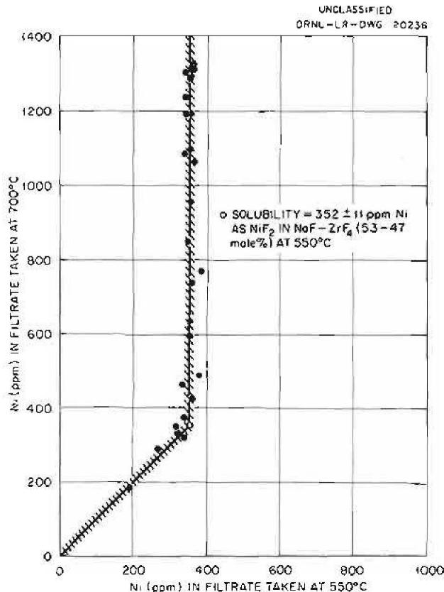  
Fig. 2.2.2. Solubility of $\mathsf{NiF}_2$ in NaF-ZrF4 at $550^{\circ}C$ .

352 ppm is in substantial agreement with a value of 400 ppm previously reported for the solubility obtained with a total addition of 1700 ppm Ni++

# STABILITY OF CHROMIUM FLUORIDES IN LiF-ThF4 AND LiF-BoF2-ThF4 MIXTURES

J.D.Redman

The stability of $\mathsf{CrF}_2$ and $\mathsf{CrF}_3$ in two ThF-bearing melts at $800^{\circ}\mathrm{C}$ was examined by application of the equilibration-filtration technique described in previous reports in this series. (This work, while of interest to the ANP project, is more directly applicable to the Fused-Salt Power Reactor Project.) These experiments were performed by charging pure LiF-ThF $_4$ (72-28 mole %) or LiF-BeF $_2$ -ThF $_4$ (67-23-10 mole %) along with pure $\mathsf{CrF}_2$ or $\mathsf{CrF}_3$ to hydrogen-fired nickel apparatus, equilibrating for 5 hr at $800^{\circ}\mathrm{C}$ under helium, filtering at the equilibrium temperature, and analyzing the cooled filtrate for $\mathsf{Cr}^{++}$ and total chromium ion.

The data obtained, as given in Table 2.2.2, indicate that $\mathsf{CrF}_2$ is stable in both these solvents. The disproportionation reaction

$$
3 C r F _ {2} \xrightarrow {\Delta} 2 C r F _ {3} + C r ^ {\circ}
$$

seems to occur to a very limited extent, if at all. It appears, however, that $\mathsf{CrF}_3$ reacts with the nickel container, when added to either solvent, presumably by the reaction

$$
2 C r F _ {3} + N i ^ {\circ} \xrightarrow {\Delta} N i F _ {2} + 2 C r F _ {2}
$$

The reaction is manifestly incomplete under the conditions used. It is likely that the heating period was too short and that the surface area of the nickel container was too small for the heterogeneous equilibrium to be attained.

# REDUCTION OF UF4 BY STRUCTURAL METALS

J.D.Redman

# Reduction in Molten RbF-ZrF4 Mixtures

Data were reported previously for experiments in which $\mathsf{Cr}^{\circ}$ and $\mathsf{Fe}^{\circ}$ were equilibrated with $\mathsf{UF}_4$ ( $\sim 7$ wt $\%$ U) in $\mathsf{RbF - ZrF}_4$ (60-40 mole $\%$ ) as the solvent medium. Since the values reported for the reaction with $\mathsf{Fe}^{\circ}$ were somewhat uncertain, the experiments were repeated with longer equilibration periods being allowed. The results of

these experiments, presented in Table 2.2.3, show that equilibrium is established within 5 hr and that the equilibrium concentration of $\mathsf{Fe}^{+ + }$ is significantly higher at 600 than at $800^{\circ}\mathrm{C}$ . The concentrations obtained in this reaction medium fall in the range that has been found in the other alkali fluoride- $\mathsf{ZrF}_4$ binary mixtures. No satisfactory explanation can be given for the fact that the $\mathsf{Fe}^{\circ}\mathsf{-UF}_4$ system is not markedly affected when different alkali fluoride- $\mathsf{ZrF}_4$ mixtures are used as the reaction medium. In contrast the studies of the $\mathsf{Cr}^{\circ}\mathsf{-UF}_4$ reaction showed that the chromium concentration increases in the order of use of RbF, KF, NaF, or LiF, in the reaction medium, which is the order of decreasing ion size.

Data for the reaction of $\mathsf{U}\mathsf{F}_4$ with $\mathsf{Cr}^{\circ}$ at 600 and $800^{\circ}C$ when $\mathsf{RbF - ZrF_4}$ (52-48 mole $\%$ ) is used as the reaction medium are given in Table 2.2.4. Approximately $2\textbf{g}$ of $\mathsf{Cr}^{\circ}$ was reacted with $\mathsf{U}\mathsf{F}_4$ (8.9 wt $\%$ UF, 4.0 mole $\%$ UF) dissolved in approximately $40\textbf{g}$ of the RbF-ZrF mixture in a nickel container.

The chromium values given in Table 2.2.4 show that the $\mathsf{UF}_4\text{-}\mathsf{Cr}^{\circ}$ reaction has a very small temperature coefficient over the temperature range studied. These equilibrium chromium concentrations are slightly higher than those found in $\mathsf{RbF - ZrF}_4$ (60-40 mole %) at both temperatures. The small differences indicate that the fluoride ion activity, as measured by the $\mathsf{Cr}^{\circ}\text{-}\mathsf{UF}_4$ reaction, increases only slightly when the RbF concentration is increased from 50 to 58 mole %, the RbF concentrations of the ternary mixtures containing 4 mole % $\mathsf{UF}_4$ .

Table 2.2.2. Stability of ${800}^{ \circ  }\mathrm{C}$ of ${\mathrm{{CrF}}}_{2}$ and ${\mathrm{{CrF}}}_{3}$ in Molten LiF-Th ${\mathrm{F}}_{4}$ and LiF-Be ${\mathrm{F}}_{2} - {\mathrm{{ThF}}}_{4}$   

<table><tr><td colspan="2">Conditions of Equilibration</td><td colspan="3">Present in Filtrate</td></tr><tr><td>Solvent</td><td>Additive</td><td>Cr++(wt %)</td><td>Total Cr (wt %)</td><td>Ni (ppm)</td></tr><tr><td rowspan="4">LiF-ThF4(72-28 mole %)</td><td>CrF2</td><td>4.0</td><td>4.1</td><td>100</td></tr><tr><td>CrF2</td><td>4.0</td><td>4.0</td><td>50</td></tr><tr><td>CrF3</td><td>0.5</td><td>3.9</td><td>4400</td></tr><tr><td>CrF3</td><td>0.9</td><td>3.9</td><td>5500</td></tr><tr><td rowspan="4">LiF-BeF2-ThF4(67-23-10 mole %)</td><td>CrF2</td><td>3.6</td><td>4.0</td><td>10</td></tr><tr><td>CrF2</td><td>4.0</td><td>4.1</td><td>10</td></tr><tr><td>CrF3</td><td>0.5</td><td>4.1</td><td>3200</td></tr><tr><td>CrF3</td><td>0.8</td><td>3.9</td><td>4100</td></tr></table>

Table 2.2.3.Data for the Reaction of UF with Fe in Molten RbF-ZrF4 (60-40 Male %) at 600 and $800^{\circ}C$   

<table><tr><td colspan="2">Conditions of Equilibration</td><td colspan="3">Present in Filtrate</td></tr><tr><td>Temperature (℃)</td><td>Time (hr)</td><td>Total U (wt %)</td><td>Total Fe* (ppm)</td><td>Total Ni (ppm)</td></tr><tr><td rowspan="4">600</td><td>5</td><td>7.2</td><td>500</td><td></td></tr><tr><td>5</td><td>7.3</td><td>510</td><td></td></tr><tr><td>16</td><td>7.1</td><td>460</td><td></td></tr><tr><td>16</td><td>7.3</td><td>490</td><td></td></tr><tr><td rowspan="8">800</td><td>5</td><td>7.4</td><td>170</td><td>50</td></tr><tr><td>5</td><td>7.4</td><td>220</td><td>60</td></tr><tr><td>5</td><td>7.2</td><td>120</td><td></td></tr><tr><td>5</td><td>7.1</td><td>130</td><td></td></tr><tr><td>16</td><td>7.5</td><td>180</td><td>100</td></tr><tr><td>16</td><td>7.2</td><td>140</td><td></td></tr><tr><td>16</td><td>7.3</td><td>230</td><td>80</td></tr><tr><td>16</td><td>7.3</td><td>170</td><td>110</td></tr></table>

*Blank of 70 ppm of Fe at $800^{\circ}C$

Table 2.2.4. Data for the Reaction of ${\mathrm{{UF}}}_{4}$ with ${\mathrm{{Cr}}}^{0}$ in Molfen RbF-ZrF ${}_{4}$ (52-48 Mo1e %) at 600 and ${800}^{ \circ  }\mathrm{C}$   

<table><tr><td colspan="2">Conditions of Equilibration</td><td colspan="3">Present in Filtrate</td></tr><tr><td>Temperature (℃)</td><td>Time (hr)</td><td>Total U (wt %)</td><td>Total Cr* (ppm)</td><td>Total Ni (ppm)</td></tr><tr><td rowspan="4">600</td><td>3</td><td>6.8</td><td>680</td><td>40</td></tr><tr><td>3</td><td>6.8</td><td>660</td><td>20</td></tr><tr><td>5</td><td>6.8</td><td>710</td><td>&lt;1</td></tr><tr><td>5</td><td>6.9</td><td>720</td><td>&lt;1</td></tr><tr><td rowspan="3">800</td><td>3</td><td>6.8</td><td>740</td><td>&lt;1</td></tr><tr><td>3</td><td>6.8</td><td>780</td><td>20</td></tr><tr><td>5</td><td>6.8</td><td>700</td><td>120</td></tr></table>

*Blank of 170 ppm of Cr at ${800}^{ \circ  }\mathrm{C}$ .

# Reduction in $\mathsf{ThF}_4$ -Bearing Melts

Data were reported previously for the reaction of $\mathsf{Cr}^{\circ}$ with $\mathsf{UF}_4$ with low uranium concentrations (0.5 wt $\%$ U) in molten LiF-BeF $_2$ (43-52 mole $\%$ ) as the reaction medium. These experiments have been extended to include dilute solutions of $\mathsf{UF}_4$ in LiF-ThF $_4$ (72-28 mole $\%$ ) and LiF-BeF $_2$ -ThF $_4$ (67-23-10 mole $\%$ ) mixtures as solvents.

Data for the reaction of UF4 with Cr0 at 650 and 800°C in LiF-BeF2-ThF4 (67-23-10 mole %) are given in Table 2.2.5. Approximately 2 g of Cr0 was reacted with UF4 (0.12 mole % UF4, 0.5 wt % U) dissolved in approximately 40 g of the LiF-BeF2-ThF4 mixture contained in nickel. Similar data obtained with LiF-ThF4 (72-28 mole %) as the reaction medium and a UF4 concentration of 0.21 mole % (0.5 wt % U) are presented in Table 2.2.6.

The equilibrium chromium values presented in Tables 2.2.5 and 2.2.6 approximate the blank obtained for chromium. Therefore, the reduction of $\mathsf{UF}_4$ by $\mathsf{Cr}^{\circ}$ in these reaction media when low $\mathsf{UF}_4$ concentrations are used is negligible, as was the case when LiF-BeF $_2$ (48-52 mole %) was used as the reaction medium. While the method is not sufficiently sensitive to determine slight changes in chromium concentrations that occurred in this series of experiments, the data do indicate that no extensive attack of $\mathsf{Cr}^{\circ}$ by $\mathsf{UF}_4$ occurs under these conditions.

# MEASUREMENTS OF SOLUBILITY OF RARE-EARTH FLUORIDES IN MOLTEN NoF-ZrF4-UF4 MIXTURES

W. T. Word

Rare-earth fluorides labeled with Ce $^{141}$ , La $^{140}$ , or Sm $^{153}$ and the techniques previously described were used to study the solubilities of CeF $_3$ and LaF $_3$ alone and in combination and of SmF $_3$ alone

8W. T. Word, ANP Quar. Prog. Rep. Dec. 31, 1956, ORNL-2221, p 125.

Table 2.2.5. Data for the Reaction of UF with Cr in Molten LiF-BeF-ThF (67-23-10 Mole %) at 650 and 800°C   

<table><tr><td colspan="2">Conditions of Equilibration</td><td colspan="3">Present in Filtrate</td></tr><tr><td>Temperature (°C)</td><td>Time (hr)</td><td>Total U (wt %)</td><td>Total Cr* (ppm)</td><td>Total Ni (ppm)</td></tr><tr><td rowspan="2">650</td><td>5</td><td>0.38</td><td>210</td><td>80</td></tr><tr><td>5</td><td>0.37</td><td>240</td><td>90</td></tr><tr><td rowspan="2">800</td><td>5</td><td>0.44</td><td>270</td><td>90</td></tr><tr><td>5</td><td>0.48</td><td>270</td><td>80</td></tr></table>

*Blank of 260 ppm of Cr at $800^{\circ}\mathrm{C}$ .

Table 2.2.6. Data for the Reaction of UF ${}_{4}$ with ${\mathrm{{Cr}}}^{0}$ in Molten LiF-ThF ${}_{4}$ (72-28 Mole %) at 650 and ${800}^{ \circ  }\mathrm{C}$   

<table><tr><td colspan="2">Conditions of Equilibration</td><td colspan="3">Present in Filtrate</td></tr><tr><td>Temperature (°C)</td><td>Time (hr)</td><td>Total U (wt %)</td><td>Total Cr* (ppm)</td><td>Total Ni (ppm)</td></tr><tr><td rowspan="2">650</td><td>S</td><td>0.51</td><td>280</td><td>40</td></tr><tr><td>S</td><td>0.49</td><td>240</td><td>50</td></tr><tr><td rowspan="2">800</td><td>S</td><td>0.51</td><td>260</td><td>50</td></tr><tr><td>S</td><td>0.52</td><td>280</td><td>50</td></tr></table>

*Blonk of 280 ppm of Cr, or ${800}^{ \circ  }\mathrm{C}$ .

and in combination with $\mathsf{CeF}_3$ in NoF-ZrF4-UF4 (50-46-4 mole %). In addition, the effect of $\mathsf{BoF}_2$ and $\mathsf{SrF}_2$ on the solubility of $\mathsf{CeF}_3$ in this melt was examined. Solubility values shown at precise temperatures in the following tables were obtained from smooth curves of the experimental data taken at approximately the temperatures shown.

# Solubility of CeF3

The solubility of $\mathsf{CeF}_3$ in NaF-ZrF4-UF (50-46-4 mole %) was redetermined in three separate experiments with the use of Ce14 as a tracer by the technique described previously. The solubilities thus obtained, together with those previously reported, are given in Table 2.2.7.

# Solubility of $\mathsf{LaF}_3$

The solubility of $\mathsf{LaF}_3$ in $\mathsf{NaF - ZrF_4 - UF_4}$ (50-46-4 mole %) was redetermined with La140 as a tracer, and the temperature range of the determinations was extended. The solubility values thus measured are believed to be the most accurate obtained to data; they are given in Table 2.2.8.

# Solubilities of $\mathsf{C e F}_{3}$ and $\mathsf{L a F}_{3}$ in Combination

An experiment was completed to determine the solubilities of mixed $\mathsf{CeF}_3$ and $\mathsf{LaF}_3$ in NaF $\mathsf{ZrF}_4$ - $\mathsf{UF}_4$ (50-46-4 mole %) with the use of $\mathsf{CeF}_3$ containing $\mathsf{Ce}^{141}$ tracer and $\mathsf{LaF}_3$ containing $\mathsf{La}^{140}$ tracer. The filtrates and standards were counted several times over a period of a week, and the differences in decay rates ( $\mathsf{Ce}^{141}$ , 32.5-day half life; $\mathsf{La}^{140}$ , 40-hr half life) were used to calculate the cerium and lanthanum concentrations.

Table 2.2.7. Solubility of ${\mathrm{{CeF}}}_{3}$ in $\mathrm{{NaF}} - {\mathrm{{ZrF}}}_{4} - {\mathrm{{UF}}}_{4}$ (50-46-4 Mole %) Determined with the Use of Ce ${}^{141}$ as a Tracer   

<table><tr><td rowspan="3">Temperature (°C)</td><td colspan="5">Cerium in Filtrate (wt %)</td></tr><tr><td colspan="4">Experiment Number</td><td rowspan="2">Average</td></tr><tr><td>19a</td><td>22</td><td>23</td><td>24</td></tr><tr><td>800**</td><td></td><td>5.36</td><td>5.34</td><td>5.17</td><td>5.29</td></tr><tr><td>700</td><td>3.60</td><td>3.75</td><td>3.80</td><td>3.63</td><td>3.70</td></tr><tr><td>600</td><td>2.80</td><td>2.83</td><td>2.85</td><td>2.67</td><td>2.79</td></tr><tr><td>550</td><td>2.47</td><td>2.53</td><td>2.51</td><td>2.33</td><td>2.46</td></tr></table>

*Previously reported.   
**In this and following tables in which the precise temperatures of 300, 700, 600, and $550^{\circ}\mathrm{C}$ are listed, the solubilities were read from the curve drawn through the actual values obtained.

Table 2.2.8. Solubility of $\mathsf{L}\mathsf{o}\mathsf{F}_{3}$ in $\mathsf{NaF - ZrF}_{4} - \mathsf{UF}_{4}$ (50-46-4 Mole %) Determined with the Use of $\mathsf{L}\mathsf{o}^{140}$ as a Trace   

<table><tr><td>Temperature (°C)</td><td>Lanthonum in Filtrate (wt %)</td></tr><tr><td>877</td><td>7.59</td></tr><tr><td>805</td><td>4.81</td></tr><tr><td>764</td><td>4.19</td></tr><tr><td>707</td><td>3.51</td></tr><tr><td>662</td><td>2.90</td></tr><tr><td>619</td><td>2.68</td></tr><tr><td>582</td><td>2.35</td></tr><tr><td>539</td><td>2.22</td></tr></table>

As a check on the accuracy of these calculations, a set of five control samples was made up that contained different weighed amounts of the radioactive $\mathrm{CeF}_3$ and $\mathrm{LaF}_3$ . These were counted along with the filtrates obtained during the experiment and were calculated in the same way. The accuracy of the concentrations obtained for these control samples is shown in Table 2.2.9. The average error was $1.9\%$ , and the maximum error was $5.6\%$ .

For the solubility determinations sufficient labeled $\mathsf{CeF}_3$ was added to the NoF-ZrF4-UF4 mixture to give a cerium concentration of a little over 6 wt %.

The mixture was then heated to $880^{\circ}C$ for 1 hr, and filtrates were taken successively at approximately 800, 700, 600, and $550^{\circ}C$ after equilibration for 1 hr at each temperature. Labeled $\mathsf{L}\mathsf{o}\mathsf{F}_{3}$ was then added to give 1.9 wt % lanthanum, and the procedure was repeated. A second $\mathsf{LaF}_3$ addition was then made to bring the lanthanum concentration up to 8.4 wt %, and the procedure was again repeated. The cerium and lanthanum concentrations calculated from the activity data obtained are given in Table 2.2.10.

Solubility of $5\mathrm{mF}_3$

The solubility of $\mathsf{SmF}_3$ in NaF-ZrF-UF4 (50-46- 4 mole $\%$ ) was determined with the use of Sm153

as a tracer over the temperature range of 800 to $550^{\circ}C$ . After the filtrates were obtained, $\mathsf{CeF}_3$ was added, and a second set of filtrates was obtained. A second $\mathsf{CeF}_3$ addition was then made, and a third set of filtrates was obtained. The activities of all these filtrates were counted to determine the samarium concentration, and the results are given in Table 2.2.11. The amount by which the $\mathsf{SmF}_3$ solubility decreased upon the addition of $\mathsf{CeF}_3$ is shown graphically in Fig. 2.2.3. It may be noted that the decrease in the solubility of $\mathsf{SmF}_3$ caused by the addition of $\mathsf{CeF}_3$ is very similar to the decrease in solubility of $\mathsf{CeF}_3$ upon the addition of $\mathsf{LaF}_3$ , as shown above.

Table 2.2.9. Accuracy of $CeF_3$ and $LaF_3$ Determinations in Synthetic Control Samples   

<table><tr><td rowspan="2">Sample No.</td><td colspan="2">CoF3Found (mg)</td><td rowspan="2">Error (%)</td><td colspan="2">LoF3Found (mg)</td><td rowspan="2">Error (%)</td></tr><tr><td>By Synthesis</td><td>By Analysis</td><td>By Synthesis</td><td>By Analysis</td></tr><tr><td>1</td><td>6.9</td><td>7.0</td><td>1.4</td><td>27.4</td><td>27.5</td><td>0.4</td></tr><tr><td>2</td><td>13.9</td><td>14.0</td><td>0.7</td><td>14.1</td><td>14.0</td><td>0.7</td></tr><tr><td>3</td><td>19.2</td><td>18.8</td><td>2.1</td><td>39.2</td><td>37.8</td><td>3.6</td></tr><tr><td>4</td><td>31.2</td><td>30.5</td><td>2.2</td><td>32.3</td><td>32.6</td><td>0.9</td></tr><tr><td>5</td><td>60.4</td><td>61.0</td><td>1.0</td><td>28.8</td><td>27.2</td><td>5.6</td></tr></table>

Table 2.2.10. Solubilities of $\mathsf{CeF}_3$ and $\mathsf{LaF}_3$ in Combination in Molten $\mathsf{NaF - ZrF}_4 - \mathsf{UF}_4$ (50-46-4 Mole %)   

<table><tr><td rowspan="2">Approximate Initial Rare-Earth Content</td><td rowspan="2">Temperature (°C)</td><td colspan="2">Found in Filtrate (wt %)</td></tr><tr><td>Ce</td><td>La</td></tr><tr><td rowspan="4">6.2 wt % Ce, no La</td><td>820</td><td>5.72</td><td></td></tr><tr><td>729</td><td>4.12</td><td></td></tr><tr><td>638</td><td>3.20</td><td></td></tr><tr><td>548</td><td>2.47</td><td></td></tr><tr><td rowspan="4">6.1 wt % Ce, 1.9 wt % Lo</td><td>814</td><td>4.08</td><td>1.25</td></tr><tr><td>726</td><td>3.06</td><td>0.96</td></tr><tr><td>636</td><td>2.27</td><td>0.71</td></tr><tr><td>553</td><td>1.79</td><td>0.51</td></tr><tr><td rowspan="4">5.7 wt % Ce, 8.4 wt % Lo</td><td>836</td><td>1.89</td><td>3.11</td></tr><tr><td>723</td><td>1.52</td><td>2.19</td></tr><tr><td>632</td><td>1.16</td><td>1.62</td></tr><tr><td>553</td><td>0.95</td><td>1.36</td></tr></table>

Table 2.2.11. Effect of ${\mathrm{{CeF}}}_{3}$ on Solubility of ${\mathrm{{SmF}}}_{3}$ in NaF-ZrF ${}_{4} - {\mathrm{{UF}}}_{4}$ (50-46-4 Mole %)   

<table><tr><td>Initial Rare-Earth Content</td><td>Temperature (℃)</td><td>Somarium in Filtrote (wt %)</td></tr><tr><td rowspan="4">9.4 wt % Sm, no Ce</td><td>800</td><td>6.48</td></tr><tr><td>700</td><td>4.45</td></tr><tr><td>600</td><td>3.36</td></tr><tr><td>550</td><td>2.99</td></tr><tr><td rowspan="4">9.3 wt % Sm, 6.7 wt % Ce</td><td>800</td><td>2.88</td></tr><tr><td>700</td><td>2.10</td></tr><tr><td>600</td><td>1.64</td></tr><tr><td>550</td><td>1.48</td></tr><tr><td rowspan="4">9.8 wt % Sm, 12.1 wt % Ce</td><td>800</td><td>1.73</td></tr><tr><td>700</td><td>1.41</td></tr><tr><td>600</td><td>1.14</td></tr><tr><td>550</td><td>1.03</td></tr></table>

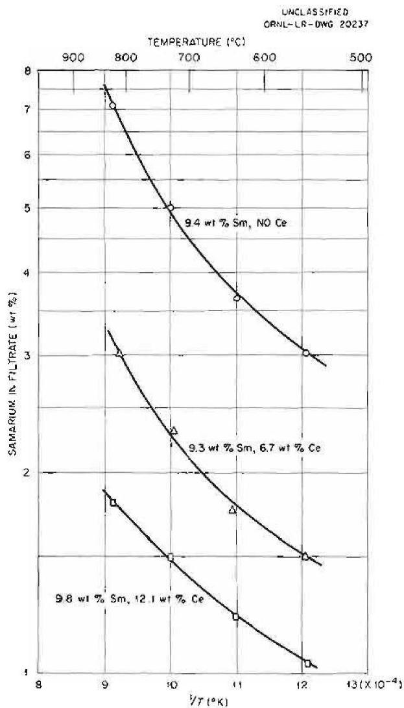  
Fig. 2.2.3. Effect of $\mathrm{CeF}_3$ on Solubility of $\mathrm{SmF}_3$ in NaF-ZrF $_4$ -UF $_4$ (50-46 d Male %). (Secret with caption)

# Effect of $\mathsf{BaF}_2$ or $\mathsf{SrF}_2$ on Solubility of $\mathsf{CeF}_3$

It has been determined that the addition of $\mathsf{BaF}_2$ or $\mathsf{SrF}_2$ to a melt containing $\mathsf{CeF}_3$ dissolved in $\mathsf{NaF - ZrF}_4\text{-UF}_4$ (50-46-4 mole %) reduces the solubility of the $\mathsf{CeF}_3$ . In one experiment approximately 7 wt % Ce as labeled $\mathsf{CeF}_3$ was equilibrated with $\mathsf{NaF - ZrF}_4\text{-UF}_4$ at $900^{\circ}\mathsf{C}$ , and then filtrates were obtained at approximately 800, 700, 600, and $550^{\circ}\mathsf{C}$ , as described above. After these filtrates were obtained, about 1.0 wt % Bo was added as $\mathsf{BaF}_2$ and equilibrated at $900^{\circ}\mathsf{C}$ , and another set of four filtrates was taken. More $\mathsf{BaF}_2$ was then added to bring the barium content to 7 wt %, and

the procedure was repeated. The activities of the filtrates were then counted to determine the cerium concentration.

A similar experiment was performed in which $\mathsf{SrF}_2$ was added to the extent of 4.6 wt $\%$ Sr to a previously equilibrated $\mathsf{CeF}_3$ -NaF- $\mathsf{ZrF}_4$ - $\mathsf{UF}_4$ mixture containing 6 wt $\%$ Ce. Filtrates were obtained by using the procedure described for the $\mathsf{BoF}_2$ additions, and the activities were counted to determine the cerium concentration. The results of these experiments are given in Tables 2.2.12 and 2.2.13 and are shown graphically in Fig. 2.2.4.

Table 2.2.12. Effect of $\mathsf{B}\mathsf{o}\mathsf{F}_{2}$ on Solubility of CeF3 in NaF-ZrF4-UF4 (50-46-4 Mole %)   

<table><tr><td>Initial Rare-Earth Content</td><td>Temperature (℃)</td><td>Cerium in Filtrate (wt %)</td></tr><tr><td rowspan="4">7.0 wt % Ce, no Ba</td><td>800</td><td>5.29</td></tr><tr><td>700</td><td>3.70</td></tr><tr><td>600</td><td>2.79</td></tr><tr><td>550</td><td>2.46</td></tr><tr><td rowspan="4">7.0 wt % Ce, 1.0 wt % Ba</td><td>800</td><td>4.93</td></tr><tr><td>700</td><td>3.38</td></tr><tr><td>600</td><td>2.52</td></tr><tr><td>550</td><td>2.20</td></tr><tr><td rowspan="4">6.9 wt % Ce, 7.0 wt % Ba (6 mole % Ba)</td><td>800</td><td>3.23</td></tr><tr><td>700</td><td>1.98</td></tr><tr><td>600</td><td>1.32</td></tr><tr><td>550</td><td>1.10</td></tr></table>

Table 2.2.13. Effect of ${\mathrm{{SrF}}}_{2}$ on Solubility of CeF ${}_{3}$ in NaF-ZrF ${}_{4} - {\mathrm{{UF}}}_{4}$ (50-46-4 Mole %)   

<table><tr><td>Initial Rare-Earth Content</td><td>Temperature (°C)</td><td>Cerium in Filtrate (wt %)</td></tr><tr><td rowspan="4">6.0 wt % Ce, no Sr</td><td>800</td><td>5.29</td></tr><tr><td>700</td><td>3.70</td></tr><tr><td>600</td><td>2.79</td></tr><tr><td>550</td><td>2.46</td></tr><tr><td rowspan="4">5.9 wt % Ce, 4.6 wt % Sr (6 mole % Sr)</td><td>800</td><td>4.57</td></tr><tr><td>700</td><td>2.82</td></tr><tr><td>600</td><td>1.86</td></tr><tr><td>550</td><td>1.59</td></tr></table>

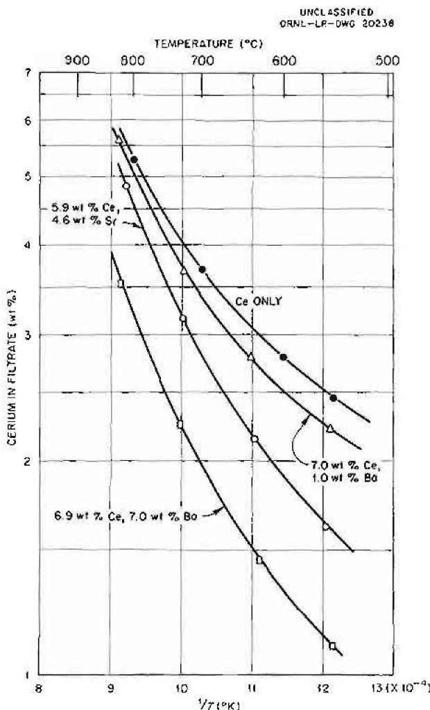  
Fig. 2.2.4. Effect of $\mathsf{BaF}_2$ or $\mathsf{SrF}_2$ on Solubility of $\mathsf{CeF}_3$ in NaF-ZrF $_4$ -UF $_4$ (50-46-4 Mole %). (Secret with caption)

# SOLUBILITY RELATIONSHIPS AMONG RARE-EARTH FLUORIDES IN MOLTEN NaF-ZrF4-UF4

R.A.Strehlow W.T.Ward

# Solubility of Individual Rare Earths

As shown in the preceding sections, the solubility of $\mathsf{LoF}_3$ , $\mathsf{CeF}_3$ , and $\mathsf{SmF}_3$ in the molten solvent $\mathsf{NaF - ZrF}_4$ - $\mathsf{UF}_4$ (50-46-4 mole %) has been carefully examined as a function of temperature. The data reveal considerable differences in solubility for materials whose chemical properties are so similar. The compound $\mathsf{SmF}_3$ is, as indicated in Table 2.2.14, nearly $25\%$ more soluble than $\mathsf{LaF}_3$ at each temperature studied, and the solubility of $\mathsf{CeF}_3$ is intermediate in each case.

The product of the solubility of each compound multiplied by the third power of the cation radius is the same within $\pm 2\%$ for each of the three rare-earth fluorides studied (Table 2.2.14). No explanation for the success of this correlation has been offered, and it is possible that the agreement is fortuitous. Subsequent studies of solubility of these materials as a function of NaF-ZrF $_4$ composition need to be completed before a discussion os to the general validity of this correlation can be made. In any event it is evident that the solubility of the rare-earth fluorides is sufficiently high to permit quite long-time operation of a reactor before precipitation of these materials becomes a problem.

# Solubility of Binary Rare-Earth Mixtures

When binary mixtures of $\mathsf{CeF}_3$ and $\mathsf{LaF}_3$ in NaF $\mathsf{ZrF}_4$ - $\mathsf{UF}_4$ were studied, as described above, the

Table 2.2.14. Solubility Relationships Among Rare-Earth Fluorides in NaF-ZrF $_4$ -UF $_4$ (50-46-4 Mole %)   

<table><tr><td rowspan="2">Temperature (°C)</td><td colspan="4">Solubility (mole %)</td><td colspan="4">Product of Solubility and Third Power of Cation Radius</td></tr><tr><td>SmF3</td><td>CeF3</td><td>LaF3</td><td>Mean</td><td>SmF3</td><td>CeF3</td><td>LaF3</td><td>Mean</td></tr><tr><td>550</td><td>2.23</td><td>2.02</td><td>1.80</td><td>2.02 ± 0.23</td><td>3.21</td><td>3.31</td><td>3.27</td><td>3.26 ± 0.05</td></tr><tr><td>600</td><td>2.52</td><td>2.27</td><td>2.02</td><td>2.27 ± 0.25</td><td>3.63</td><td>3.72</td><td>3.68</td><td>3.67 ± 0.05</td></tr><tr><td>700</td><td>3.38</td><td>3.00</td><td>2.68</td><td>3.02 ± 0.36</td><td>4.87</td><td>4.92</td><td>4.88</td><td>4.89 ± 0.03</td></tr><tr><td>800</td><td>4.97</td><td>4.30</td><td>4.03</td><td>4.43 ± 0.54</td><td>7.16</td><td>7.06</td><td>7.33</td><td>7.18 ± 0.14</td></tr></table>

\*Cation radii: $\mathbf{S}\mathbf{m}^{+ + + }$ 1.13A;Ce++1.18A;La++1.22A.

data shown in Table 2.2.15 were obtained. The solubility of $\mathsf{CeF}_3$ and $\mathsf{LaF}_3$ in combination is intermediate between that of pure $\mathsf{LaF}_3$ and that of pure $\mathsf{CeF}_3$ . The binary solubility data are plotted in Fig. 2.2.5, along with the solubility data for pure $\mathsf{CeF}_3$ and pure $\mathsf{LaF}_3$ , as a three-component sytsem, with the pure solvent (NaF-ZrF $_4$ -UF $_4$ , 50-46-4 mole %) as one component. The liquidus lines established by the four experimental points are nearly straight.

In a preceding report9 equilibrium quotients were defined for the partition of the rore earths between the liquid and their solid solution:

$$
K = \frac {N _ {\text {L o F} _ {3} (\text {s o l i d})} \times N _ {\text {C o F} _ {3} (\text {s o l u t i o n})}}{N _ {\text {C o F} _ {3} (\text {s o l i d})} \times N _ {\text {L o F} _ {3} (\text {s o l u t i o n})}},
$$

where $N$ is the concentration (in mole fraction) of the designated material in the designated phase. It was also established that if Henry's law were obeyed by both the liquid and the solid solution, $K$ should be the ratio of the solubilities of the pure component trifluorides. The fact that the experimental points for the mixtures of $\mathsf{LoF}_3$ and $\mathsf{CeF}_3$ fall on the straight lines connecting the original composition and the pure solvent, as shown in Fig. 2.2.5, is equivalent to the statement that $K_r$ as defined above, is unity rather than the ratio of solubilities (about 1.1). The observed

9. W. T. Ward, ANP Quan. Prog. Rep. Dec. 31, 1956, ORNL-2221, p 126.

values are, accordingly, unexpected, and they indicate some deviation from Henry's law in the liquid or in the solid solution or in both.

The preliminary studies made to date for the $\mathsf{CrF}_3\text{-SmF}_3$ -solvent system have yielded the $K$ values shown in Table 2.2.16. These values, which were obtained with the use of a single-tracer technique and with the assumption that the liquidus lines are similar to those of the $\mathsf{LaF}_3\text{-CrF}_3$ -solvent system, deviate significantly from unity.

UNCLASSIFIED

ORNL-LR-DWG 20239

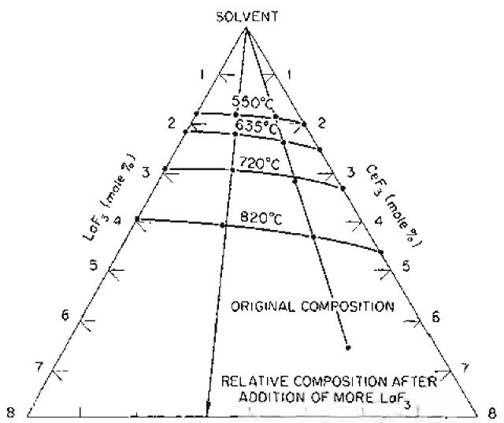  
Fig. 2.2.5. Pseudoternary System $\mathsf{LaF}_3\mathsf{-CeF}_3$ and the Solvent Mixture $\mathsf{NaF}\cdot \mathsf{ZrF}_4\cdot \mathsf{UF}_4$ (50-46-4 Mole%). (Secret with caption)

Table 2.2.15. Concentrations of $\mathsf{L}\mathsf{o}\mathsf{F}_{3}$ and $\mathsf{C e F}_{3}$ in a Saturated Solution in NaF- $\mathsf{Z r F}_{4}-\mathsf{U F}_{4}$ (50-46-4 Mole %) for Different Relative Amounts of $\mathsf{C e F}_{3}$ and $\mathsf{L o F}_{3}$ in the Solid Phase   

<table><tr><td colspan="2">Composition of Solid Phase (mole %)</td><td rowspan="2">Temperature (℃ ±1%)</td><td colspan="2">Concentration in Solution (mole %)</td></tr><tr><td>CeF3</td><td>LaF3</td><td>CeF3</td><td>LaF3</td></tr><tr><td>76.5</td><td>23.5</td><td>550</td><td>1.43</td><td>0.41</td></tr><tr><td></td><td></td><td>635</td><td>1.82</td><td>0.57</td></tr><tr><td></td><td></td><td>720</td><td>2.47</td><td>0.78</td></tr><tr><td></td><td></td><td>820</td><td>3.33</td><td>1.03</td></tr><tr><td>40.1</td><td>59.9</td><td>550</td><td>0.76</td><td>1.10</td></tr><tr><td></td><td></td><td>635</td><td>0.93</td><td>1.31</td></tr><tr><td></td><td></td><td>720</td><td>1.23</td><td>1.78</td></tr><tr><td></td><td></td><td>820</td><td>1.54</td><td>2.55</td></tr></table>

Table 2.2.16. Equilibrium Quotient for Partition of $\mathsf{SmF}_3$ and $\mathsf{CaF}_3$ Between Liquid and Solid Solutions   

<table><tr><td colspan="2">Composition of Solid Phase (mole %)</td><td rowspan="2">Temperature (℃)</td><td rowspan="2">K*</td></tr><tr><td>SmF3</td><td>CeF3</td></tr><tr><td>7.6</td><td>8.8</td><td>550</td><td>1.2</td></tr><tr><td></td><td></td><td>635</td><td>1.4</td></tr><tr><td></td><td></td><td>720</td><td>1.5</td></tr><tr><td></td><td></td><td>820</td><td>1.7</td></tr><tr><td>8.4</td><td>11.33</td><td>550</td><td>1.1</td></tr><tr><td></td><td></td><td>635</td><td>1.4</td></tr><tr><td></td><td></td><td>720</td><td>1.7</td></tr><tr><td></td><td></td><td>820</td><td>2.3</td></tr></table>

$$
* K = \frac {N _ {\text {S m F} _ {3} (\text {s o l i d})} \times N _ {\text {C a F} _ {3} (\text {s o l u t i o n})}}{N _ {\text {C a F} _ {3} (\text {s o l i d})} \times N _ {\text {S m F} _ {3} (\text {s o l u t i o n})}}.
$$

Further studies with the use of the dual-tracer technique on the $\mathsf{SmF}_3\text{-CeF}_3$ -solvent system will be required before it can be established that the two systems are really dissimilar. If the data in Table 2.2.16 can be verified, $\mathsf{SmF}_3$ can be removed from solution by equilibration with $\mathsf{CeF}_3$ and filtration more readily than would be expected from Henry's law estimates.

# SOLUBILITY OF XENON GAS IN NaF-ZrF4-UF4 N.V. Smith

The determination of the solubility of xenon gas in molten NaF-ZrF $_4$ -UF $_4$ (50-46-4 mole %) as a function of pressure and temperature was successfully completed. As a consequence of the high cost of xenon, a recovery system for the xenon used in the determination was added to the apparatus previously described[10] for the determination of the solubility of helium in NaF-ZrF $_4$ -UF $_4$ . In this gas-dispensing and recovery system three xenon cylinders were connected through their conventional pressure-regulating valves to a manifold which served to introduce the gas at the desired pressure into the solubility equipment. Between each cylinder and

its pressure regulator an additional connection, which could be closed with a needle valve, was made to a second manifold which received the xenon gas emerging from the solubility apparatus. With the use of a liquid-nitrogen cooling bath the xenon could be recovered in one of the cylinders while the experiment was fed from a second cylinder. The third cylinder was maintained as a standby in case the source cylinder became depleted during an experiment. This assembly is shown as Figs. 2.2.6 and 2.2.7.

The xenon was obtained in cylinders from Linde Air Products Co. Mass spectrometric analysis showed its purity to be better than $99.99\%$ , as received. The high purity gradually decreased to $95.9\%$ after eight complete experiments.

The limited supply of xenon available necessitated a constant watch during the experiment in order to avoid exhausting the source cylinder below a safe preset pressure. Accordingly, the saturating time was lowered to approximately 5 hr. The results appeared to correlate satisfactorily regardless of whether the time was 4 or 5 hr. In a single experiment in which the saturation was attempted in 1 hr, the amount of xenon found in solution was only about one-half as much as that obtained with 4- or 5-hr saturation times. From the previous experience with helium, it appeared that 3 hr of saturation time was sufficient.

The results shown in Table 2.2.17 and Fig. 2.2.8 appear to be consistent to within approximately $\pm 10\%$ . All the experimental variables appear to have been controlled to within considerably closer variations than $\pm 10\%$ . The mass spectrometer analyses agree, on an average, with the synthetic compositions of the standard gas mixtures to within approximately $10\%$ . As a consequence, it does not appear unreasonable to assume that the results presented are correct to within $\pm 20\%$ , if it is assumed that the saturating time used was sufficiently long. Appropriate experiments are under way to demonstrate quantitatively the time required for saturation.

It may be seen that, as in the case of helium, the solubility of xenon in $\mathsf{NaF - ZrF_4 - UF_4}$ (50-46-4 mole %) increases with increasing temperature. This effect is discussed in more detail in the following section.

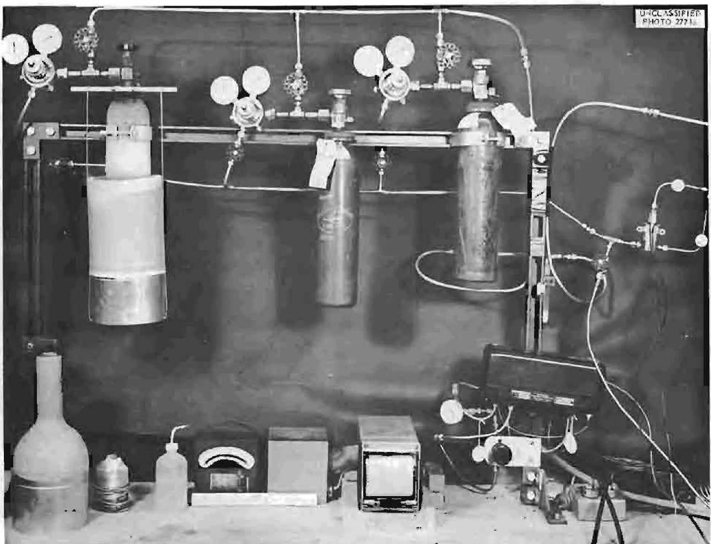  
Fig. 2.2.6. Xenon Recovery Assembly.

# COMPARISON OF THE SOLUBILITIES OF HELIUM AND XENON GASES IN NoF-ZrF4-UF4

N.V.Smith

Thermodynamic comparisons of the solubilities of inert gases in $\mathrm{NaF - ZrF_4 - UF_4}$ (50-46-4 mole %) are more readily performed by recalculating the solubilities on a mole fraction scale. The mole fraction, $N$ , of a gas dissolved in this solvent is defined by

$$
N = \frac {n _ {g}}{(1 / 1 0 . 4 8) + n _ {g}},
$$

where $n_{g}$ is moles of dissolved gas per gram of solvent and 110.48 is the average molecular weight of the solvent. Since the solutions used were

very dilute, the value of $n_{\mathrm{g}}$ in the denominator could be omitted, and the values of the solubilities previously given in moles of gas per cubic centimeter of melt were changed directly to mole fractions by dividing by the number of moles of melt per cubic centimeter. The density values were taken to be 3.37, 3.28, and 3.19 g/cm³ at 600, 700, and 800°C, and thus the number of moles of melt per cubic centimeter were 3.05 × 10⁻², 2.97 × 10⁻², and 2.88 × 10⁻² at the three temperatures. The experimental values of the solubilities of helium and xenon obtained on this basis are shown in Fig. 2.2.9. The average values

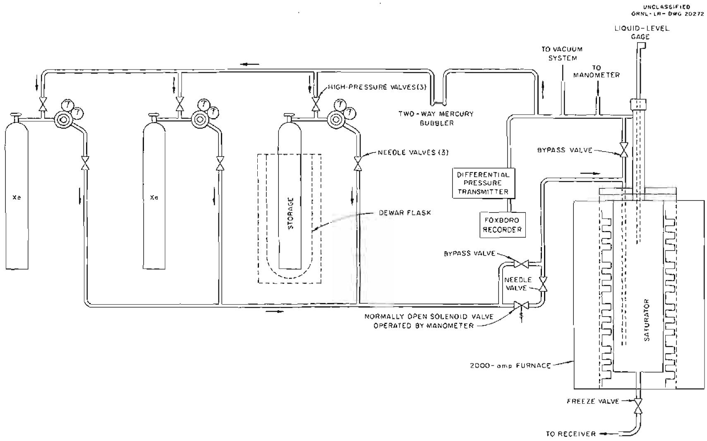  
Fig. 2.2.7. Diagram of Xenon Recovery System.

Table 2.2.17. Solubility of Xenor in NaF-ZrF4-UF4 (50-46-4 Male %)   

<table><tr><td>Temperature (°C)</td><td>Xenon Saturating Pressure (atm)</td><td>Solubility (moles of xenon per cm3 melt)</td><td>K*</td></tr><tr><td></td><td></td><td>× 10-8</td><td></td></tr><tr><td>600</td><td>0.49</td><td>0.945</td><td>1.93</td></tr><tr><td></td><td>1.50</td><td>3.28</td><td>2.18</td></tr><tr><td></td><td>1.92</td><td>3.75</td><td>1.96</td></tr><tr><td></td><td></td><td></td><td>Av 2.0 ± 0.3</td></tr><tr><td>700</td><td>1.00</td><td>3.67</td><td>3.67</td></tr><tr><td></td><td>1.96</td><td>8.60</td><td>4.38</td></tr><tr><td></td><td></td><td></td><td>Av 4.0 ± 0.4</td></tr><tr><td>800</td><td>1.00</td><td>6.18</td><td>6.18</td></tr><tr><td></td><td>1.68</td><td>11.32</td><td>6.74</td></tr><tr><td></td><td></td><td></td><td>Av 6.5 ± 0.4</td></tr></table>

$$
* K = \frac {c}{p} = \frac {\text {m o l e s o f x e n c o n} \times 1 0 ^ {8}}{\left(\mathrm {c m} ^ {3} \text {o f m e l t}\right) \times (\mathrm {o t m})}.
$$

of Henry's law constants at the three temperatures are listed in Table 2.2.18, and the temperature dependence of the constants is illustrated in Fig. 2.2.10.

For the case of a noble gas, $X$ , in equilibrium with its saturated solution in a nonvolatile liquid, the chemical equation for the process is

(1) $X(d) = X(g)$

where $(d)$ and $(g)$ refer to dissolved and gaseous states, respectively. The equilibrium constant for the process is given by

$$
K _ {\alpha} = \frac {\alpha_ {X} (g)}{\alpha_ {X} (d)}, \tag {2}
$$

where $a$ refers to activity of the indicated species. At the high temperatures and low pressures used, the helium and xenon gases may be assumed to behave ideally and the pressures may be assumed to be equal to the fugacities. Accordingly, if the standard state of the gas is taken at a fugacity of 1 atm, the activity of the gas is numerically equal to the pressure. The activity of the gas in solution may be defined by

(3) $a_{X(d)} = \gamma_{X(d)}N_{X(d)}$

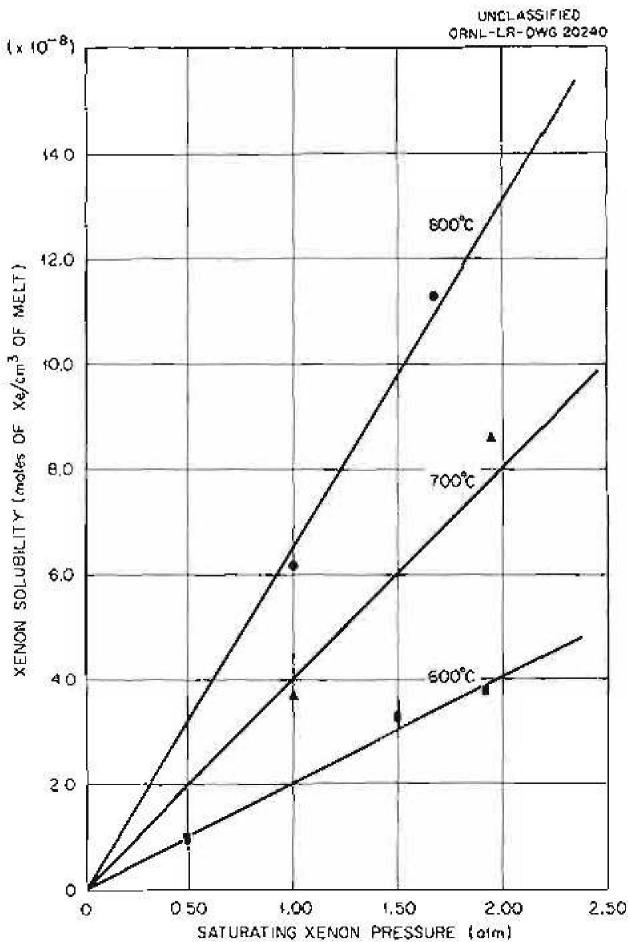

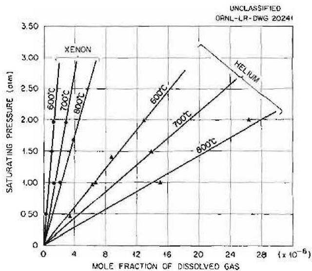  
Fig. 2.2.8. Solubility of Xenon in NaF-ZrF4-UF4 (50-46-4 mole %) as a Function of Temperature. (Secret with caption)   
Fig. 2.2.9. Solubilities of Xenon and Helium in NaF-ZrF $_4$ -UF $_4$ (50-46 Mole %). (Secret with caption)

Table 2.2.18. Henry's Law Constants of Helium and Xenon Dissolved in NaF-ZrF4-UF4 (50-46-4 Mole %)   

<table><tr><td rowspan="2">Temperature (°C)</td><td colspan="2">Henry&#x27;s Law Constant, P/N (atm)</td></tr><tr><td>For Helium</td><td>For Xenon</td></tr><tr><td></td><td>× 105</td><td>× 106</td></tr><tr><td>600</td><td>1.54</td><td>1.51</td></tr><tr><td>700</td><td>1.09*</td><td>0.75</td></tr><tr><td>800</td><td>0.71</td><td>0.45</td></tr></table>

*Based on only one experiment. The results of two other experiments at $700^{\circ} \mathrm{C}$ were discarded because of mechanical failures of the apparatus during the experiments.

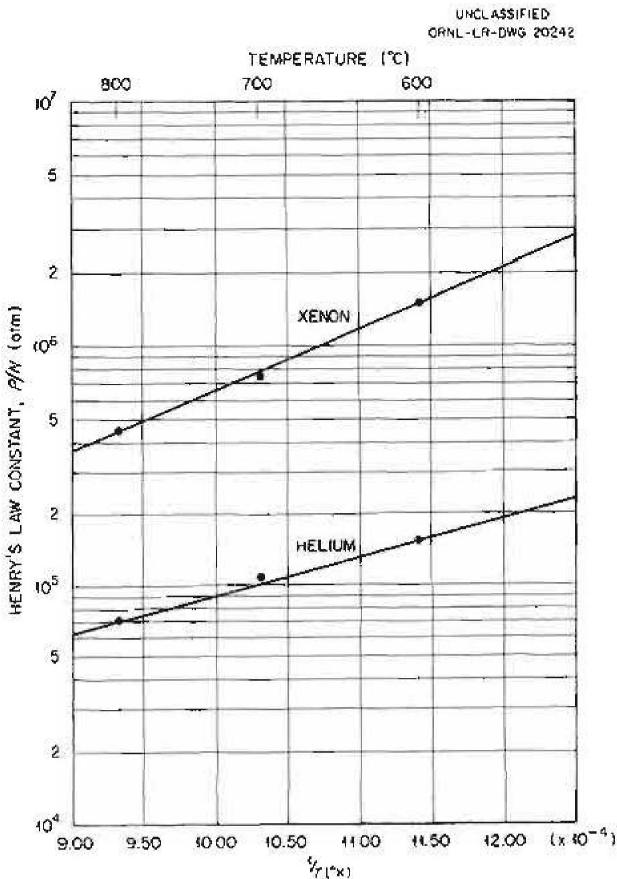  
Fig. 2.2.10. Temperature Dependence of Henry's Law Constants for Solubilities of Xenon and Helium in NoF-ZrF $_4$ -UF $_4$ (50-46-4 Mole %). (Secret with caption)

and Eq. 3 reduces to

$$
K _ {a} = \frac {P _ {X (g)}}{\gamma_ {X (d)} N _ {X (d)}} = \frac {K _ {X}}{\gamma_ {X (d)}}. \tag {4}
$$

Over the region where the gas obeys Henry's law, $y_{X(d)}$ is unity, and consequently

$$
K _ {a} = K _ {x}, \tag {5}
$$

This is the equivalent of making the activity reduce to the mole fraction over the concentration range mentioned. The fugacity of the standard state implied by this postulation is numerically equal to Henry's law constant for the particular gas at the given temperature.

Standard free energy changes, $\Delta F^{\circ}$ , may be calculated for Eq. 1 from the values of the equilibrium constants. The slopes of the curves in Fig. 2.2.10 readily give the numerical value of $\Delta H^{\circ}$ of Eq. 2. The standard entropy change, $\Delta S^{\circ}$ , is obtained by the relation

$$
\Delta S ^ {\circ} = \frac {\Delta H ^ {\circ} - \Delta F ^ {\circ}}{T}. \tag {6}
$$

Some calculated values of $\Delta H^{\circ}$ , $\Delta F^{\circ}$ , and $\Delta S^{\circ}$ at $1000^{\circ}K$ are listed in Table 2.2.19.

The results appear to be significant in that the standard entropy changes are the same even if the solubilities of the gases are widely different. In addition, some thermodynamic changes can be calculated for the isothermal expansion at $1000^{\circ}\mathrm{K}$ of an ideal gas from a concentration of $c_{1}$ to $c_{2}$ moles per liter. If $c_{1}$ is allowed to assume the numerical value of the Henry's low constant expressed in (moles of gas)/(liter melt)-(atm) and $c_{2}$ is assumed to be the ideal gas concentration of 1 atm, the values listed in Table 2.2.20 are obtained. As may be observed the values of $g$ , $w$ ,

Table 2.2.19. Standard Enthalpy, Free Energy, and Entropy Changes of $X(d) = X(g)$ at $1000^{\circ}K$   

<table><tr><td></td><td>ΔHo(cal)</td><td>ΔF0(cal)</td><td>ΔS0(e.u.)</td></tr><tr><td>Helium</td><td>-7,400</td><td>-22,800</td><td>+15.4</td></tr><tr><td>Xenon</td><td>-11,400</td><td>-26,600</td><td>+15.2</td></tr></table>

Table 2.2.20. Numerical Values of Heat $(q)$ , Work $(\omega)$ , Enthalpy Changes $(\Delta H)$ , and Entropy Changes $(\Delta S)$ Involved in the Reversible Isothermal Expansion of on Ideal Gas at $1000^{\circ}K$   

<table><tr><td>Gas</td><td>c1(moles/liter)</td><td>c2(moles/liter)</td><td>q=w(col)</td><td>ΔH</td><td>ΔS(e.u.)</td><td>TΔS(col)</td></tr><tr><td>Helium</td><td>3.1 × 10-4</td><td>1.22 × 10-2</td><td>-7,300</td><td>0</td><td>-7.3</td><td>-7,300</td></tr><tr><td>Xenon</td><td>4.85 × 10-5</td><td>1.22 × 10-2</td><td>-11,000</td><td>0</td><td>-11.0</td><td>-11,000</td></tr></table>

and $T\Delta S$ for both gases are equal, within experimental uncertainties, to the values of $\Delta H^0$ given in the Table 2.2.19. Further discussion of the significance of the agreement between the values calculated for both processes must await additional experimental data. It is to be noted, however, that this agreement, if it is general for monatomic gases in fluoride solvents, would enable the investigator to calculate, from a single experimental measurement, as many isotherms as would be desired.

# SOLUBILITY OF HE IN NoF-ZrF4

J. H. Shoffer

C. M. Blood

Knowledge of the solubility of HF in molten fluoride mixtures would be valuable in studies of methods of salt purification, some aspects of corrosion problems, and processes for dissolution of solid fuel elements for uranium recovery. No record of direct measurement of the solubility of HF in molten fluorides has been found. As a byproduct of studies of salt purification, attempts have been made of times during the past several years to estimate the solubility of HF in molten salts from rates of stripping of the HF by inert gas carriers. The results obtained have not, however, been conclusive.

In recent months it has been possible to measure, by a direct equilibration method, the solubility of HF in an $\mathrm{NaF - ZrF_4}$ (53-47 mole %) melt at $600^{\circ}C$ . When data are available at other temperatures, comparisons of these values with those estimated from measurements of stripping rates will be discussed.

The direct equilibration procedure consists, in brief, of saturating the melt with HF at constant

pressure, transferring (by melting a frozen plug) a portion of the saturated melt into a closed receiver containing on initial pressure of helium equal to one-half the HF saturation pressure, re-establishing the frozen plug in the transferline, and stripping the HF from the melt in the receiver by sparging with helium gas. The HF is absorbed in a standard KOH solution, and the amount of HF evolved is determined by titration. The procedures for saturation and transfer of the melt and the apparatus for these operations are very similar to those used for studying helium and xenon solubility.[14] A simplified diagram of the assembly used in these studies is shown as Fig. 2.2.11.

When the empty receiver is stripped at $600^{\circ}\mathrm{C}$ with helium, about $4 \times 10^{-6}$ mole of HF is recovered per liter of exit gas, and after the passage of 50 liters of helium through a transferred melt the HF concentration in the exit gas is again $4 \times 10^{-6}$ mole of HF per liter of exit gas. This "residuoil" HF is probably a consequence of desorption from the receiver and lines, but these concentrations are completely negligible in comparison with the amounts soluble in the melt. When molten salt saturated with helium was transferred and stripped at $600^{\circ}\mathrm{C}$ with 50 liters of helium, 0.32 mmole of HF was recovered. This "blank" is small but not negligible, and it has been used to correct the gross quantities of HF (11 to 27 mmoles) recovered from the solubility experiments.

Summaries of the experimental results obtained to date are presented in Table 2.2.21 and Fig. 2.2.12. From these data, which will be extended to 700 and $800^{\circ}C$ and to pressures in the range of 0.25 to 2.5 atm, it appears that Henry's law

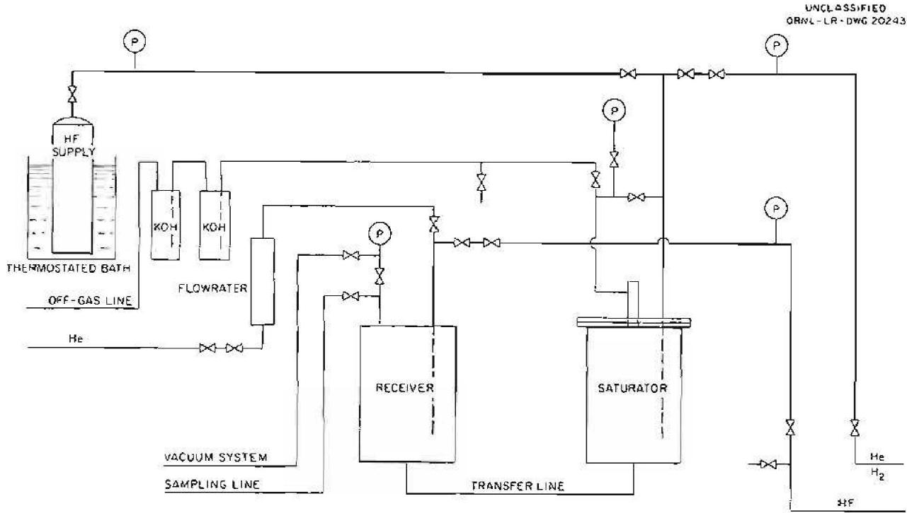  
Fig. 2.2.11. Apparatus for Determining the Solubility of HF in Molten Fluoride Mixtures.

Table 2.2.21. Solubility of HF in Molten NoF-ZrF4 (53-47 MoIe %) at $600^{\circ}C$   

<table><tr><td>Saturating Pressure (atm)</td><td>Quantity of Melt Transferred (cm3)</td><td>HF Stripped (mmoles)*</td><td>HF Solubility (mole/cm3of melt)</td><td>K**</td></tr><tr><td></td><td></td><td></td><td>× 10-5</td><td>× 10-5</td></tr><tr><td>2.53</td><td>910</td><td>27.73</td><td>3.13</td><td>1.23</td></tr><tr><td>2.52</td><td>872</td><td>26.29</td><td>3.02</td><td>1.20</td></tr><tr><td>2.05</td><td>933</td><td>22.80</td><td>2.45</td><td>1.19</td></tr><tr><td>2.05</td><td>960</td><td>26.14</td><td>2.72</td><td>1.33</td></tr><tr><td>1.55</td><td>927</td><td>17.86</td><td>1.92</td><td>1.24</td></tr><tr><td>1.50</td><td>934</td><td>16.38</td><td>1.75</td><td>1.17</td></tr><tr><td>1.05</td><td>849</td><td>11.27</td><td>1.33</td><td>1.27</td></tr><tr><td>1.05</td><td>910</td><td>12.63</td><td>1.39</td><td>1.32</td></tr><tr><td></td><td></td><td></td><td></td><td>Mean 1.25</td></tr></table>

*Corrected for 0.32 mmole blank.   
\*\*K expressed as moles of HF per cubic centimeter of melt times pressure in atmospheres.

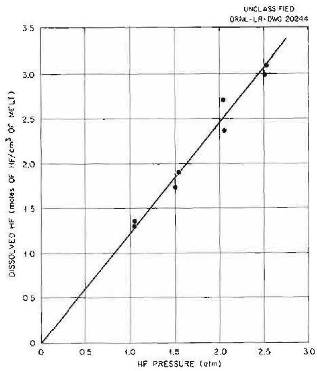  
Fig. 2.2.12. Solubility of HF in $\mathsf{NaF - ZrF}_4$ (53-47 Mole %) at $600^{\circ}\mathrm{C}$ .

is obeyed and that the solubility is $1.25 \times 10^{-5}$ mole of HF per cubic centimeter of melt at 1 atm.

# EMF MEASUREMENTS IN MOLTEN FLUORIDES L. E. Topol

Concentration Cells with $\mathsf{Zr}^{\circ}$ | ZrF4 Electrodes

The solubility of a metal fluoride in a molten fluoride salt can be determined from the discontinuity of the liquidus temperature in a plot of emf vs temperature15 for a concentration cell of the type

$$
M ^ {\circ} \left| M F _ {n (c _ {1})}, A F _ {(c _ {2})} \right| \left| A F _ {(c _ {2} ^ {\prime})}, M F _ {n (c _ {1} ^ {\prime})} \right| M ^ {\circ},
$$

where M is a metal and AF is a molten fluoride salt. Attempts to use this technique, however, to establish the liquidus temperature for the NaF-ZrF₄ (39-61 mole %) mixture with the use of Zr or Zircoloy electrodes have been generally unsuccessful. The potentials of the cells exhibited irregular fluctuations with temperature, and in

some cases the temperature dependence of emf was in the direction opposite to that expected.

# Concentration Cells with Ni $^{\circ}$ NiF $_2$ Electrodes

Preliminary experiments with concentration cells of the type

$$
\mathrm {N i} ^ {\circ} \left| \mathrm {N i F} _ {2 \left(c _ {1}\right)} \right| \left| \mathrm {N i F} _ {2 \left(c _ {2}\right)} \right| \mathrm {N i} ^ {\circ}
$$

with KF-LiF (50-50 mole %) as the solvent indicate the solubility of NiF $_2$ in this solvent to be about 10 times that in the solvent NaF-ZrF $_4$ (53-47 mole %). This difference can probably be attributed to the basic nature of the KF-LiF solvent in which the weekly acid NiF $_2$ would be more soluble than in the more acid NaF-ZrF $_4$ mixture. (See section of Chap. 2.3 on "A Structure Model and on Acid-Bose System for Fuel Mixtures," this report.)

An illustration of the acid character of $\mathsf{ZrF}_4$ was obtained in measurements of the cell

$$
\left. \mathrm {N i} \right| \mathrm {N i} F _ {2 \left(c _ {1} ^ {\prime}\right)} \left| \left| Z r F _ {4 \left(c _ {2}\right)}, \mathrm {N i} F _ {2 \left(c _ {1}\right)} \right| \mathrm {N i} \right.
$$

in KF-LiF, where $c_1 \approx c_1' = 1.00$ wt %, and $c_2 = 1.5$ wt %. The emf of this cell, 7 to 8 mv at $650^{\circ}$ C with the $ZrF_4$ melt positive, is equal to

$$
\begin{array}{l} - \frac {R T}{n} \ln \left(\frac {a _ {1} ^ {\prime}}{a _ {1}}\right) \left(\frac {a _ {3}}{a _ {3} ^ {\prime}}\right) ^ {2 t +} \\ = - 0. 0 9 \log \left(\frac {x _ {1} ^ {\prime} y _ {1} ^ {\prime}}{x _ {1} y _ {1}}\right) \left(\frac {a _ {3}}{a _ {3} ^ {\prime}}\right) ^ {2 t _ {4}}, \\ \end{array}
$$

where $x$ , $a$ , $y$ , and $t_{+}$ denote the mole fraction, activity, activity coefficient of a species, and the average transference number of the alkali cations, respectively; the subscript "1" refers to the $\mathrm{NiF}_2$ and the subscript "3" to the KF-LiF; the primes signify the $\mathrm{ZrF}_4$ -free melt. Since the mole fractions $x_{1}$ and $x_{1}^{\prime}$ were approximately equal, it was found that

$$
\left(\frac {y _ {1} ^ {\prime}}{y _ {1}}\right) \left(\frac {a _ {3}}{a _ {3} ^ {\prime}}\right) ^ {2 t +} = 1. 2 0,
$$

and hence the NiF $_2$ activity in the ZrF $_4$ -free melt is, as an approximation, at least 20% greater than in the ZrF $_4$ -containing melt.

In both half cells, as well as in the nickel half cells described in Table 2.2.22 in the following section, the $\mathsf{NiF}_2$ solutions were reddish, as they were found to be in $\mathsf{NaF - ZrF_4}$ (ref 16). Dilute $\mathsf{NiF}_2$ solutions in KF-LiF-NaF eutectic were previously found to be yellow. The red color is probably due to the larger concentration of $\mathsf{NiF}_2$ used in the emf experiments described here.

# Daniel Cells

In order to obtain more information regarding the change of solute activity coefficients with solvent composition, efforts are under way to develop more reliable types of Daniell cells and to measure a series of these cells, as was done previously, in different media with varying but dilute concentrations of the metal fluorides, $\mathsf{NiF}_2$ , $\mathsf{FeF}_2$ , $\mathsf{CrF}_2$ , and possibly other solutes. Some results are given in Table 2.2.22 for measurements made with Daniell cells of the type

$$
F _ {e} \left| F _ {e} F _ {2 (c _ {1})} \right| \left| \left| N i F _ {2 (c _ {2})} \right| N i \right.
$$

in NaF-ZrF₄ (53-47 mole %) and KF-LiF (50-50 mole %) contained in iron and nickel crucibles, respectively. The measurements were corrected for thermoelectric effects, but junction potentials were neglected.

The results agree well with the results of previous measurements in the NaF-ZrF4 solvent, which gave about 500 for yNiF2/yFeF2, even though most of the cells studied exhibited a decrease in emf with time, and none were reproducible to within 5 mv for more than one day. The FeF2 melts showed a greater tendency to creep than the NiF2 melts in both solvents.

It appears that the activity ratio of $\mathsf{NiF}_2$ to $\mathsf{FeF}_2$ does not change much with solute concentration in the range measured but that this ratio varies from an average of about 600 in $\mathsf{NaF - ZrF}_4$ to 200 in KF-LiF. The two values of around 300 (Table 2.2.22) obtained in the NaF-ZrF4 solvent should probably be disregarded, since any failure of the cells seems to result in a decreasing emf, which in turn produces a smaller calculated activity coefficient ratio. The average value of about 600 found for $y_{\mathsf{NiF}_2} / y_{\mathsf{FeF}_2}$ in the $\mathsf{NaF - ZrF}_4$ solvent may be compared with a value of 700 at $625^{\circ}\mathsf{C}$ taken from data obtained in

Table 2.2.22. Activity Coefficient Ratios of $\mathsf{NiF}_2$ to $\mathsf{FeF}_2$ in Molten Fluoride Solvents as Obtained from Daniell Cell Measurements at $650^{\circ}\mathsf{C}$   

<table><tr><td>Solvent</td><td>Concentration of NiF2(mole %)</td><td>Concentration of FeF2(mole %)</td><td>γNiF2/γFeF2</td></tr><tr><td rowspan="8">NaF-ZrF4</td><td>0.212</td><td>0.744</td><td>500*</td></tr><tr><td>0.214</td><td>0.224</td><td>310</td></tr><tr><td>0.202</td><td>0.205</td><td>301</td></tr><tr><td>0.190</td><td>0.192</td><td>492</td></tr><tr><td>0.210</td><td>0.258</td><td>660</td></tr><tr><td>0.213</td><td>0.706</td><td>510</td></tr><tr><td>0.258</td><td>0.700</td><td>640</td></tr><tr><td>0.247</td><td>0.659</td><td>730</td></tr><tr><td rowspan="2">KF-LiF</td><td>0.545</td><td>0.621</td><td>193</td></tr><tr><td>0.530</td><td>0.617</td><td>218</td></tr></table>

previous studies of the equilibrium reduction of metal fluorides by hydrogen in $\mathsf{NaF - ZrF}_4$ (ref 18).

The observed change in the value of the activity coefficient ratio with the change in solvent was expected, since a strong fluoride donor such as KF-LiF would tend to "level" the differences between two "amphoteric" solutes. It should be noted that the large values found for the activity coefficient ratios of iron and nickel fluorides are probably due to an error in the free energy of formation of $\mathrm{NiF}_2$ , which enters the calculation of activities from Daniell cells. Thus by decreasing the present value of $\Delta F^{\circ}$ for $\mathrm{NiF}_2$ by about 10 kcal (from -126 to -116 kcal at $1000^{\circ}\mathrm{K}$ ), the experimental results can be brought into better accord with theoretical postulates.

# ACTIVITIES FROM EMF MEASUREMENTS OF MOLTEN AND SOLID SOLUTIONS OF SALTS

M. B. Panish

It has been noted as a result of continuing investigations directed toward understanding the corrosive behavior of salt melts that many of the distinctive features of the molten fluorides of interest as reactor fuels can be explained with models based on the premise that the ions behave as hard, charged balls. For example, the negative deviations from Raoult's law, which are characteristic of the fuel mixtures, can be correlated, as far as relative magnitude is concerned, with the calculated electrostatic forces between charged spheres having the same charge-to-radius ratio as the ions in the fuel mixtures.[19] (See also section in Chap. 2.3 on "Some Aspects of Solution Behavior in Fluoride Melts," this report.) Comparison with the behavior of other salt mixtures which cannot be explained by such a simple model shows that the difference is due to the presence of polarizable ions, that is, ions whose charge distribution can be distorted into nonsymmetrical configurations by neighboring ions. Estimates based on refractivities[20] indicate that the $F^{-}$ ion has a polarizability of 0.81, compared with

2.98 for $\mathsf{Cl}^{-}$ and 4.24 for $\mathsf{Br}^{-}$ . The $\mathsf{Ag}^{+}$ ion has a polarizability of 1.9 compared with 0.03 for $\mathsf{Li}^{+}$ and 0.24 for $\mathsf{Na}^{+}$ .

The effects of composition on activities in the systems NaCl-AgCl (ref 21) and LiCl-AgCl were measured to illustrate positive deviations from Raoult's law in contrast to the negative deviations predicted by the hard sphere model. Positive deviations were found experimentally that were smaller with $\mathsf{Na}^+$ than with $\mathsf{Li}^+$ , as shown in Fig. 2.2.13. Some of the stability of pure AgCl can be attributed to the partially covalent nature of the bonds between $\mathsf{Ag}^+$ and $\mathsf{Cl}^-$ ions, which in turn is due to the polarizability of these ions. The effect of neighboring alkali cations on the loss of the covalent character ("depolarization" of the chloride ion) and the consequent decrease in the stability of AgCl is reflected in the trend toward positive deviation. The increasing negative trend with increasing alkali cation size is in accord with the expected smaller electrostatic attraction between chloride ions and the larger alkali cations.

The correlations described above apply to several other systems which contain polarizable ions

21 M. B. Panish, ANP Quar. Prog. Rep. Sept. 10, 1956, ORNL-2157, p 116.

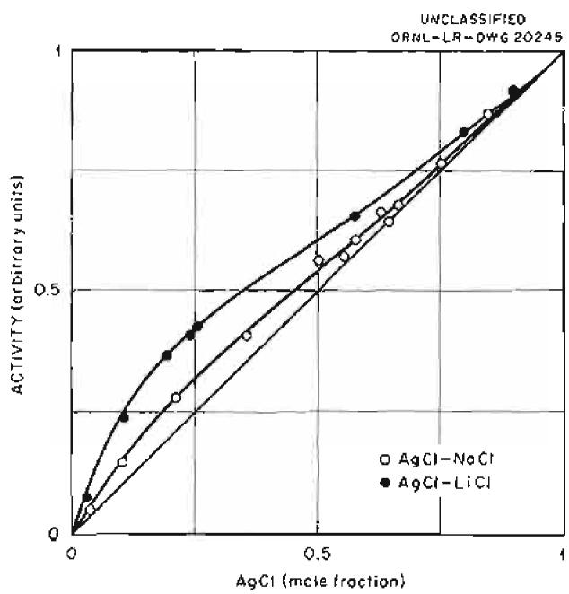  
Fig. 2.2.13. The Activity of AgCl in the AgCl-NoCl and AgCl-LiCl Systems at $800^{\circ}\mathrm{C}$ .

and which exhibit a tendency toward positive deviations.[22] By contrast, the fluoride fuel solvents give little evidence of behavior resembling that attributed to polarizable ions. This contrast strengthens the conclusion that fluoride melts can be considered as relatively unaffected by polarization and indicates that fluoride melts can be adequately represented by simpler models than those required for molten salts in general.

In the course of the electrochemical studies of the LiCl-AgCl and NaCl-AgCl systems, attention was also given to the solid solutions found below the solidus. Measurements at $400^{\circ}C,$ for example, give the activities shown in Fig. 2.2.14. The significance of these measurements is twofold. First, they provide activities in a solution whose structure is known, since the solid-solution crystals have a simple cubic lattice. Second, they indicate the existence of

concentration ranges in which the activity of AgCl decreases with increasing concentration. Such unusual activity curves apply only to metastable conditions "frozen" by the slowness of diffusion in the solid; they could never persist in a melt, but it is of interest to note that they can have a real existence if the most obvious interpretation of the data is correct.

The results on the LiCl-AgCl system lend support to those previously found for the NaCl-AgCl system21 and favor a revision of the shape of the activities curve described in the earlier report to conform to Fig. 2.2.14. The main deterrent to the application of similar techniques to fluoride fuels is the lack of a suitable substitute for a fluorine electrode. As a consequence, it is necessary to make comparisons with chloride systems.

# ELECTROMIGRATION IN MOLTEN SALTS AS A POSSIBLE SEPARATION TECHNIQUE FOR PROCESSING FUEL

M.B.Panish

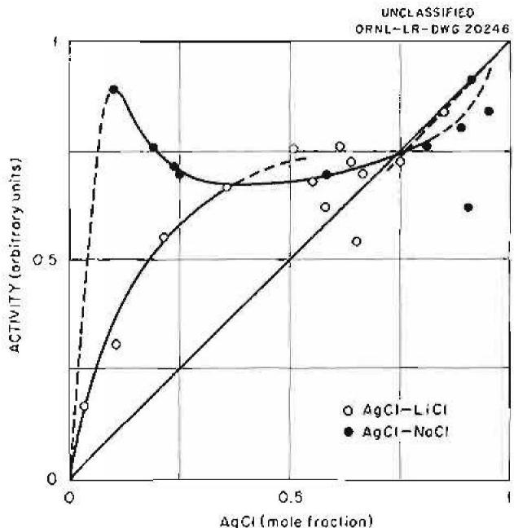  
Fig. 2.2.14. The Activity of AgCl in AgCl-NoCl and AgCl-LiCl Solid Solutions at $400^{\circ}\mathrm{C}$ .

Electromigration in molten salts has been shown to be a successful means for separating isotopes,[24] and therefore it is of interest to determine the usefulness of this technique for the presumably easier problem of separating ions of different elements in fuel mixtures. Electromigration accomplishes separation by taking advantage of the differences in mobility of the ions. The electrochemical cell used is contrived so that the electrolytic product at one electrode is consumed at the other, and no net chemical transformation is accomplished. After operation of such a cell for a period of time, the fastest cations accumulate near the cathode, and the fastest anions near the anode. In a molten salt mixture containing a common onion, such as molten fluorides or chlorides, a separation of the cations can be accomplished if remixing is prevented. Remixing can be suppressed by the use of a small cross-section cell and packing and by the avoidance of temperature gradients which would result in convection currents.

The separation of $\mathrm{Li^{+}}$ and $\mathrm{Ni}^{+ + }$ ions in a chloride melt was studied at temperatures between 650

and $750^{\circ}C$ . Chlorides were chosen in order to allow the use of a quartz-glass container and chlorine electrodes. The $\mathsf{Li}^{+}$ ion was chosen both because it is of practical interest and because it has high mobility. The $\mathsf{Ni}^{++}$ ion was chosen because its blue color served as a good indicator and allowed the movement of the ion to be followed visually, even for $\mathsf{Ni}^{++}$ concentrations as low as 0.001 mole fraction. A diagram of the cell is shown in Fig. 2.2.15. Substitution of HCl for $\mathsf{Cl}_2$ as the gas supply to the electrodes eliminated much of the difficulty from bubble formation in the packing. This effect could be explained by a smaller temperature coefficient of solubility for HCl than for $\mathsf{Cl}_2$ , coupled with higher temperatures in the packing because of the higher resistance.

The $\mathrm{NiCl}_2$ was added by breaking a frangible seal at the bottom of the U-tube. A 0.5-amp current, which corresponded to a nominal current density of approximately 20 amps/cm² in the electrolyte in the packed column, was maintained. The cell was viewed through a slit in a clamshell furnace; the boundary changes were followed with a cathetometer.

The experimental results obtained at 650 to $750^{\circ}C$ showed that the boundary between the colorless solution and the solution colored blue by the $\mathbf{N}\mathbf{i}^{+ + }$ ions moved toward the onode, and thus the $\mathbf{L}\mathbf{i}^{+}$ ions moved faster than the $\mathbf{N}\mathbf{i}^{+ + }$ ions. If $\mathbf{L}\mathbf{i}^{+}$ ions had carried all the current, the boundary would have moved at a calculated rate of $22\mathrm{mm / hr}$ under the conditions of the experiment. The measured rate was $20\pm 2\mathrm{mm / hr}$ . If the experimentally observed value of $20\mathrm{mm / hr}$ is assumed to be correct, and if the chloride lattice is considered to be stationary, the $\mathbf{L}\mathbf{i}^{+}$ ions moved about 20 times as fast as the $\mathbf{N}\mathbf{i}^{+ + }$ ions. As a result of the uncertainties in the assumptions, however, this conclusion must be considered as representative and qualitative rather than quantitative. Within the accuracy of the measurements, no temperature effect was found between 650 and $750^{\circ}C$ . In principle, electromigration should be a very efficient means of recovering $\mathbf{L}\mathbf{i}^{+}$ from a spent fuel, but the engineering arrangements for

working in fluorides rather than chlorides represent some extremely formidable problems. Even the chloride systems seem likely to be very awkward from an engineering standpoint.

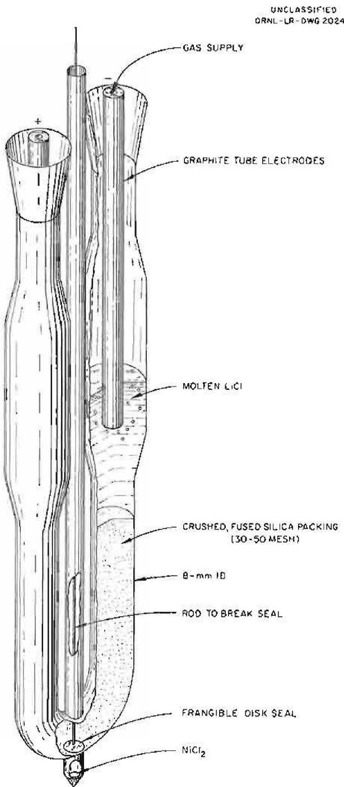  
Fig. 2.2.15. Apparatus for Studying Electromigration.

# 2.3. THEORY OF MOLTEN FLUORIDE BEHAVIOR

F. F. Blankenship

# CORRELATIONS OF MOLTEN FLUORIDE BEHAVIOR BASED ON CHARGE-TO-ION RADIUS RATIOS M. Blander

An attempt has been made to correlate the behavior of molten fluorides from the standpoint of cation-anion attraction. Emphasis on cation-anion affinity has, however, largely obscured the effects of repulsion of like charges in the melt, which are probably more important than cation-anion attraction effects in causing negative deviations from ideal solution behavior in liquids in which the components mix with little or no structural change. To the extent that emphasis on cation-anion attraction implies the existence of discrete complex ions in all fluoride melts, the concept is misleading.

A mixture of salts with slightly different $Z / R$ (charge-to-ion radius) ratios, in which no structural change from that of the molten components results, will be energetically more stable than the unmixed salts, although the anion-cation attractive forces are not altered by the mixing. An example of this is shown in Fig. 2.3.1. Configuration A for the mixture is more stable than the average of configurations B and C, which represent the pure components, in that the larger the difference in $1 / r$ for $\mathsf{Li}^{+}$ and $\mathsf{K}^{+}$ or in $Z / r$ at equal $r$ for the two cations, the more negative becomes the energy of mixing, $\Delta E$ (mixing). If the $Z / R$ ratios of the two salts differ only slightly, the structure of the mixture will differ only slightly from the structures of the components, and the extra stability of the mixture will be small.

If the $Z / R$ ratios differ considerably and especially if the salts are of widely different valence states, the extra stability of the mixture will be large, and the structure will be considerably distorted in comparison with the structures of the component salts, that is, the larger the difference in $Z / R$ ratios, the more stable the mixture relative to its components. For components which mix without a change in coordination number and with little distortion, the negative deviation from ideal solution behavior is accounted for, in the main, by a decrease in cation repulsive energy upon mixing.

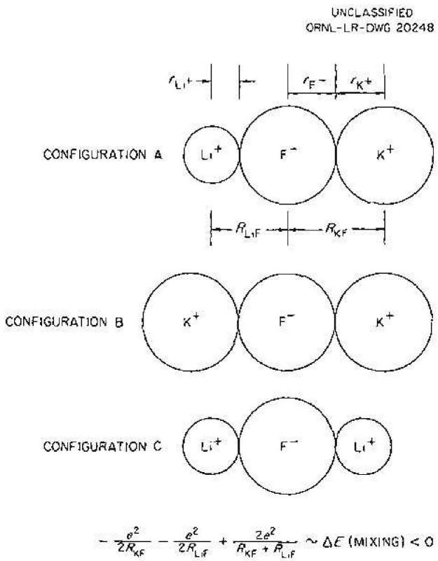  
Fig.2.3.1. Diagram of Cation Repulsion Energies for Various Ion Configurations Showing the Gain in Stability upon Mixing.

# SOME ASPECTS OF SOLUTION BEHAVIOR OF FLUORIDE MELTS R.F.Newton F.F.Blankenship

The polarizability of ions, which can be interpreted in terms of partially covalent bonds between ions, is a factor in the solution behavior of molten fluoride melts that is usually secondary but which may be important in many molten electrolytes. Fortunately, the fluoride melts of interest as reactor fuels represent a rather extreme case in which the effects of polarization of the ions appear to be of little consequence.

Foremost among the factors controlling the solution behavior of molten electrolytes is the effect of ion charge and size on the coulombic force between neighboring ions. Progressively smaller contributions to the energy of a solution

configuration result from electrostatic interactions between next nearest neighbors, and so on, until the effect becomes negligible with distance. This electrostatic behavior has long been recognized as a controlling factor in the lattice energy of ionic crystals.

All the molten fluorides which have been considered as possible fuels in the large development program contain cationic components of widely different valence state $(U^{4+}, Zr^{4+}, Be^{2+}, Na^{+})$ which may be expected, from any standpoint, to show large negative deviations from ideal solution behavior and large distortions from the structures of the pure molten components. Accordingly, it is convenient to correlate the observed behavior of these complex liquid systems in terms of the attraction between the fluoride ions and the neighboring cations.

The attractive force is given, for the case in which the ions are in direct contact by the relation

$$
F = \frac {Z e ^ {2}}{\left(r _ {+} + r _ {-}\right) ^ {2}},
$$

where $F$ is the attractive force, $Z$ is the charge on the cation, $e$ is the charge on the electron, $r_{+}$ is the cation radius, and $r_{-}$ is 1.33 Å, the radius of an $F^{-}$ ion. It is convenient to use $r$ in angstroms, the charge of the electron as the unit of charge, and $Z$ as the valence of the cation. In these units the attractive energy $(E)$ between a flouride ion and a cation it is touching is

$$
E = - \frac {Z e ^ {2}}{r _ {+} + r _ {-}},
$$

which is numerically equal to $-Z / R$ where $R = r_{+} + r_{-}$ .

The ions in a solution tend to arrange themselves in positions of lowest energy. Accordingly, the mutual energy value $-Z / R$ determines the position of the fluoride ions with respect to alternative cations, and fluoride ions will prefer as nearest neighbors those cations which yield the largest $Z / R$ ratios. The $Z / R$ values derived

from estimates of ionic radii in crystals are given in Table 2.3.1.

An increase in the difference in the $Z / R$ ratios of the cations of a fluoride solution will result in an increase in the negative deviations from ideal solution behavior shown by the mixture. Examples of conformity with this $Z / R$ rule were given previously.2

In order to predict the behavior of solutes in binary solvents it is necessary to know the effective $Z / R$ for the binary solvent. Presumably the effective $Z / R$ for the solvent (as for any mixture) varies with composition between the values for the pure components; however, the precise shape of the curve (or surface) for $Z / R$ vs composition is not readily ascertained. If the $Z / R$ ratio for a simple solute is identical with the effective $Z / R$ ratio for the complex solvent, the solution composition at this point can be termed the neutral composition. The activity coefficient of the solute is at a maximum at the neutral composition, and the further the composition of the solute. This principle provides a basis for evaluation of effective $Z / R$ ratios for this composition. The smaller will be the activity coefficient of the solute. This principle provides a basis for evaluation of effective $Z / R$ ratios for the NaF-ZrF₄ system, for example, as a function of composition. From measurements of activity coefficients of solutes as a function of solvent composition, neutral compositions and effective $Z / R$ ratios for the solvents can be established. This process will be relatively laborious, and completely quantitative data will be unavailable for some time. An attempt is made in the next section of this chapter to extend this concept with the available data. The principle is quite useful, however, even in qualitative form, in that it can be used to explain the apparently anomalous differences in vapor pressures of the NaF-ZrF₄ system when UF₄ is added or substituted.

Mixtures of NaF (Z/R = 0.43) and ZrF₄ (Z/R = 1.82) corresponding to Na₂ZrF₆ show large negative deviations from ideality, and the vapor pressure of ZrF₄ from such a mixture is much less than would be expected. The addition of UF₄ (Z/R = 1.68) to such a melt serves to increase the average Z/R for the mixture and thus to lower the activity coefficient of NaF and to raise the activity coefficient of ZrF₄. Accordingly, the

Table 2.3.1. Valence-to-Radius Ratios for Fluoride Salts Based on Goldschmidt's ${}^{a}$ Values of Ion Radii   

<table><tr><td>Cation</td><td>Cation Radius (r+)</td><td>Z/(r+ + r-)</td><td>Cation</td><td>Cation Radius (r+)</td><td>Z/(r+ + r-)</td></tr><tr><td>Cs+</td><td>1.65</td><td>0.34</td><td>La3+</td><td>1.22</td><td>1.18</td></tr><tr><td>Rb+</td><td>1.49</td><td>0.36</td><td>Ce3+</td><td>1.18</td><td>1.19</td></tr><tr><td>K+</td><td>1.33</td><td>0.38</td><td>Pr3+</td><td>1.16</td><td>1.20</td></tr><tr><td>Na+</td><td>0.98</td><td>0.43</td><td>Nd3+</td><td>1.15</td><td>1.21</td></tr><tr><td>Cu+</td><td>0.96b</td><td>(0.44)</td><td>U3+</td><td>1.14c</td><td>(1.21)?</td></tr><tr><td>Li+</td><td>0.70</td><td>0.49</td><td>Sm3+</td><td>1.13</td><td>1.22</td></tr><tr><td>Ba++</td><td>1.43</td><td>0.73</td><td>Eu3+</td><td>1.12</td><td>1.22</td></tr><tr><td>Sr++</td><td>1.27</td><td>0.77</td><td>Gd3+</td><td>1.11</td><td>1.23</td></tr><tr><td>Ca++</td><td>1.06</td><td>0.84</td><td>Bi3+</td><td>1.1</td><td>1.23</td></tr><tr><td>Cr++</td><td>0.93d</td><td>(0.88)</td><td>Y3+</td><td>1.06</td><td>1.26</td></tr><tr><td>Fe++</td><td>0.83</td><td>0.93</td><td>Fe3+</td><td>0.67</td><td>1.50</td></tr><tr><td>Co++</td><td>0.82</td><td>0.93</td><td>Cr3+</td><td>0.64</td><td>1.52</td></tr><tr><td>Cu++</td><td>0.8</td><td>0.94</td><td>Al3+</td><td>0.57</td><td>1.58</td></tr><tr><td>Ni++</td><td>0.78</td><td>0.95</td><td>Th4+</td><td>1.10</td><td>1.65</td></tr><tr><td>Mg++</td><td>0.78</td><td>1.00</td><td>U4+</td><td>1.05</td><td>1.68</td></tr><tr><td>Be++</td><td>0.34</td><td>1.20</td><td>Zr4+</td><td>0.87</td><td>1.82</td></tr><tr><td></td><td></td><td></td><td>Ti4+</td><td>0.64</td><td>2.03</td></tr></table>

$^{a}$ V. M. Goldschmidt (ed., A. Muir), Geochemistry, Clarendon Press, Oxford, 1954.   
bL. Pauling, J. Am. Chem. Soc. 49, 765 (1927).   
From data on UCL3 given in J. J. Katz and E. Rabinowitch, The Chemistry of Uranium, NNES, p 453, McGraw-Hill, New York, 1951.   
dFrom J. H. Hildebrand and R. E. Powell, Principles of Chemistry, 4th ed., p 267, Macmillan, New York, 1940.

addition of $\mathsf{UF}_4$ to $\mathsf{Na}_2\mathsf{ZrF}_6$ should increase the vapor pressure of $\mathsf{ZrF}_4$ , and it has been observed that, when sufficient $\mathsf{UF}_4$ is added to $\mathsf{Na}_2\mathsf{ZrF}_6$ to attain $\mathsf{NaF - ZrF}_4\mathsf{-UF}_4$ (50-25-25 mole %), the vapor pressure of the melt is increased from 3 to $10\mathrm{mmHg}$ at $912^{\circ}\mathrm{C}$ . This remarkable increase, which occurs even though the $\mathsf{ZrF}_4$ concentration of the melt is reduced from 33.3 to 25 mole %, indicates that small Z/R changes have very noticeable effects.

The effective $Z / R$ for the mixture is reduced slightly, however, when 7NaF-6UF4is added to 7NaF-6ZrF4(replacement of ZrF4by UF4). This shift of $Z / R$ in the direction away from the high $Z / R$ value for $\mathsf{ZrF_4}$ reduces the activity coefficient for $\mathsf{ZrF_4}$ and accordingly the vapor pressure of $\mathsf{ZrF_4}$ should decrease more rapidly than would be expected from the decreased concentration of $\mathsf{ZrF_4}$ .This expected more pronounced decrease was found experimentally, as reported previously,4

# A STRUCTURE MODEL AND AN ACID-BASE SYSTEM FOR FUEL MIXTURES

D. G. Hill

F. F. Blonkenship

A useful qualitative model for describing the liquid structure of fuel mixtures based on the NaF-ZrF4 system was devised in which liquid ZrF4 is considered to be a somewhat disorganized lattice of fluoride bridges connecting zirconium ions.5 At the other end of the system, molten NaF contains sodium ions and fluoride ions. The addition of NaF to ZrF4 results in the breaking of the bridges to give zirconium ions which are surrounded partially by bridging fluorides and partially by nonbridging fluorides.

According to the proposed model, the addition of $\mathsf{ZrF}_4$ to a large excess of NaF results in the formation of $\mathsf{ZrF}_7$ -ions, and thus for the composition range of up to 25 mole $\%$ $\mathsf{ZrF}_4$ the liquid is composed of $\mathsf{Na}^+$ , $\mathsf{F}^-$ , and $\mathsf{ZrF}_7$ -ions. At 25 mole $\%$ $\mathsf{ZrF}_4$ most of the free fluoride ions have been incorporated in $\mathsf{ZrF}_7$ -since the stoichiometry of the melt conforms to $\mathsf{Na}_3\mathsf{ZrF}_7$ (ref 6). The fluorides attached to the $\mathsf{ZrF}_7$ -ions are examples of nonbridging fluorides, as distinguished from free fluorides and bridging fluorides. If more $\mathsf{ZrF}_4$ is added, it cannot form additional $\mathsf{ZrF}_7$ -ions but can only share some of the already complexed fluorides. The shared fluorides are referred to as bridging fluorides.

With increased $\mathsf{ZrF}_4$ concentrations, there is a further decrease in the number of nonbridging fluorides and an increase in the number of bridging fluorides to eight per zirconium in pure $\mathsf{ZrF}_4$ (ref 7). If an assumption is made regarding the

coordination number of the $\mathsf{Zr}^{4 + }$ ions, a more definite picture of the liquid structure of fuel compositions near 50 mole $\%$ $\mathsf{ZrF}_4$ is available. Because of the radius relationships, no more than seven fluorides can touch a $\mathsf{Zr}^{4 + }$ ion at one time. If seven, which is near the upper limit, is used as the coordination number for the 50 mole $\%$ $\mathsf{ZrF}_4$ region, about $40\%$ of the fluorides are shared, or bridging, and $60\%$ are unshared, or nonbridging, as in $\mathsf{ZrF}_7$ . There are no discrete groups of ions that form a structural entity or complex, such as $\mathsf{ZrF}_5^-$ ions. Rather there is an interlocking network of $\mathsf{Zr}^{4 + }$ ions joined by an average of four bridges to other ions. The $\mathsf{U}^{4 + }$ ions substitute for $\mathsf{Zr}^{4 + }$ ions without altering the picture very much, and $\mathsf{Na}^+$ ions, also present, maintain electroneutrality in the vicinity of nonbridging fluorides. The situation is not static, since there is an extremely mobile equilibrium between the kinds of fluorides, and the bridges are easily broken and reformed.

For simplicity the model has been described as though free fluoride ions did not exist at higher concentrations than 25 mole $\%$ $\mathsf{ZrF}_4$ . Actually they are present throughout the composition range but their effective concentration diminishes rapidly with increasing $\mathsf{ZrF}_4$ concentration. Since the complexing potentialities of a fluoride melt depend on the fluoride ion activity, it is very important to know how this activity varies with composition. Unfortunately, it cannot be measured.

The fluoride ion activity can, however, be conveniently correlated in a qualitative manner by an acid-base scheme in which cations are rated according to their tendency to behave as fluoride donors or acceptors. If fluoride donors are defined as bases and fluoride acceptors as acids, the cations fall into the same general pattern as that used for the classification of oxides as acidic or basic. The NaF compound is an example of a strong base and $\mathsf{ZrF}_4$ of a strong acid. The stronger the acid and the base that are combined, the stronger they complex each other on mixing, or stated in thermodynamic terms, the greater are the negative deviations from ideal solution behavior shown by the mixture. The resulting mixture can also be classified as acidic or basic. Fuels based on the LiF-NoF-KF eutectic are strongly basic, and they highly complex corrosion products, since the latter are usually

amphoteric. In contrast, fuels based on the NaF $\mathsf{ZrF}_4$ -UF $_4$ system are nearly neutral with respect to corrosion products.

In order to map the relative acidity of a fuel solvent on a numerical scale, it is convenient to use a plot having $\frac{Z}{R}$ ratios for the ordinate and solvent composition (in mole %) for the abcissa, as shown in Fig. 2.3.2. The coulombic

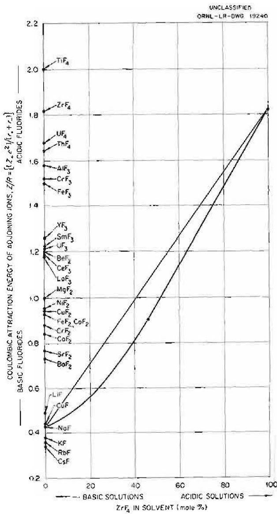  
Fig. 2.3.2. An Acid-Base Scale for Predicting Neutral Points of Solutes in NaF-ZrF4 Melts (Tentative).

attraction energy of adjoining ions $(Z / R$ ratios), obtained by dividing the valence of a cation by the center-to-center distance between the cation and on adjoining fluoride ion, are, as explained in the preceding section, energy terms which can be used as a measure of the fluoride affinity of a cation. A line joining the $Z / R$ ratios for the extremes of the composition range is a very rough first approximation for evaluating the effective $Z / R$ values at intermediate compositions. At the neutral compositions, described in the preceding section, the fluoride affinity of a salt is the same as that of the solvent. Thus the corrected curve for matching compositions to $Z / R$ values is found by plotting the neutral compositions for various solutes.

Currently only one intermediate neutral point can be approximated. The factors which influenced the choice of $\mathsf{NaF - ZrF_4}$ (53-47 mole %) as a fuel solvent served to give a melt in which $\mathsf{FeF_2}$ behaves ideally. This point has been plotted in Fig. 2.3.2 to give three points through which to draw a curve. Since the liquid structure probably changes around 25 mole $\%$ $\mathsf{ZrF_4}$ , and since the position of the curve is uncertain, the maximum curvature was located at 25 mole $\%$ $\mathsf{ZrF_4}$ . The simplest application of the plot involves the implicit assumptions that only negative deviations occur and that marked positive deviations are artifacts. This assumption is valid to the extent that effects due to polarization of the ions are absent and that real positive deviations can be regarded as evidence of polarization.

The purpose of such plots is to aid in predicting the relative acidity or basicity of a solute toward a solvent. This permits estimates of the relative negative deviations of solutes and, hence, also relative solubilities in case the pure solute is the saturating phase. An important use is the selection of solvent compositions which will reduce corrosion by complexing the corrosive agents rather than the corrosion products. Because of uncertainties in theory, ion radii, and neutral compositions, the plot is subject to revision.

# 2.4. PHYSICAL PROPERTIES OF MOLTEN MATERIALS

F. F. Blankenship

# VAPOR PRESSURES OF MOLTEN FLUORIDES S.Cantor

The importance of detailed knowledge of salt vapor behavior in both engineering considerations and in the solution theory of fuels has focused attention on the need for determinations of the vapor pressures of the less volatile components in fuel mixtures. For a theoretical understanding of solutions of molten electrolytes, vapor pressures provide in principle a direct means of obtaining the thermodynamic activities of the constituents. In practice, the presence of associated molecules in the vapor phase greatly complicates this method of arriving at activities. It was formerly thought that temperatures high enough to melt the alkali halides should prevent the existence of all but the simplest, or monomeric, molecules in the vapor; however, this is not the case. As was recently shown convincingly by Miller and Kusch,1 there are appreciable quantities of dimeric and trimeric molecules in the vapor of alkali halides.

In order to proceed with a determination of vapor species, the absolute vapor pressures of molten alkali fluorides were measured by the quasi-static method used in this laboratory for obtaining vapor pressures of fuels. A sufficiently wide temperature range was covered to give curvature

on a log $p$ vs $1 / T$ plot. Hence the data, summarized in Table 2.4.1, can be more accurately represented by means of the Kirchhoff equation,

$$
\log p _ {m m H g} \approx - \frac {A}{T} - B \log T + C.
$$

The constants were evaluated by following a procedure resembling that used by Kelley. Comparison with previously reported absolute pressure measurements is scarcely feasible because of the uncertainties in the extrapolations (as much as $350^{\circ}\mathrm{C}$ ) required to reach the ranges shown in Table 2.4.1.

Transpiration or carrier gas methods were used at lower temperatures for LiF, NaF, and RbF at Battelle Memorial Institute, and for NaF and KF by Naryshkin. In these methods, however, the weight of vapor required to saturate a known

3K.K.Kelley,Bullerin 383,Bureau of Mines,1935.   
4H. von Wartenberg and H. Schulz, Z. Elektrochem. 27, 568 (1921).   
5. O. Ruff, G. Schmidt, and S. Mugdon, Z. anorg. allgem. Chem. 123, 83 (1921).   
6E. M. Simons and R. J. Carlson, Progress Relating to ANP Applications August~October, 1956, BMI-1148, p 19 (Nov. 27, 1956).   
7K. A. Sense et al., Vapor Pressures of the Sodium Fluoride-Zirconium Fluoride System and Derived Information, BMI-1064 (Jon. 9, 1956).   
8R. W. Dayton and C. R. Tipton, Progress Relating to Military Applications During October, 1956, BM1-1145, p 85 (Nov. 1, 1956).   
9.1. Naryshkin, J. Phys. Chem. USSR 13, 528 (1939).

Table 2.4.1. Vapor Pressures of Pure Alkoli Fluorides   

<table><tr><td rowspan="2">Compound</td><td rowspan="2">Equation</td><td colspan="2">Experimental Ranges</td></tr><tr><td>Temperature (°K)</td><td>Pressure (mm Hg)</td></tr><tr><td>LiF</td><td>Log p = -(13,890/T) - 4.021 log T + 23.165</td><td>1328-1575</td><td>1.3~30.8</td></tr><tr><td>NaF</td><td>Log p = -(14,609/T) - 3.518 log T + 21.863</td><td>1381-1592</td><td>1.7-26.6</td></tr><tr><td>KF</td><td>Log p = -(11,910/T) - 3.518 log T + 21.002</td><td>1199-1505</td><td>1.8-81.4</td></tr><tr><td>RbF</td><td>Log p = -(11,373/T) - 3.518 log T + 20.995</td><td>1154-1451</td><td>2.2-106</td></tr><tr><td>CsF</td><td>Log p = -(9,845/T) - 3.518 log T + 20.556</td><td>1009-1379</td><td>1.7-242</td></tr></table>

volume of carrier gas is measured, and absolute vapor pressures cannot be obtained without an independent determination of the molecular weight of the vapor. The molecular weights that must be used to bring transpiration data into agreement with the absolute pressures given in Table 2.4. I have been calculated, in some cases, where suitable data were available. The molecular weight calculations were based on the assumption that the vapor consisted only of monomeric and dimeric molecules, and the results, shown in Table 2.4.2, will undoubtedly be subject to considerable revision as better measurements are made. The increasing proportion of dimeric molecules with increasing temperature in the case of LiF is not as improbable as it might seem at first glance. The vapor is in equilibrium with the liquid, and, if the pressure effect is greater than the temperature effect (heat of vaporization is greater

Table 2.4.2. Tentative Estimates of the Percentage of Monomeric Molecules in the Saturated Vapor of Various Molten Alkalil Fluorides   

<table><tr><td rowspan="2">Temperature (°K)</td><td colspan="4">Monomeric Molecules in Vapor (%)</td></tr><tr><td>LiF</td><td>NaF</td><td>KF</td><td>RbF</td></tr><tr><td>1400</td><td>52.9</td><td>48</td><td></td><td></td></tr><tr><td>1300</td><td>69.2</td><td>45.2</td><td></td><td>76.5</td></tr><tr><td>1200</td><td>82.1</td><td>(Solid)</td><td>68.7</td><td>76.3</td></tr><tr><td>1100</td><td>(Solid)</td><td>(Solid)</td><td>(Solid)</td><td>70.5</td></tr></table>

than the heat of dissociation), the proportion of dimeric molecules should increase.

# SURFACE TENSION AND DENSITY OF MOLTEN UF

S. Langer

A preliminary value for the density of molten $\mathsf{UF}_4$ was obtained for use with previously reported sessile-drop data to give the surface tension of molten $\mathsf{UF}_4$ . At $1075^{\circ}\mathsf{C}$ , a density of $6.80 \pm 0.09 \, \text{g/cm}^3$ was found by using graphite pycnometers. There were some difficulties in calibration of the pycnometer which prevent this value from being regarded as final. It leads to a surface tension of $\mathsf{UF}_4$ of about 180 dynes compared with the value of about 140 dynes found from the preliminary estimates given in the previous report. Further experiments are currently being made in order to obtain a firm value for the density.

The tentative experimental value given above for the density of liquid $\mathsf{UF}_4$ is, surprisingly, greater than the density of solid $\mathsf{UF}_4$ (6.63 g/cm³ based on x-ray data). The greater density of the molten material and the behavior of the salt surface level upon freezing in the pycnometer appear to indicate that $\mathsf{UF}_4$ either contracts or expands only very slightly upon melting.

# 2.5. PRODUCTION OF PURIFIED FLUORIDE MIXTURES

G.J.Nessle

# PREPARATION OF VARIOUS PURE FLUORIDES

B.J.Sturm

L. G. Overholser

# Preparation of $\mathsf{YF}_3$

The continuing interest in moderators for use at high temperatures encouraged considerable study of the hydride of yttrium. Since the hydride is prepared from metallic yttrium, which is made by reduction of $\mathsf{YF}_3$ , it has been necessary to prepare considerable quantities of $\mathsf{YF}_3$ for evaluation in the metal manufacturing step.

The method of preparation used to date has been to dissolve $\mathsf{Y}_2\mathsf{O}_3$ in the minimum quantity of aqueous HCl solution and to precipitate the fluoride by the addition of aqueous HF solution. The solid product is washed by decantation, recovered by centrifugation, and given a preliminary drying at $150^{\circ}\mathrm{C}$ in air.

The crystalline product is dried for 4 to 6 hr at $250^{\circ}\mathrm{C}$ under flowing helium in nickel equipment and then treated, in this equipment, with anhydrous HF at 700 to $750^{\circ}\mathrm{C}$ for 12 hr. About 1400 g of $\mathrm{YF}_3$ has been prepared in this fashion.

# Preparation of Fluorides of Molybdenum

A previous report in this series described the preparation of what appeared to be a lower fluoride of molybdenum by reduction of $\mathsf{MoF}_6$ with $\mathsf{FeF}_2$ . In additional experiments this reduction product has been collected in a condenser maintained at $130^{\circ}\mathsf{C}$ and subsequently redistilled in glass apparatus. The yellow product, which is very unstable toward traces of moisture, melts at $78^{\circ}\mathsf{C}$ . This is considerably higher than the $60^{\circ}\mathsf{C}$ previously reported as the melting point of the material before distillation.

The unstability of the material to air and moisture makes it difficult to obtain a clear x-ray pattern. The best data available to date indicate the solid to be tetragonal with $a = 11.62\text{\AA}$ and $c = 9.26\text{\AA}$ . The available chemical analyses do not serve to demonstrate conclusively that the material is MoF4. Additional studies will be required to

identify the compound or compounds in this yellow material.

# Preparation of Other Materials

The method of preparation of $\mathsf{FeF}_2$ from $\mathsf{FeCl}_2\cdot 4\mathsf{H}_2\mathsf{O}$ has been improved considerably by partial dehydration of the commercial material before the hydrofluorination step. The substitution of anhydrous $\mathsf{CrCl}_3$ for hydrated $\mathsf{CrF}_3$ as the raw material for $\mathsf{CrF}_3$ preparation results in a pure product; this improvement is entirely due to the higher purity of the commercial chloride.

Hydrofluorination of $\mathsf{CrCl}_2$ at $700^{\circ}\mathsf{C}$ yields a product containing a small quantity of $\mathsf{CrF}_3$ . Most of this contaminant can be removed by treatment with $\mathsf{H}_2$ at $700^{\circ}\mathsf{C}$ . When this reduction is performed in silver vessels, less $\mathsf{Cr}^0$ contaminates the product than when nickel vessels are used.

# PILOT-SCALE PURIFICATION OPERATIONS

C. R. Croft

J. Truitt

During the quarter the pilot-scale equipment (5-, 10-, and 50-lb capacity) processed 42 batches totaling 1575 lb of the various fluoride compositions needed in phase equilibrium studies, physical property measurement, small-scale corrosion tests, and other experiments. A large fraction of this material was NaF-KF-LiF-UF $_4$ (11.2-41-45.3-2.5 mole %). Usage of this material seems to be fairly constant at about 500 lb per month.

Nickel storage receivers have been shown to be inadequate for the NaF-KF-LiF-UF $_4$ material. The large expansion of the material upon melting results in failure of $75\%$ of the 50-lb storage containers upon melting of the charge. Inconel cans have, however, been shown to be satisfactory for the 50-lb batches. No failures have occurred in the ten tests made to date; it is not certain, however, that Inconel cans will be satisfactory for 250-lb or larger charges. When inadvertent exposure of the molten salt mixture to air or water occurs in Inconel cans, extensive contamination of the melt with $\mathsf{CrF}_2$ and $\mathsf{FeF}_2$ results. Since these contaminants cannot be removed economically by retreatment of the batch, the material must be discarded.

# PRODUCTION-SCALE OPERATIONS

J.E. Eorgan

During the quarter 46 batches totaling approximately 11,500 lb were processed in the production-scale facility. The transition to a seven-day continuous production schedule was begun on November 5, 1956 and full capacity of 4000 lb per month was attained in December 1956. No failures of the copper-lined stainless-steel reactor cans occurred during the quarter. The reactors now in service have each processed nearly 10,000 lb of material since their installation. If the supply of storage cans can be maintained and no major breakdowns occur, the present rate of production can apparently be maintained indefinitely.

This accelerated program was adopted at the request of the AEC to meet the estimated requirements for processed fluorides to be used in the ANP program by Pratt & Whitney Aircraft and by ORNL. During the last month of this quarter, however, the Pratt & Whitney requirements were greatly reduced. The projected total requirements for the last half of fiscal year 1957 dropped from 37,000 to approximately 12,000 lb. Because of the firm commitments made for the large amounts of row materials, the personnel, and the operating equipment needed for the highly accelerated program initiated in November 1956 and because of the economies achieved by continuous operation, it was deemed advisable to maintain the high production rate until the end of this fiscal year. However, the main objective has changed from meeting immediate requirements to stockpiling sufficient quantities of processed fluorides for maintaining the ORNL effort in the ANP program in fiscal year 1958. If this objective is attained, the production facility will not be operated during fiscal year 1958, except on a limited basis as dictated by special large-scale demands of non-standard fluoride compositions. At present the estimated ORNL-ANP requirements are foreseen as some 34,000 lb of processed fluorides for fiscal year 1958.

Some 18,000 of the 30,000 lb of $\mathsf{NaZrF}_5$ ordered has been received. Difficulties encountered by the vendor in eliminating oxide contamination and adjusting the NaF-to-ZrF ratios have been resolved by a visit to the vendor's plant. Subsequent shipments have had the proper ratios, and the previous high purity levels have been maintained.

New NaF has been obtained to replace the high-water-content NaF previously received and used as described previously. The new material meets specifications, in general, but some of the drums have a prohibitively large quantity of sulfur (2000 ppm or more). With the availability of good quality NaZrF₅ and the resultant low usage of NaF, it is becoming more feasible to restrict the use of NaF to cp-grade material.

The design and construction of the Y-12 fluoride processing facility, which would have permitted much greater throughput, has been postponed indefinitely.

Reprocessing of a low-hafnium barren fluoride mixture $(\mathrm{NaF - ZrF}_4, 50 - 50 \text{ mole}\%)$ to remove excessive oxides and oxyfluorides was successful. The material was then certified for use in the Pratt & Whitney high-temperature critical experiment.

# BATCHING AND DISPENSING OPERATIONS

F.A.Doss D.C.Wood

A total of 15,700 lb of processed fluorides was dispensed during the quarter in batch sizes ranging from 1 to 250 lb. At the beginning of the quarter, with the anticipated accelerated production activity, the stock inventory was completely modified and redefined. Cleaning material previously inventoried was removed from the inventory, and compositions were listed so that the heading "Special Compositions" contained all compositions besides those specifically numbered. As a result, the present inventory figures differ considerably from those of the previous quarter, but the totals differ only some 900 lb, or the amount of cleaning fluoride mixture previously carried in the inventory. Also not listed in the inventory is some 2500 lb of stored salvage material being stockpiled for use by the Chemical Technology Division for testing purposes.

A material balance for the past quarter is given in Table 2.5.1. As can be seen from the figures presented, a very sharp increase in production and dispensing occurred during the quarter as a result of the accelerated program initiated in November 1956. The large shipments to Pratt & Whitney Aircraft and some increase in local consumption

Table 2.5.1. Material Balance for Fluoride Mixture Production and Use   

<table><tr><td rowspan="2"></td><td colspan="7">Material (lb)</td></tr><tr><td>30a</td><td>31b</td><td>45c</td><td>108d</td><td>107e</td><td>Special</td><td>Total</td></tr><tr><td>On hand at beginning of quarter</td><td>1452</td><td>1439</td><td>1787</td><td>994</td><td>564</td><td>1684</td><td>7,920f</td></tr><tr><td>Produced during quarter</td><td>3703</td><td>690</td><td>2343</td><td>5279</td><td>1386</td><td>82</td><td>13,483</td></tr><tr><td>Total</td><td>5155</td><td>2129</td><td>4130</td><td>6273</td><td>1950</td><td>1766</td><td>21,403</td></tr><tr><td>Dispensed during quarter</td><td>3147</td><td>1366</td><td>3573</td><td>5519</td><td>1327</td><td>771</td><td>15,703</td></tr><tr><td>On hand at end of quarter</td><td>2008</td><td>763</td><td>557</td><td>754</td><td>623</td><td>995</td><td>5,700</td></tr></table>

aComposition 30: NaF-ZrF4-UF4 (50-46-4 mole %).   
bComposition 31: NoF-ZrF4(50-50 mole %).   
Composition 45: NaF-ZrFA (53-47 mole %).   
Composition 108: NaF-ZrF4-UF4 (56-37.5-6.5 mole %).   
Composition 107: NaF-KF-LiF-UF4 (11.2-41-45.3-2.5 mole %).   
Revised figure obtained by subtracting 907 lb of cleaning fluoride mixture from last quarter's balance.

resulted in an appreciable drop in stock inventory by the end of the quarter.

The main consumers of processed fluoride mixtures and their allotments during the quarter are given below:

Consumer   
Amount (1b)   

<table><tr><td colspan="2">ORNL-ANP groups</td></tr><tr><td>For chemical and physical property studies</td><td>284</td></tr><tr><td>For experimental engineering tests</td><td>2,444</td></tr><tr><td>For metallurgical studies and fuel reprocessing development</td><td>1,948</td></tr></table>

<table><tr><td colspan="2">Pratt &amp; Whitney Aircraft</td></tr><tr><td>For experimental use at Hartford</td><td>7,500</td></tr><tr><td>For high-temperature critical experiments at ORNL</td><td>1,366</td></tr></table>

<table><tr><td>Other contractors, including BMI, NRL, and WADC</td><td>187</td></tr></table>

<table><tr><td>Salvage and reprocessing</td><td>1,974</td></tr><tr><td>Total</td><td>15,703</td></tr></table>

# SPECIAL SERVICES

F. A. Doss

J. Truitt

D. C. Wood

# Filling, Draining, and Sampling Operations

Approximately 4000 lb of processed fluorides and 2500 lb of liquid metals were charged into test units. The charge sizes ranged from 1 to 500 lb, and some 170 operations were performed.

# Filling of Pratt & Whitney High-Temperature Critical Assembly

The Pratt & Whitney high-temperature critical assembly was charged with low-hafnium-content NaF-ZF4 (50-50 mole %) and the enriched concentrate NaF-UF4 (66.7-33.3 mole %). The entire filling operation proceeded very smoothly, but the first charge of barren material had to be withdrawn from the sump shortly after it was loaded because of a leak in the bottom of the sump. It was possible to withdraw this material in a condition suitable for re-use, and, after the sump was repaired, the barren material was again charged into the sump and enriching was started. The loading operation began on January 9, 1957, and was completed on February 4, 1957, at which time the responsibility for loading of the assembly was transferred to the Operations Group of the Criticality Section for final additions of enriched uranium with the ART enricher apparatus.

# 2.6. COMPATIBILITY OF MATERIALS AT HIGH TEMPERATURE

F. Kertesz

# PENETRATION OF GRAPHITE BY MOLTEN FLUORIDES

H. J. Butfrom

The study of the behavior of graphite exposed to molten fluorides was continued. Tests were conducted to evaluate a commercial graphite specimen that was impregnated with $\mathrm{NaF - ZrF_4}$ (53-47 mole %) before being exposed to a fluoride mixture containing uranium. The impregnation of commercial APC graphite specimens was accomplished by immersing them for 24 hr in the fluoride mixture melt kept at $800^{\circ}C$ . After this treatment, the impregnated specimen was heated in vacuum for 24 hr at $500^{\circ}C$ in order to remove part of the $\mathrm{ZrF_4}$ and thus to obtain a residual mixture with a higher melting temperature. It would be expected that an impregnating material that was solid when exposed to the uranium-bearing melt would resist penetration more successfully than one that was liquid and could thus diffuse from the pores. Both the treated specimen and a control sample that had not been heated in vacuum were submitted for analysis. The results of the analyses are presented in Table 2.6.1, along with the calculated NaF-to-ZrF ratios.

The analytical results indicate that the NaF penetrated the graphite to a greater extent than the $\mathsf{ZrF}_4$ did, by a factor of 12 (4.16/0.34). The sublimation step effected a further separation of the $\mathsf{ZrF}_4$ , as was expected, and after sublimation the NaF-to- $\mathsf{ZrF}_4$ ratio was further increased about

fourfold, with the final ratio of NaF to $\mathsf{ZrF}_4$ being about 16:1.

Two other types of graphite, code Nos. R-28 and M-80, obtained from the National Carbon Company were also tested by impregnation, as described above. The samples impregnated with $\mathrm{NaF - ZrF_4}$ (53-47 mole %) were subsequently immersed into $\mathrm{NaF - ZrF_4 - UF_4}$ (53.5-40-6.5 mole%). The alpha counts obtained from these specimens were compared with the counts obtained with specimens immersed directly into the uranium-bearing mixture without preliminary impregnation. The data obtained are presented in Table 2.6.2. The results indicate that the graphite specimens were not penetrated to any considerable degree by either of the salt mixtures, and thus these specimens compare favorably in this respect with the sample obtained from the Degussa Company of Germany and, in addition, appear to have greater strength.

# ELECTROLYSIS OF THE NoOH-Ni SYSTEM

F. A. Knox

In the course of electrolytic studies of the NaOH-Ni system it has been established that, in a nonisothermal system, the hot nickel electrode is usually anodic and the cold electrode is cathodic. It has been found, however, that this situation can be reversed by the use of a hydrogen atmosphere. Since NaOH is a potential moderator-coolant material, attempts are being made to

Table 2.6.1. Analyses of the Fluoride Mixture NaF-ZrF4 Before and After Penetration into Graphite   

<table><tr><td></td><td>NoF (wt %)</td><td>ZrF4(wt %)</td><td>NaF-to-ZrF4Ratio</td></tr><tr><td>Original fluoride mixture</td><td>25.3</td><td>74.7</td><td>0.34</td></tr><tr><td>Fluoride mixture in graphite specimen</td><td>80.6</td><td>19.4</td><td>4.16</td></tr><tr><td>Fluoride mixture in graphite specimen after sublimation</td><td>94.0</td><td>6.0</td><td>15.80</td></tr></table>

Table 2.6.2. Penetration of Graphite Specimens by NaF-ZrF4-UF4 (53.5-40-6.5 Mole %) in 24 hr at $800^{\circ}\mathrm{C}$   

<table><tr><td rowspan="2">Graphite Specimen Code No.</td><td rowspan="2">Initial Specimen Weight (g)</td><td rowspan="2">Treatment</td><td rowspan="2">Weight After Impregnation (g)</td><td rowspan="2">Weight After Exposure to Uranium-Bearing Mixture</td><td colspan="3">Alpha Activity (cpm)</td></tr><tr><td>At Surface</td><td>1/8 in. from Surface</td><td>1/4 in. from Surface</td></tr><tr><td>R-28</td><td>0.9317</td><td>Placed in NaF-ZrF4-UF4(53.5-40-6.5 mole %) as received</td><td></td><td>0.9328</td><td>&gt;1</td><td>1</td><td>0</td></tr><tr><td>R-28</td><td>0.9396</td><td>Impregnated with NaF-ZrF4(53-47 mole %) before being placed in NaF-ZrF4-UF4(53.5-40-6.5 mole %)</td><td>0.9585</td><td>0.9544</td><td>&gt;2</td><td>0</td><td>0</td></tr><tr><td>M-80</td><td>0.9474</td><td>Placed in NaF-ZrF4-UF4(53.5-40-6.5 mole %) as received</td><td></td><td>0.9518</td><td>1</td><td>0</td><td></td></tr><tr><td>M-80</td><td>0.9574</td><td>Impregnated with NaF-ZrF4(53-47 mole %) before being placed in NaF-ZrF4-UF4(53.5-40-6.5 mole %)</td><td>0.9680</td><td>0.9664</td><td>0</td><td>&gt;1</td><td>&gt;1</td></tr></table>

balance the current in an effort to find a way to eliminate the mass-transfer effects observed in sodium hydroxide circulated under a temperature gradient.

The experimental arrangement being used consists of three closed concentric nickel crucibles, which serve as electrodes, as shown in Fig. 2.6.1. The outer vessel is 6 in. long and $2\frac{1}{4}$ in. in diameter. The middle container is $1\frac{1}{2}$ in. in diameter and 8 in. long, and a small hole was drilled in the bottom to allow the molten sodium hydroxide to rise to the same level as in the outer container. The inner electrode consists of a $\frac{1}{2}$ -in.-dia nickel tube. The bottom of the tube was closed and a thermocouple was welded inside. For tests, the three electrodes were placed concentrically in the furnace in a controlled atmosphere. About $150\mathrm{g}$ of sodium hydroxide was used as the charge. In this arrangement the outer electrode had hydrogen gas on one side and molten sodium hydroxide on the other side. The middle electrode had molten sodium hydroxide on both sides. The effect of various arrangements could be studied by connecting the electrodes to the positive or negative poles of batteries.

In one experiment a relatively low test temperature $(550^{\circ}\mathrm{C})$ was used; the middle electrode was

connected to the negative pole; and the inner electrode was connected to the positive pole of the outside battery. Current and voltage measurements were made by slowly raising the applied voltage and measuring the corresponding current. Two sets of measurements were made with the system under a hydrogen atmosphere and also with the system under vacuum.

The results, plotted in Fig. 2.6.2, show that under a hydrogen atmosphere the current increased much faster than it did under vacuum, which indicates that hydrogen participated in the current-carrying mechanism.

Measurements were also made at $800^{\circ}C$ with hydrogen atmosphere, for which the current flowed either from the inner electrode to the outer electrode or in the reverse direction. It may be seen in Fig. 2.6.3 that, when the current was flowing from the inner electrode toward the middle electrode, the current increased continuously with the voltage. In the reverse case a definite plateau was reached, that is, as the voltage was increased, the current remained constant up to a value somewhat below 2 v. A theoretical interpretation of these results will require a more systematic study of the effect of current density. The polarization of hydrogen electrodes is probably involved.

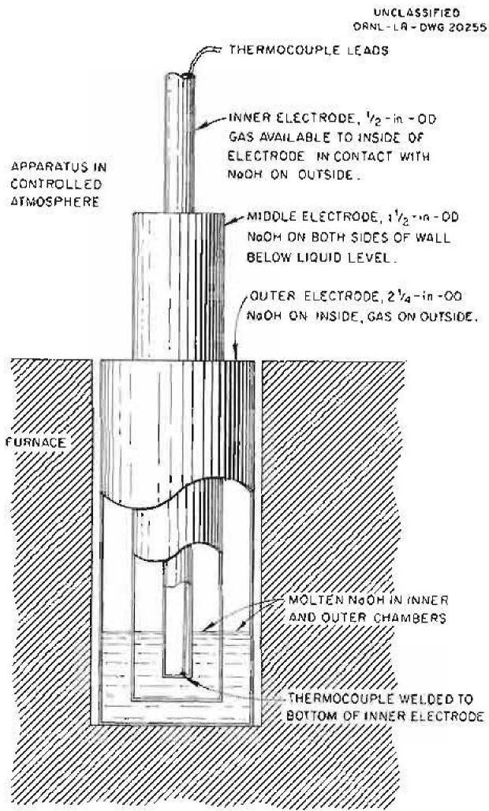  
Fig. 2.6.1. NaOH-Ni Electrolysis Apparatus.

# PHYSICAL PROPERTIES OF ELASTOMERS EXPOSED TO ATTACK BY LIQUID METALS

D. Zucker

The first in-service test of valve seat materials exposed to helium saturated with NaK vapor was completed in the apparatus described previously. The system and valves were opened and washed with water, reassembled, and tested with helium at 30 psi. The appearance of the valve seats and their performance after reassembly indicate that General Electric SE-550 and SE-450, Dow-Corning Silastic 80, and Du Pont 5570 withstood NaK

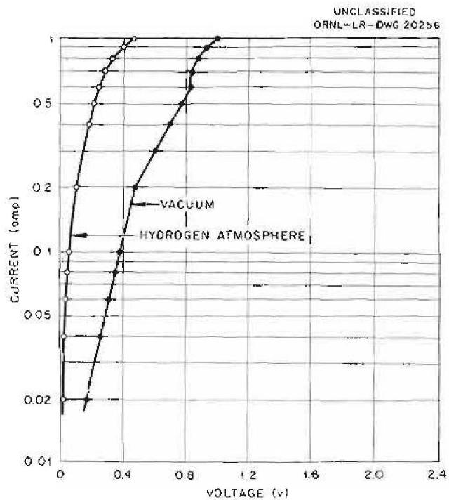  
Fig. 2.6.2. NoOH-Ni Voltage-Current Relationships Under Hydrogen or Vacuum at $550^{\circ}\mathrm{C}$ .

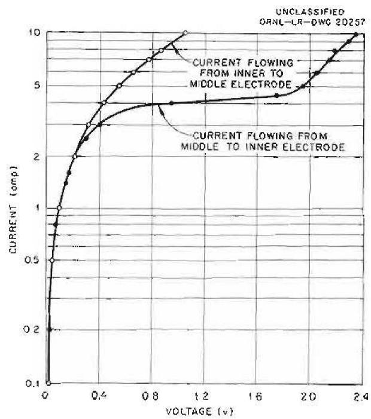  
Fig. 2.6.3. NaOH-Ni Voltage-Current Relationships Under Hydrogen at $800^{\circ}\mathrm{C}$ .

attack fairly well, with SE-550 possibly being very slightly better than the other materials. These materials cannot be used directly in the Skinner electric valves currently being supplied for use in the ART, but they might be acceptable if the edge of the volve orifice were rounded.

A cursory test also indicated that curing by heating $(200^{\circ}\mathrm{C})$ and pressurizing of these materials for 24 hr increased their resistance to attack. The reason for this is not obvious, since these elastomers were probably heat treated previously at higher temperatures although not under pressure.

# 2.7. ANALYTICAL CHEMISTRY

J.C. White

J.R.Sites

# DETECTION OF TRACES OF NoK IN AIR

A, S. Meyer, Jr.

J.P.Young

The apparatus for the detection of submicrogram quantities of sodium (NaK) in air was assembled and subjected to preliminary testing. Measurements made with this instrument, which was discussed previously, are based on the absorbance of sodium resonance radiation by sodium atoms. The instrument is illustrated in Fig. 2.7.1. In the compartment on the right, the light from a sodium vapor lamp (not shown) is collimated by a simple lens. The collimated light passes through a mechanical chopper, which consists of a disk perforated to pass light through three equally spaced 60-deg sectors. The disk is rotated at 30 cps by a synchronous motor. The interrupted light passes through

limiting circular apertures $\frac{1}{2}$ in. in diameter to produce the two beams of light shown in the central portion of the photograph. The opertures can be rotated about axes through their centers that are perpendicular to the radius of the chopper in order to balance the energy in the two beams. Under conditions of exact alignment and balance the light is collimated into two beams of equal intensity, and each beam is interrupted at a frequency of 90 cps in a manner which maintains the total energy of the two beams constant.

In the second compartment the light passes through a 20-µ band-pass interference filter, and the sodium-sodium doublet at 5890 Å is isolated. Both beams of light are focused by a converging lens on the cathode of a photomultiplier tube. The output of the photomultiplier tube is fed to a 90-cycle tuned amplifier to yield a signal that is proportional to the difference in intensity of the two beams of light.

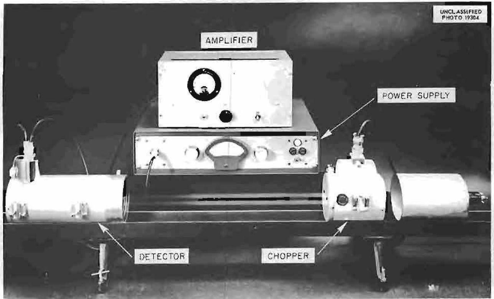  
Fig. 2.7.1. Apparatus for the Detection of Submicrogram Quantities of Sodium in Air.

In the tests which were carried out, a 5-in.-1D tube furnace was placed between the two optical components of the instrument. Absorption cells, constructed of 24-in. lengths of $\frac{3}{4}$ -in.-dia Inconel tubing and fitted with end windows of optical quartz, were placed in the furnace so that each light beam traversed an absorption cell. After the furnace was heated, the optical components were aligned and the instrument was balanced by rotating the apertures until a minimum signal was observed on the output meter of the amplifier. A sample of sodium-containing air, which was prepared by admitting measured quantities of helium that had been saturated with sodium vapor to a stream of air, was introduced into one of the absorption tubes, and the deflection of the output meter was observed.

When a sample calculated to contain 250 ppb of sodium was introduced into the absorption tube, the observed signal produced a deflection equal to twice that of the original balance of the meter. On the basis of the observed stability of the instrument, it was found that 100 ppb of sodium could be easily detected. As was reported,[2] however, the technique used for the preparation of samples of sodium-containing air did not yield quantitative transfer of sodium to the air, and thus these preliminary measurements may not truly reflect the sensitivity of this instrument. It was found that no evidence of sodium could be observed when the effluent gases containing the sodium from the absorption tube were passed through an air-propane flame. It appears that the stipulated limit of detection of 10 ppb of sodium can be achieved by appropriate sampling techniques and refinements in the alignment of the instrument.

Tests were carried out for selecting a suitable material to use in the fabrication of orifices with which to inject small quantities of NaK into air. Zirconium was the only satisfactory material found among the materials tested. A 0.003-in. orifice in crystal-bar zirconium was enlarged less than $20\%$ by the ejection of NaK for a period of 30 min at a temperature of $450^{\circ}\mathrm{C}$ . Under these conditions nickel, Inconel, type 316 stainless steel, and molybdenum are severely corroded by the oxides of the alkali metals. Measurements of the flow rates of NaK through small orifices indicate that orifices approximately 0.002 in. in diameter will be required in order to maintain a sufficiently

small flow of NaK to provide test samples for the leak detectors. Since holes of this diameter cannot be readily machined, electrolytic methods of drilling3 are being investigated.

# DETERMINATION OF OXYGEN IN METALLIC LITHIUM

A. S. Meyer, Jr.

G. Goldberg

R.E. Feathers

A method is being tested for the determination of traces of oxygen in metallic lithium that is based on the following reactions

$$
\begin{array}{l} 2 \mathrm {L i} + 2 \mathrm {C H} _ {3} \mathrm {O H} \longrightarrow 2 \mathrm {L i O C H} _ {3} + \mathrm {H} _ {2} \\ \mathrm {L i} _ {2} \mathrm {O} + 2 \mathrm {C H} _ {3} \mathrm {O H} \longrightarrow 2 \mathrm {L i O C H} _ {3} + \mathrm {H} _ {2} \mathrm {O} \\ \mathrm {L i O C H} _ {3} + \mathrm {C} _ {7} \mathrm {H} _ {6} \mathrm {O} _ {3} (\text {s o l i c y l i c a c i d}) \rightarrow \\ \mathrm {L i C} _ {7} \mathrm {H} _ {5} \mathrm {O} _ {3} + \mathrm {C H} _ {3} \mathrm {O H} \\ \end{array}
$$

and the subsequent measurement of the water by the Karl Fischer titration. The procedure, which was developed by Nuclear Development Corporation of America, offers a unique advantage in that the sample can be washed free of surface contamination immediately before the determination is performed.

The determination is carried out in the apparatus shown in Fig. 2.7.2. A sample $(\sim 1\mathrm{g})$ is placed in the reaction vessel, and the apparatus is freed of oxygen by evacuation and purging with helium. Surface oxide is removed by transferring three $20\mathrm{-ml}$ portions of dried methanol from the titration flask to the reaction vessel and allowing each portion to react for 1 min at room temperature. After the final wash solution has been withdrawn, a $60\mathrm{-ml}$ volume of methanol is transferred from the titration flask to the reaction vessel, and the sample is dissolved by gentle heating. A $20\mathrm{-ml}$ portion of a $50\%$ solution of salicylic acid in pyridine that has been pretitrated to the Karl Fischer end point is admitted to the titration flask, and, when the dissolution is completed in the reaction vessel, the solution of lithium methylate and water is transferred to the titration flask. The solution in the titration flask is then retitrated to the Karl Fischer end point. The titration is corrected by subtracting the volume of Karl Fischer reagent that is required to titrate a $60\mathrm{-ml}$ portion of methanol.

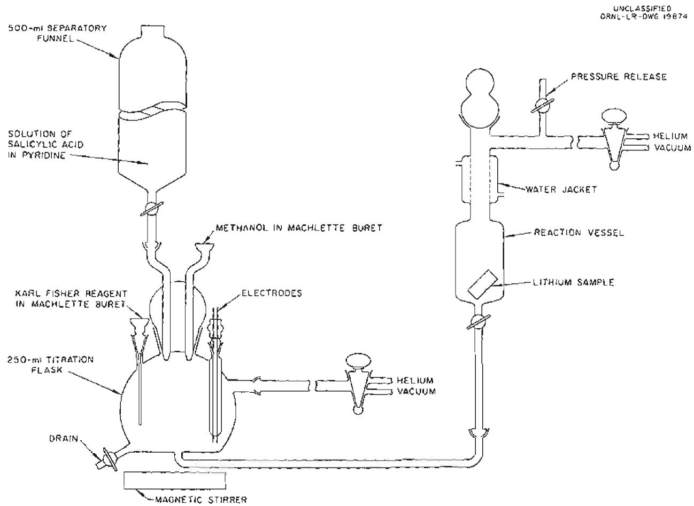  
Fig. 2.7.2. Apparatus for the Determination of Oxygen in Metallic Lithium by the Methanol Method.

The salicylic acid is used to drive the second reaction to completion and to eliminate the interference of lithium methylate in the titration. The common contaminants, $\mathsf{Li}_2\mathsf{C}_2$ and $\mathsf{Li}_3\mathsf{N}$ , which interfere with the determination of oxygen by the amalgamation procedure, are decomposed according to the following reactions:

$$
\begin{array}{l} \begin{array}{l} \mathrm {L i} _ {2} \mathrm {C} _ {2} + 2 \mathrm {C} _ {7} \mathrm {H} _ {6} \mathrm {O} _ {3} \longrightarrow 2 \mathrm {L i C} _ {7} \mathrm {H} _ {5} \mathrm {O} _ {3} + \mathrm {C} _ {2} \mathrm {H} _ {2} \\ \end{array} \\ \mathrm {L i} _ {3} \mathrm {N} + 4 \mathrm {C} _ {7} \mathrm {H} _ {6} \mathrm {O} _ {3} \longrightarrow 3 \mathrm {L i C} _ {7} \mathrm {H} _ {5} \mathrm {O} _ {3} + \\ N H _ {4} C _ {7} H _ {5} O _ {3} \\ \end{array}
$$

Since at least $60~\mathrm{ml}$ of methanol is required to dissolve a 1-g sample of lithium metal, the methanol must be thoroughly dried to avoid high blank filtrations and consequent loss of precision in the determination of traces of oxygen. Methods for drying methanol were tested that include distillation, passage through chromatographic columns packed

with molecular sieves, vapor phase drying over molecular sieves, and drying over oxides of alkalineearth metals. The concentration of water in methanol was reduced to less than 10 ppm by distillation through a 100-plate fractionation column after preliminary drying over barium oxide. Alkalineearth and alkali metals are being tested as drying agents in an effort to find a less time-consuming method of reagent preparation.

A pressurized apparatus for the dissolution of samples of lithium metal in ethereal solutions of butyl iodide and iodine was constructed. It is anticipated that in the pressurized apparatus the dissolution of samples can be carried out with smaller volumes of liquid reagents than are required for the dissolution at atmospheric pressure, and thus the effect of contaminants in the reagents can be reduced.

# APPPARATUS FOR SAMPLING AND ANALYZING ALKALIMETALS

A. S. Meyer, Jr.

R.E. Feathers G.Goldberg

A convenient receiver and transfer vessel was designed for the handling of samples of alkali metals. The apparatus, which is shown in Fig. 2.7.3, consists of a Jamesbury volve fitted with a vacuum-tight compartment at one end and coupled by a Tygon sleeve to a standard taper joint at the opposite end. When the apparatus is fitted to the complementary joint of the analytical apparatus, the transfer of the sample of alkali metal can be

UNCLASSIFIED ORNL-LR-DWG 19875

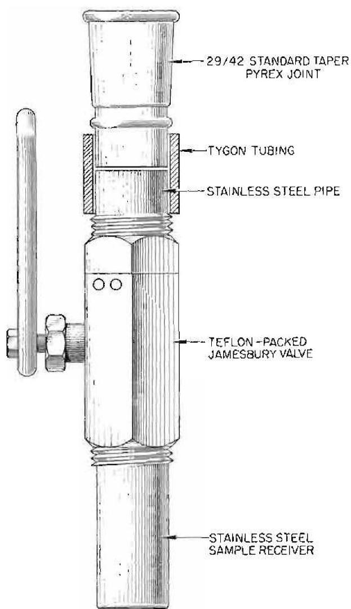  
Fig. 2.7.3. Transfer Receiver for Alkali-Metal Samples.

carried out without atmospheric contamination. The transfer vessel can be loaded in a suitable inert atmosphere dry box. It is also ideally suited for use with the modified Mine Safety Appliances Co. bucket sampler. Sample buckets filled with NaK can be transferred if the apparatus is kept under refrigeration.

A high-vacuum dry box that will have a $10\text{-ft}^3$ work chamber is being assembled for processing samples of alkoli metals. It is to be equipped with an evacuable entrance port, a high-capacity diffusion pump, and a purification train for inert gases which includes heated scrubbers containing titanium and NaK.

An apparatus for the purification of mercury by distillation was constructed and is now in service. The two-stage still used for the purification has a total capacity of 30 lb of mercury per day. The apparatus is used to remove traces of oxide and water from mercury in order to eliminate errors in the determination of oxygen in sodium by the amalgamation method and also to reprocess the large quantities of mercury which are required in the amalgamation procedure.

# ANALYSES OF LITHIUM-BASE FLUORIDE SALTS FOR METALLIC IMPURITIES

The development program on the application of nickel-molybdenum alloys as container materials for fused lithium-base fluoride salts has necessitated a number of modifications in existing methods for the analysis of metallic impurities in the fluoride salts. In addition to the usual determinations for iron, chromium, and nickel, the salts are presently being analyzed for molybdenum, niobium, titanium, tungsten, vanadium, and aluminum. Methods for determining all these metals were developed previously, but some modifications were necessary in the methods used for the aluminum, vanadium, and titanium analyses in order to eliminate interferences introduced by the presence of other metals. The status of the work on the modifications is given in the following sections.

# Aluminum

W. F. Vaughan

The determination of microgram quantities of aluminum in fluoride soils with the use of the

ammonium salt of aurin tricarboxylic acid (Aluminon) is subject to interference from zirconium, iron, titanium, and vanadium. White and Meyer removed these interfering metals by precipitating them as the insoluble cupferrate salts. As a result of more recent work by Ross on the extraction of metal ions with tri-n-octylphosphine oxide from acidic solutions, these metals are now removed by extracting them from a chloride solution. The separation is complete in about 10 min. The aqueous phase is then free of iron, titanium, vanadium, zirconium, and uranium, and the aluminum is essentially isolated.

# Vanadium

J.P.Young

J.R.French

The method of Wise and Brandt for the determination of microgram quantities of pentavalent vanadium with benzohydroxamic acid was applied to fused fluoride salts. The method is based on the reaction of vanadium(V) with benzohydroxamic acid at a pH of 2.0 to produce a complex which exhibits an absorption maximum at $450~\mathrm{m}\mu$ in a l-hexanol medium. The molar absorbance index of this complex is 3500. A linear relationship exists between absorbance and the concentration of the vanadium in the complex in the range of 1 to 9 $\mu \mathrm{g / ml}$ . The coefficient of variation for this method, based on standards, is $2\%$ .

Most of the interfering ions, including nickel, iron, chromium, and molybdenum, are removed by deposition at the mercury cathode. Although the vanadium is reduced to the quadrivalent oxidation state by the mercury cathode, it remains in solution and is accompanied by the uranium, aluminum, and titanium. Argentic oxide, $\mathrm{AgO}$ , is then used to oxidize the vanadium to the pentavalent state. As much as $50\mu$ of uranium can be tolerated in the final determination. When the ratio of either aluminum or titanium to vanadium greatly exceeds five, however, positive errors result. Niobium and vanadium ordinarily do not exist together in these samples, so the possible effect of niobium on the determination of vanadium was not studied.

# Titanium

J.P.Young

J.R.French

The established method for the determination of trace amounts of titanium in fused fluoride salts was extended to include the determination of titanium in the presence of niobium and molybdenum. Since niobium and molybdenum interfere with the determination of titanium by the Tiron method, it was necessary to develop some means of removing these interferences. The addition of sodium hydrosulfite to reduce the iron(III) also reduced the molybdenum and thus decreased but did not completely eliminate the interference of molybdenum. In the determination of titanium in NaF-ZrF4-UF4, quantitative separation of the titanium was achieved by an ammonia precipitation in the presence of carbonate ion. The separation was adequate to eliminate the interference of molybdenum in the determination of the titanium.

Quantitative separation of titanium from the niobium was achieved by an ether extraction of the two metals as thiocyanates. The niobium thiocyanate complex extracted quantitatively into the ether phase, whereas the titanium thiocyanate complex did not extract. The titanium in the aqueous phase is determined by the Tiron method.

# SPECTROPHOTOMETRIC DETERMINATION OF NICKEL IN ALKALI METALS

A. S. Meyer, Jr.

B. L. McDowell

The dioxime derivative, 4-isopropyl-1,2-cyclohexanedionedioxime, which was reported to be a very sensitive reagent for nickel, was investigated further. In order to increase the sensitivity of the determination of nickel by extraction when the ratio of the aqueous volume to the organic volume is large, organic compounds were investigated that are less water soluble than the chloroform used initially. Hydrocarbons, chlorinated hydrocarbons, esters, alcohols, and aromatic compounds were tested as extractants for the nickel chelate, but

only benzene and xylene proved to be better than chloroform. The molar absorbance index for the chelate at the absorption maximum of $385\mu$ was unaffected by the solvent. The partition coefficients, however, were much higher for the chelate in both benzene (1000) and xylene (5000) than in chloroform (300). In view of these more favorable partition coefficients, it will be possible to determine even lower concentrations of nickel than the previously postulated[12] 0.5 ppm in a 5-g sample of alkali metal.

The two elements that most commonly interfere with the determination of nickel in alkali-metal samples are iron and copper. Methods for the elimination of each of these elements were therefore developed. Copper(II) is reduced to copper(I), and the reduced copper is complexed with thiocyanate ion to prevent the extraction of copper as the dioxime complex. The interference of iron(III) was eliminated by the addition of fluoride. Since the fluoride ion inhibits the precipitation of zirconium upon neutralization of the solution, this procedure can also be applied to the determination of nickel in solutions of zirconium- or lithium-base fuels.

# DETERMINATION OF TRACE AMOUNTS OF ZIRCONIUM IN SULFATE SOLUTIONS WITH PYROCATECHOL VIOLET

J.P.Young

J.R.French

Experimental work on the determination of trace amounts of zirconium $^{13,14}$ in solutions of sulfuric acid with pyrocatechol violet was completed, as well as a study of the interference caused by various cations. The data obtained in this investigation are summarized in Table 2.7.1.

Microgram amounts of zirconium in sulfate solutions can be determined in the presence of high concentrations of thorium, uranyl, cerium, and lanthanum ions. It was possible to determine zirconium with a coefficient of variation of $2\%$ even in the presence of more unfavorable ratios of cerium and lanthanum by lowering the final $\mathsf{pH}$ of the test solution to 4.5.

The determination of zirconium with pyrocatechol violet is unaffected by the presence of anions such as chloride, perchlorate, nitrate, or borate. Small

Table 2.7.1. Effect of Cations on the Spectrophotometric Determination of Zirconium in Sulfate Solutions with Pyrocatechol Violet   
Concentration of xirconium: $1.2\mu \mathrm{g / ml}$   

<table><tr><td>Cation</td><td>Weight Ratio of Cation to Zirconium</td><td>Error Resulting from Pressure of Cation (%)</td></tr><tr><td>Th4+</td><td>10</td><td>5</td></tr><tr><td>La3+</td><td>30</td><td>5</td></tr><tr><td>Ce3+</td><td>15</td><td>5</td></tr><tr><td>UO22+</td><td>30</td><td>0</td></tr><tr><td>U4+</td><td>3</td><td>5</td></tr><tr><td>Ni2+</td><td>15</td><td>0</td></tr><tr><td>Cr6+</td><td>15</td><td>0</td></tr><tr><td>Cr3+</td><td>15</td><td>0</td></tr><tr><td>Fe3+</td><td>6</td><td>5</td></tr><tr><td>Fe2+</td><td>6</td><td>5</td></tr><tr><td>Mo6+</td><td>6</td><td>5</td></tr><tr><td>Ti4+, V5+, V4+, Al3+</td><td>1</td><td>20</td></tr></table>

amounts of anions such as citrate, oxalate, tartrate, fluoride, and ethylenediaminetetraacetate, however, will destroy the color of the complex. The coefficient of variation for this method, based on the determination of zirconium in standards, is $2\%$ .

# DETERMINATION OF SULFUR IN FLUORIDE FUELS

T.W.Gilbert, Jr.

The methylene-blue method for the determination of small amounts of sulfur in fused fluoride fuels was modified by the substitution of a new reducing solution for the mixture of red phosphorus, hydriodic acid, and formic acid that was previously used. The new solution, prepared by dissolving stannous chloride in dehydrated phosphoric acid,

was reported to reduce sulfates quantitatively to hydrogen sulfide,16 and therefore experiments were carried out to test the efficiency of this solution for reducing microgram quantities of sulfate and to test its applicability to the determination of sulfur in fluoride salts.

Difficulty was experienced with the red phosphorus reducing mixture when the sample size was increased beyond $200\mathrm{mg}$ , and therefore the phosphoric acid mixture, which can conveniently handle 1-g samples, has an important advantage in that a fivefold increase in sensitivity is achieved. A second advantage of the phosphoric acid reducing mixture is that the fluoride salts are decomposed. Uranium tetrafluoride is brought into solution, and zirconium fluoride is converted to zirconium phosphate.

The determination is carried out by adding about $20\mathrm{ml}$ of a solution of $\mathsf{SnCl}_2$ and phosphoric acid to a 1-g sample of fluoride salt. Boric anhydride is then added to complex the fluoride and to minimize etching of the gloss apparatus. The phosphoric acid solution is heated to 300 to $310^{\circ}C$ to reduce the sulfates to hydrogen sulfide, which is passed into a solution of zinc acetate by means of a stream of argon. The quantity of hydrogen sulfide is then determined by the methylene blue procedure. The coefficient of variation of the method was found to be approximately $10\%$ for 5- to $20 - \mu g$ quantities of sulfur.

# OXIDATION OF CHROMIUM WITH ARGENTIC OXIDE

J.P.Young

J.R.French

A method for the oxidation of chromium with argentic oxide, AgO, reported by Lingone and Davis,17 was investigated for use in the spectrophotometric determination of chromium with diphenylcarbazide. Lingane and Davis report that argentic oxide serves advantageously as a very powerful oxidimetric reagent in acid media. They recommend AgO for the oxidation of manganese, cerium, or chromium prior to volumetric determinations of these metals. Oxidation with argentic oxide is rapid and complete for these ions in 2 to $5\mathrm{M}$ acid at room temperature.

A standard solution of potassium dichromate was used in order to establish a calibration curve for the chromium determination by the diphenylcarbazide method. The chromium in a portion of the standard solution was reduced with hydrogen peroxide to yield a standard solution of chromium(III). The calibration curve obtained from the solution of chromium(III) after oxidation of the chromium with argentic oxide was identical, within experimental error, with the one obtained with chromium(VI). It is recommended that the solution be boiled for several minutes to ensure the reduction of all the excess silver(II).

These investigations indicate that oxidation of the chromium with argentic oxide can replace oxidation with perchloric acid in the colorimetric determination of chromium with diphenylcarbazide. The use of argentic oxide results in a considerable saving of time in the oxidation step. It is further expected that oxidation with argentic oxide will produce results which are at least as precise as those obtained by the present method. An investigation of this latter point is presently being carried out.

# SOLVENT EXTRACTION OF MOLYBDENUM FROM ACIDIC SOLUTIONS WITH TRI-n-OCTYLPHOSPHINE OXIDE

W.J.Ross

Previous success in the isolation, concentration, and determination of elements encountered in ART fuels, corrosion products, and fission products through solvent extraction of these elements with tri-n-octylphosphine oxide (TOPO) has led to a continued study of the analytical applications of this reagent. It was found that hexavalent molybdenum is amenable to separation from acidic solutions by extraction with tri-n-octylphosphine oxide. A systematic study of the variables involved in the extraction showed that hexavalent molybdenum can be concentrated greater than a hundredfold by a single extraction with 0.1 M TOPO in cyclohexane from HCl and that as much as 20 mg of $\mathsf{Mo}^{6+}$ can be quantitatively extracted by 0.5 mmole of this reagent. Less efficient extractions are obtained from $\mathsf{H}_2\mathsf{SO}_4$ , $\mathsf{HNO}_3$ , or $\mathsf{HCIO}_4$ systems. The extent of the extraction is highly dependent on the acid concentration of the aqueous phase, and therefore under

certain conditions practically no extraction is obtained from sulfate, nitrate, or perchlorate media. Extraction with tri-n-octylphosphine oxide is thus a rapid means of isolating or concentrating hexavalent molybdenum in either the aqueous or organic phase.

# PREPARATION OF RARE-EARTH FLUORIDE TRACERS

A. S. Meyer, Jr. G. Goldberg

The precipitation procedure described previously19 was used for the preparation of additional samples of radioactive tagged fluoride salts. The salts prepared were $Y^{91}$ -bearing $YF_{3}$ , $Ce^{141}$ -bearing $CeF_{3}$ , $Sm^{153}$ -bearing $SmF_{3}$ , $Ba^{133}$ -bearing $BaF_{2}$ , and $La^{140}$ -bearing $LaF_{3}$ in amounts that varied from 100 to 500 g. The samples contained from 1 to 3 mc of total activity.

# SERVICE LABORATORY

W. F. Vaughan

The 1428 samples analyzed during the quarter involved 5746 determinations for an average of 4.0 per sample. A breakdown of the work according to the group requesting the analyses is given below:

<table><tr><td></td><td>Number of Samples</td><td>Number of Reported Results</td></tr><tr><td>Reactor Chemistry</td><td>666</td><td>2255</td></tr><tr><td>Experimental Engineering</td><td>589</td><td>2431</td></tr><tr><td>Metallurgy</td><td>28</td><td>33</td></tr><tr><td>Miscellaneous</td><td>145</td><td>1027</td></tr><tr><td>Total</td><td>1428</td><td>5746</td></tr></table>

19 A. S. Meyer, Jr., and G. Goldberg, ANP Quar. Prog. Rep. Dec. 31, 1956, ORNL-2221, p 166.

# VAPOR-PHASE POLYMERS IN ALKALI-HALIDE SALTS

L. O. Gilpatrick

Acknowledge of the composition of the vapor phase of the fused-salt fuel mixture is important to the investigation of the vapor-deposition problem in circulating-fuel reactors. It is also indispensable for the measurement of activities of components of salt mixtures when vapor-pressure methods of measurement are used. Therefore a study of the vapor phase of alkali-halide salts was initiated. It has been reported[20-22] that the equilibrium vapor phase of many simple materials, such as copper chloride, carbon, and potassium chloride, contain simple polymeric species that are most frequently dimers and trimers. When the alkali-halide salts are heated in an effusion cell, it is possible to measure the change in the vapor composition as a function of cell temperature. The mass spectrometer is well suited for application to this problem, since with it the species which are derived from polymers in the vapor can be measured independently. Only relative values can be measured with the use of this technique; however, energies or heats of vaporization and the heats of polymerization can be determined from the relative values. The mass spectrometer is also a sensitive tool for the qualitative examination of the vapor phase of halide salts and other materials.

A satisfactory effusion cell was developed, and potassium chloride is currently being examined at temperatures from 550 to $750^{\circ}\mathrm{C}$ . Preliminary values for the energy of vaporization of KCl monomer and dimer were found to be 49.3 and 58.3 kcal/mole, respectively. No higher polymers were detected. The next salts to be examined will be the alkali fluorides, since they are of interest in the investigation of fused-salt fuel systems.

# Part 3

# METALLURGY

W. D. Manly

# 3.1. DYNAMIC CORROSION STUDIES

J.H.DeVan

FORCED-CIRCULATION LOOP TESTS

J.H.DeVon

R. S. Crouse

# Fuel Mixtures in Inconel and in Hastelloy B

Three forced-circulation loops fabricated of Hastelloy B were examined that had circulated NaF-KF-LiF-UF $_4$ (11.2-41-45.3-2.5 mole %, fuel 107) at a maximum fluid temperature of about $1650^{\circ}\mathrm{F}$ . The loops were heated by direct electrical resistance and were constructed from $\frac{1}{2}$ -in.-OD, 0.060-in.-wall tubing. The operating conditions for these three loops are given in Table 3.1.1.

Two of the loops completed 1000 hr of operation, although interruptions that required temporary shutdowns occurred during both tests. Loop 7641-18 developed a leak while fuel was being admitted to the loop for a test run. The loop was successfully repaired, and it then operated for the scheduled 1000-hr period without further difficulties. Loop 7641-2B developed a leak after 66 hr of operation and was likewise repaired and operated for the remainder of the scheduled 1000-hr period. Operation of the third loop, 7641-3, was terminated by a pump failure after 407 hr of operation.

The hot legs of all three loops were found to be badly pitted after the tests, with the pits in the most heavily attacked areas reaching to a depth of 4 mils. Unfortunately, the surfaces of the as

received Hastelloy B tubing were rough, as shown by the sample in Fig. 3.1.1, and thus a large part of the pitting was probably present before the test. The cold-leg sections of loops 7641-1B and 7641-3 were entirely free of metal deposits, but they had deeper surface imperfections than those found in the hot-leg sections. In some areas of the cold legs the pits reached a depth of 7 mils; however, as may be seen in Fig. 3.1.2, which shows a cold-leg section of loop 7641-1B, the surface imperfections appear to be the result of corrosion deepening of the pits present before the test.

The examination of loop 7641-2B likewise revealed deeper pits in the cold leg than in the hot leg. In contrast to the other two loops, loop 7641-2B, however, was found to have a few small metal crystals in the cold leg. These crystalline deposits occurred in clumps, approximately 2 mils thick, that were confined to a short section of the loop near the cold-leg outlet. As shown in Fig. 3.1.3 the crystals were completely detached from the loop wall. The quantity of deposited material was insufficient for a chemical analysis, and it is not known whether the crystals resulted from groins becoming detached from the extremely rough as-received surfaces or from a mass-transfer mechanism. Loop 7641-2B operated with the lowest Reynolds number used in the three tests, and it is doubtful that mass transfer would take

Table 3.1.1 Conditions of Operation of Three Hostelloy B Forced-Circulation Loops with NaF-KF-LiF-UF4 (11,2-41-45,3-2,5 Mole %, Fuel 107)   
Temperature gradient: $300^{\circ}F$ Ratio of hot-leg surface area to loop volume: 2.2 in.²/in.³   

<table><tr><td rowspan="2">Operating Conditions</td><td colspan="3">Loop Number</td></tr><tr><td>7641-1B</td><td>7641-2B</td><td>7641-3</td></tr><tr><td>Maximum fuel mixture temperature, °F</td><td>1635</td><td>1640</td><td>1660</td></tr><tr><td>Maximum tube wall temperature, °F</td><td>1767</td><td>1710</td><td>1750</td></tr><tr><td>Reynolds number of fuel</td><td>10,000</td><td>5,500</td><td>10,000</td></tr><tr><td>Velocity of fuel, fps</td><td>2.61</td><td>1.16</td><td>2.61</td></tr><tr><td>Operating time, hr</td><td>1000</td><td>1000</td><td>407</td></tr></table>

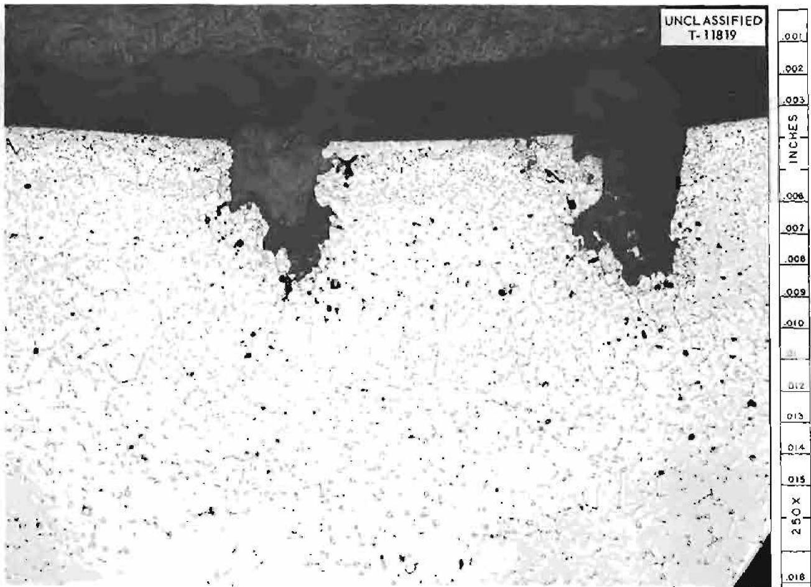

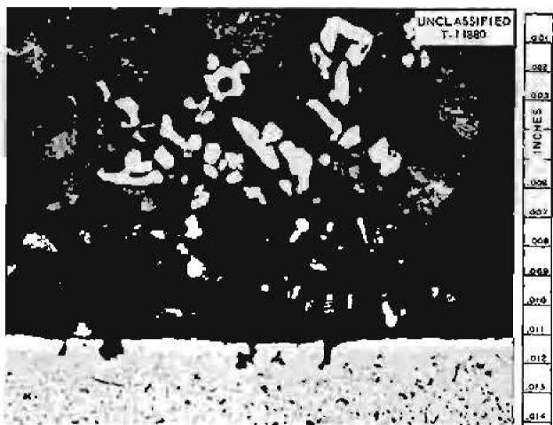  
Fig. 3.1.1. As-Received Hastelloy B Tubing. Etchont: Riddle's reagent, 250X.   
Fig. 3.1.2. Area of Deep Pitting in Cold Leg of Hastelloy B Forced-Circulation Loop 7641-1B Which Circulated NoF-KF-LiF-UF4 (11.2-41-45.3-2.5 Mole %, Fuel 107) Under the Conditions Given in Table 3.1.1. Etchant: Riddle's reagent. 250X. Reduced 32%. (Secret with caption)

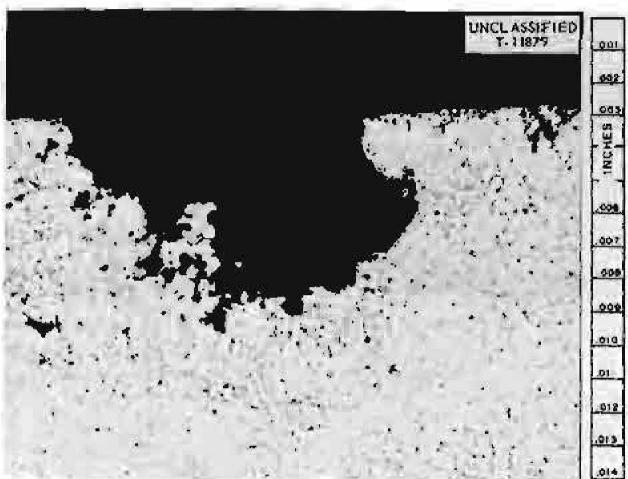  
Fig. 3.1.3. Crystals Found Near Cold-Leg Outlet of Hastelloy B Loop 7641-2B Which Circulated NoF-KF-LiF-UF $_4$ (11.2-41-45.3-2.5 Mole %, Fuel 107) Under the Conditions Given in Table 3.1.1. Unetched. 250X. Reduced 32%. (Secret with caption)

place in this loop and not in the others. Analyses of the fuel mixtures used in these tests showed no significant changes in any of the metal constituents during the tests. The results of the analyses are presented in Table 3.1.2.

An Inconel forced-circulation loop (7425-20) was operated at a maximum fluid temperature of approximately $1700^{\circ}\mathrm{F}$ in order to complete studies of the effect of temperature on the corrosion of Inconel by NaF-ZrF $_4$ -UF $_4$ (50-46-4 mole %, fuel 30). The maximum wall temperature of the loop was $1840^{\circ}\mathrm{F}$ ,

and the fluid temperature drop between the hot-leg and cold-leg outlets was $300^{\circ}\mathrm{F}$ . Other loop operating conditions are given in Table 3.1.3. After 1000 hr of operation, voids were observed in the hot leg to a maximum depth of 9 mils. In addition to the hot-leg attack there were a few scattered particles of metal deposited on cold-leg surfaces. The deposits contained chromium and, possibly, on the basis of etching characteristics, some uranium or zirconium compounds. The attack on this loop was 4 to 5 mils greater than the attack

Table 3.1.2. Analyses of NoF-KF-LiF-UF4 (11.2-41-45.3-2.5 Mole %) Mixtures Circulated in Hostelloy B Forced-Circulation Loops   

<table><tr><td rowspan="2">Loop No.</td><td rowspan="2">Sample Taken</td><td rowspan="2">Uranium Content (wt %)</td><td colspan="4">Metal Constituents (ppm)</td></tr><tr><td>Ni</td><td>Cr</td><td>Fe</td><td>Mo</td></tr><tr><td rowspan="2">7641-1B</td><td>During filling</td><td>13.7</td><td>160</td><td>125</td><td>150</td><td>&lt;2</td></tr><tr><td>After operation</td><td>12.4</td><td>85</td><td>330</td><td>95</td><td>&lt;2</td></tr><tr><td rowspan="2">7641-2B</td><td>During filling</td><td>13.0</td><td>195</td><td>110</td><td>165</td><td>&lt;2</td></tr><tr><td>After operation</td><td>12.8</td><td>185</td><td>325</td><td>120</td><td>2</td></tr><tr><td rowspan="2">7641-3</td><td>During filling</td><td>13.0</td><td>20</td><td>35</td><td>55</td><td>15</td></tr><tr><td>After operation</td><td>12.6</td><td>205</td><td>270</td><td>75</td><td>9</td></tr></table>

Table 3.2.3. Conditions of Operation of Three Inconel Forced-Circulation Loops with Fuel Mixtures   

<table><tr><td rowspan="2">Operating Conditions</td><td colspan="3">Loop Number</td></tr><tr><td>7425-20</td><td>7425-25</td><td>7425-26</td></tr><tr><td>Fuel mixture</td><td>NaF-ZrF4-UF4(50-46-4 mole %, fuel 30)</td><td>NaF-ZrF4-UF4(50-46-4 mole %, fuel 30)</td><td>NaF-ZrF4-UF4(56-39-5 mole %, fuel 70)</td></tr><tr><td>Maximum fuel mixture temperature, °F</td><td>1715</td><td>1620</td><td>1510</td></tr><tr><td>Maximum tube wall temperature, °F</td><td>1840</td><td>1710</td><td>1615</td></tr><tr><td>Reynolds number of fuel</td><td>23,700</td><td>5,800</td><td>14,000</td></tr><tr><td>Velocity of fuel, fps</td><td>5.0</td><td>2.54</td><td>4.79</td></tr><tr><td>Operating time, hr</td><td>1000</td><td>500</td><td>716.5</td></tr><tr><td>Ratio of hot-leg surface area to loop volume, in.2/in.3</td><td>2.21</td><td>2.15</td><td>2.15</td></tr><tr><td>Temperature gradient, °F</td><td>300</td><td>300</td><td>200</td></tr></table>

of Inconel loops operated previously with a fuel temperature of $1500^{\circ}\mathrm{F}$ , a wall temperature of $1600^{\circ}\mathrm{F}$ , and a temperature differential of $200^{\circ}\mathrm{F}$ . Examination of another Inconel forced-circulation loop (7425.25) that operated 500 hr with fuel mixture No. 30 also revealed hot-leg attack to a depth of 5 mils, but no cold-leg deposits were found.

A third Inconel forced-circulation loop was operated with fuel mixture 70, NaF-ZrF4-UF4 (56-39-5 mole %). The results of two other forced-circulation loop tests which compared the corrosion properties of this fuel mixture with those of the more commonly used mixture 30, NaF-ZrF4-UF4 (50-46-4 mole %), were reported previously. In this latest test in the series the loop operated with a maximum fuel temperature of approximately $1500^{\circ}\mathrm{F}$ and a maximum wall temperature of about $1600^{\circ}\mathrm{F}$ . Other operating conditions for this loop, 7425-26, are given in Table 3.1.3. Although scheduled for 1000 hr, operation was terminated after only 716 hr because of a pump pulley failure. Void formation during operation progressed to a depth of 5 mils. A thin metallic layer was noted in the cold leg that was similar to the layers found in the Inconel loops operated previously with this fuel mixture. The layer was too thin to provide sufficient material for chemical analysis, and attempts are now being made to determine its composition spectrographically.

The attack to a depth of 5 mils in this loop is similar to the 7 mils of attack in each of the two loops operated previously with fuel 70 for 1000 hr. One of these latter loops operated under temperature conditions identical to those for loop 7425-26, while the other loop operated with a maximum fluid temperature of about $1650^{\circ}\mathrm{F}$ . The depths and type of attack in these loops are similar to the results obtained for loops that circulated fuel 30 under similar conditions, except for the presence of thin layers in the cold legs of loops that circulated fuel 70. Viable layers or deposits are not normally observed in loops that have circulated fuel 30.

# NaK in Inconel

Studies were made of two Inconel forced-circulation loops that circulated NaK (56-44 wt %) and

contained oxide cold traps operated at 600 and $800^{\circ}F$ . The design of the loop and cold trap is shown in Fig. 3.1.4. The data obtained with these loops, together with those obtained from two loops operated previously with cold-trap temperatures of 100 and $300^{\circ}F$ , respectively, provide a basis for an analysis of the effect of cold-trap operation on corrosion and mass transfer in Inconel-NaK systems. The maximum fluid temperature of each loop was $1500^{\circ}F$ and the temperature drop across the cold-leg section was $300^{\circ}F$ . All the loops were operated for 1000 hr.

An investigation of the design of the cold trap used in these loops was made prior to beginning these studies to determine the effectiveness of such a trap in controlling the oxide level. In a special test loop containing a bypass cold trap and a device known as a "plugging meter," NaK was circulated isothermally at $1500^{\circ}\mathrm{F}$ , and measurements were made of the oxide concentration of the NaK under various conditions of cold-trap temperatures and flow rates. The plugging meter was used to indicate the saturation temperature of sodium oxide in the NaK under each of the cold-trap operating conditions. The saturation temperature, together with published information on the solubility limits of sodium oxide in NaK as a function of temperature, was used to establish the oxide concentration. These tests demonstrated that the cold-trap operating temperature in the range from 100 to $1200^{\circ}\mathrm{F}$ accurately reflected the oxide concentration; that is, the oxide concentration which existed in the NaK corresponded to the limit of solubility for sodium oxide in NaK at the cold-trap temperature.

The effect on mass transfer of the various cold-trap operating temperatures is summarized in Table 3.1.4. Samples taken from the cold legs at similar locations in each of the loops are compared in Fig. 3.1.5. Difficulties in removing deposits from the walls of the loops, as discussed previously, made it impossible to obtain weight determinations of the deposits found in loops 7439-1 and -3. However, in the loops with higher cold-trap temperatures (loops 7426-17 and -18) the deposits were comprised of larger crystals which

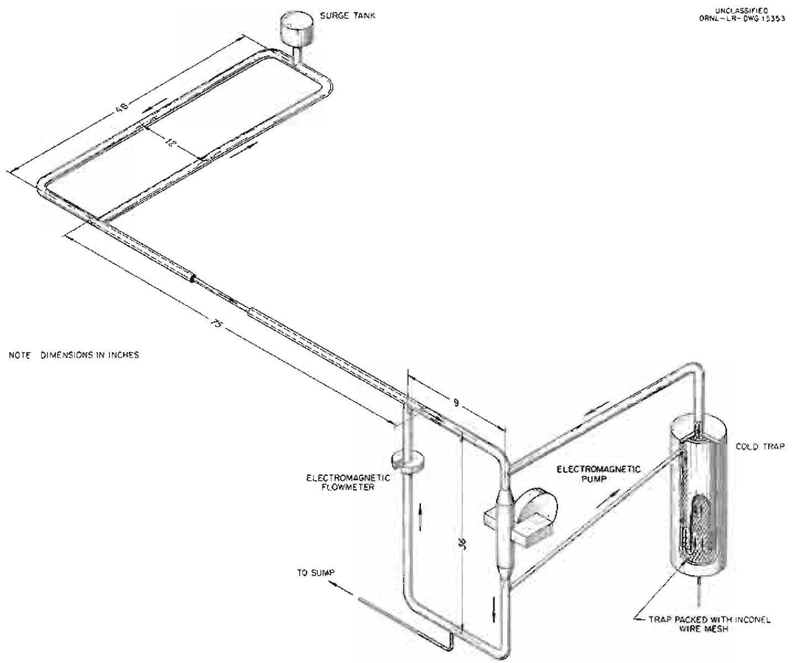  
Fig. 3.1.4. Design of Inconel Loop, Including Cold Traps, for Forced Circulation of Alkali Metals.

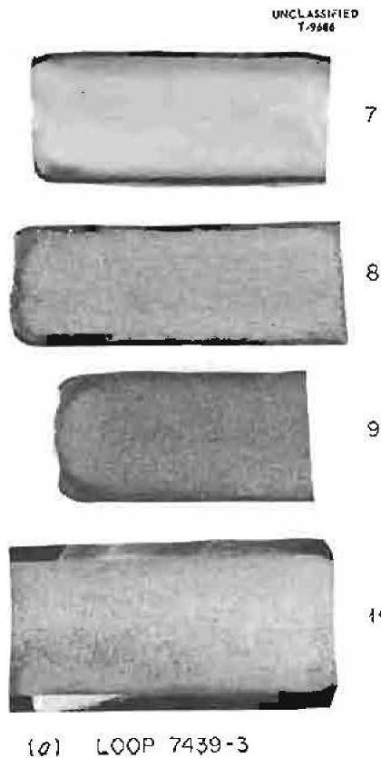

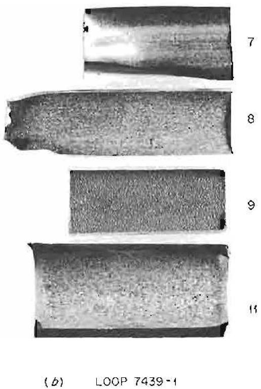

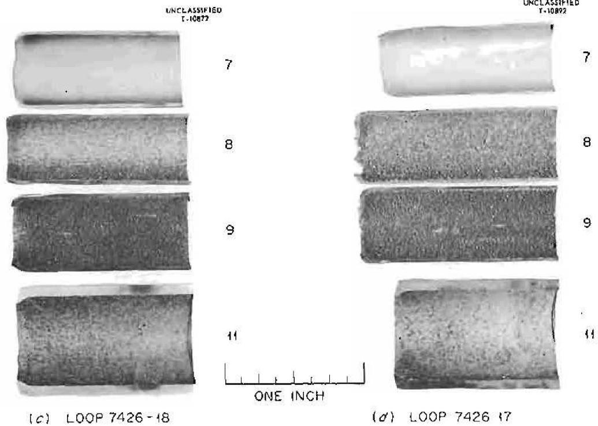  
Fig. 3.1.5. Mass Transfer Deposits in Inconel Loops Which Circulated NoK at a Maximum Temperature of $1500^{\circ}\mathrm{F}$ and a Temperature Differential of $300^{\circ}\mathrm{F}$ with Cold Trops Operated at Various Temperatures. (a) Cold trap at $100^{\circ}\mathrm{F}$ . (b) $300^{\circ}\mathrm{F}$ . (c) $600^{\circ}\mathrm{F}$ . (d) $800^{\circ}\mathrm{F}$ . (Confidential with caption)

Table 3.1.4. Effect of Cold-Trap Operating Temperature on Mass Transfer in Inconel Loops that Circulated NoK   

<table><tr><td>Loop No.</td><td>Minimum Cold-Trap Temperature (°F)</td><td>Maximum Deposit Thickness (mils)</td><td>Weight of Metal Deposited (g)*</td></tr><tr><td>7439-3</td><td>100</td><td>7</td><td>**</td></tr><tr><td>7439-1</td><td>300</td><td>12</td><td>**</td></tr><tr><td>7426-18</td><td>600</td><td>11.5</td><td>3.86</td></tr><tr><td>7426-17</td><td>800</td><td>20</td><td>6.29</td></tr></table>

* Determined by scraping deposits from loop walls
** Not recorded.

were more easily separated from the loop walls. The weights of the deposits in these loops show that a noticeable increase in the quantity of material deposited was brought about by an increase in the cold-trap temperature from 600 to $800^{\circ}\mathrm{F}$ . This increase is also reflected in the deposit thickness. A smaller difference in deposit thickness is apparent in comparing the results for the test with a cold-trap temperature of $600^{\circ}\mathrm{F}$ with those for the two tests with lower cold-trap temperatures. Metallographic examinations of cold-leg sections from these loops also indicate that the change in the amount of deposited material accompanying a decrease in cold-trap temperature below $600^{\circ}\mathrm{F}$ is less than the change from 800 to $600^{\circ}\mathrm{F}$ .

As mentioned above, the size of the particles comprising the deposits is apparently affected by the cold-trap temperature and the oxide concentration. Deposits taken from similar sections of the loops operated with cold-trap temperatures of 100 and $800^{\circ}\mathrm{F}$ are compared in Figs. 3.1.6 and 3.1.7. As can be seen, the average particle size of the crystals found in the loop which included a cold trap operated at $800^{\circ}\mathrm{F}$ was considerably larger than that of the crystals from the loop operated with a cold-trap temperature of $100^{\circ}\mathrm{F}$ . The compositions of the deposits did not vary with cold-trap temperature; in all the loops, the deposits were found to contain approximately $90\%$ Ni and $10\%$ Cr.

The results of these studies of the effect of oxides in Inconel-NaK systems show trends quite similar to those found in the results of tests of Inconel-sodium systems. The tests of Inconel-

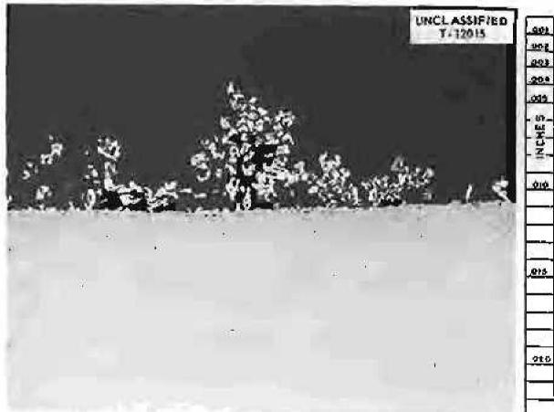

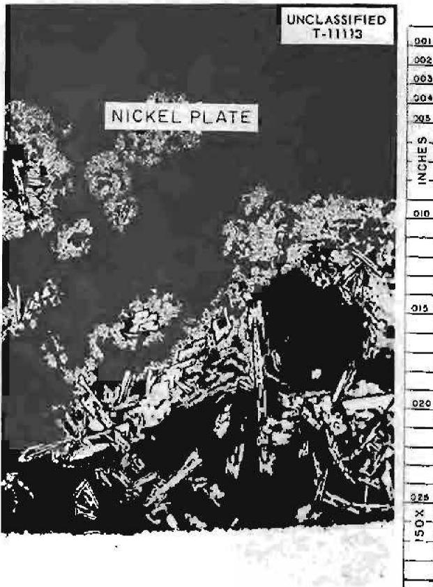  
Fig. 3.1.6. Mass-Transfer Deposits in Inconel Loop 7439-3 Which Circulated NaK and Which Included a Cold Trap That Was Maintained at $100^{\circ}\mathrm{F}$ . Etchant: modified aqua regia. 150X. Reduced 35%. (Confidential with caption)   
Fig. 3.1.7. Mass-Transfer Deposits in Inconel Loop 7426-17 Which Circulated NaK and Which Included a Cold Trap That Was Maintained at $800^{\circ}\mathrm{F}$ . Etchont: modified aqua regia, 150X. Reduced 9%. (Confidential with caption)

sodium systems, which were discussed previously5 were carried out by making oxide additions directly to the sodium. The effects on mass transfer were small for oxide additions of 0.05 wt % and less but became significant at higher concentrations. Additional data (not presented previously) showed that the deposit particle size also increased as the oxide level increased.

A difference in the quantity of mass-transferred material in sodium-Inconel systems compared with that in NaK-Inconel systems has now become apparent. The weights of the deposits in the two recently tested NaK-Inconel systems are somewhat less than one-half the weights of deposits found in sodium-Inconel systems tested under similar temperature conditions. The thicknesses of the deposits found in both systems are comparable, although as discussed in conjunction with the first NaK tests,3 thickness measurements do not accurately reflect the weights of the deposits because the crystals comprising the deposits build up quite randomly and in discontinuous patches.

The composition and manner of deposition of the crystals in the two systems appear to be identical. The average size of the crystals comprising the deposits in both systems is also similar. Thus it appears that the same mechanism for mass transfer exists in both systems but that the process proceeds slower in NaK-Inconel systems than in sodium-Inconel systems.

# Sodium in Inconel and in Stainless Steel

Two Inconel forced-circulation loops of a design similar to that shown in Fig. 3.1.4 were operated with sodium at different velocities to evaluate the effect of flow rate on mass transfer. The sodium temperatures ranged from a maximum of $1500^{\circ}\mathrm{F}$ in the hot leg to a minimum of $1200^{\circ}\mathrm{F}$ in the cold leg. The pumps were operated at different power levels to establish sodium flow rates of 1.5 and 3.0 gpm, respectively. Both loops contained bypass cold traps to maintain low oxide levels.

Examinations of the loops following 1000 hr of operation revealed a substantial difference in the quantities of deposited material recovered from the cold legs. In the loop operated with a sodium

flow rate of 1.5 gpm (loop 7426-22), the deposit weighed 10.4 g. A doubled flow rate of 3.0 gpm (loop 7426-23) resulted in an increase in the weight of the deposit to 14.0 g. Hot-leg attack in both loops was in the form of intergranular penetration and reached maximum depths of 2 mils in each case. The average thickness of the deposit also varied with the flow rate. The thickness at the lower flow rate was 12 mils, while at the higher flow rate the thickness increased to 22 mils.

Several other sodium loops have been operated at flow rates of 2.5 gpm, and the results can be compared with the results of tests described above. While the majority of the loops operated with a sodium flow rate of 2.5 gpm, each loop test incorporated some variable which introduced a slight difference from the conditions described above. An average value of deposit weight for the tests which most closely simulated the conditions given above is 13 g. A plot of the data given above and the 13-g value is presented in Fig. 3.1.8 to show the effect of flow rate.

A type 304 stainless steel forced-circulation loop completed 1000 hr of operation with sodium at a maximum temperature of $1500^{\circ}\mathrm{F}$ and a temperature drop of $300^{\circ}\mathrm{F}$ . The loop contained an oxide cold trap that was maintained at $300^{\circ}\mathrm{F}$ . Visual examination of this loop revealed only slight traces of mass-transferred particles in cold portions. A

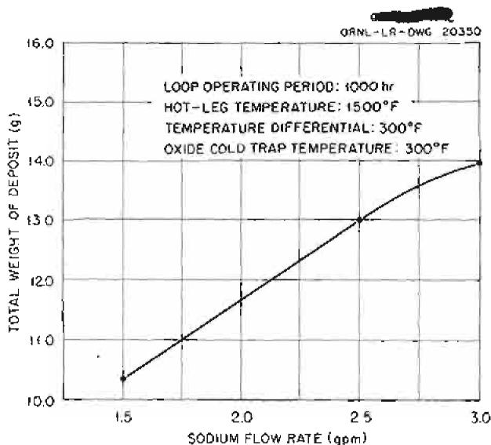  
Fig. 3.1.8. Effect of Flow Rate on Mass Transfer in Inconel-Sodium Systems.

typical cold-leg section is shown in Fig. 3.1.9. The deposits were similar in extent and appearance to those which were observed in type 316 stainless steel loops operated under similar conditions, and were much less in amount than deposits found in comparable Inconel loops. The hot leg of the loop revealed slight surface pitting and void formation to a depth of 2 mils.

# Long-Duration Tests of NaK and Sodium in Inconel

An Inconel forced-circulation loop, 7439-51, was operated with NaK for 2760 hr to determine the long-range effects of a high-thermal gradient on mass transfer and corrosion in an Inconel-NaK system. The loop was of the design shown in Fig. 3.1.10 and operated with a thermal gradient of $650^{\circ}\mathrm{F}$ and a maximum bulk fluid temperature of

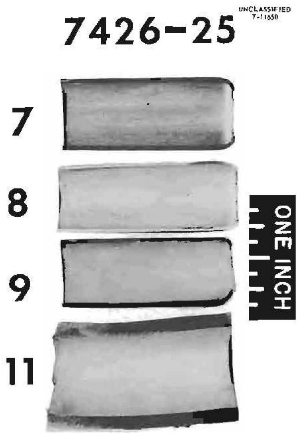  
Fig. 3.1.9. Cold-Log Section of a Type 304 Stainless Steel Forced-Circulation Loop Which Circulated Sodium for 1000 hr at a Maximum Temperature of $1500^{\circ}\mathrm{F}$ and a Temperature Gradient of $300^{\circ}\mathrm{F}$ . Reduced $31.5\%$ . (Confidential with caption)

1500°F. Fluid flow was maintained at 1.28 gpm. After 2480 hr of operation, a leak developed in the heater coil of the loop, and the NaK had to be dumped. The heater coil was replaced, and the loop was again put into operation. After an additional 280 hr, operation was terminated when a similar leak developed in the new heater coil.

Metallographic examination of the hot leg which was removed from the loop after 2480 hr revealed light-to-heavy intergranular attack to a depth of 1.5 mils. A needlelike deposit, 7 mils in depth, was also observed in the section just beyond the heater coil where the loop first experienced a thermal gradient. The cooled coil, which was in operation an additional 280 hr, showed only light-to-moderate pits, along with intergranular attack to a depth of 1 mil. Metal deposits reached a maximum thickness of 14 mils in the section at the entrance to the cooled coil.

A similar loop was operated with sodium as the circulated fluid. Operation of this loop (7426-51) was terminated after 4000 hr, when a leak developed near the pump. The operating conditions, with the exception of the temperature gradient, were similar to those for loop 7439-51. Because of the better heat transfer properties of sodium, a thermal gradient of $800^{\circ}\mathrm{F}$ was achieved. Sodium attack in the hot-leg section of the loop reached a maximum depth of 5 mils. A heavy deposit of metal crystals that reached a maximum thickness of 50 mils was found in the section at the entrance to the cooling coil. The deposit is shown in Fig. 3.1.11.

Carbide precipitates were found at the surfaces of the inner walls of the tubing which had been exposed to sodium and, to a lesser extent that varied with depth, in the wall of the tubing. The diffusion of carbon therefore appears to have proceeded from the inner wall of the tubing into the tubing, and thus the source of the carbon must have been the sodium. This loop contained a mechanical pump, and a slight leak through the pump seal of the oil for lubricating the pump could have been responsible for the carburization found.

The loops for these long-duration tests were of a unique design, and therefore the results cannot be compared directly with the results of other tests of shorter duration. The extensive deposits observed in the loop which circulated sodium indicate that mass transfer proceeds at a rate which is not significantly diminished with time, although, based on the carburization observed in this loop,

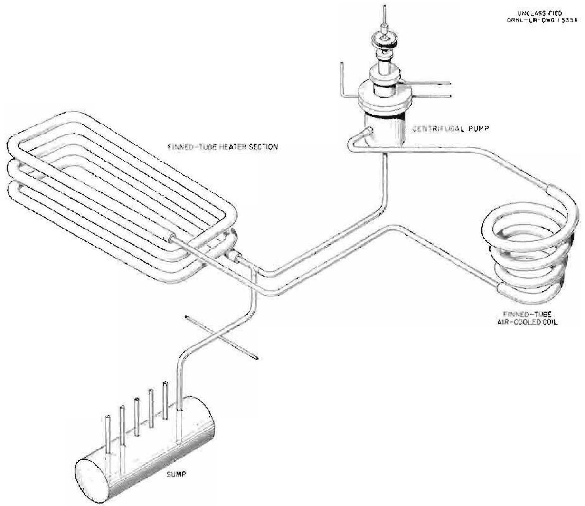

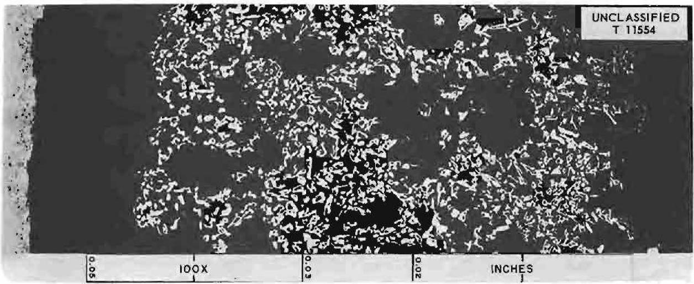  
Fig. 3.1.10. Schematic Drawing of Gas-Fired Inconel Loop Used for Long-Time Circulation of Liquid Metals.   
Fig. 3.1.11. Deposit Found in Cooled Coil of Inconel Loop 7426-51 Which Circulated Sodium for 4000 hr at a Maximum Temperature of $1500^{\circ}\mathrm{F}$ and a Thermal Gradient of $800^{\circ}\mathrm{F}$ . Etchant: modified aqua regia, 100X. (Confidential with caption)

impurities may also have contributed a major part to the mass-transfer process.

THERMAL-CONVECTION LOOP TESTS J.H.DeVan E.A.Kovacevich D.A.Stoneburner

# NaF-KF-LiF-UF4 and Sodium in Nickel-Molybdenum Alloys

Fuel 107. - Corrosion tests of the experimental nickel-molybdenum alloys exposed to sodium and to NaF-KF-LiF-UF $_4$ (11.2-41-45.3-2.5 mole %, fuel 107) in thermal-convection loops were completed. The compositions of the alloys tested, the test conditions, and the results of metallographic examinations of as-tested specimens are given in Table 3.1.5.

The data show that a maximum hot-leg attack of 3 mils occurred in loops 1105 (16% Mo-2% Al-1.5% Ti-bal Ni) and 1108 (17% Mo-2% Al-bal Ni). These results are in good agreement with the data reported previously for materials with relatively high aluminum content. The attack was accompanied by high aluminum pickup in the fuel, as shown in Table 3.1.6.

Loop 1093 (17% Mo-7% Cr-bal Ni) showed hot-leg attack which was somewhat higher than that found previously in loops fabricated from material containing comparable amounts of chromium. Also the attack changed from the moderate general subsurface-void formation in the loops operated previously to heavy general subsurface-void formation. Loop 1094 (20% Mo-7% Cr-2% Nb-1% Fe-bal Ni) revealed hot-leg attack similar to that for loop 1093. The addition of niobium and iron thus appears to have little effect on the corrosion of a nickel-molybdenum alloy containing 7 wt % chromium. Hot-leg specimens from loops 1093 and 1094 are pictured in Figs. 3.1.12 and 3.1.13. As may be seen in Table 3.1.6, the concentration of chromium in the fuel of loop 1094 is also comparable to that found in the fuel circulated in other nickel-molybdenum alloys containing 7 wt % chromium.

Comparisons showed similar maximum depths of attack in loops 1094 and 1099, which were fabricated of alloys of similar composition except that the alloy used for loop 1099 contained $1\mathrm{wt}\%$

aluminum. However, as shown in Table 3.1.6, the chromium buildup in the fuel of loop 1099 was somewhat higher than that reported for loop 1094. Also, the fuel from loop 1099 had a high aluminum content. Examination of loop 1101 (16% Mo-5% Cr-1.5% Ti-1% Al-bal Ni) also showed the usual high aluminum buildup found in the fuel after circulation in aluminum-containing alloys. The attack

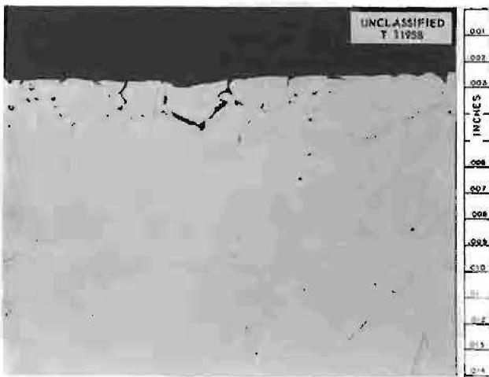  
Fig. 3.1.12. Maximum Hot-Leg Attack Found in Thermal-Convection Loop 1093 (17% Mo-7% Cr-bal NI) Which Operated for 500 hr with NaF-KF-LIF-UF4 (11.2-41-45.3-2.5 Mole %, Fuel 107) at 1500°F. Etchont: aqua regia, 250X. Reduced 32.5%. (Secret with caption)

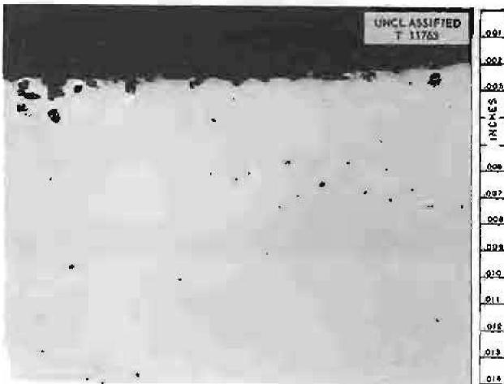  
Fig. 3.1.13. Maximum Hot-Leg Attack Found in Thermal-Convection Loop 1094 (20% Mo-7% Cr-2% Nb-1% Fe-bal Ni) Which Operated for 500 hr with NaF-KF-LiF-UF4 (11.2-41-45.3-2.5 Mole %, Fuel 107) at 1500°F. Etchant: aqua regio. 250X. Reduced 32.5%. (Secret with caption)

Maximum fluid temperature 1500°F

Table 3.1.5. Conditions and Results of Thermal-Convection Loop Tests of Nickel-Molybdenum Alloys with NaF-KF-LIF-UF4 (11,2-41,45,3-2,5 Mole %, Fuel 107) and Sodium   

<table><tr><td rowspan="2">Loop No.</td><td rowspan="2">Alloy Composition (wt %)</td><td rowspan="2">Circulated Fluid</td><td rowspan="2">Operating Time (hr)</td><td colspan="2">Metallographic Results</td></tr><tr><td>Hot Leg</td><td>Cold Leg</td></tr><tr><td>1023</td><td>11 Mo-2 Al-bal Ni</td><td>Sodium</td><td>1000</td><td>Heavy surface pits to a depth of &gt;1 mil</td><td>Moderate surface roughening</td></tr><tr><td>1087</td><td>20 Mo-1 Nb-1 Ti-0.8 Mn-bol Ni</td><td>Fuel 107</td><td>500</td><td>Heavy voids to a depth of 2.5 mils</td><td>Light surface roughening</td></tr><tr><td>1088</td><td>20 Mo-1 Nb-2 Ti-0.8 Mn-bol Ni</td><td>Sodium</td><td>1000</td><td>Heavy voids to a depth of 1 mil</td><td>Moderate surface roughening</td></tr><tr><td>1089</td><td>15 Mo-3 Nb-0.5 Al-3 W-bal Ni</td><td>Sodium</td><td>1000</td><td>Heavy voids to a depth of 1.5 mils</td><td>Moderate surface roughening</td></tr><tr><td>1093</td><td>17 Mo-7 Cr-bal Ni</td><td>Fuel 107</td><td>500</td><td>Heavy voids to a depth of 2 mils</td><td>Light surface roughening</td></tr><tr><td>1094</td><td>20 Mo-7 Cr-2 Nb~1 Fe-bol Ni</td><td>Fuel 107</td><td>500</td><td>Heavy voids to a depth of 2 mils</td><td>No attack</td></tr><tr><td>1098</td><td>17 Mo-2 Ti-bol Ni</td><td>Fuel 107</td><td>500</td><td>Moderate surface pits to a depth of &gt;1 mil</td><td>No attack</td></tr><tr><td>1099</td><td>20 Mo-2 Cr-1 Al-2 Nb-1 Fe-bol Ni</td><td>Fuel 107</td><td>500</td><td>Heavy voids to a depth of 1.5 mils</td><td>No attack</td></tr><tr><td>1100</td><td>17 Mo-2 V-bol Ni</td><td>Fuel 107</td><td>500</td><td>Few voids to a depth of 0.5 mil</td><td>Light surface roughening</td></tr><tr><td>1101</td><td>16 Mo-5 Cr-1.5 Ti-1 Al-bol Ni</td><td>Fuel 107</td><td>500</td><td>Heavy voids to a depth of 2 mils</td><td>Voids to a depth of 1 mil</td></tr><tr><td>1102</td><td>16 Mo-5 Cr-1.5 Ti-1 Al-bol Ni</td><td>Sodium</td><td>1000</td><td>Heavy voids to a depth of &gt;1 mil</td><td>Light surface roughening*</td></tr><tr><td>1103</td><td>16 Mo-1 Al-1.5 Ti-bol Ni</td><td>Fuel 107</td><td>500</td><td>Heavy voids to a depth of 1 mil</td><td>Light surface roughening</td></tr><tr><td>1105</td><td>16 Mo-2 Al-1.5 Ti-bol Ni</td><td>Fuel 107</td><td>500</td><td>Heavy voids to a depth of 3 mils</td><td>No attack</td></tr><tr><td>1108</td><td>17 Mo-2 Al-bol Ni</td><td>Fuel 107</td><td>500</td><td>Heavy voids to a depth of 3 mils</td><td>Light surface roughening</td></tr><tr><td>1113</td><td>17 Mo-2 W-bol Ni</td><td>Fuel 107</td><td>500</td><td>Intergranular voids to a depth of 1.5 mils</td><td>Moderate surface roughening</td></tr><tr><td>1117</td><td>17 Mo-2 W-bol Ni</td><td>Sodium</td><td>1000</td><td>Intergranular voids to a depth of 2 mils</td><td>Heavy surface roughening</td></tr><tr><td>1120</td><td>17 Mo-4 W-bol Ni</td><td>Fuel 107</td><td>500</td><td>Heavy voids to a depth of 1 mil</td><td>Few voids to a depth of 1 mil</td></tr><tr><td>1126</td><td>17 Mo-3 Nb-bol Ni</td><td>Fuel 107</td><td>500</td><td>Few small pits to a depth of &gt;0.5 mil</td><td>Moderate surface roughening</td></tr><tr><td>1131</td><td>17 Mo-5 Nb-bol Ni</td><td>Fuel 107</td><td>500</td><td>Heavy surface roughening to a depth of &lt;1 mil</td><td>Light surface roughening</td></tr></table>

\*A thin discontinuous metallic layer was also found.

Table 3.1.6. Chemical Analyses of Fuel 107 Before and After Circulation in Nickel-Molybdenum Alloy Thermal-Convection Loops   

<table><tr><td rowspan="2">Loop No.</td><td rowspan="2">Alloy Composition (wt %)</td><td rowspan="2">Sample Token</td><td rowspan="2">Uranium Content (wt %)</td><td colspan="9">Metallic Constituents (ppm)</td><td></td></tr><tr><td>Ni</td><td>Cr</td><td>Fe</td><td>Mo</td><td>AI</td><td>Ti</td><td>V</td><td>W</td><td>Nb</td><td>Mn</td></tr><tr><td>1087</td><td>20 Mo-1 Nb-1 Ti-0.8 Mn-bal Ni</td><td>During filling</td><td>12.0</td><td>55</td><td>10</td><td>125</td><td></td><td></td><td></td><td></td><td></td><td></td><td></td></tr><tr><td></td><td></td><td>After operation</td><td></td><td></td><td></td><td></td><td></td><td></td><td></td><td></td><td></td><td></td><td></td></tr><tr><td></td><td></td><td>Hot leg</td><td>12.2</td><td>190</td><td>55</td><td>110</td><td>80</td><td></td><td>370</td><td></td><td></td><td>20</td><td>100</td></tr><tr><td></td><td></td><td>Cold leg</td><td>12.6</td><td>780</td><td>55</td><td>80</td><td>20</td><td></td><td>380</td><td></td><td></td><td>10</td><td>110</td></tr><tr><td>1093</td><td>17 Mo-7 Cr-bal Ni</td><td>During filling</td><td>12.6</td><td>35</td><td>15</td><td>125</td><td></td><td></td><td></td><td></td><td></td><td></td><td></td></tr><tr><td></td><td></td><td>After operation</td><td></td><td></td><td></td><td></td><td></td><td></td><td></td><td></td><td></td><td></td><td></td></tr><tr><td></td><td></td><td>Hot leg</td><td>12.0</td><td>145</td><td>655</td><td>50</td><td>140</td><td></td><td></td><td></td><td></td><td></td><td></td></tr><tr><td></td><td></td><td>Cold leg</td><td>12.4</td><td>200</td><td>655</td><td>70</td><td>25</td><td></td><td></td><td></td><td></td><td></td><td></td></tr><tr><td>1094</td><td>20 Mo-7 Cr-2 Nb-1 Fe-bol Ni</td><td>During filling</td><td>12.9</td><td>170</td><td>60</td><td>165</td><td></td><td></td><td></td><td></td><td></td><td></td><td></td></tr><tr><td></td><td></td><td>After operation</td><td></td><td></td><td></td><td></td><td></td><td></td><td></td><td></td><td></td><td></td><td></td></tr><tr><td></td><td></td><td>Hot leg</td><td>12.3</td><td>270</td><td>665</td><td>80</td><td>115</td><td></td><td></td><td></td><td></td><td>15</td><td></td></tr><tr><td></td><td></td><td>Cold leg</td><td>12.5</td><td>140</td><td>655</td><td>80</td><td>5</td><td></td><td></td><td></td><td></td><td>10</td><td></td></tr><tr><td>1098</td><td>17 Mo-2 Ti-bol Ni</td><td>During filling</td><td>12.9</td><td>85</td><td>60</td><td>210</td><td></td><td></td><td></td><td></td><td></td><td></td><td></td></tr><tr><td></td><td></td><td>After operation</td><td></td><td></td><td></td><td></td><td></td><td></td><td></td><td></td><td></td><td></td><td></td></tr><tr><td></td><td></td><td>Hot leg</td><td>12.9</td><td>160</td><td>30</td><td>125</td><td>125</td><td></td><td>390</td><td></td><td></td><td></td><td></td></tr><tr><td></td><td></td><td>Cold leg</td><td>12.9</td><td>85</td><td>40</td><td>50</td><td>25</td><td></td><td>382</td><td></td><td></td><td></td><td></td></tr><tr><td>1099</td><td>20 Mo-7 Cr-1 Al-2 Nb-1 Fe-bol Ni</td><td>During filling</td><td>12.7</td><td>50</td><td>40</td><td>170</td><td></td><td></td><td></td><td></td><td></td><td></td><td></td></tr><tr><td></td><td></td><td>After operation</td><td></td><td></td><td></td><td></td><td></td><td></td><td></td><td></td><td></td><td></td><td></td></tr><tr><td></td><td></td><td>Hot leg</td><td>12.7</td><td>165</td><td>755</td><td>210</td><td>30</td><td>2815</td><td></td><td></td><td></td><td>7</td><td></td></tr><tr><td></td><td></td><td>Cold leg</td><td>12.8</td><td>140</td><td>735</td><td>90</td><td>15</td><td>2945</td><td></td><td></td><td></td><td>7</td><td></td></tr><tr><td>1100</td><td>17 Mo-2 V-bol Ni</td><td>During filling</td><td>12.5</td><td>&lt;1</td><td>25</td><td>105</td><td></td><td></td><td></td><td></td><td></td><td></td><td></td></tr><tr><td></td><td></td><td>After operation</td><td></td><td></td><td></td><td></td><td></td><td></td><td></td><td></td><td></td><td></td><td></td></tr><tr><td></td><td></td><td>Hot leg</td><td>12.5</td><td>85</td><td>30</td><td>115</td><td>215</td><td></td><td></td><td>&lt;50</td><td></td><td></td><td></td></tr><tr><td></td><td></td><td>Cold leg</td><td>12.6</td><td>130</td><td>25</td><td>90</td><td>40</td><td></td><td></td><td>&lt;50</td><td></td><td></td><td></td></tr><tr><td>1101</td><td>16 Mo-5 Cr-1.5 Ti-1 Al-bal Ni</td><td>During filling</td><td>13.2</td><td>65</td><td>55</td><td>125</td><td></td><td></td><td></td><td></td><td></td><td></td><td></td></tr><tr><td></td><td></td><td>After operation</td><td></td><td></td><td></td><td></td><td></td><td></td><td></td><td></td><td></td><td></td><td></td></tr><tr><td></td><td></td><td>Hot leg</td><td>12.8</td><td>45</td><td>245</td><td>100</td><td>30</td><td>2010</td><td>375</td><td></td><td></td><td></td><td></td></tr><tr><td></td><td></td><td>Cold leg</td><td>12.8</td><td>40</td><td>255</td><td>95</td><td>15</td><td>1830</td><td>345</td><td></td><td></td><td></td><td></td></tr><tr><td>1103</td><td>16 Mo-1 Al-1.5 Ti-bal Ni</td><td>During filling</td><td>12.8</td><td>115</td><td>65</td><td>125</td><td></td><td></td><td></td><td></td><td></td><td></td><td></td></tr><tr><td></td><td></td><td>After operation</td><td></td><td></td><td></td><td></td><td></td><td></td><td></td><td></td><td></td><td></td><td></td></tr><tr><td></td><td></td><td>Hot leg</td><td>11.9</td><td>65</td><td>35</td><td>95</td><td>120</td><td>2535</td><td>385</td><td></td><td></td><td></td><td></td></tr><tr><td></td><td></td><td>Cold leg</td><td>12.4</td><td>105</td><td>30</td><td>115</td><td>55</td><td>2650</td><td>400</td><td></td><td></td><td></td><td></td></tr><tr><td>1105</td><td>16 Mo-2 Al-1.5 Ti-bal Ni</td><td>During filling</td><td>12.6</td><td>35</td><td>15</td><td>125</td><td></td><td></td><td></td><td></td><td></td><td></td><td></td></tr><tr><td></td><td></td><td>After operation</td><td></td><td></td><td></td><td></td><td></td><td></td><td></td><td></td><td></td><td></td><td></td></tr><tr><td></td><td></td><td>Hot leg</td><td>11.9</td><td>50</td><td>20</td><td>70</td><td>60</td><td>2210</td><td>445</td><td></td><td></td><td></td><td></td></tr><tr><td></td><td></td><td>Cold leg</td><td>12.2</td><td>70</td><td>20</td><td>80</td><td>20</td><td>2460</td><td>485</td><td></td><td></td><td></td><td></td></tr><tr><td>1108</td><td>17 Mo-2 Al-bal Ni</td><td>During filling</td><td>12.9</td><td>195</td><td>100</td><td>135</td><td></td><td></td><td></td><td></td><td></td><td></td><td></td></tr><tr><td></td><td></td><td>After operation</td><td></td><td></td><td></td><td></td><td></td><td></td><td></td><td></td><td></td><td></td><td></td></tr><tr><td></td><td></td><td>Hot leg</td><td>12.6</td><td>&lt;2</td><td>40</td><td>65</td><td>45</td><td>1235</td><td></td><td></td><td></td><td></td><td></td></tr><tr><td></td><td></td><td>Cold leg</td><td>12.7</td><td>110</td><td>40</td><td>35</td><td>35</td><td>390</td><td></td><td></td><td></td><td></td><td></td></tr><tr><td>1113</td><td>17 Mo-2 W-bal Ni</td><td>During filling</td><td>12.7</td><td>210</td><td>120</td><td>170</td><td></td><td></td><td></td><td></td><td></td><td></td><td></td></tr><tr><td></td><td></td><td>After operation</td><td></td><td></td><td></td><td></td><td></td><td></td><td></td><td></td><td></td><td></td><td></td></tr><tr><td></td><td></td><td>Hot leg</td><td>11.8</td><td>45</td><td>50</td><td>100</td><td>280</td><td></td><td></td><td></td><td>1215</td><td></td><td></td></tr><tr><td></td><td></td><td>Cold leg</td><td>11.2</td><td>45</td><td>45</td><td>95</td><td>340</td><td></td><td></td><td></td><td>1095</td><td></td><td></td></tr><tr><td>1120</td><td>17 Mo-4 W-bal Ni</td><td>During filling</td><td>12.6</td><td>185</td><td>115</td><td>175</td><td></td><td></td><td></td><td></td><td></td><td></td><td></td></tr><tr><td></td><td></td><td>After operation</td><td></td><td></td><td></td><td></td><td></td><td></td><td></td><td></td><td></td><td></td><td></td></tr><tr><td></td><td></td><td>Hot leg</td><td>11.9</td><td>20</td><td>50</td><td>100</td><td>115</td><td></td><td></td><td></td><td>1465</td><td></td><td></td></tr><tr><td></td><td></td><td>Cold leg</td><td>12.2</td><td>215</td><td>55</td><td>70</td><td>80</td><td></td><td></td><td></td><td>1185</td><td></td><td></td></tr><tr><td>1126</td><td>17 Mo-3 Nb-bal Ni</td><td>During filling</td><td>12.7</td><td>&lt;1</td><td>50</td><td>125</td><td></td><td></td><td></td><td></td><td></td><td></td><td></td></tr><tr><td></td><td></td><td>After operation</td><td></td><td></td><td></td><td></td><td></td><td></td><td></td><td></td><td></td><td></td><td></td></tr><tr><td></td><td></td><td>Hot leg</td><td>12.1</td><td>70</td><td>40</td><td>105</td><td>170</td><td></td><td></td><td></td><td></td><td>70</td><td></td></tr><tr><td></td><td></td><td>Cold leg</td><td>12.5</td><td>270</td><td>50</td><td>85</td><td>30</td><td></td><td></td><td></td><td></td><td>7</td><td></td></tr><tr><td>1131</td><td>17 Mo-5 Nb-bal Ni</td><td>During filling</td><td>12.1</td><td>65</td><td>40</td><td>75</td><td></td><td></td><td></td><td></td><td></td><td></td><td></td></tr><tr><td></td><td></td><td>After operation</td><td></td><td></td><td></td><td></td><td></td><td></td><td></td><td></td><td></td><td></td><td></td></tr><tr><td></td><td></td><td>Hot leg</td><td>*</td><td>6</td><td>*</td><td>*</td><td>50</td><td></td><td></td><td></td><td></td><td>300</td><td></td></tr><tr><td></td><td></td><td>Cold leg</td><td>*</td><td>30</td><td>*</td><td>*</td><td>25</td><td></td><td></td><td></td><td></td><td>335</td><td></td></tr></table>

\*Rswits not yet available.

of 2 mils in this loop (1101) is comparable to the attacks in the above loops containing 7 wt % chromium. However, the chromium content in the fuel after test was noticeably lower in the case of loop 1101 (5 wt % chromium) than in the loops with 7 wt % chromium.

Additions of 2 to 4 wt % tungsten to the nickel-molybdenum alloy did not affect the depth of attack. The hot-leg attack to a depth of 1.5 mils found in loop 1113 (17% Mo-2% W-bal Ni) is shown in Fig. 3.1.14. As may be seen the attack was predominantly intergranular, which is uncommon for nickel-molybdenum alloys exposed to fuel 107. Another loop fabricated of material from the same heat also showed intergranular attack after operation with sodium. The attack by fuel 107 in loop 1120 (17% Mo-4% W-bal Ni), fabricated from a different heat containing 4 wt % tungsten, was of the usual general subsurface-void-formation type and there were surface pits to a depth of 1 mil. The differences in the attack of the alloys containing 2 and 4 wt % tungsten may result from differences in the grain-boundary constituents of the two alloys. The chemical analyses of the fuel mixtures circulated in the two loops show sizable amounts of tungsten, as high as 1465 ppm.

Additional loops fabricated from nickel-molybdenum alloys containing vanadium, niobium, or titanium (loop 100, $17\%$ Mo-2% V-bal Ni; loop 126, $17\%$ Mo-3% Nb-bal Ni; loop 131, $17\%$ Mo-

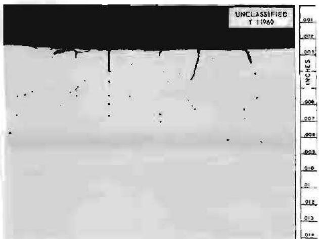  
Fig. 3.1.14. Maximum Hot-Leg Attack Found in Thermal-Convection Loop 1113 (17% Mo-2% W-bol Ni) Which Operated for 500 hr with NaF-KF-LiF-UF4 (11.2-41-45.3-2.5 Mole %, Fuel 107) at 1500°F. Etchont: aqua regia, 250X. Reduced 32.5%. (Secret with caption)

5% Nb-bol Ni; and loop 1098, 17% Mo-2% Ti-bal Ni) and operated with fuel 107 showed attack of 0.5 to 1 mil. Chemical analyses were made of the fuel mixtures circulated in these loops. There was no appreciable vanadium buildup in the fuel from loop 1100. There was, however, as indicated in Table 3.1.6, a buildup of niobium in the fuel from loops 1126 and 1131, with the niobium content of the fuel from the loop containing 5 wt % niobium being greater than that of the fuel from the loop containing 3 wt % niobium. A slight buildup of titanium was evident in the fuel from the loop containing 2 wt % titanium (loop 1098), although the level of titanium in the fuel after the test was much less than the level of aluminum in fuel from loops containing aluminum. Loops containing titanium along with other alloying elements (1087, 1101, 1103, 1105) showed similar titanium concentrations in the fuel after the tests, with amounts up to 485 ppm.

Sodium. - Data on the nickel-molybdenum alloy loops operated with sodium are presented in Table 3.1.5. Mass-transfer deposits were visible in nickel-molybdenum alloy loops 1023 (11% Mo-2% Al-bal Ni), 1088 (20% Mo-1% Nb-2% Ti-0.8% Mn-bal Ni), 1089 (15% Mo-3% Nb-0.5% Al-3% W-bol Ni), 1102 (16% Mo-5% Cr-1.5% Ti-1% Al-bal Ni), and 1117 (17% Mo-2% W-bal Ni), which operated for 1000 hr with sodium at a maximum temperature of $1500^{\circ}\mathrm{F}$ ; however, deposits were found metallographically only in loop 1102. These deposits differed from deposits in Inconel-sodium systems in that they did not adhere tightly to the loop wall. Consequently, the deposits could be mechanically removed, and thus they were lost during preparation of metallographic samples. The quantity of deposited material visible in these loops was comparable to the quantities found in Inconel loops operated with sodium under similar conditions. Chemical analyses of the deposited material found in loop 1102 showed 650 ppm Mo, 3400 ppm Al, 94% Ni, and 3.57% Cr.

The maximum hot-leg attack in all these loops averaged slightly more than 1 mil. The attack appeared as subsurface voids and pits, and thus was similar to that found in the hot legs of loops that circulated fuel 107. With the exception of the alloy that contained 2 wt % tungsten, the grain boundaries were not preferentially attacked. This result is in contrast to the results for Inconel loops in which attack by sodium is normally intergranular.

# Void Migration in Inconel Exposed to NaF-ZrF4-UF4

Three standard Inconel thermal-convection loops were operated with NaF-ZrF4-UF4 (50-46-4 mole %, fuel 30) at a bulk fluid temperature of $1500^{\circ}\mathrm{F}$ . One loop (1085) was terminated after 277 hr of operation; the fuel in the second loop (1086) was replaced with helium after 280 hr, and the loop was held at test temperature for the remaining scheduled operating period of 1000 hr; the third loop (1010), included as a control loop, operated the scheduled 1000 hr with fuel.

An analysis of the corrosion process in Inconel systems containing fluorides indicates that the rate of attack (that is, void formation) becomes constant when the test period exceeds 250 hr. This linear relationship of attack with time is reached following an initial period of rapid attack resulting from the equilibration of the fluorides with Inconel. It was first assumed that the linear migration of voids into Inconel with time represented a constant rate of chromium removal with time. However, questions were posed as to whether even in the absence of further chromium removal some void formation might continue as a result of the rapid stage of attack represented by the equilibration of fluorides. The purpose of these tests was therefore to determine whether the migration of voids into the Inconel, instituted by the leaching of chromium during the corrosion process, would continue if a loop were left at test temperature without fuel.

Metallographic examination of loop 1085 revealed heavy surface roughening and heavy general subsurface-void formation to a depth of 1 mil in the hot leg, accompanied by heavy intergranular subsurface-void formation to a maximum depth of 8 mils. The cold leg showed only heavy surface roughening. Comparison of the hot legs of loops 1085, 1086, and 1010, shown in Fig. 3.1.15, indicated the attack in loops 1085 and 1086 to be identical in depth, extent, and type of void formation. Further metallographic examination throughout both loops revealed similar corrosion of respective metallographic samples. In control loop 1010, which operated with a different batch of fuel, the maximum hot-leg attack was 12 mils, which represents the normal depth of corrosion of inconel under these conditions.

The results of these tests provide evidence that the migration of voids into Inconel, instituted by

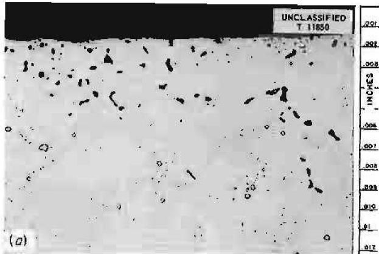

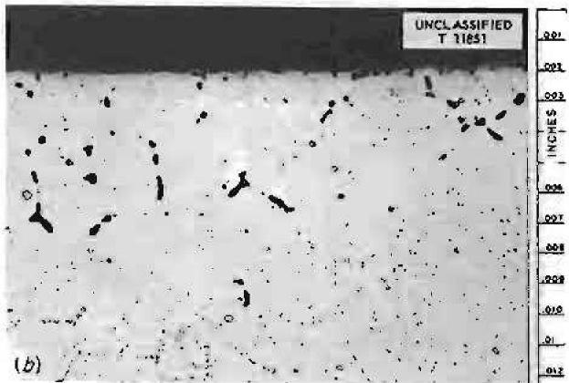

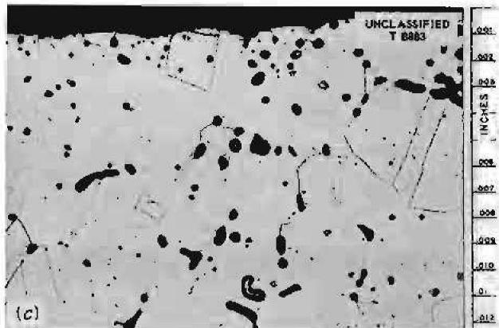  
Fig. 3.1.15. Specimens from Hot Legs of Loops 1085, 1086, and 1010 Which Operated with NaF-ZrF4-UF4 (50-46-4 Mole %, Fuel 30) at a Maximum Fluid Temperature of $1500^{\circ}\mathrm{F}$ . Loop 1085 (a) operated 277 hr with fuel; Loop 1086 (b) operated 280 hr with fuel and 720 hr with helium at the test temperature; loop 1010 (c) operated 1000 hr with fuel. Etchant: modified aqua regia, 250X, Reduced 33%. (Secret with caption)

the leaching of chromium during the corrosion process, does not continue if the loop is left at the test temperature without fuel. Thus, the coalescence of vacancies in the metal to form visible voids must proceed at a rate at least commensurate with the rate at which vacancies are formed. If the removal of chromium from the metal surface is stopped, void formation is also stopped.

# NaF-KF-LiF-UF and Sodium in Niobium

The compatibility of niobium with NaF-KF-LiF-UF4 (11.2-41-45.3-2.5 mole %, fuel 107) and with sodium was studied in thermal-convection loops operated at a maximum fluid temperature of $1500^{\circ}\mathrm{F}$ . The loops, which were fabricated by Battelle Memorial Institute, were slightly smaller than the standard loops employed for corrosion studies of more common materials. The niobium tubing used in the loops was fabricated from welded sheet and had an inside diameter of 0.53 in. and a wall thickness of 0.020 in. In order to eliminate the niobium oxidation problem which would exist at the test temperature, the niobium was encased in an outer sheath of type 321 stainless steel. This sheath completely surrounded the niobium loop but was not integrally bonded to it. Fabrication of a sound loop of this design was difficult in that cracks often developed in the niobium tubing while the sheath was being assembled.

Three niobium loops (1072, 1073, and 1022) were operated 1664, 1000, and 775 hr, respectively, with fuel 107 at a hot-leg temperature of $1500^{\circ} \mathrm{F}$ . Termination of operation of loops 1072 and 1022 was caused by a power failure and loss of flow, respectively. An analysis of the fuel circulated in loop 1022 revealed a high buildup of chromium, 715 ppm, and pointed to the probability of a leak that allowed the fuel to contact the cladding. The examination of this loop showed an absence of cold-leg deposits and only slight hot-leg attack in the form of shallow pitting. Loops 1072 and 1073, on the other hand, apparently remained sound during operation, since no elements other than niobium were found in the fuel after the tests. However, macroscopic examination of the loops revealed metallic crystals in the fuel layer close to the cold-leg wall. These crystals were evident metallographically, and are shown in Fig. 3.1.16. Hot-leg attack in these loops occurred as shallow pitting to a depth of less than 1 mil. A typical

os-tested specimen from the hot leg of loop 1072 is shown in Fig. 3.1.17.

An additional niobium thermal-convection loop (1091) was operated for 1000 hr with sodium at a maximum temperature of $1500^{\circ}\mathrm{F}$ . Examination of

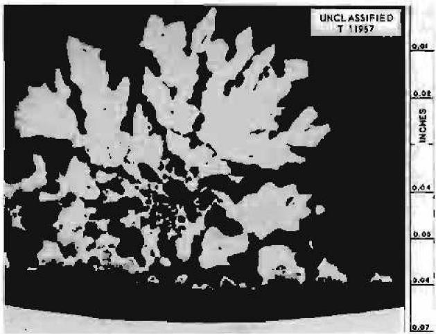  
Fig. 3.1.16. Metallic Crystals in Fuel from Cold-Leg Section of Nioblum Thermal-Convection Loop 1072 Which Operated 1664 hr with NoF-KF-LiF-UF4 (11.2-41-45,3-2,5 Mole %, Fuel 107) at a Maximum Temperature of 1500°F. Unetched. 50X. Reduced 32.5%, (Secret with caption)

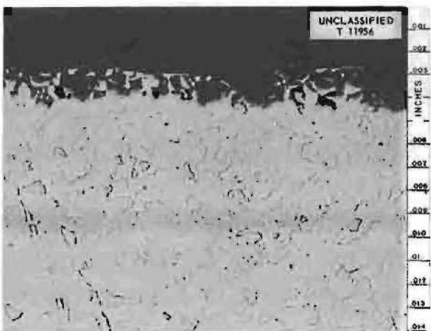  
Fig. 3.1.17. Maximum Hot-Leg Attack of Niobium Thermal-Convection Loop 1072 Which Operated 1664 hr with NaF-KF-LiF-UF4 (11.2-41-45.3-2.5 Mole %, Fuel 107) or a Maximum Temperature of 1500°F. Erchont: HF-HNO3-H2SO4-H2O. 250X. Reduced 31%. (Secret with caption)

the hot leg of this loop showed little evidence of attack other than, possibly, uniform surface removal. Cold-leg deposits were, however, observed macroscopically. Chemical analysis of the de

posited material indicated that the sodium probably leaked into the cladding loop during operation, since large amounts of iron, nickel, and chromium, in addition to niobium, were present in the deposit.

# 3.2. GENERAL CORROSION STUDIES

E. E. Hoffman

# TESTS OF INCONEL TUBE-TO-HEADER JOINTS WITH RECRYSTALLIZED WELDS

D. H. Jansen

The last of a series of Inconel tube-to-header joints with recrystallized welds were corrosion tested in NaK (56-44 wt %) and in NaF-ZrF₄-UF₄ (50-46.4 mole %) for 100 hr in seesaw-furnoce apparatus with a hot-zone temperature of 1500°F. These samples were fabricated at the Glenn L. Martin Co. by using a prechampered header plate of the type shown in Fig. 3.2.1. In comparison

UNCLASSIFIED Y-2130

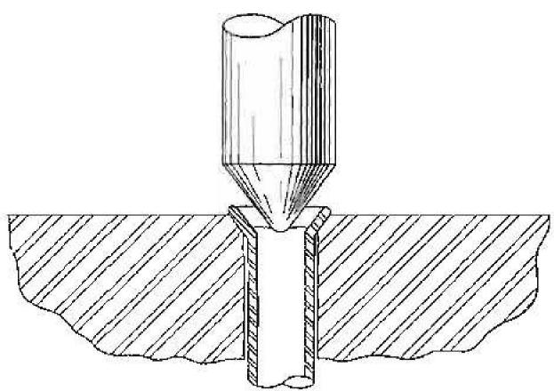  
Fig. 3.2.1. Schematic Drawing of Prechamfer Method of Tube-to-Header Joint Fabrication.

with the welds tested previously' the prechampered type of weld (Fig. 3.2.2) results in decreased material deformation and greater weld surface area. A prechampered type of recrystallized weld that was exposed to $\mathsf{NaF - ZrF_4 - UF_4}$ (50.46-4 mole %, fuel 30) for 100 hr at $1500^{\circ}F$ is shown in Fig. 3.2.3. The attack along the tube-header interface was no greater than the attack on the tube and on the header. A maximum of 0.5 mil of attack was found on the Inconel components of the specimens tested in NaK, and the attack on the tube-header interface was similar.

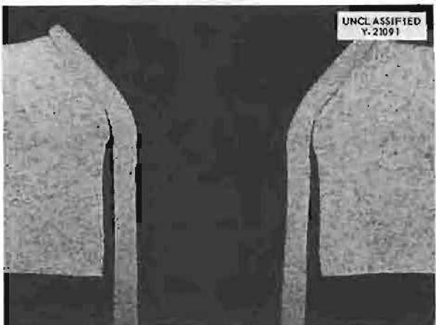  
Fig. 3.2.2. As-Received Recrystallized Tube-to-Header Weld Fabricated by Using a Prechamfer Method. Note large tube-to-header contact area. Etchant: $10\%$ oxalic acid, $12X$ . Reduced $29.5\%$ .

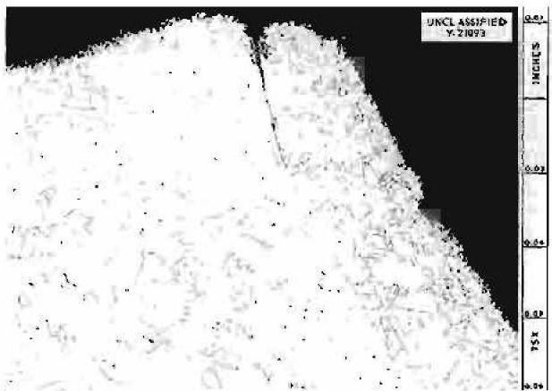  
Fig. 32.3. Recrystallized Weld Fabricated by Prechamfer Method After Exposure for 100 hr in NoF-ZrF $_4$ -UF $_4$ (50-46-4 Mole %, Fuel 30) at $1500^{\circ}\text{F}$ . Etchant: aqua regia, 75X. Reduced 43.5%. (Secret with caption)

# TESTS OF HAYNES NO. 8244 BRAZING ALLOY

D. H. Jansen

Inconel tube-to-header joints brazed with Hoynes No. 8244 brazing alloy (nominal composition, in wt $\%$ : 9.4 Cr, 4.4 Fe, 3.7 Si, 2.2 B, 0.3 Mn, 0.06 C, bal Ni) were corrosion tested in NaF-ZrF $_4$ -UF $_4$ (50-46-4 mole $\%$ , fuel 30) and in NaK

(56-44 wt %) in the seesaw-furnace apparatus. The test periods were 100 hr, and the hot zones in which the specimens were retained were maintained at $1500^{\circ}\mathrm{F}$ . The brazing alloy showed good corrosion resistance to NoK, but there was light subsurface attack to a depth of 3 mils on the specimen tested in the fuel mixture, as shown in Fig. 3.2.4.

# COMPATIBILITY OF MOLYBDENUM AND NICKEL-MOLYBDENUM ALLOYS IN NaF-KF-LIF-UF4

D. H. Jansen

In connection with studies of cladding hydride moderator materials for use in high-temperature circulating-fuel reactors, tests were conducted in seesaw-furnace apparatus to investigate the compatibility of molybdenum and nickel-molybdenum alloys in NaF-KF-LiF-UF $_4$ (11.2-41-45.3-2.5 mole %, fuel 107). The test assembly consisted of a

$\frac{1}{2}$ -in.-OD, 0.035-in.-wall alloy capsule in which a cold-rolled strip of molybdenum, 0.018 in. thick and one half the length of the test capsule, was confined in the hot zone.

A capsule fabricated from $15\%$ Mo- $6\%$ Cr-bal Ni alloy tubing was tested for 500 hr at a hot-leg temperature of $1650^{\circ}\mathrm{F}$ with a temperature gradient of $300^{\circ}\mathrm{F}$ , and a $17\%$ Mo- $2\%$ V-bal Ni capsule was tested under similar conditions, except that the maximum temperature was $1600^{\circ}\mathrm{F}$ . Spectrographic analyses indicated the presence of nickel on the surfaces of the molybdenum strips from both the capsules as a result of dissimilar metal mass transfer. No evidence of chromium or vanadium was detected. Metallographic examination showed that the molybdenum specimen tested at $1650^{\circ}\mathrm{F}$ had become recrystallized, while the one tested at $1600^{\circ}\mathrm{F}$ showed the elongated and distorted grains typical of rolled materials. No attack to a depth greater than 0.5 mil was found on either alloy capsule, and no thickness changes or attack of the molybdenum strips could be detected.

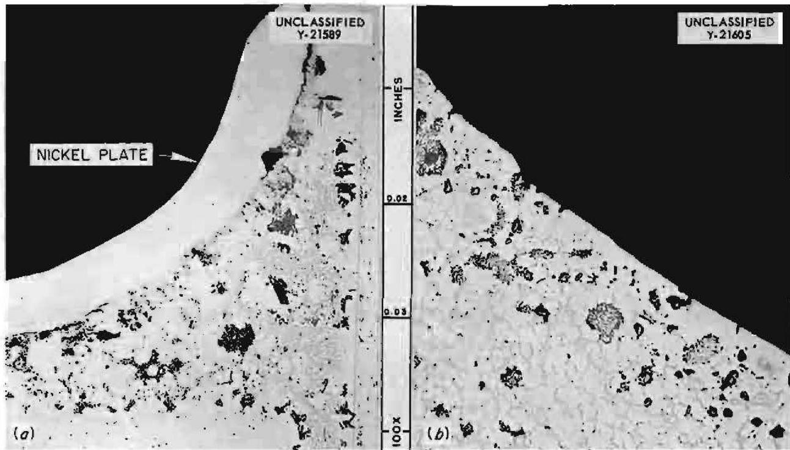  
Fig. 3.2.4. Haynes Braxing Alloy No. 8244 on Inconel Tube-to-Header Joints After Exposure to (a) NaF-ZrF $_4$ -UF $_4$ (50-46-4 Mole %, Fuel 30) and (b) NaK (56-44 wt %) in Seesaw-Furnace Apparatus for 100 hr at a Hot-Zone Temperature of $1500^{\circ}\mathrm{F}$ . Light subsurface attack can be seen in (a). Specimen nickel plated to preserve edge during polishing. Etchont: none, as-polished. 100X. Reduced 6%. (Secret with caption)

More severe tests of these materials are to be conducted, since the cladding problem would be greatly simplified if it could be established that molybdenum and nickel-molybdenum alloys were compatible in the fuel system. At present it is felt that a duplex clad of molybdenum and nickel-molybdenum alloy may be required to prevent dissimilar metal mass transfer. The molybdenum is required as a hydrogen diffusion barrier for the hydride moderator material.

# THERMAL-CONVECTION LOOP TEST OF SODIUM IN HASTELLOY B

E.E.Hoffman

L.R.Trotter

A thermal-convection loop fabricated of Hastelloy B and filled with sodium was operated to obtain a comparison of the mass transfer and corrosion resistance of Hastelloy B and Inconel in sodium systems. The loop operated for 1008 hr at a hot-zone temperature of $1600^{\circ}\mathrm{F}$ and a cold-zone temperature of $990^{\circ}\mathrm{F}$ . No significant differences were found between the amount of attack and mass transfer found in this loop and in two Inconel loops operated under similar conditions. In all three tests an air blast that impinged on the bottom of the cold leg was used to effect a very sharp temperature drop and thus concentrate any mass transfer deposits. Only a few very small mass-transfer crystals were detected in the Hastelloy B loop following the test, as shown in Fig. 3.2.5. In general the crystals found in this loop did not seem to adhere to the walls as well as those found in Inconel loops. The hot- and cold-leg surfaces of the Hastelloy B loops were attacked to depths of from 1 to 2 mils, as shown in Fig. 3.2.6. It may also be noted in Fig. 3.2.6 that scattered areas of the as-received tubing had serious surface defects.

# SODIUM-BERYLLIUM-INCONEL COMPATIBILITY IN A STATIC SYSTEM (TEST NO. 3)

E.E.Hoffman

L.R.Trotter

The apparatus used for tests of the compatibility of sodium, beryllium, and Inconel and results of two earlier compatibility tests in this series were

UNCLASSIFIED Y-20702

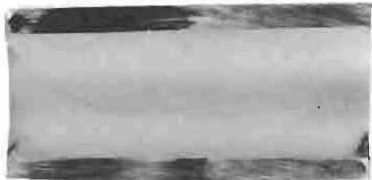

HOT ZONE-1600F

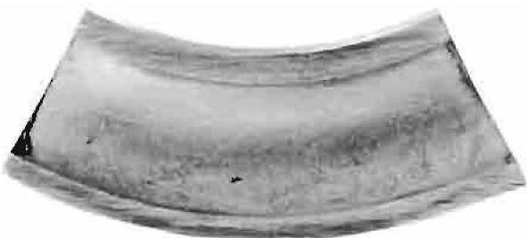

COLD ZONE - 990°F

  
Fig. 3.2.5. Sections from Hastelloy B Thermal-Convection Loop Which Circulated Sodium for 1008 hr. (Confidential with caption)

described previously. The interface conditions tested in this third experiment are described in Table 3.2.1, along with results of metallographic examinations of the interfaces after the test. During the 1000-hr test the temperature was cycled from 1300 to $500^{\circ}\mathrm{F}$ ten times to determine the extent to which the brittle intermetallic compounds which form the interfaces might spall. Each cycle required a 5-hr cooling and an 8-hr heating period; therefore, the specimens were actually at $1300^{\circ}\mathrm{F}$ for 870 hr of the 100-hr test. The results of metallographic examination of the specimen interfaces following the test are illustrated in Fig. 3.2.7. Several of the phases which formed when the Inconel specimens were plated with

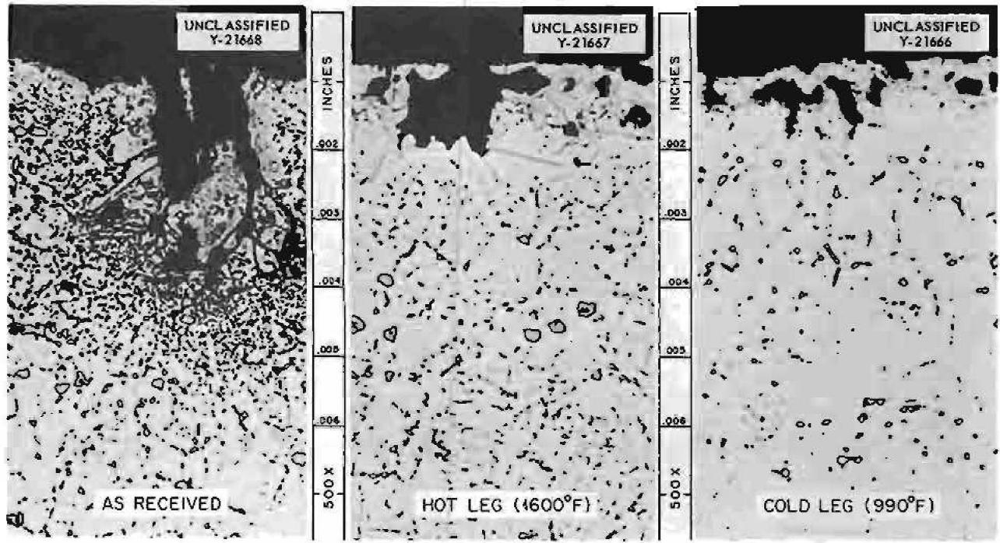  
Fig. 3.2.6. As-Received Hastelloy B and Sections from the Hostelloy B Thermal-Convection Loop Which Circulated Sodium for 1008 hr. The hot leg was attacked to a slightly greater extent than the cold leg. The os-received material contained a few widely scattered surface irregularities. Erchant: modified aqua regia, 500X. Reduced 12%. (Confidential with caption)

Test duration: 1000 hr  
Test temperature: $1300^{\circ}\mathrm{F}$ , cycled to $500^{\circ}\mathrm{F}$ ten times  
Contact pressure between specimens: 500 psi

Table 3.2.1. Results of Metallographic Examination of Interfaces of Specimens from Sodium-Beryllium-Inconel Compatibility Test No. 3   

<table><tr><td>Interface</td><td>Results of Metallographic Examination Across the Interface</td></tr><tr><td>Inconel plus 1-mil nickel plate plus 4-mil chromium plate vs beryllium</td><td>Inconel plus 1.5 mils of a nickel-rich phase plus 2.5 mils of an unidentified phase plus 3.5 mils of Be2Cr (see Fig. 3.2.7a)</td></tr><tr><td>Inconel vs beryllium, direct contact (standard)</td><td>Inconel plus 1 mil of BeNi plus 18 mils of Be21Ni5 (see Fig. 3.2.7b)</td></tr><tr><td>Inconel plus 3-mil chromium plate vs beryllium</td><td>Inconel plus 2 mils of BeNi plus 1 mil of chromium plus 6 mils of Be2Cr (see Fig. 3.2.7c)</td></tr><tr><td>Inconel plus 3-mil chromium plate vs beryllium (duplicate of above)</td><td>Inconel plus 2 mils of BeNi plus 1 mil of chromium plus 6 mils of Be2Cr</td></tr></table>

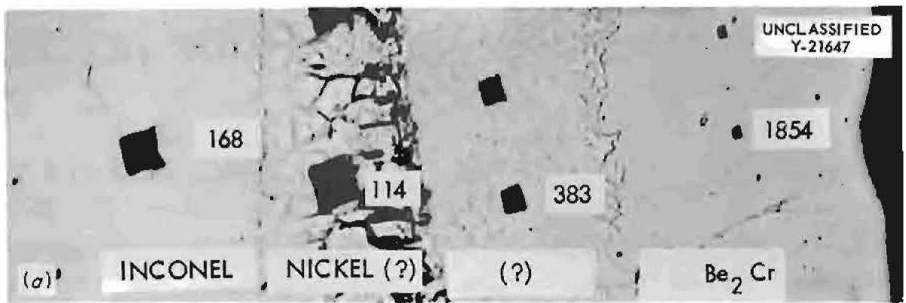

<table><tr><td>500</td><td>500X</td><td></td><td></td><td></td><td></td><td>INCHES</td></tr></table>

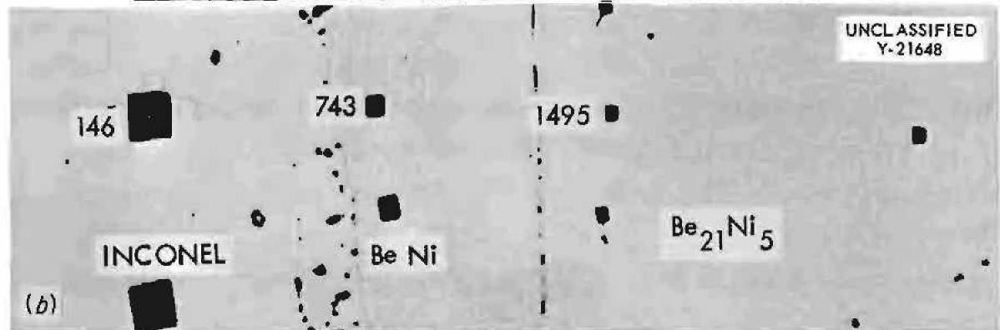

<table><tr><td>00</td><td>01</td><td>500X</td><td>00</td><td>01</td><td>50</td><td>00</td><td>INCHES</td></tr></table>

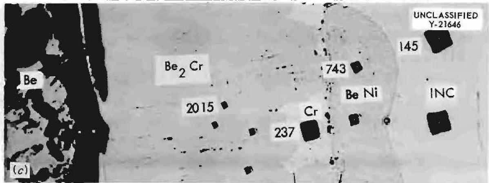  
Fig. 3.2.7. Metallographic Specimens of Interfaces Described in Table 3.2.1. The numbers are diamond pyramid hardness values for a 25-g load. As-polished, 500X.

both nickel and chromium have not yet been identified. It appears that nickel plating of the Inconel prior to chromium plating is unnecessary and possibly undesirable for this application. The results found at the chromium-plated Inconel vs beryllium interfaces confirm the previous findings which indicated that a minimum of 5 mils of chromium plate is required to ensure that all the chromium is not consumed by reaction with the beryllium under the conditions of this experiment. No serious spalling of the brittle compounds $\mathsf{Be}_{2}\mathsf{N}\mathsf{I}_{5}$ and $\mathsf{Be}_{2}\mathsf{Cr}$ was detected in these tests.

# EFFECT OF ZIRCONIUM ON CORROSION IN AN INCONEL-SODIUM SYSTEM

R. Carlander

An Inconel-sodium thermal-convection loop with a zirconium sleeve in its hot leg was operated for 1000 hr with the hot leg at $1500^{\circ}\mathrm{F}$ and the cold leg at $1230^{\circ}\mathrm{F}$ in order to determine whether the zirconium would remove oxygen from the sodium and thus affect the corrosion of the Inconel. Since no mass transfer and little attack occurred, the test indicated that the presence of zirconium had a beneficial effect. In an effort to substantiate these results, two Inconel standpipe test capsules, one containing a zirconium specimen, the other an Inconel specimen, were $50\%$ filled with sodium and tested for 400 hr with the top and bottom of the sodium bath at 1000 and $1600^{\circ}\mathrm{F}$ , respectively.

Mass transfer occurred in both capsules, and, although the weight of the crystals found in each capsule was approximately the same, the composition of the crystals (75.5% Ni-10.4% Cr-14.1% Fe) from the capsule containing the Inconel specimen differed markedly from that of the crystals (95.6% Ni-3.5% Cr-0.9% Fe) from the capsule which contained the zirconium specimen. The effect of zirconium on the mass-transfer crystal composition is not understood.

Visual examination of the zirconium specimen following the test indicated that no oxide scale had formed. Metallographic examination revealed

that a transition from alpha to beta zirconium occurred in the center of the specimen, as was expected as a result of heating the zirconium from room temperature to $1600^{\circ}\mathrm{F}$ . The outer surfaces of the specimen, however, retained the alpha structure to a depth of 40 mils, as shown in Fig. 3.2.8. The retention of the alpha-structure on the outer surfaces was thought to be due to oxygen absorption which raised the alpha to beta transition temperature, which is normally $1548^{\circ}\mathrm{F}$ , to above the test temperature of $1600^{\circ}\mathrm{F}$ and thus stabilized the alpha phase. In order to test this hypothesis, two sets of millings from the surface of the tested specimen, one to a depth of 40 mils (alpha region) and the other from a depth of 40 to 80 mils (beta region), and two sets of similar millings from an as-received specimen were chemically analyzed. The analyses, reported in Table 3.2.2, revealed that the alpha region did absorb oxygen during the test. Since the solubilities of iron, nickel, and chromium are higher in beta zirconium than in alpha zirconium, these metals diffused from the alpha region to the beta region during the test, as shown by the analytical results. The data obtained from these tests thus indicate that the zirconium did remove oxygen from the sodium; however, there was no observable reduction in the corrosion of Inconel as a result of the oxygen removal by the zirconium.

# MOLYBDENUM-BERYLLIUM COMPATIBILITY IN SODIUM

R. Carlander

Two tests of the compatibility of molybdenum and beryllium in contact in static sodium were conducted in the apparatus illustrated schematically in Fig. 3.2.9. The temperature of the test system was maintained at $1500^{\circ}\mathrm{F}$ for each of the tests, one of which was for a period of 100 hr and the other for 500 hr. Metallographic examination of the specimens after the test revealed that a two-phase diffusion zone had formed between the specimens in the 100-hr test, whereas a three-phase diffusion zone formed in the 500-hr test.

The examination of the specimens from the 100-hr test showed that the diffusion layer adjacent to the beryllium specimen was the intermetallic compound $\mathsf{MoBe}_{13}$ . This layer, which was $1\mathrm{mil}$

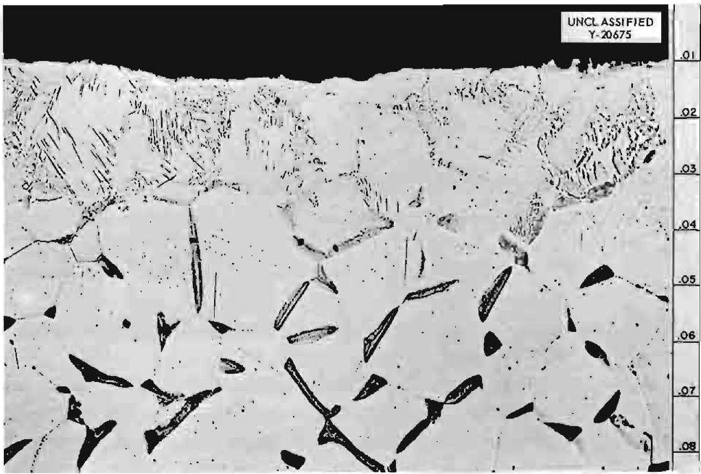  
Fig. 3.2.8. Zirconium Specimen Exposed to Sodium in an Inconel Capsule for 400 hr at $1600^{\circ}$ F. Outer surface is alpha-zirconium to depth of 40 mils. The precipitates at the grain boundaries are probably intermetallic compounds of iron, nickel, and chromium with zirconium. Etchant: $46\%$ $\mathsf{H}_2\mathsf{O} - 46\%$ $\mathsf{HNO}_3 - 8\%$ HF. 50X. (Confidential with caption)

Table 3.2.2. Chemical Analysis of Millings from As-received Zirconium and a Zirconium Specimen Tested in Sodium in an Inconel Capsule   

<table><tr><td rowspan="2">Specimen</td><td colspan="4">Composition (ppm)</td></tr><tr><td>Iron</td><td>Nickel</td><td>Chromium</td><td>Oxygen</td></tr><tr><td>As-received zirconium</td><td></td><td></td><td></td><td></td></tr><tr><td>First 40 mils</td><td>360</td><td>4</td><td>28</td><td>910</td></tr><tr><td>Second 40 mils</td><td>350</td><td>2</td><td>25</td><td>720</td></tr><tr><td>As-tested zirconium</td><td></td><td></td><td></td><td></td></tr><tr><td>First 40 mils (alpha region)</td><td>68</td><td>8</td><td>20</td><td>2600</td></tr><tr><td>Second 40 mils (beta region)</td><td>850</td><td>160</td><td>55</td><td>970</td></tr></table>

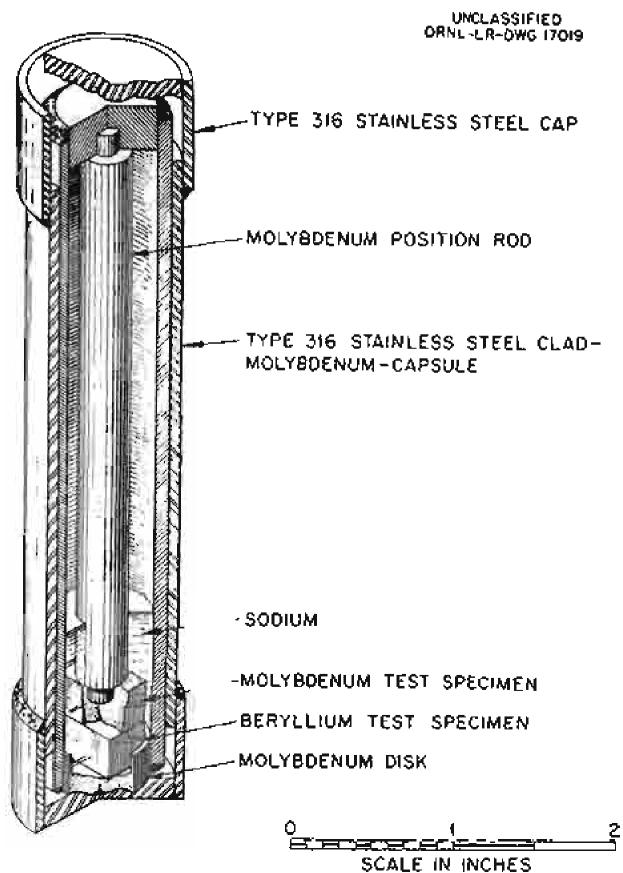  
Fig. 3.2.9. Molybdenum-Beryllium-Sodium Compatibility Test Capsule.

thick and pink, was crocked and had a hardness of 1598 VHN (50-g load). The layer adjacent to the molybdenum specimen was MoBe₂. It was 0.5 mil thick and white, and it had a hardness of 2107 VHN. The identifications of the intermetallic compounds MoBe₁₃ and MoBe₂ were based on previous investigations.

The layer formed adjacent to the beryllium specimen in the 500-hr test spalled from the surface when the bond between the specimens separated during preparation for metallographic examination. The material that spalled has not been positively identified, but it appears to be beryllium oxide. It may have formed as a result of oxygen contamination of the sodium. The middle layer of the three-phase diffusion zone was MoBe13. This layer, which was 2.5 mils deep and

pink, was cracked and had a hardness of 1598 VHN. The layer adjacent to the molybdenum specimen was MoBe $_2$ . It was 2.5 mils deep and white, and it had a hardness of 2390 VHN. The specimens from the 500-hr test are shown in Fig. 3.2.10. The inherent brittleness of the two intermetallic compounds formed in the tests indicates that the solid-solid diffusion that occurs between molybdenum and beryllium at $1500^{\circ}\mathrm{F}$ is of a deleterious nature that would seriously affect the structural properties of the two metals in a high-temperature application. Additional tests in which a 500-psi pressure will be applied to the specimens are to be conducted. The results of these tests will be compared with the results obtained in inconel-beryllium-sodium compatibility tests.

# TITANIUM CARBIDE-NICKEL CERMETS IN MOLTEN SODIUM

W. H. Cook

Specimens of the four TiC-nickel cermets listed below were corrosion tested in sodium in Inconel capsules for 100 hr in a seesaw furnace operating at 1 cpm with hot- and cold-zone temperatures of 1500 and $1120^{\circ}\mathrm{F}$ , respectively.

K150A: $80\%$ TiC- $10\%$ NbTaTiC3- $10\%$ Ni   
K151A: $70\%$ TiC- $10\%$ NbTaTiC3- $20\%$ Ni   
K152B: $64\%$ TiC-6% NbTaTiC3-30% Ni   
K162B: $64\%$ TiC-6% NbTaTiC3-25% Ni-5% Mo.

The specimens were retained in the hot zones of the capsules during the test. The surfaces of all four cermets were roughened to depth of 0.5 mil, but the K152B and K162B specimens appeared to be the most severely attacked. The attack in each case may have been on an Ni-TiC solid solution along the TiC-binder interface, since it appeared that the metal binder had been removed and that the TiC grains were slightly reduced in size. The typical appearance of the attack is shown in Fig. 3.2.11. Chemical analyses of the sodium baths after the tests showed erratic scatter of the results from less than 15 to approximately 60 ppm of titanium or nickel in 20-g samples.

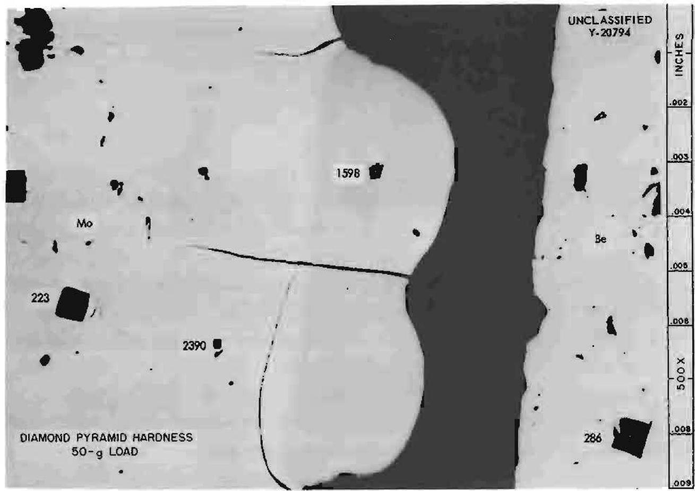

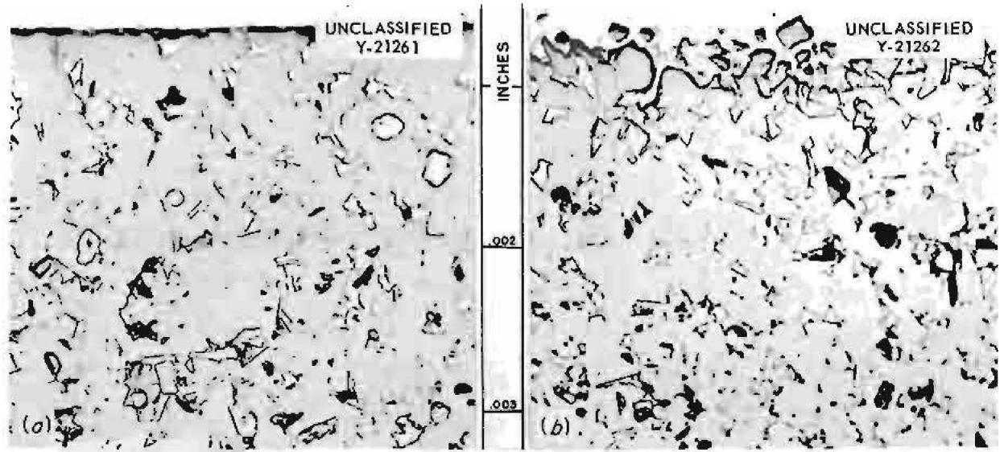  
Fig. 3.2.10. Intermetallic Compounds Formed in Compatibility Tests of Molybdenum and Beryllium in Static Sodium After 500 hr at $1500^{\circ}$ F. Layer with hardness of 1598 is MoBe13. Layer with hardness of 2390 is MoBe2. As-polished, 500X. (Confidential with caption)   
Fig. 3.2.11. Carmet K151A (a) As-Received and (b) After a 100-hr Exposure to Molten Sodium in a Seesaw Furnace with Hot- and Cold-Zone Temperatures of 1500 and $1120^{\circ}\mathrm{F}$ , Respectively. The white phase is nickel and the large gray, angular particles are TiC. Both the untested and the tested specimens were nickel plated to protect the edges during polishing. Unetched. 1000X. (Confidential with caption)

In similar tests in NaK (50-50 wt %), performed at Battelle Memorial Institute, with hot- and cold-zone temperatures of 1600 and $1200^{\circ}\mathrm{F}$ , respectively, there was surface roughening to a depth of 0.5 mil on all these cermets, except K162B, in 110-hr exposures. Previous similar tests at ORNL showed that these four cermets were not attacked by NaF-ZrF $_4$ -UF $_4$ (53.5-40-6.5 mole %, fuel 44).

# BORON CARBIDE AND BORON NITRIDE IN MOLTEN SODIUM

W. H. Cook

The ceramics boron carbide and boron nitride are of interest as refractory materials for use in reactors as thermal-neutron absorbers. In recent standard screening tests of ceramics in liquid metals, two boron carbide specimens, with theoretical densities of 85 and $90\%$ , respectively, had better corrosion resistance to molten sodium than that previously observed.[9]

Each of the $B_{4}C$ specimens was exposed to static sodium for 100 hr at $1500^{\circ}F$ in Inconel containers. The results of these tests are compared with a result of an earlier test in Table 3.2.3. Since it is difficult to completely remove sodium and sodium compounds from a porous ceramic body, it is surprising that the calculated

and measured specimen weight losses given in Table 3.2.3 agree so well. The results calculated from the chemical analyses are considered to be the most important in determining the extent of corrosion. The only visible changes in the tested specimens were that they both had duller surfaces than they had before the tests. The $B_4C$ of $100\%$ theoretical density, which was tested previously, cracked and fell apart after exposure to sodium.

A specimen of boron nitride (nominally, $\frac{1}{4} \times \frac{1}{4} \times \frac{1}{2}$ in.) with a density of $98\%$ of theoretical (theoretical density of BN = 2.20 g/cm³ was severely attacked in a 100-hr exposure to molten sodium in a seesaw furnace operating at 1 cpm with hot- and cold-zone temperatures of 1500 and $1150^{\circ}\mathrm{F}$ , respectively. The specimen container was Inconel.

The measured weight loss of the specimen was $10.8\%$ and the weight loss based on chemical analyses of the sodium after the test was $8.2\%$ if all the boron found was in the form of BN before the test. Since the BN was extremely soft even in the dense state, some of the weight loss could have been due to attrition between the specimen and its container. However, metallographic examination with reflected light showed that the as-tested specimen had developed cracks below and parallel to its surfaces. Under polarized light, the specimen appeared to have altered throughout. There was a dense, shell-like material approximately 0.003 in thick surrounding the core of the specimen. This "shell" contained the cracks observed with the reflected light. The core of the specimen appeared to be less dense than it was before the test and to be covered with black spots.

Table 3.2.3. Results of Exposure of Boron Corbide Specimens to Static Sodium for 100 hr at ${1500}^{ \circ  }\mathrm{F}$   

<table><tr><td rowspan="2">B4C Specimen Density (% of theoretical*)</td><td rowspan="2">Dimensional Change (%)</td><td colspan="2">Weight Loss of Specimens (%)</td></tr><tr><td>By Weight Measurements</td><td>Calculated**</td></tr><tr><td>~85</td><td>-0.1</td><td>1.6</td><td>1.6</td></tr><tr><td>~90</td><td>-0.04</td><td>0.4</td><td>0.3</td></tr><tr><td>100</td><td></td><td>6.5</td><td></td></tr></table>

# SiC-S1 IN MOLTEN SODIUM

W.H.Cook

The silicon was completely removed from an SiC-Si specimen during 100 hr of exposure to molten sodium in an Inconel container in a seesaw furnace operating at 1 cpm with hot- and cold-zone temperatures of 1500 and $1150^{\circ}\mathrm{F}$ , respectively. The silicon was found on the walls of the Inconel container. The specimen was submitted as a dense SiC material.[10] The nominal composition of this type of material is 85 to $90\%$ SiC plus 10 to $15\%$ free silicon plus minor quantities of iron, alumina, and silica. The free silicon probably results from the fabrication procedure, and the minor constituents aid in the densification of the SiC.[11] As-received and tested specimens are compared in Fig. 3.2.12.

The results of this test were consistent with previous results obtained in a static test of a different type of SiC-Si material12 and in similar tests of pure silicon and silicon-containing alloys. The nature and rapid rate of the silicon removal in these tests indicate that the silicon was attacked and that perhaps the attack was assisted by concentration-gradient mass transfer. These data appear to disagree with reports13 that sodium does not react with silicon.

# LEAD-LITHIUM ALLOY IN WATER

D. H. Jansen

Lead-lithium alloy specimens were tested in distilled water at room temperature and at the boiling point, and cracks and dimensional increases, such as those shown in Fig. 3.2.13, were observed after all the tests. The lithium

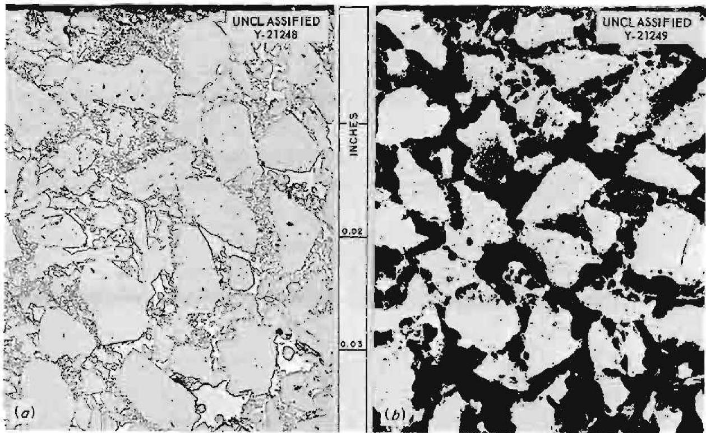  
Fig. 3.2.12. Silicon Corbide-Silicon (a) As-Received and (b) After Exposure for 100 hr to Sodium in a Seesaw Furnace with Hot- and Cold-Zone Temperatures of 1500 and $1150^{\circ}\mathrm{F}$ , Respectively. In (a) the white areas are silicon and the gray areas are SiC; in (b) the silicon has been removed. Unetched. 100X. (Confidential with caption)

content of the water after the tests and the weight changes of the individual samples are given in Table 3.2.4. The loss of lithium to the water in the 100-hr room-temperature test was 16.6 mg/in. $^{2}$ of alloy surface, and it has been calculated that this would be equivalent to about 53 g of lithium lost to the water in the Bulk Shielding Facility (BSF) in 100 hr from a 36-in.-square, 4-in.-thick slab. If the 4-in.-thick slab were made up of eight $\frac{1}{2}$ -in. plates with water between them, as proposed, the amount of lithium leached by the water would be about 350 g in 100 hr.

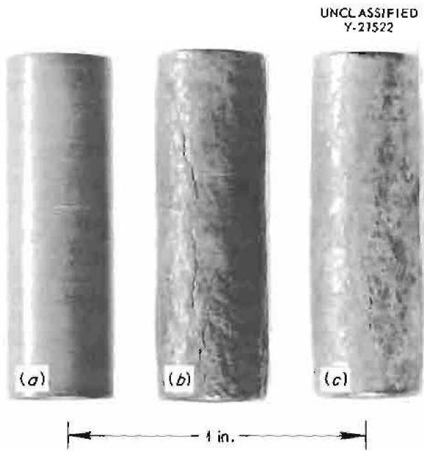  
Fig. 3.2.13. Lead-Lithium Alloy Specimens (0.65 wt % Li) (a) As-Received, (b) After Exposure to Water for 100 hr at Room Temperature, and (c) After 100 hr in Boiling Water. (Confidential with caption)

The lead-lithium spectrometer housing proposed for use in the BSF is to be poured at approximately $400^{\circ}\mathrm{C}$ and allowed to solidify slowly. Therefore a test was conducted to determine whether gross segregation would occur in the alloy if the housing were fabricated in this manner. The test was conducted by filling a ½-in.-OD, 30-in.-long Armco iron capsule with lead-lithium alloy to a height of 24 in. The capsule was held in a vertical position, heated for 4 hr at $400^{\circ}\mathrm{C}$ , and allowed to cool in the furnace. Samples of the alloy were taken from various locations in the capsule and analyzed for lithium content. The analyses showed the lithium contents at the top and bottom of the column to be about the same, 0.73 and 0.70 wt %, but a sample from the center showed an abnormally high lithium content, 0.94%. Another test is planned in which the capsule will be crimped at various places along its length in order to isolate one section from another while the alloy is still molten. In this manner it can be determined whether segregation takes place while the alloy is in the liquid state.

An attempt was made to cast a 36-in.-square, $\frac{1}{2}$ -in.-thick plate of the alloy, and it was found that dimensional tolerances could not be adhered to and that there was some porosity in the casting. Therefore, it has been decided to cast a slab 21 in. square, but thicker $(1\frac{3}{4}$ in.), and have it rolled to the required finished dimensions $(36 \times 36 \times \frac{1}{2}$ in.).

# VOLATILITY PILOT PLANT CORROSION STUDIES

E.E.Hoffman L.R.Trotter

Investigations of the various corrosion problems relative to operation of the volatility pilot plant for fuel reprocessing were continued. These

Table 3.2.4. Results of Corrosion Tests of Lead-Lithium Alloy Specimens (0.65 wt % Li) in Distilled Water   

<table><tr><td>Water Temperature (°F)</td><td>Test Duration (hr)</td><td>Specimen Weight Gain (%)</td><td>Lithium Lost per Unit of Alloy Surface (mg/in.2)</td></tr><tr><td>212</td><td>50</td><td>+0.5</td><td>67</td></tr><tr><td>212</td><td>100</td><td>+0.9</td><td>Sample lost</td></tr><tr><td>72</td><td>50</td><td>+0.3</td><td>7</td></tr><tr><td>72</td><td>100</td><td>+0.6</td><td>16.6</td></tr></table>

studies are being performed in cooperation with members of the Chemical Technology Division and are reported in Chap. 4.2, "Fuel Recovery and Reprocessing," of this report.

# EXPERIMENTAL STUDIES WITH MOLTEN LITHIUM14

E. E. Hoffman T. Hikido

An investigation of the feasibility of using lithium as a reactor coolant was begun at NDA in July 1955 under sponsorship of the Aircraft Reactors Branch of the AEC. In July 1956 coordination of the contract was transferred to the Metallurgy Division of ORNL. The results of the work in fiscal year 1956 were reported by NDA.[16]

The over-all objectives of the fiscal year 1957 program were to determine, principally by the use of thermal-convection loops, the effects of nitrogen and oxygen impurities on mass transfer in type 316 stainless steel-lithium systems. Other container materials that were to be investigated were type 430 stainless steel, niobium, and possibly molybdenum. Fundamental investigations were to include a study of the rate of

solution of container materials in pure lithium, the ultimate solubility of container materials in lithium, and possibly the solubility of lithium nitride in lithium.

Considerable work on the development and improvement of analytical techniques for determining the nitrogen, oxygen, and carbon contents of lithium was performed at NDA in fiscal year 1956 and has been continued into fiscal year 1957. The thermal-convection loop design was standardized so that ORNL and NDA test results could be correlated. A lithium still has been in operation at NDA for several months, and all tests are performed with the high-purity material (less than 20 ppm of $\mathsf{N}_2$ ) produced in this still.

Among the most significant results obtained to date are indications that titanium and zirconium are beneficial in increasing the time required for type 316 stainless steel loops (hot leg, $1600^{\circ}\mathrm{F}$ ; cold leg, $1100^{\circ}\mathrm{F}$ ) to plug with mass-transfer crystals. Loops containing titanium and zirconium operated for approximately 500 hr, whereas standard loops with no additions plugged in roughly 100 hr. Cold trapping of the lithium by means of a positive-flow cold trap to reduce the impurity content shows promise of increasing the time required for stainless steel loops to plug. Three recently operated loops of type 316 stainless steel, fabricated from an ORNL design (hot and cold legs 30 in. long, horizontal connecting legs 18 in. long), plugged with mass-transfer crystals in $95 \pm 25$ hr. The results of the tests will be used as base-line data for future tests in which attempts will be made to study the effect on mass transfer of nitrogen, oxygen, titanium, zirconium, and positive-flow cold traps. No solution rate data have been obtained to date, but tests have been initiated.

# 3.3. FABRICATION RESEARCH

J.H.Coobs

# NICKEL-MOLYBDENUM ALLOY DEVELOPMENT

H. Inouye

T. K. Roche

# General Status of Development Program

The program for developing nickel-molybdenum alloy container materials for fluoride fuels that have better heat transfer properties than those of Inconel was continued during this quarter. The most favorable characteristics of the new alloys in comparison with Inconel are their superior corrosion resistance and strength. The corrosion resistance of nearly every one of the new alloys tested in NaF-KF-LiF-UF $_4$ (11.2-41-45.3-2.5 mole %, fuel 107) was equivalent to that of Hastelloy B, and the average stress-rupture life at $1500^{\circ}\mathrm{F}$ and a stress of 8000 psi was about 400 hr, which is better than that of Inconel by a factor of 4. These properties were attained without seriously affecting the fabricability, and the new alloys do not become brittle during aging or welding.

In terms of reactor performance, it appears that the nickel-molybdenum alloys will permit the use of a more efficient fuel than that planned for use in the ART and probably an increase of $150^{\circ}\mathrm{F}$ over the ART operating temperature. Consequently, every effort is being made to translate laboratory data into commercial practice. With this objective, the effort is being concentrated on one or two promising compositions that are to be made in pilot-plant quantities at the Westinghouse Electric Corporation plant at Blairsville, Pennsylvania.

The properties of the alloys that have been prepared in the laboratory are summarized below:

Fabricability. - The fabricability of the nickel-molybdenum alloy depends on the quantities of other elements that must be added to provide the necessary strength. The indications are that the fabricability will be between that of Inconel and that of Hastelloy B.

Corrosion Resistance. - The corrosion resistance of the new alloys in fuel 107 and in sodium at metal temperatures of $1650^{\circ}\mathrm{F}$ is equivalent to that of Hastelloy B when the criterion is the depth of corrosion. A more sensitive indication of corrosion susceptibility is the change in the chemical composition of the fuel as a result of contact with the alloy. The corrosion tests have indicated that

chromium, aluminum, and tungsten should be held to a minimum in the new alloys.

Stress-Rupture Properties. - The stress-rupture data show that, in most cases, the new alloys fall short of the goal of a rupture life of 1000 hr at 8000 psi and a temperature of $1500^{\circ}\mathrm{F}$ ; however, the considerable scatter of the data prevents accurate strength estimates. The average creep and stress-rupture properties of the various compositions tested to date are plotted in Fig. 3.3.1. Since data from all the alloys tested were averaged, it is expected that the composition selected for further development will have properties somewhat better than those shown in Fig. 3.1.

Joining Characteristics. - The weldability of these alloys has not been determined as fully as desired. Hot ductility tests on some of the alloys indicate that titanium and aluminum are undesirable, as are niobium and tungsten when used in conjunction with a high carbon content. Similarly, for dry-hydrogen brazing the alloys should contain a minimum of aluminum and titanium.

Oxidation Resistance. - The oxidation rate of nearly every composition has been determined to be tolerable in that over 60 thermal-convection loops have been operated in air without failures attributable to oxidation. The metal temperature attained in these tests was approximately $1650^{\circ}$ F for periods of up to 1000 hr. The alloys that showed the most oxidation contained tungsten and niobium.

Aging Characteristics. - The stability of each alloy was determined by observing the changes in tensile strength, stress-rupture properties, and hardness after aging at $1300^{\circ}$ F. The aging response was significant in compositions that contained 0.25% Be or 2.0% Al + 1.5% Ti. A slight response to aging was observed for alloys containing 1.0% Al + 1.5% Ti.

Summaries of the properties of laboratory heats of nickel-molybdenum alloys INOR-1 through INOR-8 are presented in Tables 3.3.1 through 3.3.8. The fuel mixtures referred to in the tables have the following compositions:

Fuel 30 NaF-ZrF4-UF4 (50-46-4 mole %)

Fuel 107 NaF-KF-LiF-UF4 (17.2-41-45.3-2.5 mole %)

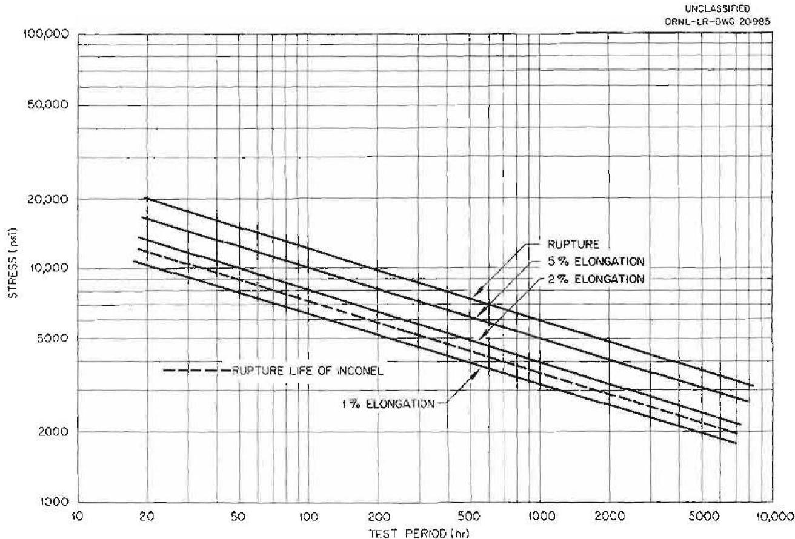  
Fig. 3.3.1. Average Creep and Stress-Rupture Properties of Nickel-Molybdenum Alloys at $1500^{\circ}$ F in Argon and in NaF-KF-LiF-UF4 (11.2-41-45.3-2.5 Mole %, Fuel 107). (Secret with caption)

Table 3.3.1. Properties of Nickel-Molybdenum Alloy INOR-1   

<table><tr><td></td><td>Mo</td><td>Other</td><td>Ni</td></tr><tr><td>Composition, wt %:</td><td>15-20</td><td>0.06 C; 0.5 Al</td><td>Bal</td></tr><tr><td colspan="4">Number of heats: 7</td></tr><tr><td colspan="4">Number of compositions: 3</td></tr><tr><td colspan="4">Fabricability: Equivalent to that of Inconel</td></tr><tr><td colspan="4">Oxidation resistance: Inadequate; minimum resistance with about 20% molybdenum</td></tr><tr><td colspan="4">Joining: Brazable by conventional techniques; weldability between that of Inconel and that of Hastelloy B</td></tr><tr><td colspan="4">Stress-rupture: 1000-hr rupture strength at 1500°F about 4500 psi (extrapolated)</td></tr><tr><td colspan="4">Corrosion: In fuel 30 for 1000 hr at 1500°F, 1 mil</td></tr><tr><td colspan="4">In fuel 107 for 1000 hr at 1500°F, 2 mils</td></tr><tr><td colspan="4">Aging characteristics: None</td></tr><tr><td colspan="4">Remarks: All properties favorable except oxidation resistance and strength</td></tr></table>

Table 3.3.2. Properties of Nickel-Molybdenum Alloy INOR-2   

<table><tr><td>Composition, wt %: 16-20</td><td>Mo Cr 3-10</td><td>Other 0.5 Al, 0.5 Mn, 5 Nb, 0.1 C (max), 0.25 Ce (max)</td><td>Ni Bal</td></tr><tr><td colspan="4">Number of heats: 16</td></tr><tr><td colspan="4">Number of compositions: 8</td></tr><tr><td colspan="4">Fabricability: More difficult to fabricate than Inconel</td></tr><tr><td colspan="4">Oxidation resistance: Satisfactory only with 7% or more chromium</td></tr><tr><td colspan="4">Joining: Brazable by conventional techniques; weldability between that of Inconel and that of Hastelloy 8</td></tr><tr><td colspan="4">Stress-rupture: 1000-hr rupture strength at 1500°F (extrapolated)</td></tr><tr><td colspan="4">With 3% Cr 4500 psi</td></tr><tr><td colspan="4">With 5% Cr 6000 psi</td></tr><tr><td colspan="4">With 7% Cr 6500 psi</td></tr><tr><td colspan="4">Corrosion: In fuel 30 for 2000 hr at 1500°F, 0.5 to 1 mil</td></tr><tr><td colspan="4">In fuel 107 for 500 hr at 1500°F, 1 mil</td></tr><tr><td colspan="4">In fuel 107 for 1000 hr at 1500°F, 2 mils</td></tr><tr><td colspan="4">In sodium for 1000 hr at 1500°F, 0 to 1 mil, slight mass transfer</td></tr><tr><td colspan="4">Aging characteristics: None</td></tr><tr><td colspan="4">Remarks: Corrosion in fuel 107 progresses from surface pits to subsurface voids as chromium content of alloy is increased; pickup of chromium in fuel also increases with increasing chromium content of alloy</td></tr></table>

Table 3.3.3. Properties of Nickel-Molybdenum Alloy INOR-3   

<table><tr><td>Mo</td><td>Ti</td><td>Al</td><td>C</td><td>Ni</td></tr><tr><td>Composition, wt %: 15-16</td><td>1.5</td><td>0.5~1.0</td><td>0.6</td><td>Bal</td></tr></table>

Table 3.3.4. Properties of Nickel-Molybdenum Alloy INOR-4   

<table><tr><td>Composition, wt %:</td><td>Mo 16</td><td>Ti 1.5</td><td>Al 2.0</td><td>C 0.06</td><td>Ni BaI</td></tr><tr><td colspan="6">Number of heats: 4</td></tr><tr><td colspan="6">Fabricability: Vacuum melts similar to INOR-3; air melts more difficult</td></tr><tr><td colspan="6">Oxidation resistance: Inadequate; oxide scale spalls on cooling</td></tr><tr><td colspan="6">Joining: Not brazable in dry hydrogen; weldability equivalent to that of Inconel X</td></tr><tr><td colspan="6">Stress-rupture: 1000-hr rupture strength at 1500°F about 5500 psi (extrapolated); ductility generally less than 5%</td></tr><tr><td colspan="6">Corrosion: In fuel 107 for 500 hr at 1500°F, 3 mils, accompanied by heavy pits and subsurface voids to a depth of 2 mils</td></tr><tr><td colspan="6">Aging characteristics: Age hardens at 1300°F, but over-ages at 1500°F; ductility about 2% when tested at 1300°F</td></tr><tr><td colspan="6">Remarks: Adverse properties in all categories</td></tr></table>

Table 3.3.5. Properties of Nickel-Molybdenum Alloy INOR-5   

<table><tr><td>Composition, wt %:</td><td>Mo
15~16</td><td>Nb
2-3</td><td>W
2-3</td><td>C
0.06~0.25</td><td>Other
0.5 Al, 0.5 Mn</td><td>Ni
Bai</td></tr><tr><td colspan="7">Number of heats: 7</td></tr><tr><td colspan="7">Number of compositions: 5</td></tr><tr><td colspan="7">Fabricability: More difficult to fabricate than Inconel; carbon content greater than 0.10% not recommended</td></tr><tr><td colspan="7">Oxidation resistance: Inadequate; oxide scale spalls on cooling; oxidation rate higher than that of other alloys because of tungsten content</td></tr><tr><td colspan="7">Joining: Brozable by conventional techniques; weldability equivalent to that of Inconel X</td></tr><tr><td colspan="7">Stress-rupture: 1000-hr rupture strength at 1500°F about 6000 psi (extrapolated)</td></tr><tr><td colspan="7">Corrosion: In fuel 107 for 500 hr at 1500°F, no apparent corrosion
In sodium for 1000 hr at 1500°F, 1.5 mils, with subsurface voids and slight mass transfer</td></tr><tr><td colspan="7">Aging characteristics: None</td></tr><tr><td colspan="7">Remarks: Stress-rupture strength influenced by heat treatment; variations in carbon content affect fabricability and strength; 1400 ppm of tungsten picked up in fuel during corrosion test</td></tr></table>

Table 3.3.6. Properties of Nickel-Molybdenum Alloy INOR-6   

<table><tr><td>Composition, wt %: 16</td><td>Cr
5</td><td>Ti
1.5</td><td>Al
1.0</td><td>Other
0.02-0.06 C, 0.5 Mn</td><td>Ni
Bol</td></tr><tr><td colspan="6">Number of heots: 4</td></tr><tr><td colspan="6">Number of compositions: 1</td></tr><tr><td colspan="6">Fabricability: Quite difficult to fabricate but easier than Hastelloy B</td></tr><tr><td colspan="6">Oxidation resistance: Marginal; oxide scale slightly unstable during cycling</td></tr><tr><td colspan="6">Joining: Not brazable in dry hydrogen; weldability equivalent to that of Inconel X</td></tr><tr><td colspan="6">Stress-rupture: 1000-hr rupture strength at 1500°F about 6000 psi (extrapolated)</td></tr><tr><td colspan="6">Corrosion: In fuel 107 for 500 hr at 1500°F, heavy subsurface voids and pits to a depth of 2 mils
In sodium for 1000 hr at 1500°F, heavy subsurface voids and pits to a depth of 1 mil, mass-transfer deposits in cold leg</td></tr><tr><td colspan="6">Aging characteristics: Slight age hardening at 1300°F; none observed at 1500°F</td></tr><tr><td colspan="6">Remarks: Air melts difficult to fabricate</td></tr></table>

Table 3.3.7. Properties of Nickel-Molybdenum Alloy INOR-7   

<table><tr><td>Composition, wt %: 17-20</td><td>Mo
1-2</td><td>Nb
1.0</td><td>Al
6.7</td><td>Cr
0.06-0.12 C, 0.5-0.8 Mn</td><td>Other
Bal</td></tr><tr><td colspan="6">Number of heats: 4</td></tr><tr><td colspan="6">Number of compositions: 3</td></tr><tr><td colspan="6">Fabricability: Similar to that of Hastelloy B</td></tr><tr><td colspan="6">Oxidation resistance: Equivalent to that of Inconel</td></tr><tr><td colspan="6">Joining: Not brozable in dry hydrogen; weldability poor for compositions containing the upper limits of the quantities shown above</td></tr><tr><td colspan="6">Stress-rupture: 1000-hr rupture strength at 1500°F about 8000 psi</td></tr><tr><td colspan="6">Corrosion: In fuel 307 for 500 hr at 1500°F, heavy subsurface voids and pits to a depth of 2 mils</td></tr><tr><td colspan="6">Aging characteristics: Insufficient data</td></tr><tr><td colspan="6">Remarks: Properties sensitive to small changes in molybdenum and aluminum content, high-carbon alloys not amenable to tube reducing; 755 ppm of chromium and 4000 ppm of aluminum picked up in fuel during corrosion test</td></tr></table>

Table 3.3.8. Properties of Nickel-Molybdenum Alloy INOR-8   

<table><tr><td></td><td>Mo</td><td>Cr</td><td>Fe</td><td>Other</td><td>Ni</td></tr><tr><td>Composition, wt %:</td><td>10-24</td><td>3-10</td><td>4-10</td><td>0.06 C, 0.5 Al, 0.5 Mn</td><td>Bol</td></tr><tr><td colspan="6">Number of heats: 25</td></tr><tr><td colspan="6">Number of compositions: 18</td></tr><tr><td colspan="6">Fabricability: Ranges from that of Inconel to that of Hastelloy B, depending on additives</td></tr><tr><td colspan="6">Oxidation resistance: Satisfactory when chromium content is greater than 6%</td></tr><tr><td colspan="6">Joining: Brazable by conventional methods; weldability between that of Inconel and that of Hastelloy B</td></tr><tr><td colspan="6">Stress-rupture: 1000-hr rupture strength at 1500°F about 7000 to 8000 psi</td></tr><tr><td colspan="6">Corrosion: In fuel 30 for 1000 hr at 1500°F, 1 mil of subsurface voids
In fuel 107 for 1000 hr at 1500°F, 0.5 to 2 mils of subsurface voids
In sodium for 1000 hr at 1500°F, 1 mil of corrosion and mass-transfer deposits</td></tr><tr><td colspan="6">Aging characteristics: Alloys that contain less than 20% molybdenum show no response to aging</td></tr><tr><td colspan="6">Remarks: Wide range of strengths possible without detracting from other favorable properties</td></tr></table>

# Properties of Alloy INOR-8

It appears at this time that the alloy INOR-8, which has as its basis the Ni-Mo-Cr-Fe system, will offer the best compromise for meeting the requirements of a container material for fused fluorides. In order to investigate the mechanical properties developed in alloys in this system, as well as the mechanical property trends that result from changes in the total alloy content, the tensile and stress-rupture properties of a series of alloys, included within the composition limits described below, are being determined:

Molybdenum levels 10, 15, and 20 wt %

Chromium levels 5, 7, and 10 wt %

Iron levels 4 and 10 wt %

Other 0.5 wt % Al, 0.5 wt % Mn, 0.06 wt % C

Nickel Balance

Eighteen compositions, approximately $3\frac{1}{2}$ lb each, were melted under vacuum and cast in graphite. Aluminum, manganese, and carbon were added to each charge, primarily for deoxidation of the melt. Each ingot was rolled to 0.065-in.-thick strip from which two ll-in.-long creep specimens were prepared. The remainder of the material was rolled to 0.040-in.-thick strip from which die-cut tensile specimens will be blanked.

Stress-rupture data were obtained for six of the alloys in the solution-annealed condition at a

stress of 10,000 psi and a temperature of $1500^{\circ}\mathrm{F}$ in argon. The results are presented in Table 3.3.9. Although the stress-rupture properties do not follow the anticipated trends, the alloys are stronger than Inconel at this stress level and approach the strength of type 316 stainless steel.

A forced-circulation loop is to be fabricated from an INOR-8 alloy containing $17\%$ Mo- $10\%$ Cr- $7\%$ Fe- $0.06\%$ C-bal Ni in which NaF-KF-LiF-UF4 (11.2-41-45.3-2.5 mole $\%$ fuel 107) will be circulated. Therefore two 3.5-lb ingots with the same nominal composition, alloys VT-51 and VT-52, were cast for preparing stress-rupture specimens for testing in fuel 107. One melt, VT-51, was prepared from elemental stock, and the other, VT-52, from Inconel diluted with Ni, Mo, and Fe. Actual analyses of these two alloys showed the molybdenum content to be approximately $19.5\%$ ; however, the composition is still bracketed by the limits described for the study of the INOR-8 alloy system. Both these alloys had 1000-hr rupture strengths of 8000 psi at $1500^{\circ}\mathrm{F}$ in fuel 107. Metallographic studies of alloys VT-51, VT-43 ( $10\%$ Mo- $5\%$ Cr- $4\%$ Fe- $0.06\%$ C-bal Ni), and VT-49 ( $15\%$ Mo- $7\%$ Cr- $4\%$ Fe- $0.06\%$ C-bal Ni) indicated that VT-51 responded to aging at 1300 and $1500^{\circ}\mathrm{F}$ and thus had higher strength than alloys VT-43 and VT-49, which did not show this gross aging response. It therefore appears that higher strengths can be achieved in the Ni-Mo-Cr-Fe system by raising the quantities of the elements added to the nickel. Further evaluation studies of the alloys prepared

Stress: 10,000 psi

Temperature: 1500°F

Environment: Argon

Table 3.3.9. Stress-Rupture Data for INOR-8 Alloys Based on the Ni-Mo-Cr-Fe System   

<table><tr><td>Alloy No.</td><td>Nominal Composition (wt %)</td><td>Rupture Life (hr)</td><td>Elongation (%)</td></tr><tr><td>VT-43</td><td>10 Mo-5 Cr-4 Fe-0.5 Al-0.5 Mn-0.06 C-bal Ni</td><td>234</td><td>32</td></tr><tr><td>VT-44</td><td>10 Mo-5 Cr-10 Fe-0.5 Al-0.5 Mn-0.06 C-bal Ni</td><td>152</td><td>21</td></tr><tr><td>VT-47</td><td>10 Mo-7 Cr-4 Fe-0.5 Al-0.5 Mn-0.06 C-bal Ni</td><td>85</td><td>11</td></tr><tr><td>VT-48</td><td>10 Mo-7 Cr-10 Fe-0.5 Al-0.5 Mn-0.06 C-bal Ni</td><td>106</td><td>16</td></tr><tr><td>VT-45</td><td>15 Mo-5 Cr-4 Fe-0.5 Al-0.5 Mn-0.06 C-bal Ni</td><td>192</td><td>16</td></tr><tr><td>VT-46</td><td>15 Mo-5 Cr-10 Fe-0.5 Al-0.5 Mn-0.06 C-bal Ni</td><td>152</td><td>24</td></tr></table>

in the INOR-8 system are to be carried out with particular attention to the stress-rupture properties and aging characteristics of the materials.

# Properties of Alloy INOR-9

Compositions designated INOR-9 are prepared by adding Nb, V, or Fe plus C to the bosic Ni-Mo composition. Certain elements, namely, Cr, Al, Ti, and W, are excluded because of their corrosion tendencies in fuel 107. Previous studies of the oxidation characteristics of nickel-molybdenum alloys showed that stable oxide scales were formed when the molybdenum content was lower than $15\%$ . The strengths of the solid-solution alloys of nickel and molybdenum show strong dependence on the molybdenum content, and thus support is given to the theory that solid-solution strengthening is dependent upon the extent of alloying. In order to maintain the molybdenum level as low as possible for oxidation resistance and yet to have the highly alloyed composition needed for strength, niobium additions are being made to the nickel-molybdenum base alloy. The compositions which exhibit maximum solid solubility are being determined, and their oxidation characteristics in the temperature range of interest are being studied. For practical reasons the alloys contain iron, which is derived from the ferroniobium melting stock. The compositions and the properties of the alloys being studied are given in Table 3.3.10.

# Fabrication of ORNL Experimental Alloys

Three experimental compositions were extruded to tube blanks which are presently being processed into seamless tubing at the Superior Tube Co. for fabrication of forced-circulation loops which will be operated with fuel 107. Six tube blanks of each composition were fabricated, without difficulty, at a temperature of $2150^{\circ}\mathrm{F}$ and an extrusion ratio of 7:1. The compositions which have been extruded are described in Table 3.3.11. In view of the time delay anticipated in the fabrication of tubing from the INOR-8 alloys, two laboratory heats of the composition $15\%$ Mo-6% Cr-5% Fe-0.5% Mn-0.5% Al-0.06% C-bal Ni were cast, and sufficient tubing is to be prepared for fabrication of an additional forced-circulation loop, which will also be operated with fuel 107.

# Production of Commercial-Size Heats of Nickel-Molybdenum Alloys

The various products which were fabricated from the billet material obtained from the six 4800-lb heats of nickel-molybdenum base alloys designated as INOR-1 through -6 were received from the International Nickel Company. The compositions of these alloys and a complete materials inventory were presented previously. Only a small quantity of usable material of the composition INOR-4 (77.83% Ni-16.9% Mo-1.96% Al-1.68% Ti + residuals) remained after ingot breakdown, and it was

Table 3.3.10. Some Properties of Ni-Mo-Nb-Fe Alloys   

<table><tr><td>Nominal Composition (wt %)</td><td>Forgeabilitya</td><td>Oxide Stabilityb</td><td>Phasesc</td></tr><tr><td>10 Mo-5 Nb-4 Fe-bol Ni</td><td>Forgeable</td><td>Stable</td><td>Single</td></tr><tr><td>10 Mo-7.5 Nb-6 Fe-bol Ni</td><td>Forgeable</td><td>Not yet tested</td><td>Not yet tested</td></tr><tr><td>10 Mo-10 Nb-8 Fe-bol Ni</td><td>Unforgeable</td><td>Stable</td><td>Multiphase</td></tr><tr><td>12.5 Mo-5 Nb-4 Fe-bol Ni</td><td>Forgeable</td><td>Not yet tested</td><td>Not yet tested</td></tr><tr><td>12.5 Mo-7.5 Nb-6 Fe-bol Ni</td><td>Forgeable</td><td>Stable</td><td>Multiphase</td></tr><tr><td>12.5 Mo-10 Nb-8 Fe-bol Ni</td><td>Unforgeable</td><td>Stable</td><td>Multiphase</td></tr><tr><td>15 Mo-5 Nb-4 Fe-bol Ni</td><td>Forgeable</td><td>Not yet tested</td><td>Not yet tested</td></tr><tr><td>15 Mo-7.5 Nb-6 Fe-bol Ni</td><td>Forgeable</td><td>Stable</td><td>Multiphase</td></tr><tr><td>15 Mo-10 Nb-8 Fe-bol Ni</td><td>Unforgeable</td><td>Stable</td><td>Multiphase</td></tr><tr><td>17 Mo-3 Nb-bol Ni</td><td>Forgeable</td><td>Spalls</td><td>Single</td></tr><tr><td>17 Mo-5 Nb-bol Ni</td><td>Forgeable</td><td>Spalls</td><td>Single</td></tr><tr><td>17 Mo-5 Nb-4 Fe-bol Ni</td><td>Forgeable</td><td>Not yet tested</td><td>Not yet tested</td></tr></table>

${}^{a}$ Cast arc melts rolled of ${2100}^{ \circ  }\mathrm{F}$ ; cold rolled to 0.065 in. thick.   
${}^{b}$ Specimens exposed in air for 168 hr at ${1650}^{ \circ  }\mathrm{F}$ .   
cAnnealed and aged 100 hr at $1300^{\circ}F$

Table 3.3.11. ORNL Alloys Extruded to Tube Blanks   

<table><tr><td>Alloy No.</td><td>Nominal Composition (wt %)</td></tr><tr><td>30-46 and 30-47</td><td>17 Mo-10 Cr-7 Fe-0.5 Al-0.5 Mn-0.06 C-bol Ni</td></tr><tr><td>30-48 and 30-49</td><td>17 Mo-7 Fe-0.5 Al-0.5 Mn-0.06 C-bol Ni</td></tr><tr><td>30-50 and 30-51</td><td>17 Mo-10 Cr-0.5 Al-0.5 Mn-0.06 C-bol Ni</td></tr></table>

requested that $\frac{1}{2}$ -in.-thick plate and 0.065-in.-thick strip be rolled from this stock. The plate and sheet received were of poor quality, with numerous surface cracks on the pieces. Thirty-four feet of 3- by 3-in. billet material of the alloy INOR-6 (74% Ni-16% Mo-5.3% Cr-1.15% Al-1.69% Ti + residuals) was to have been used for fabricating plate, sheet, wire, and bar stock, but this material was scrapped during subsequent billet processing. The report on this difficulty has not yet been received. The alloys INOR-2 (76.7% Ni-16.1% Mo-5.28% Cr + residuals) and INOR-5 (78.6% Ni-13.1% Mo-2.69% W-2.15% Nb-0.10% C + residuals) were fabricated successfully.

All the products received to date are listed in Table 3.3.12. The plate and wire are being used for weldability studies, and the 0.065-in.-thick strip is being used to evaluate mechanical properties.

Eight 9-in.-dio, 12-in.-long billets, two each of INOR-1, -2, and -5 and one each of INOR-3 and -6, were extruded to $3\frac{1}{4}$ -in.-OD, 0.500-in.-wall tube shells at the International Nickel Company in August 1956. These shells, together with one Hastelloy W and three Hastelloy B tube shells, which were extruded in March 1956, are presently being reduced to 2-in.-OD, 0.187-in.-wall tube blanks. The blanks are scheduled for delivery to the Superior Tube Co. in March 1957, where they will be processed to small-diameter seamless tubing. A summary of the fabricability of the alloys INOR-1 through -6 is presented in Table 3.3.13.

The contract with the Westinghouse Electric Corporation covering the melting, casting, and fabrication of large pilot heats of nickel-molybdenum base alloys at their Blairsville, Pennsylvania, metals plant has been signed, and work is to begin immediately. Although two compositions were originally specified for scaling up to semiproduction quantities, only the alloy INOR-8 will be melted

Table 3.3.12. Products Fabricated from 4800-1b Heuts of INOR Alloys Produced by International Nickel Company   

<table><tr><td>Heat No.</td><td>Alloy Type</td><td>Quantity</td><td>Size</td><td>Remarks</td></tr><tr><td colspan="5">1/2-in.-Thick Plate - Hot Rolled</td></tr><tr><td>Y-8195</td><td>INOR-1</td><td>8 pieces</td><td>6 x 12 in.</td><td>Slight cracks on surface</td></tr><tr><td>Y-8197</td><td>INOR-2</td><td>7 pieces</td><td>3 x 12 in.</td><td></td></tr><tr><td>Y-8196</td><td>INOR-3</td><td>8 pieces</td><td>6 x 12 in.</td><td></td></tr><tr><td>Y-8198</td><td>INOR-4</td><td>8 pieces</td><td>3 x 12 in.</td><td>Surface and edge cracks</td></tr><tr><td>Y-8200</td><td>INOR-5</td><td>8 pieces</td><td>3 x 12 in.</td><td></td></tr><tr><td colspan="5">Weld Wire - Cold Drawn</td></tr><tr><td>Y-8195</td><td>INOR-1</td><td>6 lb</td><td>1/8 in. dia</td><td></td></tr><tr><td>Y-8197</td><td>INOR-2</td><td>9 lb</td><td>1/8 in. dia</td><td></td></tr><tr><td>Y-8196</td><td>INOR-3</td><td>8 lb</td><td>1/8 in. dia</td><td>Seam along length</td></tr><tr><td>Y-8200</td><td>INOR-5</td><td>8 lb</td><td>1/8 in. dia</td><td></td></tr><tr><td>Y-8195</td><td>INOR-1</td><td>6 lb</td><td>3/32 in. dia</td><td></td></tr><tr><td>Y-8197</td><td>INOR-2</td><td>10 lb</td><td>3/32 in. dia</td><td></td></tr><tr><td>Y-8196</td><td>INOR-3</td><td>6 lb</td><td>3/32 in. dia</td><td></td></tr><tr><td>Y-8200</td><td>INOR-5</td><td>9 lb</td><td>3/32 in. dia</td><td></td></tr><tr><td colspan="5">27/8-in.-dia Forgings</td></tr><tr><td>Y-8195</td><td>INOR-1</td><td>1 piece</td><td>54 in. long</td><td>Crack at one end</td></tr><tr><td>Y-8197</td><td>INOR-2</td><td>1 piece</td><td>36 in. long</td><td></td></tr><tr><td>Y-8196</td><td>INOR-3</td><td>1 piece</td><td>48 in. long</td><td></td></tr><tr><td>Y-8200</td><td>INOR-5</td><td>1 piece</td><td>44 in. long</td><td></td></tr><tr><td colspan="5">0.065-in.-Thick Strip - Cold Rolled</td></tr><tr><td>Y-8195</td><td>INOR-1</td><td>25 pieces</td><td>6 x 12 in.</td><td></td></tr><tr><td>Y-8197</td><td>INOR-2</td><td>33 pieces</td><td>3 x 12 in.</td><td></td></tr><tr><td>Y-8196</td><td>INOR-3</td><td>17 pieces</td><td>6 x 12 in.</td><td></td></tr><tr><td>Y-8198</td><td>INOR-4</td><td>21 pieces</td><td>3 x 12 in.</td><td>Surface cracks</td></tr><tr><td>Y-8200</td><td>INOR-5</td><td>36 pieces</td><td>3 x 12 in.</td><td></td></tr></table>

Table 3.3.13. Fobrlicability of 4800-lb Heats of Nickel-Molybdenum Alloys   

<table><tr><td rowspan="2">Alloy Designation</td><td colspan="4">Fabricability Characteristics</td></tr><tr><td>Forging</td><td>Rolling</td><td>Extrusion</td><td>Wire Drawing</td></tr><tr><td>INOR-1</td><td>Fair</td><td>Fair</td><td>Good</td><td>Good</td></tr><tr><td>INOR-2</td><td>Good</td><td>Good</td><td>Good</td><td>Good</td></tr><tr><td>INOR-3</td><td>Fair</td><td>Fair</td><td>Good</td><td>Fair</td></tr><tr><td>INOR-4*</td><td>Poor</td><td>Poor</td><td></td><td></td></tr><tr><td>INOR-5</td><td>Good</td><td>Good</td><td>Good</td><td>Good</td></tr><tr><td>INOR-6**</td><td>Fair</td><td></td><td>Good</td><td></td></tr></table>

*Alloy INOR-4 became 95% scrap during initial forging of the ingot.   
**The billet material fabricated from alloy INOR-6 became scrap during subsequent processing.

at present. The composition of alloy INOR-8 has been altered slightly from that given in the contract, and the nominal composition (in wt %) is now the following:

<table><tr><td>Molybdenum</td><td>15-17</td></tr><tr><td>Iron</td><td>4-5</td></tr><tr><td>Chromium</td><td>6-8</td></tr><tr><td>Carbon</td><td>0.04-0.08</td></tr><tr><td>Manganese</td><td>0.8 (max)</td></tr><tr><td>Silicon</td><td>0.5 (max)</td></tr><tr><td>Nickel</td><td>Balance</td></tr></table>

The average molybdenum content was raised from 13.5 to $16\%$ , and the average chromium level was increased from 6 to $7\%$ . Before the alloy is prepared, details of the melting practices used by the International Nickel Company on the 4800-lb heats of alloys INOR-1 through -6 and by Battelle Memorial Institute on similar nickel-molybdenum alloys will be made available to Westinghouse. These melting practices will be compared with those used at Westinghouse in order to determine the best melting procedure.

Initially, one 3600-lb heat will be prepared for casting two ingots of approximately 1100 lb and four ingots of approximately 250 lb. Preliminary forging studies will be carried out on the smaller ingots in order to establish the hot-working temperature range of the alloy. Priority will be given to the fabrication of a 3-in.-dia, 6-ft forging which

can be further processed, on a laboratory scale, to tube blanks and mechanical property test specimen blanks.

Melting of the second composition specified in the contract, INOR-7, has been postponed because of the detrimental effect its aluminum content would have on its corrosion resistance in fused fluorides. It is believed that an alloy based upon the Ni-Mo-Nb system, the Ni-Mo-Cr-Nb system, or the Ni-Mo-Cr-Fe system with higher total alloy content than that of the INOR-8 composition can be specified in the near future to replace the INOR-7 composition.

# Phase Diagram Studies at the University of Tennessee

The present status of the phase diagram studies being performed at the University of Tennessee under Subcontract 582 is summarized here. A previous report described the studies of nickel-base alloys containing 20 to $30\%$ molybdenum. In this work, metallographic and x-ray examinations, hardness tests, and other techniques are being used to establish phase relationships and characteristic phase transformations which relate to the mechanical properties of nickel-rich alloys containing molybdenum and molybdenum plus chromium.

In the binary system, Ni-Mo, the three secondary phases previously reported in the literature were identified, although only the crystal structure of the beta phase was confirmed. The temperatures at which the beta and gamma phases decompose on heating were found to be higher than those reported in recent literature and are at present being considered to be 868 and approximately $925^{\circ}C$ , respectively. A simple ordering mechanism for the formation of the beta phase from the alpha phase was worked out that yielded a structure from which the observed x-ray data could be derived. Precipitation of beta and gamma material from the alpha phase increased the hardness of the alloy to 450 DPH, with little if any decrease in hardness after aging for periods of up to 2000 hr.

Nickel-rich nickel-molybdenum alloys with additions of chromium in the range of 4 to $14\%$ were also studied. A chromium content of up to $5\%$ does not appear to alter the total solubility of the

alloying elements in nickel, whereas larger amounts of chromium seem to permit an increase in the total solubility. Additions of chromium quickly restrict the formation of beta material, and systems that precipitate gamma and then delta phases develop. There is evidence of an additional phase in the higher-chromium-content alloys which has not yet been identified.

# Alloy Development at Battelle Memorial Institute

Work on the nickel-molybdenum alloy development program being conducted by Battelle Memorial Institute under Subcontract 979 continued along the lines described previously. ORNL has assisted Battelle in their program by determining the stress-rupture properties of selected alloys in the fuel mixture NaF-KF-LiF-UF $_4$ (11,2-41-45,3-2.5 mole %, fuel 107) and by extruding numerous tube blanks of their alloys for corrosion evaluation. From the tubing successfully fabricated to date, ORNL has operated thermal-convection loops with both fuel 107 and sodium. Emphasis is now being placed on the fabrication of tube blanks of alloys selected for forced-circulation loop tests with fuel 107 to be performed at Battelle.

Four tube blanks of each of the Battelle alloys B-3404, B-3407, B-3412, and B-3418, described previously, were extruded and sent to the Superior Tube Co. for redrawing to small-diameter tubing. However, all the blanks failed on the tube reducer and thus substantiated earlier evidence that alloys with $0.12\%$ carbon are not amenable to tube-reducing operations. At the recommendation of Superior Tube Co., Battelle has discarded the high-carbon heats and has melted alloys with a lower carbon level. The compositions of the new alloys are listed in Table 3.3.14. Battelle has prepared a sufficient number of extrusion billets of these alloys for fabricating the necessary tubing to operate a total of 16 forced-circulation loops with fuel 107, but only alloys B-3870 and B-3871 are to be used at

this time. ORNL has received 12 billets of each of these two compositions which will be extruded to tube blanks and further processed to 0.380-in.-OD, 0.065-in.-wall tubing at the Superior Tube Co. This should provide sufficient tubing for two forced-circulation loops of each of the two alloys.

In addition to the alloys which have been prepared for loop studies, Bottelle has cast 100-lb heats of the six compositions shown in Table 3.3.15, which will be evaluated for fabricability, heat treatment, weldability, and stress-rupture properties. An evaluation of these alloys, as well as the alloys scheduled for forced-circulation loop studies, should provide additional data for determining the effect of aluminum and chromium on the properties of nickel-molybdenum alloys.

Table 3.3.14. Battelle Alloys Scheduled for Forced-Circulation Loop Studies with Fuel 107   

<table><tr><td>Alloy No.</td><td>Nominal Composition (wt %)</td></tr><tr><td>B-3870</td><td>19 Mo-7 Cr-2 Al-0.02 C-bol Ni</td></tr><tr><td>B-3871</td><td>19 Mo-7 Cr-1 Al-2 Nb-1.4 Fe-0.02 C-bol Ni</td></tr><tr><td>B-3872</td><td>19 Mo-2 Al-1 Nb-0.07 Fe-0.02 C-bol Ni</td></tr><tr><td>B-3873</td><td>19 Mo-2 Nb-1.4 Fe-0.02 C-bol Ni</td></tr></table>

Table 3.3.15. Alloys Prepared by Battelle for Evaluation of Fobricability, Heat Treatment Weldability, and Stress-Rupture Properties   

<table><tr><td>Alloy No.</td><td>Nominal Composition (wt %)</td></tr><tr><td>B-3874</td><td>19 Mo-1.5 Al-1 Nb-0.7 Fe-0.06 C-bol Ni</td></tr><tr><td>B-3875</td><td>19 Mo-7 Cr-1.5 Al-1 Nb-0.7 Fe-0.06 C-bol Ni</td></tr><tr><td>B-3876</td><td>19 Mo-2 Al-1 Nb-0.7 Fe-0.06 C-bol Ni</td></tr><tr><td>B-3877</td><td>19 Mo-7 Cr-2 Al-1 Nb-0.7 Fe-0.06 C-bol Ni</td></tr><tr><td>B-3878</td><td>19 Mo-1.5 Al-1 Nb-4 Fe-0.06 C-bol Ni</td></tr><tr><td>B-3879</td><td>19 Mo-7 Cr-1.5 Al-1 Nb-4 Fe-0.06 C-bol Ni</td></tr></table>

# FABRICATION OF COMPOSITE TUBING AT SUPERIOR TUBE CO.7

H. Inouye

T. K. Roche

The corrosion resistance of the nickel-molybdenum alloys to attack by sodium is about equal to that of Inconel. Thus it appears that temperature-gradient mass transfer is an inherent characteristic of nickel-base alloys and that it increases in severity with increasing temperatures. Since the nickel-molybdenum alloys are being developed for use at higher temperatures than those contemplated for Inconel, the use of composite tubing may be desirable or even mandatory.

The fabrication of composite tubing by coextrusion has been shown experimentally to be entirely feasible. On the basis of this experimental work a considerable quantity of duplex tubing was prepared by commercial practice at the International Nickel Company and the Superior Tube Co. without apparent difficulty. In this production run, 9-in.-dia composite billets were coextruded to produce 3-in.-OD tube shells having a wall thickness composed of $60\%$ Inconel over $40\%$ type 316 stainless steel. The tube shells were tube-reduced to 2-in.-OD, 0.187-in.-wall tubing by the International Nickel Company and then tube-reduced again and redrawn to small-diameter tubing by the Superior Tube Co. An evaluation of tubing thus produced is presented in Tables 3.3.16 and 3.3.17. The results clearly indicate that layer thicknesses can be held to within $2\%$ of those intended, and that, in general, the defects found by inspection are those normally associated with conventional tubing. The transverse sections of this tubing shown in Figs. 3.3.2 and 3.3.3 illustrate the uniformity of the layers and the metallurgical bond at the interface of the finished tube.

Terminal Report No. 1633, Subcontract 531, which was submitted by the Superior Tube Co., summarizes this work with the following conclusions: (1) The condition of the as-received 2-in.-OD, 0.187-in.-wall composite tube shells was excellent and equal to that which has been furnished to the CX-900 Inconel specifications. (2) The composite tubing was processed without difficulty by using conventional tubing processes. (3) The ratio of wall

thicknesses was maintained essentially as it existed in the as-received tube shells. (4) Overall yields were excellent. (5) Additional orders for this type of composite tubing may properly be processed by production schedules.

# SHIELD PLUGS FOR ART PUMPS

J.P.Page

Two full-sized gamma-ray shielding plugs for ART fuel pumps were prepared. The plugs are composed of 75 wt % tungsten carbide and 25 wt % Hastelloy C. The first plug was hot pressed in a large horizontal press, and the die material was CS-312 graphite rather than the AGHT-grade previously used. The die fractured at about 1800 psi and caused lateral expansion of the pressed plug and the die parts.

A vertical hot-pressing facility was adapted for pressing the second plug, and a die identical to the first one was used. Even though the pressure was limited to 1600 psi, this die also failed at the end of the pressing cycle, and some lateral expansion occurred. However, the pressed plug had a uniform density of $12.1\mathrm{g/cm}^3$ .

These plugs will be surface ground on one end face and used for brazing and thermal-shock tests. A new graphite die has been designed and ordered for which the dimensions are such that the hot-pressed plug will require little or no grinding on the inner or outer surfaces. This die was made somewhat stronger by increasing the outside diameter and eliminating the sight hole.

Neutron shielding disks have been cut from Allegheny Ludlum stainless-steel-clad Cu-B₄C sheet material. These are ready for insertion into the plug assembly.

# NEUTRON SHIELD MATERIAL

M. R. D'Amore

The Allegheny Ludlum Steel Corp. continued to experience difficulty in preparing the stainless-steel-clad $\mathsf{Cu - B_4C}$ shield material. Of a total of 17 experimental composite packs rolled during October and November, none yielded more than $40\%$ usable stock. At the suggestion of ORNL, the sintering temperature for the $\mathsf{Cu - B_4C}$ cores was increased, and the frames for the composite packs were redesigned. Since then an additional 15

Table 3.3.16. Metallographic Evaluation of Inconel-clad Type 316 Stainless Steel Tubing   

<table><tr><td colspan="2">Nominal Tube Dimensions</td><td rowspan="3">Specimen No.</td><td rowspan="3">Specimen Position</td><td colspan="9">Wall Thickness (mils)</td><td rowspan="3">Inconel(Average Percentage of Composite)**</td></tr><tr><td rowspan="2">Outside Diameter (in.)</td><td rowspan="2">Woll Thickness (in.)</td><td colspan="3">Type 316 Stainless Steel</td><td colspan="3">Inconel</td><td colspan="3">Composite</td></tr><tr><td>Av*</td><td>Max</td><td>Min</td><td>Av*</td><td>Max</td><td>Min</td><td>Av*</td><td>Max</td><td>Min</td></tr><tr><td rowspan="8">0,500</td><td rowspan="8">0.047</td><td>1</td><td>Transverse</td><td>17.5</td><td>18</td><td>17</td><td>29</td><td>29</td><td>29</td><td>46.5</td><td>47</td><td>46</td><td>62.1</td></tr><tr><td>2</td><td>Transverse</td><td>17.5</td><td>18</td><td>17</td><td>28.5</td><td>30</td><td>27</td><td>46</td><td>48</td><td>44</td><td>61.9</td></tr><tr><td>3</td><td>Transverse</td><td>17.6</td><td>18</td><td>17</td><td>29.1</td><td>30</td><td>28</td><td>46.7</td><td>47</td><td>46</td><td>62.3</td></tr><tr><td>4</td><td>Transverse</td><td>17.9</td><td>19.5</td><td>17</td><td>27.9</td><td>29</td><td>26</td><td>45.8</td><td>48</td><td>45</td><td>60.9</td></tr><tr><td>5</td><td>Transverse</td><td>17.9</td><td>18.5</td><td>17</td><td>27.9</td><td>30</td><td>26.5</td><td>45.8</td><td>47</td><td>45</td><td>60.9</td></tr><tr><td>6</td><td>Transverse</td><td>17.3</td><td>18</td><td>17</td><td>29.3</td><td>30</td><td>29</td><td>46.5</td><td>48</td><td>46</td><td>62.9</td></tr><tr><td>7</td><td>Longitudinal</td><td>18</td><td>18</td><td>18</td><td>27.5</td><td>29</td><td>26</td><td>45.5</td><td>44</td><td>47</td><td>61</td></tr><tr><td>8</td><td>Longitudinal</td><td>18.1</td><td>19</td><td>17.5</td><td>27.1</td><td>28</td><td>26</td><td>45.3</td><td>47</td><td>44</td><td>60</td></tr><tr><td rowspan="3">0.250</td><td rowspan="3">0.025</td><td>9</td><td>Transverse</td><td>10</td><td>10.5</td><td>9.5</td><td>16.3</td><td>17</td><td>15.5</td><td>26.2</td><td>26</td><td>27</td><td>62.3</td></tr><tr><td>10</td><td>Transverse</td><td>10.5</td><td>11</td><td>9</td><td>15.6</td><td>16</td><td>15</td><td>25.8</td><td>26</td><td>25</td><td>58.2</td></tr><tr><td>11</td><td>Transverse</td><td>10.2</td><td>11</td><td>10</td><td>15.5</td><td>16</td><td>15</td><td>25.8</td><td>26</td><td>25</td><td>60.1</td></tr></table>

* Average of measuramants at four locations.   
\* Specification, 60% loconal; values given are averages of values at four locations.

Table 3.3.17. Nondestructive Inspection of Inconel-clad Type 316 Stainless Steel and Inconel-clad Type 310 Stainless Steel Tubing   

<table><tr><td>Inspection Method</td><td>Results</td></tr><tr><td>Resonance-type ultrasound</td><td>No major unbonded areas disclosed in any of the tubing; nonbonded areas 0.060 in, thick and 1/2 in, long can be detected by this method</td></tr><tr><td>Immersed pulse-echo ultrasound</td><td>A few cracklike indications</td></tr><tr><td>Encircling-coil eddy current</td><td>No detrimental conditions within the tubing</td></tr><tr><td>Postemulsification fluorescent penetrant</td><td>A few small pin-hole or pitlike indications</td></tr><tr><td>Radiography</td><td>Several pin holes and longitudinal indications, believed to be shallow</td></tr></table>

packs have been rolled with considerable success; the last six composites rolled yielded virtually $100\%$ usable material.

# TUBULAR CONTROL RODS

M.R.D'Amore

The feasibility study of extrusion of control rods was continued. Previous studies indicated that cracking of the cermet core (30 wt % Lindsay oxide-70 wt % Ni) in extruded three-ply tubes may have been caused by thermal stresses between the core and Hastelloy X cladding. Therefore the cladding material for the tube-extrusion studies has been changed to Inconel, which has a thermal expansion

nearly equal to that of the cernet core material. The dispersion of fine particles of Lindsay oxide, which form a nearly continuous network in fabricated cores, may also contribute to the poor ductilities observed in tensile specimens and in extruded three-ply tubes.[10]

The major effort has been directed toward the production of strong, high-density 44- to $105 - \mu$ particles of Lindsay oxide. The procedure developed for obtaining the desired particles consists of the following: first, the as-received

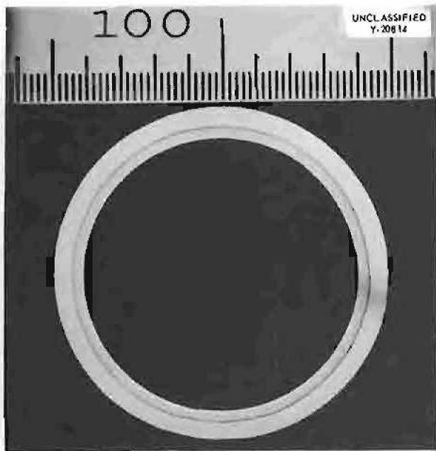  
Fig. 3.3.2. Transverse Section of Composite Tubing, Inconel-clad Type 316 Stainless Steel. Etchont: $50\% \mathrm{HCl} + 10\%$ solution of $\mathrm{CrO}_3$ . 7X. Reduced $32\%$ .

powders are compacted in a steel die at 4 tsi; second, the compacts are fired at 1900 to $2000^{\circ}C$ in a hydrogen atmosphere; and, finally, the fired compacts are crushed and ground in a micropulverizer to obtain the desired particle size.

A core that was to be clad and extruded was hot pressed to an apparent density of $91\%$ of theoretical by using oxide of the 44. to $105 - \mu$ particle size range. This core was assembled into a five-lybillet, with Inconel cladding and mild steel cons both inside and out. This billet is now ready to be extruded. Two additional billets have been prepared for extrusion of rods for preparing tensile specimens of the cernet.

# EVALUATION OF ARC-CAST AND

# POWDER-METALLURGY NIOBIUM

J.P.Page

The collection of usable mechanical property data for arc-cast and powder-metallurgy niobium at both low and high temperatures requires knowledge and control of the grain structure of all test specimens, and therefore the recrystallization process

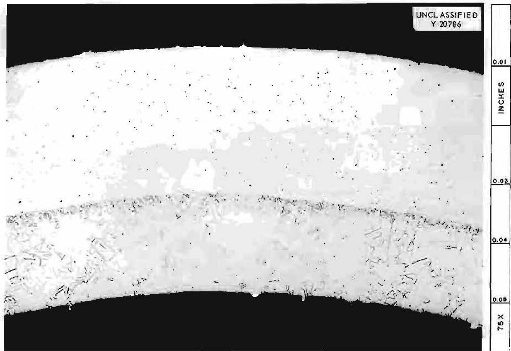  
Fig. 3.3.3. Metallurgical Bond at Interface of Composite Tubing, Inconel-clad Type 316 Stainless Steel, Etchant: glyceria regia. 75X.

is being studied. A knowledge of recovery and recrystallization kinetics can be obtained from a small amount of material by metallographic and x-ray techniques and thus sufficient material from the specimen remains for further comprehensive testing.

The chemical compositions of arc-cast and powder-metallurgy niobium are quite similar. The microstructures of the two materials, however, differ greatly, as shown in Figs. 3.3.4 and 3.3.5. The inclusions shown are probably niobium carbides. The effect of the prior fabrication history on the recrystallization characteristics can be seen in Figs. 3.3.6 and 3.3.7. These photomicrographs indicate that, as would be expected, the arc-cast material has a tendency to coalesce and form large-grained structures.

The first phase of the recrystallization study is essentially complete. The objectives of this phase were to form controlled, fine-grained microstructures in both materials and thereby minimize the effects of grain size on subsequent recrystallization behavior, to determine the range of recrystallization temperatures for the materials, and to determine the effects of various annealing atmospheres on niobium. Quantitative recrystallization studies will be carried out on the fine-grained material over a wide range of temperatures and test periods. The present information indicates that the recrystallization range for annealing times of up to 1 hr

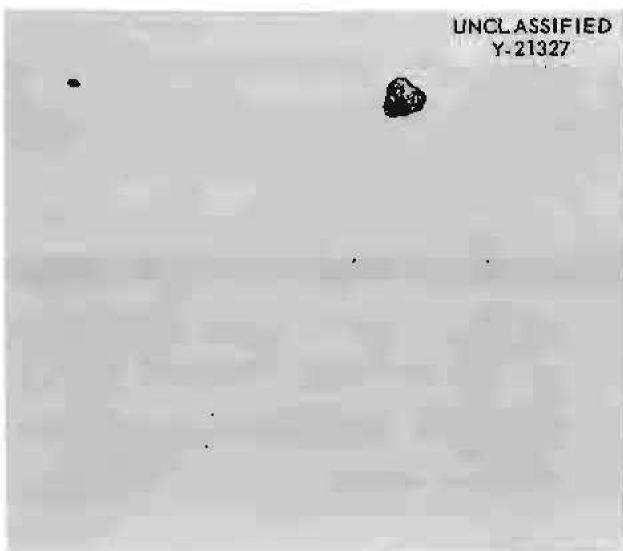  
Fig. 3.3.4, Arc-Cost Niobium, As-polished. 100X.

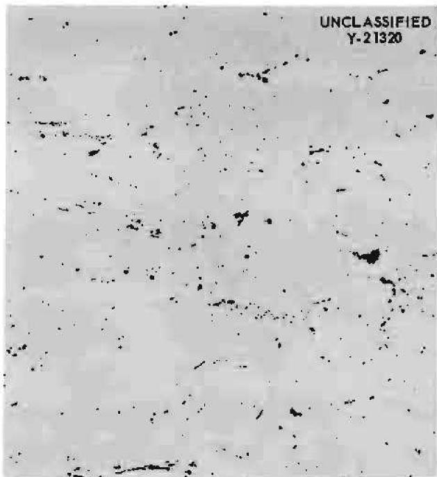  
Fig. 3.3.5. Powder-Metallurgy Niobium. As polished. 100X.

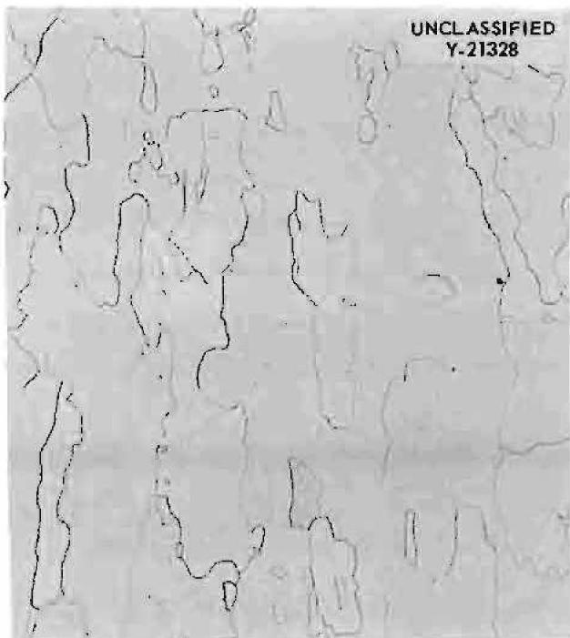  
Fig. 3.3.6. Arc-Cast Niobium Annealed 10 min at $1450^{\circ}C$ . Etchont: 50 cm³ H₂O, 10 cm³ H₂SO₄, 25 cm³ HF, 5 cm³ HNO₃. 100X.

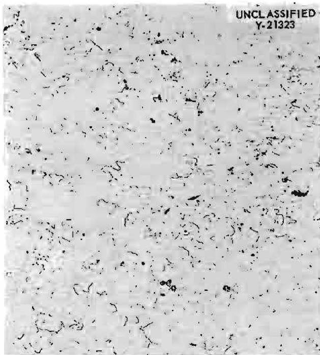  
Fig. 3.3.7. Powder-Metallurgy Niobium Annealed $10\mathrm{min}$ at $1450^{\circ}\mathrm{C}$ . Etchont: $50~\mathrm{cm}^3$ $\mathsf{H}_2\mathsf{O}$ , $10~\mathrm{cm}^3$ $\mathsf{H}_2\mathsf{SO}_4$ , $25~\mathrm{cm}^3$ HF, $5~\mathrm{cm}^3$ $\mathsf{HNO}_3$ . 100X.

lies between 1100 and $1350^{\circ}C$ , depending on the amount of cold work to which the material is subjected.

Several techniques are being considered for conducting the numerous annealing treatments required. These include vacuum encapsulation with and without the addition of getters, treatment in dynamic vacuums of various orders of magnitude, and treatment in high-purity argon. Each of these techniques has an advantage in certain conditions; the argon atmosphere is recommended for short-time, high-temperature treatment, the dynamic vacuum for intermediate temperature and times, and the vacuum capsule for extended times at lower temperatures. A quantitative survey of the effects of time and temperature on the microhardness and the lattice parameter of powder specimens is being conducted for each environment.

Identical microstructures for powder-metallurgy and arc-CAST materials have been achieved. The niobium specimens were severely worked (reduced in thickness by $90\%$ ) and annealed for 1 hr at $1250^{\circ}\mathrm{C}$ in a dynamic vacuum of approximately $10^{-6}$ mm Hg. The resultant material is very fine-grained, but the grains show elongation in the direction of

rolling. Also, the severe reduction limits the thickness of the material available for the recrystallization study. Further work will be done with lower reduction ratios and longer annealing times in an attempt to develop a more randomly oriented microstructure in a thicker material.

# METAL HYDRIDES FOR USE AS MODERATORS IN HIGH-TEMPERATURE REACTORS

R. A. Potter R. E. McDonald $^{1,3}$ T. Hikido $^{12}$

The realization of the great potential improvement in performance of circulating-fuel reactors which is offered by the NaF-KF-LiF-base fuels and the nickel-molybdenum alloys will depend to a large extent on the development of an adequate moderator for use at high temperatures. Of the possible materials, BeO, beryllium canned in molybdenum, and the hydrides metal, the last appear to offer the most promise. Research at the General Electric Company and other organizations has shown that certain metals, notably zirconium and yttrium, are able to absorb and retain large quantities of hydrogen at high temperatures and yet retain their metallic characteristics. However, at the temperature of interest for advanced reactors, over $2000^{\circ}\mathrm{F}$ , yttrium is the only material known at this time which offers promise of being satisfactory.

# Capsule for In-Pile Tests

An active research and development program on hydrided metals was initiated, with one of the first projects being fabrication of the capsule shown in Fig. 3.3.8 for in-pile tests. The specimen consists of hydrided zirconium $(N_{\mathrm{H}} = 3.5)$ contained in a 0.025-in.-thick arc-cast $0.5\%$ titanium-molybdenum alloy capsule. The ends of the capsule are in thick and the over-all dimensions are, nominally, in dia $\times 3$ in long. No protective cladding was put over the molybdenum, because the test will be made in a helium atmosphere.

The molybdenum capsule was machined from $\frac{3}{4}$ in.-dia rod. A rod of reactor-grade zirconium was machined to 0.460 in. in diameter and 2.75 in. in length and a $\frac{1}{8}$ in.-dia hole drilled through it lengthwise. This zirconium cylinder was iron-plated to a thickness of 1.75 mils to aid in achieving

UNCLASSIFIED PHOTO 40448

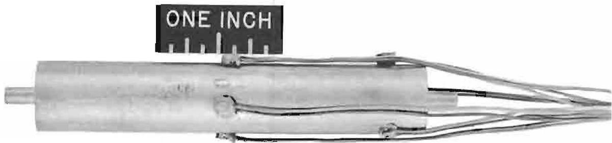  
Fig. 3.3.8. A Molybdenum-clad Hydrided-Zirconium Capsule Prepared for an In-Pile Test. (Secret with caption)

a bond to the molybdenum. The plated zirconium was inserted into the molybdenum capsule and hydrided in situ to an $N_{\mathrm{H}}$ of 3.7, calculated on the basis of weight gain. The $\frac{1}{8}$ -in. hole was reamed clean, and a zirconium rod was weighed and press-fitted into the hole. The calculated $N_{\mathrm{H}}$ after homogeneization of the rod is 3.5. A 1-mil iron-foil disk was placed over the hydrided zirconium, and the molybdenum end plug was inserted and copper-brazed in place. After having been brazed, the capsule was machined to size (0.025-in.-wall thickness) and tested at $1650^{\circ}\mathrm{F}$ for 1 hr under a vacuum of $3 \times 10^{-5} \mathrm{~mmHg}$ . The weight loss of $4.2 \mathrm{mg}$ under these conditions was not considered to be serious. After the capsule was inspected by radiography, six Chromel-Alumel thermocouples were attached by spot-welding. The completed assembly was heated in an argon atmosphere to $1650^{\circ}\mathrm{F}$ , cooled to approximately $800^{\circ}\mathrm{F}$ , reheated to $1650^{\circ}\mathrm{F}$ , and cooled to room temperature. The thermocouples remained securely attached after this treatment.

A second specimen was processed simultaneously with the in-pile test capsule in order to provide a control sample for examination. However, this specimen was over-heated during the brazing operation and is therefore not truly representative of the in-pile test capsule. Metallographic examination of the control sample showed evidence of the over-heating in the form of melting and decomposition of the hydride at the brazed end of the capsule. Although a tight fit was observed

between the hydrided zirconium and the molybdenum in the other areas of the capsule, the metallurgical bond was not uniform.

The in-pile test capsule was scheduled to go into the MTR on February 18, 1957. The calculated maximum operating temperature will be 1550 to $1600^{\circ}\mathrm{F}$ , and 100 thermal cycles will be imposed by moving the test container in and out of the reactor.

# Hydriding Equipment

The hydriding was accomplished with a system based on the design developed by the General Electric Company and Sylvania Electric Products, Inc. On the whole, this system worked very well on the in-pile test capsules and other small specimens. However, during these initial operations the need for several improvements became apparent, and these are now being made. The modifications include a better temperature control and recording system, provisions for removing the retort from the furnace to permit rapid cooling from the hydriding temperature, and equipment to provide hydrogen at a constant pressure or in measured volumes. In addition, a furnace capable of attaining the high temperatures required for hydriding yttrium has been built and is now being checked.

# Yttrium Metal Production

Research on hydrides yttrium is being seriously hampered by the unavailability of the material.

Although a considerable amount of work is being done at the Ames Laboratory, Iowa State College, to alleviate this shortage, it was deemed advisable to produce some yttrium at ORNL. The available experience in fluoride technology was a major factor influencing this decision, because the conversion of $\mathsf{Y}_2\mathsf{O}_3$ to $\mathsf{YF}_3$ is an important step in the process. The purity of the fluoride controls the purity of the final product to a large extent. Accordingly, 15 lb of $\mathsf{Y}_2\mathsf{O}_3$ was obtained and 1000 g was converted to the fluoride. In the reduction process, which was developed at the Ames Laboratory, the yttrium fluoride will be reduced with a mixture of calcium, magnesium, and calcium chloride. The yttrium-magnesium-calcium alloy thus formed will be refined by vacuum distillation to remove the magnesium and the calcium. The resulting yttrium sponge will then be vacuum melted.

Fabrication of the equipment for producing the metal has been completed, and it is now being assembled and checked. The entire process from mixing of the starting material to the vacuum distillation of the alloy will be performed under a vacuum or an inert-gas atmosphere. It is expected that the first metal will be produced in March 1957.

# Cladding Studies

The advanced reactor designs presently being studied picture the hydride moderator as cylindrical rods approximately $\frac{1}{2}$ in. in diameter and 30 in. in length. The hydride will be protected with a duplex cladding of molybdenum and a nickel-molybdenum alloy. The molybdenum is required for a hydrogen diffusion barrier and for compatibility with yttrium. Since the remainder of the fuel circuit will be constructed of a nickel-molybdenum alloy, a similar alloy must be put over the molybdenum to prevent dissimilar metal corrosion attack.

Studies have been initiated to determine the temperatures and amount of work required to achieve a bond between molybdenum and a nickel-molybdenum alloy. The test specimens consist of molybdenum cylinders press-fitted into nickel-molybdenum alloy tubes, which, in turn, are press-fitted into Inconel tubes, evacuated, and sealed. In the first test, the sealed capsule was heated to $1600^{\circ}\mathrm{F}$ and reduced $10\%$ by swaging. Metallographic examination showed that only partial bonding was achieved under these conditions. In the second test, a palladium foil will be inserted between the molybdenum and the nickel-molybdenum alloy. Higher temperatures, different amounts of work, and other intermediate layers will be tested in the future.

# 3.4. WELDING AND BRAZING INVESTIGATIONS

P. Patriarca

# HEAT EXCHANGER FABRICATION ART Sodium-to-NaK Heat Exchangers

G.M.Slaughter

Brazing procedures are being developed for use in the fabrication of ART sodium-to-NaK heat exchangers by the Griscom-Russell Co. Examination of a variety of tube-to-header samples from several brazing experiments performed at the Griscom-Russell Co. has revealed inconsistent flow and filleting. A typical example of this condition on a tube-to-header joint is shown in Fig. 3.4.1.

Attempts have been made at ORNL to duplicate the difficulties experienced by the vendor and then to alleviate them by suitable variations in brazing procedure. For the initial tests, the vendor's heating rate of approximately $100^{\circ}\mathrm{F / hr}$ was used. Samples taken from a typical test assembly before and after brazing at this rate of temperature rise are shown in Figs. 3.4.2 and 3.4.3. The influence of the following variables was studied in these tests: (1) type of Coast Metals brazing alloy No. 52 ring (ORNL cast ring vs York Corp, sintered ring), (2) differences in Inconel base material (ORNL headers vs Griscom-Russell headers), (3) angle of countersink in headers, and (4) direct impingement of hydrogen on samples vs slight baffling. No significant differences in brazing were noted as a result of these variances.

An analysis of all the experimental results indicated that satisfactory brazing can be ac

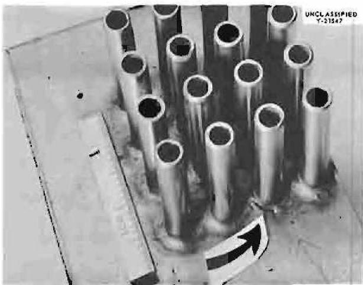  
Fig. 3.4.1. Tube-to-Header Joint Showing Incomplete Filleting.

complished at $1920^{\circ}F$ if all variables such as hydrogen purification, hydrogen flow rate, material cleanliness, etc. are carefully controlled. However, only minor deviations from the optimum conditions may result in inconsistent brazing at a $100^{\circ}F/hr$ rate of temperature rise.

Additional experiments were then conducted at $200^{\circ}\mathrm{F} / \mathrm{hr}$ and at $300^{\circ}\mathrm{F} / \mathrm{hr}$ rates of temperature rise. As can be seen in Figs. 3.4.4 and 3.4.5, samples brazed at $300^{\circ}\mathrm{F} / \mathrm{hr}$ had satisfactory fillets on all joints. With the faster heating rates, it appeared that brazing could be conducted under slightly relaxed conditions with a reasonable assurance of success. The $300^{\circ}\mathrm{F} / \mathrm{hr}$ heating rate, which should be readily attainable with most industrial equipment, provides a high degree of assurance of successful brazing.

# Investigation of Rapid Heating Cycles

E.A.Franco-Ferreira

Tests were run to investigate the feasibility of using very short heating cycles (of the order of 5 min) for the back brazing of heat-exchanger tube-to-tube sheet joints. The experimental procedure consisted essentially in heating the welded side of a small Inconel tube sheet while providing a vacuum or an inert atmosphere for protection on the opposite side, which was to be brazed. The heat source used in the experiments was a salt-bath furnace.

It is felt that certain advantages might accrue from this method of brazing, such as minimization of grain growth in the tubes and reduction of tube-wall dilution, while avoiding distortion and the jigging problems associated with conventional furnace brazing of entire assemblies. One of the experimental configurations is shown in Figs. 3.4.6 and 3.4.7. A section through a typical joint brazed by this method is shown in Fig. 3.4.8.

This method of brazing is not limited to the use of a salt-bath furnace as a heat source. It is felt that high-energy radiant heat sources based on surface combustion units could also be used to advantage. Although the experiments described above were preliminary, the results do indicate the feasibility of using rapid heating cycles for some high-temperature heat exchanger brazing operations.

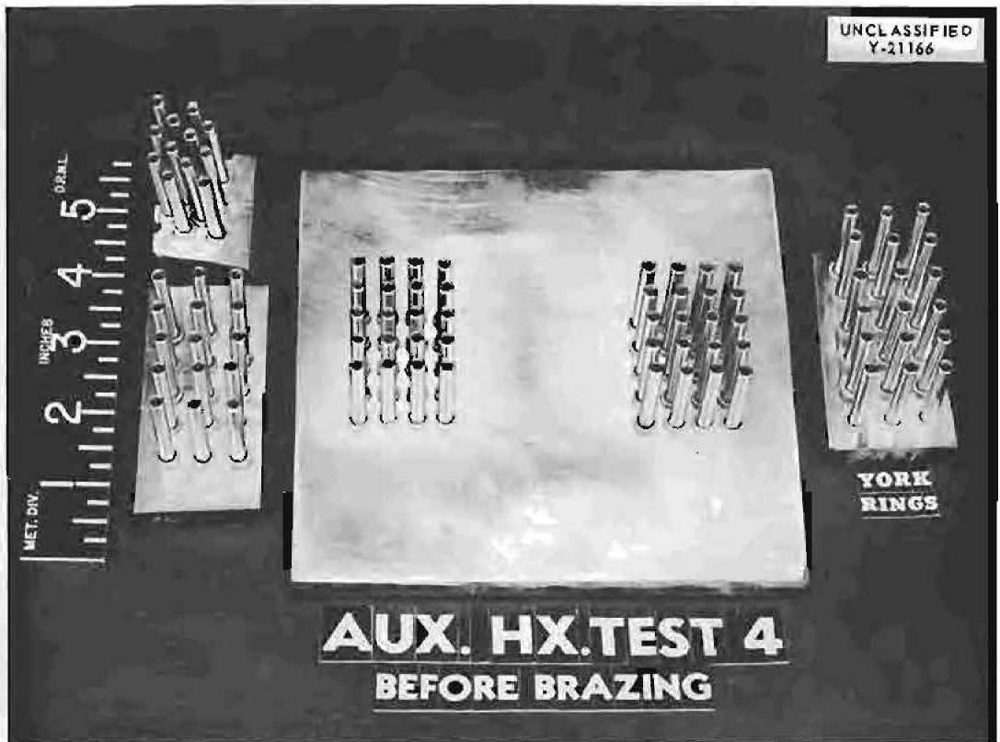

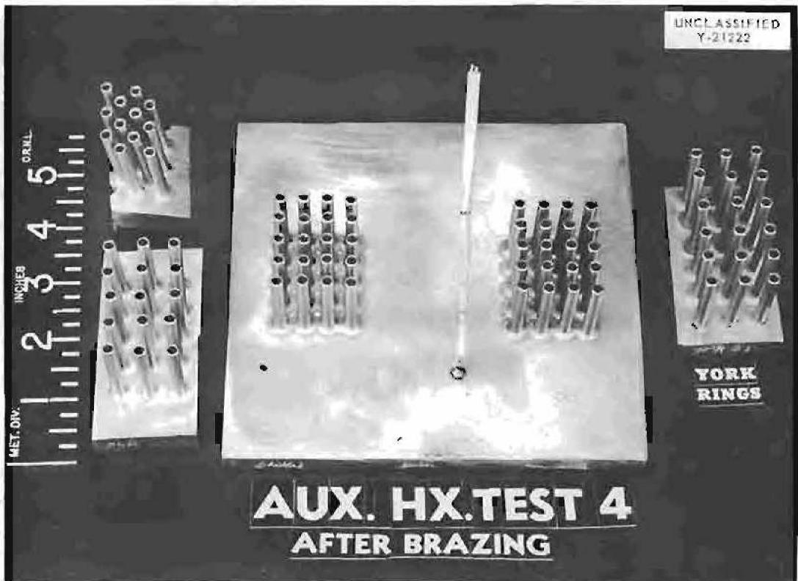  
Fig. 3,4,2. Tube-to-Header Test Assembly Before Broging.   
Fig. 3.4.3. Tube-to-Header Test Assembly After Brazing at $100^{\circ}\mathrm{F/hr}$ Rate of Temperature Rise.

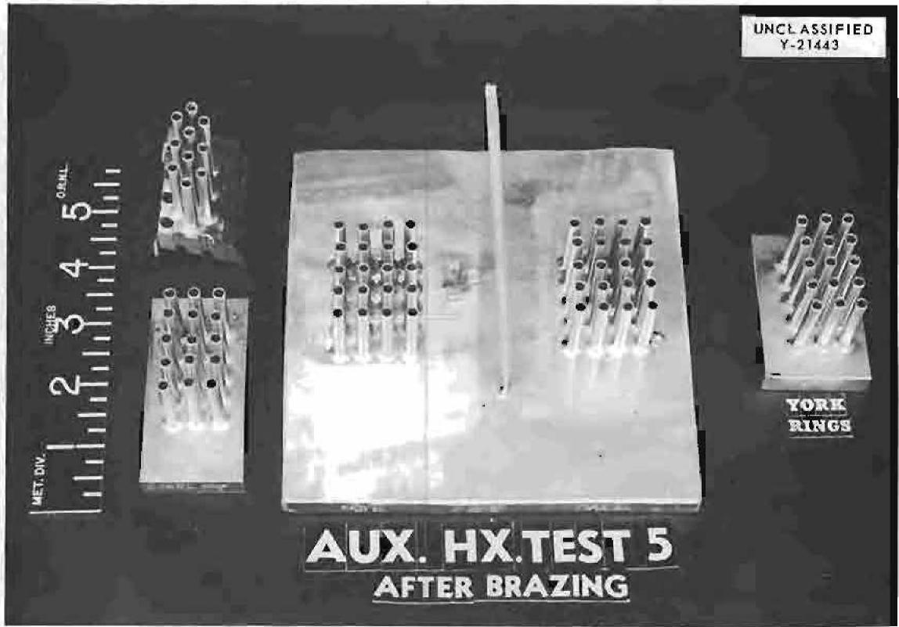

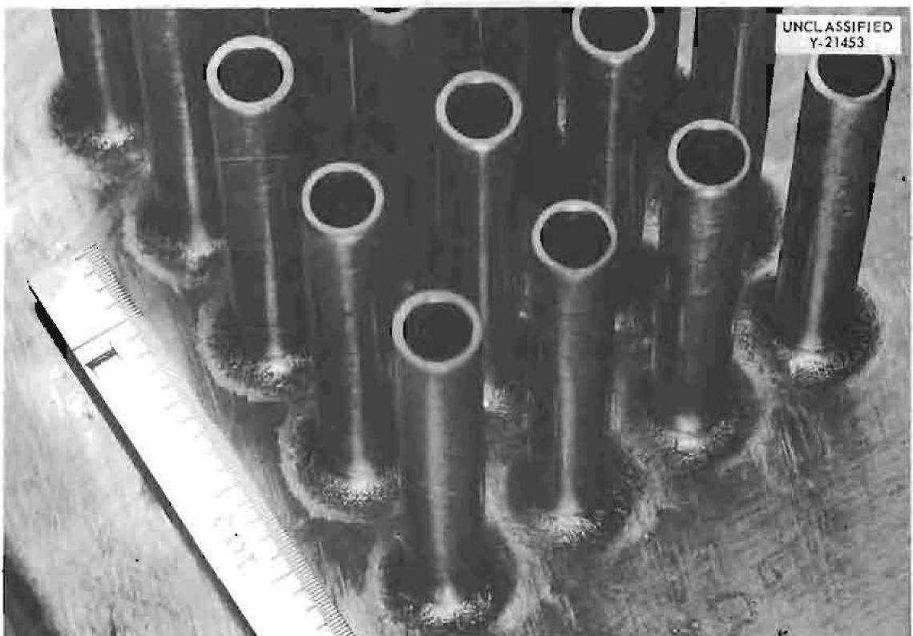  
Fig. 3.4.4. Tube-to-Header Test Assembly Broxed at a $300^{\circ}\mathrm{F/hr}$ Rate of Temperature Rise.   
Fig. 3.4.5. Tube-to-Header Joints Showing the Excellent Fillers Obtained by Using a Heating Rate of $300^{\circ}\mathrm{F/hr}$

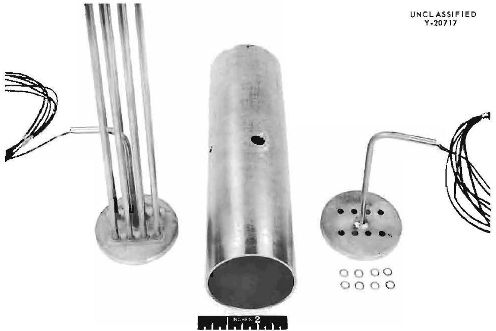

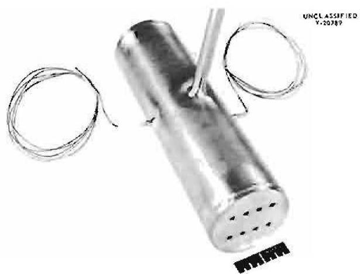  
Fig. 3.4.6. Experimental Setup for Rapid-Heat-Cycle Brazing Experiments.   
Fig. 3.4.7. Completed Setup for Rapid-Heat-Cycle Brazing Experiments.

# FABRICATION OF VALVE COMPONENTS

# G. M. Slaughter

The developmental work on methods for fabricating valve components of various types continued. The specialized techniques that were described in the previous report1,2 for joining the different compositions of disk and seat-ring materials were used to fabricate the valve components described in Table 3.4.1. Two brazing steps were utilized in the construction of most parts. Step I consists in the attachment of the

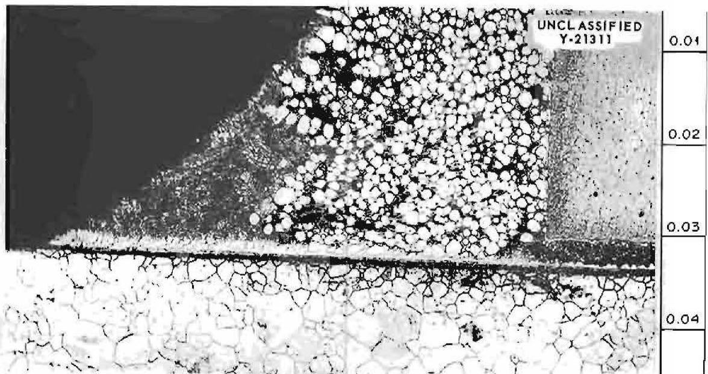  
Fig. 3.4.8. A Typical Joint Brazed by Using the Rapid-Heat-Cycle Method. 75X. Etchant: $10\%$ oxalic acid.

Table 3.4.1. Volve Component Fabrication During the Quarter   

<table><tr><td rowspan="2">Type of Valve Component</td><td colspan="2">Number of Brazes</td></tr><tr><td>Step I</td><td>Step II</td></tr><tr><td>K-94 disk(tungsten carbide plus cobolt binder)</td><td>2</td><td>6</td></tr><tr><td>K-94 seat ring(tungsten carbide plus cobolt binder)</td><td>1</td><td>2</td></tr><tr><td>K-96 disk(tungsten carbide plus cobalt binder)</td><td>0</td><td>2</td></tr><tr><td>KM disk(WTiC2plus cobalt binder)</td><td>3</td><td>4</td></tr><tr><td>Mallory 1000 seat ring(tungsten plus copper and nickel as binder materials)</td><td>No step I braze required</td><td>1</td></tr><tr><td>Thermenal seat ring(TiC-NbToTiC3plus cobolt binder)</td><td>No step I braze required</td><td>1</td></tr><tr><td>K-138A seat ring(TiC-NbToTiC3plus cobolt binder)</td><td>3</td><td>2</td></tr><tr><td>K-162B disk(titonium carbide plus nickel and molybdenum as binder materials)</td><td>0</td><td>1</td></tr><tr><td>K-1628 seat ring(titonium carbide plus nickel and molybdenum as binder materials)</td><td>1</td><td>2</td></tr><tr><td>K-151A disk(titanium carbide plus nickel binder)</td><td>0</td><td>1</td></tr><tr><td>Copper seat</td><td>No step I braze required</td><td>3</td></tr><tr><td>Molybdenum seat rings</td><td>3</td><td>3</td></tr><tr><td>Molybdenum disk</td><td>1</td><td>1</td></tr><tr><td>Tungsten disk</td><td>1</td><td>3</td></tr></table>

material to a suitable transition layer, and Step II consists in the attachment of the subassembly to Inconel. The occasional rebroze cycles required to obtain components acceptable for use in the test runs are included in the number of brazes listed.

# ART FILL-AND-DRAIN TANK FABRICATION

E.A.Franco-Ferreira G.M.Slaughter

A study of the problems associated with the fabrication of the ART fill-and-drain tank is under way. Specifically, tests are being run to establish welding and brazing procedures for the tube-to-tube sheet joints in the tank heads. As a result of the high degree of restraint exerted by the $1\frac{1}{2}$ -in.-thick tube sheet, tube-to-tube sheet welds made with the standard fusion procedure used for thin tube sheets consistently exhibited root cracking of the type illustrated in Fig. 3.4.9. The direct aim of the welding investigations has been to arrive at a welding procedure which will produce joints free of such root cracks. A promising joint design currently being investigated is a trepanned type, an example of which is shown in Fig. 3.4.10.

Brazing experiments are also under way to determine the proper amount of preplaced brazing alloy, the type of preplacement procedures, and a suitable brazing cycle. In the initial experiments, the Coast Metals brazing alloy No. 52 was preplaced in the form of rings, two per tube, as shown in Fig. 3.4.11. A photograph of a typical as-brazed test sample is shown in Fig. 3.4.12.

The optimum procedures for welding and brazing have not yet been determined. Various modifications in technique are to be studied in subsequent experiments.

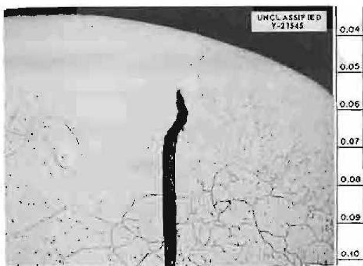  
Fig. 3.4.9. A Root Crack in a Tube-to-Header Test Weld. 50X. Etchant: $10\%$ oxalic acid. Reduced $35\%$ .

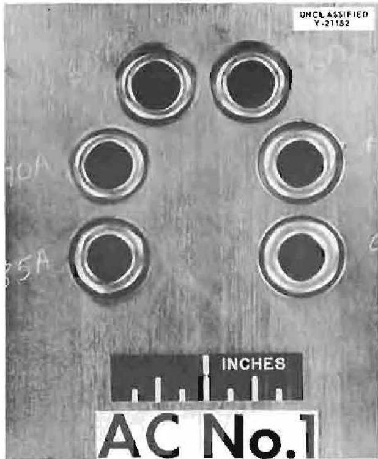  
Fig. 3.4.10. Tube-to-Header Joint with Trepanned Design.

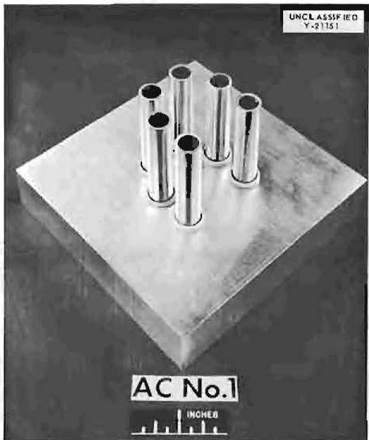  
Fig. 3.4.11. Tube-to-Header Sample Braze Assembly Showing Preplacement of Coast Metal Brazing Alloy No, 52 Rings.

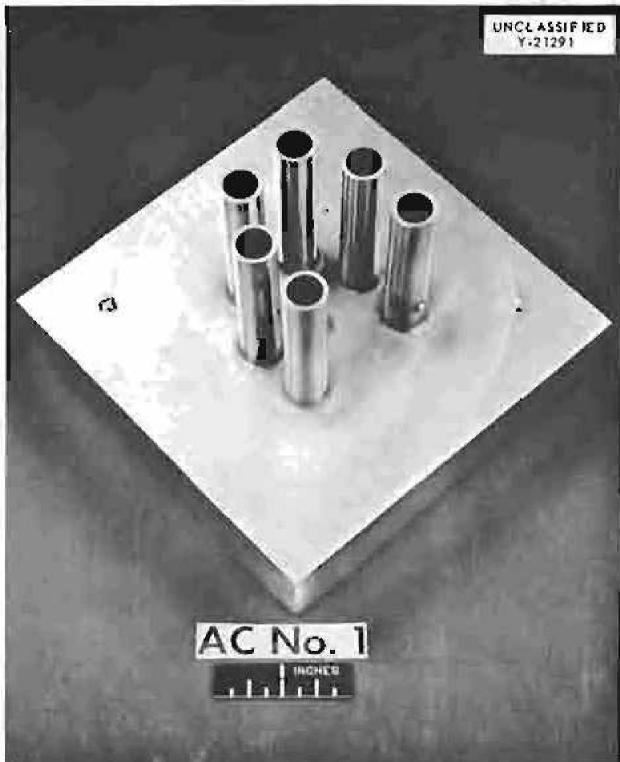  
Fig. 3.4.12. Tube-to-Header Sample Shown in Fig. 3.4.11 After Brazing.

# WELDING AND BRAZING OF NICKEL-MOLYBDENUM ALLOYS R.E.Clausing

Studies of Hostelloy B and W Welds

Preliminary results of an investigation of the mechanical properties of Hostelloy B and W welds on $\frac{1}{2}$ -in. plate were reported previously. Further tests were conducted, and the results of all the 0.252-in.-dia tensile-specimen test data obtained are presented in Tables 3.4.2 through 3.4.7.

An analysis of the tensile test data indicates that the following general conclusions may be drawn:

1. Hastelloy B welds have good ductility in the as-welded condition when tested at room temperature but poor ductility at $1500^{\circ}\mathrm{F}$ . In the transverse weld tests, the specimens tested at room temperature failed in the weld, while those tested at $1500^{\circ}\mathrm{F}$ failed in the base metal. In aged specimens tested at $1650^{\circ}\mathrm{F}$ , the failure was again in the weld material.

2. Hastelloy B welds aged 200 hr at $1300^{\circ}\mathrm{F}$ all failed, with poor ductility, in both the all-weld-metal and transverse-weld specimens. In the latter, the failure occurred in the weld metal of room temperature and in the fusion line at $1300^{\circ}\mathrm{F}$ . The transverse specimens showed lower ductility than the all-weld-metal specimens tested under the some conditions.   
3. Hastelloy B welds aged 200 hr at $1500^{\circ}\mathrm{F}$ showed a slight increase in strength and decrease in ductility compared with the as-welded condition specimens tested at room temperature. However, at $1500^{\circ}\mathrm{F}$ the ductility of the aged specimens was better than that of the as-welded specimens at $1500^{\circ}\mathrm{F}$ .   
4. Hastelloy W all-weld-metal specimens show strengths about the same as those of similar Hostelloy B specimens and acceptable ductilities (greater than $10\%$ elongation) in all but two specimens. Aging for 200 hr at 1300 and $1500^{\circ}\mathrm{F}$ resulted in considerable loss of ductility.   
5. Hastelloy W is notch-sensitive at $1300^{\circ}F$ .   
6. Failures in Hastelloy W weldments exhibit a tendency to occur at the interface between the weld and the base metal.   
7. Hastelloy W weld metal appears to be stronger and less ductile than the base metal.   
8. Weldments of Hostelloy B plate with Hastelloy W welding wire showed a marked tendency to fail at gage marks in the base metal or at weld defects. No apparent advantage is gained by using this filler wire instead of Hastelloy B filler metal.   
9. Vacuum-melted Hastelloy B welding wire has essentially the same characteristics as those of commercially available Hastelloy B wire.

# Welding and Brazing Studies of Experimental Nickel-Molybdenum Alloys

The $1/2$ -in. plate required for welding studies of some of the nickel-molybdenum experimental alloys was received and tests were initiated to determine the welding and brazing characteristics of these materials. The test specimens were prepared by the methods described previously.3 The observations made in the tests thus far are presented in Table 3.4.8. Since alloys INOR-7 and -8 are currently of maximum interest, it is encouraging to note that no cracking tendencies were found in these tests. Tensile data for other promising alloys will be reported as they become available.

Table 3.4.2. All-Weld-Metal Tensile-Specimen Tests of Hastelloy B Filler Metal on Hastelloy B Plate   

<table><tr><td>Heat Treatment</td><td>Test Temperature (°F)</td><td>Tensile Strength (psi)</td><td>Elongation (% in 1-in. gage)</td><td>Reduction in Area (%)</td></tr><tr><td rowspan="2">As-welded</td><td>Room</td><td>118,000</td><td>25</td><td>20</td></tr><tr><td>Room</td><td>124,000</td><td>27.5</td><td>23</td></tr><tr><td rowspan="2">200 hr at 1500°F</td><td>Room</td><td>133,600</td><td>20</td><td>16</td></tr><tr><td>Room</td><td>130,000</td><td>12</td><td>12</td></tr><tr><td rowspan="2">200 hr at 1300°F</td><td>1300</td><td>114,300</td><td>8</td><td>5.5</td></tr><tr><td>1300</td><td>116,200</td><td>6</td><td>3.3</td></tr><tr><td rowspan="2">200 hr at 1500°F</td><td>1500</td><td>67,200</td><td>19.5</td><td>16</td></tr><tr><td>1500</td><td>63,800</td><td>10</td><td>13</td></tr><tr><td rowspan="2">As-welded</td><td>1500</td><td>66,700</td><td>9.5</td><td>9</td></tr><tr><td>1500</td><td>62,300</td><td>12.5</td><td>13</td></tr><tr><td rowspan="2">200 hr at 1650°F</td><td>1650</td><td>42,100</td><td>28</td><td>25</td></tr><tr><td>1650</td><td>46,500</td><td>27.5</td><td>24</td></tr></table>

Table 3.4.3. Transverse-Weld Tensile-Specimen Tests of Hastelloy B Filler Metal on Hastelloy B Plate   

<table><tr><td>Heat Treatment</td><td>Test Temperature (°F)</td><td>Tensile Strength (psi)</td><td>Elongation (% in 1-in. gage)</td><td>Reduction in Area (%)</td><td>Location of Fracture</td></tr><tr><td rowspan="2">As-welded</td><td>Room</td><td>118,300</td><td>32.5</td><td>21</td><td>Weld</td></tr><tr><td>Room</td><td>124,500</td><td>24.5</td><td>23</td><td>Weld</td></tr><tr><td rowspan="2">200 hr at 1300°F</td><td>Room</td><td>146,100</td><td>2</td><td>5</td><td>Weld</td></tr><tr><td>Room</td><td>140,500</td><td>5</td><td>2.5</td><td>Weld</td></tr><tr><td rowspan="2">200 hr at 1300°F</td><td>1300</td><td>108,300</td><td>5</td><td>3.4</td><td>Fusion line</td></tr><tr><td>1300</td><td>109,100</td><td>2</td><td>1</td><td>Base metal</td></tr><tr><td rowspan="2">200 hr at 1500°F</td><td>1500</td><td>72,100</td><td>20</td><td>20</td><td>Weld</td></tr><tr><td>1500</td><td>73,700</td><td>13.5</td><td>23</td><td>Base metal</td></tr><tr><td rowspan="2">As-welded</td><td>1500</td><td>65,900</td><td>9.5</td><td>9</td><td>Base metal</td></tr><tr><td>1500</td><td>68,000</td><td>9.5</td><td>9</td><td>Base metal</td></tr><tr><td rowspan="2">200 hr at 1650°F</td><td>1650</td><td>47,000</td><td>26</td><td>32</td><td>Weld</td></tr><tr><td>1650</td><td>45,600</td><td>25</td><td>26</td><td>Weld</td></tr></table>

Tablo 3.4.4. All-Weld-Metal Tensile-Specimen Tests of Hostelloy W Filler Metal on Hostelloy W Plate   

<table><tr><td>Heat Treatment</td><td>Test Temperature (°F)</td><td>Tensile Strength (psi)</td><td>Elongation (% in 1-in. gage)</td><td>Reduction in Area (%)</td></tr><tr><td rowspan="2">As-welded</td><td>Room</td><td>126,100</td><td>40</td><td>30</td></tr><tr><td>Room</td><td>128,000</td><td>36</td><td>27</td></tr><tr><td rowspan="2">200 hr at 1500°F</td><td>Room</td><td>138,400</td><td>7.5</td><td>5</td></tr><tr><td>Room</td><td>138,400</td><td>13</td><td>14</td></tr><tr><td rowspan="2">200 hr at 1300°F</td><td>1300</td><td>105,300</td><td>15</td><td>14</td></tr><tr><td>1300</td><td>117,600</td><td>13.5</td><td>15</td></tr><tr><td rowspan="2">200 hr at 1500°F</td><td>1500</td><td>68,500</td><td>13.5</td><td>23</td></tr><tr><td>1500</td><td>64,000</td><td>7.5</td><td>22</td></tr><tr><td rowspan="2">As-welded</td><td>1500</td><td>71,100</td><td>31</td><td>16</td></tr><tr><td>1500</td><td>69,800</td><td>20</td><td>18</td></tr><tr><td rowspan="2">200 hr at 1650°F</td><td>1650</td><td>42,200</td><td>28</td><td>45</td></tr><tr><td>1650</td><td>43,600</td><td>21</td><td>42</td></tr></table>

Table 3.4.5. Transverse-Weld Tensile-Specimen Tests of Hastelloy W Filler Metal on Hastelloy W Plate   

<table><tr><td>Heat Treatment</td><td>Test Temperature (°F)</td><td>Tensile Strength (psi)</td><td>Elongation (% in 1-in. gage)</td><td>Reduction in Area (%)</td><td>Location of Fracture</td></tr><tr><td rowspan="2">As-Welded</td><td>Room</td><td>123,500</td><td>38</td><td>26</td><td>Weld</td></tr><tr><td>Room</td><td>123,300</td><td>36</td><td>29</td><td>Weld</td></tr><tr><td rowspan="2">200 hr at 1300°F</td><td>Room</td><td>136,700</td><td>18</td><td>19</td><td>Base metal at gage mark</td></tr><tr><td>Room</td><td>136,200</td><td>20.5</td><td>35</td><td>Interface</td></tr><tr><td rowspan="2">200 hr at 1300°F</td><td>1300</td><td>99,000</td><td>17.5</td><td>23</td><td>Base metal at gage mark</td></tr><tr><td>1300</td><td>92,100</td><td>5</td><td>22</td><td>Base metal at gage mark</td></tr><tr><td rowspan="2">200 hr at 1500°F</td><td>1500</td><td>69,500</td><td>26.5</td><td>40</td><td>Interface</td></tr><tr><td>1500</td><td>70,100</td><td>34</td><td>43</td><td>Interface</td></tr><tr><td rowspan="2">As-welded</td><td>1500</td><td>65,100</td><td>22.5</td><td>20</td><td>Weld</td></tr><tr><td>1500</td><td>66,200</td><td>28</td><td>34</td><td>Weld</td></tr><tr><td rowspan="2">200 hr at 1650°F</td><td>1650</td><td>45,500</td><td>47</td><td>77</td><td>Interface</td></tr><tr><td>1650</td><td>44,900</td><td>35</td><td>71</td><td>Interface</td></tr></table>

Table 3.4.6. Transverse-Weld Tensile-Specimen Tests of Hastelloy W Filler Metal on Hastelloy B Plate   

<table><tr><td>Heat Treatment</td><td>Test Temperature (°F)</td><td>Tensile Strength (psi)</td><td>Elongation (% in 1-in. gage)</td><td>Reduction In Area (%)</td><td>Location of Fracture</td></tr><tr><td rowspan="2">As-welded</td><td>Room</td><td>119,500</td><td>36</td><td>34</td><td>Weld defect</td></tr><tr><td>Room</td><td>127,700</td><td>40</td><td>26</td><td>Weld</td></tr><tr><td rowspan="2">200 hr at 1300°F</td><td>1300</td><td></td><td></td><td></td><td></td></tr><tr><td>1300</td><td>48,900</td><td>20</td><td>12.5</td><td>Base metal at gage mark</td></tr><tr><td rowspan="2">200 hr at 1500°F</td><td>1500</td><td>70,100</td><td>17.5</td><td>37</td><td>Base metal at gage mark</td></tr><tr><td>1500</td><td>64,000</td><td>17</td><td>46</td><td>Base metal at gage mark</td></tr><tr><td rowspan="2">As-welded</td><td>1500</td><td>63,900</td><td>10</td><td>15</td><td>Base metal at gage mark</td></tr><tr><td>1500</td><td>64,600</td><td>9</td><td>3.3</td><td>Base metal at gage mark</td></tr><tr><td rowspan="2">200 hr at 1650°F</td><td>1650</td><td>44,700</td><td>25</td><td>20</td><td>Weld defect</td></tr><tr><td>1650</td><td>45,000</td><td>11</td><td>36</td><td>Weld defect</td></tr></table>

Table 3.4.7. All-Weld-Metal Tensile-Specimen Tests of Vacuum-Melted Hostelloy B Weld Metal on Hastelloy B Plate   

<table><tr><td>Heat Treatment</td><td>Test Temperature (°F)</td><td>Tensile Strength (psi)</td><td>Elongation (% in 1-in. goge)</td><td>Reduction in Area (%)</td></tr><tr><td rowspan="2">As-welded</td><td>Room</td><td>110,600</td><td>18.5</td><td>20</td></tr><tr><td>Room</td><td>125,300</td><td>32</td><td>16</td></tr><tr><td rowspan="2">200 hr at 1300°F</td><td>1300</td><td>117,400</td><td>2.5</td><td>25</td></tr><tr><td>1300</td><td>114,900</td><td>4.5</td><td>3</td></tr><tr><td rowspan="2">200 hr at 1500°F</td><td>1500</td><td>77,200</td><td>29</td><td>37</td></tr><tr><td>1500</td><td>74,400</td><td>35</td><td>43</td></tr></table>

Table 3.4.8. Preliminary Results of Welding and Brozing Tests of Experimental Nickel-Molybdenum Alloys   

<table><tr><td>Alloy Designation*</td><td>Wettability During Brazing**</td><td>Observations of Weld</td></tr><tr><td>INOR-1</td><td>Good</td><td>Badly fissured</td></tr><tr><td>-2</td><td>Good</td><td>No visible fissures</td></tr><tr><td>-3</td><td>Very poor</td><td>Badly fissured</td></tr><tr><td>-4</td><td>Very poor</td><td>No visible fissures</td></tr><tr><td>-5</td><td>Good</td><td>Badly fissured</td></tr><tr><td>-7</td><td>Poor</td><td>No visible fissures</td></tr><tr><td>-8</td><td>Good</td><td>No visible fissures</td></tr></table>

See Chap. 3.3, "Fabrication Research," this report, for nominal compositions of these alloys.   
**Wettability during brazing determined by using T-joints brazed in dry hydrogen at $1040^{\circ}C$ with Coast Metals braizing alloy No. 52.

# Hot-Ductility Tests of Experimental Nickel-Molybdenum Alloys

Hot-ductility tests were conducted at Rensselaer Polytechnic Institute in accordance with procedures described in the literature on experimental and commercial nickel-base alloys. The results are presented in Figs. 3.4.13, 3.4.14, and 3.4.15 in terms of the percentage reduction in area.

The results of the tests indicate that it is usually sufficient to evaluate the hot ductility as measured at $2300^{\circ}\mathrm{F}$ during cooling from some elevated temperature and to compare these data with the hot ductility measured at $2300^{\circ}\mathrm{F}$ during heating. The experience thus far indicates that testing at $2300^{\circ}\mathrm{F}$ during cooling from a peak temperature corresponding to the point where the ductility during heating closely approximates zero provides the best method of testing. The level of impairment of ductility during cooling which can be tolerated is probably dependent on the conditions of restraint associated with the actual welding operation. However, materials of known propensity for cracking have all exhibited ductility during cooling of less than $40\%$ of the ductility during heating under the test conditions.

Comparisons of the test results indicate that none of the INOR alloys behave in as ductile a

manner as Inconel and that they behave more like Inconel X than like Hastelloy B. Alloys INOR-1, -2, and -3 behave in a manner which appears to be superior to that of Hastelloy B (by virtue of high as-heated ductility), whereas alloys INOR-4, -5, and -6 are definitely inferior to Hastelloy B. A metallographic study is being conducted in an effort to relate these observations to microstructure and possibly to chemical composition.

# NoK-TO-AIR RADIATOR FABRICATION G.M.Slaughter

# Effects of Brazing Variables on Broze Adherence

The study of influence of the rate of rise to brazing temperature on flowability during radiator brazing was continued. Metallographic examinations of tube-to-fin joints brazed at various heating rates and with different types of Coast Metals brazing alloy No. 52 rings were completed, and the results are presented in Table 3.4.9. A brazing temperature of $1905^{\circ}\mathrm{F}$ was used in this study, and the time at temperature was $30\mathrm{min}$ .

Tube-to-fin test samples were also brazed with Coast Metals brazing alloy No. 52 at maximum brazing temperatures of 1830, 1870, and $1905^{\circ}F$ at a rate-of-temperature rise of $500^{\circ}F$ per hr. The results of brazed-joint adherence studies of these specimens are presented in Table 3.4.10.

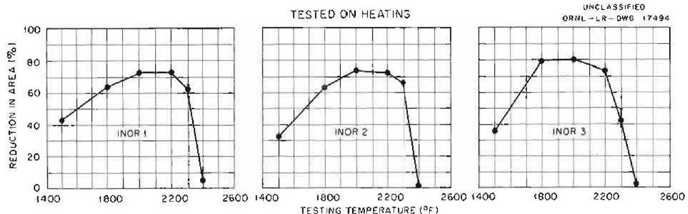

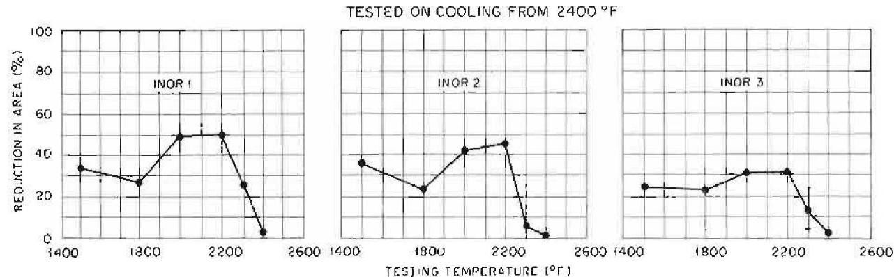

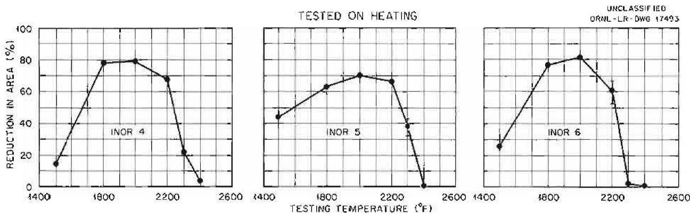  
Fig. 3.4.13 Hot Ductility of Nickel-Molybdenum Alloys INOR-1, -2, and -3.

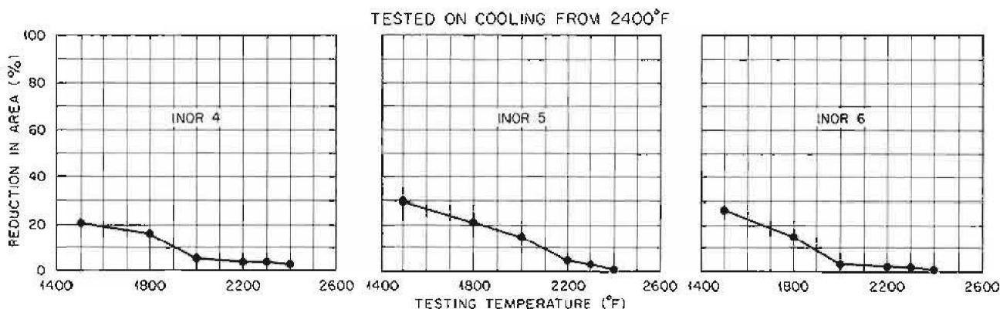  
Fig. 3.4.14. Hot Ductility of Nickel-Molybdenum Alloys INOR-4, -5, and -6.

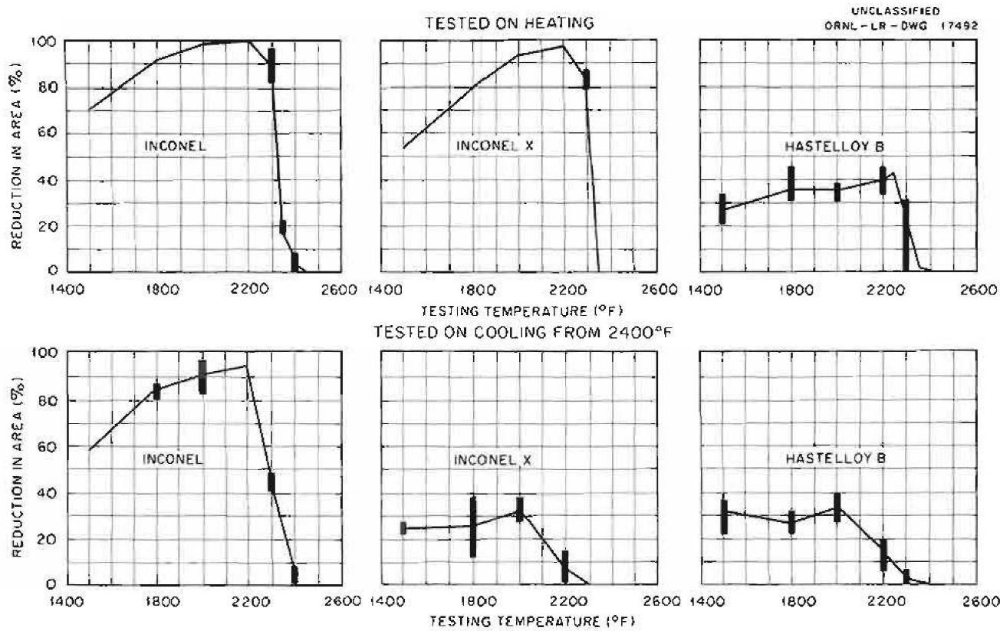  
Fig. 3.4.15. Hot Ductility of the Nickel-Base Alloys Inconel, Inconel X, and Hastelloy B.

Table 3.4.9. Results of Tests of the Effect of Heating Rate and Type of Brazing Alloy Ring on Broze Adherence Brazing temperature: $1905^{\circ}F$ Time at temperature: 30 min   

<table><tr><td rowspan="2">Heating Rate and Type of Brazing Alloy Ring</td><td colspan="4">Percentage of Joint Areas with</td></tr><tr><td>75-100% Adherence</td><td>50-74% Adherence</td><td>25-49% Adherence</td><td>0-24% Adherence</td></tr><tr><td>Heating rate: 100°F/hr</td><td></td><td></td><td></td><td></td></tr><tr><td>ORNL cost rings</td><td>77</td><td>15</td><td>1</td><td>7</td></tr><tr><td>York sintered rings</td><td>15</td><td>8</td><td>3</td><td>74</td></tr><tr><td>Heating rate: 200°F/hr</td><td></td><td></td><td></td><td></td></tr><tr><td>ORNL cost rings</td><td>97</td><td>3</td><td></td><td></td></tr><tr><td>York sintered rings</td><td>61</td><td>35</td><td>4</td><td></td></tr><tr><td>Heating rate: 300°F/hr</td><td></td><td></td><td></td><td></td></tr><tr><td>ORNL cost rings</td><td>96</td><td>4</td><td></td><td></td></tr><tr><td>York sintered rings</td><td>100</td><td></td><td></td><td></td></tr><tr><td>Heating rate: 550°F/hr</td><td></td><td></td><td></td><td></td></tr><tr><td>York sintered rings</td><td>100</td><td></td><td></td><td></td></tr></table>

Table 3.4.10. Results of Tests of the Effect of Brazing Temperature on Braze Adherence   
Heating rate: $500^{\circ}F/hr$   

<table><tr><td rowspan="2">Brazing Temperature and Type of Brazing Alloy Rings</td><td colspan="3">Percentage of Joint Areas with</td></tr><tr><td>75-100% Adherence</td><td>50-74% Adherence</td><td>25-49% Adherence</td></tr><tr><td>Brazing temperature: 1905°F</td><td></td><td></td><td></td></tr><tr><td>York sintered rings</td><td>100</td><td></td><td></td></tr><tr><td>Brazing temperature: 1870°F</td><td></td><td></td><td></td></tr><tr><td>York sintered rings</td><td>98</td><td>2</td><td></td></tr><tr><td>ORNL cost rings</td><td>100</td><td></td><td></td></tr><tr><td>Brazing temperature: 1830°F</td><td></td><td></td><td></td></tr><tr><td>York sintered rings</td><td>70</td><td>21</td><td>9</td></tr><tr><td>ORNL cost rings</td><td>100</td><td></td><td></td></tr></table>

# Assistance to Vendors

Assistance was given to the York Corp, in the solution of difficulties in the fabrication of the high-conductivity-fin NaK-to-air radiators. It was recommended that the retort be baffled to obtain more positive circulation of hydrogen, particularly through the fin bank, during the brazing operations. The size of the retort should be held to a minimum to lessen channeling of the gas flow and to reduce the total mass. Very stringent cleaning and storage procedures should be followed throughout the fabrication process. It was suggested that the assembled fin banks be placed in airtight containers before brazing. The fins should be degreased immediately prior to assembly. A rate of temperature rise of greater than $300^{\circ}\mathrm{F/hr}$ (preferably 400 to $600^{\circ}\mathrm{F/hr}$ ) should be used through the temperature range of 1700 to $1900^{\circ}\mathrm{F}$ . Further experimentation should be carried out with sintered brazing alloy rings in order to study the influence of processing variables on the brazing characteristics, and experiments with rings produced by other methods, including ORNL cast rings, should be continued. The use of mica as a nonwetting support material was discouraged. It was suggested that alumina be used because of its known inertness.

# STUDIES OF GRAIN GROWTH IN INCONEL TUBES

E.J.Wilson

G. M. Slaughter

The interest in maintaining a fine-grained structure in the Inconel tubing used for reactor heat exchanger and radiator components has led to a preliminary study of the grain growth that results from various brazing and heat-treating operations. The initial results of this study indicated that stress-relief treatments at $1500^{\circ}\mathrm{F}$ did not result in groin growth, while significant grain growth resulted from $\frac{1}{2}$ -hr brazing cycles at approximately $1922^{\circ}\mathrm{F}$ . It was also noted that growth proceeded more rapidly in the grains located along the outer wall of the tube than in those located along the inner wall.

Since high-temperature back-brazing is required in the fabrication of many components, a more detailed study was undertaken to determine the influence of the different variables on the grain growth characteristics of the tubing. The information obtained from an analysis and evaluation of growth behavior will be useful in determining the optimum procedures for fabricating the various components.

# Influence of Brazing Temperature

Two different lots of CX-900 Inconel tubing were used for an investigation of the effect of the brazing temperature on grain growth. These lots of tubing were identified as heat 5759 (0.187 in. OD, 0.025 in. wall) and heat 5789 (0.229 in. OD, 0.025 in. wall). One-inch segments from each lot were cleaned with acetone and subjected to various brazing temperatures for 30 min in dry hydrogen. After the heat treatment the samples were sectioned and examined in both the transverse and the longitudinal direction. Photomicrographs of the structures of the heat-treated specimens of 0.187-in.-OD tubing are presented in Fig. 3.4.16 in the order of increasing brazing temperatures. Although wide variations in grain size occurred along the outer peripheries of the tubes, the photomicrographs shown are typical of the areas that experienced extensive radial grain growth. After the 30-min heat treatment at temperatures as low as $1814^{\circ}\mathrm{F}$ and up to and including $1904^{\circ}\mathrm{F}$ , the grain growth was found predominantly in the grains along the outer surface of the tube. The fine-grained structure along the inner surface appeared to be relatively stable. After heating at $1922^{\circ}\mathrm{F}$ and above, general grain growth was evident, that is, grains along both the inner and outer surfaces had grown to significant proportions and many of those which originated on the outer surface had grown completely across the tube wall. As would be expected, the frequency of large grains increased with increasing temperature.

The trends observed in these tests are illustrated in Fig. 3.4.17, in which the grain size is plotted as a function of temperature for both the outer and the inner tube surfaces. The grain dimensions selected for plotting were representative of the grain sizes in areas that exhibited definite grain-coarsening tendencies. At the higher temperatures the curves reflect the coexistence of large and small grains in the tube wall. For example, the tube heated at $1922^{\circ}\mathrm{F}$ for 30 min had grains that penetrated radially from the outside surface completely through the tube wall, but there were adjacent areas that contained smaller grains.

# Influence of Time at Temperature

It was felt that the time at temperature might also be an important factor in grain growth, and

therefore a study was initiated in which both time and temperature were varied. For these experiments, 0.187-in.-OD, 0.025-in.-wall CX-900 Inconel tubing from heat 5759 was cleaned with acetone and sectioned into 1-in. segments, which were then heat treated at various temperatures for various times. The heat-treated segments were then sectioned in the transverse and longitudinal directions for grain-size determinations. Photomicrographs of the structures of the heat-treated specimens are shown in Fig. 3.4.18. As may be seen the lowest temperature employed (1868°F) and the 5- and 10-min time intervals produced no appreciable grain growth along the outer periphery. The specimens held at 1868°F for 30 min, however, showed sporadic grain coarsening at the outer periphery. More extensive grain coarsening occurred in the specimen held at temperature for 1 hr, as was expected. After 5 and 10 min of 1904°F, no grain growth was observed, but after 30 min at this temperature, some growth was evident. After 1 hr, grains occasionally penetrated completely through the tube wall, and the inner surface grains also had grown.

In the tests at $1922^{\circ}F$ outer periphery grain growth became quite noticeable after 5 min at temperature. Since it had been established previously that excessive grain growth would occur in 30 min at $1922^{\circ}F$ , no further experiments were conducted.

# Influence of Tube-Straightening and Tube-Polishing Operations

A group of experiments was conducted to study the influence of tube-straightening and tube-polishing operations on grain growth in CX-900 Inconel tubing. Since these operations impose a small degree of cold deformation on the tubing, it was desirable to determine whether this cold work was a major contributor to the outer-surface grain growth noted upon heating at high temperatures. Samples of 0.187-in.-OD and 0.229-in.-OD tubing were obtained in the following conditions: (1) annealed, (2) annealed and straightened, and (3) annealed, straightened, and polished. The samples were then examined as-received, or subjected to a brazing cycle of 30 min at $1868^{\circ}\mathrm{F}$ and examined, or subjected to a brazing cycle of 2 hr at $1922^{\circ}\mathrm{F}$ and examined. The specimens were cut transversely and mounted for microscopic examination.

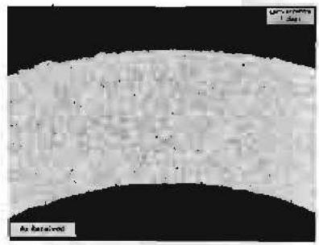

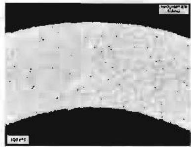

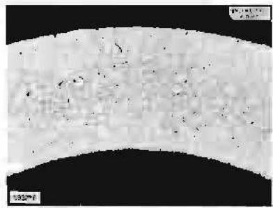

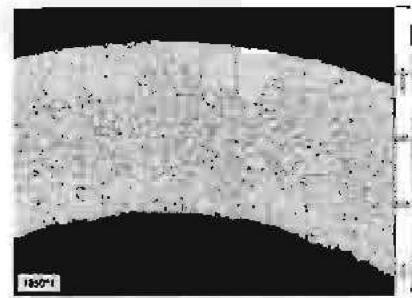

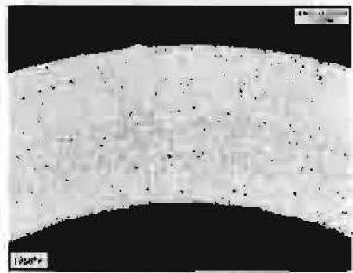

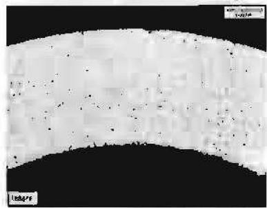

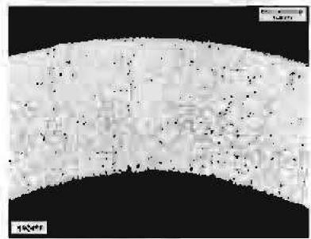

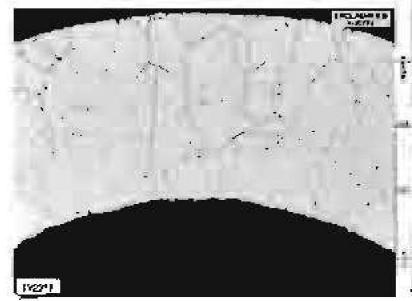

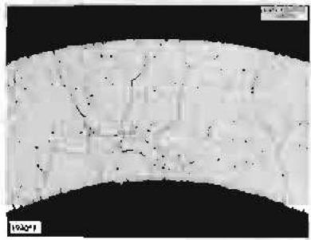

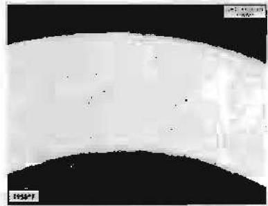

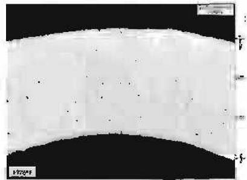  
Fig. 3.4.16. Transverse Sections of 0.187-in.-OD, 0.025-in.-Wol1 CX-900 Inconel Tubing Held 30 min at Temperatures Shown. Original magnification: 100X. Etchant: oxalic acid (electrolytic). Reduced $67\%$ .

TALL SECTIONS-TRANSVATEI

XAKC ACD (HCTIOY

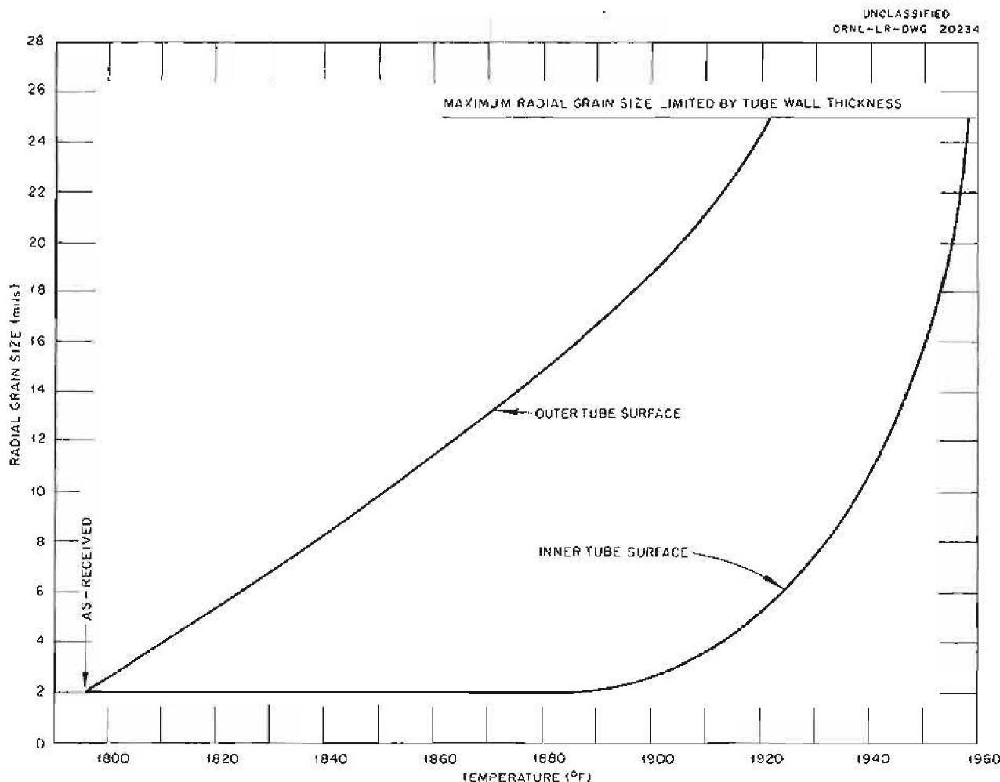  
Fig. 3.4.17. Effect of Temperature on Grain Growth in 0.187-In.-OD, 0.025-In.-Wol1 CX-900 Inconel Tubing.

As may be seen in Figs. 3.4.19 and 3.4.20 the two sizes of tubing reacted somewhat differently when subjected to the brazing cycles. However, it is evident that the straightening and polishing operations had only minor effects on the grain growth. The as-annealed tubing also showed definite grain growth at the outer surface.

# Influence of Cold Work

The recrystallized grain size of a metal decreases with increasing amounts of cold work, and therefore it was thought that cold working could be used to produce a medium-sized grain structure after brazing. Preliminary studies of the influence of cold work were conducted on small segments cut from annealed Inconel sheet. The segments were cleaned with acetone to remove dirt and grease and then examined in the as-received condition and after they had been reduced in thickness 2.5, 5, 8, 12, and $15\%$ , respectively, by cold rolling.

The samples that were cold rolled were placed in a retort and subjected to a typical brazing cycle (heated at $300^{\circ}\mathrm{F} / \mathrm{hr}$ to $1922^{\circ}\mathrm{F}$ , held for 30 min at $1922^{\circ}\mathrm{F}$ , and cooled at $600^{\circ}\mathrm{F} / \mathrm{hr}$ ) before they were prepared for metallographic examination of grain growth.

A medium-sized grain structure was observed after heat treatment of the samples which had been cold reduced 5, 8, 12, and $15\%$ . Some grain coarsening was observed, however, in the sample reduced $2.5\%$ . The smallest grain size was observed in the sample heat-treated after $15\%$ cold reduction.

A length of $\frac{1}{8}$ -hord (approximately 15% cold reduced) Inconel tubing was therefore acquired from the Superior Tube Co. for further experiments. Samples of this 0.250-in.-OD, 0.035-in.-wall tubing were prepared and subjected to various simulated brazing cycles.

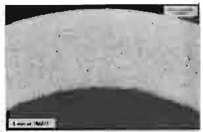

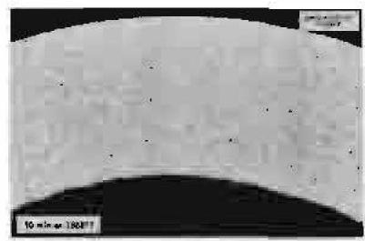

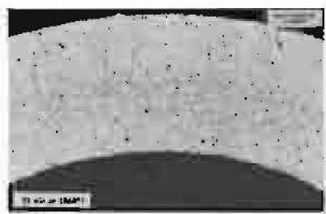

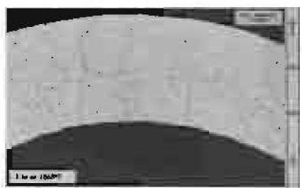

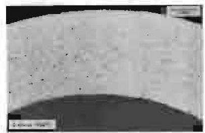

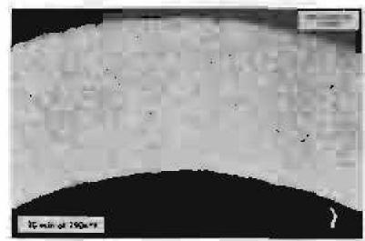

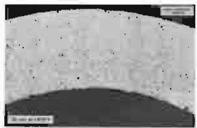

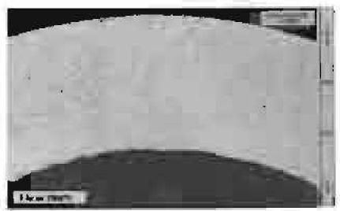

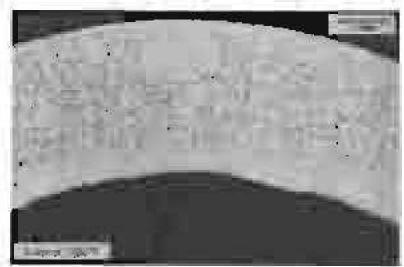

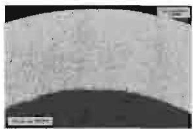

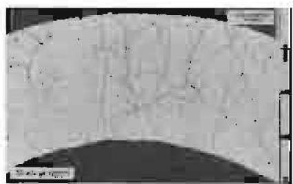  
Fig. 3.4.18. Effect of Time and Temperature on Grain Growth of 0.187-in.-OD, 0.025-in.-Wall CX-900 Inconel Tubing. Original magnification: 100X. Reduced 67.5%.

ALL SECTIONS MANIFEST

ETCANT-OXALIC ACID (LECTICN)

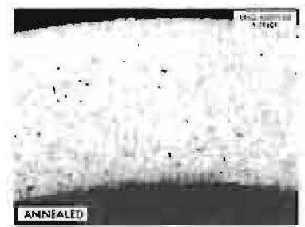

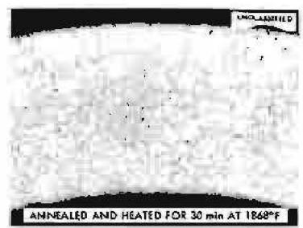

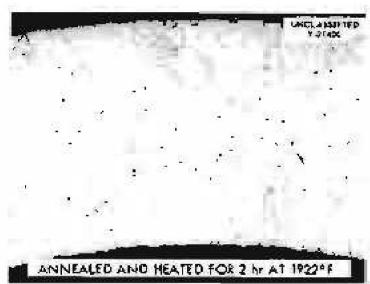

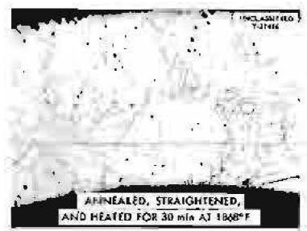

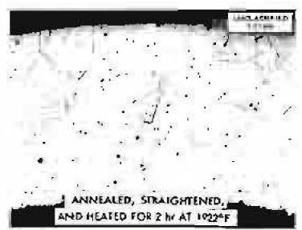

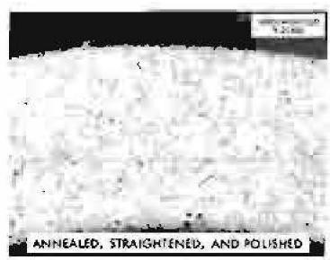

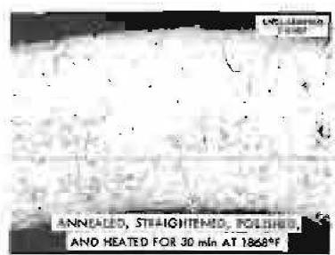

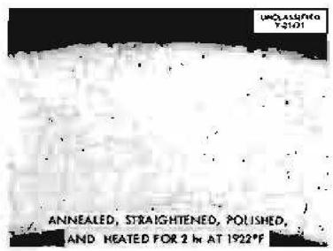  
Fig. 3.4.19. Effect of Annealing, Straightening, and Polishing on Grain Growth in 0.229-in.-OD CX-900 Inconel Tubing. 100X. Etchant: oxalic acid and copper regio. Reduced 56.5%.

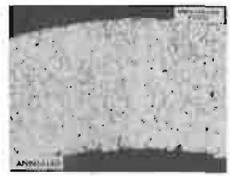

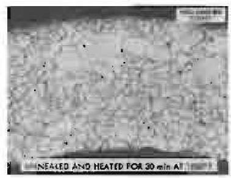

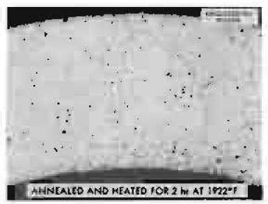

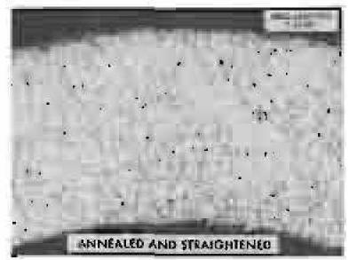

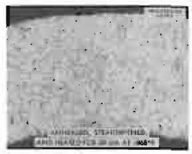

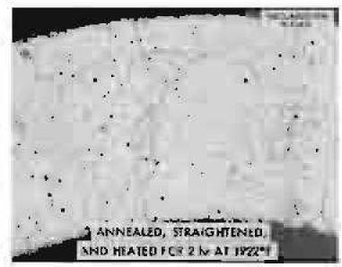

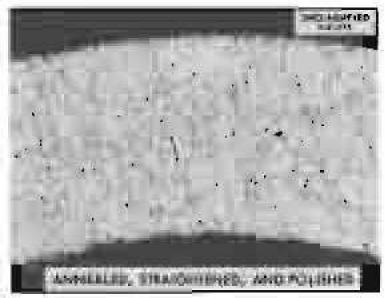

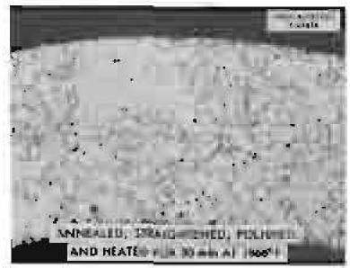

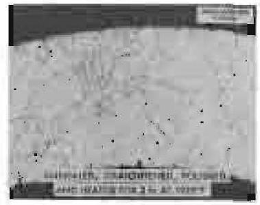  
Fig. 3.4.20. Effect of Annealing, Slightening, and Polishing on Grain Growth in 0.187-in.-OD CX-900 Inconel Tubing. 100X. Etchant: oxalic acid and copper regia. Reduced 56.5%.

The structure obtained after rapid heating to $1922^{\circ}F$ and holding for 2 hr is shown in Fig. 3.4.21. The medium-sized grains obtained with the typical brazing cycle $(300^{\circ}F/hr$ heating rate) are shown in Fig. 3.4.22. The sample was held at the brazing temperature of $1922^{\circ}F$ for 30 min. A larger quantity of $\frac{1}{8}$ -hard tubing is being acquired from the Superior Tube Co. and a more extensive examination of its behavior will be made.

# SUBCONTRACT WORK

The University of Florida subcontract for on investigation of the diffusion of boron and silicon from high-temperature alloys was completed and a final report is being prepared. The Glenn L. Martin Co. subcontract for a study of electric-resistance welding of tube-to-header joints was also completed and a final report is being prepared. The progress made by Rensselaer Polytechnic Institute in their hot-ductility studies is reported in the section of this chapter on "Welding and Brazing of Nickel-Molybdenum Alloys."

The Battelle Memorial Institute subcontract for molybdenum welding studies has continued.

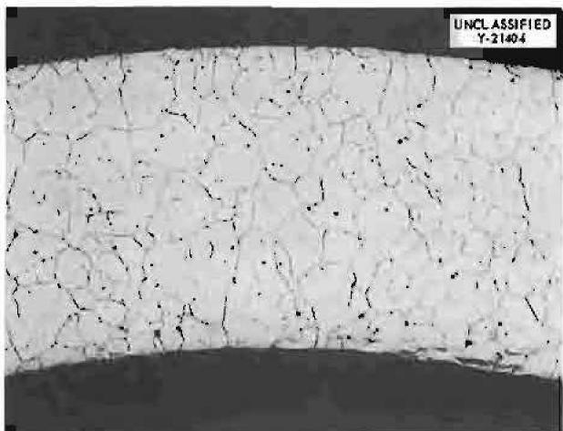  
Fig. 3.4.21. Microstructure Obtained upon Heating $\frac{1}{8}$ -Hard Inconel Tubing at $1922^{\circ} \mathrm{F}$ for 2 hr, 100X. Etchant: oxalic acid and copper regio.

The objective of this program is the development of techniques for producing ductile weldments. Carbon-deoxidized arc-cast material was used. Welds were made with a shielded tungsten electrode both in a dry box and in the open atmosphere and were tested by a single-point-loaded bend test at room temperature and at $75^{\circ}C$ . In addition to studying the effect of atmosphere purity, various etching and abrasion techniques were employed in preparing the surfaces, and several types of shields were used in welding the samples in the open atmosphere.

The series of samples prepared by various cleaning techniques were welded in a dry box. They showed that acid etching resulted in welds with somewhat better ductility than those prepared by other methods. They exhibited bend angles at fracture of 40 deg at room temperature and 76 deg at $75^{\circ}C$ compared with average bend angles of 28 and 62 deg, respectively, for other samples. For weldments prepared in air, the samples welded with a trailing shield showed significantly better ductility than all other samples.

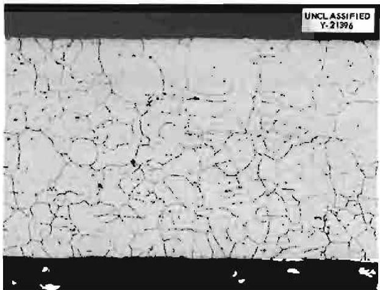  
Fig. 3.4.22. Microstructure Obtained upon Heating $1/8$ -Hard Inconel Tubing at a Rate of $300^{\circ}\mathrm{F/hr}$ to $1922^{\circ}\mathrm{F}$ and Holding at that Temperature for 30 min. 100X. Etchant: oxalic acid and copper regia.

# 3.5. MECHANICAL PROPERTIES STUDIES

D. A. Douglas

# DYNAMIC STRAIN PROPERTIES OF INCONEL C. R. Kennedy

The study of the effect of thermally induced strain cycles on the rupture life of Inconel was continued. Two types of tests are being made, including relaxation tests and mechanically induced strain-cycling tests. Stress relaxation data are necessary for determining the actual amounts of plastic strain that occur under operating conditions; whereas, strain-cycling data can be utilized in determining the life expectancy of structural members subjected to strain reversals. Although the majority of the strain-cycling problems are caused by thermal fluctuations, tests in which the specimen is mechanically strained under isothermal conditions give a definite insight to the effects of thermally induced strain cycles.

On assignment from Pratt & Whitney Aircraft.

Relaxation tests of Inconel annealed at $2050^{\circ}\mathrm{F}$ for 2 hr were completed at 1300, 1500, and $1650^{\circ}\mathrm{F}$ , and the results are presented in Figs. 3.5.1, 3.5.2, and 3.5.3. The tests were run at total strains of 0.05, 0.1, and $0.2\%$ at $1300^{\circ}\mathrm{F}$ and of 0.05 and $0.1\%$ at 1500 and $1650^{\circ}\mathrm{F}$ . One specimen was used at each temperature to determine the relaxation rates for all strains. The procedure was to run four successive 100-hr tests with $0.05\%$ total strain and then run the tests with higher total strains. This was done to determine the effect on the relaxation rates of prior strain at the test temperature. It was found that the prior strain only slightly affected the relaxation properties of annealed Inconel tested at $1300^{\circ}\mathrm{F}$ , as shown in Fig. 3.5.1. It may also be seen that, at all temperatures, when the total strain is greater than $0.05\%$ , which is the strain of the proportional limit for coarse-grained Inconel at these test temperatures, the relaxation rate is the same as that of the $0.05\%$ total strain test. Since

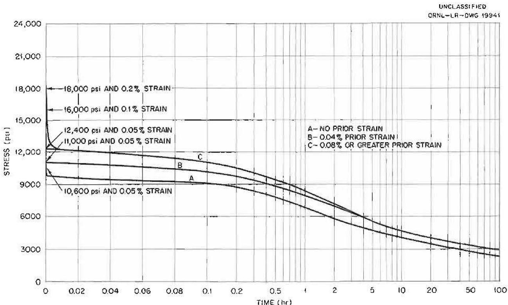  
Fig. 3.5.1. Relaxation Characteristics of Inconel Annealed at $2050^{\circ}\mathrm{F}$ for 2 hr and Tested at $1300^{\circ}\mathrm{F}$ . Stressed to produce a constant strain.

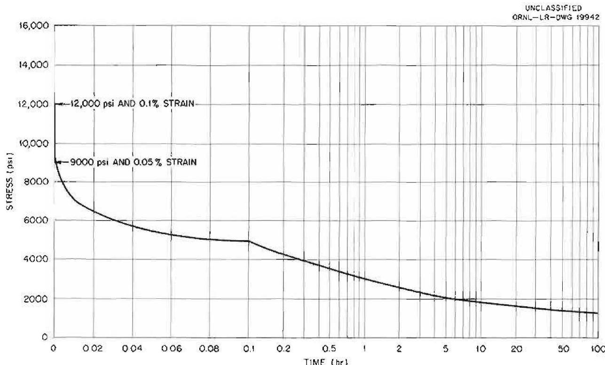  
Fig. 3.5.2. Relaxation Characteristics of Inconel Annealed at $2050^{\circ}\mathrm{F}$ for 2 hr and Tested at $1500^{\circ}\mathrm{F}$ . Stressed to produce a constant strain. (Confidential with caption)

at these test temperatures strain hardening is small and recovery occurs rapidly, it follows that the plastic strain given the specimen on loading to total strains greater than the elastic limit has no effect on the relaxation rate of the material. However, at temperatures less than $1300^{\circ}\mathrm{F}$ , this may not be the case, and the material may reflect the effects of strain hardening in its relaxation rate.

The strain-cycling equipment described previously² was in operation during the quarter and preliminary results were obtained at a test temperature of 1500°F. The greatest number of tests were run with rod specimens in two conditions, as received and annealed at 2050°F for 2 hr. The test results are shown in Fig. 3.5.4, in which the log of the plastic strain (εp) per cycle is plotted vs the log of the number of cycles to failure. The procedure of operation has been to apply a load which is of a magnitude that will cause the specimen

to experience o specified plastic strain in 1 min and then to reverse the load to produce the same plastic strain in the opposite direction. The plastic strain vs time wave has the shape shown on Fig. 3.5.4. It may be seen that the coarse-grained specimens (annealed at $2050^{\circ}\mathrm{F}$ for 2 hr) exhibit fewer cycles to failure for all values of $\varepsilon_{p}$ . Metallographic examination of the specimens showed that the failures were intergranular and that they initiated at the surface of both the coarse- and the fine-grained material.

Tests were also run at $1500^{\circ}$ F on 0.75-in.-OD, 0.06-in.-wall Inconel pipe both in the as-received and the annealed (1950°F for 2 hr) conditions. As may be seen in Fig. 3.5.5 there is some scatter of the data; however, all but three points fall within the band bracketed by the coarse- and fine-grained rod data.

Tests of Inconel pipe in the fused salt NaF $\mathsf{ZrF}_4$ -UF $_4$ (50-46-4 mole %, fuel 30) at $1500^{\circ}\mathsf{F}$ are now in progress in order to determine the effects of this corrosive medium on the strain-cycling characteristics of Inconel. Strain-cycle tests will

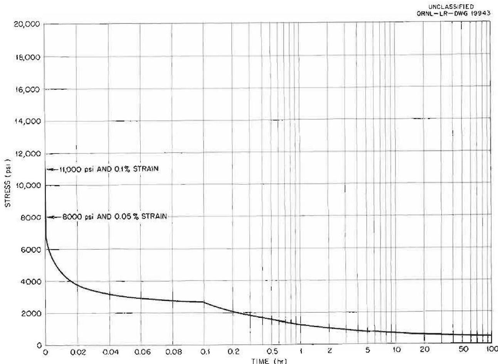  
Fig. 3.5.3. Relaxation Characteristics of Inconel Annealed at $2050^{\circ}\mathrm{F}$ for 2 hr and Tested at $1650^{\circ}\mathrm{F}$ . Stressed to produce a constant strain. (Confidential with caption)

also be run at 1300 and $1650^{\circ}F$ on both as-received and annealed specimens in argon and in fuel 30. Since the strain-cycle type of test provides an important measure of an alloy's ductility, such tests will be included in the program for evaluating potential reactor materials.

In conjunction with this work at ORNL, additional data are being obtained under subcontracts at the University of Alabama and Battelle Memorial Institute. At the University of Alabama experiments are being conducted to study the effect of plastic strain induced by thermal fluctuations. Initially the tests were programmed to provide a 1-hr hold time at each end of the temperature excursion; however, all the specimens tested in this manner exhibited preferential growth and ultimately failed by buckling. Recently, tests were conducted so that a complete temperature reversal was effected in $\text{l}$ min. This rate corresponds to the

rate used for some of the mechanical strain-cycle experiments conducted at ORNL, and the type of failure was similar. Therefore some correlation between the two types of tests should be possible, at least for the rapid cycle rates. It might be assumed that a material would react in the same manner to repeated plastic strain regardless of the manner in which the strain was induced. However, this is true only if no metallurgical changes are initiated by temperature changes and if the stability of the structure at the temperature extremes is independent of time. The main issue to resolve is whether any such changes occur in the operating temperature range of the reactor.

The natural desire to obtain information of this type as quickly as possible led to an attempt to obtain data before all the testing techniques were developed. The many testing difficulties encountered have, however, necessitated a slower,

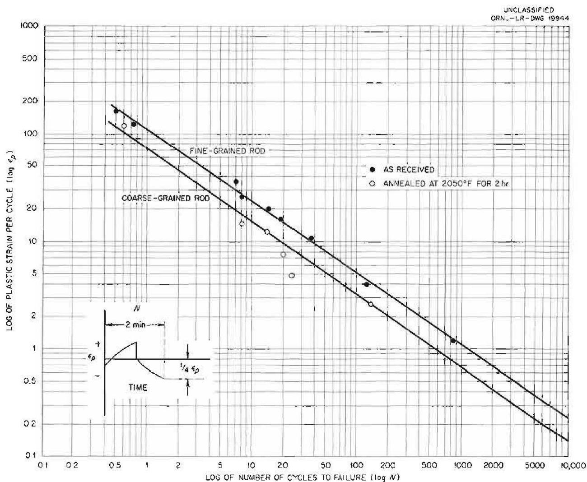  
Fig. 3.5.4. Strain Cycle Characteristics of Inconel Rod Tested in Argon at $1500^{\circ}\mathrm{F}$ . (Confidential with caption)

more analytical approach. As a result time is now being spent determining the temperature profile over the gage length, the effective gage length, and the effect of commencing the test at various temperature levels. Thus an additional delay will be incurred before data of sufficient accuracy become available to attempt a correlation with the ORNL results.

A program was initiated at Battelle Memorial Institute on July 1, 1956 to fully explore the elevated-temperature properties of Inconel under dynamic-stress conditions. The program entails complete reverse stress fatigue tests and fatigue tests with various constant load stresses applied in the tensile direction. Such information, together with stress-rupture data, can be used to form

"Goodman" diagrams. From these plots the stress conditions that will result in failure by creep can be established, and the stress conditions that will result in failure from fatigue can be determined. Since the primary interest is in low-frequency stress reversals, the tests will be conducted at 1 and 30 cps. Preliminary results show that, at a temperature of $1400^{\circ}\mathrm{F}$ , application of constant load stresses up to 4000 psi will not significantly alter the stress to produce a fatigue failure in 1000 hr. Data are to be obtained for diagrams for 1200 and $1600^{\circ}\mathrm{F}$ .

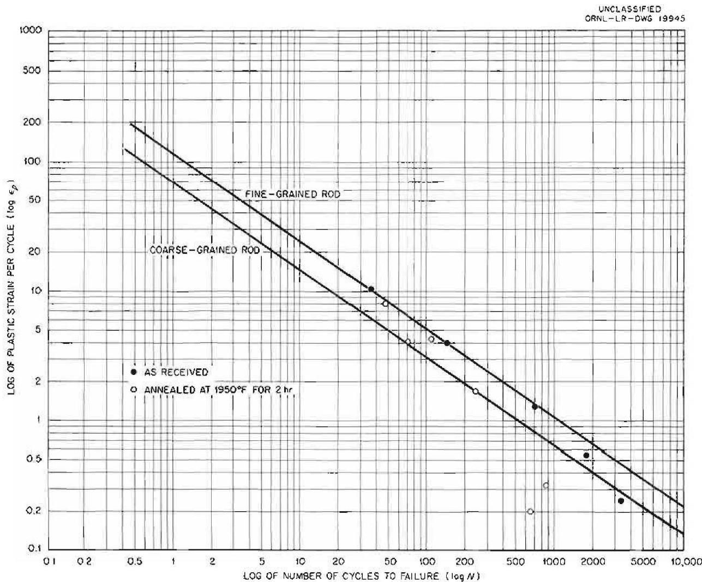  
Fig. 3.5.5. Strain Cycle Characteristics of 0.75-in.-OD, 0.06-in.-Wall Inconel Pipe Tested in Argon at $1500^{\circ}$ F. (Confidential with caption)

# ALLOY DEVELOPMENT

J.W.Woods

Evaluation studies were mode of the creep and creep-rupture characteristics under a constant load of two experimental nickel-molybdenum alloys being developed for reactor use. The environment used in these tests was the fused salt NaF-KF-LiF-UF4 (11.2-41-45.3-2.5 mole %, fuel 107). The two alloys tested were vacuum melted at ORNL. Heat VT-51 had the nominal composition (in wt %) 17 Mo-10 Cr-0.5 Al-0.5 Mn-0.06 C-7 Fe-bal Ni, and heat VT-52 contained (in wt %) 17 Mo-10 Cr-0.06 C-7 Fe-bal Ni. The results of the tests are presented in Table 3.5.1. The corrosion of the unstressed surfaces of the specimens from both

heats that were solution annealed at $2000^{\circ}F$ for 1 hr and aged at $1300^{\circ}F$ for 50 hr was 0.5 to 1 mil.

The compositions of the two alloys were virtually identical, but the methods of preparation were different. Heat VT-51 was prepared from elemental melting stock, and heat VT-52 was prepared from Inconel diluted with Ni, Mo, and Fe. Alloy VT-51 demonstrated an aging response, while alloy VT-52 did not. Because the alloys were prepared in small heats, variations in mechanical properties of the two alloys were to be expected. Both alloys exhibited good ductility.

Photomicrographs of the specimens are shown in Figs. 3.5.6 and 3.5.7. The formation of a continuous network of carbides around each grain is shown in Fig. 3.5.6, whereas in Fig. 3.5.7 the

Test temperature: 1500°F

Stress: 8000 psi

Table 3.5.1. Stress-Rupture Properties of Two Experimental Nickel-Molybdenum Alloys   

<table><tr><td>Heat No.</td><td>Specimen Treatment</td><td>Rupture Life (hr)</td><td>Elongation (%)</td></tr><tr><td rowspan="2">VT-51</td><td>Solution annealed at 2000°F for 1 hr</td><td>860</td><td>76</td></tr><tr><td>Solution annealed at 2000°F for 1 hr and aged at 1300°F for 50 hr</td><td>1243</td><td>46</td></tr><tr><td rowspan="2">VT-52</td><td>Solution annealed at 2000°F for 1 hr</td><td>820</td><td>72</td></tr><tr><td>Solution annealed at 2000°F for 1 hr and aged at 1300°F for 50 hr</td><td>Test discontinued at 780</td><td>72</td></tr></table>

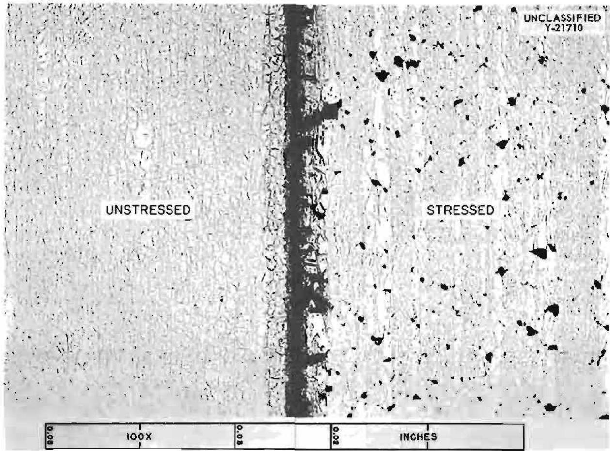  
Fig. 3.5.6. Alloy VT-51 (17% Mo-10% Cr-0.5% Al-0.5% Mn-0.06% C-7% Fe-bal Ni) Creop Tested in Fuel 107 at 8000 psi and 1500°F in the Aged Condition. Ruptured in 1243 hr with 45% elongation, 100X. (Secret with caption)

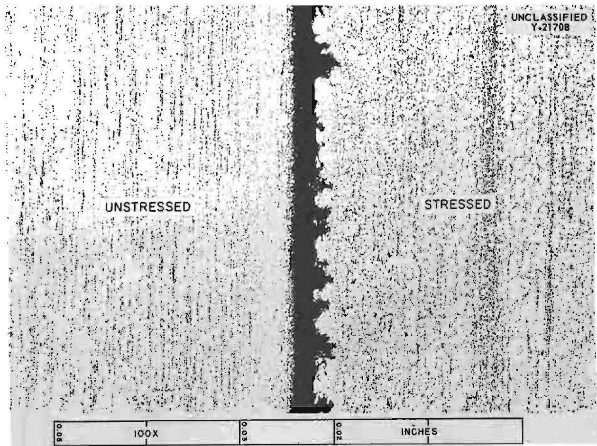  
Fig. 3.5.7. Alloy VT-52 (17% Mo-10% Cr-0.06% C-7% Fe-bal Ni) Creep Tested in Fuel 107 at 8000 psi and $1500^{\circ}\mathrm{F}$ in the Aged Condition. Ruptured in 788 hr with 70% elongation. 100X. (Secret with caption)

carbide precipitate in the grain boundaries has a more random arrangement which could account for the lower strength exhibited by alloy VT-52. In general the precipitates were well dispersed in both specimens.

Hastelloy B has received considerable attention in the alloy development program because it is commercially available and it has excellent high-temperature strength and corrosion resistance. However, the absence of chromium in Hastelloy B results in characteristically poor oxidation resistance. One aim of the development program, therefore, is to introduce sufficient chromium to provide good oxidation resistance but not enough to result in severe corrosion. Hastelloy C, which is also a commercially available nickel-molybdenum alloy, contains 15 wt% chromium. It was recognized that this amount of chromium would lead to considerable corrosive attack, but, since the composition of this alloy represents an upper limit of

chromium, it was decided that a certain amount of data on its strength properties in fused salts would be pertinent to the problem. Therefore, stress-rupture data were obtained at 1300, 1500, and $1650^{\circ}F$ in fuel 107 for comparison with data for other alloys being investigated.

The results of the tests are shown in Fig. 3.5.8. The data show quite good stress-rupture properties, and it appears that for 10,000 psi at $1500^{\circ}$ F Hastelloy C will have a rupture life of over 1000 hr. The two specimens tested at $1500^{\circ}$ F in Hastelloy B creep test chambers had poorer stress-rupture properties than those tested in a Hastelloy C test chamber. This may be explained by the fact that the creep test chamber made of Hastelloy B contained no chromium and thus provided, through alloying and diffusion, a strong "sink" for chromium and accelerated the removal of chromium from the specimen.

The results of the alloy development program thus far indicate that considerable progress has been made toward achieving the objective of developing a material that is as fabricable as required for reactor construction, possesses adequate strength, and is corrosion resistant in high-temperature fuel mixtures, liquid metals, and air. Commercial alloys such as Hastelloy's B and W, which have excellent corrosion resistance and

strength, will have to be avoided, since, at the temperatures of interest, they precipitate a brittle phase that causes poor fabricability and low ductility. Experimental nickel-molybdenum alloys of the single-phase or solid-solution type have the desired fabricability and corrosion resistance, but they lack adequate creep strength. In spite of the poorer creep strength, however, these alloys are stronger than Inconel.

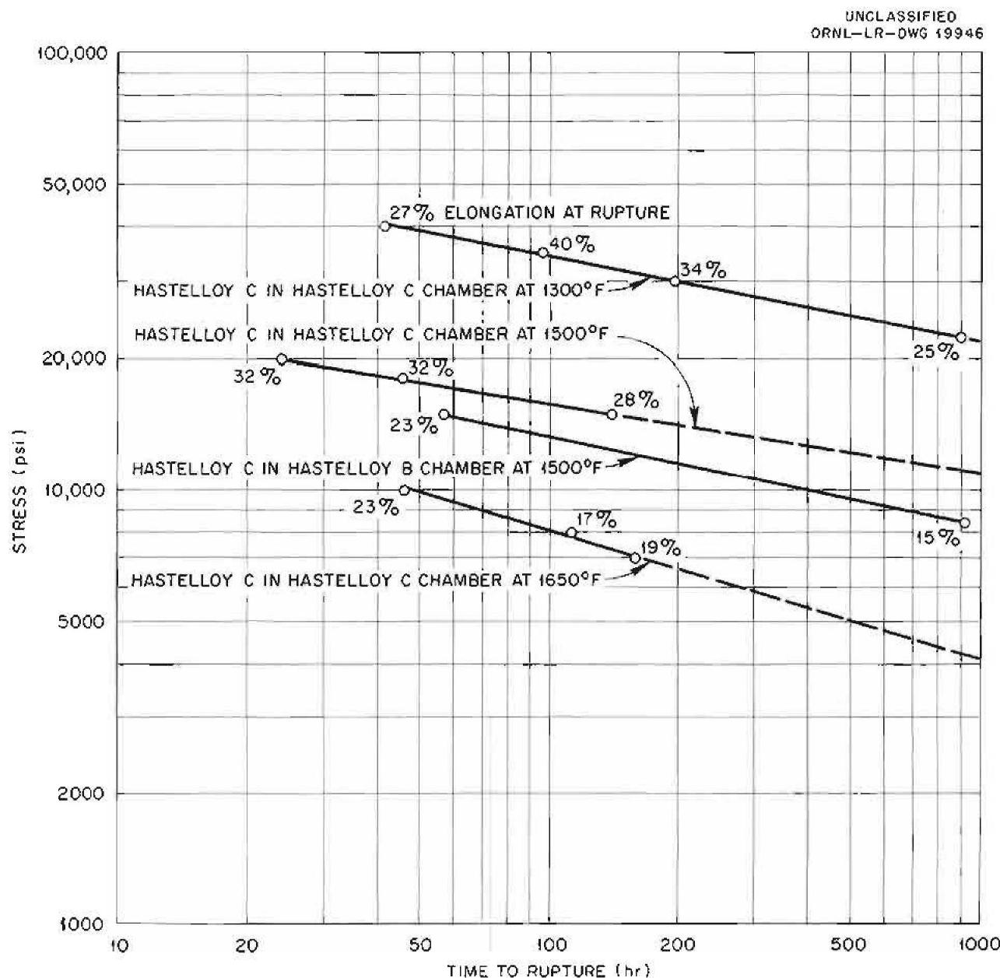  
Fig. 3.5.8. Stress-Rupture Properties of Hostelloy C Annealed at $2250^{\circ}$ F for 1 hr and Tested in Fuel 107 at 1300, 1500, and $1650^{\circ}$ F. (Secret with caption)

Attempts have been made to increase the strength of the nickel-molybdenum alloys by the addition of elements that form complex precipitates and by the addition of elements that are simple carbide formers. Additions of very small amounts (< 1%) of aluminum and titanium do not seem to increase the strength, but they do increase the final elongation at rupture, probably because of their affinity for oxygen and nitrogen. However, fabrication difficulties are encountered when the additions of aluminum and titanium exceed 1.5%. It has been possible, however, to improve the creep characteristics by additions of carbide-forming elements, such as niobium and tungsten, as was done in the case of Hastelloy C, without seriously compromising the other good characteristics. Several alloys of this type have exhibited a stress-rupture life of 1000 hr when tested in fuel 107 at 8000 psi and $1500^{\circ}$ F. A considerable amount of additional work is needed to achieve the optimum balance of strength, fabricability, and corrosion resistance, but the success to date encourages optimism.

# TESTING OF BERYLLIUM

D. A. Douglas

The Brush Beryllium Co., under a subcontract, has for several years been conducting an extensive program of mechanical testing of beryllium

to explore the effects of variables such as temperature, surface finish, strain rate, and oxide content on the mechanical properties. Most of the work was summarized in a report issued in August 1956.4 In the current contractual year the work has been concerned with measuring the elevated-temperature tensile and stress-rupture properties of samples trepanned from the blocks being hot-pressed for the ART. It was felt desirable to determine whether the linear relationship between oxide content and strength revealed by the past work would be evidenced in the larger pressings. Also, some evaluation of the blocks is required to ensure that the strength does not fall significantly below the strength on which design calculations were based. The results of the tests, as reported in The Brush Beryllium Co. quarterly progress reports, indicate that the strength properties do not vary appreciably from those predicted.

# 3.6. NONDESTRUCTIVE TESTING AND INSPECTION OF MATERIALS AND COMPONENTS

R.B.Oliver

A. Taboada

# EDDY-CURRENT INSPECTION TECHNIQUES

R.B.Oliver

# Tubing Inspection

J.W. Allen

The application of the recently developed Impedograph, an instrument which measures both the a-c resistance and the reactance of its testing coil over a wide range of frequencies, was investigated further. A prototype of this instrument, described by the block diagram in Fig. 3.6.1, was constructed. It is composed primarily of an oscillator in which the bifilar-wound center-topped testing coil is the frequency-determining element. Both the a-c resistance of the coil and its inductance are influenced by the tubing under inspection. The amplitude of the alternating voltage generated by the oscillator varies inversely with the resistance of the testing coil, and the frequency of the voltage varies inversely with the square root of the inductance of the testing coil. The amplitude detector (Fig. 3.6.1) and its associated

J. W. Allen, ANP Quar. Prog. Rep. Dec. 31, 1956, ORNL-2221, p 260.

amplifier provide a direct coupled signal which varies inversely with the resistive component, $R$ , of the testing coil's impedance. The frequency discriminator, with its associated amplitude limiter and amplifier, provides a direct-coupled signal which varies inversely with the reactive component, $X$ , of the testing coil's impedance.

The change in impedance of the coil is described by the curves of Fig. 3.6.2. On this graph, the short-dashed curve has, as a parameter, the frequency ratio $\frac{I}{I_c}$ , in which $I$ is the operating frequency of the coil and $I_c$ is determined by

$$
f _ {c} = \frac {2}{\pi \mu y D _ {p} ^ {2}}.
$$

where

$\mu = 4\pi \times 10^{-7}$ hemries/m, permeability of nonferromagnetic tubing,

$\gamma =$ conductivity of part being inspected, in mho/m,

Dp = outside diameter of part, in meters.

The four solid curves drawn from the short-dashed curve to the point (0,1) represent the effect

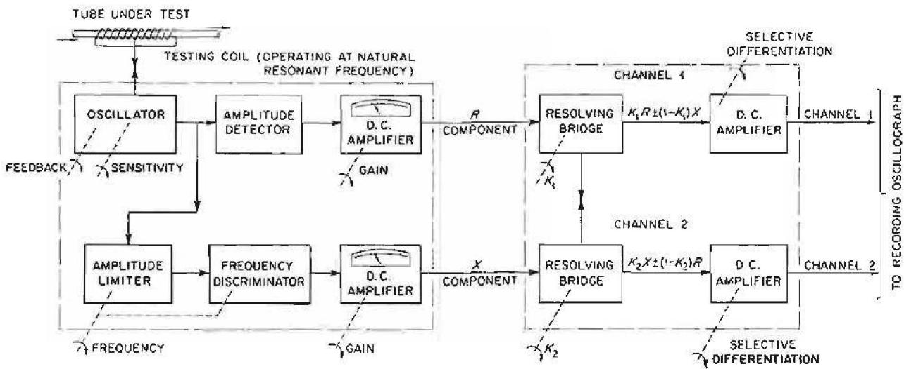  
Fig. 3.6.1. Block Diagram of Impedograph.

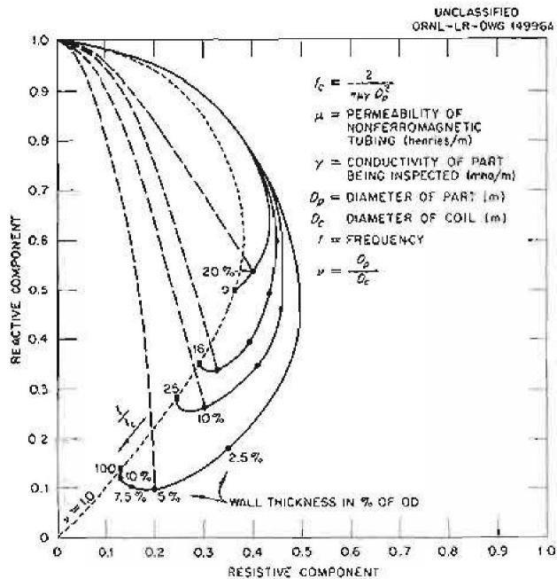  
Fig. 3.6.2. Impedance Plane for Coils Encircling Metal Tubes.

of varying the tubing wall thickness (as a percentage of the outside diameter) for // ratios of 9, 16, 25, and 100. The long-dashed curves indicate the effect of varying the outside diameter.

It is important to note that if the proper $\frac{1}{1}$ ratio is selected for a particular tube, angular separation of approximately 90 deg can be obtained between the effects of varying diameter and varying wall thickness. An example of this situation occurs at an $\frac{1}{1}$ ratio of 25 for a tube having a wall thickness which is 10% of its outside diameter.

Both the $R$ and $X$ components of any excursion from the operating point are measured by the Impedograph. These two components may be resolved into any other set of two orthogonal components by the use of resolving bridges, as indicated in Fig. 3.6.1. Thus the controls may be adjusted until one channel of the instrument responds primarily to variations in diameter and the other to variations in wall thickness. Small defects on the inner wall of the tubing cause impedance excursions that are nearly in phase with those from wall thickness variations, and small defects on the outer surface cause excursions that are nearly in phase with those from diameter variations. Therefore, small inside defects will appear on the some channel with the wall thickness variations, and small outside defects will appear

on the same channel with the diameter variations. Gross defects cause very large impedance excursions which are at some angle between the effects of diameter and wall thickness; thus the large resultant signal is present on both channels.

Illustrations of the instrument's ability to distinguish between diameter and wall thickness variations are given in Figs. 3.6.3 and 3.6.4.

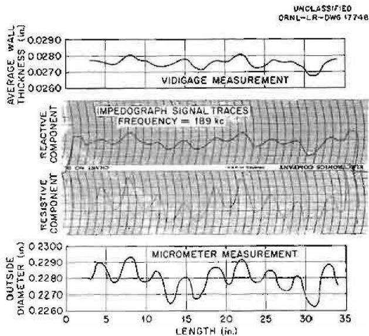

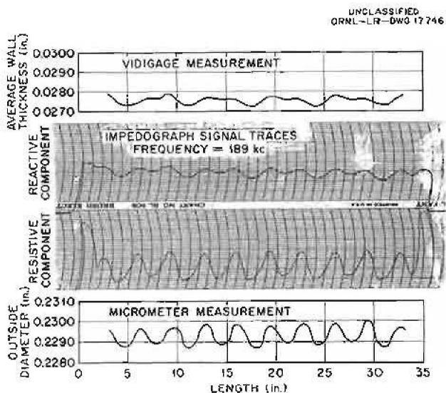  
Fig. 3.6.3. Comparison of Impedograph Signal Traces with Actual Dimensional Variations of 0.229-in.-OD, 0.025-in.-Wall Inconel Tubing Specimen 68-1B.   
Fig. 3.6.4. Comparison of Impedograph Signal Traces with Actual Dimensional Variations of 0.229-in.-OD, 0.025-in.-Wall Inconel Tubing Specimen 68-2A.

The signal traces are recordings of the reactive and resistive component signals from the Impedograph for 35-in. lengths of 0.229-in.-OD, 0.025-in.-wall Inconel tubing which have been stretched to accentuate their dimensional variation. Above the traces are plots of the average wall thickness as measured with the Branson Vidigage (ultrasonic-resonance thickness measurement). Below the traces are plots of the average outside diameter as measured with micrometers. It is readily seen that close correlation exists between the instrument signals and the other measurements.

These traces were made at an operating frequency of 189 kc, for which the $/ / _{c}$ ratio is approximately 15 for the 0.229-in.-OD, 0.025-in.-wall Inconel tubing. This frequency and wall thickness (11% of OD) have an operating point on the graph of Fig. 3.6.2 such that the resistive component is at a maximum as a function of wall thickness. At this point small changes in wall thickness cause almost no change in the resistive component, but do cause maximum change in the reactive component. Theoretically, changes in diameter should affect both channels. However, the traces of Figs. 3.6.3 and 3.6.4 clearly indicate that the diameter signals are predominate in the resistive component and have a negligible effect on the reactive component. Unfortunately, the variations in both diameter and wall thickness characteristically follow each other at about the same period, and therefore close analysis is very difficult. Further investigation of this effect is planned with the use of machined tubes in which changes in diameter and wall thickness may be introduced and controlled separately.

# Cladding Thickness Measurements

J.W.Allen

R.A. Nonce

The feasibility of determining the thickness of the cladding on Mark X MTR fuel plates with an eddy-current probe coil was investigated. Although this study has no immediate application to ANP work, many of the problems involved are very similar to problems associated with inspections of control rods and other clad or shrouded assemblies.

The Mark X MTR fuel plates are composed of a 0.022-in. nominal thickness core of 52 wt % Al-48 wt % U alloy clad with a 0.020-in. nominal thickness of type 6061 aluminum alloy. The deformation characteristics of the core and the cladding

alloy are not the same; hence, during the rolling of the plate to a uniform thickness, the deformation of the core is frequently nonuniform. The result is a thick section at each end of the core, the longitudinal cross section of which resembles a "dog bone." Since the plate is of uniform thickness, the cladding over the thick sections at the extremities of the core is of course much thinner than the 0.020-in. nominal thickness. The possibility of a 0.003- to 0.005-in. depth of corrosion attack necessitates the location and rejection of fuel plates which have excessive "dog boning."

To facilitate the investigation of this problem and to determine the best operating parameters for the eddy-current test, the prototype instrument described in the block diagram of Fig. 3.6.5 was constructed. Since the original purpose of this instrument was to determine the best coil design and the optimum operating frequency, it is more complex and contains more controls than would be required on a production inspection instrument.

The instrument consists of a variable-frequency oscillator which supplies alternating current to the probe coil through an isolating network and to a balancing network. The isolating network prevents the presence of the probe coil from affecting the voltage supplied to the balancing circuitry, and supplies the probe coil with current of constant amplitude. Since the probe coil current is constant in amplitude, the voltage at the terminals of the probe is directly related to its impedance, which in turn is influenced by the metal specimen in proximity with it. The balancing network is adjusted manually until the voltage at the network output terminal is equal to the voltage across the coil, at the initial test condition, in both amplitude and phase. Any change of the test condition changes the voltage at the coil in phase or amplitude or both. The difference in the voltage of the coil and of the balancing network is amplified, and hence any change in coil voltage causes a meter deflection.

After some experimenting, the probe design shown in Fig. 3.6.5 was established. The coil consists of approximately 540 turns of No. 40 enameled copper wire in a small, cup-shaped Ferrocube core (Ferrocube Corp. Type 3C Ferrocube). The coil, after connection with the instrument cable, is potted with an epoxy resin into the end of a short length of micarta tubing. This coil assembly is contained in a heavy brass

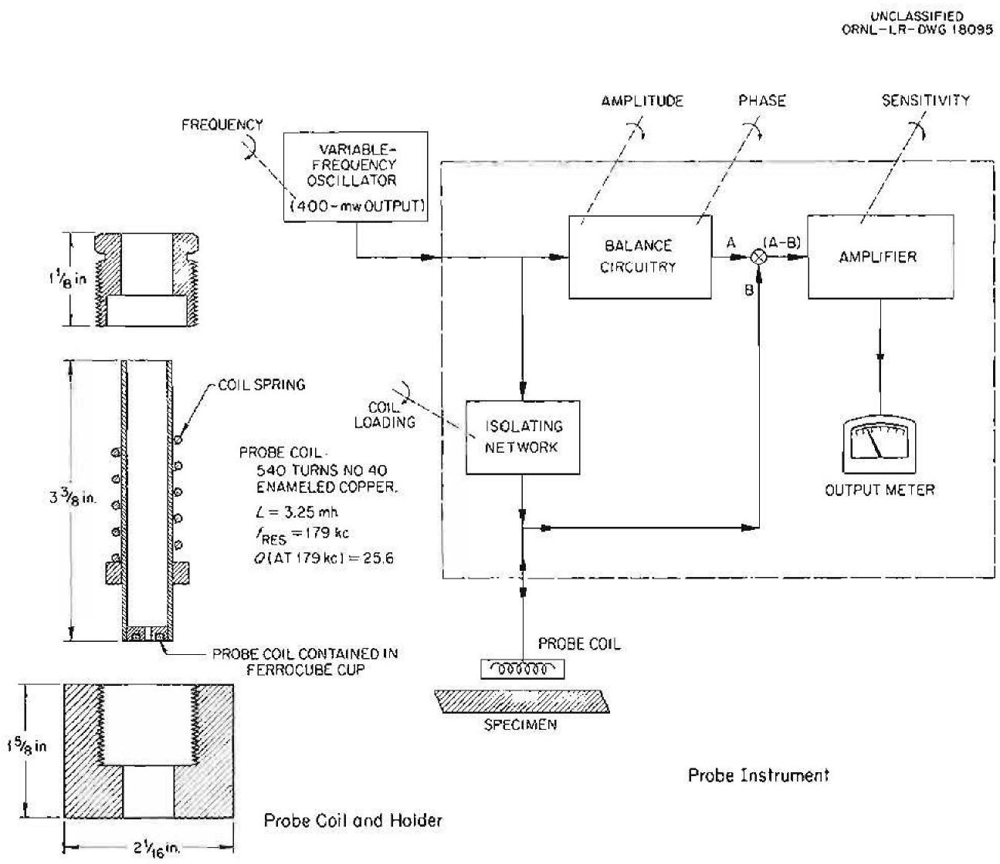  
Fig. 3.6.5. Variable-Frequency Eddy-Current Instrument and Probe-Coil Design for Cladding Thickness Determinations.

holder which spring-loads the probe against the metal specimen. The use of this mechanism eliminates spurious signals caused by the varying coupling associated with a hand-held probe.

Three considerations were of primary importance in selecting an optimum test frequency. First, the frequency was to be sufficiently high to sensitively detect the difference between the type 6061 aluminum alloy cladding (conductivity = 45% IACS²) and the uranium-aluminum alloy core (conductivity = 22.8% IACS). Second, it was to be sufficiently low to penetrate the nominal 0.020-

in.-thick cladding and to detect small changes in its thickness. Also, it was to be sufficiently high that the 0.022-in.-thick core underneath the 0.020-in.-thick cladding would appear infinitely thick (that is, no eddy-current penetration through the core). This is necessary to prevent the clad thickness on the "back side" of the plate from influencing the thickness determinations made on the side under surveillance. The optimum frequency determined experimentally to satisfy these conditions was $20\mathrm{kc}$

Correlation of the meter deflection with the cladding thickness was experimentally determined by first adjusting the instrument to read nearly

full scale with the probe coil placed on a specimen of bare uranium-aluminum core, and to read zero with the probe coil placed on an apparent "infinite" thickness of the 6061 aluminum alloy. Shims of the cladding alloy, which varied from 0.003 to 0.020 in. in thickness, were then used to obtain the information for the calibration curve shown in Fig. 3.6.6.

Three Mark X fuel plates were examined, and only one showed sufficient variation in cladding thickness to warrant a more detailed inspection. This plate was scanned on both sides, with each pass of the probe coil overlapping the previous pass to ensure complete coverage of the surface. The greater portion of the cladding was indicated to be from 0.017 to 0.020 in. thick. All deviations from this range were marked for later destructive examination.

Four of the most significant areas noted during this investigation were sectioned and subjected to a metallographic examination for correlation and evaluation of the eddy-current measurements. The locations of these sections are shown in Fig. 3.6.7. Sections 3 and 4 were taken from one end of the plate where the cladding was very thin os

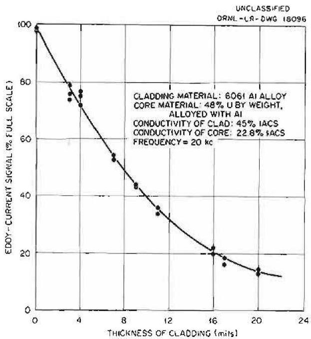  
Fig. 3.6.6. Eddy-Current Signal-Calibration Curve for Cladding Thickness Measurements of Mark X MTR Fuel Plates.

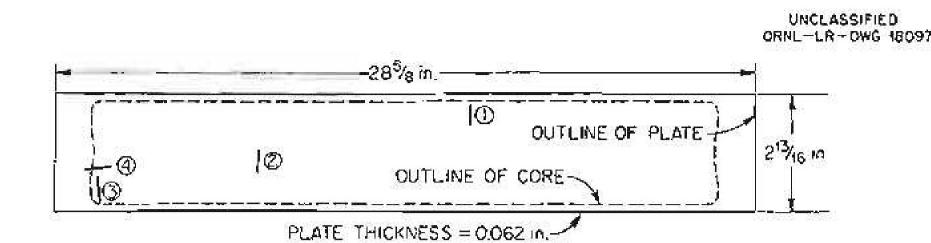  
Location of Sections Taken for Metallographic Examination (Mark X MTR Fuel Plate)

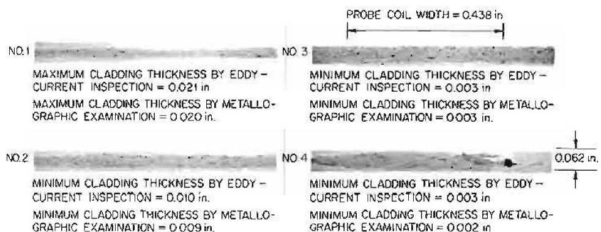  
Fig. 3.6.7. Comparison of Eddy-Current Thickness Measurements of Mark X MTR Fuel Plates with Thickness Measurements Obtained by Metallographic Examination.

a result of the "dog bone" effect previously mentioned. Section 1 was taken through the thickest portion of cladding, while section 2 was token through the thinnest portion of cladding, excluding the very thin cladding over the ends of the core.

The results of the metallographic measurements are summarized in Table 3.6.1 and shown in Fig. 3.6.7. All measurements shown were made on one side of the plate only. The measurements for section I were made on the side of the plate with the thickest cladding, while the remaining sections were measured on the side with the thinnest cladding. It should be noted that in all cases where the metallographic measurement differs from the eddy-current measurement, the difference is 0.001 in. below the value obtained by the eddy-current technique. It is therefore concluded that upon choosing the optimum operating parameters, the cladding thickness on Mark X MTR fuel plates can be determined to within $\pm 0.001$ in.with the use of an eddy-current probe coil.

Table 3.6.1. Comparison of Mark X MTR Fuel Plate Cladding Thicknesses Measured by Eddy-Current Inspection Techniques and by Metallographic Examination   

<table><tr><td rowspan="2">Specimen No.</td><td rowspan="2">Portion of Cladding Measured</td><td colspan="2">Cladding Thickness (in.)</td></tr><tr><td>Eddy-Current Result</td><td>Metallographic Result</td></tr><tr><td>1</td><td>Thickest</td><td>0.021</td><td>0.020</td></tr><tr><td>2</td><td>Thinnest</td><td>0.010</td><td>0.009</td></tr><tr><td>3</td><td>Thinnest</td><td>0.003</td><td>0.003</td></tr><tr><td>4</td><td>Thinnest</td><td>0.003</td><td>0.002</td></tr></table>

There is no comprehensive theory for the application of eddy-current probe coils on metal surfaces such as the theory which exists for the use of coils encircling rods or tubes. This lack of theoretical background requires that each problem be considered separately and that general statements regarding the capabilities of the probe-coil technique be carefully qualified. The experience gained in the measurement of the cladding

thickness of the Mark X fuel plates indicates that if the two metals, forming a system, have a ratio of conductivities in the order of 2:1 or greater, the thickness of the accessible layer can be accurately measured. As the conductivities of the two materials approach the same value, this system of measurement becomes useless.

Continued experience with the eddy-current probe-coil technique should result in the satisfactory measurement of cladding thickness of most alloys on a cermet core, of any of the oxidation-resistant alloys over molybdenum or niobium cores, of an austenitic stainless steel over a nickel-molybdenum alloy core, or of a nickel-molybdenum alloy over an austenitic stainless steel core. The ability of this method to measure Inconel on austenetic stainless steel or austenetic stainless steel on Inconel is currently considered to be marginal.

The eddy-current probe-coil method of measuring thickness is independent of the existence or condition of the bond between the two layers, and it is best suited to the measurement of thin layers. This method appears to be well adapted to measuring cladding thicknesses on solid-fuel-element assemblies or on moderator assemblies. It is also well adapted to measuring the thickness of the outer layer of duplex tubing, such as might be used in future heat exchangers and radiators, provided the conductivities of the two layers are sufficiently different. Both the total wall thickness of the duplex tubing and condition of the bond between the two layers can be evaluated by ultrasonic techniques.

# RADIOGRAPHIC INSPECTION TECHNIQUES

R.B.Oliver W.J.Mason

The voltage and current settings required for radiographic inspection of various thicknesses of Inconel, stainless steel, nickel-molybdenum, and similar alloys are not available, and therefore a program of compilation of such data has been initiated. Test weldments in $\frac{1}{8}$ -in. Inconel sheet are being radiographed through 8-in. of beryllium to explore techniques for the inspection of the closure welds of the ART fuel-annulus core shells. Beryllium, an element of low atomic number, causes excessive scatter of the incident x-ray. The scatter reduces image contrast and sharpness so excessively that the radiograph is not capable of revealing any but gross defects. Higher x-ray

energies are being explored, but the reduction of image contrast with increasing energy appears to nearly offset any reduction of scattered photons that might be expected.

# EXAMINATION OF LEAK IN SUMPT TANK OF PRATT & WHITNEY HIGH-TEMPERATURE CRITICAL ASSEMBLY

R. Heesland

Shortly after the Pratt & Whitney high-temperature critical assembly was loaded with barren fuel-carrier salt, a leak was detected in the sump tank. The insulation was removed and the source of the leakage was found to be severe cracks in the 6-in.-dia cap which had been welded to the bottom of the tank as a catch basin. Since such crocking is unusual for Inconel forged fittings, it was surmised that the cap had been machined from bar stock. A call to Pratt & Whitney confirmed

that forged pipe caps were not immediately available and that a cap machined from bar stock had been used. The cap was removed and a forged cap was welded to the tank.

Examination of Calrods attached to the tank revealed that they were glazed with salt-vapor deposits, and therefore all bottom and side Calrods were removed, the tank was cleaned externally, and new Calrods were installed.

Visual examination of the faulty cap showed nine separate cracks which penetrated through the cap. Examples of the cracks are shown in Figs. 3.6.8 and 3.6.9, which are outer and inner wall views, respectively, of the same cracks. As may be seen the cracks run to the weld and stop, and thus it is apparent that they were in the cap before it was installed on the tank. X-ray examination of the cap-to-tank weld before service did not show cracks in the weld, and the x-ray

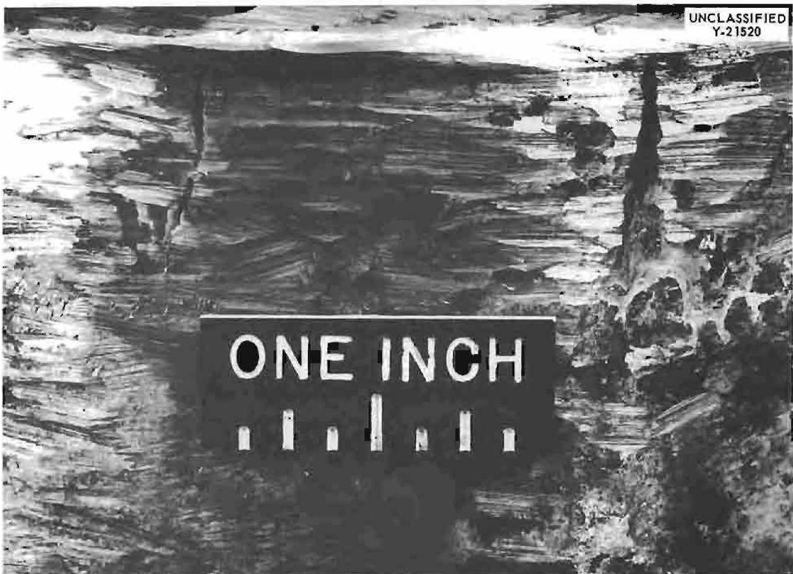  
Fig. 3.6.8. Cracks on the Outer Surface of the Faulty Bar-Stock Cap Removed from the Sump Tank of the Pratt & Whitney High-Temperature Critical Assembly.

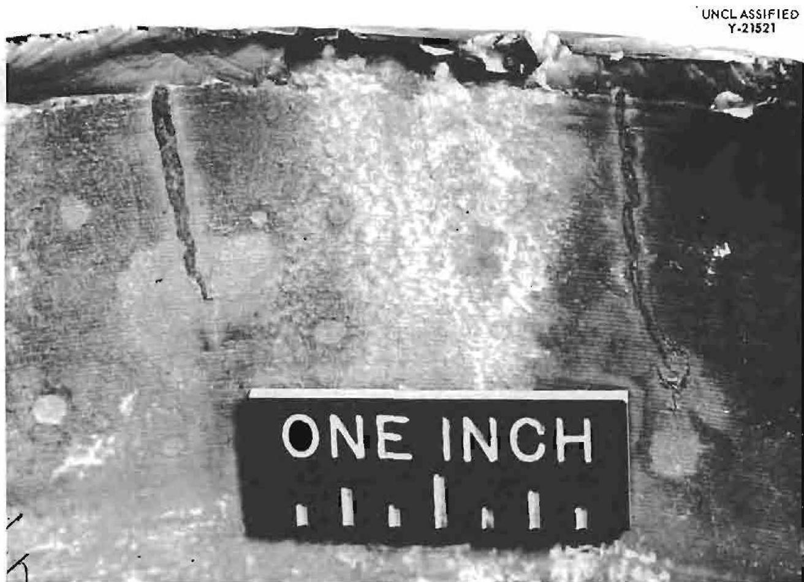  
Fig. 3.6.9. Crocks on the Inner Surface of the Faulty Bar-Stock Cap Removed from the Sump Tank of the Pratt & Whitney High-Temperature Critical Assembly.

examination was not of sufficient sensitivity to show cracks in the cap.

# MATERIAL INSPECTION

The program of inspection of materials of construction was continued, with intended use as the criterion for acceptability. A summary of the materials inspected is presented in Table 3.6.2, which gives the various types and quantities of material inspected, the methods of inspection, and the rejection rates. All rejected material has been either downgraded for noncritical applications or used in experimental development projects in order to minimize losses.

# Tubing

R.W.McClung

The results of inspections of small-diameter tubing illustrate the high rejection rate that results when long defect-free pieces are requested. For example, it was necessary to get 88-in. pieces from 120-in. lengths of 0.625-in.-OD, 0.065-in.-wall Inconel tubing, listed in Table 3.6.2, and hence a single rejectable defect located more than 32-in. from either end caused rejection of the entire length. Many of the discontinuities located on outer surfaces by eddy-current or immersed-ultrasond inspection were grinding marks that resulted

Table 3.6.2. Materials Inspection Summary   

<table><tr><td>Item</td><td>Description</td><td>Quantity</td><td>Method of Inspection</td><td>Rejection Rate (%)</td><td>Remarks</td></tr><tr><td rowspan="7">Tubing</td><td>Inconel; random sizes</td><td>419 ft</td><td>Visuel, penetrant</td><td>63</td><td>Numerous scratches, nicks, and gouges were found that were caused by handling or shipping; some outer surface imperfections exceeded 5% of the wall thickness</td></tr><tr><td>CX-900A Inconel; 0.187-in. OD, 0.025-in. wall, and miscellaneous sizes</td><td>2432 ft</td><td>Visual, penetrant, eddy current, ultrasonic</td><td>22</td><td>This material was primarily for radiator manufacture, and defects greater than 0.0005 in, were cause for rejection</td></tr><tr><td>CX-900A Inconel; 0.229-in. OD, 0.025-in. wall</td><td>2600 ft</td><td>Visual, penetrant, eddy current, ultrasonic</td><td></td><td>Remaining portion of a lot of about 10,000 ft, over-all rejection rate 15.6%</td></tr><tr><td>Inconel; 0.25-in. OD, 0.065-in. wall</td><td>1000 ft</td><td>Ultrasonic, eddy current</td><td></td><td>Fifty-six short defects found; rejection rate will depend on minimum usable length and defect distribution; the short defects were, in general, less than 1 in. in length</td></tr><tr><td>Inconel; 0.625-in. OD, 0.065-in. wall</td><td>3890 ft</td><td>Ultrasonic, eddy current</td><td></td><td>Rejection of 1910 ft based on minimum usable length of 88 in.; if shorter lengths can be used, the rejections will be reduced substantially, since the defects were, in general, small and widely scattered; repolishing will also probably reduce the rejections</td></tr><tr><td>Hostelloy B; 0.25-in. OD, 0.017-in. wall</td><td>250 ft</td><td>Ultrasonic, eddy current</td><td></td><td>Seventy-five short defects found</td></tr><tr><td>Hostelloy B; 0.5-in. OD, 0.035-in. wall</td><td>250 ft</td><td>Ultrasonic, eddy current</td><td>40</td><td>Thirty-six short defects found; 100 ft rejected</td></tr><tr><td rowspan="3">Pipe</td><td>Inconel; random sizes</td><td>668 ft</td><td>Visual, penetrant, eddy current, and radiographic where necessary</td><td>1</td><td>Where possible, defective conditions were removed by grinding; 8 ft rejected because of cracklike conditions or defects in excess of permissible tolerance</td></tr><tr><td>Inconel; 3-in. sched 40</td><td>258 ft</td><td>Ultrasonic</td><td>14</td><td>Thirty-six feet rejected because of cracks</td></tr><tr><td>Hostelloy B; ½-in. IPS sched 40</td><td>200 ft</td><td>Visual, penetrant</td><td>100</td><td>Material had been centerless ground, but defects remained; material will be used, as is, for tests</td></tr><tr><td rowspan="2">Plate and sheet</td><td>Inconel; random thicknesses</td><td>463 ft²</td><td>Visual, penetrant, and ultrasonic where necessary</td><td>6</td><td></td></tr><tr><td>CX-900A Inconel; random thicknesses</td><td>419 ft²</td><td>Visual, penetrant, and ultrasonic where necessary</td><td>25</td><td>Sections with defects were ground, but if defects exceeded tolerance, the entire plate was rejected</td></tr><tr><td rowspan="3">Rod</td><td>Inconel, random diameters</td><td>330 ft</td><td>Visual, penetrant, and ultrasonic where necessary</td><td>20</td><td>Fifty-eight feet rejected because of seams and draw marks that appear to be inherent in the cold-drawn material</td></tr><tr><td>CX-900A Inconel (billots); 4 pieces, 17 in. in diameter, each 42 in. long</td><td>14 ft</td><td>Visual, penetrant, ultrasonic</td><td>0</td><td>Defects indicated by ultrasonic inspection were removable by machining</td></tr><tr><td>CX-900A Inconel; random diameters</td><td>9 ft</td><td>Visual, penetrant, ultrasonic</td><td>0</td><td></td></tr><tr><td>Fittings</td><td>Inconel ellis, reducers, etc</td><td>57 pieces</td><td>Visual, penetrant</td><td>0</td><td></td></tr><tr><td>Shafts for pumps</td><td>Inconel</td><td>6 pieces</td><td>Visual, penetrant, ultrasonic</td><td>0</td><td></td></tr></table>

from the exploration of visual or penetrant indications. Either the defects had not been completely removed, or the grinding sufficiently disturbed the surface to produce a further defectlike indication. This batch of tubing was inspected to a standard such that any discontinuity greater than $5\%$ of the wall thickness in depth would be rejectable. The tubing will be repolished and and reinspected, and the rejection rate may be reduced considerably. However, not all the discontinuities were on the outer surface, as may be seen in Fig. 3.6.10 which is a photomicrograph of an inner surface gouge approximately 0.017 in. in depth, 0.033 in. in width, and 0.375 in. in length.

The special lots of Hastelloy B tubing listed in Table 3.6.2 were fabricated by using a balanced reduction between diameter and wall thickness and were drawn with a floating plug. Despite the large number of discrete defects and the high rejection, the tubing was better than many lots of Hastelloy tubing inspected previously. The most severe cracks found are shown in Fig. 3.6.11,

which is a metallographic section taken from the 0.25-in.-OD, 0.017-in.-wall tubing. The cracks appear to be up to about 0.008 in. deep. The 0.006-in.-deep single crack shown in Fig. 3.6.12 is representative of the most common defect found. The very rough inner surface, intergranular attack, and fine fissures throughout the entire batch of the tubing, as shown in Fig. 3.6.13, are of course unsatisfactory.

# Plate

# R.W. McClung

The requirements for the ultrasonic inspection of Inconel plate in thicknesses up to 1 in. have increased, and therefore special steps have been taken to increase the inspection rate without sacrificing inspection quality. The warping3 which was prevalent with the thinner sections of plate was partially offset by clamping the plate to a structural frame. With the warpage reduced,

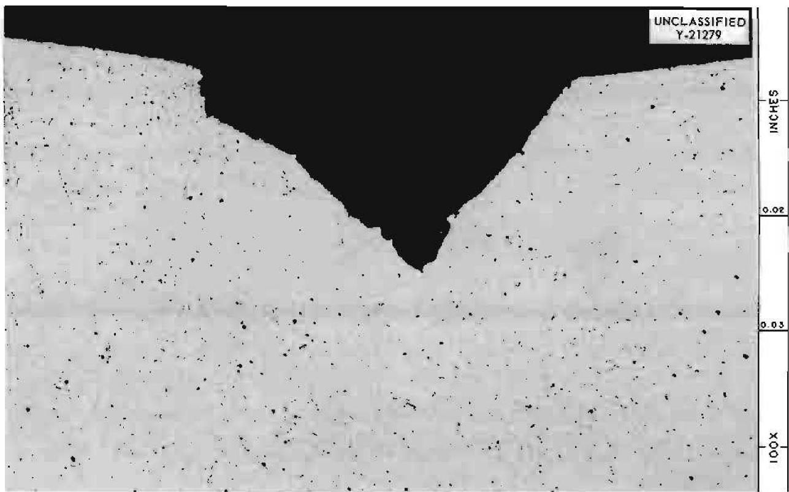  
Fig. 3.6.10. Gauge Found on the Inner Surface of 0.625-in.-OD, 0.065-in.-Wall Inconel Tubing. 100X. Reduced $4\%$ .

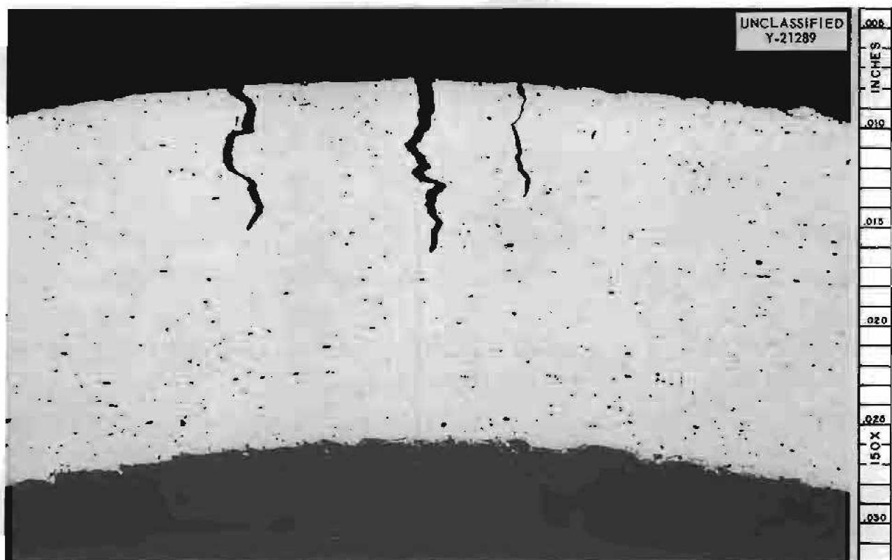

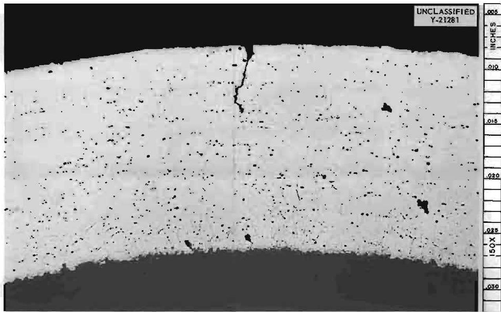  
Fig. 3.6.11. Multiple Cracks Found in 0.25-in.-OD, 0.017-in.-Wall Hastelloy B Tubing. 1SOX. Reduced $4\%$ .   
Fig. 3.6.12. Typical Crack on Outer Surface of a Hostelloy B Tube, 150X. Reduced $4\%$ .

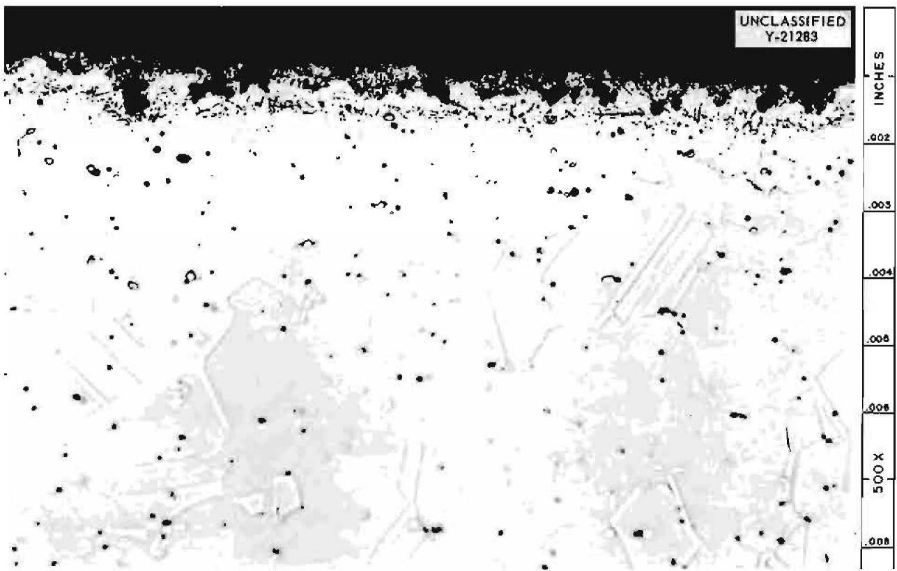  
Fig. 3.6.13. Typical Intergranular Attack, Fissures, and Rough Inner Surface of As-Received Hastelloy B Tubing. 500X. Reduced $3\%$ .

less time was required to realign the incident beam. Another aid in increasing the inspection rate is the use of the B-scan, which displays the signal received as an instantaneous cross section through the plate being inspected. This permits an increase in linear speed of the transducer from approximately 10 to 25 fpm.

In general, it appears that for plate of average quality, inspected from either face, the inspection rate will be about 10 ft² per shift. This of course allows for all the downtime necessary for setup and may increase or decrease with plate quality; also, an increase in the inspection rate might be expected with larger areas.

The rate of rejection increased slightly during the quarter, and three prime criteria for rejection were established: (1) the detection of a discontinuity which produces a signal comparable to or greater than that from a standard $4/64$ -in-flat-bottom hole; (2) the presence of smaller discontinuities with their centers nearer than 1 in to each other; and (3) excessive ultrasonic attenuation, which may be due to porosity or precipitates within the plate.

# Baryllium Hot Pressings

R.W.McClung R.B.Oliver J.W.Allen

One of the six, large, beryllium hot-pressings fabricated by The Brush Beryllium Co., Cleveland, Ohio, was ultrasonically inspected at ORNL. Previously, three of these items had been inspected at the producer's plant. However, it was felt that a more methodical, complete ultrasonic examination under laboratory conditions by several different techniques (some of which could not be used at the Brush facility) was needed as o check on techniques which were previously used in the field.

The instrument used for the inspection at ORNL was a Curtiss-Wright 424A Immerscope with a $3/4$ -in.-dia $\mathrm{Li}_2\mathrm{SO}_4$ high-resolution transducer. An attenuation curve was plotted which demonstrates the comparative signal strength as received from a constant-size discontinuity when seen through varying thicknesses of beryllium, Fig. 3.6.14. The instrument was calibrated for all the inspections by using a $1/8$ -in. flat-bottom hole and applying its presented signal to the appropriate

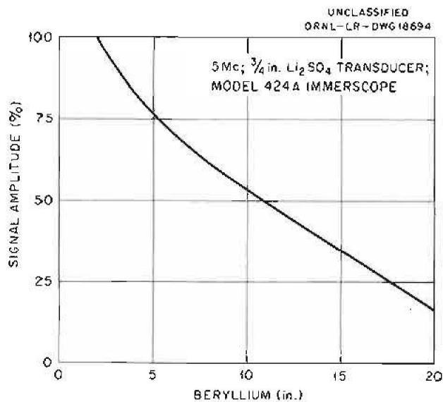  
Fig. 3.6.14. Attenuation Curve for Ultrasonic Inspection of Beryllium.

thickness on the attenuation curve. Thus the relative size of any defect could be approximated by comparing its signal with that of the standard and by using the attenuation curve. The general shape of a hot-pressed beryllium piece is shown in Fig. 3.6.15; however, the contours and dimensions varied from piece to piece.

The section denoted A was inspected completely by three different pulse-echo ultrasonic techniques. The first was a simple immersed method in which the hot pressing was completely immersed in a tank of water and the surface was scanned in a linear fashion with $o \frac{3}{8}$ -in. index between successive scans. Three small discontinuities were located which were estimated to be less than the rejectable size. For the second inspection the column-coupled, gimbal-mounted mechanism illustrated in Fig. 3.6.16 was used. Section A was scanned in a series of overlapping circular scans; however, the part was still completely immersed and this technique merely gave comparative information. The inspection results were identical with those obtained by the conventional immersed technique. For the third inspection the gimbal mounting, the circular scan, and also the column-coupled "squier" principle were used. More

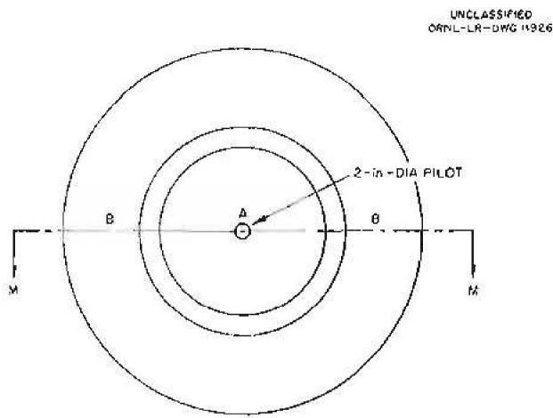

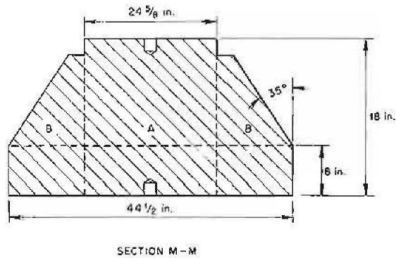  
Fig. 3.6.15. Cross Section of a Typical Hot-Pressed Beryllium Piece.

spurious signals were noted in the third inspection, but the results were equivalent to those obtained by the other two techniques.

The sloping section, B, was inspected with the squirter technique, the transducer being aligned so that the refracted ultrasound beam was perpendicular to the bottom surface. In this portion of the inspection, one discontinuity that was larger than the standard hole was located, but it was in a region that was to be removed by subsequent machining and thus was not cause for rejection.

The hot pressing was also inspected completely by measuring the variation in ultrasonic attenuation throughout its volume. From the consistency of back reflections obtained, the pressing seemed to be quite homogeneous. Since no rejectable defects were located which would not be removed by subsequent machining, the piece was considered to be acceptable.

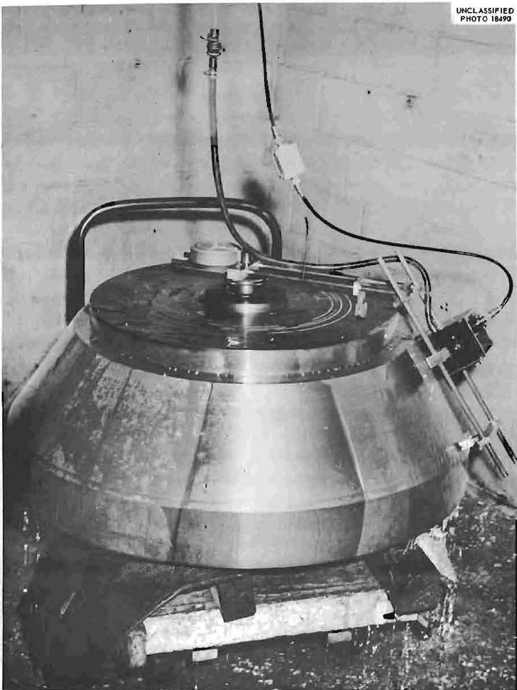  
Fig. 3.6.16. Conical Section of a Beryllium Hot Pressing Being Ultrasonically Inspected with the Use of the Column-Coupled, Gimbal-Mounted Mechanism.

In comparison with the results obtained with the other ultrasonic inspection techniques, it appears that if careful control is exercised the inspection results obtained with the column-coupled "squier" technique are sufficiently accurate to warrant such inspection of the remaining beryllium hot pressings.

# Welds

# A. Taboada

# R. L. Heestand

The results of inert-gas shielded-arc weld inspections during the past six months are summarized in Table 3.6.3. The criteria for the inspection of each weldment are established at the time of design review. Each weldment is classified as C, CN, or S. A C classification is used for all critical welds that must have optimum soundness, for example, welds sealing between corrosive environments, welds that will be subjected to thermal gradients, and welds that must have high strength. These welds are made according to applicable procedure specifications,

and they are inspected by visual, dye-penetrant, and x-ray techniques. A CN weld requires high integrity but cannot be x-rayed. Visual inspection and dye-penetrant methods are used in the inspection of the CN-type weld. Welds which are out-of-specification because of design limitations, but which are critical, also fall into this category. The S designation is for structural welds, but it is also used for out-of-specification welds that are not critical. Welds in this category are inspected by dye-penetrant and visual methods. Dye penetrant reveals crocks, but it does not indicate pin holes or porosities.

In addition to the welds listed in Table 3.6.3, 115 C-type welds on piping manifolds for the ETU were inspected, with $21\%$ rejected for detrimental defects. There were also 60 C-type welds of Hastelloy B inspected. Thirteen of these welds were found to be rejectable for various types of defects. Another 185 welds fabricated on thermocouple leads for critical application were $64\%$ rejected.

Table 3.6.3. Weld Inspection Summary   

<table><tr><td rowspan="2">Period</td><td colspan="3">C-Type Weld</td><td colspan="3">CN- and S-Type Welds</td></tr><tr><td>Total Inspected</td><td>Number Rejected</td><td>Percentage Rejected</td><td>Total Inspected</td><td>Number Rejected</td><td>Percentage Rejected</td></tr><tr><td>Sept. 10 to Dec. 10, 1956</td><td>1052</td><td>141</td><td>13</td><td>2048</td><td>59</td><td>3</td></tr><tr><td>Dec. 10, 1956, to March 10, 1957</td><td>922</td><td>202</td><td>22</td><td>3103</td><td>45</td><td>1.5</td></tr><tr><td>Total for the two periods</td><td>1974</td><td>343</td><td>17</td><td>5151</td><td>104</td><td>2</td></tr></table>

-

1

.

.

-

# Part 4

# RADIATION DAMAGE

G.W. Keilholtz

# FUEL RECOVERY AND REPROCESSING

R. B. Lindauer

# 4.1. RADIATION DAMAGE

G.W. Keilholtz

# EXAMINATIONS OF COMPONENTS AND MATERIALS TESTED IN THE MTR

A. E. Richt

C. Ellis

E.N.Romsey

E.J.Manthos

E.D.Sims

W. B. Parsley

R.M.Wallace

# In-Pile Loops

Metalographic specimens were cut from in-pile loop No. 4 and mounted. All the specimens were examined in the as-polished condition, and some were examined in the etched condition. None of the etched specimens examined up to this time have shown attack greater than 1.5 mils in depth, and no signs of mass transfer were found on the specimens. Wall thickness measurements will be taken on all the specimens from the nose coil and on some samples from straight sections of fuel lines. The operating conditions for this loop were described previously.

All the sections of the fuel-circulating pump, except the impeller and impeller housing, were photographed with the remote stereomicroscope. The condition of the rear half of the pump sump is shown in Fig. 4.1.1. As may be seen, no fuel remained in the sump. A colored amorphous deposit similar to that found in in-pile loop No. 3

was found on the slinger assembly and on the forward bellows, as shown in Figs. 4.1.2 and 4.1.3. The rotating copper block and its housing were coated with a similar deposit, as shown in Figs. 4.1.4 and 4.1.5.

The impeller housing from the pump of loop No. 4, along with the impeller housings from the pumps of loops Nos. 5 and 6, will be cut open on the remote lothe at a later date. Disassembly of loop No. 6 will begin as soon as the disassembly equipment is made ready.

# Irradiated Moderator Materials

The Inconel capsule containing beryllium oxide slugs, which was recently irradiated in the MTR,2 was disassembled and examined. This capsule was the first of o series of capsules containing moderator materials to be irradiated to investigate the dimensional stability and mechanical properties of the material under simulated reactor operating

2J. A. Conlin, D. M. Haines, and C. C. Balta, ANP Quar, Prog. Rep. Dec. 31, 1956, ORNL-2221, p 91.

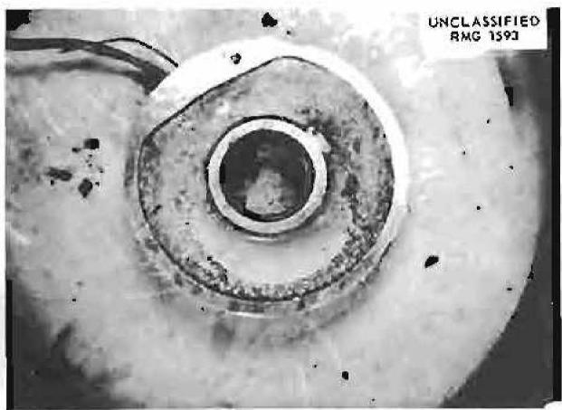  
Fig. 4.1.1. Rear Section of Pump Sump of In-Pile Loop No. 4. $\frac{1}{2} x$ .

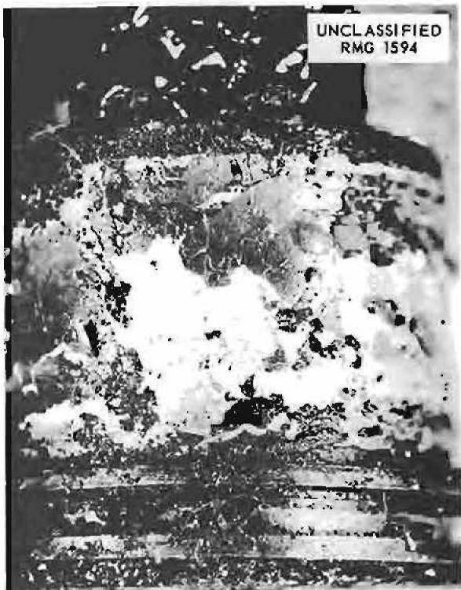  
Fig. 4.1.2. Slinger Assembly from Pump of In-Pile Loop No. 4. 2X.

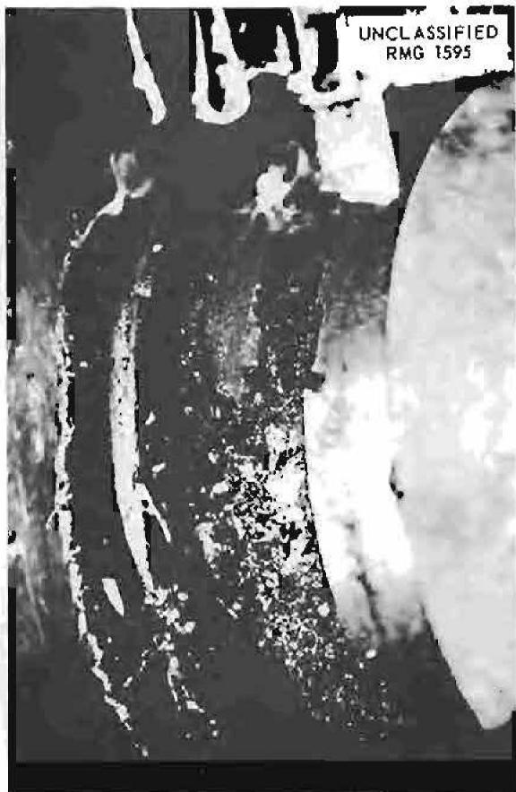  
Fig. 4.1.3. Split Forward Bellows from Pump of In-Pile Loop No. 4. 2X.

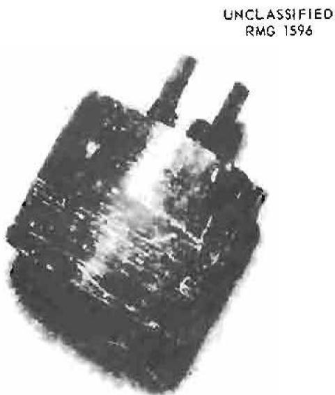  
Fig. 4.1.4. Rotating Copper Block from Pump of In-Pile Loop No. 4. Actual size.

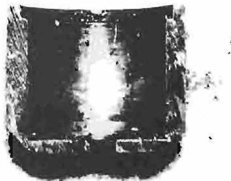  
UNCLASSIFIED RMG 1597   
Fig. 4.1.5. Split Copper-Block Housing from Pump of In-Pile Loop No.4. Actual size.

conditions. The condition of the irradiated test assembly after removal of the thermocouples is shown in Fig. 4.1.6. Unfortunately the high-flux end of the capsule (the end closest to the reactor during irradiation) was bent slightly while it was being removed from the bracket surrounding it, but the BeO slugs were not damaged. Diameter measurements were made on the can before the BeO slugs were removed, and the results of these measurements are listed in Table 4.1.1. The measurements were taken at $\frac{1}{2}$ -in. intervals along the length of the can, and two series of readings were taken 90-deg apart. The slugs were arbitrarily numbered 1, 2, 3, and 4, with slug 1 being closest to the reactor and slug 4 being farthest from the reactor during irradiation.

An attempt was made to remove the BeO slugs with the use of a remotely controlled lathe. Slugs 3 and 4 were removed in this manner, but they were damaged slightly by the lathe tool while the can was being machined away. Figures 4.1.7, 4.1.8, and 4.1.9 show the condition of the slugs removed on the loshe as compared with a similar slug of unirradiated BeO. It was therefore decided to remove the remaining two slugs by using the remote milling machine. A portion of the cap on the remaining half of the can was cut off with an abrasive cut-off wheel to remove the brace which secured the cap to the can, and the open end of the can was trimmed on the cut-off machine. Successive cuts were then made with a milling

machine, along the longitudinol axis of the can, until the BeO slug surface was exposed and the can sprang open. The slugs were then easily removed from the open can. Slugs 1 and 2, which

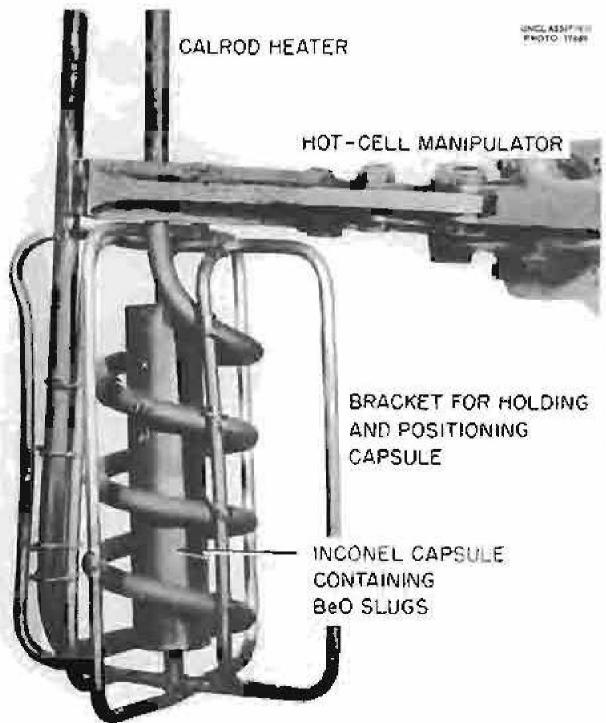  
Fig. 4.1.6. Inconel Capsule Containing BeO Slugs After Removal from the MTR.

were removed by this method, were in much better condition than slugs 3 and 4, as shown in Figs. 4.1.10 and 4.1.11. An unirradiated slug photographed under the same conditions is shown in Fig. 4.1.12 for comparison with slugs 1 and 2 as shown in Figs. 4.1.10 and 4.1.11. A very small

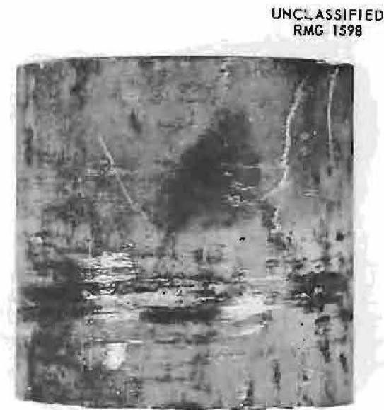  
Fig. 4.1.7. BeO Slug 4 Removed from Inconel Capsule After Irradiation Showing Damage by Lathe Used to Remove Inconel Can. 2.5X.

Table 4.1.1. Diameter Measurements of Irradiated Inconel Capsule Containing BeO Slugs Taken at $\frac{L}{2}$ -in. Intervals Starting at End Farthest From Reactor During Irradiation   
Diameter before irradiation: 1.041 to 1.042 in.   

<table><tr><td>Diameter at 1/2-in. Intervals (in.)</td><td>Position on Capsule During Irradiation</td><td>Diameter 90 deg from Column 1 Measurement (In.)</td></tr><tr><td>1.041</td><td>End forthest from reactor</td><td>1.041</td></tr><tr><td>1.042</td><td></td><td>1.042</td></tr><tr><td>1.043</td><td></td><td>1.042</td></tr><tr><td>1.044</td><td></td><td>1.043</td></tr><tr><td>1.044</td><td></td><td>1.044</td></tr><tr><td>1.043</td><td></td><td>1.044</td></tr><tr><td>1.043</td><td></td><td>1.044</td></tr><tr><td>1.042</td><td>End closest to reactor</td><td>1.044</td></tr></table>

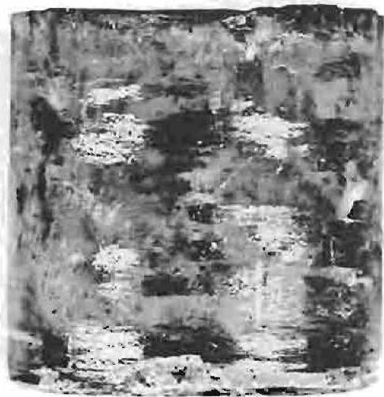  
UNCLASSIFIED RMG 1599

UNCLASSIFIED RMG 1621

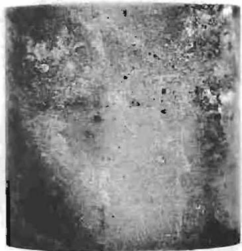  
Fig. 4.1.10. BeO Slug 1 After Irradiation. 2.5X.

Fig. 4.1.8. BeO Slug 3 Removed from Inconel Capsule After Irradiation Showing Damage by Lothe Used to Remove Inconel Con. 2.5X.

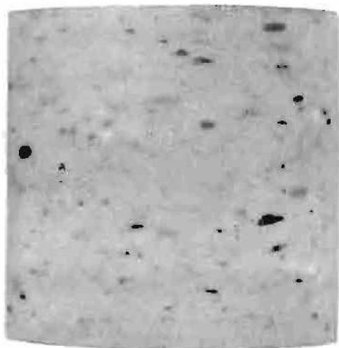  
UNCLASSIFIED RMG 1600

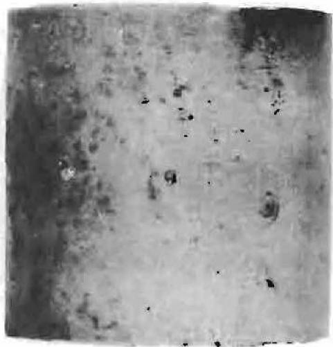  
UNCLASSIFIED RMG 1622   
Fig. 4.1.9. Unirradiated BeO Slug for Comparison with Those Shown in Figs. 4.1.7 and 4.1.8. 2.5X.   
Fig. 4.1.11. BeO Slug 2 After irradiation. 2.5X.

crack was found on the low-flux end of slug 2, but since this was the only crack found on the slug, it may be assumed that the crack was either present before irradiation or was caused by mechanical

# UNCLASSIFIED RMG 1623

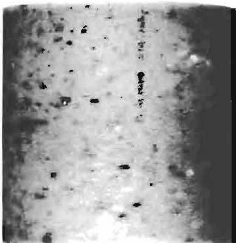  
Fig. 4.1.12. Unirradiated BeO Slug for Comparison with Slugs Shown in Figs. 4.1.10 and 4.1.11. 2.5X.

Table 4.1.2. Dimensional Measurements of the Four BeO Slugs Before and After Irradiation in the MTR   

<table><tr><td rowspan="2">Slug Number</td><td colspan="2">Dimensions (in.)</td></tr><tr><td>Before Irradiation</td><td>After Irradiation</td></tr><tr><td colspan="3">Length</td></tr><tr><td>1</td><td>1.000</td><td>1.000</td></tr><tr><td>2</td><td>1.005</td><td>1.001</td></tr><tr><td>3</td><td>1.005</td><td>1.000</td></tr><tr><td>4</td><td>1.005</td><td>1.000</td></tr><tr><td colspan="3">Diameter</td></tr><tr><td>1</td><td>0.9965</td><td>0.997</td></tr><tr><td>2</td><td>0.997</td><td>0.997</td></tr><tr><td></td><td>0.9965</td><td></td></tr><tr><td>3</td><td>0.997</td><td>0.997</td></tr><tr><td>4</td><td>0.997</td><td>0.997</td></tr><tr><td></td><td>0.998</td><td></td></tr></table>

damage after irradiation. The ends of slugs 1 and 2 are shown in Figs. 4.1.13 and 4.1.14. The end of slug 1 that was closest to the reactor shows a small crack that was probably caused by mechanical damage rather than radiation damage. No evidence of BeO powder was found in the capsule. The results of the dimensional measurements on all four slugs are listed in Table 4.1.2. No significant changes were observed in either the lengths or diameters of the slugs. Sections of the capsule will be mounted and examined metallographically.

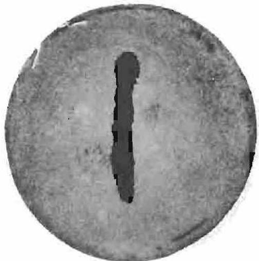  
UNCLASSIFIED RMG 1624

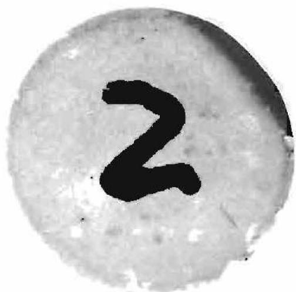  
Fig. 4.1.13. Ends of BeO Slugs 1 and 2 That Were Closest to Reactor During Irradiation. 2,5X.

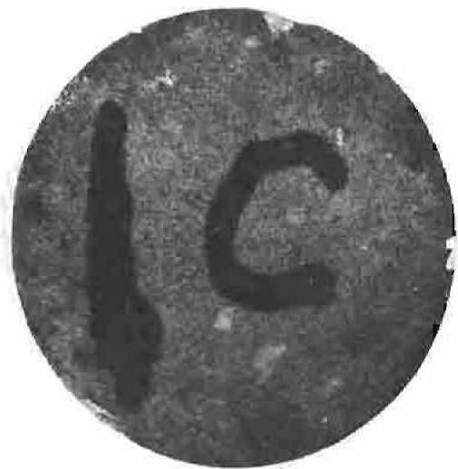  
UNCL ASSIFIED RMG 1625

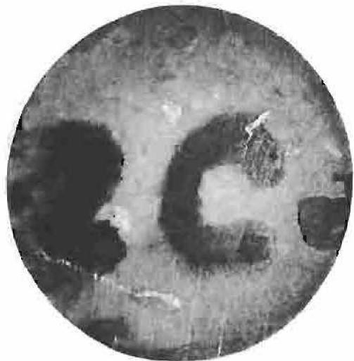  
Fig. 4.1.14. Ends of BeO Slugs 1 and 2 That Were Farthest from Reactor During Irradiation. 2.5X.   
CREEP AND STRESS-RUPTURE TESTS OF INCONEL J.C.Wilson

C.D.Boumann W.W.Davis W.E.Brundoge N.E.Hinkle T.C.Price

# Apparatus for Stress-Rupture Tests of Tubing in the MTR

Effort has been concentrated recently on completing apparatus for MTR in-pile tests of the stress-rupture properties of Inconel tubing. Difficulty was encountered in the assembly of the

apparatus in that the pure helium atmosphere became contaminated by insulating and constructional materials, and the assembly work during the final stages was necessarily slow because the size and complexity of the apparatus limited the number of people who could work at one time.

The general design of the apparatus was described previously,4 and the nearly assembled specimen chamber, a sample specimen, and a specimen furnace are shown in Fig. 4.1.15. An end plate and a water jacket will be welded on in order to complete the specimen chamber. Water and boral will be used as shielding in the plug. Each specimen is a section of 3.8-in., sched-40 Inconel pipe machined down to a wall thickness of 0.030 to 0.050 in. over the gage length, and each specimen is provided with three thermocouples for temperature measurement or control. A $\frac{1}{16}$ -in.-OD capillary will supply gas pressure (to supply the stress) to each specimen.

Each of the eight specimen furnaces has three windings. A rheostat in series with each of the 24 separate furnace windings permits separate control. Three recorder-controllers (Speedomax "G" air controllers with pneumatically driven Variacs) control the temperature in three zones corresponding to the front end (the end closest to the reactor), the middle, and the back end of the specimen. This system is necessary because of the gamma-ray heating gradient in the MTR. The only alternative would have been the use of 24 controllers or 8 controllers and a system of furnace shunts that would be controlled by reactor power. The lead time on procurement of the extra controllers that would have been needed was too long, and it appears now that the present system may be the most suitable.

Extensive tests to determine why the Inconel was heavily oxidized in out-of-pile stress-rupture tests in similar apparatus, despite the use of a high-purity helium atmosphere, showed that some of the materials of construction were contributing oxygen or other contaminants to the atmosphere. Lavite, a machinable ceramic, was eliminated from the assembly as the worst offender. The fused quartz sleeving was found to require special thermal treatment to rid it of disturbing impurities. Thermocouple wires with glass insulation were also suspect, and accordingly all electrical leads and

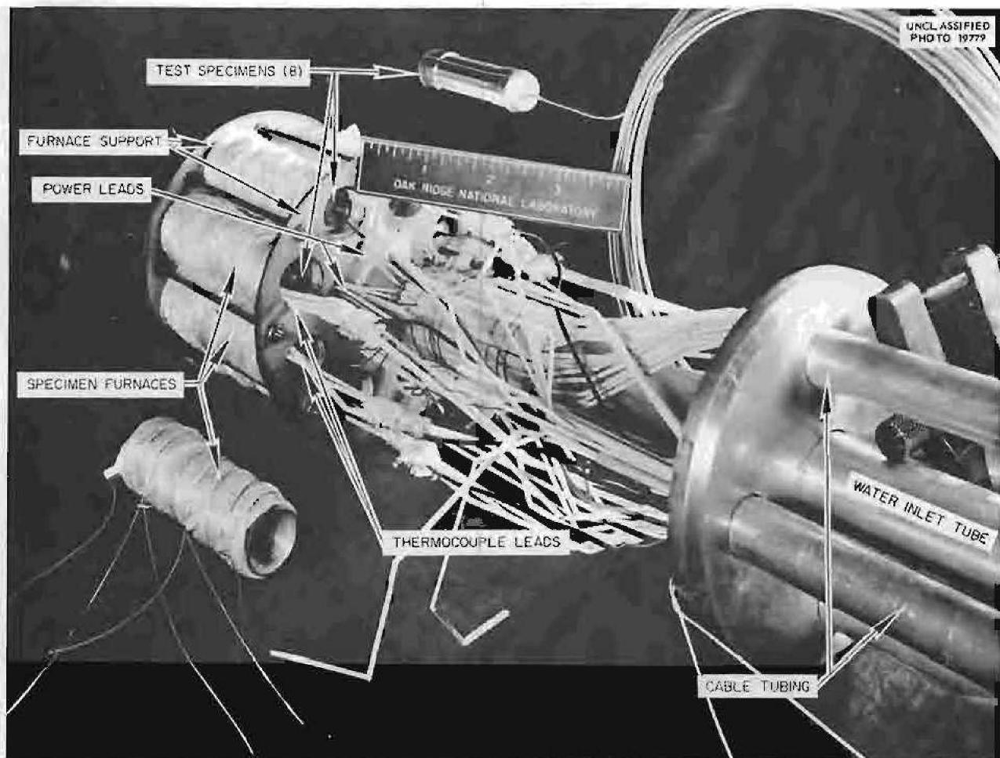  
Fig. 4.1.15. Partially Assembled MTR Stress-Rupture Apparatus.

thermocouples were provided with ceramic insulation. Approximately 50 thermocouples and 35 power leads (copper) were insulated with a total length of 12 ft of ceramic insulation.

Four racks of power and thermocouple instrumentation and the connecting cables were completed, and an available safety circuit was adapted for use with this apparatus. A rack of helium pressure control circuits, including 8 pressure recorders to monitor specimen pressures (and thus stresses), was designed, built, and leak tested.

Duplicate specimens are to be tested out-of-pile at stresses of 2000, 3000, and 4000 psi at $1500^{\circ}$ F. The in-pile apparatus will probably be installed in the MTR during March 1957.

# Tube-Burst Tests in the LITR

Two tube-burst stress-rupture tests of Inconel tubing in a helium atmosphere were completed in

the LITR. The thermal and fast (>1 Mev) neutron fluxes in hole HB-3 where these tests were conducted are both on the order of $6 \times 10^{12} \, \text{n/cm}^2$ . sec. Rupture times for the 0.010-in.-wall Inconel tubing (ART stock) at 2000 psi and $1500^{\circ}\text{F}$ were 1050 and 1650 hr and thus were in good agreement with out-of-pile data obtained in an argon atmosphere. The specimens in corresponding out-of-pile tests in a helium atmosphere have passed 1770 hr without rupture. A third in-pile specimen, stressed to 1000 psi at $1500^{\circ}\text{F}$ , did not rupture in 1670 hr, and the total creep deformation will be measured upon disassembly of the apparatus.

An unstressed Inconel tube was exposed in the LITR (HB-3) with nitrogen inside to determine whether radiation-induced nitriding would occur. This specimen was also in a temperature gradient

of 1500 to $750^{\circ}F$ to ascertain the effect of temperature. Metallographic examination of the specimen is under way.

Metallographic examination of an irradiated stress-corrosion apparatus, in which a tubular Inconel specimen was exposed to NaF-ZrF $_4$ -UF $_4$ (63-25-12 mole %, fuel 4) on the inside and sodium on the outside, was completed. The tube was stressed in bending at a maximum stress of 1000 psi at $1500^{\circ}\mathrm{F}$ for 1120 hr so that a range of tension and compressive stresses acted on the metal. Corrosion on the fuel side was negligible and did not appear to depend on the sign or magnitude of the stress; only scattered subsurface voids to a depth of 1 to 2 mils were observed. On the sodium side, attack to a depth of about 3 mils was found. There were voids at and immediately below the surface, but deeper into the wall there were holes in the metal that appeared to be filled with a new constituent, as yet unidentified.

A tube-burst rig is being built for LITR tests of Inconel exposed under stress to $\mathsf{NaF - ZrF}_4\mathsf{-UF}_4$ (62.5-12.5-25 mole %). This type of apparatus has been successfully tested in the LITR without stress. Heaters are used with this apparatus which will permit control of the temperature even if a 50% error is made in calculating the fission heat generation.

# EFFECT OF RADIATION ON CORROSION OF STRUCTURAL MATERIALS BY STATIC FUSED SALTS

W.E.Browning

R.E.Adams

J. Lee

H. L. Hemphill

Inconel Capsules

Irradiation tests in the MTR of Inconel capsules filled with NaF-ZrF4-UF4 (53.5-40-6.5 mole %, fuel 44) were continued. Further difficulties of the type described previously were encountered because of damage to facilities by the turbulent cooling water of the MTR. Some improvement of the condition was obtained through the use of better installation techniques. No design changes of the capsules or the facilities were made, but it is expected that a change to all-stainless-steel construction of the irradiation facility may be necessary.

Two irradiated and two control capsules were opened and analyzed metallographically, and fuel samples were submitted for chemical analysis. The operational histories and the results of metallographic analyses of the capsules are given in Table 4.1.3. In this series of tests only two capsules, Nos. 247 and 248, constituted a matched pair, that is, an irradiated capsule and an identical heat treated but not irradiated capsule. As may be seen in Figs. 4.1.16 and 4.1.17, the attack was of about the same intensity in both capsules. The depth of penetration was so minute, however, in both cases, that it may be confused with surface faults and perhaps can be considered to be negligible.

Capsule 276 showed (Fig. 4.1.18) corrosive attack and subsurface voids to a depth of 5 mils. The area of maximum penetration was near the mid-point of the capsule, and the distribution of the attack tapered slightly toward the ends. This distribution of the attack was anticipated on the basis of the temperature profile of the capsule. The appearance of the affected areas in this capsule indicates that the corrosion attack is real and considerable; however, the contribution by irradiation cannot be ascertained until control data and chemical analyses of the fuel are available. Capsule 264 (Fig. 4.1.19) will be compared with its irradiated counterpart in a latter report.

The excellent temperature control achieved with the capsule control system at the MTR is indicated in Table 4.1.3. Capsule 247 experienced only one temperature excursion, which was $32^{\circ}\mathrm{F}$ above the set point for less than 1 min in an operating period of 676 hr through 16 reactor shutdowns. Capsule 276 was operated for 235 hr with no excursions greater than $10^{\circ}\mathrm{F}$ above the set point.

# Hasteelloy B Capsules

Hastelloy B capsules 320 and 341 were tested out-of-pile, Figs. 4.1.20 and 4.1.21, and two similar capsules containing NaF-KF-LiF-UF $_4$ were inserted in the MTR on January 28, 1957. The design of these capsules is the same as that of the Inconel capsules.

Hostelloy B corrodes in air at high temperatures and must be protected during irradiation. Electroplating with chromium over nickel provides the

Table 4.1.3. Operating Conditions and Results of In-Pile and Control Corrosion Tests of Inconel and Hostelloy B Capsules Containing Static Fuel Mixtures   

<table><tr><td rowspan="2">Capsule No.</td><td rowspan="2">Uranium Content of Fuel*</td><td rowspan="2">Capsule Material</td><td rowspan="2">Time at Full Flux or Temperature (hr)</td><td rowspan="2">Excursions Above 1500°F</td><td rowspan="2">Number of Excursions Below Melting Point of Fuel</td><td colspan="2">Metallographic Results</td></tr><tr><td>Depth of Attack (mils)</td><td>Distribution of Attack</td></tr><tr><td colspan="8">Irradiated Capsules</td></tr><tr><td>247</td><td>2 mole % UF3</td><td>Inconel</td><td>676 (1.5 kw/cm3)</td><td>1 min at 1532°F</td><td>16</td><td>0.5</td><td>Uniform</td></tr><tr><td>276</td><td>4 mole % UF4</td><td>Inconel</td><td>235 (3.7 kw/cm3)</td><td>None</td><td>8</td><td>5</td><td>Attack concentrated at mid-point of capsule</td></tr><tr><td colspan="8">Heat-Treated Unirradiated Control Capsules</td></tr><tr><td>248</td><td>2 mole % UF3</td><td>Inconel</td><td>676</td><td>1 min at 1532°F</td><td>16</td><td>0.25</td><td>Uniform</td></tr><tr><td>264</td><td>2 mole % UF4</td><td>Inconel</td><td>918</td><td>None</td><td>28</td><td>0.5</td><td>Uniform</td></tr><tr><td>320</td><td>5.7 mole % UF4</td><td>Hostelloy B</td><td>621</td><td>None</td><td>37</td><td>0.25</td><td>Uniform</td></tr><tr><td>341</td><td>None**</td><td>Hostelloy B</td><td>190</td><td>None</td><td>To 300°F 13 times</td><td>0.25</td><td>Uniform</td></tr></table>

The fuel mixtures used in all capsules, except No. 320, were taken from the NaF-ZrF4-LF4 system. Capsule 320 contained 11.8 mole % NaF, 44.3 mole % LiF, 38.2 mole % KF, and 5.7 mole % UF4.   
\*\*No salt; helium atmosphere.

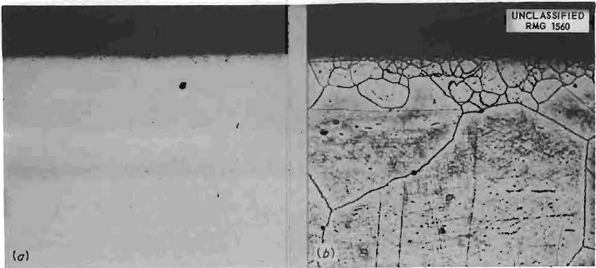  
Fig. 4.1.16. Inner Surface of irradiated Inconel Capsule 247 After Exposure to a $\mathsf{ZrF_4}$ -Base Fuel Mixture Containing 2 Mole $\%$ UF for 676 hr at $1500^{\circ}F$ in the MTR. (a) Unetched. (b) Etched with $10\%$ chromic acid (electrolytic). 250X. (Secret with caption)

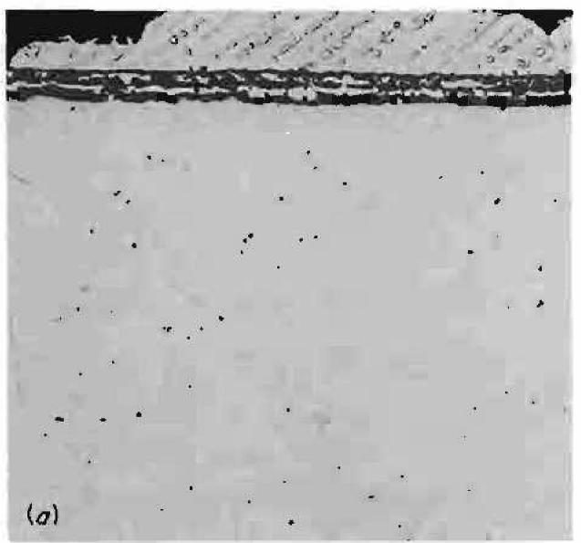

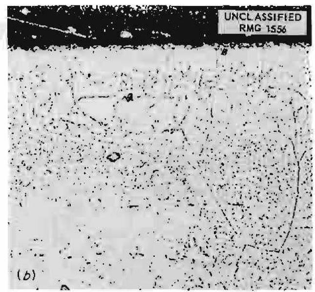  
Fig. 4.1.17. Inner Surface of Unirradiated Inconel Capsule 248 After Exposure to $\alpha\text{ZrF}_4$ -Base Fuel Mixture Containing 2 Mole % UF3 for 676 hr at $1500^{\circ}\text{F}$ . (a) Unetched. (b) Etched with 10% chromic acid (electrolytic), 250X. (Secret with caption)

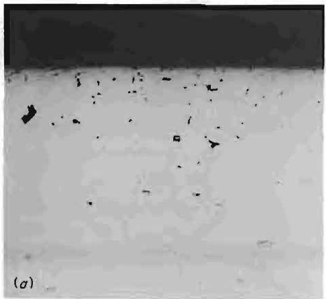

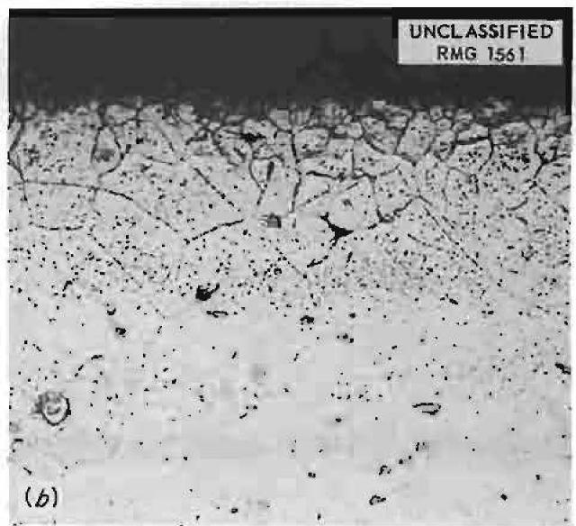  
Fig. 4.1.18. Inner Surface of Irradiated Inconel Capsule 276 After Exposure to a $\mathsf{ZrF}_4$ -Base Fuel Mixture Containing 4 Male % UF4 for 235 hr at $1500^{\circ}\mathsf{F}$ in the MTR. (a) Unetched. (b) Etched with 10% chromic acid (electrolytic). 250X. (Secret with caption)

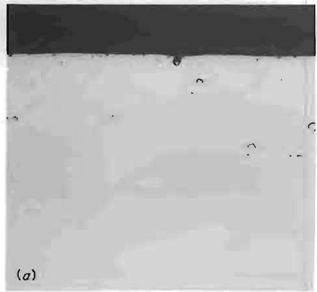

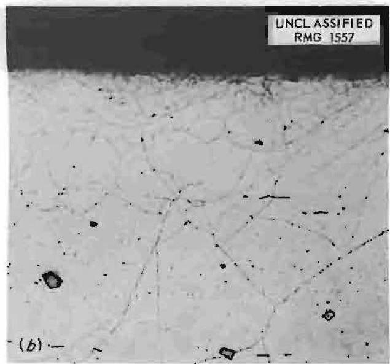  
Fig. 4.1.19. Inner Surface of Unirradiated Inconel Capsule 264 After Exposure to a $\mathsf{ZrF}_4$ -Base Fuel Mixture Containing 2 Male % UF4 for 918 hr at $1500^{\circ}\mathsf{F}$ . (a) Unetched. (b) Etched with 10% chromic acid (electrolytic). 250X. (Secret with caption)

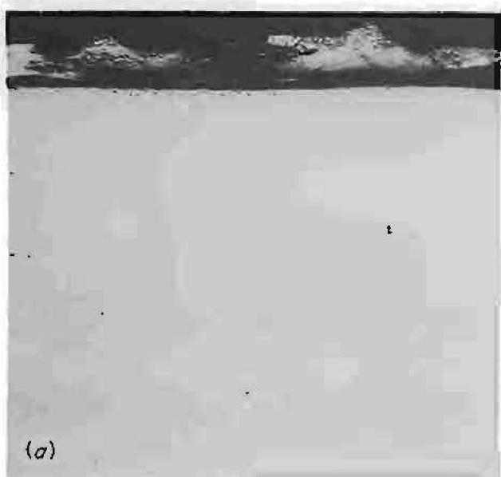

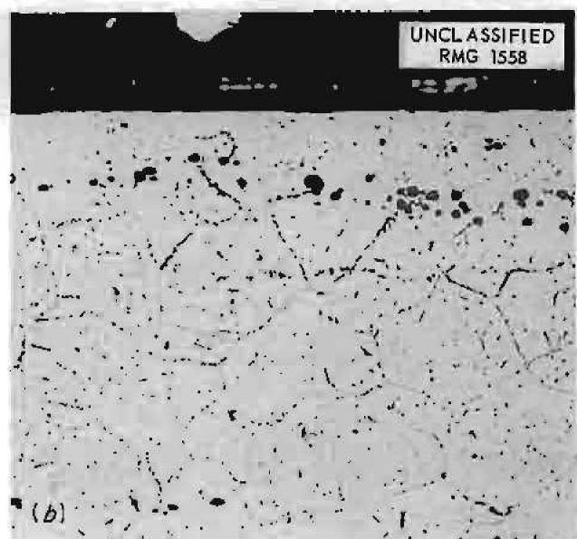  
Fig. 4.1.20. Inner Surface of Unirradiated Hastelloy B Capsule After Exposure to NaF-KF-LiF-UF4 (11,8-38,2-44,3-5,7 Mole %) for 621 hr of $1500^{\circ}\mathrm{F}$ . (a) Unetched. (b) Etched with 10% chromic acid (electrolytic). 250X. (Secret with caption)

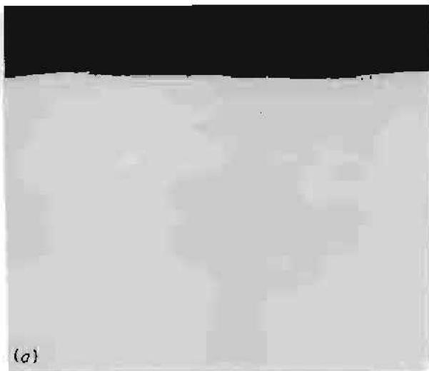

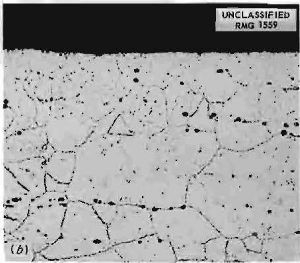  
Fig. 4.1.21. Inner Surface of Unirradiated Hostelloy B Capsule Tested in a Helium Atmosphere for 190 hr at $1500^{\circ}\mathrm{F}$ . (a) Unetched. (b) Etched with $10\%$ chromic acid (electrolytic). 250X. Reduced $13.5\%$ . (Secret with caption)

basis for formation of an oxide coating which is protective at all temperatures up to $1500^{\circ}F.$ Details of the plating of Hastelloy B corrosion capsules with nickel and chromium by electrodeposition were reported previously.

Other methods of applying nickel and chromium coatings are being studied in an attempt to improve the yield of successful coatings. Deposition of nickel coatings by the "electroless" method appears to be promising. A nickel salt is reduced by sodium hypophosphite and deposited on the surface of the metal to be coated. The metal surface does not enter into the reaction. Nickel deposited by this method is uniform in thickness on all surfaces, and the plate is reported to be relatively nonporous.[10] This method is superior to electrodeposition in that articles of irregular shape receive uniform deposits.

The deposition of chromium by vacuum metalizing is also being studied. In this method chromium metal is vaporized from a tungsten filament, under vacuum, and deposited on the metal surface to be plated.[11] It is difficult to plate articles of irregular

shape with chromium by electrodeposition, and it is anticipated that vacuum metalizing will overcome this difficulty. Vacuum metalized coatings are also expected to have no entrapped liquids, as might be the case with an electroplate, and thus a large percentage of the coated specimens should survive high-temperature exposure to air.

Tests specimens of Hastelloy B have been nickel plated by electrodeposition and then chromium plated by vacuum metalizing. Other specimens have been nickel plated by the "electroless" method and then chromium plated by vacuum metalizing. These specimens were then heated to $815^{\circ}C$ in a muffle furnace and cooled to room temperature daily to study the characteristics of the oxide film. The preliminary results are promising, and work is continuing.

# IN-PILE LOOP EXPERIMENTS

W.E.Browning

R.E.Adams M.F.Osborne

H. L. Hemphill H. E. Robertson

R.P.Shields

# Out-of-Pile Test of Pump for LITR Vertical Loop

Operation of the full-size pump designed for circulating fused-salt fuel in the vertical in-pile loop, which was started in an out-of-pile test loop during

the previous quarter, $^{12}$ was terminated after 3525.5 hr at $1570^{\circ}F$ with $\mathsf{NaF - ZrF_4 - UF_4}$ (50-46-4 mole $\%$ fuel 30). The pump was stopped for repairs to the cooling coils which had been overheated when a water main broke and interrupted the water supply. The pump could not be restarted, presumably because the overheating had damaged the bearings.

The pump was therefore cut open for examination and is shown in Figs. 4.1.22, 4.1.23, and 4.1.24. The design of this canned-rotor pump may be seen in the cross-sectional cut shown in Fig. 4.1.22. The $\mathsf{ZrF}_4$ -vapor control features of this design are

of particular interest. The vapor baffle, indicated in Fig. 4.1.22, provides only a narrow path of considerable length through which vapor can diffuse. The baffle is made of Graphitar to avoid stoppage if a piece of solid vapor deposit from

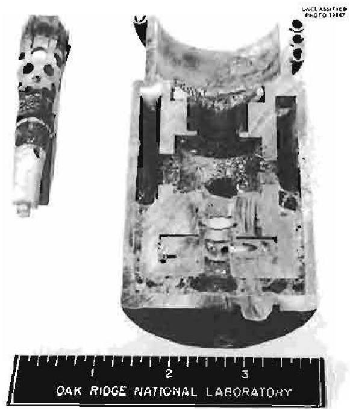

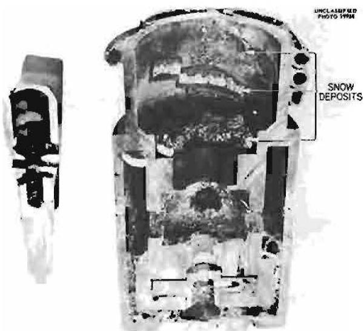  
Fig. 4.1.23. Pump Shown in Fig. 4.1.22 with Shaft Removed to Show Vapor Deposits Above Baffle.

12W.E.Browning, M.F.Osborne,and H.E.Robertson, ANP Quar.Prog.Rep.Dec.31,1956,ORNL-2221,p 299.

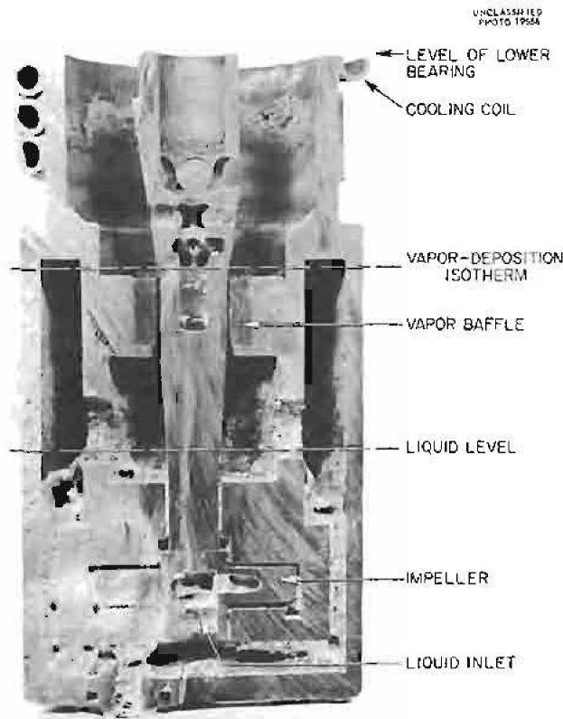

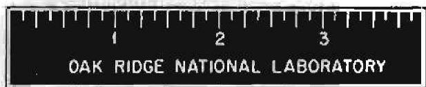  
Fig. 4.1.22. Cross-Sectional Cut Through Pump for Vertical In-Pile Loop Which Circulated $\mathsf{NoF - ZrF_4 - UF_4}$ (50-46-4 Molo %) for 3525 hr at $1570^{\circ}F$ Out-of-Pile. The material in the liquid passages is solidified fuel. (Secret with caption)   
Fig. 4.1.24. Another View of Pump In Fig. 4.1.22
Showing Vapor Deposits and a Cross-Sectional Cut
Through the Shaft.

above should fall between the baffle and the shaft. Every surface on the fuel side of this baffle should be above the vapor-deposition temperature. This temperature is about $1370^{\circ}F$ for fuel 30 at $1570^{\circ}F$ (ref 13). The vapor-deposition isotherm, shown in Fig. 4.1.22, was deduced from the location of vapor deposits in the pump, and it is approximately at the design point. The small amount of vapor which diffuses through the baffle is spread over the large surface provided for that purpose above the isotherm and below the lower bearing. Heavy local deposits which could stop the shaft after short running times are thus avoided.

The distribution of vapor deposits is shown in Figs. 4.1.23 and 4.1.24. The spongy masses above the baffle are fine needle crystals, loosely clustered, that resemble hoarfrost. These deposits did not touch the shaft or the baffle. The deposit just below the bearing was about as hard as cholk and about $\frac{1}{16}$ in thick. The deposit of the top of the fuel chamber was quite dense and hard. The growing surface had reached an equilibrium position where its temperature was just equal to the vapor deposition temperature. No vapor

deposit was found on the shaft near the baffle, and no scratch marks could be seen on the two facing surfaces of the shaft and baffle. Hydrodynamic performance tests, thermal mockup tests, and bearing tests of this pump were described previously.[14]

Examination of the furnaces used in this bench test, which were identical with the furnaces to be used in-pile, showed several points where foreign materials deposited and caused sections of the furnace to burn out. Analyses of these deposits showed them to be from soft solder and flux used in the attempted emergency repair of the cooling coils. No traces of other construction materials were found in these deposits.

# Assembly of LITR Vertical Loop

The in-pile loop (No. A-8) being assembled for operation in the LITR was filled in a dry box and run out-of-pile with temporary heaters and thermocouples for 3 hr at temperatures up to $1630^{\circ}\mathrm{F}$ . Permanent heaters and thermocouples were then installed. The loop is shown in Fig. 4.1.25 of at two stages of assembly.

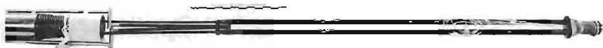

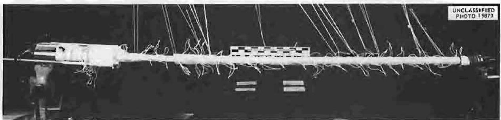  
Fig. 4.1.25. Vertical In-Pile Loop A-8 at Two Stages of Assembly.

The loop control system at the LITR is being inspected and readied for operation, and two modifications are being made. Provision is being made for adjusting and monitoring the distribution of cooling air between the two legs of the loop. Also, a reservoir is being connected into the cooling water system, and a means is being provided for automatically actuating a circulating pump if the main water supply is interrupted.

# Irradiation Facilities in Oak Ridge Research Reactor

In cooperation with the ORNL Operations and the Engineering and Mechanical Divisions, facilities are being planned for the future operation of a miniature corrosion-testing loop in the Oak Ridge Research Reactor (ORR). The routing of instrument and power leads, locations of off-gas lines and carbon traps, location of the motor-generator set, location of a fail-safe nitrogen supply, and design of the reactor vessel flange seal for the leads are being worked out. A new control panel, to be located in a third floor laboratory in the ORR building, is being designed by the Instrument Department.

# INVESTIGATION OF SULFUR CONTAMINATION OF A DRY BOX BY NEOPRENE RUBBER

W.E.Browning

R.E.Adams H.L.Hemphill

During preparations for filling the vertical in-pile loop, it was discovered that, while under vacuum, the interior of the dry box was contaminated by an unknown gaseous sulfur compound. The presence of the contaminant was manifested by the appearance of a $\mathsf{Cu}_2\mathsf{S}$ film on the copper-cooling coils of the loop assembly. The $\mathsf{Cu}_2\mathsf{S}$ film was identified by chemical analysis and x-ray diffraction.

The various lubricants and oils used in the vacuum system and loop assembly were therefore analyzed for sulfur, and the concentrations of the sulfur found ranged from less than 10 to 92 ppm. These quantities are to be expected in pump oils and lubricants. Tests of the loop assembly eliminated it as a source of the sulfur contaminant. The helium supply was also investigated for sulfur contamination by bubbling the helium through a silver nitrate solution. No evidence of a silver sulfide precipitate was noted.

Access to the interior of the dry box is provided by Neoprene rubber gloves. A glove and a copper

specimen were enclosed in a vacuum system independent of the dry box, and after several hours under vacuum $\mathsf{Cu}_2\mathsf{S}$ was found on the copper surfaces. This indicated that the sulfur contaminant was present in the Neoprene rubber and was liberated under vacuum. Sulfur is not used in Neoprene as the vulcanizing agent, but organic sulfides are used as a plasticizing agent.[15]

The Inconel surfaces of the loop assembly were investigated by electron diffraction. Samples of the surface film were removed from the loop motor assembly which had been exposed to the contaminated dry-box atmosphere. Similar samples were removed from another motor assembly which had an identical history except for exposure in the dry box. These surface samples were removed by the lacquer-stripping technique used in preparing replicas for electron microscopy. The samples were found to be identical, and crystalline sulfides of nickel, iron, and chromium that were sought were not found.

A small sample of fluoride fuel was exposed overnight to the contaminated dry-box atmosphere and then analyzed for sulfur along with a control sample of unexposed fuel. In both cases the sulfur content was found to be below the limit of measurement (20 ppm S) of the analytical method being used. Since the loop surfaces and the fluoride fuel revealed no sulfur contamination, the filling operation was completed and the loop was removed from the dry box.

In the case described the quantity of sulfur compounds present was not considered to be harmful, but elimination of contaminants would be desirable, and various methods are being studied. The available sulfur content of the gloves might be removed by chemical treatment without changing the physical characteristics of the gloves, and, although difficult, the Neoprene gloves might be replaced with gloves of another suitable material.

# EFFECT OF RADIATION ON THERMAL-NEUTRON SHIELD MATERIALS

J. G. Morgan

R.M.Carroll M.T.Morgan

P. E. Reagon

Irradiation exposures of nine $\mathsf{Cu - B}_4\mathsf{C}$ samples were completed in the MTR, and examinations of

six of the samples were nearly completed. The results of the examinations $^{16}$ showed essentially no changes in dimensions, weight, and density after irradiation. There was some scatter of the data, however, as a result of slight oxidation of the samples. Hardness data are given in Table 4.1.4. The dimensions of the shielding elements tested in these irradiations were $0.1875 \times 0.500 \times 0.102$ in. The core of each specimen was 0.082 in. thick and consisted of a copper matrix with a 6.6 wt $\%$ B $_4$ C dispersion. The core was doubly clad on two faces with 3 mils of copper and 7 mils of type 430 stainless steel. The core was exposed on the four remaining edges.

Samples 4, 5, and 6 were irradiated simultaneously at $200^{\circ}\mathrm{C}$ for 322 hr in position A-39 of the MTR. The maximum temperature reached was $220^{\circ}\mathrm{C}$ . The samples experienced three temperature cycles at

16 Hardness and metallographic data obtained by A. E. Richt and reported in Metallographic Examination of Irradiated Cermet Shielding Materials - Report No. 2, ORNL CF-56-12-105 (Dec. 18, 1956) and Metallographic Examination of Irradiated Cermet Shielding Materials - Report No. 3, ORNL CF-57-2-33 (Feb. 7, 1957).

a rate of less than $100^{\circ}\mathrm{C / min}$ . The average burnup of the $8^{10}$ atoms was estimated to be $7\%$ .

No apparent structural changes occurred as the result of irradiation, as shown in Fig. 4.1.26. The cores of both irradiated and control specimens were examined at both high and low magnifications, and no evidences of cracking, blistering, or porosity were apparent in either the copper matrix material or in the boron carbide particles. Also, there was no reaction between the boron carbide particles and the copper matrix. The typical appearance of the stainless-steel-to-copper-to-core bond is shown in Fig. 4.1.27. There were no evidences of blistering, cracking, or separation of the cladding-to-core bonds.

Samples 1, 2, and 3 were irradiated at $420^{\circ}\mathrm{C}$ for 929 hr in position A-28 of the MTR. The maximum temperature reached was $580^{\circ}\mathrm{C}$ . An isotopic analysis showed an $18\%$ average burnup of the $\mathsf{B}^{10}$ atoms.

Hardness measurements made on the stainless steel cladding (Table 4.1.4, sample 2) indicated a large increase in hardness as the result of the

Table 4.1.4. Results of Hardness Measurements of Cu-B ${}_{4}$ C Samples 4 and 2   

<table><tr><td rowspan="2">Location of Impression</td><td colspan="4">Knoop Hardness (1-kg load)</td></tr><tr><td>Average Before Irradiation</td><td>Average After Irradiation</td><td>Change</td><td>Percentage Increase or Decrease After Irradiation</td></tr><tr><td></td><td colspan="4">Sample 4</td></tr><tr><td>Type 430 stainless steel cladding</td><td>139</td><td>166</td><td>+27</td><td>+19</td></tr><tr><td>Copper cladding</td><td>64</td><td>76</td><td>+12</td><td>+19</td></tr><tr><td>Core</td><td></td><td></td><td></td><td></td></tr><tr><td>Center</td><td>76</td><td>102</td><td>+26</td><td>+34</td></tr><tr><td>Edge</td><td>76</td><td>108</td><td>+32</td><td>+42</td></tr><tr><td></td><td colspan="4">Sample 2</td></tr><tr><td>Type 430 stainless steel cladding</td><td>139</td><td>186</td><td>+47</td><td>+34</td></tr><tr><td>Copper cladding</td><td>64</td><td>65</td><td>-1</td><td>-2</td></tr><tr><td>Core</td><td></td><td></td><td></td><td></td></tr><tr><td>Center</td><td>76</td><td>70</td><td>-6</td><td>-8</td></tr><tr><td>Edge</td><td>76</td><td>78</td><td>+2</td><td>+3</td></tr></table>

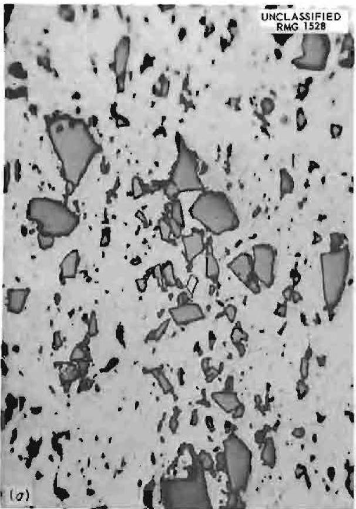

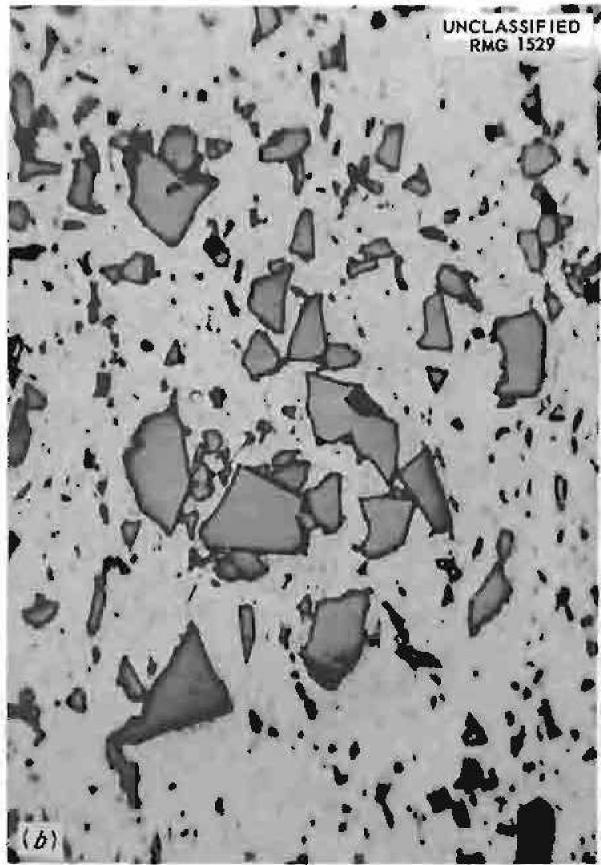

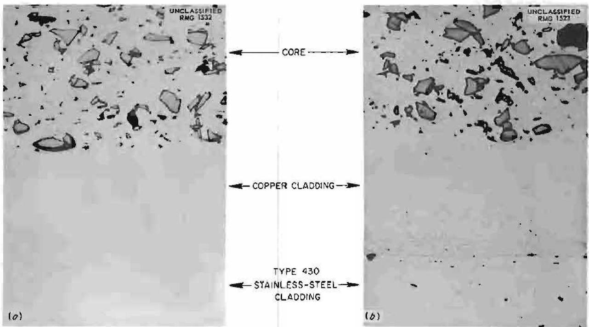  
Fig. 4.1.26. Typical Core Structures of (a) Unirradiated and (b) Irradiated Cu-B₄C Shielding Elements, 500X. Reduced 13%.   
Fig. 4.1.27. Core-to-Cladding Interface of a Cu-B₄C Shielding Element (a) Before and (b) After Irradiation, 500X. Reduced 27.5%.

irradiation that was significantly greater than the increase noted in the examination of samples 4, 5, and 6. The copper cladding and the core of the specimen showed no significant changes in hardness. Although the center of the core decreased in hardness, it is felt that this was the result of the severe cracking, which could cause erroneous measurements.

The ends and sides of specimens 1, 2, and 3 are shown in Fig. 4.1.28. The core cracking and the core-cladding separation apparent in all specimens varied in degree from specimen to specimen. Specimen 2 was selected for metallographic examination, and typical sections of the core are shown in Fig. 4.1.29. The particular area shown in Fig. 4.1.29 gives no evidence of cracking or porosity of either the boron carbide particles or the copper matrix material. However, as the etched photomicrograph shows, the etching revealed a heavily attacked area immediately adjacent to the $\mathsf{B}_4\mathsf{C}$ particles. In addition the structure of the copper matrix appears to be somewhat disturbed when compared with the structures obtained in irradiated specimens 4, 5, and 6. Both these conditions were noted throughout repeated polishing and etching.

Longitudinal cracks were found in the core at both ends of the specimens, which usually started at the center of the core and progressed approximately one-fourth the length of the specimen. A typical crock is shown in Fig. 4.1.30, and the intergranular attack in the vicinity of the crack is shown in Fig. 4.1.31.

Significant core-cladding separation was found, as shown in Fig. 4.1.32. It is interesting to note that no evidence of separation was found at the stainless-steel-to-copper interface. Occasional large voids and partial intergranular separation were noted in the grain boundaries of the copper cladding, as shown in Fig. 4.1.33. Examination of the entire length of a specimen indicated that the core-cladding separation was approximately 70 to $80\%$ complete.

# FUSED SALT POLAROGRAPHY

# R.J.Carter

The applicability of polarographic techniques to the study of the fission-product chemistry of fused salts is being investigated. The polarograph which is being used is similar to that used in aqueous

polarography; however, the high electrical conductivity of the fused salts as compared with aqueous solutions makes it impractical to vary the potential applied to the polarographic cell linearly with time. For this reason, current-voltage curves are recorded with an X-Y recorder rather than with a conventional strip-chart recorder.

Both silver and platinum microelectrodes of various sizes and shapes are being tested for use as cathodes. The platinum crucible which contains the fused salt is used as the anode. The platinum crucible is mounted in an Inconel container which can be filled with helium in order to maintain a dry, inert atmosphere around the fused salt. The necessary electrical connections are made by using Kovar seals which are soldered into the Inconel can. Vertical movement of the microelectrode is accomplished by mounting the electrode support on a flexible bellows.

In order to test the equipment, current-voltage curves were obtained at $350^{\circ}C$ for several solutions containing from 0.4 to 1.0 parts per thousand of cadmium chloride dissolved in potassium nitrate. Five or six current-voltage curves were obtained for each solution. The reproducibility of the curves was good in the initial portions but poor in the diffusion-current region, where large fluctuations in current were observed. The fluctuation of the diffusion current has since been found to be caused by vibration of the laboratory floor, and a suitable means for shock mounting of the furnace used to heat the fused salt is presently being sought.

# NEUTRON FLUX STUDIES

D. Binder J. F. Krause

The rapidity of effects on germanium diodes and transistors in the donut of hole 51N of the ORNL Graphite Reactor led to an investigation of the variation of neutron flux along the hole. A preliminary survey was made with sulfur and cadmium-covered gold detectors, and the results are shown in Fig. 4.1.34. The relative activities of the detectors are plotted against distance from the concrete shield, and the last point is 11 in, out from the edge of the donut, the position described previously as outside the donut.[18] From this position

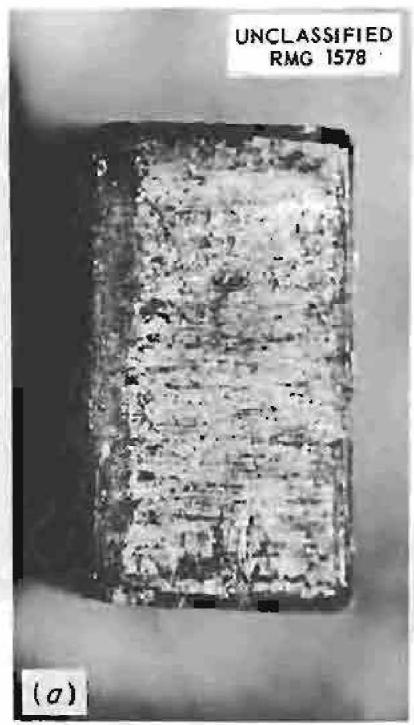

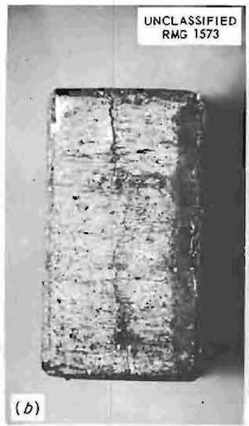

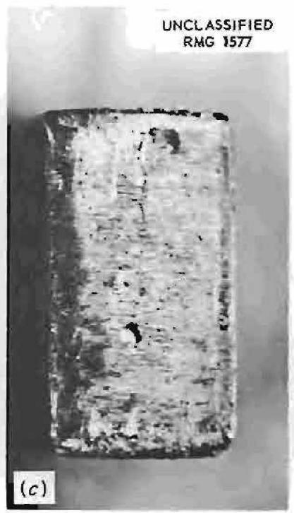

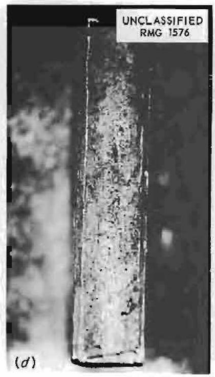

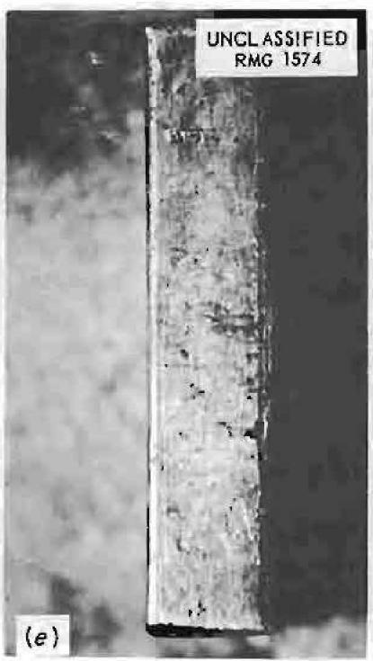

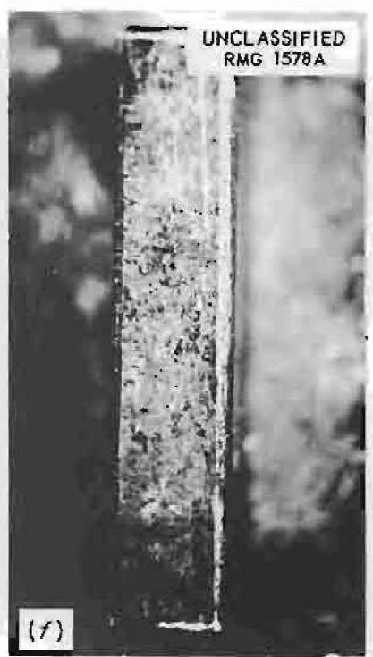  
Fig. 4.1.28. MTR-Irrodioted Cu-B₄C Specimens. (a, b, c) Ends of specimens 1, 2, and 3. 13X. (d, e, f) Sides of specimens 1, 2, and 3. 7X.

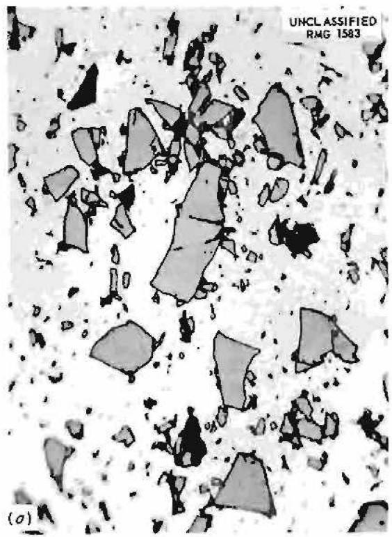

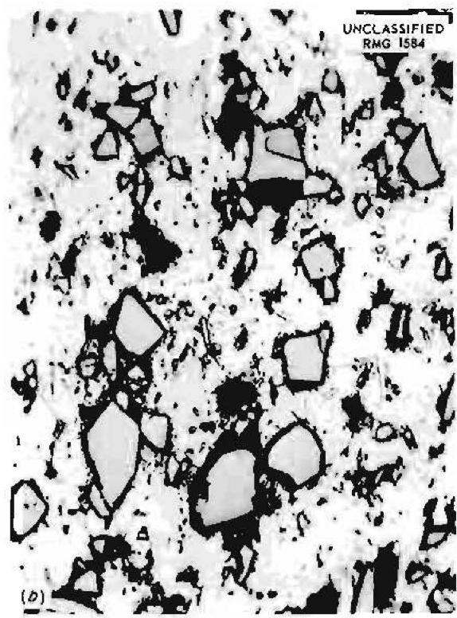  
Fig. 4.1.29. Core of MTR-Irradiated Cu-B₄C Specimen No. 2 Showing Heavily Attacked Areas Adacent to B₄C Particles. (a) As-polished. (b) Etched. 500X. Reduced 19%.

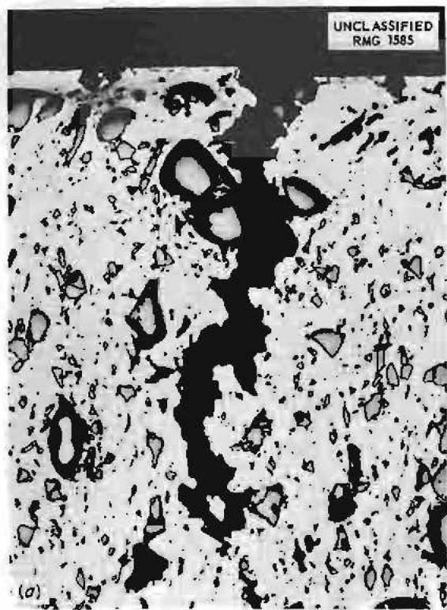

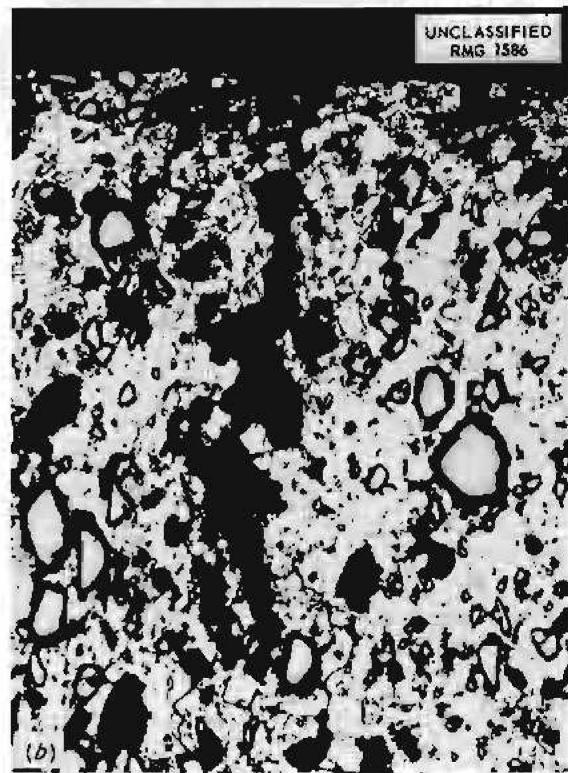  
Fig. 4.1.30. Core of MTR-Irradiated Cu-B₄C Specimen No. 2 Showing a Typical Fracture. (a) As-polished. (b) Etched. 250X. Reduced 18%.

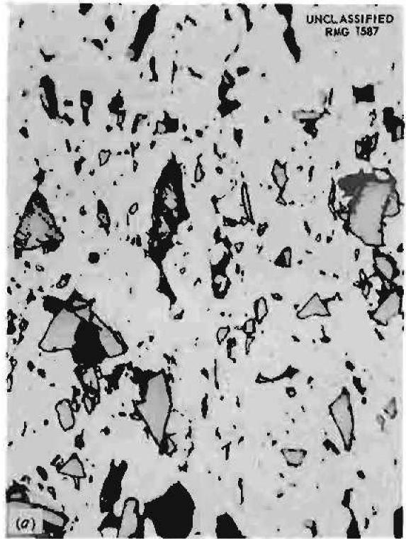

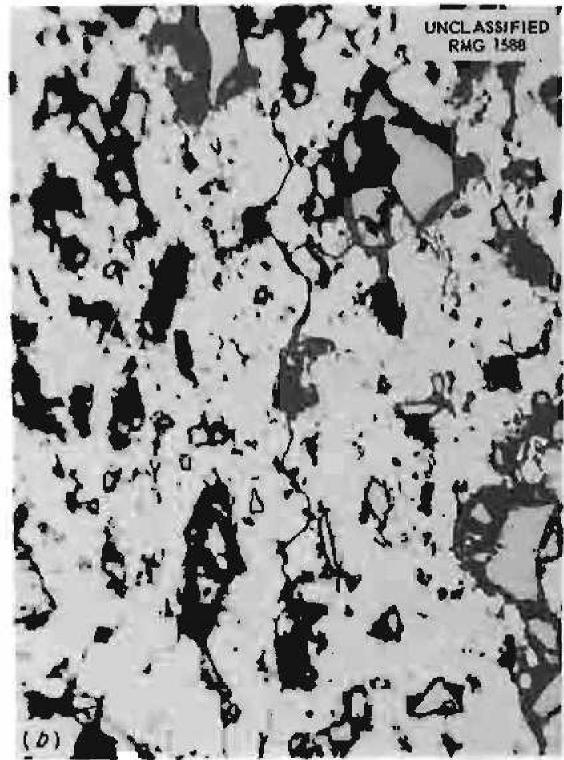  
Fig. 4.1.31. Core of MTR-Irradiated Cu-B₄C Specimen No. 2 Showing intergranular Attack in Vicinity of a Fracture. (a) As-polished. (b) Etched. 500X. Reduced 20%.

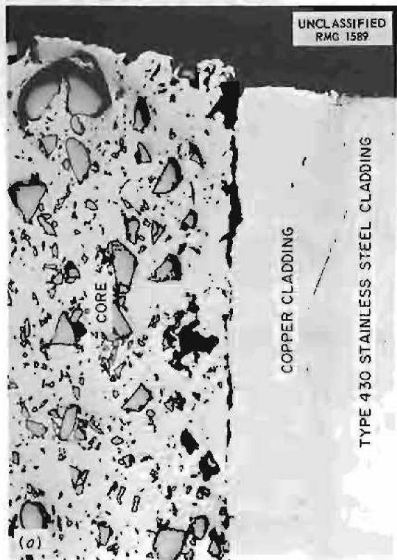

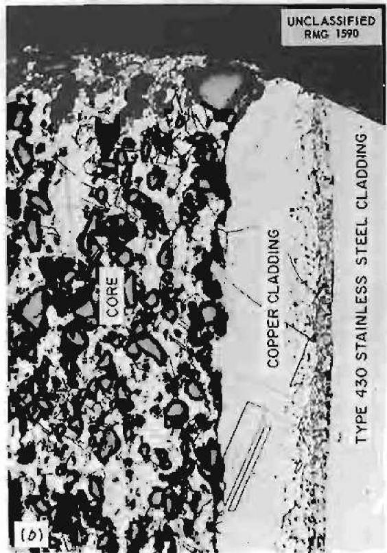  
Fig. 4.1.32. MTR-Irradiated Cu-B₄C Specimen No. 2 Showing Core-Cladding Separation. (a) As-polished. (b) Etched. 250X. Reduced 18%.

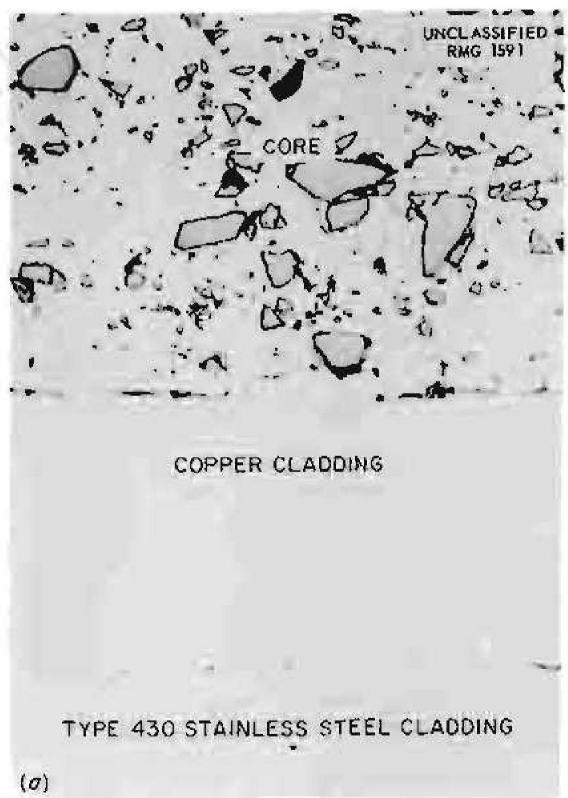

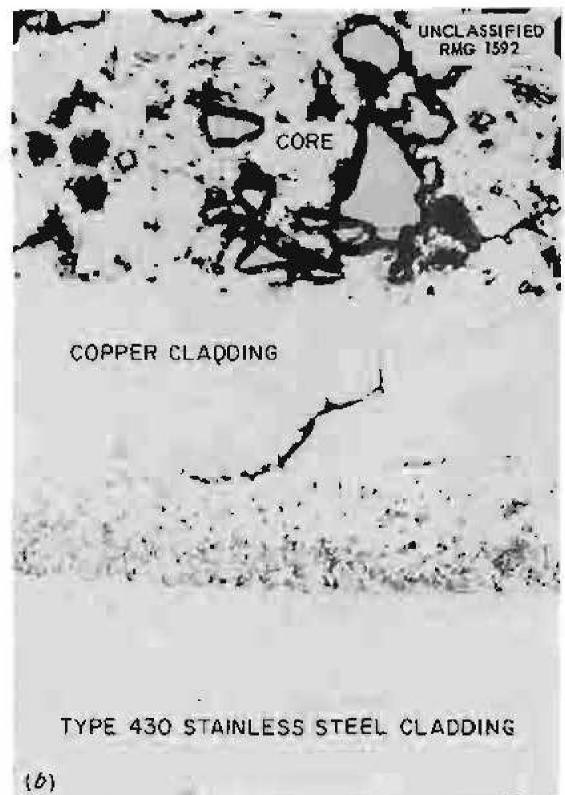  
FIG. 4.1.33. MTR-Irradiated Cu-84C Specimen No. 2 Showing Voles and Partial Intergranular Separation in Grain Boundaries of Copper Cladding. (a) As-polished, (b) Etched, 500X. Reduced 19%.

to the center of the donut, both $\mathbf{Np}^{237}$ neutron detectors and carrier concentrations in $n$ -type germanium indicate an increase in activity by a factor of 3 (ref 18).

The $S^{32}(n,p)P^{32}$ reaction has an effective threshold of 3 MeV, and $\mathsf{Au}^{198}$ has a strong resonance at 5 ev; therefore the two detectors are sensitive to the two extremes of the reactor spectrum. The gold detectors show a smooth increase with distance from the shield (the curve is drawn through these points). The sulfur points, in general, fall below the gold points outside the active lattice (24 in. from the shield). The two detectors are normalized at the innermost position. It would be of interest to compare these variations with a variation in radiation effects. The latter would presumably fall between the detector variations.

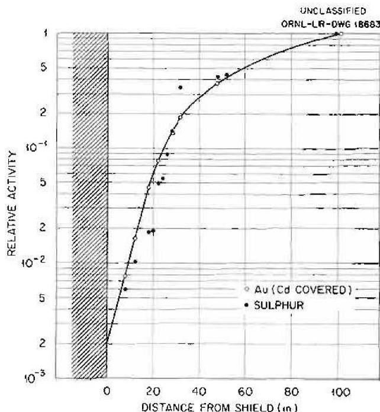  
Fig. 4.1.34. Relative Activities of Detectors in Hole 51 of the ORNL Graphite Reactor vs Distance from Shield Face.

# EFFECTS OF RADIATION ON ELECTRONIC COMPONENTS

J.C.Pigg

O. Curtis

C.C.Robinson

O.E.Schow

# Minority Carrier Lifetime Measurements in n-Type Germanium

Measurements of the effect of irradiation on the minority carrier lifetime in $n$ -type germanium were continued. The hole lifetime for several samples was measured before and after a series of irradiations in the ORNL Graphite Reactor and in a Co $^{60}$ gamma-ray facility.

Sample Sb-28A-3 was irradiated with fast neutrons in the animal tunnel of the ORNL Graphite Reactor.

This sample, which had an original carrier concentration of $3 \times 10^{14}$ carriers/cm³, was irradiated until it became intrinsic.

Initially, very slight irradiation produced large changes in the hole lifetime. Since the initial lifetime was 1010 $\mu$ sec, it can be seen from Fig. 4.1.35 that the hole lifetime changed by about a factor of 5 for a dose of $10^{11}$ fast neutrons/cm², which produced a change in carrier concentration of only 0.1%. The plot of hole lifetime vs fast-neutron dose in Fig. 4.1.35 shows a simple power dependency, but the straight line produced does not have a slope of unity, but rather 0.7.

The departure of the data from the straight line at the higher doses was to be expected as a result of the change in the carrier concentration. The minority carrier lifetime depends inversely upon the carrier concentration when the material is near the intrinsic range. The removal of carriers thus becomes important for this sample after a dose of $10^{17}$ neutrons/cm $^2$ .

Variations in the surface recombination velocity would tend to give scatter in the data for long

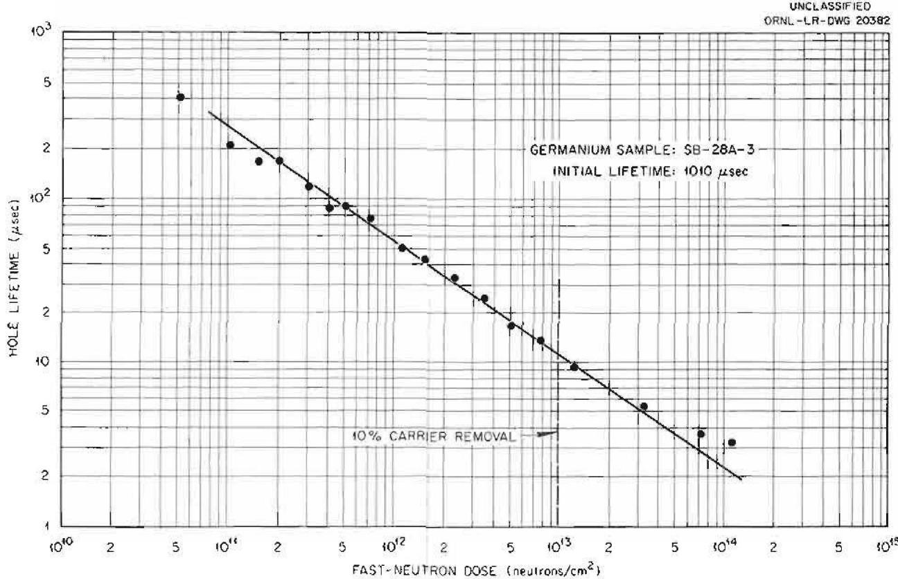  
Fig. 4.1.35. Effect of Reactor Irradiation on Hole Lifetime in $n$ -Type Germanium.

minority carrier lifetimes. Therefore, the initial points in Fig. 4.1.35 show scatter for points where the diffusion length of the minority carrier is of the same order of magnitude as the cross sectional dimensions of the sample.

The results of a series of irradiations in a Co $^{60}$ gamma-ray source of two samples of a second ingot obtained from The Eagle Picher Company are shown in Fig. 4.1.36. The original carrier concentration of the material used was about $1.5 \times 10^{14}$ carriers/ cm $^3$ . Sample EP2-3 was irradiated until it became intrinsic. The behavior is quite similar to that for neutron irradiation, except for one striking difference. In order to obtain the same change in hole lifetime with the use of gamma rays, a much larger percentage of the carriers must be removed. The reason for this should be indicated by the

type of damage produced. The slope of the curve is somewhat less than the slope of the curve for neutron irradiation, being in this case about 0.6.

The role which the initial carrier concentration plays is being investigated with samples of widely varying resistivity. Measurements are also being made with a Cs137 gamma-ray source.

# Diode Irradiations

It was shown previously[20] that the reverse voltage-current characteristic curve of a germanium diode is sensitive to $\mathrm{Co}^{60}$ gamma-rays. In the previous experiment, the forward and reverse currents were measured at a fixed voltage bias, in

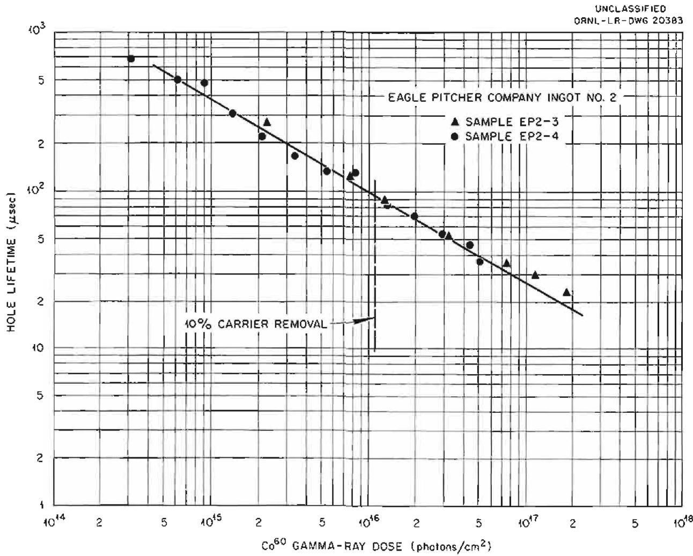  
Fig. 4.1.36. Effect of Co60 Gamma-Ray Irradiation on Hole Lifetime in n-Type Germanium.

order to differentiate between barrier current and surface-leakage current, a 1N 38 diode was exposed at a dose rate of 500 r/hr in a Co60 facility. Data for a complete characteristic curve were obtained up to a maximum bias of 1.5 v. From these data, the saturation current intercept, $I_{0}$ , and the surface-leakage current, $I_{r}$ , can be obtained.

The saturation current intercept is obtained by extrapolating the saturation part of the reverse characteristic back to the origin. This value, $I_{0}$ , enters into the diode equation for the reverse biased condition as follows:

$$
I = I _ {0} (1 - e ^ {- q V / k T}),
$$

where

$I =$ current through barrier at voltage $V,$   
$q =$ electronic charge,   
$k =$ Boltzmann constant,   
$T \approx$ absolute temperature.

The parameter $l_{0}$ appears in transistor considerations as the cutoff current $I_{co}$ , where $l_{co}$ is the collector current with zero bias on the emitter.

The change in $I_0$ as a function of the $\text{Co}^{60}$ gamma-ray dose for a 1N 38 diode is shown in Fig. 4.1.37. The change in $I_0$ is rapid during the initial part of the irradiation but tends to saturate as the exposure continues. Previous experiments with 1N 38-A diodes showed a maximum in the reverse current after about $1.7 \times 10^7 \, \text{r}$ . The 1N 38 showed no maximum in $I_0$ after $4 \times 10^7 \, \text{r}$ . Since

these diodes are commercial units, there is no indication of the initial carrier concentration or the initial mobility. Thus there is no reason to expect that the maximum observed previously would occur at the same integrated exposure for a different type of unit.

Upon removal from the gamma-ray source, the change in $I_0$ indicated that an annealing process was taking place in the barrier. As can be seen from Fig. 4.1.38, recovery of the unit was not complete, and the annealing was not a simple first-order process. The minimum in $I_0$ after 125 hr of annealing may be real.

The surface-leakage current, $I_{L}$ , is obtained by subtracting $I_{0}$ from the reverse current measured at a bias of 1 v. The value $I_{L}$ may thus be considered to be the leakage conductance. The change in $I_{L}$ as a function of exposure is shown in Fig. 4.1.39. It can be seen that $I_{L}$ saturates after a rapid initial increase of about one order of magnitude. This saturation may indicate that the depth of surface attack is limited.

The annealing of $I_{L}$ upon removal from the gamma-ray source, shown in Fig. 4.1.40, is complicated, as it was in the case of $I_{0}$ . A definite minimum can be seen at about 40 hr. The fact that annealing occurs indicates that the surface leakage is not caused by simple chemical attack alone. Since a commercial unit is being studied, it is not practical

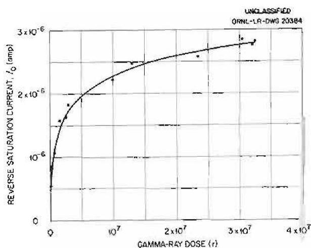  
Fig. 4.1.37. Effect of Co $^{60}$ Gamma-Ray Irradiation on the Reverse Saturation Current of a IN 38 (No. 10) Germanium Diode.

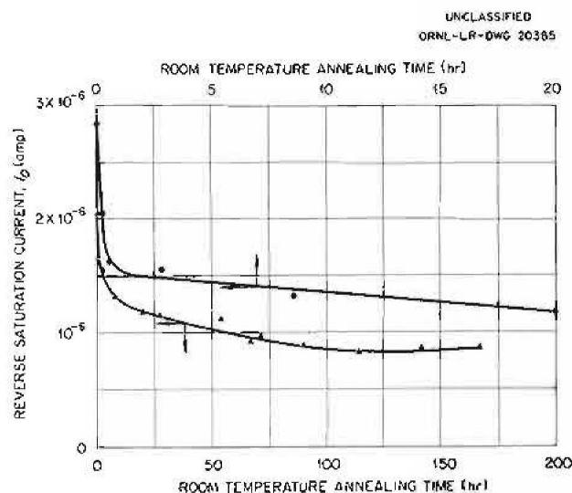  
Fig. 4.1.38. Room-Temperature Annealing of the Reverse Saturation Current of a LN 38 (No. 10) Germanium Diode Subsequent to Irradiation to a Co60 Gamma-Ray Dose of $3.24 \times 10^{7}$ r.

to isolate the different possible sources of surface change or to study the surface directly.

# Transistors

A G-E 2N 44 PNP fused-junction germanium transistor was exposed in the ORNL Graphite

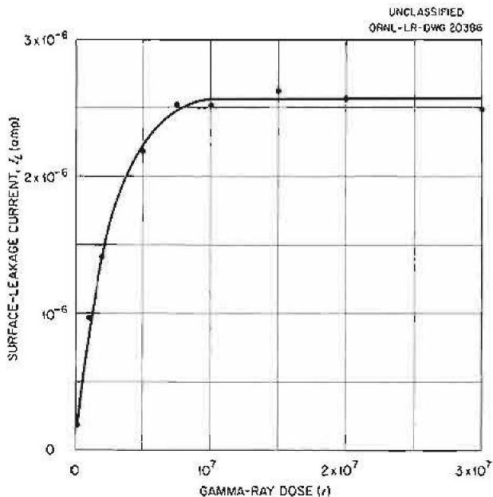

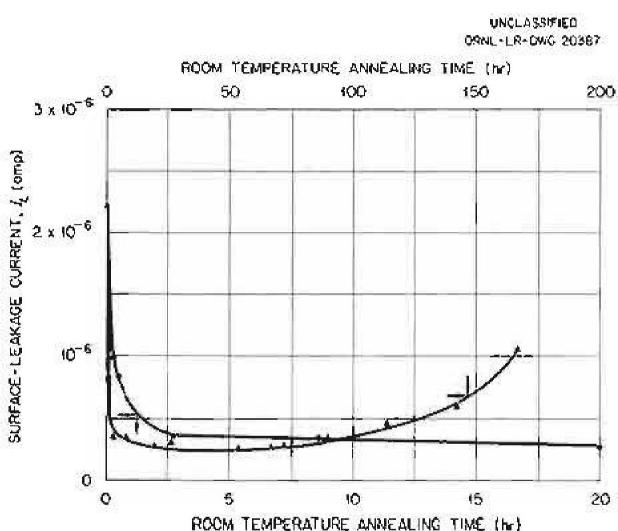  
Fig. 4.1.39. Effect of Co $^{60}$ Gamma-Ray Irradiation on the Surface-Leakage Current of a 1N 38 (No. 10) Germanium Diode.   
Fig. 4.1.40. Room Temperature Annealing of Surface-Leakage Current of a 1N 38 (No. 10) Germanium Diode Subsequent to Irradiation to a Co60 Gamma-Ray Dose of $3.24 \times 10^{7}$ .

Reactor. The $l_{co}$ values for different voltages were recorded as a function of exposure. Both grounded-base and grounded-emitter connections were used. The $l_{co}$ values for the grounded-base connection are the $l_{0}$ values for the collector barrier. It can be seen from Fig. 4.1.41 that the barrier $l_{0}$ drops until after an exposure of about $8 \times 10^{11}$ neutrons/cm $^2$ . The leakage current, $I_{L}$ , mentioned above would be reflected in the spacing between the curves. The change in $l_{L}$ is small compared with the change in $l_{0}$ .

The $I_{\mathrm{co}}$ measurements for the grounded-emitter connection are shown in Fig. 4.1.42. The general shape of the curve is the same as that for the grounded-base connection, but the change in leakage current is much more pronounced in the grounded-emitter connection. The value of $l_{L}$ in terms of leakage conductance, as defined above, varies from $3.4 \times 10^{-6} \mathrm{amp} / \mathrm{v}$ initially to a minimum of $1.4 \times 10^{-6} \mathrm{amp} / \mathrm{v}$ at the minimum of the curve and increases to approximately $4.2 \times 10^{-6} \mathrm{amp} / \mathrm{v}$ after an exposure to a thermal-neutron dose of $3.45 \times 10^{12} \mathrm{neutrons} / \mathrm{cm}^2$ .

From the observations to date, it appears that the manner in which the characteristics of a junction device change depends both upon the nature of irradiation to which the device is exposed and the method by which the junction is made. Qualitative

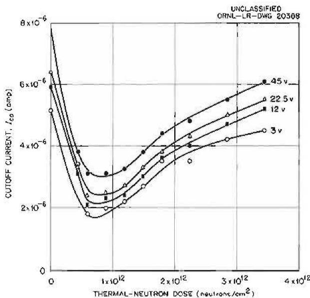  
Fig. 4.1.41. Effect of Reactor Irradiation on Grounded-Bose Cutoff Current of a G-E 2N 44 PNP Fused-Junction Germanium Transistor.

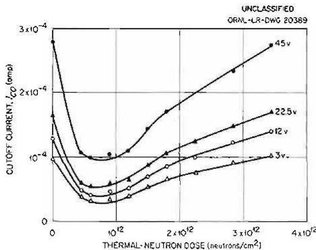  
Fig. 4.1.42. Effect of Reactor Irradiation on Grounded-Emitter Cutoff Current of a G-E 2N 44 PNP Fused-Junction Germanium Transistor.

trends in behavior can be established by using commercial units, but the quantitative data necessary for reliable interpretation of the effects will require the use of ingots or samples specifically prepared for such an investigation. In particular, it must be possible to control the history of the sample surface. The samples would be constructed so that the conductivity of the base material could be determined.

# A Safe for Removal of Samples from the Reactor

The removal of samples from the ORNL Graphite Reactor subjects the personnel engaged in the work to beta and gamma irradiation from the activated material being removed and to contamination by the radioactive dust associated with the decay of insulation. This problem is particularly acute when samples must be removed from the reactor loading face. As a first step in solution of this problem, a sample removal safe was designed, Fig. 4.1.43. The safe can be handled by two men, and yet it is thick enough to provide adequate shielding for the levels of activity normally encountered. All access facilities can be operated by one man. The device can be used either at the reactor loading face, or, by transferring to another dolly, at holes 50, 51, and 52. Provision has been made for vacuum removal of radioactive dust and particles through numerous access ports.

# Modifications to Hole 30 of the ORNL Graphite Reactor

In order for measurements to be made on semiconductor components under irradiation, the exposures must be conducted at flux levels one to two orders of magnitude lower than those found in the central region of the ORNL Graphite Reactor. Unless such low flux levels are used, the measurements cannot be made in a time interval that is short compared with the time interval which produces a significant change in the parameters being measured.

If exposures are conducted in hole 51, where a fission spectrum, a removal facility, and provisions for instrumentation are available, the reactor must be operated at power levels between 50 and $400\mathrm{kw}$ . The time available for such operation is limited and the reproducibility of flux levels is difficult. Exposure near the periphery of the reactor causes a positioning problem and provides an undesirable ratio of thermal to fast flux.

In order to eliminate these disadvantages and to supply several advantageous features, an exposure device has been designed for use in hole 30N of the Graphite Reactor, as shown in Fig. 4.1.44. The device consists of a cart which may be moved from a loading shield at the reactor shield face to a fission chamber located inside hole 30N. The sample can be moved from the external shield to the irradiation position in about 10 sec.

The fission chamber position may be adjusted to give a range of flux levels. The external shield is designed to facilitate removal of the fission chamber should such action become necessary. The sample may be installed and removed without breaking the electrical connections. This will make possible continuous readings from the preexposure to the postexposure periods.

# DIELECTRIC CONSTANT AND LOSS TANGENT OF IRRADIATED PLASTICS AT MICROWAVE FREQUENCIES

R.A.Weeks

J.C.Pigg

Previous work indicated that reactor irradiation causes changes in the dielectric properties of polyethylene and Teflon.[21] The data showed large changes in loss tangent after fast-neutron doses of up to $10^{18}$ neutrons/cm $^2$ . The samples

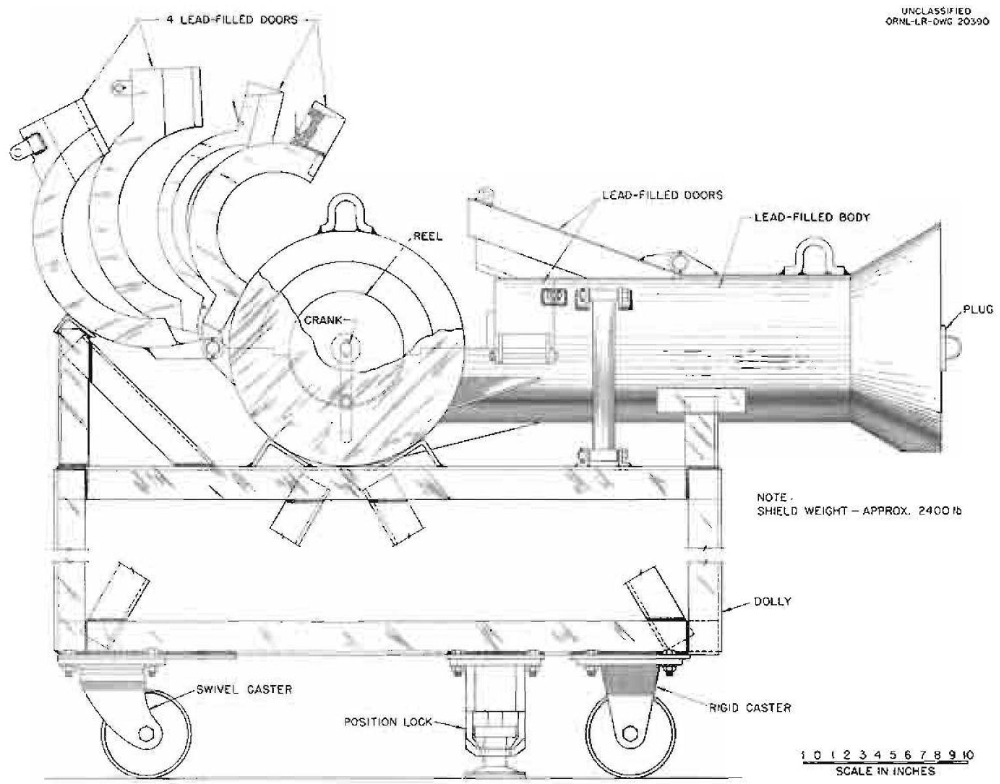  
Fig. 4.1.43. Sample Removal Safe.

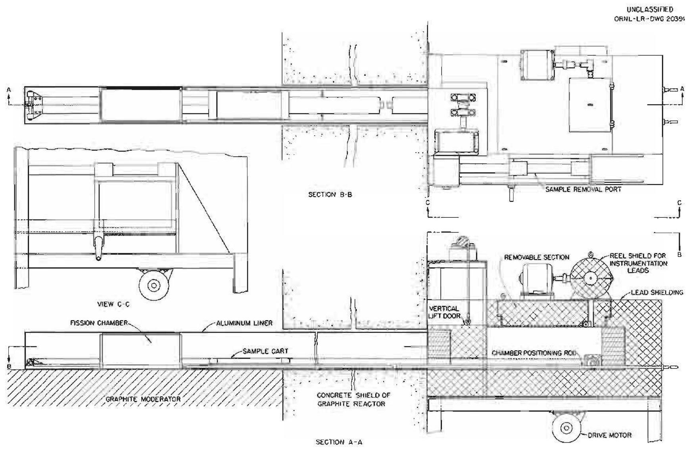  
Fig. 4.1.44. Exposure Facility for Use in Hole 30N of the ORNL Graphite Reactor.

were irradiated in a water-cooled facility in the ORNL Graphite Reactor. Examination after removal from the reactor revealed evidence of water in some of the containers. The presence of moisture raised a question as to the amount of water absorbed by the specimen during the irradiation. The available evidence indicated, however, that the observed changes were not due to water absorption.

These studies were resumed during the quarter with exposures of Teflon, polyethylene, polystyrene, unfilled phenol formaldehyde, and nylon in a $\mathbf{C}\mathbf{o}^{60}$ gamma-ray facility. The irradiation temperature was approximately $25^{\circ}C$ . The only moisture present was that in the atmosphere. The same sample was used for an entire series of irradiations. The low temperature, absence of moisture, and use of the same sample throughout the experiment served to increase the reliability of data compared with that reported previously.[21]

The change in loss tangent of polyethylene at various frequencies as a function of the Co $^{60}$ gamma-ray dose is shown in Fig. 4.1.45. Similar data for Teflon, polystyrene, nylon, and phenol formaldehyde are shown in Figs. 4.1.46 through 4.1.49. It is evident that the irradiation had a large effect on the loss tangent of polyethylene and Teflon but only a small effect on polystyrene. The nylon and phenol formaldehyde samples have not yet received sufficient irradiation to produce a marked change in loss tangent. On the basis of the results in polyethylene, the nylon and phenol

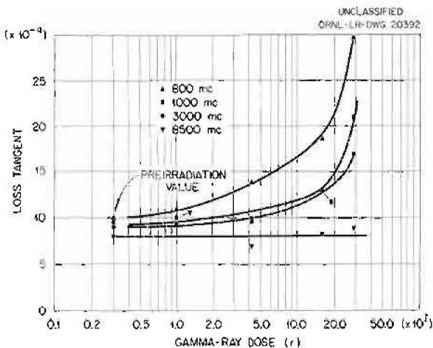  
Fig. 4.1.45. Effect of Co60 Gamma Irradiation on the Loss Tangent in Polyethylene.

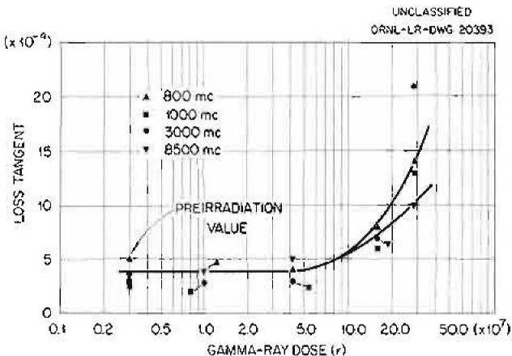  
Fig. 4.1.46. Effect of Co60 Gamma Irradiation on the Loss Tangent in Teflon.

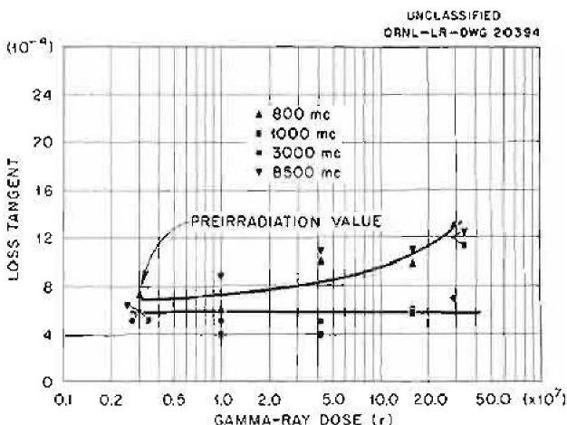  
Fig. 4.1.47. Effect of Co $^{60}$ Gamma irradiation on the Loss Tangent in Polystyrene.

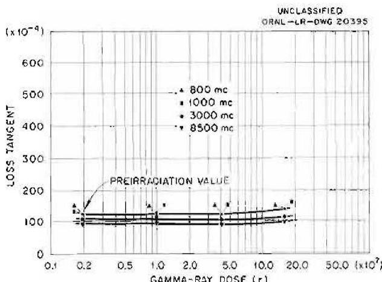  
Fig. 4.1.48. Effect of Co $^{60}$ Gamma Irradiation on the Loss Tangent in Nylon.

formoldehyde will need approximately twice the present integrated dosage to produce a significant change.

The changes in loss tangents of polyethylene and Teflon appear to be frequency sensitive; the

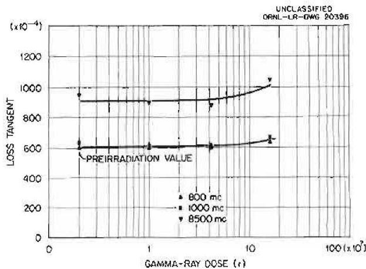  
Fig. 4.1.49. Effect of Co60 Gamma Irradiation on the Loss Tangent in Phenol Formaldehyde.

greatest change occurred at 800 mc. There was evidence of this frequency dependency in the reactor-irradiated specimens discussed above. On the basis of the change in attenuation observed22 in polyethylene cable measured at 4 mc and the results shown in Fig. 4.1.45, it seems clear that the loss tangent of irradiated polyethylene has a maximum in the frequency range between 4 and 800 mc. Such a maximum probably exists also for Teflon. Measurements in this frequency range are needed to substantiate these conclusions.

Any changes in the dielectric constants of the five materials studied are less than the error of measurement. Since the limit of accuracy of the present measurements of dielectric constants is $5\%$ , changes smaller than this value would not be observed. In the case of Teflon there is a consistent trend in the data which suggests that a change in dielectric constant may occur.

# 4.2. FUEL RECOVERY AND REPROCESSING

R.B.Lindauer

D. E. Ferguson

W. K. Eister

H. E. Goeller

# PILOT PLANT

J.E.Bigelow W.H.Lewis   
F.N.Browder J.T.Long   
W.H.Carr F.W.Miles   
R. B. Keely S. H. Stainker

C. L. Whitmarsh

Construction of the fused salt-fluoride volatility pilot plant is essentially complete, with the exception of facilities for handling ARE fuel, which will not be installed until runs with nonirradiated material are completed. In studies of the fluorine disposal system it was found that fluorine can be satisfactorily scrubbed from the off-gas stream at normal process flow rates with the use of only three of the seven spray nozzles in the scrubber.

The molten-salt handling equipment was tested, and the stainless steel vessel for melting the charge suffered heavy corrosion. After three test melts were prepared, the salt outlet of the vessel plugged. The stainless steel vessel will be replaced with a nickel vessel. The remainder of the molten-salt system (fluorinator, waste can and carrier, autoresistance heated lines, and freeze valves) handled the molten salt in a manner which will be acceptable for operations.

Heating- and cooling-cycle studies were started on the NaF absorbers and on the cold traps. Results of the first tests indicate that the heating time for the absorbers as designed may be excessive and that neither the 5-in. K-25 cold trap nor the 6-in. ORNL-designed cold trap will reach design temperature. Further studies are in progress in order to determine the modifications and operating techniques necessary for satisfactory operation.

In one of the test runs, the molten salt NaF $\mathsf{ZrF}_4$ - $\mathsf{UF}_4$ (56-37.5-6.5 mole $\%$ fuel 108) was sparged in the fluorinator at $600^{\circ}\mathrm{C}$ for 7.5 hr with $\mathsf{N}_2$ at a rate of 2 scfm. (The plant fluorination cycle is expected to be 2 hr of sparging with $\mathsf{F}_2$ at a rate of 1.7 scfm.) An analysis of the deposit in the vapor trap indicated that salt entrainment and $\mathsf{ZrF}_4$ vaporization from the salt were of the same order of magnitude. Some material

passed through the nickel mesh of the vapor trop; this material could not be blown off the walls, but it was easily wiped off.

# SULFUR EMBRITTLEMENT OF NICKEL

M.R.Bennett E.E.Hoffman

G. I. Cathers R. L. Jolley

L. R. Trotter

The embrittlement of nickel and of high-nickel-content alloys by sulfur was investigated chemically and metallurgically to determine the importance of the effect in volatility processing. Experiments with fused salts to which known amounts of sulfur were added showed that nickel foil is sensitive to sulfur concentrations as low at 5 ppm. Under ordinary conditions, however, in equipment with heavy nickel walls, a sulfur concentration of 200 to 500 ppm is necessary to produce severe embrittlement. The sulfur effect is cumulative, as indicated in a-consultation with an International Nickel Company representative, and there is danger of sulfur buildup in fused-salt treatment vessels as a result of processing many batches with small sulfur contents. Evidence has been obtained, however, that the sulfur content of the fused salt can be reduced to a harmless level by one exposure to nickel equipment. The mechanical effect of sulfur embrittlement was found to be much less on Inconel than on nickel.

Metallurgical examinations were made of specimens from 0.035-in.-wall nickel test capsules that had been exposed to sulfur-contaminated fused salt mixtures for 3 hr at $700^{\circ}\mathrm{C}$ under the conditions given in Table 4.2.1. The sulfur was added in the elemental form and as $\mathrm{Na_2SO_4}$ to salt mixtures that initially contained less than 50 ppm. The inner walls of the capsules used in all the tests showed a characteristic type of cracking when bent, as shown in Fig. 4.2.1. No appreciable difference was evident in the degree of damage to the walls of the capsules (specimens

Test temperature: $700^{\circ} \mathrm{C}$

Test period: 3 hr

Sulfur added: 500 ppm

Table 4.2.1. Conditions of Tests of Nickel for Determining the Effect of Sulfur on the Mechanical Properties   

<table><tr><td>Test Capsule Designation</td><td>Fused Salt Composition (mole %)</td><td>Sulfur Added As</td></tr><tr><td>A</td><td>NaF-ZrF4(50-50)</td><td>Elemental sulfur</td></tr><tr><td>B</td><td>NaF-ZrF4(50-50)</td><td>Na2SO4</td></tr><tr><td>C</td><td>NaF-ZrF4·UF4(50-46-4)</td><td>Na2SO4</td></tr><tr><td>E</td><td>NaF-ZrF4·UF4(50-46-4)</td><td>Elemental sulfur</td></tr></table>

C and E) exposed to $\mathsf{Na}_2\mathsf{SO}_4$ or to free sulfur added to NaF-ZrF. $\cdot$ UF (50-46-4 mole %, fuel 30). An additional heat treatment for 50 hr at $700^{\circ}C$ in vacuum resulted in typical homogeneization (Fig. 4.2.2). Further evidence of the degree of sulfur embrittlement is shown in photomicrographs of as-received material and of specimens from two of the tested capsules (Figs. 4.2.3, 4.2.4, and 4.2.5).

In additional tests at $600^{\circ}C$ 50-mil nickel wire specimens were exposed in nickel capsules to NaF-ZrF4 (50-50 mole %, salt 31) with known additions of free sulfur or $\mathrm{Na_2SO_4}$ . The nickel wire was moderately embrittled in a 1-hr test in a fused salt mixture that contained 250 ppm of sulfur as anhydrous $\mathrm{Na_2SO_4}$ , whereas 100 ppm of sulfur caused slight embrittlement in the same period. Repeated additions of 100 ppm of sulfur as $\mathrm{Na_2SO_4}$ at 1-hr intervals to the same salt mixture produced severe embrittlement at a total

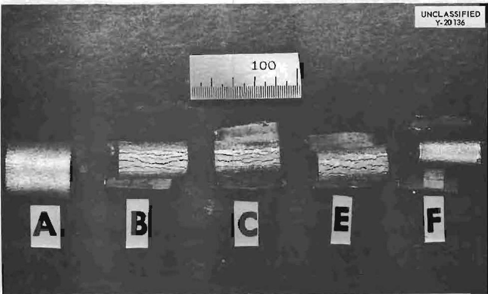  
Fig. 4.2.1. Results of Bend Tests of Specimens Cut from Walls of Nickel Test Capsules That Were Exposed to Sulfur-Containing Fused Salt Mixtures. Specimen F is as-received material. (Confidential with caption)

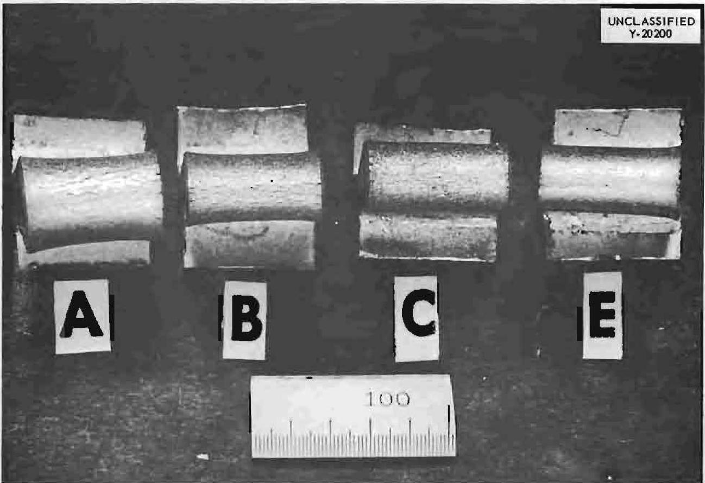

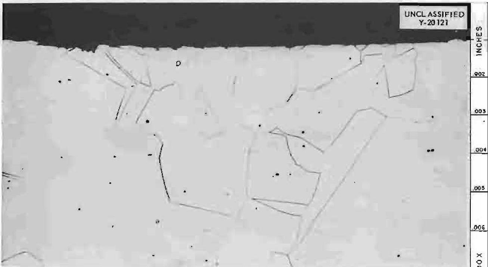  
Fig. 4.2.2. Bend Test Specimens Shown in Fig. 4.2.1 After on Additional Heat Treatment of 50 hr or $700^{\circ}\mathrm{C}$ in Vacuum. Note typical homogeneization that resulted from the heat treatment. (Confidential with caption)   
Fig. 4.2.3. Specimen from Inner Wall of an As-Received Nickel Test Capsule. Etchant: KCN-(NH₄)₂S₂O₈, 500X.

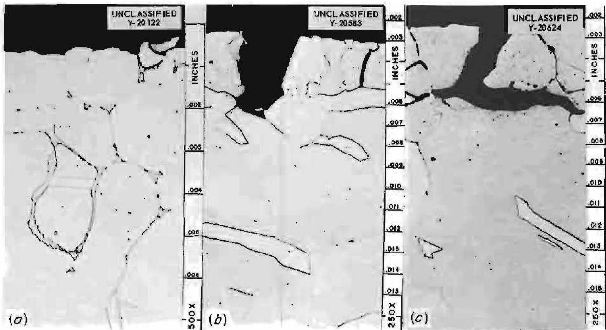  
Fig. 4.2.4. Specimen from Inner Wall of Nickel Capsule A (See Table 4.2.1) That Was Exposed for 3 hr at $700^{\circ}\mathrm{C}$ to $\mathrm{NaF - ZrF_4}$ (50-50 Mole %, Salt 31) Containing 500 ppm of Elemental Sulfur. (a) As-tested wall - note nickel sulfide compound formation in grain boundaries. 500X. (b) As-tested and bent. 250X. (c) As-tested, heat treated at $700^{\circ}\mathrm{C}$ for 50 hr in vacuum, and then bent. 250X. Etchant: KCN-( $\mathrm{NH}_4$ )₂S₂O₈. Reduced 11.5%. (Confidential with caption)

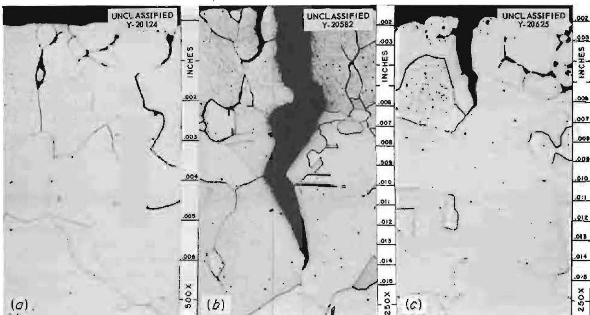  
Fig. 4.2.5. Specimen from Inner Wall of Nickel Capsule B (See Table 4.2.1) That Was Exposed for 3 hr at $700^{\circ}C$ to $\mathrm{NaF - ZrF_4}$ (50-50 Male %, Salt 31) Containing 500 ppm of Sulfur as $\mathrm{Na_2SO_4}$ . (a) As-tested wall, 500X. (b) As-tested and bent, 250X. (c) As-tested, heat treated at $700^{\circ}C$ for 50 hr in vacuum, and then bent, 250X. Etchant: KCN-( $\mathrm{NH_4}$ )2 $\mathrm{S_2O_8}$ . Reduced 13%. (Confidential with caption)

sulfur concentration of 300 to 500 ppm. These tests of 50-mil wire, which indicated that the embrittlement was slight at concentrations of less than 100 ppm sulfur, were not considered to be sufficiently sensitive because the embrittlement was limited to the outer surface of the wire and there was a large loss of sulfur into the walls of the nickel container. Therefore a more sensitive type of test was performed in which a strip of 5-mil nickel foil (weight of 1- by 2-in. sheet, $\sim 1.5\mathrm{g}$ ) was immersed in 150 g of salt contained in a graphite reactor. A nitrogen atmosphere was maintained above the salt. In this test the sulfur concentrates in the nickel foil, since the salt-to-nickel ratio is maintained at about 100:1. A major portion of the 5-mil foil is available for sulfur penetration in a few hours in this test if a diffusion rate of 0.4 mil/hr is assumed.

A 2-hr test of foil at $600^{\circ}\mathrm{C}$ in a salt mixture containing 100 ppm of sulfur as $\mathrm{Na}_2\mathrm{SO}_4$ resulted in essentially complete loss of mechanical strength, and the foil broke under very slight stress. The embrittlement became progressively less as the sulfur concentration was decreased to 1 ppm. When no sulfur was added to the salt, a foil immersed 18 hr retained its mechanical strength, but there was evidence of some embrittlement at the salt-vapor interface. A comparative test with 5-mil Inconel foil in a salt mixture containing 100 ppm of sulfur resulted in almost no embrittlement, in confirmation of previous observations that some types of nickel alloys are more resistant than pure nickel to the sulfur effect.

The effect of sulfur on nickel is believed to be dependent on the initial chemical state of the sulfur and its subsequent reactions, as well as on the rate of diffusion of sulfur or nickel sulfide through the metal. Comparative time studies indicate that in the case of $\mathrm{Na_2SO_4}$ , 1 to 4 hr is required for moderately complete reaction. This was confirmed by studying the behavior of tracer $S^{35}$ in an experiment in which a total of 15 ppm of sulfur was added to the salt mixture. The disappearance of the $S^{35}$ activity was $90\%$ complete in 2 hr. Less than $5\%$ of the sulfur that disappeared was found in the walls of the nickel capsule, and thus it appears that only a small part of the sulfur present in the fused salt actually causes the embrittling effect. A sulfur material

balance experiment with an Inconel capsule also showed that only a fraction of the sulfur actually transferred from the salt to the metal. With 100 ppm of sulfur in $\mathrm{NaF - ZrF_4}$ at $600^{\circ}C$ and a salt-to-metal ratio of 160:1, the sulfur actually found in the Inconel after a 4-hr exposure accounted for only $3\%$ of the sulfur in the original salt mixture. The sulfur content of the Inconel increased from less than 130 ppm to more than 630 ppm, as determined by activation analyses.

# OXIDATION RESISTANCE OF ALLOYS IN FLUORIDE SYSTEMS

M. R. Bennett G. L. Cathers R. L. Jolley

The gas-phase oxidation resistance of types 316 and 347 stainless steel was found to be quite unsatisfactory in tests of their use as possible container materials for molten $\mathrm{NaF - ZrF_4 - UF_4}$ at $1200^{\circ}F$ . Inconel was also attacked to an unusual extent in these tests. Nickel showed the least corrosion effect. This study was mode to evaluate the corrosion effects observed in one of the stainless steel vessels for melting salt mixtures in the volatility pilot plant. The low oxidation resistance of stainless steels in contact with fluoride-bearing vapor is in marked contrast to the usual resistance of stainless steels at high temperatures. The fluoride presumably acts as a destructive agent for the protective film of chromium oxide believed to exist on stainless steel surfaces.

The tests consisted in holding corrosion specimens partly immersed in molten $\mathrm{NaF - ZrF_4 - UF_4}$ (nominal composition, 48-48-4 mole %) at $650^{\circ}C$ while bubbling gas through the salt mixture. The first test was made with air that had been passed through Drierite to determine whether the stainless steels retained any of their typical corrosion resistance under these conditions (Fig. 4.2.6). After 2 hr all the iron-containing alloys (stainless steels and Inconel) had scale above the salt line. The scale, which was strongly magnetic, was thick on the stainless steels, in contrast to the small amount on the Inconel and none on the nickel. A second test with nitrogen dried with Drierite showed similar results after 16 hr (Fig. 4.2.7). In this test, as in several runs carried out with helium, there was, unfortunately, some back-diffusion of air into the reactor as a result of the low flow rate and a leak at the flange. Another test with nitrogen at a higher flow rate

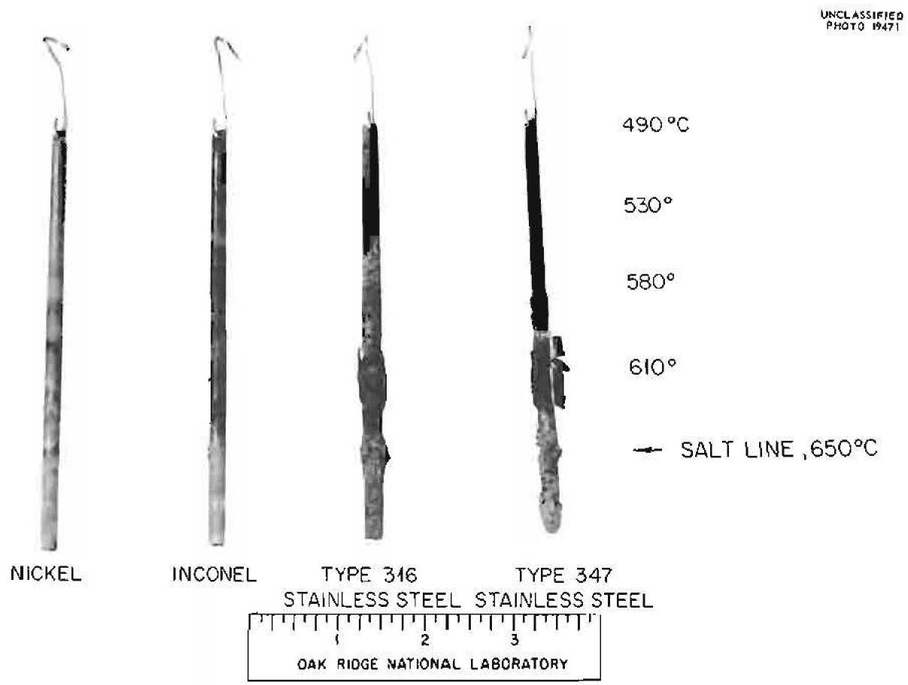  
Fig. 4.2.6. Specimens That Were Partly Immersed for 2 hr in NaF-ZrF₄-UF₄ Through Which Air Was Being Bubbled.

to minimize air back-diffusion resulted in practically no buildup of scale in 26 hr. For this test the nitrogen was dried with Anhydrone and then passed through copper foil at $750^{\circ}\mathrm{C}$ to remove any traces of oxygen.

In all tests in which there was much scale formation, there was also an accumulation of solids around the bottom of the specimen below the salt surface (Figs. 4.2.6 and 4.2.7). This material contained $\mathsf{ZrO}_2$ , as determined by petrographic examination, possibly as a result of iron or chromium oxides dropping into the salt from the gas phase.

# POROSITY AND DENSITY OF NoF

M.R.Bennett G.I.Cathers

R. L. Jolley

- Porosity values were calculated from density measurements on three lots of NaF obtained from The Harshaw Chemical Co. No significant dif

ferences were found among the three lots, one of which was 12-20 mesh material to be used in the pilot plant and the others were $\frac{1}{8}$ -in. pellets. Particle, bed, and over-all porosities of 48, 33, and $65\%$ , respectively, were found for the 12-20 mesh granular material. A crystalline type of NoF obtained from Allied Chemical & Dye Corp. was observed to be much denser, having an over-all porosity of 35 instead of $65\%$ . The over-all porosity is defined as the percentage of total void space (bed voids plus particle voids) in a bed of the material. The porosities were calculated from determinations of the bulk densities and the particle densities as given in Table 4.2.2, along with the use of the crystalline or x-ray density of $2.79~\mathrm{g/cm^3}$ . Weight-volume and displacement methods of measuring density were used in determining both the bulk and the particle densities of the $\frac{1}{8}$ -in. pellet material. Mercury displacement was used in finding the particle density of the 12-20 mesh NoF from Harshaw.

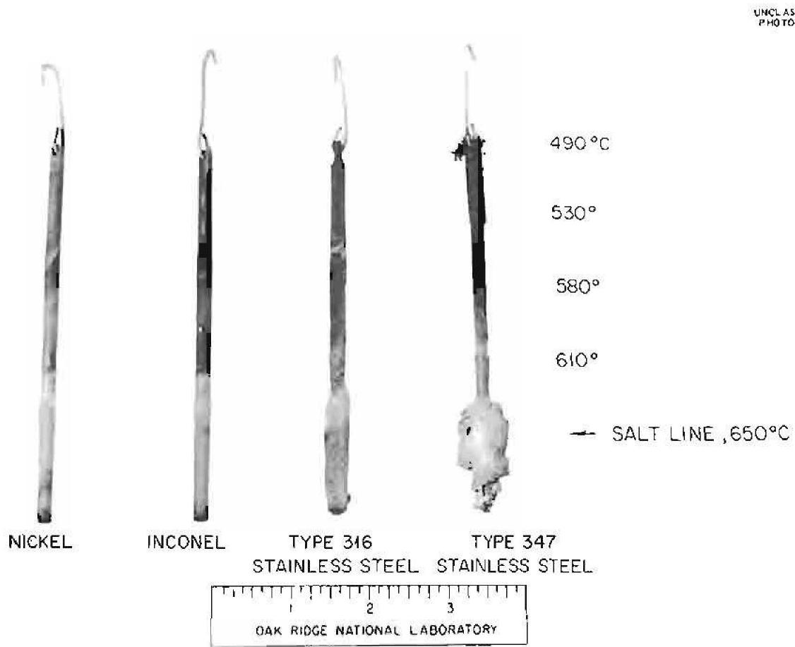  
Fig. 4.2.7. Specimens That Were Partly Immersed for 16 hr in NaF-ZrF $_4$ -UF $_4$ Through Which Nitrogen Was Being Bubbled.

Table 4.2.2. Results of Density Determinations on Several Lots of NaF   

<table><tr><td rowspan="2">Material</td><td colspan="2">Particle Density (g/cm3)</td><td rowspan="2">Bulk Density (g/cm3)</td></tr><tr><td>Weight-Volume Method</td><td>Displacement Method</td></tr><tr><td>The Horshow Chemical Co.</td><td></td><td></td><td></td></tr><tr><td>1/8-in. pellets, batch 2</td><td>1.47</td><td>1.48</td><td>0.94</td></tr><tr><td>1/8-in. pellets, batch 4</td><td>1.49</td><td>1.47</td><td></td></tr><tr><td>12-20 mesh pilot plant materiol</td><td></td><td>1.45</td><td>0.97</td></tr><tr><td>Allied Chemical &amp; Dye Corp.</td><td></td><td></td><td></td></tr><tr><td>20-40 mesh material, batch 2955</td><td></td><td>2.63</td><td>1.81</td></tr></table>

The benzene displacement method had to be used with the finer Allied material. The weight-volume and displacement methods gave results that were in close agreement. It is anticipated that the porosity data will be useful in interpreting the heat and material transfer problems associated with the absorption-desorption process.

# RUTHENIUM DECONTAMINATION

M. R. Bennett G. I. Cathers

R. L. Jolley

An experiment was conducted to test whether the plating out of ruthenium on metal surfaces could be used to achieve additional decontamination in the volatility process. The column used for the experiment consisted of a 12-in. length of 1-in.-OD nickel tubing filled with $192\mathrm{g}$ of $\frac{3}{2}$ -in.-OD 30-gage nickel Fenske packing with a total area of $0.36\mathrm{m}^2$ . This column was placed between the second NaF bed and the UF cold trap and was held at $120^{\circ}\mathrm{C}$ . It was used for about 130 min in a desorption run, and it was

not particularly effective in removing activity from the UF $^6$ product collected. The decontamination factor, calculated on the basis of the activities found in the nickel column and in the final product, was only 1.6. The activity in the nickel packing was removed with an alkaline-tartrate-peroxide solution, and the effectiveness of this method has not been fully evaluated. About $0.025\%$ of the processed uranium was found in the nickel trap.

The low ruthenium decontamination in the nickel trap is perhaps not too surprising in view of the small amount of activity involved and the small surface area used. The product contained only 28 ruthenium gamma counts per minute per milligram of uranium. The activity removed by the nickel was calculated to be 200 counts per minute per square centimeter of nickel surface. It is anticipated that the removal of ruthenium with a nickel column may be made more effective by using a greater surface area or by operating at a higher temperature.

# Part 5

# CRITICAL EXPERIMENTS AND REACTOR SHIELDING

E. P. Blizzard

# 5.1. CRITICAL EXPERIMENTS

A.D.CaIIhON

# REFLECTOR-MODERATED REACTOR EXPERIMENTS AT HIGH TEMPERATURES

D. Scott

E. Demski

R.E.Malenfont

W.J.Foder

J. J. Lynn

D. A. Harvey

W.C.Tunnell

E.V.Sandin

W.G.Aiwang

The measurements of some of the nuclear characteristics of the circulating-fuel reflector-moderated reactor under study by Pratt & Whitney Aircraft were completed. The assembly consisted of a cylindrical beryllium central section or "island" surrounded by an annular fuel region, which was enclosed in a reflector of beryllium. Shells of Hastelloy X separated the fuel from the beryllium. Control and safety of the experiment were effected by a rod which could be positioned along the axis of the island. The neutron-absorbing section of the rod contained a mixture of $30\%$ rare-earth oxides (somarium and gadolinium) and $70\%$ nickel. The reactor section of the assembly, which was described in detail in an earlier report,2 was mounted, with its axis vertical, above a tank in which the molten mixture of sodium, zirconium, and uranium fluorides was stored. The liquid could be raised into the reactor by pressurized helium. The equipment was operated at temperatures near $1250^{\circ}\mathrm{F}$ .

In the experimental procedure followed, the system was first filled with NaF-ZrF₄ (50-50 mole %) to which increments of NaF-UF₄ (66.7-33.3 mole %, containing uranium enriched to 93.2% U²³⁵) were added until the system became critical. The concentration was further increased stepwise as the control rod was inserted to the midplane. The value of the rod over the upper half of its travel (Fig. 5.1.1) was determined from period measurements and the inhour equation. The temperature coefficient of reactivity over the range 1200 to 1350°F was linear, within the precision of the measurements.

The significant results of the experiment are as follows:

Critical concentration

At 1258°F with rod out

10.97 wt % U (5.1 mole %

UF4)

At $1259^{\circ}F$ with rod in

12.20 wt % U

serted to midplane

Rod value with rod in

$2.47

serted to midplane

Temperature coefficient

-0.47 F, -3.6 × 10-5

in range 1200 to $1350^{\circ}F$

(△k/k)/°F

(based on a delayed

neutron fraction $\beta =$

0.0075)

A similar experiment was performed in 1955 with the ART core. The critical concentration observed then with the rod removed was 6.30 wt % U (2.87 mole % UF₄) and the temperature coefficient at about 1250°F was -2.3 × 10⁻⁵ (Δk/k)/°F.

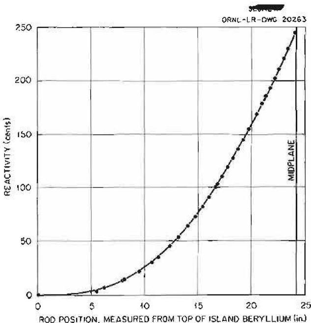  
Fig. 5.1.1. Effectiveness of the Control Rod in the Pratt & Whitney High-Temperature Reflector-Moderated-Reactor Critical Assembly.

# 5.2. SHIELDING THEORY

# SUMMARY OF MONTE CARLO CALCULATIONS OF GAMMA-RAY PENETRATION IN MULTIREGION SHIELDS WITH SLAB GEOMETRY

S.Auslender A.T.Futterer

Some of the calculations of gamma-ray shield penetration that were performed with the use of an Oracle code based on Monte Carlo techniques have been published at intervals $^2$ during the past year. A topical report is now being prepared which will describe the Oracle code used for these calculations. $^3$ In addition, the results of all the calculations are being collected in a separate report consisting of several volumes. $^4$ Since the results are especially applicable to the ANP program, a summary of the various types of problems is presented here, along with corresponding references to the data.

The summary (Table 5.2.1) designates the materials, thicknesses, gamma-ray energies, and angles of incidence investigated. For all the problems the information obtained directly from the machine calculations includes dose rate, energy flux, and energy deposition; for some problems it also includes energy spectra. Dose- and energy-building factors, as well as heating in the shield, may be computed directly from the information, and in some cases they have been. In the compilation of data, comparisons of the shield attenuations are also made.

Two studies, which have been designated the CE137 and COB60 series, respectively, were carried out to determine the penetration of Cs137

and Co $^{60}$ gamma rays through slabs of polyethylene and lead. The primary purpose of these calculations was to establish the validity of the calculational method by comparing calculated results with results obtained in an experiment. The particular experiment chosen was performed by the National Bureau of Standards. $^{5}$ The results were in good agreement.

Another calculation, designated the FAB series, was performed to determine the effect of the extent of lamination in a shield consisting of a total of 16 cm of water and 4 cm of lead. The materials were subdivided and alternated (2 to 16 regions) to mock up the progression toward a homogeneous shield.

In another group of problems, the DO2CS5 series, the effect of chonging the relative amounts of lead and water in a two-region shield that had a constant mean free path thickness was investigated. In this case no transmitted or reflected energy spectra are available, as yet.

Two sets of problems identified as the AO and the AB series, respectively, represent an extensive study of shields consisting of 7, 14, and 21 cm of water with and without a 0.1-in.-thick lead backing. Calculations were performed for seven gamma-ray energies and seven incident angles. Initial histories range from 1000 to 2500 for incident angles less than 60 deg. For greater angles the number of histories ranged from 400 to 800 to avoid excessive machine time. In all cases a doubling technique was used which tends to maintain an even population throughout the shield. In this way statistics were obtained near the final boundary for which excessively large initial histories would have been required if this technique had not been used. The transmitted and reflected energy spectra from this study have been stored in a systematic order on magnetic tape and are available for calculations. The energy spectra give the fraction of the incident energy which may be expected within each of 120 energy-solid angle intervals (that is 10 energy by 12 angular intervals) for both the reflected and the transmitted energy of each of the 294 cases.

Table 5.2.1. Summary and Index of Monte Carlo Calculations of Gamma-Ray Penetration in Multiregion Shields with Slab Geometry   

<table><tr><td>Series</td><td>Shield</td><td>Gamma-Ray Energy (Mev)</td><td>θ, Angle of Gamma-Ray Incidence (deg)</td><td>References</td></tr><tr><td>CE137 (for Cs137)a</td><td>0, 2, 5, 9, or 14 in. polyethylene +0, 0.25, or 0.5 in. Pb</td><td>0.661</td><td>0</td><td>ORNL-2310</td></tr><tr><td>COB60 (for Co60)</td><td>0, 2, 5, 9, or 14 in. polyethylene +0, 0.25, or 0.5 in. Pb</td><td>1.25</td><td>0</td><td>ORNL-2310</td></tr><tr><td>FABb</td><td>16 cm H2O + 4 cm Pb (8 cm H2O + 2 cm Pb) × 2 (4 cm H2O + 1 cm Pb) × 4 (2 cm H2O = 0.5 cm Pb) × 8 4 cm Pb + 16 cm H2O (2 cm Pb + 8 cm H2O) × 2 (1 cm Pb + 4 cm H2O) × 4 (0.5 cm Pb + 2 cm H2O) × 8</td><td>1.0, 3.0, 8.0</td><td>0</td><td>ORNL-2310</td></tr><tr><td rowspan="20">DO2C55</td><td>1 mfp Pb</td><td rowspan="4">1.0, 3.0</td><td rowspan="4">0, 60, 70.5, 75.5 (sec θ = 1, 2, 3, 4)</td><td rowspan="4">ORNL-2061, p 223; ORNL-2081, p 180; ORNL-2310</td></tr><tr><td>0.75 mfp Pb + 0.25 mfp H2O</td></tr><tr><td>0.5 mfp Pb + 0.5 mfp H2O</td></tr><tr><td>0.25 mfp Pb + 0.75 mfp H2O</td></tr><tr><td>1 mfp H2O</td><td rowspan="4">1.0, 3.0</td><td rowspan="4">0, 60, 70.5, 75.5 (sec θ = 1, 2, 3, 4)</td><td rowspan="4">ORNL-2061, p 223; ORNL-2310</td></tr><tr><td>0.75 mfp H2O + 0.25 mfp Pb</td></tr><tr><td>0.5 mfp H2O + 0.5 mfp Pb</td></tr><tr><td>0.25 mfp H2O + 0.75 mfp Pb</td></tr><tr><td>2 mfp Pb</td><td rowspan="4">1.0</td><td rowspan="4">0, 60, 70.5, 75.5 (sec θ = 1, 2, 3, 4)</td><td rowspan="4">ORNL-2310</td></tr><tr><td>1.5 mfp Pb + 0.5 mfp H2O</td></tr><tr><td>1 mfp Pb + 1 mfp H2O</td></tr><tr><td>0.5 mfp Pb + 1.5 mfp H2O</td></tr><tr><td>2 mfp H2O</td><td rowspan="4">1.0</td><td rowspan="4">0, 60, 70.5, 75.5 (sec θ = 1, 2, 3, 4)</td><td rowspan="4">ORNL-2061, p 223; ORNL-2081, p 180; ORNL-2310</td></tr><tr><td>1.5 mfp H2O + 0.5 mfp Pb</td></tr><tr><td>1.0 mfp H2O + 1.0 mfp Pb</td></tr><tr><td>0.5 mfp H2O + 1.5 mfp Pb</td></tr><tr><td>8 mfp Pb</td><td rowspan="4">3.0</td><td rowspan="4">0, 60, 70.5 (sec θ = 1, 2, 3)</td><td rowspan="4">ORNL-2310</td></tr><tr><td>6 mfp Pb + 2 mfp H2O</td></tr><tr><td>4 mfp Pb + 4 mfp H2O</td></tr><tr><td>2 mfp Pb + 6 mfp H2O</td></tr></table>

No "s" available on machine.   
Constant total shield thickness with layers consecutively subdivided and alternated to mock up progression from a two-region shield to a homogeneous shield.

Table 5.2.1 (continued)   

<table><tr><td>Series</td><td>Shield</td><td>Gamma-Ray Energy (Mev)</td><td>θ, Angle of Gamma-Ray Incidence (deg)</td><td>References</td></tr><tr><td>AO</td><td>7, 14, or 21 cm H2O</td><td>0.5, 1.0, 2.0, 3.0, 4.0, 6.0, 8.0</td><td>0, 20, 40, 60, 70, 80, 85</td><td>ORNL-2310</td></tr><tr><td>AB</td><td>7, 14, or 21 cm H2O + 0.1 in. Pb</td><td>0.5, 1.0, 2.0, 3.0, 4.0, 6.0, 8.0</td><td>0, 20, 40, 60, 70, 80, 85</td><td>ORNL-2310</td></tr><tr><td rowspan="16">BC</td><td>10, or 20 in. H2O</td><td>1.0, 2.23, 2.70, 4.0, 6.814, 9.0</td><td>0, 60, 70</td><td>ORNL-2310</td></tr><tr><td>40 in. H2O</td><td>1.0, 2.70, 6.814, 9.0</td><td>0, 60, 70</td><td>ORNL-2310</td></tr><tr><td rowspan="2">2 in. Pb + 0, 10, or 20 in. H2O</td><td>1.0, 2.70, 4.0, 6.814, 9.0</td><td>0, 60, 70</td><td>ORNL-2310</td></tr><tr><td>2.23</td><td>0, 60</td><td>ORNL-2310</td></tr><tr><td>2 in. Pb + 40 in. H2O</td><td>1.0, 2.70, 6.814, 9.0</td><td>0, 60, 70</td><td>ORNL-2310</td></tr><tr><td rowspan="3">4 in. Pb + 0, 10, or 20 in. H2O</td><td>1.0</td><td>0</td><td>ORNL-2310</td></tr><tr><td>2.23, 4.0, 6.814, 9.0</td><td>0, 60</td><td>ORNL-2310</td></tr><tr><td>2.70</td><td>0, 60, 70</td><td>ORNL-2310</td></tr><tr><td rowspan="3">4 in. Pb + 40 in. H2O</td><td>1.0</td><td>0</td><td>ORNL-2310</td></tr><tr><td>2.7</td><td>0, 60, 70</td><td>ORNL-2310</td></tr><tr><td>6.814, 9.0</td><td>0, 60</td><td>ORNL-2310</td></tr><tr><td rowspan="3">6 in. Pb + 0, 10, or 20 in. H2O</td><td>2.70</td><td>0, 60, 70</td><td>ORNL-2310</td></tr><tr><td>4.0</td><td>0</td><td>ORNL-2310</td></tr><tr><td>6.814, 9.0</td><td>0, 60</td><td>ORNL-2310</td></tr><tr><td rowspan="2">6 in. Pb + 40 in. H2O</td><td>2.70</td><td>0, 60, 70</td><td>ORNL-2310</td></tr><tr><td>6.814, 9.0</td><td>0, 60</td><td>ORNL-2310</td></tr><tr><td>Undesignated</td><td>11.58 cm Pb + 35.81 cm H2O</td><td>1.0, 3.0, 6.0</td><td>0, 60</td><td>ORNL-2157, p 271; ORNL-2081, p 184; ORNL-2194; ORNL-2310</td></tr><tr><td>Undesignated</td><td>3.79 cm fueld + 0.976 cm Inconel + 21.19 cm Na + 0.488 cm Inconel (0.7 mfp fueld + 1.0 mfp Inconel + 1.0 mfp Ne + 0.5 mfp Inconel)</td><td>1.0</td><td>0, 45, 60, 70.5, 75.5</td><td>ORNL-2106, p 266; ORNL-2310</td></tr></table>

cThis series had a maximum of 800 histories and a minimum of 400; a doubling technique was used to improve statistics. Even so, the statistics are poor for the thickest slabs at slant penetrations as far as energy spectral data are concerned.   
$d_{\text{NoF-ZrF}_{4} \cup F_{4}}$ (52.5-42.5-5 mole %).

Another set of problems, the B series, is a study of thick lead and water shields. The energy spectra for this series were also stored systematically on magnetic tape. It is to be noted that the low number of initial histories combined with the large thickness of the shields tends toward

poor statistics for the energy spectra information despite the doubling technique.

Two additional problems, one for a fuel-Inconel-sodium-Inconel shield and another for a lead-water shield, were also computed. The fuel mixture studied was NaF-ZrF4-UF4 (52.5-42.5-5 mole %).

# 5.3. LID TANK SHIELDING FACILITY

# NEW INSTRUMENT CARRIAGE AT THE LTSF

W.Zobel

The necessity of taking progressively more precise data at the Lid Tank Shielding Facility (LTSF) made it obvious that one of the uncertainties which had to be eliminated was that associated with the location of the detectors. While the position of a detector in the tank could be reproduced to within about $\pm 2\mathrm{mm}$ , the absolute position was open to doubt within about $\pm 5\mathrm{mm}$ . It was therefore decided to replace the detector holder and positioner.

The new equipment was required to be more rigid than the old so that the absolute position and the indicated position would always coincide, and it had to have an inherent accuracy of about $\pm 0.5\mathrm{mm}$ . The system (Fig. 5.3.1) which was adopted is very similar to that in use at the Tower Shielding Facility (TSF). This system provides for remote control of the carriage from the control room and thereby greatly increases the ease of operation. The new instrument carriage has been installed and is now in use. It appears to give very satisfactory service, and it is expected that the confidence level of future data taken at the LTSF will be increased.

The detector carriage is driven in the y-direction by two ball-bearing lead screws which, however, do not support the carriage. Thus greater accuracy and longer life can be obtained. The use of the ball-bearing nut eliminates backlash. The load is carried on the channel base, which can be made as strong as required. A guide rail on one side assures that the carriage will run true.

In the $z$ -direction the load is supported by two large shafts, which also serve as guides. The drive is again provided by a ball-bearing lead screw.

The drive in the $x$ -direction is of the rock-and-pinion type, with the rock cut into the vertical drive shaft. This is a large tube and was chosen to provide sufficient rigidity for the holder.

Control of the drive motors in the three directions is manual at present. The position of the detector support, located at the end of the vertical shaft, is indicated at three panels in the control room. Two indicators are provided for each direction. One is a dial for coarse control, driven by a torque transmitter system geared to the drive motor; the other is a fine control, indicated by an Amerac

dial, which uses a selsyn system to drive the dial by the usual null technique. The indication of the fine control is to the nearest millimeter, with interpolation on the dial to $0.5\mathrm{mm}$ easily possible. Provision has been made to permit later conversion of the controls to a closed-loop system by which the desired position on the detector can be selected and the carriage will then "hunt" until it reaches that location. Provision is also made for future installation of a readout system for use with an isodose plotter.

Preliminary tests showed that the instrument carriage, as finally constructed does not deviate from a given plane by more than 0.006 in. over the full range of the water tank at the LTSF. This indicates that the absolute position of an instrument can be determined to at least $\pm 0.5\mathrm{mm}$ and is, at present, limited by the accuracy with which the indicators can be read. It is felt, however, that $\pm 0.5\mathrm{mm}$ is sufficiently accurate for the purpose, and therefore no changes are contemplated.

# INVESTIGATION OF THE PHYSICAL PROPERTIES OF LITHIUM BOROHYDRIDE-AMMONIA UNDER SUBCONTRACT NO. 390

E.A.Sullivan

S. Johnson

Metal Hydrides, Inc.

One of the materials which has been suggested as a neutron shield for a mobile reactor is lithium borohydride. This relatively new compound is particularly attractive because it contains 18.5 wt $\%$ hydrogen, which is the most efficient lightweight neutron absorber known, as well as lithium and boron, both of which suppress secondary gamma radiation arising from neutron capture by the shield material, in addition to being good neutron absorbers. Lithium borohydride is a white crystalline solid which is stable to its melting point of $275^{\circ}C$ and has essentially no vapor pressure even at this elevated temperature. In an attempt to achieve a liquid shield which could be cooled externally and would avoid difficult fabrication problems, emphasis has been altered to consider shield components utilizing this compound in combination with an inexpensive diluent that would not change the shielding properties appreciably. Ammonia, which contains 17.8 wt $\%$ hydrogen, is ideally suited for this purpose. Since the physical properties of

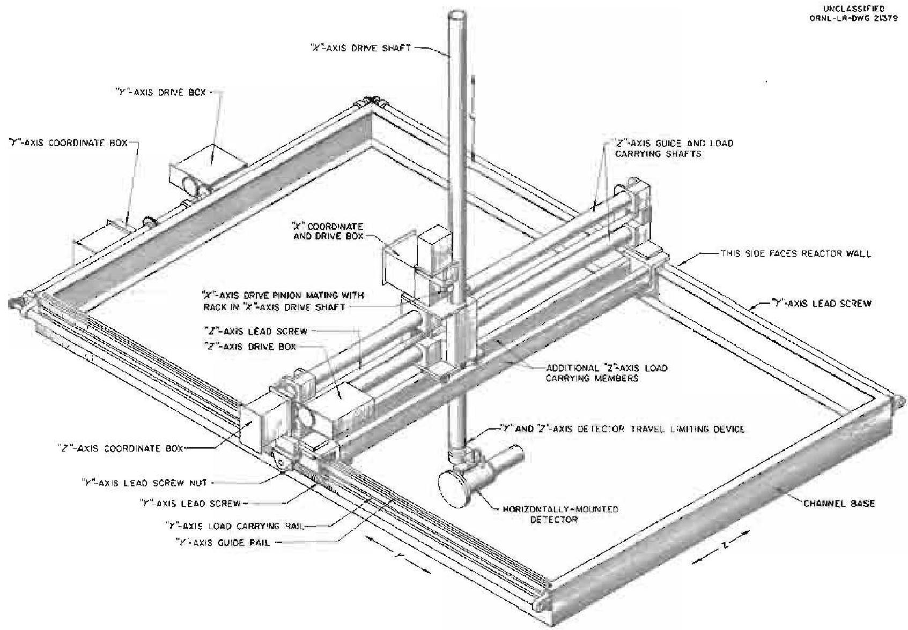  
Fig. 5.3.1. New LTSF Detector Carriage

shield materials must also be known, an investiga t i gn has been carried out to determine the equ i librium vapor pressure, the thermal stability, and the density of various lithium borohydride ammoni a tes. The results of the investigation have been reported in detail' and are summarized below.

# Pressure-Temperature-Composition Relationships

The ammonia vapor pressure in equilibrium with mixtures of lithium borohydride and ammonia was determined as a function of concentration and of temperature. The lithium borohydride mole fractions used ranged from 1.0 to slightly less than 0.2 in the temperature range 0 to $80^{\circ}\mathrm{C}$ . Lithium borohydride forms four stable adducts with ammonia: lithium borohydride monoammoniate, $\mathrm{LiBH}_4\cdot \mathrm{NH}_3$ which has a melting point of $56.5^{\circ}\mathrm{C}$ ; lithium borohydride diammoniate, $\mathrm{LiBH}_4\cdot 2\mathrm{NH}_3$ which melts at $17.0^{\circ}\mathrm{C}$ ; lithium borohydride triammoniate, $\mathrm{LiBH}_4\cdot 3\mathrm{NH}_3$ which displays an incongruent melting point at $32.5^{\circ}\mathrm{C}$ ; and lithium borohydride tetraammoniate, $\mathrm{LiBH}_4\cdot 4\mathrm{NH}_3$ which melts at approximately $68^{\circ}\mathrm{C}$ .

The phase diagram in this temperature range has been constructed from the experimental data. The behavior of lithium borohydride-ammonia adducts is such that two eutectic compositions, $\mathsf{LiBH}_4\cdot$ $1.75\mathrm{NH}_{3}$ and $\mathsf{LiBH}_4\cdot 2.35\mathrm{NH}_3,$ are completely liquid above $15^{\circ}C.$ A solid solution of the triammoniate in the tetraammoniate was found to exist which is stable up to the melting point of the tetraammoniate.

The ammonia pressure can readily be calculated for any temperature and composition from equations of the type

$$
\log P (\mathrm {m m} \mathrm {H g}) = - \frac {A}{T} + B.
$$

In studying the lithium borohydride-ammonia system, it was found that an interaction occurred to a small extent between the components, which gave, as a byproduct, gaseous hydrogen. This ammonolysis reaction was studied briefly in the temperature range of 50 to $100^{\circ}\mathrm{C}$ , and it was found that the rate of ammonolysis of lithium borohydride: (1) decreases with time, (2) increases

with temperature, (3) decreases with increasing ammonia concentration (and is essentially constant beyond an ammonia-to-lithium borohydride mole ratio of 2:1), (4) is approximately on exponential function of composition at a given temperature, and (5) is approximately an exponential function of reciprocal temperature at a given composition. Where necessary (at temperatures $\geq 40^{\circ}\mathrm{C}$ ), small corrections were made in the equilibrium data to account for the effect of ammonolysis on the composition of the samples. When precautions were taken, this reaction did not interfere with equilibrium measurements.

# Density Relationships

The densities of liquid lithium borohydride ammoniates were determined as a function of both composition and temperature. Five conditions between $\mathrm{LiBH}_4\cdot 1.06\mathrm{NH}_3$ and $\mathrm{LiBH}_4\cdot 2.74\mathrm{NH}_3$ were studied. The temperature range in which each composition was studied depended on the liquidus temperature at the given composition and on the vapor pressure encountered. Two of the compositions studied, $\mathrm{LiBH}_4\cdot 1.73\mathrm{NH}_3$ and $\mathrm{LiBH}_4\cdot 2.36\mathrm{NH}_3$ , correspond to the eutectics on either side of the diammoniate of lithium borohydride. These compositions have the lowest liquidus temperatures in the entire phase diagram, both at $15^{\circ}\mathrm{C}$ , and therefore have the longest temperature ranges for the liquid state. In general, the study encompassed temperature ranges between 15 and $85^{\circ}\mathrm{C}$ .

The density for a given composition was found to be a linear function of temperature, as expected, and the experimentally determined equations are, where $t$ is in $^\circ C$ :

(1) $\mathrm{LiBH}_4\cdot 1.06\mathrm{NH}_3$ : $d_{t} = 0.651 - (2.537\times 10^{-4})t$   
(2) $\mathrm{LiBH}_4\cdot 1.73\mathrm{NH}_3$ : $d_{t} = 0.663 - (3.683\times 10^{-4})t$   
(3) $\mathrm{LiBH}_4\cdot 2.04\mathrm{NH}_3\colon d_t = 0.675 - (4.664\times 10^{-4})t$   
(4) $\mathrm{LiBH}_4\cdot 2.36\mathrm{NH}_3\colon d_{\ell} = 0.676 - (4.201\times 10^{-4})\ell$   
(5) $\mathrm{LiBH}_4\cdot 2.74\mathrm{NH}_3$ : $d_{t} = 0.684 - (4.427\times 10^{-4})t$

With the exception of $\mathrm{LiBH}_4\cdot 2.04\mathrm{NH}_3$ a simple relationship was found to exist between the composition and both the slope and intercept of the density equations. The following empirical equations were found to relate these factors:

(6) Intercept = 0.629 + 0.020(cM.R.)

where $c_{M.R.}$ is the composition expressed as the mole ratio of ammonia to lithium borohydride and

$$
\text {(7)} \quad S l o p e = - 1. 9 7 \times 1 0 ^ {- 4} + 8. 8 0 \times 1 0 ^ {- 4} \left(N _ {N H _ {3}}\right)
$$

where $N_{\mathrm{NH_3}}$ is the composition expressed as mole fraction of ammonia. From Eqs. 6 and 7, the constants for density equations were calculated which cover the entire liquid range.

# SURVEY OF SHIELDING MATERIALS UNDER SUBCONTRACT NO. 931

R. Aronson

K. Held

Technical Research Group

A recent survey of shielding materials confirms that lithium hydride and polyethylene are the most effective neutron shields known to date. Lithium hydride is by far the best solid shield material in curved geometries. The use of $\mathsf{Li^{6}H}$ is expected to lead to a further weight savings of approximately $12\%$ . Lithium hydride is the only lightweight neutron shield material which can be used in the range of 700 to $1200^{\circ}\mathsf{F}$ without developing high pressure or decomposing. This is the range of temperature which may be expected in some parts of the direct-cycle reactor shield. Neutron shield materials for use at temperatures above $2000^{\circ}\mathsf{F}$ may be required for the direct-cycle reactor. Reactor outlet air at

a temperature of $1850^{\circ}F$ is used to cool the neutron shield at the rear face. Here the requirement is so severe that the problem is one of obtaining materials that will withstand the high temperature, rather than a minimum weight problem. If a liquid is required because of the need for shield augmentation or some other reason, one of the substituted organic compounds must be used.

Polyethylene of high density $(>0.95\mathrm{g} / \mathrm{cm}^3)$ and of high strength is now available. Some analyses of various crew shield designs indicate the very low requirement for additional structural support for a lead-polyethylene shield. Other materials including various lithium hydride-polyethylene mixtures are under consideration.

The high-density materials required for the reactor gamma-ray shield still center around lead, bismuth, tungsten, uranium, etc. Possible application of hydrides, borides, etc. of these elements await clarification of the secondary gamma-ray picture.

Contact has been maintained with Metal Hydrides, Inc., on their studies on the lithium borohydride-ammonia system.

# 5.4. TOWER SHIELDING REACTOR II

C. E. Clifford

L. B. Holland

As was stated previously, a reactor which will have a higher and more uniform fast-neutron and gamma-ray leakage flux than that available with the present Tower Shielding Reactor is needed for future aircraft shielding experimentation. To fill these requirements a 5-Mw solid-fuel Tower Shielding Reactor II (TSR-II) has been proposed which will be spherical in shape. The TSR-II will be controlled by umbrella-shaped boron-loaded plates located in an internal water reflector, in which position they will give a minimum perturbation to the reactor leakage flux.

In order to establish the dimensions of a core configuration that would fit the requirements of the reactor, the following calculational procedures were followed. A nuclear parameter study was carried out first to determine the critical mass and control available for various core sizes, internal water reflector thicknesses, and aluminum-to-water volume ratios. From this study a configuration was selected which appeared to be the optimum configuration from the viewpoint of critical mass and small reactor diameter. This configuration was then examined to ensure that the surface density of the $U^{235}$ in the fuel plates would be below 0.0283 g/cm², a density which was established during operating experience with the MTR. Finally the configuration was examined to determine whether the water flow available to remove the heat from the core was sufficient to prevent local boiling. The results of these tests are presented below.

# NUCLEAR PARAMETER STUDY

Calculations, for which the three-group, three-region reactor code (the 3G3R code) was used as a two-group, three-region (2G3R) code, were performed on the Oracle to determine the critical mass and control available in reactor configurations

having internal water reflector diameters of 32, 40, and 50 cm and core thicknesses of 16, 20, and 25 cm. The aluminum-to-water volume ratios in the cores ranged from 0.250 to 2.000. All possible reflector-core combinations were investigated for each aluminum-to-water ratio. For the calculations the external water reflector was considered to be 20 cm of water rather than the lead-water combination that is proposed for the actual reactor. A sketch of the geometry used in the calculation is shown in Fig. 5.4.1, and some of the constants are presented in Table 5.4.1.

Calculations were made first to determine the effective multiplication factor for several concentrations of $U^{235}$ in the fuel plates. Typical results for one geometry and all aluminum-to-water volume ratios are shown in Fig. 5.4.2. Earlier calculations for this reactor showed that $4\%$ excess reactivity would be necessary to compensate for temperature rise, xenon poisoning, and burnup and to provide $1\%$ for control. The concentration that gave an excess reactivity of $4\%$ in a particular configuration was used to compute the mass of $U^{235}$ that would be required for that configuration.

In Figs. 5.4.3 through 5.4.5 the critical mass is shown as a function of internal reflector radius for various aluminum-to-water volume ratios and all core geometries considered. As expected, the smallest internal reflector and lowest aluminum-to-water volume ratio will give the minimum critical mass.

The amount of excess reactivity that it is possible to control for the various geometries was determined next. This calculation was performed in a straightforward manner (as provided in the 3G3R Oracle code) by the insertion of a boron-loaded shell between the internal reflector and the core region. The results shown in Fig. 5.4.6 are for a very light loading of boron in the shell $(0.0022\mathrm{g/cm}^2)$ . Unfortunately, time did not permit a more involved calculation for a heavier boron shell; however, values for heavier boron concentrations will be obtained in later calculations and experiments. Although it is possible to obtain a larger amount of control by using higher aluminum-to-water volume ratios and larger internal reflector regions, the greatest increase in control is realized

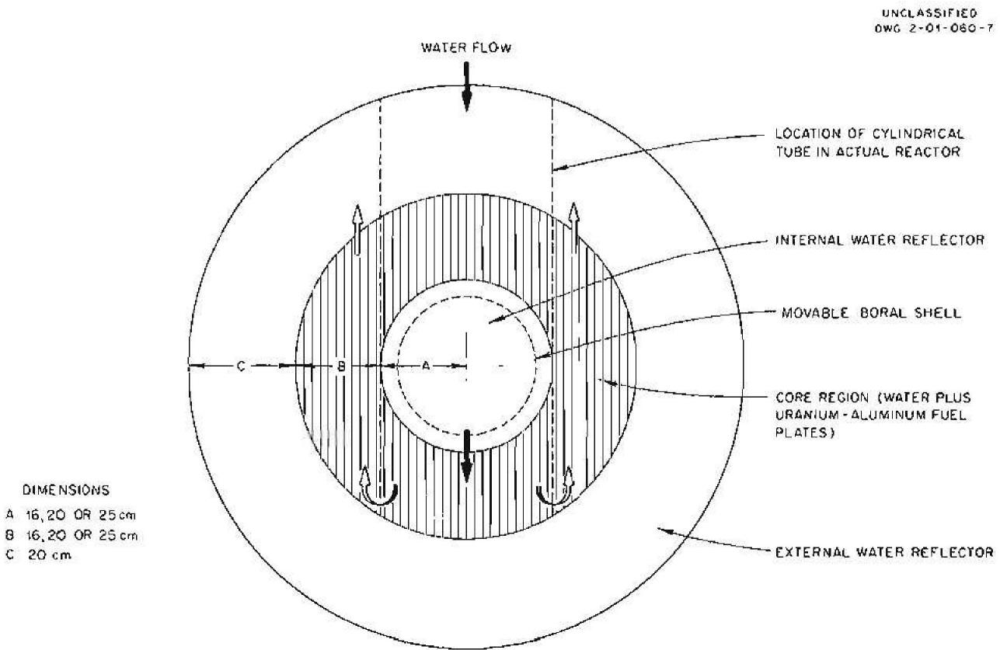  
Fig. 5.4.1. Vertical Section of Reactor Core Model Used in Nuclear Parameter Study for TSR-11.

Table 5.4.1. Nuclear Parameters Used with the 3G3R Oracle Code for Calculations of the Critical Mass of the TSR-II with an Aluminum-to-Water Volume Ratio of 0.707   

<table><tr><td rowspan="2">Region</td><td colspan="2">Absorption Cross Section* (cm-1)</td><td colspan="2">Diffusion Coefficient** (cm)</td><td colspan="2">Transfer Cross Section** (cm-1)</td><td>Temperature (°C)</td></tr><tr><td>ΣaJ</td><td>ΣaS</td><td>Df</td><td>Ds</td><td>ΣxJ</td><td>Σxs</td><td></td></tr><tr><td>Internal reflector</td><td>0</td><td>0.01837</td><td>1.190</td><td>0.160</td><td>0.0361</td><td>0</td><td>50</td></tr><tr><td>Core</td><td>0</td><td>0.01535 + 0.47127νΣ/s</td><td>1.315</td><td>0.2655</td><td>0.0210</td><td>0</td><td>60</td></tr><tr><td>External reflector</td><td>0</td><td>0.01949</td><td>1.190</td><td>0.160</td><td>0.0361</td><td>0</td><td>20</td></tr></table>

*Values of Σa obtained from BNL-325, Neutron Cross Sections, by D. J. Hughes and J. A. Harvey (July 1, 1955), with correction applied for (1) non-1/v behavior, (2) Maxwellian distribution of neutron speeds, and (3) temperature effect on density.   
**Values of $D_{f}, D_{s}, \Sigma_{x_{f}}$ and $\Sigma_{x_{s}}$ taken from IDO-16133, Reactivity Effect of Reducing the Al/H₂O Ratio in the MTR Core, by J. W. Webster (Oct. 26, 1953).

by decreasing the thickness of the core region. This is fortunate since the thinner core region also reduces the heat transfer problem.

A calculation performed to determine the amount of separation required between the fuel and the control plates to reduce the effect of the control plates sufficiently to permit operation of the reactor involved a more subtle use of the 3G3R code. In this case it was necessary to artificially maintain the neutron flux and current at the outer water reflector and core boundary so that the internal reflector could be divided into two regions with a boron shell between them, the core making the third region. It was then possible to vary the thickness of the water regions in the internal reflector and effectively simulate movement of the control plates. The calculation was made for only two aluminum-to-water volume ratios, 1.0 and 0.707, and one geometry. The results plotted in

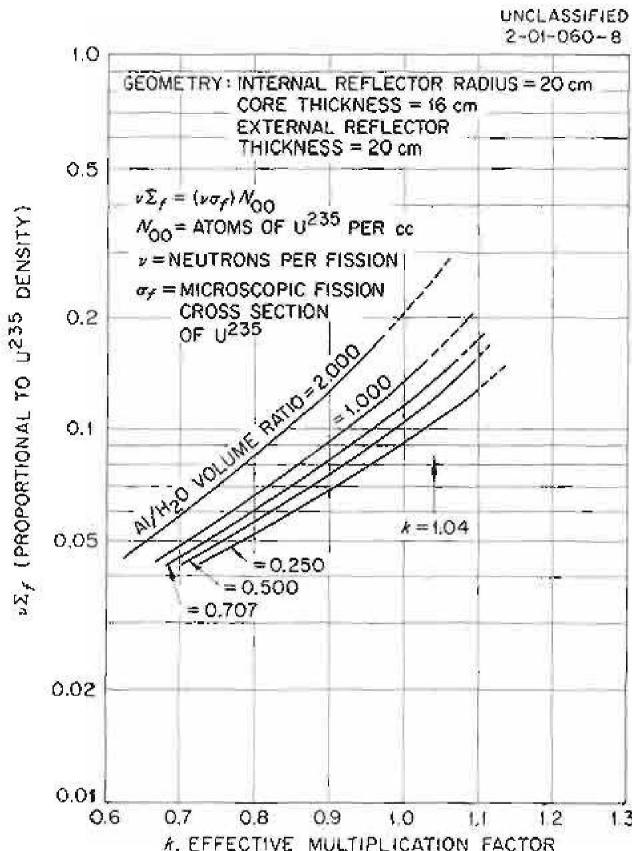  
Fig. 5.4.2. Effective Multiplication Factor in the TSR-II as a Function of the $U^{235}$ Concentration for Various Aluminum-to-Water Volume Ratios. Reactor geometry: 40-cm-dio internal reflector, 16-cm-thick core, 20-cm-thick external water reflector.

Fig. 5.4.7 show that no more than 2.5 in. $(\sim 6.5~\mathrm{cm})$ of travel will be required to reduce the control plate effectiveness to 0.1 of its full value. The results of an earlier experiment at the Bulk Shielding Facility (BSF) reactor, which has on aluminum-to-water ratio of 0.7, normalized to the calculated value for the TSR-II are also shown in Fig. 5.4.7. The change in reactivity of the BSF reactor was observed as a cadmium rod was moved laterally away from the BSF reactor. The fact that the experimental curve is steeper than the calculated curve shows that the use of the calculated values in the design is conservative.

Although the information was not required to establish the dimensions of the TSR-II, the effect of the control plates on the fast- and thermal

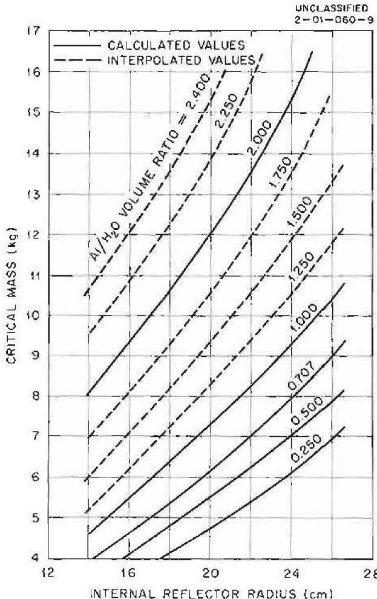  
Fig. 5.4.3. Critical Mass in the TSR-II as a Function of the Internal Water Reflector Radius for Various Aluminum-to-Water Volume Ratios. Reactor geometry: 16-cm-thick core, 20-cm-thick external water reflectors.

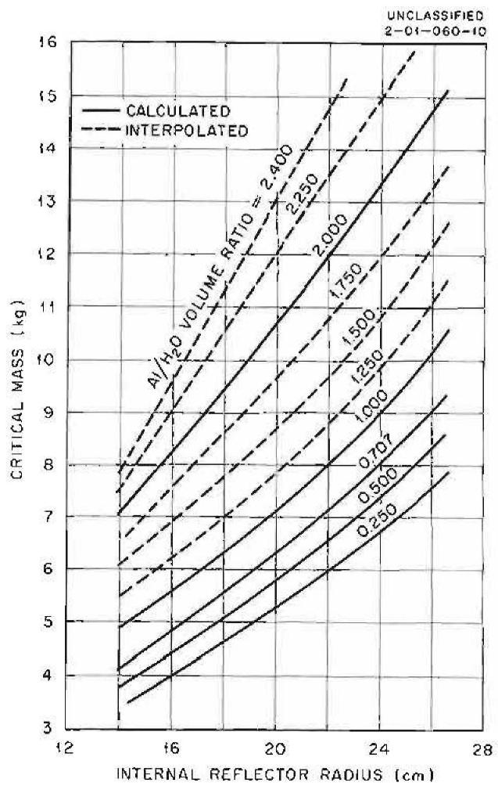  
Fig. 5.4.4. Critical Mass in the TSR-II as a Function of the Internal Water Reflector Radius for Various Aluminum-to-Water Volume Ratios. Reactor geometry: 20-cm-thick core, 20-cm-thick external water reflector.

neutron flux throughout the reactor was also calculated as shown in Fig. 5.4.8. Cases $b$ and $c$ show the effect on the flux of having the boral shell adjacent to the core or $5\mathrm{cm}$ from the core, respectively. Case a represents the same geometry shown in case $b$ and is included only to show the validity of the method used, that is, leaving off the external water reflector region and artificially maintaining the neutron flux of the outer core boundary. The effect of the boral shell position on the fast- and thermal-neutron leakage from the TSR-II for two aluminum-to-water volume ratios, 0.707 and 1.000, is shown in Table 5.4.2. In this calculation the internal water reflector was $40~\mathrm{cm}$ in diameter, and the core region and external water reflector were each $20~\mathrm{cm}$ thick. Changing the

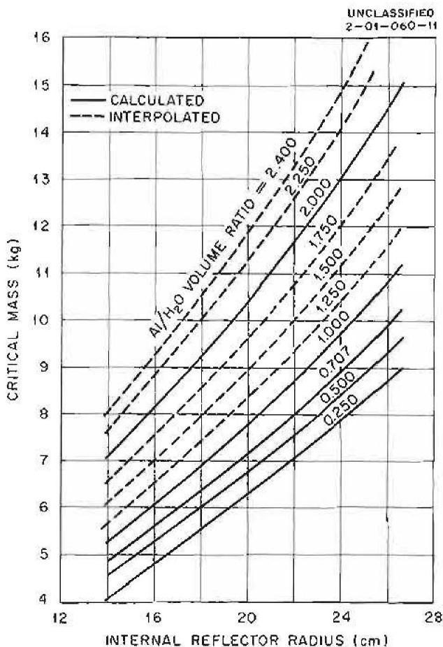  
Fig. 5.4.5. Critical Mass In the TSR-II as a Function of the Internal Water Reflector Radius for Various Aluminum-to-Water Volume Ratios. Reactor geometry: 25-cm-thick core, 20-cm-thick external water reflector.

aluminum-to-water volume ratio produces less than $1.5\%$ change in the fast-neutron leakage. Over the probable operating range of the control plates (3 to 5 cm), the variation in fast-neutron leakage will be less than $1.5\%$ .

The space required to house the proposed control mechanism and also allow it to be withdrawn 2.5 in. from the core will necessitate that the internal water reflector be no smaller than 17.5 in. in diameter. With this parameter fixed it was then necessary to carry out a study to determine the corresponding core parameters which would give a minimum fuel loading. This was done by plotting the critical mass as a function of core thickness for various aluminum-to-water volume ratios (Fig. 5.4.9). As would be expected, the mass decreased with a decrease in the aluminum-to-water volume ratio; however, it does not seem practicable to go

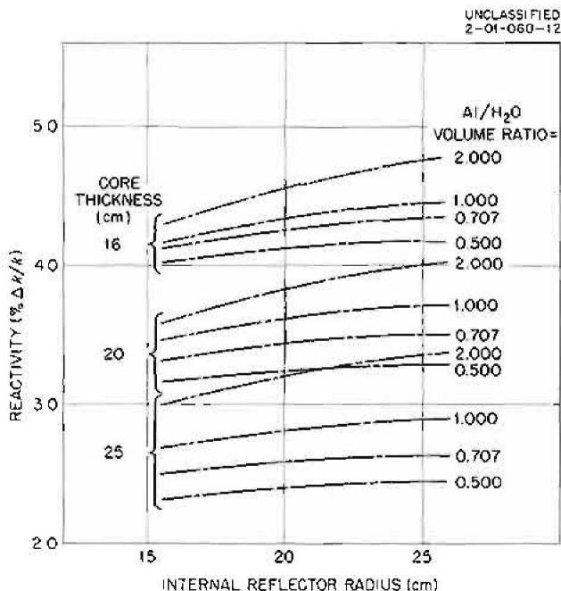  
Fig. 5.4.6. Change in Reactivity Produced in the TSR-II by the Presence of a Boral Shell Between the Internal Water Reflector and the Core as a Function of the Internal Reflector Radius for Various Core Thicknesses and Aluminum-to-Water Volume Ratios. External water reflector thickness: $20~\mathrm{cm}$ .

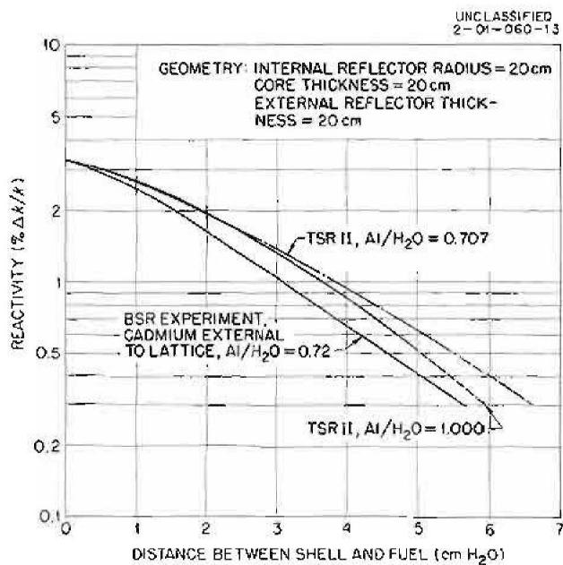  
Fig. 5.4.7. Change in Reactivity Produced in the TSR-II by the Presence of a Boral Shell in the Internal Water Reflector as a Function of the Distance Between the Shell and the Core for Aluminum-to-Water Volume Ratios of 0.707 and 1.0. Reactor geometry: 40-cm-dia internal water reflector, 20-cm-thick core, 20-cm-thick external water reflector (effective).

Table 5.4.2. Predicted Fost- and Thermol-Neutron Leakage from the TSR-II for 0.707 and 1.000 Aluminum-to-Water Volume Ratios and Various Core-Boral Shell Separation Distances   

<table><tr><td rowspan="2">Core-Boral Shell Separation Distance (cm)</td><td colspan="2">Fast-Neutron Leakage</td><td colspan="2">Thermal-Neutron Leakage</td></tr><tr><td>Al: \( H_2O \) Ratio = 0.707</td><td>Al: \( H_2O \) Ratio = 1.000</td><td>Al: \( H_2O \) Ratio = 0.707</td><td>Al: \( H_2O \) Ratio = 1.000</td></tr><tr><td>0</td><td>0.1070</td><td>0.1083</td><td>0.01294</td><td>0.01322</td></tr><tr><td>5</td><td>0.1064</td><td>0.1080</td><td>0.01291</td><td>0.01325</td></tr><tr><td>1.0</td><td>0.1057</td><td>0.1074</td><td>0.01284</td><td>0.01318</td></tr><tr><td>1.5</td><td>0.1051</td><td>0.1067</td><td>0.01276</td><td>0.01306</td></tr><tr><td>2.0</td><td>0.1044</td><td>0.1060</td><td>0.01269</td><td>0.01300</td></tr><tr><td>2.5</td><td>0.1038</td><td>0.1053</td><td>0.01258</td><td>0.01291</td></tr><tr><td>3.0</td><td>0.1033</td><td>0.1048</td><td>0.01252</td><td>0.01285</td></tr><tr><td>3.5</td><td>0.1028</td><td>0.1043</td><td>0.01247</td><td>0.01276</td></tr><tr><td>4.0</td><td>0.1024</td><td>0.1038</td><td>0.01243</td><td>0.01271</td></tr><tr><td>4.5</td><td>0.1020</td><td>0.1035</td><td>0.01235</td><td>0.01267</td></tr><tr><td>5.0</td><td>0.1018</td><td>0.1032</td><td>0.01235</td><td>0.01264</td></tr><tr><td>No shell</td><td>0.1083</td><td>0.1120</td><td>0.0142</td><td>0.0169</td></tr></table>

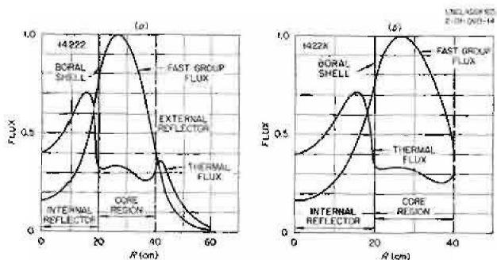

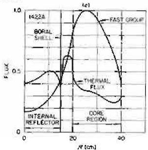  
Fig. 5.4.8. Neutron Flux as a Function of the Radial Position in the TSR-II for Various Positions of a Borol Shell in the Internal Water Reflector and o 0.707 Aluminium-to-Water Volume Ratio. Reactor geometry: 40-cm-dia internal water reflector, 20-cm-thick core, 20-cm-thick external water reflector (effective).

below the ratio of 0.7 used in the BSF reactor.4 Also, if this ratio is used the standard arrangement of 60-mil-thick fuel plates separated by 120 mils of water can be used. Since the amount of control available increases with a decrease in core thickness, an approximately 14-cm core thickness (5.5 in.) appears to be the optimum. This thin core, which requires less than $6.5\mathrm{kg}$ of $\mathsf{U}^{235}$ for criticality, will also be an advantage with respect to the heat removal problem (see below).

The configuration having a 17.5-in.-dia internal water reflector and 5.5-in.-thick core region was then examined to ensure that the $U^{235}$ fuel plate loading would not exceed the $0.0283\mathrm{g/cm}^2$ surface density previously designated. It was found that the maximum loading possible for this surface density was $9.5\mathrm{kg}$ . This allows for an error in the critical mass obtained from the two-group Oracle calculations to be as high as $45\%$ . The

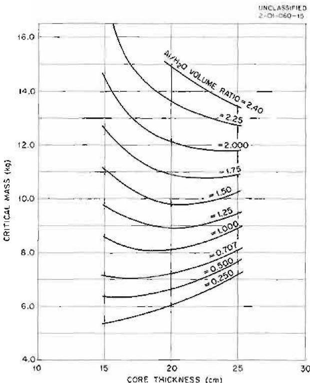  
Fig. 5.4.9. Critical Mass in the TSR-II as a Function of the Core Thickness for a 44.5-cm-dio (17.5-in.-dia) Internal Water Reflector and Various Aluminum-to-Water Volume Ratios. External water reflector thickness: 20 cm.

critical mass will be calculated again with a multigroup, multiregion code in the near future.

# HEAT REMOVAL STUDY

The heat flux from the fuel plates will be approximately $5 \times 10^{4} \, \text{Btu/ft}^{2}$ . hr. To remove this heat a two-pass cooling system has been proposed. It was previously determined that a 1000-gpm flow rate with a $40^{\circ}$ F temperature rise of the water over the inlet water temperature would provide sufficient cooling to prevent boiling or excessive fuel plate temperatures in a reactor core with higher aluminum-to-water volume ratios. It was also stated that a larger internal reflector and thinner core region would make conditions even better. The 17.5-in.-dia internal reflector and 5.5-in.-thick

core meet these conditions, but the larger water volume dictated by the lower aluminum-to-water ratio is somewhat detrimental. It is felt that if turbulent water flow could be maintained in each channel, adequate cooling could still be achieved with the 1000-gpm flow rate. Using a log mean flow areo and assuming equal flow per channel, the Reynolds number was calculated and found to vary from 11,000 in the inner channels to 8500 in the outer channel. It appears, therefore, that sufficient latitude will exist over which to adjust flow rates to obtain uniform outlet temperatures and still maintain turbulent flow.

# FUTURE STUDIES

Preparations are being made for several development experiments to further establish the TSR-II design. Several control system mockups consisting of solid stainless steel plates, perforated stainless steel plates, or boron-loaded aluminum plates will be tested in a 6-in.-square water-filled hole in the center of the BSF reactor. A prototype of the actual control design is also being constructed for other dynamic tests. In addition, the fuel element drawings are now complete, and a model will be fabricated to establish a header arrangement for the cooling system.

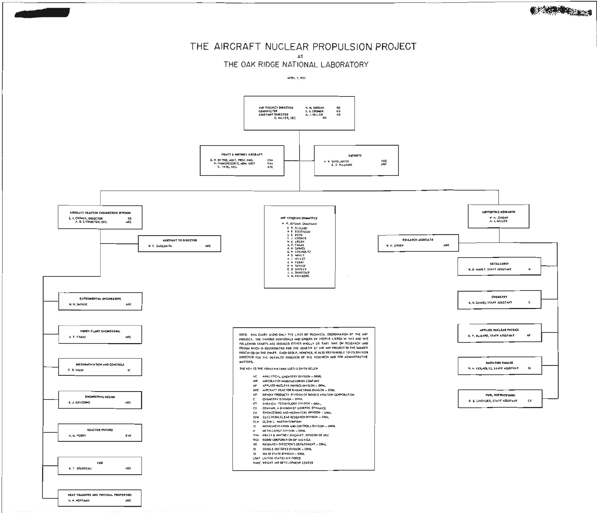

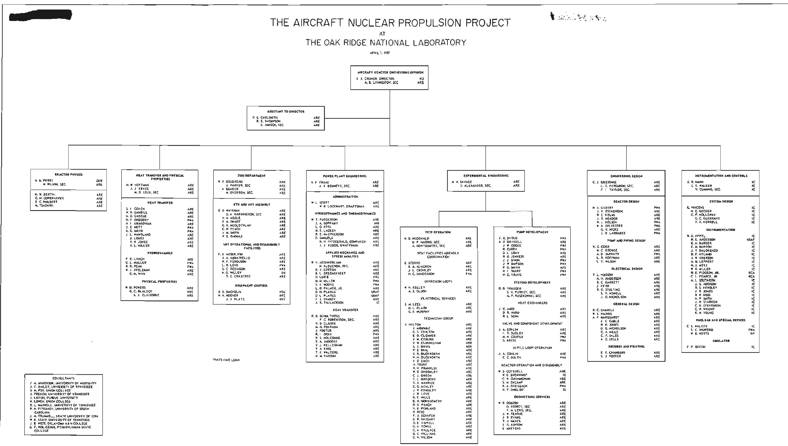

# THE AIRCRAFT NUCLEAR PROPULSION PROJECT

AT

# THE OAK RIDGE NATIONAL LABORATORY

APRIL 1,1957

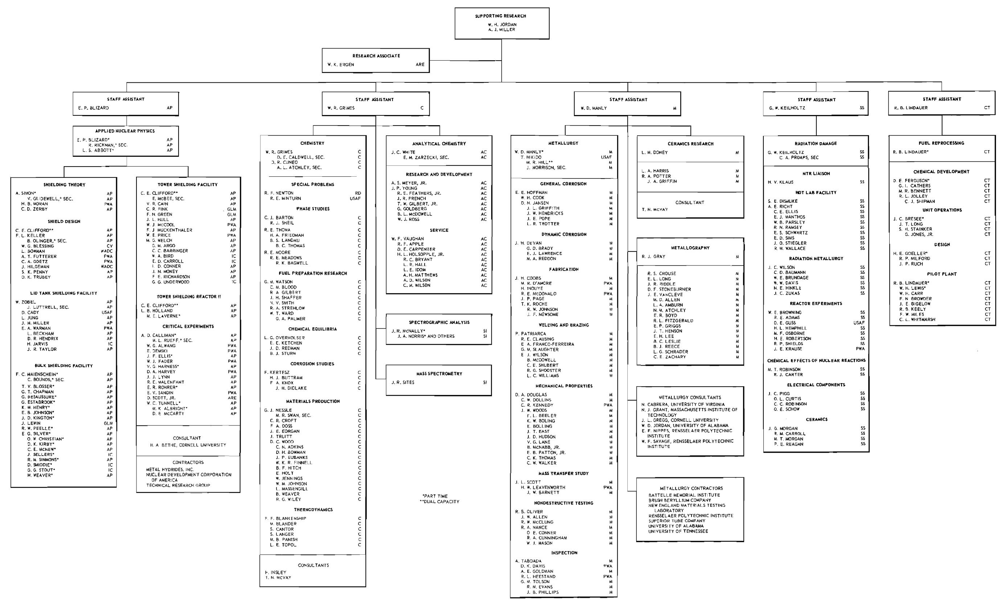