# AEC RESEARCH AND DEVELOPMENT REPORT

ORNL-2278

Reactors-Special

Features of Aircraft Reactors

MARTIN MARIETTA ENERGY SYSTEMS LIBRARIES

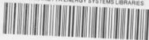

3445603514702

VISCOSITY MEASUREMENTS ON MOLTEN

FLUORIDE MIXTURES

S. I. Cohen

T. N. Jones

DECLASSIFIED

CLASSIFICATION CHANGED TO:

BY: A. Authority Of:

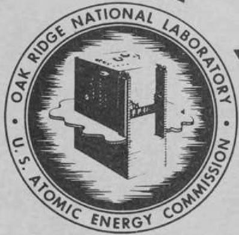

CENTRAL RESEARCH LIBRARY

DOCUMENT COLLECTION

LIBRARY LOAN COPY

DO NOT TRANSFER TO ANOTHER PERSON

If you wish someone else to see this

document, send in name with document

and the library will arrange a loan.

OAK RIDGE NATIONAL LABORATORY

OPERATED BY

UNION CARBIDE NUCLEAR COMPANY

A Division of Union Carbide and Carbon Corporation

UCC

POST OFFICE BOX X • OAK RIDGE, TENNESSEE

RESHING DATA

The 100000000000000000000000000000000000000000000000000000000000000000000000

SECRET

This document consists of 50 pages.

Copy 5 208 copies. Series A.

Contract No. W-7405-eng-26

Aircraft Reactor Engineering Division

VISCOSITY MEASUREMENTS ON MOLTEN

FLUORIDE MIXTURES

S. I. Cohen

T. N. Jones

DATE ISSUED

JUN 28 1957

OAK RIDGE NATIONAL LABORATORY

Operated by

UNION CARBIDE NUCLEAR COMPANY

A Division of Union Carbide and Carbon Corporation

Post Office Box X

Oak Ridge, Tennessee

# INTERNAL DISTRIBUTION

1. C. E. Center   
2. Biology Library   
3. Health Physics Library

4-5. Central Research Library

6. Reactor Experimental Engineering Library

7-11. Laboratory Records Department   
12. Laboratory Records, ORNL R.C.   
13. A. M. Weinberg   
14. L. B. Emhet (K-25)   
15. J. P. Murray (Y-12)   
16. J. A. Swartout   
17. E. H. Taylor   
18. E. D. Shipley   
19. M. L. Nelson   
20. S. C. Lind   
21. F. L. Culler   
22. A. H. Snell   
23. A. Hollander   
24. M. T. Kelley   
25. J. H. Frye, Jr.   
26. K. Z. Morgan   
27. C. P. Keim   
28. R. S. Livingston   
29. T. A. Lincoln   
30. A. S. Householder   
31. C. S. Harrill   
32. C. E. Winters   
33. D. W. Cardwell   
34. E. M. King   
35. A. J. Miller   
36. R. A. Charpie   
37. J. A. Lane   
38. M. J. Skinner   
39. S. I. Cohen   
40. W. R. Gambill   
41. N. D. Greene   
42. H. W. Hoffman   
43. T. N. Jones   
44. J. J. Keyes   
45. A. I. Krakoviak   
46. F. E. Lynch   
47. L. D. Palmer   
48. W. D. Powers   
49. W. J. Stelzman   
50. J. L. Wantland

51. E. J. Breeding   
52. E. R. Dytko   
53. R. I. Gray   
54. D. P. Gregory   
55. J. E. Mott   
56. G. L. Muller   
57. R. D. Peak   
58. W. B. Cottrell   
59. S. J. Cromer   
60. J. H. Devan   
61. W. K. Ergen   
62. A. P. Fraas   
63. W. T. Furgerson   
64. A. G. Grindell   
65. W. H. Jordan   
66. F. F. Blankenship   
67. W. R. Grimes   
68. F. Kertesz   
69. H. W. Savage   
70. W. D. Manly   
71. E. P. Blizzard   
72. R. E. MacPherson   
73. E. R. Mann   
74. L. A. Mann   
75. W. B. McDonald   
76. R. V. Meghreblian   
77. A. M. Perry   
78. D. H. Platus   
79. D. L. Platus   
80. R. D. Schultheiss   
81. D. B. Trauger   
82. M. M. Yarosh   
83. W. F. Boudreau   
84. R. B. Lindauer   
85. D. C. Hamilton   
86. R.E. Moore   
87. G. J. Nessle   
88. R. F. Newton   
89. L. G. Overholser   
90. R. E. Thoma   
91. G. M. Watson   
92. C. J. Barton   
93. C. M. Copenhaver   
94. ORNL - Y-12 Technical Library, Document Reference Section

# EXTERNAL DISTRIBUTION

95. Air Technical Intelligence Center   
96-93. AIP Project Office, Fort Worth   
99. Albuquerque Operations Office   
100. Argonne National Laboratory   
Q1. Armed Forces Special Weapons Project, Sandia   
02. Armed Forces Special Weapons Project, Washington   
03. Assistant AF Plant Representative, Downey   
04. Assistant Secretary of the Air Force, R&D

105-110. Atomic Energy Commission, Washington

111. Atomics International   
112. Batteule Memorial Institute

113-114. Bettis Plant (WAPD)

115. Bureau of Aeronautics   
116. Bureau of Aeronautics (Code 24)   
117. Bureau of Aeronautics General Representative   
118. Chicago Operations Office   
119. Chicago Patent Group   
120. Chief of Naval Research   
121. Convair-General Dynamics Corporation   
122. Curtiss-Wright Corporation   
123. Engineer Research and Development Laboratories

124-127. General Electric Company (ANPD)

128. General Nuclear Engineering Corporation   
129. Glenn L. Martin Company   
130. Hartford Area Office

131-132. Headquarters, Air Force Special Weapons Center

133. Idaho Operations Office   
134. Knolls Atomic Power Laboratory   
135. Lockland Area Office   
136. Los Alamos Scientific Laboratory   
137. Marquardt Aircraft Company   
138. National Advisory Committee For Aeronautics, Cleveland   
139. National Advisory Committee for Aeronautics, Washington

140-142. Naval Air Development and Material Center

143-144. Naval Research Laboratory (1 copy to L. Richards)

145. New York Operations Office   
146. North American Aviation, Inc. (Missile Development Division)   
147. Nuclear Development Corporation of America   
148. Office of the Chief of Naval Operations (OP-361)   
149. Patcent Branch, Washington   
150. Fitterson-Moos

151-155. Pratt and Whitney Aircraft Division (Fox Project) (1 copy to S. M. Kepelner)

156. San Francisco Operations Office   
197. Sandia Corporation   
58. School of Aviation Medicine   
159. Sylvania Electric Products, Inc.   
160. Technical Research Group   
161.USAF Headquarters   
162. USAF Project Rand   
163. U. S. Naval Radiological Defense Laboratory   
164. University of California Radiation Laboratory, Livermore

165-182. Wright Air Development Center (WCOSI-3)

183-207. Technical Information Service Extension, Oak Ridge   
208. Division of Research and Development, AEC, ORO

# TABLE OF CONTENTS

# Page

ABSTRACT 1

INTRODUCTION 2

EXPERIMENTAL APPARATUS AND TECHNIQUES 5

The Drybox 5

The Furnace 7

The Capillary Viscometer 12

The Brookfield Viscometer 16

INSTRUMENT CALIBRATION 19

EXPERIMENTAL RESULTS 29

CORRELATIONS 34

REFERENCES 45

# ABSTRACT

This report is a summary of the experimental viscosity program on fused fluoride mixtures which has been carried out in support of the ANP effort at the Oak Ridge National Laboratory. The experimental techniques which have been developed are described, data on the viscosity of 36 mixtures are tabulated, and several correlations involving these data are discussed.

# INTRODUCTION

The value of fused fluorides as coolants and fuels for high temperature, circulating-fuel reactors was recognized early in the ORNL-ANP program. However, the scarcity of known and reliable data on the thermal properties of these fluids seriously hampered the initial design efforts. To remedy this situation, a program was outlined to obtain experimental data on the viscosity, enthalpy and heat capacity, density, and thermal conductivity of the fused fluorides and their mixtures. This report is a summary of the portion of this program concerned with the measurement of the viscosity of the fused fluoride salts.

The experimenter is confronted with a number of difficulties in the measurement of the viscosity of these fluids:

(1) The high melting points and wide extent of the liquid state of the fluoride salts establishes a temperature region of experimental interest between $500^{\circ}\mathrm{C}$ and $1,000^{\circ}\mathrm{C}$ .   
(2) All of the common materials available for the construction of the experimental apparatus corrode in the molten fluoride salts. In the presence of even small amounts of oxygen or water vapor, the corrosion rates are greatly accelerated.   
(3) Since these salts in the molten state combine strongly with both oxygen and water vapor, the purification of the salt is difficult. Further, to insure a continuing purity, and hence avoid large amounts of contaminating corrosion products, it is

necessary to maintain the molten salts in an inert atmosphere.

(4) Some of the salts, such as beryllium fluoride, present problems in handling due to their toxicity.   
(5) The fluid viscosity in the temperature range of interest is low, varying from approximately 2 to 15 centipoises.

These difficulties impose severe requirements on the measuring equipment by limiting the choice of techniques, construction materials, and instrumentation and by complicating the experimental manipulation of the apparatus.

A number of techniques have been investigated by the experimental groups at the Oak Ridge National Laboratory in developing suitable instruments for measuring the viscosities of fused salts. Knox and Kertesz1 and later Redmond2 and Cisar3 used a modified form of the Brookfield rotational viscometer. Tobias developed a gravity flow capillary efflux viscometer. Knox and Kertesz5 operated a capillary device in which fluid flow was accomplished by gas pressure. A "falling-ball" viscometer using a radioactive cobalt-plated Pyrex bead was developed by Redmond and Kaplan6.

After review of this early work on the measurement of the viscosity of the fluoride salts, it was decided that the most expedient route to results of the desired accuracy was through further refinements of the apparatus and techniques for the modified Brookfield and capillary efflux viscometers. During this same period of apparatus development, salt preparation techniques were greatly advanced by the Materials Chemistry Division. Thus, the results reported are in general for high purity salt mixtures.

The general techniques for fused salt viscosity measurements have been developed sufficiently to place these measurements in the category of routine.

The detailed discussion of these techniques and the apparatus modifications is contained in the section of this report on experimental equipment and procedures.

Some 36 mixtures have been studied at ORNL*. These have included binary, ternary, and quaternary mixtures of the following fluorides: NaF, LiF, KF, RbF, BeF $_2$ , ZrF $_4$ , UF $_3$ , UF $_4$ , and ThF $_4$ .

A modest program of viscosity measurement on fused fluorides will be continued. As new mixtures are formulated and found to be of sufficient interest, viscosity data will be supplied to the various design groups studying fused fluoride reactors. In addition, a program to investigate fused salt systems other than fluorides is planned. At present this plan includes studies on chlorides, and mixtures of chlorides and fluorides. Some data have already been obtained in the chloride system. Other systems will be studied as they become of interest.

# EXPERIMENTAL APPARATUS AND TECHNIQUES

The experimental apparatus and techniques used in the measurement of the viscosity of the fused fluoride mixtures are described in the paragraphs which follow. This equipment includes the two viscometers (capillary efflux and rotational), the viscometer furnace, and the dry-box.

The Drybox. Because of the necessity for handling these salts in an inert atmosphere, all measurements were made in a drybox under an argon blanket. This box was constructed from 1/8-inch mild steel with the top and front consisting completely of Plexiglas windows. The box was 50 inches high, 30 inches wide, and 24 inches deep. Long rubber gloves were attached to Plexiglas rings located on the front at shoulder height to enable convenient and comfortable manipulation of the equipment located within the box. A photograph of the box is shown in Figure 1.

One side of the drybox was constructed as a door to provide access to the inside. This door was constructed of $1/4$ -inch aluminum to reduce its weight and was sealed against a live rubber tubular gasket by KNU-VISE H-200 clamps located around its periphery. Shelves and a bracket to support the Brookfield viscometer were welded to the inside walls and a cooling coil made from $1/4$ -inch copper tubing was located on the wall opposite the door. This coil was provided to reduce the temperature rise in the drybox due to prolonged operation of the furnace. The efficiency of this coil could be increased for high heat loads by the use of a 15 cfm blower to establish a forced draft across the tubes.

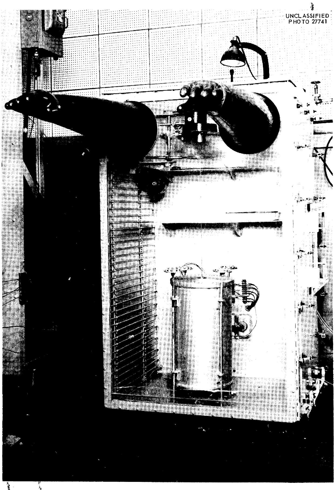  
Fig.1. Photograph of Drybox Showing Furnace and Brookfield Viscometer in Operating Position.

A number of precautionary measures were taken during construction of the box to insure gas tightness. Thermocouple leads were brought through the drybox wall in Conax fittings and attached to terminal blocks on both the inside and outside surfaces of the wall to eliminate strain on the seal. Electrical leads were introduced through similar special fittings. These fittings, as well as the fittings used for the cooling coil, gas inlet, and gas outlet, were welded in place. The welds were heavily painted with Glyptal before the final paint was applied to the drybox. The box was periodically checked for tightness with a Freon leak detector.

A series of tests was conducted to ascertain the optimum procedure for obtaining argon drybox atmospheres. It was found that best results were produced by introducing argon at the bottom of the box and allowing it to exit near the top through an oil bubbler. The box was usually purged in this manner overnight with a flow of from 4 to 8 cubic feet per hour of argon before the test mixture was exposed to the drybox atmosphere.

The Furnace. It was necessary in carrying out this experimental program to design a tube furnace which would bring a capsule consisting of a 14-inch section of one-inch I.P.S. pipe filled with a fused fluoride to red heat quickly, hold the temperature constant along the entire length of the capsule, and attain equilibrium rapidly after adjustments in the temperature setting. A diagram of the furnace along with the temperature measurement and control systems is shown in Figure 2, and a photograph of the furnace is shown in Figure 1.

The furnace shell was a cylinder 16 inches high and 10 inches in diameter, mounted on casters and equipped with leveling screws which can be

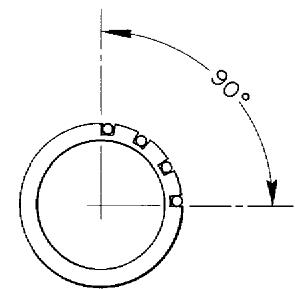  
THERMOCOUPLE LOCATION

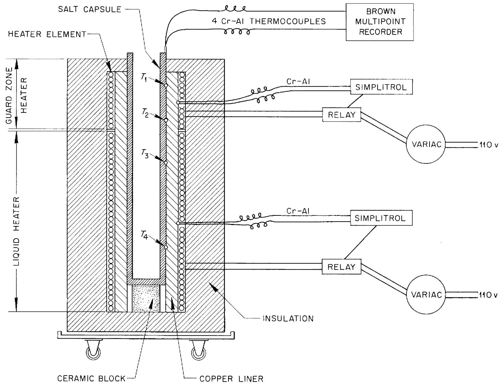  
Fig. 2. Diagram of Furnace with Temperature Control and Measurement Systems.

operated from several inches above the furnace. It was insulated with semicircular blocks cut from slabs of JM-3000, an aluminum silicate insulating brick manufactured by Johns-Manville.

Two pairs of 3-inch I.D. "clam-shell" resistance heaters made up the furnace element. These two units, having lengths of $10 - 1/2$ inches and $3 - 1/2$ inches, were located in the furnace with the short section on top and were controlled separately (see furnace diagram, Figure 2). The lower unit heated the liquid and the upper unit served as a "guard zone" heater. This guard heater was necessary for two reasons. First, the zone just above the liquid surface must be kept at the temperature of the liquid or the resulting temperature gradients will cause convection currents giving slightly erroneous readings on the Brookfield viscometer. Second, it is essential that the efflux cup viscometer be held in a zone at the temperature of the liquid while it is draining or an error is obviously introduced. It was found that two separately controlled elements provided the simplest means of maintaining the temperature of this zone at the liquid temperature.

Temperatures of the two elements were controlled by circuits containing chromel-alumel thermocouples, relays, and "Simplitrols." Variacs were also included in these circuits to afford more sensitive adjustment. The hot junctions of the thermocouples were imbedded in the outer face of a heavy copper pipe occupying the annulus between the furnace element and the capsule containing the sample. This copper pipe, having a wall thickness of almost one inch, served as a thermal diffuser to provide very even temperature distribution in the sample.

Liquid temperatures were measured using four chromel-alumel thermocouples inserted in wells of 0.08-inch O.D. thin-walled tubing which were snapped into 0.08-inch square grooves machined longitudinally in the outer wall of the capsule (see Figure 2). The wells were cut to such length that the junctions of two thermocouples were located in the liquid zone and two were in the zone above the liquid. A diagram showing the relative positions of the four thermocouples to the two viscometers in operation may be found in Figure 3. Temperatures measured by these four couples were read on a Brown multipoint recorder.

Measurements were made with both the capillary and rotational instruments using the same sample of salt during a single heat-up period. About 100 cc of molten salt were required to fill the capsule to sufficient depth to operate the two instruments. A complete viscosity-temperature curve was determined using one of the instruments before measurements were begun with the other.

After a satisfactory inert atmosphere had been obtained in the drybox, the furnace controls were set at a temperature 25 to 50 degrees above the liquidus temperature of the salt and the system was allowed to come to equilibrium. The small quantity of graphite present in the salt from the preparation equipment rose to the surface as the salt melted. This graphite was removed by touching the surface of the salt with a cold tamper, allowing the superficial layer containing the graphite to freeze on the tamper.

The capillary cup was usually used in making the first measurements on a new salt. To establish the entire viscosity-temperature curve, the temperature of the melt was incrementally raised and measurements were made

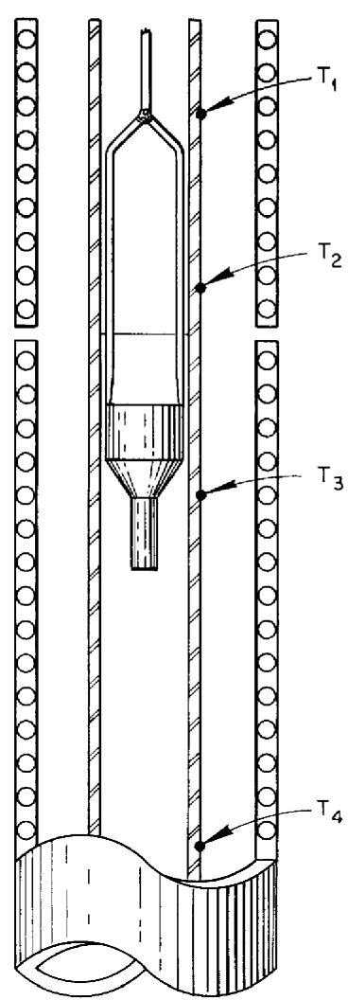

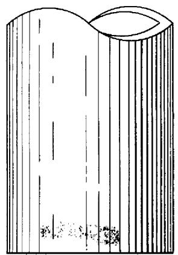  
FILL

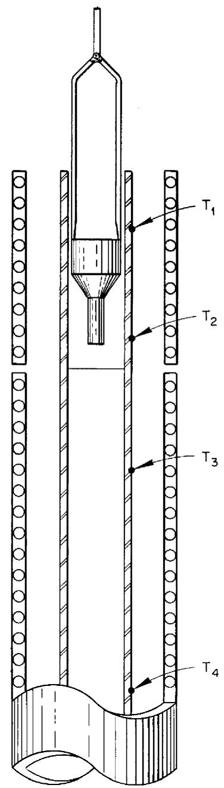

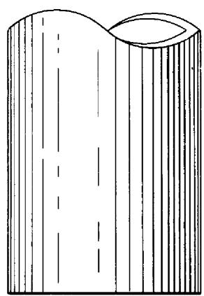  
EFFLUX

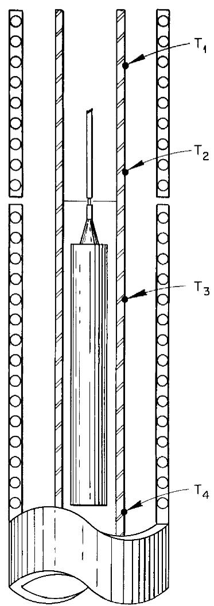

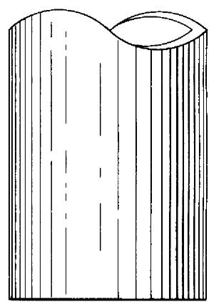  
BROOKFIELD SPINDLE   
Fig. 3. Diagram Showing Relative Positions of Thermocouples and Viscometers in Furnace.

after attainment of equilibrium at each temperature step. Then, the salt was allowed to cool to the original starting temperature, and a similar experimental procedure was followed with the Brookfield viscometer.

The Capillary Viscometer. The efflux cup or capillary viscometer, originally designed by Tobias3, is still being used with slight modifications. The instrument consists of a reservoir, containing the test fluid, located above and integrally connected with a capillary tube. A photograph of the device is shown in Figure 4, and a detailed diagram is given in Figure 5. The fluid drains through this capillary and the time of efflux is obtained. By comparing the efflux time for the test fluid with the times for fluids of known viscosity flowing through the same cup, the unknown viscosity is established. The determination of the calibration curve will be discussed in detail in the section on instrument calibration.

This viscometer, while it does not provide an absolute measurement, does possess the advantages of simplicity of operation, ease of cleaning, and low cost of fabrication. Various construction materials can be used to provide compatibility with many classes of liquids, and the capillary bore can be varied to cover a wide viscosity range. The principal disadvantage of the instrument, plugging of the capillary, has been virtually eliminated by improvements in fuel preparation and drybox atmosphere techniques. The occasional partial plugging which does occur is easily remedied by reaming with a fine, stiff wire.

The cup used in these studies had a reservoir of approximately 6 cc capacity, connected to a capillary one inch in length. Two capillary bore

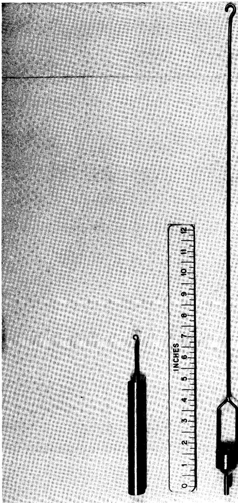  
Fig.4. Photograph of Efflux Cup or Capillary Viscometer and Spindle of

UNCLASSIFIED

PHOTO 27740

Brookfield Viscometer.

UNCLASSIFIED

ORNL-LR-DWG 19836

Fig. 5. Diagram of Capillary or Efflux Cup Viscometer.   
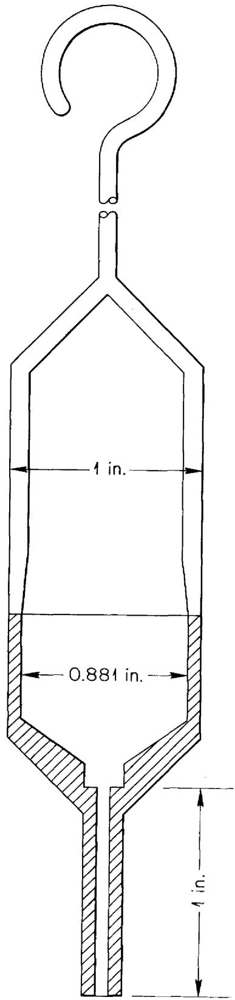  
CAPILLARY DIAMETER:   
0.033 in. OR 0.039 in.

diameters were used, 0.0330 inch and 0.0394 inch. Liquids with a kinematic viscosity of one centistoke, the lowest value usually encountered in measurements of fluorides, will drain from the smaller bore cup in about 45 seconds.

Measurements were made with the efflux cup using a visual procedure. The cup was submerged in the molten salt until complete thermal equilibrium was attained. It was then raised above the surface of the salt, held in the heated "guard zone," and allowed to drain (see Figure 3). The close clearance between the outside walls of the cup and the inner walls of the tube containing the salt afforded assurance that the cup was uniformly vertical from reading to reading.

A timer was started as the top edge of the reservoir cleared the surface on being withdrawn from the liquid. The cup drained while being held in the heated zone above the liquid, and the timer was stopped when the liquid level in the cup reached the bottom of the conical section of the reservoir. The time of efflux was recorded, and the procedure was repeated a number of times at the same temperature. The precision at a given temperature was within $\pm 2 - 3$ per cent. Results with greater spread were usually due to partial plugging of the capillary. In the event of plugging, the capillary was reamed and the procedure was repeated until a series of measurements of satisfactory precision was obtained.

Because of the high purity of the salts and the improved inert atmospheres, corrosion has been slight enough to enable cleaning, recalibration and continued use of the cups on an almost indefinite basis.

The Brookfield Viscometer. This instrument is a rotational viscometer consisting of a spindle which is immersed in the liquid being studied and a synchronous motor which rotates the spindle. The torque applied to the spindle by the viscous forces of the liquid produces a deflection on a calibrated spring made of a copper-beryllium alloy. A dial graduated in centipoises rotates with the motor and a pointer attached below the spring indicates the deflection of the spring on this dial.

As with the capillary cup viscometer, this instrument does not provide an absolute measurement and requires frequent calibration. However, even though more complex than the capillary device, it possesses similar advantages for measurements on fused salts. The spindle, the only part of the system which comes into contact with the salts, is easily fabricated from a choice of metals. It is simple to construct, easily cleaned, and may be reused indefinitely. The principal disadvantage with this instrument results from its application to a lower viscosity range (2 to 15 centipoise) than that for which it was designed. Thus, a number of modifications of the manufacturer's design were necessary. These modifications will be discussed in the section on instrument calibration.

For measurements with the fluorides, the spindle was connected to the motor by a long, linked drive shaft. This isolated the delicate mechanism of the instrument from the extreme temperatures at the top of the furnace. A shiny metallic reflector, placed just beneath the motor housing, served as additional thermal protection for the motor. A photograph of the Brookfield in operating position in the drybox is shown in Figure 1, and a photograph of the spindle is presented in Figure 4.

#

Centering of the spindle in the salt capsule, leveling of the motor, and even temperatures throughout the entire sample of salt are all essential if accuracy is to be obtained with the Brookfield. Poor leveling of the motor causes bumpy, uneven rotation and a resulting error. A leveling bulb on the motor housing provided a means of avoiding this difficulty. A uniform annulus was produced between the surface of the spindle and the wall of the capsule by carefully adjusting the capsule to an exactly vertical position. This was done by placing a level on the machined top surface of the capsule which extends out of the furnace and making necessary adjustments with the leveling screws on the furnace (see Figure 1). Thermal convection was minimized by adjustment of the "guard zone" heater.

Errors produced by improper centering of the spindle result in high readings. It was therefore possible to properly center the instrument by moving the spindle within the capsule to give the lowest consistent reading. Once this was done, only vertical adjustments were made during the course of the experimental measurements over the complete temperature range so as to maintain the liquid level at the notch located on the spindle shaft. This was necessary to compensate for the expansion of the liquid with increasing temperature.

The results obtained with the Brookfield viscometer at a single temperature are highly reproducible. Variation seldom exceeds $\pm 0.1$ centipoises even though the clutch is disengaged and the spring allowed to completely relax between readings.

The Brookfield instrument used is designated Model LVF by the manufacturer. It has four speeds: 60, 30, 12, and 6 rpm. Only the 30 rpm

speed was used in this program. Operation at 60 rpm resulted in turbulence in the lower viscosity liquids. The spindles used were modified to give a larger shear surface than those provided by the manufacturer. This was done by doubling the spindle length while maintaining the same cylinder diameter.

# INSTRUMENT CALIBRATION

The viscosities of nearly all fluoride mixtures of practical interest fall between 2 and 15 centipoises over the pertinent temperature range. Since the minimum full-scale reading of the Brookfield viscometer as manufactured was 100 centipoises, it was clear that its use in an absolute manner would result in readings of only a few per cent of full scale and would introduce large errors. To avoid this pitfall, it was necessary to modify the instrument to produce a higher reading at a given viscosity and then carefully calibrate the modified instrument in liquids of known properties. It was also necessary to calibrate the individual capillary viscometers as it was found that the capillaries were not bored with sufficient precision to allow theoretical determination of their characteristics; calibration curves were found to vary substantially between cups. The following paragraphs will describe the development of the calibration techniques presently used.

Early Brookfield measurements were made at 60 rpm using a spindle identical in geometry with the lowest range spindle provided by the manufacturer. This spindle was cylindrical, having an O.D. of about $3/4$ inch and a length of about $2-3/4$ inches. The salts were contained in a capsule made from 1-1/2 inch, Schedule 40 I.P.S. pipe. Calibration was carried out in a series of glycerol-water solutions having the proper viscosities, and a calibration curve of Brookfield reading versus actual viscosity was plotted from the data. Capillary viscometers were also calibrated in these solutions and the results were plotted in the form: kinematic viscosity in centistokes

versus time of efflux in seconds. These solutions were easily prepared and their viscosities were determined in Ostwald viscometers in a constant temperature bath. The solutions were kept in wide-mouth jars containing a length of 1-1/2 inch pipe to reproduce the annulus in the salt capsule. However, these solutions were somewhat disadvantageous in that they were subject to property changes due to evaporation and those of lower glycerol concentration had a tendency to grow molds. In an effort to avoid these disadvantages, a series of pure alcohols were tried in place of these solutions and used with some success.

The results obtained on fused fluorides with the two separate instruments calibrated in this way differed substantially. Deviations up to 30 per cent were found, and it was noted that the Brookfield readings invariably were high. A visual study was made on the flow patterns of the liquid around the Brookfield spindle by operating it in a dilute solution of Milling Yellow NGS, a commercially available dyestuff having double refracting properties. Lines of strain and consequently, flow patterns, are visible in this liquid when viewed with polarized light. Fortunately, solutions in the concentration range exhibiting this effect also had viscosities in the desired range. The solution was held in a glass container having about the same geometry as the 1-1/2 inch pipe used for the salt capsules and in the calibrating liquids.

Turbulent cells were observed between the spindle and capsule surfaces when the instrument was operated at 60 rpm. Since the fluoride melts were 2 to 4 times more dense than the dye or calibrating solutions, the Reynolds

modulus in the annular region between the capsule and the spindle was 2 to 4 times higher in the salts than in the calibrating liquids. As a result, this turbulence would be even more pronounced in the salts.

In view of these observations, a number of modifications were made in calibration and operation procedures. The speed of rotation was reduced to 30 rpm, and the length of the spindle was doubled to compensate for the loss in shear resulting from this reduction in speed. Further, the salt capsules were constructed of one-inch Schedule 40, I.P.S. pipe to reduce the thickness of the salt annulus. The net result of these changes was an increase in the shear, and hence larger instrument readings. At the same time the turbulent flow cells were eliminated. The effect of a reduction in annulus thickness in a rotational viscometer on the critical speed, or speed at which vortices begin to form, can be determined from the following relation for rotational viscometers with the outer cylinder stationary:

$$
2 \left[ \log_ {1 0} U t / v \right] _ {\text {c r i t .}} + \log_ {1 0} t / R _ {1} = 3. 2 3 2 \tag {1}
$$

where

U = critical speed at which vortices begin to be produced

$\mathbf{R}_{1} =$ outer radius of annulus

$\mathbf{R}_2 =$ inner radius of annulus

$\mathbf{t} = \mathbf{R}_1 - \mathbf{R}_2 =$ thickness of annulus

$\pmb{\nu}$ = kinematic viscosity of liquids.

Solving equation (1) using the dimensions of the one-inch capsule and a kinematic viscosity of one centistoke (the lowest value usually encountered in measurements on fluorides) yielded a critical speed of 58 rpm. Thus,

operation at 30 rpm assured laminar flow in this capsule. When equation (1) was solved using the same kinematic viscosity and the dimensions of the l-1/2 inch capsules, a critical speed of 13 rpm was obtained. It was therefore likely that considerable turbulence existed in the salt in the l-1/2 inch capsules, particularly at the operating speed of 60 rpm. The equation was solved for $\nu$ using the dimensions of the large capsule and a value of 4.64 centistokes was indicated as the minimum viscosity which could be measured with laminar flow at a spindle speed of 60 rpm. Most of the salts studied in this program have viscosities less than 4.64 centistokes.

Since the nature of flow is a function of density as well as viscosity, a search was made to find calibrating liquids having both densities and viscosities comparable to fluorides. Two liquids, HTS $^{10}$ and s-tetrabromoethane, were found to have suitable properties. HTS, the liquid principally used, is a fused salt mixture having the composition: $\mathrm{NaNO}_2 - \mathrm{NaNO}_3 - \mathrm{KNO}_3$ ; 40-7-53 weight %. It is noncorrosive, easily handled in air, and melts at $142^{\circ}\mathrm{C}$ . The density of this mixture varies from about 1.965 gm/cc at $160^{\circ}\mathrm{C}$ to about 1.790 gm/cc at $400^{\circ}\mathrm{C}$ . The viscosity varies from about 14.5 centipoises at $160^{\circ}\mathrm{C}$ to about 2 centipoises at $400^{\circ}\mathrm{C}$ . Density-temperature and viscosity-temperature curves for HTS are given in Figure 6. Regular checks were easily and precisely made on the viscosity of the samples of HTS used for calibration in an Ostwald viscometer suspended in a bath of HTS.

Both instruments were calibrated in this liquid using a capsule and furnace identical with those used with the fluorides. Measurements were made at several temperatures, and calibration curves were plotted in a

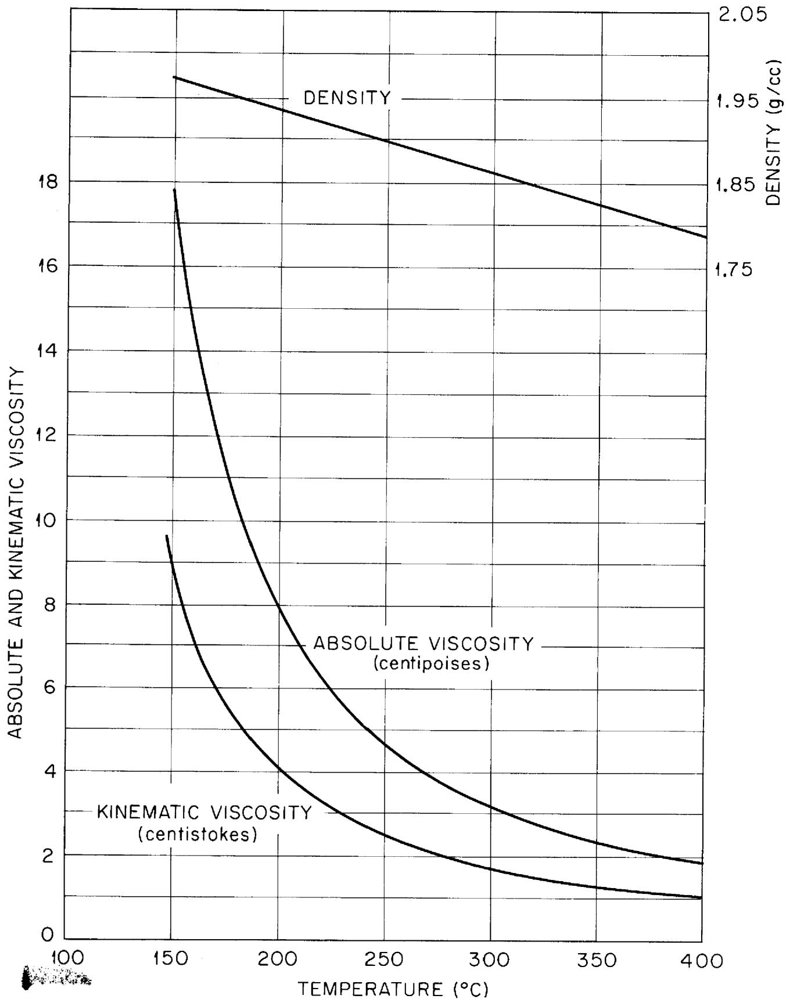  
Fig. 6. The Density and Viscosity of "HTS".

manner similar to that described in conjunction with the glycerol solution calibrations. Use of this salt mixture had the additional advantage that it reduced the already small error resulting from the slightly different dimensions of the instruments in the glycerol solutions at room temperature and the fluorides at high temperatures.

The other calibrating liquid, s-tetrabromoethane, is a heavy, highly toxic, organic halogen compound having a room temperature density of 2.964 gm/cc. The viscosity of this liquid varies from about 11.5 centipoises at $20^{\circ}\mathrm{C}$ to about 3.8 centipoises at $65^{\circ}\mathrm{C}$ . The viscosity-temperature curves for this liquid may be found in Figure 7. Calibration was carried out in this liquid by containing it in one of the capsules used for the fluorides and supporting this capsule in a constant temperature bath. This liquid was used less frequently than HTS because of its toxicity $^{11}$ .

A complete calibration curve was determined for each new cup or spindle before it was put into use. After each set of measurements on a fluoridemixture, two or three recalibration points were made to insure that the instrument had not been altered during use. Representative calibration curves for the Brookfield and capillary viscometers are shown in Figures 8 and 9, respectively. Above a reading of about 10 centipoises, the ratio of Brookfield reading to viscosity becomes constant at $1 - 1 / 2$

The changes made in the use of the Brookfield, coupled with the furnace design employing two elements and the use of calibrating liquids of higher density, have virtually eliminated the earlier poor agreement between the two different viscometers. The results with the two instruments now agree

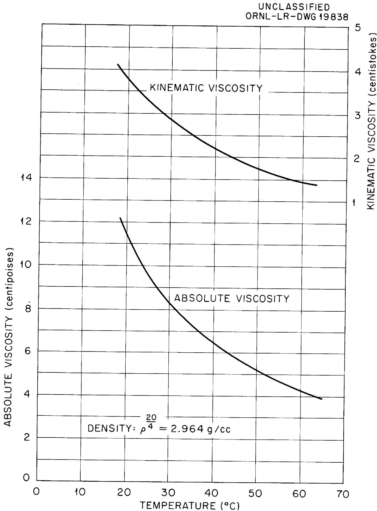  
Fig. 7. The Viscosity of s-Tetrabromoethane.

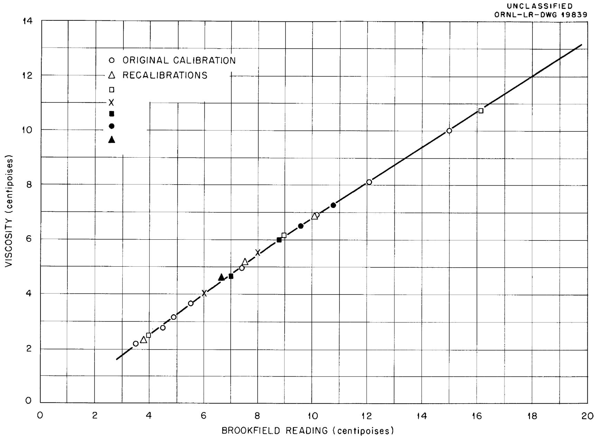  
Fig. 8. Brookfield Viscometer Calibration Curve.

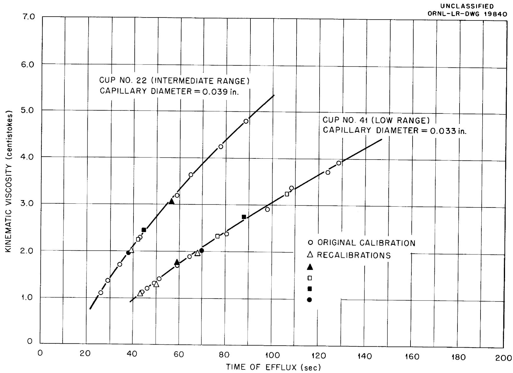  
Fig. 9. Capillary Viscometer Calibration Curves.

to within $\pm 10$ per cent. All of the data presented in this report were taken after this technique development program had been completed and the changes instituted.

# EXPERIMENTAL RESULTS

Experimental viscosity measurements have been made on 36 fluoride mixtures. The constituents of these mixtures were NaF, LiF, KF, RbF, BeF $_2$ , ZrF $_4$ , UF $_4$ , and ThF $_4$ . Since the system of principal interest to the ANP project at the present time is NaF-ZrF $_4$ -UF $_4$ , seven binaries and ternaries from this system have been studied. Mixture 30 (NaF-ZrF $_4$ -UF $_4$ ; 50-46-4 mole %) is presently being planned for use in the ART. This mixture will be formed in the reactor and the reactor made critical by the addition of Na $_2$ UF $_6$ (mixture 43) to NaZrF $_5$ (mixture 31).

Considerable interest has been shown in mixtures in the NaF-LiF-BeF $_2$ -UF $_4$ system. Although the proportion of BeF $_2$ must be somewhat limited as excessive amounts result in very high viscosities, the other properties of many of these mixtures make them highly desirable for reactor applications. Measurements have been made on several mixtures at this laboratory, and the viscosity program of Blanke, et al, at Mound Laboratory has been devoted almost entirely to an extensive and complete examination of this system.

Another mixture which has attracted considerable attention is the eutectic of KF, LiF, and NaF known as Flinak. This salt has the most desirable combination of physical properties, including viscosity, of any salt studied to date. However, its use has been limited because of associated corrosion problems. Measurements are reported on Flinak (mixture 12) and on two fuels formed by the addition of varying amounts of UF4 to Flinak (mixtures 14 and 107).

In addition to the mixtures from these three systems, a number of others from various systems have been studied as part of a continuous program devoted to finding the optimum fused fluoride mixture for use in reactor work*. Mixtures containing RbF show considerable promise from a viscosity standpoint.

Table I presents the viscosity data on the mixtures which have been studied to this time. Mixture numbers, compositions in mole per cent, liquidus temperatures, and viscosities in centipoises at $100^{\circ}\mathrm{C}$ intervals are given. Equations for the viscosity in the form

$$
\mu = A e ^ {B / T \left(^ {\circ} K\right)} \tag {2}
$$

are given for liquids where the experimental data when plotted as $\log \mu$ versus $1 / T(^{\circ}K)$ yields a straight line. The initial reference is also given. Nearly all of these measurements have been previously reported in memos and quarterlies; all except Nos. 117, 118, and 119 may be found in the recently published physical properties summary13. This summary report supplies the data in engineering units as well as centipoises and also provides kinematic viscosities in CGS and engineering units.

The accuracy of these measurements is indicated by the agreement between values obtained with the two completely different viscometers described in the experimental section; one of these instruments involves flow through a

TABLEI   
THE VISCOSITIES OF FLUORIDE MIXTURES STUDIED TO DATE   

<table><tr><td rowspan="2">Mixture</td><td colspan="8">Composition (Mole %)</td><td rowspan="2">Liquidus Temp. C</td><td colspan="5">Viscosity (Centipoises)</td><td colspan="2">μ = Ae B/T(°K)</td><td rowspan="2">Initial Ref.</td></tr><tr><td>NaF</td><td>LiF</td><td>KF</td><td>RbF</td><td>BeF2</td><td>ZrF4</td><td>UF4</td><td>ThF4</td><td>μ500</td><td>μ600</td><td>μ700</td><td>μ800</td><td>μ900</td><td>A</td><td>B</td></tr><tr><td>2</td><td>46.5</td><td></td><td>26.0</td><td></td><td></td><td></td><td>27.5</td><td></td><td>530</td><td></td><td>17.3</td><td>9.8</td><td>6.3</td><td>4.35</td><td>0.0767</td><td>4731</td><td>15</td></tr><tr><td>12</td><td>11.5</td><td>46.5</td><td>42.0</td><td></td><td></td><td></td><td></td><td></td><td>454</td><td>9.2</td><td>4.75</td><td>2.9</td><td>1.95</td><td></td><td>0.0400</td><td>4170</td><td>16</td></tr><tr><td>14</td><td>10.9</td><td>44.5</td><td>43.5</td><td></td><td></td><td></td><td></td><td>1.1</td><td>452</td><td>8.8</td><td>4.6</td><td>2.75</td><td>1.85</td><td></td><td>0.0348</td><td>4265</td><td>16</td></tr><tr><td>20</td><td>5.0</td><td></td><td>52.0</td><td></td><td></td><td>43.0</td><td></td><td></td><td>425</td><td>10.5</td><td>6.1</td><td>4.1</td><td>3.1</td><td></td><td>0.161</td><td>3171</td><td>17</td></tr><tr><td>30</td><td>50.0</td><td></td><td></td><td></td><td></td><td>46.0</td><td>4.0</td><td></td><td>520</td><td></td><td>8.5</td><td>5.4</td><td>3.7</td><td></td><td>0.0981</td><td>3895</td><td>18</td></tr><tr><td>31</td><td>50.0</td><td></td><td></td><td></td><td></td><td>50.0</td><td></td><td></td><td>510</td><td></td><td>8.4</td><td>5.2</td><td>3.45</td><td></td><td>0.0709</td><td>4168</td><td>19</td></tr><tr><td>33</td><td>50.0</td><td></td><td></td><td></td><td></td><td>25.0</td><td>25.0</td><td></td><td>610</td><td></td><td></td><td>8.5</td><td>5.0</td><td>3.5</td><td></td><td></td><td>14</td></tr><tr><td>35</td><td>57.0</td><td></td><td></td><td></td><td>43.0</td><td></td><td></td><td></td><td>360</td><td></td><td>12.8</td><td>7.0</td><td>4.25</td><td></td><td>0.0346</td><td>5164</td><td>20</td></tr><tr><td>43</td><td>66.7</td><td></td><td></td><td></td><td></td><td></td><td>33.3</td><td></td><td>665</td><td></td><td></td><td>10.25</td><td>7.0</td><td>5.15</td><td>0.181</td><td>3927</td><td>21</td></tr><tr><td>44</td><td>53.5</td><td></td><td></td><td></td><td></td><td>40.0</td><td>6.5</td><td></td><td>540</td><td></td><td>8.5</td><td>5.7</td><td>4.2</td><td></td><td>0.194</td><td>3302</td><td>13</td></tr><tr><td>45</td><td>53.0</td><td></td><td></td><td></td><td></td><td>47.0</td><td></td><td></td><td>520</td><td></td><td>7.5</td><td>4.6</td><td>3.2</td><td></td><td></td><td></td><td>13</td></tr><tr><td>70</td><td>56.0</td><td></td><td></td><td></td><td></td><td>39.0</td><td>5.0</td><td></td><td>530</td><td></td><td>8.1</td><td>5.2</td><td>3.6</td><td></td><td>0.104</td><td>3798</td><td>22</td></tr><tr><td>72</td><td>20.9</td><td>38.4</td><td></td><td></td><td></td><td>35.7</td><td>5.0</td><td></td><td>490</td><td>20.0</td><td>9.9</td><td>6.0</td><td>4.25</td><td></td><td></td><td></td><td>23</td></tr><tr><td>74</td><td></td><td>69.0</td><td></td><td></td><td>31.0</td><td></td><td></td><td></td><td>505</td><td></td><td>7.5</td><td>4.9</td><td>3.45</td><td></td><td>0.118</td><td>3624</td><td>12*,20</td></tr><tr><td>78</td><td>56.0</td><td>16.0</td><td></td><td></td><td>28.0</td><td></td><td></td><td></td><td>478</td><td></td><td>6.0</td><td>4.0</td><td>2.85</td><td></td><td>0.111</td><td>3486</td><td>12*,24</td></tr><tr><td>81</td><td>22.0</td><td>55.0</td><td></td><td></td><td></td><td>23.0</td><td></td><td></td><td>570</td><td></td><td>12.0</td><td>7.0</td><td>4.45</td><td></td><td>0.585</td><td>4647</td><td>25</td></tr><tr><td>82</td><td>20.0</td><td>55.0</td><td></td><td></td><td></td><td>21.0</td><td>4.0</td><td></td><td>545</td><td></td><td>12.0</td><td>7.0</td><td>4.45</td><td></td><td>0.0585</td><td>4647</td><td>25</td></tr><tr><td>86</td><td>32.0</td><td>35.0</td><td></td><td></td><td></td><td>29.0</td><td>4.0</td><td></td><td>445</td><td>20.5</td><td>10.5</td><td>6.45</td><td>4.55</td><td></td><td></td><td></td><td>26</td></tr><tr><td>87</td><td></td><td></td><td></td><td>48.0</td><td></td><td>48.0</td><td>4.0</td><td></td><td>425</td><td></td><td>7.1</td><td>4.65</td><td>3.3</td><td></td><td>0.116</td><td>3590</td><td>27</td></tr><tr><td>88</td><td>64.0</td><td>5.0</td><td></td><td></td><td>31.0</td><td></td><td></td><td></td><td>555</td><td></td><td>7.1</td><td>4.75</td><td>3.4</td><td></td><td>0.138</td><td>3435</td><td>12*,28</td></tr><tr><td>90</td><td>49.0</td><td></td><td>15.0</td><td></td><td>36.0</td><td></td><td></td><td></td><td>555</td><td></td><td>8.0</td><td>5.0</td><td>3.4</td><td></td><td>0.0811</td><td>4008</td><td>29</td></tr><tr><td>95</td><td></td><td></td><td></td><td>50.0</td><td></td><td>46.0</td><td>4.0</td><td></td><td>500</td><td></td><td>7.05</td><td>4.35</td><td>2.95</td><td></td><td>0.0657</td><td>4081</td><td>27</td></tr><tr><td>96</td><td>53.0</td><td>24.0</td><td></td><td></td><td>23.0</td><td></td><td></td><td></td><td>535</td><td></td><td>5.9</td><td>4.1</td><td>3.0</td><td></td><td>0.157</td><td>3168</td><td>29</td></tr><tr><td>97</td><td>49.0</td><td>36.0</td><td></td><td></td><td>15.0</td><td></td><td></td><td></td><td>597</td><td></td><td>5.65</td><td>3.95</td><td>2.95</td><td></td><td>0.173</td><td>3043</td><td>30</td></tr><tr><td>98</td><td>56.0</td><td>21.0</td><td></td><td></td><td>20.0</td><td></td><td>3.0</td><td></td><td>505</td><td></td><td>7.3</td><td>4.6</td><td>3.1</td><td></td><td>0.0737</td><td>4012</td><td>30</td></tr><tr><td rowspan="2">Mixture</td><td colspan="8">Composition (Mole %)</td><td rowspan="2">Liquidus Temp. °C</td><td colspan="5">Viscosity (Centipoises)</td><td colspan="2">μ = Ae/B(T°K)</td><td rowspan="2">Initial Ref.</td></tr><tr><td>NaF</td><td>LiF</td><td>KF</td><td>RbF</td><td>BeF2</td><td>ZrF4</td><td>UF4</td><td>ThF4</td><td>μ500</td><td>μ600</td><td>μ700</td><td>μ800</td><td>μ900</td><td>A</td><td>B</td></tr><tr><td>100</td><td>40.0</td><td>60.0</td><td></td><td></td><td></td><td></td><td></td><td></td><td>652</td><td></td><td></td><td>3.2</td><td>2.35</td><td></td><td>0.116</td><td>3225</td><td>14</td></tr><tr><td>104</td><td></td><td>43.0</td><td></td><td>57.0</td><td></td><td></td><td></td><td></td><td>475</td><td>9.0</td><td>4.5</td><td></td><td></td><td></td><td>0.0212</td><td>4678</td><td>27</td></tr><tr><td>107</td><td>11.2</td><td>45.3</td><td>41.0</td><td></td><td></td><td></td><td>2.5</td><td></td><td>490</td><td></td><td>5.1</td><td>3.0</td><td></td><td></td><td>0.0292</td><td>4507</td><td>16</td></tr><tr><td>111</td><td></td><td>71.0</td><td></td><td></td><td>16.0</td><td></td><td>1.0</td><td>12.0</td><td></td><td></td><td>13.0</td><td>7.1</td><td>4.8</td><td></td><td>0.0620</td><td>4666</td><td>13</td></tr><tr><td>113</td><td>50.0</td><td></td><td></td><td></td><td>50.0</td><td></td><td></td><td></td><td>380</td><td></td><td>15.3</td><td>8.4</td><td>5.25</td><td></td><td>0.0493</td><td>5009</td><td>31</td></tr><tr><td>114</td><td></td><td></td><td>50.0</td><td></td><td>50.0</td><td></td><td></td><td></td><td>445</td><td></td><td>15.3</td><td>6.7</td><td>3.45</td><td></td><td>0.00517</td><td>6976</td><td>31</td></tr><tr><td>115</td><td></td><td></td><td></td><td>50.0</td><td>50.0</td><td></td><td></td><td></td><td>400</td><td></td><td>11.5</td><td>5.2</td><td>2.75</td><td></td><td>0.00534</td><td>6701</td><td>13</td></tr><tr><td>116</td><td></td><td></td><td>79.0</td><td></td><td>21.0</td><td></td><td></td><td></td><td>730</td><td></td><td></td><td></td><td>2.2</td><td></td><td>0.0770</td><td>3600</td><td>29</td></tr><tr><td>117</td><td>5.0</td><td></td><td></td><td>54.5</td><td></td><td>34.5</td><td>6.0</td><td></td><td>545</td><td></td><td>8.0</td><td>4.8</td><td>3.3</td><td></td><td></td><td></td><td>32</td></tr><tr><td>118</td><td>44.5</td><td></td><td></td><td>15.0</td><td></td><td>34.5</td><td>6.0</td><td></td><td>540</td><td></td><td>7.5</td><td>4.75</td><td>3.5</td><td></td><td></td><td></td><td>32</td></tr><tr><td>119</td><td>37.5</td><td></td><td></td><td>9.5</td><td></td><td>47.0</td><td>6.0</td><td></td><td>540</td><td></td><td>9.5</td><td>5.2</td><td>3.5</td><td></td><td></td><td></td><td>32</td></tr></table>

capillary and the other is concerned with shear in an annulus with the inner cylinder rotating. An error analysis indicates that the results are within $\pm 10$ per cent of the true value.

Measurements were made on all of the salts reported here except those containing $\mathrm{BeF}_2$ with both of the instruments previously described. Salts containing $\mathrm{BeF}_2$ were studied with only capillary viscometers in a separate drybox facility built for this purpose from a 55-gallon drum. Two or three capillary viscometers were used in studying each beryllium salt mixture to furnish a check. The agreement between cups was within $\pm 10$ per cent.

# CORRELATIONS

One of the purposes of any experimental program is the development of correlations based on the experimentally determined data. These correlations describe the behavior of the materials studied and, if possible, serve as a basis for prediction of the properties of similar materials. Several such attempts have been made to correlate the viscosity data obtained in this program, and these attempts have not been without some degree of success. However, because of the complex nature of the phenomenon of fluid viscosity, these correlations cannot be depended on for predicting the viscosities of mixtures far from the measured compositions. They do serve to illustrate the various trends observed in the data.

Before describing the correlations which have been developed, the observed trends in the data will be discussed. In general, the viscosities of the fluorides are found to be a function of the fluid density and molecular weight. This relationship is as predicted since most classes of liquids behave in this manner. However, for some mixtures of fluorides this general correlation does not hold. For example, mixtures containing appreciable amounts of $\mathrm{BeF}_2$ , the least dense of the fluorides studied, exhibit very high viscosities. Mixtures containing $\mathrm{BeF}_2$ have much higher viscosities than corresponding $\mathrm{BeF}_2$ -free mixtures, and the introduction of amounts of $\mathrm{BeF}_2$ in excess of 30 - 40 mole per cent results in very sharp increases in viscosity. Blanke33 obtained a reading of about 900 centipoises on NaF- $\mathrm{BeF}_2$ (21.9-78.1 mole %) at $600^{\circ}\mathrm{C}$ . The fact that pure $\mathrm{BeF}_2$ is a glass provides a partial explanation of the high viscosities of $\mathrm{BeF}_2$ -containing mixtures.

Another pronounced trend which has been noted involves the relative effect of each alkali fluoride on the viscosity of a mixture. It was found that the viscosity of a fluoride mixture will decrease as the lower molecular weight alkali-metal fluorides are replaced by those of higher molecular weight. Thus, the viscosity of a RbF-containing mixture will be considerably lower than that of a prototype mixture containing LiF in place of the RbF.

These trends can be seen in Figure 10 in which the viscosity at $700^{\circ}\mathrm{C}$ of each salt is plotted as a function of its room temperature density. The room temperature density values were calculated from the mixture composition using the equation:

$$
\rho = \frac {\sum_ {1} ^ {N} M _ {i} f _ {i}}{\sum_ {1} ^ {N} \left(M _ {i} / \rho_ {i}\right) f _ {i}} \tag {3}
$$

where:

$$
\rho = \text {d e n s i t y}
$$

$$
M _ {1} = \text {m o l e c u l a r w e i g h t o f a c o m p o n e n t o f t h e m i x u t u r e}
$$

$$
f _ {i} = \text {m o l e f r a c t i o n o f t h a t c o m p o n e n t}
$$

$$
\rho_ {i} = \text {d e n s i t y a t r o o m t e m p e r a t u r e o f t h a t c o m p o n e n t (g m / c c)}.
$$

Values obtained from this relation represent well the room temperature experimental values. This equation was used in the correlation for predicting the liquid densities of the fluoride34 mixtures.

An average line drawn through the non- $\mathbf{BeF}_2$ points on Figure 10 indicates the trend of the relationship between density and viscosity. The two extremes,

ORNL-LR-DWG 19841

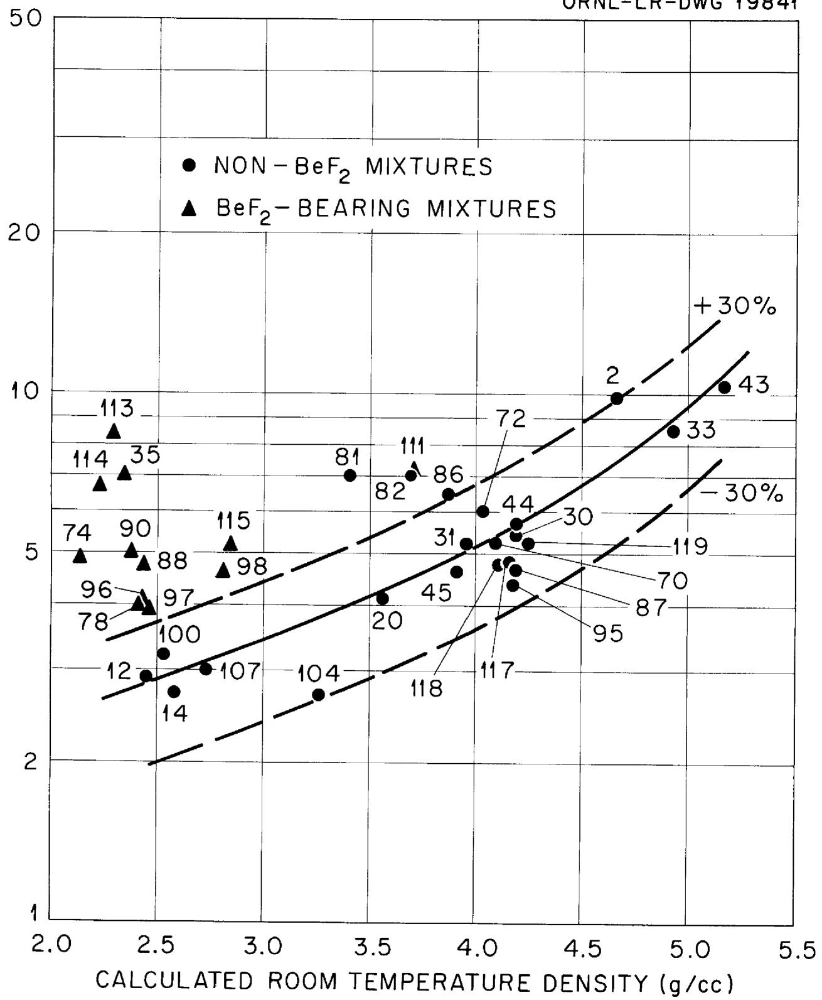  
VISCOSITY (centipoises)   
Fig.10. Viscosity at $700^{\circ}\mathrm{C}$ vs. Calculated Room Temperature Density.

mixtures 12 and 43, are the lightest and densest salts, respectively, that are likely to be encountered in non-BeF $_2$ fluoride mixtures. It is seen that, with the exception of two mixtures, the data fall within $\pm 30$ per cent of this average line. Figure 10 also shows that all of the mixtures containing BeF $_2$ are above the +30 per cent line and that the viscosities of the BeF $_2$ salts vary as their BeF $_2$ content over the concentration range (15 to 50 mole per cent) studied.

The relative effect of the various alkali fluorides on the viscosity is indicated in Figure 10. Mixtures 81, 82, 86, and 72, which are considerably above the average line, are zirconium-base fuels containing LiF as the principal alkali fluoride. Salts 87, 95, and 117, which fall somewhat below the average line, are zirconium-base fuels containing rubidium as the alkali fluoride. The mixtures of intermediate viscosity, such as 30, 44, and 70, are similar mixtures containing NaF.

All of these trends are substantiated by a correlation resulting from a statistical treatment of the data. This approach was based on a number of empirical equations cited by Hatschek $^{35}$ relating the viscosities of mixtures to their compositions. The simplest assumption is that the viscosity of an ideal mixture should be additive. Thus,

$$
\mu = \mu_ {1} x + \mu_ {2} (1 - x) \tag {4}
$$

where $\mu$ is the viscosity of the mixture, $\mu_{1}$ and $\mu_{2}$ are the viscosities of the components, and $x$ is the mole fraction of one of the two components. Bingham stated that the reciprocal of viscosity, the fluidity $(\Phi)$ , was additive. Thus,

$$
\Phi = \Phi_ {1} x + \Phi_ {2} (1 - x) \tag {5}
$$

Arrhenius proposed the purely empirical function,

$$
\log \mu = x \log \mu_ {1} + (1 - x) \log \mu_ {2} \tag {6}
$$

Kendall and Monroe found for some mixtures of nonassociated liquids that

$$
\mu^ {\frac {1}{3}} = x \mu^ {\frac {1}{3}} + (1 - x) \mu^ {\frac {1}{3}} \tag {7}
$$

From these empirical equations and the observed data trends, a correlation based on equation (4), assuming the viscosities of the fluorides to be approximately additive, was indicated. The viscosity of the mixture was represented by the equation

$$
\mu = \mu_ {A} f _ {A} + \mu_ {B} f _ {B} + \dots \dots + \mu_ {H} f _ {H} \tag {8}
$$

where $\mu_{\mathrm{A}}$ represents the viscosity of pure component $\underline{\mathbf{A}}$ , $f_{\mathrm{A}}$ is the mole fraction of that component, and so forth, for the eight components. A matrix containing as its elements the mole fractions of the components in all the mixtures studied along with the viscosities of the mixtures at $600^{\circ}\mathrm{C}$ , $700^{\circ}\mathrm{C}$ , and $800^{\circ}\mathrm{C}$ was programmed for the ORACLE. Solutions were obtained at the three temperatures for the viscosities of the pure components. It must be understood that these "pure component viscosities" are merely empirical representations for use in this relationship since the pure components are not liquids at these temperatures. Solutions were also obtained at the three temperatures using the same matrix along with the viscosities expressed as $\log \mu$ and as fluidity, or $1 / \mu$ , as in equations (5) and (6). Comparison of experimental and calculated viscosities using equations (4), (5), and (6) indicated that the three correlations were of about equal merit.

However, the degree of correlation was only fair. Viscosities calculated by this correlation for four salts at $700^{\circ}\mathrm{C}$ differed from the experimental values by more than 20 per cent. The average deviation between experimental and calculated viscosities at $700^{\circ}\mathrm{C}$ for all of the mixtures studied was approximately 10 per cent. It must be concluded, therefore, that this correlation would not be a safe basis for predicting the viscosities of new mixtures. The "pure component viscosities" obtained from the ORACLE for the equation involving linear additivity, the simplest of the three functions tested, are found in Table II. A comparison of the experimental and calculated viscosities at $700^{\circ}\mathrm{C}$ based on this function is given in Table III.

Another correlation which may be applied to the experimental results involves the relationship between fluidity and the number of "holes" in a liquid. If holes must be present in a liquid before flow can take place, as has been postulated by Eyring36, it is reasonable to assume that the fluidity of a liquid will be proportional to the number of holes. In addition, the essential difference between a solid and a liquid may be regarded as the introduction of holes. If $V$ is the molar volume of the liquid and $V_{s}$ is the molar volume of the unexpanded solid, the difference, $(V - V_{s})$ , is proportional to the number of holes and, hence, to the fluidity. Since the fluidity is the reciprocal of the coefficient of viscosity, it follows that

$$
\mu = \frac {c}{V - V _ {S}} \tag {9}
$$

where $c$ is a constant. This equation was originally proposed by Batschinski37 and was found to hold for a large number of nonassociated liquids.

TABLE II   
"PURE COMPONENT VISCOSITIES" BASED ON EQUATION (8)   

<table><tr><td rowspan="2" colspan="2">Component</td><td colspan="3">&quot;Pure Component Viscosity&quot; (Centipoises)</td></tr><tr><td>600°C</td><td>700°C</td><td>800°C</td></tr><tr><td>NaF</td><td>(A)</td><td>-1.33319</td><td>0.414287</td><td>0.495901</td></tr><tr><td>LiF</td><td>(B)</td><td>8.58465</td><td>5.27885</td><td>3.38107</td></tr><tr><td>KF</td><td>(C)</td><td>1.03168</td><td>0.367723</td><td>0.332103</td></tr><tr><td>RbF</td><td>(D)</td><td>-2.90961</td><td>-1.43543</td><td>-1.93418</td></tr><tr><td>BeF2</td><td>(E)</td><td>27.3054</td><td>13.4185</td><td>8.10863</td></tr><tr><td>ZrF4</td><td>(F)</td><td>15.1988</td><td>9.09101</td><td>6.54347</td></tr><tr><td>UF4</td><td>(G)</td><td>60.9819</td><td>31.2966</td><td>20.5855</td></tr><tr><td>ThF4</td><td>(H)</td><td>16.0516</td><td>7.43398</td><td>7.46834</td></tr></table>

# TABLE III

# COMPARISON OF EXPERIMENTAL VISCOSITIES AT $700^{\circ}\mathrm{C}$

# AND PREDICTED VALUES BASED ON EQUATION (8)

<table><tr><td rowspan="2">Mixture</td><td colspan="2">Viscosity at 700°C, Centipoises</td><td rowspan="2">Per Cent Deviation*</td></tr><tr><td>Experimental</td><td>Predicted</td></tr><tr><td>2</td><td>9.8</td><td>8.89</td><td>9%</td></tr><tr><td>12</td><td>2.9</td><td>2.66</td><td>8%</td></tr><tr><td>14</td><td>2.75</td><td>2.90</td><td>5%</td></tr><tr><td>20</td><td>4.1</td><td>4.12</td><td>0</td></tr><tr><td>30</td><td>5.4</td><td>5.64</td><td>4%</td></tr><tr><td>31</td><td>5.2</td><td>4.75</td><td>9%</td></tr><tr><td>33</td><td>8.5</td><td>10.30</td><td>21%</td></tr><tr><td>35</td><td>7.0</td><td>6.01</td><td>14%</td></tr><tr><td>43</td><td>10.25</td><td>10.70</td><td>4%</td></tr><tr><td>44</td><td>5.7</td><td>5.89</td><td>3%</td></tr><tr><td>45</td><td>4.6</td><td>4.49</td><td>2%</td></tr><tr><td>70</td><td>5.2</td><td>5.34</td><td>3%</td></tr><tr><td>72</td><td>6.0</td><td>6.92</td><td>15%</td></tr><tr><td>74</td><td>4.9</td><td>7.80</td><td>59%</td></tr><tr><td>78</td><td>4.0</td><td>4.83</td><td>21%</td></tr><tr><td>81</td><td>7.0</td><td>5.09</td><td>27%</td></tr><tr><td>82</td><td>7.0</td><td>6.15</td><td>12%</td></tr><tr><td>86</td><td>6.45</td><td>5.87</td><td>9%</td></tr><tr><td>87</td><td>4.65</td><td>4.93</td><td>6%</td></tr><tr><td>88</td><td>4.75</td><td>4.69</td><td>1%</td></tr><tr><td>90</td><td>5.0</td><td>5.09</td><td>2%</td></tr><tr><td>95</td><td>4.35</td><td>4.71</td><td>8%</td></tr><tr><td>96</td><td>4.1</td><td>4.57</td><td>11%</td></tr><tr><td>97</td><td>3.95</td><td>4.12</td><td>4%</td></tr><tr><td>98</td><td>4.6</td><td>4.96</td><td>8%</td></tr></table>

\*

Per cent deviation is defined as (difference/experimental) x 100.

# TABLE III (Continued)

# COMPARISON OF EXPERIMENTAL VISCOSITIES AT $700^{\circ}\mathrm{C}$

# AND PREDICTED VALUES BASED ON EQUATION (8)

<table><tr><td rowspan="2">Mixture</td><td colspan="2">Viscosity at 700°C, Centipoises</td><td rowspan="2">Per Cent Deviation*</td></tr><tr><td>Experimental</td><td>Predicted</td></tr><tr><td>100</td><td>3.2</td><td>3.33</td><td>4%</td></tr><tr><td>107</td><td>3.0</td><td>3.37</td><td>12%</td></tr><tr><td>111</td><td>7.1</td><td>7.10</td><td>0</td></tr><tr><td>113</td><td>8.4</td><td>6.92</td><td>18%</td></tr><tr><td>114</td><td>6.7</td><td>6.89</td><td>3%</td></tr><tr><td>115</td><td>5.2</td><td>5.99</td><td>15%</td></tr><tr><td>117</td><td>4.8</td><td>4.25</td><td>13%</td></tr><tr><td>118</td><td>4.75</td><td>4.98</td><td>5%</td></tr><tr><td>119</td><td>5.2</td><td>6.17</td><td>19%</td></tr></table>

* Per cent deviation is defined as (difference/experimental) x 100.

This relationship was applied to the experimental data on fluorides reported here, and the results are shown graphically in Figure 11. The term $\mu$ in the equation is the viscosity at $700^{\circ}\mathrm{C}$ , $\mathbf{V}$ is the molar volume or reciprocal of density at $700^{\circ}\mathrm{C}$ , and $\mathbf{V}_{\mathrm{s}}$ is the molar volume or reciprocal of the density at room temperature calculated from equation (3). Experimental values are used for the liquid density where available; calculated values are used in the other instances.

Although the points shown on the figure exhibit considerable scatter, the hyperbola described by the equation can be discerned. In contrast to the density-viscosity trend shown in Figure 10, this relationship appears to correlate the data for liquids containing $\mathrm{BeF}_2$ as well as for the non- $\mathrm{BeF}_2$ mixtures. However, the $\mathrm{BeF}_2$ -bearing liquids studied have contained only moderate proportions of this constituent. Calculations using some of the data taken at Mound Laboratory on liquids containing enough $\mathrm{BeF}_2$ to sharply increase the viscosity result in greatly increased scatter.

Some of the scatter shown in Figure 11 is probably due to the error limits to which the experimental and predicted data are subject. However, it is safe to assume that most of the divergence encountered with this correlation, as well as with the others described, is due to factors such as the general complexity of the viscosity phenomenon and the wide variation in the physical nature of the fluoride mixtures.

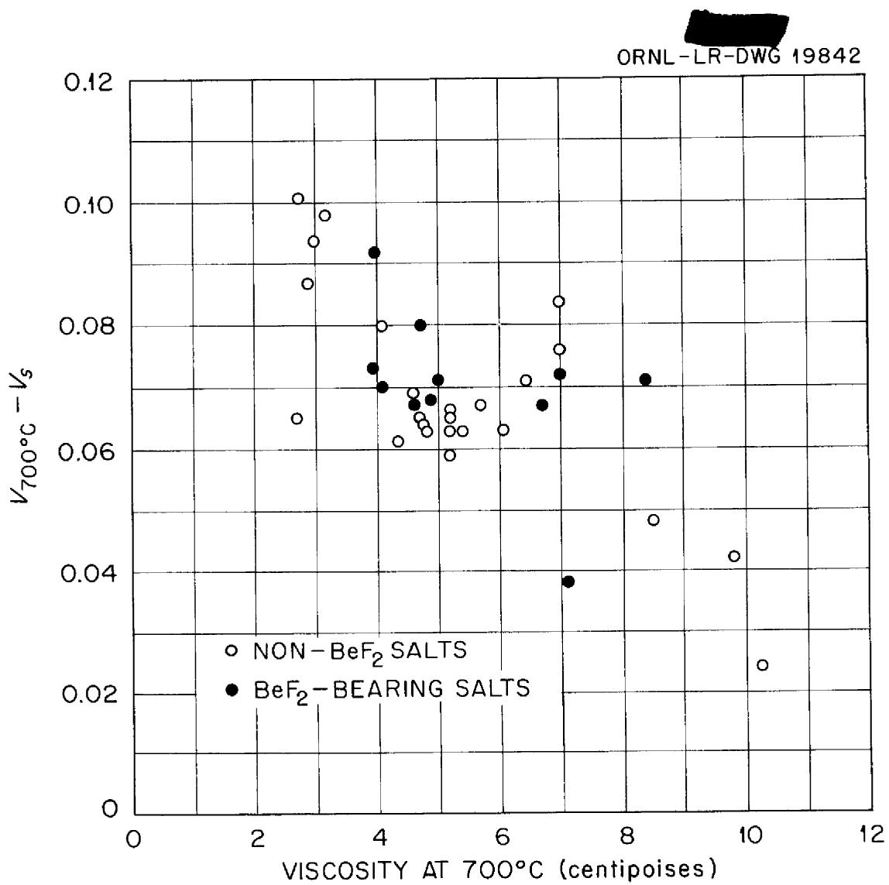  
Fig. 11. Viscosity at $700^{\circ} \mathrm{C}$ vs. $\left(V_{700^{\circ} \mathrm{C}} - V_{s}\right)$ .

# REFERENCES

1. Knox, F. A., and Kertesz, F., ANP Quarterly Progress Report for Period Ending September 10, 1951, ORNL-1154, p. 136.   
2. Redmond, R. F., ANP Quarterly Progress Report for Period Ending June 10, 1952, ORNL-1294, p. 124.   
3. Cisar, J. M., ibid.   
4. Tobias, M., ANP Quarterly Progress Report for Period Ending December 10, 1951, ORNL-1170, p. 124.   
5. Knox, F. A., and Kertesz, F., ANP Quarterly Progress Report for Period Ending September 10, 1952, ORNL-1375, p. 145.   
6. Redmond, R. F., and Kaplan, S. I., "Remarks on the Falling Ball Viscometer," ORNL CF 53-1-248, January 14, 1953.   
7. Cohen, S. I., ANP Quarterly Progress Report for Period Ending December 31, 1956, ORNL-2221, p. 228.   
8. Cohen, S. I., and Peele, J. M., "Determination of the Optimum Procedure for Obtaining Inert Atmospheres in Non-Vacuum Dryboxes," ORNL CF 55-10-132, October 26, 1955.   
9. "Modern Developments in Fluid Dynamics," Vol. II, pp. 388-390, Oxford Press, Oxford, (1938).   
10. Kirst, W. E., Nagle, W. M., Castner, J. B., "A New Heat Transfer Medium for High Temperatures," Trans. AIChE, 36, p. 371, (1940).   
11. Sax, N. Irving, "Handbook of Dangerous Materials," p. 5, Reinhold, New York, (1951).   
12. Blanke, B. C., MIM CF 55-11-14, November 7, 1955.   
13. Cohen, S. I., Powers, W. D., and Greene, N. D., "A Physical Property Summary for ANP Fluoride Mixtures," ORNL-2150, August 23, 1956.   
14. Cohen, S. I., ANP Quarterly Progress Report for Period Ending December 10, 1955, ORNL-2012, p. 180.   
15. Cohen, S. I., and Jones, T. N., ORNL CF 55-4-32, April 1, 1955.   
16. Cohen, S. I., and Jones, T. N., ORNL CF 56-5-33, May 9, 1956.

# REFERENCES (Continued)

17. Cohen, S. I., and Jones, T. N., ORNL CF 55-2-20, February 2, 1955.   
18. Cohen, S. I., and Jones, T. N., ORNL CF 56-4-148, April 17, 1956.   
19. Cohen, S. I., and Jones, T. N., ORNL CF 55-12-128, December 23, 1955.   
20. Cohen, S. I., and Jones, T. N., ORNL CF 55-2-89, February 15, 1955.   
21. Cohen, S. I., and Jones, T. N., ORNL CF 55-3-137, March 16, 1955.   
22. Cohen, S. I., and Jones, T. N., ORNL CF 55-9-31, September 6, 1955.   
23. Cohen, S. I., and Jones, T. N., ORNL CF 55-3-61, March 8, 1955.   
24. Cohen, S. I., and Jones, T. N., ORNL CF 55-5-59, May 16, 1955.   
25. Cohen, S. I., and Jones, T. N., ORNL CF 55-5-58, May 16, 1955.   
26. Cohen, S. I., and Jones, T. N., ORNL CF 55-7-33, July 7, 1955.   
27. Cohen, S. I., and Jones, T. N., ORNL CF 55-11-27, November 4, 1955.   
28. Cohen, S. I., and Jones, T. N., ORNL CF 55-8-21, August 1, 1955.   
29. Cohen, S. I., and Jones, T. N., ORNL CF 55-11-28, November 8, 1955.   
30. Cohen, S. I., and Jones, T. N., ORNL CF 55-12-127, December 23, 1955.   
31. Cohen, S. I., and Jones, T. N., ORNL CF 55-8-22, August 1, 1955.   
32. Cohen, S. I., and Jones, T. N., Unpublished data.   
33. Blanke, B. C., MIM CF 55-10-34, October 24, 1955.   
34. Cohen, S. I., and Jones, T. N., "A Summary of Density Measurements on Molten Fluoride Mixtures and a Correlation for Predicting Densities of Fluoride Mixtures," ORNL-1702, July 19, 1954.   
35. Hatschek, Emil, "The Viscosity of Liquids," pp. 135-139, D. Van Nostrand, London, (1928).   
36. Glasstone, S., Laidler, K. J., and Eyring, H., "The Theory of Rate Processes," p. 481, McGraw-Hill, New York, (1941).   
37. Batschinski, A. J., Z. physik Chem., 84, p. 643, (1913).

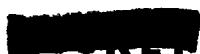

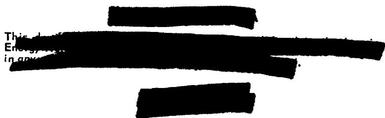

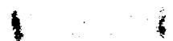