# AEC RESEARCH AND DEVELOPMENT REPORT

INTERIM REPORT ON CORROSION

BY ALKALI-METAL FLUORIDES:

WORK TO MAY 1, 1953

G.M.Adamson

R.S.Crouse

W.D.Manly

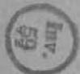

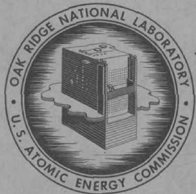

OAK RIDGE NATIONAL LABORATORY

CENTRAL RESEARCH LIBRARY

CIRCULATION SECTION

4500N ROOM 176

LIBRARY LOAN COPY

DO NOT TRANSFER TO ANOTHER PERSON.

if you wish someone else to see this report, send in name with report and the library will arrange a loan.

ORNL-118 (6-97)

the loan as requested.

MOAK RIDGE NATIONAL LABORATORY

operated by

UNION CARBIDE CORPORATION

for the

UUS-ATOMIC ENERGY COMMISSION

CLASSIFICATION CHANGED TO:

${AE} = 5 - 9 = {16}$

${BMC}\;D$ of ${Ref}\;{Sec} - {by}$ min $1 - {20} - 6$

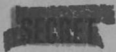

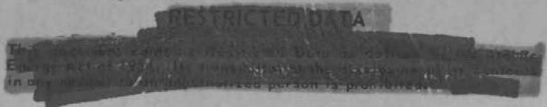

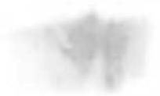

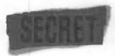

ORNL-2337

C-84 - Reactors-Special Features

of Aircraft Reactors

M-3679 (22nd ed.)

This document consists of 44 pages.

Copy 76 of 222 copies. Series A.

Contract No. W-7405-eng-26

METALLURGY DIVISION

INTERIM REPORT ON CORROSION BY ALKALI-METAL FLUORIDES:

WORK TO MAY 1, 1953

G.M.Adamson

R. S. Crouse

W.D.Manly

DATE ISSUED

MAR 201959

OAK RIDGE NATIONAL LABORATORY

Oak Ridge, Tennessee

operated by

UNION CARBIDE CORPORATION

for the

U.S. ATOMIC ENERGY COMMISSION

RESTRICTED DATA

T

Eeroy 1054, htnnntnl or the dneae of his contents

In any manner, on behalf of persons who probably

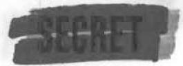

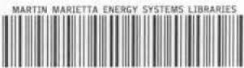

3445603580738

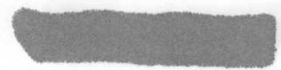

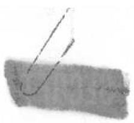

# CONTENTS

Summary 1

Introduction 1

Experimental Methods 2

Equipment 2

Procedure 6

Results and Discussion 7

Screening Tests 7

Corrosion of Inconel 11

Standard Inconel Series 11

Effect of Fluoride Composition 11

Oxide Removal Procedures 21

Effect of Hot-Leg Temperature 22

Crevice Corrosion 22

Mechanism of Corrosive Attack 24

Corrosion of Type 316 Stainless Steel 28

Effect of Temperature 28

Plug Identification 28

Effect of Fluoride Composition 28

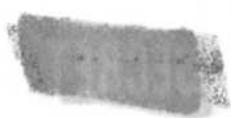

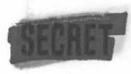

# FOREWORD

This report reflects the work done to May 1, 1953, on corrosion by alkali-metal fluorides. It is realized that some of the interpretations will appear to be naive when compared with those which have been developed from subsequent investigations. The purpose of issuing the report is to incorporate the data into a permanent record.

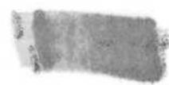

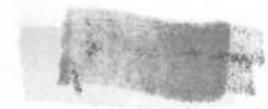

# INTERIM REPORT ON CORROSION BY ALKALI-METAL FLUORIDES: WORK TO MAY 1, 1953

G.M. Adamson

R.S.Crouse

W.D.Manly

# SUMMARY

In connection with the search for container materials suitable for use in high-temperature molten-fluoride reactor systems, the corrosion of several metals by various fused fluoride mixtures was studied in thermal-convection loops made from the metal being tested. In these tests the temperature drop was fairly large, but the velocity of the liquid was low and not subject to control. The fluoride mixture used in most of the study contained 43.5 mole % KF, 10.9 mole % NaF, 44.5 mole % LiF, and 1.1 mole % UF4, and is referred to as "fluoride 14." In a series of screening tests Inconel, or similar high-nickel alloys, was shown to be the most promising container material.

It is called to the reader's attention that the data reported are from loops that were operated for only relatively short times, 500 hr, and with impure fluoride mixtures. More recent data are reported elsewhere. The lack of purity of the mixtures was an important consideration in the tests reported; however, the purification processes have since been perfected by the Materials Chemistry Division. The more recent work shows that mass transfer is of more importance than it was considered to be at the time of the reported tests and also that the rate of mass transfer varies greatly for different fluoride batches.

With fluoride 14 an average figure for the maximum microscopically visible attack on Inconel was 0.012 to 0.015 in. after 500 hr of circulation. The attack was in the form of small voids which did not connect with the surface or with each other. It is shown that for the times used here the attack was caused primarily by the reduction of fuel impurities by chromium metal from the container and by the leaching of sufficient chromium to reach equilibrium concentrations in reactions with the fluorides, primarily with $\mathsf{UF}_4$ . In contrast to the effects of impurities, the depth and type of attack varied only slightly when changes were made in the major components of the various fluoride mixtures studied.

The only effect definitely established was that, in every case, mixtures containing uranium fluoride caused more attack than did similar mixtures containing no uranium. When the loop was operated at a fluid temperature of $1650^{\circ}\mathrm{F}$ , the attack was slightly deeper than it was at $1300^{\circ}\mathrm{F}$ . The addition of zirconium hydride to the fuel almost completely eliminated the attack. Alkali metals also acted as inhibitors.

It was found that type 316 stainless steel might be considered for a container for molten fluoride mixtures that do not include potassium fluoride. With such stainless steels and zirconium fluoride-base mixtures, the maximum depth of attack was about the same as that found with Inconel; however, more material was mass-transferred and cold-leg deposits were found. When alkali-metal-base mixtures were circulated in type 316 stainless steel, plugging occurred in a relatively short time; the plugging was probably caused by the formation of a compound similar to $\mathsf{K}_2\mathsf{NaCrF}_6$

# INTRODUCTION

A major problem connected with the development of circulating-fluoride-fuel reactors for aircraft propulsion at ORNL has been that of corrosion, since these reactors will involve high-temperature operation and the use of corrosive liquids. Therefore the Experimental Engineering Section of the Aircraft Nuclear Propulsion Division, the ANP Reactor Chemistry Section of the Materials Chemistry Division, and the ANP Materials Section of the Metallurgy Division were assigned the joint task of finding a material that could be fabricated into thin-walled tubes and that could be used in a molten-fluoride reactor system in which the maximum temperature of the fluid is $1500^{\circ}\mathrm{F}$ and the temperature drop is $400^{\circ}\mathrm{F}$ . This interim report deals with some of the metallurgical phases of the problem.

The high temperature, considerable temperature drop, and dynamic flow conditions under which the

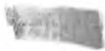

power reactors will operate all have an effect on corrosion and therefore had to be included in the study. A dynamic test is the only type of corrosion test that will incorporate these variables and permit a study of mass transfer. When this work was started, pump loops were not feasible, since reliable high-temperature fluoride pumps and seals had not then been developed. A loop employing thermal convection for the driving force that had been developed by the General Electric Company3 and that had been modified by the Experimental Engineering Section of the ANP Division at ORNL for corrosion testing with sodium4 was simplified and adopted for the preliminary stages of the investigation.

The thermal-convection loop could be operated with a hot-zone temperature of $1500^{\circ}\mathrm{F}$ with a reasonable temperature drop and was fairly simple to fabricate. Its main disadvantages were the low and fixed flow rates and the size of the system. Standard loops comprise about 10 ft of pipe and contain about 35 in.³ of liquid, which made them obviously unsuitable for conducting a large number of screening tests. Thus the thermal loops were used for an intermediate test. The preliminary screening work was done with static and seesaw tests,⁵,⁶ whereas the final testing would utilize high-velocity pump loops. Since the thermal loops were an intermediate step, the data obtained from them are not to be considered as design data. Such data can be obtained only from systems that more closely reproduce the proposed operating conditions. However, thermal loops have proved extremely useful in investigating corrosion mechanisms and in ascertaining relative effects of system temperature and temperature drop.

The program was divided into two parts: a search, consisting in a series of screening tests based upon data obtained in preliminary capsule tests, for the best material for containing the fluorides and a search for a method to render

Inconel acceptable as a container material. Efforts were made to understand the chemical reactions and corrosion mechanisms involved in both portions of the program. All loops were operated for a standard time of 500 hr.

The composition of the fluoride mixture proposed for use as a reactor fuel was changed several times during the period of this investigation. Because of economic reasons and limited time, it was necessary to switch to a new fuel before work could be completed on the old one, which resulted in incomplete corrosion information being obtained for many of the proposed fuels. The majority of the work reported herein was carried out with fluoride 14 (composition given in Table 1), the first composition proposed for a circulating-fuel reactor. Considerable work was also done with zirconium fluoride-base fuels, fluorides 27, 30, and 44. Details of this work are given in a separate report.

# EXPERIMENTAL METHODS

# Equipment

The major equipment used in this investigation was the thermal-convection loop. The advantages and disadvantages of this equipment are discussed in the "Introduction." Figure 1 shows the configuration which has been used as a standard, except for a few minor modifications to some of the early loops used in the screening series. These early loops were filled through a flanged line into the side of the surge tank rather than through a Swagelok fitting in the top. The loops were assembled by Heliarc welding with an inert gas backing. Figure 2 shows a partly assembled loop, its support, and the location and method of attaching both the heaters and the thermocouples; Fig. 3 shows some loops in operation and the location and type of insulation used.

The loops were heated by six sets of Hevi-Duty tubular-furnace heating elements. Each set of elements was 6 in. in length and $1\frac{1}{4}$ in. in inside diameter. The heaters were centered on the pipe and separated by means of ceramic spacers inserted in the ends. The heaters were connected in two parallel circuits, and the power was supplied from saturable-core reactors. This arrangement provided for proportional control rather than on-off control.

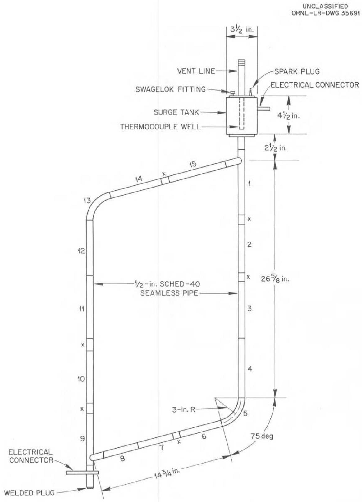  
Fig. 1. Standard Thermal-Convection Loop.

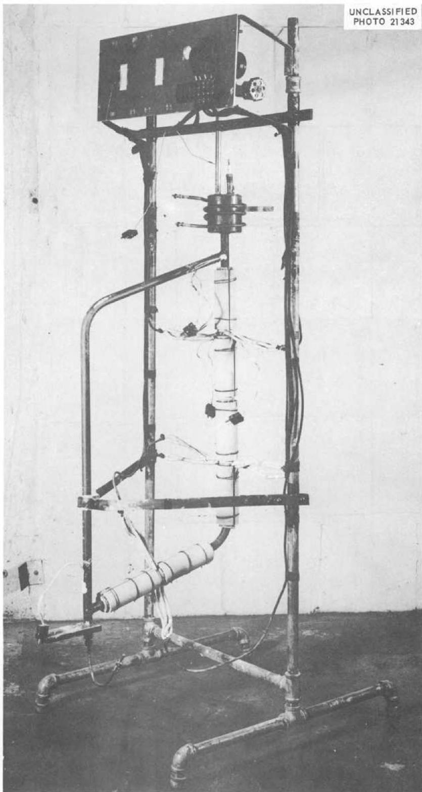  
Fig. 2. Partly Assembled Thermal-Convection Loop.

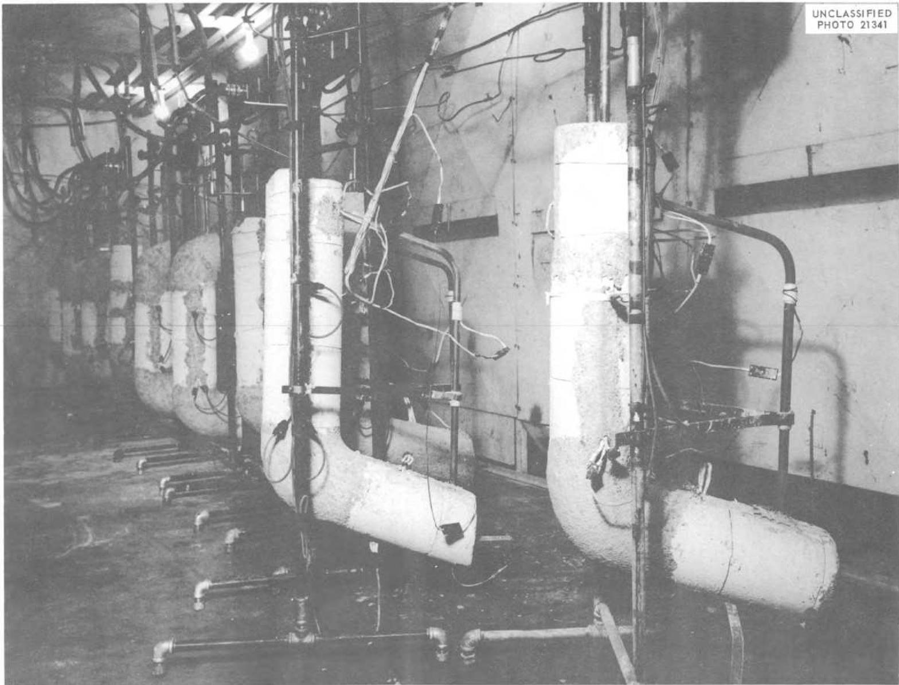  
Fig. 3. Thermal-Convection Loops in Operation.

During the filling of the loop, auxiliary heating was needed. The loop was heated by passage of an electric current through the pipe itself, and the expansion pot was heated by a coiled 1500-w Calrod heater. Once the loop was filled, these auxiliary heat sources were turned off and the clamshell heaters were turned on.

Johns-Manville Superox insulation was used and was applied as preformed semicylinders with a wall thickness of 3 in. The two halves were wired together, and the cracks were filled with Superox cement. When the loops were operating at $1500^{\circ}\mathrm{F}$ , the surface temperature of the insulation was about $200^{\circ}\mathrm{F}$ .

The major experimental difficulties encountered were concerned with temperature measurement. It was necessary to measure the maximum and the minimum wall temperatures, and it was desirable to know the temperature at several intermediate points. The temperatures were measured with Chromel-Alumel thermocouples and were recorded on 12-point Brown Electronik instruments. In a dynamic system the question arose as to what temperatures should be measured and used for control. It was realized that saturation and reaction rates in the liquid would depend upon the temperature of the fluorides, that corrosion rates would depend upon the inner-wall temperature, and that the outer-wall temperature would be the easiest to measure. The diameter of the loops was so small that an inserted thermocouple well would change the flow conditions; also, since the flow was laminar, it was possible that the center fluid temperature would be considerably lower than the outside fluid temperature. Thermocouple wells could not be drilled into the pipe walls, because they were too thin. For these reasons, the only temperature that could reasonably be measured was the outside wall temperature. To obtain the outside wall temperature, and one that would check the inner temperature reasonably well, the thermocouple beads were welded to the pipe wall with a condenser discharge welder and then covered with a layer of Sauereisen cement. The maximum temperature was measured $\frac{1}{2}$ in. down the top horizontal pipe, while the minimum temperature was measured 2 in. above the joint at the bottom of the cold leg. Both these thermocouples were under the layer of insulation. Other thermocouples, on exposed sections, were covered by a layer of asbestos tape. Before these precautions were taken,

temperature variations of 50 to $60^{\circ}F$ were common. Even with the above precautions the temperatures should be regarded as being only relative and not exact.

The power input to the loops was controlled by Leeds & Northrup Micromax instruments operating with Chromel-Alumel thermocouples, which were located between the first and second heaters and were welded on the vertical hot-leg section about 7 in. below the joint. A duplicate thermocouple was always placed on the opposite side of the pipe for use as a check and as a spare for control.

# Procedure

One of the main advantages of the thermal-convection loops was their simplicity of operation. Since these loops had no seals or moving parts, once filled they required very little attention. During filling, precautions were necessary to exclude air and moisture, but those precautions would be required with any corrosion test.

The following steps were necessary to place the loop in operation, and some of them will be discussed in detail:

1. machining parts,   
2. preliminary degreasing of all parts with a solvent degreaser,   
3. Heliarc welding of all joints except the bottom plug,   
4. final degreasing and rinsing,   
5. welding in either bottom plug or Swagelok fitting,   
6. testing for leaks with an air pressure and soap bubble technique and by pumping to a $50 - \mu$ vacuum,   
7. attaching heaters and thermocouples and mounting the loop on a stand,   
8. insulating,   
9. connecting to operating line,   
10. drying by heating to a minimum temperature of $500^{\circ}F$ and holding under a vacuum of at least $50\mu$ for $30\mathrm{min}$   
11. filling,   
12. operating for 500 hr,   
13. sectioning and sampling for examination.

The purity of the fluorides varied considerably, since they had to be obtained from a single large production facility rather than from a facility set up especially for the corrosion test program. No standard or fixed production procedure was used, and since the production and handling of such

mixtures was a new art, many changes were made from batch to batch.

In general, fluoride 14 was made by the following procedure. The sodium fluoride, lithium fluoride, and potassium fluoride were mixed, melted under a vacuum, and cooled to room temperature. The uranium fluoride was added; then the batch was remelted and mixed by stirring with a stream of argon.

The zirconium-base fuels were produced under the supervision of W. R. Grimes of the Materials Chemistry Division and were more highly purified and more uniform. The dry ingredients were mixed and then evacuated several times to remove all the moisture possible. After the mixture was melted, it was held at $1500^{\circ}\mathrm{F}$ and treated with hydrogen for 1 hr to reduce all oxides and oxy-fluorides of uranium to $\mathrm{UO}_2$ ; it was then treated with hydrogen fluoride for 2 hr to convert the $\mathrm{UO}_2$ to $\mathrm{UF}_4$ . The last step was to purge the mixture of the excess hydrogen fluoride. This procedure has since been modified for the fuels used in the main investigation of zirconium fluoride-base mixtures.

Both types of fluoride mixtures were transferred from the production vessel to storage cans. When a loop was to be charged, the mixture was transferred by pressure from the storage can to the loop through a $\frac{1}{4}$ -in. nickel or Inconel line. All connections were made with Swagelok fittings. A spark plug probe was used to indicate when the loop was full. A sampler was placed in the transfer line but was not used for the majority of the loops discussed in this report.

The distribution of impurities in the fluorides after circulation had to be determined, which made it necessary that the loops not be drained but that the fluorides be allowed to freeze in place. After cooling, the loop was cut up into approximately 6-in. lengths, with six 2-in. sections used for chemical and metallographic study. The location of these sections (x) is shown in Fig.1. After the loops were sectioned, the pieces were turned over to J.P.Blakely, of the Materials Chemistry Division, who was responsible for removing the samples and obtaining the required analyses. Since no solvent had been developed for removing the frozen fluorides from the sections, they were melted at around $1125^{\circ}F$ in a helium atmosphere. The sections were inspected visually, and if any unusual phases were present, additional sections were cut and submitted for a petrographic

examination. After the fluorides had been removed, they were ground and submitted for chemical analysis, and the small pipe sections were examined metallographically. Check samples of the fluorides were obtained from the loop by drilling, and they showed that no changes in fluoride composition or wall structure had taken place during the short melting period. If any layers were discovered on the pipe wall during the metallographic examination, a sample was submitted for an x-ray diffraction study.

# RESULTS AND DISCUSSION

The investigation consisted in a series of screening tests to determine the most promising container materials for circulating fluoride mixtures, a detailed study of Inconel as a container material, and a short, incomplete study of stainless steels.

Most of the observations made and conclusions drawn in this report were based upon only one or two runs. Many of them were checked in seesaw tests, but this should not be regarded as complete confirmation. As mentioned previously, the loop tests were designed as an intermediate test between static testing and pump loop testing. All the conclusions were based upon loops operated for the relatively short time of 500 hr. For these reasons the data presented must be regarded as tentative and not be used as design data for high-velocity or high-temperature-gradient systems. It is possible that there will be an increase in corrosion in going to high-velocity, high-temperature-differential pump loops, as was the case in going from the static tests to the thermal-convection loops.

Various fluoride mixtures were used in this work. Their nominal compositions and number designations are given in Table 1. Because of production variables, actual compositions may vary slightly from these figures.

# Screening Tests

The initial effort in this program was the operation of a series of loops to determine which materials were the best suited for use in a plumbing system for high-temperature fluorides. The majority of materials tested were those that showed promise in static corrosion tests carried out by

Table 1. Molten Fluoride Compositions*   

<table><tr><td rowspan="2">Fluoride No.</td><td colspan="2">UF4</td><td colspan="2">NaF</td><td colspan="2">KF</td><td colspan="2">ZrF4</td><td colspan="2">LiF</td><td colspan="2">BeF2</td></tr><tr><td>Weight %</td><td>Mole %</td><td>Weight %</td><td>Mole %</td><td>Weight %</td><td>Mole %</td><td>Weight %</td><td>Mole %</td><td>Weight %</td><td>Mole %</td><td>Weight %</td><td>Mole %</td></tr><tr><td>12</td><td></td><td></td><td>11.7</td><td>11.5</td><td>59.1</td><td>42.0</td><td></td><td></td><td>29.2</td><td>46.5</td><td></td><td></td></tr><tr><td>14</td><td>7.8</td><td>1.1</td><td>10.3</td><td>10.9</td><td>56.1</td><td>43.5</td><td></td><td></td><td>25.8</td><td>44.5</td><td></td><td></td></tr><tr><td>17</td><td>12.6</td><td>2.0</td><td>39.4</td><td>47.0</td><td></td><td></td><td></td><td></td><td></td><td></td><td>48.0</td><td>51.0</td></tr><tr><td>21</td><td>10.7</td><td>3.8</td><td>1.8</td><td>4.8</td><td>25.9</td><td>50.1</td><td>61.6</td><td>41.3</td><td></td><td></td><td></td><td></td></tr><tr><td>24</td><td></td><td></td><td>14.8</td><td>36.0</td><td>10.2</td><td>18.0</td><td>75.0</td><td>46.0</td><td></td><td></td><td></td><td></td></tr><tr><td>26</td><td>10.7</td><td>3.8</td><td>13.8</td><td>36.6</td><td>7.3</td><td>14.0</td><td>68.3</td><td>45.6</td><td></td><td></td><td></td><td></td></tr><tr><td>27</td><td>10.9</td><td>4.0</td><td>16.7</td><td>46.0</td><td></td><td></td><td>72.4</td><td>50.0</td><td></td><td></td><td></td><td></td></tr><tr><td>30</td><td>11.4</td><td>4.0</td><td>19.0</td><td>50.0</td><td></td><td></td><td>69.6</td><td>46.0</td><td></td><td></td><td></td><td></td></tr><tr><td>31</td><td></td><td></td><td>20.1</td><td>50.0</td><td></td><td></td><td>79.9</td><td>50.0</td><td></td><td></td><td></td><td></td></tr><tr><td>32</td><td></td><td></td><td>21.4</td><td>52.0</td><td></td><td></td><td>78.6</td><td>48.0</td><td></td><td></td><td></td><td></td></tr><tr><td>35</td><td></td><td></td><td>54.2</td><td>57.0</td><td></td><td></td><td></td><td></td><td></td><td></td><td>45.8</td><td>43.0</td></tr><tr><td>44</td><td>18.6</td><td>6.5</td><td>20.5</td><td>63.5</td><td></td><td></td><td>60.9</td><td>40.0</td><td></td><td></td><td></td><td></td></tr></table>

*See C. J. Barton, *Fused Salt Compositions*, ORNL CF-53-1-129.

groups under the supervision of D. C. Vreeland in the Metallurgy Division and F. Kertesz in the Materials Chemistry Division. Fluoride 14 was the liquid circulated in these loops.

The data from the loops operated as part of these screening tests are given in Table 2. A bar graph showing the relative times in which plugging occurred with the various materials is shown in Fig. 4. Typical photomicrographs from the top portion of the hot legs from four of these loops are presented in Fig. 5.

It was apparent from these data that the material selected must be one which would not cause plugging in the loop. The depth of corrosion was necessarily of secondary consideration. Nickel and Monel, which had been rated as the most likely containers in the static tests, had to be rejected because the thermal loop tests revealed excessive mass transfer of metal from the hot-leg surface to the cold leg. Figure 6 is a photograph of a mass of nickel crystals that had collected on a small flat sample inserted in the bottom of the cold leg of a nickel loop.

From the data obtained for the alloys tested, it was apparent that the nickel-base alloys would make the best containers for the fluorides. All other alloys tested either caused plugging in less than 500 hr or showed excessive mass transfer.

Inconel, a commercial alloy, was deemed sufficiently resistant to fluoride corrosion to warrant its selection as a material to receive additional attention.

Since materials varying widely in composition, such as the various stainless steels, iron, and nickel, all showed plugging or at least severe mass transfer, it was obvious that more than one metal or compound must be involved. In the iron and nickel loops the deposits were metallic, whereas in the stainless steel loops they were nonmetallic. With the iron and nickel loops the mass transfer was possibly caused by very small changes in solubility with temperature. Changes of only a few ppm would be enough to account for the amounts of metal transferred.

A material shown to be unsatisfactory in these tests should not necessarily be excluded for use with other fluoride systems. Since the driving force in a thermal-convection loop is very small, the loop is quite easily plugged but may require only slight changes in loop design, operating technique, or fuel composition to operate for 500 hr. In another part of this report it is shown that type 316 stainless steel loops can be operated if the fuel composition or the minimum temperature is changed. Also, large isothermal pump loops of type 316 stainless steel were operated

Table 2. Results of Container Material Screening Tests   

<table><tr><td rowspan="2">Loop No.</td><td rowspan="2">Loop Material</td><td rowspan="2">Time of Circulation (hr)</td><td rowspan="2">Reason for Termination</td><td colspan="2">Metallographic Examination</td><td rowspan="2">Chemical Analysis</td></tr><tr><td>Hot Leg</td><td>Cold Leg</td></tr><tr><td>40</td><td>410</td><td>9</td><td>Loop plugged</td><td>0.010 in. even removal; no pitting or intergranular attack; transformed surface</td><td>Metallic deposit with oxide particles</td><td>Fe decreased; Cr increased</td></tr><tr><td>43</td><td>410</td><td>12</td><td>Loop plugged</td><td>Surface rough, some grains removed, probably even removal; no inter-granular attack</td><td>Metallic deposit with non-metallic crystals; visible metallic crystals in hot horizontal section</td><td>All materials varied</td></tr><tr><td>48</td><td>430</td><td>8</td><td>Loop plugged</td><td>Rough and pitted; some removal</td><td>Thin metallic layer with inclusions</td><td>Cr increased; all others varied</td></tr><tr><td>46</td><td>Izett iron</td><td>46</td><td>Loop plugged</td><td>Surface rough with considerable even removal</td><td>Many metal crystals on surface</td><td>Large increase in Fe; decrease in Ni</td></tr><tr><td>104</td><td>Nickel</td><td>500</td><td>Scheduled</td><td>No pitting or penetration; 0.009 in. even removal</td><td>Metallic crystals in all sections</td><td>Fe and Cr unchanged; Ni increased in cold leg</td></tr><tr><td>107</td><td>Nickel</td><td>1000</td><td>Scheduled</td><td>No pitting or intergranular attack; 0.010 in. even removal</td><td>Heavy metallic crystal deposits</td><td>Fe decreased; Ni increased slightly</td></tr><tr><td>341</td><td>Monel</td><td>31</td><td>Leaked</td><td>Approximately 0.010 in. even removal</td><td>Metallic deposit</td><td></td></tr><tr><td>365</td><td>Nimonic 75</td><td>500</td><td>Scheduled</td><td>Intergranular pitting 0.008 to 0.013 in.</td><td>Thin metallic deposit</td><td>Cr increased, Fe decreased, Ni varied</td></tr><tr><td>210</td><td>Inconel</td><td>500</td><td>Scheduled</td><td>Subsurface holes from 0.010 to 0.015 in., mainly in grain boundaries</td><td>Intermittent deposited layer</td><td>Cr increased, Fe decreased, Ni and U varied</td></tr><tr><td>211</td><td>Inconel</td><td>524</td><td>Scheduled</td><td>Subsurface holes mainly in grain boundaries, 0.004 to 0.008 in.</td><td>Metallic-appearing deposit 0.0005 in.</td><td>Cr increased; Fe and Ni decreased</td></tr><tr><td>219</td><td>Inconel</td><td>480</td><td>Heater failed</td><td>Heavy primarily intergranular voids 0.005 to 0.013 in.</td><td>Light metallic deposit with a nonmetallic layer on top</td><td>Cr increased, Fe and U decreased, Ni varied</td></tr><tr><td>229</td><td>Inconel</td><td>500</td><td>Scheduled</td><td>Moderate to heavy primarily intergranular pitting to 0.018 in.</td><td>Deposit that was at least partially nonmetallic</td><td>Cr increased; Fe and U decreased</td></tr><tr><td>227</td><td>Inconel</td><td>500</td><td>Scheduled</td><td>Moderate to heavy primarily intergranular pitting 0.006 to 0.016 in.</td><td>Thin metallic layer</td><td>Cr increased, Fe decreased, Ni and U varied</td></tr><tr><td>112</td><td>Type 316 SS</td><td>82</td><td>Loop plugged</td><td>Rough surface with intergranular attack up to 0.008 in.</td><td>Rough uneven layer</td><td>Cr increased, Fe decreased, Ni and U varied</td></tr><tr><td>120</td><td>Type 316 SS</td><td>62</td><td>Loop plugged</td><td>Rough and pitted surface with inter-granular attack 0.004 to 0.012 in.</td><td>Thin deposit with both metallic and nonmetallic crystals adhering</td><td>Cr and U increased, Fe decreased, Ni varied</td></tr><tr><td>127</td><td>Type 316 ELC SS</td><td>43</td><td>Loop plugged</td><td>Heavy intergranular attack up to 0.011 in.; grains spongy</td><td>Metallic deposit on wall, with some attached crystals</td><td>Cr increased, Fe decreased, Ni and U varied</td></tr><tr><td>251</td><td>Type 310 SS</td><td>75</td><td>Loop plugged</td><td>Very heavy intergranular attack and general pitting 0.008 to 0.015 in.; large grain growth</td><td>Nonmetallic deposit with a thin metallic layer</td><td>Cr increased, Fe decreased, Ni varied</td></tr><tr><td>252</td><td>Type 310 SS</td><td>368</td><td>Loop plugged</td><td>Very heavy intergranular pitting 0.018 to 0.025 in.</td><td>Heavy deposit; at least a partial plug of metal in cold leg</td><td>All analyses varied</td></tr><tr><td>275</td><td>Type 347 SS</td><td>39</td><td>Loop leaked and plugged</td><td>Severe intergranular attack 0.008 to 0.013 in.; grain growth</td><td>Metallic deposit 0.0005 to 0.001 in. thick</td><td>Cr increased, Fe decreased, Ni increased</td></tr><tr><td>276</td><td>Type 347 SS</td><td>125</td><td>Loop plugged</td><td>Considerable intergranular attack 0.002 to 0.004 in.</td><td>Surface rough with thin de-posit layer</td><td>Cr increased, Fe decreased, U varied, Ni constant</td></tr></table>

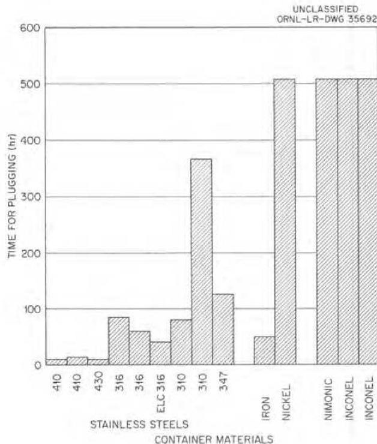  
Fig. 4. Times for Plugging of Thermal-Convection Loops Made of Various Materials.

with alkali-metal fluorides. The lack of time and manpower made it necessary to concentrate efforts on the most promising materials and leave the others for future programs.

# Corrosion of Inconel

Standard Inconel Series. - As is pointed out in the preceding section, Inconel was the material that appeared most promising in the screening tests. When the investigation was started, fluoride 14 was the mixture proposed for use as a reactor fuel. It soon became apparent that fluoride 14 could not be used because isotopically separated lithium was not available. The zirconium fluoride fuels were then proposed but could not be obtained immediately in sufficient quantity for testing. Therefore the corrosion study was continued with the Inconel-fluoride 14 system. The maximum fluid operating temperature was set at $1500^{\circ}\mathrm{F}$ , as in the reactor designs then being considered. The cold-leg temperature was about $1300^{\circ}\mathrm{F}$ . A time of 500 hr was arbitrarily selected as the standard operating period. These conditions were established as standard and were used as a base in the study of the variables reported; Table 3

gives the results obtained. Figures showing samples taken from the hot legs of the loops are presented in several sections of this report: loop 229 is shown in Fig. 7, loop 227 in Fig. 9, loop 219 in Fig. 12, and loop 210 in Fig. 5. The loops were operated over a considerable time span with fuel from various batches that showed considerable variation in chemical composition. Chemical analyses of the fluorides after the loops had been operated all showed an increase in chromium and a decrease in iron content. The depth and intensity of attack found in the hot legs of the loops checked fairly well, except that the attack in loop 211 was slightly less than that in the other loops.

The following detailed description of loop 229 is presented as typical of the standard loops. Photomicrographs of various sections showing the distribution of attack around the loop are presented in Fig. 7. Sections 3 and 4 show that once the attack started it proceeded quite rapidly. The maximum depth of penetration increased only slightly in moving up the hot leg from section 3 to section 1, but the concentration of voids increased considerably. In the upper hot-leg section more general attack was found. It can be noted that the deepest penetration and the first sign of attack always occurred in the grain boundaries but that voids occurred frequently within the grains of the metal.

The data obtained by analyzing the fluorides from the sections shown in Fig. 7 are given in Table 4. As was true in about $75\%$ of the loops, the amount of both chromium and iron found in the cold leg was slightly more than that found in the hot leg. No systematic variation in uranium could be found. In all loops the chromium concentration increased during the run, while the iron decreased. When nickel was present as an impurity, its concentration also decreased, but for these loops the original nickel impurity was usually low.

Effect of Fluoride Composition. - Effect of Different Mixtures. - During the progress of the ANP work a variety of fluoride mixtures have been proposed as suitable fuels or coolants. With the majority of these fuels only exploratory corrosion tests were carried out. In every case, the change from one fuel or coolant to another was made for reasons other than corrosion.

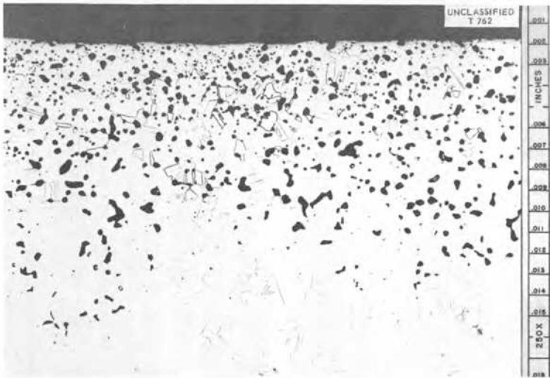  
INCONEL,500HOURS

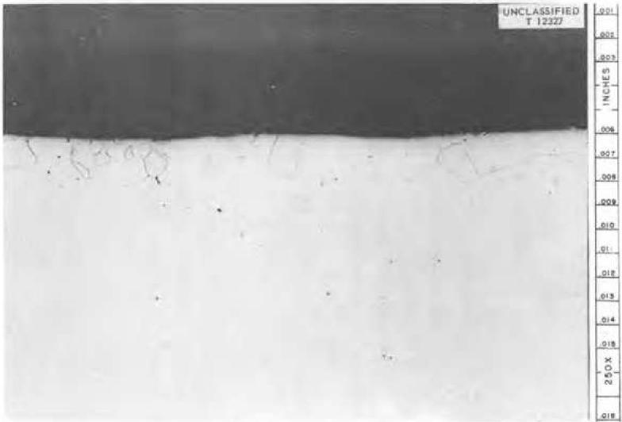  
NICKEL,500HOURS

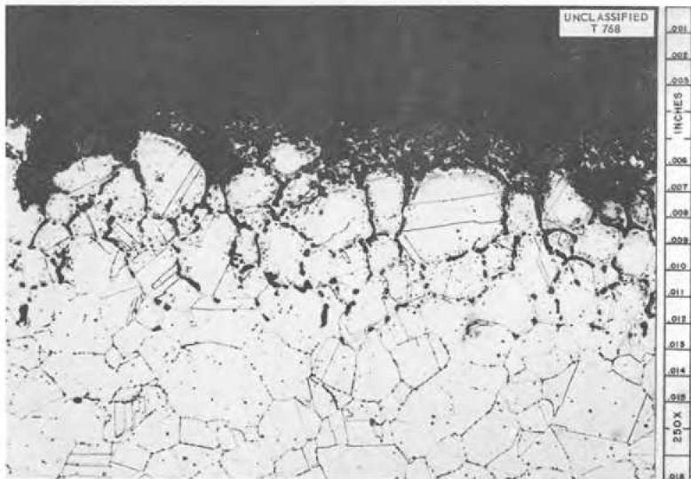  
316 STAINLESS STEEL, 82 HOURS

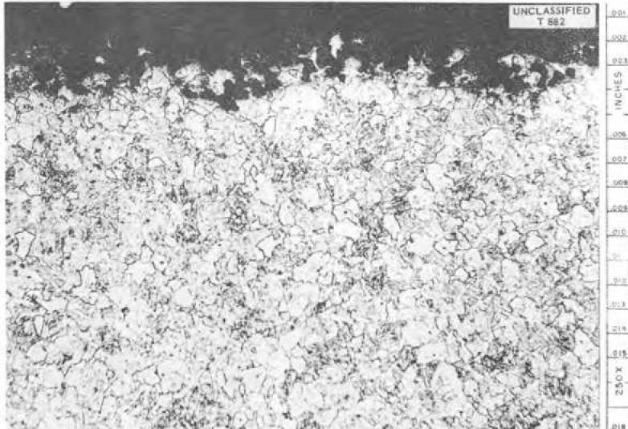  
410 STAINLESS STEEL, 12 HOURS   
Fig. 5. Typical Hot-Leg Sections from Thermal Loops Made of Various Materials After Circulating Alkali-Metal Fluorides. 250X. Reduced $39\%$ .

with caption)

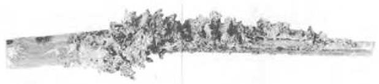

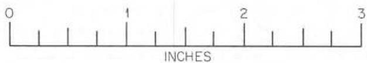

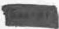  
Fig. 6. Nickel Crystals Mass-Transferred in a Thermal Loop Circulating Fluoride 14 for 500 hr at $1500^{\circ}\mathrm{F}$ with caption)

Table 3. Standard Inconel-Fluoride 14 Loops   

<table><tr><td rowspan="2">Loop No.</td><td rowspan="2">Time of Circulation (hr)</td><td rowspan="2">Reason for Termination</td><td colspan="2">Metallographic Examination</td><td rowspan="2">Chemical Analysis</td></tr><tr><td>Hot Leg</td><td>Cold Leg</td></tr><tr><td>210</td><td>500</td><td>Scheduled</td><td>Heavy concentration of small holes in band from 0.010 in. to a maximum of 0.015 in. from surface; mainly inter-granular but some in grains</td><td>Very thin surface layer</td><td>Cr increased, Fe decreased, U and Ni varied in fluorides; Cr leached from wall</td></tr><tr><td>211</td><td>524</td><td>Scheduled</td><td>Moderate to heavy concentration of subsurface voids 0.004 to 0.008 in.; primarily intergranular but some in grains</td><td>Metallic-appearing layer 0.0005 in. thick</td><td>Cr increased, Fe decreased, Ni remained low in fluorides</td></tr><tr><td>219</td><td>480</td><td>Heater failed</td><td>Moderate to heavy concentration subsurface voids 0.005 to 0.013 in.; primarily inter-granular</td><td>Thin metallic-appearing layer with nonmetallic particles as layer on top</td><td>Cr increased, Fe decreased, U constant, Ni varied in fluorides; Cr leached from wall</td></tr><tr><td>227</td><td>500</td><td>Scheduled</td><td>Moderate to heavy subsurface voids 0.006 to 0.016 in.</td><td>Thin metallic-appearing layer</td><td>Cr increased, Fe decreased, Ni and U varied in fluorides</td></tr><tr><td>229</td><td>500</td><td>Scheduled</td><td>Moderate to heavy subsurface voids up to 0.018 in. and averaging 0.008 in.</td><td>Thin layer at least partially nonmetallic</td><td>Cr increased, Fe decreased, Ni and U unchanged in fluorides; Cr leached from wall</td></tr></table>

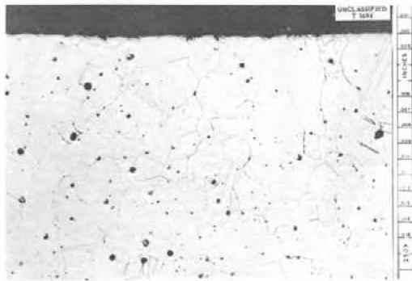  
STANDARD BEFORE CIRCULATION

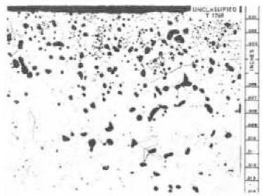  
TOP OF VERTICAL HOT LEG SECTION 4

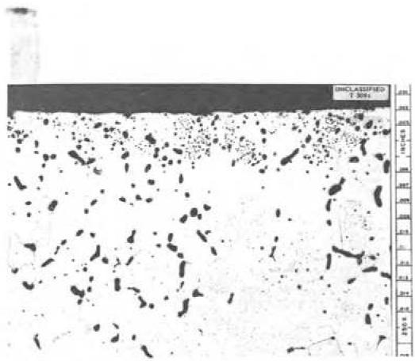  
MIDDLE OF VERTICAL HOT LEG SECTION 3

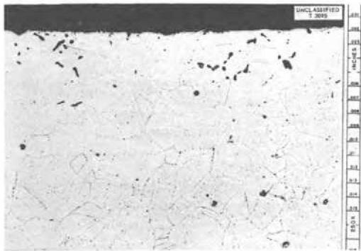  
LOWER VERTICAL HOT LEG SECTION 4

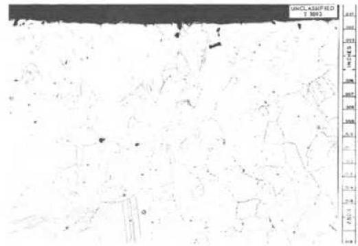  
HOT HORIZONTAL LEG SECTION 7

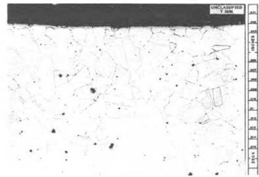  
LOWER COLD LEG SECTION 8   
Fig. 7. Variation in Attack Around a Standard Loop. 250X. Reduced $61\%$ . (with caption)

Table 4. Analysis of Fluorides from Loop 229   

<table><tr><td>Section</td><td>U (%)</td><td>F (%)</td><td>Fe (ppm)</td><td>Cr (ppm)</td><td>Ni (ppm)</td></tr><tr><td>1</td><td>4.18</td><td>43.7</td><td>40</td><td>2095</td><td>&lt;20</td></tr><tr><td>2</td><td>4.16</td><td>42.3</td><td>140</td><td>2170</td><td>&lt;30</td></tr><tr><td>7</td><td>4.18</td><td>42.2</td><td>130</td><td>2900</td><td>&lt;20</td></tr><tr><td>9</td><td>4.13</td><td>43.0</td><td>65</td><td>3635</td><td>&lt;20</td></tr><tr><td>10</td><td>4.20</td><td>42.2</td><td>210</td><td>3500</td><td>&lt;30</td></tr><tr><td>14</td><td>4.19</td><td>42.1</td><td>200</td><td>3100</td><td>&lt;30</td></tr><tr><td>Original batch</td><td>4.31</td><td>42.4</td><td>770</td><td>660</td><td>20</td></tr></table>

Table 5 lists the corrosive effects found in Inconel loops after they had circulated various fluoride mixtures (see Table 1 for compositions). The variation in attack is shown by the typical hot-leg sections presented in Figs. 8 and 9. These loops were operated not necessarily to give a minimum amount of corrosion but to be as nearly comparable as possible. In the case of fluoride 30, it was shown that lower corrosion rates were possible with changes in the production procedure, and it seemed likely that similar reductions could be made with the other compositions.

From the data in Table 5 it is apparent that the maximum depth of attack did not vary greatly with the different fluoride mixtures. An average maximum penetration of about 0.010 in. was typical. The variation in the intensity of attack and in the size of the voids in the metal resulting from corrosion found with different mixtures was thought to be caused mainly by differences in batch purity. The mechanism of attack appeared to be the same for all these fluoride mixtures and is discussed in detail in the section "Mechanism of Corrosive Attack." This single mechanism was evidenced by both the similarity in the voids and the similar variations in chemical analysis.

As listed in Table 5, thin altered layers were often present on the cold-leg surfaces. Efforts by x-ray diffraction and spectroscopy to identify these layers failed. It seemed that various metals had been deposited on the cold-leg surface but that their identities were lost through diffusion; the resulting changes in the base metal were not large enough to be picked up by the analytical or diffraction techniques used. Any nonmetallic particles found were usually identified as $\mathrm{UO}_2$ .

The presence of these layers showed that even with Inconel some mass transfer had taken place.

Effect of Uranium Fluoride. - Although variations in depth of attack were fairly small, a close study of the results showed one systematic trend: in all cases the attack was both deeper and more intense in the loops which circulated uranium-bearing fluoride mixtures than in loops which circulated similar mixtures without uranium fluoride. The data are summarized in Table 6, and photomicrographs of hot-leg sections from some of the loops are given in Figs. 8 and 9.

Effect of Reducing Agents. - In static tests, the alkali metals and zirconium were found to inhibit corrosion by fluoride 14. A program was then set up to check several reducing agents under the dynamic conditions found in the thermal convection loops.

Zirconium hydride was substituted for zirconium metal in the loops because it is more stable at room, or slightly elevated, temperatures and does not absorb as many gases. It decomposes just below the loop operating temperature to give very fine particles of pure zirconium metal and nascent hydrogen. Enough zirconium hydride for a final zirconium metal concentration of $0.5\%$ was added to the expansion pot of a loop, and the fluorides were charged in over the zirconium hydride.

The zirconium hydride addition to fluoride 14 almost completely eliminated the corrosion of Inconel. The first photomicrograph in Fig. 10 shows the hot leg of loop 225. Some surface roughness was found, but none of the usual subsurface voids were present. An intermittent metallicappearing layer was found on the surface of the

Table 5. Corrosive Effect of Various Fluoride Mixtures on Inconel   

<table><tr><td rowspan="2">Loop No.</td><td rowspan="2">Fluoride No.</td><td colspan="2">Metallographic Examination</td><td rowspan="2">Chemical Analysis of Fluorides</td><td rowspan="2">Comments</td></tr><tr><td>Hot Leg</td><td>Cold Leg</td></tr><tr><td>78</td><td>12</td><td>Moderate subsurface voids to 0.013 in.</td><td>No attack; nonmetallic layer 0.0002 in.</td><td>Cr increased slightly; Fe and Ni low and constant</td><td>Run for 1000 hr</td></tr><tr><td>217</td><td>17</td><td>Moderate subsurface voids to 0.013 in.; mainly concentrated in grain boundaries</td><td>Heavy metallic-appearing layer, up to 0.001 in.</td><td>Cr high originally but still increased; large decrease in Fe; small decrease in U</td><td></td></tr><tr><td>221</td><td>21</td><td>Moderate to light subsurface voids; maximum penetration, 0.007 in.</td><td>Thin nonmetallic layer</td><td>Some Cr increase; Ni and U decreased</td><td></td></tr><tr><td>226</td><td>26</td><td>Widely scattered voids, almost entirely in grain boundaries; maximum penetration, 0.010 in.</td><td>Deposit with both metallic and non-metallic phases 0.001 in, thick</td><td>U and Ni decreased slightly; Cr increased; Fe high, dropped to only half</td><td>Hydrogen-cleaned; fuel from lab</td></tr><tr><td>227</td><td>14</td><td>Moderate amount of small subsurface voids from 0.006 to 0.016 in.</td><td>Thin metallic layer</td><td>Cr increased; Fe decreased; Ni and U constant</td><td></td></tr><tr><td>230</td><td>24</td><td>Light, widely scattered voids usually in grain boundaries; maximum penetration, 0.009 in.</td><td>No deposit</td><td>Cr increased slightly; Fe showed large decrease</td><td></td></tr><tr><td>264</td><td>27</td><td>Moderate subsurface voids; penetration, 0.005 to 0.009 in.</td><td>No deposit</td><td>Large Cr increase; Ni and Fe decreased; U increased</td><td></td></tr><tr><td>246</td><td>32</td><td>Light, scattered subsurface voids; mainly in grain boundaries; 0.003 to 0.008 in.</td><td>No deposit</td><td>Cr increased; Ni and Fe decreased</td><td></td></tr><tr><td>262</td><td>35</td><td>Moderate subsurface voids; maximum penetration, 0.009 in.; general attack, 0.004 in.</td><td>Scattered nonmetallic deposit</td><td>Large Cr increase; Ni high originally but now low; Fe decreased slightly</td><td></td></tr><tr><td>277</td><td>31</td><td>Light to moderate subsurface voids 0.0015 to 0.005 in.; mainly in grain boundaries</td><td>Thin metallic-appearing layer</td><td>Cr increased slightly; Ni and Fe decreased</td><td></td></tr><tr><td>283</td><td>30</td><td>Moderate to heavy subsurface voids to 0.015 in.; deepest attack inter-granular</td><td>Layer of metallic-appearing crystal</td><td>Large increase in Cr; Ni and Fe content high and decreased</td><td>As melted</td></tr><tr><td>282</td><td>30</td><td>Moderate subsurface voids to 0.009 in.; general attack to 0.006 in.</td><td>No deposit</td><td>Ni low and Fe moderate; Cr increased; Fe decreased</td><td>Prepared in graphite and hydrogen-treated</td></tr></table>

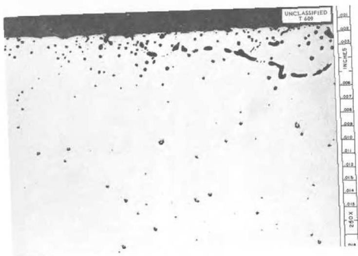  
FLUORIDE 12

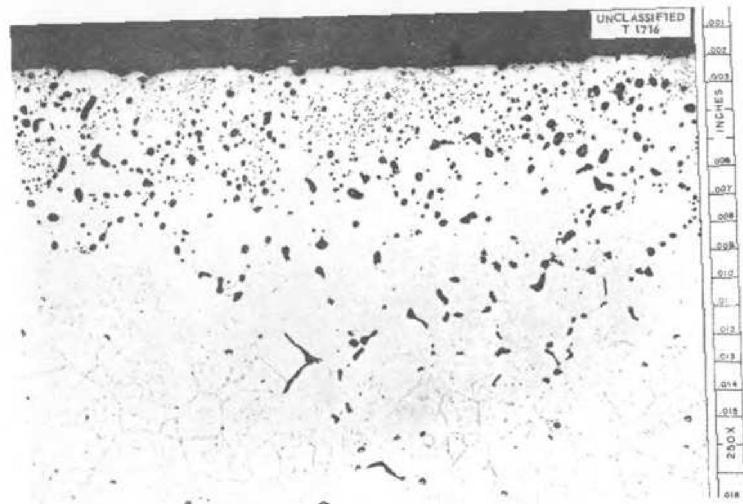  
FLUORIDE 14

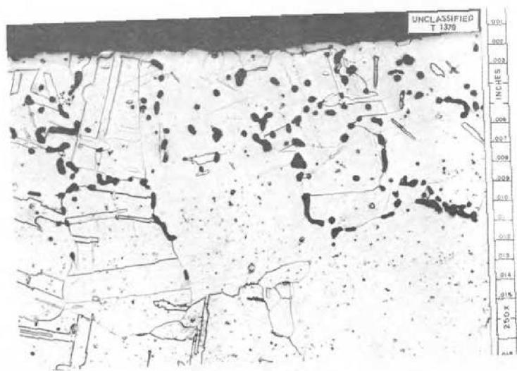  
FLUORIDE 17

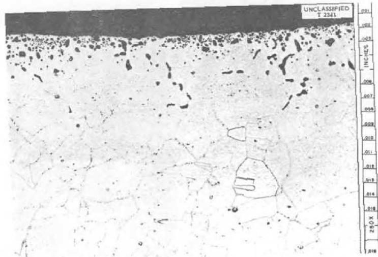  
FLUORIDE 35   
Fig. 8. Corrosion of Inconel by Various Fluoride Mixtures. 250X. Reduced $43.5\%$ . (Schematic with caption)

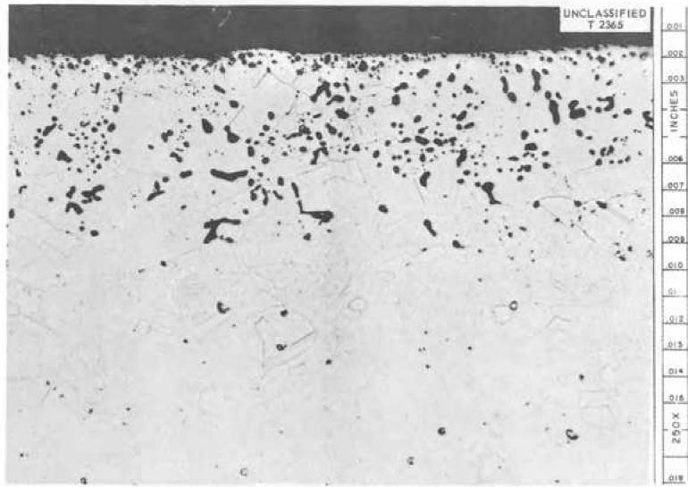  
FLUORIDE 27

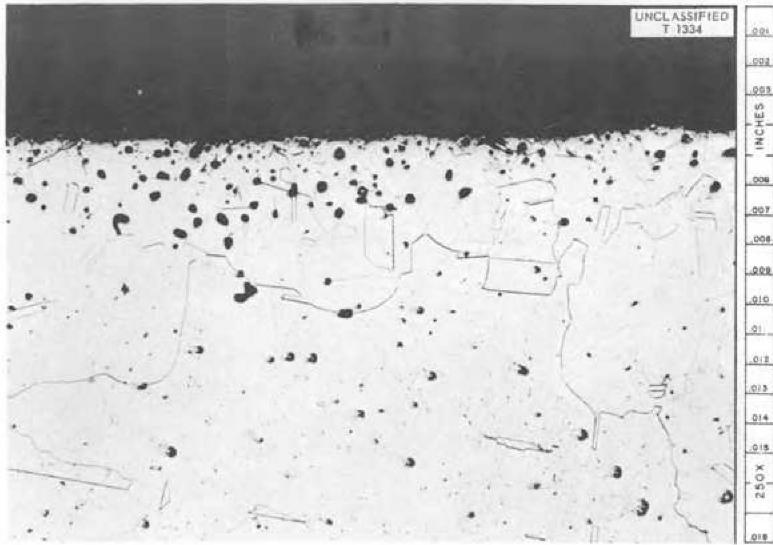  
FLUORIDE 21

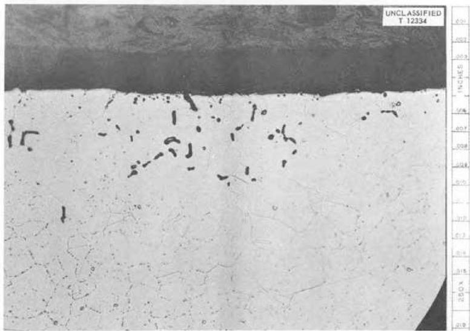  
FLUORIDE 32

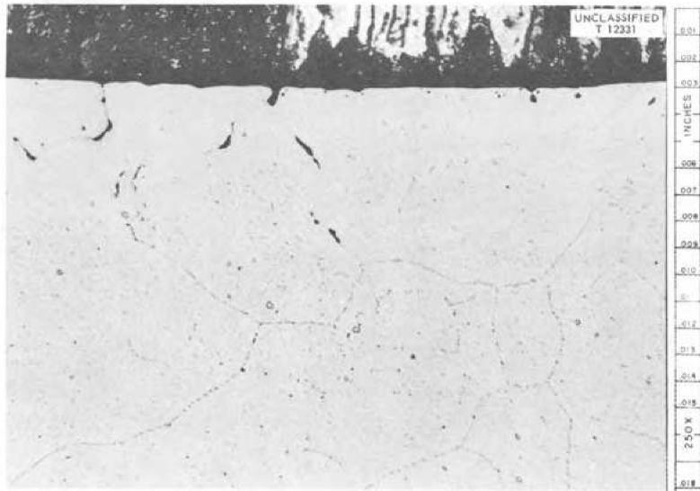  
FLUORIDE 24   
Fig. 9. Corrosion of Inconel by Various Zirconium Fluoride-Base Fluoride Mixtures, 250X. Reduced $40\%$ . (a) with caption)

Table 6. Corrosive Effect of Uranium Fluoride Addition   

<table><tr><td colspan="3">Loops Circulating Fluoride Mixtures
Containing Uranium</td><td colspan="3">Loops Circulating Fluoride Mixtures
Containing No Uranium</td></tr><tr><td>Loop
No.</td><td>Fluoride
No.</td><td>Hot-Leg Attack</td><td>Loop
No.</td><td>Fluoride
No.</td><td>Hot-Leg Attack</td></tr><tr><td>227</td><td>14</td><td>Moderate subsurface voids;
maximum, 0.016 in.</td><td>78*</td><td>12</td><td>Moderate; maximum, 0.013 in.</td></tr><tr><td>217</td><td>17</td><td>Moderate, in grain boundaries;
maximum, 0.013 in.</td><td>262</td><td>35</td><td>Moderate; maximum, 0.009 in.</td></tr><tr><td>226</td><td>26</td><td>Widely scattered in grain
boundaries; maximum,
0.010 in.</td><td>230</td><td>24</td><td>Light, widely scattered in
grain boundaries; maximum,
0.009 in.</td></tr><tr><td>264</td><td>27</td><td>Moderate; maximum, 0.009 in.</td><td>246</td><td>32</td><td>Light and scattered in grain
boundaries; maximum,
0.008 in.</td></tr><tr><td>282</td><td>30</td><td>Moderate subsurface voids;
maximum, 0.009 in.</td><td>277</td><td>31</td><td>Light to moderate; maximum,
0.004 in.</td></tr></table>

*Operated for 1000 hr.

hot leg and in some of the grain boundaries near the surface. The second photomicrograph in Fig. 10 shows the cold leg of a duplicate loop (242). A well-bonded layer on the surface filled up what fabrication cracks were present. Unsuccessful attempts were made by both x-ray diffraction and spectrographic means to identify these layers. When the fluorides from these loops were analyzed, it was found that iron, nickel, and chromium had decreased in concentration during the circulation.

The zirconium inhibited the corrosion by reducing the impurities in the fuel before they reached the chromium. It was thought that the surface layers were products of the reduced impurities and excess zirconium metal and that they could be eliminated if the fluorides were treated with zirconium hydride in the transfer pot and filtered into the loop. The fluoride 14 itself remained essentially unchanged when low concentrations of zirconium hydride were added. The fuel from these loops was examined petrographically by Hoffman,8 of the Materials Chemistry Division, but she failed

to find any reduced fuel components.9 When similar additions were made to fluoride 27, some reduction of the fuel did take place.

Titanium hydride was similarly added to loop 250. The addition of $0.5\%$ titanium hydride decreased the corrosion to a maximum penetration of 0.0025 in. but produced a thin metallic layer, identified by R. M. Steele by x-ray diffraction as $\mathrm{Ni}_3\mathrm{Ti}$ . Under a high magnification (750X) it was revealed that the layer was actually made up of several phases imposed one upon another, as can be seen in Fig. 11, a photomicrograph of the hot leg of loop 250. A similar layer was also found in the cold leg.

On the basis of static tests, the alkali metals also appeared to be effective corrosion inhibitors. Therefore $0.5\%$ of sodium-potassium alloy was added to loop 224, in which fluoride 14 was circulated. The maximum depth of attack measured 0.010 in., and although a reduction in intensity of

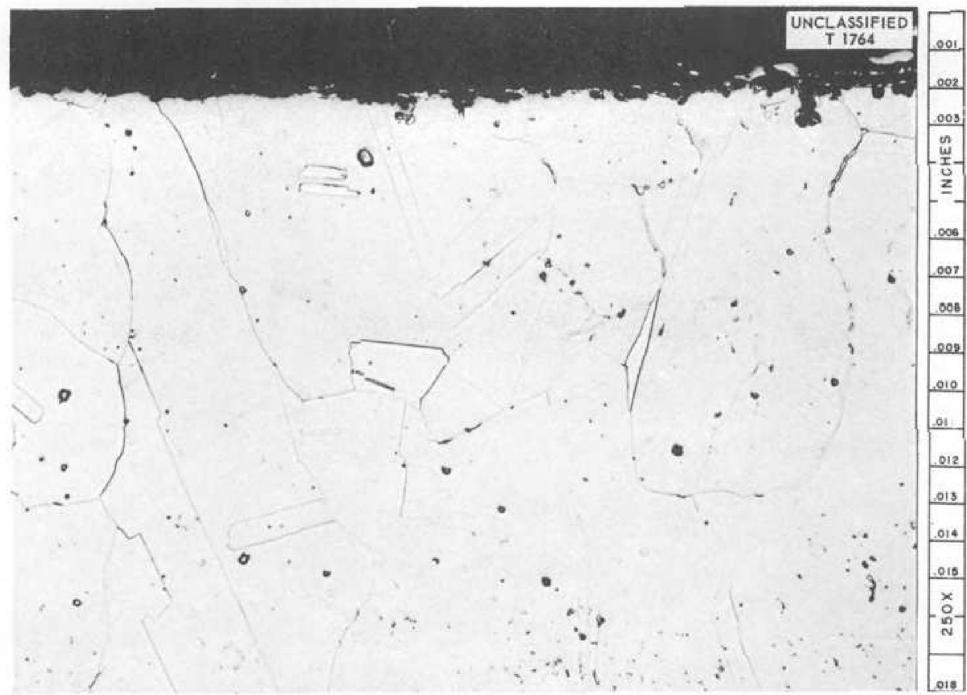  
HOT LEG

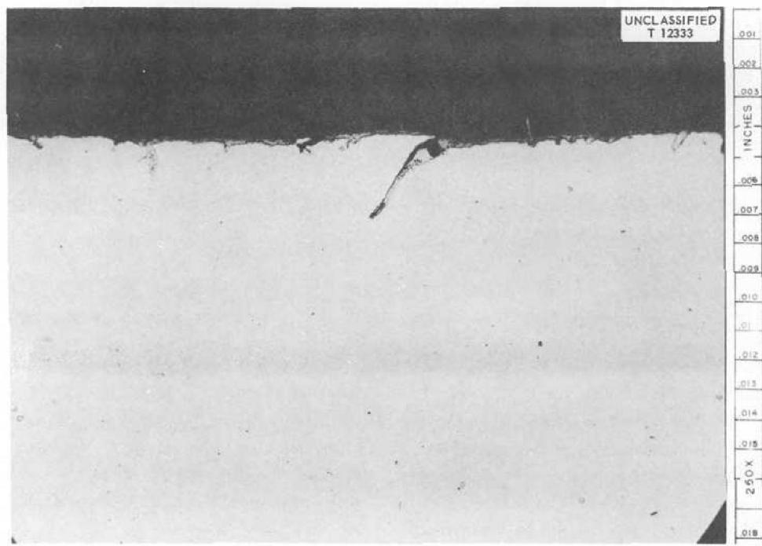  
COLD LEG

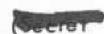  
Fig. 10. Effect of Zirconium Hydride Additions on Fluoride Corrosion in Inconel. 250X. Reduced $25\%$ . with caption)

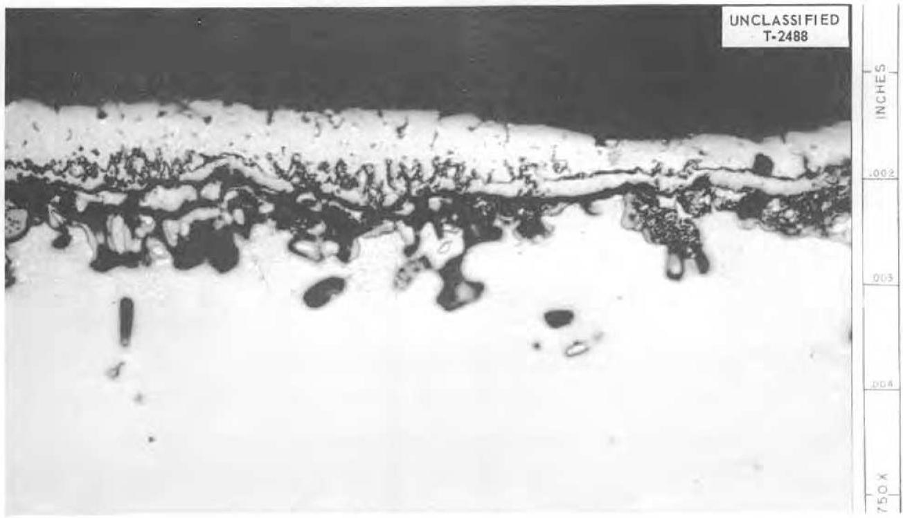  
Fig. 11. Hot Leg of Inconel Loop After Circulating Molten Fluorides with Small Addition of Titanium Hydride, 750X. (Secret with caption)

attack was noted, it was less than had been expected. It is possible that a more efficient mixing of the sodium-potassium alloy and the fuel would result in a greater improvement. It is also possible that some of the sodium-potassium alloy was vaporized while the fuel was being charged. A similar addition, but more carefully controlled, definitely caused a reduction in depth of attack with fluoride 30. When the fluorides from the loop to which the sodium-potassium alloy had been added were analyzed, the maximum chromium concentration found was $520~\mathrm{ppm}$ , which was additional evidence of decreased corrosion. No fuel reduction products could be identified by spectrographic studies.

Since corrosion occurs by the leaching of chromium from the alloy, it was reasoned that adding chromium metal to the fuel before it was placed in the loop might reduce the attack in one of two ways: the attack might be slowed down in accordance with the law of mass action, or the corrosive impurities in the fuel might be reduced before the fuel was charged into the loop.

Several attempts were made to add chromium metal to the fluorides both before and after they were charged into the loop. It proved surprisingly difficult to add chromium metal to these mixtures,

and the results obtained were erratic and not reproducible.

Oxide Removal Procedures. - In any corrosion test the method of cleaning the metal surface prior to testing is one of the most sensitive variables. It is desirable to clean the surface without changing the basic corrosion mechanism or corrosion rate. Many of the early failures with the sodium loops were caused, or at least influenced, by the cleaning cycle.

The standard cleaning cycle chosen for use on the loops consisted in degreasing and inspecting; making all welds with a helium backup to reduce oxidation; degreasing; and inspecting with both swab and borescope. It was realized that oxides, whether initially present or formed during welding, would not be removed by this procedure. The work discussed in this section was an investigation of several possible methods for removing these oxides without etching or otherwise changing the surface. None of these methods were adopted as a standard procedure.

A series of loops was cleaned by passing dried hydrogen through them while they were heated to above $1800^{\circ}F$ . The loops were held at this temperature for 1 hr or until the dew point of the exit hydrogen was $-60^{\circ}F$ . In most cases the dew point

was about $-100^{\circ}F$ at the end of 1 hr. The corrosion results from loops cleaned by this method were quite erratic, and considerable grain growth usually occurred. The size of the loops, variations in wall thickness, and variations in type and thickness of insulation made it extremely difficult to heat a loop uniformly; therefore temperature gradients of less than several hundred degrees were difficult to obtain. With these temperature gradients it was necessary to heat most sections of the loops into the range of rapid grain growth (above $1850^{\circ}F$ ) to get the colder sections to the cleaning temperature ( $1800^{\circ}F$ ). The resulting large grains caused variation in attack and made comparisons difficult. Because of the difficulties in control, this method was not considered as being adaptable either to the loops or to the large engineering components of a reactor.

The results obtained from the operation of loops with sodium and sodium-potassium alloy, as well as cleaning tests carried out by the group under D. C. Vreeland, indicated that these metals would remove the oxides without attacking the tube wall.4,10 Vreeland showed that, with small temperature drops, temperatures in excess of $1450^{\circ}\mathrm{F}$ were required for cleaning but that the time was not critical. Several loops were filled with sodium-potassium alloy, which was allowed to circulate for 4 hr with the hot leg at $1600^{\circ}\mathrm{F}$ and the cold leg at $1500^{\circ}\mathrm{F}$ . The sodium-potassium alloy was drained while the loop was still hot. The erratic variations in corrosion were traced to variations in the oxides left in the loop after cleaning. The oxides were left as deposits in cold sections of the loop and as a solid deposit when the loop was drained. The oxides from the weld scale had been converted to alkali-metal oxides with low solubilities. This cleaning method is feasible where a cold bypass or filter may be used to remove the oxides, but not for the thermal loops.

Effect of Hot-Leg Temperature. - Two loops were circulated with fluoride 14 at temperatures other than the standard temperature of $1500^{\circ}\mathrm{F}$ . Loop 218 was circulated at a hot-fluid temperature of $1300^{\circ}\mathrm{F}$ and loop 222 at a hot-fluid temperature of $1650^{\circ}\mathrm{F}$ . Photomicrographs of typical hot-leg sections from both loops and from standard loop

229 are presented in Fig. 12. Some increase in depth of attack was noted with increasing temperature: from a maximum of 0.010 in. at $1300^{\circ}\mathrm{F}$ to 0.015 in. at $1500^{\circ}\mathrm{F}$ and to 0.018 in. at $1650^{\circ}\mathrm{F}$ . At the higher temperature fewer voids were found, but they were much larger and showed more tendency to migrate to the grain boundaries. Considerable grain growth also was noted.

Crevice Corrosion. - Although the accepted mechanism of corrosion in the fused fluorides would not be expected to lead to crevice corrosion, a direct test was desired, inasmuch as crevices may be present in the hot portion of a reactor plumbing system where tubes join to headers. In order to make such a test, two crevices were built into loop 223. The pipe was sawed through in two places near the center of the hot leg, and the cut ends at each place were secured by a sleeve welded over the outside of the pipe. Thus, at each end of the section which had been cut out, a crevice opening into the fluorides existed between the sleeve and the outside of the pipe wall. The maximum attack found in the upper crevice was from 0.006 to 0.008 in., while that on the inside of the pipe wall, from the same area, was from 0.004 to 0.007 in. Although the increase in maximum penetration was small, the attack was much more intense inside the crevice. While the attack was not so severe in the lower crevice, the same relationships to that on the inside of the pipe wall were found.

As an additional check on crevice corrosion, the top welds from standard loops 219 and 229 were examined. The welding techniques used had resulted in an incomplete weld penetration, and hence crevices were present on the inside of the loops. The increase in corrosion in such a crevice is apparent from Fig. 13, a photomicrograph of the top weld of loop 219. The maximum penetration of the wall in this area was 0.003 in., while in the crevice the attack was 0.006 in. deep and several times as intense. Similar results were obtained with loop 229.

These results indicated that crevice corrosion by the fused fluorides was not a serious problem. The most likely explanation for the small increase in corrosion found in the crevices is that the cleaning was inadequate. Some oxidation had taken place during welding, and the oxides were not removed during cleaning. Helium was used as a backup gas during welding, but purging of

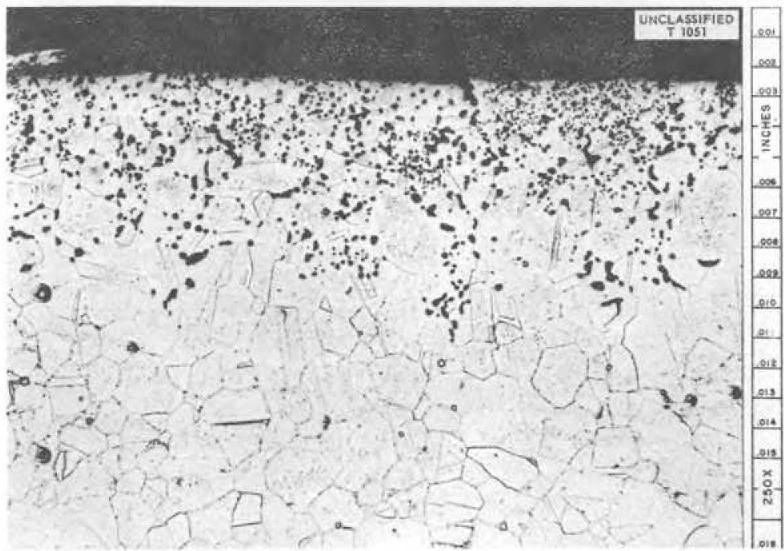  
LOOP 218, 1300°F

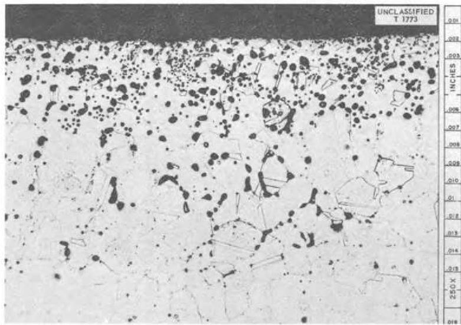  
LOOP229,1500°F

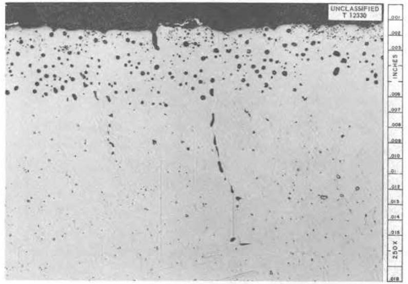  
Fig. 12. Effect of Hot-Leg Temperature on Fluoride Corrosion in Inconel. 250X, Reduced $39\%$ . (For with caption)

LOOP222,1650°F

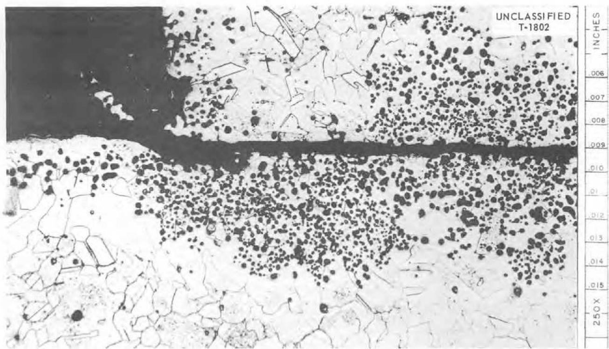  
Fig. 13. Increase in Attack in a Crevice of an Inconel Loop. 250X.

The air was not complete. The oxides in the crevice reacted with the fuel and caused the increase in attack in the crevice. In the loop itself, sufficient fuel and agitation were present to dilute any effect caused by the weld scale on the pipe surfaces.

Mechanism of Corrosive Attack. - The theory that was developed during this work to explain the mechanism of corrosive attack by fluoride salts must be regarded as tentative, even though much evidence is available to support it. Considerable work has been carried out, principally with zirconium fluoride-base fuels, to confirm the theory; the results will be presented in another report.

To determine what changes took place in the pipe material, concentric samples were drilled from the inside of both the hot and cold legs of several loops. Chemical analyses of the drillings from loop 229 are presented in Table 7. These data show that chromium was leached from the hot-leg wall to a depth beyond the maximum depth at which the attack was visible under the microscope. In the cut taken between 0.025 and 0.030 in. deep, the chromium content was still not so high as in the external, or standard, sample.

Figure 14 is a plot of the change in chromium concentration with depth. With one exception all the points lie quite close to a straight line. From other evidence it appears that the solubility of chromium in the fuel in these temperature ranges is between 3000 and 3500 ppm. The chromium concentrations for loop 229 were in this range, but for most loops they were approximately 2000 ppm.

Any changes in the iron and nickel content of the drilled hot-leg samples were small. The nickel percentage did change, but mainly because the chromium was depleted. Except in the first two samples, both the iron percentage and the iron-to-nickel ratio remained constant. In other loops no variation was found even in the surface samples. In the surface samples from the cold leg the iron content was higher, as was expected, since iron and nickel were deposited out of the solution.

The depth to which the alkali metals were found in the drillings was surprising. While the maximum attack extended to 0.018 in., traces of alkali metals were found in the 0.020- to 0.025-in. cut. Enough sample was not available from these drillings for fluoride analysis, so the form in which

Table 7. Analyses of Pipe Wall - Loop 229   

<table><tr><td>Layer No.</td><td>Total Depth of Cut (in.)</td><td>Fe (%)</td><td>Ni (%)</td><td>Cr (%)</td><td>Ratio Fe/Ni</td><td>Naa (%)</td><td>Ka (%)</td><td>Li a (%)</td><td>Ua (%)</td><td>Othersb (%)</td><td>Total (%)</td></tr><tr><td colspan="12">Hot Leg - Section 3</td></tr><tr><td>1</td><td>0.003</td><td>6.73</td><td>81.7</td><td>8.2</td><td>0.083</td><td>0.15</td><td>0.5</td><td>0.3</td><td>c</td><td>1.34</td><td>98.9</td></tr><tr><td>2</td><td>0.006</td><td>6.83</td><td>80.9</td><td>9.4</td><td>0.085</td><td>0.15</td><td>0.3</td><td>0.15</td><td>c</td><td>1.19</td><td>98.9</td></tr><tr><td>3</td><td>0.010</td><td>6.99</td><td>79.7</td><td>11.1</td><td>0.088</td><td>0.08</td><td>0.2</td><td>0.1</td><td>c</td><td>1.23</td><td>99.4</td></tr><tr><td>4</td><td>0.015</td><td>6.98</td><td>78.1</td><td>13.1</td><td>0.089</td><td>0.06</td><td>0.1</td><td>0.08</td><td>c</td><td>1.40</td><td>100.0</td></tr><tr><td>5</td><td>0.020</td><td>6.85</td><td>77.8</td><td>14.2</td><td>0.088</td><td>0.04</td><td>0.08</td><td>0.06</td><td>c</td><td>1.42</td><td>100.4</td></tr><tr><td>6</td><td>0.025</td><td>6.91</td><td>76.8</td><td>15.4</td><td>0.090</td><td>Trace</td><td>Trace</td><td>Trace</td><td>c</td><td>1.47</td><td>100.6</td></tr><tr><td>7</td><td>0.030</td><td>6.87</td><td>76.4</td><td>15.6</td><td>0.089</td><td></td><td></td><td></td><td>c</td><td>1.66</td><td>100.5</td></tr><tr><td>8</td><td>External</td><td>6.90</td><td>76.5</td><td>16.0</td><td>0.090</td><td></td><td></td><td></td><td>c</td><td>1.36</td><td>100.8</td></tr><tr><td colspan="12">Cold Leg - Section 11</td></tr><tr><td>1</td><td>0.003</td><td>8.46</td><td>73.8</td><td>16.6</td><td>0.114</td><td>c</td><td>c</td><td>c</td><td>c</td><td>1.45</td><td>100.3</td></tr><tr><td>2</td><td>0.006</td><td>8.15</td><td>74.6</td><td>16.5</td><td>0.110</td><td>c</td><td>c</td><td>c</td><td>c</td><td>1.64</td><td>100.9</td></tr><tr><td>3</td><td>0.010</td><td>7.82</td><td>74.4</td><td>16.7</td><td>0.105</td><td>c</td><td>c</td><td>c</td><td>c</td><td>1.75</td><td>100.7</td></tr><tr><td>4</td><td>0.015</td><td>7.63</td><td>74.5</td><td>16.6</td><td>0.102</td><td>c</td><td>c</td><td>c</td><td>c</td><td>1.79</td><td>100.5</td></tr><tr><td>5</td><td>0.020</td><td>7.72</td><td>74.4</td><td>16.5</td><td>0.104</td><td>c</td><td>c</td><td>c</td><td>c</td><td>1.64</td><td>100.3</td></tr><tr><td>6</td><td>External</td><td>7.62</td><td>74.6</td><td>16.7</td><td>0.102</td><td>c</td><td>c</td><td>c</td><td>c</td><td>1.65</td><td>100.6</td></tr></table>

${}^{a}$ Spectrographic determination.   
bTotal of Co, Cu, Si, Al, Mg, Mn, and Ti (spectrographic analyses).   
cNot present.

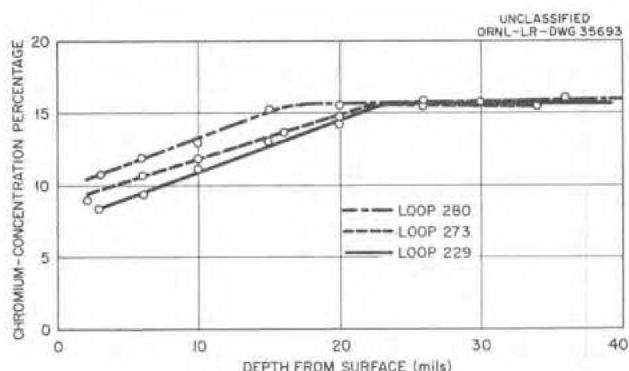  
Fig. 14. Change in Chromium Concentration in Wall of an Inconel Thermal-Convection Loop.

the metals are present is not known. The ratio of the alkali metals, as shown by these analyses, varied greatly both from sample to sample and from that in the fuel (Na, 1; K, 10; Li, 4). Furthermore, the total amount of the alkali metals, on either a weight or a molecular basis, was much less than the amount of chromium removed. It is possible that the presence of alkali metals in the deeper samples resulted from poor sampling, either through nonconcentric drilling or from runout.

During metallographic examination of the hot-leg sections, an area was noted near the surface that etched differently from the remainder of the sample. In this area carbides were no longer visible. This layer extended slightly deeper than the visible

attack and followed the line of the attack. A hot-leg sample from a standard loop was submitted to the International Nickel Company for study of this layer. It was found that apparently the carbon had not been leached out with the chromium but had gone back into solution in the metal. The carbon content of the surface layer and that of the remainder of the pipe were the same.[11]

While examining some sections from a loop, W. C. Tunnell noted that the inner pipe surface had become magnetic. Some chemical samples drilled at about this same time were then tested, and it was found that the magnetism decreased with depth but that a few magnetic particles were still present in the last cut. The surface layer in the cold leg was also magnetic. The presence of these magnetic layers was also confirmed metallographically; when the sample was covered with a colloidal dispersion of iron and made the core of an electromagnet, the iron collected on the magnetic portions of the alloy. Figure 15 shows the magnetic areas of the hot and cold legs of loop 229. The heavy black line is the area where the magnetism begins; it is heavy because the particles from the unaffected surface moved to this area.

The presence of magnetic layers on the hot-leg surface was additional confirmation that chromium had been leached out. When chromium is added to nickel, the Curie point is lowered quite markedly. An alloy with $8\%$ chromium has a Curie point at about room temperature, while that of pure nickel is at $665^{\circ}F.$ The addition of iron to nickel raises the Curie point, and presumably it would do the same in these alloys. The Curie temperature for commercial Inconel is approximately $-40^{\circ}F.$ Since the Curie point of the specimens which had been exposed to fluorides was above room temperature, the change must have been caused by the removal of chromium.

In the examination of hot-leg sections one striking fact is apparent. In spite of the depth to which the attack extends, there is very little elongation of the voids in this direction; all voids are nearly spherical. With normal intergranular attack, the voids are shaped like worm holes,

with definite elongation in one direction. In an effort to follow the course of separate holes, a sample was examined metallographically, reground, and then re-examined at depths increasing by 0.00025 to 0.0005 in. From this study it was apparent that at least the majority of the holes did not connect to the surface or to each other. This conclusion was substantiated by a vacuum leak test on a section from which the outer, unaffected area had been removed by machining. Tests with dye penetrants produced the same results.

In view of the above facts, W. D. Manly proposed a mechanism to explain the formation of the holes. It had been established that chromium was selectively leached from the alloys by the fluorides and that the chromium at the surface of the pipe was replaced by a diffusion process. In a diffusion process that is unidirectional, there will be a change in the density and/or shape of that portion of the specimen in which the composition is changed. Since diffusion in metals is believed to occur by migration of vacancies from the surface, it may produce a concentration of vacancies in the lattice that exceeds the "solubility limit" for vacancies at the test temperature. If this limit is exceeded, the vacancies will "precipitate" from the lattice, collect at discontinuities, and grow to visible voids whose size will be a function of time and temperature. Such formation of voids has been observed in many bimetallic diffusion couples, and it has been demonstrated that identical effects can be obtained in metal-liquid and metal-gas systems in which similar diffusion phenomena occur.

The removal of the chromium from the Inconel surface takes place by several chemical reactions. Since these are primarily chemical problems and are still under study by W. R. Grimes and F. F. Blankenship in the Materials Chemistry Division, they will be discussed only very briefly. From the data developed, the reactions listed below appear to be the most probable ones for removing the chromium:

(1) $3\mathrm{Ni}^{+ + } + 2\mathrm{Cr}^{0}\rightleftharpoons 2\mathrm{Cr}^{+ + + } + 3\mathrm{Ni}^{0}$   
(2) $3\mathrm{Fe}^{+ + } + 2\mathrm{Cr}^{0}\rightleftharpoons 2\mathrm{Cr}^{+ + + } + 3\mathrm{Fe}^{0}$   
(3) $2\mathrm{HF} + \mathrm{Ni}\rightleftharpoons \mathrm{NiF}_2 + \mathrm{H}_2$   
(4) $3UF_{4} + Cr = CrF_{3} + 3UF_{3}$

The metallic iron and nickel formed in these reactions are deposited on the cold-leg surface and

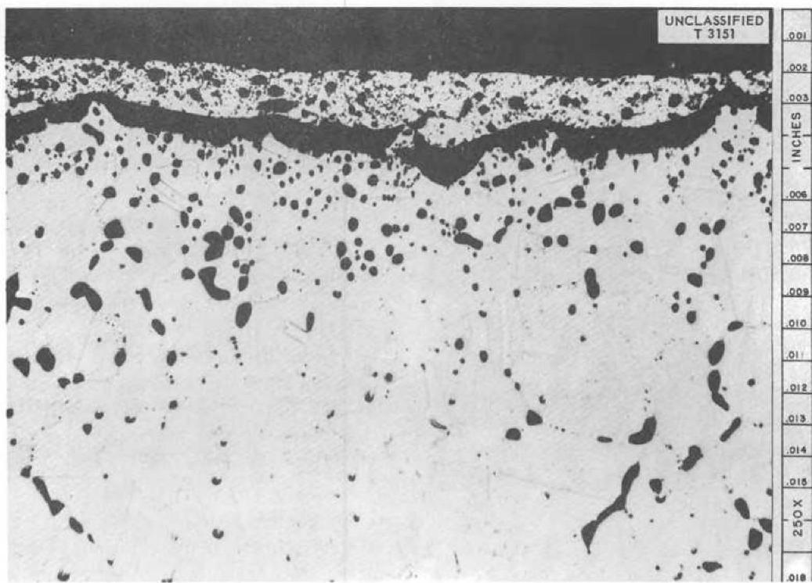  
HOT LEG

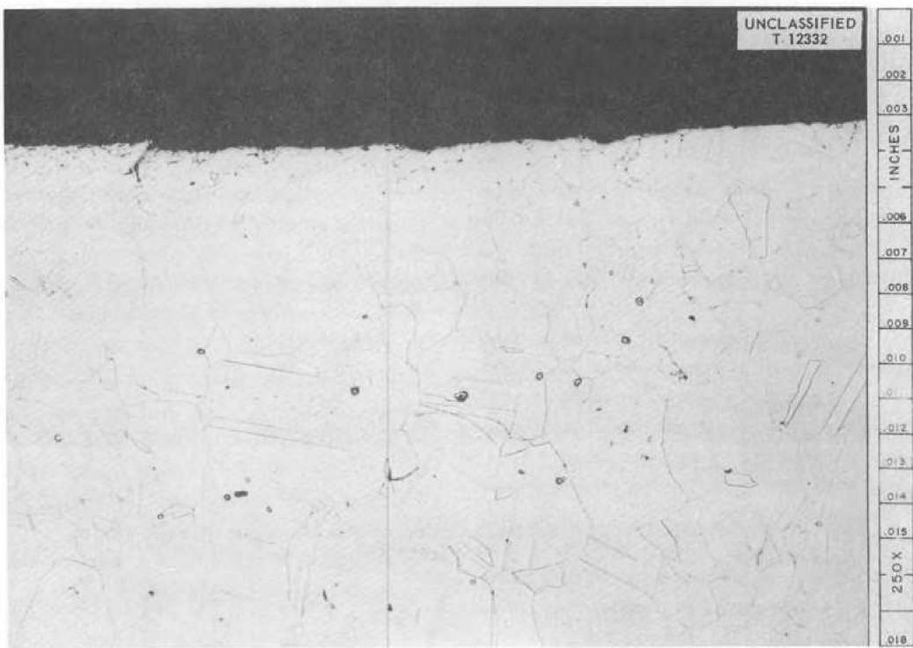  
COLD LEG   
Fig. 15. Magnetic Areas on Sections from the Hot and Cold Legs of an Inconel Loop. 250X. Reduced 19%. (Secret with caption)

diffuse into the base metal. Reaction 4 becomes more important with loops operated for longer times than those in this study, since it is thought to be the principal reaction for the mass transfer of chromium. It does, however, account for some of the attack, since equilibrium is established in a relatively short time and requires the addition to the fluorides of between 1000 and 2500 ppm of chromium, depending upon the temperature.

# Corrosion of Type 316 Stainless Steel

It was pointed out in the section on "Screening Tests" that all tests in which fluoride 14 was circulated in a stainless steel loop were terminated because the loop became plugged. Since stainless steels are such well-known engineering materials, a few tests were carried out to see whether the corrosion could be prevented by slight modifications in operating conditions or fluoride composition.

Effect of Temperature. - A series of type 316 stainless steel loops were operated at different temperatures to ascertain whether plugging could be prevented by a slight increase in the cold-leg temperature. The data from these loops (presented in Table 8) showed that the plugging was temperature sensitive. Loop 123, which was operated with a minimum cold-leg temperature of $1500^{\circ}\mathrm{F}$ , was the only one to be operated for 500 hr. A similar loop, with the same hot-leg temperature but with a slightly lower cold-leg temperature, became plugged in 91 hr. The longer time for the loop with a hot-leg temperature of $1300^{\circ}\mathrm{F}$ to become plugged was probably caused by a lower corrosion rate.

In the loop that was operated for 500 hr a layer up to 0.001 in. thick was transferred to the coldleg surface. This layer was identified by diffraction and spectrographic methods as being iron with some chromium in solution. Such a layer would not cause plugging but could interfere with proper heat transfer.

Plug Identification. - The nature of the plugs in the type 316 stainless steel loops is not definitely known. Although the standard temperature used for melting out the fluorides for examination was about $100^{\circ}\mathrm{F}$ below the minimum cold-leg temperature, all the material in the loop flowed out. Loops were also sectioned longitudinally without disclosing an apparent plug. D. C. Hoffman, of the Materials Chemistry Division, made a petrographic

examination of several of these loops before the fluorides were melted out and found13 that the only substance likely to form a plug was $\mathsf{K}_2\mathsf{NaCrF}_6$ which has a physical appearance very similar to the fuel and would be difficult to detect visually. This compound melts at around $1850^{\circ}\mathsf{F}$ but it would probably separate from fluoride 14 at about $1500^{\circ}\mathsf{F}$ under the conditions existing in the loops. Crystals of this compound might form as dendrites, which could collect together in a tangled structure similar to a log jam. Without being a complete plug, such a mass could furnish enough resistance to stop circulation in the loop. This is known to be the mechanism operating with metallic plugs. The few crystals holding such a mass to the side of the loop could be broken during freezing and remelting, and thus might not have interfered when the fluorides were melted out for examination.

Analysis of the fluorides melted from these loops showed that the chromium content was considerably higher in the cold leg, where the plugging presumably occurred. This result would be expected if the plugs were formed by $\mathsf{K}_2\mathsf{NaCrF}_6$

Effect of Fluoride Composition. - Many of the early large-scale engineering tests were carried out with type 316 stainless steel loops containing fluoride 12. Inconel parts for the loops were not available at that time, and the use of fluoride 12, which contains no uranium, required no accountability. Later, several loops were operated with zirconium fluoride-base fuels in order to test the proposed theory of plugging. Data obtained from these loops are presented in Table 9, and representative hot-leg sections are shown in Fig. 16. The compositions of the fluoride mixtures are given in Table 1.

Of the four mixtures included in Table 9, fluoride 14 was the only one that caused plugging. The proposed theories of plugging are substantiated by the fact that the zirconium-base fuels, which contained no potassium, did not form plugs. The corrosion rate in the two loops with fluoride 12 was probably too low for enough material to be furnished to form a plug.

Figure 17 shows a section from the hot leg of the type 316 stainless steel loop in which NaK was added to fluoride 12. Comparison with the

Table 8. Effect of Temperature on Corrosion of Type 316 Stainless Steel by Fluoride 14   

<table><tr><td rowspan="2">Loop No.</td><td rowspan="2">Hot-Leg Temperature (°F)</td><td rowspan="2">Initial Cold-Leg Temperature (°F)</td><td rowspan="2">Time of Circulation (hr)</td><td rowspan="2">Reason for Termination</td><td colspan="2">Metallographic Examination</td><td rowspan="2">Chemical Analysis</td></tr><tr><td>Hot Leg</td><td>Cold Leg</td></tr><tr><td>121</td><td>1300</td><td>1150</td><td>153</td><td>Loop plugged</td><td>Very rough surface with a heavy intergranular attack to 0.010 in.</td><td>Adherent metallic deposit in all sections</td><td>Cr increased, Fe decreased, Ni remained low in fluo-rides; Cr and Fe both re- moved from loop wall</td></tr><tr><td>120</td><td>1500</td><td>1300</td><td>62</td><td>Loop plugged</td><td>Very rough surface with in- tergranular attack to 0.012 in.; material near grain boundaries altered</td><td>Thin deposit with both metallic and nonmetallic crystals adhering</td><td>All impurities in fuel varied; Cr increased and Fe de- creased in other similar loops</td></tr><tr><td>125</td><td>1650</td><td>1465</td><td>91</td><td>Loop plugged</td><td>Very rough surface; inter- granular attack to 0.011 in. with very large voids</td><td>Metallic deposits with attached metallic crystals</td><td>Impurities in fluorides varied</td></tr><tr><td>123</td><td>1650</td><td>1510</td><td>500</td><td>Scheduled</td><td>Very rough surface; inter- granular attack to 0.013 in. with very large voids</td><td>Adherent metallic layer up to 0.001 in. thick; some attached crystals</td><td>Impurities in fluorides varied, but Cr increased while Fe decreased; Ni remained low</td></tr><tr><td>117-a*</td><td>1650</td><td>1525</td><td>500</td><td>Scheduled</td><td></td><td></td><td></td></tr><tr><td>117-b</td><td>1500</td><td>1300</td><td>366</td><td>Loop plugged</td><td>Very rough surface with severe intergranular attack to 0.006 in.</td><td>Fairly thick metallic layer</td><td>Impurities in fluorides varied; Cr increased slightly</td></tr></table>

\*After 500 hr, hot-leg temperatures were dropped and asbestos tape was removed from the cold leg; the loop then continued to circulate as a standard loop.

Table 9. Corrosive Effect of Various Fluoride Mixtures on Type 316 Stainless Steel   

<table><tr><td rowspan="2">Loop No.</td><td rowspan="2">Fluoride No.</td><td rowspan="2">Time of Circulation (hr)</td><td rowspan="2">Reason for Termination</td><td colspan="2">Metallographic Examination</td><td rowspan="2">Chemical Analysis</td></tr><tr><td>Hot Leg</td><td>Cold Leg</td></tr><tr><td>112</td><td>14</td><td>82</td><td>Loop plugged</td><td>Rough surface; primarily an inter-granular attack to 0.008 in.</td><td>Metallic crystal layer on surface with some crystals in fuel</td><td>Cr increased, Fe decreased, while Ni remained low in fuel</td></tr><tr><td>116</td><td>12</td><td>500</td><td>Scheduled</td><td>Some roughness; light subsurface voids in grain boundaries to 0.004 in.</td><td>Thin, continuous metallic layer, some nonmetallic inclusion</td><td>Fe decreased, Cr and Ni remained low in fluorides</td></tr><tr><td>119</td><td>12 with 0.5% NaK</td><td>500</td><td>Scheduled</td><td>Some roughening of surface; some pits 0.002 in., scattered occlusions to 0.004 in.</td><td>No deposit</td><td>Fe decreased, Cr and Ni remained low in fluorides</td></tr><tr><td>128</td><td>27</td><td>500</td><td>Scheduled</td><td>Surface very rough; heavy inter-granular attack and subsurface voids to 0.008 in.</td><td>Heavy nonmetallic layer; embedded metallic crystals; some nonmetallic crystals enclosed in metallic skin</td><td>Cr increased, Ni and Fe decreased in fluorides</td></tr><tr><td>133</td><td>30</td><td>500</td><td>Scheduled</td><td>Rough surface; moderate to heavy subsurface voids to 0.011 in. mainly in grain boundaries</td><td>Heavy adherent metallic deposit; metal crystals in fuel</td><td>Cold leg deposit mainly Fe with some Cr and Zr; Cr increased while Fe and Ni decreased in fluorides</td></tr><tr><td>134</td><td>30</td><td>500</td><td>Scheduled</td><td>Rough surface; moderate to heavy subsurface voids to 0.007 in. mainly in grain boundaries</td><td>Heavy adherent nonmetallic deposit with metallic deposit underneath; metallic crystals in fuel</td><td>Cr increased, Ni and Fe decreased in fluorides</td></tr><tr><td>126</td><td>14, hydrogen-treated</td><td>309</td><td>Loop plugged</td><td>Heavy intergranular attack to 0.014 in.</td><td>Metallic deposit with non-metallic inclusions</td><td>Cr increased, Fe decreased; Ni and U constant in fluorides</td></tr></table>

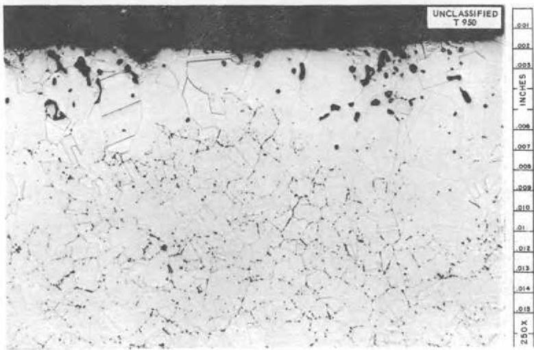  
FLUORIDE 12

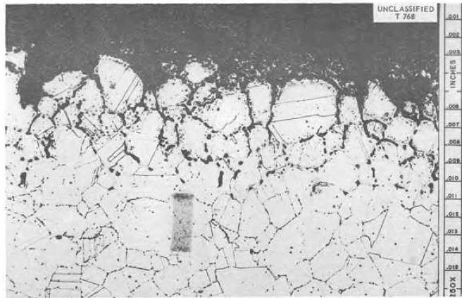  
FLUORIDE 14

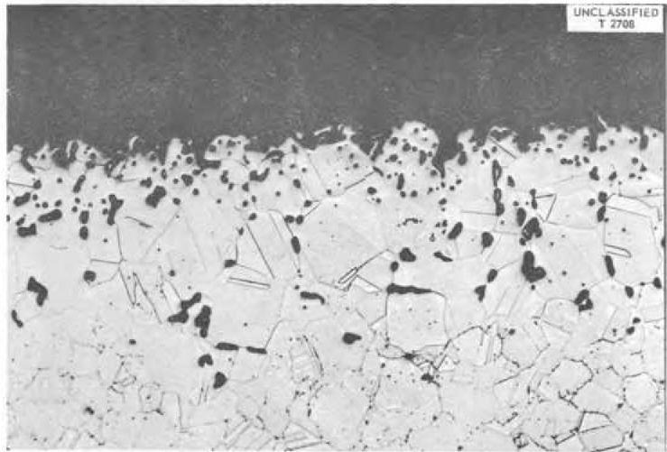  
Fig. 16. Hot-Leg Sections from Type 316 Stainless Steel Loops After Circulating Various Fluoride Mixtures. 250X. Reduced $39\%$ . (See with caption)

FLUORIDE 30

001 002 003 004 005 006 007 008 009 010 011 012 013 014 015

photomicrograph in Fig. 16 which shows the corrosion by fluoride 12 indicates that NaK reduced the attack on type 316 stainless steel, as well as on Inconel.

The depth of attack was no greater in the type 316 stainless steel loops that were operated for 500 hr than it was in Inconel. In stainless steel the attack was concentrated at the grain boundaries to a greater extent than in Inconel. However, more mass transfer was found with all fuels tested, a serious disadvantage of type 316 stainless steel as compared with Inconel. Figure 18 shows a typical layer on the cold leg of loop 134, in which fluoride 30 was circulated for 500 hr. Spectro

graphic analysis showed the layer to be mainly iron, with some chromium present.

Loop 126, also listed in Table 9, circulated fluoride 14 through which hydrogen had been bubbled. The loop was operated with a hydrogen overpressure. Although this loop became plugged, it was operated longer than the standard loops. The hydrogen reduced the nickel and part of the iron present as fluorides. Therefore chromium was not taken into solution so rapidly, and the rate of plug formation was reduced. (It now seems likely that this effect was actually caused by reduction of some of the uranium, although such a reduction was not found with the techniques available at the time.)

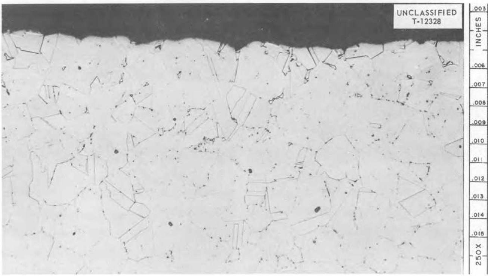  
Fig. 17. Hot-Leg Section from a Type 316 Stainless Steel Loop After Circulating Fluoride 12 with a Small NaK Addition. 250X.

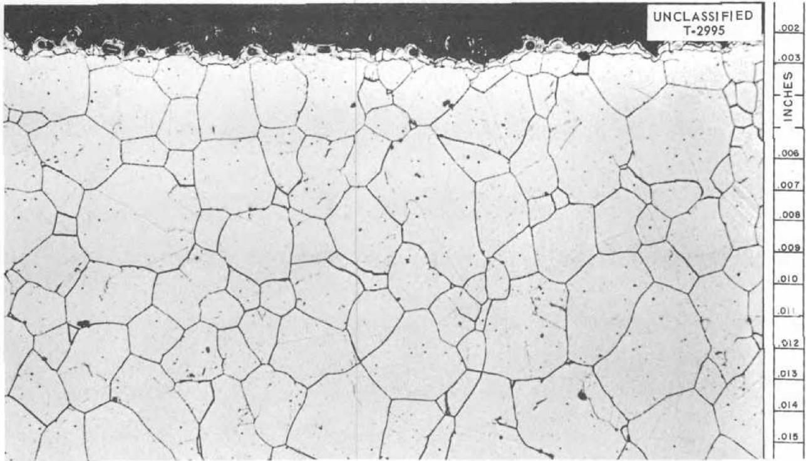

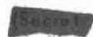  
Fig. 18. Cold-Leg Section from a Type 316 Stainless Steel Loop After Circulating Fluoride 30. 250X. with caption)

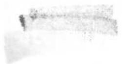

# INTERNAL DISTRIBUTION

1. C. E. Center   
2. Biology Library   
3. Health Physics Library   
4. Metallurgy Library

5-6. Central Research Library   
7. Reactor Experimental Engineering Library   
8-22. Laboratory Records Department   
23. Laboratory Records, ORNL, R.C.   
24. A. M. Weinberg   
25. L. B. Emlet (K-25)   
26. J. P. Murray (Y-12)   
27. J.A.Swartout   
28. E.D. Shipley   
29. M. L. Nelson   
30. W. H. Jordan   
31. C. P. Keim   
32. R. S. Livingston   
33. R. R. Dickison   
34. F. L. Culler   
35.A.H.Snell   
36. A. Hollgender   
37. K. Z. Morgan   
38.C.S.Harrill   
39. D. S. Billington   
40.C.E.Winters   
41. H.E.Seagren   
42. A. J. Miller   
43. R. A. Charpie   
44. M. J. Skinner   
45. J. H. Frye, Jr.   
46. W. W. Parkinson

47. W.D. Manly   
48. J. E. Cunningham   
49. G. M. Adamson   
50. J.W. Allen   
51. R. J. Beaver   
52. E. S. Bomar, Jr.   
53. R. E. Clausing   
54. J. H. Coobs   
55. C. O. Smith   
56. J. H. DeVan   
57. L. M. Doney   
58. D. A. Douglas, Jr.   
59. T. Hikido   
60.M.R.Hill   
61. E. E. Hoffman   
62. P. Patriarca   
63. M. L. Picklesimer   
64. G. P. Smith, Jr.   
65.A.Taboada   
66. W.C. Thurber   
67. R.C.Waugh   
68.J.C.Wilson   
69.P.M.Reyling   
70. G.C.Williams   
71. R.S. Crouse   
72. J. H. Koenig (consultant)   
73. H. Leidheiser, Jr. (consultant)   
74.C.S.Smith (consultant)   
75. H. A. Wilhelm (consultant)   
76. ORNL - Y-12 Technical Library   
Document Reference Section

# EXTERNAL DISTRIBUTION

77. AiResearch Manufacturing Company   
78-81. Air Force Ballistic Missile Division   
82. AFPR, Boeing, Seattle   
83. AFPR, Boeing, Wichita   
84. AFPR, Douglas, Long Beach   
85-87. AFPR, Douglas, Santa Monica   
88-89. AFPR, Lockheed, Marietta   
90. AFPR, North American, Canoga Park   
91. AFPR, North American, Downey   
92-93. Air Force Special Weapons Center

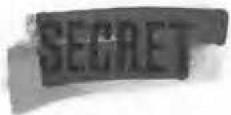

94-95. Air Research and Development Command (RDZN)

96. Air Technical Intelligence Center

97-99. ANP Project Office, Convair, Fort Worth

100. Albuquerque Operations Office   
101. Argonne National Laboratory   
102. Armed Forces Special Weapons Project, Sandia   
103. Armed Forces Special Weapons Project, Washington

104-105. Army Ballistic Missile Agency

106. Army Rocket and Guided Missile Agency   
107. Assistant Secretary of the Air Force, R&D

108-113. Atomic Energy Commission, Washington

114. Atomics International   
115. Battelle Memorial Institute

116-118. Bettis Plant (WAPD)

119. Brookhaven National Laboratory   
120. Bureau of Aeronautics   
121. Bureau of Aeronautics General Representative   
122. BAR, Aerojet-General, Azusa   
123. BAR, Chance Vought, Dallas   
124. BAR,Convair, San Diego   
125. BAR, Grumman Aircraft, Bethpage   
126. BAR, Martin, Baltimore   
127. Bureau of Yards and Docks

128-129. Chicago Operations Office

130. Chicago Patent Group   
131. Director of Naval Intelligence   
132. duPont Company, Aiken   
133. Engineer Research and Development Laboratories

134-141. General Electric Company (ANPD)

142-143. General Electric Company, Richland

144. General Nuclear Engineering Corporation   
145. Hartford Aircraft Reactors Area Office   
146. Idaho Test Division (LAROO)

147-148. Knolls Atomic Power Laboratory

149. Lockland Aircraft Reactors Operations Office   
150. Los Alamos Scientific Laboratory   
151. Marquardt Aircraft Company   
152. Martin Company   
153. National Aeronautics and Space Administration, Cleveland   
154. National Aeronautics and Space Administration, Washington   
155. National Bureau of Standards   
156. Naval Air Development Center   
157. Naval Air Material Center   
158. Naval Air Turbine Test Station   
159. Naval Research Laboratory   
160. New York Operations Office   
161. Nuclear Development Corporation of America   
162. Nuclear Metals, Inc.   
163. Oak Ridge Operations Office   
164. Office of Naval Research   
165. Office of the Chief of Naval Operations   
166. Patent Branch, Washington

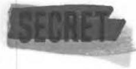

167-168. Phillips Petroleum Company (NRTS)   
169-172. Pratt and Whitney Aircraft Division   
173. San Francisco Operations Office   
174. Sandia Corporation   
175-176. School of Aviation Medicine   
177. Sylvania-Corning Nuclear Corporation   
178. Technical Research Group   
179. Thompson Products, Inc.   
180. USAF Headquarters   
181. USAF Project RAND   
182. U.S. Naval Radiological Defense Laboratory   
183-184. University of California Radiation Laboratory, Livermore   
185-196.Wright Air Development Center   
197-221. Technical Information Service Extension   
222. Division of Research and Development, AEC, ORO

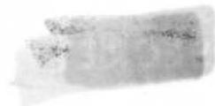

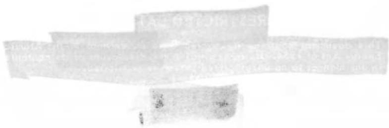