ORNL-2338

UC-25 - Metallurgy and Ceramics

INTERIM REPORT ON CORROSION BY

ZIRCONIUM-BASE FLUORIDES

G.M.Adamson

R. S. Crouse

W. D. Manly

CENTRAL RESEARCH LIBRARY

DOCUMENT COLLECTION

LIBRARY LOAN COPY

DO NOT TRANSFER TO ANOTHER PERSON

If you wish someone else to see this

document, send in name with document

and the library will arrange a loan.

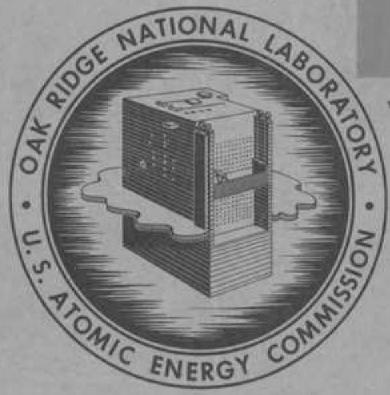

OAK RIDGE NATIONAL LABORATORY

operated by

UNION CARBIDE CORPORATION

for the

U.S. ATOMIC ENERGY COMMISSION

ORNL-2338

UC-25 = Metallurgy and Ceramics

Contract No. W-7405-eng-26

METALLURGY DIVISION

# INTERIM REPORT ON CORROSION BY ZIRCONIUM-BASE FLUORIDES

G.M.Adamson

R. S. Crouse

W. D. Manly

DATE ISSUED

JAN 3 1961

OAK RIDGE NATIONAL LABORATORY

Oak Ridge, Tennessee

operated by

UNION CARBIDE CORPORATION

for the

U.S. ATOMIC ENERGY COMMISSION

MARTIN MARIETTA ENERGY SYSTEMS LIBRARIES

3445603505124

# FOREWORD

The corrosion data reported herein are an extension of the data given in the companion report Interim Report on Corrosion by Alkali-Metal Fluorides: Work to May 1, 1953 (ORNL-2337) but concern zirconium fluoride-base mixtures, principally fluoride 30. The companion report should be used in conjunction with this one for background information, which will not be repeated here. The period covered by this report is approximately from July 1952 to June 1956.

# CONTENTS

Foreword iii

Abstract 1

Conclusions 1

Experimental Methods 2

Equipment 2

Procedure 2

Results and Discussion. 5

Fluoride 30 in Inconel Loops. 5

Standard Loops 5

Operating Time 9

Effect of Temperature 16

Temperature Drop 20

Additives 21

Ratio of Surface Area to Loop Volume 26

Oxide Removal Procedures 27

Heating Methods 28

Loop Size and Shape 31

Change in Analysis of Inner Pipe Wall 32

Effect of Uranium Concentration 36

Barren Fluoride Mixtures 37

Screening Tests of Possible Container Materials 37

Stainless Steels 40

Izett Iron 43

Nickel 43

Inconel X 43

Molybdenum and Niobium 43

Hastelloy B 46

Special Alloys 46

Special Fuel Mixtures 46

Alkali-Metal-Base Mixtures Containing Trivalent Uranium 54

Reactions and Mechanisms 56

# INTERIM REPORT ON CORROSION BY ZIRCONIUM-BASE FLUORIDES

G.M.Adamson

R.S.Crouse

W. D. Manly

# ABSTRACT

The zirconium fluoride-base fluoride mixture NaF-ZrF4-UF4 (50-46-4 mole %), referred to as "fluoride 30," was circulated in Inconel thermal convection loops for periods varying from 500 to 5000 hr and at a hot-leg temperature of $1500^{\circ}\mathrm{F}$ . The purpose of this program was to develop an understanding of the corrosion mechanism accompanying the circulation of zirconium fluoride-base mixtures in Inconel.

The attack in the Inconel loops was in the form of subsurface voids formed by selective leaching of chromium from the alloy. After 500 hr of operation the voids were found to depths of about 10 mils, with the depth continuing to increase at a rate of about 4 mils per 1000 hr of operation. The effects of such variables as time, hot-leg temperature, temperature drop, fluoride purity, loop size and shape, and inhibitors on the depth of corrosion were studied. It was found that the attack was reduced when a portion of the uranium was present in the trivalent state, but the results were not reproducible.

Also, a few tests were carried out in loops constructed from nickel, stainless steels, iron, Hastelloy B, molybdenum, and niobium.

A limited amount of work was done on Inconel loops circulating alkali metal-base mixtures (NaF, LiF, KF, UF₄) with portions of the uranium in the trivalent state. Reduced attacks were found, but disproportionation and production problems require additional study.

# CONCLUSIONS

From the data presented in this report it may be concluded that molten mixtures of NaF, $\mathsf{ZrF}_4$ and UF4 may be circulated for several thousand hours in low-velocity nonisothermal Inconel systems. After 2000 hr of operation the corrosion depth in such a system will be deeper than desirable but will still not be excessive. A depth of about 0.010 in. will be reached in 500 hr; after this the depth will increase at a rate of 0.004 in. per additional 1000 hr of operation.

The corrosion of the Inconel takes place by selective leaching of chromium metal from the hotter surface of a nonisothermal system. The removed chromium is replaced on the surface by diffusion from the center, but since no inward diffusion takes place, voids form under the surface of the metal.

The principal removal reaction is

$$
2 U F _ {4} + C r \rightarrow 2 U F _ {3} + C r F _ {2}
$$

accompanied by the reverse reaction to form chromium metal in the cold leg. With short operating times a large portion of the attack takes place by enough chromium being leached from the wall to reach the equilibrium concentration necessary for the mass transfer reactions

to take place. It is known that other mass transfer reactions may occur when the uranium is not present, and these may also be of secondary importance when uranium is present. Neither the nature nor the location of the rate-controlling step has been determined. The diffusion of chromium to the hot-leg surface has been shown not to be controlling.

With present production techniques for the fluoride mixtures, the nickel, iron, and hydrogen fluoride impurities are reduced to levels where they no longer play a vital part in the corrosion mechanisms; however, if they are present in the zirconium fluoride-base mixtures, they will cause attack in the loop hot legs.

The most important variable controlling the depth of corrosion is the maximum wall temperature. The wall temperature is more critical than the maximum average bulk fluoride temperature. While wall temperature is important, it must be a relative temperature; appreciable attack is found only at the hottest point in a loop no matter what the actual temperatures are. Variables of secondary importance are uranium concentration, loop size and shape, and temperature drop.

The replacement of a portion of the $\mathsf{UF}_4$ content of a batch with $\mathsf{UF}_3$ , either in the production

procedure or by the addition of reducing agents, will provide reduced depths of attack. The $\mathsf{UF}_3$ has only a limited solubility in zirconium fluoride-base mixtures, so all the uranium cannot be present in the trivalent form. These mixtures are difficult to control during production, and disproportionation of the $\mathsf{UF}_3$ may occur, causing the formation of hot-leg deposits.

While Inconel is an acceptable material for present reactors, it will not be adequate for future larger reactors. With zirconium fluoride-base fluoride mixtures at $1500^{\circ}\mathrm{F}$ , niobium, molybdenum, and Hastelloy B show promise as future reactor materials. Some reduction in depth of attack may be obtained in alloys similar to Inconel but with reduced chromium concentration. The stainless steels did not plug with these fluoride mixtures, as they did in the case of the alkali-metal-base fluoride mixtures, but they still are not as good as Inconel.

The addition of $UF_{3}$ to alkali-metal-base fluoride mixtures also resulted in a reduction in depth of attack in Inconel loops. The solubility of $UF_{3}$ is higher in this system, but mixtures of $UF_{3}$ and $UF_{4}$ were still necessary. While this mixture shows promise for future use, production and disproportionation problems remain to be solved.

# EXPERIMENTAL METHODS

# Equipment

Most of the loops used for this study were slightly modified from those originally developed; the modifications are discussed in detail below ("Loop Size and Shape"). The expansion pot was replaced by a length of pipe of the same size as that used for the loop itself. The fill line and spark plug probe entered the sides of this pipe through Swagelok fittings. A typical loop is shown in Fig. 1. Most of the loops were constructed from IPS in-sched-10 pipe, but, if this was not available, IPS in-sched-40 pipe was used as an alternate. No changes were made in the auxiliary equipment.

# Procedure

The operating procedure remained essentially the same as that used for the alkali-metal-fluoride

work, except for the addition of a cleaning step, which consisted in circulating another batch of fluorides for 2 hr before the loop was filled with the test mixture.

All the molten fluorides used in this study were mixed and purified by the ANP Chemistry Section of the Materials Chemistry Division. The purification procedure included treatment with both hydrogen fluoride and hydrogen gases at elevated temperature followed by a prolonged stripping operation with hydrogen and helium. During the latter part of this study the batch size was increased, from 50 lb, to 250 lb; however, for handling and use, these batches were subdivided into 50-lb batches. The batching down was carried out while the mixture was molten, and the usual steps were taken to avoid contamination. Once a pot was filled, it was held under a positive helium pressure at all times. Helium gas was allowed to leak to the atmosphere whenever a connection was made or broken. During the actual transfer to a loop, helium pressures were maintained in both the loops and the fill pot. The rate of transfer was controlled by adjusting the difference between these pressures.

The liquid level in the loop was controlled by the location of the outlet from the transfer line. When a signal was obtained on the spark-plug probe, which was located above this level, the helium pressure in the loop was increased and the excess liquid was transferred back to the fill pot. After the loop reached operating temperature, any excess liquid resulting from expansion was blown back to the fill pot. A sample of the original liquid was trapped in an enlarged section of the transfer line for chemical analysis.

After the loop had operated for the desired time, the power was turned off and the liquid allowed to freeze in place. The loops were then sectioned as shown in Fig. 2. The material was melted out of the 2-in. sections in an inert-atmosphere furnace; the pipe sections were sent for metallographic examination, and the fluorides for chemical analysis. Sections 1A, 2A, and 4A were stored in a dry box as reserve samples. The ends of the other sections were covered with tape. The loop sections were stored for three months; then, if they had not been used, they were sent to salvage.

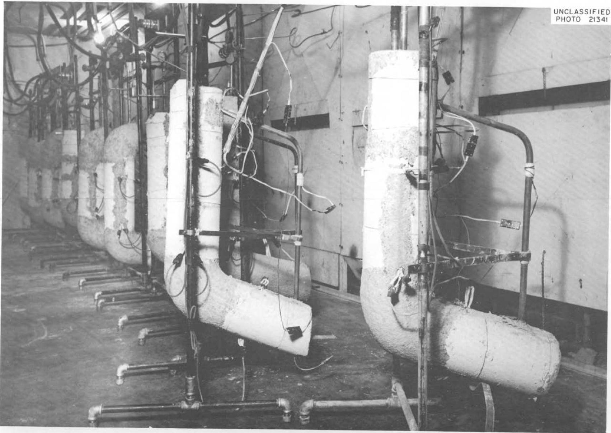  
Fig. 1. Thermal Convection Loops.

UNCLASSIFIED ORNL-LR-DWG 48763

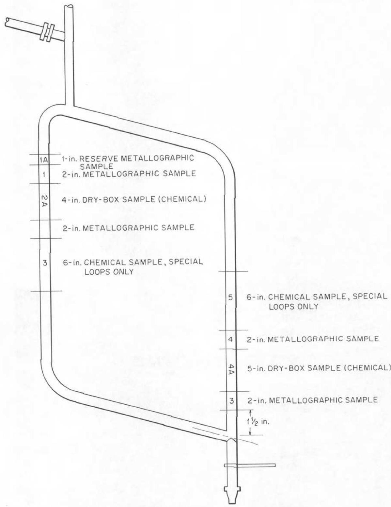  
Fig. 2. Location of Metallographic and Chemical Samples. Standard loops.

The amount of attack was determined by metallographic examination. Uncertainties in the original pipes, in cleaning the surfaces after operation, and in determining losses from external oxidation prevented the use of weight loss data. The depth of attack was determined by the depth of the deepest void formation found metallographically in a traverse of an entire circumference of a section. Other than classifying the intensity as moderate, heavy, etc., no attempt was made to determine the amount of the attack. Typical sections of each type are shown in Fig. 3. Wall thicknesses were measured microscopically, and it was shown that no large, even surface removal type of attack was taking place; however, small amounts less than the normal variation in pipe wall thickness would not be measurable. For

each loop, at least two sections from the hottest area were examined to determine the maximum attack.

The fluoride mixtures used in this study are referred to by number, and are identified in Table 1.

# RESULTS AND DISCUSSION

# Fluoride 30 in Inconel Loops

Standard Loops. - A considerable number of loops were operated under what were considered to be standard conditions. These loops circulated a zirconium fluoride mixture for 500 hr with a hot-leg temperature of $1500^{\circ}\mathrm{F}$ and a temperature drop of about $225^{\circ}\mathrm{F}$ . They fall into two general groups. The first group were operated

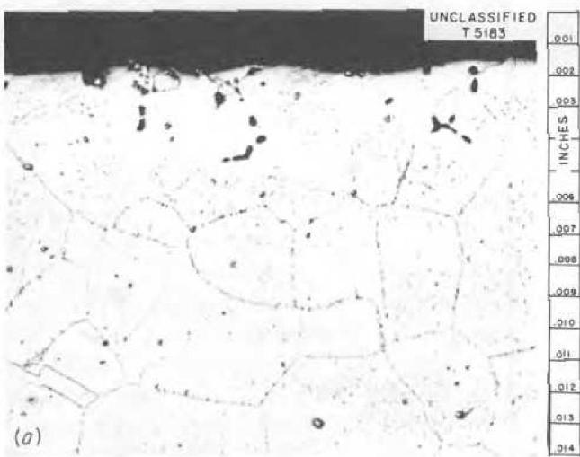

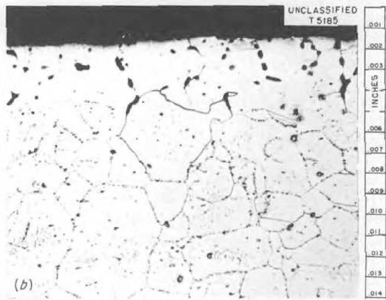

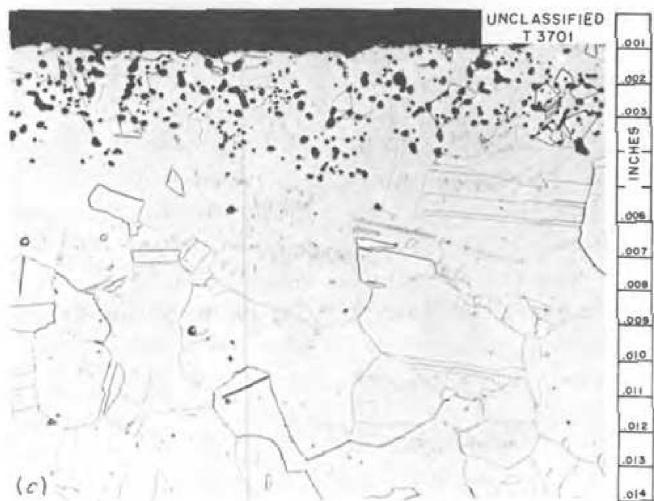  
Fig. 3. Photomicrographs Illustrating Various Intensities of Attack as Reported for Fluoride Corrosion. (a) Light; (b) moderate; (c) heavy. 250X. Reduced 29%.

Table 1. Composition of Molten Fluoride Mixtures   

<table><tr><td rowspan="2">Fluoride No.</td><td colspan="2">UF4</td><td colspan="2">NaF</td><td colspan="2">ZrF4</td></tr><tr><td>Weight %</td><td>Mole %</td><td>Weight %</td><td>Mole %</td><td>Weight %</td><td>Mole %</td></tr><tr><td>27</td><td>10.9</td><td>4.0</td><td>16.7</td><td>46.0</td><td>72.4</td><td>50.0</td></tr><tr><td>30</td><td>11.4</td><td>4.0</td><td>19.0</td><td>50.0</td><td>69.6</td><td>46.0</td></tr><tr><td>31</td><td></td><td></td><td>20.1</td><td>50.0</td><td>79.9</td><td>50.0</td></tr><tr><td>44</td><td>18.6</td><td>6.5</td><td>20.5</td><td>53.5</td><td>60.9</td><td>40.0</td></tr></table>

either as preliminary loops to outline the problems to be encountered with this mixture or as control loops for some of the early studies. These loops were not precleaned, and close control of conditions had not yet been established. The second group were run as controls for later studies, and all were precleaned. While some scatter in results still exists in this second group, the reproducibility, especially during the fluoride production, was much better than was found in the early loops. The data for the first group are tabulated in Table 2 and those for the second group in Table 3.

It is apparent from Table 2 that a variation in maximum depth of attack from 5 to 18 mils was found from supposedly duplicate loops. With many of these loops the iron and nickel impurity concentrations of the original fluorides were also high, but the maximum depth of attack did not vary in a systematic manner with these concentrations. Another cause of variation in attack was an undetermined amount of hydrogen fluoride left in the fluoride mixture from the purification process. This hydrogen fluoride would react with the loop wall, producing iron and nickel fluorides which in turn would reduce the chromium. When this group of loops were operated, no suitable method was available for measuring the hydrogen fluoride concentration.

When a method became available for measuring the hydrogen fluoride content of the mixtures, it was found to be necessary to increase the stripping time after purification to reduce the hydrogen fluoride to acceptable levels. The control loops tabulated in Table 3 were those in which the controlled fluoride batches were circulated. While considerable variation is still found in the maximum depths of attack, it is not as great as in Table 2.

The loops in Table 3 are tabulated approximately in the order in which they were filled or in order of time. If this table is divided into quarters and average maximum attacks calculated for each quarter, it may be noted that the depths of attack are higher at the end, that is, that the attack is gradually increasing with time. The average depth for the entire table was 9.1 mils, while the attack for the four quarters averaged 7.0, 9.2, 9.6, and 10.5 mils, respectively. As a comparison, the average in Table 2 was 10.1 mils. The poorer control of production with the large batches was responsible for some of the increase but not for all of it, since the trend was a gradual one. Neither the other causes of this gradual increase nor the cause of the occasional very deep attacks has been determined. The increased purging time and closer control in the second group have made the attack more consistent but have not resulted in a large average reduction in maximum depth of attack. Since the average chromium content in the fluorides after operation of the loops in Table 2 is higher than after operation of those tabulated in Table 3, there appears also to be a reduction in intensity of attack over the entire loop with the controlled batches.

In an effort to determine whether air contamination during filling or operation could be responsible for the variation in attack, a series of loops were operated with fluoride batches which had been deliberately contaminated. Loops were operated under three conditions: (1) with helium pressure only during filling, (2) with no protective atmosphere combined with a small air leak, and (3) with a 1-liter volume of air bubbled through the batch before transfer. The loop with no protective atmosphere and a slow leak developed an attack of 21 mils in 500 hr, which was double

Table 2. Data from Preliminary Control Loops ${}^{a}$   

<table><tr><td rowspan="3">Loop No.</td><td colspan="2">Fluoride Mixture</td><td colspan="2">Attack</td><td colspan="7">Analysis of Fluoride Mixture</td></tr><tr><td rowspan="2">Fluoride No.</td><td rowspan="2">Batch No.</td><td rowspan="2">Intensity</td><td rowspan="2">Depth (mils)</td><td colspan="2">Nickel (ppm)</td><td colspan="2">Iron (ppm)</td><td colspan="2">Chromium (ppm)</td><td>Uranium (%)</td></tr><tr><td>Before</td><td>After</td><td>Before</td><td>After</td><td>Before</td><td>After</td><td>Before After</td></tr><tr><td>234</td><td>27</td><td>Lab</td><td>Light</td><td>5</td><td>530</td><td>&lt;30</td><td>4100</td><td>600</td><td>1460</td><td>1900</td><td>8.3 9.2</td></tr><tr><td>\( 236^b \)</td><td>27</td><td>Lab</td><td>Moderate</td><td>10</td><td>610</td><td>&lt;30</td><td>2900</td><td>1000</td><td>1070</td><td>2400</td><td>7.9 9.2</td></tr><tr><td>244</td><td>27</td><td></td><td>Moderate</td><td>9</td><td>140</td><td>&lt;20</td><td>540</td><td>100</td><td>&lt;20</td><td>1450</td><td>8.2 9.0</td></tr><tr><td>245</td><td>27</td><td></td><td>Moderate</td><td>12</td><td>340</td><td>&lt;20</td><td>340</td><td>100</td><td>75</td><td>1500</td><td>8.4 9.3</td></tr><tr><td>\( 261^b \)</td><td>30</td><td>Lab</td><td>Moderate</td><td>6</td><td></td><td>&lt;20</td><td></td><td>150</td><td></td><td>950</td><td></td></tr><tr><td>273</td><td>30</td><td></td><td>Moderate</td><td>10</td><td>&lt;20</td><td>60</td><td>860</td><td>175</td><td>160</td><td>1200</td><td>8.6 9.0</td></tr><tr><td>272</td><td>30</td><td></td><td>Moderate</td><td>16</td><td>720</td><td>30</td><td>520</td><td>200</td><td>45</td><td>1350</td><td>8.3 \( 7.0^c \)</td></tr><tr><td>283</td><td>30</td><td>d</td><td>Heavy</td><td>15</td><td>1100</td><td>40</td><td>740</td><td>100</td><td>100</td><td>\( 2800^c \)</td><td>4.6 5.1</td></tr><tr><td>280</td><td>30</td><td>EE-58</td><td>Heavy</td><td>8</td><td>85</td><td>&lt;20</td><td>430</td><td>50</td><td>&lt;20</td><td>1000</td><td>8.6 9.7</td></tr><tr><td>287</td><td>30</td><td>EE-59</td><td>Heavy</td><td>13</td><td>30</td><td>20</td><td>520</td><td>60</td><td>&lt;20</td><td>1450</td><td>8.8 \( 9.1^c \)</td></tr><tr><td>282</td><td>30</td><td>e</td><td>Moderate</td><td>9</td><td>40</td><td>&lt;20</td><td>520</td><td>30</td><td>&lt;20</td><td>1100</td><td>8.9 8.9</td></tr><tr><td>289</td><td>30</td><td>EE-59</td><td>Heavy</td><td>8</td><td>95</td><td>20</td><td>620</td><td>60</td><td>230</td><td>900</td><td>8.8 9.5</td></tr><tr><td>\( 295^f \)</td><td>30</td><td>EE-63</td><td>Heavy</td><td>6</td><td>145</td><td>&lt;20</td><td>625</td><td>30</td><td>&lt;20</td><td>1100</td><td>8.8 9.4</td></tr><tr><td>296</td><td>30</td><td>EE-63</td><td>Heavy</td><td>8</td><td>40</td><td>20</td><td>470</td><td>45</td><td>90</td><td>1050</td><td>8.9 9.1</td></tr><tr><td>284</td><td>30</td><td>d</td><td>Heavy</td><td>12</td><td>500</td><td>&lt;20</td><td>1000</td><td>40</td><td>1450</td><td>1400</td><td>9.0 9.2</td></tr><tr><td>310</td><td>30</td><td>\( R-110^f \)</td><td>Heavy</td><td>9</td><td>40</td><td>&lt;20</td><td>265</td><td>50</td><td>&lt;20</td><td>900</td><td>8.6 9.0</td></tr><tr><td>307</td><td>30</td><td>e</td><td>Heavy</td><td>5</td><td>90</td><td>&lt;20</td><td>235</td><td>30</td><td>&lt;20</td><td>1100</td><td>9.0 8.8</td></tr><tr><td>298</td><td>30</td><td>EE-68</td><td>Heavy</td><td>9.5</td><td>40</td><td>&lt;20</td><td>550</td><td>25</td><td>100</td><td>1100</td><td>8.6 8.9</td></tr><tr><td>\( 343^f \)</td><td>30</td><td>EE-106</td><td>Heavy</td><td>18</td><td>75</td><td>&lt;20</td><td>210</td><td>50</td><td>890</td><td>\( 1500^c \)</td><td>9.0 8.9</td></tr><tr><td>\( 324^b \)</td><td>30</td><td>EE-92</td><td>Heavy</td><td>15</td><td>60</td><td>&lt;20</td><td>c</td><td>45</td><td>250</td><td>1300</td><td>8.6 8.9</td></tr><tr><td>\( 345^f \)</td><td>30</td><td>EE-113</td><td>Heavy</td><td>6</td><td>40</td><td>&lt;20</td><td>65</td><td>45</td><td>120</td><td>600</td><td>9.0 9.2</td></tr><tr><td>326</td><td>44</td><td>EE-114</td><td>Heavy</td><td>7</td><td>750</td><td>&lt;20</td><td>500</td><td>65</td><td>250</td><td>1100</td><td>14.4 \( 14.0^c \)</td></tr><tr><td>381</td><td>44</td><td>EE-140</td><td>Heavy</td><td>10</td><td>&lt;20</td><td>&lt;20</td><td>175</td><td>120</td><td>50</td><td>700</td><td>14.6 \( 12.0^c \)</td></tr><tr><td>387</td><td>44</td><td>EE-145</td><td>Heavy</td><td>16.5</td><td>&lt;20</td><td>&lt;20</td><td>395</td><td>90</td><td>135</td><td>700</td><td>15.3 \( 15.5^c \)</td></tr><tr><td></td><td></td><td></td><td></td><td>10 (av)</td><td></td><td></td><td></td><td></td><td></td><td>1190 (av)</td><td></td></tr></table>

${}^{a}$ All loops circulated a zirconium fluoride mixture for 500 hr with a hot-leg temperature of ${1500}^{ \circ  }\mathrm{F}$ and a cold-leg temperature averaging ${1300}^{ \circ  }\mathrm{F}$ .   
bLoop treated with hydrogen.   
cConsiderable spread was found in the individual values.   
As melted.   
$e_{\text{Made in graphite}}$   
Loop cleaned with fluoride mixture 31.

Table 3. Data from Control Loops ${}^{a}$   

<table><tr><td rowspan="3">Loop No.</td><td colspan="2">Fluoride Mixture</td><td colspan="2">Attack</td><td colspan="8">Analysis of Fluoride Mixture</td></tr><tr><td rowspan="2">Fluoride No.</td><td rowspan="2">EE Batch No.</td><td rowspan="2">Intensity</td><td rowspan="2">Depth (mils)</td><td colspan="2">Nickel (ppm)</td><td colspan="2">Chromium (ppm)</td><td colspan="2">Iron (ppm)</td><td colspan="2">Uranium (%)</td></tr><tr><td>Before</td><td>After</td><td>Before</td><td>After</td><td>Before</td><td>After</td><td>Before</td><td>After</td></tr><tr><td>352</td><td>30</td><td>119</td><td>Moderate</td><td>5.5</td><td>&lt;20</td><td>&lt;20</td><td>50</td><td>450</td><td>110</td><td>60</td><td>8.8</td><td>9.4</td></tr><tr><td>353c</td><td>30</td><td>119</td><td>Heavy</td><td>3</td><td>&lt;20</td><td>&lt;20</td><td>50</td><td>600</td><td>130</td><td>75</td><td>8.8</td><td>9.1</td></tr><tr><td>360d</td><td>30</td><td>119</td><td>Heavy</td><td>4.5</td><td>&lt;20</td><td>&lt;20</td><td>100</td><td>600</td><td>100</td><td>70</td><td>8.7</td><td>9.0e</td></tr><tr><td>380f</td><td>30</td><td>141</td><td>Heavy</td><td>7</td><td>&lt;20</td><td>&lt;20</td><td>95</td><td>700</td><td>185</td><td>90</td><td>8.7</td><td>8.9</td></tr><tr><td>382</td><td>30</td><td>155</td><td>Heavy</td><td>10</td><td>&lt;10</td><td>&lt;10</td><td>70</td><td>800e</td><td>65</td><td>90</td><td>8.6</td><td>8.6</td></tr><tr><td>383</td><td>30</td><td>150</td><td>Heavy</td><td>9</td><td>&lt;10</td><td>&lt;10</td><td>115</td><td>900</td><td>95</td><td>90</td><td>9.0</td><td>8.5</td></tr><tr><td>384</td><td>30</td><td>150</td><td>Heavy</td><td>12</td><td>&lt;20</td><td>&lt;10</td><td>75</td><td>950</td><td>130</td><td>85</td><td>8.4</td><td>8.6</td></tr><tr><td>421</td><td>30</td><td>150</td><td>Heavy</td><td>5</td><td>&lt;10</td><td>&lt;10</td><td>100</td><td>800</td><td>110</td><td>300e</td><td>8.8</td><td>8.6</td></tr><tr><td>435</td><td>30</td><td>160</td><td>Heavy</td><td>8</td><td>&lt;10</td><td>&lt;10</td><td>65</td><td>400</td><td>40</td><td>70</td><td>8.6</td><td>8.8</td></tr><tr><td>440</td><td>30</td><td>158</td><td>Heavy</td><td>9</td><td>&lt;10</td><td>&lt;10</td><td>60</td><td>500</td><td>40</td><td>60</td><td>8.6</td><td>9.2</td></tr><tr><td>442</td><td>30</td><td>155</td><td>Heavy</td><td>10</td><td>&lt;10</td><td>&lt;10</td><td>80</td><td>800</td><td>150</td><td>60</td><td>8.5</td><td>8.6</td></tr><tr><td>444d</td><td>30</td><td>158</td><td>Heavy</td><td>8</td><td>120</td><td>&lt;10</td><td>90</td><td>400</td><td>85</td><td>70</td><td>8.9</td><td>9.5</td></tr><tr><td>469</td><td>30</td><td>162</td><td>Heavy</td><td>8</td><td>25</td><td>15e</td><td>90</td><td>700e</td><td>55</td><td>70</td><td>8.5</td><td>8.8</td></tr><tr><td>462</td><td>44</td><td>203</td><td>Heavy</td><td>10</td><td>35</td><td>&lt;10</td><td>35</td><td>400</td><td>50</td><td>45</td><td>13.9</td><td>13.7e</td></tr><tr><td>463</td><td>44</td><td>203</td><td>Heavy</td><td>10</td><td>35</td><td>&lt;10</td><td>30</td><td>475</td><td>50</td><td>45</td><td>13.2</td><td>13.5e</td></tr><tr><td>540</td><td>30</td><td>188-1</td><td>Heavy</td><td>11</td><td>10</td><td>15</td><td>40</td><td>520</td><td>30</td><td>80</td><td>8.5</td><td>8.6</td></tr><tr><td>545</td><td>30</td><td>198</td><td>Heavy</td><td>11</td><td>40</td><td>&lt;10</td><td>70</td><td>400</td><td>65</td><td>70</td><td>9.5</td><td>8.8</td></tr><tr><td>571</td><td>30</td><td>232-8</td><td>Heavy</td><td>5</td><td>25</td><td>25</td><td>55</td><td>900e</td><td>165</td><td>e</td><td>8.6</td><td>8.6</td></tr><tr><td>554</td><td>30</td><td>188-7</td><td>Heavy</td><td>11</td><td>30</td><td>&lt;10</td><td>80</td><td>600</td><td>90</td><td>60</td><td>8.5</td><td>8.6</td></tr><tr><td>570</td><td>30</td><td>232-8</td><td>Moderate</td><td>9</td><td>20</td><td>25</td><td>75</td><td>850</td><td>70</td><td>100e</td><td>8.2</td><td>8.8</td></tr><tr><td>577</td><td>30</td><td>228-12</td><td>Heavy</td><td>9</td><td>40</td><td>40</td><td>45</td><td>850</td><td>85</td><td>80</td><td>8.9</td><td>9.2</td></tr><tr><td>586</td><td>44</td><td>239-3</td><td>Heavy</td><td>12</td><td>6</td><td>&lt;10</td><td>50</td><td>800e</td><td>45</td><td>90e</td><td>14.0</td><td>13.7</td></tr><tr><td>607</td><td>44</td><td>241</td><td>Heavy</td><td>12</td><td>50</td><td>50</td><td>65</td><td>700</td><td>95</td><td>80</td><td>14.0</td><td>14.3</td></tr><tr><td>608</td><td>44</td><td>241</td><td>Heavy</td><td>8</td><td>25</td><td>50</td><td>50</td><td>700</td><td>80</td><td>75</td><td>14.1</td><td>14.1</td></tr><tr><td>609</td><td>30</td><td>223-1</td><td>Heavy</td><td>7.5</td><td>&lt;1</td><td>20</td><td>50</td><td>e</td><td>145</td><td>40</td><td>8.9</td><td>9.1</td></tr><tr><td>610</td><td>30</td><td>223-1</td><td>Heavy</td><td>11</td><td>&lt;1</td><td>20</td><td>50</td><td>1000</td><td>145</td><td>50</td><td>8.9</td><td>8.7</td></tr><tr><td>651</td><td>30</td><td>513-4</td><td>Heavy</td><td>9</td><td>10</td><td>e</td><td>110</td><td>800</td><td>75</td><td>70</td><td>8.3</td><td>8.4</td></tr><tr><td>684</td><td>30</td><td>246-1</td><td>Heavy</td><td>11</td><td>15</td><td>10</td><td>55</td><td>900</td><td>255</td><td>50</td><td>8.9</td><td>9.1</td></tr><tr><td>685</td><td>30</td><td>246-1</td><td>Heavy</td><td>14</td><td>5</td><td>5</td><td>60</td><td>700</td><td>30</td><td>40</td><td>8.9</td><td>9.0</td></tr><tr><td>686</td><td>30</td><td>246-1</td><td>Heavy</td><td>9</td><td>15</td><td>10</td><td>80</td><td>775</td><td>60</td><td>15</td><td>8.8</td><td>9.0</td></tr><tr><td>698</td><td>30</td><td>434-R</td><td>Moderate</td><td>10</td><td>9</td><td>10</td><td>40</td><td>800</td><td>105</td><td>55</td><td>8.6</td><td>8.9</td></tr><tr><td>700</td><td>30</td><td>246-4</td><td>Heavy</td><td>13</td><td>5</td><td>25</td><td>45</td><td>625</td><td>120</td><td>65</td><td>8.9</td><td>9.1</td></tr><tr><td></td><td></td><td></td><td></td><td>9.1 (av)</td><td></td><td></td><td></td><td>675 (av)</td><td></td><td></td><td></td><td></td></tr></table>

aAll loops circuIated a zirconium fluoride mixture for 500 hr with a hot-leg temperature of $1500^{\circ}F$ and a cold-leg temperature averaging $1300^{\circ}F$   
bRelative readings on Solubridge after bubbling 2 liters of helium through bath and then through boric acid.   
$C_{\mathrm{No}}$ cleaning.   
$d_{\mathrm{No}}$ trap.   
eIndividual results vary.   
Curved loop.

that found in the control loops. The other two loops developed maximum depths of attack within the usual spread. However, in loop operation there is only a remote possibility that development of a leak and failure of the protective gas system would occur simultaneously.

When the gradual increase in attack became apparent, loops 684, 685, and 686 were filled on the same day from the same batch of fluorides. The operators were watched and were extremely careful to avoid any operation that could permit contamination. The attack in 500 hr in these loops was 11, 14, and 9 mils, respectively. Since a variation was still found, these loops indicated that the trouble was not from careless operators or from the batch. Changes in the batches could have caused the gradual increase but not the wide and unpredictable variations. As yet, no satisfactory explanation has been offered for these variations.

To illustrate the distribution of attack around the loop and to support the procedure of basing conclusions primarily on the sample from the top

of the hot leg, loop 833 was sectioned in considerable detail as shown by Fig. 4; the metallographic data from this loop are given in Table 4; Fig. 5 shows typical photomicrographs from the various loop sections. These data confirm the fact that the maximum attack was found at the top of the hot leg. Very little attack was found in the hot horizontal leg, and a gradual increase in depth was found in moving up the vertical hot leg. This increase was more gradual than was found in a similar examination of a loop in which alkali-metal-base fluorides were circulated, but otherwise the two loops were similar. The attack depth decreased rapidly above the heated area, and this will be discussed in more detail below ("Effect of Temperature"). The three samples from under the upper half of the top heater checked each other very well.

Operating Time. - Since thermal loops have no moving parts or mechanical seals, they are ideal for long-time operation. The limiting feature in such loops is the life of the heating elements, which can be replaced during operation only with

Table 4. Metallographic Examination of Sectioned Loop 833   

<table><tr><td>Section No.</td><td>Metallographic Notes</td></tr><tr><td>1</td><td>Heavy surface pitting to 0.5 mil with heavy intergranular subsurface voids to 12 mils</td></tr><tr><td>1A</td><td>Heavy surface pitting to 0.5 mil with heavy intergranular subsurface void formation to a depth of 11 mils</td></tr><tr><td>2</td><td>Heavy surface pitting to 0.5 mil with heavy intergranular subsurface voids to 9 mils</td></tr><tr><td>3</td><td>Light, shallow surface roughening</td></tr><tr><td>4</td><td>Moderate surface pits to 0.5 mil</td></tr><tr><td>5</td><td>Light, shallow surface roughening</td></tr><tr><td>6</td><td>Moderate surface pits to 0.5 mil</td></tr><tr><td>7</td><td>Same as section 6</td></tr><tr><td>8</td><td>Moderate to heavy general subsurface void formation to a maximum depth of 5 mils</td></tr><tr><td>9</td><td>Heavy surface pitting to 1 mil with intergranular subsurface voids to 6.5 mils</td></tr><tr><td>10</td><td>Same as section 9</td></tr><tr><td>11</td><td>Heavy surface pitting to 1 mil with heavy general subsurface voids to 3 mils</td></tr><tr><td>12</td><td>Heavy surface pitting to a depth of 1 mil</td></tr></table>

UNCLASSIFIED ORNL-LR-DWG 48764

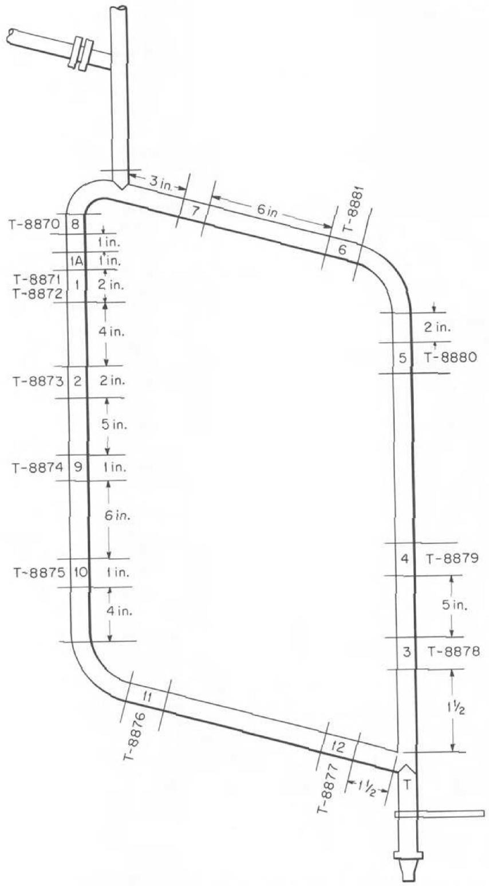  
Fig. 4. Location of Metallographic Sections from Loop 833.

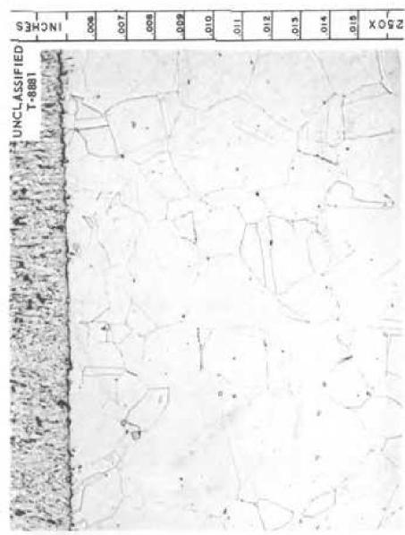  
UNCLASSIFIED ORNL-LR-DWG48765

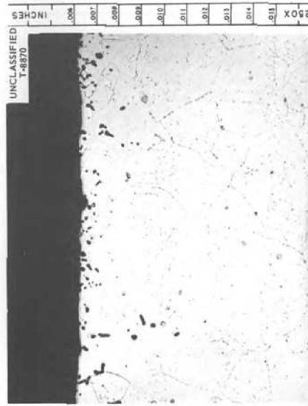

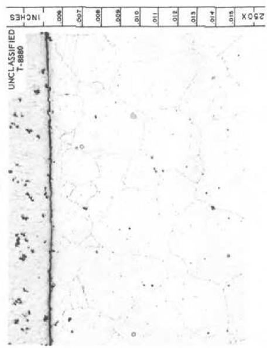

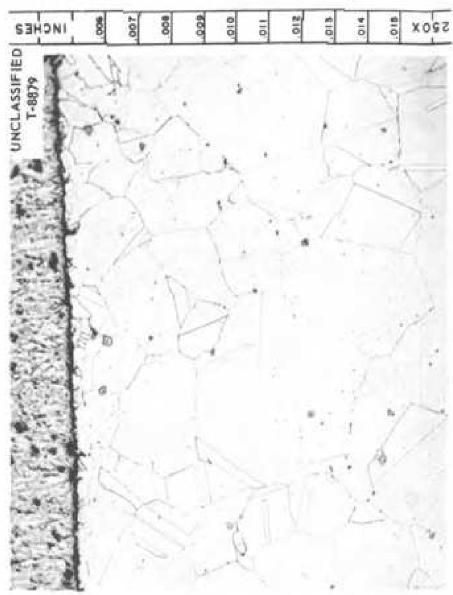

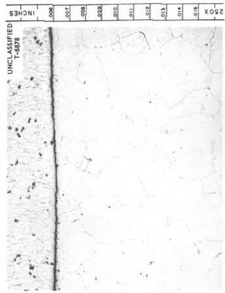

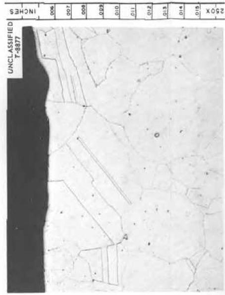

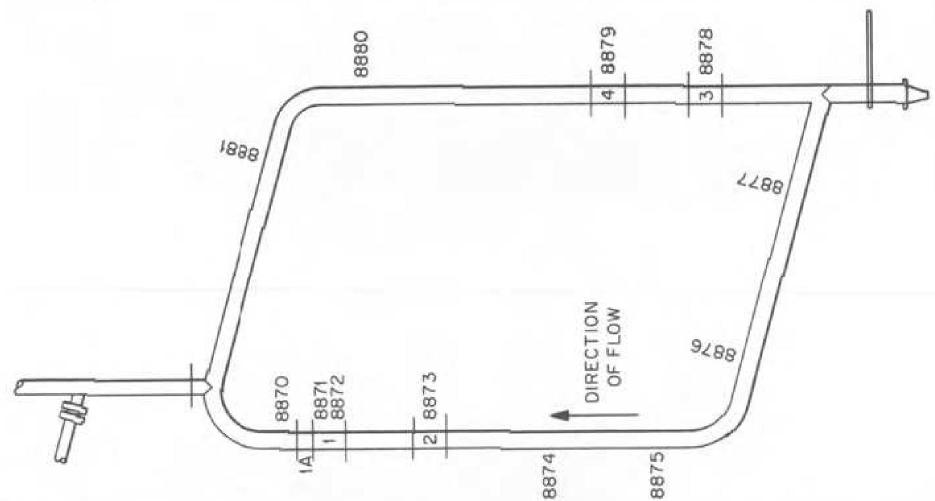

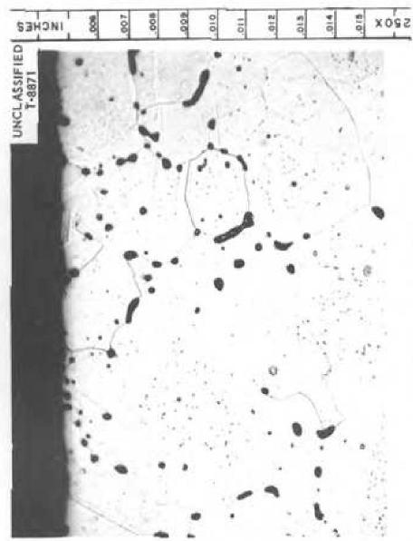

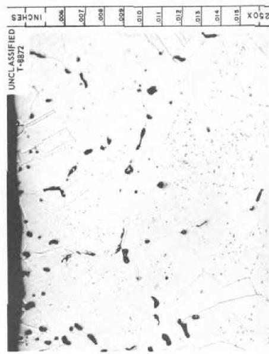

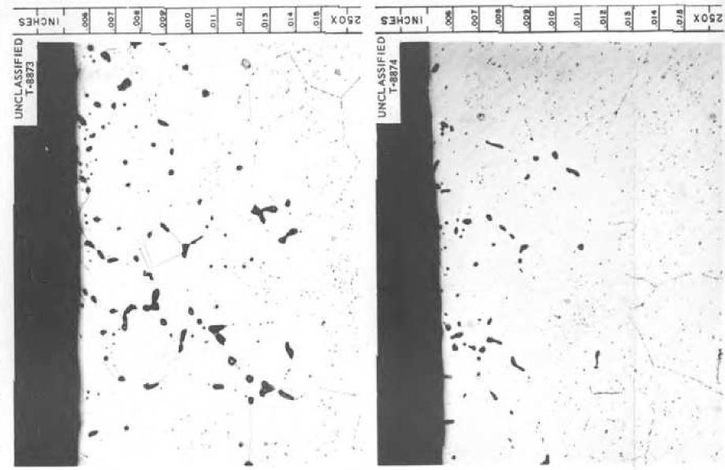

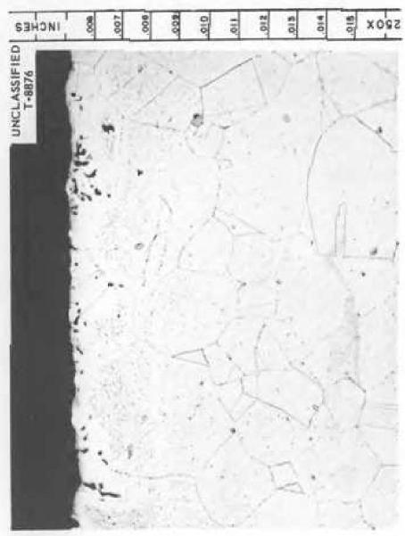

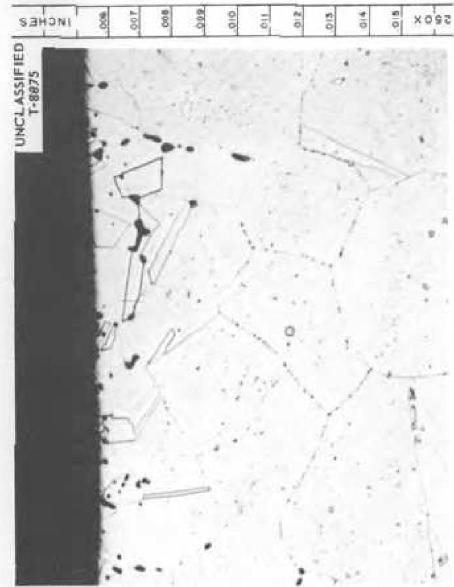  
Fig. 5. Variation in Attack Around Loop 833. Reduced $35\%$ .

some difficulty. In this program a considerable number of loops were operated for 1000 hr or longer.

To determine how the maximum depth of attack varied with operating time, several series of tests were made with various fluoride batches. These data are tabulated in Table 5 and plotted in Fig. 6. As shown on the plot, considerable

spread was apparent in the data; however, if they are separated into the various fluoride production batches, a series of nearly parallel curves is found. In each case a few points do not fall on the curve; these are thought to be another example of the unexplained occasional wide variations found in the control loops.

With all these curves, after about 300 hr the increase in depth of attack is linear and is at a

Table 5. Effect of Operating Time on Corrosion Attack   

<table><tr><td rowspan="2">Loop No.</td><td rowspan="2">EE Batch No.</td><td rowspan="2">Operating Time (hr)</td><td colspan="2">Attack</td><td rowspan="2">Average Cr Content (ppm) After Operation</td><td rowspan="2">Fluoride Mixture</td></tr><tr><td>Intensity</td><td>Depth (mils)</td></tr><tr><td>263</td><td>30</td><td>100</td><td>Moderate</td><td>4</td><td>1000*</td><td>27 from 50-lb batch containing 720 ppm Ni</td></tr><tr><td>264</td><td>30</td><td>500</td><td>Moderate</td><td>9</td><td>1300</td><td>27 from 50-lb batch containing 720 ppm Ni</td></tr><tr><td>265</td><td>28</td><td>100</td><td>Moderate</td><td>5</td><td>1000</td><td>27 from 5-lb batch containing 1380 ppm Ni</td></tr><tr><td>266</td><td>31</td><td>500</td><td>Moderate</td><td>15</td><td>1800</td><td>27 from 5-lb batch containing 1070 ppm Ni</td></tr><tr><td>267</td><td></td><td>100</td><td>Moderate</td><td>3</td><td>900</td><td>27 pretreated</td></tr><tr><td>268</td><td></td><td>500</td><td>Moderate</td><td>13</td><td>1750</td><td>27 pretreated</td></tr><tr><td>274</td><td>35</td><td>1000</td><td>Heavy</td><td>11</td><td>1400</td><td>30</td></tr><tr><td>297</td><td>68</td><td>10</td><td>Light</td><td>1</td><td>230</td><td>30</td></tr><tr><td>300</td><td>68</td><td>50</td><td>Moderate</td><td>2</td><td>575</td><td>30</td></tr><tr><td>305</td><td>68</td><td>250</td><td>Heavy</td><td>9</td><td>1200</td><td>30</td></tr><tr><td>298</td><td>68</td><td>500</td><td>Heavy</td><td>9.5</td><td>1100</td><td>30</td></tr><tr><td>306</td><td>68</td><td>1000</td><td>Heavy</td><td>9</td><td>1400</td><td>30</td></tr><tr><td>299</td><td>68</td><td>2850</td><td>Heavy</td><td>18</td><td>1500*</td><td>30</td></tr><tr><td>318</td><td>88</td><td>100</td><td>Heavy</td><td>4</td><td>900</td><td>30</td></tr><tr><td>317</td><td>88</td><td>350</td><td>Heavy</td><td>8</td><td>1200</td><td>30</td></tr><tr><td>345</td><td>113</td><td>500</td><td>Heavy</td><td>6</td><td>600</td><td>30</td></tr><tr><td>327</td><td>113</td><td>1000</td><td>Heavy</td><td>10</td><td>550</td><td>30</td></tr><tr><td>328</td><td>113</td><td>2000</td><td>Heavy</td><td>7</td><td>250</td><td>30</td></tr><tr><td>329</td><td>113</td><td>3000</td><td>Heavy</td><td>23</td><td>600</td><td>30</td></tr><tr><td>344</td><td>113</td><td>5000</td><td>Heavy</td><td>27</td><td>350**</td><td>30</td></tr><tr><td>381</td><td>140</td><td>525</td><td>Heavy</td><td>10</td><td></td><td>44</td></tr><tr><td>394</td><td>149</td><td>1000</td><td>Heavy</td><td>17</td><td></td><td>44</td></tr><tr><td>459</td><td>162</td><td>500</td><td>Heavy</td><td>6</td><td>550</td><td>30 plus 0.2% ZrH2</td></tr><tr><td>413</td><td>150</td><td>1000</td><td>Light</td><td>7</td><td>550</td><td>30 plus 0.2% ZrH2</td></tr><tr><td>414</td><td>150</td><td>2000</td><td>Heavy</td><td>11</td><td>85</td><td>30 plus 0.2% ZrH2</td></tr><tr><td>340</td><td>113</td><td>3000</td><td>Heavy</td><td>13½</td><td>300</td><td>30 plus 0.25% ZrH2</td></tr><tr><td>431</td><td>160</td><td>10</td><td>Light</td><td>2</td><td>300</td><td>30</td></tr><tr><td>432</td><td>160</td><td>50</td><td>Heavy</td><td>3</td><td>400</td><td>30</td></tr><tr><td>433</td><td>160</td><td>100</td><td>Moderate</td><td>4.5</td><td>425</td><td>30</td></tr><tr><td>434</td><td>160</td><td>250</td><td>Heavy</td><td>8</td><td>600</td><td>30</td></tr><tr><td>435</td><td>160</td><td>500</td><td>Heavy</td><td>8</td><td>400</td><td>30</td></tr><tr><td>436</td><td>160</td><td>1000</td><td>Heavy</td><td>14</td><td>700</td><td>30</td></tr><tr><td>445</td><td>160</td><td>1500</td><td>Heavy</td><td>13</td><td>525</td><td>30</td></tr><tr><td>437</td><td>160</td><td>2000</td><td>Heavy</td><td>16</td><td>600</td><td>30</td></tr><tr><td>450</td><td>160</td><td>2500</td><td>Heavy</td><td>11</td><td>600*</td><td>30</td></tr><tr><td>448</td><td>173</td><td>1000</td><td>Heavy</td><td>10</td><td>600</td><td>30</td></tr><tr><td>540</td><td>188-1</td><td>500</td><td>Heavy</td><td>11</td><td>520</td><td>30</td></tr><tr><td>535</td><td>188-1</td><td>1080</td><td>Moderate</td><td>10</td><td>475</td><td>30</td></tr><tr><td>501</td><td>188-7</td><td>100</td><td>Heavy</td><td>3</td><td>700</td><td>30</td></tr><tr><td>554</td><td>188-7</td><td>500</td><td>Heavy</td><td>11</td><td>600</td><td>30</td></tr><tr><td>463</td><td>203</td><td>500</td><td>Heavy</td><td>10</td><td>475</td><td>44</td></tr><tr><td>464</td><td>203</td><td>1000</td><td>Heavy</td><td>15</td><td>450*</td><td>44</td></tr><tr><td>570</td><td>232-8</td><td>500</td><td>Moderate</td><td>9</td><td>850</td><td>30</td></tr><tr><td>567</td><td>232-8</td><td>1000</td><td>Light</td><td>9</td><td>800</td><td>30</td></tr><tr><td>568</td><td>232-8</td><td>2000</td><td>Moderate</td><td>12</td><td>800</td><td>30</td></tr></table>

*Wide variation in individual values.

rate of about 4 mils per 1000 hr. A single loop was operated for 5000 hr and the relationship still held. This continuing increase in depth of attack with operating time is attributed to mass transfer. It is obvious that if this variable is to be studied in a thermal loop, operating times of from 1000 to 2000 hr are a necessity. Since the curves for the different batches are parallel, the

rate of mass transfer is not strongly dependent upon the original batch. A series of photomicrographs representing various test durations are shown in Fig. 7. It may be seen that the voids grow in size with time and show a tendency to concentrate in the grain boundaries.

The rapid attack during the initial stages was sensitive to the nature of the batch. The attack

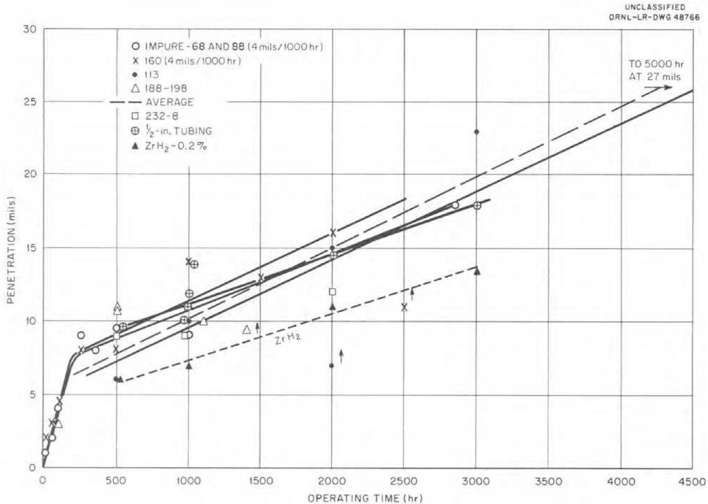  
Fig. 6. Variation in Depth of Attack with Operating Time.

during this time was caused by the system reaching equilibrium; it was affected by such things as impurities from any source and by the dissolving of sufficient chromium to reach equilibrium concentrations.

An interesting point in the tests was the average chromium content found in the fluorides after operation of the loop. While the depth of attack increased with time, the chromium concentration in the fluorides did not. The concentration was established during the first stage of the attack and then remained constant. In some long-time loops, metallic chromium crystals were found in the trap at the bottom of the cold leg. This deposit appeared first as a ring made up from fine dendritic crystals sticking to the trap wall just above the liquid-solid interface found in the trap. It continued to grow until an entire disk was formed, as shown in Fig. 8. In many 1000-and 2000-hr loops, no crystals at all were found, and in none of the loops were sufficient metallic

crystals found to explain all the attack. The trap deposits were identified as metallic chromium by x-ray diffraction and spectrographic studies.

With the depth of attack varying with time as shown in Fig. 6, diffusion of chromium within the pipe wall could possibly be the rate-controlling step. If this were true, the depth of attack would be independent of the solutions and so should be the same after circulating two fluoride batches for 250 hr each as after circulating one batch for 500 hr. However, loop 281 developed a total depth of attack of 17 mils with two batches circulated for 250 hr each, while loop 280 developed an attack of 8 mils with a single 500-hr circulation of another portion of the same batch. Additional evidence that the controlling step is not in the wall is provided in loops 333 and 334. Loop 334 circulated a batch that had been previously circulated in loop 333. An attack to 5 mils was found after 500 hr in loop 334, while in loop 333 an attack to 14 mils was found after only 240 hr.

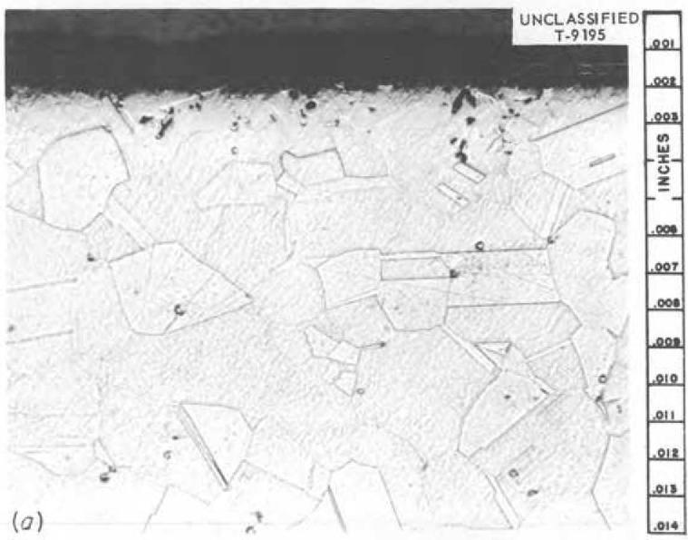

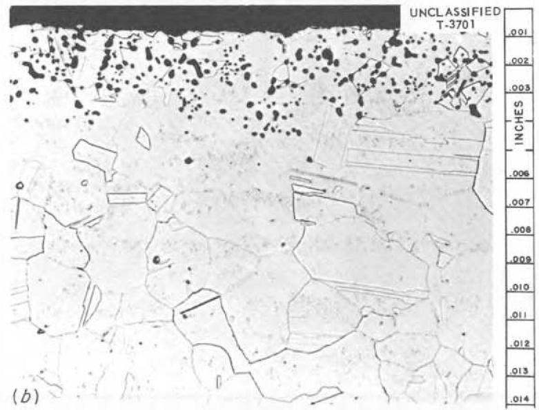

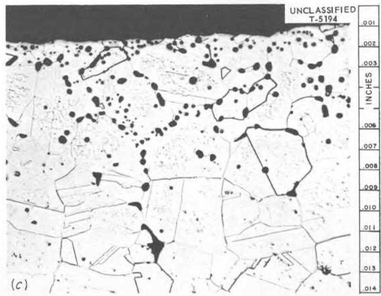

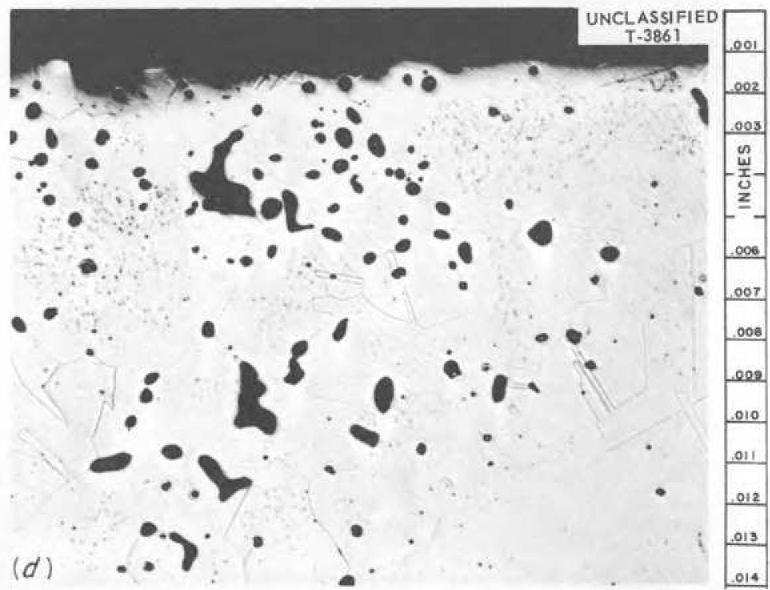  
Fig. 7. Effect of Operating Time on Attack. (a) 10 hr; (b) 100 hr; (c) 1000 hr; (d) 3000 hr. 250X. Reduced 17%.

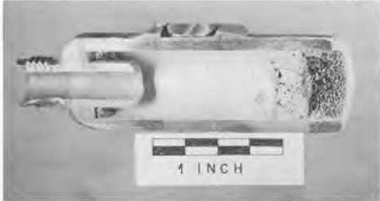  
UNCLASSIFIED-T-5211   
Fig. 8. Metallic Deposit Found at Top of Cold Trap from Loop 344.

The attack in loop 334 was higher than would be predicted from the curves, but the original batch was of poor quality, and the 240 hr in loop 333 does not appear to be sufficient time for it to reach equilibrium. When the fluoride mixture was transferred to loop 334, 225 ppm of iron was still present.

Other evidence that chromium diffusion is not the limiting factor during the longer operating times is presented below ("Change in Analysis of Inner Pipe Wall").

These tests show that while the chromium is continually removed from the inner surface of the pipe wall, the wall is not being continually depleted. Chromium is removed fairly rapidly during the early stages of rapid attack, but with the decrease in removal rate the chromium diffuses to the surface as fast as it is removed and possibly even at a slightly higher rate. If the chromium diffusion rate was the limiting factor, the surface would be continually depleted, or at least remain constant, instead of the concentration evening out.

Effect of Temperature. - For all this work, the loop operating temperature was measured from thermocouples spot-welded to the pipe wall several inches above the top heater. As long as the temperature is measured in the same manner and at the same spot in all loops, the measurements are comparable, but they may be only relative. The development of the methods of installing the thermocouples and the choice of locations were discussed in the previous report. With the techniques used on the loops several errors are known to be present. The temperatures were measured on the outer pipe wall surface above the heaters. While the bulk fluoride temper

ature would change little, if at all, in this distance, a difference in wall temperature would be found. Under the heaters the driving force is inward, and therefore the walls are hotter than the fluoride; above the heaters, the reverse is true. The temperature of interest is the maximum temperature at the interface between the liquid and the pipe wall, but for practical reasons it is the temperature of the outer wall that is measured, and this at only a few spots. Thus there is no assurance that the maximum interface temperature is being measured.

Two attempts were made to determine the maximum wall temperature under the heaters. Thermocouples were attached to the walls of these loops by various methods, and several different radiation shields were provided for the thermocouple beads. In addition, several thermocouples were buried in the wall. As was expected, a spread in temperatures was obtained, but for both loops the maximum wall temperature appeared to be between 150 and $175^{\circ}F$ above the measured standard loop operating temperature. This temperature difference was larger than was expected, but since so much work had already been done with the temperature above the last heater used as the so-called maximum, it was decided to complete the work without making a change in the technique. The thermal loop data are suitable only for direct comparison to give trends and for studies of mechanisms and are not intended as reactor or loop design data; therefore such a decision was reasonable.

When this work was started, considerable discussion had occurred as to what temperatures should be measured and how. Considerable difficulty had been encountered with failure, by breaking loose, of thermocouples under the heaters; installation there was more difficult, and such failure could easily produce high values. For these reasons, it was decided to measure the temperature just above the heaters. In retrospect this appears to have been a mistake, since wall temperature has now been shown to be the most important variable and the error in measuring with this method is larger than was thought; so it would now appear desirable with each loop to actually measure the temperature under the heaters.

The data showing the variation in depth of attack with variations in hot-leg temperature are tabulated in Table 6 and summarized in Table 7.

Table 6. Data from Loops Operated with Various Hot-Leg Temperatures   

<table><tr><td rowspan="2">Loop No.</td><td rowspan="2">EE Batch No.a</td><td rowspan="2">Hot-Leg Temperature (°F)</td><td rowspan="2">Temperature Drop (°F)</td><td rowspan="2">Operating Time (hr)</td><td colspan="2">Attack</td></tr><tr><td>Intensity</td><td>Depth (mils)</td></tr><tr><td>275</td><td>35</td><td>1650</td><td>125</td><td>500</td><td>Moderate</td><td>11</td></tr><tr><td>273</td><td>22</td><td>1500</td><td></td><td>500</td><td>Moderate</td><td>10</td></tr><tr><td>286</td><td>59</td><td>1300</td><td>175</td><td>500</td><td>Heavy</td><td>9</td></tr><tr><td>287</td><td>59</td><td>1500</td><td></td><td>500</td><td>Heavy</td><td>13</td></tr><tr><td>289</td><td>59</td><td>1500</td><td></td><td>500</td><td>Heavy</td><td>8</td></tr><tr><td>288</td><td>59</td><td>1650</td><td></td><td>500</td><td>Moderate</td><td>12</td></tr><tr><td>314</td><td>73</td><td>1250</td><td></td><td>500</td><td>Heavy</td><td>3</td></tr><tr><td>318</td><td>88</td><td>1500</td><td></td><td>100</td><td>Heavy</td><td>4</td></tr><tr><td>321</td><td>88</td><td>1650</td><td>150</td><td>100</td><td>Heavy</td><td>7</td></tr><tr><td>350</td><td>113</td><td>1200</td><td>150</td><td>500</td><td>Heavy</td><td>3</td></tr><tr><td>345</td><td>113</td><td>1500</td><td></td><td>500</td><td>Heavy</td><td>6</td></tr><tr><td>390</td><td>141</td><td>1200</td><td>140</td><td>500</td><td>Heavy</td><td>5</td></tr><tr><td>380b</td><td>141</td><td>1500</td><td></td><td>500</td><td>Heavy</td><td>7</td></tr><tr><td>439</td><td>158</td><td>1300</td><td>160</td><td>500</td><td>Heavy</td><td>4½</td></tr><tr><td>440</td><td>158</td><td>1500</td><td>200</td><td>500</td><td>Heavy</td><td>9</td></tr><tr><td>441</td><td>158</td><td>1650</td><td>150</td><td>500</td><td>Heavy</td><td>8</td></tr><tr><td>537</td><td>188-1</td><td>1200</td><td>170</td><td>500</td><td>Heavy</td><td>6</td></tr><tr><td>538</td><td>188-1</td><td>1300</td><td>170</td><td>500</td><td>Heavy</td><td>4</td></tr><tr><td>539</td><td>188-1</td><td>1400</td><td>200</td><td>500</td><td>Heavy</td><td>5½</td></tr><tr><td>540</td><td>188-1</td><td>1500</td><td>200</td><td>500</td><td>Heavy</td><td>11</td></tr><tr><td>562</td><td>232-8</td><td>1200</td><td>150</td><td>500</td><td>Heavy</td><td>7</td></tr><tr><td>575</td><td>232-8</td><td>1200</td><td>150</td><td>500</td><td>Heavy</td><td>8</td></tr><tr><td>563</td><td>232-8</td><td>1350</td><td>185</td><td>500</td><td>Heavy</td><td>6</td></tr><tr><td>570c</td><td>232-8</td><td>1500</td><td></td><td>500</td><td>Moderate</td><td>9</td></tr><tr><td>571d</td><td>232-8</td><td>1500</td><td></td><td>500</td><td>Heavy</td><td>5</td></tr><tr><td>586</td><td>239-3e</td><td>1500</td><td>200</td><td>500</td><td>Heavy</td><td>12</td></tr><tr><td>581</td><td>239-3e</td><td>1600</td><td>215</td><td>714</td><td>Heavy</td><td>14</td></tr><tr><td>351</td><td>119</td><td>1650</td><td>120</td><td>1000</td><td>Moderate</td><td>8</td></tr><tr><td>391</td><td>141</td><td>1200</td><td>150</td><td>1310</td><td>Heavy</td><td>7</td></tr><tr><td>392</td><td>141</td><td>1400</td><td>180</td><td>2000</td><td>Heavy</td><td>8</td></tr><tr><td>393</td><td>141</td><td>1600</td><td>185</td><td>1900</td><td>Heavy</td><td>13</td></tr><tr><td>449</td><td>158</td><td>1250</td><td>160</td><td>2000</td><td>Heavy</td><td>6</td></tr><tr><td>533</td><td>188-1</td><td>1250</td><td>165</td><td>1060</td><td>Moderate</td><td>4</td></tr><tr><td>534</td><td>188-1</td><td>1350</td><td>175</td><td>1125</td><td>Heavy</td><td>5</td></tr><tr><td>535</td><td>188-1</td><td>1500</td><td>215</td><td>1080</td><td>Moderate</td><td>10</td></tr><tr><td>536</td><td>188-1</td><td>1600</td><td>220</td><td>1150</td><td>Heavy</td><td>9</td></tr><tr><td>578</td><td>239-3e</td><td>1200</td><td>170</td><td>1500</td><td>Heavy</td><td>8</td></tr><tr><td>579</td><td>239-3e</td><td>1350</td><td>190</td><td>1500</td><td>Heavy</td><td>5</td></tr><tr><td>583</td><td>239-3e</td><td>1350</td><td>200</td><td>1500</td><td>Heavy</td><td>5</td></tr><tr><td>584</td><td>239-3e</td><td>1500</td><td>220</td><td>1500</td><td>Heavy</td><td>15</td></tr><tr><td>580</td><td>239-3e</td><td>1500</td><td></td><td>1500</td><td>Heavy</td><td>12</td></tr><tr><td>585</td><td>239-3e</td><td>1600</td><td>250</td><td>1500</td><td>Heavy</td><td>18</td></tr></table>

aFluoride 30 except where indicated.   
bCurved loop.   
in.sched 40.   
$d_{3}$ in.sched 10.   
$e_{\text{Fluoride}}$ 44.

Table 7. Summary of Effect of Hot-Leg Temperature on Depth of Attack   

<table><tr><td rowspan="2">Operating Time (hr)</td><td rowspan="2">EE Batch No.</td><td colspan="8">Depth of Attack (mils) at</td></tr><tr><td>1200°F</td><td>1250°F</td><td>1300°F</td><td>1350°F</td><td>1400°F</td><td>1500°F</td><td>1600°F</td><td>1650°F</td></tr><tr><td>100</td><td>88</td><td></td><td></td><td></td><td></td><td></td><td>4</td><td></td><td>7</td></tr><tr><td rowspan="7">500</td><td>59 and 73</td><td></td><td>3</td><td>9</td><td></td><td></td><td>13,8</td><td></td><td>11,12</td></tr><tr><td>113</td><td>3</td><td></td><td></td><td></td><td></td><td>6</td><td></td><td></td></tr><tr><td>141</td><td>5</td><td></td><td></td><td></td><td></td><td>7</td><td></td><td></td></tr><tr><td>158</td><td></td><td></td><td>4½</td><td></td><td></td><td>9</td><td></td><td>8</td></tr><tr><td>188-1</td><td>6</td><td></td><td>4</td><td></td><td>5½</td><td>11</td><td></td><td></td></tr><tr><td>232-8</td><td>7,8</td><td></td><td></td><td>6</td><td></td><td>5,9</td><td></td><td></td></tr><tr><td>Av</td><td>5.8</td><td></td><td>5.8</td><td></td><td></td><td>8.5</td><td></td><td>10.3</td></tr><tr><td>1500</td><td>239-3</td><td>8</td><td></td><td></td><td>5,5</td><td></td><td>15,12</td><td>18</td><td></td></tr><tr><td>2000</td><td>141</td><td></td><td></td><td></td><td></td><td>8</td><td></td><td>13</td><td></td></tr></table>

Table 7 is divided into horizontal sections corresponding to various operating times, with the batches tabulated separately in each section. An increase in depth of attack with increasing temperature is apparent both at 500 hr and in the long-time loops. At 500 hr the individual batches show considerable spread and the effect is not definite; however, it is shown up by averaging the results for each temperature. Since the amount of this increase varies with the batch, no qualitative conclusions may be drawn, and the increase must be regarded only as a trend.

It may be noted that a deeper attack was found in both the short- and long-time loops operated at around $1200^{\circ}\mathrm{F}$ than in those at $1350^{\circ}\mathrm{F}$ . A typical plot of the variation in depth of attack with temperature showing this increase at $1200^{\circ}\mathrm{F}$ is shown in Fig. 9. The curve in this plot is from the 1500-hr loops with mixture 44, but the shape is typical. With other mixtures and times the slopes of the upper curves change, but in all cases a nose is apparent. While breaks have also been noted in some physical properties in this temperature range, no definite reasons have been advanced for the increase in depth of attack.

As shown by the photomicrographs in Fig. 10, the nature of the voids also changes with temperature. At low temperatures, even with the long times, the voids are small and fairly evenly distributed. As the temperature increases, the voids grow in size and concentrate in the grain boundaries.

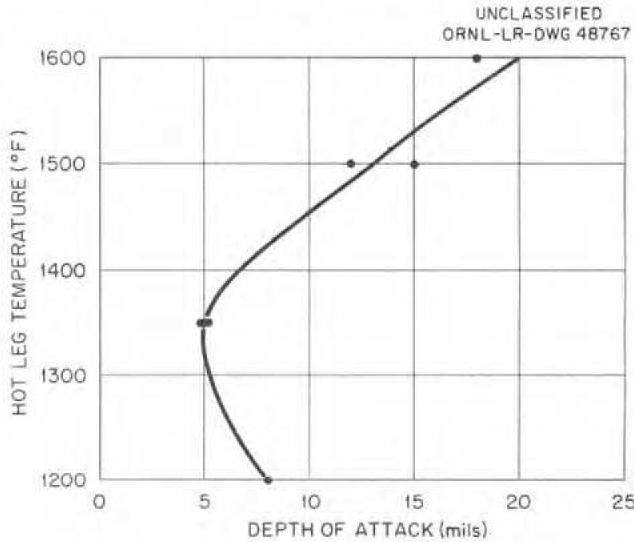  
Fig. 9. Change in Depth of Attack with Increasing Temperature in Loops Operated for 1500 hr.

While a variation in attack occurs with temperature, this variation is relative. It has been shown that considerable attack can be found in a loop whose hot leg was at $1500^{\circ}\mathrm{F}$ , but none is found in the $1300^{\circ}\mathrm{F}$ cold leg. When the loop temperature was increased until the cold leg was at $1500^{\circ}\mathrm{F}$ , no change was found in the distribution of the attack. This was also true when the hot-leg temperature was dropped to $1350^{\circ}\mathrm{F}$ .

Additional evidence that the actual temperature is not as important as the relative temperature was found in the data in Table 4. As discussed previously in this section, very little change

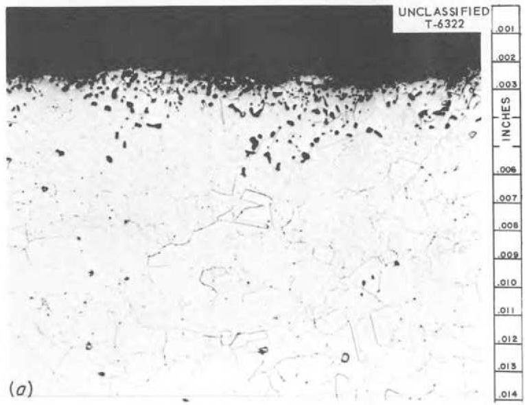

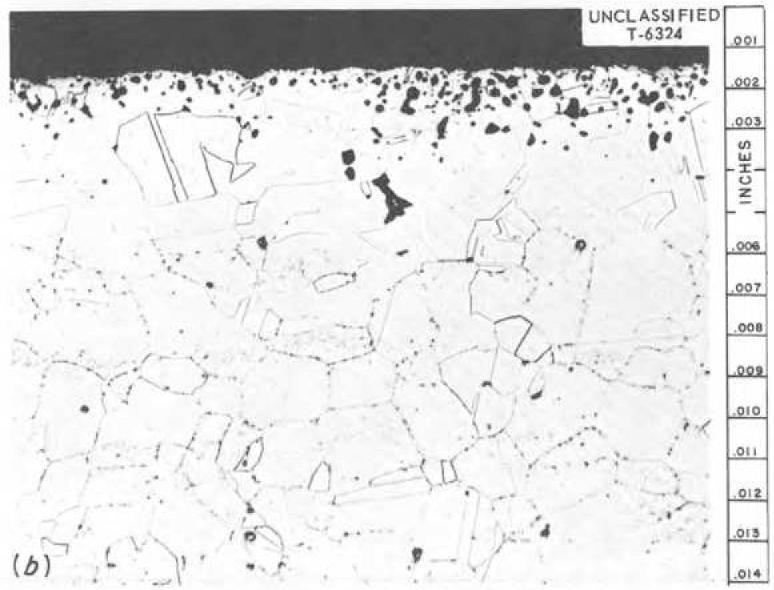

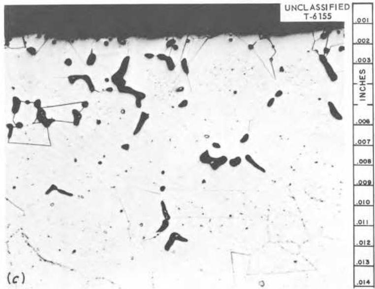

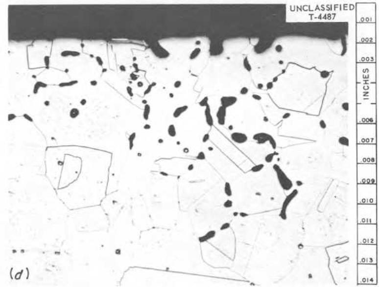  
Fig. 10. Changes in Appearance of the Attack with Increasing Hot-Leg Temperature. (a) $1300^{\circ}\mathrm{F}$ ; (b) $1400^{\circ}\mathrm{F}$ ; (c) $1500^{\circ}\mathrm{F}$ ; (d) $1650^{\circ}\mathrm{F}$ . Note how voids grow in size. 250X. Reduced 17%.

would be found in bulk fluoride temperature between samples 8 and 1A; however, some difference would be found in wall temperature. The depth of attack has been reduced by one-half in this 1-in. distance. This rapid decrease in attack was confirmed with loop 268. The top of the hot leg of this loop was sectioned longitudinally, and the attack decreased from a heavy 12 mils to a light 4 mils in a distance of 0.75 in.

In another attempt to show the correlation between depth of attack and heater location, loop 456 was operated with an unheated, but well-insulated, area near the top of the hot leg. The maximum depth of attack in the unheated area was 3 mils, while attacks to 9 mils were found in the heated areas on both ends of this zone. The change in depth was quite rapid at both ends. The effects of the unheated area must be complex, since the 9-mil attack below the gap was deeper than would be found in a comparable area in a control loop. It is possible that the gap in the heaters had an effect upon the forced convection currents found by Hamilton. These currents could affect both the laminar layer and the wall temperature.

The importance of location is also shown clearly in another loop. Loop 259 was part of the temperature study and had an Inconel thermocouple well suspended in the middle of the hot leg. Fluoride 27 was circulated in this loop, and after 500 hr a typical attack to 8 mils was found on the loop wall. In a section directly opposite this area, the thermocouple well showed only a light attack to a maximum depth of 1 mil. The distance between the thermocouple well and the loop wall was only 0.2 in., but all the attack had been concentrated on the hotter surface.

All these tests illustrate the fact that the maximum wall temperature is a more critical variable than average bulk fluoride temperature is. When a temperature difference is present between two surfaces, the attack will be concentrated on the hotter surface, even if the colder one is at a level where attack is normally encountered.

Temperature Drop. - The thermal loop is not ideal for studying the effects of temperature drop in a dynamic corrosion test. Any change in

temperature difference between the two legs is also a change in flow driving force, and so must be reflected as a change in velocity. With a standard loop design and heater location, any change in temperature drop requires a change in heat input and therefore a change in maximum wall temperature. Since in a thermal loop the Reynolds number is already very low, it was speculated that the changes in flow would not have a big effect on the laminar layer and therefore that changes in temperature drop could be studied, at least in an approximate manner. It has now been shown in the pump loops that velocity is not a critical variable. The variations in wall temperature would, however, still cause errors.

For this series of tests the temperature drops in the loops were varied by placing various amounts of insulation on the cold leg. An attempt was made to increase the drop by air-cooling the cold leg, but with the standard loop design, sufficient heating was not available to maintain the hot-leg temperature at $1500^{\circ}\mathrm{F}$ . The long-time loops in this series were terminated by a building power failure after they had been circulated for varying periods. For comparative purposes, small corrections were made in the depths of attack to compensate for the variations in time. In all cases the corrections, and therefore any errors, were smaller than the normal spread in results.

As shown by the data tabulated in Table 8 and summarized in Table 9, a decrease in depth of attack was found with smaller temperature drops. This was found with both the short- and the long-time loops. While these data seem to show an effect, they cannot be considered as proof, since with the lower temperature drops, lower wall temperature would be found. This would also reduce the attack, and the two variables cannot be separated from these data. It was shown previously that while wall temperature was critical it was relative in that a temperature drop was also necessary. This would be indirect confirmation that increased temperature drop will cause increased attack.

A conflict is apparent in the data in Table 9. An increase in attack was found for each time series with an increase in temperature drop; however, the increases were independent of time. Thus these data indicate that the depth of attack does not increase with time and therefore conflict with the results presented above ("Operating

Table 8. Data from Loops Operated with Various Temperature Drops   

<table><tr><td rowspan="2">Loop No.</td><td rowspan="2">EE Batch No.</td><td rowspan="2">Cold-Leg Condition</td><td rowspan="2">Temperature Drop (°F)</td><td rowspan="2">Operating Time (hr)</td><td rowspan="2">Average Chromium Content After Operation (ppm)</td><td colspan="2">Attack</td></tr><tr><td>Intensity</td><td>Depth (mils)</td></tr><tr><td>422</td><td>155</td><td>Wrapped</td><td>130</td><td>500</td><td>750*</td><td>Heavy</td><td>5</td></tr><tr><td>442</td><td>155</td><td>Control</td><td>200</td><td>500</td><td>800</td><td>Heavy</td><td>10</td></tr><tr><td>546</td><td>198</td><td>Insulated</td><td>70</td><td>500</td><td>400</td><td>Heavy</td><td>4½</td></tr><tr><td>547</td><td>198</td><td>Wrapped</td><td>140</td><td>500</td><td>400</td><td>Heavy</td><td>6½</td></tr><tr><td>545</td><td>198</td><td>Control</td><td>200</td><td>500</td><td>400</td><td>Heavy</td><td>11</td></tr><tr><td>423</td><td>155</td><td>Wrapped</td><td>140</td><td>2000</td><td>650</td><td>Heavy</td><td>6</td></tr><tr><td>447</td><td>173</td><td>Insulated</td><td>65</td><td>1000</td><td>350</td><td>Moderate</td><td>4</td></tr><tr><td>448</td><td>173</td><td>Control</td><td>200</td><td>1000</td><td>600</td><td>Heavy</td><td>10</td></tr><tr><td>446</td><td>173</td><td>Cooled</td><td>220</td><td>1000</td><td>500</td><td>Heavy</td><td>12</td></tr><tr><td>510</td><td>198</td><td>Insulated</td><td>85</td><td>1820</td><td>450</td><td>Heavy</td><td>6 (5½)**</td></tr><tr><td>530</td><td>198</td><td>Wrapped</td><td>130</td><td>1640</td><td>1700*</td><td>Moderate</td><td>7 (7)**</td></tr><tr><td>531</td><td>198</td><td>Control</td><td>220</td><td>1400</td><td>350</td><td>Moderate</td><td>9½ (10½)**</td></tr><tr><td>532</td><td>198</td><td>Cooled</td><td>235</td><td>1410</td><td>475</td><td>Heavy</td><td>10 (11)**</td></tr><tr><td>677</td><td>246-1</td><td>Insulated</td><td>70</td><td>14</td><td>675</td><td>Light</td><td>3</td></tr><tr><td>678</td><td>246-1</td><td>Insulated</td><td>95</td><td>50</td><td>700</td><td>Moderate</td><td>2½</td></tr><tr><td>679</td><td>246-1</td><td>Insulated</td><td>100</td><td>100</td><td>750</td><td>Moderate</td><td>4</td></tr><tr><td>680</td><td>246-1</td><td>Insulated</td><td>70</td><td>100</td><td>725</td><td>Moderate</td><td>4</td></tr><tr><td>682</td><td>246-1</td><td>Insulated</td><td>80</td><td>500</td><td>800</td><td>Moderate</td><td>5½</td></tr><tr><td>684</td><td>246-1</td><td>Control</td><td>220</td><td>500</td><td>900</td><td>Heavy</td><td>11</td></tr></table>

*Wide variation in individual values.   
\*\* The attacks in the loops in this series were adjusted to 1600 hr; the corrected values are shown in parentheses.

Time"). This conflict cannot be blamed on batch variation, since portions of both EE batches 155 and 198 were operated for different times with the same temperature drop and in both cases this independence with time was noted. A series of loops with insulated cold legs were therefore operated for varying times. The data for this series are also tabulated in Table 8 and do show an increase in depth with time. The attack in the 500-hr insulated loop is only half that found in

the control loop, confirming the data reported above. The fact that 3 mils attack was found after only 14 hr with a low temperature drop shows that prolonged cleaning times should be avoided.

Additives. - In the discussion on the control loops it was pointed out that the depth of attack seemed to increase with the presence of iron or nickel in the fluorides, but because of other variables a definite correlation could not be

Table 9. Summary of Changes in Depth of Attack with Variations in Temperature Drops   

<table><tr><td rowspan="2">Operating Time (hr)</td><td colspan="3">Depth (mils) of Attack at Temperature Drops of</td></tr><tr><td>65 to 85°F</td><td>130 to 140°F</td><td>200 to 220°F</td></tr><tr><td>500</td><td>4½, 5½</td><td>5, 6, 6½</td><td>10, 11, 11</td></tr><tr><td>1000</td><td>4</td><td></td><td>12, 10</td></tr><tr><td>1600</td><td>5½</td><td>7</td><td>10½, 11</td></tr><tr><td>2000</td><td></td><td>6</td><td></td></tr></table>

made. The variation of attack with iron and nickel concentrations was also noted in the original alkali metal work. To establish a better correlation, several loops were therefore operated with controlled additions of nickel fluoride. The nickel fluoride was added to the batch in the transfer pot in order to produce a more uniform distribution. While the batch was being agitated with helium, some of the nickel fluoride reacted with the pot walls, resulting in smaller additions than had been planned. A Micro Metallic filter was used in the transfer line to prevent transfer of any metallic nickel. The data from these loops are tabulated in Table 10.

From these data, an increase in depth of attack over that of a control loop was found in each of the 500-hr loops to which nickel fluoride had been added. Since the amount of nickel actually added is not known, an exact comparison cannot be made, but the depth of attack does increase with increasing additions. The increases are not as large as was expected, with an addition of 1000 ppm of nickel fluoride causing a doubling in the depth of attack. Since some of the chromium in these loops was picked up in the charge pot, the fluorides were partially saturated before being circulated. To compare these loops with control loops the hot-leg attack would have to be increased sufficiently to balance the chromium picked up in the pot. With present production techniques for the fluoride mixtures, the variations in nickel and iron found in the original batches are not large, and from this work it does not appear that they are the cause of the erratic attack. Typical hot-leg sections from one of these loops and from the 500-hr loops with the other additions discussed below are presented in Fig. 11. Portions of the same fluoride batch

were used in loops 454 and 455 to determine the effect of nickel fluoride on the rate of mass transfer. The longer-time loop developed an attack of 16 mils, which is an increase of only 1 mil in 1335 hr; however, some increase was found in the number and size of the voids. While it is possible that nickel fluoride will not increase the rate of mass transfer, it should react to produce chromium fluoride, which is shown below to increase this rate. No satisfactory explanation has been found for this inconsistency. Typical hot-leg sections showing the effect of this additive and others on mass transfer are shown in Fig. 12.

Additions of both chromic and chromous fluoride were made in a manner similar to that described for the nickel fluoride. The data for these loops are also tabulated in Table 10. It has been shown by work in the Materials Chemistry Division that when $\mathrm{CrF}_3$ is added to fluoride mixtures with a zirconium fluoride base it is reduced to $\mathrm{CrF}_2$ , the latter being the only valence state that has been found in such mixtures. The addition of $\mathrm{CrF}_2$ should reduce the attack found in the first stage by providing some of the chromium required to reach equilibrium. With $\mathrm{CrF}_3$ this effect would also be found, but it would be offset by an increase in attack caused by the extra fluorine atom.

The data in Table 10 do show a reduction in depth of attack when $\mathrm{CrF}_2$ was added to a loop operated for 500 hr. However, in a loop operated for 1710 hr the depth was slightly deeper than was found in control loops operated for similar times; thus, since the depth at 500 hr was reduced, the rate of mass transfer increased. For these loops the data would indicate a rate of 1 mil per 100 hr rather than the 0.4 mil found with the control loops.

Table 10. Variation in Depth of Attack with Impurity Additions   

<table><tr><td rowspan="2">Loop No.</td><td rowspan="2">EE Batch No.</td><td rowspan="2">Additive</td><td colspan="2">Metal in Additive (%)</td><td rowspan="2">Operating Time (hr)</td><td rowspan="2">Depth of Attack (mils)</td></tr><tr><td>Added</td><td>By Analysis</td></tr><tr><td>289</td><td>59</td><td>Control</td><td></td><td></td><td>500</td><td>8</td></tr><tr><td>290</td><td>59</td><td>NiF2</td><td>0.05</td><td>0.03</td><td>500</td><td>10</td></tr><tr><td>291</td><td>59</td><td>NiF2</td><td>0.2</td><td>0.05</td><td>500</td><td>11</td></tr><tr><td>442</td><td>155</td><td>Control</td><td></td><td></td><td>500</td><td>10</td></tr><tr><td>418</td><td>155</td><td>NiF2</td><td>0.5</td><td>0.18</td><td>500</td><td>17</td></tr><tr><td>419</td><td>155</td><td>NiF2</td><td>0.5</td><td>0.18</td><td>500</td><td>17</td></tr><tr><td>466</td><td>173</td><td>Control</td><td></td><td></td><td>500</td><td>8</td></tr><tr><td>448</td><td>173</td><td>Control</td><td></td><td></td><td>1000</td><td>10</td></tr><tr><td>454</td><td>173</td><td>NiF2</td><td>0.4</td><td>0.11</td><td>500</td><td>15</td></tr><tr><td>455</td><td>173</td><td>NiF2</td><td>0.4</td><td>0.13</td><td>1835</td><td>16</td></tr><tr><td>452</td><td>173</td><td>CrF3</td><td>0.3</td><td>0.14</td><td>500</td><td>9</td></tr><tr><td>453</td><td>173</td><td>CrF3</td><td>0.3</td><td>0.14</td><td>2000</td><td>22</td></tr><tr><td>545</td><td>198</td><td>Control</td><td></td><td></td><td>500</td><td>11</td></tr><tr><td>512</td><td>198</td><td>CrF2</td><td>0.5</td><td>0.26</td><td>500</td><td>6</td></tr><tr><td>513</td><td>198</td><td>CrF2</td><td>0.5</td><td>0.27</td><td>1710</td><td>17</td></tr><tr><td>296</td><td>63</td><td>Control</td><td></td><td></td><td>500</td><td>8</td></tr><tr><td>294</td><td>63</td><td>Graphite rod</td><td></td><td></td><td>500</td><td>13</td></tr><tr><td>674</td><td>246-4</td><td>Graphite tube</td><td></td><td></td><td>1000</td><td>23</td></tr><tr><td>675</td><td>246-4</td><td>Graphite tube</td><td></td><td></td><td>1000</td><td>28</td></tr><tr><td>312</td><td>73</td><td>Cr powder</td><td>1.0</td><td>0.20</td><td>500</td><td>7</td></tr><tr><td>323</td><td>92</td><td>Cr flake</td><td>0.5</td><td>0.21</td><td>500</td><td>4</td></tr><tr><td>324</td><td>92</td><td>Control</td><td></td><td></td><td>500</td><td>15</td></tr><tr><td>335</td><td>92</td><td>Inconel turnings</td><td></td><td></td><td>500</td><td>11</td></tr></table>

After 500 hr, batches to which $\mathrm{CrF}_3$ had been added developed the same depth of attack found in the control loops. It is possible that the presence of $\mathrm{CrF}_2$ and the accompanying free fluorine atom canceled each other. A definite increase in amount and depth of attack was noted for these loops at 2000 hr; the rate during the period from 500 to 2000 hr was 0.9 mil per 100 hr.

In both cases the addition of chromium fluoride resulted in an increase in the rate of mass transfer. This appears to conflict with the statement above (see "Operating Time") that the

rate of mass transfer seems to be independent of batch purity; however, the additions made here are much larger than would be found in normal batch variations.

In some of the early loops, chromium metal powder and Inconel turnings were added to the fluorides in the charge pot. The chromium did result in a small decrease in attack, but metallic layers were found on the cold-leg surface. A small improvement appears to have been obtained from the Inconel turnings, but the results are not definite. From the time data obtained with the

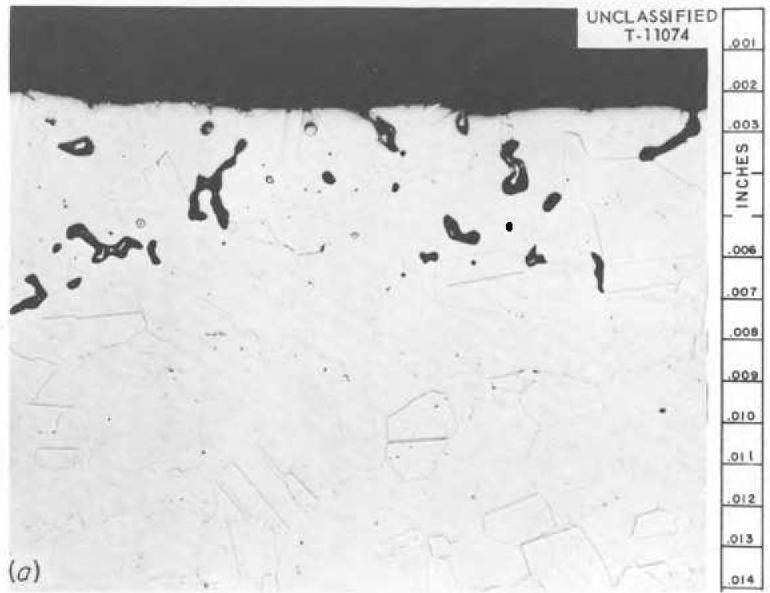

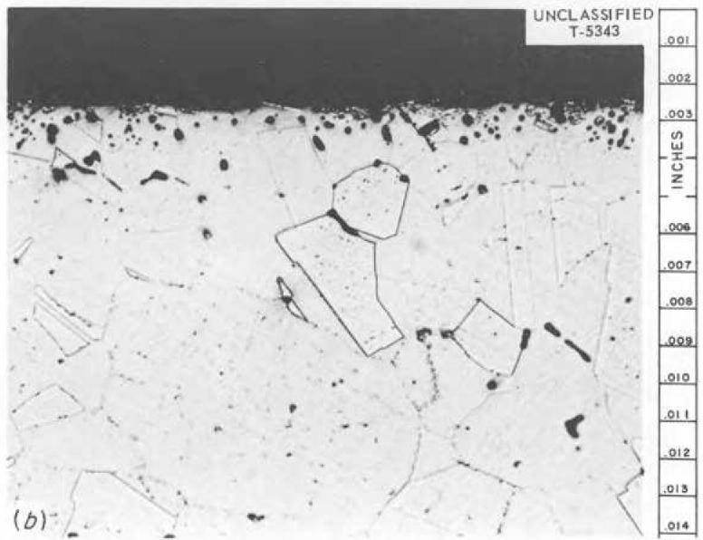

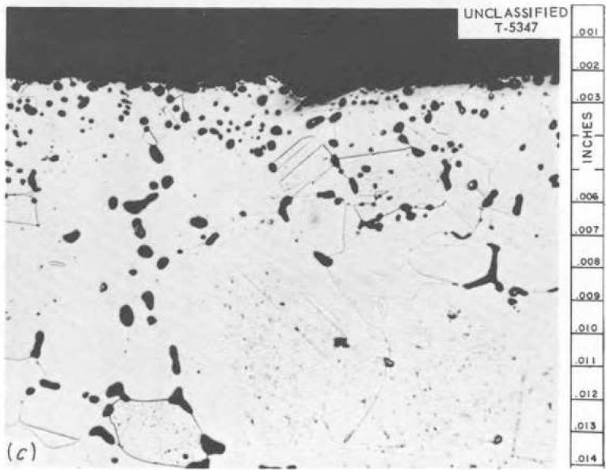

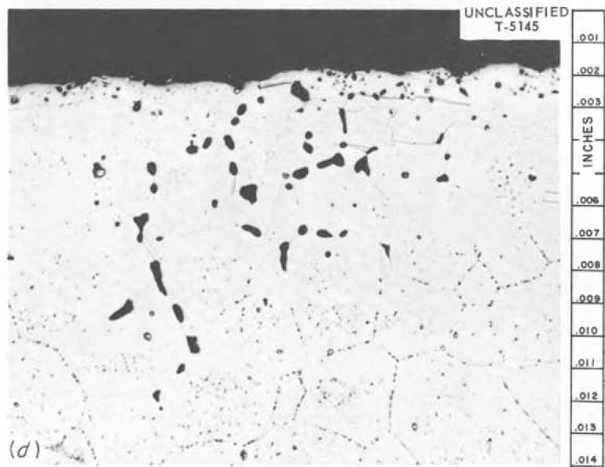  
Fig. 11. Effect of Additives on Attack in 500 hr Operation. (a) $\mathrm{CrF}_{2}$ ; (b) $\mathrm{CrF}_{3}$ ; (c) $\mathrm{NiF}_{2}$ ; (d) standard loop. 250X. Reduced 17.5%.

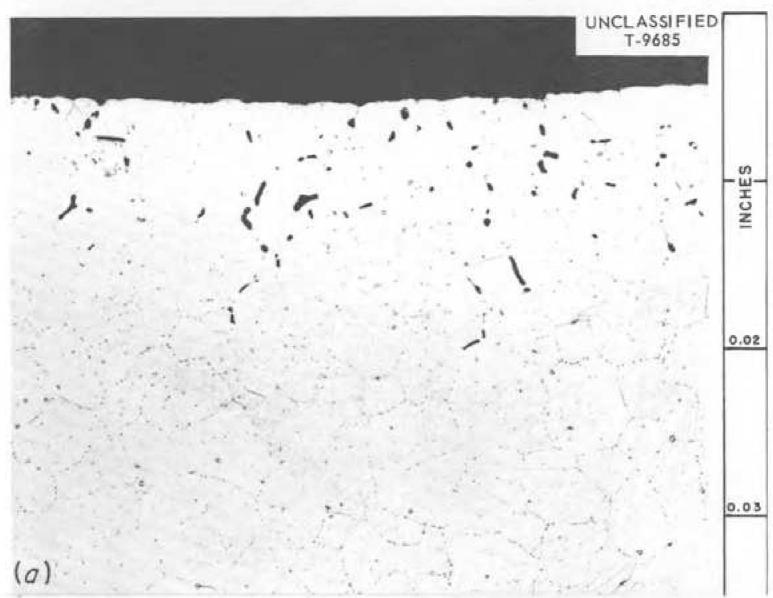

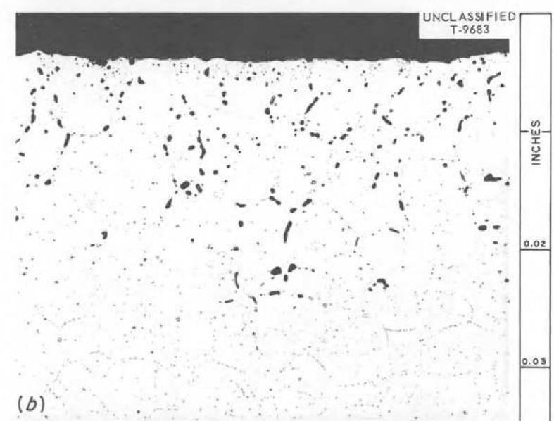

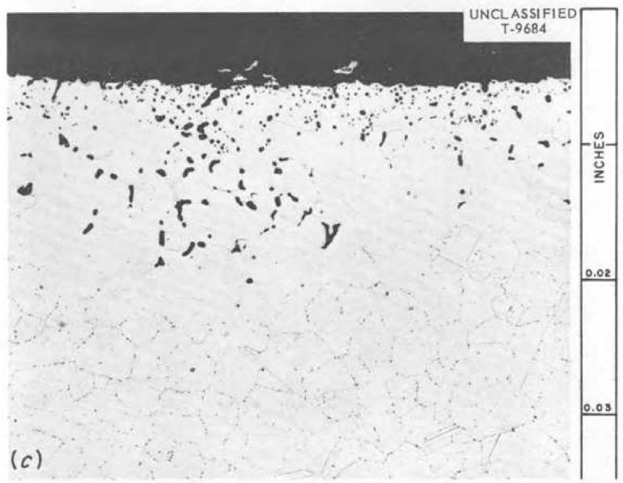

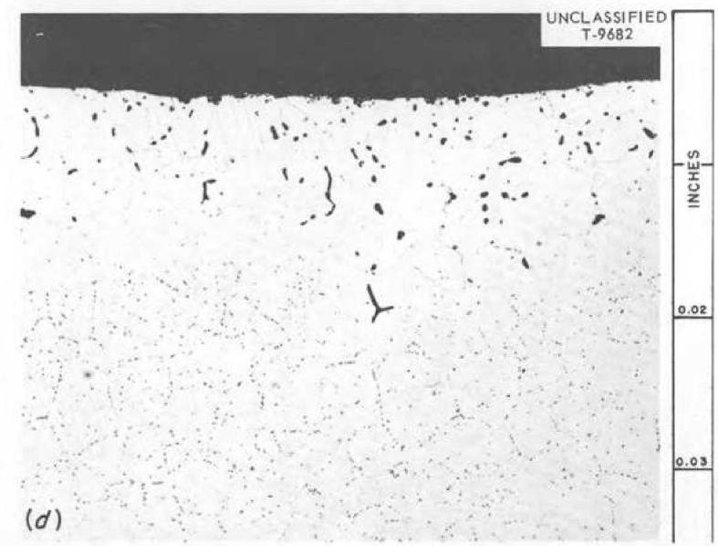  
Fig. 12. Effect of Additives on Mass Transfer Reaction in 2000 hr Operation. (a) $\mathrm{CrF}_2$ ; (b) $\mathrm{CrF}_3$ ; (c) $\mathrm{NiF}_2$ ; (d) standard loop. 100X. Reduced $17.5\%$ .

loops, it was shown that about 200 hr was required for the impurity and saturation reactions to be completed, so it appears that fairly long treatment times would be necessary for equilibrium. For these batches 24 hr was the longest treatment time used.

A group of loops was operated with graphite present in the hot legs. The purpose of these loops was to determine whether graphite could be used in an Inconel-fused-salt system. With loop 294 a $1/4$ -in. graphite rod was suspended in the center of the upper portion of the hot leg, while with loops 674 and 675 tubular inserts with internal diameters the same as the diameter of the Inconel pipe were used. The tubular inserts were about 6 in. long and were located just below the hottest portion of the loop. With each of these loops a definite increase in the depth of attack in the Inconel was noted. A deposit was present on the surface of the graphite and penetrated it for a considerable depth. The photomicrograph in Fig. 13 shows the surface of the insert from loop 294 and shows the deposit extending for a depth of 17 mils. On the surface the deposit is in the form of a thin film of metal surrounding nonmetallic particles.

Another material that was added to the fluorides was zirconium hydride. It is now known that the function of this material was to convert a portion of the $\mathsf{UF}_4$ to $\mathsf{UF}_3$ ; therefore this material will be discussed in the section on the reduced uranium fluoride mixtures ("Special Fuel Mixtures").

Ratio of Surface Area to Loop Volume. - One difficulty in comparing results from various corrosion tests is the wide variation between the tests in the surface area to volume ratios. In isothermal static tests it is easy to define and figure such ratios; however, with dynamic systems it is difficult to determine what the significant parameters are, let alone measure them. The significant surface area is the one where the rate-controlling step takes place and could be the cold-leg surface as well as the hot-leg surface.

The thermal loop is not an ideal rig in which to study variations in these ratios, since they cannot be varied independently. Any variation in the ratio of surface area to volume also results in variations in rate of heating and in temperature distribution, which in turn affect the wall temperatures and velocities.

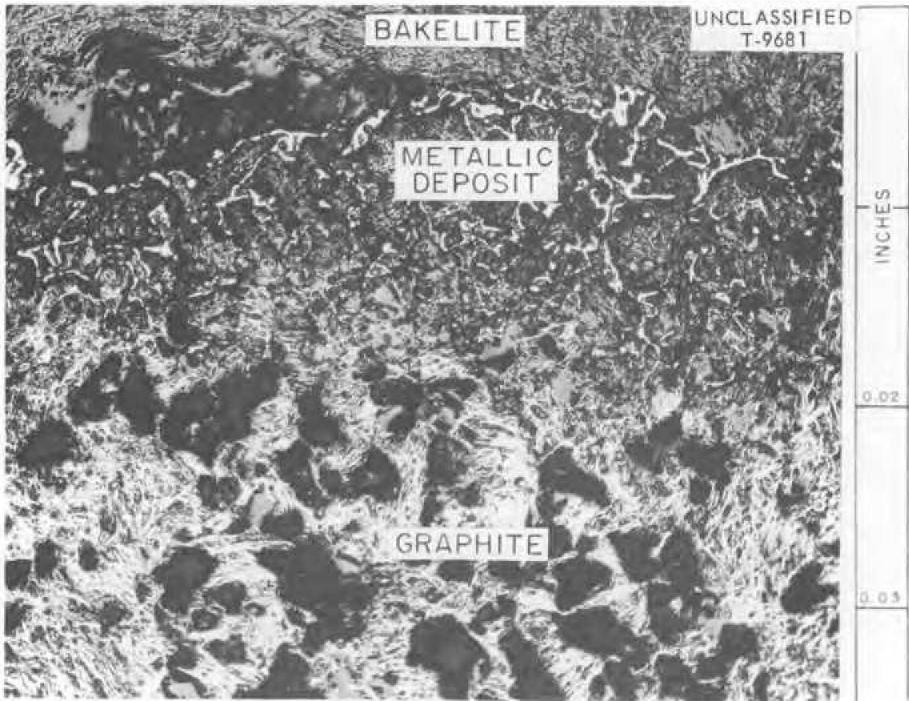  
Fig. 13. Metallic Deposit on Surface of Graphite Rod Suspended in Hot Leg of Loop 294. 100X.

For this discussion the ratio of the heated surface to the total loop volume was used. Since each loop was made from a single size of pipe and all loops are the same length, such ratios are dependent only upon the pipe diameter. The ratios would vary in value depending upon what is considered as the critical surface, but such variations would cancel out in comparing various loops with the same length of critical surfaces and would depend only upon differences in the diameters.

A series of otherwise identical loops were constructed from tubing and pipe of various diameters. The data from these loops are tabulated in Table 11. After 500 hr the loops with the low ratios of surface area to volume show the most attack. This is as would be expected, since the chromium required by the batch was obtained

from a smaller surface. With the longer-time loops, no definite conclusion may be drawn, as shown by the data summarized in Table 12. After 1000 hr, less attack is found in the loops with the low ratios than in those with high ratios; while this is still true after 2000 hr, the differences are smaller rather than having continued to increase. If the time from 500 to 2000 hr is considered, the differences in rate are within the usual spread; for the loops from $\frac{1}{2}$ -in. tubing the rate is about the same as those obtained from the time curves in Fig. 6.

Oxide Removal Procedures. - While much of the available commercial tubing contains internal surface scale and dirt, the pipe used in this study was supposed to have been annealed and pickled. In most cases this specification was met, but some loops were found in which heavy surface

Table 11. Effect of Ratio of Heated Surface Area to Total Loop Volume on Depth of Attack   

<table><tr><td rowspan="2">Loop No.</td><td rowspan="2">EE Batch No.</td><td rowspan="2">Pipe Size*</td><td rowspan="2">Ratio of Heated Surface to Loop Volume (in. \( {}^{2} \) /in. \( {}^{3} \) )</td><td rowspan="2">Operating Time (hr)</td><td colspan="2">Attack</td></tr><tr><td>Intensity</td><td>Depth (mils)</td></tr><tr><td>349</td><td>119</td><td>1 in. T</td><td>1.7</td><td>500</td><td>Moderate</td><td>9</td></tr><tr><td>359</td><td>119</td><td>\( 1/2 \) in. T</td><td>3.9</td><td>500</td><td>Heavy</td><td>4</td></tr><tr><td>352</td><td>119</td><td>\( 1/2 \) in. P</td><td>2.3</td><td>500</td><td>Moderate</td><td>\( {5}_{2}^{1} \)</td></tr><tr><td>362</td><td>119</td><td>\( 1/2 \) in. T</td><td>3.9</td><td>500</td><td>Heavy</td><td>5</td></tr><tr><td>549</td><td>232-8</td><td>\( 1/2 \) in. T</td><td>3.9</td><td>2000</td><td>Heavy</td><td>\( {14}\frac{1}{2} \)</td></tr><tr><td>550</td><td>232-8</td><td>\( 3/8 \) in. P</td><td>2.6</td><td>500</td><td>Moderate</td><td>9</td></tr><tr><td>551</td><td>232-8</td><td>\( 1/2 \) in. T</td><td>3.9</td><td>1000</td><td>Heavy</td><td>14</td></tr><tr><td>565</td><td>232-8</td><td>1 in. T</td><td>1.7</td><td>1000</td><td>Heavy</td><td>7</td></tr><tr><td>566</td><td>232-8</td><td>1 in. T</td><td>1.7</td><td>2000</td><td>Heavy</td><td>12</td></tr><tr><td>567</td><td>232-8</td><td>\( 3/8 \) in. P</td><td>2.6</td><td>1000</td><td>Light</td><td>9</td></tr><tr><td>568</td><td>232-8</td><td>\( 3/8 \) in. P</td><td>2.6</td><td>2000</td><td>Moderate</td><td>12</td></tr><tr><td>569</td><td>232-8</td><td>\( 1/2 \) in. P</td><td>2.3</td><td>2000</td><td>Heavy</td><td>\( {11}\frac{1}{2} \)</td></tr><tr><td>570</td><td>232-8</td><td>\( 3/8 \) in. P</td><td>2.6</td><td>500</td><td>Moderate</td><td>9</td></tr><tr><td>160</td><td>217-5</td><td>\( 1/2 \) in. T</td><td>3.9</td><td>3000</td><td>Moderate</td><td>18</td></tr><tr><td>529</td><td>217-5</td><td>\( 1/2 \) in. T</td><td>3.9</td><td>1000</td><td>Heavy</td><td>12</td></tr></table>

*P = pipe (IPS); T = tubing (outside diameter).

Table 12. Summary of Corrosion Results from Loops with Various Ratios of Heated Surface Area to Loop Volume   

<table><tr><td rowspan="2">Time Interval (hr)</td><td rowspan="2">EE Batch No.</td><td colspan="4">Attack Rate (mils per 100 hr of operation) for Surface to Volume Ratio (in.2/in.3) of</td></tr><tr><td>3.9</td><td>2.6</td><td>2.3</td><td>1.7</td></tr><tr><td>0-500</td><td>119</td><td>0.9</td><td></td><td>1.1</td><td>1.8</td></tr><tr><td>0-500</td><td>232-8</td><td>1.9</td><td>1.8</td><td></td><td></td></tr><tr><td>500-1000</td><td>232-8</td><td>1</td><td>0</td><td></td><td></td></tr><tr><td>1000-2000</td><td>232-8</td><td>0.05</td><td>0.3</td><td></td><td>0.5</td></tr><tr><td>500-2000</td><td>232-8</td><td>0.3</td><td>0.2</td><td></td><td></td></tr><tr><td>1000-3000</td><td>217-5</td><td>0.3</td><td></td><td></td><td></td></tr></table>

layers were present on the walls before operation. Since these loops had been previously degreased with a solvent degreaser, all loose dirt and grease had been washed out. The layer was identified as being primarily chromium oxide. Several procedures were tried in an effort to remove these oxide layers before the loops were filled and operated.

The loops designated "First Series" in Table 13 were operated in connection with the original cleaning or oxide removal study made shortly after this work had started. As shown by the data, no large differences in depth of attack were found with any of the methods studied. Although none of these loops showed a reduction in attack from the usual control loops, a cleaning step was still thought to be desirable to eliminate erratic results caused by the occasional heavily contaminated loops. The surest and simplest method of oxide removal appeared to be the prior circulation for short times of another batch of fluorides. This method was then adopted as standard procedure.

When the gradual increase and poor reproducibility in the depths of attack were noted, cleaning variables were one of the suspected causes and were checked again. The results obtained in this second study are reported as "Second Series" in Table 13. Since cleaning variables represent attack due primarily to the reduction of impurities, they should show up more in short-time loops; therefore the loops in this series were operated for only $250\mathrm{hr}$ . These loops again show no apparent variation in depth of attack with the various oxide removal steps. Some variations are

apparent but they are not systematic. If any conclusion were to be drawn, it would have to be that the lowest attack was in the loops that received only a careful degrease and visual check with no oxide removal operation.

Heating Methods. - Both to reduce the number of variables and for ease in operation, it was desirable to use only a single heating method. From previous work it was known that clamshell resistance-wound heaters and saturable-core reactors for control were a satisfactory combination. Consequently, these heaters were adopted for this study, but, since it was shown previously that the attack was heavier and deeper under the heaters, a study of the effect of heat flux on corrosion was desirable. In addition, some corrosion theories were proposed in which the heating method was a variable. To answer these questions it was necessary to operate some loops with a different method of heating.

A method of heating by means of the electrical resistance of the pipe wall was used during the cleaning operation and was then modified for use during operation. To concentrate the heating in the hot leg, so that the heating area and distribution would remain constant, one electric terminal was connected to the middle of the hot leg and the other one connected in parallel to both ends of this leg. Because of the short path, the resistance was low and very high currents were required to give the required power. The data from the loops heated in this manner are tabulated in Table 14, and a typical hot-leg section is shown in Fig. 14. The depths of attack obtained with this second heating method

Table 13. Variations in Depth of Attack with Oxide Removal Procedures   

<table><tr><td rowspan="2">Loop No.</td><td rowspan="2">EE Batch No.</td><td rowspan="2">Oxide Removal Method</td><td colspan="2">Attack</td></tr><tr><td>Intensity</td><td>Depth (mils)</td></tr><tr><td colspan="5">First Series</td></tr><tr><td>237</td><td>R-56</td><td>Hot sodium</td><td></td><td>7</td></tr><tr><td>234</td><td>\( R-43^a \)</td><td>None</td><td>Light</td><td>5</td></tr><tr><td>236</td><td>\( R-44^a \)</td><td>Dry hydrogen</td><td>Moderate</td><td>10</td></tr><tr><td>231</td><td>\( R-51^a \)</td><td>Hot NaK</td><td>Moderate</td><td>9</td></tr><tr><td>244</td><td>\( 14^a \)</td><td>None</td><td>Moderate</td><td>9</td></tr><tr><td>\( 293^b \)</td><td>63</td><td>None</td><td>Heavy</td><td>7</td></tr><tr><td>295</td><td>63</td><td>Molten fluorides</td><td>Heavy</td><td>6</td></tr><tr><td>296</td><td>63</td><td>None</td><td>Heavy</td><td>8</td></tr><tr><td>353</td><td>119</td><td>None</td><td>Heavy</td><td>3</td></tr><tr><td>352</td><td>119</td><td>Molten fluorides</td><td>Moderate</td><td>\( 5\frac{1}{2} \)</td></tr><tr><td colspan="5">Second Series \( ^c \)</td></tr><tr><td>722</td><td>249-1</td><td>\( HNO_3+HF \)</td><td>Heavy</td><td>8</td></tr><tr><td>737</td><td>249-4</td><td>\( HNO_3+HF \)</td><td>Heavy</td><td>8</td></tr><tr><td>723</td><td>249-1</td><td>Dry hydrogen</td><td>Heavy</td><td>9</td></tr><tr><td>724</td><td>249-1</td><td>Dry hydrogen</td><td>Heavy</td><td>8</td></tr><tr><td>725</td><td>249-1</td><td>Molten fluorides</td><td>Heavy</td><td>8</td></tr><tr><td>726</td><td>249-1</td><td>Molten fluorides</td><td>Heavy</td><td>8</td></tr><tr><td>727</td><td>249-1</td><td>None</td><td>Heavy</td><td>7</td></tr><tr><td>728</td><td>249-1</td><td>None</td><td>Heavy</td><td>7</td></tr><tr><td>732</td><td>514-1</td><td>Machined surface</td><td>Heavy</td><td>7</td></tr><tr><td>733</td><td>514-1</td><td>Machined surface</td><td>Heavy</td><td>4</td></tr><tr><td>739</td><td>514-1</td><td>\( HNO_3+HF \)</td><td>Heavy</td><td>9</td></tr><tr><td>740</td><td>514-1</td><td>\( HNO_3+HF \)</td><td>Heavy</td><td>6</td></tr><tr><td>742</td><td>514-1</td><td>Dry hydrogen</td><td>Moderate</td><td>8</td></tr><tr><td>743</td><td>514-1</td><td>Molten fluorides</td><td>Moderate</td><td>6</td></tr><tr><td>744</td><td>514-1</td><td>Molten fluorides</td><td>Heavy</td><td>6</td></tr><tr><td>745</td><td>514-1</td><td>None</td><td>Heavy</td><td>6</td></tr><tr><td>746</td><td>514-1</td><td>None</td><td>Moderate</td><td>7</td></tr></table>

$^{a}$ Fluoride 27.   
$b_{\text{Oxidized hot leg}}$   
${}^{c}$ Operated for 250 hr.

Table 14. Depth of Attack in Loops Heated by Electrical Resistance of Hot-Leg Wall   

<table><tr><td rowspan="2">Loop No.</td><td rowspan="2">EE Batch No.</td><td rowspan="2">Time (hr)</td><td rowspan="2">Heating Method</td><td colspan="2">Attack</td></tr><tr><td>Intensity</td><td>Depth (mils)</td></tr><tr><td>685</td><td>246-1</td><td>500</td><td>Clamshell</td><td>Heavy</td><td>14</td></tr><tr><td>684</td><td>246-1</td><td>500</td><td>Clamshell</td><td>Heavy</td><td>11</td></tr><tr><td>686</td><td>246-1</td><td>500</td><td>Clamshell</td><td>Heavy</td><td>9</td></tr><tr><td>618</td><td>246-1</td><td>500</td><td>Resistance</td><td>Heavy</td><td>10</td></tr><tr><td>619</td><td>246-1</td><td>1000</td><td>Resistance</td><td>Heavy</td><td>13</td></tr><tr><td>703</td><td>246-1</td><td>1000</td><td>Resistance</td><td>Heavy</td><td>15</td></tr><tr><td>736</td><td>249-1</td><td>1500</td><td>Resistance</td><td>Heavy</td><td>18</td></tr></table>

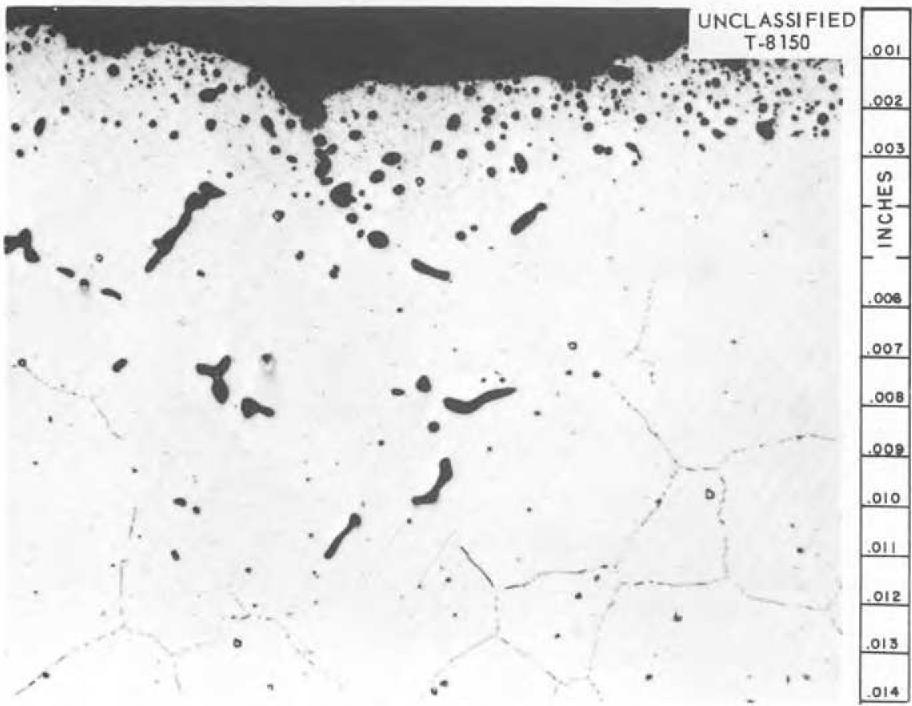  
Fig. 14. Appearance of Attack in Loop Heated by Electrical Resistance of Wall. 250X.

are within the spread of depths from the control loops.

Some effort was spent by the Experimental Engineering Section in developing a gas-fired furnace capable of heating the loops. This method would be especially advantageous for higher temperature loops, since at $1500^{\circ}\mathrm{F}$ the heating capacity of the electrical equipment is being approached. As yet, a gas furnace has not been built in which the maximum wall temperature

and the maximum fluoride temperature occur in the same vicinity and in which no hot spots are present. While direct comparisons cannot be made at this time, no larger differences in attack have been found with the preliminary gas-heated loops.

While it has been shown that deeper attack may be found under a heater, the attack does not depend upon the method of heating. The differences are caused by the higher temperatures,

either in the wall or, more likely, in the fluid boundary layer adjacent to the walls.

When a reactor system is compared with a thermal loop, two differences in heating are found. In the reactor the heat is generated within the liquid, and so the wall is at a slightly lower temperature than the liquid. In addition, temperature cycling may be present and may be quite rapid. As yet, no method has been devised by which a loop may be internally heated, so that the first difference will have to be checked in the radiation tests. A series of tests were set up to determine whether the second difference - temperature cycling - increased the rate of mass transfer.

The temperature cycle used for these loops was periodic and, to avoid excessive wall temperatures, of fairly long duration. Figure 15 shows the hot-leg temperature pattern of a typical loop. The corrosion data for this series are tabulated in Table 15. Within the accuracy of the data this slow cycling did not affect the depth of corrosion. It appears that the cycling averages the attack over the entire temperature range rather than effectively increasing the differences, and it has already been shown that the depth of attack is not affected greatly by changes in hot-leg temperatures. It is possible that a more rapid cycling could increase the attack by effectively increasing the temperature drop, but this cannot be confirmed in the present equipment.

Loop Size and Shape. - As discussed in the companion report, the size and shape of the

loops were arrived at primarily from physical considerations such as sizes of available heaters and ease of operation rather than from flow and corrosion considerations. As the corrosion

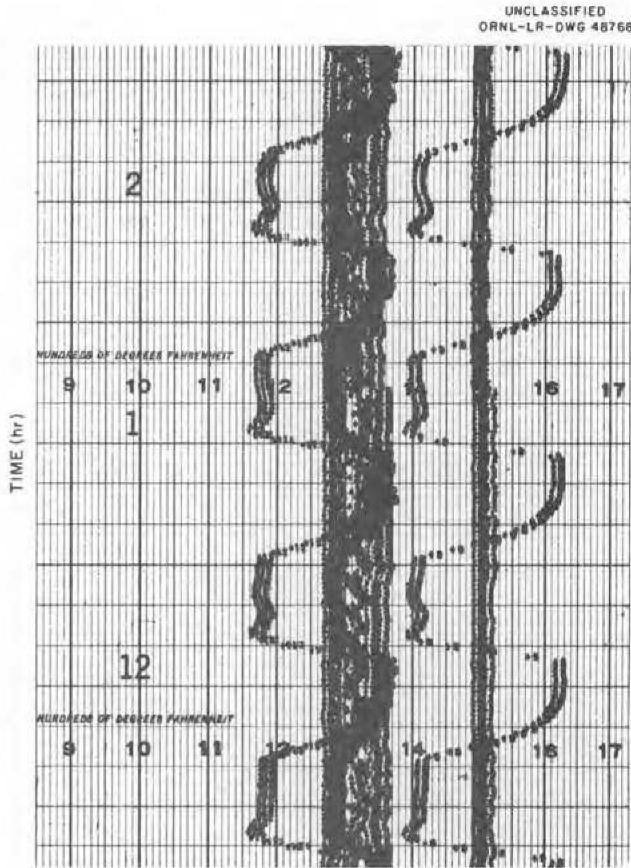  
Fig. 15. Hot- and Cold-Leg Temperature Patterns from Thermal-Cycled Loop.

Table 15. Effect of Temperature Cycling on Hot-Leg Attack   

<table><tr><td rowspan="2">Loop No.</td><td rowspan="2">EE Batch No.</td><td rowspan="2">Time (hr)</td><td colspan="2">Hot-Leg Temperature (°F)</td><td colspan="2">Cold-Leg Temperature (°F)</td><td colspan="2">Attack</td></tr><tr><td>Maximum</td><td>Minimum</td><td>Maximum</td><td>Minimum</td><td>Intensity</td><td>Depth (mils)</td></tr><tr><td>564</td><td>232-8</td><td>500</td><td>1600</td><td>1400</td><td>1385</td><td>1200</td><td>Heavy</td><td>11</td></tr><tr><td>570</td><td>232-8</td><td>500</td><td>1500</td><td>1500</td><td></td><td></td><td>Moderate</td><td>9</td></tr><tr><td>576</td><td>228-12</td><td>500</td><td>1600</td><td>1400</td><td>1360</td><td>1200</td><td>Heavy</td><td>9</td></tr><tr><td>577</td><td>228-12</td><td>500</td><td>1500</td><td>1500</td><td></td><td></td><td>Heavy</td><td>9</td></tr><tr><td>752</td><td>514-1</td><td>430</td><td>1600</td><td>1400</td><td>1395</td><td>1200</td><td>Moderate</td><td>10</td></tr><tr><td>588</td><td>248-4</td><td>788</td><td>1600</td><td>1400</td><td>1350</td><td>1180</td><td>Heavy</td><td>8</td></tr><tr><td>692</td><td>246-1</td><td>1500</td><td>1400</td><td>1400</td><td>1360</td><td>1125</td><td>Heavy</td><td>14</td></tr><tr><td>779</td><td>513-4</td><td>2000</td><td>1600</td><td>1400</td><td></td><td></td><td>Heavy</td><td>18</td></tr></table>

studies progressed, some effort was made to improve the design of the loops.

A major simplification in fabrication was the elimination of the expansion pot, which required several different sizes of material and considerable welding. This pot was originally provided on the loops to take care of expansion of the liquid and to allow more leeway in filling. With experience in loop handling, it was found possible to fill to between rather narrow limits; consequently, the pots were replaced by a straight length of pipe of the same size as the loop, which was welded into the top of the loop. The gas and vacuum connections as well as the fill line and spark-plug probe were connected into the side of this pipe by means of Swagelok fittings as shown in Fig. 1.

In making some calculations on loop design, J. F. Bailey showed that a major portion of the flow resistance was in the sharp bends where the legs joined. The loop was therefore redesigned with smooth curves at both these positions. The riser leg and trap were saddle-welded on the high and low points of the loop. In making this change, it was necessary to relocate the thermocouples; so it was not definitely established whether an increase in velocity was obtained. No measurable change in depth of attack was found in the control loops of this design compared with those with the sharp joints.

When work was started with liquid metals it was noted that the deposits of metallic crystals found in loops with the trap in line with the cold leg were larger than those in loops with a smooth bend and the trap offset several inches. In both cases the temperature pattern in the trap would be the same, but it is speculated that with the sharp bend the crystals could settle out, while with an offset trap they were easily carried across the small opening. This does not necessarily mean that more crystals were formed, only that they were concentrated and easier to find. Since it was desirable to use a standard loop for all work, the in-line trap and sharp bend for the lower joint were made standard. This change caused an increase in temperature drop of about $10^{\circ}\mathrm{F}$ , showing that some decrease in velocity had taken place. The configuration of the standard loop after incorporating these changes, shown in Fig. 1, is satisfactory for normal loop materials and coolants but is objectionable for special materials in that it requires considerable amounts

of materials both for the loops and for filling them. Such materials as niobium and molybdenum not only are expensive in the required quantities but are hard to obtain in the required lengths.

A series of loops were fabricated with various ratios of height to width. Unfortunately, as with so many other variables in the loops, any variation in size affects other variables, such as temperature drop, so that only the overall effect can be observed. With the change in temperature drop, it is likely that a change in wall temperature was also occurring. The corrosion data for this series of loops are tabulated in Table 16 and indicate that it is possible to reduce the loop size by one-half with only a small reduction in depth of attack.

Change in Analysis of Inner Pipe Wall. - As shown by all the photomicrographs in this report, visually the attack found after circulating zirconium fluoride-base fluorides appears to be the same as that reported for alkali-metal-base mixtures. Thin layers were removed from the inner surfaces of both the hot and cold legs to determine whether the changes were also similar chemically. Obtaining thin, uniform layers with enough material for analyses is a difficult procedure. After operation at $1500^{\circ}$ F the pipes are no longer perfectly round, and in addition, lengths of at least 6 in. are required to get enough sample with 5-mil layers being removed; both these facts make it difficult for the machinist to maintain the required depth during the drilling. For this reason the depths reported in the work must be considered as being only relative.

The analyses of the various layers removed from the hot legs of three 500-hr loops are given in Table 17. The samples were cut as concentric layers, and the deepest cut in each sample is listed in the "depth" column. The tabulated analyses give the average concentration between the depth listed for the line in which it is tabulated and the depth listed for the line directly above. These analyses show that the mechanism has not changed and that chromium is still the major constituent removed from the wall by the attack. The chromium is removed from a depth greater than that of the microscopic voids, confirming the obvious assumption that a certain concentration of vacancies is necessary for the appearance of voids. As shown by Fig. 16, the change of chromium concentration with depth is a straight line on a logarithmic plot. Any

Table 16. Variation in Depth of Attack with Variations of Loop Height and Width   

<table><tr><td rowspan="2">Loop No.</td><td rowspan="2">EE Batch No.</td><td rowspan="2">Time (hr)</td><td colspan="2">Loop Size (in.)</td><td rowspan="2">Temperature Drop (°F)</td><td colspan="2">Attack</td></tr><tr><td>Vertical</td><td>Horizontal</td><td>Intensity</td><td>Depth (mils)</td></tr><tr><td>496</td><td>198</td><td>500</td><td>15</td><td>15</td><td></td><td>Moderate</td><td>7</td></tr><tr><td>545*</td><td>198</td><td>500</td><td>26</td><td>15</td><td></td><td>Heavy</td><td>11</td></tr><tr><td>502</td><td>188-7</td><td>1000</td><td>15</td><td>15</td><td></td><td>Heavy</td><td>7</td></tr><tr><td>535*</td><td>188-1</td><td>1080</td><td>26</td><td>15</td><td></td><td>Moderate</td><td>10</td></tr><tr><td>597</td><td>248-4</td><td>1000</td><td>15</td><td>15</td><td>208</td><td>Heavy</td><td>10</td></tr><tr><td>598</td><td>248-4</td><td>1000</td><td>15</td><td>8</td><td>172</td><td>Heavy</td><td>11</td></tr><tr><td>599</td><td>248-4</td><td>1000</td><td>15</td><td>26</td><td>195</td><td>Heavy</td><td>15</td></tr><tr><td>600</td><td>248-4</td><td>1000</td><td>26</td><td>8</td><td>220</td><td>Heavy</td><td>16 1/2</td></tr><tr><td>601</td><td>248-4</td><td>1000</td><td>8</td><td>8</td><td>143</td><td>Heavy</td><td>10</td></tr><tr><td>602</td><td>248-4</td><td>1000</td><td>15</td><td>15</td><td>195</td><td>Heavy</td><td>13</td></tr><tr><td>603</td><td>248-4</td><td>1000</td><td>15</td><td>8</td><td>188</td><td>Heavy</td><td>14</td></tr><tr><td>604</td><td>248-4</td><td>1000</td><td>15</td><td>26</td><td>205</td><td>Heavy</td><td>12</td></tr><tr><td>605</td><td>248-4</td><td>1000</td><td>26</td><td>8</td><td>218</td><td>Heavy</td><td>16</td></tr><tr><td>606</td><td>248-4</td><td>1000</td><td>8</td><td>8</td><td>145</td><td>Heavy</td><td>10</td></tr><tr><td>614*</td><td>248-4</td><td>1000</td><td>26</td><td>15</td><td>245</td><td>Heavy</td><td>15</td></tr></table>

*Control loop (standard size).

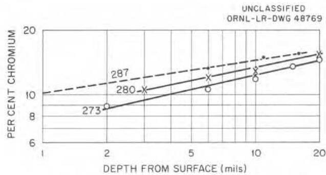  
Fig. 16. Change in Chromium Concentration with Depth Below Surface in Hot Legs of Thermal Convection Loops.

change in iron or nickel is difficult to determine, and if it occurs must be small. With two of the loops the Fe/Ni ratio decreased slightly, while with the third no change was noted.

With these same samples, an attempt was made to determine whether any components of the fluoride mixture were present below the surface, although satisfactory analyses were not possible because sufficient sample did not remain after

the above analyses had been made. Sodium, zirconium, uranium, and fluoride ions were reported as being present in all samples and in amounts decreasing with depth; however, the ratio of their concentrations varied from sample to sample and in all cases was different from that in the original mixture. In no case were the amounts reported sufficient to account for the volume of holes seen under the microscope. This work does not prove that the fluoride mixture is not present below the surface; however, it indicates that fluorides are not present in sufficient quantities to have filled all the voids.

Analyses from similar chemical samples removed from loop 765 after it had circulated for 2000 hr are shown in Table 18. These values do not show any significant decrease compared with those obtained from the 500-hr loops. This would indicate that chromium is replaced in the surface layers by diffusion as fast as it is removed by mass transfer.

Additional evidence that the chromium concentration of the surface does not continue to decrease with operating time is shown in Fig. 17.

Table 17. Change in Wall Composition with Depth from Surface in Thermal Loop Hot Legs   

<table><tr><td rowspan="2">Maximum Depth of Cut (mils)</td><td colspan="3">Constituents of Pipe (%)</td><td rowspan="2">Fe/Ni</td><td colspan="4">Constituents of Fluoride Mixture (%)</td></tr><tr><td>Fe</td><td>Ni</td><td>Cr</td><td>Na</td><td>Zr</td><td>U</td><td>F</td></tr><tr><td colspan="9">Loop 273, Section 1</td></tr><tr><td>2</td><td>7.31</td><td>76.8</td><td>8.9</td><td>0.095</td><td>&lt;0.6</td><td>1.2</td><td></td><td>1.99</td></tr><tr><td>6</td><td>7.65</td><td>79.3</td><td>10.7</td><td>0.097</td><td>&lt;0.6</td><td>1.2</td><td></td><td>0.69</td></tr><tr><td>10</td><td>7.37</td><td>78.3</td><td>11.9</td><td>0.094</td><td>&lt;0.6</td><td>1.2</td><td></td><td>0.56</td></tr><tr><td>15</td><td>7.00</td><td>77.9</td><td>13.6</td><td>0.090</td><td>&lt;0.6</td><td>0.3</td><td></td><td>0.21</td></tr><tr><td>20</td><td>7.25</td><td>77.0</td><td>14.6</td><td>0.094</td><td>&lt;0.6</td><td>0.3</td><td></td><td>0.17</td></tr><tr><td>Base metal</td><td>6.93</td><td>76.8</td><td>15.4</td><td>0.090</td><td>&lt;0.6</td><td>&lt;0.15</td><td></td><td>0.02</td></tr><tr><td colspan="9">Loop 280, Section 2</td></tr><tr><td>3</td><td>8.10</td><td>75.1</td><td>10.7</td><td>0.108</td><td>0.14</td><td>1.3</td><td>0.145</td><td>0.67</td></tr><tr><td>6</td><td>8.08</td><td>75.1</td><td>12.0</td><td>0.108</td><td>0.65</td><td>1.3</td><td>0.130</td><td>0.37</td></tr><tr><td>10</td><td>7.58</td><td>74.9</td><td>12.9</td><td>0.101</td><td>0.11</td><td>1.0</td><td>0.123</td><td>0.32</td></tr><tr><td>15</td><td>7.32</td><td>73.4</td><td>15.1</td><td>0.100</td><td>0.13</td><td>0.3</td><td>0.012</td><td>0.06</td></tr><tr><td>20</td><td>7.06</td><td>72.9</td><td>15.5</td><td>0.097</td><td>0.14</td><td>&lt;0.15</td><td>0.004</td><td>0.03</td></tr><tr><td>25</td><td>7.26</td><td>72.5</td><td>15.5</td><td>0.100</td><td>0.10</td><td>&lt;0.15</td><td>0.002</td><td>0.00</td></tr><tr><td>Base metal</td><td>7.30</td><td>73.8</td><td>15.5</td><td>0.099</td><td>0.09</td><td>&lt;0.15</td><td>0.002</td><td>0.02</td></tr><tr><td colspan="9">Loop 287, Section 2</td></tr><tr><td>1</td><td>7.89</td><td>78.3</td><td>10.2</td><td>0.101</td><td>0.36</td><td>1.3</td><td>0.130</td><td>0.64</td></tr><tr><td>6</td><td>7.50</td><td>74.8</td><td>13.3</td><td>0.100</td><td>0.16</td><td>1.3</td><td>0.070</td><td>0.26</td></tr><tr><td>11</td><td>7.28</td><td>74.1</td><td>15.0</td><td>0.098</td><td>0.08</td><td>0.15</td><td>0.014</td><td>0.04</td></tr><tr><td>16</td><td>7.33</td><td>74.4</td><td>15.6</td><td>0.099</td><td>0.07</td><td>&lt;0.15</td><td>0.003</td><td>0.05</td></tr></table>

Table 18. Change in Chromium Concentration in Loop 765 with Depth Below Surface in 2000 hr   

<table><tr><td>Depth Below Surface (in.)</td><td>Chromium Concentration (%)</td></tr><tr><td>0.003</td><td></td></tr><tr><td>0.006</td><td>11.6</td></tr><tr><td>0.009</td><td>11.7</td></tr><tr><td>0.013</td><td>12.3</td></tr><tr><td>0.018</td><td>15.1</td></tr><tr><td>0.023</td><td>14.2</td></tr><tr><td>0.028</td><td>14.1</td></tr><tr><td>Outside</td><td>14.0</td></tr></table>

When chromium is removed from Inconel, a magnetic alloy results when the chromium concentration is reduced below a value which lies between 8 and $10\%$ chromium. The magnetic areas in the samples shown in Fig. 17 are outlined by the use of an electromagnet and a fine colloidal

suspension of iron on the sample. The thickness of the magnetic layer gradually increases for the first 100 hr, then after about 350 hr, during which time it remains about the same, it starts to decrease. After 500 hr, only scattered spots are present and they gradually disappear with longer times until at 3000 and 5000 hr no traces of magnetism were found. These tests show that the minimum chromium concentration in the wall occurred between 100 and 350 hr, which is the same time at which the break occurs in the time curve, and that with the longer times the chromium diffused to the surface faster than it was removed.

Chemical analyses were also made of layers from the cold legs of several loops, but no variations large enough to show with these techniques were found. If chromium is depositing on the surface, it is either present as an extremely thin layer or is diffusing inward rapidly.

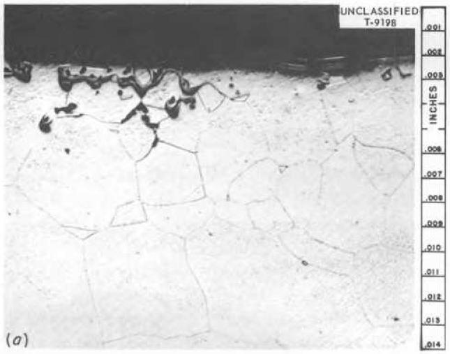

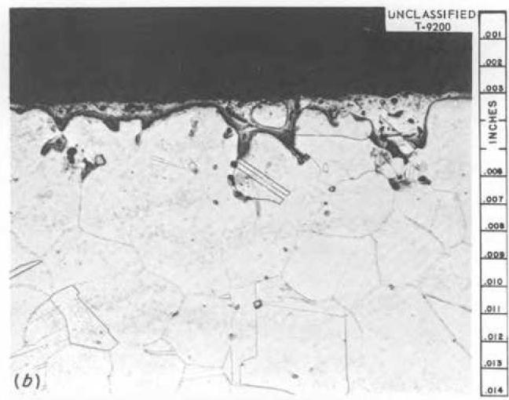

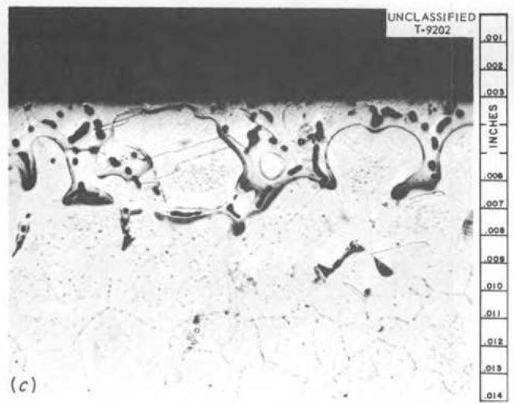

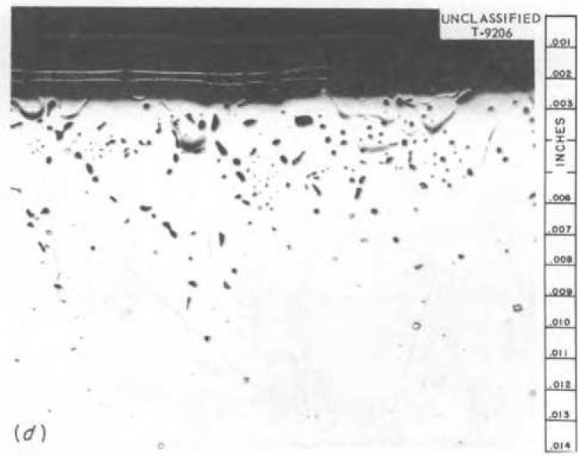

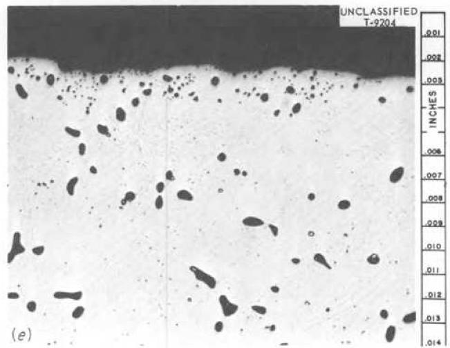  
Fig. 17. Change in Chromium Content with Time as Shown by Magnetic Etching Technique. (a) 50 hr; (b) 100 hr; (c) 250 hr; (d) 500 hr; (e) 5000 hr. Reduced $29.5\%$ .

Effect of Uranium Concentration. - The uranium concentrations used in this study were based upon nuclear requirements and were periodically revised as reactor design was developed. It became obvious that to study corrosion fundamentals it would be necessary to adopt one composition as the standard and check the others only sufficiently to determine that the data could be extrapolated. Fluoride mixture 30 was the one under consideration at the time and so was adopted as the standard. A mixture close to No. 44 was used for the Aircraft Reactor Experiment and received some study. During the preliminary testing of reactor systems, it will be necessary to operate for considerable periods of times with mixtures that do not contain uranium, and during the enriching operation mixtures having a range of uranium concentrations will be used.

To provide data on the effect of uranium concentration upon depth of attack several series of

loops were operated. Since in the fluoride production a considerable portion of the impurities are added with the uranium, it was difficult to make comparable batches which differ only in amounts of uranium. From data presented above ("Additives"), it appears that slight variations in impurity are not as critical as was feared and that comparisons of these data should be permissible.

Data from loops operated for both 500 and 2000 hr with batches containing various uranium concentrations are presented in Table 19. The changes in depth of attack after 500 hr with variations in uranium concentration are plotted in Fig. 18. These data indicate that an increase in depth of attack was found with increasing uranium content. This increase was at a rate of about 0.5 mil for each per cent of uranium added. A more rapid increase is possible with low additions, but these batches were of a higher purity, and so the results need confirming. On the same

Table 19. Loops with Various Uranium Concentrations   

<table><tr><td rowspan="2">Loop No.</td><td rowspan="2">EE Batch No.</td><td rowspan="2">Operating Time (hr)</td><td colspan="2">Attack</td><td colspan="3">Uranium (%)</td><td colspan="2">Chromium (ppm)</td><td rowspan="2">Comments</td></tr><tr><td>Intensity</td><td>Depth (mils)</td><td>Added</td><td>Before</td><td>After</td><td>Before</td><td>After</td></tr><tr><td>474</td><td>191</td><td>500</td><td></td><td>5</td><td>0</td><td></td><td></td><td></td><td>65</td><td>Layer</td></tr><tr><td>475</td><td>192</td><td>500</td><td></td><td>5</td><td>0.5</td><td></td><td></td><td>50</td><td>250</td><td>Layer</td></tr><tr><td>476</td><td>193</td><td>500</td><td></td><td>6</td><td>1</td><td></td><td></td><td>65</td><td>275</td><td></td></tr><tr><td>477</td><td>194</td><td>500</td><td></td><td>7</td><td>2</td><td></td><td></td><td>130</td><td>465</td><td></td></tr><tr><td>479</td><td>196</td><td>500</td><td></td><td>12</td><td>10</td><td></td><td></td><td>100</td><td>1225</td><td></td></tr><tr><td>481</td><td>191</td><td>2000</td><td></td><td>14</td><td>0</td><td></td><td></td><td>70</td><td>70</td><td></td></tr><tr><td>482</td><td>192</td><td>2000</td><td></td><td>7</td><td>0.5</td><td></td><td></td><td>35</td><td>230</td><td>Layer</td></tr><tr><td>483</td><td>193</td><td>2000</td><td></td><td>7</td><td>1</td><td></td><td></td><td>65</td><td>275</td><td>Layer</td></tr><tr><td>484</td><td>194</td><td>1805</td><td></td><td>12</td><td>2</td><td></td><td></td><td>70</td><td>550</td><td>Crystals</td></tr><tr><td>486</td><td>196</td><td>1800</td><td></td><td>12</td><td>10</td><td></td><td></td><td>95</td><td>1075</td><td></td></tr><tr><td>356</td><td>124</td><td>500</td><td>M</td><td>\( 7\frac{1}{2} \)</td><td>4</td><td></td><td></td><td>100</td><td>200</td><td>Possible layer</td></tr><tr><td>357</td><td>123</td><td>500</td><td>H</td><td>9</td><td>10</td><td></td><td></td><td>20</td><td>1500</td><td></td></tr><tr><td>358</td><td>121</td><td>500</td><td>H</td><td>13</td><td>15</td><td></td><td></td><td>70</td><td>2000</td><td></td></tr><tr><td>354</td><td>129</td><td>500</td><td>H</td><td>3</td><td>0.5</td><td></td><td></td><td>90</td><td>250</td><td>Thin deposit</td></tr><tr><td>355</td><td>126</td><td>500</td><td>H</td><td>3</td><td>1.5</td><td></td><td></td><td>325</td><td>400</td><td>Thin deposit</td></tr><tr><td>574</td><td>262-R</td><td>500</td><td>H</td><td>10</td><td>46</td><td>46.3</td><td>45.3-51.0</td><td>55</td><td>225</td><td></td></tr><tr><td>572</td><td></td><td>500</td><td>H</td><td>15</td><td>46</td><td>45.7</td><td>43.6-49.9</td><td>50</td><td>65-330</td><td></td></tr></table>

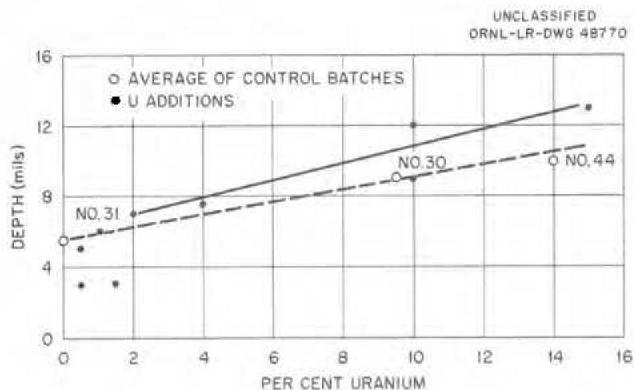  
Fig. 18. Change in Depth of Attack with Uranium Concentration.

figure the average depths obtained with the control batches of fluorides 30, 31, and 44 are shown. For these averages a straight line was found with a rate only slightly lower than the other one. Considerable variation was found in the depths of attack after 2000 hr, and no definite conclusions may be drawn. Additional loops will be necessary to show the effect of uranium concentration on depth of attack resulting strictly from mass transfer.

Two loops were operated with batches containing high uranium concentrations, and the data from these loops, also tabulated in Table 19, do not lie on the curves shown in Fig. 18. In both cases, the depth of attack was less than would be predicted. Another difference in these two loops was that the chromium concentration did not build up to the usual levels. A comparison with the data presented below ("Special Fuel Mixtures") points out the possibility that a portion of the high $\mathsf{UF}_4$ concentration has disproportionated into $\mathsf{UF}_3$ . The $\mathsf{UF}_3$ would lower the equilibrium chromium concentration and reduce the depth of attack.

# Barren Fluoride Mixtures

During the cleaning and preliminary testing stages of reactor operation, the material circulated is similar to that used during operation, except for the absence of uranium. The operating time during such operations can be a considerable fraction of the total operating time, and therefore corrosion during this period must also be studied.

An examination of the data tabulated in Table 20 reveals that the corrosion mechanism is not the same when the uranium is present as when it is

not. The average depth of attack in the standard loops after 500 hr was 5.7 mils or about two-thirds of the depth in similar loops containing $\mathsf{UF}_4$ mixtures. The appearance of the attack, as shown in Fig. 19, is similar to that previously discussed. The iron and nickel in the fluorides after operation decreased in the usual manner, but the chromium concentration is lower.

An increase in depth of attack was found with increases in operating time. While the values vary with the different fluoride batches, an average rate of increase, as shown by Fig. 20, would be about 2 mils per 1000 hr, or about half that with the UF4 addition. The voids also grow in size with increasing operating times, as shown in Fig. 19. The increase in depth of attack or mass transfer takes place in this mixture with very low chromium concentrations. In the cold legs of both the 2000- and 3000-hr loops, operated with a portion of the high-purity materials used in the ARE, dendritic crystals of chromium metal were found.

Another difference with the barren mixtures was revealed by loops 337 and 338. Both these loops circulated for 500 hr, but loop 337 operated with two batches of high-purity ARE fluorides, and the first batch drained from 337 was then circulated for an additional 500 hr in 338. The depth of attack with both these loops was about the same as in the control loops, rather than being double and half, respectively. Hot-leg sections from these loops are shown in Fig. 21. These data indicate that this attack is caused primarily by mass transfer, with impurities and saturation playing only a minor part.

The actual mass transfer mechanism with the barren solutions is not known, since insufficient work has been done on concentrations and equilibrium constants in systems which do not contain uranium. The most likely reactions would result in a change in solubility with temperature, for example, $3\mathrm{CrF}_2 = 2\mathrm{CrF}_3 + \mathrm{Cr}$ or possibly $2\mathrm{Na} + \mathrm{CrF}_2 = \mathrm{Cr} + 2\mathrm{NaF}$ . Reactions with zirconium are also a possibility, but no evidence for them has been found.

# Screening Tests of Possible Container Materials

The screening tests' on which the original material selection was made were carried out with alkali-metal-base mixtures. In that study all stainless steel and ferritic-base alloy loops

Table 20. Corrosion Data from Inconel Loops with Barren Fluorides   

<table><tr><td rowspan="3">Loop No.</td><td rowspan="3">EE Batch No.</td><td rowspan="3">Operating Time (hr)</td><td rowspan="3">Maximum Attack (mils)</td><td colspan="7">Analysis of Fluoride Mixture (ppm)</td><td rowspan="3">Comments</td></tr><tr><td colspan="2">Nickel</td><td colspan="2">Chromium</td><td colspan="2">Iron</td><td rowspan="2">HF Before</td></tr><tr><td>Before</td><td>After</td><td>Before</td><td>After</td><td>Before</td><td>After</td></tr><tr><td>276</td><td>44</td><td>500</td><td>8</td><td>1300</td><td>&lt;20</td><td>25</td><td>2000*</td><td>520</td><td>130</td><td></td><td></td></tr><tr><td>278</td><td></td><td>1000</td><td>5</td><td>130</td><td>&lt;20</td><td>30</td><td>650</td><td>850</td><td>75</td><td></td><td></td></tr><tr><td>277</td><td>49</td><td>500</td><td>4</td><td>75</td><td>&lt;20</td><td>180</td><td>350</td><td>800</td><td>30</td><td></td><td></td></tr><tr><td>336</td><td>ARE-2</td><td>500</td><td>6</td><td></td><td>&lt;20</td><td>*</td><td>110</td><td>*</td><td>50</td><td></td><td></td></tr><tr><td>341</td><td>ARE-2</td><td>500</td><td>5½</td><td>&lt;20</td><td>&lt;20</td><td></td><td>310</td><td></td><td>65</td><td></td><td></td></tr><tr><td>342</td><td>ARE-2</td><td>500</td><td>6</td><td></td><td>&lt;20</td><td></td><td>200</td><td></td><td>35</td><td></td><td>No cleaning</td></tr><tr><td>348</td><td>ARE-2</td><td>500</td><td>5</td><td></td><td>&lt;20</td><td></td><td>130</td><td></td><td>80</td><td></td><td></td></tr><tr><td>346</td><td>ARE-2</td><td>2000</td><td>9</td><td></td><td>&lt;20</td><td></td><td>300</td><td></td><td>110</td><td></td><td>Cr in trap</td></tr><tr><td>347</td><td>ARE-2</td><td>3000</td><td>11</td><td></td><td>&lt;20</td><td></td><td>110</td><td></td><td>65</td><td></td><td>Cr in trap</td></tr><tr><td>400</td><td>134</td><td>50</td><td>3</td><td>&lt;10</td><td>*</td><td>135</td><td>200</td><td>365</td><td>100</td><td></td><td></td></tr><tr><td>410</td><td>134</td><td>100</td><td>4</td><td>&lt;10</td><td>&lt;20</td><td>135</td><td>240</td><td>365</td><td>70</td><td>2.5</td><td>Layer</td></tr><tr><td>411</td><td>134</td><td>250</td><td>4½</td><td>&lt;10</td><td>&lt;10</td><td>135</td><td>200</td><td>365</td><td>90</td><td>2.4</td><td>Layer</td></tr><tr><td>399</td><td>134</td><td>1000</td><td>10</td><td>&lt;10</td><td>&lt;10</td><td>320</td><td>365</td><td>80</td><td></td><td></td><td></td></tr><tr><td>516</td><td>210-5</td><td>500</td><td>6</td><td>55</td><td>20</td><td>80</td><td>100</td><td>115</td><td>120</td><td>3.0</td><td>Crystals</td></tr><tr><td>517</td><td>210-5</td><td>822</td><td>5½</td><td>70</td><td>60*</td><td>75</td><td>160</td><td>200</td><td>60</td><td>3.5</td><td></td></tr><tr><td>518</td><td>210-5</td><td>3000</td><td>11</td><td>70</td><td>30</td><td>60</td><td>110</td><td>100</td><td>110</td><td>3.5</td><td>Deposit</td></tr><tr><td>519</td><td>210-5</td><td>2000</td><td>12½</td><td>70</td><td>100*</td><td>115</td><td>125</td><td>135</td><td>75</td><td>3.0</td><td>Deposit</td></tr><tr><td>337</td><td>2 batches</td><td>575</td><td>8</td><td></td><td>1-25*</td><td></td><td>1-250</td><td></td><td>1-150</td><td></td><td></td></tr><tr><td></td><td>ARE-2</td><td></td><td></td><td></td><td>2-20*</td><td></td><td>2-200</td><td></td><td>2-50</td><td></td><td></td></tr><tr><td>338</td><td>Batch from 337</td><td>500</td><td>6</td><td>25</td><td>20</td><td>250</td><td>470</td><td>150</td><td>50</td><td></td><td></td></tr><tr><td></td><td></td><td>Av for 500-hr loops</td><td>5.7</td><td></td><td></td><td></td><td></td><td></td><td></td><td></td><td></td></tr></table>

*Individual results varied.

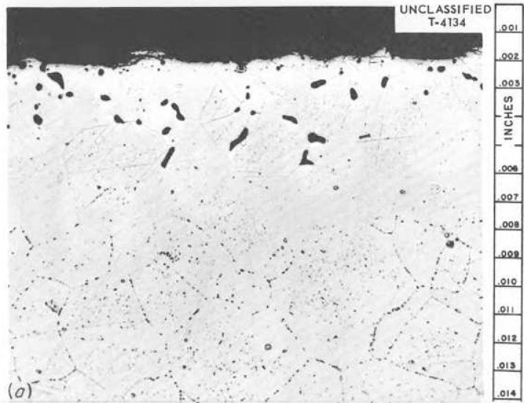

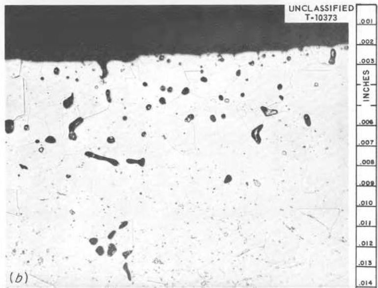

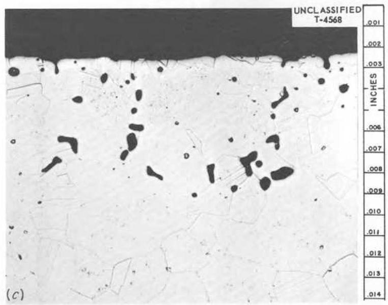

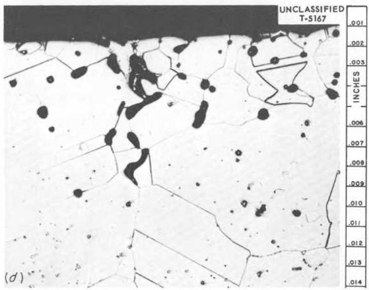  
Fig. 19. Growth of Voids Formed by Barren Fluorides with Increasing Time of Operation. (a) 500 hr; (b) 1000 hr; (c) 2000 hr; (d) 3000 hr. 250X. Reduced $17\%$ .

plugged in relatively short times. Nickel loops operated for 500 hr, but metallic crystals were found, and Hastelloy B loops failed by catastrophic oxidation. Only the high-nickel alloys similar to Inconel looked promising. Since the properties of the zirconium fluoride-base mixtures are considerably different from those of the alkali-metal-base mixtures, many of these tests were repeated with the zirconium mixtures. In

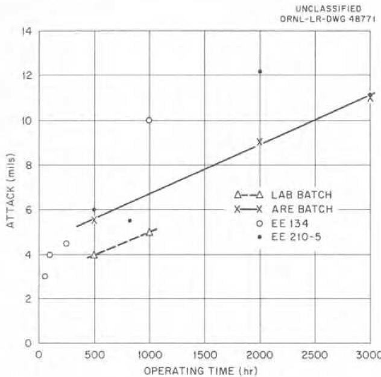  
Fig. 20. Increase in Depth of Attack with Operating Time for Barren Fluoride Mixtures.

general, these tests are much more favorable than the previous ones were.

Stainless Steels. - All stainless steel loops operated satisfactorily for 500 hr when zirconium fluoride-base mixtures were circulated in them, as shown by the data tabulated in Table 21. The hot-leg attack in type 316 stainless steel loops was similar in appearance (Fig. 22) and to about the same depth as was found in Inconel loops. As would be expected from solubility studies, the iron and nickel concentrations of the fluorides remained low and the chromium increased during operation. The disadvantage of this alloy is the metallic deposits that were always found in the cold legs (Fig. 22). Attempts to identify the deposit by spectrographic and diffraction studies were not successful, but indications are that iron and chromium are both present.

When the loops were fabricated from a 400 series stainless steel, the nature of the attack changed. The hot-leg surfaces were rough, with entire crystals being removed, and no subsurface voids were present. Large deposits of dendritic metallic crystals were found in the cold legs. Typical cold-leg sections with types 410 and 446 stainless steel are shown in Fig. 23. The cold-leg deposit in a type 410 loop analyzed $53.4\%$ Fe- $4.3\%$ Cr- $1\%$ Ni- $12.9\%$ Zr. In a type 446 loop the crystals were $35.7\%$ Fe- $7.6\%$ Cr- $1\%$ Ni- $13.8\%$ Zr. The zirconium is not part of the crystals but is from unseparated fluorides. These data indicate that both iron and chromium can be

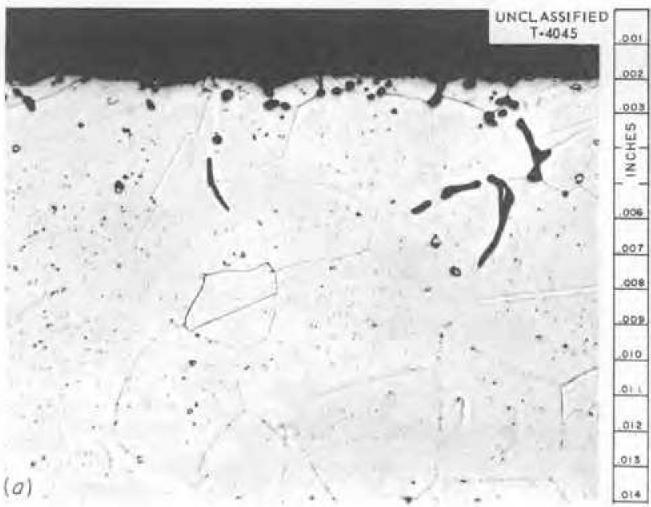

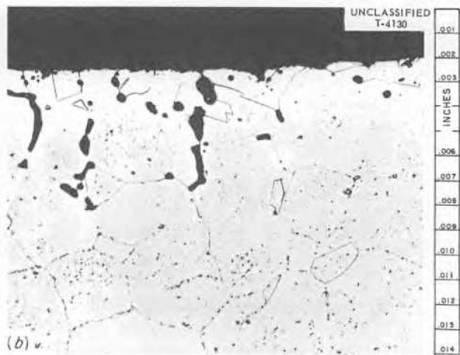  
Fig. 21. Comparison of Attack in Loops Operated with Two Barren Batches and with a Precirculated Batch. (a) Loop 337, operated with two batches; (b) loop 338, operated with a precirculated batch. 250X. Reduced $29\%$ .

Table 21. Data from Stainless Steel Loops   

<table><tr><td rowspan="3">Loop No.</td><td rowspan="3">Alloy Type</td><td rowspan="3">Batch No.</td><td rowspan="3">Time (hr)</td><td colspan="2">Metallographic Examination</td><td colspan="8">Analysis of Fluoride Mixture</td></tr><tr><td rowspan="2">Hot Leg</td><td rowspan="2">Cold Leg</td><td colspan="2">Nickel (ppm)</td><td colspan="2">Chromium (ppm)</td><td colspan="2">Iron (ppm)</td><td colspan="2">Uranium (%)</td></tr><tr><td>Before</td><td>After</td><td>Before</td><td>After</td><td>Before</td><td>After</td><td>Before</td><td>After</td></tr><tr><td>128</td><td>316</td><td>R-50a</td><td>500</td><td>8 mils, intergranular</td><td>Crystals</td><td>320</td><td>&lt;20</td><td>&lt;20</td><td>1600b</td><td>665</td><td>110</td><td>7.50</td><td>9.3</td></tr><tr><td>133c</td><td>316</td><td></td><td>500</td><td>11 mils</td><td>Deposit</td><td>200</td><td>20</td><td>35</td><td>1300</td><td>2100</td><td>150</td><td>8.80</td><td>9.0</td></tr><tr><td>134</td><td>316</td><td>52</td><td>500</td><td>7 mils, heavy; rough surface</td><td>Deposit</td><td>30</td><td>&lt;20</td><td>110</td><td>800b</td><td>260</td><td>60</td><td>8.81</td><td>9.1</td></tr><tr><td>403</td><td>430</td><td>119d</td><td>500</td><td>Even</td><td>Deposit</td><td>&lt;20</td><td>&lt;20</td><td>75</td><td>825</td><td>230</td><td>b</td><td>8.99</td><td>8.8</td></tr><tr><td>138</td><td>410</td><td>141</td><td>500</td><td>Very rough</td><td>Layer and crystalse</td><td>&lt;20</td><td>&lt;10</td><td>95</td><td>800</td><td>185</td><td>120</td><td>9.14</td><td>8.8</td></tr><tr><td>137</td><td>446</td><td>141</td><td>500</td><td>10 mils, voids; rough</td><td>Layer and crystalsf</td><td>&lt;20</td><td>&lt;20</td><td>90</td><td>800</td><td>155</td><td>80</td><td>8.53</td><td>8.8</td></tr><tr><td>142</td><td>430</td><td>158</td><td>500</td><td>7 mils, lightg</td><td>Some deposit and crystals</td><td>&lt;20</td><td>&lt;10</td><td>30</td><td>500b</td><td>55</td><td>b</td><td>8.80</td><td>9.0</td></tr></table>

$a_{\text{Fluoride}}$ 27.   
$b_{\text{Individual results varied}}$   
Cleaned only by degreasing.   
$d_{3.0\mathrm{ppm}}$ HF.   
${}^{e}$ Crystals 53.4% Fe,12.9% Zr,4.3% Cr.   
Crystals 35.7% Fe, 13.8% Zr, 7.6% Cr.   
Large grains and no carbides in hot leg.

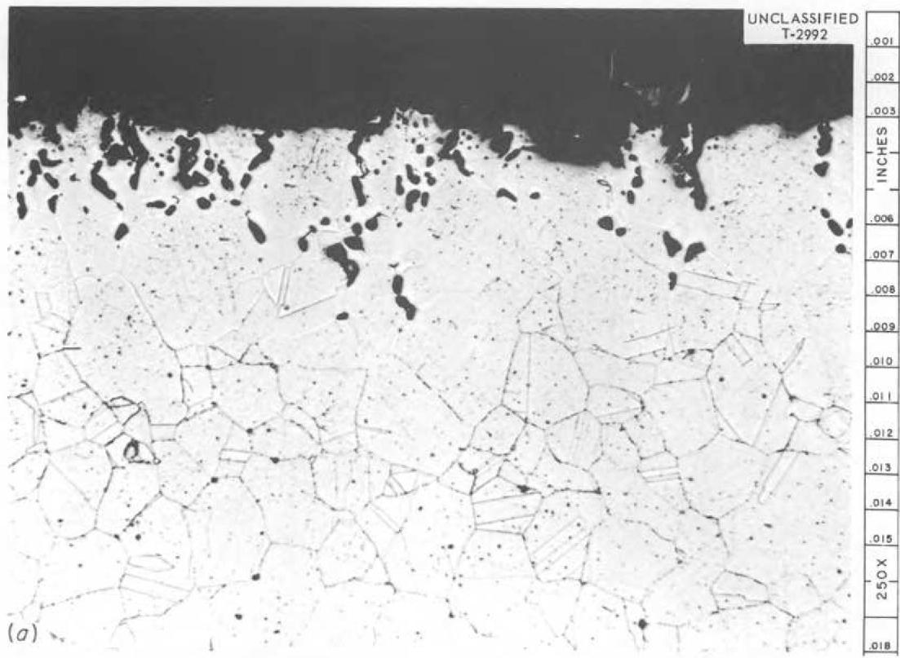

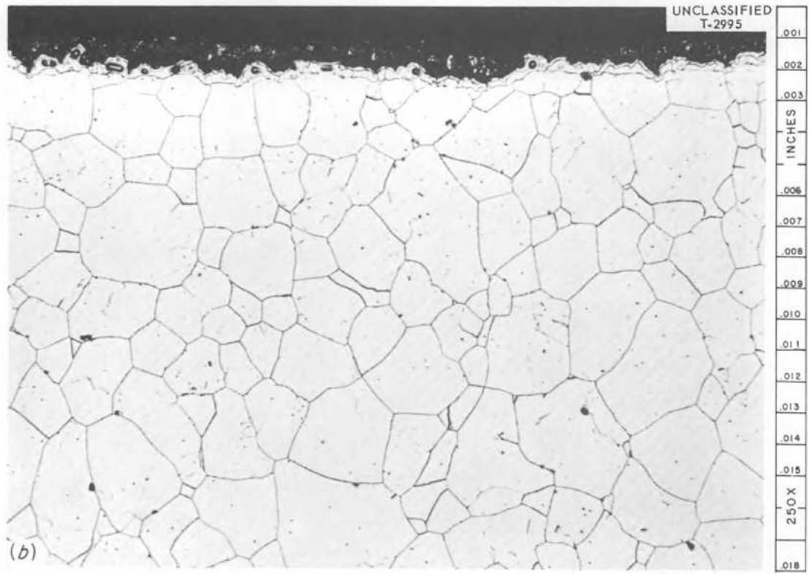  
Fig. 22. Corrosion of Type 316 Stainless Steel by Fluoride 30. (a) Hot leg; (b) cold leg (note thin metal deposit). 250X. Reduced $15\%$ .

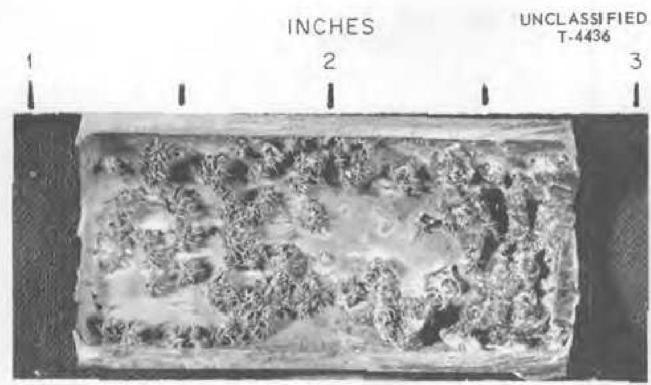  
(0) LOOP 138-SECT.10

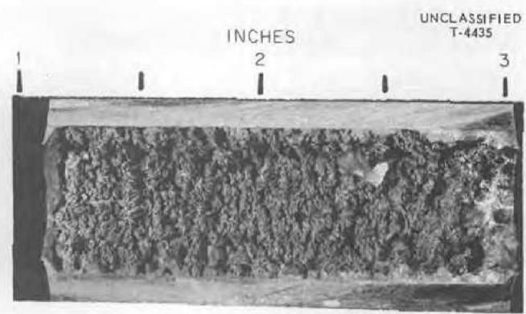  
(b) LOOP 137 - SECT. IO   
Fig. 23. Deposits Found in Cold Legs of 400 Series Stainless Steel Loops. (a) Type 410; (b) type 446.

mass-transferred in these systems, and while the loops operated without plugging for 500 hr, the rate of mass transfer is much too high for use of these alloys.

Izett Iron. - The single instance of a loop plugging with zirconium fluoride-base mixtures was found with Izett iron (low-carbon high-purity iron) loop No. 47. This loop plugged in 39 hr by the formation of balls of dendritic metal crystals (Fig. 24). The hot-leg attack was an even removal, but the depth could not be determined, since considerable oxidation of the outer surface also occurred.

Nickel. - Two "A" nickel loops operated for 500 hr with very little hot-leg attack. The wall surfaces were polished, but the thicknesses were still within commercial tolerance, so at least no large amount of metal was removed. Neither intergranular nor void type of attack was found, as shown in Fig. 25. A few metallic crystals were found in the cold leg of loop 108, but none were found in loop 110. In both loops, the nickel content of the fluorides remained very low.

Inconel X. - Attacks of 22 and 19 mils were found after circulating fluoride 44 for 1000 hr in loops constructed from Inconel X (15% Cr, 9% Fe, 2.5% Ti, 0.6% Al, 11.0% Mn, 1.0% Cb, bal Ni). This is slightly deeper than would be found in comparable loops of Inconel, but the attack is similar in nature, as shown in Fig. 26. No definite deposit was found in the cold leg of either loop; however, with loop 170, an area on the cold-leg surface 1 mil deep etched differently

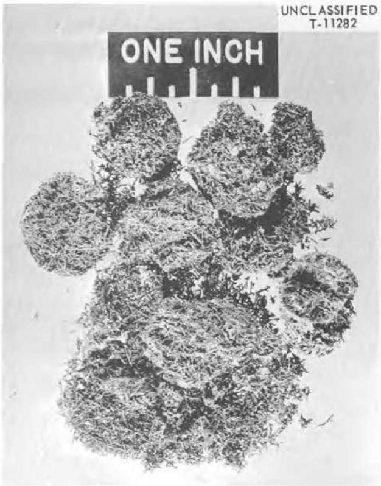  
Fig. 24. Metal Deposit Taken from Cold Leg of an Izett Iron Loop.

from the remaining material. The fluorides increased in aluminum and chromium concentration but not in titanium.

Molybdenum and Niobium. - Although, because of fabrication difficulties, it does not seem likely that they can be used immediately for reactors, molybdenum and niobium show considerable

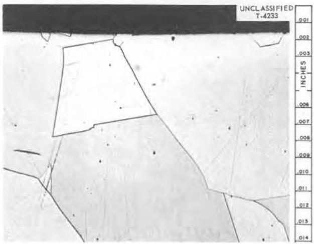  
Fig. 25. Hot Leg of a Nickel Loop. 250X. Reduced $33\%$ .

promise of future use as containers for molten fluorides. Low corrosion rates have been found with both metals. Both these metals are difficult to weld and must be protected against oxidation. In attempting to operate these loops, many failures occurred from cracks in the original tubing and from welding stresses.

The molybdenum loops were about half size, being 15 in. in each leg, and were made from $\frac{3}{4}$ -in. tubing. The niobium loops were full-size loops but were constructed from $\frac{1}{2}$ -in. tubing. The corrosion data from these loops are tabulated

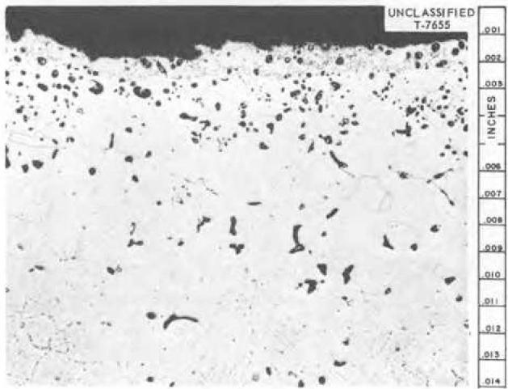  
Fig. 26. Hot Leg of an Inconel X Loop. 250X. Reduced $37\%$ .

in Table 22, and typical photomicrographs of the hot legs are shown in Figs. 27 and 28. No evidence of attack or of any deposit was found in the molybdenum loops. The surface was rough and pitted, but as shown in Fig. 27, the same condition was present in the original tubing. Difficulty was encountered with the analytical determination of molybdenum in fluorides, but it is obvious that the solubility is very low. These loops were not operated with in-line traps, so a final judgment on mass transfer should be reserved until this has been done.

Table 22. Corrosion in Molybdenum and Niobium Loops   

<table><tr><td rowspan="2">Loop No.</td><td rowspan="2">Alloy</td><td rowspan="2">Time (hr)</td><td rowspan="2">Maximum Attack (mils)</td><td colspan="2">Metallographic Examination</td><td rowspan="2">Mo or Nb After (ppm)</td></tr><tr><td>Hot Leg</td><td>Cold Leg</td></tr><tr><td>180</td><td>Molybdenum</td><td>250*</td><td>None</td><td>Few pits</td><td>No attack or deposit</td><td>&lt;1</td></tr><tr><td>184</td><td>Molybdenum</td><td>843*</td><td>None</td><td></td><td>No attack or deposit</td><td>15</td></tr><tr><td>185</td><td>Molybdenum</td><td>1000</td><td>None</td><td></td><td>No attack or deposit</td><td>11-40</td></tr><tr><td>1003</td><td>Molybdenum</td><td>424*</td><td>None</td><td></td><td>No attack or deposit</td><td>250</td></tr><tr><td>1002</td><td>Molybdenum</td><td>2000</td><td>None</td><td></td><td>No attack or deposit</td><td>12-65</td></tr><tr><td>760</td><td>Niobium</td><td>1000</td><td>1/2</td><td>Light intergranular</td><td>No attack or deposit</td><td></td></tr><tr><td>761</td><td>Niobium</td><td>695*</td><td>1/2</td><td>Light intergranular</td><td>No attack or deposit</td><td>15</td></tr><tr><td>762</td><td>Niobium</td><td>1000</td><td>1/2</td><td>Light intergranular</td><td>Niobium crystals; no deposit</td><td>&lt;1-270</td></tr></table>

\*Operation terminated because of leak.

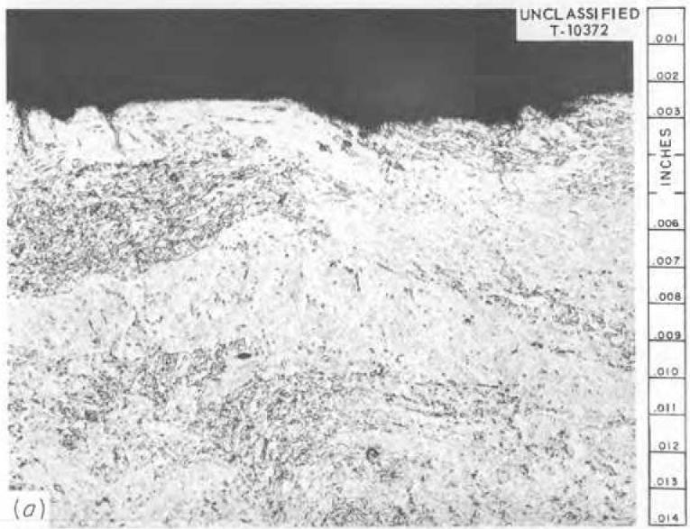

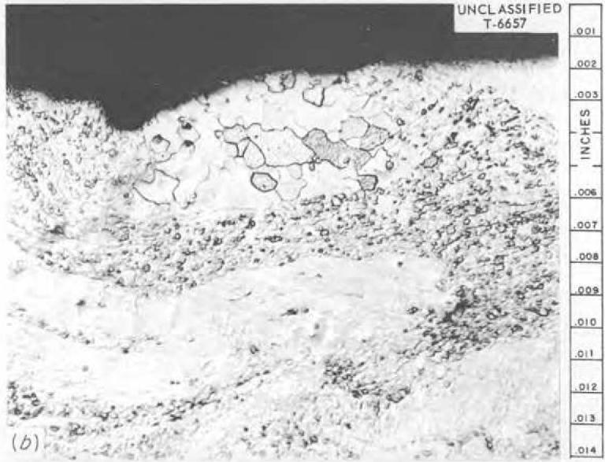

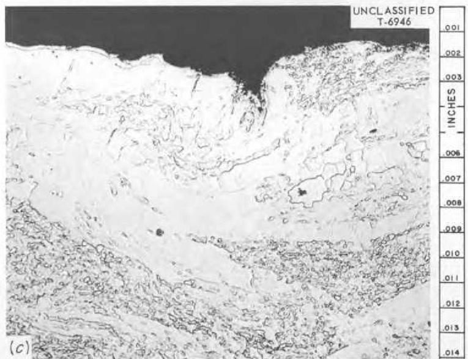

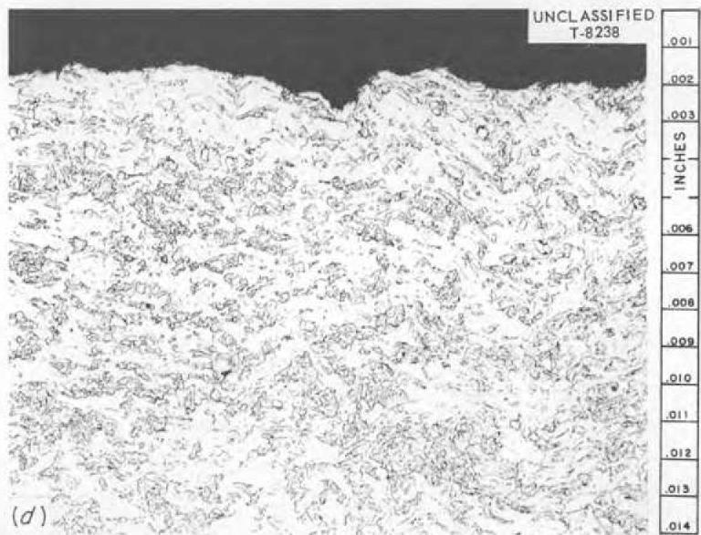  
Fig. 27. Effect of Operating Time on Corrosion of Molybdenum by Fluoride 30. (a) As received; (b) 250 hr; (c) 1000 hr; (d) 2000 hr. 250X. Reduced $17\%$ .

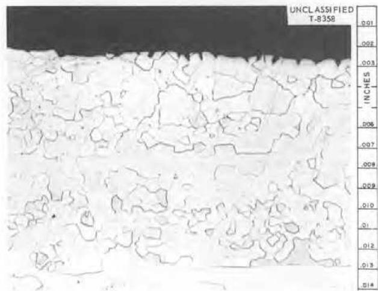  
Fig. 28. Hot Leg of Niobium Loop After 1000 hr with Fluoride 30. 250X. Reduced $33\%$ .

No evidence of attack was found in the hot legs of the niobium loops; however, possible crystals were found in one of the cold legs. Further work will be required to resolve this discrepancy.

Hastelloy B. - Another material that was investigated was Hastelloy B (28% Mo, 5% Fe, 0.12% max C, bal Ni). In the original screening studies, two such loops failed in short times by catastrophic oxidation. The first two loops in this series failed in a similar manner, but the difficulty was remedied by replacing the Sauereisen cement normally used to protect thermocouples with metallic shields.

Hastelloy B is another material showing promise for use with the fluorides, as shown by the data in Table 23. A few voids and cracks to shallow depths were found in both legs, with the cracks also being found in the as-received pipe. Very little, if any, increase in attack was found with an increase in hot-leg temperature from 1500 to $1650^{\circ}\mathrm{F}$ or with an increase in operating time to 2000 hr (Fig. 29). While the rate of attack was low, some occurred, since in several loops a few dendritic crystals of nickel were found in the cold legs.

When Hastelloy B is fabricated, some molybdenum is vaporized; therefore there was a possibility that a nickel-enriched layer on the surface was causing the mass transfer. The internal surfaces of several loops were machined to eliminate any such layer. The attack found in these loops was essentially the same as in the normal loops.

The major disadvantage with Hastelloy B is the large amount of mass transfer found when molten sodium or sodium-potassium alloy is circulated in it. With the presently proposed reactors, it would be highly desirable for a metal to have corrosion resistance to both fluorides and alkali metals.

Special Alloys. - It has been shown that the only metal leached from Inconel was the chromium; therefore, in an effort to reduce the attack, alloys were made with decreasing chromium concentrations. These alloys were vacuum-melted and extruded by the ORNL Metallurgy Division and then drawn into $\frac{1}{2}$ -in. tubing by the Superior Tube Company. Fluoride corrosion data from these loops are tabulated in Table 24, and representative hot-leg sections are shown in Fig. 30.

In each case when the chromium in these alloys was reduced from the original $15\%$ to about $5\%$ , the depth of attack was reduced by a factor of 3. The reduction was found when the chromium was replaced with either iron or molybdenum. When the chromium concentration was reduced to $10\%$ , erratic results were found.

Results from another series of special loops are tabulated in the lower portion of Table 24. These loops were operated to determine whether variations in carbon content had an effect on corrosion. Loops 366 and 367 were fabricated from vacuum-cast metal and contained only $0.01\%$ carbon. The attack in both these loops was essentially the same as that found in control loop 359 made from commercial alloy containing $0.07\%$ carbon (Fig. 31).

# Special Fuel Mixtures

In the last report, it was pointed out on the basis of only a few tests that the addition of zirconium hydride to alkali-metal-base mixtures showed promise of reduced depths of attack, but that unidentified layers had been found on the hot-leg surfaces. This type of work has continued, with similar additions being made to zirconium fluoride-base mixtures. A large investigation into the basic mechanisms in such a system has also been carried out by the ANP Chemistry Section.

In two series of tests, various amounts of zirconium hydride were added to portions of the same large batch of fluoride 30. The zirconium hydride was added to the fluorides in small

Table 23. Corrosion Data from Hastelloy B Loops   

<table><tr><td rowspan="2">Loop No.</td><td rowspan="2">Time (hr)</td><td rowspan="2">Heat Treatment</td><td colspan="2">Metallographic Examination</td><td colspan="2">Nickel (ppm)</td><td rowspan="2">Molybdenum After (ppm)</td><td rowspan="2">Comments</td></tr><tr><td>Hot Leg</td><td>Cold Leg</td><td>Before</td><td>After</td></tr><tr><td>378</td><td>94*</td><td></td><td>Rough surface</td><td>No deposit</td><td></td><td>&lt;20</td><td></td><td>No attack on welds</td></tr><tr><td>140</td><td>500</td><td>Aged 1950°F</td><td>2 mils, light; rough</td><td></td><td>20</td><td>10</td><td>1</td><td>No attack on welds</td></tr><tr><td>153</td><td>394*</td><td></td><td>1 mil, heavy; rough</td><td>1.5 mils, intergranular cracks</td><td>20</td><td>20</td><td></td><td></td></tr><tr><td>154</td><td>1000</td><td></td><td>1 mil, moderate; rough</td><td>1.5 mils, cracks; rough</td><td>&lt;20</td><td>&lt;10</td><td></td><td></td></tr><tr><td>157</td><td>736**</td><td>Aged</td><td>1.5 mils, moderate</td><td>Rough</td><td>&lt;10</td><td>&lt;10</td><td>1</td><td></td></tr><tr><td>156</td><td>0</td><td></td><td>1.5 mils; rough</td><td>1.5 mils; rough</td><td></td><td></td><td></td><td></td></tr><tr><td>158</td><td>2000</td><td></td><td>2 mils, heavy; rough</td><td>2 mils, heavy</td><td></td><td>&lt;20</td><td>1</td><td></td></tr><tr><td>548</td><td>2000</td><td></td><td>1 mil, moderate</td><td>1.5 mils, intergranular</td><td>60</td><td>&lt;20</td><td></td><td></td></tr><tr><td>162</td><td>1000</td><td></td><td>3 mils, moderate; rough</td><td>2 mils, intergranular</td><td>15</td><td>25</td><td>15</td><td>1650°F</td></tr><tr><td>161</td><td>1000</td><td></td><td>2 mils, moderate; rough</td><td>2 mils, intergranular</td><td>25</td><td>25</td><td>10</td><td>1650°F</td></tr><tr><td>163</td><td>1000</td><td>Aged</td><td>2 mils, moderate</td><td>2 mils, moderate</td><td>35</td><td>3-135</td><td>10</td><td></td></tr><tr><td>167</td><td>1000</td><td></td><td>2 mils, heavy</td><td>1.5 mils, moderate</td><td>40</td><td>&lt;20</td><td>&lt;10</td><td>Fluoride 44</td></tr><tr><td>164</td><td>1000</td><td>Aged</td><td>2 mils, moderate</td><td>2 mils, moderate</td><td>35</td><td>&lt;20</td><td>&lt;10</td><td></td></tr><tr><td>174</td><td>1000</td><td></td><td>3 mils, heavy; rough</td><td>1.5 mils; rough</td><td>35</td><td>20-60</td><td></td><td>Metal crystals</td></tr><tr><td>159</td><td>2000</td><td></td><td>2 mils</td><td>Rough</td><td>20</td><td>20</td><td>&lt;1</td><td></td></tr><tr><td>186</td><td>1000</td><td></td><td>3.5 mils, heavy; rough</td><td>2.5 mils; rough; crystals</td><td>15</td><td>&lt;1-70</td><td>&lt;5</td><td>1650°F</td></tr><tr><td>187</td><td>1000</td><td></td><td>4 mils, heavy</td><td>1.5 mils; rough; few crystals</td><td>&lt;20</td><td>&lt;10</td><td>&lt;20</td><td>1650°F</td></tr><tr><td>769</td><td>500</td><td></td><td>1.5 mils; large voids</td><td>1.5 mils, voids; metal in trap</td><td>5</td><td>10</td><td>15</td><td>Machined internal surface</td></tr><tr><td>770</td><td>1000</td><td></td><td>1 mil, heavy; rough</td><td>No deposit</td><td>10</td><td>70</td><td></td><td>Machined internal surface</td></tr><tr><td>771</td><td>1500</td><td></td><td>2 mils, moderate</td><td>2 mils, moderate</td><td>10</td><td>&lt;10</td><td></td><td>Machined internal surface</td></tr></table>

*Operation terminated because of leak.   
\*\*Operation terminated because of power failure.

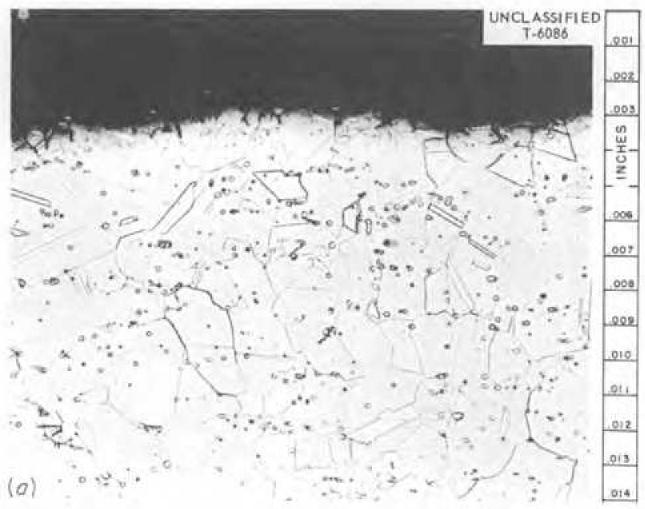

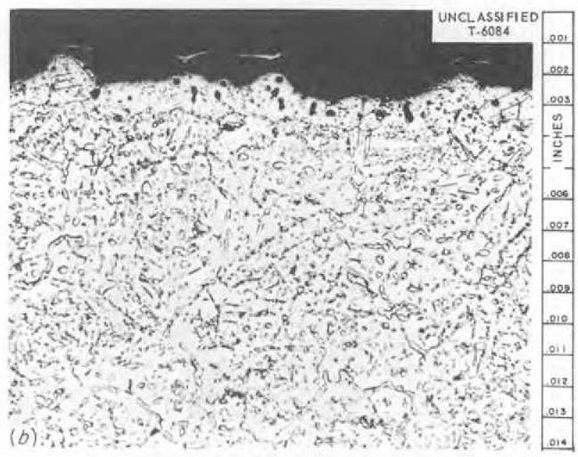

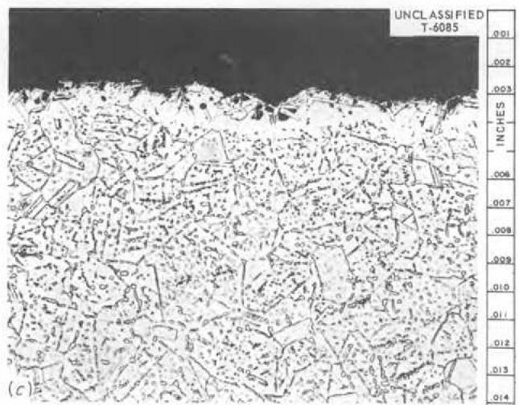

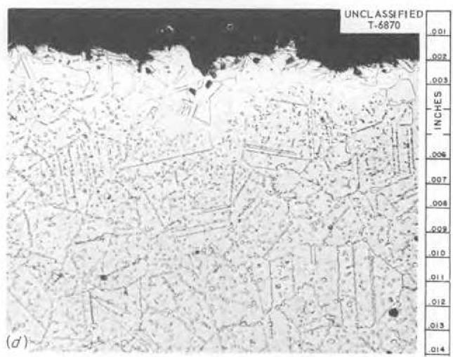

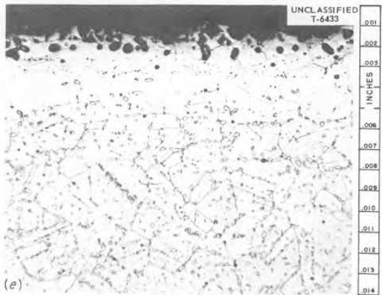  
Fig. 29. Effect of Time and Temperature of Operation on Attack in Hastelloy B. (a) As received; (b) 500 hr at $1500^{\circ}\mathrm{F}$ ; (c) 1000 hr at $1500^{\circ}\mathrm{F}$ ; (d) 2000 hr at $1500^{\circ}\mathrm{F}$ ; (e) 1000 hr at $1650^{\circ}\mathrm{F}$ . Reduced $30\%$ .

Table 24. Corrosion Data from Modified Inconel-Type Alloys   

<table><tr><td rowspan="2">Loop No.</td><td colspan="4">Alloy Composition (%)</td><td rowspan="2">Time (hr)</td><td colspan="2">Attack</td><td rowspan="2">Chromium Concentration in Fluorides (ppm)</td></tr><tr><td>Cr</td><td>Fe</td><td>Ni</td><td>Other</td><td>Intensity</td><td>Depth (mils)</td></tr><tr><td>520</td><td>17.6</td><td>6.8</td><td>75.9</td><td></td><td>1000</td><td>Heavy</td><td>13½</td><td>1000</td></tr><tr><td>522</td><td>9.8</td><td>14.5</td><td>75.6</td><td></td><td>823a</td><td>Heavy</td><td>8</td><td>580</td></tr><tr><td>523</td><td>9.8</td><td>14.5</td><td>75.6</td><td></td><td>1000</td><td>Heavy</td><td>12</td><td>500</td></tr><tr><td>524</td><td>4.8</td><td>19.8</td><td>76.1</td><td></td><td>647b</td><td>Moderate</td><td>3</td><td>400</td></tr><tr><td>525</td><td>4.8</td><td>19.8</td><td>76.1</td><td></td><td>460a</td><td>Heavy</td><td>3</td><td>300</td></tr><tr><td>526</td><td>9.8</td><td>6.7</td><td>83.4</td><td></td><td>1000</td><td>Moderate</td><td>13</td><td>650</td></tr><tr><td>527</td><td>9.8</td><td>6.7</td><td>83.4</td><td></td><td>1000</td><td>Heavy</td><td>15</td><td>650</td></tr><tr><td>521</td><td>6.0</td><td>10.1</td><td>74.4</td><td>Mo, 9.8</td><td>1000</td><td>Light</td><td>2</td><td>450</td></tr><tr><td>472</td><td>6.0</td><td>10.1</td><td>74.4</td><td>Mo, 9.8</td><td>500</td><td>Light</td><td>3½</td><td>300</td></tr><tr><td>529c</td><td>~15</td><td>~7.5</td><td>~76</td><td></td><td>1000</td><td>Heavy</td><td>12</td><td>550</td></tr><tr><td>366</td><td>15.0</td><td>7.3</td><td>78.1</td><td>C, 0.01</td><td>500</td><td>Moderate</td><td>3½</td><td>950</td></tr><tr><td>367</td><td>14.7</td><td>7.2</td><td>78.1</td><td>C, 0.01</td><td>500</td><td>Heavy</td><td>3½</td><td>850</td></tr><tr><td>359c</td><td>~15</td><td>~7.5</td><td>~76</td><td>C, 0.07</td><td>500</td><td>Heavy</td><td>4</td><td>850</td></tr></table>

${}^{a}$ Operation terminated because of leak.   
$b_{\text{Operation terminated because of power failure}}$   
Commercial Inconel.

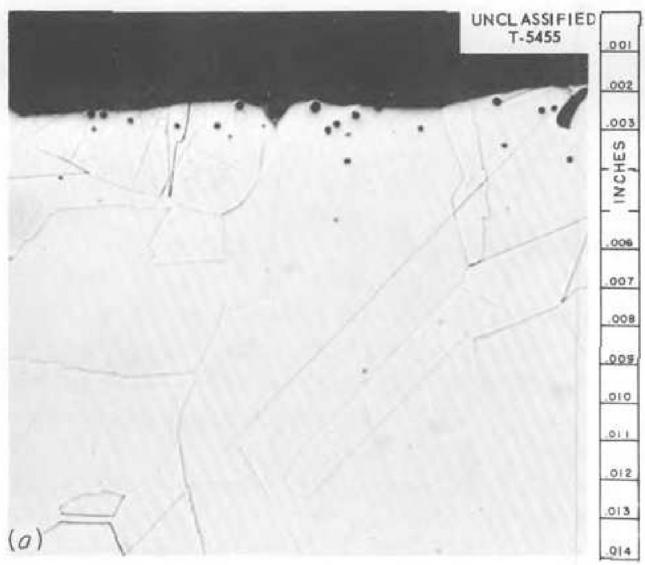

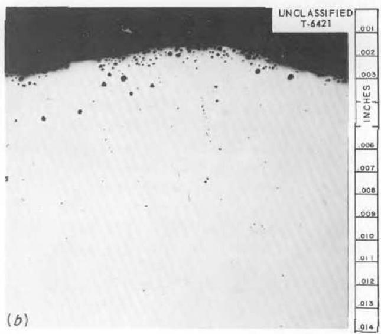  
Fig. 30. Typical Hot-Leg Sections from Loops of Modified Inconel-Type Alloys. (a) 6Cr-10.1Fe-74.4Ni-9.8Mo; (b) 4.8Cr-19.8Fe-76.1Ni. 250X. Reduced 21%.

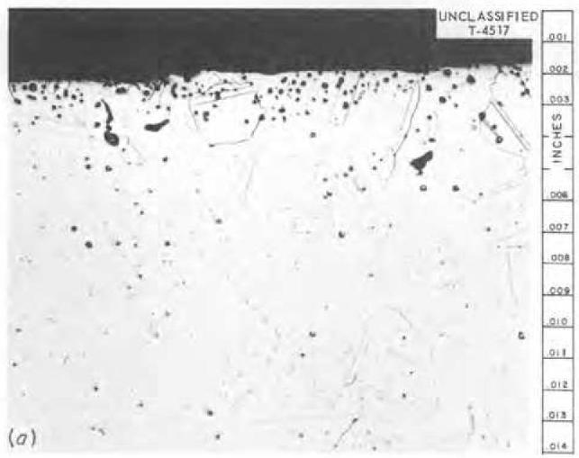

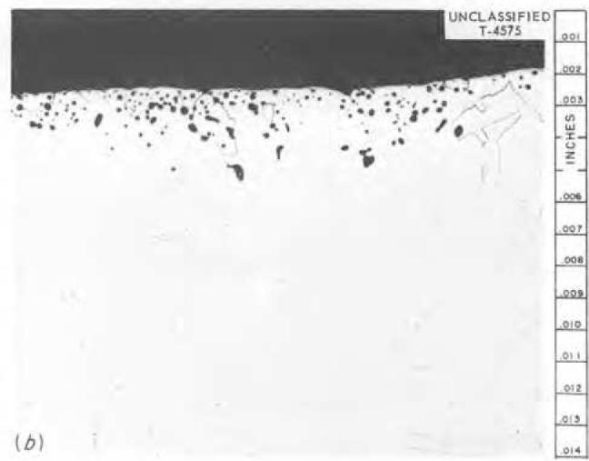  
Fig. 31. Comparison of Attack in Commercial and Low-Carbon Inconel. (a) Commercial Inconel, $0.07\%$ C; (b) low-carbon Inconel, $0.01\%$ C. 250X. Reduced $30\%$ .

charge pots, and after being agitated at $1300^{\circ}\mathrm{F}$ by helium, the mixture was transferred to the loops through grade G Micro Metallic filters. The metallographic data from these loops are tabulated in Table 25, with the chemical data in Table 26. These data show that a gradual reduction in depth of attack was found as the zirconium hydride concentration was increased to about $0.7\%$ . With larger hydride additions, layers of increasing thickness were found on the surfaces of the hot and cold legs, as shown in Fig. 32. The deposits attained greater thickness in the hot legs. With the use of a special microspark spectrographic method, it was found that the thicker layers were predominantly zirconium. This technique was not sensitive to uranium; so this metal may have also been present and not detected. The shallow attack found in many of these loops is not the usual subsurface void type of attack. These areas are holes which are open to the surface and may have originated as scratches or pits in the original pipe.

After operation, the chromium content of fluorides to which zirconium hydride had been added was always much lower than in similar tests without the addition. The chromium gradually decreased with hydride additions up to about

0.5% but remained low and constant with further additions. The uranium concentration was also affected by the zirconium hydride additions. As the hydride was increased above 0.5%, noticeable amounts of uranium were reduced in the charge pots and left on the filters during transfer. With a 2% hydride addition, half the uranium was lost. With the higher additions, small amounts of uranium were also lost during operation of the loop.

It has been found by the ANP Chemistry Section that the action of the zirconium hydride in reducing the attack is not from purifying the solutions, as was first thought, but is by the reduction of a portion of the $\mathsf{UF}_4$ to $\mathsf{UF}_3$ . Attempts were made to determine the $\mathsf{UF}_3$ content of the second series both before and after operation; however, the results are in such doubt that they are not being reported. From these results it does appear, however, that in every case the $\mathsf{UF}_3$ content was reduced to values below $1\%$ in 500 hr of operation.

A comparison of the depths of attack from loops 413 and 414 shows that the addition of small amounts of hydride does not stop mass transfer. Between 1000 and 2000 hr the rate was the same as that found from the time curve

Table 25. Metallographic Results from Loops in Which Mixtures Containing ${\mathrm{{ZrH}}}_{2}$ Were Circulated   

<table><tr><td>Loop No.</td><td>\( {\mathrm{{ZrH}}}_{2} \) Added (%)</td><td>EE Batch No.</td><td>Operating Time (hr)</td><td>Hot Leg</td><td>Cold Leg</td></tr><tr><td>248</td><td>0.6</td><td>19</td><td>500</td><td>Moderate attack to 4 mils</td><td>Deposit</td></tr><tr><td>308</td><td>0.5</td><td>68</td><td>500</td><td>Light attack to \( {2}^{1}/{}_{2} \) mils</td><td>Deposit</td></tr><tr><td>413</td><td>0.2</td><td>150</td><td>1000</td><td>Light attack to 7 mils</td><td></td></tr><tr><td>414</td><td>0.2</td><td>150</td><td>2000</td><td>Heavy attack to 11 mils</td><td></td></tr><tr><td>469</td><td>0</td><td>162</td><td>500</td><td>Heavy attack to 8 mils</td><td>No deposit</td></tr><tr><td>459</td><td>0.2</td><td>162</td><td>500</td><td>Moderate to heavy attack to 6 mils</td><td>Deposit</td></tr><tr><td>470</td><td>0.5</td><td>162</td><td>500</td><td>Light to moderate attack to 3 mils</td><td>Deposit</td></tr><tr><td>460</td><td>0.9</td><td>162</td><td>500</td><td>Thin deposit</td><td>Deposit</td></tr><tr><td>471</td><td>2.0</td><td>162</td><td>500</td><td>Deposit to 1 mil</td><td>Deposit</td></tr><tr><td>800</td><td>0</td><td>513-4</td><td>500</td><td>Heavy attack to 10 mils</td><td>No deposit</td></tr><tr><td>787</td><td>0.4</td><td>513-4</td><td>500</td><td>Moderate attack to 5 mils</td><td>No deposit</td></tr><tr><td>788</td><td>0.5</td><td>513-4</td><td>500</td><td>Scattered light deposit; pitting 2 mils</td><td>Scattered deposit</td></tr><tr><td>789</td><td>0.6</td><td>513-4</td><td>500</td><td>Pitting 1 mil</td><td>Scattered deposit</td></tr><tr><td>790</td><td>0.7</td><td>513-4</td><td>500</td><td>Intermittent deposit; pitting \( {1}^{1}/{}_{2} \) mils</td><td>Deposit</td></tr><tr><td>791</td><td>0.8</td><td>513-4</td><td>500</td><td>Deposit; pitting \( {1}^{1}/{}_{2} \) mils</td><td>Deposit</td></tr><tr><td>792</td><td>0.9</td><td>513-4</td><td>500</td><td>Deposit 1 mil</td><td>Thin layer</td></tr></table>

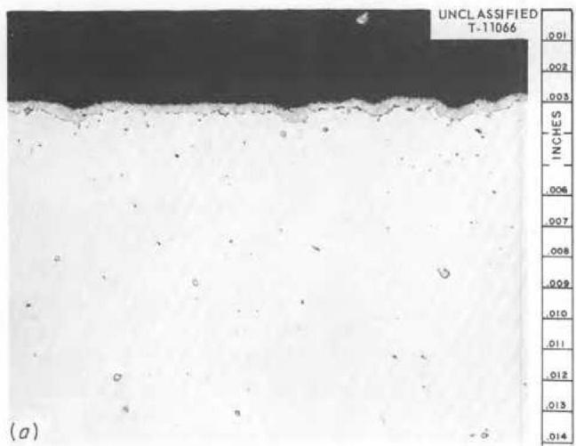

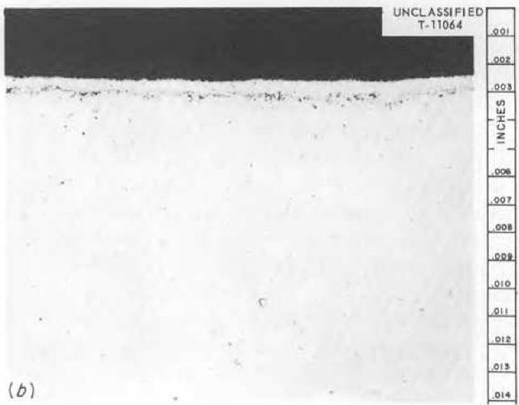  
Fig. 32. Deposits in Hot Legs of Loops with Zirconium Hydride Additions. (a) $0.8\% \mathrm{ZrH}_2$ ; (b) $2\% \mathrm{ZrH}_2$ (note slight increase in thickness). 250X. Reduced $29.5\%$ .

Table 26. Chemical Results from Loops in Which Mixtures Containing ${\mathrm{{ZrH}}}_{2}$ Were Circulated   

<table><tr><td rowspan="2">Loop No.</td><td rowspan="2">ZrH2Added (%)</td><td colspan="2">Uranium (%)</td><td colspan="2">Nickel (ppm)</td><td colspan="2">Chromium (ppm)</td><td colspan="2">Iron (ppm)</td></tr><tr><td>Before</td><td>After</td><td>Before</td><td>After</td><td>Before</td><td>After</td><td>Before</td><td>After</td></tr><tr><td>248</td><td>0.6</td><td>8.0</td><td>9.0</td><td>1590</td><td>&lt;20</td><td>40</td><td>350</td><td>710</td><td>100</td></tr><tr><td>308</td><td>0.5</td><td>8.9</td><td>8.7</td><td>&lt;20</td><td>&lt;20</td><td>30</td><td>100</td><td>55</td><td>40</td></tr><tr><td>413</td><td>0.2</td><td>8.6</td><td>8.9</td><td>&lt;10</td><td>&lt;10</td><td>170</td><td>200</td><td>150</td><td>45</td></tr><tr><td>414</td><td>0.2</td><td>8.5</td><td>8.7</td><td>&lt;10</td><td>&lt;10</td><td>130</td><td>250</td><td>85</td><td>50</td></tr><tr><td>469</td><td>0</td><td>8.5</td><td>8.9</td><td>25</td><td>10</td><td>90</td><td>700</td><td>55</td><td>70</td></tr><tr><td>459</td><td>0.2</td><td>8.6</td><td>8.6</td><td>40</td><td>&lt;10</td><td>75</td><td>200</td><td>90</td><td>70</td></tr><tr><td>470</td><td>0.5</td><td>7.5</td><td>7.0</td><td>10</td><td>40</td><td>30</td><td>90</td><td>50</td><td>70</td></tr><tr><td>460</td><td>0.9</td><td>5.4</td><td>5.1</td><td>35</td><td>&lt;10</td><td>20</td><td>35</td><td>65</td><td>60</td></tr><tr><td>471</td><td>2.0</td><td>4.0</td><td>4.1</td><td>&lt;10</td><td>15</td><td>60</td><td>45</td><td>55</td><td>45</td></tr><tr><td>800</td><td>0</td><td>8.6</td><td>8.5</td><td>20</td><td>40</td><td>105</td><td>850</td><td>30</td><td>90</td></tr><tr><td>787</td><td>0.4</td><td>8.8</td><td>8.5</td><td>15</td><td>30</td><td>85</td><td>110</td><td>95</td><td>45</td></tr><tr><td>788</td><td>0.5</td><td>9.3</td><td>7.5</td><td>3</td><td>270</td><td>15</td><td>65</td><td>50</td><td>85</td></tr><tr><td>789</td><td>0.6</td><td>8.3</td><td>6.6</td><td>15</td><td>&lt;1</td><td>35</td><td>60</td><td>75</td><td>65</td></tr><tr><td>790</td><td>0.7</td><td>6.6</td><td>6.2</td><td>40</td><td>15</td><td>25</td><td>90</td><td>30</td><td>85</td></tr><tr><td>791</td><td>0.8</td><td>6.5</td><td>6.3</td><td>70</td><td>&lt;1</td><td>35</td><td>65</td><td>75</td><td>90</td></tr><tr><td>792</td><td>0.9</td><td>6.7</td><td>6.3</td><td>30</td><td>&lt;1</td><td>35</td><td>40</td><td>45</td><td>85</td></tr></table>

(Fig. 6). The actual depths are less in both cases, showing that some reduction in attack had occurred in the early stages. While the rate of mass transfer is the same, the chromium concentrations of the fluorides are much less with the additions. This low value did not increase in the 1000 hr of operation even with the mass transfer.

While zirconium hydride will reduce the depth of attack, it does not reduce the rate of mass transfer. Unless the compositions are controlled very closely, uranium will be lost from the system both before and during operation. If such a system were to be used, the deposits in both legs would have to be studied in detail.

After it was found that the formation of $\mathsf{UF}_3$ was responsible for the reduction of attack with zirconium hydride additions, work was started on batches with a portion of the uranium present as $\mathsf{UF}_3$ . The program consisted of both corrosion loops and a study of solubilities and equilibriums in such systems.

The most striking feature of this study was the inability to obtain reproducibility in the results.

Difficulty was encountered in making batches containing known and predetermined amounts of $\mathsf{UF}_3$ and in developing a suitable method of analyzing such mixtures.

The hot-leg attack was replaced by thin deposits in the first three loops, which circulated batches made under carefully controlled conditions in the laboratory (Table 27). Two of these loops operated for 500 hr and the other for 2000. These loops all operated with low total uranium concentrations and therefore high $\mathsf{UF}_3$ to $\mathsf{UF}_4$ ratios. The hot-leg layer in the 2000-hr loop was identified as zirconium by the microspark spectrographic procedure. To show the layers were formed during operation and not during cooling, a loop was drained after 500 hr of operation and while still at temperature. This loop also showed no attack and the presence of a zirconium layer.

The solubility of $\mathsf{UF}_3$ in the zirconium fluoride-base mixtures is not sufficient to provide the concentration necessary for reactor operation; therefore it would be necessary to use mixtures

Table 27. Corrosion Data from Loops with Zirconium Fluoride-Base Mixtures Containing UF ${}_{3}$   

<table><tr><td rowspan="3">Loop No.</td><td rowspan="3">EE Batch No.</td><td rowspan="3">Time (hr)</td><td colspan="2">Metallographic Examination</td><td colspan="9">Analysis of Fluoride Mixture</td><td></td></tr><tr><td rowspan="2">Hot Leg</td><td rowspan="2">Cold Leg</td><td colspan="2">Nickel (ppm)</td><td colspan="2">Chromium (ppm)</td><td colspan="2">Iron (ppm)</td><td colspan="2">Uranium (%)</td><td>\( U^{+ + } \)(%)</td><td></td></tr><tr><td>Before</td><td>After</td><td>Before</td><td>After</td><td>Before</td><td>After</td><td>Before</td><td>After</td><td>Before After</td><td></td></tr><tr><td>438</td><td>Lab</td><td>500</td><td>Deposit</td><td></td><td>10</td><td>10</td><td>10</td><td>30</td><td>95</td><td>60</td><td>2.79</td><td>3.0</td><td>a</td><td></td></tr><tr><td>443</td><td>159</td><td>500</td><td>0.4-mil deposit</td><td>Intermittent deposit</td><td>20</td><td>10</td><td>20</td><td>40</td><td>75</td><td>60</td><td>5.8</td><td>5.3</td><td>1.5</td><td></td></tr><tr><td>457</td><td>F-2</td><td>2000</td><td>Layer,\( ^b \)0.5- mil; rough; no attack</td><td></td><td>10</td><td>5</td><td>10</td><td>80</td><td>120</td><td>75</td><td>2.8</td><td>2.6</td><td>1.6</td><td></td></tr><tr><td>473</td><td>F-4</td><td>500</td><td>Moderate, 5 mils</td><td>Occasional crystals</td><td>10</td><td>20</td><td>30</td><td>125</td><td>40</td><td>45</td><td>8.7</td><td>8.3</td><td>1.2</td><td></td></tr><tr><td>488</td><td>B-85</td><td>2000</td><td>Moderate, 7 mils</td><td>Thin deposit</td><td>15</td><td>10</td><td>60</td><td>\( 90^c \)</td><td>40</td><td>60</td><td>8.7</td><td>8.8</td><td></td><td>2.0</td></tr><tr><td>491</td><td>F-5</td><td>500</td><td>Heavy, 7 mils</td><td>Deposit</td><td>30</td><td>20</td><td>70</td><td>180</td><td>30</td><td>50</td><td>12.8</td><td>13.2</td><td>2.5</td><td></td></tr><tr><td>492</td><td>F-5</td><td>2000</td><td>Heavy, 15 mils</td><td>1-mil deposit</td><td>10</td><td>10</td><td>35</td><td>250</td><td>40</td><td>40</td><td>14.2</td><td>13.2</td><td>1.8</td><td>0.7-2.8</td></tr><tr><td>\( 503^d \)</td><td>B-89</td><td>500</td><td>\( Deposit^b \)</td><td>No deposit</td><td>40</td><td>15</td><td>30</td><td>35</td><td>80</td><td>60</td><td>2.4</td><td>2.5</td><td>2.2</td><td>1.0</td></tr><tr><td>508</td><td>207</td><td>500</td><td>No attack</td><td>0.5-mil deposit</td><td>10</td><td>c</td><td>260</td><td>60</td><td>50</td><td>\( 100^c \)</td><td>10.4</td><td>9.7</td><td>4.3</td><td>0.6-3.3</td></tr><tr><td>627</td><td>426RF</td><td>1000</td><td>Heavy, 8 mils</td><td>1-mil deposit</td><td>15</td><td>20</td><td>50</td><td>200</td><td>40</td><td>40</td><td>9.0</td><td>8.9</td><td>1.2</td><td>0.4</td></tr><tr><td>628</td><td>427RF</td><td>1000</td><td>Heavy, 10 mils</td><td>Thin Cr deposit</td><td>10</td><td>20</td><td>45</td><td>225</td><td>35</td><td>100</td><td>8.7</td><td>8.7</td><td>0.8</td><td>0.2</td></tr><tr><td>633</td><td>420RF</td><td>500</td><td>Heavy, 10 mils</td><td>Intermittent deposit</td><td>25</td><td>20</td><td>100</td><td>575</td><td>65</td><td>35</td><td>11.8</td><td>11.4</td><td>1.4</td><td>0.7</td></tr><tr><td>634</td><td>422RF</td><td>500</td><td>Heavy, 8 mils</td><td>Deposit</td><td>35</td><td>20</td><td>65</td><td>300</td><td>40</td><td>60</td><td>8.8</td><td>8.7</td><td>1.3</td><td>0.5-1.4</td></tr><tr><td>635</td><td>424RF</td><td>1000</td><td>Moderate, 7 mils</td><td>Thin deposit</td><td>60</td><td>20</td><td>100</td><td>200</td><td>80</td><td>50</td><td>8.9</td><td>9.7</td><td>2.0</td><td>0.4-1.2</td></tr><tr><td>636</td><td>430RF</td><td>\( 1371^e \)</td><td>Moderate, 9 mils</td><td>No deposit</td><td>15</td><td>20</td><td>40</td><td>250</td><td>80</td><td>50</td><td>8.4</td><td>9.1</td><td>0.6</td><td>0.3</td></tr><tr><td>683</td><td>423RF</td><td>500</td><td>Moderate, 7 mils</td><td>Rough; no deposit</td><td>25</td><td>1-45</td><td>140</td><td>225</td><td>25</td><td>40</td><td>9.0</td><td>8.4</td><td>1.4</td><td>0.6-1.0</td></tr><tr><td>690</td><td>432RF</td><td>1000</td><td>Heavy, 10 mils</td><td>1-mil attack; no deposit</td><td>40</td><td>20</td><td>190</td><td>275</td><td>40</td><td>40</td><td>7.7</td><td>8.3</td><td>1.3</td><td>0.4</td></tr><tr><td>781</td><td>371</td><td>500</td><td>Moderate, 9 mils</td><td>Deposit</td><td>7</td><td>40</td><td>75</td><td>700</td><td>40</td><td>55</td><td>9.5</td><td>9.6</td><td>0.1</td><td>0.1</td></tr><tr><td>782</td><td>372</td><td>500</td><td>Heavy, 9 mils</td><td>No deposit</td><td>10</td><td>25</td><td>75</td><td>390-525</td><td>50</td><td>85</td><td>9.8</td><td>10.2</td><td>0.3</td><td>0.1</td></tr><tr><td>784</td><td>373</td><td>500</td><td>Heavy, 7 mils</td><td>No deposit</td><td>20</td><td>25-185</td><td>60</td><td>200</td><td>45</td><td>70</td><td>10.7</td><td>11.2</td><td>1.5</td><td>0.4-1.0</td></tr><tr><td>785</td><td>372</td><td>1500</td><td>Moderate, 12 mils</td><td>Deposit</td><td>10</td><td>10</td><td>75</td><td>305-485</td><td>50</td><td>85</td><td>9.9</td><td>11.2</td><td>0.1</td><td>0.1-0.4</td></tr><tr><td>786</td><td>373</td><td>1500</td><td>Heavy, 9 mils</td><td>No deposit</td><td>35</td><td>20</td><td>60</td><td>200-600</td><td>40</td><td>95</td><td>10.6</td><td>9.6-11.6</td><td>1.1</td><td>0.4</td></tr></table>

aAll UF3.   
$b_{\text{Zirconium layer}}$   
cIndividual results varied.   
$d_{\text{Loop}}$ drained while hot.   
$e_{\text{Operation terminated because of power failure}}$

of $\mathsf{UF}_3$ and $\mathsf{UF}_4$ . The next group of loops (473-508 and 781-786 in Table 27) operated for varying times with mixtures containing various proportions of $\mathsf{UF}_3$ to $\mathsf{UF}_4$ and produced erratic results. The attack was reduced, but not eliminated, and the results were not consistent. Cold-leg deposits were found in almost all of these loops. The attack in the 2000-hr loop is much lower than would be found in an all- $\mathsf{UF}_4$ loop, but drawing any conclusion concerning mass transfer from these data would be dangerous. An actual reduction in mass transfer rate would, however, be partially confirmed by loop 457, which operated with an all- $\mathsf{UF}_3$ mixture.

The loops (627-690 in Table 27) operated with batches made in the production facility, and very little, if any, reduction in attack was found in these loops. Analyses of these batches have shown them to contain much less $\mathsf{UF}_3$ than had been predicted. With both these loops and those discussed above, the attack in most cases does not cause a large increase in the chromium concentration of the fluorides. Even small additions of $\mathsf{UF}_3$ must markedly lower the chromium solubility level. The attack must be predominantly from mass transfer.

No additional loops are being operated at this time with zirconium fluoride-base mixtures containing $\mathsf{UF}_3$ . What is causing the production difficulties and why it has not been possible to obtain corrosion results comparable with those obtained with the hydride addition, has not been explained. Both the production and the disproportionation problems would have to be overcome to allow the use of such mixtures.

# Alkali-Metal-Base Mixtures Containing Trivalent Uranium

While the solubility of $\mathsf{UF}_3$ in zirconium fluoride-base mixtures is limited, it is much higher in fluoride mixtures with an alkali-metal base. Such mixtures are also to be preferred from a physical property viewpoint, and so some work was done on the mechanism and rate of corrosion of Inconel by alkali-metal-base mixtures containing trivalent uranium.

Again, difficulty was encountered in obtaining reproducibility in the results and also with the analytical procedures. In the first series of supposedly identical loops, Nos. 499 to 528

(see Table 28), essentially no attack was found in two loops, while it was deep and heavy in the others. The reported $\mathsf{UF}_3$ values are well below the predicted values, but do not vary in a systematic manner with the attack.

After the production techniques had been improved, the remaining loops in Table 28 were operated and gave more consistent results. The maximum attack in these loops was to 2 mils and was from a batch with a low $\mathsf{UF}_3$ proportion. Hot-leg deposits to 1 mil in thickness were found in the loops with the slightly higher $\mathsf{UF}_3$ concentrations. Typical hot-leg sections from these loops are shown in Figs. 33 and 34. Definite identification of the layer has not been made, but metallographically it appears to be uranium. No hot-leg attack was found in any loops with a layer. Shallow attacks with no visible hot-leg deposits were found in the loops with $\mathsf{U}^{+ + + }$ concentrations of about $2\%$ Cold-leg deposits, which in one case were identified as chromium, were found in all these loops. Thus mass transfer is not eliminated by $\mathsf{U}^{+ + + }$ additions.

In the second group of loops, there is a tendency for large decreases in total uranium to accompany the high $\mathsf{UF}_3$ concentrations, but exceptions may be noted. The variations are larger than would be found with a mixture with all the uranium present as $\mathsf{UF}_4$ . With the batches having high concentrations of $\mathsf{UF}_3$ , the chromium content of the fluorides was low; however, with low $\mathsf{UF}_3$ concentrations high and erratic chromium values were found. The higher chromium levels were found in the cold legs. These mixtures also differed from the zirconium-base mixtures in that the nickel content of the fluorides after operation was higher.

From these data, it would appear that a thermal loop may be operated without a hot-leg deposit and with only shallow depths of attack if the $U^{++}$ content could be controlled at a concentration just above $2\%$ . To operate in this range will require closer production and analytical control than is now available. In such a system, additional study is necessary on disproportionation during long operating times and also on the cold-leg deposits. The attractiveness of this system would make such further studies appear to be worth while if production problems can be overcome.

Table 28. Corrosion Data from Alkali-Metal-Base Fluorides Containing UF ${}_{3}$   

<table><tr><td rowspan="3">Loop No.</td><td rowspan="3">EE Batch No.</td><td rowspan="3">Operating Time (hr)</td><td colspan="2">Metallographic Examination</td><td colspan="9">Analysis of Fluoride Mixture</td><td></td></tr><tr><td rowspan="2">Hot Leg</td><td rowspan="2">Cold Leg</td><td colspan="2">Nickel (ppm)</td><td colspan="2">Chromium (ppm)</td><td colspan="2">Iron (ppm)</td><td colspan="2">Uranium (ppm)</td><td>\( U^{+++} \)(%)</td><td></td></tr><tr><td>Before</td><td>After</td><td>Before</td><td>After</td><td>Before</td><td>After</td><td>Before</td><td>After</td><td>Before</td><td>After</td></tr><tr><td>499</td><td>271</td><td>500</td><td>Heavy attack, 13 mils</td><td>1 mil deposit</td><td>80</td><td>1-100</td><td>35</td><td>650</td><td>60</td><td>100</td><td>11.0</td><td>9.9</td><td>1.8</td><td>0.9-2.8</td></tr><tr><td>500</td><td>274</td><td>1000</td><td>Heavy attack, 13.5 mils</td><td>0.5 mil deposit</td><td>45</td><td>45</td><td>25</td><td>75-1175</td><td>70</td><td>75</td><td>11.0</td><td>10.5</td><td>1.5</td><td>0.7</td></tr><tr><td>504</td><td>302CS</td><td>500</td><td>Rough; intergranular attack, 2 mils</td><td>0.1 mil deposit</td><td>190</td><td>75</td><td>25</td><td>50-280</td><td>70</td><td>120</td><td>11.3</td><td>10.2</td><td>3.9</td><td>0.7</td></tr><tr><td>505</td><td>276RF</td><td>1000</td><td>Heavy attack, 13 mils</td><td>2.5 mils deposit</td><td>50</td><td>40</td><td>45</td><td>400</td><td>1</td><td>70</td><td>10.7</td><td>10.6</td><td>2.6</td><td>0.6</td></tr><tr><td>506</td><td>277</td><td>1000</td><td>Heavy attack, 8 mils</td><td>1 mil deposit</td><td>15</td><td>20</td><td>30</td><td>25-1880</td><td>65</td><td>100</td><td>11.6</td><td>11.3</td><td>0.7</td><td>0.5-2.6</td></tr><tr><td>507</td><td>272</td><td>500</td><td>Heavy attack, 11 mils</td><td>0.5 mil deposit</td><td>215</td><td>40</td><td>60</td><td>200</td><td>135</td><td>90</td><td>11.9</td><td>11.2*</td><td>2.4</td><td>0.6</td></tr><tr><td>509</td><td>208</td><td>500</td><td>Heavy attack, 2 mils</td><td>0.2 mil deposit</td><td>35</td><td>20</td><td>35</td><td>60</td><td>150</td><td>175*</td><td>6.9</td><td>7.1</td><td>0.7</td><td>0.5-3.5</td></tr><tr><td>511</td><td>284RF</td><td>500</td><td>Heavy attack, 13.5 mils</td><td>0.5 mil deposit</td><td>860</td><td>10</td><td>65</td><td>890-1100</td><td>115</td><td>60</td><td>11.4</td><td>11.1</td><td>1.2</td><td>0.7</td></tr><tr><td>528</td><td>189RF</td><td>2000</td><td>Very heavy attack, 25 mils</td><td>0.5 mil deposit</td><td></td><td>25-90</td><td></td><td>816-1450</td><td></td><td>90-265</td><td></td><td>11.0</td><td></td><td>0.9-1.7</td></tr><tr><td>589</td><td>405RF</td><td>500</td><td>Layer to 0.5 mil</td><td>Deposit</td><td>30</td><td>20</td><td>40</td><td>50</td><td>95</td><td>125</td><td>7.9</td><td>6.3-7.7</td><td>4.7</td><td>0.7</td></tr><tr><td>590</td><td>407RF</td><td>500</td><td>Heavy deposit</td><td>Deposit</td><td>75</td><td>40</td><td>55</td><td>55</td><td>125</td><td>50-160</td><td>10.8</td><td>9.8</td><td>7.7</td><td>1.1</td></tr><tr><td>591</td><td>225CS</td><td>500</td><td>Light attack, 2 mils</td><td>Thin deposit</td><td>65</td><td>100</td><td>60</td><td>25</td><td>140</td><td>75</td><td>11.5</td><td>11.5</td><td>1.7</td><td>0.7</td></tr><tr><td>592</td><td>321CS</td><td>1000</td><td>1 mil deposit</td><td>0.5 mil deposit</td><td>110</td><td>90</td><td>55</td><td>50</td><td>165</td><td>70</td><td>10.9</td><td>10.5</td><td>5.2</td><td>1.0</td></tr><tr><td>593</td><td>322CS</td><td>1000</td><td>1 mil deposit</td><td>0.5 mil deposit</td><td>45</td><td>85</td><td>75</td><td>15</td><td>80</td><td>80</td><td>13.8</td><td>10.0</td><td>5.6</td><td>0.9</td></tr><tr><td>594</td><td>412RF</td><td>1000</td><td>2 mils attack</td><td>0.3 mil deposit</td><td>60</td><td>100</td><td>115</td><td></td><td>70</td><td>70</td><td>12.6</td><td>10.7</td><td>2.0</td><td>0.7</td></tr><tr><td>595</td><td>319CS</td><td>500</td><td>1 mil deposit</td><td>0.5 mil deposit</td><td>30</td><td>65</td><td>35</td><td>20</td><td>75</td><td>130</td><td>11.0</td><td>10.0</td><td>5.3</td><td>1.3</td></tr><tr><td>596</td><td>320CS</td><td>500</td><td>1 mil deposit</td><td>0.5 mil deposit</td><td>110</td><td>115</td><td>40</td><td>15</td><td>130</td><td>130</td><td>10.7</td><td>10.6</td><td>5.8</td><td>1.4</td></tr><tr><td>625</td><td>323CS</td><td>500</td><td>0.5 mil deposit</td><td>0.3 mil deposit</td><td>60</td><td>5-105</td><td>40</td><td>35</td><td>140</td><td>80-195</td><td>13.2</td><td>12.6</td><td>2.9</td><td>0.9</td></tr><tr><td>626</td><td>328CS</td><td>500</td><td>Light attack, \( 1\frac{1}{2} \) mils</td><td>0.3 mil deposit (Cr)</td><td>10</td><td>100</td><td>40</td><td>35</td><td>120</td><td>85</td><td>11.2</td><td>11.2</td><td>1.5</td><td>0.9</td></tr><tr><td>708</td><td>461</td><td>1000</td><td>Moderate attack to 2 mils; intermittent layer</td><td>Deposit</td><td>1</td><td>120</td><td>25</td><td>50-160</td><td>60</td><td>80-665</td><td>12.0</td><td>11.7</td><td>0.7</td><td></td></tr><tr><td>793</td><td>496</td><td>500</td><td>Heavy attack, 2 mils</td><td>Thin deposit</td><td>155</td><td>20-165</td><td>20</td><td>20-200</td><td>150</td><td>70-885</td><td>12.9</td><td>12.5</td><td>0.9</td><td>0.2</td></tr></table>

*Average value; results varied.

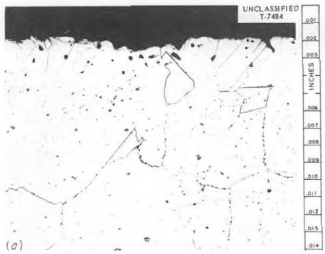

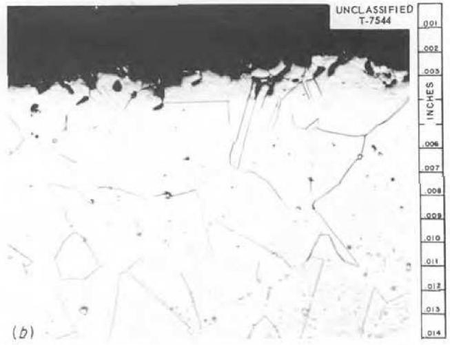  
Fig. 33. Typical Hot-Leg Sections from Loops Circulating Alkali-Metal Fluorides with Small Amounts of Trivalent Uranium. (a) $1.7\%$ $\mathsf{U}^{+ + + }$ , 500 hr at $1500^{\circ}\mathsf{F}$ ; (b) $2\%$ $\mathsf{U}^{+ + + }$ , 1000 hr at $1500^{\circ}\mathsf{F}$ . Reduced $29.5\%$ .

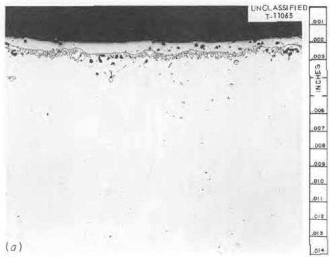

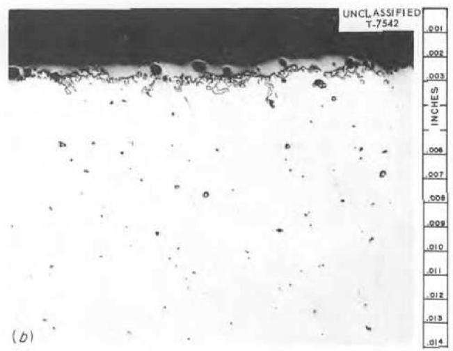  
Fig. 34. Typical Hot-Leg Sections from Loops Circulating Alkali-Metal Fluorides with Larger Amounts of Trivalent Uranium. (a) $5.3\%$ U++, 500 hr at $1500^{\circ}\mathrm{F}$ ; (b) $5.6\%$ U++, 1000 hr at $1500^{\circ}\mathrm{F}$ . Reduced $30\%$

# REACTIOns AND MECHANISMS

The mechanism for formation of the holes below the surface of the Inconel hot-leg wall and evidence that they are voids were presented in the previous report and so will only be summarized here.

1. Chromium is leached from the hot-leg surface by chemical action.   
2. Since the metal surface is depleted in chromium, a gradient is established and chromium diffuses to the surface from the areas underneath the surface.

3. Since nothing diffuses inward to replace the chromium, vacancies occur in the area below the surface.   
4. The vacancies collect in areas of discontinuity and weakness, such as the grain boundaries, and form the voids.   
5. The voids concentrate and grow in size with increasing time or temperature.

It was shown that with the zirconium fluoride-base mixtures, chromium is still the major ingredient leached from the wall. The holes have the same appearance and change in a similar

manner, and the same mechanism of hole formation is thought to apply. The fact that the holes grow and concentrate with time is additional evidence that they are voids. If they contained fluorides they would have to connect to the surface and have appreciable size; it does not appear possible for the fluorides to move through the metal and collect at a few larger sites; vacancies can move but not fluorides.

The study of the chemical reactions by which the chromium is removed from the hot-leg surface is still the object of a large effort by the ANP Chemistry Section. This Section studied the data from the thermal loops and also worked with laboratory experiments. A detailed and complete report on these reactions will be the responsibility of that Section. In this report, these reactions will be discussed only briefly and where they are indicated by the loop data. Some of the reactions discussed here were worked out in the chemical experiments.

With the relatively impure alkali-metal-base mixtures previously reported, a large portion of the attack found in the 500-hr tests was caused by the impurities. Analyses of the batches used for the loops described in this report, combined with the corrosion data when known additions were made, show that this is no longer true; only a small part of the attack may now be attributed to the known impurities.

In spite of the purity of the fluorides, the attack is still rapid at first and then continues at a slower rate. The chromium in solution also increases rapidly at first but then remains constant with increasing operating times. The second stage of the process, in which the attack continues but the chromium concentration in the fluorides remains constant, is the mass transfer phase of the attack. The first, rapid stage is caused by the system reaching equilibrium. Any reactions from impurities and the dissolving of enough chromium to reach equilibrium concentrations are thought to be the major contributors. The unexplained variations in depth of attack in a period of 500 hr point to additional, as yet unknown, reactions also occurring during this period.

The main reaction contributing to the mass transfer is

$$
2 U F _ {3} + C r F _ {2} = 2 U F _ {4} + C r
$$

The equilibrium concentrations for this reaction

are of the proper order and direction to cause mass transfer to occur. No evidence of a similar mass transfer reaction in fluoride mixtures with zirconium and uranium has been found. The equilibrium concentration of $\mathsf{CrF}_3$ in these mixtures is too low to be determined analytically; therefore mass transfer reactions involving this compound must be of very minor importance.

With the reaction shown above, the rate-controlling step in the process has not been determined. That it is not the diffusion of chromium through the wall to the loop surface is shown by the magnetic etching studies. The chromium gradient is steeper during the initial stages than it is during the mass transfer stages. After the rapid attack, the chromium diffuses to the surface faster than it is removed and thereby evens out the gradient somewhat. This would not be the case if the diffusion step was the rate-controlling step. The fact that the depth of attack was doubled when two batches were circulated in the same loop for 250 hr each is evidence that the chromium diffusion rate is not controlling even during the rapid initial attack. For mass transfer to continue, the chromium must diffuse into the cold-leg wall. The suggestion has been made that this step is controlling; however, no evidence of any chromium-rich layer on the cold-leg surfaces has been found in any long-time loops. Any chromium metal had always been found in the cold-leg trap, where it is essentially removed from the system. Tracer tests are now in progress to provide a better answer to this question.

The mass transfer reactions with the barren mixtures are not as well understood. They are the same type of reactions, since the hot-leg attack is similar but not as heavy, and chromium metal has also been found in the cold-leg traps of these loops. The most likely reactions are

$$
C r F _ {2} + 2 N a = 2 N a F + C r
$$

or

$$
3 C r F _ {2} = 2 C r F _ {3} + C r
$$

In either case, it would be an equilibrium reaction.

The addition of $\mathsf{UF}_3$ to these mixtures completely changes their reducing power and equilibrium concentrations. The chromium is not taken into solution as rapidly, and smaller amounts are left in the cold leg on each cycle.

# INTERNAL DISTRIBUTION

1. C. E. Center   
2. Biology Library   
3. Health Physics Library   
4. Metallurgy Library

5-7. Central Research Library

8. Reactor Experimental Engineering Library   
9. ORNL Y-12 Technical Library Document Reference Section

10-29. Laboratory Records Department

30. Laboratory Records, ORNL R.C.

31. L. B. Emlet (K-25)   
32. J. P. Murray (Y-12)   
33. G. M. Adamson, Jr.   
34. S.E.Beall   
35. R.J.Beaver   
36. M. Bender   
37. J. O. Betterton, Jr.   
38. D. S. Billington   
39. A. L. Boch   
40. E. G. Bohlmann   
41. B. S. Borie   
42. C. J. Borkowski   
43. G.E. Boyd   
44. R. B. Briggs   
45. J.V. Cathcart   
46. R. A. Charpie   
47. G.W. Clark   
48. R. E. Clausing   
49. R. S. Cockreham   
50. J. H. Coobs   
51. F. L. Culler   
52. J. E. Cunningham   
53. J. H. Devan   
54. D. A. Douglas, Jr.   
55. J. H. Frye, Jr.   
56. R. J. Gray   
57. W. R. Grimes   
58. J.P.Hammond   
59. W. O. Harms

60-64.M.R.Hill

65. E. E. Hoffman   
66. A. Hollgender   
67. A. S. Householder   
68. A. P. Huber (K-25)

69. H. Inouye   
70. W.H.Jordan   
71. C.P. Keim   
72. M. T. Kelly   
73. R. B. Korsmeyer   
74. J. A. Lane   
75. S. C. Lind   
76. R. S. Livingston   
77. T. S. Lundy   
78. H. G. MacPherson   
79. W. D. Manly   
80.R.W.McClung   
81. D. L. McElroy   
82.C.J.McHargue   
83. A. J. Miller   
84. E. C. Miller   
85. R. L. Moore   
86. K. Z. Morgan   
87. M. L. Nelson   
88. A. R. Olsen   
89. P. Patriarca   
90. D. Phillips   
91. M. L. Picklesimer   
92. P. M. Reyling   
93. R.C.Robertson   
94. A.W. Savolainen   
95. J. L. Scott   
96. H.E.Seagren   
97. E.D. Shipley   
98. O. Sisman   
99. M. J. Skinner   
100. G.M.Slaughter   
101. C. O. Smith   
102. G.P. Smith, Jr.   
103. A. H. Snell   
104. J. A. Swartout   
105. A. Taboada   
106. E. H. Taylor   
107. W.C. Thurber   
108. A. M. Weinberg   
109. J. R. Weir, Jr.   
110. G.C. Williams   
111. R. O. Williams   
112. C.E.Winters   
113. H. L. Yakel, Jr.

114. J. H. Koenig (consultant)

115. C. S. Smith (consultant)

116. R. Smoluchowski (consultant)

117. H. A. Wilhelm (consultant)

# EXTERNAL DISTRIBUTION

118. D. E. Baker, GE, Hanford   
119. N. Cabrera, University of Virginia   
120. D. F. Cope, Reactor Div., ORO   
121. J. F. Eckel, Virginia Polytechnic Institute   
122. J. F. Elliott, Massachusetts Institute of Technology   
123. Ersel Evans, GE, Hanford   
124. J. L. Gregg, Cornell University   
125. W. D. Jordan, University of Alabama   
126. O. C. Kopp, University of Tennessee   
127. J. Korringa, Ohio State University   
128. R. S. Mateer, University of Kentucky   
129. L. Mitchell, Georgia Institute of Technology   
130. J. W. Prados, University of Tennessee   
131. T. S. Shevlin, Ohio State University   
132. J. M. Simmons, DRD, AEC, Washington, D.C.   
133. E. E. Stansbury, University of Tennessee   
134. D. K. Stevens, Metallurgy and Materials Branch Division of Research, AEC, Washington, D.C.   
135. J. B. Wagner, Yale University   
136. Division of Research and Development, AEC, ORO   
137-616. Given distribution as shown in TID-4500 (15th ed.) under Metallurgy and Ceramics category