# DECLASSIFIED

CLAIISIPATION CHANGED TO: BY ATOHOTy OF: 26 2.62 Bt!

MARTIN MARIETTA ENERGY SYSTEMS LIBRARIES

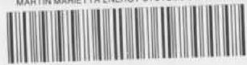

3445603505222

AIRCRAFT NUCLEAR PROPULSION PROJECT

QUARTERLY PROGRESS REPORT

FOR PERIOD ENDING JUNE 30, 1957

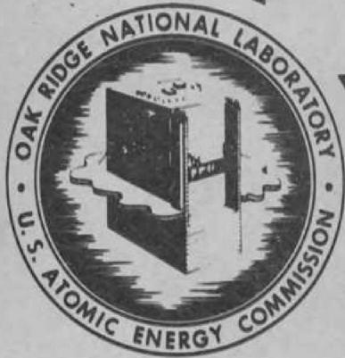

CENTRAL RESEARCH LIBRARY DOCUMENT COLLECTION

LIBRARY LOAN COPY

DO NOT TRANSFER TO ANOTHER PERSON

If you wish someone else to see this document, send in name with document and the library will arrange a loan.

OAK RIDGE NATIONAL LABORATORY

OPERATED BY

UNION CARBIDE NUCLEAR COMPANY

A Division of Union Carbide and Carbon Corporation

UCC

POST OFFICE BOX X • OAK RIDGE, TENNESSEE

RESTRICTED DATA

ORNL-2340, Parts 1-5

C-84 - Reactors-Special Features of Aircraft Reactors

This document consists of 368 pages.

Copy/27 of 255 copies. Series A.

Contract No. W-7405-eng-26

# AIRCRAFT NUCLEAR PROPULSION PROJECT

# QUARTERLY PROGRESS REPORT

For Period Ending June 30, 1957

W. H. Jordan, Director

S. J. Cromer, Co-Director

A. J. Miller, Assistant Director

DATE ISSUED

SEP 11 1957

OAK RIDGE NATIONAL LABORATORY

Operated by

UNION CARBIDE NUCLEAR COMPANY

A Division of Union Carbide and Carbon Corporation

Post Office Box X

Oak Ridge, Tennessee

Reports previously issued in this series are as follows:

ORNL-528 Period Ending November 30, 1949

ORNL-629 Period Ending February 28, 1950

ORNL-768 Period Ending May 31, 1950

ORNL-858 Period Ending August 31, 1950

ORNL-919 Period Ending December 10, 1950

ANP-60 Period Ending March 10, 1951

ANP-65 Period Ending June 10, 1951

ORNL-1154 Period Ending September 10/1951

ORNL-1170 Period Ending December 19, 1951

ORNL-1227 Period Ending March 10, 1952

ORNL-1294 Period Ending June 10/1952

ORNL-1375 Period Ending September 10, 1952

ORNL-1439 Period Ending December 10, 1952

ORNL-1515 Period Ending March 10, 1953

ORNL-1556 Period Ending June 10, 1953

ORNL-1609 Period Ending September 10, 1953

ORNL-1649 Period Ending December 10, 1953

ORNL-1692 Period Ending March 10, 1954

ORNL-1729 Period Ending June 10, 1954

ORNL-1771 Period Ending September 10, 1954

ORNL-1816 Period Ending December 10, 1954

ORNL-1864 Period Ending March 10, 1955

ORNL-1896 Period Ending June 10, 1955

ORNL-1947 Period Ending September 10, 1955

ORNL-2012 Period Ending December 10, 1955

ORNL-2061 Period Ending March 10, 1956

ORNL-2196 Period Ending June 10, 1956

ORNL-2557 Period Ending September 10, 1956

ORNL-2221 Period Ending December 31, 1956

ORNL-2274 Period Ending March 31, 1957

# INTERNAL DISTRIBUTION

1. R.G. Affel

2. C.J. Barton

3. M. Bender

4. D. S. Billington

5. F. F. Blankenship

6. E. P. Blizzard

7. C. J. Borkowski

8. W. F. Boudreau

9. G. E. Boyd

10. M. A. Bredig

11. E. J. Breeding

12. W. E. Browning

13. F. R. Bruce

14. A. D. Callihan

15. D. W. Cardwell

16. C. E. Center (K-25)

17. R. A. Charpie

18. R. L. Clark

19. C. E. Clifford

20. J. H. Coobs

21. W. B. Cottrell

22. S. J. Cromer

23. R. S. Crouse

24. F. L. Culler

25. D. R. Cuneo

26. J. H. Devan

27. L. M. Doney

28. D. A. Douglas

29. W. K. Eister

30. L. B. Emlet (K-25)

31. D. E. Ferguson

32. A. P. Fraas

33. J. H. Frye, Jr.

34. W. T. Furgersen

35. R. J. Gray

36. A. T. Greski

37. W. R. Grimes

38. A. G. Grundell

39. E.Gutty

40. C. S. Harrill

41. M. R. Hill

42. E. Hoffman

43. J.W. Hoffman

44. A: Hollander

45. A. S. Householder

46. J. T. Howe

47. W. H. Jordag

48. G.W. Keil, Jr.

49. C.P.Ks

50. F. L. Kuefer

51. M. T. Kelley

52. F. J. Kjertesz

53. J. Keyes

55. A. Lane

56. R. B. Lindauer

R. S. Livingston

8. R.N. Lyon

59. H. G. MacPherson

60. R. E. MacPherson

61. F. C. Maienschein

62. W. D. Manly

63. E. R. Mann

64. L. A. Mann

65. W. B. McDonald

66. J. R. McNally

67. F. R. McQuilkin

68. R. V. Meghreblian

69. R.P.Milford

70. A. J. Miller

71. R. E. Moore

72. J. G. Morgan

73. K. Z. Morgan

4. E. J. Murphy

J.P.Murray Y-12

76. M. L. Nelson

77. G.J. Nessle

78. R. D. Oliver

79. L. Overholser

30. P. Pararca

31. S. K. Parny

32. A.M.Peters

33. D. Phillips

34. J. C. Pigg

35. P. M. Reyling

36. A. E. Richt

37. M. T. Robinson

38. H. W. Savage

39. A. W. Savolainen

90. R. D. Schultheiss

91. D. Scott

92. J. L. Scott

93. E. D. Shipley

94. A. Simoi

95. O. Sisman

96. J. Sites

97. M. J. Skinner

98. A. H. Snell

99. C. D. Susano

100. J. A. Swartout

101. E. H. Taylor

102. R. E. Thoma

103. D. B. Trauger

104. D. K. Trubey

105. G. M. Watson

106. A. M. Weinberg

107. J. C. White

108. G. D. Whitman

109. E. P. Wigner (consultant)

110. G. C. Williams

111. J. C. Wilson

112. C. E. Winters

113. W. Zobel

114-116. ORNL - Y-12 Technical Library Document Reference Section

117-124. Laboratory Records Department

125. Laboratory Records, ORNL R.C.

126-128. Central Research Library

# EXTERNAL DISTRIBUTION

129. Aerojet-General Corporation

130-131. AFPR, Boeing, Seattle

132. AFPR, Boeing, Wichita

133. AFPR, Curtiss-Wright, Clifton

134. AFPR, Douglas, Long Beach

135-137. AFPR, Douglas, Santa Monica

138. AFPR, Lockheed, Burbank

139-140. AFPR, Lockheed, Marietta

141. AFPR, North American, Canoga Park

142. AFPR, North American, Downey

143. Air Materiel Command

144. Air Research and Development Command (RDGN)

145. Air Technical Intelligence Center

146-148. ANP Project Office, Convigir, Fort Worth

149. Albuquerque Operations Office

150. Argonne National Laboratory

151. Armed Forces Special Weapons Project, Sandia

152. Armed Forces Special Weapons Project, Washington

153. Assistant Secretary of the Air Force, R&D

154-159. Atomic Energy Commission, Washington

160. Atomics International

161. Battelle Memorial Institute

162-163. Bettis Plant (WAPD)

164. Bureau of Aeronautics

165. Bureau of Aeronautics General Representative

166. BAR, Glenn L. Martin, Baltimore

167. Bureau of Yards and Docks

168. Chicago Operations Office

169. Chicago Patent Group

170. Convair-General Dynamics Corporation

171. Curtiss-Wright Corporation

172. Engineer Research and Development Laboratories

173-176. General Electric Company (ANPD)

177. General Nuclear Engineering Corporation

178. Glenn L. Martin Company   
179. Hoxford Area Office

180-181. Headquarters, Air Force Special Weapons Center

182. Idaho Operations Office   
183. Knolls Atomic Power Laboratory   
184. Lockland Area Office   
185. Los Alamos Scientific Laboratory   
186. Marquardt Aircraft Company   
187. National Advisory Committee for Aeronautics, Cleveland   
188. National Advisory Committee for Aeronautics, Washington   
189. Naval Air Development Center   
190. Naval Air Material Center   
191. Naval Air Turbine Test Station   
192. Naval Research Laboratory   
193. New York Operations Office   
194. Nuclear Development Corporation of America   
195. Office of Naval Research   
196. Office of the Chief of Naval Operations (OP-361)   
197. Patent Branch, Washington   
198. Patterson-Moos

199-202. Pratt and Whitney Aircraft Division

203. San Francisco Operations Office   
204. Sandia Corporation   
205. School of Aviatice Medicine   
206. Sylvaniaa-Corpus Nuclear Corporation   
207. Technical Research Group   
208. USAF Headquarters   
209. USAF Project RAND   
210. U. S. Naval Radiological Defense Laboratory   
211. University of California Radiation Laboratory, Livermore

212-229. Wright Air Development Center (WCOSI-3)

230-254. Technical Information Service Extension, Oak Ridge   
25. Division of Research and Development, AEC, ORO

# FOREWORD

This quarterly progress report of the Aircraft Nuclear Propulsion Project at ORNL records the technical progress of the research on circulating-fuel reactors and other ANP research at the Laboratory under its Contract W-7405-eng-26. The report is divided into five major parts: 1. Aircraft Reactor Engineering, 2. Chemistry, 3. Metallurgy, 4. Radiation Damage, and 5. Reactor Shielding.

The ANP Project personnel are engaged in many phases of research directed toward the achievement of nuclear propulsion of aircraft. A considerable portion of this research is performed in support of the work of other organizations participating in the national ANP effort. However, the bulk of the ANP research at ORNL is directed toward the development of a circulating-fuel type of reactor.

The design, construction, and operation of the Aircraft Reactor Test (ART) are the current major objectives of the project. The ART is to be a power plant system that will include a 60-Mw circulating-fuel reflector-moderator reactor and adequate means for heat disposal. Operation of the system will be for the purpose of determining feasibility and for studying the problems associated with the design, construction, and operation of a high-power circulating-fuel reflector-moderated aircraft reactor system. Some advanced reactor design work is now under way.

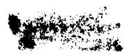

# CONTENTS

FOREWORD vii

SUMMARY XVII

# PART 1. AIRCRAFT REACTOR ENGINEERING

# 1.1. REACTOR AND FACILITY CONSTRUCTION 3

Heat Exchanger Procurement 3   
Sodium-to-NaK Heat Exchangers 3   
Fuel-to-NaK Heat Exchangers 3   
NaK-to-Air Radiators 4

Neutron Shielding Fabrication 4

Boron Carbide Tiles 4   
Stainless Steel Cans for Tiles 5   
Stainless-Steel-Clad Copper- $\mathsf{B}_4\mathsf{C}$ Cermet Plates 5

Fabrication of Shells and Containers 8

Evaluation of Fabrication Methods 8   
Hydrospinning Techniques 8   
Machined Weldments and Forgings 11   
Cold Drawing and Pressing Methods 13   
Containers 15

Development of Reactor Assembly Methods 15   
ETU Reactor Fabrication and Assembly 18

ETU Facility 19

NaK System 19   
Control Room 22   
Gas and Hydraulic Systems 22   
Electrical System 22   
General Construction Status 23

ART Component Design 23   
ARTFacility 23   
ART Disassembly 25

# 1.2. COMPONENT DEVELOPMENT AND TESTING 33

Pump Development Tests 33

Bearing, Seal, and Lubricant Tests 33   
Twin-Fuel-Pump Water Tests 33   
Fuel Pump High-Temperature Performance Tests 34   
Fuel Pump Endurance Tests 35   
Sodium Pump Development Water Tests 35   
Sodium Pump Endurance Tests 36   
Primary and Auxiliary NaK Pump Development 37

3 Reactor Component Development Tests 39

Heat Exchanger and Radiator Development Tests 39   
Valve Development Tests 41   
Sodium Circuit Water Flow Tests 45

Outer Core Shell Thermal Stability Tests 47   
Liquid-Metal-Vapor Condensers 47   
Zirconium Fluoride Vapor Traps 48

# 1.3. INSTRUMENT AND CONTROLS DEVELOPMENT 50

Fuel Expansion Tank Liquid-Level Indicator 50   
Liquid-Metal-Level Transducers 50   
On-Off Level Probes 51   
Magnetic Flowmeters 51   
Turbine Flowmeters for Use at High Temperatures 56   
Thermocouple Tests 56   
Control Rod Drive System Tests 58

# 1.4. ENGINEERING DESIGN STUDIES 63

Applied Mechanics and Stress Analysis 63   
Basic Problems in Elasticity 63   
Stress Analysis of Shell VI 63   
Experimental Analysis of Pressure Shell Dome 64   
Reflector Temperature Distribution 65   
High-Frequency Temperature-Oscillation Studies 69   
Sodium System Studies 70   
Cooling System for Equatorial Lead Shield 70

# 1.5. DESIGN PHYSICS 71

ART Shielding 71   
NaK Pipe Stubs 71   
Fuel Drain Line 72   
Fuel Overflow Line 72   
Vapor Trap on Fuel Fill-and-Drain Tank 72   
Shielding of an Aircraft Installation 73

# 1.6.INSPECTION OF MATERIALS AND COMPONENTS 74

Materials Inspection 74   
Weld Inspection 76   
78   
78   
Inspections with Metal Identification Meter 78   
Embrittlement of Inconel by Penetrants 80

# 1.7. HEAT TRANSFER STUDIES 81

ART Core Heat Transfer Analysis 81   
Thermal-Cycling Research 82   
Pressurized System 82   
Pulse-Pump System 84   
Thermal Oscillation Attenuation in Tubes 84

ART Hydrodynamics 88

Full-Scale ART Core Studies 88

Quarter-Scale Core Studies 91

Instantaneous Velocity Profile Measurements 93

Heat Exchangers and Radiators 94

ART Fuel-to-NaK Heat Exchanger Pressure Distribution 94

Delta-Array Heat Exchanger 96

Heat Transfer Studies of Finned Tubes 99

Fused Salt Heat Transfer 99

Heat Transfer Experiments 99

ART-Type Core with Screens 99

Vortex Tube 101

Liquid-Metal Volume-Heat-Source Experiment 102

Physical Properties 103

Enthalpy and Heat Capacity 103

Thermal Conductivity 104

1.8. ART, ETU, AND IN-PILE OPERATIONS 106

PARTOperation Planning. 106

ETU Operation Planning. 106

ART and ETU Disassembly Procedures. 107

In-Pile Experimentation 107

In-Pile Loops 107

In-Pile Test of Moderator Materials 108

1.9. ADVANCED REACTOR DESIGN 109

Reactor Configurations 109

112

In-Pile Tests of Moderator Materials 113

Temperature Structure in a Reactor Core with a Fuel-Cooled Moderator 114

# PART 2. CHEMISTRY

2.1. PHASE EQUILIBRIUM STUDIES 119

Phase Equilibrium Studies of the Systems NaF-ZrF4, NaF-UF4, UF4-ZrF4, and NaF-ZrF4-UF4 119

The System NaF-ZrF 4 119

The System NaF-UF 122

The System $\mathsf{UF}_4\cdot \mathsf{ZrF}_4$ 122

The System NaF-ZrF4-UF 122

The System NaF-RbF-BeF 2 126

Phase Equilibria in the Systems NaF-FeF2 and NaF-NiF2 128

Yttrium Fluoride Systems 128

2.2. CHEMICAL REACTIONS IN MOLTEN SALTS 131

Equilibrium Reduction of $\mathsf{NiF}_2$ by $H_{2}$ in NaF-ZrF 131

Solubility of Structural Metal Fluorides in NaF-ZrF4 (53-47 Mole %) at 700°C 131

Reduction of $\mathsf{FeF}_2$ by $\mathsf{Cr}^{\circ}$ in NaF-ZrF 4 132   
Reduction of $\mathsf{UF}_4$ by Structural Metals 133

Measurements of Solubilities of Fission-Product Fluorides in Molten NaF-ZrF4-UF4

Mixtures 135

Solubility of $\mathsf{BaF}_2$ in NaF-ZrF4-UF 135   
Evidence of a Low-Melting NaF-ZrF4-UF4-BaF2 Eutectic 135   
Solubilities of $\mathsf{CeF}_3$ and $\mathsf{SmF}_3$ in NaF-ZrF4-UF2 Obtained by Using Two Radiotracers Simultaneously 136   
Solubility of $\mathsf{YF}_2$ in NaF-ZrF-UF 137   
Solubility of CeF in NaF-ZrF-UF 137

Solubility Relationships of Rare-Earth-Fluoride Binary Mixtures in NaF-ZrF4-UF4 139

Solubility of Helium Gas in NaF-ZrF4 140

Solubility of HF in NaF-ZrF4 141

Efficiency of Liquid-to-Gas Mass Transfer of HF During Simple Helium Gas Stripping of Molten NaF-ZrF4 (53-47 Mole %) Saturated with HF 144

Heats of Fusion from Cryoscopic Measurements 147

EMF Measurements in Molten Salts 149

Daniell Cells with Nickel and Iron Electrodes 149   
EMF Measurements in the LiCl-AgCl-ThCl4 System 150

Electromigration in Molten Salts 151

Activity Coefficients of $\mathsf{UF}_4$ and $\mathsf{UF}_3$ in Fuel Mixtures 152   
Oxidation of Mixtures Composed of Sodium and Potassium 156

2.3. PHYSICAL PROPERTIES OF MOLTEN MATERIALS 158

Estimated Vapor Pressures of Fuel Mixtures 158   
Approximate Activity Coefficients of $\mathsf{ZrF}_4$ in the NaF-ZrF $^4$ System in the Temperature Range 600 to $900^{\circ}C$ 159   
Density of $\mathsf{UF}_4$ 160

2.4. PRODUCTION OF PURIFIED MIXTURES 164

Preparation of Various Fluorides 164

Preparation of $\mathsf{YF}_3$ 164   
Preparation of Other Materials 164

Pilot-Scale Purification Operations 164   
Production-Scale Operations 165   
Batching and Dispensing Operations 165   
Special Services 165

2.5. ANALYTICAL CHEMISTRY 166

Detection of Traces of NaK in Air 166   
Determination of Oxygen in Metallic Lithium 167   
Determination of Traces of Oxygen in Fluoride Salts and in Metals 167   
Determination of Aluminum in Mixtures of Fluoride Salts 168   
Spectrophotometric Determination of Nickel in Alkali Metals 168

Oxidation of Chromium with Argentic Oxide 169

Comparison of Two Methods for the Determination of Trace Amounts of Zirconium with Pyrocatechol Violet 169

Solvent Extraction of Zirconium from Acidic Solutions with Tri- $n$ -octylphosphine Oxide 169

Molten Ammonium Formate as a Solvent for Fluoride Salts 170

Compatibility of Lead and Aluminum in Water 171

Spectrophotometric Absorption Cells for Use with Small Volumes 171

Preparation of Tracer-Bearing Compounds 171

# PART 3. METALLURGY

# 3.1. NICKEL-MOLYBDENUM ALLOY DEVELOPMENT STUDIES 175

Material Fabrication 175

Evaluation of INOR-8 178

Oxidation Resistance Studies 176

Evaluation of Experimental INOR-9 Alloys 176

Fabrication of Seamless Tubing from Experimental Alloys 177

Processing of Battelle Memorial Institute Alloys 177

Phase Diagram Studies at the University of Tennessee 178

Aging Characteristics of Hastelloy W 179

Stress-Rupture Properties of Nickel-Molybdenum Base Alloys in a Fuel Environment 179

Welding and Brazing Studies of Nickel-Molybdenum Base Alloys 182

Weldability of the INOR Alloys 182

Brazability of the INOR Alloys 183

Tensile Properties of Hastelloy W Welds 184

Corrosion Studies 185

Thermal-Convection Loop Tests of Nickel-Molybdenum Base Alloys

Exposed to NaF-KF-LiF-UF 185

Thermal-Convection Loop Tests of Nickel-Molybdenum Base Alloys

Exposed to Sodium 187

Sodium in Hastelloy B Forced-Circulation Loops 188

# 3.2. DEVELOPMENTAL STUDIES OF INCONEL 190

Mechanical and Thermal Strain-Cycling Tests of Inconel 190

Effect of Cyclic Bending on Mechanical Properties of Inconel 204

Recrystallization and Grain Growth of Inconel 205

Effect of Brazing Cycle on Grain Growth in Inconel Tubes 214

Brazing Alloys for Inconel Joints 214

Corrosion of Inconel by Sodium 214

# 3.3.WELDING AND BRAZING STUDIES 223

Radiator Fabrication 223

Fabrication of ART Fuel Fill-and-Drain Tank 225

Apparatus for Bend Tests of Weldments 225

Salvage of Cut Radiator Fin Material 226

# 3.4. CORROSION AND MASS TRANSFER STUDIES 230

Corrosion Tests of Brazing Alloys 230

Corrosion of Fluorinator Vessel for Volatility Pilot Plant 231

Effect on Boron Carbide of Exposure to NaF-ZrF4-UF 234

Effect of Molten Sodium on Nitride, Boride, and Silicide Ceramics 234

Experimental Studies with Molten Lithium 235

Fundamental Mass Transfer Studies 236

Diffusion of Nickel in Liquid Lead 236

Solution Kinetics 237

# 3.5.MATERIALS FABRICATION RESEARCH 239

Shield Plugs for ART Pumps 239

Gamma-Ray Shielding 239

Thermal Shielding 239

Niobium Research 239

Recrystallization Studies 239

Consolidation of Pellets 240

Metal Hydrides for Use as Moderators in High-Temperature Reactors 240

Yttrium Metal Production 240

Physical Properties of Zirconium Hydride 241

Permeation of Hydrogen Through Metals 241

Tubular Control Rods 242

Fabrication of Molybdenum Tubing 242

# 3.6.METALLOGRAPHIC EXAMINATION OF HEAT EXCHANGERS, RADIATORS, AND OTHER COMPONENTS 244

Examination of NaK-to-Fuel Heat Exchangers After Service in a Test Stand 244

Tubing and Header Samples from Black, Sivalls & Bryson Test Unit Type IHE-8 244

Weld Samples from Black, Sivalls & Bryson Test Unit Type IHE-8 247

Brazed Joints from Black, Sivalls & Bryson Test Units Types IHE-3 and IHE-8 254

# 3.7. NONDESTRUCTIVE TESTING 256

Metal-Identification Meter 256

Eddy-Current Measurements of Metal Thickness 257

Ultrasonic Inspection 259

Tubing 259

Pipe 259

Plate 260

# PART 4. RADIATION DAMAGE

# 4.1. RADIATION DAMAGE 265

Examinations of Irradiated Components and Materials 265

MTR In-Pile Loop No. 6 265

ARE Specimens 266

Moderator Materials 267

Creep and Stress-Rupture Tests of Inconel 268   
MTR Experiments 268   
LITR Experiments 268

Effects of Radiation on Electronic Components 268   
Effect of Radiation on Thermal-Neutron Shield Materials 271

Estimates of Air-Borne Activity as a Result of Leakage of Fuel from a   
Circulating-Fuel Aircraft Reactor 271   
LITR Vertical In-Pile Loop 275   
Flux Monitoring of MTR Static Corrosion Capsules 278   
Analysis of Charcoal for ART Off-Gas Adsorber Bed 279   
Method for Analysis of ART Off-Gas 280   
Irradiation of Moderator Materials in the ETR 280

# PART 5. REACTOR SHIELDING

5.1. LID TANK SHIELDING FACILITY 285

Study of Advanced Shielding Materials 285

Effective Fast-Neutron Removal Cross Section of Hevimet 290

Studies of Neutron Cross Sections of Nitrogen and Oxygen, Neutron Age in

Water, and Neutron Scattering in Air - Subcontract 1069 292   
Nitrogen Neutron Cross Sections 292   
Oxygen Neutron Cross Sections 292   
Age of Fission Neutrons in Water 292   
Neutron Air-Scattering Calculations 293

5.2. BULK SHIELDING FACILITY 294

Analysis of the Fission-Product Gamma-Ray Spectra Experiment 294

Program for Shielding Measurements at the ART 295

A Calculation of the Gamma-Ray Spectrum of the Bulk Shielding Facility Reactor 296

Method of Calculation 296   
The Primary Sources of Gamma Radiation 296   
The Uncollided Flux 299   
The Compton-Scattered Flux 300   
Correction for the Thermal-Neutron Flux Shape 301   
Conclusion 301

Pulse-Height Analyzers for Gamma-Ray and Neutron Spectrometers 302

The BSF Model IV Gamma-Ray Spectrometer Housing and Positioner 303

Use of $\mathsf{Li}^6\mathsf{I}(\mathsf{Eu})$ as a Scintillation Detector and Spectrometer for Fast Neutrons 303

Scintillation Response of Lil(Eu) to Charged Particles 304   
Experimental Apparatus 304   
Neutron Spectra 305   
Gamma-Ray Response 309   
Conclusions 310

Pulsed-Neutron Method for the Determination of Neutron Diffusion

Parameters in Beryllium 311

A $\mathsf{UO}_2$ -Stainless Steel Shield Test Reactor for the BSF 312

Mechanical Control Plate Tests 312   
Nuclear Control Plate Test 318

Nuclear Control Experiments for the TSR-II 321

# 5.3. TOWER SHIELDING REACTOR-II 323

Fuel Element Development 323   
Cooling System Studies 323   
Control System Studies 323   
BSF Mockup Studies 326   
Development of the Control Device 328   
Proposed Design Revision 330

# ORGANIZATION CHARTS 331

# ANP PROJECT QUARTERLY PROGRESS REPORT

# SUMMARY

# PART 1. AIRCRAFT REACTOR ENGINEERING

# 1.1. Reactor and Facility Construction

Reactor and auxiliary components for the Engineering Test Unit (ETU) and the Aircraft Reactor Test (ART) are being fabricated by various manufacturers and by the ORNL and Y-12 shops. The problems involved in the fabrication of the sodium-to-NaK heat exchangers were resolved, and the two units required for the ETU were received from the Griscom-Russell Co. The units required for the ART will be delivered in July and August 1957. A workable program has been established for the production of the fuel-to-NaK heat exchangers that includes many time- and cost-saving procedures. Progress on the production of these units is now satisfactory.

Three prototype ART NaK-to-air radiators were received for testing, and tests of one of the units are now under way. It is expected that the ETU units will be available soon for installation.

The boron carbide tiles, for neutron shielding, are being produced by the Norton Company, and most of the pieces have been received. A total of 33 different shapes was specified, and in all cases the tiles have met the dimensional tolerances. The facilities for the production of the tiles are now being used in manufacturing the stainless steel cans for the tiles at the ERCO-Nuclear Division of American Car & Foundry Co. The required stainless-steel-clad copper- $B_4C$ cermet plates are also being fabricated by ERCO from cermet material fabricated by the Allegheny-Ludlum Steel Corp. The plates will be completed during July and August 1957.

Fabrication techniques for the production of the reactor shells were reviewed critically, and changes were made in the procurement program that are expected to increase the certainty of obtaining shells as they are needed in the reactor assembly sequence; these changes should decrease the overall costs. The review of the hydrospinning techniques revealed that production of the core shells has been unsatisfactory because of axial cracks in the equatorial region and in the reverse curve area. A preforming step (by Hydroform) and redistribution of the wall thickness reduction between

anneals during the final spinning stages are expected to solve the problem. The preforming step is to be included in the fabrication of all shells to be made by spinning. Suitable heat treating techniques for the intermediate spinning steps have been developed, and control of the grain structure has been accomplished.

Alternate processes for the production of shells are being investigated in an effort to reach an earlier completion date. Improvements in the quality of the Inconel stock and in welding techniques have renewed interest in machining of the shells from formed weldments. The resulting coarse grain size would be objectionable for the ART, but for the ETU the grain structure is relatively unimportant. The inner core shell for the ETU has been fabricated by machining, and the outer core and reflector shells are being made. Tooling for the forging for the pressure shell liner is being prepared, and the forgings for the pressure shell have been struck. Cold drawing and pressing methods are being investigated for the production of portions of the inner and outer neutron shield covers that cannot be formed by spinning.

Developmental work on reactor assembly methods was continued, with particular emphasis on weld shrinkage tests. The equatorial weld on the ETU inner core shell was made successfully.

A satisfactory furnace-brazing method was developed for joining heavy Inconel sleeves to thermocouple sheaths. Therefore it is now planned to weld the fitting containing the thermocouple at trepanned locations in the reactor structure. The actual assembly welds will thus be heavy, and repairs can be made without losing the thermocouple assembly.

With the delivery of the sodium-to-NaK heat exchangers, assembly work on the ETU north head was resumed. It is now estimated that the ETU north head will be complete in December 1957. Fabrication of the beryllium parts for the ETU has been completed, and orifice plugs for the cooling passages are now available.

Work on the ETU facility was reactivated, and installation of the furnace circuit main NaK piping is $75\%$ complete. Tests of hydraulic drive units for the reactor pumps indicated that the originally

proposed units would not meet the operating requirements, and therefore variable-frequency electric motor drives are to be used. The necessary equipment is to be available in October. Work is under way on the lube-oil, water, and helium systems. The emergency electrical system is $95\%$ complete, and the normal system is to be completed by a contractor by January 1, 1958. Present estimates indicate an ETU facility completion date of December 1, 1958, exclusive of the reactor and associated equipment.

Details of the layout of various components in the ART cell are being studied, and design work on the reactor shielding and its support is under way. Parts and subassemblies for the fuel enricher were completed. Minor construction work on the ART facility proceeded, and design work on the layout of piping and equipment continued.

The sequence of operations for disassembly of the ART was studied further, and several methods for cutting and measuring were investigated. A sealant-injection system was designed for sealing radioactive lines prior to removal of the reactor from the cell.

# 1.2. Component Development and Testing

High-speed tests of Alcoa 750-T5 aluminum-base-alloy journal bearings showed these units to be satisfactory for the anticipated reactor service. Therefore such journal bearings have been installed in all the reactor pumps that have been assembled.

The full-scale reactor pump rotary assembly which was adapted for a seal and lubricant irradiation test in the MTR gamma-irradiation test facility was completed and shipped to NRTS. Since Gulfcrest-34 is to be used as the lubricant in this test, the seals are brass-bellows mounted. If a subsequent test is necessary with Ucon-LB-140X as the lubricant, an all-stainless-steel bellows will be used.

The aluminum ART north-head mockup in which twin fuel pumps are installed was used for tests to determine whether there would be liquid carry-over into the off-gas system and, if so, under what conditions. The fill-and-drain tank and its vapor trap were also simulated in these tests for which water was used as the circulated fluid. No liquid carry-over could be detected when the liquid level in the expansion tank was $3\frac{1}{2}$ in. or more. When the level was reduced to $\frac{3}{4}$ in., droplets were carried to the vapor trap at a rate of 0.10 in. per day and to the fill-and-drain tank at a rate of 0.004

in.3 per day. Since the smallest carry-over of concern in the ART operation has been defined as 1 in.3 per day, the results indicate that fuel carry-over will not be a problem under normal ART operating conditions.

Performance and endurance testing of fuel pumps continued. No operating troubles have occurred. Similar tests of sodium pumps are under way. Modifications were made to the sodium pump test loops to more accurately mock up the openings between the pump centrifuge and the expansion tank. Examination of a sodium pump that had been in operation continuously for 2572 hr at 3600 rpm revealed that it had been operating in a region of cavitation.

High-temperature testing of the primary NaK pumps was continued. Based on the tests completed in this and the previous quarter it was concluded that the helium purge down the pump shaft could be eliminated. A test of a NaK pump was terminated after 4400 hr of operation with NaK at a maximum temperature of $1400^{\circ}\mathrm{F}$ and a minimum temperature of $1200^{\circ}\mathrm{F}$ because of failure of the oil seal. Means for improving the reliability of the seal are being studied. A second high-temperature NaK-pump test loop was placed in operation, and six electromagnetic flowmeters were calibrated for use in the ETU and ART. The performance of the pump in this loop indicates that impeller and volute passage dimensions can be controlled satisfactorily in the welding and machining processes used in the fabrication of these parts.

Heat exchanger and radiator development tests were continued. Operation of test stand SHE-C was terminated by a radiator failure. The radiator is being removed for examination. Operation of other heat exchanger test systems was continued.

The design of the ART fuel dump valve has been modified to assure proper alignment of the seat and plug to prevent valve stem binding. The stem guide nearest the plug has been removed, and a loose-fitting spiderlike guide has been installed in the valve seat housing to guide the plug. Further, a mechanical backup has been added for the brazed joint between the plug seating surface and the plug body. A second seal bellows was added to the valve stem to contain fuel and fission products in the event of failure of the first bellows, and internal passages of the valve are being modified to minimize holdup after a dump.

The NaK dump valve will be similar to the fuel dump valve, except that the mechanical backup for the plug braze and the backup bellows will not be required. A prototype NaK dump valve was found to be satisfactory in water tests. The first NaK-valve "in-line" operator was unsatisfactory, but the second one meets specifications and is to be tested soon.

A valve available from a vendor was selected for use as a throttling valve in NaK cold-trap and plug-indicator systems. The valve selected was designed for closure service, but modifications were made to obtain the desired throttling characteristics and to provide for remotely controlled pneumatic operation.

Water flow tests of the ART sodium circuit were continued. Improved flow distribution was obtained through modifications of the top of the beryllium reflector.

The thermal stability test of the outer core shell was terminated after the forty-third cycle because of a leak in the expansion bellows that joins the shell to the bottom piece of the apparatus. The shell was examined and no dimensional changes were found. The test will be resumed.

The vapor condenser designed for use in the NaK dump tank vent was found to be satisfactory, and the condenser designed for the NaK pump purge gas is being tested. In a test of a vapor condenser for the sodium pump purge gas, 650 hr of trouble-free operation has been accumulated. Tests of an experimental version of the ART $\mathsf{ZrF}_{4}^{*}$ vapor trap have indicated that the inlet will have to be redesigned to minimize thermal losses.

# 1.3. Instruments and Controls Development

Tests of the helium-bubbler type of liquid level indicator are being made in the fuel expansion tank of the aluminum north-head mockup. It has been found that this level-measuring system responds very well at all pump speeds to the addition and removal of water from the expansion tank. Accurate metering tests are planned to determine the accuracy of the measuring system in detecting these changes. In a scheduled 3000-hr test with fuel at $1500^{\circ}\mathrm{F}$ in the dynamic-level test rig, the bubbler tubes plugged with $\mathrm{ZrO}_2$ after about 2000 hr. Possible sources of the contamination were leaky bellows in the fuel and gas lines, which were discovered after the test rig was shut down.

Metallurgical examination of the liquid-metal-level transducers tested in NaK systems indicated that the failures were the result of defective welds. Preliminary tests of modified units have indicated that the operating characteristics of these units are satisfactory for reactor service.

Twenty-two resistance-type on-off level probes are operating in NaK pump test loops, and all but two have given satisfactory service. In the two units that failed, copper wire apparently oxidized and came loose at the weld joint. It is expected that this trouble can be eliminated by coating or plating the wire with a suitable high-conductivity oxidation-resistant material.

The 2- and $3\frac{1}{2}$ -in. magnetic flowmeters for the ETU and ART main, auxiliary, and special NaK circuits are being tested and calibrated in NaK pump test loops. Three types of calibration runs are made on the flowmeters - constant temperature tests, constant flow tests, and magnetic air-gap flux density tests. With the use of an experimentally determined sensitivity, the flow readings obtained with the magnetic flowmeter agree with those of a venturi to better than $1\%$ .

Two redesigned 1-in. turbine flowmeters have been fabricated that incorporate larger bearings and closer bearing clearances than those used previously. These units are to be tested in a NaK pump test loop.

Tests of Inconel-sheathed thermocouples were continued. Bending tests on Inconel-sheathed Chromel-Alumel material in a traveling-gradient furnace indicated that bending produced negligible effects. Annealing of the sheath material, however, tended to reduce the response to gradients. Tests also indicated that brazing Inconel sleeves to the Inconel sheaths had practically no effect on the thermocouple wires.

A test of the ART control rod drive mechanism was initiated to determine the over-all reliability of the system, the suitability of the porous ceramic poison rod material in the stagnant-sodium-filled thimble, and the effectiveness of the sodium-surface cooling jacket in preventing sodium deposition in the drive mechanism. High-temperature automatic rod cycling is now under way.

# 1.4. Engineering Design Studies

The program of basic studies for determining the elastic properties of the various special shapes

associated with the shell structure of the ART and the various tube-to-shell connections has been extended to a more general treatment of tube connections and of conical shells and circular flat plates with variable thickness. Many of the complex shell shapes in the reactor can be represented as composite structures derived from these more elementary configurations.

An analytical investigation of shell VI, the pressure shell liner, is being made to determine the integrity of this structure under both thermal and pressure loads. Although the results of this study will be the solution of specific shell problems, general routines and techniques are being prepared for analyzing any thin-walled shell configuration.

An experimental stress analysis was made of the support region of the north head of the pressure shell. The method of attaching the fuel pump stubs to the shell of the mockup does not duplicate the ART design, and therefore an exact model of that region will be studied. A correlation of the data will permit an accurate evaluation of the ART design.

Calculations are under way in order to determine the steady-state temperature distribution throughout the beryllium reflector during full power operation. The results will be used to determine the proper flow distribution of the sodium coolant and to calculate thermal stresses in the beryllium.

A series of calculations was made to determine the ratio of the amplitude of temperature oscillation at the surface of a circular cavity (in an infinite medium) to the amplitude of the temperature oscillation of the fluid in the cavity. It was found that, in comparison with the case of slab geometry, the effects of the cylindrical surface were important. The surface amplitudes were smaller when the radius of the cavity was less than one characteristic length. For a radius greater than a few characteristic lengths, the infinite slab gives a reasonable approximation.

A recalculation of the heat load of the sodium system of the ART indicated an increase from 6.20 Mw to 7.02 Mw, and therefore the flow rate of each pump must be increased from 440 to 500 gpm. The island cooling hole flow distribution was determined, and the orifice sizes were specified.

Final calculations of the cooling system for the equatorial lead shield of the ART were made.

# 1.5. Design Physics

Shielding criteria for the ART were established, and designs for various components of the ART are being prepared. It has been found that, for most components containing fuel, the radiations from La140 control the shielding thickness and that the required shielding thicknesses vary slowly with time after shutdown. Shields for components in the region around the lower end of the reactor and for the fill-and-drain tank were designed for periods of more than 9 days after shutdown.

As a result of the shielding studies, the NaK pipe stubs are to be shortened from $5 \frac{1}{2}$ in. to $2 \frac{1}{2}$ in. to reduce the trapped fuel volume and thus reduce the required shielding. Calculations have indicated that 5 in. of lead shielding will be required around the fuel drain lines and valves. In order to shield the fuel overflow line as close to the source as possible, a crescent-shaped piece of lead 3 in. thick at the center and 16 in. wide will be placed within the water shield and against its inner shell. The vapor traps on the fuel fill-and-drain tank were found to require 2 in. of lead.

Much of this shielding is related to particular requirements and design features of the ART and would not necessarily be required in an airplane. The experience gained with the ART shielding should be very helpful in arriving at design modifications which will minimize the need for heavy, patch shielding.

# 1.6. Inspection of Materials and Components

Materials for the construction of the ETU, ART, and test components were inspected with the intended use as the criterion for acceptability. All material rejected during the quarter was either down-graded for noncritical applications or was used in experimental equipment in order to minimize losses. It was found that magnetic particles could be successfully removed from CX-900A Inconel tubing by pickling with a $10\%$ solution of phosphoric acid. If metallographic examination confirms the apparent lack of corrosive attack, the pickling method will be adopted for the removal of magnetic particles.

An investigation of the high rate of rejection of welds being made in ETU NaK piping resulted in a change from helium to argon as the purging gas. Although argon is more expensive than helium, a much shorter purging time, less total

volume, less gas loss, and a lower rejection rate were indicated.

Standards were established for the acceptance of tube-to-header welds on the basis of radiography of accessible welds. Inspection procedures established for the inspection of spun core shells include metallographic inspection of samples cut from trim areas and nondestructive testing for material integrity. Four inner core shells fabricated by forming, welding, and machining plate were inspected. The plate material and surface were acceptable, but the weld areas were unsatisfactory. Improvements were made by changing the joint design and decreasing the weld rod size.

A portable eddy-current type of instrument is now being used for the identification of Inconel material. Cracks found in the cooling jacket welds of a control rod mechanism raised a question as to the composition of the material used, and a check with the Metal-Identification Meter revealed that a 300 series stainless steel, rather than Inconel, had been used.

# 1.7. Heat Transfer Studies

An approximate analysis was made of the heat transfer in the ART core by using a model which allowed both radial and axial variation of the heat source term. The result showed a sodium-coolant heat load $20\%$ greater than that predicted by previous analyses.

The effect of grain size on the strength and corrosion characteristics of Inconel in a fluoride environment was studied in pressurized-system thermal-cycling experiments. The grain size did not appear to have an effect on the depth of penetration, but there was an indication that in fine-grained tubes there was a tendency toward intergranular attack. A summary of the presently available data from this thermal-cycling study indicates that for exposures of less than $20\mathrm{hr}$ , the attack rate is greater for thermally cycled specimens than it is for specimens not cycled. For exposures of more than $20\mathrm{hr}$ the isothermal and high-frequency curves are roughly parallel, and thus equal attack rates are indicated that are perhaps related to the chromium concentration in the melt. Further, it appears that cycling frequency has little effect. Data are being obtained on prestressed and bent tubes.

A water calibration of the pulse-pump thermal-cycling loop was obtained that showed good agreement with the expression derived in a mathematical analysis that related the axial and radial attenuations suffered by a sinusoidal temperature oscillation in turbulently flowing fluid.

Hydrodynamic studies of the sources of the velocity instabilities in the ART core were continued in both full-scale and quarter-scale experiments. A hot-wire surface element was developed for use in obtaining the magnitude of the velocity fluctuations at the core walls. The results of recent tests verify earlier experiments which indicated that the fluctuations reach a maximum in the upper half of the core. A cooled thermal probe was designed to provide a measurement of surface temperature fluctuations in a metallic wall. Experiments with various inlet configurations, guide vanes, baffles, etc., were continued in an effort to modify the velocity structure in the ART core, but no significant improvements were obtained. An analysis was initiated of the pressure variation in two typical inlet headers to establish the magnitude of the source of circumferential asymmetries and cross flow in the core inlet region.

The photographic recording of velocity profiles by using the phosphorescent-particle technique was continued. Distortion of the profiles by superimposed natural convection was noted even at a Reynolds modulus of 10,000.

A preliminary experimental study was made of the magnitude of the transverse pressure forces on the walls between adjacent channels of the ART fuel-to-NaK heat exchangers both with and without a connecting gap between adjacent channels and the housing. The results of these tests were inadequate, and the test system is being redesigned. In a qualitative sense, however, there were indications that the gap equalized the pressures on opposite sides of the channel walls.

Additional heat transfer and fluid friction experiments were made with the delta-array heat exchanger in the very low laminar regime. The effects of natural convection were clearly evident, with heat transfer reduced and pressure drop increased for downward flow through the heat exchanger. Conversely, the heat transfer was increased and the pressure drop reduced for upward flow.

A modified pressurized fused-salt heat transfer system was calibrated with $\mathrm{NaNO}_2\cdot \mathrm{NaNO}_3\cdot \mathrm{KNO}_3$ (40-7-53 wt $\%$ ); the data agree with the standard correlations. Further data were obtained with the fuel mixture NaF-KF-LiF-UF $^4$ 11.2-41-45.3-2.5 mole $\%$ ) in a small forced-circulation system. The modification of the half-scale volume-heat-source core model to study the effect of core screens on the thermal fluctuations is nearing completion. Some preliminary data were obtained on heat transfer with source-vortex flow in a vortex tube. Solutions were obtained for forced-convection heat transfer in insulated pipes containing flowing fluids with internal heat sources for the liquid-metal range.

The enthalpies and heat capacities of NaF-KF-LiF-UF4 (11.2-41-45.3-2.5 mole %) and LiCl-CaCl2(62-38 mole %) were determined in the liquid and solid states. Thermal-conductivity measurements made by using the variable-gap method yielded values of between 0.33 and 0.4 Btu/hr.ft $\cdot^{\circ}F$ for the mixture $\mathrm{NaNO}_2\cdot \mathrm{NaNO}_3\cdot \mathrm{KNO}_3$ (40-7-53 wt %) and 0.8 Btu/hr.ft $\cdot^{\circ}F$ for the eutectic mixture of LiCl and KCl.

# 1.8. ART, ETU, and In-Pile Operation

A study of the time required to complete the ART experimental program was made. It is estimated that $2\frac{1}{2}$ months will be required for shakedown tests prior to filling the system with NaK and that completion of the planned operation of the reactor system will require $4\frac{1}{2}$ months from the time the NaK system is filled.

Further studies of the ART off-gas system design and operation were made. It was determined that $10\%$ more coke charcoal than coconut charcoal would be required, and therefore the less-expensive coke charcoal will be used in the off-gas system adsorber beds.

Evaluation studies of ETU operation planning were continued, and it was found that the specifications for leak tightness of components and systems external to the reactor could be relaxed. Also, heater-sheath thermocouples were eliminated on all but a few special heaters.

A survey was made of the specific examinations to be performed during the disassembly of the ETU and the results that would constitute an acceptable basis on which to proceed with the assembly of the ART. The study has indicated the advisability of flushing the ART fuel system

with a water-soluble salt after operation to remove residual fuel. Tests to demonstrate this procedure are to be made.

The causes of a number of the difficulties that occurred during operation of in-pile loop No. 6 have been established by examination of the dis-assembled loop in a hot cell. The lower heat exchanger Calrod heater was found to have melted through its sheath; the nose purge-gas sniffer line had broken near the weld joining it to the heat exchanger outlet end; and salt had accumulated around the pump shaft in the region between the sump and the bearing housing. The copper rotor and the shaft were badly scored.

A second in-pile test of moderator materials was completed, and the capsules have been returned to ORNL for examination. The samples included beryllium oxide encased in Inconel, graphite encased in nickel, and zirconium hydride encased in molybdenum.

# 1.9. Advanced Reactor Design

Studies of reactor cores with fuel-cooled moderators were continued, and two new layouts were prepared. One of the new cores would permit some superheating of the fuel in an annulus between a central moderated island and an outer core region. The moderator would be in the form of rods closely stacked in an equilateral lattice, and the rod diameter would be varied from one region to another to effect variations in the volumes of fuel and moderator. A boron curtain would surround the core region, and outside it would be a closely stacked array of rods which would consist of about 5 vol % fuel, with the balance being moderator, structure, and $B_4C$ . This region, which has been designated the "heat exchanger shield," would isolate the core from the heat exchanger and inhibit activation of the secondary coolant. The U-tube exchanger surrounding this array would consist of approximately 12 tube bundles. The tubes would be as nearly straight as possible.

The fuel pump impellers would be inverted from the position they occupy in the ART to provide the most direct flow passage from the heat exchanger to the core. Three fuel pumps would be installed to provide a capacity of about 300 Mw.

The second layout was an attempt to incorporate a fuel-cooled moderator in a modification of the ART. The same fuel pumps, heat exchanger, outer pressure shell, control rods, and island base could

be used. The addition of a third fuel pump might increase the reactor output to about 100 Mw.

No internal welds would be required in this system, except those for canning the poison and the moderator. The welded assemblies would be small, and leak tightness could be more readily assured than in the more complex ART.

A study was made of the effects of various key parameters on the temperature drop within the moderator rods. Heating effects in the volume-heat-source boundary layer of the fuel channel were included. These parametric charts will be useful in evaluating design proposals and in establishing the desirable proportions for the rod diameters in various regions, as well as the fuel passage sizes.

Various types of compact heat exchangers are being studied. The study is based on experience with the ART heat exchanger design problems. A list of conditions which must be satisfied in the design has been prepared, and a series of different geometries has been delineated which may satisfy the conditions.

A preliminary design for an apparatus for in-pile testing in the ETR of moderator materials suitable for use in the 1500 to $2000^{\circ}\mathrm{F}$ range was prepared.

# PART 2. CHEMISTRY

# 2.1. Phase Equilibrium Studies

Phase equilibrium studies of the system NaF-ZrF $_4$ -UF $_4$ and the associated binary systems were completed. The diagrams presented are revisions and refinements of the incomplete studies reported previously.

A tentative diagram of the low-BeF $_2$ -content part of the system NaF-RbF-BeF $_2$ is presented. The ternary compound described previously as 2NaF·RbF·BeF $_2$ has been located in the vicinity of the composition corresponding to 2NaF·4RbF·3BeF $_2$ and is now tentatively considered to have this formula.

In an effort to elucidate the corrosion process as it relates to structural metal corrosion products in fused salts, studies are being made of the phase equilibria in the systems NaF-CrF $_2$ , NaF-FeF $_2$ , and NaF-NiF $_2$ . Tentative diagrams are presented for the systems NaF-FeF $_2$ and NaF-NiF $_2$ .

Interest in the possibility of obtaining oxygen-free yttrium metal by lithium reduction of purified fluoride mixtures prompted a study of the $\mathsf{YF}_3$ -MgF $_2$ , LiF-MgF $_2$ -YF $_3$ , YF $_3$ -ZnF $_2$ , and LiF-ZnF $_2$ -YF $_3$ systems. The preliminary data obtained with

one mixture in each of the systems show that liquidus and solidus temperatures in the binary systems are too high to permit purification in conventional equipment but that the addition of a moderate amount of LiF lowers the liquidus temperatures to workable levels.

# 2.2. Chemical Reactions in Molten Salts

Investigation of the equilibrium reduction of $\mathsf{NiF}_2$ by $\mathsf{H}_2$ in the reaction medium NaF-ZrF4 at $575^{\circ}C$ was continued. It was observed that $K_{x}$ is independent of the nickel fluoride concentration studied (150 to 570 ppm) and that $K_{x}$ can be extrapolated to infinite dilution.

Additional studies were made of the solubility and stability of the structural metal fluorides in NaF-ZrF $_4$ (53-47 mole %) at $700^{\circ}\mathrm{C}$ . In particular, a study was made of the effect on the solubility of the individual fluorides when mixtures containing $\mathsf{CrF}_2$ , $\mathsf{FeF}_2$ , and $\mathsf{NiF}_2$ in the ratio present in 18-8 stainless steels are added to the solvent. The tests indicated that complete solubility of $\mathsf{NiF}_2$ can be achieved only at relatively low concentrations of all three structural metal fluorides in this type of mixture.

A study of the reduction of $\mathsf{FeF}_2$ by $\mathsf{Cr}^{\circ}$ in NaF $\mathsf{ZrF}_4$ (53-47 mole %) at $600^{\circ}\mathsf{C}$ was made in an attempt to determine the concentration equilibrium constant for the reaction

$$
F e F _ {2} + C r ^ {\circ} \rightleftharpoons C r F _ {2} + F e ^ {\circ}
$$

The equilibrium iron concentrations obtained were too low, however, to permit any accurate evaluation of an equilibrium constant.

Additional studies were made of the reduction of $\mathsf{UF}_4$ by structural metals at 600 and $800^{\circ}\mathrm{C}$ in the reaction medium RbF-ZrF $_4$ (52-48 mole %), and the results have been compared with the values obtained for other reaction mediums in the alkali fluoride binary systems. The comparison unexpectedly revealed that the iron concentrations are nearly constant in the various reaction mediums. The data for the $\mathsf{Cr}^{\circ}$ - $\mathsf{UF}_4$ system, on the other hand, show the expected effect of change in cation radius on the $\mathsf{UF}_4$ activity, as measured by the chromium concentrations; a similar effect was expected for the $\mathsf{Fe}^{\circ}$ - $\mathsf{UF}_4$ system.

Radiochemical tracer techniques were used for further investigation of the solubilities of fission-product fluorides singly and in pairs in molten NaF-ZrF4-UF4 (50-46-4 mole %). With additions of

up to 26 wt $\%$ Ba, it was found that $\mathsf{BaF}_2$ was completely soluble over the 560 to $850^{\circ}C$ temperature range. The addition of about 14 wt $\%$ $\mathsf{CeF}_3$ did not affect the $\mathsf{BaF}_2$ solubility. Evidence of a low-melting $\mathsf{NaF - ZrF_4 - UF_4 - BaF_2}$ eutectic was found. Data were also obtained on the solubility of mixed $\mathsf{CeF}_3$ and $\mathsf{SmF}_3$ in NaF-ZrF-UF, and studies of the solubility of YF alone and YF in the presence of SmF in this reaction medium were initiated. A study of the solubility relationships of rare-earth fluoride binary mixtures in NaF-ZrF-UF has indicated that for CeF-SmF3 mixtures in NaF $\mathsf{ZrF}_4$ -UF the behavior is ideal and predictable.

The results of an experimental investigation of the solubility of helium gas in $\mathsf{NaF - ZrF_4}$ (53-47 mole %) show that the solubility follows Henry's law, that it increases with increasing temperature, and that its numerical values are similar to those obtained for helium in $\mathsf{NaF - ZrF_4 - UF_4}$ (50-46-4 mole %). An experimental determination of the solubility of HF in $\mathsf{NaF - ZrF_4}$ (53-47 mole %) was also made, and the results showed that the solubility of HF followed Henry's law and that it decreased with increasing temperature. A negative heat of solution was found, which indicates that the process of solution of HF in this solvent is exothermic.

Since the extent of completion of a number of chemical reactions involved in the purification of fluoride mixtures is judged by the HF concentration in the effluent gas, it was of interest to correlate the true solubility values with those obtained from the determination of rates of simple stripping of HF with helium from an HF-saturated solvent. Apparent Henry's law constants for the solubility of HF in $\mathrm{NaF - ZrF_4}$ (53-47 mole %), as calculated from stripping rates, were used in conjunction with the experimentally determined Henry's law constants to obtain values for the relative approach to equilibrium. It was found that the relative approach to equilibrium of the simple stripping process varied from 17% at $600^{\circ}C$ to 23% at $800^{\circ}C$ .

The relationship between the heat of fusion of a salt and its freezing point in a binary mixture of salts is being studied. It appears from preliminary measurements that heats of fusion can be calculated from experimentally determined freezing points in systems where solid solubility is unlikely.

Further emf measurements were made in Daniell cells with nickel and iron electrodes and the solvents NaF-ZrF $_4$ (53-47 mole %) and KF-LiF

(50-50 mole $\%$ ). The results obtained, when combined with those obtained previously, gave an average $\mathsf{NiF}_2$ -to- $\mathsf{FeF}_2$ activity coefficient ratio of 600 for the $\mathsf{NaF - ZrF}_4$ solvent and 200 for the KF-LiF solvent. A study of the system LiCl-ThCl $_4$ -AgCl is being planned in order to better comprehend and resolve the effects of solvents of varying acidity on the activity of a solute. The activity of a dilute AgCl melt of approximately constant concentration as a function of the ThCl $_4$ composition will be determined directly from cell measurements. Such measurements are impossible to make electrochemically in fluorides because of the present unavailability of a reversible fluorine electrode.

Electromigration has been considered as a method of separating lithium in a spent fuel from fission-product poisons, and therefore measurements were made of systems containing rare-earth chlorides in lithium chloride. Experiments with $\mathsf{Ni}^{+ + }$ $U^{+ + + }$ and $\mathsf{Ce}^{+ + + }$ in molten LiCl showed that these ions could be separated quite effectively from lithium in a fused chloride melt. For separation from a fused fluoride melt, however, the practical difficulties of finding a suitable insulating vessel and suitable electrodes make the process unattractive.

The ratio of cation charge to ion radius has been suggested as a measure of the relative acidity of fluoride melts and as a basis for correlating negative deviations from ideality in fuel mixtures in order to predict corrosion behavior. As an example of an approximate correlation based on this principle, a method of estimating the activity coefficients of $\mathsf{UF}_4$ and $\mathsf{UF}_3$ in fuel mixtures was derived.

Studies of the oxidation of sodium and potassium mixtures under carefully controlled conditions have been initiated in an attempt to determine the effect of certain variables on the final composition of the mixed oxides. The variables under consideration are (1) the original composition of the sodium-potassium mixture, (2) the temperature of oxidation, and (3) the temperature and time of equilibration following the oxidation.

# 2.3. Physical Properties of Molten Materials

Vapor pressures have been measured over a sufficient variety of molten fluoride mixtures to provide a basis for estimating vapor pressures for a number of unmeasured compositions. Estimated values for the vapor pressures of $\mathsf{ZrF}_4$ -base fuels have been compiled. Experiments are being made to provide information on $\mathsf{BeF}_2$ -base fuels.

Approximate activity coefficients of $\mathsf{ZrF}_4$ in the NaF-ZrF $^4$ system in the temperature range of 600 to $900^{\circ}\mathrm{C},$ assembled previously, have been correlated in a convenient graphical form. The method used to graphically summarize the change in activity of $\mathsf{ZrF}_4$ with composition was to plot all the values and then to draw a smooth curve through the averages for all temperatures at each composition. In this way an average curve for $750^{\circ}\mathrm{C}$ was obtained.

An investigation of the density of molten $\mathsf{UF}_4$ is under way. Calculations were made, based on preliminary data, that tended to confirm the previously observed apparent decrease in volume upon melting.

# 2.4. Production of Purified Mixtures

Additional $\mathsf{YF}_3$ was prepared to meet the continuing demands of yttrium hydride investigations. The purified LiF and $\mathsf{MgF}_2$ required in the modified reduction process for the preparation of yttrium metal were also produced.

Several fluoride compounds were prepared for research studies, including $\mathsf{LaF}_3$ , $\mathsf{CrF}_2$ , $\mathsf{FeF}_2$ , $\mathsf{NiF}_2$ , and $\mathsf{CoF}_2$ . Also 50 g of $\mathsf{Li}^7\mathsf{F}$ -NaF-KF (46.5-11.5-42 mole %) was prepared by using $\mathsf{Li}_2^7\mathsf{CO}_3$ as the source material.

The pilot-scale purification facilities were used for the processing of 44 batches totaling about $650\mathrm{kg}$ of various fluoride compositions. Ten pounds of $\mathsf{HfCl}_4$ (low zirconium) was successfully converted to $\mathsf{HfF}_4$ in a small experimental conversion unit.

Satisfactory inventories for fiscal year 1958 were achieved by the end of June, and operation of the production-scale facility was discontinued.

# 2.5. Analytical Chemistry

Several modifications were made in the apparatus for the detection of submicrogram quantities of NaK in air. With the incorporation of these refinements in the instrument, the limit of detection of sodium was lowered to 60 ppb. Because of the higher decomposition pressure of potassium oxide, it is thought that measurement of the absorbance of potassium rather than sodium may provide a more satisfactory method for the detection of NaK. The components required for adapting the equipment to the detection of potassium have been obtained.

The study of the butyl iodide method for the determination of oxygen in metallic lithium was

continued. The apparatus in which the metallic sample is dissolved was modified in order to reduce contamination from moisture and oxygen. With the use of this modified equipment, concentrations of oxygen of 100 ppm were found in samples of metallic lithium.

Methods for the determination of traces of combined oxygen in fluoride salts and metals are being studied. It is proposed to liberate oxygen by fluorination of the fluoride or metal sample with $\mathsf{KBrF}_4$ in a special apparatus, which is now being constructed. The oxide will be released as oxygen and subsequently measured by determining its pressure with a differential manometer.

In the continuation of the modification and development of methods for the determination of contaminants in fluoride salts, a method was investigated for the determination of aluminum in which pyrocatechol violet is used as the chromogenic reagent. Aluminum forms a reddish-brown complex with pyrocatechol violet; the complex exhibits maximum absorbance at a wavelength of $582\mu \mathrm{m}$ , while the molar absorbance index at this wavelength is 65,000. The molar absorbance is linear with respect to concentration over a range of 0.04 to $0.4\mu \mathrm{g}$ of aluminum per milliliter of solution.

The development of a spectrophotometric method for the determination of trace quantities of nickel with 4-isopropyl-1,2-cyclohexanediodioxime was completed. Methods by which the interference of iron, cobalt, and copper can be eliminated were established. The coefficient of variation of the method is $5\%$ .

The study of the method for the determination of chromium with diphenylcarbazide in which chromium is oxidized with argentic oxide was completed. It was found that the coefficient of variation of the method for the determination of 20 to $80\mu \mathrm{g}$ of chromium is less than $2\%$ , which compares favorably with the coefficient of variation of $2\%$ obtained when the oxidation is carried out with perchloric acid.

Two methods for the determination of zirconium with pyrocatechol violet were compared. With the method of Flaschka and Farah, the molar absorbance index of the zirconium-pyrocatechol violet complex is 14,000 at a wavelength of $620\mu$ , while that of the complex formed by the method of Young, French, and White is 32,600 at $650\mu$ . The difference in sensitivity of the two methods results

from the presence or absence of EDTA and the adjustment of the hydrogen ion concentration of the test solution before or after the addition of the pyrocatechol violet. Either procedure can be altered to give essentially the same results as the other.

The investigation was continued of the applicability of tri- $n$ -octylphosphine oxide (TOPO) to the determination of various constituents of fluoride salts. It was found that zirconium can be isolated, separated, or concentrated efficiently and rapidly from acidic solutions by equilibration with TOPO. As much as $20\mathrm{mg}$ of zirconium can be extracted from $7\mathrm{M}$ concentrations of chloride with $0.5\mathrm{mmole}$ of TOPO, while $14\mathrm{mg}$ can be removed from $7\mathrm{M}$ nitrate solutions with the same quantity of TOPO.

The solubility of fluoride salts in molten ammonium formate was investigated. The mixture NaF $\mathsf{ZrF}_4$ -UF $_4$ is soluble in this solvent if a complexing agent is added to prevent reprecipitation of zirconium as the oxide. Yttrium fluoride is essentially insoluble in the melt; however, yttrium oxide is quite soluble. Ammonium formate was found to decompose with time and increasing temperature to formamide and formic acid.

Experiments were made to determine whether lead shielding could be added to a reactor shield tank constructed of aluminum and filled with water without the introduction of serious corrosion problems. Electrodes of lead and aluminum were connected through a microammeter in a cell filled with tap water. The current remained between 5 and $20\mu \mathrm{a}$ for a period of 100 hr. Since $20\mu \mathrm{a}$ corresponds to an average corrosion rate of less than 0.1 mil per 1000 hr, it is concluded that no serious corrosion will result from the additional lead shielding.

Absorption cells that have a 5-cm light path were fabricated from Teflon for use in spectrophotometric measurements when only small volumes of solution are available. The volume of a cell is just over $4\mathrm{ml}$ . The cells can be used in the standard cell carrier of a Beckman spectrophotometer.

Batches of $\mathsf{Ce}_2\mathsf{O}_3$ which contained $\mathsf{Ce}^{141}$ were prepared by precipitating cerium hydroxide and igniting the hydroxide to $\mathsf{Ce}_2\mathsf{O}_3$ .

# PART 3. METALLURGY

# 3.1. Nickel-Molybdenum Alloy Development Studies

Work was continued on the program for developing nickel-molybdenum alloy structural materials that will have better strength and corrosion properties than those of Inconel when in contact with fused salt fuels at temperatures higher than $1500^{\circ}\mathrm{F}$ . A 5200-lb pilot heat of INOR-8 was melted and forged by the Westinghouse Electric Corporation, and a 10,000-lb heat was similarly prepared by the Haynes Stellar Company. The initial reports on the casting and forging of these two heats were favorable. Material is not yet available from the Haynes Stellar heat, but studies have been made of material from the Westinghouse heat.

Chemical analyses showed the composition of the Westinghouse heat to be within the specified limits, except for carbon, which was to have been between 0.04 and $0.08\%$ and was found to be $0.14\%$ . A sound billet from the initial heat was successfully worked by extrusion and by hot and cold rolling. Specimens were prepared for the determination of creep-rupture properties, tensile strengths, density, thermal expansion, and thermal conductivity.

Investigations are under way of the effect of varying composition on the mechanical properties of alloys of the INOR-8 type. A preliminary comparison of the times required to produce the specified elongation (1, 5, and $10\%$ ) at $1500^{\circ}\mathrm{F}$ in argon of several INOR-8 compositions indicate that (1) all the materials tested are superior to Inconel, (2) increasing the molybdenum content is the most effective means of improving the creep properties, (3) increasing the chromium content from 5 to $7\%$ without changing the molybdenum and iron contents produces only a slight improvement in the creep properties, and (4) there is no obvious correlation of the rupture life of the material with the total content of alloying elements in the nickel base.

The nickel-molybdenum base alloys were tested for oxidation resistance at 1600 and $1800^{\circ}\mathrm{F}$ . The results were similar to those obtained in tests at $1500^{\circ}\mathrm{F}$ , and thus it appears that a chromium content of about $7\%$ is adequate for oxidation resistance at temperatures up to $1800^{\circ}\mathrm{F}$ .

Evaluation studies of alloys of the Ni-Mo-Nb-Fe system (INOR-9) were continued. The study of the forgeability showed alloys in this system to be amenable to hot and cold rolling if they contain no more than $7.5\%$ niobium. Oxidation rates for these alloys at $1500^{\circ}\mathrm{F}$ and at $1700^{\circ}\mathrm{F}$ were slightly higher than those of Hastelloy B.

Seamless tubing drawn by the Superior Tube Company from experimental nickel-molybdenum base alloys prepared at ORNL has been received for corrosion evaluation. Three thermal-convection loops have been fabricated, and the fabrication of forced-circulation loops is planned. Two forced-circulation loops are being fabricated of tubing from two alloys prepared at Battelle Memorial Institute. The fuel mixture NaF-KF-LiF-UF $_4$ (11.2-41-45.3-2.5 mole %, fuel 107) will be circulated in all these loops.

A new method was developed for preparing ingots for phase diagram studies in order to assure homogeneity. The metal is melted under hydrogen and chill-cast under a partial vacuum. Prior to casting, the molten metal is superheated by about $300^{\circ}\mathrm{F}$ to ensure a completely homogeneous melt.

The room-temperature and high-temperature (1200 to $1500^{\circ}\mathrm{F}$ ) tensile properties of a commercial heat of Hastelloy W sheet were determined after aging at several temperatures for periods of up to 1000 hr. The response of this alloy to aging time is most pronounced in the interval up to 300 hr.

Stress-rupture screening tests of the nickel-molybdenum base alloys under a constant load at $1500^{\circ}\mathrm{F}$ in a fuel mixture environment were continued. Tests of specimens from a 4800-lb air-melted heat prepared by the International Nickel Company indicated that the melts were insufficiently degassed. Specimens from the Westinghouse heat of INOR-8 had shorter times to rupture than were expected on the basis of previous tests of experimental heats. Similar tests at $1800^{\circ}\mathrm{F}$ again indicated that vacuum-melted alloys are superior to air-melted alloys. Based on results obtained thus far, the degree of control necessary for the production of commercial-size heats with adequate high-temperature strength has not yet been attained.

Test plates of the INOR alloys were welded by using filler metal of the same composition as that of the base metal. No base metal cracks occurred, but some of the welds were unsatisfactory because of cracks in the weld metal. Coupons were prepared for hardness and microstructural studies.

Since brazability will be an important factor in the use of the INOR alloys, flowability tests were conducted with Coast Metals brazing alloy No. 52 in a dry-hydrogen atmosphere. Flowability was satisfactory except on alloys containing $1\%$ or more aluminum.

Thermal-convection loop tests of nickel-molybdenum base alloy exposed to fuel 107 have shown that the least amounts of corrosion products were found in the fuel mixtures circulated in the loops which showed good corrosion resistance to the fuel, in particular, the loops constructed of alloys which contained niobium and titanium. An increase in the operating time from 500 to 1000 hr caused a significant increase in the aluminum concentration of the fuel circulated in the loops constructed of alloys containing aluminum.

Similar tests were run in which the alloys were exposed to sodium. The results were similar for all loops. A few scattered metallic deposits were found in the lowest temperature region of each loop, and the maximum hot-leg attack found in any loop was approximately 2 mils in depth.

# 3.2. Developmental Studies of Inconel

Mechanical strain-cycling tests of Inconel were continued. Tests of fine- and coarse-grained rod specimens at $1300^{\circ}\mathrm{F}$ and at $1600^{\circ}\mathrm{F}$ in argon were completed. At $1600^{\circ}\mathrm{F}$ the coarse-grained material failed in fewer cycles than did the fine-grained material, but at $1300^{\circ}\mathrm{F}$ the effect of the grain size was negligible. Similar tests of tubular specimens appeared to show that the tubular specimens failed in fewer cycles than did the rod specimens, but the difference has been attributed to the method of sensing failure. The effects of grain size of the tubing were similar to the effects of of grain size of the rod.

Attempts to explore (at the University of Alabama) the effect of thermally induced strain have been hampered by instrumentation difficulties. The results of preliminary tests, however, indicate close agreement with the data obtained at ORNL under isothermal conditions.

At Rensselaer Polytechnic Institute, controlled-resistance-heating equipment was used to conduct thermal strain cycling tests that simulated the ART operating conditions. No evidence of cracking or failure of either of two coarse-grained specimens was found.

The effect of cyclic stresses imposed on a statically loaded system is being studied at Battelle Memorial Institute. It is the aim of this program to define the conditions of stress under which fatigue is the controlling mechanism for failure and the conditions under which creep determines service life.

Bend tests designed to simulate the thermally induced strain patterns that will be imposed, on the core shells and heat exchanger tubes of the ART are being run in order to evaluate the effect of cyclic stress conditions. The results of tests in which the specimens were exposed to NaF-ZrF $_4$ -UF $_4$ (50-46-4 mole $\%,$ fuel 30) showed little effect of environment at $1200^{\circ}\mathrm{F}$ , and even at 1400 and $1600^{\circ}\mathrm{F}$ the effect of the corrosive environment was significant only after relatively long test periods.

The effects of various fabrication procedures and thermal treatments on the microstructure of Inconel are being studied. It has been found that recrystallization may occur at a temperature as low as $1200^{\circ}\mathrm{F}$ in $80\%$ cold reduced material and at a temperature as high as $1800^{\circ}\mathrm{F}$ in $5\%$ cold reduced material, that the recrystallization temperature for any specific amount of cold work can be lowered by from 50 to $100^{\circ}\mathrm{F}$ by increasing the time at temperature from 15 to $120\mathrm{min}$ , and that the recrystallization temperature for coarse-grained Inconel is about $100^{\circ}\mathrm{F}$ higher than that for fine-grained Inconel cold reduced a comparable amount. The microstructures that result when the material is initially coarse grained appear to be different from those of fine-grained material. It appears to be somewhat difficult to achieve a homogeneous fine-grained structure, especially with regard to carbide distribution, when the material is initially coarse grained.

Studies of the effect of the brazing cycle on grain growth in Inconel tubes were made under simulated radiator and heat exchanger fabrication conditions. As a result of these and related tests the maximum brazing temperature permissible during the brazing of high-conductivity-fin radiators was raised from 1905 to $1950^{\circ}\mathrm{F}$ .

An Inconel forced-circulation loop was operated with sodium at a maximum temperature of $1250^{\circ}\mathrm{F}$ but with a mass flow rate of 605 lb/ft²·sec rather than the conventional 132 lb/ft²·sec. Under the conventional condition, mass-transferred material is normally not found, but in this loop there were

very light deposits in the cooled section. The results of this test indicate therefore that mass transfer may occur in an Inconel-sodium system even at relatively low temperatures if the mass flow rate is high.

# 3.3. Welding and Brazing Studies

An experimental brazing program was carried out in cooperation with York Corp. personnel. As a result of this study, improved methods were developed for brazing NaK-to-air radiators for the ART.

An improved procedure for brazing the ART fuel fill-and-drain tank header was developed. In order to obtain complete filleting a trepanned sump is machined around each tube hole, and three small feeder holes are drilled around the circumference to provide a connection from the sump to the tube-to-header joint.

An apparatus was constructed for high-temperature bend tests of weldments. Because of the simplicity of the specimen and the economy of material, this apparatus may be useful in initial screening tests of new materials.

Tests were run to determine whether copper oxidation during service and the resultant changes in heat transfer and air-flow characteristics would prohibit the use of stainless-steel-clad copper radiator fins with unprotected edges. Design changes made 24,000 ft of fin material obsolete; however, the obsolete material could be salvaged if it were cut into smaller sizes and if it could be used with the cut edges unprotected. Methods of treating the exposed edges were also studied. However, the tests revealed that, since the cut edges will be parallel to the air flow and they will be on the downstream ends of the fins, there will be no need for edge protection.

# 3.4. Corrosion and Mass Transfer Studies

Seven new brazing alloys, with nickel contents ranging from 72 to 93 wt $\%$ were corrosion tested at $1500^{\circ}\mathrm{F}$ for 100 hr in NaK and in NaF-ZrF $_4$ -UF $_4$ (53.5-40-6.5 mole $\%$ , fuel 44). Only two of the seven alloys, Handy & Harmon Hi-temp Nos. 91 and 93, which were chromium-free and had low boron contents, showed good corrosion resistance to both mediums. An iron-base brazing alloy (86% Fe-5% Si-5% Cu-4% B) that was tested under the same conditions also showed good corrosion resistance to both mediums.

Corrosion tests are being made of the fluorinator vessel to be used in the fluoride volatility process for reprocessing reactor fuels. Preliminary tests have indicated severe intergranular attack of the low-carbon nickel material of the vessel at the bath level.

A specimen of $\mathsf{B}_4\mathsf{C}$ was exposed to static NaF $\mathsf{ZrF}_4$ - $\mathsf{UF}_4$ (53.5-40-6.5 mole $\%$ fuel 44) at $1500^{\circ}\mathsf{F}$ for 100 hr, and the quantity of boron found in the fuel indicated that the specimen had lost $30\%$ in weight. Metallographic examination showed an irregular reaction layer, which is as yet unidentified, surrounding the specimen.

Standard corrosion screening tests were run on BN, BN + Si₃N₄, ZrB₂, ZrB₂ + BN, MoSi₂, and MoSi₂ + BN in sodium at 1500°F. Metallographic data indicate that the presence of BN decreases the resistance of the material to molten sodium.

Experimental studies with molten lithium were continued. Various devices have been tried in an effort to reduce mass transfer in thermal-convection loops fabricated of type 316 stainless steel, but the major effect has been merely an alteration in the location or physical nature (small or large crystals) of the mass-transferred deposits. Data are also being obtained for determining rates of solution of container materials in pure lithium.

Measurements were made of the diffusion coefficients of nickel in lead in both saturated and dilute solutions at a series of temperatures. The initial measurements were made as part of a fundamental study of mass transfer. Since the rate of mass transfer in a liquid-metal system may possibly be a function of the rate of diffusion of the solute in the solvent, an understanding of the process of diffusion in liquids is essential to an understanding of the mass transfer process.

# 3.5. Materials Fabrication Research

Two full-size gamma-ray shielding plugs were hot-pressed for use in the ART fuel pumps. Neither of the plugs, which are composed of 75 wt % tungsten carbide and 25 wt % Hastelloy C, was the desired length, but both will be used for engineering tests. The shield plugs of the pumps are also to include a thermal barrier of very low-conductivity material. Three full-size disks of zirconia, which has been reported to have the lowest thermal conductivity of any commercially available ceramic, were machined from cold-pressed, sintered material.

An extensive study is being made of the recrystallization of arc-cast and powder-metallurgy niobium. Specimens have been cold rolled to reductions of 20 to $97\%$ in thickness and are to be annealed at various temperatures for various times. X-ray and metallographic techniques will be used to determine the rates of recovery and recrystallization. An experimental quantity of niobium pellets obtained from the Electro Metallurgical Company was successfully consolidated by extrusion. The extruded rod was cold swaged $97\%$ without annealing.

A calcium reduction process was used in initial attempts to produce yttrium metal. A reasonable yield of Y-Mg-Ca alloy was produced, but failure of the tantalum crucible during vacuum distillation of the material rendered it useless. A new process was therefore developed in which lithium metal is used as the reductant. A good yield of high-quality alloy was obtained in an experiment to determine the feasibility of the new method, and part of the alloy was purified by vacuum distillation to produce ductile sponge material.

Zirconium hydride specimens were prepared for physical property measurements. Data were obtained on linear and volume expansion and density as related to hydrogen content. Samples with various hydrogen contents have been prepared for thermal expansion measurements. Some data were obtained on the rate of permeation of hydrogen through metals.

Three five-ply billets consisting of cermet cores of Lindsay oxide and nickel clad with Inconel and mild steel were successfully extruded. One tubular and two rod extrusions were made. Tensile test specimens are being prepared.

The fabrication of molybdenum tubing for use in corrosion tests and as moderator-canning material is being studied. Experimental extrusions were made of several billets of molybdenum and of molybdenum-containing alloys.

# 3.6. Metallographic Examination of Heat Exchangers, Radiators, and Other Components

Metallographic examinations were made of two Black, Sivalls & Bryson NaK-to-fuel heat ex-changers which were operated in test stands for extensive periods at high temperatures with large temperature differentials. Zirconium-base fluoride fuel mixtures were circulated in both heat exchangers.

The corrosion on the fuel side of the heat exchanger of type IHE-8 varied from zero in the coolest section to a depth of 0.011 in. in the hottest section. There were mass transfer crystals on the NaK side of the sample from the coolest section that were up to 0.002 in. thick, but there was no corrosion. Tubing from the NaK inlet header, the hottest region, had grain boundary voids that extended to a depth of 0.016 in. on the fuel side and there were fissures on the NaK side to a depth of 0.003 in. Thus only 0.006 in. of the 0.025-in.-thick wall was unattacked.

Welds which were exposed to fuel at the hottest end of the heat exchanger were also examined. The attack was confined primarily to grain boundaries. Where the long axes of columnar grains intersected the weld surface there was much deeper attack than in a weld in which the grain boundaries were parallel to the surface. The deepest penetration (0.016 in.) was found at craters in the welds. Unfavorable grain orientation that led to deep intergranular attack was also found at the intersection of two cover passes of a weld. It was also found that machining of some welds, as required by the assembly procedure, had exposed unsuitably oriented subsurface grains.

The results of these extensive examinations thus revealed that in high-temperature corrosive environments the structural orientation of the weld metal is an important factor in its corrosion resistance. Most carefully made welds have, however, a surface layer oriented in such a way as to minimize attack. If the surface layer is removed, as by machining, so that the improperly oriented subsurface grains are exposed, the corrosion rate may be expected to increase.

Brazed joints that were exposed to NaK in the coolest section showed some roughness and depletion of a small amount of the brazing alloy. The depletion was more severe in a brazed joint at the hot end, and there was a heavy precipitate in the Inconel adjacent to the brazed joint as a result of diffusion of minor constituents of the braze material into the header. The diffusion leaves a nickel-rich material in the fillet.

# 3.7. Nondestructive Testing

A simple, portable instrument was developed with which to sort metals and alloys on the basis of conductivity. A unique design feature of the instrument is that the magnitude of the indicating

meter deflection is of no importance; hence, amplitude-determining variables, such as changes in the electronic tubes, changes in the power supply, or any other fluctuation, have no effect on the accuracy of the reading. This design gives stable, reliable, drift-free operation.

The possible use of eddy-current methods for the measurement of sheet or cladding thicknesses is being studied. Within the range of materials and thicknesses studied, the accuracy is better than 0.001 in.

The immersed ultrasound technique was used for the inspection of 10,000 ft of tubing, 600 ft of Inconel pipe, and $400\mathrm{ft}^2$ of Inconel plate. There is an unresolved problem in the inspection of plate in that no means exist to differentiate between the presence of defective material, which is cause for rejection, and the presence of carbide precipitates, which is not cause for rejection.

# PART 4. RADIATION DAMAGE

# 4.1. Radiation Damage

The radioactive portion of in-pile loop No. 6 is being disassembled and examined (see Chap. 1.8 for findings), and several samples taken during disassembly of the ARE were removed from storage for examination. Examinations were completed of MTR-irradiated beryllium oxide slugs and their Inconel container; little or no damage to the slugs or the container could be found.

Eight Inconel specimens were subjected simultaneously to tube-burst stress-rupture tests at $1500^{\circ}\mathrm{F}$ at three stress levels while being exposed in a helium atmosphere to MTR irradiation. The results of the tests cannot be evaluated, however, until out-of-pile tests under identical conditions, including the high-temperature $(1700^{\circ}\mathrm{F})$ excursions, are completed.

Two tube-burst tests in which stressed tubes were immersed in a zirconium-base fluoride fuel mixture were also conducted in the LITR. Both tests were terminated because of fuel leakage and high activity. The specimens are to be examined in a hot cell.

A low-intensity fast-flux exposure facility is being designed for irradiating semiconductor and other electronic components. Efforts are being made to obtain semiconductor samples of known characteristics for testing in the new facility. Several grown-junction germanium diodes of known

characteristics are being prepared, and the feasibility of making diffused junctions has been established. Further investigation of the anomaly in the reverse conductance of IN 38A diodes under irradiation has indicated the probability that this behavior may be due to surface changes induced by decomposition of the grease used in constructing the unit.

Radiation damage studies of ART neutron shield materials are under way. Boron carbide and stainless-steel-clad copper $\mathsf{B}_4\mathsf{C}$ cermet samples are being tested under simulated service conditions of temperature and burnup.

Estimates were made of the air-borne activity that could result from leakage of fuel from a circulating-fuel reactor. The calculations were made for the case of fuel leakage onto the ground.

The fuel mixture $\mathrm{NaF - ZrF_4 - UF_4}$ (60.8-27.4-11.8 mole %) was circulated for 332 hr in an Inconel loop operating in a vertical hole in the LITR. The reactor was operating for 235 hr of the 332-hr loop-operating period, including 207 hr at full power. All components of the loop operated satisfactorily except the pump. Operation of the loop was terminated by stalling of the pump, probably because of bearing seizure. The loop is to be disassembled and examined.

Four methods have been developed for monitoring thermal flux during irradiation in the MTR of Inconel capsules filled with static zirconium-base fluoride fuel mixtures. The methods consist in the measurement of the activity of the $\mathrm{Co}^{60}$ and the $\mathrm{Cr}^{51}$ produced by the activation of the cobalt and the chromium in the Inconel capsule and the measurement of the $\mathrm{Zr}^{95}$ and the $\mathrm{Cs}^{137}$ produced from fission in the fuel.

Two types of activated charcoal being considered for use in the ART off-gas adsorber bed were tested to determine their relative effectiveness in holding up noble fission gases. Surface area and pore size were measured by classical adsorption methods, and dynamic holdup tests were run with radiokrypton as a tracer. The measurements showed the two materials to be indistinguishable, but $10\%$ more coke charcoal than coconut charcoal was required. A method for analyzing the ART off-gas is being developed.

# PART 5. REACTOR SHIELDING

# 5.1. Lid Tank Shielding Facility

A series of tests for investigating the shielding properties of Hevimet, stainless steel, and lithium hydride preceded by a beryllium reflector-moderator and backed by borated water is being performed to aid the Pratt & Whitney Aircraft shield design effort. Most of the configurations studied were designed to give information concerning the production of secondary gamma rays in the Hevimet, stainless steel, and lithium hydride. The radiation attenuation properties of lithium hydride were also investigated for thicknesses varying between 12 and 36 in. Analysis of the data is incomplete.

A value of $3.22 \pm 0.18$ barns was calculated for the effective neutron removal cross section of Hevimet on the basis of thermal-neutron measurements made in plain water beyond a 4-in. thickness of the material placed adjacent to the LTSF source plate. From this value, a removal cross-section value of $3.13 \pm 0.25$ barns was calculated for tungsten. This is to be compared to a value of $2.51 \pm 0.55$ barns, which was determined from earlier LTSF experiments.

New sets of neutron cross sections for nitrogen and oxygen are being prepared by the Nuclear Development Corporation of America under ORNL subcontract 1069. Calculations are also being performed on the age of fission neutrons in water (involving oxygen data) and on the sensitivity of the air scattering of neutrons to the microscopic cross sections.

# 5.2. Bulk Shielding Facility

Efforts are continuing to process the raw data from the measurements of the gross fission-product gamma-ray spectra at short times after fission. The small-pulse "tail" which appears in the response to a single gamma-ray energy has been successfully removed from the fission-product spectra in a hand calculation. The approximate Gaussian response in the region of the peak, however, introduces anomalies in the corrected spectra which appear to be traceable to the too large width of the Gaussian function. Oracle calculations are being started to investigate this point and to determine just how much of the nonunique response can be eliminated from the observed spectra.

Fabrication of some of the equipment for the shielding measurements at the ART was initiated. It is anticipated that the installation of all the components at the site will be completed by the first week in November.

A calculation was performed to determine the high-energy portion of the gamma-ray flux at the surface of the uranium-aluminum BSF reactor. The flux was considered to consist entirely of the uncollided flux plus the Compton-scattered flux. The four sources of primary gamma rays included in the calculation were prompt-fission gamma rays, capture gamma rays from aluminum, capture gamma rays from uranium, and fission-product decay gamma rays. These sources were divided into four energy groups. Although the assumptions used to calculate the Compton-scattered flux tended to overestimate the actual spectrum, the calculated intensity was considerably lower than that of a previously measured spectrum.

Two 256-channel analyzers have been obtained to facilitate spectroscopy experiments at the BSF and the ART. Considerable time has been expended in the testing, debugging, and modification of the units. One unit is now performing satisfactorily, but the second unit operates with a nonlinearity of about $\pm 0.7\%$ , compared with the required $\pm 0.2\%$ .

The design of the BSF pool bridge from which the 15-ton gamma-ray spectrometer will be suspended is now $95\%$ complete, and fabrication is approximately $5\%$ complete. The design of the measuring device which will indicate the position of the spectrometer in the pool is $25\%$ complete, while design and fabrication of the spectrometer shield are $80\%$ and $20\%$ complete, respectively. The fabrication of the shield has been accelerated by the recent success in the pouring of small heats of the lithium-lead alloy which will be used in the shield.

The development of a neutron spectrometer utilizing single crystals of $\mathsf{Li^{6}I(Eu)}$ is continuing. It has been found that when the crystals are cooled to about $-140^{\circ}\mathsf{C}$ the pulse-height response of the crystals results in a much sharper fast-neutron peak of nearly Gaussian shape. In recent investigations, pulse-height spectra from the crystals operating at the temperature of liquid nitrogen $(-196^{\circ}\mathsf{C})$ have been recorded for neutrons from the $(d,d),(d,t)$ , and $\mathsf{Be}^{9}(d,n)\mathsf{B}^{10}$ reactions and from a

Po-Be source. The scintillation response of the various crystals to gamma rays has also been studied. The results of these investigations are recorded.

With the exception of the high-voltage power supply, the equipment required for the measurement of the neutron diffusion parameters in beryllium and graphite has been assembled. These measurements will be made as a function of temperature by the "pulsed-neutron method." Preliminary measurements will be made at room temperature and at liquid-nitrogen temperature by using an accelerator at the ORNL High-Voltage Laboratory.

Several full-scale tests have been performed to aid in the development of the plate-type control system for the proposed $\mathrm{UO}_2$ -stainless steel test reactor at the BSF. Drop times of the plates were studied for the condition of fall under force of gravity only and for the conditions of initial spring forces of 66 and 86 lb. Although the results of the tests have not yet been completely analyzed, the mechanical feasibility of the mechanism has been demonstrated. In addition, tests have been performed with the BSF reactor to determine the effect of using this type of control system. For these tests, boron-loaded aluminum plates were introduced at various positions within the reactor core. Both single plates and pairs of plates were used. It appears that the optimum separation distance for two plates is between 3.5 and 6 cm.

Mockups of the TSR-II control device have been operated in a square water-filled hole, 6 in. on a side, in the center of the BSF reactor. The mockups consisted of four or eight stainless steel or boron-loaded aluminum plates. In conjunction with these tests, a series of tests was performed in which the effect of a single boron-loaded aluminum plate inserted in a dummy element near the center of the reactor could be determined. In addition, pairs of boron-loaded aluminum plates were inserted in the TSR-II test cell to investigate the effect of the shading of one plate by another.

# 5.3. Tower Shielding Reactor II

Central fuel elements were successfully fabricated for the TSR-II, and plans have been made to set up a complete dummy core for cooling-water flow studies. The results of the BSF experiments with a mockup of the internal control-plate system

were compared with the results of Oracle calculations that predicted the amount of excess reactivity that could be controlled in the TSR-II. In addition, a prototype of the proposed TSR-II control system was tested to obtain a comparison between the actual and the calculated values of the pressure required to operate the mechanism and to determine the time required for the full

travel of the control plate under scram conditions. The calculated pressure was 66 psi for normal operation, while the experimentally observed pressure was 100 psi. The calculated length of time for full control-plate travel was 15 msec, while the experimentally observed time was 50 msec. Further tests to resolve the discrepancies are in progress.

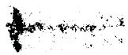

# Part 1

# AIRCRAFT REACTOR ENGINEERING

S. J. Cromer

# 1.1. REACTOR AND FACILITY CONSTRUCTION

W.F.Boudreau

A.P.Fraas

Reactor and auxiliary components for the Engineering Test Unit (ETU) and the Aircraft Reactor Test (ART) are being fabricated by various manufacturers and by the ORNL and Y-12 shops. As parts are received the ETU reactor is being assembled and the operating facility is being constructed. Major construction work on the ART facility has been completed, and design work on the process piping and equipment is under way. Procedures for disassembly of the reactor are being prepared concurrently with assembly procedures to assure feasibility of disassembly. Details of the status of fabrication and construction are given below.

# HEAT EXCHANGER PROCEDURE

R. D. Schultheiss

# Sodium-to-NaK Heat Exchangers

W. S. Harris

The Griscom-Russell Co. has resolved the problems involved in the fabrication of the sodium-to-NaK heat exchangers, and two units have been completed and brazed successfully. These heat exchangers, shown in Figs. 1.1.1 and 1.1.2, were received on June 13 and 20, 1957, and are being installed in the ETU assembly. The units required for the ART are to be delivered in July and August 1957.

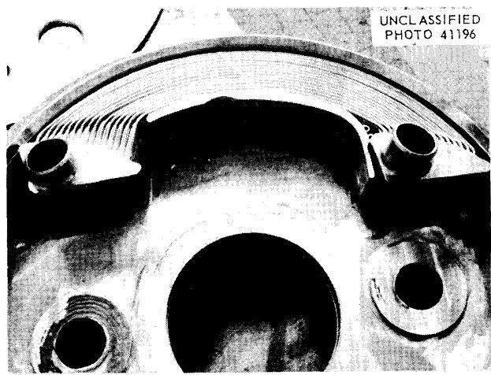  
Fig. 1.1.1. Sodium-to-NaK Heat Exchanger Installed in ETU North Head.

# Fuel-to-NaK Heat Exchangers

R. B. Clarke

A detailed analysis was made in cooperation with Black, Sivalls & Bryson personnel of the remaining development problems associated with the fabrication of the fuel-to-NaK heat exchangers for the ETU and the ART, and a workable program was devised. Procedures were developed for the fabrication of the various welds, and the installation of the brazing furnace was completed.

Six channels have been machined, to date, but they are not usable because they are not within dimensional tolerances. The sixth channel closely approached the required dimensions, but it is evident that the tooling for the machining must be revised to include a rocking tool.

Holes have been drilled in a tube sheet that are within dimensional tolerances, and it appears that standard rods can be used for positioning the drilling head.

Tube trimming is now being done on a Bridgeport mill by using a mimic attachment pickup from a standard tube sheet. This procedure reduced the trimming time from two weeks to 8 hr. Wedge assembly will be done by welding a flat plate to the tube sheet and profiling the inside face to the required dimensions from a template rather than by welding profiled wedges to the tube sheets. This procedure will simplify the welding, provide greater accuracy in final positioning, and reduce

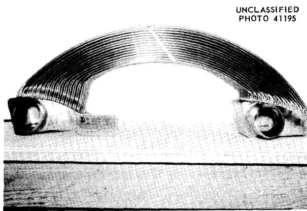  
Fig. 1.1.2. Second Sodium-to-NaK Heat Exchanger Prior to Installation in ETU.

the over-all fabrication time. The outer face of the bulkheads will no longer be profiled but, rather, will be milled in conjunction with end milling of the bulkheads. This procedure will also reduce fabrication time. Steps in the fabrication procedure are shown in Figs. 1.1.3, 1.1.4, and 1.1.5.

# NaK-to-Air Radiators

M. M. Yarosh

Three prototype ART test radiators were received, and one unit is now being tested. The cores for the two ETU radiators have been welded and brazed and are being assembled into radiator units. It is expected that the ETU radiators will be available soon. Work is now under way on the fabrication of the main and the auxiliary radiator cores for the ART.

# NEUTRON SHIELDING FABRICATION

M. Bender

G. D. Whitman

# Boron Carbide Tiles

Virtually all the problems related to the production of the boron carbide tiles have been resolved, and most of the tiles have been received. The manufacture of these pieces by the Norton Company, while expensive (total cost, $207,000), appeared to be straightforward. The parts were made from hot-pressed slabs that were machined with optical grinding tools. In all cases the tiles met the specified tolerance, a major accomplishment in view of the many odd contours which were required. A total of 33 different shapes was specified. A typical finished tile is shown in Fig. 1.1.6.

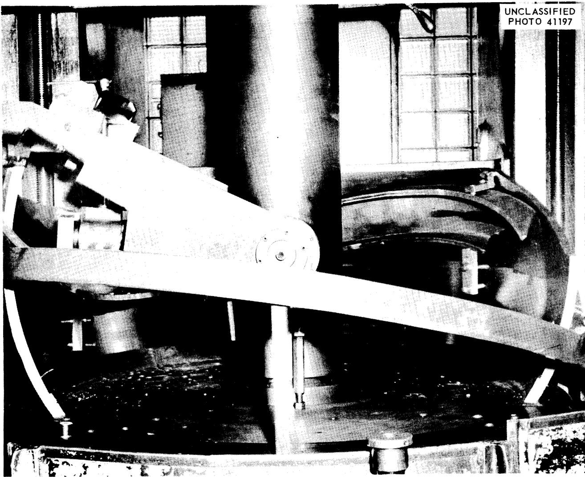  
Fig. 1.1.3. Machining of the Inside of a Fuel-to-NaK Heat Exchanger Channel. (Comment with caption)

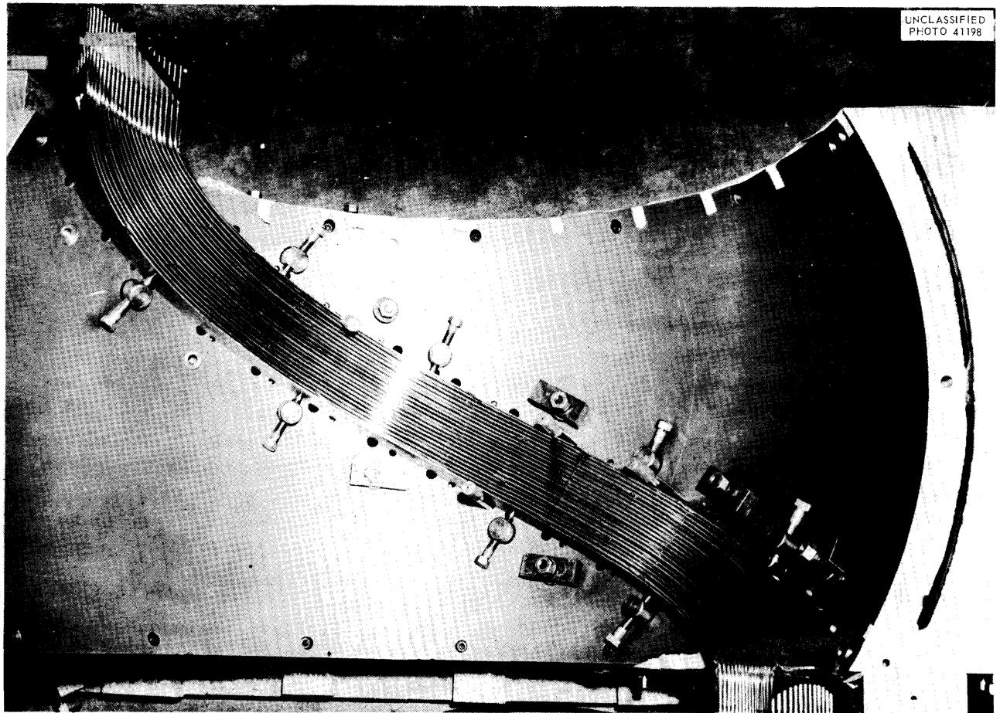  
Fig. 1.1.4. Fuel-to-NaK Heat Exchanger Tube Bundle in Assembly Fixture. (Confidential with caption)

# Stainless Steel Cans for Tiles

The fabrication of the stainless steel cans to contain the boron carbide tiles posed a serious problem, since in order to reduce the neutron-leakage gap between adjacent tiles it was necessary that the tolerances be equivalent to those for the tiles. The ERCO-Nuclear Division of American Car & Foundry Co. was given the job of manufacturing the required pieces. By utilizing the facilities available for the manufacture of the tiles as the source for dies to be used in a static rubber-press forming operation, by relaxing non-critical tolerances, and by making slight design modifications, the expense of the cans appears to have been brought to within tolerable limits. The working estimate for the cost of these parts is now $50,000, which is to be compared with an original estimate of $125,000.

Thus far no finished parts have been delivered, but representative specimens have been furnished

and no major manufacturing problems are apparent. Tooling for this work is about $80\%$ complete. Two of the dies are shown in Figs. 1.1.7 and 1.1.8.

# Stainless-Steel-Clad Copper- $B_{4}C$ Cermet Plates

The copper- $\mathsf{B}_4\mathsf{C}$ cermet material required for neutron shielding is being manufactured by the Allegheny-Ludlum Steel Corp. Early experimental production of the material gave very low yields, but close cooperative effort between the ORNL Metallurgy Division and Allegheny-Ludlum established that the production difficulties were the result of improper design of the pack-retaining bars, poor dimensional control of the retaining bars during fabrication, and failure to properly evacuate and purge the pack before rolling. These difficulties having been eliminated, the production yields approached $100\%$ for recent experimental runs. Although the production difficulties appear

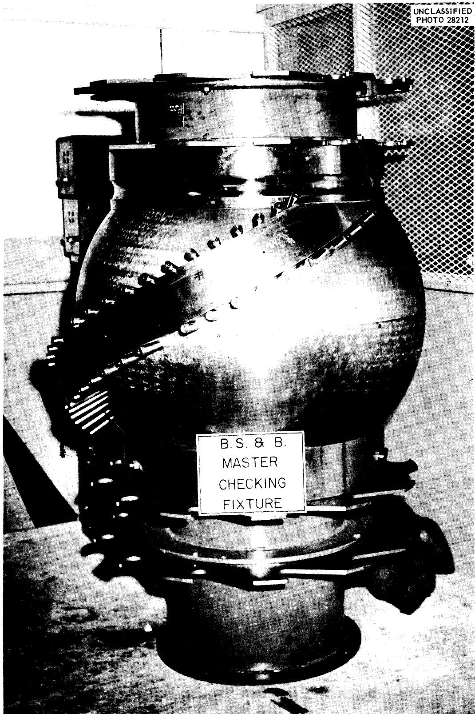  
Fig. 1.1.5. Fuel-to-NaK Heat Exchanger Channel in Master Checking Fixture. (Commodium with caption)

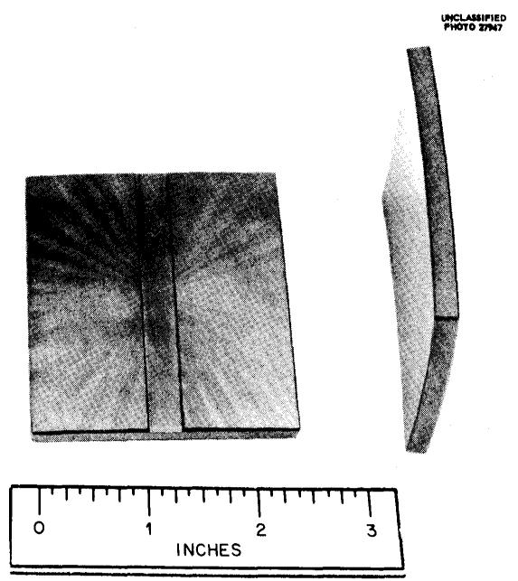  
Fig. 1.1.6. Typical Finished Boron Carbide Tile for Equatorial Region.

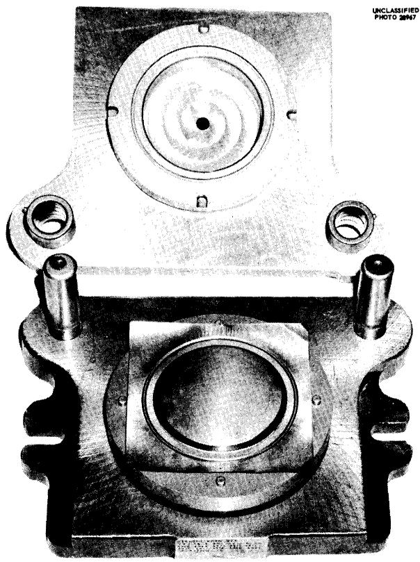  
Fig. 1.1.7. Stretch Die and Formed Blank for Manufacture of Stainless Steel Cans for Boron Carbide Tiles.

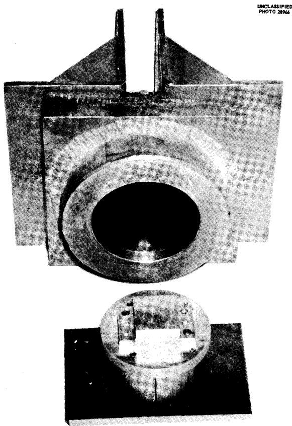  
Fig. 1.1.8. Rubber Press Dies for One Shape of Can for a Boron Carbide Tile.

to have been solved, the basic cost of the material remains high ( $1.00 to$ 1.40 per square inch).

The ERCO-Nuclear Division of American Car & Foundry Co. is fabricating the required cernet shapes from the rolled cernet sheet material. Tooling for the required parts is essentially complete. The fabricating steps include cutting the cernet material to the approximate developed area, hot forming the pieces in a mechanical press over steel dies (Figs. 1.1.9, 1.1.10, and 1.1.11), and machining the edges of the part to the required shape by using the Elox (electric-discharge) cutting method (Fig. 1.1.12). All phases of the operation have been tested, and the methods appear to be satisfactory. Difficulty was experienced with blistering of the stainless cladding on the cernet during hot forming, but the trouble was traced to poor quality control during the early experimental stages of sheet production. No further difficulty is anticipated.

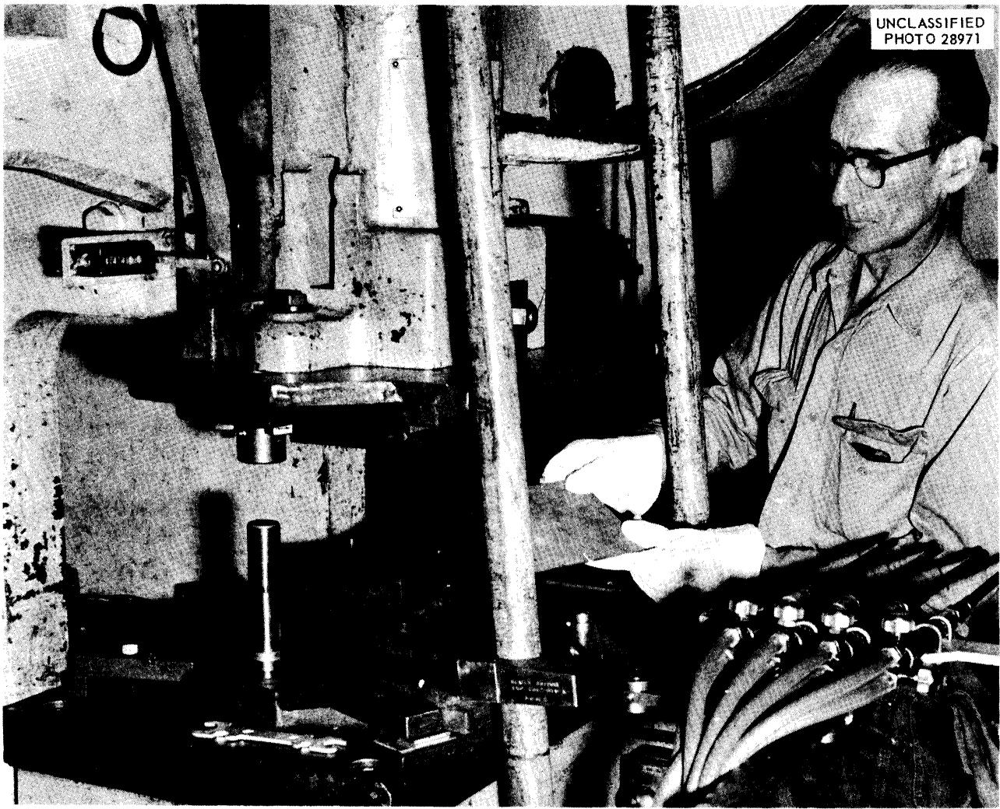  
Fig. 1.1.9. Copper-B $_4$ C Cermet Blank Being Inserted in the Press.

ERCO has supplied some of the required parts (Fig. 1.1.13), but the bulk of the parts will be manufactured during July and August. The current working cost estimate for these parts, exclusive of the cernet material made by Allegheny-Ludlum, is $150,000, compared with an original estimate of $250,000.

# FABRICATION OF SHELLS AND CONTAINERS

M. Bender

# Evaluation of Fabrication Methods

A critical review of fabrication techniques for the reactor shells, together with a further analysis of the dimensional, metallurgical, and other requirements for these parts in a reactor, has led to a partial reorientation of the procurement program.

As discussed below, it is anticipated that this change should increase the certainty of obtaining shells as they are needed in the reactor assembly sequence and should decrease their over-all costs.

# Hydrospinning Techniques

The feasibility of fabricating the reactor shells by spinning was re-examined during the quarter. Progress at the Lycoming Div. of Avco Mfg. Corp. has been very slow, despite extensive relaxation of dimensional and metallurgical requirements. None of the twenty-six $\frac{1}{8}$ -in.-thick inner core shell (shell I) pieces produced thus far were

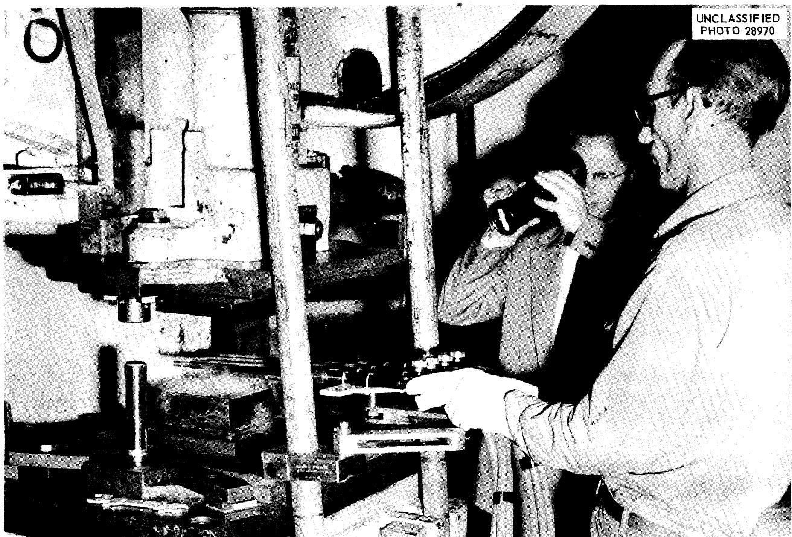  
Fig. 1.1.10. Copper-B $_4$ C Cermet Blank Being Heated Prior to Pressing Operation.

completed successfully. The pieces were unsatisfactory primarily because of axial cracks in the equatorial region and in the reverse curve area. It is hoped that this can be corrected by the introduction of a preforming step (by Hydroform) before the first spinning operation and by a redistribution of the amount of wall thickness reduction between anneals during the final spinning stages.

Of the twenty $\frac{1}{8}$ -in.-thick outer core shell (shell II) pieces processed by Lycoming, only 15 have reached the final spinning stage. Of these, three were close enough to the specified dimensions to be considered for the reactor installation, but they were rejected because of insufficient wall thickness in some areas. These pieces had contour deviations of as much as 0.050 in. in some areas and were as much as 0.020 in. off the nominal dimension at the equatorial trim line. Lycoming has reported that the use of a preforming step is advisable in the production of these pieces, as was the case for shell I, and they are taking steps to preform all

new material before further processing. This step will introduce a 60- to 90-day delay in the production of shell II pieces. No more hydrospun shell II pieces are expected before September 1957.

Limited success has been achieved at Lycoming in the forming of the $\frac{1}{4}$ -in.-thick outer reflector shell (shell III). Typical stages in the spinning operation are shown in Figs. 1.1.14 through 1.1.17. As with shells I and II, however, attempts were made to produce the pieces without preforming them. While one piece approached the desired shape (Fig. 1.1.17), it was not possible to determine whether it could be brought to the finished contour. Examination of the proposed reactor assembly procedures and experimental weld shrinkage control data showed that even if the part could be produced to the finished dimensions it would be distorted when welded to the load ring and to the shell III spur. The spun shell was therefore abandoned in favor of a machined weldment.

Lycoming was requested to give first priority to the spinning of the $\gamma_{16}$ -in.-thick inner neutron

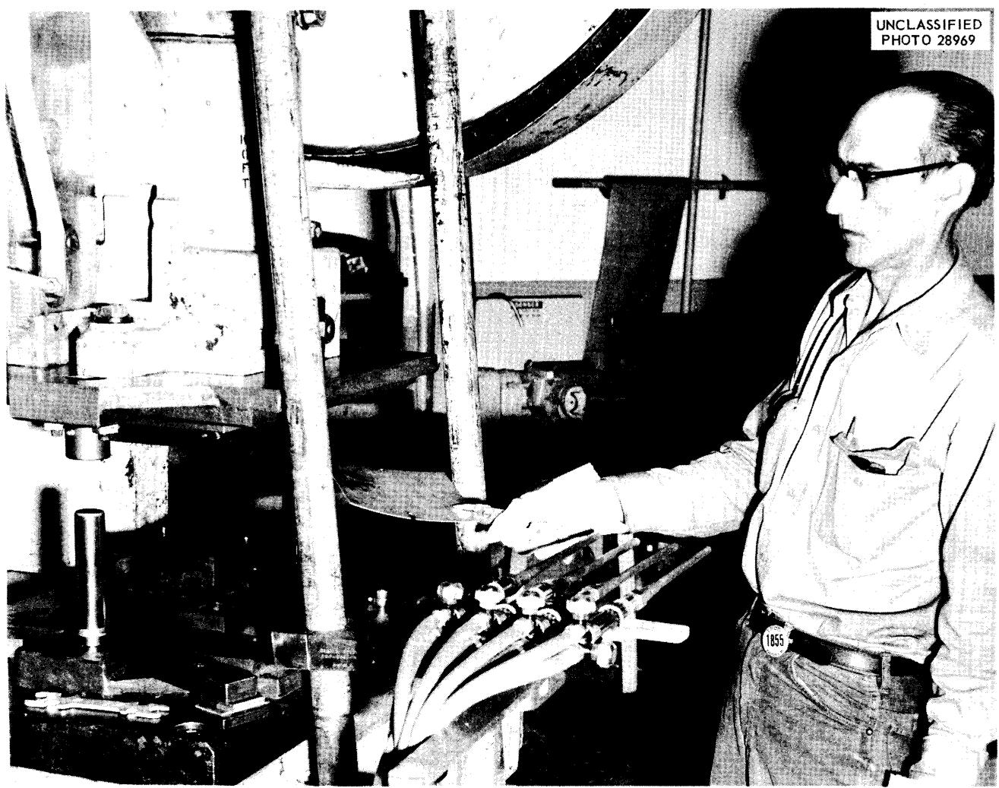  
Fig. 1.1.11. Pressed Copper- $\mathsf{B}_4\mathsf{C}$ Cermet Plate Being Removed from Die.

shield cover (shell IV). In this case, as in previous instances, the preforming step was bypassed and serious difficulties were encountered, as shown in Figs. 1.1.18 through 1.1.21. A preforming step is being instituted, and, if the preforming solves most of the difficulties, it is anticipated that delivery of shell IV pieces will be made in January 1958. Investigations of the production of this shell have been limited by the Inconel stock available. Lycoming initially requested $\frac{3}{16}$ -in.-thick stock, but they later changed their request to $\frac{1}{8}$ -in.-thick material. No $\frac{1}{8}$ -in.-thick material has yet been delivered, and therefore the experimental work has been carried out with $\frac{3}{16}$ -in.-thick stock.

Tools are being designed for the spinning of the $1_{16}$ -in.-thick outer neutron shield cover (shell V).

These pieces are complex, and their production will involve a combination of drawing, or pressing, and spinning. Lycoming has predicted a February 1958 delivery for these pieces.

Despite the many problems, there have been some important accomplishments made by Lycoming in the spinning art. For example, they have developed suitable heat-treating techniques for the intermediate spinning steps; this is a relatively new practice in spinning. Control of the grain structure to approach the stringent requirements has been accomplished, in spite of the complications caused by the odd shapes being manufactured. Further, they have closely approximated the required shapes while using a method which is ideally suited only to the fabrication of conical and tubular shapes.

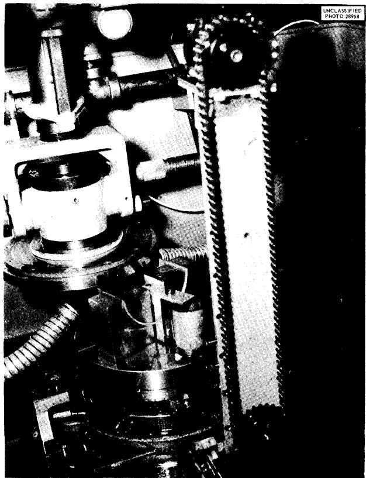  
Fig. 1.1.12. Formed Copper- $\mathsf{B}_4\mathsf{C}$ Cermet Ring Being Machined on an ELOX Cutting Machine.

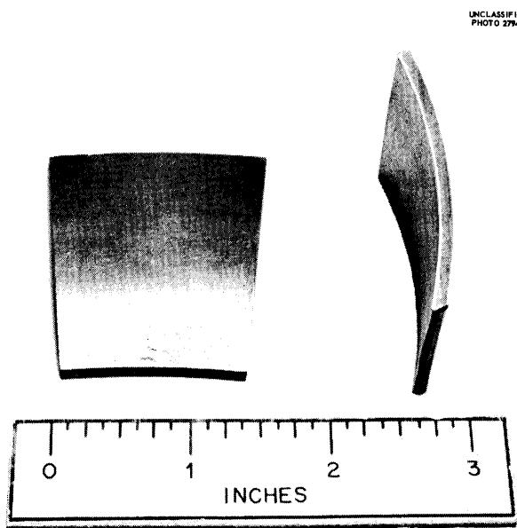  
Fig. 1.1.13. A Typical Stainless-Steel-Clad Copper-B4C Cermet Plate for Equatorial Region.

The wall thickness deviations are, as yet, troublesome, but the results are better than could have been expected with any method other than precision machining. The major difficulty has been that all the deviations have been on the low side of the tolerances.

The length of time required to reach the present state of the spinning art has led to the feeling that alternate processes should be investigated in order to reach an earlier completion date. The use of this process for the production of reactor parts is not impractical, however, and further developmental work is warranted because of the ultimate high quality of the finished product and the probable low unit cost for large-quantity production.

# Machined Weldments and Forgings

The possibility of machining the shells from formed weldments was explored early in the fabrication studies. It was rejected, however, because of the questionable quality of heavy Inconel plate, the coarse grain structure of such plate, the additional risk incurred by welding, and the unpredictable distortion behavior of the welds in the reactor structure. Experience with Inconel and new developments in the design have now invalidated some of the arguments against the machined weldments. The quality of Inconel plate, as measured over the past two years, has proved to be far better than anticipated. Welding techniques exist with which extremely reliable welds are produced. In addition, the support spacers now being used to define the cooling passages around the shells have eliminated the worry about potential distortion of the shells because of the welds. The objections to coarse grain structure are still present, and recent data have emphasized the importance of fine grain structure in the core regions where high temperatures and severe thermal cycling will occur simultaneously. For the ETU, however, where these severe conditions cannot be introduced, the grain structure is relatively unimportant.

Four $\frac{1}{8}$ -in.-thick inner core shell (shell I) pieces were fabricated from weldments. Two of the four pieces were dimensionally acceptable, and they were metallurgically sound, except for minor weld defects not significant in the ETU. Additional pieces are being fabricated, and it is anticipated that even the minor imperfections will be absent.

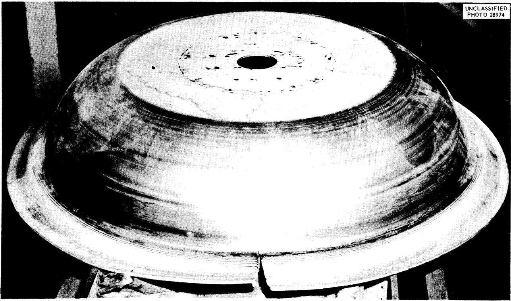  
Fig. 1.1.14. Typical Flange Failure That Occurred During Spinning of Shell III.

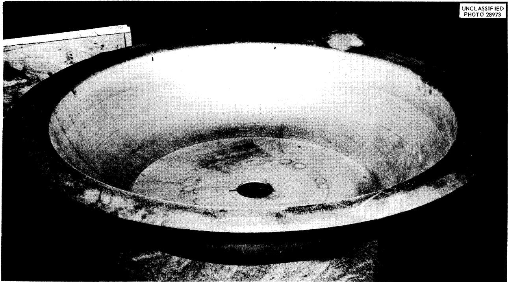  
Fig. 1.1.15. Typical Flange Bulge That Occurred During Spinning of Shell III.

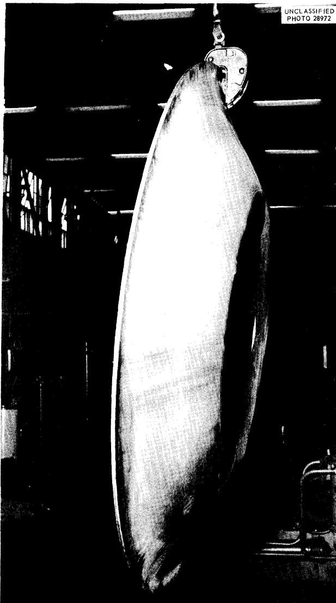  
Fig. 1.1.16. Shell III Partially Formed by Spinning.

Outer core shell (shell II) pieces are also being machined from weldments.

Since it has been established, as stated above, that the $\frac{1}{4}$ -in.-thick outer reflector shell (shell III) pieces cannot be fabricated satisfactorily by spinning, the pieces are to be machined from weldments. Fortunately, coarse-grained material will be acceptable in this shell because it will be cooled with sodium and will not be subjected to either high temperatures or severe thermal cycling. The weldments are now being fabricated by Steel and Alloy Tank Co. and will be machined in the Y-12 shop.

The method of fabrication of the $3/8$ -in.-thick pressure shell liner (shell VI) was changed from spinning to the machining of a forging in January 1957. Tooling for the forging is now being prepared by the Ladish Co. The required Inconel will be available early in August and delivery of the part is promised in October.

The fabrication of the outer pressure shell (shell VII) was originally undertaken by the Allis-Chalmers Mfg. Co., who had, in turn, ordered forgings for these pieces from Ladish. The Allis-Chalmers contract was canceled during March 1957, and ORNL took over direct administration of the Ladish subcontract. The first shell VII lower forging has been struck, but it required minor correction before shipment to the Y-12 shop. The upper forging has also been struck and is now being inspected. The machine work on these pieces is to be performed by the Y-12 shop.

# Cold Drawing and Pressing Methods

In January 1957 it was established that the lower portion of the $\frac{1}{16}$ -in.-thick outer neutron shield cover (shell V) could not be produced by spinning, and it was decided that it must be cold drawn or pressed. Cold drawing had been investigated previously for the production of these thin shells but had been rejected on the basis that the deep drawing required would cause excessive wall thickness deviations. The horizontally sectionalized nature of the shell V pieces alleviates this problem to some extent, and it appears to be likely that the thinout problem will not be serious in the case of the lower portion of shell V.

The thinout problem continues to cause objection to the drawing method for the production of shell IV. A favorable aspect of the situation has occurred, however, in that the stress design concept of this shell has been modified from the original premise. The shell is now expected to buckle in a predetermined pattern against the neutron shield. Therefore the structural requirements are not so severe as originally anticipated, and the wall thickness requirements can be relaxed. Investigations have indicated that the wall thickness deviations of a cold-drawn shell IV might be as much as $30\%$ . Design information shows this to be a greater deviation than desirable but

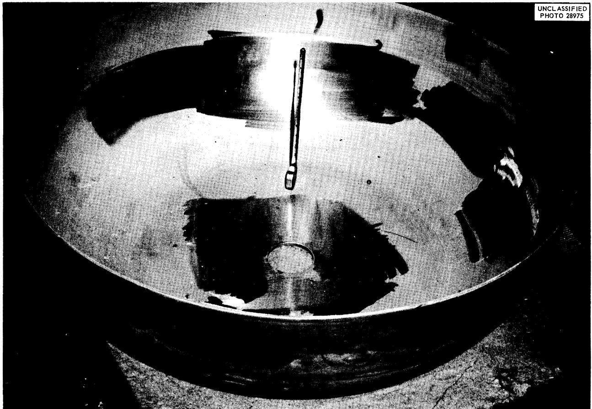

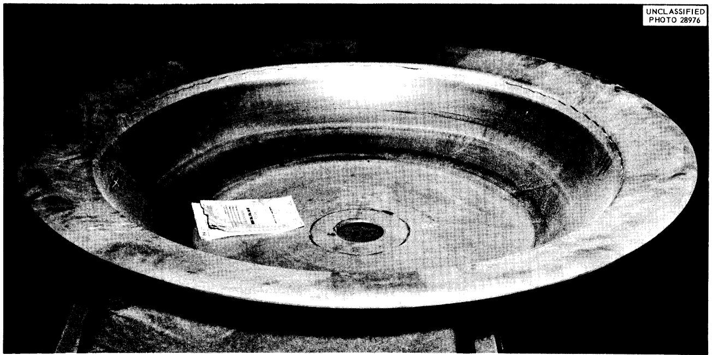  
Fig. 1.1.17. Shell III Formed by Spinning. Inside of shell polished to remove defects. Spinning operations abandoned at this point.   
Fig. 1.1.18. Typical Cracks That Occurred During Spinning of Shell IV.

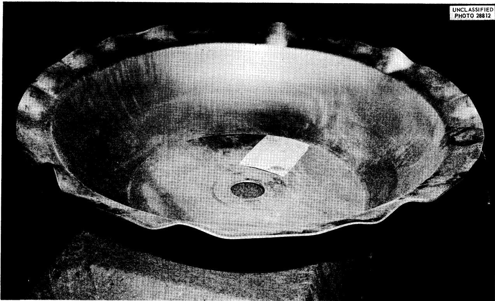  
Fig. 1.1.19. Typical Scalloped Edges That Developed During Spinning of Shell IV.

not necessarily unacceptable. Consequently, efforts are being made to obtain a supplier for drawn shells.

# Containers

Costly tooling has been required to meet the dimensional requirements of even some relatively simple shapes included in the reactor assembly. These shapes include the Inconel containers (top and bottom cans) which will hold the boron-containing cermet material at the top outer periphery of the beryllium reflector and the Inconel rings which will contain the insulation below the outer periphery of the load ring. These parts are being formed by hydraulic pressing and drawing at Kaiser Metal Products, Inc., in Bristol, Pennsylvania. Two representative pieces have been formed and are now being inspected.

# DEVELOPMENT OF REACTOR ASSEMBLY METHODS

C. K. McGlothlan

Weld shrinkage tests are being made in order to establish procedures for assembling the reactor. In particular, studies were made of the transverse

and radial shrinkage to be expected in the equatorial weld of the $1/8$ -in.-thick inner core shell (shell I). This shell will be assembled in two halves over the beryllium island and spacers to form the island subassembly. Twelve tests with rolled hoops and spun shells have provided sufficient data for accurately predicting the weld shrinkage. The tests also served to familiarize welders, machinists, and inspectors with the problems involved in welding the island sub-assembly.

The shell I equatorial weld for the ETU island subassembly has been made, as described below. A total of 0.050 in. was allowed for transverse shrinkage, and the shell actually shrank 0.065 in. The radial shrinkage predicted was 0.030 in. at $\frac{1}{2}$ -in. planes on each side of the weld; and the actual radial shrinkage after welding varied from 0.005 to 0.025 in. The designed gap between the Inconel shell and the 414 Inconel staple spacers in the beryllium island subassembly was 0.0035 ± 0.0015 in.; the calculated minimum gap after welding was 0.0045 in. on the cylindrical sections and 0.0025 in. on the tapered sections.

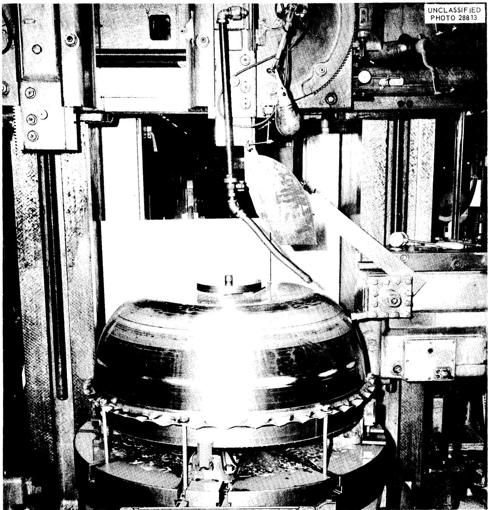  
Fig. 1.1.20. Spun Shell IV Set Up for Machining Excess Stock in Polar Region. Scalloped edges still present.

Weld tests have been completed for welding of the 1-in.-thick pressure shell. The first test on short rings showed considerably distortion and excessive radial and transverse shrinkage. Two additional tests on rings 56 in. in diameter and 24 in. long were performed by using a modified

weld design in which the $l$ -in.-thick wall was tapered to $\frac{1}{2}$ in. at the weld joint to reduce the weld metal volume and to provide room for radial shrinkage. The data obtained indicate that both tests made with the new weld design produced approximately the same transverse shrinkage and

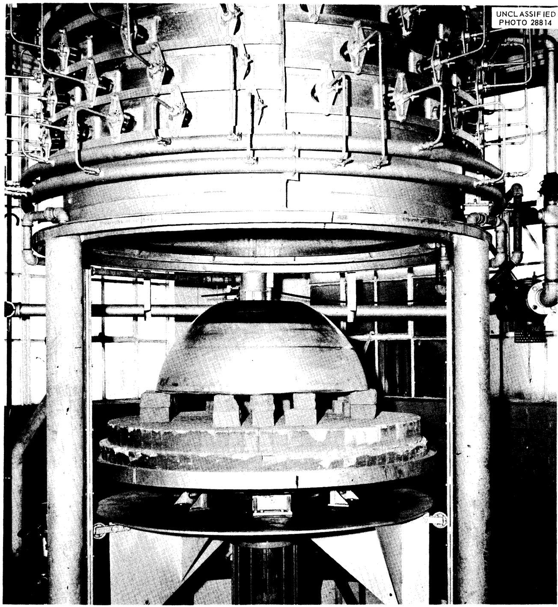  
Fig. 1.1.21. Spun Shell IV Ready to Remove from Selas Annealing Furnace.

that the radial shrinkage was not excessive. Therefore, this welding detail has been incorporated in the reactor design.

A satisfactory furnace-brazing method has been developed for joining heavy Inconel sleeves to thermocouple sheaths. Varying degrees of success

were encountered in the use of the initial Heliarc welding techniques for these sheaths, which have 0.025-in. walls and which were to be welded into various walls and shells. The thermocouples were to be welded to the individual fittings as the reactor assembly progressed through its various

stages. This type of assembly would have produced many uncertain welds that could not be completely inspected, and, since these welds would also have been very difficult to make, a different method of installation is now planned in which the heavy fittings will be brazed to the thermocouple sheaths.

Tests have shown that the heavy fittings can be satisfactorily furnish brazed to the thermocouple sheaths, and therefore the fittings containing the thermocouples will be welded at trepanned locations in the reactor structure. The actual assembly welds will be heavy and repairs can be made without losing the thermocouple assembly.

A test was also performed that simulated the welding of the lower portion of shell III to the adapter spur. This test indicated so much distortion of the parts that it was necessary to revise the fabrication procedure. Instead of the finished parts being welded together as originally planned, the adapter spur will be made as part of the lower hemispherical reflector shell.

Weld tests are now in progress to determine the shrinkage that will occur when making the equatorial welds on the $1/8$ -in.-thick outer core shell, the $1/4$ -in.-thick outer reflector shell, the $1/6$ -in.-thick shielding cover shells surrounding the neutron shielding material, and the $3/8$ -in.-thick pressure shell liner.

# ETU REACTOR FABRICATION AND ASSEMBLY

M. Bender

G. D. Whitman

H.M.Abele

C. K. McGlothlan

G.W.Peach

The assembly work on the ETU north head was resumed upon arrival of the sodium-to-NaK heat exchangers. It is now estimated that six months will be required to complete the assembly of the north head.

A lower-deck skirt forging was received, and it will be used in place of the formed weldment that was originally built for possible use in the ETU reactor if delivery of the forged part delayed the job. A north-head welding fixture has been fabricated (Fig. 1.1.22) with which to position the lower skirt and upper cylindrical appurtenances during welding operations.

All stress-relieving operations on the north head are to be done in the Y-12 plant, and a hydrogen gas drying facility has been installed in the plant

foundry so that suitable atmospheres may be provided in the large electric furnace available for this job.

The first machining operation on the strut load ring forging is complete, and the sodium outlet pipes have been welded to this part. The struts have been welded to the ring and the two assemblies are being welded together. This assembly is shown in Fig. 1.1.23 as set up for welding the struts to the forging.

Four Inconel inner core shell (shell I) halves were fabricated by cold forming, welding, and machining. The machining of these parts was done in the Y-12 shop, and two halves have been assembled into the ETU reactor. Other ETU reactor shells are to be fabricated by forming, welding, and machining; the machining operations on these shells are to be done in the Y-12 shop. Work was started on tracing templates and holding fixtures. The pressure shell forgings are scheduled to be delivered during June.

The Inconel material has been received and machining operations have been started on one set of filler plates for the ETU. Complete design information has been established on the beryllium parts, and work has been started on the final contouring of the upper beryllium reflectormoderator hemisphere. This work, which is scheduled to be completed in June, will complete the beryllium fabrication.

A complete set of beryllium orifice plugs for the island cooling passages for two reactors has been fabricated. These parts, which will be inserted in the lower island half, are sized to give the proper flow distribution in the parallel passages.

The remaining work on the ART beryllium, principally the upper hemisphere contouring, is not scheduled to be done until the ETU reflector assembly has been completed. In practically all cases it is planned to complete the major ETU subassembly before work is started on the ART subassembly so that unforeseen difficulties may be avoided on the second reactor assembly.

As stated above, work is under way on the ETU island assembly. The upper portion of the beryllium with the staple spacers installed, the upper core shell half, the bellows expansion joint, and the vane mounting are shown in Fig. 1.1.24. In Fig. 1.1.25 the assembled beryllium halves are shown, and in Fig. 1.1.26 the shell halves are in place for welding.

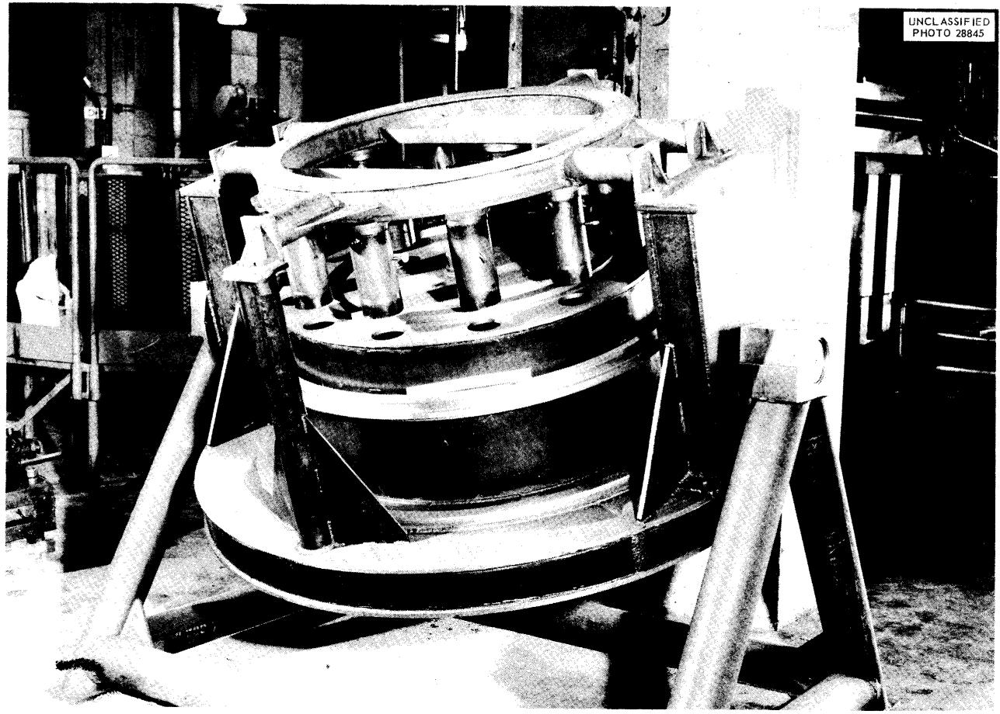  
Fig. 1.1.22. North-Head Welding Fixture.

The staple spacers were sized and inserted in the beryllium without difficulty. The edges of the spacers matched the contour of the beryllium to within 0.002 in.; and since the shells and beryllium were within design tolerance, all the spacers could be made the same height.

The beryllium parts were degreased in trichloroethylene and vacuum dried at $200^{\circ}\mathrm{F}$ for 24 hr. The equatorial weld was made without difficulty and the weld shrinkage values were within the design tolerance limits.

# ETU FACILITY

P. A. Gnadt

A. M. Smith

# NaK System

The installation of the furnace circuit main NaK piping is approximately $75\%$ complete. The considerable difficulty encountered in obtaining acceptable welds was attributed to inadequate

purging of large sections of pipe and the resulting porosity in welds. Therefore techniques were developed for isolating weld areas and removing residual air from the large system volume. As a result of these improved techniques the weld rejection rate was considerably lowered.

The purging difficulties indicated that all auxiliary devices, such as thermocouple wells, pressure-measuring devices, and other small appurtenances attached to the main piping, should be welded into the pipes before the main piping runs were completed. The original plan to attach all appurtenances to the system after the main piping runs were completed was developed in an effort to reduce damage which might result during later phases of construction. The change in the assembly sequence as a result of the purging problem has caused component fabrication difficulties, because the appurtenances had not been scheduled for fabrication until late in 1957.

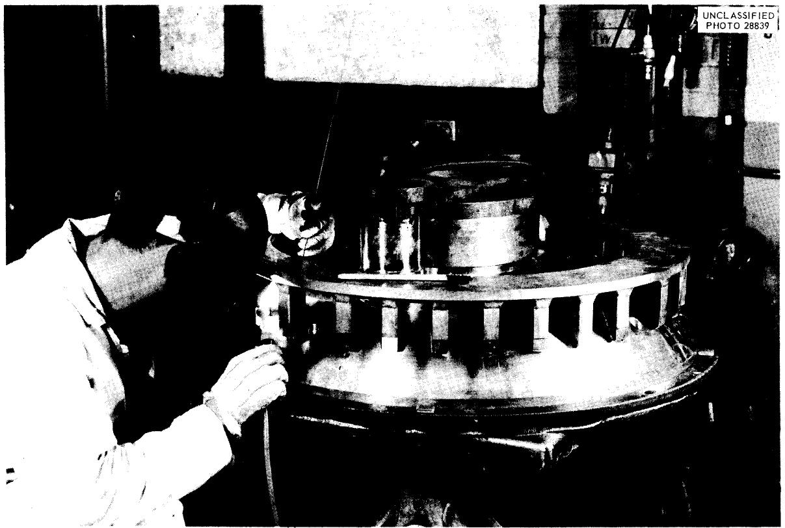

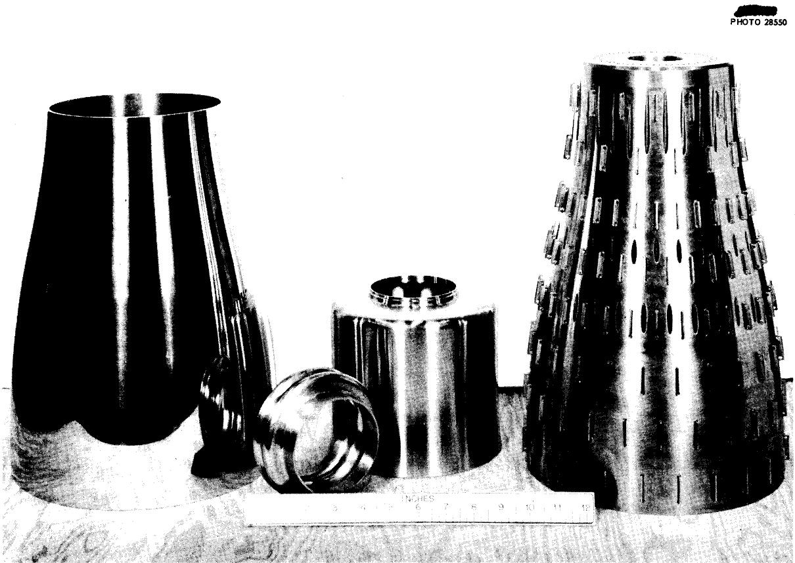  
Fig. 1.1.23. Strut Load Ring Assembly.   
Fig. 1.1.24. Parts for Upper Half of ETU Island Assembly.

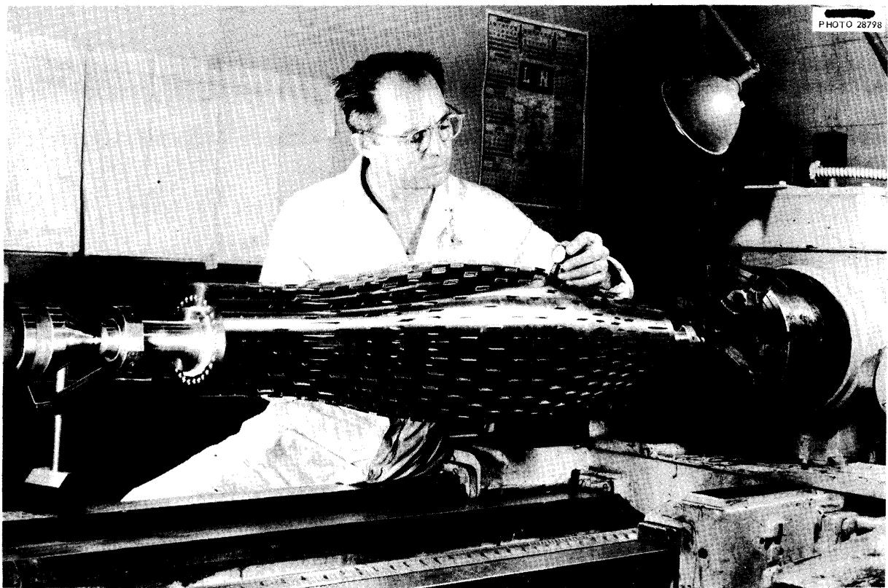

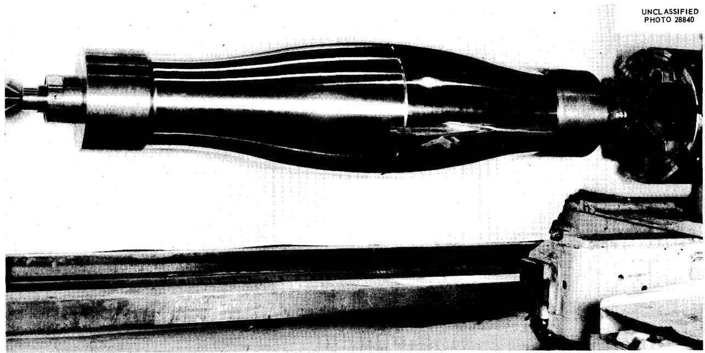  
Fig. 1.1.25. Assembled Beryllium Halves of ETU Island Assembly.   
Fig. 1.1.26. Inner Core Shell Halves Positioned for Welding.

Work on the main piping was not, however, slowed; the appurtenances will be welded into the system as soon as they are available.

Two NaK pump stationary assemblies have been set in place in the support structure. Fit-ups on the main piping have been made, and welding is now in progress.

The main piping of the isothermal NaK circuit will be assembled after completion of the furnace circuit piping. One NaK pump stationary assembly has been installed in this circuit, and the other pump stationary assembly and throttle valves are scheduled for delivery in June. All main pipes are formed and are ready for installation as soon as system components are received. Thermocouple wells are to be available for installation before the main pipes are assembled in the structure.

The main piping of the auxiliary NaK circuit cannot be started until pumps and radiators are available. Present plans are to assemble the main piping on these circuits following completion of the isothermal circuit main piping. One radiator is to be available for installation in July.

NaK dump tanks and lines cannot be assembled into the facility until the dump valves are available, and dump valve procurement is dependent upon tests which are being made of a prototype unit (Chap. 1.2, "Component Development and Testing"). If the test of the prototype unit is successful, the production units will be fabricated.

Cold-trap and plug-indicator system fabrication has been stopped temporarily pending the results of a re-evaluation of the pressure drops in the NaK systems. Throttle valve procurement, line sizes, and system locations are dependent upon the results of this analysis.

All major components for the main air duct system are on hand. Completion of this portion of the work is contingent upon the results of a high-temperature leakage test of the louvers. The presently installed radiator test duct is to be used for the test, and assembly work will not proceed until after the test is completed.

# Control Room

The control room housing and the air conditioning system are approximately $90 \%$ complete. Design work on panel layouts and controls has been started. Delivery of the panels is presently

scheduled for August 1958. The Instrumentation and Controls Division has assumed the responsibility of procurement, connection, and checkout of wiring and piping between the panels and associated sensing elements.

# Gas and Hydraulic Systems

Tests of hydraulic drive units for the reactor pumps indicated that the originally proposed units would not meet the operating requirements. The hydraulic drives have therefore been discarded in favor of variable-frequency electric motor drives. The necessary equipment, including motor-generator sets, magnetic clutches, and drive motors, will be available in October if present commitments are met.

The vendor, Bowser, Inc., for the lube-oil packages has two packages $90\%$ complete, but late delivery of the lube-oil pumps from a subcontractor is delaying the completion of the units.

Intermediate runs of the lube-oil, water, and helium piping are approximately $80\%$ complete, but revisions must be made to the piping systems now installed. Detailed engineering for these revisions and for connections to the equipment located in the basement area is now being started. Revisions to and completion of the piping in the basement area are scheduled to be done by a cost-plus-fixed-fee contractor by January 1, 1958.

# Electrical System

The emergency electrical system, which consists of the 300-kw diesel generator unit and associated switchgear and supply leads, remains $95\%$ complete. All design work is complete for this phase of the work, and the installation work will be completed by January 1, 1958.

Design drawings for the normal electric supply system have been released for construction by a cost-plus-fixed-fee contractor. This contractor will install all remotely operated voltage-adjusting units, distribution panels, transformers, switches, wiring, associated auxiliary equipment for the electric heater supplies, motor control center, motor-generator sets, cable trays, and wiring and will connect all electric power leads to the equipment in the basement area. Also, this contractor will install all cable trays on the track floor, except those in the cell and NaK piping areas, and will install and connect the speed control units and resistors for the NaK

motors. All major equipment is on hand for this work, which is scheduled for completion by January 1, 1958.

Design work on heaters for individual components is approximately $25\%$ complete. Installation of heaters and thermocouples is scheduled for the first quarter of calendar year 1958.

# General Construction Status

Designs for support structures, cross bracing, and walkways in the NaK piping area are approximately $75\%$ complete, and pipe hanger and support designs are approximately $90\%$ complete. Most of the major design work not covered specifically above is completed. Some minor design work remains that will not affect the construction schedule.

The facility is shown in Fig. 1.1.27 as it appeared on May 17, 1957. The control-room enclosure may be seen, as well as the NaK piping main-support columns and cell-wall-mockup main piping of the NaK furnace circuits, with the two NaK pump stationary units mounted at the top of the structure. In the background is the portion of the main air duct in which the radiators will be suspended. In the foreground are the two reactor support pedestals.

Present estimates indicate an ETU facility completion date of December 1, 1958, exclusive of the reactor and associated equipment.

# ART COMPONENT DESIGN

A.M.Smith W.E.Thomas

Design work on components to be installed in the ART cell has been directed primarily to the completion of details of various layouts that were previously scheduled to be completed by outside vendors. The dependency of one design upon another and the limited space inside the cell have made preparation of these layouts very time-consuming.

A review of the shielding requirements is essentially complete, and detailing of a steel backing shell to assist in supporting the equatorial section of the lead shielding was completed. Design layouts for changing the north- and south-head shielding from segmented pieces to a single piece are being made. Preliminary designs are also being made for the cooling-coil layout. The

design of the bag for the water shield has been started but cannot be finished until the lead-shield design is complete.

Design work was completed on the column footings and connections to the support pedestals for the reactor, as well as details of the support platform. Shop estimates of the time required for fabrication of the support platform are in excess of 4000 man-hours.

The decision to use electric rather than hydraulic drives for the four reactor pumps eliminated the need for an outside containment system for the hydraulic drive units and twelve pipe penetrations through the cell-wall auxiliary-piping junction panels. The junction panel drawings are to be revised, and the existing panels will be reworked.

Shop drawings of the main NaK manifolds, prepared by Midwest Piping Company, Inc., are being reviewed. Shop drawings for the auxiliary NaK manifolds are to be completed during June.

All parts and subassemblies for the fuel enricher were completed. Final assembly of the enricher will be done just prior to installation inside the cell.

# ART FACILITY

M. Bender

F. R. McQuilkin

R. D. Stulting

W. T. Ferguson

G.C.Robinson

Construction work on the ART facility has been contracted in four stages determined by the design program. The first three stages, packages I, A, and II, which included building alterations, building additions, cell installation, installation of auxiliary-services piping, installation of diesel generators and facility, electrical control centers, and spectrometer-room electrical and air-conditioning equipment, were completed prior to this report period. The fourth stage, package IIIA, which included a distribution system for supplying electrical power to the pipe heaters and equipment heaters, a dry-air plant, and a building to house the air plant and wound-rotor-motor controllers, was completed May 10, 1957. However, a modification was made to that contract package at a cost increase of $17,480 and a time extension of 75 days that established a new package IIIA contract cost of $135,694.71 and a new contract completion date of July 24, 1957. The work under

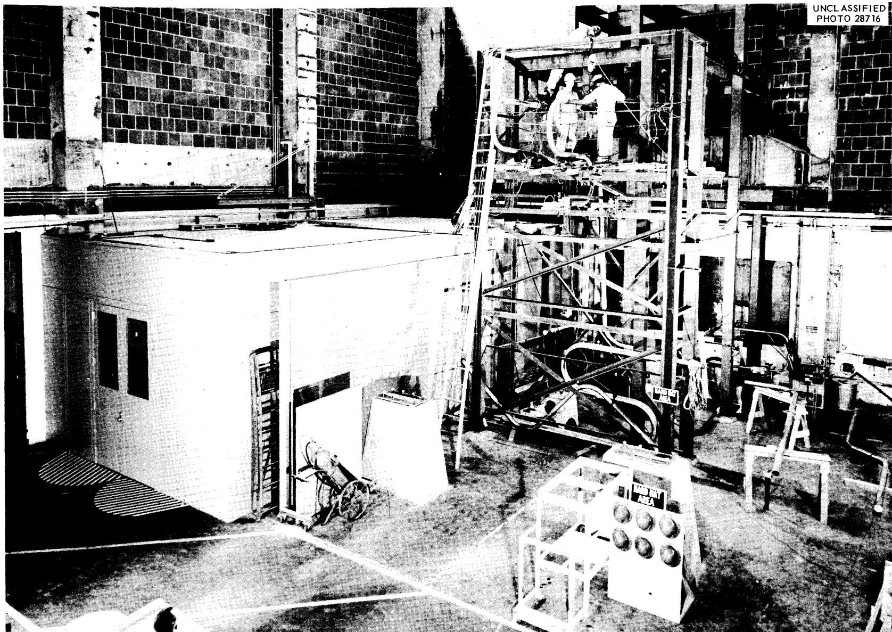  
Fig. 1.1.27. ETU Facility as of May 17, 1957.

this modification includes the lube-oil fill and waste systems and portions of the louver hydraulic system. The work was $18\%$ complete on May 31, 1957.

The following tabulation presents a cost breakdown of package II contract work, for which final payment was made during the quarter:

Initial contract price $58,400.00

Final contract price $71,557.67

Total number of contract 8 deviations

Official starting date January 25, 1956

Official scheduled completion dates

Part 1 June 22, 1957

Part 2 January 27, 1957 (ref 2)

Actual completion dates

Part 1 June 22, 1957

Part 2 February 22, 1957

Liquidated damage rate $100 per day

Liquidated damage None charged for delay

The damage charge was not invoked because the government-furnished diesel-generators were damaged in shipment, and a contract extension was granted for the excessive amount of time required for the diesel testing.

Some of the construction work for package IIIA may be seen in Figs. 1.1.28 through 1.1.33. Figure 1.1.28 shows some of the 40 remotely controlled induction regulators which will supply variable voltage to the main, auxiliary, and special NaK pipe heaters. Figure 1.1.29 shows some of the remotely controlled Powerstat units which will provide variable voltage to a portion of the equipment and pipe heaters within the cell. Additional heaters will be supplied from manually operated Variacs located on control panels. Figure 1.1.30 is a view of a portion of the heater distribution panels.

Figure 1.1.31 is a view of the building which houses the air plant and wound-rotor-motor controllers. Figure 1.1.32 shows the air plant, which consists of the carbon-ring compressors, after

coolers, water separators, and receivers. The automatically operated driers for dry instrument air are located behind the receivers. Figure 1.1.33 shows the government-furnished woundrotor-motor controllers in the center and a portion of the associated resistors on the left. The conduits and cable trays will contain the primary and secondary motor cables and the control cables.

Design work is proceeding on the layout of piping and equipment in the radiator pit area. Preliminary reviews have indicated that access to the equipment will be inadequate with the existing design. Relocation of equipment is being considered, and work has started on a design model of the area. Work is also proceeding on a model of the main and auxiliary radiator and penthouse area. Procedures for assembly of the main and auxiliary radiator equipment have been prepared, and procedures for assembly of the special radiators and for replacement of all radiators are now being prepared. A review of the structural framework for the main and auxiliary radiators is being made in order to determine the minimum space which can be occupied by the radiators.

A building and crane load test was performed on the 30-ton crane to determine crane performance and building deflection at loads of 75,000, 80,000, and 85,000 lb, in anticipation of an increase in process equipment weights. With loads positioned at critical points with regard to structural load-carrying ability, no vertical deflections were detected for any building column.

# ART DISASSEMBLY

M. Bender F.R.McQuilkin

A.A.Abbatiello L.W.Love

The sequence of operations for disassembly of the ART has been further explored in an effort to develop a workable scheme for obtaining internal samples and dimensions and for visually examining various parts. In general, the presently proposed procedure follows a component removal method to expose each reactor element with a minimum of distortion.

The principal tool within the disassembly hot cell, in addition to the handling cranes and manipulators, will be a turntable capable of supporting, rotating, and lifting the reactor. Two major cutting tools will be included which will be mounted on

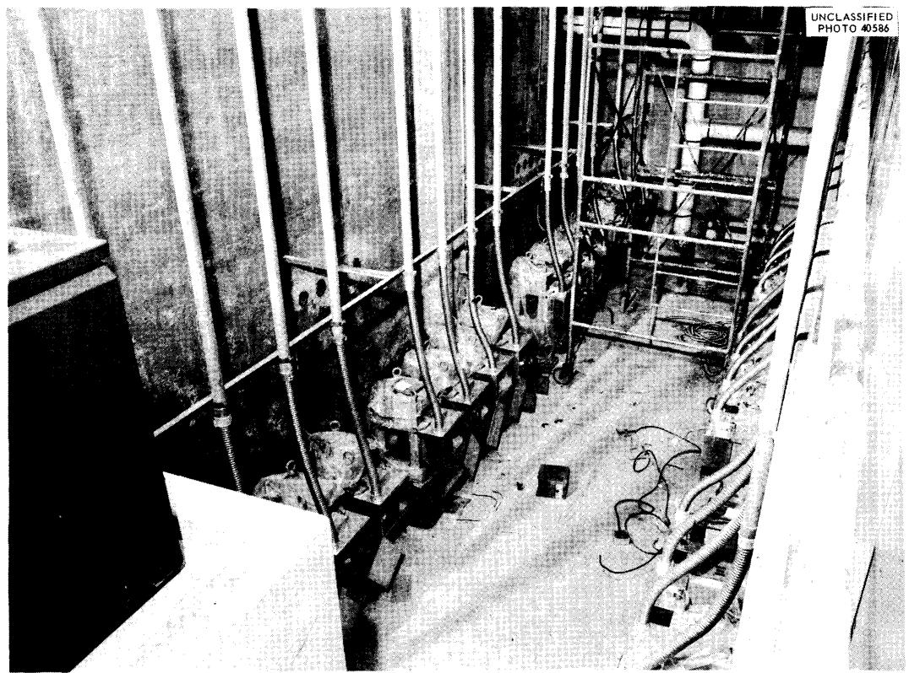

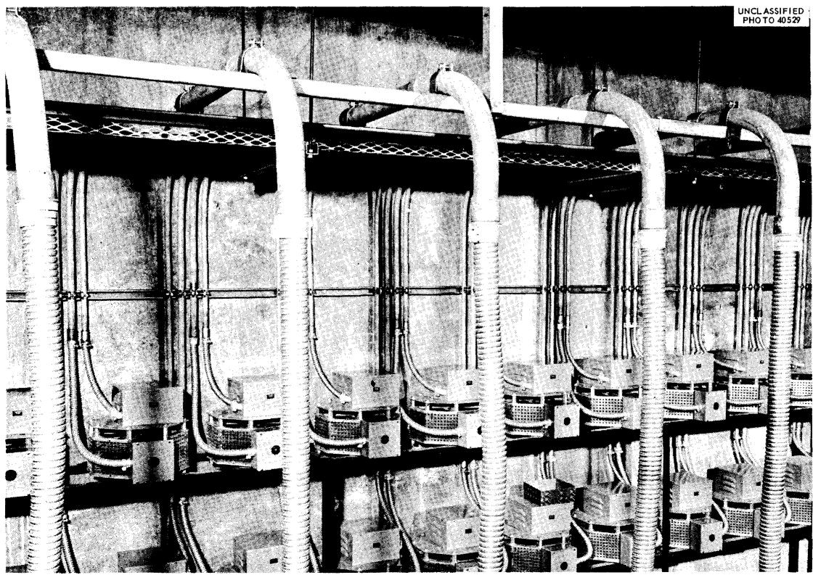  
Fig. 1.1.28. Remotely Controlled Induction Voltage Regulators.   
Fig. 1.1.29. Remotely Controlled Powerstat Units.

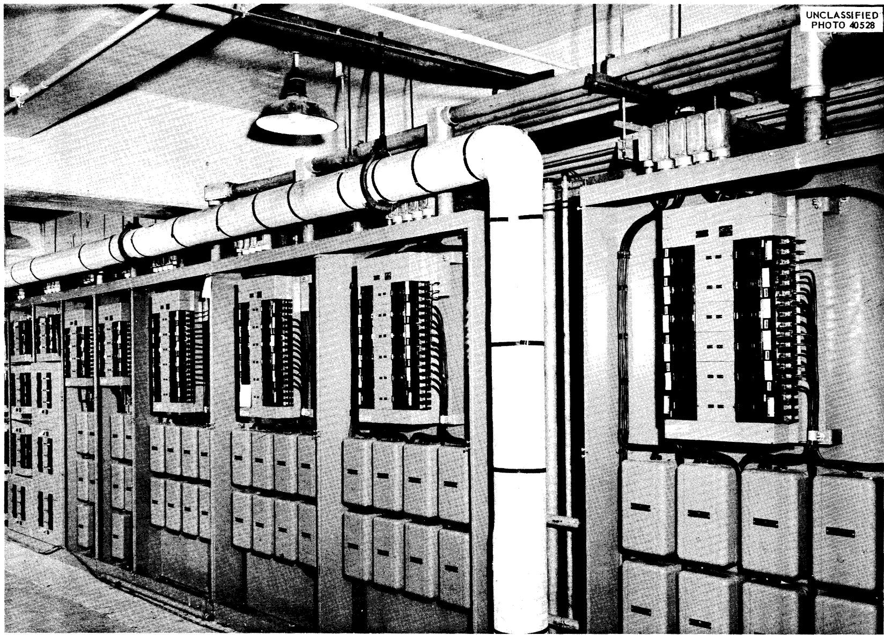  
Fig. 1.1.30. Heater Distribution Panels.

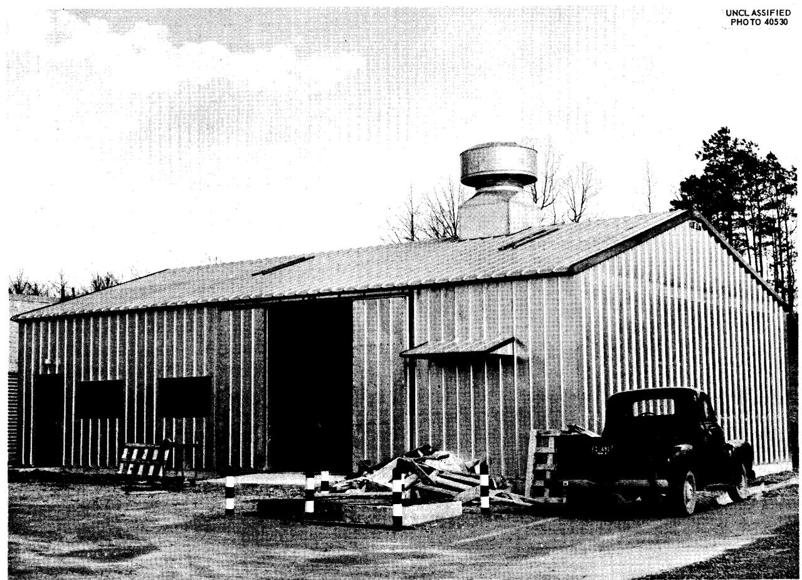  
Fig. 1.1.31. Building Which Houses the Air Plant and the Wound-Rotor-Motor Controllers.

a horizontal ram that can be positioned at any angle on the surface of the reactor. The actual cutting methods will be determined experimentally, but the mounting arrangement will be adaptable to several systems. Direct observation by means of windows, TV cameras, etc., will be provided to give the information necessary to direct the disassembly operation. Supplementary photographic aids, replication, and optical measurement devices will permit comparisons and provide means for recording the observations. Because of the high space utilization within the concentrated area of the hot cell, it will be necessary to decontaminate, rinse, and move major reactor parts to storage as they are removed. Cutting methods and measuring techniques are being studied, and a sealant-injection method was designed for sealing off radioactive lines when they are severed.

The hydraulic shear has been adopted as the major cutting tool for removing the ART from the

pressure cell. A special, high-capacity shear, with a 280-deg wrist rotation for maneuverability, has been designed and ordered. Severing methods for use in the hot cell that include end-milling and drilling a series of interlocking holes were found to be unsatisfactory from the standpoints of severing rate and tool life. Abrasive grinding would give desirable cutting rates, finishes, and, probably, maneuverability, but it would also present a contamination control problem.

Hollow "hypo-needles" were tested for the sealant-injection system, and a design was produced for applying this method to the cutting of the radioactive lines prior to removal of the reactor (Fig. 1.1.34). Commercial soft studs have been received that are to be drilled, heat treated, and tested.

Three measurement systems adaptable to hot cells were studied. Replication is attractive because dimensional shapes and surface detail

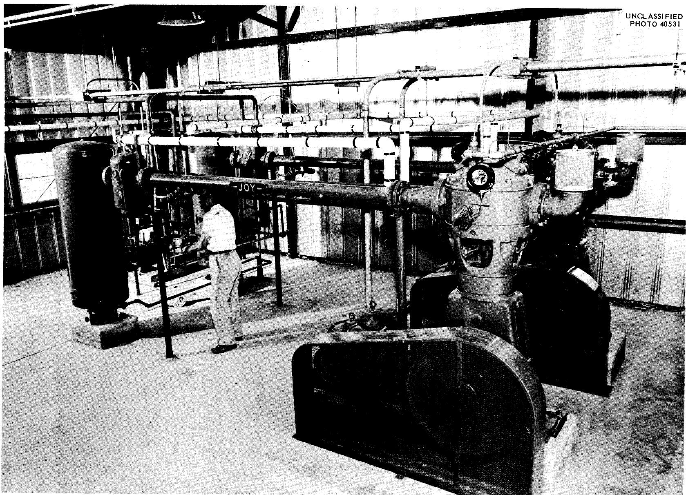  
Fig. 1.1.32. Air Plant.

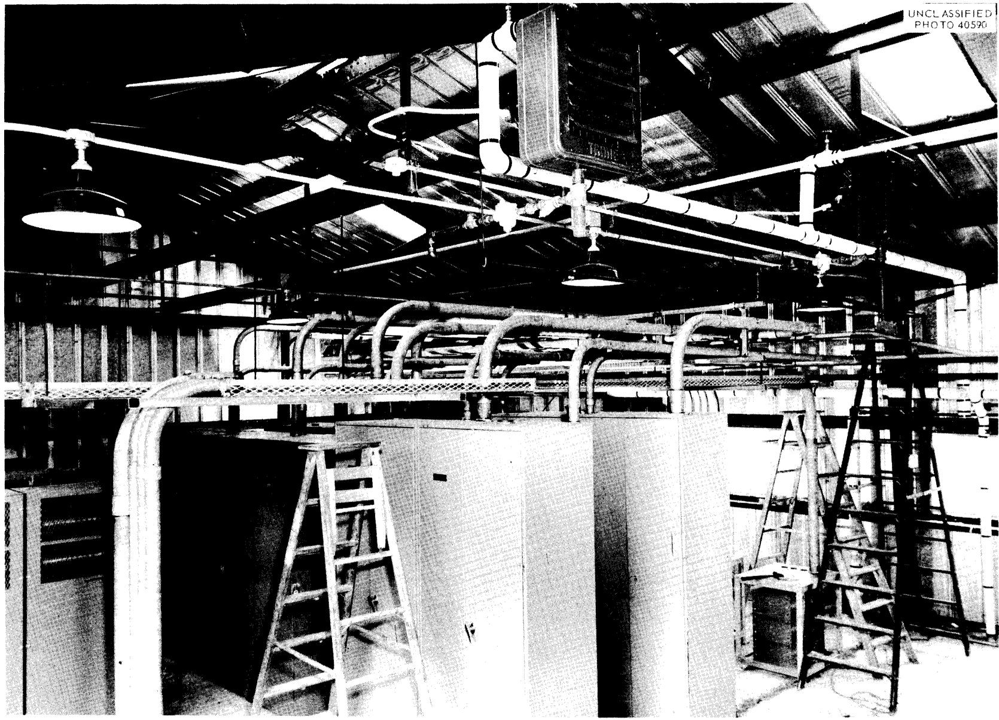  
Fig. 1.1.33. Wound-Rotor-Motor Controllers.

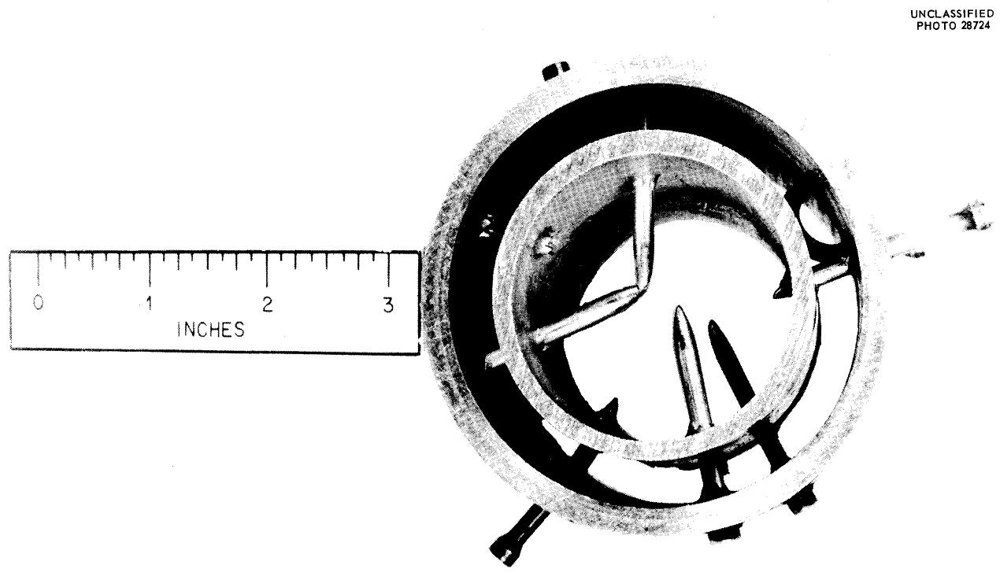  
Fig. 1.1.34. Two Concentric Pipes with Studs Injected by Using a Stud Gun.

can be compared by using molds made before and after reactor operation. Replications of surfaces representative of critical reactor internal parts were produced by three methods. Metallizing with lead-base wire produced replicas with fine surface detail and good dimensional reproducibility, as shown in Fig. 1.1.35, but the possible harmful effects of lead-base alloys left in inaccessible areas have not yet been determined. Casting with four different gypsum compounds also produced faithful detail reproductions, but casting has the disadvantage of requiring molding frames around the part to be cast. A gun-emplaced gypsum reproduced detail fairly well, as shown in Fig. 1.1.36, but the particular gun used did not operate well. Further development of this method would make possible the reproduction of vertical surfaces without the use of molds, but a better functioning gun is required.

Optical measurements through zinc bromide-lead glass windows were evaluated and appear

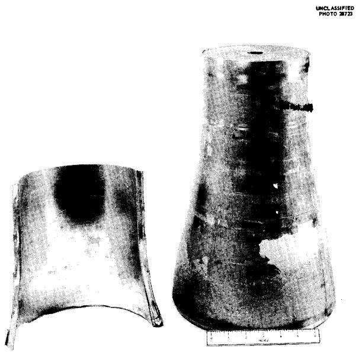  
Fig. 1.1.35. Metallized Replica of Upper Half of Inner Core Shell. (with caption)

to be practical for the longer, less critical dimensions. This study indicated that an optical tooling bar (a cathetometer type of measuring instrument capable of moving in the horizontal and vertical directions) outside the cell window can be used.

Photogrammetric methods have not yet been evaluated, but recent information points to the possible application of a newly developed method of comparative contour measuring, which is a variation of the photo-lofting method used in the aircraft industry.

UNCLASSIFIED PHOTO 28721

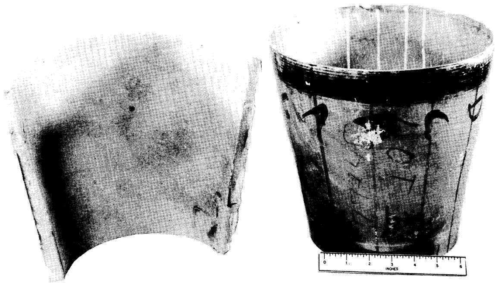  
Fig. 1.1.36. Replicas of Inner Core Shell Made with Gun-emplaced Gypsum. Oil was used as the releasing agent. (with caption)

# 1.2. COMPONENT DEVELOPMENT AND TESTING

H. W. Savage

# PUMP DEVELOPMENT TESTS

E. R. Dytko

A. G. Grindell

# Bearing, Seal, and Lubricant Tests

D. L. Gray

W. K. Stair²

High-speed tests of Alcoa 750-T5 aluminum-base-alloy journal bearings with both Gulfcrest-34 and Ucon-LB-140X as lubricants were successfully concluded. Each unit was tested for more than 1000 hr with transverse loads of up to 600 lb of force at the bearing. No measurable wear was observed with either lubricant. As a result of these tests, aluminum-alloy journal bearings have been installed in all the reactor pumps that have been assembled.

A test of the fuel pump purge system was run to determine whether lubricant leakage past the lower seal would be removed from the catch basin by a 50-liter/day helium sparge flow or would be forced down the shaft annulus by the maximum allowable ART helium purge flow of 2500 liters/day. In an initial test with Gulfcrest-34 as the lubricant, the leakage was insufficient for conclusive data to be obtained. Since it cannot be anticipated that such low leakage will exist under reactor operating conditions, it is planned to rerun the test with Ucon-LB-140X as the lubricant, inasmuch as the incidence of seal leakage with the Ucon fluid has been higher than that with Gulfcrest-34.

A Vyran elastomer O-ring was subjected to a high-temperature cycling test in Ucon-LB-140X in order to determine the effects of time and temperature. It was found that this elastomer would not be satisfactory for ART use because of the permanent deformation that occurred rapidly at high temperatures. The permanent deformation, known as "high-temperature set," occurred in shorter and shorter times as the test temperature was increased.

The full-scale reactor pump rotary assembly which was adapted for a seal and lubricant irradiation test in the MTR gamma-irradiation test

facility was bench tested for 52 hr at 3000 rpm and 114 hr at 4000 rpm, and the seal leakage was found to be relatively low. The pump unit was then enclosed in the pump can, and the complete rotary assembly and its associated hydraulic drive, electrical power system, instrumentation, and controls were tested as a unit. The unit was found to be satisfactory and was shipped to NRTS for irradiation. Contrary to a previous statement,3 the seals in the rotary assembly are brass-bellows mounted, since a decision was made to run the first test with Gulfcrest-34 lubricant, which is compatible with copper alloys. If a subsequent test is necessary with Ucon-LB-140X as the lubricant, the all-stainless-steel bellows will be utilized.

# Twin-Fuel-Pump Water Tests

J. W. Cooke1

R. G. Jenness

The aluminum ART north-head mockup in which twin fuel pumps are installed was used for tests to determine whether there would be liquid carry-over into the off-gas system and, if so, under what conditions. It was desired to know whether there would be continuous droplet carry-over in the off-gas flow during normal ART operation and whether gross carry-over would occur when the liquid level in the swirl tank was increased by the system ingassing that would occur if one pump were stopped. For these tests in which water was used to simulate the fuel and air was used to simulate the helium purge gas, the ART off-gas line and separator were duplicated in glass so that droplet carry-over could be observed. The fill-and-drain tank and its vapor trap were also simulated; the tank used had a capacity of 1 gal. A cold-air purge rate of 70,000 standard liters per day was used that was calculated to be equivalent to $1\frac{1}{2}$ times the maximum hot-helium purge rate in the ART of 6000 standard liters per day. In calculating the equivalent purge rates it was assumed that:

properties of the two liquids and on the use of identical droplet-making configurations,

3. the total volume of liquid going into droplets per unit time was equal for both systems under similar pump conditions,   
4. any droplet, in either system, that rose above the vertical section of the off-gas line was carried over.

In order to distinguish between liquid carry-over due to condensation of water vapor and the liquid actually carried over as droplets, a tracer material, sodium dichromate, was added to the water. Also, to minimize the evaporation of the water droplets formed in the expansion tank, the purge air was saturated with water before it entered the expansion tank. Detection and measurement of the liquid-droplet carry-over were accomplished by visual inspection for droplets in the transparent off-gas line, by discoloration of vapor-trap and fill-and-drain-tank residues, and by quantitative analysis for the total weight of the sodium dichromate in the residues.

Several test runs of approximately 6 hr were made with equal pump speeds of 2700 rpm, equal loop flow rates of 645 gpm, a purge air flow rate of 70,000 standard liters per day, and various expansion tank liquid levels. No droplet carry-over could be detected by any of the three methods described above when the expansion tank water level was $3\frac{1}{2}$ in. Droplets could be seen to hit the walls of the off-gas line between the expansion tank and the separator when the expansion tank water level was reduced to $1\frac{1}{2}$ in. When the water level was reduced to $3\frac{1}{4}$ in., quantitative analysis of residues indicated that water droplets were carried to the vapor trap at a rate of 0.10 in. per day and to the fill-and-drain tank at a rate of 0.004 in. per day. Since the smallest carry-over of concern in ART operation was defined as 1 in. per day and since approximately $1\frac{1}{2}$ times the calculated equivalent purge flow rate was used, the results indicate that fuel carry-over will not be a problem under normal ART operating conditions. A final evaluation of the carry-over will be made in ETU operation.

Tests for determining the effect of stopping one pump were started with equal pump speeds of 2700 rpm, equal loop flow rates of 645 gpm, an expansion tank level of $3\frac{1}{2}$ in., and the bypass valve between the pump inlets closed. Off-gas purge flow rates of 1000, 3000, and 6000 standard

liters of air per day were used. These flow rates cover approximately the same range in the aluminum north-head expansion tank as will exist in the ART expansion tank. In each test, one pump was suddenly stopped while the other pump either continued to operate at the initial speed or at a reduced speed. The liquid carried over to the fill-and-drain tank was measured for different time periods after stoppage of one pump, and the results are shown in Fig. 1.2.1. During these tests there was no liquid carry-over to the vapor trap.

Fabrication, assembly, and leak testing of the sodium region of the aluminum north-head mockup were completed. Leak testing posed a much greater problem than was anticipated, but after numerous efforts, including rewelding and application of an epoxy resin, the aluminum test piece was leak-tight at a hydrostatic pressure of 55 psi. The pumps, external piping, and instrumentation are now being installed.

# Fuel Pump High-Temperature Performance Tests

P. G. Smith

H. C. Young

The performance tests, initiated previously, of an ART fuel pump with NaF-ZrF4-UF4 (50-46-4 mole %, fuel 30) as the circulated fluid were terminated after 2880 hr of operation because fuel was inadvertently allowed to freeze in the two pressure transmitters. Operation was in the temperature range of 1200 to $1300^{\circ}\mathrm{F}$ , with flow rates and pump speeds that varied over a considerable range around the ART design point. Head and flow-rate performance data were obtained at pump speeds of 2400, 2700, and 3000 rpm. At design conditions, the head appeared to be about 1 ft lower than that found in tests with water, but this difference is well within the range of experimental error.

Test operation of this pump will be resumed after a thermal barrier has been inserted in the pump-barrel radiation-shield region and a bubble-type liquid-level indicator has been installed in the pump surge tank. Tests are to be made of pump priming and of the performance and accuracy of the bubble-type liquid-level indicator. Pump-barrel temperature gradients will be measured, and checks will be made on head vs flow rate and on cavitation with the use of Taylor pressure-measuring devices.

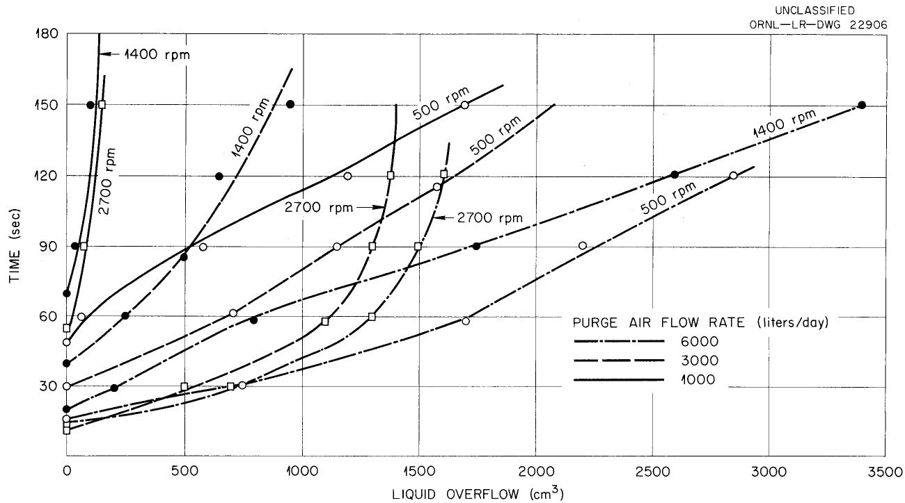  
Fig. 1.2.1. Overflow from Fuel Expansion Tank as a Result of Sudden Stoppage of One Fuel Pump. Data obtained for water flow and air purge of twin fuel pumps in aluminum north-head mockup. (with caption)

Subsequently the pump will be operated for an extended period under conditions conducive to cavitation in order to study cavitation damage to the impeller.

# Fuel Pump Endurance Tests

P. G. Smith

The ART fuel pump being tested for endurance with fuel 30 as the circulated fluid has accumulated a total of $3200\mathrm{hr}$ of continuous operation at 2700 rpm. The wetted portions of the pump (impeller, volute, and the containing vessel) have been thermally cycled 582 times over the temperature range of 1100 to $1400^{\circ}\mathrm{F}$ . The pump-surge-tank helium-gas pressure is being maintained in a range that would induce cavitation in the impeller. No operating troubles have been experienced during this test. The oil leakage rate of the lower seal of the pump has continued to be $5\mathrm{cm}^3/\mathrm{day}$ , and there has been no measurable leakage from the upper seal. The test will be terminated for examination of the pump in the near future, and a new fuel pump rotary element will be placed in operation for a further endurance test.

The hydraulic drive system has also given trouble-free continuous operation throughout the test, in contrast to previous experience. The improvement is believed to result from maintenance of a 120-psig pressure on the discharge side of the hydraulic motor. The back pressure holds the pistons against the wobble plate at all times, in accordance with the manufacturer's recommendations.

# Sodium Pump Development Water Tests

J. J. Simon

Performance data were obtained for the ART sodium pump (MN-2) with water as the circulated fluid in an Inconel test loop. The outer diameter of the seal vanes on the centrifuge cup lid was increased from 5.5 to 5.625 in. in order to reduce the inward flow to the centrifuge across the cup lid. The data obtained, as shown in Fig. 1.2.2, are essentially the same as those obtained in earlier tests. It was found that ingassing of the system fluid occurred at reduced main loop flows when the operating conditions were in the region to the left of line A in Fig. 1.2.2. Design modifications have been made to the loop to accommodate

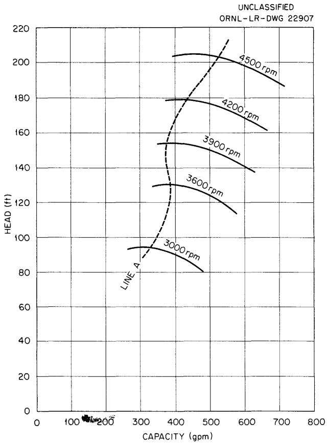  
Fig. 1.2.2 Performance Characteristics of ART Sodium Pump (MN-2) with Water as the Circulated Fluid. (Secret with caption)

the rotary elements produced for the reactor pumps and to more accurately mock up the latest designs of openings between the pump centrifuge and the ART sodium expansion tank.

# Sodium Pump Endurance Tests

P. G. Smith

The sodium pump which was being operated in an endurance test with sodium had accumulated a total of 2572 hr of continuous operation at 3600 rpm when it was stopped for examination. The pump and containing vessel had been thermally cycled 516 times over the temperature range from 1050 to $1250^{\circ}\mathrm{F}$ . Examination5 of the pump confirmed that it was operating in a region of cavitation. The impeller damage resulting from cavitation is shown in Fig. 1.2.3. At the beginning of this test, data on the pump input power vs the pump-surge

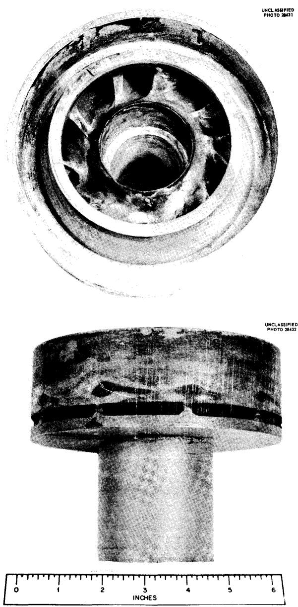  
Fig. 1.2.3. Impeller Removed from Sodium Pump Operated for 2572 hr with Sodium at 1050 to $1250^{\circ}$ F. Note cavitation damage. (Confidential with caption)

tank helium-gas pressure were obtained, as shown in Fig. 1.2.4. The flat maximum power portion of the curve indicates the absence of impeller cavitation; the sloping portion of the power curve for surge tank pressures lower than 10 psig was interpreted as impeller operation in a region of cavitation. Therefore the 7- to 9-psig pump-surge-tank gas pressures used for this test were in the cavitation range.

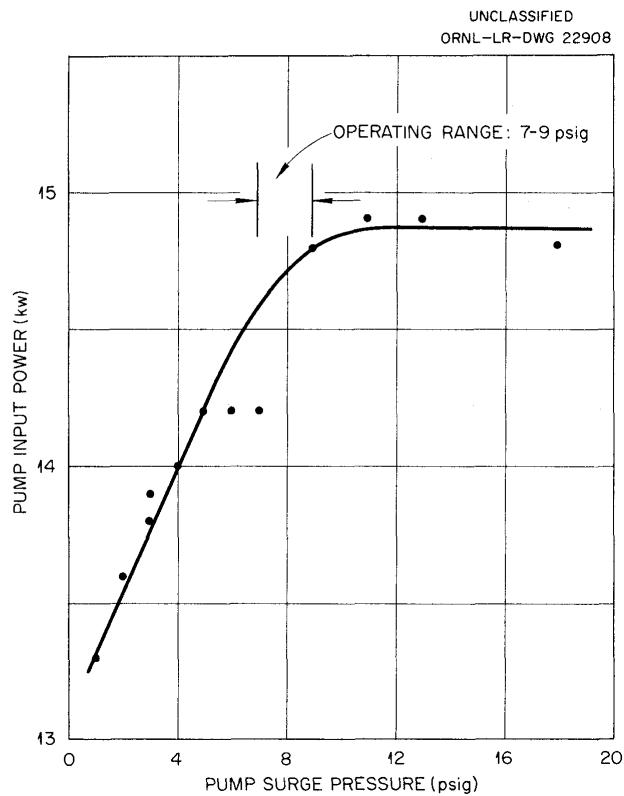  
Fig. 1.2.4. Sodium Pump Input Power vs Surge Tank Gas Pressure.

The pump and test equipment are presently being utilized to obtain the temperature gradient along the pump barrel for various neutron-shield and thermal-barrier configurations. One test for a period of 268 hr revealed that a modification to the barrier was desirable in order to simulate more nearly the reactor temperatures. The test stand in which the tests are being performed is being revised for further tests of barrier modifications and of a simulated ETU lube-oil system.

# Primary and Auxiliary NaK Pump Development

H.C.Young J.N.Simpson

High-temperature testing of ART primary NaK pumps was continued. The pump that was inspected during the previous quarter after 2100 hr of satisfactory operation was reinstalled for further testing after the leading edges of its impeller vanes at their junction with the hub were ground off to minimize restriction of the flow passages. This

change did not alter the cavitation pattern. The pump was operated for 500 hr without a helium bleed down the pump shaft annulus but with a continuous helium bleed of 50 liters per day through the oil catch basin. Lower-seal oil leakage, which averaged $15\mathrm{cm}^3$ per day, was sparged properly and no operational difficulties were encountered. The rotary assembly was dismantled, inspected, and reinstalled in the test loop after 500 hr of operation (2600-hr total). Based on this 500-hr test and the 408-hr test conducted in the previous quarter, the helium purge down the pump shaft annulus has been eliminated.

The pump was next placed on endurance testing at a minimum NaK temperature of $1200^{\circ}\mathrm{F}$ and a maximum NaK temperature of $1400^{\circ}\mathrm{F}$ . Additional performance and cavitation data taken after a total operating period of 4200 hr correlated well with earlier data. The oil leakage through the lower seal had increased from an average of less than $20~\mathrm{cm}^3$ per day to over $200~\mathrm{cm}^3$ per day, and the power trace indicated momentary increases as large as 6 kw. In view of the increased oil leakage, it was thought that these surges could be due to rough seal faces, and operation was continued.

After 4400 hr of operation the helium pressure in the pump tank increased to approximately 25 psi above the regulated helium supply, and shortly thereafter the NaK level in the pump tank rose until the oil catch basin was flooded. The pump was stopped, and the rotary element was removed for inspection. It was found that oil had been leaking down the pump shaft. Large quantities of oil residue were lodged in the thermal-barrier area above the impeller. Carbon buildup had scored the pump shaft and is believed to have caused the power trace surges.

The oil had leaked down the shaft, at least during the last week of operation, even though $200~\mathrm{cm}^3$ per day or more of the leakage was removed by the catch-basin helium purge. It is therefore postulated that when the oil leakage became excessive the oil mixed with the NaK to such an extent that its vapors resulted in a substantial increase in pressure in the pump tank, and considerable quantities of vapor were entrained in the pumped liquid. When the excess pressure was vented, the contained liquid and entrained vapor expanded to such an extent that the pump tank filled and overflowed. The ingassing and pressure buildup could also have been caused by leakage of gas into the

NaK through a bellows failure in a pressure-measuring device or through a failure in a valve bellows. Both these possibilities are being investigated. The reliability of the lower seal is being studied to determine means for improving it. The test loop is being cleaned for further testing.

At termination of this test because of the oil seal failure, the pump had completed 4000 hr at a NaK temperature of $1200^{\circ}\mathrm{F}$ and 400 hr at $1400^{\circ}\mathrm{F}$ . During the 4400 hr of operation the pump rotary element was removed three times for inspection. The elastomer secondary glands of the oil seal were replaced at each inspection, and the original rotary element was approved for further testing. The critical dimensions of the rotary element remained constant, and the volute mouth dimensions remained essentially constant after initially increasing an average of 0.010 in., as described previously.6 The oil seals were designed for a life of 2000 hr, and, with exception of the elastomer secondary glands, which are time-temperature sensitive, they operated satisfactorily. It is believed that by providing a double rather than a single elastomer seal, the seal should prove to be satisfactory for a somewhat longer operating time than indicated by this first endurance test.

The major difficulty encountered during the test was partial plugging of the off-gas reflux condenser on the pump tank. Although such plugging occurred three times, functioning of the condenser was satisfactorily restored on each occasion by heating it to approximately $600^{\circ}\mathsf{F}$ . The cold trap tended to plug during the last 500 hr of operation, and therefore its piping will be removed and inspected. The spark-plug probes on the pump tank gave reliable service throughout the test; only one short occurred. The resistance-type level indicator in the pump gave reliable NaK-level measurements throughout the test and will be kept in service for further pump testing.

A second high-temperature NaK-pump test loop was placed in operation, and six electromagnetic flowmeters were calibrated for use in the ETU and ART. The performance and cavitation data obtained agreed very well with the data obtained with the loop described above. It therefore appears that impeller and volute passage dimensions can be controlled satisfactorily in the welding and machining processes used in the fabrication of these parts.

A previous error in calculating the velocity head across the pump resulted in the performance curves obtained during the quarter for the auxiliary NaK pump being slightly lower than those reported previously. The pump efficiency is about $1\%$ less than reported previously, and the minimum suction pressure required to suppress cavitation is slightly more. The revised performance curves are presented in Fig. 1.2.5, and the minimum pressures required to suppress cavitation during operation with NaK, based on the results of water tests, are given in Table 1.2.1. The revised performance characteristics of the auxiliary pump are adequate to meet the design requirements of the ART.

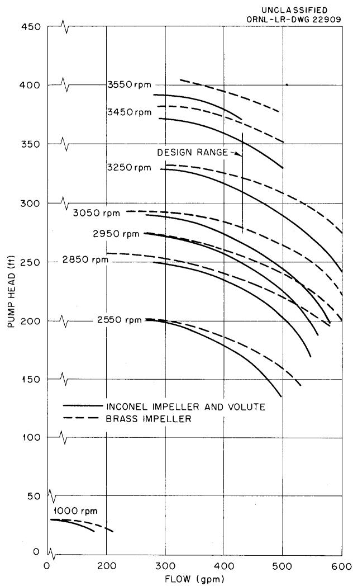  
Fig. 1.2.5. Performance Characteristics of Auxiliary NaK Pump with Water as the Circulated Fluid.

Table 1.2.1. Minimum Suction Pressures Required to Suppress Cavitation in an Auxiliary NaK Pump Operating with NaK at 1200 and at $1400^{\circ}$ F   

<table><tr><td rowspan="2">Flow Rate (gpm)</td><td rowspan="2">Pump Speed (rpm)</td><td colspan="2">Suction Pressure Required* (psig)</td></tr><tr><td>At 1200°F</td><td>At 1400°F</td></tr><tr><td rowspan="5">300</td><td>3450</td><td>-3.78</td><td>+1.20</td></tr><tr><td>3250</td><td>-4.15</td><td>+0.85</td></tr><tr><td>3050</td><td>-4.53</td><td>+0.48</td></tr><tr><td>2850</td><td>-4.98</td><td>+0.04</td></tr><tr><td>2650</td><td>-5.35</td><td>-0.32</td></tr><tr><td rowspan="5">430</td><td>3450</td><td>+0.55</td><td>+5.34</td></tr><tr><td>3250</td><td>+0.04</td><td>+4.89</td></tr><tr><td>3050</td><td>-0.39</td><td>+4.48</td></tr><tr><td>2850</td><td>-0.93</td><td>+3.96</td></tr><tr><td>2650</td><td>-1.66</td><td>+3.25</td></tr><tr><td rowspan="5">500</td><td>3450</td><td>+2.39</td><td>+7.15</td></tr><tr><td>3250</td><td>+2.35</td><td>+7.11</td></tr><tr><td>3050</td><td>+2.00</td><td>+6.77</td></tr><tr><td>2850</td><td>+1.74</td><td>+6.53</td></tr><tr><td>2650</td><td>+1.31</td><td>+6.10</td></tr></table>

*Based on the results of tests with water and the assumption that the cavitation parameter remains constant for water and NaK; data were corrected only for vapor pressure and density differences between water and NaK; the local barometer reading of 29.15 in. Hg was used in establishing the correction.

# REACTOR COMPONENT DEVELOPMENT TESTS

D. B. Trauger

# Heat Exchanger and Radiator Development Tests

J. C. Amos

J. W. Cooke

D. R. Ward

R. L. Senn

A summary of heat exchanger and radiator test operations during the quarter is presented in Table 1.2.2. Small heat exchanger test stand B was modified to accommodate a 20-tube semicircular heat exchanger, which is currently being assembled. A description of this heat exchanger and the test objectives was presented previously.7

Testing of Process Engineering Corp. small heat exchanger No. 3, type SHE-7, with NaF-ZrF $_4$ -UF $_4$

(56-39-5 mole $\%$ fuel 70) in test stand SHE-C was interrupted after a total of 1438 hr of operation by failure of York Corp. 500-kw radiator No. 16, which was also being tested in this stand. The primary purpose of this test was to compare the performance and corrosion effects of fuel 70 with those of fuel 30, which was used in all previous heat exchanger tests. The test program was designed to duplicate the test history of the previously operated Process Engineering Corp. heat exchanger No. 2, type SHE-7. At the time of the radiator failure, the test system was operating normally at approximately ART design temperature and flow conditions. The heat exchanger fuel inlet temperature was $1600^{\circ}\mathrm{F}$ , and the radiator NaK inlet and outlet temperatures were 1500 and $1100^{\circ}\mathrm{F}$ , respectively. The radiator is currently being removed from the test stand for metallurgical examination.

Concurrent with radiator and heat exchanger testing, a radiator fin oxidation test was performed in test stand SHE-C by inserting the fin samples, shown in Fig. 1.2.6, in the hot air stream. The purpose of this test was to determine the depth of copper oxidation which would occur when stainless-steel-clad copper fin material with untreated edges was exposed to high-temperature air flow. The results of these tests, as reported in Chap. 3.3, "Welding and Brazing Studies," indicate that fins with untreated edges may be used in radiator fabrication.

Black, Sivalls & Bryson intermediate heat exchanger No.1 was replaced by their heat exchanger No. 3 in test stand IHE-B. Shakedown operations at $1200^{\circ}\mathrm{F}$ are under way preparatory to starting phase II of a test at a maximum NaK temperature of $1700^{\circ}\mathrm{F}$ . Power conditions for this phase of the test will be the same as those given previously for phase I. Controlled thermal cycling of the heat exchangers will be a major feature of phase II operations. A cycle will consist of $\frac{1}{2}$ hr of operation with a temperature difference across the system followed by $\frac{1}{2}$ hr of isothermal operation at $1200^{\circ}\mathrm{F}$ . The heat exchangers are to be subjected to 35 such cycles. This number of cycles represents a first estimate of the upper limit of the number of cycles required for heat exchanger failure. The

Table 1.2.2. Summary of Heat Exchanger and Radiator Operations (As of June 10, 1957)   

<table><tr><td>Test Unit</td><td>Test Stand</td><td>Hours of Operation with Fuel at 1600°F</td><td>Hours of Nonisothermal Operation</td><td>Total Hours of Operation</td><td>Number of Thermal Cycles</td><td>Status of Test</td></tr><tr><td>Process Engineering Corp. heat exchanger No. 3 (type SHE-7), operating with fuel No. 70</td><td>SHE-C</td><td>297</td><td>1044</td><td>1438</td><td>21</td><td>Test interrupted by radiator failure</td></tr><tr><td>Black, Sivalls &amp; Bryson heat exchanger No. 2 (type IHE-8)</td><td>IHE-B</td><td>503</td><td>547</td><td>1127</td><td>5</td><td>Test continuing</td></tr><tr><td>Black, Sivalls &amp; Bryson heat exchanger No. 3 (type IHE-8)</td><td>IHE-B</td><td></td><td></td><td></td><td></td><td>Test continuing</td></tr><tr><td>York Corp. radiator No. 11</td><td>IHE-B</td><td></td><td>547</td><td>1127</td><td>5</td><td>Test continuing</td></tr><tr><td>York Corp. radiator No. 12</td><td>IHE-B</td><td></td><td>547</td><td>1127</td><td>5</td><td>Test continuing</td></tr><tr><td>York Corp. radiator No. 16</td><td>SHE-C</td><td></td><td>1044</td><td>1438</td><td>21</td><td>Terminated because of radiator failure</td></tr><tr><td>York Corp. ART prototype radiator No. 1</td><td>IHE-C</td><td></td><td>172</td><td>475</td><td>5</td><td>Test continuing</td></tr></table>

results of the test should be helpful in determining the accuracy with which heat exchanger life can be predicted by present stress analysis techniques.

Testing of the York Corp. ART prototype radiator No.1, previously described, was started in test stand IHE-C, and heat transfer data are currently being taken. A plot of the room-temperature air-pressure-drop data for this radiator is presented in Fig. 1.2.7.

During startup of this test an experiment was conducted to determine the effect on oxide content in a new NaK system of dumping the NaK while hot, allowing it to cool, and then recharging the system. The NaK was circulated at $1200^{\circ}\mathrm{F}$ with the circulating cold trap operating as near the loop temperature as possible (outlet temperature, $1100^{\circ}\mathrm{F}$ ) until the plug indicator readings reached equilibrium at approximately $1015^{\circ}\mathrm{F}$ . The NaK was then dumped and allowed to cool to $200^{\circ}\mathrm{F}$ before the loop was recharged and the $1200^{\circ}\mathrm{F}$ isothermal condition was established. The plug-indicator readings then reached equilibrium at approximately $950^{\circ}\mathrm{F}$ . The small reduction in oxide content obtained by the hot dump may have resulted

from inability to maintain the cold trap at the same temperature as that of the remainder of the system. Since the cold trap was not drained and had collected oxide during the initial isothermal operation, it could have acted as a source of oxide during the subsequent operation. This test does not necessarily invalidate the use of a hot dump for system cleanup, but it does indicate that it would be of little use in ETU and ART operations.

The cold trap installed on this test stand (IHE-C) is 8 in. in diameter and, except for its $\frac{1}{2}$ -in.-OD (rather than 5.8-in.-OD) stainless steel cooling coil, is identical to the ART main NaK system cold traps. No plug-indicator readings were taken while this cold trap was being placed in operation. A period of approximately 24 hr was required to reduce the cold-trap outlet temperature to $350^{\circ}\mathrm{F}$ so that cold-trap cooling could be transferred from air to water. When water cooling was applied, the NaK flow rate was increased to 1.2 gpm to maintain an outlet temperature of $300^{\circ}\mathrm{F}$ . Plug-indicator readings taken immediately following this operation showed no definite plugging temperature, which, for this system, means that the oxide saturates the NaK at a temperature well below $600^{\circ}\mathrm{F}$ .

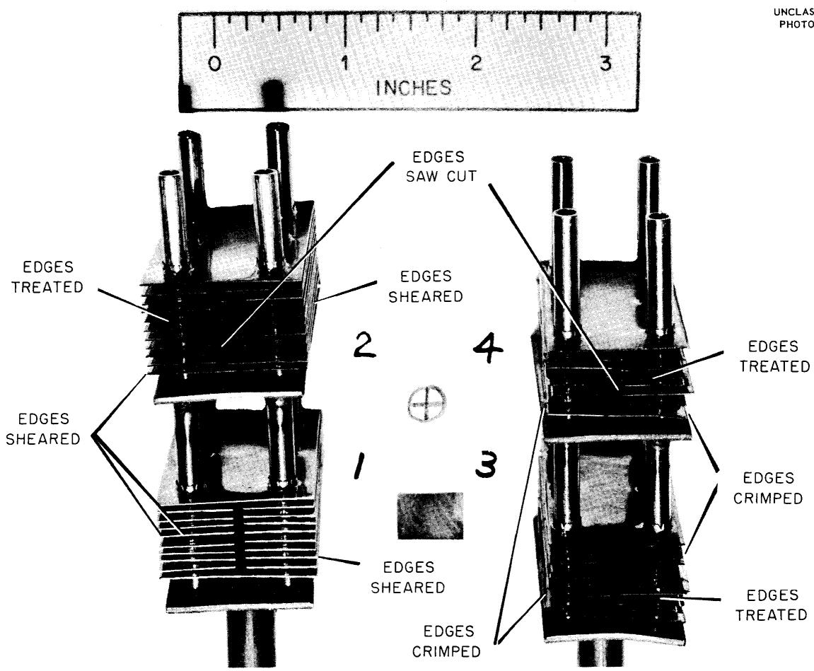  
Fig. 1.2.6. Fin Samples Used for Oxidation Tests in Test Stand SHE-C.

# Valve Development Tests

J. A. Conlin

I. T. Dudley M. H. Cooper

Fuel Dump Valve. - The presently proposed configuration of the fuel dump valve incorporates a number of modifications to the original design. Formerly the stem and plug were aligned by two guides in the bonnet, which operated on the stem, and misalignment and valve-stem binding occurred during high-temperature operation. It is thought that the assembly became warped when the final closure weld was being made. The stem guide nearest the plug has been removed, and a loose-fitting spiderlike guide has been installed in the

valve seat housing to guide the plug. With this arrangement it is unlikely that gross seat-to-plug misalignment can occur. Final alignment is accomplished by the plug sliding freely into place in the seat.

The valve-plug seating surface is, as before, brazed to the plug body, but in order to eliminate the possibility of a failure of this braze when the valve is opened that would result in the plug remaining seated, a mechanical backup for the brazed joint has been included in the valve. No cases of braze failure have occurred during tests, but there have been some instances of braze failure during final machining.

A second seal bellows has been added to the valve stem to contain the fuel and fission products in the event of failure of the first bellows, and modifications to the internal passages of the valve are to be made to minimize fuel holdup after a

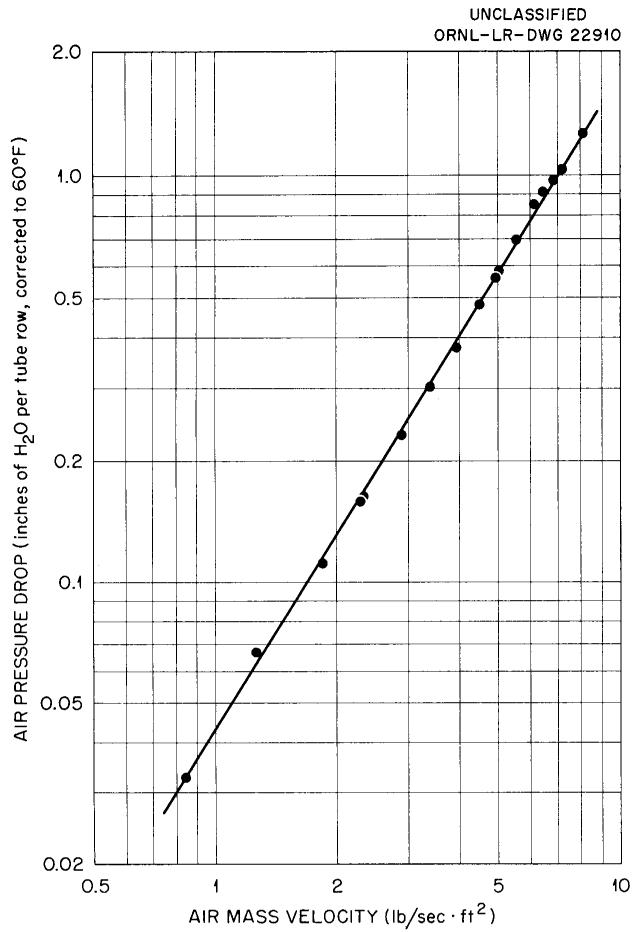  
Fig. 1.2.7. ART Prototype Radiator No. 1 Room-Temperature Air-Pressure-Drop Data. (with caption)

dump. As a result of valve-seat tests, the previously described10 cermet KM will be used for the plugs and K162B will be used for the seats.

A valve, designated 5C (ref 10), which had a spherical molybdenum plug and conical copper seat, completed a 1500-hr test at $1300^{\circ}\mathrm{F}$ with fuel 30. Leakage rates were erratic after each opening and closing following a 500-hr closure period, and became excessive, that is, greater than $10~\mathrm{cm}^3 /\mathrm{hr}$ , after the thirty-third operating cycle. Leakage rates were not measured during the remainder of the test. As a result of this and similar experience in valve-seat-materials tests, the molybdenum copper seat combination was abandoned for ART use.

A valve, designated ORNL-1, was assembled from reworked parts that included the spiderlike plug guide described above. Both the seat and the plug were the cermet K151A (ref 10); the final choice of seat materials had not been made when this valve was assembled. This valve was tested for $1500\mathrm{hr}$ through 50 operating cycles with fuel 30 at $1300^{\circ}\mathrm{F}$ . The leakage rate was immeasurable, as determined by the fluid level in the system, except on two occasions after an opening and closing cycle when the leakage rate was approximately $3\mathrm{cm}^3/\mathrm{hr}$ ; however, opening the valve and flushing fuel over the seat and plug reduced the leakage rate to zero. It is believed that some foreign material had lodged in the seating areas and prevented proper sealing.

At the completion of 1500 hr at $1300^{\circ}\mathrm{F}$ , the temperature was raised to $1500^{\circ}\mathrm{F}$ , and through five operating cycles the opening force was less than 200 lb. The valve has been closed for 340 hr of a 500-hr closure test, and there has been no leakage. This test will be continued until completion of a 1500-hr test, including 50 operating cycles at $1500^{\circ}\mathrm{F}$ , or until valve failure. The high opening forces and erratic leakage rates experienced with all valves tested previously probably resulted from stem-to-stem guide binding and galling because of seat-plug misalignment rather than from self-welding and distortion of seat materials. A second valve is being reworked that will match more closely the configuration and materials of the ART fuel dump valve, and it should be ready for testing soon.

NaK Dump Valve. - The NaK dump valve, shown in Figs. 1.2.8 and 1.2.9, is similar to the fuel dump valve, including the spiderlike guide arrangement for plug guidance. Stellar 6 is used both as the rubbing surface for the guide and for the valve-seating materials because the operating temperature will be lower than that of the fuel valve. No mechanical backup for the plug braze will be required, since Stellar is a hard-surface overlay that is integral with the plug. The backup bellows has also been omitted because of the lesser hazard in the event of a leak. The first prototype valve has been tested with water, and the leakage rate of $0.1\mathrm{cm}^3/\mathrm{hr}$ at 65 to 70 psi is satisfactory. The valve is presently being tested to determine its flow resistance in the open position and is to be installed on the NaK valve test stand for further testing.

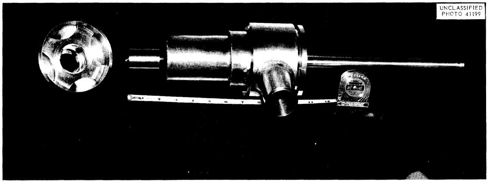  
Fig. 1.2.8. Prototype NaK Dump Valve Before Being Welded.

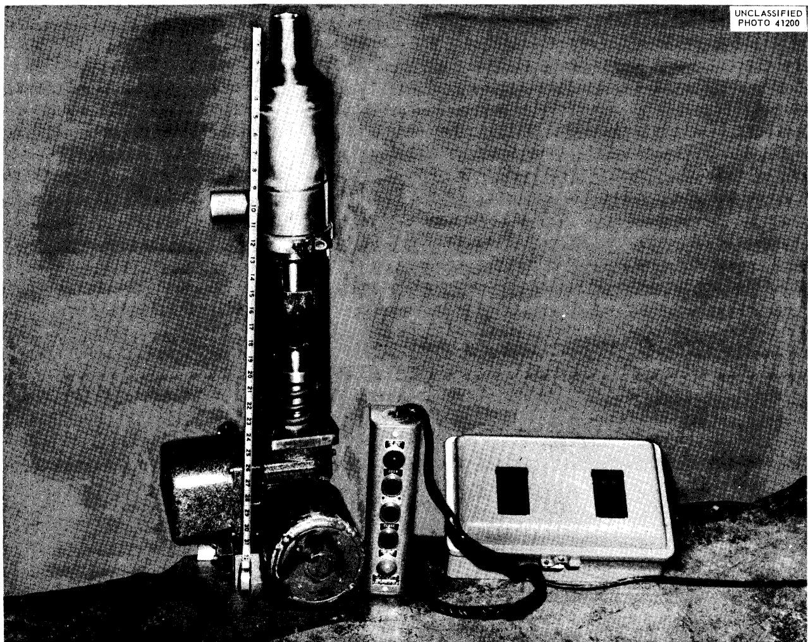  
Fig. 1.2.9. Prototype NaK Dump Valve and Actuator Assembly.

"In-Line" Valve Operator Test. - The first NaK valve "in-line" operator received was found to have a total travel of $\frac{3}{8}$ in. instead of the required $\frac{5}{8}$ in.; the spring rate exceeded 3000 lb/in., whereas 2000 lb/in. had been specified; and the yoke counter bore was 0.020 in. too shallow. These minor deviations were corrected in the second NaK valve operator, which was received with the prototype NaK dump valve. After a separate performance test, the second operator will be tested in conjunction with the prototype NaK dump valve described above.

NaK Cold-Trap and Plug-Indicator-System Throttling Valves. - Several small NaK throttling valves are required for the cold-trap and plug-indicator systems of the ETU and the ART. The specifications for these valves state that they must operate at $1000^{\circ}\mathrm{F}$ , that they must withstand a 200-psig system pressure without failure in an emergency, that they must provide full flow of 5 gpm or greater with a pressure of 24 psi across the valve, and that they must provide throttling control accurate to $\pm 0.05$ gpm in the range of 0.5 and 1.5 gpm with a pressure of 60 psi across the valve.

It was decided to use a valve for this service that was immediately available from a vendor. The valve selected was designed for closure service (Fig. 1.2.10) and did not have adequate throttling characteristics; however, it met the pressure and maximum flow requirements, and modifications were made in the plug in order to obtain the desired throttling characteristics. Also, the valve stem and bonnet were modified for use with a remotely controlled pneumatic operator. With these modifications the valve meets the requirements, with certain limitations. The full-flow requirement and the short permissible stroke, 0.155 in., of the bellows place stringent requirements on the valve actuator in the throttling range; however, flow tests indicate control to be more than satisfactory. The high system pressure and procurement time limitations make the use of a different bellows or valve impractical, at least for the ETU.

One of these valves was tested for leak tightness in the unmodified condition. Leakage was measured by water displacement. The test included 100 operating cycles and a one-week closure at a temperature of $1200^{\circ}\mathrm{F}$ with helium at a pressure of 90 psi across the valve. No measurable leakage

UNCLASSIFIED PHOTO 28407

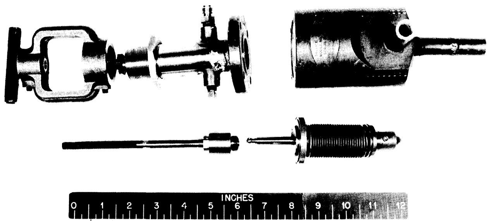  
Fig. 1.2.10. Throttling Valve for Cold-Trap Systems.

was detected. The valve bellows was pressure tested by subjecting each of two valves to a 200-psi internal pressure at $1200^{\circ}\mathrm{F}$ for 24 and 40 hr, respectively; neither bellows failed. One valve was tested on a NaK test stand at $1000^{\circ}\mathrm{F}$ for 1500 hr. The test included 46 operating cycles. Valve leakage with a 50-psi pressure differential was $3\mathrm{cm}^3/\mathrm{hr}$ for a stem thrust of 140 lb, and there was no leakage for a stem thrust of 280 lb.

# Sodium Circuit Water Flow Tests

S. Kress11

Water flow tests for determining the head losses through various regions of the ART sodium circuit are nearly complete. Three regions were examined during the quarter: the entrance to the coolant holes in the beryllium reflector-moderator, the entrances and exits of the coolant holes in the beryllium island, and a proposed bypass slot between the sodium heat exchanger shell and the external pressure shell of the reactor.

A previous test of the losses at the entrances to the reflector-moderator coolant holes indicated that certain of these holes were starved for flow, specifically those in the region of the shoulder of the pie-shaped depression in the beryllium. In this region the entering sodium impinges on the circular boron can and spreads out over the top of the reflector. Remodeling of the shoulder, as shown in Fig. 1.2.11, has provided a more gradual transition from the depression to the reflector top. The plane of the remodeled shoulder makes an 18-deg angle with the 7-deg plane of the depression. Tests of the modified model showed considerable improvement in flow distribution. The flow through the holes differed and was, in general, lower in the region of the shoulder, but the flow variation was small enough to permit final control by proper sizing of equator joint orifices.

Tests of flow to the island cooling passages were run in order to establish entrance and exit losses for the annular coolant passage adjacent to the core shell. To simulate this region, a test piece was made (Fig. 1.2.12) which consisted of a straight passage of the same cross section as that of the curved annulus between the island and

the shell and which included $\frac{3}{16}$ -in.-dia holes at angles of 6 and 10 deg to the passage, that is, at approximately the angles of the coolant holes in the ART island. The results of these tests are plotted in Figs. 1.2.13 through 1.2.16 as entrance and exit loss coefficients, $K$ , vs the ratio of the velocity in the holes to the velocity in the annular passage, $V_{H} / V_{P}$ . The loss coefficient, $K$ , is defined by the equation

$$
\Delta H = \frac {K V ^ {2}}{2 g},
$$

where $\Delta H$ is the head loss (in ft) that results solely from turbulence, $V_{PT}$ is the flow velocity (in fps) through the section that carries the total flow, and $g$ is the proportionality constant relating force to acceleration and mass. Corrections were made to the measured values of $K$ for friction losses and velocity changes.

A test was also run in order to determine the head loss vs flow characteristics of a proposed bypass slot between the sodium-to-NaK heat exchanger shell and the external pressure shell of the reactor. This slot, which would connect the region between the pressure shell and the outer pressure ring with the sodium-to-NaK heat exchanger inlet region, would allow some sodium to bypass the present slots between the pressure shell and the upper-deck outer shell and would thus provide a more direct entrance to the heat exchanger. A previous test $^{12}$ was made of such a slot, but stress analyses dictated a change in dimensions. The presently proposed slot is 2 in. wide and 0.5 in. deep and has a slightly larger cross-sectional area, 0.00694 ft $^2$ , than that of the previously tested slot, which was 5 in. wide and 0.187 in. deep and had a cross-sectional area of 0.00651 ft $^2$ . The experimentally determined head loss equations for the two slots are, respectively,

$$
\Delta H _ {1} = \frac {1 . 3 V ^ {1 . 9 8}}{2 g},
$$

$$
\Delta H = \frac {1 . 1 4 V ^ {1 . 9 7}}{2 g}
$$

where $\Delta H$ is the head loss (in ft) across the slot, $V$ is the mean velocity (in fps) through the slot, and $g$ is the proportionality constant relating force to acceleration and mass.

Fig. 1.2.11. Wooden Model of the ART Reflector-Moderator Coolant-Entrance Region Showing the Shape of the Remodeled Depression. (Secret with caption)   
  
UNCLASSIFIED   
ORNL-LR-DWG 22911


  
Fig. 1.2.12. Diagram of Mockup Used to Simulate Coolant Passages in Beryllium Island. (Color with caption)

  
Fig. 1.2.13. Turbulence Loss Coefficients for Island Cooling-Hole Entrances. (with caption)

  
Fig. 1.2.14. Turbulence Loss Coefficients for Annular Passage Around Core Shell in Vicinity of Cooling-Hole Entrances. (with caption)

  
Fig. 1.2.15. Turbulence Loss Coefficients for Island Cooling Hole Exits. (with caption)

# Outer Core Shell Thermal Stability Test

J. C. Amos

R. L. Senn

The test, described previously, $^{13}$ in which a quarter-scale model of the ART outer core shell is being thermally cycled, was interrupted following the forty-third cycle because of a leak in the expansion bellows which joined the shell to the bottom piece of the apparatus. While the bellows was being replaced, the shell was examined, and no dimensional changes were found. The proposed 300-cycle test will be resumed soon.

# Liquid-Metal-Vapor Condensers

M. H. Cooper

A. G. Smith14

The NaK-vapor condenser V for the NaK dump tank vent, described previously as a revision to the Mark IV model, $^{15}$ was tested at a gas saturation temperature of $1200^{\circ}\mathrm{F}$ and found to be satisfactory

  
Fig. 1.2.16. Turbulence Loss Coefficients for Annular Passage Around Core Shell in Vicinity of Cooling Hole Exits. (see with caption)

at gas flow rates from 2.8 to 1.1 scfm. The efficiencies found at several gas flow rates are given below:

<table><tr><td>Flow Rate (scfm)</td><td>Efficiency (%)</td></tr><tr><td>2.8</td><td>99.5</td></tr><tr><td>2.8</td><td>99.5</td></tr><tr><td>2.2</td><td>98.8</td></tr><tr><td>1.6</td><td>99.9</td></tr><tr><td>1.1</td><td>99.9</td></tr></table>

A prototype of the liquid-metal-vapor condenser for the NaK pump purge gas, which consists of a 2-ft length of 2-in. pipe filled with Demister packing, is being tested at twice the design gas flow of 1000 liters per day of helium saturated with NaK vapor at $1200^{\circ}\mathrm{F}$ . Approximately 750 hr of trouble-free test operation has been accumulated.

The sodium-vapor condenser IV for the sodium pump purge gas15 became plugged with sodium at a $\frac{1}{4}$ -in. outlet fitting after 1420 hr at the design flow of 1000 liters per day of helium saturated by bubbling it through sodium at $1200^{\circ}\mathrm{F}$ . A second test in which the temperatures along the condenser were reduced in order to achieve more complete removal of sodium vapor by the condenser has been in operation for 650 hr without difficulty.

# Zirconium Fluoride Vapor Traps

J. A. Conlin

M. H. Cooper

Tests are under way on an experimental version of the ART $\mathsf{ZrF}_4$ -vapor trap. $^{16}$ The test program includes simulation of reactor design conditions for normal operation and for a fuel dump. The trap will be tested at continuous low purge flow rates for a 500-hr period, with intermittent high flow rates for 5 min at 100-hr intervals. The test conditions and the results obtained thus far are presented in Table 1.2.3.

The trap completely removed $\mathsf{ZrF}_4$ vapor from the gas at both gas flow rates used. The inlet line plugged twice at the trap face, however, apparently

Table 1.2.3. Conditions and Results of Tests of $\mathsf{ZrF}_4$ -Vapor Trap   

<table><tr><td>Test Condition</td><td>Test Period</td><td>Fuel* 
Temperature 
(℃)</td><td>Purge Gas 
Flow Rate</td><td>Comments</td></tr><tr><td>Fuel dump</td><td>0-5 min</td><td>1400</td><td>10 scfm</td><td>No ZrF4carried past trap</td></tr><tr><td>Normal operation</td><td>0-100 hr</td><td>1300</td><td>5000 liters per day</td><td>Inlet line plugged twice; 
no plugging since rais- 
ing trap inlet tempera-ture</td></tr><tr><td>Fuel dump</td><td>100 hr-100 hr 
and 5 min</td><td>1400</td><td>10 scfm</td><td>Pressure drop increased 
about 1 psi</td></tr></table>

$^{*}\mathrm{NaF - ZrF}_{4} - \mathrm{UF}_{4}$ (50-46-4 mole %, fuel 30).

  
Fig. 1.2.17. Inlet Section of a Prototype ART $\mathbf{ZrF}_4$ -Vapor Trap After 50 hr of Testing. (Schematic with caption)

because cooling of the inlet plate by natural convection and radiation to the water-cooled trap walls was greater than expected. The inlet line after 50 hr at the high purge flow rate is shown in Fig. 1.2.17. Additional heat has been applied at the trap inlet to maintain it above the condensation temperature of the $\mathsf{ZrF}_4$ vapor from NaF-ZrF-UF $_4$ (50-46-4 mole %, fuel 30) at $1400^{\circ}\mathsf{F}$ , and testing has been resumed. Since it will not be possible to heat the ART trap in this manner, redesign of the inlet will be necessary to minimize thermal losses.

# 1.3. INSTRUMENT AND CONTROLS DEVELOPMENT

E. R. Mann

C. S. Walker

R.G.Affel

# FUEL EXPANSION TANK LIQUID-LEVEL INDICATOR

R. F. Hyland

A series of tests of the helium-bubbler type of liquid-level indicator, described previously, was run in the fuel expansion tank of the aluminum north-head mockup. These tests were made in order to determine the effect of the extreme turbulence in the expansion tank on the accuracy of the level-measuring system. Inasmuch as an absolute level calibration cannot be obtained under turbulent conditions, the tests were designed for determining level differentials under various conditions.

The unshielded bubblers used revealed a reproducible trend toward an increase in the indicated level of about 0.75 in. of $\mathsf{H}_2\mathsf{O}$ when the pump speed was increased from 500 to 2500 rpm and a corresponding decrease in level when the speed was decreased. The change in level with a change in pump speed was attributed either to velocity effects or to an actual level change as a result of a "dishing" effect. Additional bubblers were then installed where they would most likely give a level profile, and preliminary tests indicate that a corresponding decrease in the indicated level is obtained at one point for an increase at another, in confirmation of the postulated "dishing" effect. It is extremely difficult to observe visually what is taking place inside the expansion tank, and therefore it is planned to use high-speed photography to confirm that level changes actually take place as indicated.

Gas in the system is a constant problem because it tends to get trapped and displace water. In order to obtain reproducible results, all tests have been performed with the system degassed (visually) as completely as possible. In runs where one pump was stopped to purposely ingas the system, a very rapid and continuous rise in both the indicated and observed level was noted.

The level-measuring system responds very well at all pump speeds to the addition and removal of water from the expansion tank. Accurate metering

tests are planned to determine the accuracy of the measuring system in detecting these changes.

A scheduled 3000-hr test at $1500^{\circ}\mathrm{F}$ in the dynamic-level test rig, described previously, was terminated by bubbler plugging after approximately 2000 hr. As in previous tests, the plugs consisted largely of $\mathsf{ZrO}_2$ . As noted previously, the four tubes plugged almost simultaneously, and it therefore appears that slugs of $\mathsf{O}_2$ or $\mathsf{H}_2\mathsf{O}$ may get into the helium purge gas despite all efforts to eliminate them. Possible sources of the contamination were leaky bellows in the fuel and gas lines, which were discovered after the test rig was shut down. This test rig is being repaired, and a Freon leak check is to be made before a new test is started.

A static-level test system for studying the cause of bubbler plugging is being constructed. This system was described previously.2

# LIQUID-METAL-LEVEL TRANSDUCERS

R. E. Pidgeon, Jr.3

G. H. Burger

Results of metallurgical examination of the liquid-metal-level transducers tested previously in NaK systems have indicated that the failures were the result of defective welds. A modified version of the transducer was therefore designed for use in the ETU and ART NaK pumps. Test units of the modified design have been constructed, as shown in Fig. 1.3.1, and installed in the level test rig shown in Fig. 1.3.2. Two units have also been installed in pump test stands. Preliminary results indicate that the operating characteristics of these units are satisfactory for reactor service.

Tests to more completely determine the operating characteristics of the units are continuing, with particular emphasis on temperature effects and wetting, which could be a problem during the system filling operation. Acceptance testing and calibration of the units for the ETU are to begin

  
UNCLASSIFIED PHOTO 28995  
Fig. 1.3.1. ORNL-Designed Liquid-Metal-Level Transducer.

soon. The level transducers for the sodium system are being fabricated, and they will be tested in the same manner as the NaK probes.

# ON-OFF LEVEL PROBES

R.E.Pidgeon, Jr. G.H.Burger

Fabrication and testing of resistance-type on-off level probes of the type shown in Fig. 1.3.3 were continued. Six units are now being tested in the level test rig, and more units are being fabricated for testing. Twenty-two units are now operating in NaK pump test loops, and all but two units continue to give satisfactory service. These two

units failed because of an open circuit between the center electrode and outer shell at the bottom of the probe. The copper wire apparently oxidized and came loose at the weld joint. It is expected that this trouble can be eliminated by coating or plating the wire with a suitable high-conductivity oxidation-resistant material, such as nickel, or by aluminizing the wire.

On-off probes for the NaK pump bowls and dump tanks are being designed. It is expected that the first of these units will be available for testing in August. Material for an all-Inconel probe has been ordered, and several of these units will be constructed and tested.

Investigations and tests are continuing in an effort to find suitable commercial spark-plug probes for nonradioactive liquid-metal systems. Several special plugs made by the Champion Spark Plug Co. are to be tested soon, along with a BeO plug fabricated at ORNL.

# MAGNETIC FLOWMETERS

G. H. Burger

C. L. Pearce, Jr.3

The 2- and $3\frac{1}{2}$ -in. magnetic flowmeters for the ETU and the ART main, auxiliary, and special NaK circuits are being tested and calibrated in NaK pump test loops. As stated previously, the objectives of these tests are to calibrate the magnetic flowmeters against a water-calibrated venturi flow standard of $0.25\%$ accuracy, to check theoretical calculations of flow output and accuracy, to investigate the effects of temperature and handling, to determine long-term reliability, and to provide general operating data for use in the ETU and the ART. The pump test loop (PKP-2) in which six $3\frac{1}{2}$ -in. magnetic flowmeters were installed (Fig. 1.3.4) was put into operation on February 12, 1957, and the pump test loop (PKA-2) in which six 2-in. magnetic flowmeters were installed (Fig. 1.3.5) was put into operation on May 23, 1957.

Two of the six $3\frac{1}{2}$ -in. units have operated approximately 1000 hr, and four were removed after 770 hr of operation. The six 2-in. units have operated more than 300 hr. The test conditions include varying ambient temperatures, fluid temperatures, magnet temperatures, and flow rates. These variables are monitored continuously by Brown strip-chart recorders and are recorded on data sheets at 2-hr intervals. Additional data are taken on controlled runs to observe the effect of

  
Fig. 1.3.2. Rocking Facility for Dynamic-Level Tests of Liquid-Level Transducers.

UNCLASSIFIED PHOTO 27621

  
Fig. 1.3.3. ORNL-Designed On-Off Level Probe.

  
Fig. 1.3.4. Magnetic Flowmeters $(3\frac{1}{2}$ in.) Installed in a NaK Pump Test Loop.

  
Fig. 1.3.5. Magnetic Flowmeters (2 in.) Installed in a NaK Pump Test Loop.

each of the variables on flow output as measured by the units. In addition to these measurements the air-gap flux density of each magnet is measured at frequent intervals to determine the effects of temperature, aging, vibration, and flow on the magnetic circuit and to determine the effect of air-gap flux density on flow sensitivity. The air-gap flux density measurements are taken during operation at magnet temperatures over the range from 77 to $600^{\circ}\mathrm{F}$ . These values will be used to relate magnet temperature to air-gap flux density so that flux measurements will not be necessary during reactor operation.

Three types of calibration runs are made on the flowmeters - constant temperature tests, constant flow tests, and magnetic air-gap flux density tests. For the constant temperature runs the fluid temperature is held constant and the flow rate is varied in 100-gpm steps from 600 to 1600 gpm. The constant temperature is changed in 200-deg steps from 400 up to $1400^{\circ}\mathrm{F}$ , and a final test is made at $1500^{\circ}\mathrm{F}$ . For the constant flow runs the flow is held constant and the fluid temperature is varied from 400 to $1500^{\circ}\mathrm{F}$ in $100^{\circ}\mathrm{F}$ steps. The constant flow is changed in 100-gpm steps from 600 to 1600 gpm. For the magnet air-gap flux density measurements, the fluid temperature and flow are held constant and each magnet is enclosed with the pipe, by wrapping it with insulating blankets, so that the magnet is heated by the pipe. When the magnet temperature reaches $600^{\circ}\mathrm{F}$ , the blankets are removed and the air-gap flux densities are measured while the magnets are cooling to the ambient temperature of the loop enclosure.

Four of the $3\frac{1}{2}$ -in. magnetic flowmeters which were calibrated against the venturi on test stand PKP-2 were removed from the loop after 770 hr of operation and are now being prepared for welding into the ETU or the ART when required. The remaining two $3\frac{1}{2}$ -in. magnetic flowmeters were left in the loop for further tests and to provide reference data. Four uncalibrated flowmeters have been installed in the loop to replace the four removed, and they are now being calibrated.

Two 2-in. units and two $3\frac{1}{2}$ -in. units have been welded into the ETU system. Data from the calibration and test runs will be used to calculate the flow sensitivities of these units. The correlation of the experimental data is not yet complete, but a preliminary survey indicates that the units may be expected to give satisfactory service if the

magnet flux density is accurately known during operation. Additional information is to be obtained in the continuing test with regard to wetting effects and flux stability. The flux densities of six magnets have dropped from 0.6 to $3.6\%$ over a period of 7 months. The magnets have been handled extensively in installation and removal from the loop, however, and it is felt that most of the flux-density drop is due to handling. The drop during operation ranged from 0.3 to as high as $1.5\%$ . No correlation has been found between any of the controlled factors and this drop. Further monitoring of the two flowmeters left in the loop, as well as the completion of the correlation of the available data, should give additional information as to flux stability.

Each flowmeter incorporates three separate signal leads for spare leads and auxiliary outputs, as shown previously. It was found that in all cases the outputs from the three leads from both the 2- and the $3\frac{1}{2}$ -in. units were the same, as closely as they could be read from the Brown recorders. It was also found that three separate recorders could be connected to the three leads without interaction. In fact, satisfactory operation is obtained by connecting two recorders to the same flow lead because of the low impedance of the circuit.

The speed of response of the magnetic flowmeter is limited by the speed of response of the Brown recorder used. The flowmeter appears to follow faithfully minute variations of flow and responds well to abrupt changes in flow. As has been anticipated, noise pickup proved to be no problem, since the impedance of the flow element is very low. The linearity of the units appears to be very good; preliminary observations indicate that it may be better than $1\%$ .

An experimental sensitivity has been fitted to the data for two $3\frac{1}{2}$ -in. units, and by using this sensitivity it was found that the flow readings obtained with the magnetic flowmeter agreed with those of the venturi to better than $1\%$ . The experimentally derived sensitivity was greater than that calculated by G.E. by $6.5\%$ at a fluid temperature of $700^{\circ}\mathrm{F}$ and $8\%$ at a fluid temperature of $1500^{\circ}\mathrm{F}$ for one unit, and for the other unit it was $4.1\%$ higher at $700^{\circ}\mathrm{F}$ and $5.6\%$ higher at $1500^{\circ}\mathrm{F}$ .

The experimentally derived sensitivity decreased linearly with temperature with the same slope in both cases. The reproducibility of the measurements on these two units was better than $1\%$ .

The $\frac{3}{8}$ -in. magnetic flowmeters designed at ORNL (Figs. 1.3.6 and 1.3.7) for plugging-indicator and cold-trap systems will not, as stated previously, be calibrated because of the relaxed accuracy requirements. However, the units will be handled and installed in the same manner as the main and auxiliary system flowmeters. The flux-density variation of these magnets with temperature has been found in tests of a number of units to be approximately the same as for the 2- and $3\frac{1}{2}$ -in. units. Further temperature tests will be run on these units to determine magnet and flowpipe air-gap temperatures at various simulated fluid operating temperatures. Four of the flow-meters have been completed for installation in the ETU.

# TURBINE FLOWMETERS FOR USE AT HIGH TEMPERATURES

G. H. Burger

Two redesigned 1-in. turbine flowmeters have been fabricated that incorporate larger bearings

and closer bearing clearances than those used previously. These units are being calibrated with water prior to being installed in a gas-fired NaK pump test loop. If these redesigned units prove to be satisfactory, it is planned to redesign the $3^{1/2}$ -in. flowmeter which failed, as described previously, in a NaK pump test loop. It is believed that a satisfactory unit can be obtained by using closer bearing clearances, a larger bearing diameter, and a turbine with heavier blades and a larger blade root radius.

# THERMOCOUPLE TESTS

# J. T. De Lorenzo

Tests of Inconel-sheathed thermocouples (0.250-in.-OD sheath, MgO insulation) with closure welds made by the Heliarc welding process were continued, with an additional 2000 hr of testing having been accumulated since the previous report. Nineteen closure welds on Chromel-Alumel material that had previously passed dye-penetrant and x-ray inspections have now completed 4300 hr of operation at $1500^{\circ}\mathrm{F}$ in sodium. No major shifts in

6G. H. Burger, ANP Quar. Prog. Rep. March 31, 1957, ORNL-2274, p 26.

UNCLASSIFIED PHOTO 28834

  
Fig. 1.3.6. ORNL-Designed Magnetic Flowmeter $(\frac{3}{8}$ in.) for Vertical Mounting.

  
Fig. 1.3.7. ORNL-Designed Magnetic Flowmeter $(\frac{3}{8}$ in.) for Horizontal Mounting.

the drift were observed up to 2800 hr of operation. Since that time, five sheathed assemblies have shown sharp deviations, with two finally exceeding the vendor's lower tolerance limit of plus or minus $3/4\%$ ( $\sim 11^{\circ}$ F at $1500^{\circ}$ F). Thirteen similar specimens and three platinum, platinum- $10\%$ rhodium units have completed 2000 hr of exposure at $1500^{\circ}$ F in NaF-ZrF $_4$ -UF $_4$ (50-46-4 mole $\%$ , fuel 30). After 1400 hr of operation, three Chromel-Alumel specimens started showing sharp deviations, with one finally exceeding the vendor's lower tolerance limit. No positive cause has been found for these sharp deviations, but they may have resulted from leaks in the sheaths or the closure welds. A summary of the results obtained in the tests is given in Tables 1.3.1 and 1.3.2, except that the measurements that deviated sharply from the normal data are excluded.

Equipment has been procured and assembled for obtaining integrity and drift data on well-type thermocouples (beaded couples welded to the well tip) in a static NaK system at $1500^{\circ}\mathrm{F}$ . Both Chromel-Alumel and platinum, platinum-rhodium thermocouples will be investigated.

The study of drift of similar sheathed thermocouples and the conventional beaded thermocouples in air as a function of time and temperature has continued. An additional 2000 hr of testing has been accumulated since the previous

Table 1.3.1. Results of Drift Tests of Sheathed Chromel-Alumel Thermocouples in Sodium at $1500^{\circ}$ F   

<table><tr><td rowspan="2">Test Period (hr)</td><td colspan="2">Temperaturea(°F)</td></tr><tr><td>Deviationb</td><td>Spreadc</td></tr><tr><td>0</td><td>5.2</td><td>3.5</td></tr><tr><td>1000</td><td>5.1</td><td>4.5</td></tr><tr><td>2000</td><td>5.4</td><td>6.5</td></tr><tr><td>3000</td><td>4.7d</td><td>5.0d</td></tr><tr><td>4000</td><td>4.2e</td><td>7.3e</td></tr></table>

$a$ Ninteen assemblies were tested; each assembly contained two thermocouples aged 24 hr at $1350^{\circ}\mathrm{F}$ in helium prior to testing.   
bDeviation of the average of the thermocouple readings from the test temperature.   
Maximum spread of the 38 readings obtained.   
$d_{\text{Excludes}}$ data from two assemblies.   
$e_{\text{Excludes}}$ data from four assemblies.

report, and the results of the tests at 1300, 1600, and $1800^{\circ}F$ are presented in Table 1.3.3.

Bending tests on Inconel-sheathed Chromel-Alumel material were run in a recently completed traveling-gradient furnace. The gradient pattern developed in the furnace is symmetrical about a peak temperature of $1830^{\circ}\mathrm{F}$ , with a slope of about $840^{\circ}\mathrm{F}$ per inch. Comparative results with unbent material indicate that bending produces negligible effects on the thermocouple wires, as shown in Figs. 1.3.8 and 1.3.9. Annealing of the sheath material tended very positively to reduce the response to gradients, as shown in Fig. 1.3.10. The sheath material had been annealed for 24 hr at $1350^{\circ}\mathrm{F}$ in helium by the vendor. Subsequent tests will be made on material annealed for 200 hr at $1350^{\circ}\mathrm{F}$ in helium by the vendor.

The effects of brazing Inconel sleeves to the Inconel sheath of Chromel-Alumel thermocouple material were also examined with the traveling-gradient furnace. The results indicate that, thermoelectrically, the brazing operation produced practically no effect on the wires that could be distinguished from the normal background. The normal background was determined by subjecting several unbrazed samples to the same gradients.

A 50-kw Megatherm induction-heating unit has been renovated in preparation for a test designed to study the effects of rapid heating at rates of

Table 1.3.2. Results of Drift Tests of Sheathed Thermocouples in Fuel at ${1500}^{ \circ  }\mathrm{F}$   

<table><tr><td rowspan="2">Test Period (hr)</td><td colspan="2">Temperature (°F)</td></tr><tr><td>Deviationa</td><td>Spreadb</td></tr><tr><td colspan="3">Chromel-Alumel Aged 24 hr at 1350°C</td></tr><tr><td>0</td><td>1.9</td><td>4.5</td></tr><tr><td>1000</td><td>3.5</td><td>3.8</td></tr><tr><td>2000</td><td>2.4d</td><td>7.0d</td></tr><tr><td colspan="3">Chromel-Alumel Aged 200 hr at 1350°F</td></tr><tr><td>0</td><td>2.9</td><td>0.2</td></tr><tr><td>1000</td><td>5.1</td><td>0.7</td></tr><tr><td>2000</td><td>7.3</td><td>0.5</td></tr><tr><td colspan="3">Platinum, Platinum-Rhodiumf</td></tr><tr><td>0</td><td>-1.0</td><td>5.5</td></tr><tr><td>1000</td><td>0.4</td><td>1.0</td></tr><tr><td>2000</td><td>-0.6</td><td>2.0</td></tr></table>

$a_{\text{Deviation of the average of the thermocouple readings from the test temperature.}}$   
$b_{\text{Maximum spread of the thermocouple readings}}$   
Eight assemblies were tested; each assembly contained two thermocouples aged 24 hr at $1350^{\circ}\mathrm{F}$ in helium prior to testing.   
$d_{\text{Excludes data from two assemblies}}$   
eTwo assemblies were tested; each assembly contained two thermocouples aged 200 hr at $1350^{\circ}\mathrm{F}$ in helium prior to testing.   
Three assemblies were tested; each assembly contained two thermocouples.

200 to $300^{\circ}F$ per second on the accuracy and integrity of Inconel-sheathed thermocouples.

# CONTROL ROD DRIVE SYSTEM TESTS

S. C. Shuford

C. S. Walker

A test of the ART control rod drive mechanism was initiated to determine the over-all reliability of the system, the suitability of the porous ceramic poison rod material in the stagnant-sodium-filled thimble, and the effectiveness of the sodium-surface cooling jacket in preventing sodium deposition in the drive mechanism. The test period

is to be 3000 hr and the expected temperature conditions of the ART are to be simulated. At the end of the test period the system will be disassembled and examined.

The rod-drive gear box and motors are shown in Fig. 1.3.11. This drive mechanism is enclosed in the pressure tank at the center right of Fig. 1.3.12. The manually operated variable-voltage controllers for the electric heaters on the thimble, together with indicating and recording instruments, are mounted in the four instrument racks shown. The heated thimble, as well as the water jacket for sodium surface cooling, is in a pit below the floor level. The entire system is sealed under a low helium pressure.[8]

A room-temperature mechanical shakedown test was run for 351 hr, during which time the mechanism completed 212 uneventful cycles. On May 14, the thimble was filled with sodium, and the thimble temperature was brought up to approximately $1100^{\circ}\mathrm{F}$ . The water system for sodium surface cooling was adjusted to supply 0.8 gpm at $230^{\circ}\mathrm{F}$ to the heat exchanger.

High-temperature automatic rod cycling is now under way, and on June 13 the mechanism had operated 700 hr through 630 rod stroke cycles. The cycling schedule includes full rod insertion in 31.5 sec, rod dwell at bottom for 16.75 min, full rod withdrawal in 6.25 min, and rod dwell at top for 16.75 min.

A variation in the temperature near the top of the thimble has been observed. When the rod is held stationary at the top of the thimble, the upper thimble temperature undergoes random excursions of approximately $70^{\circ}\mathrm{F}$ . When the rod is held at the fully inserted position, the random excursions are approximately $30^{\circ}\mathrm{F}$ . These variations are attributed to thermal-convection currents in the sodium. The upper 3-in. section of the sodium, which is surrounded by the cooling-water jacket, has a temperature of approximately $230^{\circ}\mathrm{F}$ and the lower 40-in. section of the thimble is at approximately $1100^{\circ}\mathrm{F}$ ; therefore slow convection currents exist because of the difference in densities. Additional temperature variations occur near the top of the thimble each time the rod is inserted or withdrawn. The temperature ranges from $960^{\circ}\mathrm{F}$ with the rod inserted to $1080^{\circ}\mathrm{F}$ with the rod

Table 1.3.3. Results of Drift Tests of Sheathed and Beaded Thermocouples in Air at 1300, 1600, and ${1800}^{ \circ  }\mathrm{F}$   

<table><tr><td rowspan="2">Period (hr)</td><td colspan="2">Chromel-Alumel Sheathed Assembliesa</td><td colspan="2">Chromel-Alumel Special Beaded Assembliesb</td><td colspan="2">Chromel-Alumel Normal Beaded Assembliesc</td><td colspan="2">Chromel-Alumel Sheathed Assembliesd</td><td colspan="2">Pt, Pt-10% Rh Sheathed Assembliese</td></tr><tr><td>Deviationf(°F)</td><td>Spreadg(°F)</td><td>Deviationf(°F)</td><td>Spreadg(°F)</td><td>Deviationf(°F)</td><td>Spreadg(°F)</td><td>Deviationf(°F)</td><td>Spreadg(°F)</td><td>Deviationf(°F)</td><td>Spreadg(°F)</td></tr><tr><td colspan="11">Test Temperature: 1300°F</td></tr><tr><td>0</td><td>5.0</td><td>3.3</td><td>-7.0</td><td>2.1</td><td>-5.3</td><td>1.1</td><td></td><td></td><td></td><td></td></tr><tr><td>1000</td><td>5.5</td><td>3.7</td><td>-4.0</td><td>3.1</td><td>-4.4</td><td>2.2</td><td></td><td></td><td>0.2</td><td>2.0</td></tr><tr><td>2000</td><td>5.3</td><td>2.4</td><td>-3.8</td><td>3.5</td><td>-4.1</td><td>6.5</td><td></td><td></td><td>-0.5</td><td>2.0</td></tr><tr><td>3000</td><td>6.0</td><td>2.5</td><td>-3.0</td><td>4.5</td><td>-3.0</td><td>5.0</td><td></td><td></td><td></td><td></td></tr><tr><td>4000</td><td>6.2</td><td>2.0</td><td>-2.0</td><td>4.5</td><td>-2.0</td><td>6.0</td><td></td><td></td><td></td><td></td></tr><tr><td colspan="11">Test Temperature: 1600°F</td></tr><tr><td>0</td><td>3.8</td><td>2.8</td><td>6.0</td><td>2.0</td><td>-7.1</td><td>3.5</td><td>4.7</td><td>4.3</td><td></td><td></td></tr><tr><td>1000</td><td>6.4</td><td>2.6</td><td>3.9</td><td>2.5</td><td>-2.2</td><td>6.1</td><td>5.6</td><td>3.1</td><td></td><td></td></tr><tr><td>2000</td><td>7.0</td><td>2.7</td><td>6.2</td><td>5.5</td><td>-0.7</td><td>10.7</td><td>14.0</td><td>4.0</td><td></td><td></td></tr><tr><td>3000</td><td>6.0</td><td>3.0</td><td>12.0</td><td>6.0</td><td>5.0</td><td>14.0</td><td>17.0</td><td>4.0</td><td></td><td></td></tr><tr><td>4000</td><td>13.0</td><td>4.0</td><td>16.0</td><td>5.0</td><td>7.0</td><td>18.0</td><td></td><td></td><td></td><td></td></tr><tr><td colspan="11">Test Temperature: 1800°F</td></tr><tr><td>0</td><td>1.0</td><td>2.6</td><td>-7.5</td><td>4.3</td><td>1.3</td><td>2.1</td><td>5.5</td><td>4.2</td><td></td><td></td></tr><tr><td>1000</td><td>7.7</td><td>15.1</td><td>15.2</td><td>19.2</td><td>8.7</td><td>14.3</td><td>10.2</td><td>10.5</td><td>0.2</td><td>4.0</td></tr><tr><td>2000</td><td>8.0</td><td>16.2</td><td>26.2</td><td>9.5</td><td>11.7</td><td>19.2</td><td>14.0</td><td>14.0</td><td>-9.0</td><td>6.5</td></tr><tr><td>3000</td><td>12.0</td><td>20.0</td><td>30.0</td><td>14.0</td><td>18.0</td><td>29.0</td><td>16.0</td><td>12.0</td><td></td><td></td></tr><tr><td>4000</td><td>14.0</td><td>18.0</td><td>30.0</td><td>15.0</td><td>21.0</td><td>46.0</td><td></td><td></td><td></td><td></td></tr></table>

${}^{a}$ Six assemblies were tested; each assembly contained two thermocouples aged 24 hr at ${1350}^{ \circ  }\mathrm{F}$ in helium prior to testing.   
${}^{b}$ Six assemblies were tested; each assembly contained two thermocouples fabricated with especially cleaned wire (accuracy, $\pm  \%$ of $1\%$ over range 530 to ${2300}^{ \circ  }\mathrm{F}$ ) in carefully cleaned wells.   
Same as special assemblies except that they received no special cleaning.   
${}^{d}$ Same as assemblies described in footnote $a$ except that they were aged for 200 hr at ${1350}^{ \circ  }\mathrm{F}$ in helium.   
${}^{e}$ Five assemblies were tested; each assembly contained two thermocouples.   
/Deviation of the average of the readings of the twelve thermocouples tested from the standard test temperature of 1300, 1600, or $1800^{\circ}\mathrm{F}$   
Maximum spread of the twelve readings obtained.

withdrawn. It should be remembered that the rod will be the heat source during nuclear operation of the ART, in contrast to the externally applied

electrical heat in this test. The cycling tests will be discontinued at 1000 hr and static tests will be initiated.

  
Fig. 1.3.8. Gradient+Response Curves for As-Purchased Sheath Material.

  
Fig. 1.3.9. Gradient-Response Curves for Bent Sheath Material.

  
Fig. 1.3.10. Gradient-Response Curves for Annealed and Bent Sheath Material.

  
Fig. 1.3.11. ART Rod-Drive Gear Box and Motors. (Confidential with caption)

  
Fig. 1.3.12. ART Rod-Drive Test Facility. (with caption)

# 1.4. ENGINEERING DESIGN STUDIES

A. P. Fraas

# APPLIED MECHANICS AND STRESS ANALYSIS

R. V. Meghreblian

# Basic Problems in Elasticity

F. J. Stanek

Many of the structural configurations encountered in the ART are not the basic shapes usually treated in the theory of plates and shells. Some examples of the unusual configurations are the two core shells (shells I and II), shell VI, and the various tube-to-shell connections associated with shell VII. In order to provide adequate designs for these members, it has been necessary to undertake a program of basic studies to determine the elastic properties of various special shapes. The stress analysis of the tube-to-shell connection, which was the initial study, has been extended to a more general treatment of tube connections. In addition, two new studies have been initiated for determining the elastic behavior of conical shells and circular flat plates with variable thickness. These analyses are of special interest because many of the complex shell shapes in the reactor (such as shell VI) can be represented as composite structures derived from these more elementary configurations. The analytical work for all three problems has been completed, and numerical results are now being obtained.

The analysis of the spherical shell problem encountered in the design of the tube connections has been generalized to a wide range of thickness-to-radius $(a / b)$ values for the shell. The special functions obtained in the solution of the shell equations for arbitrary axisymmetrical edge loading and uniform internal pressure are being tabulated.

The conical shell problem involved the solution of an infinite series, as was the case for the spherical shell problem. The special functions used in describing the deformations and stresses

in the conical shell were expressed in terms of the dimensionless variable

$$
x = 2 (1 0. 9 2) ^ {1 / 4} \left(\frac {\cot a}{b}\right) ^ {1 / 2} y ^ {1 / 2},
$$

where $2\alpha$ is the vertex angle of the cone, $b$ is the shell thickness, and $y$ is a coordinate measured from the vertex along the surface of the shell. The solutions of the infinite series expressions of these special functions are being tabulated for values of $0 \leq x \leq 150$ , and the results will provide solutions for a wide range of conical shells, excluding only those which have small values of $a$ and $b$ and large values of $y$ .

The analysis of the circular plate of variable thickness has been completed only for the case of a linear thickness-to-radius relationship. Emphasis is being placed on configurations in which the greatest thickness is toward the center of the plate. During the preliminary study of this general problem it was discovered that by taking Poisson's ratio equal to $1/3$ , the solution of the bending analysis could be expressed as a function with a finite number of terms. This simplification has been introduced as a computational convenience. The membrane analysis of the plate, on the other hand, is given as an infinite series. A generalized set of computations is being made which will permit solutions to a wide variety of tapered circular plates.

This analytical work is being coordinated with a program of experimental stress analyses at the University of Tennessee. The next step in the experimental program is the study of a truncated conical shell with a tapered circular plate base. The results of this study should demonstrate the validity of the cone-and-plate analyses mentioned above.

# Stress Analysis of Shell VI

S.E.Moore

D. M. Miller

An analytical investigation of shell VI, the pressure shell liner, is being made to determine the integrity of this structure under both thermal and pressure loads. The thermal loads will result

from the nonuniform temperature distribution over the shell and from the constraints imposed on it by the adjacent structures. The pressure loading will arise from differences between the pressure in the sodium circuit on the outside and the pressure in the fuel circuit on the inside. These studies will include the determination of complete displacement profiles and stress distributions.

The studies for the two types of loading will be made separately. In the thermal stress study, which is presently under way, the shell is first being examined under the assumption that there are no external constraints on the system and, therefore, that all stresses which appear will be due to the nonuniform temperature profiles. The results of this study will be combined with a set of suitable edge loads to simulate the constraints of the surrounding structure. In this way the thermal stress distribution and growth of the shell will be determined.

The pressure load conditions to be imposed on this shell will include the reactor design point operating condition, the conditions which will exist with only one fuel pump operating, and the prefill condition when the reactor contains neither fused salt nor sodium.3

The analytical model selected for the study treats shell VI as a composite structure consisting of cylinders, cones, spherical elements, flat plates, and flanges, as shown in Fig. 1.4.1. (The term flange denotes a shell of revolution with a constant radius of curvature for which the axis of revolution does not pass through the center of curvature, for example, a torus.) The study was carried out by solving each element in general and then treating the total structure as a system of elements with the requirement that all loads and deformations at junctions between elements be compatible. This approach lead to a set of approximately 150 simultaneous algebraic equations in the various deformations and loads.

The analytical solutions for the cylindrical and spherical segments are well known and were applied in the usual way.4,5 The solutions for the conical

  
Fig. 1.4.1. Shell VI Structural Elements.

segments and tapered plates were obtained by the methods described in the preceding section, and the flange analyses were performed by using the Esslinger method. The data are now being correlated. Although the present effort is directed primarily to the solution of specific shell problems, general routines and techniques are being prepared for treating any thin-walled shell configuration.

# Experimental Analysis of Pressure Shell Dome

B. L. Greenstreet R. L. Maxwell

The ART is to be supported by attaching the four pump barrels to the reactor support platform. The suspension of the ART in this manner will produce relatively large stresses in the pressure shell in the regions where the pump barrels are welded into the shell. These stresses will arise from axial (weight) loads on the barrels and from side loads resulting from expansion of the NaK

piping and differential thermal expansion between the pressure shell and the platform.

An experimental stress analysis has therefore been performed on the support region (north head) of the pressure shell to provide a detailed check of the calculated stress distributions. This test was made at the University of Tennessee on a full-size aluminum mockup of the shell, which is shown in Figs. 1.4.2 and 1.4.3, with the strain gages in place. The mockup duplicates the sodium pump barrels, the sodium expansion tank, and the upper portion of the pressure shell, and it includes a set of truncated fuel pump barrels. The holes for the NaK lines and various instrumentation outlets have not been reproduced.

The shell was loaded in several ways to provide the information required for examining all loading conditions anticipated during operation of the ART, including axial loading on both the sodium pump barrels and the fuel pump barrels. Axial loads were also applied singly to each of these barrels. The side loads (in opposed pairs) were applied normal to the axes of the barrels (see Fig. 1.4.4). This condition was used for each pair of pump barrels and for a combination of one fuel and one sodium pump barrel.

In the case of the ART, the side loads will act near the upper flanges of the barrels and will produce a combined moment and shear at the base of the barrel. The effects of pure moments and shears transmitted from the barrels to the shell were also studied.

The method of attaching the fuel pump stubs to the shell of the mockup does not duplicate the ART design; however, this deviation affects only the stresses in the immediate vicinity of the junction. It is planned to make an exact model of this region and to measure the stresses for the loadings corresponding to those described above. A correlation of the data will permit an accurate evaluation of the ART design.

# Reflector Temperature Distribution

D. L. Platus D. M. Miller

R. V. Meghreblian

Calculations are under way in order to determine the steady-state temperature distribution throughout the beryllium reflector during full power operation.

These results will be used to determine the proper flow distribution of the sodium coolant and to calculate thermal stresses in the beryllium.

A sketch of the reflector-moderator cooling circuit is shown in Fig. 1.4.5. Cold sodium enters at the top of the reflector and passes down through the cooling holes and the inner annulus. This sodium removes the gamma-ray and neutron heat deposited in the beryllium and also serves to cool the outer core shell. The flow then collects at the bottom of the reflector and passes up the outer annulus to remove heat from the shell structure beyond the reflector.

Detailed gamma-ray and neutron heating calculations were completed for the ART that give the total heat deposition rates throughout the reflector beryllium at full power. Because of the complicated geometry and the nonuniform heat distribution, a numerical method is being used to solve the heat conduction problem. The symmetry of the configuration and other simplifying features made it possible to reduce the three-dimensional problem to a series of two-dimensional problems. For example, since the cooling-hole pattern is axially symmetric, it was necessary to solve for the temperature distribution in only one typical "orange slice" segment of the reflector. The typical slice was obtained from the periodicity of the azimuthal configuration; the hole pattern repeats every 5 deg. A sketch of the orange slice and a typical cross section are shown in Fig. 1.4.6. Because of the symmetry the vertical faces could be considered to be insulated.

A further simplification could be made because the heat load from the beryllium was less than that from the shells. Since most of the heat will come from the shells, the sodium temperature distributions for both the inner and outer annuli were determined independently (to a first approximation), as reported previously[11] and in the section on "ART Core Heat Transfer Analysis," Chap. 1.7 of this report.

Having established the boundary conditions for the inner and outer edges and for the two radial (insulated) faces of the orange slice, the remaining

  
Fig. 1.4.2. Aluminum Mockup of ART North Head Showing Strain Gages on Outer Surface. (Committed with caption)

  
Fig. 1.4.3. Aluminum Mockup of ART North-Head Assembly Showing Strain Gages on Inner Surface. (Combined with caption)

  
UNCLASSIFIED ORNL-LR-DWG 22943   
Fig. 1.4.4. Side Loads on Pump Barrels.

problem was to determine the temperature structure within the beryllium and throughout the sodium in the coolant holes. The temperature rise of the sodium as it passes through the cooling holes will be dependent upon the heat flux at the surface of each hole, but this will be dependent upon the temperature distribution in the beryllium, which, in turn, will be dependent upon the sodium temperature. The problem was simplified by considering the relative magnitudes of the temperature gradients in the directions perpendicular and parallel to the cooling holes. Since the heat flow will be primarily in the direction perpendicular to the holes, it was possible to analyze the orange slice by taking further slices perpendicular to the holes. By assuming that the horizontal faces of each of these slabs were insulated, the problem was reduced to a set of two-dimensional temperature distribution calculations for a given set of cooling-hole sodium temperatures. From this temperature distribution

and the flow rate in each hole, the heat loads to the various holes and the temperature rises to the next slab could be computed.


  
Fig. 1.4.5. Reflector-Moderator Cooling Circuit.   
Fig. 1.4.6. Reflector-Moderator "Orange-Slice" Segment and Typical Cross Section.

The orange slice was divided into 23 slabs as shown in Fig. 1.4.6. The calculation began with section A, and it was assumed that the inlet sodium temperature was uniform. From the two-dimensional temperature distribution obtained for this slab and the sodium flow rates for each hole, the heat loads to the holes and the resulting sodium temperature rises could be determined. These results then served as initial conditions for slab B, and so on.

The two-dimensional temperature distributions are being solved numerically by the method of finite differences (a relaxation calculation). With the aid of a polar transformation to convert the cross section of Fig. 1.4.6 into a rectangle, a square grid was used to set up the finite difference relations for the heat-conduction equation. These equations are being solved on an IBM-650 unit by using the Gauss-Seidel technique.

# High-Frequency Temperature-Oscillation Studies

# D. H. Platus

The first phase of a high-frequency temperature-oscillation analysis was carried out for a thin plate geometry designed to simulate the core shell configuration in which the shell thickness is small compared with the radius of curvature. The results of this study were reported previously.[12] Recent strain-cycling experiments[13] conducted on pipes and small tubing have revealed the need for further studies of this nature which take into account the effects of cylindrical geometry. The pipes tested had wall thicknesses that were an appreciable fraction of the radius, and it became apparent that it would be necessary to establish the influence of surface curvature on the thermal response of the metal. A series of calculations was undertaken therefore to determine the ratio of the amplitude of temperature oscillation at the surface of a circular cavity (in an infinite medium) to the amplitude of the temperature oscillation of the fluid in the cavity. The results are shown in Fig. 1.4.7 where the ratio of amplitudes, $\eta$ , is plotted as a function of the dimensionless parameter $a_m$ , for various

  
Fig. 1.4.7. Ratio of Amplitude of Temperature Oscillation at Surface of Circular Cavity to Amplitude of Temperature Oscillation of the Fluid in the Cavity, $\eta$ .

values of $lm$ , which is a characteristic relaxation length that describes the attenuation of amplitude with distance into the medium for the case of slab geometry.14 It may be seen that the cylindrical effects become important, and they result in smaller surface amplitudes when the radius of the cavity is less than one characteristic length. For a radius greater than a few characteristic lengths the infinite slab gives a reasonable approximation. For example, a material having a thermal diffusivity of 0.2 ft²/hr that is subjected to a frequency of 1 cps has a characteristic length of 0.05 in. For a radius greater than a few tenths of an inch the slab approximation is accurate to within a few per cent.

# SODIUM SYSTEM STUDIES

R. I. Gray

A recalculation of the heat load of the sodium system of the ART has indicated an increase from 6.20 Mw to 7.02 Mw. The major reason for this increase was the higher conduction-transfer rates across the core shells that were determined by a detailed study of an idealized core flow model. The results of calculations made in the course of that study are reported in the section on "ART Core Heat Transfer Analysis," Chap. 1.7 of this report. In order to maintain the sodium temperature between the desired limits of 1050 and $1250^{\circ}\mathrm{F}$ , it will be necessary to increase the flow rate of each pump from 440 to 500 gpm. At this flow rate the required pump head is approximately 160 ft. The island cooling hole flow distribution was determined, and the orifice sizes were specified.

# COOLING SYSTEM FOR EQUATORIAL LEAD SHIELD

J. Foster

Final calculations of the cooling system for the equatorial lead shield of the ART were made. This section of the shield will be fabricated in two halves, each of which will contain eight horizontal passages arranged for series flow of 5 gpm of cooling water. Water flow through the two shield halves will be parallel. Calculations of the cooling were based upon the use of $\frac{5}{8}$ -in. type-K copper tubing with which the water pressure drop through the lead shield would be about 6 psi. The temperature rise of the water for the stated flow was calculated to be about $40^{\circ}\mathrm{F}$ . The gamma-ray heat deposition rate will be $1\mathrm{w/cm}^2$ of lead, and the conducted heat load will be $0.56\mathrm{w/cm}^2$ . The maximum lead temperature was calculated to be $75^{\circ}\mathrm{F}$ above the temperature of the cooling water.

# 1.5. DESIGN PHYSICS

A. M. Perry

# ART SHIELDING

H.W.Bertini C.M.Copenhagen

A. M. Perry

Designs for the shielding required for the various components of the ART are being prepared. The four major requirements that have governed the shield design thus far are: (1) the dose rate at points outside the reactor cell during operation must be compatible with personnel occupancy requirements at those points; (2) dose rates within the cell, after reactor shutdown, must be low enough to permit certain maintenance or repair operations which might become necessary for continuance of the test, as well as to permit removal of the fuel and of the reactor following completion of the test; (3) total doses for all materials must be kept below damaging levels; and (4) shielding in the quadrant facing the gamma-ray spectrometer tubes should be kept as clean as possible to avoid ambiguity in the shielding experiments.

The second criterion is the one that has most strongly influenced the shielding designs described below. It has been found that, for most components containing fuel, the radiations from $\text{La}^{140}$ control the shielding thickness. Since the decay of these radiations is, in general, governed by the 12.8-day half life of $\text{Ba}^{140}$ , the required shielding thicknesses vary slowly with time after reactor shutdown. For several days after shutdown, however, the gamma rays from activated sodium (15-hr half life) may produce dose rates greater than those from irradiated fuel. The specific period after shutdown is about two days for the reactor and about nine days for the fuel drain line, which will be cooled by sodium flow in an annulus around it. Shields for components in the region around the lower end of the reactor and for the fuel fill-and-drain tank have therefore been designed for periods of more than nine days after shutdown.

# NaK Pipe Stubs

The twelve NaK pipes that pass through the reactor pressure shell will be welded to concentric sleeves which in turn will be welded to the pressure shell. The purpose of this configuration is to minimize the stress in the piping that will result

from the NaK in the pipes being at $1500^{\circ}\mathrm{F}$ while the pressure shell is maintained at about $1200^{\circ}\mathrm{F}$ . A consequence of this design will be the existence of an annular pocket of fuel which cannot be drained and which will extend partly through the opening in the lead shield through which the pipe passes. For the design which existed at the time this study began, the volume of fuel in each of the twelve pockets was about $170\mathrm{cm}^3$ , and the fuel pockets extended, on the average, $5\frac{1}{2}$ in. below the pressure shell. Gamma radiation from irradiated fuel in such pockets would give rise to a dose rate, several days after shutdown, of several hundred r/hr at the surface of the reactor shield near the lower end of the reactor. Since it had been established as a design criterion that the dose rate in regions where any maintenance operations might be required should be less than 1 r/hr nine days after shutdown, it was evident that shielding of the fuel pockets would be required. In an effort to reduce the trapped fuel volume to a minimum, the length of the sleeve projection below the pressure shell is to be shortened from $5\frac{1}{2}$ to $2\frac{1}{2}$ in., the minimum allowable by stress considerations, and most of the fuel is to be displaced from the remaining volume by a thin-walled, helium-filled can which will satisfy requirements for low thermal conductivity within the annulus.

Several designs for shielding the remaining pockets have been investigated. One proposed design would provide a cylindrical lead skirt concentric with the reactor axis and surrounding the twelve NaK pipes as far down as the NaK manifolds, which lie in a plane about 11 in. below the bottom of the reactor pressure shell. The solid angle below the NaK pipes would be covered by an annular ring of lead lying just below the manifolds. The weight of this shielding was estimated to be about 7000 lb. An alternative solution (and the one adopted) is to place a sleeve of tungsten-copper-nickel alloy (density, $\sim 17\mathrm{g/cm}^3$ ) directly on the NaK pipe and to place small patch shields of the same material below the manifolds to cover the solid angle exposed where the pipe enters the manifold. It was found that a sleeve $1\frac{1}{2}$ in. thick surrounding the pipe would reduce the dose rate at the surface of the water bag to less than $0.2\mathrm{r/hr}$ ,

including the contributions from all NaK pipes. The total weight of this additional shielding is about 3800 lb.

The shield configuration was derived by considering line-of-sight attenuation of the gamma rays, with buildup factors appropriate to water, since the gamma rays pass through a minimum of 12 in. of water to reach the surface of the shield. The dose from gamma rays which scatter once from the inner surface of the sleeve and then pass out through the NaK manifold was found to be negligible. The possibility of once-scattered gamma rays finding a shorter path through the heavy alloy than the line-of-sight path to the point of observation on the shield surface was examined by considering sources of once-scattered gamma rays at various points in the sleeve. Although it is known1 that such scattered gamma rays can make a large contribution to the dose rate for oblique penetration of a slab shield, the detailed geometry of the tungsten-base alloy sleeves is such that these gamma rays do not seriously enhance the dose rate calculated by line-of-sight trajectories.

# Fuel Drain Line

Fuel will be drained from the reactor through two parallel $1\frac{1}{2}$ in. pipes 15 in. apart. A few inches below the reactor these pipes will pass through separate valves and then join in a tee connection to a single vertical line which will carry the fuel to the fill-and-drain tank. Shielding of these lines and the valves is required because (1) irradiated fuel standing in the drain lines could give rise to substantial dose rates outside the reactor cell, (2) small amounts of irradiated fuel that might adhere to the pipe walls and to valve parts following a fuel dump could give rise to dose rates which would prevent the performance of maintenance work around the reactor, and (3) activated sodium in the heating and cooling jacket surrounding the drain lines could similarly inhibit maintenance for several days after shutdown of the reactor.

Dose rates at representative points near the drain lines as a function of lead thickness were obtained by numerical integration over the sources. Buildup factors for lead were used. The amount of fuel that may adhere to the pipe walls and valve

surfaces was conservatively estimated, on the basis of experience accumulated in the handling of fluoride fuels, to be about 0.001 $\mathrm{cm}^3/\mathrm{cm}^2$ of surface. It was found that about 5 in. of lead shielding will be required around the drain lines and valves to keep the dose rate just outside the shield to below 0.2 r/hr, at nine days after shutdown. This shielding will add about 6000 lb to the weight of the ART installation.

# Fuel Overflow Line

A sodium-jacketed l-in. pipe will be provided to carry any overflow from the fuel expansion tank back to the fuel fill-and-drain tank. This line will pass along the outside of the pressure shell but underneath the lead shield along the meridian at which the two halves of the lead shield join. The line constitutes an additional source of gamma radiation because of the fuel it may contain and because of the sodium in the jacket around it, and a substantial local reduction in the thickness of the lead shield is required to accommodate the line. These factors combine to enhance the gamma-ray dose rate during reactor operation by a factor of at least 4, averaged over a quadrant of the reactor facing the control room. It seems to be advantageous to deal with this extra dose by placing, shielding as close as possible to the source. Consequently, a crescent-shaped piece of lead 3 in. thick at the center and 16 in. wide will be placed within the water shield and against its inner shell. The weight of this additional shielding is about 500 lb.

# Vapor Traps on Fuel Fill-and-Drain Tank

Two vapor traps are required for the control of condensable vapors in the off-gas system of the ART. One of these, which is connected to the reactor off-gas line, is designed to condense the $\mathrm{ZrF_4}$ vapor evolved from the fuel during reactor operation. The other will be connected to the gas bleed line from the fill-and-drain tank to handle condensable vapors carried out of the tank during a fuel drain operation.

The requirement for shielding on the tank vapor trap will arise mostly from $\text{La}^{140}$ , which is a decay product of the $\text{Xe}^{140}$ that will be released from the fuel during the draining operation. The $\text{Xe}^{140}$ may decay in the trap and its daughter products may be deposited on the nearest surfaces. Decay products formed in the tank might also be displaced

out of the tank along with the helium atmosphere and then deposit in the trap. It has been assumed that both these processes will occur. Also, it was considered that radioactive $\mathsf{ZrF}_4$ will condense in the trap and fuel droplets might be entrained in the outgoing gas and be deposited in the trap. These latter sources were found to be negligible.

On the assumption of 16 equally spaced dumps, each immediately following a shutdown from full power, the shielding required for a dose rate of $200\mathrm{mr / hr}$ at a distance of 1 ft from the center line of the vapor trap was found to be 2 in. of lead. The line joining the tank and the trap would not require shielding, but it will actually be shielded in the process of blocking off penetrations in the fill-and-drain tank shield.

# SHIELDING OF AN AIRCRAFT INSTALLATION

The substantial additional shield weights discussed in the preceding paragraphs would be

objectionable in an aircraft power plant. It should be recognized, however, that much of this additional shielding is related to particular requirements and design features of the Aircraft Reactor Test and would not necessarily be required in an airplane. It is probable, for example, that a single drain line would be provided, rather than two, and the shielding weight required would be substantially smaller than for the ART. It is hoped that an alternative configuration can be found for the NaK pipe penetrations through the pressure shell which will not result in trapped pockets of fuel. The use of a lithium-base fluoride fuel rather than a zirconium-base fluoride fuel should greatly reduce the problem of dealing with condensable vapors and consequently the shielding of the off-gas system. The experience gained with the ART shielding should be very helpful in arriving at design modifications which will minimize the need for heavy, patch shielding.

# 1.6. INSPECTION OF MATERIALS AND COMPONENTS

A. Taboada

# MATERIALS INSPECTION

G.M.Tolson

Materials for the construction of the ETU, ART, and test components were inspected, as before, with the intended use as the criterion for acceptability. The various types and quantities of materials inspected during the quarter, the methods of inspection, and the results of the inspections are discussed below. All rejected material was either down-graded for noncritical applications or was used in experimental equipment in order to minimize losses. All the materials that required inspection by eddy-current or ultrasound techniques were inspected by the nondestructive testing group (see Chap. 3.7, "Nondestructive Testing," this report).

Inconel tubing in random sizes was inspected by visual and dye-penetrant techniques and, when necessary, by radiographic and ultrasonic methods. The inspection of 550 ft of 0.187-in.-OD, 0.025-in.-wall Inconel tubing revealed numerous pickup-type defects on the outside surface that exceeded $5\%$ of the wall thickness. Centerless grinding to a depth of 0.0025 in. was tried in an effort to remove detrimental handling defects from 100 ft of $\frac{3}{8}$ -in.-OD, 0.065-in.-wall Inconel tubing, but re-examination revealed that the condition still existed. Consequently, the tubing will not be used for critical applications. Forty feet of 1-in.-OD, 0.065-in.-wall tubing was rejected because of numerous gross defects. Isolated areas containing defects were cut from some of the tubes as a result of inspection. This lot of tubing contained 1951 ft, of which 877.5 ft was rejected, for a rejection rate of $45\%$ .

The specification of a minimum usable length of 10 ft resulted in the rejection of 220 ft (44%) of a total of 454 ft of Inconel CX-900A tubing of various sizes. Defects in excess of $5\%$ of the wall thickness were the cause for rejection. Visual, dye-penetrant, radiographic, impedographic, and ultrasonic inspection methods were used. The rejected material will be returned to the manufacturer for credit.

Numerous small defects were found in a 250-ft lot of $\frac{1}{2}$ -in.-OD, 0.035-in.-wall Hastelloy B tubing;

however, because of the scarcity of the material, a waiver was made on all but the worst conditions and the material was released for test purposes. Visual, dye-penetrant, and radiographic inspection methods were used.

Severe transverse and longitudinal cracks were found in the seam welds of a 169-ft lot of type 430 stainless steel tubing of random sizes. Investigation of the cracks in 89 ft of $\frac{3}{4}$ -in.-OD, 0.065-in.-wall tubing revealed that most of the cracks extended completely through the wall, and therefore the entire 89-ft lot was rejected. Usable material was obtained from the remaining 80 ft by cutting away the affected areas. The final amount rejected was 90.5 ft, and the rejection rate was $53\%$ . Visual and dye-penetrant inspection methods were used.

Numerous small outer surface imperfections were found by visual, dye-penetrant, and radiographic inspection of a 53-ft lot of $\frac{1}{2}$ -in.-OD, 0.045-in.-wall INOR-8 tubing. This tubing was $100\%$ rejected for critical use, but, since the intended use did not involve severe operating conditions, the material was released on a waiver.

Visual, dye-penetrant, radiographic, and, where necessary, ultrasonic techniques were used for the inspection of 816 ft of Inconel piping and $255 \frac{1}{2}$ ft of Inconel CX-900A piping in random sizes. Where possible, defective conditions found by the inspections were removed by grinding within the tolerance of $5 \%$ of the wall thickness. The remaining defective sections with cracklike conditions or defects in excess of the permissible tolerances were rejected. A 131-ft lot of $2 \frac{1}{2}$ -in.-IPS, sched-40 Inconel pipe that was to be subjected to extensive forming and handling was rejected because of thin walls. The rejected material was down-graded for noncritical use. The 153 ft of rejected Inconel piping gave a rejection rate of $19 \%$ , and the 6 ft of rejected Inconel CX-900A piping gave a rejection rate of $2.5 \%$ .

Of the 259 ft of $\frac{3}{8}$ -in.-IPS, sched-40 Hastelloy B piping and the 77 ft of Hastelloy W piping inspected, only 4.5 ft of Hastelloy B and 5 ft of Hastelloy W were rejected, since only sections with defects in excess of $5\%$ of the wall thickness

or cracklike conditions were rejected, as a result of the scarcity of the material. Visual, dye-penetrant, and radiographic inspection methods were used.

Various thicknesses of Inconel plate and sheet were inspected, and those sections that contained defects were ground in an attempt to clear up the defects within the allowable reduction in thickness. However, 200 ft² of 0.037-in.-thick sheet was found to contain severe nicks, gouges, and scratches which had apparently been caused from improper handling. These areas were identified and, by proper orientation, the fabricator can obtain the required size and amount of acceptable material. A total of 1169 ft² was inspected; 236.5 ft² was rejected; and the rejection rate was 22%. Visual, dye-penetrant, and ultrasonic methods were used for the inspection of 3/16- to 1-in.-thick material, and the reflectoscope was used for material greater than 1 in. in thickness. Similar results were obtained in the inspection of 471 ft² of Inconel CX-900A in various thicknesses. A total of 85 ft² was rejected, and the rejection rate was 18%.

Inconel rod of various diameters was inspected by visual, dye-penetrant, and reflectoscope techniques. None of the 19 ft inspected was rejected. Various Inconel fittings, including ells and reducers, were similarly inspected, and, similarly, there were no rejections among the 65 fittings inspected.

One aluminum motor housing which had failed during service, along with three other similar housings, was submitted for examination. The three new units were found to be free of defects in the region where the first unit failed. No evidence of material defects that could have caused the failure of the first unit was found.

An 8-in.-OD, $\frac{5}{8}$ -in.-wall, 20-in.-long cylinder fabricated of inspected Inconel plate by rolling and then seam welding was inspected in order to detect any flaws which may have existed in the weld and any which may have developed during forming. It was found to be acceptable for the intended use.

Visual, dye-penetrant, radiographic, impedog- graphic, and ultrasonic methods were used for the inspection of a 3250-ft lot of 0.229-in.-OD, 0.025- in.-wall CX-900A Inconel tubing for heat exchanger fabrication, and 2034 ft was rejected. The rejection rate for this tubing increased from the previous $17\%$ to $63\%$ because the inner surfaces

were of very poor quality. Typical gouge-type defects are shown in Figs. 1.6.1 and 1.6.2. These defects appeared in large numbers in some of the rejected tubes and were 1 to 3 mils deep. Sixty-five tubes (423 ft) from this lot were rejected because magnetic particles stuck to the inner surface of the tube, as shown in Fig. 1.6.3. The manufacturer's representatives believed that some minor change had been made in their process which had caused the poorer quality and indicated that efforts would be made to improve the quality.

An attempt to remove the magnetic particles by pickling with a $10\%$ solution of phosphoric acid for about 1 hr proved to be successful. Therefore a sample of tubing was placed in phosphoric acid for 168 hr to determine whether any harmful effects would result. The sample did not reveal any indication of attack upon examination at a magnification of $45X$ . Another sample of the tube is now being examined metallographically as a final check prior to acceptance of the pickling method for the removal of magnetic particles.

The Superior Tube Co. over-pickled 2618 lb of CX-900 Inconel tubing redraw material and attempted to salvage the material by sandblasting at an early stage in the manufacturing process. Examinations of the finished material indicated, however, that sandblasted material was unsatisfactory, and therefore all the over-pickled redraw material is being reamed to eliminate the sandblasting effects. Tubing will be fabricated from the reamed material.

Tubing shipped to Black, Sivalls & Bryson for the fabrication of the ART fuel-to-NaK heat ex-changers was found by their visual inspectors to have rejectionable indications. Therefore all the affected tubing was returned to ORNL for re-examination by visual inspection. In order to eliminate a recurrence of this situation, a new visual inspection operation has been established, and inspectors have been permanently assigned to this task. Inexperienced visual inspectors were used for the original inspection. The re-examination revealed some defects up to 1 mil in depth, and 689 of the 3789 ft of tubing was found to have defects which were greater than 0.5 mil in depth.

Visual inspection of 754 ft of Inconel-clad stainless steel tubing revealed numerous small pits which were cause for rejection of the entire lot for critical applications. Since this tubing was not to be used in a highly critical application,

  
Fig. 1.6.1. Typical Gouge-Type Defect Noted in the Inspection of Heat Exchanger Tubing. Unetched. 7X.

  
Fig. 1.6.2. Photomicrograph of a Typical Gauge-Type Defect Noted in the Inspection of Heat Exchanger Tubing. Etchant: copper regia. 200X. Reduced $32\%$ .

other inspection methods were used in order to locate all gross defects. Dye-penetrant inspection showed rejectable indications on 500 ft of this tubing. No further rejectable areas were found with radiographic inspection, and metallographic examination revealed that a good bond was present.

Reinspection of the tubing used in the fabrication of a 20-tube fuel-to-NaK heat exchanger after the tubes had been bent-formed showed numerous nicks, gouges, and scratches resulting from improper handling. These conditions resulted in the rejection of the entire bundle.

# WELD INSPECTION

D. K. Davis

R. L. Heestand

Inspections of welds made at ORNL on component parts and test loops by using an inert-gas

  
Fig. 1.6.3. Magnetic Particle Stuck to Inner Surface of Heat Exchanger Tubing. Unetched. 7X.

shielded-arc method resulted in rejection of $19.4\%$ of the critical welds and $3\%$ of the noncritical welds.

Several welds were fabricated in the NaK piping manifold of the ETU, and an investigation of the possibility of using argon as the purging gas for these weldments was conducted in order to determine whether the welds could thus be made more expeditiously and whether a reduction in the number of rejections could be attained. Records were maintained on the volume and the flow rate of argon required to remove the air and to drop the dew point to an acceptable level prior to the welding operation. A portable Beckman oxygen analyzer and a portable dew-point meter were used as indicators. Although argon is more expensive than helium, a much shorter purging time, less total volume, less gas loss, and a lower rejection rate were indicated. Consequently, all welds in the

system are now being fabricated with argon as the purge gas.

A number of repair welds made on copper-lined Inconel fluoride mixture receivers were inspected, as well as 55 Hastelloy B welds fabricated on corrosion test loops. Thirteen of the Hastelloy B welds were rejected because of porosity and cracks, and 21 of approximately 60 critical thermocouple welds were rejected for lack of fusion.

Thirteen welds were fabricated on the equators of core shells and pressure shells in order to obtain weld shrinkage data and to develop acceptable welding techniques. The results of inspections of these welds indicated that they were acceptable for obtaining the shrinkage data, but several defects were noted that would have been cause for rejection had they occurred on the ETU or ART. Efforts are being made to determine the effects of repairs on dimensional tolerances.

# INSPECTION OF COMPONENTS MADE BY VENDORS

D. K. Davis A. E. Goldman

R. L. Heestand

Results of inspections of components and welder's samples received from vendors are given in Table 1.6.1. These inspections included reviews of fabrication data, such as inspection reports, brazing information, x-ray film welding data, etc. Standards have been established for the acceptance of tube-to-header welds on the basis of radiography of accessible welds. Studies are being made of a qualitative method of determining defect size by a comparison of a test unit with a standard.

The tube-bending method being used in the fabrication of the ART fuel-to-NaK heat exchangers to eliminate springback is being evaluated. The tubes are clamped into position and resistance heated. Nondestructive inspection revealed no detrimental conditions on ten tubes bent in this manner. Final approval of the method will be based on the results of metallographic examination.

Brazing tests performed at the York Corp. (see Chap. 3.3, "Welding and Brazing Studies") established the need for a higher brazing temperature. Therefore, in order to assure complete brazing of radiators, approval was given to increase the brazing temperature to a minimum of $1905^{\circ}\mathrm{F}$ and a maximum of $1950^{\circ}\mathrm{F}$ .

# INSPECTION OF CORE SHELLS

G.M.Tolson

The results of inspections of spun outer core shell pieces are summarized in Table 1.6.2. Two separate inspection methods were used - metallographic and nondestructive. In the metallographic examination, samples are either cut from unusable (trim) areas of the shell or from unusable shells and are examined for grain size and general soundness of the material. In the nondestructive examination, the shells are examined for material integrity by radiographic, ultrasonic, dye-penetrant, and visual techniques.

Lot 1, pieces 1 and 2 showed numerous dye indications. When an attempt was made to remove the defects by polishing, the minimum allowable

wall thickness was reached before the defects were removed.

Two shells, lot 1, piece 5 and lot 4, piece 12, were cut by Lycoming for metallographic examination. The grain size of both was found to be borderline but acceptable. However, lot 1, piece 5 was found to be rejectable because of evidence of overpickling.

Lot 1, piece 4 was rejected both by dye-penetrant and visual inspection because of small microfissures caused by overpickling during fabrication. Lot 3, piece 1 was rejected because of numerous dye indications of defects and visual discontinuities which should have been removed at Lycoming in accordance with the established inspection procedure. This shell has been reworked by Lycoming and returned to ORNL, and it is now being inspected.

Four inner core shells have been fabricated by forming, welding, and machining plate as a backup effort in the event that spinning methods are unsuccessful. Inspection of these shells revealed the plate material and surface to be acceptable. Metallographic examination of the weld areas, however, revealed large dendritic grains extending throughout the entire thickness of the weld. In addition, three shells were revealed by radiography to have rejectable porosity.

Variables affecting grain size were studied, and it was found that an improvement was attainable by changing joint design and decreasing the weld rod size. An attempt was made to remove porosity by weld repair in one shell, but the resulting distortion exceeded the allowable dimensional tolerances. Because of the excessive amount of time required to remake a shell, the one containing the least amount of porosity will be assembled into the ETU. Future shells will be inspected prior to final machining in order to allow for repair work.

# INSPECTIONS WITH METAL-IDENTIFICATION METER

G.M.Tolson R.L.Heestand

A portable eddy-current type of instrument (see Chap. 3.7, "Nondestructive Testing") was received for the identification of Inconel material. Although the instrument cannot positively identify Inconel,

Table 1.6.1. Results of Inspections of Components Received from Vendors   

<table><tr><td>Source</td><td>Item Inspected</td><td>Disposition</td></tr><tr><td rowspan="7">York Corp.</td><td>Tube-to-header weld samples</td><td>Five of eight samples acceptable</td></tr><tr><td>500-kw radiator No. 16</td><td>Acceptable</td></tr><tr><td>500-kw radiator No. 17</td><td>Acceptable</td></tr><tr><td>500-kw radiator No. 18</td><td>Pending</td></tr><tr><td>Test radiator No. 1</td><td>Rejected at York for poor brazing of the fin-to-tube joints; inspection at ORNL revealed several other bad conditions, but unit released for testing</td></tr><tr><td>Island bellows expansion joint</td><td>Acceptable</td></tr><tr><td>X-ray films of main radiator finned section tube-to-header welds of units Nos. 1-8</td><td>Several defects noted and recommendations made for repair of welds of units Nos. 3, 4, 5, and 8</td></tr><tr><td rowspan="2">Processing Engineering Corp.</td><td>Three fill-and-drain tanks</td><td>One acceptable for ETU use only and two acceptable either for ETU or ART</td></tr><tr><td>NaK dump tank</td><td>Pending</td></tr><tr><td rowspan="2">Midwest Piping Company, Inc.</td><td>Inconel pipe bending</td><td>Procedure approved</td></tr><tr><td>Inconel reducers</td><td>Pending</td></tr><tr><td>Norton Company</td><td>Radiographic film of B4C tiles</td><td>Radiographic procedure and interpretation acceptable</td></tr><tr><td rowspan="2">Hoke, Inc.</td><td>Inconel bellows-type valves</td><td>Two welds examined on each of 58 valves; thirteen rejected for porosity</td></tr><tr><td>Type 316 stainless steel bellows-type valves</td><td>Twenty valves inspected; one weld rejected</td></tr><tr><td rowspan="4">Black, Sivalls &amp; Bryson</td><td>Intermediate heat exchanger No. 6 (type IHE-3)</td><td>Acceptable</td></tr><tr><td>Hydraulic valve No. 70-5321</td><td>Acceptable</td></tr><tr><td>Stellite welded to Inconel</td><td>Inspected for mechanical flaws only; acceptable</td></tr><tr><td>Main heat exchanger tube bending procedure</td><td>Pending</td></tr><tr><td rowspan="2">Griscom-Russell Co.</td><td>Stress analysis header</td><td>Acceptable</td></tr><tr><td>Tube-to-header weld samples</td><td>Pending</td></tr></table>

Table 1.6.2. Results of Examinations of Spun Outer Core Shells   

<table><tr><td>Lot No.</td><td>Piece No.</td><td>Metallographic Examination of Samples</td><td>Nondestructive Examination of Shell</td></tr><tr><td>1</td><td>1</td><td>Not required</td><td>Rejected because of dye-penetrant indications</td></tr><tr><td>1</td><td>2</td><td>Not required</td><td>Rejected because of dye-penetrant indications</td></tr><tr><td>1</td><td>5</td><td>Rejected because of evidence of overpickling</td><td>Not required</td></tr><tr><td>4</td><td>12</td><td>Accepted</td><td>Not required</td></tr><tr><td>3</td><td>1</td><td>In process</td><td>Rejected on original inspection; reworked by Lycoming and now being reinspected</td></tr><tr><td>1</td><td>4</td><td>In process</td><td>Rejected because of evidence of overpickling</td></tr><tr><td>4</td><td>8</td><td>In process</td><td>Not required</td></tr><tr><td>4</td><td>11</td><td>In process</td><td>Not required</td></tr><tr><td>4</td><td>10</td><td>In process</td><td>In process</td></tr><tr><td>4</td><td>4</td><td>In process</td><td>Not required</td></tr><tr><td>4</td><td>7</td><td>In process</td><td>In process</td></tr></table>

it can distinguish Inconel from Hastelloy, stainless steels, and other magnetic alloys. The instrument is presently being used to identify doubtful material, and it is to be used to check all materials in the ART.

Cracks found in the cooling jacket welds of a control rod mechanism raised a question as to the composition of the material being used, and consequently the parts were checked with the Metal-Identification Meter. It was found that the cooling jacket was made of a 300 series stainless steel, and the part was rejected for reactor use. All other parts of the assembly were checked with the Metal-Identification Meter and found to be Inconel.

# EMBRITTLEMENT OF INCONEL BY PENetrANTS

G.M.Tolson

An experiment was conducted to determine whether the solutions used in penetrant inspection cause embrittlement of Inconel at high temperatures. Samples contaminated with the following penetrants were heated to $1500^{\circ}\mathrm{F}$ in air for 50 hr: Spotcheck cleaner and developer, ZL-22 fluorescent penetrant, and Ze-3 emulsifier. Comparison before and after bend tests with an uncontaminated sample heated similarly indicated no embrittlement. The samples are to be examined metallographically.

# 1.7. HEAT TRANSFER STUDIES

H.W.Hoffman

# ART CORE HEAT TRANSFER ANALYSIS

H. W. Hoffman

L. D. Palmer

In order to establish the design limits for the sodium cooling system of the ART, it was necessary to estimate the heat load that will be imposed by heat transfer between the fuel and the sodium coolant. The flow rates of the sodium coolant in the annuli jacketing the reactor fuel channel will, of course, depend on this heat transfer. The heat transferred will be a function of the axial position, the fuel-to-wall-to-coolant thermal resistances, the difference between the mean temperature of the cooled wall and the temperature of the coolant, the heat transfer area, and the coolant flow rates. In an analysis of this system, the critical unknown is the mean temperature of the

cooled wall. Since the only experimental data available for a volume-heated system are for the uncooled (adiabatic) wall case, it was necessary to postulate the actual reactor mean cooled wall conditions. Obviously the worth of any such calculations is a function of how accurately the assumed conditions represent the true ART conditions.

Two analyses of the heat transfer through the ART core shells were made previously, and the assumptions involved in the previous work (analyses A and B) and in the current calculations (analysis C) are compared in Table 1.7.1. It may

Table 1.7.1. A Comparison of Assumptions Involved in Analyses of ART Core Heat Transfer   

<table><tr><td></td><td>Analysis A</td><td>Analysis B</td><td>Analysis C</td></tr><tr><td>1.</td><td>Fuel flows through core in a straight path</td><td>Fuel flows through core in a spiral path</td><td>Fuel flows through core in a spiral path</td></tr><tr><td>2.</td><td>Maximum fuel wall temperature is defined</td><td>Maximum fuel wall temperature is defined</td><td>Flow path is segmented and heat flux for each segment is defined as the heat flux at the segment entrance</td></tr><tr><td>3.</td><td colspan="3">Thermal and fluid dynamic conditions are fully established (steady-state, for downstream conditions)</td></tr><tr><td>4.</td><td colspan="3">The heat transfer can be represented by equations developed for parallel-plate systems</td></tr><tr><td>5.</td><td colspan="3">The physical properties are invariant with temperature</td></tr><tr><td>6.</td><td colspan="3">Fuel and coolant entrance temperatures are defined</td></tr><tr><td>7.</td><td>Uniform heat generation was assumed and final results were adjusted to account for the actual radial variation</td><td>Uniform heat generation was assumed and final results were adjusted to account for the actual radial variation</td><td>Experimental radial and axial heat generation distributions were used in each segment</td></tr><tr><td>8.</td><td>Amount of heat to coolant from the reflector approximated</td><td>Amount of heat to coolant from the reflector approximated</td><td>Amount of heat to coolant from the reflector based on a detailed calculation</td></tr><tr><td>9.</td><td>Over-all ratio of island to reflector heat transfer areas used</td><td>Over-all ratio of island to reflector heat transfer areas used</td><td>Ratio of island to reflector heat transfer areas in each segment used</td></tr></table>

be seen that the primary difference between analysis C and analyses A and B lies in the extent to which the actual system was simplified. In analysis C the coolant exit temperatures were obtained from a series of heat balances for differential volumes (both radially and axially) in the fuel, wall, and coolant components throughout the high-temperature critical region of the reactor. The fuel flow path was segmented axially, and the heat flux for each segment was assumed to be that which existed at the entrance to the segment. The heat flux in the inlet segment was determined from the design sodium and fuel entrance temperatures. The calculated temperature difference at the end of this section was then used to calculate the heat flux for the second section. The results are shown in Fig. 1.7.1 for both the island and the inner reflector coolant annuli. It was of interest to find that, despite the additional refinements,

  
Fig. 1.7.1. Reactor Core Annuli Mean Coolant Exit Temperature in Relation to Coolant Flow Rate.

this calculation yielded a fuel temperature distribution not too dissimilar from that previously found from analysis B. However, there did result a higher heat load on the sodium coolant because of the inclusion of the axial heat generation distribution in this calculation. Since the high heat generation occurs in the region of largest heat transfer area, the heat load to the sodium coolant is increased without substantially changing the fuel temperature distribution.

# THERMAL-CYCLING RESEARCH

# Pressurized System

H.W.Hoffman D.P.Gregory2

The experimental investigation of the effect of thermal-stress cycling on Inconel tubes filled with flowing NaF-ZrF $_4$ -UF $_4$ (50-46-4 mole %) was continued with data being obtained at temperatures near $1600^{\circ}\mathrm{F}$ and at frequencies of 0.4 and 0.01 cps. The results obtained during the quarter are summarized in Table 1.7.2.

It was learned during this period that tubes with different grain sizes had been used in these experimental studies. The ASTM grain size number of the tubing used for each of the runs is given in Table 1.7.3. The grain size did not appear to have an effect on the depth of penetration, but there was an indication that in the fine-grained (ASTM 4) tubes there was a tendency toward intergranular attack. This was particularly noticeable in the heater section of the test units. Specimens of coarse- and fine-grained Inconel tubing from two typical runs are shown in Figs. 1.7.2, 1.7.3, and 1.7.4. It may be seen that several of the large grains in the specimen from the test section of run ET-H extend more than halfway through the wall (Fig. 1.7.2) and that there was attack both along the grain boundaries and within the grains. In contrast, the attack on the fine-grained specimens from the tubing used for run ET-Q was confined almost completely to the grain boundaries (Figs. 1.7.3 and 1.7.4). Comparisons of the grains in as-received and as-tested specimens showed no tendencies toward change in grain size as the result of the stress cycling.

A major effect of thermal cycling at a frequency of 0.4 cps seems to be the production of long intergranular stringers which extend far below the

Cooling rate: 0.4 cps  
Tubing size: $\frac{1}{4}$ in. OD, 0.035-in. wall  
Heater length: 8 in.

Table 1.7.2. Results of High-Frequency Thermal-Cycling Tests of Inconel Tubing Filled with Flowing NaF-ZrF4-UF4 (50-46-4 Mole %)   

<table><tr><td>Test Conditions</td><td>Run ET-X</td><td>Run ET-W</td><td>Run ET-Y</td></tr><tr><td>Duration of run, hr</td><td>150</td><td>4</td><td>39</td></tr><tr><td>Heater section</td><td></td><td></td><td></td></tr><tr><td>Interface temperature, °F</td><td></td><td></td><td></td></tr><tr><td>Average</td><td>1770</td><td>1638</td><td>1795</td></tr><tr><td>Fluctuation</td><td>80</td><td>52</td><td>56</td></tr><tr><td>Maximum depth of attack, mils</td><td></td><td></td><td></td></tr><tr><td>General subsurface voids</td><td>*</td><td>2.5</td><td>7</td></tr><tr><td>Intergranular attack</td><td>*</td><td>0</td><td>7</td></tr><tr><td>Test section</td><td></td><td></td><td></td></tr><tr><td>Interface Temperature, °F</td><td></td><td></td><td></td></tr><tr><td>Average</td><td>1600</td><td>1604</td><td>1625</td></tr><tr><td>Fluctuation</td><td>11</td><td>37</td><td>17</td></tr><tr><td>Maximum depth of attack, mils</td><td></td><td></td><td></td></tr><tr><td>General subsurface voids</td><td>6</td><td>2.5</td><td>4</td></tr><tr><td>Intergranular attack</td><td>8</td><td>0</td><td>6</td></tr><tr><td>Inlet mixed-mean fused-salt temperature, °F</td><td>1560</td><td>1566</td><td>1616</td></tr><tr><td>Cause of test termination</td><td>Instrument failure</td><td>Voluntary</td><td>Instrument failure</td></tr></table>

*Heater melted as a result of instrument failure.

general subsurface voids normally noted in unstressed Inconel tubing exposed to fluoride salts. Typical examples of this effect are shown in Fig. 1.7.5.

A graphical summary of the data which have been obtained in this thermal-cycling study is presented in Fig. 1.7.6. While more data are needed, the presently available information does indicate that for exposures of less than $20\mathrm{hr}$ , the attack rate is greater for thermally cycled specimens than it is for specimens not cycled. For exposures of more than $20\mathrm{hr}$ the isothermal and high-frequency curves are roughly parallel, and thus equal attack rates are indicated that are perhaps related to the chromium concentration in the melt. Further, since

the low-frequency data lie within the scatter band for the high-frequency data, it appears that cycling frequency has little effect. Additional data will be obtained at 0.01 cps and at higher frequencies (1 to 2 cps) in order to verify this conclusion.

In order to study the effect of prior stress, bent and prestressed tubes have been tested. The experiments were made at an average test section temperature of $1600^{\circ}\mathrm{F}$ , with fluctuations of $30^{\circ}\mathrm{F}$ for both coarse- and fine-grained tubes which were either in an annealed (as-received) or prestrained (allowed to creep for 24 hr at $1200^{\circ}\mathrm{F}$ with an initial stress of 40,000 psi) condition. Specimens are being prepared for metallographic examination.

Table 1.7.3. ASTM Grain Size Numbers for Inconel Tubing Used in Thermal-Stress-Cycling Experiments   

<table><tr><td>Type of Thermal-Stress Cycle</td><td>Run No.</td><td>ASTM Grain Size Number*</td></tr><tr><td rowspan="13">High frequency, 0.4 cps</td><td>ET-E</td><td>&lt;0</td></tr><tr><td>-G</td><td>&lt;0</td></tr><tr><td>-H</td><td>&lt;0</td></tr><tr><td>-I</td><td>&lt;0</td></tr><tr><td>-N</td><td>&lt;0</td></tr><tr><td>-O</td><td>1</td></tr><tr><td>-R</td><td>1</td></tr><tr><td>-S</td><td>4</td></tr><tr><td>-T</td><td>4</td></tr><tr><td>-U</td><td>1</td></tr><tr><td>-X</td><td>1</td></tr><tr><td>-W</td><td>4</td></tr><tr><td>-Y</td><td>1</td></tr><tr><td rowspan="3">Low frequency, 0.01 cps</td><td>-J</td><td>&lt;0</td></tr><tr><td>-K</td><td>&lt;0</td></tr><tr><td>-Q</td><td>4</td></tr><tr><td rowspan="3">Isothermal</td><td>-F</td><td>&lt;0</td></tr><tr><td>-M</td><td>&lt;0</td></tr><tr><td>-P</td><td>4</td></tr></table>

*The smallest number indicates the largest grain size.

# Pulse-Pump System

A. I. Krakoviak

A. G. Smith, Jr.2

Initial operational checks of the high-frequency pulse-pump thermal-cycling loop were completed with water as the fluid and air as the cover and pulsing gas. A "B" pump with a 4-in.-dia piston and a $\frac{1}{2}$ -in. stroke was used to generate approximately sinusoidal air pressure oscillations at frequencies ranging from 0.5 to 10 cps. These pulsations were transmitted to the water in the pulse chambers in order to force alternate hot and cold slugs of liquid through the test section. Both fluid stream and test-section inner-surface temperatures were measured. Pulsing efficiencies and attenuation ratios were obtained at total water flow rates of 6, 8, and 10 gpm. The pulsing efficiency is defined as the maximum thermal amplitude of the liquid slugs downstream of the pulser divided by

one-half the temperature difference between the fluids in the hot and cold pulser chambers. The attenuation ratio, $\eta$ , is the ratio of the thermal amplitude of the tube inner surface to the thermal amplitude of the stream. Pulser pressures were varied from 5.7 to 12.9 psig. The results of short, high-pressure tests made at flow rates of 8 and 10 gpm are presented in Fig. 1.7.7. These calibration results will be used to predict the inner-surface thermal amplitudes over the flow-rate and pulse-frequency range studied.

# Thermal Oscillation Attenuation in Tubes

# J. J. Keyes

Measurements were made of the axial decay of a sinusoidal fluid temperature oscillation in turbulently flowing water in an Inconel tube to obtain data that would be of direct application in evaluating the water-test performance data for the pulse-pump thermal-cycling loop, described above. For these measurements, the test section was located some distance downstream of the point of maximum thermal oscillation. From the data obtained with water and the approximate expression given by Eq.1 below, the axial damping of thermal oscillations in fused salt systems can be estimated.

The desired expression relating the axial attenuation ratio, $R$ , to the radial attenuation ratio, $\eta$ (described above), the fluid properties, the system geometry, and other parameters was obtained from heat balance relations corrected to allow for the "thermal capacity" of an empirically determined thermal boundary layer in which fully developed turbulent flow was assumed. The expression obtained was

$$
R = \exp \left\{- \frac {4 L b}{d G c} \left[ 1 - \eta^ {\prime} + \frac {4 a ^ {3} m ^ {4}}{3} \left(\frac {k}{b}\right) ^ {4} \right] \right\},
$$

where

$R =$ axial attenuation ratio $= A_{L} / A_{0}$ with $A_0$ being the temperature amplitude at the inlet and $A_{L}$ being the temperature amplitude a distance $L$ downstream,

$L =$ test section length,

$b =$ film heat transfer coefficient,

$d =$ inside diameter of tube,

$G =$ fluid mass velocity,

$c =$ fluid heat capacity,


  
Fig. 1.7.2. Specimen of Coarse-Grained Inconel Tubing from Test Section Used for High-Frequency (0.4 cps) Run ET-H. Etchant: copper regia, 100X. Reduced $2\%$ .   
Fig. 1.7.3. Specimen of Fine-Grained Inconel Tubing from Heater Section Used for Low-Frequency (0.01 cps) Run ET-Q. Etchant: copper regia, 100X. Reduced $3\%$ .

  
Fig. 1.7.4. Specimen of Fine-Grained Inconel Tubing from Test Section Used for Low-Frequency (0.01 cps) Run ET-Q. Etchant: copper regia, 100X. Reduced $2\%$ .

$$
a = \text {e m p i r i c a l} 2 <   a <   3,
$$

$$
\begin{array}{l} m = \sqrt {\omega / 2 D _ {T ^ {\prime}}} \text {w i t h} \omega \text {b e i n g t h e a n g u l a r f r e q u e n c y o f t h e f l u i d t e m p e r a t u r e o s c i l l a t i o n} \\ \text {a n d} D _ {T} \text {b e i n g t h e f l u i d t h e r m a l d i f f u s i v i t y} \\ \text {(s i m i l a r l y , i n E q . 2 ,} m ^ {\prime} = \sqrt {\omega / 2 D _ {T ^ {\prime}} ^ {\prime}} \text {w i t h} \\ D _ {T} ^ {\prime} \text {b e i n g t h e t u b e w a l l d i f f u s i v i t y}), \end{array}
$$

$$
k = \text {f l u i d} k ^ {\prime} = \text {w a l l} k ^ {\prime} = \text {w a l l} k ^ {\prime} = \text {w a l l} k ^ {\prime} = \text {w a l l} k ^ {\prime} = \text {w a l l} k ^ {\prime} = \text {w a l l} k ^ {\prime} = \text {w a l l} k ^ {\prime} = \text {w a l l}
$$

$$
\eta^ {\prime} = \eta \cos \in F (m a k / b), \text {w i t h} \cos \in \text {b e i n g t h e}
$$

The coefficient, $a$ , which multiplies the effective "resistive" boundary layer thickness, $k / b$ , to allow for its "thermal capacity," was determined experimentally to be between 2 and 3 for $100,000 < N_{\mathrm{Re}} < 200,000$ .

The radial attenuation function, $\eta_{\mathrm{r}}$ was evaluated for a finite wall with the outer surface maintained at zero temperature (bath condition) by Platus and Meghreblian. The complementary relations for the uncooled (adiabatic) wall of thickness $w$ (neglecting wall curvature) are

$$
\eta = \frac {\cosh 2 m ^ {\prime} w + \cos 2 m ^ {\prime} w}{\left[ \alpha^ {2} + \left(\frac {m ^ {\prime} k ^ {\prime}}{b} \beta\right) ^ {2} \right] ^ {1 / 2}} \tag {2}
$$

and

$$
\epsilon = \tan^ {- 1} \left(\frac {m ^ {\prime} k ^ {\prime}}{b} \frac {\beta}{\alpha}\right), \tag {3}
$$

  
UNCLASSIFIED T-11022   
UNCLASSIFIED T+121%

  
UNClassIFIED T-12199  
UNCLASSIFIED T-11848


  
Fig. 1.7.5. Typical Examples of Intergranular Stringers Observed in Inconel Tubing Exposed to Flowing NaF-ZrF $_4$ -UF $_4$ (50-46-4 mole %) While Undergoing Thermal Cycling at a Frequency of 0.4 cps. Etchant: modified aqua regia. 250X. Reduced 21.5%.

where

$$
\begin{array}{r l} \alpha & = (m ^ {\prime} k ^ {\prime} / b) [ (\sinh 2 m ^ {\prime} w - \sin 2 m ^ {\prime} w) + (\cosh 2 m ^ {\prime} w + \cos 2 m ^ {\prime} w) ], \end{array}
$$

$$
\beta = \sinh 2 m ^ {\prime} w + \sin 2 m ^ {\prime} w.
$$

A reduced plot of Eq. 2, in the form suggested by Platus and Meghreblian, is given in Fig. 1.7.10. It may be seen that for $m^{\prime}w > 2.5$ , further increases in thickness cause no change in $\eta_{\mathrm{t}}$ and the asymptote corresponds to the value for the infinitely thick plate. A plot of $\eta$ as a function of the frequency of the temperature oscillation for a thick Inconel plate ( $m^{\prime}w > 2.5$ ) and for a thin Inconel plate ( $w = 0.020$ in.) with a surface coefficient, $b$ , of 3630 Btu/hr·ft².°F is given in Fig. 1.7.11.

  
Fig. 1.7.6. Summary of Data Obtained in Thermal-Cycling Studies of Inconel Tubing Filled with Flowing NaF-ZrF $_4$ -UF $_4$ (50-46-4 mole %). (with caption)

It may be seen that decreasing the wall thickness results in an increase in surface amplitude at low frequencies.

The axial attenuation ratio, $R$ , is shown in Fig. 1.7.12 for the two geometries considered. The fluid was taken to be water at $90^{\circ} \mathrm{F}$ . The empirical coefficient $a$ was taken to be 2.5 on the basis of an experimentally measured $R$ for a plastic tube for which $\eta \cos \in \tilde{\equiv} 1$ (see Eq. 1). It was assumed in applying the results for $\eta$ in a rectangular geometry that the effect of wall curvature was negligible over the frequency range of interest. The thermal amplitudes, $A_{L}$ and $A_{0}$ (from which $R$ was obtained), were measured with a 36-gage Chromel-Alumel thermocouple located at midstream. The radial variation in the thermocouple position appears to have little effect on the measured $R$ . The agreement between the measured and calculated $R$ 's was found to be within $10\%$ at frequencies up to about 6 cps, and therefore it is believed that Eq. 1 can be used to estimate $R$ in systems with thermal diffusivities near that of water. Thus, the equation is applicable for fused salt systems but not for liquid metal systems.

  
Fig. 1.7.7. The Effect of Frequency and Flow Rate on the Ratio of the Thermal Amplitude of the Inner Surface of the Tube to the Total Temperature Difference in the Pulser.

# ART HYDRODYNAMICS

# Full-Scale ART Core Studies

J. J. Keyes

W.J.Stelzman

Flow studies of the full-scale 21-in. plastic ART core model were continued in order to determine the hydrodynamic sources of the wall temperature instabilities observed in the one-half-scale volume-heat-source experiment and to investigate various means of flow guidance designed to reduce or eliminate undesirable flow separations and instabilities.

For the temperature measurements, alternate methods for obtaining suitable hot-wire surface

  
Fig. 1.7.8. Plot of $\cos \in$ Correction for Finite vs Infinite Plates (See Eq. 1).

  
Fig. 1.7.9. Film Thermal Capacity Correction Function: $F(\text{max}/b)$ .

  
Fig. 1.7.10. Dimensionless $\eta$ Plot for Insulated Plate of Thickness $w$ with Surface Coefficient $b$ and a Sinusoidal Temperature Amplitude (See Eq. 2).

elements were studied. Both a silver-plating technique similar to that employed in the production of glass mirrors and the technique which involves electrodeposition of nickel over graphite were tried. The electroplating technique proved to be easier and more successful. In addition, it was found to be possible to deposit the hot-wire element directly on the test surface and thus eliminate the surface continuity problems associated with removable probes. These elements possess greater stability than those used previously. Because of polarization effects which occur when direct-current bridge circuits are used, the instrumentation has been altered to include an alternating-current circuit. A Hathaway MRC-18 strain-gage control unit with a 5- $\mathbf{k}\mathbf{c}$ carrier was used as the alternating-current source.

The elements were used in preliminary experiments with a direct-current Wheatstone bridge circuit and a Brush amplifier-recorder to obtain the transient characteristics of the boundary layers

  
Fig. 1.7.11. Frequency Dependence of $\eta$ for Finite and Infinite Plates.

in the full-scale core model. Temperature variations of the hot-wire element as a result of velocity fluctuations cause changes in the resistance of the element. Thus the experimentally determined temperature coefficient for the wire can be used in conjunction with the recorded resistance data to calculate the surface heat transfer coefficient. Two core entrance configurations were surveyed: (1) the inverted-cone island-entrance bellows without auxiliary flow guidance and (2) the inverted-cone bellows with GS-2 guide vanes, GS-2-P3 baffle plate, and F-2 flame ring. Some of the results are shown in Fig. 1.7.13 as the percentage fluctuation in $b$ :

$$
\tilde {b} = \frac {\Delta b _ {\text {p e a k - t o - p e a k}}}{\overline {{b}}} \times 1 0 0.
$$

  
Fig. 1.7.12. Axial Attenuation of a Sinusoidal Fluid Temperature Oscillation in Water Flowing Turbulently Through Inconel Tubing.

The data are given as a function of the axial position for a circumferential location 45 deg downstream from the pump center line (station F). The curves presented are for the temperature oscillation frequency range (4 to 6 cps) in which maximum fluctuations in the heat transfer coefficient were observed. As was previously found with the helium-cooled probe, the fluctuations peaked just above the equatorial plane. As may be seen in Fig. 1.7.13, the addition of auxiliary flow guidance improved the boundary layer stability.

A counterpart of the helium-cooled probe previously used was developed. It is illustrated in Fig. 1.7.14. The thermocouple element is a nickel-Inconel gun-barrel unit mounted in an Inconel disk backed by a thick copper disk. The copper disk acts as a thermal equalizer in transmitting heat

  
Fig. 1.7.13. Dependence of Transient Surface Heat Transfer Coefficients in Full-Scale ART Core Model on Axial Position. (Schematic with caption)

from the small, spiral resistance heater to the Inconel. This probe was designed to provide measurements of surface temperature fluctuations in a metallic wall. The unit is operated by applying sufficient current to the resistance heater to raise the probe surface to 10 to $20^{\circ}\mathrm{F}$ above the ambient water temperature. The transient emf generated by the surface thermocouple is then recorded as a function of time. It was found that the fluctuations, expressed as

$$
\widetilde {\Delta t} = \frac {\Delta t _ {\text {p e a k - t o - p e a k}}}{\overline {{\Delta t}}} \times 1 0 0,
$$

where $\overline{\Delta t}$ is the mean temperature difference between the surface and the ambient water, were in the neighborhood of $20\%$ for the system without auxiliary flow guidance and $13\%$ for the system with additional flow guidance. The frequency range of the temperature fluctuations was 3 to 5 cps with the probe positioned in the equatorial plane. It

  
Fig. 1.7.14. Heated Thermal Probe.

should be pointed out that this probe did not fit precisely flush with the inner surface of the core model, there being as much as 10 mils discontinuity between the probe and wall surface. This difference resulted from the contour of the wall and will be minimized in further experiments.

A number of additional configurations were investigated in the flow-guidance development studies. The first of these consisted of an inverted, conical, island-bellows mockup section (designated bellows modification No. 2) without auxiliary flow guidance. The flow in this system showed extreme instabilities.

The second configuration tested consisted of a combination of the bellows modification No. 2, a core inlet arrangement that included a GS-2 vane, a GS-2-P3 baffle plate, and a slotted disk (designated F-2 flame-ring). The flame-ring was located approximately $9\frac{1}{4}$ in. above the equator. It was believed that these auxiliary components would stabilize and distribute the flow exiting from the bellows mockup evenly across the annulus while preserving the rotational component. The flow instabilities were damped considerably in comparison with those of the swirl system, but the remaining instability was sufficient to indicate

that no significant improvement in flow characteristics had been obtained.

The third configuration tested consisted of the core inlet arrangement and flame-ring described above and an island bellows mockup modified by changing the straight conical surface to a concave radial surface. This bellows mockup is designated bellows modification No. 3. No improvement in flow stability over that obtained with bellows modification No. 2 was noted.

# Quarter-Scale Core Studies

G. L. Muller6

The apparatus for flow studies of a quarter-scale ART core model with an ART type of header and screen packing in the core was fabricated. The system is currently being assembled.

An analysis was made which showed that a pressure variation occurs along the header length as the result of momentum changes in the fluid as it traverses the header prior to entering the core. Since the friction losses are small in this region, they were neglected in the calculation. If there exists $100\%$ effectiveness in momentum transfer as the fluid leaves the header, the equation

$$
\mathrm {(4)} \qquad d p = - \frac {1}{\rho g _ {c}} \left[ \frac {1}{A} \left. d \left(\frac {w ^ {2}}{A}\right) \right] \right.
$$

can be written, where $p$ is pressure, $\rho$ is density, $g_{c}$ is the gravitational constant, $A$ is header cross-sectional area, and $w$ is mass flow rate in the header. Then for uniform flow withdrawal per unit of header cross-sectional area,

$$
w = \left(1 - \frac {x}{X}\right) w _ {1}, \tag {5}
$$

where $x$ is distance from inlet of header, $X$ is length of header, and $\omega_{1}$ is inlet mass flow rate. The linear equation

$$
A = a - b x \tag {6}
$$

may be taken as a close approximation to the header area variation. Then, upon integration of Eq. 4, after substitution of Eqs. 5 and 6, the resulting equation is

(7) $p - p_{0} = -\frac{w_{1}^{2}}{\rho g_{c}X^{2}}\left[c_{1}\ln \left(\frac{a - bx}{a}\right) - \right.$

$$
\left. - c _ {2} \left(\frac {1}{2 (a - b x) ^ {2}} - \frac {1}{2 a ^ {2}}\right) \right],
$$

where

$$
c _ {1} = \frac {1}{b ^ {2}},
$$

$$
c _ {2} = - \frac {a ^ {2}}{b ^ {2}} - X ^ {2} + \frac {2 a X}{b}.
$$

Equation 7 was evaluated for the headers shown in Figs. 1.7.15 and 1.7.16 starting at the 0-deg plane

(inlet) and ending 130 deg around the header (second inlet).

The calculated pressure differences are approximately the same as the core pressure loss (1 to 2 psi). Whether these differences are actually this large and whether they cause significant peripheral flow asymmetries or cross flows has not yet been determined. Data obtained with the full-scale core model indicate that the flow is fairly uniform with respect to peripheral position at the core exit; but no conclusive information is available as to the existence of either significant inlet asymmetries or cross flow. It is planned to investigate these factors in future experiments.

${}^{7}$ W. J. Stelzman, G. D. Whitman, and W. T. Furgerson, unpublished data.

  
Fig. 1.7.15. Variation of Cross-Sectional Area and Static Pressure Along Mean Length of Core Header (Bellows Entrance).

  
Fig. 1.7.16. Variation of Cross-Sectional Area and Static Pressure Along Length of Core Header (Conical Entrance).

Additional calculations have been made of the heat transfer from screens located in the reactor core region. The analysis indicates that at full-power operation, the screen metal will be approximately $3^{\circ}\mathrm{F}$ above the surrounding fluid temperature, if a heat source in the Inconel of $80\mathrm{W / cm}^3$ is assumed. During a fuel dump the screens will be free-convection cooled by the surrounding helium. Under these conditions the screen heat source is approximately $8\mathrm{W / cm}^3$ as a result of decay gamma-ray absorption from the receding fuel. The temperature difference between the screens and the helium will be approximately $63^{\circ}\mathrm{F}$ . This is considerably less than the $1100^{\circ}\mathrm{F}$ difference previously found for conduction cooling to the

walls alone and indicates that good thermal contact between the screens and the core walls is not needed.

The possibility that the fuel may be retained in the openings of the screens during a fuel dump appears unlikely in view of the apparent nonwetting of Inconel by the fuel mixture. However, it is proposed to check this point by dipping representative samples of Inconel screen into $\mathsf{NaF - ZrF_4 - UF_4}$ (50-46-4 mole %), holding them in the salt for varying lengths of time, removing them, and observing the extent of salt retention.

# Instantaneous Velocity Profile Measurements

F. E. Lynch

The photographic recording of instantaneous velocity profiles visualized by phosphorescent particles in flowing water was continued. A

number of photographs were obtained for flow in 2.5-in.-ID plastic pipe over the Reynolds modulus range of 1200 to 80,000. It was found that, in the laminar flow region, fluid-to-wall temperature differences of less than $2^{\circ}\mathrm{F}$ were sufficient to cause free convection and to distort the velocity profiles. This effect was noticed even at Reynolds moduli above 10,000. At the higher Reynolds moduli a smearing of the profile occurs as the result of particle movement during the time the shutter is open. A rather slow shutter speed $(\frac{1}{50}\mathrm{sec})$ has been used, and during this time a particle will have moved 0.1 in. at a Reynolds modulus of 10,000 and 0.66 in. at a Reynolds modulus of 60,000.

Additional photographs were therefore made of flow in the 2.5-in. tube with a $35\mathrm{-mm}$ Leica camera equipped with an f/1.5 (50-mm) lens. The Reynolds modulus was varied from 1500 to 150,000. Shutter speeds of $\frac{1}{5}$ sec were used at the low flow rates, and speeds of $\frac{1}{1000}$ sec were used for the higher flow rates. Thus, for $N_{\text{Re}} = 150,000$ and the $\frac{1}{1000}$ -sec shutter speed the particles move only 0.07 in. during the time the shutter is open. Good contrast negatives were obtained.

Photographs were also taken of flow in the 1-in. glass pipe with a length-to-diameter ratio of 60. The flow rates were adjusted to give Reynolds moduli of 500, 1000, 1500, 3000, 5000, and 10,000. A preliminary analysis was made of the data, and the results obtained at several Reynolds moduli are shown in Fig. 1.7.17. The plots show the ratio of local velocity to maximum velocity (center line), $u / u_0$ , as a function of the dimensionless radius ratio, $r / r_0$ . For comparison the parabolic laminar-flow profile and the 1/7-power-law turbulent profile are sketched in. Since the flow is symmetrical about the center line, the profiles have been doubled over. Thus, in Fig. 1.7.17 the open circles are for the left side of the profile and the filled circles are for the right side. The shift from the laminar profile in Fig. 1.7.17a toward the turbulent profile in Fig. 1.7.17d is apparent. Moreover, the effect of free convection on the profiles can be clearly seen. In this study flow was downward through the tube.

A new entrance section and grids for the 6- and 8-deg wedge are being fabricated. Individual pictures will be taken to determine the velocity structure in each of these wedges. A series of consecutive photographs will also be made in an attempt to record the shift of the separation region

as it "flips" from one wall to the other of the divergent channel.

# HEAT EXCHANGERS AND RADIATORS

# ART Fuel-to-NaK Heat Exchanger Pressure Distribution

R.D. Peak 9 S.Kress

A preliminary study for determining the pressure loads on the walls of adjacent channels of the ART fuel-to-NaK heat exchangers was completed. In the reactor, these channels, each containing a 260-tube unit of the heat exchanger, will prevent short circuiting of the fuel along the direct path between the south and north headers and at the same time will provide tube support by resisting the integrated fluid drag forces. However, in defining separate flow paths, the channels will create a situation in which large pressure differences can exist across the channel walls. This is illustrated in an idealized form in Fig. 1.7.18. It is assumed that at station A-A the fluid is uniformly distributed between the three ducts. At this point the pressure profile across the channels is uniform and equal. In moving downstream a fixed distance from the entrance, the fluid in each of the channels will suffer equal pressure loss. Then, at some station B-B, sufficiently far from the bend, the pressure distributions in each channel will be as shown. In the region of the bend, this is further exaggerated by the nonuniform pressure distribution resulting from the curved flow. The net effect is a considerable transverse pressure difference across the wall of adjoining flow channels. It has been estimated, as an upper limit, that these transverse pressure loads may be as much as $16.5\%$ (6.4 psi) of the total pressure drop through the unit. Early results from a detailed stress analysis of the composite channel-and-header configuration indicate that for pressure loads of this magnitude additional structural support will be required at the equatorial station. Thus, precise information as to the pressure distribution along the channel walls is needed before a final design of this region can be effected. Further, the pressure distribution in the channels is dependent upon the fuel leakage across the gap between the edges of the walls of


  
Fig. 1.7.17. Velocity Profiles for Downward Flow in a 1-in. Glass Pipe.

adjacent channels and shell 4. If there is appreciable leakage through these gaps, a significant reduction in the transverse pressure load can result.

The test unit was constructed so that the channel pressure distributions could be studied for water flow both with and without a gap between adjacent channel walls and the housing. Since the fabrication of a spherical-spiral test piece geometrically

similar to the units of the reactor heat exchanger was too difficult, a unit consisting of a pair of straight, flat bundles bent at each end was constructed. A photograph of this test unit is shown in Fig. 1.7.19. The results obtained with this apparatus only approximate the real system in that the pressure variations caused by the spherical curvature of the heat exchanger channel are not duplicated. Rods 0.25 in. in outside diameter and

  
Fig. 1.7.18. Pressure Distribution in an Idealized Model of the ART Fuel-to-NaK Heat Exchanger. (Confidential with caption)

71 in. long between bends were used to represent the heat exchanger tubes. These rods were held in position by six inclined spacers and seven staggered spacers on each bundle. The two bundles were housed in adjacent, parallel channels made of 1-in.-thick Plexiglas. A total of 144 pressure taps was provided for obtaining static measurements along all four walls of each channel. The test runs were made at a Reynolds modulus of 12,000.

A number of factors combined to reduce the significance of the data obtained in this study. The most important of these are (1) that during construction the inclined and staggered spacers were switched so that the test unit no longer represented the spacer configuration of the reactor heat exchanger and (2) that, while the average gap between channel walls and the housing was 0.061 in., this opening actually varied unevenly from 0.004 to 0.119 in. along the channel length.

Typical pressure profiles for the two channels, with and without a gap, are shown in Fig. 1.7.20 at a number of positions along the channels. In this figure, the isobar lines (given as percentage of total pressure drop) are plotted in direct relation to the test geometry. As anticipated, the isobars for the no-gap condition are similar in the two bundles. However, because of the 60-deg turns at the inlet and exit and the effect of the spacers, the isobars do not become perpendicular to the flow

within the extent of the test unit. It may be seen from Fig. 1.7.20 that the presence of the gap resulted in a shift in the isobars as compared with the no-gap condition. This change was not the same in the two channels; the isobars moved downstream in the left channel and upstream in the right channel. This created reverse pressure loads on the channels walls (illustrated by the $40\%$ line) at the 40, 50, and $60\%$ isobar positions.

In view of the inadequacy of these results, it is planned to redesign the test apparatus and to repeat the experiment in the near future. The results, in a qualitative sense, do indicate that the gap tends to equalize the pressure on the opposite sides of the channel walls.

# Delta-Array Heat Exchangers

J. L. Wantland

Further heat transfer and fluid friction data were obtained with the delta-array heat exchanger10 in the low laminar flow region $(120 < N_{\mathrm{Re}} < 1000)$ . The results (Fig. 1.7.21) show that below a Reynolds modulus of 500 the data are no longer correlated by the empirical equation

$$
\frac {N _ {\mathrm {N u}}}{N _ {\mathrm {P r}} ^ {0 . 4}} = 0. 4 7 N _ {\mathrm {R e}} ^ {0. 3 6},
$$

which was previously found to describe the heat transfer for $N_{\text{Re}} < 2300$ . Since the natural-convection effect should influence the results at these low Reynolds moduli, the heat exchanger was operated with flow in the normal direction (upward at a 45-deg angle) and in the reverse direction (downward at a 45-deg angle). For upward flow, free convection should increase the heat transfer and reduce the pressure drop. Flow in the reverse direction should cause the opposite effects. These qualitative statements are borne out by the experimental data obtained at Reynolds moduli below 200. Thus, in Fig. 1.7.21, the heat transfer parameter, $N_{\text{Nu}} / N_{\text{Pr}}^{0.4}$ , shows, for upward flow, an increase above the general trend of the data below $N_{\text{Re}} = 500$ . Conversely, the downward flow data fall below the results which would be expected in the absence of natural convection. The value of

  
Fig. 1.7.19. Test Unit for Study of Pressure Distribution in ART Fuel-to-NaK Heat Exchanger. (with caption).

  
Fig. 1.7.20. Typical Isobars Along Test Channel Indicated as Percentage of Total Pressure Drop With and Without a Gap Between Adjacent Channel Walls and the Housing.

  
Fig. 1.7.21. Laminar Flow Heat Transfer Characteristics of the Delta-Array Heat Exchanger.

  
Fig. 1.7.22. Laminar Flow Fluid Friction Characteristics of the Delta-Array Heat Exchanger.

$N_{\mathbf{Nu}} / N_{\mathbf{Pr}}^{0.4}$ (for $N_{\mathbf{Pr}} = 6$ ) predicted on the basis of laminar flow theory is also indicated on Fig. 1.7.21.

The fluid friction characteristics for this heat exchanger at Reynolds moduli below 1000 are given in Fig. 1.7.22. Again, the influence of free convection below $N_{\mathrm{Re}} = 300$ is apparent, with the upward-flow data falling below and the downward-flow data rising above the anticipated values. It may also be seen that above $N_{\mathrm{Re}} = 500$ , the friction factor data for this heat exchanger approach the

theoretical curve for flow between parallel plates

$$
f = \frac {9 6}{N _ {\mathrm {R e}}}
$$

The previously reported data10 for the momentum characteristics of the square-array heat exchanger

showed that the experimental friction factors lay between the theoretical curves for flow in circular and square ducts $(N_{\mathsf{Re}} = 500)$ .

# Heat Transfer Studies of Finned Tubes

J. L. Wantland H. W. Hoffman

A survey is being made of the available information on the heat transfer and the fluid friction characteristics of flow through banks of finned tubes. Data11-13 for several sets of staggered banks of finned tubes are compared in Fig. 1.7.23. The physical characteristics of these configurations are listed in Table 1.7.4. In Fig. 1.7.23, the Colburn $j$ -factor is based on the hydraulic diameter, which is defined as

$$
D _ {b} = \frac {4 L A _ {c}}{A},
$$

where $L$ is the configuration flow length, $A_{c}$ is the minimum free flow area, and $A$ is the total heat transfer area. With the exception of work performed at ORNL, no data were found for in-line banks of tubes.

It is possible to correlate data for banks of unfinned tubes with a single equation. A similar correlation for finned tubes, however, presents considerably more difficulty. This situation arises from the need to include a number of additional variables relating to the configuration (fin spacing, height, type, etc.) and to the fin efficiency, which is a function of the heat transfer coefficient at the fin surface and the thermal conductivity of the fin material.

If the literature survey indicates a lack of data pertinent to radiators of the in-line type, an experimental program to study and to optimize the geometry of such compact heat exchangers will be considered. Preliminary calculations indicate that the testing of radiator cores (6- to 8-in., cubes) with the use of resistance heating of the tubes and air as the test fluid is feasible.

# FUSED SALT HEAT TRANSFER

H.W.Hoffman S.I.Cohen

D. P. Gregory14

Further studies were initiated of forced-convection heat transfer with $\mathrm{NaNO}_2\mathrm{-NaNO}_3\mathrm{-KNO}_3$ (40-7-53 wt %) flowing through heated tubes. The experimental system was modified slightly from that used in earlier heat transfer experiments.[15] The fluid weight rate is obtained by using an overhead cantilever beam with a microformer to measure the beam deflection, and the fluid cycling is controlled by the microformer signal. A mechanical stirrer is used in the sump tank to ensure uniformity of temperature with time in the salt entering the test section.

Data were obtained during the quarter over the Reynolds modulus range of 5000 to 18,000. It was found that the heat transfer coefficient varied from 800 to 2500 Btu/hr·ft².°F over the range studied. The results are presented in Fig. 1.7.24 in terms of the heat transfer parameter, $N_{\mathrm{Nu}} / N_{\mathrm{Pr}}^{0.4}$ , and compared with earlier data obtained in this laboratory and by others16 with this nitrate-nitrite mixture.

Some preliminary data were obtained with the fuel mixture NaF-KF-LiF-UF $_4$ (11.2-41-45.3-2.5 mole %) in a previously constructed $^{17}$ forced-circulation loop. The results are shown in Fig. 1.7.25 as the Colburn $j$ -factor vs the Reynolds number. Also shown are data obtained previously with this fuel mixture and with the mixture NaF-KF-LiF (46.5-11.5-42 mole %) in a pressurized heat transfer system. The reason for the low values is not apparent. Further studies with the NaF-KF-LiF-UF $_4$ mixture, as well as with typical alkali chloride and alkali fluoride-chloride mixtures, are planned.

# HEAT TRANSFER EXPERIMENTS

N.D.Greene W.R.Gambill

# ART-Type Core with Screens

Four screens of approximately 0.342 solidity were fabricated by drilling Boltaron sheet. These

screens are now being installed in the half-scale volume-heat-source core model in order to investigate the effect of screens on temperature fluctuations in a heat-generating system. The screens will be located at the positions indicated in Fig. 1.7.26. On the outer shell side, the screens will

be supported by ten small $(\frac{1}{8}$ -in.-dia) pins which will extend $\frac{1}{8}$ in. into the core region. The flow disturbance caused by these pins has been shown to be negligible. On the island side, the screens will be hand-contoured to the profile of the island wall at the screen position. During experimental

  
Fig. 1.7.23. Heat Transfer and Fluid Friction Characteristics of Gas Flow Perpendicular to Staggered Banks of Finned Circular Tubes.

Table 1.7.4. Physical Characteristics of Finned-Tube Heat Exchangers for Which Data Are Shown in Fig. 1.7.23   

<table><tr><td>Fin Type</td><td>Reference</td><td>Curve on Fig. 1.7.23</td><td>Tube Outside Diameter (in.)</td><td>Fin Diameter (in.)</td><td>Transverse Tube Spacing (in.)</td><td>Longitudinal Tube Spacing (in.)</td><td>Hydraulic Diameter (in.)</td><td>Fin Spacing (in.)</td><td>Fin Thickness (in.)</td><td>Distance Between Fins (in.)</td></tr><tr><td rowspan="13">Circular spiral</td><td rowspan="3">Text ref. 11</td><td>A</td><td>0.38</td><td>0.92</td><td>0.975</td><td>0.800</td><td>0.187</td><td>0.136</td><td>0.018</td><td>0.018</td></tr><tr><td>B</td><td>0.38</td><td>0.92</td><td>0.975</td><td>0.800</td><td>0.1547</td><td>0.115</td><td>0.018</td><td>0.097</td></tr><tr><td>C</td><td>0.42</td><td>0.861</td><td>0.975</td><td>0.800</td><td>0.1742</td><td>0.115</td><td>0.019</td><td>0.096</td></tr><tr><td rowspan="10">Text ref. 12</td><td>D</td><td>0.645</td><td>1.121</td><td>1.232</td><td>1.35</td><td>0.263</td><td>0.143</td><td>0.010</td><td>0.133</td></tr><tr><td>E</td><td>0.645</td><td>1.121</td><td>1.232</td><td>1.35</td><td>0.216</td><td>0.115</td><td>0.010</td><td>0.105</td></tr><tr><td>F</td><td>0.645</td><td>1.121</td><td>1.848</td><td>1.35</td><td>0.460</td><td>0.115</td><td>0.010</td><td>0.105</td></tr><tr><td>G</td><td>0.774</td><td>1.463</td><td>1.557</td><td>1.75</td><td>0.202</td><td>0.110</td><td>0.012</td><td>0.098</td></tr><tr><td>H</td><td>0.774</td><td>1.463</td><td>1.982</td><td>1.75</td><td>0.322</td><td>0.110</td><td>0.012</td><td>0.098</td></tr><tr><td>I</td><td>0.774</td><td>1.463</td><td>2.725</td><td>1.75</td><td>0.535</td><td>0.110</td><td>0.012</td><td>0.098</td></tr><tr><td>J</td><td>0.774</td><td>1.463</td><td>2.725</td><td>0.80</td><td>0.1908</td><td>0.110</td><td>0.012</td><td>0.098</td></tr><tr><td>K</td><td>0.774</td><td>1.463</td><td>1.982</td><td>1.375</td><td>0.253</td><td>0.110</td><td>0.012</td><td>0.098</td></tr><tr><td>L</td><td>1.024</td><td>1.737</td><td>1.959</td><td>2.063</td><td>0.232</td><td>0.114</td><td>0.012</td><td>0.102</td></tr><tr><td>M</td><td>1.024</td><td>1.737</td><td>3.079</td><td>2.063</td><td>0.520</td><td>0.114</td><td>0.012</td><td>0.102</td></tr><tr><td rowspan="2" colspan="2">Continuous Text ref. 13</td><td>N</td><td>0.402</td><td></td><td>1.0</td><td>0.866</td><td>0.1430</td><td>0.125</td><td>0.013</td><td>0.112</td></tr><tr><td>O</td><td>0.676</td><td></td><td>1.5</td><td>1.75</td><td>0.1521</td><td>0.129</td><td>0.016</td><td>0.113</td></tr></table>

  
Fig. 1.7.24. Heat Transfer with $\mathsf{NaNO}_2\cdot \mathsf{NaNO}_3\cdot \mathsf{KNO}_3$ (40-7-53 wt%).

runs the hydrodynamic forces on the screens will ensure that they remain in a fixed location. Since Boltaron will soften at a relatively low temperature, it will be necessary to restrict operation to temperatures below $100^{\circ}\mathrm{F}$ to prevent distortion of the screens. Reinstallation of the model and several necessary instrument changes will be completed shortly.

# Vortex Tube

A report18 covering the work to date on a vortex-tube element for use in a circulating-fuel reactor was issued. As stated in the report, it is felt that by matching the velocity and heat-generation profiles the vortex tube permits the attainment of maximum thermodynamic efficiencies. Other advantages, such as moderator cooling with the reactor fuel, also accrue with this system.

A preliminary experimental study of the heat transfer to a fluid in source-vortex flow is in progress. Several runs have been made with a small system with minimum instrumentation to acquire experience in the operation of vortex-tube experiments, as well as to obtain data for a rough comparison with heat transfer in straight-through flow in a circular tube.

The system is composed of an electrically heated, $3/4$ -in.-dia Inconel tube with tangential inlet slots located on the internal tube periphery which cause the flowing fluid to spin or form a vortex. Outside wall temperatures, fluid average stagnation temperatures, fluid flow rates, and inlet pressure are

  
Fig. 1.7.25. Heat Transfer with NaF-KF-LiF-UF $_4$ (11.2-41-45.3-2.5 Mole%). (Secret with caption)

measured. No detailed radial or axial traverses of velocity, temperature, and pressure have been obtained. A larger system (3-in.-dia tube) has been designed and is being fabricated. Provision has been made to obtain the required tube traverses with this apparatus.

The data obtained for air in nonreversed source-vortex flow indicate, based on measurements over a narrow range of low flow rates, that for equal energy dissipation per unit area of heat transfer surface the heat transfer coefficients are comparable to those for straight-through flow. It is hoped that more extensive studies with the larger tube will reveal optimization procedures that will yield significant thermal efficiency advantage for the vortex case.

Velocity profiles were obtained for flow in a 2-in. vortex tube, and two typical photographs are shown in Fig. 1.7.27. The vortex movement of the fluid can be clearly seen.

# LIQUID-METAL VOLUME-HEAT-SOURCE EXPERIMENT

G. L. Muller

Solutions to equations based on the heat-momentum transfer analogy for forced-convection heat transfer in insulated pipes containing flowing fluids with internal heat sources were obtained for the liquid metal range of Prandtl moduli. The moduli considered ranged from 0.002 to 0.10. The results of this analysis are given in Fig. 1.7.28, along with the results obtained by Poppendiek and

  
Fig. 1.7.26. Position of Screens in ART-Type Core Model for Volume-Heat-Source Study. (Confidential with caption).

Palmer.19 The dimensionless temperature distribution in the pipe over the Prandtl modulus range considered (at a Reynolds modulus of 10,000) is shown in Fig. 1.7.29.

The analyses of Hallman20 revealed that free convection would be dominant in laminar flow in the 1.5-in.-dia test section. Flow visualization studies have indicated that in the low turbulent range $(N_{\mathrm{Re}} = 10,000$ to 20,000) free-convection effects are detectable. For higher turbulence $(50,000 < N_{\mathrm{Re}} < 500,000)$ , the work of other investigators who have studied liquid metals with wall heat transfer indicates no free-convection effects. In order to obtain data without the free-convection contribution at the lower Reynolds moduli, studies will also be made with a $1/4$ -in.-dia tube.


  
Fig. 1.7.27. Velocity Profile Photographs of Flow in a 2-in. Vortex Tube.

# PHYSICAL PROPERTIES

W. D. Powers

# Enthalpy and Heat Capacity

The enthalpies and heat capacities of two salts were determined in the liquid and solid states. The

results are given by the equations which follow. For both salts, the variation of heat capacity in the liquid state was small enough to be masked by the experimental errors. Therefore, the heat capacity may be considered constant in the temperature range studied.

$$
\mathrm {NaF - KF - LiF - U F _ {4}} (1 1. 2 - 4 1 - 4 5. 3 - 2. 5 \text {mole}
$$

Solid (116 to $406^{\circ}\mathrm{C}$ )

$$
H _ {T} - H _ {3 0 ^ {\circ} C} = - 1 0. 2 2 + 0. 2 6 7 T + (1. 1 7 \times 1 0 ^ {- 5}) T ^ {2}
$$

$$
c _ {p} = 0. 2 6 9 + (2. 3 5 \times 1 0 ^ {- 5}) T
$$

Liquid (548 to $941^{\circ}\mathrm{C}$ )

$$
H _ {T} - H _ {3 0 ^ {\circ} \mathrm {C}} = 1 5. 0 5 + 0. 3 9 9 T
$$

$$
c _ {p} = 0. 3 9 9 \pm 0. 0 0 4
$$

$$
\mathrm{LiCl - CaCl}_2(62 - 38 \text{ mole}\%)
$$

Solid (98 to $423^{\circ}C$

$$
H _ {T} - H _ {3 0 ^ {\circ} \mathrm {C}} = - 3. 0 2 + 0. 1 6 7 T + (1 1. 3 1 \times 1 0 ^ {- 5}) T ^ {2}
$$

$$
c _ {p} = 0. 1 6 7 + (2 2. 6 2 \times 1 0 ^ {- 5}) T
$$

Liquid (421 to $895^{\circ}C$

$$
H _ {T} - H _ {3 0 ^ {\circ} C} = 2 5. 6 5 + 0. 2 8 9 T
$$

$$
c _ {p} = 0. 2 8 9 \pm 0. 0 0 3
$$

In these equations

$$
\begin{array}{l} H = \text {e n t h a l p y i n} \mathrm {c a l} / \mathrm {g}, \\ c _ {p} = \text {h e a t c a p a c i t y i n} \mathrm {c a l} / \mathrm {g} \cdot^ {\circ} \mathrm {C}, \\ T = \text {t e m p e r a t u r e} ^ {\circ} C. \\ \end{array}
$$

  
Fig. 1.7.28. Theoretical Dimensionless Differences Between Wall and Mixed-Mean Fluid Temperatures for a Volume Heat Source Flowing in an Insulated Pipe.

# Thermal Conductivity

The variable-gap method is now being used exclusively for the determination of the thermal conductivity of liquids. The old apparatus is being modified to provide better guarding of the heat meter and a greater assurance of axial heat flow through the sample. The work of this modification is substantially complete. A small, new apparatus has been built and tested with the nitrate-nitrite mixture $\mathrm{NaNO}_2\cdot \mathrm{NaNO}_3\cdot \mathrm{KNO}_3$ (40-7-53 wt%). In this measurement the heat flow was obtained both above and below the sample. A conductivity value of 0.33 Btu/hr·ft.°F was found by using the upper heat meter, and a value of 0.40 Btu/hr·ft.°F was found with the lower heat meter. These values

  
Fig. 1.7.29. Dimensionless Temperature Difference for Flow at a Reynolds Modulus of 10,000 with a Volume Heat Source Flowing in an Insulated Pipe.

compare favorably with values obtained previously for this salt both at ORNL and the Battelle Memorial Institute.

Two runs were made with a eutectic mixture of LiCl and KCl. A preliminary conductivity value

of 0.8 Btu/hr·ft·°F was found before the thermocouples became corroded by the vapors from the salt. A slight modification is being made to the equipment to afford better protection for the thermocouples.

# 1.8. ART, ETU, AND IN-PILE OPERATIONS

H.W.Savage

D. B. Trauger

# ART OPERATION PLANNING

W. B. Cottrell

C.W.Cunningham

S. M. DeCamp

A study was made of the time required to complete the ART experimental program after the system is constructed. A minimum of $2\frac{1}{2}$ months, not previously provided in the schedule, will be required for shakedown tests prior to filling the system with NaK. Studies are under way to find ways to schedule these tests during the construction period and thereby eliminate a postponement of reactor startup. After completion of the shakedown tests, the operation of the ART will begin with the loading of NaK into the system, and completion of the planned operation of the reactor system is expected to require $4\frac{1}{2}$ months from that time. An outline of the experimental program has been prepared, but detailed procedures have not yet been developed.

A number of studies and tests pertinent to the design and operation of the ART off-gas system were conducted during the quarter. Investigations described in Chap. 4.1, "Radiation Damage," indicated that only $10\%$ more coke charcoal than coconut charcoal would be required, and therefore the less-expensive coke charcoal will be used in the off-gas system adsorber beds. The leakage specification for the reactor off-gas line in the vent house region is so stringent, total of $10^{-9}$ std $\mathrm{cm}^3/\mathrm{sec}$ , that it exceeds the sensitivity of helium leak detectors. Therefore this line and associated equipment will be provided with an enclosure and will be vented to a stack.

The concept of an information room in the ART facility to house live instruments that would duplicate control room data was abandoned. It was originally thought that this facility would permit personnel to obtain data for analysis without disrupting control room operations, but a reanalysis of this premise has shown that the type and extent of the data that could be provided would not be satisfactory. The space assigned to the information room will be retained for the storage and examination of recorder charts and records removed from the main and auxiliary control rooms during operation.

# ETU OPERATION PLANNING

W. B. Cottrell

C.W.Cunningham

S. M. DeCamp

Evaluation studies of ETU operation planning were continued, and it was found that the specifications for leak tightness of components and systems external to the reactor could be relaxed. In addition, heater-sheath thermocouples were eliminated on all but a few special heaters. Preliminary panel-board layouts were completed.

Work on the preparation of operating procedures was continued, and flow diagrams were revised as required by design changes. The significant changes made in the flow diagrams during the quarter are summarized below:

1. Temperature, pressure, flow, and level values were brought up to date.

2. Piping, valves, and equipment were rearranged to agree with the actual layout and with current planning.

3. A helium-bubbler type of continuous level indicator was added to the fluid fill-and-drain tank. Since these level indicators require some helium flow at all times, valves in the equalization line between the tank and the two pump barrels must normally be open.

4. Particulate-matter filters were added at the cold end of each NaK condenser and the sodium condenser, since it is essential that the downstream solenoid gas valves be free of alkali metals.

5. The lead shielding mockup was eliminated.

6. Modifications were made to permit the charging of sodium into the system through the auxiliary rather than the main expansion tank. The initial fill level will be established with one spark-plug probe in the auxiliary expansion tank. During thermal expansion and contraction periods, the level will be followed by a continuous level-indicating device in each sodium expansion tank.

7. The individual remotely operated isolation valves for the NaK pump lube-oil systems were modified for air operation because a solenoid valve which would meet the operational requirements could not be obtained.

Tabulations of the ETU valves and strain gages were completed that were based on the latest revisions to the flow diagrams. The total number of valves required has been reduced from 689 to 617, largely by the replacement of the reactor pump hydraulic drive motors with electric drive motors. The numbers, types, locations, and test sequences for the strain gages were established. A total of 144 strain gages will be required for measurements of lift strain, pressure strain, prestressing strains, and strain required for temperature compensation. The ETU instrument application tabulation is being brought up to date. This revision will reflect the latest changes in the flow diagrams.

# ART AND ETU DISASSEMBLY PROCEDURES

W. B. Cottrell

As has been the plan for some time, the assembly of the ART will not be completed until after examination of the ETU reactor assembly. However, in addition to the reactor, there are other parts of the ETU system which should be examined following operation of the ETU. In order to plan properly both for the high- and low-priority ETU disassembly, a survey was made of the specific examinations to be performed and the results that would constitute an acceptable basis on which to proceed with the assembly of the ART. The desired tests, including complete metallographic examination of heat exchangers, weld junctions, shells, etc., as well as replication of the shells prior to metallographic sectioning, were so extensive as to significantly extend the scheduled assembly date. The tests are being screened in order to distinguish those which are essential to the ART assembly.

In the course of this study and the investigation related to ART disassembly problems, it has become increasingly apparent that residual fuel in the reactor will present problems that will affect disassembly, maintenance of the mechanical integrity of disassembled components, and, in the case of the ART, a radiation and contamination hazard. It is therefore proposed to flush the fuel system with a water-soluble salt after operation. Appropriate tests to demonstrate the feasibility and the efficacy of this procedure are to be made.

# IN-PILE EXPERIMENTATION

J. A. Conlin

# In-Pile Loops

In-pile loop No. 6, which was operated in the MTR, as described previously, is being disassembled and metallographically examined in the ORNL hot cells (see Chap. 4.1, "Radiation Damage"), and the causes of a number of the difficulties encountered during the operation of this loop have been established. The lower heat exchanger Calrod heater which failed during preheating as a result of overheating was found to have melted through its sheath. The nose purge-gas sniffer line, the failure of which had been indicated by a drop in the nose purge-gas pressure during loop operation, had broken adjacent to the weld joining it to the heat exchanger outlet end. This loop had been subjected to severe thermal cycling during operation that had flexed the sniffer line in the vicinity of this weld.

The disassembly also disclosed the probable cause of the severe perturbations in pump speed encountered during the latter part of the operation. An accumulation of salt was found around the shaft between the pump sump and the bearing housing, which was at temperatures below the freezing point of the salt. This accumulation resulted from the pump sump having been overfilled to the point $(\frac{1}{2}$ in. above normal) that the shaft slinger was partially submerged. The region between the pump sump and the copper shaft rotor was about half full of salt, and some salt had entered the close-clearance region between the copper rotor and the pump housing. The copper rotor and shaft were badly scored. The cause of the overfilling is not known, but it may have occurred when the pump was stopped for removal of a plug in the flowmeter orifice of the hydraulic drive motor. When an attempt was made to restart the fuel pump, it was found that the fuel had frozen. Considerably more heat than is normal was required in order to free the rotor. Although these actions should not have

caused flooding, perturbations of a type that could be attributed to sump flooding occurred about 24 hr later.

# In-Pile Test of Moderator Materials

A second in-pile test was made of reactor moderator materials for use at high temperatures.2 Three samples - beryllium oxide encased in Inconel, graphite encased in nickel, and zirconium hydride encased in molybdenum - were irradiated in hole HB-3 of the MTR from February 18 through April 1, 1957, through two MTR reactor cycles. Initially, the samples were surrounded by a helium

2C. C. Bolta, ANP Quar. Prog. Rep. March 31, 1957, ORNL-2274, p 76.

atmosphere; however, the capsule temperatures resulting from gamma-ray heating were below the design temperature of $1500^{\circ}\mathrm{F}$ , and the atmosphere was changed to argon to reduce thermal losses. The capsule surface temperatures in the two environments are shown in Table 1.8.1.

The capsule dosages were about $2.3 \times 10^{19}$ neutrons/cm² in a fast neutron flux of $10^{13}$ neutrons/cm²·sec, and the gamma-ray heating was 4 to 5 w/g. The samples were subjected to 44 temperature cycles resulting from reactor power fluctuations and scheduled retraction and reinsertion of the apparatus in the beam hole. Temperatures decreased to varying levels during cycling that ranged from reactor ambient temperature during shutdown to $1150^{\circ}\mathrm{F}$ during retraction. The capsules have been returned to ORNL for examination.

Table 1.8.1. Surface Temperatures of Capsules Containing Moderator Materials During Irradiation in the MTR   

<table><tr><td rowspan="2">Capsule Composition</td><td colspan="2">Capsule Dimensions (in.)</td><td colspan="2">Surface Temperature (°F)</td></tr><tr><td>Diameter</td><td>Length</td><td>In Helium</td><td>In Argon</td></tr><tr><td>Beryllium oxide encased in Inconel</td><td>1</td><td>2½</td><td>1150–1190</td><td>1300–1350</td></tr><tr><td>Graphite encased in nickel</td><td>1¼</td><td>3¾</td><td>1200–1270</td><td>1500–1550</td></tr><tr><td>Zirconium hydride encased in molybdenum</td><td>½</td><td>3</td><td>1250–1300</td><td>1590–1600</td></tr></table>

# 1.9. ADVANCED REACTOR DESIGN

A. P. Fraas

# REACTOR CONFIGURATIONS

Studies of reactor cores with fuel-cooled moderators were continued, and the two new layouts prepared are shown in Figs. 1.9.1 and 1.9.2. The layout presented in Fig. 1.9.1 incorporates two important new features. The first of these is a species of reflector-moderated core which would permit some superheating of the fuel in an annulus between a central moderated island and an outer core region. The arrangement would be somewhat similar to that envisioned in the layout presented previously,[1] in that the moderator would be in the form of rods closely stacked in an equilateral lattice. The rod diameter would be varied from one region to another to effect variations in the volumes devoted to fuel and moderator. An island region consisting of, perhaps, $70\mathrm{vol}\%$ fuel would surround the control rod. The annulus between the island and the outer core region would consist entirely of fuel. The outer core region would vary from, perhaps, $50\mathrm{vol}\%$ of fuel in the inner zone to $10\mathrm{vol}\%$ fuel in the outer portion. A boron curtain would surround this outer core region, and outside it would be placed a closely stacked array of rods which would consist of about $5\mathrm{vol}\%$ fuel, with the balance being moderator, structure, and $\mathsf{B}_4\mathsf{C}$ . This region, which has been designated the "heat exchanger shield," would isolate the core from the heat exchanger and inhibit activation of the secondary coolant. Fuel would flow downward through the island, the outer core region, and the heat exchanger shield, and would return upward through the fuel annulus, where a further increase in temperature would occur. It would then flow radially outward through passages at the top of the core and enter a U-tube heat exchanger containing approximately 12 tube bundles. This heat exchanger presents the second novel feature of this configuration. The tubes would be as nearly straight as it appears to be possible to make heat exchanger tubes and yet obtain a satisfactory configuration for the header sheet and adequate provision for differential thermal expansion. It is

difficult to arrive at a configuration which provides an adequate ligament thickness in the heat exchanger header sheet (to get satisfactory tube-toheader sheet welding) and also provides adequate resistance to the differential pressure loads across the header sheet.

The fuel pump impellers would be inverted to provide the most direct flow passage from the heat exchanger to the core. This configuration will be a little bit better than that used for the ART from the standpoint of balancing the pressures between the pump inlet and the fuel expansion tank, which in this instance would lie on the low-pressure side of the impeller rather than the high-pressure side. A centrifuge arrangement similar to that to be used in the ART would probably serve to isolate the expansion tank from the impeller and provide adequate bubble separation in the bypass flow through the expansion tank. Small bleed-flow passages would be provided to feed fuel throughout the mass of the reactor in order to remove radiation heat generated in parts such as the pressure shell, neutron shield for the exchanger, etc. Three fuel pumps would be installed at the top of the core to provide a capacity of approximately 300 Mw. The NaK pipes leaving the top of the reactor pressure shell would probably be carried through the shield before being manifolded. This would give improved flexibility in the NaK piping and reduce thermal stresses associated with differences in temperature between the various NaK circuits under unusual off-design conditions. The two-pass fuel flow through the core should lead to a marked reduction in the boundary-layer heating problem and hence to a further reduction in the moderator-rod-surface temperature. The core pressure drop would, of course, be greater than in the single-pass arrangement.

The layout of Fig. 1.9.2 was prepared in an effort to see whether a fuel-cooled moderator could be incorporated in a modification of the ART. The intention would be to modify as few parts as possible, and, as may be seen, the same fuel pumps, heat exchanger, outer pressure shell, control rods, and island base could be used. By including three fuel pumps instead of two, the reactor output might be increased to approximately


<table><tr><td></td><td>ZONE</td><td>TOTAL AREA</td><td>FUEL PASSAGE</td></tr><tr><td>1</td><td>CONTROL ROD</td><td>2.16 in.2</td><td></td></tr><tr><td>2</td><td>ISLAND</td><td>0.39 ft2</td><td>0.20 ft2</td></tr><tr><td>3</td><td>FUEL ANNULUS</td><td>0.86 ft2</td><td>0.86 ft2</td></tr><tr><td>4</td><td>OUTER CORE</td><td>1.45 ft2</td><td>0.36 ft2</td></tr><tr><td>5</td><td>HEAT EXCHANGER SHIELD</td><td>9.16 ft2</td><td>0.90 ft2</td></tr><tr><td>6</td><td>HEAT EXCHANGER</td><td>5.00 ft2</td><td>1.50 ft2</td></tr></table>

  
Fig. 1.9.1. Multipass Reactor Core with a Fuel-Cooled Moderator.

ORNL-LR-DWG 22918

Fig. 1.9.2. ART Modified to Incorporate a Fuel-Cooled Moderator.   
  
ART Modified to Incorporate a Fuel-Cooled Moderator.

100 Mw. The fuel expansion tank volume at the top of the reactor would be in the reflector and island regions, and moderator rods similar to those envisioned for the layout presented previously1 would be used, along with a nickel reflector approximately 4 in. thick. The region outside the nickel reflector would be made up of moderator rods spaced in a close-packed array surrounded by an outer band of boron carbide. Fuel would be bled through the region between the core and the heat exchanger to remove the radiation heat generated there. Fuel would also be bled between the pressure shell and the pressure-shell liner to cool those parts. Disks of poison would be inserted in the ends of the moderator rods to inhibit fissioning in the end ducts and reduce the discontinuity in the shielding at the ends. No internal welds would be required in this system, except those for canning the poison and the moderator. The welded assemblies would, in most cases, be small, and leak tightness could be more readily assured than in the more complex structures that separate the sodium and fuel circuits in the ART. In large measure, the various assemblies could be bolted together, with slip-joint connections between parts that are required for separation of the various fuel channels.

A study of the effects of various key parameters on the temperature drop within the moderator rods of cores such as those presented here has been prepared (see section on "Temperature Structure in a Reactor Core with a Fuel-Cooled Moderator," this chapter). Heating effects in the volume-heat-source boundary layer of the fuel channel were included. These parametric charts will be useful in evaluating design proposals and in establishing the desirable proportions for the rod diameters in the various regions, as well as the fuel passage sizes.

# COMPACT HEAT EXCHANGERS

Many of the difficulties currently being experienced in the fabrication of the fuel-to-NaK heat exchanger for the ART have been ascribed to the unusual geometry. An effort is therefore under way to investigate other types of heat exchanger configurations to determine their suitability for use in future designs. The design problems experienced in the ART were reviewed, and the following list of conditions which must be satisfied in the design

of any future compact liquid-to-liquid heat ex-changers was prepared:

1. Differential thermal expansion between tubes and shell walls must be accommodated, preferably elastically.   
2. Ligaments in the tube sheet must be at least 0.1 in. thick for good welding.   
3. The length of the lever arm between the tube sheet and the center line of the main section of the tube must be limited to about 1.0 in. or less to accommodate drag forces on the tubes.   
4. The tube diameter must be no greater than 0.25 in.   
5. The tube sheets must be curved in order to keep pressure stresses at reasonable values.   
6. Adequate flow passage area into and out of the tube matrix must be provided for the shell-side fluid.   
7. Adequate flow passage area must be provided in the header drums.   
8. The shell walls must be curved to keep pressure stresses at reasonable values.   
9. The shell walls should not be too thick to keep thermal stresses reasonably low in the event of temperature transients.   
10. Thermal sleeves must be provided where the tube-side-fluid pipes penetrate the heat exchanger shell.   
11. Flow bypass between the tube matrix and the shell should be less than $10\%$ , and, preferably, less than $5\%$ .   
12. Adequate provision for spacing the tubes must be made to assure good velocity and temperature distribution.   
13. Provision must be made to keep thermal stresses in the shell at reasonable values at the parting plane between the cold and hot legs of some types of heat exchanger, for example, a U-tube type.

A series of different geometries has been delineated which may satisfy the conditions given above. The three most difficult requirements to meet are those of provision for differential thermal expansion, provision for adequate ligaments in the tube sheet between the tube holes, and provision for minimizing the bending stresses in the tubes that are associated with drag forces on the main runs of tubing. Six types of heat exchangers devised to accommodate these three basic requirements are shown in Fig. 1.9.3. The first type, the "hockey stick," was employed by KAPL in the


  
Fig. 1.9.3. Compact Heat Exchangers Designed to Accommodate Thermal, Pressure, and Drag Stresses.

heat exchangers designed for the SIR. The U-tube type of heat exchanger was used in the layout of Fig. 1.9.1. The "circular-arc" type of heat exchanger was employed in the sodium-to-NaK heat exchanger of the ART. It is interesting to note that the cost of these tube bundles after the tooling had been prepared was about the same as the cost of tube bundles for the fuel-to-NaK heat exchanger. Variations of the circular-arc heat exchanger would include helical spirals and the variable-pitch helices employed in the ART. In each instance, differential thermal expansion between the tubes and the pressure shell would be absorbed by providing adequate clearance between the tube bundle and the shell so that the increased length of tube could be accommodated by radial expansion. A fourth type of unit incorporates a flexible member between one header drum and the pressure shell. Such a member could have a form similar to that of the Sylphon bellows. The fifth configuration is a variation of the fourth configuration in which the flexible bellows would deform in bending rather than in compression. The sixth type might have application for certain special installations, such as steam generators. The fluid would enter through a central tube and return through an annulus between it and an outer thimble. This type of heat exchanger would reduce both thermal and drag stresses to an absolute minimum but would have the disadvantage that quite wide spacing between tubes in the header sheet and in the tube matrix would be required.

# IN-PILE TESTS OF MODERATOR MATERIALS

# G. Samuels

A preliminary design for an apparatus for in-pile testing of moderator materials suitable for use in the 1500 and $2000^{\circ}\mathrm{F}$ range was prepared. The apparatus is designed to go into one of the central 3- by 3-in. holes in the ETR core. Samples of beryllium oxide and yttrium hydride ranging from $\frac{1}{2}$ to 1 in. in diameter will be tested at power densities closely approaching those in a 200-Mw, 24-in.-dia reactor core. The design studies revealed that heat removal by thermal radiation and conduction through a gas film 0.015 to 0.025 in. thick to a water-cooled surface would be more satisfactory than cooling by a high-velocity gas

stream, as initially planned. A mixture of helium and argon can be used as the gas film, and the composition of this gas mixture can be varied from pure helium to pure argon to effect a variation in heat load by a factor of about 4. The heat will be removed from the thimble containing the specimens by the reactor water system. The arrangement envisioned will permit simultaneous testing of about six specimens approximately 3 in. long. Slugs of Inconel will be included to provide for a calibration of power density. The temperature difference between the center and the surface of the Inconel slugs will be measured. Temperatures at the surface of the cans on the moderator material slugs will also be determined with thermocouples. The details of the thermocouple installations are being investigated.

# TEMPERATURE STRUCTURE IN A REACTOR CORE WITH A FUEL-COOLED MODERATOR

L. D. Palmer

Some preliminary studies were made of the temperature structure in a reactor core with a fuel-cooled moderator of the type shown previously and in Fig. 1.9.1. For the study it was assumed that the reactor core consisted of a uniformly spaced lattice of constant-diameter moderator rods oriented with their axes parallel to the direction of fuel flow. With the aid of this basic model a generalized calculation was made to obtain suitable expressions for the radial and axial temperature rises in the moderator rods for various ratios of fuel volume to moderator volume and fuel power density to moderator power density. These calculations revealed that a convenient measure of the thermal capacity of a particular core configuration is the ratio of the heat used in elevating the datum temperature of the materials in the core to the total available heat in the fuel. It should be pointed out that the results of these studies, which were carried out for various uniform moderator lattices and based on radially uniform power densities, are applicable to cores with variable rod size and power distribution, since, in first approximation, such configurations may be treated as systems of concentric uniform cylindrical annuli.

Detailed calculations $^2$ were made for a cylindrical core composed of beryllium oxide rods immersed in the fuel mixture NaF-KF-LiF-UF $_4$ (11.2-41-45.3-2.5 mole $\%$ , fuel 107). The heat transfer mechanisms which control the temperatures in such a system are the radial heat conduction process in the moderator rods and the radial eddy diffusion and axial convection in the fuel. The general method described previously $^3$ for calculating uncooled wall temperatures in systems containing fluids with volume heat sources was used for these calculations. The difference between the uncooled wall temperature and the mixed-mean fuel temperature was computed by using the hydraulic diameter concept to describe the flow passages. The results of these calculations are given in Figs. 1.9.4, 1.9.5, and 1.9.6 in which $\Delta T_{MF}$ denotes the fuel mean temperature rise through the core, and $\beta$ denotes the ratio of the power generation in the fuel to the power generation in the moderator. The physical properties of the materials are:

Heat capacity of fuel 0.45 Btu/lb.°F

Thermal conductivity of fuel 1.3 Btu/hr·ft²(°F/ft)

Thermal conductivity of BeO 10 Btu/hr·ft²(°F/ft)

Viscosity of fuel 5 lb/ft·hr

Mass flow rate of fuel $4.3 \times 10^{6} \mathrm{lb/hr}$

Although the temperature calculations were made for a particular set of conditions, several general conclusions may be drawn. First, the maximum temperatures will occur at the centers of the moderator rods; the axial position of the maximum temperature will move from the outlet of the core toward the inlet as the rod diameter is increased; and the maximum radial temperature rise in a moderator rod will occur at the mid-plane of the rod axis. This very preliminary investigation also revealed that a broad program of hydrodynamic

studies must be undertaken before a reactor of this type can be designed in detail. The spacing of the moderator rods may cause flow instabilities in the fuel that could result in serious peripheral temperature asymmetries within both the rods and the fuel. This tendency would be increased if various

combinations of rod sizes were used in a single core configuration. Thus, a design analysis of a particular reactor core would require a careful study of the mass exchange (cross flow) between adjacent flow passages for various rod sizes and lattice arrangements.

  
Fig. 1.9.4. Maximum Rod Temperature.


  
Fig. 1.9.5. Maximum Radial Temperature Differences in Fuel Passages and in Moderator Rod for BeO Moderator Rods in Fuel 107.   
Fig. 1.9.6. Axial Position of Maximum Rod Temperature as a Function of Rod Diameter for Several $\beta$ Values. Beryllium oxide rods with sinusoidal axial power distribution assumed.

Part 2

# CHEMISTRY

W. R. Grimes

# 2.1. PHASE EQUILIBRIUM STUDIES

C.J.Barton

R.E.Moore

R. E. Thoma

H. Insley, Consultant

# PHASE EQUILIBRIUM STUDIES OF THE SYSTEMS NaF-ZrF4, NaF-UF4, UF4-ZrF4, AND NaF-ZrF4-UF4

H. A. Friedman

B. S. Landau

R.J.Sheil

Phase equilibrium studies of the system NaF $\mathsf{ZrF}_4$ -UF $_4$ and the associated binary systems were completed. The experimental techniques used for the studies included thermal analysis by cooling curves, differential thermal analysis, visual inspection of samples held at known temperatures, and examination of small samples quenched after equilibration at known temperatures.

The phase equilibrium diagrams presented in this report are revisions and refinements of the incomplete studies reported previously.2-7 The quantitative data on which these diagrams are based are not included here, but they will be presented in a more extensive separate report.

# The System NaF-ZrF4

The invariant equilibria for the $\mathsf{NaF - ZrF_4}$ system are listed in Table 2.1.1 and the equilibrium phase diagram is shown in Fig. 2.1.1. The formula of the congruently melting compound $3\mathrm{NaF} \cdot \mathrm{ZrF}_4$ was established by the location of the maximum in the liquidus curve in this region obtained by thermal analysis and by the fact that single-phase

material was found by microscopic examination of slowly cooled preparations containing 25 mole $\%$ $\mathsf{ZrF}_4$ . The formulas of $5\mathsf{NaF}\cdot 2\mathsf{ZrF}_4$ , $2\mathsf{NaF}\cdot \mathsf{ZrF}_4$ , $7\mathsf{NaF}\cdot 6\mathsf{ZrF}_4$ , and $3\mathsf{NaF}\cdot 4\mathsf{ZrF}_4$ were established by the observation that almost single-phase material was found by microscopic and x-ray diffraction examinations to be present in quenched samples, with compositions very close to the formulas, which were previously equilibrated below the solidus temperature for sufficient time to achieve equilibrium. Chemical analysis of single-phase samples mechanically separated from slowly cooled preparations aided in establishing the formulas of the last two compounds.

The range between 25 and 35 mole $\%$ $\mathsf{ZrF}_4$ was particularly difficult to study experimentally because the small variations in the compositions of the compounds resulted in inconsistencies in some of the quench data. Further complications arose in the study of the solid solution regions because of the existence of several modifications of $5\mathrm{NaF}\cdot 2\mathrm{ZrF}_4$ and $2\mathrm{NaF}\cdot 2\mathrm{ZrF}_4$ . A limited region of solid solution of $3\mathrm{NaF}\cdot 2\mathrm{ZrF}_4$ above 25 mole $\%$ $\mathsf{ZrF}_4$ was indicated by variations in the refractive index of the phase in slowly cooled and quenched compositions. The exact limits of the region were not determined. The incongruent melting temperature $(639^{\circ}\mathrm{C})$ of $\alpha$ -5NaF $\cdot 2\mathrm{ZrF}_4$ was determined from quenching data for compositions containing 29 and 30 mole $\%$ $\mathsf{ZrF}_4$ . Thermal analysis data for compositions ranging from 27 to 32.5 mole $\%$ $\mathsf{ZrF}_4$ show a series of thermal effects near this temperature. The temperature of the inversion $\alpha$ -to $\beta$ -5NaF $\cdot 2\mathrm{ZrF}_4$ $(525^{\circ}\mathrm{C})$ was determined by examinations of quenched samples of a composition containing 29 mole $\%$ $\mathsf{ZrF}_4$ . Quenched samples of this composition contain both $\alpha$ -5NaF $\cdot 2\mathrm{ZrF}_4$ solid solution and $\beta$ -5NaF $\cdot 2\mathrm{ZrF}_4$ in the temperature interval 500 to $525^{\circ}\mathrm{C}$ and thus indicate that the inversion temperature is lowered by solid solution of $\alpha$ -5NaF $\cdot 2\mathrm{ZrF}_4$ . No evidence has been found for the existence of a range of solid solution of $\beta$ -5NaF $\cdot 2\mathrm{ZrF}_4$ .

The incongruent melting point of $\beta_{2} - 2NaF\cdot ZrF_{4}$ , the high-temperature modification, was established at $544^{\circ}C$ from an average of data obtained from

Table 2.1.1. Invariant Equilibria in the System NaF-ZrF4   

<table><tr><td>ZrF4(mole %)</td><td>Invariant Temperature (℃)</td><td>Description of Equilibria</td></tr><tr><td>20</td><td>747</td><td>Eutectic between NaF and 3NaF·ZrF4</td></tr><tr><td>25</td><td>850</td><td>Congruent melting point of 3NaF·ZrF4</td></tr><tr><td>28.6</td><td>639</td><td>Incongruent melting point of α-5NaF·2ZrF4</td></tr><tr><td></td><td>525</td><td>Inversion of α- to β-5NaF·2ZrF4</td></tr><tr><td>33.3</td><td>544</td><td>Incongruent melting point of β2-2NaF·ZrF4</td></tr><tr><td></td><td>533</td><td>Inversion of β2- to β3-2NaF·ZrF4</td></tr><tr><td></td><td>505</td><td>Inversion of β3- to β4-2NaF·ZrF4</td></tr><tr><td>34</td><td>639</td><td>Peritectic point for α-5NaF·2ZrF4</td></tr><tr><td>39</td><td>544</td><td>Peritectic point for β2-2NaF·ZrF4</td></tr><tr><td>40</td><td>487</td><td>Upper stability limit of 3NaF·2ZrF4</td></tr><tr><td>40.5</td><td>500</td><td>Eutectic between 2NaF·ZrF4and 7NaF·6ZrF4solid solution</td></tr><tr><td>46.2</td><td>525</td><td>Congruent melting point of 7NaF·6ZrF4</td></tr><tr><td>49.5</td><td>512</td><td>Eutectic between 7NaF·6ZrF4and 3NaF·4ZrF4</td></tr><tr><td>56.5</td><td>537</td><td>Peritectic point for 3NaF·4ZrF4</td></tr><tr><td>57.2</td><td>537</td><td>Incongruent melting point of 3NaF·4ZrF4</td></tr></table>

quenches of a series of compositions containing 30, 32, 33.3, and 35 mole $\%$ $\mathsf{ZrF}_4$ . No samples of this modification that were completely free from material with the optical appearance of quench growth were obtained for the composition with 33.3 mole $\%$ $\mathsf{ZrF}_4$ , possibly because of small composition variations. Temperatures of the inversion $\beta_{2}$ - to $\beta_{3}$ -2NaF·ZrF₄ (533°C) and the inversion $\beta_{3}$ - to $\beta_{4}$ -2NaF·ZrF₄ (505°C) were determined from quenching results obtained with samples containing 33.3 and 35 mole $\%$ $\mathsf{ZrF}_4$ . Small amounts of $\beta_{2}$ -2NaF·ZrF₄ persist in quenched samples previously heated for long periods of time at temperatures below $533^{\circ}\mathsf{C}$ . This may be explained by assuming that the rate of inversion of $\beta_{2}$ - to $\beta_{3}$ -2NaF·ZrF₄ is extremely slow. The refractive index of $\beta_{3}$ -2NaF·ZrF₄ is low compared with the refractive indices of the other modifications, and the material appears to be hygroscopic.

Another modification, $\gamma$ -2NaF·ZrF₄, was observed below about $460^{\circ}C$ in previously equilibrated quenched samples of compositions containing about 33 mole % ZrF₄. Its exact stability limits have not been determined.

The liquidus and solidus relationships for compositions containing from 37 to 47 mole $\%$ $\mathsf{ZrF}_4$ were established with a fair degree of precision by quenching, thermal analysis, and differential thermal analysis. The compound $3\mathrm{NaF}\cdot 2\mathrm{ZrF}_4$ decomposes at temperatures above $487^{\circ}C$ into $2\mathrm{NaF}\cdot \mathrm{ZrF}_4$ and $7\mathrm{NaF}\cdot 6\mathrm{ZrF}_4$ solid solution. The formula and the decomposition temperature of $3\mathrm{NaF}\cdot 2\mathrm{ZrF}_4$ were established by optical examinations of previously equilibrated quenched samples over the composition range 39 to 45 mole $\%$ $\mathsf{ZrF}_4$ . When melts in this range are cooled, $3\mathrm{NaF}\cdot 2\mathrm{ZrF}_4$ or solid solution of the compound with $7\mathrm{NaF}\cdot 6\mathrm{ZrF}_4$ is produced a few degrees below the solidus

  
Fig. 2.1.1. The System NaF-ZrF4.

temperature, presumably by a solid phase reaction. A melt containing 41 mole $\%$ $\mathsf{ZrF}_4$ , which was cooled in the visual observation apparatus, appeared to freeze completely just above $500^{\circ}\mathsf{C}$ . When the sample cooled to a few degrees below this point, efflorescence took place and there was a marked volume increase. Microscopic examination showed the preparation to be composed of a single phase consisting of minute prismatic crystals with a very low birefringence and a mean refractive index of about 1.475.

There appears to exist at temperatures below $487^{\circ}C$ a series of solid solutions between 3NaF-2ZrF $_4$ and 7NaF-6ZrF $_4$ with a small miscibility gap for compositions containing between about 43 and 45 mole % ZrF $_4$ . This was shown by optical and x-ray diffraction examinations of slowly cooled melts and optical examinations of previously equilibrated quenched samples. Slowly cooled melts of compositions that varied from

40 to 46.2 mole $\%$ $\mathsf{ZrF}_4$ at about $1\%$ intervals were examined. At $40\%$ $\mathsf{ZrF}_4$ the sample is composed of a single phase consisting of minute elongated prisms with very low birefringence (less than 0.004) and a mean refractive index of 1.470. With increasing $\mathsf{ZrF}_4$ content the mean refractive index increases regularly, as does the birefringence, to a limit of about 43 mole $\%$ $\mathsf{ZrF}_4$ . The existence of a small miscibility gap in the solid solution series is evidenced by the observation of two optically similar but distinguishable phases in the preparation containing 44 mole $\%$ $\mathsf{ZrF}_4$ . One phase has a mean refractive index of about 1.485 and a markedly elongated prismatic habit, and the other has a mean refractive index of about 1.495 with a shorter prismatic habit and a somewhat higher birefringence. At 45 and up to 46.2 mole $\%$ $\mathsf{ZrF}_4$ there is again a single phase with regularly changing refractive index and birefringence.

A metastable compound having the formula $\mathrm{NaF\cdot ZrF_4}$ is often produced when samples containing 46 to 57 mole $\%$ $\mathrm{ZrF_4}$ are quenched from above the solidus temperature. It is usually obtained when large samples are used and is absent when very small samples are quenched rapidly.

# The System NaF-UF4

The phase diagram given in Fig. 2.1.2 and the invariant equilibria listed in Table 2.1.2 for the system NaF-UF4 are based upon the data obtained by application of all the experimental techniques mentioned above.

# The System $\mathsf{UF}_4\text{-}\mathsf{ZrF}_4$

The system $\mathsf{UF}_4 - \mathsf{ZrF}_4$ consists of a continuous series of solid solutions with a minimum melting temperature of $765^{\circ}\mathsf{C}$ for the composition con

taining 77 mole $\%$ $\mathsf{ZrF}_4$ . The diagram shown in Fig. 2.1.3 is based on quench data.

# The System NaF-ZrF $_4$ -UF $_4$

The ternary phase diagram for the NaF-ZrF $_4$ -UF $_4$ system is given in Fig. 2.1.4, and the invariant points are listed in Table 2.1.3. The primary phase field of the solid solution UF $_4$ -ZrF $_4$ covers most of the region of the diagram occupied by compositions containing less than 50 mole % NaF. There are two solid solution series whose primary phase fields dominate the remainder of the diagram. One of these is the solid solution series between the isomorphous compounds $\alpha$ -3NaF-UF $_4$ and 3NaF-ZrF $_4$ , as shown in Fig. 2.1.5. The fact that this is a continuous series without a maximum or a minimum was established by thermal analysis, filtration, and quenching. The equilibrium relationships below the solidus temperature at the low

  
Fig. 2.1.2. The System NaF-UF4.

Table 2.1.2. Invariant Equilibria in the System NaF-UF4   

<table><tr><td>UF4in Liquid (mole %)</td><td>Invariant Temperature (°C)</td><td>Type of Equilibrium</td><td>Phases Present</td></tr><tr><td>21.5</td><td>620</td><td>Eutectic</td><td>NaF, 3NaF·UF4, and liquid</td></tr><tr><td>25</td><td>629</td><td>Congruent melting point</td><td>3NaF·UF4and liquid</td></tr><tr><td></td><td>497</td><td>Lower stability limit for 3NaF·UF4</td><td>NaF, 3NaF·UF4, and 2NaF·UF4</td></tr><tr><td></td><td>528</td><td>Transition from α-3NaF·UF4to β-3NaF·UF4</td><td>α-3NaF·UF4and β-3NaF·UF4</td></tr><tr><td>28</td><td>623</td><td>Eutectic</td><td>3NaF·UF4, 2NaF·UF4, and liquid</td></tr><tr><td>32.5</td><td>648</td><td>Peritectic point for 2NaF·UF4</td><td>2NaF·UF4, 5NaF·3UF4, and liquid</td></tr><tr><td>37</td><td>673</td><td>Peritectic point for 5NaF·3UF4</td><td>5NaF·3UF4, 7NaF·6UF4, and liquid</td></tr><tr><td>37.5</td><td>630</td><td>Lower stability limit for 5NaF·3UF4</td><td>2NaF·UF4, 5NaF·3UF4, and 7NaF·6UF4</td></tr><tr><td>46.2</td><td>718</td><td>Congruent melting point</td><td>7NaF·6UF4and liquid</td></tr><tr><td>56</td><td>680</td><td>Eutectic</td><td>7NaF·6UF4, UF4, and liquid</td></tr><tr><td>66.7</td><td>660</td><td>Upper stability limit for NaF·2UF4</td><td>7NaF·6UF4, NaF·2UF4, and UF4</td></tr></table>

  
Fig. 2.1.3. The System $\mathsf{UF}_4\text{-}\mathsf{ZrF}_4$

UNCLASSIFIED ORNL-LR-DWG 19886

  
Fig. 2.1.4. The System NaF-ZrF $_4$ -UF $_4$ .

zirconium end of the series have not been completely established, but apparently 1 or 2 mole % of $3\mathrm{NaF}\cdot \mathrm{ZrF}_4$ stabilizes $\alpha -3\mathrm{NaF}\cdot \mathrm{UF}_4$ and prevents its inversion to $\beta -3\mathrm{NaF}\cdot \mathrm{UF}_4$ and subsequent decomposition into NaF and $2\mathrm{NaF}\cdot \mathrm{UF}_4$ . The other solid solution series occurs between the isomorphous compounds $7\mathrm{NaF}\cdot 6\mathrm{UF}_4$ and $7\mathrm{NaF}\cdot 6\mathrm{ZrF}_4$ . This is also a continuous series without a maximum or a minimum, but it is notable that the liquidus is markedly S-shaped at the high-zirconium-content end and the solidus in the same region is almost horizontal (Fig. 2.1.6). There is no detectable solid solution between $2\mathrm{NaF}\cdot \mathrm{UF}_4$ and $2\mathrm{NaF}\cdot \mathrm{ZrF}_4$ . Since the

temperature trends in the two solid solution series are in the opposite direction and the intervening compounds do not form solid solutions, rather unusual and complex phase relationships exist in this part of the system. There is a low-temperature trough that begins at the minimum in the $\mathsf{UF}_4\text{-}\mathsf{ZrF}_4$ series and penetrates the system to about 45 mole $\%$ NaF. No evidence was found for the existence of ternary eutectics or ternary compounds in the system.

The compounds in the binary systems NaF-ZrF $_4$ and NaF-UF $_{4'}$ other than those found in the solid solutions discussed above, affect the ternary

Table 2.1.3. Invariant Points in the System NaF-ZrF4-UF4   

<table><tr><td colspan="3">Composition (mole %)</td><td rowspan="2">Invariant Temperature (℃)</td><td rowspan="2">Type of Invariant</td><td rowspan="2">Solid Phases Present at Invariant Point</td></tr><tr><td>NaF</td><td>ZrF4</td><td>UF4</td></tr><tr><td>69.5</td><td>4.0</td><td>26.5</td><td>646 ± 3</td><td>Maximum temperature in boundary curve</td><td>3NaF·(U,Zr)F4, 2NaF·UF4</td></tr><tr><td>68.5</td><td>5.5</td><td>26.0</td><td>640 ± 3</td><td>Peritectic</td><td>3NaF·(U,Zr)F4, 2NaF·UF4, 5NaF·3UF4</td></tr><tr><td>64.0</td><td>20.5</td><td>15.5</td><td>610 ± 4</td><td>Peritectic</td><td>3NaF·(Zr,U)F4, 5NaF·3UF4, 7NaF·6(Zr,U)F4</td></tr><tr><td>63.5</td><td>27.5</td><td>9.0</td><td>592 ± 3</td><td>Peritectic</td><td>3NaF·(U,Zr)F4, 5NaF·2ZrF4, 7NaF·6(U,Zr)F4</td></tr><tr><td>61.0</td><td>35.5</td><td>3.5</td><td>545 ± 3</td><td>Peritectic</td><td>5NaF·2ZrF4, 2NaF·ZrF4, 7NaF·6(Zr,U)F4</td></tr><tr><td>50.5</td><td>47.5</td><td>2.0</td><td>517 ± 3</td><td>Peritectic</td><td>7NaF·6(U,Zr)F4, (U,Zr)F4, 3NaF·4ZrF4</td></tr></table>

  
Fig. 2.1.5. The System $3\mathrm{NaF}\cdot \mathrm{UF}_{4}\cdot 3\mathrm{NaF}\cdot \mathrm{ZrF}_{4}$ .

  
Fig. 2.1.6. The System $7NaF\cdot 6ZrF_4\cdot 7NaF\cdot 6UF_4$ .

system to only a minor extent. The partial solid solution $7\mathrm{NaF}\cdot 6\mathrm{ZrF}_4\cdot 3\mathrm{NaF}\cdot 2\mathrm{ZrF}_4$ permits some uranium solubility, but the miscibility limits have not yet been determined. The subsolidus compounds $3\mathrm{NaF}\cdot 2\mathrm{ZrF}_4$ and $\mathrm{NaF}\cdot 2\mathrm{UF}_4$ do not have detectable primary phase fields in the ternary system, although the liquidus surface near the primary phase field of $3\mathrm{NaF}\cdot 4\mathrm{ZrF}_4$ is lower than the upper stability limit of $\mathrm{NaF}\cdot 2\mathrm{UF}_4$ . Quenches were made of the compositions 41 mole % NaF-41 mole % $\mathrm{ZrF}_4 - 18$ mole % UF4, 42 mole % NaF-50 mole % $\mathrm{ZrF}_4 - 8$ mole % UF4, and 44 mole % NaF-44 mole % $\mathrm{ZrF}_4 - 12$ mole % UF4 through a temperature range which should have shown the presence of NaF-2UF4 if it had a primary phase region in the system. No NaF-2UF4 was found in these quenched samples. The primary phase fields of the compounds $3\mathrm{NaF}\cdot 4\mathrm{ZrF}_4$ , $5\mathrm{NaF}\cdot 2\mathrm{ZrF}_4$ , $2\mathrm{NaF}\cdot 2\mathrm{ZrF}_4$ , $2\mathrm{NaF}\cdot 2\mathrm{UF}_4$ , and $5\mathrm{NaF}\cdot 3\mathrm{UF}_4$ in the ternary system are small.

# THE SYSTEM NoF-RbF-BeF2

# R. E. Meadows

The tentative diagram of the low-BeF $_2$ -content part of the system NaF-RbF-BeF $_2$ , presented

8L. M. Bratcher, ANP Quar. Prog. Rep. Sept. 10, 1956, ORNL-2157, p 94.

in Fig. 2.1.7, is based on quench data (Table 2.1.4) and thermal analysis data previously reported. The ternary compound described previously as $2\mathrm{NaF}\cdot \mathrm{RbF}\cdot \mathrm{BeF}_2$ has been located

  
Fig. 2.1.7. The System NaF-RbF-BeF $_2$ (Tentative).

Table 2.1.4. Quench Data for NaF-RbF-BeF $_2$ Composition   

<table><tr><td colspan="3">Composition (mole %)</td><td rowspan="2">Phase Change Temperature (°C)</td><td rowspan="2">Phases* Found Just Above Phase Change</td><td rowspan="2">Phases Found Just Below Phase Change</td><td rowspan="2">Interpretation of Temperature Change</td></tr><tr><td>NaF</td><td>RbF</td><td>BeF2</td></tr><tr><td>40</td><td>30</td><td>30</td><td>591</td><td>L</td><td>N, L</td><td>Liquidus</td></tr><tr><td></td><td></td><td></td><td>569</td><td>N, L</td><td>N, T, L</td><td></td></tr><tr><td></td><td></td><td></td><td>473</td><td>N, T, L</td><td>N, T, B</td><td>Solidus</td></tr><tr><td>37.5</td><td>37.5</td><td>25</td><td>&gt;624</td><td></td><td>N, R, L</td><td></td></tr><tr><td></td><td></td><td></td><td>570</td><td>N, R, L</td><td>N, R, T</td><td>Solidus</td></tr><tr><td>30</td><td>40</td><td>30</td><td>&gt;624</td><td></td><td>N, R, L</td><td></td></tr><tr><td></td><td></td><td></td><td>567</td><td>N, R, L</td><td>N, T</td><td>Solidus</td></tr><tr><td>65</td><td>17.5</td><td>17.5</td><td>&gt;630</td><td></td><td>N, L</td><td>Liquidus</td></tr><tr><td></td><td></td><td></td><td>570</td><td>N, L</td><td>N, T, L</td><td></td></tr><tr><td></td><td></td><td></td><td>477</td><td>N, T, L</td><td>N, T, B</td><td>Solidus</td></tr><tr><td>45</td><td>27.5</td><td>27.5</td><td>577</td><td>N, L</td><td>N, T, L</td><td></td></tr><tr><td></td><td></td><td></td><td>478</td><td>N, T, L</td><td>N, T, B</td><td>Solidus</td></tr><tr><td>50</td><td>25</td><td>25</td><td>575</td><td>N, L</td><td>N, T, L</td><td></td></tr><tr><td>53.5</td><td>19.5</td><td>27</td><td>524</td><td>N, L</td><td>N, T, L</td><td></td></tr><tr><td>60</td><td>10</td><td>30</td><td>594</td><td>L</td><td>N, L</td><td>Liquidus</td></tr><tr><td></td><td></td><td></td><td>496</td><td>N, L</td><td>N, B, L</td><td></td></tr><tr><td>20</td><td>50</td><td>30</td><td>&gt;653</td><td></td><td>R, L</td><td>Liquidus</td></tr><tr><td></td><td></td><td></td><td>638</td><td>R, L</td><td>R, N, L</td><td></td></tr><tr><td></td><td></td><td></td><td>571</td><td>R, N, L</td><td>R, N, T</td><td>Solidus</td></tr><tr><td>26.6</td><td>40.1</td><td>33.3</td><td>636</td><td>L</td><td>R, L</td><td>Liquidus</td></tr><tr><td></td><td></td><td></td><td>576</td><td>R, L</td><td>T, L</td><td>Binary peritectic temperature</td></tr><tr><td>25</td><td>50</td><td>25</td><td>650</td><td>R, L</td><td>R, N</td><td>Solidus</td></tr><tr><td>22.2</td><td>44.5</td><td>33.3</td><td>572</td><td>R, L</td><td>T, L (trace)</td><td>Near the composition of T</td></tr><tr><td>56.9</td><td>9.8</td><td>33.3</td><td>&gt;510</td><td></td><td>N, L</td><td>Liquidus</td></tr><tr><td></td><td></td><td></td><td>481</td><td>N, L</td><td>N, T</td><td>Solidus</td></tr><tr><td>16.7</td><td>50</td><td>33.3</td><td>&gt;602</td><td></td><td>R, L</td><td>Liquidus</td></tr><tr><td></td><td></td><td></td><td>568</td><td>R, L</td><td>R, T</td><td></td></tr></table>

*The phases were identified by petrographic examinations and, in some cases, by x-ray diffraction. The symbols used to represent the phases indicate the following:   
$L =$ liquid (observed as quench growth or glass)   
N = NaF   
B = 2NaF·BeF   
R = 2RbF·BeF,   
T = 2NaF·4RbF·3BeF

in the vicinity of the composition corresponding to 2NaF·4RbF·3BeF $_2$ and is now tentatively considered to have this formula. It melts incongruity to 2RbF·BeF $_2$ and liquid at $580^{\circ}\mathrm{C}$ . According to thermal data the joins 3RbF·BeF $_2$ -NaF and 2RbF·BeF $_2$ -NaF are binary systems with eutectics at about 50 mole % NaF (640°C) and at about 45 mole % NaF (650°C), respectively. The eutectic temperature and the phases on the join 2RbF·BeF $_2$ -NaF were confirmed by quenching. The locations of the ternary eutectics in the compatibility triangles RbF-2RbF·BeF $_2$ -NaF and 3RbF·BeF $_2$ -2RbF·BeF $_2$ -NaF are not yet known with certainty.

Quenching data for samples in the triangle $2RbF\cdot BeF_{2}\cdot 2NaF\cdot BeF_{2}\cdot NaF$ show that $2RbF\cdot BeF_{2}$ $2NaF\cdot 4RbF\cdot 3BeF_{2}$ NaF is a compatibility triangle with a peritectic located near 37 mole $\%$ NaF-30 mole $\%$ $\mathsf{BeF}_2$ at $570^{\circ}C$ and that $2NaF\cdot 4RbF\cdot 3BeF_2$ $2NaF\cdot BeF_2$ NaF is a compatibility triangle containing a ternary eutectic near 51 mole $\%$ NaF-33 mole $\%$ $\mathsf{BeF}_2$ at about $477^{\circ}C.$ Thermal analysis data for the join $2NaF\cdot 4RbF\cdot 3BeF_{2}$ -2NaF $\cdot$ $\mathsf{BeF}_2$ located the binary peritectic near 33.3 mole $\%$ NaF at $580^{\circ}C$ and the binary eutectic at about 50 mole $\%$ NaF at $480^{\circ}C.$ The ternary peritectic for the compatibility triangle $2RbF\cdot BeF_{2}$ $2NaF\cdot 4RbF\cdot 3BeF_{2}$ -RbF $\cdot$ $\mathsf{BeF}_2$ has not been definitely located.

Two unidentified phases which may be ternary compounds were observed in quenched samples containing more than 45 mole $\%$ $\mathsf{BeF}_2$ . Much more quenching work is needed before a report can be made on the phase relationships in this part of the system.

# PHASE EQUILIBRIA IN THE SYSTEMS NaF-FeF2 AND NaF-NiF2

H. A. Friedman

B. S. Landau

Structural metal corrosion products in fused fluoride salt melts with high NaF concentrations solidify as phases in the systems NaF-CrF $_2$ , NaF-FeF $_2$ , and NaF-NiF $_2$ . In an effort to elucidate the corrosion process as it is related to these products, studies of the phase equilibria in these systems are being made. The results of the still incomplete work for the systems NaF-FeF $_2$ and NaF-NiF $_2$ indicate that the phase diagrams for the systems are those shown in Figs. 2.1.8 and 2.1.9.

Data for these diagrams were derived from thermal analysis of slowly cooled melts and

from thermal-gradient quenching experiments. The identification of phases was accomplished by optical microscopy and x-ray diffraction examination.

No reliable values are known for the melting temperatures of the three structural metal fluorides. Brewer's values for the melting temperatures are probably low; ORNL experiments indicate that his reported value for the melting temperature of $\mathrm{NiF}_2$ (1027°C) is at least $200^{\circ}\mathrm{C}$ low.

The systems $\mathsf{NaF - FeF}_2$ and $\mathsf{NaF - NiF}_2$ contain only the congruently melting 1:1 compounds, $\mathsf{NaF - FeF}_2$ and $\mathsf{NaF - NiF}_2$ . The systems $\mathsf{KF - NiF}_2^{10}$ and $\mathsf{LiF - NiF}_2^{11}$ contrast with these in that in the $\mathsf{KF - NiF}_2$ system an incongruity melting compound $2\mathsf{KF} \cdot \mathsf{NiF}_2$ exists in addition to the congruent 1:1 compound and in the $\mathsf{LiF - NiF}_2$ system only an incongruent 3:1 compound, 3LiF-NiF, occurs.

# YTTRIUM FLUORIDE SYSTEMS

# R. J. Sheil

Interest in the possibility of obtaining oxygen-free yttrium metal by lithium reduction of purified fluoride mixtures has prompted a preliminary study of the $\mathsf{YF}_3\text{-MgF}_2$ LiF-MgF- $\mathsf{YF}_3$ $\mathsf{YF}_3\text{-ZnF}_2,$ and LiF-ZnF- $\mathsf{YF}_3$ systems in the visual-thermal apparatus.12 The $\mathsf{MgF}_2$ containing systems are currently considered to be more important than the $\mathsf{ZnF}_2$ systems because the technology of yttrium metal recovery from yttrium-magnesium alloys is fairly well established. However, zinc has been considered as an alloying metal in order to lower the melting point of yttrium metal,13 and, since the alloying element must be removed by vacuum sublimation, the lower boiling point of zinc, as compared with that of magnesium, would be advantageous. Lithium fluoride was added to binary mixtures of $\mathsf{YF}_3$ with $\mathsf{MgF}_2$ and $\mathsf{ZnF}_2$ calculated

to contain 80 wt $\%$ Y when reduced to metal in order to lower the liquidus temperature to a level that would permit removal of oxygen from the fused mixture by the use of gaseous HF in readily available equipment. Since LiF is produced when such mixtures are reduced with lithium, its presence in the mixture prior to reduction should not cause difficulty.

The data obtained with one mixture in each of the systems mentioned above are given in Table 2.1.5. The data show that liquidus and solidus temperatures in the binary systems are too high to permit purification in conventional equipment but that the addition of a moderate amount of lithium fluoride lowers the liquidus temperatures to workable levels.

  
Fig. 2.1.8. The System NaF-NiF $_2$ .

  
Fig. 2.1.9. The System NaF-FeF $_2$ .

Table 2.1.5. Liquidus and Solidus Temperatures in Yttrium Fluoride Systems   

<table><tr><td>Composition (wt %)</td><td>Liquidus Temperature (℃)</td><td>Solidus Temperature (℃)</td></tr><tr><td>28.1 MgF2-71.9 YF3</td><td>1005</td><td>970</td></tr><tr><td>25.0 LiF-21.1 MgF2-53.9 YF3</td><td>715</td><td>640*</td></tr><tr><td>19.4 ZnF2-80.6 YF3</td><td>1020</td><td>950</td></tr><tr><td>25.0 LiF-14.5 ZnF2-60.5 YF3</td><td>745</td><td>650</td></tr></table>

* A large purified batch of this same composition showed a halt at $670^{\circ}\mathrm{C}$ , which is probably a more reliable value for the solidus temperature.

# 2.2. CHEMICAL REACTIONS IN MOLTEN SALTS

F. F. Blankenship

R. F. Newton

L. G. Overholser

G.M.Watson

# EQUILIBRIUM REDUCTION OF $\mathsf{NiF}_2$ BY $\mathsf{H}_2$ IN NaF-ZrF4

C. M. Blood

Investigation of the equilibrium

$$
\mathrm {N i F} _ {2} (d) + \mathrm {H} _ {2} (g) \rightleftharpoons \mathrm {N i} (s) + 2 \mathrm {H F} (g)
$$

in the reaction medium NaF-ZrF $_4$ (53-47 mole %) at $575^{\circ}\mathrm{C}$ was continued, and a plot of the experimental equilibrium quotients vs the concentration of nickel fluoride found in solution at $575^{\circ}\mathrm{C}$ is presented in Fig. 2.2.1. Equilibrium was approached in some cases with increasing nickel concentrations and in some cases with decreasing nickel concentrations. It may be observed that, within the precision of the experiment $(\pm 10\%)$ , $K_{x}$ is independent of the nickel fluoride concentration studied (150 to 570 ppm) and that $K_{x}$ can be extrapolated to infinite dilution. Some data are to be obtained at $600^{\circ}\mathrm{C}$ before the study of $\mathsf{NiF}_2$ in this solvent is concluded.

# SOLUBILITY OF STRUCTURAL METAL FLUORIDES IN NaF-ZrF4 (53-47 MOLE %) AT 700°C

J. D. Redman

The results of studies of the solubility and stability of $\mathsf{CrF}_2$ in NaF-ZrF4 (53-47 mole %) at $700^{\circ}C$ were presented previously. Additional studies of the solubilities of the structural metal

fluorides in this solvent at $700^{\circ}\mathrm{C}$ have now been made to investigate the solubility of $\mathsf{NiF}_2$ with different amounts of $\mathsf{NiF}_2$ added and the effect on the solubility of the individual fluorides when mixtures containing $\mathsf{CrF}_2$ , $\mathsf{FeF}_2$ , and $\mathsf{NiF}_2$ in the ratio present in 18-8 stainless steels are added to the solvent. In these tests the desired quantity of structural metal fluoride was added to approximately $40\mathrm{g}$ of the $\mathsf{NaF - ZrF_4}$ mixture contained in a nickel charge bottle, and the system was equilibrated for 5 hr at $700^{\circ}\mathrm{C}$ prior to filtration. The results are given in Table 2.2.1.

It may be seen that the solubility of $\mathsf{NiF}_2$ in the absence of $\mathsf{CrF}_2$ and $\mathsf{FeF}_2$ is approximately 0.8 wt % expressed as Ni for a 1.0 wt % Ni addition at $700^{\circ}\mathsf{C}$ . Comparable data are not given for $\mathsf{CrF}_2$ or $\mathsf{FeF}_2$ , but it was found experimentally that 10 wt % of either Cr or Fe added as the fluoride is soluble, within the limits of experimental error, and it is assumed that smaller additions would also show essentially complete dissolution. The data indicate that although the solubility of each of the structural metal fluorides is decreased by the presence of the others the effect is most marked in the case of $\mathsf{NiF}_2$ . For example, for a 1 wt % Ni addition the solubility decreases from 0.8 to 0.3 wt % Ni when the equivalent of 9 wt % Fe is present as fluoride. A comparable effect occurs for a 4.5 wt % Fe addition. The ternary nickel compound is known to be less stable than either the iron or the chromium compound, and consequently the solubility of the nickel compound should be influenced to the greatest extent. The

  
Fig. 2.2.1. Equilibrium Quotients for the Reduction by $\mathsf{H}_2$ of NiF $_2$ in NaF-ZrF $_4$ (53-47 Mole %) at $575^{\circ}\mathsf{C}$ .

last two tests reported in Table 2.2.1 were made with structural metal fluoride concentrations which are believed to be soluble. These concentrations are relatively low and indicate that complete solubility of $\mathrm{NiF}_2$ can be achieved only at relatively low concentrations of all three structural metal fluorides in this type of mixture.

Table 2.2.1. Solubility Data for $\mathsf{NiF}_2$ and for Mixtures of the Structural Metal Fluorides $\mathsf{CrF}_2$ , $\mathsf{FeF}_2$ , and $\mathsf{NiF}_2$ in NaF-ZrF $_4$ (53-47 Mole %) at $700^{\circ}\mathsf{C}$   

<table><tr><td colspan="3">Structural Metal Fluoride Added (wt % Metal)</td><td colspan="3">Present in Filtrate (wt %)</td></tr><tr><td>Cr</td><td>Fe</td><td>Ni</td><td>Cr</td><td>Fe</td><td>Ni</td></tr><tr><td></td><td></td><td>0.50</td><td></td><td></td><td>0.43</td></tr><tr><td></td><td></td><td>0.50</td><td></td><td></td><td>0.48</td></tr><tr><td></td><td></td><td>1.00</td><td></td><td></td><td>0.84</td></tr><tr><td></td><td></td><td>1.00</td><td></td><td></td><td>0.79</td></tr><tr><td>2.2</td><td>9.0</td><td>0.98</td><td>1.9</td><td>7.1</td><td>0.33</td></tr><tr><td>2.2</td><td>9.0</td><td>0.98</td><td>1.8</td><td>6.8</td><td>0.33</td></tr><tr><td>1.10</td><td>4.5</td><td>0.50</td><td>0.71</td><td>3.6</td><td>0.19</td></tr><tr><td>1.10</td><td>4.5</td><td>0.50</td><td>0.76</td><td>3.6</td><td>0.18</td></tr><tr><td>0.28</td><td>1.10</td><td>0.12</td><td>0.23</td><td>1.3</td><td>0.10</td></tr><tr><td>0.28</td><td>1.10</td><td>0.12</td><td>0.22</td><td>1.2</td><td>0.10</td></tr></table>

# REDUCTION OF $\mathsf{FeF}_2$ BY Cr $^0$ IN NaF-ZrF $_4$ J. D. Redman

A study of the reaction

$$
F e F _ {2} + C r ^ {o} \rightleftharpoons C r F _ {2} + F e ^ {o}
$$

in NaF-ZrF $_4$ (53-47 mole %) at $600^{\circ}\mathrm{C}$ was made in an attempt to determine the concentration equilibrium constant $(K_{c})$ for this reaction. A value of approximately $6 \times 10^{3}$ is obtained by calculating the constant from the values given for the standard free energy of formation for $\mathrm{CrF}_2$ and $\mathrm{FeF}_2$ at $600^{\circ}\mathrm{C}$ if ideal solution behavior for these materials is assumed. Data presented previously for the reduction of $\mathrm{UF}_4$ by $\mathrm{Cr}^{\circ}$ and $\mathrm{Fe}^{\circ}$ show, however, that the behavior of these systems in the NaF-ZrF $_4$ mixture is far from ideal. A calculation of the $\mathrm{CrF}_2$ -to- $\mathrm{FeF}_2$ ratio from the values

found for $K_{c}$ for the reaction

$$
M + 2 U F _ {4} \rightleftharpoons 2 U F _ {3} + M F _ {2}
$$

in the $\mathsf{NaF - ZrF_4}$ mixture yields a value of approximately 50 compared with $6\times 10^{3}$ for ideal behavior. This value of 50 for the $\mathsf{CrF}_2$ to-FeF ratio (or $K_{c}$ ), if correct, is in a range that could possibly be determined experimentally by using the filtration technique.

A series of runs was made that yielded different equilibrium chromium concentrations in an attempt to establish whether a constant ratio of $\mathrm{Cr}^{+ + }$ to $\mathrm{Fe}^{+ + }$ occurs in the filtrates. Blanks were run in which $2\mathrm{g}$ of iron wire was hydrogen-fired at $1000^{\circ}\mathrm{C}$ in a nickel charge bottle, approximately $40\mathrm{g}$ of the $\mathrm{NaF - ZrF_4}$ mixture and $2\mathrm{g}$ of pure chromium were added, and the system was equilibrated at $600^{\circ}\mathrm{C}$ for 5 hr prior to filtration. Experiments were then carried out that were similar to the blank runs except for the addition of the desired quantity of $\mathrm{FeF}_2$ . Data obtained for the blanks and for the runs in which $\mathrm{FeF}_2$ was added are given in Table 2.2.2.

Table 2.2.2. Data for the Reaction $\mathsf{FeF}_2 + \mathsf{Cr}^{\circ}$ Fe+ CrF2 in NaF-ZrF4 (53-47 Mole %) at $600^{\circ}C$   

<table><tr><td rowspan="2">FeF2Added(ppm of Fe)</td><td colspan="3">Present in Filtrate</td></tr><tr><td>Fe(ppm)</td><td>Cr(ppm)</td><td>Ni(ppm)</td></tr><tr><td>Blank</td><td>70</td><td>165</td><td>55</td></tr><tr><td>Blank</td><td>60</td><td>165</td><td>35</td></tr><tr><td>Blank</td><td>65</td><td>155</td><td>85</td></tr><tr><td>Blank</td><td>65</td><td>160</td><td>85</td></tr><tr><td>870</td><td>85</td><td>960</td><td>60</td></tr><tr><td>885</td><td>55</td><td>880</td><td>110</td></tr><tr><td>915</td><td>55</td><td>1010</td><td>70</td></tr><tr><td>970</td><td>50</td><td>980</td><td>90</td></tr><tr><td>2000</td><td>50</td><td>2000</td><td>110</td></tr><tr><td>2000</td><td>75</td><td>1960</td><td>195</td></tr><tr><td>2050</td><td>50</td><td>1695</td><td>65</td></tr><tr><td>2100</td><td>45</td><td>2135</td><td>110</td></tr><tr><td>3940</td><td>160</td><td>4160</td><td>30</td></tr><tr><td>4025</td><td>140</td><td>4100</td><td>20</td></tr><tr><td>4050</td><td>120</td><td>3730</td><td>70</td></tr><tr><td>4100</td><td>150</td><td>4175</td><td>55</td></tr><tr><td>6150</td><td>125</td><td>6380</td><td>30</td></tr><tr><td>6150</td><td>115</td><td>5940</td><td>25</td></tr><tr><td>6220</td><td>195</td><td>5140</td><td>20</td></tr><tr><td>6240</td><td>160</td><td>4360</td><td>35</td></tr></table>

The iron concentrations found in the blanks were higher than anticipated, but, since they approximated those found in the $\mathsf{NaF - ZrF_4}$ mixture used as charge material, it appeared probable that the high iron values resulted from finely divided metallic iron rather than soluble divalent iron. The equilibrium iron concentrations are too low, even for the runs with the largest addition of $\mathsf{FeF}_2$ , to permit any accurate evaluation of an equilibrium constant. If it is assumed that the blank is due to metallic iron, values ranging from 40 to 60 for the $\mathsf{Cr}^{++}$ -to- $\mathsf{Fe}^{++}$ ratio may be estimated for the 0.4 and 0.6 wt % additions of $\mathsf{Fe}^{++}$ . Additional runs will be made with larger $\mathsf{FeF}_2$ additions, but the amount that may be added is limited by the solubility of $\mathsf{CrF}_2$ . A saturated solution of $\mathsf{CrF}_2$ in the $\mathsf{NaF - ZrF_4}$ mixture does not contain $\mathsf{CrF}_2$ as the solid phase, but, rather, as a ternary compound. The separation of this phase changes the composition of the liquid phase, and as a result it may be impossible to obtain constant values for the $\mathsf{Cr}^{++}$ -to- $\mathsf{Fe}^{++}$ ratio for large additions of $\mathsf{FeF}_2$ . Similar experiments have been run with RbF- $\mathsf{ZrF}_4$ (52-48 mole %) as the reaction medium, but the results are not yet available.

Calculations based on the $K_{c}^{\prime}s$ for the reaction of $\mathsf{Cr}^{\circ}$ and $\mathsf{Fe}^{\circ}$ with $\mathsf{UF}_4$ indicate that a more favorable ratio of $\mathsf{Cr}^{++}$ to $\mathsf{Fe}^{++}$ should result in this solvent than in the NaF-ZrF $_4$ mixture.

# REDUCTION OF $\mathsf{UF}_4$ BY STRUCTURAL METALS

J. D. Redman

Preliminary results for the reduction of $\mathsf{UF}_4$ by $\mathsf{Cr}^{\circ}$ at 600 and $800^{\circ}\mathsf{C}$ with RbF-ZrF (52-48 mole %) as the reaction medium were reported previously. Additional studies have been made of this system, and preliminary data have been obtained for the Fe $^{\circ}$ -UF $_4$ system in this reaction medium. A comparison of iron and chromium values (and $K_{c}$ 's) found in the various alkali fluoride-ZrF $_4$ binaries studied to date has also been made.

Data for the reaction of $\mathsf{UF}_4$ with $\mathsf{Cr}^{\circ}$ at 600 and $800^{\circ}\mathsf{C}$ with $\mathsf{RbF - ZrF_4}$ (52-48 mole %) as the reaction medium are given in Table 2.2.3. Approximately $2\mathrm{g}$ of $\mathsf{Cr}^{\circ}$ was reacted with $\mathsf{UF}_4$ (8.9 wt %, 4.0 mole %) dissolved in approximately $40\mathrm{g}$ of

Table 2.2.3. Data for the Reaction of ${\mathrm{{UF}}}_{4}$ with ${\mathrm{{Cr}}}^{ \circ  }$ in Molten $\mathrm{{RbF}} - {\mathrm{{ZrF}}}_{4}$ (52-48 Mole %) at 600 and ${800}^{ \circ  }\mathrm{C}$   

<table><tr><td colspan="2">Conditions of Equilibration</td><td colspan="3">Present in Filtrate</td><td rowspan="2">Kc*</td></tr><tr><td>Temperature (°C)</td><td>Time (hr)</td><td>Total U (wt %)</td><td>Total Cr** (ppm)</td><td>Total Ni (ppm)</td></tr><tr><td rowspan="5">600</td><td>3</td><td>6.8</td><td>680</td><td>40</td><td></td></tr><tr><td>3</td><td>6.8</td><td>660</td><td>20</td><td></td></tr><tr><td>5</td><td>6.8</td><td>710</td><td>1</td><td></td></tr><tr><td>5</td><td>6.9</td><td>720</td><td>1</td><td></td></tr><tr><td></td><td></td><td>Av 690 ± 30</td><td></td><td>1.0 × 10-5</td></tr><tr><td rowspan="7">800</td><td>3</td><td>6.9</td><td>750</td><td>95</td><td></td></tr><tr><td>3</td><td>6.8</td><td>750</td><td>1</td><td></td></tr><tr><td>3</td><td>6.8</td><td>780</td><td>20</td><td></td></tr><tr><td>5</td><td>7.0</td><td>820</td><td>80</td><td></td></tr><tr><td>5</td><td>7.0</td><td>780</td><td>25</td><td></td></tr><tr><td>5</td><td>6.8</td><td>700</td><td>120</td><td></td></tr><tr><td></td><td></td><td>Av 760 ± 40</td><td></td><td>1.5 × 10-5</td></tr></table>

* Mole fractions and average chromium concentrations were used in calculating $K_{C}$ .   
\*\*Blank of 180 ppm Cr at $800^{\circ}C$

RbF-ZrF4 mixture contained in nickel. Data are presented in Table 2.2.4 for the reduction of UF4 by Fe° under conditions comparable to those for the Cr-UF4 reaction.

The data given in Table 2.2.3 show that the $\mathsf{Cr}^{\circ}\mathsf{-UF}_4$ system has a small but significant positive temperature coefficient in the temperature range 600 to $800^{\circ}\mathrm{C}$ . The equilibrium chromium concentrations measured in the $\mathsf{RbF - ZrF_4}$ mixture are lower than those found in any of the other alkali fluoride- $\mathsf{ZrF_4}$ binary mixtures used as reaction media. A comparison of the chromium concentrations and the equilibrium constants calculated from these values may be made from the data presented in Table 2.2.5 and the plot of Fig. 2.2.2. It may be seen that there is a decrease in the chromium concentration (and $K_{c}$ ) as the cation radius increases in the series $\mathsf{Li^{+}}$ , $\mathsf{Na^{+}}$ , $\mathsf{K^{+}}$ , $\mathsf{Rb^{+}}$ . These chromium concentrations probably are fair measure of the relative activity of $\mathsf{UF}_4$

in these mixtures, although changes in the activity of $\mathsf{CrF}_2$ and, especially, of $\mathsf{UF}_3$ are influential.

The data presented in Table 2.2.4 for the $\mathsf{Fe}^{\circ}\mathsf{-UF}_4$ system are preliminary. It is evident, however, that in the RbF-ZrF medium this system has a rather large negative temperature coefficient, such as was noted in other alkali fluoride-ZrF mixtures. This correlation is shown in Table 2.2.6, where the equilibrium iron concentrations (and $K_{c}$ 's) are given for various alkali fluoride-ZrF binary mixtures. The striking aspect of these data is that the iron concentrations are nearly constant in the various reaction media. The data presented in Table 2.2.5 for the $\mathsf{Cr}^{\circ}\mathsf{-UF}_4$ system show the expected effect of change in cation radius on the UF activity, as measured by the chromium concentrations, and a similar effect was expected for the Fe-UF system. No satisfactory explanation can be given to account for this marked difference in behavior of Fe and Cr.

Table 2.2.4. Data for the Reaction of ${\mathrm{{UF}}}_{4}$ with ${\mathrm{{Fe}}}^{ \ominus  }$ in Molten RbF-ZrF ${}_{4}$ (52-48 Mole %) at 600 and ${800}^{ \circ  }\mathrm{C}$   

<table><tr><td colspan="2">Conditions of Equilibration</td><td colspan="3">Present in Filtrate</td><td rowspan="2">Kc*</td></tr><tr><td>Temperature (℃)</td><td>Time (hr)</td><td>Total U (wt %)</td><td>Total Fe** (ppm)</td><td>Total Ni (ppm)</td></tr><tr><td>600</td><td>5</td><td>7.0</td><td>340</td><td>55</td><td></td></tr><tr><td></td><td>5</td><td>7.0</td><td>345</td><td>55</td><td></td></tr><tr><td></td><td>16</td><td>7.1</td><td>680</td><td>230</td><td></td></tr><tr><td></td><td>16</td><td>6.9</td><td>555</td><td>215</td><td></td></tr><tr><td></td><td>16</td><td>6.7</td><td>640</td><td>45</td><td></td></tr><tr><td></td><td>16</td><td>6.8</td><td>595</td><td>90</td><td></td></tr><tr><td></td><td>24</td><td>7.4</td><td>390</td><td>80</td><td></td></tr><tr><td></td><td>24</td><td>7.3</td><td>365</td><td>60</td><td></td></tr><tr><td></td><td></td><td></td><td>Av 490 ± 145</td><td></td><td>4 × 10-6</td></tr><tr><td>800</td><td>3</td><td>7.0</td><td>105</td><td>35</td><td></td></tr><tr><td></td><td>3</td><td>7.0</td><td>200</td><td>65</td><td></td></tr><tr><td></td><td>5</td><td>6.9</td><td>90</td><td>40</td><td></td></tr><tr><td></td><td>5</td><td>6.9</td><td>160</td><td>25</td><td></td></tr><tr><td></td><td></td><td></td><td>Av 140 ± 50</td><td></td><td>5 × 10-8</td></tr></table>

*Mole fractions and average iron concentrations were used in calculating $K_{c}$ .   
\*\*Blank of 45 ppm Fe at $800^{\circ}C$

Table 2.2.5. Equilibrium Chromium Concentrations and Concentration Equilibrium Constants for the Reaction $2\mathsf{U}\mathsf{F}_4 + \mathsf{Cr} \rightleftharpoons 2\mathsf{U}\mathsf{F}_3 + \mathsf{Cr}\mathsf{F}_2$ in Various Alkali Fluoride- $\mathsf{ZrF_4}$ Binary Mixtures at 600 and $800^{\circ}\mathsf{C}$   

<table><tr><td>Temperature (℃)</td><td>Solvent</td><td>Cr (ppm)</td><td>Kc</td></tr><tr><td>600</td><td>LiF-ZrF4(52-48 mole %)</td><td>2900</td><td>7.5 × 10-4</td></tr><tr><td>800</td><td></td><td>3890</td><td>2.4 × 10-3</td></tr><tr><td>600</td><td>NaF-ZrF4(53-47 mole %)</td><td>1730</td><td>1.3 × 10-4</td></tr><tr><td>800</td><td></td><td>2160</td><td>2.9 × 10-4</td></tr><tr><td>600</td><td>KF-ZrF4(52-48 mole %)</td><td>1080</td><td>2.4 × 10-5</td></tr><tr><td>800</td><td></td><td>1160</td><td>3.2 × 10-5</td></tr><tr><td>600</td><td>RbF-ZrF4(52-48 mole %)</td><td>690</td><td>1.0 × 10-5</td></tr><tr><td>800</td><td></td><td>760</td><td>1.5 × 10-5</td></tr></table>

Table 2.2.6. Equilibrium Iron Concentrations and Concentration Equilibrium Constants for the Reaction $2\mathsf{U}\mathsf{F}_{4} + \mathsf{Fe}\rightleftharpoons 2\mathsf{U}\mathsf{F}_{3} + \mathsf{Fe}\mathsf{F}_{2}$ in Various Alkali Fluoride-ZrF4 Binary Mixtures at 600 and $800^{\circ}C$   

<table><tr><td>Temperature (°C)</td><td>Solvent</td><td>Fe (ppm)</td><td>Kc</td></tr><tr><td>600</td><td>LiF-ZrF4(52-48 mole %)</td><td>500</td><td>1.4 × 10-6</td></tr><tr><td>800</td><td></td><td>370</td><td>5 × 10-7</td></tr><tr><td>600</td><td>NaF-ZrF4(53-47 mole %)</td><td>490</td><td>2 × 10-6</td></tr><tr><td>800</td><td></td><td>380</td><td>6 × 10-7</td></tr><tr><td>600</td><td>KF-ZrF4(52-48 mole %)</td><td>540</td><td>3 × 10-6</td></tr><tr><td>800</td><td></td><td>320</td><td>6 × 10-7</td></tr><tr><td>600</td><td>RbF-ZrF4(52-48 mole %)</td><td>490*</td><td>4 × 10-6</td></tr><tr><td>800</td><td></td><td>140*</td><td>5 × 10-8</td></tr></table>

* Preliminary values.

  
Fig. 2.2.2. Effect of Cation Radius on Chromium Concentration in Alkali Fluoride-ZrF4 Binary Mixtures.

# MEASUREMENTS OF SOLUBILITIES OF FISSION-PRODUCT FLUORIDES IN MOLTEN NaF-ZrF4-UF4 MIXTURES W. T. Ward

The investigation of the solubilities of fission-product fluorides singly and in pairs in molten $\mathrm{NaF - ZrF_4 - UF_4}$ (50-46-4 mole %) was continued. The radiochemical tracer techniques described previously are being used for this study.

# Solubility of $\mathsf{BaF}_2$ in NaF-ZrF4-UF4

An attempt was made to determine the solubility of $\mathsf{BaF}_2$ in $\mathsf{NaF - ZrF_4 - UF_4}$ (50-46-4 mole %) with the use of $\mathsf{Ba}^{133}$ as a tracer. Two additions of $\mathsf{BaF}_2$ were made, and the second addition brought the concentration up to 26 wt % Ba. It was found that the $\mathsf{BaF}_2$ was completely soluble over the 560 to $850^{\circ}\mathsf{C}$ temperature range.

In order to determine whether the presence of an appreciable quantity of $\mathsf{CeF}_3$ would affect the solubility of the $\mathsf{BaF}_2$ , approximately 14 wt $\%$ $\mathsf{CeF}_3$ was added. Filtrates obtained over a temperature range of 571 to $843^{\circ}\mathsf{C}$ again showed the $\mathsf{BaF}_2$ to be completely soluble.

# Evidence of a Low-Melting NaF-ZrF $_4$ -UF $_4$ -BaF $_2$ Eutectic

The NaF-ZrF $_4$ -UF $_4$ (50-46-4 mole %) solvent has a liquidus temperature of approximately 520°C.

However, at the conclusion of the $\mathsf{BaF}_2$ solubility experiment described above, it was noted that a definite break in the cooling curve occurred at 420 to $425^{\circ}\mathrm{C}$ , while none was apparent at $520^{\circ}\mathrm{C}$ . This was confirmed by remelting the mixture and allowing it to cool a second time. A filtrate was then obtained at $456^{\circ}\mathrm{C}$ , but attempts to obtain another filtrate at about $440^{\circ}\mathrm{C}$ failed. Most of the contents of the reactor appeared to solidify at a temperature between 440 and $450^{\circ}\mathrm{C}$ . Again the largest break in the cooling curve appeared between 420 and $425^{\circ}\mathrm{C}$ .

The filtrate obtained at $456^{\circ}C$ contained 22.1 wt $\%$ Ba (determined by counting) as compared with 26.5 wt $\%$ Ba at $571^{\circ}C$ .

# Solubilities of $\mathsf{CeF}_3$ and $\mathsf{SmF}_3$ in NaF-ZrF4-UF4 Obtained by Using Two Radiotracers Simultaneously

An experiment was completed to determine the solubilities of mixed $\mathsf{CeF}_3$ and $\mathsf{SmF}_3$ in NaF.

$\mathsf{ZrF}_4\mathsf{-UF}_4$ (50-46-4 mole $\%$ ) with $\mathsf{CeF}_3$ containing $\mathsf{Ce}^{141}$ as a tracer and $\mathsf{SmF}_3$ containing $\mathsf{Sm}^{153}$ as a tracer. The difference in decay rates, 32.5 days for $\mathsf{Ce}^{141}$ and 47 hr for $\mathsf{Sm}^{153}$ , was utilized in calculating the concentrations of each in the filtrates.

The solubility data obtained for mixed $\mathsf{CeF}_3$ and $\mathsf{SmF}_3$ are shown in Table 2.2.7, along with the solubility data for pure $\mathsf{CeF}_3$ and for pure $\mathsf{SmF}_3$ obtained in previous experiments with the same solvent. In order to check the accuracy of the double-tracer determinations, five synthetic control samples were made up that contained weighed amounts of the labeled $\mathsf{CeF}_3$ and $\mathsf{SmF}_3$ . These were counted and calculated along with the filtrates, and the results shown in Table 2.2.8 were obtained. The $\mathsf{CeF}_3$ accuracy in four of the five controls was excellent, with an average error of less than $1\%$ . However, the $\mathsf{SmF}_3$ determinations appear to be from 5 to $10\%$ low.

Table 2.2.7. Solubilities* of CeF3 and SmF3 in NaF-ZrF4-UF4 (50-46-4 Mole %)   

<table><tr><td rowspan="4">Temperature (℃)</td><td colspan="8">Total Additive</td></tr><tr><td>7.2 Mole % SmF3, no CeF3</td><td colspan="3">5.2 Mole % SmF3, 4.1 Mole % CeF3</td><td colspan="3">1.5 Mole % SmF3, 4.0 Mole % CeF3</td><td>4.8 Mole % CeF3, no SmF3</td></tr><tr><td rowspan="2">SmF3 in Filtrate (mole %)</td><td colspan="3">In Filtrate (mole %)</td><td colspan="3">In Filtrate (mole %)</td><td rowspan="2">CeF3 in Filtrate (mole %)</td></tr><tr><td>SmF3</td><td>CeF3</td><td>Total</td><td>SmF3</td><td>CeF3</td><td>Total</td></tr><tr><td>800</td><td>4.97</td><td>2.82</td><td>1.73</td><td>4.55</td><td>1.30</td><td>2.95</td><td>4.25</td><td>4.30</td></tr><tr><td>700</td><td>3.38</td><td>2.03</td><td>1.14</td><td>3.17</td><td>0.99</td><td>2.12</td><td>3.11</td><td>3.00</td></tr><tr><td>600</td><td>2.52</td><td>1.51</td><td>0.81</td><td>2.32</td><td>0.78</td><td>1.55</td><td>2.33</td><td>2.27</td></tr><tr><td>550</td><td>2.23</td><td>1.31</td><td>0.69</td><td>2.00</td><td>0.69</td><td>1.32</td><td>2.01</td><td>2.02</td></tr></table>

*Values obtained from curves drawn through the experimental points.

Table 2.2.8. Accuracy of $\mathsf{CeF}_3$ and $\mathsf{SmF}_3$ Determinations in Synthetic Control Samples   

<table><tr><td rowspan="2">Sample No.</td><td colspan="2">CeF3(mg)</td><td rowspan="2">Error (%)</td><td colspan="2">SmF3(mg)</td><td rowspan="2">Error (%)</td></tr><tr><td>By Synthesis</td><td>Found</td><td>By Synthesis</td><td>Found</td></tr><tr><td>1</td><td>26.1</td><td>26.3</td><td>+0.8</td><td>13.0</td><td>11.7</td><td>-10.0</td></tr><tr><td>2</td><td>10.6</td><td>9.9</td><td>-6.6</td><td>23.1</td><td>22.0</td><td>-4.8</td></tr><tr><td>3</td><td>31.0</td><td>31.1</td><td>+0.3</td><td>9.1</td><td>8.5</td><td>-6.5</td></tr><tr><td>4</td><td>19.0</td><td>18.7</td><td>-1.6</td><td>31.4</td><td>28.0</td><td>-10.8</td></tr><tr><td>5</td><td>37.0</td><td>36.9</td><td>-0.3</td><td>36.0</td><td>32.5</td><td>-9.7</td></tr></table>

# Solubility of $\mathrm{YF}_3$ in NaF-ZrF4-UF4

One experiment to determine the solubility of $\mathrm{YF}_3$ in $\mathrm{NaF - ZrF}_4 - \mathrm{UF}_4$ (50-46-4 mole %) with $\mathrm{Y}^{91}$ as a tracer was completed. Filtrates were obtained at four temperatures over the 550 to $850^{\circ}\mathrm{C}$ range, and the results are shown in Table 2.2.9. It may be noted that the yttrium values for the two samples obtained above $800^{\circ}\mathrm{C}$ appear to be higher than the amounts added to the reactor. The possibility that the $\mathrm{YF}_3$ sample used to standardize the counting had picked up water and was actually the hemihydrate $(\mathrm{YF}_3 \cdot \frac{1}{2} \mathrm{H}_2\mathrm{O})$ may account for the high values. A plot of the log of the solubility of yttrium vs the reciprocal of the temperature appears to give a straight line, which is not the case for cerium, lanthanum, or samarium, as reported previously. This system will be investigated further.

In order to determine the effect of the presence of $\mathsf{SmF}_3$ on the solubility of $\mathsf{YF}_3$ , a quantity of

$\mathsf{SmF}_3$ labeled with $\mathsf{Sm}^{153}$ was added to the $\mathsf{YF}_3$ -NaF-ZrF4-UF4 mixture described above, and another set of filtrates was obtained. The concentrations of both $\mathsf{YF}_3$ and $\mathsf{SmF}_3$ were then calculated by utilizing the differences in decay rates. These solubilities, along with those of $\mathsf{YF}_3$ and $\mathsf{SmF}_3$ separately, are shown in Table 2.2.10. Three synthetic control samples containing weighed amounts of the $\mathsf{YF}_3$ and $\mathsf{SmF}_3$ were counted and calculated along with the filtrates as a means of checking the accuracy of the results. The data obtained are given in Table 2.2.11.

# Solubility of CeF3 in NaF-ZrF4-UF4

The samples used in the solubility experiments are, normally, equilibrated at constant temperature for 1 hr before filtrates are obtained, but, occasionally, the filtrates are obtained after equilibrating overnight. In all cases the highest temperature

Table 2.2.9. Solubility of $YF_{3}$ in NaF-ZrF $_{4}$ -UF $_{4}$ (50-46-4 Mole %)   

<table><tr><td>Composition in Reactor (wt %)</td><td>Temperature (℃)</td><td>Yttrium in Filtrate (wt %)</td></tr><tr><td rowspan="4">12.44 YF3(7.58 Y), 87.56 solvent</td><td>828</td><td>8.10</td></tr><tr><td>740</td><td>5.76</td></tr><tr><td>639</td><td>3.68</td></tr><tr><td>549</td><td>2.13</td></tr><tr><td rowspan="2">17.0 YF3(10.4 Y), 83.0 solvent</td><td>839</td><td>10.76</td></tr><tr><td>686</td><td>4.63</td></tr></table>

Table 2.2.10. Solubilities of $\mathsf{YF}_3$ and $\mathsf{SmF}_3$ in NaF-ZrF4-UF4 (50-46-4 Mole %)   

<table><tr><td rowspan="3">Temperature (℃)</td><td colspan="6">Additive</td></tr><tr><td>YF3Only</td><td rowspan="2">Temperature (℃)</td><td colspan="2">12.5 Mole % YF38.3 Mole % SmF3</td><td rowspan="2">Temperature (℃)</td><td>SmF3Only</td></tr><tr><td>YF3in Filtrate (mole %)</td><td>YF3in Filtrate (mole %)</td><td>SmF3in Filtrate (mole %)</td><td>SmF3in Filtrate (mole %)</td></tr><tr><td>828</td><td>10.39</td><td>830</td><td>7.88</td><td>4.23</td><td>823</td><td>5.46</td></tr><tr><td>740</td><td>7.32</td><td>736</td><td>4.88</td><td>2.42</td><td>728</td><td>3.80</td></tr><tr><td>639</td><td>4.65</td><td>642</td><td>3.30</td><td>1.55</td><td>636</td><td>2.74</td></tr><tr><td>549</td><td>2.67</td><td>551</td><td>2.34</td><td>1.08</td><td>556</td><td>2.26</td></tr></table>

filtrate is obtained first and successive filtrates are obtained at decreasing temperatures.

In order to determine whether a 1-hr equilibration time is sufficient, another experiment was conducted with labeled $\mathsf{CeF}_3$ in NaF-ZrF4-UF4 (50-46-4 mole %). For this experiment a set of filtrates was obtained at four different ascending temperatures after various equilibration times. A second set of filtrates was then obtained at approximately the same four temperatures in decreasing order after the various equilibration times. The samples were then treated with HF and $\mathsf{H}_2$ at $600^{\circ}\mathsf{C}$ , and two more filtrates were obtained. The data ob

tained are presented in Table 2.2.12, and a plot of the log of the solubility vs the reciprocal of the temperature is shown in Fig. 2.2.3.

The data indicate that an equilibration time of 1 hr is sufficient, at least for the $\mathrm{CeF}_3$ in NaF $\mathrm{ZrF}_4$ - $\mathrm{UF}_4$ (50-46-4 mole %). However, it should be noted that the solubility seemed to drop slightly with time and that the $\mathrm{HF - H_2}$ treatment increased it to the previously determined value. This suggests the possibility that some oxide formation occurred during the course of the experiment. A determination of the effect of the presence of oxygen on the solubilities of fission-product fluorides is to be made.

Table 2.2.11. Accuracy of $\mathsf{YF}_3$ and $\mathsf{SmF}_3$ Determinations in Synthetic Control Samples   

<table><tr><td rowspan="2">Control Sample No.</td><td colspan="2">YF3(mg)</td><td rowspan="2">Error (%)</td><td colspan="2">SmF3(mg)</td><td rowspan="2">Error (%)</td></tr><tr><td>By Synthesis</td><td>Found</td><td>By Synthesis</td><td>Found</td></tr><tr><td>1</td><td>42.3</td><td>41.4</td><td>-2.1</td><td>15.6</td><td>16.3</td><td>+4.5</td></tr><tr><td>2</td><td>21.6</td><td>20.1</td><td>-6.9</td><td>8.2</td><td>8.6</td><td>+4.9</td></tr><tr><td>3</td><td>10.3</td><td>8.5</td><td>-17.5</td><td>21.8</td><td>23.6</td><td>+8.3</td></tr></table>

Table 2.2.12. Solubility of ${\mathrm{{CeF}}}_{3}$ in NaF-ZrF ${}_{4} - {\mathrm{{UF}}}_{4}$ (50-46-4 Mole %) After Various Equilibration Times   

<table><tr><td>Sample No. Chronological Order</td><td>Temperature (°C)</td><td>Equilibration Time (hr)</td><td>Ce in Filtrate (wt %)</td></tr><tr><td>1</td><td>550</td><td>16</td><td>2.29</td></tr><tr><td>2</td><td>643</td><td>1</td><td>2.94</td></tr><tr><td>3</td><td>643</td><td>3</td><td>2.99</td></tr><tr><td>4</td><td>734</td><td>1</td><td>4.08</td></tr><tr><td>5</td><td>821</td><td>15</td><td>5.52</td></tr><tr><td>6*</td><td>823</td><td>1</td><td>5.28</td></tr><tr><td>7</td><td>733</td><td>1</td><td>3.80</td></tr><tr><td>8</td><td>644</td><td>1</td><td>2.87</td></tr><tr><td>9</td><td>643</td><td>18</td><td>2.78</td></tr><tr><td>10</td><td>554</td><td>1</td><td>2.09</td></tr><tr><td>(HF-H2treatment)</td><td>(618)</td><td></td><td></td></tr><tr><td>11</td><td>618</td><td>1**</td><td>2.91</td></tr><tr><td>12</td><td>618</td><td>6**</td><td>2.98</td></tr></table>

*System was heated to $900^{\circ}C$ for 1 hr between the taking of samples 5 and 6.   
**Does not include HF treatment for $1\frac{1}{2}$ hr and $\mathsf{H}_2$ treatment for 18 hr.

  
Fig. 2.2.3. Temperature Dependence of Solubility of $\mathsf{CeF}_3$ in NaF- $\mathsf{ZrF}_4\cdot \mathsf{UF}_4$ (50-46-4 Mole %). (Confidential with caption)

# SOLUBILITY RELATIONSHIPS OF RARE-EARTH-FLUORIDE BINARY MIXTURES IN $\mathsf{NaF - ZrF_4 - UF_4}$

R.A.Strehlow W.T.Ward

In the studies described above it was found that the solubility of the $\mathsf{CeF}_3\text{-SmF}_3$ mixture in NaF $\mathsf{ZrF}_4$ - $\mathsf{UF}_4$ was usually intermediate between the solubilities of pure $\mathsf{CeF}_3$ and pure $\mathsf{SmF}_3$ . The solubility data for the binary mixtures are plotted, along with the solubility data for pure $\mathsf{CeF}_3$ and $\mathsf{SmF}_3$ , as a three-component system in Fig. 2.2.4, with the solvent $\mathsf{NaF}\text{-}\mathsf{ZrF}_4\text{-}\mathsf{UF}_4$ (50-46-4 mole %) as one component.

In previous reports5 equilibrium quotients were defined for the partition of the rare-earth fluorides between the liquid and their solid as

$$
K _ {N} = \frac {N _ {\mathrm {C e F} _ {3}} (s s) \times N _ {\mathrm {S m F} _ {3}} (d)}{N _ {\mathrm {S m F} _ {3}} (s s) \times N _ {\mathrm {C e F} _ {3}} (d)},
$$

  
Fig. 2.2.4. Portion of Pseudoternary System $\mathsf{SmF}_3$ . CeF₃ with the Mixture NaF-ZrF-UF₄ (50-46-4 Mole %) as the Solvent. (Confidential with caption)

where $N$ is the mole fraction of the constituent in the designated phase. If ideal behavior were followed, this constant would be equal to the ratio

$$
\frac {S _ {\mathrm {C e F} _ {3}} ^ {\circ}}{S _ {\mathrm {S m F} _ {3}} ^ {\circ}},
$$

where $S_{\mathsf{CeF}_3}^{\circ}$ is the mole fraction of $\mathsf{CeF}_3$ in a saturated solution in equilibrium with pure $\mathsf{CeF}_3$ (solid) and $S_{\mathsf{SmF}_3}^{\circ}$ is defined similarly. The constants, $K_{N'}$ have been evaluated in the manner described below, and the data are summarized in Table 2.2.13.

For the calculations of the partition coefficient as presented in previous reports,6 the composition of the solid in equilibrium with the saturated solution was assumed to be the composition at the point on the $\mathsf{LaF}_3\mathsf{-CeF}_3$ axis which lay on the extension of a line drawn from an experimentally determined liquidus point through the point representing the original total composition. Although this procedure would have assuredly been both correct and proper if equilibrium had been reached, the attaining of this equilibrium would have involved either diffusion in the solid or complete solution

Table 2.2.13. Partition Coefficients for ${\mathrm{{SmF}}}_{3} - {\mathrm{{CeF}}}_{3}$ in $\mathrm{{NaF}} - {\mathrm{{ZrF}}}_{4} - {\mathrm{{UF}}}_{4}$ (50-46-4 Mole %)   

<table><tr><td rowspan="4">Temperature (°C)</td><td colspan="3">Partition Coefficient,* K_N</td></tr><tr><td>Calculated</td><td colspan="2">Experimentally Determined for Total Composition Indicated</td></tr><tr><td rowspan="2">S^0_{SmF_3} / S^0_{CeF_3}</td><td>5.2% SmF_3&#x27;</td><td>1.5% SmF_3&#x27;</td></tr><tr><td>4.1% CeF_3</td><td>4.0% CeF_3</td></tr><tr><td>845</td><td>1.18</td><td>1.28</td><td></td></tr><tr><td>745</td><td>1.12</td><td>1.07</td><td>1.10</td></tr><tr><td>650</td><td>1.10</td><td>1.16</td><td>1.12</td></tr><tr><td>560</td><td>1.08</td><td>1.03</td><td>1.06</td></tr></table>

$$
K _ {N} = \frac {N _ {\mathrm {C e F} _ {3}} (s s) \times N _ {\mathrm {S m F} _ {3}} (d)}{N _ {\mathrm {S m F} _ {3}} (s s) \times N _ {\mathrm {C e F} _ {3}} (d)}
$$

and reprecipitation of the solid. This equilibrium homogeneity of the solid is not believed to have existed at the time the data were obtained for the plot given previously (ref 6, esp Fig. 2.2.5).

As a consequence of these considerations a decision was made in the present case to use the solid composition found by extension of the line from a liquidus point to the liquidus point determined for the next higher (chronologically earlier) temperature. This treatment of the data is proper if the crystals of the solid are to be viewed as "cored," that is, with a concentration gradient from the center of the crystal. Although the partition coefficients are given to three significant figures, the accuracy is thought to be somewhat less than might be inferred from this fact. This system appears to behave, therefore, both ideally and predictably.

# SOLUBILITY OF HELIUM GAS IN $\mathsf{NaF - ZrF_4}$

N.V. Smith

The determination of the solubility of helium gas in molten NaF-ZrF $_4$ (53-47 mole %) as a function of pressure and temperature was successfully completed. The experimental procedure and assembly were identical to those used previously $^7$ to determine the solubility of helium in molten NaF

$\mathsf{ZrF}_4\text{-}\mathsf{UF}_4$ (50-46-4 mole $\%$ ). The results of this study are summarized in Table 2.2.14 and are presented graphically in Figs. 2.2.5 and 2.2.6.

The results show that in this solvent the solubility of helium follows Henry's law; the solubility increases with increasing temperature; and the numerical values for the solubility are similar to those obtained for the solubility of helium in NaF-ZrF $_4$ -UF $_4$ (50-46-4 mole %). The values of Henry's law constants previously obtained for helium in the UF $_4$ -bearing solvent were 2.0, 2.7, 4.1 × 10 $^{-7}$ at 600, 700, and 800°C, respectively, and thus the agreement with the values presented here is within the over-all uncertainty of the previous experiment.

The precision of the measurements discussed here is believed to be considerably better than that obtained in the first set of measurements. The improvements appear to be due to mass spectrometric refinements. In order to determine the degree of reproducibility of the results, the measurements for the 600 and $700^{\circ}\mathrm{C}$ isotherms were made in duplicate. It may be observed (Table 2.2.14) that the results appear to be reproducible to within better than $5\%$ . If temperature uncertainties and other variations are considered, however, it may not be justified to assume an over-all accuracy of better than $\pm 10\%$ for the measurements presented here.

A slight curvature in the temperature dependence of the Henry's law constants may be observed in

Fig. 2.2.6. The curvature may be real, although a straight line could be drawn if variations of $\pm 10\%$ were allowed. Determinations of the solubility of argon and of xenon gases in NaF-ZrF4 (53-47 mole %) are to be made.

# SOLUBILITY OF HF IN NaF-ZrF4

J. H. Shaffer

The determination of the solubility of HF in molten NaF-ZrF $_4$ (53-47 mole %) as a function of

pressure and temperature was also completed. Some results obtained at $600^{\circ}\mathrm{C}$ were reported previously,8 and the results obtained recently are summarized in Table 2.2.15. A plot of the solubility as a function of the saturating pressure is presented in Fig. 2.2.7, and the temperature dependence of the Henry's law constants is shown in Fig. 2.2.8.

Table 2.2.14. Solubility of Helium in NaF-ZrF ${}_{4}$ (53-47 Mole %)   

<table><tr><td>Saturating Temperature (°C)</td><td>Saturating Pressure (atm)</td><td>Solubility (moles of He per cm3 of melt)</td><td>Henry&#x27;s Law Constant, K (moles of He per cm3 of melt per atm)</td></tr><tr><td></td><td></td><td>× 10-7</td><td>× 10-7</td></tr><tr><td rowspan="8">600</td><td>0.443</td><td>0.903</td><td>2.04</td></tr><tr><td>0.538</td><td>1.100</td><td>2.04</td></tr><tr><td>0.97</td><td>2.36</td><td>2.43</td></tr><tr><td>0.98</td><td>2.19</td><td>2.24</td></tr><tr><td>1.52</td><td>3.16</td><td>2.08</td></tr><tr><td>1.53</td><td>3.23</td><td>2.11</td></tr><tr><td>2.00</td><td>4.39</td><td>2.20</td></tr><tr><td>2.03</td><td>4.26</td><td>2.10</td></tr><tr><td></td><td></td><td></td><td>Av 2.16 ± 0.10</td></tr><tr><td rowspan="8">700</td><td>0.489</td><td>1.38</td><td>2.82</td></tr><tr><td>0.504</td><td>1.41</td><td>2.80</td></tr><tr><td>1.00</td><td>3.08</td><td>3.09</td></tr><tr><td>1.02</td><td>3.04</td><td>2.99</td></tr><tr><td>1.56</td><td>4.56</td><td>2.93</td></tr><tr><td>1.60</td><td>4.78</td><td>2.99</td></tr><tr><td>2.06</td><td>5.78</td><td>2.80</td></tr><tr><td>2.07</td><td>6.02</td><td>2.91</td></tr><tr><td></td><td></td><td></td><td>Av 2.92 ± 0.07</td></tr><tr><td rowspan="4">800</td><td>0.447</td><td>1.91</td><td>4.27</td></tr><tr><td>0.98</td><td>4.30</td><td>4.39</td></tr><tr><td>1.53</td><td>6.14</td><td>4.01</td></tr><tr><td>2.03</td><td>8.43</td><td>4.13</td></tr><tr><td></td><td></td><td></td><td>Av 4.20 ± 0.13</td></tr></table>

  
Fig. 2.2.5. Solubility of Helium in Molten NaF-ZrF4.

The results show quite clearly that the solubility of HF in this solvent follows Henry's law to within the precision of the measurements. Furthermore, it may be observed that the solubility of HF decreases with increasing temperature. This is in contrast with the solubility of helium in the same solvent (see preceding section of this chapter) and of helium and xenon in the related solvent NaF-ZrF $_4$ -UF $_4$ (50-46-4 mole %). The constancy of the heat of solution, which is shown by the linearity of the function plotted in Fig. 2.2.8, is also of interest. From the slope of the line shown, a heat of solution of $-4500 \, \text{cal/mole}$ is obtained. The negative sign indicates that the process of solution of HF in this solvent is exothermic.

  
Fig. 2.2.6. Temperature Dependence of Henry's Law Constant for Helium in Molten NaF-ZrF4.

For helium and xenon in $\mathsf{NaF - ZrF}_4\text{-}\mathsf{UF}_4$ it was shown that essentially no change of entropy was obtained for the reaction

$$
X \left(d\right) = X \left(g\right)
$$

at equal concentrations corresponding to the experimentally determined gas solubilities expressed in moles per liter (d and g refer to dissolved and gaseous states). It is of interest to carry out the same type of calculation for HF at any convenient temperature, say $1000^{\circ}\mathrm{K}$ . At this temperature and at equilibrium at a partial pressure of HF of 1 atm,

Table 2.2.15. Solubility of HF in Molten NaF-ZrF ${}_{4}$ (53-47 Mole %)   

<table><tr><td>Saturating Temperature (℃)</td><td>Saturating Pressure (atm)</td><td>Solubility (moles of HF per cm3of melt)</td><td>Henry&#x27;s Law Constant, K (moles of HF per cm3of melt per atm)</td></tr><tr><td></td><td></td><td>× 10-5</td><td>× 10-5</td></tr><tr><td rowspan="3">550</td><td>2.09</td><td>2.91</td><td>1.39</td></tr><tr><td>2.56</td><td>3.62</td><td>1.41</td></tr><tr><td>2.96</td><td>3.98</td><td>1.35</td></tr><tr><td></td><td></td><td></td><td>Av 1.38 ± 0.02</td></tr><tr><td rowspan="6">600</td><td>0.494</td><td>0.57</td><td>1.16</td></tr><tr><td>0.550</td><td>0.66</td><td>1.19</td></tr><tr><td>0.565</td><td>0.69</td><td>1.23</td></tr><tr><td>1.34</td><td>1.62</td><td>1.21</td></tr><tr><td>2.52</td><td>3.07</td><td>1.22</td></tr><tr><td>2.95</td><td>3.52</td><td>1.20</td></tr><tr><td></td><td></td><td>Average of eight values previously reported</td><td>1.25</td></tr><tr><td></td><td></td><td></td><td>Av 1.23 ± 0.04</td></tr><tr><td rowspan="6">650</td><td>0.43</td><td>0.47</td><td>1.10</td></tr><tr><td>1.03</td><td>1.02</td><td>1.00</td></tr><tr><td>1.47</td><td>1.49</td><td>1.01</td></tr><tr><td>2.14</td><td>2.20</td><td>1.03</td></tr><tr><td>2.36</td><td>2.41</td><td>1.02</td></tr><tr><td>2.74</td><td>2.81</td><td>1.03</td></tr><tr><td></td><td></td><td></td><td>Av 1.03 ± 0.02</td></tr><tr><td rowspan="6">700</td><td>0.62</td><td>0.58</td><td>0.93</td></tr><tr><td>1.16</td><td>1.08</td><td>0.93</td></tr><tr><td>1.40</td><td>1.32</td><td>0.95</td></tr><tr><td>1.79</td><td>1.68</td><td>0.94</td></tr><tr><td>1.86</td><td>1.80</td><td>0.97</td></tr><tr><td>2.75</td><td>2.42</td><td>0.88</td></tr><tr><td></td><td></td><td></td><td>Av 0.93 ± 0.02</td></tr><tr><td rowspan="3">750</td><td>0.83</td><td>0.73</td><td>0.88</td></tr><tr><td>1.15</td><td>1.00</td><td>0.87</td></tr><tr><td>1.96</td><td>1.63</td><td>0.84</td></tr><tr><td></td><td></td><td></td><td>Av 0.86 ± 0.02</td></tr><tr><td rowspan="5">800</td><td>0.42</td><td>0.31</td><td>0.74</td></tr><tr><td>0.84</td><td>0.62</td><td>0.74</td></tr><tr><td>1.51</td><td>1.14</td><td>0.75</td></tr><tr><td>2.18</td><td>1.54</td><td>0.73</td></tr><tr><td>2.48</td><td>1.75</td><td>0.71</td></tr><tr><td></td><td></td><td></td><td>Av 0.73 ± 0.01</td></tr></table>

  
Fig. 2.2.7. Solubility of HF in NaF-ZrF $_4$ (53-47 Mole %).

  
Fig. 2.2.8. Temperature Dependence of Henry's Law Constant for the Solubility of HF in NaF-ZrF $_4$ (53-47 Mole%).

the solubility $(c_d)$ of HF in 1 liter of melt is $8.6 \times 10^{-3}$ mole. The calculated concentration of HF in the gas phase $(c_g)$ , if ideal behavior is assumed, is $12.2 \times 10^{-3}$ mole per liter. The isothermal processes and the accompanying thermodynamic changes at $1000^{\circ} \mathrm{K}$ may be evaluated as follows:

(1) $\mathsf{HF}(g) = \mathsf{HF}(d)$

$$
c _ {g} = 1 2. 2 \times 1 0 ^ {- 3}; c _ {d} = 8. 6 \times 1 0 ^ {- 3}
$$

$$
\Delta H _ {1} = - 4 5 0 0 \mathrm {c o l}; \quad \Delta F _ {1} = 0;
$$

$$
\Delta S _ {1} = - 4. 5 \mathrm {e u}
$$

(2) $\mathsf{HF}(g) = \mathsf{HF}(g)$

$$
c _ {g} = 1 2. 2 \times 1 0 ^ {- 3}; c _ {g} = 8. 6 \times 1 0 ^ {- 3}
$$

$$
\Delta H _ {2} = 0;
$$

$$
\Delta S _ {2} = R \ln \frac {1 2 . 2}{8 . 6} = 0. 6 8 5 e u (\sim 0. 7 e u)
$$

(3) $\mathsf{HF}(d) = \mathsf{HF}(g)$

$$
c _ {d} = 8. 6 \times 1 0 ^ {- 3}; c _ {g} = 8. 6 \times 1 0 ^ {- 3}
$$

$$
\Delta H = + 4 5 0 0; \quad \Delta S = + 5. 2 e u
$$

It may be observed that the entropy of the dissolved HF is less than that of HF gas by approximately 5 units. This difference is probably due to partial losses of rotational and translational entropy of HF in solution.

# EFFICIENCY OF LIQUID-TO-GAS MASS TRANSFER OF HF DURING SIMPLE HELIUM GAS STRIPPING OF MOLTEN NaF-ZrF $_4$ (53-47 MOLE %) SATURATED WITH HF

J. H. Shaffer

C. M. Blood

The extent of completion of a number of chemical reactions involved in the purification of fluoride mixtures10 is judged by the HF concentration in the effluent gases. This procedure is very useful, even though the results have only empirical significance, since it is known, for example, that the HF concentration in the effluent gas is a function of, among other variables, the geometry of the

apparatus and of the volumetric gas flow rate. Since rather precise values for the solubility of HF in molten $\mathsf{NaF - ZrF}_4$ are now available (see preceding section this chapter), it is possible to correlate the true solubility values with those that are obtained from the determination of rates of simple stripping of HF with helium from an HF-saturated solvent. This procedure was previously[11] used for the approximate determination of the solubility of HF. It was realized that the values of the solubility obtained by the stripping method could only be expected to be within an order of magnitude of the true values because of the nonequilibrium conditions of the process. The results of a correlation study are presented below to show the relative approach to equilibrium of the stripping process under typical experimental conditions.

The value of Henry's law constant was obtained from stripping rate studies by considering the following postulated, ideal model. A vessel containing W kilograms of molten fluoride salt mixture in equilibrium with pure gaseous HF was considered as being maintained under isothermal conditions, while an inert gas was being continuously introduced in such a way that it bubbled through the melt and mixed with the gas in the space above the melt. The system was kept at constant total pressure by the simultaneous withdrawal of the same volume of HF-inert gas mixture, which was continuously analyzed. The HF concentration in the effluent stream was a function of the volume of stripping gas passed through the system. For this ideal system the following postulates were considered to be valid:

1. The solubility behavior of HF obeys Henry's law and a constant exists such that

$$
K = \frac {\left(\mathrm {H F}\right) _ {g} ^ {\prime}}{\left(\mathrm {H F}\right) _ {d}}, \tag {4}
$$

where $(\mathsf{HF})_g'$ is the equilibrium concentration of HF in the gas phase corresponding to a concentration $(\mathsf{HF})_d$ in the liquid. It is dimensionally convenient to express $(\mathsf{HF})_g'$ in moles of HF per liter of gas, $(\mathsf{HF})_d$ in moles of HF per kilogram of melt, and $K$ in kilograms of melt per liter of gas.

2. No concentration gradients exist in the liquid or in the gas phases.

3. The bubble path in the liquid is sufficiently long so that equilibrium concentrations of HF in the gas are attained before the bubbles leave the liquid phase.   
4. No side reactions exist which give off or consume HF.

Under these conditions the numerical value of $K$ may be easily shown by a material balance to be given by

$$
K = \frac {0 . 6 9 3 W}{V _ {1 / 2} - 0 . 6 9 3 V _ {0}} \tag {5}
$$

where $V_{1/2}$ is the volume of the gas, measured at melt temperature, required to reduce the concentration of HF in the effluent by a factor of 2, and $V_0$ is the volume of the gas space above the melt.

In the actual system, several of the postulated requirements are not followed and several qualifications must be introduced in attempting to correct for nonideality. First the assumption that Henry's law is followed over the range of concentrations studied appears to be true, as indicated by the direct measurements. It is known, however, that the actual concentration of HF in the effluent gas is considerably less than the equilibrium value. The assumption was therefore made that the ratio of the actual to the equilibrium concentration is a function of the volumetric gas flow rate and the geometry but is independent of concentration. Thus for a constant geometry

$$
\frac {\left(\mathrm {H F}\right) _ {g} ^ {\prime}}{\left(\mathrm {H F}\right) _ {g}} = f, \tag {6}
$$

where $(\mathsf{HF})_g$ is the actual concentration and $f$ is a function of flow rate. At equilibrium $f$ is unity, and under nonequilibrium conditions $f$ assumes values larger than unity. At a constant HF flow rate, $f$ is assumed to be a constant. With these assumptions, Eq. 4 may be modified to

$$
\frac {(\mathsf {H F}) _ {g}}{(\mathsf {H F}) _ {d}} = \frac {K}{f} = \alpha K, \tag {7}
$$

where $\alpha = 1/f$ describes the relative approach to equilibrium.

If the gas phase above the melt is at some temperature different from the melt temperature, a

further correction is needed. The necessary corrections result in the following modification of Eq. 5:

$$
K = \frac {0 . 6 9 3 W f}{V _ {1 / 2} - 0 . 6 9 3 V _ {0} \left(T _ {m} / T _ {g}\right)} \tag {8}
$$

where $T_{m}$ is the temperature of the melt and $T_{g}$ is the temperature of the gas.

It is thought that no serious concentration gradients develop during the experiment because the liquid is kept well-agitated by the continuous gas sparging, and the volumetric flow rates used are sufficiently high that it is probable that the gas phase is well mixed.

Some side reactions apparently occur as the stripping is extended to low HF concentrations. These may be due primarily to desorption processes. However, at high concentrations of HF the rate of the side reactions is negligible compared with the rate of the stripping. Accordingly plots of log $(\mathsf{HF})_{g}$ vs $V$ appear to be linear at the beginning and to curve at lower concentrations. The half-volumes of the stripping process were determined from the initial slopes.

A summary of the experimental results and the calculated Henry's law constants is presented in Table 2.2.16. The values of $\alpha K$ give, within an order of magnitude, the value of the Henry's law constant, depending, as mentioned above, on the value of $\alpha$ , the relative approach to equilibrium.

A comparison of these results with the corresponding results obtained experimentally with a considerably better approach to equilibrium should permit estimates of $\alpha$ at the various temperatures under the conditions used. The results obtained by both methods expressed in the same dimensions are summarized and compared in Table 2.2.17. It may be observed that under the experimental conditions used, the relative approach to equilibrium of the simple stripping process varied from $17\%$ at $600^{\circ}\mathrm{C}$ to $23\%$ at $800^{\circ}\mathrm{C}$ .

No special significance, other than qualitative, should be attached to the numerical values of $\alpha$ , since $\alpha$ is a function of geometry, flow rate, viscosity, bubble diameter, depth of immersion, etc. Since the solubility of HF can now be determined

Table 2.2.17. Relative Approach to Equilibrium by Helium Stripping of HF from Molten NaF-ZrF4 (53-47 Mole %)   

<table><tr><td>Temperature (°C)</td><td>αK (kg/liter)</td><td>K* (kg/liter)</td><td>α</td></tr><tr><td>600</td><td>0.61</td><td>3.60</td><td>0.170</td></tr><tr><td>700</td><td>0.81</td><td>4.16</td><td>0.195</td></tr><tr><td>800</td><td>1.08</td><td>4.67</td><td>0.231</td></tr></table>

*Obtained from data given in Table 2.2.15.

Table 2.2.16. Apparent Henry's Law Constants for HF in NaF-ZrF $_4$ (53-47 Mole %) Calculated from Stripping Rates   

<table><tr><td>Volumetric gas flow rate: 130 cm3/min at 27°C</td></tr><tr><td>Dip leg inside diameter: 3/8 in.</td></tr><tr><td>Length of bubble path: 10 in.</td></tr><tr><td>Inside diameter of reactor: 4 in.</td></tr><tr><td>Weight of melt: 4.5 kg</td></tr></table>

<table><tr><td>Temperature of Melt, \(T_M(^\circ C)\)</td><td>\(V_0\left(\frac{T_M}{T_g}\right)\)(liters)</td><td>\(V_{1/2}\)(liters at \(T_M\))</td><td>\(\alpha K\)(kg/liter)</td></tr><tr><td>600</td><td>0.73</td><td>5.62</td><td>0.61 ± 0.08</td></tr><tr><td>700</td><td>0.63</td><td>4.31</td><td>0.81 ± 0.09</td></tr><tr><td>800</td><td>0.56</td><td>3.29</td><td>1.08 ± 0.07</td></tr></table>

quite precisely, however, HF stripping-rate experiments under controlled conditions might be useful in the dynamic analysis of mass transfer of HF across liquid-gas boundaries in molten salts. At present, no additional stripping experiments are contemplated.

# HEATS OF FUSION FROM CRYOSCOPIC MEASUREMENTS

R. A. Gilbert

A previous discussion12 of freezing points of binary salt mixtures presented the following relationship between the heat of fusion, $\Delta H_{f}$ , of a salt and its freezing point, $T$ (in ${}^{\circ}\mathsf{K}$ ), in the binary mixture

$$
\ln a _ {1} = \ln y _ {1} + \ln N _ {1} = - \frac {\Delta H _ {f}}{R} \left(\frac {1}{T} - \frac {1}{T _ {0}}\right), \tag {9}
$$

where $a_1, \gamma_1,$ and $N_{1}$ are activity, activity coefficient, and mole fraction of the solvent species and $T_{0}$ is its melting point. From the melting temperatures of dilute binary mixtures that contain a common ion, that behave ideally in the molten state, and that show no solid solubility, it should be possible to calculate the heat of fusion of the solvent species.

Keenan $^{13}$ used such a procedure to establish the heat of fusion of $\mathsf{NH}_4\mathsf{NO}_3$ ; he used solute concentrations of 0 to 4 mole % with the nitrates of Li, Na, Ag, K, Rb, Cs, and TI as solutes. Plots of melting temperature vs mole fraction of solute showed the same straight line when Na, Li, and Ag nitrates were the solutes. Since it is unlikely that identical solid solubility in $\mathsf{NH}_4\mathsf{NO}_3$ is shown by these materials, for which the cation radii vary over a twofold range, this identity of the plot must indicate freedom from solid solubility in these systems. The extent of solid solubility apparently increased with K, Rb, and TI as the cation radii approached the cation radius of $\mathsf{NH}_4^+$ and then decreased for Cs, for which the cation radius is appreciably larger than that of $\mathsf{NH}_4^+$ . Since it also appeared to be unlikely that agreement of data obtained with $\mathsf{LiNO}_3$ , $\mathsf{AgNO}_3$ , and $\mathsf{NaNO}_3$ was due to identical or canceling nonideal behavior, Keenan

calculated a heat of fusion for $\mathsf{NH}_4\mathsf{NO}_3$ by using Eq. 9.

Accordingly, attempts have been made to use a procedure similar to Keenan's to obtain freezing point data from which heats of fusion of the alkali fluorides can be calculated. The apparatus consisted of a 2-in. vertical clam-shell furnace in which a nickel block 10 in. long was centered to serve as a heat sink. The block contained holes so that a control thermocouple and sealed nickel ampoules could be introduced from the top. A platinum- $10\%$ rhodium thermocouple was inserted through an additional opening in the bottom of the block and into a well in the bottom of the ampoule. Good thermal contact between the thermocouple and the ampoule was assured by suspending the ampoule so that its full weight rested on the thermocouple bead. Agitation of the melt was accomplished by violently shaking a rod welded to the top of the ampoule.

Since there is a calorimetrically determined heat of fusion available for LiF, it was decided to use LiF as the solvent in the initial series of experiments, with KF as the solute. Later, the inverse system was studied. Potassium fluoride was chosen for the initial experiments because the ionic radius of the $\mathsf{K}^+$ ion is nearly twice that of $\mathsf{Li}^+$ , and solid solubility of either fluoride in the other should be negligibly small. In addition, melts containing not more than 5 mole % of either component dissolved in the other should exhibit nearly ideal behavior.

The LiF and KF were purified by hydrofluorination and filtration. They were then ground in a dry box to $-100$ mesh, and mixtures containing 1, 2, 3, 4, and 5 mole % of LiF in KF and KF in LiF were made. The actual compositions of these mixtures were determined by weighing, on the analytical balance, sample bottles containing the components after each was added. The bottles were finally shaken vigorously to blend the components. Enough of a mixture to give a melt level approximately $1/2$ in. above the top of the thermocouple well was introduced into each ampoule, and the ampoules were evacuated, opened to dry helium ( $1/3$ atm), and then closed by arc welding.

The freezing points of the melts were obtained from time-temperature cooling curves. The ampoule

was first heated until its temperature was $10^{\circ}\mathrm{C}$ above the melting point of the solvent and then, when temperature equilibration was established, cooled at a rate of $0.2^{\circ}\mathrm{C / min}$ . The emf of the thermocouple was taken every 2 min from a Leeds & Northrup K-3 precision potentiometer which could be easily read to $1 \times 10^{-4} \mathrm{mv}$ . These data were then plotted, and the emf corresponding to the freezing point was obtained from the graph by extrapolation. The freezing points were reproducible to $0.05^{\circ}\mathrm{C}$ .

Excellent freezing points were obtained by this procedure except for the two mixtures containing 2 and 4 mole $\%$ LiF in KF, for which excessive undercooling prevented a determination. These mixtures were, therefore, rerun in ampoules modified so that a few grains of the mixture could be introduced into the ampoule at a temperature slightly above the expected melting point. The desired data were then obtained.

One additional difficulty appeared in the high-LiF-content system. When the freezing points were plotted against mole percentage of solute, the data fell on a straight line which, however, when extrapolated gave a freezing point for LiF that was $0.9^{\circ}\mathrm{C}$ higher than that measured experimentally for the hydrofluorinated material. To resolve this problem, a sample of optical-grade single-crystal LiF, made by Harshaw Chemical, was obtained and its melting point determined. The melting point of the optical-grade material was found to be $0.3^{\circ}\mathrm{C}$ above the extrapolated value, and therefore the LiF used to make up the mixtures must have contained a small amount of solute impurity. Since a reliable value for the heat of fusion was available, Eq. 9 was used to calculate a correction factor to take into account the impurity content, and the compositions of the mixtures were then corrected correspondingly. When this was done, the data fell into line and a heat of fusion could be calculated for LiF. A similar calculation was carried out for KF. The data are shown in Fig. 2.2.9.

Heats of fusion could be calculated from these data by using the method of least squares, since Eq. 9 was derived on the assumption that $\Delta H_{f}$ does not vary with temperature, that is, $\Delta C_{p}$ (fusion) = 0. The data for the highest concentration of KF in LiF were omitted when making the calculation because the point deviated slightly from the plotted line. The heat of fusion for LiF obtained on this basis was 6240 cal, which is $3.5\%$ lower than the

  
Fig. 2.2.9. Freezing Points of the Solvent Species in Binary Mixtures of LiF and KF as a Function of the Mole Fraction, $N_{1}$ , of the Solvent.

value of 6470 cal obtained calorimetrically at the Bureau of Standards. The deviation from the Bureau of Standards' value cannot be explained on the basis of solid solubility, since solid solution leads to smaller decreases in the freezing point and, consequently, higher heats of fusion as calculated by Eq. 9.

No data were omitted in the calculations of the heat of fusion of KF, which was found to be 6120 cal. The best available comparison values are a 6750-cal figure determined calorimetrically by Lyashenko15 and one of 6500 cal calculated by

Kelley16 from a KF-KCI phase diagram published by Plato.17 The possibility of solid solution in the LiF-in-KF system in this concentration range is, therefore, also ruled out.

Additional tests will be made with solutes such as $\mathsf{BaF}_2$ in LiF and potassium iodide in KF to determine whether these heats of fusion can be reproduced in other systems where solid solubility is also unlikely. The system KCL in KF will also be tested in order to compare the heat of fusion so obtained with that found by Plato. The higher value calculated by Kelley can be explained if it is found that some solid solution occurs in this system.

# EMF MEASUREMENTS IN MOLTEN SALTS

L. E. Topol

# Daniell Cells with Nickel and Iron Electrodes

Measurements of Daniell cells of the type

$$
F e | F e F _ {2} \left(c _ {1}\right) | | N i F _ {2} \left(c _ {2}\right) | N i
$$

in NaF-ZrF $_4$ (53-47 mole %) and KF-LiF (50-50 mole %) contained in iron and nickel crucibles, respectively, were continued. $^{18}$ A helium atmosphere was employed throughout the experiments, and electrical conductivity between the two half-cells was provided by $\mathsf{ZrO}_2$ bridges preimpregnated with the solvent. The data obtained with these cells at $650^{\circ}\mathsf{C}$ were corrected for the thermoelectric potential, and the emf's of the liquid junctions were neglected. The results based on the pure solid as the reference state are presented in Table 2.2.18.

When combined with the values obtained previously,18 the results give an average activity coefficient ratio for $\gamma_{\mathrm{NiF}_2} / \gamma_{\mathrm{FeF}_2}$ of 600 for the NaF-ZrF4 solvent and 200 for the KF-LiF solvent. Thus thermodynamic differences between NiF2 and FeF2 are minimized in the more basic solvent. An explanation of this behavior on the basis of a leveling of amphoteric salts by strong bases was ventured previously, but the hypothesis must be incorrect because Fe and Ni species should exist in acid solutions primarily as "free" metal ions

Table 2.2.18. Activity Coefficient Ratios of NiF $_2$ to FeF $_2$ in Fused Fluorides Obtained from Daniell Cells at $650^{\circ}$ C   

<table><tr><td>Solvent</td><td>Concentration NiF2(mole %)</td><td>Concentration FeF2(mole %)</td><td>γNiF2/γFeF2</td></tr><tr><td rowspan="3">NaF-ZrF4</td><td>0.247</td><td>0.431</td><td>738</td></tr><tr><td>0.237</td><td>0.446</td><td>480</td></tr><tr><td>0.216</td><td>0.435</td><td>708</td></tr><tr><td>KF-LiF</td><td>0.424</td><td>0.446</td><td>208</td></tr></table>

$(\mathsf{Fe}^{+ + }$ and $\mathsf{Ni}^{+ + })$ and the stable species in basic solutions should be mainly metal ion complexes such as:

$$
\begin{array}{l} N i ^ {+ +} + 4 F ^ {-} = N i F _ {4} ^ {- -} \\ F e ^ {+ +} + 4 F ^ {-} = F e F _ {4} ^ {- -} \\ \end{array}
$$

Accordingly, $\mathsf{NiF}_2$ and $\mathsf{FeF}_2$ should have equal activities in dilute acid solutions but not in basic melts where the activities would depend directly on the magnitude of the dissociation constants of the complex ions. The experimental results may be explained by assuming that the free-energy values for $\mathsf{NiF}_2(s)$ or $\mathsf{FeF}_2(s)$ or both are erroneous and that the change resulting from the complexing considered above is in the direction opposite from that resulting from errors in free-energy values.

The cell potentials, in agreement with the previous data, changed slowly with time; the values usually decreased, and in virtually no case was agreement to within 5 mv found after one day. An attempt was made to improve the stability of the cell solutions by increasing their volumes. Wider vessels were tried first, with one sitting in the other and insulated from it by a quartz liner. The quartz was not exposed directly to any melt - it merely separated the nickel cup from the iron cup. The nickel crucible contained the NiF $_2$ solution, and this, along with the quartz insulator and the iron crucible, sat in a still larger iron cup which contained the FeF $_2$ melt. A ZrO $_2$ bridge again served to complete the electrical circuit. Several measurements with this type of setup yielded implausible emf's. These were usually too low and may have been caused by some of the melt creeping up the crucible walls and short-circuiting

the cell. In another attempt to improve the stability of the cell solutions the quartz is to be replaced by a morganite dish.

A second method of increasing the cell volumes would be to employ deeper crucibles. This would have the added advantage of not exposing more melt surface to the impurities in the atmosphere. Measurements made with deeper cups gave emf's that were in excellent agreement with the previous measurements, but the lifetimes of the cells were not increased. In most cases constancy and reproducibility were attained from one day to the next if the cells were allowed to solidify overnight and were then remelted the next morning. Stirring decreased the time required to attain equilibrium. However, solidification and remelting increased the tendency toward bridge rupture and deterioration.

Another possible cause of cell deterioration is the diffusion between half-cells. In an attempt to minimize this, some $\mathsf{ZrO}_2$ bridges were deliberately broken and then placed in the half-cells in contact. The emf's measured were low and, at times, even opposite in sign. At present it is difficult to ascertain the chief cause for poor cell stability. Changes of the salt solution concentrations and deterioration of the bridge and of the electrodes are the probable contributing factors.

# EMF Measurements in the LiCl-AgCl-ThCl4 System

A study of the system LiCl-AgCl-ThCl4is being planned in order to better comprehend and resolve the effects of solvents of varying acidity on the activity of a solute. The activity of a dilute AgCl melt of approximately constant concentration will be measured as a function of the ThCl4composition. This system is fairly analogous chemically to the fluoride fuel melts and, in addition, has the features of low liquidus temperature (below $700^{\circ}\mathrm{C}$ ) and vapor pressure (less than 2 mm Hg at $700^{\circ}\mathrm{C}$ ) over a large composition range. The absolute activity or activity coefficient of the solute, AgCl, can be determined directly from cells of the type

$$
A g \left| A g C l \left(x _ {1}\right), L i C l \left(x _ {2}\right), T h C l _ {4} \left(x _ {3}\right) \right| C l _ {2}
$$

where $x_{1}$ is small (2 to 5 mole %). This is impossible to do electrochemically in fluorides because of the present unavailability of a reversible fluorine electrode.

Graphite tubes cleaned by heating for several hours at $1000^{\circ}\mathrm{C}$ in an atmosphere of chlorine dried by concentrated $\mathsf{H}_2\mathsf{SO}_4$ will serve as the chlorine

electrodes. The LiCl to be used will be dehydrated by heating it under vacuum at slowly increasing temperatures up to $600^{\circ}\mathrm{C}$ . It will then be purified by being melted and allowed to solidify in a dry HCl atmosphere. When LiCl is treated in this manner, a black coating forms on some of the outside surface. The black coating is apparently carbon, which has a low solubility in the molten salt. The dark areas of the salt are discarded. A low pH of 4.5 is obtained when the salt is dissolved in distilled water, and it thus appears that some HCl is retained in the salt. Another sample of LiCl was treated similarly, but while it was molten it was purged with argon to remove the HCl.

The $\mathsf{ThCl}_4$ to be used was obtained from the National Lead Co., and it will be purified by sublimation. Early attempts to sublime some $\mathsf{ThCl}_4$ from an unknown source resulted in failure because of extensive hydrolysis. All handling of LiCl and $\mathsf{ThCl}_4$ will be done in a dry box, and all the cell solutions will be made up by weight and will be sampled while molten so that the concentrations can be checked analytically.

In order to investigate the possibility of LiCl reacting with silver metal at low AgCl activities,[19] some treated LiCl was put in a precleaned silver crucible in a closed system, held under vacuum at $300^{\circ}\mathrm{C}$ overnight, covered with argon, and allowed to stand at $750^{\circ}\mathrm{C}$ for ten days. (It was noted that the shiny silver vessels heated to $650^{\circ}\mathrm{C}$ in vacuum acquired a grayish-brown deposit on the inside walls in a short time. When reheated in air or in concentrated HCl, the discoloration disappeared. The grayish-brown deposit may have been due to a film of finely divided deposited silver. The quartz envelope around the vessel received a silver-mirror deposit.)

When the crucible was removed and inspected at the end of the ten-day period, it was obvious that extensive reaction or mass transfer of silver had occurred. The bottom of the silver vessel had been corroded through in several places, and a crystalline sponge of metallic silver had grown where the melt-gas interface had been. In addition, all the surfaces of the silver cup were etched, probably by the volatile LiCl. It was not definitely established, however, whether the silver reacted with the LiCl, because the attack of the crucible may have been the result of mass transfer.

The emf cells for studies of the chloride system are made of fused silica, and they contain three arms. Two arms are the electrode compartments, and the other arm is the gas exit line, which also provides access for sampling the melt. The silver electrode is enclosed in a tight-fitting quartz tube and is silver-soldered to a tungsten lead. The chlorine-graphite electrode is connected to tungsten by means of a platinum wire wound tightly around the graphite. Thermoelectric potentials between silver and graphite were measured.

These cells contain a fairly large volume of solution, and the mere passage of chlorine over the melt may not be sufficient to saturate it during a reasonable time. The melt must, of course, be saturated if the chlorine electrode is to be used as a reference. In an experimental cell chlorine was first passed over the melt and then through it. The emf's obtained by both procedures were approximately the same after a short time. This experiment must be repeated because some of the melt was forced up into the silver electrode arm and solidified there.

# ELECTROMIGRATION IN MOLTEN SALTS

# M. B. Panish

The separation of $\mathrm{Ni}^{+ + }$ from $\mathrm{Li}^{+}$ by electromigration in fused $\mathrm{LiCl - NiCl}_2$ was described previously. The intense blue color of $\mathrm{NiCl}_2$ in chloride melts made it possible to follow visually the movement of the boundary toward the anode. Further determinations of the migration of nickel were made by adding small amounts (25 to $50\mathrm{mg}$ ) of $\mathrm{NiCl}_2$ to the cathode compartment while current was flowing. Most of the $\mathrm{Ni}^{+ + }$ thus introduced was reduced to metal at the cathode, but some went into the packing and could then be followed visually, as before. These recent data on the rate of movement of the boundary agreed, within experimental error, with the data previously reported in which the value for the relative rate of $\mathrm{Ni}^{+ + }$ with respect to $\mathrm{Li}^{+}$ was incorrectly reported. By the use of $\mathrm{UCl}_3$ , which shows a deep red color in LiCl solution, a similar determination of the migration rate has been made for LiCl.

Since electromigration has been considered as a method of separating lithium in a spent fuel from fission-product poisons, of which the rare earths

are the most important, measurements were also made with a rare-earth chloride in lithium chloride. None of the rare earths form deeply colored solutions in LiCl, and, since they are all very similar in most physical properties, radioactive cerium was chosen for study. The cerium was introduced to the cathode compartment by adding samples of LiCl which contained about 1 mc of Ce $^{141}$ in about 1 mg of carrier, CeCl $_3$ . The concentration of CeCl $_3$ which descended into the packing was about $10^{-5}$ in mole fraction.

The position of the radioactive cerium was followed with a scintillation counter which had a sodium iodide crystal inside a slotted lead cap. To prevent interference from radiation at an angle, a collimator was used that consisted of a composite of lead and stainless steel $\frac{3}{4}$ in. wide and 4 in. deep, with horizontal slots $\frac{1}{4} \times \frac{1}{16}$ in. and vertical spacing of $\frac{1}{2}$ in. between the slots. The two halves of the furnace were separated enough to permit the collimator to be in line with the column of molten salt, and the counter crystal was mounted so that it could be aligned at will with any slot in the collimator. For a reading, the alignment of the counter before a given slot which gave the maximum counting rate was found, and the change of this maximum reading with time was measured. The rate of travel of the cerium through the lithium chloride was thus determined with fair precision. Two experiments were carried out with this apparatus, and rates of travel of 17 and $13.5 \mathrm{~mm/hr}$ were obtained.

The determinations would have been much simpler to make if the collimator had contained only one slot and had been attached to the crystal so that they traveled as a unit. A traveling mechanism that could be accurately positioned and could carry a very heavy load would be required for such an installation.

The migration rates of $\mathbf{N}\mathbf{i}^{+ + }$ $U^{+ + + }$ ,and $\mathrm{Ce}^{+ + + }$ in molten LiCl were measured in the temperature interval 675 to $725^{\circ}C$ With a $100^{\circ}C$ difference in temperature the results for a particular ion were the same, within experimental error. The rates given in Table 2.2.19 are for a current of 0.5 amp in an 8-mm-ID tube packed uniformly with 30-50 mesh crushed fused silica, which gave about $0.25~\mathrm{cm}^3$ of salt per centimeter of height. In all cases the boundary moved toward the anode.

Under the constraints of the experimental conditions, the lithium actually does not move, and

Table 2.2.19. Results of Electromigration Experiments with $\mathbf{N}\mathbf{i}^{+ + }$ $U^{+ + }$ , and Ce++ in Molten LiCl   

<table><tr><td>Ion</td><td>Boundary Movement (mm/hr)</td><td>Rate Relative to Li+(mm/hr)</td><td>Rate Relative to Cl- ion (mm/hr)</td><td>Approximate Relative Mobility with Respect to Chloride Lattice</td></tr><tr><td>Cl-</td><td></td><td>-22</td><td>0</td><td>0</td></tr><tr><td>Li+</td><td></td><td>0</td><td>+22</td><td>1.0</td></tr><tr><td>Ni++</td><td>20.5 ± 2</td><td>-20.5 ± 2</td><td>+1.5 ± 2</td><td>0.07</td></tr><tr><td>U+++</td><td>14.5 ± 1.5</td><td>-14.5 ± 1.5</td><td>+7.5 ± 1.5</td><td>0.3</td></tr><tr><td>Ce+++</td><td>15 ± 2</td><td>-15 ± 2</td><td>+7 ± 2</td><td>0.3</td></tr></table>

the chloride moves toward the anode at a rate of $22\mathrm{mm / hr}$ . If it were experimentally feasible to use lithium electrodes, the chloride would not move, and the movement of the added ion could be expressed equally well relative to the lithium ion or the chloride ion. The low relative mobility of the $\mathrm{Ni}^{+ + }$ is evidence of complexing by the chloride.

It may be noted that any of these ions can be separated from lithium quite effectively in a fused chloride melt, but, for separation from a fused fluoride melt, the practical difficulties of finding a suitable insulating vessel and suitable electrodes make the process appear to be rather unattractive.

# ACTIVITY COEFFICIENTS OF $UF_4$ AND $UF_3$ IN FUEL MIXTURES

M. Blander

The ratio of cation charge to ion radius $(Z / R)$ has been suggested as a measure of the relative acidity of fluoride melts[21-23] and as a basis for correlating negative deviations from ideality in fuel mixtures in order to predict corrosion behavior. In the $Z / R$ term, $Z$ designates the valence of a cation, and $R$ is the distance between the cation and an adjacent fluoride ion,

$$
R (\mathring {A}) = r _ {+} + r _ {F ^ {-}} = r _ {+} + 1. 3 3
$$

Thus $Z / R$ is a measure of the coulombic energy of attraction between neighboring ions in a fluoride melt. The important correlating principle is that the greater the difference in $Z / R$ , or acid character, between constituents of a melt, the more pronounced are the negative deviations.

As an example of an approximate correlation based on this principle, a method of estimating the activity coefficients of $\mathsf{UF}_4$ and $\mathsf{UF}_3$ in fuel mixtures has been derived. These individual quantities have not been measured because of experimental difficulties. The NaF-ZrF $^4$ system was taken as a typical solvent for this study. The activity coefficient of $\mathsf{ZrF}_4,$ y, based on supercooled liquid ZrF $^4$ as the standard state, is given in Fig. 2.2.10, as a function of the difference, $\Delta (Z / R)$ between $Z / R$ for $\mathsf{ZrF}_4$ and the average $Z / R$ for NaF-ZrF $^4$ mixtures.

The assumption is made that $\gamma_{\mathsf{UF}_4}^\prime$ and $\gamma_{\mathsf{UF}_3}^\prime$ will change with $\Delta (Z / R)$ in the same way as $\gamma_{Z,\mathsf{F}_4}^\prime$ This is probably a very good approximation for $\mathsf{UF}_4$ $(Z / R = 1.68)$ since its $Z / R$ value is close to that of $\mathsf{ZrF_4}$ $(Z / R = 1.82)$ , but it is less valid for $\mathsf{UF}_3$ $(Z / R = 1.21)$

The values of $\gamma^\prime$ given in Fig. 2.2.10 were taken from Fig. 2.3.1 (Chap. 2.3, this report) and replotted as functions of $\Delta(Z/R)$ . The value of $(Z/R)_{\text{soln}}$ for binary mixtures is approximated by assuming a linear variation with mole fraction between the values for the pure constituents. Since $Z/R$ is 0.43 for NaF, the values of $(Z/R)_{\text{soln}}$ for NaF-ZrF $_4$ mixtures are related to the mole fraction of ZrF $_4$ ,

  
Fig. 2.2.10. Activity Coefficient of $\mathsf{ZrF}_4$ as a Function of Difference in $Z / R$ Values for $\mathsf{ZrF}_4$ and NaF $\cdot$ ZrF $_4$ Mixtures, with Pure Supercooled Liquid $\mathsf{ZrF}_4$ as the Standard State.

$X_{ZrF_4'}$ by the expression

(10) $(Z / R)_{\text{soln}} = 0.43 + (1.82 - 0.43)X_{ZrF_4}$

$$
= 0. 4 3 + 1. 3 9 X _ {Z r F _ {4}}.
$$

If $\mathsf{UF}_4$ is considered as a dilute solute in the solvent NaF-ZrF, the value of $\Delta (Z / R)$ which determines the activity coefficient of $\mathsf{UF}_{4^{\prime}}\gamma_{\mathsf{UF}_{4^{\prime}}}^{\prime}$ is

(11) $\Delta (Z / R) = (Z / R)_{\cup F_4} - (Z / R)_{\text{soln}}$

$$
\begin{array}{l} = 1. 6 8 - \left(0. 4 3 + 1. 3 9 X _ {Z r F _ {4}}\right) \\ = 1. 2 5 - 1. 3 9 X _ {Z r F _ {4}}. \\ \end{array}
$$

Similarly for the activity coefficient of $\mathsf{UF}_3$ , the determining quantity is

(12) $\Delta (Z / R) = 1.21 - \left(0.43 + 1.39X_{ZrF_4}\right)$

$$
= 0. 7 8 - 1. 3 9 X _ {Z r F _ {4}}.
$$

The basic correlating assumption that equal values of $\Delta(Z/R)$ correspond to equal $\gamma'$ values, in combination with Fig. 2.2.10, gives a relation between $\gamma'$ and $\Delta(Z/R)$ , and Eqs. 10, 11, and 12 relate $\Delta(Z/R)$ to the composition of the fuel solvent. Hence $\gamma_{\mathsf{UF}_4}'$ , $\gamma_{\mathsf{UF}_3}'$ , and $\gamma_{\mathsf{UF}_3}'/\gamma_{\mathsf{UF}_4}'$ can be plotted as functions of the mole percentage of NaF in the fuel, as in Fig. 2.2.11. The small adjustment required for the presence of 4 mole $\%$ UF₄ was neglected. The relationships shown in Fig. 2.2.11 illustrate the effect of making the NaF-ZrF₄ mixture more basic by increasing the mole fraction of NaF.

  
Fig. 2.2.11. Estimated Activity Coefficients of UF $_4$ and UF $_3$ in the Solvent NaF-ZrF $_4$ .

The NaF-rich region, which exhibits a rapid change of $\gamma_{\mathsf{UF}_3}^{\prime} / \gamma_{\mathsf{UF}_4}^{\prime}$ with solvent composition, has too high a melting point for use as a fuel.

The activity coefficients for $\mathsf{UF}_4$ and $\mathsf{UF}_3$ shown in Fig. 2.2.11 are probably as reliable as the data on $\gamma_{\mathsf{ZrF}_4}^\prime$ as a function of composition. The major source of uncertainty is thought to arise not from the assumptions used in the approximation, but rather from difficulties in extrapolating the vapor pressure data to provide values for $\gamma_{\mathsf{ZrF}_4}^\prime$ . For simplification, the effect of temperature between 600 and $900^{\circ}\mathsf{C}$ on $\gamma_{\mathsf{ZrF}_4}^\prime$ as a function of composition was neglected, that is, averaged values which apply best at $750^{\circ}\mathsf{C}$ were used (see Chap. 2.3, this report). The probable error is thought to be about $\pm 20\%$ .

In order to relate the activity coefficients to the available free-energy data, they must be converted to the pure solid reference state. To get the conversion factors for changing standard states, a comparison must be made in a solution for which the activity coefficients based on the solid as the standard state are known. Such compositions are found along the portion of the liquidus in the NaF-UF $_4$ system and NaF-UF $_3$ system corresponding to the precipitation of pure UF $_4$ and UF $_3$ . The conversion factors depend only on the standard states and are functions of temperature. They are independent of the melt composition and hence can be used with any fuel mixture. The NaF-UF $_4$ diagram $^{24}$ and the NaF-UF $_3$ diagram $^{25}$ furnished the data in

the first three columns of Tables 2.2.20 and 2.2.21. Activity coefficients based on the solid were found from

$$
\gamma = \frac {a}{X} = \frac {1}{X},
$$

where $a$ refers to activity and $X$ to mole fraction, since $a = 1$ in a melt in equilibrium with the solid.

The activity coefficients, based on pure supercooled liquid, as shown in column 4 of Tables 2.2.20 and 2.2.21 can be estimated by the $Z / R$ correlation, and are required for comparison with the values based on solid reference states. The estimate is again based on the known activity coefficients for $\mathsf{ZrF}_4$ in $\mathsf{NaF - ZrF}_4$ mixtures in which the determining quantity, $\Delta (Z / R)$ , is related to the mole fraction of $\mathsf{ZrF}_4$ by the expression

$$
\begin{array}{l} \Delta (Z / R) = (1. 8 2 - 0. 4 3) \left(1 - X _ {Z r F _ {4}}\right) \\ = 1. 3 9 \left(1 - X _ {Z r F _ {4}}\right) \\ \end{array}
$$

Similarly, for $\mathsf{NaF - UF}_4$ mixtures, the expression which determines the activity coefficient of $\mathsf{UF}_4$ is

$$
\begin{array}{l} \Delta (Z / R) = (1. 6 8 - 0. 4 3) \left(1 - X _ {\cup F _ {4}}\right) \\ = 1. 2 5 \left(1 - X _ {U F _ {4}}\right), \\ \end{array}
$$

24 R. E. Moore, L. M. Bratcher, and R. E. Thoma, ANP Quar. Prog. Rep. March 10, 1955, ORNL-1864, p 49.   
25C. J. Barton, private communication to M. Blander.

Table 2.2.20. Activity Coefficients for $UF_4$ from the NaF-UF4 Diagram with Approximate Conversion Factors for Changing from Liquid to Solid as the Standard State   

<table><tr><td>Temperature (°C)</td><td>Liquidus Composition in Mole Fraction UF4, X</td><td>Activity Coefficient of Solid Standard, y</td><td>Activity Coefficient of Liquid Standard, y&#x27;</td><td>Ratio of Coefficients of Solid to Liquid, y/γ&#x27;</td></tr><tr><td>600</td><td>0.50*</td><td>2.0</td><td>0.19</td><td>10.5</td></tr><tr><td>650</td><td>0.54*</td><td>1.85</td><td>0.24</td><td>7.7</td></tr><tr><td>700</td><td>0.58</td><td>1.7</td><td>0.29</td><td>5.9</td></tr><tr><td>750</td><td>0.62</td><td>1.6</td><td>0.34</td><td>4.7</td></tr><tr><td>800</td><td>0.67</td><td>1.5</td><td>0.42</td><td>3.6</td></tr><tr><td>850</td><td>0.71</td><td>1.4</td><td>0.48</td><td>2.9</td></tr><tr><td>900</td><td>0.76</td><td>1.3</td><td>0.57</td><td>2.3</td></tr></table>

*Extrapolated below eutectic.

Table 2.2.21. Activity Coefficients for $\mathsf{UF}_3$ from the NaF-UF $_3$ Diagram with Approximate Conversion Factors for Changing from Liquid to Solid as the Standard State   

<table><tr><td>Temperature (°C)</td><td>Liquidus Composition in Mole Fraction UF3, X</td><td>Activity Coefficient of Solid Standard, γ</td><td>Activity Coefficient of Liquid Standard, γ&#x27;</td><td>Ratio of Coefficients of Solid to Liquid, γ/γ&#x27;</td></tr><tr><td>600</td><td>0.30*</td><td>3.3</td><td>0.26</td><td>12.7</td></tr><tr><td>650</td><td>0.31*</td><td>3.2</td><td>0.275</td><td>11.6</td></tr><tr><td>700</td><td>0.32*</td><td>3.1</td><td>0.29</td><td>10.7</td></tr><tr><td>750</td><td>0.33*</td><td>3.0</td><td>0.30</td><td>10.0</td></tr><tr><td>800</td><td>0.35</td><td>2.9</td><td>0.32</td><td>9.1</td></tr><tr><td>850</td><td>0.37</td><td>2.7</td><td>0.34</td><td>7.9</td></tr><tr><td>900</td><td>0.40</td><td>2.5</td><td>0.36</td><td>6.9</td></tr></table>

*Extrapolated below peritectic.

and for $\mathsf{UF}_3$ in NaF- $\mathsf{UF}_3$ mixtures

$$
\begin{array}{l} \Delta (Z / R) = (1. 2 1 - 0. 4 3) \left(1 - X _ {U F _ {3}}\right) \\ = 0. 7 8 \left(1 - X _ {U F _ {3}}\right). \\ \end{array}
$$

If it is assumed that equal differences in $Z / R$ give rise to equal activity coefficients in the three binary systems and reference is made to Fig. 2.2.10 for the relation between $\Delta(Z / R)$ and $\gamma'$ , the change of $\gamma'$ with composition for the binary system, as shown in Fig. 2.2.12 and column 4 of Tables 2.2.20 and 2.2.21, is obtained. This approximation for $\gamma_{\mathsf{UF}_4}'$ in $\mathsf{NaF - UF}_4$ is, as above, probably as good as the values for $\gamma_{\mathsf{ZrF}_4}'$ in $\mathsf{NaF - ZrF}_4$ ; however, for $\gamma_{\mathsf{UF}_3}'$ in the NaF-rich region, corresponding to the lower temperatures, a large error results from the strongly basic composition range. Although the $Z / R$ correlation holds well for the small differences in $Z / R$ encountered in estimating the activity coefficients in the fuel solvent, $\gamma_{\mathsf{UF}_3}'$ and $\gamma_{\mathsf{ZrF}_4}'$ do not follow the same function of $\Delta(Z / R)$ over the large range $[\Delta(Z / R) = 0.55]$ required to reach the liquidus of $\mathsf{UF}_3$ in $\mathsf{NaF - UF}_3$ at $600^{\circ}\mathsf{C}$ . Also the $\mathsf{UF}_3$ liquidus in the $\mathsf{NaF - UF}_3$ phase diagram is known only approximately. Evidence of the error is found in the fact that the estimated values of $\gamma_{\mathsf{UF}_3}'$ in $\mathsf{NaF - UF}_3$ are higher (by a factor

  
Fig. 2.2.12. Estimated Activity Coefficients for $\mathsf{ZrF}_4$ , $\mathsf{UF}_4$ , and $\mathsf{UF}_3$ in NaF- $\mathsf{UF}_3$ at $750^{\circ}\mathsf{C}$ .

of 10 in the extreme case at 70 mole $\%$ NaF) than those for $\gamma_{\mathsf{FeCl}_2}^{\prime}$ in the KCl-FeCl2 system26 at corresponding concentrations in the region that is rich in alkali halide. According to the $Z / R$ correlation between KCl-FeCl2 and NaF-UF3, $\gamma_{\mathsf{FeCl}_2}^{\prime}$ should be greater than $\gamma_{\mathsf{UF}_3}^{\prime}$ . The error causes the conversion factors for changing $\gamma_{\mathsf{UF}_3}^{\prime}$ , based on liquid, to $\gamma_{\mathsf{UF}_3}$ , based on solid, to be too low.

When the conversion factors from column 5 of Tables 2.2.20 and 2.2.21 were applied to the activity coefficients for $\mathsf{UF}_4$ and $\mathsf{UF}_3$ in a fuel solvent containing $53\%$ NaF, given in Fig. 2.2.11, the results given in Table 2.2.22 were obtained. Experimental values based on equilibrium studies of reactions27 such as

$$
2 U F _ {4} + C r \rightarrow 2 U F _ {3} + C r F _ {2}
$$

are included for comparison.

In view of the indications that the conversion factor for $\gamma_{\mathsf{UF}_3}$ at $600^{\circ}C$ is low by an order of magnitude and that it has a smaller error at $800^{\circ}C,$ the estimates tend to confirm the experimental results based on chromium corrosion and to disagree with those based on iron corrosion. In other words, if the tabulated estimates of $\gamma_{\mathsf{UF}_3}$ are further revised to correlate with values of $\gamma_{\mathsf{FeCl}_2},$ as mentioned previously, the $\gamma_{\mathsf{UF}_3} / \gamma_{\mathsf{UF}_4}$ ratios are in substantial agreement with the results based on chromium corrosion, and the experimental values obtained with iron appear to be too low.

The estimates are of only qualitative significance, but they have been presented in considerable detail because of the importance of the numbers to the

theory of corrosion by fuels, and because the method brings into focus the interplay of the main factors which influence the numerical value of the ratio between the equilibrium constants, $K_{a'}$ and the equilibrium quotient, $K_{x'}$ , for the corrosion reactions.

# OXIDATION OF MIXTURES COMPOSED OF SODIUM AND POTASSIUM

E. E. Ketchen

Studies of the oxidation of sodium and potassium mixtures under carefully controlled conditions have been initiated in an attempt to determine the effect of certain variables on the final composition of the mixed oxides. The variables under consideration are (1) the original composition of the sodium-potassium mixture, (2) the temperature of oxidation, and (3) the temperature and time of equilibration following the oxidation.

A glass capsule 6 in. long and 1 in. in diameter, with a sintered glass disk installed midway in the capsule, a thermocouple well, and connections for pressure and vacuum lines, was used for the experiments, which were performed at temperatures of 25 to $30^{\circ}\mathrm{C}$ . For runs made at higher temperatures, a similar piece of equipment was used that was constructed of nickel and included a sintered-nickel filter disk. All the runs thus far were made with a sodium-potassium mixture containing 50.4 wt % Na and 49.6 wt % K.

In a typical run, approximately 3 to $4\mathrm{g}$ of the sodium-potassium mixture was loaded into the capsule in a vacuum dry box. The loaded capsule was connected to a vacuum system and evacuated, and dry air was bled into the capsule until a pressure of $2\mathrm{cmHg}$ was obtained. The capsule was then shaken for about 1 min, and the system was again evacuated and pressurized with dry air. This cycle was repeated 5 to 10 times, and then the capsule was filled with helium to a pressure

Table 2.2.22. Comparison of Estimated and Experimental Values of the Ratio $\gamma_{\mathsf{UF}_3} / \gamma_{\mathsf{UF}_4}$   

<table><tr><td rowspan="2">Temperature (℃)</td><td colspan="3">γUF3/γUF4</td></tr><tr><td>Estimated</td><td>Based on Cr Corrosion Equilibrium</td><td>Based on Fe Corrosion Equilibrium</td></tr><tr><td>600</td><td>4.7</td><td>40</td><td>3</td></tr><tr><td>800</td><td>9.7</td><td>37</td><td>5</td></tr></table>

slightly above 1 atm and either filtered immediately or equilibrated prior to filtration. In order to accomplish the filtration the capsule was inverted and pressure was applied to one end and vacuum to the other. The capsule was then placed in the vacuum dry box, and mercury was introduced into the end containing the oxides and residual liquid metal. The mercury was poured into a separatory funnel, and additional portions of mercury were used in a similar manner until all the liquid metal was amalgamated. A separation of the mercury from the bulk of the oxides was effected in the separatory funnel, and the oxides were submitted to analysts for a determination of sodium and potassium.

The results obtained for the room-temperature oxidation, as reported in Table 2.2.23, are precise and show that the sodium-to-potassium ratio in the mixed oxides is large. The values found for the ratio following oxidation at $200^{\circ}\mathrm{C}$ , with no equilibration, appear to approximate those found for the room-temperature oxidation, but they are not precise enough to warrant any further evaluation. The data obtained from the runs in which the mixture was equilibrated at $400^{\circ}\mathrm{C}$ appear to be significantly different from those obtained at lower temperatures. The values are not precise, however, and additional data will have to be obtained to make certain that some unknown factor is not responsible for this behavior.

Table 2.2.23. Composition of Oxides Formed by Oxidation of a Mixture of Sodium (50.4 wt %) and Potassium (49.6 wt %)   

<table><tr><td rowspan="2">Temperature of Oxidation (°C)</td><td colspan="2">Equilibration Conditions</td><td colspan="3">Composition of Oxides</td></tr><tr><td>Time (hr)</td><td>Temperature (°C)</td><td>Na (mg)</td><td>K (mg)</td><td>Na/K</td></tr><tr><td>25–30</td><td></td><td></td><td>23</td><td>1.01</td><td>22.7</td></tr><tr><td>25–30</td><td></td><td></td><td>5.3</td><td>0.188</td><td>22.3</td></tr><tr><td>25–30</td><td></td><td></td><td>4.9</td><td>0.22</td><td>22.3</td></tr><tr><td>200</td><td></td><td></td><td>59</td><td>2.1</td><td>28</td></tr><tr><td>200</td><td></td><td></td><td>16.1</td><td>0.80</td><td>20</td></tr><tr><td>200</td><td></td><td></td><td>18.5</td><td>1.41</td><td>13</td></tr><tr><td>200</td><td></td><td></td><td>15.5</td><td>0.50</td><td>30</td></tr><tr><td>200</td><td>44</td><td>400</td><td>32</td><td>10.2</td><td>3</td></tr><tr><td>200</td><td>42</td><td>400</td><td>15.9</td><td>1.45</td><td>11</td></tr><tr><td>200</td><td>40</td><td>400</td><td>11.8</td><td>5.8</td><td>2</td></tr><tr><td>200</td><td>44</td><td>400</td><td>5.4</td><td>1.0</td><td>5</td></tr></table>

# 2.3. PHYSICAL PROPERTIES OF MOLTEN MATERIALS

F. F. Blankenship

# ESTIMATED VAPOR PRESSURES OF FUEL MIXTURES

S. Cantor

Vapor pressures have been measured over a sufficient variety of molten fluoride mixtures to provide a basis for estimating vapor pressures for a number of unmeasured compositions. A compilation of estimated values for $\mathsf{ZrF}_4$ -base fuels is given in Table 2.3.1.

Since the temperature dependence for activities is much smaller than for vapor pressures, the vapor pressure data were converted to activities for convenience in making the estimates. Where no information was available, it was assumed that the relative activities of $\mathsf{ZrF}_4$ and of $\mathsf{UF}_4$ did not

vary with temperature. The activities of $\mathsf{ZrF}_4$ were assumed to be linear functions of composition, in mole fraction, over the appropriate extrapolation or interpolation range at each temperature. Finally the activities were reconverted to vapor pressures. The results given in Table 2.3.1 are thought to be valid to within $\pm 50\%$ .

The vapor pressures of fuels composed of $\mathsf{UF}_4$ and alkali fluorides only are too small to measure by the methods which have been used in this laboratory. However, for these mixtures a maximum upper limit can be easily calculated by assuming that the alkali fluorides follow Raoult's law and that the $\mathsf{UF}_4$ follows Henry's law, with an activity coefficient of 0.1 based on the solid as the standard state. Maximum upper limits estimated in this

Table 2.3.1. Estimated Vapor Pressures of $\mathsf{ZrF}_4$ -Bearing Fuel Mixtures   

<table><tr><td rowspan="2">Mixture No.</td><td rowspan="2">Mixture Components</td><td rowspan="2">Composition (mole %)</td><td colspan="4">Vapor Pressure (mm Hg)</td></tr><tr><td>At 600°C</td><td>At 700°C</td><td>At 800°C</td><td>At 900°C</td></tr><tr><td>19</td><td>NaF</td><td>5.0</td><td>0.093</td><td>0.59</td><td>2.6</td><td>9.0</td></tr><tr><td></td><td>KF</td><td>51.0</td><td></td><td></td><td></td><td></td></tr><tr><td></td><td>ZrF4</td><td>42.0</td><td></td><td></td><td></td><td></td></tr><tr><td></td><td>UF4</td><td>2.0</td><td></td><td></td><td></td><td></td></tr><tr><td>21</td><td>NaF</td><td>4.8</td><td>0.084</td><td>0.53</td><td>2.4</td><td>8.1</td></tr><tr><td></td><td>KF</td><td>50.1</td><td></td><td></td><td></td><td></td></tr><tr><td></td><td>ZrF4</td><td>41.3</td><td></td><td></td><td></td><td></td></tr><tr><td></td><td>UF4</td><td>3.8</td><td></td><td></td><td></td><td></td></tr><tr><td>27</td><td>NaF</td><td>46.0</td><td>0.25</td><td>2.0</td><td>11</td><td>45</td></tr><tr><td></td><td>ZrF4</td><td>50.0</td><td></td><td></td><td></td><td></td></tr><tr><td></td><td>UF4</td><td>4.0</td><td></td><td></td><td></td><td></td></tr><tr><td>30</td><td>NaF</td><td>50.0</td><td>0.18</td><td>1.3</td><td>7.2</td><td>31</td></tr><tr><td></td><td>ZrF4</td><td>46.0</td><td></td><td></td><td></td><td></td></tr><tr><td></td><td>UF4</td><td>4.0</td><td></td><td></td><td></td><td></td></tr><tr><td>40</td><td>NaF</td><td>53.0</td><td>0.15</td><td>1.2</td><td>5.6</td><td>22</td></tr><tr><td></td><td>ZrF4</td><td>43.0</td><td></td><td></td><td></td><td></td></tr><tr><td></td><td>UF4</td><td>4.0</td><td></td><td></td><td></td><td></td></tr><tr><td>44</td><td>NaF</td><td>53.5</td><td>0.13</td><td>1.0</td><td>5.1</td><td>20</td></tr><tr><td></td><td>ZrF4</td><td>40.0</td><td></td><td></td><td></td><td></td></tr><tr><td></td><td>UF4</td><td>6.5</td><td></td><td></td><td></td><td></td></tr><tr><td>70</td><td>NaF</td><td>56.0</td><td>0.10</td><td>0.76</td><td>3.5</td><td>14</td></tr><tr><td></td><td>ZrF4</td><td>39.0</td><td></td><td></td><td></td><td></td></tr><tr><td></td><td>UF4</td><td>5.0</td><td></td><td></td><td></td><td></td></tr><tr><td rowspan="4">72</td><td>LiF</td><td>38.4</td><td>0.076</td><td>0.47</td><td>2.1</td><td>7.6</td></tr><tr><td>NaF</td><td>20.9</td><td></td><td></td><td></td><td></td></tr><tr><td>ZrF4</td><td>35.7</td><td></td><td></td><td></td><td></td></tr><tr><td>UF4</td><td>5.0</td><td></td><td></td><td></td><td></td></tr><tr><td rowspan="4">82</td><td>LiF</td><td>55.0</td><td>0.0016</td><td>0.015</td><td>0.087</td><td>0.39</td></tr><tr><td>NaF</td><td>20.0</td><td></td><td></td><td></td><td></td></tr><tr><td>ZrF4</td><td>21.0</td><td></td><td></td><td></td><td></td></tr><tr><td>UF4</td><td>4.0</td><td></td><td></td><td></td><td></td></tr><tr><td rowspan="3">108</td><td>NaF</td><td>56.0</td><td>0.098</td><td>0.73</td><td>3.3</td><td>13</td></tr><tr><td>ZrF4</td><td>37.5</td><td></td><td></td><td></td><td></td></tr><tr><td>UF4</td><td>6.5</td><td></td><td></td><td></td><td></td></tr><tr><td rowspan="4">117</td><td>NaF</td><td>5.0</td><td>0.018</td><td>0.20</td><td>0.80</td><td>3.7</td></tr><tr><td>RbF</td><td>54.5</td><td></td><td></td><td></td><td></td></tr><tr><td>ZrF4</td><td>34.5</td><td></td><td></td><td></td><td></td></tr><tr><td>UF4</td><td>6.0</td><td></td><td></td><td></td><td></td></tr><tr><td rowspan="4">118</td><td>NaF</td><td>44.5</td><td>0.041</td><td>0.53</td><td>1.1</td><td>4.9</td></tr><tr><td>RbF</td><td>15.0</td><td></td><td></td><td></td><td></td></tr><tr><td>ZrF4</td><td>34.5</td><td></td><td></td><td></td><td></td></tr><tr><td>UF4</td><td>6.0</td><td></td><td></td><td></td><td></td></tr><tr><td rowspan="4">119</td><td>NaF</td><td>37.5</td><td>0.21</td><td>1.9</td><td>12</td><td>51</td></tr><tr><td>RbF</td><td>9.5</td><td></td><td></td><td></td><td></td></tr><tr><td>ZrF4</td><td>47.0</td><td></td><td></td><td></td><td></td></tr><tr><td>UF4</td><td>6.0</td><td></td><td></td><td></td><td></td></tr></table>

way are listed in Table 2.3.2; they are probably high by one or more orders of magnitude.

Experiments to provide information on $\mathsf{BeF}_2$ -base fuels are under way.

# APPROXIMATE ACTIVITY COEFFICIENTS OF $\mathsf{ZrF}_4$ IN THE NaF-ZrF4 SYSTEM IN THE TEMPERATURE RANGE 600 TO $900^{\circ}C$

S. Cantor

Activities for $\mathsf{ZrF}_4$ as calculated from vapor pressure measurements on the NaF-ZrF $^4$ system by a number of investigators in this laboratory, were recently reported in tabular form, and, since there is frequent need for $\mathsf{ZrF}_4$ activities in the temperature range of fuel interest, this information

has been reassembled in a convenient graphical form.

The previously tabulated data were obtained directly from $\log P$ vs $1 / T$ relations and extrapolated linearly where necessary. All the values below $800^{\circ}C$ were extrapolated, and, for compositions containing less than 46.4 mole $\% \mathsf{ZrF}_4$ , the values below $900^{\circ}C$ were extrapolated. As a result of the uncertainty in the extrapolations and of a change in sign of the heat of solution with change in composition, smoothed curves at each temperature involved arbitrary choices.

The simplest method of graphically summarizing the change in activity of $\mathsf{ZrF}_4$ with composition was to plot all the values, as in Fig. 2.3.1, and then to draw a smooth curve through the average for all temperatures at each composition. In this way an average curve for $750^{\circ}C$ was obtained.

Table 2.3.2. Estimated Upper Limits for Vapor Pressures of Alkali Fluoride-UF ${}_{4}$ Fuel Mixtures   

<table><tr><td rowspan="2">Mixture No.</td><td rowspan="2">Mixture Components</td><td rowspan="2">Composition (mole %)</td><td colspan="4">Vapor Pressure (mm Hg)</td></tr><tr><td>At 600°C</td><td>At 700°C</td><td>At 800°C</td><td>At 900°C</td></tr><tr><td rowspan="3">103</td><td>LiF</td><td>48.0</td><td>0.00051</td><td>0.0090</td><td>0.089</td><td>0.59</td></tr><tr><td>KF</td><td>48.0</td><td></td><td></td><td></td><td></td></tr><tr><td>UF4</td><td>4.0</td><td></td><td></td><td></td><td></td></tr><tr><td rowspan="3">105</td><td>LiF</td><td>41.3</td><td>0.0014</td><td>0.023</td><td>0.18</td><td>1.1</td></tr><tr><td>RbF</td><td>54.7</td><td></td><td></td><td></td><td></td></tr><tr><td>UF4</td><td>4.0</td><td></td><td></td><td></td><td></td></tr><tr><td rowspan="4">106</td><td>LiF</td><td>44.7</td><td>0.00043</td><td>0.0076</td><td>0.076</td><td>0.51</td></tr><tr><td>NaF</td><td>11.0</td><td></td><td></td><td></td><td></td></tr><tr><td>KF</td><td>40.3</td><td></td><td></td><td></td><td></td></tr><tr><td>UF4</td><td>4.0</td><td></td><td></td><td></td><td></td></tr><tr><td rowspan="4">107</td><td>LiF</td><td>45.3</td><td>0.00044</td><td>0.0077</td><td>0.076</td><td>0.50</td></tr><tr><td>NaF</td><td>11.2</td><td></td><td></td><td></td><td></td></tr><tr><td>KF</td><td>41.0</td><td></td><td></td><td></td><td></td></tr><tr><td>UF4</td><td>2.5</td><td></td><td></td><td></td><td></td></tr></table>

  
Fig. 2.3.1. Approximate Activities of $\mathsf{ZrF}_4$ in NaF $\mathsf{ZrF}_4$ Based on Vapor Pressure Data. The curve represents an average for the temperature range 600 to $900^{\circ}\mathsf{C}$ . Supercooled pure liquid $\mathsf{ZrF}_4$ was assumed as the standard state.

Although corrections for the effect of temperature, which changes sign in the vicinity of 62 mole $\%$ $\mathsf{ZrF}_{4^{\prime}}$ can be made if desired, for most purposes the $750^{\circ}\mathrm{C}$ curve can be used for approximating the values between 600 and $900^{\circ}\mathrm{C}$ .

A further approximation is involved in that the total vapor pressure is considered to equal the $\mathsf{ZrF}_4$ pressure, that is, compound formation in the vapor phase was neglected. For the composition range covered, the effect due to the approximation of the total vapor pressure is negligible in comparison with the probable error. The supercooled pure liquid $\mathsf{ZrF}_4$ assumed as the standard state had calculated vapor pressures of 3.18, 28.9, and $173.6\mathrm{mm}$ of Hg at 600, 700, and $800^{\circ}\mathrm{C}$ , respectively.

# DENSITY OF UF4

# S. Langer

An investigation of the density of molten $\mathsf{UF}_4$ is under way. Further runs were made with the use of graphite pycnometers in an attempt to improve both the accuracy and precision of the value for the density of liquid $\mathsf{UF}_4$ reported previously $(6.80 \pm 0.09 \, \text{g/cm}^3)$ . The values obtained were slightly lower than the previous value, but, since the data are not yet complete, a final summary of the data will be presented in the next report in this series.

It was stated previously that qualitative observations of the salt surface in the pycnometers indicated that $\mathsf{UF}_4$ either contracts or has a very small expansion upon melting. Experiments designed to obtain quantitative information on the volume change upon melting were therefore carried out. The melting point of $\mathsf{UF}_4$ is $1035^{\circ}\mathsf{C}$ , and therefore the density obtained at $1050^{\circ}\mathsf{C}$ should yield a close approximation to the volume of the liquid at the melting point. The volume of the solid at the melting point can be obtained from the room-temperature density $^3$ ( $6.63~\mathrm{g/cm}^3$ ) and the linear coefficient of thermal expansion, which was measured recently. The calculation from these data of the molar volume of the solid at the melting point will involve three assumptions: (1) that the linear coefficient of thermal expansion from 900 to $1035^{\circ}\mathsf{C}$ follows the extrapolation of the curve obtained between room temperature and $900^{\circ}\mathsf{C}$ ; (2) that the volume coefficient of thermal expansion is equal to three times the linear coefficient; (3) that either the expansion of solid $\mathsf{UF}_4$ is isotropic or that random orientation was obtained in casting the samples.

The linear coefficient of thermal expansion was measured by using the dial-gage dilatometer shown in Fig. 2.3.2. The supporting push rods are single-crystal centerless-ground synthetic sapphire and the base plate is alumina. The dilatometer was calibrated by using standard 1-in. sapphire and fused-silica samples. The experimental equipment used in conjunction with the dilatometer is shown in Fig. 2.3.3. Samples 1 in. long and $\frac{3}{8}$ in. in diameter were prepared by melting $UF_4$ in graphite crucibles. Dial-gage readings were taken every 5 min while the heating rate was maintained at between 2 and $3^{\circ}C / \min$ by adjustment of the power input to the furnace. The dial gage was estimated to $\frac{1}{10}$ of the smallest scale division. The estimated reading error was $\pm 2\times 10^{-5}$ in.

The rough experimental data were smoothed by obtaining the least squares of the difference between the observed expansion curve and the straight line through the end points. The expansion curve obtained agreed with preliminary data obtained previously. The curve representing the smoothed data is presented in Fig. 2.3.4. The equation of the curve is:

$$
\begin{array}{l} (1) L _ {t} / L _ {0} = 1 + (1. 0 0 2 \times 1 0 ^ {- 6}) t + \\ + (1. 5 8 3 \times 1 0 ^ {- 9}) t ^ {2} \\ \end{array}
$$

  
Fig. 2.3.2. Dial-Gage Dilatometer.

where $L_{0}$ is the initial length and $L_{t}$ is the length at temperature $t$ in ${}^{\circ}\mathbf{C}$ . The linear coefficient of thermal expansion, $\alpha$ , obtained from Eq. 1 by differentiation is

$$
\begin{array}{l} \alpha = \frac {d L}{L _ {0} d t} = (1. 0 0 2 \times 1 0 ^ {- 6}) + \tag {2} \\ + (3. 1 6 6 \times 1 0 ^ {- 9}) t. \\ \end{array}
$$

If it is assumed that the volume coefficient of expansion is three times the linear coefficient, the

  
Fig. 2.3.3. Apparatus for Thermal Expansion Measurements with a Vacuum Dilatometer.

  
Fig. 2.3.4. Thermal Expansion of Solid $\mathsf{UF}_4$ .

molar volume $^5$ of $\mathsf{UF}_4$ is represented by the equation

$$
\begin{array}{l} V \left(\mathrm {c m} ^ {3}\right) = 4 7. 3 7 [ 1 + (3. 0 0 6 \times 1 0 ^ {- 6}) t + \\ + (4. 7 4 8 \times 1 0 ^ {- 9}) t ^ {2} ] \\ \end{array}
$$

in the temperature range $20^{\circ}\mathrm{C} < t < 900^{\circ}\mathrm{C}$ .

If it is assumed that the expansion from $900^{\circ}C$ to the melting point follows Eq. 3, the volume of the solid at the melting point is $47.76~\mathrm{cm}^3/$ mole. The volume of the liquid at this temperature is 46.19 $\mathrm{cm}^3/$ mole. The apparent decrease in volume upon melting is therefore $1.57~\mathrm{cm}^3/$ mole or $3.3\%$ . It should be emphasized, however, that these are preliminary data and that both the solid and liquid densities are subject to change as the accuracy of the experimental data is improved.

# 2.4. PRODUCTION OF PURIFIED MIXTURES

G.J.Nessle

# PREPARATION OF VARIOUS FLUORIDES

B. J. Sturm

L. G. Overholser

# Preparation of $\mathbf{YF}_3$

Additional $\mathsf{YF}_3$ was prepared to meet the continuing demands of the yttrium hydride investigation. Purified LiF and $\mathsf{MgF}_2$ were also prepared for use in the modified reduction process for the preparation of yttrium metal.

Approximately 3000 g of $\mathsf{YF}_3$ was prepared by dissolving $\mathsf{Y}_2\mathsf{O}_3$ in a minimum quantity of aqueous HCl solution, precipitating the fluoride by the addition of HF (48%), washing by decantation, recovering the solid by centrifugation, and drying at $150^{\circ}\mathsf{C}$ in air. The partially dried material was heated for 8 to 12 hr at $250^{\circ}\mathsf{C}$ under flowing helium in a nickel reactor and hydrofluorinated in the same equipment at 725 to $775^{\circ}\mathsf{C}$ for 12 hr.

A mixture composed of $53.9\mathrm{wt}\% \mathrm{YF}_3$ 21.1 wt $\%$ $\mathsf{MgF}_2,$ and 25 wt $\%$ LiF was supplied to the Metallurgy Division for use in a modified reduction process in which lithium is used as the reductant. Approximately $1100\mathrm{g}$ of this mixture was prepared by mixing the individual powdered fluorides. The LiF was dried at $225^{\circ}C$ under flowing helium and then hydrofluorinated at $650^{\circ}C$ for 6 hr. The $\mathsf{MgF}_2$ was purified in a similar manner, except that the hydrofluorination temperature was $700^{\circ}C.$

A second batch of the $\mathsf{YF}_3\text{-}\mathsf{MgF}_2\text{-}\mathsf{LiF}$ mixture was given the standard hydrogen-hydrogen fluoride treatment. For this preparation, hydrofluorinated $\mathsf{YF}_3$ was used, but the LiF and $\mathsf{MgF}_2$ used as charge material had received no treatment other than drying of the $\mathsf{MgF}_2$ . The processed mixture was unloaded from the receiver, crushed, and loaded into the Metallurgy Division's charging vessel. The effect of the difference in handling of the fluoride mixtures is not yet known.

# Preparation of Other Materials

Approximately $1000\mathrm{g}$ of $\mathsf{LaF}_3$ was prepared from $\mathsf{La}_2\mathsf{O}_3$ by the wet process described above for $\mathsf{YF}_3$ , except that the product did not receive the final hydrofluorination.

Additional $\mathsf{CrF}_2$ was prepared by treating anhydrous $\mathsf{CrCl}_2$ with HF at $710^{\circ}\mathsf{C}$ and briefly with

hydrogen. Ferrous fluoride was prepared by hydrofluorination of $\mathsf{FeCl}_2\cdot 4\mathsf{H}_2\mathsf{O}$ at $400^{\circ}C$ and also by the hydrofluorination of ferrous oxalate at $600^{\circ}C$ . Several batches of $\mathsf{NiF}_2$ were prepared by hydrofluorination of hydrated $\mathsf{NiCl}_2$ at $400^{\circ}C$ . One batch of $\mathsf{CoF}_2$ was prepared under similar conditions by using $\mathsf{CoCl}_2\cdot 6\mathsf{H}_2\mathsf{O}$ as the starting material.

Some $50\mathrm{g}$ of $\mathsf{Li}^7\mathsf{F}$ -NaF-KF (46.5-11.5-42 mole $\%$ was prepared by using $\mathsf{Li}_2^{7}\mathsf{CO}_3$ as the source of $\mathsf{Li}^7$ The starting mixture, which consisted of NaF, KF, and $\mathsf{Li}_2^{7}\mathsf{CO}_3$ was treated with $\mathsf{NH}_4\mathsf{F}\cdot \mathsf{HF}$ and then subjected to hydrogen and hydrogen fluoride treatments at $800^{\circ}\mathsf{C}$ to remove the sulfur.

# PILOT-SCALE PURIFICATION OPERATIONS

C. R. Croft

J. Truitt

The pilot-scale purification facilities were used for the processing of 44 batches totaling approximately $650\mathrm{kg}$ of various fluoride compositions for use in small-scale corrosion testing, phase equilibrium studies, and physical property studies. The processing of NaF-KF-LiF-UF $_4$ (11.2-41-45.3-2.5 mole %) comprised the bulk of this production.

Ten pounds of $\mathsf{HfCl}_4$ (low zirconium) was received for conversion into $\mathsf{HfF}_4$ . The small experimental unit used for preliminary studies of the design of the present large-scale $\mathsf{ZrCl}_4$ conversion unit was used successfully for the preparation of two 3-lb batches of $\mathsf{HfF}_4$ . As in the $\mathsf{ZrCl}_4$ conversion process, considerable dusting occurred during the conversion of the $\mathsf{HfCl}_4$ to $\mathsf{HfF}_4$ . Plugging of lines and valves was very common. However, since this was small-scale equipment, yields of $90\%$ were attainable. The small-size gas lines, although easily plugged, did not allow bulk losses in the same sense that the large-scale unit does. Chemical analysis of the first batch showed a chloride content of $0.3\%$ . Complete chemical analyses are not yet available. Because of the particle size attrition that occurs during processing, petrographic analysis was very inconclusive. Samples of $\mathsf{HfF}_4$ are being sintered for more reliable examination.

# PRODUCTION-SCALE OPERATIONS

# J. E. Eorgan

A total of 14 days downtime was accumulated for one half the processing equipment during the quarter, but the rate of production fell only slightly short of that desired. The downtime was due to the burnout of one reactor furnace and one receiver furnace. The reactor furnace failure was probably due to the overheating cycles which resulted in reactor can failures during the previous quarter. The receiver furnace failure can probably be attributed to age, since this was the first receiver furnace failure in about three years. Both furnaces were replaced.

During the quarter the available supply of storage cans was exhausted, and cans were being fabricated at a rate too slow to maintain economical production in the facility. As a result, the facility was shut down for a period of about three weeks to allow a reasonable accumulation of storage cans. During this shutdown period the $\mathsf{ZrCl}_4$ conversion unit was put into operation on a continuous basis in order to convert some 2000 lb of low-hafnium $\mathsf{ZrCl}_4$ to $\mathsf{ZrF}_4$ . Since a period of some two years may elapse before this low-hafnium $\mathsf{ZrF}_4$ will be needed, it was deemed advisable to convert the highly unstable $\mathsf{ZrCl}_4$ to the more stable fluoride form. At the conclusion of the $\mathsf{ZrCl}_4$ -conversion process, the main production facility was again activated, and all available storage cans were filled with standard fluoride compositions.

By the end of the quarter, sufficient quantities of the various fluoride mixtures had been accumulated to meet estimated fiscal year 1958 requirements. This production facility was therefore shut down and put in standby condition. About 18,000 lb of the various materials is now stored.

Approximately 26,000 lb of $\mathsf{NaF}\cdot \mathsf{ZrF}_4$ was received on a current 30,000-lb order from Kawecki Chemical Company; the remaining 4000 lb is scheduled to be shipped soon. The quality of the $\mathsf{NaF}\cdot \mathsf{ZrF}_4$ supplied by Kawecki has been excellent and has been an important contributing factor to the efficiency of the production facility. It is presently estimated that when all the storage containers now being fabricated have been filled, there will be a surplus of about 5000 lb of $\mathsf{NaF}\cdot \mathsf{ZrF}_4$ available for the production of nonstandard compositions during fiscal 1958 or as a backlog of raw material for the production facility whenever it is reactivated.

Two copper-lined stainless steel reactor vessels were retired during the quarter because excessive accumulation of impurities from processed batches had increased the processing time to beyond the economical limit and the rather rigid production schedule set for this operation. These reactors had processed 41 and 43 batches, respectively, and had not shown mechanical failure of any kind. These reactors will be made reusable by installation of new copper liners; the liners and necessary repairs should cost about one-fourth the original fabrication cost. The initial cost of this type of reactor is about twice that of a nickel reactor, but the usable lifetime is longer by a factor of 6. It is apparent that the installation of copper-lined stainless steel reactors to replace nickel reactors has made a very great improvement in the economical operation of this facility.

# BATCHING AND DISPENSING OPERATIONS

F. A. Doss

D. C. Wood

J. P. Blakely

During the quarter, 2169 kg of processed fluorides was dispensed in batch sizes ranging from 1 to 100 kg. Local consumption of standard fluoride compositions has been rather low, and the stock inventory more than doubled during the quarter.

The main consumers of processed fluoride mixtures and their allotments during the quarter are given below:

Consumer (kg)

ORNL-ANP groups

For chemical and physical property 45 studies

For experimental engineering studies 535

For metallurgical studies and fuel 1247   
reprocessing development

Contractors, including BMI, NRL, WADC 39

Salvage and Reprocessing 303

Total 2169

# SPECIAL SERVICES

F.A.Doss J.Truitt

D. C. Wood

Filling, draining, and sampling operations were at a very low level during the quarter, with approximately $450\mathrm{kg}$ of processed fluorides and $1000\mathrm{kg}$ of liquid metals being charged into test units. Charge sizes ranged from 1 to $200\mathrm{kg}$ and involved some 52 operations.

# 2.5. ANALYTICAL CHEMISTRY

J. C. White

# DETECTION OF TRACES OF NaK IN AIR

A. S. Meyer, Jr.

J. P. Young

Several refinements were made in the instrument designed for detecting submicrogram quantities of NaK in air. The sodium in the NaK is detected by the measurement of the absorbance of sodium resonance by the sodium atoms. A description of the instrument was given previously. A chopper with fixed and rotating polaroid disks was designed and fabricated to replace the mechanical chopper used previously for obtaining the desired 90-cps pulsed light path. The polaroid chopper simplifies the problems of alignment and balance of the optical components of the system.

The tuned amplifier was also modified in order to provide greater discrimination against frequencies other than 90 cps. With the modified instrumentation it is possible to detect concentrations of sodium in air of approximately 60 ppb when the sample and reference cell are maintained at temperatures in the range of 800 to $1000^{\circ}\mathrm{C}$ . It therefore appears to be feasible to use this type of instrument in the ART system for the detection of radiator leaks. Design criteria for a working instrument are therefore being considered.

The optical system for the ART instrument should be of unified construction to improve the stability of the system and to further reduce the problems of alignment and balancing of the instrument, since it will have to be aligned and balanced remotely with the use of servomechanisms. An "electroless" sodium lamp that is excited by radiofrequency should be used as a light source in order to extend the life of the lamps and to reduce the broadening of the resonance lines. The substitution of this improved light source for a sodium discharge lamp has been reported to provide tenfold increases in the sensitivity of measurement of the concentration of dissociated sodium in flames.2 The use of a light-interference filter comprised of a multilayer interference and colored-glass filter

has been recommended3 to provide more effective isolation of the resonance line. Substitution of a phase-sensitive amplifier for the tuned amplifier will provide complete discrimination against frequencies other than that of the pulsed-light beam.

While the improved instrument is being designed and constructed, tests will be continued with the present apparatus in order to determine the limitations of the method and to define the optimum conditions of sampling and transferring of samples. The optical system of the existing instrument is being further modified to incorporate multilayer interference filters and to introduce additional light stops which will exclude the continuous radiation of the heated furnace from the photomultiplier tube.

Since, as discussed previously, resonance radiation is not absorbed by sodium in a combined form, such as sodium oxide, the samples of air must be heated to provide sufficient dissociation for measurable absorbancies. Brewer and Margrave5 measured the dissociation pressure of $\mathsf{Na}_2\mathsf{O}$ at reduced pressures and obtained values in reasonable agreement with dissociation constants calculated from thermodynamic data for the reaction

$$
\mathrm {N a} _ {2} \mathrm {O} (s) \longrightarrow 2 \mathrm {N a} (g) + \frac {1}{2} \mathrm {O} _ {2} (g)
$$

The values given in Table 2.5.1 for the concentration of gaseous sodium in equilibrium with solid sodium oxide were calculated from extrapolations of the theoretical dissociation constants. Similarly, the values for potassium were calculated from estimated values for the free energies of formation of $\mathsf{K}_2\mathsf{O}$ , as obtained by Glassner.

If the concentration of sodium in the inlet air to the ART radiators exceeded the equilibrium concentration of sodium at the temperature of the absorption cells, it is apparent that any sodium introduced by leaks in the radiators would not be

Table 2.5.1. Dissociation of $\mathsf{Na}_2\mathsf{O}$ and $\mathsf{K}_2\mathsf{O}$ at Elevated Temperatures   

<table><tr><td rowspan="2">Temperature (°C)</td><td colspan="2">Concentration of Gaseous Alkali Metal in Air in Equilibrium with Monoxide in Condensed State (ppb)</td></tr><tr><td>Na</td><td>K</td></tr><tr><td>500</td><td>6 × 10-4</td><td>0.8</td></tr><tr><td>600</td><td>9 × 10-2</td><td>60</td></tr><tr><td>700</td><td>5</td><td>1.5 × 103</td></tr><tr><td>800</td><td>1.5 × 102</td><td>2.3 × 104</td></tr><tr><td>900</td><td>2.6 × 103</td><td>1.8 × 105</td></tr><tr><td>1000</td><td>2.6 × 104</td><td>1.2 × 106</td></tr></table>

detected because it would be converted to the oxide. Since, on the basis of incompleted tests, it appears that the concentration of sodium in air frequently exceeds 10 ppb, an absorption cell temperature of at least $800^{\circ}\mathrm{C}$ will be required for the detection of increases in the concentration of sodium. Even if the sensitivity of the instrument could be extended to concentration levels below 1 ppb, the direct detection of sodium in the ART stack gases $(\sim 600^{\circ}\mathrm{C})$ does not appear to be feasible.

Despite the somewhat smaller absorption coefficient of potassium for its resonance radiation, the measurement of potassium in the air may provide a more satisfactory method for the detection of NaK leaks than the measurement of sodium because of the higher decomposition pressure of $\mathsf{K}_2\mathsf{O}$ . In addition the concentration of potassium in the inlet air might be expected to be lower than that of sodium.

Accordingly, tests of the sensitivity of the resonance absorption method for the detection of potassium will be carried out in parallel with the continued tests of the sodium detector. The present apparatus can be easily modified for application to the detection of potassium by replacing the sodium light source with a potassium lamp, replacing the interference filter with a $766\text{-}\mathfrak{m}\mu$ filter, and replacing the photomultiplier tube with a red-sensitive tube. The components which are required for this modification have been obtained.

# DETERMINATION OF OXYGEN IN METALLIC LITHIUM

A. S. Meyer, Jr.

R. E. Feathers

Development studies of methods for the determination of oxygen in metallic lithium were continued. A proposed method, described earlier, which involved the pressurized dissolution of lithium in small volumes of butyl iodide-iodine reagent, was found to be unsatisfactory in that the dissolution of 1.5-g samples of metallic lithium was too slow and incomplete in volumes of 25 ml of butyl iodide and 50 ml of ether. The apparatus in which the dissolution is carried out under atmospheric pressure was therefore modified to exclude more completely the contamination by moisture and oxygen.

In the modified apparatus the butyl iodide and ether can be transferred under an inert gas from drying agents (activated alumina and metallic sodium, respectively) directly to the reaction vessel. When this technique was used, concentrations of oxygen of approximately 100 ppm were found in samples of metallic lithium which had been distilled at the Nuclear Development Corporation of America (NDA). Since no samples known to be completely free of contamination by oxygen are available, the reproducibility of the method has not yet been established.

# DETERMINATION OF TRACES OF OXYGEN IN FLUORIDE SALTS AND IN METALS

A. S. Meyer, Jr. G. Goldberg

B. L. McDowell

A further survey of the methods for the determination of traces of combined oxygen in fluoride salts and in metals was made. The most generally applicable chemical methods are based on the liberation of elemental oxygen by fluorination. Quantitative evolution of oxygen from metal oxides by fluorination has been carried out with $\mathsf{BrF}_3$ (ref 8) or with the addition compounds of $\mathsf{BrF}_3$ , such as $\mathsf{KBrF}_4$ or $\mathsf{BrF}_2\mathsf{SbF}_6$ (ref 9). Since the reaction with $\mathsf{KBrF}_4$ can be performed more conveniently at higher temperatures than are practical

for $\mathsf{BrF}_3$ , its fluorination reactions are more rapid and can be applied to a wider variety of metallic oxides. When the reaction is carried out at $400^{\circ}\mathrm{C}$ , $\mathsf{ZrO}_2$ , $\mathsf{ThO}_2$ , $\mathsf{Al}_2\mathsf{O}_3$ , and the lanthanide oxides are quantitatively fluorinated within a period of 2 hr.[9] In the determination of oxygen a sample of metal or salt is transferred to a nickel reactor which contains an excess of $\mathsf{KBrF}_4$ . After the system has been evacuated to remove noncondensable gases, the reactor is sealed and heated until the oxides are decomposed. The reactor is then cooled, and the liberated oxygen is transferred through cold traps, which are fabricated from fluorothene, to a glass system. The oxygen is transferred with an automatic Toepler pump to an evacuated vessel of known volume, where the amount of oxygen is measured by determining its pressure with a differential manometer. Apparatus is being fabricated for tests of this method.

# DETERMINATION OF ALUMINUM IN MIXTURES OF FLUORIDE SALTS

J. P. Young

J.R.French

A possible method for the determination of trace amounts of aluminum in mixtures of fluoride salts with pyrocatechol violet as a chromogenic reagent is being investigated. Suk and Malat10 found that this reagent was useful in the detection of aluminum on chromatographic columns, and Young, French, and White11 observed that aluminum interfered seriously in the determination of zirconium with pyrocatechol violet. Aluminum forms a reddish-brown colored complex with pyrocatechol violet in a sulfate solution which has been buffered at a pH of 5.8 with ammonium acetate. The molar-absorbance index for the complex is approximately 65,000 at the wavelength of maximum absorbance, 582 $\mu$ m. The absorbance of the complex is linear with respect to its concentration over a range of 0.04 to 0.4 $\mu$ g of aluminum per milliliter of solution. The reproducibility of the data has not yet been satisfactory, however, probably because of contamination of the solution

by some interfering cations that are present either in the reagents or the glassware used in the preparation of the test solution.

# SPECTROPHOTOMETRIC DETERMINATION OF NICKEL IN ALKALI METALS

A. S. Meyer, Jr.

B. L. McDowell

The developmental work was completed on the spectrophotometric method for the determination of traces of nickel in samples of alkali metals with the use of 4-isopropyl-1,2-cyclohexanedione-dioxime. As reported previously,12 nickel is determined by measuring the absorbance of its chelate complex at a wavelength of $385\mathrm{m}\mu$ after the extraction of the chelate into xylene from a 1 M solution of ammonium acetate at a pH of 7. A linear relationship between absorbance and concentration of nickel exists for the range of 2 to $12\mu \mathrm{g}$ of nickel per milliliter of xylene extract.

Methods have been developed for the elimination of the major interferences - iron, cobalt, and copper. Iron, oxidized to the ferric state, is most conveniently masked by the addition of fluoride. When cobalt is present, its interference, together with that of iron, is eliminated by the addition of cyanide and peroxide to the neutral or basic solution. This treatment converts iron and cobalt to the very stable complexes of ferricyanide and cobalticyanide, respectively. Prior to the color development, the less stable nickel cyanide complex is decomposed by the addition of formaldehyde.[13]

In the absence of iron and cobalt, copper can be easily eliminated as the thiocyanate complex of copper(I), as reported previously.12 When either iron or cobalt or both are present with the copper, the masking techniques for their elimination preclude the reduction of copper(II) to copper(I). Thus, the copper is extracted with the nickel as the chelate complex of the dioxime. Once extracted, the copper cannot be reduced readily and then complexed with thiocyanate. Therefore the following method was developed for the elimination of the interference of copper after extraction. The extract is washed with a weakly acid solution of hydrogen sulfide, which is formed by heating a

solution of Suli-Down (thioacetamide) to $80^{\circ}C$ . The copper is transferred to the aqueous phase and precipitated as the copper(II) sulfide. Upon neutralization and the addition of excess reagent, any nickel which has accompanied the copper into the aqueous phase can be quantitatively returned to the organic phase by re-equilibration.

The partition coefficient of approximately 5000, which was reported for the chelate in xylene, is maintained even when large quantities of salt are dissolved in the aqueous solution. Microgram quantities of nickel were completely extracted from an aqueous volume of 1 liter. The coefficient of variation of the method, as based on standard solutions, is $5\%$ when all masking techniques are included in the procedure.

# OXIDATION OF CHROMIUM WITH ARGENTIC OXIDE

J.P.Young J.R.French

An investigation of the precision of the method for the determination of chromium with diphenylcarbazide in which chromium is oxidized with argentic oxide14 was completed. The coefficient of variation of the method for the determination of 20 to $80\mu \mathrm{g}$ of chromium is less than $2\%$ . This compares very favorably with the coefficient of variation of $2\%$ for the determination of chromium in which the oxidation is carried out with perchloric acid.

Oxidation of chromium with argentic oxide was also investigated for use in the determination of microgram amounts of chromium in alkali metals with diphenylcarbazide after the extraction of the chromium into a solution of tri- $n$ -octylphosphine oxide (TOPO) in benzene.[15] These investigations revealed that the oxidation of chromium with argentic oxide could be used to replace oxidation with bromine. The use of argentic oxide results in a considerable saving of time in the oxidation of chromium to dichromate prior to the formation of the chromophore with diphenylcarbazide.

# COMPARISON OF TWO METHODS FOR THE DETERMINATION OF TRACE AMOUNTS OF ZIRCONIUM WITH PYROCATECHOL VIOLET

J.P.Young J.R.French

A method for the spectrophotometric determination of zirconium with pyrocatechol violet was recently reported by Flaschka and Farah,16 and a comparison was made of their method with that of Young, French, and White.11 The molar-absorbance index of the zirconium-pyrocatechol violet complex formed by the method of Flaschka and Farah is approximately 14,000 at a wavelength of $620~\mathrm{m}\mu$ while that of the complex formed by the method of Young, French, and White is 32,600 at $650~\mathrm{m}\mu$ . Flaschka and Farah incorporate ethylenediaminetetraacetic acid (EDTA) in their procedure; they also add the chromogenic reagent after the hydrogen ion concentration of the test solution has been adjusted to a $\mathsf{pH}$ of 5.2. No EDTA is added to the test solution in the procedure of Young, French, and White, while the chromogenic reagent is added to the acid test solution before the $\mathsf{pH}$ is adjusted to 5.1. The $\mathsf{pH}$ of the test solution during the addition of pyrocatechol violet and the presence or absence of EDTA were found to be the bases for the difference in the sensitivity of the two methods. By modifications which involve these two points, either procedure can be altered to give essentially the same results as the other. It is indicated from the difference in the maximum absorbances and the shapes of the absorbance curves of test solutions prepared by the respective methods that the complexes formed by the two procedures are different. The advantage of the method of Young, French, and White is the greater sensitivity achieved in the absorbance of the zirconium-pyrocatechol violet complex. The method of Flaschka and Farah, since it incorporates the presence of EDTA, is not affected by cations which form complexes with this reagent.

# SOLVENT EXTRACTION OF ZIRCONIUM FROM ACIDIC SOLUTIONS WITH TRI- $n$ -OCTYLPHOSPHINE OXIDE

W.J.Ross

The investigation of the applicability of tri-n-octylphosphine oxide (TOPO) in the determination

of elemental constituents of fluoride-salt fuel mixtures was continued. This reagent offers an efficient and rapid means for isolating, separating, or concentrating zirconium from acidic solutions. Quantitative extraction of as much as $20\mathrm{mg}$ of zirconium from $7M$ chloride solutions or $14\mathrm{mg}$ of zirconium from $7M$ nitrate solutions is achieved with 0.5 millimole of TOPO in systems in which the aqueous-organic phase ratio is as high as 10. Extraction coefficients that exceed 1000 are also obtainable from $7M$ perchlorate solutions; however, the formation of three phases diminishes the value of extractions from these media.

Inasmuch as zirconium forms very stable complexes with sulfate, fluoride, and many polyhydroxy organic acids, the extent to which zirconium is extracted from acidic solutions that contain these ions or acids was found to be small unless chloride or nitrate was present. A marked increase in the extraction coefficients of systems that contain sulfate or polyhydroxy acids is realized when the aqueous solution is made $7\text{M}$ with respect to chloride or nitrate, and quantitative separation of zirconium from such systems is possible. The addition of chloride or nitrate to fluoride solutions does not improve the extraction; therefore, fluoride must be removed from the aqueous solution (for example, by fuming with perchloric acid) prior to the extraction in order to achieve quantitative separation of zirconium.

Initial results indicate that a rapid method for determining zirconium is available through spectrophotometric measurement of the intensity of the color that is developed when an alcoholic solution of alizarin is added to a TOPO-cyclohexane extract of zirconium.

# MOLTEN AMMONIUM FORMATE AS A SOLVENT FOR FLUORIDE SALTS

T. W. Gilbert

Brief experiments were made to demonstrate the solubility of fluoride salts in molten ammonium formate (mp, $116^{\circ}\mathrm{C}$ ). It was observed that mixtures of fluoride salts are soluble to some extent and that the melt usually remains liquid upon cooling to room temperature. This behavior was attributed to decomposition of the solvent, since the decomposition products of ammonium formate (formamide and formic acid) are liquids at room temperature.

When ammonium formate is heated in an open vessel, decomposition takes place according to the reactions

$$
\mathrm {H C O O N H} _ {4} \longrightarrow \mathrm {H C O N H} _ {2} + \mathrm {H} _ {2} \mathrm {O}
$$

$$
\mathrm {H C O O N H} _ {4} \longrightarrow \mathrm {H C O O H} + \mathrm {N H} _ {3}
$$

Experiments were conducted to determine the relative amounts of these products that are formed, as a function of time, at temperatures where ammonium formate is molten. Decomposition was studied at two temperatures, $120^{\circ}\mathrm{C}$ , which is slightly above the melting point, and at $138^{\circ}\mathrm{C}$ . Weighed samples of ammonium formate were heated for various intervals of time and then dissolved in water. The ammonium ion concentration and the formic acid concentration were determined directly by conductometric titration with sodium hydroxide. The total decomposition was calculated from the decrease in ammonium ion concentration, and the percentage of decomposition according to the second reaction was obtained from the amount of formic acid formed.

At $120^{\circ}\mathrm{C}$ approximately $13\%$ of the solvent was decomposed after 30 min; in 17 hr the decomposition was nearly complete. At $138^{\circ}\mathrm{C}$ the decomposition rate was much more rapid; at this temperature $75\%$ of the ammonium formate was decomposed in 1 hr. The concentration of formic acid in the melt was comparatively small. At $120^{\circ}\mathrm{C}$ the concentration was $4\%$ after 30 min, and it increased slowly with time to about $10\%$ after 11 hr. When the ammonium formate was maintained at $138^{\circ}\mathrm{C}$ , decomposition to formic acid was more rapid, but still the concentration was rather small, of the order of $11\%$ . A detailed report on the thermal decomposition of ammonium formate is being prepared.

Further experiments revealed that neither formic acid nor formamide alone is a suitable solvent for fluoride salts. Hence, the solubility studies were conducted with ammonium formate at about $120^{\circ}\mathrm{C}$ to minimize thermal decomposition as much as possible. Preliminary results indicated that NaF $\mathsf{ZrF}_4$ - $\mathsf{UF}_4$ is soluble in molten ammonium formate; however, zirconium apparently reprecipitates as the oxide upon standing. The addition of a complexing agent for zirconium prevented this reprecipitation to a large extent. In all the tests a small amount of residue remained. This residue was identified by means of x-ray diffraction studies

as either $\mathsf{ZrO}_2$ or $\mathsf{ZrOF}_2$ ; however, $\mathsf{ZrO}_2$ added as such is not soluble in molten ammonium formate.

The solubility of yttrium fluoride in this solvent was also investigated. It appears that the solubility patterns of the fluoride and oxide are just opposite to those of zirconium fluoride and oxide. Yttrium oxide is very readily soluble, whereas the fluoride is quite insoluble. Preliminary experiments have shown that it should be possible to determine $0.2\%$ of $\mathsf{Y}_2\mathsf{O}_3$ in a 2-g sample of $\mathsf{YF}_3$ by simply dissolving the $\mathsf{Y}_2\mathsf{O}_3$ in molten ammonium formate, treating the melt with water, filtering off the $\mathsf{YF}_3$ , and determining the yttrium concentration in the filtrate. The increase in yttrium concentration over the saturation value for $\mathsf{YF}_3$ represents the amount of oxide present.

# COMPATIBILITY OF LEAD AND ALUMINUM IN WATER

A. S. Meyer, Jr. G. Goldberg

An experiment was carried out to determine the compatibility of aluminum and lead in water. This information is needed in the design of supplementary ART lead shielding, which will be placed within the aluminum container for the water shield adjacent to the region where the primary lead shield is thin to accommodate the overflow line. Electrodes of lead and 2S aluminum were prepared by polishing 50-cm sheets of these metals with $6/0$ abrasive. The electrodes were placed approximately 3 in. apart in a cell which was filled with flowing tap water. The pH of the water was approximately 7.5, and its temperature ranged from 15 to $20^{\circ}\mathrm{C}$ . When the electrodes were connected through a microammeter, an initial current of $70\mu\mathrm{a}$ was observed. The current decreased rapidly to less than $20\mu\mathrm{a}$ and remained between 5 and $20\mu\mathrm{a}$ for a period of $100\mathrm{hr}$ . A dark deposit formed on the lead electrode, while only a dull film was observed on the surface of the aluminum. The current was not increased significantly by reducing the electrode spacing to $\frac{1}{2}$ in. or by measuring the current with a galvanometer shunted with a 1-ohm resistor. An electrolytic current of $20\mu\mathrm{a}$ corresponds to an average corrosion rate of less than $0.1\mathrm{mil}$ in $1000\mathrm{hr}$ , and it is therefore concluded that lead and aluminum are reasonably

compatible in water under the conditions of this test. The compatibility of these metals in static demineralized water at $30^{\circ}\mathrm{C}$ is being investigated.

# SPECTROPHOTOMETRIC ABSORPTION CELLS FOR USE WITH SMALL VOLUMES

A. S. Meyer, Jr.

G. Goldberg

Commercially available absorption cells with a 5-cm light path require approximately $15\mathrm{ml}$ of solution for each measurement, and measurements on smaller volumes are frequently desired. Therefore an absorption cell with a 5-cm path but with a capacity of less than $5\mathrm{ml}$ of solution was designed and fabricated. The cells were fabricated of Teflon because of the close tolerances to which it can be machined and its resistivity to the various acids and solvents that are used in spectrophotometric analysis. Interchangeable quartz windows, which can be replaced with Plexiglas for the measurement of solutions that contain hydrofluoric acid, are used in conjunction with the cell. When threaded Teflon plugs are locked in place on either end of the cell, the windows are held in place and a liquid-tight seal is effected.

The capacity of the cell, which has an inside diameter of 0.391 in., is just over 4 ml. Preliminary experimentation with a set of cells has revealed them to be interchangeable as sample and reference cells because of the close tolerances to which the machining was held. The cells can be used in the standard cell carrier of a Beckman spectrophotometer.

# PREPARATION OF TRACER-BEARING COMPOUNDS

A. S. Meyer, Jr.

B. L. McDowell

G. Goldberg

In addition to the tracer-bearing fluoride salts, $\mathsf{YF}_3$ , $\mathsf{CeF}_3$ , and $\mathsf{SmF}_3$ , which were prepared according to methods reported earlier,[17] $\mathsf{Ce}^{141}$ -bearing $\mathsf{Ce}_2\mathsf{O}_3$ has been prepared. Cerium oxalate was precipitated from a solution of hydrochloric

acid. After filtration the precipitate was ignited at $700^{\circ}C$ in vacuum in order to obtain $\mathrm{Ce}_2\mathrm{O}_3$ . Ignition in vacuum is necessary to prevent the formation of $\mathrm{CeO}_2$ . The product obtained was contaminated by carbon, which probably resulted from the postulated decomposition reaction

$$
2 \mathrm {C e} _ {2} \left(\mathrm {C} _ {2} \mathrm {O} _ {4}\right) _ {3} \longrightarrow 2 \mathrm {C e} _ {2} \mathrm {O} _ {3} + 9 \mathrm {C O} _ {2} + 3 \mathrm {C}
$$

A product that was free of carbon was prepared by

precipitating the cerium as $\mathrm{Ce(OH)_3}$ and igniting the hydroxide to $\mathrm{Ce}_2\mathrm{O}_3$ . Complete removal of water from the hydroxide was found to be difficult even by ignition. A $5\%$ loss in weight was observed when $\mathrm{Ce(OH)_3}$ that had been dried at 900 to $1000^{\circ}\mathrm{C}$ under a pressure of $1\mu$ was ignited in air. Batches of 15 and $100\mathrm{g}$ of $\mathrm{Ce}_2\mathrm{O}_3$ which contained, respectively, 1 and $3\mathrm{mc}$ of $\mathrm{Ce}^{141}$ were prepared in this manner.

# Part 3

# METALLURGY

W. D. Manly

__________

__________

__________

# 3.1. NICKEL-MOLYBDENUM ALLOY DEVELOPMENT STUDIES

# MATERIAL FABRICATION

H. Inouye T. K. Roche  
J. H. Coobs

Work was continued on the program for developing nickel-molybdenum alloy structural materials that will have better strength and corrosion properties than those of Inconel when in contact with fused salt fuels at temperatures higher than $1500^{\circ}\mathrm{F}$ . The alloys being studied, which are designated INOR-1 through 9, were described previously in detail. Much of the developmental effort is now being concentrated on the evaluation of INOR-8, which was produced in pilot heats during the quarter. A 5200-lb heat of INOR-8 was melted and forged by the Westinghouse Electric Corporation, and a 10,000-lb heat was similarly prepared by the Haynes Stellar Company. The initial reports on the casting and forging of these two heats were favorable. Material is not as yet available from the heat prepared at Haynes Stellar, but some results of studies of the Westinghouse heat are reported below.

# Evaluation of INOR-8

The 5,200-lb heat of INOR-8 melted at the Westinghouse Electric Corporation on February 15, 1957 was poured to yield four ingots of the following approximate sizes: two 300-lb ingots $6\frac{1}{2}$ in. square, one 1500-lb ingot 12 in. square, and one 3000-lb ingot $15\frac{1}{2}$ in. square. Chemical analyses of the material (Westinghouse heat M-1327) showed the composition to be:

<table><tr><td>Component</td><td>Quantity(wt %)</td></tr><tr><td>Mo</td><td>16.90</td></tr><tr><td>Cr</td><td>6.86</td></tr><tr><td>Fe</td><td>4.21</td></tr><tr><td>Mn</td><td>0.84</td></tr><tr><td>Si</td><td>0.23</td></tr><tr><td>C</td><td>0.14</td></tr><tr><td>Ni</td><td>Bal</td></tr></table>

The composition of the alloy was thus within the specified limits, except for carbon, which was to have been between 0.04 and $0.08\%$ .

Forging studies were carried out on the material at a temperature of $2200^{\circ}\mathrm{F}$ . One 300-lb ingot was hammer-forged to a 4-in.-dia round, and the other 300-lb ingot was press-forged to a 4-in. square. Both forgings were machined to 3-in.-dia bars, which were inspected by ultrasonic techniques. Unsound areas detected in both bars were traced back to shrinkage cavities in the original ingots. The forgeability of the material was considered to be satisfactory, with a reported yield of approximately $80\%$ in going from ingot to forged bar. The $20\%$ loss was principally the result of cropping of the ingot hot-tops prior to forging.

A second heat of the alloy is to be poured into tapered molds which are smaller at the bottom than at the top to ensure sounder ingots. Future heats will also be adjusted to the specified carbon content.

A sound 3-in.-dia, 7-in.-long billet from the initial heat of the alloy was received for evaluation. The material was successfully worked by extrusion and by hot and cold rolling. Specimens have been prepared for the determination of creep-rupture properties, tensile strengths, density, thermal expansion, and thermal conductivity. Measurements made by weighing machined specimens show the density of the material to be $8.795\mathrm{g/cm^3}$ . To date, creep-rupture tests have been run in argon and in fuel mixture 107, NaF-KF-LiF-UF4 (11.2-41-45.3-2.5 mole %), as described in the section of this chapter on "Mechanical Properties Evaluation."

The program concerned with investigating the effect of varying composition on the mechanical properties of alloys of the INOR-8 type, as previously outlined, is well under way. Creep-rupture tests have been run on a series of heats at a stress of 10,000 psi at $1500^{\circ}\mathrm{F}$ in argon. The results of these tests on experimental melts and on the Westinghouse heat are compared in Table 3.1.1 with results of a similar test of Inconel. Although the rupture life and ductility are lower than anticipated, the creep rate of the Westinghouse alloy is superior to the creep rates for the other materials. It is not known at this time whether the high carbon content or the melting practice is responsible for the short rupture life and low ductility. A preliminary comparison of the times required to produce the specified elongation indicates, however, that (1) all the materials tested are superior to Inconel,

Table 3.1.1. Creep-Rupture Properties of INOR-8 Specimens Compared with Inconel   

<table><tr><td>Stress: 10,000 psi
Environment: argon
Test temperature: 1500°F
Heat treatment: solution annealed 1/2 hr at 2100°F</td></tr></table>

<table><tr><td rowspan="2">Heat No.</td><td rowspan="2">Nominal Composition (wt %)*</td><td colspan="3">Time to Specified Elongation (hr)</td><td rowspan="2">Rupture Life (hr)</td><td rowspan="2">Final Elongation (%)</td></tr><tr><td>1%</td><td>5%</td><td>10%</td></tr><tr><td>VT-43</td><td>10 Mo-5 Cr-4 Fe-bal Ni</td><td>12</td><td>60</td><td>105</td><td>235</td><td>30</td></tr><tr><td>VT-44</td><td>10 Mo-5 Cr-10 Fe-bal Ni</td><td>11</td><td>45</td><td>84</td><td>152</td><td>20</td></tr><tr><td>VT-47</td><td>10 Mo-7 Cr-4 Fe-bal Ni</td><td>14</td><td>59</td><td></td><td>85</td><td>9</td></tr><tr><td>VT-48</td><td>10 Mo-7 Cr-10 Fe-bal Ni</td><td>15</td><td>54</td><td>88</td><td>105</td><td>16</td></tr><tr><td>VT-45</td><td>15 Mo-5 Cr-4 Fe-bal Ni</td><td>25</td><td>90</td><td>145</td><td>190</td><td>16</td></tr><tr><td>VT-46</td><td>15 Mo-5 Cr-10 Fe-bal Ni</td><td>19</td><td>75</td><td>125</td><td>200</td><td>25</td></tr><tr><td>VT-49</td><td>15 Mo-7 Cr-4 Fe-bal Ni</td><td>19</td><td>94</td><td>155</td><td>185</td><td>14</td></tr><tr><td>Westinghouse M-1327</td><td>16.9 Mo-6.86 Cr-4.21 Fe-0.14 C-bal Ni</td><td>30</td><td>120</td><td></td><td>135</td><td>6</td></tr><tr><td></td><td>Inconel</td><td>0.2</td><td>1.4</td><td>3.1</td><td>10.5</td><td>38</td></tr></table>

*Alloys of VT-series are vacuum melts, and they contain, in addition to the components shown, 0.5 Al - 0.5 Mn - 0.06 C (wt % nominal).

(2) increasing the molybdenum content is the most effective means of improving the creep properties, (3) increasing the chromium content from 5 to $7\%$ without changing the molybdenum and iron contents produces only a slight improvement in the creep properties, (4) there is no obvious correlation of the rupture life of the material with the total content of alloying elements in the nickel base.

In order to study the effect of vacuum-remelting on the mechanical properties of the high-carbon Westinghouse heat of INOR-8, a 3-lb ingot was prepared from the air-melted material. The ingot was rolled to 0.065-in.-thick strip from which creep-rupture specimens were prepared for evaluation. The results of these tests are not yet available.

An additional 3-in.-dia, 3-in.-long billet of the alloy INOR-8, which was received from Westinghouse, was successfully extruded to a tube blank and sent to Superior Tube Company for further processing to determine the amenability of the material to tube-drawing practice.

# Oxidation Resistance Studies

The test temperature for the oxidation resistance studies of the nickel-molybdenum alloys was increased to $1800^{\circ}\mathrm{F}$ , and alloys with various amounts of chromium (0 to $\sim 8$ wt $\%$ ) were tested in order to determine the minimum chromium content required for oxidation resistance. The data obtained at 1600 and $1800^{\circ}\mathrm{F}$ are presented in Table 3.1.2. The results are similar to those obtained previously at $1500^{\circ}\mathrm{F}$ , and thus it appears that a chromium content of about $7\%$ , which is adequate for oxidation resistance at $1500^{\circ}\mathrm{F}$ , is sufficient for oxidation resistance at temperatures up to $1800^{\circ}\mathrm{F}$ . As shown in the table, the Westinghouse heat M-1327 had satisfactory oxidation resistance.

# Evaluation of Experimental INOR-9 Alloys

The evaluation studies of alloys of the Ni-Mo-Nb-Fe system (INOR-9) were continued, and estimates are now available of the solubility limits of the components, the oxidation characteristics as

Table 3.1.2. Results of Oxidation Resistance Tests of Nickel-Molybdenum Alloys at ${1800}^{ \circ  }\mathrm{F}$   

<table><tr><td rowspan="2">Heat Designation</td><td rowspan="2">Nominal Composition (wt %)</td><td colspan="2">Weight Gain in 168 hr (mg/cm2)</td><td rowspan="2">Remarks</td></tr><tr><td>At 1600°F</td><td>At 1800°F</td></tr><tr><td>STC-5615*</td><td>18.02 Mo~7.20 Fe-bal Ni</td><td>3.78</td><td>10.44</td><td>Scale spalled</td></tr><tr><td>30-1**</td><td>16.93 Mo~2.83 Cr-bal Ni</td><td>8.35</td><td>16.46</td><td>Scale spalled</td></tr><tr><td>30-2</td><td>16.65 Mo~4.61 Cr-bal Ni</td><td>8.56</td><td>12.45</td><td>Scale spalled</td></tr><tr><td>Westinghouse M-1327 (INOR-8)</td><td>16.90 Mo~6.86 Cr-4.21 Fe-bal Ni</td><td>0.37</td><td>0.60</td><td>Scale adhered</td></tr><tr><td>30-45</td><td>16.64 Mo-7.97 Cr-7.15 Fe-bal Ni</td><td>0.05</td><td>0.35</td><td>Scale adhered</td></tr></table>

*Heat supplied by Superior Tube Company.   
**All 30-series heats are experimental heats prepared at ORNL.

a function of composition, and the forgeability of the alloys. The heats studied thus far have contained 10 to $17\%$ Mo, 3 to $10\%$ Nb, up to $6\%$ Fe, and the balance nickel.

The study of the forgeability of 100-g arc melts showed that the alloys in this system are amenable to hot and cold rolling provided the niobium content is $7.5\%$ or less. The edge splitting observed during hot rolling of the forgeable arc melts was magnified in several vacuum-induction melts. It appears that for melts prepared with niobium added either as the metal or as Ferro-Columbium greater care must be taken to provide the necessary deoxidizing elements than is required in the preparation of the alloys of the INOR-8 group.

The oxidation tests of these alloys at 1500 and $1700^{\circ}\mathrm{F}$ have shown oxidation rates that are slightly higher than those observed for Hastelloy B. The solubility limit of niobium in these alloys was found to be less than $5\%$ in the temperature range of 1300 to $1700^{\circ}\mathrm{F}$ and to be independent of the molybdenum content.

# Fabrication of Seamless Tubing from Experimental Alloys

Seamless tubing drawn by the Superior Tube Company from experimental nickel-molybdenum base alloy tube blanks prepared at ORNL has been received for corrosion evaluation. The materials received are described in Table 3.1.3.

It had originally been planned to fabricate a forced-circulation loop with the tubing obtained from heats 30-46 and -47, but, since the tubing yield was lower than anticipated, three thermal-convection loops have been fabricated for operation with NaF-KF-LiF-UF $_4$ (11.2-41-45.3-2.5 mole %, fuel 107). A report from the Superior Tube Company indicates that conditioning losses were the cause of the low yield. Such losses on laboratory tube blanks result primarily from the machining operation required to correct nonuniform as-extruded wall thicknesses.

The tubing prepared from heats 30-50, -51, -54, -55, and -56 was received late in the quarter and has not yet been inspected. If the tubing is sound, one forced-circulation loop of each of the two types of alloys will be fabricated for testing with fuel 107. The alloys shown in Table 3.1.3 for which processing has not been completed will be studied to determine the effect of Al, Al-Nb-Cr, and Cr-Fe on the corrosion resistance of the alloys.

# Processing of Battelle Memorial Institute Alloys

Ten billets of each of two alloys prepared at Battelle Memorial Institute were extruded to tube blanks at ORNL and further processed to 0.380-in.-OD, 0.065-in.-wall seamless tubing at the Superior

Table 3.1.3. Seamless Tubing Processed from Extruded Tube Blanks of Experimental ORNL Alloys   

<table><tr><td rowspan="2">Heat No.</td><td rowspan="2">Nominal Composition (wt %)</td><td rowspan="2">Number of Extruded Tube Blanks</td><td colspan="2">Total Length of Tubing Received</td><td rowspan="2">Remarks</td></tr><tr><td>Feet</td><td>Inches</td></tr><tr><td>30-46, -47</td><td>17 Mo-10 Cr-7 Fe-0.5 Al-0.5 Mn-0.06 C-bal Ni</td><td>6*</td><td>37</td><td>2</td><td>Three thermal-convection loops fabricated</td></tr><tr><td>30-48, -49</td><td>17 Mo-7 Fe-0.5 Al-0.5 Mn-0.06 C-bal Ni</td><td>6**</td><td>53</td><td></td><td>Forced-circulation loop operating with fuel 107</td></tr><tr><td>30-50, -51</td><td>17 Mo-10 Cr-0.5 Al-0.5 Mn-0.06 C-bal Ni</td><td>6**</td><td>52</td><td>9</td><td>Forced-circulation loop proposed</td></tr><tr><td>30-54, -55, -56</td><td>15 Mo-6 Cr-5 Fe-0.5 Al-0.5 Mn-0.06 C-bal Ni</td><td>8**</td><td>76</td><td>5</td><td>Forced-circulation loop proposed</td></tr><tr><td>30-57, -58, -59</td><td>16 Mo-6 Cr-1 Nb-1 Al-0.5 Mn-0.06 C-bal Ni</td><td>8</td><td></td><td></td><td>Processing incomplete</td></tr><tr><td>30-60, -61</td><td>17 Mo-1 Al-0.5 Mn-0.06 C-bal Ni</td><td>6</td><td></td><td></td><td>Processing incomplete</td></tr><tr><td>30-67, -68, -69, -70</td><td>17 Mo-8 Cr-5 Fe-0.5 Mn-0.06 C-bal Ni</td><td>11</td><td></td><td></td><td>Processing incomplete</td></tr></table>

\*Tubing size: 0.500 in. OD, 0.055 in. wall.   
\*\*Tubing size: 0.500 in. OD, 0.045 in. wall.

Tube Company. The compositions of the two alloys are given below:

<table><tr><td rowspan="2">Alloy Components</td><td colspan="2">Content (wt %)</td></tr><tr><td>Heat B-3870</td><td>Heat B-3871</td></tr><tr><td>Mo</td><td>17.6</td><td>17.7</td></tr><tr><td>Cr</td><td>7.08</td><td>7.08</td></tr><tr><td>Al</td><td>1.88</td><td>1.20</td></tr><tr><td>Nb</td><td></td><td>2.27</td></tr><tr><td>Fe</td><td></td><td>1.17</td></tr><tr><td>C</td><td>0.02</td><td>0.02</td></tr><tr><td>Mn</td><td>0.92</td><td>1.01</td></tr><tr><td>Si</td><td>0.34</td><td>0.72</td></tr><tr><td>Ti</td><td>0.10</td><td>0.11</td></tr><tr><td>Mg</td><td>0.03</td><td>0.05</td></tr><tr><td>Ni</td><td>Bal</td><td>Bal</td></tr></table>

The Superior Tube Company produced 91 ft 4 in. of tubing from the extrusion obtained from heat B-3870 and 81 ft 10 in. from heat B-3871. The tubing was used for the fabrication of two forced-circulation loops which are presently operating with fuel 107.

# Phase Diagram Studies at the University of Tennessee

Inconsistencies in x-ray data and metallographic examinations have indicated that severe inhom

geneities have probably existed in the furnace-cooled ingots used in the investigation of the phase relationships and characteristic phase transformations which relate to the mechanical properties of nickel-rich alloys containing molybdenum or molybdenum plus chromium. Since an effort had been made to homogeneize the ingots by heating them at 2280 to $2370^{\circ}\mathrm{F}$ for 100 hr or more, a new method for preparing the alloys was apparently needed. A method was devised in which the molten metal is chill-cast into ingots approximately 3 in. long, $\frac{3}{4}$ in. wide, and $\frac{1}{2}$ in. thick. An atmosphere of hydrogen is used during the melting step, but the casting is done under a partial vacuum. Prior to vacuum casting, the molten metal is superheated by approximately $300^{\circ}\mathrm{F}$ for 30 to 45 min to ensure a completely homogeneous melt.

Metallographic examination of ingots cast by using the new method showed the alloys to be very dense. Slight coring had occurred, but there

was no mass segregation. After further homogenei-zation for 100 hr at approximately $2280^{\circ}\mathsf{F}$ , the alloys appeared metallographically to be homo-geneous.

# Aging Characteristics of Hastelloy W

The room-temperature and high-temperature (1200 to $1500^{\circ}\mathrm{F}$ ) tensile properties of a commercial heat of Hastelloy W sheet were determined after aging at several temperatures for periods of up to 1000 hr. As shown in Fig. 3.1.1, the response of this alloy to aging time is most pronounced in the interval up to 300 hr. Aging times greater than 300 hr have only a slight effect, and the alloy shows no indication of overaging in 1000 hr. The most sensitive aging temperature for this alloy appears to be near $1200^{\circ}\mathrm{F}$ .

The major effects of elevated temperatures on the tensile properties were, as expected, decreases in the tensile and yield strengths, as shown in Fig. 3.1.2. However, it was noted that the rupture ductility was only about one-half that of the specimens tested at room temperature. At $1500^{\circ}\mathrm{F}$ , the aged specimens exhibited notch sensitivity in that fractures occurred at pin holes in the sheet.

# STRESS-RUPTURE PROPERTIES OF NICKEL-MOLYBDENUM BASE ALLOYS IN A FUEL ENVIRONMENT

J.W.Woods

D. A. Douglas

Stress-rupture screening tests of the nickel-molybdenum base alloys under a constant load and in a fuel mixture environment were continued. The compositions, source, type of melt, rupture life,

  
Fig. 3.1.1. Room-Temperature Tensile Properties of Hastelloy W.

  
Fig. 3.1.2 High-Temperature Tensile Properties of Hastelloy W.

and total strain of each alloy tested are listed in Table 3.1.4.

Testing of the specimens obtained from the 4800-lb International Nickel Company air melts has been completed. All these alloys showed very poor stress-rupture properties in comparison with similar compositions produced at Battelle Memorial Institute and at ORNL. The low ductility coupled with early failure indicate that the melts were insufficiently degassed. It was suggested that the poor surfaces of the International Nickel Company specimens might have contributed to their low ductility, and therefore new specimens were prepared from material rolled at ORNL from $\frac{1}{2}$ -in.-thick plate material to 0.050-in.-thick sheet. These specimens, designated A following the heat number in Table 3.1.4, showed no indication that the poor surfaces had affected the stress-rupture properties.

Specimens from Westinghouse heat (M-1327) of the INOR-8 alloy also exhibited shorter times to rupture than were expected on the basis of previous

Table 3.1.4. Stress-Rupture Properties of Nickel-Molybdenum Base Alloys Tested at $1500^{\circ}$ F and a Stress of 8000 psi Exposed to NaF-KF-LiF-UF $_4$ (11.2-41-45.3-2.5 Mole %, Fuel 107)   

<table><tr><td rowspan="2">Heat Number of Specimen*</td><td colspan="10">Nominal Composition (wt %)</td><td rowspan="2">Rupture Life (hr)</td><td rowspan="2">Elongation (%)</td><td rowspan="2">Heat Treatment of Specimen**</td></tr><tr><td>Mo</td><td>Cr</td><td>Nb</td><td>W</td><td>Al</td><td>Ti</td><td>Fe</td><td>Mn</td><td>C</td><td>Ni</td></tr><tr><td colspan="14">International Nickel Company Alloys, Air Melted</td></tr><tr><td>Y-8195</td><td>20</td><td></td><td></td><td></td><td></td><td></td><td></td><td></td><td></td><td>Bal</td><td>125</td><td>8</td><td>1</td></tr><tr><td></td><td></td><td></td><td></td><td></td><td></td><td></td><td></td><td></td><td></td><td></td><td>95</td><td>6</td><td>2</td></tr><tr><td>Y-8196</td><td>16</td><td></td><td></td><td></td><td>1</td><td>1.6</td><td></td><td></td><td></td><td>Bal</td><td>230</td><td>12</td><td>1</td></tr><tr><td></td><td></td><td></td><td></td><td></td><td></td><td></td><td></td><td></td><td></td><td></td><td>65</td><td>7</td><td>2</td></tr><tr><td>Y-8197</td><td>16</td><td>5</td><td></td><td></td><td></td><td></td><td></td><td></td><td></td><td>Bal</td><td>54</td><td>7</td><td>1</td></tr><tr><td></td><td></td><td></td><td></td><td></td><td></td><td></td><td></td><td></td><td></td><td></td><td>65</td><td>7</td><td>2</td></tr><tr><td>Y-8198</td><td>17</td><td></td><td></td><td></td><td>2</td><td>1.7</td><td></td><td></td><td></td><td>Bal</td><td>300</td><td>3</td><td>1</td></tr><tr><td>Y-8200</td><td>13</td><td></td><td>2</td><td>2.7</td><td></td><td></td><td></td><td></td><td></td><td>Bal</td><td>87</td><td>12</td><td>1</td></tr><tr><td></td><td></td><td></td><td></td><td></td><td></td><td></td><td></td><td></td><td></td><td></td><td>85</td><td>13</td><td>2</td></tr><tr><td>Y-8195A</td><td>20</td><td></td><td></td><td></td><td></td><td></td><td></td><td></td><td></td><td>Bal</td><td>70</td><td>8</td><td>1</td></tr><tr><td></td><td></td><td></td><td></td><td></td><td></td><td></td><td></td><td></td><td></td><td></td><td>88</td><td>8</td><td>2</td></tr><tr><td>Y-8196A</td><td>16</td><td></td><td></td><td></td><td>1</td><td>1.6</td><td></td><td></td><td></td><td>Bal</td><td>200</td><td>10</td><td>1</td></tr><tr><td></td><td></td><td></td><td></td><td></td><td></td><td></td><td></td><td></td><td></td><td></td><td>303</td><td>5</td><td>2</td></tr><tr><td>Y-8197A</td><td>16</td><td>5</td><td></td><td></td><td></td><td></td><td></td><td></td><td></td><td>Bal</td><td>36</td><td>8</td><td>1</td></tr><tr><td></td><td></td><td></td><td></td><td></td><td></td><td></td><td></td><td></td><td></td><td></td><td>66</td><td>4</td><td>2</td></tr><tr><td>Y-8198A</td><td>17</td><td></td><td></td><td></td><td>2</td><td>1.7</td><td></td><td></td><td></td><td>Bal</td><td>196</td><td>5</td><td>1</td></tr></table>

Table 3.1.4 (continued)   

<table><tr><td rowspan="2">Heat Number of Specimen*</td><td colspan="9">Nominal Composition (wt %)</td><td>Rupture Life (hr)</td><td rowspan="2">Elongation (%)</td><td rowspan="2">Heat Treatment of Specimen**</td></tr><tr><td>Mo</td><td>Cr</td><td>Nb</td><td>W</td><td>Al</td><td>Ti</td><td>Fe</td><td>Mn</td><td>C</td><td>Ni</td></tr><tr><td colspan="13">ORNL Alloys, Vacuum Melted</td></tr><tr><td>30-24</td><td>17</td><td>7</td><td></td><td></td><td>0.5</td><td></td><td></td><td>0.5</td><td>0.06</td><td>Bal</td><td>1344</td><td>37</td></tr><tr><td></td><td></td><td></td><td></td><td></td><td></td><td></td><td></td><td></td><td></td><td></td><td>340</td><td>17</td></tr><tr><td></td><td></td><td></td><td></td><td></td><td></td><td></td><td></td><td></td><td></td><td></td><td></td><td>2</td></tr><tr><td>30-34</td><td>15</td><td>6</td><td></td><td></td><td>0.5</td><td></td><td>5</td><td>0.5</td><td>0.06</td><td>Bal</td><td>430</td><td>27</td></tr><tr><td></td><td></td><td></td><td></td><td></td><td></td><td></td><td></td><td></td><td></td><td></td><td>680***</td><td>26</td></tr><tr><td></td><td></td><td></td><td></td><td></td><td></td><td></td><td></td><td></td><td></td><td></td><td></td><td>2</td></tr><tr><td>30-45</td><td>17</td><td>10</td><td></td><td></td><td>0.5</td><td></td><td>7</td><td>0.5</td><td>0.06</td><td>Bal</td><td>507</td><td>82</td></tr><tr><td></td><td></td><td></td><td></td><td></td><td></td><td></td><td></td><td></td><td></td><td></td><td>379</td><td>40</td></tr><tr><td colspan="13">Westinghouse Electric Corporation Alloy, Air Melted</td></tr><tr><td>M-1327</td><td>17</td><td>7</td><td></td><td></td><td></td><td></td><td>4</td><td>0.84</td><td>0.14</td><td>Bal</td><td>110</td><td>16</td></tr><tr><td></td><td></td><td></td><td></td><td></td><td></td><td></td><td></td><td></td><td></td><td></td><td>93</td><td>15</td></tr><tr><td colspan="13">Battelle Memorial Institute Alloys, Air Melted</td></tr><tr><td>B-3874</td><td>19</td><td></td><td>1</td><td></td><td>1.5</td><td>0.1</td><td>0.7</td><td>0.8</td><td>0.05</td><td>Bal</td><td>381</td><td>6</td></tr><tr><td></td><td></td><td></td><td></td><td></td><td></td><td></td><td></td><td></td><td></td><td></td><td>Broke in shoulder</td><td></td></tr><tr><td>B-3875</td><td>19</td><td>7</td><td>1</td><td></td><td>1.5</td><td>0.1</td><td>0.7</td><td>0.8</td><td>0.05</td><td>Bal</td><td>914</td><td>20</td></tr><tr><td>B-3876</td><td>19</td><td></td><td>1</td><td></td><td>2.0</td><td>0.1</td><td>0.7</td><td>0.8</td><td>0.05</td><td>Bal</td><td>Broke in shoulder</td><td></td></tr><tr><td></td><td></td><td></td><td></td><td></td><td></td><td></td><td></td><td></td><td></td><td></td><td>Broke in shoulder</td><td></td></tr><tr><td>B-3877</td><td>19</td><td>7</td><td>1</td><td></td><td>2.0</td><td>0.1*</td><td>0.7</td><td>0.8</td><td>0.05</td><td>Bal</td><td>Broke in shoulder</td><td></td></tr></table>

*Specimens were 60-mil sheet, except those designated A which were 50-mil specimens rolled from $\frac{1}{2}$ -in.-thick plate material   
\*\*Heat treatment 1: solution annealed at $2000^{\circ}F$ for 1 hr.   
Heat treatment 2: solution annealed at $2000^{\circ}\mathrm{F}$ for 1 hr and aged at $1300^{\circ}\mathrm{F}$ for 50 hr.   
Heat treatment 3: solution annealed at $2100^{\circ}$ F for 1 hr.   
Heat treatment 4: solution annealed at $2100^{\circ}\mathrm{F}$ for 1 hr and aged at $1300^{\circ}\mathrm{F}$ for 50 hr.   
\*\*\*Test discontinued before rupture occurred.

tests of experimental heats of the INOR-8 alloy. The creep rate, however, was improved. The specimen from the air-melted M-1327 heat that was tested in the annealed condition is shown in Fig. 3.1.3, and it may be compared with the similarly tested specimen from vacuum-melted heat 30-34 that is shown in Fig. 3.1.4. The formation of a continuous network of carbides around each grain is evident in Fig. 3.1.4, whereas there was very

little precipitation in the grain boundaries of the specimen shown in Fig. 3:1.3. In previous tests, the alloys with the best creep characteristics also showed the continuous network of carbides around the grains. There was little or no corrosive attack of either specimen.

Only two of the tests of the new series of Battelle alloys have been successfully completed. It is necessary to weld pads to the shoulders of the

  
Fig. 3.1.3. Stressed (8000 psi) and Unstressed Sections of a Specimen of INOR-8 Alloy from the Westinghouse Air-Melted Heat M-1327 Creep Tested in Fuel Mixture NaF-KF-LiF-UF $_4$ (11.2-41-45.3-2.5 Mole %, Fuel 107) at $1500^{\circ}\text{F}$ in the Annealed Condition. 100X. Etchant: chrome regia. (with caption)

specimens to prepare them for testing, and fracture has occurred in the shoulders of four of the six specimens because of their poor welding characteristics.

Since it is hoped that the nickel-molybdenum base alloys will be suitable for use at temperatures above $1500^{\circ}\mathrm{F}$ , tests have also been conducted at $1800^{\circ}\mathrm{F}$ at a stress of 3000 psi in fuel 107. The results of these tests, which are summarized in Table 3.1.5, again indicate that the vacuum-melted alloys are superior to the air-melted alloys.

It was predicted that in the commercial-size airmelted heats better control of the composition and deoxidation practice could be obtained and that the large heats would thus have improved strength properties as compared with the small laboratory-scale heats. Based on results obtained thus far, however, the degree of control necessary for the

production of commercial-size heats with adequate high-temperature strength has not yet been attained.

# WELDING AND BRAZING STUDIES OF NICKELMOLYBDENUM BASE ALLOYS

R.E.Clausing G.M.Slaughter

P. Patriarca

# Weldability of the INOR Alloys

Test plates of the alloys described in Table 3.1.6 were welded by using filler metal of the same composition as that of the base metal. No base metal cracks were observed in the test plates, but, as indicated in the table, visual and x-ray examinations of the weld metal showed some of the welds to be unsatisfactory. If an otherwise suitable alloy cannot be satisfactorily welded with filler

  
Fig. 3.1.4. Stressed (8000 psi) and Unstressed Sections of a Specimen of INOR-8 Alloy from the ORNL Vacuum-Melted Heat 30-34 Creep Tested in Fuel Mixture NaF-KF-LiF-UF $_4$ (11.2-41-45.3-2.5 Mole %, Fuel 107) at $1500^{\circ}\mathrm{F}$ in the Annealed Condition. 100X. Etchant: chrome regia. (with caption)

metal of the same composition as the base metal, it may be possible to modify the filler metal to obtain satisfactory welds. Coupons for hardness and microstructural studies were machined from each of the test plates, and they will be aged and examined. Tensile properties of the INOR-8 composition will be determined both in the as-welded condition and the welded-and-aged condition.

Hardness studies were made of the INOR-8 weldments in the as-welded and welded-and-aged conditions, and the results indicate that aging has little effect on hardness, except, perhaps, that it relieves residual stress and allows diffusion to reduce the effects of segregation. The average hardnesses of the weld and base metal of coupons aged at various temperatures for 200 hr are given in Table 3.1.7. Metallographic examination of

these specimens revealed little change in the appearance of the weld metal as a result of aging at temperatures up to $1500^{\circ}\mathrm{F}$ . However, the eutectic structure found in the weld metal of nearly all the specimens aged at $1700^{\circ}\mathrm{F}$ had been spheroidized and a grain-boundary precipitate had appeared.

# Brazability of the INOR Alloys

The brazability of the INOR alloys will be an important factor in their possible use in heat ex-changers and radiators. Flowability tests were therefore conducted with Coast Metals brazing alloy No. 52 in a dry-hydrogen atmosphere. The results of these tests are given in Table 3.1.8. It was found that flowability of the brazing alloy was unsatisfactory on the INOR alloys containing $1\%$ or more aluminum, even with a rapid rate of rise to brazing temperature.

# Tensile Properties of Hastelloy W Welds

The results of tensile tests of welds made on Hastelloy W and Hastelloy B with Hastelloy W filler metal and aged at $1100^{\circ}\mathrm{F}$ for 200 hr are summarized in Table 3.1.9. Comparisons of these results with those reported previously indicate

5R. E. Clausing, ANP Quar. Prog. Rep. March 31, 1957, ORNL-2274, p 201.

the following:

1. The most detrimental aging temperature for Hastelloy W weldments appears to be $1100^{\circ}\mathrm{F}$ .   
2. Hastelloy W weld metal usually fails before the base metal.   
3. Hastelloy W has a tendency, to be notch-sensitive after aging, although perhaps not so markedly as Hastelloy B.

Table 3.1.5. Stress-Rupture Properties of Nickel-Molybdenum Base Alloys Annealed at $2000^{\circ}$ F for 1 hr and Tested at $1800^{\circ}$ F and a Stress of 3000 psi Exposed to NaF-KF-LiF-UF $_4$ (11.2-41-45.3-2.5 Mole %, Fuel 107)   

<table><tr><td rowspan="2">Heat Number of Specimen</td><td colspan="10">Nominal Composition (wt %)</td><td rowspan="2">Rupture Life (hr)</td><td rowspan="2">Elongation (%)</td></tr><tr><td>Mo</td><td>Cr</td><td>Nb</td><td>W</td><td>Al</td><td>Ti</td><td>Fe</td><td>Mn</td><td>C</td><td>Ni</td></tr><tr><td colspan="13">Battelle Memorial Institute Alloys, Air Melted</td></tr><tr><td>B-3276</td><td>20</td><td>7</td><td>2</td><td></td><td></td><td></td><td>1</td><td>0.8</td><td>0.12</td><td>Bal</td><td>41</td><td>32</td></tr><tr><td>B-3277</td><td>20</td><td>7</td><td>2</td><td></td><td>1</td><td></td><td>1</td><td>0.8</td><td>0.12</td><td>Bal</td><td>43</td><td>32</td></tr><tr><td>B-3278</td><td>20</td><td>7</td><td></td><td></td><td>2</td><td></td><td></td><td>0.8</td><td>0.12</td><td>Bal</td><td>16</td><td>51</td></tr><tr><td colspan="13">International Nickel Company Alloys, Air Melted</td></tr><tr><td>Y-8196</td><td>16</td><td></td><td></td><td></td><td>1</td><td>1.6</td><td></td><td></td><td></td><td>Bal</td><td>47</td><td>12</td></tr><tr><td>Y-8197</td><td>16</td><td>5</td><td></td><td></td><td></td><td></td><td></td><td></td><td></td><td>Bal</td><td>22</td><td>11</td></tr><tr><td>Y-8200</td><td>13</td><td></td><td>2</td><td>2.7</td><td></td><td></td><td></td><td></td><td></td><td>Bal</td><td>21</td><td>24</td></tr><tr><td colspan="13">ORNL Alloys, Vacuum Melted</td></tr><tr><td>VT-26</td><td>16</td><td></td><td></td><td></td><td>1</td><td>1:5</td><td></td><td></td><td></td><td>Bal</td><td>74*</td><td>41</td></tr><tr><td>VT-28</td><td>15</td><td></td><td>2</td><td>2</td><td></td><td></td><td></td><td></td><td></td><td>Bal</td><td>26</td><td>46</td></tr><tr><td>30-34</td><td>15</td><td>6</td><td></td><td></td><td>0.5</td><td></td><td>5</td><td>0.5</td><td>0.06</td><td>Bal</td><td>95</td><td>20</td></tr></table>

*Test discontinued before rupture occurred.

Table 3.1.6. Weldability Tests of Nickel-Molybdenum Base Alloys   

<table><tr><td>Alloy Type</td><td>Heat No.</td><td>Nominal Composition (wt %)</td><td>Results of Visual and X-Ray Examinations of the Weld Metal</td></tr><tr><td>INOR-1</td><td>Y-8195</td><td>20 Mo-0.01 C-bal Ni</td><td>Severe cracks; no large pores</td></tr><tr><td>INOR-2</td><td>Y-8197</td><td>16.2 Mo-5.3 Cr-0.04 C-bal Ni</td><td>No visible cracks, slight porosity</td></tr><tr><td>INOR-3</td><td>Y-8196</td><td>16.1 Mo-1.1 Al-1.62 Ti-0.01 C-bal Ni</td><td>Severe cracks and porosity</td></tr><tr><td>INOR-4</td><td>Y-8198</td><td>17 Mo-2 Al-1.7 Ti-0.01 C-bal Ni</td><td>No visible cracks, some porosity</td></tr><tr><td>INOR-5</td><td>Y-8200</td><td>13.2 Mo-2.7 W-2.2 Nb-0.10 C-1 Mn-1.7 Fe-bal Ni</td><td>Some cracks, very little porosity</td></tr><tr><td>INOR-7</td><td>B-3765</td><td>16 Mo-6.1 Cr-1 Al-1.1 Nb-0.06 C-bal Ni</td><td>No visible cracks, slight porosity</td></tr><tr><td>INOR-8</td><td>B-3766</td><td>13.3 Mo-6.1 Cr-6.1 Fe-0.07 C-bal Ni</td><td>No visible cracks, slight porosity</td></tr></table>

Table 3.1.7. Results of Hardness Studies of INOR-8 Weldments Aged 200 hr at Various Temperatures   

<table><tr><td rowspan="2">Aging Temperature (°F)</td><td colspan="2">Vickers Hardness Number (DPH)</td></tr><tr><td>Weld Metal</td><td>Base Metal</td></tr><tr><td>None</td><td>240</td><td>200</td></tr><tr><td>1100</td><td>245</td><td>200</td></tr><tr><td>1200</td><td>240</td><td>190</td></tr><tr><td>1300</td><td>235</td><td>200</td></tr><tr><td>1400</td><td>225</td><td>195</td></tr><tr><td>1500</td><td>215</td><td>190</td></tr><tr><td>1700</td><td>190</td><td>190</td></tr></table>

Table 3.1.8. Results of Tests of the Flowability of Coast Metals Brazing Alloy No. 52 on INOR-Type Alloys in a Dry-Hydrogen Atmosphere   

<table><tr><td>Alloy Type</td><td>Heat No.</td><td>Flowability</td></tr><tr><td>INOR-1</td><td>Y-8195</td><td>Good</td></tr><tr><td>INOR-2</td><td>Y-8197</td><td>Good</td></tr><tr><td>INOR-3</td><td>Y-8196</td><td>Poor</td></tr><tr><td>INOR-4</td><td>Y-8198</td><td>Poor</td></tr><tr><td>INOR-5</td><td>Y-8200</td><td>Good</td></tr><tr><td>INOR-7</td><td>B-3765</td><td>Poor</td></tr><tr><td>INOR-8</td><td>B-3766</td><td>Good</td></tr></table>

4. The welds made with Hastelloy B base metal all failed in the base metal because of the notch-sensitivity of this material under these conditions.

# CORROSION STUDIES

J.H.DeVan R.S.Crouse D.A.Stoneburner

# Thermal-Convection Loop Tests of Nickel-Molybdenum Base Alloys Exposed to NaF-KF-LiF-UF4

Additional thermal-convection loops constructed of various nickel-molybdenum-base alloys have been tested with the fuel mixture NaF-KF-LiF-UF $_4$ (11.2-41-45.3-2.5 mole %, fuel 107) at $1500^{\circ}\mathrm{F}$ .

The compositions of the alloys used in the construction of three loops which completed 500 hr of operation are given in Table 3.1.10. The most severe attack was found in loop 1133. A hot-leg section from this loop revealed attack to a depth of 3 mils, as shown in Fig. 3.1.5. Increases in the aluminum and chromium concentration of the fuel

Table 3.1.10. Compositions of Nickel-Molybdenum Base Alloy Thermal-Convection Loops Tested for 500 hr   

<table><tr><td>Loop No.</td><td>Alloy Heat No.</td><td>Alloy Composition (wt %, nominal)</td></tr><tr><td>1119</td><td>30-11</td><td>17 Mo-4 Fe-ba1 Ni</td></tr><tr><td>1123</td><td>30-20</td><td>17 Mo-4 V-ba1 Ni</td></tr><tr><td>1133</td><td>30-22</td><td>16 Mo-6 Cr-1 Nb-1 Al-ba1 Ni</td></tr></table>

Table 3.1.9. Tensile Properties of Welds Made with Hastelloy W Filler Metal and Aged for 200 hr at ${1100}^{ \circ  }\mathrm{F}$   

<table><tr><td>Base Material</td><td>Testing Temperature (°F)</td><td>Elongation (% in 1-in. gage)</td><td>Reduction in Area (%)</td><td>Tensile Strength (psi)</td><td>Location of Failure</td></tr><tr><td rowspan="4">Hastelloy W</td><td>Room</td><td>18</td><td>10</td><td>156,000</td><td>Weld</td></tr><tr><td>Room</td><td>18</td><td>9</td><td>155,400</td><td>Weld</td></tr><tr><td>1100</td><td>7.5</td><td>4</td><td>106,900</td><td>Base metal at gage mark</td></tr><tr><td>1100</td><td>11.0</td><td>8</td><td>114,200</td><td>Weld edge</td></tr><tr><td rowspan="4">Hastelloy B</td><td>Room</td><td>5.0</td><td></td><td>133,750</td><td>Base metal at threaded portion of specimen</td></tr><tr><td>Room</td><td>3.0</td><td>2</td><td>124,500</td><td>Base metal at gage mark</td></tr><tr><td>1100</td><td>2.0</td><td>3</td><td>95,000</td><td>Base metal at gage mark</td></tr><tr><td>1200</td><td>1.0</td><td>1</td><td>91,000</td><td>Base metal at gage mark</td></tr></table>

  
Fig. 3.1.5. Hot-Leg Attack in Thermal-Convection Loop 1133 Constructed of an Alloy with the Nominal Composition $16\%$ Mo-6% Cr-1% Nb-1% Al-bal Ni After Operating for 500 hr with Fuel 107 at $1500^{\circ}$ F. 250X. Reduced 32%. Etchant: aqua regia. (with caption)

mixture to 3275 ppm Al and 630 ppm Cr accompanied the attack. Metallographic examination of the cold leg of loop 1133 revealed moderate-to-heavy general subsurface void formation to a depth of 1 mil. No cold-leg deposits were found.

The hot leg of loop 1119 was attacked to a depth of less than 1 mil, and the attack occurred as shallow surface pits. Hot-leg attack in loop 1123 reached a maximum depth of 2 mils in the form of subsurface voids and surface pits. The cold legs of both these loops showed slight surface roughness but no evidence of deposits.

Since these nickel-molybdenum base alloys and similar alloys tested previously $^{6-8}$ showed quite promising corrosion resistance to fuel mixture 107 in 500-hr tests, 1000-hr tests of these alloys are now being conducted at $1500^{\circ}\mathrm{F}$ . The compositions of the alloys tested and the results of the recently completed 1000-hr tests are presented in Table 3.1.11 and compared with the results of the previously reported 500-hr tests of the same alloys. As may be seen in Table 3.1.11, an increase of 1 to 2 mils in hot-leg attack accompanied the

additional 500 hr of operation in the loops containing 2 wt % aluminum (loops 1108 and 1114), 4 wt % vanadium (loops 1123 and 1125), and 3 wt % niobium (loops 1126 and 1128). Loop 1135 showed an increase of 1.5 mils in hot-leg attack as a result of the additional 500 hr of operation. The attack of 4.5 mils in this loop, shown in Fig. 3.1.6, is the deepest which has been found to date in the nickel-molybdenum base alloy--fuel 107 systems. No cold-leg deposits were visible in any of the loops.

The most significant observation made in comparing the results of the 500- and 1000-hr tests is that the increases in the operating time did not appreciably increase the attack of the alloys which contained 3 and 5 wt % niobium. Furthermore, the increase of the niobium content from 3 to 5 wt % does not appear to have a noticeable effect on the depth of corrosion. The alloys containing 2 wt % titanium were similarly unaffected by the increase in operating time.

Loop 1122 which also was to have operated for 1000 hr was shut down after 791 hr because the flow of the fuel mixture stopped. This loop gave indications of plugging during its operation and was allowed to operate until the fuel froze in the loop. The loop was then x-rayed to determine whether a metallic plug had formed; however, no evidence of a plug could be found. Further,

  
Fig. 3.1.6. Maximum Hot-Leg Attack Found in Thermal-Convection Loop 1135 Constructed of an Alloy with the Nominal Composition $16\%$ Mo-6% Cr-1% Nb-1% Al-bal Ni After Operating for 1000 hr with Fuel 107 at $1500^{\circ}$ F. 250X. Reduced $32\%$ . Etchant: aqua regia. (Stefan with caption)

Maximum fluid temperature: $\sim 1500^{\circ}\mathrm{F}$

Temperature drop: $\sim 300^{\circ}F$

Table 3.1.11. Results of Tests of Thermal-Convection Loops Constructed of Experimental Nickel-Molybdenum Base Alloys and Operated with Fuel 107   

<table><tr><td rowspan="2">Alloy Composition (wt %, nominal)</td><td rowspan="2">Loop No.</td><td rowspan="2">Loop Operating Time (hr)</td><td colspan="2">Metallographic Results</td><td rowspan="2">Chemical Results*</td></tr><tr><td>Hot Leg</td><td>Cold Leg</td></tr><tr><td rowspan="2">17 Mo-2 Al-0.06 C-bal Ni</td><td>1108</td><td>500</td><td>Voids to a depth of 3 mils</td><td>Light surface roughening</td><td>1235 ppm AI</td></tr><tr><td>1114</td><td>1000</td><td>Voids to a depth of 4 mils</td><td>Light surface roughening</td><td>2045 ppm AI</td></tr><tr><td rowspan="2">17 Mo-2 Ti-0.06 C-bal Ni</td><td>1098</td><td>500</td><td>Moderate surface roughening of less than 1 mil</td><td>No attack</td><td>410 ppm Ti</td></tr><tr><td>1115</td><td>1000</td><td>Few voids to a depth of 1 mil</td><td>Light surface roughening</td><td>625 ppm Ti</td></tr><tr><td rowspan="2">17 Mo-2 W-bal Ni</td><td>1113</td><td>500</td><td>Intergranular voids to a depth of 1.5 mils</td><td>Few voids to a depth of 1 mil</td><td>1360 ppm W</td></tr><tr><td>1122</td><td>791**</td><td>Few voids to a depth of 2 mils</td><td>Few voids to a depth of 2.5 mils</td><td>1690 ppm W</td></tr><tr><td rowspan="2">17 Mo-4 V-bal Ni</td><td>1123</td><td>500</td><td>Few voids to a depth of 2 mils</td><td>Light surface roughening</td><td>Analysis not yet completed</td></tr><tr><td>1125</td><td>1000</td><td>Heavy voids to a depth of 4 mils</td><td>Heavy surface roughening</td><td>Analysis not yet completed</td></tr><tr><td rowspan="2">17 Mo-3 Nb-bal Ni</td><td>1126</td><td>500</td><td>Moderate surface roughening of less than 0.5 mil</td><td>Moderate surface roughening</td><td>260 ppm Nb</td></tr><tr><td>1128</td><td>1000</td><td>Few voids to a depth of 1.5 mils</td><td>Moderate surface roughening</td><td>510 ppm Nb</td></tr><tr><td rowspan="2">17 Mo-5 Nb-bal Ni</td><td>1131</td><td>500</td><td>Heavy surface roughening of less than 1 mil</td><td>Light surface roughening</td><td>335 ppm Nb</td></tr><tr><td>1130</td><td>1000</td><td>Voids to a depth of 1 mil</td><td>Light surface roughening</td><td>540 ppm Nb</td></tr><tr><td rowspan="2">16 Mo-6 Cr-1 Nb-1 Al-bal Ni</td><td>1133</td><td>500</td><td>Voids to a depth of 3 mils</td><td>Few voids to a depth of 1 mil</td><td>630 ppm Cr, 55 ppm Nb, 3275 ppm AI</td></tr><tr><td>1135</td><td>1000</td><td>Heavy voids to a depth of 4.5 mils</td><td>Few voids to a depth of 1 mil; light surface roughening</td><td>455 ppm Cr, 20 ppm Nb, aluminum analysis not yet completed</td></tr></table>

*Fuel analyzed for elements added to basic nickel-molybdenum alloy.   
\*\*Plugged after 791 hr of operation.

petrographic examination of the fuel in the area of the plug did not reveal phase changes. Although macroexamination of the cold-leg section did show evidences of metallic crystals, these were not present in sufficient quantity to account for flow stoppage. Thus, the reason for the apparent plugging of this loop is presently unexplained.

The chemical analyses of the fuel circulated in these loops, as shown in Table 3.1.11, correlate well with the corrosion results in that the least amounts of corrosion products were found in the fuel mixtures circulated in the loops which showed good corrosion resistance to the fuel, for example, the loops constructed of alloys which contained niobium and titanium. The increase in the operating time from 500 to 1000 hr caused a significant increase in the aluminum concentration of the fuel

circulated in the loops constructed of alloys containing aluminum.

# Thermal-Convection Loop Tests of Nickel-Molybdenum Base Alloys Exposed to Sodium

The results of thermal-convection loop tests of nickel-molybdenum base alloys exposed to sodium for 1000 hr at $1500^{\circ}\mathrm{F}$ are summarized in Table 3.1.12. As may be seen, the results are similar for all the loops. A few scattered metallic deposits were found in the lowest temperature region of each loop, and the maximum hot-leg attack found in any loop was approximately 2 mils in depth. The hot-leg attack appeared as surface roughness and pits. Spectrographic analyses of the cold-leg deposits showed them to be predominantly nickel.

Table 3.1.12. Results of Thermal-Convection Loop Tests of Nickel-Molybdenum Base Alloys Exposed to Sodium for 1000 hr at $1500^{\circ}\mathsf{F}$   

<table><tr><td rowspan="2">Loop No.</td><td rowspan="2">Alloy Composition (wt %, nominal)</td><td colspan="2">Metallographic Results</td><td colspan="2">Spectrographic Analysis** of Mass Transfer Deposit (wt %)</td></tr><tr><td>Hot Leg</td><td>Cold Leg*</td><td>Fe</td><td>Other</td></tr><tr><td>1109</td><td>17 Mo-2 Al-0.06 C-bal Ni</td><td>Voids to a depth of less than 1 mil</td><td>Heavy surface roughness</td><td></td><td>Al, 0.15</td></tr><tr><td>1107</td><td>16 Mo-2 Al-1.5 Ti-0.06 C-bal Ni</td><td>Voids to a depth of 2 mils</td><td>Heavy surface roughness</td><td>0.05</td><td>Al, 0.20; Ti, 0.03</td></tr><tr><td>1110</td><td>17 Mo-2 Ti-bal Ni</td><td>Voids to a depth of 2 mils</td><td>Heavy surface roughness</td><td>2</td><td>Ti, 0.2</td></tr><tr><td>1106</td><td>17 Mo-2 V-bal Ni</td><td>Intergranular voids to a depth of 2.5 mils</td><td>Heavy surface roughness</td><td>0.05</td><td>V, 0.02</td></tr><tr><td>1124</td><td>17 Mo-4 V-bal Ni</td><td>Voids to a depth of 1 mil</td><td>Heavy surface roughness</td><td>0.8</td><td>V not detected</td></tr><tr><td>1121</td><td>17 Mo-4 W-bal Ni</td><td>Intergranular voids to a depth of 2.5 mils</td><td>Moderate surface roughness</td><td></td><td>W, &lt;0.5</td></tr><tr><td>1127</td><td>17 Mo-3 Nb-bal Ni</td><td>Voids to a depth of 2 mils</td><td>Moderate surface roughness</td><td>0.1</td><td>Nb, 0.05</td></tr><tr><td>1132</td><td>17 Mo-5 Nb-bal Ni</td><td>Voids to a depth of 1 mil</td><td>Moderate surface roughness</td><td>0.5</td><td>Nb, not detected</td></tr><tr><td>1134</td><td>16 Mo-6 Cr-1 Nb-1 Al-bal Ni</td><td>Heavy surface pits 1 mil deep</td><td>Heavy surface roughness</td><td>1.5</td><td>Al, 0.5; Nb, &lt;0.1</td></tr></table>

*Traces of metallic crystals were present in cold-leg samples from all loops.   
**In addition to iron and the other elements listed, each sample contained much more than the 5 wt % Ni detectable by this type of analysis.

# Sodium in Hastelloy B Forced-Circulation Loops

Further evaluation studies have been made of the rate of corrosion of nickel-molybdenum base alloys in molten sodium. Two Hastelloy B loops were constructed and operated to provide a direct comparison of the mass transfer properties of this alloy with those of Inconel. Both the loops were operated for 1000 hr with temperature drops of $300^{\circ}\mathsf{F}$ , and the maximum fluid temperatures were 1500 and $1300^{\circ}\mathsf{F}$ , respectively. Cold traps were operated in conjunction with both loops to keep the

oxide content of the sodium below the saturation value at $300^{\circ}\mathrm{F}(\sim 50\mathrm{ppm})$

The loop operated with a maximum fluid temperature of $1500^{\circ}F$ (7642-1) was found to contain a somewhat larger mass of deposited material in the cold leg than is normally found in Inconel loops operated under similar conditions. The total weight of the deposit, which was determined by mechanically removing the material from the cold leg and weighing it, was 17.3 g, whereas 13- to 14-g deposits are usually found in the Inconel loops. The

results of chemical analyses of deposited material from both Inconel and Hastelloy B loops are presented in Table 3.1.13. As may be noted, the deposits from both alloys are composed primarily of nickel. The amount of mass transfer that occurred in the Hastelloy B loop (7642-2) operated with a maximum fluid temperature of $1300^{\circ}\mathrm{F}$ was very slight. The total weight of the deposited material found was only $0.4\mathrm{g}$ . Similar results were obtained for Inconel loops operated at $1300^{\circ}\mathrm{F}$ . Thus the marked increase which occurs in the rate of mass transfer as the operating temperature is increased to above $1300^{\circ}\mathrm{F}$ in Inconel-sodium systems seems to occur in like manner but to a greater extent in Hastelloy B-sodium systems. Hot-leg attack occurred in both the Hastelloy B loops as heavy surface pits to a depth of 1.5 mils.

Microscopic examination of crystals from the deposit found in the Hastelloy B loop operated at $1500^{\circ}\mathrm{F}$ showed them to be fairly large hexagonal platelets growing out of clusters of smaller crystals of undetermined morphology. The lattice parameter

of the crystals was somewhat higher than the lattice parameter of pure nickel and probably reflects the presence of small amounts of iron, chromium, and molybdenum in solid solution. A transmission Laue photograph of one of the platelets showed the plane of the platelet to be a {111} plane.

Table 3.1.13. Results of Chemical Analyses of Mass Transfer Deposits Found in Inconel and Hastelloy B Forced-Circulation Loops Operated with Sodium   

<table><tr><td rowspan="2">Element Analyzed For</td><td colspan="2">Amount Found in Deposit (%)</td></tr><tr><td>From Inconel Loop</td><td>From Hastelloy B Loop</td></tr><tr><td>Ni</td><td>87–95</td><td>97.5</td></tr><tr><td>Cr</td><td>4.8–10</td><td>0.26</td></tr><tr><td>Fe</td><td>0.005–3</td><td>0.43</td></tr><tr><td>Mo</td><td></td><td>0.50</td></tr></table>

# 3.2. DEVELOPMENTAL STUDIES OF INCONEL

# MECHANICAL AND THERMAL STRAIN-CYCLING TESTS OF INCONEL

C. R. Kennedy

D. A. Douglas

The behavior of materials when subjected to large changes in temperature and the resulting induced stresses and plastic deformation is one of the least understood phases of mechanical properties investigation. The work at ORNL in connection with this problem has been a study of mechanically induced strains under isothermal conditions. These data will be compared with results obtained under subcontracts at the University of Alabama and at Rensselaer Polytechnic Institute in tests in which strain is introduced thermally.

Mechanical strain-cycling tests of Inconel-rod specimens (both fine- and coarse-grained) at 1300 and $1600^{\circ}\mathrm{F}$ in argon have been completed. The test results are presented in Figs. 3.2.1 and 3.2.2 where plastic strain per cycle, $\varepsilon_{p}$ , is plotted as a function of the number of cycles to failure, $N$ . The type of strain cycle used in each test is shown in the corner of each figure. It may be noted that the coarse-grained material tested at $1600^{\circ}\mathrm{F}$ failed in fewer cycles than did the fine-grained material. A similar difference in number of cycles to failure was found previously in tests at $1500^{\circ}\mathrm{F}$ . At $1300^{\circ}\mathrm{F}$ , however, the difference between fine- and coarse-grained material is negligible. It may be concluded therefore that fine-grained material would be superior to coarse-grained material in components that would be subjected to thermal cycling at temperatures above $1300^{\circ}\mathrm{F}$ .

The effects of strain cycling at the three temperatures are compared for fine-grained as-received material in Fig. 3.2.3 and for coarse-grained material annealed at $2050^{\circ}\mathrm{F}$ for 2 hr in Fig. 3.2.4. There appears to be anomalous effects of temperature in the tests at high plastic strain per cycle. For low plastic strain per cycle, however, the effect of temperature seems to be quite small. These differences have not yet been explained, but it is thought that they may be associated with the carbide precipitation which occurs at these temperatures.

A similar series of tests was run on tubular specimens at $1500^{\circ}\mathrm{F}$ in argon and in the fuel mixture $\mathrm{NaF - ZrF_4 - UF_4}$ (50-46-4 mole $\%$ fuel 30). The structure of the coarse-grained tubular specimens may be compared with the structure of the rod specimens in Figs. 3.2.5 through 3.2.8. The results of the tests of the tubular specimens at $1500^{\circ}\mathrm{F}$ in argon are presented in Fig. 3.2.9. The data for fine-grained rod are also included in Fig. 3.2.9 for comparison with the tube data. It appears that at low strain the tubular specimens fail in fewer cycles than the rod specimens. This difference in properties, however, appears to be a function of the method of sensing failure. For rod specimens, complete fracture constitutes failure, whereas, for tubular specimens, a single crack through the wall indicates failure. If the criterion of failure for the rod specimens is applied to the tube specimens (test points shown in Fig. 3.2.9 as black triangles), the data are very similar. The effect of the grain size in the tubes is similar to the effect of grain size in the rods in tests above $1300^{\circ}\mathrm{F}$ , except that the difference between the fine- and coarse-grained material is not so great because the difference in grain sizes of tubular material is not so great as the difference in grain sizes of rod specimens.

The results of the tests in fuel 30 at $1500^{\circ}\mathrm{F}$ are presented in Figs. 3.2.10 and 3.2.11. The data in Fig. 3.2.10 indicate that the fuel 30 environment had only a slight effect on the fine-grained Inconel tubing. However, as may be seen in Fig. 3.2.11, the coarse-grained Inconel tubing was greatly affected by fuel 30 at low strain per cycle. Since corrosion by fuel 30 is time-dependent and the cycle time was less than 2 min, the specimens tested at high strain per cycle were not exposed to the fuel long enough for its corrosive properties to have significantly affected the rupture life. Tests during which the specimen will be exposed to the environment for a significant period are planned.

The data reported above were obtained with the equipment described previously. The strain cycle produced with the apparatus used is compared in Fig. 3.2.12 with the type of strain cycle that would result from a thermal or load cycle caused by changing from one steady state to another. A comparison of the two curves shows

  
Fig. 3.2.1. Effect of Strain Cycling on Rupture Life of Inconel Rod Tested at $1300^{\circ}\mathrm{F}$ in Argon.

  
Fig. 3.2.2. Effect of Strain Cycling on Rupture Life of Inconel Rod Tested at $1600^{\circ}\mathrm{F}$ in Argon.

  
Fig. 3.2.3. Comparison of the Effects of Strain Cycling at 1300, 1500, and $1600^{\circ}$ F on the Rupture Life of Fine-Grained As-Received Inconel Rod Tested in Argon.

  
Fig. 3.2.4. Comparison of the Effects of Strain Cycling at 1300, 1500, and $1600^{\circ}$ F on the Rupture Life of Coarse-Grained As-Received Inconel Rod Tested in Argon. Specimens annealed at $2050^{\circ}$ F for 2 hr prior to tests.


  
Fig. 3.2.5. As-Received Inconel Rod. Etchant: glyceria regia. 100X.   
Fig. 3.2.6. Inconel Rod Annealed at $2050^{\circ}$ F for 2 hr. Etchant: glyceria regia. 100X.


  
Fig. 3.2.7. As-Received $\frac{3}{4}$ -in. Inconel Pipe. Etchant: $10\%$ oxalic acid. 100X.   
Fig. 3.2.8. Inconel Pipe $(\frac{3}{4}$ in.) Annealed at $1950^{\circ}F$ for 2 hr. Etchant: $\mathsf{H}_2\mathsf{SO}_4\mathsf{-HNO}_3\mathsf{-H}_2\mathsf{O}$ . 100X.

  
Fig. 3.2.9. Effects of Strain Cycling on the Rupture Life of Inconel Tubes Tested at $1500^{\circ}\mathrm{F}$ in Argon.


  
Fig. 3.2.10. Comparison of the Effects of Strain Cycling on the Rupture Life of Fine-Grained Inconel Tubes Tested in Argon and in NaF-ZrF $_4$ UF $_4$ (50-46-4 Mole % Fuel 30) at $1500^{\circ}\text{F}$ . (Secret with caption)   
Fig. 3.2.11. Comparison of the Effects of Strain Cycling on the Rupture Life of Coarse-Grained Inconel Tubes Tested in Argon and in NaF-ZrF $_4$ -UF $_4$ (50-46-4 Mole %, Fuel 30) at $1500^{\circ}\text{F}$ . (Secret with caption)

that the form of the plastic strain cycle is identical to that of the thermal cycle, but the total strain per cycle is different. To duplicate the square wave type of total strain and to investigate the effect of cycle time, a modification of the equipment was made, as shown in Fig. 3.2.13.

Tests of tubular specimens have been run in the modified equipment in order to determine the effect of cycle frequency. The cycle period for these tests was 30 min. The plastic strain per


  
Fig. 3.2.12. Comparison of Thermal Strain Cycle with Mechanical Strain Cycle Used for Current Series of Tests.

cycle plotted against the cycle number, $X$ , for a typical test in which the total strain was held constant is shown in Fig. 3.2.14. Since the plastic strain per cycle is not constant, but rather it increases with the number of cycles, it is not valid to plot these data on the $\log \epsilon_{p}$ vs $N$ chart, but a comparison can be made by using Coffin's presentation of the log of the total plastic strain, which is the integrated area under the curve in Fig. 3.2.14, plotted vs the number of cycles to failure. Such a plot of $\log N \epsilon_{p}$ vs $N$ for Inconel tubular specimens tested at $1500^{\circ} \mathrm{F}$ in argon is shown in Fig. 3.2.15. The line presents the data taken from the constant-plastic-strain tests and

  
Fig. 3.2.13. Modified Strain-Cycling Apparatus.

the points are data obtained in the 30-min cycle test with increasing plastic strain per cycle. These test points show clearly that the empirical equation

$$
N ^ {a} \epsilon_ {p} = C,
$$

where $\alpha$ and $C$ are constants, fits the experimental data for plastic strain cycling at high temperatures. Since this total plastic strain correlation is valid, the Inconel rod data were also plotted in this manner, as shown in Figs. 3.2.16, 3.2.17, and 3.2.18.

At the University of Alabama, attempts to explore the effect of thermally induced strain have been hampered by instrumentation difficulties. A few tests were completed during the quarter, however, in which the specimens were rigidly clamped and the temperature was cycled between 1000 and $1600^{\circ}\mathrm{F}$ or 1200 and $1600^{\circ}\mathrm{F}$ at a rate of 1 cycle per minute. Although the amount of plastic strain per cycle cannot be calculated precisely, close approximations indicate that the data obtained in the thermal tests agree well with those obtained at ORNL under isothermal conditions.

  
Fig. 3.2.14. Typical Plot of Plastic Strain per Cycle vs the Number of Cycles for a Constant Total Strain.

  
Fig. 3.2.15. Effect of Strain Cycle Frequency on Rupture Life of Inconel Tubing Tested at $1500^{\circ}\mathsf{F}$ in Argon.

  
Fig. 3.2.16. Plastic Strain Absorption of Fine- and Coarse-Grained Inconel Rod Tested at $1300^{\circ}$ F.

  
Fig. 3.2.17. Plastic Strain Absorption of Fine- and Coarse-Grained Inconel Rod Tested at $1500^{\circ}$ F.

  
Fig. 3.2.18. Plastic Strain Absorption of Fine- and Coarse-Grained Inconel Rod Tested at $1600^{\circ}$ F.

At ORNL, relaxation tests of fine-grained Inconel at $1650^{\circ}\mathrm{F}$ and of coarse-grained Inconel at $1100^{\circ}\mathrm{F}$ were completed, and the results are presented in Figs. 3.2.19 and 3.2.20. The test procedure described previously $^{2}$ was used, and the results obtained correlate with the values expected on the basis of previous tests.

At Rensselaer Polytechnic Institute, controlled-resistance-heating equipment was used to conduct thermal tests which simulated the temperature range and the heating and cooling rates expected in full-power cycles of the ART. A clamped specimen at $1200^{\circ}\mathrm{F}$ was heated to $1600^{\circ}\mathrm{F}$ at a rate of $10^{\circ}\mathrm{F} / \mathrm{sec}$ , held at $1600^{\circ}\mathrm{F}$ for 5 min, and then cooled to $1200^{\circ}\mathrm{F}$ at a relatively slow rate of $40^{\circ}\mathrm{F} / \mathrm{min}$ . After a 5-min hold period at $1200^{\circ}\mathrm{F}$ , the cycle was repeated until the specimen had been subjected to 100 such cycles. Two coarse-grained specimens were tested in this manner and two others were tested with a slower heating rate of $4^{\circ}\mathrm{F} / \mathrm{sec}$ . Examination of the specimens after the tests revealed no evidence of cracking or failure of either specimen. There was no discernible difference as a result of changing the heating rate. The initial compressive stress induced when the specimens were heated was about 10,000 psi, but at the end of 100 cycles it was about 9000 psi. The tensile stress induced by cooling from $1600^{\circ}\mathrm{F}$ gradually increased with successive cycles.

  
Fig. 3.2.19. Relaxation Characteristics of Fine-Grained Inconel Tested at $1650^{\circ}\mathrm{F}$ . Specimen stressed to produce a constant strain.

  
Fig. 3.2.20. Relaxation Characteristics of Coarse-Grained Inconel Annealed at $2050^{\circ}\mathrm{F}$ for 2 hr and Tested at $1100^{\circ}\mathrm{F}$ . Stressed to produce a constant strain.

At Battelle Memorial Institute the effect of cyclic stresses imposed on a statically loaded system is being studied. It is the aim of this program to define the conditions of stress under which fatigue is the controlling mechanism for failure and the conditions under which creep determines service life. Several preliminary tests were completed with a dynamic-to-static stress ratio of 0.7 at a cyclic rate of 10 cps at a temperature of $1600^{\circ}\mathrm{F}$ . These tests were primarily for the purpose of checking the strain sensing and recording equipment, and it was found that several modifications were necessary. Duplicate tests will be run to determine reproducibility of results, other load ratios will be explored, and tests with cyclic frequencies of 1 cps will be tried.

# EFFECT OF CYCLIC BENDING ON MECHANICAL PROPERTIES OF INCONEL

J. H. DeVan

Bend tests designed to simulate the thermally induced strain patterns that will be imposed on the core shells and heat exchanger tubes of the ART are being run in order to evaluate the effect of cyclic stress conditions. The temperatures being used for this investigation are 1200, 1400, and $1600^{\circ}\mathrm{F}$ . Outer fiber strains in the specimens vary from 0.6 to $1.0\%$ , and the strain is reversed

at $\frac{1}{2}$ - and 2-hr intervals. The apparatus being used for these tests was described previously.4

The initial investigations were conducted in a helium atmosphere to provide a basis of comparison with later tests in which the specimens were exposed to the fluoride mixture $\mathrm{NaF - ZrF_4 - UF_4}$ (50-46-4 mole $\%$ fuel 30). The results of the tests recently completed on $1 / 8$ -in.-thick Inconel sheet specimens in the mill-annealed condition $(1600^{\circ}\mathrm{F}$ for 1 hr) are shown in Tables 3.2.1 and 3.2.2. The results of the tests in which the specimens were exposed to fuel 30 show little effect of the environment at $1200^{\circ}\mathrm{F}$ , and even at 1400 and $1600^{\circ}\mathrm{F}$ the effect of the corrosive environment was significant only after relatively long test periods. In the 300-hr test at $1600^{\circ}\mathrm{F}$ , for example, cracks developed that reached to considerable depths, as shown in Fig. 3.2.21.

4J. C. Amos, L. A. Mann, and C. H. Wells, ANP Quar. Prog. Rep. Sept. 10, 1955, ORNL-1947, p 52.

# RECRYSTALLIZATION AND GRAIN GROWTH OF INCONEL

D. A. Douglas

In order to make reasonable estimates of the mechanical properties of Inconel to be expected in the reactor service temperature range, the effects of various fabrication procedures and thermal treatments on the microstructure of the material must be known. Therefore, an investigation was made to determine the relationship between cold work and the recrystallization temperature for fine- and coarse-grained Inconel. In addition, the effects of cold work and temperature on the grain size were studied.

A $\frac{1}{4}$ -in.-thick Inconel plate with a nominal carbon content of $0.04\%$ was selected for this study. Specimens were cold reduced by specified amounts (5, 10, 20, 50, and $80\%$ ) and then annealed at temperatures ranging from 1200 to $1900^{\circ}\mathrm{F}$ . The

  
Fig. 3.2.21. Cracks in an Inconel Sheet Specimen Subjected to 300 Strain Reversals with an Outer Fiber Strain of $1\%$ While Exposed to Fuel 30 at $1600^{\circ}\mathsf{F}$ . Etchant: aqua regia. (Seem with caption)

Table 3.2.1. Results of Strain-Cycling Tests of Mill-Annealed Inconel Sheet in Helium   

<table><tr><td>Test No.</td><td>Strain (%)</td><td>Time Between Reversals (hr)</td><td>Number of Reversals</td><td>Maximum Depth of Cracks (mils)</td><td>Average Depth of Cracks (mils)</td><td>Number of Cracks per 1/4 in. Along the Surface</td></tr><tr><td colspan="7">Tested at 1600°F</td></tr><tr><td>2C2</td><td>1</td><td>1/2</td><td>150</td><td>2</td><td>0.5</td><td>130</td></tr><tr><td>2D2</td><td>1</td><td>1/2</td><td>100</td><td>1</td><td>0.25</td><td>105</td></tr><tr><td>2A8</td><td>1</td><td>1/2</td><td>80</td><td>0</td><td>0</td><td>0</td></tr><tr><td>2G3</td><td>1</td><td>2</td><td>100</td><td>1.5</td><td>1</td><td>100</td></tr><tr><td>2H3</td><td>1</td><td>2</td><td>100</td><td>1.25</td><td>0.75</td><td>100</td></tr><tr><td>2E4</td><td>1</td><td>2</td><td>150</td><td>1</td><td>0.25</td><td>180</td></tr><tr><td>2L4</td><td>1</td><td>2</td><td>100</td><td>1</td><td>0.25</td><td>200</td></tr><tr><td>2N5</td><td>0.6</td><td>1/2</td><td>50</td><td>2</td><td>0.25</td><td>25</td></tr><tr><td>4J1</td><td>0.6</td><td>1/2</td><td>200</td><td>0.5</td><td>0.125</td><td>144</td></tr><tr><td>2M5</td><td>0.6</td><td>1/2</td><td>100</td><td>0</td><td>0</td><td>0</td></tr><tr><td colspan="7">Tested at 1400°F</td></tr><tr><td>2A3</td><td>1</td><td>1/2</td><td>150</td><td>3.5</td><td>1</td><td>135</td></tr><tr><td>2B3</td><td>1</td><td>1/2</td><td>100</td><td>3</td><td>0.75</td><td>60</td></tr><tr><td>5A1</td><td>1</td><td>1/2</td><td>100</td><td>0</td><td>0</td><td>0</td></tr><tr><td>5B1</td><td>1</td><td>1/2</td><td>80</td><td>0.25</td><td>0.25</td><td>0</td></tr><tr><td>2L3</td><td>1</td><td>2</td><td>150</td><td>0.5</td><td>0.25</td><td>10</td></tr><tr><td>4A4</td><td>0.6</td><td>1/2</td><td>50</td><td>0</td><td>0</td><td>0</td></tr><tr><td>4A3</td><td>0.6</td><td>1/2</td><td>100</td><td>0</td><td>0</td><td>0</td></tr><tr><td>4C1</td><td>0.6</td><td>1/2</td><td>200</td><td>0.125</td><td>0.125</td><td>0</td></tr><tr><td>4H2</td><td>0.6</td><td>1/2</td><td>150</td><td>0</td><td>0</td><td>0</td></tr><tr><td colspan="7">Tested at 1200°F</td></tr><tr><td>2O2</td><td>1</td><td>1/2</td><td>150</td><td>3.5</td><td>1</td><td>90</td></tr><tr><td>2P2</td><td>1</td><td>1/2</td><td>100</td><td>1.5</td><td>0.5</td><td>100</td></tr><tr><td>4G1</td><td>1</td><td>2</td><td>200</td><td>0.25</td><td>0.25</td><td>0</td></tr><tr><td>4G2</td><td>1</td><td>2</td><td>150</td><td>0.25</td><td>0.25</td><td>0</td></tr><tr><td>2B4</td><td>1</td><td>2</td><td>100</td><td>4</td><td>1.5</td><td>70</td></tr><tr><td>2O5</td><td>0.6</td><td>1/2</td><td>50</td><td>0</td><td>0</td><td>0</td></tr><tr><td>2J5</td><td>0.6</td><td>1/2</td><td>150</td><td>0</td><td>0</td><td>0</td></tr><tr><td>2I5</td><td>0.6</td><td>1/2</td><td>200</td><td>0</td><td>0</td><td>0</td></tr><tr><td>2H5</td><td>0.6</td><td>1/2</td><td>100</td><td>0</td><td>0</td><td>0</td></tr></table>

Table 3.2.2. Results of Strain-Cycling Tests of Mill-Annealed Inconel Sheet Exposed to the Fuel Mixture NaF-ZrF4-UF4 (50-46-4 Mole %, Fuel 30)   
Strain: $1\%$ Time between strain reversals: $\frac{1}{2} hr$   

<table><tr><td>Test No.</td><td>Number of Reversals</td><td>Maximum Depth of Cracks (mils)</td><td>Average Depth of Cracks (mils)</td><td>Number of Cracks per 1/4 in. Along the Surface</td></tr><tr><td></td><td></td><td>Tested at 1600°F</td><td></td><td></td></tr><tr><td>1E8</td><td>300</td><td>10</td><td>3</td><td>61</td></tr><tr><td>1F8</td><td>250</td><td>1</td><td>0.25</td><td>11</td></tr><tr><td>2D5</td><td>200</td><td>0</td><td>0</td><td>0</td></tr><tr><td>2F5</td><td>150</td><td>1</td><td>0.25</td><td>9</td></tr><tr><td></td><td></td><td>Tested at 1400°F</td><td></td><td></td></tr><tr><td>4B2</td><td>250</td><td>0.5</td><td>0.125</td><td>20</td></tr><tr><td>4F2</td><td>300</td><td>7</td><td>2</td><td>140</td></tr><tr><td></td><td></td><td>Tested at 1200°F</td><td></td><td></td></tr><tr><td>4E1</td><td>300</td><td>0.5</td><td>0.125</td><td>20</td></tr><tr><td>4E2</td><td>250</td><td>0.125</td><td>0.125</td><td>7</td></tr><tr><td>4M2</td><td>200</td><td>0.5</td><td>0.125</td><td>50</td></tr></table>

specimens were held at the annealing temperatures for periods of 15, 30, 60, and $120\mathrm{min}$ . A series of hardness tests were made on the material so treated, and the results were plotted vs temperature. As is conventional, the temperature corresponding to the mid-point in the break in the hardness curve was taken as the approximate recrystallization temperature. A plot of the recrystallization temperatures as a function of the cold work for fine-grained Inconel is presented in Fig. 3.2.22 and a similar plot for coarse-grained Inconel is given in Fig. 3.2.23. A study of these curves indicates (1) that recrystallization may occur at a temperature as low as $1200^{\circ}\mathrm{F}$ in $80\%$ cold-reduced material and at a temperature as high as $1800^{\circ}\mathrm{F}$ in $5\%$ cold-reduced material, (2) that the recrystallization temperature for any specific amount of cold work can be lowered by from 50 to $100^{\circ}\mathrm{F}$ by increasing the time at temperature from 15 to $120\mathrm{min}$ , and (3) that the recrystallization temperature for coarse-grained Inconel is approximately $100^{\circ}\mathrm{F}$ higher than that for fine-grained Inconel cold reduced a comparable amount.

The important influence of grain size on creep-rupture properties was discussed previously, and the effect of grain size on strain-cycling behavior is discussed in a previous section of this chapter. A stable grain size is maintained over a large temperature range because carbides dispersed in the grain boundaries restrict any tendency for growth to occur. A temperature can be reached, however, where the carbides will begin to coalesce and finally to dissolve in the matrix. The loss of these particles allows the grains to grow until an equilibrium size for the particular annealing temperature is reached. The grain sizes produced in initially fine-grained Inconel by cold reduction and 120-min thermal treatments at 1600, 1700, 1800, and $1900^{\circ}\mathrm{F}$ are shown in Figs. 3.2.24 through 3.2.28. It is clear that prior cold work can significantly affect the final grain size of the material even after a thermal treatment at $1900^{\circ}\mathrm{F}$ . The difference in grain size at this high temperature, however, would probably not

  
Fig. 3.2.22. Effect of Cold Reduction on the Recrystallization Temperature of Fine-Grained Inconel.

  
Fig. 3.2.23. Effect of Cold Reduction on the Recrystallization Temperature of Coarse-Grained Inconel.

Y-23611

  
INITIAL STRUCTURE

  
5% REDUCTION

  
10% REDUCTION

  
20% REDUCTION

  
50% REDUCTION

  
80% REDUCTION   
Fig. 3.2.24. Effect of Cold Reduction on Initially Fine-Grained Inconel. 100X. Etchant: $10\%$ oxalic acid.

  
Y-23607   
INITIAL STRUCTURE

  
5% REDUCTION

  
10% REDUCTION

  
20% REDUCTION

  
50% REDUCTION

  
80% REDUCTION   
Fig. 3.2.25. Initially Fine-Grained Inconel Cold Worked and Annealed at $1600^{\circ}\mathbf{F}$ for 2 hr. 100X. Etchant: $10\%$ oxalic acid.

  
Y-23608   
INITIAL STRUCTURE

  
5% REDUCTION

  
10% REDUCTION

  
20% REDUCTION

  
50% REDUCTION

  
80% REDUCTION   
Fig. 3.2.26. Initially Fine-Grained Inconel Cold Worked and Annealed at $1700^{\circ}\mathrm{F}$ for 2 hr. 100X. Etchant: $10\%$ oxalic acid.

  
Y-23609   
INITIAL STRUCTURE

  
5% REDUCTION

  
10% REDUCTION

  
20% REDUCTION

  
50% REDUCTION

  
80% REDUCTION   
Fig. 3.2.27. Initially Fine-Grained Inconel Cold Worked and Annealed at $1800^{\circ}$ F for 2 hr. 100X. Etchant: $10\%$ oxalic acid.

  
Y-23610   
INITIAL STRUCTURE

  
5% REDUCTION

  
10% REDUCTION

  
20% REDUCTION

  
50% REDUCTION

  
80% REDUCTION   
Fig. 3.2.28. Initially Fine-Grained Inconel Cold Worked and Annealed at $1900^{\circ}\mathsf{F}$ for 2 hr. 100X. Etchant: $10\%$ oxalic acid.

have a significant influence on any mechanical property.

The microstructures which result when the material is initially coarse grained appear to be different from the microstructures of fine-grained Inconel, as shown in Figs. 3.2.29 through 3.2.33. In Fig. 3.2.30 it may be seen that even though recrystallization occurred, the specimens with 20, 50, and $80\%$ cold work still show grain boundaries deformed along the rolling direction. Actually these are the carbide precipitates which have remained in position because they are not affected by the recrystallization process. Although most of this effect can be removed by thermal treatment at $1800^{\circ}\mathrm{F}$ , as shown in Fig. 3.2.32, not all evidence of carbide precipitates is removed until the carbides are completely dissolved by annealing at $1900^{\circ}\mathrm{F}$ , as shown in Fig. 3.2.33. Thus it appears to be somewhat difficult to achieve a homogeneous fine-grained structure, especially with regard to carbide distribution, when the material is initially coarse grained. This is especially true if the material is subjected to varying degrees of cold work prior to annealing.

# EFFECT OF BRAZING CYCLE ON GRAIN GROWTH IN INCONEL TUBES

G. M. Slaughter

P. Patriarca

A summary of the effects of various brazing, heat treating, and cold-working procedures on grain growth in Inconel tubing was presented in the previous report.6 The data given previously were obtained by heating short lengths of tubing in hydrogen in a tube furnace at different temperatures for various lengths of time. The time to reach the desired temperature in the furnace was approximately 2 min. The results of those tests are not, however, directly applicable to actual brazing practices, since relatively slow rates of rise to temperature and rates of cooling are usually used. The effective time above the minimum grain-coarsening temperature is difficult to determine for such a cycle, and correlation with the preliminary studies is therefore questionable.

Samples of 0.187-in.-OD Inconel radiator tubing and 0.229-in.-OD heat exchanger tubing were therefore subjected to several different simulated brazing cycles in order to determine the actual grain coarsening which could be expected with each cycle. The results of these tests were expected to provide specific data upon which to base a re-evaluation of radiator and heat exchanger brazing specifications.

The microstructure of a typical area heated to $1905^{\circ}F$ for 30 min with a $500^{\circ}F/hr$ rate of rise to temperature and a $300^{\circ}F/hr$ rate of cooling is shown in Fig. 3.2.34. A tube given the same treatment except that it was heated to $1920^{\circ}F$ is shown in Fig. 3.2.35. Similar tests and metallographic studies were made for maximum temperatures of 1832, 1868, and $1950^{\circ}F$ . The grain-growth pattern of tubing held for 10 min at $1905^{\circ}F$ was also determined.

As a result of these tests and the related tests described in the preceding section of this chapter, the maximum brazing temperature permissible during the brazing of high-conductivity fin radiators was raised from 1905 to $1950^{\circ}\mathrm{F}$ . A similar metallographic study of $\frac{1}{8}$ and $\frac{1}{4}$ -hard tubing is under way.

# BRAZING ALLCYS FOR INCONEL JOINTS

G. M. Slaughter

P. Patriarca

The results of static and cyclic oxidation studies both at 1500 and $1700^{\circ}\mathrm{F}$ of joints brazed with a large number of different alloys have been presented from time to time in previous reports in this series. New commercial and experimental alloys have since become available, and the results of similar studies of the new alloys are presented in Table 3.2.3. As may be seen, the oxidation resistance of most of the alloys in static air at $1500^{\circ}\mathrm{F}$ is excellent.

# CORROSION OF INCONEL BY SODIUM

J. H. DeVan

An Inconel forced-circulation loop of the design illustrated in Fig. 3.2.36 was operated with sodium at a maximum fluid temperature of $1250^{\circ}\mathrm{F}$ . The heated and cooled sections of the loop were constructed of $\frac{3}{16}$ -in.-OD, 0.025-in.-wall tubing, and

  
Y-23612   
INITIAL STRUCTURE

  
5% REDUCTION

  
10% REDUCTION

  
20% REDUCTION

  
50% REDUCTION

  
80% REDUCTION   
Fig. 3.2.29. Effect of Cold Reduction on Initially Coarse-Grained Inconel. 100X. Etchant: $10\%$ oxalic acid.

  
Y-23621   
INITIAL STRUCTURE

  
5% REDUCTION

  
10% REDUCTION

  
20% REDUCTION

  
50% REDUCTION

  
80% REDUCTION   
Fig. 3.2.30. Initially Coarse-Grained Inconel Cold Worked and Annealed at $1600^{\circ}$ F for 2 hr. 100X. Etchant: $10\%$ oxalic acid.

  
Y-23622   
INITIAL STRUCTURE

  
5% REDUCTION

  
10% REDUCTION

  
20% REDUCTION

  
50% REDUCTION

  
80% REDUCTION   
Fig. 3.2.31. Initially Coarse-Grained Inconel Cold Worked and Annealed at $1700^{\circ}$ F for 2 hr. 100X. Etchant: $10\%$ oxalic acid.

  
Y-23623   
INITIAL STRUCTURE

  
5% REDUCTION

  
10% REDUCTION

  
20% REDUCTION

  
50% REDUCTION

  
80% REDUCTION   
Fig. 3.2.32. Initially Coarse-Grained Inconel Cold Worked and Annealed at $1800^{\circ}$ F for 2 hr. 100X. Etchant: $10\%$ oxalic acid.

Y-23624

  
INITIAL STRUCTURE

  
5% REDUCTION

  
10% REDUCTION

  
20% REDUCTION

  
50% REDUCTION

  
80% REDUCTION   
Fig. 3.2.33. Initially Coarse-Grained Inconel Cold Worked and Annealed at $1900^{\circ}\mathsf{F}$ for 2 hr. 100X. Etchant: $10\%$ oxalic acid.


  
Fig. 3.2.34. Microstructure of an Inconel Tube Heated Through a Typical Brazing Cycle to a Maximum Temperature of $1905^{\circ}F$ . 100X. Etchant: oxalic acid.   
Fig. 3.2.35. Microstructure of an Inconel Tube Heated Through a Typical Brazing Cycle to a Maximum Temperature of $1920^{\circ}\mathrm{F}$ . 100X. Etchant: oxalic acid.

Table 3.2.3. Oxidation Resistance of Dry-Hydrogen Brazed Inconel T-Joints   

<table><tr><td rowspan="2">Brazing Alloy</td><td colspan="3">Oxidation in Static Air at 1500°F*</td></tr><tr><td>For 200 hr</td><td>For 500 hr</td><td>For 1300 hr</td></tr><tr><td>Handy and Harman No. 93</td><td>Slight</td><td>Slight</td><td>Slight</td></tr><tr><td>Handy and Harman No. 91</td><td>Slight</td><td>Slight</td><td>Slight</td></tr><tr><td>Handy and Harman No. 82</td><td>Slight</td><td>Slight</td><td>Slight</td></tr><tr><td>Handy and Harman No. 72</td><td>Slight</td><td>Slight</td><td>Slight</td></tr><tr><td>Rexweld No. 64</td><td>Slight</td><td>Slight</td><td>Slight</td></tr><tr><td>Haynes No. 40</td><td>Slight</td><td>Slight</td><td>Slight</td></tr><tr><td>Haynes No. 8244</td><td>Slight</td><td>Slight</td><td>Slight</td></tr><tr><td>Coast Metals No. 52 with added boron</td><td>Slight</td><td>Slight</td><td>Slight</td></tr><tr><td>Special Microbraz No. 50</td><td>Slight</td><td>Slight</td><td>Slight</td></tr><tr><td>Coast Metals No. 53 with 1% lithium added</td><td>Moderate</td><td>Moderate</td><td>Severe</td></tr><tr><td>Nicrobraz No. 130</td><td>Slight</td><td>Slight</td><td>Slight</td></tr><tr><td>Colmonoy LM</td><td>Slight</td><td>Slight</td><td>Slight</td></tr><tr><td>Commercial G.E. No. 81</td><td>Slight</td><td>Slight</td><td>Slight</td></tr><tr><td>Experimental Fe-base</td><td>Slight</td><td>Slight</td><td>Moderate</td></tr><tr><td>Experimental Pd-base self-fluxing</td><td>Slight</td><td>Slight</td><td>Slight</td></tr></table>

*Slight, 1 to 2 mils of penetration; moderate, 2 to 5 mils of penetration; severe, greater than 5 mils of penetration.

  
Fig. 3.2.36. Inconel Forced-Circulation Loop Designed for Studying the Effect on Flow Resistance of the Mass Transfer Resulting from the Circulation of Sodium at $1250^{\circ}$ F.

the rest of the loop was $\frac{1}{2}$ -in.-OD, 0.045-in.-wall tubing. The test conditions are summarized below:

Operating time, hr 1508

Maximum sodium temperature, $^\circ F$ 1250

Maximum wall temperature, $^\circ F$ 1276

Reynolds number $\sim 40,000$

Temperature gradient, ${}^{\circ}\mathsf{F}$ 200

Ratio of hot-leg surface to total loop 0.275

volume, in.2/in.3

After 900 hr of operation the Reynolds number was increased to 60,000.

The loop was designed for obtaining data on flow resistance as a result of mass transfer. Pressure measuring instruments were placed across the heated and cooled sections of the loop, and changes in pressure drop were measured during the course of the test.

After 900 hr of loop operation, no changes in pressure drop had occurred, although the flow rate had decreased slightly from its value at the original pump speed setting. The flow rate was increased slightly at this time, and no further changes were observed during the remainder of the test. The test was terminated after 1508 hr of operation because of pump failure.

Examination of the loop showed very light deposits in the $3_{16}$ -in.-OD cooled section and also in the loop bend immediately ahead of the heated section. The deposited material found in the cooled section is shown in Fig. 3.2.37. It is believed that the deposited material in the bend ahead of the heated section may have prevented the correlation of pressure drop measurements with the tube roughening caused by mass transfer. Thus, although the resistance to flow

  
Fig. 3.2.37. Cold-Leg Deposits in an Inconel Forced-Circulation Loop Which Circulated Sodium for 1508 hr at $1250^{\circ}\mathrm{F}$ at a High Flow Rate. Etchant: aqua regia. (with caption)

through the cooled section did increase, the pressure drop measurement ahead of the cooled section changed concurrently with the measurement after the cooled section and no pressure drop increase was registered.

In conventional Inconel forced-circulation loops operated with sodium under similar temperature conditions, deposits have not normally been found. This difference may possibly be the result of differences in flow rate or in oxide contamination of the sodium. The mass flow rate in conventional loops is approximately 132 lb/ft²·sec as compared with 605 lb/ft²·sec in this special loop. Also, a diffusion-type cold trap was used for oxide removal rather than a larger capacity bypass cold trap of the type used in conventional loops. The results of this test indicate, however, that mass transfer may occur in an Inconel-sodium system at $1250^{\circ}\mathrm{F}$ if the mass flow rate is high.

# 3.3. WELDING AND BRAZING STUDIES

P. Patriarca

# RADIATOR FABRICATION

G. M. Slaughter

An experimental brazing program was carried out in cooperation with York Corp. personnel to determine possible improvements in brazing procedures and to evaluate such modifications before the brazing of additional radiators. The basic step in the investigation was the determination of the temperature distribution during the brazing cycle. For these tests, which were conducted by York personnel, eight thermocouples were attached to tubes in different areas of a rejected 500-kw high-conductivity fin radiator. The radiator was then sealed in a small retort and subjected to the various brazing cycles. Through minor variations in the operation of the furnace, attempts were made to minimize the thermal gradients over the unit without reducing the rate of rise to temperature to below the desired 700 to $900^{\circ}\mathrm{F/hr}$ .

In the fifth test, in which all the best procedures of the preceding tests were used, the temperature spread at the start of the hold period was $17^{\circ}F$ , but it decreased to $8^{\circ}F$ at the end of the 30-min hold period. The maximum temperature measured during this cycle was $1915^{\circ}F$ and the minimum was $1898^{\circ}F$ ; however, all thermocouples reached at least $1903^{\circ}F$ at some time during the cycle. The temperature readings obtained from the eight thermocouples during the test are plotted in Fig. 3.3.1.

The operating procedures used and the temperature distributions measured in these tests are only partially applicable to the brazing of large test-unit radiators because their design differs significantly from that of the 500-kw unit. Wide thermal gradients were observed, however, in prior brazing tests of the larger radiator, as shown in Fig. 3.3.2, and therefore the experience gained in these tests was useful in providing a guide for further actual brazing tests.

For an actual brazing test, run No. 6, a dummy brazing furnace loading was assembled that consisted of the rejected radiator at the bottom, a few scrap tube-and-fin sections, a length of Inconel pipe for an associated bright-annealing study, and eight small tube-and-fin samples assembled with

brazing rings and attached to the radiator at various places. This loading, unfortunately, did not closely approximate the actual mass distribution of the improved finned section. Eight thermocouples were used, four on the radiator and four on the samples. A sheet-metal baffle was placed over the top of the retort in an attempt to provide more uniform heat distribution. The thermocouple records for this run are shown in Fig. 3.3.3. A $42^{\circ}\mathrm{F}$ temperature difference was evident at the start of the hold period, but the difference had decreased to $22^{\circ}\mathrm{F}$ at the end of the 30-min hold period. The maximum temperature measured during the cycle was $1935^{\circ}\mathrm{F}$ and the minimum was $1888^{\circ}\mathrm{F}$ . All the thermocouples reached at least $1902^{\circ}\mathrm{F}$ at some time during the cycle.

The small tube-and-fin samples were removed from the retort and examined. Incomplete melting was evident at the joints that could not be accounted for on the basis of the temperature records

  
Fig. 3.3.1. Temperature Distribution Obtained in Brazing Cycle Tests of a Rejected 500-kw Radiator. Run No. 5.

  
Fig. 3.3.2 Temperature Distribution Obtained in Brazing Cycle Tests of an Improved Radiator. Test Unit No. 2.

and dew-point measurements. A subsequent check by York personnel revealed, however, that the hydrogen atmosphere used in the furnace had become contaminated because of the inadvertent use of flux-impregnated aluminum oxide plates as supports of the dummy loading during brazing. Since the results of this experiment were, in general, unsatisfactory, it was decided that another experiment should be conducted.

For the next experiment, run No. 7, the rejected radiator used in the previous tests was dissected into four fin banks to permit the construction of a simulated finned section of the improved design. These four banks plus several other scrap tube-and-fin test sections were assembled into a test piece that closely resembled an actual unit in all dimensions, including the vacant space between the inlet and outlet matrices. Again, four thermocouples were attached to the radiator and four to

  
Fig. 3.3.3. Temperature Distribution Obtained in Run No. 6.

small braze samples. After sealing of the retort, the sheet-metal heat baffle was again placed over the top. In addition, a layer of insulating bricks was placed between the baffle and the top of the retort.

This dummy loading was heated at the approximate rate of $800^{\circ}\mathrm{F} / \mathrm{hr}$ through the 1700 to $1900^{\circ}\mathrm{F}$ critical range, and the temperature gradient over the unit was held to a minimum. The temperature spread at the start of the hold period was $27^{\circ}\mathrm{F}$ ( $15^{\circ}\mathrm{F}$ between the thermocouples on the radiator). This spread had decreased to $13^{\circ}\mathrm{F}$ ( $3^{\circ}\mathrm{F}$ on the radiator) at the end of the 30-min hold period. The maximum temperature measured during the hold period was $1925^{\circ}\mathrm{F}$ and the minimum was $1890^{\circ}\mathrm{F}$ . All thermocouples reached at least $1910^{\circ}\mathrm{F}$ at some time -during the cycle. The thermocouple records for this run are plotted in Fig. 3.3.4.

The tube-and-fin samples were removed from the retort and examined. The samples which had reached an approximate brazing temperature of $1920^{\circ}\mathrm{F}$ at the rate of 700 to $900^{\circ}\mathrm{F/hr}$ exhibited consistently satisfactory braze quality. Samples

  
Fig. 3.3.4. Temperature Distribution Obtained in Run No. 7 in Which the Brazing of an Actual Radiator Was Simulated.

which had reached only the lower brazing temperature $(\sim 1910^{\circ}\mathrm{F})$ , however, again showed incomplete melting of the braze material. Intermediate temperatures appeared to result in inconsistent brazing. The over-all braze quality increased with temperature.

These tests indicate that a minimum brazing temperature of $1920^{\circ}\mathrm{F}$ is required to obtain consistently adequate brazing with Coast Metals No. 52 sintered brazing alloy rings. With the good temperature distribution now attainable at York, it should be possible to braze with maximum temperatures of 1940 to $1950^{\circ}\mathrm{F}$ .

# FABRICATION OF ART FUEL FILL-AND-DRAIN TANKS

E. A. Franco-Ferreira

Welding and brazing experiments were continued on simulated ART fuel fill-and-drain tank header samples. An improved brazing procedure is being

studied that is expected to provide a greater degree of reliability in obtaining complete filleting. A trepanned sump is machined around each tube hole, and three small feeder holes are drilled at 120-deg intervals around the circumference to provide a connection from the sump to the tube-to-header joint.

A typical 16-tube sample with the sumps and feeder holes evident around each tube is shown in Fig. 3.3.5. A close-up of one joint is shown in Fig. 3.3.6. Two such samples have been brazed, and all the joints exhibited complete filleting. Metallographic examinations revealed that there had been good flowability of the brazing alloy in the joint.

# APPARATUS FOR BEND TESTS OF WELDMENTS

# R. E. Clausing

The need for a simple test to determine some of the mechanical properties of weldments at high temperatures resulted in the construction of the bend-test apparatus shown in Fig. 3.3.7. The

UNCLASSIFIED

Y-22369

  
Fig. 3.3.5. ART Fuel Fill-and-Drain Tank Header Sample Showing Special Joint Design for Brazing. (with caption)

# Test No. 5

INCHES

  
Fig. 3.3.6. A Tube-to-Header Joint in an ART Fuel Fill-and-Drain Tank Header Sample Showing Joint Design for Assuring Complete Filleting. (Credential with caption)

apparatus accommodates a flat, rectangular specimen $\frac{1}{8} \times \frac{3}{8} \times 1\frac{1}{4}$ in., and any test temperature between room temperature and $1800^{\circ}\mathrm{F}$ may be attained. The bend radius is $\frac{3}{16}$ in., and it is possible to observe the face of the specimen at all times during the test. The mode of failure may thus be observed and correlated with the load- vs-deflection curve. Elongation of the surface under test may be estimated from the deflection or from optical measurements.

It is possible with this apparatus to select the exact area to be deformed (such as the interface of the weld and the base metal) even if this area has slightly greater strength than the surrounding material. This apparatus may be applied in initial screening tests of new materials because of the simplicity of the specimen and the economy of material.

# SALVAGE OF CUT RADIATOR FIN MATERIAL

# A. Goldman

The York Corp. has approximately 24,000 ft of completed stainless-steel-clad copper radiator fins which have been rendered obsolete by design changes. Salvage of this material may be effected by cutting the fins into the smaller sizes now desired. Since unprotected edges are created when the material is cut, it was necessary to determine whether copper oxidation during service and the resultant changes in heat transfer and air-flow characteristics would prohibit the use of the cut material. Methods of treating the exposed edges were also studied.

The proposed methods for treating the exposed edges were (1) painting the edges with aluminum paint, (2) diffusing aluminum into the edges from a solid block, (3) coating the edges with a Coast Metals No. 52 brazing alloy slurry, and (4) crimping the stainless steel surfaces prior to shearing the fins. All these methods would involve considerable handling of the fins, which might result in contamination of the fins that would render them useless for brazing. Therefore, efforts have been devoted primarily to determining whether the cut edges can be left untreated.

Cyclic tests in static air were run on fins sheared at ORNL. These fins had clean, sheared edges, with little burring, and the full amount of copper was exposed. The specimens were tested for periods of up to 1000 hr at 1300 and $1500^{\circ}\mathrm{F}$ , and they were cooled to room temperature once during every 24-hr period of the test. After the tests the specimens were cross-sectioned and examined for oxidation. The results of the examinations are presented in Table 3.3.1.

For dynamic tests some of the sheared fin material was crimped at the sheared edge so that the stainless steel cladding covered some of the edge and limited the amount of copper available for oxidation. The specimens were mounted in a radiator test stand with the cut edges parallel to the air flow and were tested for 533 hr under temperature differential conditions at a maximum temperature of about $1200^{\circ}\mathrm{F}$ . During the test, the conditions were varied 13 times so that the specimens were alternately blasted with air at $1200^{\circ}\mathrm{F}$ and cooled

  
Fig. 3.3.7. Apparatus for Bend Tests of Weldments at High Temperatures.

to 200 to $700^{\circ}F$ when the air blasting was stopped. The results of these tests are presented in Table 3.3.2.

Oxidation tests were also conducted on OFHC copper samples, which were 0.064-in. blanks polished through 0000 sandpaper and cleaned in acetone. The oxidation rate was determined at 1300 and $1500^{\circ}\mathrm{F}$ for periods of up to 168 hr, as shown in Fig. 3.3.8. An extrapolation of the results to a 1000-hr period is presented in Fig. 3.3.9. The oxidized specimens were examined metallographically, and the linear relationship between the thickness of the oxidized layer and the weight change is shown in Fig. 3.3.10.

A metallographic study was also made of approximately 30 fins that were accidentally sawed during the modification of Cambridge radiator No.1. This

Table 3.3.1. Results of Cyclic Oxidation Tests of Sheared Radiator Fins in Static Air   

<table><tr><td>Test Temperature (°F)</td><td>Test Period (hr)</td><td>Number of Cycles to Room Temperature</td><td>Depth of Oxidation of Copper (in.)</td></tr><tr><td rowspan="4">1300</td><td>100</td><td>2</td><td>0.005</td></tr><tr><td>300</td><td>8</td><td>0.010</td></tr><tr><td>500</td><td>14</td><td>0.013</td></tr><tr><td>1000</td><td>28</td><td>0.018</td></tr><tr><td rowspan="4">1500</td><td>100</td><td>2</td><td>0.020</td></tr><tr><td>300</td><td>8</td><td>0.038</td></tr><tr><td>500</td><td>14</td><td>0.060</td></tr><tr><td>1000</td><td>28</td><td>0.117</td></tr></table>

radiator was tested for 2045 hr, including 1466 hr under temperature differential conditions, with the temperatures ranging from 1000 to $1600^{\circ}\mathrm{F}$ . The accidentally cut fins were near the bottom of the radiator and were parallel to the air flow. The results of the metallographic examination of a typical fin are shown schematically in Fig. 3.3.11.

Similar examinations of fins from Pratt & Whitney radiator No. 2 revealed that the short ends of 58 fins had apparently not been edge-protected. This radiator had been tested for $1199\mathrm{hr}$ , including 546 hr under temperature differential conditions, with temperatures ranging from 1000 to $1600^{\circ}\mathrm{F}$ . The fins with the unprotected edges were on the downstream side of the radiator, and were parallel to the air flow. The results of metallographic examination of a typical fin are shown schematically in Fig. 3.3.12.

  
Fig. 3.3.8. Oxidation of OFHC Copper in Static Air.

Table 3.3.2. Results of Oxidation Tests of Sheared Fin Material Under Service Conditions in a Radiator Test Stand   

<table><tr><td>Specimen No.</td><td>Fin Preparation</td><td>Test Period (hr)</td><td>Number of Cycles*</td><td>Depth of Oxidation (in.)</td></tr><tr><td>1</td><td>Sheared</td><td>168</td><td>3</td><td>0.007</td></tr><tr><td>2</td><td>Sheared</td><td>343</td><td>9</td><td>0.010</td></tr><tr><td>3</td><td>Sheared</td><td>533</td><td>13</td><td>0.016</td></tr><tr><td>4</td><td>Sheared and crimped</td><td>168</td><td>3</td><td>0.007</td></tr><tr><td>5</td><td>Crimped</td><td>343</td><td>9</td><td>0.010</td></tr><tr><td>6</td><td>Crimped</td><td>533</td><td>13</td><td>0.015</td></tr></table>

*From average air blast temperature of $1200^{\circ}$ F to ambient temperature of 200 to $700^{\circ}$ F.

Under the most severe test conditions, the effect of exposure of the copper resulted in a maximum depth of oxidation of 0.117 in. (1000 hr at $1500^{\circ}$ F


  
Fig. 3.3.9. Oxidation of OFHC Copper in Static Air Extrapolated to an Exposure Period of 1000 hr Based on the Data Presented in Fig. 3.3.8.   
Fig. 3.3.10. Relationship Between the Thickness of the Oxidized Layer and the Increased Weight of OFHC Copper Specimens Exposed to Static Air at 1300 and $1500^{\circ}$ F.

including 28 cycles to room temperature, Table 3.3.1), and flaring of the stainless steel cladding of approximately 0.010 in. as a result of the growth of the copper oxide. Since the cut edges will be parallel to the air flow and they will be on the downstream ends of the fins in service, it is concluded that no edge treatment of these cut edges will be required. It should be pointed out that the heat transfer losses would be many times greater at the fin collars if the copper were exposed there by faulty brazing and became oxidized during service.

  
Fig. 3.3.11. Schematic Diagram of Cross Section of a Typical Cut Fin After Service in a Radiator Test Stand for 2045 hr at Temperatures Between 1000 and $1600^{\circ}$ F.

  
Fig. 3.3.12. Schematic Diagram of Cross Section of a Typical Unprotected Edge of a Fin from Pratt & Whitney Radiator No. 2 After Service for 1199 hr at Temperatures Between 1000 and $1600^{\circ}$ F.

# 3.4. CORROSION AND MASS TRANSFER STUDIES

# CORROSION TESTS OF BRAZING ALLOYS

D. H. Jansen

E. E. Hoffman

Newly developed industrial brazing alloys having high nickel contents are corrosion tested, as they become available, in NaK and in fused salts, with the use of seesaw-furnace apparatus, in an effort to find alloys other than Coast Metals No. 52 (89% Ni-5% Si-4% B-2% Fe) that could be used for fuel-to-NaK heat exchanger fabrication. Seven brazing alloys, with nickel contents ranging from 72 to 93 wt %, were corrosion tested at $1500^{\circ}\mathrm{F}$ for 100 hr in NaK and in NaF-ZrF $_4$ -UF $_4$ (53.5-40-6.5 mole %, fuel 44). All the specimens were brazed Inconel tube-to-header joints. Only two of the seven alloys, Handy & Harmon Hi-temp No. 91 (nominal composition: 91.25% Ni-4.5% Si-2.9% B) and Handy & Harmon Hi-temp No. 93 (nominal composition: 93.25% Ni-3.5% Si-1.9% B), which were chromium-free and had low boron contents, showed good corrosion resistance to both mediums. The Hi-temp No. 91 specimens corrosion tested in fuel and in NaK are shown in Fig. 3.4.1, and the

Hi-temp No. 93 specimen tested in fuel is shown in Fig. 3.4.2.

Corrosion tests are now under way with these Hi-temp alloys exposed to the fuel mixture NaF-KF-LiF-UF $_4$ (11.2-41-45.3-2.5 mole %, fuel 107). This fuel has been shown to be more corrosive than the NaF-ZrF $_4$ -UF $_4$ fuel mixtures to the Coast Metals brazing alloys. Specimens of Coast Metals No. 52 brazing alloy corrosion tested in the fuels 44 and 107 under the same test conditions are shown in Fig. 3.4.3. More corrosion can be seen on the surface of the sample exposed to the NaF-KF-LiF-UF $_4$ mixture than on the sample exposed to fuel 44.

An iron-base brazing alloy (86% Fe-5% Si-5% Cu-4% B) was also corrosion tested in NaK and in NaF-ZrF $_4$ -UF $_4$ (53.5-40-6.5 mole %, fuel 44) for 100 hr at $1500^{\circ}\mathrm{F}$ in the seesaw-furnace apparatus, and the specimen showed good corrosion resistance to both mediums. This alloy and other iron-base brazing alloys are to be tested in lithium.


  
Fig. 3.4.1. Handy Hi-Temp No. 91 Brazing Alloy (91.25% Ni-4.5% Si-2.9% B) After Exposure at $1500^{\circ}$ F for 100 hr in Seesaw-Furnace Apparatus to (a) NaK and (b) NaF-ZrF $_4$ -UF $_4$ (53.5-40-6.5 Mole %, Fuel 44). 100X. Reduced 10%. Etchant: oxalic acid. (c) with caption)

  
Fig. 3.4.2. Handy Hi-Temp No. 93 Brazing Alloy (93.25% Ni-3.5% Si-1.9% B) After Exposure at $1500^{\circ}$ F for 100 hr in Seesaw-Furnace Apparatus to NaF-ZrF $_4$ -UF $_4$ (53.5-40-6.5 Mole %, Fuel 44). 100X. Reduced 17%. Etchant: copper regia. (with caption)

# CORROSION OF FLUORINATOR VESSEL FOR VOLATILITY PILOT PLANT

A.E.Goldman L.R.Trotter

E.E.Hoffman

Two preliminary corrosion tests were made with the fluorinator vessel to be used in the fused-salt-fluoride volatility process for reprocessing reactor fuels, including those designed for circulating-fuel reactors. The fluorinator vessel, which was fabricated from low-carbon nickel, was tested under simulated operating conditions in which the contained fused salt mixture was sparged with fluorine and $\mathsf{UF}_6$ was evolved. Five low-carbon nickel test rods that could be removed and sectioned for metallographic examination were placed in the fluorinator during each run, as shown in Fig. 3.4.4. The test conditions and the results of the metallographic examinations are presented in Table 3.4.1.

Severe intergranular attack was found in the grain boundaries of the test rods, as shown in Fig. 3.4.5. Specimens machined from the surfaces of the rods and specimens cut from the center of the rods were subjected to microspark spectrographic analysis, and no impurities were found.

  
Fig. 3.4.3. Comparison of Corrosion of Coast Metals Brazing Alloy No. 52 (89% Ni-5% Si-4% B-2% Fe) When Tested Under the Same Conditions in (a) NaF-ZrF $_4$ -UF $_4$ (53.5-40-6.5 Mole %, Fuel 44) and in (b) NaF-KF-LiF-UF $_4$ (11.2-41-45.3-2.5 Mole %, Fuel 107). (a) 100X. (b) 75X. Reduced 13.5%. Etchant: oxalic acid.

  
232   
ANP PROJECT PROGRESS REPORT   
Fig. 3.4.4. The Volatility Pilot Plant Fluorinator Vessel (a) Assembled and (b) Disassembled to Show the Arrangement of the Five Nickel Rods Used to Study the Corrosion Effects.


Table 3.4.1. Summary of the Test Conditions and the Results of Metallographic Examination of Low-Carbon Nickel Rods Tested in the Fluorinator Vessel of the Volatility Pilot Plant   

<table><tr><td rowspan="2">Test</td><td rowspan="2">Exposure Conditions</td><td rowspan="2">Temperature (°C)</td><td rowspan="2">Rod No.</td><td colspan="3">Material Removed, As Measured on Radius (in.)</td><td colspan="2">Depth of Intergranular Attack (in.)</td></tr><tr><td>In Bath</td><td>At Bath Level</td><td>In Vapor</td><td>In Bath</td><td>At Bath Level</td></tr><tr><td rowspan="5">1</td><td rowspan="5">Salt* for 40 hr, F2for 25 hr,** N2for 500 hr</td><td rowspan="5">25 to 650</td><td>1</td><td>0.0025</td><td>0.0045</td><td>0.0005</td><td>0.0095</td><td>0.001</td></tr><tr><td>2</td><td>0.0025</td><td>0.0040</td><td>0.0005</td><td></td><td></td></tr><tr><td>3</td><td>0.0025</td><td>0.0035</td><td>0.0005</td><td></td><td></td></tr><tr><td>4</td><td>0.0035</td><td>0.0060</td><td>0.001</td><td>0.008</td><td>0</td></tr><tr><td>5</td><td>0.0035</td><td>0.0035</td><td>0.0005</td><td></td><td></td></tr><tr><td rowspan="3">2</td><td rowspan="3">Salt for 38 hr, F2for 4 hr, UF6 for 1 hr,*** N2for 100 hr</td><td rowspan="3">25 to 720</td><td>1</td><td>0.0105</td><td>0.0175</td><td>0.005</td><td>0.035</td><td>0.021</td></tr><tr><td>2</td><td>0.008</td><td>0.018</td><td>0.002</td><td>0.015</td><td>0.020</td></tr><tr><td>3</td><td>0.009</td><td>0.020</td><td>0.002</td><td>0.019</td><td>0.017</td></tr></table>

\*Fuel mixture 108, NaF-ZrF $4 - \mathrm{UF}_4$ (56-37.5-6.5 mole%).   
\*\* The specimens were never exposed to fused salt and fluorine simultaneously.   
\*\*\*The specimens were exposed to molten salt, $F_{2}$ , and UF 6 simultaneously.


  
Fig. 3.4.5. Low-Carbon Nickel After Exposure to NaF-ZrF $_4$ -UF $_4$ (56-37.5-6.5 Mole %, Fuel 108) for 38 hr at $720^{\circ}\mathrm{C}$ . Fluorine and nitrogen were passed through the bath. 250X. Reduced $13.5\%$ Etchant: $\mathsf{H}_2\mathsf{SO}_4\mathsf{-HNO}_3\mathsf{-H}_2\mathsf{O}$ .

Further studies are to be made in order to determine the reasons for the extremely severe attack on the rods at the bath level and for the intergranular attack in the bath zone.

# EFFECT ON BORON CARBIDE OF EXPOSURE TO $\mathsf{N}\alpha \mathsf{F} - \mathsf{ZrF}_4\text{-}\mathsf{UF}_4$

W. H. Cook

E. E. Hoffman

A specimen of $\mathsf{B}_4\mathsf{C}$ was exposed to static NaF-ZrF-UF4 (53.5-40-6.5 mole %, fuel 44) at $1500^{\circ}\mathsf{F}$ for 100 hr as part of the general program of corrosion screening of ceramics in fused fluoride salts. The specimen, which was exposed in an Inconel container, had a porosity of approximately $20\%$ and was $99.5\%$ B4C.

Based on the quantity of boron found in the fuel mixture by chemical analysis after the test, the $\mathsf{B}_4\mathsf{C}$ specimen had lost $30\%$ in weight. Metallographic examination showed an irregular reaction layer surrounding the specimen. This layer had an

average thickness of 16 mils and minimum and maximum thicknesses of 5 and 35 mils. Untested and tested $\mathsf{B}_4\mathsf{C}$ specimens are compared in Fig. 3.4.6. In a similar test on a $\mathsf{B}_4\mathsf{C}$ specimen with an apparent porosity of $3.5\%$ , a layer of this type with a maximum thickness of 14 mils developed. The composition of these layers had not yet been determined.

# EFFECT OF MOLTEN SODIUM ON NITRIDE, BORIDE, AND SILICIDE CERAMICS

W. H. Cook

E. E. Hoffman

A summary of the results of standard corrosion screening tests of BN, $\mathsf{BN} + \mathsf{Si}_3\mathsf{N}_4,\mathsf{ZrB}_2,\mathsf{ZrB}_2+$ BN, MoSi, and MoSi $^2 +$ BN in sodium at $1500^{\circ}\mathsf{F}$ in the hot zone of seesaw-furnace apparatus is given in Table 3.4.2. It has been suggested that because of its similarity to graphite, BN might be useful as


  
Fig. 3.4.6. An Approximately $99.5\%$ $\mathsf{B}_4\mathsf{C}$ Sample (a) Untested and (b) After Exposure for 100 hr to NaF-ZrF-UF $_4$ (53.5-40-6.5 Mole %, Fuel 44) at $1500^{\circ}\mathsf{F}$ in Seesaw-Furnace Apparatus. The attack ranged from 5 to 35 mils in depth. 100X. Unetched. (c) with caption)

Table 3.4.2. A Summary of the Results of Standard Corrosion Screening Tests on Nitride, Boride, and Silicide Ceramics Exposed to Sodium at $1500^{\circ}$ F for 100 hr in Seesaw-Furnace Apparatus   

<table><tr><td>Material and Nominal Composition*</td><td>Attack (mils)</td></tr><tr><td>100% BN</td><td>**</td></tr><tr><td>63% BN + 34% Si3N4</td><td>***</td></tr><tr><td>98% ZrB2+ 1% C</td><td>0</td></tr><tr><td>84% ZrB2+ 14% BN</td><td>2</td></tr><tr><td>100% MoSi2</td><td>0</td></tr><tr><td>90% MoSi2+ 10% BN</td><td>1</td></tr></table>

*The balance of a composition can be attributed to impurities such as Fe, $\mathrm{Al}_{2}\mathrm{O}_{3}$ , and $\mathrm{SiO}_{2}$ .   
**Boron in the sodium indicated a BN weight loss of 8.2% of the sample.   
\*\*\*Specimen was changed to a powder form; the x-ray diffraction pattern of the powder indicated BN as a primary component and an unidentified secondary component.

a lubricant for preventing galling in valves or bearings operating at high temperatures. Also, BN is a potential control rod or shield material.

Powder x-ray diffraction analyses of an untested BN + Si₃N₄ specimen indicated that it consisted primarily of BN, but there was an unidentifiable secondary component. Since the quantity of Si₃N₄ claimed to be contained in the sample (34%) was large enough to have been detected by such x-ray analyses, it appears that all the Si₃N₄ must have reacted with BN in the fabrication operations. The specimen was changed to a powder during its exposure to molten sodium, and subsequent x-ray analyses of the powder gave the same results as those for the untested specimen.

Metallographic examination of the $\mathsf{ZrB}_2 + \mathsf{BN}$ specimen, indicated that there may have been some minor reaction between the $\mathsf{ZrB}_2$ and BN. Whole particles of the $\mathsf{ZrB}_2$ were altered in color. The attack on this specimen seemed to be largely on the free BN.

In the metallographic examination of the $\mathsf{MoSi}_2+$ BN specimen, the structure was found to be a mixture of two components. The sodium completely

penetrated the specimen and severely altered both phases indiscriminately to a depth of 1 mil. This severe surface attack is more damaging than the deeper but less complete attack on the $\mathsf{ZrB}_2 + \mathsf{BN}$ specimen.

The metallographic data indicate that the presence of BN in $\mathsf{ZrB}_2$ , $\mathsf{MoSi}_2$ , or $\mathsf{Si}_3\mathsf{N}_4$ directly or indirectly decreases the corrosion resistance to molten sodium. Chemical analyses of the sodium used in these tests support this conclusion in a qualitative way.

# EXPERIMENTAL STUDIES WITH MOLTEN LITHIUM

T. Hikido

E. E. Hoffman

The NDA3 program of lithium corrosion testing was summarized in the previous report.4 During this quarter a considerable amount of additional data has been accumulated, principally from thermal-convection loop tests and rate-of-solution studies.

Thermal-convection loops fabricated of type 316 stainless steel and tested with lithium have shown that the running time to plugging of a loop can be substantially increased by the use of titanium sponge in the hot leg, by adding a positive-flow cold trap to the circuit, or by raising the cold-leg temperature in order to reduce the total temperature differential. Unfortunately, it is also clear that these changes reduce the rate of mass transfer only slightly and that the actual amounts of metal transferred in the nonstandard loops, which operated longer, are considerably larger than the amounts transferred in standard loops. The major effect of the various devices tried to date to reduce mass transfer has been an alteration in the location or physical nature (fine crystals vs larger crystals) of the mass-transfer deposits.

Fourteen tests had been completed, as of April 30, 1957, with apparatus for determining rates of solution of container materials in pure lithium. Most of the experimental difficulties have been corrected and some baseline data were obtained for types 304 and 316 stainless steel. The rates of solution are determined by weight-change measurements on foil specimens immersed in high-purity

lithium (less than 10 ppm nitrogen) for short times (1 and 4 hr). It has been found necessary to replace the tantalum test container with one constructed of molybdenum because of dissimilar metal transfer of tantalum to the specimens. Leaching of minor constituents from the specimens has been found to be extensive even during short exposures. In one test the nitrogen content of a 0.001-in.-thick stainless steel specimen was lowered from 840 to 10 ppm by exposure to lithium at $1600^{\circ}\mathrm{F}$ for 1 hr.

# FUNDAMENTAL MASS TRANSFER STUDIES

J. L. Scott

H. W. Leavenworth, Jr.5

# Diffusion of Nickel in Liquid Lead

A better understanding of the process of diffusion in liquids is essential to the understanding of the mass transfer process, since the rate of mass transfer in a liquid-metal system may possibly be a function of the rate of diffusion of the solute in the solvent. Often the rate of diffusion which is of primary importance is the rate in a nearly saturated boundary layer. In solids the rate of diffusion may be quite sensitive to concentration, and possibly the rate of diffusion in saturated liquids is different from that in dilute solutions. If so, the activation energy for the diffusion step in the mass transfer process could be much higher than the activation energy obtained from measurements of the self-diffusion of the solvent or of dilute solutions. In order to determine whether the diffusion coefficient is a function of temperature, measurements were made of the diffusion coefficients of nickel in lead in both saturated and dilute solutions at a series of temperatures. (For these experiments a dilute solution is defined as one containing $50\%$ or less of the saturation concentration of nickel.)

The capillary-reservoir technique was used for these studies. A capillary was filled with a lead-nickel alloy, and then the open end of the capillary was placed in contact with a bath of pure lead. After a predetermined length of time, the capillary was removed from the pure lead and was quenched. After the alloy was removed from the capillary it was sectioned into 12 to 15 pieces which were then chemically analyzed. The same procedure was used for both saturated and dilute lead-nickel alloys.

The results were reported in terms of nickel concentration as a function of the distance along

the capillary. Typical results are presented in Fig. 3.4.7, which gives the concentration divided by the saturation concentration as a function of the distance along the capillary divided by the length of the capillary. The saturation concentration was obtained by analysis of samples taken from quenched, saturated solutions and is presented in Fig. 3.4.8. The heat of solution calculated from the slope of this curve is 6740 cal/mole.


  
Fig. 3.4.7. Concentration Changes in Nickel-Lead Alloy at Various Temperatures as Determined with the Use of the Capillary-Reservoir Technique.   
Fig. 3.4.8. Solubility of Nickel in Lead.

The values of the diffusion coefficient, $D$ , were obtained by two methods. The first consisted of plotting a family of curves for the equation that fits the experimental boundary conditions. This equation is

$$
\begin{array}{l} \frac {c}{c _ {0}} = \frac {4}{\pi} \sum_ {n = 0} ^ {\infty} \frac {(- 1) ^ {n}}{2 n + 1} \times \tag {1} \\ \times \cos \frac {\pi}{2} \frac {x}{l} (2 n + 1) \exp - \left[ \frac {\pi^ {2}}{4} \frac {D t}{l ^ {2}} (2 n + 1) ^ {2} \right], \\ \end{array}
$$

where $c$ is the concentration of nickel at any time $t > 0$ and at any distance along the capillary $x < l$ , which is the length of the capillary, while $c_0$ is the concentration at $t = 0$ . Three curves from this family are shown as solid lines in Fig. 3.4.7, along with the data obtained for 405, 412, and $481^{\circ}\mathrm{C}$ . The $Dt / l^2$ values for 412 and $481^{\circ}\mathrm{C}$ are 0.092 and 0.23, respectively, and the corresponding $D$ values are $39.33 \times 10^{-5}$ and $70.16 \times 10^{-5} \mathrm{~cm}^2/\mathrm{sec}$ . The data for $405^{\circ}\mathrm{C}$ do not correspond to any curve of this family except at the closed end of the capillary tube near $x = 0$ , as shown by the dotted line of Fig. 3.4.7. This nonconformity is believed to be due to slow cooling of the capillary, which caused the lead-nickel alloy to homogeneize. Nevertheless, a value of $D$ can be obtained by integrating Eq. 1 from $x = 0$ to $x = l$ and obtaining an equation for the average concentration of nickel in the whole capillary. This equation is

  
Fig. 3.4.9. Diffusion in Lead as a Function of Temperature.

The results of Rothmann and Hall for the self-diffusion of pure lead are also shown in Fig. 3.4.9. Their equation for self-diffusion is

$$
D = 9. 1 5 \times 1 0 ^ {- 4} e ^ {- 4 4 5 0 / R T}
$$

Thus the activation energy and rate of diffusion are much higher for nickel in lead than for self-diffusion of lead. The rate of diffusion of nickel in lead would be expected to be higher than the rate of self-diffusion of pure lead because the

$$
\frac {\bar {c}}{c _ {0}} = \frac {8}{\pi^ {2}} \sum_ {n = 0} ^ {\infty} \frac {1}{(2 n + 1) ^ {2}} \exp - \left[ \frac {\pi^ {2}}{4} \frac {D t}{l ^ {2}} (2 n + 1) ^ {2} \right], \tag {2}
$$

where $\overline{c}$ is the average concentration of nickel in the capillary. A value of $Dt / l^2$ equal to 0.077 is then obtained, and the corresponding $D$ value is $35.0 \times 10^{-5} \mathrm{~cm}^2/\mathrm{sec}$ .

A preliminary plot of $\log D$ values versus $1 / T$ is shown in Fig. 3.4.9. The data shown were obtained with the saturated liquid; data are not yet available for the dilute liquid. If only the saturated solution is considered, the equation for diffusion of nickel in liquid lead can be written as

$$
D = 0. 7 4 1 e ^ {- 1 0. 3 0 0 / R T}
$$

radius of the nickel atom is $27\%$ smaller than the radius of a lead atom.

# SOLUTION KINETICS

J. L. Scott

A vacuum still for producing high-purity sodium is being constructed. The first application of the pure sodium will be in the study of the kinetics of

the solution process of nickel in sodium. This study will consist of the determination of the nickel contents of samples taken from a known mass of sodium contained in a nickel cup at successive intervals of time. These data should give

both the equilibriung solubilities and the rates of solution of nickel in sodium as a function of temperature. Such measurements are a prerequisite to the analysis of a mass transfer system. The design of the apparatus for this study is progressing.

# 3.5. MATERIALS FABRICATION RESEARCH

J. H. Coobs

# SHIELD PLUGS FOR ART PUMPS

J.P.Page

Gamma-Ray Shielding

The redesigned graphite die for use in the hot pressing of the gamma-ray shielding plugs for the ART fuel pumps, described previously, was received and two full-size plugs (75 wt % tungsten carbide and 25 wt % Hastelloy C) were hot-pressed. Neither of these plugs was the desired length $(3\frac{5}{8} \pm \frac{1}{16}$ in.); one was 0.180 in. too long, and the other was 0.200 in. too short, but both will be used for engineering tests. The plug that was too long required no grinding on either the inner or outer surfaces.

The second plug was pressed very recently and has not yet been ground. Some grinding will be required on the outer surface because there was a slight reaction between the Hastelloy C and the graphite die.

# Thermal Shielding

The shield plug assembly is to include a very low-conductivity material for use as a thermal barrier. Zirconia has been reported to have the lowest thermal conductivity of any commercially available ceramic, but the dependence of its thermal conductivity on density was not known. Battelle Memorial Institute was requested to determine the relationship between thermal conductivity and density for sintered $\mathsf{ZrO}_2$ and three specimens of cold-pressed and sintered, stabilized $\mathsf{ZrO}_2$ were prepared for the study. The specimens had densities of 3.08, 3.52, and $4.41\mathrm{g/cm^3}$ . The determinations were made by standard, steady-state, guarded-temperature-gradient techniques, and the data obtained, plotted in Fig. 3.5.1, show the thermal conductivity to be very low in the density range considered.

Three full-size zirconia disks were cold pressed, sintered to a density of approximately $3.25\mathrm{g/cm}^3$ , and machined for use in shield plug assemblies.

# NIOBIUM RESEARCH

J.P.Page

# Recrystallization Studies

Specimens 10 to 15 mils thick were prepared from arc-cast and powder-metallurgy niobium for recrystallization studies. Reductions of 20, 50, 80, 90, 95, and $97\%$ in thickness were used in the preparation of the specimens by cold rolling. The specimens are to be annealed at 900, 1050, 1200, and $1350^{\circ}\mathrm{C}$ for 36 sec, 6 min, 1 hr, 10 hr, and 100 hr. X-ray and metallographic techniques will be utilized to determine the rates of recovery and recrystallization.

A rapid-heat, rapid-quench vacuum furnace was designed and built for the recrystallization treatments at the short times of 36 sec and 6 min. In this apparatus a funnel-shaped ceramic hearth is supported in the hot zone of a platinum-wound tube

  
Fig. 3.5.1. Thermal Conductivity vs Density of Cold-Pressed and Sintered, Stabilized $\mathsf{ZrO}_2$ .

furnace. A rod is suspended in the annulus of the funnel; vertical motion of the rod opens the hole and allows a small specimen to fall through. By magnetic manipulation of a push rod, the specimens are dropped onto the hot hearth and held there until released. Upon release, the specimen falls onto a water-cooled copper hearth. The time required for heating and cooling does not exceed a few seconds.

# Consolidation of Pellets

An experimental quantity of niobium pellets, 2 lb, was obtained from the Electro Metallurgical Company for evaluation and use in developmental work. An arc melt of these pellets was prepared, but it was too hard and brittle to be of value. The oxygen content increased from 0.09 to $0.14\%$ during melting, and the melt had an as-cast hardness of about 250 VHN, as compared with a hardness of 170 VHN for the castings prepared at Battelle Memorial Institute.

Another technique considered for consolidating the pellets was extrusion. Approximately $600\mathrm{g}$ of the material was canned in a stainless steel billet, evacuated, preheated at $2300^{\circ}\mathrm{F}$ , and extruded at a ratio of 10:1. The can was then split and stripped off. The extruded niobium rod is shown in Fig. 3.5.2; the trailing end of the rod was sized by cold swaging. A short section of the front end of the rod was later cold swaged to 0.125-in.-dia wire, without annealing, for a total reduction of $97\%$ . The rod and the swaged wire are being examined and evaluated.

# METAL HYDRIDES FOR USE AS MODERATORS IN HIGH-TEMPERATURE REACTORS

T. Hikido2

R. E. McDonald3

# Yttrium Metal Production

In an initial experimental preparation of yttrium metal by the reduction of yttrium trifluoride, the method developed by O. N. Carlson at the Ames Laboratory, Iowa State College, was tried. A 1000-g charge of the trifluoride was reduced with calcium in the presence of magnesium and calcium chloride in a retort that had a zirconium crucible and a graphite liner. The friable slag separated cleanly from the yttrium alloy and also was easily removed from the crucible. However, it was necessary to strip the zirconium away from the yttrium alloy.

The yttrium-magnesium-calcium alloy was broken into $\frac{3}{4}$ -in. pieces under an argon atmosphere and transferred to a tantalum crucible. Vacuum distillation of the magnesium and calcium from the alloy was attempted; however, the retort failed and the yttrium alloy became severely contaminated.

In cooperation with Chemistry Division personnel, a new reduction process was then outlined. It was thought that, if LiF plus sufficient $\mathsf{MgF}_2$ to form the low-melting-point Y-Mg alloy were added during the fluorination of the $\mathsf{Y}_2\mathsf{O}_3$ to lower the melting point of the fluoride mixture, liquid-phase purification of the fluoride charge to a very low oxygen

UNCLASSIFIED

Y-22537

  
Fig. 3.5.2. Niobium Rod Fabricated by Extrusion of Canned Pellets.

content should be possible. Also, substitution of lithium metal as the reductant would eliminate the need for $\mathrm{CaCl}_2$ and LiF should separate cleanly from the alloy.

The second experiment was an attempt to determine the feasibility of the new process. The fluoride powders were mixed in the required proportions and lithium metal was used as the reductant. The mixture was heated at $1050^{\circ}\mathrm{C}$ for 30 min and cooled rapidly. A clean alloy was produced, and part of it was purified by vacuum distillation to produce ductile sponge material. A sample of this sponge material will be vacuum-induction melted and analyzed.

The fluoride mixture prepared for the next experiment was purified in the liquid state by alternate treatment with HF and $\mathsf{H}_2$ . A small sample of the mixture will be reduced in a molybdenum crucible to determine the feasibility of substituting this crucible material for tantalum. The major portion, about $1000\mathrm{g}$ , of the fluoride will be reduced, as before, in a tantalum crucible.

# Physical Properties of Zirconium Hydride

L.M.Doney R.A.Potter

Ten zirconium metal specimens weighing approximately 50 g each were hydrides, and measurements were made of linear and volume expansion and

density as related to hydrogen content (determined by weight change alone). The data obtained are presented in Table 3.5.1.

Three groups of zirconium hydride samples (two to a group) with hydrogen contents of 0.95, 1.10, and 1.15 wt % have been prepared for thermal expansion measurements. Additional groups of samples with hydrogen contents varying from 0.50 to 0.95 wt % are being prepared.

# Permeation of Hydrogen Through Metals

E. A. Sullivan S. Johnson Metal Hydrides, Inc.4

Test specimens machined from solid bar stock or cast ingots were used for determining the rate of permeation of hydrogen through metals. The test specimen was heated in a furnace and hydrogen was supplied to one side of the diaphragm at a constant pressure. The opposite side was evacuated with a Toepler pump, and the hydrogen that permeated the diaphragm was collected and measured.

The rate of hydrogen permeation through copper at temperatures between 350 and $550^{\circ}\mathrm{C}$ and at 1.5 and 2.0 atm of hydrogen pressure was measured on three different test diaphragms, and there

Table 3.5.1. Physical Properties of Zirconium Hydride   

<table><tr><td>Sample</td><td>Hydrogen 
Content* (%)</td><td>Linear 
Expansion (%)</td><td>Volume 
Expansion (%)</td><td>Density** (g/cm3)</td></tr><tr><td>1</td><td>1.15</td><td>3.07</td><td>11.69</td><td>5.92</td></tr><tr><td>2</td><td>1.17</td><td>3.25</td><td>11.77</td><td>5.90</td></tr><tr><td>3</td><td>1.15</td><td>3.16</td><td>11.71</td><td>5.91</td></tr><tr><td>4</td><td>1.17</td><td>3.19</td><td>11.77</td><td>5.90</td></tr><tr><td>5</td><td>1.10</td><td>3.02</td><td>11.51</td><td>5.94</td></tr><tr><td>6</td><td>1.10</td><td>2.93</td><td>11.43</td><td>5.94</td></tr><tr><td>7</td><td>1.11</td><td></td><td></td><td>5.92</td></tr><tr><td>8</td><td>1.11</td><td>3.00</td><td>11.44</td><td>5.92</td></tr><tr><td>9</td><td>1.11</td><td>2.98</td><td>11.46</td><td>5.92</td></tr><tr><td>10</td><td>1.14</td><td>2.96</td><td>11.46</td><td>5.92</td></tr></table>

*Based on weight change during hydriding.   
**Volume determined by micrometer measurements on machined hydrided samples.

was excellent agreement of the three results. One nickel diaphragm was tested at temperatures between 500 and $850^{\circ}\mathrm{C}$ at 1.5, 3.0, and 4.5 atm of hydrogen pressure. Work was initiated on $80\%$ Ni-20% Mo alloy and $80\%$ Ni-10% Mo-10% Fe alloy test specimens and measurements were made in the temperature range of 550 to $850^{\circ}\mathrm{C}$ . The data obtained in these tests are available in separate reports.[5]

Plans to continue the measurements at higher temperatures were cancelled by termination of this subcontract. Machining of three test specimens each of unalloyed arc-cast molybdenum and an Mo-0.5% Ti arc-cast alloy was completed, but no permeation measurements were made.

# TUBULAR CONTROL RODS

M. R. D'Amore

Extrusion of three five-ply billets consisting of cermet cores of Lindsay oxide and nickel clad with Inconel and mild steel, described previously,7 was quite successful. One tubular and two rod extrusions were made. A cross section of the five-ply tubular extrusion is shown in Fig. 3.5.3, in which the uniformity of the layers may be seen. The uniform section of the extrusion, which was approximately 16 in. long, was nearly $80\%$ of the active length of the core as extruded at a ratio of 13:1. The lack of cracks in the core and the good bond obtained between the core and the Inconel cladding are important. Previous extrusions of this type cracked during cooling because of differential contraction of the cladding and core and the poor ductility of the core material. The use of high-fired Lindsay oxide of 44- to $105 - \mu$ particle size eliminated the cracking, and permitted cold straightening of the extruded tube without

  
Fig. 3.5.3. Cross Section of Extruded Five-Ply Control Rod. 3.5X. Etched electrolytically.

failure. Tensile specimens are being prepared from the two extruded rods to determine the exact effect of the high-fired Lindsay oxide on the ductility of the core material.

# FABRICATION OF MOLYBDENUM TUBING

# M. R. D'Amore

The fabrication of molybdenum tubing for use in corrosion tests and as moderator-canning material is being studied. In order to gain experience in fabricating molybdenum and as a step in the development of molybdenum tubing, several billets of molybdenum and molybdenum-containing alloys were extruded into rods and tube shells. The results of the attempts to extrude arc-cast molybdenum billets, which were of poor quality, are presented in Table 3.5.2. Three of the extruded rods are shown in Fig. 3.5.4. As may be seen the higher extrusion ratio resulted in fewer cracks. A fourth billet, KC-163 (not shown), was extruded at a ratio of 16:1, and there were very few cracks in the leading and trailing ends.

A first attempt to extrude billet M-1123 as tubing failed when the billet cooled rapidly and stalled the press. The billet was then turned down and canned in mild steel, and in a second attempt it was successfully extruded at a ratio of 13:1. The hot-rolled billet was extruded at a ratio of 7:1 without using a mild-steel can.

Extrusion temperature: $2300^{\circ}\mathrm{F}$

Table 3.5.2. Results of Extrusion Experiments with Molybdenum Billets   

<table><tr><td>Billet No.</td><td>Billet Condition</td><td>Preheat Temperature (℃)</td><td>Extruded Ratio</td><td>Extruded Form</td><td>Remarks</td></tr><tr><td>KC-160</td><td>Arc cast</td><td>1260</td><td>4:1</td><td>Rod</td><td>Extrusion cracked badly</td></tr><tr><td>KC-161</td><td>Arc cast</td><td>1260</td><td>6.25:1</td><td>Rod</td><td>Extrusion satisfactory</td></tr><tr><td>KC-162</td><td>Arc cast</td><td>1260</td><td>6.25:1</td><td>Rod</td><td>Extrusion satisfactory</td></tr><tr><td>KC-163</td><td>Arc cast</td><td>1260</td><td>16:1</td><td>Rod</td><td>Billet cooled rapidly and stalled the press</td></tr><tr><td></td><td></td><td>1350</td><td>16:1</td><td>Rod</td><td>Good extrusion obtained</td></tr><tr><td>M-1123</td><td>Extruded and recrystallized</td><td>1350</td><td>13:1</td><td>Tube</td><td>Billet cooled rapidly and stalled the press</td></tr><tr><td></td><td>Canned in mild steel</td><td>1340</td><td>13:1</td><td>Tube</td><td>Extrusion split in trailing end</td></tr><tr><td>None</td><td>Hot rolled</td><td>1350</td><td>7:1</td><td>Tube</td><td>Good extrusion obtained</td></tr></table>

UNCLASSIFIED

Y-21961

Extrusion Ratio

4:1

  
KC-160

6.25 : 1

  
KC-161

6.25 : 1

  
KC-162

  
Fig. 3.5.4. Molybdenum Rods Extruded at $2300^{\circ}$ F.

# 3.6. METALLOGRAPHIC EXAMINATION OF HEAT EXCHANGERS, RADIATORS, AND OTHER COMPONENTS

# EXAMINATION OF NaK-TO-FUEL HEAT EXCHANGERS AFTER SERVICE IN A TEST STAND

R. J. Gray

Metallographic examinations were made of two Black, Sivalls & Bryson NaK-to-fuel heat ex-changers. One of these heat exchangers was of type IHE-8, which is shown in Fig. 3.6.1, and the other was of type IHE-3, which is shown in Fig. 3.6.2. These heat exchangers were operated in the test system shown in Fig. 3.6.3.

The type IHE-8 heat exchanger operated for a total time of 911 hr at temperatures above $1150^{\circ}\mathrm{F}$ . During 503 hr of the operating period the NaK inlet temperature was $1700^{\circ}\mathrm{F}$ and the outlet temperature was $\sim 1300^{\circ}\mathrm{F}$ ; the fuel-side temperatures during this period were $1200^{\circ}\mathrm{F}$ inlet and $1600^{\circ}\mathrm{F}$ outlet. During an additional 44-hr period of nonisothermal operation the NaK inlet temperature was $1600^{\circ}\mathrm{F}$ . The type IHE-3 heat exchanger operated a total of 1398 hr, including 1008 hr of nonisothermal operation. Zirconium-base\*fluoride fuel mixtures were circulated in both heat exchangers.

# Tubing and Header Samples from Black, Sivalls & Byrson Test Unit Type IHE-8

J. E. Van Cleve, Jr.

Samples were removed from nine positions along the tube bundle of the heat exchanger in order to ensure a complete survey of the tube walls. Samples were also removed from the NaK inlet and outlet headers. Each tubing sample consisted of one tube, which was split longitudinally parallel to the flow. Each sample was mounted for metallographic examination, polished, and etched, and the depths of mass transfer and corrosion were measured.

The corrosion on the fuel side ranged from zero in the coolest section to a depth of 0.011 in. in the hottest section. The samples from these sections are shown in Figs. 3.6.4 and 3.6.5. There were mass-transfer deposits on the NaK side of the sample from the coolest section that were up to 0.002 in. thick, but there was complete absence of corrosion. The general corrosion on the fuel side of the sample from the hottest portion extended to a depth of 0.004 in.

  
Fig. 3.6.1. Intermediate Heat Exchanger Type IHE-8.


  
Fig. 3.6.2. Intermediate Heat Exchanger Type IHE-3.   
Fig. 3.6.3. Diagram of Intermediate Heat Exchanger Test Stand.

  
Fig. 3.6.4. Sample of Tubing from Coolest Section of Heat Exchanger Type IHE-8. Note mass-transfer deposit on NaK side and absence of corrosion. Etchant: copper regia. 200X. Reduced $31.5\%$ .

and beneath this there were very large grain boundary voids to a depth of 0.011 in.

A tubing sample taken near the NaK inlet header, which was the hottest area in the heat exchanger, is shown in Fig. 3.6.6. Very large grain boundary voids extending to a depth of 0.016 in. are evident on the fuel side, and there are fissures on the NaK side to a depth of 0.003 in. The sum of the depth of the voids and fissures is 0.019 in., and therefore only 0.006 in. of the 0.025-in.-thick tube wall was not weakened by the corrosion attack. In this weakened condition, a strain in the tube wall could result in propagation of a fracture along a grain boundary and subsequent failure.

  
Fig. 3.6.5. Sample of Tubing from Hottest Section of Heat Exchanger Type IHE-8. Note general corrosion of fuel side and the large grain boundary voids. Etchant: copper regia. 200X. Reduced $34\%$ .

In previous examinations of heat exchangers, a difference was found between the depth of corrosion on the tension and compression sides of the tubing, with the corrosion attack being greater on the tension side. In this heat exchanger, however, there was no effect of tension and compression on the depth of the grain boundary penetration, but the voids were smaller on the compression side than on the tension side. These conditions may be seen in Fig. 3.6.7, which shows an area from the compression side of the tube shown in Fig. 3.6.6.

The maximum amount of mass-transferred material in the NaK circuit was found in the center of the tube bundle. The thickest deposit found measured 0.012 in., as shown in Fig. 3.6.8.

  
Fig. 3.6.6. Tension Side of Tubing from NaK Inlet Header Area: Note the very large grain boundary voids extending from the fuel side and fissures on the NaK side. Etchant: copper regia. 200X. Reduced $33.5\%$ .

An attempt is now being made to determine the microstructure of Inconel over the temperature range in which the test components operated. It is hoped that with this information an estimate can be made of the degree of carburization or decarburization that occurred. Samples which consist of low-carbon Inconel pipe ( $\sim 0.020\%$ C), commercial Inconel pipe ( $\sim 0.040\%$ C), and ORNL-melted Inconel billets ( $\sim 0.020\%$ C) are being examined to study the effect of carbon concentration on the microstructure.

# Weld Samples from Black, Sivalls & Bryson Test Unit Type IHE-8

E. A. Franco-Ferreira

The design of the Black, Sivalls & Bryson heat exchanger type IHE-8 was such that weld faces

  
Fig. 3.6.7. Compression Side of Tubing from NaK Inlet Header Area. Note the difference in the size of the fuel side voids as compared with those in Fig. 3.6.6. Etchant: copper regia. 200X. Reduced $32.5\%$ .

were exposed to the fuel at high temperatures. The locations of the welds which were examined are shown in Fig. 3.6.9. All these welds are on the hot end of the heat exchanger, where the most severely corrosive conditions existed.

A section of the weld at position 1 of Fig. 3.6.9 is shown in Fig. 3.6.10. The weld face was in contact with the fuel. The orientation of the columnar grains can be seen clearly and is such that the long axes of the grains are preponderantly perpendicular to the surface of the weld. It may be noted, however, that at the surface of the weld there are columnar grains whose long axes are, for the most part, parallel to the weld surface. The type of corrosion found in this weld section is shown in Fig. 3.6.11. The attack is characteristic of the attack of fuel on Inconel, except that it is confined primarily to grain bound

  
Fig. 3.6.8. Maximum Mass-Transfer Deposit in NaK Circuit. Sample taken from center of tube bundle. Etchant: copper regia. 200X.

  
Fig. 3.6.9. High-Temperature End of Heat Exchanger Type IHE-8 Showing Welds Which Were Examined.

  
Fig. 3.6.10. Macrophotograph of Weld at Position 1 of Fig. 3.6.9 Showing Grain Orientation. Etchant: copper regia.

aries. This may be explained on the basis of the segregation associated with a cast structure. As a result of grain orientation, the attack progressed a short distance (maximum depth of about 0.007 in.) into the weld, and then paralleled the weld surface.

A crater found in the weld at position 1 is shown in Fig. 3.6.12. The outstanding feature of this section is that the long axes of some of the columnar grains intersect the weld surface. This condition results in much deeper penetration of the corrosive attack into the weld than that shown in Fig. 3.6.11, where the attack was to a depth of 7 mils in contrast to the 12 mils shown in Fig. 3.6.12. The crater found in the weld at position 2 and shown in Fig. 3.6.13 reveals that the crater at position 1 was not an isolated occurrence. As shown in Fig. 3.6.13 the crater in the weld at position 2 had structure that was similar to that of the crater in the weld at position

  
Fig. 3.6.11. Section of Weld at Position 1 Showing Intergranular Corrosion Parallel to Weld Surface. Etchant: copper regia, 100X.

  
Fig. 3.6.12. Section of a Crater Found in the Weld at Position 1 Showing Grain Orientation Perpendicular to Weld Surface and Deep Penetration of Corrosion Attack. Etchant: electrolytic sulfuric acid. 100X. Reduced $14\%$ .

  
Fig. 3.6.13. Section of a Crater Found in the Weld at Position 2 Showing Grain Orientation Perpendicular to Weld Surface and Deep Penetration of Corrosion Attack. Etchant: electrolytic sulfuric acid, $100\%$ . Reduced $14\%$ .

1 and the attack was to about the same depth (maximum depth of about 16 mils).

The intersection of two successive cover passes may also produce an unfavorable grain orientation in a weld. Such a situation is illustrated in Fig. 3.6.14, which shows the intersection of two cover passes in the weld at position 2. Again, the unfavorable grain orientation led to deep intergranular penetration to a depth of about 13 mils.

As required by the assembly procedure, the fuel side of the weld at position 3 was machined even with the surface of the surrounding base metal. Such a machining operation removes the horizontally aligned surface grains and exposes the unsuitably oriented subsurface grains to corrosive attack. Two areas on the fuel side of the weld at position 3 show, in Figs. 3.6.15 and 3.6.16, the result of the absence of the properly oriented surface layer. Attack to a maximum depth of about 16 mils may be seen.

The relative depth of corrosion attack in weld and base metal can be seen in Fig. 3.6.17, which shows the interface of the weld metal and the base metal on the fuel side of the weld at position 2. It appears that the cast structure of weld metal, with its intergranular segregation, is more susceptible to attack than the base metal.

The fuel side of the weld at position 4 was exposed under different conditions in that the weld was in contact with stagnant fuel at a temperature of $1700^{\circ}\mathrm{F}$ . The attack of the weld metal under this condition is shown in Fig. 3.6.18. The maximum depth of penetration of the base metal was 5 mils, whereas the weld metal was attacked to a maximum depth of 16 mils. It is evident that even when the weld-metal structure is properly oriented, it may be subject to severe corrosion under extreme operating conditions.

It thus appears that in high-temperature corrosive environments the structural orientation

  
Fig. 3.6.14. Intersection of Two Cover Passes at Position 2 Showing Unfavorable Grain Orientation and Deep Corrosion Attack. Etchant: electrolytic sulfuric acid. 100X.


  
Fig. 3.6.15. Section of the Machined Fuel Side of the Weld at Position 3 Showing the Deep Corrosion Attack Resulting from the Absence of a Properly Oriented Surface Layer. Etchant: electrolytic sulfuric acid. 100X. Reduced $14\%$ . (Citation with caption).   
Fig. 3.6.16. Section of Another Area of the Machined Fuel Side of the Weld at Position 3 Showing the Deep Corrosion Attack Resulting from the Absence of a Properly Oriented Surface Layer. Etchant: electrolytic sulfuric acid. 100X. Reduced $14\%$ . (Confidential with caption)

  
Fig. 3.6.17. Interface of Weld Metal and Base Metal in the Weld at Position 2 Showing Relatively Less Corrosion of the Base Metal Than of the Weld Metal. Etchant: electrolytic sulfuric acid, $100\%$ . Reduced $14\%$ .

  
Fig. 3.6.18. Section of Fuel Side of the Weld at Position 4 Showing the Deep Penetration of the Corrosion Attack Under Conditions of High Temperature and Stagnant Fuel. Etchant: electrolytic sulfuric acid. 75X. Reduced $15\%$ .

of the weld metal is an important factor in its corrosion resistance. Most carefully made welds in the as-welded condition appear to have a surface layer which is oriented in such a way as to minimize the depth of corrosive attack. If this surface layer is removed, as by machining, the improperly oriented subsurface grains will be exposed to the corrosive environment and the corrosion rate may be expected to increase.

# Brazed Joints from Black, Sivalls & Bryson Test Units Types IHE-3 and IHE-8

D. H. Jansen

Brazed joints from Black, Sivalls & Bryson heat exchangers types IHE-3 and -8 were examined.

The joint shown in Fig. 3.6.19 was located in the NaK outlet end of the tube bundle (of IHE-3) and was exposed to fuel at a temperature of $1270^{\circ}\mathrm{F}$ . The surface of the fillet shows some roughness and a small amount of depletion. A brazed joint from the NaK inlet end $(1465^{\circ}\mathrm{F})$ of the same bundle is shown in Fig. 3.6.20. The depletion is more severe and a heavy precipitate can be seen in the Inconel adjacent to the brazed joint as a result of diffusion of minor constituents of the braze material into the Inconel header. The braze material used for these joints was Coast Metals alloy No. 52 (89% Ni-5% Si-4% B-2% Fe). The diffusion results in a nickel-rich material in the braze fillet and at the same time hardens the Inconel base metal, as shown in Fig.

  
Fig. 3.6.19. Coast Metals No. 52 Brazing Alloy Fillet from NaK Outlet End $(1270^{\circ}\mathsf{F})$ of Black, Sivalls & Bryson NaK-to-Fuel Heat Exchanger IHE-3. The fillet was exposed to the fuel mixture NaF-ZrF4-UF4 (50-46-4 mole %, fuel 30). Etchant: oxalic acid. 100X. Reduced $28\%$ . (with caption)

  
Fig. 3.6.20. Coast Metals No. 52 Brazing Alloy Fillet from the NaK Inlet End (1465°F) of Black, Sivalls & Bryson NaK-to-Fuel Heat Exchanger IHE-3. The fillet was exposed to the fuel mixture NaF-ZrF₄-UF₄ (50-46-4 mole %, fuel 30). Etchant: oxalic acid. 100X. Reduced 28%. (S with caption)

3.6.21. The hardness value of the almost pure nickel portion (depleted region) is in the neighborhood of 170 DPH.

A brazed joint from the NaK inlet end $(1700^{\circ}\mathrm{F})$

of IHE-8 is shown in Fig. 3.6.22. Gross depletion of the brazing alloy similar to that found in joints from IHE-3 can be seen, as well as the nickel-rich material remaining in the body of the fillet.


  
Fig. 3.6.21. Coast Metals No. 52 Brazed Joints from NaK Inlet End of Black, Sivalls & Bryson NaK-to-Fuel Heat Exchanger IHE-3. Note hardness increase in Inconel base material as a result of diffusion of minor constituents from the braze material. The fillet was exposed to the fuel mixture NaF-ZrF4-UF4 (50-46-4 mole %, fuel 30). Etchant: copper regia. 100X. Reduced 33%. (Schematic with caption)   
Fig. 3.6.22. Coast Metals No. 52 Brazing Alloy Fillet from NaK Inlet End $(1700^{\circ}\mathsf{F})$ of Black, Sivalls & Bryson NaK-to-Fuel Heat Exchanger IHE-8. The fillet was exposed to the fuel mixture NaF-ZrF4-UF4 (50-46-4 mole %, fuel 30). Etchant: copper regia. 75X. Reduced $30\%$ .

# 3.7. NONDESTRUCTIVE TESTING

R. B. Oliver

# METAL-IDENTIFICATION METER

R.B.Oliver J.W.Allen

R. A. Nance

The possibility that alloys other than Inconel might inadvertently be used in the fabrication of the ART and the ETU prompted the development of a simple, portable, nondestructive test instrument for distinguishing Inconel from other alloys, such as the austenitic stainless steels, nickel, and the commercial Hastelloy. Conductivity appeared to be the best single property on which to base the identification. Although several commercial instruments are available for making conductivity measurements, none of these instruments possess the desired simplicity and portability. Therefore an instrument was developed, which is shown in Fig. 3.7.1 with its associated probe coil and holder. It is $6 \times 9 \times 12$ in. and weighs about 13 lb. It is portable, and its simplicity is evident in that only one knob and one meter are required for its operation.

  
Fig. 3.7.1. Metal-Identification Meter.

The instrument consists of an oscillator, in which the inductance of the probe coil and the capacitance of the calibrating control are the frequency determining elements, and a sharply tuned, fixed-frequency, indicating circuit. The inductance of the probe coil is affected by the amount of eddy-current flow in the part being inspected, and, since the inductance varies with the conductivity, the frequency variation of the instrument is a measure of the conductivity of the part. If the probe is placed on a sample and the calibrating control is adjusted for the maximum meter deflection, the frequency of the oscillator will be that for which the circuit is tuned. If the probe is then placed on a sample of different conductivity, the inductance and also the frequency of the circuit are changed and the meter no longer deflects to a maximum value. If the conductivity of the second sample is much different from that of the sample for which the instrument is adjusted, there will be no meter deflection. The range of conductivity covered by the meter deflection was adjusted to be the same as the range of conductivity observed for the various lots of Inconel available.

The unique design feature of this instrument is that the magnitude of the indicating meter deflection is of no particular importance; hence, amplitude-determining variables, such as changes in the electronic tubes, changes in the power supply, or any other fluctuation, have no effect on the accuracy of the reading. This design gives stable, reliable, drift-free operation.

The metal-identification meter can be used to best advantage as a conductivity comparator, because it is sensitive to test conditions and metal specimen conditions other than the electrical conductivity of the specimen. Since the test measures the change of inductance produced by the flow of eddy current in the specimen, it is inherently sensitive to the amount of separation between the metal surface and the base of the probe; thus, the test will be affected by the curvature of the metal surface and by the physical condition of the surface. These considerations cause no difficulty if a reference standard is used that has the same curvature and the same surface conditions as the part to be identified. The use of eddy currents for metal identification is also

affected by the thickness of the metal specimen if the thickness is less than the effective depth of eddy-current penetration; the effective depth of penetration is a function of the conductivity of the metal, the frequency of operation, and the characteristics of the coil used. No particular difficulty is experienced if a reference standard is used that has the same thickness, the same surface, and the same curvature as the metal being identified. The probe is contained in a spring-loaded holder which gives stable and reproducible coil-to-metal coupling.

Conductivity cannot, as is true for any single interrogation, establish a unique identification of a metal, since conductivity varies with differences in chemical, mechanical, and thermal history. Also, it is possible for more than one alloy to have the same conductivity. If the choice of alloys is limited, however, or if a second interrogation is possible, no confusion should result from the similarity of conductivities for several different alloys.

If there is a future demand for more of these instruments, it is considered possible to redesign the circuits to use transistors. Thus, the instrument could be made smaller, and it would be independent of a source of alternating-current power; hence, it would be truly portable. In the construction of subassemblies for the ETU and ART, the use of the metal-identification meter has revealed, on two different occasions, the presence of lengths of austenitic stainless steel pipe in lines that were supposed to contain only Inconel.

# EDDY-CURRENT MEASUREMENTS OF METAL THICKNESS

J.W. Allen

R. A. Nance

The study of the measurement of cladding thickness for the Mark X MTR fuel plates by eddy-current methods, which was reported previously, was expanded into a general study of eddy-current measurement of both metal thickness and cladding thickness. Laboratory measurements were made to determine the changes in the impedance of probe coils as a result of changes in conductivity, changes in the thickness of the part being inspected, changes in the test frequency, and changes in the lift-off or coil coupling. These

studies will guide the choice of operating parameters for future eddy-current thickness measurements. The impedance of a probe coil as a function of conductivity, with frequency as a parameter, is plotted in Fig. 3.7.2. Similarly shaped curves were drawn to describe impedance changes as a function of test frequency or of thickness. Two impedance curves plotted as functions of test frequency are shown in Fig. 3.7.3 for an alloy containing $48\%$ U-52% Al and for 6061 aluminum alloy, which are the core and the cladding materials, respectively, of the Mark X fuel plate. These curves have the same general shape as the curves in Fig. 3.7.2, in which conductivity is the independent variable.

  
Fig. 3.7.2. Impedance Plane of Mark X Probe Coil Showing Lines of Constant Frequency for Increasing Conductivity.

  
Fig. 3.7.3. Impedance Plane of Mark X Probe Coil in Presence of 6061 Aluminum Alloy and 48 wt % U-52 wt % Al Alloy as a Function of Frequency.

The change in impedance as a function of thickness is illustrated in Fig. 3.7.4, as determined at $20\mathrm{kc}$ with 6061 aluminum alloy. The point of apparent infinite thickness describes a section thicker than the effective depth of penetration of the eddy current. This infinite thickness, approximately 50 mils, is a function of the conductivity of the specimen, the frequency used, and the size and shape of the field of the probe coil. At the present time there are no known means for predicting the depth of penetration of the eddy current in a particular alloy. The effect of lift-off or coil coupling is also shown in Fig. 3.7.4. The lift-off curve has the same characteristic shape, regardless of the thickness of the specimen, and its shape is complex in that there are at least two

  
Fig. 3.7.4. Impedance Plane of Mark X Probe Coil in Presence of Varying Thicknesses of 6061 Aluminum Alloy (Conductivity = 45% IACS) at 20 kc, with Lift-off Effect Shown.

inflection points. The complex shapes of these curves do not seem to be peculiar to any given coil; however, the degree of complexity has been observed to vary.

Cladding thickness measurements with eddy currents also utilize the impedance changes of a probe coil, but the changes are caused by the presence of the two metals. An example of this is illustrated in Fig. 3.7.5, which is a plot of the impedance changes produced at $20\mathrm{kc}$ both by various thicknesses of copper on a thick base of Inconel and by various thicknesses of Inconel on copper. As may be seen, the curve has a shape similar to the shape of the lift-off curves. From

  
Fig. 3.7.5. Impedance Plane of Mark X Probe Coil in Presence of Copper (Conductivity = 85% IACS) and Inconel (Conductivity = 1.8% IACS) at 20 kc.

these results it is concluded that there are two types of cladding thickness measurements: the first is similar to a simple thickness measurement, and the cladding is the better conductor of the two materials; the second is similar to the lift-off measurement, and the cladding is the poorer conductor of the couple. Another interesting comparison is afforded by Fig. 3.7.5; the apparent infinite thickness of copper is only 0.030 in. at 20 kc, while the apparent infinite thickness of Inconel is 0.130 in. This observation indicates the approximate effect of conductivity on depth of penetration of the eddy currents and it also indicates the range of thickness for which accurate measurements can be made at 20 kc. These studies will be continued to lay a foundation for

the future application of eddy-current measurements to the evaluation of thin sections of cladding or shroud assemblies and to the measurement of the thickness of the outer ply of duplex tubing.

# ULTRASONIC INSPECTION

R.W.McClung

# Tubing

Both immersed-ultrasound and encircling-coil eddy-current methods were used to inspect approximately 10,000 ft of tubing ranging in size from $3\%$ -in.-OD, 0.025-in.-wall to $5\%$ -in.-OD, 0.065-in.-wall Inconel and Hastelloy tubing. Rejection rates in most lots were dependent upon the minimum length of tubing which could be used for the intended service. For large batches of tubing the rejection rate was as low as $2\%$ , and, for some very small lots, $100\%$ rejection occurred. The average rejection rate for all lots was about $10\%$ .

One of the most severe cracks found is illustrated in Fig. 3.7.6, which shows an 0.018-in.-deep crack in the wall of a $\frac{1}{2}$ -in.-OD, 0.035-in.-wall Hastelloy B tube. This crack extended through about 50% of the wall. A defect common to this lot of Hastelloy B weld-drawn tubing was the laminar, internal crack shown in Fig. 3.7.7. Such laminar cracks were detected by the immersed-ultrasound method which is not generally considered to be capable of detecting defects that are parallel to the direction of propagation of the ultrasound.

# Pipe

Approximately 600 ft of Inconel pipe was inspected by the immersed-ultrasound method with a rejection rate of less than $1\%$ based on a defect size of $5\%$ of the wall thickness. These lots ranged in size from $3/8$ in. sched -40 to 5-in. sched -40 pipe.

Wall thickness measurements were made on several lots of this pipe. The resonance ultrasound method was used, along with the scanning equipment used for the immersed-ultrasound inspection of pipe. Direct correlation was obtained between the wall thickness measured with micrometers in accessible areas. Approximately $10\%$ of this pipe was rejected for critical use because of eccentricity greater than $5\%$ of the wall thickness. Where the need exists for precise measurement of wall thickness, this method seems to be very

  
Fig. 3.7.6. Crack Found in the Wall of a $\frac{1}{2}$ -in.-OD, 0.035-in.-Wall Hastelloy B Tube. Etchant: $\mathsf{H}_2\mathsf{O}_2$ and phosphoric acid. 100X. Reduced 17%.

  
Fig. 3.7.7. Laminar Crack Found in the Wall of a $\frac{1}{2}$ -in.-OD, 0.035-in.-Wall Hastelloy B Tube. Etchant: $H_2O_2$ and phosphoric acid. 100X. Reduced 17%.

appropriate. The instrument used for this inspection is the Vidigage, which is illustrated in Fig. 3.7.8. When the instrument is properly calibrated, pipe and tube-wall thicknesses may be measured to the nearest 0.001 in. at any point along the pipe or tube surface.

# Plate

The immersed-ultrasound technique was used on approximately $400\mathrm{ft}^2$ of Inconel plate ranging in thickness from $\frac{1}{4}$ to 1 in. Some of this plate was of the size for intended use, and hence any rejectable defect was cause to reject the entire piece. The rejection rate for this plate was therefore high, being $30\%$ . The plate that was to be used in a size smaller than that of the plate that was being inspected was marked so that defective areas could be avoided and sections of the proper size could be cut from the plate. In these cases the rejection rate was quite low. A typical defect detected in a plate is the internal crack shown in Fig. 3.7.9. The crack was accentuated for the photograph with the use of a fluorescent-dye penetrant. It is about $\frac{3}{16}$ in. wide and 1 in. long, and it is located at the center of a $\frac{1}{2}$ -in.-thick CX-900 Inconel plate.

  
Fig. 3.7.8. Ultrasonic-Resonance Thickness Gage.

One of the unresolved problems in the inspection of Inconel plate is the wide variation in ultrasonic attenuation from one lot of plate to the other or from one location in a plate to some other location. It is possible that excessive attenuation may indicate the presence of defective material, and therefore high attenuation is normally considered cause for rejection. However, it is equally possible that the attenuation may be evidence of a fine dispersion of precipitated carbides, which might have resulted from holding the plate too long within the temperature range of 1300 to $1400^{\circ}\mathrm{F}$ . This type of excessive attenuation of the ultrasound is not valid cause for rejection. It is unfortunate that, at the present time, no means exist to differentiate between the presence of defective material and the presence of such a precipitate. For example, the microstructures of two different CX-900 Inconel plates are shown in Fig. 3.7.10. These two plates were inspected at a high frequency, 25 Mc. One of the plates showed very severe attenuation of the ultrasonic energy, and the other plate showed very low attenuation. The plate having the high attenuation for ultrasound, when viewed at a magnification of 1000, revealed the presence of a very fine precipitate; while the plate which exhibited good sound-conducting properties showed very little of the fine precipitate.

  
Fig. 3.7.9. A Lamination Detected in a $\frac{1}{2}$ -in.-Thick Inconel Plate with the Use of Ultrasonic Inspection Techniques. Crack accentuated with fluorescent dye.

  
INCONEL PLATE; LOW ULTRASONIC ATTENUATION

  
25 Mc   
INCONEL PLATE; HIGH ULTRASONIC ATTENUATION   
25 Mc   
Fig. 3.7.10. Inconel Plate That Showed Low Ultrasonic Attenuation Compared with Inconel Plate That Showed High Ultrasonic Attenuation When Inspected at a High Frequency, 25 Mc. Reduced $11\%$ .

# Part 4

# RADIATION DAMAGE

G.W. Keilholtz

# 4.1. RADIATION DAMAGE

G.W. Keilholtz

# EXAMINATIONS OF IRRADIATED COMPONENTS AND MATERIALS

A. E. Richt

C. Ellis

E. N. Ramsey

E.J.Manthos

E. D. Sims

W. B. Parsley

R. M. Wallace

# MTR In-Pile Loop No. 6

The radioactive portion of in-pile loop No. 6 is being disassembled and examined. This loop, described previously, was inserted in the MTR on September 3, 1956, and was removed on September 15 as a result of a long series of difficulties that culminated in pump malfunctioning and apparent breakage of the heat exchanger sniffer tube. The break in the sniffer line was located on the sniffer U-tube on the nose outlet side where the tube was welded to the sniffer sleeve. The break occurred in the heat-affected zone immediately above the weld.

The hole shown in Fig. 4.1.1 was found at a bend in the Calrod heater on the heat exchanger at a point about 10 in. from the electrical connector end. The hole was apparently caused by arcing between the heater wire and the sheath.

The fuel pump has been partially disassembled. As in the in-pile loop pumps examined previously, there was a colored amorphous deposit in the forward bellows, as shown in Fig. 4.1.2. The rotating copper block was also thinly coated with a deposit similar to that found in the forward bellows, and its surface was scratched, as shown in Fig. 4.1.3. The scratches were probably caused by fuel particles.

  
Fig. 4.1.2. Forward Bellows of Pump Used in In-Pile Loop No. 6. $\frac{1}{2} X$ . Reduced $20\%$ .

  
Fig. 4.1.1. Hole Found in Sheath of Calrod Heater on Heat Exchanger of In-Pile Loop No. 6.

  
Fig. 4.1.3. Surface of Rotating Copper Block from Pump Used in In-Pile Loop No. 6. 5X. Reduced $22\%$ .

A considerable amount of fuel was found in the reduced-diameter region immediately behind the shaft slinger (that is, the region between the pump sump and the bearing housing), as shown in Fig. 4.1.4. The presence of fuel in this region was probably the major cause of the pump speed variations noted during operation of the loop. The pump shaft was abraded in this region, as shown in Fig. 4.1.5.

The fuel level in the pump sump was higher than expected, but the level could not be determined accurately because some of the fuel was lost during disassembly. The presence of fuel in the split vent line, shown in Figs. 4.1.6 and 4.1.7, indicates that the level was higher than the vent-line entrance.


  
Fig. 4.1.4. Fuel Deposit Found in Reduced Diameter Region Immediately Behind Shaft Slinger. $\frac{1}{2} X$ . Reduced $20\%$ . (Confidential with caption)   
Fig. 4.1.5. Abraded Portion of Pump Shaft from Reduced Diameter Region Shown in Fig. 4.1.4. 5X. Reduced $27\%$ .

# ARE Specimens

Several samples taken during disassembly of the Aircraft Reactor Experiment (ARE) were removed from storage for examination. Metallographic specimens have been cut from the following samples and are being prepared for examination:

<table><tr><td>Sample Designation</td><td>Location in ARE</td></tr><tr><td>F5</td><td>Inlet line to fuel-to-helium heat ex-changer No. 2</td></tr><tr><td>F9</td><td>Bend in fuel line in heat exchanger No. 2</td></tr><tr><td>R3</td><td>Serpentine fuel tube in center of reactor core</td></tr><tr><td>R7</td><td>Bend in fuel tube in center of reactor core</td></tr><tr><td>R8</td><td>Pressure-shell wall</td></tr></table>

  
Fig. 4.1.6. Forward Half of Pump Sump. $\frac{1}{2} X$ . Reduced $25\%$ .

  
Fig. 4.1.7. Rear Half of Pump Sump. $\frac{1}{2} X$ . Reduced 25%.

Sample Location in ARE Designation

F11 Seat from fuel valve U-1   
F12 Plunger from fuel valve U-1   
S4 Seat from sodium valve U-23   
S5 Plunger from sodium valve U-23   
S6 Bellows from sodium valve U-23

Stereophotographs were taken of the seats and plugers from valves U-1 and U-23. As shown in Figs. 4.1.8 and 4.1.9, there were dark deposits on the Stellarite seat and plunger from valve U-1. The Stellarite plunger from valve U-23 was scored, as


  
Fig. 4.1.8. Plunger from Valve U-1. 5X. Reduced $25\%$ .   
Fig. 4.1.9. Seat from Valve U-1. $\frac{1}{2} X$ . Reduced $25\%$ .

shown in Fig. 4.1.10; the seat of valve U-23 is shown in Fig. 4.1.11.

# Moderator Materials

Metallographic examinations were completed of the beryllium oxide slugs and the Inconel container, described previously, in which they were irradiated. Little or no damage to the slugs or the container could be found.

  
Fig. 4.1.10. Plunger from Valve U-23. 5X. Reduced $17\%$ .

  
Fig. 4.1.11. Seat from Valve U-23. $\frac{1}{2} X$ . Reduced $17\%$ .

# CREEP AND STRESS-RUPTURE TESTS OF INCONEL

J.C.Wilson

W.E.Brundage

N. E. Hinkle

W.W.Davis

J.C.Zukas

# MTR Experiments

The first of a series of tube-burst, stress-rupture tests of Inconel in a helium atmosphere was conducted in the MTR with the use of the apparatus described previously.4 Eight specimens were exposed simultaneously at $1500^{\circ}\mathrm{F}$ at three stress levels, and specimens with two different wall thicknesses, 0.030 and 0.050 in., were used to determine the effect of wall thickness on stress-rupture characteristics.

Operation of the apparatus was, in general, satisfactory for a first test. Temperature control to within $\pm 15^{\circ}F$ was attained during initial operation, but later in the test when less attention could be devoted to adjustments the spread in the temperature readings was $\pm 25^{\circ}F$ . The gamma-ray heating was found to be higher than had been anticipated at the start of the cycle, and some overheating under partial stress occurred. The plug was retracted to reduce the gamma-ray heating, and control at $1500^{\circ}F$ was achieved. It was found that the gamma-ray heating is not constant during a reactor cycle; it is highest at the beginning of a new cycle and decreases with time.

The full extent of the effect of irradiation on the stress-rupture properties cannot be evaluated until out-of-pile tests under identical stress and temperature conditions are completed, because the stress-temperature cycle in the reactor included two 1-hr periods at $1700^{\circ}\mathrm{F}$ at a stress of 1500 psi (maximum) in the presence of the full reactor flux during boiling tests before the start of the regular reactor cycle. All the specimens were held at $1500^{\circ}\mathrm{F}$ (no flux) for 48 hr under the same pressure before startup of the MTR and application of the test stresses. The rupture times observed were 15 hr at 5000 psi for two 0.030-in.-wall specimens, an average of 25 hr at 4000 psi for two 0.030-in.-wall specimens and two 0.050-in.-wall specimens, and 78 hr at 3000 psi for two 0.030-in.-wall specimens. These rupture times are an order of magnitude shorter than those observed in previous out

of-pile tests.5 Out-of-pile tests that will duplicate the time-temperature-stress cycle of the MTR tests, including the high-temperature excursion, are to be conducted.

# LITR Experiments

Two tube-burst tests in which stressed tubes were immersed in the fuel mixture $\mathsf{NaF - ZrF_4 - UF_4}$ (62.5-12.5-25.0 mole $\%$ fuel 46) were conducted in the LITR. Under a stress of 2000 psi at $1500^{\circ}\mathsf{F},$ rupture times of about 100 hr were observed for 0.010-in.-wall tubing, although in at least one of the two specimens the rupture appears to have taken place in the fuel container rather than in the specimen. Both experiments were terminated because of fuel leakage and high activity. Interpretation of the results must await inspection in the hot cells.

# EFFECTS OF RADIATION ON ELECTRONIC COMPONENTS

J.C.Pigg

C. C. Robinson

O.E.Schow

Preliminary design of a low-intensity fast-flux exposure facility, described previously, was completed, and detailing of the design is in progress. The facility is being designed expressly for irradiation of semiconductor and other electronic components. It is to incorporate features such as sufficient volume and strength to accommodate the accessory equipment necessary to maintain the desired sample temperature, to assure rapid, precisely timed irradiations, and to extensively monitor the sample while it is being irradiated.

In order to obtain quantitative results from experimental work on semiconductor components the characteristics of the sample must be known to a good degree of accuracy. As a result, considerable effort is being expended on getting samples of known characteristics. Several grown-junction germanium diodes of known characteristics are being prepared for this study, and attention has been turned to the problem of obtaining diffused-junction samples. The feasibility of making diffused junctions has been established with the use of rudimentary apparatus.

One experiment is now in progress in which diffused-junction germanium diodes are being bombarded in the fast-flux facility of the west animal tunnel of the ORNL Graphite Reactor. Forward and reverse characteristics are being studied as a function of radiation and as a function of temperature in the range $-78^{\circ}\mathrm{C}$ to about $25^{\circ}\mathrm{C}$ . Changes in the diode characteristics as a function of annealing treatment are also being studied. A multirange recorder is being used so that data can be taken continuously in order to eliminate the possibility of changes going unnoticed during nonworking hours or when personnel are otherwise occupied.

Two 1N 30-A diodes were bombarded in a $2.8 \times$ 106 r/hr Co $^{60}$ gamma-ray source. The samples were selected to have as nearly as possible the same characteristics, as indicated by their forward and reverse conductivity curves on an "X-Y" recorder. The container of one of the samples, sample G, was filled with a protective grease, while the container of the other sample, sample N, was not. Another factor that may have a bearing

on the results is the age of a sample. It is suspected that the ungreased sample was a year or two older than the greased sample, and the rapid progress being made in diode manufacturing techniques may make this age difference important.

The temperature was monitored with a thermocouple attached to the common wire of the samples, and a plot of the temperature variations was made. The initial rise in temperature was the result of the ambient air temperature being somewhat lower before bombardment than the temperature of the irradiation facility. After bombardment was started there were no temperature variations of more than $1^{\circ}C$ ; there was a drop of about $1^{\circ}C$ at a point corresponding to an irradiation of $1.2 \times 10^{7}r$ (Fig. 4.1.12). The possible significance of this temperature variation is discussed below. Reverse characteristic curves were plotted from which plots of the following characteristics were taken: (1) reverse current at $1v$ , which is the total current through the sample; (2) the slope of the reverse current curve, which gives the portion of the total current that can be attributed to surface leakage;

  
Fig. 4.1.12. Temperatures of 1N 38-A Germanium Diode Samples During Gamma-Ray Irradiation in a Co60 Source.

and (3) the intercept of the reverse saturation current with the $Y$ axis, which is indicative of the portion of the current that flows through the bulk of the sample. The techniques used in establishing these plots were described previously.[7]

Within minutes after the irradiation had begun, it was seen that for the greased sample the reverse current at 1 v had increased from a nominal value of $1 \times 10^{-6}$ to about $5 \times 10^{-5}$ amp and then nearly returned to the previous value. The validity of this indicated sudden increase was shown by the measurements taken immediately afterward (Fig. 4.1.13), which indicated that previous values had been higher. An increase and decrease of reverse current for this type of diode were observed previously. In the previous instance, two 1N 38-A diodes were irradiated at gamma-ray dose rates of

7J. C. Pigg, Solid State Semiann. Prog. Rep. Aug. 31, 1953, ORNL-1606, p 80.   
8J. C. Pigg and C. C. Robinson, Solid State Semiann. Prog. Rep. Feb. 29, 1956, ORNL-2051, p 59.

$2 \times 10^{6}$ and $2.5 \times 10^{5} \mathrm{r/hr}$ , respectively. Both showed maximums, or reverse current, at $1.75 \times 10^{7} \mathrm{r}$ .

The data plotted in Fig. 4.1.13 are replotted in Fig. 4.1.14 and extended to include doses of up to $4.72 \times 10^{7} \mathrm{r}$ . It is significant that, although the reverse conductivity of the greased unit (sample G) was less than that of the ungreased unit (sample N) for a considerable portion of the irradiation, the conductivities were the same at about $2.5 \times 10^{7} \mathrm{r}$ , and at $4.72 \times 10^{7} \mathrm{r}$ the conductivity of the greased unit was greater than that of the ungreased unit. The change in the conductivity of the greased unit at approximately $1.2 \times 10^{7} \mathrm{r}$ was shown in the plotting of Fig. 4.1.14 because it corresponds to the $1^{\circ} \mathrm{C}$ temperature drop shown in Fig. 4.1.12 and may possibly be attributed to it. The portions of the total current flow that can be attributed to the bulk and to the surface of the sample are shown in Figs. 4.1.15 and 4.1.16. Further study of the results of this experiment must be made before conclusions can be drawn.

  
Fig. 4.1.13. Reverse Current Measured at 1 v During Irradiation of 1N 38-A Germanium Diodes in a Co60 Source.

  
Fig. 4.1.14. Reverse Current Measured at 1 v During Irradiation of IN 38-A Germanium Diodes in a Co60 Source to a Dose of $4.72 \times 10^{7}$ r.

# EFFECT OF RADIATION ON THERMAL-NEUTRON SHIELD MATERIALS

J. G. Morgan

Radiation damage studies of thermal-neutron shield materials were continued in the MTR and LITR facilities. High-density boron carbide samples were irradiated at $345^{\circ}\mathrm{F}$ to twice the maximum $\mathsf{B}^{10}$ burnup expected in the ART. The samples retained dimensional stability and structural integrity. An irradiation test was started on a prototype sample from an ART tile. This sample will be maintained at $1500^{\circ}\mathrm{F}$ during irradiation.

A prototype sample of the plates of stainless-steel-clad copper- $\mathsf{B}_4\mathsf{C}$ cermet for use in the ART was irradiated in the MTR at $1600^{\circ}\mathsf{F}$ to an estimated $18\%$ $\mathsf{B}^{10}$ burnup. The sample has been returned to ORNL for examination.

Samples of a stainless-steel-clad BN-Ni cermet that is being considered for future shielding use were irradiated in the LITR at $345^{\circ}\mathrm{F}$ . These samples showed good dimensional stability after up to $19\%$ average $\mathsf{B}^{10}$ burnup, but gross cracking occurred when they were irradiated at $< 175^{\circ}\mathrm{F}$ to an estimated $38\%$ average $\mathsf{B}^{10}$ burnup (Fig. 4.1.17).

# ESTIMATES OF AIR-BORNE ACTIVITY AS A RESULT OF LEAKAGE OF FUEL FROM A CIRCULATING-FUEL AIRCRAFT REACTOR

# M. T. Robinson

Estimates have been made of the maximum possible extent of production of air-borne radioactivity in the event of leakage of fuel from a circulating-fuel aircraft reactor onto the ground in a coherent mass or into the air as a more-or-less fine spray. In making these estimates the leakage of intermediate fluids, such as the sodium and NaK coolants and the shield water, and the possible mixing of these fluids with the fuel were not considered. The amount of air-borne radioactivity that would result from leakage of the fuel onto the ground would be governed primarily by the rate of heat transfer from the fuel mass to the surrounding air and earth. As discussed below, rapid macroscopic boiling of the fuel would probably occur, and the chemical reactions that would probably result from the boiling of the fuel in air would cause most of the radioactive content of the fuel to become air-borne. If the fuel leaked from an airplane into the air, the fission products would,

  
Fig. 4.1.15. Portion of Current That Flowed Through the Bulk of the IN 38-A Germanium Diodes During Irradiation in a Co60 Source.

of course, become air-borne as they escaped from the reactor.

In analyzing the situation in which the fuel leaked onto the ground, it was considered that the fuel which had leaked from the core vessel was heated by the radioactive decay of the fission products contained in the fuel and that heat was being lost by conduction to the earth and by radiation and convection to the atmosphere. It was assumed that the fuel mass could be considered to be a right cylinder, with one end radiating to the atmosphere and the other in contact with the earth, but this problem was intractable by analytical and analog methods. The fuel mass was therefore taken to be spherical and to contain not only a volume heat source from radioactive decay of

fission products but, also, a volume heat sink that was at every point proportional to the fuel temperature. This heat sink would behave in the same way as radiation from the end of the cylinder would. The correlation between the cylindrical and spherical models was established by matching the earth-contact surfaces of the two figures and by relating the strength of the spherical volume heat sink to the area of the cylindrical air-contact surface.

The resulting differential equation describing the fuel temperature was solved on the Reactor Controls Analog Computer for several different values of $P_{\gamma}$ , the total gamma-ray heating in the fuel, and of $x$ , the length-to-diameter ratio of the cylindrical fuel mass. The analog calculations showed that

  
Fig. 4.1.16. Portion of Current That Could Be Attributed to Surface Leakage During Irradiation of IN 38-A Germanium Diodes in a Co60 Source.

heat flow into the earth could be neglected and that the fuel cylinder could be assumed to be insulated. This simplified problem is a standard one. An even cruder approximation for the time required for the fuel mass to reach the boiling point, $t_b$ , may be expressed as

$$
t _ {b} = \frac {1}{b} \ln \frac {b T _ {0} - a}{b T _ {b} - a},
$$

where

$$
a = \frac {P _ {\gamma}}{\rho_ {f} C _ {p f} V _ {f}} = 0. 5 6 P _ {\gamma},
$$

$$
b = \left(\frac {\pi}{4 V _ {f}}\right) ^ {1 / 3} \frac {b}{\rho_ {f} C _ {p f} x ^ {2 / 3}} = \frac {7 . 0 6 \times 1 0 ^ {- 5}}{x ^ {2 / 3}},
$$

$T_{b} =$ boiling point of fuel $= 1500^{\circ}\mathrm{C}$

$T_{0} = \text{initial temperature of fuel} = 800^{\circ}\mathrm{C}$ .

In evaluating the constants $a$ and $b$ , the fuel was assumed to be $\mathrm{NaF - ZrF_4 - UF_4}$ (53.5-40-6.5 mole \%), for which the density, $\rho_{f^{\prime}}$ is $3.16~\mathrm{g / cm}^3$ , the specific heat, $C_{p^{\prime}}$ is 1.00 joule/g. $^{\circ}\mathrm{C}$ , and the volume, $V_{f^{\prime}}$ is $5.66\times 10^{5}\mathrm{cm}^{3}$ , or $20\mathrm{ft}^3$ . The heat transfer coefficient at the fuel-to-air interface, $b$ , was taken to be $0.02\mathrm{W / cm}^2\cdot \mathrm{C}$ . An absorption coefficient given by Bertini et al. was used in estimating the probability of gamma-ray escape by the method of Dixon. The results of the calculations are presented in Figs. 4.1.18 and 4.1.19.

  
SIDE VIEW (4X)

  
END VIEW(8X)   
Fig. 4.1.17. A Type 304 Stainless-Steel-Clad BN-Ni Cernet After Irradiation in the LITR at Less Than $175^{\circ}C$ to an Estimated $38\%$ Average $\mathsf{B}^{10}$ Burnup.

It is also possible to estimate the diameter of a spherical particle of fuel which would remain at a constant temperature, because the heating from radioactive decay of the fission products would be just balanced by the radiative heat losses from the surface. This critical diameter is given by the expression

$$
D _ {\text {c r i t}} (\mathrm {c m}) = \frac {2 0}{P _ {\gamma} (\mathrm {M w})}.
$$

The heat transfer calculations showed that, except for very small particles and for very shallow puddles, the fuel would boil rapidly as long as more than about 5 Mw of gamma-ray heating power remained in the fuel. The hot fuel-salt vapor would be expected to react rapidly with the water

  
Fig. 4.1.18. Gamma-Ray Heat Source Which Will Boil 20 ft $^3$ of the Fuel Mixture NaF-ZrF $_4$ -UF $_4$ (53.5-40-6.5 Mole %) As a Function of Dimensions of the Fuel Body.

and the oxygen in the atmosphere by reactions such as

$$
2 U F _ {4} + O _ {2} = U O _ {2} F _ {2} + U F _ {6}
$$

$$
Z r F _ {4} + 2 H _ {2} O = Z r O _ {2} + 4 H F
$$

Similar reactions would also take place at the surface of the fuel body, but boiling would be sufficiently vigorous to keep the scum that might be formed by the reactions from building up a protective surface. The fuel-salt vapor would be rapidly quenched in the cold atmosphere. These processes would be expected to produce a smoke or dust of a complex mixture of fluorides, oxyfluorides, and oxides of uranium, zirconium, the fission-product elements, etc. There would, of course, be a strong tendency for less volatile materials, such as the alkali, alkaline-earth, and rare-earth oxides and fluorides, to concentrate in the residual liquid phase. Many of these substances would be present in such low concentrations, however, that they might be entrained in the boiling salt vapor and thus be incorporated into the dust particles. Furthermore, boiling away the uranium and zirconium constituents of the fuel would, in effect, increase the strength of the volume heat source, and boiling

  
Fig. 4.1.19. Time Required to Boil a 20 ft³ Cylinder of the Fluoride Fuel Mixture NaF-ZrF₄-UF₄ (53,5-40-6,5 Mole %) As a Function of the Gamma-Ray Heat Source and the Length-to-Diameter Ratio (x) of the Cylinder.

of the fuel would probably continue essentially to exhaustion of the material.

The nature of the soil would determine the exact reactions with components of the fuel, but reactions of the following types could be expected:

$$
\begin{array}{l} 3 U F _ {4} + 2 A l _ {2} O _ {3} = 3 U O _ {2} + 4 A I F _ {3} (g a s) \\ Z r F _ {4} + S i O _ {2} = Z r O _ {2} + S i F _ {4} (g a s) \\ \end{array}
$$

Such reactions would permeate the soil, at least locally, with high concentrations of uranium, zirconium, and fission products, as oxides, with the release of equivalent amounts of volatile aluminum and silicon compounds. Such reactions would be favored in loose, moist, sandy soils.

The balance between air-borne dusts and soil-fixed components cannot be predicted with assurance, since it depends rather strongly on local soil and (possibly) meteorological conditions. It seems likely, however, that major portions of the

fission products would end up in air-borne dusts. It appears unlikely that efficient fractionation of fission-product elements could be depended upon to reduce the amounts of radioactivity released into the atmosphere.

# LITR VERTICAL IN-PILE LOOP

W. E. Browning

R. E. Adams

M. F. Osborne

D. E. Guss

H. E. Robertson

J.E.Lee, Jr.

R.P. Shields

The vertical in-pile loop, described previously $^{12}$ and shown here in Figs. 4.1.20 and 4.1.21, operated in the LITR with the reactor operating for 235 hr, including 207 hr at full power. The total operating time for the loop was 332 hr. The loop was fabricated of Inconel and was filled with the fuel mixture NaF-ZrF $_4$ UF $_4$ (60.8-27.4-11.8 mole %), and at full reactor power the operating conditions were the following:

Maximum fuel temperature 1600°F

Temperature drop in fuel 250°F

Reynolds number 3000

Maximum power density 500 w/cm³

Dilution factor 7.3

Total power 9000 w

The values for total power and maximum power density are based on estimates of flux, flux distribution, and flux depression derived from measurements made in the same and adjacent positions in the LITR at other times and measurements made during earlier in-pile loop tests of shorter duration. Flux measurements of more direct applicability will be obtained when this loop is dismantled. The total power of 9000 w derived from the flux measurements is in agreement with the estimate obtained from an experimental heat balance.

The various components of the loop worked satisfactorily, except that after the first 100 hr the torque load on the pump motor began to increase, presumably because of radiation damage of the organic lubricant in the bearings. By the end of 125 hr of in-pile operation the pump turned more freely again, but there was intermittent chattering. Apparently the damaged grease had worked out of the bearing and it was operating dry. The most

  
UNCLASSIFIED PHOTO 40348

  
UNCLASSIFIED PHOTO 40468  
Fig. 4.1.20. LITR Vertical In-Pile Loop in Advanced Stages of Construction.

radiation-resistant grease available was used; it consisted of an alkyldiphenyl-base grease with a thickener compounded by the California Research Corporation. An attempt had been made to estimate, in advance, the dosage rate the grease would receive, but because of uncertainties in diffusion times for short-lived fission gases the grease lifetime could be predicted no more closely than a few factors of 10. The behavior observed is not inconsistent with the rough estimates. Operation of the loop was terminated by stalling of the pump, probably because of bearing seizure.

The thermocouples performed satisfactorily except in the regions where the highest temperature gradient was developed. Thermocouple failures in these regions occurred at the time the temperature gradient appeared during reactor startup. Presumably distortion of the loop caused by differential thermal expansion resulted in deformation of the thermocouple leads. The thermocouple failures proved to be inconvenient because they interrupted reactor operation, but they did not halt loop operation because of the multiplicity of thermocouples originally provided. Twenty-two of the 55 thermocouples failed.

The variable-speed induction motor powered by a variable-frequency motor generator made possible continued operation of the pump even against high torque loads. The dynamic microphone and rotating magnet tachometer, both of special radiation-resistant design, proved to be of great value in monitoring motor operation, and they performed without flaws. The heaters used to melt the fuel and keep it molten during reactor shutdowns survived the test well - only 14 of the 80 heating elements failed and one-half the heaters, properly distributed, would have been sufficient for operation. The automatic temperature control system which regulated the cooling air was adequate. The provision for regulating the fraction of cooling air passing over each leg of the loop proved to be useful. It was intended to maximize the temperature drop by using this adjustment, but the temperature drop was suppressed deliberately to reduce thermocouple damage. The safety system, which was designed to automatically take protective action of various kinds when certain abnormal conditions existed, performed very well.

The loop operated for a sufficiently long time to yield useful corrosion information. It will be

UNCLASSIFIED

ORNL-LR-DWG 18553

  
Fig. 4.1.21. Diagram of LITR Vertical In-Pile Loop.

cut open in the hot cells and examined metallographically. The various components will also be examined for further evaluation of their performances.

# FLUX MONITORING OF MTR STATIC CORROSION CAPSULES

D. E. Guss

Four methods have been used with some success for monitoring the thermal flux during the irradiation in the MTR of Inconel capsules filled with static zirconium-base fluoride fuel mixtures. The methods have consisted of the measurement of the activity of the $\mathrm{Co^{60}}$ and $\mathrm{Cr^{51}}$ produced by the activation of the cobalt and the chromium in the Inconel capsule and the measurement of the $\mathrm{Zr^{95}}$ and the $\mathrm{Cs^{137}}$ produced from fission in the fuel. The thermal fluxes for several capsules based on the measurements are presented in Table 4.1.1.

Cobalt is 0.115 wt % abundant in the Inconel stock used to fabricate the capsules. The homogeneity of the cobalt was established by activation analysis and by chemical potentiometric analysis. The advantages of using cobalt as a thermal-flux monitor are its long half life, which provides a good flux integration, and the fact that it is already in extensive use as a reactor flux monitor. The primary disadvantage in the use of the cobalt in Inconel is the presence in irradiated Inconel of 46-day Fe $^{59}$ , whose gamma rays have energies almost coincident with those of Co $^{60}$ . This can be circumvented by chemically separating the

cobalt from the other constituents of Inconel, by counting the sum peak of the Co $^{60}$ gamma rays, and by waiting for the iron activity to die out.

The separation of cobalt from the other constituents of Inconel has been tried, and meaningful results have been obtained. The difficulty of the separation procedure and the fact that the presence of 70-day $\mathbf{C}\mathbf{o}^{58}$ from the $\mathbf{Ni}^{58}(n,p)$ reaction requires discriminatory counting even after separation make the counting of the sum peak of the $\mathbf{C}\mathbf{o}^{60}$ gamma rays a more desirable method if the determination is to be made less than a year after discharge from the reactor.

The two gamma rays from $\mathsf{Co}^{60}$ are in cascade, and there is a prominent sum peak at 2.5 Mev that results from coincidence counts in the scintillation crystal. The gamma rays from $\mathsf{Fe}^{59}$ , on the other hand, are not in cascade, and the coincidence rate from these gamma rays contributes negligibly to the sum peak. In fact, it has been found that all the counts above about 1.7 Mev in irradiated Inconel can be attributed to $\mathsf{Co}^{60}$ , and the $\mathsf{Co}^{60}$ disintegration rate can be determined by counting above that energy.

For times greater than a year after discharge from the reactor the only remaining prominent activity in Inconel is that of $\mathrm{Co}^{60}$ , and the dis-integration rate can be found by counting in an ionization chamber.

The contribution to the $\mathsf{Co}^{60}$ activity from the $\mathsf{Ni}^{60}(n,p)$ reaction is thought to be negligible. This assumption is being evaluated at the present

Table 4.1.1. Results of Flux Monitoring of MTR Static Corrosion Capsules   

<table><tr><td rowspan="2">Capsule No.</td><td rowspan="2">Discharge Date</td><td rowspan="2">Irradiation Time (Mwd)</td><td colspan="4">Average Thermal Flux (neutrons/cm2·sec) Obtained by</td></tr><tr><td>Co60Method</td><td>Cr51Method</td><td>Zr95Method</td><td>Cs137Method</td></tr><tr><td></td><td></td><td></td><td>×1014</td><td>×1014</td><td>×1014</td><td>×1014</td></tr><tr><td>245</td><td>6-20-55</td><td>802</td><td>0.83</td><td>0.85</td><td></td><td></td></tr><tr><td>274</td><td>6-20-55</td><td>802</td><td>0.69</td><td>0.75</td><td></td><td></td></tr><tr><td>275</td><td>6-20-55</td><td>802</td><td>1.01</td><td>1.17</td><td></td><td></td></tr><tr><td>247</td><td>12-27-55</td><td>1000</td><td>1.38</td><td></td><td>1.13</td><td>1.16</td></tr><tr><td>260</td><td>1-16-56</td><td>1594</td><td></td><td></td><td>0.73</td><td>0.97</td></tr><tr><td>276</td><td>2-6-56</td><td>534</td><td>0.98</td><td></td><td>0.85</td><td>0.70</td></tr><tr><td>291</td><td>4-3-56</td><td>1046</td><td>0.77</td><td></td><td>0.75</td><td>0.61</td></tr><tr><td>295</td><td>4-9-56</td><td>1258</td><td></td><td></td><td>0.65</td><td>0.55</td></tr></table>

time by determining the $\mathsf{Co}^{60}$ disintegration rate in specimens of high purity nickel which were irradiated in hole C-46 of the LITR.

The use of trace quantities of cobalt as a thermal flux monitor would also be possible for the stainless steels and the INOR alloys if the homogeneity of the cobalt was assured.

Chromium has an abundance of about 15 wt % in Inconel, and the irradiation of Inconel produces a $\mathsf{Cr}^{51}$ gamma-ray peak at 0.320 Mev. The disintegration rate of $\mathsf{Cr}^{51}$ can be determined by area analysis of the gamma-ray spectrum. Since $\mathsf{Cr}^{51}$ has a fairly short half life (26.5 day), it is not so good a flux integrator as cobalt, and it must be counted within two or three months after discharge from the reactor. Also a considerable error is introduced in the determination of the disintegration rate by area analysis because of the high background of the count rate as a result of Compton scattering gamma rays from the higher energy peaks present in irradiated Inconel.

The fission yields of $\mathsf{Cs}^{137}$ and $\mathsf{Zr}^{95}$ in the fuel provide direct measurements of fuel burnup. Since $\mathsf{Cs}^{137}$ has a long half life it is a good integrator, but it comes primarily from a xenon precursor which can escape from the liquid fuel into the dead space above the fuel. If this happens the $\mathsf{Cs}^{137}$ plates out on the walls and is lost. Since there is no cesium present naturally in the fuel, small inhomogeneities in distribution of the cesium become important. The dead space above the fuel in the capsules currently being used is quite small, and the fluxes obtained from $\mathsf{Cs}^{137}$ measurements appear to be in agreement with those obtained by the other methods. In a system in which the rare gases were removed, $\mathsf{Cs}^{137}$ would not provide a useful burnup monitor.

Only a very small fraction, if any, of the $\mathbf{Zr}^{95}$ yield arises from a rare-gas precursor, and therefore the $\mathbf{Zr}^{95}$ cannot escape from the fuel. Also, since natural zirconium is present in abundance in the fuel, it is assumed that the $\mathbf{Zr}^{95}$ activity is uniformly distributed throughout the fuel. The $(n,\gamma)$ activation of $\mathbf{Zr}^{94}$ is small enough that it does not contribute significantly to the $\mathbf{Zr}^{95}$ activity. The $\mathbf{Zr}^{95}$ activity has a fairly short half life (65 day), however, which somewhat limits its flux integrating characteristics.

# ANALYSIS OF CHARCOAL FOR ART OFF-GAS ADSORBER BED

W.E.Browning

R.E.Adams D.E.Guss

Two types of activated charcoal being considered for use in the ART off-gas adsorber bed were tested to determine their relative effectiveness in holding up noble fission gases. Surface area and pore size were measured by classical adsorption methods, and dynamic holdup tests were run with radiokrypton as a tracer. Both sets of measurements showed the two materials to be indistinguishable; however, the surface area measurements indicated that $10\%$ more of the coke charcoal (Pittsburgh Coke & Chemical Co., BPL grade) would be required than of the coconut charcoal (National Carbon Company, Columbia ACA grade).

The physical properties of the two materials are listed below:

<table><tr><td></td><td>Columbia ACA</td><td>BPL</td></tr><tr><td>Mesh</td><td>8-14</td><td>6-16</td></tr><tr><td>Bulk density, g/cm3</td><td>0.49</td><td>0.49</td></tr><tr><td>Surface area, 13 m2/g</td><td>1390</td><td>1277</td></tr><tr><td>Pore size, Å</td><td>16-20 or smaller</td><td>16-20 or smaller</td></tr></table>

The softness of the BPL-grade charcoal particles requires that care be exercised in fabricating the charcoal traps to prevent powdering of the charcoal particles. The Columbia ACA charcoal would withstand much greater abuse during trap fabrication. The almost identical pore sizes indicate that the two charcoals would have similar gas-adsorption characteristics.

Experiments were run to compare the holdup of radiokrypton from a helium stream by the two charcoal. The traps used were 13-in. lengths of 2-in.sched-40 pipe filled with $\frac{3}{4}$ lb of the charcoal. The helium-sweep-gas flow rate was $2440~\mathrm{cm}^3 /\mathrm{min}$ and each trap was tested at $21^{\circ}C$ and at $0^{\circ}C.$ The elution curves obtained at the two temperatures were consistent. The elution data for the two types of charcoals tested in traps at $21^{\circ}C$ are shown in Fig. 4.1.22. Both charcoals fit the proposed holdup model, and a theoretical analysis

  
Fig. 4.1.22. Elution Curves for Kr85 in a Helium Sweep Gas Passed Through Activated Charcoal Adsorber Traps Held at $21^{\circ}C$ .

of the data according to a method described previously14 indicates that a bed of BPL-grade charcoal containing $10\%$ more charcoal than a bed of Columbia ACA-grade charcoal of equal length would have the same krypton holdup properties and presumably the same xenon holdup properties as the Columbia ACA-grade charcoal bed.

# METHOD FOR ANALYSIS OF ART OFF-GAS

R. P. Shields

A method for analyzing the ART off-gas is being developed. It is now planned that a loop of small

tubing will be brought up from the main off-gas line to the vent house. A slight restriction or valve will be provided in the off-gas line between the legs of the loop to create a small pressure drop which will divert a very small portion of the off-gas into the loop. Shielding will be required on the loop, except for a very small opening, which will be seen by a 5-in. sodium iodide crystal and a photomultiplier tube. The output from the photomultiplier tube will be picked up by a preamplifier and transmitted through a cable to a multichannel analyzer in the laboratory space. The information will be presented on a Brown recorder. The off-gas can be monitored constantly with this equipment or the activity can be trapped in the small loop to permit a decay study. It is hoped that a safe method can be worked out whereby small samples can be removed from the area for a more detailed analysis under more favorable conditions.

# IRRADIATION OF MODERATOR MATERIALS IN THE ETR

W.E.Browning

R. P. Shields

Preparations are being made for irradiation in the ETR of moderator materials proposed for use in high-temperature reactors, and an irradiation facility for the experiments is being developed. An irradiation request has been filed with the AEC, and preliminary discussions have been held with ETR operating personnel.

In one proposed irradiation apparatus the moderator material capsule would be cooled by air passing through a water-cooled annulus, that is, the heat would be transferred from the capsule to the water-cooled surface by turbulent air. A mock-up designed to simulate the heating conditions was constructed. A piece of Inconel tubing 0.875 in. in diameter, 0.025 in. in wall thickness, and $2\frac{1}{2}$ in. in length was attached between terminals of a low-voltage high-current power supply. Midway between the ends of the Inconel, a section 1.5 in. long was machined to a 0.010-in.-wall thickness. This assembly was surrounded by a water jacket which cleared the 0.010-in.-wall area by 0.047 in. and the ends by 0.025 in. Provision was made at one end to drive metered air through the annular space over the heated section. Temperatures were measured by thermocouples spot welded to the inside wall of the 0.010-in. section in three places. Heat generation was determined from voltage

gradient measurements obtained through the thermocouple wires and current measurements obtained with a clip-on ammeter. Currents of up to 900 amp were used to heat the simulated capsules. Cooling air flow rates as high as 25 scfm were tested.

The data obtained showed that a beryllium oxide capsule could be tested in the ETR at a temperature as low as $800^{\circ}\mathrm{C}$ with a cooling-air supply of 40 scfm. Less air would be required for higher temperatures.

#

# Part 5

# REACTOR SHIELDING

E. P. Blizzard

$\therefore m = \frac{3}{11}$

# 5.1. LID TANK SHIELDING FACILITY

W.Zobel

# STUDY OF ADVANCED SHIELDING MATERIALS

E.A.Warman

J.M.Miller

D. W. Cady

The current series of tests of advanced shielding materials (LTSF Expt. 70) are being performed to aid the Pratt & Whitney Aircraft ANP shield design effort. Tests with the first group of configurations, all of which were designed by Pratt & Whitney, have been concluded, and some of the data are reported here. The configurations included Hevimet, stainless steel, and lithium hydride, preceded by a beryllium reflector-moderator and backed by borated water to mock up borated alkybenzene.

All the solid materials in these configurations were placed in a steel configuration arrangement

tank with $\frac{5}{8}$ -in.-thick walls. This tank had a $\frac{3}{8}$ -in.-thick aluminum window on the source side; an unavoidable 2.2-cm space between the aluminum window and the source plate was filled with air contained in a plastic bag. The configuration was backed up by an aluminum tank filled with borated water. The water was contained in a separate tank to prevent a lithium hydride-water reaction in the event that the aluminum cladding on the lithium hydride developed cracks. Also, not having water in the steel tank prevented any unavoidable gaps between components from being occupied by borated water.

Descriptions of all the configurations tested are presented in Table 5.1.1, and the physical properties of the various materials involved are listed in

$2_{\text{On assignment from USAF}}$

On assignment from Pratt & Whitney Aircraft.

Table 5.1.1. Descriptions of the Configurations Used for LTSF Mockup Tests of Advanced Shielding Materials   

<table><tr><td>Configuration No.</td><td>Compositiona</td></tr><tr><td>OB</td><td>Borated waterb in steel configuration tank</td></tr><tr><td>OC</td><td>Plain water in steel configuration tank</td></tr><tr><td>25</td><td>1/4in. of Li-Mg alloy + 4 in. of Be + B-H2Oc</td></tr><tr><td>26</td><td>1/4in. of Li-Mg alloy + 4 in. of Be + 4 in. of Hevimet + B-H2O</td></tr><tr><td>27</td><td>1/4in. of Li-Mg alloy + 4 in. of Be + ½in. of boral + 4 in. of Hevimet + B-H2O</td></tr><tr><td>28</td><td>1/4in. of Li-Mg alloy + 4 in. of Be + ½in. of boral + 4 in. of Hevimet + 12 in. of LiH + B-H2O</td></tr><tr><td>29</td><td>1/4in. of Li-Mg alloy + 4 in. of Be + ½in. of boral + 4 in. of Hevimet + 24 in. of LiH + B-H2O</td></tr><tr><td>30</td><td>1/4in. of Li-Mg alloy + 4 in. of Be + ½in. of boral + 4 in. of Hevimet + 36 in. of LiH + B-H2O</td></tr><tr><td>31</td><td>1/4in. of Li-Mg alloy + 4 in. of Be + ½in. of boral + 24 in. of LiH + 4 in. of Hevimet + B-H2O</td></tr><tr><td>32</td><td>1/4in. of Li-Mg alloy + 4 in. of Be + ½in. of boral + 4 in. of Hevimet + 1 in. of stainless steel + B-H2O</td></tr><tr><td>33</td><td>1/4in. of Li-Mg alloy + 8 in. of Be + ½in. of boral + 4 in. of Hevimet + 1 in. of stainless steel + B-H2O</td></tr><tr><td>34</td><td>1/4in. of Li-Mg alloy + 4 in. of Be + ½in. of boral + 2 in. of Hevimet + 1 in. of stainless steel + B-H2O</td></tr></table>

${}^{a}$ The materials are listed in order of increasing distance from the source plate.   
bThe borated water contained 1.46 wt $\%$ boron.   
cIn configurations 25 through 34 all the solid materials were contained in a steel configuration tank which had an aluminum window on the source side, and the borated water was contained in an aluminum tank positioned behind the configuration tank.

Table 5.1.2. The $\frac{1}{4}$ -in. thickness of Li-Mg alloy placed close to the source in each configuration was included to suppress the secondary gamma radiation produced in the side of the configuration tank adjacent to the source (that is, in the aluminum window and surrounding iron wall) by neutrons leaking from the beryllium.

Measurements of the fast-neutron and gamma-ray tissue dose rates were made within the borated water at various distances from the source plate and are reported here. (Corresponding thermal-neutron flux data will be reported at a later date.) All the measurements were normalized to a "per watt" basis by dividing the measured values by the standard source plate power of $5.18 \pm 0.26$ watts.

The instrumentation used during these tests was the same as that described previously. In addition to the usual electrometer method of recording

gamma-ray measurements, a Beckman electrometer was installed which allows a direct measurement to be taken without the previously necessary potentiometer adjustments. A $50\mathrm{-cm}^3$ ion chamber was also added.

Descriptions of the measurements made thus far are presented below. The analysis of these data has not yet been performed. Configurations with depleted uranium and lithium hydride, as well as mockups of specific circulating-fuel reactor shield designs, will be used in the next group of tests.

Configurations OB and OC. - Gamma-ray measurements beyond configurations OB and OC were compared to determine the effectiveness of the boron in reducing the thermal-neutron flux and consequently the secondary gamma-ray production in the water region. The results showed that the total gamma-ray tissue dose rate was approximately $30\%$ lower in the borated water (Fig. 5.1.1). As was expected, the fast-neutron tissue dose rate was not appreciably affected by the addition of boron (Fig. 5.1.2).

Table 5.1.2. Physical Properties of Materials Used for LTSF Mockup Tests of Advanced Shielding Materials   

<table><tr><td>Material</td><td>Actual Thickness per Slab (cm)</td><td>Description</td></tr><tr><td>Lithium-magnesium alloy</td><td>0.9</td><td>48 × 48 × 1/4in. slabs clad on both sides with 1/6-in.-thick aluminum; composition, 20 wt % Li-80 wt % Mg; density, 0.122 g/cm3</td></tr><tr><td>Beryllium</td><td>10.16</td><td>48 × 49 × 4 in. metallic slabs</td></tr><tr><td>Hevimet</td><td>6.35</td><td>5 ft × 5 ft × 2 in. slabs made from smaller pieces held together with a steel frame; each face of a composite slab was covered with a 5 ft × 5 ft × 1/4in. Al sheet; composition, 90 wt % W-6 wt % Ni-4 wt % Cu; density of Hevimet, 16.9 to 17.2 g/cm3</td></tr><tr><td>Boral</td><td>1.3</td><td>48 × 48 × 1/2in. metallic slab; composition, 15.7 wt % B-4.3 wt % C-80 wt % Al; density, 2.6 g/cm3</td></tr><tr><td>Lithium hydride</td><td>32.0</td><td>5 × 5 × 1 ft slabs encased in aluminum cans (1/4-in.-thick walls); composition, 95 wt % LiH-5 wt % unaccounted for (probably oxygen and hydrogen); density, 0.75 g/cm3</td></tr><tr><td>Type 347 stainless steel</td><td>2.54</td><td>5 ft × 5 ft × 1 in. slab; composition, 68.35 wt % Fe-18.0 wt % Cr-10.5 wt % Ni-2.00 wt % Mn-1.00 wt % Si-0.08 wt % C-0.04 wt % P-0.03 wt % S; density, 7.8 g/cm3</td></tr><tr><td>Borated water</td><td></td><td>Composition, 1.46 wt % natural boron~5.26 wt % K-93.28 wt % H2O; density, 1.02 g/cm3 at 20°C</td></tr></table>

  
Fig. 5.1,1. Gamma-Ray Tissue Dose Rates Beyond Configurations OB and OC.

  
Fig. 5.1.2. Fast-Neutron Tissue Dose Rates Beyond Configurations OB and OC.

Configurations 25, 26, and 27. - As mentioned above, all the configurations containing solid materials were preceded by a $\frac{1}{4}$ -in. thickness of Li-Mg alloy. Gamma-ray measurements beyond configuration 25 (Fig. 5.1.3) show the effect of replacing a $4\frac{1}{4}$ -in. thickness of borated water with the $\frac{1}{4}$ -in. thickness of Li-Mg alloy plus 4 in. of beryllium. Measurements beyond configuration 26 were made in order to investigate the production of secondary gamma rays in 4 in. of Hevimet placed behind the beryllium. (The secondary gamma-ray production is considered to be the difference between the total measured dose rate and the calculated primary dose rate from the source gamma rays.) In configuration 27, a $\frac{1}{2}$ -in.-thick boral curtain was placed between the beryllium and the Hevimet. The slope of the gamma-ray dose rate beyond this configuration was changed by the introduction of the boral, which might indicate a somewhat softer gamma-ray spectrum.

Fast-neutron tissue dose rate measurements beyond configurations 25, 26, and 27 are presented in Fig. 5.1.4.

  
Fig. 5.1.3. Gamma-Ray Tissue Dose Rates Beyond Configurations 25, 26, and 27.

Configurations 28, 29, 30, and 31. - Configurations 28 through 31 were tested in order to investigate the contribution of secondary gamma rays produced in Hevimet to the total dose when the Hevimet was preceded by boral and followed by lithium hydride; in addition, these configurations were designed so that the attenuation of all radiations through lithium hydride could be studied. The gamma-ray tissue dose rate beyond configuration 28, in which 12 in. of lithium hydride was added behind the beryllium, was slightly lower than that beyond configuration 27 at relatively short distances beyond the configurations and slightly higher at greater distances (see Fig. 5.1.5). The reduction at short distances may be explained by the fact that the substitution of the lithium hydride for borated water eliminated the more plentiful low-energy $(\frac{1}{2} - M_{\mathrm{ev}})$ boron-capture gamma rays in this region and produced a significantly

smaller number of higher-energy hydrogen-capture gamma rays. At greater distances the high-energy gamma rays were still detectable beyond configuration 28, whereas the lower-energy boron-capture gamma rays produced in configuration 27 had already been filtered out. The gamma-ray tissue dose rate beyond configuration 29, in which a second 12-in. thickness of lithium hydride was added, was $40\%$ higher than that beyond configuration 28 (Fig. 5.1.5). The addition of a third 12-in. thickness of lithium hydride in configuration 30 increased the dose $33\%$ over that measured beyond configuration 29. These increases can probably be attributed to the decrease in density of the thermal-neutron shield from $1.02 \, \text{g/cm}^3$ to $0.75 \, \text{g/cm}^3$ .

In configuration 31, 24 in. of lithium hydride was placed in front of the 4 in. of Hevimet. The resulting gamma-ray tissue dose rate was a factor of

  
Fig. 5.1.4. Fast-Neutron Dose Rates Beyond Configurations 25, 26, 27, and 28.

18 to 20 lower than that beyond configuration 29, in which the 24 in. of lithium hydride followed the Hevimet. The decrease in the dose rate can be attributed to the fact that fewer neutron-capture gamma rays were produced in the Hevimet because the neutron flux entering the Hevimet was greatly reduced by the lithium hydride.

These results substantiate the test with Hervimet and lithium hydride in LTSF experiment 69 (ref 5).

The addition of the first 12-in. thickness of lithium hydride reduced the fast-neutron dose rate beyond configuration 28 to $50\%$ of that beyond configuration 27 (see Fig. 5.1.4). No fast-neutron data were obtainable for configurations 29, 30, and 31.

Configurations 32, 33, and 34. - Configuration 32 was designed to investigate the effect of a stainless steel pressure shell on the secondary gamma-ray production in a thermal-neutron shield (borated water). As can be seen in Fig. 5.1.6, the

  
Fig. 5.1.5. Gamma-Ray Tissue Dose Rates Beyond Configurations 27, 28, 29, 30, and 31.

  
Fig. 5.1.6. Gamma-Ray Tissue Dose Rates Beyond Configurations 27, 32, 33, and 34.

presence of the stainless steel changed the slope of the curve for configuration 32 for positions close to the configuration, but for greater distances from the source the curve practically coincided with the one for configuration 27 (no stainless steel). In configuration 33 the thickness of the beryllium reflector-moderator was changed in order to study the effect of this thickness on the secondary gamma-ray production in the thermal shield. The addition of 4 in. of beryllium resulted in a $60\%$ decrease in the gamma-ray dose rate. In configuration 34 the effect of reducing the thickness of the Hevimet on the total gamma-ray dose rate was studied. The gamma-ray dose rate curve was raised and flattened by the subtraction of 2 in. of Hevimet from configuration 32; the increase was about $45\%$ at $50~\mathrm{cm}$ from the source plate and approximately $90\%$ at $140~\mathrm{cm}$ .

The fast-neutron tissue dose rates measured beyond configurations 32, 33, and 34 are presented in Fig. 5.1.7. A comparison of the measurements beyond configuration 32 with those beyond configuration 27 shows that the addition of the stainless steel pressure shell resulted in a slightly steeper slope in the plot of the data. It was also made steeper when the thickness of the beryllium was doubled in configuration 33. The fast-neutron dose rate beyond configuration 34, in which the Hevimet thickness was reduced by 2 in., was essentially the same as that beyond configuration 32 for distances from the source less than $55~\mathrm{cm}$ ; beyond this distance the curve was raised and flattened, being $40\%$ higher at $100~\mathrm{cm}$ .

# EFFECTIVE FAST-NEUTRON REMOVAL CROSS SECTION OF HEVIMET

J.M.Miller

During the recent series of tests of advanced shielding materials (see preceding section), it became possible to measure the effective fast-neutron removal cross section of Hevimet. Hevimet is a 90 wt % tungsten-6 wt % nickel-4 wt % copper alloy with a density of 16.9 to 17.2 g/cm³. The sample was fabricated from 11 × 7 × 1 in. blocks glued together to form a slab 5 ft × 5 ft × 2 in. Two slabs were used in the test to give a total thickness of 4 in. Each slab was clad with $\frac{1}{4}$ -in.-thick aluminum sheet on each side. The material was placed in a medium of plain water at the source plate end of the configuration tank described above, and thermal-neutron flux measurements were made on the axis of the source plate in the water beyond the material.

The effective removal cross section of the Hevimet was calculated from the previously published formula. The density was taken to be $17.1\mathrm{g/cm}^3$ and corrections were made for the aluminum cladding of the slabs. The resulting value for the cross section was $3.22 \pm 0.18$ barns. From this value, a removal cross section of $3.13 \pm 0.25$ barns was calculated for tungsten, which may be compared to a previously measured value of $2.51 \pm 0.55$ barns. The two values are in reasonably good agreement, but it is believed that the latest measurement is more accurate. It is of interest to note that this value for tungsten very nearly falls on the $\sigma_r$ vs atomic weight plot reported previously. The value on the curve is $\sim 3.3$ barns.

A plot of the thermal-neutron flux measurements in the water beyond the Hevimet is compared to a plot of measurements in plain water in Fig. 5.1.8. The measurements were made with a $12\frac{1}{2}$ -in. $\mathsf{BF}_3$ counter, a 3-in. fission chamber, and a $\frac{1}{2}$ -in. fission chamber.

  
Fig. 5.1.7. Fast-Neutron Dose Rates Beyond Configurations 27, 32, 33, and 34.

  
Fig. 5.1.8. Thermal-Neutron Flux Measurements Behind 4 in. of Hevimet.

# STUDIES OF NEUTRON CROSS SECTIONS OF NITROGEN AND OXYGEN, NEUTRON AGE IN WATER, AND NEUTRON SCATTERING IN AIR - SUBCONTRACT 1069

H. Goldstein

M.H.Kalos

H. Lustig

Nuclear Development Corporation of America

# Nitrogen Neutron Cross Sections

A study of the resonance structure of the neutron cross sections of $\mathsf{N}^{17}$ has indicated that none of the existing resonance formalisms can be completely valid for the interference phenomena expected to exist between resonances. It was validated that use of the Blatt-Biedenharn formulation will not cause great error, and on that basis the experimental information on resonance parameters has been used to calculate angular distributions

for elastic-scattering and neutron-disappearance cross sections up to an energy of 2.5 Mev. Above that energy, data from experiments will be used directly, and, to bridge the gap from 4 to 14 Mev, artistic license, guided by the predictions of the continuum model, will be used.

Calculations have been made of the inelastic scattering that results in excitation of the first four levels in $\mathsf{N}^{14}$ by following the method of Hauser and Feshbach. The result for the excitation of the first level (2.3 Mev) is much higher than has been observed experimentally at 4 Mev, and the cause of the discrepancy is still obscure. The inelastic calculations are being extended to higher energies by using the continuum model.

# Oxygen Neutron Cross Sections

Recent experimental information on the angular distribution of elastic scattering of neutrons in oxygen up to energies of 2.5 Mev has been used to construct new sets of Legendre polynomial expansion coefficients for $\sigma_{n,n}(E,\theta)$ in this energy region. The experimental data show that a 1.0-Mev level can be identified as a single-particle $d3/2$ level, and an attempt has been made to find a similar single-particle identification for the very broad level at 3.2 Mev. A code (NOSE) for the NDA Datatron has been prepared for computation of phase shifts for scattering from a suitable potential well. The presence of the 1.0-Mev level has been verified, but as yet there has been no success in creating a single-particle level with something like the observed structure at 3.2 Mev with reasonable wells.

# Age of Fission Neutrons in Water

The experimental values of the angular distributions of neutrons in oxygen, were used to recompute, by the moments method, the age of fission neutrons in water. The sensitivity of the age to

changes in the cross section of oxygen above 3 Mev and to changes in the fission spectrum was investigated. The results show that the new cross sections below 3 Mev only increase the age to $26.5\mathrm{cm}^2$ which is still far short of the experimental value of $30~\mathrm{cm}^2$ . No reasonable change either in the high-energy cross sections or in the fission spectrum can increase the computed age by more than $1\mathrm{cm}^2$ .

# Neutron Air-Scattering Calculations

The single scattering in air of high-energy neutrons has been calculated for a variety of possible shapes for $\sigma_{n,n}(\theta)$ with both shielded and unshielded detectors. The results indicate, in general, that angular distributions adequate for these needs can be inferred from the scanty oxygen and nitrogen data at hand.

# 5.2. BULK SHIELDING FACILITY

F. C. Maienschein

# ANALYSIS OF THE FISSION-PRODUCT GAMMA-RAY SPECTRA EXPERIMENT

W. Zobel

R.W.Peelle

T. A. Love

G.M. Estabrook

Analysis of the data obtained in the experiment for determining the gross fission-product gamma-ray spectra at short times after $fission^{1,2}$ is continuing. The first efforts to remove the non-uniqueness of the response of the spectrometer to monoenergetic gamma rays failed. The response of the spectrometer to any given photon spectrum may be represented by the 60 numbers obtained from the output of the multichannel pulse-height analyzer. These numbers comprise the pulse-height spectrum corresponding to the given photon spectrum. The nonuniqueness of such spectrometers should be evidenced by the dissimilarity of the pulse-height spectra with photon spectra of known sources.

A $60 \times 60$ matrix, known as the response matrix, is formally capable of representing all the information necessary to describe the pulse-height spectrum associated with any prescribed photon spectrum. Information concerning the elements of this matrix may be abstracted from observed pulse-height spectra of monoenergetic gamma-ray sources. Similarly, the inverse of this response matrix, when applied to any observed pulse-height spectrum, formally yields the photon spectrum corresponding to these observed pulses.

The Oracle was used to invert the response matrix generated by hand, and the resulting inverse matrix was applied to the experimental data from the fission-product spectra experiment. The spectrum obtained by this procedure appeared to be meaningless; it fluctuated widely and yielded negative values for some "photon spectrum" quantities.

Attempts are being made to discover the source of the mathematical difficulty. A hand calculation has been performed which was designed to yield an approximate photon spectrum properly corrected

for the "tails" of the response function but uncorrected for the roughly Gaussian resolution function that represents the response in the neighborhood of the peak. This approximation may be investigated by forming a response matrix with the tails properly represented but the peaks compressed into a single channel. This method was applied to the pulse-height spectrum measured 40 sec after fission, and the results are shown in Fig. 5.2.1. The upper curve contains no correction for the tails of the response function, while the lower one was corrected according to the described method.

  
Fig. 5.2.1. Approximate Fission-Product Gamma-Ray Spectrum 40 sec After Fission.

A similar analysis could be applied to the remainder of the data with a machine calculation. However, since only the tail part of the non-uniqueness would thereby be removed, it appeared desirable to trace the cause of the difficulty and remove the remainder of the nonuniqueness. Since removal of the tail nonuniqueness caused no difficulty, the failure of the matrix method must

be concerned with the Gaussian part of the response function. It has been shown3 that a choice of an unduly large width of the Gaussian functions representing the response can be expected to lead to the observed type of violent fluctuations.

A code has been written for the Oracle which will permit ready calculation of the response matrix for any prescribed set of widths of the Gaussian "peaks." It is hoped that with the help of this code the nonuniqueness effects can be largely removed so that the output data may be directly interpretable.

# PROGRAM FOR SHIELDING MEASUREMENTS AT THE ART

G. T. Chapman

Fabrication of some of the equipment for the shielding measurements at the ART was initiated. The baffles and components for the shield and collimators at the reactor end of the tubes, the

end plates for water closure of the 24-in.-dia pipe ends, and all alignment targets are approximately $30\%$ completed. The convoluted couplings4 to join the 24-in.-dia pipe to the $2 \frac{1}{2}$ -in.-dia pipe were received and are ready for installation at the proper time. A carriage for moving and positioning the neutron spectrometer detector is approximately $20\%$ completed. Preparation of the inside of the 24-in.-dia pipes and the installation of the tracks for the components to travel on should be completed in early July. It is anticipated that the installation of all the components at the site will be completed by the first week in November.

It has been found that it will be necessary to operate the $9\frac{1}{4}$ -in.-dia sodium iodide thallium-activated crystal with a well in it to reduce the effects of Compton back-scattering near the surface; therefore the crystal was returned to the vendor, and a $\frac{3}{4}$ -in.-dia by 2-in.-deep well was drilled in the conical end (Fig. 5.2.2). The

  
Fig. 5.2.2. Sketch of $9\frac{1}{4}$ -in.-dia Sodium Iodide (Thallium-Activated) Gamma-Ray Spectrometer Crystal Showing $\frac{3}{4}$ -in.-dia by 2-in.-Deep Well in Truncated End.

crystal was then returned to ORNL, and tests are being initiated to check the response of the modified crystal to gamma rays of various energies.

Because of the more rigid alignment required with the well in the crystal, it has been necessary to redesign the lead personnel shield at the end of the spectrometer tubes and the collimator arrangement through the shield. The design modifications have been decided on, and preliminary drawings are being prepared. A sketch of the current concept is shown in Fig. 5.2.3.

Plans are currently being made for placing small gamma-ray sources in the spectrometer tubes for energy and efficiency calibration checks during operation. These sources will be remotely positioned and thus may be removed from the direct beam of reactor radiation when not in use.

# A CALCULATION OF THE GAMMA-RAY SPECTRUM OF THE BULK SHIELDING FACILITY REACTOR

G. deSaussure

The continued requirements for more refined shielding information necessitate that the gamma-ray spectrum of a shield-test reactor be known. The spectrum of the Bulk Shielding Facility (BSF) reactor was previously determined experimentally with a scintillation spectrometer, and calculational attempts have been made to estimate the gamma-ray spectrum on the surface of the reactor core over the entire energy range. The calculation reported here represents an attempt to determine the high-energy end of this spectrum from the known intensity and spectra of the primary gamma-ray sources inside the core.

# Method of Calculation

Only the high-energy end of the BSF reactor spectrum, from 3.0 MeV up, was calculated, and for this portion of the spectrum the main contribution to the flux at the core surface is the uncollided flux. This can be calculated in a straightforward manner if the sources of primary gamma rays inside the core are known. In addition to the uncollided flux, the Compton-scattered flux

was calculated by using two simplifying assumptions: (1) the "straight-ahead assumption" under which the energy spectrum of the scattered gamma rays is given by the correct Klein-Nishina formula, but their direction is the same as the direction of the primary gamma rays, and (2) the "one-collision assumption" under which the scattered gamma rays proceed without further absorption to the surface of the core. It is obvious that the spectrum of Compton-scattered gamma rays calculated under these assumptions will be an overestimate of the actual spectrum.

# The Primary Sources of Gamma Radiation

There are four sources of primary gamma rays: (1) prompt-fission gamma rays, (2) capture gamma rays from aluminum, (3) capture gamma rays from uranium, and (4) fission-product decay gamma rays. There are also gamma rays produced by neutron capture in water, inelastic scattering of fast neutrons, decay of $\mathrm{Al}^{28}$ , and annihilation radiation, but none of these sources contribute appreciably to the gamma radiation above 3 MeV.

Most fissions in the reactor occur at thermal energies. In this energy range the spectrum and intensity of the prompt-fission gamma rays have been investigated by Gamble7 and can be approximated by

$$
N (E) = 7. 6 e ^ {- 1. 0 1 E} \text {p h o t o n s / M e v . f i s s i o n}
$$

The spectrum of uranium capture gamma rays has not been investigated; however, the total gamma-ray energy emitted per capture is known to be 6.43 MeV, which is equivalent to the binding energy of an additional neutron in $\mathsf{U}^{235}$ . The energy dependence of the capture gamma-ray spectrum of $\mathsf{U}^{235}$ was assumed to be the same as that of the prompt-fission spectrum (i.e., $\sim e^{-1.01E}$ ). This is probably not correct, but the intensity of this source of radiation is small compared with that of aluminum capture gamma rays, and it should not affect the results greatly.

The gamma-ray source associated with fissionproduct activity evidently depends on the past history of the fuel elements of the reactor; however, the main contribution is from the short-lived fission products. The spectrum of the

  
Fig. 5.2.3. Detail of a Collimator Tube Showing Personnel Shield and Position of Sodium Iodide (Thallium-Activated) Crystal.

short-lived fission-product decay gamma rays of $U^{235}$ has been measured by Peelle, Zobel, and Love, $^{8}$ who have reported a typical spectrum corresponding to about 3 hr of activation. This is the spectrum that was used in the calculation.

The energies and intensities of aluminum capture gamma rays have been investigated and tabulated by Kinsey, Bartholomew, and Walker.9 When combined, the spectra of these four sources of

the capture gamma-ray spectrum of $\mathsf{U}^{235}$ , which is assumed to have the same shape as the prompt-fission spectrum, can be given by

$$
n ^ {c} (E) = \frac {6 . 4 3}{7 . 4 5} \times 7. 6 e ^ {- 1. 0 1 E} \text {p h o t o n s / M e v - f i s s i o n}.
$$

The prompt-fission spectrum plus the capture gamma-ray spectrum of $U^{235}$ is, then,

$$
n ^ {\cup} (E) = \left(1 + \frac {\sigma_ {c}}{\sigma_ {f}} \times \frac {6 . 4 3}{7 . 4 5}\right)
$$

7.6e-1.01E photons/Mev.fission

primary gamma rays gave an almost continuous spectrum of radiation. For purposes of calculation, the spectrum from 3 to 11 Mev was divided into four 2-Mev-wide groups, and the total energy emitted by the various sources in each of the energy groups was computed. For convenience, the total energy emitted in each group was divided by a "representative energy" inside the group to convert it into an equivalent number of photons of the representative energy. The results of this calculation are tabulated in Table 5.2.1.

The numbers presented in Table 5.2.1 were obtained in the following manner. The prompt-fission gamma-ray spectrum was approximated by

$$
n ^ {f} (E) = 7. 6 e ^ {- 1. 0 1 E} \text {p h o t o n s / M e v - f i s s i o n}.
$$

Since the total source is known to be

$$
E _ {T} = \int_ {0} ^ {\infty} E n ^ {f} (E) d E = 7. 4 5 \text {M e v / f i s s i o n},
$$

where $\sigma_c / \sigma_f$ , the ratio of the microscopic capture and fission cross sections of $U^{235}$ , is 0.184, which gives

$$
n ^ {\cup} (E) = 8. 8 e ^ {- 1. 0 1 E} \text {p h o t o n s / M e v - f i s s i o n}.
$$

The number of photons per fission in each group is then obtained, as follows:

$$
\nu^ {\sf U} (\widetilde {E}) = \frac {1}{\widetilde {E}} \int_ {E _ {a}} ^ {E _ {b}} n ^ {\sf U} (E) E d E
$$

$$
= \frac {8 . 8}{\vec {E}} \int_ {E _ {a}} ^ {E _ {b}} E e ^ {- 1. 0 1 E} d E \text {p h o t o n s / f i s s i o n},
$$

where $E_{a}$ and $E_{b}$ are the energy limits of the group and $\overline{E}$ is the representative energy.

The number of fission-product decay gamma rays per fission is obtained in a similar fashion:

$$
\nu^ {P} (\bar {E}) = \frac {1}{\bar {E}} \int_ {E _ {a}} ^ {E _ {b}} n ^ {P} (E) E d E,
$$

8R. W. Peelle, W. Zobel, and T. A. Love, Appl. Nuclear Phys. Ann. Prog. Rep. Sept. 10, 1956, ORNL-2081, p 94.   
9B. Kinsey, G. A. Bartholomew, and W. H. Walker, Phys. Rev. 83, 519 (1951).

where $n^P(E)$ is the number of photons of energy $E$ per Mev per fission measured experimentally.8

Finally, the number $\nu^{\mathsf{Al}}(\widetilde{E})$ of aluminum capture gamma rays per fission for each energy group was

Table 5.2.1. Number of Photons per Fission in the BSF Reactor Core for Various Energy Intervals   

<table><tr><td>Energy Group</td><td>Ea(Mev)</td><td>EB(Mev)</td><td>E(Mev)</td><td>νU(E)(photons/fission)</td><td>νP(E)(photons/fission)</td><td>νAl(E)(photons/fission)</td><td>ν(E)(photons/fission)</td></tr><tr><td>I</td><td>3.0</td><td>5.0</td><td>4.0</td><td>0.34</td><td>0.10</td><td>0.07</td><td>0.51</td></tr><tr><td>II</td><td>5.0</td><td>7.0</td><td>6.0</td><td>0.046</td><td>0.002</td><td>0.021</td><td>0.069</td></tr><tr><td>III</td><td>7.0</td><td>9.0</td><td>8.0</td><td>0.006</td><td>0</td><td>0.036</td><td>0.042</td></tr><tr><td>IV</td><td>9.0</td><td>11.0</td><td>10.0</td><td>0.0008</td><td>0</td><td>0</td><td>0.0008</td></tr></table>

obtained by multiplying the number $\omega^{\mathsf{Al}}(\vec{E})$ of aluminum capture photons per neutron capture in aluminum by the ratio of the macroscopic capture cross section of aluminum to the macroscopic fission cross section of uranium $(\Sigma_{a}^{\mathsf{Al}} / \Sigma_{f}^{25})$ in the core material. The value of $\omega^{\mathsf{Al}}(\vec{E})$ was obtained from the measurements of Kinsey, Bartholomew, and Walker:

$$
\omega^ {\mathsf {A l}} (\bar {E}) = \frac {1}{1 0 0 \bar {E}} \sum_ {E _ {a} \leq E ^ {\prime} \leq E _ {b}} \lambda (E ^ {\prime}) E ^ {\prime},
$$

where $\lambda(E^{\prime})$ is the number of photons of energy $E^{\prime}$ per 100 captures. Values of $\omega^{AI}(\overline{E})$ for the four energy groups are given in Table 5.2.2. The macroscopic capture cross section of aluminum in the reactor core material was obtained by multiplying the number of aluminum nuclei per cubic centimeter of the reactor core $(2.47 \times 10^{22})$ by the microscopic capture cross section of aluminum for thermal neutrons ( $\sigma_{a}^{AI} = 0.204$ barn); the resulting value for $\Sigma_{a}^{AI}$ was $0.00504\, \text{cm}^{-1}$ . The macroscopic fission cross section of the $U^{235}$ in the core was obtained similarly by multiplying the number of $U^{235}$ nuclei per cubic centimeter of the reactor core $(0.94 \times 10^{20})$ by the microscopic fission cross section of $U^{235}$ for thermal neutrons ( $\sigma_{f}^{25} = 512$ barns); the resulting value for $\Sigma_{f}^{25}$ was $0.0481\, \text{cm}^{-1}$ . It is implicitly assumed in the calculation of the number of aluminum capture photons per fission that the ratio of the number of thermal neutrons absorbed in $U^{235}$ to that absorbed in aluminum is proportional to the ratio of their respective macroscopic absorption cross sections. This may not be strictly true because of self-shielding and flux-depression effects in the heterogeneous fuel

Table 5.2.2. Number of Photons per Neutron Capture in Aluminum for Various Energy Intervals   

<table><tr><td>Energy Group</td><td>Ea(Mev)</td><td>Eb(Mev)</td><td>E(Mev)</td><td>ωAl(E)(photons/capture)</td></tr><tr><td>I</td><td>3.0</td><td>5.0</td><td>4.0</td><td>0.727</td></tr><tr><td>II</td><td>5.0</td><td>7.0</td><td>6.0</td><td>0.202</td></tr><tr><td>III</td><td>7.0</td><td>9.0</td><td>8.0</td><td>0.349</td></tr><tr><td>IV</td><td>9.0</td><td>11.0</td><td>10.0</td><td>0</td></tr></table>

plates. However, this has been determined to be a small effect $^{10}$ that could not affect the absorption ratios by more than $4\%$ .

# The Uncollided Flux

In the calculation of the uncollided flux it was first assumed that the thermal-neutron flux was the same throughout the reactor core. Later, corrections were made to take into account the actual shape of the thermal-neutron flux (see below). If the flux is the same throughout the core, the number of fissions per cubic centimeter per second in the core may be obtained by dividing the total number of fissions per second by the volume of the core.

The experimental measurements11 were normalized to a reactor power of 1 w, which corresponds to $3.1 \times 10^{10}$ fissions/sec. The total volume of the reactor core for the experiment was $1.15 \times 10^{5} \mathrm{~cm}^{3}$ (BSF reactor loading 22A). Thus there were $2.7 \times 10^{5}$ fissions/sec·w·cm3. These same conditions were assumed for the calculation.

The uncollided flux at the surface of the reactor core in a direction normal to the core surface is related to the source strength per unit volume of the core by the relation

$$
\begin{array}{l} \Gamma^ {0} (E, \vec {\Omega}) d E d \vec {\Omega} = \int_ {0} ^ {L} \frac {n (E) d E d \vec {\Omega} e ^ {- \mu (E) r}}{4 \pi r ^ {2}} r ^ {2} d r \\ = \frac {n (E) d E d \vec {\Omega}}{4 \pi} L \frac {1 - e ^ {- \mu (E) L}}{\mu (E) L}, \\ \end{array}
$$

where

$\Gamma^0 (E,\vec{\Omega}) =$ uncollided flux of energy $E$ in the direction $\vec{\Omega}$ per square centimeter per steradian,

$n(E) =$ number of gamma rays of energy $E$ per cubic centimeter of reactor core,

L = length of the core in the direction $\vec{\Omega}_l, cm,$

$\mu =$ linear absorption coefficient of the reactor core material for radiation of energy $E,\mathrm{cm}^{-1}$

$r =$ radial distance to the element of volume, cm.

Thus the uncollided flux at the surface of the reactor, in the direction determined by the center

10E. G. Silver, private communication.   
11F. Maienschein and T. Love, Nucleonics 12(5), 6-8 (1954).

line, per square centimeter per steradian per Mev per watt per second is related to the total number of photons per fission, $\nu (E)$ , by the relation:

$$
\Gamma^ {0} (E) = K \nu (E) f (E),
$$

$$
f (E) = \frac {1 - e ^ {- \mu (E) L}}{\mu (E) L},
$$

where

$f(E) =$ dimensionless function of the energy and the length of the core, with the attenuation of the radiation in the core being taken into account,

$$
\begin{array}{l} K = 2. 7 \times 1 0 ^ {5} \times \frac {L}{4 \pi \Delta E} \\ = 4. 8 3 \times 1 0 ^ {5} \text {f i s s i o n s / w} \cdot \sec \cdot \mathrm {c m} ^ {2} \cdot \text {s t e r a d i a n} \cdot \text {M e v ,} \\ \end{array}
$$

$L =$ length of the reactor core on the center line $= 45~\mathrm{cm}$

$\Delta E =$ width of each of the energy groups $= 2$ Mev.

The metal-to-water ratio in the BSF reactor is about 0.7; therefore, the linear absorption coefficients $\mu (E)$ for each energy group are determined as follows:

$$
\mu (E) = 0. 4 1 \mu_ {\mathrm {A l}} (E) + 0. 5 9 \mu_ {\mathrm {H} _ {2} \mathrm {O}} (E),
$$

where $\mu_{\mathsf{Al}}(E)$ and $\mu_{\mathsf{H}_20}(E)$ are the linear absorption coefficients of aluminum and water, respectively (the volume occupied by uranium was neglected). Table 5.2.3 lists the values found for $\mu (\vec{E})$ , the product $\mu (\vec{E})L,$ and the function $f(\vec{E})$ for each of the four energy groups. The results of the calculations of the uncollided flux for all the energy groups are tabulated in Table 5.2.4.

Table 5.2.3. Values of $\mu (\overline{E}),\mu (\overline{E})L,$ and $f(\overrightarrow{E})$ for Various Energy Groups   

<table><tr><td>Energy Group</td><td>E(Mev)</td><td>μ(E)(cm-1)</td><td>μ(E)L</td><td>f(E)</td></tr><tr><td>I</td><td>4.0</td><td>0.055</td><td>2.48</td><td>0.37</td></tr><tr><td>II</td><td>6.0</td><td>0.046</td><td>2.09</td><td>0.42</td></tr><tr><td>III</td><td>8.0</td><td>0.042</td><td>1.885</td><td>0.44</td></tr><tr><td>IV</td><td>10.0</td><td>0.039</td><td>1.77</td><td>0.45</td></tr></table>

# The Compton-Scattered Flux

Since, as mentioned above, the Compton-scattered gamma-ray flux was calculated under "straight-ahead" and "one-collision" assumptions, only those gamma rays that originated from Compton scattering of primary gamma rays that were moving in the direction of the detector before their collision were considered. The total number of primary photons that were originally moving in the direction of the detector was obtained by setting $\mu(E) = 0$ [or $f(E) = 1$ ] in the equation for the uncollided flux. The difference between this number and the actual uncollided flux is the number of photons that had originally been moving in the direction toward the surface of the core but were removed by absorption or scattering in the core material. The portion that was Compton scattered was

$$
k \nu (E) [ 1 - f (E) ] \frac {\mu_ {C} (E)}{\mu (E)}.
$$

where $\mu_C(E)$ is the linear absorption coefficient for Compton scattering alone. If a primary photon

Table 5.2.4. Gamma-Ray Flux at the Surface of the BSF Reactor for a Flat Thermal-Neutron Flux   

<table><tr><td rowspan="2">Energy Group</td><td rowspan="2">E(Mev)</td><td rowspan="2">μC(E)*μ(E)</td><td colspan="3">Flux (photons/cm2·sec·Mev·w·steradian)</td></tr><tr><td>Uncollided</td><td>Compton-scattered</td><td>Total</td></tr><tr><td>I</td><td>4.0</td><td>0.889</td><td>9.2 × 104</td><td>2.8 × 104</td><td>1.2 × 105</td></tr><tr><td>II</td><td>6.0</td><td>0.805</td><td>1.4 × 104</td><td>2.9 × 103</td><td>1.7 × 104</td></tr><tr><td>III</td><td>8.0</td><td>0.728</td><td>9.0 × 103</td><td>6.9 × 102</td><td>1.0 × 104</td></tr><tr><td>IV</td><td>10.0</td><td>0.658</td><td>1.8 × 102</td><td>7.0</td><td>1.9 × 102</td></tr></table>

*Linear absorption coefficient for Compton scattering.

of energy $E$ makes a Compton scattering there is a probability

$$
P \left(E, E ^ {\prime}\right) d E ^ {\prime} = \frac {1}{\sigma_ {C} (E)} \frac {d \sigma_ {C} (E)}{d E ^ {\prime}} d E ^ {\prime}
$$

given by the Klein-Nishina law, that the scattered photon will have an energy between $E^{\prime}$ and $E^{\prime} + dE^{\prime}$ . Since the energy spectrum for this calculation has been divided into four regions, it is possible to calculate the probability that a photon of energy $\overline{E}_i$ will be scattered into the $k$ th energy group by the equation,

$$
\alpha_ {i k} = \frac {1}{\sigma_ {C} (E _ {i})} \int_ {E _ {a k}} ^ {E _ {b k}} \frac {d \sigma_ {C} (\bar {E} _ {i})}{d E ^ {\prime}} d E ^ {\prime}, \quad k \leq i,
$$

where

$E_{a k}, E_{b k} = \text{energy limits of the } k \text{th group}$ ,

$\overline{E}_i =$ representative energy of the ith group.

The values of $\alpha_{ik}$ for each of the four energy groups are listed in Table 5.2.5.

The Compton spectrum can then easily be calculated as

$$
\Gamma^ {\prime} \left(\bar {E} _ {k}\right) = K \sum_ {i \geq k} \nu \left(\bar {E} _ {i}\right) [ 1 - f \left(\bar {E} _ {i}\right) ] \frac {\mu_ {C} \left(\bar {E} _ {i}\right)}{\mu \left(\bar {E} _ {i}\right)} \alpha_ {i k}.
$$

The results of the calculations of the Compton-scattered flux, along with values of the ratio $\mu_{C}(\overline{E}) / \mu (\overline{E})$ and the uncollided flux, were given in Table 5.2.4, above.

# Correction for the Thermal-Neutron Flux Shape

For this calculation of the gamma-ray flux at the surface of the BSF reactor it was assumed

that the thermal-neutron flux was constant throughout the reactor core. This, of course, is not correct; gold-foil measurements have shown that the average value of the flux along the reactor center line $(\bar{\phi}_0)$ is $11.23 \times 10^{10}$ neutrons/cm²·sec, while the average value of the flux throughout the core $(\bar{\phi})$ is $7.36 \times 10^{10}$ neutrons/cm²·sec. Before any comparison can be made with the experimental results, a correction must be made for the shape of the flux. In the experiment the detector collimator was pointed toward the center of the core; therefore, the experimental results could be expected to indicate a greater intensity than the calculations. In order to correct the calculations, the calculated values of the gamma-ray flux given in Table 5.2.4 were multiplied by the ratio $\bar{\phi}_0 / \bar{\phi}$ . The corrected calculated values for the flux on the center line at the surface of the reactor are shown in Table 5.2.6.

# Conclusion

The corrected calculated gamma-ray spectrum is plotted in Fig. 5.2.4 along with the experimental spectrum and the spectrum determined in a

Table 5.2.6. Calculated Gamma-Ray Flux on the Center Line at the Surface of the BSF Reactor Core   

<table><tr><td>Energy Group</td><td>Ea(Mev)</td><td>Eb(Mev)</td><td>Ee(Mev)</td><td>Total Flux (photons/cm2·sec· Mev·w·steradian)</td></tr><tr><td>I</td><td>3.0</td><td>5.0</td><td>4.0</td><td>1.8 × 105</td></tr><tr><td>II</td><td>5.0</td><td>7.0</td><td>6.0</td><td>2.6 × 104</td></tr><tr><td>III</td><td>7.0</td><td>9.0</td><td>3.0</td><td>1.5 × 104</td></tr><tr><td>IV</td><td>9.0</td><td>11.0</td><td>10.0</td><td>2.9 × 102</td></tr></table>

Table 5.2.5. Coefficients for Compton Scattering   

<table><tr><td rowspan="2">Ek(Mev)</td><td colspan="4">αik</td></tr><tr><td>Ei= 4 Mev</td><td>Ei= 6 Mev</td><td>Ei= 8 Mev</td><td>Ei= 10 Mev</td></tr><tr><td>4</td><td>0.165</td><td>0.204</td><td>0.159</td><td>0.140</td></tr><tr><td>6</td><td>0</td><td>0.096</td><td>0.139</td><td>0.110</td></tr><tr><td>8</td><td>0</td><td>0</td><td>0.066</td><td>0.101</td></tr><tr><td>10</td><td>0</td><td>0</td><td>0</td><td>0.050</td></tr></table>

previous calculation. $^{12}$ The two calculations give almost the same results. The similarity can be attributed to the fact that the uncollided flux used in both calculations was obtained in the same way, and the different methods of calculating the Compton-scattered flux had little effect on the high-energy end of the spectrum where the Compton-

  
Fig. 5.2.4. Comparison of Calculated and Experimental Spectra of Gamma Rays at the Surface of the Bulk Shielding Facility Reactor.

scattered flux is small compared with the uncol- lided flux.

It should be pointed out, however, that the experimental values plotted in Fig. 5.2.4 do not represent the exact values reported previously. In re-examining the experimental data for the BSF reactor gamma-ray spectrum, it appeared probable that the error from leakage through side walls of the collimator used for this particular experiment was appreciably greater than the $20\%$ quoted when the data were originally published. Application of a recently derived formula to the geometry of this experiment indicates that the effective solid angle should be increased by a factor of 1.7. Therefore, the gamma-ray flux plotted in Fig. 5.2.4 was reduced by this factor.

It is surprising that the calculation described above gave a much lower intensity for the spectrum than that measured, since all the assumptions made in the calculation were in a direction that would tend to overestimate the flux. This seems to indicate a discrepancy between the experimental data and the capture gamma-ray spectrum of aluminum reported by Kinsey, Bartholomew, and Walker. The error in the experimental data is uncertain, but it would appear to be less than the marked discrepancy between the experiment and the calculation. Further experimental work is planned as soon as the new model IV spectrometer and positioner are available (see section on "BSF Model IV Gamma-Ray Spectrometer Housing and Positioner," this chapter).

# PULSE-HEIGHT ANALYZERS FOR GAMMA-RAY AND NEUTRON SPECTROMETERS

T. A. Love R. W. Peelle

The gamma-ray and neutron spectroscopy experiments planned for the BSF and the ART will require multichannel pulse-height analyzers with capacities of at least 100 channels; therefore, two 256-channel analyzers of an Argonne National Laboratory design were ordered from a commercial manufacturer already engaged in their production.

The first unit was delivered in September 1956, after which considerable time was expended in testing, debugging, and modifying the unit. This program was carried out with the help of the Instrument Department. A number of mechanical wiring errors were discovered, and minor modifications were necessitated by nonlinearities and generally erratic performance. The analyzer utilizes a circuit logic involving conversion of each input pulse into a time interval of length proportional to the pulse height. Considerable difficulty was experienced in making this conversion linear. With the cooperation of the vendor, the particular trouble experienced with this analyzer was corrected, at least temporarily. Difficulty was also experienced with loss of stored information at high counting rates and with a reset pulse in the time-measuring circuit. The latter must occur with perfect reproducibility prior to the sensing of the information corresponding to each pulse.

This first analyzer unit is now performing satisfactorily. Linearity above the first few channels is about $\pm 0.2\%$ , "zero" drift is less than $1\%$ per day, and counting rates of about 30,000/sec may be readily tolerated. Although the unit now functions well, the long-term stability of operation has not yet been proven.

The second analyzer was delivered in May 1957. Many tests were performed by the BSF spectroscopy group and by the Instrument Department to determine whether the instrument performed in accordance with contract specifications. These tests were performed at the vendor's site prior to delivery and after delivery at the BSF. The instrument met most criteria immediately, but some trouble was experienced with the information readout circuitry and with the response linearity. While the readout circuitry could probably be corrected readily, improvement of the response linearity could entail expensive modifications. The linearity of the instrument was tested by using test pulses of known relative amplitude and by using pulses from a sodium iodide thallium-activated scintillation counter exposed to monoenergetic gamma-ray sources. The observed nonlinearity is about $\pm 0.7\%$ , compared with the required $\pm 0.2\%$ , which was stated in the contract specifications. Appropriate disposal of the analyzer has not been determined, since it is not clear how and by whom the unit will be made to meet required tolerances.

# THE BSF MODEL IV GAMMA-RAY SPECTROMETER HOUSING AND POSITIONER

R.W.Peelle T.A.Love

A new gamma-ray spectrometer (model IV) and an associated positioner are to be installed at the BSF. This complex equipment is required in order to provide for the measurement of energy and angle distributions of gamma radiation for any specified direction at any point in the reactor pool at the BSF. The positioner will also be capable of supporting similar equipment, such as a neutron spectrometer.

The detailed design of the spectrometer positioner by the Engineering Department is now $95\%$ complete, and fabrication is approximately $5\%$ complete. The 20-ton crane necessary for the support of the spectrometer and positioner is being supplied by a vendor whose work is about $60\%$ finished. Delivery of the crane is expected in August. The Engineering Department has also initiated a detailed study of the BSF structure in order to plan for the installation of the rails which will support the bridge from which the crane will be suspended.

The Instrument Department is designing the spectrometer housing and the instruments necessary for the determination of the position and angle of the instrument. The design of the position-measuring device is $25\%$ complete, while design and fabrication of the spectrometer housing are now, respectively, 80 and $20\%$ complete. The present rapid advance in the design of the spectrometer housing has been made possible by the recent success in the pouring of small heats of the lithium-lead alloy required for the housing. Unusual problems arise because it is necessary for the molten alloy to be handled under a controlled atmosphere to avoid oxidation and removal of the lithium. It appears that the complete set of instruments may be ready for final testing and use within about nine months.

# USE OF LI $^{6}$ I(Eu) AS A SCINTILLATION DETECTOR AND SPECTrometer FOR FAST NEUTRONS

R. B. Murroy

A knowledge of the energy spectrum of neutrons emerging from a reactor, as well as from various thicknesses of shielding around the reactor, is of considerable importance in shield design. Measurements of such spectra have been handicapped in

the past by the lack of an efficient, fast-neutron spectrometer which would record spectra directly; the measurements were made previously by employing the laborious technique of counting tracks in nuclear emulsions.

A proton-recoil type of fast-neutron spectrometer has been successfully used at the BSF, but this instrument is limited in its usefulness by the inherently low detection efficiency of a radiator-absorber type of spectrometer. Therefore, a fast-neutron spectrometer development program has been continued with the hope of producing a more sensitive instrument which can be used to extend the previous measurements. The type of spectrometer which is being developed for this purpose utilizes a single crystal of Li $^{61}$ (Eu) as a scintillation spectrometer.

The response of various crystals of $\mathsf{Li^{61}(Eu)}$ to monoenergetic fast neutrons was reported previously. It was found that the fast-neutron response of a crystal operating at room temperature was unsatisfactory in that the pulse-height spectrum showed a broad and poorly defined fast-neutron peak. When the crystals were cooled to about $-140^{\circ}\mathsf{C}$ , however, the fast-neutron peak was observed to become sharper and to assume a nearly Gaussian shape.

Apparatus and techniques necessary for operation of a scintillation counter at very low temperatures are also being investigated. Pulse-height spectra from crystals operated at the liquid nitrogen point $(-196^{\circ}\mathrm{C})$ have been recorded for neutrons from the $(d,d)$ , $(d,t)$ , and $\mathsf{Be}^{9}(d,n)\mathsf{B}^{10}$ reactions, and from a Po-Be source. The scintillation responses of various crystals of Lil(Eu) to gamma rays have also been studied in an effort to provide a means for monitoring the gamma-ray contribution to an observed pulse-height spectrum. The techniques used and the results of the experiments are discussed below.

# Scintillation Response of Lil(Eu) to Charged Particles

The fact that the fast-neutron peak observed at room temperature appears as a broad and "rectangular" band has been tentatively ascribed to a difference in the scintillation efficiency of

Lil(Eu) to alpha particles and to tritons. It is known, for example, that the scintillation efficiency of thallium-activated sodium iodide to alpha particles is substantially lower than that for lighter charged particles. The sharper fast-neutron peak in Lil(Eu) at low temperatures might then be due to an increasing scintillation efficiency to alpha particles with decreasing temperature. In order to obtain some information on this subject, an experiment was carried out in which an Lil(Eu) crystal was simultaneously excited by 1.12-Mev gamma rays from Zn $^{65}$ , alpha particles from U $^{233}$ , and the alpha-triton pair resulting from slow-neutron capture. The peaks observed in the pulse-height spectrum resulting from these three modes of excitation were followed as a function of temperature from room temperature to the liquid nitrogen point. The results of the experiment are shown in Fig. 5.2.5, in which

  
Fig. 5.2.5. Relative Pulse Height as a Function of Temperature for a Normal Lil(Eu) Crystal.

the pulse heights of the three peaks are normalized to the same value at room temperature. It may be seen that the scintillation efficiency of the crystal to alpha particles increases much more rapidly with decreasing temperature than that for gamma rays or the alpha-triton pair. The results of this experiment are thus consistent with the proposed explanation of the improved fast-neutron response at low temperatures.

# Experimental Apparatus

The initial experiments on the scintillation properties of Lil(Eu) at low temperatures were

carried out with an apparatus in which the crystal was cooled by a flow of dry nitrogen gas which had been circulated through a liquid nitrogen heat exchanger. This apparatus required frequent attention and rather large quantities of both gaseous and liquid nitrogen. Accordingly, it was replaced with a device in which the crystal is cooled directly by liquid nitrogen (see Fig. 5.2.6). The design of this apparatus is dictated by the fact that conventional photomultipliers fail to function below about $-140^{\circ}\mathrm{C}$ , so it is necessary to maintain the temperature of the photocathode well above that of the crystal. In the apparatus shown in Fig. 5.2.6, the Lil(Eu) crystal (whose dimensions are, typically, $35\mathrm{mm}$ in diameter and $2\mathrm{mm}$ in thickness) is mounted on a polished Lucite light piper about $1\frac{1}{4}$ in. long. The light piper is optically coupled to the photomultiplier by DC 200 silicone grease; a flow of compressed air around the photomultiplier and light piper maintains the photocathode surface near room temperature. The "cold" end of the light piper is provided with a flange and is threaded so that the crystal may be sealed from the atmosphere by

  
Fig. 5.2.6. Low-Temperature Scintillation Spectrometer.

a thin-wall brass cap which seats on a rubber O-ring against the flange. This cap is part of the liquid nitrogen system and communicates directly with the liquid nitrogen reservoir.

It has been necessary to mount the crystal directly on the light piper without the use of an optical grease, since the various greases normally used solidify upon cooling and may break either the optical seal or the crystal or both. In the case of thin Lil(Eu) crystals mounted on Lucite, it was found that the room-temperature resolution (for slow neutrons) of a crystal mounted dry is very little different from that of the same crystal mounted with an optical grease. The reverse face of the crystal is normally covered with a thin aluminum-foil reflector. A good Lil(Eu) crystal mounted in this manner, in conjunction with a selected photomultiplier, will normally give a slow-neutron peak of $6\%$ resolution.

The liquid nitrogen reservoir shown in Fig. 5.2.6 is a 2-liter glass Dewar vessel and requires filling about every 4 hr. The Dewar vessel is connected to the liquid nitrogen cell adjoining the crystal by a short length of rubber hose.

Some of the crystals used in this work were grown at ORNL and others were obtained from The Harshaw Chemical Co. Crystals from these two sources proved to be equally satisfactory.

Photomultipliers 2 in. in diameter were used throughout this study; best results were obtained with a selected Dumont 6292 and RCA 6342. The photomultiplier pulses were fed to an A-1D preamplifier and amplifier. Since the rise time of Lil(Eu) pulses is about $2\mu \mathrm{sec}$ , it is necessary to use $4 - \mu \mathrm{sec}$ delay line clipping in the A-1D amplifier. The amplified $4 - \mu \mathrm{sec}$ pulses are then fed to an Atomic Model 520 twenty-channel analyzer. Since $4 - \mu \mathrm{sec}$ pulses are being analyzed it is necessary to restrict the over-all counting rate to a few thousand counts per second to avoid an appreciable overlapping of pulses.

# Neutron Spectra

The spectrum of neutrons from various sources has been recorded by using the apparatus shown in Fig. 5.2.6. Neutrons from nuclear reactions were obtained by accelerating deuterons in the ORNL 625-kev Cockcroft-Walton accelerator. The pulse-height spectrum from 2.92-Mev neutrons from the $(d,d)$ reaction is shown in Fig. 5.2.7. For comparison, Fig. 5.2.8 shows the pulse-height

  
Fig. 5.2.7. Scintillation Response of an Li $^{6}$ I(Eu) Crystal at $-196^{\circ}C$ to 2.92-Mev Neutrons.

spectrum from the same crystal at room temperature. The counts observed in Fig. 5.2.7 between the fast-neutron peak and the slow-neutron peak are attributed to neutrons scattered to the crystal by the surrounding apparatus. Probably the most offensive piece of apparatus in this respect is the Lucite light piper, which is immediately adjacent to the crystal and which contains hydrogen. The light piper also is primarily responsible for the large slow-neutron peak which is always observed in a fast-neutron experiment. The counts from these degraded neutrons constitute, of course, a background in the form of a low-energy tail which must be taken into account in a measurement of a

  
Fig. 5.2.8. Scintillation Response of $\mathsf{Li}^{6}\mathsf{I}(\mathsf{Eu})$ Crystal at Room Temperature to 2.92-Mev Neutrons.

continuous spectrum. This point will be discussed later.

The spectrum from 14.3-Mev neutrons from the $(d,t)$ reaction is shown in Fig. 5.2.9. The very large continuous background observed here is due to competing nuclear reactions which are excited by such high-energy neutrons, namely $\mathsf{Li}^{6}(n,dn)\mathsf{He}^{4}$ , $\mathsf{Li}^{6}(n,p)\mathsf{He}^{6}$ , and $\mathsf{Li}^{6}$ elastic recoils, as well as degraded neutrons scattered to the crystal. It may be pointed out, however,

  
Fig. 5.2.9. Scintillation Response of $\mathsf{Li}^{6}\mathsf{I}(\mathsf{Eu})$ Crystal at $-196^{\circ}\mathsf{C}$ to 14.3-Mev Neutrons.

that these competing reactions need be considered only for neutrons of energy $\sim 8$ MeV or greater, because of the high $Q$ value of the $(n,a)$ reaction. In a fission-like spectrum, then, this effect will give rise to a very small background.

The $\mathsf{Be}^{9}(d,n)\mathsf{B}^{10}$ reaction $(E_{d} = 550\mathrm{kev})$ provides a source of five groups of monoenergetic neutrons. The energies of the various neutron groups are predictable from the known level structure of the $\mathsf{B}^{10}$ nucleus. The pulse-height spectrum resulting from bombardment of an Li61(Eu) crystal at $-196^{\circ}\mathsf{C}$ by $\mathsf{Be}^{9}(d,n)\mathsf{B}^{10}$ neutrons is shown in Fig. 5.2.10. The calculated energies of the neutron groups are indicated by arrows. The neutron energy scale at the top of Fig. 5.2.10 was determined by a plot of pulse height vs neutron energy (see Fig. 5.2.11). The groups at 2.90 and 4.51 MeV are weak and occur alongside the more intense 2.52- and 3.84-Mev peaks. It should be noted that the ordinate of Fig. 5.2.10 is the relative counting rate and has not been corrected for the energy dependence of the $\mathsf{Li}^{6}(n,\alpha)t$ cross section in order to obtain the relative number of neutrons. Since the $(n,\alpha)$ cross section decreases

with increasing energy, this correction has the effect of multiplying the ordinate in Fig. 5.2.10 by a factor which increases with energy.

The relative number of neutrons expected in the various groups shown in Fig. 5.2.10 can be estimated from previous measurements of neutron spectra and angular distributions at other laboratories. These measurements have generally been carried out with nuclear emulsion techniques which permit somewhat better resolution than $\mathsf{Li^{6l}(Eu)}$ does in this energy region. In order to compare the $\mathsf{Li^{6l}(Eu)}$ data with previous measurements, the areas of the neutron peaks in Fig. 5.2.10

  
Fig. 5.2.10. Scintillation Response of Li $^{6}$ I(Eu) Crystal at $-196^{\circ}C$ to $\mathsf{Be}^{9}(d,n)\mathsf{B}^{10}$ Neutrons. Thermal-neutron peak and approximate correction for reflected neutrons have been subtracted.

  
Fig. 5.2.11. Pulse Height as a Function of Neutron Energy for Li $^{6}$ (Eu) Crystal at $-196^{\circ}C$ .

were determined numerically (lumping together the pair at 2.52 and 2.90 Mev and the pair at 3.84 and 4.51 Mev) and were corrected for the $\mathsf{Li}^{6}(n,a)t$ cross section. The resulting relative intensities compared well with the estimated values, that is, within the uncertainty of the reading of graphs and the calculating of areas from published papers.

The spectrum of neutrons from a Po-Be source is a continuous distribution in energy up to about 11 Mev. Because of the widespread use of Po-Be sources, it has been of considerable interest in the past to measure this spectrum. Results of recent measurements with proton-recoil techniques may be found in the literature.[17-19] Although no two spectra are exactly alike, they are all qualitatively similar. The spectrum of neutrons from a 1-curie Po-Be source was recorded with an Li $^{61}$ (Eu) crystal with the use of the low-temperature apparatus shown in Fig. 5.2.6. The pulse-height spectrum was corrected for spurious counts arising from neutrons reflected to the crystal and from competing nuclear reactions. This correction amounted to about $50\%$ of the counts at 1.5 Mev, $20\%$ at 3 Mev, and was negligible above 5.5 Mev. The resulting spectrum, after correction for the

$\mathsf{Li}^6 (n,\alpha)t$ cross section, is given in Fig. 5.2.12. The standard deviation shown on some of the points represents counting statistics only. The data shown here were recorded with a 20-channel analyzer in a period of about 5 hr. The neutron spectrum presented in Fig. 5.2.12 is quite similar to the spectra previously reported. $^{14-16}$

  
Fig. 5.2.12. Spectrum of Neutrons from a Po-Be Source Detected by a Li $^{6}$ I(Eu) Crystal.

The corrections referred to above were primarily due to neutrons reflected to the crystal and were estimated from a number of pulse-height spectra similar to the spectrum shown in Fig. 5.2.7. An idea of the shape and size of the low-energy tail may be obtained from Fig. 5.2.13, which shows the expected background associated with 1000 counts at energy $E_0$ . In addition to the experimental information of Fig. 5.2.13, it was possible to obtain a rough idea of the expected background by the use of a Monte Carlo calculation[20] previously set up to obtain the spectrum and dose of neutrons reflected from slabs. The low-energy tail predicted by this calculation agreed reasonably well with the curves in Fig. 5.2.13. It should be pointed out that the corrections due to reflected neutrons are still rather uncertain; more definitive experimental information is needed to pin this point down. Even so, the Po-Be spectrum shown in Fig. 5.2.13 and the relative intensities of the groups in Fig. 5.2.10 are in agreement with previous measurements.

Two additional points may be made concerning the low-energy tail. First, this effect would be

  
Fig. 5.2.13. Neutron Background Associated with Li $^6$ I(Eu) Detector for Various Source Energies.

minimized if it were possible to eliminate the Lucite light piper. A device is now being constructed in which the Li $^{6}$ l(Eu) crystal is mounted inside a cylindrical, thin-walled aluminum sleeve which slips over the photomultiplier. The interior wall of the sleeve is highly polished. Preliminary results indicate that this may be a feasible technique, in which case the low-energy tail and the slow-neutron peak should be substantially reduced. Second, a fission-like neutron spectrum falls off very rapidly with energy above 1 or 2 Mev, so that there are relatively few fast neutrons to give rise to a low-energy tail. In this respect the Po-Be spectrum is most disagreeable, since its peak occurs between 3 and 5 Mev and provides a large background at lower energies.

# Gamma-Ray Response

A major issue which remains to be discussed is that of the gamma-ray background which inevitably accompanies neutron sources and which is expected to be large in the case of an operating reactor. Three main points may be made on this

subject. (1) The thermal peak in a properly activated crystal occurs at a gamma-ray equivalent pulse height of about 4.8 MeV. Thus, the large $Q$ value of the $(n,\alpha)$ reaction provides a built-in bias which discriminates against gamma-ray-induced pulses up to almost 5 MeV. (2) Thin crystals ( $\sim 2$ or $3\mathrm{mm}$ ) may be used, so that the probability that a high-energy gamma ray (say 8-Mev) will deposit its full energy in the crystal is very small indeed. (3) An auxiliary crystal of Li7(Eu) can be used as a gamma-ray monitor. Subtracting the Li7(Eu) pulse-height spectrum from that recorded with Li6(Eu) should eliminate the gamma-ray counts from the neutron spectrum.

In order to determine the validity of these points, several experiments were carried out with gamma rays. The crystals chosen were an Li $^{7}$ Li(Eu) crystal (99.9% Li $^{7}$ ) grown at ORNL and a normal Lil(Eu) crystal (7.4% Li $^{6}$ ) supplied by Harshaw. (In practice, of course, one would use an enriched Li $^{6}$ crystal for the neutron spectrum.) These crystals were slightly over 2 mm thick. The first question considered was whether the pulse-height response of these two arbitrarily selected crystals would be sufficiently similar so that the gamma-ray spectra could be superimposed. The pulse-height spectrum of Zn $^{65}$ gamma rays on the two crystals was recorded; the amplifier gain was adjusted so that the peaks fell at the same pulse height. The results, shown in Fig. 5.2.14, indicate that the spectra are essentially identical.

The spectrum of gamma rays from the Po-Be source (primarily the 4.43-Mev gamma ray from $C^{12}$ ) is shown in Fig. 5.2.15. The distinguishable gamma-ray peak in the Li $^{7}$ I(Eu) spectrum is the two-escape peak from the 4.43-Mev gamma rays. It should be noted that the small thermal-neutron peak in the Li $^{7}$ spectrum does not occur at the same pulse height as that from the Li $^{6}$ spectrum; the gamma-ray calibration for the two crystals, however, is still the same. This reflects the fact that the relative scintillation efficiency of a given crystal to neutrons and gamma rays is a function of activator content. An Li $^{7}$ I(Eu) monitor must then be intercalibrated with an Li $^{6}$ I(Eu) crystal with gamma rays.

The $B^{11}(p,y)C^{12}$ reaction, excited by protons from the Cockcroft-Walton accelerator, produces gamma rays at 16 MeV and an $11.6 + 4.43$ MeV cascade; the 16-Mev gamma ray is weak with respect to the cascade. The spectrum of these

  
Fig. 5.2.14. Response of Lil(Eu) and Li $^{7}$ l(Eu) Crystals to Gamma Rays from Zn $^{65}$ .

gamma rays on the two crystals is shown in Fig. 5.2.16. Again, the spectra can be well superimposed. The number of counts above 600 pulse-height units was completely negligible, despite the presence of the 11.6-Mev gamma ray. This fact is taken as evidence in support of point (2) above; namely, that very few high-energy gamma-ray pulses will be observed with crystals of the order of 2- to 3-mm thickness. It may be noted in Fig. 5.2.16 that the gamma-ray counts become negligible above about 6 Mev equivalent pulse height. This indicates that the gamma-ray contribution to an observed neutron spectrum may be expected to be very small above a neutron energy of 1 or 2 Mev.

The conclusion from the gamma-ray experiments described seems to be that a gamma-ray background can be tolerated and monitored under reasonable

  
Fig. 5.2.15. Response of Lil and Li to Neutrons and Gamma Rays from Po-Be.

circumstances; of course, a situation in which the counter is completely swamped by gamma rays cannot be tolerated. What this means in terms of a reactor surrounded by a neutron shield remains to be seen.

# Conclusions

The experiments indicate that $\mathsf{Li^{6}I(Eu)}$ offers considerable promise as an instrument suitable for measuring fission-like neutron spectra. Its principal features as a fast-neutron spectrometer are a relatively high detection efficiency and moderate resolution. An experiment is planned in the near future to measure the spectrum of fission neutrons from U235. The results will be compared with recent Los Alamos measurements. If this experiment is successful, it would then seem appropriate to consider applications of the Li6I(Eu) technique to shielding experiments.

  
Fig. 5.2.16. Response of Lil(Eu) and Li $^{7}$ I(Eu) to Gamma Rays from the B $^{11}(p,\gamma)$ C $^{12}$ Reaction.

There is obviously room for improvement in the apparatus described in this report. As mentioned, it is hoped that the Lucite light piper can be eliminated. It would also be most desirable to surround the crystal, as much as possible, with a slow-neutron absorbing material, perhaps cadmium, B10, or Li6.

The problems involved in measuring a fast-neutron spectrum, by any means, are numerous. It should be pointed out that the Li $^{61}$ (Eu) technique suggested here requires some effort and care to set up and operate and does not yet provide a simple instrument for routine data-taking.

# PULSED-NEUTRON METHOD FOR THE DETERMINATION OF NEUTRON DIFFUSION PARAMETERS IN BERYLLIUM

G.deSaussure E.G.Silver

It is important to know the neutron diffusion parameters of beryllium in order to perform calculations for a beryllium-moderated reactor such as has been proposed for aircraft propulsion. An experiment to determine these parameters as a function of temperature by the "pulsed-neutron method" is planned, with preliminary measurements being performed at room temperature and at liquid-nitrogen temperature $(-196^{\circ}\mathrm{C})$ . For the first measurements at these two temperatures, graphite, which is easily obtained and exhibits crystalline characteristics similar to those of beryllium, will be used. After the experimental technique has been developed, beryllium will then be measured.

A block diagram of the experimental arrangement for the preliminary measurements is shown on Fig. 5.2.17. The ion source in the head of the particle accelerator is controlled by a set of deflector plates, the signal to the plates being transmitted through an ultra-high-frequency radio link. The sequence of operation comprises a bombardment time, $T_B$ (during which the beam is on), followed by a waiting time, $T_{W'}$ and a counting time, $T_C$ (during which the pulses from the thermal-neutron detector are analyzed into 18 time channels according to their times of arrival at the detector). The time width $t$ of the 18-channel time analyzer is the time unit of the system and is set by the frequency of the time base oscillator. For instance, a typical operation would be represented by $T_B = 20tT_W = 30t$ . Here $t = 1$ msec, the oscillator is set at 1 kc, and the beam is on for 20 msec. After the beam is turned off there is a further delay of 10 msec $(T_W - T_B)$ , during which time the pulse gate is closed. When the pulse gate opens, the signals from the thermal-neutron detector are counted in 18 channels, according to their time of arrival. Since each channel is 1 msec wide, the counting is over after 18 msec and the entire cycle starts again with a new bombardment for 20 msec, and so forth.

UNCLASSIFIED 2-01-058-0-205

  
Fig. 5.2.17. Block Diagram of the Experimental Arrangement for Preliminary Measurements of the Diffusion Parameters of Neutrons in Graphite or in Beryllium.

The high-voltage accelerator needed in the preliminary measurements to produce neutrons by the $\mathsf{D}(d,n)\mathsf{He}^3$ reaction is in the final stage of construction. The time analyzer for investigating the decay of the neutron population in the moderating material has already been completed, and an Li scintillation crystal has been obtained for use as the neutron detector. The high-voltage power supply will not be delivered before February 1958, however. Until the power supply is received an attempt may be made to perform some of the preliminary measurements with an accelerator that should become available at the ORNL High-Voltage Laboratory.

# A $\mathsf{U}\mathsf{O}_2$ -STAINLESS STEEL SHIELD TEST REACTOR FOR THE BSF

It has been proposed, as reported previously,[21] that a $\mathrm{UO}_2$ -stainless steel reactor be constructed

that would be interchangeable with the present uranium-aluminum reactor at the BSF. The development of plate-type control devices for such a reactor and results of mockup tests in the BSF reactor are discussed below.

# Mechanical Control Plate Tests

J. Lewin22

The control and safety elements in the $\mathsf{UO}_2$ -stainless steel reactor will consist of relatively thin plates that will move in water spaces on either side of special fuel elements. There will be two control plates per special fuel element,

  
Fig. 5.2.18. Control Plate Assembly for the $\mathsf{UO}_2$ -Stainless Steel Reactor.

both of which will be moved by a common lift tube. At the upper end of the lift tube a decelerator piston will be attached, and above it will be the magnet armature. A coil spring will be used to give the entire assembly of two plates, lift tube, piston, and armature an initial downward acceleration.

A full-scale mechanical performance test of the control plate assembly (Figs. 5.2.18 and 5.2.19) has been conducted. The entire assembly was immersed in a tank of water at room temperature, the face of the tank being Plexiglas so that the motion of the control plates could be observed and photographed. A Fastax camera was used to simultaneously photograph, at 2000 frames per second, the graduated edge of one of the control plates and the face of a disk rotating at 3600 rpm.

  
Fig. 5.2.19. Portion of Control Plate Assembly for the $\mathsf{UO}_2$ -Stainless Steel Reactor.

In addition, two lamps were placed in the field of view of the camera. One lamp flashed when the magnet current was cut off and the other flashed when the clutch switch opened to give an indication that the control plate assembly had begun to move. The time interval between the flashing of the magnet lamp and the clutch switch lamp represented the time required for the magnet to release plus any overtravel in the clutch switch. By reading on the film the number of turns of the timing disk for a position of the control plate, a record of the motion was obtained. The circuit for starting the camera, cutting the magnet current, and flashing the lights was similar to that originated by the ORNL Reactor Controls Department[23] (see also Fig. 5.2.20).

The total length of the drop of the control plate assembly was limited to 13.75 in. Drops were made under the following conditions:

1. fall under force of gravity only,   
2. fall under force of gravity only with both control plates removed, that is, only the lift tube, piston, and armature were dropped,   
3. fall under force of gravity only with one control plate removed,   
4. fall with an initial spring force of 66 lb and with the lift tube closed at the upper end so that the water inside the tube was trapped,   
5. fall with an initial spring force of 86 lb and with the lift tube closed,   
6. fall with initial spring force of 86 lb and with the lift tube open at upper end so that water could move through the lift tube.

The results of these tests are shown in Fig. 5.2.21. Figure 5.2.22 is a plot of the velocity during the first 80 msec of travel. This was made by measuring the slopes of the position-time curves drawn to a much larger scale than that in Fig. 5.2.21. At least three drops were made under each condition. The films showed consistent motion in each case, within film reading errors.

The predicted motion with an initial force of 66 lb is also shown in Figs. 5.2.21 and 5.2.22 for comparison with the experimental results. This prediction was made from the analog solution of the equation:

$$
\ddot {S} = \frac {W + K (3 . 3 - S) - q - b - m - f}{M},
$$

where

$\ddot{S} =$ acceleration at time $t,$ in./sec2,

$W =$ weight of all moving parts in air, lb,

$K =$ spring constant, lb/in.

3.3 = maximum compression of spring, in.,

$S =$ distance moved at time $t,$ in,

$q =$ dynamic water drag $= \frac{1}{2}\rho S^2 AC_{d'}$

$A =$ projected area in direction of motion, in.2,

$\rho =$ density of water, slugs/in.3

$S =$ velocity, in./sec,

$C_d = \text{drag coefficient}$ ,

$b =$ buoyant force of water, lb,

$m =$ force of magnet on armature, lb,

$f =$ frictional forces, lb,

$M =$ mass of moving parts, slugs.

For the length of travel in which the spring action was effective, the following values were used:

W = 11.69 lb,

$K = 19\mathrm{lb / in.}$

$A = 2.65 \times 2.5 = 6.62 \mathrm{in}^2,$

$C_{d} = 1.4,$

$\dot{b} = 1.101b,$

$m = 0$ (magnet release time was assumed at $10\mathrm{msec}$ ),

$f = 0,$

M = 0.0277 slugs.

After gravity acceleration alone was effective, some of the values were changed as follows:

W = 10.69 lb,

$K = 0,$

$M = 0.0229$ slugs,

$b = 0.91b.$

All other values remained the same as in the spring-accelerated region.

In order to predict the performance of the decelerator, another equation was used:

$$
\ddot {S} = K _ {1} - (\dot {S}) ^ {2} K _ {2} \left[ \frac {1}{(A _ {c o} + A _ {\nu o}) ^ {2} C _ {\nu} ^ {2} C _ {d} ^ {2}} \right]
$$

where

$$
K _ {1} = \frac {W - b - q}{M},
$$

$$
K _ {2} = \frac {A ^ {3} \rho}{2 w}, A = 2. 6 5 \text {i n .} ^ {2},
$$

$A_{co} =$ area of annular orifice (constant area) formed by clearance between lift tube and decelerator bushing, in.²,


  
Fig. 5.2.20. Motor and Switch Circuits for Control Plate Tests for the $\mathsf{UO}_2$ -Stainless Steel Reactor.

  
Fig. 5.2.21. Drop Time of Various Control Plate Assemblies for $\mathsf{UO}_2$ -Stainless Steel Reactor.

$A_{\nu o} =$ area of annular orifice (varying area) formed by clearance between piston and wall of decelerator, in.2,

$C_{v^{\prime}} C_{d} =$ coefficients of velocity of efflux and of discharge for the orifices.

The value of $A_{\nu o}$ is obtained as follows:

$$
\begin{array}{l} A _ {\nu o} = \frac {\pi \left[ D _ {s} ^ {2} - (2 . 3 7 2) ^ {2} \right]}{4} \\ = \frac {\pi \left[ D _ {1} - \frac {S}{S _ {0}} (D _ {1} - 2 . 3 7 6) \right] ^ {2}}{4} - 4. 6 3 2, \\ \end{array}
$$

where $D_{1}, D_{s}, S_{1}$ and $S_{0}$ are defined in Fig. 5.2.23.

The dimensions of the decelerator were determined by using various combinations of $D_{1}$ and $S_{0}$ in the equation for several assumed values of $C_{\nu}$ and $C_{d}$ . The equations were solved with the aid of an analog computer, and the results were compared for minimum final velocity and the

  
Fig. 5.2.22. Velocity of Various Control Plate Assemblies for $\mathrm{UO}_2$ -Stainless Steel Reactor.

  
UNCLASSIFIED   
ORNL-LR-DWG 22987   
Fig. 5.2.23. Sketch Showing Definitions of Terms Used in Decelerator Calculations.

most uniform decelerating force. The decelerator finally used in the tests is shown in Fig. 5.2.24. Although a straight-line taper of $D_{s}$ is not theoretically the best method of decreasing the variable-orifice area, it is by far the easiest to fabricate and was used for this reason. The tests showed that the plates were decelerated to a velocity of about 1 in./sec in each case and that the decelerator action was good.

Although the results of the tests with the control plate assembly have not yet been completely analyzed, the mechanical feasibility of the assembly has been demonstrated. Some indication of the nuclear control advantages that may be obtained through the use of this control system is given in Fig. 5.2.25. It was assumed that 24-in.-long plates would reach the same terminal velocity as the 15-in.-long plates in the test assembly with an initial 66-lb push, about 63 in./sec. A time to drop 24 in. was thus obtained, and this, together with a typical rod worth curve was used to obtain the "reactivity removal" curve plotted in Fig. 5.2.25. A corresponding curve published by Battelle Memorial Institute shows the reactivity removal of a single swimming-pool-type rod dropped under the action of gravity.

  
Fig. 5.2.24. Sketch Showing Final Dimensions of Decelerator Dashpot for $\mathsf{UO}_2$ -Stainless Steel Reactor.

The results of these tests confirm, in general, the findings reported in refs 23 and 24; that is, the increased length of time required for a drop when the control plates were removed from the assembly indicates that friction of the plates in their relatively narrow channels is negligible and that the major resistance to the motion is provided by dynamic drag on the piston and armature.

The inferiority of actual performance as compared with the calculated performance is consistent with the data obtained from other configurations.[23,24] It is explained by the fact that a greater mass than that of the control plates is being accelerated; that is, a mass of water accelerates along with the control plates and their lift tube. Also, the drag coefficient is greater for this configuration than the standard flat-disk coefficient of 1.4 used in the calculations. It is interesting to note that a terminal velocity of

  
Fig. 5.2.25. Predicted Reactivity Removal from $\mathsf{UO}_2$ -Stainless Steel Reactor for 15- and 24-in.-Long Control Plates.

about 80 in./sec was reached by the conventional BSF reactor control rod,24 whereas the stainless steel plates reached a terminal velocity of about 70 in./sec. If water mass effects are neglected, these data indicate a drag coefficient of about 5.7 rather than 1.4.

# Nuclear Control Plate Test

E. B. Johnson

K. M. Henry

J. D. Kingston

Experimental tests to determine the effectiveness of plates of absorber material have been continued with the aluminum core of the BSF reactor, since no stainless steel reactor is available. Extrapolation from the aluminum to the stainless steel core is not straightforward, but it is more reliable than a direct calculation for the stainless steel core.

Single-Plate Tests. - Part of the investigation of the feasibility of plate-type control rods involved a reactor loading (BSF reactor loading 64) with a test cell having the dimensions of a single fuel element near the center of the core (Fig. 5.2.26). For most of the tests the test cell was

  
Fig. 5.2.26. Bulk Shielding Facility Reactor Loading 64.

located in position 24; however, for a few of the tests it was located in position 14. The regular reactor control rods were located so that the effect of their withdrawal on the test cell was minimized. In order to have sufficient poison available for complete, unequivocal shutdown under all conditions of the test cell, two guillotines were installed on opposite sides of the core. The total control-rod worth (exclusive of the guillotines) was approximately $5\% \Delta k / k$ . The guillotines were worth about $2.5\%$ and made a total of about $7.5\%$ in the rods.

A special fuel element which was fabricated with 12 of the 18 fuel plates removable was used in the test cell. Only the two outside plates and the four plates under the handle were brazed into the side plates, and thus five slots on the east side of the element and seven on the west side were available for experimentation. The various poison plates were substituted for fuel plates at the desired locations.

Figure 5.2.27 shows the net effect on reactivity of aluminum plates loaded with various amounts of boron compared with the effect of pure aluminum plates in several slots of the test cell element. For comparison, the data from an earlier experiment are also plotted.

In order to determine the relative importance of the various available slots across the test cell fuel element, an aluminum plate loaded with $16\mathrm{g}$ of boron was placed successively in each available slot and the change in the reactivity from that when a fuel plate or no plate (moderator) was in the slot was noted. Since the loading contained insufficient excess reactivity to permit measurements near the center of the element with plates containing $16\mathrm{g}$ of boron, a plate loaded with $8\mathrm{g}$ of boron was used in this region. The results are shown in Fig. 5.2.28.

Dual Plate Tests. - It has been tentatively proposed that poison plates be paired in the stainless steel reactor for control purposes, that is, that each rod element accommodate two control plates. Therefore, two plates containing the same amount of boron (2 g) were substituted for fuel plates in the test cell with various distances between the plates. The same experiment was performed with 125-mil-thick stainless steel plates. Figure 5.2.29 shows the results, the change in reactivity being computed on the basis of fuel plates in all slots of the test cell element.

  
Fig. 5.2.27. Effect on Reactivity of Inserting Boron-Loaded Aluminum Plates in BSF Reactor Loadings 64 and 57.

Although there is some scatter in the points, it would appear that an optimum separation distance for the boron-loaded plates lies between 3.5 and $6\mathrm{cm}$ , while that for the stainless steel plates is between 2.5 and $4.5\mathrm{cm}$ . The actual separation which has been tentatively chosen on mechanical grounds is about $6.6\mathrm{cm}$ , and on the basis of the above tests this would result in essentially


  
Fig. 5.2.28. Relative Importance of Boron-Loaded Aluminum Plates in Position 24 of BSF Reactor Loading 64.   
Fig. 5.2.29. Effect on Reactivity of Inserting Paired Poison Plates in Position 24 of BSF Reactor Loading 64.

maximum effectiveness for a pair of absorber plates. There is still evidence of shading between the two plates, since one aluminum plate loaded with $2\mathrm{g}$ of boron is worth about $1.16\%$ in reactivity in the test cell (see Fig. 5.2.27) and the pair of plates is worth about $1.62\%$ at the 6-cm separation distance.

Discussion of Errors. - The reactivities reported for the tests described above were determined by using the inhour equation:

$$
\rho = \frac {l}{T k _ {\text {e f f}}} + \sum_ {i = 1} ^ {5} \frac {\beta_ {i}}{1 + \lambda_ {i} T},
$$

where the terms are as defined by Glasstone and Edlund.[25] No correction has been made for the

decreased age of the delayed neutrons. Usually large errors must be assigned to the measurements in this experiment because of several contributing factors. Deviations in the amount or distribution of boron in supposedly identical plates resulted in different reactivity values at the same location. An arbitrary uncertainty of $\pm 5\%$ has been assigned to the boron concentration. Uncertainty in the reactivity values was taken to be $\pm 0.01$ , which is considered to be the maximum possible cumulative error in this quantity.

The removable fuel plates used in the test cell element were handled as if they were completely interchangeable in all respects. It was discovered toward the end of the experiment that one of the fuel plates was not positioned properly, so a $5\%$ error in reactivity has been assigned to the pertinent data.

# NUCLEAR CONTROL EXPERIMENTS FOR THE TSR-II

E. B. Johnson K. M. Henry J. D. Kingston

Several experiments were performed at the BSF to test the effectiveness of the control system proposed for the Tower Shielding Reactor II (TSR II), and the results are included in Chap. 5.3 of this report. In connection with these tests, a series of tests was performed in which the effect of a single boron-loaded aluminum plate on the reactivity of the BSF reactor was determined. For this series of tests, positions 25 and 26 in the test cell (see Fig. 5.3.4 in Chap. 5.3 for location of test cell in BSR loading 62B) were filled with dummy elements (elements containing unfueled aluminum plates). Two dummy elements that contained only the outer two unfueled plates brazed into the side plates, that is, two water-filled boxes, were placed in positions 35 and 36. Within either of these two elements a boron-loaded plate could be placed in any of the 16 vacant slots.

The reactor loading contained 5400 g of U235 and, with four dummy elements in place (no boron), it had an excess reactivity of 2.2%. The changes in reactivity caused by the introduction of a plate containing 20 g of boron in position 35 and of a plate containing 50 g of boron are plotted as

functions of the distance from the nearest parallel fuel plate in Fig. 5.2.30.

In another series of tests one and two boron-loaded (50-g) aluminum plates were inserted in the TSR-II test cell (see Fig. 5.3.5 in Chap. 5.3) in order to investigate the shading of one plate by another. The plates were shimmed on opposite sides of the test cell to a position 1.3 in. from the nearest fuel plate. When both plates were in position the separation distance between them was 3.4 in. The results of this series of tests are also plotted in Fig. 5.2.30. For these tests the change in reactivity was determined on the basis of the reactivity when the test cell was filled with water only, in which case the excess reactivity was $1.1\%$ .

  
Fig. 5.2.30. Effect on Reactivity of Inserting Boron-Loaded Aluminum Plates in Lattice Position 35 of BSF Reactor Loading 62B.

Discussion of Errors.-The reactivities reported for the tests described above were determined by using the inhour equation, as described in the preceding section of this chapter. As before, no correction was made for the decreased age for the delayed neutrons. The experimental reactivity errors are small, being most dependent on the influence of the condition of the test cell on the calibration of the regulating rod. The magnitude

is in the order of $\pm 1\%$ of the value of reactivity. The design of the TSR-II test rig was such that fairly large errors could be made in the actual average distance of movement of the plates, as indicated by twist angle. However, because of the

consistent movement of the plates from the position closest to the fuel to the position farthest away in order to avoid hysteresis, the uncertainty in average plate movement was of the order of $\pm 0.05$ cm.

# 5.3. TOWER SHIELDING REACTOR-II

C.E.Clifford L.B.Holland

Several developmental experiments are required in order to obtain information needed in the design of the 5-Mw solid-fuel Tower Shielding Reactor-II (TSR-II), a reactor that will have a higher and a more uniform fast-neutron and gamma-ray leakage flux than the present Tower Shielding Facility reactor, TSR-I. These include studies to develop methods for fabricating the fuel elements, experiments to determine the water flow rate required to prevent boiling in any fuel channel, and several control-system studies. Some of these experiments are now in progress and are described below.

# FUEL-ELEMENT DEVELOPMENT

The fuel plates for the TSR-II (Fig. 5.3.1) will be fabricated and assembled into elements by the MTR techniques; however, it will be necessary to alter the shape of the elements to attain a spherical-shell core with an internal water reflector. In order to accomplish this, each plate in each element will have its own distinct size and radius of curvature. At the ends of the reactor, that is, above and below the internal reflector when the fuel elements are in a vertical geometry, there will be four pie-shaped elements consisting of plates that will increase in length with distance from the reactor axis. The arrangement of these elements around the reactor axis will be such that plates of the same size in the four elements will form nearly cylindrical shells. The other fuel elements, that is, the outer elements, will consist of plates that will decrease in length with distance from the reactor axis. The plates in these elements also will form nearly cylindrical shells, whose midpoints, in this case, will be at the center of the reactor.

Design drawings for the fuel elements have now been completed, and the developmental work has

been divided into two phases. The first phase is concerned only with fabricating the plates. To date only three of these have been finished, but the results are promising. The second phase involves the mechanics of forming the correct radius of curvature in each plate and then assembling the plates into elements. The use of an aluminum alloy (type 6951), which is much harder than conventional pure aluminum (type 1100), makes it feasible to use a three-roll hand roller to curve the fuel plates. The most satisfactory method of assembly tried thus far is a combination of peening and tack-welding the plates into the side plates, as shown in Fig. 5.3.2 for one of the central elements. A completed central element is shown in Fig. 5.3.3. Development of the outer fuel elements will be started when a hand roller with longer rollers is available.

# COOLING-SYSTEM STUDIES

Since the fuel-element development has proceeded satisfactorily it is planned to set up a complete dummy core with which to perform experimental flow studies of the proposed cooling system. In these studies the water flow rate in the various channels between the fuel plates will be measured. With this information and the calculated power distribution in the core, it will be possible to calculate the exit temperature that can be expected from each channel in the actual reactor. Adjustments in the flow will be made until a fairly uniform exit temperature from all channels is achieved. Experiments to determine the cooling flow required in the lead region will be conducted with the same device. A Monte Carlo calculation has been started to determine the heat generation in the lead.

# CONTROL-SYSTEM STUDIES

As mentioned previously, the TSR-II will be controlled by umbrella-shaped boron-loaded plates located in the internal water reflector. The development of this mechanism has been divided into two studies. The first study is concerned

  
Fig. 5.3.1. Tower Shielding Reactor II (Vertical Section).

  
Fig. 5.3.2. Partially Assembled TSR-II Central Dummy Element Showing Tack-Welding Technique.

  
Fig. 5.3.3. Completely Assembled TSR-II Central Dummy Element.

only with determining the amount of excess reactivity that can be controlled in the TSR-II. This study includes both the Oracle calculations reported previously and experimental mockup tests with the BSF reactor. The second study is concerned with the development of a mechanism for obtaining control under normal operation and for quickly shutting down the reactor in any potentially unsafe condition.

# BSF Mockup Studies

In order to obtain some experimental information with which the results of the Oracle calcula

tions could be compared, poison plates simulating the proposed TSR-II control device were operated in a 6-in.-square water-filled hole in the center of the BSF reactor. The fuel loading used for this experiment was that shown in Fig. 5.3.4. The control device consisted of four or eight stainless steel or boron-loaded aluminum plates mounted parallel to the sides of the aluminum can in which

  
Fig. 5.3.4. BSF Reactor Loading No. 62B.

they were operated. A sketch of a top view of the assembly is shown in Fig. 5.3.5. On the top of the can were placed two diagonal guide rods along which angles supporting the control plates were moved toward the center of the can. The size of the opening limited the normal travel of the control plates to about 1 in.

When all the eight plates shown in Fig. 5.3.5 were used, a complete shell was formed within the water region. When only four plates were used, alternate plates were removed and thus some internal fuel areas were left without adjacent control plates.

The boron-loaded plates did not give any worthwhile data because the excess loading of the reactor was not sufficient to permit operation of the reactor with the plates in any position. Both solid and slotted stainless steel plates were used in two configurations. The results of these experiments are shown in Fig. 5.3.6, along with the results of an Oracle calculation for a spherical TSR-II configuration. An experiment more nearly approximating the TSR-II geometry is being designed for a later test, and it is hoped that the

  
Fig. 5.3.5. Top View of Experimental Apparatus for BSF Experiments to Test Mockup of Proposed TSR-II Control-Plate Device.

  
Fig. 5.3.6. Reactivity of Control Plates in an Internal Water Reflector as a Function of the Distance Between the Plates and the Inner Edge of the Core (BSF Reactor Experiment and Oracle Calculations for TSR-II Spherical Core).

observed slopes will be close to the calculated value.

# Development of the Control Device

A prototype of the proposed TSR-II control mechanism, shown in Fig. 5.3.7, was designed and fabricated for testing in order to obtain a comparison between the actual and the calculated

values of the pressure required to operate the mechanism and to determine the time required for the full travel of the control plate under scram conditions. The prototype was operated by a combination of hydraulic and mechanical forces. The equipment layout used to conduct the tests is shown in Fig. 5.3.8. The water pressure required to operate the mechanism was obtained by boosting the building water supply pressure. Changes in the pressure were indicated by a fast-acting pressure cell. The pressure required to

UNCLASSIFIED

2-01-060-2

  
Fig. 5.3.7. Proposed TSR-II Control Mechanism.

  
Fig. 5.3.8. TSR-II Control Mechanism Test Assembly.

operate the piston in the cylinder was indicated by a Bourdon gage. Calculations had indicated that a 66-psi line pressure should be sufficient to hold the poppet against the positioning device for normal operation and that reducing the pressure to below 50 psi should allow the spring force to overcome the pressure in the cylinder so that the mechanism would move away from the positioning device toward the microswitch (in the reactor the control plates would then move toward the fuel). The actual pressure required to operate the mechanism satisfactorily was 100 psi, and less than 45 psi of pressure was needed to permit the spring to overcome the hydraulic force.

The information from the pressure cell was used as input data to an oscilloscope (see Fig. 5.3.8), and a trace was observed of the pressure vs the operating time of the mechanism. The calculations had indicated that full travel of the mechanism and the control plate should be achieved in less than 15 msec. The trace in Fig. 5.3.9 shows the variation of the pressure during the entire period covered between the scram signal and the closing of the microswitch by the control plate. The overall operating time was 70 msec, of which 50 msec

was the time for movement of the mechanism. The 50-msec period is a factor of 3 greater than the calculated period, but it is not unacceptable. Further developmental work is being carried out to determine whether mechanical friction or the measuring instruments are contributing to the discrepancy between calculated and actual values.

  
Fig. 5.3.9. Pressure in Cylinder of TSR-II Control Mechanism as a Function of Time After Initiation of Scram Signal.


# PROPOSED DESIGN REVISION

Until recently all experiments proposed for the TSR-II could best utilize the same vertical geometry that is used with the present Tower Shielding Reactor. Since interest in experiments utilizing only the leakage radiation from the upper hemi

sphere has now been expressed, methods are being studied whereby the TSR-II can be constructed without any structural materials being present above the core in the immediate vicinity of the reactor. As yet no completely satisfactory method has been devised.

  
THE AIRCRAFT NUCLEAR PROPULSION PROJECT

AT

THE OAK RIDGE NATIONAL LABORATORY

JUY1,1957

ANP PROJECT DIRECTOR CO-DIRECTOR ASSISTANT DIRECTOR D. HILYER, SE

W.H.JORDAN S.J.CROMER A.J.MILLER R

RE RE RE RE

1


A.W.SAVOLAIEN  
E.D.WILLIAMS

ARE ARE


# THE AIRCRAFT NUCLEAR PROPULSION PROJECT

# AT THE OAK RIDGE NATIONAL LABORATORY

JULY 1, 1957


# THE AIRCRAFT NUCLEAR PROPULSION PROJECT

# THE OAK RIDGE NATIONAL LABORATORY

JULY 1, 1957


This document contains restricted Data - defined in Atomic Enerst of 954. Its transmission or the disclosure of its contents in any form to an unauthorized person is prohibited.

