344560361177？

ORNL-2348

Metallurgy and Ceramics

TID-4500 (13th ed., Rev.)

February 15, 1958

${C}_{y.13}$

COMPONENTS OF THE FUSED-SALT AND SODIUM CIRCUITS

OF THE

AIRCRAFT REACTOR EXPERIMENT

H. W. Savage

G.D.Whitman

W.G.Cobb

W.B.McDongld

CENTRAL RESEARCH LIBRARY

DOCUMENT COLLECTION

LIBRARY LOAN COPY

DO NOT TRANSFER TO ANOTHER PERSON

If you wish someone else to see this

document, send in name with document

and the library will arrange a loan.

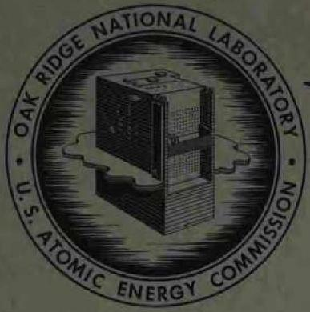

OAK RIDGE NATIONAL LABORATORY

operated by

UNION CARBIDE CORPORATION

for the

U.S. ATOMIC ENERGY COMMISSION

Printed in USA Price $1.25 cents. Available from the

Office of Technical Services

U.S.Department of Commerce

Washington 25, D.C.

# LEGAL NOTICE

This report was prepared as an account of Government sponsored work. Neither the United States nor the Commission, nor any person acting on behalf of the Commission:

A. Makes any warranty or representation, express or implied, with respect to the accuracy, completeness, or usefulness of the information contained in this report, or that the use of any information, apparatus, method, or process disclosed in this report may not infringe privately owned rights; or   
B. Assumes any liabilities with respect to the use of, or for damages resulting from the use of any information, apparatus, method, or process disclosed in this report.

As used in the above, "person acting on behalf of the Commission" includes any employee or contractor of the Commission to the extent that such employee or contractor prepares, handles or distributes, or provides access to, any information pursuant to his employment or contract with the Commission.

Contract No. W-7405-eng-26

REACTOR PROJECTS DIVISION

# COMPONENTS OF THE FUSED-SALT AND SODIUM CIRCUITS

OF THE

# AIRCRAFT REACTOR EXPERIMENT

H. W. Savage   
G. D. Whitman   
W.G.Cobb   
W. B. McDonald

DATE ISSUED

OAK RIDGE NATIONAL LABORATORY

Oak Ridge, Tennessee

operated by

UNION CARBIDE CORPORATION

for the

U. S. ATOMIC ENERGY COMMISSION

# CONTENTS

Abstract 1

Introduction 1

Engineering Development for the ARE 1

Forced-Circulation Test Loops 3

Mixing of Fuel and Sodium 3

BeO-Sodium Compatibility 8

Reactor Core 8

Fill and Drain Equipment 8

Fill and Drain Tanks 8

Fuel Enrichment 8

Piping and Leak Detection 11

Piping 11

Leak Detection 12

Preheaters and Insulation 13

HeatDump Systems 13

Fuel Heat Dump System 13

Sodium Heat Dump System 13

Heat Exchanger Test 15

High-Temperature Isolation Valves 19

Sodium Oxide Cold Traps 19

Inert Gas Systems 20

$\mathsf{ZrF}_4$ Traps 20

Pumps 21

Packed Seals 21

Rotary Gas-to-Lubricant Seals 23

Centrifugal Sump Pumps 23

Pump Design 25

PumpAuxiliaries 34

Pump Drives 34

Lubrication Systems 34

High-Temperature Instrumentation 34

Temperature Measurement 34

Pressure Measurement 34

Flow Measurement 34

Level Measurement 36

Component Installation 36

Summary 36

Acknowledgment 38

# COMPONENTS OF THE FUSED-SALT AND SODIUM CIRCUITS OF THE AIRCRAFT REACTOR EXPERIMENT

H.W.Savage

W. G. Cobb

G.D.Whitman

W. B. McDonald

# ABSTRACT

The Aircraft Reactor Experiment (ARE) successfully demonstrated the feasibility of generating heat by fission in a fused-fluoride circulating fuel. Most of the heat was removed from the reactor by the fused fluoride at $1580^{\circ}\mathrm{F}$ . Sodium at $1350^{\circ}\mathrm{F}$ was used to cool the BeO moderator. With minor exceptions all the components proved to be adequate.

The development of components and fabrication techniques for this reactor consumed a four-year period, during which time the technology for handling high-temperature fluids was extended to equipment operable above $1500^{\circ}\mathrm{F}$ . The methods used for determining compatibility of materials under static and dynamic conditions, standards for materials, and techniques for welding, fabrication, and assembly and the design criteria for pumps, seals, valves, heat exchangers, cold traps, expansion tanks, instrumentation, preheating devices, insulation, etc., are described.

# INTRODUCTION

A high-temperature Aircraft Reactor Experiment (ARE) generated heat by fission of $U^{235}$ in a fused salt composed of $U^{235}F_{4}, ZrF_{4},$ and NaF for a period of 221 hr, ending on November 12, 1954. As shown in Fig.1, the maximum equilibrium temperature of the salt was $1580^{\circ}F$ , with a maximum temperature gradient of $380^{\circ}F$ . About $25\%$ of the heat was transferred to sodium, which was circulated at a maximum equilibrium temperature of $1350^{\circ}F$ with a maximum temperature gradient of $120^{\circ}F$ . The heat was then transferred from both salt and sodium to helium in separate closed circuits and was finally transferred to water. The maximum heat power generated was $2500\mathrm{kw}$ , and the total amount of energy was 96,000 kwhr. The entire operation was performed in remotely controlled equipment in three concrete enclosed pits.

Prior to the nuclear power operation the systems and components were checked out by operating the fused-salt circuit for a period of 388 hr at temperatures above $1200^{\circ}\mathrm{F}$ and the sodium circuit for a period of 561 hr at temperatures above $600^{\circ}\mathrm{F}$ .

The ARE required more than four years of research and development and is believed to be the first reactor to generate nuclear power above $1500^{\circ}\mathrm{F}$ .

It is presumed that the reader is familiar with the basic concepts of the design, the physics, the chemistry, and the metallurgy which led to this particular reactor system, since these topics have been covered in other reports, $^{1,3-6}$ as has the operation $^{2}$ of the reactor experiment. In the following discussion emphasis is placed on the principal components of the reactor experiment and on the solution of some of the important development problems involved.

# ENGINEERING DEVELOPMENT FOR THE ARE

Figure 2 shows the principal phases of engineering development. Since the original concept of the ARE was that of a solid-fuel-pin, beryllium oxide-moderated, sodium-cooled reactor, the first

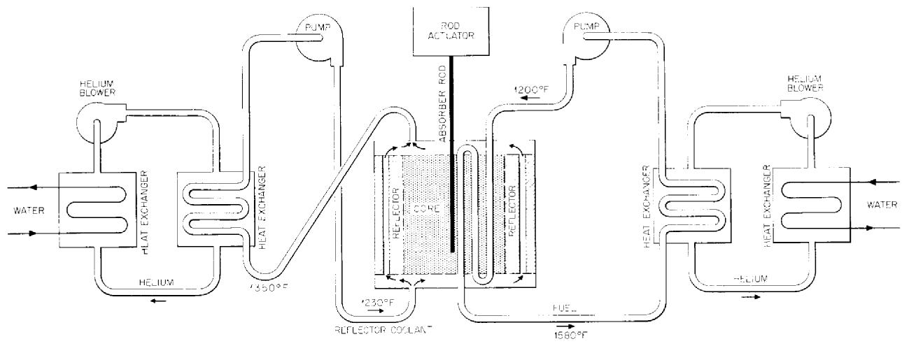  
Fig. 1. Schematic Diagram of the ARE.

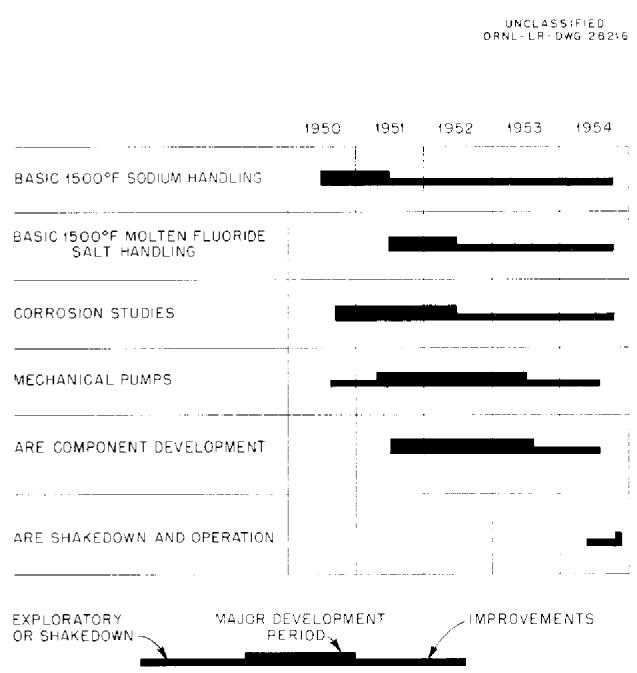  
Fig. 2. ARE Development Phases.

year was devoted to studies of the corrosion, dynamic, and engineering problems of handling sodium at $1500^{\circ}\mathrm{F}$ . In 1951 the concept was changed to that of fuel elements containing stagnant molten salt, and shortly thereafter to that of a reactor containing no fuel elements but circulating a fused fuel salt. The sodium circuits were retained to cool the beryllium oxide moderator

and the reactor pressure vessel. The second year was devoted primarily to determining compatible structural materials and fused fluoride compositions and to investigating the engineering and fabrication problems involved in handling fused fluorides at temperatures between the melting temperature, $\sim 950^{\circ}\mathrm{F}$ , and the proposed reactor operating temperature of $1500^{\circ}\mathrm{F}$ .

Development of pumps, heat exchangers, valves, pressure-sensing instruments, cold traps, and other components began in late 1951 and continued to the summer of 1954, culminating with the delivery of pumps and other components to the experimental reactor facility. Many of the techniques developed were extrapolations from data already available from the extensive experience in the temperature range of 800 to $1000^{\circ}\mathrm{F}$ with sodium and sodium-potassium alloy at Argonne National Laboratory, Knolls Atomic Power Laboratory, and Mine Safety Appliances Co. Had not this experience been available, the development period would certainly have been much longer.

Design of the reactor, development of pumps, valves, heat exchangers, and other components, and containment of sodium and molten salt at $1500^{\circ}\mathrm{F}$ presented new and perhaps fascinating problems. Equally challenging were the problems concerning fabrication, construction, preheating, instrumentation, and insulation of reliable leak-tight high-temperature circuits made of Inconel. Much

of the technology of these developments has been reported.7-9 We wish also to acknowledge the important contributions to the technology by hundreds of engineers and scientists, and regret that it is impossible to give them individual recognition.

Although some of the avenues investigated in developing components were not fruitful, many of the solutions used in the ARE have become accepted practice. Among these are the following:

1. use of fire-resistant insulation,   
2. use of all-welded construction,   
3. standardization of specifications for quality and inspection of reactor and heat transfer circuit materials,   
4. standardization of welding procedures,   
5. standardization of inspection specifications for assembled components as to fabrication and leak-tightness,   
6. development of high-temperature instrumentation to include pressure, temperature, flow, and liquid level measurement,   
7. development of the high-temperature sump-type centrifugal pump -- now in routine use in the laboratory.

Completely adequate designs were not available for valve seats, bearings in sodium or salt, pump seals operable against the liquid, or pumps operating in circuits with more than one free surface. Mechanical valves were used in the high-temperature reactor circuits, but because of their dubious qualities provisions were made for freeze valves and frangible diaphragms. Overhung shafts were used in the pumps to avoid bearings and seals in the liquid, and the pump tank (or sump) was enlarged sufficiently to become the expansion tank of the system, thereby preventing multiple free liquid surfaces.

During pump development a number of pumps for sodium were operated successfully with frozen sodium shaft seals. On the other hand, frozen or packed seals for fluorides invariably resulted in excessive wear and failure.

Fabrication of reliable leak-tight high-temperature circuitry required the use of all-welded

stress-free structures, use of seamless tubing and pipe, and adherence to carefully defined welding and inspection techniques. All material is $100\%$ dye-checked, is ultrasonically and radiographically inspected for defects before use, and is rejected when there are any observable defects. Materials, including weld rod, are carefully labeled to minimize errors in selection; analyses are performed to avoid mislabeling; and all critical welds are dye-checked and radiographed before acceptance. With these controls, leaks are rare, unless the part involved has been severely overstressed.

# FORCED-CIRCULATION TEST LOOPS

Much of the technology and component development was accomplished in forced-circulation loops. These loops, which were also used to determine corrosion rates,[6] were of two types. Figure 3 shows a typical sodium test loop which uses an electromagnetic pump. Figure 4 shows a salt test loop which employs a down-flow centrifugal sump pump capable of $1600^{\circ}\mathrm{F}$ operation. This pump has been improved since its development in 1951 and is still used routinely in the laboratory. It provided some basic ideas for reactor pumps subsequently developed. It was partly on the basis of corrosion data obtained from such loops that Inconel and a fuel salt composition[5,6] were chosen for the reactor. These loops established that use of a single alloy in a high-temperature system would minimize corrosion and mass transfer.[6] Inconel was chosen for both the sodium and the fuel circuits, although type 316 stainless steel is more resistant to attack by sodium, in order to avoid duplex-material construction for reactor fuel tubes (see Fig. 5). (Mass transfer in sodium-Inconel systems is considerably higher than in sodium-stainless steel systems, but was not expected to be excessive in the periods of operation anticipated for the reactor experiment.)

Screening tests were conducted with hundreds of natural-convection loops, Fig. 6, to eliminate less desirable structural materials and fused fluoride compositions.[6]

# Mixing of Fuel and Sodium

Other experiments determined the effects of sudden mixing of fuel salt and sodium, which could have occurred if one of the reactor fuel tubes had cracked or ruptured during operation. The reaction was known to be exothermic. Insoluble reaction products were frequently found in sufficient

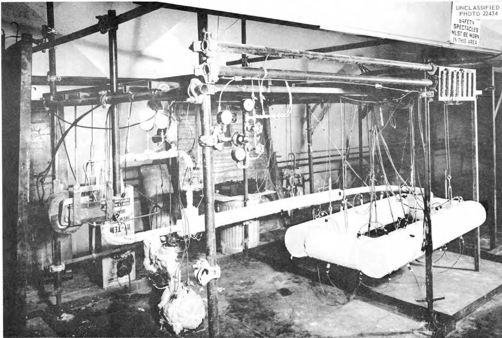  
Fig. 3. Sodium Corrosion Test Loop.

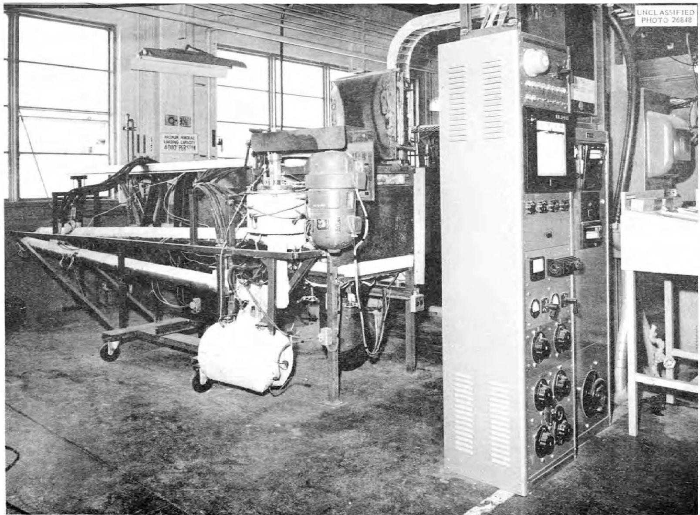  
Fig. 4. Fused-Fluoride Corrosion Test Loop Employing a Down-Flow Centrifugal Sump Pump (See Fig. 22 for Cross Section of Similar Pump).

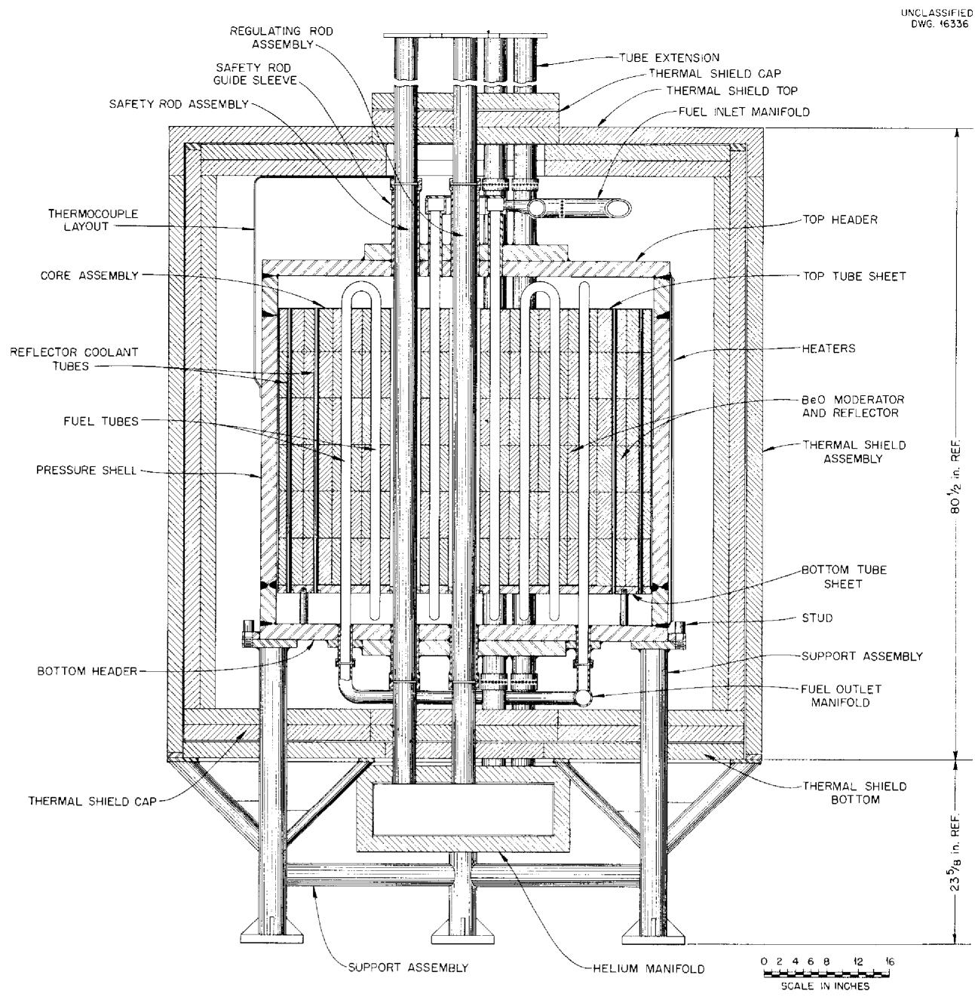  
Fig. 5. The Reactor (Elevation Section).

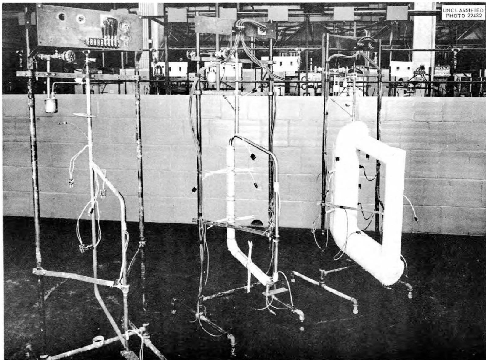  
Fig. 6. Natural-Convection Corrosion Test Loops.

quantity to stop circulation. While the pressure rise observed was small, local temperature transients of 200 to $300^{\circ}\mathrm{F}$ were observed.

# BeO.Sodium Compatibility

Specimens of BeO were suspended in sodium and examined for attack. Little or no beryllium was found in the sodium, but porosity of the BeO was clearly evident, since the specimens exuded sodium for long periods after they were removed. Visually, the BeO showed no damage of consequence at any temperature of interest in the reactor.

# REACTOR CORE

In the original concept the reactor core provided sixty-six $1\frac{1}{4}$ -in. tubes in parallel vertically through holes in hexagonal beryllium oxide bricks and seventy-nine $1/2$ -in. tubes in the outer reflector section of the core. When the shift was made to a circulating fused salt fuel, the higher viscosity and reduced over-all flow rate required made it essential to reduce the number of parallel paths through the reactor in order to maintain Reynolds numbers in the turbulent range. Consequently, the 66 tubes were arranged in six parallel routes, each comprising a serpentine (see Fig. 5) of 11 tubes in series connected by U-bends at the top and bottom. This arrangement introduced the question of whether the core could be filled without first being evacuated and also made complete draining of the core impossible. The outer sodium tubes were left unchanged.

A full-size core, Fig. 7, was mocked up with glass and metal tubing, and its hydraulic characteristics were studied with water-glycerin solutions for viscosity effects and with tetra-bromoethane (manometer fluid) for density and viscosity effects. It was found that complete filling of the core could not be accomplished by pressurization of the fluid from the fill tanks, because gas became trapped in the multiple vertical rises of each parallel circuit through the reactor core; nor was it possible to expel this gas and establish full flow within the maximum head provided by the fuel pump. With a partial vacuum above $400\mathrm{mmHg}$ , filling was certain and flow could be established in each of the six parallel paths without difficulty. Full blowdown draining was impossible because liquid expulsion ceased as soon as one circuit was opened to the gas flow; however, the liquid could be forced or chased out with another liquid. As the result of these experiments, the reactor was filled under vacuum, and

spent fuel was displaced with barren salt, followed by several flushings.

# FILL AND DRAIN EQUIPMENT

# Fill and Drain Tanks

Tanks were attached to both the sodium and the salt circuits to receive the initial charges of sodium and barren salt. With the use of helium pressurization the materials were transferred from the tanks into the reactor circuits. Once the circuits were filled, the interconnection was closed by a mechanical valve and the liquid could not be drained back. (As explained elsewhere,2 the sodium valves did not seal tightly, but this situation was tolerated.)

There were three fill tanks for sodium and two for barren salt, all located in a tank pit as shown in Fig. 8. In addition, a hot-fuel dump tank containing 89 vertical through tubes for convection cooling with helium in the pit was reserved for the spent fuel. Each tank was equipped with external electrical heaters and thermocouples and was of welded construction. Valved connections to a supply of spectroscopically pure helium $(<10\text{ppm}$ $\mathsf{O}_2$ $-60^{\circ}\mathsf{F}$ dew point) permitted the fluids to be blanketed at any desired pressure and prevented exposure of them to air or water vapor.

# Fuel Enrichment2,4,5

The approximate quantity of U235 needed in the fused fluoride mixture for the reactor to reach criticality was known from an earlier, low-temperature critical experiment. Consequently, the first phase of nuclear operation of the ARE was a high-temperature critical experiment. The initial charge of fused fluorides to the reactor was a highly purified 50-50 mole % mixture of NaF and ZrF. To this a mixture of 33% mole % U235F, 66% mole % NaF was added2,4,5 in known increments until criticality, and subsequently the desired excess reactivity, was reached. At the completion of this operation the reactor fuel was approximately 6.18 mole % U235F, 40.73 mole % ZrF, and 53.09 mole % NaF, which had a melting temperature of 1000°F.

The highly enriched fuel was stored in several containers under helium, and was batched down to smaller containers in quantities ranging from 2 to 33 lb. The smaller containers were connected successively to the fuel circuit as shown in Fig.9, and 23 transfers were made in order to fully enrich the fuel. A $\frac{1}{4}$ -in.-dia tube, heated by a current

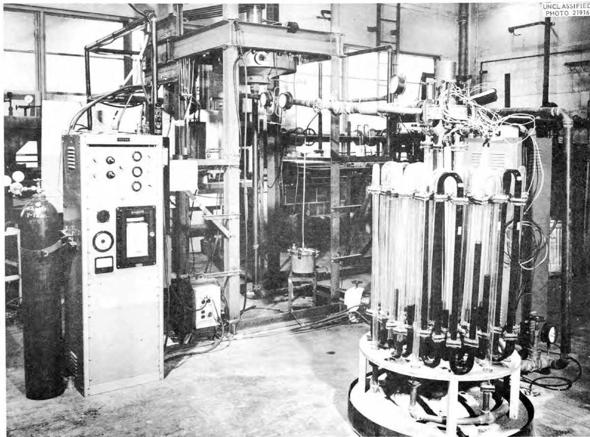  
Fig. 7. Full-Scale Reactor Core Mockup.

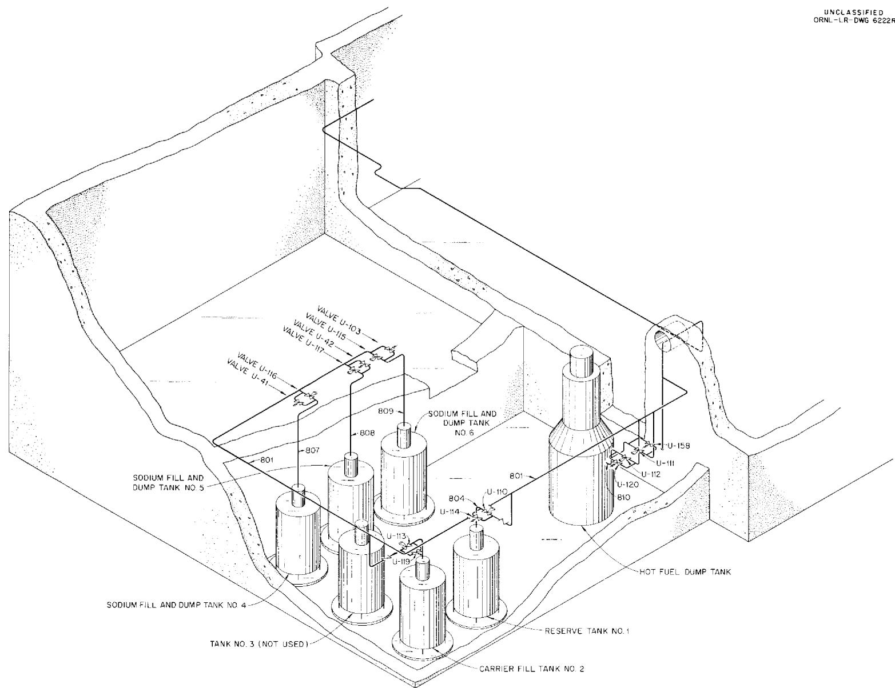  
Fig. 8. ARE Fill and Drain Tanks.

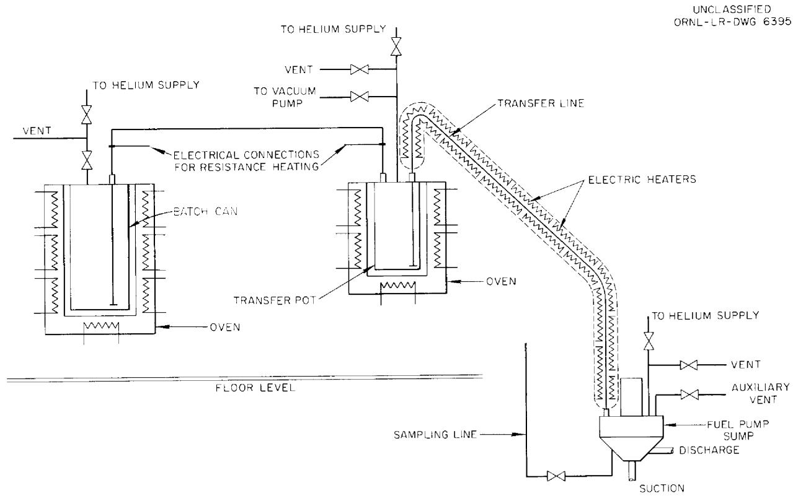  
Fig. 9. Equipment for Addition of Fuel Concentrate to Fuel System.

passed through it, led to the sump of the fuel pump, and injections were made with the pump in operation and the fused salt circulating. The high melting temperature of the enriched salt $(1185^{\circ}\mathrm{F})$ , unanticipated cold spots in the transfer tube, and leaks in tube fittings used in the transfer line made enriched-fuel transfer more tedious than had been expected. The exact amount transferred was determined after completion of the operation by comparing differences in weights of the containers emptied.

# PIPING AND LEAK DETECTION

# Piping

All the reactor high-temperature piping was seamless sched-40 Inconel pipe with full-penetration welds, Fig. 10, at joints. The pipe was installed between anchor points, prestressed sufficiently at room temperature to be approximately stress-free at operating temperature. All piping connections to the pumps, the heat exchangers, the reactor,

UNCLASSIFIED ORNL-LR-DWG28217

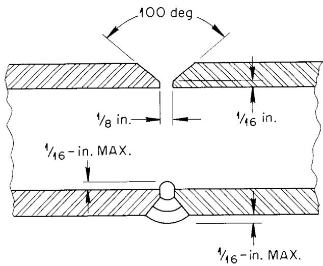  
Fig. 10. Full-Penetration Weld.

and other components were also made with full-penetration welds.

Development studies of flanged joints, with or without oval-ring or other gaskets, revealed that they were not satisfactory for critical high-temperature service. An oval-ring-gasketed flanged joint, Fig. 11, was usually successful for a time if the flanges and bolts were exposed to convection cooling by air (thus introducing a cooled region in the piping), but ultimately the bolt tension would relax sufficiently that if it were not discovered and tightened a leak would ensue. In addition each flanged joint required two welds, whereas only one was needed to join the pipes.

# Leak Detection

All high-temperature piping was jacketed by a stainless steel annulus system which, in principle, could be monitored for indications of a leak in the primary piping. Before these jackets were installed,

the piping was subjected to gas pressurization and a soap bubble check.

The monitoring principle designed into the annulus was based on the detection of fluid vapors in the helium gas circulated in the jackets surrounding the piping.

Copper wool was placed in strategic spots throughout the annulus and was withdrawn periodically and placed in a phenolphthalein solution, which would turn a characteristic red if an alkali metal was present. In addition, samples of the annulus gas were passed through a flame photometer for more sensitive detection of sodium vapor.

A high-temperature leak check was run on the fuel system by pressurizing krypton gas into the fuel piping before fluid was added to the system and by spectroscopically checking the annulus helium for traces of krypton.

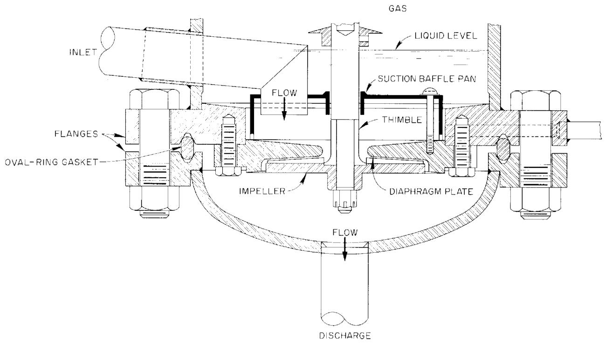  
UNCLASSIFIED DWG11501A   
Fig. 11. Typical High-Temperature Flange Joint.

No positive indication of a leak was detected by any of these methods, and the systems were deemed to be leak-free.

Helium in the annulus served to even out temperature differences during the preheating period, and the annulus wall would have helped to contain leaking material had a leak occurred.

# Preheaters and Insulation

Piping was preheated electrically. All the straight runs of high-temperature piping were surrounded by refractory clamshell heaters containing totally enclosed Nichrome V wire; the heaters were held in position by external straps. Groups of nine nonadjacent heaters, each rated at 1 kw, connected in closed delta, constituted a circuit regulated by a Variac. There were several hundred circuits, and preheat temperatures were monitored by Chromel-Alumel thermocouples welded to the pipe at strategic locations between heaters. Bends, tees, and odd geometry parts were either fitted with appropriately shaped tubular heaters or were wrapped with flexible heaters.

Vessels such as the dump tanks were fitted with flat strip-type heaters, and the pump tanks used flat, ceramic heaters containing embedded Nichrome V wire. The reactor vessel was also equipped with strip-type heaters to bring its temperature to $600^{\circ}\mathrm{F}$ so that the sodium could be circulated through it to bring the temperature of the core to $1200^{\circ}\mathrm{F}$ before the fused-salt circuit was filled.

Development work with smaller systems had indicated that a temperature of at least $100^{\circ}\mathrm{F}$ above the melting temperature at the coldest observable location was needed to avoid the danger of freezing during filling. As soon as circulation began, both systems became nearly isothermal.

The entire high-temperature structure was covered with preformed insulation made of calcined diatomaceous silica, bonded with asbestos fibers. This is one of several fire-resistant insulations commercially available which will not react significantly with sodium or fused fluorides. A good discussion of thermal insulating materials is given in the Liquid Metals Handbook.7

# HEAT DUMP SYSTEMS

# Fuel Heat Dump System

The heat generated in the reactor was removed by circulation of the fuel through two heat ex-changers in parallel in the main fuel-process stream. As shown in Fig. 12, the two heat ex-changers, each designed for $600\mathrm{kw}$ , were located in a closed duct in which helium was circulated by a centrifugal blower to transfer heat from the two fuel-to-helium exchangers to two helium-to-water exchangers. The water was dumped at a low-temperature level, and no attempt was made to extract useful power from the system.

The fuel-to-helium heat exchangers were of all-welded, two-pass, fin-and-tube design fabricated from Inconel pipe and tubing and are shown in Fig. 13.

The manifolds were fabricated from $2\frac{1}{2}$ -in. sched-160 pipe, and the tubes were fabricated from 1-in. No.12 BWG tubing bent to produce 43 straight lengths in five fluid circuits. Fuel from an inlet header passed through two of the circuits in parallel to an intermediate header and thence through the remaining three circuits in parallel to the outlet header.

The 2-in.-OD by 0.024-in.-thick fins were fabricated from type 304 stainless steel and were swaged into continuous spiral grooves on the tube surface.

Since the fuel had a melting point in excess of $950^{\circ}\mathrm{F}$ , provision had to be made for preheating the heat exchangers during filling and low-power circulation of the fluid fuel. Retractable heat barrier doors, containing heaters, were located in the ducts at each face of the heat exchangers, and heaters were placed around the exterior of the heat exchanger. When power was to be extracted from the system, the barrier doors were raised and helium was circulated through the duct.

The helium-to-water heat exchanger, Fig. 14, was of conventional design, and the tubes were fabricated from ASME SA-179 seamless steel tubing covered with copper fins.

# Sodium Heat Dump System

The sodium circuit, which removed heat from the BeO moderator-reflector and the core pressure shell, employed a similar scheme, in which heat was transferred from the sodium to helium and then from the helium to water.

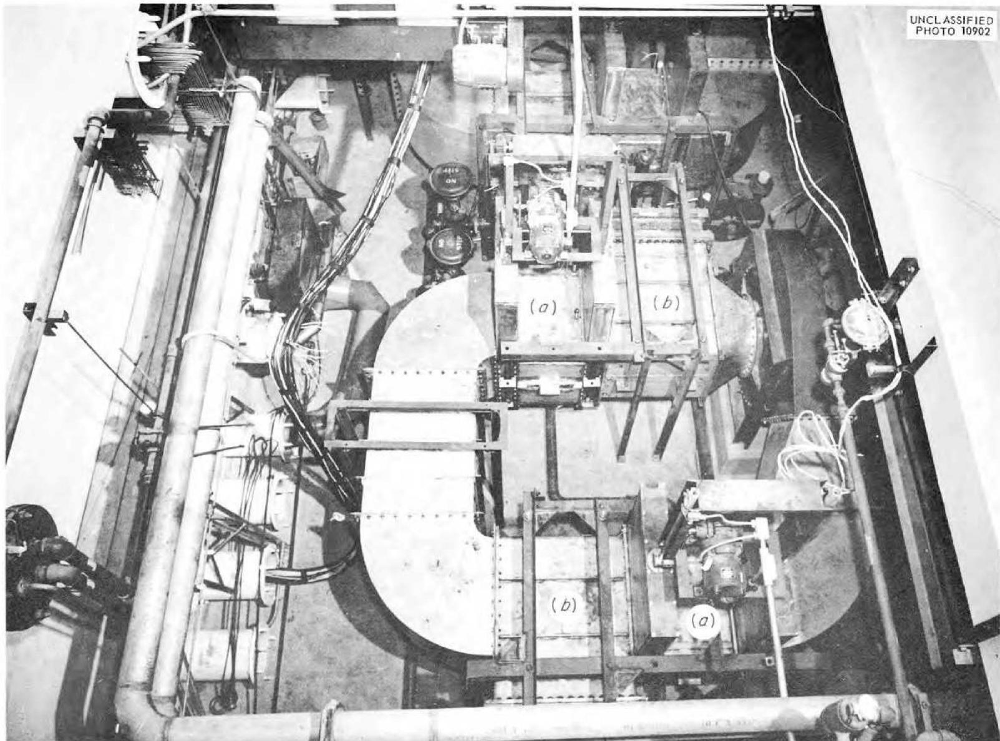  
Fig. 12. Fuel Heat Dump System. (a) Fuel-to-helium exchanger, (b) helium-to-water exchanger.

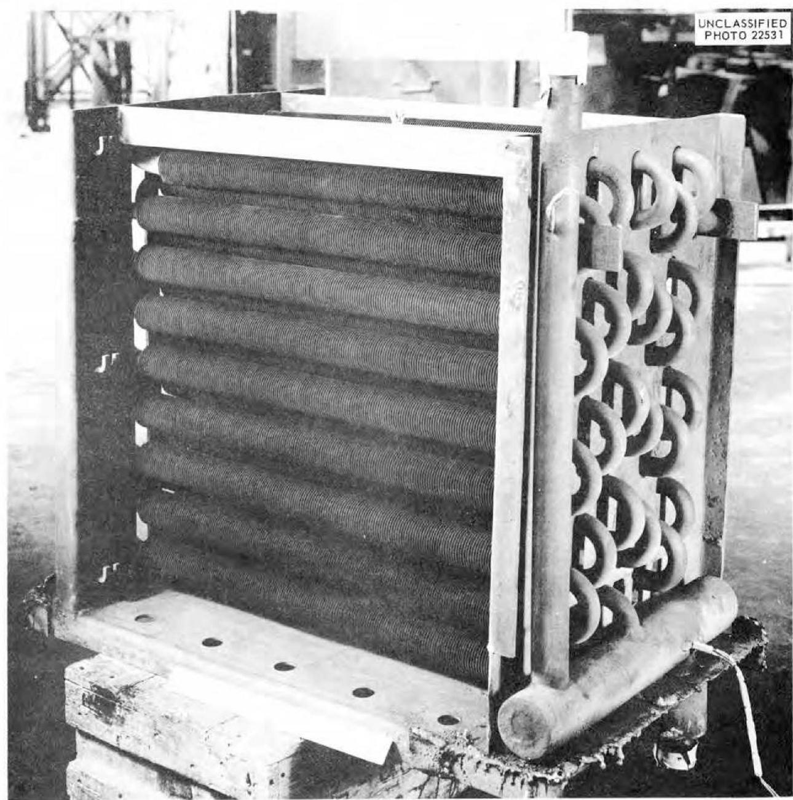  
Fig. 13. Fuel-to-Helium Heat Exchanger.

The sodium-to-helium heat exchangers, Fig. 15, each designed for $325\mathrm{kw}$ were of all-welded construction and of the same materials as those used in the fuel-to-helium heat exchangers. Fifteen parallel fluid passes having 75 straight lengths in the helium duct formed the active section of this exchanger. Two separate ducts, each containing a centrifugal blower, a sodium-to-helium heat exchanger, and a helium-to-water heat exchanger, were used. The sodium heat exchangers

operated in parallel and were connected to the suction side of the sodium circulating pumps. Preheating of the sodium heat exchangers was achieved by retractable heat barrier doors and duct wall heaters.

# Heat Exchanger Test

A spare exchanger and a pump were set up, and are shown in Fig. 16 (the snow trap included in the system is not shown); the characteristics of the

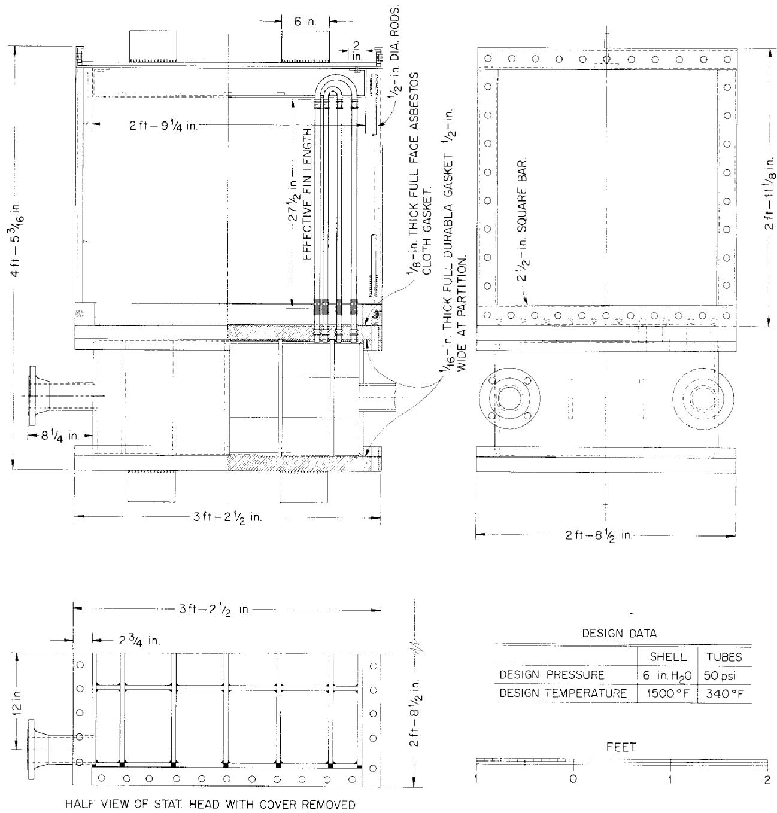  
Fig. 14. Helium-to-Water Heat Exchanger.

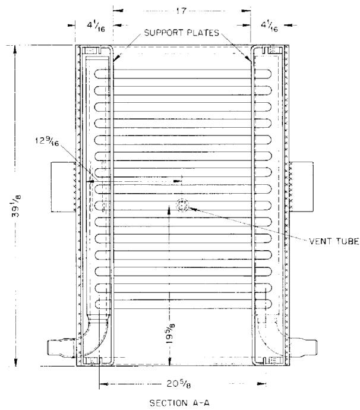  
UNCLASSIFIED   
DWG.A-3-3-21AR

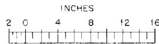  
NOTE: ALL DIMENSIONS IN INCHES

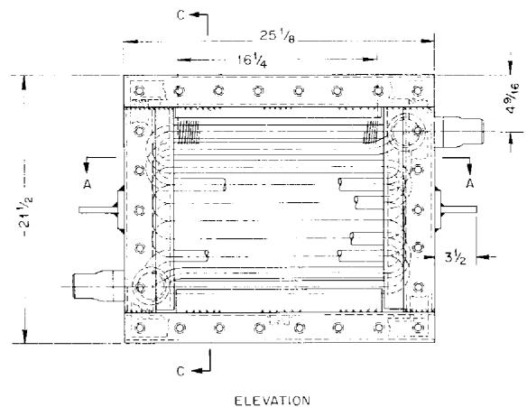

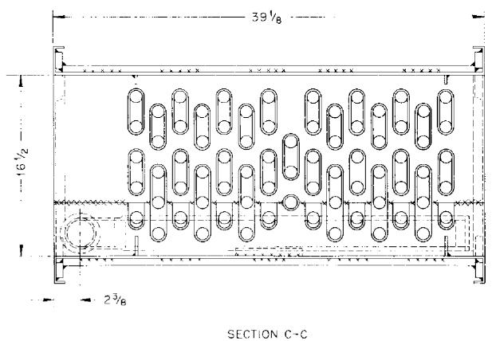  
Fig. 15. Sodium-to-Helium Heat Exchanger.

UNCLASSIFIED

ORNL-LR-DWG 1688

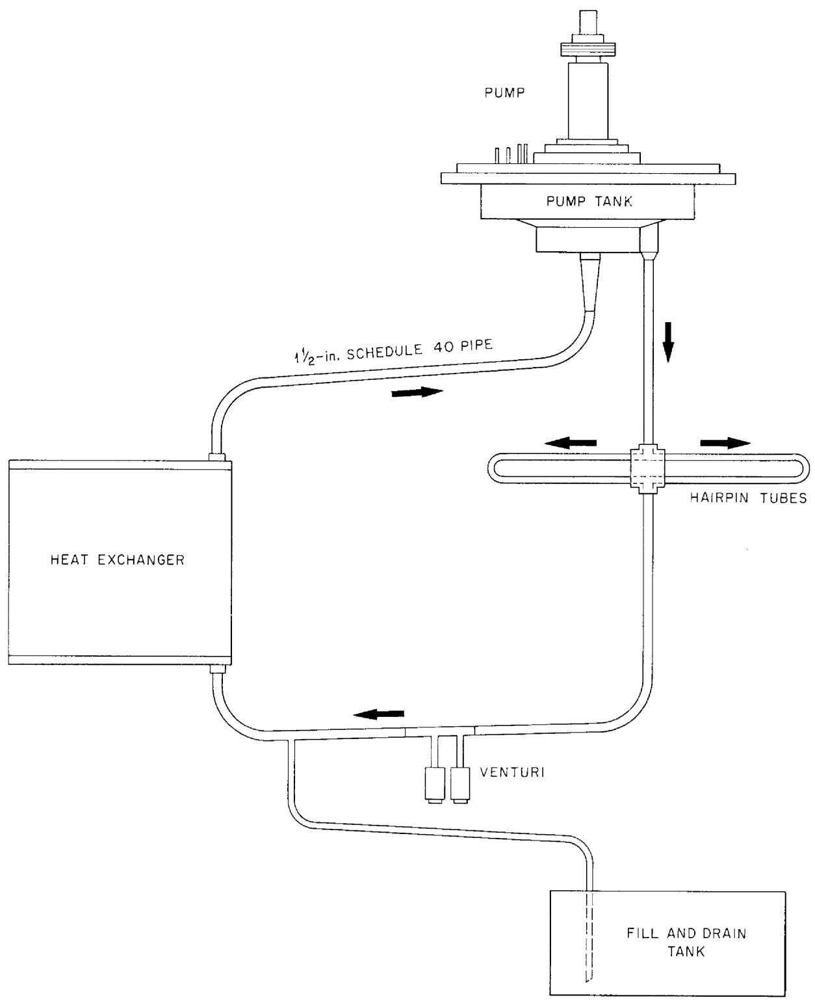  
Fig. 16. Fuel-to-Helium Heat Exchanger Test Loop.

system were determined from isothermal tests and from periodic coolings by removal of insulation from the heat exchanger. Facilities were not available for applying sufficient heat load for heat transfer experiments; consequently, corrosion and mass-transfer characteristics requiring a thermal gradient could not be determined. A non-enriched-fuel fluoride was used in this test. After the heat exchanger had been operated at $1400^{\circ}\mathrm{F}$ for 2000 hr, it was removed for examination; testing of the pump continued for an additional 1750 hr and was then terminated for other use of the space and the pump.

# HIGH-TEMPERATURE ISOLATION VALVES

High-temperature fuel and sodium valves were required for isolation of the dump tanks and the spare sodium pumps. The fuel circuits included frangible diaphragms to isolate the spare fuel pump. Freeze valves were provided for use in the event that the mechanical fuel drain valves failed. During operation only the sodium mechanical valves leaked, the freeze valves did not have to be used, and the fuel drain valves were kept closed except for the initial filling and final draining operations.

The valve, Fig. 17, was fabricated from Inconel and was designed with a double bellows seal so that the pressure on the inner or primary fluid seal bellows could be balanced with inert gas. The body was fabricated from a 4 by 2 in. reducing tee, and the plug and seat were hard-surfaced with Stellar No.6. This material was found to cause fusion bonding of seat and plug when the valve was closed and held at temperatures above $1200^{\circ}\mathrm{F}$ .

Interchangeable spring-loaded pneumatic actuators were available for holding the valves in either normally open or normally closed positions. The spring force was used to hold the valve stem in its normal position.

The spare fuel pump was isolated from the fuel system by frangible valves to ensure that enriched fuel would not leak into the spare system. These isolation devices were made by modifying the plug and seat geometry of the high-temperature valves and clamping a 0.013-in. nickel diaphragm in the valve body to produce a positive seal. Actuation of the valve stem would rupture the diaphragm and connect the spare pump to the fuel system. In the event of the spare pump having to be put in service, there was sufficient inventory in the main pump to prime the spare pump and to

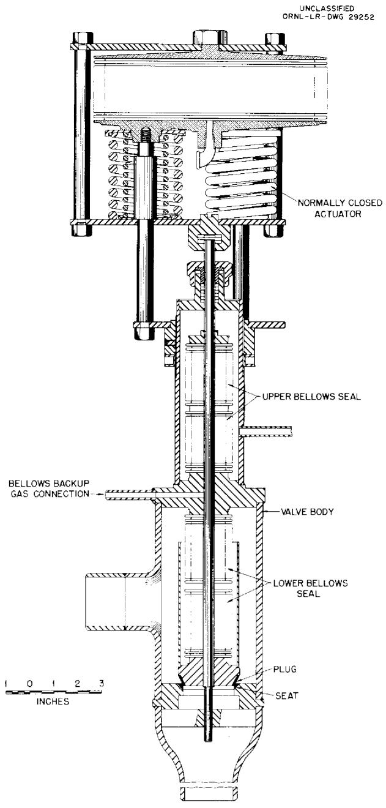  
Fig. 17. High-Temperature Valve.

freeze the residual fuel in the lines to the main pump and isolate it from the fuel system.

# SODIUM OXIDE COLD TRAPS

The sodium circuit included two bypass cold traps for the removal of oxide. Design, based on KAPL experience with traps in a sodium circuit operated at a maximum of $1000^{\circ}\mathrm{F}$ , was completed before sufficient information on the more stringent

requirements for service at $1500^{\circ}\mathrm{F}$ was available. The circuit to one cold trap leaked at a thermocouple weld, and as a result both traps were removed from the system. The absence of cold traps thereafter probably caused the sodium to be of poor quality; and even though corrosion and mass transfer might have been thereby accelerated, it was believed that the short period of power operation would prevent the consequences from being serious.

# INERT GAS SYSTEMS

The free surfaces of high-temperature sodium and fused fluorides were blanketed with high-purity helium. In the case of the fuel pump, where gaseous fission products also escaped, an off-gas line led through a snow trap adjacent to the pump to a charcoal bed and exhausted into a high stack. Helium was chosen as the blanket gas because it is chemically inert and is readily available in a very pure, very dry state. Its lightness is a minor disadvantage.

Experiments indicated that to hold the sodium and fluoride quality to the desired levels, helium with an oxygen content of less than 10 ppm and a dew point below $-60^{\circ}\mathrm{F}$ was essential. Cylinder helium, generally, did not meet these specifications;

therefore every cylinder was examined, and those in which the helium did not meet specifications were rejected. By this practice and with careful control of cylinders used, rejections were reduced to about $10\%$ . A distribution system in which the helium is piped directly from tank car or tank truck has been found to be superior to the use of individual cylinders and to avoid completely the problem of quality control.

To guard further against possible contamination of reactor fluids, the helium gas lines were equipped with scrubbers containing sodium-potassium alloy at room temperature. While these devices were very effective in removing oxygen and water, they introduced the danger of transported NaK vapor and liquid and subsequent fouling of downstream gas lines. Such fouling was not encountered in the reactor experiment, however.

$$
Z r F _ {4} \text {T R A P S}
$$

The fuel system cold trap, more commonly called a "snow" trap, is shown in Fig. 18; it was designed in order to eliminate the moderately serious problem associated with $\mathsf{ZrF}_4$ vapors escaping from the free surface of the fused fluoride in the fuel pump sump. Since $\mathsf{ZrF}_4$ has no liquid phase, it will condense on sufficiently cold

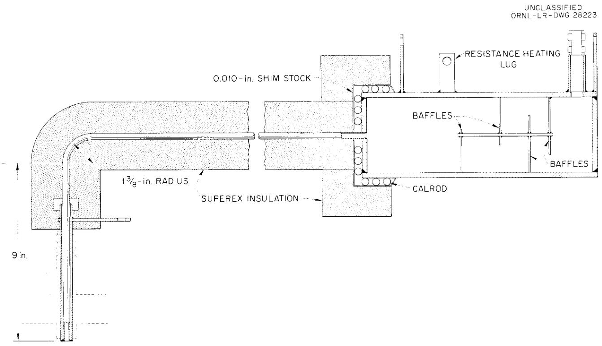  
Fig. 18. ZrF₄ Snow Trap.

surfaces as a solid, which does not drain back into the circulating system. Instead, it builds up on the cold surface to the extent that it may ultimately cause fouling. Fortunately, the material is flocculent and powdery and, although underneath layers slowly form well-developed crystals, does not foul moving parts readily.

Pump development work pointed up the necessity of maintaining the line between the pump tank and the snow trap at a temperature of approximately $1300^{\circ}\mathrm{F}$ to prevent condensation of $\mathsf{ZrF}_4$ ahead of the trap. The temperature was maintained by direct resistance heating of the interconnecting tube and by additional heat applied to the inlet end of the trap. The remainder of the trap was allowed to lose heat to its surroundings. The baffled path was perhaps $95\%$ effective, but some condensate was found beyond it. At the low power level of this reactor operation, such carry-through was not significant, but significantly higher power would have required higher gas flow rates and a better snow trap to remove beta heat in the off-gases and to prevent fouling of downstream piping and fittings.

# PUMPS

Each reactor circuit required a pump and a spare. The flow and head requirements for the reactor pumps are given below:

<table><tr><td></td><td>Fuel</td><td>Sodium</td></tr><tr><td>Impeller diameter, in.</td><td>8.125</td><td>8.125</td></tr><tr><td>Flow, gpm</td><td>46</td><td>152</td></tr><tr><td>Head, ft</td><td>28</td><td>78</td></tr><tr><td>Speed, rpm</td><td>1080</td><td>2000</td></tr><tr><td>Suction pressure, psig</td><td>0.3</td><td>36</td></tr><tr><td>Discharge pressure, psig</td><td>41</td><td>63</td></tr><tr><td>Specific speed</td><td>602</td><td>940</td></tr><tr><td>Specific gravity of liquid</td><td>3.38</td><td>0.79</td></tr></table>

Electromagnetic pumps were considered initially for the sodium circuit, and a 150-gpm experimental pump (Fig. 19) similar to the Mine Safety Appliances Co. double-stage, single magnetic circuit design was built and tested. Since electromagnetic pumps could not be used for fused salt because of its low electrical conductivity and since a single centrifugal pump development program with minor modifications would solve both flow problems,

UNCLASSIFIED DWG 1504A

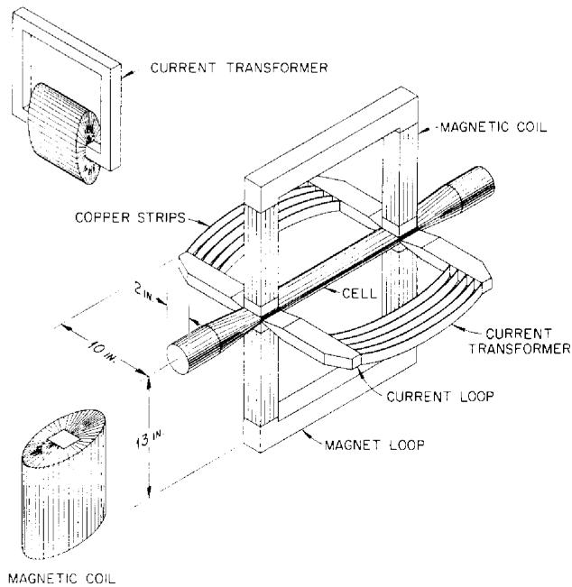  
Fig. 19. Schematic of Two-Stage Electromagnetic Pump.

development of the electromagnetic pump was not carried forward.

Space limitations in the heat exchanger pit of the reactor test facility appeared to indicate that horizontal-shaft pumps would be preferable. Such pumps required cantilevered shafts and impellers and a means of sealing the liquid in the pump. In addition, since the fuel pump was to handle radioactive liquid containing fission products, the seal had to be reliable at all times and to leak only in an absolutely controlled fashion.

A canned-motor type of pump, which would appear to have been the most desirable, was not available at the time for the required operating temperatures.

# Packed Seals

The hydraulic problems of impeller and volute design were solved by straightforward adaptations of conventional practice, but the problem of sealing liquids around horizontal shafts was more complicated. Packings, labyrinths, high-viscosity materials, and frozen pumped fluid seals were considered, and many versions were tried. All resulted in shaft seizure or periodic galling and leakage to some degree. Frozen sodium seals

(Fig. 20) and frozen lead seals showed real promise, but each required nearly constant attention and was subject to periodic ejection of frozen material. In the frozen lead seals, there was a liquid lead-to-liquid fluoride interface ahead of the frozen lead seal, and this combination was considered because the two liquids were nearly inert to each other. Since at least one reactor type now built uses frozen-sodium-sealed pumps, it is apparent that this seal is considered practical.

Various packings were tried for fluorides, and the most promising were metallic braids and

10 The SRE, a sodium-graphite power reactor built by Atomics International Division, North American Aviation, Los Angeles, California.

graphite powders impregnated with metal powders such as nickel. These failed as soon as the fluoride penetrated sufficiently to freeze and abrade the shaft. In another type, called the "high-viscosity seal," the packing consisted of fluorides containing $\mathsf{BeF}_2$ , namely, glasses having no sharp melting temperature. It was believed that the fuel fluoride would mix physically with the salt packing and establish a liquid-to-glass viscous interface. The seal was extremely temperature-sensitive and required very hard shaft surfacing; a water-cooled packing gland had to be provided to remove the heat generated by friction. These seals failed because penetration of fuel salt was progressive until the packing material was largely dissolved. Also, the shafts (Fig. 21) were

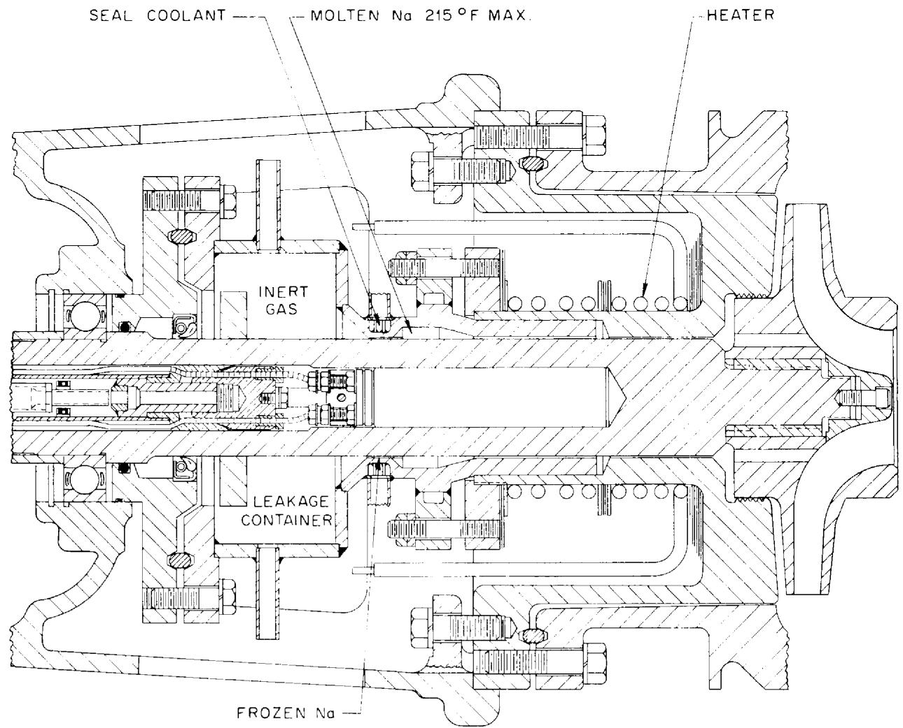  
Fig. 20. Frozen Sodium Rotary Shaft Seal.

UNCLASSIFIED

ORNL-LR-DWG 28394

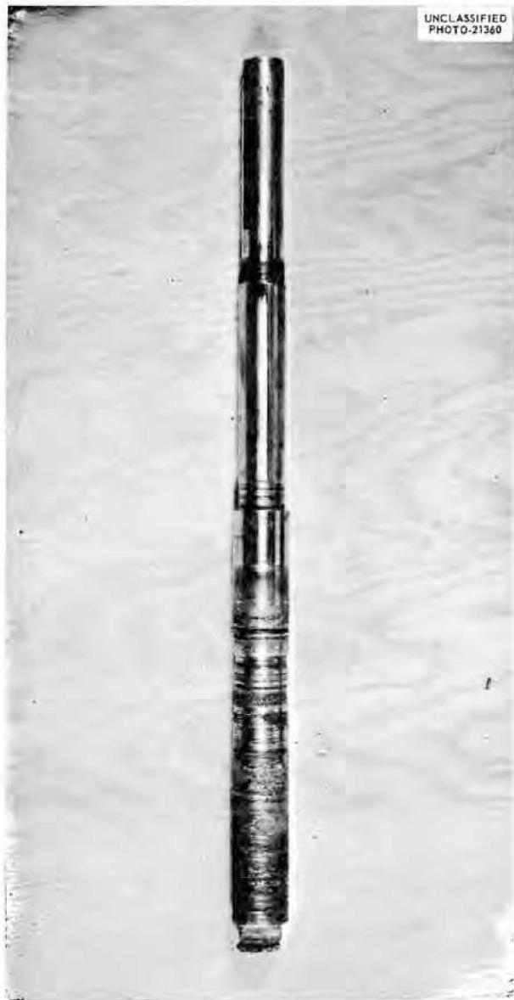  
Fig. 21. Shaft from $\mathsf{BeF}_2$ Seal.

abraded badly, the abrasion progressing toward the outer end of the gland.

# Rotary Gas-to-Lubricant Seals

Prior to the work on packed seals, a 7-gpm downflow centrifugal pump for laboratory use, Fig. 22, had been developed and was found to be very satisfactory at temperatures up to $1600^{\circ}\mathrm{F}$ . Hence, concurrently with the packed-seal investigations, larger versions of the gas seal were being tried. In this development, packings of graphite-impregnated asbestos and Teflon were tried, but leakage rates of gases were too high for the

packings to be used with radioactive liquids. Face-type seals offered the most promise, but long-term wear-resistant materials were required, and there were important questions concerning the kind and amount of lubrication to use.

Silver-impregnated graphite running against case-hardened cold-rolled steel gave the best results. It was found that if the surfaces of both members were optically flat and lubricated and if the mass and inertia of the movable parts were sufficient for relative positioning of the parts to be insensitive to vibration, oil leakage could be reduced consistently to less than 5 cc/day and frequently to less than 2 cc/day, and gas leakage to less than 15 cc/day.

# Centrifugal Sump Pumps

Use of a rotary gas seal required a vertical-shaft sump-type pump in which the high-temperature liquid could be gas-blanketed and the liquid level carefully controlled. A centrifugal-type pump with an overhung shaft was selected to avoid close-running surfaces and bearings in the pumped liquid.

The next problem involved a solution to degassing requirements. In the reactor fuel system there were two degassing problems; in the sodium system there was one. Both systems had to be purged of trapped helium gas at startup, and during power operation it was desirable to remove fission gases, particularly xenon, from the circulating fuel.

The sump-type pump operated essentially in a pot of the fluid to be pumped. Early designs recommended geometric displacement of the tank and pump inlets; this led to ingassing due to turbulence in the tank. In the pump configuration finally evolved, liquid in the pump tank returned to the pump inlet only in a laminar fashion and without vortexing, and the tank and pump inlets were in axial alignment at the bottom of the tank. Sufficient clearance was allowed between the pump shaft and its housing for 5 to $10\%$ of the pumped liquid to continually bypass the main fluid circuit by flowing up the shaft and back through the pump tank to the pump inlet. Some continuous bypass in that flow direction is a requirement of a sump pump to prevent ingassing, and the residence time for liquid bypassing the main circuit through the sump tank must be sufficient to allow gases to escape. When the bypassing liquid is spread out thinly on a surface of large area, escape of entrained gas is aided. On the other hand, xenon

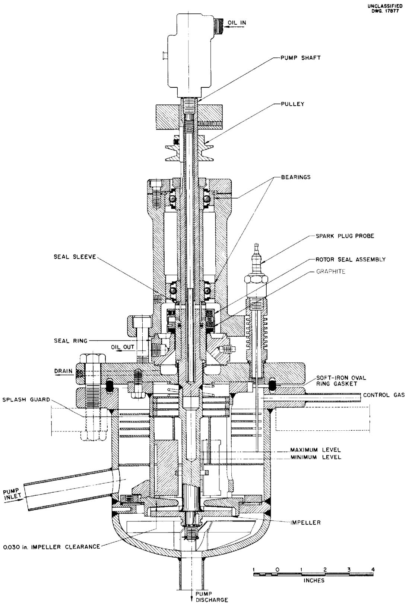  
Fig. 22. Gas-Seal Centrifugal Pump.

from fission-product decay was removed principally by scrubbing the liquid fuel with helium.5

Thus the processes were somewhat competitive, and the liquids were never free of gases in solution. Undissolved gases, on the other hand, were very rapidly minimized during pump startup to an equilibrium value too low for detection. As was pointed out in other reports, $^{1,2}$ fission gases were certainly liberated to the heat exchanger pit due to a leak in the off-gas line from the fuel pump. The degassing means were proved to be effective, since the gases could have come from only the free liquid surface in the fuel pump. Postrun estimates $^{2,4}$ indicated that at least $97\%$ of the generated

fission gases were liberated continually by this technique.

As shown in Fig. 23, each pump tank was equipped with sloped troughs to conduct the bypassing liquid to the walls of the tank, where it joined smoothly with the main body of liquid in the tank. Despite bypass flows as high as 8 gpm, the liquid in the tanks appeared to be quiescent, which simplified level indication problems in the tanks.

# Pump Design

Except for differences in pump tank design because of the tanks being used also as the

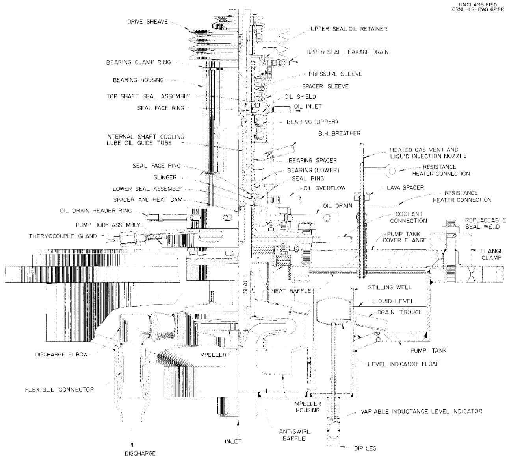  
Fig. 23. ARE Fuel Pump.

expansion tanks of the liquid circuits and except for the difference in volute size because of the different pumping rates required for the sodium and the fused fluorides, the pumps and their auxiliaries were of similar design and many parts were interchangeable. The basic design features of this pump have been described previously; however, this discussion merits repetition of the more important aspects.

Operation of a high-temperature sump-type centrifugal pump was assured by separating high-temperature components such as the pump tank, impeller, impeller housing, and shaft extremity from the bearings, seals, lubricant, and drive motor by appropriate thermal barriers so that the latter parts could be operated nearly isothermally at temperatures below $200^{\circ}\mathrm{F}$ .

The structural connections also provided for continuous alignment of the rotary and stationary parts and for maintenance of running clearances to avoid binding over a temperature range of $1500^{\circ}\mathrm{F}$ . The parts were carefully stress-relieved, and preheating was applied as symmetrically as possible to minimize asymmetries in temperature distribution which would have distorted the alignment of the parts.

In the ARE, shielding of the lubricant and pump elastomeric seals was judged to be unnecessary since the total dose would not exceed $10^{8} \mathrm{r}$ , at which dose the viscosity of petroleum lubricants would have increased approximately $10\%$ due to decomposition and buna-N elastomers would not have taken a permanent set. (Neoprene is less resistant to radiation damage than buna N.)

Bearings, Shaft, and Seals. -- The bearings, shaft, and pump seals were supported in a type 316 stainless steel housing flanged at the bottom for bolting to the pump body assembly, which in turn was bolted to the top of the pump tank with an oval-ring gasket for precision alignment. The flange and housing enclosed a hollow torus (see Fig. 23), through which water was circulated as a primary thermal barrier.

The bearings (Fig. 23) were conventional ground ball bearings. A pair of angular contact ball bearings mounted face to face at the upper end of the shaft supported it and accepted the thrust and provided for some thermal distortion in the bearing housing. The bottom bearing was a single radial deep-grooved ball bearing, providing axial align

ment of the shaft without axial restraint. These bearings were spray-lubricated by a petroleumbase mineral oil of approximately 39 SSU viscosity at $170^{\circ}F$ , which was diverted from the main stream of lubricant.

The shaft, which carried external sheaves for the belt drive, was Inconel. It was hollow to the elevation of the lower seal and had an upper opening to receive the main lubricant stream to cool it and a lower opening just above the primary rotary pump seal and just below the lower bearing to deliver the lubricant to the seal cavity. The seal cavity was run partially filled with lubricant, which was returned by gravity to the lubricant circuit sump. A breather line from the lubricant sump opening into the bearing housing at a level below the upper bearing supplied the gas entrained by the oil turbulence. This maintained the pressure on the lower seal at oil sump pressure.

The lubricant flowed at $3\frac{1}{2}$ gpm and removed about 4 kw of heat (when pumping $1500^{\circ}\mathrm{F}$ liquid), which was dumped to water in an external lubricant cooler. Operating temperature of the bearing housing and associated parts averaged about $170^{\circ}\mathrm{F}$ .

The lower or primary pump seal, Fig. 24, consisted of a case-hardened cold-rolled steel, optically flat (<3 helium light interference bands) runner fixed on the shaft, and a stationary, toolsteel, equally flat runner brazed to a formed bellows sealed with a copper gasket and bolted to the bearing house near the bottom of the seal cavity. These surfaces were separated by an $1/16$ -in.-thick annular floating ring of silver-impregnated graphite with $3/32$ -in. wearing lands on each side, also optically flat. Exposed areas of the seal parts were equalized for pressure balance. Pressure across the seal was held at $1 \pm 0.5$ psi positive on the oil side to minimize oil and gas transport across the oil films between the optically flat surfaces. Laboratory tests showed that oil leakage of less than 5 cc/day (frequently less than 2 cc/day) and gas leakage of less than 15 cc/day were usual with carefully made seals of this type. Oil leaked to a catch basin in the bearing housing, which was continually gravity-drained.

A secondary seal (see Fig. 23), consisting of a wearing ring of bearing bronze mounted on a brass bellows and of a case-hardened steel runner fixed to the shaft, was provided at the upper end of the shaft just above the upper bearings. Since oil leakage from this seal was accessible for disposal,

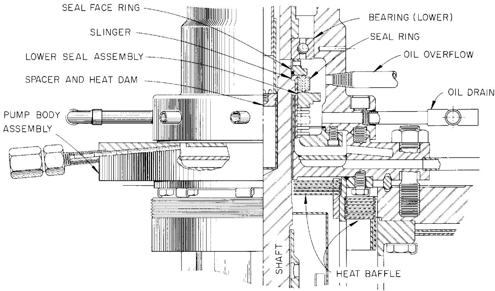  
Fig. 24. Pump Primary Rotary Gas Seal.

tightness specifications were less strict, 20 cc/day leakage being considered acceptable.

Other pump seals which were not subject to relative motion were metal O-rings and buna-N rubber. Buna N was used instead of natural rubber for increased chemical resistance to lubricant.

Each assembly of these components was subjected to a 100-hr mechanical shakedown test at $170^{\circ}\mathsf{F}$ . If any fault was observed, the assembly was taken apart, repaired, and reassembled and the test repeated until no fault was observable. Each assembly was then subjected to a 100-hr high-temperature sodium pumping test, which included two complete temperature cycles from 600 to $1400^{\circ}\mathsf{F}$ . Any fault resulted in full repetition of the sequence of tests until each assembly passed both tests. (It had been observed that with this degree of mechanical operability assured, the pump mechanical assembly would nearly always operate for more than 2000 hr without serious mechanical difficulty.)

Impeller and Impeller Housing. - Figure 23 shows the impeller and impeller housing for the

fuel pump, and Fig. 25 shows the corresponding parts for the sodium pump. Volutes and impellers were designed according to conventional practice.

After many futile attempts to obtain satisfactory defect-free castings, the volutes and impellers were all made as weldments, heat-treated, and machined. Since this method of fabrication of impellers of this small size, 8 in. in diameter, is unusual, the fabrication steps are illustrated in Figs. 26 through 29.

Running clearances between the impeller and its housing were minimized empirically, labyrinths being provided around the inlet hub to reduce internal pump leakages to acceptable values. Clearance in the shaft labyrinth annulus was established at about 0.060 in. radially, which permitted priming of the pump and establishment of the degassing bypass flow, without which the pump would ingas. Other clearances around the impeller permitted a $5/32$ -in. axial dislocation of the impeller and housing; the axial dislocation resulted from a thermal expansion differential occurring during preheating.

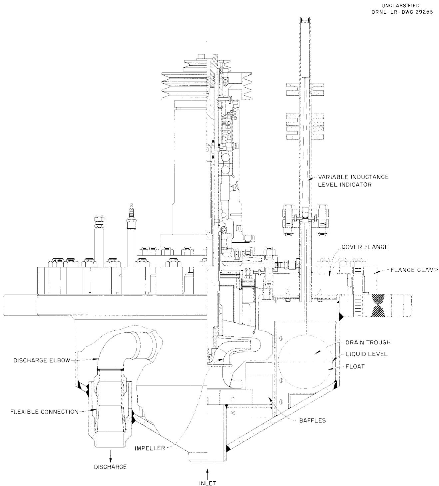  
Fig. 25. ARE Sodium Pump.

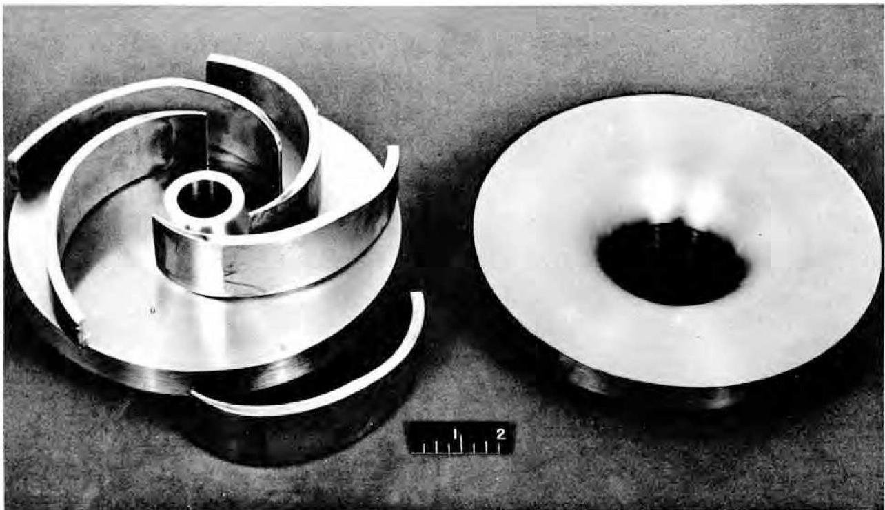  
Fig. 26. Rough-Machined Parts of Inconel Impeller.

The upper portion of the impeller housing was attached to the pump body assembly (see Fig. 23) and was sealed to the lower portion of the impeller housing by a radial sealing metal O-ring carried by the upper impeller housing.

Pump Tanks. - The pump tanks were of two types but performed essentially the same functions. Each tank had a central inlet with antiswirl vanes at the bottom and a vertical discharge outlet at one side.

Each tank cover plate (see Figs. 23 and 25) was the support member for the pump parts, and carried thermal shields on the under side, the lower portion of the impeller housing, and liquid level sensing devices. Thus if the cover plate became distorted, all critical pump parts moved together so as to maintain alignment. A movable dumbbell-shaped section of pipe having ball and socket type of surfaces at one end and ball and cylinder at the other end connected the volute discharge to the tank outlet. The cover plate was sealed to the pump tank with a replaceable weld and was

I held by heavy C-type bolted clamps. The tank had four welded-on lugs around its periphery for supporting the entire assembly. (Each pump tank was an anchor point for the prestressed piping attached to it.)

The service requirements of the pump tanks differed. Each was the expansion tank of its system to eliminate problems of multiple dynamic free surfaces. Each was designed to accept the total fluid expansion expected during reactor operation and was sized so that the liquid level would always be above the pump inlet and below the thermal shields carried by the cover plate. Table 1 gives a comparison of volumetric data for the pump tanks. Each pump tank was provided with several spark-plant-type probes and a float-type liquid level indicator. These are described later.

Each system was filled to the normal operating level (which was higher than the minimum prime level) and then degassed. The liquid temperature was then reduced to the minimum expected and the

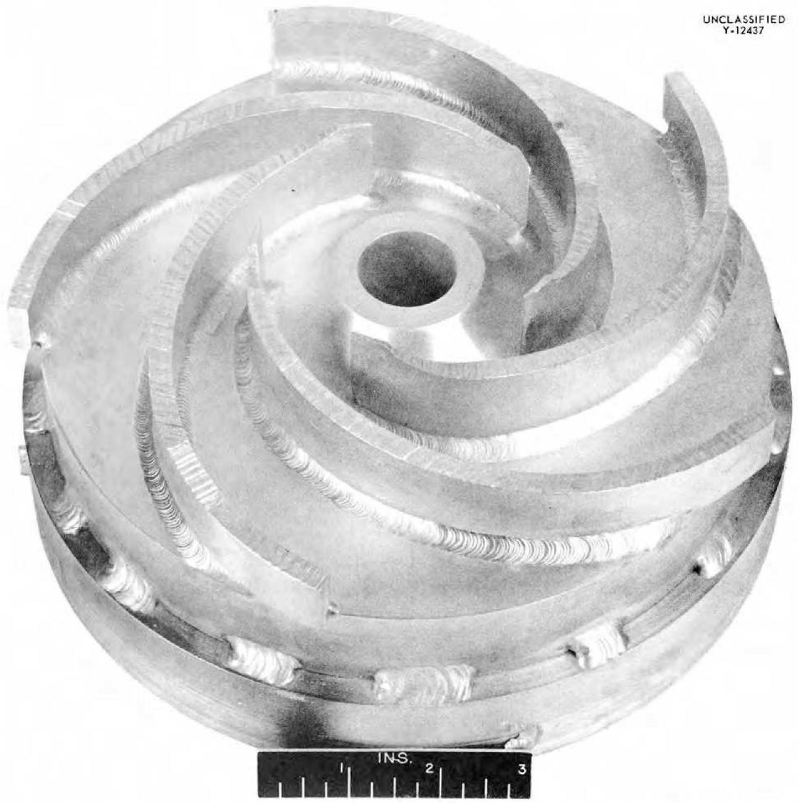  
Fig. 27. Impeller After Heliarc Welding of Vanes to Drive-Shaft Hub. Impeller is tack-welded to a carbon steel strong-back.

level trimmed to the minimum acceptable pumping level, 1 in. above the pump inlet bell. Thereafter, if liquid temperature increased, the level could not exceed the permissible maximum unless reactor design operating temperatures were exceeded. (Little danger could ensue if these temperatures were exceeded, insofar as the pumps were concerned, unless the transient should be sufficient for the pump tank to be flooded and thus endanger

the pump seals and off-gas lines.) If the pump should lose prime after initial trimming of liquid, it could be reprimed by increasing the system temperature to expand the fluid, or by adding liquid temporarily. Reactor operation did not require either technique.

A greater volumetric expansion of fuel than of sodium was expected; consequently the fuel pump expansion tank was 32 in. in diameter and the

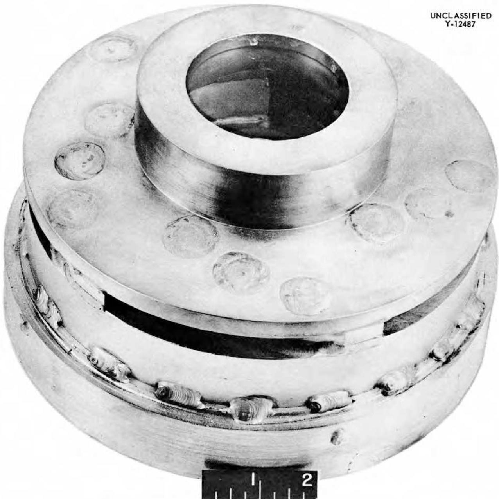  
Fig. 28. Impeller with Fluid-Entrance Hub Plug-Welded into Position.

sodium pump tank was 24 in. in diameter. Another criterion was that the parasitic volume in the fuel pump tank (below the minimum pumping level) be held to a minimum.

Pump Performance. - The performance of each pump model was first determined with water and then checked on sodium and, for fuel pumps, on fuel salt. No significant disagreement between performance on water and reactor fluids was

found. The performance characteristic for the sodium pump is shown in Fig. 30 and in Fig. 31 for the fuel pump.

The pumps installed in the reactor circuits were also equipped with crystal sound detectors at each bearing location, with the amplifier located in the control room. The detector at the lower bearing of the fuel pump indicated excessive noise shortly before scheduled reactor enrichment. The

source of the noise could not be isolated specifically but was analyzed to include a dominant frequency nearly the same as the calculated precession frequency of one ball in the lower bearing race. Since the noise did not increase, reactor operation was continued without pump difficulty. Postrun examination revealed that the noise had

not been caused by bearing wear but rather by a slightly loose, vibrating, dumbbell-shaped pump discharge piece.

Pumps built according to these specifications are now in routine laboratory use and have proved to be very reliable.

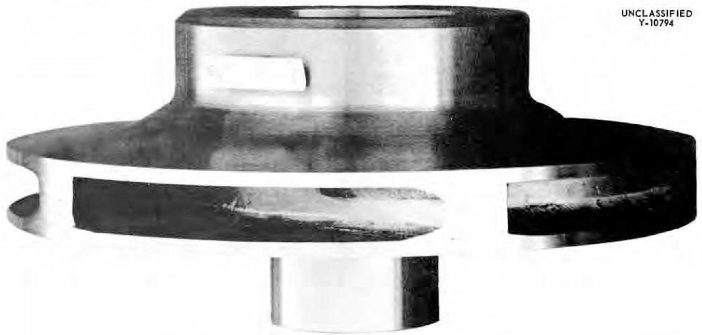  
Fig. 29. Completed Impeller.

Table 1. Comparison of Volumetric Data for Pump Tanks   

<table><tr><td></td><td>Fuel</td><td>Sodium</td><td></td><td>Fuel</td><td>Sodium</td></tr><tr><td>Inside diameter (in.)</td><td>32</td><td>24</td><td>Distance (in.) between</td><td></td><td></td></tr><tr><td>Parasitic volume (in.3)</td><td>208</td><td>1060</td><td>Minimum operating level and minimum prime level</td><td>21/4</td><td>21/4</td></tr><tr><td>Total usable expansion volume (in.3)</td><td>3175</td><td>2170</td><td>Minimum prime level and normal operating level</td><td>121/32</td><td>121/32</td></tr><tr><td>Total usable expansion volume (ft3)</td><td>1.84</td><td>1.26</td><td>Normal operating level and maximum operating level</td><td>211/32</td><td>127/32</td></tr><tr><td>Maximum permissible pressure at 1400°F (psi)</td><td>22</td><td>70</td><td>Volume (in.3) between</td><td></td><td></td></tr><tr><td>Inlet pipe size (in.)</td><td>3</td><td>3</td><td>Minimum operating level and minimum prime level</td><td>320</td><td>800</td></tr><tr><td rowspan="2">Discharge pipe size (in.)</td><td rowspan="2">11/2</td><td rowspan="2">21/2</td><td>Minimum prime level and normal operating level</td><td>1083</td><td>570</td></tr><tr><td>Normal operating level and maximum operating level</td><td>1772</td><td>800</td></tr></table>

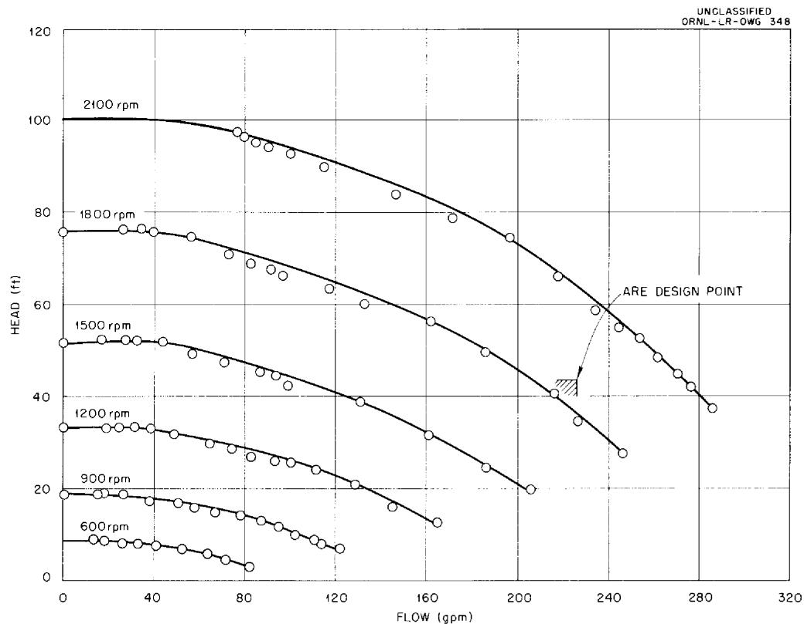  
Fig. 30. Performance of ARE Sodium Coolant Pump.

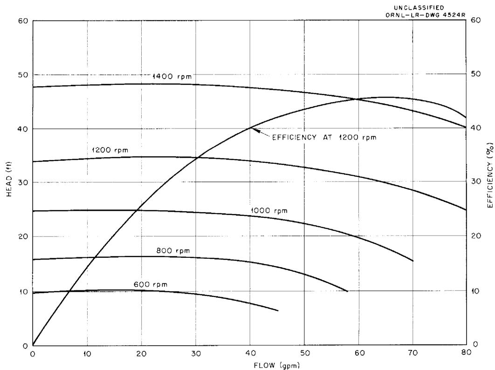  
Fig. 31. Performance of ARE Fuel Pump.

# PUMP AUXILIARIES

The principal pump auxiliaries are the drive and the lubrication system.

# Pump Drives

All pumps were driven by vertically mounted 15-hp d-c motors to obtain variable speeds. For flexibility each motor drove its pump through V-belts. The motors were an air-cooled type with class B windings to withstand ambient temperatures of $125^{\circ}\mathrm{F}$ . Continuity of pump motor operation was assured by storage batteries in parallel with a normally operating motor-generator set.

Because of possible failure of the fuel pump V-belts due to radiation damage, several belts were irradiated to doses of $10^{6}$ r and tested on pumps in the laboratory without failure. As a possible substitute, chain drives were tried experimentally but were abandoned when the driving and driven sprockets were badly damaged due to the vertical positioning of the shafts.

# Lubrication Systems

Each pump was provided with a hermetically sealed forced-circulation lubrication system consisting of a gravity return from the lower pump seal cavity, an oil reservoir, two parallel-connected canned-rotor pumps, a filter, a water-cooled heat exchanger, a thermostatically controlled valved bypass line around the heat exchanger, and a line leading back to the pump. These systems operated without difficulty.

# HIGH-TEMPERATURE INSTRUMENTATION

High-temperature instrumentation was required in the ARE for record, alarm, and control purposes. Sensing elements inserted in or attached to high-temperature system components provided signals for the measurement of temperature, pressure, flow, and liquid level. Low-temperature and most inert-gas instrumentation was essentially conventional and is not discussed further. Controls and nuclear instrumentation are discussed elsewhere.[1,2]

# Temperature Measurement

The ARE included about 800 (0.032-in. wire) Chromel-Alumel thermocouples. Each thermocouple

was crimped in an Inconel sleeve and Heliarc-welded to the piping or other parts. The signals from these thermocouples were indicated on 27 strip-chart recorders and multipoint temperature indicators. A few thermocouples gave erroneous signals due to inadequate thermal or electrical insulation, and by the end of the experiment about $5\%$ of the thermocouple circuits, randomly located, were open (i.e., failed).

Previous experimentation indicated that a pair of thermocouple leads could be welded to the appropriate part separately, be twisted together and welded as a whole, or inserted in the flowing stream in a well. In welded arrangements it was essential to weld the leads in such a way that neither alloy of the couple penetrated the parent metal of the part to which it was attached.

The above methods provided response in the millisecond range which was adequate for the ARE and most high-temperature experimentation.

# Pressure Measurement

Three high-temperature pressure transmitters were used for reactor liquids, two for fluoride as it entered the reactor and one for sodium as it left the reactor. Each was a null-balance bellows-sealed transmitter, Fig. 32, which translated liquid pressure to a balancing gas pressure for measurement. Experiments indicated that the transmitters had an accuracy of $\pm 2\%$ , and there were only minor difficulties experienced with zero shifting. No difficulties were encountered in the reactor experiment.

In development work it had also been found possible to measure pressures from high-temperature gas regions directly with Bourdon-type instruments, and these were used extensively.

# Flow Measurement

Flow in the fluoride circuit was measured by a high-temperature rotameter, and flow in the sodium circuit was measured by two electromagnetic flow-meters of standard design. The high-temperature rotameter, Fig. 33, had a float which could move vertically in response to fluid flow rate within a tapered barrel inserted in the piping. The float was attached to one end of a vertical Inconel rod, and the other end carried a tapered iron core chrome-plated to resist corrosion. The rod and

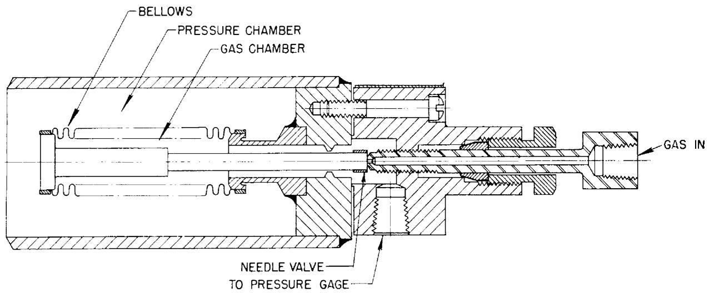  
Fig. 32. Moore Nullmatic Pressure Transmitter.

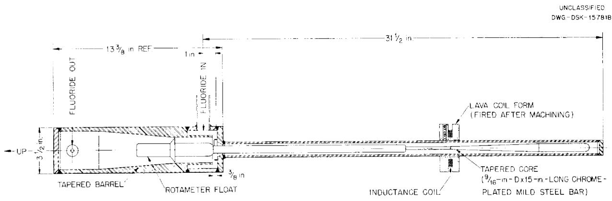  
Fig. 33. Rotameter-Type Flowmeter with Variable Inductance Level Indicator.

core were contained in a vertical pipe filled with static fluorides and were held at a constant temperature near $1300^{\circ}\mathrm{F}$ . An inductance coil, operable at $1300^{\circ}\mathrm{F}$ , was placed around the pipe at the section containing the tapered portion of the iron core, and external instrumentation measured the variation in inductance of the coil circuit as the iron core and rod changed position due to motion of the attached float.

The principal difficulties with this device were variations in temperature at the inductance coil

which affected its accuracy, and oxidation of the coil wire due to the high temperature, which changed its resistance and limited its life. Refinements have shown that the coil life13 could have been extended by the use of different materials of construction and that accuracy could have been improved by alteration of rotameter system circuit design.

# Level Measurement

Dynamic liquid surfaces blanketed by helium existed in the fill and drain tanks and in the expansion (pump) tanks of the reactor circuits. Spark-plug-mounted electrical probes were used in all tanks, and floats were used in the pump tanks to provide information on liquid level and in some applications to actuate alarms.

A typical spark- plug-mounted electrical probe is shown in Fig. 22. Four were provided in each fill and drain tank to indicate maximum and minimum levels and two intermediate levels. Four probes were also used in each pump tank: one each at the minimum operating level, at the maximum operating level, both of which actuated alarms, at the minimum priming level, and at the normal operating level. (The significance of each of these levels is discussed in "Pump Tanks.") Each pump tank also included a float within an enclosing liquid stilling well (see Figs. 23 and 25), and the location of the liquid level was determined in the same fashion as with the high-temperature rotameter described in "Flow Measurement" and shown in Fig. 33. The float provided continuous liquid level indication.

During operation each type presented some difficulty. Some shorting of probes was experienced. This was eliminated in the fuel system by the introduction of an increased current in the circuit to burn out the short. This burn-out feature did not work with sodium because of its low electrical resistance. The principal objection to the float system was that temperature variations in the sensing coils caused shifts in the zero and range settings.

# COMPONENT INSTALLATION

The facility for the reactor experiment provided three concrete-walled pits, one for the reactor, one for the fill and drain tanks, and the third, and largest, for the bulk of the high-temperature plumbing, pumps, heat transfer equipment, and essential process auxiliaries. The pits were very crowded, and accessibility, needed for installation or for corrective measures during installation and shakedown, was very limited.

The amount of $U^{235}$ available necessitated reduction of the fuel volume external to the core, and to accomplish this one-half the heat-dump equipment planned for the fuel circuit was eliminated.

Figures 34 and 35 show the arrangements of the sodium and fluoride circuits used. Unfortunately, the fuel volumetric reduction also resulted in further crowding of the remaining fluoride circuitry.

The pits were closed at the top with concrete shield blocks during nuclear operation, so that during this phase of the experiment all the equipment in the pits was completely inaccessible and could be operated only remotely and as indicated by the instrumentation provided.

# SUMMARY

In summary it is noted that

1. the reactor circuits were at temperatures above $1200^{\circ}\mathrm{F}$ for 609 hr, 221 of which comprised the nuclear experiment;   
2. most of the reactor circuit components performed their assigned functions adequately;   
3. the reliability of all-welded high-temperature liquid circuits was proved;   
4. leaks did not occur in the liquid circuits during reactor nuclear operation;   
5. the only failures of major significance were loss of leak-tightness in the fuel off-gas system and loss during prenuclear operations of cold traps in the sodium circuits;   
6. most of the individual high-temperature components of this system could probably have operated successfully many hours beyond the termination of the experiment;   
7. the effect on continuity of nuclear operability imposed by the lack of drainability of the reactor core could not be assessed since no situation occurred which demanded draining;   
8. the leakage of fission-product gases to the cells complicated gas and radiation control problems but did not prevent successful operation of the reactor nor orderly termination of the experiment.

The ARE and related engineering development tests have shown that it is feasible to provide the necessary equipment for the reliable removal of heat power generated by nuclear fission in a forced-circulation fused fluoride fuel and to transfer this power by means of molten alkali metals and the fused fluorides at temperatures as high as $1580^{\circ}\mathrm{F}$ . Durability of the equipment increases with decreasing temperature and, with materials used in the experiment, appears to be of the order of 2000 hr when the equipment is subjected to $1500^{\circ}\mathrm{F}$ liquids.

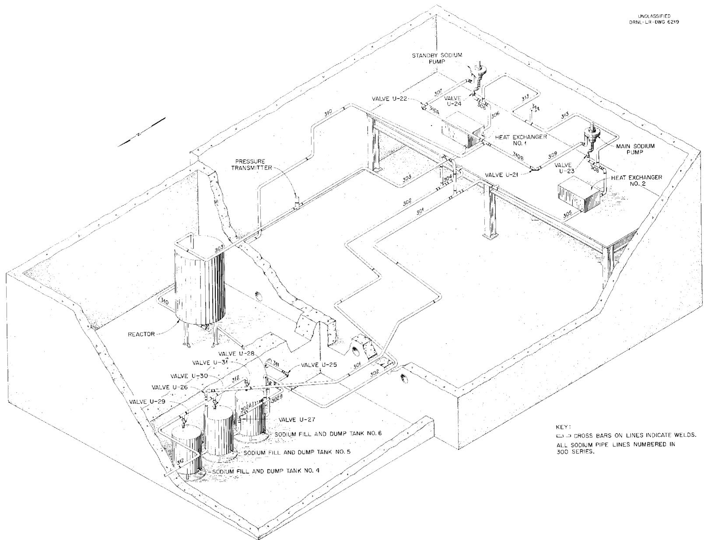  
Fig. 34. Isometric Drawing of ARE Sodium System.

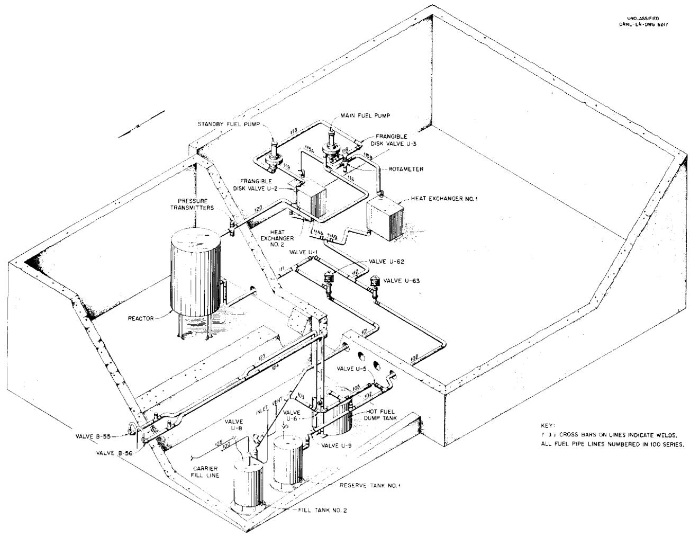  
Fig. 35. Isometric Drawing of ARE Fuel System.

# ACKNOWLEDGMENT

The authors wish to express their appreciation to their many associates and consultants, without whose invaluable assistance and many contributions the work described could not have been accomplished. The report embraces the engineering which was accomplished in several sections of the ARE but which, in many instances, was not necessarily the direct responsibility of one of the

authors. A project such as this crosses a wide variety of professional disciplines and craft activities, and it is with regret that we admit the impossibility of naming each.

The assistance of A. L. Southern, ORNL Instrumentation and Controls Division, in preparing the section "High-Temperature Instrumentation" is particularly acknowledged.

# INTERNAL DISTRIBUTION

1. A. M. Weinberg

2. J. A. Swartout

3. R. B. Briggs

4. W. H. Jordan

5. M. E. Ramsey

6. E. C. Miller

7. H. E. Seagren

8. R. A. Charpie

9. M. L. Nelson

10. J. H. Frye, Jr.

11. E. P. Blizzard

12. E. D. Shipley

13. R. S. Livingston

14. C. J. Borkowski

15. C. E. Winters

16. J. A. Lane

17. F. L. Culler

18. G. E. Boyd

19. M. T. Kelley

20. E. H. Taylor

21. D. S. Billington

22. C. D. Susano

23. J. C. White

24. A. Simon

25. C. E. Clifford

26. A. D. Callihan

27. F. C. Maienschein

28. F. R. Bruce

29. W. K. Eister

30. A. T. Gresky

31. D. E. Ferguson

32. R.E.Blanco

33. K. B. Brown

34. J. C. Bresee

35. H. E. Goeller

36. R. B. Lindauer

37. M. A. Bredig

38. W. R. Grimes

39. G. J. Nessle

40. J. P. Blakely

41. G. Morris

42. F. Ring, Jr.

43. G. A. Cristy

44. K. Z. Morgan

45. R. N. Lyon

46. E. G. Bohlmann

47. S. E. Beall

48. P. M. Reyling

49. C. S. Harrill

50. E.P.Epler

51. E. R. Mann

52. E. S. Bettis

53. C. A. Mossman

54. H. Metz

55. R. G. Affel

56. W. D. Manly

57. J. E. Cunningham

58. E. E. Hoffman

59. J. H. DeVan

60. P. Patriarca

61. A. Taboada

62. J.A.Cox

63. T. E. Cole

64. W. R. Gall

65. I. Spiewak

66. R. B. Korsmeyer

67. G. W. Keilholtz

68. W. E. Browning

69. M. T. Robinson

70. J. T. Howe

71. O. Sisman

72. J. G. Morgan

73. T. Hikido

74. M. R. Hill

75. J. R. McNally, Jr.

76. C. P. Keim

77. W. K. Ergen

78. A. W. Savolainen

79. A. L. Boch

80. A. P. Fraas

81. H. G. MacPherson

82. R. V. Meghreblian

83-86. H. W. Savage

87. E. J. Breeding

88. D. B. Trauger

89. J. A. Conlin

90. F. R. McQuilkin

91. W. B. McDonald

92. E. Storto

93. J. C. Amos

94. R. E. MacPherson, Jr.

95. W. F. Boudreau

96. A. G. Grindell   
97. P. G. Smith   
98. W. R. Huntley   
99. W. R. Osborn   
100. R. Helton   
101. W. K. Stair   
102. J. F. Bailey   
103. W. G. Cobb   
104. L. V. Wilson   
105. B. L. Greenstreet   
106. M. M. Yarosh   
107. J. Foster   
108. W. T. Furgerson   
109. G. Samuels   
110. M. Bender   
111. A. M. Perry   
112. W. B. Cottrell   
113. H. W. Hoffman   
114. J. J. Keyes, Jr.   
115. W. S. Stelzman   
116. J. L. Wantland

117. B. W. Kinyon   
118. M. E. Lackey   
119. L. A. Mann   
120. F. C. VonderLage   
121. G. D. Whitman   
122. J. Zasler   
123. C. E. Center (K-25)   
124. M. J. Skinner   
125. F. Kertesz   
126. D. Phillips   
127. L. B. Emlet (K-25)   
128. C. S. Walker   
129. J. P. Murray (Y-12)   
130. G.C. Williams   
131. Biology Library   
132. Health Physics Library

133-134. Central Research Library 135. Reactor Experimental Engineering Library   
136-137. ORNL - Y-12 Technical Library   
138-157. Laboratory Records Department   
158. Laboratory Records, ORNL R.C.

# EXTERNAL DISTRIBUTION

150-160. Babcock and Wilcox Company (1 copy each to R. A. Tidball and R. T. Schomer)   
161. Brookhaven National Laboratory (O. E. Dwyer)   
162. ALCO Products, Inc. (J. F. Haines)   
163-165. Atomics International (1 copy each to H. Pearlman, W. Hallett, and R. W. Dickinson)   
166-167. Argonne National Laboratory (1 copy each to L. Koch and F. A. Smith)   
168-169. Battelle Memorial Institute (1 copy each to S. Fawcett and E. M. Simon)   
170. General Electric Company, San Jose   
171. Pratt and Whitney Aircraft Division (E.R.Dytko)   
172. Atomic Energy Commission, Oak Ridge (W. J. Larkin)   
173. Division of Research and Development, AEC, ORO   
174-738. Given distribution as shown in TID-4500 (13th ed., Rev.) under Metallurgy and Ceramics category (75 copies - OTS)