# AEC RESEARCH AND DEVELOPMENT REPORT

ORNL-2349

C-84 - Reactors-Special

Features of Aircraft Reactors

3445603585225

135A

AIRCRAFT REACTOR EXPERIMENT -

METALLURGICAL ASPECTS

W. D. Manly   
G.M.Adamson, Jr.   
J.H.Coobs   
J.H.DeVan   
D. A. Douglas   
E. E. Hoffman   
P. Patriarca

DECLASSIFIED

CLASSIFICATION CHANGED TO: ${HC}{C0}$ 10.9-6g BY AUTHORITY OF:

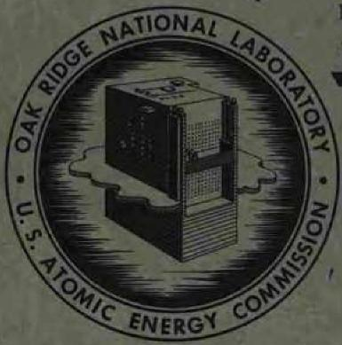

CENTRAL RESEARCH LIBRARY DOCUMENT COLLECTION

LIBRARY LOAN COPY

DO NOT TRANSFER TO ANOTHER PERSON

If you wish someone else to see this document, send in name with document and the library will arrange a loan.

OAK RIDGE NATIONAL LABORATORY

OPERATED BY

UNION CARBIDE NUCLEAR COMPANY

Division of Union Carbide Corporation

UCC

POST OFFICE BOX X · OAK RIDGE, TENNESSEE

# LEGAL NOTICE

This report was prepared as an account of Government sponsored work. Neither the United States, nor the Commission, nor any person acting on behalf of the Commission!

A. Makes any warranty or representation, express or implied, with respect to the accuracy, completeness, or usefulness of the information contained in this report, or that the use of any information, apparatus, method, or process disclosed in this report may not infringe privately owned rights; or   
B. Assumes any liabilities with respect to the use of, or for damages resulting from the use of any information, apparatus, method, or process disclosed in this report.

As used in the above, "person acting on behalf of the Commission" includes any employee or contractor of the Commission to the extent that such employee or contractor prepares, handles or distributes, or provides access to, any information pursuant to his employment or contract with the Commission.

Contract No. W-7405-eng-26

# METALLURGY DIVISION

# AIRCRAFT REACTOR EXPERIMENT - METALLURGICAL ASPECTS

W. D. Manly   
G. M. Adamson, Jr.   
J. H. Coobs   
J. H. Devan   
D. A. Douglas   
E. E. Hoffman   
P. Patriarca

DATE ISSUED

DEC 201957

OAK RIDGE NATIONAL LABORATORY

Operated by

UNION CARBIDE NUCLEAR COMPANY

A Division of Union Carbide and Carbon Corporation

Post Office Box X

Oak Ridge, Tennessee

34456 03585225

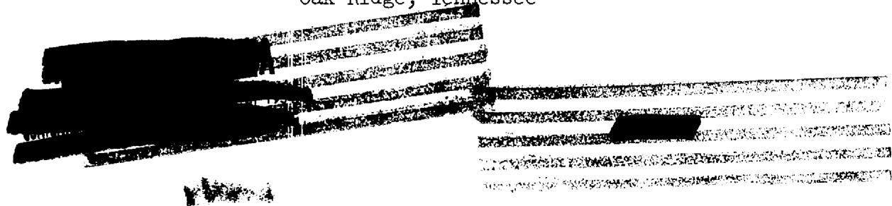

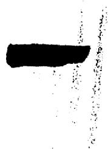

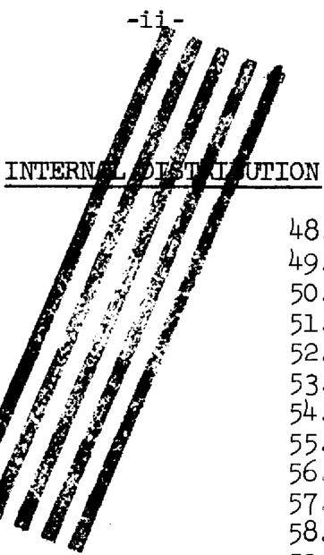

ORNL-2349

C-84-Reactors-Special Features of Aircraft Reactors M-3679 (20th ed.Rev.)

1. G. M. Adamson, Jr.   
2. R. G. Affel   
3. C. J. Barton   
4. R. J. Beaver   
5. M. Bender   
6.1 D. S. Billington   
7. F. F. Blankenship   
8. E. B. B. A. D   
9. C. J. Borsolski   
10. W. Brounveau   
11. G. E. Roft   
12. M. A. F. Kudng   
13. E.F.J.Breuling   
14. W. 廖F: Browning   
15. Fink Bae   
16. A B. C D. E F.   
17. D. C. Carrwell   
18. C. Center (K-25)   
19. R.A.Chapie   
20. R.J. 1. 1. 1. 1. 1.   
21. C.Efford   
22. Hcobs   
23. B coftrell   
24. S. F. Cromer   
25. R. S. Crouse   
26. F. L. Culler   
27. D. R. Cuneo   
28. J. E. Cunningham   
29. J. H. Devan   
30. L. M. Doney   
31. D. A. Douglas   
32. E. R. Dytko   
33. W. K. Eister   
34. L. B. Emlet (K-25)   
35. D. E. Ferguson   
36. A. P. Fraas   
37. J. H. Frye, Jr.   
38. W. T. Furgerson   
39. R. J. Gray   
40. A. T. Gresky   
41. W. R. Grimes   
42. A. G. Grindell   
43. E. Guth   
44. J. P. Hammond   
45. C. S. Harrill   
46. T. Hikido   
47. M.R.Hill

48. E. E. Hoffman   
49. H.W.Hoffman   
50. A. Hollander   
51. A. S. Householder   
52. J. T. Howe   
53. H. Inouye   
54. W. H. Jordan   
55. G. W. Keilholtz   
56. C. P. Keim   
57. F. L. Keller   
58. M. T. Kelley   
59. F. Kertesz   
60. J. J. Keyes   
61. J. A. Lane   
62. R.B. Lindauer   
63. R. S. Livingston   
64. R.N.Lyda   
65. H.G.MacPherson   
66. R. E. MacPherson   
67. F. C. Maienschein   
68. W. D. Manly   
69. E. R. Mann   
70. 1. A. Mann   
71. W. B. McDonald   
72. J. R. McNally   
73. F. R. McQuilkin   
74. R. V. Meghreblian   
75. R.P.Milford   
76. A. J. Miller   
77. R.E.Moore   
78. J. G. Morgan   
79. K. Z. Morgan   
80. E.J. Murphy   
81. J.P.Murray (Y-12)   
82. M. L. Nelson   
83. G. J. Nessle   
84. R.B.Oliver   
85. L. G. Oveholser   
86. P. Patrjika   
87. S: K. Penny   
88. A. M. Perry   
89. D. Phillips   
90. J. C. Pigg   
91. A. E. Richt   
92. M. T. Robinson   
93. H. W. Savage   
94. A. W. Savolainen

95. R. D. Schultheiss   
96. D. Scott   
97. J. L. Scott   
98. E. D. Shipley   
99. A   
OO.   
01. J.   
02. M! J. Skinner   
03. G. M. Slaughter   
O4. C. O. Smith   
05. A. H. Snell   
06. C. D. Susano   
07. J. A. Swartout   
08. A. Taboada   
09. E. H. Taylor   
10. R. E. Thoma   
11. D. B. Trauger

112. D. K. Trubey   
113. G. M. Watson   
114. R. C. Waugh

117. A. "Weinberg   
HIO: y. c. white   
II7. G: D: Whitman   
110. E. P. Wigner (consultant)   
119. J. C. Wilson   
120. C. E. Winters   
121. H. L. Yakel, Jr.   
122. W. Zobel

123-125. ORNL - Y-12 Technical Library, Document Reference Section   
126-133. Laboratory Records Department   
134. Laboratory Records, ORNL R.C.   
135-136. Central Research Library

# EXTERNAL DISTRIBUTION

137-139. Air Force Ballistic Missile Division   
140-141. AFPR, Boeing, Seattle   
142. AFPR, Boeing, Witchita   
143. AFPR, Curtiss-Wright, Clifton   
144. AFPR, Douglas, Long Beach   
145-147. AFPR, Douglas, Santa Monica   
148. AFPR, Burbank   
149-150. APPR, Marietta   
151. APFR, 2000 American Canoga Park   
152. APFR, 100th American, Downey   
153-154. ATF Special Weapons Center   
155. ATR“M   
156. Air Research and Development Command (RDGN)   
157. Air Research and Development Command (RDTAPS)   
158-171. Air Research and Development Command (RDZPSP)   
172. Air Technical Intelligence Center   
173-175. ANP Project Office, Convair, Fort Worth   
176. Albuquerque Operations Office   
177. Argonne National Laboratory   
178. Armed Weapons Project, Sandia   
179. Armed Forces Special Weapons Project, Washington   
180. Assist the Secretary of the Air Force, R&D   
181-186. Atomic Chemistry Commission, Washington   
187. Atomics International   
188. Battelle Memorial Institute   
189-190. Bettis Plant (WAPD)   
191. Bureau of Aeronautics   
192. Bureau of Aeronautics General Representative   
193. BAR, Aerojet-General, Azusa   
194. BAR,Convair, San Diego

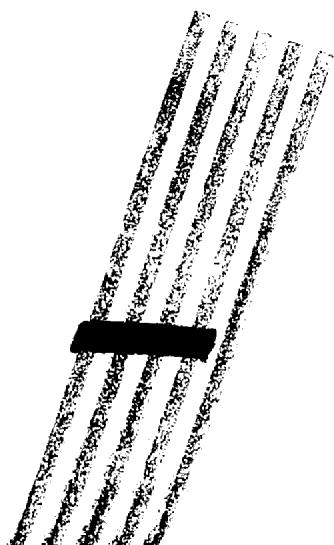

-iv-

155. BAR (1) Martin, Baltimore   
296. BAR & Grumair Aircraft, Bethpage   
197. Bureau of Arms and Docks   
198. Chicken Operations Office   
199. Chiang Pateit Group   
200. Curtis-Hurst Corporation   
201. Engineering Research and Development Laboratories

202-205. General Electric Company (ANPD)

206. General Nuclear Engineering Corporation   
207. Hartford Area Office   
208. Idaho Operations Office   
209. Knolls Atomic Power Laboratory   
210. Locklin, Area Office   
211. Los Alarcon Scientific Laboratory   
212. Marquardt Airlraft Company   
213. Martin Company   
214. National Advisory Committee for Aeronautics, Cleveland   
215. National Advisory Committee for Aeronautics, Washington   
216. Naval Air Development Center   
217. Naval Air Material Center   
218. Naval Air Turbine Test Station   
219. Naval Research Laboratory   
220. Nuclear Development Corporation of America   
221. New York Operations Office   
222. Nuclear Metals, Inc.   
223. Office of Naval Research   
224. Office of the Chief of Naval Operations (OP-361)   
225. Patent Branch, Washington

226-229. Pratt and Whitney Aircraft Division

230. San Francisco Operations Office   
231. Sandia Corporation   
232. School of Aviation Medicine   
233. Sylvania Corning Nuclear Corporation   
234. Technical Research Group   
235. USAF Headquarters   
236. USAF Project Rnd   
237. U. S. National Radiological Defense Laboratory

238-239. University of California Radiation Laboratory, Livermore   
240-257. Wright Air Development Center (WCOSI-3)   
258-282. Technical Information Service Extension, Oak Ridge   
283. Division of Research and Development, AEC, ORO

# ABSTRACT

The selection of the proper structural material to be used in the construction of an Aircraft Reactor is influenced by a number of important requirements. The material must have an acceptable cross section, be resistant to elevated-temperature corrosion by liquid metals, air, and the molten salts, and be free of temperature-gradient mass transfer. It must possess good creep properties in these environments and be free of structural changes during service. Finally, it must be easy to form and weld into relatively complicated shapes and be commercially available. Inconel was selected as the structural material for the Aircraft Reactor because it met these requirements.

The experimental work performed in the fields of corrosion, creep, and welding is described. Although a small amount of corrosion in the salt and some mass transfer in both sodium and salt were observed, the material performed quite satisfactorily during the lifetime of the reactor.

The creep properties of Inconel were adversely affected by the various environments; however, by designing to limit the stress, successful operation of the reactor was achieved.

Both the successful operation of the reactor and the relative ease with which a multitude of welded joints in the plumbing circuit was produced attested to the weldability of this alloy.

A major lesson learned in the construction of this reactor was the importance of cooperation between designers, suppliers, construction and procurement people, and materials people.

# AIRCRAFT REACTOR EXPERIMENT - METALLURGICAL ASPECTS

The main role of the metallurgist in the design and construction of Aircraft Reactors is to assist in determining the proper structural metal or alloy for the containing vessel, in seeing that the chosen metal or alloy is of suitable quality, and in establishing its limits of practicality. Aircraft Reactors demand a great deal from the material of construction, as can be seen from the following, somewhat formidable requirements:

(1) The alloy must have corrosion resistance to the fused salt fuel.   
(2) It must have corrosion resistance to sodium and NaK.   
(3) It must have resistance to temperature-gradient mass transfer in both media.   
(4) The material should have tolerable oxidation resistance, since it will be operating at high temperatures in the ambient-air conditions in the reactor pit.   
(5) The material should have good high-temperature creep strength, which should be retained in various environments, such as the fused salts and sodium.   
(6) The material should possess good high-temperature ductility to withstand the high-thermal stresses and vibratory stresses that will be imposed on it in addition to the static stresses.   
(7) The material should be easy to weld so that the various complicated components, such as heat exchangers, can easily be constructed.   
(8) The material should be easy to form into the various intricate shapes that are required in fabricating the pieces of plumbing needed in the construction of the reactor.   
(9) If at all possible, the alloy should be commercially available. This would provide ample fabrication experience to produce various sizes and shapes and a backlog of information on the stability of the alloy, in addition to the information that would be obtained from tests conducted by the Laboratory.   
(10) The material should be free of structural changes under the operating conditions; otherwise the creep properties might be adversely affected. This is quite important since the material

will be stressed at a high temperature for long periods of time under an intense field of neutron radiation.

(11) The material should not have a prohibitive cross section, so that the critical mass for the reactor will not be unreasonable, and, if at all possible, elements giving rise to strong capture gamma rays with long half lives should be avoided in order that the reactor will be approachable after shutdown.

The previous papers in this series (1-6) have stated that Inconel was chosen as the structural material for the Aircraft Reactor Experiment. Inconel is a nickel-base alloy with a nominal composition of $15\%$ chromium, $7\%$ iron, and the balance nickel with residual quantities of titanium, aluminum, carbon, and silicon that come through from the melting practice. A typical analysis (in weight per cent) of Inconel is given below:

<table><tr><td>Cr</td><td>15</td></tr><tr><td>Fe</td><td>7</td></tr><tr><td>Mn</td><td>0.03</td></tr><tr><td>C</td><td>0.04-0.06</td></tr><tr><td>Al</td><td>0.15</td></tr><tr><td>Ti</td><td>0.25</td></tr><tr><td>Si</td><td>0.22</td></tr><tr><td>Ni</td><td>Balance</td></tr></table>

This alloy, produced by the International Nickel Company at Huntington, West Virginia, has been commercially available for a long period of time. The reasons for the choice of Inconel as the construction material for the Aircraft Reactor Experiment are given in the following sections of this report, which explain the experimental work performed in the fields of corrosion, welding, and creep testing.

# Corrosion of Inconel in Molten Salts

The most difficult requirement of the container material is good corrosion resistance to the molten fluorides used as fuel carriers. An oxide coating or other type of protective film that is sometimes used for

protection against aqueous corrosion and in certain high-temperature applications could not be used in the Aircraft Reactor, because the molten fluorides are very good fluxing agents and are used every day in metallurgical operations to clean up the surface of metals before various joining and brazing operations. Therefore, the choice of a container material must depend upon finding an alloy that is, for the most part, thermodynamically stable with the fluid at the operating temperature range and conditions.

The corrosion testing program at the Oak Ridge National Laboratory to determine the best structural material in contact with molten fluorides was a cooperative effort of Chemistry, Experimental Engineering, and Metallurgy. Many new corrosion testing techniques had to be developed during this study. Techniques used included the static capsule test, the rocking or seesaw test, the thermal-convection-loop test, and the forced-circulation-loop test. (7) Early in the molten salt corrosion program it was found, in static and seesaw tests, that nickel-base alloys and the austenitic stainless steels exhibited promising resistance to the corrosive action of the molten salts. Further tests were then carried out on these alloys by means of low-velocity dynamic tests, which were conducted in thermal convection loops. [A battery of such loops is represented in Fig. 1 (21341).] By heating one leg of the loop and cooling the other, a flow velocity of 2 to 6 rpm could be maintained by the difference in density in the hot and cold leg. The usual operating conditions were $1500^{\circ}\mathrm{F}$ on the hot leg, 1300 to $1350^{\circ}\mathrm{F}$ on the cold leg, and an operating time of 500 hr. At the end of the operation the loop was cut open for examination, and sections of piping were removed for metallographic studies. The molten salt was examined for phase changes and metallic crystals, and the amount of metallic constituents in solution was determined by chemical analysis. In the first early screening tests the molten fluorides used were mixtures of sodium, lithium, potassium, and uranium fluorides. The operating characteristics of the various alloys with these mixtures were such that nickel and nickel-base alloys would operate for the full 500 hr without stoppage of flow, as shown in Fig. 2 (T-4865). The austenitic stainless steels exhibited stoppage of flow as a result of the cold zone of the loop being obstructed by a high-melting-point compound, identified as $\mathsf{K}_2\mathsf{NaCrF}_6$ .

Other nickel-base-alloy loops, Hastelloy B and Hastelloy C, were also tested but could not be properly evaluated because of difficulties with welding. The A-nickel loop, even though it operated for 500 hr, showed a

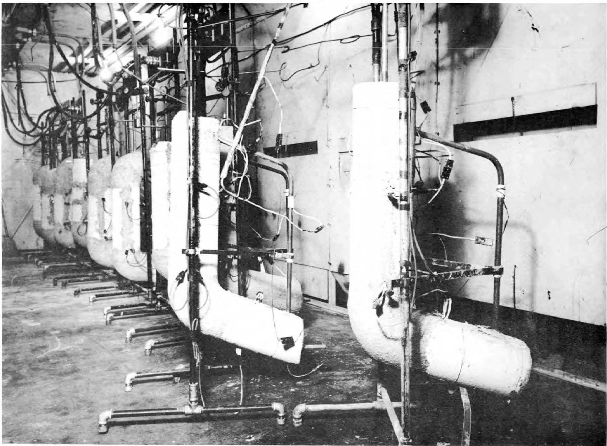  
Fig. 1 (Photo 21341) Battery of Thermal Convection Loops Used to Conduct Low Velocity Dynamic Tests.

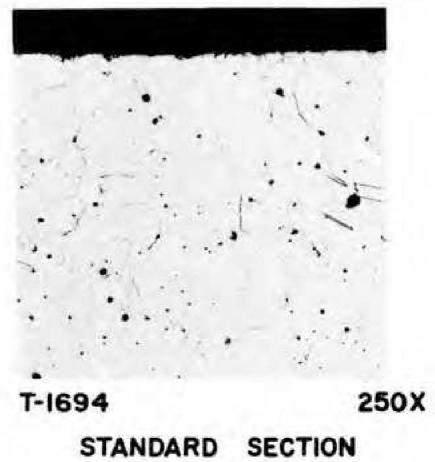

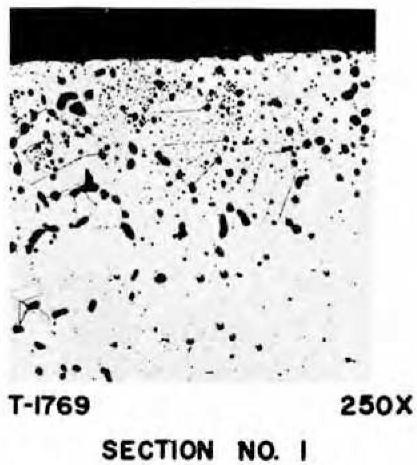

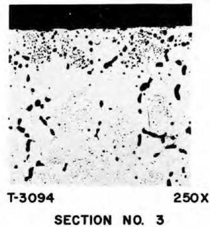

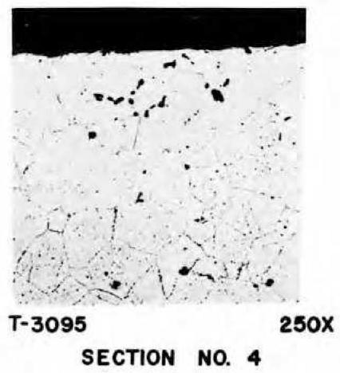

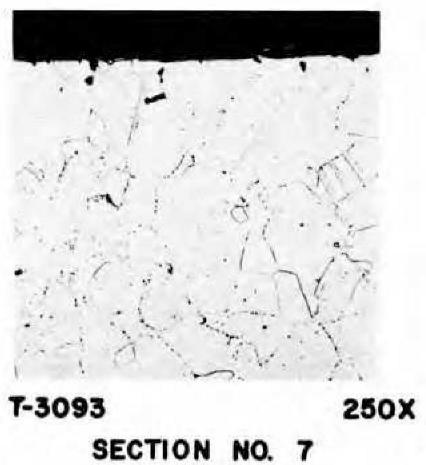

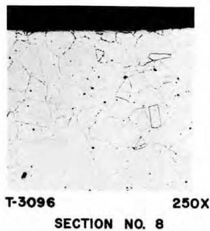  
INCONEL THERMAL CONVECTION LOOP 500 HRS. AT $1500^{\circ}F$   
Fig. 2 (T-4865) HOT LEG OF STANDARD LOOP

metallic mass transfer deposit in the cold zone. Examination of sections from the Inconel loops showed rather deep corrosive attack in certain parts of the loop, as can be seen in Fig. 2. While the attack on Inconel was excessive under the test conditions employed, this alloy was preferred over all other metal-base alloys tested because of its strength properties, fabricability and availability. When it was found that this alloy had better compatibility with salt mixtures of sodium, zirconium, and uranium fluorides (NaF-ZrF $_4$ -UF $_4$ , 50-46-4 mole %) than with other salt mixtures, extensive studies with this mixture and Inconel were begun. Investigations were made of the corrosion mechanisms and the various parameters affecting corrosion, such as fluoride salt purity, time, surface area and volume ratio, flow velocity, and temperature.

From the photomicrographs in Fig. 2, it can be observed that the attack of the molten fluorides on Inconel resulted in subsurface voids. A careful study was made to determine what caused this type of attack. Chemical analyses of the molten fluorides showed that the iron and nickel contents had decreased and that the chromium content had increased during the 500-hr operation. The greatest change found was the reduction in chromium content of the Inconel sections taken from the hot-leg wall, and this was first demonstrated by a magnetic metallographic examination technique. In Fig. 3 (Y-6549 and Y-5954) two photomicrographs are presented which were taken on the same section of pipe removed from the hot leg of a loop. One photomicrograph shows the general corrosion attack experienced with this environment, and the other shows the same sample with a colloidal dispersion of iron particles applied to the specimen. When the sample was made the core of an electromagnet, the iron particles collected on the portion of the metal exhibiting ferromagnetism. This indicates that there was a severe leaching of chromium from the Inconel, since the Curie point was now below room temperature, and this could only occur if the chromium content, of the nominal $15\%$ Inconel, is less than $8\%$ . When this severe leaching was found, sections of the pipe were removed from several thermal convection loops, and turnings were machined from the inside diameter and analyzed for nickel, iron, and chromium. The data from three such experiments are plotted in Fig. 4 (T-3493), where it can be seen that the chromium content dropped appreciably below the average level to a depth of 25 mils from the surface.

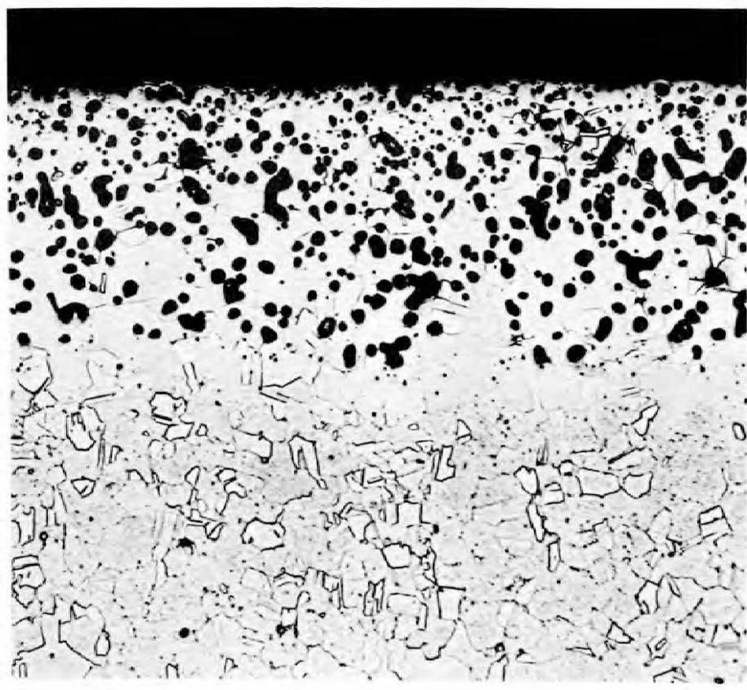

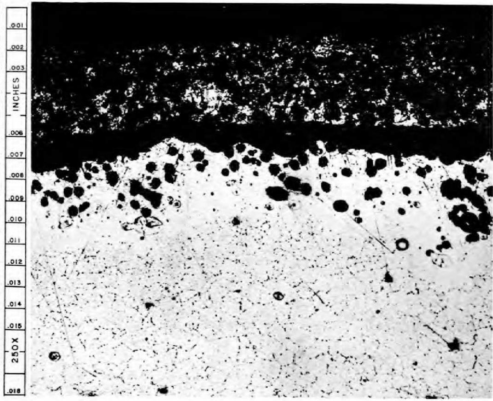  
Fig. 3 (Y-5954 - 6549) Illustration of the Magnetic Metallographic Technique.

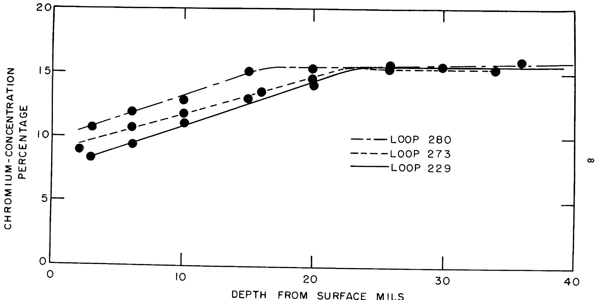  
Fig. 4 CHANGE IN CHROMIUM CONCENTRATION WITH DEPTH HOT LEG OF (T-3493) THERMAL CONVECTION LOOP

The depth of chromium removal could be correlated with a lower limit at which the voids were visible by metallographic examination. Voids of this same type have been developed in Inconel by high-temperature oxidation tests and high-temperature vacuum tests in which the chromium is selectively removed.(8) Holes similar to these have also been developed in copper-brass diffusion couples and by thedezincification of brass, as shown in the experimental work of the Sylvania Electric Products Company.(9)

Careful metallographic examination indicated that the voids did not inter-connect to the surface. Hot-helium leak tests on sections in which the unattacked areas had been removed by machining indicated that no helium was leaking through the attacked areas. Liquid penetration tests indicated that the penetrant had remained at the surface of the specimen instead of extending into the holes or voids.

After the tests were completed and the data carefully examined, the mechanism for the formation of subsurface voids in the solid solution Inconel lattice was then explained by the following steps:

(1) The chromium is oxidized from the Inconel surface by reacting with impurities or the constituents of the molten fluoride mixture in contact with the Inconel wall. These reactions will be explained in a separate part of this paper.   
(2) When the chromium is removed from the surface, the chromium from the bulk metallic section diffuses into the area of lower concentration, down the concentration gradient.   
(3) Metallic diffusion is by a vacancy process, and when the diffusion is monodirectional, it is possible to obtain an over-equilibrium number of vacancies in the metal.   
(4) The excess vacancies precipitate from the crystal lattice in areas of disregistry in the metal to form voids or holes. The main areas of disregistry are the grain boundaries and inclusions in the metal.   
(5) The holes are empty and do not connect with the surface.   
(6) The voids tend to agglomerate and grow in size with an increase in time and/or temperature.

These observations showed that the corrosion process of the molten salt on Inconel was mainly the selective removal of chromium from the solid-solution lattice. An attempt was then made to determine the manner by which chromium

was oxidized from the alloy.

In examinations of various corrosion or chemical reactions that could be responsible for the removal of chromium from these alloys, it is well to classify the reactions into three types, as explained in another paper of this series.(6)

# Impurities in the Melt

An example of this type of reaction is

$$
\mathrm {F e F} _ {2} + \mathrm {C r} \rightarrow \mathrm {C r F} _ {2} + \mathrm {F e}. \tag {1}
$$

Other impurities that would also enter into chemical reaction of this type are $\mathrm{NiF}_2$ , $\mathrm{CrF}_3$ , $\mathrm{FeF}_3$ , $\mathrm{HF}$ , and $\mathrm{UF}_5$ .

# Oxide Films on Metal Surfaces

The fused fluorides would remove the oxide film from structural metals by reactions of the type

$$
2 \mathrm {F e} _ {2} 0 _ {3} + 3 \mathrm {C r F} _ {4} \rightarrow 3 \mathrm {C r O} _ {2} + 4 \mathrm {F e F} _ {3}. \tag {2}
$$

The ferric fluoride thus formed would dissolve in the melt and would then attack the chromium of the Inconel by reaction (1).

# Constituents in the Fuel

The chromium will also react with constituents of the fuel, and the most important reaction of this type is

$$
\mathrm {C r} + 2 \mathrm {U F} _ {4} \rightarrow 2 \mathrm {U F} _ {3} + \mathrm {C r F} _ {2}. \tag {3}
$$

With the realization of the methods by which chromium was removed from the Inconel, a study was then made on the effect of several variables on the corrosion process. In the early days of the corrosion testing program, the first, and the most important, variable studied was the effects of the impurity level of the molten fluorides. This is seen in Fig. 5 (T-4544), which indicates that variations in the impurity level of the molten salts with $\mathrm{NiF}_2$ , $\mathrm{FeF}_2$ , and HF could cause an increase in corrosion level from 5-1/2 to 15 mils. Sample T-4485 was taken from a loop filled with molten salt that had a nickel and iron concentration of 1850 ppm, which gave a maximum attack of 15 mils. Sample T-3322 is from a loop that had nickel and iron impurities of 710 ppm, which resulted in a maximum attack of 8 mils. The salt from which sample T-4410 was taken had iron and nickel impurities of less than 120 ppm

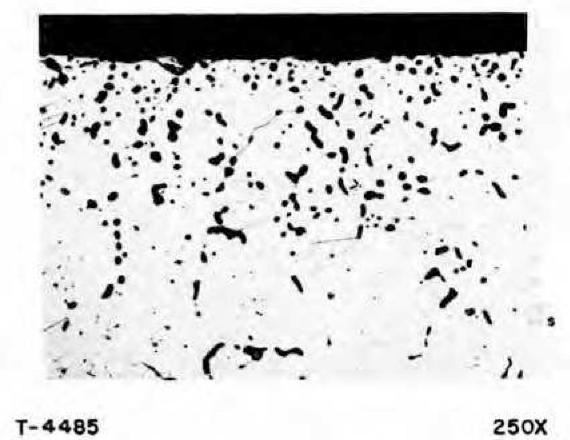  
FLUORIDE BATCH HIGH IN FE & NI

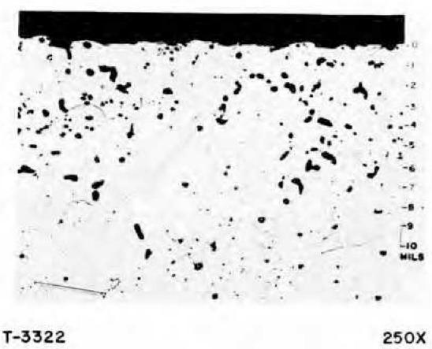  
FLUORIDE BATCH MODERATE IN FE & NI

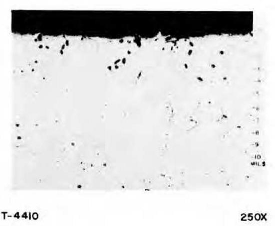  
FLUORIDE BATCH LOW IN FE & NI

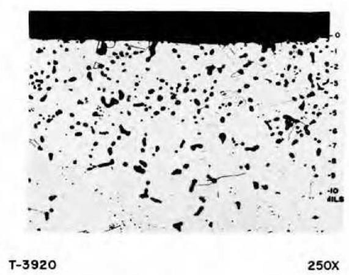  
FLUORIDE BATCH HIGH IN HF  
INCONEL THERMAL CONVECTION LOOPS-500 HRS. AT $1500^{\circ}F$   
Fig. 5 (T-4544) EFFECT OF FLUORIDE BATCH PURITY

and HF impurities of less than $2 \times 10^{-4}$ mole/liter in the exit purging gas, which resulted in a maximum attack of 5-1/2 mils. Sample T-3920 was taken from a loop operating a salt in which the iron and nickel impurities were less than 600 ppm and the HF impurities were approximately $5 \times 10^{-4}$ mole/liter in the exit gas, resulting in an attack of 14 mils after only 250 hr of operation.

This study dramatically showed that the wide variation in the depth of corrosion was due to the impurities in the bath. Steps were then taken to develop production procedures by which a controlled purity could be maintained from batch to batch. This led to the development of the hydrofluorination process, (6) which resulted in the corrosion level becoming more reproducible from test to test.

Several thermal-convection loops were operated at a $1500^{\circ}\mathrm{F}$ fluid temperature for various times, and the data are presented in Fig. 6 (T-3844). From this figure it can be seen that the corrosion was quite rapid at first, leveled off after 250 hr, and then continued as a straight-line function of attack versus time. The initial rapid attack is due to the reduction of impurities in the molten fluoride salt, to the reduction of oxide film on the metal surface, and to reactions with the constituents of the fuel. The second phase of the corrosion process is caused by the mass transfer of chromium from the hot portion of the loop to the cold portions. The relative depths of attack, as evidenced in Fig. 6, can be changed by impurity level and temperature level, but the over-all shape of the curve will remain approximately the same. In this case, it is seen that the attack after 250 hr is 7 to 8 mils; if the test continued to 3000 hr, the attack would increase to a depth of approximately 18 mils. At the 1000-hr level the depth of attack is in the neighborhood of 10 mils.

The phenomenon of mass transfer in heat transfer media may be described as the transport of material from one portion of the loop to the other and is usually revealed as removal of material from the hot leg and its deposition in the cold leg. This was first observed with liquid metals when materials went into solution in the hot leg and deposited on the loop walls or as dendritic crystals in the cold zone of the heat transfer system. In this case the driving force for the mass transfer process was the difference in

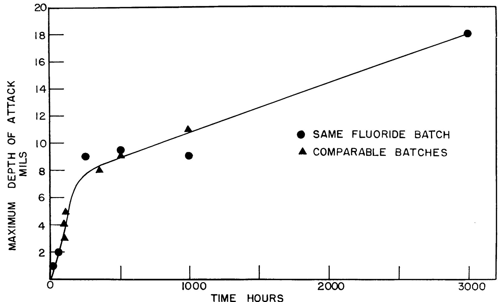  
Fig. 6 (T-3844) EFFECT OF TIME ON CORROSION深度 FLUORIDE INCONNEL

solubility of the constituents of the solid metal in the liquid metal at the temperature extremes of the heat transfer system.

With the fused fluorides the manner by which the material is transported from the hot to the cold leg is somewhat different. The chromium of the Inconel reacts with the $\mathrm{UF}_4$ , and the equilibrium constant for this reaction varies as a function of the temperature. This results in a difference in the concentration of chromium as $\mathrm{CrF}_2$ in the fused salts at the various temperatures in the circuit. It is fortunate that the activity of chromium in Inconel in contact with the fused salts at the higher temperature cannot support the production of chromium at activity one at the lowest temperature in the fused salt circuit. In the case of the Inconel-NaF-ZrF $_4$ - $\mathrm{UF}_4$ system, the mass transfer process then continues by the chromium coming out of solution by diffusing into the Inconel wall at the lower temperature. Thus, the rate-controlling step for the mass transfer process is diffusion-controlled in the cold leg.(6)

As the corrosion workers became more experienced and the purity of the fused fluorides was made reproducible from batch to batch, the testing program moved from thermal-convection loops into forced-circulation or pump loops, which, from the standpoint of flow, more realistically reproduced the operating conditions of the reactor.

The first parameter studied was time; a series of forced-circulation loops were operated for various times with a maximum fuel temperature of $1600^{\circ}\mathrm{F}$ and a maximum wall temperature of $1700^{\circ}\mathrm{F}$ . The fuel temperature drop was $300^{\circ}\mathrm{F}$ and the Reynolds number was 6000. The ratio of the hot-leg surface area to the salt volume was 2.5 in.²/in.³. Data from these loops are presented as Fig. 7 (ORNL-IR-DWG 17739). Examination of this plot indicates a rapid attack for the first 15 hr and then a slower or relatively constant rate of attack thereafter. The slope of the straight line that approximates the data of the plot indicates that the rate of attack after the first 15 hr is approximately 1 mil in 280 hr. The corrosion after 1000 hr is approximately 7 mils.

The next variable studied was the effect of temperature on the corrosion process. The importance of the Inconel-fuel interface temperature as the controlling factor in fluoride corrosion became apparent during attempts to

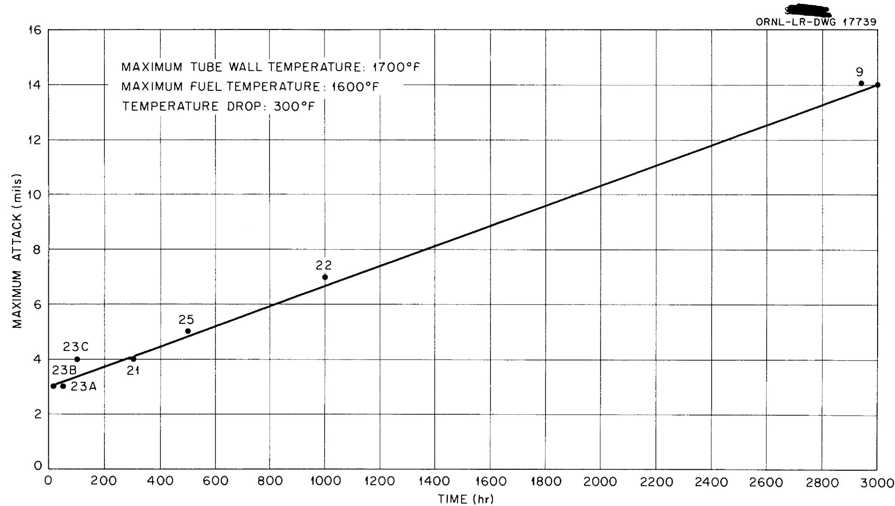  
Fig. 7 Effect of Time on Corrosion Depth for Inconel Forced Circulation Loops

develop a suitable pump loop design for corrosion experiments. Early loops having hot-leg sections in the form of a coil and heated by direct resistance were found to be attacked very unevenly around the cross section of the wall, as is seen in Fig. 8 (T-7246). Marked temperature differences were found to have occurred across the bend of the coil, which resulted in quite different attacks on the inner radii and the outer radii of the bends, although the bulk fluoride temperature over any cross section was the same. Examination of Fig. 8 will reveal that the outside of the bend is practically free of attack but that the inside of the bend of the coil was attacked to a depth of approximately 10 to 12 mils. When it was found that the hotter surface would corrode at such a greater rate and act similar to a sacrificial anode in the case of aqueous corrosion, additional tests, with straight heater sections, were run to determine the true effect of temperature. In one series of tests the maximum wall temperature and the fluid temperature drop were maintained constant at $1700^{\circ}\mathrm{F}$ and $200^{\circ}\mathrm{F}$ , respectively, while various fluoride temperatures were achieved by changing the Reynolds number. The sample from a loop that operated with a $1650^{\circ}\mathrm{F}$ fluid temperature with a Reynolds number of 7250 exhibited a maximum attack of 10 mils. The sample taken from a loop operated at a fluid temperature of $1500^{\circ}\mathrm{F}$ and a Reynolds number of 6500 exhibited 9 mils of attack. This information is presented in Fig. 9 (T-9509). From data like these, it was found that the boundary-layer temperature was more significant than the bulk fluid temperature in the corrosion process.

Another series of experiments were conducted to determine the effect of the wall temperature or the fused salts-Inconel interface temperature on the corrosion depth, and these data are presented in Fig. 10 (T-9035). In this case, varying the Reynolds number increased the wall temperature of various loops from $1560^{\circ}\mathrm{F}$ to $1635^{\circ}\mathrm{F}$ , while the maximum fluid temperature was held constant at $1500^{\circ}\mathrm{F}$ . The loop operated for 1000 hr with a temperature gradient of $150^{\circ}\mathrm{F}$ . The $1500^{\circ}\mathrm{F}$ wall-temperature sample gave a corrosion depth of 3 to 5 mils, whereas the sample from the $1635^{\circ}\mathrm{F}$ wall temperature exhibited an attack of 8 to 9 mils. These tests lend further support to the above conclusion concerning the importance of the maximum Inconel-fused salt interface temperature to the corrosion process. In general, attack in pump loop tests increased

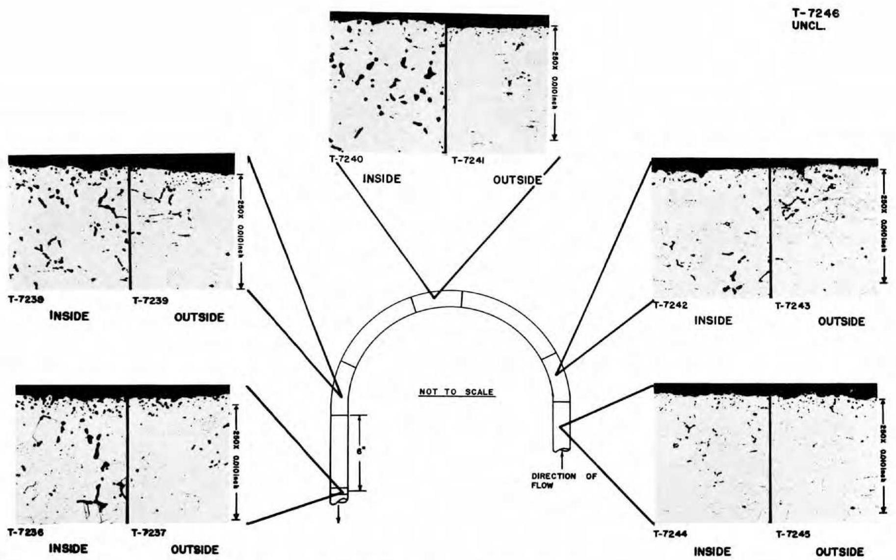  
Fig. 8 (T-7246) EFFECT OF BEND IN ΔTV LOOP

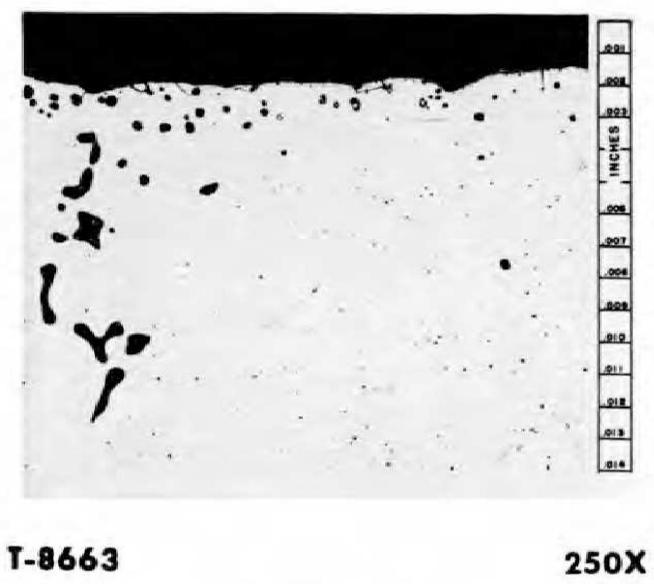

${1650}^{ \circ  }\mathrm{F}$

$\mathbf{R}_{\mathrm{E}} - 2750$

MAX. ATTACK-10 MILS

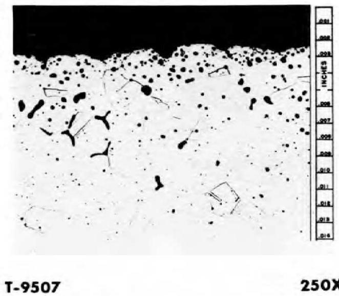  
Fig. 9 EFFECT OF FLUID TEMPERATURE

${1500}^{ \circ  }\mathrm{F}$

RE-6500

MAX. ATTACK- 9 MILS

T-9035

UNCLASSIFIED

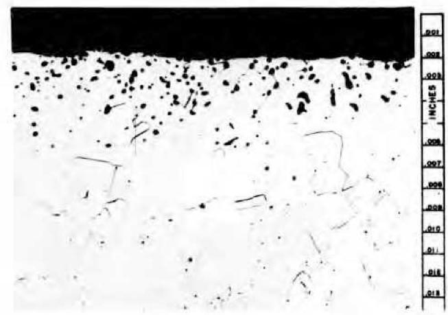  
T-9019   
250x   
WALL TEMP. - 1550°F

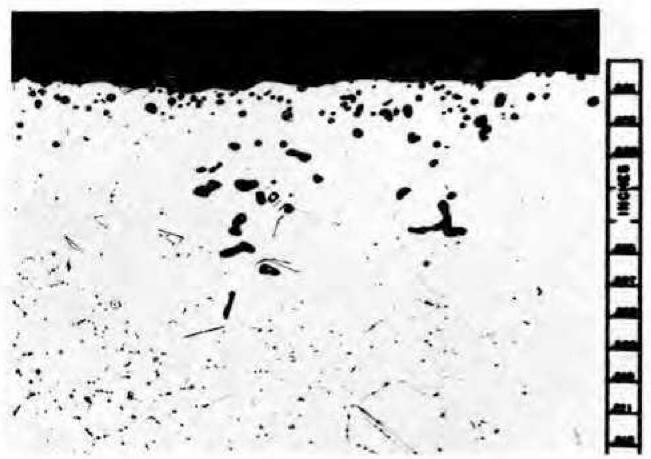  
Fig. 10

T-8227

WALL TEMP. -1635°F

250x

6

MAX. FLUID TEMP. - 1500°F

TIME - 1000 HRS.

$\Delta T - 200^{\circ} F$

# VARIATION IN ATTACK WITH WALL TEMPERATURE

approximately 2 mils for a $50^{\circ}\mathrm{F}$ increase in wall temperature in the range 1550 to $1700^{\circ}\mathrm{F}$ .

In considering the over-all effect of temperature, two rather separate and distinct observations must be discussed. The first concerns the entrance of the salt in the as-received or unreacted form into the loop, and the second concerns the effect of the "equilibrated salt," or the mass transfer portion of the corrosion process. During the first or initial stage of corrosion process, the salt will attack the entire loop. However, since the diffusion of chromium from the loop wall into the salt occurs at a rate dependent on the temperature, the attack proceeds more rapidly at the hottest portion of the loop. During the second part of the corrosion process, or the mass transfer step, the attack would theoretically occur over all the heated surfaces. However, in actual practice, this is not observed since the salt in most circuits does not reach equilibrium in the cold leg of the loop; consequently, there would not be a driving force for corrosion except in the hottest Inconel-fused salt regions. In all the experiments to date the mass transfer attack has been restricted to a small section of the loop near the point of the highest wall temperature. The amount of chromium taken into the salt also seems to be a function of the maximum Inconel-fused salt interface temperature, which is understandable since the diffusion rate of chromium in Inconel at temperatures of $1500^{\circ}\mathrm{F}$ and greater is quite rapid compared with the rate at which the chromium is being removed by diffusion into the colder portions of the plumbing circuit.

The effect of the ratio of the structural-metal-surface area to the volume of salt on the depth of the corrosion attack has been studied, and the results are presented in Table I. These data were obtained by changing the pipe

Table I. Effect of the Surface-Area-To-Volume Ratio On Fluoride Corrosion In Inconel Thermal Convection Loops   

<table><tr><td>Loop No.</td><td>Pipe Size</td><td>Surface-Area-To-Volume Ratio (in.2/in.3)</td><td>Attack</td></tr><tr><td>359</td><td>1/2-in. tubing</td><td>10.5</td><td>Moderate to heavy to 4 mils</td></tr><tr><td>352</td><td>1/2-in. pipe</td><td>6.5</td><td>Moderate to 5-1/2 mils</td></tr><tr><td>349</td><td>1-in. tubing</td><td>4.6</td><td>Light to moderate to 9 mils</td></tr></table>

size that was used to make thermal-convection loops. It is interesting to note that the corrosion depth increases from 4 mils to 9 mils as the surface-area-to-volume ratio decreases from 10.5 in. $^{2}$ /in. $^{3}$ to 4.6 in. $^{2}$ /in. $^{3}$ . This is to be expected since there is less surface area to supply the chromium to saturate the given volume of the fused fluoride. This relationship is not quite linear, and there are probably inconsistencies in these results caused by the variation in the flow velocity brought about by the changes in pipe sizes.

This same effect has been studied in forced-circulation loops, and it was found that the ratio of the total hot-leg surface area to the total loop volume was quite important in determining the depth of attack in the hot region. It is essential to point out that during the mass transfer part of the corrosion process the effect of the ratio of the hot-leg surface area to the total area of the loop is extremely important since the rate-controlling step of mass transfer is the diffusion of chromium into the cold zone. Therefore, if there is a large sink to remove chromium from the saturated fused fluoride salt, there will be a greater amount of corrosion in the hot zone to keep the salt saturated with chromium. If an isothermal system is being saturated, then the surface-area-to-volume ratio would be the limiting factor on the depth of corrosion; however, when a temperature gradient exists, the ratio of the hot-leg surface area in relation to the rest of the loop surface area exposed to the fused fluorides must be examined.

Another variable that was studied is the effect that the flow velocity has on the over-all Inconel-fused fluoride corrosion. Comparison of the results obtained from thermal-convection loops with the data obtained from forced-circulation loops showed that the flow rate had a very minor effect on the corrosion of Inconel by the $\mathrm{NaF - ZrF_4 - UF_4}$ (50-46-4 mole %) molten salt fuel. In order to further evaluate the effect of flow velocity, forced-circulation loops were operated under identical temperature conditions, but the flow velocity was increased to give Reynolds numbers of 5,200, 9,620, and 14,250. These flow rates produced depths of corrosion of 4, 3, and 6.5 mils, respectively. From the small spread in the corrosion data and the lack of correlation between the flow rates and depths of attack and information from previous tests, it was concluded that the flow velocity or Reynolds number has a very small effect on corrosion.

# Inconel-Sodium Corrosion

In addition to having corrosion resistance in the fused fluorides, the structural material must also have corrosion resistance in sodium or NaK. In early studies on the compatibility of various structural metals in high-temperature sodium or NaK, it was found that the nickel-base alloys and austenitic stainless steels could be considered as suitable containers for sodium at temperatures up to $1500^{\circ}\mathrm{F}$ . The main mode of attack of liquid metals on solid metals is the even surface removal of the solid metal to saturate the liquid metal.(10) Therefore, in an isothermal system the metal corrodes only to a depth necessary to satisfy the solubility requirements of the liquid at the operating temperatures. In static corrosion experiments with Inconel a 1/2- to 1 l/2-mil corrosion attack, primarily at the grain boundaries, was experienced. This attack resulted from the selective removal of elements such as silicon, titanium, aluminum, and carbon. It was also found that the oxygen level in the sodium or NaK must be kept below approximately 50 ppm to minimize the decarburization reaction of the sodium oxide. This decarburization reaction would result in a decrease in the load-carrying abilities of the alloy, as will be discussed in a later section of this report.

One of the most difficult problems in the use of liquid metals at high temperature is temperature-gradient mass transfer. It was found in corrosion tests of Inconel-forced-circulation loops filled with sodium that the oxygen level had to be kept as low as possible to minimize the amount of mass transfer. The effect of temperature on the amount of material mass-transferred to the cold leg of sodium-forced-circulation loops was studied, and examination of Fig. 11 (T-10779) shows that with a minimum fluid temperature of $1350^{\circ}\mathrm{F}$ , there is a very small amount of deposit in the cold-leg section of a loop that operated for 1000 hr with a temperature drop of $300^{\circ}\mathrm{F}$ . When the maximum fluid temperature was increased to $1500^{\circ}\mathrm{F}$ , there was a large cold-leg deposit approximately 10 to 12 mils in thickness.

The effect of the temperature gradient on the amount of mass transfer experienced in Inconel sodium loops was also studied. Three forced-circulation loops were operated, with oxide cold traps at $300^{\circ}\mathrm{F}$ and with hot-leg temperatures of $1500^{\circ}\mathrm{F}$ for 1000 hr. The cold-leg temperature was varied to give temperature

T-10779

UNCLASSIFIED

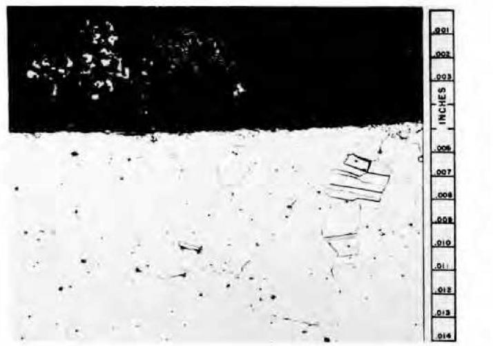  
T-10425 250x

MAX. FLUID TEMP.-1350°F

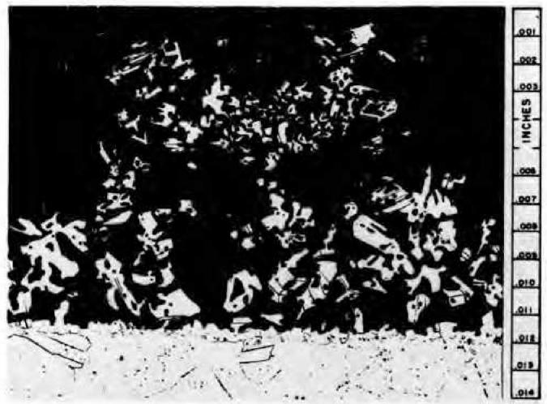  
T-10186 250x

MAX. FLUID TEMP.-1500°F

ECONOMIZER SECTIONS AFTER 1000 HRS. OPERATION

Fig. 11 EFFECT OF TEMPERATURE IN Na-INCONNEL ΔTV PUMP LOOPS

gradients from 150 to $400^{\circ}\mathrm{F}$ . The data obtained from this series of experiments are plotted in Fig. 12 (ORNL-LR-DWG 16735). Examination of this plot shows that the $150^{\circ}\mathrm{F}$ temperature drop gave a 12-mil deposit that weighed 5.5 g. As the temperature drop increased to $400^{\circ}\mathrm{F}$ , the mass transfer deposit grew to 20 mils in thickness and weighed 21.2 g. The weight of the material in the deposit was obtained by scraping the loop walls, and the material was found to be composed of approximately $90\%$ Ni and $10\%$ Cr, iron being virtually absent.

Since the maximum temperature of the sodium in the Aircraft Reactor Experiment was 1350 to $1370^{\circ}\mathrm{F}$ and the coldest portion of the sodium circuit was 1210 to $1250^{\circ}\mathrm{F}$ , it was felt there would be a minimum amount of mass transfer in the sodium circuit, and that it would not interfere with the operation of the reactor; experience showed this to be the case. However, in the reactors of the future, in which the sodium metal interface temperature might be quite high, use of nickel-base alloys may not be feasible because of excessive mass transfer. Fortunately, the austenitic stainless steels could be substituted; since they are much less prone to mass transfer, they can be operated at a $150^{\circ}\mathrm{F}$ higher temperature before they start showing the degree of mass transfer experienced with nickel-base alloys.

It was found from these corrosion experiments that the choice of Inconel was a sound one for this reactor system. The corrosion of Inconel by the fused salt $(\mathrm{NaF}_4 - \mathrm{ZrF}_4 - \mathrm{UF}_4)$ resulted in a depth of attack of approximately 7 to 10 mils for 1000-hr operation at $1500^{\circ}\mathrm{F}$ , and the only mass transfer that would occur in the Inconel-fused fluoride system would be the plating of chromium on the colder regions of the plumbing circuit, with the chromium then diffusing into the bulk Inconel wall. This type of mass transfer would not have a serious effect on the hydraulic conditions of the plumbing circuit, whereas, a dendritic mass transfer deposit would soon cause stoppage of flow in high-velocity plumbing circuits because of plugging. The Inconel-sodium corrosion situation was also free of difficulties; however, at higher operating temperatures, temperature-gradient mass transfer would be a problem.

# MECHANICAL PROPERTIES

The engineering life of structural members and component parts of a power-producing, high-temperature device is controlled mainly by the creep and

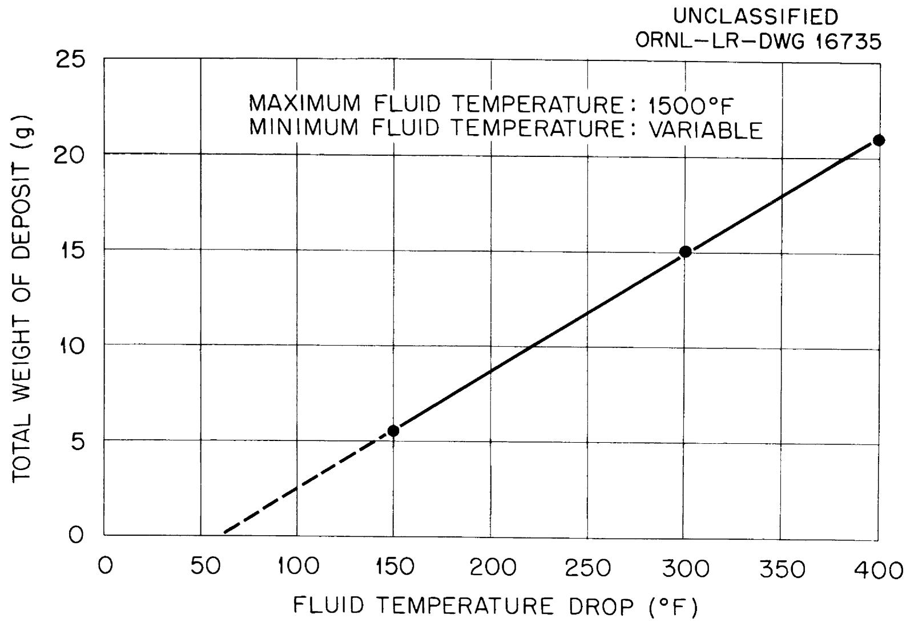  
Fig. 12 Effect of $\Delta T$ on Mass Transfer in Sodium-Inconel Pump Loops.

fatigue strength of the material. The design and mode of operation of the Aircraft Reactor Experiment tended to eliminate fatigue as a limiting factor; therefore, the major emphasis was placed on the creep strength of the material. Since the high-temperature, oxidation-resistant alloy Inconel was chosen, data were already available on the creep characteristics of this material throughout the temperature range of interest. However, these results had been obtained primarily on wrought bar in an air environment. Since most of the reactor would be constructed from plate, sheet, and tubing and be subjected to the corrosive fused salt environment, it was imperative that many additional parameters be explored before the reactor could be intelligently designed, constructed, and operated.

A testing program was formulated to explore the effect of such parameters as environment, geometry, multiaxial stresses, and thermal history.

# Environment

In the preceding section it was shown that Inconel would be attacked by the fused fluorides by the selective removal of chromium. In addition to the subsurface voids formed, the second-phase carbides that increase the creep strength of a metal would be removed as a result of the solubility of carbon in the metal lattice being increased when the chromium content is decreased. The over-all effect of environment on the rupture life of the material is dependent to a considerable extent on such interrelated variables as time, temperature, grain size, and depth of attack.

Figure 13 (ORNL-LR-DWG 17911) illustrates some of these effects by comparing the stress-rupture strength of Inconel in argon and the fused salts at three temperatures and over a wide range of stresses. Argon was used as an environment for obtaining the base-line data because it is inert to metals and does not introduce spurious effects, such as variable oxidation rates, which might tend to make analysis of the results difficult. Having demonstrated the engineering importance of obtaining the data in the service environment, a more complete picture was obtained by determining the interdependence of stress, strain, and time at the temperatures of interest. Data from this program are presented in a separate paper of this series.(11)

In addition to the fused salt environment the structural material was in contact with sodium during the operation of the reactor. A similar testing

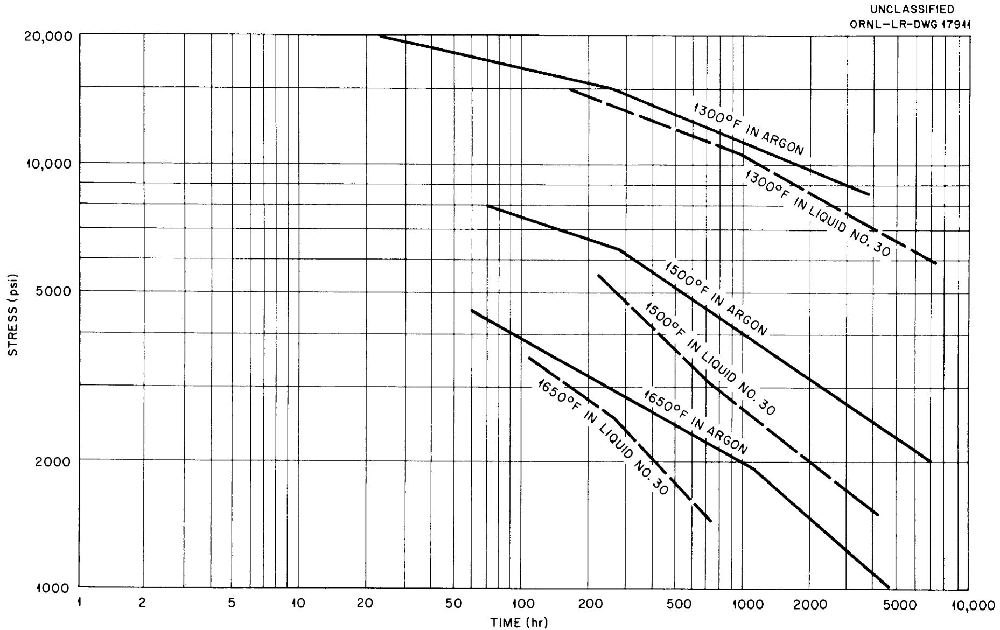  
Fig. 13 Comparison of the Stress-Rupture Strength of Inconel in Argon and Fused Salts at 1300, 1500, $1650^{\circ}\mathrm{F}$ .

procedure was carried out to demonstrate the compatibility of Inconel with this environment. It was established early in the test program that sodium could have a somewhat deleterious effect on the creep properties of Inconel. This effect is depicted in Fig. 14 (ORNL-LR-DWG 20150), which is a plot of data from tests of Inconel sheet in argon (test No. 144) and sodium (test No. 117) at $1500^{\circ}\mathrm{F}$ with a stress of 4000 psi. The accelerated creep and increased elongation at rupture were caused by the decarburization of the material. This effect is believed to be the result of oxide contamination of the sodium. Likewise, it was demonstrated that Inconel could be readily carburized by sodium if it was contaminated by carbonaceous material. Due to the difficulties involved in analytically determining oxygen in alkali metals, the critical oxide level at which the decarburizing reaction begins has not been determined. However, in Fig. 15 (ORNL-LR-DWG 20146) the results of numerous tests in a sodium environment are superimposed on data obtained in argon, and the excellent correlation of these data demonstrates that when commercially available high-purity sodium is used and contamination in the system is avoided, sodium is inert to Inconel.

# Geometry

Geometry is an important parameter because of the desire to obtain the most efficient heat transfer system possible without a serious sacrifice in the strength characteristics of the structure. It was assumed that the thinner the wall, the more pronounced would be the effect of any corrosive attack. This was found to be the case from creep tests in fused fluorides in which various section thicknesses were used. Examination of these data indicates that the best compromise between strength and heat transfer efficiency would be a 0.060-in. wall thickness; therefore the fuel-bearing tubes were fabricated to obtain a nominal wall thickness of 0.060 in.(2,11)

# Multiaxial Stresses

Creep tests provide information on the strength of metals at elevated temperatures under uniaxial stress conditions. Unfortunately, it is impossible to design complicated power-producing devices so that only uniaxial stress will be imposed. In order to provide some data which would tend to define the magnitude of the effect of stress distribution, a test program was devised to determine the stress-rupture strength of Inconel under biaxial stress conditions. Closed-end tubes in which a reduced gage section was machined

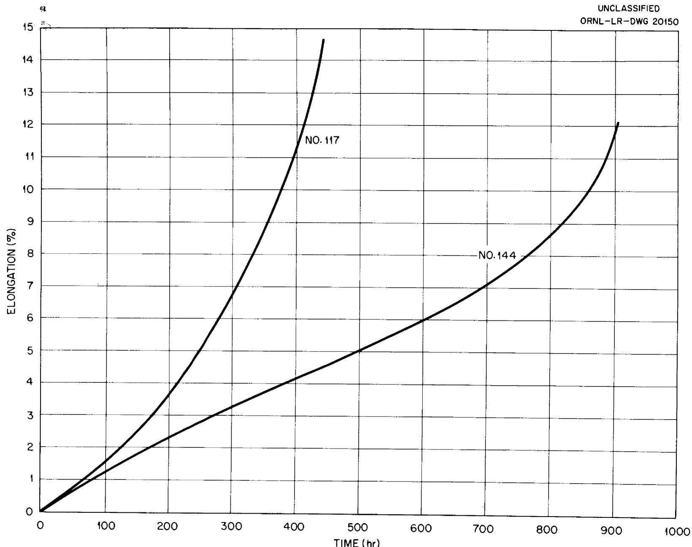  
Fig. 14 Comparison of Inconel Sheet Tested in Sodium at $1500^{\circ}$ F and 4000 psi.

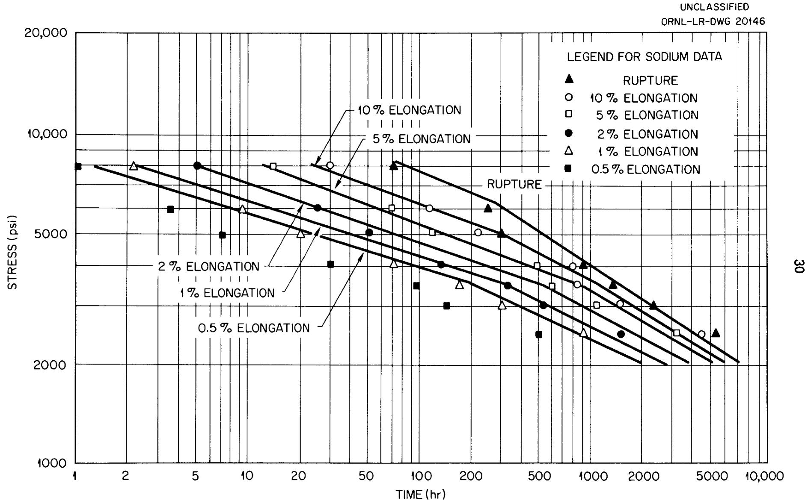  
Fig. 15 Comparison of Stress-Rupture Properties of Inconel Sheet Tested in Sodium and Argon at $1500^{\circ}$ F.

were internally pressurized. The resulting stress distribution provided a biaxial stress condition, with the hoop stress being twice the axial stress. The test apparatus was designed so that any desired environment could be used, and results were obtained in argon, sodium, and fused salts. There is some decrease in final elongation at rupture under the multistress condition, but in general it appears that stress distribution is not a serious problem under conditions of operation of this reactor.

# Thermal History

The thermal history of a metal can be an important factor in the high-temperature properties of the material either from the standpoint of grain size or from recrystallization. Tests were run to determine the effect of grain size, and it was found that at $1300^{\circ}\mathrm{F}$ a fine-grain size gave a better creep resistance but that at a temperature of $1500^{\circ}\mathrm{F}$ or above the coarse-grain size enhanced the creep resistance.

Complete elimination of cold-worked metal in structural parts is necessary to prevent recrystallization from occurring during service. If recrystallization does occur during the creep test, the creep rate will accelerate rapidly.(11)

The results of this creep testing program emphasize the importance of fully exploring all parameters affecting the behavior of a material at high temperatures. The successful design and operation of all high-temperature reactors depend in large part on the extent of our knowledge of the behavior of a material under the various service conditions.

# WELDING

It was recognized that the vessels, components, and piping of the Aircraft Reactor would be exposed to a corrosive environment at elevated temperature and to relatively severe and unpredictable stress conditions. The requirement that the welded joints be flawless, in order to ensure leak tightness throughout the life of the reactor, made the use of optimum welding procedures mandatory. Inert arc welding had been found to be far superior to metallic arc welding for fabrication of test assemblies and was adopted almost exclusively for fabrication of the reactor. The critical nature of the work to be accomplished

made it necessary that the welders be trained and qualified for the highest quality of welding possible.

An inert-gas-shielded tungsten-arc welding procedure was developed by experiment which would ensure crack-free, porosity-free, full-penetration welds in the reactor piping. Heretofore, common practice for achievement of full-penetration welds in piping was through the use of a backing ring, which in most instances was impossible to remove. The crevices resulting from this joint design constituted a built-in crack for possible propagation during thermal stress at elevated temperatures. The procedure developed at the Oak Ridge National Laboratory incorporated an inert-gas backup, which eliminated the need for a backing ring. Full penetration was achieved by providing a root opening, and an INCO No. 62 Inconel welding wire was used to deposit the root pass. The tungsten arc was shielded with argon, while helium, because of its lower cost, was used to purge the piping and to provide the shielding of the underside of the root and subsequent passes during welding. A typical butt weld in 3-in. dia., sched-40 pipe is shown, after welding, in Fig. 16 (Y-22363). The welding procedure was prepared according to specification PS-1, (12) as was a corresponding welder's qualification test, specification QTS-1. (13)

A number of welding operators were trained and thoroughly tested. The efficiency of the training was demonstrated by the relatively low number of rejected welds despite the high visual, dye-penetrant, and radiographic inspection standard used. Approximately 500 welds were used in the fuel circuit of the reactor, with only $5\%$ having to be reworked.

As a result of the success of the welding procedure in the reactor piping, a joint design manual (14) was prepared. The manual consists of sample weld joint designs by which full-penetration, inert-gas-backed, high-quality welds could be obtained in the fabrication of the various reactor components, including valves and heat exchangers. The shortage of time and the lack of personnel for training prevented the universal adoption of the ORNL welding procedure. Several components which were fabricated by conventional inert arc welding and metal arc welding procedures were found to be questionable and were virtually rebuilt in the interest of maintaining the quality standards of the fuel piping.

A typical example was the rebuilding of the heat exchangers. Innumerable flaws were detected, indicating inadequate workmanship. Typical was the

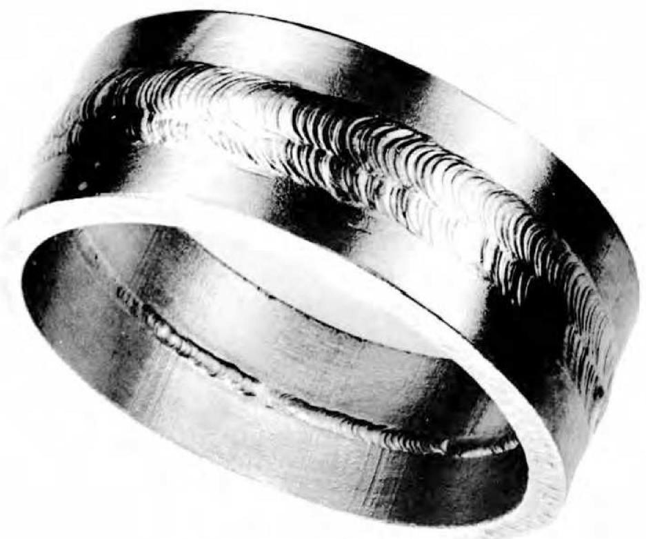

  
Fig. 16 (Y-22363) Typical Full Penetration Weld in 3-in. Schedule 40 Pipe.

accidental arc strike shown in Fig. 17 (Y-12126). Metal arc welds, expressly forbidden in the specifications, were used to attach lugs on the fluid piping (see Fig. 18, Y-12127). These welds were found to be cracked, full of porosity, and encrusted with a slag which at elevated temperatures would have rapidly destroyed the piping. The heat exchangers were completely redesigned and rebuilt at Oak Ridge National Laboratory, and use of inert arc welding procedures and a joint design permitted full-penetration welds of the highest quality.

Several components were not subcontracted, partially because of the difficulties that would have been encountered and because of the time element. Typical of these was the fabrication of the impellers for the reactor pumps. Castings were found to be quite imperfect, containing numerous sand inclusions, cold shuts, and extensive porosity. The decision was made to manufacture them by careful welding and machining with stress-relief anneals to ensure dimensional control. A complete impeller is shown in Fig. 19 (Y-10794).

To assist in the alignment of the serpentine coils in the reactor core, the weld joint design initially specified did not incorporate the desirable full-penetration welded joint. Since scheduling prevented changes, the most skillful welding operator available was selected to perform the welding; the operator was qualified on sample welds before he was assigned the fabrication of the serpentine coil. The basic design used was the socket-type joint shown in microsection (Fig. 20, Y-8456) after welding. Numerous sample welds were made, and it was found that with adequate gas shielding and with the elimination of detrimental weld-metal dilution effects by use of INCO No. 62 filler metal, flawless welds could be obtained.

Because of the thickness of the Aircraft Reactor pressure shell, the use of the inert-gas-shielded tungsten arc process was considered to be impractical. It was recognized that the metal arc welding process, with the use of INCO No. 132 coated electrodes, was best suited for the enormous amount of welding required. It was agreed that inert arc welding would be used for the root passes where the corrosive media would come into direct contact with the weld and that metal arc welding would be used to complete the welds. Porosity and slag inclusions were kept to a minimum by baking of electrodes and meticulous interpass cleaning. In view of the thickness of

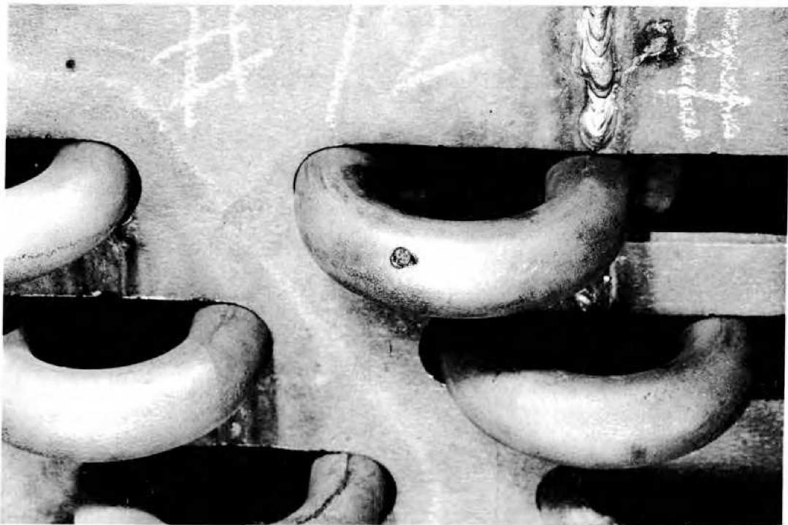  
Fig. 17 (Y-12126) Crater Resulting from Accidental Arc Strike in Heat Exchanger Tube.

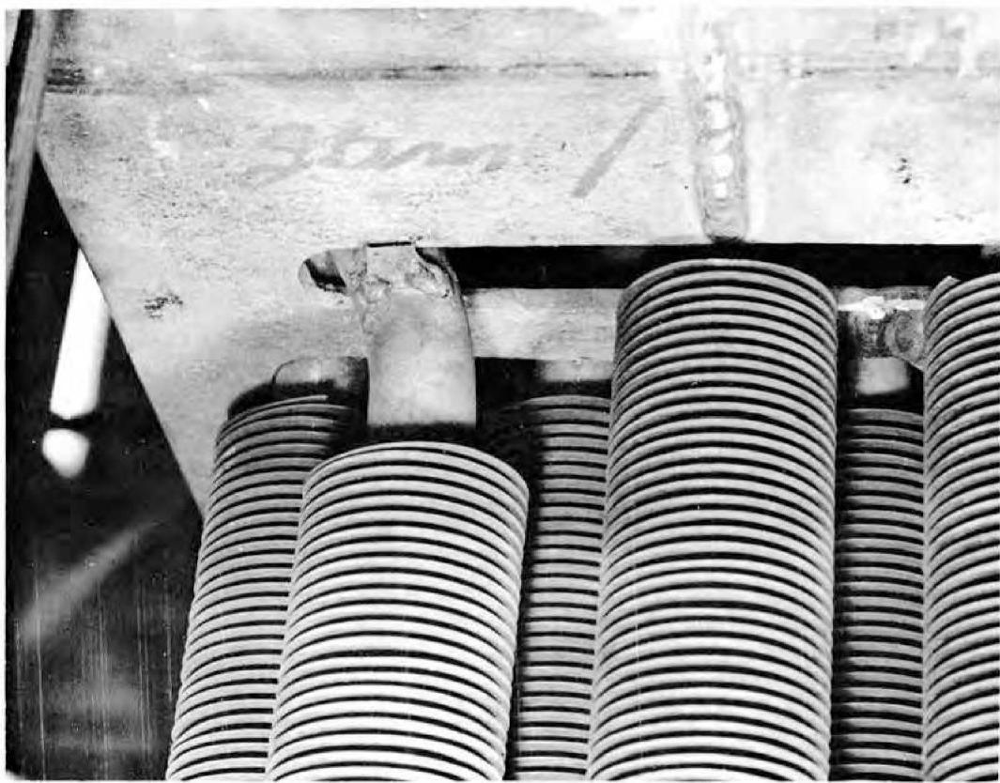  
Fig. 18 (Y-12127) Metal Arc Welds Used to Attach Lugs on the Fluid Piping.

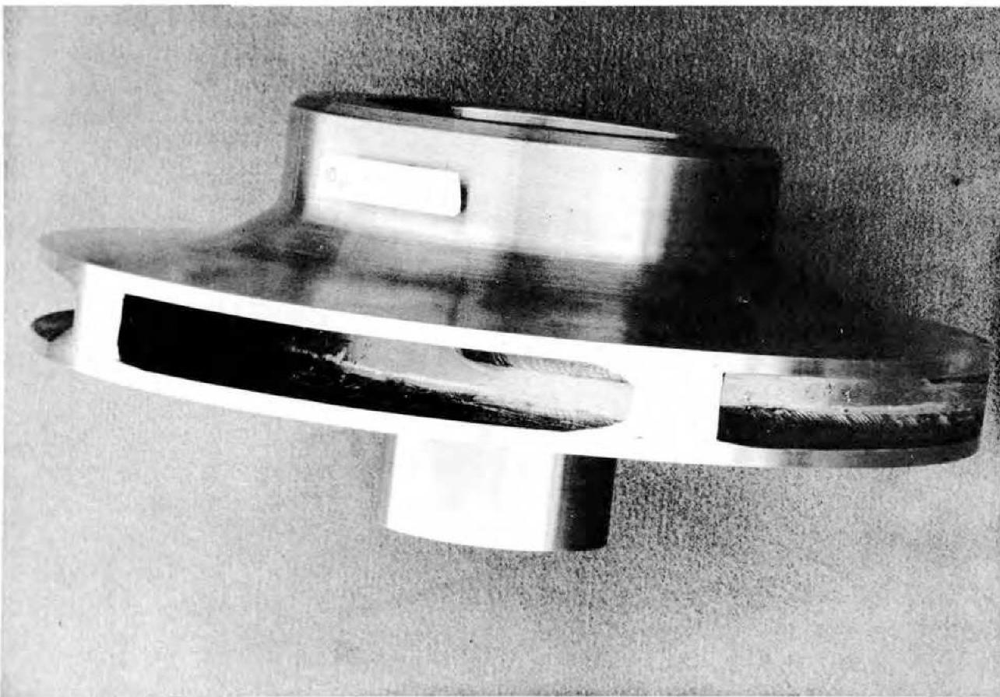  
Fig. 19 (Y-10794) Completed Impeller after Welding, Stress Relieving, and Final Machining.

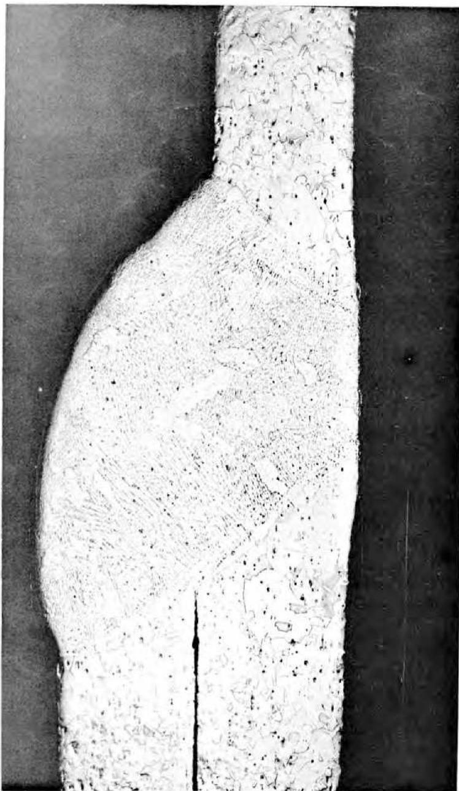  
Fig. 20 (Y-8456) Socket Type Joint Selected for Serpentine Coils in Reactor Core.

the shell, the inferiority of metal arc welding to inert arc welding was thereby recognized and accepted.

The success of the careful welding and inspection procedures for the construction of the Aircraft Reactor Experiment was proved by the absence of leaks or weld failures during the reactor's operation. The only weld failure was experienced during the preliminary operation of the Aircraft Reactor Experiment sodium circuit after the sodium had been in the system for only 37 hr and the maximum temperature of the sodium had not exceeded $1150^{\circ}\mathrm{F}$ .

A section of austenitic stainless steel pipe leaked at a tube bend to which a thermocouple had been attached, shown in Fig. 21 (Y-13298). The inside of the tube with the cracked weld is shown in Fig. 22 (Y-13310). The piping in this system varied from 0.076 to 0.135 in., and consequently the thermocouple welding procedure and inert gas shielding required on the inside of the system should have been modified for the various wall thicknesses. It had not been considered necessary to exercise accurate and supervised control, primarily because the system was not the fuel circuit and was not considered critical. The cause of the excessive penetration and subsequent cracking was attributed to the welder's lack of knowledge of the variations in pipe wall thickness in this section.

The experience gained here has influenced thinking in other reactor construction at ORNL. It was recognized that attention to details was important, that all welds must be of the highest quality possible, and that only the most highly skilled and properly trained welders should be used. These requirements, in conjunction with carefully prepared specifications and extensive use of the most modern inspection methods, constitute the minimum necessity for ensuring satisfactory construction of reactor plumbing circuits.

# FABRICATION OF CONTROL ROD COMPONENTS

# Safety Rod Components

The design selected for the safety rods and regulating rods for the Aircraft Reactor Experiment called for the use of $\mathtt{B}_{4}\mathtt{C}$ as the absorber material. Hollow cylinders of pure $\mathtt{B}_{4}\mathtt{C}$ were desired for the safety rod, but purchase inquiries to industry indicated that the cost of such cylinders would be

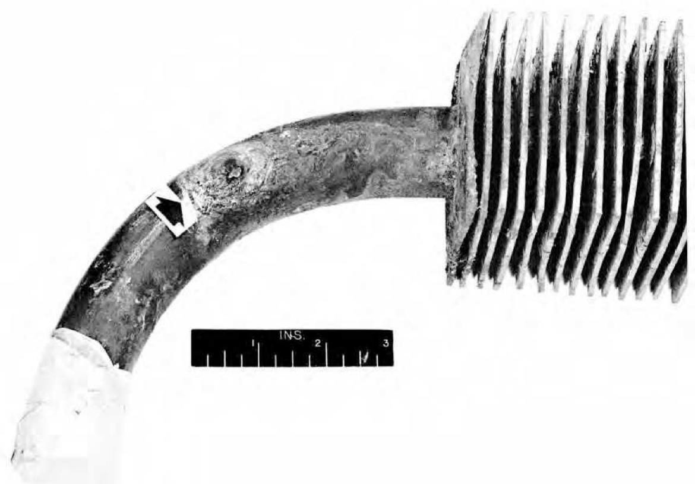  
Fig. 21 (Y-13298) Site of Improperly Attached Thermocouple and Resulting Sodium Leak.

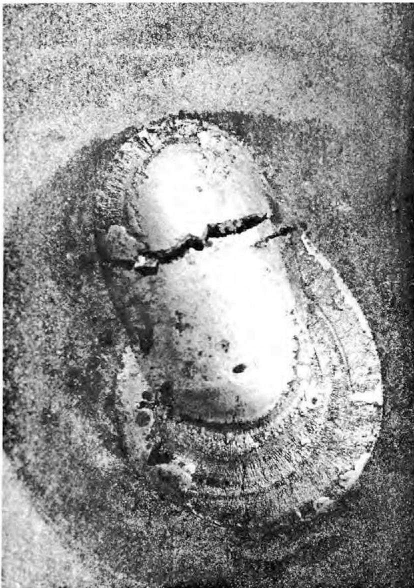  
Fig. 22 (Y-13310) Underside of Improperly Attached Thermocouple Weld Showing Crack.

prohibitive. Therefore a technique was developed for fabricating cylinders of $\mathsf{B}_{\mathsf{U}}\mathsf{C}$ by hot pressing with a suitable binder.

A series of compacts were prepared which had the equivalent of 20 vol % of metallic binder; copper, nickel, and iron were used as the binder phase, and the compacts were hot-pressed at various temperatures. The compositions were prepared by ball-milling the mixtures of -325 mesh powders together for 8 hr, and the compacts were fabricated by hot pressing in induction-heated graphite dies. Properties of typical compacts are presented in Table II. In no case did the use of copper or nickel as the binder produce a compact with the

Table II. Properties of Hot-Pressed B4C Compacts With 20 vol % of Metallic Binders   

<table><tr><td>Binder Metal</td><td>Pressing Temperature (℃)</td><td>Theoretical Density (%)</td><td>Comments</td></tr><tr><td>Ni</td><td>1200</td><td>72</td><td>Weak, soft</td></tr><tr><td>Cu</td><td>1080</td><td>76</td><td>Crumbly, loss of Cu</td></tr><tr><td>Fe</td><td>1050</td><td>69</td><td>Soft</td></tr><tr><td></td><td>1170</td><td>74</td><td>Soft</td></tr><tr><td></td><td>1300</td><td>71</td><td>Soft</td></tr><tr><td></td><td>1525</td><td>78.5</td><td>Strong, hard structure</td></tr><tr><td></td><td>1730</td><td>69</td><td>Weak, excessive loss of Fe</td></tr></table>

desired properties. Nickel reacted with the $\mathtt{B}_4\mathtt{C}$ to form a liquid phase which did not wet the $\mathtt{B}_4\mathtt{C}$ and did not promote densification. Compacts prepared with copper had reasonably high density but were very weakly cemented together and were too crumbly to be useful.

The series of compacts prepared with iron as the binder were also soft and weak when pressed at moderate temperatures. It finally became necessary for the pressing temperature to be increased sufficiently to completely convert the iron to the high-melting phase FeB, which seemed to promote densification and also to act as a cementing agent. Compacts with suitable properties were prepared by hot pressing for 5 min at $1530^{\circ}\mathrm{C}$ at a pressure of 2500 psi. Only minor loss of iron occurred during this cycle, and the small amount lost was probably caused by eutectic melting. Typical weight loss ranged from 4 to $6\%$ .

The hollow cylinders produced for the safety rod slugs are illustrated in Fig. 23 (Y-7090), along with the stainless steel can components and a finished

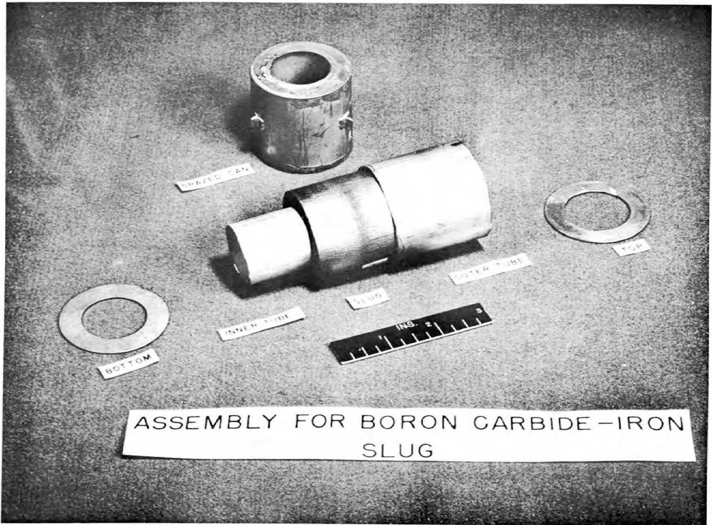  
Fig. 23 (Y-7090)

slug. These cans were assembled by tack welding, followed by furnace brazing with Microbraze. In order to prevent the slug from cracking during brazing, because of differential expansion of the inner stainless steel tube, it was necessary to leave a gap of about 0.010 in. on the inside diameter. The diameter of the finished slugs was readily controlled, even when the graphite dies were used as many as 12 times. The only finishing operation required was that of grinding the end faces slightly to conform to the length tolerances.

In fabricating the slugs, it was found that the core rod had to be pushed out of the finished piece at the pressing temperature in order to prevent the slugs from cracking during cooling because of shrinkage around the graphite core rod. This was accomplished by using an undersized mandrel, which was left in place during cooling.

# Regulating Rod Components

The components for the regulating rod were desired to be in the form of cylinders similar to the safety rod slugs, and to be composed of a dilute suspension of $\mathsf{B}_{4}\mathsf{C}$ in an inert, refractory carrier. One set of 15 cylinders was required with a $\mathsf{B}_{4}\mathsf{C}$ concentration of 0.022 to $0.024\mathrm{g / cc}$ , and a second set with a $\mathsf{B}_{4}\mathsf{C}$ concentration of 0.005 g/cc.

One undersized slug composed of $10\%$ $\mathtt{B}_4\mathtt{C}$ in refractory-grade $\mathtt{Al}_{2}\mathtt{O}_{3}$ was fabricated to confirm the compatibility of the two materials. The required number of slugs was then fabricated by a technique similar to that used in producing the safety rod slugs, and the two rods were assembled and brazed as illustrated in Fig. 24 (Y-7091). However, these regulating rods were not used because of changes necessary in the control rod thimbles to provide increased reactivity; instead, a type 316 stainless steel regulating rod was used.

# Control Rod Thimbles

In order to reduce the structural poisons in the reactor, it was decided to replace the three concentric Inconel sleeves around the four control rods (one regulating and three safety) with a single stainless steel, Inconel-clad sleeve in each hole. Stainless steel was preferred because of its lower cross section, approximately 3.3 barns compared with 4.6 barns for Inconel. Unclad stainless steel could not be used because dissimilar-metal

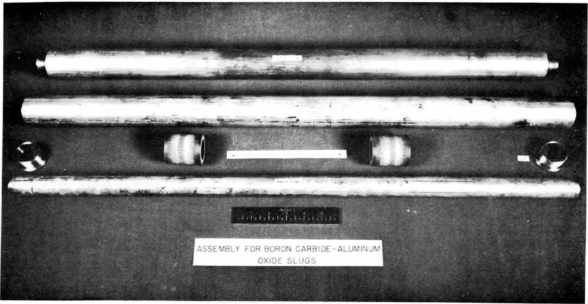  
Fig. 24 (Y-7091)

transfer would occur at these temperatures; so 2.95-in.-OD duplex tubes with a 0.082-in. wall of 0.072-in., type 316 stainless steel clad with 0.010-in. Inconel were fabricated by the International Nickel Company at Huntington, West Virginia. In operation the Inconel was in contact with the sodium bath, and the stainless steel was in contact with the helium cooling system for the control rods. The space between the outside diameter of this duplex thimble and the BeO block was filled with BeO pellets. These changes resulted in a 4-to 5-lb decrease in the critical mass.

# Fabrication of the Beryllium Oxide Blocks

The search for a material to be used as a moderator in the Aircraft Reactor Experiment led to the choice of BeO, which has good corrosion resistance to sodium, has good high-temperature stability, and is readily fabricated into the desired shapes.

Early in the experimental work on determining the compatibility of BeO to sodium, samples of BeO blocks from the Daniels power pile were used. These blocks were made from multiply crystallized $\mathrm{BeSO}_4$ and therefore was of extremely high purity. The BeO content of the blocks was greater than $99.5\%$ and they had been hot-pressed to a density of 2.86 to 2.94 g/cc with no porous areas detectable. In all testing of samples from this material the BeO was found to have extremely good sodium corrosion resistance.

The BeO blocks for the Aircraft Reactor Experiment were fabricated by the Norton Company, Chippawa, Ontario, from BeO powder furnished them by the Brush Beryllium Company. The blocks were hot-pressed to closely controlled sizes and to a specified minimum density of $2.7\mathrm{g / cc}$ . Examination of sections of the blocks after their arrival at the Oak Ridge National Laboratory, indicated that they were quite porous and that they would absorb sodium. This was at first thought to be due to cracks which had generated during the cutting of the blocks; however, when several of the uncut blocks were soaked in fluorescent dye and then examined under an ultraviolet light, a different physical structure was found in the core of the block. The results of these experiments can be seen in Fig. 25 (Y-7913). The dark shaded areas outlined the porous core which was penetrated by the fluorescent dye. Representative samples were cut from two of these blocks for density and apparent porosity measurements. This information is presented in Table III. In examining these data, it is evident

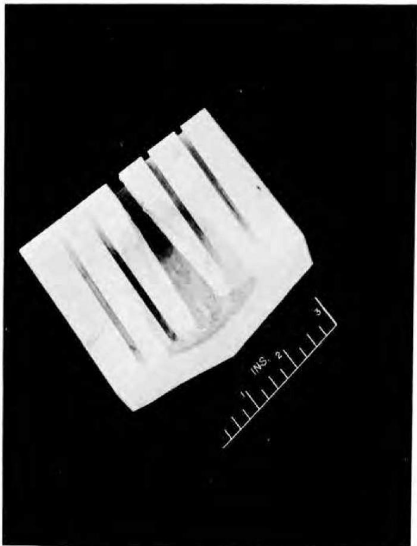  
Fig. 25 (Y-7913) Section of BeO Block Showing Porous Core Penetrated by Fluorescent Dye.

TABLE III. AVERAGE DENSITY AND APPARENT POROSITY MEASUREMENTS   

<table><tr><td></td><td>1/2-in.-ID Block</td><td>1-1/8-in.-ID Block</td></tr><tr><td>Core</td><td></td><td></td></tr><tr><td>Average density, g/cc</td><td>2.34</td><td>2.61</td></tr><tr><td>Apparent porosity, %</td><td>20.6</td><td>12.1</td></tr><tr><td>Periphery</td><td></td><td></td></tr><tr><td>Average density, g/cc</td><td>2.82</td><td>2.80</td></tr><tr><td>Average porosity, %</td><td>0.0</td><td>2.0</td></tr></table>

that the core of the blocks is quite porous in comparison to the periphery. This porosity defect is undoubtedly due to poor fabrication techniques, which were brought about by the speed by which the blocks were procured and by the effort to keep the cost of the blocks to a minimum. The BeO powder for the blocks was made by a single crystallization of the $\mathrm{BeSO}_4$ rather than by the multiple crystallization necessary for higher purity. Consequently, the quality of the blocks was quite objectionable from a chemistry standpoint and the BeO content was only $97.6\%$ , the balance being $\mathrm{Al}_{2}\mathrm{O}_{3}$ , $\mathrm{SiO}_2$ , $\mathrm{Na}_2\mathrm{O}$ , and $\mathrm{Fe}_{2}\mathrm{O}_{3}$ . The hot-pressing furnaces at the Norton Company were not large enough to use the proper size of dies and core pins. In order to avoid the delay that would have resulted from changing the furnaces, underdesigned dies and pins were used. This necessitated use of a pressing pressure lower than that desirable to obtain good hot-pressed density.

Samples from the blocks were examined for compatibility with sodium in various static and dynamic corrosion tests. It was found that in the static and low velocity dynamic tests the specimens showed a small weight loss; however, when the specimens were tested at velocities of 400 rpm, they showed a weight loss of approximately $70\%$ . After all the tests of BeO and sodium were carefully examined, it was concluded that the corrosion mechanism was primarily the mechanical erosion of the BeO surface. In the Aircraft Reactor Experiment, the sodium in contact with BeO was virtually stagnant, and the outside surfaces of the block had a high-density skin. From these considerations it was concluded that there would be no difficulty in the BeO-Na, moderator circuit. The examination of the BeO blocks and of the sodium circuit after the successful operation of the Aircraft Reactor has shown this conclusion to be correct.

# Conclusions

The choice of Inconel as the commercially available structural material for the Aircraft Reactor Experiment was substantiated by its fulfilling the eleven requirements for a structural material. From a corrosion standpoint Inconel exhibited a small amount of attack during the operating lifetime of the Aircraft Reactor. The corrosion in the sodium circuit was of very minor importance. Inconel did show mass transfer to small extent in both media. Fortunately, in the fused fluoride circuit the mass transfer did not appear as dendritic crystal growth but, rather, occurred by diffusion of the mass-transferred material into the loop wall. At the temperatures reached in the sodium circuit, mass transfer was not a problem. The oxidation resistance of Inconel is sufficiently good to present no problem under our experimental conditions. The creep or stress-rupture properties of Inconel were adversely affected by the various environments when compared with the creep properties of material tested in air; however, this was recognized early in the reactor studies, and data were obtained in these environments for limiting, by design, the stress values for the successful operation of the reactor. The material had extremely good ductility at all temperatures. The lack of difficulty with the multitude of welds in the circuit proved that use of a proper weld joint design and welding procedures will enable leak-tight, high-temperature plumbing circuits to be fabricated. Since Inconel had been an article of commerce for years, considerable fabrication experience was available to assist in obtaining the necessary items for the construction of the reactor. Also, considerable operating experience was available to show that the alloy would be stable under the stringent conditions of the reactor operation. The nuclear properties of Inconel leave something to be desired since it does have a cross section of 4.6 barns, and it has a residual cobalt content because of the incomplete separation of nickel and cobalt during the refining processes of the nickel.

One of the most important lessons learned in the construction of this reactor was that cooperation must exist between the design engineer, the construction and procurement people, the supplier, and the materials people. Without this cooperation, the manufacturing processes would not have been given the very careful control called for by the various welding procedures and inspection procedures. Since the mechanical properties of the material were

affected by the environment, there had to be collaboration between the materials people, the stress analysts, the design engineers, and the operating engineers to assure that the reactor was designed to operate within the limits of safety.

For the construction of Aircraft Reactors of the future, there will undoubtedly be a host of new metals and alloys and new fuel mixtures that will evolve into a new genus of reactors, and the problems in welding, brazing, fabrication, corrosion, and inspection will differ from those of the present. It is hoped that the experience gained in the construction of the Aircraft Reactor will be of benefit and that there will be a continued cooperative approach to the design, construction, and operation of the reactor.

# ADKNOWLEDGMENTS

The authors would like to acknowledge the very fine metallographic work performed in the support of this research by the Metallographic Groups under the direction of R. J. Gray and R. S. Crouse. The authors would also like to thank the Reports Group of the Metallurgy Division and the Information and Reports Division of the Laboratory for their very fine cooperation.

# REFERENCES

1. A. M. Weinberg, et al., "Molten Fluorides as Power Reactor Fuels," Nuclear Sci. Eng. (in press).   
2. E. S. Bettis, et al., "The Aircraft Reactor Experiment - Design and Construction," Nuclear Sci. Eng. (in press).   
3. W. K. Ergen, et al., "The Aircraft Reactor Experiment - Physics," Nuclear Sci. Eng. (in press).   
4. W. B. Cottrell, et al., "The Aircraft Reactor Experiment - Operation," Nuclear Sci. Eng. (in press).   
5. H. W. Savage, et al., Components of the Fused Salt and Sodium Circuits of the Aircraft Reactor Experiment, ORNL-2348, SECRET (in press).   
6. W. R. Grimes, et al., Aspects of Aircraft Reactors, ORNL-2368, SECRET (in press).   
7. D. C. Vreeland, E. E. Hoffman, and W. D. Manly, "Corrosion Tests for Liquid Metals, Fused Salts at High Temperatures," Nucleonics 11 (11), 36-39 (1953).   
8. A. de S. Brasunas, "Subsurface Porosity Developed in Sound Metals During High-Temperature Corrosion," Metal Progr. 62 (6), 88 (1952).   
9. R. W. Balluff and B. H. Alexander, Development of Porosity by Unequal Diffusion in Substitutional Solutions, SEP-83 (Feb. 1952).   
10. W. D. Manly, "Fundamentals of Liquid Metal Corrosion," Corrosion 12, 46-52 (July 1956).   
11. D. A. Douglas and J. R. Weir, The Effect of the Fused Salts on the Stress-Rupture Properties of Inconel, CF-57-2-146, SECRET (Feb. 1957).   
12. P. Patriarca and T. R. Housley, Procedure Specification P. S. - 1 for D. C. Inert Arc Welding of Inconel Pipe, Plate, and Fittings (ORNL unpublished data).   
13. P. Patriarca and T. R. Housley, Operator's Qualification Test Specification QTS - 1 for Inert Arc Welding of Inconel Pipe, Plate, and Fittings (ORNL unpublished data).   
14. P. Patriarca and T. R. Housley, Joint Design for Inert Arc Welded Vessels (ORNL unpublished data).