AEC RESEARCH AND DEVELOPMENT REPORT

ORNL-2353

C-84 - Reactors-Special Features of Aircraft Reactors

CLARIFICATION CHANGED

BY Authority,1-3-61

SHIELD PLUG ASSEMBLY FOR THE ART FUEL PUMPS

J.P. Page

J.H.Coobs

CENTRAL RESEARCH LIBRARY

DOCUMENT COLLECTION

LIBRARY LOAN COPY

DO NOT TRANSFER TO ANOTHER PERSON

If you wish someone else to see this

document, send in name with document

and the library will arrange a loan.

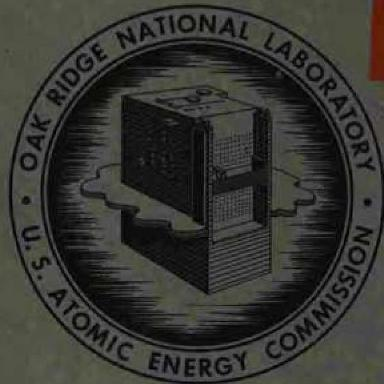

OAK RIDGE NATIONAL LABORATORY

operated by

UNION CARBIDE CORPORATION

for the

U.S. ATOMIC ENERGY COMMISSION

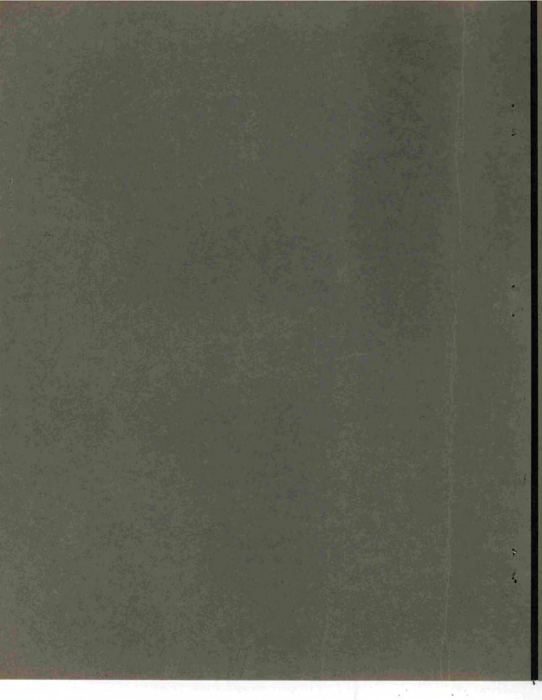

ORNL-2353

C-84 - Reactors-Special Features of Aircraft Reactors

This document consists of 22 pages.

Copy of 273 copies. Series A.

Contract No. W-7405-eng-26

# SHIELD PLUG ASSEMBLY FOR THE ART FUEL PUMPS

J.P.Page

J.H.Coobs

DATE ISSUED

APR 3-1958

OAK RIDGE NATIONAL LABORATORY

Oak Ridge, Tennessee

operated by

UNION CARBIDE CORPORATION

for the

U.S. ATOMIC ENERGY COMMISSION

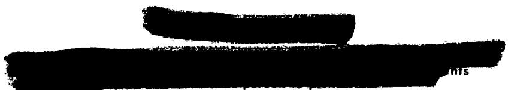

3445603611811

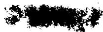

# CONTENTS

Abstract 1   
Introduction 1   
Shield Plug Design and Materials Specifications 1   
Development and Evaluation of Materials and Fabrication of Parts 4   
Summary 9   
Acknowledgments 10   
Appendix A. Density and Conductivity Calculations 11   
Appendix B. Thermal Conductivity Determination Apparatus. 14

华

# SHIELD PLUG ASSEMBLY FOR THE ART FUEL PUMPS

J.P.Page J.H.Coobs

# ABSTRACT

The shield plug assembly must protect the Aircraft Reactor Test fuel pump motors from gamma and neutron radiation. It must also exhibit limited heat transfer properties. After an evaluation was made of their metallurgical and physical properties, the materials tungsten carbide-Hastelloy C (cermet), low-density stabilized zirconia, and stainless-steel-clad copper-boron carbide were selected for use as gamma, thermal, and neutron shielding components, respectively. A full-size assembly was fabricated.

# INTRODUCTION

One of several unique components of the Aircraft Reactor Test (ART) is the shield plug assembly. Two assemblies will be used in the reactor, one for each fuel pump. The location of one of the assemblies is shown in Fig. 1.

The shield plug has three functions: protects the fuel pump motors from gamma radiation, attenuates stray neutrons, and limits the heat transfer. At full reactor power the heat developed by gamma-ray and neutron absorption must be dissipated, but at zero-power operation the lower face of the shield plug must not cool below the freezing point of the liquid fuel. Such freezing would cause fouling of the impellers.

Only the materials-development aspects of the shield plug assembly are discussed. Heat transfer calculations and design detailing were performed by members of the Experimental Engineering Design Group. The gamma- and neutron-shielding specifications were established by the Power Plant Engineering Section.

# SHIELD PLUG DESIGN AND MATERIALS SPECIFICATIONS

An exploded view of the shield plug assembly is presented in Fig. 2. This design was arrived at after close and continued cooperation between representatives of the Metallurgy Division and members of the Experimental Engineering Design Group.

The fabricated assembly consists of a gamma shield, a thermal shield, a neutron shield, and four Inconel-clad Chromel-Alumel thermocouples, all canned in an Inconel container. The upper surface of the container is a heat exchanger through which a noncracking oil is circulated. The gamma shield is brazed directly to the face of the heat exchanger.

The specifications for the gamma-shield material are as follows:

1. density of at least 12.0 g/cm³,   
2. thermal conductivity not greater than 0.10 cal/cm·sec·°C,   
3. structural integrity to at least $1500^{\circ}F$   
4. reasonable thermal-shock resistance,   
5. brazeability to Inconel.

The thermal and neutron shields are below the gamma shield and rest on the lower face of the Inconel can. The thermal-shield specifications called for a refractory material having a thermal conductivity as low as possible and having adequate strength for machining and handling. The neutron shield had to have a minimum $\mathsf{B}^{10}$ content of 0.01 g per square centimeter of the exposed face.

Thermocouples, located in grooves cut in the upper and lower faces of the thermal shield, measure the temperature drop through this piece. In order for there to be no gamma leakage, the thermocouples run from the thermal shield through helical grooves cut in the gamma shield to the exit hole, which is near the top of the can. The lower face of the shield plug assembly will be exposed to temperatures of 1400 to $1500^{\circ}\mathrm{F}$ , while

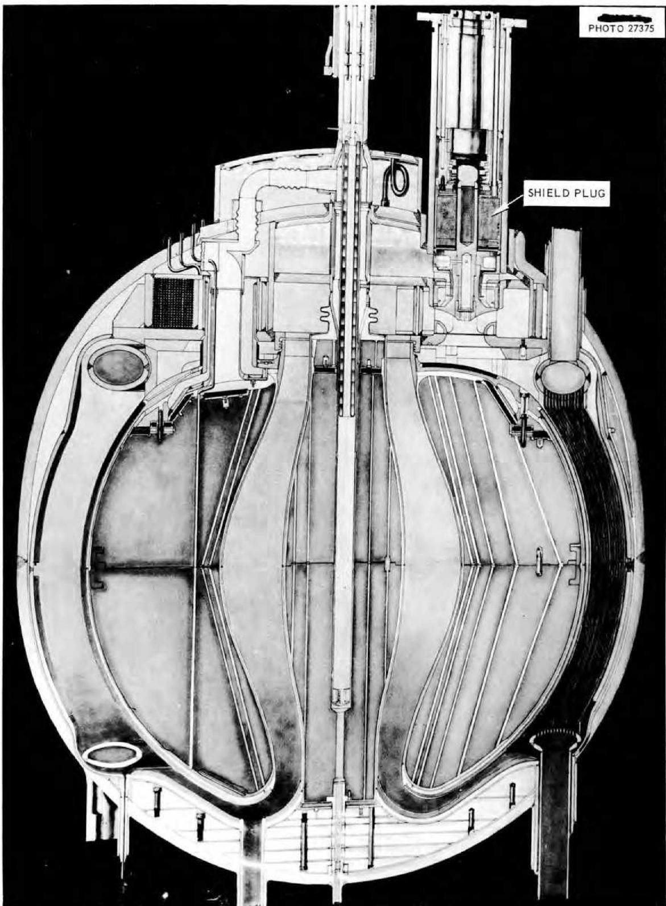  
Fig. 1. Cross Section of the Aircraft Reactor Test, Showing Shield Plug Assembly.

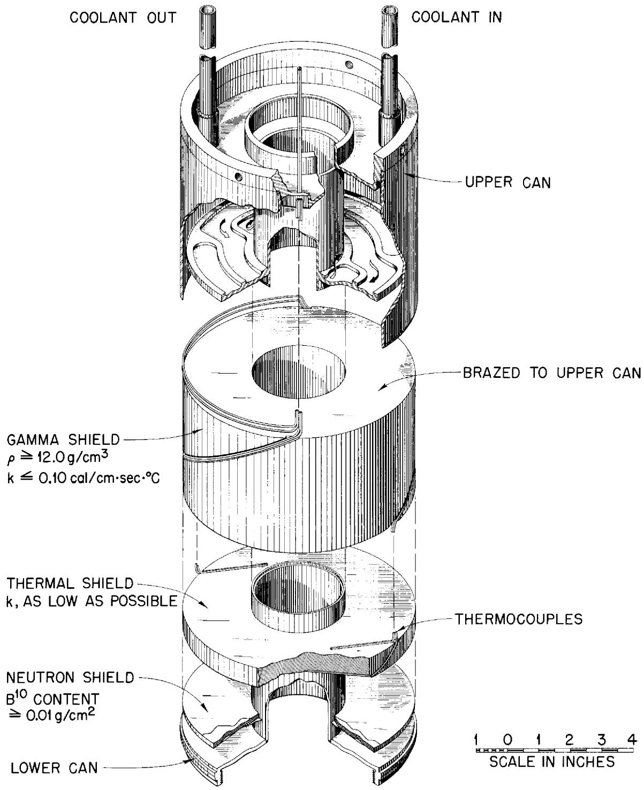  
Fig. 2. Exploded View of the Shield Plug Assembly. (Confidential with caption)

the temperature of the heat exchanger will never exceed $250^{\circ}F$

The design is especially attractive in at least three respects: as much as possible, the functions of the shield plug have been separated, permitting the imposition of a minimum number of requirements per component; the weight of the dense gamma shield is entirely supported at the coolest part of the assembly; and the use of a canned assembly eliminates the consideration of oxidation and corrosion resistance, although high-temperature compatibilities of the various materials of interest were kept in mind throughout the development program.

# DEVELOPMENT AND EVALUATION OF MATERIALS AND FABRICATION OF PARTS

Development of materials for the three components, which was performed semiconcurrently, is described below.

# Gamma Shield

A review of the literature and correspondence with several industrial organizations indicated that no existing material had the unusual properties required of the gamma-shield material. Since an optimization of two nonrelated physical properties (density and thermal conductivity) was desired, powder-metalurgical rather than conventional alloy-development techniques were employed.

In order to limit the scope of the investigation, only two-component systems were considered; one of these components was to be a high-density material of fairly low conductivity which would be dispersed in the second component, a very low-conductivity matrix. The gamma shield, being a hollow, right circular cylinder approximately 4 in.

high by 6 in. in outside diameter by $2\frac{1}{2}$ in. in inside diameter, could probably be fabricated in one piece by conventional hot-pressing techniques.

From density, availability, cost, and thermal conductivity considerations the materials tungsten, tungsten carbide, and tantalum were tentatively chosen as possible high-density components; tungsten, because of its relatively high thermal conductivity, was considered to be the least desirable of the three materials. Selected properties of these materials are presented in Table 1.

In the search for a low-conductivity matrix material, it became apparent immediately that some member of the nickel-base family of alloys might be suitable. Nickel-base alloys, in general, have solidus temperatures in a range favorable for hot-pressing, yet retain their strengths to high temperatures, are fairly dense (approximately $9\mathrm{g/cm}^3$ ), have the lowest thermal conductivities of all the commercial alloys, and are very likely to be amenable to brazing. These alloys, however, react extensively with both tungsten and tantalum at elevated temperatures. Also, nickel reacts with graphite (which, as will be described, is the material used for hot-pressing dies) at $1322^{\circ}\mathrm{C}$ to form a eutectic composition.

Hastelloy B, with a density of $9.24\mathrm{g/cm}^3$ and a thermal conductivity of 0.027 cal/cm·sec $^{-1}$ C, appeared to be the most promising matrix material. Unfortunately, this alloy is not available in powder form. Hastelloy C has the slightly lower density of $8.94\mathrm{g/cm}^3$ and the slightly higher thermal conductivity of 0.030 cal/cm·sec $^{-1}$ C but is available in powder form at the reasonable cost of approximately $5 per pound.

The alloy constantan $(45\% \mathrm{Ni} - 55\% \mathrm{Cu})$ with a reported thermal conductivity of $0.055\mathrm{cal / cm}\cdot \mathrm{sec}\cdot {}^{\circ}\mathrm{C},$

Table 1. Selected Properties of Tungsten, Tungsten Carbide, and Tantalum   

<table><tr><td>Material</td><td>Density (g/cm3)</td><td>Thermal Conductivity (cal/cm·sec-1°C)</td><td>Approximate Cost ($/lb)</td></tr><tr><td>Tungsten</td><td>19.2</td><td>0.394</td><td>12</td></tr><tr><td>Tungsten carbide</td><td>15.6</td><td>0.17*</td><td>5</td></tr><tr><td>Tantalum</td><td>16.6</td><td>0.13</td><td>56</td></tr></table>

*Estimated by the Wiedemann-Franz relationship. The electric conductivity of tungsten carbide is reported (P. Schwarzkopf and R. Kieffer, Refractory Hard Metals, p 161, Macmillan, New York, 1953) to be 40% of that of pure tungsten. For lack of better data, the thermal conductivity was assumed to be 40% of that of pure tungsten.

also appeared to be attractive. It has been shown² that copper and nickel powders alloy readily at elevated temperature by solid-state diffusion. Copper and nickel powders were on hand for testing, and it was felt that a relatively homogeneous alloy could be produced during the hot-pressing operation.

The choice of matrix, then, was between Hastelloy C and constantan. Selected properties of these metals are presented in Table 2.

Table 2. Selected Properties of Constantin and Hestelloy C   

<table><tr><td>Material</td><td>Density (g/cm3)</td><td>Thermal Conductivity (cal/cm·sec·°C)</td><td>Approximate Cost ($/lb)</td></tr><tr><td>Hastelloy C</td><td>8.94</td><td>0.03</td><td>5</td></tr><tr><td>Constantan</td><td>8.9</td><td>0.055</td><td>1</td></tr></table>

When the number of materials to be considered was reduced to a logical minimum, calculations were performed to determine, semiquantitatively, the physical properties that might be expected of various combinations of these materials. These calculations are described in Appendix A, and although they suggested the limiting compositions, the introduction of another variable, porosity, prohibited a direct calculation from being made of the optimum composition. This variable was considered significant for two reasons: (1) consistent hot-pressing to full theoretical density, especially in a piece as large as the gamma shield, is extremely difficult; (2) while voids would lower the bulk density of a hot-pressed piece, they would also lower the thermal conductivity; the relative effects were unknown and could not be predicted.

Since the thermal conductivities of the materials could not be rigorously predicted, a fairly simple apparatus for the determination of thermal conductivity was designed and built. This apparatus is described in Appendix B. During the fabrication and calibration of the apparatus several small $(\frac{1}{2}$ -in.-dia) composites were hot-pressed. The hot-pressing operation consisted in heat and pressure being applied simultaneously to a weighed and blended mixture of ceramic and/or metallic

powders. Graphite dies were used because temperatures greater than $800^{\circ}\mathrm{C}$ would be encountered. The use of an inert layer between the die wall and the material being compacted may be necessitated by a reaction between the charge and graphite; where there is a significant reaction, the use of a molybdenum-foil liner or coating of aluminum oxide powder will usually prove remedial. Typical hot-pressing setups and techniques employed have been described by Coobs and Bomar.[3]

The results of the preliminary experiments are presented in Table 3. The data showed that the tantalum-Hastelloy C combination could not be hot-pressed to a high density; compaction was prohibited by the formation of a brittle intermetallic compound. A similar reaction product was noted in the microstructure of the tantalum-constantan specimen, but the copper evidently retarded the reaction rate to the point that it did not interfere with compaction.

Economic factors and the favorable results obtained with tungsten carbide-constantan and tungsten carbide-Hastelloy C indicated that these combinations warranted further consideration. The tungsten carbide-constantan composition was most easily fabricated and was therefore investigated first. In this system the required density of $12.0\mathrm{g/cm}^3$ could be obtained over a composition range extending from 60 wt % tungsten carbide to 100 wt % tungsten carbide simply by varying the porosity of the hot-pressed compact. The significance of porosity has been mentioned.

In order for variations in porosity to be taken into account, and even for the porosity to be used to advantage if possible, six tungsten carbide-constantan charges were pressed into 1-in.-dia by $2\frac{1}{2}$ -in.-long slugs for thermal conductivity determination. Figure 3 presents the conductivities of the specimens as a function of the volume percentages of the three phases, tungsten carbide, constantan, and porosity, present in each compact; the closed circles indicate the compositions of the compacts after they were hot-pressed. The conductivities were found to be essentially linear with temperature to $500^{\circ}\mathrm{C}$ , the upper limit of the apparatus. These data proved conclusively that no combination of tungsten carbide, constantan, and porosity would simultaneously fulfill the

Table 3. Results of Preliminary Hot-Pressing Experiments   

<table><tr><td rowspan="2">Composition (wt %)</td><td colspan="2">Density (g/cm3)</td><td rowspan="2">Maximum Temperature (°C)</td><td rowspan="2">Remarks</td></tr><tr><td>Theoretical</td><td>Attained</td></tr><tr><td>60 tantalum–40 constantan</td><td>12.3</td><td>12.1</td><td>1275</td><td>Compacted readily; definite Ta-Ni reaction; no Ni-graphite reaction</td></tr><tr><td>60 tantalum–40 Hastelloy C</td><td>12.4</td><td>8.2</td><td>1300</td><td>Would not compact; definite Ta-Ni reaction; slight Ni-graphite reaction</td></tr><tr><td>60 tungsten carbide–40 constantan</td><td>12.0</td><td>11.9</td><td>1275</td><td>Compacted readily; no WC-Ni reaction; no Ni-graphite reaction</td></tr><tr><td>60 tungsten carbide–40 Hastelloy C</td><td>12.0</td><td>11.8</td><td>1300</td><td>Compacted with some difficulty; no WC-Ni reaction; slight Ni-graphite reaction</td></tr></table>

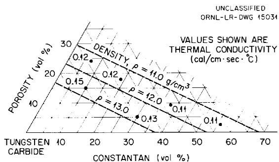  
Fig. 3. Thermal Conductivity of Tungsten Carbide-Constantan.

thermal conductivity and density specifications $(k < 0.10\mathrm{cal / cm}\cdot \mathrm{sec}\cdot {}^{\circ}\mathrm{C},\rho >12.0\mathrm{g / cm}^{3})$ set by the Experimental Engineering Design Group. Investigation of the tungsten carbide-constantan system was therefore discontinued.

The tungsten carbide-Hastelloy C system was then investigated in a similar manner. Four specimens were hot-pressed and their thermal conductivities determined. The results are presented in Fig. 4. It is evident that the conductivity is almost constant for compositions with a density of $12.0~\mathrm{g/cm^3}$ , probably because of the opposing effects of tungsten carbide and porosity. With the density held constant, an increase in the volume percentage of tungsten carbide produces an increase in the volume percentage of pore space. The tendency of tungsten carbide to raise the conductivity of the compact is therefore opposed by the insulating effect of pore space.

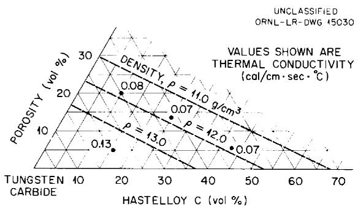  
Fig. 4. Thermal Conductivity of Tungsten Carbide-Hastelloy C.

The composition that was tentatively chosen for use in the gamma shield was 75 wt % tungsten carbide-25 wt % Hastelloy C. The microstructure of this composition, at the specified density of $12.0\mathrm{g/cm^3}$ , is shown in Fig. 5. The feasibility of hot-pressing a full-size gamma shield of this composition and density was confirmed by the successful pressing of two models of the cylinders. Because existing dies were utilized, the models were not true miniatures of the gamma shield but had charges calculated to give the same ratio of cross-sectional area to die wall area as would exist in the gamma shield. This ratio is a dominant consideration in hot-pressing practice. The two models were 1.20 and 2.36 in. in inside diameter, 2.23 and 3.86 in. in outside diameter, 1.25 and 1.74 in. high, and were pressed to densities of 11.9 and $12.4\mathrm{g/cm^3}$ , respectively.

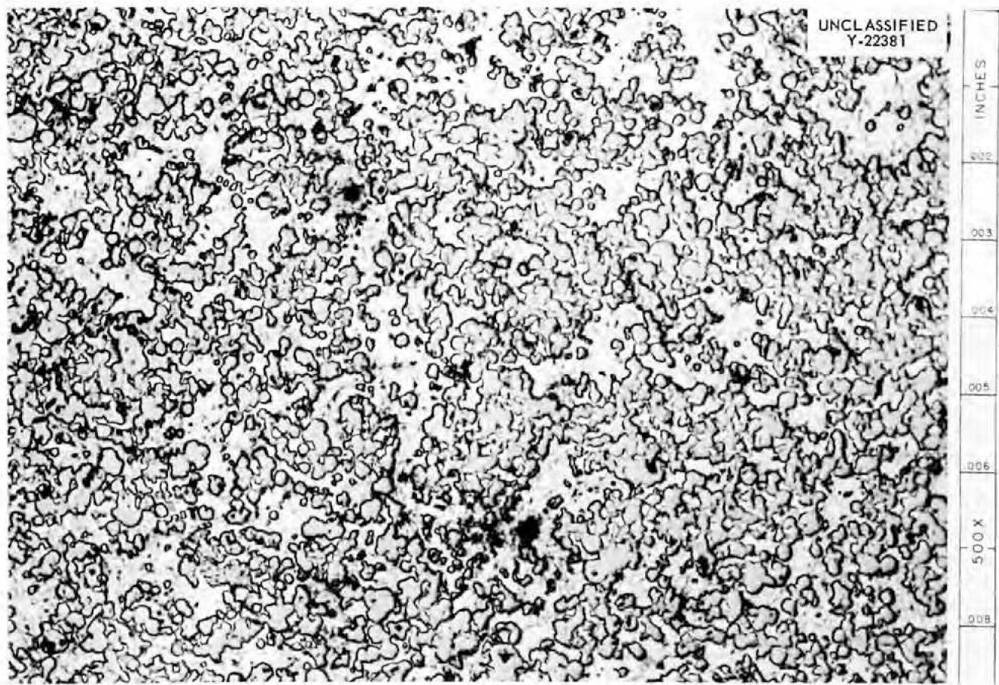  
Fig. 5. Microstructure of Tungsten Carbide-Hastelloy C. 500X.

These models and smaller trial pieces were given to the Welding and Brazing Group for brazing evaluation. The tungsten carbide-Hastelloy C material was successfully copper-brazed to Inconel in a dry-hydrogen atmosphere; the copper readily wet both materials.

The models were brazed to 2-in.-thick Inconel plate and subjected to several thermal shocks. They were heated in an argon-filled muffle furnace at $1500^{\circ}\mathrm{F}$ , then air-cooled to room temperature. No cracking or thermal-shock sensitivity was noted. Figure 6 shows a small trial piece, a typical thermal conductivity specimen, and the two models after they were brazed. The only unattractive property exhibited by this material was its extremely poor machinability. All finishing operations had to be performed by grinding, preferably with a diamond wheel.

The fabrication of two full-size gamma shields was accomplished after several problems had been solved in upscaling from the 3.86-in.-dia model

to the 6-in.-dia gamma shield. These problems arose from the necessity of changing die materials and as a result of the difficulty of setting up the large dies in a confined space. The grade C-18 graphite which had been used as die material for the trial pieces was not available in the large (15-in.) diameter required; therefore the substantially weaker grade CS-312 was used for the large dies. As a result, only two runs were made because the dies cracked open. A longer pressing time at a lower pressure (1500 psi as against 2500 psi) and elimination of the stress-raising sight hole used for optical pyrometer temperature measurement prevented similar difficulty in subsequent runs made with a new die. The second run was terminated just before the end of the pressing cycle, and even though the outside diameter of the piece had swelled after the die broke, the inside diameter remained true. After cooling, this inside diameter was accurately measured, as was the diameter of the mandrel

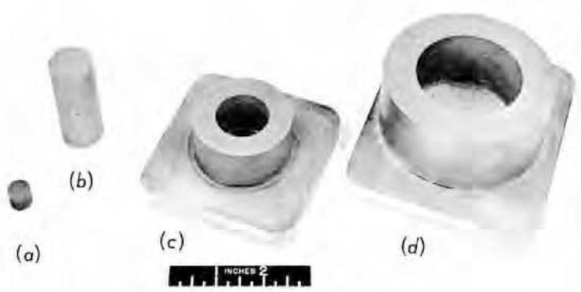  
Fig. 6. Hot-Pressing Development Series. (a) Trial piece, (b) typical thermal conductivity specimen, (c) 2.23-in.-OD model, (d) 3.86-in.-OD model.

which had formed it. A relative expansion coefficient was then calculated which was utilized in the design of the new die.

The new die produced two gamma shields which required little or no grinding of the cylindrical surfaces. The gamma shields were merely faced by grinding and the helical grooves cut with a 1/8-in.-wide diamond wheel. The grooves were cut by means of an ingenious grinding technique in which a slab-mill cutter was used as a guide.

The gamma shields were then copper-brazed to the heat exchanger faces of two Inconel cans. Figure 7 shows a brazed assembly before the introduction of the thermocouples and final sealing of the can.

# Thermal Shield

A survey of the literature showed zirconium dioxide (zirconia) to have the lowest thermal conductivity of the more common ceramic materials. The thermal conductivity of zirconia is reported

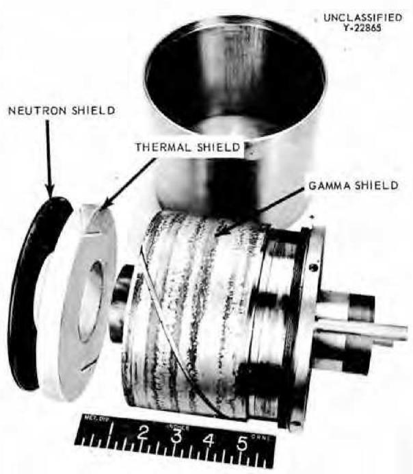  
Fig. 7. Fabricated Shield Plug Assembly.

to be 0.004 cal/cm $\cdot$ sec $^{\circ}$ C. The effect of density on thermal conductivity was not reported, nor was the effect of stabilization (addition of a small amount of calcium oxide for the stabilization of the cubic phase).

Arrangements were made with Battelle Memorial Institute for them to determine the thermal conductivities of zirconia specimens supplied by the Oak Ridge National Laboratory. Three specimens of stabilized zirconia, one each of density 3.08, 3.52, and $4.41\mathrm{g/cm}^3$ , were cold-pressed and sintered by the Ceramics Group of the Metallurgy Division at ORNL. These were machined to BMI specifications and sent there for thermal conductivity determination. The thermal conductivity of these specimens is shown as a function of temperature and density in Fig. 8.

After the thermal conductivities were determined by BMI, the Ceramics Group fabricated the thermal shields for the shield plug assembly to a density of $3.25\mathrm{g/cm}^3$ ; one of the shields is shown in Fig. 7.

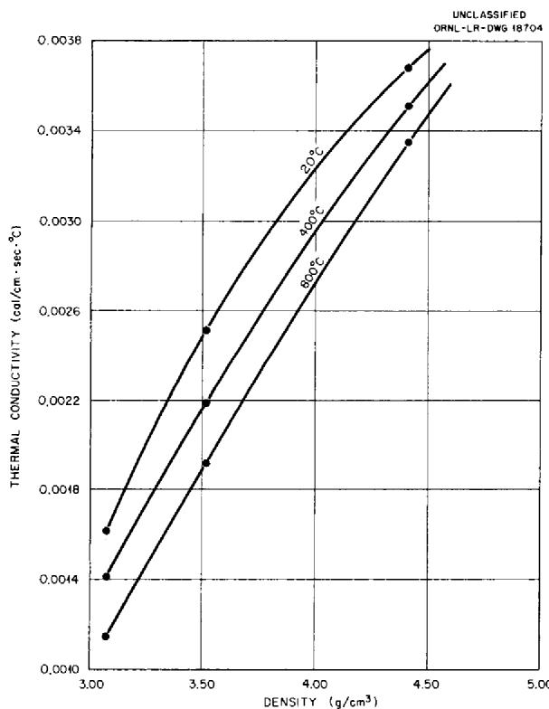  
Fig. 8. Thermal Conductivity of Zirconia as a Function of Temperature and Density.

# Neutron Shield

A stainless-steel-clad copper-boron carbide neutron shielding material has been developed at ORNL for the ART. This material is directly applicable for use as the neutron shield in the shield plug assembly.

This neutron shield is a laminated sheet consisting of a copper-boron carbide core clad with copper foil and stainless steel, in that order. The use of a copper matrix in the core lends a certain amount of ductility to the sheet. This core is enclosed in a copper diffusion barrier which separates the boron carbide particles on the surface of the core from the stainless steel cladding. The stainless steel, in turn, acts as a diffusion barrier between the copper and Inconel.

The composite sheet is fabricated by the well-known evacuated picture-frame technique; the cold-pressed and sintered core is wrapped with a copper foil and inserted in a stainless steel envelope, or billet. The billet is evacuated and sealed, then hot- and cold-rolled. The neutron shields for the shield plug assembly were cut from a 0.106-in.-thick sheet of this type of material, as manufactured by the Allegheny Ludlum Steel Corporation. The material has 6.6 wt % normal boron carbide in a 0.080-in.-thick core. The B10 content of the sheet, at 0.011 g/cm², adequately fulfills the B10 specifications (B10 > 0.01 g/cm²) of the shield plug assembly. A microstructure of the neutron shield disk shown in Fig. 7 is given in Fig. 9.

# SUMMARY

The shield plug assembly protects the fuel pump motors of the ART from gamma and neutron radiation. It also has limited heat transfer properties, allowing heat dissipation at full reactor power operation, yet acting as an insulator during zero-power operation to prevent solidification of the liquid fuel. The shield plug assembly consists essentially of three layers stacked in an Inconel container. Each layer, or component, has a specific function; each has specific materials requirements.

After evaluation of its metallurgical and physical properties, a 75 wt % tungsten carbide-25 wt % Hastelloy C cermet was selected for use as the

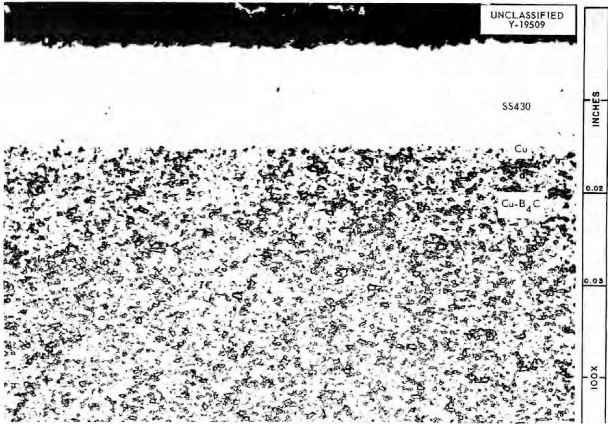  
Fig. 9. Microstructure of Neutron-Shield Material. 100X.

gamma-shield material. The gamma-shield component was fabricated by hot-pressing a mixture of tungsten carbide and Hastelloy C powders to a density of slightly greater than $12.0\mathrm{g/cm^3}$ . This material fulfills the specifications of density greater than $12.0\mathrm{g/cm^3}$ , thermal conductivity of less than 0.10 cal/cm·sec·°C, brazeability to Inconel, moderate thermal-shock resistance, and structural integrity to at least $1500^{\circ}\mathrm{F}$ .

The thermal shield requires a refractory material of very low thermal conductivity. Low-density stabilized zirconia was selected for use in this component after its thermal conductivity was determined as a function of density and temperature.

The neutron-shield specifications call for a material with a $B^{10}$ content greater than 0.01 g/cm²

of the exposed face. Stainless-steel-clad copper-boron carbide, with a B10 concentration of 0.011 g/cm2, was utilized in this component of the shield plug assembly.

# ACKNOWLEDGMENTS

The authors are indebted to a great number of Oak Ridge National Laboratory personnel for their assistance throughout this investigation and especially to the following for the work indicated: A. G. Grindell and W. K. Stair, design; W. R. Johnson, powder metallurgy; D. H. Stafford, thermal conductivity; R. L. Hamner and J. A. Griffin, ceramics; R. L. Newbert, grinding; and G. M. Slaughter and C. E. Shubert, brazing.

# Appendix A

# DENSITY AND CONDUCTIVITY CALCULATIONS

The bulk density of a heterogeneous material may be rigorously calculated by

$$
\rho_ {B} = \sum_ {i} V _ {i} \rho_ {i},
$$

where

$$
\rho_ {B} = \text {b u l k d e n s i t y (m a s s / l e n g t h} ^ {3}),
$$

$$
V _ {i} = \text {v o l u m e f r a c t i o n}, \text {c o m p o n e n t} i,
$$

$$
\rho_ {i} = \text {d e n s i t y}, \text {c o m p o n e n t} i (\text {m a s s / l e n g t h} ^ {3}).
$$

The densities of two-phase composites of the materials of interest are shown as a function of composition in Fig. A.1.

The thermal conductivity may be approximated by the analogy of heat flow to electric current. Limiting cases of parallel flow and series flow (assuming a purely two-phase solid) are represented by Eqs. 1 and 2, respectively (see Fig. A.2 for derivations):

$$
k _ {B} = k _ {1} V _ {1} + k _ {2} V _ {2}, \tag {1}
$$

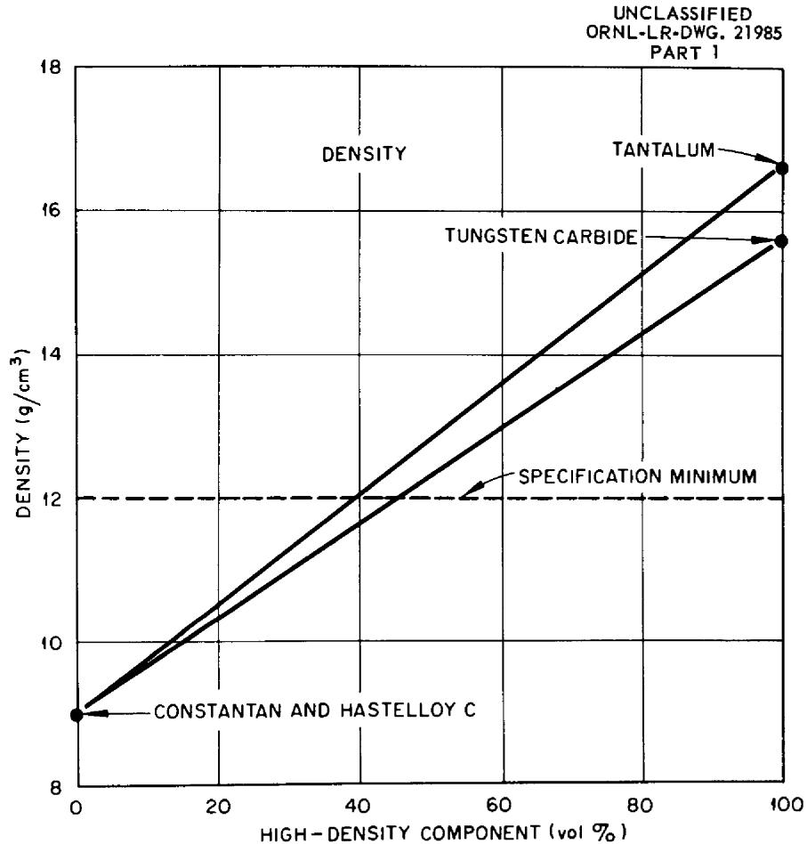  
Fig. A.1. Density as a Function of Composition of Two-Phase Composites.

MATERIAL

Ta-CONSTANTAN

Ta-HASTELELOYC

WC-CONSTANTAN

WC-HASTELELOYC

COMPOSITION FULFILLING DENSITY

SPECIFICATION

>40 vol % Ta

>40 vol % Ta

>46 vol% WC

>46 vol % WC

where

$$
k _ {B} = \text {b u l k t h e r m a l c o n d u c t i v i t y} (\operatorname {c a l} / \operatorname {c m} \cdot \sec \cdot^ {\circ} C),
$$

$$
k _ {1}, k _ {2} = \begin{array}{l} \text {t h e r m a l c o n d u c t i v i t i e s o f c o m p o n e n t s} \\ 1 \text {a n d} 2, \text {r e s p e c t i v e l y ,} \end{array}
$$

$$
V _ {1}, V _ {2} = \text {v o l u m e f r a c t i o n s o f c o m p o n e n t s 1 a n d} 2, \text {r e s p e c t i v e l y}.
$$

$$
\frac {1}{k _ {B}} = \frac {V _ {1}}{k _ {1}} + \frac {V _ {2}}{k _ {2}}. \tag {2}
$$

The value resulting from the case of parallel flow is the more conservative (yields highest value of conductivity). This value is plotted as a

function of composition in Fig. A.3. The calculated composition ranges in which the density and conductivity specifications are simultaneously fulfilled are presented below:

# Material

# Composition

Tantalum-constantan

51 to 60 vol % Ta or 66 to 74 wt % Ta

Tantalum-Hastelloy C

51 to 68 vol % Ta or 66 to 80 wt % Ta

Tungsten carbide-constantan

Not fulfilled

Tungsten carbide-Hastelloy C

52 to 57 vol % WC or 66 to 70 wt % WC

UNCLASSIFIED

ORNL-LR-DWG 21984

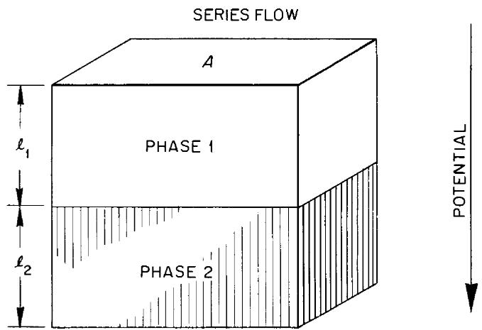

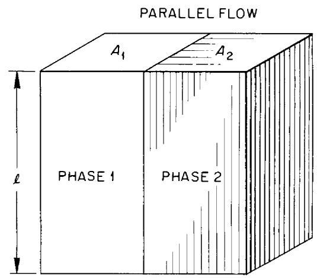  
Fig. A.2. Derivation of Conductivity Equations.

$$
R _ {j} = \frac {1}{k _ {j}} \frac {\ell_ {j}}{A _ {j}}
$$

$$
R _ {j} = \text {R E S I S T A N C E O F C o m p o n e n t};
$$

$$
k _ {i} = \text {C O N D U C T I V I T Y O F C O M P O N E N T}
$$

$$
\ell_ {j} ^ {\prime} = \text {L E N G T H O F C O M P o n e n t} i
$$

$$
A _ {j} = \text {A R E A O F C O M P o n e n t} j
$$

$$
R _ {T} = R _ {1} + R _ {2}
$$

$$
\frac {1}{k _ {T}} \frac {\ell_ {T}}{A _ {T}} = \frac {1}{k _ {1}} \frac {\ell_ {1}}{A _ {1}} + \frac {1}{k _ {2}} \frac {\ell_ {2}}{A _ {2}}
$$

$$
A _ {T} = A _ {1} = A _ {2}
$$

$$
I F \ell_ {T} = 1: \ell_ {1} = V _ {1} A N D \ell_ {2} = V _ {2}
$$

$$
V _ {i} = \text {V O L U M E F R A C T I O N , C o m p o n e n t} i
$$

$$
\therefore \frac {1}{k _ {T}} = \frac {V _ {1}}{k _ {1}} + \frac {V _ {2}}{k _ {2}}
$$

$$
\frac {1}{R _ {T}} = \frac {1}{R _ {1}} + \frac {1}{R _ {2}}
$$

$$
\frac {k _ {T} A _ {T}}{\ell_ {T}} = \frac {k _ {1} A _ {1}}{\ell_ {1}} + \frac {k _ {2} A _ {2}}{\ell_ {2}}
$$

$$
\ell_ {T} = \ell_ {1} = \ell_ {2}
$$

$$
I F A _ {T} = 1; A _ {1} = V _ {1} \text {A N D} A _ {2} = V _ {2}
$$

$$
V _ {i} = \text {V O L U M E F R A C T I O N , C O m p o n e n t} i
$$

$$
\therefore k _ {T} = k _ {1} V _ {1} + k _ {2} V _ {2}
$$

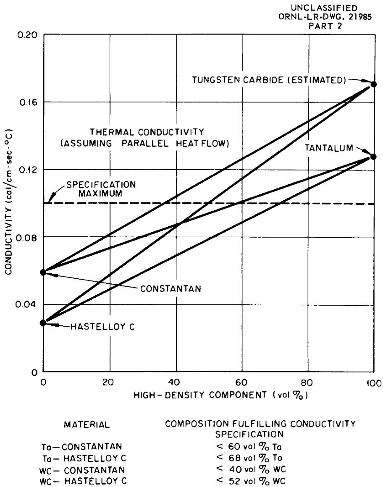  
Fig. A.3. Conductivity as a Function of Composition of Two-Phase Composites.

# Appendix B

# THERMAL CONDUCTIVITY DETERMINATION APPARATUS

A diagram of the thermal conductivity apparatus used for the evaluation of the gamma-shield materials is given in Fig. B.1. This apparatus is a modification of a design presented by Kitzes and Hullings.

The thermal conductivity, $k$ , was obtained by measurement of the temperature gradient, $\Delta l / \Delta T_{s'}$ in a specimen of cross-sectional area $A$ and of the temperature rise, $\Delta T_{w'}$ of water flowing through a simple heat exchanger. Solution of the equation

$$
k = \frac {W f _ {p} ^ {c} \Delta T _ {w}}{A} \frac {\Delta l}{\Delta T _ {s}},
$$

1A. S. Kitzes and W. Q. Hullings, Boral, A New Thermal Neutron Shield, AECD-3625 (May, 1954).

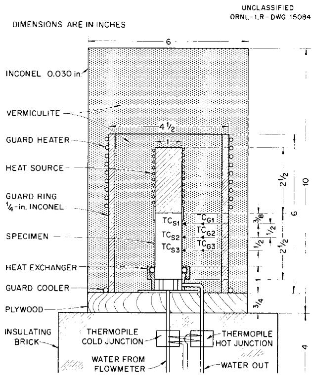  
Fig. B.1. Thermal Conductivity Apparatus.

where

$$
k = \text {t h e r m a l c o n d u c t i v i t y (c a l / c m} \cdot \sec^ {\circ} C),
$$

$$
w _ {f} = \text {w a t e r f l o w (g / s e c)},
$$

$$
c _ {p} = \text {s p e c i f i c h e a t o f w a t e r (c a l / g . ^ {\circ} C)},
$$

yielded, directly, the value of thermal conductivity.

The use of a multiple-point recorder allowed matching of the thermal gradients in the specimen and the guard tube. The heat inputs to the specimen and guard heaters were individually controlled through Variac autotransformers.

The temperature rise in the water was measured by a 20-junction Chromel-Alumel thermopile. The voltage developed in each of ten hot junctions was opposed by a voltage developed in a cold junction. Therefore temperature sensitivity was increased by an order of magnitude. This thermopile, in conjunction with a Rubicon model 2732 portable potentiometer, gave temperature-differential readings that were reproducible to $0.01^{\circ}C$ .

The specimen was held in the heat exchanger by a neoprene O-ring. This ring also effected a water-tight seal around the specimen and allowed direct impingement of water on the end of the specimen. The water entered the heat exchanger at the center, was baffled through a circular path, and left through the side.

This apparatus was found to be quite accurate. Inconel, type A nickel, and Armco iron were tested and most results fell within 0.005 cal/cm·sec $^{\circ}$ C of published data. The upper temperature limit was $600^{\circ}$ C, resulting in a conductivity datum point at $500^{\circ}$ C, due to the thermal gradient. It was, however, very difficult to match the specimen and guard tube in this temperature range. The upper temperature limit of dependable measurement was approximately $300^{\circ}$ C.

Attempts to measure high-conductivity materials, such as aluminum alloys, were unsuccessful because a suitable gradient could not be established.

# ORNL-2353

# C-84 - Reactors-Special Features of Aircraft Reactors

# INTERNAL DISTRIBUTION

1. R.G.Affel   
2. J.W. Allen   
3. C. J. Barton   
4. M. Bender   
5. D. S. Billington   
6. F. F. Blankenship   
7. E. P. Blizzard   
8. C. J. Borkowski   
9. W. F. Boudreau   
10. G.E. Boyd   
11. M. A. Bredig   
12. E. J. Breeding   
13. W.E. Browning   
14. F. R. Bruce   
15. A. D. Callihan   
16. D. W. Cardwell   
17. C. E. Center (K-25)   
18. R. A. Charpie   
19. R. L. Clark   
20. C. E. Clifford   
21. J.H. Coobs   
22. W. B. Cottrell   
23. R. S. Crouse   
24. F. L. Culler   
25. D. R. Cuneo   
26. J. H. DeVan   
27. L. M. Doney   
28. D. A. Douglas   
29. W. K. Eister   
30. L. B. Emlet (K-25)   
31. D. E. Ferguson   
32. A. P. Fraas   
33. J. H. Frye   
34. W. T. Furgerson   
35. R. J. Gray   
36. A. T. Gresky   
37. W.R.Grimes   
38. A. G. Grindell   
39. E. Guth   
40. C. S. Harrill   
41. M.R.Hill   
42. E. E. Hoffman   
43. H. W. Hoffman   
44. A. Hollander   
45. A. S. Householder   
46. J. T. Howe

47. W. H. Jordan   
48. G.W. Keilholtz   
49. C. P. Keim   
50. F. L. Keller   
51. M. T. Kelley   
52. F. Kertesz   
53. J. J. Keyes   
54. J. A. Lane   
55. R. B. Lindauer   
56. R. S. Livingston   
57. R. N. Lyon   
58. H. G. MacPherson   
59. R. E. MacPherson   
60. F. C. Maienschein   
61. W. D. Manly   
62. E.R.Mann   
63. L. A. Mann   
64. W. B. McDonald   
65. J. R. McNally   
66. F. R. McQuilkin   
67. R.V. Meghreblian   
68. R.P.Milford   
69. A. J. Miller   
70. R.E.Moore   
71. J. G. Morgan   
72. K. Z. Morgan   
73. E. J. Murphy   
74. J. P. Murray (Y-12)   
75. M. L. Nelson   
76. G. J. Nessle   
77. L. G. Overholser   
78. P. Patriarca   
79. S. K. Penny   
80. A. M. Perry   
81. D. Phillips   
82. J. C. Pigg   
83. P. M. Reyling   
84. A. E. Richt   
85. M. T. Robinson   
86. H. W. Savage   
87. A. W. Savolainen   
88. R. D. Schultheiss   
89. D. Scott   
90. J. L. Scott   
91. E. D. Shipley   
92. A. Simon

93. O. Sisman

94. J. Sites

95. M. J. Skinner

96. A. H. Snell

97. C. D. Susano

98. J. A. Swartout

99. E. H. Taylor

100. R. E. Thoma

101. D. B. Trauger

102. D. K. Trubey

103. G. M. Watson

104. A. M. Weinberg

105. J. C. White

106. G. D. Whitman

107. E. P. Wigner (consultant)

108. G. C. Williams

109. J. C. Wilson

110. C. E. Winters

111. W. Zobel

112-114. ORNL - Y-12 Technical Library, Document Reference Section

115-122. Laboratory Records Department

123. Laboratory Records, ORNL R.C.

124-126. Central Research Library

# EXTERNAL DISTRIBUTION

127-129. Air Force Ballistic Missile Division

130-131. AFPR, Boeing, Seattle

132. AFPR, Boeing, Wichita

133. AFPR, Curtiss-Wright, Clifton

134. AFPR, Douglas, Long Beach

135-137. AFPR, Douglas, Santa Monica

138. AFPR, Lockheed, Burbank

139-140. AFPR, Lockheed, Marietta

141. AFPR, North American, Canoga Park

142. AFPR, North American, Downey

143-144. Air Force Special Weapons Center

145. Air Materiel Command

146. Air Research and Development Command (RDGN)

147. Air Research and Development Command (RDTAPS)

148-161. Air Research and Development Command (RDZPSP)

162. Air Technical Intelligence Center

163-165. ANP Project Office, Convair, Fort Worth

166. Albuquerque Operations Office

167. Argonne National Laboratory

168. Armed Forces Special Weapons Project, Sandia

169. Armed Forces Special Weapons Project, Washington

170. Assistant Secretary of the Air Force, R&D

171-176. Atomic Energy Commission, Washington

177. Atomics International

178. Battelle Memorial Institute

179-180. Bettis Plant (WAPD)

181. Bureau of Aeronautics

182. Bureau of Aeronautics General Representative

183. BAR, Aerojet-General, Azusa

184. BAR, Convair, San Diego

185. BAR, Glenn L. Martin, Baltimore

186. BAR, Grumman Aircraft, Bethpage

187. Bureau of Yards and Docks

188. Chicago Operations Office

189. Chicago Patent Group

190. Curtiss-Wright Corporation

191. Engineer Research and Development Laboratories

192-195. General Electric Company (ANPD)

196. General Nuclear Engineering Corporation

197. Hartford Area Office

198. Idaho Operations Office

199. Knolls Atomic Power Laboratory

200. Lockland Area Office

201. Los Alamos Scientific Laboratory

202. Marquardt Aircraft Company

203. Martin Company

204. National Advisory Committee for Aeronautics, Cleveland

205. National Advisory Committee for Aeronautics, Washington

206. Naval Air Development Center

207. Naval Air Material Center

208. Naval Air Turbine Test Station

209. Naval Research Laboratory

210. New York Operations Office

211. Nuclear Development Corporation of America

212. Nuclear Metals, Inc.

213. Office of Naval Research

214. Office of the Chief of Naval Operations (OP-361)

215. Patent Branch, Washington

216-219. Pratt and Whitney Aircraft Division

220. San Francisco Operations Office

221. Sandia Corporation

222. School of Aviation Medicine

223. Sylvania-Corning Nuclear Corporation

224. Technical Research Group

225. USAF Headquarters

226. USAF Project RAND

227. U.S. Naval Radiological Defense Laboratory

228-229. University of California Radiation Laboratory, Livermore

230-247. Wright Air Development Center (WCOSI-3)

248-272. Technical Information Service Extension, Oak Ridge

273. Division of Research and Development, AEC, ORO