AEC RESEARCH AND DEVELOPMENT REPORT ORNL-2373 C-84 - Reactors

Special Features of Aircraft Reactors

EFFECT OF RADIATION ON CORROSION

OF STRUCTURAL MATERIALS BY

MOLTEN FLUORIDES

G.W. Keilholtz

J. G. Morgan

W. E. Browning

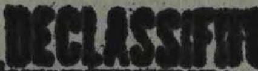

CENTRAL RESEARCH LIBRARY DOCUMENT COLLECTION

LIBRARY LOAN COPY

DO NOT TRANSFER TO ANOTHER PERSON

If you wish someone else to see this document, send in name with document and the library will arrange a loan.

OAK RIDGE NATIONAL LABORATORY

OPERATED BY

UNION CARBIDE NUCLEAR COMPANY

A Division of Union Carbide and Carbon Corporation

UCC

POST OFFICE BOX X · OAK RIDGE, TENNESSEE

# LEGAL NOTICE

This report was prepared as an account of Government sponsored work. Neither the United States, nor the Commission, nor any person acting on behalf of the Commission:

A. Makes any warranty or representation, express or implied, with respect to the accuracy, completeness, or usefulness of the information contained in this report, or that the use of any information, apparatus, method, or process disclosed in this report may not infringe privately owned rights; or   
B. Assumes any liabilities with respect to the use of, or for damages resulting from the use of any information, apparatus, method, or process disclosed in this report.

As used in the above, "person acting on behalf of the Commission" includes any employee or contractor of the Commission to the extent that such employee or contractor prepares, handles or distributes, or provides access to, any information pursuant to his employment or contract with the Commission.

SOLID STATE DIVISION

EFFECT OF RADIATION ON CORROSION OF STRUCTURAL MATERIALS BY

MOLTEN FLUORIDES

G.W. Keilholtz

J. G. Morgan

W. E. Browning

DATE ISSUED

AUG 1.3 1957

OAK RIDGE NATIONAL LABORATORY

Operated by

UNION CARBIDE NUCLEAR COMPANY

A Division of Union Carbide and Carbon Corporation

Post Office Box X

Oak Ridge, Tennessee

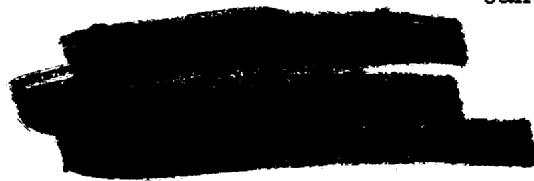

3 4456 0060052 5

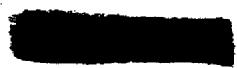

# INTERNAL DISTRIBUTION

1. R. G. Affel   
2.C.J.Barton   
3. M. Bender   
4. D. S. Billington   
5. F. F. Blankenship   
6. E. P. Blizzard   
7. C. J. Borkowski   
8. W. F. Boudreau   
9. G. E. Boyd   
10. M. A. Bredig   
11. E. J. Breeding   
12. W. E. Browning   
13. F. R. Bruce   
14. A. D. Callihan   
15. D. W. Cardwell   
16. C. E. Center (K-25)   
17. R. A. Charpie   
18. R. L. Clark   
19. C. E. Clifford   
20. J. H. Coobs   
21. W. B. Cottrell   
22. S. J. Cromer   
23. R. S. Crouse   
24. F. L. Culler   
25. D. R. Cuneo   
26. J. H. Devan   
27. L. M. Doney   
28. D. A. Douglas   
29. E. R. Dytko   
30. W. K. Eister   
31. L. B. Emlet (K-25)   
32. D. E. Ferguson   
33. A. P. Fraas   
34. J. H. Frye, Jr.   
35. W. T. Furgerson   
36. R. J. Gray   
37. A. T. Gresky   
38. W. R. Grimes   
39. A. G. Grindell   
40. E. Guth   
41. C. S. Harrill   
42. E. E. Hoffman   
43. H. W. Hoffman   
44. A. Hollaentner   
45. A. S. Householder   
46. J. T. Howe

47. W. H. Jordan   
48. G. W. Feilholtz   
49. C. P. Keim   
50. F. L. Keller   
51. M. T. Kelley   
52. F. Bertesz   
53. J. J. Keyes   
54. J.A. Lane   
55. R B. Lindauer   
56. F. S. Livingston   
57. R. N. Lyon   
58 H. G. MacPherson   
R.E.MacPherson   
50. F. C. Maienschein   
61. W. D. Manly   
62. E. R. Mann   
63. L. A. Mann   
64. W. B. McDonald   
65. J. R. McNally   
66. F. R. McQuilkin   
67. R. V. Meghreblian   
68. R. P. Milford   
69. A. J. Miller   
70. R. E. Moore   
71. J. G. Morgan   
72. K. Z. Morgan   
73. J. P. Murray (Y-12)   
74. M. L. Nelson   
75. G. J. Nessle   
76. R. B. Oliver   
77. L. G. Overholser   
78. P. Patriarca   
79. S. K. Penny   
80. A. M. Perry   
81. D. Phillips   
82. J. C. Pigg   
83. A. E. Richt   
84. M. T. Robinson   
85. H. W. Savage   
86. A. W. Savolainen   
B7. R. D. Schultheiss   
38. D. Scott   
9. J. L. Scott   
D. E. D. Shipley   
91. A. Simon   
92. 0. Sisman

93. J. Sites   
94. M. J. Skinner   
95. A. H. Snell   
96. C. D. Susano   
97. J. A. Swartout   
98. E. H. Taylor   
99. R. E. Thoma   
100. D. B. Trauger   
101. D. K. Trubey   
102. G. M. Watson   
103. A. M. Weinberg

104. G.D.Whitman   
105. E.P. Wigner (consultant)   
106. J.C. Wilson   
107. E. Winters   
108.7. Zobel

109-111 ORNL - Y-12 Technical Library Document Reference Section   
112-16. Laboratory Records Department   
117. Laboratory Records Department ORNL R.C.   
113-119. Central Research Library

# EXTERNAL DISTRIBUTION

120. Aerojet-General Corporation

121-122. AFPR, Boeing, Seattle

123. AFPR, Boeing, Wichita

124. AFPR, Curtiss-Wright, Clifton

125. AFPR, Douglas, Long Beach

126-128. AFPR, Douglas, Santa Monica

129. AFPR, Lockheed, Burbank

130-131. AFFR, Lockheed, Marietta

132. AFPR, North American, *Anoga Park*   
133. AFPR, North American, Downey   
134. Air Materiel Command   
135. Air Research and Development Command (RDGN)   
136. Air Technical Intelligence Center

137-139. ANP Project Office Convir, Fort Worth

140. Albuquerque Operations Office   
141. Argonne National Laboratory   
142. Armed Forces Special Weapons Project, Sandia   
143. Armed Forces Special Weapons Project, Washington   
144. Assistant Secretary of the Air Force, R&D

145-150. Atomic Energy Commission, Washington

151. Atomics Interrational   
152. Battelle Memorial Institute

153-154. Bettis Plant (WAPD)

155. Bureau of Aeronautics   
156. Bureau of Aeronautics General Representative   
157. BAR, Glenn F. Martin, Baltimon   
158. Bureau of Yards and Docks   
159. Chicago Operations Office   
160. Chicago Patent Group   
161. Convair-General Dynamics Corporation   
162. Curtiss-Wright Corporation   
163. Engineer Research and Development Laboratories

164-167. General Electric Company (ANPD)

168. General Nuclear Engineering Corporation   
169. Glenn L. Martin Company   
170. Hartford Area Office

171-172. Headquaters, Air Force Special Weapons Center

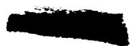

173. Idaho Operations Office   
174. Knolls Atomic Power Laboratory   
175. Lockland Area Office   
176. Los Alamos Scientific Laboratory   
177. Marquardt Aircraft Company,   
178. National Advisory Committee for Aeronautics, Cleveland   
179. National Advisory Committee for Aeronautics, Washington   
180. Naval Air Development Center   
181. Naval Air Materials Center   
182. Naval Air Turbine Test Station   
183. Naval Research Laboratory   
184. New York Operations Office   
185. Nuclear Development and Pioration of America   
186. Office of Naval Research   
187. Office of the Chief Naval Operations (OP-361)   
188. Patent Branch, Washi ton   
189. Patterson-Moos

190-193. Pratt and Whitney, *Aftaft Division*

194. San Francisco Open 11's Office   
195. Sandia Corporation   
196. School of Aviation Medicine   
197. Sylvania-Corning, Nuclear Corporation   
198. Technical Research Group   
199. USAF Headquarters   
200. USAF Project R   
201. U. S. Naval Radiological Defense Laboratory   
202. University of California Radiation Laboratory, Livermore

203-220.Wright Air Development Center (WCOSI-3)

221-245. Technical Information Service Extension, Oak Ridge

246. Division of Research and Development, AEC, ORO

# Abstract

A survey of the experimental methods used in testing the radiation stability of molten salts and their corrosion properties is presented. The effects of irradiation on the corrosion on Inconel exposed to fluoride fuel mixtures and on the physical and chemical stability of the fuel mixtures have been investigated by irradiating in the MTR capsules filled with static fuel and by operating in-pile forced-circulation loops in the LITR and in the MTR. In the many capsule tests and in the three in-pile loop tests made to date, no major changes have occurred in the fuel mixtures that can be attributed to irradiation, other than normal burn-up of uranium. Metallurgical examinations of the Inconel capsules and tubing have likewise shown no changes in corrosion that can be the result of radiation damage. The low corrosion results obtained for the in-pile loops have been confirmed by chemical analyses for corrosion products in the fuel mixtures.

The use of molten fluorides as reactor fuels (1) requires that they be stable both thermally and in intense radiation fields. The fission process in the salt causes regions of high ionization density to exist, as well as very high heat fluxes. However, since molten salts are generally ionic liquids, there is no crystalline lattice to disrupt, nor are there covalent bonds to sever. Thus, fast neutrons, fission fragments, and gamma radiation cannot cause severe damage of the type found in crystalline materials. However, the interface between the molten salt and its container offers a site where radiation effects might make themselves evident in an acceleration of the corrosion process. With this possibility, it has been necessary to test the compatibility of various salts with structural metals in the highest neutron fluxes available.

The principal methods used in in-pile testing of molten salts are listed in Table I. Capsule tests were performed first because of their simplicity and their ability to produce information susceptible to statistical analysis. The successive techniques listed in the table are of increasing degrees of complexity and approach closer and closer to the design conditions of a practical nuclear power plant. Each step, however, introduces new variables and requires far greater expenditure of effort and time than the previous step does, rapidly decreasing the number of tests which can be performed. Although consideration was given to their use, rocking capsule tests and thermal convection loops have not formed a part of the work described here.

Capsule tests have been made with nickel, types 316 and 347 stainless steel, and Inconel. The salts employed and their compositions are listed in Table II. The first salt irradiations were conducted by Van De Graaf (2) and cyclotron (3) bombardments. Proton bombardments (2b)were employed to

# TABLE I

METHODS OF STUDYING RADIATION EFFECTS ON CORROSION BY MOLTEN FLUORIDE FUELS

1. In-Pile Capsule Tests   
2. Rocking Capsule Tests   
3. Thermal Convection Loops   
4. Forced-Flow Loops   
5. Experimental Reactors

TABLE II   
MOLTEN SALTS TESTED IN RADIATION EFFECTS PROGRAM   

<table><tr><td>System</td><td>Composition (mole%)</td></tr><tr><td>KOH</td><td>100</td></tr><tr><td>NaF-KF-UF4</td><td>46.5-26.0-27.5</td></tr><tr><td>NaF-BeF2-UF4</td><td>25.0-60.0-15.0</td></tr><tr><td>NaF-BeF2-UF4</td><td>47.0-51.0-2.0</td></tr><tr><td>NaF-BeF4-UF4</td><td>50.0-46.0-4.0</td></tr><tr><td>NaF-ZrF4-UF4</td><td>63.0-25.0-12.0</td></tr><tr><td>NaF-ZrF4-UF4</td><td>53.5-40.0-12.0</td></tr><tr><td>NaF-ZrF4-UF4</td><td>50.0-48.0-2.0</td></tr><tr><td>NaF-ZrF4-UF3</td><td>50.0-48.0-2.0</td></tr></table>

supplement parallel experiments in the ORNL Graphite Reactor because of the high specific power attainable in this way. These irradiations were continued for 1 to 92 hours, using 20 to 22 MeV. protons in the ORNL 86-in. cyclotron. Specific power generation ranged from 500 to 4700 watts $\mathrm{cm}^{-3}$ . With the starting of the MTR, a sufficiently high-flux reactor became available for these experiments. Irradiation with neutrons, gamma rays, and fission fragments obtained in this way are far more realistic than those using elementary charged particles. The emphasis was therefore shifted to reactor irradiations.

A typical capsule used in the MTR irradiation program is shown in Fig. 1. It is 0.100 in. i.d. with a 0.050 in. wall. The length of the salt column is 1 in. In salts with high $U^{235}$ contents, the diameter of the fuel column is reduced to 0.055 in. This avoids excessive temperatures at the center of the salt column when working with fuels generating as high as 8000 watts $\mathrm{cm}^{-3}$ (4). Fig. 2 illustrates the arrangement of control instrumentation on the north balcony of the MTR. Electrical and cooling-air lines extend from the instrument panels to the top of the reactor. The capsule is loaded through the reactor inlet water line. It is inserted down an aluminum tube into a beryllium piece located in the reflector region. Fig. 3 shows the MTR irradiation facility. The temperature of the fuel is controlled by a variable flow of air, the outer surface temperature of the capsule being monitored with thermocouples. The weight of salt is chosen so that about 250 watts of fission heat are generated in the capsule. This requires about 3 cfm of cooling air. Using 45 psig air, the velocity through the capsule restriction is about 700 ft.sec.

It was necessary to develop special thermocouple junctions for use in such high-velocity cooling air streams. The air produces a large thermal

gradient in the capsule wall and in the thermocouple beads. In poorly constructed thermocouples, errors as great as $300^{\circ}\mathrm{C}$ have been observed. The thermocouple shown in Fig. 4 was made by a resistance spot-welding technique. The bead is designed to have a large area of contact with the capsule and to be very thin, thus ensuring that the part which measures temperature is at the same temperature as the surface of the capsule.

After irradiation, capsules are returned to ORNL where detailed examinations are made in the Solid State Division hot cells. Fig. 5 shows a cell equipped for chemical analyses. Right-to-left are a vertical lathe for opening capsules, a master-slave manipulator, a drill press for removing salt samples, and a chemical hood. Operations involving radioactive powders are enclosed in lucite cases which are exhausted through a filter system. Fig. 6 shows a tool for slitting capsules longitudinally (5), to obtain specimens sometimes desired for metallographic studies. Fig. 7 shows the hot cell in which metallographic specimens are prepared (6). Some salt samples have been examined using the shielded petrographic microscope (7) shown in Fig. 8.

The principal variables studied in the static corrosion program have been flux, fission power, time, and temperature. In a fixed neutron flux, the fission power is varied by adjusting the $U^{235}$ content of the fuel mixture. Thermal neutron fluxes have ranged from $10^{11}$ to $10^{14}$ neutrons $\mathrm{cm}^{-2}$ sec. and fission power-densities from 80 to 8000 watts $\mathrm{cm}^{-3}$ . Capsules have generally been irradiated for 300 hours at $1500^{\circ}\mathrm{F}$ (815°C), although in recent tests the experiments have been extended to 600 to 800 hours. The techniques used for examining capsules after irradiation are listed in Table III.

# TABLE III

# TECHNIQUES FOR EXAMINING IRRADIATED MOLTEN FLUORIDES

1. Pressure Tests (In-Pile)   
2. Melting Point Determinations   
3. Petrographic Analyses   
4. Chemical Analyses   
5. Mass Spectroscopic Assays   
6. Gamma-Ray Spectroscopic Studies   
7. Metallographic Examination of Containers

In the many capsule tests to date (over 100), no major changes have been observed which can be attributed to irradiation, except the normal burn-up of $U^{235}$ . Metallographic examinations (8) of Inconel capsules tested in $\mathrm{NaF - ZrF_4 - UF_4}$ and in $\mathrm{NaF - ZrF_4 - UF_3}$ at $1500^{\circ}\mathrm{F}$ for 300 hours have shown corrosion comparable to that found in unirradiated control tests, i.e., penetrations to depths of less than 4 mils. In capsules which experienced accidental excursions to $2000^{\circ}\mathrm{F}$ and above, there was penetration to depths of more than 12 mils, accompanied by strain growth. These results stimulated extensive development work on control instrumentation and thermocouple construction. Chemical determinations of chromium in irradiated salts have been shown (9) to be seriously affected by the intense beta radiation of the accompanying fission products. Work is currently in progress on the circumvention of this problem.

Three types of forced-circulation in-pile loops have been studied. A large loop was operated in a horizontal beam-hole of the LITR (10). The pump for circulating the fuel in this loop was placed outside the reactor shield. A smaller loop was operated in a vertical position in the lattice of the LITR (11), its pump mounted just above the lattice. A third loop was operated completely within a beam-hole of the MTR (12). The operating conditions for these loops are presented in Table IV. The dilution factor for a reactor may be defined as the ratio of the total volume of fuel in the system to that in the reactor core. A more useful definition for in-pile loop use is the ratio of the maximum specific power to the average specific power. In the two LITR loops, metallo-raphic examinations showed less than 1 mil penetration of the Inconel fuel tubes. Figs. 9 and 10 show drawings of these two loop models. The MTR horizontal loop is shown in Fig. 11. Examination of etched and unetched metallo-raphic sections of Inconel tubing from this loop showed no attack to a depth greater than 3 mils. A slight amount of intergranular corrosion was noted,

but this was neither dense nor deep. Measurements of wall thickness showed no variations attributable to corrosion. The loop was examined carefully for effects of temperature variations between inside and outside walls of the tubing at the bends, but no effects of overheating were observed. The low corrosion is attributable to careful temperature control of the salt-metal interface and to the maximum wall temperature being below $1500^{\circ}\mathrm{F}$ at all times. The larger corrosion value in the MTR loop results from the greater fuel-temperature differential $(155^{\circ}\mathrm{F})$ which was obtained during operation. Loops operated in the absence of radiation show similar effects. Studies of the behavior of fission product elements in these loops are discussed elsewhere (13).

The experiments described above show that, within the limits of tests to date, there is no acceleration by radiation of the corrosion of Inconel by molten fluoride reactor fuels. Experiments are planned to extend the program to cover new salt compositions and new alloys and to operate in-pile loops for much longer times with higher flow-rates and greater fuel-temperature differentials.

TABLE IV   
OPERATING CONDITIONS FOR INCONEL FORCED-CIRCULATION IN-PIE LOOPS  

<table><tr><td>Fuel Composition (mole%)</td><td>LITER Horizontal Loop NaF-ZrF4-UF4(62.5-12.5-25)</td><td>LITER Vertical Loop NaF-ZrF4-UF4(63-25-12)</td><td>MTR Horizontal Loop NaF-ZrF4-UF4(53.5-40-6.5)</td></tr><tr><td>Max. Fission Power, watt cm-3</td><td>400</td><td>500</td><td>800</td></tr><tr><td>Total Power</td><td>2.8</td><td>5.0</td><td>20</td></tr><tr><td>Dilution Factor</td><td>180</td><td>10</td><td>5</td></tr><tr><td>Max. Fuel Temp.,°F.</td><td>1500</td><td>1500</td><td>1500</td></tr><tr><td>Fuel Temperature Differential, °F.</td><td>30</td><td>71</td><td>155</td></tr><tr><td>Fuel Reynolds&#x27; Number</td><td>6000</td><td>3000</td><td>5000</td></tr><tr><td>Operating Time, Hours</td><td>645</td><td>130</td><td>467</td></tr><tr><td>Time at Full Power</td><td>475</td><td>30</td><td>271</td></tr><tr><td>Depth of Corrosion Attack, mils</td><td>&lt;1</td><td>&lt;1</td><td>&lt;3</td></tr></table>

# ACKNOWLEDGEMENTS

The work reported here has been obtained over the past six years with the assistance of many members of the staffs of ORNL and of the Phillips Petroleum Company, Idaho Falls, Idaho. We wish to acknowledge particularly the assistance of the following:

In-Pile Experimental Program: H. E. Robertson, P. R. Klein, M. F. Osborne, D. E. Guss, H. L. Hemphill, H. V. Klaus, D. D. Davies, D. F. Weekes, W. R. Willis, J. F. Murdock, C. D. Carle, J. T. DeLorenzo, W. H. Tabor.

Post-Irradiation Studies: C. C. Webster, A. E. Richt, E. J. Manthos.

Petrographic Studies: T. N. McVay, G. D. White.

Analytical Chemistry: J. H. Edgerton, L. C. Henley, J. E. Lee

Mass Spectroscopy: C. F. Baldock, J. R. Sites, L. O. Gilpatrick.

# REFERENCES

1. A. M. Weinberg, American Nuclear Society Meeting, Pittsburgh, Pa., June 10-12, 1957.   
2. W. E. Browning, TID-5021, p. 44, March 6, 1951 (Secret); V. P. Calkins, W. E. Browning, and Saul Siegel, NEPA-1869, April 15, 1951 (Secret).   
3. (a) W. V. coeddel, NAA-SR-208, January 26, 1953 (Secret); (b) W. J. Sturm, R. J. Jones, and M. J. Feldman, ORNL-1530, April 3, 1953 (Secret).   
4. P. R. Klein, personal communication, 1953.   
5. L. N. Howell and C. C. Webster, Fourth Annual Symposium on Hot Laboratories and Equipment, Washington, D. C., September 24-30, 1955.   
6. M. J. Feldman, Metal Progress, p. 97 (November, 1953); S. E. Dismuke, M. J. Feldman, C. W. Parker, and F. Ring, Jr., Intl. Conf. on the Peaceful Uses of Atomic Energy, Geneva, Switzerland, August 3-20, 1955, Proceedings 7, 67 (Paper P/732).   
7. M. T. Robinson, ORNL-1606, p. 43, November 20, 1953 (Secret).   
8. M. J. Feldman, A. E. Richt, and E. J. Manthos, Solid State Division Metallury Reports, 1952 to 1957 (Secret).   
9. R. P. Shields and R. E. Adams, ORNL-2221, p. 306, March 12, 1957 (Secret).   
10. O. Sisman, W. W. Parkinson, and W. E. Brundage, ORNL-1965, January 16, 1957 (Secret).   
11. W. R. Willis, M. F. Osborne, H. E. Robertson, D. E. Cass, C. C. Webster, A. S. Olson, and C. D. Baumann, ORNL-1944, p. 16, November 3, 1955 (Secret).   
12. D. B. Trauoper, L. P. Carpenter, C. W. Cunningham, J. A. Conlin, P. A. Gnadt, C. C. Bolta, and D. M. Haines, ORNL-2012, p. 27, n.d. 1956 (Secret).   
13. M. T. Robinson, W. A. Brooksbank, Jr., S. A. Reynolds, H. W. Wright, and T. H. Handley, American Nuclear Society Meeting, Pittsburgh, Pa., June 10-12, 1957.

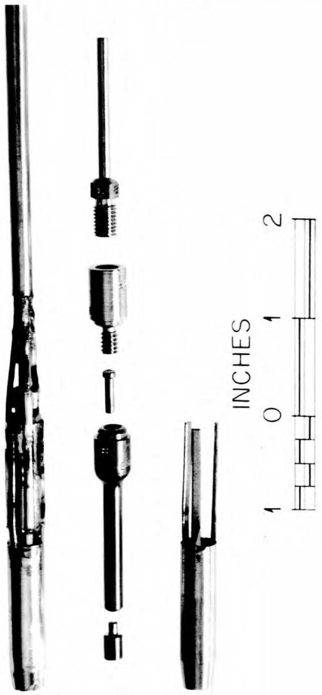  
UNCLASSIFIED PHOTO 15351  
Fig. 1. A Typical Capsule for Irradiation of Molten Fluorides in the MTR.

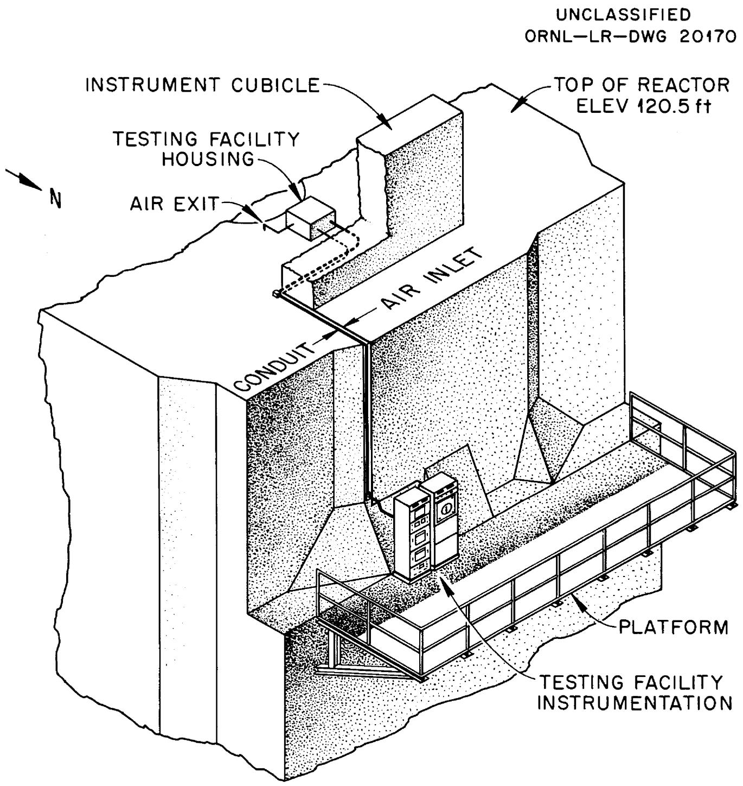  
Fig. 2. Installation of Control Instrumentation for MTR Capsule Program.

UNCLASSIFIED

SSD-C-1097

ORNL-LR-DWG-4407

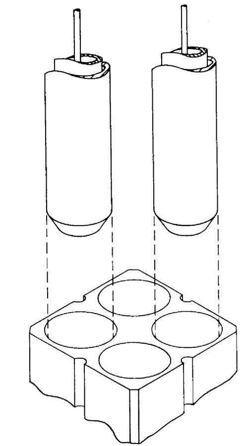  
INSTALLATION OF   
IRRADIATION TUBES IN MTR   
REFLECTOR A PIECE

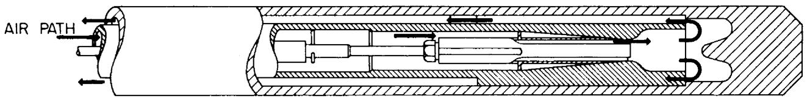  
IRRADIATION TUBE WITH CAPSULE INSTALLED

Fig. 3. Facility for Irradiation of Molten Fluorides in the MTR.   
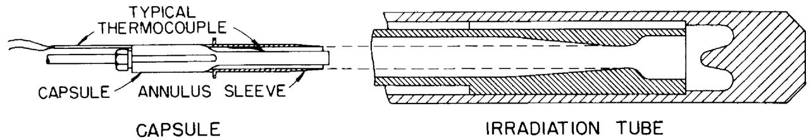  
IRRADIATION TUBE WITH CAPSULE REMOVED

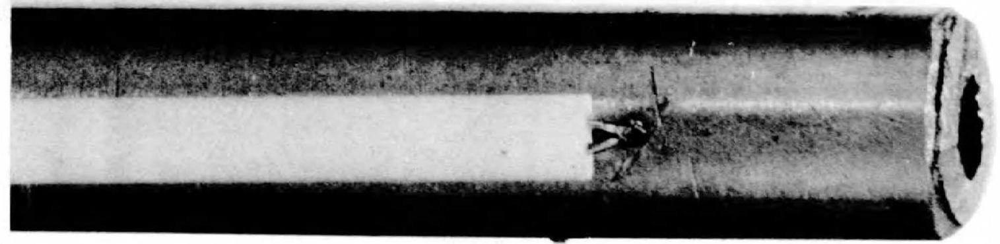

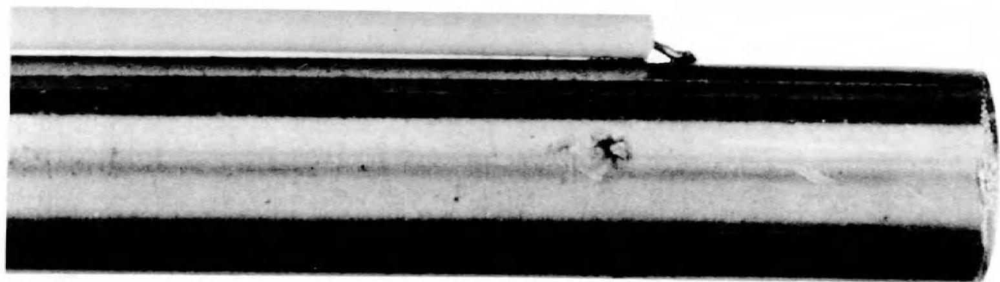

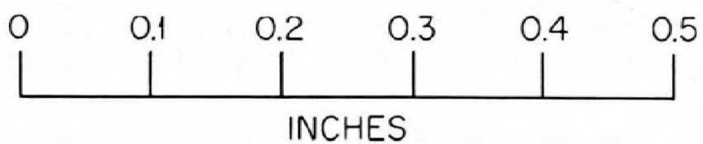  
Fig. 4. Thermocouples for Use in High-Velocity Air Streams.

UNCLASSIFIED

PHOTO 11972

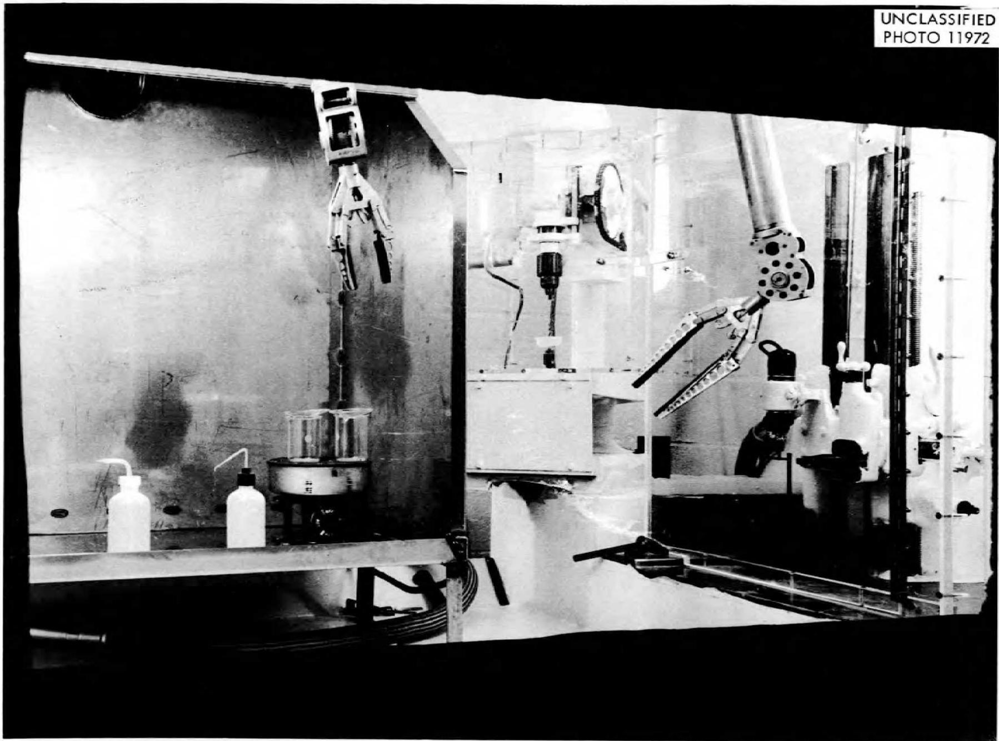

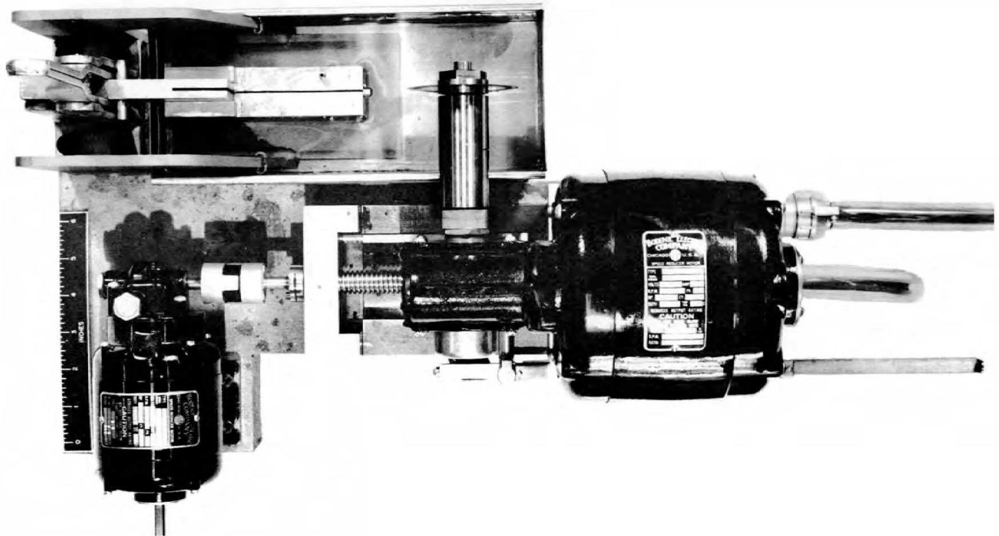  
Fig. 6. Remotely Controlled Slitting Saw.

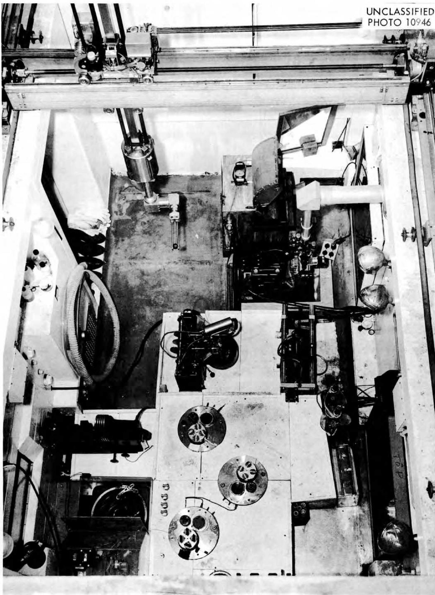  
Fig. 7. Hot Cell Equipped for Preparing Metallographic Specimens.

UNCLASSIFIED

D-17145

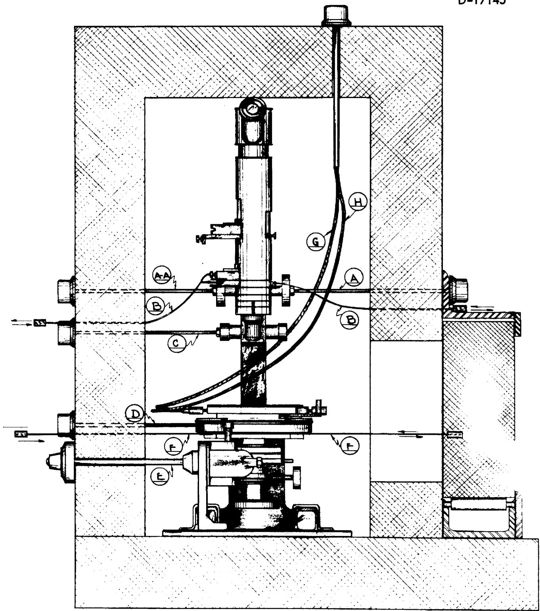  
Fig. 8. Shielded Petrographic Microscope.

FRONT ELEVATION

[LESHIeLcOTAWAR]

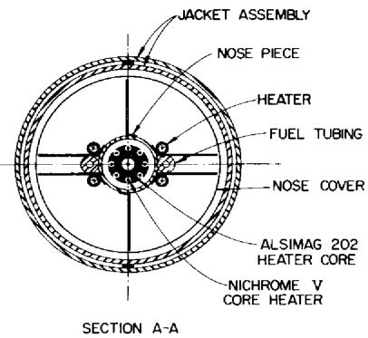

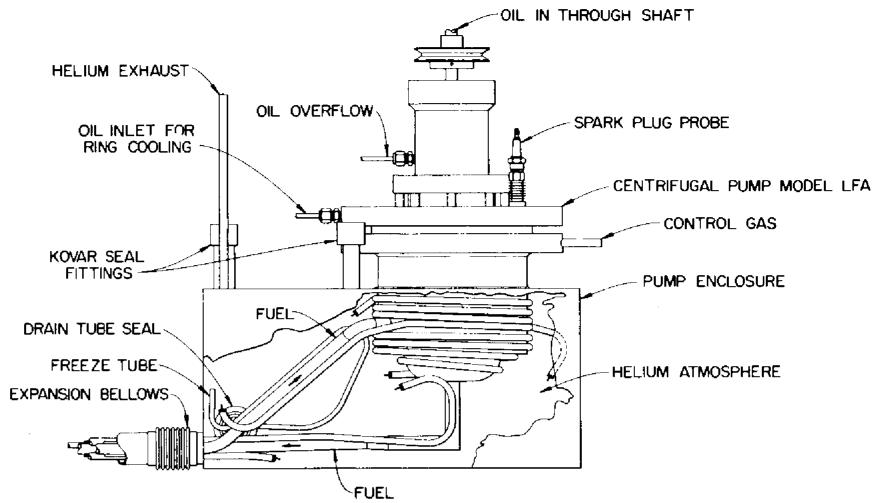  
ornl-lr-dwg 5969

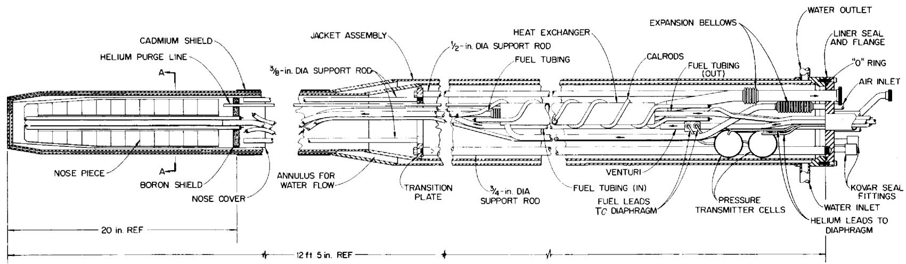  
Fig. 9. LITR Horizontal Forced-Circulation Loop for Dynamic Corrosion Testing of Molten Fluorides.

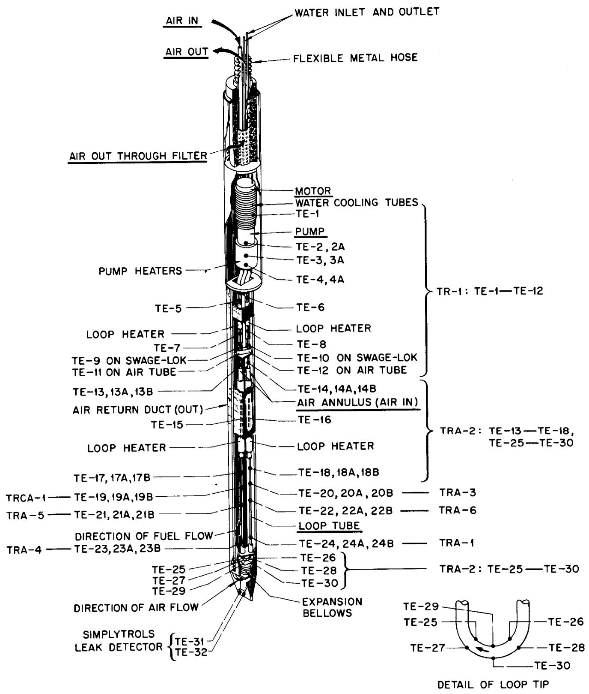  
Fig. 10. LITR Vertical Forced-Circulation Loop for Dynamic Corrosion Testing of Molten Fluorides.

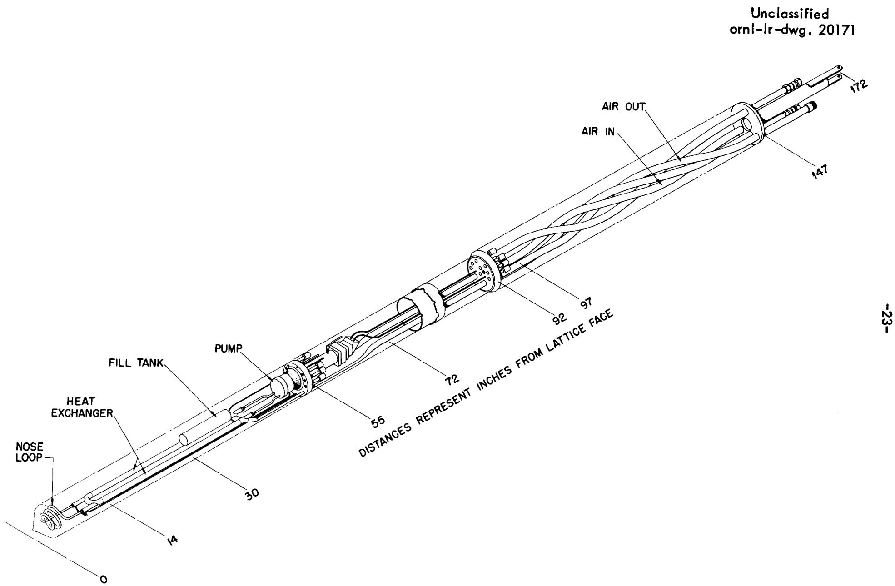  
Fig. 11. MTR Horizontal Forced-Circulation Loop for Dynamic Corrosion Testing of Molten Fluorides.