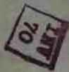
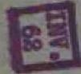
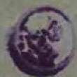
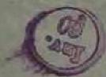
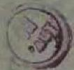
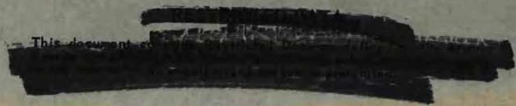
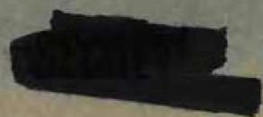

# AEC RESEARCH AND DEVELOPMENT REPORT

ORNL-2374

C-84 - Reactors

.1234

Special Features of Aircraft Reactors

MARTIN MARIETTA ENERGY SYSTEMS LIBRARIES

344560350527？

SOME ASPECTS OF THE BEHAVIOR OF

FISSIONPRODUCTSIN MOLTEN

FLUORIDE REACTOR FUELS

M. T. Robinson

W. A. Brooksbank, Jr.

H. W. Wright

T. H. Handley

CENTRAL RESEARCH LIBRARY

DOCUMENT COLLECTION

LIBRARY LOAN COPY

DO NOT TRANSFER TO ANOTHER PERSON

If you wish someone else to see this

document, send in name with document

and the library will arrange a loan.

5

OAK RIDGE NATIONAL LABORATORY

OPERATED BY

UNION CARBIDE NUCLEAR COMPANY

A Division of Union Carbide and Carbon Corporation

UCC

POST OFFICE BOX X · OAK RIDGE, TENNESSEE

# LEGAL NOTICE

This report was prepared as an account of Government sponsored work. Neither the United States, nor the Commission, nor any person acting on behalf of the Commission!

A. Makes any warranty or representation, express or implied, with respect to the accuracy, completeness, or usefulness of the information contained in this report, or that the use of any information, apparatus, method, or process disclosed in this report may not infringe privately owned rights; or   
B. Assumes any liabilities with respect to the use of, or for damages resulting from the use of any information, apparatus, method, or process disclosed in this report.

As used in the above, "person acting on behalf of the Commission" includes any employee or contractor of the Commission to the extent that such employee or contractor prepares, handles or distributes, or provides access to, any information pursuant to his employment or contract with the Commission.

ERRATA for ORNL-2373

# NOTICE

The Molten Fluoride Reactor Experiment (MFRE) referred to in this report is officially designated as the Aircraft Reactor Experiment (ARE)

Contract No. W-7405-eng-26

SOLID STATE AND ANALYTICAL CHEMISTRY DIVISIONS

SOME ASPECTS OF THE BEHAVIOR OF FISSION PRODUCTS IN MOLTEN FLUORIDE REACTOR FUELS

M. T. Robinson   
W. A. Brooksbank, Jr.   
S. A. Reynolds   
H. W. Wright   
T. H. Handley

DATE ISSUED

AUG 28 1957

OAK RIDGE NATIONAL LABORATORY

Operated by

UNION CARBIDE NUCLEAR COMPANY

A Division of Union Carbide and Carbon Corporation Post Office Box X

Oak Ridge, Tennessee

# INTERNAL DISTRIBUTION

1. R. G. Affel   
2. C. J. Barton   
3. M. Bender   
4. D. S. Billington   
5. F. F. Blankenship   
6. E. P. Blizzard   
7. C. J. Borkowski   
8. W. F. Boudreau   
9. G. E. Boyd   
10. M. A. Bredig   
ll. E. J. Breeding   
12. W. A. Brooksbank, JI   
13. W. E. Browning   
14. F. R. Bruce   
15. A. D. Callihan   
16. D. W. Cardwell   
17. C. E. Center (K-25)   
18. R. A. Charpie   
19. R. L. Clark   
20. C. E. Clifford   
21. J. H. Coobs   
22. W. B. Cottrell   
23. S. J. Cromer   
24. R. S. Crouse   
25. F. L. Culler   
26. D. R. Cuneo   
27. J. H. DeVan   
28. L. M. Doney   
29. D. A. Douglas   
30. E. R. Dytko   
31. W. K. Eister   
32. L. B. Emlet (K-5)   
33. D. E. Ferguson   
34. A. P. Fraas   
35. J. H. Frye, J.   
36. W. T. Furger, n   
37. R. J. Gray   
38. A. T. Gresk   
39. W. R. Grime   
40. A. G. Grinell   
41. E. Guth   
42. T. H. Hanley   
43.C.S.Harfill   
44. E. E. Hoffmann   
45. H. W. Helfman   
46. A. Hollender

47. A. S. Householder   
48. J. T. Howe   
49. W. H. Jordan   
50. G. W. Keilholtz   
51. C. P. Keim   
52. F. L. Keller   
53. M. T. Kelley   
54. F. Kertesz   
55. J. J. Keyes   
56. J. A. Lane   
57. R. B. Lindauer   
58. R. S. Livingston   
59. R. N. Lyon   
60. H. G. MacPherson   
61. R. E. MacPherson   
62. F. C. Maienschein   
63. W. D. Manly   
64. E. R. Mann   
65. L. A. Mann   
66. W. B. McDonald   
67. J. R. McNally   
68. F. R. McQuilkin   
69. R. V. Meghreblian   
70. R. P. Milford   
71. A. J. Miller   
72. R. E. Moore   
73. J. G. Morgan   
74. K. Z. Morgan   
75. J. P. Murray (Y-12)   
76. M. L. Nelson   
77. G. J. Nessle   
78. R. B. Oliver   
79. L. G. Overholser   
30. P. Patriarca   
81. S. K. Penny   
32. A. M. Perry   
33. D. Phillips   
34. J. C. Pigg   
35. S. A. Reynolds   
36. A. E. Richt   
37. M. T. Robinson   
38. H. W. Savage   
39. A. W. Savolainen   
90. R. D. Schultheiss   
91. D. Scott   
92. J. L. Scott

93. E. D. Shipley   
94. A. Simon   
95. O. Sisman   
96. J. Sites   
97. M. J. Skinner   
98. A. H. Snell   
99. C. D. Susano   
100. J. A. Swartout   
101. E. H. Taylor   
102. R. E. Thoma   
103. D. B. Trauger   
104. D. K. Trubey   
105. G. M. Watson

106. A. M. Weinberg   
107. J. C. White   
108. G. D. Whitman   
109. E. P Wigner (consultant)   
110. J. Wilson   
111. C. J. Winters   
112. H.W. Wright   
113. Zobel

114-116 RNL - Y-12 Technical Library, Document Reference Section   
117-12 Laboratory Records Department 1. Laboratory Records, ORNL R.C.   
123.4. Central Research Library

# ETERNAL DISTRIBUTION

125. Aerojet-General Corporation

126-127. AFPR, Boeing, Seattle

128. AFPR, Boeing, Wichita   
129. AFPR, Curtiss-Wright, C. ftton   
130. AFPR, Douglas, Long Bead

131-133. AFPR, Douglas, Santa Monica   
134. AFP, Lockheed, Burbank

135-136. AFPR, Lockheed, Marietta

137. AFPR, North American, Can . Park   
138. AFPR, North American, Doy   
139. Air Materiel Command   
140. Air Research and Development Command (RDGN)   
141. Air Technical Intelligence Center

142-144. ANP Project Office, 34 vair,ort Worth

145. Albuquerque Operation Office   
146. Argonne National Laboratory   
147. Armed Forces Spectacles Weapons Project, Sandia   
148. Armed Forces Special Weapons Project, Washington   
149. Assistant Secretary of the Air Force. R&D

150-155. Atomic Energy Commission, Washington

156. Atomics International   
157. Battelle Memorial Institute

158-159. Bettis Plan (WAPD)

160. Bureau of Robotics   
161. Bureau oferonautics General Representative   
162. BAR, Glel L. Martin, Baltimore   
163. Bureau Yards and Docks   
164. Chicag Operations Office   
165. Chica-Patent Group   
166. Contrary-General Dynamics Corporation   
167. Curss-Wright Corporation   
168. Ernreer Research and Development Laboratories

169-172. General Electric Company (ANPD)

173. General Nuclear Engineering Corporation   
174. Glenn L. Martin Company   
175. Hartford Area Office

176-177. Headquarters, Air Force Special Weapons Center

178. Idaho Operations Office   
179. Knolls Atomic Power Laboratory   
180. Lockland Area Office   
181. Los Alamos Scientific Laboratory,   
182. Marquardt Aircraft Company   
183. National Advisory Committee for Aeronautics, Cleveland   
184. National Advisory Committee for Aeronautics, Washington   
185. Naval Air Development Center   
186. Naval Air Material Center   
187. Naval Air Turbine Test Stat   
188. Naval Research Laboratory   
189. New York Operations Office   
190. Nuclear Development Correlation of America   
191. Office of Naval Research   
192. Office of the Chief of Civil Operations (OP-361)   
193. Patent Branch, Washing   
194. Patterson-Moos

195-198. Pratt and Whitney Aircraft Division

199. San Francisco Operations Office   
200. Sandia Corporation   
201. School of Aviation Medicine   
202. Sylvania-Corning Nuclear Corporation   
203. Technical Research Group   
204. USAF Headquarters   
205. USAF Project Rand   
206. U. S. Naval Radiological Defense Laboratory   
207. University of California Radiation Laboratory, Livermore

208-225. Wright Air Development Center (EOSI-3)

226-250. Technical Information Service Extension, Oak Ridge   
251. Division of Research and Development, AEC, ORO

# ABSTRACT

Observations are reported on the behavior of several fission product elements in fused NaF-ZrF $_4$ -UF $_4$ fuels, irradiated in capsule experiments, forced-convection in-pile loop experiments, and in the Molten Fluoride Reactor Experiment (MFRE). The rare gases have been observed to escape readily from the fuels in dynamic tests, although in static tests the rate of escape is very low. Ruthenium and niobium deposit on the Inconel walls of the fuel container, probably as metals. Other fission products studied (Sr, Zr, La, Ce) appear to remain in the fuel. The unsatisfactory nature of Cs $^{137}$ as a fission monitor in such fuels is reported and the use of Zr $^{95}$ as a substitute is discussed. The hypothesis is proposed that fission product deposition may serve to reduce corrosion of metals by molten fluoride fuels.

The chemical behavior of the fission product elements is of great importance in any fluid-fueled nuclear reactor, as well as in the re- processing of nuclear fuels of any sort. Observations are reported here on the behavior of several important elements in fused fluoride fuels (1) of the type employed in the Molten Fluoride Reactor Experiment (MFRE)(2). Most of the fuels examined have been of the NaF-ZrF $_4$ -UF $_4$ type, with various compositions. The samples examined were taken from three different types of experiments:

1. Static fluoride irradiations: Observations are reported on samples of fuel from two in-pile static corrosion tests (2). Two experiments are also reported on the removal of $\mathrm{Xe}^{135}$ from static fluorides.   
2. Dynamic fluoride irradiations: Observations are reported on fuel samples from two in-pile forced-convection loop tests and on metal samples from one of these (4, 5).   
3. The MFRE: Observations are reported on a fuel sample and on a metal sample from the MFRE (6).

# Behavior of the Rare Cases

The fission monitoring technique based on Cs $^{137}$ , developed at the Aronne National Laboratory (Z), was applied to two samples of NaF-ZrF $_4$ -U $^{235}$ UF $_4$ (50-46-4 mole %, respectively) which had been irradiated in the MTR for 116 hrs and 325 hrs, respectively, at about $800^{\circ}\mathrm{C}$ , at a thermal neutron flux of $(2.36 \pm 0.16)$ x 10 $^{14}$ neutrons cm $^{2}$ sec $^{-1}$ . The results are shown in Table I. It will be observed that although agreement between the measured and calculated numbers of fissions occurring in the sample is good in the shorter irradianations, in the longer one it is very poor.

A portion of the capsule which was exposed to vapors from the molten salt was dissolved in each case and a $\text{Cs}^{137}$ determination was performed on the resulting solution. The results (last column of Table I) show appreciable amounts of $\text{Cs}^{137}$ to have been present on these surfaces. These results are taken as evidence of the escape from the fuel of 3.9 minute $\text{Xe}^{137}$ , the parent of the cesium isotope.

An attempt was made to study directly the evolution of Xe135 from irradiated fluorides. Two runs were made under identical conditions, except that in one case the fuel was sparged by bubbling He through it, while in the other case, the carrier gas merely swept over the surface of the melt. The helium, purified by passage over hot copper turnings and magnesium perchlorate, was conducted to and from the capsule through 0.036 in. o.d. stainless steel capillary tubing. The off-gas was passed through two Dry Ice acetone-cooled traps, the second filled with activated charcoal to hold the xenon. A helium gas flow rate of 15 ml/min was used in each experiment. The fuel sample in each case was 1 gm of NaF-KF-UF4 (46.5-26.0-27.5 mole %,melting point 530°C), containing normal uranium. It was irradiated in the ORNL Graphite Reactor at 650 to 750°C, at a thermal neutron flux of 7 x 1011 neutrons cm-2 sec-1, for 31 minutes. After waiting 4.5 hours for short-lived activities to decay, helium flow was started and continued for 6.5 hours. The capsules remained in the reactor during this period. The thermal neutron dose was monitored with a clip of Al-Mn-Co alloy, removed and counted immediately after the irradiation was completed. The amount of Xe135 was determined

# Table I

Cs137 Analyses in MTR-Irradiated Static Fluorides

Flux = (2.36 ± 0.16) x 10 $^{14}$ neutrons cm $^{-2}$ sec $^{-1}$ Temp. = 800°C

<table><tr><td rowspan="2">Time of 
Irradiation (hrs)</td><td colspan="2">Cs137(fissions/gm x 10-18)</td><td rowspan="2">Cs137 recovered from 
Capsule tops 
(fissions/gm x 10-18)</td></tr><tr><td>Observed(a)</td><td>Calculated(b)</td></tr><tr><td>116</td><td>0.085 ± 0.005</td><td>0.11 ± 0.01</td><td>0.001</td></tr><tr><td>325</td><td>0.091 ± 0.010</td><td>0.28 ± 0.03</td><td>0.013</td></tr></table>

(a) Based on ANL calibration of $\mathbf{C}\mathbf{s}^{137}$ flux monitoring method (7).   
(b) Based on flux determined by Co activation; corrected for flux depression.

by transferring the contents of the charcoal trap to an appropriate vessel and counting in a $4 - \pi$ geometry high-pressure ionization chamber. The results are shown in Table II in terms of the response of the instrument used. No absolute calibration was made. It may be said, however, that the amount of $\mathrm{Xe}^{135}$ recovered in the sparging experiment was approximately that expected from the fission history of the sample. It is clear from the results of Table II that the rare cases do not diffuse extremely readily from static fused fluorides under the conditions of these experiments. Their removal is easily accomplished, however, by efficient sparging of the fuel with helium.

As one part of the operation of the MFRE (6), a so-called xenon experiment was performed. The control rods were calibrated during the period when the reactor was being brought to criticality by measured additions of $\mathrm{Na}_2\mathrm{UF}_6$ to the originally uranium-free salt. In the "xenon experiment", the rod position was recorded as a function of time during a 20-hour run at a nominal power of 1.5 megawatts. The rod position data were converted to $\Delta \mathrm{k} / \mathrm{k}$ values using the previously established calibration. When these results were corrected for $\mathrm{Sm}^{149}$ poisoning and for the decrease in reactivity due to $\mathrm{U}^{235}$ burnup, it was apparent that virtually all of the $\mathrm{Xe}^{135}$ had been removed from the fuel. While no certain quantitative interpretation can be given of the poisoning remaining after correction for $\mathrm{Sm}^{149}$ and burn-up effects, it appeared that no more than about $2\%$ of the expected $\mathrm{Xe}^{135}$ remained in the reactor fuel during the period in question.

During operation of the MFRE, an accidental leak of gases occurred from the reactor into the pit in which it was installed (6). This gas was dispersed by drawing it into an emergency off-gas line

# Table II

Evolution of Xe135 from Irradiated Static Fluorides

Flux = 7 x 10 $^{11}$ neutrons cm $^{-2}$ sec $^{-1}$ Temp = 650 to 750°C

<table><tr><td rowspan="2"></td><td rowspan="2">Thermal Neutron Dose(b)</td><td colspan="2">Amount of Xe135 (b)</td></tr><tr><td>Observed</td><td>Calculated (a)</td></tr><tr><td>Fuel sparged with He</td><td>0.117</td><td>1.44</td><td>- - -</td></tr><tr><td>Fuel surface swept with He</td><td>0.097</td><td>0.032</td><td>1.22</td></tr></table>

(a) Based on results obtained in sparging experiment; corrected for slight difference in uranium content of the two capsules.   
(b) Arbitrary units

inserted into the pit. A sample of the off- gas from this line, adsorbed on cooled charcoal, was examined by Bell, et al. (8), primarily by gamma-ray scintillation spectrometry. They established the presence of Rb88 (daughter of 2.8 hr. Kr88, Xe135, and Cs138 (daughter of 17 min. Xe138), but were unable to identify many of the observed peaks in the gamma-ray spectrum.

Determination of the amounts of $\mathbf{C}\mathbf{s}^{137}$ in the fuel of the MFRE and of one of the in-pile loops indicated the escape of less than about $20\%$ of the $\mathbf{X}\mathbf{e}^{137}$ from these systems.

The data obtained on both static and dynamic systems demonstrates that the rare cases are evolved readily from fused fluorides, although in static systems, the rate of evolution is very low. The fraction of any rare gas isotope which will be removed from a fluid fuel may be estimated using a theory developed for Xe135 poisoning kinetics (2).

This fraction depends on the geometry and flow conditions of the specific reactor, as well as on the radioactive half-life of the nuclide in question. Longer-lived nuclides will be removed to a greater extent than shorter-lived ones, very crudely in proportion to their half-lives. More detailed discussion of the matter is deferred here, since it is treated in another place (9).

# Behavior of Ruthenium and Niobium

Samples of fluoride fuel removed from two in-pile forced-convection loops and a sample from the MRE were examined for the presence of Ru103 by radiochemical techniques. The results are shown in Table III. The very marked reduction below the expected levels of the Ru103 content of the fuel, especially in the LITR loop and in the FSRE, indicated the existence of an

Table III   
Ru103 Analyses of Irradiated Fluoride Fuel from Dynamic Experiments   

<table><tr><td></td><td>LITR
Loop</td><td>MFRE</td><td>MTR
Loop</td></tr><tr><td>Fuel Composition
(mole% NaF-ZrF4-U235F4)</td><td>62.5-12.5-25.0</td><td>53.5-40.0-6.5</td><td>53.5-40.0-6.5</td></tr><tr><td>Fissions/cm3 of fuel(a) x 10-16</td><td>12.9</td><td>8.7</td><td>655</td></tr><tr><td>Calculated Ru103concn. in fuel
(atoms/cm3 x 10-15)</td><td>3.9</td><td>2.5</td><td>190</td></tr><tr><td>Observed Ru103concn. in fuel
(atoms/cm3 x 10-15)</td><td>0.001</td><td>0.00003</td><td>104</td></tr><tr><td>Ratio, surface/volume (cm-1)</td><td>3.5</td><td>1</td><td>5</td></tr><tr><td>Average Ru103surface
concn. (atoms x 10-15)</td><td>1.1</td><td>2.5</td><td>17</td></tr></table>

(a) Estimated from heat generation for LITR loop and MFRE; estimated from $\mathbf{Zr}^{95}$ analyses for MTR loop.

an efficient means of ruthenium removal from molten fluorides. It was possible to obtain salt-free sections of Inconel pipe from the LITR loop (4) and from the reactor. These sections were selected from parts of each system which were not exposed to high thermal neutron fluxes, thus avoiding activation of the cobalt content of the Inconel.

One pipe section was selected from a region of the LITR loop upstream from the high-flux region, another from a region an equal distance downstream. Gamma-ray spectrometry of these samples showed the presence of Ru $^{103}$ activity and of Zr $^{95}$ -Nb $^{95}$ activity. The latter activity occurred to the same extent in each section, but the Ru $^{103}$ activity in the downstream section was $40\%$ greater than that in the upstream section. After a delay of 53 days, the two sections were re-examined. The Ru $^{103}$ in both samples decayed with an apparent half-life of about 42 days, in good agreement with published data (10). The Zr $^{95}$ -Nb $^{95}$ activity, however, decayed with an apparent half-life of 40 to 43 days. This indicates that the active deposit must have contained $\sim 95\%$ Nb $^{95}$ (35 days) and only $\sim 5\%$ Zr $^{95}$ (65 days) at the time of reactor shutdown. The relative amount of Nb $^{95}$ expected if no segregation of the element occurred is about $5\%$ of the total activity.

The pipe section from the MFRE was a ring cut out of the fuel inlet line to the reactor core. Three samples cut from this ring showed the presence of Ru103, Ru106, and Zr95-Nb95. Two of the samples were reexamined after a delay of 130 days. The apparent half-life of the Zr95-Nb95 activity was 50 days in each case, again suggesting that the deposit was very largely Nb95, An autoradiograph of the third pipe

sample showed the radioactive deposit to be well localized at the fuel-metal interface, within the rather poor resolution obtainable with beta radiation.

A pipe elbow, which served as the inlet end of the MFRE emergency off-gas line, was examined for radioactivity. A very small amount of Ru103 was detected, which was shown by chemical treatment to be entirely on the outside of the pipe. It appears likely that a small amount of RuF5 or of RuO4 (from reaction with air that may have been introduced into the reactor when the leak occurred) volatilized from the fuel. In view of the large amount of ruthenium found on fuel container surfaces, it is felt that volatilization of this element is of very little importance in its removal from the fuel. This view is supported by experience to date with the fluoride volatility process (11) for recovering uranium from spent fuel.

It is evident from the results reported above that ruthenium is rapidly and efficiently removed from fused fluoride fuels by Inconel container surfaces. However, the data obtained for the MTR loop experiment : indicate that saturation of the walls with ruthenium was approached in that case. If this interpretation of the data is indeed correct, it seems reasonable to suggest that deposition of fission product metals may well interfere with the course of the ordinary corrosion process, (1, 12) and that long-term in-pile corrosion of metals by fluoride fuels may be significantly less than predicted from comparable out-of-pile tests. Short-term in-pile corrosion tests to date are not in disagreement with this hypothesis (13).

Niobium appears to deposit on Inconel alone with ruthenium. It appears likely that molybdenum also deposits, but there has not yet been an opportunity to examine samples soon enough after irradiation to observe 67 hr. Mo99, the

longest-lived radioactive isotope of this element which is known in fission. It is also possible that zirconium may deposit from fuels not containing $\mathrm{ZrF}_4$ , but no experiments have yet been conducted on such materials.

Behavior of Other Fission Products

Samples of fuel drawn from the MFRE dump tank were examined by radio-chemical methods. In order to estimate the efficiency of retention of some typical fission products, these analyses were compared with similar results obtained on a sample of $\mathrm{NaF - ZrF_4 - UF_4}$ (50-46-4 mole %) irradiated in the solid state in the ORNL Graphite Reactor. The irradiation time was matched approximately to the high -power operating time of the MFRE. The comparative analyses of the MFRE fuel and the standard are shown in Table IV. It is clear that, with the exception of $\mathbf{Ru}^{103}$ , there is no gross loss of the fission product nuclides listed. The ratio obtained for $\mathbf{Sr}^{89}$ could be interpreted to show partial loss of its parent, 2.6 min. $\mathbf{Kr}^{89}$ , but no explanation can be offered for the value obtained for $\mathbf{Zr}^{95}$ . It is likely that no loss occurred of any of these fission product elements from the fuel of the MFRE, and that the variation from 0.3 to 1.6 is a reflection of experimental errors, such as inhomogeneous samples, chemical difficulties in the complex fluoride system, etc. A determination was also made of the ratios of activities of $\mathbf{Cs}^{136}$ and $\mathbf{Cs}^{137}$ in the two samples. The result indicated the loss of less than $20\%$ of the $\mathbf{Xe}^{137}$ parent of the latter nuclide.

Analysis of the cross gamma-ray spectrum of a 7 mg. sample of fuel from the MFRE was continued through the period from 31 to 81 days after shutdown of the reactor. The total activity of the sample was determined in a high-pressure ionization chamber. These results were combined with gamma-ray spectral data to yield both total photon emission rates and differential

decay data. The only activities detected were Ba140-La140, Ce141, and Zr95-Nb95. Neither Ru103 nor I131 were observed. The specific gamma activity of the sample was estimated as 16 mc/μm 31 days after reactor shutdown and 3.5 mc/μm 79 days after shutdown. The average gamma-ray energies were 0.96 and 0.73 Msv, respectively.

Bell and his coworkers (8) were unable to establish the presence of iodine and bromine in the sample of MFRE off-gas which they examined. Since 3 day 131 could not be detected in the analysis of the gross gamma-ray spectrum of the MFRE fuel, the question of the fate of the halogen elements in molten fluoride fuels must be left open. Use of $\mathbf{Zr}^{95}$ as a Fission Monitor

Uncertainties as to the applicability of $\mathbf{C}\mathbf{s}^{137}$ as a fission monitor in fluid reactor fuels, led to the adoption of $\mathbf{Z}\mathbf{r}^{95}$ as a substitute, at least for fuels containing macroscopic amounts of normal zirconium. In order to calibrate the use of this nuclide, two samples of enriched uranium were irradiated as solutions for 2.375 days in the ORNL Graphite Reactor. One solution was prepared from $\mathbf{U}_{308}$ , the other from a typical $\mathbf{NaF} = \mathbf{ZrF}_4\sim \mathbf{UF}_4$ fuel. After 10 days decay, radiochemical determinations were made of $\mathbf{C}\mathbf{s}^{137}$ and $\mathbf{Z}\mathbf{r}^{95}$ . Comparison of these results, using the ANL $\mathbf{C}\mathbf{s}^{137}$ standards, (7b), save a fission yield for $\mathbf{Z}\mathbf{r}^{95}$ of $0.0664 \pm 0.0013$ atom/fission. Using the inter-rated neutron dose, measured with a cobalt monitor, the yield is $0.0632 \pm 0.0021$ atom/fission. The discrepancy between the two results is removed when the cobalt activation flux is corrected for the cadmium ratio prevailing in the irradiation facility ( $\sim 30$ ). The yield recommended for use in fission monitoring with $\mathbf{Z}\mathbf{r}^{95}$ is $0.0664 \pm 0.0013$ atoms/fission.

# Table IV

Fission Product Analyses in MFRE Fuel, Compared to a Standard Sample

<table><tr><td>Nuclide</td><td>Activity Ratio, MFRE/Standard</td></tr><tr><td>Sr89</td><td>0.6</td></tr><tr><td>Zr95</td><td>0.3</td></tr><tr><td>Ru103</td><td>1.6 x 10-5</td></tr><tr><td>La140</td><td>1.5</td></tr><tr><td>Ce141</td><td>1.6</td></tr><tr><td>Mean (Omitting Ru103)</td><td>1.0 ± 0.5</td></tr></table>

# Conclusion

While most fission product elements remain in solution in molten fluoride fuels, two important classes of elements have a strong tendency to escape the rare gases by volatilization and the noble metals, Ru and Nb, by deposition on the walls of the container. Experiments are currently in progress, which will reveal the behavior of other elements, particularly the halogens, Mo, and Zr, the latter in fuels not containing $\mathrm{ZrF}_4$ as a constituent. Additional information is required concerning the extent to which metallic deposition can occur on various metals and the degree of protection which the deposited coating affords against corrosion of the container by the fuel. It must be emphasized that in choosing suitable fission monitors for use in fluid fuels, close attention must be given to the chemistry of the fission product elements. While Cs $^{137}$ is very satisfactory for this application in solid fuel elements, the escape of its parent, Xe $^{137}$ , makes it unreliable in fluid fuels. Similarly, Zr $^{95}$ may be unsuitable in fused fluorides which do not contain $\mathrm{ZrF}_4$ as a major constituent.

# Acknowledgements

The data reported here could not have been obtained without the assistance of a great many members of the staff of the Oak Ridge National Laboratory. C. C. Webster, W. G. Piper, and R. H. Shields obtained many of the samples. J. H. Oliver assisted in many of the experiments. E. I. Wyatt's group in the Analytical Chemistry Division performed many of the radiochemical analyses. We wish to thank these people for their assistance in the work reported.

# References

1. W. R. Crimes, et al., American Nuclear Society Meeting, Pittsburg, Pa., June 10-14, 1957.   
2. E. S. Bottis, et al., ibid.   
3. J. G. Morgan, H. E. Robertson, A. E. Richt, and P. R. Klein, unpublished.   
4. O. Sisman, W. W. Parkinson, and W. E. Brundage, ORNL-1965, Jan. 15, 1957 (Secret).   
5. D. B. Trauger, et al. unpublished.   
6. W. B. Cottrell, et al., American Nuclear Society Meeting, Pittsburgh, Pa., June 10-14, 1957.   
7. (a) W. A. Brooksbank, Jr., ORNL-1547, p. 7, June 24, 1953; (b) D. Fredrickson, et al., ANL-4922 (1952).   
8. P. R. Bell, R. C. Davis, W. K. Ergen, G. G. Kelley, and N. H. Lazar, unpublished data.   
9. M. T. Robinson, American Nuclear Society Meeting, Pittsburgh, Pa., June 10-14, 1957.   
10. E. G., J. O. Blomeke, Nuclear Properties of U²³⁵ Fission Products, ORNL-1783, October 21, 1955.   
11. G. I. Cathers, American Nuclear Society Meeting, Washington, D. C., December 10-12, 1956.   
12. W. D. Manly, et al., American Nuclear Society Meeting, Pittsburgh, Pa., June 10-14, 1957.   
13. G. W. Keilholtz, W. E. Browning, and J. G. Morgan, ibid.