# AEC RESEARCH AND DEVELOPMENT REPORT

ORNL-2376

C-84 - Reactors-Special

Features of Aircraft Reactors

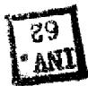

ART FUEL PUMP AND XENON REMOVAL

SYSTEM DEVELOPMENT, TEST EVALUATION,

AND AIRCRAFT APPLICATION

G. Samuels

M. E. Lackey

DECLASSIFIED

CLASSIFICATION CHANGED TO:

${AEC} =  - 5 - 6 - 3$

By:

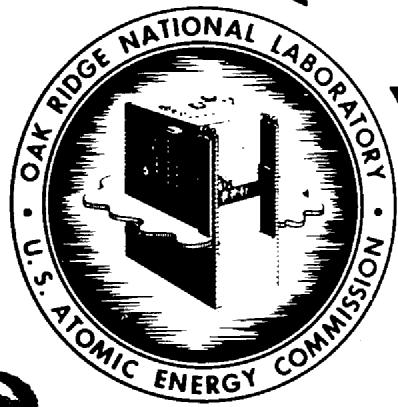

CENTRAL RESEARCH LIBRARY

DOCUMENT COLLECTION

LIBRARY LOAN COPY

DO NOT TRANSFER TO ANOTHER PERSON

If you wish someone else to see this document, send in name with document and the library will arrange a loan.

OAK RIDGE NATIONAL LABORATORY

OPERATED BY

UNION CARBIDE NUCLEAR COMPANY

Division of Union Carbide Corporation

POST OFFICE BOX X · OAK RIDGE, TENNESSEE

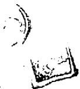

蛋白质 — 抗原 — 抗体杂交

# LEGAL NOTICE

This report was prepared as an account of Government sponsored work. Neither the United States, nor the Commission, nor any person acting on behalf of the Commission:

A. Makes any warranty or representation, express or implied, with respect to the accuracy, completeness, or usefulness of the information contained in this report, or that the use of any information, apparatus, method, or process disclosed in this report may not infringe privately owned rights; or   
B. Assumes any liabilities with respect to the use of, or for damages resulting from the use of any information, apparatus, method, or process disclosed in this report.

As used in the above, "person acting on behalf of the Commission" includes any employee or contractor of the Commission to the extent that such employee or contractor prepares, handles or distributes, or provides access to, any information pursuant to his employment or contract with the Commission.

ORNL-2376

C-84, AIRCRAFT REACTORS

This document consists of 186 pages.

Copy 26of 205 copies. Series A.

Contract No. W-7405-eng-26

Aircraft Reactor Engineering Division

ART FUEL PUMP AND XENON REMOVAL SYSTEM DEVELOPMENT, TEST EVALUATION, AND AIRCRAFT APPLICATION

G:Samuels

M. E. Lackey

DATE ISSUED

DEC 10 1957

OAK RIDGE NATIONAL LABORATORY

Operated by

UNION CARBIDE NUCLEAR COMPANY

A Division of Union Carbide and Carbon Corporation

Post Office Box X

Oak Ridge, Tennessee

# INTERNAL DISTRIBUTION

1. S. E. Beall   
2. H. W. Bertini   
3. D. S. Billington   
4. F. F. Blankenship   
5. E. P. Blizzard   
6. A. L. Boch   
7. C. J. Borkowski   
8. G. E. Boyd   
9. E. J. Breeding   
10. R. B. Briggs   
11. D. W. Cardwell   
12. C. E. Center (K-25)   
13. R. A. Charpie   
14. W. G. Cobb   
15. B. Y. Cotton   
16. W. B. Cottrell   
17. F. L. Culler   
18. C. W. Cunningham   
19. L. B. Emlet (K-25)   
20. A. P. Fraas   
21. J. H. Frye, Jr.   
22. D. E. Ferguson   
23. W. T. Furgerson   
24. B. L. Greenstreet   
25. W. R. Grimes   
26. A. G. Grindell   
27. E. Guth   
28. C. S. Harrill   
29. A. S. Householder   
30. H. W. Hoffman   
31. A. Hollander   
32. G. W. Keilholtz   
33. W. H. Jordan   
34. M. T. Kelley

35. M. E. Lackey   
36. J. A. Lane   
37. R. S. Livingston   
38. W. D. Manly   
39. E. R. Mann   
40. L. A. Mann   
41. H. G. MacPherson   
42. R. V. Megrehblian   
43. K. Z. Morgan   
44. J. P. Murray (Y-12)   
45. M. L. Nelson   
46. A. M. Perry   
47. J. R. McNally   
48. M. T. Robinson   
49. G. Samuels   
50. H. W. Savage   
51. A. W. Savolainen   
52. R. D. Schultheiss   
53. E. D. Shipley   
54. M. J. Skinner   
55. A. H. Snell   
56. J. A. Swartout   
57. E. H. Taylor   
58. D. B. Trauger   
59. A. M. Weinberg   
60. G. D. Whitman   
61. E. P. Wigner (consultant)   
62. C. E. Winters   
64. ORNL - Y-12 Technical Library, Document Reference Section   
65-74. Laboratory Records Department   
75. Laboratory Records, ORNL R.C.   
76-77. Central Research Library

# EXTERNAL DISTRIBUTION

78-80. Air Force Ballistic Missile Division   
81-82. AFPR, Boeing, Seattle   
83. AFPR, Boeing, Wichita   
84. AFPR, Curtiss-Wright, Clifton   
85. AFPR, Douglas, Long Beach

86-88. AFPR, Douglas, Santa Monica   
89. AFPR, Lockheed, Burbank   
90-91. AFPR, Lockheed, Marietta   
92. AFPR, North American, Canoga Park   
93. AFPR, North American, Downey   
94. Air Force Special Weapons Center   
95. Air Research and Development Command (RDGN)   
96. Air Research and Development Command (RDTAPS)

97-110. Air Research and Development Command (RDZPSP)

111. Air Technical Intelligence Center   
112. Air University Library

113-115. ANP Project Office, Convair, Fort Worth

116. Argonne National Laboratory   
117. Armed Forces Special Weapons Project, Sandia   
118. Armed Forces Special Weapons Project, Washington   
119. Assistant Secretary of the Air Force, R&D

120-125. Atomic Energy Commission, Washington

126. Bettis Plant (WAPD)   
127. Bureau of Aeronautics   
128. Bureau of Aeronautics General Representative   
129. BAR, Aerojet-General, Azusa   
130. BAR, Convair, San Diego   
131. BAR, Glenn L. Martin, Baltimore   
132. BAR, Goodyear Aircraft, Akron   
133. BAR, Grumman Aircraft, Bethpage   
134. Bureau of Ships   
135. Bureau of Yards and Docks   
136. Chicago Operations Office   
137. Chicago Patent Group   
138. Curtiss-Wright Corporation

139-142. General Electric Company (ANPD)

143. Hartford Area Office   
144. Idaho Operations Office   
145. Knolls Atomic Power Laboratory   
146. Lockland Area Office   
147. Los Alamos Scientific Laboratory   
148. Marquardt Aircraft Company   
149. National Advisory Committee for Aeronautics, Cleveland   
150. National Advisory Committee for Aeronautics, Washington   
151. Naval Air Development Center   
152. Naval Air Material Center   
153. Naval Air Turbine Test Station   
154. Naval Research Laboratory   
155. Nuclear Development Corporation of America   
156. Office of Naval Research   
157. Office of the Chief of Naval Operations (OP-361)   
158. Patent Branch, Washington

159-162. Pratt and Whitney Aircraft Division

163. San Francisco Operations Office

164. Sandia Corporation   
165. Sandia Corporation, Livermore   
166. School of Aviation Medicine   
167.USAF:Headquarters   
168. USAF Project RAND   
169. U. S. Naval Radiological Defense Laboratory

170-171. University of California Radiation Laboratory, Livermore   
172-189. Wright Air Development Center (WCOSI-3)   
190-204. Technical Information Service Extension, Oak Ridge   
205. Division of Research and Development, AEC, ORO

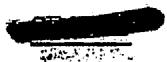

-v-

# CONTENTS

# Abstract 1

# Section I

# DESIGN CRITERIA. 5

Precepts and Requirements 5

Illustrations and Nomenclature. 6

Circuit Description 13

Primary Fuel Circuit 13

Bypass Fuel Circuit. 13

Dynamic Seals. 16

# Section II

# DESIGN AND DEVELOPMENT OF ART FUEL PUMP AND XENON REMOVAL SYSTEM . . 19

Xenon Removal System Design 19   
Xenon Removal System Flow. 21   
Xenon Removal System Gas Removal 22

ART Fuel Pump Development 24

Combined ART Fuel Pump and Xenon Removal System Development . . . 45

System Pressure Fluctuations 45   
System Pressure Level. 47   
Bypass Flow Determination and Control. 49   
Fuel Leakage Past Upper Slinger Seal 51   
Experiment Results of Combined System Tests. 54   
ART Fuel Pump Cavitation Characteristics 66

# Section III

# DESIGN OF AN ATTITUDE-STABLE XENON REMOVAL SYSTEM. 75

Circuit Description 75

System Pressure Control. 75   
Primary Swirl. 80   
Secondary Swirl. 80   
Dynamic Seals. 83

Development Tests 83

System Analysis 912

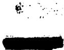

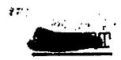

-vi-

Contents (cont'd.)

# Appendix A

SUMMARY OF WORK LEADING TO THE DESIGN OF PUMPS FOR THE CFRE 105

# Appendix B

CENTRIFUGE THEORY AND CALCULATIONS 115

# Appendix C

DYNAMIC SEALS 123

# Appendix D

CALCULATIONS FOR THE ART FUEL PUMP IMPELLER REDESIGN 1133

# Appendix E

BYPASS FLOW CALCULATION AND EXPANSION TANK HEATING 1145

# Appendix F

RADIOACTIVITY IN THE ART FUEL PUMP OIL SYSTEM 2155

# Appendix G

Xe135 POISONING 2165

ACKNOWLEDGEMENTS 2173

REFERENCES 174

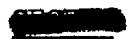

# LIST OF ILLUSTRATIONS

# Figure No. Title Page

1.1 Vertical Section Through Reactor Assembly 10   
1.2 . . . . ART Fuel Pump with Model 32 Impeller 11   
1.3 Schematic ART Fuel Circuit 12   
1.4 . . . . ART Primary Fuel Circuit 14   
1.5 . . . . ART Bypass Fuel Circuit 15   
2.1 Full Scale Plastic Model of the Xenon Removal System 20   
2.2 . . . Brass ART Fuel Pump Impeller 25   
2.3 ART Fuel Pump Performance Characteristics Experiment No. 1 - Table 2.1 32   
2.4 . . . . ART Fuel Pump Performance Characteristics Experiment No. 2 - Table 2.1 33   
2.5 . . . . ART Fuel Pump Performance Characteristics Experiment No. 3 - Table 2.1 . . . . . . . . . . 34   
2.6 . . . . . ART Fuel Pump Performance Characteristics Experiment No. 4 - Table 2.1 . . . . . . . . . . . . 35   
2.7 . . . . ART Fuel Pump Performance Characteristics Experiment Nos. 3, 5, and 6 - Table 2.1 36   
2.8 . . . . ART Fuel Pump Performance Characteristics Experiment No. 7 - Table 2.1 . . . . . . . . . . 37   
2.9 . . . . ART Fuel Pump Performance Characteristics Experiment No. 11 - Table 2.1 38   
2.10 . . . . ART Fuel Pump Performance Characteristics Experiment No. 12 - Table 2.1 39   
2.11 . . . . ART Fuel Pump Performance Characteristics Experiment No. 13 - Table 2.1 40   
2.12 . . . . ART Fuel Pump Performance Characteristics Experiment No. 14 - Table 2.1 41   
2.13 . . . . ART Fuel Pump Performance Characteristics Experiment No. 15 - Table 2.1   
2.14 . . . . . Corrections Applied to the ART Fuel Pump Total Discharge Pressure for Obtaining the Centrifuge Static Discharge Pressure 43

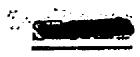

-vii-

Figure No.

Title

Page

2.15 . . . . . . ART Fuel Pump Volute Performance Characteristics .. 44   
2.16 . . . Combined Xenon Removal and Fuel Pump Hot Test Loop . 46   
2.17 . . . . ART Fuel Pump Bypass Flow Characteristics with Model 32 Impeller at a 3-1/2 in. Depth of Liquid (Water) in the Expansion Tank 50   
2.18 . . . Upper Slinger Seal with Radial Vanes 55   
2.19 . . . Upper Slinger Seal with an Axial Step 55   
2.20 . . . . ART Fuel Pump Performance Characteristics with Model 32 Impeller at a 1/2 in. Depth of Liquid (Water) in the Expansion Tank 57   
2.21 . . . . ART Fuel Pump Performance Characteristics with Model 32 Impeller at a 1 in. Depth of Liquid (Water) in the Expansion Tank 58   
2.22 . . . . ART Fuel Pump Performance Characteristics with Model 32 Impeller at a 2 in. Depth of Liquid (Water) in the Expansion Tank 59   
2.23 . . . . ART Fuel Pump Performance Characteristics with Model 32 Impeller at a 3 in. Depth of Liquid (Water) in the Expansion Tank 60   
2.24 . . . . ART Fuel Pump Fluctuation Characteristics with Model 32 Impeller at a 1/2 in. Depth of Liquid (Water) in the Expansion Tank 61   
2.25 . . . . ART Fuel Pump Fluctuation Characteristics with Model 32 Impeller at a 1 in. Depth of Liquid (Water) in the Expansion Tank 62   
2.26 . . . . ART Fuel Pump Fluctuation Characteristics with Model 32 Impeller at a 2 in. Depth of Liquid (Water) in the Expansion Tank 63   
2.27 . . . . ART Fuel Pump Fluctuation Characteristics with Model 32 Impeller at a 3 in. Depth of Liquid (Water) in the Expansion Tank 64   
2.28 . . . . Calculated and Experimental ART Fuel Pump Bypass Flow Characteristics 65   
2.29 . . . . Cavitation Characteristics of ART Fuel Pump with Model 32 Impeller at a Pump Speed of 2400 rpm and a 3 in. Depth of Liquid (Water) in the Expansion Tank 68

# Figure No.

# Title

# Page

2.30 . . . . Cavitation Characteristics of ART Fuel Pump with Model 32 Impeller at a Pump Speed of 2700 rpm and a 3 in. Depth of Liquid (Water) in the Expanions Tank 69   
2.31 . . . . . Cavitation Characteristics of ART Fuel Pump with Model 32 Impeller at a Pump Speed of 3000 rpm and a 3 in. Depth of Liquid (Water) in the Expanions Tank 79   
2.32 . . . . Minimum Expansion Tank Gas Pressure Required to Prevent Cavitation in the ART Fuel Pump . . . . . 171   
3.1 Attitude-Stable Xenon Removal System 176   
3.2 Attitude-Stable Xenon Removal System Rotary Assembly Test Model No.15 177   
3.3 Schematic of Attitude-Stable Fuel Circuit 178   
3.4 Attitude-Stable System Pressure Control 179   
3.5 Attitude-Stable System Primary Bypass Swirl 181   
3.6 Attitude-Stable System Secondary Bypass Swirl 182   
3.7 Attitude-Stable System Pump Shaft Shroud 184   
3.8  Attitude-Stable System Centrifuge Slinger Seal . . . 185   
3.9 Attitude-Stable System Swirl Chamber Energy Balance 187   
3.10 . Attitude-Stable Xenon Removal System Test Model No. 7 189   
3.11 Attitude-Stable Xenon Removal System Test Model No. 11 199   
3.12 . Attitude-Stable Xenon Removal System Test Model No. 15 1900   
3.13 . Attitude-Stable System Main Fuel Circuit Characteristic 101   
3.14 . Attitude-Stable System Bypass Circuit Characteristic 101   
3.15 . . . . Attitude-Stable System Parallel Main Fuel and Bypass Flow Characteristics 101

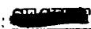

-X

# Figure No.

# Title

Page

A.1 . . . Preliminary Model No. 1 of an Attitude-Stable Xenon Removal System . . . . . . . . . . . . . . . . . . . . . . . . . . . . . . . . . . . . . . . . . . . . . . . . . . . . . . . .   
A.2 Preliminary Model No. 2 of an Attitude-Stable Xenon Removal System 110   
A.3 . Preliminary Model No. 3 of an Attitude-Stable Xenon Removal System . . . . . . . . . . . .   
B.1 Correlation of Drag Coefficient and Reynolds Number for Bubbles in Water 118   
B.2 .Effects of Bubble Radius and Exit Velocity on Centrifuge Effectiveness at 2700 rpm with a Cup Radius of 2-7/8 in. 119   
B.3 .Effects of Bubble Radius and Exit Velocity on Centrifuge Effectiveness at 1350 rpm with a Cup Radius of 2-7/8 in. 120   
C.1 . . . . . Head Characteristics of a Fluid Rotating as a Solid Body 125   
C.2 .Leakage Characteristics of a Dynamic Seal with an Axial Clearance of 0.050 in. 126   
C.3 Leakage Characteristics of a Dynamic Seal with an Axial Clearance of 0.128 in. 127   
C.4 . . . Leakage Characteristics of a Dynamic Seal with an Axial Clearance of 0.248 in. 128   
C.5 .Leakage Characteristics of a Dynamic Seal with an Axial Clearance of 0.481 in. 129   
C.6 Zero Leakage Characteristics of a Dynamic Seal 139   
D.l .Pump Inlet Velocity Diagram 133   
D.2 Redesigned ART Fuel Pump Blade Trace and Fluid Passage Layout 135   
D.3 . . . . Velocity Profile Entering the ART Fuel Pump Impeller 136   
D.4a . . . . Plane Parallel to Fuel Pump Shaft Centerline 140   
D.4b . . . . Plane Perpendicular to Fuel Pump Shaft Centerline . . 140

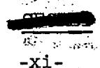

Figure No. Title Page

D.4c . . . . Fluid Streamline along Fuel Pump Shroud . . . . . . 140   
D.5a 141   
D.5b . . . . Fluid Passage 141   
D.5c 141   
D.5d . . . Blade Blank . . . . . . . . . . . . . . . . . . . 141

E.l . . . . Calculated ART Fuel Pump Bypass Flow Characteristics 147   
E.2 . . . . ART Reactor Fuel and NaK Temperatures at a Constant Pump Flow of 645 gpm . . . . . . . . . . . . . . . . . . . . . . . . . . . . . . . . . . . . . . . .   
E.3 149   
E.4 . Mixed Mean Temperature of Fuel in the ART Expansion Tank as a Function of Reactor Power to Fuel and Pump Speed at a Constant Fuel Flow of 645 gpm per Pump . . . . . . . . . . . . . . . . . . . . . . . . . . . . . . . . . . . . . . . . . . . . . . . . .   
G.1 Schematic of Flow Through Sparger and Expansion Tank 169   
G.2 . . . . . Xenon Solubility in Fuel-30 170   
G.3 . . . . . . . . . . . . . . . . . . . . . . . . . . . . . . . . . . . . . . . . . . . . . . . . . . . . . . . . . . . . . . . . . . with a Power Generation of 60 Mw .. .. .. .. .. .. .. 171   
G.4 . . . . Xe135 Poisoning in Fuel-30 at 60 Mw Power and a Helium Bleed of 1000 liter/day . . . . . . . . . . . 172

# LIST OF TABLES

<table><tr><td>Table No.</td><td>Title</td><td>Page</td></tr><tr><td>1.1</td><td>Design Requirements . . . . . . . . . . . . . . . . . . . . . . . . . . . . . . . . . . . . . . . . . . . . . . . . . . . . . . . . . . . . . . . . . . . . . . . . . . . . . . . . . . . . . . . . . . . . . . . . . . . .</td><td>7</td></tr><tr><td>1.2</td><td>Design Data . . . . . . . . . . . . . . . . . . . . . . . . . . . . . . . . . . . . . . . . . . . . . . . . . . . . . . . . . . . . . . . . . . . . . . . . . . . . . . . . . . . . . . . . . . . . . . . . . . . .
2.1</td><td>9</td></tr><tr><td>2.1</td><td>Conditions and Results of Water Performance Tests of ART Fuel Pump . . . . . . . . . . . . . . . . . . . . . . . . . . . . . . . . . . . . . . . . . . . . . . . . . . . . . . . . . . . . . . . . . . . . . . . . . . . . . . . . . . . . . . . . . . . . . . . . . . . 
3.1</td><td>29.</td></tr><tr><td>3.2</td><td>Model 15 - Performance Evaluation . . . . . . . . . . . . . . . . . . . . . . . . . . . . . . . . . . . . 
Sequential Development of Attitude-Stable Xenon Removal System . . . . . . . . . . . . . . . . . . . . . . . . . . . . . . . . . . . . . . . . . 
3.3</td><td>193</td></tr><tr><td>3.4</td><td>Model 7 - Performance Evaluation . . . . . . . . . . . . . . . . . . . . . . . . . . . . 
Model 15 - Dimensions . . . . . . . . . . . . . . . . . . . . . . . . . 
F.1 
Concentration and Activity of Krypton, Xenon and Daughter Products in Expansion Tank and Oil System for a Helium Flow Rate of 1000 liters/day. . . . . . . . . . . . . . . . . . . . . . . . . . 
G.1 
Xenon Concentration in Expansion Tank Gas Volume . . . . . . . . . . . . . . . . . . . . . . . . . . . . . . . . . . . . . . . . . . . . . . . . . . . . . . . . . . . . . . . . . . . . . . . . . . . . . . . . . . . 
Xenon Concentration in Expansion Tank Gas Volume . . . . . . . . . . . . . . . . . . . . . . . . . . . . . . . . . . . . . . . . 
Xenon Concentration in Expansion Tank Gas Volume . . . . . . . . . . . . . . . . . . . . . . . . . . . . 
Xenon Concentration in Expansion Tank Gas Volume . . . . . . . . . . . . . . . . . . . . . 
Xenon Concentration in Expansion Tank Gas Volume . . . . . . . . . . . . . . . . . 
Xenon Concentration in Expansion Tank Gas Volume . . . . . . . . . . . . . . 
Xenon Concentration in Expansion Tank Gas Volume . . . . . . . . . . . . 
Xenon Concentration in Expansion Tank Gas Volume . . . . . . . . . . . 
Xenon Concentration in Expansion Tank Gas Volume . . . . . . . . . . 
Xenon Concentration in Expansion Tank Gas Volume . . . . . . . . . 
Xenon Concentration in Expansion Tank Gas Volume . . . . . . . . 
Xenon Concentration in Expansion Tank Gas Volume . . . . . . . 
Xenon Concentration in Expansion Tank Gas Volume . . . . . . 
Xenon Concentration in Expansion Tank Gas Volume . . . . . 
Xenon Concentration in Expansion Tank Gas Volume . 
Xenon Concentration in Expansion Tank Gas Volume . 
Xenon Concentration in Expansion Tank Gas Volume 
Xenon Concentration in Expansion Tank Gas Volume 
Xenon Concentration in Expansion Tank Gas Volume 
Xenon Concentration in Expansion Tank Gas Volume 
Xenon Concentration in Expansion Tank Gas Volume 
Xenon Concentration in Expansion Tank Gas Volume 
Xenon Concentration in Expansion Tank Gas Volume 
Xenon Concentration in Expansion Tank Gas Volume 
Xenon Concentration in Expansion Tank Gas Volume 
Xenon Concentration in Expansion Tank Gas Volume</td><td></td></tr></table>

# ABSTRACT

This report summarizes the design and development of the fuel pump and xenon removal system for the Aircraft Reactor Test. The system is comprised of two fuel pumps with an expansion tank mounted just above and between them, and a complex of impellers, seals, and stators arranged to be a part of the removable fuel pump assemblies. The xenon removal system is designed to bleed approximately $1.5\%$ of the main fuel flow rate into the expansion chamber through the xenon removal equipment. The stripped fuel is returned to the main system by way of centrifuges mounted immediately in back of the fuel pump impellers. The centrifuges serve to filter out any entrained bubbles and provide in conjunction with seal impellers a suitable main fuel system pressure level.

The initial design and development work included as an objective the achievement of a system insensitive to attitude. That work is included in this report as an aid to future designs.

This report includes the following:

1. The underlying design precepts and requirements upon which the development was based.   
2. The functioning and principle of operation of the finalized design.   
3. The chronological evaluation of the finalized design and the major design changes in the development.   
4. Discussions and calculations pertinent to five design criteria:

a. pump impeller design   
b. system pressure control   
c. swirl stability   
d. bubble removal in the centrifuge   
e. seal requirements and performance.

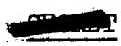

Section I

DESIGN CRITERIA

# DESIGN CRITERIA

# Precepts and Requirements

The high absorption cross section of $\mathrm{Xe}^{135}$ makes it extremely desirable to strip xenon continuously from all or a fraction of the fuel* in high power density reactors. Xenon can be stripped from liquid fuels by exposing the fuel to a gas interface where the xenon molecules can diffuse from the liquid. The rate of xenon extraction from fuel at a given temperature is a function of the xenon concentration in the fuel, the partial pressure of xenon in the contacting gas, and the rate of exposure. Thus, a xenon removal, or "X-R", system might function as follows:

1. A fraction of the fuel could be bled into a processing chamber.   
2. A large interface in this chamber could be provided by means of agitation, bubble entrainment, or spraying.   
3. The xenon-free fuel could be returned to the system in such a manner as to avoid foam or gas bubble carry-over.

To appreciate the X-R system as applied to the Aircraft Reactor Test, it must be clearly understood that the initial conception involved five basic precepts; namely:

1. From 1 to $2\%$ of the fuel should be bled continuously from the main fuel stream.   
2. The interface in the expansion tank should be used for the removal of xenon.   
3. The pump shafts should supply any energy required for the operation of the system.   
4. A centrifugal field should be employed to prevent gas carryover into the main fuel stream to avoid affecting reactivity.   
5. The X-R system should operate in stable equilibrium with the fuel pump and maintain the desired fuel system pressure level.

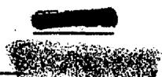

These design precepts indicate the intimate relationship of the design of the X-R system to the control of the system pressure, expansion tank liquid level stability, and the pump design with all of its seal and accessibility problems. The multitude of interrelated design requirements mean that the X-R system must do a great deal more than remove xenon. A summary of the design requirements is given in Table 1.l.

The interdependence of these design requirements is not immediately apparent. After preliminary study, it became evident that the complexity of the complete system demanded that the X-R system and the fuel pump be developed separately and subsequently tested as a unit. The development of the X-R system and the pump is discussed in Sections II and III.

The basic design data and physical properties used in the design of the X-R system are given in Table 1.2. Most of the dimensions were predetermined by the pump configuration and space limitations. Certain critical dimensions were computed. The detailed calculations are given in the appendix.

# Illustrations and Nomenclature

Fig. 1.l gives an overall picture of the fuel pumps and the X-R system. Illustrated particularly are the expansion chamber in relation to the rotary elements, the inter-connecting parts, and the direction of fluid passage. The expansion tank in the fuel system acts as a processing tank for xenon stripping. All other required functions are carried out in the rotary assembly, a cross section of which is shown in Fig. 1.2 with the various parts labeled.

Fig. 1.3 depicts the system as a hydraulic circuit. The numbers are only illustrative of the pressure interdependence between the X-R system and the main fuel circuit. The functional description of the ART-XR system to follow is presented from the point of view of a hydraulic circuit.

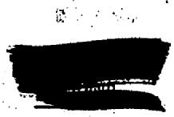

# Table 1.1 - Design Requirements

1. The pump should have the highest possible degree of reliability which necessitates large radial and axial clearances for moving parts to minimize the effects of thermal distortion.   
2. The pump shaft seal and bearing must operate at temperatures below $300^{\circ}\mathrm{F}$ .   
3. The pump should not constitute a hole in the shield.   
4. The pump should be replaceable without removal of the reactor shield.   
5. The bearing and seal should be sufficiently shielded from radiation to give a satisfactory lubricant life.   
6. Cooling provisions must be adequate to remove the heat generated by radiation at full power and at the same time no areas contacted by liquid fuel may drop below the fuel freezing point at zero power.   
7. The pump must supply the required fuel system head and flow.   
8. The pump must be free from cavitation within the required operating pressure level.   
9: The pump must meet the reactor geometry demands.   
10. Pump, casing, and expansion tank should be rugged in construction, unlikely to be subject to thermal distortion, and have a minimum of moving parts.   
11. Operation should not be sensitive to variations in pump speed or to differences in speed between pumps, including one pump stopped.   
12. The pump shaft power required should be minimized.   
13. Fuel entry into the cool region around the impeller shaft below the seal must be prevented.   
14. The system should be such as to drain naturally when in its normal position.   
15. Provision must be made for removing xenon with a high degree of reliability and sufficiently thoroughly to provide a substantial margin over the concentration acceptable from the reactor control standpoint.

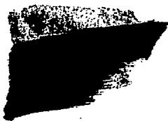

16. To effect gas removal from the fuel a fraction should be recycled from the main circuit through a chamber with a helium atmosphere.   
17. To increase the dissolved gas removal effectiveness, the fuel in the gas removal chamber should be agitated to increase the helium entrainment thereby increasing the surface area and reducing the diffusion path length in the fuel.   
18. The stripped fuel must be returned to the main fuel circuit free of gas bubbles.   
19. To prevent bubbles from entering the core the return circuit must be designed without leakage.   
20. The system pressure must be maintained at a predetermined level.   
21. An expansion volume must be provided for the fuel.   
22. Circulation must be maintained through the expansion tank to avoid overheating from fission product decay heat.   
23. Reactor off-gas and fuel vapor contamination of the pump lubricating oil should be a minimum.

Table 1.2 - Design Data   

<table><tr><td>Fuel No. 30</td><td>Value</td><td>Source</td></tr><tr><td>Density (#/ft3)</td><td>ρ = 246.4-0.0322T(°F)</td><td>(2)</td></tr><tr><td>Surface Tension (dynes/cm)</td><td>530°C-157</td><td>(2)</td></tr><tr><td></td><td>630 -132</td><td></td></tr><tr><td></td><td>730 -115</td><td></td></tr><tr><td>Viscosity (#/ft-hr)</td><td>1100°F-21.3</td><td>(2)</td></tr><tr><td></td><td>1300 -12.8</td><td></td></tr><tr><td></td><td>1500 -8.5</td><td></td></tr><tr><td>Liquidus Temperature</td><td>968°F</td><td>(2)</td></tr><tr><td>Water</td><td></td><td></td></tr><tr><td>Density (#/ft3)</td><td>62.3</td><td></td></tr><tr><td>Surface Tension (dynes/cm)</td><td>68°F-72.8</td><td></td></tr><tr><td>Viscosity (#/ft-hr)</td><td>68°F-2.42</td><td></td></tr><tr><td>Pump Shaft Spacing (in.)</td><td>21</td><td>(3)</td></tr><tr><td>Fuel Pump Impeller O.D. (in.)</td><td>5.75</td><td>(4)</td></tr><tr><td>Fuel Pump Impeller I.D. (in.)</td><td>3.5</td><td>(4)</td></tr><tr><td>Total Fuel Volume Outside 
Expansion Tank (ft3)</td><td>8.78</td><td>Calculated</td></tr><tr><td>Change in Expansion Tank</td><td></td><td></td></tr><tr><td>Fuel Volume from Fill Temperature 
to Operating Temperature (in.3)</td><td>568</td><td>Calculated</td></tr><tr><td>Bleed Flow Rate per Pump (gpm)</td><td>12</td><td>(1)</td></tr></table>

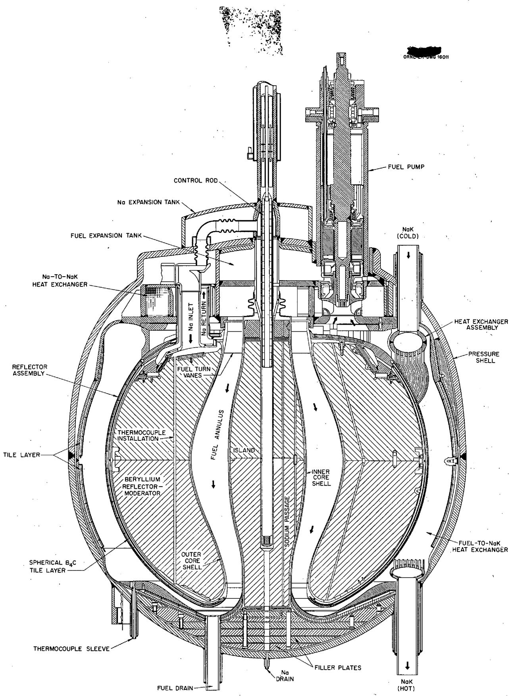  
FIGURE I.1 VERTICALSECTION THROUGH REACTOR ASSEMBLY

ORNL-LR-DWG18291

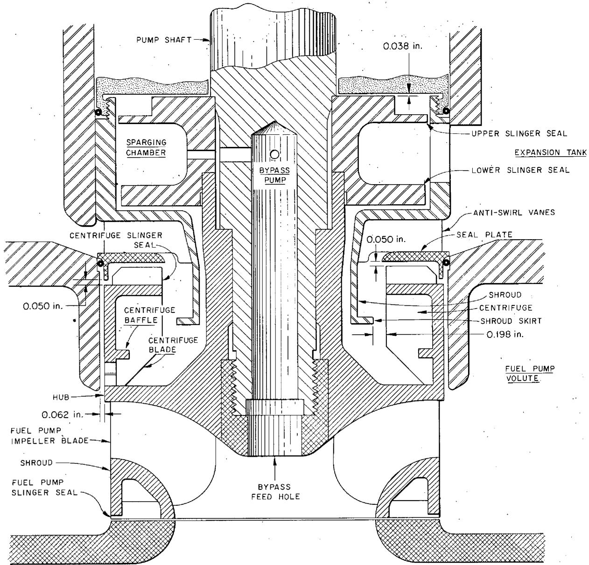  
FIG.1.2 ART FUEL PUMP WITH MODEL 32 IMPELLER

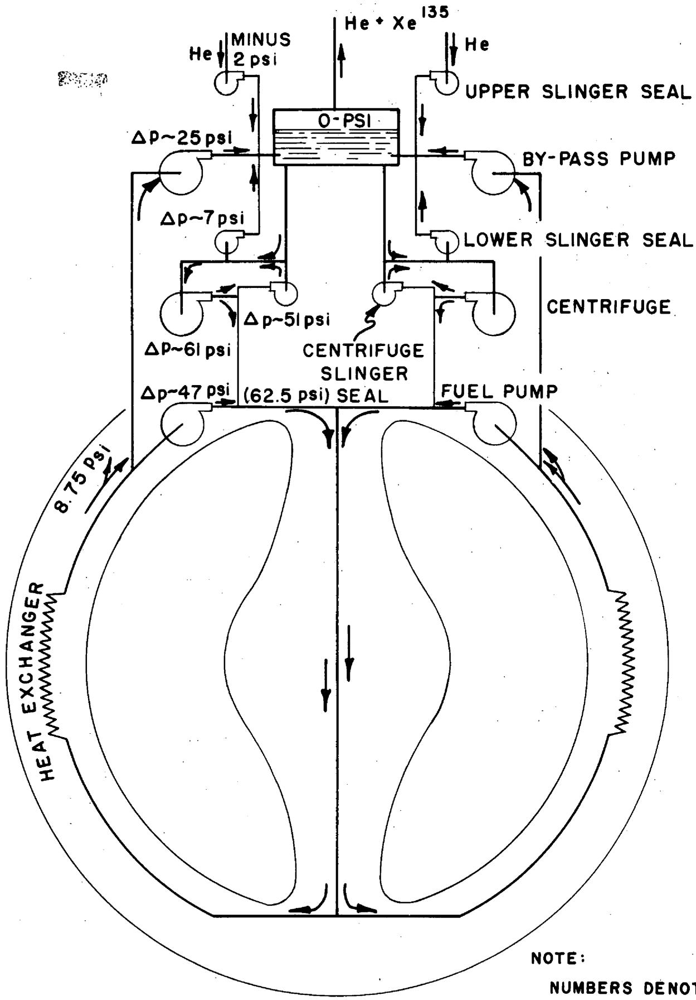  
NOTE:   
NUMBERS DENOTING   
PRESSURES ARE   
ONLY ILLUSTRATIVE   
FIG.1.3- SCHEMAIC ART FUEL CIRCUIT

# Circuit Description

The ART fuel circuit is most readily understood by referring to Figs. 1.2 and 1.3. For clarity the circuit will be divided into zones and described separately.

# Zone 1. Primary Fuel Circuit

Circuit wise the main fuel loop consists of two pumps operating in parallel with a common discharge. Half of this circuit is shown in Fig. 1.4. The fuel discharges into the core header and flows through the core and the heat exchangers to the pump suction.

The core header serves as a plenum and as a mixing chamber into which processed fuel is discharged from the centrifuge (shown dotted in Fig. 1.4). Since the centrifuge and the fuel pump have a common discharge, it is seen that the fuel pump discharge pressure is regulated by the centrifuge discharge pressure and that the fuel pump suction pressure is regulated by system resistance of the circuit.

# Zone 2. Bypass Fuel Circuit

The bypass pump passes approximately $2\%$ of the main fuel pump flow rate into the sparging chamber where it is intimately mixed with helium to dilute and remove from the fuel the Xenon produced in the reactor core (see Fig. 1.5). The liquid-gas mixture is jetted into the expansion tank where part of the gas is separated from the fuel by allowing the mixture to form a relatively quiet pool from which the gas escapes to the off-gas system. The fuel in the expansion tank, with small amounts of entrained gas, feeds by gravity into the centrifuge where the last of the gas is removed and fed back to the sparging chamber. The centrifuge discharges into the discharge of the fuel pump thereby returning the fuel to the main circuit as well as maintaining the discharge pressure of the main pump.

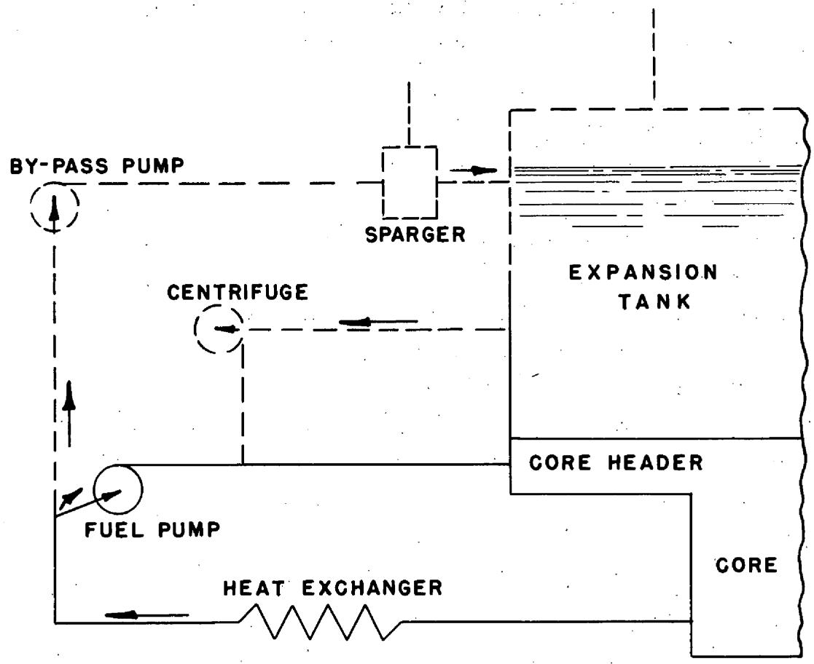

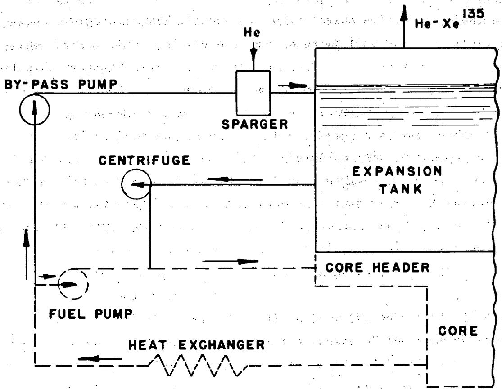  
FIG.1.5-ART BYPASS FUEL CIRCUIT

# Zone 3. Dynamic Seals

There are three dynamic seals which are essentially centrifugal pumps, in the bypass fuel circuit arranged to pump against the pressure of fuel entering the seal impellers from what is normally the discharge end of the blades. The interrelationship of these seals is shown in Figs. 1.2 and 1.3.

The upper slinger seal serves to prevent the fuel from leaking up the pump shaft towards the bearings and to allow the helium to flow down the pump shaft and into the sparging chamber. The lower slinger seal serves to prevent the fuel from leaking from the sparging chamber into the centrifuge and to allow the gas removed by the centrifuge to flow into the sparging chamber. The centrifuge slinger seal limits the amount of recycle around the top of the centrifuge.

# Section II

DESIGN AND DEVELOPMENT OF

ART FUEL PUMP AND XENON REMOVAL SYSTEM

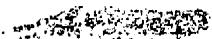

# DESIGN AND DEVELOPMENT OF

# ART FUEL PUMP AND XENON REMOVAL SYSTEM

# Xenon Removal System Design

The X-R system described in this section is the finalized ART design. The system originally envisioned for application to the ART was one that would be insensitive to attitude. Before the development work on an attitude-stable system was completed, it was found that the "north head" region of the reactor would have to be revised because of a severe stress problem. Another factor which contributed to the decision to radically modify the original system was a $50\%$ increase in the anticipated reactor fuel volume.

The redesign of the "north head" region and the increased fuel volume necessitated a change in both the volume and shape of the fuel expansion tank. The shape of the tank was changed from cylindrical to ellipsoidal with the pump barrels passing through each end of the oval. The original requirement for this system to be insensitive to attitude was to be accomplished by spinning the fuel volume in the expansion tank and using the resulting centrifugal force to stabilize the liquid-gas interface. Changing the shape of the expansion tank to its final design made the problem of stabilizing the fuel gas interface much more complex and resulted in a decision to eliminate the attitude stability requirement for the sake of an expeditious design. The development work completed on the original design is included in Section III of this report to give a background for the final configuration and for possible future application in an aircraft reactor with an attitude-stability requirement.

A simple plastic model of the X-R system was designed and built to test its gas removal ability and to calibrate the bypass flow through the centrifuges. A cross section through this model is shown in Fig. 2.1.

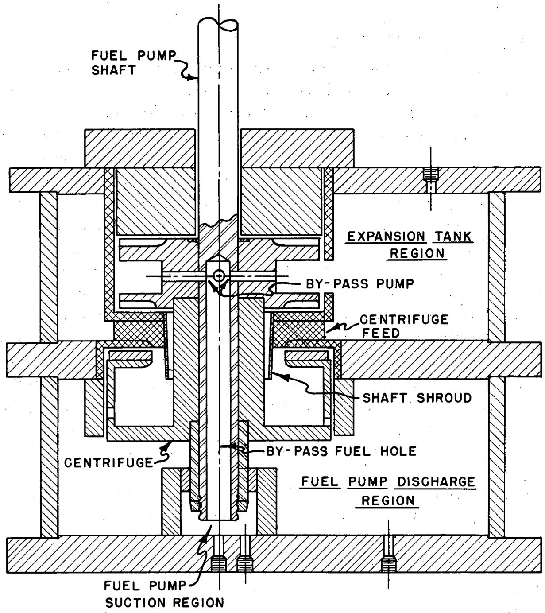  
FIG.2.1 FULL SCALE PLASTIC MODEL OF THE XENON REMOVAL SYSTEM

# Xenon Removal System Flow

As the design of the reactor progressed, the estimated fuel volume increased. This increased fuel volume necessitated a larger expansion tank and a larger bypass flow rate through the expansion tank and centrifuge for the following reasons:

1. The fuel expansion tank volume increased in capacity in proportion to the total fuel system volume.   
2. To maintain the xenon concentration the same as for the smaller fuel volume, the stripping rate increased in direct proportion to the fuel volume.   
3. To keep the greater expansion volume from overheating and creating a serious zirconium snow problem, the quantity of low temperature fuel recirculated through the expansion tank increased in proportion to the fuel volume.

The metering of the bypass flow taken from the main fuel circuit had to be done by properly sizing the hole up the center of the pump shaft and the four radial holes forming the bypass pump. A second factor affecting the bypass flow was the difference between the pump suction pressure and the expansion tank gas pressure. This second factor could not be determined in the model as it is controlled by the combined performance of the centrifuge, fuel pump and pump volute.

During the model tests the difference between the pump suction pressure and the expansion tank gas pressure was calculated from performance data obtained from separate tests of the fuel pump and centrifuges.

From Fig. 2.1 it can be seen that there are two principle volumes to the model. The volume between the two upper plates simulates the expansion tank and the volume between the two lower plates represents the high pressure region at the discharge of the fuel pump in the main fuel circuit. At the lower end of the shaft is a bearing and seal arrangement to separate the large high pressure volume from the hole in the center of the shaft. The reason for this arrangement was to control the pressure in the small volume at the lower end of the shaft at a value near that expected in the suction

region of the main fuel pump.

To calibrate the bypass flow through the model a line containing a flow meter was connected between the high pressure discharge region and the low pressure region at the lower end of the shaft. A valve in the line was used to control the flow until the pressure at the entrance to the shaft matched that expected at the suction of the main fuel pump. If the flow up the shaft was greater than that desired in the X-R system, then the bypass pump holes were reduced, and conversely if the flow was too small the holes were opened. The reasons for metering the flow with the bypass pump holes were that changes in the holes size were simple to make and also were highly effective as the pressure drop in this region is very large.

The bypass flow rate which was measured by the flow meter was that bleed from the discharge region to the region below the seal while the measurement desired was that of the flow up the shaft. In the actual test the leakage around the seal was large (approximately 2 to $4\mathrm{gpm}$ ), and amount to 15 to $30\%$ of the total bypass rate. As this leakage could only be estimated, the first calibration could easily be in error by 10 to $15\%$ . This bypass rate was later determined much more accurately in the single pump Inconel hot loop test rig to be described later.

# Xenon Removal System Gas Removal

The increased bypass flow necessitated by the increased reactor fuel volume increased the velocity of the fuel passing out of the centrifuge to such an extent that gas bubbles were carried into the main system. This ingassing was eliminated by increasing the flow area available to the fuel. This increase in flow area was accomplished by increasing the number of holes in the outer wall of centrifuge from 8 to 33.

A skirt connected to the lower end of the shaft shroud was added to the system after it was originally built to prevent the incoming liquid from falling to the bottom of the centrifuge cup and being thrown directly outward toward the exit holes. Without the skirt the liquid which is thrown outward carries entrained gas bubbles into the high velocity region of the exit holes where the smaller bubbles will then be carried on into the main fuel circuit.

Two other items which were added to the model were centrifuge baffle and blades. As the direction and magnitude of the flow in the centrifuge cups are not known, the point at which the smallest gas bubbles are screened out in the cup is not known. However, it is logical that any direct passage through the cup would enable the liquid to carry more gas through the cup than if the velocity were more evenly distributed over the full height of the cup. The baffle was added to prevent the incoming fluid from having a direct passage to the exit holes.

The centrifuge blades were added to decrease the slippage between the incoming fluid to the centrifuge cup and the cup. Prevention of this slippage improves the system in two ways. The effectiveness of the centrifuge depends primarily upon the speed of rotation of the fluid. It is obvious then that any slippage between the fluid and the cup decreases the effectiveness of the centrifuge.

The second reason for reducing this slippage stems from the necessity of having to balance the discharge pressure of the centrifuge against the pressure rise across the centrifuge slinger seal. The discharge pressure of the centrifuge must be maintained above that of the centrifuge slinger discharge to prevent the fluid from bypassing the centrifuge and carrying gas into the main system. With the blades installed it is possible to predict the centrifuge discharge pressure very closely from the equation:

$$
\text {H} = \frac {\mathrm {U} ^ {2}}{2 \mathrm {g}}
$$

where

$$
\begin{array}{l} \mathrm {H} = \text {H e a d}, f t l b p e r l b \\ U = \text {T a n g e n t i a l} \\ g = \text {g r a v i t a t i o n a l} 3 2. 2 \text {f t p e r s c} ^ {2}. \\ \end{array}
$$

The presence of slippage in the cup introduces an unknown coefficient to this equation and also makes the head delivered by the centrifuge more dependent on the flow through the centrifuge.

There is one advantage to having the slippage in the cup. During test with the model it became apparent that the discharge pressure of the centrifuge is a function of the liquid level in the expansion tank. As the liquid

level in the expansion tank decreases the centrifuge pressure decreases, resulting in a like decrease in pressure at the pump suction region. This reduced pressure at the pump suction results in a smaller flow up the pump shaft and through the centrifuge. The decreased flow there causes a reduction in the slippage which tends to increase the centrifuge discharge pressure. This stabilizing effect on the pressures was not advantageous enough to overcome the disadvantages stated above.

The opening between the sparging chamber and the expansion tank was made as large as possible. During tests made with this opening restrictive it was found that the fluid was backed into the sparging chamber. When the fluid level moved radially inward from the tip of the lower slinger seal, it restricted the gas flowing upward around the shaft from the centrifuge to the expansion tank. With this normal path restricted, the gas was forced to leave the centrifuge through the same opening as that used by the incoming fluid which reduced the effectiveness of the centrifuge for larger bypass flows.

# ART Fuel Pump Development

The operability of a face-type gas-seal sump pump pumping liquid metals was experimentally demonstrated in the summer of 1951. In the fall of 1953, G. F. Wislicenus designed an impeller (Fig. 2.2) to produce the head and flow required of the ART reactor using Flinak as the fuel. A volute was designed within the space limitation of the reactor for this impeller in late 1954. Throughout this paper sections of the pump will be located by numerical subscripts. The position of these sections and their numbers are shown in Fig. 2.2. The subscript (o) designates the "eye" of the passage just before the impeller; (1) the impeller vane outermost inlet edge, and (2) the impeller vane outlet edge or impeller rim. A full scale model was built and water performance test data were obtained in early 1955. The model was installed in a test loop built of 6 in. pipe with head and flow measuring instrumentation and a throttling valve. The pump was driven by 15-hp variable-speed, d-c motor. The first experiment was performed by using a pump-suction configuration that simulated the ART reactor design. The entrance region of the

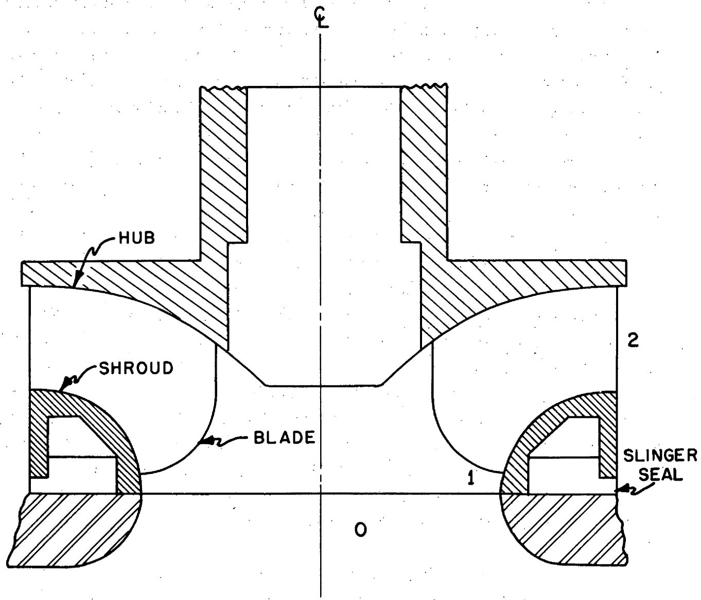  
FIG.2.2-BRASS   
ART   
FUEL PUMP   
IMPELLER

# 图

pump was obscured by a flat plate located 1 in. below and parallel to the pump suction. A second test was performed with the plate removed and replaced by an 8 in. pipe connected directly to the pump suction. The results of these two experiments are shown in Figs. 2.3 and 2.4. The pump performance as indicated by these two experiments was not affected by the simulated reactor entrance conditions. Since the flat plate was very difficult to install, the 8 in. pipe suction was used for all subsequent testing.

The test conditions and results from a series of experiments performed in the test loop are given in Table 2.1. The performance data from these experiments are plotted in Figs. 2.3 through 2.13. The performance data given in Fig. 2.13 are representative of the best operation obtained during this series of tests. The pump efficiencies are not considered accurate on an absolute basis, because the motor was not calibrated and the motor efficiencies were obtained from the manufacturer's computed data. It is estimated that the efficiency of the pumps, exclusive of seal and bearing losses, is approximately $75\%$ at the design point.

The impeller blade tip angle, $\beta_{2}$ , was increased to 26.5 deg from 22 deg in order to produce the reactor design head and flow and a pump speed approaching the design speed; the results of this change are given in Fig. 2.5. Data obtained by varying the impeller radial clearance from 0.010 in. to 0.040 in. indicated a loss in pump performance of approximately $8\%$ at low-flow high-head conditions and of approximately $4\%$ near the design point. These data are given in Fig. 2.7.

A cavitation-like noise persisted throughout Experiments 1 through 12 at flows above $400\mathrm{~gpm}$ and speeds in excess of $2000\mathrm{~rpm}$ . The intensity of this disturbance increased with increased flow or speed above the threshold values. It was suspected that the noise might be the results of poor fluid guidance at the leading edges of the impeller vanes. An attempt was made to improve this condition by changing the entrance angle of the blade to match that of the fluid by machining the leading edges so that they lay on the surface of a cone whose apex went through the shaft centerline. The performance data from these

changes are given in Figs. 2.6 and 2.8. Modifications were also made to the inlet radius of the suction eye and to the impeller nut to improve the entrance conditions. These changes had no noticeable effect upon the character of the noise. A new impeller blade was designed to give better entrance conditions with no noticeable improvement. The performance data of this impeller blade is given in Fig. 2.10.

It was determined that the noise was not primarily due to cavitation at the blade leading edge but rather to a local condition that existed at the tongue of the volute. This was established by the use of a carbon microphone probe. A circuit was devised so that the microphone signal could be observed on a cathode-ray oscilloscope. With this arrangement, the region of maximum noise was located near the volute tongue. The volute tongue was cut back to allow more area for the flow. This modification gave a decrease in performance with no improvement in the noise. The performance data for this modification is given in Fig. 2.9.

The need for additional flow area in the volute is evidenced by the hydraulic unbalance of the impeller at the design point and the occurrence of the design speed maximum efficiency at approximately $20\%$ less than the design flow. A structural change in the design of the reactor north head region to improve the stress conditions allowed the pump volute flow area to be increased; however, this increase only compensated for the increase in the fuel flow rate required for improved heat exchanger performance. To obtain the additional required flow area, the pump volute was redesigned without diffusion cones.

Results of the water performance tests as given in Fig. 2.11 with the redesigned volute indicated excessive leakage losses between the impeller discharge and the impeller suction. This is indicated by the sag in the performance curve at high-head low-flow conditions. The shroud radial seal slingers were extended to the impeller full diameter to increase their developed back pressure. The results of this modification are given in Fig. 2.12. To further reduce this leakage, the impeller axial clearance was reduced from 0.102 in. to 0.053 in. The results of this modification are given in Fig. 2.13.

The difference in the pump total discharge head and the average impeller blade static discharge head as a function of pump speed and flow, as determined from Experiment No. 15, is shown in Fig. 2.14. The data shown in Fig. 2.14 allows the calculation of the volute efficiency (k). This efficiency, k, (Fig. 2.15) is defined as the fraction of the absolute impeller discharge velocity head which is converted to static head at the pump discharge.

It may be seen from Fig. 2.13 that the design point lies in the region of maximum efficiency and that the condition of hydraulic force balance on the impeller occurs near the design point. The noise present with the previous volute design was completely eliminated. Based on the performance of the pump indicated by Experiment No. 15, it was decided that the redesigned volute and the original impeller with a $\beta_{2}$ of 26.5 deg would be used in the reactor.

TABLE 2.1   

<table><tr><td>Experiment Number</td><td>Impeller Design*</td><td>Impeller Design Point</td><td>Reactor Design Point at Time of Test**</td><td>Suction Conditions</td><td>Remarks and Results</td></tr><tr><td rowspan="3">1</td><td rowspan="3">Five vanes, Blade Tip Angle, (β2), 22 deg</td><td>470 gpm</td><td rowspan="2">606 gpm</td><td rowspan="3">Suction box, simulating reactor; l/2 in. radius on suction eye</td><td rowspan="3">Impeller design point met at approx. 2650 rpm. Reactor design met at approx. 3050 rpm. Pump very noisy.</td></tr><tr><td>45 ft head</td></tr><tr><td>2500 rpm</td><td>~2800 rpm</td></tr><tr><td>2</td><td>Same as 1</td><td>Same as 1</td><td>Same as 1</td><td>Straight 8-in. pipe with four antiswirl vanes; l/2 in. radius on suction eye</td><td>No appreciable change in performance as compared to Exp. 1.</td></tr><tr><td rowspan="3">3</td><td rowspan="3">Five vanes, β2-26.5 deg</td><td>606 gpm</td><td rowspan="3">Same as 1</td><td rowspan="3">Same as 2</td><td rowspan="3">Reactor design point met at approx. 2800 rpm; approx. a 10% increase in efficiency with respect to Exp. 1 with the peak efficiency shifted towards the higher flows. Pump very noisy.</td></tr><tr><td>50 ft head</td></tr><tr><td>2850 rpm</td></tr><tr><td rowspan="2">4</td><td rowspan="2">Five vanes, β2-22 deg leading edges cut back on an 80 deg cone angle</td><td>Same as 3</td><td>Same as 1</td><td>Same as 2</td><td>Reactor design met at approx. 3100 rpm. Pump very noisy.</td></tr><tr><td>Same as 3</td><td>Same as 1</td><td>Same as 2</td><td>Impeller radial clearance was increased to 0.025 in. from 0.010 in. No appreciable change in pump performance. Pump very noisy</td></tr><tr><td>5</td><td>Same as 3</td><td></td><td></td><td></td><td></td></tr><tr><td>6</td><td>Same as 3</td><td>Same as 3</td><td>Same as 1</td><td>Same as 2</td><td>Impeller radial clearance was increased to 0.040 in. from 0.025 in. No appreciable change in pump performance at design point; 8% loss in head at flows below 300 rpm. Pump very noisy.</td></tr><tr><td>7</td><td>Six Vanes, β2-22 deg leading edges cut back on a 56 deg cone angle</td><td>Same as 3</td><td>620 gpm 35 ft head ~2800 rpm</td><td>Same as 2</td><td>Impeller design point (Exp. 1) met at approx. 2600 rpm. Reactor design point (Exp. 1) met at approx. 3050 rpm. Reactor design point (Exp. 7) met approx. 2850 rpm. Pump very noisy.</td></tr><tr><td>8</td><td>Same as 7</td><td>Same as 3</td><td>Same as 7</td><td>Same as 2 except 1/2 in. radius increased to 1 in. on suction eye.</td><td>Similar to Expts. 1 and 7.</td></tr><tr><td>9</td><td>Same as 3</td><td>Same as 3</td><td>Same as 7</td><td>Same as 8</td><td>Volute tongue cut back 3/8 in. Performance similar to Exp. 3.</td></tr><tr><td>10</td><td>Same as 3</td><td>Same as 3</td><td>Same as 7</td><td>Same as 8</td><td>Volute tongue cut back 3/8 in. modified impeller nut; performance similar to Exp. 3.</td></tr><tr><td>11</td><td>Same as 3</td><td>Same as 3</td><td>Same as 7</td><td>Same as 8</td><td>Volute tongue cut back 30 deg; performance showed a decrease in head and flow. No change in noise.</td></tr><tr><td>12</td><td>Five vanes;* β2-26.5 deg</td><td>620 gpm 25 ft head 2800 rpm</td><td>Same as 7</td><td>Same as 8</td><td>Volute tongue back 30 deg; Performance similar to Exp. ll.</td></tr><tr><td>13</td><td>Same as 3</td><td>Same as 3</td><td>645 gpm 37 ft head ~2800 rpm</td><td>Same as 8</td><td>New volute with increased flow area. Impeller hydraulically balanced near reactor design point. Head is decreased at constant flow and speed. Pump very quiet.</td></tr><tr><td>14</td><td>Same as 3</td><td>Same as 3</td><td>Same as 13</td><td>Same as 8</td><td>Extended slinger on lower shroud to full impeller diameter. Increased head at constant flow and speed. Efficiency peak at design point.</td></tr><tr><td>15</td><td>Same as 3</td><td>Same as 3</td><td>Same as 13</td><td>Same as 8</td><td>Impeller axial shroud clearance reduced to 0.053 in. from 0.103 in. Increased head at constant flow and speed. Increased efficiency peaks at design point.</td></tr></table>

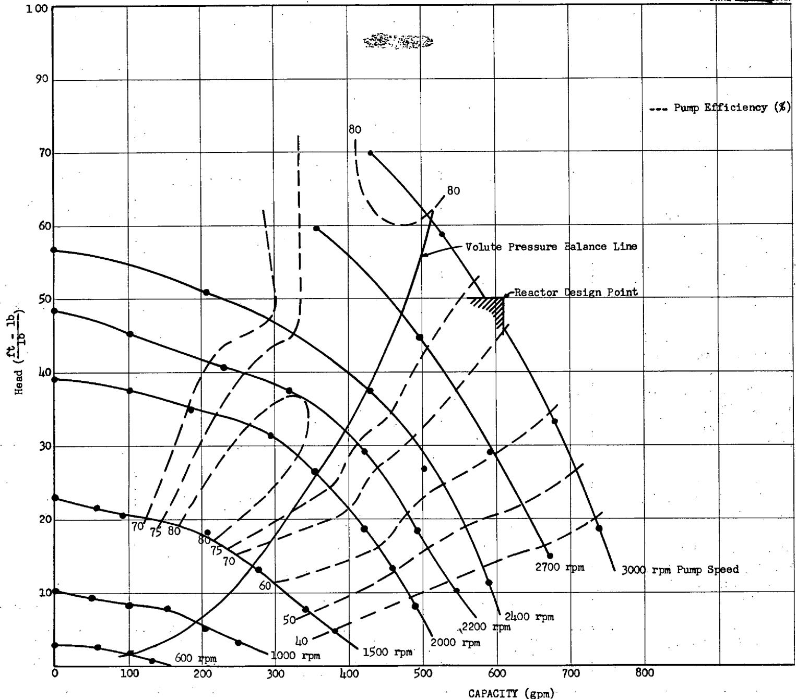  
-2ε-  
FIG. 2.3 ART FUEL PUMP PERFORMANCE CHARACTERISTICS EXPERIMENT NO. 1 - TABLE 2.1

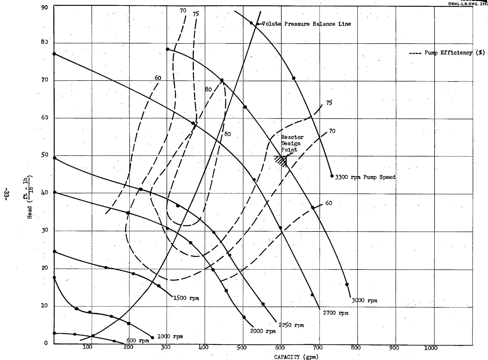  
FIG. 2.4 ART FUEL PUMP PERFORMANCE CHARACTERISTICS EXPERIMENT NO.2.1

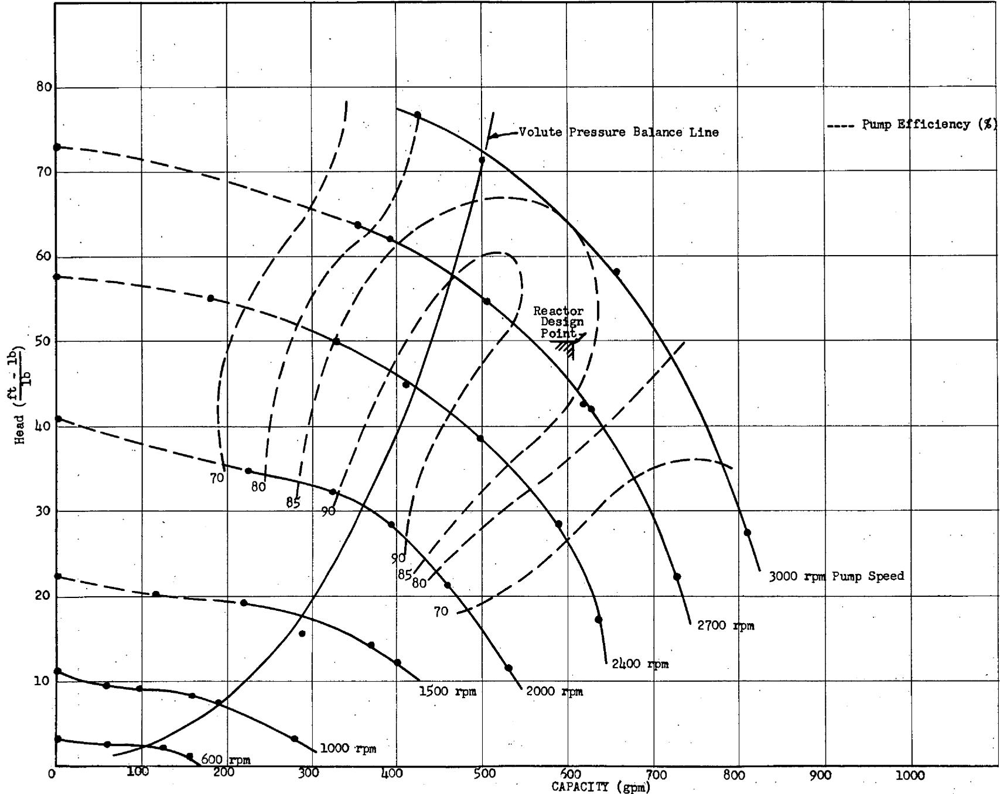  
一  
FIG. 2.5 ART FUEL PUMP PERFORMANCE CHARACTERISTICS EXPERIMENT NO. 3 - TABLE 2.1

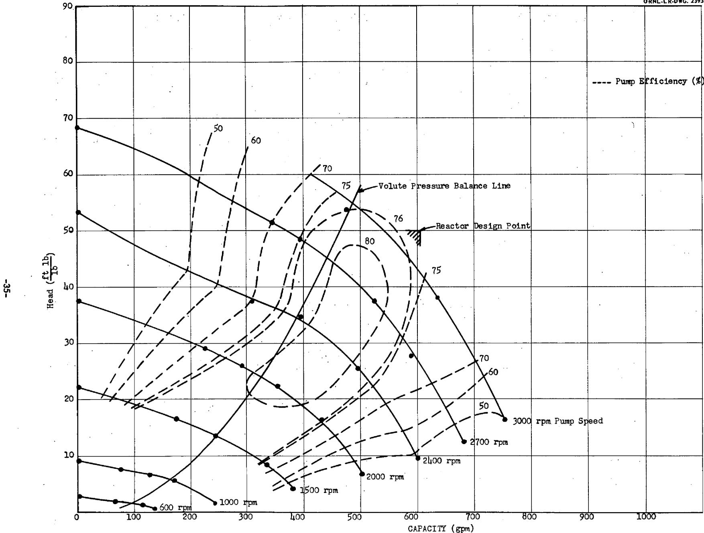  
FIG. 2.6 ART FUEL PUMP PERFORMANCE CHARACTERISTICS EXPERIMENT NO. 4 - TABLE 2.1

-9

FIG. 2.7 ART FUEL PUMP PERFORMANCE CHARACTERISTICS AT 2700 rpm EXPERIMENT NOS. 3, 5, AND 6 - TABLE 2.1   
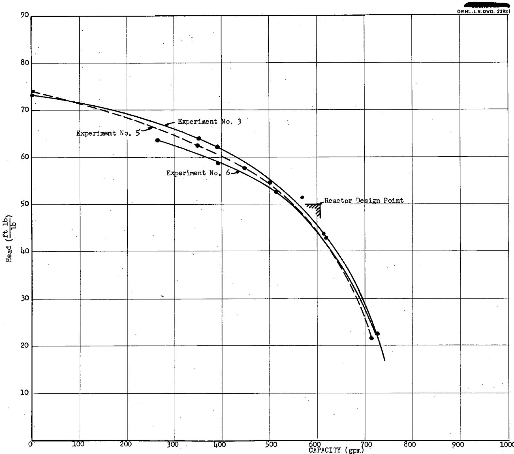

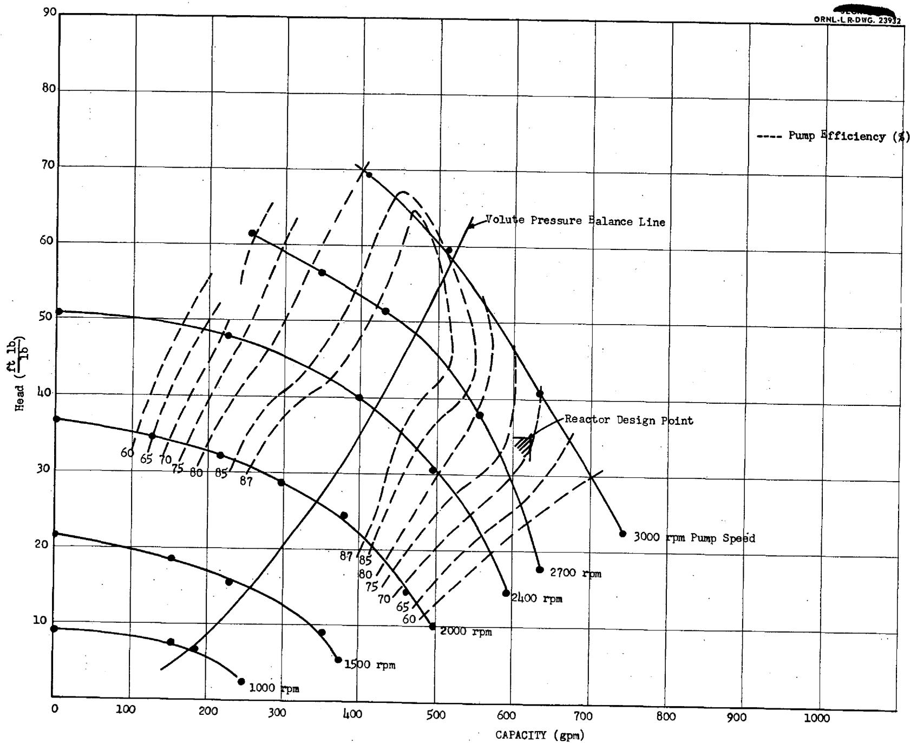  
FIG. 2.8 ART FUEL PUMP PERFORMANCE CHARACTERISTICS EXPERIMENT NO. 7 - TABLE 2.1

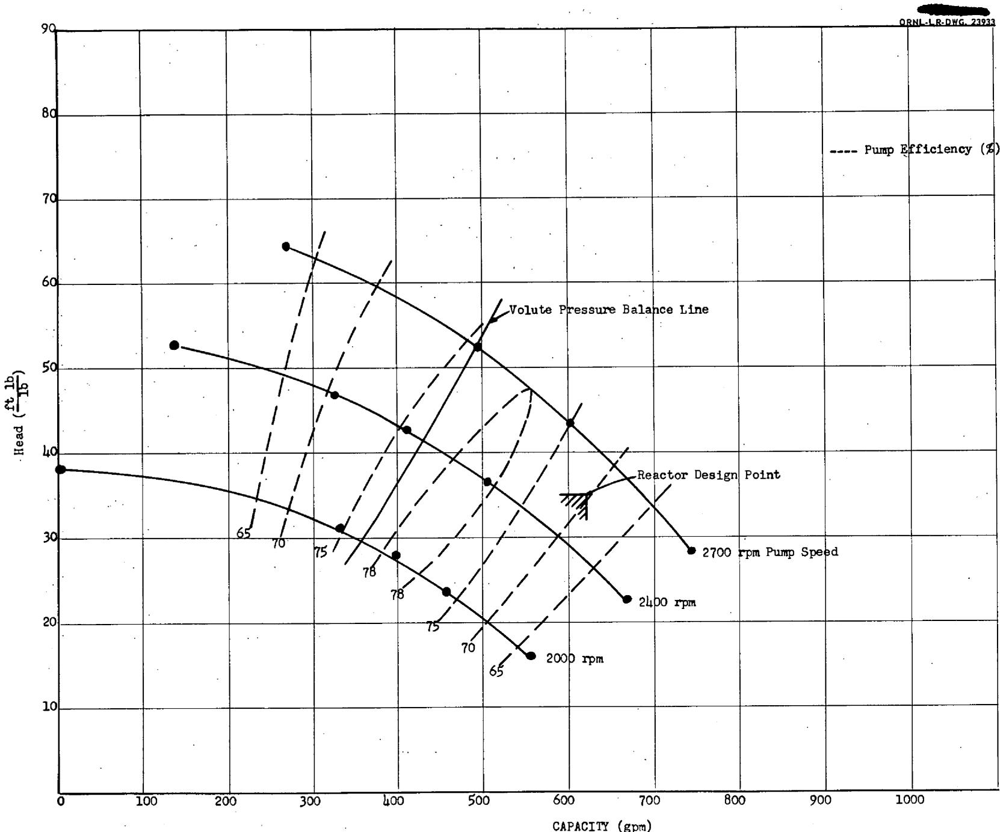  
FIG. 2.9 ART FUEL PUMP PERFORMANCE CHARACTERISTICS EXPERIMENT NO. 11 - TABLE 2.1

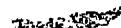

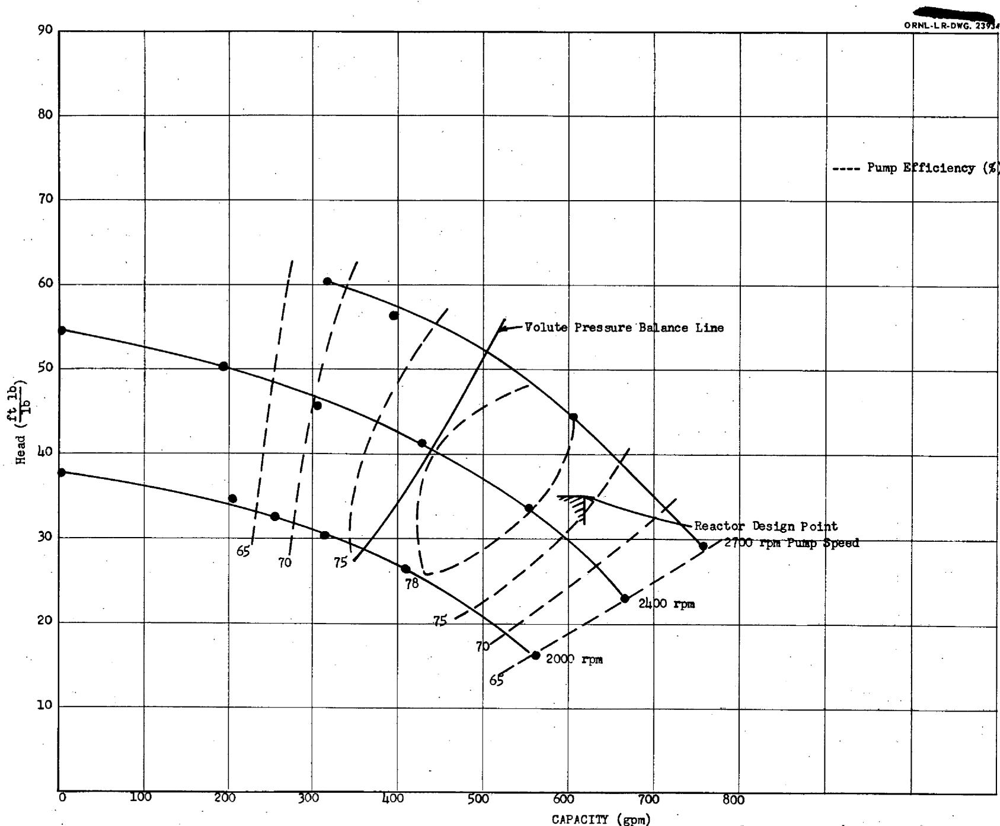  
FIG. 2.10 ART FUEL PUMP PERFORMANCE CHARACTERISTICS EXPERIMENT NO.:32- TABLE 2.1

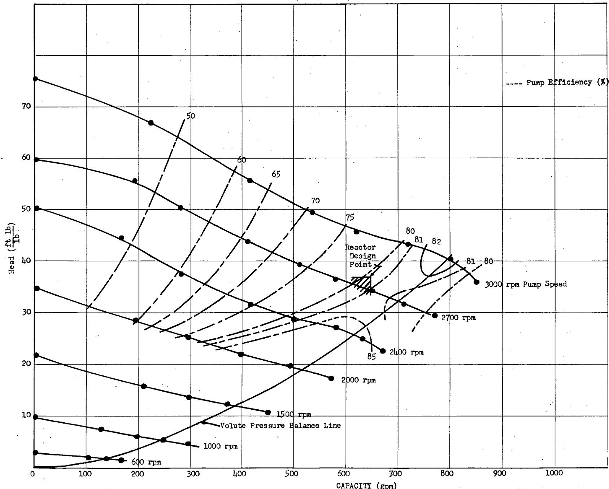  
-0   
FIG. 2.11 ART FUEL PUMP PERFORMANCE CHARACTERISTICS EXPERIMENT NO. 13 - TABLE 2.1

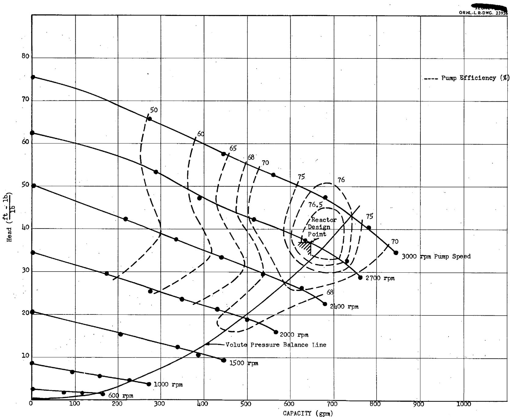  
一  
FIG. 2.12 ART FUEL PUMP PERFORMANCE CHARACTERISTICS EXPERIMENT NO. 14 - TABLE 2.1

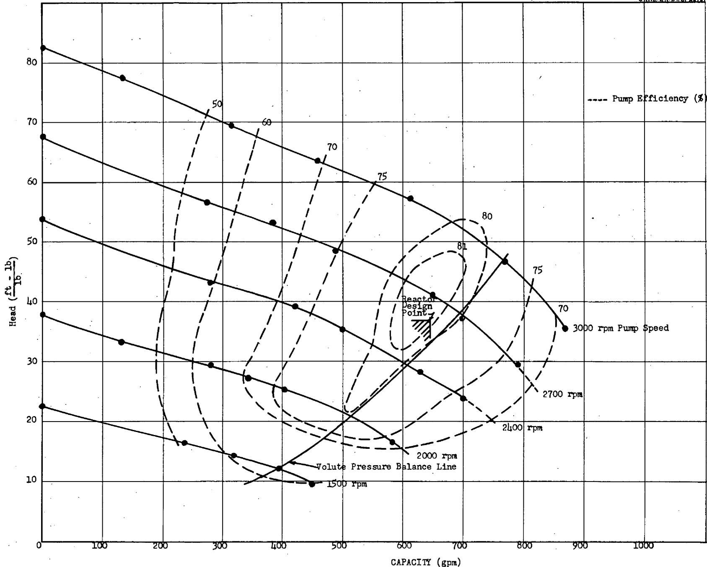  
[ - {2r}]

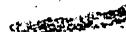  
FIG. 2.13 ART FUEL PUMP PERFORMANCE CHARACTERISTICS EXPERIMENT NO. 15 - TABLE 2.1

Pump Total Discharge Pressure Minus Impeller Blade Static Discharge Pressure (ft lb / lb)

HNSSEHD HHOHSIO CILVIS EODDINNO HL DNINIVLIO HO ENSSHED HOOHOSIO TYIOL dNnd LAV HL OL GHTtdv SNOLLOHNCO T'Z DIA   
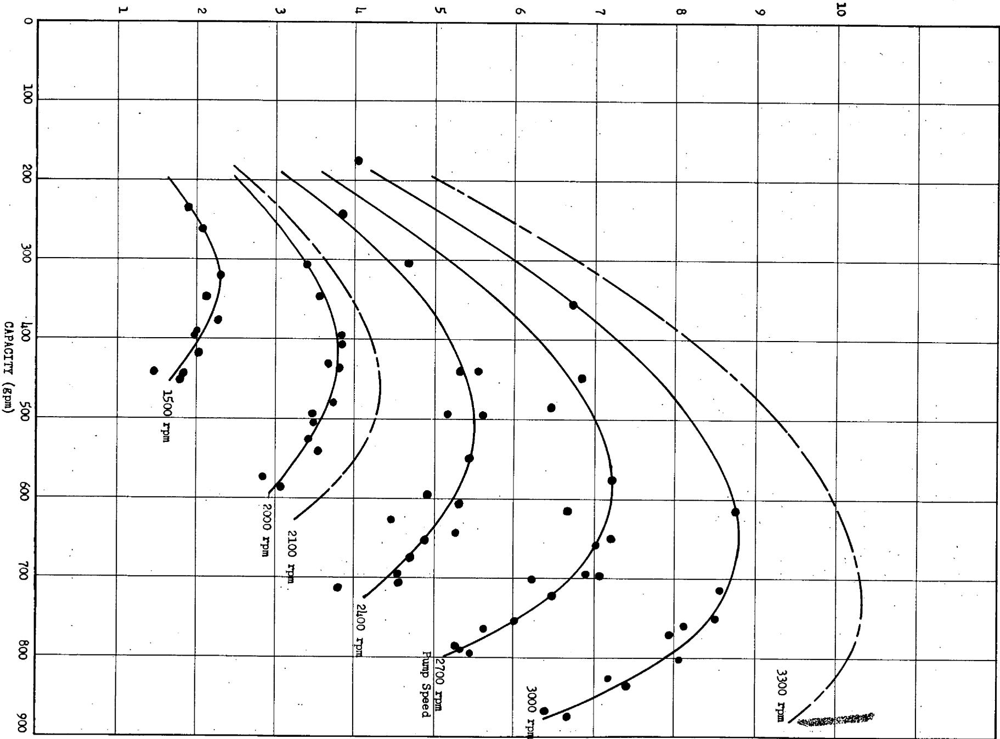  
BEEZDOW

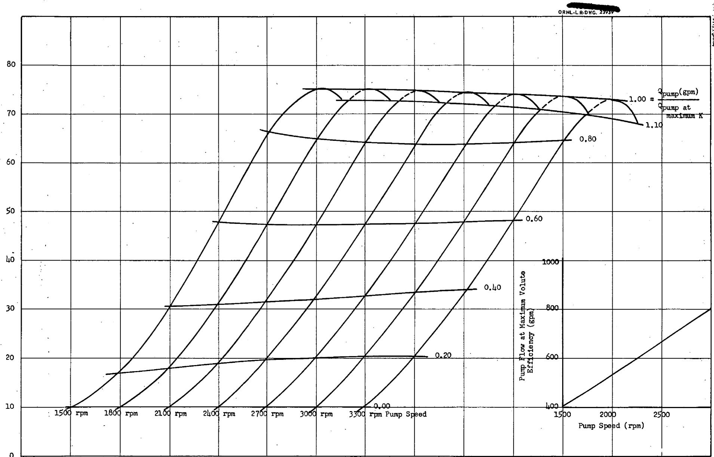  
一  
K (Fuel Pump Volute Efficiency in %)   
FIG. 2.15 ART FUEL PUMP VOLUME PERFORMANCE CHARACTERISTICS

# Combined ART Fuel Pump and Xenon Removal System Development

The final development work on the X-R system was done with a single pump Inconel hot loop test rig (see Fig. 2.16). This final work was originally planned to be done with a twin pump test loop very similar to the north head region of the ART. Construction difficulties with the twin pump loop delayed its completion and the development work was shifted to the single pump loop. This loop combined the latest X-R system tested with the plastic model and the final pump design determined from the pump water tests. All development work done with the single pump rig used water as the working fluid.

# System Pressure Fluctuations

At high liquid levels in the expansion tank (above 3 in.) it was found that the pressure throughout the main system was subject to rather large and irregular fluctuations. These fluctuations decreased as the expansion tank level was decreased from 3 in. to about $3/4$ in. where the fluctuations again began to increase. This increase at low levels was expected. The fluctuations at low expansion tank levels were observed in the plastic model and attributed to a fluctuating liquid-gas interface in the centrifuge. The flow into the centrifuge is by gravity from the expansion tank and any decrease in the level in the expansion tank will decrease the flow to the centrifuge. As the main fuel circuit is filled with an essentially non-compressable fluid it is necessary that the flow to and from this system be equal; thus, any change in the flow to the centrifuge will result in a change in the pressure of the main system and therefore a change in the flow from the main system back to the expansion tank. It can then be seen that as the liquid level in the expansion tank decreases, the flow to and through the centrifuge decreases and the main system pressure decreases. As shown previously the main system pressure is controlled by the discharge pressure of the centrifuge and any decrease in main system pressure results from a decrease in the centrifuge discharge pressure. In the case being discussed the centrifuge is running at constant speed and has a fixed outside diameter. Therefore any decrease in discharge pressure must

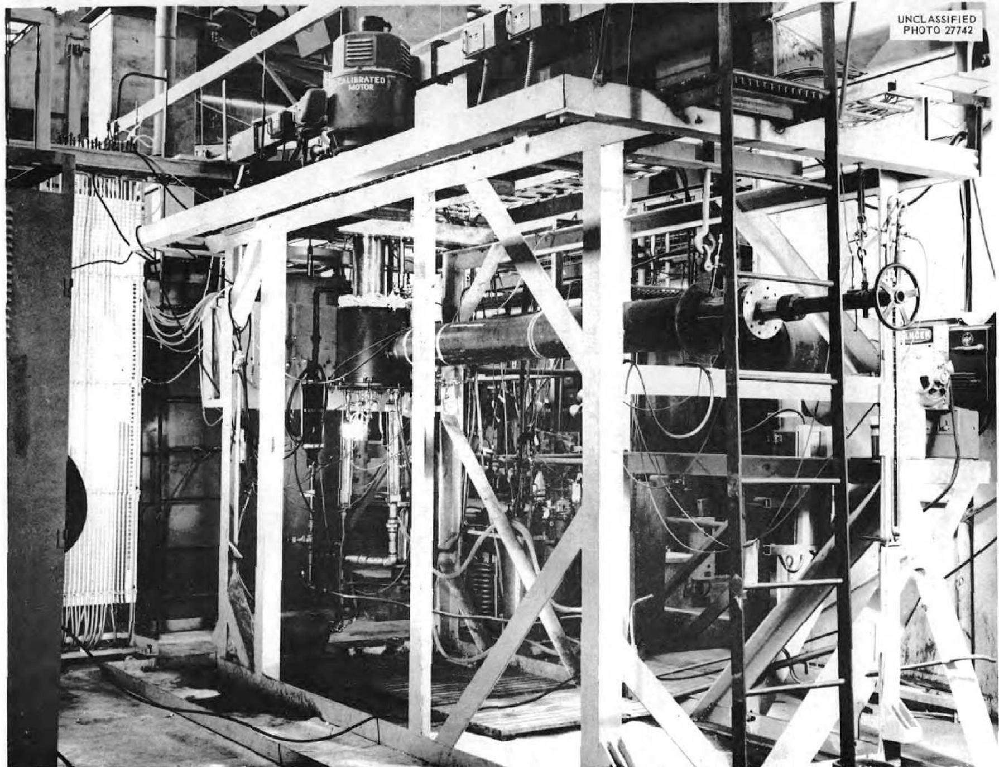  
FIG. 2.16- COMBINED XENON REMOVAL AND FUEL PUMP HOT TEST LOOP

result from a decrease in the suction pressure of the centrifuge or increase in the effective inside diameter. In the case of the low expansion tank level the effective inside diameter of the liquid-gas interface moves radially outward decreasing the pressure rise through the centrifuge. This change in liquid-gas interface was observed in some of the earlier tests with plastic models. For very low liquid levels this condition becomes unstable with the centrifuge alternately trying to become first empty and then as the outflow decreases to become full.

The cause of the fluctuations at high expansion tank liquid level was not nearly so obvious. During the development work each of the various flow paths were investigated and the difficulty was found to be caused by a fluctuation in the pressure at the inside diameter of the centrifuge. The cause of this fluctuation was traced to the lower slinger seal. At very high liquid levels the centrifuge will run in a flooded condition and it is probable that slugs of liquid as well as gas will flow upward between the shroud and shaft to the inlet of the lower slinger seal. This gas and liquid flow through the slinger impeller would cause it to surge with the surges being transmitted back to the centrifuge as irregular periods of high and low pressure. These surges would then be transmitted through the centrifuge to the main system.

To alleviate these surges the vanes were removed from the lower slinger seal. By removing these vanes the head of the lower slinger seal is reduced and any flow surges in this region will be dampened.

# System Pressure Level

A difficulty encountered in the early testing of the combined system was an excessive system pressure level which results in a high stress condition being imposed on the plate which separates the expansion tank and the fuel pump discharge. Since this pressure level is fixed by the centrifuge pressure rise, attempts were made to reduce the centrifuge pressure rise by two different approaches. First, the inside diameter of the centrifuge cup was increased, and second, the exit area from the centrifuge was decreased. There were several advantages to the first method. The change in the existing centrifuges were very

simple to make, and also it was possible to calculate very closely the new inside diameter of the centrifuge cup to get the desired change in the main system pressure level. Another advantage is that the cross sectional area of the entrance to the cup is increased and will lead to a more stable system pressure at lower expansion tank liquid levels. One disadvantage is that the radial depth of the liquid in the centrifuge is decreased. This thinner layer may enable gas bubbles to pass into the main system under operating conditions where they would have been stopped with the thicker layer. In the case of the small exit area from the centrifuge the major disadvantage was the difficulty of making the change. Any decrease in the exit area by decreasing the number of exit holes or the diameter of these holes will increase the velocity through the cup and thus reduce the degassing ability of the centrifuges. To overcome this difficulty the holes would have to be tapered with the hole area at the inner wall of the cup remaining the same and with the area at the exit in the outer diameter being reduced. Not only would the construction of these holes be difficult but their size would have to be determined by trial and error. One advantage of this system is that the liquid level or liquid gas interface in the centrifuge does not change. The second and more important advantage was never confirmed by test. This second advantage would show up only in the case where one of the two reactor pumps had stopped while the other was running. For this one pump out operation it is very desirable that the centrifuge have a head flow characteristic such that the head decreases very rapidly with any increase in through flow. All of the clearances around the centrifuges are large and the leakage is controlled by a dynamic seal. When one pump stops the seal is also lost so that the leakage becomes very large unless the pressure drop across this clearance is decreased. In the case where the exit area is small, the pressure drop across the exit holes of the operating pump is large and will increase rapidly with the increased flow resulting from leakage around the in-operative pump. In the case of the enlarged inside centrifuge diameter the head of the centrifuge must also drop off rapidly as the through flow increase; but in this case, the decrease in head must be accomplished by the centrifuge

the centrifuge becoming partially empty and increasing the effective inside diameter even more. This increase in the diameter of the gas-liquid interface leads to a breakdown in the effectiveness of the centrifuge.

# Bypass Flow Determination and Control

One of the most important purposes of the combined system tests was to determine and control the bypass flow. As previously noted the plastic model served only to give an approximate rate because of leakage of the lower seal. In the combined single pump system the bypass flow passage was identical to that for the ART. A disadvantage of this system is the lack of a method of directly measuring this bypass flow. The procedure used was to plug the hole in the center of the pump shaft through which the bypass flow normally passes and substitute an external line between the pump suction region and the expansion tank. This external line contained a valve and flow meter to regulate and measure the flow. During these tests runs the pump speed and main system flow were held constant while the flow through the external line was varied. The expansion tank gas pressure and the pump suction pressure were measured. This method yields a pseudo head-flow curve for the centrifuge and is used as a calibration for test runs where the actual flow up the pump shaft cannot be determined directly. The use of the pump suction pressure rather than the centrifuge discharge pressure for calibration purposes is arbitrary. The use of the suction pressure does simplify the immediate reduction of the data, and more important, the pressure differences between the pump suction and the expansion tank is one of the factors controlling the bypass flow and is of more interest than the pressure difference between the centrifuge discharge and the expansion tank. After this pseudo head-flow curve was established for a series of operating points, the plug was removed from the pump shaft and the external line closed. The operating point used in the above calibration runs were then repeated and again the pump suction pressure and the expansion tank gas pressure were determined. The data for the runs with the pump shaft plugged were plotted as shown in Fig. 2.17. The difference between the pump suction pressure and the expansion tank gas pressure for the pump shaft open runs were then checked against the identical calibration run and the bypass flow up the shaft was read from the curve.

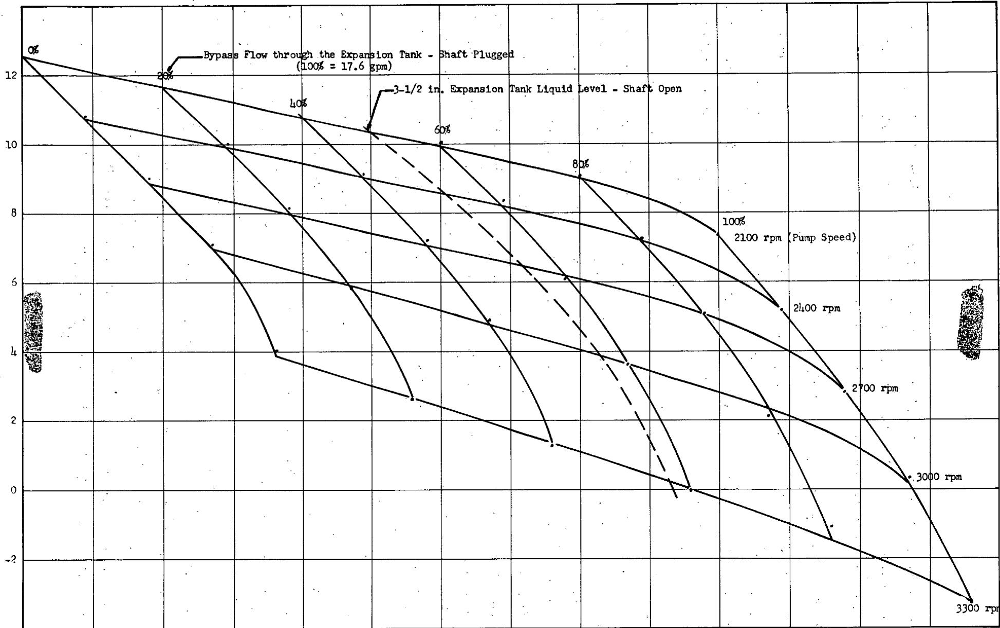  
-0s   
FUEL PUMP SUCTION PRESSURE MINUS EXPANSION TANK GAS PRESSURE   
FIG. 2.17 ART FUEL PUMP BYPASS FLOW CHARACTERISTICS WITH MODEL 32 IMPELLER   
AT A 3-1/2 IN. DEPTH OF LIQUID (WATER) IN THE EXPANSION TANK

The flow through the external line or up the pump shaft is not the total flow through the centrifuge. Part of the centrifuge flow recirculates over the centrifuge slinger seal and back into the cup. This recirculation flow is not accurately known but since it is not a function of the manner in which the flow gets from the pump suction to the expansion tank, but instead is only a function of the flow through the centrifuge, it does not enter into the calibration.

# Fuel Leakage Past Upper Slinger Seal

One item inherent in the X-R system design was the cause of much concern. This was the possibility of fuel passing over the upper slinger seal and being forced or drawn up into the narrow annulus between the pump shaft and the barrier shield plug. If any fuel from the system were to rise into this region it could freeze because of the cooling of the lubricant circulating in this region. The fuel on freezing becomes hard and could do damage to the shaft and shield plug can and could possibly freeze the shaft to the stationary shield plug can. This would necessitate a change of the pump rotary element. If the reactor had been at power this task would be unpleasant.

In the early test in the Inconel hot loop, the upper slinger seal design was the same as used in the plastic model. This design had twelve radial vanes about 3/16 in. high for the full radial distance (see Fig. 2.18). In these early tests it was found that the gas pressure in the expansion tank was greater than that in the oil catch basin region of the rotary element. In many cases, this pressure difference was as large as three to four feet of working fluid head. For the first design this pressure difference was found to depend upon the pump speed, the gas flow down the pump shaft annulus, and the liquid level in the expansion tank. There was a noticeable "break point" in this pressure difference as the expansion tank liquid level passed 2 in. This is also the level at which the liquid will uncover the ports between the sparging chamber and the expansion tank. As the liquid level was reduced from a high level to about 2 in., there was no significant change in the pressure difference. At

approximately 2 in. the pressure difference dropped sharply and was then again fairly independent of the liquid level as it was reduced further. The level at which the break point occurred was not fixed but was dependent on whether the liquid level was increasing or decreasing. The level for this break point was higher for the case when the liquid level was increasing than when the level was decreasing. It was also noted even at the highest liquid levels that as the rate of gas flow down from the catch basin was increased the pressure difference was decreased and for extremely high flow, several times the normal 500 liters per day, the pressure difference would reverse with the catch basin gas pressure being greater than the gas pressure in the expansion tank. It was also found that this undesirable pressure difference increased as the pump speed increased.

Under normal operating conditions a gas pressure reversal in this region will not cause any damage. The potential head of the slinger is greater than the pressure difference so that no liquid will be drawn over the vanes. The real danger of this condition is for the case where one or both pumps stop suddenly as in the case of a power failure. If the slowing down rate of the pump is so rapid that the inflowing gas cannot build up the pressure in the lower pressure region at the same rate the dynamic head of the seals is decreasing due to the decreasing speed, then the liquid will be drawn up into the annulus around the pump shaft and probably require a replacement for the rotary assembly.

All of the above observations show that the upper slinger seal is acting as a gas pump. The actual gas pressure buildup in the expansion tank is far greater than a pump of the size and type used should be able to normally produce using gas as the working fluid. It appears that the pressure buildup is due to the recirculation of liquid through and over the vanes. The upper slinger seal acts the same as an open face centrifugal pump operating under no flow conditions. Due to the rather large axial clearance over the top of the seal and recirculation is large. This recirculation appears as a flow outward through the vanes and an inward flow through the clearance above the vanes.

The outward flow carries gas bubbles to the outer tip where it then escapes into the sparging region and then into the expansion tank. As this process continues the pressure difference will increase and the length of vane which is covered by liquid will increase as the liquid is drawn radially inward to produce a large head to offset this rising pressure difference. As this radial dimension of the liquid increases, the centrifugal effect of the spinning liquid begins to screen or centrifuge the gas inward toward the pump shaft. These counter-acting effects thus limit the magnitude of the pressure difference the upper slinger seal can produce. This also explains the observed dependence of the pressure difference on the liquid level, speed and gas flow. As the gas flow is increased it will reach such a flow that the upper slinger seal cannot entrain and pump the gas as fast as it enters. When this flow is reached the pressure difference will reverse. In the case of the effect of the liquid level the observed hysteresis becomes clear. Before the upper slinger seal can act as a gas pump it must become primed. When the liquid level is increasing the upper slinger seal will "throw" the liquid away from its tip until the level has reached a point higher than the upper slinger seal or until the liquid which obstructs the exit ports from the sparging chamber causes the pressure to build up in the region of the tip of the upper slinger seal. When the expansion tank is filled to about 2-1/2 in., the liquid level is above the upper slinger seal and it is primed when the pump is started. To break this prime the level must be reduced until the exit ports from the sparging chamber are open and the pressure at the outer radius of the upper slinger seal is reduced. This also accounts for the sudden change in pressure when these points are reached. The ability of the upper slinger seal to entrain and pump gas is obviously a function of the speed.

In trying to overcome this problem, the basic idea was to reduce the large recirculation over the upper slinger seal which with the large axial clearance required is impossible to completely stop. The first attempt was to replace the vaned upper slinger seal with one whose top surface was smooth. The axial clearance was held the same as for the vaned upper slinger seal. This reduced the unfavorable pressure difference but did not reverse it.

Several other methods were tried with some improvement but were not completely satisfactory. All of these changes were attempts to reduce the outward flow potential at the rotating surface.

The design which finally gave a pressure difference in the desired direction, i.e., the catch basin pressure greater than the pressure in the expansion tank, is shown in Fig. 2.19. The top surface of the upper slinger seal was cut back for a radial distance of $3/4$ in. This configuration gave a catch basin pressure higher than that in the expansion tank by about 10 to 14 in. at design conditions and high liquid levels in the expansion tank. This increased clearance reduces the potential head of the upper slinger seal, but as it has far more head capacity than required to protect the rotary element when operating normally there is no deleterious effect in making this change. The outside diameter of the upper slinger seal could not be decreased to obtain the favorable pressure gradient. It was found that a liquid seal must be maintained between the face of the upper slinger seal and the sparging chamber. With this favorable pressure gradient, the fuel cannot enter the shaft annulus during the slowing down of the pump. Also once the pump has stopped, the gas flow to the expansion tank through the shaft annulus maintains the favorable pressure gradient.

# Experimental Results

The test results of the final design configuration are shown in Figs. 2.20 through 2.28. Figs. 2.20 through 2.23 give the head flow characteristics of the system as a function of speed. The value of the difference between the pump suction and expansion tank pressure is also shown. The small variations in the head-flow curves from one liquid level to another are probably not significant and are within the accuracy of the data. The values of the difference between the pump suction pressure $(P_{s})$ and the expansion tank gas pressure $(P_{He})$ are definitely a function of liquid level at lower levels, especially at 1 in. and below for reasons given previously.

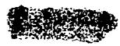

UNCLASSIFIED ORNL-LR-DWG.23941

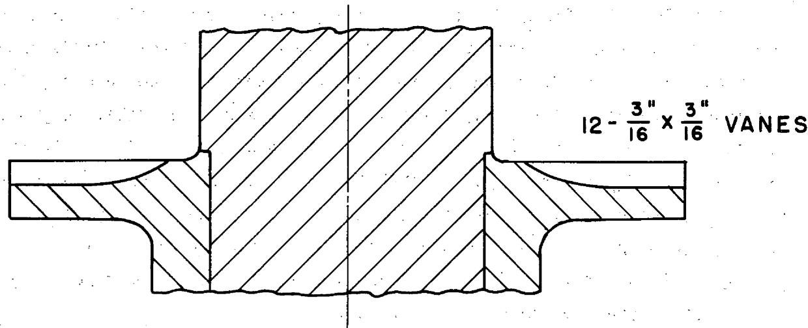  
FIG. 2.18

UPPER SLINGER SEAL WITH RADIAL VANES

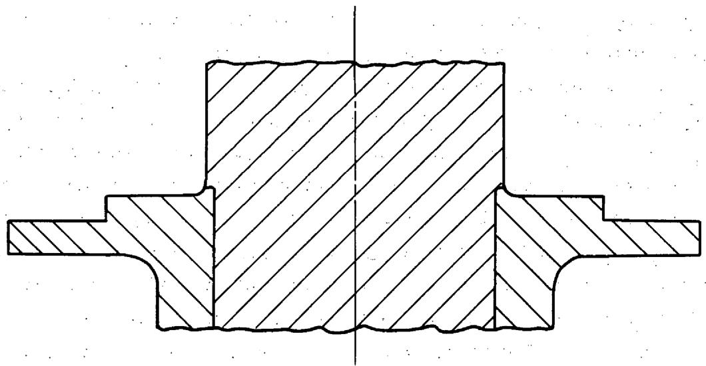  
FIG. 2.19

UPPER SLINGER SEAL WITH AN AXIAL STEP

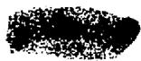

The reason for the scatter in the data can be seen by examining Figs. 2.24 through 2.27. These figures show the pressure fluctuations throughout the test loop as a function of speed, flow, and liquid level. While these fluctuations are not large enough to cause any damage to the reactor, they did make analysis of the data difficult. The reason these relatively small fluctuations were so important can be seen by studying Figs. 2.17. If the value of $P_{s} - P_{He}$ on the figure are shifted by 0.2 ft, the error in determining the actual bypass flow at 645 gpm amounts to about $5\%$ . At lower liquid levels the fluctuations become larger and the experimental values of the bypass flow erratic. For this reason, the bypass flows for the lower liquid levels are calculated (see Appendix E).

Calculated and experimentally determined flow up the pump shaft or that amount which bypasses the main fuel pump is shown in Fig. 2.28. This is not the total recirculation through the expansion tank. In the test loop in which the data was obtained there was a leakage of approximately 0.6 gpm from a point near the pump suction to the expansion tank. This leakage should be added to the bypass flow to get the actual total flow through the expansion tank. In the reactor there is also a leakage very similar to the one in the test loop. This leakage is around the island where it passes through the floor of the expansion tank. The amount of this leakage is estimated to be about $4\mathrm{gpm}$ or $2\mathrm{gpm}$ per pump and like the leakage in the test loop will depend upon the operating pump speed and flow.

The total flow through the centrifuge cups is equal to the sum of the bypass flow, leakage and recirculation over the top centrifuge seal vanes. The leakage over the vanes is large, about 6 to 8 gpm at design conditions. This large leakage does not effect the degassing ability of the cup. The reason for this is that when the flow has increased to the point where ingassing occurs the head of the centrifuge has dropped to the point where it is less than the head of the vanes. Under this condition it is probable that the centrifuge is not completely full and that the inside diameter of the vanes receive gas only. The vanes then act as a slinger and there is no flow through them in either direction, the location of the liquid-gas interface being determined by the head required to match that of the centrifuge.

-∠S   
HEAD (ft 1b)   
FIG. 2.20 ART FUEL PUMP PERFORMANCE CHARACTERISTICS WITH MODEL 32 IMPELLER   
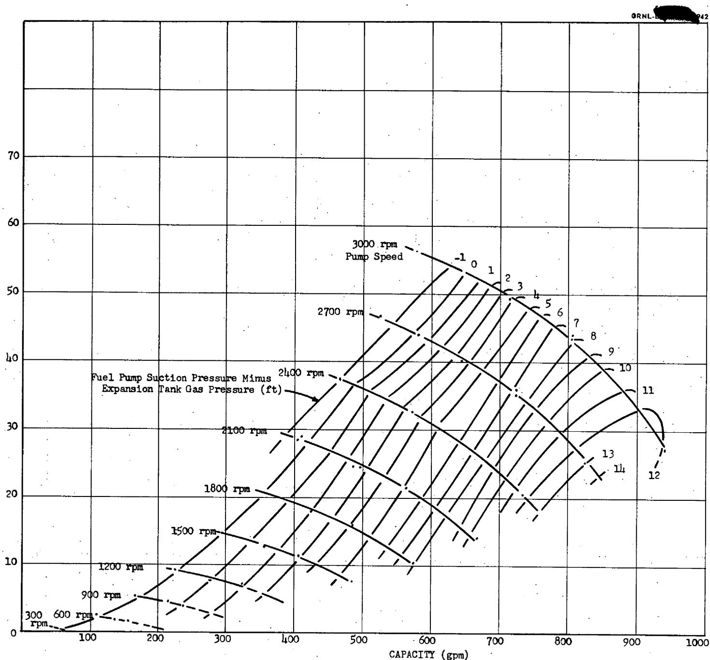  
AT A 1/2-IN. DEPTH OF LIQUID (WATER) IN THE EXPANSION TANK

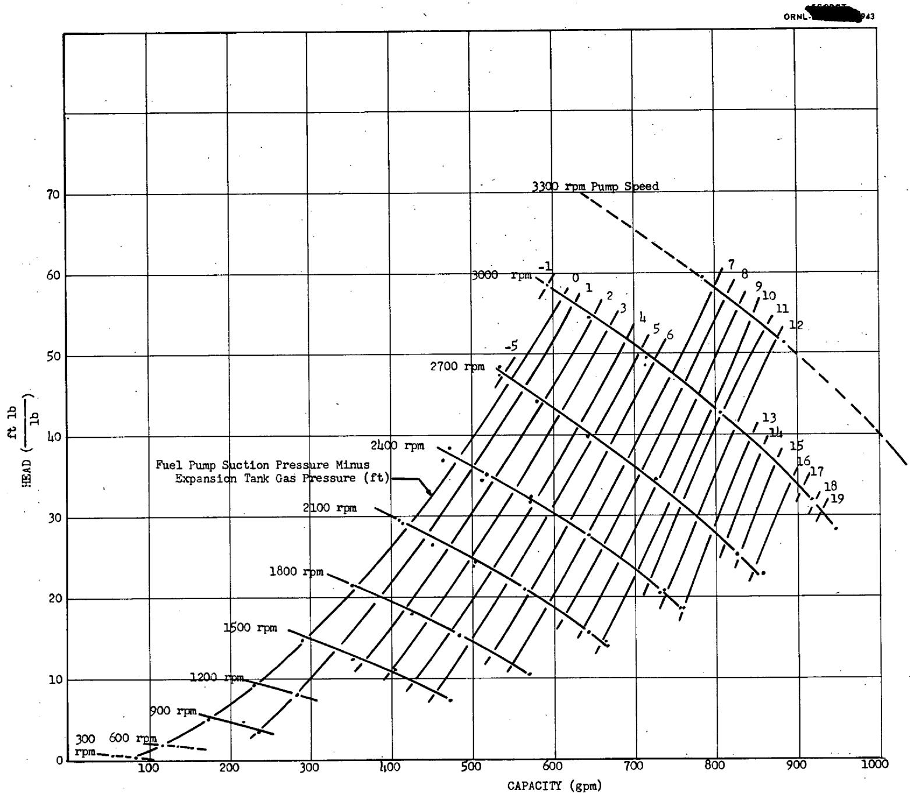  
-85

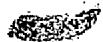  
FIG. 2.21 ART FUEL PUMP PERFORMANCE CHARACTERISTICS WITH MODEL 32 IMPELLER AT A 1-IN. DEPTH OF LIQUID (WATER) IN THE EXPANSION TANK

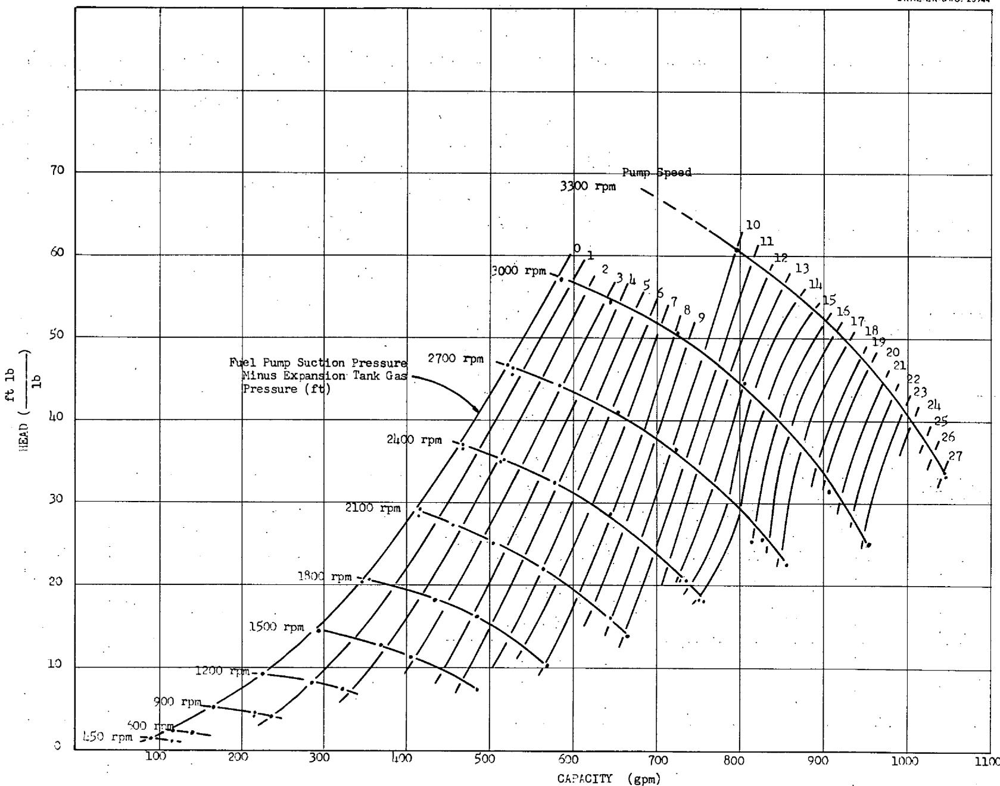  
-69   
FIG. 2.22 ART FUEL-PUMP PERFORMANCE CHARACTERISTICS WITH MODEL 32 IMPELLER

-09   
FIG. 2.23. ART FUEL PUMP PERFORMANCE CHARACTERISTICS WITH MODEL 32 IMPELLER   
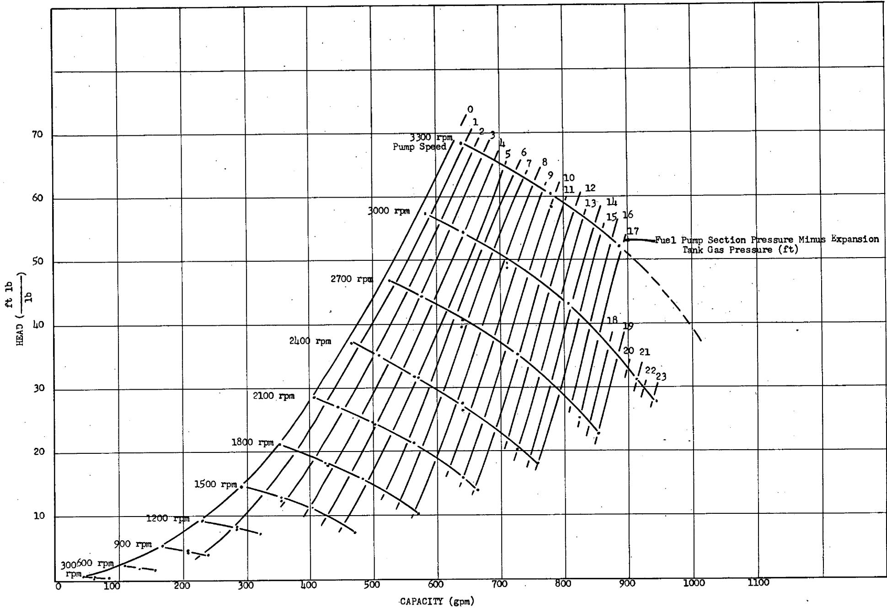  
AT A 3-IN. DEPTH OF LIQUID (WATER) IN THE EXPANSION TANK

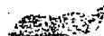

FIG. 2.24 ART FUEL PUMP FLUCTUATION CHARACTERISTICS WITH MODEL 32 IMPELLER   
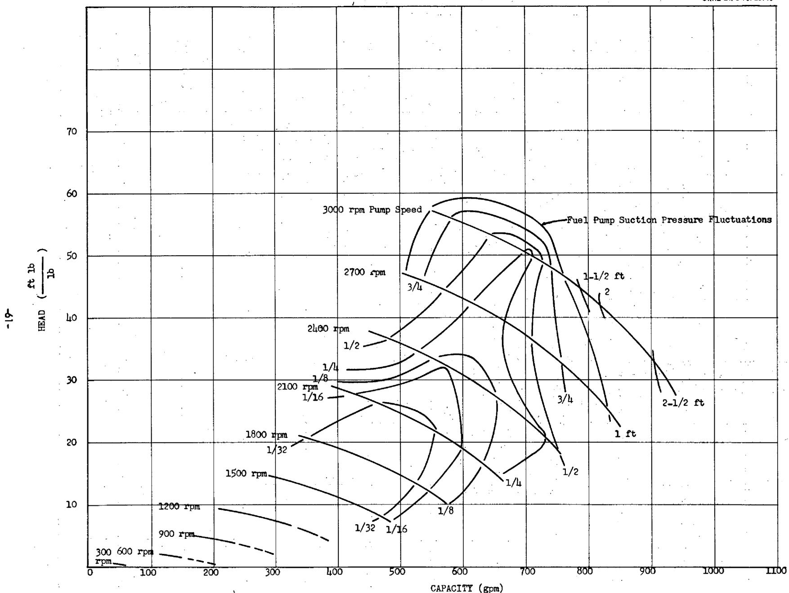  
AT A 1/2-IN. DEPTH OF LIQUID (WATER) IN THE EXPANSION TANK

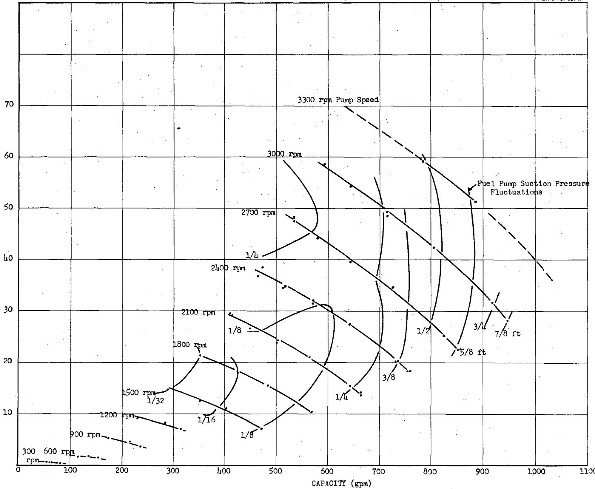  
-29   
ft1b HEAD 1b   
FIG.2.25 ART FUEL PUMP FLUCTUATION CHARACTERISTICS WITH MODEL 32 IMPOLLER   
AT A 1-IN. DEPTH OF LIQUID (WATER) IN THE EXPANSION TANK

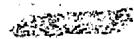

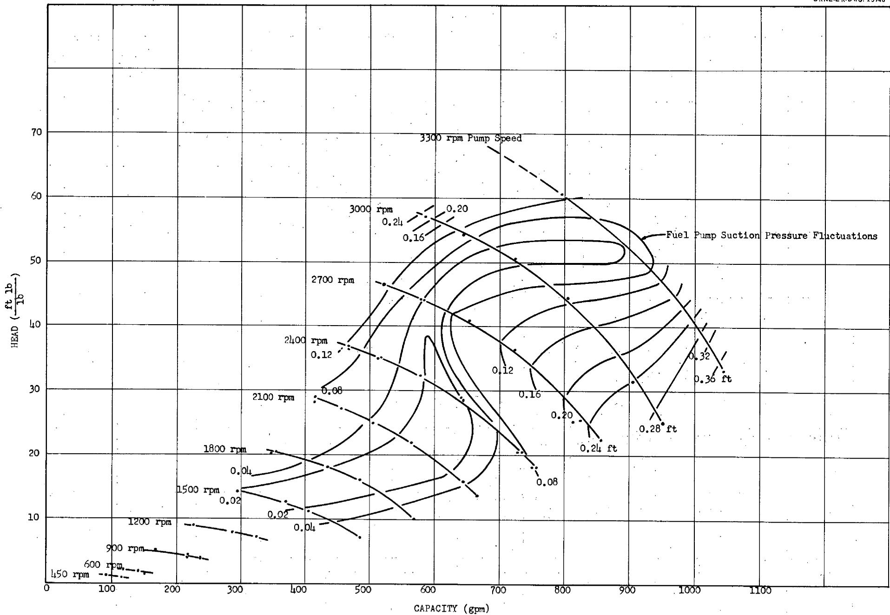  
FIG. 2.26 ART.FUEL PUMP FLUCTUATION CHARACTERISTICS WITH MODEL 32 IMPELLER

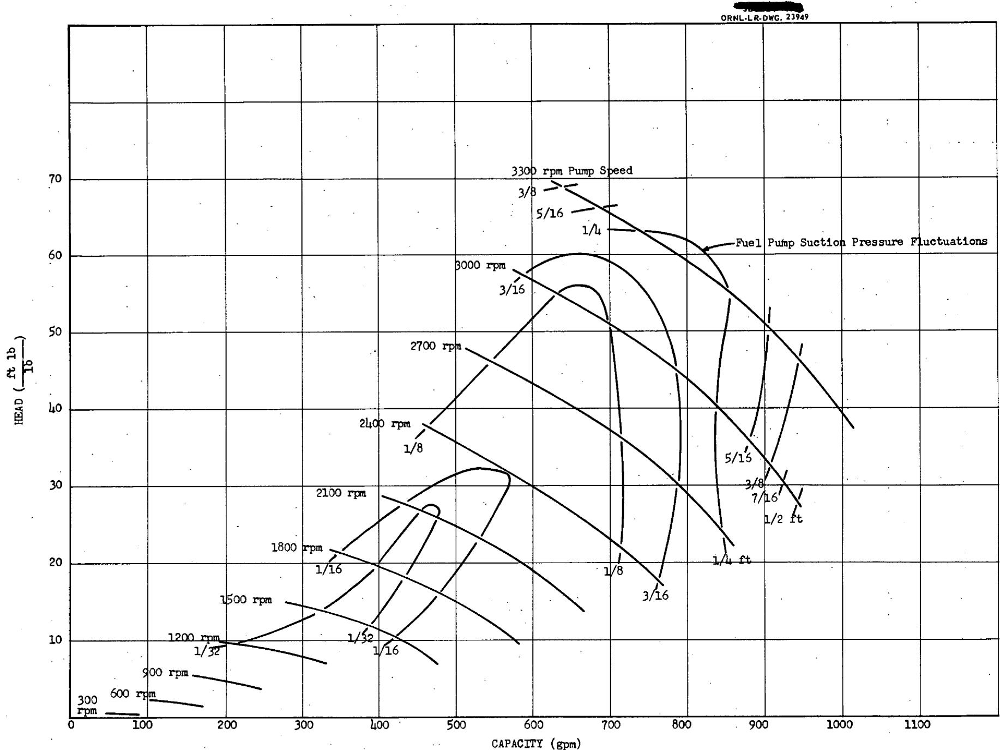  
-9   
FIG. 2.27 ART FUEL PUMP FLUCTUATION CHARACTERISTICS WITH MODEL 32 IMPELLER AT A 3-IN. DEPTH OF LIQUID (WATER) IN THE EXPANSION TANK

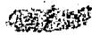

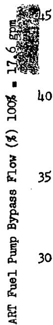

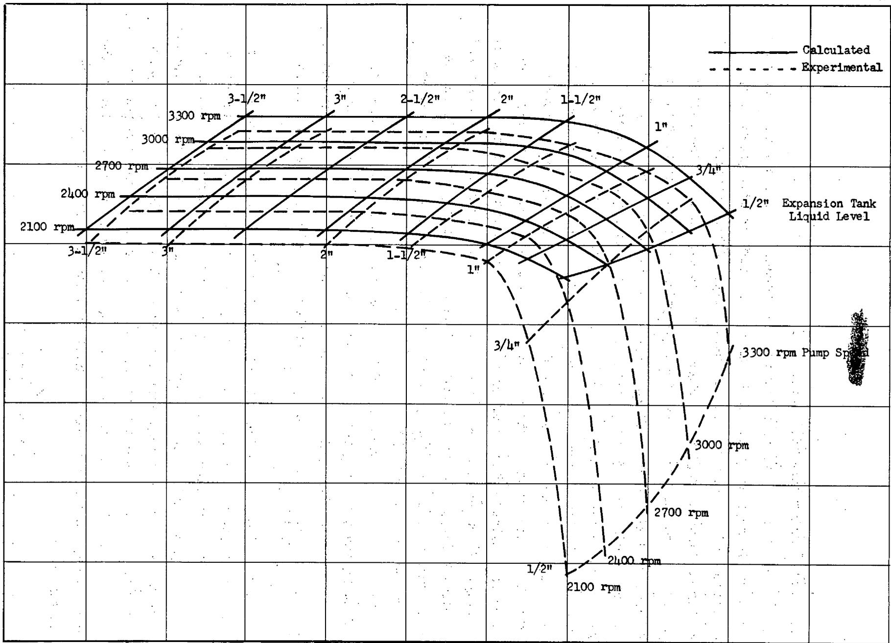  
FIG. 2.28 CALCULATED AND EXPERIMENTAL ART FUEL PUMP BYPASS FLOW CHARACTERISTICS

# ART Fuel Pump Cavitation Characteristics

Cavitation refers to conditions where, because of a local increase in velocity as in regions of either boundary curvature or eddy generation, vaporization of the flowing liquid creates vapor filled cavities. These cavities collapse in regions of higher pressure elsewhere in the system. In order to form such vapor cavities, the pressure first has to drop to the vapor pressure of the working fluid; a condition that can be realized as a local condition without a change in the average system pressure. For a pump operating at a constant speed a local pressure drop results from separation and contraction of flow and deviation of streamlines from their normal trajectory such as takes place in a turn or in passing an obstruction to the flow. The evils of the cavitation phenomenon are essentially three in number: (1) reduction in efficiency due to constriction of flow and loss of energy, (2) objectionable - if not structurally dangerous - vibration and and noise; and (3) possible extensive pitting of boundary materials in the zone of bubble collapse, due apparently to failure through fatigue after countless stress reversals.(6)

The local pressure drop caused by the difference in the pressures on the leading and trailing sides of the impeller blade is the major cause of cavitation in a centrifugal pump. This local pressure drop is a function of the relative inlet velocity $(W_{1})$ , the number of blades (Z), the thickness of the blades (t) and the local absolute velocity $(C_{1})$ .

The test loop from which the original pump development data was obtained was not constructed in a manner to allow operation at an elevated temperature or at a suction pressure below atmospheric. For this reason the determination of the fuel pump cavitation characteristics was delayed until the construction of a suitable loop. The loop designed for the hot testing of the fuel pump was used for obtaining the cavitation data. The Thoma cavitation parameter $(\sigma)$ (7)(8) was determined for the final impeller design as a function of the percent change in the pump maximum head at a constant flow and speed. The parameter $\sigma$ is

$$
\sigma = \frac {\mathrm {H} _ {\mathrm {S}} - \mathrm {H} _ {\mathrm {v a p}}}{\mathrm {H} _ {\mathrm {m a x}}}
$$

where $H_{s}$ is the pump total suction pressure measured close to the pump eye in order to avoid frictional losses, $H_{\text{vap}}$ is the vapor pressure of the working fluid, and $H_{\text{max}}$ is the pump maximum total head.

The results of these experiments are shown in Figs. 2.29 through 2.31. From these cavitation data and the data previously obtained on the difference between the expansion tank pressure and the pump suction pressure, Fig. 2.32 was made on the assumption that the suction pressure required to prevent cavitation was independent of the liquid level in the expansion tank. Fig. 2.32 gives the minimum expansion tank pressure required to prevent cavitation as a function of the expansion tank liquid level and the pump speed and flow.

FIG. 2.29 CAVITATION CHARACTERISTICS OF ART FUEL PUMP WITH MODEL 32 IMPELLER   
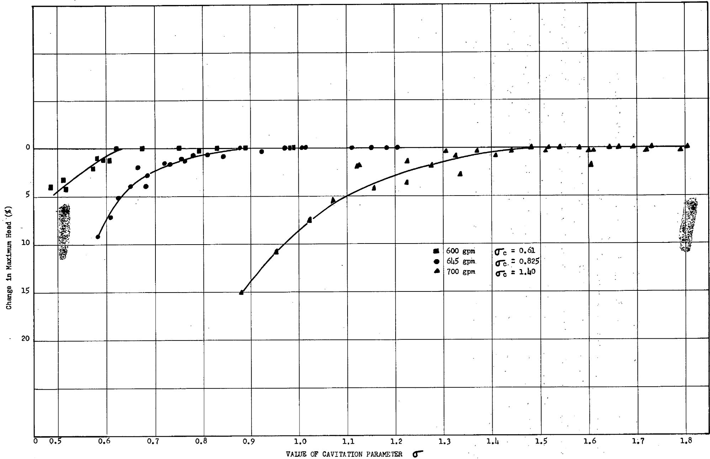  
AT A PUMP SPEED OF 2400 rpm AND A 3-IN. DEPTH OF LIQUID (WATER) IN THE EXPANSION TANK

Change in Maximum Head (%)   

<table><tr><td></td><td></td><td></td><td></td><td></td><td></td><td></td><td></td><td></td><td></td></tr><tr><td></td><td></td><td></td><td></td><td></td><td></td><td></td><td></td><td></td><td></td></tr><tr><td></td><td></td><td></td><td></td><td></td><td></td><td></td><td></td><td></td><td></td></tr><tr><td></td><td></td><td></td><td></td><td></td><td></td><td></td><td></td><td></td><td></td></tr><tr><td></td><td></td><td></td><td></td><td></td><td></td><td></td><td></td><td></td><td></td></tr><tr><td></td><td></td><td></td><td></td><td></td><td></td><td></td><td></td><td></td><td></td></tr><tr><td></td><td></td><td></td><td></td><td></td><td></td><td></td><td></td><td></td><td></td></tr><tr><td></td><td></td><td></td><td></td><td></td><td></td><td></td><td></td><td></td><td></td></tr><tr><td></td><td></td><td></td><td></td><td></td><td></td><td></td><td></td><td></td><td></td></tr><tr><td></td><td></td><td>0.2</td><td>0.3</td><td>0.4</td><td>0.5</td><td>0.6</td><td>0.7</td><td>0.8</td><td></td></tr></table>

FIG. 2.30 CAVITATION CHARACTERISTICS OF ART FUEL PUMP WITH MODEL 32 IMPELLER AT A PUMP SPEED OF 2700 rpm AND A 3-IN. DEPTH OF LIQUID (WATER) IN THE EXPANSION TANK

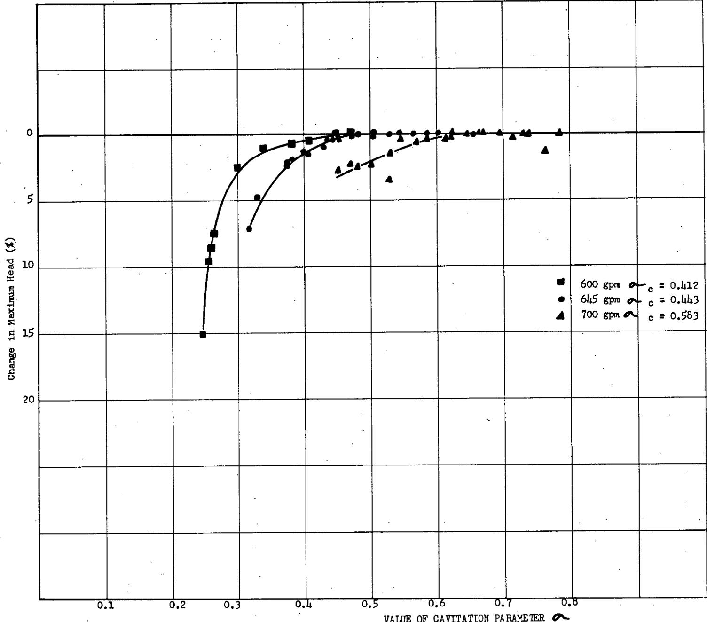  
-0∠  
FIG. 2.31 CAVITATION CHARACTERISTICS OF ART FUEL PUMP WITH MODEL 32 IMPELLER AT A PUMP SPEED OF 3000 rpm AND A 3-IN. DEPTH OF LIQUID (WATER) IN THE EXPANSION TANK

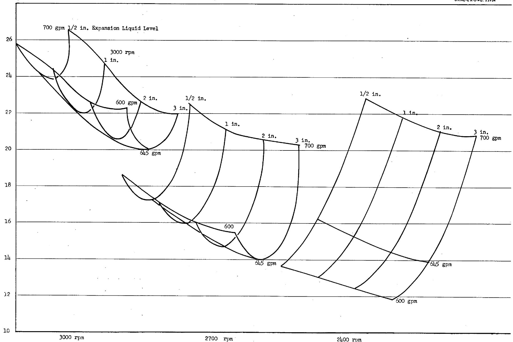  
一  
Expansion Tank Gas Pressure Minus Vapor Pressure of Working Fluid (ft abs)

  
ORNL-LR-DWG.23954   
FIG. 2.32 MINIMUM EXPANSION TANK GAS PRESSURE REQUIRED TO PREVENT CAVITATION IN THE ART FUEL PUMP

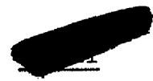

SECTION III

DESIGN OF AN ATTITUDE

STABLE XENON REMOVAL SYSTEM

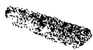

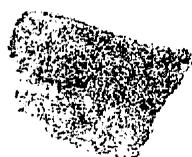

In addition to the design precepts and requirements of a stationary upright xenon removal system, one suitable for application to aircraft must meet the additional requirement of attitude stability. An over-all picture of the original attitude stable X-R system is given in Fig. 9.1. Illustrated particularly are the swirl chamber in relation to the rotary elements, the interconnecting parts, and the direction of fuel passage. The swirl chamber acts as an expansion tank in the fuel system and as a processing tank for xenon stripping. All other required functions are carried out in the rotary assembly, a cross section of which is shown in Fig. 3.2, which shows a full scale test model of the rotary assembly. The nomenclature of parts as used in the description is identified in Fig. 3.2.

Fig. 3.3 depicts the system as a hydraulic circuit. The numbers are only illustrative to point out the pressure interdependence between the X-R system and the main fuel circuit.

# Circuit Description

The bleed circuit is most readily understood by referring to Figs. 3.2 and 3.3. In the description below the circuit will be described in zones, as follows:

Zone 1: Centrifuge, core header region and nozzles (pressure control)

Zone 2: Nozzles, swirl chamber, and flow split stators (primary swirl)

Zone 3: Flow split stators, swirl pumps, and swirl chamber (secondary swirl)

# Zone 1. System Pressure Control

Circuit wise, it is best to consider the centrifuge as a radial vane centrifugal pump (see Fig. 3.4) discharging fuel to the core header region, which serves as a mixing chamber into which processed fuel is discharged

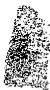  
1

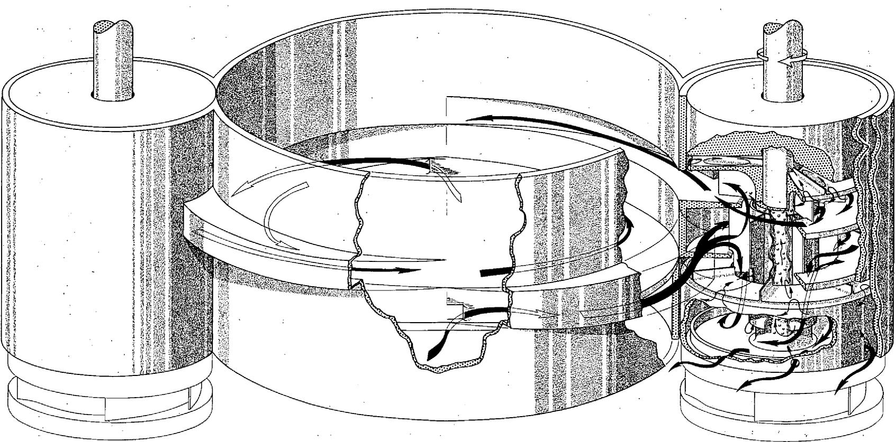

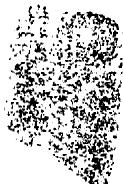  
Fig. 3.1 Attitude-Stable Xenon Removal System

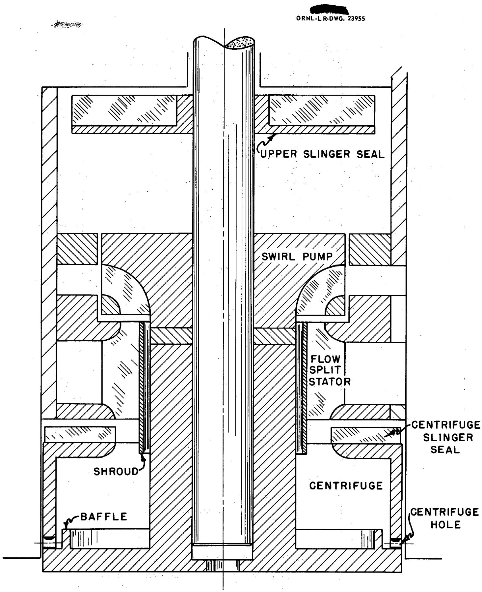  
FIGURE 3.2-ATTITUDE-STABLE XENON REMOVAL SYSTEM ROTARY ASSEMBLY

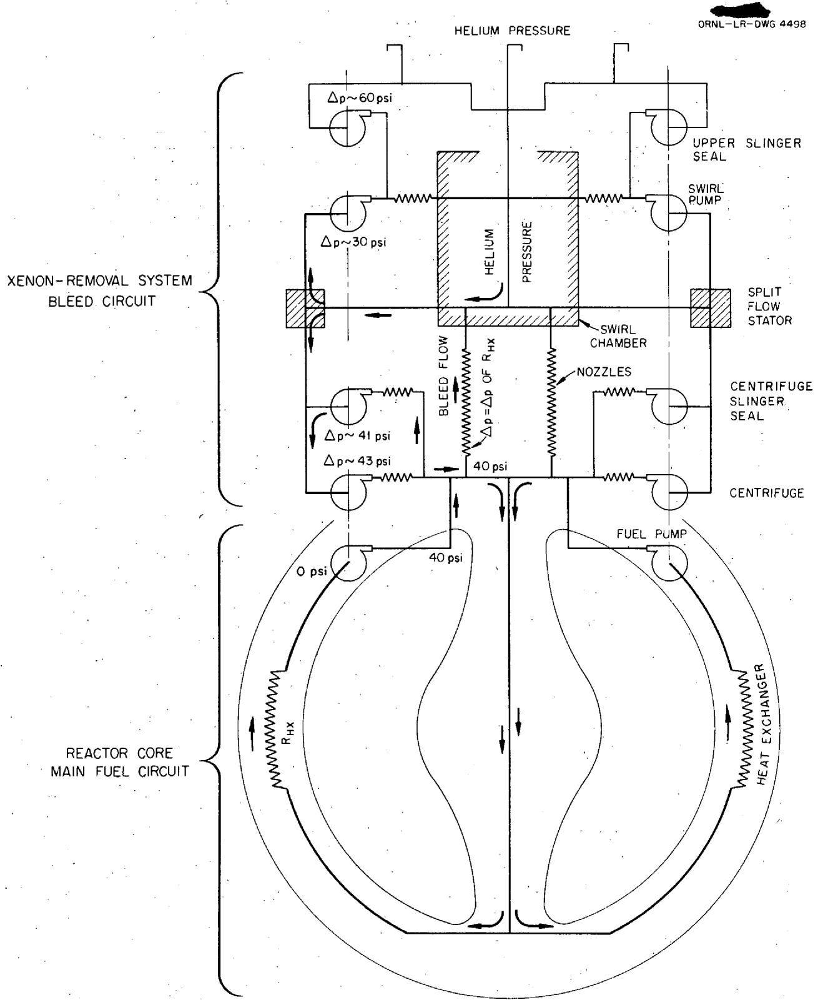  
NUMBERS DENOTING PRESSURES ARE ONLY ILLUSTRATIVE.   
FIG.3.3 SCHEMATIC OF ATTITUDE-STABLE FUEL CIRCUIT

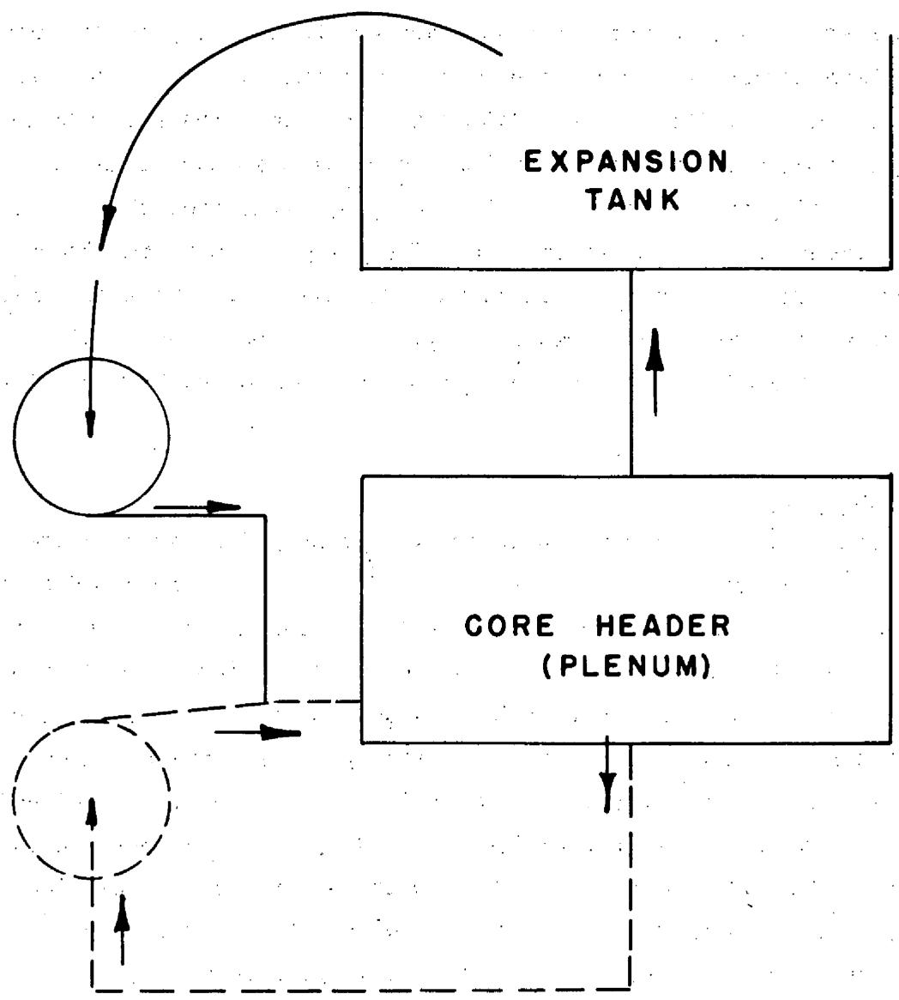  
FIG.3.4-ATTITUDE-STABLE_SYSTEM PRESSURE CONTROL

and from which an equal volume of fuel is bled for processing. Two nozzles direct the bleed flow into the expansion tank as tangential jets to induce a swirl. These nozzles represent the major resistance in the circuit and, together with the centrifuge speed, determine the bleed flow rate and the header region pressure. Since the header region is also the discharge region for the main fuel pumps (shown dotted in Fig. 3.4) it is seen that the bleed circuit in effect determines the main pump discharge pressure and thereby the reactor system pressure. By making the pressure drop across the nozzles equal to the main system fuel pressure drop, the main fuel pump suction pressure can be maintained at swirl chamber pressure (controlled by the off-gas system).

# Zone 2. Primary Swirl

This part of the bleed circuit serves the primary purpose of agitating the fuel. The fuel in the swirl chamber is made to spin (reinforced by the circuit of Zone 3) by the tangentially directed discharge of the fuel from the nozzles (see Fig. 3.5) and careful contouring of the swirl chamber walls. The resulting high peripheral velocities induce violent agitation, mixing, and gas entrainment in the spinning fuel. The spin also serves to make the fuel level insensitive to attitude. As seen in Fig. 3.5, ducting designed into the swirl chamber wall directs fuel into two protruding ports in the pump housing. The fuel scooped up by the ports is directed to the flow split stators which divert such fractions of the fuel axially downward into the centrifuges as is required to balance the centrifuge discharge (see Zone 1). Under normal operating conditions the centrifuge is simply flooded, the excess being diverted upwards into Zone 3.

# Zone 3. Secondary Swirl

The upward directed excess of Zone 2 is passed to two auxiliary centrifugal "swirl" pumps mounted on the main fuel pump shafts. The discharge of these pumps is directed by suitable porting and contouring (see Fig. 3.6) to reinforce the spin in the swirl chamber. This additional energy is not required until the level in the swirl chamber rises to about $40\%$ full. By

UNCLASSIFIED ORNL-LR-DWG.23957

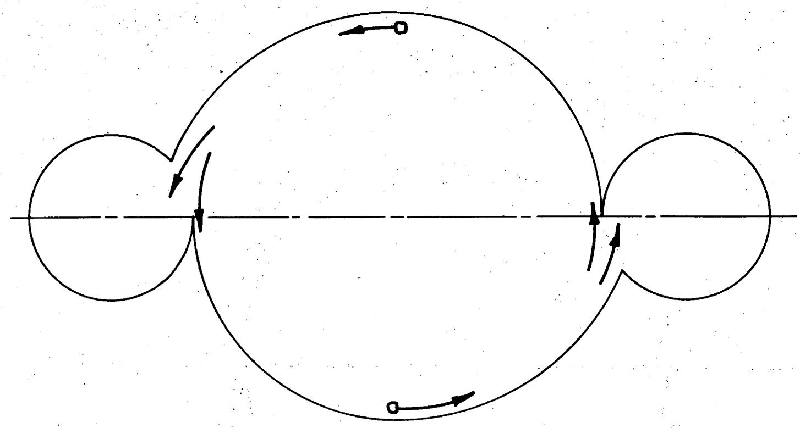  
FIG.3.5-ATTITUDE-STABLE SYSTEM PRIMARY BY-PASS SWIRL

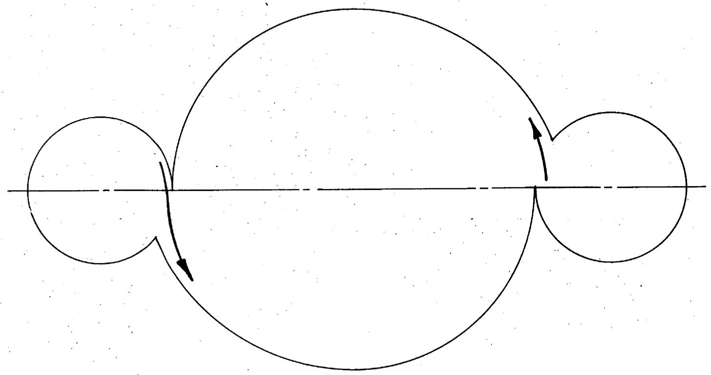  
-28   
FIG. 3.6 - ATTITUDE-STABLE SYSTEM SECONDARY BY-PASS SWIRL

virtue of its elevated position the swirl pumps automatically cut in when the level in the swirl chamber rises sufficiently to prime the swirl impeller.

The swirl impeller also serves to vent the gas liberated from the fuel in the centrifuges. A gas passage connecting the swirl impeller suction side with the centrifuge center is formed by a shroud around the shaft as shown in Fig. 3.7.

# Dynamic Seals

To complete the circuit description two important seals will be described briefly. Both seals are essentially radial vane centrifugal impellers arranged to pump against the pressure of fuel entering the impeller from what is normally the discharge end of the blades.

In the case of the upper slinger seal, its function is to prevent any fuel leaking past the swirl pump from moving up the pump shaft toward the bearings. The upper slinger seal impeller radius exceeds the swirl impeller radius in order to provide some safety margin and to permit inverted operation.

The centrifuge slinger seal is an integral part of the centrifuge (see Fig. 3.8) and serves to limit the amount of recycle around the top of the centrifuge. The blade diameters must be such as to develop nearly centrifuge pressure but never to exceed it. A more detailed discussion regarding design and performance is appended.

# Test Development

The chronological stages of the development of the ART-XR system are summarized diagrammatically in Table 3.2. Excerpts of a summary by A. P. Fraas of the development of the first six models are appended to this report. These models first indicated the need of employing a centrifuge and pointed out several instability problems which led to the decision to build the swirl chamber as a separate physical entity.

Denoted as Model No. 7 in Table 3.2 and illustrated in Fig. 3.10, such a swirl chamber was tested independently of the pumps by supplying feed from the plant sanitary water supply line. Tests were run at 2.6, 4.6, 8.9 psig

UNCLASSIFIED ORNL-LR-DWG.23959

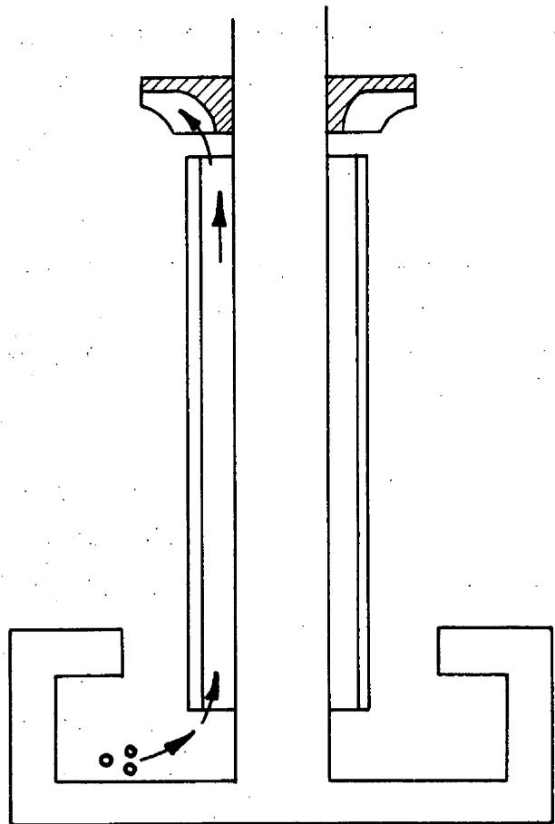  
FIG. 3.7 - ATTITUDE-STABLE SYSTEM PUMP

SHAFT SHROUD

UNCLASSIFIED

ORNL-LR-DWG.23960

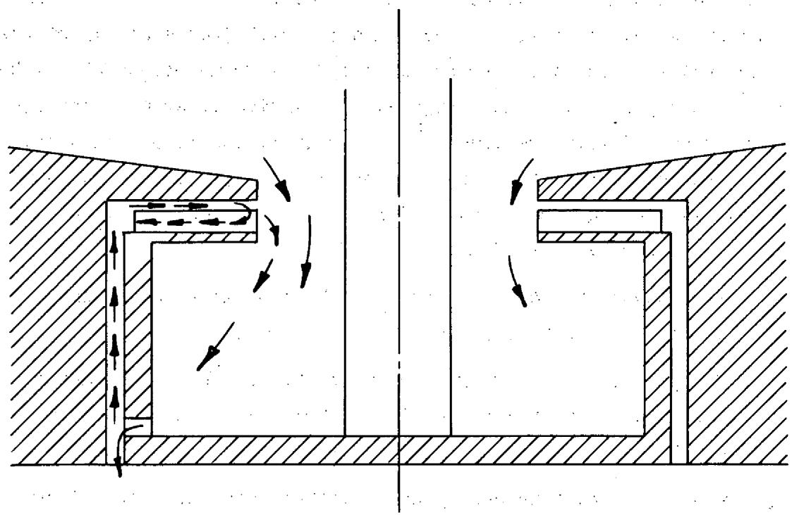

  
FIG. 3.8-ATTITUDE-STABLE SYSTEM CENTRIFUGE SLINGER SEAL

inlet pressure with various resistances in the discharge lines simulating lift and friction losses. The test data are summarized in Table 3.3.

In conducting the tests it was observed that the liquid level in the swirl chamber sought its own equilibrium level for any combination of inlet and back pressure. Efforts to change liquid level independently of pressures, by adding water directly to the swirl chamber, were unsuccessful; either the level reverted promptly to its original equilibrium level or a non-equilibrium condition resulted with the level continuously rising to overflowing.

The nature of this swirl instability was subsequently analyzed and is schematically represented in Fig. 3.9 in terms of an energy balance. The sequential dependence is as follows:

1. The amount of liquid retained by the centrifuge controls the centrifuge delivery pressure.   
2. The centrifuge delivery pressure acting on the nozzle determines the flow rate out of the centrifuge and into the swirl chamber.   
3. With the flow rate and pressure established the energy input to the fluid is established.   
4. For equilibrium conditions the input energy must equal the losses. The losses can be broken down into:

a. nozzle loss - a function of flow   
b. swirl chamber discharge loss - a function of flow   
c. lift - fixed   
d. swirl chamber agitation loss - a function of swirl chamber liquid level   
e. swirl chamber drag loss - a function of swirl chamber liquid level.

5. Since the swirl chamber also serves as the expansion volume for the fuel systems, a rising fuel temperature will initially cause a rising level in the swirl chamber. This changing level by way the 4d and e dependence above, affects the system equilibrium in a manner dependent on the initial equilibrium liquid level.

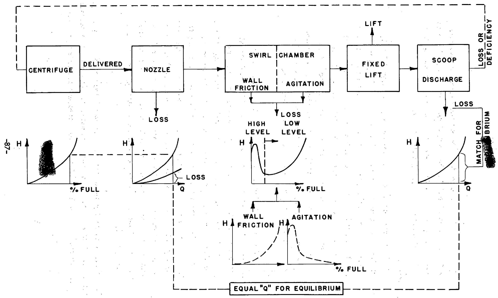  
FIG. 3.9- ATTITUDE-STABLE SYSTEM SWIRL CHAMBER ENERGY BALANCE

From Fig. 3.9 it is seen that the agitation losses decrease with rising level and is the predominant loss at "low" liquid levels. The drag losses, however, rise with increasing level and predominate at "high" liquid levels.

# Instability A:

With the swirl chamber at an initially "low" liquid level, a rising level (due to a rising fuel temperature) reduces the swirl chamber loss and thereby increases the flow out of the swirl chamber. With the centrifuge cup initially full this does not, however, increase the flow into the swirl chamber. In effect, then, the swirl chamber reverts to its initial stable level, transferring the extra inventory to the space above the centrifuge. As born out by test experience, the swirl chamber "refuses to act as an expansion chamber".

# Instability B:

With the swirl chamber at an initially "high" liquid level, a rising level increases the swirl chamber loss and thereby decreases the flow out of the swirl chamber and into the centrifuge cup. With its supply reduced the centrifuge liquid level drops thus reducing the energy supplied to the swirl chamber. With energy losses increasing (due to rising liquid level from (a) the extra inventory due to temperature rise and (b) the volume no longer retained by the centrifuge) and input energy decreasing, the system is more and more unbalanced, resulting in a run away condition as born out by test experience. The swirl chamber may overflow and the centrifuge cups will lose their primes.

At pressures above 7 psig sufficient flow was obtained to give good spin and agitation. However, the tests indicated definite instability tendencies for certain combinations of liquid level, back pressure and inlet pressure.

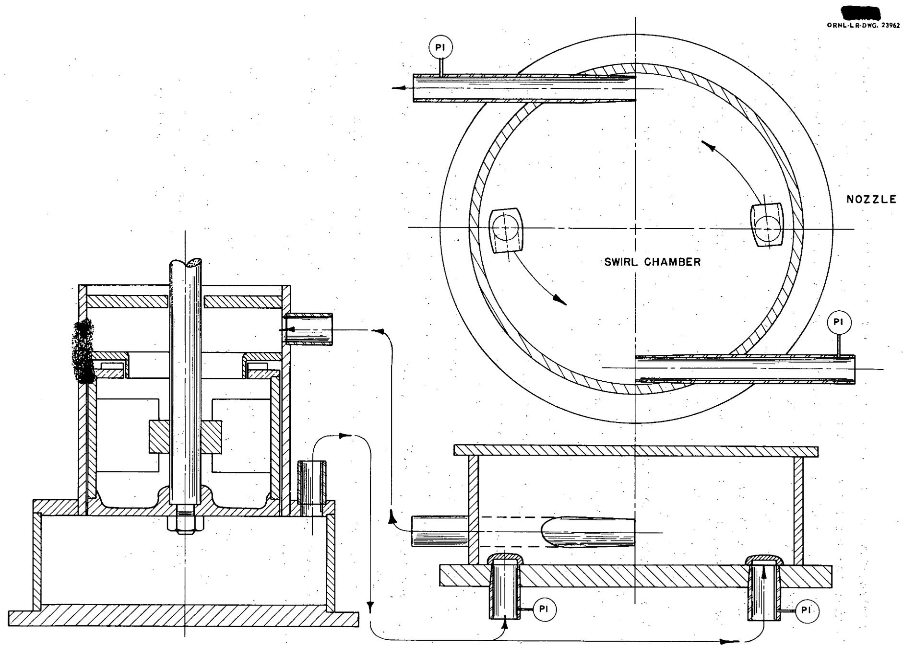  
FIG. 3.10- ATTITUDE - STABLE XENON REMOVAL SYSTEM TEST MODEL NO.7

The instability tendency was more clearly apparent in Test Model No. 8 (Table 3.2) when the swirl chamber was placed in series with one centrifuge.

#

The analysis of the swirl chamber indicated a marginal energy balance between the energy in the fluid issuing from the jets and the fluid friction losses in the swirl chamber. At some minimum swirl chamber level a metastable operating condition was attained. Any small increase in frictional resistance unbalanced the system to the point where the centrifuges lost all prime and freely passed air. It was not possible to reestablish stable operating conditions. In Test Model No. 9 every effort was made to reduce connecting line friction losses. Furthermore, the swirl chamber was raised such that the centrifuge could be supplied by gravity. However, even under these conditions, the system could not be stabilized over the full range of liquid levels.

It was, therefore, decided to augment the energy supplied to the swirl chamber by an auxiliary impeller as shown in Model No. 10, Table 3.2. The centrifuge discharge was passed upward through the clearance space between the centrifuge cup and the wall where it joined the auxiliary bypass fluid discharged by the impeller mounted on top of the centrifuge cup.

Although the centrifuge flow rate could not be determined, this model was able to remove bubbles from the plenum chamber below the centrifuge. Swirl chamber operation was stable. However, no appreciable system pressure could be developed.

The performance of Model 10, Table 3.2, and the analysis leading up to it indicated that the system was sufficiently well understood to make an attempt at an improved design appear promising. A two-pump integral plastic model was, therefore, designed incorporating the following features:

1. Locating the swirl chamber above the centrifuge cup to permit priming.   
2. Incorporating an auxiliary impeller which by superimposing a recirculating flow supplied excess energy to the swirl chamber.   
3. Designing a configuration such as to make passages between swirl chamber and centrifuge assembly as short as possible to minimize friction losses.

4. Introducing the centrifuge delivered flow into the swirl chamber through highly restrictive nozzles to maintain the system pressure and to provide spin at low swirl levels.

The assembly as originally built is illustrated in Fig. 3.11.

The development of this unit to the final working model involved changes in the rotary assembly only. These are illustrated in Table 3.2, Models 11 through 15. The problems encountered were primarily sealing problems to prevent recirculating short circuits. This development work is outlined in Table 3.2. Finally, the entire assembly was mounted on a rig to permit inverted operation. The performance is summarized in Table 3.1. The final critical dimensions for Model 15, Table 3.2, are listed in Table 3.4. The final design is illustrated in Fig. 3.12.

System Analysis (Refer to Fig. 3.3)

The manner in which the X-R system controls the main system pressure is most easily seen from a study of the characteristic curves of the two systems.

Figs. 3.13 and 3.14 illustrate the characteristic curves for the main fuel pump circuit and bypass flow circuit respectively. The ordinates are drawn to the same scale but intentionally do not have their origin defined. The labeled points have the following physical significance:

(a) fuel pump discharge pressure   
(b)centrifuge discharge pressure   
(c)centrifugeinletpressure   
(d) fuel pump suction pressure

As previously described and illustrated in Fig. 3.4, both the centrifuge and fuel pump discharge into a common header and therefore points (a) and (b) must be at the same pressure. Secondly, since the centrifuge inlet, because of its gas interface is essentially at swirl chamber helium pressure, i.e., since point (c) is at $p = 0$ (reference), all the other pressures are fixed relative to (c) as shown in Fig. 3.15.

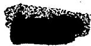

The system pressure, particularly the pump suction pressure, is therefore controlled by the helium pressure and the bypass flow pressure drop. The bleed flow $\Delta p$ is primarily controlled by the nozzle resistance. This nozzle is made highly restrictive in order to keep the pump suction pressure high enough to prevent cavitation. Any pressure drop across the centrifuge cup holes reduces the system pressure by an equivalent amount. Thus any condition that simulates an increased flow through the centrifuge cup holes effects a reduction in the system pressure level.

Test Conditions:

A. Speed range 700 rpm to 1800 rpm   
B. Storage volume range $20\%$ full to $80\%$ full   
C. Attitude: 1) upright, 2) inclined, 3) inverted.

Table 3.1 Model 15 - Performance Evaluation   

<table><tr><td>Performance Criterion</td><td>Test Condition</td><td>Evaluation</td></tr><tr><td rowspan="3">1. Expansion Volume Stability</td><td>A</td><td>Completely stable</td></tr><tr><td>B</td><td>Completely stable</td></tr><tr><td>C</td><td>Completely stable</td></tr><tr><td rowspan="3">2. Agitation</td><td>A</td><td>Varies from fair to excellent as speed increases.</td></tr><tr><td>B</td><td>Best at low volumes - generally good.</td></tr><tr><td>C</td><td>Good.</td></tr><tr><td rowspan="3">3. Upper Slinger Seal Effectiveness</td><td>A</td><td>Completely effective</td></tr><tr><td>B</td><td>Completely effective</td></tr><tr><td>C</td><td>Completely effective</td></tr><tr><td rowspan="3">4. System Pressure</td><td>A</td><td>Within 5% of theoretical expected.</td></tr><tr><td>B</td><td>Drops with dropping volume when less than 20% full.</td></tr><tr><td>C</td><td>Drops off completely at low volume.</td></tr><tr><td rowspan="3">5. Bubble Removal Effectiveness</td><td>A</td><td>Good - best at lower speeds.</td></tr><tr><td>B</td><td>Good - best a high liquid levels.</td></tr><tr><td>C</td><td>Fails at low volume and low speed.</td></tr><tr><td rowspan="3">6. Power Required</td><td>A</td><td>Increases with speed.</td></tr><tr><td>B</td><td>Increases markedly with high liquid level.</td></tr><tr><td>C</td><td>---</td></tr><tr><td>7. One Pump Out</td><td></td><td>Loss of system pressure; poor agitation.</td></tr></table>

<table><tr><td>MODEL
NO.</td><td>REFERENCE</td><td>FLOW PATTERN</td><td>MAJOR CHANGES FROM
PREVIOUS MODEL</td><td>EVALUATION</td></tr><tr><td>1</td><td>Fig. A.1</td><td>SLINGER
STORAGE
SWIRL</td><td></td><td>1) Swirl insufficient to remove bubbles.
2) Agitation good.
3) Slinger effective.</td></tr><tr><td>2</td><td>Fig. A.1</td><td></td><td>Jet added to assist swirl.</td><td>Swirl still insufficient to remove bubbles.</td></tr><tr><td>3</td><td>Fig. A.2</td><td>CENTRIFuge</td><td>Centrifuge added above pump impeller.</td><td>Insufficient lift available for getting fluid into centrifuge.</td></tr><tr><td>4</td><td>Fig. A.2</td><td></td><td>Scoops added in swirl chamber to assist lifting fluid into centrifuge.</td><td>Effective up to 1400 rpm only.</td></tr><tr><td>5</td><td>Fig. A.3</td><td></td><td>1) Peripheral airfoil scoops added.
2) Expansion - and swirl chamber built as unit chamber (baffle omitted).
3) Centrifuge discharge into impeller discharge region.</td><td>1) Unstable operation.
2) Passed air bubbles.</td></tr><tr><td>6</td><td>Fig. A.3</td><td></td><td>Labyrinth seal added between pump volute and swirl chamber.</td><td>No improvement.</td></tr></table>

Decision: 1) To separate centrifuge and swirl chambers.   
2) New models not to include simulat.d main circuit.

Table 3.2 (contd.)   

<table><tr><td>MODEL
NO.</td><td>REFERENCE</td><td>FLOW PATTERN</td><td>MAJOR CHANGES FROM
PREVIOUS MODEL</td><td>EVALUATION</td></tr><tr><td>7</td><td>Fig. 3.10</td><td>SWIRL
CHAMBER
P</td><td>Isolation of swirl chamber from pump impeller.</td><td>Test of swirl chamber with city water pressure supply and variably restricted discharge.
See Table 3.3.</td></tr><tr><td>8</td><td>Fig. 3.10</td><td></td><td>Svirl chamber connected to single centrifuge unit.</td><td>1) System unstable as liquid level is changed.
2) Centrifuge loses prime.</td></tr><tr><td>9</td><td>Fig. 3.10</td><td></td><td>Svirl chamber raised with respect to centrifuge.
Flow reduced by blocking one nozzle.</td><td>Marginal performance due to insufficient spin energy.</td></tr><tr><td>10</td><td>Fig. 3.10</td><td></td><td>Discharge through connection opposite impeller mounted on centrifuge.</td><td>1) Effective bubble separation.
2) No system pressure.
3) Good spin except at very high liquid level.
4) Centrifuge can lose prime because of limited spin energy and excessive fluid friction losses.</td></tr></table>

Decision: To build plastic model containing two centrifuge assemblies with integral swirl chamber between shaft centers.

Table 3.2 (contd.)   

<table><tr><td>MODEL
NO.</td><td>REFERENCE</td><td colspan="2">FLOW PATTERN</td><td>MAJOR CHANGES FROM
PREVIOUS MODEL</td><td>EVALUATION</td></tr><tr><td>11</td><td>Fig. 3.11</td><td></td><td></td><td>1) Two centrifuges
feeding common swirl
chambers.
2) Auxiliary impeller
to reinforce swirl
at high volume
levels.</td><td>Slinger seal ineffective.</td></tr><tr><td>12</td><td>Fig. 3.1</td><td></td><td></td><td>Slinger replaced by
slinger impeller.</td><td>1) Slinger impeller
effective.
2) Low pressure in main
system.</td></tr><tr><td>13</td><td>Fig. 3.2</td><td></td><td></td><td>Impeller added above
centrifuge.</td><td>1) System pressure
satisfactory.
2) Dubbles by-passed or
passed through
centrifuge.</td></tr><tr><td>14</td><td></td><td></td><td></td><td>Special test rig to
investigate scaling
arrangements.</td><td>Labyrinth seals in-
effective.</td></tr><tr><td>15</td><td>Fig. 3.1
3.2
3.12</td><td>Same as Model 13.</td><td></td><td>Identical with Model 13
but with rebuilt centri-
fuge and carefully
machined impeller. In-
verting rig provided.</td><td>Satisfactory operation
with respect to:
a) Dubble separation
b) Stability
c) System pressure
d) Attitude changes</td></tr></table>

Table 3.3 Model 7th Performance Evaluation   

<table><tr><td colspan="7">Static Head</td></tr><tr><td>Inlet Pressure ft</td><td>Back Pressure ft</td><td>Spin Velocity Measured 3/4 in. above scoop ft/sec</td><td>Flow cTs</td><td>Swirl * Chamber Efficiency %</td><td>Agitation Evaluation</td><td>Stability Evaluation</td></tr><tr><td>6</td><td>0.52</td><td>5.25</td><td>.0357</td><td>16.7</td><td>fair</td><td>stable</td></tr><tr><td></td><td>0.605</td><td>5.78</td><td>.0357</td><td>18.2</td><td>poor</td><td>stable</td></tr><tr><td></td><td>unstable</td><td></td><td></td><td></td><td></td><td>unstable</td></tr><tr><td>10.6</td><td>0.52</td><td>3.38</td><td>.0488</td><td>13.4</td><td>good</td><td>stable</td></tr><tr><td></td><td>0.605</td><td>3.22</td><td>.0473</td><td>13.7</td><td>good</td><td>stable</td></tr><tr><td></td><td>0.687</td><td>3.22</td><td>.0460</td><td>14.1</td><td>fair</td><td>stable</td></tr><tr><td></td><td>0.77</td><td>3.04</td><td>.0473</td><td>15.2</td><td>poor</td><td>stable</td></tr><tr><td></td><td>0.855</td><td>5.25</td><td>.0473</td><td>16.1</td><td>none</td><td>stable</td></tr><tr><td></td><td>unstable</td><td></td><td></td><td></td><td></td><td>unstable</td></tr><tr><td>20.6</td><td>0.52</td><td>8.9</td><td>.067</td><td>10.8</td><td>excellent</td><td>stable</td></tr><tr><td></td><td>0.687</td><td>8.18</td><td>.067</td><td>11.6</td><td>excellent</td><td>stable</td></tr><tr><td></td><td>0.935</td><td>9.62</td><td>.067</td><td>12.9</td><td>excellent</td><td>stable</td></tr><tr><td></td><td>1.27</td><td>9.62</td><td>.067</td><td>14.5</td><td>excellent</td><td>stable</td></tr><tr><td></td><td>1.40</td><td>9.62</td><td>.067</td><td>15.2</td><td>fair</td><td>stable</td></tr><tr><td></td><td>unstable</td><td></td><td></td><td></td><td></td><td>unstable</td></tr></table>

* Swirl chamber efficiency = Total Head of Leaving Fluid / Total Head of Entering Fluid

# Table 3.4

Model 15 - Dimensions Bleed Flow Rate .0297 ft3/sec

Swirl Chamber Nozzle Orifice

1/16 in. x 5/8 in.

Expansion Volume required

0.45 ft³

Expansion Tank Dimensions

0.D. 14 in.

I.D. 5 in.

Height 5.75 in.

Centrifuge Cup Size

0.D. 5.75 in.

I.D. 3.50 in.

Centrifuge Holes

Number 8   
lameter 1/4 i.

Centrifuge Slinger Seal

radial vane I.D. 3.50 in.  
radial vane O.D. 5-5/8 in.

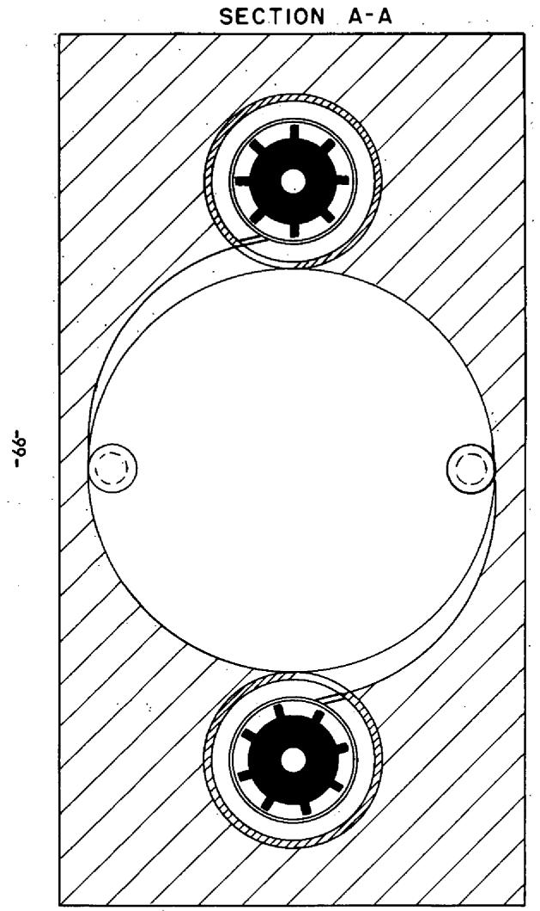

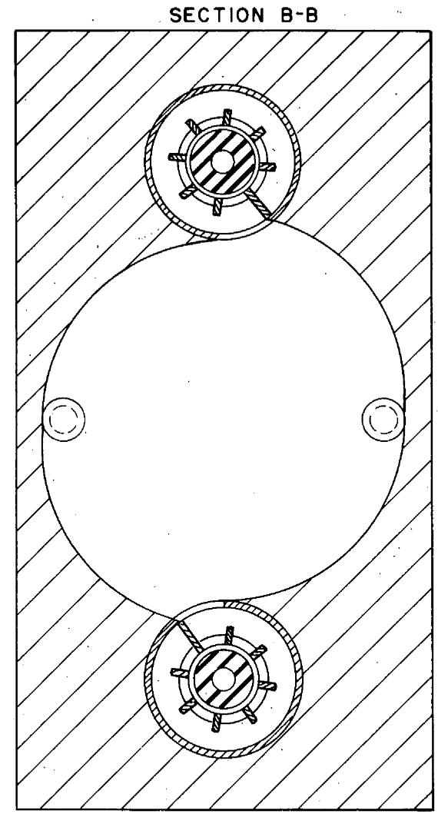

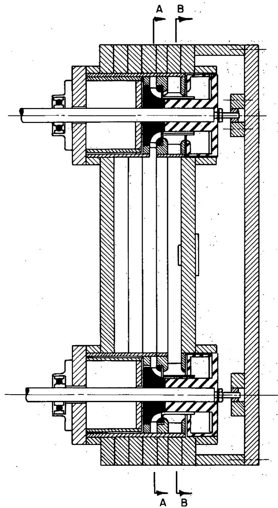  
FIG. 3.II- ATTITUDE-STABLE XENON REMOVAL SYSTEM TEST MODEL NO. II

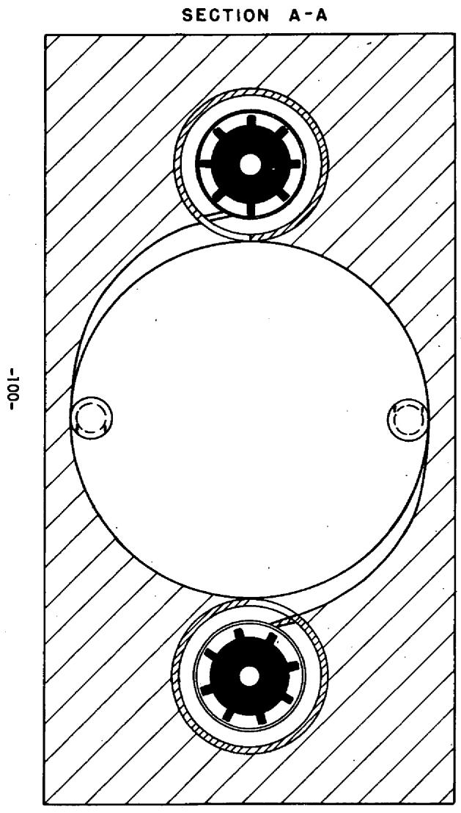

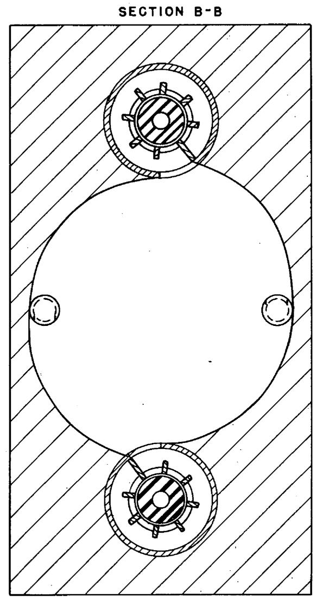

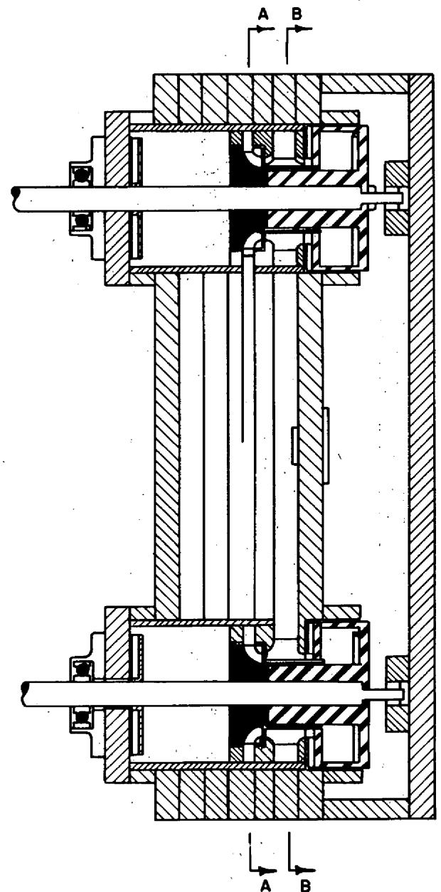  
FIGURE 3.12 ATTITUDE-STABLE XENON REMOVAL SYSTEM TEST MODEL NO. 15

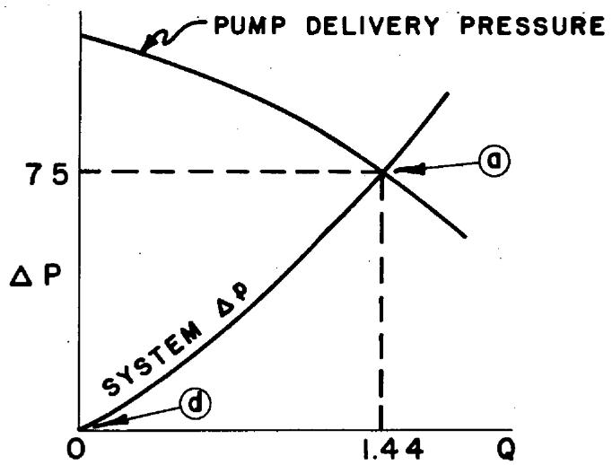  
FIG. 3.13

ATTITUDE-STABLE SYSTEM MAIN FUEL CIRCUIT CHARACTERISTIC

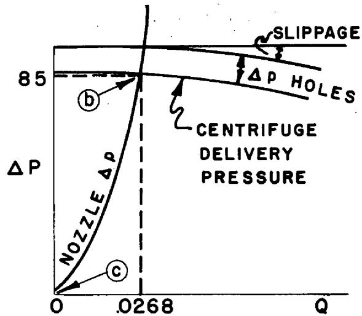  
FIG. 3.14

ATTITUDE-STABLE SYSTEM BY-PASS CIRCUIT CHARACTERISTIC

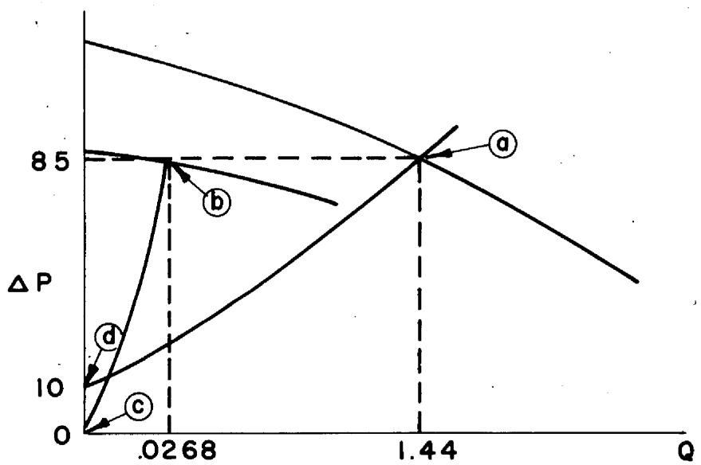  
FIG. 3.15

ATTITUDE-STABLE SYSTEM PARALLEL MAIN FUEL AND BY-PASS FLOW CHARACTERISTIC

Appendix A

SUMMARY OF WORK (TO JULY, 1954) LEADING TO THE DESIGN OF PUMPS FOR THE CFRE

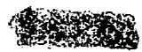

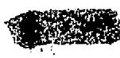

# SUMMARY OF WORK (TO JULY, 1954) LEADING TO THE DESIGN OF PUMPS FOR THE CFRE

(Refer to Models 1 through 6 Table 3.2)*

The face-type gas-seal sump pump is attractive for use with high temperature liquids because, by inserting a heat dam, the seal can be operated at conventional temperatures with conventional materials, for example, hardened steel and graphite in a petroleum oil bath providing both lubrication and cooling. An experimental unit was prepared in the summer of 1950 on the thesis that the free surface could be maintained in a centrifugal field and hence could be made insensitive to the variations in pump attitude and negative "g" loads to be expected in flight. A particular feature of the design was that it should act to de-aerate the system -- a feature considered essential in a full-scale aircraft type pump. The principles of operation were demonstrated by operating the pump with water in the fall of 1950 and approximately 80 hr of further testing with sodium at temperatures up to $1000^{\circ}\mathrm{F}$ was carried out in the summer of 1951.

As the design of the ART progressed it became evident that there is a strong incentive to remove xenon, and that this might be done by agitating the fuel in the expansion tank so that it would entrain bubbles. This would serve both to increase the surface area by a large factor and to bring a high proportion of the fuel close to a surface within a short period of time. Thus 1 or $2\%$ of the fuel could be by-passed through the expansion tank and the bulk of the xenon stripped before returning it to the main stream. The arrangement had the additional advantage that it would avoid overheating of the fuel in the expansion tank as a result of fission product decay activity. While a separate agitator could be provided, it was felt that the number of moving parts should be minimized and that the pump impeller shaft could serve a double purpose. The notion of utilizing a centrifugal field in back of the impeller to stabilize a free surface there had worked so nicely in the pump mentioned earlier

that a modification of it to effect xenon removal seemed promising. A simple model of work, glass, and plastic was prepared to investigate the possibilities. A section through this model is shown in Fig. A.l. The model was designed to operate with the fluid in the expansion tank swirling under the impulse of fluid accelerated and thrown off by the impeller. A considerably higher swirl velocity was expected in the annulus just above the impeller, and a diaphragm was inserted to separate this region from the main part of the expansion tank above. It was hoped that the swirl velocity in this lower region would be high enough so that the outer periphery would operate free of bubbles. Thus, fluid leaking upward through the labyrinth seal between the impeller and the casing would pass into the expansion tank where it would be violently agitated and mixed with bubbles. This bypass flow from the high pressure region at the impeller discharge into the low pressure region in the expansion tank would be returned to the impeller inlet through holes in the periphery of the swirl chamber under the expansion tank. It should be noted that the resistance of the main fuel system was simulated in the model of Fig. A.l by a set of twelve 1/4-in.-dia orifices in the lower of the two disks bounding the annulus into which the impeller discharged. Thus the main stream flowed directly from the impeller discharge through these orifices back to the pump inlet while the bypass flow through the expansion tank followed a more devious route. A slinger was mounted on the impeller shaft just under the roof of the expansion tank to prevent fuel from entering the clearance between the shaft and the heat dam between the expansion tank and the gas seal.

When the model was built and tested, it was found that it performed substantially as desired except that the swirl velocity in the expansion tank was not adequate to centrifuge the bubbles out of the fluid returning from the expansion tank to the impeller inlet. Tangential jets in the floor of the swirl chamber were drilled from the high pressure region at the pump discharge to give a higher swirl velocity in an effort to get better bubble separation. No improvement was obtained. Two features of the pump did perform surprisingly well, however. The slinger was eminently effective in preventing the entrance of fluid into the region between the slinger and the seal, and the agitation and bubble entrainment of the fuel in the expansion tank gave good promise of

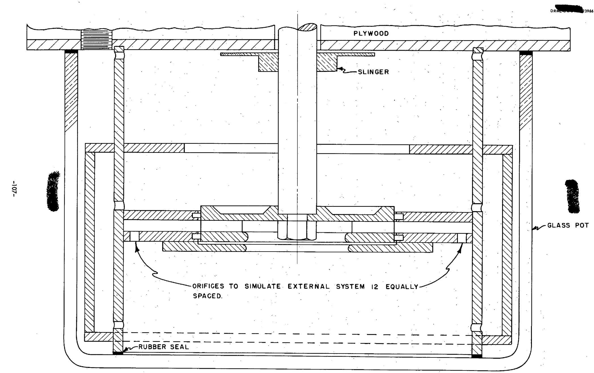  
FIG. A.1- PRELIMINARY MODEL NO.1 OF AN ATTITUDE-STABLE XENON REMOVAL SYSTEM

removing the xenon.

The results of this analytical work clearly showed the need for a centrifuge operating with at least as high a tip speed as the impeller. On this basis the impeller was modified as indicated in Fig. A.2 to include a centrifuge cup on its rear face. Holes were drilled in the periphery of the cup so that fluid would discharge into the swirl chamber. This arrangement was found to be much superior to the first model, but it proved difficult to get fluid to flow into the centrifuge cup at speeds above about 1200 rpm. Various scoops were tried, including airfoil-shaped radial structures. The latter were hollow with inlet scoops in their leading edges near the outer periphery so that ram pressure from swirl in the expansion tank would force fluid through the strut and into the centrifuge cup. The best of these scoops worked fairly well up to about 1400 rpm, and would give positive de-aeration at speeds from about 800 to 1400 rpm.

A careful re-examination of the system led to the decision to make several major changes. Since the first model had deteriorated considerably in the course of the several modifications, it was decided that a new model should be built as shown in Fig. A.3. The baffle or diaphragm at the top of the centrifuge cup was omitted and the fluid allowed to discharge from the centrifuge through 3/16-in. holes into the regions behind the impeller vane tips. It was expected that omitting the diaphragm would increase the liquid level range in the expansion tank for which it might be hoped that the pump could operate. The centrifuge cup was made as long as possible in the space available to minimize the radial through-flow velocity. A new type of scoop was designed to fit in the bottom of the expansion tank to lift the fluid through the annulus between the tank wall and an internal liner, and deliver it to the centrifuge. This arrangement was found to be satisfactory in every respect except that, at high speeds, if the liquid level dropped so that the free surface of the expansion tank vortex dropped below the top of the centrifuge cup, the fluid would be thrown off the wheel intermittently and long streamers of air would extend down to and into the labyrinth seal at the top of the impeller and severe bubble entrainment in the main stream would result.

Separating the expansion tank from the pump impeller seemed to be a promising arrangement if sufficient agitation could be produced by jet action to take care of both xenon removal and pumping the bypass flow from the expansion tank to the centrifuges. A circular tank between the two pumps as shown in Fig. 3.l0 was designed to accomplish both functions. Tangential jets in the bottom of the tank were designed to allow fluid to discharge from the high pressure region at the pump discharge into the expansion tank, which would run at essentially pump impeller inlet pressure. The large scale swirl induced in the expansion tank could be made to entrain gas bubbles through the use of aspirator tubes. The ram pressure on tangential scoops in the outer walls should serve to pump fluid through the scoops to the centrifuge chamber.

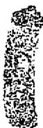  
-110-

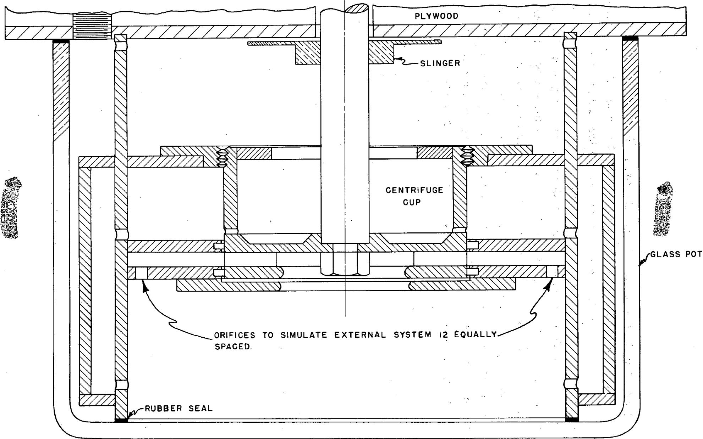  
FIG. A.2 - PRELIMINARY MODEL NO.2 OF AN ATTITUDE-STABLE XENON REMOVAL SYSTEM

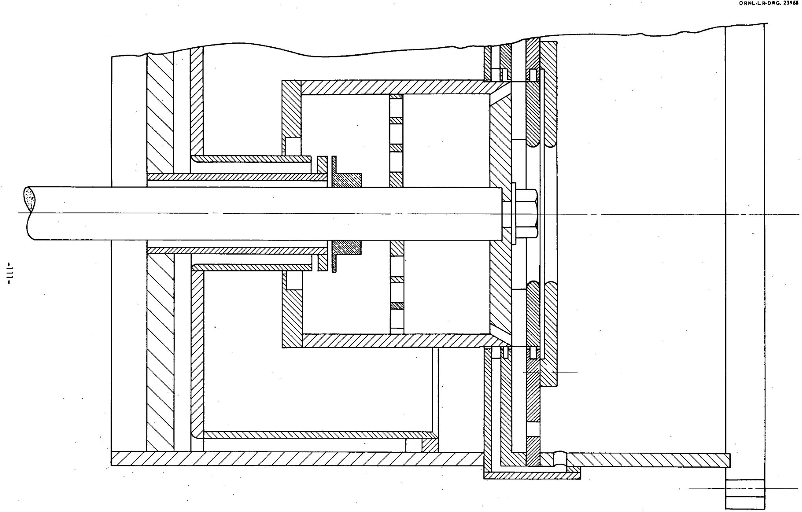  
FIG. A.3- PRELIMINARY MODEL NO.3 OF AN ATTITUDE-STABLE XENON REMOVAL SYSTEM

# Appendix B

# CENTRIFuge THEORY AND CALCULATIONS

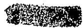

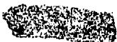

# CENTRIFUGE THEORY AND CALCULATIONS

The centrifuges serve two purposes essential to the system. First, they remove the mixture of helium and inert fission gases from the fuel before it reenters the main fuel system; and secondly, they serve as pumps to return the fuel to the main system under pressure.

The ability of the centrifuges to remove the gas bubbles from the fuel depends primarily upon four factors: the speed of rotation of the centrifuges, the radial distance to the point of discharge, the velocity of radial flow through the centrifuges, and the size of the bubble to be removed.

The relationship between these factors may be shown as follows:

The drag force on an object with motion relative to a fluid is given by the equation

$$
F _ {d} = C _ {d} \frac {\rho v ^ {2}}{2 g} A
$$

where

$$
F _ {d} = \text {d r a g f o r c e (1 b)}
$$

$$
C _ {d} = \text {c o e f f i c i e n t o f d r a g}
$$

$$
\rho = \text {d e n s i t y o f t h e f l u i d} (1 b - f t ^ {- 3})
$$

$$
V = \text {v e l o c i t y}
$$

$$
\left(f t - \sec^ {- 1}\right)
$$

$$
g. = \text {g r a v i t a t i o n a l} (f t - \sec^ {- 2})
$$

$$
A = \text {a r e a o f o b j e c t p r o j e c t e d t o t h e f l o w} (f t ^ {2}).
$$

The centripetal (flotation) force on a bubble in a rotating fluid (assuming density of object is negligible) is given by the equation

$$
F _ {C} = \frac {4}{3} \pi r ^ {3} \rho \frac {W ^ {2} X}{g}
$$

where

$$
F _ {c} = \text {c e n t r i p e t a l f o r c e (1 b)}.
$$

$$
r = \text {b u b b l e} \cdot \text {r a d i u s (f t)}
$$

$$
W = \text {a n g u l a r} ^ {- 1}
$$

$$
X = \text {r a d i a l} = \text {r a d i a l} = \text {r a d i a l} = \text {r a d i a l} = \text {r a d i a l} = \text {r a d i a l} = \text {r a d i a l} = \text {r a d i a l} = \text {r a d i a l} = \text {r a d i a l}
$$

For the relative motion between the centrifuge cup and the bubble to be zero, the two forces must be equal.

$$
c _ {d} \frac {\rho v ^ {2}}{2 g} A = 4 / 3 \pi r ^ {3} \rho \frac {w ^ {2} x}{g} a n d v = \sqrt {\frac {8 r w ^ {2} x}{3 c _ {d}}}
$$

The value of $C_d$ is a function of Reynold's Number* and is as shown in Fig. B.1.(10) Figs. B.2 and B.3 are plots of radial liquid velocity versus bubble radius for zero relative motion between the bubble and the centrifuge cup. The radial distance to the bubble is assumed to be 2-7/8 in. in each case.

The above analysis indicates several desirable design features, namely, a large diameter centrifuge to increase the centripetal force on the bubble and also reduce the radial velocity, a tall cup to reduce the radial velocity and a high speed to increase the centripetal force on a bubble. The diameter and height of the cup are limited by shielding considerations and the speed is limited by the main fuel pump design.

Another method of increasing the effectiveness of the centrifuge is to increase the area of the holes that feed fuel back to the main system. This reduces the radial velocity of the fluid at the periphery where the centrifuge is most effective. This also reduces the tendency for the radial flow through the holes to disrupt the pressure field set up by the rotating liquid.

It has been calculated that any bubble smaller than approximately 0.003 in. radius will pass out of the ART centrifuge if it reaches the exit holes when operating at 2700 rpm on Fuel 30 (see Fig. B.2). It is probable that there exists a point at a smaller radius and lower radial velocity where bubbles smaller than 0.003 in. radius will be screened. The number of these small bubbles which enter the system is a function of the surface tension of the liquid. With clear water the number of bubbles entering the system was very small. By adding a small amount of soap, thus decreasing the surface tension, the system became very cloudy from the air bubbles passing through the centrifuges. All of the fuels presently being considered have a surface tension approximately twice that of water.

The second function of the centrifuge is to deliver the stripped fuel to the system under pressure. The pressure delivered by the centrifuge is a function of the outside diameter of the cup and either the diameter of the free surface when the cup is not running full or the inside diameter of the centrifuge top when the cup is flooded. The pressure buildup in a rotating fluid with no flow is identical to that of a radial vane pump. As the thorough flow increases, there will be some slippage between the cup and the fluid, giving a pumping characteristic similar to that of a pump with backward swept vanes. There will also be a pressure drop across the outlets from the centrifuge depending on the through flow and hole sizes.

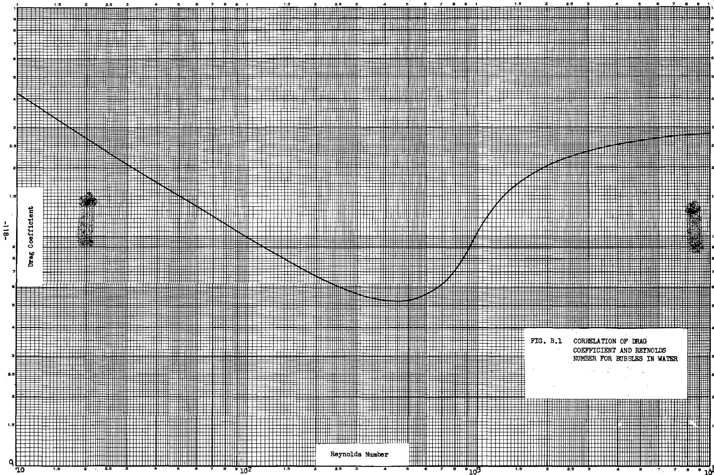

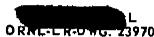

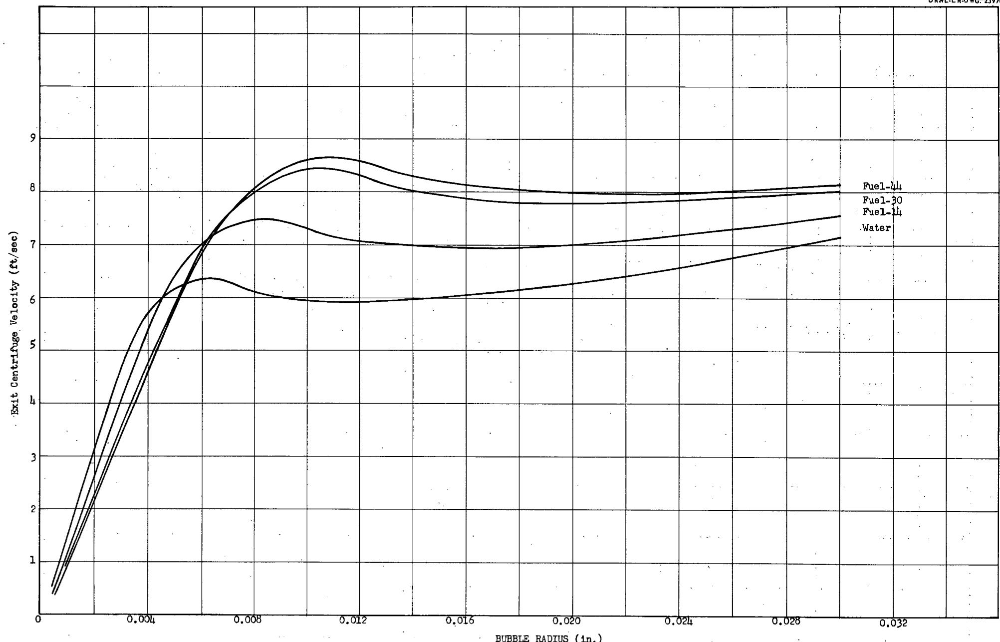  
FIG. B.2 EFFECTS OF BUBBLE RADIUS AND EXIT VELOCITY ON CENTRIFuge Efferctiveness AT 2700 rpm WITH A CUP RADIUS OF 2-7/8 IN.

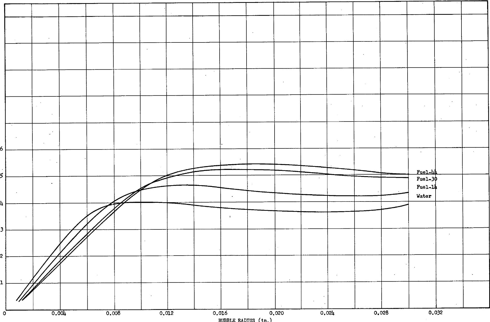  
Exit Centrifuge Velocity (ft/sec)   
FIG. B.3 EFFECTS OF BUBBLE RADIUS AND EXIT VELOCITY ON CENTRIFUGE EFFECTIVENESS AT 1350 rpm WITH A CUP RADIUS OF 2-7/8 IN.

Appendix C

DYNAMIC SEALS

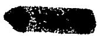

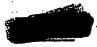

# DYNAMIC SEALS

In the X-R system seals are required in two critical locations, namely, on the shaft to prevent fuel leakage up into the bearing housing and in the region of the pump to prevent high pressure fuel from leaking around the centrifuges. In the case of the upper slinger seal, no leakage can be tolerated, while in the centrifuge seal a small amount of leakage, properly directed, does not seriously affect the system. The centrifuge seal is essential to the system for two reasons: 1) to determine the pressure in the main fuel circuit, and 2) to control the amount of leakage. All fuel which passes through the centrifuge seal is recirculated through the centrifuge, thus increasing the radial velocity and consequently the size of the bubbles which will escape to the main fuel circuit.

A very similar sealing arrangement was used for each location. The shaft seal used was a slinger attached to the shaft (see Fig. 1.2). The potential delivery pressure of this slinger was greater than the pressure of the fuel in the region of the seal. As the theoretical pressure rise across the seal was greater than its discharge pressure, a gas pocket exists around the shaft.

In the case of the centrifuge seals, radial vanes were attached to the top of the centrifuge cups (see Fig. 3.8). For this arrangement to stop all leakage, the discharge pressure from the seals must exactly match the pressure from the centrifuges. This condition would be impossible to maintain in operation. In the actual system a radial vane impeller was designed to deliver a pressure slightly less than that from the centrifuges. The leakage around the centrifuge cups will then be so directed that no fuel bypasses the centrifuges. As the head potential of the seal and the centrifuge are very close, the leakage is small and the additional flow through the centrifuge is held to an acceptable amount. Figure C.1 shows the head delivered as a function of vane length or cup diameter for various speeds. The net head delivered may be determined by subtracting the pressure corresponding to the inside diameter from that for the outside diameter.

Figures C.2 through C.5 give the amount of leakage through the centrifuge seals as a function of speed and the difference in pressure delivered by the centrifuges and seals for several axial clearances. These axial clearances are the distance from the top of the seal vanes and the stationary plate above (see Fig. 3.8).

As the speed increases, the difference in pressure delivered by the centrifuges and the seal impellers will increase and the flow delivered by the centrifuges will also increase. In order to reduce the bypass leakage caused by the larger pressure differential, it is necessary that the holes in the centrifuge cups be slightly restrictive. This restriction will also add stability to the system by enabling it to sense and counteract any variations in leakage.

It was found experimentally that the ability of the system to screen gas bubbles depended upon the precision with which the centrifuge seal impellers were made. One unit in which the blades were glued in place passed bubbles very badly. Upon replacing these seals with new ones in which the vanes were milled into the top of the centrifuge cups, the system operated satisfactorily.

Figure C.6 gives head and speed characteristics of a seal at no flow conditions.

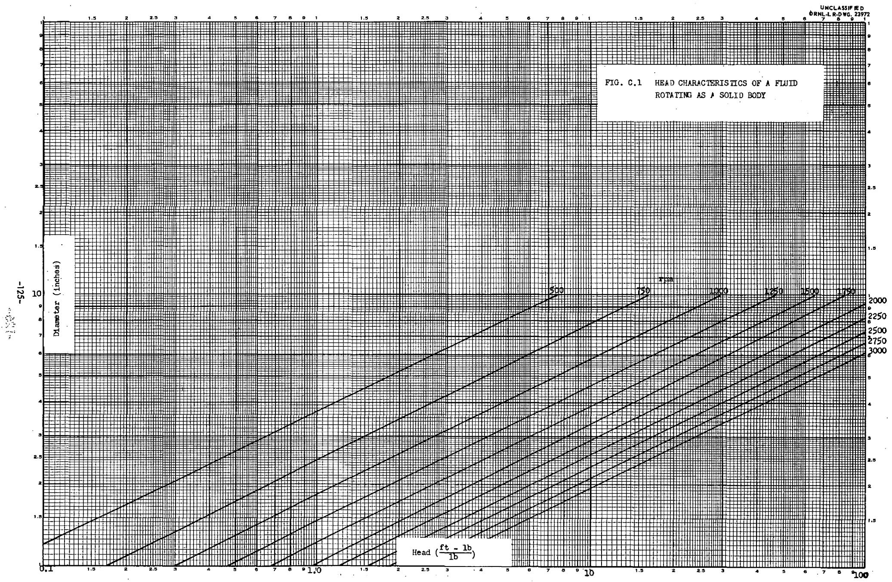

UNCLASSIFIED ORNL-LR-DWG.2;9   
FIG C.2 LEAKAGE CHARACTERISTICS   
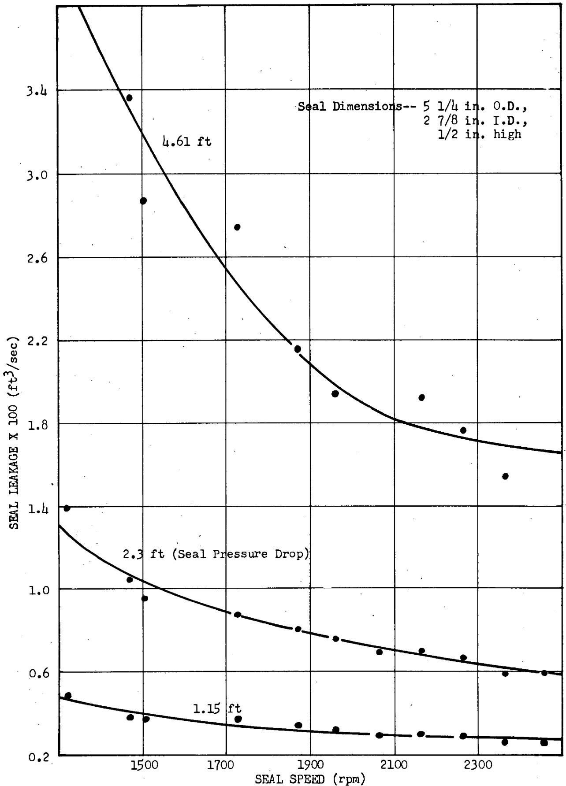  
OF A DYNAMIC SEAL WITH AN AXIAL CLEARANCE OF O.050 in.

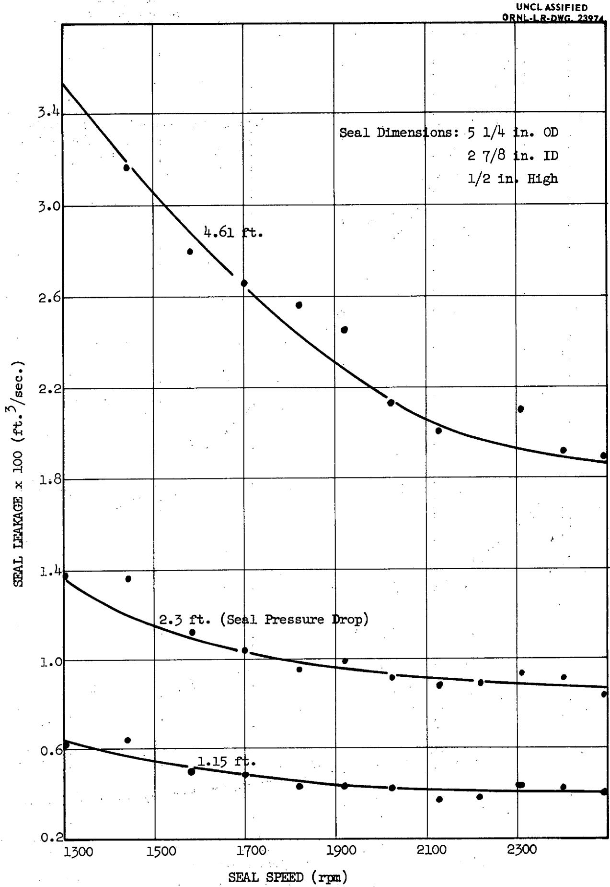  
FIG. C.3 LEAKAGE CHARACTERISTICS OF A DYNAMIC SEAL WITH AN AXIAL CLEARANCE OF 0.128 IN.

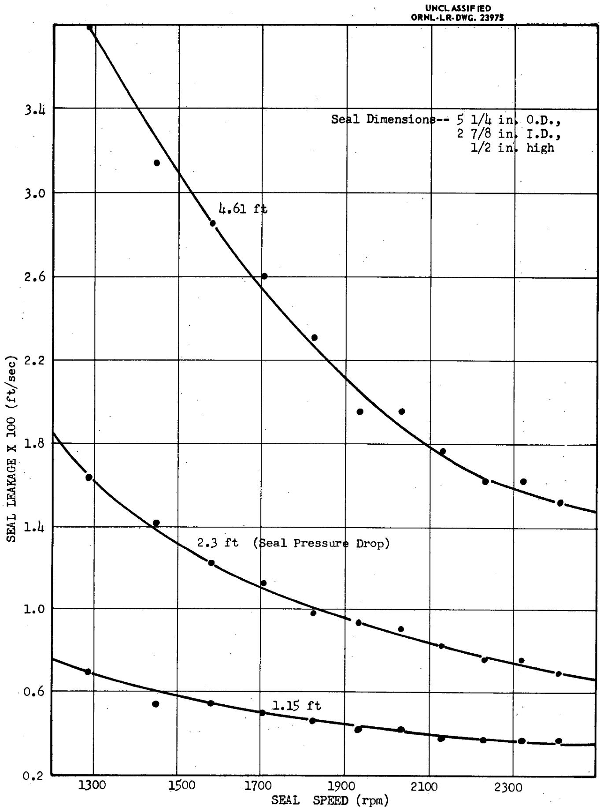  
FIG C.4 LEAK CHARACTERISTICS OF A DYNAMIC SEAL WITH AN AXIAL CLEARANCE OF 0.248 in.

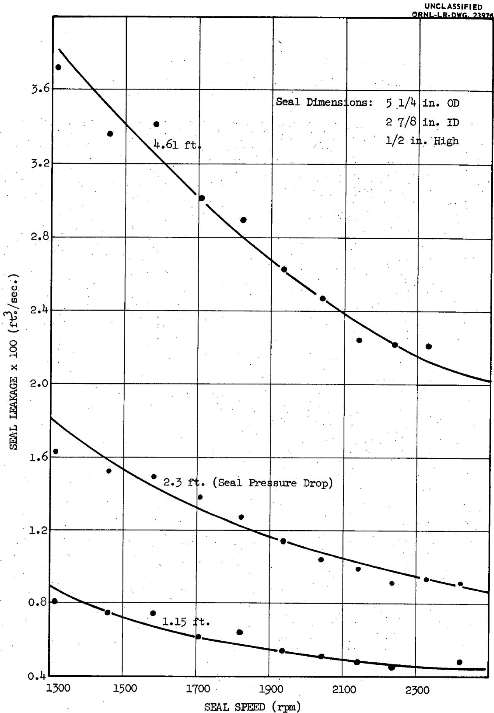  
FIG. C.5 LEAKAGE CHARACTERISTICS OF A DYNAMIC SEAL WITH AN AXIAL CLEARANCE OF 0.481 IN.

Seal Dimensions-- 5 1/4 in. O.D., 2 7/8 in. I.D., 1/2 in. high
Axial Clearances-- 0.957, 0.837, 0.714, 0.481, 0.248, 0.128, 0.050 (in.)

SEAL HEAD (ft 1b/1b)

1

：

！

：

。

1

1

i

SEAL SPEED (rpm)

FIG C.6 ZERO LEAKAGE CHARACTERISTICS

OF A DYNAMIC SEAL

Appendix D

CALCULATIONS FOR THE ART FUEL PUMP

IMPELLER REDESIGN

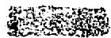

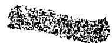

# CALCULATIONS FOR THE ART FUEL PUMP IMPELLER REDESIGN

Assuming no prerotation, Fig. D.l is the inlet velocity diagram for the impeller at the outermost inlet radius from which it can be seen that

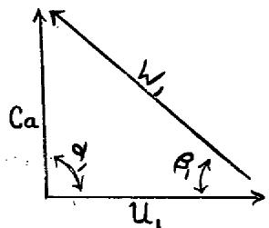  
Fig. D.l - Pump Inlet Velocity Diagram

$$
w _ {1} ^ {2} = u _ {1} ^ {2} + c a ^ {2} \tag {1}
$$

where

$$
U _ {1} = \pi D _ {1} N
$$

D1 = Impeller blade diameter at the outermost inlet edge

N = Impeller speed, revolutions per sec.

Referring to Fig. D.2, assume the fluid streamlines entering the blades curve in an axial plane with radii, $\mathbb{R}_j$ , which is a function of the distance from the shaft centerline, $\mathbf{r}$ , according to the following relationship

$$
R = a + b r \tag {2}
$$

where $a$ and $b$ are constants evaluated as follows:

$$
\begin{array}{l} \text {w h e n} \quad \mathrm {r} _ {1} = 0. 0 9 6 3 7 \mathrm {f t} \quad \mathrm {R} _ {1} = 0. 2 5 \mathrm {f t} \\ r _ {2} = 0. 1 5 f t \quad R _ {2} = 0. 0 8 3 3 3 f t \\ b = - 3. 1 0 8 \text {a n d} a = 0. 5 4 9 5 \\ \end{array}
$$

$$
\text {o r} \quad R = 0. 5 4 9 5 - 3. 1 0 8 r \tag {2a}
$$

The blade leading edges lie on the surface of a cone having a 28 deg half angle. This surface is approximately perpendicular to the throughput component of the inlet flow, Ca, therefore

$$
d A = \frac {2 \pi r d r}{\sin 2 8 \text {d e g}} \quad A = \begin{array}{l} \text {a r e a p e r p e n d i c u l a r} \\ \text {t o t h r o u g h p u t c o m -} \\ \text {p o n e n t o f f l o w} \end{array} \tag {3}
$$

As the fluid turns the corner from the inlet eye into the impeller blading, it follows the law of constant moment of momentum, i.e.,

$$
\begin{array}{l} \mathrm {C a} = \frac {\mathrm {K}}{\mathrm {R}} \text {w h e r e K = a c o n s t a n t} (4) \\ \mathrm {o r} \quad \mathrm {C a} = \frac {\mathrm {K}}{\mathrm {a} + \mathrm {b r}} (4a) \\ \end{array}
$$

and from the law of continuity

$$
Q _ {T} = \int_ {\mathbf {r} _ {1}} ^ {\mathbf {r} _ {2}} \mathrm {C a} \mathrm {d A} \tag {5}
$$

$$
Q _ {T} = \text {T o t a l f l o w i n t o i m p e l l e r} (\text {i n c l u d e s l e a k a g e})
$$

$$
Q _ {T} = \frac {2 \pi K}{\sin 2 8 \deg} \int_ {r _ {1}} ^ {r _ {2}} \frac {r}{a + b r} d r \tag {5a}
$$

$$
Q _ {T} = \frac {2 \pi K}{\sin 2 8 \deg} \left[ \frac {r _ {2} - r _ {1}}{b} + \frac {a}{b ^ {2}} \ln \frac {a + b r _ {1}}{a + b r _ {2}} \right] \tag {6}
$$

$$
\mathrm {K} = \frac {\mathrm {Q} _ {\mathrm {T}} \sin 2 8 \deg}{2 \pi} \left[ \frac {1}{\frac {\mathrm {r} _ {2} - \mathrm {r} _ {1}}{\mathrm {b}} + \frac {\mathrm {a}}{\mathrm {b} ^ {2}} \ln \frac {\mathrm {a} + \mathrm {b r} _ {1}}{\mathrm {a} + \mathrm {b r} _ {2}}} \right] \tag {6a}
$$

Substituting in equation (6a) $\mathbf{K} = 2.405$

$$
\text {a n d} \quad \mathrm {C a} = \frac {2 . 4 0 5}{0 . 5 4 9 5 - 3 . 1 0 8 \mathrm {r}} \quad \mathrm {r} = \mathrm {f t}
$$

$$
\mathrm {o r} \quad \mathrm {C a} = \frac {2 8 . 8 6}{6 . 5 9 4 - 3 . 1 0 8 \mathrm {r}} \quad \mathrm {r} = \mathrm {i n}.
$$

Fig. D.3 is a plot of Ca as a function of r which is the velocity profile entering the impeller blades. From Fig. D.3 it can be seen that at $r = 1.8$ in., Ca = 28.86 ft/sec.

$$
U _ {1} = \pi D _ {1} N = \pi \frac {3 . 6}{1 2} x. 4 5 = 4 2. 3 9 f t / s e c \quad N a s s u m e t o b e 4 5 r p s
$$

$$
w _ {1} ^ {2} = c a ^ {2} + u _ {1} ^ {2} = 2 8. 8 6 ^ {2} + 4 2. 3 9 ^ {2}
$$

$$
w _ {1} ^ {2} = 2 6 2 9. 8
$$

$$
w _ {1} = 5 1. 2 8 f t / s e c
$$

$$
\beta_ {1} = \tan^ {- 1} \frac {\mathrm {C a}}{\mathrm {U} _ {1}} = \tan^ {- 1} \frac {2 8 . 8 6}{4 2 . 3 9} = \tan^ {- 1} 0. 6 8 0 8
$$

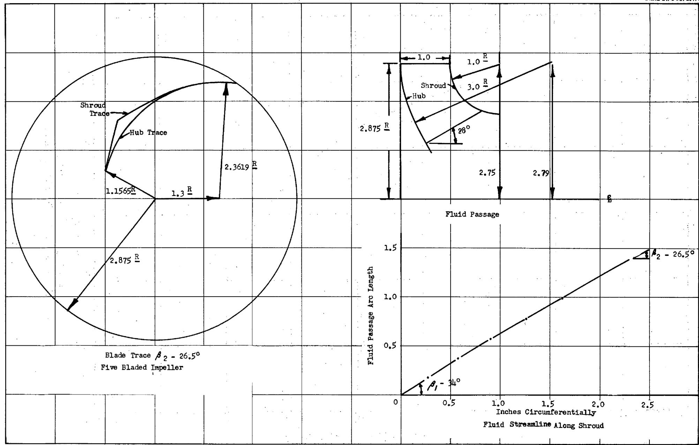  
-5c1   
#   
FIG. D.2 REDESIGNED ART FUEL PUMP BLADE TRACE AND FLUID PASSAGE LAYOUT

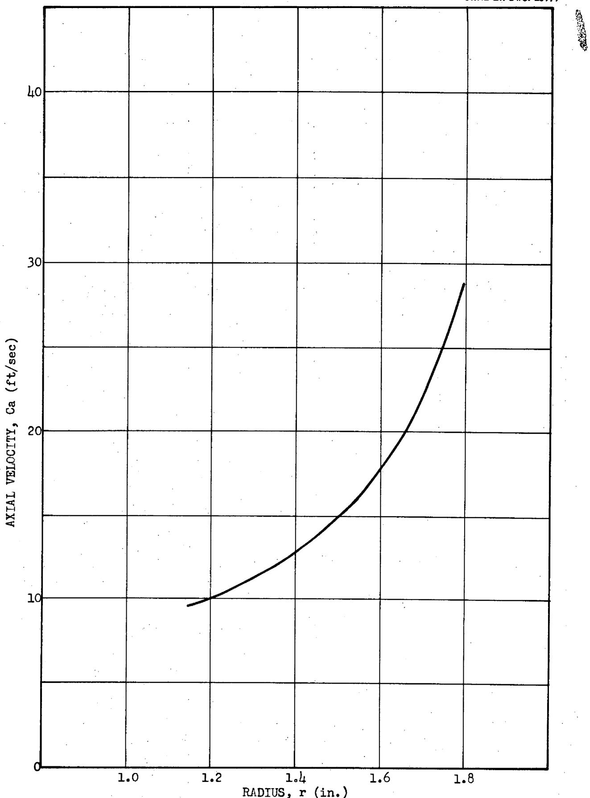  
FIG D.3 VELOCITY PROFILE   
ENTERING THE ART FUEL PUMP IMPELLER

$$
\begin{array}{l} \beta_ {1} = 3 4. 2 5 \deg \sim 3 4 \deg \\ \beta_ {m} = 2 4. 1 \mathrm {d e g} \sim 2 4 \mathrm {d e g} \\ \beta_ {i} = 1 9. 3 2 \mathrm {d e g} \sim 1 9 \mathrm {d e g} \\ \end{array}
$$

In order for the impeller blade to be aligned with the fluid, the angle formed by the intersection of the blade mean line and the tangent of its terminating circle whose center is common with the shaft centerline must equal the fluid angle. For ease of fabrication the trace of the blade mean line on the hub projected on a plane perpendicular to the shaft centerline was made circular. Due to the fluid passage curvature the angle that the flow sees is not the same angle as that seen in the plane perpendicular to the shaft centerline. A correction is made for this deviation with the following equation:

$$
\tan \beta \cos \gamma = \tan \beta^ {\prime} \tag {7}
$$

where

$$
\begin{array}{l} \beta = \text {a n g l e f l u i d s e e s} \\ \gamma = \text {a n g l e b e t w e e n t h e t a n g e n t t o t h e f l u i d p a s s a g e} \quad \text {a n d t h e p l a n e p e r p e n d i c u l a r t o t h e s h a f t c e n t e r - l i n e} \\ \beta^ {\prime} = \text {a n g l e s e e n i n t h e p l a n e p e r p e n d i c u l a r t o s h a f t} \\ \end{array}
$$

To allow for contraction through the blades a $\beta_{i}$ of 20 deg was used for the blade entrance angle on the hub. From Fig. D.2 $\gamma$ was measured and found to be 33.17 deg.

$$
\begin{array}{l} \tan 2 0 \deg \cos 3 3. 1 7 \deg = \tan \beta_ {i} ^ {\prime} \\ \beta_ {i} ^ {\prime} = 1 6. 9 4 \mathrm {d e g} \\ \end{array}
$$

From the experimental work, the blade $\beta_{2}$ was determined as 26.5 deg. No correction is required for the fluid passage curvature at the discharge since for this impeller the tangent of the passage is parallel to the plane perpendicular to the shaft centerline. The radius of the hub trace is calculated from the

equation

$$
\rho = \frac {\mathrm {R} _ {2} ^ {2} - \mathrm {R} _ {1} ^ {2}}{2 \left(\mathrm {R} _ {2} \cos \beta_ {2} - \mathrm {R} _ {1} \cos \beta_ {1}\right)} \tag {8}
$$

Substituting in equation (8), $\rho$ is calculated to be 2.3619 in. The locus of the centers of curvature of the blades was found from the law of cosines to lie on a 2.600 in. diameter circle. The hub blade trace is shown in Fig. D.2.

To align the fluid along the shroud with the blade, the streamline of the fluid along the shroud is assumed to follow a portion of a two to one ellipse. The relative entrance angle of this streamline is equal to $\beta_{1}$ and the relative exit angle equal to $\beta_{2}$ . The ordinate of this partial ellipse represents the arc length of the fluid passage at the shroud in a plane parallel to the pump centerline, and the abscissa represents the circumferential distance along the shroud blade trace in a plane perpendicular to the shaft centerline. The arc length of the partial ellipse is the arc length of the blade trace in the plane perpendicular to the shaft centerline. The fluid passage arc length is obtained from the pump layout as shown in Fig. D.2. The angles $\beta_{1}$ and $\beta_{2}$ are determined by W and U. The tangents of $\beta_{1}$ and $\beta_{2}$ are the tangents of the ellipse at the blade entrance and exit. With these values, the portion of the ellipse between $\beta_{1}$ and $\beta_{2}$ is defined as is shown in Fig. D.2.

The blade trace on the shroud is constructed from the partial ellipse and the shroud contour in a plane parallel to the shaft centerline. This construction is done by plotting on the plane perpendicular to the shaft centerline concentric circles (see Fig. D.4b) whose radii are the distance from the shaft centerline to a set of arbitrarily chosen points on the shroud contour (see Fig. D.4a).

Starting at the discharge end of the blade, measure a chord length (C) obtained from Fig. D.4c on an average circle as shown in Fig. D.4b, and connect its termination to the shaft center. The point of intersection of this radian and the next smaller concentric circle lies on the shroud blade trace. This process is continued as shown in Fig. D.4b until the smallest concentric circle is reached. The points of intersection obtained determine the blade trace as shown in Fig. D.2.

The shape of the blade blank is determined from the blade trace and the fluid passage, Figs. D.5a and D.5b. Plane sections perpendicular to the reference radius are taken through the blade as shown in Fig. D.5a, as sections A, B, C. etc. These sections are constructed as shown in Fig. D.5c with the

distance "a" obtained from Fig. D.5a and the distance "d" obtained from Fig. D.5b. From the plane sections shown in Figs. D.5a and D.5c, sections D, E, F, etc., parallel to the reference perpendicular plane are constructed. The center of curvature and radii of these sections is also the center of curvature and radii of the blade blank. The blade mean line and blank is laid out from these radii as shown in Fig..D.5d. Since this impeller is of welded construction, it was desirous to make the blades and fluid passage parts of surfaces of revolution.

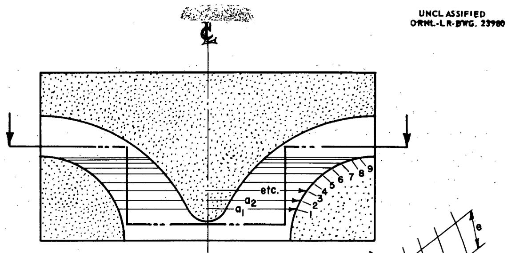  
Fig. D.4a Plane Parallel to Shaft Centerline

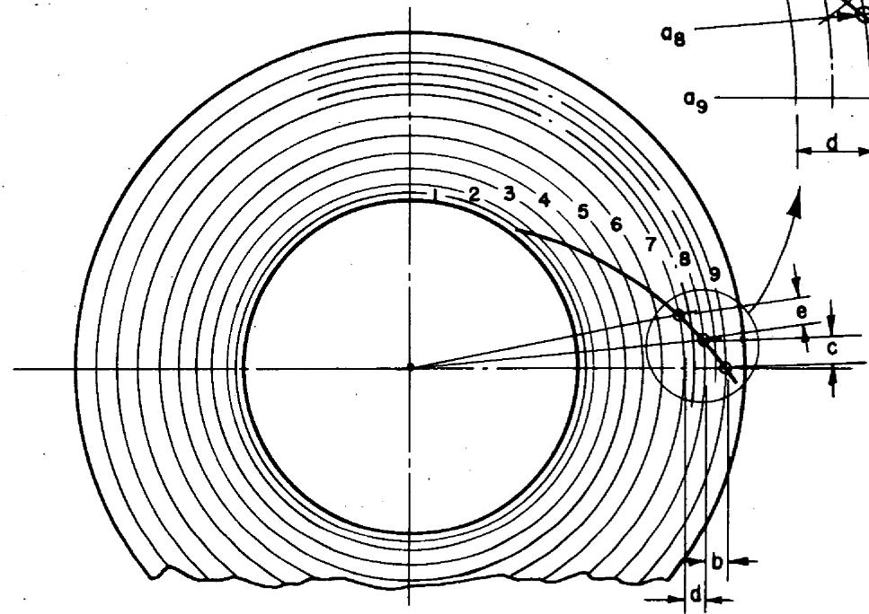

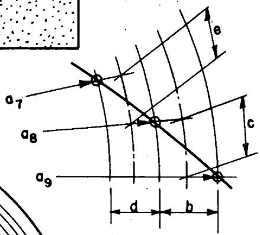

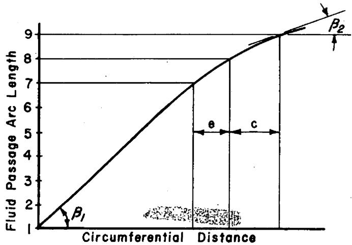  
Fig. D.4b Plane Perpendicular to Shaft Centerline   
Fig. D.4c Fluid Streamline Along Shroud

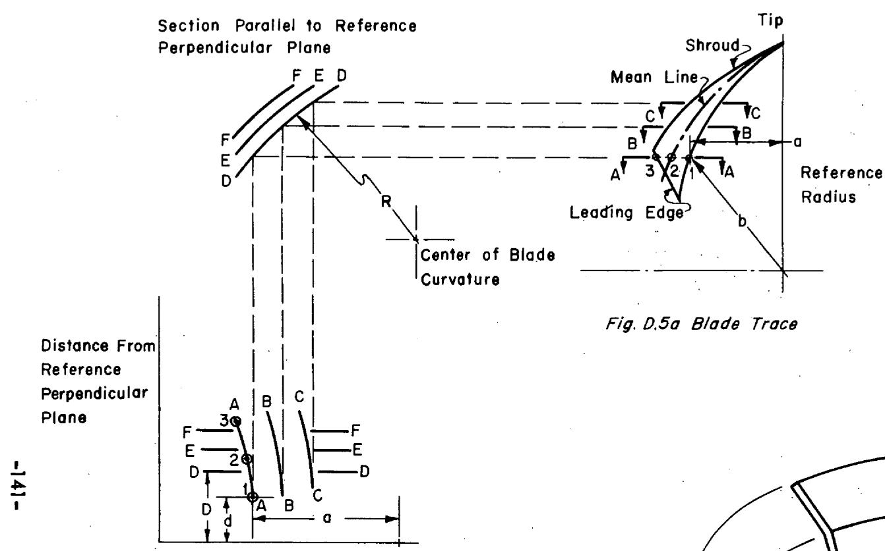  
Fig. D.5c Distance From Tip Along Reference Radius

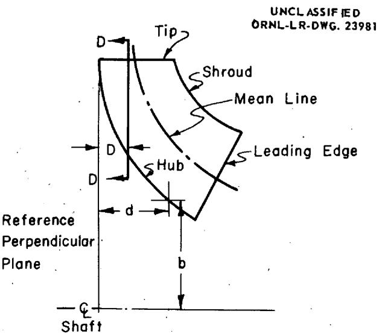  
Fig. D.5b Fluid Passage

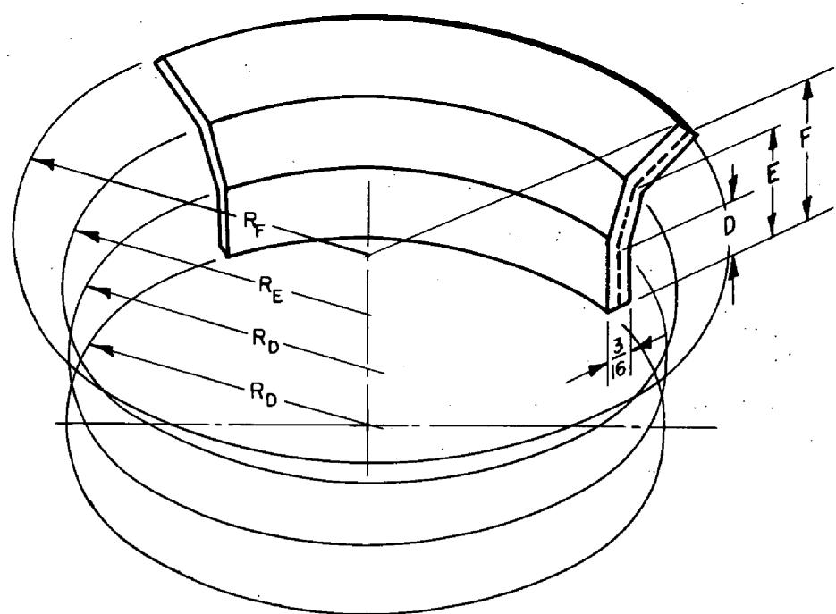  
Fig. D.5d Blade Blank

Appendix E

BYPASS FLOW CALCULATIONS AND EXPANSION TANK HEATING

# BYPASS FLOW CALCULATIONS AND EXPANSION TANK HEATING

In examining the experimental data it was found that the accuracy required to closely determine the bypass flow rate directly was greater than the accuracy of the data that could be obtained. This is especially true at the lower expansion tank liquid levels where the system (pressure) fluctuations were quite large.

An equation was derived to determine the pressure losses in the bypass circuit, that is, from the pump suction to the expansion tank. This circuit was then tested separately with water to determine the validity of the derived equation. In the water tests the shaft and spool piece were not rotating so that the test was only a check of the assumed loss coefficients. It was found that the predicted value was within $4\%$ of the experimental value. Also a check of the experimentally determined value of bypass flow at high expansion tank liquid levels agreed very well with the calculated values (see Fig. 2.28). The total loss in this circuit was comprised of the following: 1) the loss entering the pump shaft, 2) the loss entering the four radial shaft holes, 3) the loss entering the four holes in the spool piece, and 4) the loss leaving the spool piece. The driving force or pressure differential was taken as the difference between the pump suction and the expansion tank pressure plus the head developed in the radial holes which were assumed to be acting as radial impellers.

The equation used is as follows:

$$
\Delta P = 0. 5 ^ {(1 1)} \frac {v _ {s} ^ {2}}{2 g} + 5. 5 ^ {(1 2)} \frac {v _ {s} ^ {2}}{2 g} + 0. 2 3 ^ {(1 1)} \frac {v _ {e} ^ {2}}{2 g} + 1 \frac {v _ {e} ^ {2}}{2 g},
$$

where

$$
v _ {s} = \text {v e l o c i t y i n t h e h o l e u p s h a f t , f t / s e c},
$$

$$
v _ {e} = \text {v e l o c i t y a t e x i t o f r a d i a l s p o o l h o l e s , f t / s e c},
$$

$$
\Delta P = \left(P _ {s} - P _ {H e}\right) + \Delta P (\text {h e a d d e v o l u p e d b y r a d i a l h o l e s}), f t.
$$

#

Substituting in the value of the areas

$$
Q = 1. 9 4 (\Delta P) ^ {1 / 2},
$$

where

$Q =$ bypass flow in gpm.

Calculated bypass flow to the fuel expansion tank through each pump shaft is shown in Fig. E.l.

The temperature of the fuel in the expansion tank will depend upon four factors: 1) the fuel volume in the tank, 2) the total recirculation rate through the tank, 3) the power density of the fuel in the tank, and 4) the temperature of the fuel entering. The temperature of the fuel entering the tank will be approximately that of the fuel leaving the heat exchangers and will depend on the manner in which the reactor will operate. Figure E.2 shows the entrance, exit, and equatorial temperatures of the fuel in the core. These temperatures are based on an operating procedure where the system is started from an isothermal temperature of $1200^{\circ}\mathrm{F}$ . As the power is increased, the core equator temperature is held constant until the inlet NaK temperature drops to $1070^{\circ}\mathrm{F}$ ; at higher operating power the NaK temperature is held at $1070^{\circ}\mathrm{F}$ while the fuel temperature increases. The power shown in Figs. E.2, E.3, and E.4 is that which is received by the fuel and not the total nuclear power. The design power to fuel is about 55 Mw.

Figure E.3 gives the expansion tank liquid level as a function of the power to the fuel. In this figure it is assumed that the reactor is filled at $1200^{\circ}\mathrm{F}$ to a level of $1/2$ to $3/4$ in. The final level was based on the mean fuel temperature and is approximately $25^{\circ}\mathrm{F}$ less than that of the core equator temperature at $55\mathrm{Mw}$ of power to the fuel. The slight rise in liquid level from 0 to $20\mathrm{Mw}$ is due to a shrinkage in the reactor volume. It has been estimated that the volume decreases by about $70\mathrm{in.}^{3}$ from assembly temperature to the design operating conditions. In Fig. E.3 this was assumed to be linear with power.

The mixed mean fuel temperature in the expansion tank is shown in Fig. E.4. In determining this temperature the initial fill level was assumed

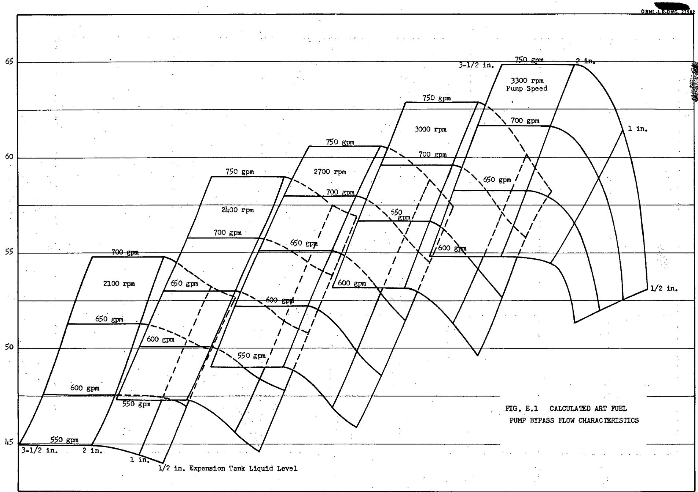  
ART Fuel Pump Bypass Flow $(\%)$ $100\% = 17.6$ gpm

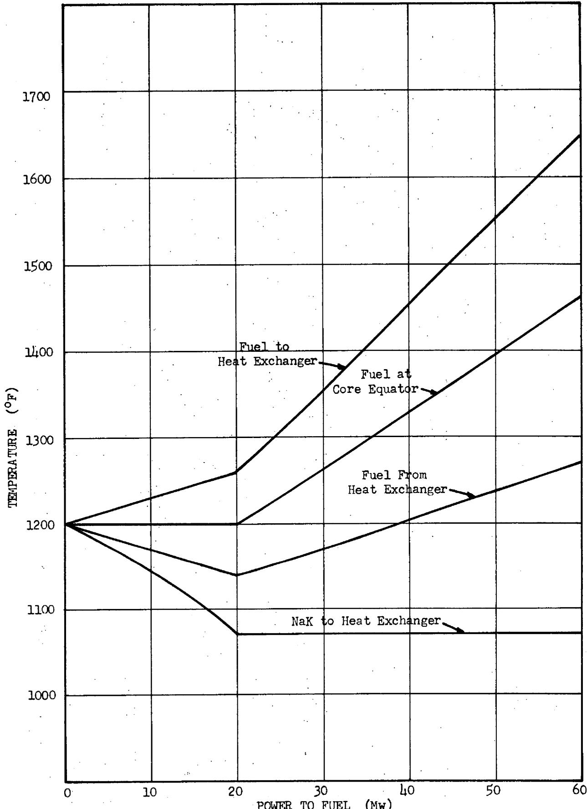  
FIG E-2 ART REACTOR FUEL AND NAK TEMPERATURES AT A CONSTANT PUMP FLOW OF 645 gpm

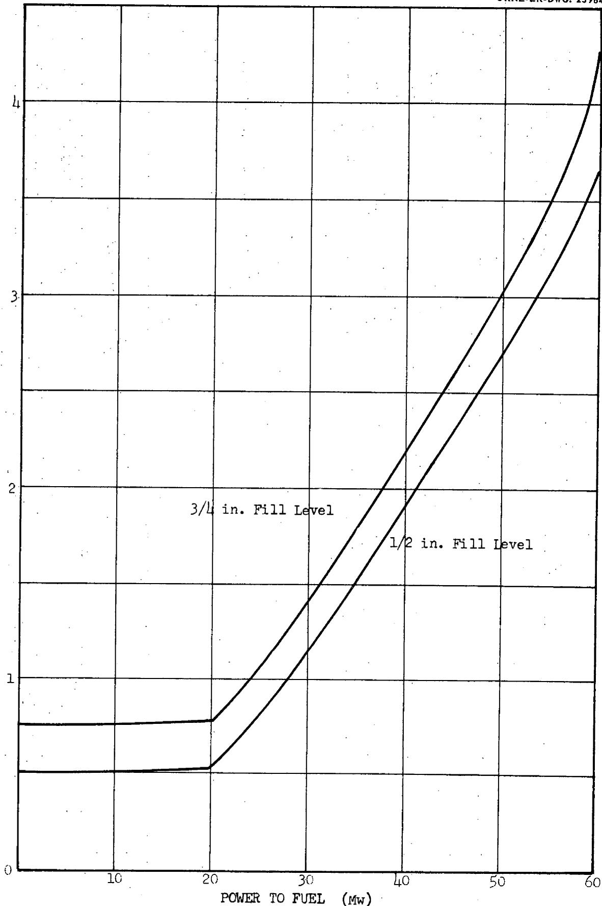  
EXPANSION TANK LIQUID LEVEL (in.)   
FIG E.3 THE EFFECT OF REACTOR POWER LEVEL ON THE ART EXPANSION TANK LIQUID LEVEL

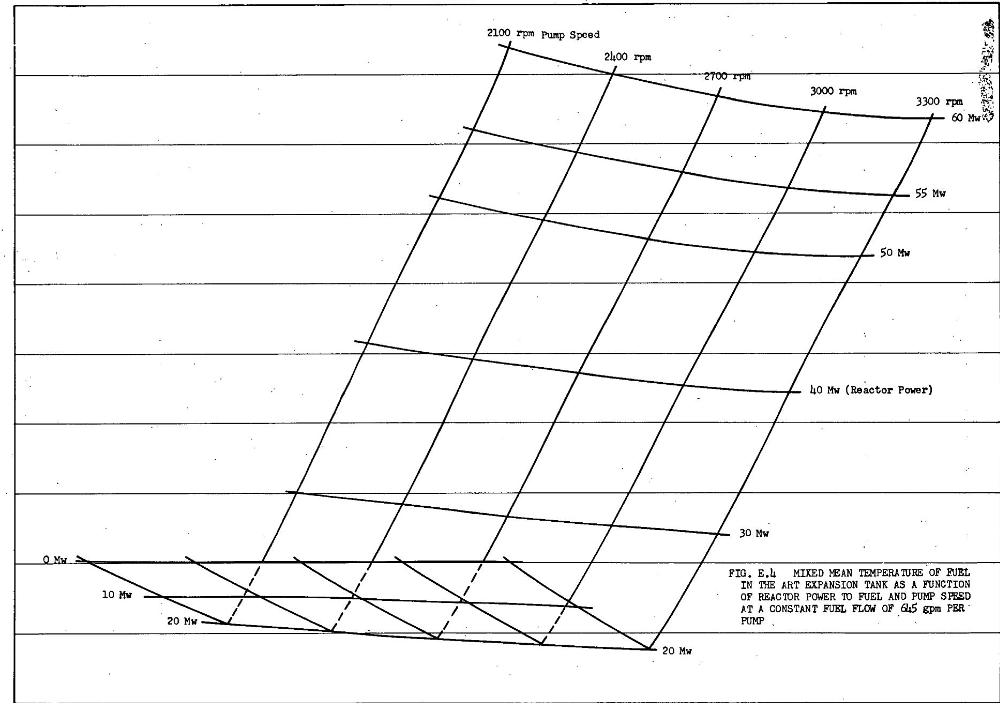  
-091-   
Mixed Mean Fuel Temperature in Expansion Tank (°F)

to be $5/8$ in. at $1200^{\circ}\mathrm{F}$ and the bypass flow was taken from the calculated value shown in Fig. 2.26. The leakage around the island through the floor of the expansion tank was calculated to be $4\mathrm{~gpm}$ at $2700\mathrm{rpm}$ and is a function of the pump speed. The temperature of the fuel entering the expansion tank was obtained from Fig. E.l. The heating rate in the tank is the sum of the after-heat rate $(11\mathrm{~w/cm}^{3})^{(14)}$ and the fission heat release $(10\mathrm{~w/cm}^{3})^{(14)}$ . These heating rates are for $60\mathrm{Mw}$ of nuclear power or $55\mathrm{Mw}$ of power to the fuel. The heating rate was assumed to be linear with power. The high degree of turbulence in the fuel expansion tank as revealed by high speed movies taken in this region indicate that the mixed mean temperature will probably be the true fuel temperature.

Appendix F

RADIOACTIVITY IN THE ART FUEL

PUMP OIL SYSTEM

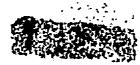

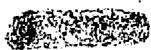

# RADIOACTIVITY IN THE ART FUEL PUMP OIL SYSTEM

This section treats the transfer of radioactive gases from the expansion tank region of the ART reactor to the fuel pump lubricating oil system. A report by W. K. Stair(15) covers tests on the back transfer of helium against argon in the fuel pump to give some indication of the back transfer of xenon and krypton against helium. Two numerical values from this report were used for the calculations of this section, i.e., an attenuation of $10^{4}$ between the concentration of radioactive gases in the expansion tank region and the concentration in the oil catch basin, and a leakage rate of gas from the oil catch basin to the oil reservoir of 0.8 in.3/day. In determining the leak rate of 0.8 in.3/day, it was assumed that the oil was completely saturated with argon at the beginning of the test run and that all leakage across the seal was collected in the oil reservoir. The value of $10^{4}$ for the attenuation in concentration between the fuel expansion tank and the pump seal is a minimum. The helium concentration in the argon buffer gas used in the experiment reported by Stair was $10^{-4}$ , hence the actual attenuation in concentration between the tank and the seal may have been greater.

Because of the short half-lives of the fission product gases the attenuation in the amount of activity between the fuel expansion tank and the oil reservoir is greater than the attenuation in gas concentration. Thus the rate at which the fission product gases enter the oil system is of significant importance.

# Method of Calculation

In the ART, as well as in the above mentioned test, 500 liters per day of buffer gas flows down through the clearance around the pump shaft into the expansion tank and 50 liters per day will be bled directly from the oil catch basin. The attenuation of $10^{4}$ represents the back transfer of helium against the 500 liters per day of argon. This back leakage was determined from analysis of the 50 liters per day bled from the catch basin.

The equation representing the number (N) of nuclei of any nuclide in the catch basin as a function of time (t) may be written

$$
\frac {d N}{d t} = s _ {b} - \left(\lambda_ {p} + \lambda_ {d}\right) N
$$

where

$$
S _ {b} = \text {s o u r c e o r l e a k r a t e i n t o b a s i n}
$$

$$
\lambda_ {p} = \text {r e c i p r o c a l o f a v e r a g e d w e l l t i m e i n t h e c a t c h b a s i n}
$$

$$
\lambda_ {d} = \text {d e c a y c o n s t a n t o f r a d i o a c t i v e n u c l i d e}.
$$

Assuming an attenuation of $10^{4}$ and a purge rate of 3000 in. $^{3}$ /day (50 liters per day) the value of $S_{b}$ and $\lambda_{p}$ may be calculated as follows:

assume $\mathcal{X}$ concentration in expansion tank and

$10^{-4}$ x concentration in catch basin

10 in.³ = volume of gas in catch basin

$$
\begin{array}{l} S _ {b} = \text {l e a k a g e o f x i n t o c a t c h b a s i n} \\ = 1 0 ^ {- 4} \chi \text {l e a k a g e f r o m c a t c h b a s i n} \\ \end{array}
$$

$$
\begin{array}{l} S _ {b} = 1 0 ^ {- 4} \times 3 0 0 0 \text {i n .} ^ {3} / \text {d a y} = 3. 4 7 \times 1 0 ^ {- 6} \text {i n .} ^ {3} / \text {s e c o f} \\ x c o n c e n t r a t i o n \\ \end{array}
$$

$$
\begin{array}{l} S _ {b} = 3. 4 7 \times 1 0 ^ {- 6} \times \frac {\mathrm {N} (\text {e x p a n s i o n t a n k})}{\text {V o l u m e (e x p a n s i o n t a n k)}} \\ = 3. 8 6 \times 1 0 ^ {- 8} \mathrm {N} / \mathrm {s e c} \\ \end{array}
$$

$$
\lambda_ {p} = \frac {3 0 0 0}{8 6 , 4 0 0 x 1 0} = 3. 4 7 x 1 0 ^ {- 3} \sec^ {- 1}
$$

and $\mathbf{N}$ may be expressed as

$$
N = \frac {S _ {b} \left[ 1 - e ^ {- (\lambda_ {p} + \lambda_ {d}) t} \right]}{\lambda_ {p} + \lambda_ {d}}
$$

The leak rate into the oil system from the catch basin is 0.8 in.3/day or $9.26 \times 10^{-6}$ in.3/sec. To convert this rate to nuclide/sec the constant $9.26 \times 10^{-6}$ must be multiplied by the nuclide/in.3 in the catch basin. The volume of the catch basin is 10 in.3 and the leak rate is:

$$
9. 2 6 \times 1 0 ^ {- 6} \text {i n .} ^ {3} / \sec x \frac {\mathrm {N} (\text {c a t c h b a s i n})}{1 0 \text {i n .} ^ {3}} = 9. 2 6 \times 1 0 ^ {- 7} \frac {\text {N u c l i d e}}{\text {s e c}}
$$

# Nuclide Concentrations in Expansion Tank

In the calculations for the ART, the following assumptions are made:

Helium flow rate down shaft = 500 standard liters/day Gas volume in expansion tank = 90 in.³

Entire reactor fuel volume passes through xenon removal system every 190 sec where all fission gases are removed.

$\mathbf{S}_{\mathbf{r}} =$ rate of formation* of a particular nuclide in fuel at $60 \mathrm{Mw} = 186 \times 10^{16} \mathrm{x}$ the yield of that nuclide per fission

$$
\frac {\mathrm {d} \mathrm {N}}{\mathrm {d} t} \text {f u e l} = \mathrm {S} _ {\mathrm {r}} - (\lambda_ {\mathrm {s}} + \lambda_ {\mathrm {d}}) \mathrm {N}
$$

Assuming complete removal of the gaseous nuclide in the course of its transit through the fuel expansion tank, then

$$
\lambda_ {s} = \text {r e c i p r o c a l o f a v e r a g e d w e l l t i m e i n t h e r e a c t o r}
$$

$$
\lambda_ {s} = \frac {1}{1 9 0} = 5. 2 7 \times 1 0 ^ {- 3}
$$

$$
S _ {r} = 1 8 6 x 1 0 ^ {1 6} x y i e l d
$$

at equilibrium

$$
N _ {f u e l} = \frac {1 8 6 x 1 0 ^ {1 6} x y i e l d}{5 . 2 7 x 1 0 ^ {- 3} + \lambda_ {d}}
$$

$\mathbf{S}_{\mathrm{e}} =$ source of fission gases into expansion tank $=\lambda_{s} \mathbb{N}_{fuel}$

$$
\frac {\mathrm {d} \mathrm {N} _ {\text {t a n k}}}{\mathrm {d t}} = \lambda_ {\mathrm {s}} \mathrm {N} _ {\text {f u e l}} - (\lambda_ {\ell} + \lambda_ {\mathrm {d}}) \mathrm {N} _ {\text {t a n k}}
$$

10

* There are approximately 3.1 x₁₀₁₀₆₁₀₆₁₀₆₁₀₆₁₀₆₁₀₆₁₀₆₁₀₆₁₀₆₁₀₆₁₀₆₁₀₆₁₀₆₁₀₆₁₀₆₁₀₆₁₀₆₁₀₆₁₀₆₁₀₆₁₀₆₁₀₆₁₀₆₁₀₆₁₀₆₁₀₃

$$
\begin{array}{l} \lambda_ {\mathcal {L}} = \frac {\text {p u r g e r a t e o f h e l i u m i n t o e x p a n s i o n t a k a t t a n k t e m p . a n d p r e s s u r e}}{\text {g a s v o l u m e i n t a n k}} \\ = 1. 9 6 x 1 0 ^ {- 2} \sec^ {- 1} \\ \end{array}
$$

at equilibrium

$$
N _ {t a n k} = \frac {\lambda_ {s} N _ {f u e l}}{\lambda_ {l} + \lambda_ {d}}
$$

After the fission gases are separated from the fuel, their decay products are then treated as gases. This assumption is conservative but the actual behavior of these nuclides is not known.

# Nuclide Concentrations in Oil System

The following equations give the total number of each nuclide in the oil system feeding each pump:

$$
\mathrm {N} _ {1} ^ {\mathrm {O}} = \mathrm {c} _ {\mathrm {A}} \mathrm {c} _ {\mathrm {B}} \frac {\left(1 - e ^ {- \lambda_ {1} t}\right)}{\lambda_ {1}} \frac {\mathrm {N} _ {1} ^ {\mathrm {T}}}{\left(\lambda_ {1} + \lambda_ {\mathrm {p}}\right)} \tag {1}
$$

$$
\begin{array}{l} \mathrm {N} _ {2} ^ {\mathrm {O}} = \mathrm {c} _ {\mathrm {A}} \mathrm {c} _ {\mathrm {B}} \frac {\left(1 - e ^ {- \lambda_ {2} t}\right)}{\lambda_ {2}} \left\{\frac {\mathrm {N} _ {2} ^ {\mathrm {T}}}{\left(\lambda_ {2} + \lambda_ {\mathrm {p}}\right)} + \left[ 1 + \frac {\lambda_ {1}}{\left(\lambda_ {2} + \lambda_ {\mathrm {p}}\right)} \right] \frac {\mathrm {N} _ {1} ^ {\mathrm {T}}}{\left(\lambda_ {1} + \lambda_ {\mathrm {p}}\right)} \right\} \\ + c _ {A} c _ {B} \frac {\left(e ^ {- \lambda_ {1} t} - e ^ {- \lambda_ {2} t}\right)}{\left(\lambda_ {1} - \lambda_ {2}\right)} \quad \frac {N _ {1} ^ {T}}{\left(\lambda_ {1} + \lambda_ {p}\right)} \\ \end{array}
$$

$$
\begin{array}{l} \mathrm {N} _ {3} ^ {\mathrm {O}} = \mathrm {c} _ {\mathrm {A}} \mathrm {c} _ {\mathrm {B}} \frac {\left(1 - \mathrm {e} ^ {- \lambda_ {3} t}\right)}{\lambda_ {3}} \left\{\frac {\mathrm {N} _ {3} ^ {\mathrm {T}}}{\left(\lambda_ {3} + \lambda_ {\mathrm {p}}\right)} + \left[ 1 + \frac {\lambda_ {2}}{\left(\lambda_ {3} + \lambda_ {\mathrm {p}}\right)} \right] \frac {\mathrm {N} _ {2} ^ {\mathrm {T}}}{\left(\lambda_ {2} + \lambda_ {\mathrm {p}}\right)} \right. \\ + \left[ 1 + \frac {\lambda_ {1}}{(\lambda_ {2} + \lambda_ {p})} + \frac {\lambda_ {1}}{(\lambda_ {2} + \lambda_ {p})} \frac {\lambda_ {2}}{(\lambda_ {3} + \lambda_ {p})} \right] \frac {\mathrm {N} _ {1} ^ {\mathrm {T}}}{(\lambda_ {1} + \lambda_ {p})} \Bigg \} \\ + \mathrm {C} _ {\mathrm {A}} \mathrm {C} _ {\mathrm {B}} \frac {\left(\mathrm {e} ^ {- \lambda_ {2} t} - \mathrm {e} ^ {- \lambda_ {3} t}\right)}{\left(\lambda_ {2} - \lambda_ {3}\right)} \left\{\frac {\mathrm {N} _ {2} ^ {\mathrm {T}}}{\left(\lambda_ {2} + \lambda_ {\mathrm {p}}\right)} + \left[ 1 + \frac {\lambda_ {1}}{\left(\lambda_ {2} + \lambda_ {\mathrm {p}}\right)} \right. \right. \\ + \left. \frac {\lambda_ {2}}{(\lambda_ {1} - \lambda_ {2})} \right] \frac {\mathrm {N} _ {1} ^ {\mathrm {T}}}{(\lambda_ {1} + \lambda_ {\mathrm {p}})} \Bigg \} - c _ {\mathrm {A}} c _ {\mathrm {B}} \frac {\left(e ^ {- \lambda_ {1} t} - e ^ {- \lambda_ {3} t}\right)}{\left(\lambda_ {1} - \lambda_ {3}\right)} \left\{\frac {\lambda_ {2}}{(\lambda_ {1} - \lambda_ {2})} \right. \\ \left. \frac {\mathrm {N} _ {1} ^ {\mathrm {T}}}{(\lambda_ {1} + \lambda_ {\mathrm {p}})} \right\} \\ \end{array}
$$

(4) $\mathbb{N}_{4}^{\mathrm{O}} = c_{\mathrm{A}}c_{\mathrm{B}}\frac{(1 - e^{-\lambda_{4}t})}{\lambda_{4}}\left\{\frac{\mathbb{N}_{4}^{\mathrm{T}}}{(\lambda_{4} + \lambda_{p})}\right. + \left[1 + \frac{\lambda_{3}}{(\lambda_{4} + \lambda_{p})}\right]\frac{\mathbb{N}_{3}^{\mathrm{T}}}{(\lambda_{3} + \lambda_{p})}$

$$
\begin{array}{l} + \left[ 1 + \frac {\lambda_ {2}}{\left(\lambda_ {3} ^ {+} \lambda_ {p}\right)} + \frac {\lambda_ {3}}{\left(\lambda_ {4} ^ {+} \lambda_ {p}\right)} + \frac {\lambda_ {2}}{\left(\lambda_ {3} ^ {+} \lambda_ {p}\right)} \right] \frac {\mathrm {N} _ {2} ^ {\mathrm {T}}}{\left(\lambda_ {2} ^ {+} \lambda_ {p}\right)} \\ + \left[ 1 + \frac {\lambda_ {1}}{\left(\lambda_ {2} ^ {+} \lambda_ {p}\right)} + \frac {\lambda_ {2}}{\left(\lambda_ {3} ^ {+} \lambda_ {p}\right)} \right. \frac {\lambda_ {1}}{\left(\lambda_ {1} ^ {+} \lambda_ {p}\right)} \\ \left. + \frac {\lambda_ {3}}{\left(\lambda_ {4} ^ {+} \lambda_ {p}\right)} \frac {\lambda_ {2}}{\left(\lambda_ {3} ^ {+} \lambda_ {p}\right)} \frac {\lambda_ {1}}{\left(\lambda_ {2} ^ {+} \lambda_ {p}\right)} \right] \frac {\mathrm {N} _ {1} ^ {\mathrm {T}}}{\left(\lambda_ {1} ^ {+} \lambda_ {p}\right)} \left. \right\} \\ + c _ {A} c _ {B} \frac {\left(e ^ {- \lambda_ {3} t} - e ^ {- \lambda_ {4} t}\right)}{\left(\lambda_ {3} - \lambda_ {4}\right)} \left\{\frac {N _ {3} ^ {T}}{\left(\lambda_ {3} + \lambda_ {p}\right)} + \left[ 1 + \frac {\lambda_ {2}}{\left(\lambda_ {3} + \lambda_ {p}\right)} \right. \right. \\ + \frac {\lambda_ {3}}{(\lambda_ {2} - \lambda_ {3})} \Bigg ] \frac {\mathbb {N} _ {2} ^ {\mathrm {T}}}{(\lambda_ {2} + \lambda_ {\mathrm {p}})} + \left[ 1 + \frac {\lambda_ {1}}{(\lambda_ {2} + \lambda_ {\mathrm {p}})} + \frac {\lambda_ {2}}{(\lambda_ {3} + \lambda_ {\mathrm {p}})} \frac {\lambda_ {1}}{(\lambda_ {2} + \lambda_ {\mathrm {p}})} \right. \\ + \frac {\lambda_ {3}}{(\lambda_ {2} - \lambda_ {3})} + \frac {\lambda_ {3}}{(\lambda_ {2} - \lambda_ {3})} \frac {\lambda_ {1}}{(\lambda_ {2} + \lambda_ {p})} + \frac {\lambda_ {3}}{(\lambda_ {2} - \lambda_ {3})} \frac {\lambda_ {2}}{(\lambda_ {1} - \lambda_ {2})} \\ \left. - \frac {\lambda_ {3}}{(\lambda_ {1} ^ {-} \lambda_ {3})} \frac {\lambda_ {2}}{(\lambda_ {1} ^ {-} \lambda_ {2})} \right] \frac {\mathbb {N} _ {1} ^ {\mathrm {T}}}{(\lambda_ {1} ^ {+} \lambda_ {\mathrm {p}})} \Bigg \} \\ - c _ {A} c _ {B} \frac {\left(e ^ {- \lambda_ {2} t} - e ^ {- \lambda_ {4} t}\right)}{\left(\lambda_ {2} - \lambda_ {4}\right)} \frac {\lambda_ {3}}{\left(\lambda_ {2} - \lambda_ {3}\right)} \left\{\frac {N _ {2} ^ {T}}{\left(\lambda_ {2} + \lambda_ {p}\right)} + \left[ 1 + \frac {\lambda_ {1}}{\left(\lambda_ {2} + \lambda_ {p}\right)} \right. \right. \\ \left. + \frac {\lambda_ {2}}{(\lambda_ {1} - \lambda_ {2})} \right] \frac {\mathrm {N} _ {1} ^ {\mathrm {T}}}{(\lambda_ {1} + \lambda_ {\mathrm {p}})} \Bigg \} \\ + c _ {A} c _ {B} \frac {\left(e ^ {- \lambda_ {1} t} - e ^ {- \lambda_ {2} t}\right)}{\left(\lambda_ {1} - \lambda_ {4}\right)} \frac {\lambda_ {3}}{\left(\lambda_ {1} - \lambda_ {3}\right)} \frac {\lambda_ {2}}{\left(\lambda_ {1} - \lambda_ {2}\right)} \frac {N _ {1} ^ {T}}{\left(\lambda_ {1} + \lambda_ {p}\right)} \\ \end{array}
$$

where

N = total number of any one nuclude

$\lambda_{\mathrm{p}} =$ purge constant for oil catch basin $= 3.47 \times 10^{-3} \sec^{-1}$

$\lambda =$ decay constant for nuclide under consideration

CA = leakage constant to catch basin $= 3.86\times 10^{-8}(\frac{\mathrm{nuclide}}{\mathrm{sec}})\equiv \mathrm{S}_{\mathrm{b}}$

$C_B = \text{leakage constant to oil system} = 9.26 \times 10^{-7} \left( \frac{\text{nuclide}}{\text{sec}} \right)$

t = time (sec)

supers. 0 = oil system

T = expansion tank

subs. 1 = parent nuclide (fission gas)   
2 = first daughter   
3 = second daughter   
4 = third daughter

To calculate the dose rate near the oil reservoirs all of the radioactive nuclides are assumed to be concentrated as a point source in the oil reservoirs. In the calculations it is assumed that the $3/8$ in. thick steel wall of the reservoir will give no attenuation for gamma energies above 0.03 Mev, an attenuation of 10 in the energy range of 0.01 to 0.03 Mev and 75 for energies below 0.01 Mev. In cases where the exact percentages of the gamma energies are not known, the maximum possible percentages are used. The data for yields, energies, and percent gammas are taken from Blomeke (16). The data for dosages are taken from Rockwell (17).

# Calculation Results

The results of the calculations are given in Table F.1. Columns 6 and 7 give the $\beta$ and $\gamma$ energy release rates in the fuel expansion tank. These are equal to 15.7 and 0.1 Kw, respectively. Column 9 tabulates the disintegration per sec of each nuclide and Column 10 converts the $\beta$ energy release of these

disintegrations to Mev/sec. Columns 9 and 10 refer to the activity and energy release of only one of the two oil systems. Column ll gives the $\gamma$ dose at a distance of 1 ft from either of the two fuel pump oil reservoirs. This $\gamma$ dose rate is about $30\mathrm{mr / hr}$ at a distance of 1 ft and is inversely proportional to the square of the distance from these reservoirs.

The approximate volume of oil in each pump lubricant system is 30 gal. If the total $\beta$ emitters in the oil are assumed equally dispersed throughout the system, the dose to the oil is found to be about 20 rads/hr. This dose for 500 hr of operation at 60 Mw after equilibrium is reached amounts to $10^{4}$ rads, which is insignificant compared to the $10^{8}$ rads which the oil is capable of absorbing without serious damage.

If one distinguishes between the fission gases and their daughter products, it is found that the fission gases account for about 70 to 75 per cent of the total activity in the oil system but only 25 per cent of the $\gamma$ dose calculated in Column 11.

Table F.1

CONCENTRATION AND ACTIVITY OF Kr. Xe AND DAUGHTER PRODUCTS IN EXPANSION TANK AND OIL SYSTEM FOR A HELIUM FLOW RATE OF 1000 LITERS/DAY   

<table><tr><td rowspan="2">Nuclide</td><td rowspan="2">Decay Constant A</td><td rowspan="2">Ave. B(β) Nev</td><td rowspan="2">Total B(7) Nev</td><td rowspan="2">Total Nuclides in 90 m3 Ex-panion Tank Gas Volume for Helium Flow rate of 1000 and 111ers/day</td><td colspan="2">E to Expansion Tank</td><td rowspan="2">Nuclide in Oil System after 50 Wb</td><td rowspan="2">Disintegration per sec in oil system</td><td rowspan="2">Total E(β) to oil from nuclide in oil system Mnev/spec x 10-5</td><td rowspan="2">7 Dose at 1 ft att.=10 for E=0.03 to 0.01 att.=75 for E&lt;0.01 No att. for E&gt;0.03 mr/hr</td></tr><tr><td>E(β) Nev/sec x 10-13</td><td>E(7) Nev/sec x 10-13</td></tr><tr><td>Kr 83m</td><td>1.01 x 10-4</td><td>0</td><td>0.0415</td><td>4.33 x 1017</td><td>0</td><td>0.18</td><td>4.29 x 1010</td><td>4.34 x 106</td><td>0</td><td>0.26</td></tr><tr><td>Kr 85m</td><td>4.41 x 10-5</td><td>0.213</td><td>0.173</td><td>7.95 x 1017</td><td>0.75</td><td>0.61</td><td>1.85 x 1011</td><td>8.15 x 106</td><td>1.74</td><td>0.22</td></tr><tr><td>Kr 87</td><td>1.48 x 10-4</td><td>1.01</td><td>0.56</td><td>2.47 x 1018</td><td>36.9</td><td>20.4</td><td>1.64 x 1011</td><td>2.43 x 107</td><td>246</td><td>3.92</td></tr><tr><td>Kr 88</td><td>6.95 x 10-5</td><td>0.341</td><td>0.019</td><td>3.55 x 1018</td><td>8.11</td><td>0.47</td><td>5.15 x 1011</td><td>3.58 x 107</td><td>122</td><td>0.07</td></tr><tr><td>Kr 89</td><td>3.63 x 10-3</td><td>1.3</td><td>0</td><td>2.18 x 1018</td><td>1030</td><td>0</td><td>3.02 x 109</td><td>1.10 x 107</td><td>113</td><td>0</td></tr><tr><td>Kr 90</td><td>2.1 x 10-2</td><td>1.07</td><td>0</td><td>5.61 x 1017</td><td>1260</td><td>0</td><td>3.89 x 107</td><td>8.17 x 105</td><td>8.83</td><td>0</td></tr><tr><td>Kr 91</td><td>7.08 x 10-2</td><td>1.20</td><td>0</td><td>8.90 x 1016</td><td>756</td><td>0</td><td>6.04 x 106</td><td>4.28 x 105</td><td>5.14</td><td>0</td></tr><tr><td>Kr 92</td><td>0.231</td><td>1.67</td><td>0</td><td>1.07 x 1016</td><td>413</td><td>0</td><td>7.05 x 103</td><td>1.63 x 103</td><td>0.03</td><td>0</td></tr><tr><td>Rb 88</td><td>6.49 x 10-4</td><td>1.61</td><td>0.47</td><td>1.22 x 1016</td><td>1.28</td><td>0.37</td><td>5.50 x 105</td><td>3.57 x 107</td><td>575</td><td>5.88</td></tr><tr><td>Rb 89</td><td>7.50 x 10-4</td><td>2.15</td><td>0</td><td>3.98 x 1017</td><td>64.2</td><td>0</td><td>3.49 x 1010</td><td>2.61 x 107</td><td>563</td><td>0</td></tr><tr><td>Rb 90</td><td>4.22 x 10-3</td><td>1.9</td><td>0</td><td>4.95 x 1017</td><td>396</td><td>0</td><td>1.10 x 109</td><td>4.65 x 106</td><td>88.5</td><td>0</td></tr><tr><td>Rb 91</td><td>8.25 x 10-4</td><td>1.0</td><td>0</td><td>3.09 x 1017</td><td>25.5</td><td>0</td><td>3.98 x 109</td><td>3.28 x 106</td><td>32.8</td><td>0</td></tr><tr><td>Rb 92</td><td>8.68 x 10-3</td><td>2.5</td><td>0</td><td>8.69 x 1016</td><td>188</td><td>0</td><td>3.34 x 107</td><td>2.89 x 105</td><td>7.23</td><td>0</td></tr><tr><td>Sr 90</td><td>1.10 x 10-9</td><td>0.20</td><td>0</td><td>1.07 x 1017</td><td>---</td><td>0</td><td>1.81 x 1013</td><td>1.99 x 104</td><td>0.05</td><td>0</td></tr><tr><td>Sr 91</td><td>1.92 x 10-5</td><td>0.533</td><td>-0.845</td><td>8.26 x 1017</td><td>0.08</td><td>0.14</td><td>2.46 x 1011</td><td>3.89 x 106</td><td>26</td><td>0.70</td></tr><tr><td>Sr 92</td><td>7.13 x 10-5</td><td>0.4</td><td>0</td><td>3.82 x 1016</td><td>0.12</td><td>0</td><td>1.92 x 1010</td><td>1.37 x 106</td><td>5.47</td><td>0</td></tr><tr><td>Y 90</td><td>3.15 x 10-6</td><td>0.73</td><td>0</td><td>5.98 x 109</td><td>---</td><td>0</td><td>6.28 x 109</td><td>1.98 x 104</td><td>0.14</td><td>0</td></tr><tr><td>Y 91m</td><td>2.27 x 10-4</td><td>0</td><td>0.551</td><td>3.32 x 1013</td><td>0</td><td>---</td><td>2.16 x 1010</td><td>4.91 x 106</td><td>0</td><td>0.49</td></tr><tr><td>Y 92</td><td>5.35 x 10-5</td><td>0.512</td><td>0</td><td>1.38 x 1014</td><td>---</td><td>0</td><td>2.61 x 1010</td><td>1.39 x 106</td><td>7.15</td><td>0</td></tr><tr><td>Xe 133m</td><td>3.49 x 10-6</td><td>0</td><td>0.233</td><td>1.52 x 1017</td><td>0</td><td>---</td><td>4.47 x 1011</td><td>1.56 x 106</td><td>0</td><td>0.06</td></tr><tr><td>Xe 133</td><td>1.52 x 10-6</td><td>0.115</td><td>0.081</td><td>6.28 x 1018</td><td>0.11</td><td>0.08</td><td>4.95 x 1013</td><td>7.52 x 107</td><td>86.4</td><td>0.84</td></tr><tr><td>Xe 135m</td><td>7.40 x 10-4</td><td>0</td><td>0.52</td><td>1.37 x 1018</td><td>0</td><td>52.7</td><td>1.57 x 1010</td><td>1.16 x 107</td><td>0</td><td>1.09</td></tr><tr><td>Xe 135</td><td>2.11 x 10-5</td><td>0.302</td><td>0</td><td>6.25 x 1018</td><td>3.98</td><td>0</td><td>3.58 x 1012</td><td>7.55 x 107</td><td>228</td><td>0</td></tr><tr><td>Xe 137</td><td>2.96 x 10-3</td><td>1.33</td><td>0</td><td>3.27 x 1018</td><td>1290</td><td>0</td><td>6.13 x 109</td><td>1.81 x 107</td><td>24.1</td><td>0</td></tr><tr><td>Xe 138</td><td>6.79 x 10-4</td><td>1.0</td><td>0</td><td>4.99 x 1018</td><td>338</td><td>0</td><td>6.32 x 1010</td><td>4.29 x 107</td><td>h29</td><td>0</td></tr><tr><td>Xe 139</td><td>1.69 x 10-2</td><td>1.7</td><td>0</td><td>7.63 x 1017</td><td>2190</td><td>0</td><td>7.80 x 107</td><td>1.32 x 106</td><td>22.4</td><td>0</td></tr><tr><td>Xe 140</td><td>4.33 x 10-2</td><td>1.3</td><td>0</td><td>1.95 x 1017</td><td>1100</td><td>0</td><td>3.44 x 106</td><td>1.49 x 105</td><td>1.94</td><td>0</td></tr><tr><td>Cs 137</td><td>6.66 x 10-10</td><td>0.192</td><td>0</td><td>4.29 x 1017</td><td>---</td><td>0</td><td>5.85 x 1013</td><td>4.56 x 104</td><td>0.17</td><td>0</td></tr><tr><td>Cs 138</td><td>3.62 x 10-4</td><td>0.92</td><td>2.08</td><td>1.69 x 1017</td><td>5.63</td><td>12.7</td><td>1.43 x 1011</td><td>5.20 x 107</td><td>476</td><td>16.43</td></tr><tr><td>Cs 139</td><td>1.22 x 10-3</td><td>1.3</td><td>0</td><td>6.20 x 1017</td><td>98.4</td><td>0</td><td>8.97 x 109</td><td>1.10 x 106</td><td>11.2</td><td>0</td></tr><tr><td>Cs 140</td><td>1.05 x 10-2</td><td>2.0</td><td>0</td><td>2.80 x 1017</td><td>588</td><td>0</td><td>1.26 x 108</td><td>1.32 x 106</td><td>26.5</td><td>0</td></tr><tr><td>Ba 137m</td><td>4.44 x 10-3</td><td>0</td><td>0.661</td><td>1.09 x 1010</td><td>0</td><td>---</td><td>---</td><td>---</td><td>0</td><td>---</td></tr><tr><td>Ba 139</td><td>1.36 x 10-4</td><td>0.76</td><td>0.048</td><td>3.84 x 1016</td><td>0.40</td><td>0.03</td><td>1.07 x 1011</td><td>1.46 x 107</td><td>110</td><td>0.11</td></tr><tr><td>Ba 140</td><td>6.27 x 10-7</td><td>0.268</td><td>0.246</td><td>1.5 x 1017</td><td>---</td><td>---</td><td>6.93 x 1012</td><td>4.34 x 106</td><td>11.6</td><td>0.18</td></tr><tr><td>La 140</td><td>4.81 x 10-6</td><td>0.495</td><td>2.38</td><td>4.8 x 1012</td><td>---</td><td>---</td><td>8.45 x 1011</td><td>4.07 x 106</td><td>20.1</td><td>1.38</td></tr><tr><td></td><td></td><td></td><td></td><td></td><td></td><td></td><td></td><td></td><td></td><td></td></tr><tr><td></td><td></td><td></td><td></td><td></td><td></td><td></td><td></td><td></td><td></td><td></td></tr><tr><td></td><td></td><td></td><td></td><td></td><td></td><td></td><td></td><td></td><td></td><td></td></tr><tr><td></td><td></td><td></td><td></td><td></td><td></td><td></td><td></td><td></td><td></td><td></td></tr><tr><td></td><td></td><td></td><td></td><td></td><td></td><td></td><td></td><td></td><td></td><td></td></tr><tr><td></td><td></td><td></td><td></td><td></td><td></td><td></td><td></td><td></td><td></td><td></td></tr><tr><td></td><td></td><td></td><td></td><td></td><td></td><td></td><td></td><td></td><td></td><td></td></tr><tr><td></td><td></td><td></td><td></td><td></td><td></td><td></td><td></td><td></td><td></td><td></td></tr><tr><td></td><td></td><td></td><td></td><td></td><td></td><td></td><td></td><td></td><td></td><td></td></tr></table>

Appendix G

Xe135 POISONING

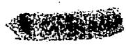

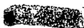

# Xe135 POISONING

This final section is concerned with the xenon poisoning in the ART. In the calculations which follow the removal of $\mathrm{Xe}^{135}$ by neutron capture is neglected. As the neutron capture rate of removal is only about $5\%$ of the total removal rate, the calculations will not be greatly affected. Also, the results for poisoning will be conservative in that it would be smaller were the burnup rate considered.

The derivation for the equilibrium xenon concentration in the fuel can best be followed by referring to Fig. G.1. The total fuel flow through the expansion tank including the leakage around the island is about 23 gpm or $1450~\mathrm{cm}^3/\mathrm{sec}$ . The helium flow rate is treated as a parameter and is varied from 1000 to 5000 liters/day at standard temperature and pressure. The solubility (18) of xenon in fuel is shown in Fig. G.2. If the value of the sparging efficiency is defined as

$$
\eta = \frac {\left(\frac {g m \mathrm {m o l}}{3}\right) _ {\text {i n}} - \left(\frac {g m \mathrm {m o l}}{3}\right) _ {\text {o u t}}}{\left(\frac {g m \mathrm {m o l}}{3}\right) _ {\text {i n}} - (\text {s o l u b i l i t y}) P _ {x 0}}, \tag {1}
$$

where $\mathbf{P}_{\mathbf{x}}$ is the absolute pressure of the xenon in the expansion tank. Then

$$
\eta = \frac {\frac {Z}{1 4 5 0} - \frac {Z - y}{1 4 5 0}}{\frac {Z}{1 4 5 0} - 4 . 3 x 1 0 ^ {- 8} P _ {x}},
$$

and

$$
Z = 6. 2 3 \times 1 0 ^ {- 5} P _ {x} + \frac {y}{\eta}. \tag {2}
$$

For equilibrium conditions, $y$ must be equal to the rate of formation of xenon minus its decay before reaching the sparger and is the rate at which xenon enters the sparger and thus the expansion tank. This term is the same as the source to the expansion tank as defined in Appendix F, and is shown in the last column of Table G.l. The value of $P_{x}$ can be determined

from the total xenon nuclides in the expansion tank. The value for the total nuclides present are taken for the case where the free gas volume in the expansion tank is 90 in.3, and the method of calculation is again the same as Appendix F.

The nuclides of each xenon which is present in any appreciable amount is shown in Table G.l. A total pressure of 2 atm and a temperature $1300^{\circ}\mathrm{F}$ were used to determine the partial pressure of xenon. The partial pressures at helium flow rates of from 1000 to 5000 standard liters per day are given in Table G.l. Substituting the values in Table G.l in Eq. (2) gives the xenon concentration in the fuel. Figure G.3 gives the total xenon concentration in the fuel for helium flow rates of 1000 and 5000 standard liters per day. Also shown in Fig. G.3 is the $\mathrm{Xe}^{135}$ concentration in the fuel. This was obtained by taking $14\%$ of the total xenon (the percent shown in Table G.l is 13.63).

The $\mathrm{Xe}^{135}$ poisoning $^{(19)}$ in the reactor is the number of thermal neutrons absorbed by the $\mathrm{Xe}^{135}$ to those absorbed by the fuel or

$$
P = \frac {N ^ {x e} \sigma^ {x e}}{N ^ {F} \sigma^ {F}}. \tag {3}
$$

For a fuel with 5 mole % of $\mathsf{UF}_4$ the $\mathsf{U}^{235}$ concentration is about $8.2 \times 10^{20}$ atoms/cm $^3$ . The ratio of the xenon-to-fuel cross section $\sigma^{\mathrm{x e}} / \sigma^{\mathrm{F}}$ for a Maxwellian distribution at ART thermal is $4.9 \times 10^{3}$ . As approximately $22\%$ of the xenon cross section is scattering, the value of $\sigma^{\mathrm{x e}} / \sigma^{\mathrm{F}}$ is multiplied by 0.78. Therefore

$$
P = 4. 6 6 \times 1 0 ^ {- 1 8} N ^ {x e}. \tag {4}
$$

The results of Eq. (4) are shown in Fig. G.4 (upper curve). This equation is only for the poisoning effect on the thermal neutrons. In the ART about $40\%$ of the neutrons reach thermal energy. The lower curve of Fig. G.4 shows the poisoning based on the total neutron density of the reactor and is assumed to be $40\%$ of that for the thermal neutrons. This is a gross simplification of the actual case, but in the present reactor in which the purge

rate is high compared to the burnup rate the assumption should be fairly accurate.

The effect of the poisoning may be more easily understood by comparison to the temperature coefficient, which for the ART is expected to be about $2 \times 10^{-5} / {}^{\circ}\mathrm{F}$ . Thus, a poisoning of $1 \times 10^{-3}$ is equivalent to a temperature change of $50^{\circ}\mathrm{F}$ .

XENON CONCENTRATION IN EXPANSION TANK GAS VOLUME   

<table><tr><td rowspan="2">Nuclide</td><td rowspan="2">Decay Constant (sec-1)</td><td colspan="5">Nuclide in Expansion Tank x 10-17for Helium Flow Rates of</td><td rowspan="2">Source to Tank Nuclide/sec x 10-16</td></tr><tr><td>1000 liters/day</td><td>2000 liters/day</td><td>3000 liters/day</td><td>4000 liters/day</td><td>5000 liters/day</td></tr><tr><td>Xe131</td><td>0</td><td>28.2</td><td>14.1</td><td>9.40</td><td>7.05</td><td>5.64</td><td>5.53</td></tr><tr><td>132</td><td>0</td><td>43.8</td><td>21.9</td><td>14.6</td><td>11.0</td><td>8.76</td><td>8.58</td></tr><tr><td>133m</td><td>3.49 x 10-6</td><td>1.52</td><td>0.76</td><td>0.51</td><td>0.38</td><td>0.30</td><td>0.30</td></tr><tr><td>133</td><td>1.52 x 10-6</td><td>62.8</td><td>31.4</td><td>20.9</td><td>15.7</td><td>13.0</td><td>12.3</td></tr><tr><td>134</td><td>0</td><td>74.2</td><td>27.1</td><td>24.7</td><td>18.6</td><td>14.8</td><td>14.5</td></tr><tr><td>135m</td><td>7.40 x 10-4</td><td>13.7</td><td>6.95</td><td>4.67</td><td>3.51</td><td>2.81</td><td>2.78</td></tr><tr><td>135</td><td>2.11 x 10-5</td><td>62.5</td><td>31.0</td><td>20.7</td><td>15.5</td><td>12.4</td><td>12.2</td></tr><tr><td>136</td><td>0</td><td>60.9</td><td>30.5</td><td>20.3</td><td>15.2</td><td>12.2</td><td>11.9</td></tr><tr><td>137</td><td>2.97 x 10-3</td><td>32.7</td><td>17.5</td><td>11.9</td><td>9.05</td><td>7.29</td><td>7.39</td></tr><tr><td>138</td><td>6.79 x 10-4</td><td>49.9</td><td>25.3</td><td>17.0</td><td>12.8</td><td>10.2</td><td>10.1</td></tr><tr><td>139</td><td>1.69 x 10-2</td><td>7.63</td><td>4.97</td><td>3.68</td><td>2.93</td><td>2.43</td><td>2.78</td></tr><tr><td>140</td><td>4.33 x 10-2</td><td>1.95</td><td>1.48</td><td>1.20</td><td>1.01</td><td>0.87</td><td>1.23</td></tr><tr><td>Totals</td><td></td><td>439.80</td><td>222.56</td><td>149.56</td><td>112.73</td><td>90.70</td><td>89.59</td></tr><tr><td>Percent Xe135</td><td></td><td>14.2</td><td>13.9</td><td>13.85</td><td>13.78</td><td>13.68</td><td>13.63</td></tr><tr><td>Px</td><td></td><td>0.00404</td><td>0.00205</td><td>0.00137</td><td>0.00104</td><td>0.000834</td><td></td></tr></table>

X liters/day He

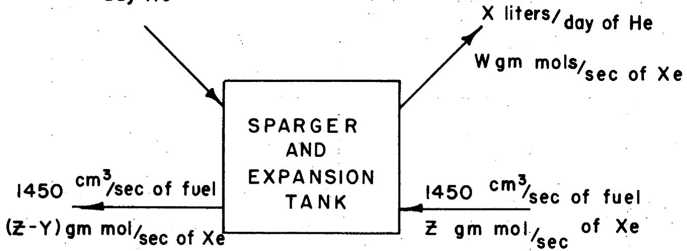  
FIG. G.I- SCHEMATIC FLOW THROUGH SPARGER AND EXPANSION TANK

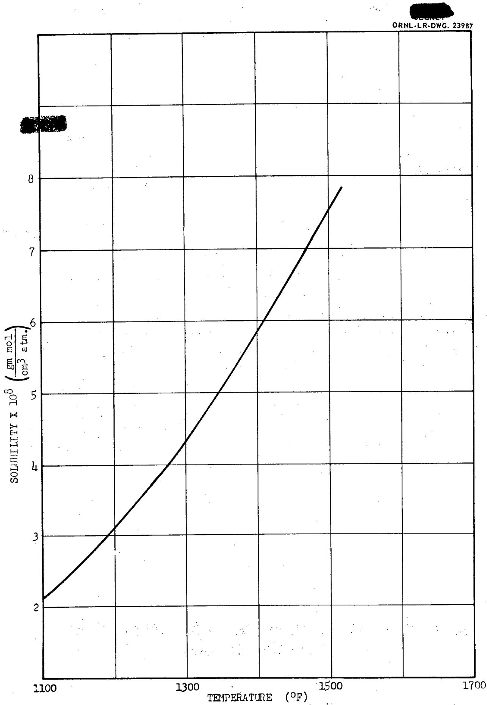  
FIG G.2 XENON SOLUBILITY IN FUEL-30

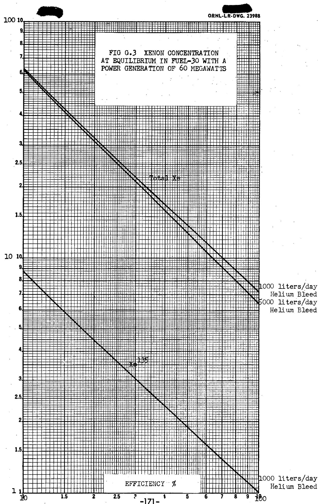  
XENON CONCENTRATION X 10-14 atoms/cm3

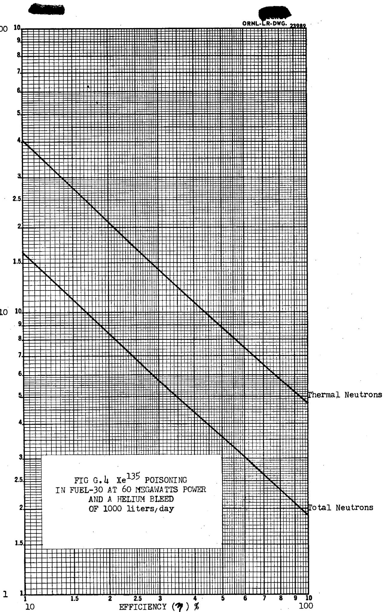  
Xe135 X 104 POISONING

# ACKNOWLEDGEMENTS

A number of people and groups played important roles in the design and development of the ART fuel pump and xenon removal system. The authors are indebted to the following people:

W. Lowen contributed to the design of the attitude-stable xenon removal system.   
E. T. O'Rourke was responsible for the assembly and functioning of all equipment involved in the plastic models of the xenon removal system.   
G. D. Whitman and J.J.W. Simon followed the assembly and construction and subsequently operated the iron fuel pump and the combined Inconel fuel pump and xenon removal system test loops, respectively.   
W. G. Cobb and L. Wilson were responsible for the layout of the fuel pump and xenon removal system.

The authors also wish to thank the members of the Power Plant Engineering and Experimental Engineering Groups of the Aircraft Reactor Engineering Division for their contributions and assistance in the design and development of the ART fuel pump and xenon removal system.

# REFERENCES

1. J. L. Meem, The Xenon Problem in the ART, ORNL CF-54-5-1 (May 3, 1954).   
2. S. I. Cohen et al., A Physical Property Summary for ANP Fluoride Mixtures, ORNL-2150 (Aug. 23, 1956).   
3. ARED-ANP Design Meeting No. 55-4, ORNL CF-55-1-209 (Jan. 26, 1955).   
4. ANP Project Drawing E50-J447-4, Rev. 8 (Dec. 9, 1954).   
5. A. P. Fraas, CFRE Design and Development Handbook, Project No. 3.   
6. H. Rouse, Fundamental Aspects of Cavitation, Proceedings of the National Conference - Industrial Hydraulics, p. 31, 30-7 (1947).   
7. D. Thoma, Bericht zur Weltkraftkonferenz, London, 1924, Z. Ver. deut. Ing. 79, p. 329 (1935).   
8. D. Thoma, Verbalten einer Kreiselpumpe beim Betrieb im Hohlzog Bereich, Z. Ver. deut. Ing. 81, p. 972 (1937).   
9. W. Lowen and G. Samuels, ART Xenon Removal System, unpublished (Feb. 7, 1955).   
10. F. H. Garner and D. Hammerton, Circulation Inside Gas Bubbles, Chem. Eng. Sci. 3, No. 1 (Feb. 9, 1954).   
11. Flow of Fluids Through Valves, Fittings and Pipe, Crane Company Technical Paper No. 409 (May, 1942).   
12. J. E. Baker and J. W. Michel, Pressure Changes with the Flow of Water Through Tees, K 998 (Mar. 16, 1953).   
13. L.A.Mann, personal communication.   
14. A. M. Perry, personal communication.   
15. W. K. Stair, Back Transfer of Gas in ART Pumps, Experimental Report Task No. 7418, Exp. No.1 (Aug. 7, 1956).   
16. J. O. Blomeke, Nuclear Properties of U²³⁵ Fission Products, ORNL CF-54-12-52.   
17. T. Rockwell III, Reactor Shielding Design Manual, Fig. 2.1, p. 19.   
18. ORNL Special Progress Report - Program 4400, ORNL-2249, p. 11 (Dec., 1956).   
19. S. Glasstone and M. C. Edlund, The Elements of Nuclear Reactor Theory, p. 333, D. Van Nostrand Company, New York, 1952.   
20. A. M. Perry, personal communication.