# AEC RESE CRFMENT REPORT

C-84 - Reactors-Special Features

of Aircraft Reactors

M-3679 (20th ed. Rev.)

1.55A

SALT REACTOR PROGRAM

INDIRECTLY PROGRESS REPORT

FEDEREND ENDING SEPTEMBER 1, 1957

DECLASSIFIED

e 10/6/62

CEN

D. ${\mathrm{H}}^{ + }$ -ATPase 位于保卫细胞质膜上,蓝光能够引起细胞内的 ${\mathrm{H}}^{ + }$ 转运到细胞外

LIB

DO NOT

if y

and

ATIONAL LABORATORY

OPERATED BY

IDE NUCLEAR COMPANY

Union Carbide Corporation

POST PICKEDX X · OAK RIDGE, TENNESSEE

# LEGAL NOTICE

This report was prepared as an account of Government sponsored work. Neither the United States, nor the Commission, nor any person acting on behalf of the Commission:

A. Makes any warranty or representation, express or implied, with respect to the accuracy, completeness, or usefulness of the information contained in this report, or that the use of any information, apparatus, method, or process disclosed in this report may not infringe privately owned rights; or   
B. Assumes any liabilities with respect to the use of, or for damages resulting from the use of any information, apparatus, method, or process disclosed in this report.

As used in the above, "person acting on behalf of the Commission" includes any employee or contractor of the Commission to the extent that such employee or contractor prepares, handles or distributes, or provides access to, any information pursuant to his employment or contract with the Commission.

ORNL-2378

C-84 - Reactors-Special Features

of Aircraft Reactors

M-3679 (20th ed. Rev.)

This document consists of 30 pages.

Copy /SS of 310 copies. Series A.

Contract No. W-7405-eng-26

MOLTEN SALT REACTOR PROGRAM

QUARTERLY PROGRESS REPORT

for Period Ending September 1, 1957

H. G. MacPherson, Program Director

DATE ISSUED

DEC 27 1957

OAK RIDGE NATIONAL LABORATORY

Operated by

UNION CARBIDE NUCLEAR COMPANY

Division of Union Carbide Corporation

Post Office Box X

Oak Ridge, Tennessee

# ORNL-2378

# C-84 - Reactors-Special Features

# of Aircraft Reactors

# M-3679 (20th ed. Rev.)

# INTERNAL DISTRIBUTION

1. R.G. Affel   
2. L.G. Alexander   
3. C. J. Barton   
4. M. Bender   
5. E, S. Bettis   
6. D. S. Billington   
7. F. F. Blankenship   
8. E.P.Blizard   
9. C. J. Borkowski   
10. W. F. Boudreau   
11. G.E. Boyd   
12. M.A. Bredig   
13. E. J. Breeding   
14. R. B. Briggs   
15. W.E. Browning   
16. F.R.Bruce   
17. A. D. Callihan   
18. D. O. Campbell   
19. D.W.Cardwell   
20. W.H. Carr   
21. G. I. Cathers   
22. C.E. Center (K-25)   
23. R.A. Charpie   
24. R. L. Clark   
25. C. E. Clifford   
26. J.H. Coobs   
27. W. B. Cottrell   
28. R.S.Crouse   
29. F. L. Culler   
30. D. R. Cuneo   
31. J.H. Devan   
32. L. M. Doney   
33. D. A. Douglas   
34. W. K. Eister   
35. L. B. Emlet (K-25)   
36. W. K. Ergen   
37. J.Y. Estabrook   
38. D. E. Ferguson   
39. A. P. Fraas   
40. E. Franco-Ferreria   
41. J.H.Frye, Jr.   
42. W. T. Furgerson   
43. R. J. Gray   
44. J. L. Gregg   
45. A. T. Gresky

46. W.R. Grimes   
47. A. G. Grindell   
48. E. Guth   
49. C. S. Harrill   
50. M.R.Hill   
51. E.E.Hoffman   
52. H.W.Hoffman   
53. A. Hottaender   
54. A. S. Householder   
55. J. T. Howe   
56. W.H. Jordan   
57. G.W. Keilholtz   
58. C. P. Keim   
59. F. L. Keller   
60. M. T. Kelley   
61. F. Kertesz   
62. J. J. Keyes   
63. B.W.Kinyon   
64. J.A. Lane   
65. R. B. Lindauer   
66. R. S. Livingston   
67. M. I. Lundin   
68. R.N.Lyon   
69. W. B. McDonald   
70. H. G. MacPherson   
71. R.E. MacPherson   
72. F. C. Maienschein   
73. W.D. Manly   
74. E.R. Mann   
75. L. A. Mann   
76. J.R. McNally   
77. F. R. McQuilkin   
78. R.V. Meghreblian   
79. R.P.Milford   
80. A. J. Miller   
81. E.C.Miller   
82. R. E. Moore   
83. J. G. Morgan   
84. K. Z. Morgan   
85. E. J. Murphy   
86. J. P. Murray (Y-12)   
87. M. L. Nelson   
88. G. J. Nessle   
89. R. B. Oliver   
90. L.G. Overholser

91. P. Patriarca   
92. S. K. Penny   
93. A.M. Perry   
94. D. Phillips   
95. J.C.Pigg   
96. P. M. Reyling   
97. A. E. Richt   
98. J. T. Roberts   
99. M. T. Robinson

100. F. E. Romie   
101. H.W. Savage   
102. A.W. Savolainen   
103. R. D. Schultheiss   
104. D. Scott   
105. J. L. Scott   
106. E. D. Shipley   
107. A. Simon   
108. O. Sisman   
109. J. Sites   
110. M. J. Skinner   
111. A.H. Snell   
112. C. D. Susano

113. J.A. Swartout   
114. E. H. Taylor   
115. R.E. Thoma   
116. D. B. Trauger   
117. D. K. Trubey   
118. F. C. VonderLage   
119. G.M. Watson   
120. A. M. Weinberg   
121. M.E.Whatley   
122. J.C. White   
123. G. D. Whitman   
124. E. P. Wigner (consultant)   
125. G.C. Williams   
126. J.C.Wilson   
127. C. E. Winters   
128. W. Zobel

129-130. ORNL - Y-12 Technical Library

Document Reference Section

131-153. Laboratory Records Department

154. Laboratory Records, ORNL R.C.

155-157. Central Research Library

# EXTERNAL DISTRIBUTION

158-160. Air Force Ballistic Missile Division   
161-162. AFPR, Boeing, Seattle   
163. AFPR, Boeing, Wichita   
164. AFPR, Curtiss-Wright, Clifton   
165. AFPR, Douglas, Long Beach   
166-168. AFPR, Douglas, Santa Monica   
169. AFPR, Lockheed, Burbank   
170-171. AFPR, Lockheed, Marietta   
172. AFPR, North American, Canoga Park   
173. AFPR, North American, Downey   
174-175. Air Force Special Weapons Center   
176. Air Materiel Command   
177. Air Research and Development Command (RDGN)   
178. Air Research and Development Command (RDTAPS)   
179-192. Air Research and Development Command (RDZPSP)   
193. Air Technical Intelligence Center   
194-196. ANP Project Office, Convair, Fort Worth   
197. Albuquerque Operations Office   
198. Argonne National Laboratory   
199. Armed Forces Special Weapons Project, Sandia   
200. Armed Forces Special Weapons Project, Washington   
201. Assistant Secretary of the Air Force, R&D   
202-207. Atomic Energy Commission, Washington   
208. Atomics International   
209. Battelle Memorial Institute   
210-211. Bettis Plant (WAPD)   
212. Bureau of Aeronautics   
213. Bureau of Aeronautics General Representative

214. BAR, Aerojet-General, Azusa   
215. BAR, Convair, San Diego   
216. BAR, Glenn L. Martin, Baltimore   
217. BAR, Grumman Aircraft, Bethpage   
218. Bureau of Yards and Docks   
219. Chicago Operations Office   
220. Chicago Patent Group   
221. Curtiss-Wright Corporation   
222. Engineer Research and Development Laboratories

223-226. General Electric Company (ANPD)

227. General Nuclear Engineering Corporation   
228. Hartford Area Office   
229. Idaho Operations Office   
230. Knolls Atomic Power Laboratory   
231. Lockland Area Office   
232. Los Alamos Scientific Laboratory   
233. Marquardt Aircraft Company   
234. Martin Company   
235. National Advisory Committee for Aeronautics, Cleveland   
236. National Advisory Committee for Aeronautics, Washington   
237. Naval Air Development Center   
238. Naval Air Material Center   
239. Naval Air Turbine Test Station   
240. Naval Research Laboratory   
241. New York Operations Office   
242. Nuclear Development Corporation of America   
243. Nuclear Metals, Inc.   
244. Office of Naval Research   
245. Office of the Chief of Naval Operations (OP-361)   
246. Patent Branch, Washington

247-250. Pratt & Whitney Aircraft Division

251. San Francisco Operations Office   
252. Sandia Corporation   
253. School of Aviation Medicine   
254. Sylvania-Corning Nuclear Corporation   
255. Technical Research Group   
256. USAF Headquarters   
257. USAF Project RAND   
258. U. S. Naval Radiological Defense Laboratory

259-260. University of California Radiation Laboratory, Livermore   
261-278. Wright Air Development Center (WCOSI-3)   
279-303. Technical Information Service Extension, Oak Ridge   
304-306. H. M. Roth, Division of Research and Development, AEC, ORO   
307-309. S. R. Sapirie, AEC, ORO   
310. F. C. Moesel, Division of Research and Development, AEC, Washington

# CONTENTS

PREFACE vii

SUMMARY 1

DYNAMIC CORROSION STUDIES 3

Thermal Convection Loop Tests 3

Pump Loop Tests 3

PROGRAM PLANNING 5

DESIGN OF IN-PILE NATURAL CONVECTION LOOPS 7

GAMMA HEATING OF CORE SHELL 9

Heat Generation 9

Temperature Pattern 9

Thermal Stress 9

MERCURY AS A SECONDARY HEAT TRANSFER FLUID 10

NUCLEAR CALCULATIONS 13

The UNIVAC Program Ocusol 13

Description of Program 13

Ocusol Cross Sections 13

Parametric Studies of Reference Design Type of Reactors 13

Clean Reactor Calculations 13

Variation of Nuclear Characteristics with Period of Operation 16

Steady-State Reactors 18

FUEL CYCLE ECONOMICS 19

Fission-Product Poisoning 19

NATURAL CONVECTION REACTOR 20

# PREFACE

The efforts of the Molten Salt Power Reactor study group have been summarized, to April 29, 1957, in a report entitled A Preliminary Study of Molten Salt Reactors (ORNL CF-57-4-27). The report is a review of the state of the pertinent technology as understood by the group, and of the study of the performance of a Reference Design Reactor (RDR), a two-region, homogeneous, 600-Mw central station power reactor.

The work of the Molten Salt Reactor Program will henceforth be reported in quarterly progress reports. They will report work which will be an extension of the work reported in ORNL CF-57-4-27, and it will be assumed that the reader is familiar with that report.

#

# MOLTEN SALT REACTOR PROGRAM QUARTERLY PROGRESS REPORT

SUMMARY

H. G. MacPherson

The primary purpose of the present program is to obtain the information necessary to initiate a reactor construction project. Thus the two major efforts are a materials-compatibility program and a continuation of reactor studies. The former will determine the practicality of building a reactor, and the study program will determine the most suitable reactor for construction.

# MATERIALS COMPATIBILITY

The materials-compatibility program has three major facets: the metallurgy and chemistry of the materials themselves, out-of-pile experiments on the nature and extent of corrosion, and in-pile experiments to test the effects of radiation and fission products.

Work on the metallurgy and chemistry of materials, as sponsored by this program, is just getting under way in significant amounts, and thus no extensive writeups of work in these fields are included in this report. However, a better appreciation of the significance of the mechanism of corrosion has been obtained.

Two types of mass transfer can occur in alloysalt systems. In one, free metal can be deposited in a dendritic form in the cold portions of the system. If this occurs, the tubing will become plugged and a reactor based on this system will soon be inoperative. There are some salts which deposit pure metal in this way when in combination with Inconel under the influence of a high-temperature gradient.

The other type of mass transfer is one in which pure metal cannot be deposited in the cold leg. This type occurs with $\mathsf{NaF - ZrF_4 - UF_4}$ salt in Inconel. At equilibrium, the salt cannot dissolve enough chromium from the hot Inconel to precipitate pure chormium in the cold zone; however, chromium may be deposited as a chromium-rich surface alloy. The mass transfer can proceed only as fast as chromium can diffuse from the metal interior to the surface at the hot end, or from the surface to the interior at the cold end.

Two very significant deductions can be made for situations where the latter type of mass transfer holds. Since the rate-limiting step is

metallic diffusion, it should be very temperature-dependent and it should proceed at a low rate at projected power reactor temperatures. Furthermore, although the chromium-leached hot portions will be greatly weakened, they will not be made thinner and will not leak salt. Thus it should be possible to design a reactor system which would not fail because of corrosion.

The results of the first $1200^{\circ}\mathrm{F}$ , 1000 hr thermal convection loop are described. A very low corrosion rate was found, tending to confirm the expectation of good stability at power reactor temperatures. The status of the pumped loop test, which is under way, is also given.

In the section "Program Planning," the plans for a more complete materials-compatibility program are outlined. The bulk of the initial work will consist of out-of-pile thermal convection and pumped loops. A thermal convection in-pile loop is being designed for installation in the LITR. As funds become available, the present Solid State Division in-pile loop program will be supported and, where possible, augmented.

The alloy that is most favored for power reactor use is still INOR-8 (17 wt % Mo-7 wt % Cr-5 wt % Fe-balance Ni). Production-sized heats of it have now been made by two companies, and its fabrication characteristics are being determined. Its present cost is about $4.50 per pound, and its eventual cost is estimated to be about $2.50 per pound. A proposal for a metallurgical program suitable for power reactors is being prepared.

# REACTOR STUDIES

The reactor studies are proceeding along two principal lines: further clarification of problems with respect to the Reference Design Reactor, and a study of smaller-powered reactors suitable for early construction.

One of the important questions in the RDR design was that of the effect of internal nuclear heating on the walls of the reactor core. This problem has been examined and it has been found that the nuclear heat source in the walls amounts to 17.5 w/cc. This will result in thermal stresses that are believed to be tolerable, but the point

would require further study during the detailed design stages of such a reactor.

The RDR heat-removal system was designed with compatible fluids at adjacent positions everywhere except at the boiler and superheater. The use of sodium to heat water and steam is still regarded as a problem because of the violence of the sodium-water reaction and because the products of the reaction are corrosive both in the sodium and in the water. The results of a study of the use of mercury to replace sodium indicate that mercury vapor for heat transfer has a great deal of merit. In addition, if the mercury is used to drive an auxiliary turbine, significant increases in plant efficiency will result. It is known that mercury introduces its own problems, and the balance between these and the problems of sodium must be analyzed more fully.

The nuclear calculations on which the RDR was based do not represent an exhaustive study or an optimization of conditions. The two-region, homogeneous reactor systems are being examined in an orderly fashion. This has involved the improvement of the UNIVAC code, the refinement of cross-section data, and the invention of a new code for the Oracle. With the latter refinement, it will be possible to follow the course of a reactor from a clean initial condition to one requiring reprocessing, and to keep track of the breeding ratios and the requirements for fuel addition.

The most recent calculations are for clean reactors with diameters varying from 6 to 10 ft, thorium contents varying from 0 to 1 mole $\%$ , and with LiF-BeF $_2$ base salt. The minimum critical masses were for 6- and 8-ft reactors at 47 and 49 kg of U $^{235}$ . With any appreciable external inventory, such as is required for power generation, a core diameter which is larger than the 6 ft proposed for the RDR results in a lower critical

inventory. A diameter of about 8 ft seems to be a good choice. The results of the calculation are still under study, and full conclusions cannot yet be drawn.

The effect of fission-product cross sections higher than the values assessed by Hurwitz and Greebler has been estimated. The total effect on reactor economics would be such as to increase the fuel cycle costs by 0.25 to 0.5 mill/kwhr.

In the consideration of lower-powered reactors, great simplicity of construction seems more important than achieving an exceptionally low fuel cycle cost or a high thermal efficiency. In a small power plant the capital charges tend to greatly outweigh fuel costs, and maintenance can be a big item if simplicity is not kept paramount. In a search for simple molten salt reactors, the natural convection reactor has seemed the best solution to date. In this reactor the primary heat exchanger is placed at some height above the reactor, and the difference in density between two columns of salt, one heated and the other cooled, provides the driving force to circulate the fuel.

So far, little attempt has been made to optimize a design, yet the indications are very encouraging. For powers up to at least 100 thermal Mw, the additional external volume that a thermal convection reactor requires over a forced circulation system does not seem excessive. The attraction of an all-welded system with no moving parts in the fuel circuit is very great. It is anticipated that a reactor of this type will be the most suitable for early construction.

# DYNAMIC CORROSION STUDIES

J. H. DeVan

J. R. DiStefano

# THERMAL CONVECTION LOOP TESTS

Thermal convection loops are now being operated in the temperature range of $1200^{\circ}\mathrm{F}$ in order to evaluate several fluoride salt and structural metal combinations for possible application in a molten fluoride power reactor. The first such test, which utilized an Inconel loop and a salt mixture of $\mathrm{NaF - ZrF_4 - UF_4}$ , was operated successfully for 1000 hr and has been examined. The operating conditions for the test (Loop No. 1161) were as follows:

<table><tr><td>Loop design</td><td>Thermal convection harp constructed of 3/8-in. sched-10 Inconel pipe</td></tr><tr><td>Fluoride salt</td><td>Fuel 122, NaF-ZrF4-UF4(57-42-1 mole %)</td></tr><tr><td>Maximum fluoride-Inconel interface temperature</td><td>1250°F</td></tr><tr><td>Maximum mixed mean fluoride temperature</td><td>1200°F</td></tr><tr><td>Fluoride temperature gradient</td><td>100°F</td></tr></table>

Following operation, the test salt was allowed to freeze in place in the loop. Test samples were then cut from several sections of the loop, as shown in Fig. 1, and the fluorides contained in these samples were melted out under a helium blanket. Samples of the salt were chemically analyzed, and sections of the loop were examined metallographically.

Hot-leg and cold-leg samples were quite similar in appearance, both showing less than 1 mil of corrosive attack. Corrosion in these sections occurred in the form of surface roughening and shallow subsurface void formation, as can be seen in Figs. 2 and 3. Cold-leg sections were found to be entirely free of metal deposits both in visual and metallographic examinations.

Chemical analyses of the fused salt taken before and after the test are shown below. Note

that only a slight increase in chromium, presumably contained as $\mathsf{CrF}_2$ , occurred in the salt during the test.

<table><tr><td></td><td>U(%)</td><td>Ni(ppm)</td><td>Cr(ppm)</td><td>Fe(ppm)</td></tr><tr><td>Before-test salt analysis</td><td>2.78</td><td>60</td><td>55</td><td>330</td></tr><tr><td colspan="5">After-test salt analysis</td></tr><tr><td>Hot leg</td><td>2.66</td><td>25</td><td>105</td><td>80</td></tr><tr><td>Cold leg</td><td>2.65</td><td>20</td><td>110</td><td>70</td></tr></table>

# PUMP LOOP TESTS

An Inconel pump loop of the design shown in Fig. 4 was placed in operation in February 1957. The loop, designated as CPR No. 1, provides for the operation of two fluid circuits, the primary circuit containing fuel 122, and the secondary circuit containing sodium.

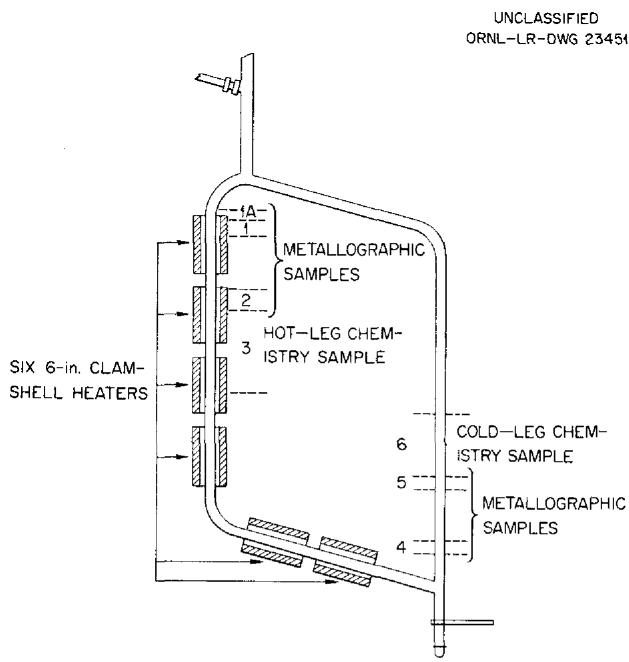  
Fig. 1. Diagram of a Standard Inconel Thermal Convection Loop with Location of Metallographic Samples. (Secret with caption)

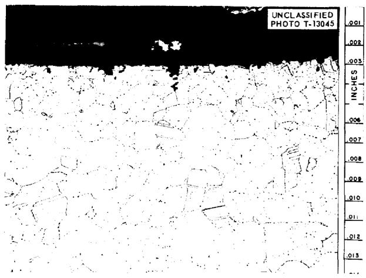  
Fig. 2. Photomicrograph of Inconel Tube Wall at Point of Maximum Loop Temperature. Metal particles appearing above specimen surface are burrs produced during metallographic preparation. 250X. Reduced $32\%$ . (Secret with caption)

Heat is supplied to the fuel circuit by direct resistance and is transferred to the sodium circuit by means of a U-bend heat exchanger. Heat is then taken from the sodium by an air blower, as shown in the lower right portion of the diagram (Fig. 4). A centrifugal pump circulates the salt, while an electromagnetic pump is used in the sodium circuit.

Operating conditions for the loop are as follows:

Maximum salt temperature 1190°F

Maximum salt tube temperature 1260°F

Minimum salt temperature 1060-1070°F

Maximum sodium temperature 1120°F

Minimum sodium temperature 1060-1070°F

Reynolds number for salt 5000 (in heat exchanger)

Reynolds number for sodium 97,700

It is intended that the loop will operate for a period of 10,000 hr. No serious difficulties were encountered in the first six months of operation, although a slight increase in the pressure drop in the fused-salt circuit occurred during the initial 1500 hr. This change was apparently caused by salt freezing at some point in the circuit, since running the loop isothermally at $1200^{\circ}\mathrm{F}$ appeared to correct the conditions and restored the loop to its original conditions.

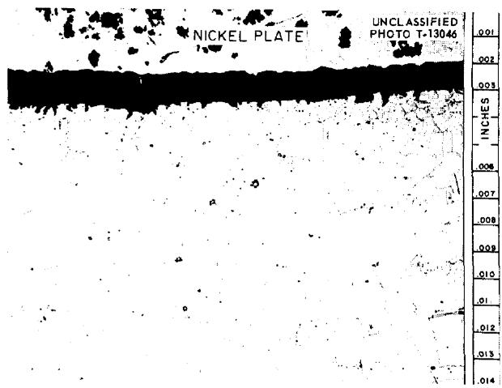  
Fig. 3. Appearance of Cold-Leg Specimen. Specimen was nickel-plated prior to polishing to preserve any metal deposits which might be present. 250X. Reduced $32\%$ . (Secret with caption)

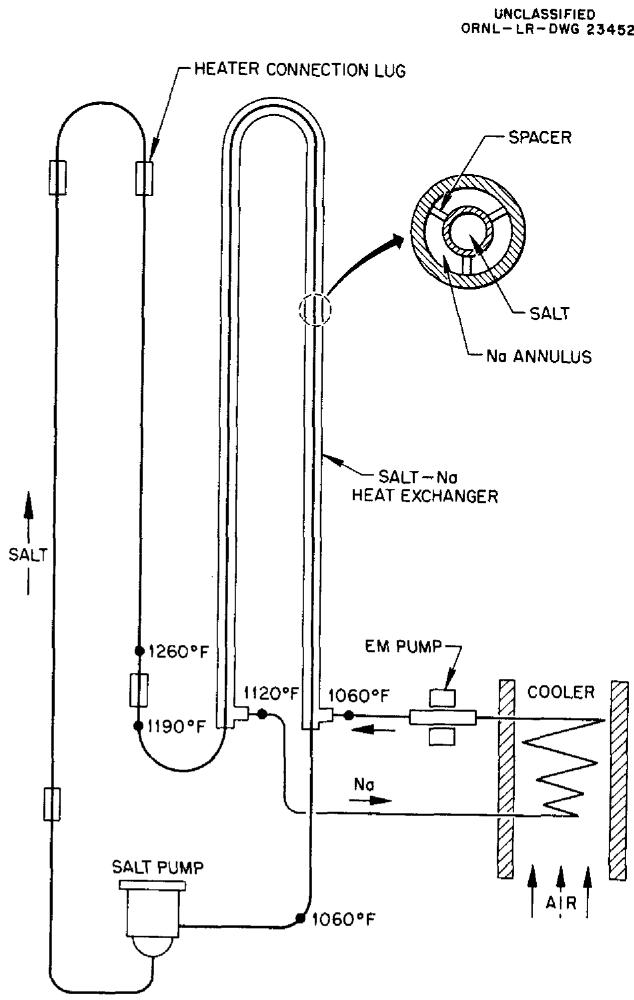  
Fig. 4. Schematic Drawing of Inconel Bifluid Loop CPR No.1. (Secret with caption)

# PROGRAM PLANNING

F. C. VonderLage

The beginning of FY-1958 marked the start of detailed planning of an experimental program based on the findings and recommendations contained in a previous report by the Molten Salt Reactor Program group. The plan assumes a moderately increasing rate of financial support to reach a level of several million dollars per year at the end of two or three years.

The scope of work being planned is limited accordingly to the following areas:

1. testing materials and evaluating, at temperatures and in the environments applicable to power reactors, the structural properties of materials which are or will become available during the period;   
2. studying maintenance requirements of alternate reactors and devising and testing remote maintenance techniques;   
3. conceiving, studying, and evaluating alternate reactor embodiments in the molten salt class.

Materials testing and structural properties evaluation, in part 1 above, refer, in the main, to evaluation of the structural integrity of container materials in circulating molten salt or hot liquid-metal circuits. A wealth of data for higher temperature, short-life reactor operation is available; very few data are available at the lower operating temperatures which apply to power reactors. It is virtually certain, on theoretical grounds, that container materials at these lower temperatures will show, on the whole, improved performance, especially as related to corrosion-initiated weakening. It is an essential objective of the materials testing program to demonstrate that such improved performance is sufficiently great to promise an attractively long-lived reactor.

Tests needed for container materials fall naturally into the following three categories, each suited to its purpose:

1. tests for basic compatibility between circulating fluid and container materials, which are intended to demonstrate that there will be no

mass transfer of metals to form metallic deposits in cold zones (which eventually would cause plugging) and that corrosion of material from within the walls of the containing metal will result at most in the production of disconnected voids, thus leaving the walls impervious to the fluid even after long use;

2. tests for determining the structural properties of materials under reactor design conditions and environments, which are intended to demonstrate that the structural properties of the material are sufficiently attractive to warrant its use for the construction and operation of reactor components which would have tolerable life expectancy, and to procure, for design purposes, quantitative materials-performance data in environments and temperatures to which they will be subjected in a reactor;   
3. tests to demonstrate the adequacy of techniques for joining materials and fabricating components.

Container materials to be tested for compatibility with salts include Inconel, both because it is commercially available and because correlation with existing higher temperature data is desired, and will include INOR as soon as it becomes available in tube form. For liquid metals, Croloy and type 316 stainless steel are being considered, perhaps in bimetallic loops. The choice of metals for liquid metals tests has not yet been made.

The choice of salts for compatibility tests has been guided by nuclear, heat transfer, and safety requirements. The salts are listed in Table 1.

Planned also are limited tests to determine possible additional changes in the structural properties of container materials when the molten salt is in contact with graphite also.

For testing basic compatibility of fuel salts, successful in-pile tests simulating actual reactor conditions would be the most reassuring. Such tests are very costly, and design of experimental equipment simulating reactor conditions is severely limited, if not impossible, principally because of space and safety requirements which must be met in-pile. Accordingly, the plan is to do most of

Table 1. Salts to Be Tested for Basic Compatibility Composition in mole %   

<table><tr><td>LiF</td><td>NaF</td><td>KF</td><td>ZrF4</td><td>BeF2</td><td>UF4</td><td>ThF4</td></tr><tr><td></td><td></td><td></td><td colspan="2">Fuel Salts</td><td></td><td></td></tr><tr><td></td><td>57</td><td></td><td>42</td><td></td><td>1</td><td></td></tr><tr><td></td><td>55</td><td></td><td>41</td><td></td><td>4</td><td></td></tr><tr><td></td><td>53</td><td></td><td></td><td>46</td><td>1</td><td></td></tr><tr><td></td><td>53</td><td></td><td></td><td>46</td><td>0.5</td><td>0.5</td></tr><tr><td>53</td><td></td><td></td><td></td><td>46</td><td>1</td><td></td></tr><tr><td></td><td></td><td></td><td colspan="2">Blanket Salts</td><td></td><td></td></tr><tr><td></td><td>58</td><td></td><td></td><td>35</td><td></td><td>7</td></tr><tr><td>58</td><td></td><td></td><td></td><td>35</td><td></td><td>7</td></tr><tr><td></td><td></td><td></td><td colspan="2">Coolant Salts</td><td></td><td></td></tr><tr><td>46.5</td><td>11.5</td><td>42.0</td><td></td><td></td><td></td><td></td></tr><tr><td>35</td><td>27</td><td></td><td></td><td>38</td><td></td><td></td></tr></table>

the basic compatibility testing out-of-pile and to make a few linking in-pile tests.

Work is presently proceeding on the design of a thermal convection in-pile loop to be installed in available LITR space. In-pile thermal convection loops are expected to provide substantially the same information as that anticipated from in-pile pumped loops. The Program maintains a continuing high interest in the Solid State Division's in-pile loop pump-development program, and plans to support a forced-convection in-pile loop test as soon as component equipment showing promise of successful in-pile operation is available.

The planning of out-of-pile basic compatibility tests is virtually complete. Tests will proceed in two steps: first, the use of thermal convection loops (costing from $800 to$ 1000 per test) for screening; second, the use of pumped loops (costing from $11,000 to $12,000 per test plus an additional $12,000 if additional test stands are needed). Thermal convection tests will not be made on liquid metals; ANP experience has shown them to be too insensitive to operate satisfactorily.

Initially, thermal convection loops will be used for screening each of the salts listed above against Inconel and INOR (the latter, when tubing

becomes available). These tests will be run between maximum and minimum tube wall temperatures for 1000 hr at design temperatures, $1250^{\circ}\mathrm{F}$ maximum wall temperature and a temperature difference of $170^{\circ}\mathrm{F}$ . The purpose of these 1000-hr tests is to provide for the early elimination of those salt-metal combinations which demonstrate a hopeless basic incompatibility and, in the case of Inconel, to provide correlation with existing higher temperature ANP data.

The initial 1000-hr screening tests will be backed up by thermal convection tests at 1250 and $1350^{\circ}\mathrm{F}$ and a temperature difference of $170^{\circ}\mathrm{F}$ . These tests will be run for a year or more unless leaks appear or abnormal temperature differences indicate excessive corrosion or flow restriction. The purpose of these tests is to increase confidence in long-term compatibility at temperatures bracketing expected design temperatures.

Because of their greater cost, pumped loops will be more limited in number. They will be operated for one year or longer unless there are indications of basic incompatibility, or unless loop failures occur during operation. Pumped loops will be run at the design hot Reynolds Number 10,000 and somewhat above expected reactor design wall temperatures, $1300^{\circ}\mathrm{F}$ maximum and a temperature difference of $200^{\circ}\mathrm{F}$ for salts; $1100^{\circ}\mathrm{F}$ maximum and a temperature difference of $450^{\circ}\mathrm{F}$ for liquid metals. In order to achieve a tolerable compromise between the cost and elapsed time for the completion of compatibility testing, pumped loops on salts showing the most promise in 1000-hr thermal convection tests will be started before the longer thermal convection loop test results are available. Because of budget limitations, liquid-metals tests have been assigned lesser priority; possibly three liquid-metal- container-metal combinations will be started during the calendar year 1957.

More basic research on mass-transfer corrosion in molten salt systems has been vigorously pursued during past years in the ANP program. Presently, there are strong indications that this work is about to bear fruit of a very practical nature. There is rapidly mounting evidence of the correctness of the hypothesis that mass-transfer corrosion in circulating loops with temperature gradients is diffusion-controlled. Pending work on the detailed theoretical analysis of the course of the corrosion process under this hypothesis

and further evaluation of chemical affinities of the chemical constituents of salts and metals, the way is open for controlling the location of corrosion to harmless regions by a combination of mechanical design and corrosion-products concentration control. The latter can be achieved either by the inclusion of suitable sacrificial elements in the circulating-fluid system or by chemical additives directly. As an alternative,

there is the possibility of designing salt mixtures whose equilibrium constants for reaction with suitable metals will have a small temperature dependence. The Molten Salt Reactor Program has a deep interest in this basic work now in progress, and it seems likely that within the work period which is presently being planned, anticorrosion design tests aimed at exploiting this research will be initiated.

# DESIGN OF IN-PILE NATURAL CONVECTION LOOPS

F. E. Romie

For corrosion tests of container-metal-salt combinations in which the corrosion rate is governed by diffusion processes within the metal, the velocity of the salt flowing over the metal surface has practically no detectable effect on the long-term corrosion rate. Thus a natural convection loop, despite its characteristically low flow velocities, is a suitable test system for such materials. The natural convection loop is particularly attractive for in-pile corrosion tests, especially in consideration of present experience with small-scale pumped in-pile loops, because of its apparent potential for long, trouble-free operation.

Design of a loop for use in the LITR requires that the loop fit in a fuel element space of about 3-in.-square cross section. The legs of the loop are thus close together, separated by not more than 1.5 in. center line to center line. The height of the loop is determined primarily by the vertical flux distribution in the reactor. For any specified average power generation in the salt, the maximum salt temperature will be minimized if the ratio of the peak to the average power generation is small. This condition can be realized by maintaining the flux incident on the loop uniform, which means for the LITR that the loop should not exceed a height of about 1 ft.

The difference in mean salt temperature between the two legs is maintained by unequal cooling. The air, which is used as the coolant, flows through an annular passage along the loop tube. A schematic diagram of the convection loop is shown in Fig. 5.

If uniform heat generation and laminar flow of the salt are postulated, analysis of this loop gives the Reynolds modulus of the salt in terms of four independent variables:

$$
R e \propto D ^ {1. 1 6} L ^ {1 / 2} W ^ {0. 0 6} \Delta T ^ {0. 4 5},
$$

where

$$
\begin{array}{l} D = \text {i n t e r n a l} \\ L = \text {h e i g h t} \\ W = \text {p o w e r} \\ \Delta T = \text {d i f f e r e n c e b e t w e e n m a x i m u m a n d m i n i m u m} \\ \end{array}
$$

Simulation of temperature conditions in the RDR requires a $\Delta T$ of about $150^{\circ}\mathrm{F}$ with a maximum wall temperature of $1250^{\circ}\mathrm{F}$ .

Inspection of the above power relation indicates that attainment of appreciable Reynolds moduli is primarily dependent on the diameter of the loop tube and insensitive to the power generation, $W$ . The average power generation for the RDR, 50 w/cc, can be realized in the LITR with 1 mole % UF4 in mixture 74 (Li-Be-F) and appears suitable for a convection loop. The source strength having been fixed at 50 w/cc, the diameter of the loop is limited only by space considerations, since the temperature difference between the maximum salt temperature and the tube wall is not excessive for any reasonable diameter. A diameter of ½ in. appears appropriate, although fabrication of the bends at the top and bottom of the loop may require a smaller diameter.

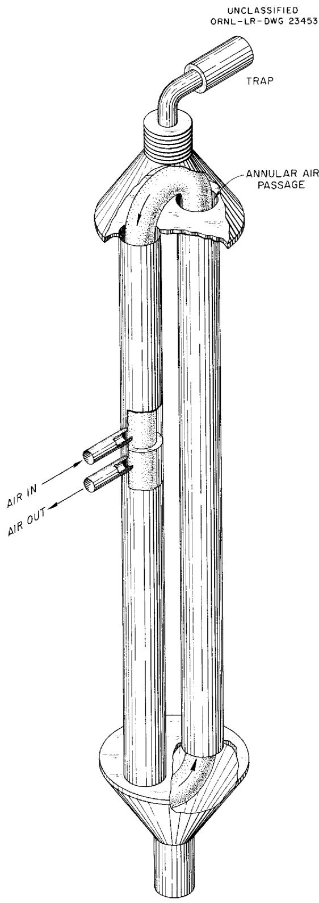  
Fig. 5. Schematic Drawing of In-Pile Thermal Convection Loop.

Specification and performance of a possible convection loop consistent with the foregoing considerations are given in Table 2.

Table 2. Specification and Performance of an In-Pile Convection Loop   

<table><tr><td>Mixture 74</td><td>LiF-BeF2-UF4(69.5-29.5-1 mole %)</td></tr><tr><td>Tube diameter (internal)</td><td>0.50 in.</td></tr><tr><td>Height of loop</td><td>12 in.</td></tr><tr><td>Coolant air rate</td><td>18 cfm (STP)</td></tr><tr><td>Reynolds modulus of salt</td><td>Order of 100</td></tr><tr><td>Annular gap for air flow</td><td>0.04 in.</td></tr><tr><td>Source strength</td><td>50 w/cc</td></tr><tr><td>Difference between center line and tube surface temperature in no-flow condition</td><td>170°F</td></tr><tr><td>Difference between maximum and minimum surface temperatures</td><td>150°F</td></tr><tr><td>Maximum wall temperature</td><td>1250°F</td></tr></table>

It is anticipated that provision for off-gases will be provided by a charcoal trap connected to the top of the loop. During reactor shut-down the salt will be kept in the molten state by electric heating, which, with proper design, can be arranged to allow continued circulation of the loop salt.

Control of the temperature level of the salt is afforded by regulation of the air flow rate. Partial control of the difference between maximum and minimum surface temperatures can be realized by vertical positioning of the loop in the reactor core. A lesser degree of surface temperature control can be obtained by adjustment of the electrical input to the loop heaters.

It is not possible, with present knowledge, to predict the nature of the flow in the loop. The fluid shear stress at the wall is consequently not predictable, and the value of the Reynolds modulus listed in Table 2 must be regarded as highly approximate.

# GAMMA HEATING OF CORE SHELL

L.A.Mann L.G.Alexander

# HEAT GENERATION

Since the Reference Design Reactor chosen for study includes a container-metal wall surrounding the reactor core and separating the fuel salt from the blanket salt, the integrity of this shell against failure from thermal stress is important. The temperature level and pattern in the core shell wall are determined by the fuel and salt temperatures and the gamma energy absorbed by the wall. The gamma absorption was calculated for a slightly idealized model approximating expected conditions in order that stress levels could be calculated and compared with the strength of the container material. The idealization consisted only of assuming spherical geometry, whereas the core shell is expected to only roughly approximate a sphere.

For the model, a core vessel 6 ft in diameter was assumed, having a nickel-based wall $\frac{1}{3}$ in. thick, heated by gammas from the core, blanket, and the wall itself. The distribution of gamma sources from fission, beta decay, radiative capture, and inelastic scattering was computed by means of a multigroup neutron diffusion calculation. The gamma heating in the vessel wall was then estimated by means of the straight-ahead-scattering, integral-spectrum method. One numerical and two semianalytical procedures were used and compared with regard to convenience and accuracy. A spot check in which Goldstein's buildup factors were used was also made. It was estimated that at a power level of 600 Mw (187 w/cc, average), core gammas would generate 13.7 w/cc, blanket gammas would generate 0.032 w/cc, and gammas resulting from neutron capture in the vessel wall would generate, on the average, 3.78 w/cc; the total is 17.5 w/cc. Details of the calculations are given elsewhere.

# TEMPERATURE PATTERN

If temperatures on the inside and outside wall surfaces are assumed to be equal, the temperature difference between the center and the surface of the wall is calculated by

$$
\Delta T = \frac {w t ^ {2}}{2 k},
$$

where $\Delta T$ is temperature difference, $w$ is the heat generation density (power/volume), $t$ is the half-thickness of the wall, and $k$ is the thermal conductivity of the wall. The value of $\Delta T$ was calculated to be $16.3^{\circ}F$ .

# THERMAL STRESS

An approximation of the short-time thermal stress (before relief by creep) is approximated by

$$
\sigma = \frac {a E}{1 - \nu} \Delta T,
$$

where $\sigma$ is the maximum thermal stress component caused by $\Delta T$ , $\Delta T$ is the difference between bulk wall temperature and temperature at the surface, $\alpha$ is the volumetric thermal coefficient of expansion, $E$ is the modulus of elasticity, and $\nu$ is Poisson's ratio. Details of the calculation are given elsewhere.

The stress, $\sigma$ , was calculated to be approximately 3170 psi. [Note that $\sigma$ will be higher if the two surfaces are not at the same temperature. If the outside wall surface is insulated (not cooled), $\Delta T$ will be greater. For the same $w$ , $t$ , and $k$ , $\Delta T$ will be $65.3^{\circ}F$ , and the thermal stress will be 12,700 psi.] In order to provide a basis for judgment of these stresses, it can be stated that the yield strength of Inconel, at $1200^{\circ}F$ , is approximately 22,000 psi and that the creep strength (0.000001 per hour) is shown as 2000 psi. No attempt was made to evaluate the lowering of stress by creep.

# MERCURY AS A SECONDARY HEAT-TRANSFER FLUID

B. W. Kinyon

Mercury, of all the heat-transfer liquids proposed, appears to offer the greatest compatibility with both the molten fluorides and water (or steam). In the event of a leak, either a small crack or a ruptured tube, there would be no explosion or exothermic chemical reaction and no violent corrosion reaction. Shutdown and repair or replacement of the faulty equipment would be routine, with precautions against the toxicity of mercury vapor as the most serious problem.

Mercury as a heat transfer medium may be used in three ways:

1. as a static medium which forms a thin, stagnant layer between concentric tubes of a double wall heat exchanger,   
2. as a forced-flow medium which is pumped between two exchangers, one serving as a heat source, the other as a heat sink,   
3. as a boiling heat-transfer medium in which mercury is vaporized in a heat source and condensed in a heat sink.

One of the desired features of a central station nuclear power plant would be to have the steam and water system entirely outside the radiation field in order to allow direct inspection, adjustment, and maintenance at all times. This cannot be achieved with stagnant mercury in a double-wall exchanger if a primary coolant which emits gamma radiation is used. Furthermore, a double-wall exchanger, which is essentially two units built into one, costs more than two separate units and is subject to the probability that both units will have to be scrapped if one unit becomes defective.

The second arrangement, in which the mercury is pumped between two exchangers, meets the requirement of isolating radiation from the water system, but pumping requirements are excessive and the mercury investment is prohibitive.

A boiling mercury heat-transfer system allows the steam system to be completely accessible, and can be arranged so that natural circulation eliminates the need for any mercury pumps. As 1 lb of mercury vaporized at $1000^{\circ}\mathrm{F}$ and condensed at $600^{\circ}\mathrm{F}$ transfers as much heat as 9 lb of liquid mercury transfers between the two temperatures and as vapor occupies much of the volume, the mercury inventory is much reduced.

A temperature-enthalpy diagram of the fuel, primary coolant, and water-steam for a possible set of temperature conditions is shown in Fig. 6. Initial water conditions are assumed to be heated feed water mixed with recirculated boiler water. Mercury vapor would be used to transfer heat from the primary coolant to the water or steam. Figure 7 illustrates the mercury-condensation conditions, with three temperature-pressure conditions assumed for the superheater in order to minimize thermal stresses. Mercury-condensation and water-boiling conditions match very well, as may be seen from this diagram. The temperature of the mercury vaporization does not have as good a match with the temperature of the primary coolant, since the heat flux would be high at the hot end and low at the cold end of the exchanger. However, the high density of mercury makes it possible to arrange a J-shaped exchanger to give a more uniform flux throughout.

As a temperature difference of $25^{\circ}\mathrm{F}$ between salt and mercury is sufficient for boiling the mercury, it would be desirable to have boiling from 1075 to $1000^{\circ}\mathrm{F}$ while the salt is giving up

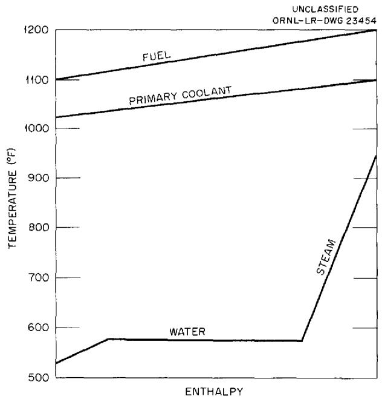  
Fig. 6. Temperature-Enthalpy Diagram for Fuel, Primary Coolant, and Water.

heat from 1100 to $1025^{\circ}\mathrm{F}$ . As $1075^{\circ}\mathrm{F}$ corresponds to 275 psia, or 95 psi more than 180 psia, which corresponds to $1000^{\circ}\mathrm{F}$ , an 18-ft head of mercury would be sufficient to increase the boiling point by this amount. An arrangement of a heat exchanger is shown in Fig. 8, and a temperature enthalpy diagram is shown in Fig. 9. It is assumed that the mercury will recirculate and mix with the returning condensate.

Pressure reducing valves could be used to control the condensation temperature of mercury at desired levels, or the mercury could be put through a turbine, developing power and the same time reducing the pressure. This, incidentally, increases the thermal efficiency of the system over that attainable with steam alone at the same temperature, even with reheat. The comparison with RDR, based on 600 Mw of heat from the core plus 10 Mw of heat from the blanket, is shown in Table 3.

Mercury turbines have been in operation since 1922, the largest producing 20 Mw of electricity. For use in a nuclear power plant, as outlined, larger size turbines, with bleed-off at the desired intermediate pressures, would have to be developed. This probably would not present any great difficulties.

The metallurgical aspect is more uncertain. Mercury boilers in Newark, New Jersey, and

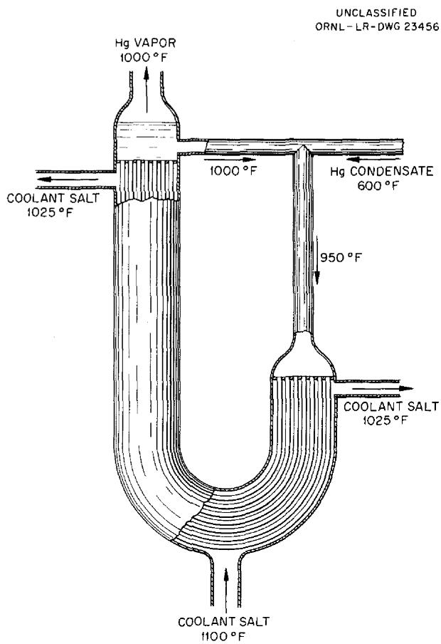  
Fig. 8. Mercury Boiler.

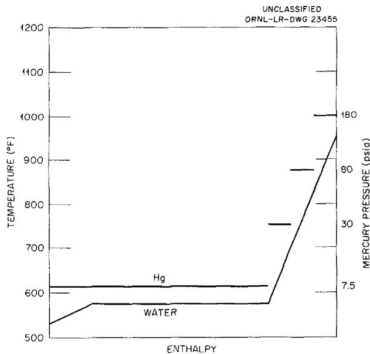  
Fig. 7. Temperature-Enthalpy Diagram for Mercury-Water Heat Exchange.

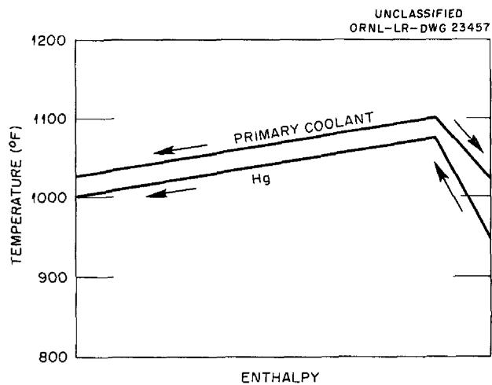  
Fig. 9. Temperature-Enthalpy Diagram for Mercury Boiler with Split Flow of Primary Coolant.

Table 3. A Comparison of Mercury Topping Cycle with Sodium Heat Transfer System   

<table><tr><td></td><td>Mercury Topping Cycle</td><td>Reference Design Reactor</td></tr><tr><td>Mercury power (Mw)</td><td>106</td><td></td></tr><tr><td>Steam power (Mw)</td><td>198</td><td>240</td></tr><tr><td>Total (Mw)</td><td>304</td><td>240</td></tr><tr><td>Turbine efficiency (%)</td><td>49.8</td><td>42.3</td></tr><tr><td>Plant efficiency (%)</td><td>46.8</td><td>39.3</td></tr><tr><td>Change in costs from RDR (mills/kwhr)</td><td></td><td></td></tr><tr><td>Turbine investment cost</td><td>+0.35</td><td></td></tr><tr><td>Reactor complex cost</td><td>-0.45</td><td></td></tr><tr><td>Fuel cost</td><td>-0.40</td><td></td></tr><tr><td>Net change</td><td>-0.50</td><td></td></tr></table>

Pittsfield, Massachusetts, were troubled with periodic plugging of certain boiler tubes. The Hartford, Connecticut, plant appears to have had much less trouble. One explanation offered for the plugging is that magnesium oxide in the mercury had deposited downstream from an orifice in a boiler tube, causing further constriction and eventual plugging. The orifice was caused in joining tubes to get the length desired, the joint being either a fusion butt weld or an arc weld with a backup ring. Weld flash or the backup ring caused the flow restriction. The treatment of mercury to ensure good wetting and uniform heat transfer involves the addition of a few ppm of magnesium, to remove oxide, and the addition of titanium, to enhance wetting. Since particular tubes were reported to be plugging, it is possible that the high temperatures in the fossil fuel

furnace contributed to the difficulty and that the uniform heat of the molten fluoride would not induce precipitation of the magnesium oxide. Further study will be made.

Another metallurgical problem in the use of mercury is that nickel alloys, which are necessary for molten salts, are readily attacked by mercury. This makes duplex tubing necessary for the salt-to-mercury heat exchanger. Fabrication of duplex tubing and its use in heat exchangers is common practice, but each new combination requires developmental work.

As the compatibility of mercury with both water and the fused salts is so much greater than it is for sodium and as the economics appears to be satisfactory, further study of the use of mercury will be made. Both two-phase heat transfer and the topping cycle will be considered.

# NUCLEAR CALCULATIONS

# THE UNIVAC PROGRAM OCUSOL

# Description of Program

L. G. Alexander

The Eyewash program, a 30-group, 9-region reactor code written by J. H. Alexander and N. D. Given, was selected for the analysis of the nuclear characteristics of the reactors of interest to the Molten Salt Reactor group. The program has been extended and modified as follows. The lethargy group widths were revised in order to better treat fused salt reactors containing large amounts of thorium, and a lethargy for the thermal group corresponding to $1150^{\circ}\mathrm{F}$ was selected. A short program for computing and editing, via the supervisory control typewriter, the absorptions of neutrons in a maximum of seven different nuclides was written by R. Van Norton of the New York University Institute of Mathematical Sciences and incorporated into the program, which was renamed Ocusol. This feature facilitates the computation of breeding ratios and the preparation of detailed neutron balances. These changes, together with other operating instructions, are described elsewhere.

# Ocusol Cross Sections

J. T. Roberts

The cross sections used in Ocusol calculations for molten salt reactors have been recorded and discussed in an ORNL CF memorandum. Since that memorandum was issued, beryllium, carbon, and sodium have been added to the cross-section tape (July 8, 1957). These cross sections, and other additional ones (e.g., Pu), will be recorded and discussed in a supplementary report to be issued later.

The main differences between the Ocusol cross sections and those previously used in the similar Eyewash and Murine calculations are as follows:

1. provision of five different sets of thorium cross sections calculated for five different thorium concentrations (0, 1, 4, 10, and 25 mole % in mixtures of 69 LiF-31 BeF $_2$ and 75 LiF-25 ThF $_4$ ), with corrections for resonance self-shielding and Doppler broadening at $1150^{\circ}\text{F}$ ,   
2. more conservative values of $\alpha$ for $U^{233}$ and $U^{235}$ ,   
3. a set of average fission-product cross sections, less the lowest resonances of $Xe^{135}$ and $Sm^{149}$ , based on the estimates of Greebler and Hurwitz.

These differences are conservative with respect to most other comparable reactor calculations, but the fission-product absorption cross sections may not be conservative enough. Recent experimental measurements give values of $\sigma_{2}$ at 25 kev which are two to three times as high as those estimated by Hurwitz and Greebler. The implications of this in the fuel-cycle economics of molten salt reactors are discussed elsewhere in this progress report.

# PARAMETRIC STUDIES OF REFERENCE DESIGN TYPE OF REACTORS

# Clean Reactor Calculations

J. T. Roberts

A new series of reference design type of reactors were calculated with core diameter and thorium content of core salt as variables. The results are summarized in Table 4. The calculations were made for spherical, homogeneous, three-region reactors, at $1150^{\circ}\mathrm{F}$ , as follows:

Core: $69\%$ LiF-31% $\mathsf{BeF}_2$ plus UF4 and ThF4 as shown, diameter as shown

Shell: 3 in. of INOR-8

Blanket: $75\%$ LiF $-25\%$ ThF $4^{\circ}$ 2 ft thick

Table 4. Summary of UNIVAC-Ocusol Calculations for Two-Region, Spherical, Homogeneous Molten Salt Reactors: $1150^{\circ}\mathrm{F}$ , "Clean"   

<table><tr><td>Code number</td><td>53</td><td>54</td><td>55</td><td>64</td><td>83</td><td>61</td><td>38</td><td>84</td><td>62</td></tr><tr><td>Core</td><td></td><td></td><td></td><td></td><td></td><td></td><td></td><td></td><td></td></tr><tr><td>Diameter (ft)</td><td>6</td><td>8</td><td>10</td><td>6</td><td>8</td><td>10</td><td>6</td><td>8</td><td>10</td></tr><tr><td>Mole % Th232</td><td>0</td><td>0</td><td>0</td><td>0.28</td><td>0.28</td><td>0.28</td><td>1</td><td>1</td><td>1</td></tr><tr><td>Mole % U235</td><td>0.11</td><td>0.047</td><td>0.033</td><td>0.30</td><td>0.096</td><td>0.062</td><td>0.63</td><td>0.34</td><td>0.21</td></tr><tr><td>Neutrons thermalized (%)</td><td>25</td><td>45</td><td>55</td><td>4.8</td><td>22</td><td>35</td><td>0.41</td><td>4.6</td><td>7.2</td></tr><tr><td>Fissions at thermal energies (%)</td><td>38</td><td>59</td><td>67</td><td>8.3</td><td>34</td><td>51</td><td>0.49</td><td>8.2</td><td>12</td></tr><tr><td>Ifν=2.47, table shows values of η</td><td>1.93</td><td>2.01</td><td>2.03</td><td>1.79</td><td>1.92</td><td>1.98</td><td>1.74</td><td>1.79</td><td>1.82</td></tr><tr><td>α</td><td>0.28</td><td>0.23</td><td>0.22</td><td>0.38</td><td>0.29</td><td>0.25</td><td>0.42</td><td>0.38</td><td>0.36</td></tr><tr><td>Neutron balance</td><td></td><td></td><td></td><td></td><td></td><td></td><td></td><td></td><td></td></tr><tr><td>Core</td><td></td><td></td><td></td><td></td><td></td><td></td><td></td><td></td><td></td></tr><tr><td>U235</td><td>0.5185</td><td>0.4984</td><td>0.4919</td><td>0.5590</td><td>0.5218</td><td>0.5052</td><td>0.5744</td><td>0.5594</td><td>0.5509</td></tr><tr><td>U238</td><td>0.0122</td><td>0.0072</td><td>0.0059</td><td>0.0224</td><td>0.0130</td><td>0.0088</td><td>0.0261</td><td>0.0224</td><td>0.0202</td></tr><tr><td>Th232</td><td>0.0000</td><td>0.0000</td><td>0.0000</td><td>0.0902</td><td>0.1318</td><td>0.1522</td><td>0.1428</td><td>0.2051</td><td>0.2432</td></tr><tr><td>Li+Be</td><td>0.0717</td><td>0.1587</td><td>0.2254</td><td>0.0235</td><td>0.0684</td><td>0.1168</td><td>0.0104</td><td>0.0228</td><td>0.0311</td></tr><tr><td>F&#x27;</td><td>0.0347</td><td>0.0470</td><td>0.0596</td><td>0.0285</td><td>0.0362</td><td>0.0422</td><td>0.0264</td><td>0.0280</td><td>0.0312</td></tr><tr><td>Shell</td><td>0.0719</td><td>0.0741</td><td>0.0607</td><td>0.0381</td><td>0.0443</td><td>0.0408</td><td>0.0240</td><td>0.0226</td><td>0.0188</td></tr><tr><td>Blanket</td><td></td><td></td><td></td><td></td><td></td><td></td><td></td><td></td><td></td></tr><tr><td>Li+F</td><td>0.0085</td><td>0.0072</td><td>0.0053</td><td>0.0058</td><td>0.0023</td><td>0.0041</td><td>0.0043</td><td>0.0034</td><td>0.0026</td></tr><tr><td>Th232</td><td>0.2752</td><td>0.2030</td><td>0.1490</td><td>0.2253</td><td>0.1747</td><td>0.1268</td><td>0.1853</td><td>0.1321</td><td>0.0988</td></tr><tr><td>Leakage</td><td>0.0073</td><td>0.0044</td><td>0.0022</td><td>0.0072</td><td>0.0075</td><td>0.0031</td><td>0.0063</td><td>0.0042</td><td>0.0032</td></tr><tr><td>Total</td><td>1.0000</td><td>1.0000</td><td>1.0000</td><td>1.0000</td><td>1.0000</td><td>1.0000</td><td>1.0000</td><td>1.0000</td><td>1.0000</td></tr><tr><td>Critical inventory (kg) for external volume (ft3) shown</td><td></td><td></td><td></td><td></td><td></td><td></td><td></td><td></td><td></td></tr><tr><td>0</td><td>47</td><td>49</td><td>67</td><td>132</td><td>100</td><td>126</td><td>279</td><td>358</td><td>418</td></tr><tr><td>113</td><td>94</td><td>70</td><td>82</td><td>264</td><td>141</td><td>153</td><td>558</td><td>509</td><td>508</td></tr><tr><td>226</td><td>142</td><td>90</td><td>96</td><td>396</td><td>183</td><td>181</td><td>837</td><td>660</td><td>599</td></tr><tr><td>339</td><td>189</td><td>111</td><td>111</td><td>528</td><td>225</td><td>208</td><td>1116</td><td>811</td><td>689</td></tr><tr><td>Conversion ratio</td><td></td><td></td><td></td><td></td><td></td><td></td><td></td><td></td><td></td></tr><tr><td>Internal</td><td></td><td></td><td></td><td></td><td></td><td></td><td></td><td></td><td></td></tr><tr><td>U238</td><td>0.023</td><td>0.014</td><td>0.012</td><td>0.040</td><td>0.025</td><td>0.018</td><td>0.046</td><td>0.040</td><td>0.037</td></tr><tr><td>Th232</td><td>0.000</td><td>0.000</td><td>0.000</td><td>0.161</td><td>0.252</td><td>0.301</td><td>0.249</td><td>0.367</td><td>0.441</td></tr><tr><td>External</td><td></td><td></td><td></td><td></td><td></td><td></td><td></td><td></td><td></td></tr><tr><td>Th232</td><td>0.531</td><td>0.408</td><td>0.321</td><td>0.403</td><td>0.335</td><td>0.251</td><td>0.322</td><td>0.236</td><td>0.180</td></tr><tr><td>Total</td><td>0.554</td><td>0.422</td><td>0.313</td><td>0.604</td><td>0.612</td><td>0.569</td><td>0.617</td><td>0.643</td><td>0.658</td></tr></table>

Core: 69 LiF-31 BeF $_2$ plus 0.035 to 0.68  
mole % UF $_4$ (93% U $^{235}$ ) plus 0, 0.284, and 1 mole % ThF $_4$ for diameters of 6, 8, and 10 ft

Shell: The equivalent of $\frac{1}{3}$ in. of INOR-8 spread over one spacial increment (the over-all radius of the reactor is divided into 60 spacial increments)

Blanket: 75 LiF-25 ThF $_{4}$ , 2 ft thick.

The "most thermal" of the reactors was No. 55 (10-ft core diameter, $0\%$ Th in core), with $55\%$ of the neutrons being thermalized and $67\%$ of the fissions occurring in the thermal group. The "least thermal" of the reactors was No. 38 (6-ft core diameter, $1\%$ Th in core), with only $0.41\%$ of the neutrons thermalized and $0.49\%$ of the fissions at thermal energies. These two cases also represent the extremes in this study for parasitic captures by $\mathsf{U}^{235}$ , with $\alpha$ values of 0.22 and 0.42, respectively. These values correspond to $\eta$ values of 2.03 and 1.74, respectively, if the "world" value of 2.47 is used for $\nu$ (for $\mathsf{U}^{235}$ ) in the equation:

$$
\eta = \frac {\nu}{1 + \alpha}.
$$

The neutron balances given in Table 4 show that the most important losses of neutrons are:

Parasitic captures in U235 10-17%

Parasitic captures in core salt 4-28%

Parasitic captures in shell 2-7%

Hardening the neutron spectrum by using smaller core size or higher thorium content reduces the core salt and shell losses but increases the non-fission captures in $U^{235}$ .

The critical mass of $U^{235}$ in the reactors studied varied from 47 to $418\mathrm{kg}$ . These are shown in Table 4 as critical inventory for $0\mathrm{ft}^3$ external volume. Critical inventories are also shown for 113, 226, and $339\mathrm{ft}^3$ of external volume. Roughly, these external volumes correspond to 200, 400, and 600 Mw forced-circulation reactors, or to 60, 130, and 190 Mw natural-circulation reactors. The data for $0\mathrm{ft}^3$ and $339\mathrm{ft}^3$ external volume are plotted in Fig. 10. Although the ratio of internal to external conversion varies considerably, as shown in Table 4, the total conversion ratio varies only between 0.55 and 0.65, except for the 8- and

10-ff reactors with no thorium in the core. Figure 11 shows the conversion ratio and $(\eta - 1)$ for the various reactors studied. Adding thorium to the core increases the conversion ratio, but the increase is much less than might be expected since $(\eta - 1)$ decreases significantly at the same time.

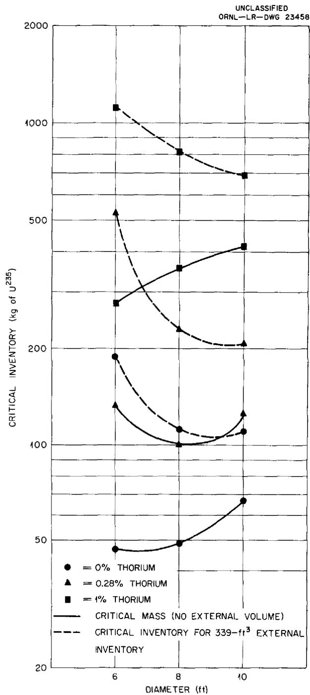  
Fig. 10. Critical Inventories for Clean Reactors.

The trends of the critical mass curves shown in Fig. 10 do not appear to be mutually consistent. In particular, it was expected that the minima would shift to the left with increasing thorium

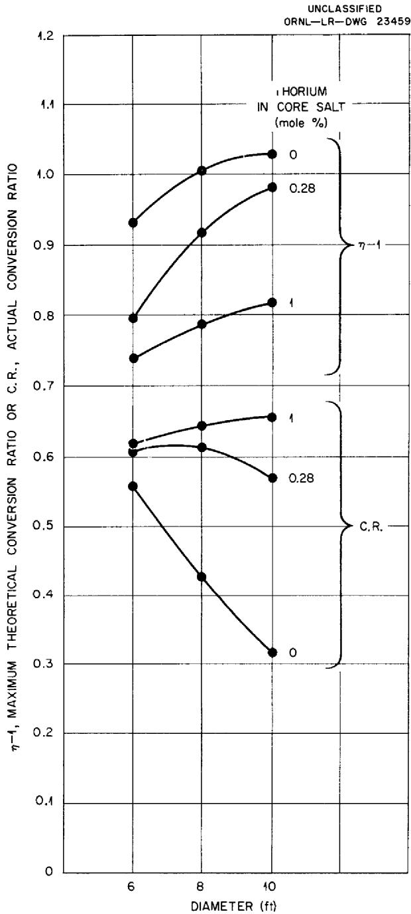  
Fig. 11. Actual Conversion Ratio (C.R.) and Maximum Theoretical Conversion Ratio $(\eta - 1)$ as a Function of Core Diameter and Mole % Thorium in Core Salt.

concentration. The curve for $0.28\%$ thorium did not conform to this expectation. The reasons for this anomalous behavior are being investigated; it is thought that the behavior may be related to shifts in the spectral distributions of the flux in these reactors.

# Variation of Nuclear Characteristics with Period of Operation

# L. G. Alexander

The characteristics listed in the previous section are those of initial or "clean" reactor states. The accumulation of fission products and of uranium isotopes will modify these characteristics markedly. In those reactors containing no thorium in the core, the accumulation of fission products will tend not only to increase the critical mass and inventory of $\mathsf{U}^{235}$ but will also, by decreasing the leakage, cause a decrease in the breeding ratio. As the concentrations of absorbers in the core, including $\mathsf{U}^{235}$ , increase, the neutron-flux spectral distribution will shift toward higher energies. While this tends to reduce the relative number of absorptions in fuel carrier and other parasitic materials, it tends to increase the relative number of radiative captures in $\mathsf{U}^{235}$ , and thus it impairs the breeding ratio. On the other hand, addition to the core of $\mathsf{U}^{233}$ which is formed in the blanket tends to compensate for the buildup of parasitic materials. Also, with $\mathsf{U}^{233}$ in the core, increasing hardness of the neutron spectrum has much less effect on the breeding ratio because the relative number of radiative captures at eithermal energies are much less in $\mathsf{U}^{233}$ than in $\mathsf{U}^{235}$ .

In reactors having thorium also in the core, the accumulation of $\mathsf{U}^{233}$ tends to be more rapid, and hence the $\mathsf{U}^{235}$ replacement rate is smaller and the conversion ratio does not fall so rapidly. With a sufficiently large initial inventory of $\mathsf{U}^{235}$ , it is conceivable that the total reactivity might tend to increase temporarily even without the addition of any $\mathsf{U}^{235}$ , and that for some limited period it might be possible to add thorium and perhaps obtain an increase in the conversion ratio. It might then be possible to stabilize the system in this favorable state by proper selection of processing methods and rates.

In order to investigate these various possibilities, a zero-dimensional, 31-group, time-dependent program (Sorghum), designed to use the output data

from Ocusol (or Cornpone), is being prepared for the Oracle. The essence of the theoretical treatment follows.

The group diffusion equations used in Eyewash8 may be put in the form

(1) $\xi \Sigma_{i}^{i}\phi^{i - 1}(\vec{r}) + \nu_{c}Z^{i}\int_{0}^{\infty}\Sigma_{f}(u)\phi (\vec{r},u)du$

$$
\begin{array}{l} = \left(\overline {{\Sigma}} _ {a} ^ {i} U ^ {i} + \xi \Sigma_ {t} ^ {i}\right) \phi^ {i} (\vec {r}) - \\ - \frac {1}{3 \Sigma_ {t r} ^ {i}} \nabla^ {2} \bar {\phi} ^ {i} (\vec {r}) U ^ {i}, \\ \end{array}
$$

where,

$$
u = \text {l e t h a r g y},
$$

$$
\vec {r} = \text {v e c t o r c o o r d i n a t e},
$$

$$
\phi (\vec {r}, u) = \text {n e u t r o n} f l u x a t \text {l e t h a r g y} u, \text {s p a c e}
$$

$$
\begin{array}{l} \phi^ {i} (\vec {r}) = \text {f l u x a t u p p e r b o u n d o f i t h l e t h a r g y} \\ \text {g r o u p , s p a c e p o i n t} \vec {r}, \end{array}
$$

$$
\begin{array}{l} \phi^ {i} (\vec {r}) U ^ {i} = \text {f l u x i n i t h l e t h a r g y g r o u p} \\ = \int_ {0} ^ {\infty} \phi (u, \vec {r}) d u, \\ \end{array}
$$

$$
\nu_ {c} = \text {f i s s i o n y i e l d o f n e u t r o n s r e q u i r e d t o}
$$

$$
Z ^ {t} = \text {f r a c t i o n o f f i s s i o n n e u t r o n s b o r n i n}
$$

and where the other symbols have the customary connotation.

We now set

$$
\overline {{\phi}} ^ {i} (\vec {r}) \cong \frac {1}{2} \left[ \phi^ {i} (\vec {r}) + \phi^ {i - 1} (\vec {r}) \right]. \tag {2}
$$

By introducing Eq. 2 into Eq. 1 and rearranging, the following equations are obtained:

$$
- \left(\overline {{\Sigma}} _ {a} ^ {i} U ^ {i} + 2 \xi \Sigma_ {t} ^ {i}\right) \bar {\phi} ^ {i} (\vec {r}) + \frac {1}{3 \Sigma_ {t r} ^ {i}} \nabla^ {2} \bar {\phi} ^ {i} (\vec {r}) U ^ {i} +
$$

(3)

$$
\begin{array}{l} + \left(\xi \Sigma_ {t} ^ {i - 1} + \xi \Sigma_ {t} ^ {i}\right) \phi^ {i - 1} (\vec {r}) + \\ + \nu_ {c} Z ^ {i} \int_ {0} ^ {\infty} \Sigma_ {f} (u) \phi (\vec {r}, u) d u = 0, \\ \phi^ {i} = 2 \bar {\phi} ^ {i} - \phi^ {i - 1}. \\ \end{array}
$$

The flux level is, of course, arbitrary. A power level is chosen such that there will be one neutron born per second in the core; that is,

$$
\int_ {V _ {c}} \int_ {0} ^ {\infty} v _ {c} \Sigma_ {f} (u) \phi (\vec {r}, u) d u d V = 1, \tag {4}
$$

where $V_{c}$ denotes the volume of the core. It is also noted at this time that

$$
\int_ {V _ {c}} \frac {1}{3 \Sigma_ {t r} ^ {i}} \nabla^ {2} \bar {\phi} ^ {i} (\vec {r}) U ^ {i} d V = - L ^ {i}, \tag {5}
$$

where $L^i$ is the leakage from the core in the ith lethargy group. If Eq. 3 is now integrated over the core and Eqs. 4 and 5 are applied, Eq. 6 is obtained:

$$
\begin{array}{l} - \left(\overline {{\Sigma}} _ {a} ^ {i} + \frac {2 \xi \Sigma_ {t} ^ {i}}{U ^ {i}}\right) \bar {\phi} _ {c} ^ {i} - L ^ {i} + \tag {6} \\ + \left(\frac {\xi \Sigma_ {t} ^ {i - 1} + \xi \Sigma_ {t} ^ {i}}{U ^ {i}}\right) \phi_ {c} ^ {i - 1} + Z ^ {i} = 0, \\ \end{array}
$$

where

$$
\phi_ {c} ^ {i} = 2 \bar {\phi} _ {c} ^ {i} - \phi_ {c} ^ {i - 1},
$$

$$
\bar {\phi} _ {c} ^ {i} = \int_ {V _ {c}} \bar {\phi} ^ {i} (\vec {r}) U ^ {i} d V,
$$

$$
\phi_ {c} ^ {i} = \int_ {V _ {c}} \phi^ {i} (\vec {r}) U ^ {i} d V.
$$

The major assumption is now introduced that $L^i$ is proportional to $\overline{\phi}_c^i$ :

$$
L ^ {i} = C ^ {i} \bar {\phi} _ {c} ^ {i}, \tag {7}
$$

where the $C^i$ are readily obtained from the output of the Ocusol calculation,

$$
C ^ {i} = \frac {L _ {0} ^ {i} \bar {\Sigma} _ {a} ^ {i}}{A _ {0} ^ {i}}. \tag {8}
$$

Here $L_0^i$ denotes the leakage in the $i$ th lethargy group of the Ocusol calculation, $\Sigma_{a,0}^i$ is the absorption cross section, and $A_0^i$ is the absorptions in the core in the $i$ th lethargy group. All these are available in the Ocusol output.

Substituting Eq. 7 into Eq. 6 and rearranging results in

$$
\begin{array}{l} \bar {\phi} _ {c} ^ {i} = \frac {Z ^ {i} + A ^ {i} \phi_ {c} ^ {i - 1}}{\sum_ {a} ^ {i} + B ^ {i}} \tag {9} \\ \phi_ {c} ^ {i} = 2 \bar {\phi} _ {c} ^ {i} - \phi_ {c} ^ {i - 1}, \\ \end{array}
$$

where,

$$
\begin{array}{l} A ^ {i} = \frac {\xi \Sigma_ {t} ^ {i - 1} + \xi \Sigma_ {t} ^ {i}}{U ^ {i}}, \\ B ^ {i} = \frac {2 \xi \Sigma_ {t} ^ {i}}{U ^ {i}} + C ^ {i}. \\ \end{array}
$$

Equation 9 constitutes a set that may be solved concretely for the flux using the boundary condition that $\phi_{c}^{i}$ is zero for $i = 0$ .

The quantity $\Sigma_{a}^{i}$ is arbitrary and depends strictly on the composition of the core:

$$
\bar {\Sigma} _ {a} ^ {i} = \sum_ {j = 1} ^ {j = 1 6} N ^ {j} \bar {\sigma} _ {a} ^ {j, i},
$$

where $N^j$ denotes the atomic density of the $j$ th element, and the $\vec{\sigma}_a^{j,i}$ are the corresponding group absorption cross sections. Thus, specifying the core composition determines the spectral distribution of the flux. It remains to satisfy the criticality condition, which is achieved when Eq. 4 is satisfied by a value of $\nu_c$ equal to the $\nu$ of the fissionable material in the core. If more than one fissionable species is present, a weighted mean value must be used. This is readily determined once the spectrum of the flux is known.

An iterative procedure is used to solve Eq. 9. This is combined with the differential equations expressing the rate of change of atomic densities of the various species with burnup in order to formulate a description of the time-dependent behavior of the system. The initial composition, taken from a basic Ocusol calculation, yields, of course, a critical system. This composition is operated upon and changed by the burnup equations, and the system departs slightly from criticality. Equation 9 is then used to bring the system back to the critical condition, either by adding $U^{235}$ or by removing thorium. It is assumed

that $A^i$ and $B^i$ are dependent mainly on the concentrations of lithium, beryllium, and fluorine, which do not vary, and are insensitive to changes in the concentrations of other materials. This assumption appears to be reasonable because $A^i$ and $B^i$ are mainly dependent on the scattering power of the medium, expressed as $\xi \Sigma_{t'}$ to which lithium, beryllium, and fluorine make the major contribution.

The burnup equations are then applied again and the procedure is repeated. A log of the concentrations of the 12 variable species (Pa, Th, U²³³, U²³⁵, U²³⁶, Np²³⁷, U²³⁸, Pu, and the fission products in the core, and Pa and U²³³ in the blanket) together with required U²³⁵ additions is accumulated and edited at the conclusion of the computation.

The differential equations expressing burnup changes provide for the independent specification of processing rates for the protactinium, uranium, and thorium, and fission fragments in the core, and for the $U^{233}$ in the blanket.

The program has been written and a program tape typed. The constants tape (cross sections, etc.) is being prepared. The present edit is on paper tape. After debugging, a curve-plotter edit will be written for the compositions, and a magnetic tape edit for the flux spectrum and total absorptions in the various species integrated over the period of operation of the reactor will be added.

When completed, Sorghum will be used for studying the non-steady-state behavior of the reactors described in the previous section.

# Steady-State Reactors

# J. T. Roberts

A series of steady-state critical inventories and neutron balances have been given to illustrate the effect of even-number uranium isotopes and fission-product poisons for various processing cycles. These steady-state reactors were not calculated directly on the UNIVAC, but were obtained by "perturbing" the reactors actually calculated. Steady-state cases A through F, with the modification that the U233 and fission products were left out of the blanket, were subsequently

computed on the UNIVAC (July 8 to 12, 1957) to check the validity of the perturbation calculation. While the results have not been fully analyzed, the values of $\nu_{c}$ expected (assuming perturbation calculation correct) and actually found are summarized below:

<table><tr><td>Case</td><td>νcExpected</td><td>νcFound</td></tr><tr><td>A</td><td>2.52</td><td>2.42</td></tr><tr><td>B</td><td>2.58</td><td>2.46</td></tr><tr><td>C</td><td>2.57</td><td>2.50</td></tr><tr><td>D</td><td>2.56</td><td>2.48</td></tr><tr><td>E</td><td>2.60</td><td>2.49</td></tr><tr><td>F</td><td>2.62</td><td>2.62</td></tr></table>

A value of $\nu_{c}$ -found which is less than $\nu_{c}$ -expected means that either the conversion ratio was underestimated or the critical inventory was overestimated by the perturbation method, and vice versa. The UNIVAC data have not yet been analyzed to the point of deciding whether the reason for $\nu_{c}$ -found being lower than $\nu_{c}$ -expected in Cases A through E is due to a being lower than expected or to $\sigma_{f}$ being higher than expected.

# FUEL-CYCLE ECONOMICS

J. T. Roberts

The UNIVAC-Ocusol calculations made during the last quarter did not indicate any significant errors in the interrelationship between conversion ratio, fissionable-material inventory, processing rate, and fuel-cycle costs assumed in the preliminary study previously reported. The latest calculations do provide the basis for extending the fuel-cycle cost study over a wider range of possible reactor diameters and thorium concentrations in the core.

# FISSION-PRODUCT POISONING

The fact that experimental evidence indicates that the assumed values for the fission-product absorption cross sections may be lower than the experimental values by a factor of 2 or 3 has significant bearing on the fuel-cycle economics. Since previous calculations did not take any credit for removal of rare gas fission-product poisons, this discussion will assume that the effective absorption cross sections should be just double those previously used.

Reactor "D," discussed in an earlier report,2 assumed a core processing cycle of 0.75 year, an inventory of 649 kg of U233-U235, and an effective breeding ratio of 0.56. The "variable" fuel-cycle costs (in dollars per year) for a 600 Mw reactor were given as:

$$
\begin{array}{l} U ^ {2 3 3} \text {a n d} U ^ {2 3 5} \text {r e n t a l} \quad \$ 4 4 0, 0 0 0 \\ U ^ {2 3 5} \text {m a k e u p} \quad 2, 0 3 0, 0 0 0 \\ \text {C o r e s a l t m a k e u p} \quad 8 1 0, 0 0 0 \\ \$ 3,280,000 (\cong 2.0 m i l l s / k w h r) \\ \end{array}
$$

If the fission products are just twice as bad as previously assumed, the "same" reactor will require just twice the processing rate, that is, an additional $810,000 per year (~0.5 mill/kwhr). Actually, increasing the fission-product cross section will tend to shift the economic "optimum" in the direction of higher critical mass instead of higher processing rate, with preliminary indications being that the increased cost due to higher fission-product cross sections should be about $400,000 rather than $800,000 per year.

# NATURAL CONVECTION REACTOR

F. E. Romie

One of the problems of a circulating-liquid-fuel reactor is the provision of reliable, long-lived, fuel-circulating pumps. This problem can be obviated by going to a reactor in which the fuel is circulated through the primary exchanger and reactor by natural convection. The advantages of omitting the circulating pump and its attendant problems of maintenance and replacement are purchased at the price of increased fuel-salt volume in the primary exchanger and in the convection risers and return lines. The consequent relatively low specific power attainable in the convection system is probably the major deterrent to its adoption. There are, however, applications for a reactor system in which the premium placed on reliability and ease of maintenance could make the convection system attractive. For this reason, exploratory calculations were conducted to determine the fuel-salt-holdup volume external to the core of a natural-convection reactor.

For these calculations the thermal output selected was 40 Mw. The system defined for analysis consisted of a spherical core and a fuel-salt-to-sodium heat exchanger located above the core. A schematic diagram of the system is shown in Fig. 12. For these exploratory calculations, the system variables listed in Table 5 were assigned fixed values.

With these system variables fixed, the additional specification of the salt velocity in the exchanger tubes and of the leaving temperature of the salt determines the heat exchanger design: length and number of tubes, pressure losses of salt and sodium, and the salt volume in the exchanger tubes.

For any given exchanger, the hydrostatic head for thermal convection is given in terms of the change in salt temperature and the effective height of the exchanger above the reactor core. The friction losses that, in steady flow, will equal the hydrostatic head are the sum of the exchanger pressure loss, the riser and downcomer wall friction, and losses in bends, expansions, and contractions. Thus for any height of a given exchanger, there is one diameter of the riser and downcomer pipes for which the hydrostatic

head will equal the sum of the flow losses. Moreover, an optimum exchanger height exists at which the salt volume in the riser and downcomer is a minimum for the given exchanger. The foregoing can be summarized by stating that the exchanger design and the corresponding minimum salt volume in riser and downcomer can be expressed in terms

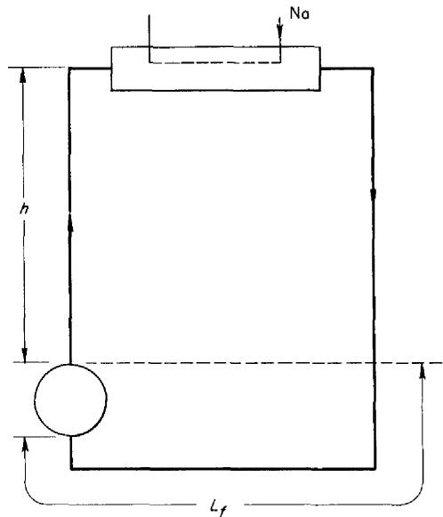  
UNCLASSIFIED   
ORNL-LR-DWG 23460   
Fig. 12. Schematic Drawing of Thermal Convection Reactor System.

Table 5. Specified System Variables   

<table><tr><td>Thermal rating</td><td>40 Mw</td></tr><tr><td>Sodium inlet temperature</td><td>850°F</td></tr><tr><td>Sodium outlet temperature</td><td>1025°F</td></tr><tr><td>Salt temperature entering exchanger</td><td>1250°F</td></tr><tr><td>Exchanger tube, ID</td><td>0.50 in.</td></tr><tr><td>Exchanger tube wall thickness</td><td>0.05 in.</td></tr><tr><td>Tube spacing in Δ array</td><td>0.825 in.</td></tr><tr><td>Core diameter</td><td>6 ft</td></tr><tr><td>Fixed length of salt pipe, Lf</td><td>25 ft</td></tr></table>

of the two independent variables: salt velocity in the tubes and leaving temperature of the salt.

Table 6 presents partial results of calculations with Flinak as the fuel-bearing salt. Inspection of the table reveals that the lowest calculated total external-holdup volume, $59.3\mathrm{ft}^3$ (1.5 ft/Mw), was realized at the lowest salt velocity and lowest salt-leaving temperature considered in the calculations. The minimum external-holdup volume for the conditions specified in Table 5 is not represented in Table 6, but the trend of results indicates that the minimum external holdup occurs at a salt velocity of less than 2 fps and at a leaving salt temperature of less than $950^{\circ}\mathrm{F}$ .

Salt 14 (Flinak) was selected originally on the basis of its large coefficient of thermal expansion, low melting temperature $(846^{\circ}\mathsf{F})$ , and low viscosity. While the physical properties of Flinak make it a desirable salt from the heat transfer point of view, its nuclear properties reduce its usefulness as a fuel carrier. For this reason, calculations were carried out with a Li-Be-U fluoride salt (mixture 75). Since this salt melts at a temperature of about $20^{\circ}\mathsf{F}$ above that of Flinak, the sodium

inlet temperature to the exchanger was increased from 850 to $870^{\circ}\mathrm{F}$ . On the basis of calculated results for Flinak, the temperature of the salt leaving the exchanger was specified as $950^{\circ}\mathrm{F}$ and the Reynolds modulus for the salt leaving the exchanger tubing was fixed at 2500, which corresponds to the lowest salt velocity for which heat transfer data were readily available. Under these conditions the external-holdup volume of the Li-Be-U fluoride salt was $70\mathrm{ft}^3$ (1.75 ft³/Mw), of which $10\mathrm{ft}^3$ was holdup in the exchanger. The corresponding optimum height of the exchanger above the core top was 33 ft, and the optimum pipe diameter was 11 in. Additional calculations would be required to establish the salt velocity and salt-leaving temperature corresponding to the minimum-holdup volume.

Use of sodium as the coolant in the primary exchanger is open to criticism on the basis of its lack of compatibility with the fuel salt. However, substitution of a compatible salt for the sodium should not produce large changes from the results presented (in particular, the ft³/Mw ratios), since the salt is an excellent heat transfer

Table 6. Free Convection System Calculation Results   

<table><tr><td>Salt velocity in exchanger (fps)</td><td>2</td><td>2</td><td>2</td><td>3</td><td>3</td><td>3</td></tr><tr><td>Salt temperature leaving exchanger (°F)</td><td>950</td><td>1025</td><td>1100</td><td>950</td><td>1025</td><td>1100</td></tr><tr><td>Number of exchanger tubes</td><td>792</td><td>1056</td><td>2310</td><td>528</td><td>704</td><td>1054</td></tr><tr><td>Length of exchanger tube (ft)</td><td>14.1</td><td>7.5</td><td>2.7</td><td>15.1</td><td>8.3</td><td>4.4</td></tr><tr><td>Salt holdup in exchanger (ft3)</td><td>15.3</td><td>10.8</td><td>5.7</td><td>10.8</td><td>8.0</td><td>6.3</td></tr><tr><td>Minimum salt holdup in piping (ft3)</td><td>44</td><td>58.2</td><td>91</td><td>66</td><td>83</td><td>139</td></tr><tr><td>Total external-holdup volume (ft3)</td><td>59.3</td><td>69.0</td><td>96.7</td><td>76.8</td><td>91</td><td>145</td></tr><tr><td>Optimum diameter of piping (in.)</td><td>10</td><td>12.3</td><td>16.4</td><td>10</td><td>11.8</td><td>15.3</td></tr><tr><td>Optimum height of exchanger above core top (ft)</td><td>28</td><td>23</td><td>18.4</td><td>48</td><td>43</td><td>42</td></tr></table>

medium and, especially, because the volume of the fuel salt in the exchanger is a small part of the total external holdup.

Supplementary calculations have demonstrated that the salt volume external to the reactor is very closely proportional to the thermal output of the reactor. Thus, to a good approximation, the cubic feet of external salt per megawatt is independent of the thermal output.

Nuclear calculations (see Table 4) for a salt reactor core of 8-ft diameter give a hot, clean critical mass of 49 kg (0% Th). For a forced-convection reactor (the RDR) the external-holdup volume has been reported as 0.56 ft³/Mw. With an external-holdup volume of 1.75 ft³/Mw used for a free-convection reactor, the specific powers of the free and forced-convection burner reactors are compared in Table 7 for a range of thermal outputs.

Inspection of Table 7 shows that at low thermal outputs the free-convection reactor system compares very favorably with the forced-convection system.

In particular, the exploratory calculations indicate that for an 8-ft-dia, 40-Mw reactor the free-convection system requires only $15\%$ more fuel inventory than the forced-convection reactor. These preliminary results indicate that the thermal-convection reactor merits further analysis in the thermal output range up to perhaps 100 Mw.

Table 7. Comparison of Specific Powers for Free and Forced Convection Reactors   

<table><tr><td rowspan="2">Thermal Output (Mw)</td><td colspan="2">Specific Power (kw/kg)</td></tr><tr><td>Free Convection</td><td>Forced Convection</td></tr><tr><td>40</td><td>648</td><td>740</td></tr><tr><td>100</td><td>1230</td><td>1690</td></tr><tr><td>250</td><td>1940</td><td>3350</td></tr><tr><td>600</td><td>2500</td><td>5440</td></tr></table>