# AEC RESEARCH AND DEVELOPMENT REPORT

TRAL RESEARCLIBRA

DOCUMENT COLLECTION

DEC(A)

MARTIN MABIETTA ENERGY SYSTEMS LIBRARIES

34456 02510343

AIRCRAFT NUCLEAR PROPULSION PROJECT

QUARTERLY PROGRESS REPORT

FOR PERIOD ENDING SEPTEMBER 30, 1957

1

#

10

1

#

OAK RIDGE NATIONAL LABORATORY

OPERATED BY

UNION CARBIDE NUCLEAR COMPANY

Division of Union Carbide Corporation

POST OFFICE BOX X · OAK RIDGE, TENNESSEE

RESTRICTED SECURITIES

This notion contains Restricted Data as defined in the above.

#

1.25.4.3.4.1. An unauthorized person is prohibited.

SECRET

# LEGAL NOTICE

This report was prepared as an account of Government sponsored work. Neither the United States, nor the Commission, nor any person acting on behalf of the Commission!

A. Makes any warranty or representation, express or implied, with respect to the accuracy, completeness, or usefulness of the information contained in this report, or that the use of any information, apparatus, method, or process disclosed in this report may not infringe privately owned rights; or   
B. Assumes any liabilities with respect to the use of, or for damages resulting from the use of any information, apparatus, method, or process disclosed in this report.

As used in the above, "person acting on behalf of the Commission" includes any employee or contractor of the Commission to the extent that such employee or contractor prepares, handles or distributes, or provides access to, any information pursuant to his employment or contract with the Commission.

ORNL-2387, Parts 1-5

C-84 - Reactors-Special Features of Aircraft Reactors

This document consists of 360 pages.

Copy of 273 copies. Series A.

Contract No. W-7405-eng-26

# AIRCRAFT NUCLEAR PROPULSION PROJECT

# QUARTERLY PROGRESS REPORT

# For Period Ending September 30, 1957

W. H. Jordan, Director

S. J. Cromer, Co-Director

A. J. Miller, Assistant Director

DATE ISSUED

FEB 4 1958

OAK RIDGE NATIONAL LABORATORY

Operated by

UNION CARBIDE NUCLEAR COMPANY

Division of Union Carbide Corporation

Post Office Box X

Oak Ridge, Tennessee

RESTRICTED

This document contains Restriction Data as defined in the Atomic Energy Act of 2008, which provides the status of all contents in any manner to an unauthorized person it is prohibited.

Reports previously issued in this series are as follows:

ORNL-528 Period Ending November 30, 1949

ORNL-629 Period Ending February 28, 1950

ORNL-768 Period Ending May 31, 1950

ORNL-858 Period Ending August 31, 1950

ORNL-919 Period Ending December 10, 1950

ANP-60 Period Ending March 10, 1951

ANP-65 Period Ending June 10, 1951

ORNL-1154 Period Ending September 10, 1951

ORNL-1170 Period Ending December 10, 1951

ORNL-1227 Period Ending March 10, 1952

ORNL-1294 Period Ending June 10, 1952

ORNL-1375 Period Ending September 10, 1952

ORNL-1439 Period Ending December 10, 1952

ORNL-1515 Period Ending March 10, 1953

ORNL-1556 Period Ending June 10, 1953

ORNL-1609 Period Ending September 10, 1953

ORNL-1649 Period Ending December 10, 1953

ORNL-1692 Period Ending March 10, 1954

ORNL-1729 Period Ending June 10, 1954

ORNL-1771 Period Ending September 10, 1954

ORNL-1816 Period Ending December 10, 1954

ORNL-1864 Period Ending March 10, 1955

ORNL-1896 Period Ending June 10, 1955

ORNL-1947 Period Ending September 10, 1955

ORNL-2012 Period Ending December 10, 1955

ORNL-2061 Period Ending March 10, 1956

ORNL-2106 Period Ending June 10, 1956

ORNL-2157 Period Ending September 10, 1956

ORNL-2221 Period Ending December 31, 1956

ORNL-2274 Period Ending March 31, 1957

ORNL-2340 Period Ending June 30, 1957

ORNL-2387, Parts 1-5

C-84 - Reactors-Special Features of Aircraft Reactors

# INTERNAL DISTRIBUTION

1. R. G. Affel   
2. C. J. Barton   
3. M. Bender   
4. D. S. Billington   
5. F. F. Blankenship   
6. E. P. Blizzard   
7. C. J. Borkowski   
8. W. F. Boudreau   
9. G. E. Boyd   
10. M. A. Bredig   
11. E. J. Breeding   
12. W. E. Browning   
13. F. R. Bruce   
14. A. D. Callihan   
15. D. W. Cardwell   
16. C. E. Center (K-25)   
17. R. A. Charpie   
18. R. L. Clark   
19. C. E. Clifford   
20. J. H. Coobs   
21. W. B. Cottrell   
22. R. S. Crouse   
23. F. L. Culler   
24. D. R. Cuneo   
25. J. H. DeVan   
26. L. M. Doney   
27. D. A. Douglas   
28. W. K. Eister   
29. L. B. Emlet (K-25)   
30. D. E. Ferguson   
31. A. P. Fraas   
32. J. H. Frye   
33. W. T. Furgerson   
34. R. J. Gray   
35. A. T. Gresky   
36. W. R. Grimes   
37. A. G. Grindell   
38. E. Guth   
39. C. S. Harrill   
40. M. R. Hill   
41. E. E. Hoffman   
42. H. W. Hoffman   
43. A. Hollander   
44. A. S. Householder   
45. J. T. Howe

46. W.H. Jordan   
47. G. W. Keilholtz   
48. C. P. Keim   
49. F. L. Keller   
50. M. T. Kelley   
51. F. Kertesz   
52. J. J. Keyes

53-54. J. A. Lane

55. R. B. Lindauer   
56. R. S. Livingston   
57. R. N. Lyon   
58. H. G. MacPherson   
59. R. E. MacPherson   
60. F. C. Maienschein   
61. W. D. Manly   
62. E. R. Mann   
63. L. A. Mann   
64. W. B. McDonald   
65. J. R. McNally   
66. F. R. McQuilkin   
67. R. V. Meghreblian   
68. R. P. Milford   
69. A. J. Miller   
70. R. E. Moore   
71. J. G. Morgan   
72. K. Z. Morgan   
73. E. J. Murphy   
74. J. P. Murray (Y-12)   
75. M. L. Nelson   
76. G. J. Nessle   
77. R. B. Oliver   
78. L. G. Overholser   
79. P. Patriarca   
80. S. K. Penny   
81. A.M. Perry   
82. D. Phillips   
83. J. C. Pigg   
84. P. M. Reyling   
85. A. E. Richt   
86. M. T. Robinson   
87. H.W. Savage   
88. A.W. Savolainen   
89. R. D. Schultheiss   
90. D. Scott   
91. J. L. Scott

# STRETE

92. E. D. Shipley   
93. A. Simon   
94. O. Sisman   
95. J. Sites   
96. M. J. Skinner   
97. A. H. Snell   
98. C. D. Susano   
99. J. A. Swartout   
100. E.H Taylor   
101. R. E. Thomas   
102. D. B. Trauger   
103. D. K. Trubey   
104. G. M. Watson

105. A. M. Weinberg   
106. J. C. White   
107. G. D. Whitman   
108. E. P. Wigner (consultant)   
109. G. C. Williams   
110. J. C. Wilson   
111. C. E. Winters   
112. W. Zobel

113-115. ORNL - Y-12 Technical Library, Document Reference Section   
116-122. Laboratory Records Department   
123. Laboratory Records, ORNL R.C.   
124-126. Central Research Library

# EXTERNAL DISTRIBUTION

127-129. Air Force Ballistic Missile Division

130-131. AFPR, Boeing, Seattle   
132. AFPR, Boeing, Wichita   
133. AFPR, Curtiss-Wright, Clifton   
134. AFPR, Douglas, Long Beach

135-137. AFPR, Douglas, Santa Monica

138. AFPR, Lockheed, Burbank

139-140. AFPR, Lockheed, Marietta

141. AFPR, North American, Canoga Park   
142. AFPR, North American, Downey

143-144. Air Force Special Weapons Center

145. Air Materiel Command   
146. Air Research and Development Command (RDGN)   
147. Air Research and Development Command (RDTAPS)

148-161. Air Research and Development Command (RDZPSP)

162. Air Technical Intelligence Center

163-165. ANP Project Office, Convair, Fort Worth

166. Albuquerque Operations Office   
167. Argonne National Laboratory   
168. Armed Forces Special Weapons Project, Sandia   
169. Armed Forces Special Weapons Project, Washington   
170. Assistant Secretary of the Air Force, R&D

171-176. Atomic Energy Commission, Washington

177. Atomics International   
178. Battelle Memorial Institute

179-180. Bettis Plant (WAPD)

181. Bureau of Aeronautics   
182. Bureau of Aeronautics General Representative   
183. BAR, Aerojet-General, Azusa   
184. BAR, Convair, San Diego   
185. BAR, Glenn L. Martin, Baltimore   
186. BAR, Grumman Aircraft, Bethpage   
187. Bureau of Yards and Docks   
188. Chicago Operations Office

189. Chicago Patent Group   
190. Curtiss-Wright Corporation   
191. Engineer Research and Development Laboratories

192-195. General Electric Company (ANPD)

196. General Nuclear Engineering Corporation   
197. Hartford Area Office   
198. Idaho Operations Office   
199. Knolls Atomic Power Laboratory   
200. Lockland Area Office   
201. Los Alamos Scientific Laboratory   
202. Marquardt Aircraft Company   
203. Martin Company   
204. National Advisory Committee for Aeronautics, Cleveland   
205. National Advisory Committee for Aeronautics, Washington   
206. Naval Air Development Center   
207. Naval Air Material Center   
208. Naval Air Turbine Test Station   
209. Naval Research Laboratory   
210. New York Operations Office   
211. Nuclear Development Corporation of America   
212. Nuclear Metals, Inc.   
213. Office of Naval Research   
214. Office of the Chief of Naval Operations (OP-361)   
215. Patent Branch, Washington

216-219. Pratt and Whitney Aircraft Division

220. San Francisco Operations Office   
221. Sandia Corporation   
222. School of Aviation Medicine   
223. Sylvania-Corning Nuclear Corporation   
224. Technical Research Group   
225. USAF Headquarters   
226. USAF Project RAND   
227. U.S. Naval Radiological Defense Laboratory

228-229. University of California Radiation Laboratory, Livermore

230-247. Wright Air Development Center (WCOSI-3)

248-272. Technical Information Service Extension, Oak Ridge

273. Division of Research and Development, AEC, ORO

1

# FOREWORD

This quarterly progress report of the Aircraft Nuclear Propulsion Project at ORNL records the technical progress of the research on circulating-fuel reactors and other ANP research at the Laboratory under its Contract W-7405-eng-26. The report is divided into five major parts: 1. Aircraft Reactor Engineering, 2. Chemistry, 3. Metallurgy, 4. Radiation Damage, and 5. Reactor Shielding.

With the suspension of work on circulating-fuel reactors as of September 1957, program emphasis will shift to research in support of the work of other organizations participating in the national ANP effort. The major fields of the future ORNL effort will be research studies of shielding, materials, and radiation damage and experimental investigations of systems and components of power plants designed for the nuclear propulsion of aircraft.

# SE

# CONTENTS

FOREWORD VII

SUMMARY XVII

# PART 1. AIRCRAFT REACTOR ENGINEERING

# 1.1. REACTOR AND FACILITY CONSTRUCTION 3

Methods Development 3

Weld Tests 3   
Equipment Inspection 4

Component Fabrication and Assembly 5

Main Fuel-to-NaK Heat Exchanger 5   
Sodium-to-NaK Heat Exchangers 5

ART-ETU Radiators 5   
Main Pressure Shell and Liner 9   
Beryllium Reflector-Moderator Outer Shell 9   
Boron Shield Containers - Shells IV and V 9   
Inner and Outer Core Shells 13   
Reactor North Head 13   
Strut Load Ring 15   
Neutron Shielding 16   
Lead and Tungsten Shielding 18   
Miscellaneous Components 19

Reactor Assembly 21

ETU Facility 22

Reactor Support Structure 22   
NaK Piping, Associated Supports, and Components 22   
Electrical Equipment 25   
Auxiliary Services 25

ARTFacility 25

Design Activity 25   
Construction Progress 27   
Installation Planning 27

ART Disassembly 31

Reactor Disassembly 31   
Cutting Methods Evaluation 31   
Facility Investigations 31

# 1.2. COMPONENT DEVELOPMENT AND TESTING 32

Pump Development Tests 32

Bearing, Seal, and Lubricant Tests 32   
Aluminum North Head Water Tests 32   
Fuel Pump High-Temperature-Performance Tests 34   
Fuel Pump Endurance Tests 35   
Primary and Auxiliary NaK Pump Development 35

Reactor Component Development Tests 38

Heat Exchanger and Radiator Development Tests 38

# #

Valve Development Tests 43   
Sodium Circuit Water Flow Tests 44   
Outer Core Shell Thermal Stability Test. 45   
Liquid-Metal-Vapor Condensers 46   
Zirconium Fluoride Vapor Traps 48   
Island Bellows Test 48   
Fuel Fill-and-Drain Tank Test. 52

# 1.3. INSTRUMENT AND CONTROLS DEVELOPMENT 54

ART Control Rod Drive Test. 54   
Fuel-Expansion-Tank Liquid-Level Indicator 54   
Bubbler Plugging Tests 54   
Aluminum North Head Expansion Tank Tests 55

On-Off Level Probes 58   
Magnetic Flowmeters 58   
Liquid-Metal-Level Transducers 59   
ART Thermocouples 61   
Sheathed Thermocouples 61   
Well Thermocouples 66   
Surface Thermocouples 68   
Apparatus for Checking Thermocouples 71

# 1.4. ENGINEERING DESIGN STUDIES 72

Applied Mechanics and Stress Analysis 72   
Thermal Stress Cycling Tests of Beryllium 72   
Thermal-Cycling Tests of a Welded Core Shell Model 73   
Stress Analysis of Island Bellows 73   
Stress Analysis of Shield Support Structure 75   
Stress Analysis of a Pressure-Measuring Instrument 77   
Apparatus for ETR In-Pile Tests of Moderator Materials 78

# 1.5. DESIGN PHYSICS 80

ART Fill-and-Drain Tank Shielding 80   
Penetrations 80   
Overlap in Shield at Removable Top Section 81   
Incomplete Work 81   
Dose Rate in Region of ART Pumps 81   
Decay of Gamma Activity in U235-Containing ART Fuel for Short Times   
After Shutdown 82   
Decay-Gamma Heating in ART Fuel Drain Valves 82

# 1.6. MATERIALS AND COMPONENTS INSPECTION 83

Material Inspection 83   
Tubing 83   
Pipe, Plate, Sheet, Rod, and Fittings 83   
Embrittlement of Inconel by Penetrants 84   
Chemical Analyses of Materials 84   
Electrical Calrods 84

# SECRET

# 三

Weld Inspection 84

Inspection of Reactor Shells 86

Inner Core Shells (Shell I) 86   
Outer Core Shells (Shell II) 86   
Shell III 86   
Shells IV and V. 86

Inspection of Components Received from Vendors 87

York Corp. Radiators and Radiator Materials 87   
Griscom-Russell Co. Heat Exchangers 87   
Black, Sivalls & Bryson Heat Exchangers 88   
Midwest Piping Company Forgings and Weldments 88   
Process Engineering, Inc., Tanks and Bellows Expansion Joints 88   
Fulton-Sylphon Company Bellows 88   
Hoke, Inc., Inconel and Stainless Steel Valves 88

Metal Identification Meter 88

Instrumentation and Controls Inspections 89

Nickel-Copper Welds in Liquid-Level Probes 89   
Thermocouple Welds 89

Procedures for Radiographic Inspection of Weldments on ART Island and

Reflector 90

1.7. HEAT TRANSFER STUDIES 91

Thermal-Cycling Research 91

Pressurized System 91   
Pulse-Pump System 93   
Thermocouple Development 96

ART Hydrodynamics 96

Full-Scale Core Studies 96   
Quarter-Scale Core Studies 98   
Instantaneous Velocity Profile Measurements 103

Fused Salt Heat Transfer 103

Heat Transfer Experiments 104

ART-Type Core with Screens 104   
Vortex Tube 105

Liquid-Metal Volume-Heat-Source Experiment 106

Mass Transfer 106

Physical Properties 108

Enthalpy and Heat Capacity 108   
Thermal Conductivity 108   
Properties of Zirconium Fluoride Vapor Deposits 109

# PART 2. CHEMISTRY

2.1. PHASE EQUILIBRIUM STUDIES 113

The System KF-UF 113   
The System NoF-HfF 114

# SEGMENT

The System KBF4-NaBF 114   
Yttrium Fluoride Systems 114

2.2. CHEMICAL REACTIONS IN MOLTEN SALTS 117

Equilibrium Reduction of $\mathsf{NiF}_2$ by $\mathsf{H}_2$ in NaF-ZrF 117   
Activity Coefficients of $\mathsf{NiF}_2$ in Molten NaF-ZrF4 Solutions 117   
Thermodynamic Considerations Relating to the Activity of NiF 2 121   
Reduction of $\mathbf{U}\mathbf{F}_4$ by Structural Metals 124   
Stability of Chromium Fluorides in NaF-LiF-KF 125   
Reduction of $\mathsf{FeF}_2$ by Cr $^o$ in RbF-ZrF4 126   
Solubility of Structural Metal Fluorides in $\mathsf{RbF - ZrF_4}$ 128   
Activities in Alloys 130   
Emf Measurements in Molten Salts 131

Daniell Cells in Fluoride Melts 131   
Emf Measurements of Chloride Melts 132

Solubility of Helium, Argon, and Xenon Gases in NaF-ZrF 134   
Solubility of HF in NaF-ZrF4 Mixtures 136   
Solubility of HF in NaF-KF-LiF Mixtures 137   
Solubility of $\mathsf{CeF}_3$ as a Function of Solvent Composition 138   
Precipitation of Cerium as $\mathrm{Ce_2O_3}$ from Molten LiF-KF Eutectic 139   
Stability of $\mathsf{UO}_2\mathsf{F}_2$ in Fused Salts 141   
Oxidation of Mixtures Composed of Sodium and Potassium 142

2.3. PHYSICAL PROPERTIES OF MOLTEN MATERIALS 144

Vapor Pressure of HfF 144   
Vapor Pressure of $\mathsf{BeF}_2$ 144

2.4. PRODUCTION OF PURIFIED MIXTURES 146

Preparation of Various Special Fluorides 146   
Preparation of YF 146   
Preparation of Other Fluorides 146

Production and Dispensing of Fused Salts and Liquid Metals 146

Experimental Batch Production 146   
Dispensing and Servicing Operations 147   
Materials Available 147

2.5. ANALYTICAL CHEMISTRY 148

Determination of Traces of NaK in Air 148   
Determination of Oxygen in Metallic Lithium 149   
Determination of Oxygen in Fluoride Salts and in Metals 150   
Determination of Nickel in Metallic Sodium 152

Formation of Carbides by the Reaction of Pump Lubricants and NaK at   
Elevated Temperatures 154   
Determination of Aluminum in Mixtures of Fluoride Salts 156

# SECRET

Solvent Extraction of Titanium and Niobium from Acidic Solutions with   
Tri-n-octylphosphine Oxide 156   
Extraction of Sulfuric Acid 156   
Extraction of Titanium 156   
Extraction of Niobium 157

Installation of a Microbalance in a Vacuum Drybox 157

# PART 3. METALLURGY

# 3.1. NICKEL-MOLYBDENUM ALLOY DEVELOPMENT STUDIES 161

Material Development 161

Properties of INOR-8 162   
Properties of INOR-9 162   
Studies at University of Tennessee 163   
Studies at Battelle Memorial Institute 163   
Studies of Stress-Rupture Properties at New England Materials Laboratory 163   
INOR-8 Alloys Produced by Superior Tube Company 163   
Status of Production Heats 164   
Composite Tubing 167

Joining Experimental INOR-8 Alloys 168   
Stress-Rupture Properties of Nickel-Molybdenum Base Alloys in a Fuel   
Environment. 171

Corrosion Studies 176

Forced-Circulation Loop Test of a Nickel-Molybdenum Base Alloy Exposed to Fuel 107 176   
Thermal-Convection Loop Tests of Nickel-Molybdenum Base Alloys Exposed to Fuel 107 179   
Compatibility of Nickel-Molybdenum Base Alloys with Molybdenum 181

# 3.2. DEVELOPMENT STUDIES OF INCONEL 182

Strain-Cycling and Stress-Relaxation Studies 182   
Biaxial Creep Studies. 185   
Relative Tensile Properties of Inconel Plate and Inconel Weld Deposits 192   
Brazing Alloys for Inconel Joints 196   
Oxidation Studies 196   
Corrosion Studies 196

Effect of Grain Size on Corrosion of Inconel by Fuel 30 199

# 3.3.WELDING AND BRAZING STUDIES 202

Examination of All-Welded Inconel Impeller That Cracked in Service 202   
Brazed-Joint Cracking Tests 202   
Fabrication of ART Fuel Fill-and-Drain Tanks 204   
Correlation of Radiographic and Metallographic Determinations of Porosity in Tube-to-Header Welds 207   
Fabrication of Sodium-to-NaK Heat Exchangers 208   
Investigation of Material for Radiator Headers 208   
Fabrication of a Small Semicircular Heat Exchanger 209

# S

# 3.4. CORROSION AND MASS TRANSFER STUDIES 215

Corrosion of Vanadium in Fluoride Fuel and in Lithium 215

Molybdenum and Niobium in Contact with Lithium 215

Tungsten-Nickel-Copper Alloy in Sodium 216

Tungsten Carbide- and Titanium Carbide-Base Cermets in Sodium 218

Experimental Studies with Molten Lithium 219

Inert Atmosphere Chamber for Thermal-Convection Loop Testing of Nonoxidation-Resistant Materials 220

Forced-Circulation Loop Tests of Sodium in Hastelloys, Inconel and Stainless Steel 222

Diffusion of Nickel in Liquid Lead 224

Purification of Sodium 225

Mass Transfer in Aqueous Solutions 225

# 3.5.MATERIALS FABRICATION RESEARCH 228

Yttrium Metal Production 228

Hydrogen Diffusion Through Metals 228

Volatility of BeO in Steam at Moderator Temperatures 229

Fabrication of High-Density BeO 230

BeO Thermocouple Inserts and Irradiation Test Specimens 231

Thermal Stress Resistance of Ceramic Cylinders 231

Fabrication of Metal Hydrides 231

# 3.6. METALLOGRAPHIC EXAMINATIONS OF ENGINEERING TEST COMPONENTS AFTER SERVICE 232

ART Prototype Test Radiator 232

York Corp. Radiator No. 16 235

Process Engineering Corp. Heat Exchanger No. 3, Type SHE-7 238

Process Engineering Corp. Heat Exchanger No. 2, Type SHE-7 238

Inconel Centrifugal Pump That Circulated NaK 241

Welds of Test Components 241

Thermal-Convection Loop Welds 241

Forced-Circulation Loop Welds 242

Heat Exchanger Welds 242

# 3.7. NONDESTRUCTIVE TESTING 247

Eddy-Current Measurements of Metal Thickness 247

Mathematical Analysis of Eddy-Current Probe Coils 247

Inspection of Tubing 249

Inspection of Pipe 250

Plate Inspection 250

Core Shell Inspection 250

The Detection of Unbonded Areas in Plates with Resonance Ultrasound 250

# 三

# PART 4. RADIATION DAMAGE

# 4.1. RADIATION DAMAGE 257

Examination of Irradiated Components and Materials 257   
MTR In-Pile Loops 257   
Moderator Materials 257   
ARE Specimens 262

Creep and Stress-Rupture Tests of Inconel 266

MTR Experiments 266   
LITR Experiments 270

LITR Vertical In-Pile Loop 270   
MTR Static Corrosion Tests 272

Flux Monitoring of MTR Static Corrosion Capsules 272   
Relative Contribution from the $\mathbf{Ni}^{60}(n,p)\mathbf{Co}^{60}$ Reaction to the Co $^{60}$

Disintegration Rate in Irradiated Inconel 272

ETR Irradiation of Moderator Materials 275   
Effect of Irradiation on Thermal-Neutron Shield Materials 275

Boron Nitride 275   
Boron Carbide 277   
Cermets 277

Effects of Radiation on Electronic Components 284

Experimental Results 284   
Experimental Refinements 292

# PART 5. REACTOR SHIELDING

5.1. LID TANK SHIELDING FACILITY 297

Radiation Attenuation Measurements in Plain Water, Borated Water, and Oil 297   
Study of Advanced Shielding Materials 300

5.2. BULK SHIELDING FACILITY 303   
The Suppression of Capture Gamma Rays by Lithium in Lead. 303

5.3. TOWER SHIELDING REACTOR-II 304

Mechanical Design 304   
Nuclear Calculations 304   
Fuel Element Development 304   
Development of the Control Device 304

Calculation of the Gamma-Ray Heating in the Lead Shield 307

Heating at the Core-Shield Interface 308   
Heating Within the Shield 312   
Conclusions 315

# SE

5.4. SHIELD DESIGN 317

Monte Carlo Calculation of Gamma-Ray Penetration of Aluminum Slabs 317

Monte Carlo Calculation of the Gamma-Ray Penetration of Lead-Water Slabs 320

Monte Carlo Calculation of Gamma-Ray Dose Rate Buildup Factors for Lead and Water Shields 320

# ANP PROJECT QUARTERLY PROGRESS REPORT

SUMMARY

During preparation of the reports given here of work on the Aircraft Reactor Test (ART) and Engineering Test Unit (ETU), it was announced by the AEC that work on the ART and ETU was to be suspended. The necessary steps have since been taken to place all fabrication and construction work in a standby condition. The reports presented here have not been modified to reflect the work stoppage. The next report in this series will summarize the work on the ART and the ETU and give a picture of the status of the molten fluoride reactor program at the time it was suspended.

# PART 1. AIRCRAFT REACTOR ENGINEERING

# 1.1. Reactor and Facility Construction

Methods for assembly and inspection of the ETU and the ART were studied further, and the necessary special checking fixtures and inspection tools were designed and fabricated. Component fabrication and assembly continued, and an experimental main fuel-to-NaK heat exchanger was received. The completion of this unit demonstrated the feasibility of manufacture of the heat exchanger. The two sodium-to-NaK heat exchangers received previously were installed in the ETU north head. Modifications that will facilitate installation are being incorporated in the ART units. The NaK-to-air radiators required for the ETU were received and installed, and production of the ART radiators is under way. Rings of brazing material to be used in the fabrication of these units were produced at ORNL at a rate of 10,000 per hour.

A pressure shell lower forging was received, and the upper pressure shell forging is nearly complete. The design of the pressure shell liner was completed, and preparations for forging and machining are under way. The beryllium reflectormoderator outer shell is being fabricated from a machined weldment. As a result of recent experiments, the method for manufacturing the boronshiel-containing shells has been changed from shear spinning to deep drawing. The core shells for the ETU have been completed, as previously reported, and machining operations are under way on another set of core shell weldments.

Assembly of the ETU north head is well under way, and the retort for stress-relieving the assemblies was completed and tested. The strut load ring assembly was essentially completed.

All the boron carbide tiles for neutron shielding are on hand and the cans and lids for the tiles are being fabricated. Work is proceeding satisfactorily on the production of the required stainless-steel-clad copper- $\mathsf{B}_4\mathsf{C}$ cermets. Design work is proceeding on the shielding external to the pressure shell.

Fabrication and procurement of auxiliary equipment are well under way. Layouts of the equipment to be installed in the ETU cell are about $75\%$ complete. Installation work on the ETU facility is progressing as scheduled, and many of the major components are now available for installation.

Design work continued on components outside the cell of the ART facility. Models were constructed of the special equipment room, radiator pit, and radiator penthouse area to assist in detail design and to demonstrate equipment, assembly, and changeout procedures. All lump sum contract work on the facility has been completed.

Developmental work on methods and equipment for ART disassembly was continued. A full-scale experiment and demonstration of an optical method for taking measurements through hot cell windows is being prepared. Additional cutting tools were tested, and a list of tools and fixtures that will be required for removal of the ART from the cell was prepared.

# 1.2. Component Development and Testing

The design reactor sodium pump speed was increased from 3000 to 4000 rpm because of an increase in the head required. In a 1000-hr test run at the higher speed, it was found that seal leakage of the rotary assembly was never greater than at the lower speed. Oil sparging system tests showed that with a lower shaft annulus helium flow of 500 liters/day and a low oil leakage rate, satisfactory sparging could be achieved with intermittent gas flow. A sparging procedure for ART and ETU operation is being prepared.

# SE

The reactor fuel pump rotary element that was altered for irradiation testing was installed in a gamma-irradiation facility in the MTR canal. The test is under way with the rotary element operating at a speed of 2700 rpm. The average dose rate is $10^{6}$ rep/hr.

Additional tests of the twin fuel pumps installed in the aluminum north head have demonstrated satisfactory degassing characteristics over a wide range of operating conditions. Installation of the twin sodium pump loop in the aluminum north head was completed and tests were initiated. Preliminary data indicated satisfactory performance.

Additional performance data were obtained for a fuel pump operating at high temperatures with the fuel mixture NaF-ZrF4-UF4 (50-46-4 mole %, fuel 30) as the circulated fluid. Curves showing the minimum surge tank gas pressure and minimum suction vs flow for cavitation-free operation were plotted. In priming tests it was found that the pump primed and gave full head and flow performance when the liquid level was above the floor of the expansion tank.

Examination of a primary NaK pump that was stopped when the NaK level in the pump tank rose and flooded the oil catch basin revealed that grease formed by the interaction of NaK and oil had clogged the seal loading springs and inhibited their operation. Further development work on the seal region of this pump is planned.

As a result of experience with NaK pump hot test loops, modifications of the cold traps were made. A nozzle was devised to admit a controlled water-air mixture to the cooling coil and thus effect a gradual transfer of the cooling load from air to water. Tests of auxiliary NaK pumps were initiated.

A semicircular heat exchanger designed to simulate the tube stresses in the ART main heat exchanger is being installed for testing, as is a 25-tube heat exchanger that is to be tested with the fuel mixture $\mathrm{NaF - ZrF_4 - UF_4}$ (56-39-5 mole $\%$ fuel 70). A test of a 100-tube heat exchanger was terminated because of a failure of the furnace inlet line. This heat exchanger had experienced 168 thermal cycles in 421 hr of high-temperature operation, and there were no evidences of failure. A first-approximation thermal-stress calculation had predicted a life of 35 to 45 cycles for this heat exchanger.

York Corp. ART test radiator No. 1, which developed a leak after 870 hr of operation was

examined. Despite immediate shutdown to limit damage by fire, the damage was sufficient to destroy evidence that might have indicated the nature of the failure.

The excellent performance of the cold traps in heat exchanger and radiator test systems has led to the elimination of plug indicators from the ART and ETU NaK systems.

Further tests of the fuel dump valve designated ORNL-1 indicate that the valve will be satisfactory for the intended service at $1300^{\circ}\mathrm{F}$ . As a result of further operating difficulties, the NaK dump valve has been redesigned to minimize weld and thermal stress distortions.

Sodium circuit water flow tests were completed during the quarter. In these tests the proper size for the orifice in the control rod sodium cooling passage circuit was determined. Also, tests were run to establish the proper location of a flow divider for directing sodium downward into the reflector and upward to the island entrance region.

The second test of a one-fourth-scale outer core shell model for determining dimensional stability under thermal cycling conditions was terminated after 339 cycles, that is, 39 cycles more than scheduled. Visual inspection disclosed no damages to the core shell, and it is currently being measured.

Tests have demonstrated that satisfactory liquid-metal-vapor condensers are now available for ART and ETU use. Satisfactory zirconium fluoride vapor traps are now also available.

A test of the ART island bellows under cyclic strain, temperature, and pressure conditions revealed that the two-convolution bellows would be inadequate for ART service conditions. The design has therefore been modified.

Since a failure of the fuel fill-and-drain tank might have serious consequences, a test tank is being built for testing under simulated service conditions. This test is thought to be necessary because the ART may impose stress and temperature conditions greater than those for which design properties are known with any certainty.

# 1.3. Instrumentation and Controls Development

A test was completed of the ART control rod drive mechanism that simulated ART operating conditions, except that there was no radiation present. During the first 1129 hr of the 3000-hr test, the rod was withdrawn and inserted 1161 times. This portion of the test was followed

# SE

by a series of periods in which the rod was fixed at positions spaced 5 in. apart for a minimum time of 200 hr at each position. The remainder of the 3000-hr test consisted of further rod cycling in the same sequence as that used for the initial phase of the test. The test system has been dismantled for examination, and if results of the examinations are satisfactory, it may be concluded that the ART control rod and its actuating equipment have met all the specifications that can reasonably be tested without the actual nuclear tests.

Additional tests with helium-bubbler-type liquid-level indicators in the fuel expansion tank of the aluminum mockup of the ART north head confirmed the "dishing" effect on the liquid surface in the expansion tank of changes in pump speed. In tests in which measured amounts of fluid were added to or removed from the expansion tank, it was found that the level-measuring device responded accurately.

Examinations of on-off level probes that failed at high NaK temperatures in NaK pump bowls showed that the units failed because of internal oxidation of the copper wires and that such oxidation occurred when the copper-to-Inconel welds were made. The probe has therefore been redesigned so that the copper-Inconel junction can be brazed instead of welded. Units of the new design are being fabricated.

Calibration and testing of the 2- and $3\frac{1}{2}$ -in. magnetic flowmeters for use in the ART and ETU were continued. All the $\frac{3}{8}$ -in. magnetic flowmeters required for the ETU have been delivered and installed. Tests have indicated that continuous temperature and magnetic flux monitoring of these units will not be required.

Several ORNL-designed resistance-type liquid-metal-level transducers for use in NaK were completed. Tests have been run with these units installed in NaK pump bowls to obtain drift data and to observe wetting effects. Other probe materials and special coatings or plates are to be tested in an effort to improve the wetting characteristics. Similar units are being fabricated for use in the ART sodium expansion tank.

Tests of thermocouples were continued. Drift data were obtained for Inconel-sheathed Chromel-Alumel and platinum, platinum-10% rhodium thermocouples exposed to fuel 30 for various periods

at various temperatures. A new closure technique in which the junction is made by brazing rather than by welding is being investigated.

A well type of thermocouple was designed for temperature measurements of high-velocity high-temperature liquid metals in Inconel piping. The pressure drop created by this thermocouple was found to be less than 2.0 psi at 1200 gpm. Drift tests of sample units in flowing NaK have been started.

# 1.4. Engineering Design Studies

Analyses and experimental investigations of the effects of stress on various portions and components of the ART system were continued. In one test, the resistance of beryllium to fatigue cracking under the temperature conditions anticipated in the ART is being studied. In another another experiment a $\frac{1}{4}$ -scale model of the outer core shell made with the inner core shell weld pattern is to be tested under strain cycling conditions. This test will determine the adequacy of the welded reactor shells.

A stress analysis of the island expansion bellows at the design condition of 300 cycles of 90-mil axial deflection at a temperature of $1250^{\circ}\mathrm{F}$ revealed that the bellows would be subjected to considerable plastic deformation at the outer bend of the convolutions. Correlation with the strain-cycling data for Inconel indicated that the fatigue life of the bellows would be less than the contemplated 300 cycles. The results of the analysis were confirmed in a recent test in which the bellows failed after 80 cycles. The bellows has therefore been redesigned.

A detailed stress analysis of the support structure for the lead shielding of the ART was completed, and an analysis of the water bag was initiated. A stress analysis of a pressure-measuring device for use in the ART was made to establish the operating limits of temperature and pressure for applications in which dimensional stability of the unit is important.

An apparatus for simultaneously testing six moderator specimens in the temperature range of 1500 to $2000^{\circ}\mathrm{F}$ in the ETR is being designed. The moderator materials to be tested initially are beryllium oxide, yttrium hydride, and beryllium metal.

# 1.5. Design Physics

Calculations were made of the shielding required for the ART fuel fill-and-drain tank. The lead shield was designed, insofar as it was completed, so that the dose rate at any point on its surface was less than $0.2\mathrm{r / hr}$ after 100 hr of operation at 60 Mw, 9 days after shutdown. It was found that the pipes for carrying the NaK to heat and cool the fuel could not be allowed to penetrate straight through the shield, and a configuration that would satisfactorily reduce the dose rate at such penetrations was developed. Similar studies indicated that it would be necessary to overlap adjoining pieces of the removable top shield of the tank.

In connection with the problem of replacing a fuel or sodium pump, a preliminary estimate was made of the dose rate at a point 62.5 in. above the reactor midplane and 22.5 in. from the axis, that is, about at the bottom of the fuel pump motor under the same after-shutdown conditions as those specified above. The dose rate was found, for the present shielding geometry, to be around 800 r/hr, and the radiation was mostly from residual fuel in the heat exchangers viewed through the NaK pipe penetrations in the north head.

The rates of decay-gamma energy emission from the ART fuel for the first 180 sec after reactor shutdown following 500 hr of operation at 60 Mw were calculated for six gamma-ray energy groups. The results were used in calculations of the heat deposition rates in the bellows and stem of the ART fuel drain valves. A total temperature rise of $106^{\circ}\mathrm{F}$ was obtained for the maximum allowable duration of the fuel draining operation.

# 1.6. Materials and Components Inspection

Materials for the ART, ETU, and test components were inspected with the intended use as the criterion of acceptability. Results of metallographic examinations were received which indicated that pickling in phosphoric acid could be used satisfactorily for the removal of magnetic particles. It was also found that polishing could reduce rejections caused by surface scratches. Results were obtained of metallographic examinations which showed that no embrittlement or attack occurs upon exposure to the materials used in penetrant inspections.

Inspections of sample pieces and completed units submitted by vendors were made, including radiators and radiator materials from York Corp., heat exchangers from Griscom-Russell and from Black, Sivalls & Bryson, forgings and weldments from Midwest Piping Company, tanks and bellows expansion joints from Process Engineering Corp., bellows from Fulton-Sylphon Company, and Inconel and stainless steel valves from Hoke Valve, Inc.

Procedures are being developed for the inspection of seven critical welds on the ART and ETU that can be inspected only through sections of beryllium. Normal radiographic techniques cannot be used because beryllium scatters the incident x-ray beam and causes general fogging of the film.

# 1.7. Heat Transfer Studies

The effect of stresses and cyclic frequency on the strength and corrosion characteristics of Inconel in an $\mathsf{NaF - ZrF_4 - UF_4}$ (50-46-4 mole %) environment was studied in the pressurized-system thermal-cycling apparatus. Data were obtained for straight tubes which indicated that the extent of corrosive attack on Inconel is dependent on the frequency of the thermal cycling, with the critical frequency in the vicinity of $1 / 2$ to 1 cps. The effect of prior strain was investigated in tests of bent tubes. In all cases the attack was greater in the bends than in the straight sections of the tube, but unexpectedly no difference was detected between the attack on the tension and compression sides of the bends. As in previous tests, fine-grained tubes showed intergranular attack and coarse-grained tubes showed general attack. Inconclusive tests of machined welds were run and additional tests of inspected and approved welds are to be run.

After two runs in which the operating periods fell short of the scheduled 100 hr because of difficulties with liquid-level control of the high-frequency pulse-pump thermal-cycling loop, the loop was operated for 100 hr at 1 cps with the fuel mixture NaF-ZrF4-UF4 (56-39-5 mole %) as the fluid medium. Outside surface temperature oscillations of ±64°F were attained at the inlet end of the test section. Metallurgical examination of the test specimen has not been completed, but standard dye stain and radiographic examinations show no superficial damage.

# SECHET

Temperature measurements made with the nickel-plated junction of an Inconel-nickel gunbarrel thermocouple flush with the wall of a thick-walled Inconel tube exposed to sinusoidal temperature oscillations in water showed good agreement with results of theoretical calculations. A similar Inconel-nickel gunbarrel thermocouple that was not attached to a tube was tested in static NaF-ZrF $_4$ -UF $_4$ (50-46-4 mole %) at 1200°F for 300 hr. It was determined that rapid removal of the metallic junction between the central nickel wire and the Inconel by the fluoride salt precluded the use of this type of thermocouple for measuring rapid surface temperature transients in a fluoride environment.

The full-scale Plexiglas model of the ART core was used for studies of the effect of inserts and ramps in the core volute and of thin baffles in the core region on the core flow. No significant improvements in flow were noted. Velocity and pressure-loss data were obtained in water flow tests of the 10/44-scale model of the 21-in. ART core with an ART type of entrance header, a core inlet collimator, and five core screens. The data show significant flattening of the velocity profiles throughout the core. Simulated one-pump operation with the screen-filled core indicated that the screens and collimator effectively eliminated circumferential asymmetries in the flow. Measurements were made of the pressure variation in the inlet header. Velocity profile photographs were obtained of the flow in the 10/44-scale model of the ART by using the phosphorescent particle technique.

Measurements were completed of the heat transfer coefficients for $\mathrm{NaNO}_2\cdot \mathrm{NaNO}_3\cdot \mathrm{KNO}_3$ (40-7-53 wt %) flowing through electrically heated tubes. The data agree with the standard correlations. Preliminary results for forced-convection heat transfer with KCl-LiCl (41.2-58.8 mole %) flowing in a stainless steel tube fell below the standard correlations. Data from the screen-filled half-scale volume-heat-source core model show markedly reduced temperatures and fluctuations along the island wall but little change at the outer wall from earlier results obtained with a vaned entrance system. Initial heat transfer data for source-vortex flow indicate a fivefold increase in comparison with straight, turbulent flow when the data are compared on the basis of equal system energy expenditure per unit of heat transfer area.

A system for determining heat transfer in flowing mercury containing a uniform volume heat source is being constructed. Experimental data on mass transfer in alkali metal systems were compared with results obtained with two theoretically derived expressions. It was concluded that a more general hypothesis that combines the mechanism of hot-zone attack with a nucleation-deposition mechanism in the cold zone is needed to explain the experimental results.

Preliminary results indicated a value of 0.21 Btu/lb°F for the heat capacity of LiCl-BaCl₂ (32.2-67.8 wt %) and of 0.24 Btu/lb°F for LiCl-SrCl₂ (22.5-77.5 wt %). Measurements with a modified variable-gap apparatus yielded a value of 0.34 Btu/hr-ft°F for the thermal conductivity of the salt mixture NaNO₂-NaNO₃-KNO₃ (40-7-53 wt %). New data were obtained for the thermal conductivity of NaF-ZrF₄-UF₄ (50-46-4 mole %) by using a calorimetric device. The values were considerably below the thermal conductivities previously obtained (1.0 to 1.5 Btu/hr-ft°F) by using the variable-gap apparatus.

The apparent density of $\mathsf{ZrF}_4$ vapor deposits was measured and found to vary inversely with the sample thickness. An attempt to measure the thermal conductivity of a $\mathsf{ZrF}_4$ deposit indicated a value of 0.045 Btu/hr-ft-°F.

# PART 2. CHEMISTRY

# 2.1. Phase Equilibrium Studies

Further studies of the system $\mathsf{KF - UF_4}$ confirmed the liquidus curve presented previously. Thermal-gradient quenching experiments revealed, however, several differences from the phase behavior proposed earlier. The formulas of the equilibrium phases are $3\mathsf{KF} \cdot \mathsf{UF}_4$ , $2\mathsf{KF} \cdot \mathsf{UF}_4$ , $7\mathsf{KF} \cdot 6\mathsf{UF}_4$ , and $\mathsf{KF} \cdot 2\mathsf{UF}_4$ .

Refined phase equilibrium studies were made of the system NaF-HfF. Seven NaF-HfF4phases are isostructural with NaF-ZrF4phases of corresponding stoichiometric formulas. There are, however, fewer phases in the NaF-HfF4system than in the NaF-ZrF4system.

The system KBF $_4$ -NaBF $_4$ was studied as part of a search for low-melting salt mixtures for use as reactor coolants. It was found to be a simple binary system with a eutectic containing about 90 mole% NaBF $_4$ that melts at about $357^{\circ}\mathrm{C}$ .

# SE

The same unidentified compound was found in both $\mathsf{LiF - MgF}_2\mathsf{-YF}_3$ and $\mathsf{LiF - ZnF}_2\mathsf{-YF}_3$ through petrographic and x-ray examinations. Preliminary indications are that the unidentified material is an $\mathsf{LiF - YF}_3$ compound.

# 2.2. Chemical Reactions in Molten Salts

The determination of the activity coefficient of $\mathrm{NiF}_2$ in the molten mixture NaF-ZrF $_4$ (53-47 mole %) by the study of the equilibrium constants for the reaction

$$
\mathrm {N i F} _ {2} (d) + \mathrm {H} _ {2} (g) \rightleftharpoons \mathrm {N i} (s) + 2 \mathrm {H F} (g)
$$

was concluded. The investigation revealed that $\mathsf{NiF}_2$ in solution, under the experimental conditions used, behaves in a very different manner than that predicted by the free energies of formation for solid $\mathsf{NiF}_2$ . This result was unexpected because good agreement had been obtained, in a previous similar study, between the experimental and calculated behavior of $\mathsf{FeF}_2$ in the same solvent. Thermodynamic considerations of the unexpectedly large activity coefficients of $\mathsf{NiF}_2$ in fuel mixtures indicate a probable error in the estimated free energy of formation of $\mathsf{NiF}_2$ .

Studies were made of the reduction of $\mathsf{UF}_4$ by $V^{\circ}$ at 600 and at $800^{\circ}C$ in NaF-ZrF4 (50-50 mole %) and in NaF-LiF-KF (11.5-46.5-42 mole %) and of the reduction of $\mathsf{UF}_4$ by $W^{\circ}$ in NaF-ZrF4 (53-47 mole %). The results showed that $V^{\circ}$ is not stable in contact with $\mathsf{UF}_4$ at either temperature in either medium. In marked contrast to earlier experiments with NaF-LiF-KF as the reaction medium, $W^{\circ}$ was found to be stable with respect to $\mathsf{UF}_4$ in the reaction medium NaF-ZrF4.

Additional studies of the stability of chromium fluorides in NaF-LiF-KF were made with both $\mathsf{CrF}_3$ and $\mathsf{CrF}_2$ . For the tests with $\mathsf{CrF}_3$ , chromium metal was added. Since the experimentally determined values for $\mathsf{Cr}^{++}$ did not give a reasonable balance of $\mathsf{Cr}^{++}$ , $\mathsf{Cr}^{+++}$ , and total chromium, it was concluded that the experimental values were probably inaccurate.

Additional experimental studies of the reduction of $\mathsf{FeF}_2$ by $\mathsf{Cr}^{\circ}$ in NaF-ZrF4 (53-47 mole %) in which higher $\mathsf{FeF}_2$ concentrations were used further indicate that reliable values for the $\mathsf{Cr}^{++}$ to-Fe++ ratio cannot be determined in this reaction medium. A study of the reaction with RbF-ZrF4

(52-48 mole %) as the reaction medium was also made. Large $\mathrm{Cr}^{++}$ -to- $\mathrm{Fe}^{++}$ ratios were found, and there was a difference between the calculated and experimentally determined chromium concentrations. Additional experimental work is planned to resolve these discrepancies.

The studies of the solubilities of the structural metal fluorides $\mathsf{CrF}_2$ , $\mathsf{FeF}_2$ , and $\mathsf{NiF}_2$ in molten fluoride mixtures were continued. Data are now available for the solubilities at 600 and $800^{\circ}\mathsf{C}$ in the following mixtures: NaF-ZrF4 (53-47 mole %), LiF-ZrF4 (52-48 mole %), KF-ZrF4 (52-48 mole %), and RbF-ZrF4 (52-48 mole %).

Studies of the activities of the metallic constituents of the nickel-molybdenum alloys being developed to contain molten fluoride salts were initiated. Preliminary experiments are under way to determine the feasibility of measuring the activities by an emf method.

Ratios of activity coefficients of $\mathsf{NiF}_2$ to $\mathsf{FeF}_2$ in NaF-ZrF4 (53-47 mole %) and in KF-LiF (50-50 mole %) were obtained in Daniell cells at $650^{\circ}\mathsf{C}$ . Similar measurements were made of Cr-Ni couples in NaF-ZrF4 (53-47 mole %). The values for the Ni-Fe couple were in agreement with results obtained previously, and, if the activity coefficient for $\mathsf{FeF}_2$ is taken to be 3, the activity coefficient of $\mathsf{NiF}_2$ obtained from these measurements is $(1.8\pm 0.3)\times 10^{3}$ , based on the solid as the standard state. The data obtained for the Cr-Ni couples indicated that the container material affected the results, which were thus inconclusive.

Various experimental difficulties involved in an emf study of the effects of various compositions of the solvent $\mathrm{LiCl - ThCl_4}$ on a solute in dilute concentration were resolved, and $\mathsf{PbCl}_2$ was selected as the solute. Cooling curves were run on various $\mathrm{LiCl - ThCl_4}$ samples to study the solvent composition limits at $700^{\circ}C,$ and important features of the phase diagram of the system were established.

Determinations were made of the solubilities of argon and of xenon gases in molten NaF-ZrF $_4$ (53-47 mole %) as functions of pressure and temperature. The data show that in this solvent the solubilities of the gases follow Henry's law, they increase with increasing temperature, and they decrease with increasing atomic weight of the gas. Similar studies of the solubilities of HF gas in NaF-ZrF $_4$ have shown that the gas

# SEGRE

follows Henry's law and that the solubility decreases with increasing temperature and increases with increasing NaF concentration. Preliminary data on the solubility of HF in NaF-KF-LiF reveal that the solubility is roughly 50 times greater than in NaF-ZrF $_4$ .

The solubility of $\mathsf{CeF}_3$ in NaF-ZrF4 is being studied as a function of composition of the solvent. The solubility has been found to decrease as the proportion of the tetravalent constituent is decreased, and the CeF3 behaves more like NaF or BaF2 than like ZrF4. Data were also obtained which indicated that the evaporation of ZrF4 during these experiments does not exceed the accuracy of the determinations (±5%).

The possibility of precipitating the rare-earth fission products as oxides is being considered as a means of reprocessing fuels based on the NaF-KF-LiF fuel solvent. Three methods of oxide formation are being studied that involve reactions with (1) carbonates, (2) alkali hydroxides, and (3) less stable oxides. In connection with this study, experiments are being conducted to investigate the stability of $\mathrm{UO}_2\mathrm{F}_2$ in a fused salt mixture.

In studies of the oxidation of mixtures composed of sodium and potassium, it was found to be quite difficult to control all the variables which affected the oxidation process. The results obtained were not precise, but it appears that the ratio of sodium-to-potassium in the oxides decreases with increasing potassium concentration.

# 2.3. Physical Properties of Molten Materials

The sublimation pressures of $\mathsf{HfF}_4$ were determined for comparison with the known sublimation pressure of $\mathsf{ZrF}_4$ . It was found that the value for $\mathsf{ZrF}_4$ was about three times that of $\mathsf{HfF}_4$ at a given temperature. It is thought that the factor of 3 difference in the vapor pressures may be used as a basis for separating zirconium from hafnium in a high-temperature (above $925^{\circ}\mathsf{C}$ ) process and for the production of $\mathsf{ZrF}_4$ from a starting mixture of zirconium and hafnium oxides.

New measurements of the vapor pressures of $\mathrm{BeF}_2$ were made by using the Rodebush-Dixon method. The values obtained were in good agreement with literature values in the range 800 to $1025^{\circ}\mathrm{C}$ that were obtained by using the carrier gas method and assuming that the vapor species was monomeric. Since the agreement

between the values indicates that $\mathsf{BeF}_2$ is monomeric, it should be possible to measure activities from vapor pressures over $\mathsf{BeF}_2$ -rich solutions.

# 2.4. Production of Purified Mixtures

Approximately $6000\mathrm{g}$ of $\mathsf{YF}_3$ was prepared and $\mathsf{MgF}_2$ and LiF were added to make about $8000\mathrm{g}$ of the processed $\mathsf{YF}_3$ - $\mathsf{MgF}_2$ -LiF mixture for use in the preparation of yttrium metal. About 5 lb of $\mathsf{CrF}_3$ was prepared, and most of it was converted to $\mathsf{CrF}_2$ . A small batch of $\mathsf{VF}_3$ was also prepared.

Experimental batches of various fused salt mixtures were prepared for use in phase equilibrium studies, physical properties testing, and corrosion testing. Conversion of 10 lb of low-zirconium HfCl to HfF was completed with a total recovery of $96.3\%$ .

One hundred filling and draining operations were performed during the quarter that involved $785\mathrm{kg}$ of liquid metals and $1229\mathrm{kg}$ of salts. A series of experiments for determining the amount of fuel which will be held up on various internal surfaces of the ART was initiated.

# 2.5. Analytical Chemistry of Reactor Materials

The instrument for the detection of NaK in air by measurement of the absorption of sodium resonance radiation by sodium atoms was modified by the addition of an additional light stop which will exclude the continuum radiation of the heated furnace from the photomultiplier tube. This light stop was effected by means of a plate in which two apertures, approximately 0.08 in. in diameter, were drilled. The circular holes in this plate correspond precisely to the images of the quartz end windows of the absorption cells. In order to achieve the precise focusing and alignment of the optical system that is required, a rigid optical bench fabricated of 18-in. channel iron was incorporated into the apparatus.

Studies of the butyl iodide-iodine method for the determination of oxygen in metallic lithium revealed that several interfering reactions occurred during dissolution of the metallic lithium in ethereal solution. Mercury was added in order to eliminate the interference of the excess iodine that remained after reaction of the lithium. Anhydrous mercuric chloride was then added to complex the iodide and, in effect, produce a chloride rather than iodide system. An excellent

# 三

recovery of oxygen was obtained when $0.5\mathrm{mg}$ of $\mathsf{Li}_2\mathsf{O}$ was added to a simulated sample solution.

The apparatus for the determination of oxygen as oxides in fluoride salts and in metals by the fluorination of the oxides with $\mathsf{KBrF}_4$ was completed and assembled. A detailed procedure for use of the apparatus was formulated and is presently being tested. Zirconium oxide was selected as a standard for calibration of the apparatus.

The method for the determination of nickel as its chelate complex with 4-isopropyl-1,2-cyclohexanedionedioxime was applied to samples obtained from studies of the solubility of nickel in molten sodium. Since the samples are contained in molybdenum buckets, some molybdenum is also present in the sodium. In order to avoid interference by this molybdenum it is necessary to dissolve the sodium sample in water rather than in methanol. A special apparatus, fabricated from fluorothene, was designed in order to carry out this dissolution safely and efficiently.

A series of tests was initiated of the possible reaction between pump lubricants and alkali metals in an effort to determine whether the reaction can produce acetylene. Initial tests showed that "Gulfspin-35" and NaK in equal volumes reacted to produce considerable acetylene, with an accompanying significant increase in pressure. Approximately 2% of the alkali metal apparently was converted to the carbide.

Additional work was done on the determination of aluminum in mixtures of fluoride salts with pyrocatechol violet. A study was made of interferences that would normally be encountered in corrosion tests with fluoride salts and the newly developed nickel-molybdenum base alloys. Iron and titanium interfere seriously, but nickel, chormium, molybdenum, and niobium do not interfere.

Studies of the application of tri- $n$ -octylphosphine oxide for the solvent extraction of metals of interest in the ANP program were continued. The effect of sulfuric acid concentration on the extraction of titanium with TOPO was demonstrated in experiments in which only $6\%$ of the titanium was extracted from 1 M sulfuric acid in contrast to $99\%$ from 7 M sulfuric acid. Niobium was found to be extracted quite well by TOPO from hydrochloric acid solutions, relatively well from sulfuric acid, and essentially not at all from nitric or perchloric acids.

The weighing compartment of a Cohn Electrobalance was installed in a vacuum drybox. By means of this microbalance it is possible to weigh trace quantities of materials that must be protected from either atmospheric contamination or moisture.

# PART 3. METALLURGY

# 3.1. Nickel-Molybdenum Alloy Development Studies

Developmental work has continued on a new container alloy for the fuel mixture NaF-KF-LiF $\mathsf{UF}_4$ (11.2-41-45.3-2.5 mole $\%$ fuel 107) at service temperatures up to $1800^{\circ}\mathsf{F}$ . Emphasis has been placed on determining the optimum alloy composition, on determining whether the most promising alloy, INOR-8 (composition range: $15 - 19\%$ Mo, $6 - 8\%$ Cr, $4 - 7\%$ Fe, bal Ni), can be produced as a "commercial" item, and on determining the fabricability of duplex tubing of INOR-8 clad with stainless steel for use in heat exchangers. Since corrosion resistance, weldability, and creep properties have not yet been completely evaluated, two other compositions, INOR-8 modified and INOR-9, are also being studied as alternates. The modified INOR-8 alloy contains 2 to 4 wt $\%$ niobium to increase creep strength, and INOR-9, which contains no chromium but is strengthened with niobium, should be corrosion resistant at $1800^{\circ}\mathsf{F}$ .

The physical properties of INOR-8 have been determined, and means for producing sound ingots are being investigated. Studies of oxidation have shown that unless the alloy contains about 6 wt % chromium the oxidation rate is not acceptable. Tests of corrosion resistance and mechanical properties are continuing.

Preliminary tests have shown the oxidation resistance of INOR-9 to be about the same as that of Hastelloy B and the creep properties to be about the same as those of INOR-8. It is attacked by fuel 107 to a depth of 1 to 3 mils in 1000 hr at $1500^{\circ}\mathrm{F}$ .

Studies of production heats of INOR-8 have indicated that it is a "commercial" alloy. Upon completion of orders which have been placed with various vendors, sufficient material will be available to fabricate about 30 forced-circulation loops, one in-pile test loop, and specimens for a rigorous program of creep and weld tests.

# SECRET

Since all nickel-base alloys exhibit mass transfer when used as containers for flowing sodium at high temperatures, it appears that composite tubing will be required for service temperatures of $1650^{\circ}\mathrm{F}$ and above in fluoride fuel-to-NaK heat exchangers. It has been demonstrated that acceptable tubing can be produced by coextruding composite billets of the nickel-base alloy and type 316 stainless steel. The weldability of the composite tubing and the effects of diffusion of the components are being investigated.

Tests have shown that alloys of the INOR-8 type can be brazed in a dry-hydrogen atmosphere with Coast Metals brazing alloy No. 52 and similar brazing alloys by using conventional techniques. Sound weld deposits can be made, and joints have been found to have satisfactory properties in both the as-welded and the aged conditions.

Evaluation studies of the creep characteristics of the nickel-molybdenum alloys under a constant load (8000 psi) in contact with fuel 107 at $1500^{\circ}\mathrm{F}$ were continued. The data indicate that INOR-8 with 0.06 to $0.1\%$ carbon meets the desired strength requirements.

A forced-circulation loop fabricated of an experimental nickel-molybdenum alloy (17% Mo-6% Fe-bal Ni) completed 1000 hr of operation with fuel 107 at a maximum fuel-to-metal interface temperature of $1760^{\circ}\mathrm{F}$ . Attack of the hot leg was confined almost entirely to grain boundaries and reached a depth of 4 mils at the hottest point. A thin deposit of metal crystals was present over most of the cold leg, and there were widely dispersed clumps of metal deposits up to 6 mils in thickness. The deposited material contained sizable quantities of nickel and iron. The outer surface, which was exposed to air, developed a heavy uniform oxide film, and oxidation was found along grain boundaries to depths of as much as 9 mils.

Two thermal-convection loops fabricated of experimental nickel-molybdenum alloys were also operated for 1000 hr with fuel 107 and a maximum hot-leg temperature of $1500^{\circ}\mathrm{F}$ . The hot leg of loop 1136 (16% Mo-2% Al-15% Ti-bal Ni) showed heavy surface roughening and pits to a depth of 5 mils. In addition, very large, irregular-shaped voids were observed at depths as much as 9 mils below the surface, but they appeared to be fabrication defects rather than areas of attack.

No deposit was found in the cold leg, but there was light surface roughening. An analysis of the fuel after the test indicated considerable reaction of the fuel with the aluminum and slight reaction with the titanium. The other loop (No. 1155, INOR-8 plus $0.5\%$ Al- $6\%$ Cr- $5\%$ Fe- $0.5\%$ Mn- $0.06\%$ C) showed no cold-leg deposits, but the hot leg showed heavy surface roughening and surface pits, with heavy intergranular subsurface void formation to a depth of 3 mils. Fabrication defects in the form of cracks and voids to a depth of 7 mils were also found.

A summary of the thermal-convection loop results obtained thus far indicates that the maximum attack has not exceeded 3 mils in 500 hr at $1500^{\circ}\mathrm{F}$ . Increasing the time of the test from 500 to 1000 hr causes the attack to increase 1 to 2 mils.

In order to investigate the compatibility of molybdenum with nickel-molybdenum alloys in a common fluoride fuel circuit, two Hastelloy W thermal-convection loops with molybdenum inserts in the hot legs were operated with fuel 107. One loop was operated for 1000 hr at $1500^{\circ}\mathrm{F}$ , and the second operated at $1650^{\circ}\mathrm{F}$ for 517 hr. Numerous fabrication defects were found along the surfaces of the molybdenum inserts, but there was no evidence of attack. The Hastelloy W surfaces exposed to the salt showed heavy surface pits and shallow void formation to a depth of 3 mils in the loop operated at $1650^{\circ}\mathrm{F}$ and 2 mils in the loop operated at $1500^{\circ}\mathrm{F}$ . The cold-leg samples of Hastelloy W were moderately roughened, and in the loop operated at $1500^{\circ}\mathrm{F}$ moderate surface pits and some general subsurface voids to a depth of 1.5 mils were observed. No mass-transfer deposits or layers could be seen in either loop.

# 3.2. Developmental Studies of Inconel

The program for the investigation of the strain-cycle properties of fine- and coarse-grained Inconel was continued. Results of tests of tubular specimens at $1600^{\circ}\mathrm{F}$ in fuel 30 indicate that the strain-cycle properties at $1600^{\circ}\mathrm{F}$ are similar to those at $1500^{\circ}\mathrm{F}$ and show that, as in previous tests, coarse-grained Inconel is greatly affected by this environment. The evaluation study of the effect of prior strain cycling on the creep strength has indicated that the creep strength and rupture life are reduced by the first 100

cycles and that 300 cycles does not further reduce the creep strength; however, the total elongation and rupture life after 300 cycles are less than after 100 cycles.

A test program was initiated for evaluating the strain-cycle properties of Inconel weldments in argon and in fuel 30. Data from initial tests compare favorably with standard tubular specimen data.

The strain-cycle properties of hot-pressed, reactor-grade beryllium are also being investigated. Results of initial tests at $1250^{\circ}\mathrm{F}$ illustrate the difference between a brittle metal and a ductile alloy.

Results of strain-cycling tests of carburized Inconel at $1500^{\circ}\mathrm{F}$ indicate that carburization does not impair the strain-cycle properties. Relaxation tests of fine-grained Inconel at $1100^{\circ}\mathrm{F}$ were completed, and the results were found to be those expected on the basis of previous tests.

In order to obtain information on the behavior of Inconel under multiaxial conditions, a biaxial creep-test program was initiated. Data obtained in initial tests demonstrate that the axial strain rate is independent of the state of stress and dependent only upon the stress in the axial direction in tests in which the ratio of the axial to tangential stress is greater than $\frac{1}{2}$ .

Tests were run in order to determine the relative strengths and ductilities of Inconel weld metal and base material. Both the yield and ultimate strengths of the weld metal are greater than those of the parent metal at temperatures from 1400 to $1800^{\circ}\mathrm{F}$ , whereas the ductility of the weld metal is lower.

Several new brazing alloys were tested for oxidation resistance and found to be satisfactory. Screening tests of a series of high-nickel-content brazing alloys for use in fabricating NaK-to-fuel heat exchangers were completed. It was found that porosity of the fillets was related to the boron content of the brazing alloy.

A study of the effect of grain size on the corrosion of Inconel by fuel 30 was made with the use of thermal-convection loops containing hot-leg sections subjected to annealing treatments intended to produce grains similar to those formed during the furnace brazing of heat exchanger and radiator tubes. Preferential grain-boundary attack such as that found in the examination of heat

exchangers occurred to a limited extent in the coarse-grained sections of the loop. In reviews of previous test results indications were found that relatively deep attack can occur under certain conditions of grain-boundary orientation in coarse-grained material.

# 3.3. Welding and Brazing Studies

An examination of an all-welded Inconel impeller that cracked in service revealed that the fabrication procedure provided only a limited joint length where the vanes were welded to the top plate, and the joint design and lack of accessibility permitted only very shallow weld penetration. A modified fabrication procedure is now being used in which the joints are brazed for additional reinforcement and to improve reliability.

Tests were performed which indicated that cracks in the braze fillets of tube-to-header joints of NaK-to-air radiators could be healed by rebrazing. Such cracks result from transverse shrinkage and distortion of the tube sheets during the deposition of the longitudinal welds of the headers.

Tests were run to study welding and brazing procedures for making the tube-to-tube sheet joints in the heads of the ART fuel fill-and-drain tank. In order to produce joints free of root cracks, a low restraint, trepanned type of joint was designed. The brazing alloy will be contained in annular sumps machined in the tube sheet around each tube. When the tube sheet reaches the brazing temperature, the brazing alloy will flow into the space between the tubes and the tube sheet through three holes drilled from each sump into the tube hole. A relatively low rate of temperature rise will be used to avoid brazing alloy liquefaction before the massive header sheet reaches the brazing temperature.

A study was initiated to ascertain whether radiographic and metallographic determinations of porosity in tube-to-header welds could be correlated. The limits of detection by the radiographic method are being determined as an initial step in this study.

Fabrication of a small semicircular heat exchanger for experimental tests was undertaken. The initial planning and procedural experimentation have been completed, and the first of two heat exchangers will be completed soon.

# SECRET

# 3.4. Corrosion and Mass Transfer Studies

The possibility of using vanadium as a constituent of a container material for lithium is being investigated. After 100 hr at $1500^{\circ}\mathrm{F}$ in a seesaw furnace apparatus, a considerable amount of mass transfer was found in the cold zone of a vanadium capsule filled with fuel 107. A static capsule showed only slight surface roughening of the bath zone after 100 hr at $1500^{\circ}\mathrm{F}$ .

Seesaw furnace tests were also conducted on molybdenum and niobium cups enclosed in the hot zones of type 316 stainless steel capsules while in contact with lithium at $1500^{\circ}\mathrm{F}$ . Examination of the surfaces of the refractory metals following the tests showed no attack, and no mass-transfer deposits of niobium or molybdenum could be detected either metallographically or spectrographically on the stainless steel cold-zone walls.

Mallory 1000, which is a tungsten-nickel-copper alloy, was tested for possible use as a transition layer between tungsten carbide-cobalt cermets and Inconel in disk and seat brazed joints of sodium or NaK valves. Specimens exposed to sodium for 100 hr at $1500^{\circ}\mathrm{F}$ in seesaw furnace apparatus lost $1.3\%$ in weight and were completely penetrated. A heat treatment at $1920^{\circ}\mathrm{F}$ for $\frac{1}{2}$ hr prior to testing in sodium did not change the corrosion resistance. The quantity of copper (4 wt %) present in Mallory 1000 is sufficient apparently to cause this material to be of doubtful value for long exposure to sodium or NaK at $1500^{\circ}\mathrm{F}$ .

Tungsten carbide- and titanium carbide-base cermets were tested in sodium to determine their suitability as seat components of valves for sodium or NaK service at $1000^{\circ}\mathrm{F}$ . In tests at $1200^{\circ}\mathrm{F}$ the specimens were unattacked.

Experimental studies of corrosive attack of containers by molten lithium at high temperatures were continued. Thermal-convection loops fabricated of stainless steel have been tested, and only two of eleven loops completed scheduled 500-hr tests without plugging. The lowest rate of weight loss was $60\mathrm{mg / in.}^2$ in 100 hr, which represents quite heavy and rapid attack. In future studies primary emphasis will be placed on refractory metals and corrosion inhibitors.

A stainless steel inert-atmosphere chamber in which thermal-convection loop tests can be conducted was used for tests of unclad niobium

loops. Both loops tested failed because of leaks that developed in the saddle-weld areas. Loops with welds fabricated by a different design are to be tested. Preliminary tests of specimens of refractory metals suspended in the chamber indicate that the chamber will provide adequate protection for the metals and thus eliminate the need for oxidation-resistant claddings.

Forced-circulation loops of both Hastelloy B and Inconel were operated for 2000 hr with sodium. The maximum sodium temperature in these tests was $1500^{\circ}\mathrm{F}$ , and a $300^{\circ}\mathrm{F}$ temperature drop existed between hot- and cold-leg sections. Metal deposits were present in the cold legs of both loops; weight measurements of the deposits indicated a buildup of $21\mathrm{g}$ in the Hastelloy B loop compared with $20\mathrm{g}$ in the Inconel loop. Comparison of these test results with those of 1000-hr tests under identical operating conditions indicate that the rate of mass transfer during the second 1000-hr period is much slower than the rate during the first 1000-hr period.

A Hastelloy W forced-circulation loop which circulated sodium for 1000 hr at a maximum temperature of $1500^{\circ}\mathrm{F}$ showed mass transfer deposits that were approximately $17\%$ greater in weight than the deposits observed in a Hastelloy B loop under similar conditions. The deposits were found by chemical analysis to contain $97\%$ Ni and $3\%$ Cr.

A type 347 stainless steel forced-circulation loop after operation with sodium at $1500^{\circ}\mathrm{F}$ showed only slight traces of mass-transfer deposits. The loop was operated for 1000 hr with a temperature drop of $300^{\circ}\mathrm{F}$ .

Studies of the kinetics of the process of diffusion of nickel in liquid lead were continued as part of a fundamental investigation of the mass-transfer process. Results obtained thus far indicate that the diffusion coefficient for the diffusion of nickel in lead is a function of concentration, even though the saturation concentration is less than 0.5 wt % at the highest temperature used.

A vacuum still for producing high-purity sodium has been completed and is being leak checked. With this system the sodium can be transferred from the receiver to the pot and redistilled without opening the system. Studies have been initiated on the mechanisms of mass transfer in thermal-convection loops by using a benzoic

# SECRET

acid and water system to simulate a liquid-metal system. The mass-transfer process in this system has been shown to be hot-zone controlled.

# 3.5. Materials Fabrication Research

Experimental studies were continued of the production of high-purity yttrium metal by the reduction of a $\mathrm{YF}_3\text{-MgF}_2\text{-LiF}$ mixture with lithium to yield an yttrium-magnesium alloy. Slight modifications of the procedures used during the reduction step improved the yield. A vacuum heat treatment of the yttrium-magnesium alloy is being investigated as a means of distilling off the magnesium and excess lithium.

Equipment is being built with which to measure the rate of diffusion of hydrogen through potential cladding materials for hydride moderators. The equipment will also be used for measuring the rate of loss of hydrogen from clad hydrided-metal assemblies and for monitoring hydrogen losses during thermal cycling and hydrogen migration tests.

A study was made of the available information on the volatility of BeO in steam. The data indicate that under some conditions it would be entirely possible to corrode and transport large quantities of BeO in steam in relatively short times. Several hot-pressed BeO specimens were fabricated for physical tests.

An apparatus is being designed for the determination of the heat throughput required to cause initial failure in ceramic cylinders. The data obtained with this apparatus will be used in evaluating the thermal-stress resistance of ceramic materials.

Dense zirconium hydride samples were prepared to establish procedures for hydriding yttrium metal in the new hydriding apparatus. The equipment is now ready for production operation.

# 3.6. Metallographic Examinations of Engineering Test Components After Service

A metallographic examination was made of the York Corp. ART prototype NaK-to-air test radiator which failed after 870 hr of testing, but no specific cause for the failure was found. The microstructures of the tube that failed and adjacent tubes did not indicate stress failures, and there was no evidence of incipient failure.

York Corp. test radiator No. 16, which also failed during testing (after 1438 hr) was so extensively damaged by fire that the metallographic data were inconclusive. Five tubes were found to be plugged. Chemical analyses of two types of plug material indicated mass transfer in the one case and fuel constituents in the other. The presence of fuel components indicate that there had been a leak of fuel into NaK at the heat exchanger which was also being tested in the test system.

Examination of the heat exchanger (Process Engineering Corp. heat exchanger No. 3, type SHE-7) did not reveal any open cracks, but the fuel probably leaked through several tubes in which there was complete grain-boundary penetration. A metallic deposit was found on the fuel side of a tube from the hot-header area that was shown by spectrographic analysis to be predominantly nickel; the heat exchanger was fabricated of Inconel. The fuel (No. 70) circulated in this heat exchanger was $\mathrm{NaF - ZrF_4 - UF_4}$ (56-39-5 mole%).

A similar heat exchanger (Process Engineering Corp. No. 2), which had been removed from a test system because of a cold trap failure after 1845 hr of testing, was also examined. This heat exchanger had been circulating NaF-ZrF $_4$ -UF $_4$ (50-46-4 mole %, fuel 30) and NaK. Grain-boundary voids were found that completely penetrated the tube walls in the hot-header area. There was some general corrosion attack on both the fuel and the NaK sides of the tube walls, and the usual gold-colored metal deposits were found on the surfaces exposed to fuel in the cooled area.

An Inconel centrifugal pump that had circulated NaK for 4400 hr at about $1200^{\circ}\mathrm{F}$ was examined after it was found that lubricating oil had been leaking into the NaK stream. Carbide precipitates were found on all wetted parts. The extent of carburization was not sufficient to damage the heavy sections, but all thin sections, such as bellows and diaphragms, were sufficiently affected to require replacement.

A metallographic study was also made of the fused-salt corrosion resistance of saddle welds from a large number of thermal convection loops. No evidence of intergranular corrosion of improperly oriented grains was found.

# SEGRET

# 3.7. Nondestructive Testing

The recent application of eddy-current methods has involved the measurement of thin-metal sections and of cladding layers on metallic laminates. Also, a mathematical study is being made of the impedance changes in a probe-coil over a plane metal object of apparently infinite thickness. This study will be extended to the case of a probe-coil over a plane metallic object of finite thickness. The results of continued efforts, both the experimental and the theoretical studies will be used to develop techniques of thickness measurement with induced eddy currents.

The ultrasonic and the eddy-current inspection of pipe, plate, and tubing for the construction of the ETU and the ART continued. The rejection rate for these materials was normal.

Two core shells were inspected for wall thickness variations, for lamination-like discontinuities, and for crack-like imperfections. No defects were found, but one of the shells was rejected because the section thickness was less than the specified allowable dimension.

Ultrasonic resonance techniques were used to detect unbonded areas in Inconel-clad copperboron carbide plates. Unbonded areas greater than the area of the ultrasonic transducer were easily detected from either side of the laminate, and unbonded areas as small as $\frac{1}{8}$ in. in diameter were detected with reasonable reliability. All unbonded areas detected with resonance ultrasound were confirmable by stripping the cladding from the core, and, in the course of stripping the cladding, no unbonded areas were located that had not been revealed by the inspection.

# PART 4. RADIATION DAMAGE

# 4.1. Radiation Damage

Examination of the radioactive portion of in-pile loop No. 6 has indicated that the maximum depth of corrosion was 3 mils. This Inconel forced-circulation loop was operated in the MTR.

Three capsules containing moderator materials (graphite in nickel, $\mathsf{ZrH}_4$ in molybdenum, and BeO in Inconel) that had been irradiated in the MTR were examined. The dimensions of the capsules were not appreciably affected by the irradiation. The BeO slugs were removed from the capsules, and no evidences of swelling or cracking were found. The cans will be removed

from the graphite and $\mathsf{ZrH}_4$ slugs on the remote milling machine.

Specimens from the ARE serpentine fuel tubes were examined. Subsurface void formation to a depth of 3.5 mils was found on the fuel side. The sodium side showed a slight mass transfer deposit and some subsurface void formation. A specimen taken from the inlet to the fuel-to-helium heat exchanger showed subsurface voids to a depth of 4 mils.

Out-of-pile creep tests are under way to provide for comparison with data obtained in the MTR. Difficulties with temperature control were experienced during the MTR irradiations, and the apparatus is therefore being modified.

Leaks of undetermined origin caused three stress-corrosion experiments in the LITR to be discontinued, and therefore an apparatus is being constructed that will be instrumented to check the point of failure. Thermal stresses that occurred during irradiation may have caused opening of brazed joints or tubing connections.

The forced-circulation loop which was operated in a vertical hole in the LITR for 235 hr is being disassembled. The supposition that the pump became inoperative because of bearing seizure was substantiated. No significant amounts of $\mathsf{ZrF}_4$ vapor deposits were observed in the pump. The loop will be examined in detail to determine the extent of corrosion and the performance of of the various components.

The average thermal-neutron-flux exposures of several static corrosion capsules irradiated in the MTR were calculated from the $\mathbf{C}\mathbf{o}^{60}$ dis-integration rate of the Inconel container material. The values were in substantial agreement with those calculated from fission-product yields in the fuel contained in the capsules. The contribution to the $\mathbf{C}\mathbf{o}^{60}$ disintegration rate in irradiated Inconel arising from the nickel constituent through the $\mathbf{N}\mathbf{i}^{60}(n,p)\mathbf{C}\mathbf{o}^{60}$ reaction was investigated and found to be negligible.

Preparations were continued for irradiation in the ETR of moderator materials for use in high-temperature reactors. Fabrication of test specimens was started.

Hot-pressed boron nitride, which is being considered for use as a neutron shielding material, was tested and found to be undamaged by irradiation at a temperature of $1800^{\circ}\mathrm{F}$ to a thermal-neutron dosage of $1.3 \times 10^{20}$ neutrons/cm².

Post-irradiation examinations of two hot-pressed boron carbide tiles are underway. Plates of BN-Ni (10.3 wt % BN) and $\mathrm{CaB_6}$ -Fe (7.6 wt % $\mathrm{CaB_6}$ ) cermets clad with type 304 stainless steel were irradiated in the LITR. There were no structural changes as a result of irradiation to an average B $^{10}$ burnup of $19\%$ , but both materials were damaged by irradiation to an average burnup of $38\%$ . Stainless-steel-clad $\mathrm{B_4C}$ -copper cermets were also irradiated. Damage to these samples was found to be related to burnup, temperature of irradiation, and the thermal-cycling history.

The general results that have been obtained in the investigations of the effects of nuclear radiation on semiconductor devices indicate that the barrier phenomenon should be studied under closely controlled conditions, and the equipment for such a study is being developed. Experimental results obtained from gamma irradiation of grease coated and uncoated point-contact germanium diodes were analyzed, and curves describing the behavior were prepared. A preliminary experiment was performed with transistors to determine the actual amount of radiation damage introduced into a sample by bombarding the sample at liquid nitrogen temperature. The damage observed was somewhat different than that of samples bombarded at room temperature, but refinements must be made in experimental techniques before conclusive results can be obtained.

# PART 5. REACTOR SHIELDING

# 5.1. Lid Tank Shielding Facility

The latest and best data are presented for attenuation from a fission source of fast neutrons, thermal neutrons, and gamma rays in water, borated water, and a hydrogen-saturated oil. The thermal-neutron flux data presented are corrected for flux depression by the foil detectors, as well as for self-absorption and self-shielding of the detectors.

The first test in a series of tests for investigating the shielding properties of Hervimet, stainless steel, and lithium hydride preceded by a beryllium reflector-moderator and backed by borated water has been completed. The thermal-neutron flux measurements beyond the various configurations are presented. Gamma-ray and fast-neutron dose rates were presented previously.

# 5.2. Bulk Shielding Facility

In the continuing study of methods of reducing capture gamma-ray production in shields, the effectiveness of distributing lithium throughout a lead shield was investigated. It was found that the lithiated lead was approximately as effective as boral-covered lead.

# 5.3. Tower Shielding Reactor-II

Nuclear calculations and development experiments have been continued in order to fix the design of the Tower Shielding Reactor-II (TSR-II). An additional feature in the mechanical design is being investigated which will allow a beam of radiation through the shield of the reactor to sweep both a vertical and a horizontal plane. On the basis of the design now anticipated, calculations have been performed for predicting the gamma-ray heating of the TSR-II shield.

# 5.4. Shield Design

A Monte Carlo calculation of the energy spectrum and angular distribution of normally incident 0.662-Mev gamma rays which are transmitted through 3-, 6-, and 9-in.-thick aluminum slabs has been performed on the Oracle. Plots of the transmitted collided energy fraction have been fitted with analytical expressions.

A total of 512 problems has now been computed in the Monte Carlo calculation of the gamma-ray penetration of lead and water shields. Typical results of the heating of pure lead slabs 4 mean free paths thick are given for 3-Mev gamma rays incident on the slabs at angles of 0, 60, 70.5, and 75.5 deg.

In the Monte Carlo calculations for lead and water shields, dose-rate buildup factors were also calculated for normally incident gamma rays on all-lead slabs and on all-water slabs, as well as on composite slabs of the two materials having varying percentages of lead content and total composite slab thicknesses of up to 6 mean free paths. The values of the buildup factors determined for the pure materials in these calculations have been compared with the values obtained for infinitely thick slabs with the NDA moments method. Those determined for the composite slabs have been compared with values obtained by the use of formulas in which the buildup factors independently computed for lead and water are combined to determine the value for a composite slab.

# Part 1

# AIRCRAFT REACTOR ENGINEERING

S. J. Cromer

# 1.1. REACTOR AND FACILITY CONSTRUCTION

W. F. Boudreau

A. P. Fraas

# METHODS DEVELOPMENT

G. D. Whitman

C. K. McGlothlan

G.W.Peach

# Weld Tests

Weld shrinkage and distortion tests, as previously described, have continued, with approximately 50 tests having been completed. Shrinkage tests were completed on the equatorial weld joints in the two $\frac{1}{8}$ -in.-thick core shells that form the reactor fuel annulus, and a nominal value of 0.060 in. was established for transverse shrinkage. The weld tests were also completed for the redesigned

1G. D. Whitman et al., ANP Quar. Prog. Rep. March 31, 1957, ORNL-2274, p 67.

pressure shell equatorial joint, and a nominal value of 0.200 in. was established as the allowance for transverse shrinkage. Work in progress during one of the pressure shell weld tests is shown in Fig. 1.1.1.

Additional tests are under way to determine the weld shrinkage and acceptability of the joint designs of the equatorial welds on the $\frac{1}{4}$ -in.-thick outer reflector shell, the $\frac{1}{16}$ -in.-thick shielding cover shells, and the $\frac{3}{8}$ -in.-thick pressure shell liner. It was found that improved results could be obtained in making the equatorial butt weld for the pressure shell liner by reducing the metal thickness at the land so that the root pass could be put in with a lower welding current. Improved results were obtained on the other special closure welds

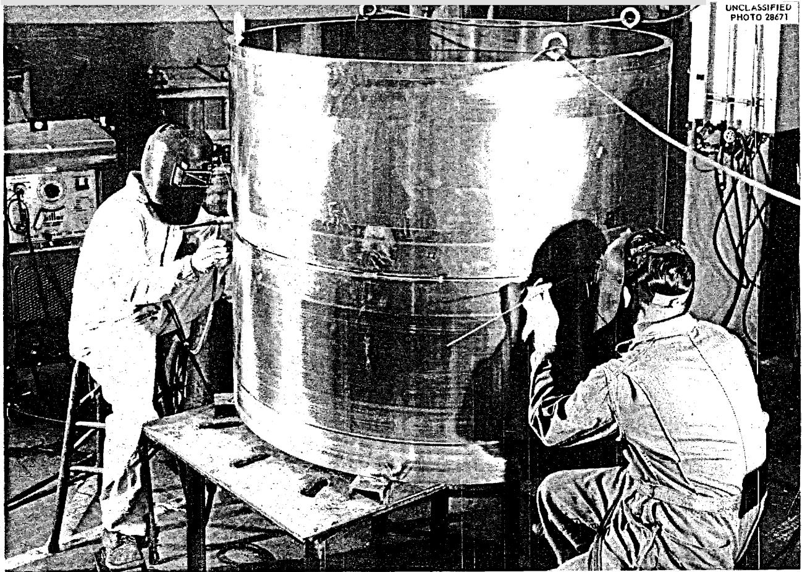  
Fig. 1.1.1. Pressure Shell Weld Test.

by design modifications, including changes in dimensional tolerances, and the development of new welding procedures.

# Equipment Inspection

Main Fuel-to-NoK Heat Exchanger Checking Fixture. - A special checking fixture was designed and fabricated to be used to dimensionally check the main heat exchanger tube bundles and to thus establish whether they can be assembled into the reactor. The fixture is shown in Fig. 1.1.2, with

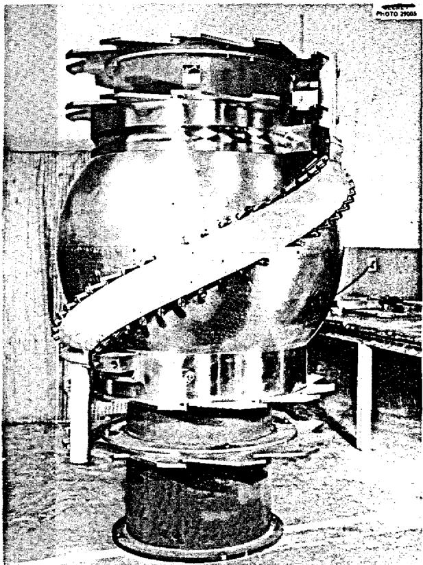  
Fig. 1.1.2 Fuel-to-NaK Heat Exchanger Checking Fixture with Wooden Model of a Tube Bundle Positioned for Checking.

a wooden model of a tube bundle positioned for checking. The spherical section of the fixture establishes the outer surface of the reflector assembly, and the pins located in this spherical section define the area into which the tube bundle channel must fit. The dummy header blocks at the

top and bottom define the parting planes between the headers, and the notched rings at top and bottom establish the nozzle positions.

Two heat exchanger checking fixtures of this type, which were fabricated by the Bunell Machine & Tool Company, were available in June; one was delivered to ORNL and the other was delivered to the heat exchanger fabricator, Black, Sivalls & Bryson. Since then it has been necessary to return the units to the Bunell Machine & Tool Company for reworking, because the header end plates have been redesigned to give more clearance between the headers.

Reactor Component Inspection. - Special tools were designed and built to dimensionally check the $\mathsf{B}_4\mathsf{C}$ tiles required for neutron shielding. An inspection gage designed for checking the chord length of the various pieces is shown in Fig. 1.1.3, and a device used for inspecting the top and bottom edges of the tiles, which were machined as conical surfaces, is shown in Fig. 1.1.4.

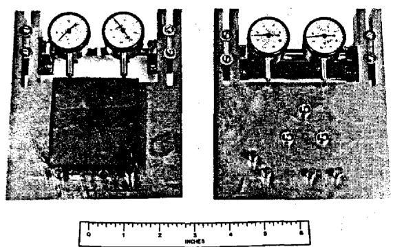  
Fig. 1.1.3 Boron Carbide Tile Chord-Length Inspection Gage.

Mechanical inspection forms have been made up for all the reactor shells, the filler plates, the north head, the load ring, the beryllium sections, and other miscellaneous parts. For the most part these inspection forms are scale drawings of parts or assemblies with lists of the critical dimensions which must be recorded for assembly fitup or for general information.

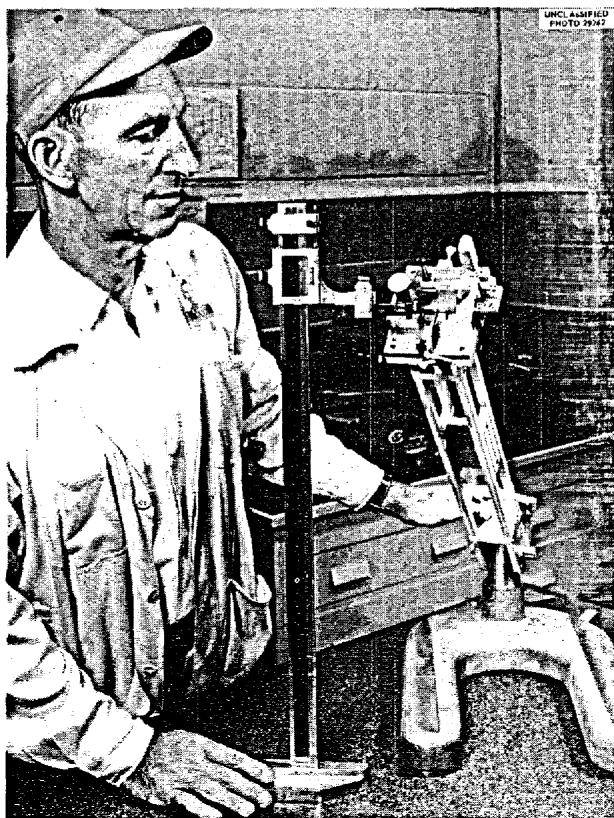  
Fig. 1.1.4. Boron Carbide Tile Conical-Surface Inspection Gage.

# COMPONENT FABRICATION AND ASSEMBLY Main Fuel-to-NaK Heat Exchanger

J.Zasler R.B.Clarke

An experimental unit of the main fuel-to-NaK heat exchanger was completed at Black, Sivalls & Bryson and shipped to Oak Ridge. The manufacture of this unit, which is shown in Figs. 1.1.5, 1.1.6, and 1.1.7, has proved all the major fabrication methods and established the feasibility of manufacture of the heat exchanger. This experimental unit was completed prior to the assembly of a prototype unit through the use of partially inspected material and some imperfect parts.

The seventh channel produced was machined successfully to within dimensional tolerances and is ready for assembly into the prototype unit. A modification was made to the tool-actuating mechanism on the large boring mill used for channel machining to allow the tool to rock as the channel moves past it. The tool thus operates at a constant angle as it is moved vertically. All parts have

been completed for the prototype unit, and assembly can be started. A change in the method of fabricating the header assemblies has been adopted which eliminates several operations. As a result of the experience gained in the brazing of the experimental unit and in additional test work, it has been decided that it is no longer necessary to hand-clean the oxide from the tubes after they are hot-formed in the resistance-heating fixture.

# Sodium-to-NaK Heat Exchangers

W. S. Harris

The first and second sodium-to-NaK heat ex-changers, which were delivered during the previous quarter, were successfully installed in the ETU north head. It was determined that modifications could be made that would facilitate the installation of subsequent heat exchangers, and the modifications are being incorporated in units 4 and 5. During the fabrication of unit 3 it was determined that a dented tube could be cut out and replaced successfully.

# ART-ETU Radiators

M. M. Yarosh

Both of the radiators required for installation in the ETU facility were received in Oak Ridge during the quarter. The first unit, received during the week of July 22, was inspected and then installed in the facility. The second unit was received the week of September 2, and inspection was started.

As had been somewhat anticipated, fabrication difficulties were encountered in the production of these early units. It was found possible to introduce corrective measures both to bring the units up to an acceptable standard for their intended use and to eliminate the difficulties from later production.

Distortion of the first unit during assembly welding resulted in cracks in the back-braze alloy of 69 of the tube-to-header joints. The unit was repaired by placement of additional alloy at the back-braze joints and putting the unit through a second brazing cycle. All cracks were filled by the additional brazing operation.

During the fabrication of the second unit three tubes were damaged as a result of distortion of the unit during assembly. An assembly sequence was worked out to eliminate such troubles in future

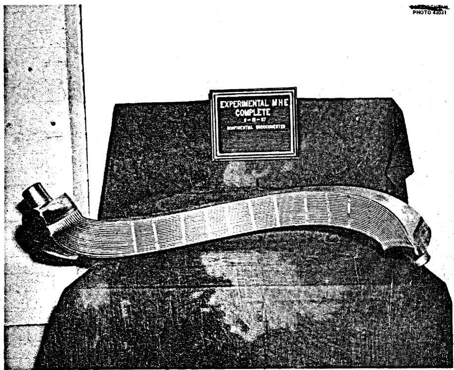

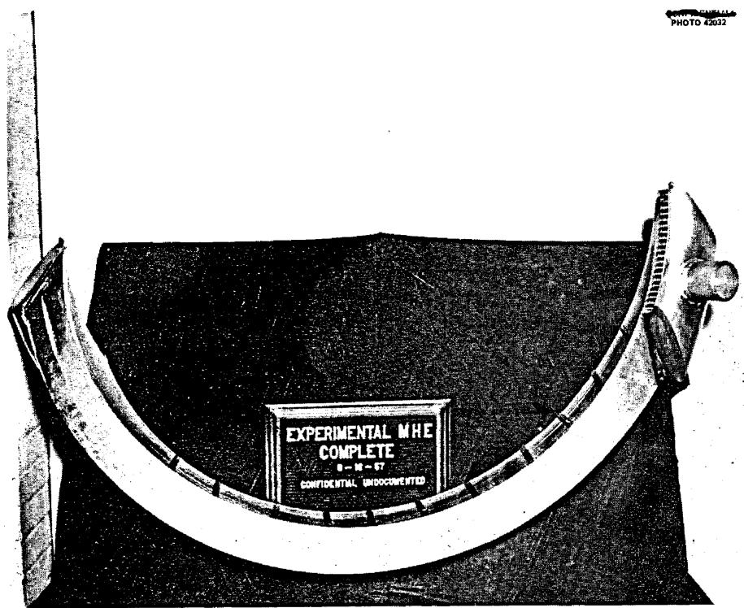  
Fig. 1.1.5. Two Views of Experimental Unit of Main Fuel-to-NaK Heat Exchanger.

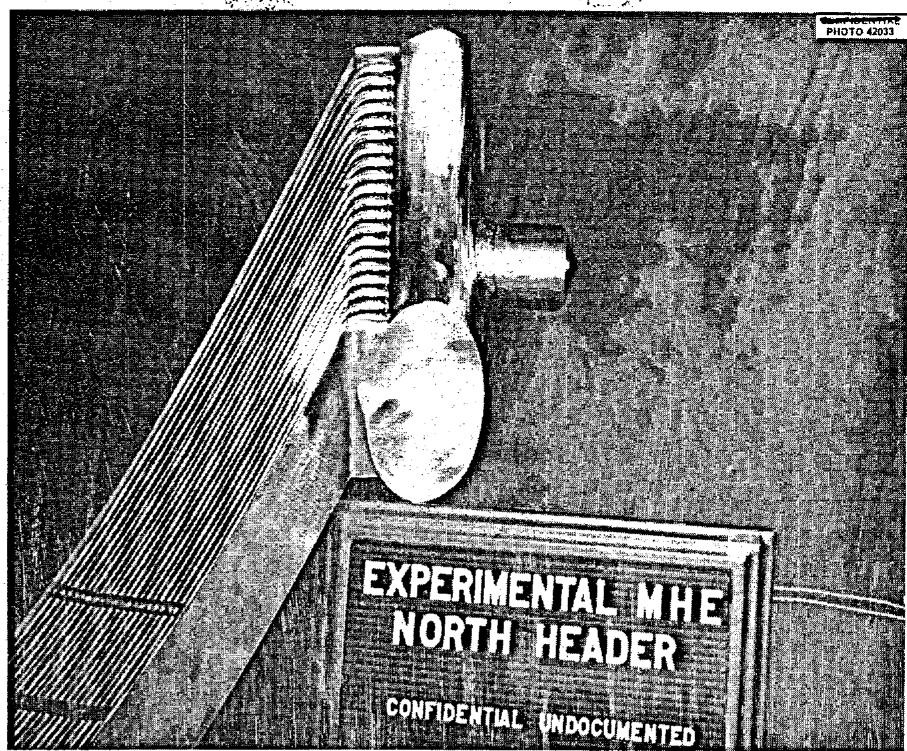

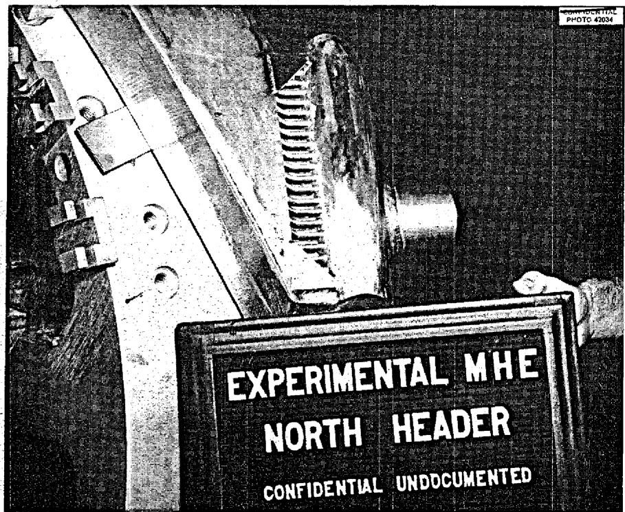  
Fig. 1.1.6. Two Views of North Header of Experimental Unit of Main Fuel-to-NoK Heat Exchanger.

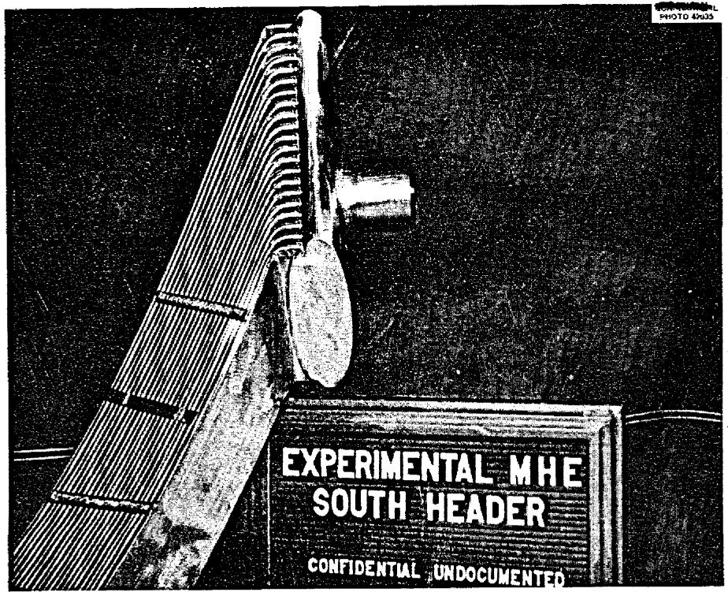

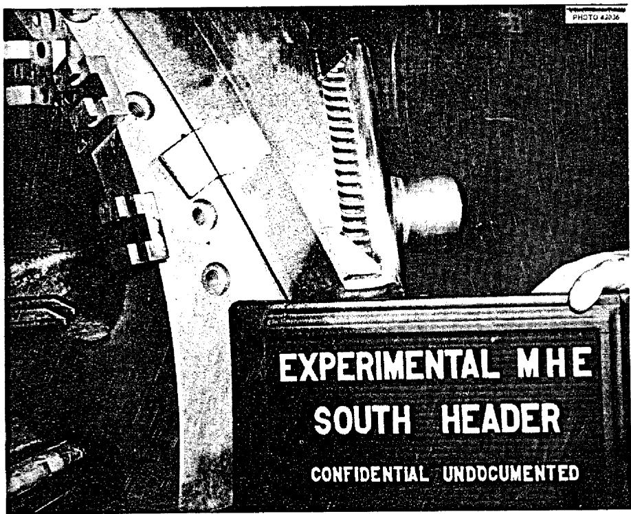  
Fig. 1.1.7. Two Views of South Header of Experimental Unit of Main Fuel-to-NaK Heat Exchanger.

radiator assemblies. This procedure is being employed on the first ART radiator assembly and appears to be working successfully.

It was decided that the brazing operation could be improved if the vendor was supplied with the type of brazing rings previously produced at Oak Ridge in pilot quantities. A facility for producing brazing rings was therefore set up at ORNL, and ring production of approximately 10,000 per hour was achieved. Through the week of September 6, a total of approximately 750,000 rings was produced.

# Main Pressure Shell and Liner

G. D. Whitman

C. K. McGlothlan

G.W.Peach

The first pressure shell lower forging was received from the Ladish Co. and is shown in Fig. 1.1.8. This ETU part is to be machined in the

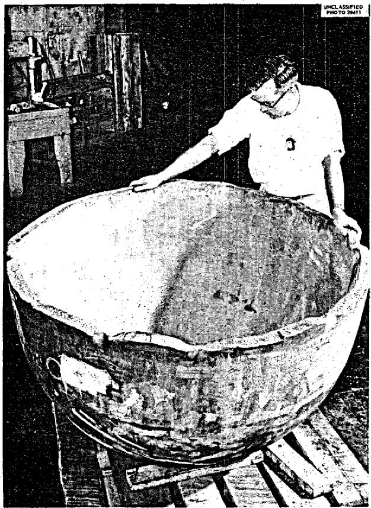  
Fig. 1.1.8. Pressure Shell Forging. (Confidential with-repetition)

Y-12 shop, and fooling for this operation is being fabricated. The part is scheduled to be completed by April 1958.

It has been decided to fabricate the dormers in the upper pressure shell as separate components and weld them into the shell. This work is to be done in the Y-12 shops. It is anticipated that the first pressure shell upper forging will have been received at Oak Ridge before the end of the report period.

The lower pressure shell liner half is to be forged and machined by the Ladish Co. This work is currently in the design and tooling fabrication stage. The first shell half is scheduled to be struck in October 1957.

The upper pressure shell liner is to be fabricated from a cold-formed weldment and will be welded to the north head assembly before final machining so that accurate dimensional control can be maintained. This first weldment has been fabricated by the Steel & Alloy Tank Co. and has been received.

# Beryllium Reflector-Moderator Outer Shell

G.W.Peach

The beryllium reflector-moderator outer shell (shell III) is being fabricated from a machined weldment. A cold-formed weldment of the lower half of the shell is shown in Fig. 1.1.9 as received from the Steel & Alloy Tank Co. This lower half, which is nearly complete, is shown again in Fig. 1.1.10 during the machining operation. No particular difficulty has been encountered in this operation, and the design tolerances have been held.

A shell III upper weldment has been received and will be welded to the strut load ring assembly before machining so that weld shrinkage and distortion can be controlled and the finished shell may be accurately positioned in the assembly.

# Boron Shield Containers - Shells IV and V

G.W.Peach

The method for manufacturing shells IV and V, the boron shield containers, has been changed from shear spinning (Hydrospin) to deep drawing. Experimental draws have been made on steel and Inconel sheet by forming 35-in. hemispheres in order to evaluate the forming problems. These tests substantiated the practicability of the method.

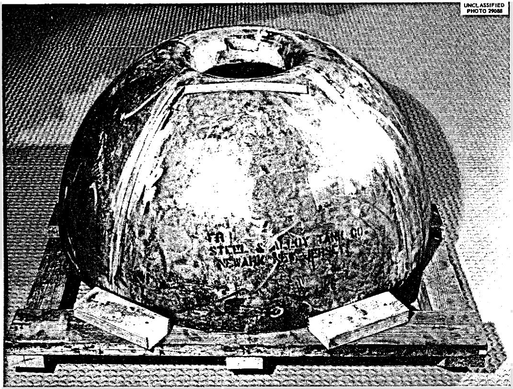

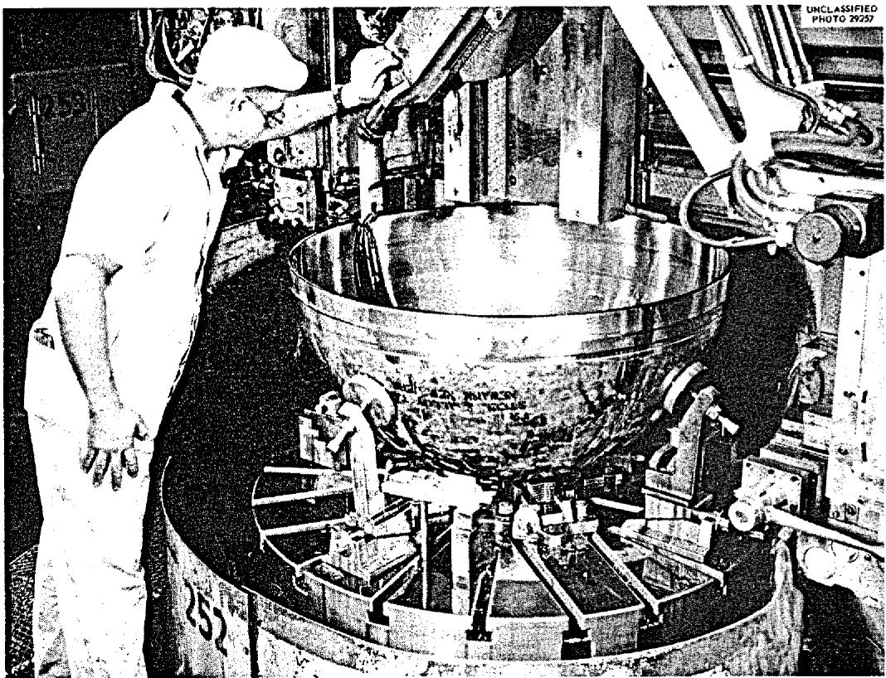  
Fig. 1.1.9. Shell III Lower Weldment. (Confidential with caption)   
Fig. 1.1.10. Shell III Being Machined. (Confidential with reoption)

Tool engineering is now under way for the manufacture of shells IV and V by this method.

The application of the deep-draw process to these pieces is an unusual one because of the large ratio of part diameter to thickness. Conventional drawing practice indicates a maximum diameter-to-thickness ratio of 100/1. The parts in question are 0.085 in. thick and 45 and 50 in. in diameter, and thus the diameter-to-thickness ratios are 500/1 and 600/1, respectively. This involves a considerable extension of conventional limits. The principal difficulties encountered in the early stages of the test program were buckling in the equatorial region of the hemispheres because of insufficient blank hold-down pressure and rupture at the center of the blank from excessive tensile stress on the blank.

Equipment used for the experimental drawing operations at Kaiser Metal Products, Inc., is shown in Fig. 1.1.11, in which may be seen the punch, the draw die, and the hold-down ring of the 2200-ton hydraulic press. A typical rupture defect on a 0.074-in.-thick, 35-in.-dia steel shell caused by excessive punch pressure is shown in Fig. 1.1.12. A typical pucker defect in a 0.062-in.-thick, 35-in.-dia Inconel shell is shown in Fig. 1.1.13. Specimens of shells formed by three different methods are illustrated in Fig. 1.1.14. The specimen at the rear of Fig. 1.1.14 is 0.074-in.-thick, 35-in.-dia cold-rolled steel that was formed without backing material. As may be seen, the material puckered. The middle specimen of 0.074-in.-thick, 35-in.-dia cold-rolled steel was backed with 0.132-in.-thick hot-rolled steel during forming.

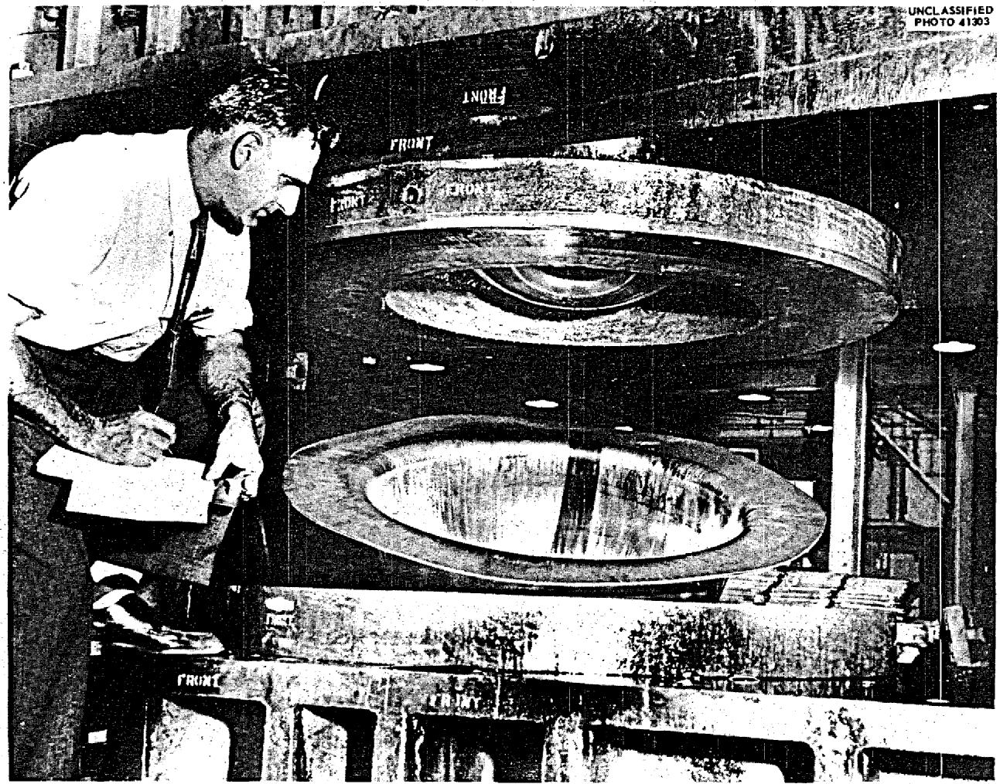  
Fig. 1.1.11. Hydraulic Press for Deep-Draw Process.

The slight pucker is not evident. The front specimen of 0.074-in.-thick, 35-in.-dia cold-rolled steel was backed with 0.169-in.-thick hot-rolled steel. No defects were present.

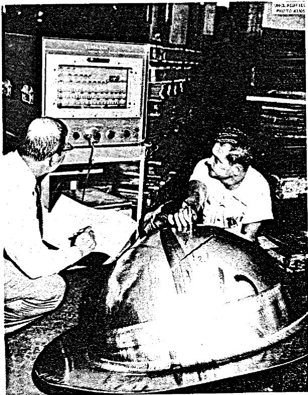  
Fig. 1.1.12. Ruptured Shell Produced by Deep-Draw Process. (Confidential with caption)

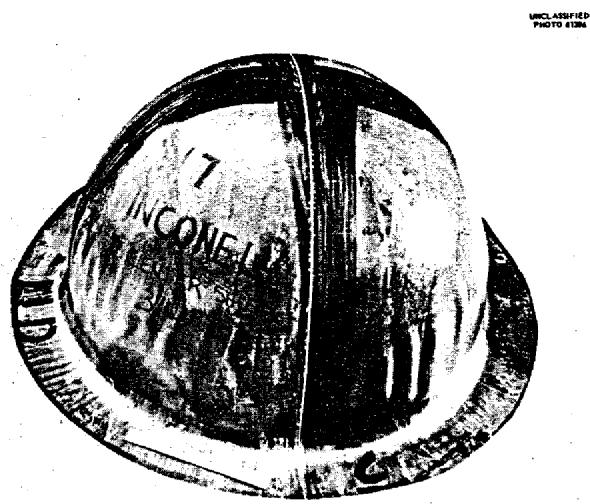  
Fig. 1.1.13. Deep-Drawn Shell Showing Pucker Defect. (Confidential-with-rejection)

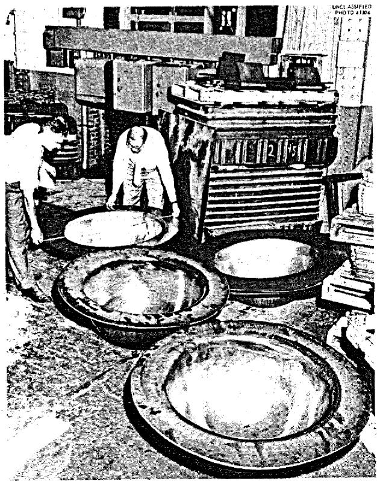  
Fig. 1.1.14. Deep-Drawn Shell Test Specimens. (Confidential with caption)

The experimental work showed that by reinforcing the blank with backup steel sheets, the desired hold-down pressures to avoid puckering could be maintained without rupturing the blank. The best results were obtained on 35-in.-dia hemispheres with 0.062-in.-thick welded Inconel blanks reinforced with $5_{32}$ -in.-thick hot-rolled steel sheet. There were indications that good results could be obtained with less reinforcing but that this would require "cut-and-try" balancing of hold-down and press-punch pressures.

The decision to discard the shear spinning techniques for manufacturing shells IV and V was based on the following:

1. Try-out work demonstrated that adherence to the spinning mandrel would be very difficult and perhaps impossible to maintain.   
2. In order to even approach adequate dimensional control it would be necessary to preform and premachine the blanks.   
3. An extensive amount of development work would still be necessary to establish the most satisfactory shape for the spinning rolls.

4. Intermediate annealing steps' might distort the parts and make them difficult to realign on the machine.   
5. Inconel stock requirements appeared to be higher than originally anticipated and it was uncertain that material costs could be held within reasonable limits.

While it is felt that the spinning process has very definite advantages in ultimate quality of reactor parts, much basic knowledge of the forming process needs to be developed to overcome the difficulties experienced with ART parts.

# Inner and Outer Core Shells

G. D. Whitman

G.W.Peach

As previously reported the inner core shell and island assembly for the ETU has been completed. Four more inner core shell weldment halves have been received, and two of these weldments are shown in Fig. 1.1.15. Upper and lower halves of an outer core shell weldment have also been received, and machining operations have been

started. The lower-half weldment prior to machining is shown in Fig. 1.1.16. Machining operations are $50\%$ complete on the lower half of the outer core shell and $15\%$ complete on the upper half of this shell. These parts are stress relieved after the rough machining operation so that distortion in the final machining operation is minimized. The shear spinning process for the production of these and other shells was abandoned because of the difficulties described previously and because satisfactory forging, welding, and machining techniques have now been developed.

# Reactor North Head

C. K. McGlothlan

The two sodium-to-NaK heat exchangers received from the Griscom-Russell Co. have been fitted into the ETU north head, and welding operations have been started. The heat exchangers are shown in place in the lower deck weldment in Fig. 1.1.17. In Fig. 1.1.18, one deck plate may be seen in position for welding.

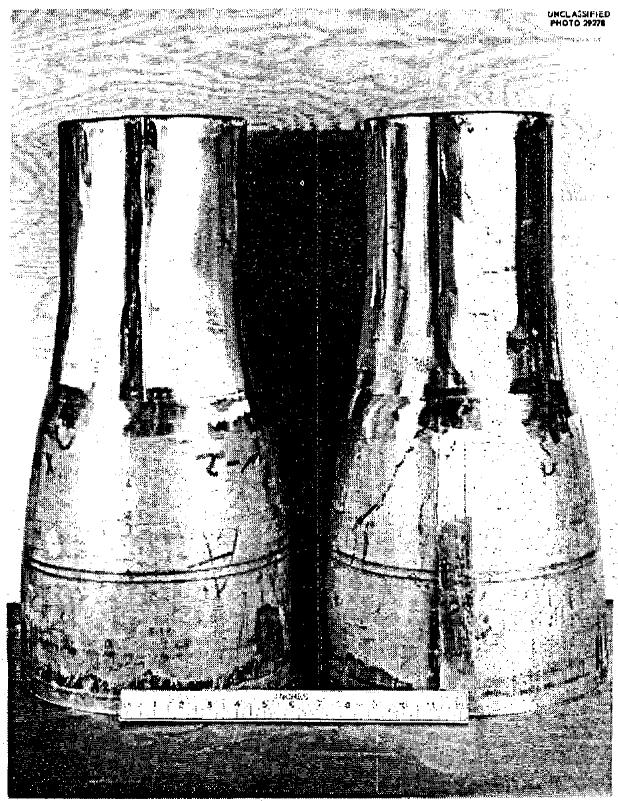  
Fig. 1.1.15. Inner Core Shell Weldment. (Com-idential with caption)

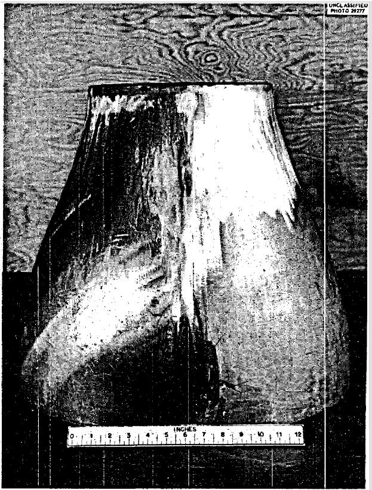  
Fig. 1.1.16. Outer Core Shell Weldment, Lower Half (Confidential with caption)

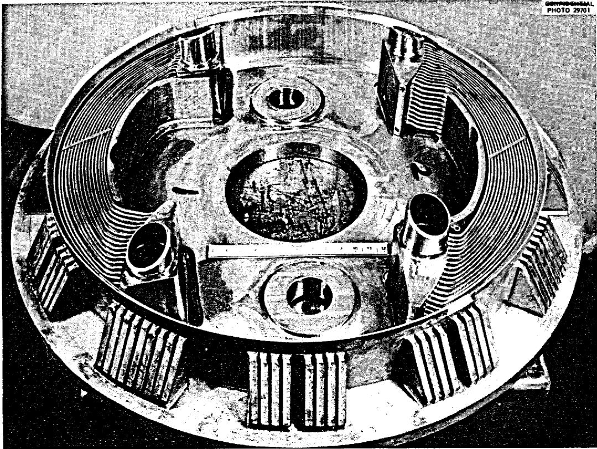  
Fig. 1.1.17. Sodium-to-NaK Heat Exchangers in Place in North Head. (Secret with caption)

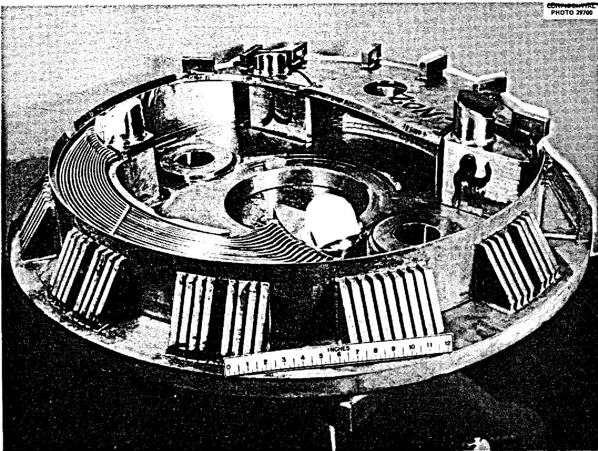  
Fig. 1.1.18. North Head Assembly with One Deck Plate in Position for Welding. (See text with caption)

Three lower deck skirt forgings have been received from the Ladish Co., and rough machining has been completed on the ETU part. The forging is shown as received in Fig. 1.1.19 and during the machining operation in Fig. 1.1.20.

Three rough-machined fuel-expansion-tank tops, forged from bar stock, have been received from the Ladish Co., and one of these parts is shown in Fig. 1.1.21.

The installation and successful testing of a facility for producing dry hydrogen gas for a reducing atmosphere for the stress-relieving operations on the north head assemblies has been completed. A trial run was made in which the north head retort was filled with scrap Inconel parts. The scrap items were all successfully cleaned at $1850^{\circ}\mathrm{F}$ . The stress-relieving retort installed in the furnace is shown in Fig. 1.1.22.

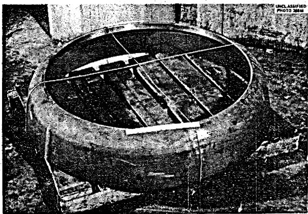  
Fig. 1.1.19. Lower Deck Skirt Forging, As Received.

# Strut Load Ring

# W.E.Thomas

The strut and ring assembly has been welded to the load ring forging. The inside contour of the load ring has been finish-machined in the passage under the conical divider and requires one more finish cut on the other surfaces. Inconel cover plates for the copper- $\mathsf{B}_4\mathsf{C}$ cermet layer on top the load ring have been formed and are ready for installation. All sodium return passages have been drilled. This assembly is shown in Fig. 1.1.23. Two conical dividers have been fabricated and machined. One of the dividers has been welded

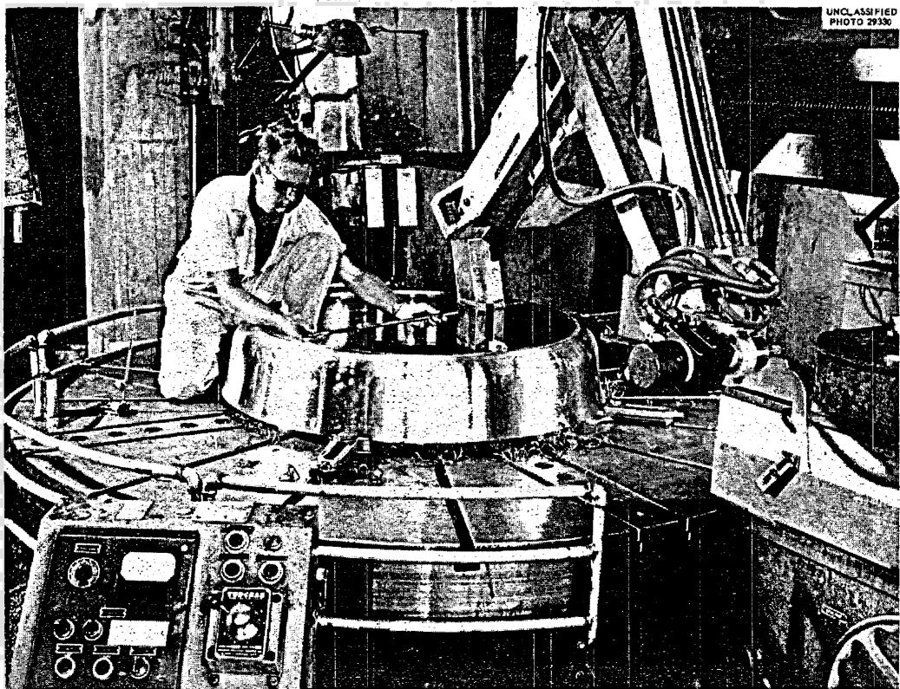  
Fig. 1.1.20. Lower Deck Skirt Being Machined.

INCLASSIFIED
PHOTO 29702

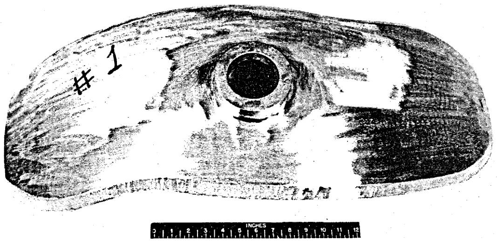  
Fig. 1.1.21. Fuel Expansion Tank Top, Rough Machined. (Confidential with caption)

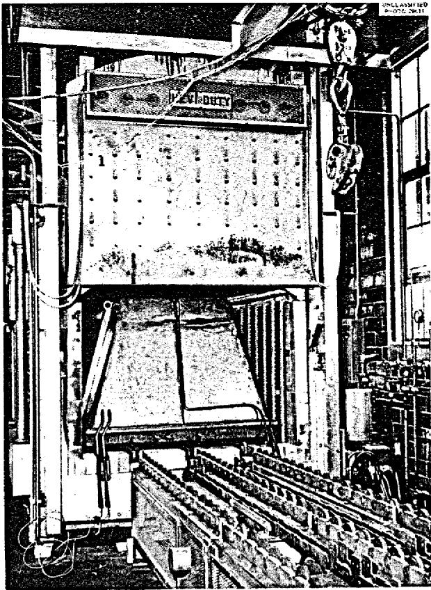  
Fig. 1.1.22. North Head Stress-Relieving Retort Installed in Furnace.

to the pan face-pan rim-sodium inlet pipe subweldment and heat treated, and it is now ready for assembling in the load ring.

# Neutron Shielding

# C. K. McGlothlan

Boron Carbide Tiles. - All the tiles, 3386 pieces, consisting of 21 shapes, have been received from the Norton Company, and they have all been inspected and accepted. A total of 1251 pieces is required for each reactor assembly, and therefore the total quantity on hand includes a number of spare pieces. A hot-pressed spherically shaped tile blank and the finished tile produced from such a blank are shown in Fig. 1.1.24, and one of the shapes produced for the load-ring assembly is shown in Fig. 1.1.25.

Cans and Lids for Boron Carbide Tiles. - The cans and lids for the tiles are formed from 0.0035-in.-thick type 430 stainless steel and an intermediate layer of 0.0015-in.-thick copper foil. These materials have been fabricated by General Plate Div. of Metals & Controls Corp. and delivered to the ERCO Division of American Car & Foundry Co., for fabrication of the cans and lids. The tooling for this job is $75\%$ complete. A total of

UNCLASSIFIED

PHOTO 29703

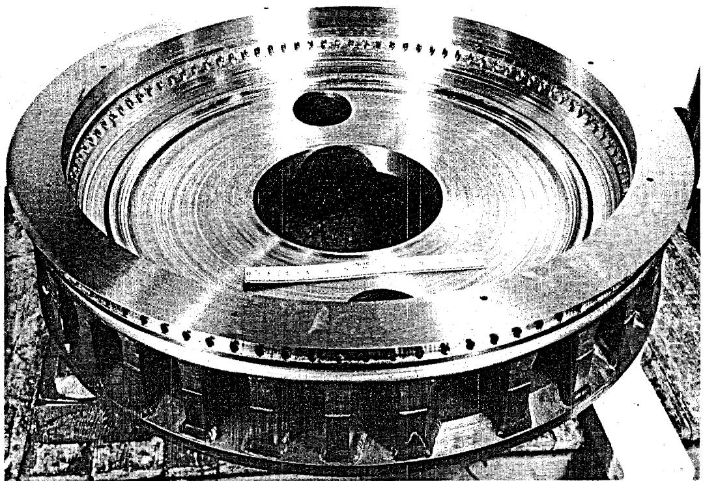  
Fig. 1.1.23. Strut Load Ring Assembly.

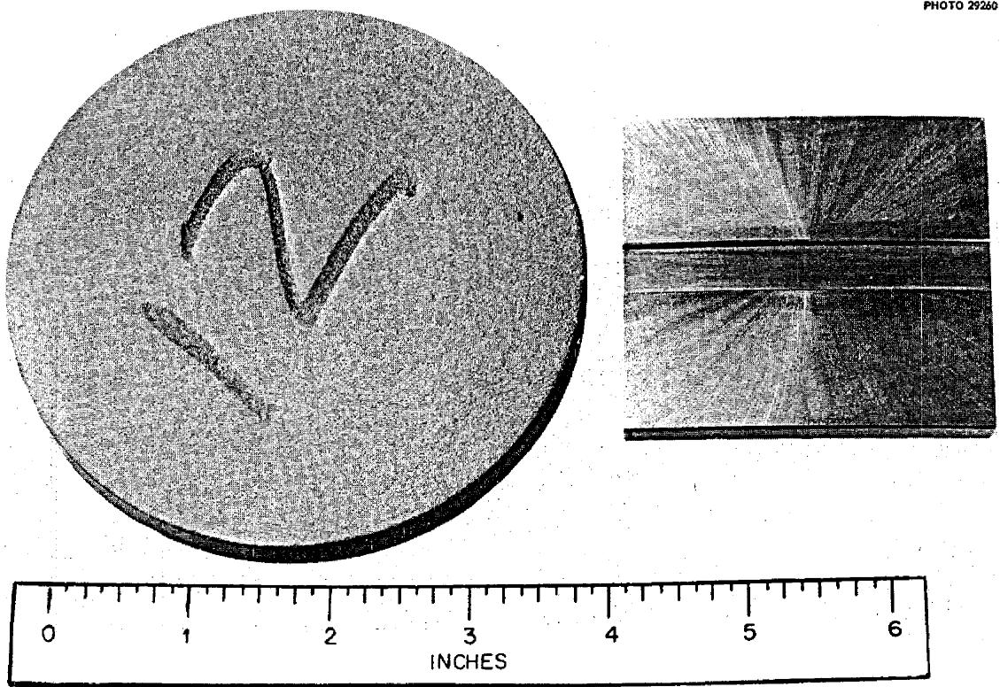  
Fig. 1.1.24. Boron Carbide Tile Blank and Finished Part.

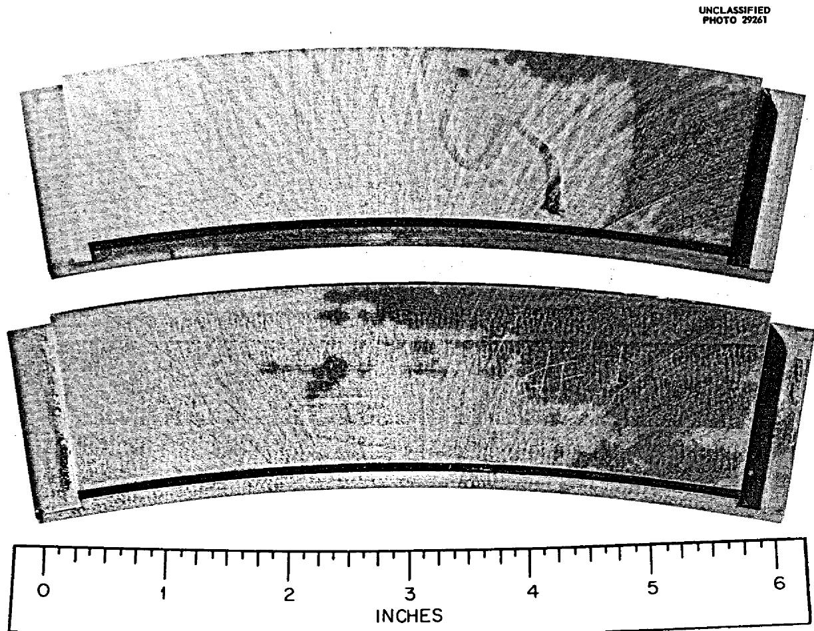  
Fig. 1.1.25. Boron Carbide Tile for Load Ring Assembly.

5434 pieces is required for the ETU and ART reactors; the first 6 pieces have been received and are being inspected. One of the tile, can, and lid assemblies is shown in Fig. 1.1.26.

Stainless-Steel-Clad Copper-B₄C Cermets. - Approximately 15% of the rolled cermet sheet material being fabricated by Allegheny-Ludlum Steel Corp. has been completed at a price of $1.07/in.² for 0.100-in.-thick material. An estimated 80,000 in.² will be required for the entire job which includes a small amount of 0.250- and 0.312-in.-thick material at a cost proportional to the increased thickness. The ERCO Division of American Car & Foundry Co. is fabricating the required cermet shapes from the rolled cermet sheet material. Tooling for this job is 95% complete. Seventy fabricated pieces have been received and accepted. The 1050 pieces required

involve 48 different shapes. Work is progressing satisfactorily on this job. The controlling factor in the completion of this order is the rate of cutting of the material by the Elox (electrical-discharge) process.

The electrical discharge method has been the only practical way found to trim the cernet parts accurately, and the work has been scheduled on a multishift basis to expedite delivery of the parts. Some of the cernet shapes required in the load ring assembly are shown in Figs. 1.1.27 and 1.1.28.

# Lead and Tungsten Shielding

# A.M. Smith

Details of the cooling coils in the equatorial section of the lead shield have been determined, and the design of the steel inner shell support

UNCLASSIFIED PHOTO 29796

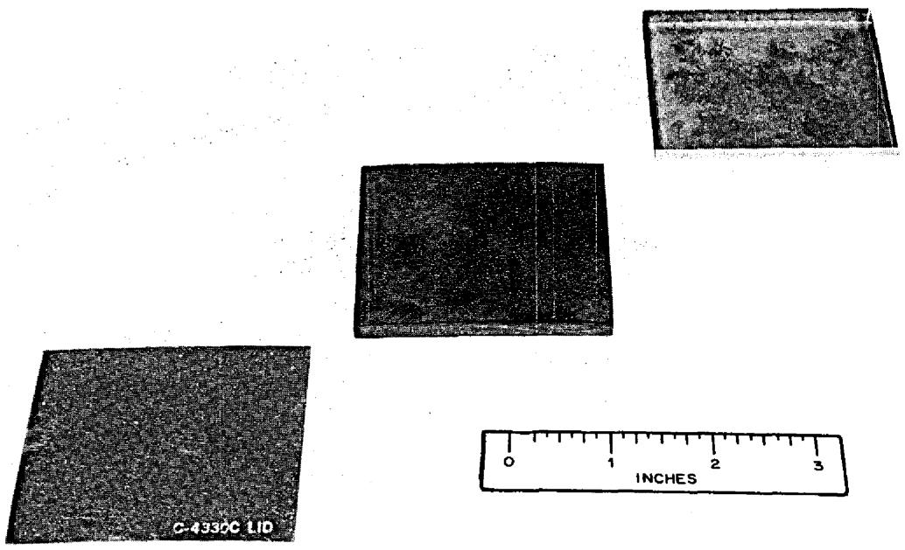

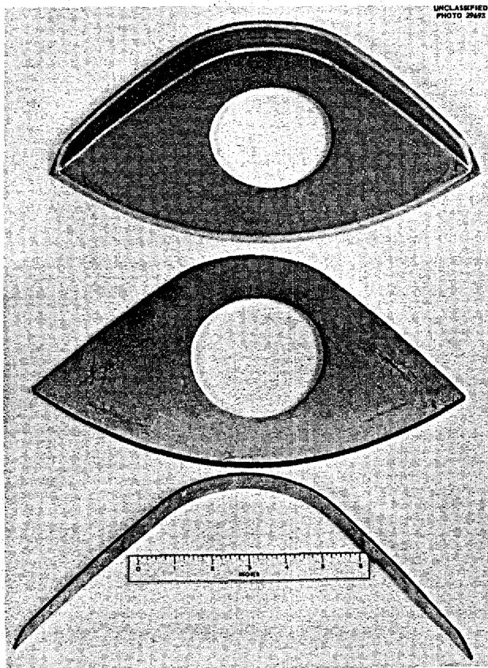  
Fig. 1.1.26. Tile, Can, and Lid Assembly.   
Fig. 1.1.27. Load Ring Cermet and Inconel Cover Plates.

assembly has been modified by increasing the number of support ribs to reduce the stress level at operating conditions. Changes have been made in the method of welding these ribs to the shell to avoid buckling problems. A vendor is now fabricating this support assembly.

Work is continuing on the design of the north and south lead shield sections. It has been decided to support the tungsten shielding from the NaK manifolds, and the preliminary layouts have been developed.

# Miscellaneous Components

A.M. Smith W.E.Thomas

Reactor Spacer Rings. - Parts for two spacer ring assemblies have been machined. One set of parts that is ready for assembly is shown in Fig. 1.1.29.

Reactor Filler Plates. - Two sets of filler plates are in various stages of completion. One design change was made to provide a better flow profile. The ETU filler plates, with the exception of plate No. 6, have been finish-machined on the mating surfaces, the sodium passages have been cut, and the bolt and dowel holes have been drilled. The plates have been bolted together and set up for contour machining of the inner and outer surfaces, as shown in Fig. 1.1.30. Plate No. 6 for the ETU

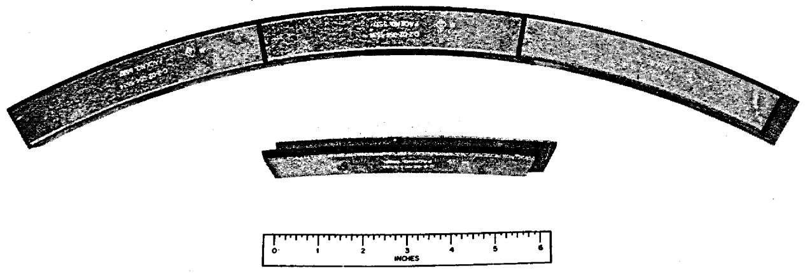  
INCLASSIFIED PHOTO 29695

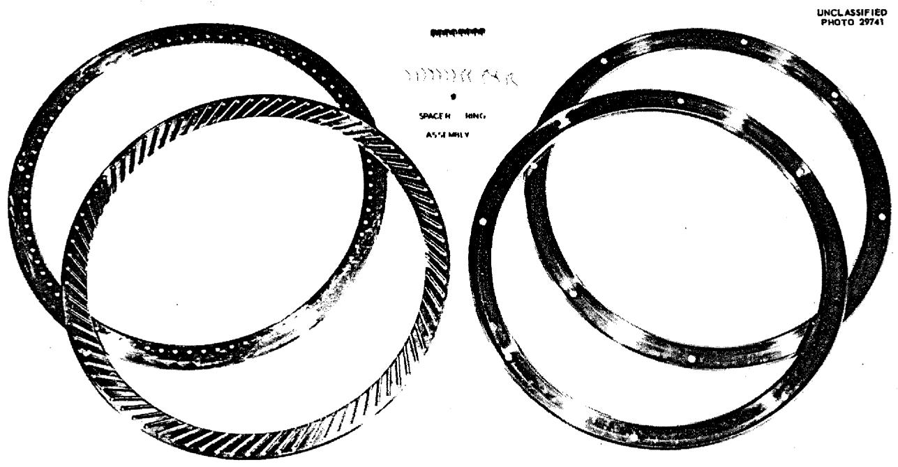  
Fig. 1.1.28. Load Ring Cermet Pieces.   
Fig. 1.1.29. Spacer Rings.

has been finish-machined on the inner surface only. All ART filler plates, except No. 6, have been finish-machined on mating surfaces and the sodium passages have been cut.

NaK Manifolds. - Design of the NaK manifolds for the ETU has been completed, and the drawings were transmitted to the vendor. Several minor

changes of ART manifold drawings are being made. Sufficient material for the manifold nozzles was obtained despite the unusually close dimensional tolerances specified as a means of reducing stresses.

It is presently excepted that a prototype of one of the ETU manifolds will be fabricated by October 1, 1957.

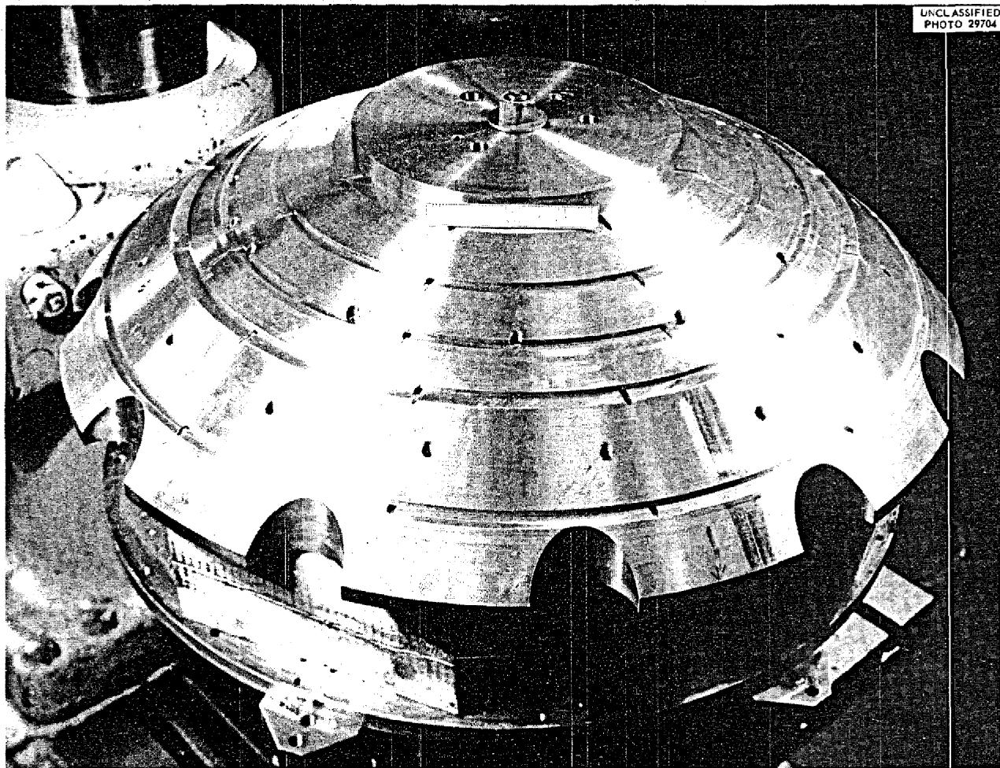  
Fig. 1.1.30. Filler Plate Assembly.

ETU Cell and Accessories. - Layouts of the equipment to be installed inside the cell are estimated to be $75\%$ complete. A "negator" spring arrangement to aid in support of the dump valve actuators has been ordered. Preliminary drawings have been prepared of the mockup shielding and of the balconies or platforms that will be provided within the cell. Fabrication of the fuel fill-and-drain tank supports was completed. Other equipment such as $\mathsf{ZrF}_4$ -vapor traps, the auxiliary sodium expansion tank and its associated piping, and the fuel overflow line are being designed. Estimates of cost and material needed for the fabrication of the various units have been made.

# REACTOR ASSEMBLY

G.D.Whitman W.E.Thomas

The top and bottom neutron shielding cans for the top of the island have been fabricated and assembled for installation in the ETU reactor. Two design changes have been initiated which will make final assembly easier. Welds on the sodium expansion tank are to be displaced to a point more distant from the sodium pump barrels in order to eliminate the need for boring the pump barrels after final assembly. A second change is being made to eliminate a possible hazard while cold-positioning the island. In the previous

arrangement, a nut and bolt located between the pressure shell and the filler plates were to be used, but, if the nut and bolt were to become inoperative during assembly, it would be necessary to grind out the pressure shell equatorial weldment and replace the threaded parts of the support structure. The redesign eliminates the hidden nut and bolt by providing threads on the pressure shell and a plug and plunger arrangement that can be removed and replaced externally.

# ETU FACILITY

G. D. Whitman

P. A. Gnadt

A.M.Smith

Installation work on the ETU facility is progressing at the rate originally predicted. The status of construction as of August 15, 1957, may be seen in Fig. 1.1.31, which shows the control room enclosure, the NaK pipe main support columns and cell mockup, and the main piping of the furnace and isothermal NaK circuits, with the stationary units of the four pumps mounted at the top of the structure. In the background just above the center of the support steel is a portion of the main air duct in which one radiator is already installed. In the foreground are the two reactor support pedestals. The workmen are shown installing cross bracing and walkways on the structure.

The induction regulators and associated conduit installed in the basement area may be seen in Fig. 1.1.32, and the heater distribution panels, transformers, and associated switches may be seen in Fig. 1.1.33, with the induction regulators in the background. Present estimates show an expected ETU facility completion date, exclusive of the reactor and its associated cell equipment, of September 1, 1958. Completion of the cell equipment is scheduled for December 1, 1958. A description of the construction and design status of the facility as of September 1, 1957, is given below.

# Reactor Support Structure

A. M. Smith

Details of the reactor support platform were completed, and fabrication was started on both the ETU and the ART structures. Plans have been made for the machining of the columns and the stress-relieving of the entire support platform.

Column footings for both ETU and ART support columns have been completed.

# NaK Piping, Associated Supports, and Components

P.A.Gnadt

Support Structures and Shielding. - All main supporting steel has been set in place. Installation of cross bracing, gratings, shielding supports, and hanger supports is approximately $65\%$ complete. Work is now in progress on this portion of the facility. It is planned that the shielding plates will be installed during the summer of 1958. Design drawings are complete for this work, except for minor modifications. The shielding plate design is scheduled for completion early in 1958.

NaK Piping. - The installation of the furnace circuit main piping is complete to the cell wall. Pumps, furnaces, throttle valves, and flowmeters are installed. One cold trap has been installed. Present plans are to install the remaining cold-trap circuit, thermocouples, liquid-level-measuring devices, fill-and-drain tanks, and associated lines and valves after completion of the auxiliary and isothermal NaK-circuit main piping. All material for this work is on hand, except the drain valves, drain tanks, and continuous-level-measuring devices. The drain valves are scheduled for delivery late in 1957. The drain tanks and continuous-level-measuring devices are scheduled for delivery October 1, 1957.

The main piping for the two isothermal NaK circuits is $95\%$ installed. Pumps, throttle valves, and one flowmeter are in place. The status of material for the remaining work is the same as noted above for the furnace circuits.

A radiator has been installed for one heat dump circuit. The remaining radiator is scheduled for shipment approximately September 1, 1957, and it will be installed in the air duct as soon as it is received. The two pump bowls for these circuits are scheduled for delivery September 15, 1957.

The main piping for these two radiator circuits is preformed and will be installed as soon as the pump bowls and remaining radiators are delivered. The flowmeters are on hand and will be installed with the pump bowls and the radiators. The status of the cold-trap circuits, thermocouples, level devices, drain valves, and drain tanks is the same as mentioned above for the furnace and isothermal circuits.

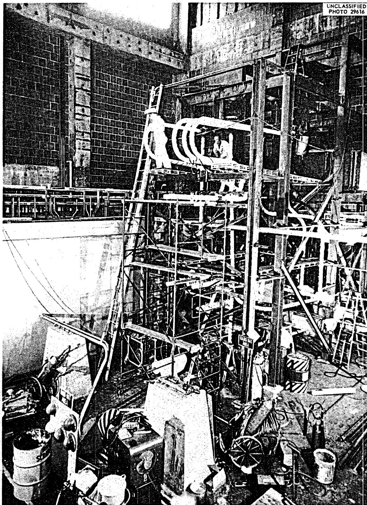  
Fig. 1.1.31. Status of ETU Facility Construction as of August 15, 1957. (Seeret with exception)

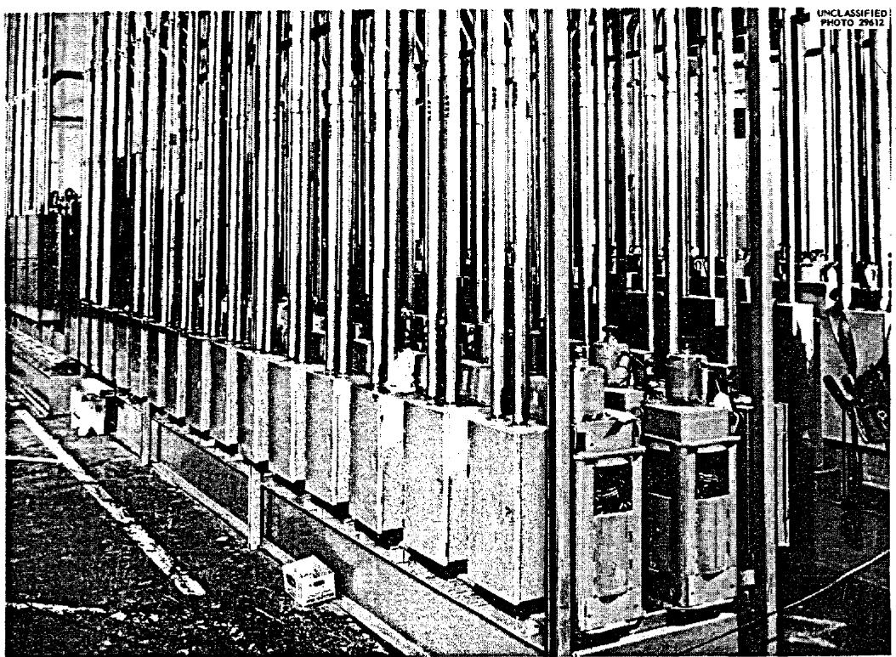

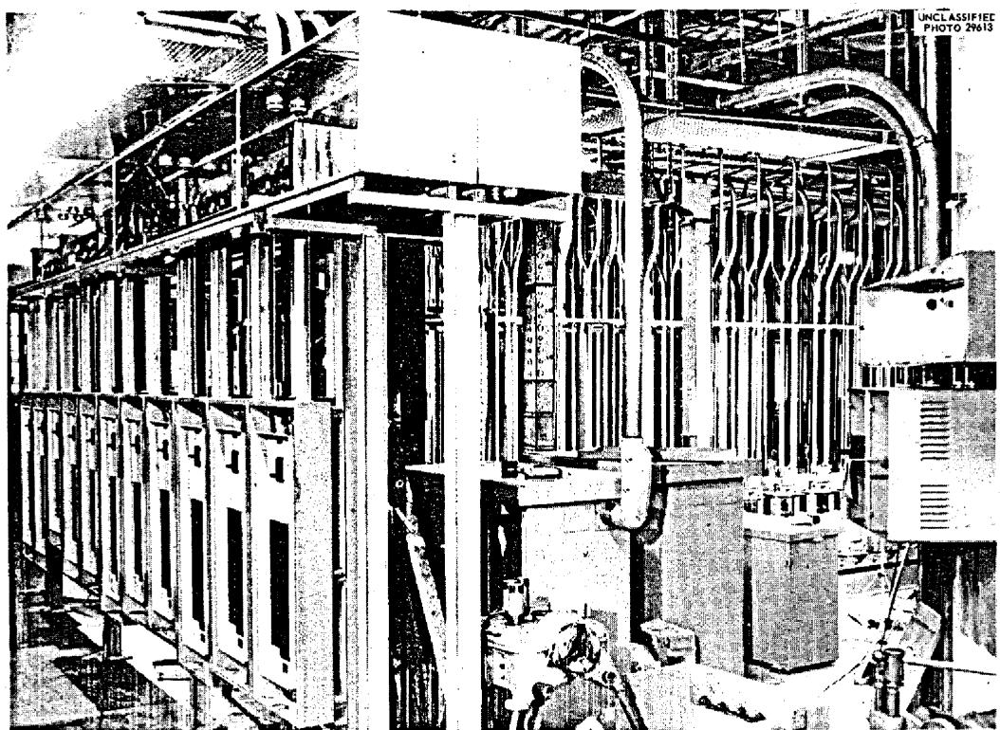  
Fig. 1.1.32. Induction Regulators and Associated Conduit Installed in Basement Area of ETU Facility. (Genvi dential with caption)   
Fig. 1.1.33. Heater Distribution Panels, Transformers, and Associated Switches Installed in Basement Area of ETU Facility. (Confidential with caption)

The cold-trap and plug-indicator circuits for the six NaK systems are prefabricated and ready for welding into the main piping circuits. It has been decided, however, that the plug-indicator circuits can be eliminated, and they will not be installed.

Main Air Duct. - All major components for this system are on hand. The section of the duct for housing the two radiators is installed. The remaining sections will be installed following the installation of the radiators.

# Electrical Equipment

P.A.Gnadt

The emergency electrical system, consisting of the 300-kw diesel generator unit and associated switchgear and supply cables is $95\%$ complete. Design work for the normal electrical distribution system is $90\%$ complete, and will be $100\%$ completed by November 1, 1957. All completed design drawings were released to a cost-plus-fixed-fee contractor on June 1, 1957.

The contractor has installed all voltage regulators, transformers, motor control centers, heater distribution equipment, and $85\%$ of the cable trays in the basement area. Installation of cables between the induction regulators and the distribution cabinets is approximately $50\%$ complete. Acceptance tests for approximately 125 variable transformers revealed excessive winding temperatures at the specified ratings. These units are being returned to the vendor for modification or replacement. These variable transformers are for use as voltage controllers for a portion of the heater circuits. The cost-plus-fixed-fee contractor has completed the control room enclosure, installed the cable trays above the control room, installed all conduit entrances to the control room through the roof and floor, and is presently setting the steel support structures for the NaK motor controllers, resistors, and associated cable troughs.

The variable-frequency drives for the reactor pumps have been ordered, and delivery is expected late in calendar year 1957. The motor-generator sets associated with the pump drive motors will be installed by the cost-plus-fixed-fee contractor. The pump drive units will be installed after the reactor and pumps have been installed in the facility.

Design work on panel layouts and controls has been started by the Instrumentation and Controls Division. Preliminary panel layout drawings and

a set of preliminary block diagrams describing control functions have been prepared. The control panels are to be available by approximately August 1, 1958.

Details of the heater designs are being prepared, and installation and wiring-connection drawings for the Calrod and clamshell heaters are to be completed by December 16, 1957. Heaters and surface-type thermocouples will be installed after completion of the NaK piping assembly.

# Auxiliary Services

A.M.Smith

Piping drawings for the auxiliary services (helium, lube oil, air, and water) in the basement area have been revised. The installation work for this piping will be done by a cost-plus-fixed-fee contractor. The removal of some of the existing pipe and installation of the modified pipe runs were delayed until August 28, 1957, to allow the electrical forces to complete their overhead work in this area. Layouts of the auxiliary piping above the track floor have been prepared. A preliminary bill of material for items required on this part of the system have been prepared, and procurement of some items is now in progress.

After considerable difficulty in obtaining a leak-tight system, the type R lube package (Figs. 1.1.34 and 1.1.35) delivery was made on June 28, 1957. This equipment is stored in the basement area and will be installed by the cost-plus-fixed-fee contractor. Failure of the subcontractor to deliver leak-tight pumps to the lube package vendor has delayed the completion of the type K lube package. Delivery of this package is now scheduled for October 1, 1957.

# ART FACILITY

F. R. McQuilkin

Design Activity

Major design work on components outside the cell of the ART facility is to be completed by April 1, 1958. The work outlined by these designs is to be done by ORNL forces. Design work is proceeding on the special equipment room (equipment for NaK coolant system fuel fill-and-drain tank), the radiator pit, and the radiator-penthouse area (NaK coolant system equipment for fuel and sodium systems). Incomplete $\frac{1}{12}$ -scale models of

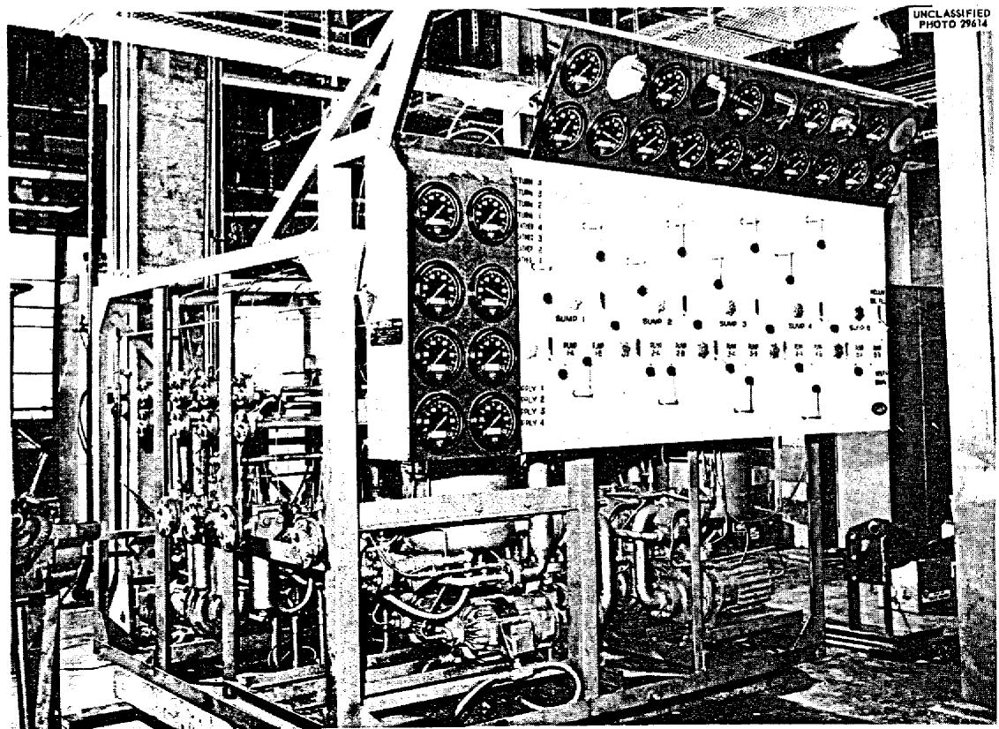  
Fig. 1.1.34. Type R Lube Package for ETU Facility Showing Control Panel. (Confidential with caption)

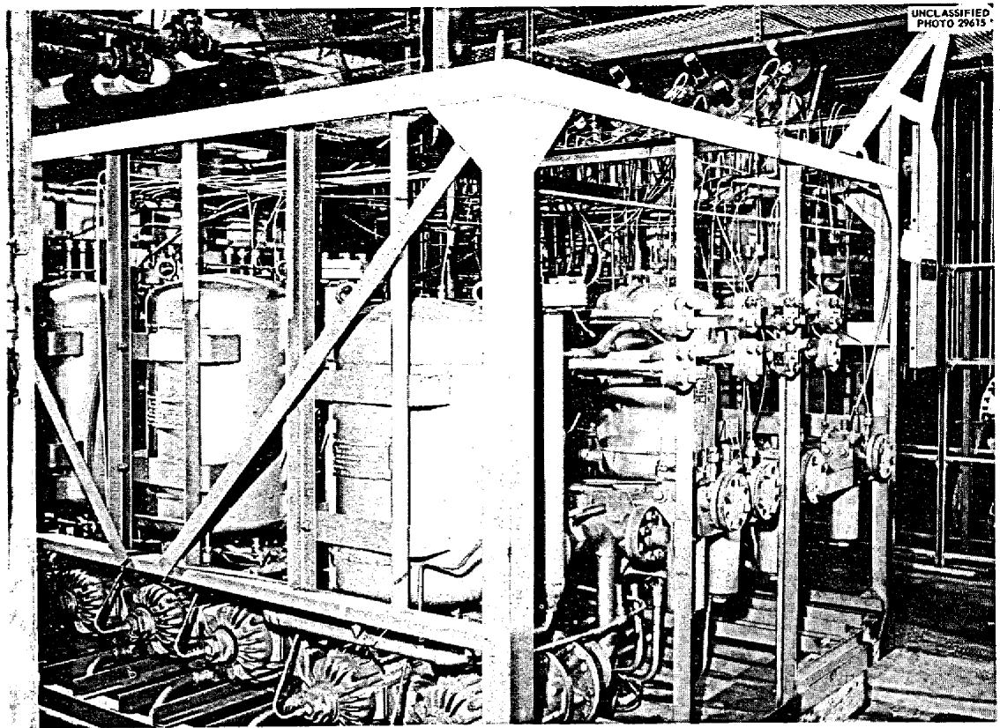  
Fig. 1.1.35. Type R Lube Package for ETU Facility. (Confidential with option)

these areas, which are being made to assist in detail design and to demonstrate equipment, assembly, and change-out procedures, are shown in Figs. 1.1.36, 1.1.37, and 1.1.38.

Figure 1.1.36 is an elevation view taken looking southeast at the radiator pit. The circular pattern in the lower left corner represents the cell; the special equipment room is in the background. The air duct, which has not been assembled, will be located in the upper right corner above the radiator pit. The tank at the right is the drain tank for the radiator drain pans. The five vertical tanks are the main and auxiliary NaK dump tanks. The horizontal tank is the special NaK dump tank. The equipment structure to the left of the drain tank is the NaK purification system for the main and auxiliary coolant system and consists of the cold traps, plug indicators, flowmeters, valves, and piping. The rack will be revised to omit the plug indicators. In the ceiling of the radiator pit are the main and auxiliary NaK piping, with the flowmeters and the heat-barrier-door operators.

Figure 1.1.37 is a view looking down into the radiator pit with the air duct removed. The cell wall is at the left; the NaK piping and off-gas penetrations may be seen. The smaller boxes represent the NaK flowmeters and the larger boxes represent the heat-barrier-door operators. The hot NaK piping penetrations for routing to the radiators are located between the heat-barrier-door operators.

Figure 1.1.38 is a view looking south from the cell into the radiator pit at the right and the special equipment room at the left. The special NaK pump and motor, along with the motor cooling duct, are located at the top. The two large tubes at the center of the special equipment room are the spectrometer tubes. Below the tubes in the foreground is located the special NaK purification system. The special heat dump annulus and main blowers, with transition and duct, are located in the background.

The major items of piping and equipment for the special equipment room have been assembled. A preliminary demonstration by use of this model indicates that the required equipment change-out functions can be accomplished. Meanwhile the equipment is being rearranged in the radiator pit to provide better access for equipment maintenance and change-out.

Design work is in progress on the cell-evacuation system, main blower back-flow lovers, smoke-

generator equipment, water filter, control-room lighting, and additional switchgear. Detailed schedules for design and construction of package 3 (all work that is remaining exterior to the cell) are being prepared. The remaining capital work, which is scheduled for completion by June 30, 1958, consists primarily of additions and modifications to electrical facilities, cable trays, and instrument-room air conditioning. Shop fabrication of noncapital items has been started in preparation for construction work to begin at the facility November 1, 1957. Items scheduled to be started at an early date consist of the NaK purification equipment, the NaK dump tank installation, valve rack equipment, air duct structure, and NaK piping in the special equipment room and radiator pit.

# Construction Progress

Lump sum contract work on the ART facility has been completed. This work was contracted in four stages, as determined by the design program. The first stage, package 1, included major building alterations, additions to existing buildings, cell installation, installation of main air duct, installation of 1500-kva substation, and installation of 480-v main switchgear. The second stage, package A, included installation of auxiliary service piping. The third stage, package 2, included installation of diesel generators and facility, electrical motor control centers, spectrometer room electrical system, and the spectrometer air-conditioning system. The fourth stage, package 3A, which was completed during this report period, included installation of an electrical system for supplying power to the pipe and equipment heaters, a dry-air plant and facility, NaK pump motor controllers, a lube-oil fill-and-waste system, and a hydraulic system for loover operation.

# Installation Planning

Preliminary planning is in progress for installation of facility equipment for the ART. A revised schedule of time estimates and completion dates has been prepared and is being reviewed with regard to the design and procurement programs. The revised schedule proposes that installation of Inconel piping and auxiliary equipment in the main, auxiliary, and special heat dump areas should commence during November 1957. It is estimated that 250 man-months of craft labor will be expended

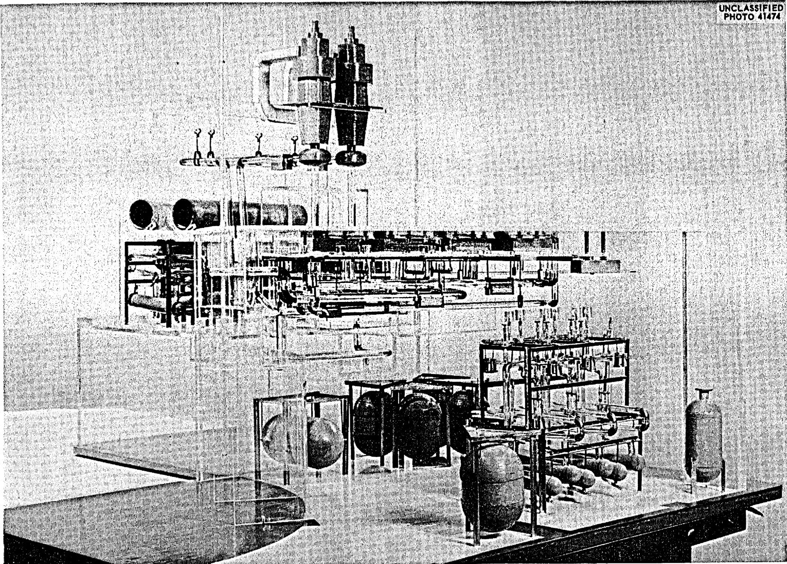  
Fig. 1.1.36. One-Twelfth-Scale Model of ART Radiator Pit. (Secret with caption)

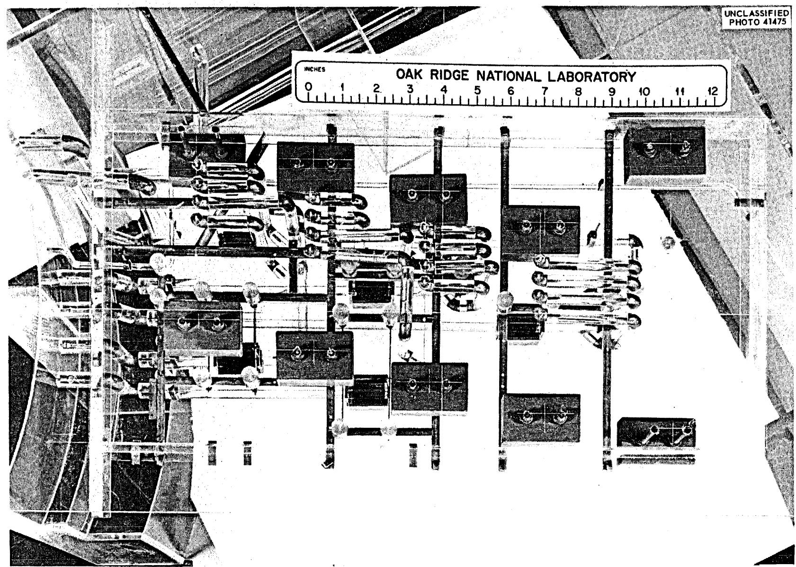  
Fig. 1.1.37. Model of Radiator Pit with Air Duct Removed. (See text with caption)

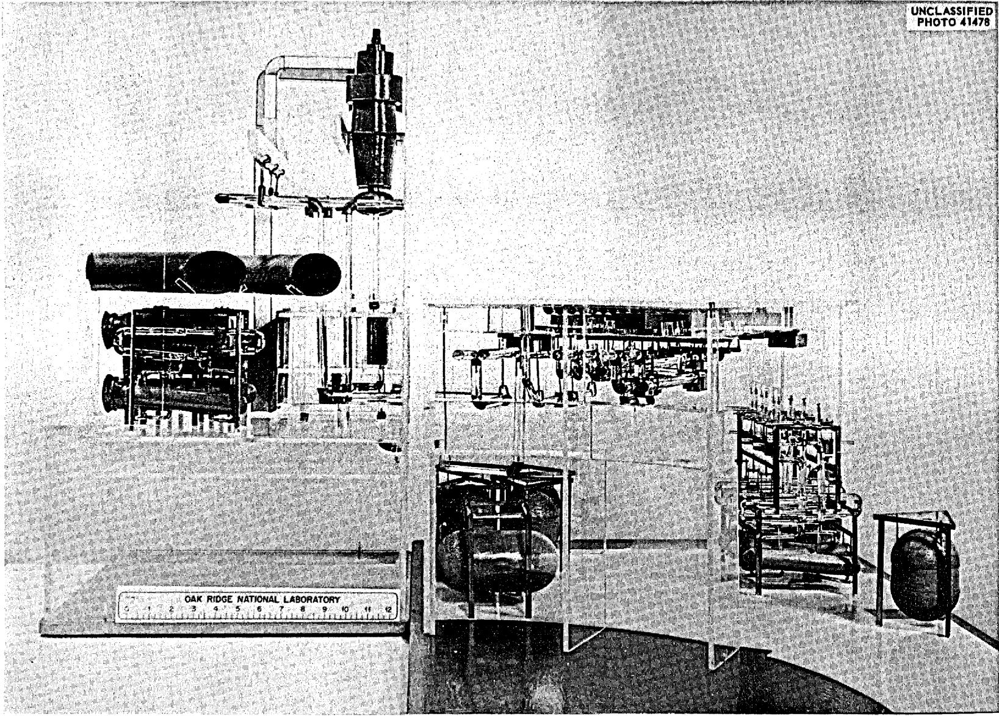  
Fig. 1.1.38. Models of Radiator Pit and Special Equipment Room as Seen from Cell. (Secret with captom)

to accomplish the work planned for fiscal year 1958.

# ART DISASSEMBLY

M. Bender

F. R. McQuilkin A. A. Abbatiello

# Reactor Disassembly

Methods for taking accurate measurements through hot-cell windows were investigated further. A test performed with a low-power cathetometer gave accuracy in an acceptable range and no appreciable variations over the surface area could be detected. These results indicated that such measurement methods should be explored in detail. Accordingly, optical tooling was studied and greater familiarity with these instruments and their adjustment was obtained by attending an optical tooling course. A design has been evolved which utilizes standard equipment for taking measurements of radioactive parts from outside a hot-cell window.

A full-scale experiment and demonstration of optical tooling has been planned. The use of an optically flat reference bar mounted adjacent to and parallel with the exterior window surface will permit aligning the instruments with adequate precision. Tests at the manufacturer's laboratory indicate that these optical tools are capable of meeting the accuracy requirements, but variations in the glass of the hot-cell windows may reduce the accuracy of the measurements. The preliminary tests with a cathetometer indicate that small variations may be acceptable, but further tests will be required to establish limits on the variations. Optical tooling has the advantage of requiring no

space within the hot cell. Further, since the instruments will be outside the hot cell, they will not become contaminated.

# Cutting Methods Evaluation

Further experimental work was done with cutting methods for hot-cell use. Two methods were tested and discarded: the ultrasonic process proved to be extremely slow, and the Elox process was somewhat erratic in operation on Inconel, although it might be applied to hard, electrically conducting materials. A Heliarc cutting torch was found to be capable of severing multiple layers of metal simultaneously. Such a torch could be remotely controlled for operation in a hot cell. However, the amount of activity released would probably limit its use to the reactor outer shells which have the greatest bulk but where the activity level is relatively low. Other cutting equipment has been received and is to be tested. Among these items are a portable bandsaw and a metallizing gun for more complete evaluation of metal replication techniques. A stud gun has also been received for full-scale testing of the cartridge-actuated sealant injector.

# Facility Investigations

Equipment was added to the $\frac{1}{2}$ -scale model of the hot cell, such as the reactor supports, the water bag, miscellaneous tools, and handling equipment. The model has been extremely valuable in visualization of the handling problems.

A list was prepared of the tools and fixtures that will be required for removal of the ART from the cell. The list includes items that must be built into the cell and items that are portable.

# 1.2. COMPONENT DEVELOPMENT AND TESTING

H. W. Savage

PUMP DEVELOPMENT TESTS

W. B. McDonald

A. G. Grindell

Bearing, Seal, and Lubricant Tests

D. L. Gray

W. K. Stair

An additional seal test was conducted to determine the effect of increasing the reactor sodium pump speed from 3000 to 4000 rpm, as necessitated by an increase in the required sodium head. In a 1000-hr period at 4000 rpm, the seal leakage of a reactor pump rotary assembly was never greater than that previously observed at the lower speed, and inspection revealed no deleterious effects.

A plastic catch basin was fabricated for the reactor pump rotary assembly test, and a mechanical shakedown stand was fitted with glass ports to facilitate observation of the oil-sparging system. At a helium flow of 2500 liters/day down the shaft annulus, an oil carryover occurred which increased when the oil-sparge-line gas flow was stopped. When the shaft annulus flow was reduced to 500 liters/day, no oil carryover was observed when the oil sparge gas was flowing, and oil leakage was adequately sparged by a continuous flow of 50 liters/day through the oil sparge line, which effected a 23-ft vertical lift of the oil. With a lower shaft annulus flow of 500 liters/day and a low oil leakage rate, satisfactory sparging was achieved by intermittent gas flow. Work is continuing to establish a detailed sparging procedure for ART and ETU operation.

The reactor pump rotary seal assemblies have consistently passed the static 50-psi gas-pressure room-temperature test which is imposed prior to installation in a rotary element. However, the Graphitar No. 39 seal nose mountings in brass, SAE 1020 steel, and type 316 stainless steel rings have been found to leak at operating temperatures between 200 and $280^{\circ}\mathrm{F}$ , with no appreciable difference being noted for the different materials. It is now apparent that further improvement in the mechanics of assembly and more severe acceptance tests are required.

A redesigned positioning collar of the lower Durametallic NaK pump seal has functioned satis

factorily in a series of tests simulating an ART reactor cell catastrophe. Various conditions were simulated in pressure tests of the NaK pump bearing housing and seal assembly, including oil system pressures from 0 to 250 psig, both with oil and with gas in the bearing housing. No failures occurred with gas pressures of up to 250 psig for either stationary or rotating seal elements. In one test with a stationary seal, a 200-psig oil pressure was applied in the lubrication system without leakage to the pump tank, which was at 15 psig.

The reactor fuel pump rotary element, altered for irradiation testing, was installed in a new gamma-irradiation facility at the MTR. The facility consists of an 8-in.-dia tube surrounded by racks of fuel elements immersed in the reactor canal. The header used for the experiment may be seen above the canal parapet in Fig. 1.2.1. After approximately one week of shakedown operation of the rotary element, partially spent MTR fuel elements were placed in the grid to supply the test radiation. Operation of the experimental equipment was stopped temporarily for repair of a defective ion chamber, and a general inspection revealed the equipment to be in good condition. Testing has been resumed at the rated pump speed of $2700~\mathrm{rpm}$ , and the average dose rate is $10^{6}$ rep/hr.

# Aluminum North Head Water Tests

J. W. Cooke2

H. Gilkey2

Fuel System. - Operation of the twin fuel pumps installed in the aluminum mockup of the ART north head has demonstrated effective removal of air from the test loop over a wide range of operating conditions. Degassing times for removal of 0.1 scfm of air ranged from 8.5 min with $3\frac{1}{2}$ in. of fuel in the expansion tank and the pumps operating at 2100 rpm to 1.5 min with 2 in. of fuel in the expansion tank and the pumps operating at 3000 rpm. No ingassing occurred at speeds from 0 to 3000 rpm when the pump speeds were equal and some variation in relative speeds could be tolerated above 500 rpm.

An eight-channel pressure-recording instrument was used to measure the fluctuations of the discharge and suction pressure taps and the flowmeter orifice taps for both pumps. As was expected, the

fluctuations increased with an increase in the pump speeds and a decrease in the expansion-tank liquid level. The maximum recorded pressure fluctuations at 3000 rpm and a flow rate of 780 gpm

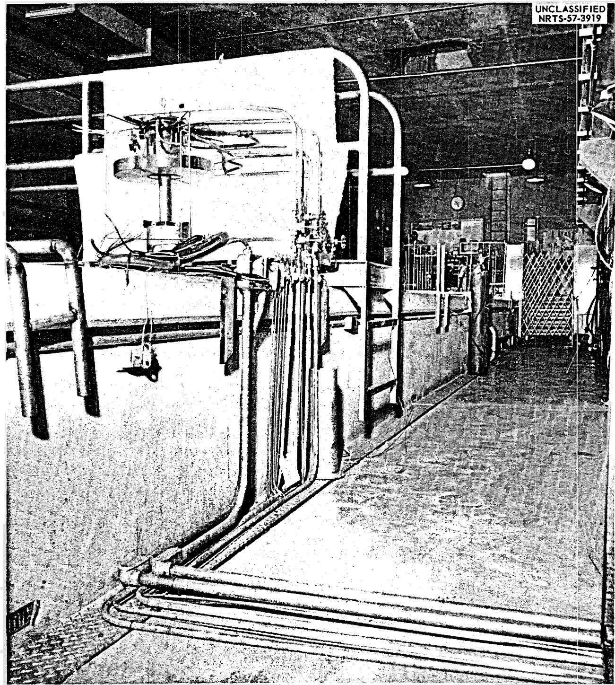  
Fig. 1.2.1. Reactor Fuel Pump Rotary Element Irradiation Installation in MTR Canal.

per pump, with $\frac{1}{2}$ in. of fuel in the expansion tank, were $\pm 0.5$ psi for the pump discharges and $\pm 0.8$ psi for the pump suction.

The performance of one of the fuel pumps was comparable with that obtained in single-pump tests, but the head obtained with the other pump was $7\%$ (2.5 to 3 ft) below that for the single pump at 2700 rpm and 645 gpm. This difference can be explained by minor dimensional differences in the impeller and volute.

Sodium System. - Fabrication of the twin sodium pump loop for testing in the aluminum north head mockup was completed. Preliminary data showed that the system readily degassed with the pumps at equal speeds above 3000 rpm and with the liquid level in the expansion tank above the ports that connect the expansion tank to the pump impeller regions. The pumps shared the pumping load equally when operating at equal speeds. The loop flow resistance was considerably higher than anticipated, with most of the higher resistance being attributable to the sodium-to-NaK heat exchanger pressure drop. Examination revealed that the high heat exchanger pressure drop was caused by blockage of inlet and flow passages by flakes of an epoxy resin that had been applied to the inner surfaces of aluminum components.

# Fuel Pump High-Temperature-Performance Tests P. G. Smith

The fuel pump high-temperature-performance test loop in which $\mathsf{NaF - ZrF_4 - UF_4}$ (50-46-4 mole $\%$ fuel 30) is circulated was placed in operation again on June 26, 1957, and has since been operating continuously. For this series of tests a nuclear radiation thermal barrier was assembled with the pump rotary element in order to simulate, as nearly as practicable, the temperature distribution at reactor zero power operation during priming and purge tests; a bubble-type liquid-level indicator was installed in the pump fuel-expansion tank; and four of the seven Moore pressure-measuring devices were replaced with Taylor instruments.

The head-vs-flow performance tests at 2400, 2700, and 3000 rpm were repeated, and the disparity in total head between the tests with fuel and with water was again found to be 1 ft, as previously reported. The total head obtained

with fuel at flow rates of 450 to 950 gpm ranged from 2 ft below that obtained with water to 3 ft above. The head-vs-flow performance curves obtained with fuel are presented in Fig. 1.2.2.

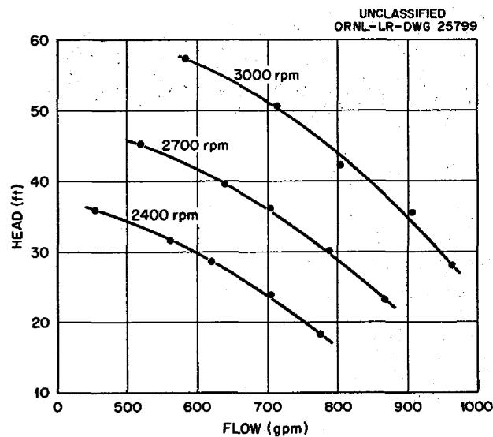  
Fig. 1.2.2. Head-vs-Flow Performance Curves for an ART Fuel Pump Circulating Fuel 30 in a Test Loop. (Secret with caption)

Cavitation tests at different operating conditions (600, 645, and 700 gpm at 2400, 2700, and 3000 rpm) made during the previous quarter were repeated. From the data obtained, curves showing the minimum surge tank gas pressure and the minimum suction pressure vs flow for cavitation-free operation were plotted (Fig. 1.2.3).

Priming tests were made with the fuel at a temperature of $1200^{\circ}\mathrm{F}$ after having filled the loop to levels of $0, \frac{9}{16}, 2,$ and 3 in. above the expansion tank floor with the pumps stopped. In all cases in which the fuel was above the floor of the expansion tank, the pump primed and gave full head and flow performance. Without fuel above the floor of the tank the pump head was about 4 ft low. During these tests the effects of $\mathsf{ZrF}_4$ vapor on pump performance were investigated at various liquid levels in the expansion tank and for various shaft-annulus helium-purge flow rates. With the pump stationary, a purge of 500/liters of helium per day down the pump shaft was maintained for 46 hr without fuel above the expansion tank floor, a purge of 50 liters/day was maintained for 71 hr

with the fuel $9_{16}$ in. above the floor of the expansion tank, and a purge of 50 liters/day was maintained for 24 hr with fuel at the 2- and 3-in. levels in the tank. During each of these tests the pump was rotated by hand one turn each hour. No detrimental effects on pump mechanical or hydraulic performance were noted that could be attributed to $\mathsf{ZrF}_4$ vapor.

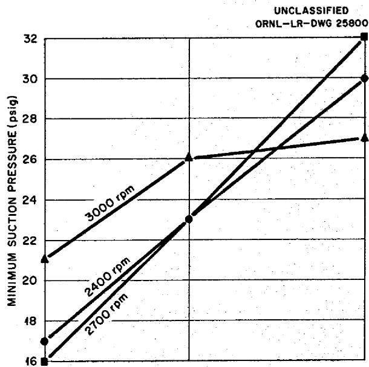

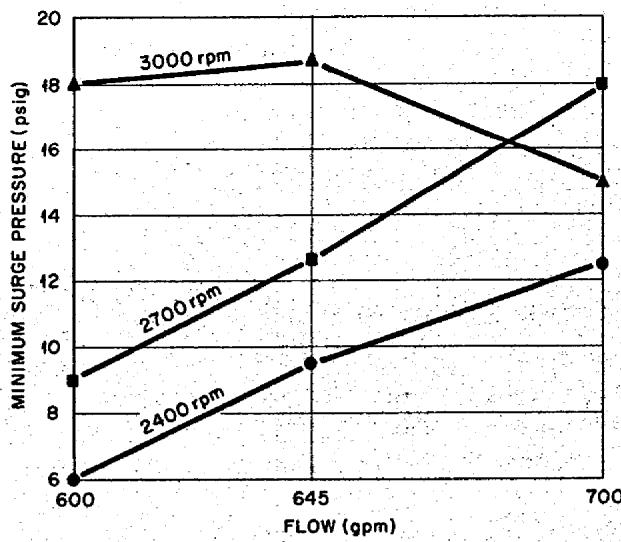  
Fig. 1.2.3. Curves Showing Minimum Surge and Suction Pressures vs Flow for Cavitation-Free Operation of an ART Fuel Pump with Fuel 30. (Secret with caption)

The bubble type of liquid-level indicator was used intermittently during these tests, and the level indications agreed with those of two spark plug probes to within $\frac{1}{16}$ in.

# Fuel Pump Endurance Tests

P. G. Smith

The fuel pump being tested for endurance with fuel 30 as the circulated fluid was stopped on June 4, 1957, after 3550 hr of operation. The wetted portions of the pump had been thermally cycled 652 times between 1100 and $1400^{\circ}\mathrm{F}$ . The pump lower-seal oil-leakage rate continued to be $5\mathrm{cm}^3/\mathrm{day}$ , and there was no measurable leakage from the upper seal. Examination of the impeller revealed that it had been operating in a region of cavitation (Fig. 1.2.4). Data on input power at 2700 rpm vs pump surge tank helium pressure, which were obtained at the midpoint and at the end of the test, are plotted in Fig. 1.2.5. The slight difference in the maximum power input in these two runs may be attributed to the nonreproducibility of the instruments used for obtaining the power data. The 4- to 6-psig range of surge tank pressures during this test was below that required for cavitation-free operation.

Disassembly of the hydraulic drive motor revealed failure of the output shaft bearings prior to termination of the test. The pump and the test stand will be put back into operation for further endurance testing in the near future.

# Primary and Auxiliary NaK Pump Development

H.C.Young J.N.Simpson

The primary NaK pump test that was terminated during the previous quarter when the NaK level in the pump tank rose and flooded the oil catch basin has been examined in order to determine the cause of the operating difficulties encountered. The examination of the lower seal has indicated that grease formed by the interaction of NaK vapor and oil clogged the seal loading springs and eventually inhibited their operation. When the seal faces separated, possibly because of normal pump vibrations or because of an increase in the

UNCLASSIFIED PHOTO 28996

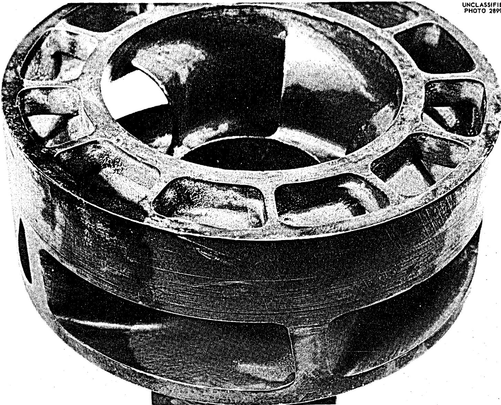  
Fig. 1.2.4. Impeller of Fuel Pump That Was Endurance Tested with Fuel 30 at 1100 to $1400^{\circ}\mathrm{F}$ for 3550 hr. (Secret with caption)

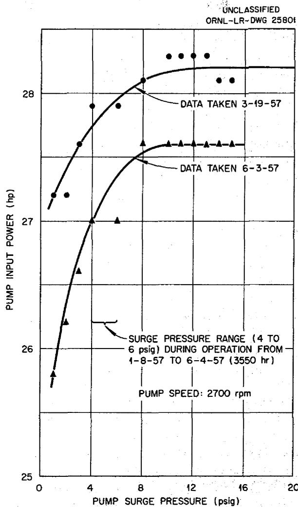  
Fig. 1.2.5. Input Power vs Surge Pressure for Fuel Pump Operating with Fuel 30. (Secret with caption)

pump tank gas pressure to above the lube oil pressure as a result of vaporization of the oil that leaked into the NaK, the clogged springs were unable to reset the seal faces and thus more oil leaked into the NaK. Further development work on the seal region of the pump is planned in an effort to eliminate these seal problems.

After removal of the pump from the test loop (No. 1), a cover plate was installed on the pump tank opening, the atmosphere was changed to argon, and the loop was left for three weeks before it was opened. An explosion occurred inside the loop approximately 45 sec after removal of the throttle valve. NaK sprayed through the throttle valve opening and caused a lost-time injury. As a result detailed loop cleaning procedures were prepared

for this and subsequent loop cleaning. The results of tests of the reaction of NaK and lubricating oil that were made in order to investigate the cause of the explosion are reported in Chap. 2.5, "Analytical Chemistry."

Since the oil leakage might have carburized the Inconel components of the test loop, Inconel samples were taken from several areas and submitted for metallurgical examination. The maximum depth of carburization was found to be 0.005 in., which was not considered sufficient to be harmful in further test operations. The loop has been cleaned and reassembled and is to be put back into operation.

Operation of NaK pump hot test loop No. 2 was stopped for removal of four of the first set of $3 \frac{1}{2}$ in.-IPS electromagnetic flowmeters inserted for calibration and installation of four uncalibrated flowmeters. When an attempt was made to resume operation of the loop, it was found that the main loop flow was restricted to very low values, that is, 100 to 150 gpm at 3550 rpm with the throttle valve wide open. Heating of the loop to nearly $1200^{\circ} \mathrm{F}$ finally restored full flow. The only subsequent interruption of loop operation has been an unscheduled shutdown for replacement of the cold trap because water was leaking from a ruptured cooling coil into the loop drip pan. It is believed that the thermal shock that occurred when a full stream of cold water $(60^{\circ} \mathrm{F})$ was admitted to the cooling coil while the cold trap was at a fairly high temperature $(450^{\circ} \mathrm{F})$ hastened cooling coil failure. A nozzle was therefore devised to admit a controlled water-air mixture to the cooling coil. The nozzle has proved useful in effecting a gradual transfer of the cold-trap cooling load from air to water on all NaK pump hot test loops, and its use has been suggested for the ETU cold traps. The total operating time for the pump in loop No. 2 is 1850 hr, which brings the total running time for primary NaK pumps operating with NaK at elevated temperatures to 6250 hr.

Auxiliary NaK pump hot test loop No. 1 was converted to operation with hot NaK (56% Na) during the previous quarter. The initial operation of this loop has been devoted to a study of the oxide level in a new NaK loop operating at an elevated temperature. The test loop is constructed mainly of 4-in. sched-40 Inconel pipe, and it holds approximately 42 gal of NaK. For the oxide-level study the loop was heated to $1500^{\circ}\mathrm{F}$ without cold

trapping of the NaK, the cold trap being insulated and uncooled, and plug-indicator break temperatures were recorded as a measure of the oxide level in the NaK. Data on plug-indicator break temperatures were also taken to observe changes in the oxide level caused by draining the $1500^{\circ}\mathrm{F}$ NaK into the system dump tank, cooling the NaK and the loop to room temperature, slowly refilling the loop, and reheating the NaK and the loop to $1500^{\circ}\mathrm{F}$ . This process was repeated twice. The data obtained in these tests are presented in Fig. 1.2.6. The plug-indicator electromagnetic flowmeter only occasionally showed a sharp decrease (break) in flow for a particular plugging screen temperature during an oxide determination run, and thus the break temperatures are shown as ranges in Fig. 1.2.6 rather than as points. Decreases in the break temperatures with time may be seen at loop NaK temperatures of 1200 and $1500^{\circ}\mathrm{F}$ and for each dump-tank cooling process. The initial operation at a NaK temperature of $1500^{\circ}\mathrm{F}$ showed an average break temperature of $1250^{\circ}\mathrm{F}$ (extrapolated to $1350\mathrm{ppm}O_2$ ) and the final test run at $1500^{\circ}\mathrm{F}$ showed a break temperature of $900^{\circ}\mathrm{F}$ ( $575\mathrm{ppm}O_2$ ). The first break temperature for operation at a NaK temperature of $1200^{\circ}\mathrm{F}$ was approximately $1175^{\circ}\mathrm{F}$ ( $1275\mathrm{ppm}O_2$ ) and the last break temperature for operation at $1200^{\circ}\mathrm{F}$ was $700^{\circ}\mathrm{F}$ ( $225\mathrm{ppm}O_2$ ). The process of draining the hot NaK into the dump tank and cooling it there to room temperature reduced the oxide concentration in the system NaK. The oxide level decreased with time during the initial operation at $1500^{\circ}\mathrm{F}$ and increased with time during operation at $1500^{\circ}\mathrm{F}$ after the 346th hr of operation. Since the completion of the oxide-level study, 500 hr of high-temperature operation has been accumulated with this pump test loop. Head, flow, speed, power, and cavitation data for the pump will be taken during the next quarter.

Auxiliary NaK pump hot test loop No. 2 was placed in hot operation during the quarter, and calibration of the first set of 2-in.-IPS electromagnetic flowmeters for the ETU and the ART was completed. Four of the calibrated flowmeters were removed and replaced by four uncalibrated flowmeters. During the shutdown a defective liquid-level probe was removed for replacement and carbon deposits were found on it. The pump was therefore removed for inspection, and a lower seal was found to be contaminated in a manner similar to that

found on the primary NaK pump; that is, the seal-face loading springs were clogged with grease. The pump was cleaned, reinstalled, and calibration of the second set of 2-in.-IPS electromagnetic flowmeters will begin early next quarter. At shutdown for replacement of the flowmeters, 1070 hr of hot operation had been logged on this test loop that brought the total hot operating time for auxiliary NaK pumps to 1370 hr.

# REACTOR COMPONENT DEVELOPMENT TESTS

D. B. Trauger

# Heat Exchanger and Radiator Development Tests

J. C. Amos

R. L. Senn

D. R. Ward

A summary of heat exchanger and radiator test operations during the quarter is presented in Table 1.2.1. The small heat exchanger stands were shut down for installation of fest pieces.

The semicircular heat exchanger shown in Fig. 1.2.7, which was designed to simulate the tube stresses of the ART main heat exchanger, is currently being installed in small heat exchanger test stand B, and test operation is to start early next quarter. A description of this heat exchanger and the test objectives were presented previously.[7]

A 25-tube heat exchanger, type SHE-7, $^{8}$ fabricated by the Process Engineering Corp. and designated No. 4, has been installed for testing with the fuel mixture NaF-ZrF $_4$ -UF $_4$ (56-39-5 mole %, fuel 70). This test will be a repetition of the previous test which was interrupted prematurely after 1438 hr of operation by failure of York Corp. radiator No. 16 (for details see Chap. 3.6, this report).

A Black, Sivalls & Bryson intermediate heat exchanger No. 3 (type IHE-8), which was installed in test stand B, had survived 168 thermal cycles and 421 hr of high-temperature operation when the test was terminated by failure of the furnace inlet line. Daily spectroscopic analyses of fuel samples for potassium from the NaK system, which was at a higher pressure than that of the fuel system, revealed no evidence of leakage. A first-approximation thermal-stress calculation had predicted a

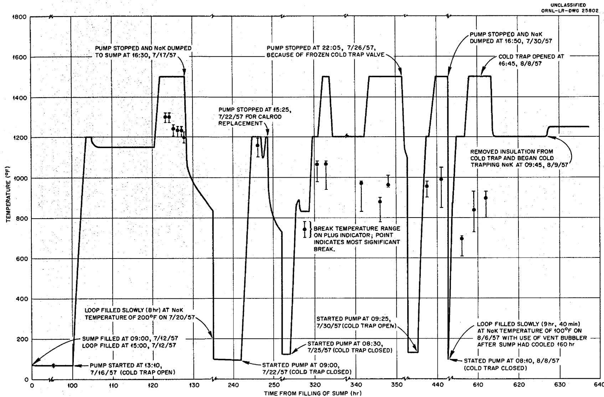  
Fig. 1.2.6. Results of a Study of the Oxide Level in the NaK Used in the Startup of a New Inconel Loop for High-Temperature Pump Tests with NaK. Auxiliary pump test loop No. 1.

Table 1.2.1. Summary of Heat Exchanger and Radiator Operations (As of September 4, 1957)   

<table><tr><td>Test Unit</td><td>Test Stand</td><td>Hours of Operation at ART Design Temperature or Above</td><td>Hours of Nonisothermal Operation</td><td>Total Hours of Operation</td><td>Number of Thermal Cycles</td><td>Status of Test</td></tr><tr><td>Black, Sivalls &amp; Bryson heat exchanger No. 2 (type IHE-8)</td><td>IHE-B</td><td>671</td><td>800</td><td>2122</td><td>173</td><td>Terminated because of NaK furnace failure</td></tr><tr><td>Black, Sivalls &amp; Bryson heat exchanger No. 3 (type IHE-8)</td><td>IHE-B</td><td>168</td><td>253</td><td>1131</td><td>168</td><td>Terminated because of NaK furnace failure</td></tr><tr><td>York Corp. 500-kw radiators Nos. 11 and 12</td><td>IHE-B</td><td></td><td>800</td><td>2122</td><td>173</td><td>Terminated because of NaK furnace failure</td></tr><tr><td>York Corp. ART test radiator No. 1</td><td>IHE-C</td><td>73</td><td>480</td><td>870</td><td>9</td><td>Terminated because of radiator failure</td></tr><tr><td>York Corp. ART test radiator No. 2</td><td>IHE-C</td><td>100</td><td>140</td><td>285</td><td>39</td><td>Test continuing</td></tr></table>

life of 35 to 45 cycles for this test, which was phase II of a program previously described. Each thermal cycle consisted of the following conditions, as achieved experimentally: 42 min of steady-state operation at $1200^{\circ}\mathrm{F}$ , isothermal; transition to power over a 50-min period; 40 min of steady-state operation at power; and transition to $1200^{\circ}\mathrm{F}$ isothermal operation over an 18-min period. Conditions during power operation were the same as for phase I, and the transition to power was at a constant rate of temperature change. The transition from power operation to isothermal operation was accomplished as fast as the thermal inertia of the test stand would permit, and the resultant rate of temperature change at the NaK inlet header of heat exchanger No. 3 ranged from $71.5^{\circ}\mathrm{F} / \mathrm{min}$ starting at $1700^{\circ}\mathrm{F}$ to a final rate of $12.5^{\circ}\mathrm{F} / \mathrm{min}$ between 1300 and $1200^{\circ}\mathrm{F}$ . Black, Sivalls & Bryson heat exchanger No. 2, which also was operated during phase I of this test, had been thermally cycled 173 times. Phase I included 503 hr of steady-state operation with a maximum NaK temperature of $1700^{\circ}\mathrm{F}$ . At the time of failure, the NaK furnace had operated for a total of 5329 hr, including 671 hr at a maximum tube temperature of $1750^{\circ}\mathrm{F}$ . Since the furnace was designed for 3000 hr

at a maximum NaK temperature of $1590^{\circ}\mathsf{F}$ , it must be replaced before further testing can be done in this stand. Because of the ensuing time delay, the heat exchangers are being removed for examination and will not be tested to failure.

The test of York Corp. ART test radiator No. 1 was terminated after 870 hr because of a leak in the tube matrix approximately $\frac{1}{4}$ in. from the NaK inlet header in a tube near the center of the fourth row from the air outlet side of the radiator, as shown in Fig. 1.2.8. The leak was noted immediately following the first power cycle, and rapid shutdown was effected to limit damage to the unit. Even so, the tube that leaked was damaged sufficiently by fire to destroy evidence that would indicate the nature of the failure. Metallurgical examination of 16 tubes, four of which were in the in the immediate vicinity of the tube that failed, did not reveal a cause for the leak. There were no incipient cracks and no defects in damaged areas, and no impurities were evident (for details of the examination see Chap. 3.6, this report). Inspection of assembled ART prototype radiators Nos. 2 and 3 will be even more rigid that the quite thorough inspection of unit No. 1. Heat transfer performance, air pressure drop, and the increase in the NaK circuit pressure drop for radiator No. 1, as well as for radiator No. 2, which is now being tested, are in agreement with design values.

UNCLASSIFIED PHOTO 29722

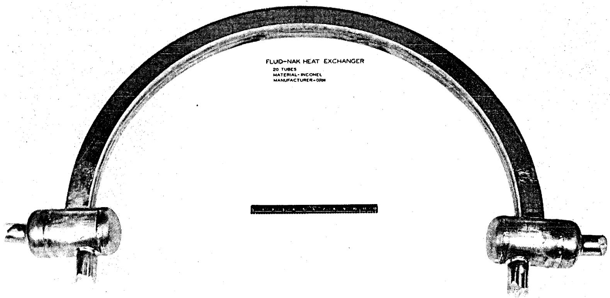  
Fig. 1.2.7. Twenty-Tube Semicircular Heat Exchanger Type SHE-9.

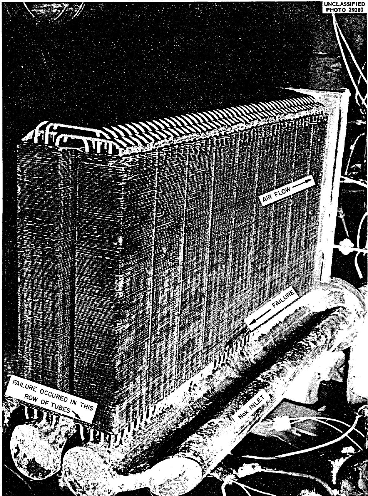  
Fig. 1.2.8. ART Test Radiator No. 1. (Confidential with caption)

During radiator removal and replacement, extreme care was exercised to maintain an inert atmosphere on the test loop. The ART-type circulating cold trap was drained but not cleaned. In order to prevent oxide remaining in the cold trap from returning to the system, the cold trap was water-cooled at the design NaK flow during the heatup period. This procedure is contrary to the previous startup procedure of allowing the cold-trap temperature to increase with the system temperature, cooling the cold trap with air until water can be introduced safely, and then bringing the cold-trap temperature down. There was no indication of the oxide plugging formerly observed when the cold-trap system was kept cold during preheating of the system. When the system reached $1200^{\circ}\mathrm{F}$ , a plug-indicator reading indicated a system oxide saturation level of approximately $600^{\circ}\mathrm{F}$ ; 48 hr later this level had been reduced to below the sensitivity of the plug indicator $(300^{\circ}\mathrm{F})$ . This startup procedure demonstrated that if adequate care is exercised to prevent oxidation of residual NaK when a system is cut open, the cold-trap circuit need not be replaced prior to restarting system operation.

The excellent performance of the cold trap in the IHE-C test stand has led to elimination of plug indicators from the ETU and ART. During both the initial startup and the restarting of the system, the temperature limitations imposed on the ART by the permissible beryllium temperatures were adhered to closely. This included establishing a temperature gradient in the radiator before the system temperature necessary for oxide cleanup of the new piping had been reached. Plug-indicator readings were taken to confirm that low oxide levels had been achieved but were not utilized in planning the steps in the operation. Elimination of these devices and their associated equipment and instrumentation should effect a substantial saving for the reactor facilities.

# Valve Development Tests

J.A. Conlin

I. T. Dudley A. G. Smith, Jr. $^{10}$

Fuel Dump Valve. - Tests of the fuel dump valve designated ORNL-1, which was described previously,[11] were terminated after 1500 hr at $1300^{\circ}\mathrm{F}$ and 910 hr at $1500^{\circ}\mathrm{F}$ . During the test at

$1500^{\circ}\mathrm{F}$ a steady increase was noted in the force required to open the valve. The force required increased from 865 lb immediately after the 500-hr closure period to 2100 lb following 400 additional hours of cycling at 24-hr intervals. There was no measurable leakage during the test at $1500^{\circ}\mathrm{F}$ . Examination showed that galling had occurred between the Stellar-coated valve stem and the Inconel bonnet at the outer stem guide where the surfaces were near $1500^{\circ}\mathrm{F}$ and were exposed to the atmosphere. The valve was in excellent condition in all other respects, including the Kentanium 151A seat and plug, and is considered to be entirely satisfactory for service at $1300^{\circ}\mathrm{F}$ .

A second test valve (designated ORNL-2) which also incorporates the guided-plug feature, has been assembled. This valve, except for the valve plug cermet configuration and the omission of the sodium cooling jacket, is identical to the proposed ART fuel dump valve. The plug and seat, respectively, are the cermets Kentanium KM and K-162B, the materials now ordered for the ART valves; however, the plug cermet does not incorporate the mechanical retaining feature of the ART valve, since the new pieces are not yet available. The valve includes a double bellows to minimize the chance of fission-gas release in the event of a bellows rupture in the ART and a K-162B bonnet guide against a Stellarite-coated stem to eliminate the galling which occurred in the ORNL-1 valve. A test is scheduled to start early next quarter. The pressure drop characteristics of this type of valve when fully open are given in Fig. 1.2.9; the data presented were obtained from water tests. The ART valve pressure drop characteristics should be the same as those given in Fig. 1.2.9.

NaK Dump Valve. - The first prototype NaK valve11 received from Black, Sivalls & Bryson was tight when tested with water, but it leaked badly when tested in NaK. The valve was disassembled and stress relieved, but there was no improvement until it was rapped with a hammer during a stress-relieving cycle. It was then tight with water and initially with NaK at the test temperature of $1000^{\circ}\mathrm{F}$ . The leakage increased rapidly with time, however, and was soon unacceptably large. Although small scars have been

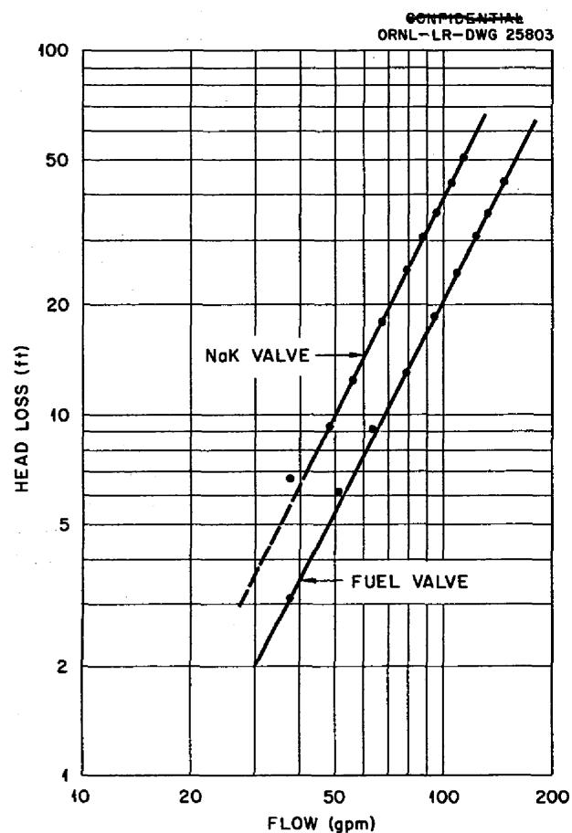  
Fig. 1.29. Pressure Drop Characteristics Observed in Water Flow Tests of ART Prototype NaK and Fuel Dump Valves. (Secret with option)

observed on the seat and poppet, the erratic results appear to be due to weld or thermal stress distortions. The fuel valve, which had not exhibited this type of behavior, has a more massive end connection and a separate seat insert which is brazed to the body in a configuration which should minimize strains. The NaK valve is being redesigned to provide similar relief as well as to accommodate cermet seats if this proves to be necessary. Water flow resistance was also measured for this valve, as shown in Fig. 1.2.9.

"In-Line" Valve Actuator Test. - The NaK valve "in-line" actuator11 operated satisfactorily throughout a 3000-cycle test after revision to provide for locking of the spring load adjustment nuts and correction of other minor defects.

NaK Cold Trap Throttle Valves. - The NaK cold-trap throttle valve configuration has been

established, and the required valves were delivered for the ETU. Modification of the remaining valves required for the ETU and ART is in progress.

# Sodium Circuit Water Flow Tests

J.A.Conlin S.Kress12

Two tests run during this quarter brought to completion the water flow distribution and head loss examinations of various regions of the ART sodium circuit. A test was conducted in order to determine the proper size for an orifice in the control rod sodium cooling passage circuit to limit flow through that circuit to 0.032 cfs with the island flow at its design value of 0.697 cfs. The test piece simulated the control rod passage below the thimble and included the Inconel shoulder which screws into a threaded recess at the bottom of the island. Four $5_{16}$ -in.-thick orifices were tested which had inside diameters of 0.250, 0.375, 0.500, and 0.625 in. and which were machined to fit snugly into a 1.422-in.-dia section at a transition to a 0.9-in.-ID passage. The head loss vs flow relationship for each orifice was correlated in terms of a loss coefficient, $K$ , defined from the relationship

$$
\Delta H = K V ^ {2} / 2 g
$$

where $\Delta H$ is the head loss (in ft) across the orifice, $V$ the velocity (in fps) through the 0.9-in.-ID passage, and $g$ is the proportionality constant relating force to mass and acceleration. The loss coefficients are shown in Fig. 1.2.10 as a function of orifice diameter.

The second water test was a study of the sodium flow divider in the volute elbows located at each ART sodium pump discharge nozzle. These dividers split the sodium flow from the pumps, direct a portion downward into the reflector, and direct the remainder up to the island entrance region. It is estimated that to obtain the design reflector-to-island flow ratio of 2.2 at a sodium pump flow of 1.106 cfs, the head loss on the island leg of the flow divider should be 8 ft greater than that on the reflector leg. The purpose of this test was to determine the proper position for the flow divider tongue and to determine the magnitude of the head loss through each leg. The test piece, shown in Fig. 1.2.11, duplicated the ART component dimensionally, except for the flow divider tongue adjustment. A diagram of the test piece as installed in

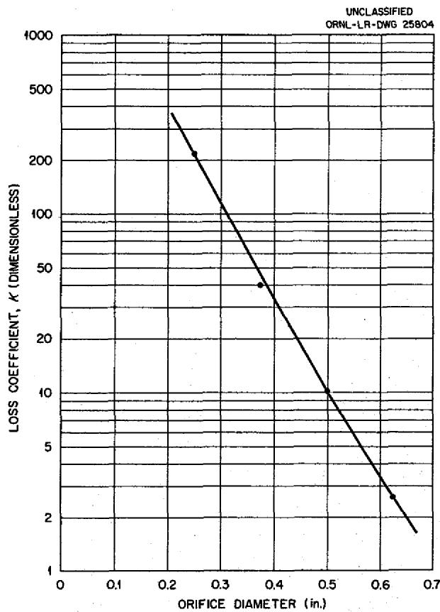  
Fig. 1.2.10. Results of Tests for Determining Proper Size of Orifice in ART Control Rod Cooling Passage. (Secret with caption)

the test stand is shown in Fig. 1.2.12. Data were obtained at each flow divider tongue position (A, B, C, and D of Fig. 1.2.11) to determine the total head loss through each leg of the test piece, the flow ratio between the reflector and island, and the entrance velocity head. The head losses were correlated with the entrance velocity by loss coefficients defined as stated above. The loss coefficients obtained are plotted in Figs. 1.2.13 and 1.2.14 as functions of the flow ratio and the tongue position.

The head difference between the reflector and island legs of the flow divider at the design flow and flow ratio is shown as a function of the flow divider tongue position in Fig. 1.2.15. Position A of the flow divider tongue gives approximately the

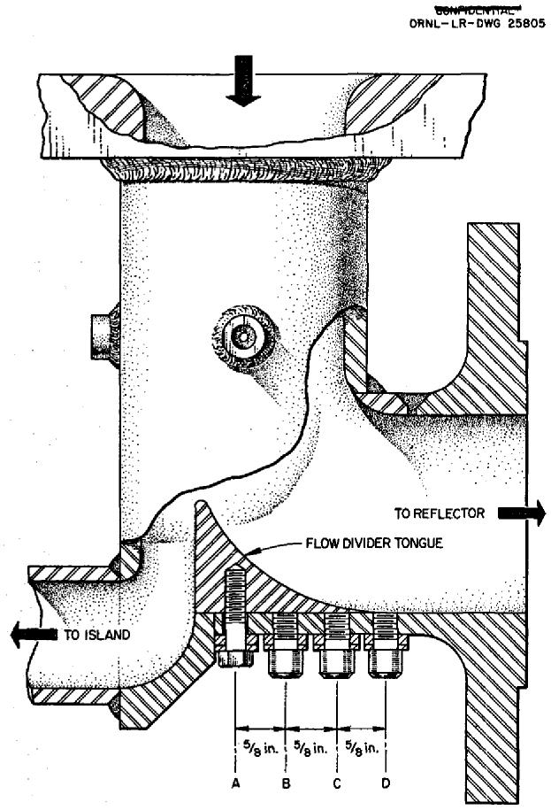  
Fig. 1.2.11. ART Sodium Pump Volute Test Section Showing the Test Positions of the Flow Divider (A, B, C, D). Divider shown in position A.

required head difference and also results in the lowest net head loss.

# Outer Core Shell Thermal Stability Test

J.C.Amos R.L.Senn

The second test of a one-fourth-scale outer core shell model for determining dimensional stability under thermal cycling conditions was terminated after 339 cycles. The test period was extended beyond the scheduled 300 cycles since no changes were noted in fluid circuit resistances. Loss of lubricating oil flow to the cold sodium loop pump necessitated shutdown of the system, and the test piece was removed for examination. Visual inspection has disclosed no damage to the core shell,

GONPDENTHAL

ORNL-LR-DWG 25806

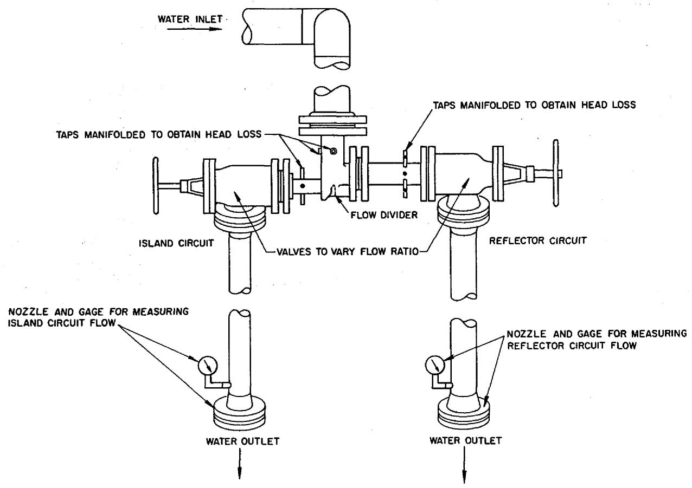  
Fig. 1.2.12. Apparatus for Water Flow Tests of Volute of ART Sodium Pump.

and it is currently being measured to determine whether any dimensional changes occurred during the test. The core shell model and the test conditions were described previously.[13,14] The shell will next be subjected to an extended creep buckling test at $1500^{\circ}\mathrm{F}$ by using an external helium gas pressure of 52 psi.

# Liquid-Metal-Vapor Condensers

J.A.Conlin A.G.Smith, Jr.

The sodium vapor condenser for the sodium-pump purge-gas vent system has satisfactorily completed a 1500-hr performance test in a system in which 1000 liters of helium per day was being bubbled

through sodium held at $1200^{\circ}\mathrm{F}$ . The condenser consists of 7 ft of $\frac{3}{4}$ -in. pipe inclined at an angle of 5 deg to the sodium-pump helium vent line. The condenser temperatures, which were lower than those used previously in order to obtain more complete vapor removal, were $730^{\circ}\mathrm{F}$ at the inlet, $330^{\circ}\mathrm{F}$ at the midpoint, and $90^{\circ}\mathrm{F}$ at the outlet end. In the previous tests these temperatures were 810, 470, and $90^{\circ}\mathrm{F}$ , respectively. Upon sectioning of the

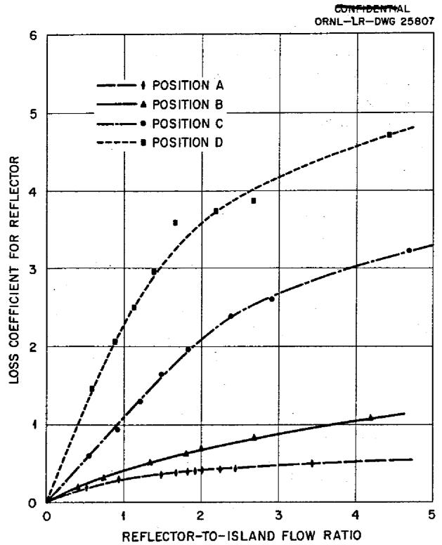  
Fig. 1.2.13. Reflector Loss Coefficient vs Reflector-to-Island Flow Ratio and Flow Divider Tongue Position.

condenser, it was found that only small droplets of sodium had reached the outlet end. The inlet end contained some condensed sodium that had been frozen and trapped in the condenser.

The NaK vapor condenser for the NaK pump purge vent, a vertical 2-ft section of 2-in. pipe filled with Demister packing, was satisfactorily tested with NaK for 1500 hr under the same flow and temperature conditions as those used for the test of the sodium pump condenser. Upon termination of the test, a very small quantity of NaK was observed in the condenser outlet gas line. The condenser packing was covered with very small droplets and fine stringers of NaK.

The prototype NaK dump tank vent condenser, consisting of a vertical 12-in. section of 2-in. pipe at the inlet or lower end followed by a 12-in. section of 6-in. pipe filled with Demister packing at the outlet or upper end, which was tested under simulated NaK dumps at $1200^{\circ}$ F and proved to be

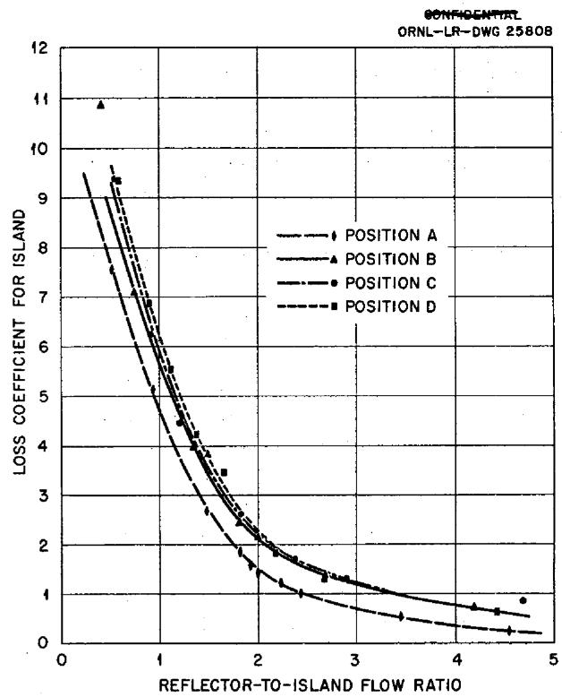  
Fig. 1.2.14. Island Loss Coefficient vs Reflector-to-Island Flow Ratio, and Flow Divider Tongue Position.

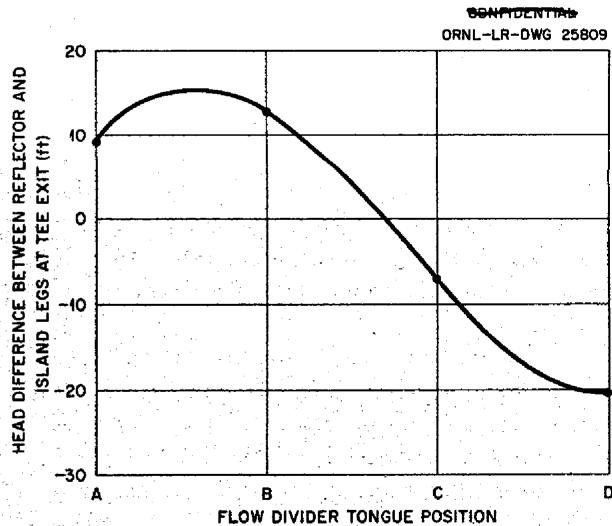  
Fig. 1.2.15. Head Difference Between Tee Exits vs Flow Divider Tongue Position for a Reflector-to-Island Flow Ratio of 2.2 and an Entrance Velocity Head of 11.43 ft.

99.9% efficient in removing NaK vapor,15 was sectioned and found to have fine droplets of NaK on the Demister packing similar to those found in the NaK pump condenser. As a result of these tests the development work on the NaK and sodium pump and NaK dump tank condensers is considered to be complete. The NaK pump condenser is presently in use in conjunction with NaK pump tests to obtain further information on its performance in actual service.

# Zirconium Fluoride Vapor Traps

J.A.Conlin A.G.Smith, Jr.

Plugging of the zirconium fluoride vapor trap inlet16 was alleviated by increasing the outer-wall temperature of the inlet pipe to $1600^{\circ}\mathrm{F}$ , and the test was continued to completion. The test included 500 hr of continuous operation at a helium flow rate of 5000 liters/day from a fuel sump maintained at $1200^{\circ}\mathrm{F}$ and 50 cycles of 30 sec duration at a helium flow rate of 10 scfm from fuel at $1300^{\circ}\mathrm{F}$ . There was no observable carryover of $\mathsf{ZrF}_4$ to the off-gas line downstream of the trap. Light powdery $\mathsf{ZrF}_4$ deposits were found on the water-cooled coils in the condenser inlet section and inside the tubes of the rear heat exchanger section, as shown in Figs. 1.2.16 and 1.2.17. In the rear section of the trap, all the tubes were coated with vapor deposits on the inner surface down to and covering the surface of the Demister packing. A section of the packing removed from one of the $1\frac{1}{2}$ -in.-dia tubes is shown in Fig. 1.2.18, and the depth of penetration of the $\mathsf{ZrF}_4$ deposit into the packing may be seen. Although none of the tubes were plugged, the $1\frac{1}{2}$ -in. tubes offered considerable resistance to flow, and the pressure drop across the large tubes was sufficient during simulated dumps to move the packing to the rear of the trap.

The quantity and physical properties of the deposits were considerably different from those of the deposits found previously. A total of 758 g was measured as compared with the 3400 g expected on the basis of previous tests. Densities ranged from 0.55 to 0.88 g/cm³ compared with previous deposit densities of 4 g/cm³; similarly, the thermal conductivity decreased to 0.04 Btu/hr.°F-ff² from

the previous 0.15 Btu/hr. $\mathbb{F}\cdot \mathbb{f}^2$ . The small quantity of $\mathsf{ZrF}_4$ collected indicates that the purge gas was not fully saturated, and modifications are being made in the sump tanks to ensure more complete vapor saturation. The inlet to the trap is also being changed to a conical section to reduce thermal losses and to minimize the need for increased heating of this region, since the temperature range is limited for the ART sodium system, which provides heating and cooling, as required. Additional thermocouples are included in the new test trap to facilitate more precise measurement of the thermal conductivity of the deposited material. This is particularly important, since the final design of the ART trap cannot be established until the volume and thickness of the deposit are established. When the reactor is operating at full power the surfaces will be subject to considerable beta heating from fission gas decay which will limit the deposit thickness as a function of its thermal conductivity.

Other tests are in progress to simulate the effect of beta heating by radiant heating of deposit samples in order to determine the effect the beta heating may have on the physical properties of the deposited material.

# Island Bellows Test

W. B. McDonald

W.H.Kelley, Jr. A.S.Olson

A test of the ART island bellows was undertaken because of the difficulty of accurately predicting by calculational methods the stresses to be expected in this component under service conditions. The test consisted of cycling the bellows under conditions of strain, temperature, pressure, and environment that simulated those of the reactor. In the test the bellows was compressed from normal to 0.090 in. in 5 min, held compressed for 25 min, returned to normal in 5 min, and left in the normal position for 25 min. The test temperature was $1250^{\circ}\mathrm{F}$ , and the pressure on the outside of the bellows was 3 psig for 50 cycles and 20 psig for the remainder of the test. The inside of the bellows was at atmospheric pressure. The fuel mixture $\mathrm{NaF - ZrF_4 - UF_4}$ (50-46-4 mole %, fuel 30) contacted the bellows on the outer surface, and the inner surface was in a helium atmosphere. Sodium was not used inside the bellows because it would have added little to the value of the test

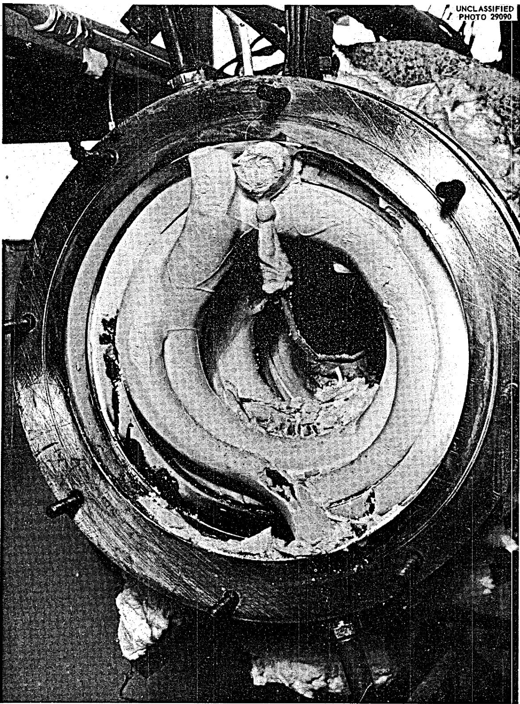  
Fig. 1.2.16. Inlet End of $\mathsf{ZrF}_4$ -Vapor Trap Tested Under Simulated Fuel Dump Conditions. (Geserat with caption)

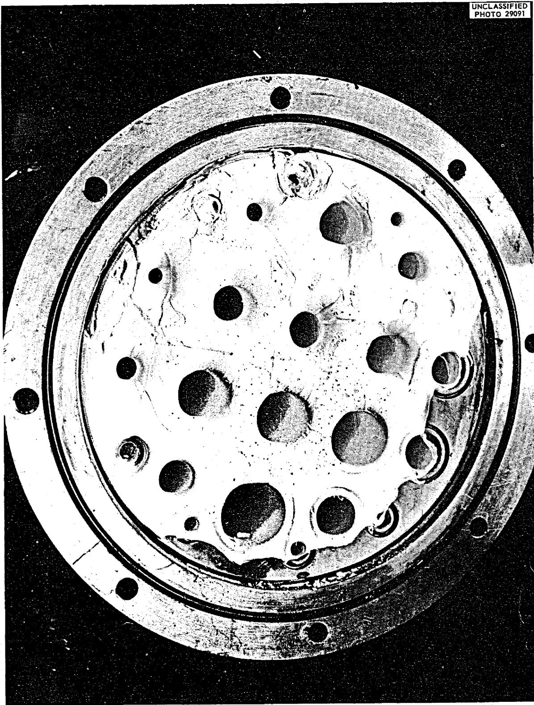  
Fig. 1.2.17. Rear Section of $\mathsf{ZrF_4}$ -Vapor Trap Tested Under Simulated Fuel Dump Conditions. (Secret with caption)

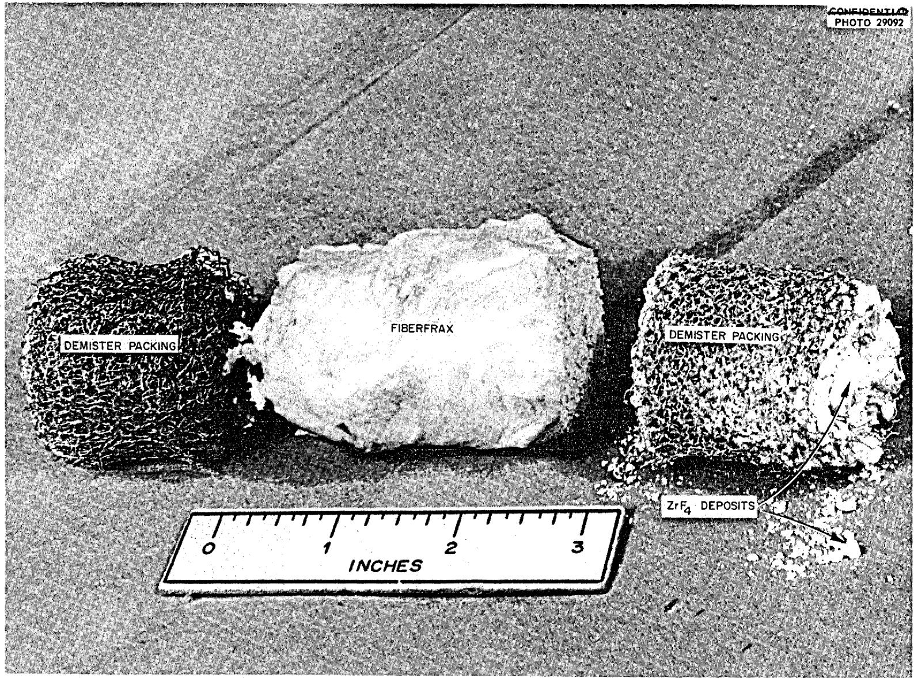  
Fig. 1.2.18. Packing Removed from $\mathsf{ZrF}_4$ -Vapor Trap Tested Under Simulated Fuel Dump Conditions. (Secret with error)

and would have greatly complicated the equipment. The bellows was tested to failure.

The test assembly is shown in Fig. 1.2.19. The bellows was housed in a covered pot which contained the salt bath and a helium blanket over the salt. The bottom of the bellows was welded to the pot, and the top was welded to a thick plate

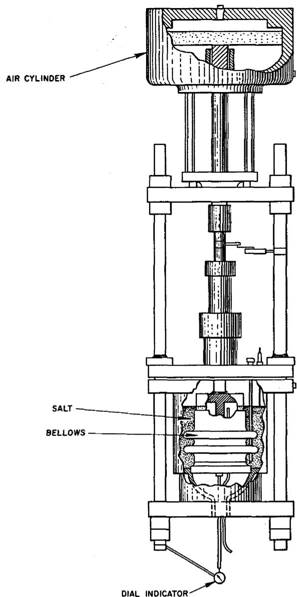  
UNCLASSIFIED ORNL-LR-DWG 25810   
Fig. 1.2.19. Apparatus for Testing ART Island Bellows. (Secret with caption)

that was integral with an actuating stem coupled to an air cylinder. Helium was supplied to the blanket area and to the inside of the bellows. Calrod heaters and thermocouples were installed outside the pot, and the pot was insulated. Instrumentation was provided to properly cycle the bellows and to indicate and to control the pressures and temperature.

A preliminary cold spring-rate test of the bellows, performed to provide information for designing the hot test rig, led to a calculated force of 4900 lb for compressing the bellows 0.090 in. at $1250^{\circ}\mathrm{F}$ . The force actually required during the test was only 2500 lb, which indicated that the bellows had been stressed beyond its elastic limit and had permanently deformed. The bellows leaked after 80 cycles, and subsequent visual inspection showed numerous peripheral cracks in the center convolution at the small diameter of the bellows. These cracks were evident on both the inner and outer surface and obviously had propagated to form the leak. The two-convolution bellows was thus proved to be inadequate for the service conditions.

# Fuel Fill-and-Drain Tank Test

W. B. McDonald

W.H.Kelley, Jr. A.S.Olson

The scheduled operation of the ART may impose stress and temperature conditions on the fuel fill-and-drain tank that are greater than those for which design properties are known with any certainty. This uncertainty and the obvious consequences of a tank failure justify the performance of a test to verify the tank integrity under service conditions.

The test tank is being made as simple as possible while retaining pertinent structural characteristics of the ART tank. The principal change from the ART design is the deletion of one of the two tube sheets and one-half the NaK tubes. NaK will be circulated through the tubes and cooling annuli by a centrifugal pump, and the NaK will be heated by electrical surface heaters on the piping. A heated fuel supply tank to simulate the reactor will be located above the test tank so that the fuel can be displaced from the test tank and be heated. Thus the test tank can be tested under all phases of reactor operation, including filling, enriching, loss of NaK pressure, emergency fuel dumping, and endurance.

All major components for the test are on hand, except the test tank. The test site has been prepared, and the structural steel supporting framework is in place. The pump bowl, fuel supply tank, and NaK dump tank have been installed, and piping subassemblies are complete. The test tank is being fabricated, and bids for the tube-to-tube

sheet brazing have been requested. The tank is scheduled for delivery in December 1957, and efforts are being made to reduce this delivery time by simplifying structural features and construction methods. Control panels are being fabricated, and the remaining instrumentation and electrical design work is being completed.

# 1.3. INSTRUMENT AND CONTROLS DEVELOPMENT

E. R. Mann

C. S. Walker

R.G.Affel

# ART CONTROL ROD DRIVE TEST

E. R. Mann

C. S. Walker

The ART control rod drive test was terminated after 3000 hr of successful operation. During the first 1129 hr of operation, the rod was withdrawn and inserted 1161 times. The withdrawal was at a slow speed, that is, 370 sec for complete withdrawal, and the insertion was at a fast speed, that is, 31 sec for complete insertion, as described previously.

After the initial rod-cycling phase of the test was completed, a series of tests was carried out in which the rod was fixed at positions spaced 5 in. apart for a minimum period of 200 hr at each position. The time periods frequently exceeded 200 hr because the 200-hr interval usually terminated at night or on a weekend rather than during normal working hours. After each nominal 200-hr period, the time intervals required for insertion and for withdrawal were measured in order to determine whether there was any reduction in rod velocity because of sodium having deposited and frozen on the gears. No changes in the speed of insertion or withdrawal of the rod were detected. When the tests in which the rod was held fixed for a 200-hr period were completed, the remainder of the 3000-hr scheduled test was taken up by more rod cycling in a sequence identical to that used during the first phase of the test.

The upper surface temperature of the sodium, which was surrounded by the water jacket, remained constant throughout the test at $230 \pm 10^{\circ}\mathrm{F}$ , except in one instance when failure of a control component allowed this temperature to drop to $150^{\circ}\mathrm{F}$ , which is below the freezing point of sodium. This incident caused no apparent change in performance of any part of the system.

For the first 1800 hr, the recorder for three of the thermocouples attached to the wall of the sodium container was in error by $400^{\circ}\mathrm{F}$ , and these three temperatures were $1650^{\circ}\mathrm{F}$ instead of $1250^{\circ}\mathrm{F}$ . This deviation apparently did no damage to the system.

The rod test system has been dismantled, and samples of the test sodium have been taken for analysis. The Lindsay "mix" rare-earth-oxide control-rod slugs are also being examined, as are the walls of the sodium container. The water side of the heat exchanger is being examined for scale formation. If the results of these examinations are satisfactory, it may be concluded that the ART regulating rod and its actuating equipment have met all the specifications that can reasonably be tested without the actual nuclear tests.

# FUEL-EXPANSION-TANK LIQUID-LEVEL INDICATOR

R. F. Hyland

# Bubbler Plugging Tests

The test apparatus was completed that was being constructed for determining the cause of the plugging of the helium bubbler tubes of the fuel-expansion-tank liquid-level indicator. The apparatus and operating conditions were described previously.2 The system successfully passed a mass spectrometer leak check, and preliminary tests of the oxygen- and moisture-removal systems are under way.

The moisture content of the 200-psi building helium supply was found to be surprisingly variable. Heretofore, spot checks made on the header with an Alnor model 7300 dew-point meter showed an average $\mathsf{H}_2\mathsf{O}$ content of about 0.08 ppm by volume. On the new apparatus, however, a Beckman model 179 electrolytic hygrometer is used, and in one month of continuous monitoring the moisture of the building helium was found to vary between 4.0 and 28.0 ppm by volume. The Beckman instrument responded very well to liquid-nitrogen cold trapping of the helium at all $\mathsf{H}_2\mathsf{O}$ concentrations, while spot checks with the Alnor unit showed no change during the entire monitoring period.

The oxygen content of the 200-psi supply has likewise been continuously monitored for a one-month period with a Baker model SS-2 super sensitive Deoxo indicator. The oxygen content has been found to vary between 12.0 and 14.0 ppm by volume. The internal calibration of this unit was checked with an external electrolytic cell, and the two units agreed to within 2 ppm.

Attempts to remove the small amount of oxygen with hot metal getters have been unsuccessful thus far. One type of getters that consists of copper turnings maintained at $1200^{\circ}\mathrm{F}$ appears to be promising. A 50.0 ppm concentration of $\mathsf{O}_2$ was introduced into the system and was reduced to 14.0 ppm by this getter.

# Aluminum North Head Expansion Tank Tests

Additional tests of the helium-bubbler type of liquid-level indicator were run in the fuel expansion tank of the aluminum mockup of the ART north head in order to further investigate the previously noted level changes that were associated with changes in pump speed. Three bubblers were installed as indicated in Fig. 1.3.1. Typical data obtained during tests with these bubblers are shown in Figs. 1.3.2 through 1.3.5. When the

pump speed was increased, the level at bubbler No. 1 increased and the levels at the bubblers Nos. 2 and 3 decreased. Thus the previously postulated "dishing" effect on the surface in the expansion tank is further confirmed. There is an actual change in level, as indicated by the measuring system. A decrease in pump speed created an opposite and approximately equal effect. These tests were all conducted with a static level of 1.5 in. of water in the expansion tank and with the throttle valve set for design flow at design pump speed.

Attempts to confirm these results by using high-speed photography were inconclusive because of the difficulty of photographing the level through a small viewing port on top the expansion tank. The general direction of the level change, as observed photographically, agreed with that indicated by the measuring system, but it was impossible to determine the magnitude of the change. Improved photographic techniques are to be used in further experiments.

Tests were also run to determine how accurately the level measuring system would respond to a change in level with both pumps at design speed (2700 rpm) and with the system at design flow (645 gpm). Water was accurately metered into and out of the system under static conditions and the

SECRET  
-LR-DWG 25822

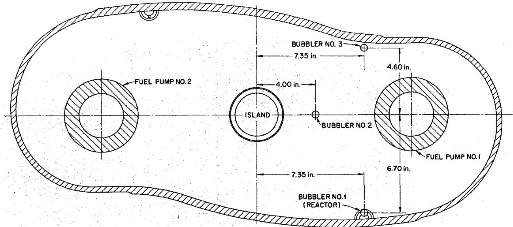  
Fig. 1.3.1. Diagram of Fuel Expansion Tank Showing Locations of Three Helium-Bubbler-Type Liquid-Level Indicators.

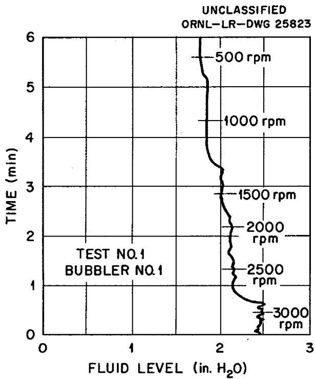  
Fig. 1.3.2. Fluid Level vs Time at Bubbler No. 1 During First Test.

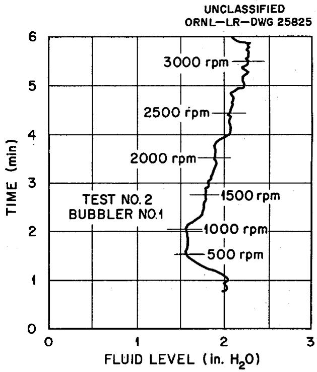  
Fig. 1.3.4. Fluid Level vs Time at Bubbler No. 1 During Second Test.

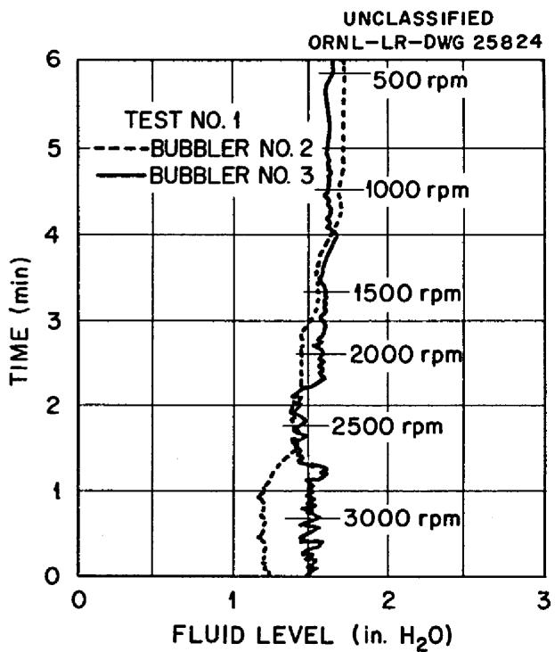  
Fig. 1.3.3. Fluid Level vs Time at Bubblers Nos. 2 and 3 During First Test.

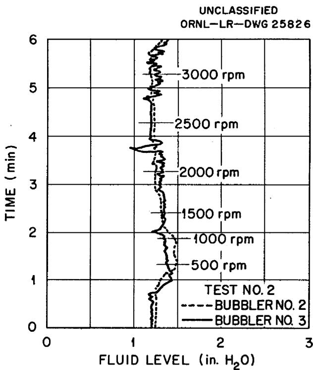  
Fig. 1.3.5. Fluid Level vs Time at Bubblers Nos. 2 and 3 During Second Test.

quantity required to vary the level 1 in. was determined. The same quantity was added or removed with the system at design speed and flow, and typical results are shown in Figs. 1.3.6 and 1.3.7. A peculiarity noted in these tests was that while bubbler No. 1 yielded consistent results, bubbler Nos. 2 and 3 gave erratic and inconsistent results.

It was felt that severe ingassing of the system might seriously affect the accuracy of the bubbler because of its fluid density dependence. Consequently, a test was run in which the system was purposely ingassed, and high-speed photography was used to check the level indicated by the measuring system. The ingassing was accomplished by operating both pumps at 1000 rpm and then shutting off pump No.2. The results obtained are shown in Figs. 1.3.8 and 1.3.9. The indicated increase in level averaged approximately 1.2 in., whereas the increase determined photographically was approximately 0.8 in. No density error is apparent here because the decrease in density caused by the ingassing should have produced a low level indication. Instead, the indicated level was 0.4 in. higher than the photo

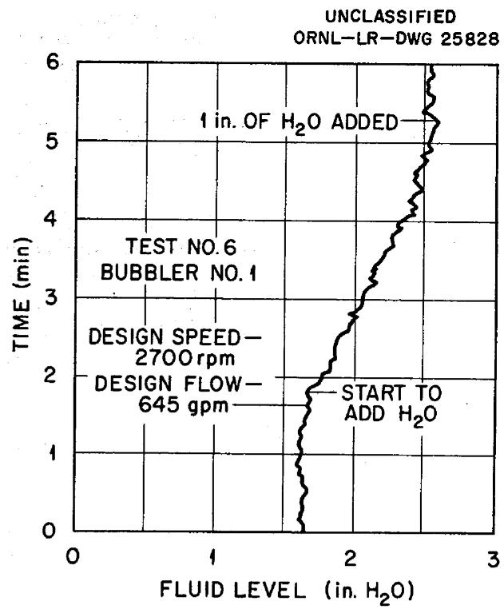  
Fig. 1.3.7. Fluid Level vs Time at Bubbler No. 1 When Water Was Being Added During Sixth Test.

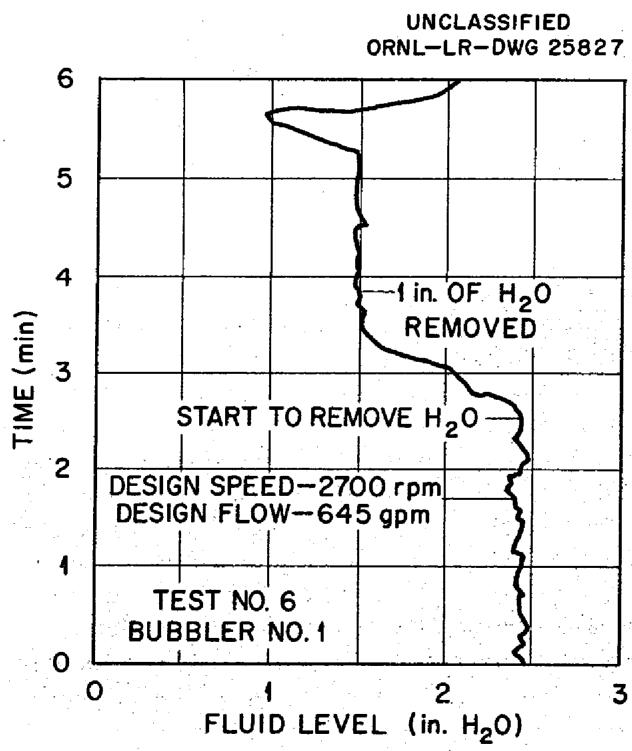  
Fig. 1.3.6. Fluid Level vs Time at Bubbler No. 1 When Water Was Being Removed During Sixth Test.

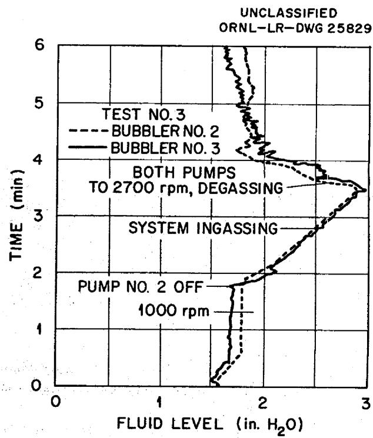  
Fig. 1.3.8. Fluid Level vs Time at Bubblers Nos. 2 and 3 During Third Test.

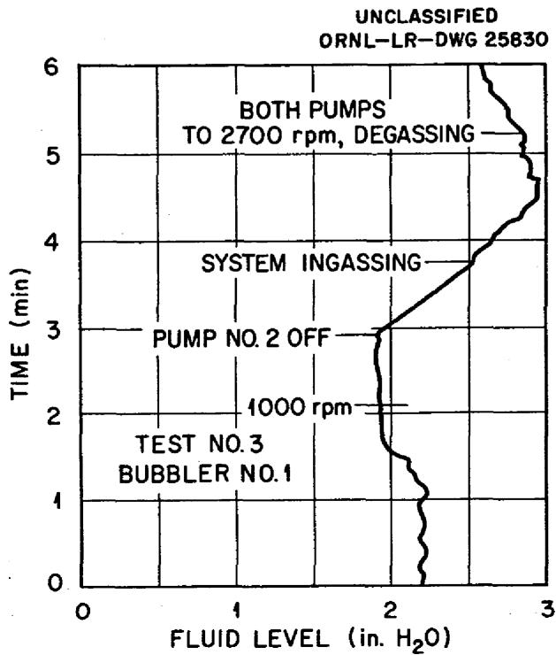  
Fig. 1.3.9. Fluid Level vs Time at Bubbler No. 1 During Third Test.

graphed level. The reason for this error is unknown at this time.

# ON-OFF LEVEL PROBES

G. H. Burger

R. E. Pidgeon, Jr.

In an attempt to eliminate failures of the on-off probes used in NaK pump bowls, the internal copper wire was aluminized to prevent oxidation. However, these level probes continued to fail at high NaK temperatures. Further examination of the defective units showed that the probes failed because of internal oxidation of the copper wires and that such oxidation occurred when the copper-to-Inconel welds were made. To eliminate this type of failure, the probe was redesigned so that the copper and Inconel junction could be brazed instead of being welded. No probes of this design have yet been tested in service.

There are sixteen "on-off" level probes now in use in the gas pots of engineering test loops.

The probes in one auxiliary NaK pump test loop have operated 1640 hr and those in a primary NaK pump test loop have operated 2162 hr without failure. These probes are installed where the NaK temperature is usually below $800^{\circ}\mathrm{F}$ . Six probes are in use in the NaK pump bowls of two of the pumps being tested. As mentioned above, a number of these probes have failed and have been replaced. It is planned to replace all these probes with the redesigned units as soon as they become available following complete testing.

# MAGNETIC FLOWMETERS

G. H. Burger

C. L. Pearce, Jr.

Calibration and testing of the 2- and $3\frac{1}{2}$ -in. magnetic flowmeters for use in the ART and ETU were continued according to the program described previously. Six $3\frac{1}{2}$ -in. units in lot 1 were operated for 770 hr and six 2-in. units in lot 1 for 1078 hr in NaK pump test loops PKP-2 and PKA-2. After termination of the calibration test runs on lot 1, four flowmeters were removed from each loop and replaced by four uncalibrated flowmeters (lot 2). Two $3\frac{1}{2}$ - and 2-in. units from lot 1 were left in the loops for continued testing and to provide reference to lot 1. Thus far the $3\frac{1}{2}$ -in. units of lot 2 have operated for 1408 hr and the 2-in. units for 431 hr. The two $3\frac{1}{2}$ -in. reference units have operated 2178 hr and the two 2-in. reference units for 1469 hr. The units which were removed from the loops were cleaned, rechampered, and inspected in preparation for installation in the ETU and the ART. Eight magnetic flowmeters required for the ETU have been delivered and five units have been installed.

Analyses of the experimental data from the tests of lot 1 are being made. In general, the results of these tests with respect to accuracy and reliability of the units are in agreement with the results presented previously. In tests of the lot 2 units, which were installed after the loops were opened and rewelded, the oxide level of the NaK appeared to be higher, as evidenced by erratic loop behavior at temperatures below $800^{\circ}\mathrm{F}$ , and a drop in sensitivity of the flowmeters at low flows was observed which had not been evident to such an extent in the tests of lot 1. The earlier calibration

showed the $3 \frac{1}{2}$ -in. units to be linear to better than $1 \%$ over the flow range from 800 to 1600 gpm. From 600 to 800 gpm at fluid temperatures below $800^{\circ} \mathrm{F}$ , the sensitivity appeared to drop as much as $2 \%$ in some of the runs. For the 2-in. units of lot 1, no such decreases in sensitivity were evident. The effect was investigated in the 2-in. lot 2 units by running the loop at a high oxide level without the cold trap. The high oxide level in the loop did not affect the readings at the higher flow rates (450 to 600 gpm), but the oxide level or some other factor produced an apparent change in sensitivity of as much as $4 \%$ at lower flow rates (250 to 450 gpm). The sensitivity decreased with a flow decrease. The use of the cold trap did not correct this condition. Effort is being directed toward determining the exact mechanism by which the change in sensitivity occurs.

All the $\frac{3}{6}$ -in. magnetic flowmeters required for the ETU have been delivered and several have been installed. The units were delivered without the magnets attached to permit easier installation and handling. The temperature tests of the units have been completed and the results were satisfactory. The tests indicated that the units will perform in a satisfactory manner without continuous temperature and magnet flux monitoring. A curve of flowmeter output signal vs flow will be supplied with each individual flowmeter.

# LIQUID-METAL-LEVEL TRANSDUCERS

G.H.Burger R.E.Pidgeon, Jr.

Construction work was continued on the ORNL resistance-type level elements for use in the NaK pump bowls. Twenty of these units have been completed. The first four units completed contained a sand-type (coarse-grained MgO) of insulating material for the Inconel wires within the Inconel tube. Additional units were constructed with fine-grained MgO powder, however, in an attempt to get more dense packing of the material. Construction of the level element containing the fine-grained MgO was complicated by the tendency of the packing tool and the Inconel wires to gall and cause improper spacing of the Inconel wires. After experimenting with packing techniques, it was decided to return to the use of the sand-type MgO for insulation. Some investigation is continuing of different insulating materials for applications similar to this resistance-type level probe.

Two of the ORNL level probes are in operation in the NaK pump bowls in the PKA-1 and PKA-2 test loops. These probes have operated a total of 835 and 1590 hr (plus 500 hr each in the test rig prior to installation in the pump bowls). Two level probes manufactured by the General Electric Company are in operation in the PKP-1 and PKP-2 test loops, and they have accumulated 4740 and 2162 hr of operation, respectively. Eight additional units have been tested in the NaK-level test rig for the total operating times given below:

<table><tr><td>No. of Units</td><td>Operating Time (hr)</td></tr><tr><td>2</td><td>3060</td></tr><tr><td>2</td><td>2340</td></tr><tr><td>1</td><td>875</td></tr><tr><td>1</td><td>700</td></tr><tr><td>1</td><td>480</td></tr><tr><td>1</td><td>320</td></tr></table>

Thus far all failures of these resistance-type level probes while in operation have been caused by weld failures, and no failures have occurred during this quarter.

Recorder readings of the NaK level taken at NaK temperatures of 1000, 1200, and $1400^{\circ}\mathrm{F}$ are shown in Fig. 1.3.10. All the values given lie

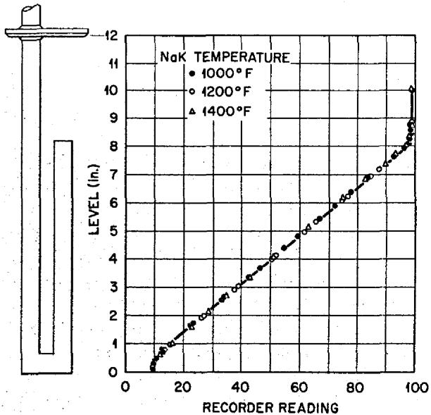  
UNCLASSIFIED   
ORNL-LR-DWG 25831   
Fig. 1.3.10. NaK-Level Calibration Test of a Resistance-Type Level Transducer.

within 0.1 in. (1.4% of full scale) of the line drawn for the data taken at $1200^{\circ}\mathrm{F}$ . The variation in the zero-level reading with NaK temperature is shown in Fig. 1.3.11. These data were taken while the level was being cycled from above to below the level probe. As may be seen the zero-level reading corresponds to the maximum output voltage of the level transducer. Data taken during this type of test indicate a zero-level shift of less than 3% over the temperature range of from below 300 to above $1200^{\circ}\mathrm{F}$ .

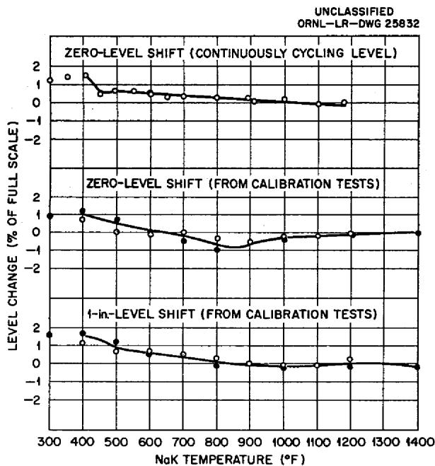  
Fig. 1.3.11. Variation in Zero-Level Reading of Transducer as a Function of NaK Temperature.

The shift in the maximum level reading is essentially independent of NaK temperature, as would be expected, since the output voltage of the level transducer for the maximum level is only 1 to $2\%$ of the full output voltage. During the 3000-hr test, the maximum level reading remained essentially the same after the probe was wetted.

Four level probes were operated for 54 days consecutively with the NaK temperature being held at $1200^{\circ}\mathrm{F}$ and the NaK level being cycled from below the level probe to near the top of the probe. The recorded zero-level reading was inspected for drift which would indicate a change in the calibration of the transducer. This reading

drifted, but the drift was masked by a drift in the recorder calibration. A transformer used in the modification of the recorder was sensitive to temperature, and, as a result, the voltage span of the recorder changed by an average of about $\pm 0.5\%$ daily because of ambient temperature changes. Most of the drift in the zero-level reading was therefore caused by drift in the recorder calibration. The recorder modification has been corrected so that the recorder calibration does not change.

In order to observe the wetting effect, a new level transducer was installed and the NaK was heated to $300^{\circ}\mathrm{F}$ with the NaK level below the level transducer. The probe was then immersed in the NaK, a series of step changes in level was made, and finally the usual output vs level calibration run was made. This procedure was repeated for NaK temperatures of 400, 500, and $600^{\circ}\mathrm{F}$ . In the $300^{\circ}\mathrm{F}$ test, the indicated level continued to rise after the step changes in level had been made. The indicated level reached to within $5\%$ of its final value after 10 min and to within $2\%$ of its final value after 2 hr. The response to the level changes at NaK temperatures of $400^{\circ}\mathrm{F}$ and up was good. The indicated output was about $1\%$ of its final value immediately after the level changes.

More tests under more rigidly controlled conditions will be required for a final evaluation of the wetting phenomenon. It is planned to continue the tests to determine the exact wetting effects on the measured level accuracy at various fill temperatures and to find, if possible, a solution to the wetting problem by using other probe material or by applying a special coating or plating to the level probe.

Further testing of the NaK level probes has been delayed by repairs and modifications of the test rig. The level probes are installed in the test rig by clamping them to the NaK pots and sealing them with O-rings. The seals used leaked vapor, and, as a result, the test rig had to be rebuilt.

Construction was begun on ORNL resistance-type level elements for use in the sodium expansion tank. None of these units have been completed. Construction was also started on the rig for testing these level elements.

The design was completed of the level element for continuous level measurements in the furnace-circuit drain tank of the ETU. This probe will be

mounted in the bottom of the tank and will have a $30\frac{1}{2}$ -in. range. The sensing element will be made from a single $\frac{1}{2}$ -in. sched-40 Inconel pipe.

The design of the probe for the auxiliary sodium expansion tank was completed, and fabrication work was started. This probe will be mounted in the tank bottom and will have a linear range of $2\frac{5}{8}$ in. The unit will be of the single-tube type, rather than the J configuration. A total of nine units will be required for tests, operational units, and spares.

# ART THERMOCOUPLES

J. T. De Lorenzo

# Sheathed Thermocouples

Inconel-sheathed thermocouples (0.250-in.-OD sheath, MgO insulation) with hot-junction closure welds made by the Heliarc welding process are still being tested. Approximately 200 hr of additional exposure time has been accumulated since the previous report. Eighteen Chromel-Alumel thermocouples with closure welds that passed dye-penetrant and x-ray inspection have now completed over 6000 hr of operation at $1500^{\circ}\mathrm{F}$ in sodium. The operating temperature has been reduced weekly to 1300 and to $1100^{\circ}\mathrm{F}$ for readings at these temperatures. No major shifts in drift

were observed during the first 2800 hr of operation, but after that time four of the sheathed assemblies showed sharp downward trends and finally exceeded the vendor's lower tolerance limit of minus $3\%$ at approximately 3800 hr. Since that time all four thermocouples have reversed their downward trend and are drifting back into tolerance, as shown in Fig. 1.3.12. A fifth couple that showed a sharp downward drift that stayed within the manufacturer's tolerance has leveled off and started a slight upward drift. The remaining thirteen couples have, almost equally, shown either a slight upward drift or a slight downward drift. Typical plots showing these slight upward and downward drifts are presented in Figs. 1.3.13 and 1.3.14. The total drifts for these thirteen couples have ranged from 2 to 8 degrees over the entire test period, and it seems that the drift is independent of the test temperature. The data for all 18 thermocouples are summarized in Table 1.3.1.

Drift data for similar thermocouples tested in air revealed upward drifts of all couples tested.

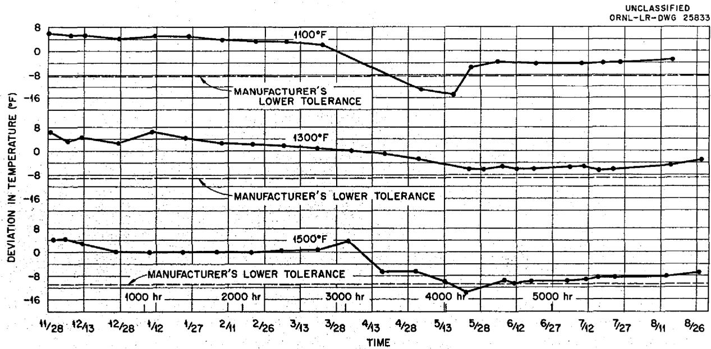  
Fig. 1.3.12. Drift Curves of 0.250-In.-OD Inconel-Sheathed Chromel-Alumel Thermocouple Showing Downward Drift Starting at About 3000 hr.

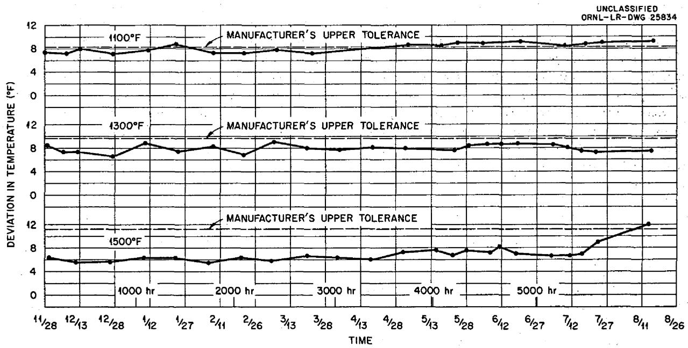  
Fig. 1.3.13. Drift Curves Typical of Those Obtained for 0.250-in.-OD Inconel-Sheathed Chromel-Alumel Thermocouples That Showed Slight Upward Drifts.

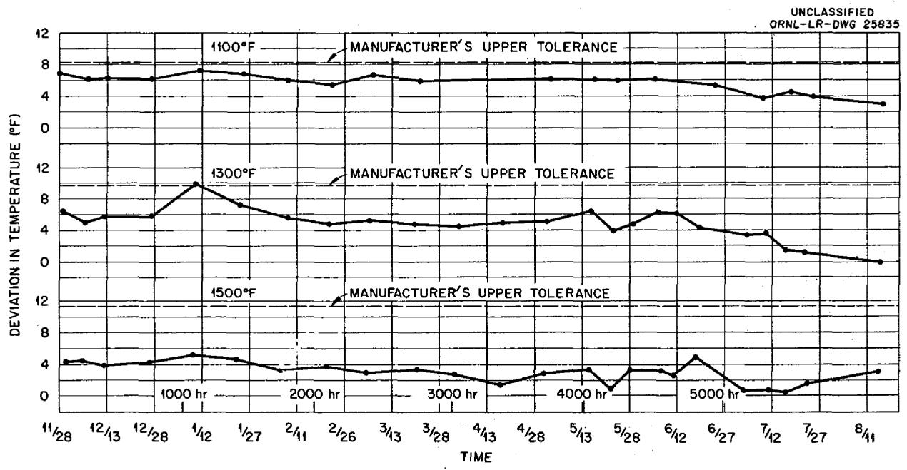  
Fig. 1.3.14. Drift Curves Typical of Those Obtained for 0.250-in.-OD Inconel-Sheathed Thermocouples That Showed Slight Downward Drifts.

It was believed earlier that leaks in sheaths of the thermocouples tested in fuel and in sodium could account for the downward drifts, and therefore one sheathed couple which had exhibited a sharp downward drift was removed from the sodium

Table 1.3.1. Results of Drift Tests of Inconel-Sheathed Chromel-Alumel Thermocouples in Sodium   

<table><tr><td rowspan="2">Test Period (hr)</td><td colspan="2">Thermocouple Reading (°F)a</td></tr><tr><td>Deviationb</td><td>Spreadc</td></tr><tr><td colspan="3">Test Temperature: 1500°F</td></tr><tr><td>0</td><td>5.2</td><td>3.5</td></tr><tr><td>1000</td><td>5.1</td><td>4.5</td></tr><tr><td>2000</td><td>5.4</td><td>6.5</td></tr><tr><td>3000</td><td>4.3</td><td>5.5</td></tr><tr><td>4000</td><td>4.4</td><td>7.3</td></tr><tr><td>5000</td><td>24.0(4.6)d</td><td>18.5(8.5)d</td></tr><tr><td>6000</td><td>1.9(13.5)d</td><td>30.5(13.5)d</td></tr><tr><td colspan="3">Test Temperature: 1300°F</td></tr><tr><td>0</td><td>7.3</td><td>2.8</td></tr><tr><td>1000</td><td>8.1</td><td>5.0</td></tr><tr><td>2000</td><td>5.7</td><td>6.0</td></tr><tr><td>3000</td><td>4.7(5.6)e</td><td>12.3(5.0)e</td></tr><tr><td>4000</td><td>1.5(4.2)f</td><td>19.3(7.3)f</td></tr><tr><td>5000</td><td>3.8(5.5)d</td><td>15.7(9.7)d</td></tr><tr><td>6000</td><td>2.7(4.6)d</td><td>19.5(9.0)d</td></tr><tr><td colspan="3">Test Temperature: 1100°F</td></tr><tr><td>0</td><td>6.8</td><td>2.6</td></tr><tr><td>1000</td><td>6.9</td><td>3.4</td></tr><tr><td>2000</td><td>6.2</td><td>4.6</td></tr><tr><td>3000</td><td>6.9</td><td>7.0</td></tr><tr><td>4000</td><td>4.2(6.2)e</td><td>23.5(7.7)e</td></tr><tr><td>5000</td><td>4.9(6.3)d</td><td>14.0(9.9)d</td></tr><tr><td>6000</td><td>4.6(6.2)d</td><td>14.5(9.5)d</td></tr></table>

${}^{a}$ Ninteen assemblies were tested; each assembly contained two thermocouples aged 24 hr at ${1350}^{ \circ  }\mathrm{F}$ in helium prior to testing.   
$b_{\text{Deviation of the average of the thermocouple readings from the test temperature.}}$   
$c_{\text{Maximum spread of the thirty-eight readings obtained.}}$ $d_{\text{Values in parentheses exclude five assemblies, Nos.}}$ 14, 25, 31, 87, and 91.   
$e$ Values in parentheses exclude two assemblies, Nos. 14 and 31.   
Values in parentheses exclude three assemblies, Nos. 14, 31, and 91.

for examination. Metallographic examination revealed no evidence of a leak; in fact, the unit appeared to be remarkably sound even after the 5000 hr of operation in sodium at $1500^{\circ}\mathrm{F}$ . It is now believed that the temperature cycling of the fuel and the sodium could have produced "breathing" of the magnesium oxide on the unsealed connector end and thereby induced conditions which might possibly cause the downward drifts. The temperatures were not cycled during the drift tests in air. Additional drift tests with sealed samples are being proposed in an effort to definitively establish the cause of the downward drifts.

Thirteen similar specimens and three platinum, platinum-10% rhodium units have completed over 4000 hr of operation at $1500^{\circ}\mathrm{F}$ in $\mathsf{NaF - ZrF_4 - UF_4}$ (50-46-4 mole %, fuel 30). Weekly readings were also taken at 1300 and $1100^{\circ}\mathsf{F}$ . After the first 1400 hr of operation, three Chromel-Alumel units started showing sharp downward drifts similar to those shown in the first 4000 hr in Fig. 1.3.12, and one unit finally exceeded the vendor's lower tolerance limit at 2000 hr. The drifts of the other two units have leveled off, and slight upward trends have started. The remaining ten Chromel-Alumel assemblies showed drift performances similar to those shown in Figs. 1.3.13 and 1.3.14 over the first 4000 hr. For comparison, the typical performance of the platinum, platinum-10% rhodium units as they aged for over 4000 hr in fuel 30 is shown in Fig. 1.3.15. The data on these 16 thermocouples are summarized in Table 1.3.2.

A cross section of the hot-junction end of a sheathed Chromel-Alumel thermocouple is shown in Fig. 1.3.16. The closure consists of a four-hole Inconel plug which is welded to the sheath and wires with the Heliarc welding technique. A new, improved closure technique is being investigated, in which Coast Metals brazing alloy No. 52 will be used to form a brazed joint that will leave a minimum void below the tip and will permit accurate positioning of the thermocouple junction. This new type of closure is illustrated in Figs. 1.3.17 and 1.3.18. The test samples for the additional tests will be fabricated with the new brazing technique.

A 50-kw Megatherm induction heating unit is being used to rapidly heat samples of these Inconel-sheathed thermocouples in order to determine the effect of heating rate on the integrity of

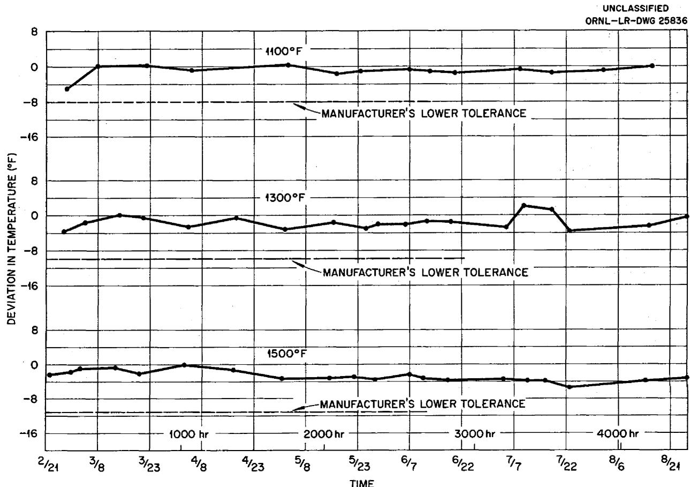

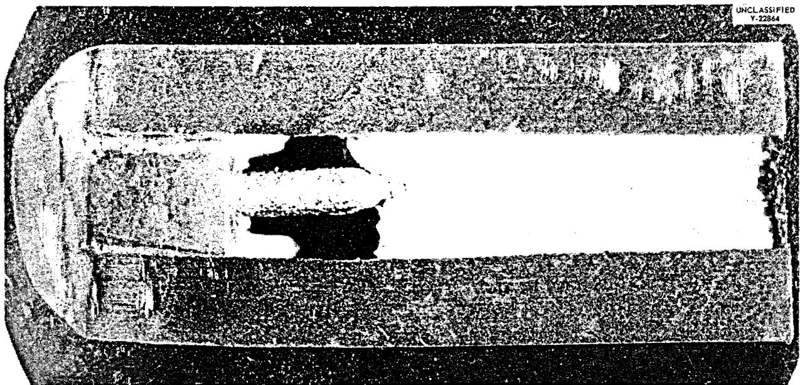  
Fig. 1.3.15. Drift Curves Typical of Those Obtained for 0.250-in.-OD Inconel-Sheathed Platinum, Platinum-10% Rhodium Thermocouples.   
Fig. 1.3.16. Cross Section of Heliarc-Welded Junction of a 0.250-In.-OD Inconel-Sheathed Chromel-Alumel Thermocouple Showing Inconel Filler Tip, Weld to Sheath, Thermocouple Wire, Void, and Magnesium Oxide Insulation.

the couple. The test sample is inserted in a NaK-filled Inconel charge container made of $\frac{7}{16}$ -in.-OD, 0.030-in.-wall tubing. One sample failed after 240 heating cycles between 800 and $1200^{\circ}\mathrm{F}$ at a heating rate of $100^{\circ}\mathrm{F} / \mathrm{sec}$ . In this failure, both Chromel wires were broken, but the Alumel wires remained intact. In addition to supplying information regarding the physical soundness of these sheathed couples, the induction heating unit provides a simple means for obtaining aging data under various degrees of cyclic thermal shock.

The study of drift as a function of time and temperature of similar sheathed thermocouples and conventional beaded thermocouples operating in air has continued. In these tests, all the thermocouples were operated continuously at one temperature. Three temperatures were investigated, 1800, 1600, and $1300^{\circ}\mathrm{F}$ . The $1800^{\circ}\mathrm{F}$ test was terminated after 5000 hr; the test at $1300^{\circ}\mathrm{F}$ at 6000 hr; and the test at $1600^{\circ}\mathrm{F}$ is still under way, with data having been accumulated for over 6000 hr. All thermocouples that were tested at

Table 1.3.2. Results of Drift Tests of Sheathed Thermocouples in Fuel   

<table><tr><td rowspan="2">Test Period (hr)</td><td colspan="2">Chromel-Alumel 
Assembliesa Aged 24 hr</td><td colspan="2">Chromel-Alumel 
Assembliesb Aged 200 hr</td><td colspan="2">Pt, Pt-10% Rh 
Assembliesc</td></tr><tr><td>Deviationd(°F)</td><td>Spreade(°F)</td><td>Deviationd(°F)</td><td>Spreade(°F)</td><td>Deviationd(°F)</td><td>Spreade(°F)</td></tr><tr><td colspan="7">Test Temperature: 1500°F</td></tr><tr><td>0</td><td>1.9</td><td>4.5</td><td>2.9</td><td>0.2</td><td>-1.0</td><td>5.5</td></tr><tr><td>1000</td><td>3.5</td><td>3.8</td><td>5.1</td><td>0.7</td><td>0.4</td><td>1.0</td></tr><tr><td>2000</td><td>2.4</td><td>7.0</td><td>7.3</td><td>0.5</td><td>-0.6</td><td>2.0</td></tr><tr><td>3000</td><td>0.2(1.35)f</td><td>23.5(11)f</td><td>8.4</td><td>0.8</td><td>-1.4</td><td>5.2</td></tr><tr><td>4000</td><td>0.7(2.2)f</td><td>22.0(8.5)f</td><td>8.0</td><td>1.0</td><td>0.7</td><td>3.0</td></tr><tr><td colspan="7">Test Temperature: 1300°F</td></tr><tr><td>0</td><td>7.0</td><td>3.0</td><td>6.9</td><td>0.1</td><td>-0.1</td><td>2.7</td></tr><tr><td>1000</td><td>4.3</td><td>8.1</td><td>6.9</td><td>0.9</td><td>-1.2</td><td>2.1</td></tr><tr><td>2000</td><td>2.5(3.2)f</td><td>14.2(9.0)f</td><td>7.8</td><td>0.4</td><td>-0.6</td><td>4.2</td></tr><tr><td>3000</td><td>1.9(3.3)f</td><td>20.5(10.5)f</td><td>8.8</td><td>0.7</td><td>-0.8</td><td>4.2</td></tr><tr><td>4000</td><td>3.8(4.8)f</td><td>13.7(6.4)f</td><td>8.8</td><td>1.2</td><td>-0.6</td><td>5.3</td></tr><tr><td colspan="7">Test Temperature: 1100°F</td></tr><tr><td>0</td><td>4.2</td><td>2.4</td><td>4.6</td><td>0.3</td><td>-2.1</td><td>4.0</td></tr><tr><td>1000</td><td>5.2</td><td>4.3</td><td>6.4</td><td>0.8</td><td>-0.3</td><td>1.3</td></tr><tr><td>2000</td><td>2.8(4.8)f</td><td>13.2(7.4)f</td><td>7.7</td><td>1.0</td><td>-0.5</td><td>2.7</td></tr><tr><td>3000</td><td>2.4(3.6)f</td><td>18.5(10.0)f</td><td>8.3</td><td>0.6</td><td>-0.3</td><td>3.2</td></tr><tr><td>4000</td><td>2.7(3.9)f</td><td>17.3(7.4)f</td><td>8.1</td><td>1.1</td><td>1.0</td><td>3.8</td></tr></table>

$a_{\text{Eight assemblies}}$ were tested; each assembly contained two thermocouples aged 24 hr at $1350^{\circ}\text{F}$ in helium prior to testing.   
$b_{\text{Two}}$ assemblies were tested; each assembly contained two thermocouples aged 200 hr at $1350^{\circ}\text{F}$ in helium prior to testing.   
${}^{c}$ Three assemblies were tested; each assembly contained two thermocouples.   
$d_{\text{Deviation of the average of the thermocouple readings from the test temperature.}}$   
Maximum spread of the thermocouple readings.   
/Values in parentheses exclude assembly No. 143.

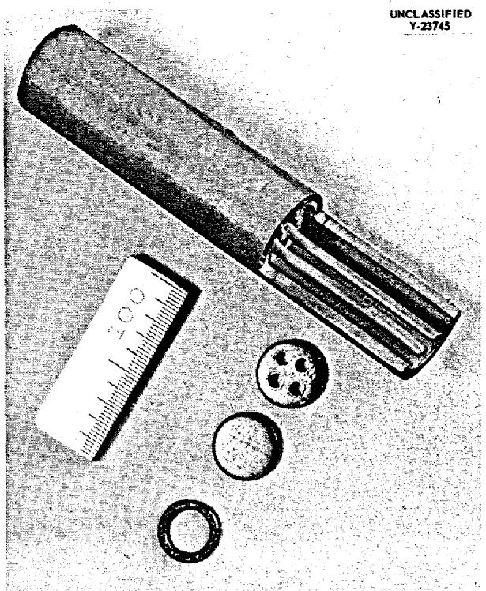  
Fig. 1.3.17. Parts for Completing Brazed Closure at Hot Junction of a 0.250-in.-OD Inconel-Sheathed Thermocouple. In this view the sheath has been cut to show the wires. The four-hole Inconel plug, the Inconel end plug, and the Coast Metals No. 52 brazing alloy ring are also shown.

1800 and $1300^{\circ} \mathrm{F}$ are being prepared for metallographic examination. The data taken during these tests are summarized in Table 1.3.3.

# Well Thermocouples

The design of a well thermocouple for temperature measurement of high-velocity, high-temperature (1400 gpm, 1100 to $1500^{\circ}\mathrm{F}$ ) liquid metals in Inconel piping has been completed, and several units were constructed. The thermocouples (two per well) employed in these units are fabricated from 20 AWG, solid, Chromel-Alumel wire (accuracy, $\pm \frac{3}{8}$ of $1\%$ over range 530 to $2300^{\circ}\mathrm{F}$ ) and are welded with Heliarc welding techniques to the bottom of the well. All the ceramic beads used contain a minimum of $96\%$ aluminum oxide. A typical unit is shown before and after assembly in Fig. 1.3.19.

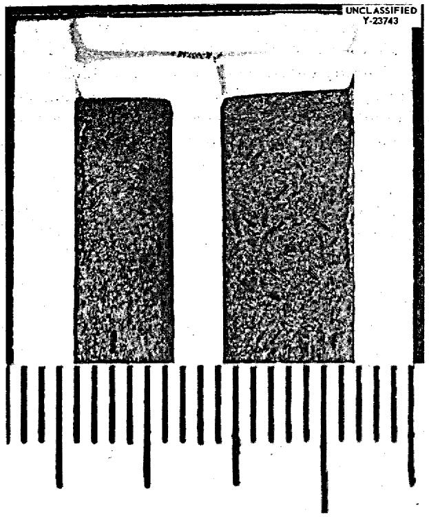  
Fig. 1.3.18. Cross Section of Brazed Hot Junction. The light gray areas are brazing alloy; the dark gray areas are MgO insulation. Note pores in braze material above the thermocouple wire and the lack of voids below the closure.

The well immersion depth was arbitrarily chosen as one-third the inside diameter of the pipe line. The well-body material selected for use with $2\frac{1}{2}$ -in. and larger pipes was $\frac{3}{8}$ -in. sched-40 Inconel pipe, and $\frac{1}{4}$ -in. sched-40 pipe was selected for wells in 2-in. pipes. The immersed portion of the well body was turned down to a wall thickness of 0.050 in. This well-body design was tested for pressure drop effects on a water loop at velocities up to 1200 gpm. The permanent pressure drop was less than 2.0 psi at 1200 gpm. The lag length of the well body did not extend beyond the 4 in. of pipe insulation in an attempt to minimize heat losses and the selective oxidation effect that is common in long, narrow thermocouple wells used at elevated temperatures. The thickness of the well bottom was determined on the basis of stresses at operating pressures and temperatures. A value of 0.109 in. was selected on the basis of a stress analysis.

In order to ensure a reliable and easily reproducible attachment of the thermocouple junction to the well bottom, a technique was developed which permitted the coating of the thermocouple junction with Inconel without undue burning of the wires. This "wetting" of the junction simplified

the subsequent Heliarc welding to the well bottom. The diameter of the spherical junction produced can be controlled to within $\pm 0.005$ in. with very little difficulty. It was discovered that careful cleaning of oxide from the thermocouple wires facilitates the formation of a reliable junction.

Table 1.3.3. Results of Drift Tests of Sheathed and Beaded Thermocouples in Air at 1300, 1600, and ${1800}^{ \circ  }\mathrm{F}$   

<table><tr><td rowspan="2">Test Period (hr)</td><td colspan="2">Chromel-Alumel Sheathed Assembliesa</td><td colspan="2">Chromel-Alumel Special Beaded Assembliesb</td><td colspan="2">Chromel-Alumel Normal Beaded Assembliesc</td><td colspan="2">Chromel-Alumel Sheathed Assembliesd</td><td colspan="2">Pt, Pt-10% Rh Sheathed Assembliese</td></tr><tr><td>Deviationf(°F)</td><td>Spreadg(°F)</td><td>Deviationf(°F)</td><td>Spreadg(°F)</td><td>Deviationf(°F)</td><td>Spreadg(°F)</td><td>Deviationf(°F)</td><td>Spreadg(°F)</td><td>Deviationf(°F)</td><td>Spreadg(°F)</td></tr><tr><td colspan="11">Test Temperature: 1300°F</td></tr><tr><td>0</td><td>5.0</td><td>3.3</td><td>-7.0</td><td>2.1</td><td>-5.3</td><td>1.1</td><td></td><td></td><td colspan="2">Measurement error</td></tr><tr><td>1000</td><td>5.5</td><td>3.7</td><td>-4.0</td><td>3.1</td><td>-4.4</td><td>2.2</td><td></td><td></td><td>0.2</td><td>2.0</td></tr><tr><td>2000</td><td>5.3</td><td>2.4</td><td>-3.8</td><td>3.5</td><td>-4.1</td><td>6.5</td><td></td><td></td><td>-0.5</td><td>2.0</td></tr><tr><td>3000</td><td>6.0</td><td>2.5</td><td>-3.0</td><td>4.5</td><td>-3.0</td><td>5.0</td><td></td><td></td><td>-3.5</td><td>5.0</td></tr><tr><td>4000</td><td>6.2</td><td>2.0</td><td>-2.0</td><td>4.5</td><td>-2.0</td><td>6.0</td><td></td><td></td><td>-3.0</td><td>4.0</td></tr><tr><td>5000</td><td>7.8</td><td>2.0</td><td>0.6</td><td>5.0</td><td>0</td><td>5.0</td><td></td><td></td><td></td><td></td></tr><tr><td colspan="11">Test Temperature: 1600°F</td></tr><tr><td>0</td><td>3.8</td><td>2.8</td><td>6.0</td><td>2.0</td><td>-7.1</td><td>3.5</td><td>4.7</td><td>4.3</td><td></td><td></td></tr><tr><td>1000</td><td>6.4</td><td>2.6</td><td>3.9</td><td>2.5</td><td>-2.2</td><td>6.1</td><td>5.6</td><td>3.1</td><td></td><td></td></tr><tr><td>2000</td><td>7.0</td><td>2.7</td><td>6.2</td><td>5.5</td><td>-0.7</td><td>10.7</td><td>14.0</td><td>4.0</td><td></td><td></td></tr><tr><td>3000</td><td>6.0</td><td>3.0</td><td>12.0</td><td>6.0</td><td>5.0</td><td>14.0</td><td>17.0</td><td>4.0</td><td></td><td></td></tr><tr><td>4000</td><td>13.0</td><td>4.0</td><td>16.0</td><td>5.0</td><td>7.0</td><td>18.0</td><td>12.0</td><td>5.0</td><td></td><td></td></tr><tr><td>5000</td><td>12.0</td><td>7.0</td><td>17.3</td><td>4.0</td><td>0.6</td><td>22.0</td><td>12.0</td><td>6.0</td><td></td><td></td></tr><tr><td>6000</td><td>9.9</td><td>4.0</td><td>15.5</td><td>4.0</td><td>0.3</td><td>24.0</td><td></td><td></td><td></td><td></td></tr><tr><td colspan="11">Test Temperature: 1800°F</td></tr><tr><td>0</td><td>1.0</td><td>2.6</td><td>-7.5</td><td>4.3</td><td>1.3</td><td>2.1</td><td>5.5</td><td>4.2</td><td colspan="2">Measurement error</td></tr><tr><td>1000</td><td>7.7</td><td>15.1</td><td>15.2</td><td>19.2</td><td>8.7</td><td>14.3</td><td>10.2</td><td>10.5</td><td>0.2</td><td>4.0</td></tr><tr><td>2000</td><td>8.0</td><td>16.2</td><td>26.2</td><td>9.5</td><td>11.7</td><td>19.2</td><td>14.0</td><td>14.0</td><td>-9.0</td><td>6.5</td></tr><tr><td>3000</td><td>12.0</td><td>20.0</td><td>30.0</td><td>14.0</td><td>18.0</td><td>29.0</td><td>16.0</td><td>12.0</td><td></td><td></td></tr><tr><td>4000</td><td>14.0</td><td>18.0</td><td>30.0</td><td>15.0</td><td>21.0</td><td>46.0</td><td>14.0</td><td>12.0</td><td></td><td></td></tr><tr><td>5000</td><td>16.1</td><td>22.0</td><td>33.0</td><td>19.0</td><td>34.0</td><td>68.0</td><td>20.0</td><td>15.0</td><td></td><td></td></tr></table>

${}^{a}$ Six assemblies were tested; each assembly contained two thermocouples aged 24 hr at ${1350}^{ \circ  }\mathrm{F}$ in helium prior to testing.   
${}^{b}$ Six assemblies were tested; each assembly contained two thermocouples fabricated with especially cleaned wire (accuracy, $\pm  \frac{3}{8}$ of 1% over range 530 to ${2300}^{ \circ  }\mathrm{F}$ ) in carefully cleaned wells.   
Same as special assemblies except that they received no special cleaning.   
$d_{\mathrm{Same}}$ as assemblies described in footnote a except that they were aged for 200 hr at $1350^{\circ}\mathrm{F}$ in helium.   
$^\mathrm{e}$ Five assemblies were tested; each assembly contained two thermocouples.   
$\mathcal{F}$ Deviation of the average of the readings of the thermocouples tested from the standard test temperature of 1300, 1600, or $1800^{\circ}F$   
$\pmb{g}_{\text{Maximum spread of the readings obtained}}$

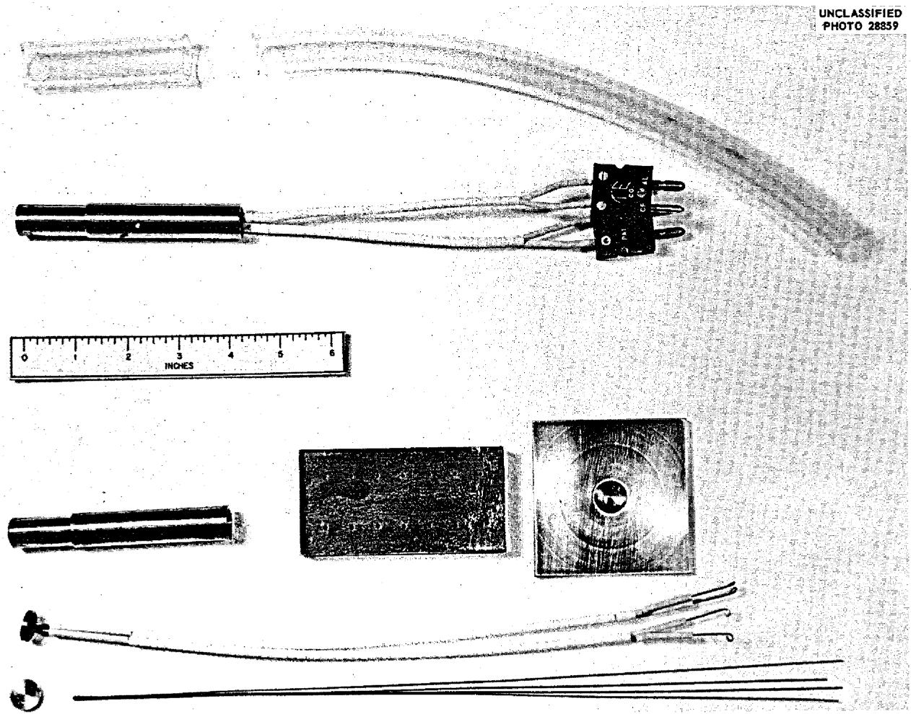  
Fig. 1.3.19. Well Thermocouple Before and After Assembly. The unassembled unit shows the copper chill block for junction formation, the Inconel plate used in making the weld junction at the well bottom, and the plastic tubing used to protect the unit during handling.

The cross sections of junctions shown in Figs. 1.3.20 and 1.3.21 reveal the effect of careful cleaning of the wires.

Extreme care was taken in the assembly of the well thermocouples. All ceramic beads were carefully washed with distilled water and methyl alcohol and baked at $1500^{\circ}\mathrm{F}$ for 1 hr. All wires were washed with methyl alcohol and air dried. All well-body pieces were degreased, washed with methyl alcohol, and baked at $400^{\circ}\mathrm{F}$ for 1 hr. All subsequent handling after the cleaning was done with clean white gloves. After installation a clean, coil-spring type of flexible extension will be provided for each well thermocouple to eliminate

any possibility of bending near the region of high-temperature gradients.

Drift tests on five sample units installed in flowing NaK have been started. The test procedure will be similar to that used in tests of sheathed couples.

# Surface Thermocouples

Thermocouples for surface attachment to Inconel piping and components will be fabricated in a manner identical to that used for the fabrication of the well couples. A reliable and simple Heliarc method of welding these surface-type couples to

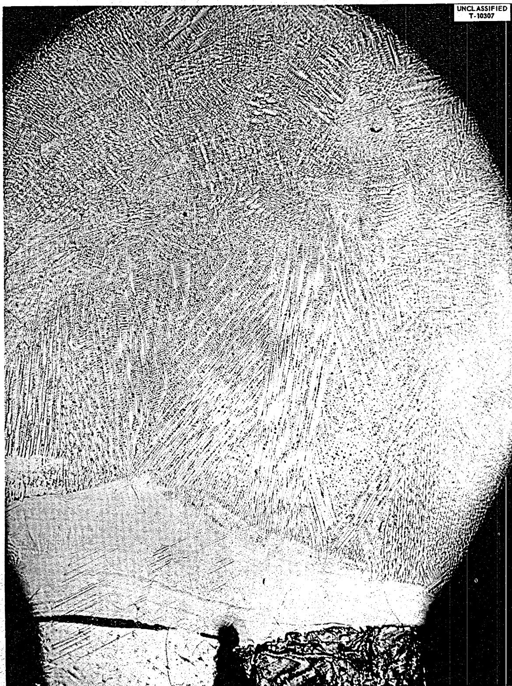  
Fig. 1.3.20. Cross Section of Heliarc-Welded Junction of Inconel-Coated Chromel-Alumel Thermocouple Wires. Chromium oxide deposits may be seen in the Chromel wire.

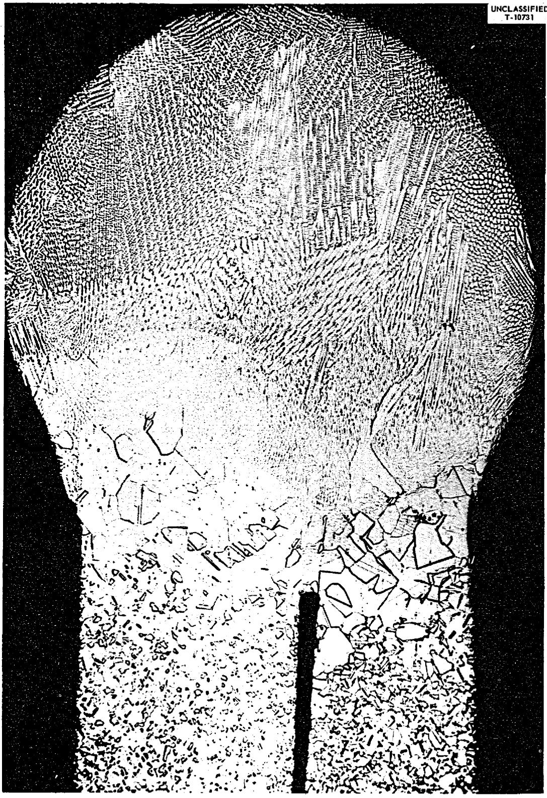  
Fig. 1.3.21. Cross Section of Heliarc-Welded Junction of Inconel-Coated Chromel-Alumel Thermocouple Wires That Were Carefully Cleaned Before Welding. Note absence of oxide deposits.

the various Inconel surfaces has been devised by the Metallurgy Division.

# Apparatus for Checking Thermocouples

A melting-point apparatus filled with NaF-CaF $_2$ (68-32 mole %) has been completed that is being

used for weekly spot checks of the three Pt, Pt-10% Rh couples that have been used as the standards for all the thermocouple tests. The melting point of the NaF-CaF $_2$ mixture as measured with these three couples appears to be $1487.5^{\circ}\mathrm{F}$ and is reproducible to within $\pm 1^{\circ}\mathrm{F}$ .

# 1.4. ENGINEERING DESIGN STUDIES

A.P.Fraas

# APPLIED MECHANICS AND STRESS ANALYSIS

R. V. Meghreblian

Thermal Stress Cycling Tests of Beryllium

D. L. Platus W. H. Kelley

J. R. Tallackson

The beryllium reflector in the ART will experience thermal strain cycling whenever the power level of the reactor is changed. The most severe strains in the beryllium will occur in the region beneath the load ring. These strains will be produced by the gross radial temperature gradient across the reflector combined with the

local gradients in the vicinity of the coolant holes. Superimposed on this strain field will be the strain concentrations arising from the presence of the holes themselves. Over any extended period of operation these strains will be cyclic in character and can lead to a fatigue crack.

A small-scale experiment has been designed to test the resistance of beryllium to fatigue cracking under the temperature conditions anticipated in the ART. The test specimen is a short, thick-walled cylinder with an axial pattern of small holes (Fig. 1.4.1). The size and locations of the $\frac{1}{2} -\frac{1}{6}$ -dia holes simulate the cooling-hole pattern in the reactor, and the radial temperature

UNCLASSIFIED

ORNL-LR-DWG 25889

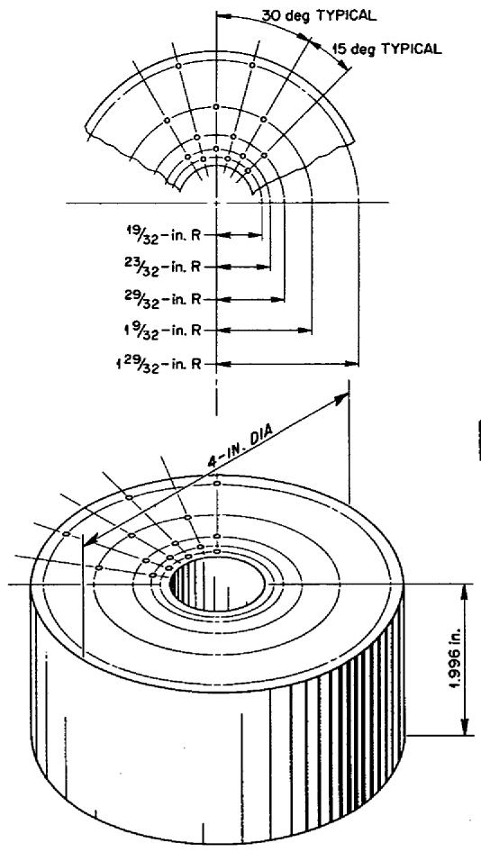

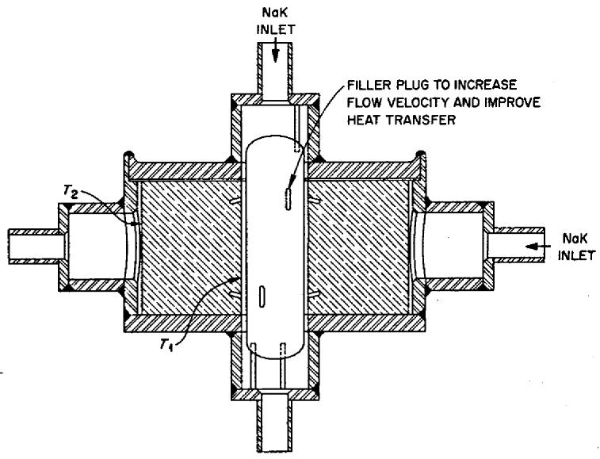  
Fig. 1.4.1. Beryllium Thermal-Cycling Test Specimen.

gradient across the cylinder has been calculated to produce a gross strain variation similar to that in the reflector.

A forced-circulation loop (Fig. 1.4.2) is used to produce the thermal cycles. The beryllium specimen is housed (Figs. 1.4.2 and 1.4.3) so that both the inner and the outer cylindrical surfaces are exposed to flowing sodium. Thermal deformations are produced by the radial temperature gradient across the cylinder. Sodium temperatures are controlled so that the test specimen is cycled between the isothermal and temperature-gradient conditions at $\frac{1}{2}$ -hr intervals, as shown in Fig. 1.4.4. The first test will be for a period of 500 hr and will produce 500 complete strain cycles.

A detailed study of the stress (elastic) distribution in the specimen is under way. Relaxation methods are being used for this study at present, but analytical techniques are being considered.

# Thermal-Cycling Test of a Welded Core Shell Model

# B. L. Greenstreet

Shells I and II (the inner and outer fuel annulus shells) for the ART and ETU are to be made from rolled plate weldments which will be machined to the final contour. This method of fabrication replaces that of spinning. The weld joint locations are shown in Figs. 1.4.5 and 1.4.6. As may be seen, each half of shell I has both circumferential and longitudinal welds, whereas the halves of shell II have two longitudinal ones.

The material in the heat-affected zones of the welds will exhibit relatively large grain structure. This material will permit preferential deformation, since it will be weaker under steady load than the rest of the shell. This strain intensification, coupled with a lower resistance to strain cycling damage, may result in premature failure. From this standpoint the most critical regions are the locations at which the circumferential and longitudinal welds intersect.

A $\frac{1}{4}$ -scale model of shell II made with the shell I weld pattern will be tested under strain cycling conditions. It is expected that the difference in contour between the two shells will have little effect on the distortions arising from the weld pattern. This model is to be tested in

the existing core-shell test rig and will be subjected to simulated service conditions identical to those applied to the two $\frac{1}{4}$ -scale specimens tested previously. This test will establish the adequacy of the welded reactor shells.

# Stress Analysis of Island Bellows

# S.E.Moore

The geometric configuration of the island expansion bellows of the ART consists of a fourfold repetition of the unit shown in Fig. 1.4.7. The unit is composed of three elements, a concave flange, a very shallow cone, and a convex flange. Adequate methods are presently available for analyzing these shapes,[2,3] and IBM 650 and 704 digital-computer subroutines have been written for these and other types of rotational shell elements. These routines have been applied to investigate the stress distribution and load-deflection curve for the complete configuration.

The design condition for the bellows is 300 cycles of 90-mil axial deflection at a temperature of $1250^{\circ}\mathrm{F}$ . The stress analysis of the present design revealed that under these conditions the bellows would be subjected to considerable plastic deformation at the outer bend of the convolutions. Correlation with strain-cycling data for Inconel indicated that the fatigue life of the design was less than the proposed 300 cycles. This was verified in a recent test when the bellows failed after 80 cycles.

The general subroutines mentioned above have been applied to obtain designs of several bellows which would withstand the deflection and external pressure (20 psi) anticipated within the reactor. A design has been selected from this group which consists of four convolutions of 0.062-in.-thick material. The outer diameter of the new bellows will be $\frac{1}{2}$ in. greater than that of the bellows of Fig. 1.4.7.

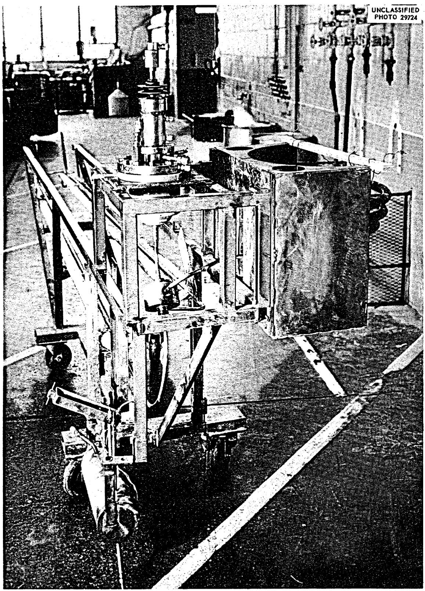  
Fig. 1.4.2. Beryllium Thermal-Cycling Experiment Test Rig.

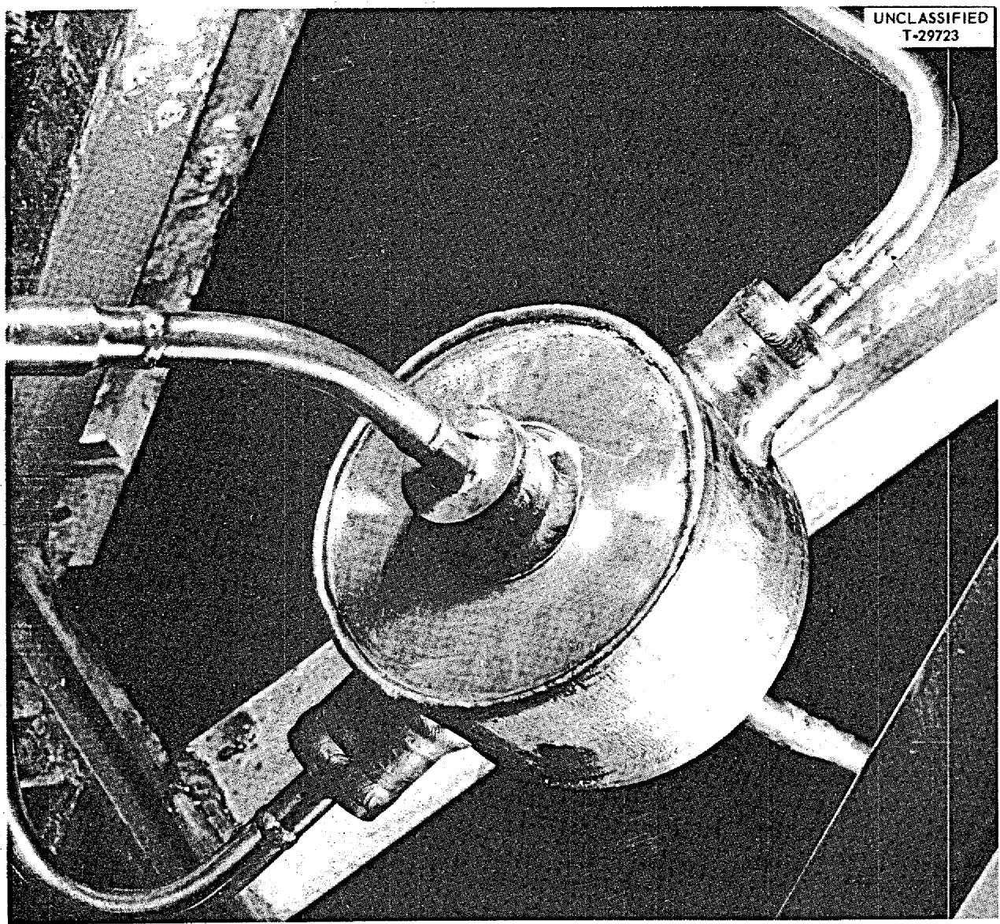  
Fig. 1.4.3. Beryllium Specimen in Housing.

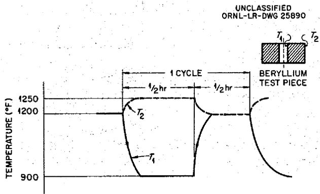  
Fig. 1.4.4. Cycle of Temperature vs Time Used for Beryllium Thermal-Cycling Tests.

# Stress Analysis of Shield Support Structure

# J. L. Leggett

The two principal structural components of the ART shield are the lead support structure and the water bag. A detailed stress analysis of the lead support has been concluded, and an analysis of the water bag has been initiated.

The major structural member for supporting the lead is the equatorial shell which fits around the girth of the reactor and carries the equatorial lead (13,937 lb). The shell is to be fabricated from a 5/6-in. carbon steel plate to which the lead will be bonded. In addition to providing support

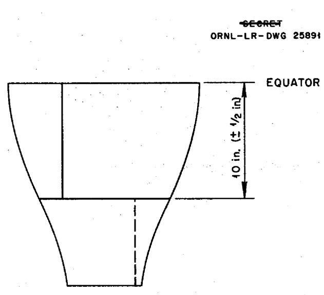  
Fig. 1.4.5. Shell I Weld Pattern.

SECRET ORNL-LR-DWG 26453

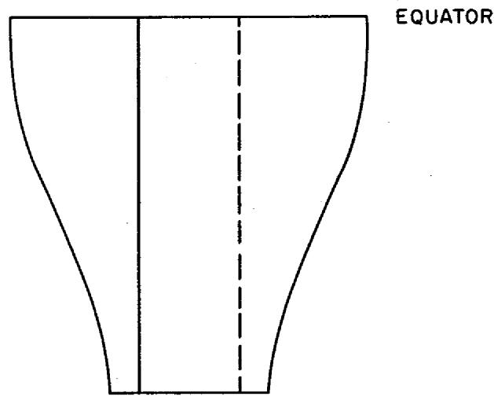  
Fig. 1.4.6. Shell II Weld Pattern.

for the lead, the shell will also transmit the weight loads from the north head lead shield (4678 lb), the south head lead (5475 lb), and the down-drain lead (6210 lb). Five areas were examined in the stress analysis of this structure: (1) the bolts that will transfer the load of the equatorial lead shield to the overhead reactor support structure, (2) the lugs that will transfer loads to these bolts, (3) the steel backup shell

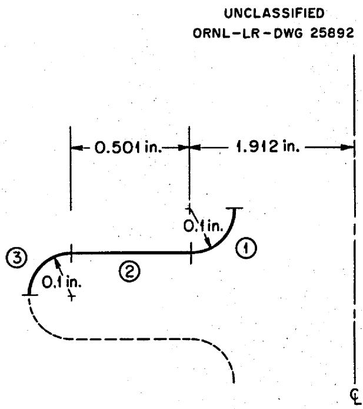  
Fig. 1.4.7. Elementary Unit of Island Expansion Bellows. (Secret with caption)

1 CONCAVE FLANGE   
CIRCULAR FLAT PLATE   
③ CONVEX FLANGE

to which the lead will be bonded, (4) the north ring of the equatorial shielding shell, and (5) the stresses in the steel and lead at the bond surface as a result of dissimilar coefficients of thermal expansion.

Eight bolts unsymmetrically placed around the north ring of the shell will transfer a load of approximately 30,300 lb to the reactor support. The stress in the most heavily loaded bolt was checked on the basis of the net cross-sectional area at the root of the threads. Stresses in the welds connecting the lugs to the steel ring and the ribs of the steel backup shell were also examined.

The investigation of the steel backup shell was based on the primary assumption that the combination of the steel shell and ribs will carry all the weight of the lead and the steel. The lead was not considered to be carrying any load. The critical point on the shell was assumed to be located $10\frac{1}{16}$ in. above the equator of the reactor where accommodation of one of the coolant tubes would require that the rib be notched (see Fig.

1.4.8). The analysis indicated that a $\frac{5}{8}$ -in. rib combined with a $\frac{5}{16}$ -in. shell would suffice.

The north ring of the equatorial shielding shell was investigated from the standpoint of bending and torsion. Here it was assumed that the weight of lead and steel would be applied along one edge of the right-angle cross section as a uniformly distributed load. Stresses in the steel and lead as a result of changes in shield temperature were investigated at the bond surface. Two conditions were considered: a slow increase in temperature of $180^{\circ}\mathrm{F}$ (that would result in a bond temperature of $250^{\circ}\mathrm{F}$ ) to simulate the approach of the reactor to power operation and a sudden decrease of $120^{\circ}\mathrm{F}$ (a bond temperature of $130^{\circ}\mathrm{F}$ ) to simulate shutdown of the reactor. An elastic analysis based on these operating conditions revealed that the stresses in both the steel and the lead at the bond would remain within acceptable limits.

An analysis of the aluminum water bag is presently under way. Since the north head is made of 10 or 12 segments and the equatorial section of 5 segments, it will be necessary to examine the integrity of the individual pieces as well as the whole unit. Preliminary analyses

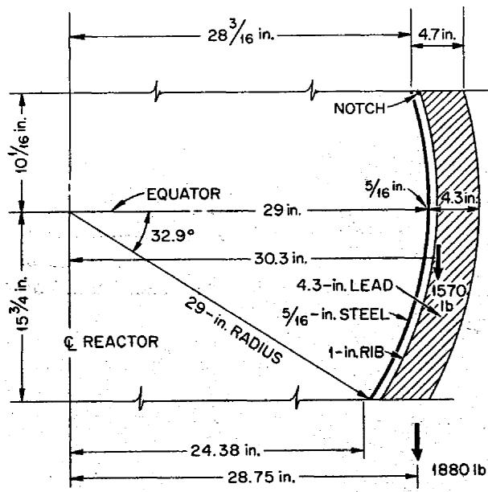  
UNCLASSIFIED ORNL-LR-DWG 25893   
Fig. 1.4.8. Steel Backup Shell for Equatorial Lead Shield. (Confidential with option)

indicate that it may be necessary to fit the segments together carefully in order for the assembly to act as a single structure. This will also require shear attachments along the joints between segments on both the inner and the outer surfaces of the bag.

# Stress Analysis of a Pressure-Measuring Instrument

B. Y. Cotton

An analytical study was made to determine the elastic stresses in a pressure-measuring device manufactured by the Taylor Instrument Company (Fig. 1.4.9). The instrument consists of a riser, two flat circular plates, a cylindrical portion containing the weldment, and a pressure-transmitting capillary. A sandwich-type diaphragm of five layers of 0.005-in.-thick Inconel sheet separates the fluid being measured from the transmitting fluid.

Under the specified operating temperatures, creep is an important consideration, and the pressure forces on the circular flat plates will tend to distort them into spherical shapes. If the pressure forces are applied for extended periods of time, the creep deformation will cause an appreciable increase in the internal volume of the instrument and will result in instability or drift.

The anticipated operating conditions for the instrument vary widely, since the instruments are to be employed in various test loops in different fluid environments, pressures, and temperatures. The results of the stress analysis are summarized in Table 1.4.1 in order to provide a basis for evaluating particular applications. The indicated estimated life is the time required to

Table 1.4.1. Life Span of a Pressure-Measuring Device Based on $0.2\%$ Creep Deformation   

<table><tr><td>Internal Pressure (psi)</td><td>Maximum Stress (psi)</td><td>Estimated Life at 1300°F (hr)</td></tr><tr><td>25</td><td>3,546</td><td>2000</td></tr><tr><td>50</td><td>7,092</td><td>50</td></tr><tr><td>100</td><td>14,185</td><td>0</td></tr><tr><td>200</td><td>28,371</td><td>0</td></tr></table>

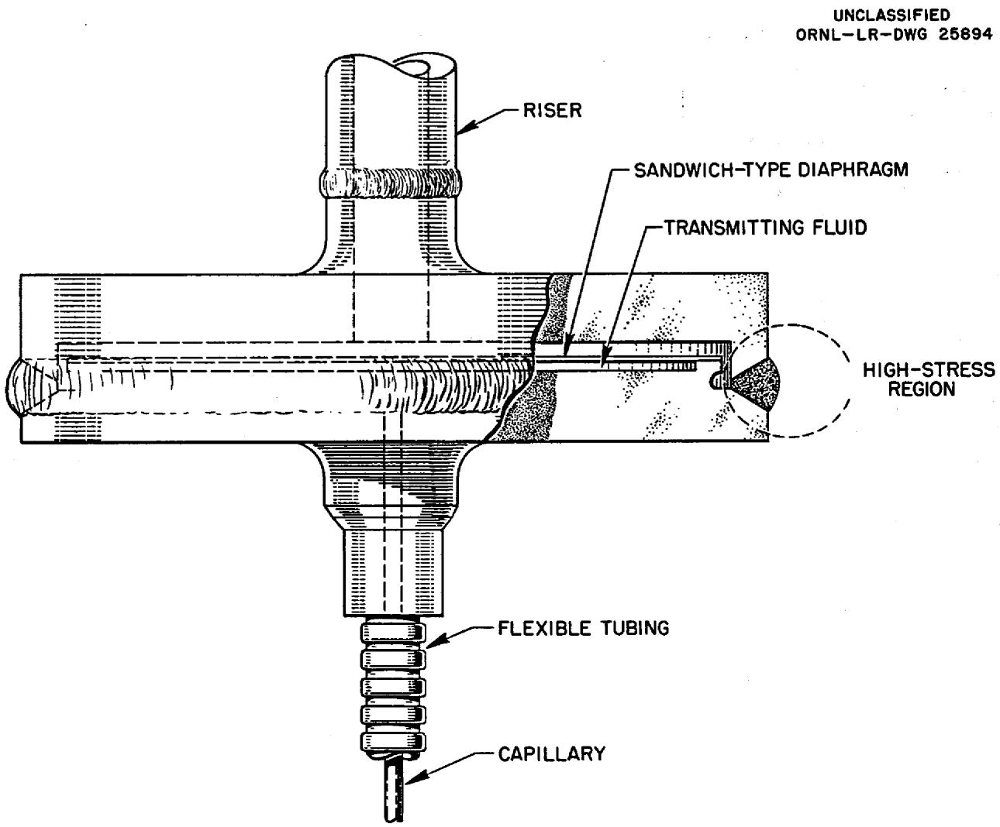  
Fig. 1.4.9. Pressure-Measuring Device.

exceed $0.2\%$ creep elongation. The analysis indicated that this device should not be used at $1500^{\circ}\mathrm{F}$ and above under the stress conditions indicated in Table 1.4.1. In applications where the dimensional stability of the unit is not the most important criterion, testing would be desirable in order to demonstrate the extent of the useful life.

# APPARATUS FOR ETR IN-PILE TESTS OF MODERATOR MATERIALS

G. Samuels

A preliminary layout of an apparatus for in-pile testing of moderator material in the temperature range of 1500 to $2000^{\circ}\mathrm{F}$ has been completed. The apparatus is designed for testing six moderator

specimens at one time. The specimens will be 3 in. long and will vary from $\frac{1}{2}$ to 1 in. in diameter. The initial moderator materials to be tested are beryllium oxide, yttrium hydride, and beryllium metal.

The purpose of the tests of yttrium hydride and beryllium oxide is to determine their maximum allowable thermal stress under various reactor operating conditions. In the case of the beryllium specimens, the thermal stress consideration is secondary to the study of compatibility with various canning materials.

The moderator materials will be canned in Inconel jackets, and, where necessary, a third material will be used between the moderator and jacket. The beryllium will be separated from

the Inconel by either chromium, molybdenum, or an oxide coating on the beryllium. For yttrium hydride, the intermediate material will be molybdenum. Beryllium oxide will not need the buffer material.

The jacketed moderator specimens will be centered in a water-cooled nickel sleeve. The clearance between the specimen and sleeve will vary from 0.015 to 0.060 in. depending on the moderator material, the diameter of the specimen, the location in the reactor core, and the desired minimum surface of the specimen. The heat from the specimen will be removed by radiation and conduction to the nickel sleeve. Helium or a mixture of helium and argon will be bled slowly through the gas space. For normal operating temperatures (about $1500^{\circ}\mathrm{F}$ ), $80\%$ or more of the

heat flux is carried by conduction so that the surface temperature will be very sensitive to the argon content of the gas, which will thus provide a convenient means of controlling the temperature.

Two thermocouples will be spot-welded to the jacket of each specimen at equal distances from each end and 180 deg apart. In addition each BeO specimen will have one thermocouple located in the center of the specimen at a distance of $\frac{3}{8}$ to $\frac{3}{4}$ in. from the end. Only one specimen each of yttrium hydride and beryllium will contain a center thermocouple during any test run. Knowledge of the temperature difference between the center and the surface of the specimens will facilitate the determination of the internal heat generation rate and thermal stress.

# 1.5. DESIGN PHYSICS

A. M. Perry

# ART FILL-AND-DRAIN TANK SHIELDING

H.W.Bertini

The general method of attack on the problem of shielding the ART fuel fill-and-drain tank was to choose a field point on the surface of the shield and calculate the dose at this point from radiation emitted from the surface of the tank.

The sources at the surface of the tank were considered to be point sources of magnitude

$$
\frac {S _ {v}}{4 \pi \mu} \cos \theta \times A \left(\frac {\text {M e v}}{\text {s e c - s t e r a d i a n}}\right),
$$

where

$$
S _ {v} = \text {M e v / s e c} \cdot \mathrm {c m} ^ {3} \text {o f f u e l v o l u m e ,}
$$

$$
\mu = \text {t o t a l} \quad \text {l i n e a r} \quad \text {g a m m a - r a y} \quad \text {c r o s s} \quad \text {s e c t i o n} \quad \text {o f} \quad \text {t h e} \quad \text {f u e l} \left(\mathrm {c m} ^ {- 1}\right),
$$

$$
\theta = \text {a n g l e} \text {b e t w e e n t h e n o r m a l t o t h e d u m p t a n k}
$$

$$
A = \text {a r e a o f t h e d u p t a n k s u r f a c e r e p r e s e n t}
$$

The $(S_{\nu} / 4\pi \mu)$ cos $\theta$ term is the surface source strength at the interface between a thick slab source and a thick slab shield that will give, essentially, the correct dose rate at the surface of the shield.

To the extent to which it was completed, the lead shield was designed so that the dose rate at any point on its surface was less than 0.2 r/hr after 100 hr of operation at 60 Mw, 9 days after shutdown.

Under these conditions, $S_{\nu}$ was calculated for a fuel volume of $2.5 \times 10^{5} \mathrm{~cm}^{3}$ , and the curves of decay energy after shutdown given by Moteff were used. The 1.65- and 2.55-Mev groups were the only ones used in these calculations, and the $\mu$ values for the fuel were taken from ORNL-2113 (ref 2) for these energies. In all cases, $\cos \theta$ was set equal to 1.

# Penetrations

The problem of penetrations in the shield is aggravated by the need to allow for relative motion of the tank, all pipes connected to it, and the tank shield. All penetrations through the shield are therefore larger than would ordinarily be anticipated.

In the region where the lead shield for the drain line meshes with that of the tank the dose rates at 16 field points from 6 point sources were calculated by using the technique described above. In addition, the dose rate at a point at the uppermost surface of the tank shield from single scattering in the lead around the drain line was calculated and found to be within design limits. At another point in this general region, where only 3 in. of lead separates it from about $\frac{3}{4}$ in. of unshielded drain line, the dose rate was calculated and found to be acceptable. The valve actuator penetration through the lead allowed the dose rate in this vicinity to be rather high. A 2-in.-thick, 8-in.-dia disk of lead fitted around the actuator arms in this region would reduce the dose rate to acceptable limits.

The pipes for carrying the NaK to heat and cool the fuel cannot be allowed to penetrate straight through the shield, because the dose rate at such penetrations would be prohibitive. A feeling for the magnitude of the problem can be obtained by noting that the dose rate at the surface of the tank is of the order of $2 \times 10^{5} \mathrm{r/hr}$ 9 days after shutdown from operation for 100 hr at 60 Mw.

By repeated calculations of the direct and reflected radiation and the radiation incident at slant angles it was found that the geometry sketched in Fig. 1.5.1 would meet the shielding requirements for penetrations in the tank. The direct radiation was calculated by using the point source concept outlined above. The reflected radiation was calculated by using the data given by Rockwell3 to estimate the angular distribution

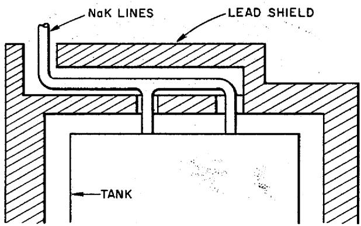  
SEOREP ORNL-LR-DWG 25895   
Fig. 1.5.1. Top of ART Fill-and-Drain Tank and Shield Showing Recommended Configuration for NaK Lines Penetration.

of reflected radiation and the data given by Zerby to estimate the fraction of the incident radiation that is reflected. The data of Rockwell do not correspond to ART fuel fill-and-drain tank gamma-ray energies or material, and the data of Zerby do not correspond to ART fuel fill-and-drain tank gamma-ray energies. This calculation appears to be about all that can be done at this time, however, and the calculated dose rate is probably in error by a factor of the order of 2. The dose rate for radiation incident at slant angles was calculated from the work of Peebles.5

At the bottom of the reactor, the fill-and-drain tank support penetrates the lead shield. About 2 in. below this penetration the dose rate was calculated to be about $2.5 \times 10^{4} \mathrm{r/hr}$ . In the vicinity of the top of the air cylinder for the tank support, about 29 in. below the penetration, the dose rate was calculated to be about $2 \times 10^{3} \mathrm{r/hr}$ .

# Overlap in Shield at Removable Top Section

In order to facilitate assembly and disassembly, it was necessary to design the tank shield so

that the top portions of the lead would be removable in sections. The problem was to determine whether any overlap of these sections would be required when they were in place on the tank.

By using the method described above, the dose rate at a point opposite a $\frac{1}{16}$ -in. crack in the lead which would expose the tank surface was calculated to be about 120 r/hr. Therefore a clearance of this size separating the sections of the lead would be much too large.

If the sections of the lead were brought together with no clearance, but in such a manner that the $5\%$ in. steel cladding layers around each lead section touched and formed a $\frac{5}{8}$ -in. slab of iron between the adjoining lead sections, the dose rate at the outer surface of the slab of iron would be about 2 r/hr, which is also not acceptable. It was therefore concluded that all adjoining pieces should be overlapped at about their mid-thickness.

# Incomplete Work

Additional calculations are required for the shielding of the small lines which connect with the upper region of the face of the tank and penetrate the shield. Calculations are also required to determine the dose rate near the bottom of the shield as a result of scattered and direct radiation through the penetration in the lead required for the tank support.

# DOSE RATE IN REGION OF ART PUMPS

H.W.Bertini C.M.Copenhagen

In order to ascertain the feasibility of having a man enter the ART reactor cell to unbolt an inoperative fuel or sodium pump for removal, the dose rate was calculated at a point, $P$ , 62.5 in. above the reactor midpoint and 22.5 in. from the axis, such point being in the vicinity of the bottom of the pump motor. The condition chosen was 9 days after shutdown following 100 hr of reactor operation at 60 Mw.

The sodium activation contribution was found to be 0.23 r/hr, of which 0.05 r/hr would be through lead, 0.13 r/hr would be through NaK pipe penetrations to the sodium-to-NaK heat ex-changers, and 0.05 r/hr would be through other penetrations. The corresponding sodium dose rate at shutdown is 5000 r/hr.

The fuel contribution would be principally from residual fuel pockets whose probable volumes and locations are presently not well known. The fuel pumps, the fuel annulus around the control rod in the sodium expansion tank, etc., would contribute about 3 r/hr, with about 2 r/hr being through the fuel pump penetrations. On the assumption that $2\%$ of the total fuel in the reactor system would remain uniformly distributed in the main fuel-to-NaK heat exchanger upon draining of the reactor, the dose through the NaK pipe penetrations would be about 500 r/hr.

The off-gas line will pass very close to one of the fuel pumps and part of it will be visible through the pump penetration. A total of $3 \times 10^{15} \mathrm{Ba}^{140}$ nuclides per second was assumed to pass into the off-gas line and deposit uniformly on its surfaces. If it is assumed that a 3-cm length of off-gas line will be directly visible through the penetration, the dose rate was calculated to be $260 \mathrm{r/hr}$ from this source. A summary of this preliminary calculated dose rate at $P$ is given below:

<table><tr><td>Source</td><td>Dose Rate (r/hr)</td></tr><tr><td>Sodium</td><td>0.2</td></tr><tr><td>Fuel pockets</td><td>3</td></tr><tr><td>Residual fuel in heat exchanger</td><td>500</td></tr><tr><td>Off-gas line</td><td>260</td></tr></table>

# DECAY OF GAMMA ACTIVITY IN U235- CONTAINING ART FUEL FOR SHORT TIMES AFTER SHUTDOWN

J. Foster

The rates of decay-gamma energy emission from $U^{235}$ fuel for the first 180 sec after reactor shutdown following 500 hr of operation were calculated for six gamma-ray energy groups. The results (for the six energy groups) were plotted (Fig. 1.5.2) as Mev/sec for an operating level of one fission per second as a function of time after shutdown. Although data have been available for the rate of decay of gamma activity for times of a few minutes or more after shutdown, no data have been available up to this time for the period

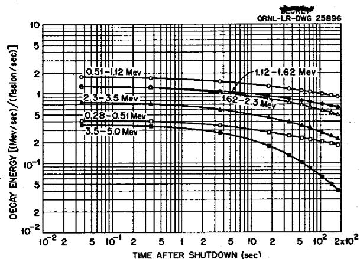  
Fig. 1.5.2 Decay-Gamma Energy vs Time After Shutdown for U $^{235}$ -Containing Fuel Operated for 500 hr at 60 Mw in the ART. Decay energy calculated for the six gamma-ray energy groups indicated.

immediately after shutdown. These short-time decay rates are important in calculating heating rates and cooling requirements for such system components as the fuel drain valves. Results of this study yield a total decay-gamma energy of 5.83 MeV fission at $10^{-5}$ hr after shutdown.7

# DECAY-GAMMA HEATING IN ART FUEL DRAIN VALVES

J. Foster

Calculations were made of the heat deposition rates in the bellows and stem of the ART fuel drain valves by decay-gamma energy originating in fuel draining through the valve immediately after shutdown following 500 hr of 60-Mw operation.

The total decay-gamma energy deposition rate at the instant of shutdown was calculated to be $2.5\mathrm{w/cm}^3$ of Inconel, which corresponds to a rate of temperature rise of about $1^{\circ}\mathrm{F/sec}$ . If it is assumed that fuel remains in the valve for 3 min, which is the maximum allowable duration of the fuel draining operation, and the decrease in gamma activity during this period is allowed for, a total temperature rise of $106^{\circ}\mathrm{F}$ is obtained. No allowance was made in the calculation for heat loss from the Inconel piping during the 3-min period.

# 1.6. MATERIALS AND COMPONENTS INSPECTION

A. Taboada

# MATERIAL INSPECTION

A. Taboada

G. M. Tolson

Tubing

Approximately 3 miles of tubing, 15,827 ft, was inspected during the quarter, and, of this amount, 4126 ft (26%) was rejected. The rejected tubing included 1109 ft that can be salvaged by pickling; 1093 ft of the rejected tubing was returned to the vendor for credit. The remaining rejected material was downgraded for less critical applications.

Included in the tubing inspected was 128 ft of INOR-8 tubing of which 5 ft (4%) was rejected. Typical defects found on the INOR-8 tubing are shown in Figs. 1.6.1 and 1.6.2, and a defect not previously observed is shown in Fig. 1.6.3.

As mentioned previously, a phosphoric acid pickling method has been developed for removing

magnetic particles stuck to the inside of CX-900 tubing. In order to determine whether there would be any harmful effects from the pickling solution, a sample of Inconel tubing was immersed in phosphoric acid for 160 hr and then examined metallographically. No attack was found, and it therefore appears that the pickling method may be used satisfactorily for the removal of magnetic particles.

A large number of outer surface scratches are found during the inspection process, and, although the scratches are usually superficial, they interfere with subsequent ultrasonic tests. Investigations have revealed that intermittent polishing and repolishing can reduce the rejection rate substantially. Tubing rejected previously by ultrasonic inspection is being re-evaluated.

# Pipe, Plate, Sheet, Rod, and Fittings

A total of 532 ft of Inconel pipe was inspected, and 73 ft (14%) was rejected. Also, 1027 ft² of

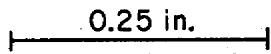

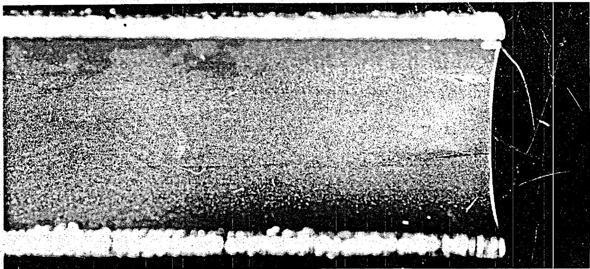  
UNCLASSIFIED T-12859   
Fig. 1.6.1. Photomacrograph of INOR-8 Tubing Showing Two Cracks Which Penetrate Completely Through the Wall of the Tube. The cracks were found by radiographic inspection. 5X.

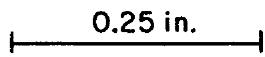

UNCLASSIFIED T-12860

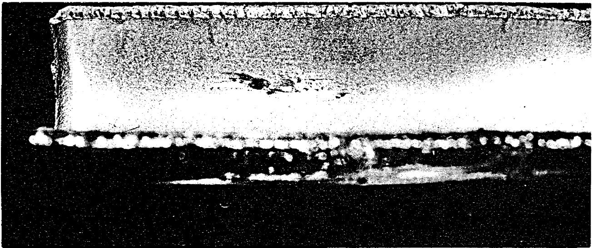  
Fig. 1.6.2. Photomacrograph of Gouge Found on Inside Surface of INOR-8 Tubing by Radiographic Inspection. 5X.

plate and sheet was examined, of which $47\text{ft}^2$ $(4.6\%)$ was rejected. The inspection of 81 ft of rod resulted in the rejection of 18 ft $(22\%)$ . There were 41 fittings inspected, and 5 were rejected.

# Embrittlement of Inconel by Penetrants

An experiment, described previously, was conducted to determine whether the solutions used in penetrant inspection would cause embrittlement of Inconel at high temperatures. Metallographic examinations of samples which had been heated at $1500^{\circ}\mathrm{F}$ for a period of 50 hr showed no embrittlement or attack as a result of exposure to the penetrants.

# Chemical Analyses of Materials

Chemical analyses of materials received for inspection are now being obtained by spectrographic techniques. A comparison of spectrographic results with the standards established by wet chemical analysis indicates an accuracy of $\pm 10\%$ .

2lidb.,p80.

# Electrical Calrods

Radiographic inspection was made on 1964 ft of electrical Calrods in order to determine the positioning of the conduit. Those units which showed improper positioning or faulty conduit were either rejected or downgraded.

# WELD INSPECTION

# A. Taboada R. L. Heestand

Welds fabricated on ART and ETU components and on experimental test loops by the inert-gas shielded-arc method were inspected. The defective conditions found by inspection were porosity, cracks, tungsten inclusions, lack of fusion, and lack of penetration. Several welds were examined which had been fabricated on core shells for test purposes. In general, these welds were found to be acceptable for the intended use; however, in some instances defects were noted that would have been cause for rejection or repair if they had been found on ETU or ART parts.

0.25 in.

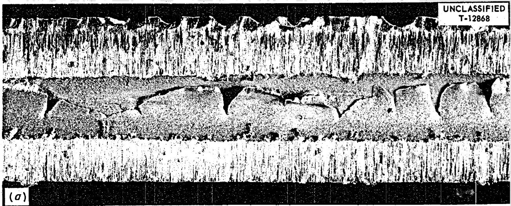

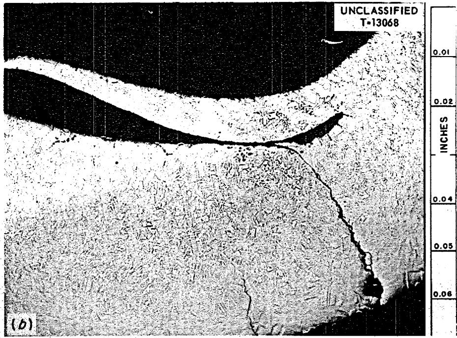  
FIG. 1.6.3. Photomacrograph (a) and Photomicrograph (b) of Defective INOR-8 Tubing Located by Radiographic Inspection. (a) 8X. (b) 50X. Etchant: glyceregia.

# INSPECTIONS OF REACTOR SHELLS

A. Taboada

G. M. Tolson

# Inner Core Shells (Shell I)

Radiographs of inner core shell sections made by forming, welding, and machining were found to have "white lines" in the weldments. Metallographic examinations showed the lines to be associated with large dendritic grains that extended through the entire weldment.

# Outer Core Shells (Shell II)

Inspections of spun outer core shells described previously as "in process" were completed. The results of all the inspections are presented in Table 1.6.1.

It is to be noted that none of these shells are to be used in the ETU and ART. Complete inspection was performed in many cases for checking manufacturing techniques and quality of the finished parts and for obtaining data for use in other tests.

# Shell III

The bottom section of core shell III was inspected by radiography following an intermediate machining operation. One weldment was found to contain pores and areas that were contaminated. No repairs were made on the weldment because the poor areas may be removed during subsequent machining. The shell will be inspected again in the final form.

# Shells IV and V

Shell material formed by deep-drawing in the Y-12 shops was examined to investigate the method that is to be used by Kaiser Metal Products in the fabrication of shells IV and V. Specimens consisting both of weld deposits and of the parent material were found to be acceptable.

Additional specimens of as-received material and of annealed material (1800°F for 10 min) which had ruptured during fabrication were received from Kaiser Metal Products. Rockwell hardness tests were performed (Table 1.6.2), and the ductility of the material in various stages of the

Table 1.6.1. Results of Examinations of Spin Outer Core Shells   

<table><tr><td>Lot No.</td><td>Piece No.</td><td>Metallographic Examination of Sample</td><td>Nondestructive Inspection of Shell</td></tr><tr><td>1</td><td>1</td><td>Not required</td><td>Rejected for surface defects</td></tr><tr><td>1</td><td>2</td><td>Not required</td><td>Rejected for defects</td></tr><tr><td>1</td><td>5</td><td>Rejected because of overpickling*</td><td>Not required</td></tr><tr><td>4</td><td>12</td><td>Accepted*</td><td>Not required</td></tr><tr><td>3</td><td>1</td><td>Rejected</td><td>Thin wall areas</td></tr><tr><td>1</td><td>4</td><td>Accepted</td><td>Rejected by visual inspection because of overpickled condition</td></tr><tr><td>4</td><td>8</td><td>Accepted</td><td>Not required</td></tr><tr><td>4</td><td>11</td><td>Accepted</td><td>Not required</td></tr><tr><td>4</td><td>10</td><td>Rejected</td><td>Thin wall areas</td></tr><tr><td>4</td><td>4</td><td>Accepted*</td><td>Not required</td></tr><tr><td>4</td><td>7</td><td>Rejected</td><td>Rejected on visual and dye-penetrant inspections; thin wall areas</td></tr></table>

*Metallographic specimens obtained from cut-up shell.

Table 1.6.2 Hardness and Ductility of Inconel Specimens Received from Kaiser Metal Products Company   

<table><tr><td>Specimen</td><td>Hardness, RB</td><td>Estimated Elongation (% in 2 in.)</td></tr><tr><td>As received*</td><td>80</td><td>41</td></tr><tr><td>As drawn*</td><td>93</td><td>22</td></tr><tr><td>Annealed</td><td>73</td><td>43</td></tr></table>

\*A control sample of this material has been taken for subsequent comparisons.

shell-forming process was extrapolated from the hardness data. Although data of this type are reasonably accurate, tensile and elongation tests are also being performed, since large variations in mechanical properties are usually found in different heats of the material and occasionally in the same heat. It may be noted from Table 1.6.2 that the hardness of the annealed material is not so low as that sometimes found in deep-drawn good-quality Inconel. Therefore it has been recommended that the material be annealed at $1800^{\circ}\mathrm{F}$ for $20\mathrm{min}$ in the future.

# INSPECTION OF COMPONENTS RECEIVED FROM VENDORS

R. L. Heestand G. M. Tolson

# York Corp. Radiators and Radiator Materials

Radiographs of the tube-to-header welds of finned-section units 9, 11, 12, and 14 of the main ETU NaK-to-air radiators being supplied by the York Corp. were reviewed to assure that they had been properly interpreted. Rejection of units 9 and 11 by the ORNL inspector stationed at the York Corp. was affirmed; unit 12 was found to be acceptable; and recommendations were made for the repair of two porous welds on unit 14. Radiator units 18 and 19 were inspected and found to be acceptable, and unit 20 is being inspected.

Two 1-Mw test radiators, units 2 and 3, were received for inspection. Unit 2 was found to be acceptable, but it was found that the return bends of five of the tubes of unit 3 had been damaged during installation of a sawing fixture for the

slitting of the fins. The deepest defect was repaired by welding.

A header piece for the south head of the main fuel-to-NaK heat exchanger that had been fabricated for stress analysis tests was also inspected. Several pinhole leaks found in the brazed tube-to-header joints were repaired by the ORNL Welding and Brazing Laboratory by flowing Coast Metals brazing alloy No. 52 over the pinholes with an acetylene torch. The necessary inlet and outlet tubes were also installed, and the unit was submitted for testing.

Inspections of samples of stainless-steel-clad copper fins on which the cladding appeared to be blistered revealed a thin layer of oxide on the stainless steel surface that was of sufficient thickness to prevent bonding. It was recommended that all fin material that showed defects of this type be rejected.

Control samples, which duplicated units 5, 6, 7, 8, and 12, were examined metallographically before and after exposure to air at $1500^{\circ}\mathrm{F}$ for 100 hr. Control samples 5, 6, 7, and 8 were acceptable, but sample 12 showed lack of flow of the brazing alloy, and $60\%$ of the fin lips were found to be unprotected after oxidation.

Recommendations were made to the York Corp. for the use of jigs and fixtures in making the welds of tube-to-header joints in order to prevent the braze cracks found on ETU radiator unit 1. The cracks resulted from excessive weld shrinkage. A procedure for the repair of the cracked unit was also recommended. Spacers for use during brazing were prepared and sent to York Corp. These Inconel X spacers were fabricated by rolling and processing in a hydrogen atmosphere for 30 min at $1950^{\circ}\mathrm{F}$ ; 200 spacers were prepared.

# Griscom-Russell Co. Heat Exchangers

Sodium-to-NaK heat exchanger units 1 and 2 fabricated by Griscom-Russell Co. were submitted for inspection prior to installation in the ETU north head. Root passes of the welds on each head of both heat exchangers showed lack of penetration because of shrinkage and inadequate repair work. Cleanup passes will be made on future units to eliminate defects of this type. Since no defects serious enough to cause failure of the units were found, they were accepted for use in the ETU system.

A K-fin radiator job sample was examined and rejected because of a manufacturing defect imposed on the tube by the winding of the fin. It was requested that the tube-sheet design for the K-fin radiator be revised because there are areas in the present design which would be stressed beyond the yield strength of the Inconel.

The following procedures and samples were examined and approved: (1) a tube-to-header weld and braze sample with eight tubes; (2) three tube-to-header welder-qualification samples; (3) a fuel-to-NaK heat-exchanger-header assembly sequence; (4) a dummy sodium-to-NaK heat-exchanger-header assembly; (5) a joint change of a sodium-to-NaK heat-exchanger nozzle-to-header weld; and (6) a sodium-to-NaK heat-exchanger header for stress-analysis testing.

# Black, Sivallis & Bryson Heat Exchangers

A resistance technique for bending the fuel-to-NaK heat exchanger tubes was approved after destructive and nondestructive examination of tentube samples submitted by Black, Sivalls & Bryson. North and south header stress analysis samples were received, and after repairs of several cracks, the north head sample was accepted for testing. The south head stress analysis sample is being inspected.

The following reports, procedures, and samples were examined and approved: (1) radiographic techniques for examination of tube-to-header welds; (2) a report covering the modification of the channel-to-web weld joint; (3) samples of and a report on the bulkhead weld; (4) a report on tube-to-header brazing covering the use of rings contoured to fit the header; (5) braze samples 1 and 2 that illustrated vertical and horizontal brazing; (6) proposed welding techniques for the channel, flute filling, inlet pipes, outlet pipes, and the bulkhead-to-tube-sheet joints.

# Midwest Piping Company Forgings and Weldments

Nondestructive and destructive examinations were completed on samples of hot-forged Inconel reducers which were fabricated at temperatures of 1800 to $1850^{\circ}\mathrm{F}$ by the Midwest Piping Company. Metallographic examination revealed the grain size to be no greater than No. 5, and therefore the fabrication method was approved.

An Inconel pipe saddle weldment was examined and approved for design and weld integrity. Also

a 90-deg bend in a piece of $3\frac{1}{2}$ -in. Inconel pipe was checked for wall thinning, flattening, and other defective conditions and was found to be satisfactory.

# Process Engineering, Inc., Tanks and Bellows Expansion Joints

Inspection was completed on standard NaK tank No. 2 received from Process Engineering, Inc., and it was found to be acceptable for the intended use. Four other tanks have been received and are being inspected. Twelve bellows expansion joints for the ART were also received for inspection.

# Fulton-Sylphon Company Bellows

A sample ETU sodium expansion bellows was received from the Fulton-Sylphon Company for evaluation of fabrication techniques. Examination revealed that the seam welds on each end of the unit were porous. Metallographic examination revealed dirt imbedded between each of the three plys of the bellows. In the weld metal, pores up to 0.005 in. in diameter were found. It was recommended that more care be taken in the fabrication of the bellows to eliminate sources of dirt and contamination.

# Hoke, Inc., Inconel and Stainless Steel Valves

Fifteen Inconel and fifteen type 316 stainless steel valves, which have two welds each, were received from Hoke, Inc., for acceptance of the welds. Inspection resulted in the detection of five defective welds. These welds were repaired and were found to be acceptable upon re-examination.

# METAL IDENTIFICATION METER

A. Taboada G.M.Tolson

The examination with the metal identification meter of an ART-type fuel pump after test operation indicated that a material other than Inconel had been used. Further tests with the metal identification meter and a Spotchek chemical kit revealed that the labyrinth seal was fabricated of a 300-series stainless steel. Since material other than Inconel has been detected in other components by this equipment, two additional meters have

been ordered for adequate inspection to ensure that only Inconel is used in the ETU and ART.

The meter now available is being used to check all components being received from vendors. The second meter will be used in the Y-12 Plant General Shops in order to check all incoming materials and to check all components that are fabricated there. The third meter will be used to check all material that is welded in the welding shop established for the assembly of the ETU and ART.

# INSTRUMENTATION AND CONTROLS INSPECTIONS

# Nickel-Copper Welds in Liquid-Level Probes

Several failures have occurred in the nickel-copper welds in liquid-level probes. A microscopic examination of one of the failed welds revealed stringers of copper oxide adjacent to the failure zone. Radiographs of several other probe welds showed large pores, which indicate high oxygen content of the copper. Probes which have not failed are being examined to obtain comparative information that will be useful in further investigation of the cause of failure.

A liquid-level indicator which cracked and leaked in five areas was found to have failed because of ratcheting of the ceramic insulators. The tube failures were typical of tube-burst test failures under biaxial loading. A second liquid-level indicator failed because of leakage through a pin-hole. The initial radiographs taken of this area were re-examined, but no indication of the defect was found. Since the unit had also passed dye-penetrant inspection, the pinhole probably originated in the inner lead weld which was not accessible for dye-penetrant inspection.

# Thermocouple Welds

A test thermocouple which failed during testing in NaK at $1500^{\circ}\mathrm{F}$ was examined metallographically. The failure was found to have occurred in the closure weld of the thermocouple sheath and was due to lack of penetration of the weld. At the point of failure the magnesium oxide insulating material had been leached to a depth of approximately $\frac{1}{2}$ in. during the 5000 hr of exposure to NaK at $1500^{\circ}\mathrm{F}$ , and NaK had diffused through the insulating material approximately 10 in. No

deterioration of the metal parts of the unit could be seen. The failure zone is shown in Fig. 1.6.4, and the thermocouple assembly is shown in Fig. 1.6.5.

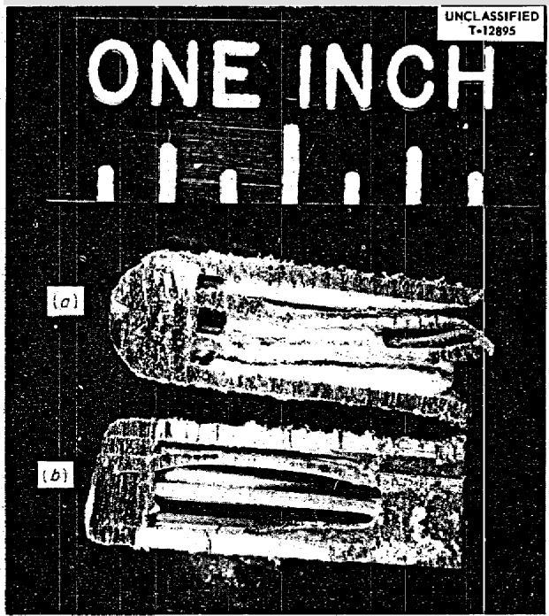

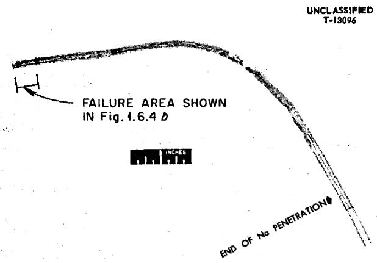  
Fig. 1.6.4. Sectioned Thermocouple Assemblies After Service In NaK at $1500^{\circ}\mathrm{F}$ . The unit shown in (a) operated satisfactorily for 5000 hr. The unit shown in (b) failed because of a crack in the closure weld on the sheath. Note removal of insulation by reaction with NaK. The dark insulation visible in (b) is saturated with NaK.   
Fig. 1.6.5. Thermocouple Assembly Which Failed During Exposure to NaK for 5000 hr at $1500^{\circ}\mathbf{F}$ .

# PROCEDURES FOR RADIographic INSPECTION OF WELDMENTS ON ART ISLAND AND REFLECTOR

A. Taboada

G.M.Tolson

There are seven critical welds on the ART and ETU which can be radiographically inspected only through sections of beryllium. Normal radiographic techniques cannot be used because beryllium scatters the incident x-ray beam and causes general fogging of the film. Experiments are being

run in order to determine techniques for obtaining maximum sensitivity.

Several radiographic techniques were used in the inspection of the equatorial weld on the ETU island shell assembly, but it was impossible to estimate the radiographic sensitivity obtainable by these methods. A mockup of the assembly with known discontinuities was therefore obtained, and the sensitivities of the inspection methods are being investigated.

# 1.7. HEAT TRANSFER STUDIES

H.W.Hoffman

# THERMAL-CYCLING RESEARCH

Pressurized System

H.W.Hoffman

D. P. Gregory

The experimental investigation of the effect of thermal-stress cycling on Inconel tubes filled with flowing NaF-ZrF $_4$ -UF $_4$ (50-46-4 mole %) was continued with the use of the pressurized-flow system. Data were obtained at temperatures near $1600^{\circ}\mathrm{F}$ for tube bends, tube welds, and straight

tubes cycled at frequencies of 0.4 and 1.0 cps. The results of the experiments performed during the quarter are presented in Tables 1.7.1 and 1.7.2 and are summarized in Fig. 1.7.1.

Straight tubes were tested at a cyclic frequency of 1 cps for comparison with the data of experiments made at frequencies of 0.01 and 0.4 cps. As previously reported,2 the tests at 0.01 and 0.4 cps frequencies indicated no significant effect of cycling frequency on depth of attack. However,

On assignment from Pratt & Whitney Aircraft.

2H. W. Hoffman and D. P. Gregory, ANP Quar. Prog. Rep. June 30, 1957, ORNL-2340, p 82.

Cycling rate: 0.4 cps  
Tubing size: $\frac{1}{4}$ -in. OD, 0.035-in. wall  
Heater length: 8 in.

Table 1.7.1. Results of Thermal-Cycling Test of Inconel Tubing Containing Flowing NaF-ZrF4-UF4 (50-46-4 mole %)   

<table><tr><td>Test Conditions</td><td>ET-27a</td><td>ET-29b</td><td>ET-30</td><td>ET-31</td><td>ET-32</td><td>ET-33</td><td>ET-34</td><td>ET-35</td><td>ET-36</td><td>ET-37</td></tr><tr><td>Duration of run, hr</td><td>4</td><td>11</td><td>6.5</td><td>30</td><td>25</td><td>54</td><td>19</td><td>45</td><td>11.5</td><td>15</td></tr><tr><td>Heater section</td><td></td><td></td><td></td><td></td><td></td><td></td><td></td><td></td><td></td><td></td></tr><tr><td>Outer wall temperature, °F</td><td></td><td></td><td></td><td></td><td></td><td></td><td></td><td></td><td></td><td></td></tr><tr><td>Average</td><td>1597</td><td>1795</td><td>1725</td><td>1769</td><td>1767</td><td>1763</td><td>1716</td><td>1700</td><td>1664</td><td>1648</td></tr><tr><td>Fluctuation</td><td></td><td>±85</td><td>±116</td><td>±97</td><td>±97</td><td>±96</td><td>±89</td><td>±77</td><td>±80</td><td>±70</td></tr><tr><td>Maximum depth of attack, mils</td><td></td><td></td><td></td><td></td><td></td><td></td><td></td><td></td><td></td><td></td></tr><tr><td>General subsurface voids</td><td>2</td><td>2</td><td>4</td><td></td><td></td><td></td><td>6</td><td></td><td></td><td></td></tr><tr><td>Intergranular attack</td><td>3</td><td>4</td><td>4</td><td>5</td><td></td><td>10.5</td><td>6</td><td>8</td><td></td><td></td></tr><tr><td>Test section</td><td></td><td></td><td></td><td></td><td></td><td></td><td></td><td></td><td></td><td></td></tr><tr><td>Outer wall temperature, °F</td><td></td><td></td><td></td><td></td><td></td><td></td><td></td><td></td><td></td><td></td></tr><tr><td>Average</td><td>1597</td><td>1623</td><td>1604</td><td>1590</td><td>1613</td><td>1620</td><td>1598</td><td>1626</td><td>1590</td><td>1584</td></tr><tr><td>Fluctuation</td><td></td><td>±3</td><td>±13</td><td>±14</td><td>±16</td><td>±13</td><td>±15</td><td>±15</td><td>±16</td><td>±16</td></tr><tr><td>Maximum depth of attack, mils</td><td></td><td></td><td></td><td></td><td></td><td></td><td></td><td></td><td></td><td></td></tr><tr><td>General subsurface voids</td><td>2</td><td>5</td><td>4</td><td></td><td>4.5</td><td>7</td><td>3</td><td></td><td>35</td><td></td></tr><tr><td>Intergranular attack</td><td>3</td><td>5</td><td>4</td><td>3.5</td><td></td><td>7</td><td></td><td>6</td><td>35</td><td></td></tr><tr><td>Inlet mixed-mean fused-salt temperature, °F</td><td>1597</td><td>1573</td><td>1578</td><td>1573</td><td>1574</td><td>1573</td><td>1542</td><td>1598</td><td>1555</td><td>1562</td></tr><tr><td>Cause of test termination</td><td>Voluntaryc</td><td></td><td></td><td></td><td></td><td></td><td></td><td></td><td></td><td></td></tr></table>

$a_{\mathrm{Isothermal}}$   
$b_{\text{High-frequency cycling rate: 1 cps.}}$   
All other runs were terminated by instrument failure.

Table 1.7.2. Results of Thermal-Cycling Tests of Bent Inconel Tubes Containing Flowing NaF-ZrF4-UF4 (50-46-4 mole %) Cycled at a Rate of 0.4 cps   

<table><tr><td rowspan="2">Run</td><td rowspan="2">Description</td><td colspan="2">Attack in Straight Portion</td><td colspan="2">Attack in Bends</td><td rowspan="2">Comments</td></tr><tr><td>Depth (mils)</td><td>Type of Attack</td><td>Depth (mils)</td><td>Type of Attack</td></tr><tr><td>ET-30</td><td>Prior creep, fine grained, four 90-deg bends</td><td>3.5</td><td>General</td><td>4</td><td>General in all bends</td><td>Equal attack on both tension and compression sides of each bend</td></tr><tr><td>ET-31</td><td>No prior stress, fine grained, four 90-deg bends</td><td>3.5</td><td>Intergranular</td><td>4</td><td>Intergranular in all bends</td><td>Deepest attack found near center of each bend with no difference between tension and compression sides of bends</td></tr><tr><td rowspan="3">ET-32</td><td>No prior stress, fine grained</td><td>4.5</td><td>Intergranular</td><td></td><td></td><td>Tendency toward slightly deeper intergranular attack on tension sides of bends</td></tr><tr><td>Two 30-deg bends</td><td></td><td></td><td>6</td><td>Intergranular</td><td></td></tr><tr><td>Two 150-deg bends</td><td></td><td></td><td>5</td><td>Heavy inter-granular</td><td></td></tr><tr><td>ET-33</td><td>No prior stress, coarse grained, four 90-deg bends</td><td>7</td><td>General</td><td>8</td><td>General in all bends</td><td>Equal attack on both tension and compression sides of bends</td></tr><tr><td>ET-34</td><td>No prior stress, coarse grained, two 30-deg bends, two 150-deg bends</td><td>3</td><td>General</td><td>3.5</td><td>General in all bends</td><td>Equal attack on both tension and compression sides of bends</td></tr></table>

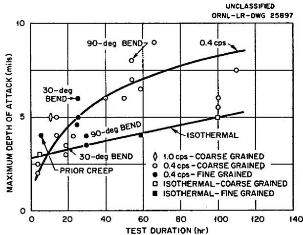  
Fig. 1.7.1. Summary of Data Obtained in Thermal-Cycling Experiments with Inconel Tubing Filled with Flowing NaF-ZrF4-UF4 (50-46-4 mole %). (Secret with caption)

preliminary results of a run (ET-29, Table 1.7.1) at 1 cps showed test-section attack that was somewhat greater than that observed at the lower frequencies. The low temperature amplitude $(\pm 3^{\circ}F)$ at the outside wall of the test section resulted from the increased cycle frequency. The observed intergranular attack of 5 mils with a temperature fluctuation of only $\pm 3^{\circ}F$ indicates that the extent of the attack on Inconel is frequency dependent, with a critical frequency in the vicinity of $1/2$ to 1 cps. Additional data are currently being obtained at the 1-cps frequency in order to verify this conclusion.

The effect of prior strain on the extent of the corrosive attack on Inconel under thermal cycling conditions was investigated in the series of runs ET-30 through ET-34 (Table 1.7.2). For run ET-30, a fine-grained tube was prestressed to give a fixed strain, allowed to relax for 24 hr at $1300^{\circ}\mathrm{F}$ , and then bent, as shown in Fig. 1.7.2a. Because of

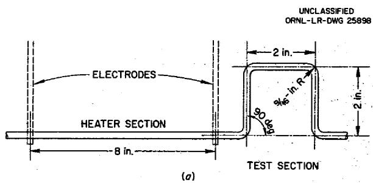

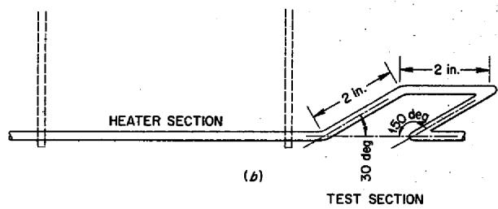  
Fig. 1.7.2. Test Section Configurations Used in the Determination of the Effect of Thermal Cycling on Tube Bends. (a) 90-deg bend. (b) 30-deg bend.

the crudeness of the creep apparatus, the exact strain imparted is not known. However, it is felt that the results give at least a qualitative estimate of the effect of stress. Runs ET-31 through ET-34 were performed with annealed (as-received) tubing. Two of these tubes, ET-31 (fine grained) and ET-33 (coarse grained), were bent as shown in Fig. 1.7.2a; while the other two tubes, ET-32 (fine grained) and ET-34 (coarse grained), were bent as shown in Fig. 1.7.2b. It may be noted from Table 1.7.2 that in all cases the attack was greater in the bends than in the straight sections of the tube. However, no difference was detected between the attack on the tension and compression sides of the bends. On the basis of data obtained by the Experimental Engineering Group in tests of tube bundles in a fluoride fuel environment, this result is somewhat unexpected. A duplicate series of thermal-cycling tests with bent tubes will be initiated shortly that will be scheduled for 100 hr of operation.

It may also be noted in Table 1.7.2 that, as in previous tests, the fine-grained tubes showed intergranular attack and the coarse-grained tubes showed general attack. Photomicrographs showing the attack in two tube bends are presented in Fig. 1.7.3.

Since it is planned to use welded and machined shells in contact with the fluoride salt in the ART, a study of the effect of thermal cycling on machined welds was undertaken. The test sections were formed by butt-welding two pieces of Inconel tubing (0.25-in. OD, 0.035-in. wall thickness). The inside of the weld was reamed to the original inside tube diameter, and the outside was machined back to the original outside tube diameter. The weld was located approximately 1 in. downstream from the heater. The results of these tests, runs ET-35 through ET-37, are given in Table 1.7.1. Photomicrographs of the weld areas of the specimens are not yet available. Run ET-35 was made with a fine-grained tube, while coarse-grained tubes were used for runs ET-36 and ET-37. Further, the specimen used in run ET-37 was constructed by building up $\frac{1}{4}$ in. of weld metal on the ends of the tubes, machining the weld metal to the original tube dimensions, and welding the weld-metal pieces together. The specimen used in run ET-35 showed the same depth of attack in the weld region as in the unwelded portion of the tube, with perhaps somewhat denser subsurface void formations in the weld. The specimens used in runs ET-36 and ET-37 both failed in the weld areas after relatively short exposures. In all cases the welds were fabricated by a qualified Inconel welder. However, since the welds were not critically inspected, the possibility of initial weld porosity exists. Additional tests of this type are to be run with welds which have satisfactorily passed inspection.

# Pulse-Pump System

J.J.Keyes, Jr. A.I.Krakoviak A.G.Smith, Jr.1

The high-frequency pulse-pump thermal-cycling loop has been successfully operated with the fuel mixture NaF-ZrF4-UF4 (56-39-5 mole %) as the fluid medium. The initial run extended over approximately 72 hr of intermittent isothermal and cyclic temperature-difference operation. The mean fluid temperature was in the range 1300 to $1350^{\circ}\mathrm{F}$ , and hot- to cold-leg temperature differences of as much as $175^{\circ}\mathrm{F}$ were achieved. Much difficulty was experienced, however, in controlling the levels of the six free liquid surfaces incorporated in the loop. At the end of the initial run, the loop was

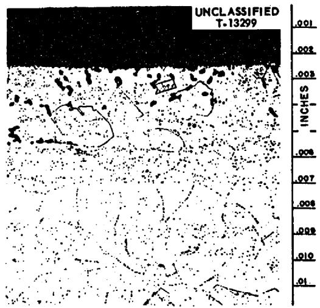  
(a) STRAIGHT PORTION

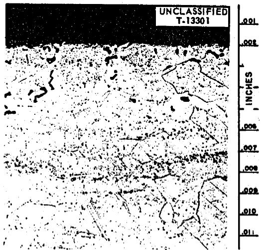  
(b) 90-deg BEND-TENSION SIDE

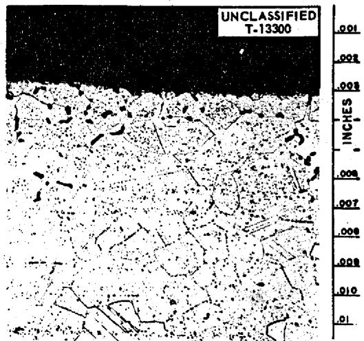  
(c) 90-deg BEND-COMPRESSION SIDE

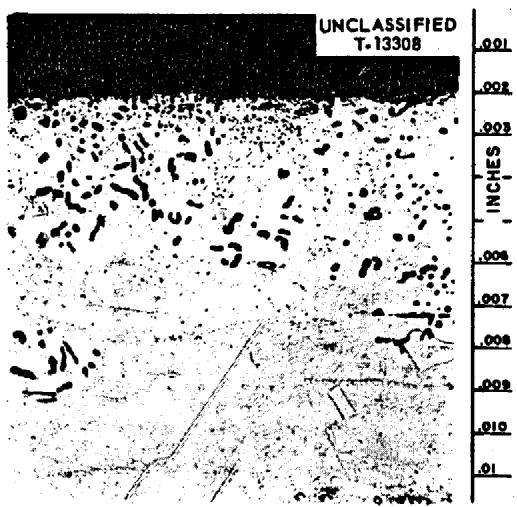  
RUN ET-31: NO PRIOR STRESS, FINE GRAINED, FOUR 90-deg BENDS   
$(d)$ STRAIGHT PORTION

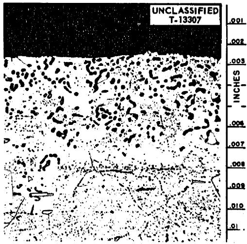  
(e) 90-deg BEND-TENSION SIDE

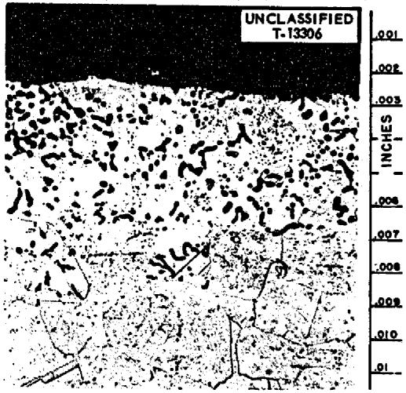  
(f) 90-deg BEND-COMPRESSION SIDE   
RUN ET-33: NO PRIOR STRESS, COARSE GRAINED, FOUR 90-deg BENDS   
Fig. 1.7.3. Specimens of Inconel Tubing Exposed to NaF-ZrF $_4$ -UF $_4$ (50-46-4 mole %) at $1600^{\circ}\mathrm{F}$ in Thermal Cycling Tests of Bends at 0.4 cps. Etchont: modified aqua regia. 250X. (Secret with exception)

cooled to allow for some modifications of the liquid-level control system.

For the second run there was a goal of 100 hr of operation at a fluid flow rate of 8 gpm with a frequency of 1 cps and a temperature differential of $200^{\circ}\mathrm{F}$ . Difficulties again occurred with liquid-level control, and, following another 72 hr of intermittent operation, the system was shut down for general repairs and further modifications of the level controls.

After installation of a new test section, the third run completed the 100-hr test period at a fluid flow rate of 8 gpm, and the test was dis

continued without incident. The pulse frequency was 1 cps, the hot-leg temperature was $1500^{\circ}\mathrm{F}$ , and the cold-leg temperature was $1220^{\circ}\mathrm{F}$ . The test section (Fig. 1.7.4) was fabricated from an 11-in. length of $5\%$ in.-OD Inconel tubing with a 65-mil-thick wall. The central 9 in. of the test section was machined to a wall thickness of 29 mils ( $\pm 1$ mil). The two ends of the test section were left at the original wall thickness to facilitate welding of the unit into the system. Chromel-Alumel thermocouples (5-mil wires) were attached to the outer surface of the tube by resistance-welding. The total amplitude of the outer wall

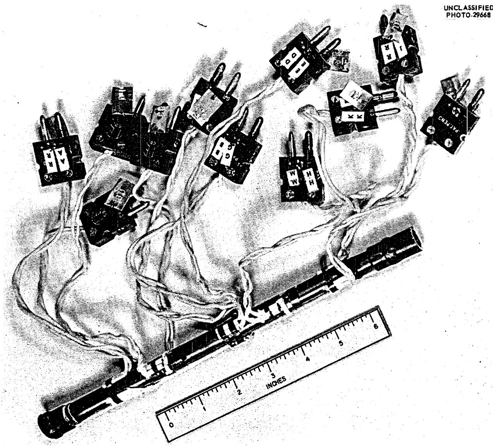  
Fig. 1.7.4. Typical Test Section After a Run in the High-Frequency Pulse-Pump Thermal-Cycling System.

temperature oscillation as indicated by these thermocouples was $127^{\circ}F$ at the test section inlet and $103^{\circ}F$ at the outlet. The inner surface temperature oscillation was estimated to be between $\pm 67$ and $\pm 95^{\circ}F$ . This variation exists because of uncertainties in establishing the boundary condition at the outer surface in the equation describing the decay of the radial temperature wave. The metallurgical examination of this test section has not yet been completed; however, standard dye-stain and radiographic examinations show no superficial damage. Future tests will again be made at a cyclic frequency of 1 cps, but the amplitude of the temperature fluctuation will be varied.

# Thermocouple Development

J.E.Mott

An improved technique was used for further measurements of the surface temperature of a thick-walled pipe in contact with a fluid whose temperature is a periodic function of time. An Inconel-nickel "gunbarrel" thermocouple3 was shrunk-fit into the pipe wall, the inside of the pipe was reamed so that the junction would be flush with the wall, and a thin (approximately $1 - \mu$ ) layer of nickel was deposited by vacuum evaporation. This nickel layer introduced negligible resistance to heat flow, and thus enabled instantaneous measurement of the interface temperature. The thinness of the nickel layer ensured negligible perturbation of the fluid flow in the vicinity of the thermocouple.

Typical results for a test section fabricated from a 0.47-in.-ID, 0.25-in.-wall Inconel pipe exposed to sinusoidal temperature oscillations in water are shown in Fig. 1.7.5 for a film heat transfer coefficient of 3700 Btu/hr-ff².⁰F. As may be seen, the results are in reasonable agreement with the Jakob equation⁴ for an infinitely thick plane wall.

An Inconel-nickel "gunbarrel" thermocouple (not attached to a tube) was tested in static NaF-ZrF4-UF4 (50-46-4 mole %) at 1200°F for 300 hr. During this time the thermocouple indicated a steady temperature of about 1230°F. Metallurgical examination of the thermocouple, of which a longitudinal section is shown in Fig. 1.7.6, revealed, however, that the metallic junction between the central nickel wire and the Inconel had been

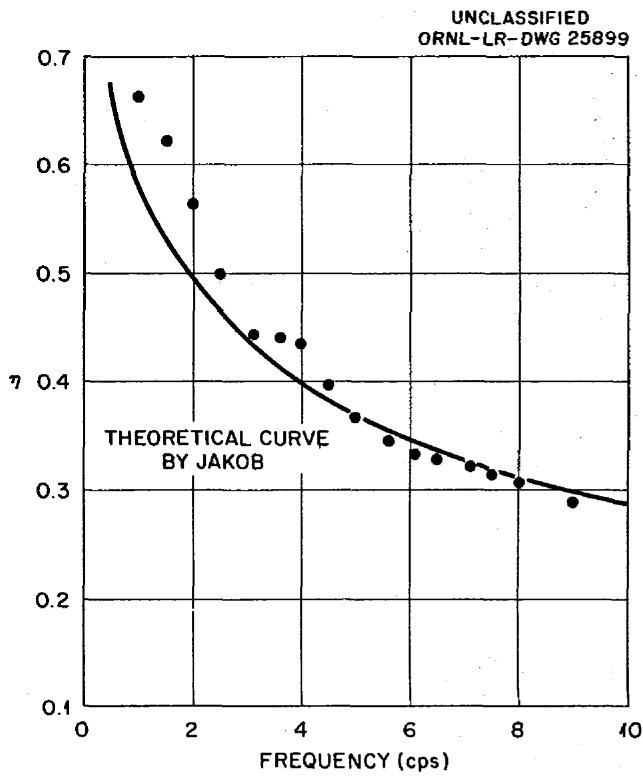  
Fig. 1.7.5. Ratio of Wall Temperature Amplitude to Fluid Temperature Amplitude, $\eta_{\mathrm{r}}$ as a Function of the Temperature Cycling Frequency for a Thick-Walled Inconel Tube. Film coefficient: 3700 Btu/hrft².

removed by the fluoride salt. This is shown more clearly in the photomicrograph of Fig. 1.7.7. It is concluded that the conductivity of the melt was sufficient to provide electrical continuity. Since the fluoride salt was found to have penetrated some distance along the nickel-oxide insulation, it is evident that this type of thermocouple cannot be relied upon for long-term accurate measurement of surface temperatures in a fluoride salt environment.

# ART HYDRODYNAMICS

# Full-Scale Core Studies

W.J.Stelzman

The investigation of auxiliary flow guidance for improving hydrodynamic stability in the ART core was continued, and two new configurations were

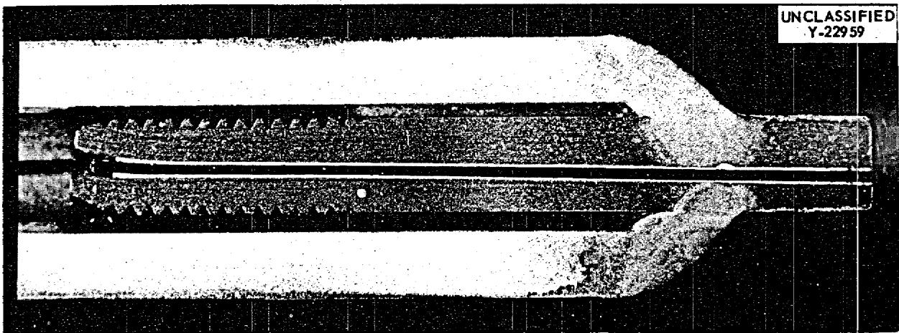  
Fig. 1.7.6. Longitudinal Section Through "Gunbarrel" Thermocouple After 300 hr of Exposure to Static NaF-ZrF $_4$ -UF $_4$ (50-46-4 mole %) at $1200^{\circ}\mathrm{F}$ . Oblique lighting causes the nickel wire to appear dark and the insulating gap, white. (Secret with caption)

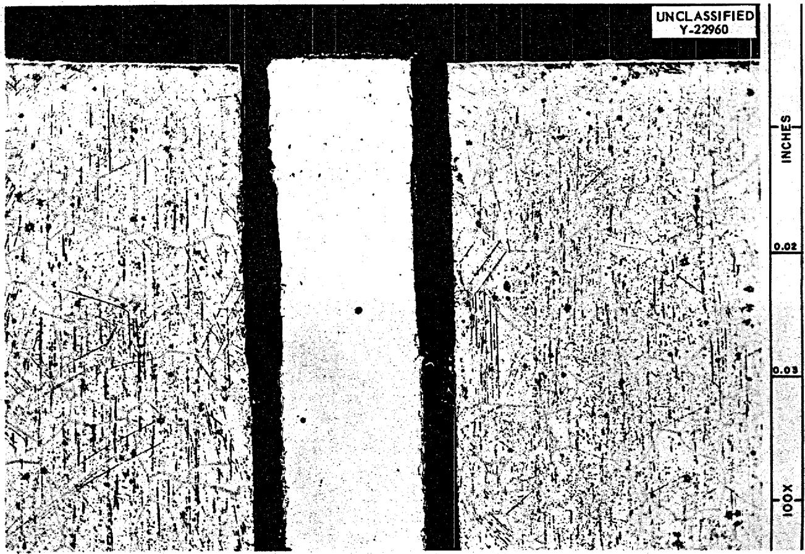  
Fig. 1.7.7. Photomicrograph of End of "Gunbarrel" Thermocouple After 300 hr of Exposure to Static NaF-ZrF $_4$ -UF $_4$ (50-46-4 mole %) at $1200^{\circ}\mathrm{F}$ . Note the absence of the nickel plate between the end of the central nickel wire and the Inconel on either side. (Secret with exception)

tested. One configuration consisted of a pair of inserts and ramps mounted at each pump discharge port. The insert, one side of which maintained the circular contour of the core entrance passage, while the opposite side provided a gradual area transition for flow from the pump discharge, was installed at the junction of the center volute and pump-discharge passage and occupied a 38-deg circumferential sector. It extended the full height of the volute. The ramp was located on the roof of the center volute and occupied a 50-deg radial sector adjacent to the insert. The shapes and the positions of the inserts and ramps are shown in Fig. 1.7.8.

For the second configuration, a pair of thin (approximately $\frac{1}{8}$ -in.) Plexiglas baffles, similar in contour to the actual core shells, were suspended in the annular passage between the island and reflector shells, as described by Platus, to form narrow (approximately $\frac{7}{8}$ -in.-wide) annuli adjacent to the island and reflector walls. The baffles extended approximately three-fourths of the length of the core.

The first configuration (inserts and ramps) was designed to increase the tangential component of pump-discharge flow into the center volute. At the same time it was intended to provide more uniform flow distribution circumferentially into the core annulus by increasing the velocity of pump discharge and by providing a downward velocity component to the swirling fluid mass. Observation of the flow pattern revealed no major improvement in stability even when used in conjunction with the GS-2 guide vanes. However, additional tests are needed to properly evaluate this design.

The second configuration (baffles) was proposed primarily to improve the flow stability adjacent to the core shells, to absorb some of the thermal oscillations in the main stream, and to decrease the peak fluid temperature near the inner and outer walls. Preliminary work has been concerned with obtaining proper flow in the three parallel channels formed by the baffles. Qualitative observations indicated that satisfactory flow could be achieved by controlling the area of the inlet passages. Many more experiments will be required to optimize the design and to ascertain the effectiveness of these baffles.

# QuarterScale Core Studies

G. L. Muller1

Velocity and pressure loss data were obtained in water flow tests of the $10\%$ scale model of the ART 21-in. core with an ART-type entrance header, a core inlet collimator, and five core screens. The core and header system are shown in Fig. 1.7.9. The collimator was fabricated from a $3\%$ -in.-thick perforated plate of 0.42 solidity. The screens were cut from $20 \times 20$ mesh, commercial, woven-wire screening. The first four screens had a 0.385 solidity, while the final screen was of 0.510 solidity.

The velocity distributions at six axial positions along the core are shown in Fig. 1.7.10 for a mid-plane Reynolds modulus of 6020. These profiles were obtained from analysis of photographs of the velocity profiles visualized at these positions by the phosphorescent-particle technique (see Fig. 1.7.13 of the next section). Because of the entrance collimator, the core flow was nonrotational. The results are in good agreement with previously reported qualitative data on this system. The profiles at positions C, D, and E indicate that comparatively low velocities exist near the outer wall in the mid-plane region. A preliminary examination of velocity data obtained at $N_{\text{Re,mid}} = 25,000$ for the mid-plane region showed no major deviations from the profiles of Fig. 1.7.10.

The experimental variation of average fluid velocity with axial position is given by the data points of Fig. 1.7.11. The positions $A'$ and $D'$ are located in a vertical plane rotated 90 deg from the plane containing positions $A$ through $F$ . The curves shown were calculated on the basis of flow continuity by using the data at positions $A$ and $A'$ for base points. The reliability of the experimental data is indicated by the excellent agreement between the measured average velocity at position $F$ and that predicted by the calculated curves. The average fluid velocities are equal at positions $A$ and $A'$ ; however, a 10% deviation exists at positions $D$ and $D'$ . This difference lies within the experimental error at this position.

Thus, the data indicate a core flow which is peripherally symmetrical despite a large pressure variation in the core header. The extent of this

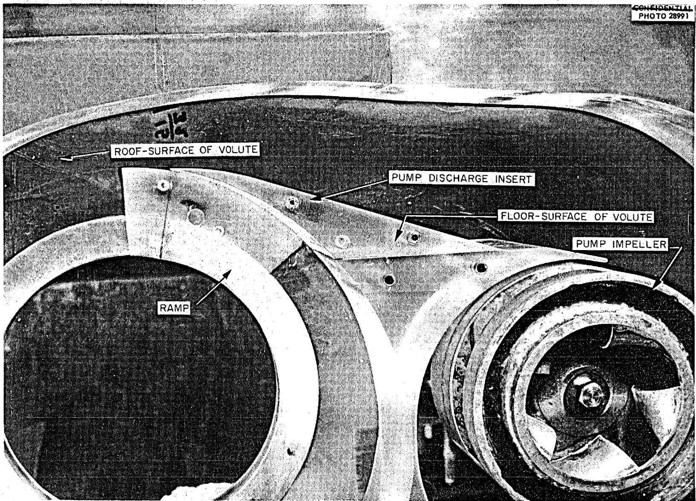  
Fig. 1.7.8. Installation of Inserts and Ramps in Core Volute.

header pressure variation is presented in Fig. 1.7.12, in which the experimentally measured relative pressure difference at a number of positions through the header is plotted as a function of the mid-plane Reynolds modulus. The relative pressure difference is the ratio of the pressure difference between the test position and the core exit to the

fluid kinetic energy evaluated at the mid-plane,

$$
K = \frac {2 g \Delta p}{p V _ {\text {m t d}} ^ {2}}.
$$

A schematic drawing of the header and the approximate pressure tap locations are also given. From

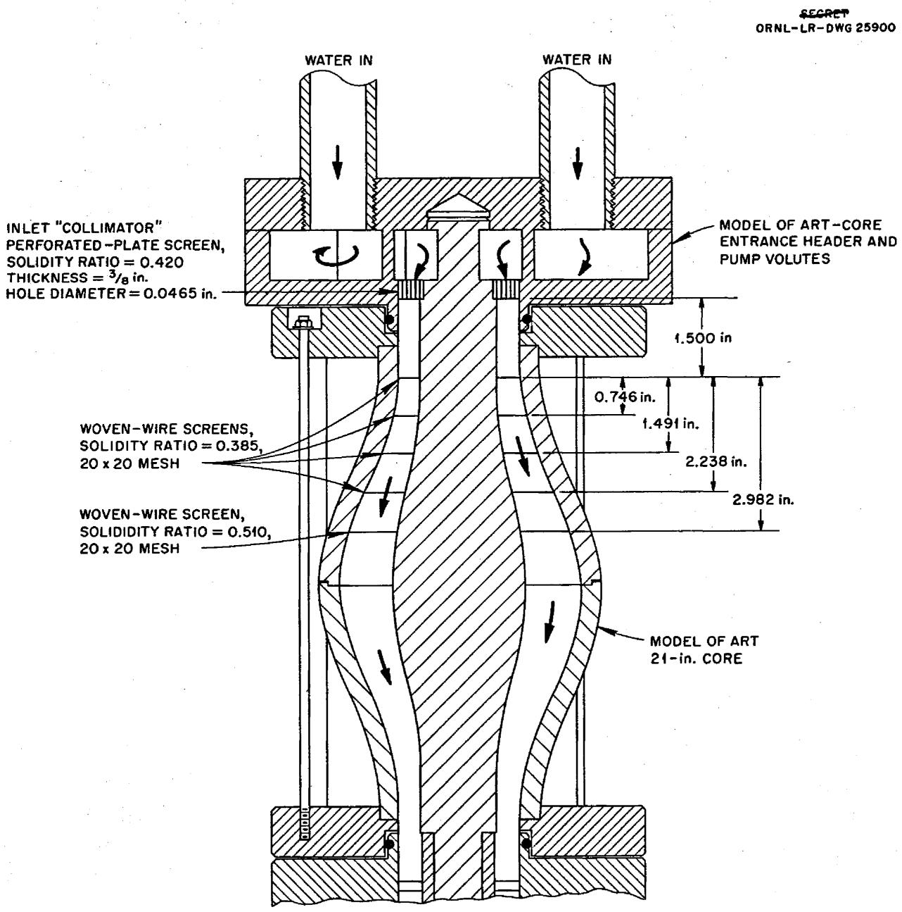  
Fig. 1.7.9. Cross Section of Experimental Model of ART Core and Entrance System with Inlet Collimator Plate and Screen Packing.

80

ORNL-LR-DWG 25901

VELOCITY DISTRIBUTIONS AT POINTS SHOWN ON

CORE CROSS-SECTION

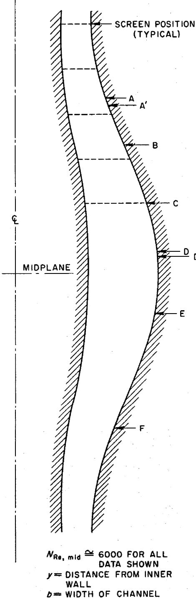

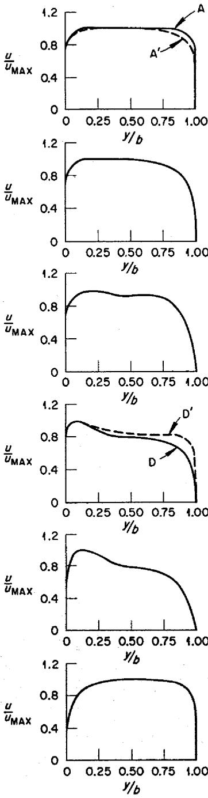  
Fig. 1.7.10. Radial Velocity Distributions in a Screen-Filled ART Core Model.

POINT A

$u_{\text{MAX}} = 14.0 \, \text{cm/sec}$

$u_{\mathrm{AV}} = 13.9~\mathrm{cm / sec}$

POINT A'

$u_{\mathrm{MAX}} = 14.9~\mathrm{cm / sec}$

$u_{\mathrm{AV}} = 13.9~\mathrm{cm / sec}$

POINT B

$u_{\mathrm{MAX}} = 9.91~\mathrm{cm / sec}$

POINT C

$u_{\mathrm{MAX}} = 8.19~\mathrm{cm} / \mathrm{sec}$

POINT D

$u_{\mathrm{MAX}} = 7.34~\mathrm{cm / sec}$

$u_{\mathrm{AV}} = 5.49~\mathrm{cm / sec}$

POINT D'

$u_{\text{MAX}} = 7.39 \, \text{cm/sec}$

$u_{\mathrm{AV}} = 6.16~\mathrm{cm / sec}$

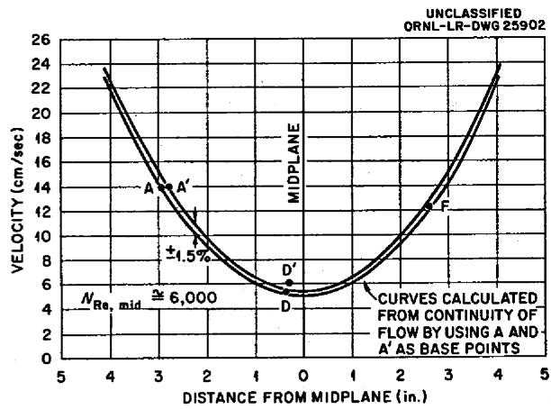  
Fig. 1.7.12, the maximum relative pressure difference in the header at the ART design flow rate $(N_{\text{Rse,mid}} = 97,500)$ is approximately 125. This corresponds to a pressure drop of 6.06 psi. In   
Fig. 1.7.11. Axial Variation of Average Velocity in 21-in. ART Core Model. (Secret with reation)

comparison, the relative pressure difference across this core is 160 (7.76 psi).

Data have also been obtained for simulated single-pump operation in the screen-filled core model. A preliminary evaluation of the data shows a relative pressure loss across the core of 220 at one-half the design flow rate. At this same flow rate the header relative pressure difference was 200. No apparent change from the data of Fig. 1.7.10 was noted in either the radial or peripheral velocity distributions. .These data indicate that, on the basis of core flow distribution, single-pump operation with a screen-filled core is feasible.

Further investigations are planned with a 0.33 solidity entrance collimator to determine whether the core pressure loss can be lowered without adversely affecting the core velocity distributions. From the present results, it appears that screens of higher solidity are needed in at least the two downstream positions to flatten the mid-plane velocity distributions. This will be checked in an additional study.

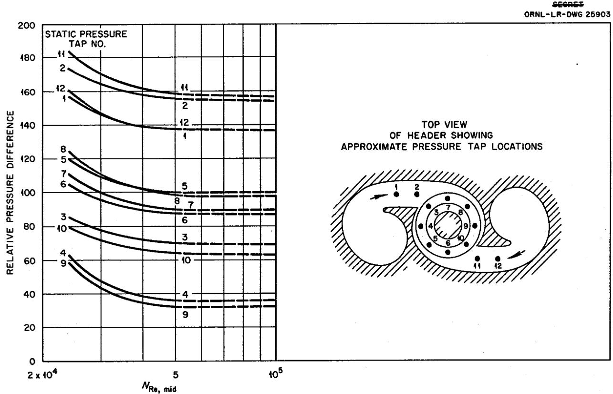  
Fig. 1.7.12. Relative Pressure Difference in Model of ART Inlet Header.

# Instantaneous Velocity Profile Measurements

# F. E. Lynch

Velocity profile photographs were obtained for flow through the $10 / 44$ -scale model of the ART with an ART-type entrance header, a core inlet collimator, and five core screens. The experimental system is as described in the previous section (see Fig. 1.7.9). Photographs were taken at the six axial positions A through F and at positions A' and D' for twin-pump operation and at positions A and B for single-pump operation. Typical velocity profile photographs are shown in Fig. 1.7.13 at positions C and E. The lack of sharpness in the photographs results partially from the fluid mixing brought about by the screens and partially from the slow shutter speed $(\frac{1}{50}$ sec) of the camera. This study will be repeated with a 35-mm camera (faster shutter speed) and a Reynolds modulus higher than the 6000 to 9000 used for the present test in order to obtain more sharply defined profile photographs. Screens of various solidities will also be investigated.

In order to obtain quantitative velocity information, it is necessary to obtain a photograph of

a grid placed in the plane of the visualized profile, as shown in Fig. 1.7.14. The distortion of the grid lines by the curvature of the Plexiglas shell can be clearly seen.

# FUSED SALT HEAT TRANSFER

H.W.Hoffman S.I.Cohen

D. P. Gregory

Forced-convection heat transfer studies with $\mathrm{NaNO}_2\cdot \mathrm{NaNO}_3\cdot \mathrm{KNO}_3$ (40-7-53 wt %) flowing through heated tubes have been completed. The data cover the Reynolds modulus range of 5000 to 25,000 and show a heat transfer coefficient variation from 800 to 2900 Btu/hr-ft²°F. The final results are presented in Fig. 1.7.15 in terms of the heat transfer parameter, $N_{Nu} / N_{Pr}^{0.4}$ . For comparison, earlier data obtained with this nitrate-nitrite mixture, both in this laboratory and by other investigators, are presented. All the data of

8H. W. Hoffman, Physical Properties and Heat Transfer Characteristics of an Alkali Nitrate-Nitrite Salt Mixture, ORNL CF-55-7-52 (July 21, 1955).   
9W.E.Kirst,W.M.Nagle,and J.B.Castner,Trans. Am.Inst.Chem.Engrs.36,371(1940).

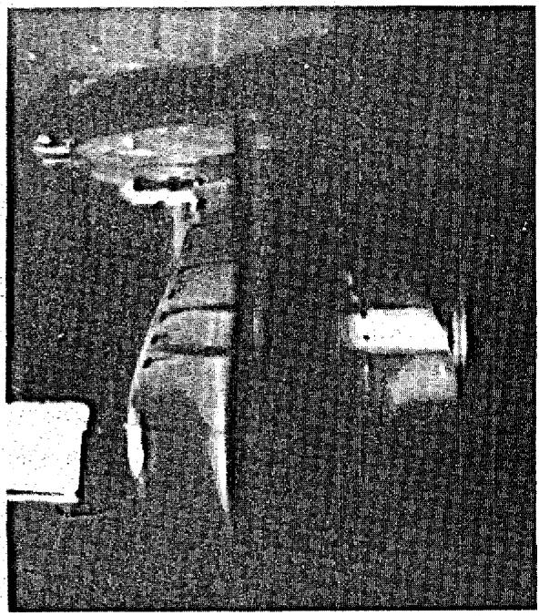  
SECRET   
PHOTO 42241  
(a) POSITION C

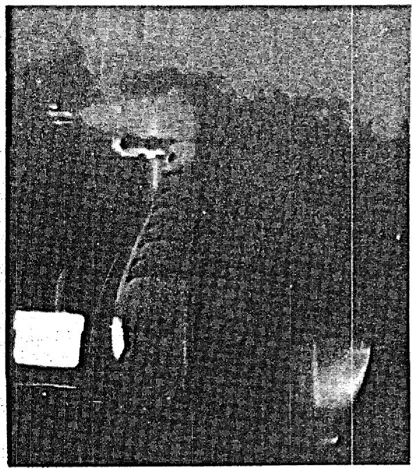  
(b) POSITION E   
Fig. 1.7.13. Photographs of Visualized Velocity Profiles in Screen-Filled 10/44-Scale Model of 21-in. ART Core.

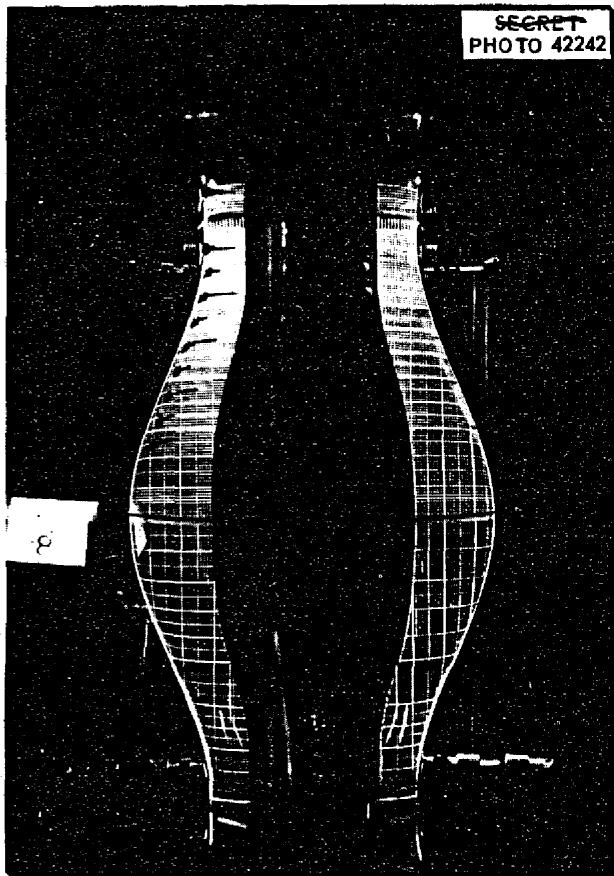  
Fig. 1.7.14. Photograph of Coordinate Grid Placed in Plane of Visualized Velocity Profile.

Fig. 1.7.15 have been adjusted by using the value for the thermal conductivity of this salt that was recently determined by Powers (see subsequent section of this chapter on "Physical Properties"). The experimental results are in good agreement with the empirical equation, $N_{\mathrm{Nu}} / N_{\mathrm{Pr}}^{0.4} = 0.023N_{\mathrm{R_a}}^{0.8}$ , which describes forced-convection heat transfer in ducts containing ordinary fluids.[10]

Studies have been initiated of forced-convection heat transfer with KCl-LiCl (41.2-58.8 mole %) flowing through a type 347 stainless steel tube. The experimental system is nearly identical to that used for the $\mathrm{NaNO}_2\text{-NaNO}_3\text{-KNO}_3$ (40-7-53 wt %) investigation. Preliminary results fall below the standard correlations, but this discrepancy is probably due to uncertainty in the data on the thermal conductivity of this chloride mixture.

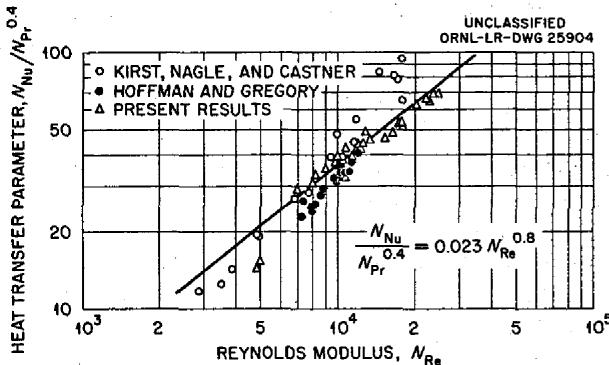  
Fig. 1.7.15. Heat Transfer with $\mathrm{NaNO}_2$ - $\mathrm{NaNO}_3$ - $\mathrm{KNO}_3$ (40-7-53 wt %).

The possibility of an interfacial film is also being investigated by using both chemical and x-ray diffraction techniques. The existence of a film will be further checked in experiments with an Inconel tube.

# HEAT TRANSFER EXPERIMENTS

N.D.Green W.R.Gambill

# ART-Type Core with Screens

Initial experiments have been completed on the half-scale volume-heat-source ART core model containing four 0.342 solidity screens and an inlet collimator. Both steady-state and fluctuating temperatures were measured at the inner and outer core walls. The transient data are compared in Fig. 1.7.16 with data obtained in previous measurements11 of a vaned entrance system. While the magnitude of the outer wall temperature fluctuations peak is appreciably above the corresponding value for the vaned core, the inner core fluctuations have been reduced by an order of magnitude. In Fig. 1.7.17 the corresponding steady-state temperature distributions are presented. The inner wall temperatures lie consistently below the fluid mixed-mean temperatures and indicate uniform high-velocity flow along the inner wall. These results are in good agreement with predictions made on the basis of the velocity profiles experimentally determined by Muller and Lynch7 (see also, Fig. 1.7.10, this chapter). Thus, some hydrodynamic instability in the mid-plane region on the outer wall

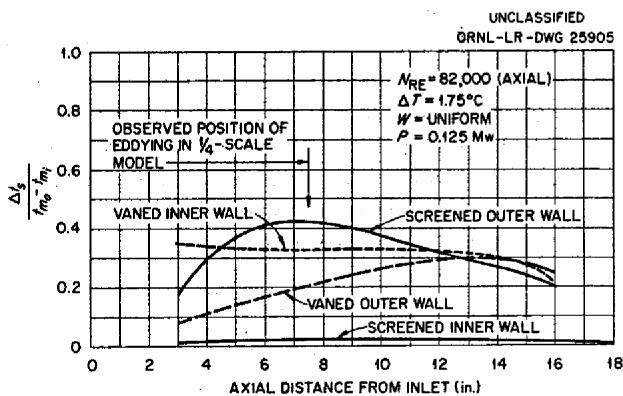  
Fig. 1.7.16. Transient Temperature Fluctuations in the Screen-Filled One-Half-Scale Volume-Heat-Source Model of the ART Core. (Secret with caption)

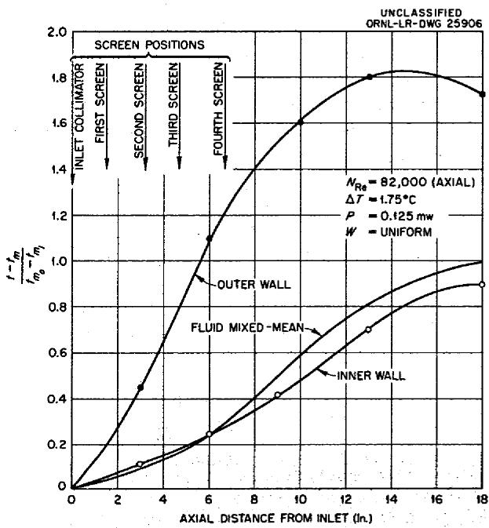  
Fig. 1.7.17. Steady-State Wall Temperatures in the Screen-Filled One-Half-Scale Volume-Heat-Source Model of the ART Core. (Secret with caption)

is reflected in the observed peaking of the transient temperature fluctuations on the outer wall of the volume-heat-source system. Similarly, the flat velocity profile (approximating the shape of the power profile) near the inner wall indicates a low surface temperature. Conversely, a high outer wall temperature, as shown in Fig. 1.7.17, was to be expected.

A possible method of altering the core flow to increase the flow along the outer wall without

materially affecting the inner wall flow lies in introducing screens of variable radial solidities. Screens of this type would have high pressure drops (high solidity) through the central portions that would force greater peripheral flow. Several such experimental screens have been designed and are now being fabricated.

# Vortex Tube

Preliminary experimental determinations have been made of the heat transfer coefficients for air in source vortex flow. The measurements were made by using metal Hilsch-Ranque tubes having length-to-diameter ratios of 20. The tubes were heated by the axial passage of a high-amperage electrical current through the tube wall. The data are shown in Fig. 1.7.18, in which a modified Colburn factor is plotted as a function of the energy required per square foot of heat transfer surface. For tubes of identical geometry and the same overall pressure drop, heat transfer in straight turbulent flow and in source vortex flow can be directly compared. On this basis, the experimental data of Fig. 1.7.18 show vortex flow to be a factor of 5 better than straight flow. The correction to the vortex flow data to account for the pressure drop associated with the momentum increase of the air in passing from the tube inlet to exit has not been included in this analysis. The magnitude of this correction will be experimentally determined in the 3-in. vortex currently under construction. This tube will allow radial and axial traverses of fluid velocity, temperature,

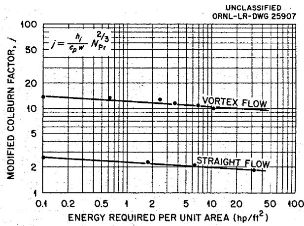  
Fig. 1.7.18. Experimental Heat Transfer to Air in Source-Vortex Flow and in Straight, Turbulent Flow Through Pipes.

and pressure. Optimization of the heat transfer efficiency as related to such factors as tube length-to-diameter ratio and entrance region design is being investigated.

# LIQUID-METAL VOLUME-HEAT-SOURCE EXPERIMENT

G. L. Muller

An investigation of heat transfer in a liquid metal (mercury) system with internal heat generation is in progress. This study is aimed at a better understanding of the heat transfer mechanism so that more accurate calculation of the thermal structures in circulating-fuel reactors can be made. Discrepancies between results from experimental liquid-metal forced-circulation heat transfer studies and theoretical calculations have raised questions as to the validity of corresponding analyses for the volume-heat-source case. In particular, the "interface thermal resistance" theory postulated to explain the reduced values of the experimentally measured Nusselt modulus when heat is transferred through the tube wall will be tested in this study.

A diagram of the experimental system now being constructed is shown in Fig. 1.7.19. Mercury will flow from the sump into the Moyno pump, through a flow-measuring orifice, through the test section and cooler, and then return to the sump. In an additional flow path, the mercury will bypass the test section and cooler.

The test section is a $\frac{1}{4}$ -in. glass tube interrupted by three electrodes for volume electrical heating. The arrangement is such that no heat is generated outside the test section. The wall temperatures of the test section will be measured by copper-constantan thermocouples attached to the outside

of the glass tube. To prevent heat loss through the test section wall, external insulation and guard heating will be provided. Fluid mixed-mean inlet and exit temperatures will also be measured. In this apparatus Reynolds moduli of 500,000 can be attained. A second test section of $1\frac{1}{2}$ -in.-ID glass tubing will be available with which to make radial temperature and velocity traverses.

# MASS TRANSFER

J. J. Keyes, Jr.

A comparison with experimental results12,13 of the amount of mass transfer to be expected in alkali metal-alloy systems was made for two assumed diffusion mechanisms.14 The results are presented in Table 1.7.3. In the first mechanism, the boundary layer was assumed to be saturated and the rate of transfer was limited by the rate of diffusion of solute into the liquid. A general expression was derived that included effects of variation in temperature and liquid composition around a closed loop and which simplified under certain conditions to

$$
W (\theta) = k _ {L} S \left(t _ {H} - t _ {C}\right) \theta ,
$$

where $W(\theta)$ is the amount of mass transfer in time $\theta, k_L$ is the conventional mass transfer coefficient,

Table 1.7.3. Summary of Calculations and Comparison with Data for Two Postulated Mechanisms of Mass Transfer in Sodium-Inconel Systems   
Exposure time: 1000 hr Temperature differential: $300^{\circ}F$   

<table><tr><td rowspan="2">Hot-Zone Temperature (°F)</td><td colspan="2">Mass Transfer Estimate, W (g)</td><td rowspan="2">Experimental Mass Transfer (g) from Forced-Circulation Loops</td></tr><tr><td>Liquid-Diffusion Limiting Method</td><td>Wall-Diffusion Limiting Method</td></tr><tr><td>1500</td><td>400–1000</td><td>2–25</td><td>13</td></tr><tr><td>1200</td><td>300–700</td><td>1–8</td><td>&lt;0.5</td></tr></table>

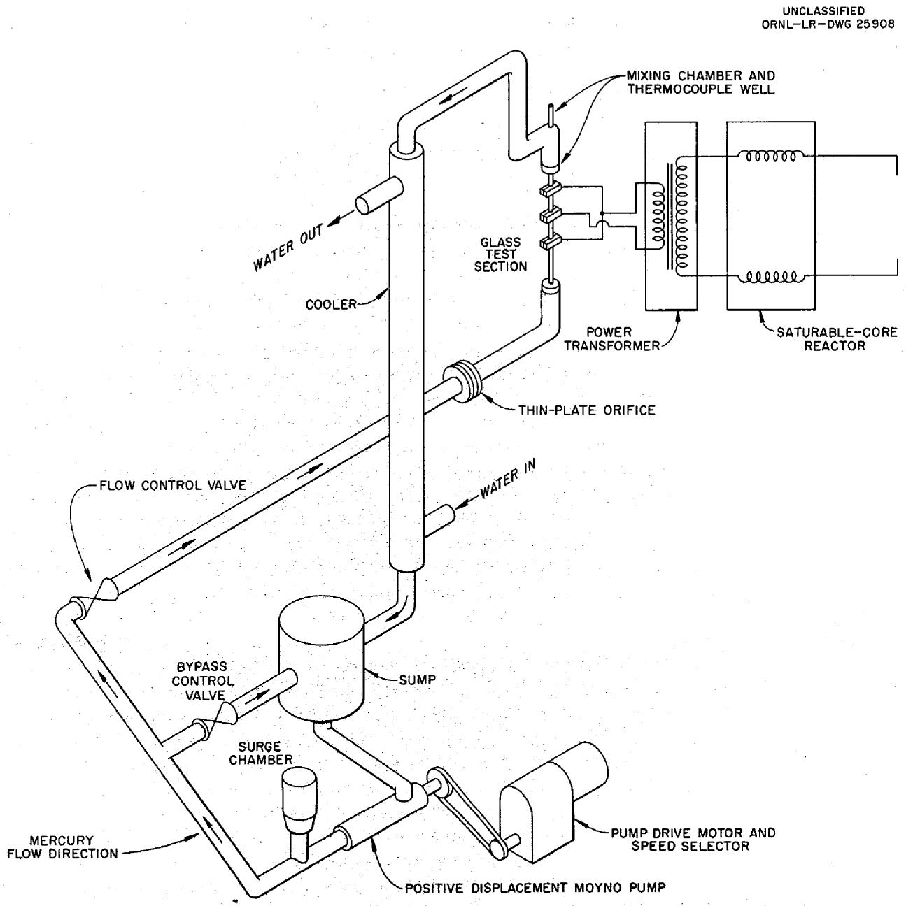  
Fig. 1.7.19. Schematic Diagram of Volume-Heat-Source Experimental Apparatus in Which Mercury will be Circu-lated.

$S$ is the solubility of the solute (Ni) in the liquid (Na or NaK), and $t_H$ and $t_C$ are the hot- and cold-zone temperatures, respectively. For typical forced-circulation loop conditions $(t_H = 1500^\circ F, t_C = 1200^\circ F, \theta = 1000 \mathrm{hr})$ , this mechanism predicts $W$ to be between 400 and 1000 g, whereas the observed value is about 13 g. Furthermore, this mechanism predicts $W$ to be only slightly temperature dependent, in contradiction to observation.

In the second mechanism, the rate of mass transfer was assumed to be limited by the rate of

diffusion of a component (for example, Ni) of the solid alloy (for example, Inconel) to the solid-liquid interface. The approximate expression derived for $W(\theta)$ was

$$
w (\theta) = 2 \rho_ {w} \left(\frac {D _ {w} \theta}{\pi}\right) ^ {1 / 2} \frac {x \left(t _ {H} - t _ {C}\right)}{t _ {H}},
$$

where $D_{w}$ is the diffusivity of nickel in the solid wall, $x$ is the bulk solid concentration, and $\rho_w$ is the solid density.

Based on extrapolation of some data for the diffusivity of nickel, as reported in the literature, $W(\theta)$ was estimated to be between 2 and 25 g for $t_H = 1500^\circ F$ , $t_C = 1200^\circ F$ , $\theta = 1000$ hr. As may be seen, this estimate is in better agreement with the observed mass transfer accumulation than was the estimate based on liquid diffusion. On the other hand, the wall diffusion mechanism does not correctly account for the dependence of the mass transfer (W) on flow rate and time and does not predict a sharp break in mass transfer at about $1350^\circ F$ . It is concluded that a more general hypothesis is needed for combining the mechanism of hot-zone attack with a nucleation-deposition mechanism in the cold zone.

# PHYSICAL PROPERTIES

W.D. Powers

# Enthalpy and Heat Capacity

Studies were made to determine the enthalpies and heat capacities of the eutectic mixtures $\mathrm{LiCl - }$ $\mathrm{SrCl}_2$ (22.5-77.5 wt %) and $\mathrm{LiCl - BaCl}_2$ (32.2-67.8 wt %). Preliminary analyses of the data yielded values for the heat capacities of 0.21 Btu/lb. $^\circ \mathsf{F}$ for the barium-containing mixture and 0.24 Btu/lb. $^\circ \mathsf{F}$ for the strontium-lithium salt. The reliability of these data is in some doubt, since wide discrepancies in enthalpy were observed between duplicate test samples. This may be due to the large density differences between the salts. Further studies with this pair of chloride eutectics will be made as soon as new samples can be prepared.

# Thermal Conductivity

Modification of the variable-gap thermal conductivity device to include a large guard heating ring surrounding the heat meter has been completed. This guard heater ensures lower heat losses from the heat meter and at the same time provides a heat flow path of cross section more nearly equal to the cross-sectional area of the sample heater and its guard.

The results obtained with the salt mixture $\mathrm{NaNO}_2\mathrm{-NaNO}_3\mathrm{-KNO}_3$ (40-7-53 wt %) show increased consistency both within runs and between runs. The results of a number of typical experimental runs are shown in Fig. 1.7.20. In this plot, the slope of the data line is the reciprocal of the thermal conductivity of the liquid sample. The

thermal conductivity values obtained in this study of the nitrate-nitrite salt are given below:

<table><tr><td>Temperature (°F)</td><td>Thermal Conductivity (Btu/hr·ft-1°C F)</td></tr><tr><td>689</td><td>0.35</td></tr><tr><td>667</td><td>0.34</td></tr><tr><td>487</td><td>0.34</td></tr><tr><td>468</td><td>0.33</td></tr></table>

All temperature effects were within experimental error. The results compare favorably with data obtained by Deem15 (0.33 Btu/hr·ft. $^{\circ}$ F between 400 and $900^{\circ}$ F) at Battelle Memorial Institute.

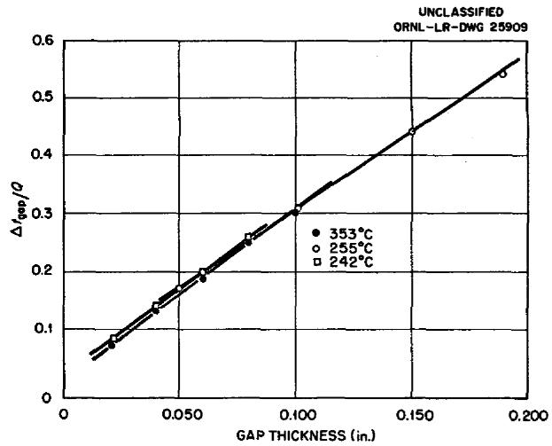  
Fig. 1.7,20. Experimental Data Obtained in Measurements of the Thermal Conductivity of $\mathsf{NaNO}_2\mathsf{-NaNO}_3\cdot$ $\mathsf{KNO}_3$ (40-7-53 wt%).

The thermal conductivity of the fuel mixture NaF-ZrF4-UF4 (50-46-4 mole %) has been determined by several laboratories. The results are compared in Table 1.7.4. No trend with temperature was noted. This salt mixture will be reinvestigated with the use of the modified variable-gap device. The variation between the Mound Laboratory and the ORNL and BMI data has not yet been resolved.

# Properties of Zirconium Fluoride Vapor Deposits

The density of a sample of zirconium fluoride powder collected in a "snow" trap was measured and found to vary between 0.55 and $0.8\mathrm{g/cm^3}$ . The samples were collected by pushing a thin-walled, sharp-edged tube through the $\mathsf{ZrF_4}$ and into contact with the metal surface to which the powder was adhering. The thickness of the sample, whose area was defined by the inside cross-sectional area of the tube, was determined by averaging the depth indicated by a fine-wire probe inserted at four positions immediately adjacent to the sample. The sample thicknesses varied from 0.05 to 0.4 in. It was found, for sample thicknesses greater than 0.1 in., that the density varied inversely with the sample thickness, as shown in Fig. 1.7.21. Tests have also been initiated to determine the effect of subsequent heating on the apparent density of the $\mathsf{ZrF_4}$ deposit.

An attempt was also made to measure the thermal conductivity of the $\mathsf{ZrF}_4$ deposit. A sample of the material was placed in a cylindrical annulus surrounding a central heated tube. The conductivity of the material around the "hot wire" is determined from the temperature rise of the electrically heated wire. A value of 0.45 Btu/hr-ft. $^{\circ}$ F was obtained;

however, this measurement was made on a "disturbed" sample, and it is planned to mount a tube in a snow trap and allow the $\mathsf{ZrF}_4$ to collect on the tube.

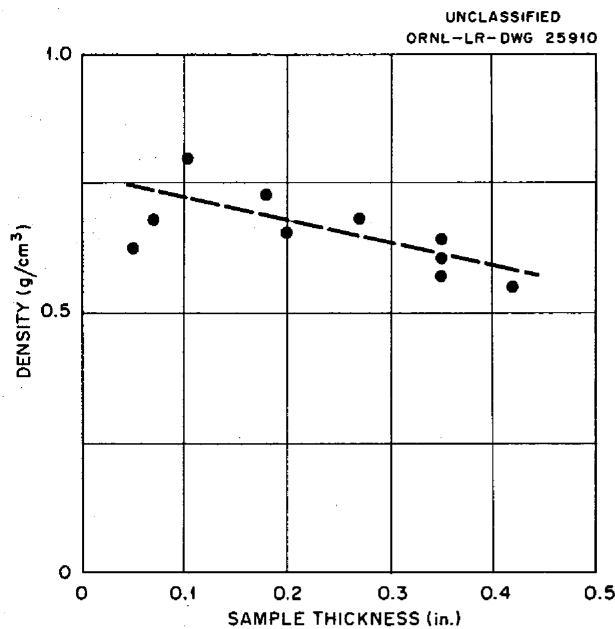  
Fig. 1.7.21. Experimental Measurements of Apparent Density of Zirconium Fluoride Vapor Deposits. (Gom-fidential with caption)

Table 1.7.4. Thermal Conductivity of Molten NaF-ZrF $_4$ -UF $_4$ (50-46-4 mole %)   

<table><tr><td>Investigator</td><td>Experimental System</td><td>Thermal Conductivity (Btu/hr·ft·°F)</td></tr><tr><td rowspan="2">Powers, ORNL</td><td>Variable gap</td><td>1.2–1.5</td></tr><tr><td>Fixed gap</td><td>0.8–1.6</td></tr><tr><td>Deem at BMI*</td><td>Variable gap</td><td>1.2</td></tr><tr><td>Jordan at Mound Laboratory**</td><td>Calorimetric device</td><td>0.49</td></tr></table>

$^{\ast}$ H. W. Deem, unpublished data.   
\*\*Aircraft Propulsion Reactors, Mound Laboratory Memorandum Report No. 57-7-40, p 5 (Aug. 5, 1957).

Part 2

CHEMISTRY

W. R. Grimes

# 2.1. PHASE EQUILIBRIUM STUDIES

C.J.Barton

R.E.Moore

R. E. Thoma

# THE SYSTEM $\mathsf{KF - UF_4}$

H. A. Friedman

Further equilibrium studies of the system $\mathsf{KF - UF}_4$ have confirmed the liquidus curve presented previously. Results of thermal-gradient quenching experiments have shown, however, several differences from the phase behavior proposed earlier on the basis of thermal analysis and optical and x-ray-diffraction examinations of slowly cooled melts. Of the eight $\mathsf{KF - UF}_4$ phases reported by Zachariasen, two phases, $\beta - 2\mathsf{KF} \cdot \mathsf{UF}_4$ and $\mathsf{KF - 2UF}_4$ , have been shown to be equilibrium phases in the system. It has not been definitely determined whether $2\mathsf{KF} \cdot \mathsf{UF}_4$ displays distinct temperature ranges for the ordered $(\beta)$ and disordered $(\beta')$ forms. Further, no evidence has been found that the phases designated by Zachariasen as $\alpha - 3\mathsf{KF} \cdot \mathsf{UF}_4$ , $\beta - 3\mathsf{KF} \cdot \mathsf{UF}_4$ , $\alpha - 2\mathsf{KF} \cdot \mathsf{UF}_4$ , $\mathsf{KF} \cdot \mathsf{UF}_4$ (which occurs, rather, as $7\mathsf{KF} \cdot 6\mathsf{UF}_4$ ), $\mathsf{KF} - 3\mathsf{UF}_4$ , and $\mathsf{KF} - 6\mathsf{UF}_4$ occur in slowly cooled melts or in quenched samples purified by hydrofluorination and subsequently protected against exposure to the atmosphere. If, however, such samples are prepared exactly as described by Zachariasen, that is, exposed to air during heating and cooling, the phases designated $\alpha - 3\mathsf{KF} \cdot \mathsf{UF}_4$ , $\beta - 3\mathsf{KF} \cdot \mathsf{UF}_4$ , and $\mathsf{KF} - 6\mathsf{UF}_4$ can be formed in large amounts. No phase that fits the description of the compound $\mathsf{KF} - 3\mathsf{UF}_4$ has been found under either type of experimental condition. In thermal-gradient quenching experiments the phases $\alpha$ and $\beta - 3\mathsf{KF} \cdot \mathsf{UF}_4$ are apparently stable if initially present in the samples. Protected purified melts of the composition $3\mathsf{KF} \cdot \mathsf{UF}_4$ show a biaxial-negative blue-green phase upon solidification, and thermal-gradient quenching experiments and thermal analysis indicate that this is the only equilibrium phase for the compound $3\mathsf{KF} \cdot \mathsf{UF}_4$ . No similar

phase has been reported by Zachariasen. The phases $\alpha$ and $\beta$ -3KF-UF $_4$ and KF-6UF $_4$ may be either metastable phases in the system KF-UF $_4$ that are stable against inversion to equilibrium forms or oxygen-containing phases.

Zachariasen has reported a face-centered cubic form $(\alpha)$ and two hexagonal forms $(\beta_{1}$ and $\beta_{2})$ for the compound $2\mathsf{KF}\cdot \mathsf{UF}_4$ . If the alpha form were to display phase behavior similar to that of the isomorphous phase5 reported to be $\alpha -2NaF\cdot UF_4,$ it would be observed as a primary phase at the 35 to 40 mole $\%$ UF4 region, and its formula would be $5\mathsf{KF}\cdot 3\mathsf{UF}_4$ . No such primary phase for a cubic material has been observed. The possibility of a subsolidus existence for the cubic phase is not precluded, although the phase has not been observed within the $50^{\circ}C$ temperature range below the solidus. No observations of $2\mathsf{KF}\cdot \mathsf{UF}_4$ samples have yet permitted a distinction of the ordered and disordered hexagonal forms. No well-crystallized samples of $2\mathsf{KF}\cdot \mathsf{UF}_4$ have become available. The compound $2\mathsf{KF}\cdot \mathsf{UF}_4$ has a lower limit of stability of $620^{\circ}C,$ at which temperature it decomposes into $3\mathsf{KF}\cdot \mathsf{UF}_4$ and $7\mathsf{KF}\cdot 6\mathsf{UF}_4$ Some unexplained lowtemperature thermal effects in the $2\mathsf{KF}\cdot \mathsf{UF}_4$ composition region require that this decomposition temperature be considered to be tentative.

The equilibrium phases in the system $\mathsf{KF - UF}_4$ and their melting characteristics are given in Table 2.1.1.

5This phase has been identified as 5KF·3UF.

Table 2.1.1. Equilibrium Phases in the System KF-UF4   

<table><tr><td>Formula</td><td>Melting Point (℃)</td><td>Melting Characteristics</td></tr><tr><td>3KF·UF4</td><td>955</td><td>Melts congruently</td></tr><tr><td>2KF·UF4</td><td>760</td><td>Melts incongruently to 3KF·UF4and liquid; decomposes at 620℃</td></tr><tr><td>7KF·6UF4</td><td>790</td><td>Melts congruently</td></tr><tr><td>KF·2UF4</td><td>765</td><td>Melts incongruently to UF4and liquid</td></tr></table>

# THE SYSTEM NaF-HfF4

H.A.Friedman

Samples of pure, sublimed $\mathsf{HfF}_4$ became available during the quarter that were pure enough to permit refined phase equilibrium studies of the system NaF-HfF. Thermal analysis data obtained with the pure material are in substantial agreement with data obtained in thermal-gradient quenching experiments, and thus some of the phase equilibrium results based on previously reported thermal analysis data are presently in doubt. Precision in the determination of liquidus and solidus temperatures and temperatures of polymorphic transitions has been improved to $\pm 3^{\circ}\mathsf{C},$ in several cases, by using sublimed HfF. A tentative phase equilibrium diagram of the system NaF-HfF is shown in Fig. 2.1.1. Areas outlined by dashed curves are not yet well-established.

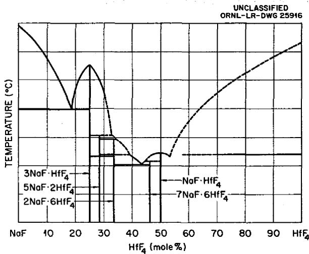  
Fig. 2.1.1. The System NaF-HfF4 (Tentative).

Seven NaF-HfF4phases are isostructural with NaF-ZrF4phases of corresponding stoichiometric formulas. The analogous series of compounds in the two systems are not continuous, however, as is shown in Table 2.1.2; there are fewer phases in the NaF-HfF4system than in the NaF-ZrF4system. The appearance of the phase NaF-HfF4as a congruently melting stable compound is the only

marked deviation of phase behavior for an NaF-HfF4 analog of an NaF-ZrF4 phase.

# THE SYSTEM KBF4-NoBF4

R.E.Moore

A quenching study of the system $\mathsf{KBF}_4\text{-NaBF}_4$ was undertaken during the past quarter as part of a search for low-melting salt mixtures for use as reactor coolants. Thermal data obtained previously7,8 defined a liquidus curve with a minimum at about 90 mole $\%$ NaBF and $360^{\circ}\mathsf{C},$ but there were no thermal effects on the cooling curves that corresponded to solidus temperatures. Thermal effects that presumably represented solid transitions were found in the range 180 to $280^{\circ}\mathsf{C}.$

Petrographic examinations of quenched samples gave liquidus values that were in good agreement with the thermal data. The liquidus temperatures at 50, 70, and 75 mole $\%$ NaBF $_4$ were 441, 392, and $387^{\circ}\mathrm{C}$ , respectively, with KBF $_4$ as the primary phase; the solidus temperatures were 356, 360, and $355^{\circ}\mathrm{C}$ , respectively. The secondary phase was identified as NaBF $_4$ in each case. At 80 mole $\%$ NaBF $_4$ the primary phase is KBF $_4$ , and the solidus temperature is $358^{\circ}\mathrm{C}$ . The composition containing 90 mole $\%$ NaBF $_4$ is very near the eutectic. The primary phase is NaBF $_4$ ; the liquidus temperature is $355^{\circ}\mathrm{C}$ ; and the solidus temperature is $351^{\circ}\mathrm{C}$ .

X-ray diffraction and petrographic examinations of previously equilibrated quenched samples provided no indication of the existence of either compounds or solid solutions in the system. It is a simple binary system with a eutectic near 90 mole $\%$ NaBF $_4$ and about $375^{\circ}$ C.

# YTTRIUM FLUORIDE SYSTEMS

R.J.Sheil

Petrographic and x-ray-diffraction examinations of slowly cooled samples of $\mathsf{LiF - MgF}_2\mathsf{-YF}_3$ and $\mathsf{LiF - ZnF}_2\mathsf{-YF}_3$ mixtures, which are of interest in the investigation of the production of oxygen-free yttrium metal, have revealed the same unidentified compound in both systems. This suggests the possibility of an $\mathsf{LiF - YF}_3$ compound,

Table 2.1.2. Properties of Analogous Phases in the Systems NaF-ZrF ${}_{4}$ and NaF-HfF ${}_{4}$   

<table><tr><td rowspan="2">Phase Formula</td><td colspan="2">NaF-ZrF4</td><td colspan="3">NaF·HfF4</td></tr><tr><td>Phase Change Temperature (°C)</td><td>Type of Transition</td><td>Phase Formula</td><td>Phase Change Temperature (°C)</td><td>Type of Transition</td></tr><tr><td>3NaF·ZrF4</td><td>850</td><td>Congruent melting point</td><td>3NaF·HfF4</td><td>855</td><td>Congruent melting point</td></tr><tr><td>5NaF·2ZrF4</td><td>639</td><td>Incongruent melting point</td><td>5NaF·2HfF4</td><td>606</td><td>Incongruent melting point</td></tr><tr><td>5NaF·2ZrF4</td><td>525</td><td>Inversion of α-5NaF·2ZrF4 to β-5NaF·2ZrF4</td><td>5NaF·2HfF4</td><td>533</td><td>Inversion of α-5NaF·2HfF4 to β-5NaF·2HfF4</td></tr><tr><td>2NaF·ZrF4</td><td>544</td><td>Incongruent melting point of β2-2NaF·ZrF4</td><td>2NaF·HfF4</td><td>593</td><td>Incongruent melting point of β2-2NaF·HfF4</td></tr><tr><td>2NaF·ZrF4</td><td>533</td><td>Inversion of β2-2NaF·ZrF4 to β3-2NaF·ZrF4</td><td>No β2-2NaF·HfF4 observed</td><td></td><td></td></tr><tr><td>2NaF·ZrF4</td><td>505</td><td>Inversion of β3-2NaF·ZrF4 to β4-2NaF·ZrF4</td><td>2 NaF·HfF4</td><td>520 ± 15</td><td>Inversion of β3-2NaF·HfF4 to β4-2NaF·HfF4</td></tr><tr><td>3NaF·2ZrF4</td><td>487</td><td>Upper stability limit of 3NaF·2ZrF4</td><td>No 3NaF·2HfF4 observed</td><td></td><td></td></tr><tr><td>7NaF·6ZrF4</td><td>525</td><td>Congruent melting point</td><td>7NaF·6HfF4</td><td>515 ± 10</td><td>Incongruent melting point</td></tr><tr><td>NaF·ZrF4</td><td></td><td>Metastable phase formation</td><td>NaF·HfF4</td><td>545</td><td>Congruent melting point</td></tr><tr><td>3NaF·4ZrF4</td><td>537</td><td>Incongruent melting point</td><td>No 3NaF·4HfF4 observed</td><td></td><td></td></tr></table>

although published data10 indicated that no compounds are formed in this system. Two $\mathsf{LiF - YF}_3$ mixtures were prepared in the thermal apparatus that permits visual observations. The mixtures contained 20 and 25 mole $\%$ $\mathsf{YF}_3$ , respectively, and both were found to be composed of the above-mentioned unidentified compound and LiF. Both mixtures showed a solidus temperature of about $690^{\circ}\mathsf{C}$ and liquidus temperatures approximately 10 to $14^{\circ}\mathsf{C}$ above the solidus temperature; these liquidus temperatures are much lower than the values reported by Dergunov.10 Further study will be required to identify the $\mathsf{LiF - YF}_3$ compound.

An equimolar mixture of $\mathsf{YF}_3$ and $\mathsf{MgF}_{2^{\prime}}$ which

had a liquidus temperature of $1025^{\circ}C$ and a solidus temperature of $980^{\circ}C$ , was found to contain only the two crystalline starting materials. Another mixture in this system that contained 75 mole $\%$ $\mathsf{YF}_3$ did not appear to be completely liquid at $1200^{\circ}C$ , the maximum temperature to which it was heated. The $\mathsf{ZnF}_2\cdot \mathsf{YF}_3$ mixture (80.6 wt $\%$ $\mathsf{YF}_3$ ), for which thermal data were previously presented, contained only the starting materials. It seems certain that no compound is formed in this binary system.

# 2.2. CHEMICAL REACTIONS IN MOLTEN SALTS

F. F. Blankenship

R. F. Newton

L. G. Overholser

G.M.Watson

# EQUILIBRIUM REDUCTION OF $\mathsf{NIF}_2$ BY $\mathsf{H}_2$ IN NaF-ZrF4 C.M.Blood

Investigation of the equilibrium

$$
\mathrm {N i F} _ {2} (d) + \mathrm {H} _ {2} (g) \xleftarrow {\rightarrow} \mathrm {N i} (s) + 2 \mathrm {H F} (g)
$$

in the reaction medium NaF-ZrF $_4$ (53-47 mole %) at $600^{\circ}\mathrm{C}$ was completed, and the data obtained are summarized in Table 2.2.1. These results are compared with those obtained previously $^1$ at 550, 575, and $625^{\circ}\mathrm{C}$ in Fig. 2.2.1 of the following section.

# ACTIVITY COEFFICIENTS OF $\mathsf{NIF}_2$ IN MOLTEN NaF-ZrF4 SOLUTIONS C.M.Blood

The determination of the activity coefficients of $\mathsf{NiF}_2$ in the molten mixture NaF-ZrF4 (53-47 mole %) by the study of the equilibrium constants for the reaction

$$
\mathrm {N i F} _ {2} (d) + \mathrm {H} _ {2} (g) \xleftarrow {\longrightarrow} \mathrm {N i} (s) + 2 \mathrm {H F} (g)
$$

1C. M. Blood, ANP Quar. Prog. Rep. Dec. 31, 1956, ORNL-2221, p 120; ANP Quar. Prog. Rep. March 31, 1957, ORNL-2274, p 102; ANP Quar. Prog. Rep. June 30, 1957, ORNL-2340, p 131.

Table 2.2.1. Equilibrium Ratios for the Reaction $\mathsf{NiF}_2(d) + \mathsf{H}_2(g)\longrightarrow \mathsf{Ni}(s) + 2\mathsf{HF}(g)$ at $600^{\circ}\mathsf{C}$ in NaF-ZrF4 (53-47 Mole %)   

<table><tr><td>Ni in Melt (ppm)</td><td>Pressure of H2(atm)</td><td>Pressure of HF (atm)</td><td>Kx*</td></tr><tr><td></td><td></td><td></td><td>× 104</td></tr><tr><td>308</td><td>0.0292</td><td>0.489</td><td>1.56</td></tr><tr><td>310</td><td>0.0299</td><td>0.478</td><td>1.45</td></tr><tr><td>330</td><td>0.0296</td><td>0.482</td><td>1.40</td></tr><tr><td>313</td><td>0.0299</td><td>0.478</td><td>1.43</td></tr><tr><td>150</td><td>0.0358</td><td>0.375</td><td>1.54</td></tr><tr><td>137</td><td>0.0357</td><td>0.376</td><td>1.70</td></tr><tr><td>140</td><td>0.0360</td><td>0.371</td><td>1.60</td></tr><tr><td>143</td><td>0.0365</td><td>0.362</td><td>1.47</td></tr><tr><td>240</td><td>0.0316</td><td>0.447</td><td>1.55</td></tr><tr><td>325</td><td>0.0285</td><td>0.501</td><td>1.59</td></tr><tr><td>420</td><td>0.0263</td><td>0.540</td><td>1.55</td></tr><tr><td>445</td><td>0.0253</td><td>0.557</td><td>1.62</td></tr><tr><td>430</td><td>0.0260</td><td>0.545</td><td>1.56</td></tr><tr><td>440</td><td>0.0262</td><td>0.542</td><td>1.50</td></tr><tr><td>425</td><td>0.0271</td><td>0.527</td><td>1.42</td></tr><tr><td>445</td><td>0.0262</td><td>0.542</td><td>1.48</td></tr><tr><td></td><td></td><td></td><td>Av 1.53 ± 0.07</td></tr></table>

$^{*}K_{x} = P_{HF}^{2} / X_{NIF_{2}}P_{H_{2}}$ where $X$ is mole fraction and $P$ is pressure in atmospheres.

has been brought to a successful conclusion. In order to determine the effect of the solvent on the behavior of $\mathsf{NiF}_2$ , it is pertinent to compare the experimental values of the equilibrium quotients with corresponding values of equilibrium constants obtained by extrapolation of the experimental data to infinite dilution and by calculations based on the values, available in the literature,² of the free energy of formation of the solid $\mathsf{NiF}_2$ and gaseous HF.

The values obtained at 550, 575, 600, and $625^{\circ}C$ for $K_{x}$ for the reaction of $\mathsf{NiF}_2$ with hydrogen are plotted in Fig. 2.2.1 as a function of concentration of nickel in the melt. The values of $K_{x}$ are, within the accuracy of the experiments, independent of the direction from which equilibrium was approached and independent of the concentration of $\mathsf{NiF}_2$ in the solution. Furthermore, as may be observed, the extrapolation of the data to infinite dilution presents no difficulty.

The numerical value of the activity coefficient of $\mathsf{NiF}_2$ depends on the choice of standard state of that compound. Calculations have been made and values are tabulated for each of the following three standard states: (1) solid crystalline $\mathsf{NiF}_2$ , designated $\mathsf{NiF}_2(s)$ ; (2) a hypothetical liquid supercooled to the reaction temperature, following a suggestion by Hildebrand and Scott,3 designated $\mathsf{NiF}_2(l)$ ; and (3) $\mathsf{NiF}_2$ dissolved at unit mole fraction [designated $\mathsf{NiF}_2(d)]$ and assumed to have the same activity coefficient as at infinite dilution, that is, an activity coefficient of 1.

Values for the free energies of formation of $\mathsf{HF}(g)$ and the standard states $\mathsf{NiF}_2(s),\mathsf{NiF}_2(l),$ and $\mathsf{NiF}_2(d)$ are given in Table 2.2.2. The values for $\mathsf{NiF}_2(s)$ and for $\mathsf{HF}(g)$ were taken from the publication of Brewer et al. In order to compute $\Delta F^{\circ}$ for $\mathsf{NiF}_2(l)$ the melting point of $1300^{\circ}\mathsf{K}$ and a temperature-independent heat of fusion of 8000

2L. Brewer et al., Nail. Nuclear Energy Ser. Div. IV 198, 65-110 (1950).

3J. H. Hildebrand and R. L. Scott, The Solubility of Nonelectrolytes, 3d ed., p 12, Reinhold, New York, 1950.

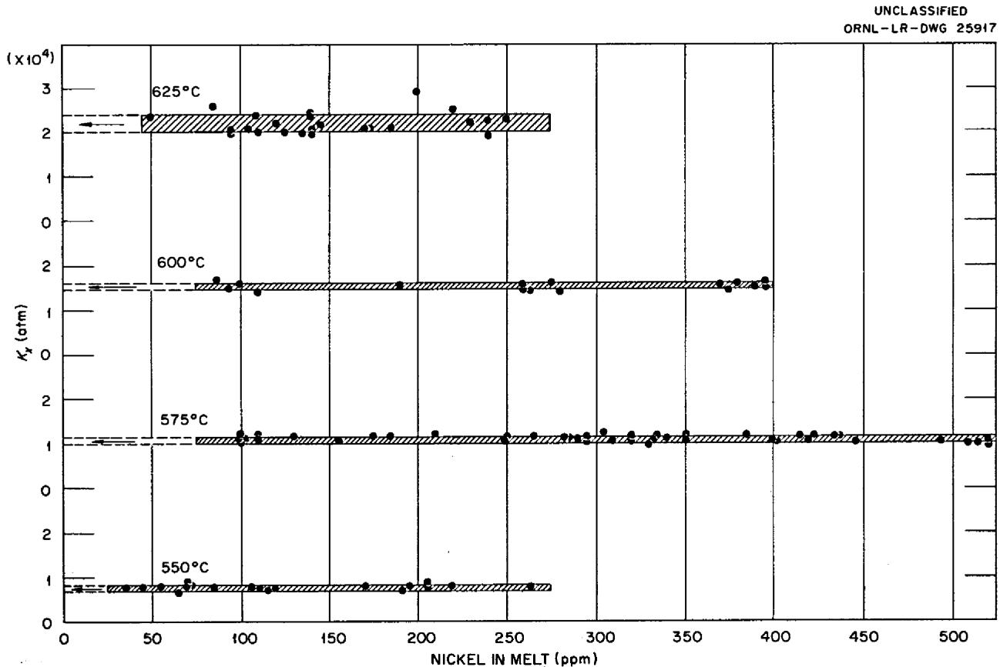  
Fig. 2.2.1. Equilibrium Quotients for the Reduction of $\mathrm{NiF}_2$ by $\mathsf{H}_2$ in NaF-ZrF4 (53-47 mole %).

Table 2.2.2. Free Energies of Formation of HF and $\mathsf{NiF}_2$   

<table><tr><td rowspan="2">Temperature (°C)</td><td colspan="4">ΔF0(kcal)</td></tr><tr><td>HF (g)</td><td>NIF2(s)</td><td>NIF2(l)</td><td>NIF2(d)</td></tr><tr><td>625</td><td>-65.70</td><td>-127.14</td><td>-124.65</td><td>-113.56</td></tr><tr><td>600</td><td>-65.67</td><td>-127.88</td><td>-125.25</td><td>-114.62</td></tr><tr><td>575</td><td>-65.64</td><td>-128.64</td><td>-125.84</td><td>-115.60</td></tr><tr><td>550</td><td>-65.61</td><td>-129.38</td><td>-126.46</td><td>-116.60</td></tr></table>

cal/mole, also given by Brewer et al., were used. The values of $\Delta F^{\circ}$ for $\mathsf{NiF}_2(d)$ were obtained by extrapolation of the $K_{x}$ data to infinite dilution to establish $K_{a}$ for the reaction in which $\mathsf{NiF}_2(d)$ is the standard state. The free-energy changes of the reduction reaction were then calculated and combined with the corresponding $\Delta F^{\circ}$ for $\mathsf{HF}(g)$ to yield the tabulated results.

The values calculated for the equilibrium constants, $K_{a'}$ for the chemical reactions, along with the activity coefficients of $\mathrm{NiF}_2$ for each of the three standard states, are shown in Table 2.2.3. A comparison of the calculated equilibrium

constants obtained for $\mathsf{NiF}_2(s)$ as the standard state and the experimental values, as presented in Fig. 2.2.2, reveals a striking discrepancy between the calculated and the experimental values. The discrepancy is directly reflected in the very large values of the activity coefficients obtained when the solid and the supercooled liquid are chosen as standard states for the $\mathsf{NiF}_2$ . If $\mathsf{NiF}_2(d)$ is the standard state, however, the activity coefficient is unity as a consequence of the constancy of the experimental equilibrium quotients obtained. This is equivalent to stating that $\mathsf{NiF}_2$ obeys Henry's law over the concentration range studied, which includes, at $550^{\circ}\mathsf{C}$ , values not far from the concentration of $\mathsf{NiF}_2$ in the saturated solution.

The temperature dependence of the experimental $K_{x}$ values and of the calculated $K_{a}$ values for the reactions involving $\mathrm{NiF}_2(s)$ and $\mathrm{NiF}_2(l)$ is shown in Fig. 2.2.3. The heats of reaction calculated from the slopes of these lines and the corresponding entropy changes are summarized in Table 2.2.4.

The heat of reaction calculated from the temperature dependence of the experimental values is in substantial agreement with the corresponding values calculated for the reduction reactions of $\mathsf{NiF}_2(s)$ and of $\mathsf{NiF}_2(l)$ . On the other hand, the

Reactions:* (1) $\mathsf{NiF}_2(s) + \mathsf{H}_2(g) = \mathsf{Ni}(s) + 2\mathsf{HF}(g)$   
(2) $\mathsf{NiF}_2(l) + \mathsf{H}_2(g) = \mathsf{Ni}(s) + 2\mathsf{HF}(g)$   
(3) $\mathsf{NiF}_2(d) + \mathsf{H}_2(g) = \mathsf{Ni}(s) + 2\mathsf{HF}(g)$

Table 2.2.3. Equilibrium Constants for the Reduction of $\mathsf{N}\mathsf{I}\mathsf{F}_{\mathsf{2}}$ by Hydrogen Gas and Activity Coefficients of $\mathsf{NiF}_2$ in NaF-ZrF4 (53-47 Mole %)   

<table><tr><td rowspan="2">Temperature (°C)</td><td colspan="3">Equilibrium Constant, Ka</td><td colspan="3">Activity Coefficient** for NiF2</td></tr><tr><td>Reaction 1</td><td>Reaction 2</td><td>Reaction 3</td><td>γ(s)</td><td>γ(l)</td><td>γ(d)</td></tr><tr><td>625</td><td>10.90</td><td>43.8</td><td>21,900 ± 2,000</td><td>2009</td><td>500</td><td>1</td></tr><tr><td>600</td><td>7.37</td><td>33.6</td><td>15,300 ± 700</td><td>2076</td><td>455</td><td>1</td></tr><tr><td>575</td><td>4.80</td><td>25.2</td><td>11,000 ± 600</td><td>2292</td><td>436</td><td>1</td></tr><tr><td>550</td><td>3.08</td><td>18.4</td><td>7,600 ± 400</td><td>2468</td><td>413</td><td>1</td></tr></table>

*The notations $s, g, l$ , and $d$ refer to crystalline solid, gaseous, supercooled liquid, and dissolved states, respectively.   
**The activity coefficients $\gamma(s)$ and $\gamma(l)$ were calculated by using crystalline solid and supercooled liquid, respectively, as the standard states for $\mathrm{NiF}_2$ in the molten solvent; $\gamma(d)$ is the assumed activity coefficient for $\mathrm{NiF}_2$ dissolved at unit mole fraction as the standard state.

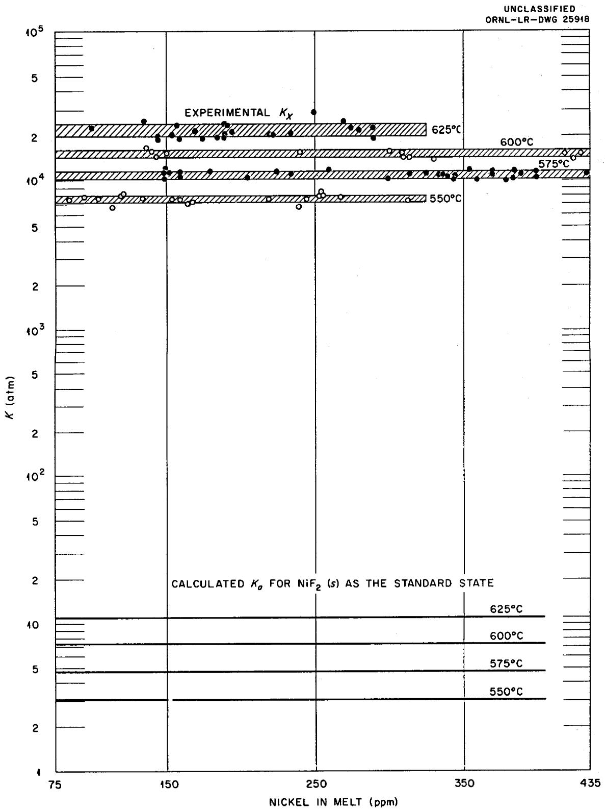  
Fig. 2.2.2 Experimental and Calculated Equilibrium Constants for the Reduction of $\mathsf{NiF}_2$ by $\mathsf{H}_2$ in NaF-ZrF4 (53-47 mole %).

entropy change calculated from the experimental measurements reflects the vast discrepancy between the equilibrium constants obtained by using the different standard states.

It is clear from the results of this investigation that $\mathbf{NiF}_2$ in solution, under the experimental conditions used, behaves in a vastly different manner than that predicted by the free energies of formation for solid $\mathbf{NiF}_2$ . This is rather surprising

in view of the agreement previously found to exist between the experimental and calculated behavior of $\mathsf{FeF}_2$ in the same solvent. The striking differences in behavior between $\mathsf{NiF}_2$ and $\mathsf{FeF}_2$ can be appreciated by comparing the activity coefficients at $600^{\circ}\mathsf{C}$ . The values are listed in Table 2.2.5.

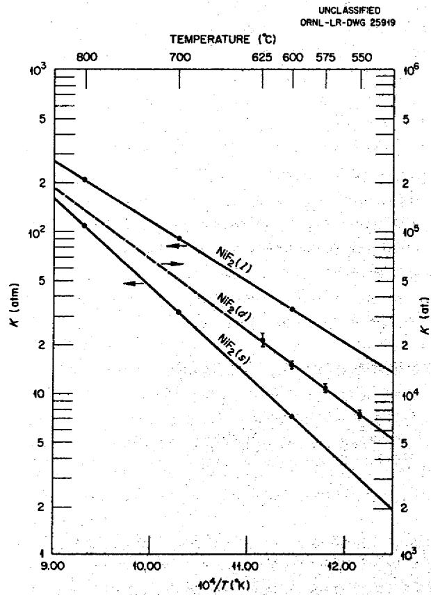  
Fig. 2.2.3. Temperature Dependence of $\mathsf{NiF}_2$ Reduction Equilibria.

Table 2.2.5. Activity Coefficients of $\mathsf{NiF}_2$ and of $\mathsf{FeF}_2$ In Molten NaF-ZrF4 (53-47 Mole %) at $600^{\circ}\mathsf{C}$   

<table><tr><td>Standard State</td><td>γFeF2</td><td>γNIF2</td><td>γNIF2/γFeF2</td></tr><tr><td>MF2(s)</td><td>3.28</td><td>2076</td><td>633</td></tr><tr><td>MF2(l)</td><td>0.666</td><td>455</td><td>689</td></tr><tr><td>MF2(d)</td><td>1</td><td>1</td><td>1</td></tr></table>

The values presented in Table 2.2.5 are those to be used for relating the behavior of $\mathsf{FeF}_2$ and $\mathsf{NiF}_2$ in the NaF-ZrF4 solvent to the thermodynamic estimates found in the literature. The experimentally determined activity coefficients for $\mathsf{NiF}_2$ are high enough to throw doubt on the validity of the estimates in the literature. A further discussion of this point is presented in the following section.

# THERMODYNAMIC CONSIDERATIONS RELATING TO THE ACTIVITY OF $\mathsf{N}\mathsf{i}\mathsf{F}_{2}$

M. Blander F. F. Blankenship

The activity coefficients found for $\mathsf{NiF}_2$ in fuel mixtures are quite large, as reported in the previous section. Based on the standard free energy of

4C. M. Blood and G. M. Watson, ANP Quar. Prog. Rep. March 10, 1956, ORNL-2061, p 84.

Table 2.2.4. Heats of Reaction and Entropy Changes for the Reduction of $\mathsf{NIF}_2$ by Hydrogen   

<table><tr><td>Standard State</td><td>Heats of Reaction, ΔH° (cal per mole of NiF2)</td><td>Entropy Changes, ΔS° (cal/K per mole of NiF2)</td></tr><tr><td>NIF2(s)</td><td>25,000</td><td>32.6</td></tr><tr><td>NIF2(l)</td><td>17,000</td><td>26.5</td></tr><tr><td>NIF2(d)</td><td>20,500</td><td>42.7</td></tr></table>

formation of solid $\mathsf{NiF}_2$ (ref 2), the activity coefficient of $\mathsf{NiF}_2$ in NaF-ZrF4 (53-47 mole %), as determined by equilibrium measurements made with $\mathsf{H}_2$ as a reducing agent, is $2 \times 10^3$ at $600^{\circ}\mathsf{C}$ , and, based on a comparison of $\mathsf{NiF}_2$ with $\mathsf{FeF}_2$ by means of emf measurements on Ni and Fe electrodes in the NaF-ZrF4 (53-47 mole %) solvent, the activity coefficient of $\mathsf{NiF}_2$ at $650^{\circ}\mathsf{C}$ is $1.8 \times 10^3$ (see subsequent section of this chapter on "EMF Measurements in Molten Salts").

The agreement between the results from the emf studies and the equilibrium studies indicates that the high values for $\gamma_{\mathrm{NIF}_2}$ cannot be attributed entirely to experimental error. Since the activity coefficient reflects any approximations in the published estimates used in the computations, it was of interest to examine the numerical factors closely in a search for leads to revised estimates.

In order that the activity not exceed unity, the activity coefficient, $y_{\text{NiF}_2(s)}$ based on the solid as the standard state should not exceed $5 \times 10^2$ at $600^\circ \text{C}$ , because the solubility at $600^\circ \text{C}$ is greater than $2 \times 10^{-3}$ mole fraction. (Blood, Redman, and Topol found the $\text{NiF}_2$ solubility to be about $2 \times 10^{-3}$ mole fraction at $600^\circ \text{C}$ .) The saturating phase is a compound of $\text{NiF}_2$ and other components, and the compound $\text{NiF}_2$ is more soluble than the saturating phase, or, in other words, a solution saturated with $\text{NiF}_2$ is metastable with respect to a solution less rich in $\text{NiF}_2$ in equilibrium with a ternary compound. Thus, if the solubility data are correct and if the discrepancy in the activity coefficients is assumed to result solely from the estimated value of the free energy of formation of $\text{NiF}_2$ , then the free energy of formation must be shifted to a smaller negative value by an amount sufficient to provide at least a factor of 4 in the activity coefficient. At $600^\circ \text{C}$ this amounts to about 2.5 kcal, which would revise the free energy of formation from -128.0 kcal/mole to -125.5 kcal/mole.

Further information on the plausibility of the high values for the activity coefficients of $\mathsf{NiF}_2$ can be obtained from considerations of coefficients based on pure liquid as the standard state. For the pure liquid, ideal behavior corresponds to an activity coefficient of unity, and this sets an approximate upper limit to the activity coefficient

of $\mathsf{NiF}_2$ . This statement is based on previously discussed correlating principles that involve the charge-to-radius ratio $Z / R$ and which indicate that positive deviations will not be found in mixtures of ions of low polarizability. Moreover, there is little reason to expect much difference in the behavior of $\mathsf{Ni}^{++}$ and $\mathsf{Fe}^{++}$ in dilute solution.

The conversion of activity coefficients based on the solid as the standard state, $\gamma (s)$ , to those based on liquid as standard state, $\gamma (l)$ , requires a knowledge of the melting point and the heat of fusion of the solute. When Brewer's estimates of the values of these quantities are employed, $\gamma_{\mathrm{NIF}_2(l)}$ is 560 at $650^{\circ}\mathrm{C}$ and $\gamma_{\mathrm{FeF}_2(l)}$ is 0.66 at the same temperature.

There is a good possibility that the estimates for $\mathsf{NiF}_2$ given by Brewer are incorrect, and therefore an alternative method of estimation has been developed. The alternative method depends on a comparison between the behavior of $\mathsf{MgF}_{2^{\prime}}$ for which a phase diagram is available,8 and that of $\mathsf{NiF}_{2^{\prime}}$ for which the requisite phase diagram data are missing.

Since the charge-to-radius ratio $Z / R$ of $\mathsf{MgF}_2$ is the same as that of $\mathsf{NiF}_2$ , the $\mathsf{NaF - NiF}_2$ system should show the same deviations from ideality as the $\mathsf{NaF - MgF}_2$ system shows at the same compositions. At a given liquidus composition the activity of $\mathsf{MgF}_2$ in the $\mathsf{NaF - MgF}_2$ binary should be the same as the activity of $\mathsf{NiF}_2$ in the $\mathsf{NaF - NiF}_2$ binary. The equation for the activity of the separating component at the liquidus is approximately

(1) $\ln \frac{y(l)}{y(s)} = \ln a(l) = \frac{\Delta H_f}{R}\left(\frac{1}{T_0} -\frac{1}{T}\right)$

$$
= \frac {\Delta S _ {f}}{R} \left(1 - \frac {T _ {0}}{T}\right),
$$

where $a$ is the activity of the separating component, $\Delta H_{f}$ is the heat of fusion, $\Delta S_{f}$ is the entropy of

fusion $(\Delta H_{f} / T_{0}),T_{0}$ is the melting point of the pure component, and $T$ is the liquidus temperature. From Eq.1, it is found that

$$
\frac {\Delta S _ {f}}{R} \left(1 - \frac {T _ {0}}{T}\right) = \frac {\Delta S _ {f} ^ {\prime}}{R} \left(1 - \frac {T _ {0} ^ {\prime}}{T ^ {\prime}}\right), \tag {2}
$$

where the unprimed quantities refer to the NaF-NiF $_2$ system and the primed quantities to the NaF-MgF $_2$ system. A further simplifying approximation is that, since MgF $_2$ and NiF $_2$ both have the same structure (rutile), the entropy of fusion should be the same for both substances. Based on this assumption

$$
\frac {T}{T _ {0}} = \frac {T ^ {\prime}}{T _ {0} ^ {\prime}}. \tag {3}
$$

The approximate value of the melting point of $\mathsf{NiF}_2$ can then be calculated from Eq. 3. The melting point of $\mathsf{MgF}_2$ , $T_0'$ , is taken to be $1543^{\circ}\mathsf{K}$ (ref 8); the liquidus temperature, $T$ , of a mixture that is $44\%$ NaF and $56\%$ $\mathsf{NiF}_2$ is reported to be $1310^{\circ}\mathsf{K}$ (ref 9); and the estimated liquidus temperature, $T'$ , of a $44\%$ NaF and $56\%$ $\mathsf{MgF}_2$ mixture is about $1110^{\circ}\mathsf{K}$ . This estimate was based on the relation between the activity and the freezing-point depression, with 0.18 as the activity of $\mathsf{MgF}_2$ . The value 0.18 was chosen in order to be consistent with the deviations from ideality in

comparable systems and represents an improvement over the direct visual extrapolation from the published diagram. The estimated melting point of $\mathsf{NiF}_2$ is then about $1825^{\circ}\mathsf{K},$ or $1550^{\circ}\mathsf{C}.$ Preliminary experiments indicate that this value for the melting point of pure $\mathsf{NiF}_2$ is approximately correct. The calorimetrically measured heat of fusion of $\mathsf{MgF}_2$ is 13,900 cal/mole and the entropy of fusion is 9.05 eU (ref 10). By utilizing the estimated melting temperature of $\mathsf{NiF}_2$ and the assumption that the entropy of fusion is the same for $\mathsf{NiF}_2$ as for $\mathsf{MgF}_2$ , $\gamma(l)/\gamma(s)$ for $\mathsf{NiF}_2$ was calculated at various temperatures, $T,$ from Eq. 1. The values obtained are presented in Table 2.2.6, together with values based on Brewer's estimates. Apparently Brewer's estimate of $1300^{\circ}\mathsf{K}$ for the melting point was $500^{\circ}\mathsf{K}$ too low, and his value of 8000 cal/mole for the heat of fusion was low by a factor of 2.

The tentative values given in the second column of Table 2.2.6 are much lower than those estimated with the use of the values given by Brewer (third column). A more definitive set of conversion ratios must await a more detailed study of the NaF-NiF $_2$ phase diagram and, more importantly, a better value of the melting point of NiF $_2$ .

Values of the activity coefficients of $\mathsf{NiF}_2$ in NaF-ZrF4 mixtures based on the solid and the liquid as standard states are presented in Table 2.2.7 that were obtained by utilizing the calculated

Table 2.2.6. Tentative Ratios of the Activity Coefficients of $\mathsf{NIF}_2$ Based on Liquid as the Standard State, $\gamma (l)$ , to Those Based on the Solid as the Standard State, $\gamma (s)$ , at Various Temperatures   

<table><tr><td>Temperature (°C)</td><td>Calculated γ(l)/γ(s) for T0= 1552°C</td><td>γ(l)/γ(s) Obtained from Brewer&#x27;s Estimates</td></tr><tr><td>550</td><td>0.0039</td><td>0.17</td></tr><tr><td>600</td><td>0.0071</td><td>0.22</td></tr><tr><td>650</td><td>0.012</td><td>0.28</td></tr><tr><td>700</td><td>0.019</td><td>0.35</td></tr><tr><td>750</td><td>0.029</td><td>0.43</td></tr><tr><td>800</td><td>0.042</td><td>0.52</td></tr><tr><td>850</td><td>0.059</td><td>0.62</td></tr><tr><td>900</td><td>0.080</td><td>0.72</td></tr></table>

Table 2.2.7. Activity Coefficients of $\mathsf{NiF}_2$ in NaF·6ZrF4   

<table><tr><td>Temperature (°C)</td><td>γ(s)*</td><td>γ(l)</td><td>γ(l) Based on Brewer&#x27;s Values of T0and ΔHf</td></tr><tr><td>550</td><td>2468</td><td>9.6</td><td>413</td></tr><tr><td>575</td><td>2292</td><td>12.6</td><td>436</td></tr><tr><td>600</td><td>2076</td><td>14.7</td><td>455</td></tr><tr><td>625</td><td>2009</td><td>19.1</td><td>500</td></tr></table>

*The magnitude of this number depends on the correctness of the free energy of formation of pure $\mathsf{NiF}_2$ . An error of 4 kcal/mole can lead to an error of a factor of 10.

values of the conversion ratio, as given in Table 2.2.6. If the factor of at least 4 for the correction to the standard free energy of formation, discussed above, is divided into the values of $\gamma_{\mathrm{NIF}_2(l)}$ in the third column of Table 2.2.7, the revised values for the activity coefficients of $\mathrm{NiF}_2$ based on liquid as the standard state are numbers less than $5,$ and thus most of the discrepancy is resolved.

# REDUCTION OF UF4 BY STRUCTURAL METALS J.D.Redman

Data obtained from filtration studies of the reduction of $\mathsf{UF}_4$ by vanadium metal in the reaction medium NaF-LiF-KF (11.5-46.5-42 mole %), as reported previously,11 indicated that $V^0$ is stable in contact with $\mathsf{UF}_4$ dissolved in this solvent. Subsequent studies demonstrated that the analysis of these materials was in error and that $V^0$ was not nearly so stable as first reported. Additional studies of this system in the NaF-LiF-KF mixture, as well as in NaF-ZrF4 (50-50 mole %), at 600 and at $800^{\circ}C$ were made recently. Also, a brief study of the reduction of $\mathsf{UF}_4$ by tungsten metal in the reaction medium NaF-ZrF4 (53-47 mole %) was made in order to compare the behavior in this solvent with that found earlier12 in the NaF-LiF-KF mixture.

The results of the recent studies of the reduction of $\mathsf{UF}_4$ by $V^{\circ}$ at 600 and at $800^{\circ}C$ in the two different reaction mediums are presented in Table 2.2.8. All runs were performed with 2 g of $V^{\circ}$ added to the solvent in nickel equipment. In the runs with the NaF-ZrF4 mixture, 4.1 mole % UF4 (11.4 wt %) was present, and, in the runs with the NaF-LiF-KF mixture, 2.3 mole % UF4 (15 wt %) was used. The studies of tungsten were performed in a similar manner, with 4.0 mole % UF4 (11.4 wt %) present in NaF-ZrF4 (53-47 mole %). The results of the runs with tungsten are given in Table 2.2.9.

The data given in Table 2.2.8 show that $V^{\circ}$ is not stable in contact with $UF_4$ dissolved in either type of fluoride mixture at 600 or at $800^{\circ}C$ . There is some indication that higher equilibrium vanadium concentrations exist in the $NaF-ZrF_4$ mixture at $800^{\circ}C$ , but, in view of the relatively few runs with the $NaF-LiF-KF$ mixture and the difference in the $UF_4$ concentrations, the data do not show conclusively that $V^{\circ}$ is more reactive in the $NaF-ZrF_4$ mixture than in the $NaF-LiF-KF$ mixture. The extensive attack of vanadium by $UF_4$ in these fluoride mixtures indicates that the use of vanadium alloys to contain these mixtures would offer no real advantage.

The results given in Table 2.2.9 show that low equilibrium tungsten concentrations occur under these conditions and demonstrate that $W^0$ is stable with respect to $UF_4$ dissolved in the NaF-ZrF4 mixture. These results are in marked contrast to those found earlier with the NaF-LiF-KF mixture as the reaction medium. Tungsten concentrations of 1100 and 1400 ppm at 600 and at $800^{\circ}C$ , respectively, were found in this medium.

Table 2.2.8. Data for the Reaction of ${\mathrm{{UF}}}_{4}$ with ${\mathrm{V}}^{ \circ  }$ in NaF-ZrF ${}_{4}$ (50-50 Mole %) and NaF-LIF-KF (11.5-46.5-42 Mole %) at 600 and ${800}^{ \circ  }\mathrm{C}$   

<table><tr><td rowspan="2">Reaction Medium</td><td colspan="2">Conditions of Equilibration</td><td colspan="3">Present in Filtrate</td></tr><tr><td>Temperature (°C)</td><td>Time (hr)</td><td>U (wt %)</td><td>V* (ppm)</td><td>Ni (ppm)</td></tr><tr><td rowspan="8">NaF-ZrF4(50-50 mole %)</td><td>600</td><td>3</td><td>7.4</td><td>470</td><td>120</td></tr><tr><td></td><td>3</td><td>8.1</td><td>500</td><td>25</td></tr><tr><td></td><td>5</td><td>8.8</td><td>420</td><td>25</td></tr><tr><td></td><td>5</td><td>10.3</td><td>390</td><td>35</td></tr><tr><td>800</td><td>3</td><td>8.3</td><td>2200</td><td>70</td></tr><tr><td></td><td>3</td><td>8.3</td><td>2150</td><td>30</td></tr><tr><td></td><td>5</td><td>8.3</td><td>1850</td><td>30</td></tr><tr><td></td><td>5</td><td>8.3</td><td>1600</td><td>70</td></tr><tr><td rowspan="4">NaF-LiF-KF(11.5-46.5-42 mole %)</td><td>600</td><td>3</td><td>11.4</td><td>550</td><td>25</td></tr><tr><td></td><td>3</td><td>11.1</td><td>750</td><td>45</td></tr><tr><td>800</td><td>3</td><td>11.0</td><td>1450</td><td>25</td></tr><tr><td></td><td>3</td><td>10.6</td><td>1350</td><td>20</td></tr></table>

*Blanks of 185 and 150 ppm of V at ${800}^{ \circ  }\mathrm{C}$ in NaF-ZrF ${}_{4}$ and NaF-LiF-KF, respectively.

Table 2.2.9. Data for the Reaction of $\mathsf{UF}_4$ with W in NaF-ZrF4 (53-47 Mole %) at 600 and at $800^{\circ}C$   

<table><tr><td colspan="2">Conditions of Equilibration</td><td colspan="3">Present in Filtrate</td></tr><tr><td>Temperature (°C)</td><td>Time (hr)</td><td>U (wt %)</td><td>W* (ppm)</td><td>Ni (ppm)</td></tr><tr><td rowspan="4">600</td><td>3</td><td>9.2</td><td>70</td><td>110</td></tr><tr><td>3</td><td>9.1</td><td>120</td><td>130</td></tr><tr><td>5</td><td>9.0</td><td>95</td><td>45</td></tr><tr><td>5</td><td>9.1</td><td>70</td><td>50</td></tr><tr><td rowspan="4">800</td><td>3</td><td>9.1</td><td>130</td><td>45</td></tr><tr><td>3</td><td>9.3</td><td>100</td><td>40</td></tr><tr><td>5</td><td>8.5</td><td>95</td><td>30</td></tr><tr><td>5</td><td>8.9</td><td>105</td><td>20</td></tr></table>

*Blank of 5 ppm of W at $800^{\circ} \mathrm{C}$ .

# STABILITY OF CHROMIUM FLUORIDES IN NoF-LiF-KF

J.D.Redman

Previous studies13 of the behavior of $\mathsf{CrF}_3$ dissolved in NaF-LiF-KF (11.5-46.5-42 mole %) demonstrated that $\mathsf{Cr}^{+ + + }$ is stable in this melt at $800^{\circ}\mathsf{C}$ if contained in nickel. Similar studies have now been made with chromium metal present. Data given in Table 2.2.10 show the instability of $\mathsf{CrF}_3$ under these conditions. An equilibration period of 5 hr was used prior to filtration. Previous studies14 also showed that $\mathsf{CrF}_2$ was not stable

13J. D. Redman, ANP Quar. Prog. Rep. Dec. 10, 1955, ORNL-2012, p 88; ANP Quar. Prog. Rep. Sept. 10, 1956, ORNL-2157, p 100.   
14J. D. Redman and C. F. Weaver, ANP Quar. Prog. Rep. March 10, 1955, ORNL-1864, p 61; ANP Quar. Prog. Rep. June 10, 1955, ORNL-1896, p 63.

Table 2.2.10. Stability of Chromium Fluorides in NaF-LiF-KF (11.5-46.5-42 Mole %) at ${800}^{ \circ  }\mathrm{C}$   

<table><tr><td colspan="3">Initially Present</td><td colspan="2">Present in Filtrate</td></tr><tr><td>Cr++ (wt %)</td><td>Cr+++ (wt %)</td><td>Cr0 (wt %)</td><td>Cr++ (wt %)</td><td>Total Cr (wt %)</td></tr><tr><td>1</td><td></td><td></td><td></td><td>0.87</td></tr><tr><td>1</td><td></td><td></td><td>0.06</td><td>0.86</td></tr><tr><td>3</td><td></td><td></td><td>0.38</td><td>2.4</td></tr><tr><td>3</td><td></td><td></td><td>0.27</td><td>2.6</td></tr><tr><td>5</td><td></td><td></td><td>0.68</td><td>4.1</td></tr><tr><td>5</td><td></td><td></td><td>0.75</td><td>4.4</td></tr><tr><td></td><td>1</td><td>5</td><td>0.30</td><td>1.29</td></tr><tr><td></td><td>1</td><td>5</td><td>0.32</td><td>1.33</td></tr><tr><td></td><td>2</td><td>5</td><td>0.64</td><td>2.53</td></tr><tr><td></td><td>2</td><td>5</td><td>0.47</td><td>2.58</td></tr><tr><td></td><td>3</td><td>5</td><td>0.37</td><td>4.1</td></tr><tr><td></td><td>3</td><td>5</td><td>0.95</td><td>4.2</td></tr><tr><td></td><td>3</td><td>5</td><td>0.49</td><td>4.3</td></tr><tr><td></td><td>3</td><td>5</td><td>0.98</td><td>4.0</td></tr></table>

at $800^{\circ}C$ in the NaF-LiF-KF mixture and that it probably disproportionated according to the reaction

$$
3 \mathrm {C r F} _ {2} \rightleftharpoons 2 \mathrm {C r F} _ {3} + \mathrm {C r} ^ {\circ}.
$$

Additional studies have now been made of this system in a further attempt to determine the equilibrium concentrations and for comparison with results obtained when $\mathsf{CrF}_3$ and $\mathsf{Cr}^{\circ}$ are equilibrated. The results are included in Table 2.2.10.

If the $\mathbf{Cr}^{+ + }$ values are ignored and only the total chromium concentrations found in the filtrates are considered, nearly constant values for the $\mathbf{Cr}^{+ + }$ to- $\mathbf{Cr}^{+ + }$ ratio may be calculated. Such treatment shows that about $60\%$ of the chromium is present as $\mathbf{Cr}^{+ + }$ and about $40\%$ as $\mathbf{Cr}^{+ + }$ in all cases, irrespective of whether $\mathbf{CrF}_2$ or a mixture of $\mathbf{CrF}_3$ and $\mathbf{Cr}^{\circ}$ was initially present. The concentration equilibrium constants calculated from the mole fractions of $\mathbf{CrF}_2$ and $\mathbf{CrF}_3$ present are not constant, however, if this constant $\mathbf{Cr}^{+ + }$ to- $\mathbf{Cr}^{+ + }$ ratio is used. They decrease from a value of approximately 50 for the lowest total chromium concentration to about 10 for the highest. These

values are much greater than the $10^{-3}$ obtained for the equilibrium constant by using the values available for the standard free energy of formation of $\mathsf{CrF}_2$ and $\mathsf{CrF}_3$ at $800^{\circ}\mathsf{C}$ . No reasonable balance of $\mathsf{Cr}^{+ + },\mathsf{Cr}^{+ + }$ , and total chromium can be obtained by using the experimentally determined values for $\mathsf{Cr}^{+ + }$ , and it thus appears that the experimental values are probably inaccurate.

# REDUCTION OF $\mathsf{FeF}_2$ BY Cr $^0$ IN RbF-ZrF $_4$ J. D. Redman

Data presented previously for the reaction

$$
F e F _ {2} + C r ^ {\circ} \rightleftharpoons C r F _ {2} + F e ^ {\circ}
$$

in NaF-ZrF4 (53-47 mole %) at 600°C showed that the reduction of FeF2 by Cr was essentially complete at the FeF2 concentrations employed, and, as a result, no reliable values for the CrF2-to-FeF2 ratio (or Kc) could be calculated. A calculation of the CrF2-to-FeF2 ratio from the values found for Kc for the reaction

$$
M + 2 U F _ {4} \rightleftharpoons M F _ {2} + 2 U F _ {3},
$$

where $M$ is $Cr$ or $Fe_{t}$ , yielded a value of approximately 60 at $600^{\circ}\mathrm{C}$ with $NaF - ZrF_{4}$ (53-47 mole %) as the reaction medium. This value is much larger than the $6 \times 10^{-3}$ obtained by calculating the equilibrium constant from the values given for the standard free energy of formation for $CrF_{2}$ and $FeF_{2}$ at $600^{\circ}\mathrm{C}$ and shows that the system is far from ideal.

A value of $\sim 60$ for the $\mathrm{Cr}^{+ + }$ to-Fe++ ratio was found in the NaF-ZrF4 mixture at the highest FeF2 concentration (1.0 wt %) used in the previous studies. Additional experiments have been performed with higher FeF2 concentrations to determine whether the value for the $\mathrm{Cr}^{+ + }$ to-Fe++ ratio would increase with increasing FeF2 additions. Extremely erratic results were obtained with 1.5 wt % FeF2. It appears probable that the solubility of $\mathrm{Cr}^{+ + }$ was exceeded and that the presence of a solid phase consisting of a ternary compound of NaF, ZrF4, and CrF2 was responsible for the inconsistent results. If this assumption is correct, reliable values at the higher FeF2 concentrations cannot be determined in this reaction medium.

A study of this reaction was also made with $\mathsf{RbF - ZrF_4}$ (52-48 mole $\%$ ) as the reaction medium. This medium should yield a value of about 2 to 3 for the $\mathsf{Cr}^{+ + }$ to-Fe++ ratio, based on the data available for the reduction of UF by Cr and Fe, and therefore be more adaptable to the experimental determination of the $\mathsf{Cr}^{+ + }$ to-Fe++ ratio. Blanks were run in which 2 g of iron wire was hydrogenfired at $1000^{\circ}\mathrm{C}$ in a nickel charge bottle; approximately 40 g of the $\mathsf{RbF - ZrF_4}$ mixture and 2 g of pure chromium were added; and the system was equilibrated at $600^{\circ}\mathrm{C}$ for 5 hr prior to filtration. The experimental runs were made in a similar manner, and the desired quantity of $\mathsf{FeF_2}$ was added. Data are reported in Table 2.2.11 for the blanks and for the runs in which $\mathsf{FeF_2}$ was added.

The iron concentrations present in the blanks approximate those found in the NaF-ZrF $^4$ mixture and in the charge material. This agreement suggests that the iron is present as metal sufficiently fine to pass the filter rather than as dissolved $\mathrm{Fe}^{+ + }$ . The data show that the reduction of $\mathrm{Fe}^{+ + }$ is essentially complete at all $\mathrm{Fe}^{+ + }$ concentrations studied. The low iron concentrations present in these runs preclude any accurate evaluation of the $\mathrm{Cr}^{+ + }$ -to- $\mathrm{Fe}^{+ + }$ ratio, but it is evident that this ratio is much larger than the value of 2 to 3 calculated from the data available for the reduction of UF $^4$ by Cro and Fe. In contrast to the good agreement between the experimentally determined and the calculated chromium concentrations found in the NaF-ZrF $^4$ mixture, the data

Table 2.2.11. Data for the Reaction ${\mathrm{{FeF}}}_{2} + {\mathrm{{Cr}}}^{0} \rightleftharpoons  {\mathrm{{CrF}}}_{2} + {\mathrm{{Fe}}}^{0}$ in $\mathrm{{RbF}} - {\mathrm{{ZrF}}}_{4}$ (52-48 Mole %) at ${600}^{ \circ  }\mathrm{C}$   

<table><tr><td rowspan="2">FeF2Added (ppm of Fe)</td><td colspan="3">Present in Filtrate</td><td rowspan="2">Calculated Cr* (ppm)</td></tr><tr><td>Ni (ppm)</td><td>Fe (ppm)</td><td>Cr (ppm)</td></tr><tr><td rowspan="4">Blank</td><td>30</td><td>90</td><td>315</td><td></td></tr><tr><td>40</td><td>100</td><td>215</td><td></td></tr><tr><td>40</td><td>85</td><td>235</td><td></td></tr><tr><td>35</td><td>100</td><td>280</td><td></td></tr><tr><td>995</td><td>55</td><td>100</td><td>1305</td><td>1185</td></tr><tr><td>845</td><td>20</td><td>95</td><td>1080</td><td>1045</td></tr><tr><td>890</td><td>20</td><td>90</td><td>1055</td><td>1090</td></tr><tr><td>850</td><td>35</td><td>95</td><td>1120</td><td>1050</td></tr><tr><td>1920</td><td>110</td><td>135</td><td>2335</td><td>2050</td></tr><tr><td>1860</td><td>35</td><td>95</td><td>2305</td><td>1970</td></tr><tr><td>1900</td><td>20</td><td>90</td><td>2360</td><td>2030</td></tr><tr><td>1950</td><td>30</td><td>105</td><td>2405</td><td>2070</td></tr><tr><td>4050</td><td>35</td><td>145</td><td>4625</td><td>4030</td></tr><tr><td>3890</td><td>35</td><td>85</td><td>4610</td><td>3870</td></tr><tr><td>3900</td><td>25</td><td>90</td><td>4670</td><td>3880</td></tr><tr><td>3970</td><td>30</td><td>100</td><td>4880</td><td>3960</td></tr><tr><td>6030</td><td>50</td><td>105</td><td>7365</td><td>5880</td></tr><tr><td>6100</td><td>80</td><td>140</td><td>7100</td><td>5940</td></tr><tr><td>6100</td><td>75</td><td>95</td><td>7320</td><td>5940</td></tr><tr><td>6050</td><td>30</td><td>90</td><td>7610</td><td>5890</td></tr></table>

*Complete reduction of $\mathsf{FeF}_2$ assumed.

given in Table 2.2.11 show that in $\mathsf{RbF - ZrF}_4$ the calculated chromium concentrations are lower than the experimentally determined concentrations. This difference is approximately $20\%$ for an initial $\mathsf{Fe}^{+ + }$ concentration in the range of 2000 to 6000 ppm. No satisfactory explanation can be given for the large $\mathsf{Cr}^{+ + }$ to- $\mathsf{Fe}^{+ + }$ ratio or for the difference between the calculated and the experimentally determined chromium concentrations. Additional experimental work is planned in an attempt to resolve these discrepancies.

# SOLUBILITY OF STRUCTURAL METAL FLUORIDES IN RbF-ZrF4

J. D. Redman

The results obtained from studies on the solubility of $\mathsf{CrF}_2$ , $\mathsf{FeF}_2$ , and $\mathsf{NiF}_2$ in NaF-ZrF₄ (53-47 mole %),[16] in LiF-ZrF₄ (52-48 mole %),[17] and in KF-ZrF₄ (52-48 mole %)[17] were reported previ

ously. The data obtained at $600^{\circ}\mathrm{C}$ demonstrated that the solubilities of $\mathsf{CrF}_2$ and of $\mathsf{FeF}_2$ are functions of the excess of structural metal fluoride present. The solubility of $\mathsf{NiF}_2$ showed this behavior in the NaF-ZrF $_4$ and LiF-ZrF $_4$ mixtures but not in the KF-ZrF $_4$ mixture. The change in solubility at $600^{\circ}\mathrm{C}$ is due to the presence of a solid phase consisting of a ternary compound containing more $\mathsf{ZrF}_4$ than alkali fluoride and the resulting enrichment of the liquid phase with respect to alkali fluoride.

More recently the solubility of the three structural metal fluorides has been studied at 600 and at $800^{\circ}C$ with $\mathsf{RbF - ZrF_4}$ (52-48 mole $\%$ ) as the solvent. The results are presented in Table 2.2.12, and the $600^{\circ}C$ values are plotted on Fig. 2.2.4,

16J. D. Redman, ANP Quar. Prog. Rep. June 10, 1956, ORNL-2106, p 101.   
17J. D. Redman, ANP Quar. Prog. Rep. Sept. 10, 1956, ORNL-2157, p 100.

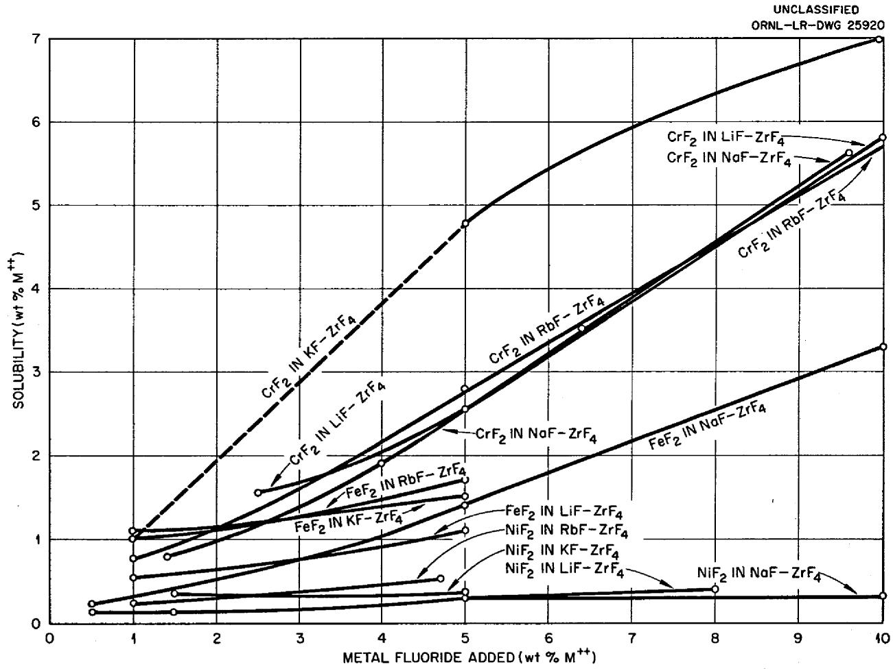  
Fig. 2.2.4. Solubility of Structural Metal Fluorides in Alkali Fluoride-ZrF $_4$ Binary Systems at $600^{\circ}$ C.

Table 2.2.12. Solubility of Structural Metal Fluorides in RbF-ZrF $_4$ (52-48 Mole %) at 600 and $800^{\circ}\mathrm{C}$   

<table><tr><td colspan="2">Additive</td><td rowspan="2">Temperature (°C)</td><td colspan="5">Present in Filtrate</td></tr><tr><td>Ion</td><td>Quantity (wt %)</td><td>Fe++ (wt %)</td><td>Fe (wt %)</td><td>Cr++ (wt %)</td><td>Cr (wt %)</td><td>Ni (ppm)</td></tr><tr><td rowspan="8">Ni++</td><td>1.0</td><td>600</td><td></td><td></td><td></td><td></td><td>2,400</td></tr><tr><td>1.0</td><td>600</td><td></td><td></td><td></td><td></td><td>2,400</td></tr><tr><td>4.7</td><td>600</td><td></td><td></td><td></td><td></td><td>5,400</td></tr><tr><td>4.7</td><td>600</td><td></td><td></td><td></td><td></td><td>5,200</td></tr><tr><td>1.0</td><td>800</td><td></td><td></td><td></td><td></td><td>5,400</td></tr><tr><td>1.0</td><td>800</td><td></td><td></td><td></td><td></td><td>5,400</td></tr><tr><td>4.7</td><td>800</td><td></td><td></td><td></td><td></td><td>13,800</td></tr><tr><td>4.7</td><td>800</td><td></td><td></td><td></td><td></td><td>13,800</td></tr><tr><td rowspan="12">Cr++</td><td>1.0</td><td>600</td><td></td><td></td><td>0.54</td><td>0.76</td><td>55</td></tr><tr><td>1.0</td><td>600</td><td></td><td></td><td>0.68</td><td>0.76</td><td>1</td></tr><tr><td>5.0</td><td>600</td><td></td><td></td><td>2.0</td><td>2.8</td><td>120</td></tr><tr><td>5.0</td><td>600</td><td></td><td></td><td>2.1</td><td>2.7</td><td>1</td></tr><tr><td>15.0</td><td>600</td><td></td><td></td><td>8.3</td><td>9.4</td><td>135</td></tr><tr><td>15.0</td><td>600</td><td></td><td></td><td>6.3</td><td>7.4</td><td>110</td></tr><tr><td>5.0</td><td>800</td><td></td><td></td><td>2.6</td><td>3.4</td><td>160</td></tr><tr><td>5.0</td><td>800</td><td></td><td></td><td>2.3</td><td>3.5</td><td>220</td></tr><tr><td>10.0</td><td>800</td><td></td><td></td><td>7.3</td><td>8.9</td><td>60</td></tr><tr><td>10.0</td><td>800</td><td></td><td></td><td>7.8</td><td>9.1</td><td>55</td></tr><tr><td>20.0</td><td>800</td><td></td><td></td><td>9.0</td><td>15.6</td><td>190</td></tr><tr><td>20.0</td><td>800</td><td></td><td></td><td>9.5</td><td>15.7</td><td>250</td></tr><tr><td rowspan="10">Fe++</td><td>1.0</td><td>600</td><td>0.77</td><td>0.99</td><td></td><td></td><td>155</td></tr><tr><td>1.0</td><td>600</td><td>0.87</td><td>1.00</td><td></td><td></td><td>175</td></tr><tr><td>5.0</td><td>600</td><td>1.2</td><td>1.8</td><td></td><td></td><td>150</td></tr><tr><td>5.0</td><td>600</td><td>1.4</td><td>1.7</td><td></td><td></td><td>110</td></tr><tr><td>4.0</td><td>800</td><td>3.4</td><td>4.0</td><td></td><td></td><td>215</td></tr><tr><td>4.0</td><td>800</td><td>3.2</td><td>4.2</td><td></td><td></td><td>240</td></tr><tr><td>10.0</td><td>800</td><td>6.6</td><td>7.9</td><td></td><td></td><td>430</td></tr><tr><td>10.0</td><td>800</td><td>6.1</td><td>9.1</td><td></td><td></td><td>660</td></tr><tr><td>15.0</td><td>800</td><td>7.7</td><td>9.9</td><td></td><td></td><td>110</td></tr><tr><td>15.0</td><td>800</td><td>7.4</td><td>9.2</td><td></td><td></td><td>130</td></tr><tr><td rowspan="8">Cr+++</td><td>1.0</td><td>600</td><td></td><td></td><td>0.26</td><td>0.48</td><td>825</td></tr><tr><td>1.0</td><td>600</td><td></td><td></td><td>0.21</td><td>0.51</td><td>865</td></tr><tr><td>3.0</td><td>600</td><td></td><td></td><td>0.40</td><td>0.79</td><td>410</td></tr><tr><td>3.0</td><td>600</td><td></td><td></td><td>0.76</td><td>0.78</td><td>390</td></tr><tr><td>1.0</td><td>800</td><td></td><td></td><td>0.37</td><td>0.71</td><td>1,970</td></tr><tr><td>1.0</td><td>800</td><td></td><td></td><td>0.37</td><td>0.81</td><td>1,800</td></tr><tr><td>5.0</td><td>800</td><td></td><td></td><td>1.13</td><td>2.1</td><td>3,030</td></tr><tr><td>5.0</td><td>800</td><td></td><td></td><td>1.08</td><td>1.9</td><td>2,640</td></tr><tr><td rowspan="8">Fe+++</td><td>1.5</td><td>600</td><td>1.1</td><td>1.6</td><td></td><td></td><td>1,890</td></tr><tr><td>1.5</td><td>600</td><td>1.3</td><td>1.4</td><td></td><td></td><td>1,490</td></tr><tr><td>2.0</td><td>600</td><td>1.1</td><td>1.7</td><td></td><td></td><td>2,700</td></tr><tr><td>2.0</td><td>600</td><td>1.1</td><td>2.2</td><td></td><td></td><td>2,100</td></tr><tr><td>3.0</td><td>800</td><td>2.4</td><td>2.9</td><td></td><td></td><td>5,400</td></tr><tr><td>3.0</td><td>800</td><td>2.3</td><td>2.8</td><td></td><td></td><td>5,100</td></tr><tr><td>7.0</td><td>800</td><td>3.0</td><td>4.7</td><td></td><td></td><td>4,700</td></tr><tr><td>7.0</td><td>800</td><td>3.7</td><td>4.7</td><td></td><td></td><td>4,500</td></tr></table>

along with data for the other solvents. As may be seen in Fig. 2.2.4, the solubility at $600^{\circ}\mathrm{C}$ of all the metal fluorides studied in the four solvents increases with increasing additions of the metal fluoride, except in the case of $\mathsf{NiF}_2$ in the KF-ZrF4 mixture. In the case of $\mathsf{FeF}_2$ the solubilities in the different solvents for a 5 wt % addition of $\mathsf{Fe}^{++}$ increase in the order Li, Na, K, and Rb, with a total increase of about $50\%$ . For a 1 wt % addition of $\mathsf{Fe}^{++}$ the order is different, and the solubility in KF-ZrF4 is a factor of 3 higher than the solubility in NaF-ZrF4. The solubilities found for $\mathsf{CrF}_2$ in the NaF-, LiF-, and RbF-ZrF4 mixtures do not differ greatly, but the solubilities found for $\mathsf{CrF}_2$ in the KF-ZrF4 mixture are considerably higher. A comparison of the solubilities at $800^{\circ}\mathrm{C}$ is not presented, mainly because the $\mathsf{FeF}_2$ and $\mathsf{CrF}_2$ solubilities are so high. For example, as 'may be seen in Table 2.2.12, a solubility of approximately 16 wt % of Cr was found for a 20 wt % addition of $\mathsf{Cr}^{++}$ . In the case of $\mathsf{NiF}_2$ the solubilities found in the NaF-, KF-, and RbF-ZrF4 mixtures at $800^{\circ}\mathrm{C}$ range from 1.1 to 1.5 wt % Ni++ for 5 wt % additions of $\mathsf{Ni}^{++}$ , whereas the solubility is about 2.2 wt % in the LiF-ZrF4 mixture. The difference is considerably less for a 1.5 wt % addition.

The results obtained from the runs in which either $\mathsf{CrF}_3$ or $\mathsf{FeF}_3$ was equilibrated in the RbF $\mathsf{ZrF}_4$ mixture show that both $\mathsf{Cr}^{+ + }$ and $\mathsf{Fe}^{+ + }$ are partially reduced to $\mathsf{Cr}^{+ + }$ or $\mathsf{Fe}^{+ + }$ by the nickel container. In virtually all cases no balance between the $\mathsf{Ni}^{+ + }$ found in the filtrate and the quantity of divalent metal ion present was obtained. This is, undoubtedly, due to the limited

solubility of $\mathbf{N}\mathbf{i}^{+ + }$ . The presence of $\mathrm{Cr}^{+ + }$ or $\mathrm{Fe}^{+ + }$ represses the solubility of $\mathbf{N}\mathbf{i}^{+ + }$ , and, as a result, the solubility of $\mathbf{N}\mathbf{i}^{+ + }$ in these runs is considerably less than that reported for $\mathbf{N}\mathbf{i}^{+ + }$ in Table 2.2.12, where only $\mathbf{N}\mathbf{i}^{+ + }$ was present.

# ACTIVITIES IN ALLOYS

# S. Langer

Important factors that will influence the corrosion behavior of the new nickel-molybdenum alloys that are being developed to contain molten fluoride salts are the activities of the metallic constituents of the alloys. Ideally, it would be desirable to know the activity of each constituent metal in the alloy as a function of temperature and alloy composition. If, in addition, the thermodynamic properties of the molten salts were known, it should be possible to predict the corrosion behavior of the molten salt-alloy system. Data are now being obtained relative to the activities of the constituents of Cr-Ni-Mo alloys.

$\mathsf{Panish^{18}}$ has studied the activity of Cr in the Cr-Ni system at 750 and at $965^{\circ}C,$ and studies of the activity of $\mathbf{N}\mathbf{i}^{\circ}$ in Ni-Mo alloys have been initiated. The cells being studied are of the type

$$
\mathrm {N i} \mid \mathrm {N i C l} _ {2} \mid \mathrm {N i} (\text {a l l o y})
$$

where the $\mathsf{NiCl}_2$ is dissolved at a concentration of 0.5 mole $\%$ in NaCl-KCl eutectic. The first goal is to demonstrate the feasibility of activity

measurements of the Ni-Mo alloys by the emf method. The side reaction

$$
N i C l _ {2} + M o ^ {\circ} \rightleftharpoons M o C l _ {2} + N i ^ {\circ}
$$

appears to have a negligible influence, since $\mathrm{NiCl}_2$ is more stable by about 12 kcal per gram-atom of chlorine than is $\mathrm{MoCl}_2$ . However, the diffusion of Ni in Ni-Mo alloys may not be rapid enough to prevent nonequilibrium surface conditions on the alloy electrode.

Preliminary experiments have been run, but no reliable or reproducible data have yet been obtained. Operation of the cells has been complicated by the existence of a large temperature gradient (about $15^{\circ}\mathrm{C}$ ) along the electrode. Methods of eliminating this gradient are now being tested. Further, the time and temperature required to produce a fully annealed alloy electrode are not yet known.

# EMF MEASUREMENTS IN MOLTEN SALTS

L. E. Topol

Daniell Cells in Fluoride Melts

Measurements of Daniell cells of the type

$$
M \left| M F _ {2} \left(c _ {1}\right) \right| \left| M ^ {\prime} F _ {2} \left(c _ {2}\right) \right| M ^ {\prime}
$$

where M and M' are the metals Fe, Ni, or Cr in NaF-ZrF₄ (53-47 mole %) and in KF-LiF (50-50 mole %) were continued. A helium atmosphere is used for all experiments, and electrical conductivity between the half-cells is attained with ZrO₂ bridges previously impregnated with the solvent. The results obtained with iron and nickel couples at 650°C, corrected for thermoelectric potentials but with the liquid-junction emf's neglected, are listed in Table 2.2.13. The results are in accord

with previously reported values,19 and all the results lead to a value of $(6\pm 1)\times 10^{2}$ for the ratio of the activity coefficients of $\mathsf{NiF}_2$ and $\mathsf{FeF}_2$ in NaF-ZrF4 (53-47 mole %) at $650^{\circ}C.$ If the activity coefficient for $\mathsf{FeF}_2$ is taken to be 3 (ref 20), the activity coefficient of $\mathsf{NiF}_{2^{\prime}}$ as found from emf measurements, is $(1.8\pm 0.3)\times 10^{3}$ based on the solid as the standard state.

Results obtained for Cr-Ni couples in NaF-ZrF $_4$ at $650^{\circ}\mathrm{C}$ are presented in Table 2.2.14. All the nickel half-cells were contained in nickel crucibles, but various vessels were used for the chromium half-cells.

When graphite, copper, or $\mathsf{HfO}_2$ crucibles were employed, the emf's were found to decrease rapidly with time, and, if the initial potentials were used, activity ratios of 50 to 300 could be calculated. These results indicate that the choice of a container material for $\mathsf{CrF}_2$ melts is important. The possibility that the inconclusive results were due to the presence of $\mathsf{Cr}^{++}$ , as well as $\mathsf{Cr}^{++}$ , cannot be completely ruled out. Further measurements with chromium-plated nickel crucibles may resolve this problem. It should be mentioned that examinations of the melts contained in Morganite with the petrographic microscope revealed the presence in the melts of some aluminum compound other than $\mathsf{Al}_2\mathsf{O}_3$ . The melt in the boron nitride vessel undoubtedly contained $\mathsf{B}_2\mathsf{O}_3$ in sufficient amounts to affect the measurements.

Table 2.2.13. Activity Coefficient Ratios of $\mathsf{NiF}_2$ to $\mathsf{FeF}_2$ in Fused Fluorides Obtained from Daniell Cells at $650^{\circ}\mathsf{C}$   

<table><tr><td>Concentration of NiF2(mole %)</td><td>Concentration of FeF2(mole %)</td><td>Solvent</td><td>Ratio of Activity Coefficients,*γNiF2/γFeF2</td></tr><tr><td>0.375</td><td>0.255</td><td>NaF-ZrF4</td><td>505</td></tr><tr><td>0.387</td><td>0.185</td><td>NaF-ZrF4</td><td>620</td></tr><tr><td>0.247</td><td>0.246</td><td>KF-LiF</td><td>162</td></tr></table>

*Based on the solid as the standard state.

Table 2.2.14. Activity Coefficient Ratios of $\mathsf{NiF}_2$ to $\mathsf{CrF}_2$ In NaF-ZrF $_4$ (53-47 Mole %) Obtained from Daniell Cells at $650^{\circ}\mathsf{C}$   

<table><tr><td>Concentration of NIF2(mole %)</td><td>Concentration of CrF2(mole %)</td><td>Container for CrF2</td><td>γNIF2/γCrF2</td></tr><tr><td>0.284</td><td>0.220</td><td>Al2O3*</td><td>173</td></tr><tr><td>0.283</td><td>0.226</td><td>Al2O3</td><td>187</td></tr><tr><td>0.275</td><td>0.481</td><td>Al2O3</td><td>630</td></tr><tr><td>0.256</td><td>0.559</td><td>Al2O3</td><td>580</td></tr><tr><td>0.283</td><td>1.042</td><td>Al2O3</td><td>780</td></tr><tr><td>0.277</td><td>0.752</td><td>BN</td><td>1050</td></tr><tr><td>0.273</td><td>0.246</td><td>Pt</td><td>309</td></tr><tr><td>0.265</td><td>1.050</td><td>Ni</td><td>301</td></tr><tr><td>0.277</td><td>1.098</td><td>Ni</td><td>223</td></tr><tr><td>0.235</td><td>0.521</td><td>Ni</td><td>339</td></tr></table>

*Morganite.

# Emf Measurements of Chloride Melts

As discussed previously,21 an emf study is being contemplated of the effects of various compositions of the solvent LiCl-ThCl on a suitable solute in dilute concentration. Although AgCl would be useful as an index solute because of the good reproducibility of the silver electrode, the acidity of AgCl, as predicted by the ratio of its ionic charge to its radius, is greater than that of LiCl. Thus the activity coefficient of AgCl should decrease continuously with increasing mole fraction of ThCl. In order to obtain an activity coefficient effect that will exhibit a predicted maximum when plotted against the concentration of ThCl, a solute with an acidity intermediate between that of LiCl and ThCl will be necessary. The solute $\mathrm{NiCl}_2$ satisfies this requirement, and the nickel electrode is reproducible. However, the standard free energy of formation of $\mathrm{NiCl}_2$ and thus its standard potential for the temperature range in question (about $700^{\circ}\mathrm{C}$ ) are unknown. In order to determine $E^{\circ}$ for $\mathrm{NiCl}_2$ , the emf of the cell

$$
\mathrm {N i} \left| \mathrm {N i C l} _ {2} (l) \right| \mathrm {C l} _ {2}
$$

or the cell

Ni | NiCl₂(sat), alkali chloride | Cl₂

must be measurable at the desired temperature. The first cell given above could not be used because of the sublimation pressure of $\mathsf{NiCl}_2$ . However, there was a possibility that saturated solutions of $\mathsf{NiCl}_2$ in KCl (or NaCl) could exist at $700^{\circ}\mathsf{C}$ , as in the case of $\mathsf{FeCl}_2$ (ref 22).

Accordingly, cooling curves were obtained for various alkali chloride-NiCl mixtures. The mixtures were contained in platinum crucibles in a helium atmosphere, and the temperature effects were measured with a Pt, Pt-10% Rh thermocouple that was dipped directly into the melt. In the KCl-NiCl system there appeared to be an incongruity melting compound at $730^{\circ}\mathrm{C}$ for high $\mathrm{NiCl}_2$ compositions, and thus there is apparently no liquid phase in equilibrium with $\mathrm{NiCl}_2$ below $730^{\circ}\mathrm{C}$ . Samples from the LiCl-NiCl and NaCl-NiCl systems contained solid solutions, which eliminated these systems from consideration. Since there was the prospect that CsCl and RbCl would

form very stable compounds with $\mathrm{NiCl}_2$ and thus provide $\mathrm{NiCl}_2$ equilibria only at high temperatures, these systems were not studied, and the use of an $\mathrm{NiCl}_2$ cell was abandoned.

Another solute that could conceivably meet the requirements is $\mathsf{PbCl}_2$ . Lead chloride melts at $501^{\circ}\mathsf{C}$ , and its standard potential can be measured directly. A lead electrode requires that provision be made for containing the lead in the molten state at temperatures above $327^{\circ}\mathsf{C}$ ; and thus the electrode, which has the advantage of being strain-free, consists of a pool of lead contained in a quartz cup. Electrical contact is made with a 10-mil tungsten lead insulated from the melt by a 1-mm quartz tube.

The cell

# $\mathsf{Pb}(l) \mid \mathsf{PbCl}_2(l) \mid \mathsf{Cl}_2(\text{graphite})$

was used to determine $E^{\circ}$ for $\mathsf{PbCl}_2$ . Granular lead was heated slowly in a vacuum to remove gas and moisture; the lead chloride was treated similarly. A graphite tube was preconditioned for use as the $\mathsf{Cl}_2$ electrode by heating in $\mathsf{Cl}_2$ at $1000^{\circ}\mathsf{C}$ for several hours. The cell voltages obtained in the early trials, although close to the predicted values, were found to decrease slowly with time. For one trial the $\mathsf{PbCl}_2$ was treated with HCl (Mathieson) and fused in pyrex; this gave a salt which was gray in color instead of white. Another sample of $\mathsf{PbCl}_2$ was treated similarly with HCl produced by the reaction of $\mathsf{H}_2\mathsf{SO}_4$ on NaCl. The $\mathsf{PbCl}_2$ again appeared grayish, presumably because of the presence of organic matter in the salt. This same product was then fused under chlorine. Upon solidification, a fairly clear, white product resulted. The salt was removed from its container in a dry box and ground into small chunks for use in a cell. Flakes of lead were premelted in a Vycor crucible under helium. Since attempts to clean the surface of the lead by reduction with $\mathsf{H}_2$ were unsuccessful, clean metal from below the surface was pipetted into the electrode holders. A cell with such purified materials gave potentials within a few millivolts of the theoretical values and maintained reproducibility within 1 mv for two days. The experiment was concluded when the tungsten lead-wire broke at the end of the second day. The measured emf's corrected for thermoelectric

potentials are given in Table 2.2.15, along with the literature values of $E^{\circ}$ (ref 23).

In order to ascertain the solvent composition limits at $700^{\circ}\mathrm{C}$ , cooling curves were run on various $\mathrm{LiCl - ThCl_4}$ samples. Vacuum-tight fused-silica tubes were used as containers for the thermocouples in the initial experiments, but the heat effects were so small that they could not be detected even with a Pt, Pt-Rh differential thermocouple and a sensitive amplifier. In order to measure the small heat effects, the Pt, Pt-Rh thermocouples were inserted directly into the melts, which were contained in platinum crucibles in a helium-atmosphere furnace. The temperature measurements were calibrated against the melting points of pure NaCl and pure LiCl and found to be low by $11^{\circ}\mathrm{C}$ for both salts. All the temperature measurements were therefore increased by $11^{\circ}\mathrm{C}$ . The phase diagram of the system was not completed, but the following important features were observed. The liquidus temperature drops from $613^{\circ}\mathrm{C}$ for pure LiCl to $560^{\circ}\mathrm{C}$ for a eutectic containing 20 mole $\%$ $\mathrm{ThCl}_4$ . A compound that appears to be $2\mathrm{LiCl - ThCl}_4$ melts at about $720^{\circ}\mathrm{C}$ , and a second eutectic occurs at $670^{\circ}\mathrm{C}$ that contains 37 mole $\%$ $\mathrm{ThCl}_4$ . A second compound, $\mathrm{LiCl - 3ThCl}_4$ , melts at some fairly high temperature, that is, $900^{\circ}\mathrm{C}$ or higher. The melting point of $\mathrm{ThCl}_4$ is $820^{\circ}\mathrm{C}$ . Thus the LiCl- $\mathrm{ThCl}_4$ solvent is liquid at $700^{\circ}\mathrm{C}$ for compositions with 0 to 29 mole $\%$ $\mathrm{ThCl}_4$ and 36 to 39 mole $\%$ $\mathrm{ThCl}_4$ .

Table 2.2.15. Standard Potential for $\mathsf{PbCl}_2$ as a Function of Temperature   

<table><tr><td>Temperature (°C)</td><td>E° Measured (v)</td><td>E° from Literature (v)</td></tr><tr><td>502</td><td>1.270</td><td>1.270</td></tr><tr><td>526</td><td>1.256</td><td>1.257</td></tr><tr><td>550</td><td>1.241</td><td>1.243</td></tr><tr><td>600</td><td>1.213</td><td>1.215</td></tr><tr><td>654</td><td>1.179</td><td>1.186</td></tr><tr><td>702</td><td>1.151</td><td>1.160</td></tr></table>

# SOLUBILITY OF HELIUM,ARGON, AND XENON GASES IN $\mathsf{NaF - ZrF}_4$

N.V. Smith

Determinations were made of the solubilities of argon and of xenon gases in molten $\mathsf{NaF - ZrF_4}$ (53-47 mole %) as functions of pressure and temperature. The experimental procedures and assemblies were the same as those used previously for determining the solubilities of helium and of xenon in molten $\mathsf{NaF - ZrF_4 - UF_4}$ (50-46-4 mole %) and of helium in $\mathsf{NaF - ZrF_4}$ (53-47 mole %). The results obtained for argon and xenon are summarized in Tables 2.2.16 and 2.2.17, respectively. The data continue to show that in this solvent (1) the solubilities of the gases follow Henry's law, (2) the solubilities increase with increasing temperature, and (3) the solubilities decrease with

24N. V. Smith, ANP Quar. Prog. Rep. March 31, 1957, ORNL-2274, p 111; ANP Quar. Prog. Rep. Dec. 31, 1956, ORNL-2221, p 130; ANP Quar. Prog. Rep. June 30, 1957, ORNL-2340, p 140.

increasing atomic weight of the gas. The tabulated results for argon appear to be consistent to within better than $5\%$ , but, based on possible experimental uncertainties, the over-all accuracy of the measurements will be assumed to be $\pm 10\%$ .

The numerical consistency of the xenon data appears to be of the same order of magnitude as that assumed for the argon data. Additional experimental uncertainties were introduced, however, by the need for recovering the xenon. The initial purity of the xenon was $99.94\%$ , and after seven experiments the purity had decreased to $72\%$ . Because of the limited amount of xenon available, the saturating gas was sampled only at the start and at the end of the series of experiments. Since no mishap occurred with the xenon recovery system in any of the experiments, it was assumed that the xenon was uniformly contaminated to the extent of $4\%$ per experiment, and the partial pressure of xenon was estimated from the total pressure by making the corresponding correction. Numerically, the estimated corrections amount to

Table 2-2.16. Solubility of Argon in NaF-ZrF ${}_{4}$ (53-47 Mole %)   

<table><tr><td>Temperature (℃)</td><td>Saturating Argon Pressure (atm)</td><td>Solubility (moles of argon/cm3of melt)</td><td>K*</td></tr><tr><td></td><td></td><td>× 10-7</td><td>× 10-7</td></tr><tr><td rowspan="4">600</td><td>0.530</td><td>0.263</td><td>0.496</td></tr><tr><td>1.02</td><td>0.495</td><td>0.485</td></tr><tr><td>1.50</td><td>0.792</td><td>0.528</td></tr><tr><td>2.06</td><td>1.07</td><td>0.515</td></tr><tr><td></td><td></td><td></td><td>Av 0.506 ± 0.015</td></tr><tr><td rowspan="4">700</td><td>0.526</td><td>0.420</td><td>0.798</td></tr><tr><td>1.05</td><td>0.860</td><td>0.821</td></tr><tr><td>1.55</td><td>1.25</td><td>0.808</td></tr><tr><td>2.09</td><td>1.68</td><td>0.801</td></tr><tr><td></td><td></td><td></td><td>Av 0.807 ± 0.008</td></tr><tr><td rowspan="4">800</td><td>0.432</td><td>0.555</td><td>1.28</td></tr><tr><td>1.04</td><td>1.22</td><td>1.18</td></tr><tr><td>1.53</td><td>1.68</td><td>1.10</td></tr><tr><td>1.99</td><td>2.43</td><td>1.22</td></tr><tr><td></td><td></td><td></td><td>Av 1.20 ± 0.06</td></tr></table>

$*K = c / p$ in moles of argon per cubic centimeter of melt per atmosphere.

Table 2.2.17. Solubility of Xenon in NaF-ZrF4 (53-47 Mole %)   

<table><tr><td rowspan="2">Temperature (°C)</td><td colspan="2">Saturating Xenon Pressure (atm)</td><td rowspan="2">Solubility (moles of xenon/cm3of melt)</td><td rowspan="2">K**</td></tr><tr><td>Total</td><td>Net*</td></tr><tr><td></td><td></td><td></td><td>× 10-8</td><td>× 10-8</td></tr><tr><td>600</td><td>1.04</td><td>0.96</td><td>1.77</td><td>1.85</td></tr><tr><td></td><td>1.98</td><td>1.90</td><td>3.84</td><td>2.03</td></tr><tr><td></td><td></td><td></td><td></td><td>Av 1.94</td></tr><tr><td>700</td><td>1.04</td><td>0.92</td><td>3.25</td><td>3.56</td></tr><tr><td></td><td>2.03</td><td>1.71</td><td>6.08</td><td>3.56</td></tr><tr><td></td><td></td><td></td><td></td><td>Av 3.56</td></tr><tr><td>800</td><td>0.99</td><td>0.71</td><td>4.48</td><td>6.32</td></tr></table>

*Estimated on the assumption of a decrease of xenon purity of 4% per experiment for the first four experiments.  
**Defined in Table 2.2.16.

4, 8, 12, and $16\%$ , respectively, for the first, second, third, and fourth experiments. The fifth and sixth experiments were not completed because of a power failure and a break in the transfer line, respectively. After the seventh experiment the saturating gas was sampled, and it was found to be $72\%$ pure. Accordingly, the largest estimated correction introduced was $16\%$ with the exception of a $28\%$ correction which was based on the actual purity of the gas at the completion of the experiment. Since the xenon was found to be contaminated with nitrogen, the contamination was probably the result of a leak to the atmosphere in one of the gas cylinders in which the xenon was periodically frozen. These cylinders were the only portions of the equipment subjected to prolonged periods of evacuation. The rest of the assembly was under a positive xenon pressure at all times during operation. Therefore the numerical values of the xenon solubilities are considered to be within $\pm 20\%$ of the true solubilities.

The values of Henry's law constants for argon, helium, and xenon in $\mathrm{NaF - ZrF_4}$ (53-47 mole %) have been compiled in Table 2.2.18 for comparison. The temperature dependence of these solubility constants is illustrated in Fig. 2.2.5, on which the heats of solution determined from the slopes of the lines are also presented.

The values of the enthalpy and entropy changes for each of the reactions are presented in Table 2.2.19. It may be noted that the heats of solution increase with increasing atomic weight of the gas. Furthermore, the entropies of solution in each case are quite small (less than 2 eu). Similar behavior was exhibited by helium and xenon in the related solvent NaF-ZrF $_4$ ·UF $_4$ (50-46-4 mole %), as shown in Table 2.2.20.

Since it is possible that the uncertainties in the determination of $\Delta H$ and of $\Delta S$ may be as large as $\pm 1$ kcal and $\pm 1$ eu, respectively, it appears that there are no significant differences in the values in Table 2.2.20 that may be attributed to differences in the solvents used. The possible significance of the small numerical magnitudes of the entropies of solution has been studied. From a practical point of view, as has been indicated by Blander,[25] the small value of the entropy means that the temperature dependence of the solubility can be predicted fairly accurately from a single measurement and a simple calculation of the entropy change undergone by an ideal gas in isothermal expansion. Additional suggestions[25] point out the possibility that the free volume of the gas in solution is a large fraction of the total volume, as has been observed in other solutions of rare gases.

Table 2.2.18. Henry's Law Constants, $K$ ,for Helium,Argon,and Xenon in NaF-ZrF ${}_{4}$ (53-47 Mole %)   

<table><tr><td rowspan="2">Temperature (°C)</td><td colspan="3">K = c/p [ (moles of gas)/(cm3of melt) (atm)]</td></tr><tr><td>Helium</td><td>Argon</td><td>Xenon</td></tr><tr><td></td><td>× 10-8</td><td>× 10-8</td><td>× 10-8</td></tr><tr><td>600</td><td>21.6 ± 1.0</td><td>5.06 ± 0.15</td><td>1.9</td></tr><tr><td>700</td><td>29.2 ± 0.7</td><td>8.07 ± 0.08</td><td>3.6</td></tr><tr><td>800</td><td>42.0 ± 1.3</td><td>12.0 ± 0.6</td><td>6.3</td></tr></table>

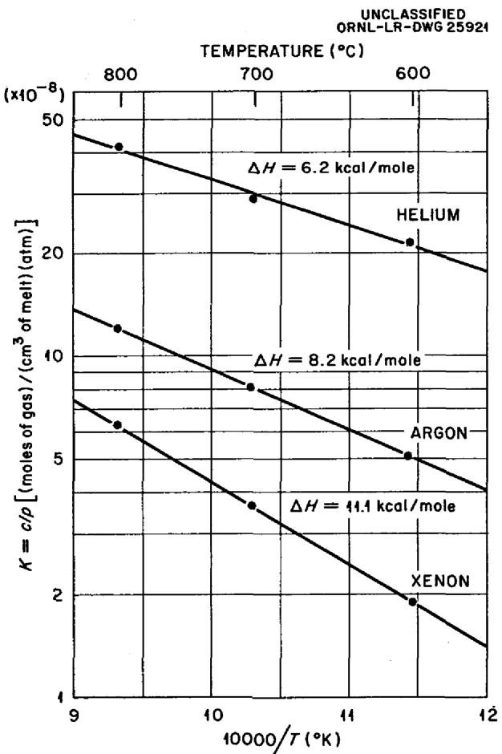  
Fig. 2.2.5. Temperature Dependences of Solubilities of Noble Gases in NaF-ZrF $_4$ (53-47 mole%).

# SOLUBILITY OF HF IN NaF-ZrF4 MIXTURES   J. H. Shaffer

Studies of the solubility of HF gas in NaF-ZrF $_4$ were continued in order to determine the effect of solvent composition on the solubility. The solubilities in solvents containing 35, 40, and 47 mole $\%$ ZrF $_4$ have been determined, and experiments with solvents containing 20, 55, 60, and 65 mole $\%$ ZrF $_4$ are under way. The experimental results are summarized in Tables 2.2.21 and 2.2.22. The values of the heats and entropies of solution for HF in the different solvents are given in Table 2.2.23.

The data indicate that HF gas follows Henry's law within the precision of the measurements throughout the composition range studied; the solubility of HF decreases with increasing temperature; and the solubility of HF increases with increasing NaF concentration. In addition, the calculated results indicate that the solution of HF in these solvents is an exothermic process which liberates more heat as the concentration of NaF is increased. The entropy of solution changes from $-5.2$ to $-6.2$ au with an increase of 7 mole % NaF. Such losses of entropy are probably primarily rotational losses in the dissolved HF as compared with gaseous HF. Preliminary results of studies of the solubility of HF in the NaF-KF-LiF eutectic, as reported in the following section, indicate a $\Delta H$ and $\Delta S$ of solution of about $-17$ kcal/mole and $-10$ au, respectively. These values do not appear to be out of line when they are

Table 2.2.19. Entropy Changes Related to the Solution of One Mole of Noble Gas in Molten NaF-ZrF $_4$ (53-47 Mole %) at $1000^{\circ}\mathrm{K}$ and 1 atm   

<table><tr><td rowspan="2">Gas</td><td colspan="2">Equilibrium Concentrations (moles/liter)</td><td rowspan="2">Heats of Solution (kcal/mole)</td><td colspan="3">Entropy Changes (cal/mole·°K)</td></tr><tr><td>Gaseous State</td><td>Dissolved State</td><td>Δs1a</td><td>Δs2b</td><td>Δs3c</td></tr><tr><td></td><td>× 10-2</td><td>× 10-5</td><td></td><td></td><td></td><td></td></tr><tr><td>Helium</td><td>1.22</td><td>33.0</td><td>6.2</td><td>6.2</td><td>7.5</td><td>-1.3</td></tr><tr><td>Argon</td><td>1.22</td><td>9.1</td><td>8.2</td><td>8.2</td><td>9.8</td><td>-1.6</td></tr><tr><td>Xenon</td><td>1.22</td><td>4.3</td><td>11.1</td><td>11.1</td><td>11.8</td><td>-0.7</td></tr></table>

For reaction 1, $X(g) = X(d)$ at equilibrium at one atmosphere where $X$ is helium, argon, or xenon.   
For reaction 2, $X(g) = X(g)$ , which takes into account isothermal expansion of an ideal gas.   
For reaction 3, $X(g) = X(d)$ , that is, reaction 1 minus reaction 2, which represents the solution of 1 mole of gas if the concentrations in the gaseous and liquid phases are held constant.

Table 2.2.20. Heats and Entropies of Solution of Noble Gases in Molten Fluoride Solvents at Equal Initial and Final Concentrations   

<table><tr><td rowspan="2">Gas</td><td colspan="2">In NaF-ZrF4(53-47 mole %)</td><td colspan="2">In NaF-ZrF4·UF4(50-46-4 mole %)</td></tr><tr><td>ΔH (kcal/mole)</td><td>ΔS (eu)</td><td>ΔH (kcal/mole)</td><td>ΔS (eu)</td></tr><tr><td>Helium</td><td>6.2</td><td>-1.3</td><td>7.4</td><td>~0</td></tr><tr><td>Argon</td><td>8.2</td><td>-1.6</td><td></td><td></td></tr><tr><td>Xenon</td><td>11.1</td><td>-0.7</td><td>11.4</td><td>~0</td></tr></table>

compared with a heat of reaction of $-16.8\mathrm{kcal / mole}$ calculated26 for the formation of a mole of NaHF at room temperature from NaF(s) and HF(g).

# SOLUBILITY OF HF IN NaF-KF-LIF MIXTURES R. B. Evans

Determinations of the solubility of HF in NaF-KF-LiF were first attempted with the use of the nickel transfer apparatus described previously[27] and a previously purified salt mixture, but all runs failed because the melt persistently broke through

the transfer line. Therefore the experimental apparatus was changed from the transfer type of system to a simpler, single, nickel reactor system. The fluoride mixture used in the latter system was prepared from the component salts and was purified by alternately purging it with $\mathsf{H}_2$ and HF. Large amounts of hydrogen sulfide were detected in the evolved gas during the HF cycle; however, by the third day of purification, this impurity had been eliminated.

Two sets of tentative HF solubility constants were then obtained. The first set of constants was based on the rate at which helium strips HF from the saturated melt. The second set of constants was based on a direct determination of the total amount of HF dissolved in the melt (without transferring). Values taken from the experimental curves are shown in Table 2.2.24.

Table 2.2.21. Solubility of HF in NaF-ZrF4 Mixtures   

<table><tr><td>Solvent Composition (mole % ZrF4)</td><td>Temperature (°C)</td><td>Saturating HF Pressure (atm)</td><td>Solubility (moles of HF/cm3of melt)</td><td>K*</td></tr><tr><td></td><td></td><td></td><td>× 10-5</td><td>× 10-5</td></tr><tr><td rowspan="3">35</td><td rowspan="3">700</td><td>0.46</td><td>0.65</td><td>1.41</td></tr><tr><td>1.44</td><td>2.13</td><td>1.48</td></tr><tr><td>1.84</td><td>2.68</td><td>1.46</td></tr><tr><td></td><td></td><td></td><td></td><td>Av 1.46 ± 0.03</td></tr><tr><td></td><td>800</td><td>1.42</td><td>1.51</td><td>1.06</td></tr><tr><td></td><td></td><td>2.56</td><td>2.70</td><td>1.06</td></tr><tr><td></td><td></td><td></td><td></td><td>Av 1.06</td></tr><tr><td>40</td><td>600</td><td>1.32</td><td>2.02</td><td>1.54</td></tr><tr><td></td><td></td><td>2.22</td><td>3.32</td><td>1.49</td></tr><tr><td></td><td></td><td></td><td></td><td>Av 1.52 ± 0.03</td></tr><tr><td></td><td>700</td><td>1.44</td><td>1.47</td><td>1.02</td></tr><tr><td></td><td></td><td>2.27</td><td>2.38</td><td>1.04</td></tr><tr><td></td><td></td><td></td><td></td><td>Av 1.03</td></tr><tr><td></td><td>800</td><td>1.33</td><td>1.07</td><td>0.80</td></tr><tr><td></td><td></td><td>2.24</td><td>1.81</td><td>0.81</td></tr><tr><td></td><td></td><td></td><td></td><td>Av 0.81 ± 0.01</td></tr></table>

$*K = c / p$ in moles of HF per cubic centimeter of melt per atmosphere.

Table 2.2.22. Henry's Law Constants, $K$ ,of HF In NaF-ZrF ${}_{4}$ Mixtures   

<table><tr><td>Temperature (℃)</td><td>Solvent Composition (mole % ZrF4)</td><td>K*</td></tr><tr><td></td><td></td><td>× 10-5</td></tr><tr><td>600</td><td>35</td><td>2.4**</td></tr><tr><td></td><td>40</td><td>1.52</td></tr><tr><td></td><td>47</td><td>1.23</td></tr><tr><td>700</td><td>35</td><td>1.46</td></tr><tr><td></td><td>40</td><td>1.03</td></tr><tr><td></td><td>47</td><td>0.93</td></tr><tr><td>800</td><td>35</td><td>1.06</td></tr><tr><td></td><td>40</td><td>0.81</td></tr><tr><td></td><td>47</td><td>0.73</td></tr></table>

*Defined in Table 2.2.21.   
**Extrapolated from temperature-dependence plot, since liquidus temperature of NaF-ZrF₄ (65-35 mole %) is about 610°C.

Both sets of data in Table 2.2.24 yield a straight line when plotted vs the reciprocal of the absolute temperature. Because of the close agreement of the two sets of data, each representing an independent set of experiments, it is highly probable that the true values will not differ by an appreciable amount from these tentative values. A comparison of the data with those presented previously for the NaF-ZrF $_4$ (53-47 mole %) system reveals that the corresponding HF solubilities in NaF-KF-LiF are roughly 50 times those for the NaF-ZrF $_4$ system.

These preliminary studies have demonstrated that molten NaF-KF-LiF can be contained in nickel reactors for long periods of time if the mixtures are subjected to exhaustive purification.

# SOLUBILITY OF $\mathsf{CeF}_3$ AS A FUNCTION OF SOLVENT COMPOSITION

W.T.Ward R.A.Strehlow

Experimental data on the solubilities of rare-earth fluorides in NaF-ZrF $_4$ -UF $_4$ (50-46-4 mole %) have indicated that small variations in solvent

Table 2.2.23. Heats and Entropies of Solution of HF in NaF-ZrF4 Mixtures at Equal Concentrations In the Gaseous and Liquid Phases at $1000^{\circ}$ K   

<table><tr><td>Solvent Composition (mole % ZrF4)</td><td>ΔH (cal/mole)</td><td>ΔS (cal/mole·°K)</td></tr><tr><td>35</td><td>-6400</td><td>-6.2</td></tr><tr><td>40</td><td>-5800</td><td>-6.2</td></tr><tr><td>47</td><td>-4500</td><td>-5.2</td></tr></table>

Table 2.2.24. Solubility Constants for Determining the Amounts of HF Dissolved in the Molten NaF-KF-LIF Eutectic Mixture   

<table><tr><td rowspan="2">Temperature (°C)</td><td colspan="2">Solubility Constant [ (moles of HF)/(cm3of melt) (atm)]</td></tr><tr><td>By Stripping-Rate Determination</td><td>By Direct Determination</td></tr><tr><td></td><td>× 10-4</td><td>× 10-4</td></tr><tr><td>650</td><td>5.0</td><td>6.9</td></tr><tr><td>700</td><td>3.3</td><td>5.0</td></tr><tr><td>750</td><td>2.2</td><td>3.6</td></tr><tr><td>800</td><td>1.5</td><td>2.8</td></tr></table>

composition may appreciably affect the solubility of the rare-earth fluorides. In order to determine the magnitude of this effect, a series of experiments is now under way to investigate the solubility of $\mathsf{CeF}_3$ in NaF-ZrF4 solvents containing from 42 to 63 mole % NaF. As in previous experiments, Ce141 is being used as a radiotracer.

Two experiments have been completed thus far. The data obtained in these experiments are compared in Fig. 2.2.6 with data obtained for other solvents. As may be seen the solubility of $\mathsf{CeF}_3$ decreases as the proportion of tetravalent constituents decreases. These data indicate that the $\mathsf{CeF}_3$ behaves more like NaF or BaF $_2$ in these solvents than like ZrF $_4$ .

A further experiment was carried out to determine whether the evaporation of $\mathsf{ZrF}_4$ from the solvent had an effect on the $\mathsf{CeF}_3$ solubility. The uranium of the solvent was used as tracer, and it was found that during a typical experiment involving four filtrations the solute $(\mathsf{UF}_4)$ was enriched to

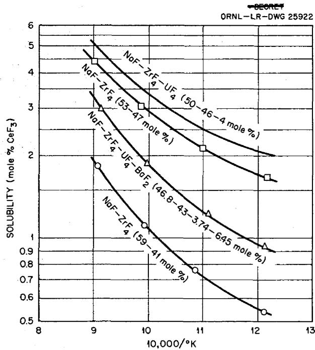  
Fig. 2.2.6. Effect of Solvent Composition on $\mathsf{CeF}_3$ Solubility.

the extent of about $4\%$ of its original value and that the condensed $\mathsf{ZrF}_4$ vapor contained virtually no $\mathsf{UF}_4$ $(< 0.2\%)$ , as was expected. The data obtained indicate that the evaporation of $\mathsf{ZrF}_4$ does not exceed the accuracy of the determinations $(\pm 5\%)$ .

# 3. PRECIPITATION OF CERIUM AS $\mathrm{Ce_2O_3}$ FROM MOLTEN LIF-KF EUTECTIC

J. H. Shaffer

Considerable work pertaining to the chemistry of fission-product fluorides dissolved in NaF-ZrF4 mixtures with and without UF4 has been in progress for over a year and has been regularly reported by Ward.28 One of the results of this investigation has been the discovery of the possibility of removal of some injurious rare-earth fluoride fission products by a process of solid solvent extraction with a noninjurious rare-earth fluoride as the solid solvent. The necessary conditions

for the feasibility of the solid-solvent extraction process are (1) limited solubilities of the rare-earth fluorides in the solvent and (2) formation of solid solutions by the saturating phases of the solutes and the solid solvent. Previous measurements of the solubilities of $\mathsf{LaF}_3$ in the NaF-KF-LiF ternary eutectic revealed that these solutes are extremely soluble in this solvent (more than 20 wt $\%$ at $550^{\circ}\mathrm{C}$ ). Accordingly, other methods of removal of injurious rare earths must be found, if satisfactory fuel reprocessing methods are eventually to be developed for reactors that use the NaF-KF-LiF fuel solvent. The possibility of precipitating the rare earths as oxides was therefore considered worthy of investigation. In order to simplify graphical presentation of the results, a eutectic mixture of KF-LiF was used rather than the NaF-KF-LiF ternary eutectic. It is believed that the chemical behavior of solutes in these two solvents is very similar, if not identical.

A systematic investigation of the solubilities and relative stabilities of some monovalent, divalent, trivalent, and quadrivalent oxides was planned. Simultaneously, a study of different possible methods of formation of the oxides in the solution was scheduled. The particular oxides proposed for study in the preliminary phase of the investigation were $\mathsf{Li}_2\mathsf{O}$ , $\mathsf{BeO}$ , $\mathsf{MgO}$ , $\mathsf{CaO}$ , $\mathsf{SrO}$ , $\mathsf{BaO}$ , $\mathsf{Ce}_2\mathsf{O}_3$ , $\mathsf{La}_2\mathsf{O}_3$ , $\mathsf{Sm}_2\mathsf{O}_3$ , $\mathsf{ZrO}_2$ , and $\mathsf{UO}_2$ . The methods of oxide formation included for initial study were reactions with: (1) carbonates, (2) alkali hydroxides, and (3) oxides of less stability.

The three methods of oxide formation have been studied, and some experimental inconveniences and advantages inherent in each method have been observed. The addition of a carbonate such as $\mathsf{K}_2\mathsf{CO}_3$ to the solvent in order to form and precipitate some insoluble oxide sounded very attractive. However, it was found in two experiments that the carbonate does not decompose appreciably unless the system is heated to temperatures above $1100^{\circ}\mathrm{C}$ . The second method studied was the addition of LiOH to the solvent in order to form and precipitate an insoluble oxide. This method was found to be quite effective in the precipitation of cerium from the solution. One objectionable feature is the rapid liberation of steam, which can cause the solution to spill over unless special precautions are taken. The third method consists of the addition of a less stable

oxide in order to form and precipitate an oxide of higher stability. This method has been found to be quite satisfactory to precipitate cerium by using calcium oxide.

No numerical values of solubilities of oxides have yet been obtained, but some useful quantitative information has been gathered regarding the solubilities of $\mathsf{Li}_2\mathsf{O}$ , $\mathsf{Ce}_2\mathsf{O}_3$ , and $\mathsf{CeF}_3$ . It has been found that at $550^{\circ}\mathsf{C}$ the solubility of $\mathsf{Li}_2\mathsf{O}$ in KF-LiF (50-50 mole %) is greater than 1.6 wt%; the solubility of $\mathsf{Ce}_2\mathsf{O}_3$ at 600, 700, and $800^{\circ}\mathsf{C}$ is less than 0.1 wt%; and at $600^{\circ}\mathsf{C}$ the solubility of $\mathsf{CeF}_3$ is greater than 8.2%.

An indication of the relative stabilities of some oxides may be obtained by comparison of some of the calculated free energy changes for the formation of the oxide from the fluoride. The calculated values may also be compared with the degree of completion of the reaction as measured experimentally by determining the concentration of cerium remaining in the liquid after a reasonable amount of time has elapsed after the addition of the particular oxide to the solution containing $\mathsf{CeF}_3$ . Since the melting point of the oxide may also be a good indication of its stability and relative solubility, the melting temperatures are also included in the comparisons shown in Table 2.2.25.

Since the values for the free energies of formation of rare earth fluorides may be quite unreliable, it is not expected that quantitative correlations can be made from the $\Delta F^{\circ}$ values presented in Table 2.2.25. These values may, however, be helpful in interpolation between experiments. For example, $\mathsf{Li}_2\mathsf{O}$ has been shown to react to completion with $\mathsf{CeF}_3$ , and the values of $\Delta F$ and the melting points listed for $\mathsf{Na}_2\mathsf{O}$ and for $\mathsf{K}_2\mathsf{O}$ indicate that $100\%$ completion is expected of these two reagents for the corresponding reaction.

Present plans call for the determination of the solubility of BaO and its extent of reaction with $\mathrm{CeF}_3$ before a study of tetravalent oxide solubilities and relative stabilities with respect to trivalent oxides is undertaken. If sufficient differences are noted, the possibilities $^{29}$ of effecting separation of tetravalent oxides from trivalent oxides will be seriously considered.

$$
\begin{array}{l l}3 M _ {2} ^ {1} O (s)&6 M ^ {1} F _ {2} (s)\\\text {o r} + 2 C e F _ {3} (s) \rightleftharpoons C e _ {2} O _ {3} + \text {o r}\\3 M O (s)&3 M F _ {2} (s)\end{array}
$$

Table 2.2.25. Standard Free Energy Changes for the Formation of $\mathbf{Ce}_2\mathbf{O}_3$ at $1000^{\circ}\mathrm{K}$ According to the Reaction   

<table><tr><td>Oxide</td><td>Oxide Melting Point (°K)</td><td>ΔF° (kcal)a</td><td>Cerium Precipitated (%)</td></tr><tr><td>Li2O</td><td>2000</td><td>-37</td><td>100</td></tr><tr><td>Na2O</td><td>1193</td><td>-116</td><td></td></tr><tr><td>K2O</td><td>800</td><td>-139</td><td></td></tr><tr><td>BeO</td><td>2823</td><td>+59</td><td></td></tr><tr><td>MgO</td><td>3173</td><td>+53</td><td>88b</td></tr><tr><td>CaO</td><td>2873</td><td>+2</td><td>100c</td></tr><tr><td>SrO</td><td>2703</td><td>-42</td><td></td></tr><tr><td>BaO</td><td>2196</td><td>-52</td><td></td></tr></table>

${}^{a}$ A. Glassner, A Survey of the Free Energies of Formation of the Fluorides, Chlorides, and Oxides of the Elements to ${2500}^{ \circ  }{K}_{\mathrm{s}}$ ANL-5107 (Aug. 1953).   
$b_{\mathrm{In over 24 hr}}$   
Reaction complete in 90 min at $600^{\circ}\mathrm{C}$ .

# STABILITY OF $\mathsf{UO}_2\mathsf{F}_2$ IN FUSED SALTS

# R.J.Sheil

In connection with a possible method of reprocessing fused salt reactor fuels by the precipitation of the oxides of some of the fission products, experiments were conducted to investigate the stability of $\mathsf{UO}_2\mathsf{F}_2$ in a fused salt mixture. Crystalline $\mathsf{UO}_2\mathsf{F}_2$ was mixed with a purified mixture of NaF-BeF (57-43 mole %) in a platinum crucible to give a 1 mole % concentration of the uranium compound and then heated in an inert atmosphere in the visual-thermal apparatus. There was no visible change in the mixture until liquid appeared, at approximately $330^{\circ}\mathsf{C}$ . All the $\mathsf{UO}_2\mathsf{F}_2$ particles had disappeared at $400^{\circ}\mathsf{C}$ , and the melt had a light rust color which became darker when the temperature was increased to the maximum of $480^{\circ}\mathsf{C}$ . Gas bubbles were observed on the walls of the platinum crucible. Upon cooling, the solidified mixture had a pinkish-brown color, while a similar mixture given the same treatment in a nickel crucible was gray-white in appearance and there was a black deposit that adhered to the

surface of the crucible that had been in contact with the melt. X-ray diffraction examination of the deposit indicated that it was largely $\mathsf{U}_3\mathsf{O}_8$ . Ground samples of the fused materials were found to contain $\mathsf{UO}_2$ or $\mathsf{U}_3\mathsf{O}_8$ when examined by means of the petrographic microscope. Chemical analyses of the melts are presented in Table 2.2.26.

A portion of the mixture fused in platinum was transferred to nickel filtration apparatus and filtered at $470^{\circ}C$ . The filtrate contained 0.44 wt % U, and the residue contained 5.80 wt % U. The

Table 2.2.26. Results of Chemical Analyses of Fused NaF-BeF $_2$ -UO $_2$ F $_2$ Mixtures   

<table><tr><td>Sample</td><td>U(wt %)</td><td>F(wt %)</td><td>Ni(ppm)</td></tr><tr><td>As fused in platinum</td><td>5.36</td><td>55.5</td><td>140</td></tr><tr><td>As fused in nickel</td><td>5.26</td><td>55.0</td><td>1070</td></tr><tr><td>Starting mixture(calculated)</td><td>5.10</td><td>58.3</td><td></td></tr></table>

theoretical uranium concentration of the mixture was 5.10 wt $\%$ U if calculated as $\mathsf{UO}_2\mathsf{F}_2$ and 5.83 wt $\%$ U if calculated as $\mathsf{UO}_2$ . The uranium compound in both samples was identified as either $\mathsf{UO}_2$ or $\mathsf{U}_3\mathsf{O}_8$ by microscopic examination. The concentration was too low for positive identification by means of x-ray diffraction. It appears from these observations that nickel will readily reduce $\mathsf{UO}_2\mathsf{F}_2$ in a fused salt medium by the reactions:

$$
\mathrm {U O} _ {2} \mathrm {F} _ {2} + \mathrm {N i} \longrightarrow \mathrm {U O} _ {2} + \mathrm {N i F} _ {2}
$$

or

$$
4 U O _ {2} F _ {2} + 2 N i \rightarrow U _ {3} O _ {8} + 2 N i F _ {2} + U F _ {4}
$$

It seemed evident also that $\mathsf{UO}_2\mathsf{F}_2$ is more stable in contact with platinum, as might be expected, but that a portion of the compound present was reduced by some means or underwent thermal decomposition. In order to investigate the likelihood of thermal decomposition, a portion of the $\mathsf{UO}_2\mathsf{F}_2$ was heated alone in an inert atmosphere in the visual-thermal apparatus with a platinum crucible as the container. When the temperature was increased to $120^{\circ}\mathsf{C}$ , a large thermal effect was noted, and the exposed surface of the material gradually darkened. The temperature was further increased to the maximum temperature of $470^{\circ}\mathsf{C}$ , and the sample was then allowed to cool to room temperature, placed in a tared screw-cap bottle, and weighed immediately after removal from the inert atmosphere box. The compound had lost $0.4\%$ in weight, and it was quite hygroscopic. It gained about $1.1\%$ in weight after standing in the screw-capped bottle for 10 days. The analyses of the material before and after heat treatment are given in Table 2.2.27.

The exact nature of the chemical change in the $\mathsf{UO}_2\mathsf{F}_2$ used in these experiments is not clear,

Table 2.2.27. Chemical Analyses of $\mathsf{UO}_2\mathsf{F}_2$ Samples   

<table><tr><td></td><td>U(wt %)</td><td>F(wt %)</td><td>H2O(wt %)</td></tr><tr><td>Sampled before heating</td><td>75.3</td><td>12.3</td><td>6.37</td></tr><tr><td>Sampled after heating*</td><td>76.2</td><td>12.4</td><td>6.16</td></tr><tr><td>Theoretical content</td><td>77.4</td><td>12.3</td><td></td></tr></table>

*Analyzed after standing in screw-capped bottle for 10 days.

but it seems obvious that hydrolysis did not occur, because the fluorine content did not change on heating. It has been reported30 that hydrated uranyl fluoride can be dehydrated at $120^{\circ}\mathrm{C}$ without serious decomposition and also that uranyl fluoride formed at low temperatures is very hygroscopic.31 This experiment seems to confirm both observations, except that the observed weight loss was much less than would be expected from the reported water content of the starting material.

# OXIDATION OF MIXTURES COMPOSED OF SODIUM AND POTASSIUM

E.E.Ketchen

The results of some preliminary studies of the oxidation of a sodium-potassium mixture at room temperature were reported previously.32 The data indicated that a sodium-to-potassium ratio of about 22 was obtained in the oxides formed by the oxidation of a mixture of 50.4 wt % sodium with 49.6 wt % potassium. Additional experiments have shown, however, that the values obtained were probably inaccurate and that the precise results were due either to a very careful reproduction of experimental conditions or, more probably, pure chance.

The apparatus used in the recent studies is a modification of the glass apparatus described previously.32 The upper portion of the apparatus was enlarged to a diameter of $2\frac{1}{2}$ in. to eliminate the need for shaking the mixture during the oxidation. The oxidation and filtration are performed in the dry box in order to reduce the amount of contamination by water and the resulting hydroxide formation. At present, three capsules are loaded in the dry box, and each is oxidized by introducing dry air at a pressure of 1.5 to 2 cm of Hg, evacuating, and repeating this cycle until four portions of air have been used. Filtration is achieved by applying helium pressure to the upper portion of the apparatus, forcing the alkali metals through the glass filter disk, and leaving the oxides with a small amount of metal in the upper chamber. The residual alkali metals are removed

from the oxides by mercury according to the procedure described previously. The results obtained by using this method for the room-temperature oxidation of two different sodium-potassium mixtures are given in Table 2.2.28.

The lack of preciseness of the results suggests that it is extremely difficult to control all the variables which affect the oxidation process. Traces of moisture should tend to reduce the sodium-to-potassium ratio, and consequently the

larger ratios are probably closest to the correct value. It may be noted that the values given in Table 2.2.28 that were obtained for the 51 wt % Na-49 wt % K mixture are significantly larger than the value of 22 obtained previously. The lack of precision in the results makes it difficult to ascertain the effect of composition of the alkali metal mixture on the sodium-to-potassium ratio in the oxides, although it appears that the ratio decreases with increasing potassium concentration.

Table 2.2.28. Composition of Oxides Formed by Oxidation of Sodium-Potassium Mixtures at 30 to ${35}^{ \circ  }\mathrm{C}$   

<table><tr><td rowspan="2">Composition of Na-K Mixtures (wt %)</td><td colspan="2">Composition of Oxides</td><td rowspan="2">Ratio of Na to K in the Oxides</td></tr><tr><td>Na (mg)</td><td>K (mg)</td></tr><tr><td rowspan="7">51 Na-49 K</td><td>13.8</td><td>0.47</td><td>29</td></tr><tr><td>13.5</td><td>0.30</td><td>45</td></tr><tr><td>10.9</td><td>0.27</td><td>40</td></tr><tr><td>7.3</td><td>0.17</td><td>43</td></tr><tr><td>6.7</td><td>0.18</td><td>37</td></tr><tr><td>10.4</td><td>0.29</td><td>36</td></tr><tr><td>8.5</td><td>0.18</td><td>47</td></tr><tr><td rowspan="6">22 Na-78 K</td><td>8.4</td><td>0.32</td><td>26</td></tr><tr><td>8.9</td><td>0.29</td><td>31</td></tr><tr><td>10.1</td><td>0.29</td><td>35</td></tr><tr><td>8.1</td><td>0.27</td><td>30</td></tr><tr><td>7.4</td><td>0.23</td><td>32</td></tr><tr><td>8.6</td><td>0.31</td><td>28</td></tr></table>

# 2.3. PHYSICAL PROPERTIES OF MOLTEN MATERIALS

F. F. Blankenship

# VAPOR PRESSUREOFHf4

S. Cantor

An appreciable difference in properties between analogous compounds of zirconium and hafnium can be of considerable importance in the separation of the two elements. Therefore the sublimation pressures of $\mathsf{HfF}_4$ were determined, by using the Rodebush-Dixon method, for comparison with the known sublimation pressure of $\mathsf{ZrF}_4$ (ref 2). The data obtained, as plotted in Fig. 2.3.1 and given in Table 2.3.1, fit the equation

$$
\log p (\mathrm {m m H g}) = 1 2. 6 3 1 - \frac {1 2 , 0 1 1}{T (\% K)}.
$$

As may be seen from Fig. 2.3.1, the sublimation pressure of $\mathsf{ZrF}_4$ is approximately three times that of $\mathsf{HfF}_4$ at a given temperature. This factor of 3 difference between the vapor pressures of these

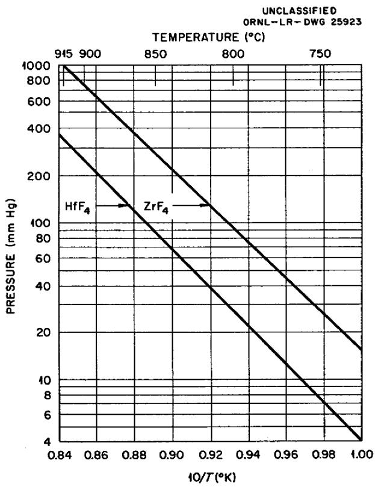  
Fig. 2.3.1. Sublimation Pressures of HfF and ZrF.

two fluorides could possibly be used as a basis for separating zirconium from hafnium in a high-temperature (above $925^{\circ}\mathrm{C}$ ) process. It also might be useful in the production of $\mathsf{ZrF}_4$ from a starting mixture of zirconium and hafnium oxides. The oxides would be hydrofluorinated and $\mathsf{ZrF}_4$ would be separated by heating and preferential subliming.

# VAPOR PRESSUREOFBeF2

S. Cantor

An early determination of the vapor pressures of $\mathsf{BeF}_2$ was reported by Moore, but the scatter in the measurements was larger than is now expected with improved techniques. Therefore new measurements were made by using the Rodebush-Dixon method. The values obtained, as given in Table 2.3.2, fit the equation

$$
\log p (\mathrm {m m H g}) = 1 0. 4 8 7 - \frac {1 0 , 9 6 7}{T (\circ K)}.
$$

The vapor pressures of $\mathsf{BeF}_2$ in the range 800 to $1025^{\circ}\mathsf{C}$ have also been measured by Sense et al.4,5 by using the carrier gas method and assuming that the vapor species was monomeric. Their most recent results are in very good agreement with the data given in Table 23.2. Comparisons of three quantities derived from the vapor pressures are presented in Table 2.3.3,

The agreement between the values obtained by the direct and the carrier-gas measurements indicates that $\mathsf{BeF}_2$ vapor is monomeric. Accordingly it should be possible to measure activities from vapor pressures over $\mathsf{BeF}_2$ -rich solutions, where the vapor could be proved to be predominantly $\mathsf{BeF}_2$ . A suitable system for an investigation of this type is LiF- $\mathsf{BeF}_2$ .

Table 2.3.1. Vapor Pressures of HfF   

<table><tr><td rowspan="2">Temperature (°C)</td><td colspan="2">Pressure (mm Hg)</td></tr><tr><td>Observed</td><td>Calculated</td></tr><tr><td>730.9</td><td>4.65</td><td>4.54</td></tr><tr><td>739.3</td><td>5.65</td><td>5.70</td></tr><tr><td>754.4</td><td>8.30</td><td>8.59</td></tr><tr><td>755.5</td><td>8.75</td><td>8.81</td></tr><tr><td>764.1</td><td>10.9</td><td>11.0</td></tr><tr><td>775.9</td><td>14.5</td><td>14.6</td></tr><tr><td>778.0</td><td>15.3</td><td>15.7</td></tr><tr><td>786.8</td><td>19.4</td><td>19.6</td></tr><tr><td>798.8</td><td>25.5</td><td>26.5</td></tr><tr><td>806.6</td><td>32.1</td><td>31.8</td></tr><tr><td>808.3</td><td>32.8</td><td>33.2</td></tr><tr><td>818.4</td><td>43.1</td><td>42.1</td></tr><tr><td>827.8</td><td>50.6</td><td>52.2</td></tr><tr><td>830.7</td><td>55.1</td><td>56.0</td></tr><tr><td>831.9</td><td>56.4</td><td>57.5</td></tr><tr><td>839.3</td><td>65.6</td><td>67.9</td></tr><tr><td>840.2</td><td>67.3</td><td>69.5</td></tr><tr><td>849.1</td><td>82.7</td><td>84.7</td></tr><tr><td>859.5</td><td>109.7</td><td>106.2</td></tr><tr><td>864.7</td><td>120.2</td><td>119.1</td></tr><tr><td>881.1</td><td>206.8</td><td>195.4</td></tr><tr><td>909.7</td><td>310.1</td><td>302.7</td></tr></table>

Table 2.3.2. Vapor Pressures of $\mathsf{BeF}_2$   

<table><tr><td rowspan="2">Temperature (°C)</td><td colspan="2">Pressure (mm Hg)</td></tr><tr><td>Observed</td><td>Calculated</td></tr><tr><td>872.4</td><td>8.05</td><td>8.20</td></tr><tr><td>896.7</td><td>13.0</td><td>13.0</td></tr><tr><td>912.5</td><td>17.1</td><td>17.3</td></tr><tr><td>917.6</td><td>19.2</td><td>18.9</td></tr><tr><td>936.9</td><td>26.5</td><td>26.6</td></tr><tr><td>958.5</td><td>38.4</td><td>38.3</td></tr><tr><td>978.1</td><td>53.7</td><td>52.8</td></tr><tr><td>982.4</td><td>57.4</td><td>56.6</td></tr><tr><td>1000</td><td>76.2</td><td>74.8</td></tr><tr><td>1009</td><td>86.8</td><td>85.9</td></tr><tr><td>1024</td><td>108.6</td><td>107.9</td></tr><tr><td>1026</td><td>112.5</td><td>111.2</td></tr><tr><td>1038</td><td>133.4</td><td>132.4</td></tr><tr><td>1050</td><td>156.3</td><td>158.1</td></tr><tr><td>1061</td><td>182.9</td><td>180.7</td></tr><tr><td>1070</td><td>210.9</td><td>209.9</td></tr><tr><td>1081</td><td>245.8</td><td>244.9</td></tr><tr><td>1088</td><td>267.5</td><td>269.8</td></tr><tr><td>1099</td><td>305.2</td><td>311.9</td></tr></table>

Table 2.3.3. Comparison of Quantities Derived from $\mathsf{BeF}_2$ Vapor Pressures   

<table><tr><td></td><td>From Work of Sense et al.</td><td>This Work</td></tr><tr><td>Vapor pressure equation</td><td>log p = 10.466 - 10,943/T</td><td>log p = 10.487 - 10,967/T</td></tr><tr><td>Heat of vaporization</td><td>50.1 kcal/mole</td><td>50.2 kcal/mole</td></tr><tr><td>Extrapolated boiling point</td><td>1170°C</td><td>1169°C</td></tr></table>

# 2.4. PRODUCTION OF PURIFIED MIXTURES

J. P. Blakely

G. J. Nessle

L. G. Overholser

# PREPARATION OF VARIOUS SPECIAL FLUORIDES

B. J. Sturm

Preparation of $\mathbf{YF}_3$

The amount of $\mathsf{YF}_3$ required by the ORNL Metal-lurgy Division in the experimental production of yttrium metal has continued to increase. Plans are being considered for changing the method of preparing $\mathsf{YF}_3$ from the wet process to the direct hydrofluorination of $\mathsf{Y}_2\mathsf{O}_3$ in order to meet the increasing demands.

Approximately $6000\mathrm{g}$ of $\mathsf{YF}_3$ was prepared by dissolving $\mathsf{Y}_2\mathsf{O}_3$ in aqueous HCl solution, filtering, precipitating the fluoride by the addition of aqueous HF $(48\%)$ , washing by decantation, recovering the solid by centrifugation, and drying at $150^{\circ}\mathsf{C}$ . The partially dried material was given the standard hydrogen-hydrogen fluoride treatment following the addition of the desired quantities of $\mathsf{MgF}_2$ and LiF. Approximately $8000\mathrm{g}$ of the processed $\mathsf{YF}_3\text{-MgF}_2\text{-LiF}$ mixture was unloaded from the receivers, crushed to a suitable size, and loaded into charging vessels supplied by the Metallurgy Division.

# Preparation of Other Fluorides

Approximately 5 lb of $\mathsf{CrF}_3$ was prepared by treating hydrated chromic fluoride with $\mathsf{NH}_4\mathsf{F}\cdot \mathsf{HF}$ and decomposing the resulting $(\mathsf{NH}_4)_3\mathsf{CrF}_6$ at $450^{\circ}C.$ Most of the $\mathsf{CrF}_3$ was converted to $\mathsf{CrF}_2$ by hydrogen reduction at 700 to $800^{\circ}C.$ A silver reactor was used in a recent hydrogen reduction run, but the resulting $\mathsf{CrF}_2$ has not been analyzed. The complete dissolution of $\mathsf{CrF}_2$ frequently is

difficult to obtain, and, as a result, the analytical values are not as reliable as desired. A suitable flux that will not oxidize $\mathsf{CrF}_2$ but will render it more readily soluble is being sought. One run, in which equimolar quantities of $\mathsf{ZrF}_4$ and $\mathsf{CrF}_2$ were fused at $900^{\circ}\mathsf{C}$ in a sealed capsule, yielded a product that was readily soluble. Additional work is necessary before the stability of $\mathsf{CrF}_2$ in this medium can be established.

A small batch of $\mathsf{VF}_3$ was prepared by condensing HF on a $\mathsf{V}_2\mathsf{O}_3$ powder, heating to remove the water and excess HF, and then hydrofluorinating at $200^{\circ}\mathsf{C}$ .

# PRODUCTION AND DISPENSING OF FUSED SALTS AND LIQUID METALS

Experimental Batch Production

C. R. Croft

J. Truitt

Experimental batches of various compositions were prepared for use in phase equilibrium studies, physical properties testing, and corrosion testing. A total of $442\mathrm{kg}$ of halide salts was prepared in 41 batches. Seventeen of the 41 batches were NaF-KF-LiF-UF $\mathbf{\Phi}_4$ (11.2-41-45.3-2.5 mole $\%$ fuel 107) for use by the Metallurgy Division in studies of nickel-molybdenum base alloys. These 17 batches averaged $20\mathrm{kg}$ each.

Conversion of 10 lb of low-zirconium $\mathsf{HfCl}_4$ to $\mathsf{HfF}_4$ was completed with a total recovery of $96.3\%$ . The total input was 4300 g; the total output was 3288 g; and the theoretical output was 3415 g. Chemical analyses of the three batches in which the material was converted are presented in Table 2.4.1.

Table 2.4.1. Chemical Analyses of Three Batches of HfF Prepared from Low-Zirconium HfCl   

<table><tr><td rowspan="2">Batch Number</td><td colspan="3">Major Constituents (wt %)</td><td colspan="3">Contaminants (ppm)</td></tr><tr><td>Hf</td><td>F</td><td>Cl</td><td>Ni</td><td>Cr</td><td>Fe</td></tr><tr><td>1</td><td>68.7</td><td>30.0</td><td>0.30</td><td>175</td><td>115</td><td>1295</td></tr><tr><td>2</td><td>69.4</td><td>29.4</td><td>0.27</td><td>175</td><td>160</td><td>1225</td></tr><tr><td>3</td><td>69.3</td><td>29.5</td><td>0.29</td><td>125</td><td>175</td><td>1270</td></tr></table>

Four batches of LiCl-KCl were prepared for corrosion and physical properties testing. Three batches of $\mathsf{YF}_3$ -LiF- $\mathsf{MgF}_2$ and seven batches of $\mathsf{KF - BeF}_2$ - $\mathsf{ZrF}_4$ were prepared for chemical studies. In addition, batches of $\mathsf{BeF}_2$ and $\mathsf{NaF}\cdot \mathsf{BeF}_2$ were prepared by over-the-surface treatment (non-bubbling) with HF.

# Dispensing and Servicing Operations

F.A.Doss D.C.Wood

During the quarter, 100 filling and draining operations were performed that involved $785\mathrm{kg}$ of liquid metals and $1229\mathrm{kg}$ of salts. The $1229\mathrm{kg}$ of salts was made up of $419\mathrm{kg}$ of new material and $810\mathrm{kg}$ of salvaged material. The salvaged material is being used in testing of the fluoridevolatility process for the recovery of uranium. This salvaged material is not included in the material balance given in the following section.

A series of experiments for determining the amount of fuel which will be held up on various internal surfaces of the ART was initiated. The surfaces to be studied are various sizes of tubing held at various angles to the horizontal, machined flat plates held at various angles to the horizontal, a section of the heat-exchanger tube-to-header junction, a mockup of a tube bundle, a 3-in.-dia bellows, and various right-angle welded joints. The pieces being studied are appropriately supported in a small flange-top receiver, the receiver is filled to immerse the piece in NaF-ZrF $_4$ -UF $_4$ (56-39-5 mole %, fuel 70) at $1500^{\circ}\mathrm{C}$ for 2 hr, the temperature is allowed to drop to $1200^{\circ}\mathrm{F}$ (the draining temperature of the ART), and the receiver

is emptied through a dip line to simulate draining. Tests have been completed on five of the 17 pieces to be examined.

# Materials Available

J. E. Eorgan

F. A. Doss

D. C. Wood

Upon termination of operation of the production-scale facility at the end of June 1957, the materials on hand consisted of 11,559 lb of NaF·ZrF₄, 1810 lb of low-hafnium ZrF₄, 1685 lb of normal ZrF₄, 200 lb of NaF, two new 58-in. reaction vessels, two reworked 48-in. reaction vessels, one new furnace liner, and seven new storage containers. The higher-than-expected amount of NaF·ZrF₄ on hand resulted from the receipt of 10,840 lb from Kawecki Chemical Company, who took advantage of the 4000-lb overage allowed in a purchase order for 30,000 lb of material.

The types and amounts of purified fluoride mixtures on hand on July 30, 1957, are listed below:

<table><tr><td>Composi-tion No.</td><td>Type</td><td>Amount (kg)</td></tr><tr><td>30</td><td>NaF-ZrF4-UF4(50-46-4 mole %)</td><td>5860</td></tr><tr><td>31</td><td>NaF-ZrF4(50-50 mole %)</td><td>933</td></tr><tr><td>70</td><td>NaF-ZrF4-UF4(56-39-5 mole %)</td><td>900</td></tr><tr><td>107</td><td>NaF-KF-LiF-UF4(11.2-41-45.3-2.5 mole %)</td><td>119</td></tr><tr><td></td><td>Various special mixtures</td><td>552</td></tr><tr><td></td><td>Total</td><td>8364</td></tr></table>

# 2.5. ANALYTICAL CHEMISTRY

J. C. White

# DETERMINATION OF TRACES OF NaK IN AIR

A. S. Meyer, Jr. J. P. Young

Additional modifications were made in the optical system of the instrument for the detection of NaK in air by measurement of the absorption of sodium resonance radiation by sodium atoms. These modifications, which were first discussed in the previous report in this series, include the insertion of an additional light stop which is designed to exclude the continuum radiation of the heated furnace from the photomultiplier tube. The continuum radiation caused a near-saturation phenomenon with respect to the light seen by the phototube and thereby severely reduced the sensitivity of the instrument when the temperature of the furnace exceeded $700^{\circ}\mathrm{C}$ .

It was suggested3 that the light stop consist of a plate with two small apertures approximately 0.08 in. in diameter. The aperture plate (shown in Fig. 2.5.1) is placed in the focal plane of

the image of the quartz end windows of the absorption cells; the image is formed by the condensing lens. The two circular holes in this plate correspond precisely to the images of the end windows. With this arrangement, all radiation except that from the heated quartz windows is masked by the light stop. An additional condensing lens is required to refocus the beams on the photocell. The positions of both the aperture plate and the small condensing lens can be adjusted along the axis of the optical system to provide sharp focusing. A multilayer interference filter and several possible combinations of glass and gelatin color filters have also been included to isolate more effectively the resonance radiation at $589\mu$ .

Since the openings in the added aperture plate are relatively small, much more precise focusing and alignment of the optical system are necessary than were required for the original system. Accordingly, a base assembly is being fabricated which provides for precise adjustments of the positions of both the chopper and detector components. The arrangement is designed according to the principles delineated by Strong,4 and it

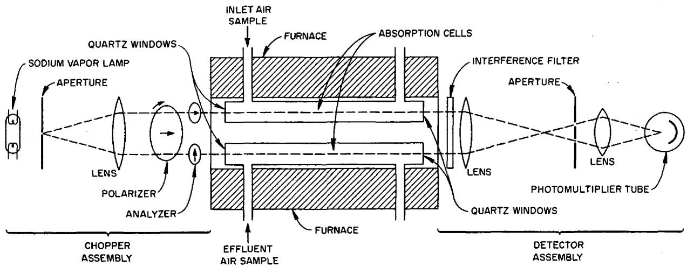  
UNCLASSIFIED ORNL-LR-DWG 25924   
Fig. 2.5.1. Instrument for the Detection of Submicrogram Quantities of NaK in Air.

provides for movement of the optical components in any desired direction with a single degree of freedom. All the components are mounted on a 7-ft section of 18-in. channel iron, which serves as a rigid optical bench. Each end of the channel iron is slotted to accommodate bushings which locate the base plates for the chopper and detector assemblies. These base plates can be moved along the optical axis, for coarse focusing, or can be rotated about a vertical axis. A second plate is supported on each base plate by ball bearings in opposing V-grooves. The second plate is spring-loaded with respect to the base plate and is driven by a screw-drive mechanism to provide motion at right angles to the optical axis of the system. The chopper and detector sections are each supported by three vertically adjustable screws whose spherical ends rest in radial V-grooves in the second plates. Adjustments of these screws can produce tilting motions in any desired direction with negligible translational motion. Fabrication and assembly of the modified instrument are about $90\%$ completed.

# DETERMINATION OF OXYGEN IN METALLIC LITHIUM

A. S. Meyer, Jr. R. E. Feathers

Further studies of the butyl iodide method for the determination of oxygen in metallic lithium have revealed that several unexpected reactions occur during the dissolution of the sample in ethereal solutions of iodine and butyl iodide and the subsequent extraction of the inorganic compounds into aqueous solutions for titration. It was demonstrated that oxygen, when present as LiOH, cannot be determined by this method. No acid was consumed in the titration of the aqueous extract of the solution which was formed by the reaction of 500 mg of LiOH with the ethereal reagents. The following reaction of LiOH with iodine is proposed to explain the elimination of the hydroxide during the dissolution reaction:

$$
\mathrm {L i O H} + \mathrm {I} _ {2} \rightarrow \mathrm {L i l} + \mathrm {H O I}
$$

The hypoiodous acid is too weak for titration and is probably decomposed to water, iodine, and oxygen in the nonaqueous medium. The similar reaction which may occur with $\mathsf{Li}_2\mathsf{O}$

$$
\mathrm {L i} _ {2} \mathrm {O} + \mathrm {I} _ {2} \longrightarrow \mathrm {L i O I} + \mathrm {L i l}
$$

does not interfere with the determination of oxygen as $\mathsf{Li}_2\mathsf{O}$ . In the titration with acid, the hypoiodite consumes a quantity of acid which is equivalent to that required to titrate the oxide from which it is formed:

$$
O I ^ {-} + I ^ {-} + 2 H ^ {+} \rightarrow I _ {2} + H _ {2} O
$$

The butyl iodide method appears therefore to be essentially specific for the determination of $\mathsf{Li}_2\mathsf{O}$ . The elimination of the alkalinity of $\mathsf{Li}_3\mathsf{N}$ and $\mathsf{Li}_2\mathsf{C}_2$ by reaction with iodine was discussed previously. Lithium carbonate is the only remaining alkaline constituent which might be titrated. It is unlikely, however, that $\mathsf{Li}_2\mathsf{CO}_3$ will be present in significant concentrations in samples which have been heated to elevated temperatures, since it is not compatible with metallic lithium.

A small negative bias has been observed in determinations by the butyl iodide method that is believed to be caused by traces of acid which are liberated by the reaction

$$
\mathrm {H} _ {2} \mathrm {O} + \mathrm {I} _ {2} \longrightarrow \mathrm {H I} + \mathrm {H I O}
$$

which occurs during the extraction of the ethereal solution with water. The equilibrium constant for this reaction has been reported to be approximately $10^{-13}$ . On the basis of this constant, less than one microequivalent of acid would be liberated by this reaction under the conditions of the titration. When ether is present as a third phase, however, the equilibrium is displaced to the right and hydrogen ions are liberated in quantities equivalent to 50 to 100 ppm for a 1-g sample. The magnitude of this error is a function of the amount of excess iodine which remains after the dissolution of the sample and therefore is not easily corrected for by blank determinations. The only explanation which has been postulated for the increase in the hydrolysis reaction is that hypoiodous acid is complexed or preferentially extracted to a high degree by ether.

The error can be eliminated by removing the free iodine before the organic solution is extracted with water. A distillation method for the

removal of the iodine and the ether was tested and was found to be impractical. The iodine was rapidly removed, however, by reduction with finely divided silver or with mercury. Mercury was found to be the more convenient reagent, since an extensive preparation procedure must be carried out to obtain silver in a sufficiently finely divided form for rapid reaction. The effectiveness of this procedure in eliminating the negative interference was demonstrated by titration of reagent blanks and by carrying $500 - \mu g$ samples of $\mathsf{Li}_2\mathsf{O}$ through the procedure. Approximately $80\%$ of the added $\mathsf{Li}_2\mathsf{O}$ was titrated. In view of the possible contamination with moisture during transfer of small quantities of $\mathsf{Li}_2\mathsf{O}$ , a recovery of $80\%$ was considered to be satisfactory.

In the presence of iodide, the excess silver or mercury is oxidized rapidly by atmospheric oxygen. These reactions, indicated in the following equations, can consume hydrogen ions during titration and introduce positive errors:

$$
4 \mathrm {A g} + 4 \mathrm {I} ^ {-} + \mathrm {O} _ {2} + 4 \mathrm {H} ^ {+} \rightarrow 4 \mathrm {A g I} + 2 \mathrm {H} _ {2} \mathrm {O}
$$

$$
2 H g + 8 I ^ {-} + O _ {2} + 4 H ^ {+} \rightarrow 2 H g l _ {4} ^ {- -} + 2 H _ {2} O
$$

The positive errors can of course be avoided by excluding oxygen during the extraction of the organic solution and during the titration. The errors can be eliminated more conveniently, however, by the addition of anhydrous $\mathrm{HgCl}_2$ after the reduction of the iodine. The $\mathrm{HgCl}_2$ complexes the iodide according to the equation

$$
2 \mathrm {I} ^ {-} + \mathrm {H g C l} _ {2} \longrightarrow \mathrm {H g l} _ {2} + 2 \mathrm {C l} ^ {-}
$$

The extraction and titration are then, in effect, carried out in a chloride system.

A proposed procedure based on the considerations discussed above is now being tested on samples of metallic lithium. The dissolution is carried out in the apparatus shown in Fig. 2.5.2. With the cooling jacket of the condenser drained and an empty reaction vessel in position, the condenser is flushed by transferring $25\mathrm{ml}$ of anhydrous ether to the reaction flask. Iodine $(15\mathrm{g})$ and a magnetic stirring bar are transferred to a second reaction vessel immediately after it is removed from a drying oven, and, with a positive pressure of helium in the condenser, the reaction vessel containing the iodine is substituted for that containing the flushing

solution. The system is then evacuated and purged with helium; and a 100-ml volume of $n$ -butyl iodide, which is stored over activated alumina, is transferred to the reaction vessel, along with 100 ml of diethyl ether, which is stored over metallic sodium. The solution is then stirred until the iodine is mixed thoroughly.

The sample of 1 to $2\mathrm{g}$ of metallic lithium is added through the condenser from a Jamesbury valve sampler. The solution is heated at reflux temperatures and stirred until dissolution of the metal is completed. An excess of iodine should be evident at this time. A 10-ml aliquot of the organic solution is withdrawn, and the concentration of iodide in the solution is determined by titration with $\mathrm{AgNO}_3$ . The weight of the sample is calculated from this titration. A 10-ml portion of mercury is then added, and the solution is stirred until the color of the iodine is discharged. A 30-g quantity of anhydrous $\mathrm{HgCl}_2$ is added, and the solution in the flask is stirred for 5 min to permit complexing of the iodide ion. The solution is transferred from the flask to a separatory funnel and extracted with recently boiled distilled water which has been pretitrated to a pH of approximately 5. The aqueous extract is then titrated with 0.01 or 0.002 N HCl.

There has, as yet, been no opportunity to test this modification of the procedure by analyzing highly purified samples of metallic lithium. Excellent recovery was attained when a 0.5-mg sample of $\mathsf{Li}_2\mathsf{O}$ was added to a simulated sample solution which was prepared from anhydrous Lil, butyl iodide, ether, and iodine. As soon as a sufficiently reproducible series of samples is available the results of determinations by this procedure will be compared with analyses carried out by other methods.

# DETERMINATION OF OXYGEN IN FLUORIDE SALTS AND IN METALS

A. S. Meyer, Jr. G. Goldberg

The apparatus for the determination of oxygen as oxides in fluoride salts and in metals by the

UNCLASSIFIED

ORNL-LR-DWG 25925

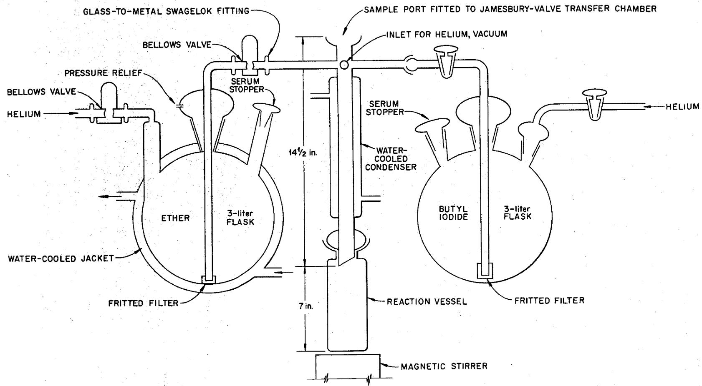  
Fig. 2.5.2. Apparatus for the Determination of Oxygen in Metallic Lithium.

fluorination of the oxides with $\mathsf{KBrF}_4$ was assembled. This apparatus, which is adapted from the work of Hoekstra and Katz, is shown in Fig. 2.5.3.

A detailed procedure was formulated and is presently being given an initial test. Briefly, the reagent, $\mathsf{KBrF}_4$ , is formed by the addition of $\mathsf{BrF}_3$ to KF in the reaction tube. Sufficient $\mathsf{KBrF}_4$ is made to permit the analysis of a number of samples without recharging the system with fresh reagent for each determination. The reaction tube is cooled to the temperature of liquid nitrogen, and, with argon flowing into the tube, the sample is quickly added to the tube, which is then capped. The temperature of the reactor is then raised to operating temperatures, about $400^{\circ}\mathsf{C}$ , so that the $\mathsf{KBrF}_4$ can react quantitatively with the metallic oxides present and liberate oxygen gas. This gas is passed through a series of traps to remove bromine and excess reagent. An automatic Toepler pump is used to transfer the oxygen to either of two pressure-measuring devices - a mercury manometer or, if greater sensitivity is desired, an oil manometer.

Since the volume of the measuring system cannot be obtained directly, the system must be calibrated by carrying out the procedure with samples of known oxygen content. Zirconium oxide has been selected as a standard for calibration. On the basis of estimated volumes of the measuring system, quantities of oxygen as low as $5\mu \mathrm{g}$ can be detected. The range of the apparatus can be extended upward by several orders of magnitude by increasing the volume of the measuring system.

# DETERMINATION OF NICKEL IN METALLIC SODIUM

A. S. Meyer, Jr. B. L. McDowell

The method for the determination of nickel in which the absorbance of its chelate complex with 4-isopropyl-1,2-cyclohexanediedioxime in xylene is measured was applied to analyses of samples from studies which are being carried out by the Metallurgy Division in order to determine the solubility of nickel in molten sodium.

The samples are prepared by heating metallic sodium under an atmosphere of helium in a nickel crucible which is contained in a welded Inconel capsule. After the sample has been maintained at the desired temperature for a period sufficient to establish equilibrium, the molten metal is transferred to an opposing molybdenum bucket by inverting the Inconel capsule. The sample is submitted for analysis in the molybdenum bucket. The sample includes the contents of the bucket together with any nickel deposited on the inner walls of the bucket.

Initial determinations were carried out by dissolving the metallic sodium in $50\mathrm{ml}$ of methanol. An aliquot of the methanol solution was titrated with standard acid to determine the sample weight. The molybdenum bucket was rinsed with warm 1:3 HCl, and the washings were combined with the methanol solution, which was acidified and evaporated to a volume of approximately $25\mathrm{ml}$ to remove the methanol.

In the determinations, an unusual interference by molybdenum, which was dissolved from the container, was experienced. It was found that molybdenum (an orange-colored extract) interfered only when methanol or some contaminant thereof was present and when cyanide and Suli-Down, added as masking agents, had been used. No colored extract was observed when the chelating agent, 4-isopropyl-1,2-cyclohexanediodioxime, was absent, and the interference appeared to be intensified by the presence of nickel. Since the interfering reactions appeared to be exceedingly complex and could be eliminated by dissolving the samples in water rather than in methanol, the nature of the reactions has not yet been studied in detail.

Because the outer walls of the molybdenum bucket may be contaminated with nickel as a result of contact with the Inconel capsule, it is necessary to exclude from the sample the water used for the washing of the outer surfaces of the bucket. This requirement presented special problems when the samples were dissolved in water and required the design of the new apparatus, fabricated from fluorothene, which is shown in Fig. 2.5.4. The apparatus is constructed by threading a modified $\frac{1}{2}$ -in. flared fluorothene fitting through the bottom of a 250-ml heavy-walled fluorothene beaker. The flared fitting is converted to a compression fitting by facing

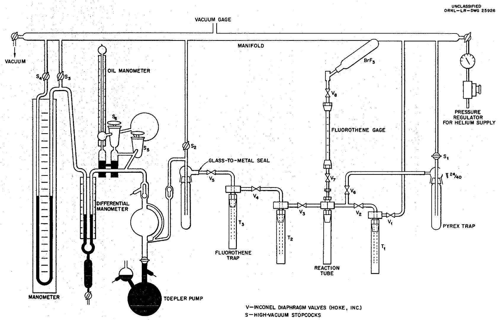  
Fig. 2.5.3. Apparatus for the Determination of Oxygen In Fluoride Salts and in Metals.

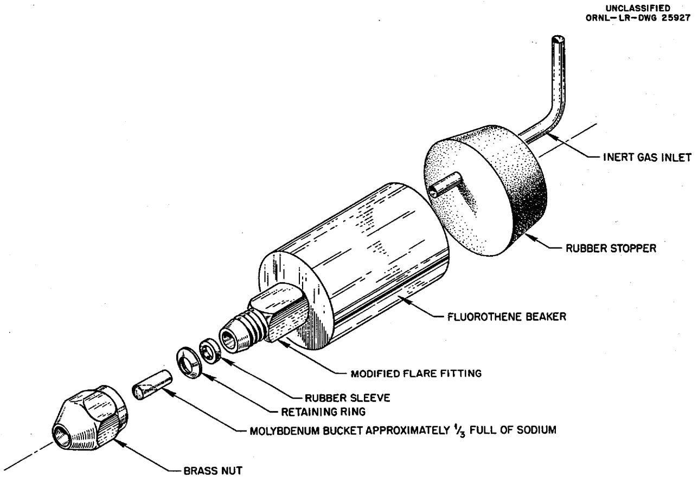  
Fig. 2.5.4. Apparatus for Dissolution of Sodium Samples in Water.

off approximately $\frac{1}{8}$ in. of the tapered end and turning into it a $\frac{1}{2}$ -in.-ID recess $\frac{1}{4}$ in. deep. The molybdenum bucket is held in place in this recess and sealed by a $\frac{1}{4}$ -in. section of $\frac{3}{8}$ -in. rubber tubing. The rubber is backed by a brass ring (back ferrule of a Swagelok fitting) and compressed by the brass nut of a flared fitting. The apparatus can easily be modified to accommodate cylindrical containers of smaller diameters.

In the dissolution of the samples the apparatus is loosely covered with a rubber stopper which is fitted with an inlet for inert gas. An inert gas is passed rapidly through the fitting for approximately 30 sec, after which the sample bucket is inserted and locked into position. After the bucket is cooled in an ice water bath, approximately 25 g of ice, which is prepared by freezing demineralized water in plastic tubes, is added to the beaker. While the flow of inert gas is continued, the stopper is removed sufficiently for water to be added cautiously until

the sample starts to react. The beaker is again covered, and an atmosphere of inert gas is maintained until the dissolution is completed. Approximately 5 min is required to complete the reaction.

# FORMATION OF CARBIDES BY THE REACTION OF PUMP LUBRICANTS AND NaK AT ELEVATED TEMPERATURES

A. S. Meyer, Jr. G. Goldberg

During the dissolution of alkali metals and alkali metal residues, an odor that is commonly associated with acetylene has frequently been detected. This phenomenon has been most pronounced during the chemical examination of cold traps by the method described previously.[11] When water was added to cold traps from NaK systems after most of the residual alkali metals

had been converted to the halides by reacting them with butyl bromide, an intense odor was detected and minor explosions were experienced, even though an attempt was made to maintain an inert atmosphere within the system. The presence of acetylene in the evolved gases was substantiated when precipitates of $\mathsf{Ag}_2\mathsf{C}_2$ were formed upon passage of the gases through solutions of $\mathsf{AgNO}_3$ .

Recently an explosion occurred when an experimental NaK system was opened after operation had been terminated because of a leak in the pump seals. In view of the well-known acetylene explosion hazard, it was deemed necessary to investigate the possibility that carbides had formed as a result of a reaction between the pump lubricant and the alkali metals, with the subsequent liberation of acetylene.

In earlier tests of the compatibility of lubricants with molten alkali metals,12 there was no observable reaction between the alkali metals and the lubricants. The tests were carried out, however, to determine whether a reaction would occur if alkali metals at $1400^{\circ}\mathrm{F}$ leaked into the lubricant at $400^{\circ}\mathrm{F}$ . The conditions of these tests did not approximate, therefore, the temperatures which would prevail during a leak of the pump oil into the NaK being pumped.

In order to test for the formation of carbides, the reaction was investigated in the apparatus shown in Fig. 2.5.5. The reaction tube is a section of $\frac{3}{4}$ -in.-OD, 0.065-in.-wall Inconel tubing, which can be heated in a vertical tube furnace. A thermocouple is spot-welded to the tubing. The upper section of the apparatus, which is fitted with a cooling coil, provides an expansion chamber and reflux surfaces for the lubricant and prevents the formation of dangerous pressures. A pressure gage is fitted to the $\frac{1}{4}$ -in. Swagelok fitting. A bellows valve is fitted to the $\frac{3}{8}$ -in. Swagelok fitting after the reaction components are added to the apparatus.

For the test, 2 ml of NaK and 2 ml of Gulfspin-35 lubricant were added to the reactor, which was then evacuated and purged with helium. The bellows valve was closed and the lower section of the reaction tube was heated to a temperature of $650^{\circ}\mathrm{C}$ . No significant increase in pressure

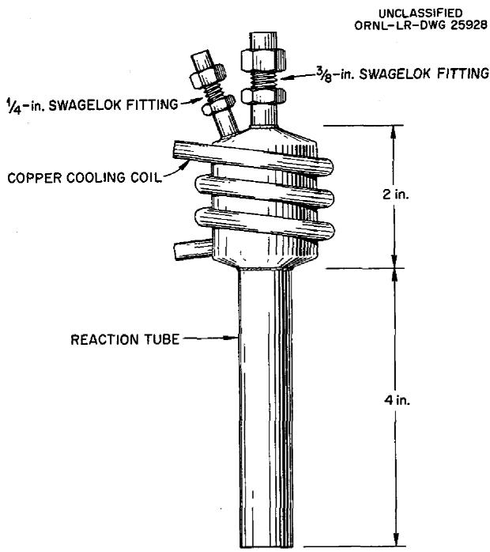  
Fig. 2.5.5. Apparatus for Studying the Reaction of NaK with Pump Lubricants.

was observed until the temperature reached approximately $600^{\circ}\mathrm{C}$ , at which time the pressure increased abruptly to 450 psi. The gases were later analyzed mass spectrographically and found to consist primarily of methane, with a trace of hydrogen. After the reaction tube had been maintained at a temperature of $650^{\circ}\mathrm{C}$ for 4 hr, it was cooled and frozen with dry ice. A 3-in. section of the tubing was then cut off and placed in a stainless steel bomb which contained 200 ml of frozen water. The bomb was sealed and allowed to warm to room temperature. When the reaction was completed, the evolved gases were passed through a 1.5 M solution of $\mathrm{AgClO_4}$ , according to the procedure which was developed for the determination of $\mathrm{Li}_2\mathrm{C}_2$ in metallic lithium.[13] Copious quantities of $\mathrm{Ag}_2\mathrm{C}_2$ were precipitated. The acetylene present was not determined quantitatively because part of the precipitate was lost when a portion of the $\mathrm{Ag}_2\mathrm{C}_2$ exploded. It is estimated that approximately $2\%$ of the alkali

metal was present as the carbide. A heavy deposit of carbonaceous material remained in the reaction tube. Negligible quantities of carbides were found in a blank run in which the test was repeated with only NaK added to the reaction tube.

The test is being repeated in order to obtain quantitative measurements of the carbides, and tests with sodium are proposed.

# DETERMINATION OF ALUMINUM IN MIXTURES OF FLUORIDE SALTS

J.P.Young J.R.French

An investigation of a spectrophotometric method for the determination of trace amounts of aluminum $^{14}$ in mixtures of fluoride salts with pyrocatechol violet was continued. The reproducibility of the data was improved by washing all glassware with a dilute solution of pyrocatechol violet prior to use and by the addition of thioglycolic acid to the test solutions. These modifications lowered the coefficient of variation of the method to approximately $2\%$ .

A study was made of interferences that would normally be encountered in corrosion tests with NaF-KF-LiF-UF and the newly developed nickel-molybdenum-base alloys. These alloys contain trace amounts of iron plus a number of nonferrous materials. Since pyrocatechol violet is a sensitive reagent for iron, essentially complete removal of iron is necessary before application of the reagent in the determination of aluminum. Removal of the iron is best accomplished by means of the mercury cathode. The interference by titanium is partially eliminated by measuring the absorbance of the solution at both 582 and $700\mathrm{m}\mu$ and correcting for the contribution at $582\mathrm{m}\mu$ from titanium. The simultaneous determination of titanium and aluminum in the same test portion appears to be possible and is to be the subject of further work. Nickel, chromium, molybdenum, and niobium do not interfere in determinations by this method.

Initial results obtained in the determination of aluminum in synthetic solutions of samples from corrosion tests were about $10\%$ high. These results indicate possible accumulative interferences, and therefore further work is planned to improve the reliability of the determinations.

# SOLVENT EXTRACTION OF TITANium AND NIOBIUM FROM ACIDIC SOLUTIONS WITH TRI- $n$ -OCTYLPHOSPHINE OXIDE

Studies of the application of tri- $n$ -octylphosphine oxide (TOPO) in the solvent extraction of metals of interest in the ANP program were continued. Since sulfuric acid is commonly used in the dissolution of fluoride salts, the extraction characteristics of sulfuric acid by TOPO were also investigated.

# Extraction of Sulfuric Acid

T. W. Gilbert

Solutions of 1 to $8M$ sulfuric acid were extracted with $0.1M$ tri- $n$ -octylphosphine oxide (TOPO) in cyclohexane. The quantity of sulfuric acid in the organic phase was determined directly by titration with alcoholic potassium hydroxide and also by back-extraction of the organic phase with water. The results were the same by either method. The quantity of sulfuric acid extracted was found to increase almost linearly with increasing concentration of sulfuric acid. From $7.0M$ acid, $0.77\mathrm{mmole}$ of sulfuric acid was extracted by $1.0\mathrm{mmole}$ of TOPO. A third phase formed when $8.0M$ acid was extracted. The third phase was analyzed for total acid and for phosphorus. The ratio of $\mathsf{H}_2\mathsf{SO}_4$ to TOPO obtained was 1.05.

# Extraction of Titanium

T. W. Gilbert

Tri- $n$ -octylphosphine oxide (TOPO) dissolved in cyclohexane has proved to be an efficient extractant for titanium from solutions of sulfuric acid. The efficiency of extraction was found to be highly dependent on the concentration of sulfuric acid in the aqueous phase. In the extraction of 0.16 mmole of titanium with 1.0 mmole of TOPO, only $6\%$ of the titanium was extracted from 1 M sulfuric acid. From 7 M sulfuric acid, however, $99\%$ of the titanium was extracted. From 8 M acid, $99\%$ of the titanium was removed from the aqueous phase, but a third liquid phase was formed.

The extraction of titanium from solutions $0.5M$ in tartaric acid in the presence of varying amounts of sulfuric acid was also investigated. The results were very similar to those obtained in

the presence of sulfuric acid alone; only a slight improvement in the extraction of titanium was observed.

A study of the extraction of increasing amounts of titanium from $6M$ sulfuric acid with 1.0 mmole of TOPO showed that saturation of the organic phase occurred when 0.5 mmole of titanium had been extracted. This result, when combined with the results of an acidimetric study of the sodium fluoride solutions used to strip the titanium from the organic phase, indicates that the principal species present in the cyclohexane phase at saturation is $\mathsf{TiOSO}_4\cdot 2\mathsf{TOPO}$

# Extraction of Niobium

# C. A. Horton

Niobium(V) extracts best into TOPO in cyclohexane from hydrochloric acid solution, fairly well from sulfuric acid, and almost not at all from nitric or perchloric acid, with approximate extraction coefficients for approximately $4M$ acid of 200, 20, 0.02, and 0.01, respectively. For stable acidic solutions of over $0.2\mathrm{mg}$ of niobium, the presence of citric, lactic, tartaric, or oxalic acids or thiocyanate, peroxide, or catechol are required to keep the niobium in solution. For $500\mu \mathrm{g}$ of niobium in $0.2M$ tartaric acid, maximum extraction is obtained from $4M$ hydrochloric acid, as shown in Fig. 2.5.6. The complexing agents must be added before the inorganic acids in order to keep the niobium in solution. The niobium in the organic layer can be estimated by adding catechol and butyl acetate to an aliquot of the extract and measuring the absorbance at $360\mathrm{m}\mu$ .

# INSTALLATION OF A MICROBALANCE

# IN A VACUUM DRYBOX

A. S. Meyer, Jr. R. E. Feathers

The weighing compartment of a Cahn Electrobalance has been installed in a vacuum drybox. This electrobalance can be adjusted for weighing quantities of the order of 5, 10, 20, and $50\mathrm{mg}$ . The balance operates on the principle of equating the torque of the sample with an opposing electromagnetic torque.

The components which are installed within the drybox include the weighing compartment, four connecting leads, a terminal strip, and the torque

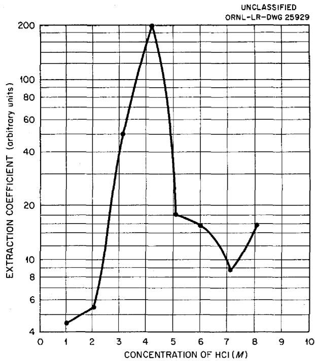  
Fig. 2.5.6. Effect of HCl Concentration on Extraction of Niobium with Tri-n-octylphosphine Oxide.

motor and balance beam, which are similar in construction to the movement and pointer of a galvanometer. All these components can be subjected to evacuation without damage and do not offer any problems of excessive outgassing. Other components, which cannot be conveniently evacuated, including batteries, switches, and Helipot precision resistors, are retained in the original instrument cabinet outside the drybox. All balancing operations are thus carried out remotely by adjusting the currents to the torque motor. Electrical connections are effected through four insulated conductors, which are sealed through the walls of the drybox.

This balance will be used principally for the preparation of synthetic samples to which trace quantities of a constituent must be added without exposure to atmospheric contamination or moisture. It has already proved invaluable in the preparation of simulated samples for tests of the proposed method for the determination of oxygen in metallic lithium (see preceding section of this chapter). In these studies submilligram quantities of $\mathsf{Li}_2\mathsf{O}$ were combined with 20-g samples of anhydrous Lil.

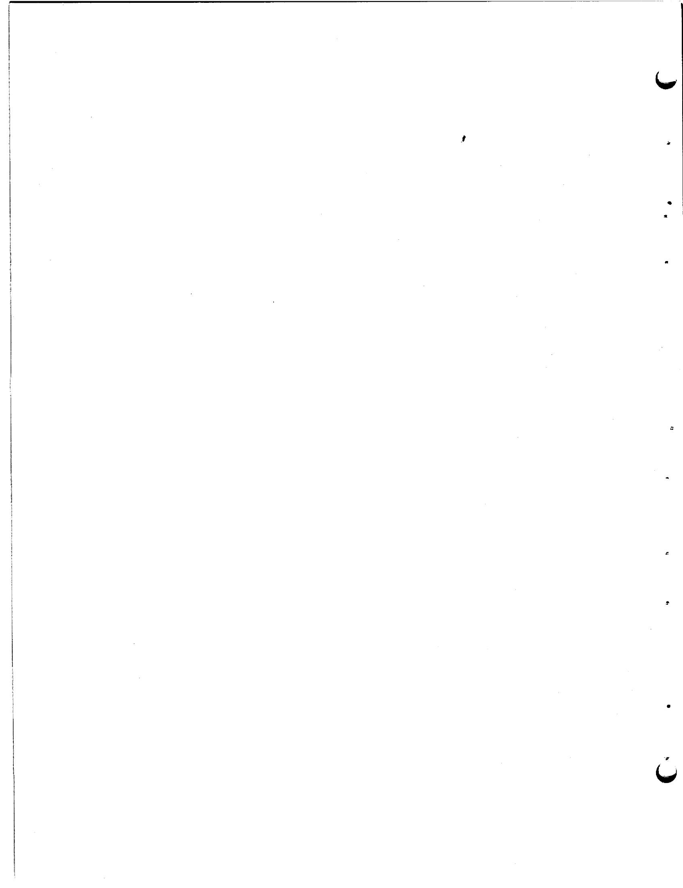

Part 3

METALLURGY

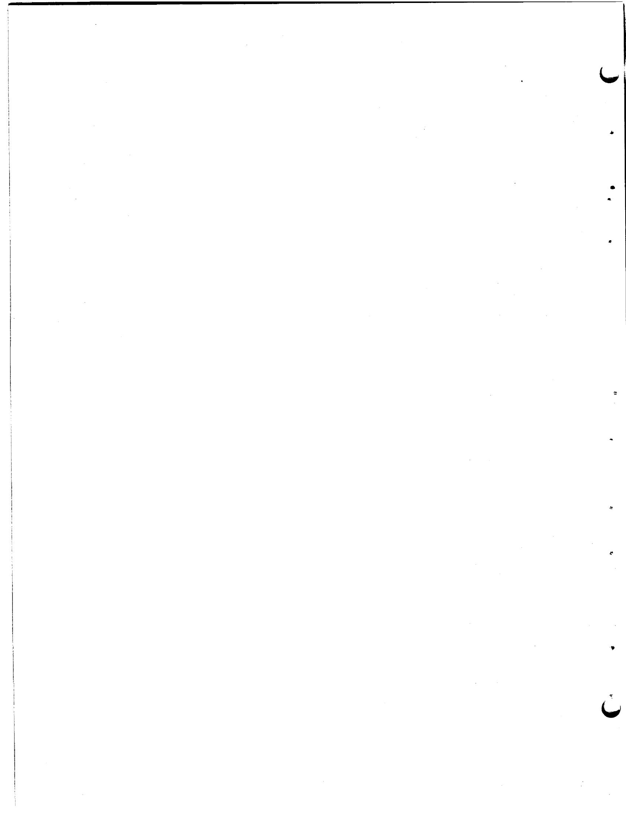

# 3.1. NICKEL-MOLYBDENUM ALLOY DEVELOPMENT STUDIES

# MATERIAL DEVELOPMENT

H. Inouye T. K. Roche

J.H.Coobs

The developmental work on a new container alloy for the liquid fuel, NaF-KF-LiF-UF $_4$ (11.2-41-45.3-2.5 mole $\%$ , fuel 107), being considered for use in advanced circulating-fuel reactors has been concerned primarily with three major problems. First, studies have been made for determining the optimum alloy composition for service temperatures up to $1800^{\circ}\mathrm{F}$ . The second problem involves determining whether the most promising alloy, INOR-8, can be produced as a "commercial" item. Since all nickel-base alloys exhibit mass transfer in sodium at the service temperatures of interest, the third problem is the fabrication of duplex tubing of INOR-8 clad with stainless steel for use in heat exchangers.

The research and developmental studies of the nickel-molybdenum alloys had consisted of a screening program until recently, when sufficient data had been accumulated to indicate that INOR-8 was the most satisfactory of the alloys studied in terms of the original objectives. The data on which the selection was based were obtained for INOR-8 and seven other INOR-type alloys at temperatures up to $1500^{\circ}\mathrm{F}$ . Since forced-circulation loop tests, both in-pile and out-of-pile, have not been completed, and, in addition, comprehensive weldability and strength evaluations remain to be made, two other compositions, INOR-8 modified and INOR-9, are also being studied as possible alternates if INOR-8 shows excessive corrosion

or poor creep strength at $1800^{\circ}\mathsf{F}$ . The compositions of INOR-8, INOR-8 modified, and INOR-9 are given in Table 3.1.1. No data on INOR-8 modified are as yet available.

Tests of thermal-convection loops fabricated of INOR-8 in which fuel 107 was circulated showed acceptable corrosion resistance of the alloy at $1500^{\circ}\mathrm{F}$ , but no tests have been run at $1800^{\circ}\mathrm{F}$ . It may be assumed, however, that if excessive corrosion occurs at $1800^{\circ}\mathrm{F}$ it will be due to the chromium content of the alloy, since in the tests at $1500^{\circ}\mathrm{F}$ the chromium content of the fuel increased with increases in the depth of corrosive attack. Therefore INOR-9, which contains no chromium but is strengthened with niobium, is being studied as a possible substitute in the event that INOR-8 is not sufficiently corrosion resistant at $1800^{\circ}\mathrm{F}$ . On the other hand, INOR-8 may prove to be satisfactory from the corrosion standpoint and unsatisfactory in terms of creep strength, and therefore the possibility of increasing its creep strength with niobium additions, such as in INOR-8 modified, and with carbon additions is being investigated.

Although it is known that more than $0.10 \, \text{wt}\%$ carbon usually prevents the production of tubing because of splitting along carbide boundaries, present indications are that more than $0.10 \, \text{wt}\%$ carbon can be tolerated in the fabrication of plate and sheet. Thus it is important that the effect of the carbon content on the creep strength of these alloys be determined. If increasing the carbon content is found to be beneficial, thin-walled tubing

Table 3.1.1. Compositions of INOR-Type Alloys Being Considered as Container Materials for Fuel 107 in the Temperature Range of 1500 to $1800^{\circ}$ F   

<table><tr><td rowspan="2">Alloy Designation</td><td colspan="5">Nominal Composition (wt %)</td></tr><tr><td>Mo</td><td>Cr</td><td>Fe</td><td>Nb</td><td>Ni</td></tr><tr><td>INOR-8</td><td>15-19</td><td>6-8</td><td>4-7</td><td>0</td><td>Balance</td></tr><tr><td>INOR-8 modified</td><td>15-19</td><td>6-8</td><td>4-7</td><td>2-4</td><td>Balance</td></tr><tr><td>INOR-9</td><td>12-19</td><td>0</td><td>4-7</td><td>2-5</td><td>Balance</td></tr></table>

of a suitable carbon content may be produced by carburizing tubing containing $0.10\%$ or less carbon.

# Properties of INOR-8

Physical Properties. - The density of INOR-8 has been determined to be $8.79 \, \text{g/cm}^3$ or 0.317 lb/in. $^3$ , and its modulus of elasticity at room temperature in the annealed condition is $32 \times 10^6 \, \text{psi}$ . Data on its thermal expansion over various temperature ranges are given below:

<table><tr><td>Temperature Range (°F)</td><td>Expansion (μin./in. °F)</td></tr><tr><td>212-1832</td><td>8.6</td></tr><tr><td>212-752</td><td>7.0</td></tr><tr><td>752-1112</td><td>8.4</td></tr><tr><td>1112-1800</td><td>9.9</td></tr></table>

Fabricability. - The principal difficulty that has been experienced in the fabrication of INOR-8 has been the formation of large shrinkage cavities in cast ingots. While the tendency for ingots to form such cavities is inherent in the nature of freezing of all molten metals, the tendency seems to be somewhat accentuated in the case of INOR-8. It is not known at present whether this casting difficulty is attributable to the casting variables, the expulsion of dissolved gases, or the temperature range of freezing of the alloy. Irrespective of their cause, cavities in an ingot can, in the worst case, cause center bursts during forging, or they can, in less drastic situations, cause center-line defects that are detectable by ultrasonic inspection. Present approaches to a solution of this problem include changes in casting practice, consumable arc melting, and subjecting the molten metal to a carbon boil. In all other respects, the forgeability of the INOR-8 alloy is excellent.

Oxidation Resistance. - The oxidation resistance of the nickel-molybdenum alloys in air is strongly influenced by the chromium content. The studies made thus far have indicated that no chromium is better than a slight amount and that unless a critical amount is present the oxidation rate is not decreased to a level that can be considered to be acceptable. As the data in Table 3.1.2 indicate, the critical chromium content is approximately $6\mathrm{wt}\%$

Corrosion Resistance. - Tests of thermal-convection loops fabricated of INOR-8 in which fuel 107 was circulated at a maximum temperature of $1500^{\circ}\mathrm{F}$

Table 3.1.2. Oxidation of Nickel-Molybdenum (17 wt %) Alloys at ${1800}^{ \circ  }\mathrm{F}$ as a Function of the Chromium Content of the Alloy   

<table><tr><td>Chromium
Content of Alloy
(wt %)</td><td>Weight Gain of
Specimen in 168 hr
(mg/cm2)*</td></tr><tr><td>0</td><td>10.44</td></tr><tr><td>2.83</td><td>16.46</td></tr><tr><td>4.61</td><td>12.45</td></tr><tr><td>5.43</td><td>17.83</td></tr><tr><td>6.19</td><td>0.44</td></tr><tr><td>6.86 (INOR-8)</td><td>0.60</td></tr><tr><td>7.97</td><td>0.31</td></tr></table>

*One mil of oxidation corresponds to a weight increase of about $4\mathrm{mg/cm}^2$ .

revealed corrosive attack to a depth of 1 to 3 mils in 500 hr, and mass transfer was observed when sodium was the circulated fluid. Forced-circulation loops fabricated of INOR-8 are to be operated in order to determine the effect of various amounts of iron and chromium on the corrosion resistance of the alloy when exposed to fuel 107. In-pile capsule tests have also been initiated in order to study the effect of radiation on the corrosion resistance of the INOR-8 alloy.

Mechanical Properties. - Details of the studies being made of the stress-rupture characteristics of the INOR-8 alloys are presented in a subsequent section of this chapter. Most of the tests thus far have been made at a stress of 8000 psi at $1500^{\circ}\mathrm{F}$ in fuel 107. The results of two tests at $1800^{\circ}\mathrm{F}$ and 3000 psi in fuel 107 are presented in Table 3.1.3. Data for Inconel tested at $1650^{\circ}\mathrm{F}$ are included for comparison.

# Properties of INOR-9

Alloys in the INOR-9 classification have a nickel base, 12 to 17 wt % molybdenum, up to 5 wt % niobium, and up to 7 wt % iron. The constituents of the INOR-9 alloy were chosen on the basis of corrosion resistance to fuel 107. Preliminary tests have indicated that the oxidation resistance of INOR-9 is about equal to that of Hastelloy B; the creep properties are about the same as those of INOR-8; and it is attacked by fuel 107 to a depth of 1 to 3 mils in 1000 hr at $1500^{\circ}\mathrm{F}$ . In contrast to

Table 3.1.3. Stress-Rupture Properties of INOR-8 Tested at a Stress of 3000 psi at ${1800}^{ \circ  }\mathrm{F}$ in Fuel 107   

<table><tr><td rowspan="2">Heat No.</td><td rowspan="2">Source</td><td colspan="4">Time to Specified Strain (hr)</td><td rowspan="2">Time to Rupture (hr)</td><td rowspan="2">Elongation at Rupture (%)</td></tr><tr><td>1%</td><td>2%</td><td>5%</td><td>10%</td></tr><tr><td>SP-16</td><td>Haynes Stellar Company</td><td>9</td><td>40</td><td>68</td><td></td><td>132</td><td></td></tr><tr><td>30-34</td><td>ORNL</td><td>3.4</td><td>8</td><td>24</td><td>50</td><td>94</td><td>20</td></tr><tr><td>Inconel*</td><td></td><td>6</td><td>16</td><td>40</td><td></td><td>130</td><td></td></tr></table>

*Tested at ${1650}^{ \circ  }\mathrm{F}$ (rather than at ${1800}^{ \circ  }$ ) in NaF-ZrF ${}_{4} - {\mathrm{{UF}}}_{4}$ (50-46-4 mole %, fuel 30).

the attack on the chromium-bearing alloys, such as INOR-8, the attack on the INOR-9 alloys does not increase when the exposure time is increased from 500 to 1000 hr. Further, the rate of attack does not seem to be affected by the niobium content up to $5\%$ niobium.

# Studies at University of Tennessee

Studies of the solubility of chromium and molybdenum in nickel have been made with the use of x-ray and metallographic methods. The compositions studied ranged from 20 to 25 wt % molybdenum and 3 to 15 wt % chromium.

The beta phase, $\mathrm{Ni}_{4}\mathrm{Mo}$ , of the nickel-molybdenum system was not observed in any of the ternary alloy specimens. It was concluded that the addition of chromium suppressed the formation of the beta phase. As the alloying content was increased, evidences of the existence of the gamma phase, $\mathrm{Ni}_{3}\mathrm{Mo}$ ; the delta phase, NiMo; and the primitive orthorhombic "p" phase were observed. A report in the form of a thesis has been prepared by T.S. Lundy of the University of Tennessee on this subject.

# Studies at Battelle Memorial Institute2

The semiannual ANP materials conference was held at Battelle Memorial Institute on June 17, 1957, and reports on progress made during the preceding six months were presented. A summary of the information presented has been published. In general, the work at BMI has stressed the development of alloys with superior strength; thus

studies have been made of alloys containing aluminum and molybdenum as the principal strengthensers.

Several compositions were evaluated, and heat B-3277 (nominal composition: $20\%$ Mo-7% Cr-1.5% Al-2% Nb-0.15% C) showed outstanding creep strength. Thermal-convection loop tests of this alloy with fuel 107 as the circulated fluid showed that it was prone to attack by the salt because of its aluminum and chromium contents. Attempts to operate forced-circulation loops fabricated of alloys of this type were unsuccessful because of the poor quality of available tubing. This contract has been terminated and a final report is being prepared.

# Studies of Stress-Rupture Properties at New England Materials Laboratory

Specimens from the production heats of INOR-1 through -6 (ref 5), which were prepared by the International Nickel Company, were tested to obtain their stress-rupture characteristics at 1350, 1500, and $1650^{\circ}\mathrm{F}$ in air at the New England Materials Laboratory. The results of the tests are summarized in Table 3.1.4. A final report on the work done under this subcontract is being prepared.

# INOR-8 Alloys Produced by Superior Tube Company

A series of alloys of the INOR-8 type was received from Superior Tube Company for creep-rupture evaluation. These alloys were air-melted at Superior and subsequently rolled to 0.065-in.-thick strip. Creep-rupture tests are to be run in

fuel 107. A limited amount of 0.500-in.-OD, 0.045-in.-wall tubing was also processed from these alloys that is sufficient for the fabrication of three thermal-convection loops for operation with fuel 107. Fabrication of the loops will be started soon if inspection shows the quality of the material to be satisfactory. Descriptions of the alloys and the quantities available are presented in Table 3.1.5. These heats were prepared primarily for studies of the effect of zirconium additions on the strength and corrosion resistance of the INOR-8 alloys.

The work at Superior Tube Company has also been concerned with the processing of tubing from

material supplied by ORNL, International Nickel Company, Haynes Stellar Company, and Westinghouse Electric Corporation. This work is described below under the contributions of the individual companies to the over-all alloy development program.

# Status of Production Heats

Westinghouse Electric Corporation. - The work accomplished to date on the production of pilot heats of INOR-8 by Westinghouse was recently reviewed and their first periodic progress report on this development work was submitted to ORNL.

Table 3.1.4. Summary of Results of Stress-Rupture Tests of INOR-Type Alloys   
Heat treatment: 1 hr at $2000^{\circ}\mathrm{F}$ , air cooled 16 hr at $1500^{\circ}\mathrm{F}$ , air cooled   

<table><tr><td rowspan="2">Alloy Type</td><td colspan="3">Stress to Rupture in 1000 hr (psi)*</td><td colspan="3">Elongation at Rupture in 100 hr (%)**</td></tr><tr><td>At 1350°F</td><td>At 1500°F</td><td>At 1650°F</td><td>At 1350°F</td><td>At 1500°F</td><td>At 1650°F</td></tr><tr><td>INOR-1</td><td>13,000</td><td>3,900</td><td>1800</td><td>18</td><td>19</td><td>19</td></tr><tr><td>INOR-2</td><td>8,000</td><td>3,600</td><td>1600</td><td>11</td><td>12</td><td>20</td></tr><tr><td>INOR-3</td><td>15,000</td><td>5,100</td><td>2800</td><td>5</td><td>19</td><td>9</td></tr><tr><td>INOR-4</td><td>17,000</td><td>6,300</td><td>3400</td><td>1</td><td>5</td><td>11</td></tr><tr><td>INOR-5</td><td>15,000</td><td>4,500</td><td>1700</td><td>22</td><td>26</td><td>32</td></tr><tr><td>INOR-6</td><td>18,000</td><td>11,000</td><td>2600</td><td>5</td><td>8</td><td>20</td></tr></table>

\*Extrapolated values. \*\*Interpolated values.

Table 3.1.5. Air-Melted INOR-8 Alloys Prepared by Superior Tube Company   

<table><tr><td rowspan="2">Heat No.</td><td colspan="7">Nominal Composition (wt %)</td><td rowspan="2">Number of 0.065-in.-Thick Creep-Rupture Specimen Blanks Received</td><td rowspan="2">Total Length of 0.500-in.-OD, 0.045-in.-Wall Tubing Received</td></tr><tr><td>Mo</td><td>Cr</td><td>Fe</td><td>C</td><td>Zr</td><td>Ti</td><td>Ni</td></tr><tr><td>5712</td><td>16.99</td><td>6.64</td><td>3.14</td><td>0.070</td><td>0.08</td><td>*</td><td>Bal</td><td>5</td><td>14 ft 2 in.</td></tr><tr><td>5713</td><td>17.20</td><td>6.66</td><td>3.08</td><td>0.064</td><td>0.07</td><td>*</td><td>Bal</td><td>5</td><td>18 ft</td></tr><tr><td>5714</td><td>15.13</td><td>6.71</td><td>2.18</td><td>0.032</td><td>0.03</td><td></td><td>Bal</td><td>4</td><td></td></tr><tr><td>5715</td><td>15.27</td><td>4.61</td><td>2.16</td><td>0.024</td><td>0.02</td><td></td><td>Bal</td><td>7</td><td></td></tr><tr><td>5716</td><td>16.60</td><td>6.64</td><td>5.34</td><td>0.046</td><td></td><td></td><td>Bal</td><td>2</td><td>2 ft 1 in.</td></tr><tr><td>5717</td><td>16.13</td><td>6.79</td><td>5.34</td><td>0.094</td><td>0.02</td><td></td><td>Bal</td><td>3</td><td></td></tr><tr><td>5718</td><td>15.88</td><td>5.33</td><td>2.27</td><td>0.058</td><td>0.03</td><td></td><td>Bal</td><td>1</td><td>6 ft 1 in.</td></tr></table>

*Titanium present in heats 5712 and 5713, but analysis not yet complete.

In summary, three heats of the compositions specified below have been prepared by induction melting in air:

<table><tr><td>Components</td><td>Amounts
(wt %)</td></tr><tr><td>Molybdenum</td><td>15-17</td></tr><tr><td>Chromium</td><td>6-8</td></tr><tr><td>Iron</td><td>4-5</td></tr><tr><td>Carbon</td><td>0.04-0.08</td></tr><tr><td>Silicon</td><td>0.5 (max)</td></tr><tr><td>Manganese</td><td>0.8 (max)</td></tr><tr><td>Nickel</td><td>Balance</td></tr></table>

The first heat (INOR-8M, $\sim 5200$ lb) was poured into a 3000-lb mold, a 1500-lb mold, and two 300-lb molds. The composition of the alloy was within the specified range, except for the carbon content, which was found to be $0.13\%$ , and therefore forging studies were carried out on the material. One 300-lb ingot was worked on a 1000-ton press forge and the other on an 18,000-lb hammer forge. Both forging methods worked the metal, but the press forge moved the material easier than did the hammer forge. The press forge worked one 300-lb ingot to approximately 4 in. in diameter, and the hammer forge made a 4-in. square. Both forgings were cooled and machined to 3-in.-dia bars. The bars were inspected by ultrasonic techniques and were found, for the most part, to be unsound. The larger ingots were then sectioned and were also found to contain internal flaws. The unsoundness of the forgings was therefore attributed to shrinkage cavities in the original ingots.

Two possible methods for preventing the formation of cavities during solidification were proposed. First, it was suggested that the mold be surrounded by an insulating jacket so that the ingot would cool slowly and that the mold be designed to provide an ingot with a smaller length-to-width ratio. The second method involved increasing the thickness of the mold walls, accentuating the taper of the mold, and chill-casting the ingot on a copper stool. Both of these methods should facilitate feeding the molten core of the ingot and assure progressive solidification from the bottom to the top of the ingot.

The second heat (INOR-8M2, $\sim 500$ lb) was cast into a mold of the type suggested in the first

method proposed above, but faulty pouring resulted in mold wash and contamination of the alloy with cast iron. This ingot was not forged.

The third heat (INOR-8M3, ~2000 lb) was cast into a mold of the second proposed type and was subsequently press-forged at $2150^{\circ}\mathrm{F}$ from a 15-in. square to a $9\frac{1}{4}$ -in. round. Ultrasonic inspection indicated internal flaws in the forging, but it was possible to obtain three 8-in.-dia extrusion billets from the material. These billets have been sent to the International Nickel Company to be extruded to tube blanks.

Work for the immediate future at Westinghouse will be concerned with (1) the preparation of an ingot of the initial high-carbon heat (M-1327) by the consumable-electrode method for determining ingot soundness, forgeability, and strength properties relative to those of the air-melted material; (2) the preparation of plate, sheet, bar, and wire products of air-melted INOR-8; and (3) an evaluation of the casting characteristics of the alloy, with possible application in the shell molding of pump impellers.

As indicated previously,7 an evaluation of the high-carbon air-melted heat (M-1327) of INOR-8 is in progress. The results of thermal-expansion measurements made on the material from room temperature to $1832^{\circ}\mathrm{F}$ , in cooperation with the Ceramics Group, are shown in Fig. 3.1.1. The average coefficients of thermal expansion, $\alpha$ , obtained from the data in Fig. 3.1.1, are, as a function of temperature:

<table><tr><td>Temperature Range (°F)</td><td>α (in./In.·°F)</td></tr><tr><td></td><td>× 10-5</td></tr><tr><td>212-752</td><td>0.70</td></tr><tr><td>752-1112</td><td>0.84</td></tr><tr><td>1112-1832</td><td>0.99</td></tr><tr><td>212-1832</td><td>0.86</td></tr></table>

In order to obtain an indication of the effect of vacuum-remelting on the creep-rupture characteristics of this high-carbon Westinghouse heat, a 3-lb ingot was prepared from the air-melted material and tested. The results of the tests, which

were carried out on the air melt and the vacuum melt under identical conditions, are given in Table 3.1.6 for comparison. The data showed that a definite improvement in rupture life and elongation was obtained by vacuum remelting. However, the creep rate of the air-melted alloy was superior to that of the vacuum-remelted material.

Haynes Stellar Company. - A 10,000-lb air-melted heat of INOR-8 has been purchased from

Designated Haynes Stellar experimental alloy No. 8284 (heat SP-16).

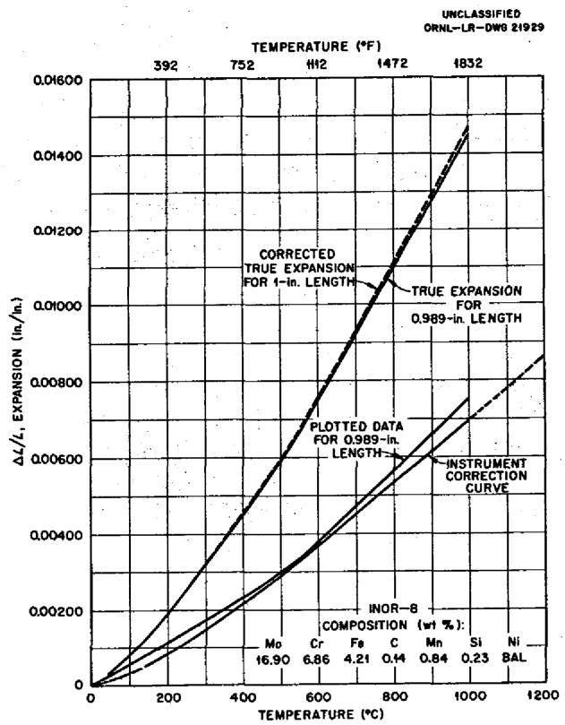  
Fig. 3.1. Linear Thermal Expansion of INOR-8 as Determined with the Use of the Vacuum "Atcotran" Differential Transformer Recorder.

the Haynes Stellar Company to obtain the material needed for corrosion, welding, and creep testing. The composition of this heat is given below:

<table><tr><td>Components</td><td>Amount (wt %)</td></tr><tr><td>Nickel</td><td>70.50</td></tr><tr><td>Molybdenum</td><td>15.82</td></tr><tr><td>Chromium</td><td>6.99</td></tr><tr><td>Iron</td><td>4.85</td></tr><tr><td>Carbon</td><td>0.02</td></tr><tr><td>Tungsten</td><td>0.35</td></tr><tr><td>Silicon</td><td>0.32</td></tr><tr><td>Cobalt</td><td>0.51</td></tr><tr><td>Manganese</td><td>0.34</td></tr><tr><td>Copper</td><td>0.03</td></tr><tr><td>Phosphorus</td><td>0.009</td></tr><tr><td>Sulfur</td><td>0.014</td></tr><tr><td>Boron</td><td>0.04</td></tr></table>

Casting and fabrication of the alloy by hot and cold working to bar, plate, sheet, and strip products were accomplished with little or no difficulty. To date, the various shapes of this material which have been received include: a 3-in.-dia forged bar; $1\text{一}$ , $\frac{1}{2}$ -, and $\frac{1}{4}$ -in.-thick hot-rolled plates; 0.063-in.-thick hot-rolled sheet; $\frac{3}{4}$ -in.-dia hot-rolled bar; six production-size extrusion billets; and rolled strip for the processing of weldrawn tubing. The extrusion billets will be sent to Allegheny Ludlum Steel Corporation for conversion to type 316 stainless steel-INOR-8 composite tubing. Superior Tube Company has received the rolled strip and is currently processing the alloy into small-diameter weldrawn tubing. Upon completion of the orders by the various fabricators involved, enough material should be received to fabricate approximately 30 forced-circulation loops, one in-pile test loop, and specimens for a rigorous program of creep and weld tests.

Table 3.1.6. Creep-Rupture Characteristics of the Westinghouse High-Carbon INOR-8 Heat M-1327 Tested at $1500^{\circ}$ F in an Argon Atmosphere at a Stress of 10,000 psi   

<table><tr><td rowspan="2">Type of Specimen</td><td colspan="3">Time to Specified Strain (hr)</td><td rowspan="2">Time to Rupture (hr)</td><td rowspan="2">Elongation (%)</td></tr><tr><td>1%</td><td>5%</td><td>10%</td></tr><tr><td>As air-melted material</td><td>32</td><td>120</td><td></td><td>135</td><td>6.25</td></tr><tr><td>Vacuum-remelted material</td><td>25</td><td>80</td><td>125</td><td>214</td><td>54.5</td></tr></table>

International Nickel Company. - As reported previously, eight 9-in.-dia, 12-in.-long billets, two each of INOR-1, -2, and -5 and one each of INOR-3 and -6, were extruded to $3\frac{1}{4}$ -in.-OD, 0.500-in.-wall tube shells at the International Nickel Company. Recently the reducing of these tube shells was completed at INCO, and the reduced shells have been sent to the Superior Tube Company for processing to 0.500-in.-OD, 0.045-in.-wall seamless tubing.

Considerable delay was experienced in completing the tube reducing of these shells at INCO for various reasons. Primarily, the delay was caused by unexpected difficulty in annealing the tube shells following cold working on the tube reducer. It was found that the alloys were subject to thermal splitting when a total reduction of $30\%$ or less was given prior to annealing. This behavior was encountered at annealing temperatures between 1700 and $2150^{\circ}\mathrm{F}$ . However, by increasing the total cold reduction between anneals to over $50\%$ , the alloys were successfully annealed at $2150^{\circ}\mathrm{F}$ without splitting. The tube shells, which were reduced to 1.66-in.-OD, 0.148-in.-wall shells at INCO, have been sent to Superior Tube Company. Descriptions of the tube blanks sent to Superior Tube Company for further processing are given in Table 3.1.7.

# Composite Tubing

All the nickel-base alloys exhibit mass transfer when used as containers for flowing sodium at

9. Inouye and T. K. Roche, ANP Quar. Prog. Rep. March 31, 1957, ORNL-2274, p 184.

Table 3.1.7. INOR-Type Tube Shells Produced by International Nickel Company*   

<table><tr><td>Heat No.</td><td>Alloy Designation</td><td>Approximate Lengths of 1.66-in.-OD, 0.148-in.- Wall Tube Shells (ft)</td></tr><tr><td>Y-8195</td><td>INOR-1</td><td>64</td></tr><tr><td>Y-8197</td><td>INOR-2</td><td>64</td></tr><tr><td>Y-8196</td><td>INOR-3</td><td>32</td></tr><tr><td>Y-8200</td><td>INOR-5</td><td>64</td></tr><tr><td>Y-8199</td><td>INOR-6</td><td>32</td></tr></table>

*Products from 4800-lb air melts.

high temperatures. The extent of mass transfer is temperature dependent, being slight at $1300^{\circ}\mathrm{F}$ and tolerable at $1500^{\circ}\mathrm{F}$ . For service temperatures of $1650^{\circ}\mathrm{F}$ and above, it appears that a composite tube, composed of a nickel-base alloy and type 316 stainless steel, is desirable and, possibly, necessary.

There are three basic problems associated with the use of such composite tubing in fluoride fuel-to-NaK heat exchangers. The first problem is the fabrication of the composite tubing. Experiments indicate that tubing of acceptable quality can be made by following the practice of coextruding composite billets. The high temperatures and pressures used during coextrusion result in the formation of metallurgical bonds. Dimensional control is maintained by a suitable choice of the starting composite and by conditioning of the tube shell after extrusion. The outlook is optimistic, since it is believed that composites of type 316 stainless steel and INOR-8 should not be more difficult to prepare than composites of Inconel and type 316 stainless steel, which have been made in substantial quantities.

The second problem is the welding of the composite tubing. The mechanical properties of the welds and the resistance of the weld nugget to sodium mass transfer must be investigated. Considerations of the properties of alloys intermediate between INOR-8 and type 316 stainless steel may provide information on these points.

The six intermediate alloys described in Table 3.1.8 were cast, fabricated, and aged to determine the equilibrium phases and the effect of various

Table 3.1.8. Compositions of Alloys Intermediate Between INOR-8 and Type 316 Stainless Steel   

<table><tr><td rowspan="2">Alloy Designation</td><td colspan="4">Nominal Composition (wt %)</td></tr><tr><td>Mo</td><td>Fe</td><td>Cr</td><td>Ni</td></tr><tr><td>INOR-8</td><td>17</td><td>5</td><td>7</td><td>71</td></tr><tr><td>Alloy-1</td><td>15</td><td>11</td><td>8</td><td>66</td></tr><tr><td>-2</td><td>13</td><td>22</td><td>9</td><td>56</td></tr><tr><td>-3</td><td>11</td><td>33</td><td>11</td><td>45</td></tr><tr><td>-4</td><td>9</td><td>44</td><td>12</td><td>35</td></tr><tr><td>-5</td><td>6</td><td>56</td><td>13</td><td>25</td></tr><tr><td>-6</td><td>3.5</td><td>67</td><td>14</td><td>15</td></tr><tr><td>Type 316 stainless steel</td><td>2.5</td><td>70</td><td>15</td><td>12</td></tr></table>

aging temperatures on their tensile properties. Thus far only the microstructures of the cast-and-aged. alloys have been determined. It was found that the alloys 1 and 6 were solid solutions, and therefore they should not exhibit undesirable mechanical properties. The other four alloys showed small quantities of a precipitate. The effects and nature of the precipitate have not yet been determined. Based upon the preliminary study, the configuration for a tube header sheet should be one in which the stainless steel is diluted by a minimum amount of the nickel-base alloy after welding.

The third problem involves an investigation of the diffusion of the elements of one alloy into the other. Since diffusion is a temperature-dependent phenomenon, its effect is expected to be greatest at high temperatures. Of prime importance is the determination of the depth to which the various elements will penetrate each other under a variety of conditions, since this will determine the thicknesses of the layers comprising the composite. Since the nickel-base alloy is stronger than the stainless steel at high temperatures, the composite tube should contain as large a percentage as possible of the nickel-base alloy. The diffusion effects have been studied in a series of tensile tests of a composite composed of $50\%$ INOR-8 clad on both sides with type 316 stainless steel. The data obtained are shown in Table 3.1.9.

# JOINING EXPERIMENTAL INOR-8 ALLOYS

R.E.Clausing G.M.Slaughter

P. Patriarca

Ten heats of experimental nickel-molybdenum alloys similar to INOR-8 have been tested to determine whether these alloys can be successfully

fabricated into complex components by means of brazing and inert-gas-shielded arc welding and whether, once fabricated, the material will have suitable mechanical properties. Since the composition of Battelle Memorial Institute heat 3766 was closest to the composition range of INOR-8, the experimental results obtained in the study of specimens of heat 3766 are summarized here. The analysis of heat 3766 is compared with the composition range of INOR-8 in Table 3.1.10.

It was readily determined that specimens from heat 3766 could be brazed in a dry-hydrogen atmosphere with Coast Metals brazing alloy No. 52 and similar brazing alloys by using conventional techniques. The determination of weldability, however, was inherently more complex and time-consuming. Many tests were required to determine

Table 3.1.10. Comparison of Analysis of Battelle Memorial Institute Heat 3766 with the Composition Range of INOR-8   

<table><tr><td rowspan="2">Components</td><td colspan="2">Quantity Present (wt %)</td></tr><tr><td>INOR-8</td><td>Heat 3766</td></tr><tr><td>Molybdenum</td><td>15–19</td><td>13.3</td></tr><tr><td>Chromium</td><td>6–8</td><td>6.05</td></tr><tr><td>Iron</td><td>4–6</td><td>6.07</td></tr><tr><td>Carbon</td><td>0.04–0.10</td><td>0.065</td></tr><tr><td>Manganese</td><td></td><td>0.78</td></tr><tr><td>Silicon</td><td></td><td>0.43</td></tr><tr><td>Titanium</td><td></td><td>0.11</td></tr><tr><td>Magnesium</td><td></td><td>0.05</td></tr><tr><td>Nickel</td><td>Balance</td><td>Balance</td></tr></table>

Table 3.1.9. Room-Temperature Tensile Properties of INOR-8 Clad on Both Sides with Type 316 Stainless Steel   

<table><tr><td>Heat Treatment</td><td>Tensile Strength (psi)</td><td>Yield Strength at 0.2% Offset (psi)</td><td>Elongation (%)</td></tr><tr><td>Annealed</td><td>89,400</td><td>33,600</td><td>59</td></tr><tr><td>500 hr at 1300°F</td><td>94,400</td><td>36,800</td><td>51</td></tr><tr><td>500 hr at 1500°F</td><td>93,600</td><td>34,600</td><td>42</td></tr><tr><td>500 hr at 1650°F</td><td>83,000</td><td>32,400</td><td>28</td></tr><tr><td>500 hr at 1800°F</td><td>79,800</td><td>31,800</td><td>43</td></tr></table>

(1) that sound weld deposits could be made, that is, deposits free of cracks and pores, as well as excessive segregation, (2) that there would be no deleterious regions in the heat-affected zone, (3) that the base metal would not be subject to hot tearing, and (4) that the mechanical properties of the joint would be satisfactory, both in the as-welded and the aged conditions.

A test specimen was designed which permitted nondestructive determination of the soundness and freedom of cracking of the weld metal and the heat-affected zone. This specimen also provided material for metallographic and hardness specimens, as well as the bend- and tensile-test specimens needed for determining the mechanical properties of the welded joint. The specimens were machined from plates that had been welded under a high degree of restraint. The methods used for obtaining the specimens were similar to those shown in Fig. 3.2.18 of Chap. 3.2, "Developmental Studies of Inconel," this report.

Examinations of many specimens of weld deposits made by inert-gas-shielded tungsten-arc welding procedures on BMI 3766 base metal with filler wire of the same material failed to reveal any significant porosity and only one small root crack. On the basis of these examinations, which were made with dye-penetrant, x-ray, and metallographic methods, it may be concluded that it should not be difficult to make sound weld deposits in BMI 3766 joints.

Hardness measurements indicated that very little, if any, hardening occurs either in the weld metal or in the heat-affected zone as a result of aging for 200 hr at temperatures from 1100 to $1700^{\circ}\mathrm{F}$ . Aging at $1700^{\circ}\mathrm{F}$ for 200 hr reduced the hardness of the weld metal to that of the base metal, while aging at $1500^{\circ}\mathrm{F}$ for 200 hr results in considerable softening of the weld metal. Aging at 1100, 1200, and $1300^{\circ}\mathrm{F}$ for 200 hr did not appreciably change the hardness. Metallographic examination of hardness specimens indicated that the eutectic material which was present in the welds initially was partially spheroidized upon aging at $1500^{\circ}\mathrm{F}$ and completely spheroidized upon aging at $1700^{\circ}\mathrm{F}$ for 200 hr.

Bend test specimens were cut from the welded joints and tested in the as-welded and aged conditions at temperatures ranging from 1100 to $1700^{\circ}\mathrm{F}$ in order to evaluate the mechanical properties of the joints. It is possible in a bend test to test not

only the joint as a whole but also the various components of the joint. For instance, the deformation can be made to occur in a selected area, such as the base-metal-weld-metal interface, which might not otherwise deform in the tensile test. The data obtained from these tests are presented in Table 3.1.11 in terms of deflection when the load had dropped to two-thirds of its maximum value. The deflection values multiplied by a factor of 100 roughly correspond to the elongation values obtained in tensile testing (that is, a 0.100-in. deflection corresponds to approximately $10\%$ elongation in the standard 0.252-in.-dia tensile specimen). The maximum possible deflection with the particular machine used is 0.3 in. Therefore, when the reported deflection is 0.3 in., the specimen is not considered to have failed. An analysis of the data in Table 3.1.11 reveals that none of the specimens tested at $1100^{\circ}\mathrm{F}$ failed, that the specimens tested at $1300^{\circ}\mathrm{F}$ in the aged condition exhibited considerably less ductility than those tested in the unaged condition, and that the specimens tested at $1500^{\circ}\mathrm{F}$ in the aged condition showed considerably more ductility than specimens tested in the unaged condition. This may be correlated with the observed change in microstructure, that is, the disappearance of eutectic material. Further, the specimens tested at $1700^{\circ}\mathrm{F}$ also exhibited more ductility in the aged condition than in the unaged condition. This is again associated with the disappearance of eutectic material. At 1300 and $1500^{\circ}\mathrm{F}$ the heat-affected zone showed a loss in ductility when compared with the base metal. However, the ductility was equal to or greater than that of the weld metal.

A number of tensile specimens cut from the weldments were tested at temperatures ranging from room temperature to $1700^{\circ}\mathrm{F}$ . The results of these tensile tests, as shown in Table 3.1.12, agree very well with the results of the bend tests (Table 3.1.11). It may be noted that the specimens which were aged for 200 hr at $1500^{\circ}\mathrm{F}$ and at $1700^{\circ}\mathrm{F}$ and were tested at the aging temperatures seemed to have nearly identical base-metal and weld-metal properties. This is indicated by the fact that one specimen failed in the weld at each temperature, while duplicate specimens failed in the base metal, with similar strengths and elongations. It may also be noted that very few of the failures occurred at the gage marks, and thus it appears that this material is not particularly notch

Table 3.1.11. Results of Bend Tests of Specimens Cut from Welded Joints of BMI 3766 Filler Wire on Base Metal of the Source Material   

<table><tr><td>Test Temperature (°F)</td><td>Area Tested</td><td>Final Deflection when Load Dropped to Two-Third&#x27;s of Maximum Value (in.)</td></tr><tr><td rowspan="4">1100</td><td>Weld centerline</td><td>0.300+</td></tr><tr><td>Weld centerline</td><td>0.300+</td></tr><tr><td>Weld centerline*</td><td>0.300+</td></tr><tr><td>Weld centerline*</td><td>0.300+</td></tr><tr><td rowspan="6">1300</td><td>Base metal</td><td>0.290</td></tr><tr><td>Heat-affected zone and weld interface</td><td>0.220**</td></tr><tr><td>Weld centerline</td><td>0.240</td></tr><tr><td>Weld centerline</td><td>0.220</td></tr><tr><td>Weld centerline*</td><td>0.120</td></tr><tr><td>Weld centerline*</td><td>0.145</td></tr><tr><td rowspan="6">1500</td><td>Base metal</td><td>0.300</td></tr><tr><td>Heat-affected zone and weld interface</td><td>0.165</td></tr><tr><td>Weld centerline</td><td>0.080</td></tr><tr><td>Weld centerline</td><td>0.070</td></tr><tr><td>Weld centerline*</td><td>0.200</td></tr><tr><td>Weld centerline*</td><td>0.190</td></tr><tr><td rowspan="4">1700</td><td>Weld centerline</td><td>0.200</td></tr><tr><td>Weld centerline</td><td>0.100</td></tr><tr><td>Weld centerline*</td><td>0.300</td></tr><tr><td>Weld centerline*</td><td>0.300</td></tr></table>

*Specimens aged 200 hr at the test temperature prior to testing.   
\*\*Specimen broke in base metal.

sensitive. Specimens aged at 1300 and at $1400^{\circ}\mathrm{F}$ failed in the welds, and it seems that the weld metal is weaker than the base metal, at least in the aged condition. Unfortunately, the solution heat treatments of the base materials tested at room temperature and at $1500^{\circ}\mathrm{F}$ were not identical with the solution treatment given the base material used in making these welds. Therefore, a direct comparison between the properties of the base-metal tensile specimens and the base metal in the transverse-test specimens is not truly valid. In order to make such a comparison, base-metal tensile tests should be made of specimens given the same heat treatment as that given to the base metal used in the transverse tensile tests. The base-metal specimens should then be tested at all the temperatures listed in Table 3.1.12. It would also be desirable to test unaged tensile specimens at $1300^{\circ}\mathrm{F}$ in order to verify the results of bend

tests, which indicate that aging decreases the ductility at this temperature. It should also be noted that the room-temperature results indicate that failures should occur in the base metal.

A comparison of the tensile properties of weldments of Inconel, Hastelloy B, and the experimental INOR-8 alloys is given in Table 3.1.13. Part of the data were interpolated and therefore may be subject to some deviation from the actual values, and the Inconel data for aged specimens are actually data for unaged specimens, since it is thought that any changes which would occur on aging for 200 hr at the specified temperatures would not appreciably alter the data. It may be noted that at nearly all temperatures the values for the INOR-8 specimens are between those for Inconel and those for Hastelloy B. In general, the strength is less than that of Hastelloy B but greater than that of Inconel, while the ductility lies between that of Inconel

Table 3.1.12. Results of Tensile Tests of BMI 3766 Weldments   

<table><tr><td>Test Temperature (°F)</td><td>Type of Tensile Test Specimen</td><td>Tensile Strength (psi)</td><td>Strength at 0.2% Offset (psi)</td><td>Elongation (%)</td><td>Reduction of Area (%)</td><td>Location of Fracture</td></tr><tr><td rowspan="6">Room</td><td>All weld metal</td><td>108,500</td><td>77,800</td><td>40</td><td>34</td><td>Weld metal; no defect</td></tr><tr><td>All weld metal</td><td>107,900</td><td>64,600</td><td>40</td><td>32</td><td>Through small inclusion in weld metal</td></tr><tr><td>Transversea</td><td>108,800</td><td>57,200</td><td>42</td><td>44</td><td>Base metal</td></tr><tr><td>Transverse</td><td>108,600</td><td>58,700</td><td>43</td><td>37</td><td>Base metal</td></tr><tr><td>Base metalb</td><td>107,100</td><td>41,800</td><td></td><td>38</td><td>Base metal</td></tr><tr><td>Base metalb</td><td>105,500</td><td>39,400</td><td>50</td><td>38</td><td>Base metal</td></tr><tr><td rowspan="2">1300</td><td>Transversec</td><td>56,400</td><td>37,300</td><td>12</td><td>13</td><td>Weld; no defect</td></tr><tr><td>Transversec</td><td>59,900</td><td>27,000</td><td>13</td><td>13</td><td>Weld; no defect</td></tr><tr><td rowspan="2">1400</td><td>Transversec</td><td>59,000</td><td>37,600</td><td>15</td><td>14</td><td>Weld; no defect</td></tr><tr><td>Transversec</td><td>57,000</td><td>41,700</td><td>13</td><td>8</td><td>Weld; no defect</td></tr><tr><td rowspan="8">1500</td><td>All weld metal</td><td>51,500</td><td>36,800</td><td>12</td><td>7</td><td>Weld metal; no defect</td></tr><tr><td>All weld metal</td><td>51,700</td><td>37,900</td><td>12</td><td>5</td><td>Weld metal; no defect</td></tr><tr><td>Transverse</td><td>51,500</td><td>36,800</td><td>12</td><td>6</td><td>Weld; at gage mark</td></tr><tr><td>Transverse</td><td>51,700</td><td>37,900</td><td>12</td><td>6</td><td>Weld; no defect</td></tr><tr><td>Transversec</td><td>46,700</td><td>31,400</td><td>23</td><td>27</td><td>Weld; at gage mark</td></tr><tr><td>Transversec</td><td>45,800</td><td>32,200</td><td>35</td><td>34</td><td>Base metal</td></tr><tr><td>Base metalb</td><td>47,700</td><td>25,100</td><td>40</td><td>35</td><td>Base metal</td></tr><tr><td>Base metalb</td><td>47,100</td><td>26,300</td><td>40</td><td>32</td><td>Base metal</td></tr><tr><td rowspan="2">1700</td><td>Transversec</td><td>28,000</td><td>27,400</td><td>30</td><td>25</td><td>Weld; no defect</td></tr><tr><td>Transversec</td><td>27,200</td><td>26,700</td><td>32</td><td>15</td><td>Base metal</td></tr></table>

$a_{\mathrm{Specimens}}$ were cut to contain weld metal, base metal, and the weld-metal-base-metal interface within a uniform gage length.   
bThis material was given a longer solution treatment than was the joint-base material.   
$c_{\text{Specimens}}$ were aged 200 hr at the test temperature prior to testing.

and that of Hastelloy B. The lowest ductility value reported for INOR-8 is above $10\%$ at $1300^{\circ}\mathsf{F}$ .

In addition, numerous thermal-convection loops have been fabricated of alloys similar to INOR-8 without difficulty. Corrosion tests of many of these loops have been completed, and there have been no indications of any deleterious effects near or in the welds. Although the filler metal used in all these loops was Hastelloy W rather than being the same as the base metal, it is thought that the successful fabrication and operation of these loops is a good indication that these materials should not be difficult to fabricate by welding. In summary, it appears that material of the INOR-8 composition will be readily fabricable by both welding and brazing techniques and that structures fabricated

by these methods will not be subject to any unusual restrictions as a result of the fabrication processes.

# STRESS-RUPTURE PROPERTIES OF NICKEL-MOLYBDENUM BASE ALLOYS IN A FUEL ENVIRONMENT

J.W.Woods D.A.Douglas

Evaluation studies of the creep characteristics of the nickel-molybdenum alloys under a constant load in the fuel mixture NaF-KF-LiF-UF $_4$ (11.2-41-45.3-2.5 mole %, fuel 107) were continued. The results of tests made during the quarter are presented in Table 3.1.14.

Table 3.1.13. Comparative Tensile Properties of Inconel, Hastelloy B, and INOR-8 Weldments   

<table><tr><td rowspan="2">Temperature (°F)</td><td rowspan="2">Material</td><td colspan="3">As Welded</td><td colspan="3">Aged 200 hr at Test Temperature</td></tr><tr><td>Tensile Strength (psi)</td><td>Yield Strength at 0.2% Offset (psi)</td><td>Elongation (%)</td><td>Tensile Strength (psi)</td><td>Yield Strength at 0.2% Offset (psi)</td><td>Elongation (%)</td></tr><tr><td rowspan="6">Room</td><td>Inconel</td><td>88,000</td><td>50,100</td><td>40</td><td></td><td></td><td></td></tr><tr><td>Inconel</td><td>90,700</td><td>52,700</td><td>40</td><td></td><td></td><td></td></tr><tr><td>Hastelloy B</td><td>118,300</td><td></td><td>21</td><td></td><td></td><td></td></tr><tr><td>Hastelloy B</td><td>124,500</td><td></td><td>23</td><td></td><td></td><td></td></tr><tr><td>INOR-8</td><td>108,800</td><td>57,200</td><td>43</td><td></td><td></td><td></td></tr><tr><td>INOR-8</td><td>108,600</td><td>58,700</td><td></td><td></td><td></td><td></td></tr><tr><td rowspan="5">1300</td><td>Inconel</td><td></td><td></td><td></td><td>50,000*</td><td>35,000*</td><td>40*</td></tr><tr><td>Hastelloy B</td><td></td><td></td><td></td><td>108,300</td><td></td><td>5.0</td></tr><tr><td>Hastelloy B</td><td></td><td></td><td></td><td>109,100</td><td></td><td>2.0</td></tr><tr><td>INOR-8</td><td></td><td></td><td></td><td>56,400</td><td>37,300</td><td>12</td></tr><tr><td>INOR-8</td><td></td><td></td><td></td><td>59,900</td><td>27,000</td><td>13</td></tr><tr><td rowspan="6">1500</td><td>Inconel</td><td>37,000</td><td>28,000</td><td>45</td><td></td><td></td><td></td></tr><tr><td>Inconel</td><td>37,000</td><td>28,000</td><td>45</td><td>37,000*</td><td>28,000*</td><td>45*</td></tr><tr><td>Hastelloy B</td><td>66,700</td><td></td><td>9</td><td>67,200</td><td></td><td>19.5</td></tr><tr><td>Hastelloy B</td><td>62,300</td><td></td><td>12</td><td>63,800</td><td></td><td>10</td></tr><tr><td>INOR-8</td><td>51,500</td><td>36,800</td><td>12</td><td>46,700</td><td>31,400</td><td>23</td></tr><tr><td>INOR-8</td><td>51,700</td><td>37,900</td><td>12</td><td>45,800</td><td>32,200</td><td>35</td></tr><tr><td rowspan="4">1700</td><td>Inconel</td><td></td><td></td><td></td><td>22,000*</td><td>20,000*</td><td>50*</td></tr><tr><td>Hastelloy B</td><td></td><td></td><td></td><td>40,000**</td><td></td><td>30**</td></tr><tr><td>INOR-8</td><td></td><td></td><td></td><td>28,000</td><td>27,400</td><td>30</td></tr><tr><td></td><td></td><td></td><td></td><td>27,200</td><td>26,700</td><td>32</td></tr></table>

*Data for as-welded specimens.   
**These are conservative figures based on data obtained at 1650°F.

Tests of specimens from Battelle Memorial Institute alloy heats B-3874 through B-3879 were completed. As previously reported, no data could be obtained on alloys B-3874, B-3875, and B-3876 because of their poor welding characteristics. Alloys B-3877, B-3878, and B-3879 exhibited good stress-rupture characteristics but the ductility was poor. A metallographic examination of the specimen from heat B-3879, which was tested in the annealed condition, revealed a small grain size and a heavy concentration of carbides in the grain boundaries (Fig. 3.1.2). In the past, the alloys that have exhibited the best creep characteristics have also shown this concentration

of carbides in the grain boundaries. Little, if any, corrosive attack is evident. Even though this alloy looks promising from the stress-rupture standpoint, dynamic corrosion studies have indicated considerable corrosive attack by fuel 107 of all materials containing substantial quantities of aluminum.

In an effort to determine the effect of annealing temperature on the creep properties, a series of specimens from ORNL vacuum-melted heat 30-63 (13% Mo-5% Fe-0.06% C-5% Nb-bal Ni) were tested at 8000 psi and $1500^{\circ}\mathrm{F}$ in fuel 107. The data obtained are presented in Table 3.1.15. There is little difference in the creep properties of the material annealed at $2100^{\circ}\mathrm{F}$ and that annealed at $2200^{\circ}\mathrm{F}$ . However, when these annealed specimens were aged at $1300^{\circ}\mathrm{F}$ prior to testing, the

Table 3.1.14. Stress-Rupture Properties of Nickel-Base Molybdenum Alloys Tested at $1500^{\circ}\mathrm{F}$ and a Stress of 8000 psi Exposed to NaF-KF-LiF-UF $_4$ (11.2-41-45.3-2.5 Mole %, Fuel 107)   

<table><tr><td rowspan="2">Heat No.</td><td colspan="8">Composition (wt %), Balance Nickel</td><td rowspan="2">Rupture Life (hr)</td><td rowspan="2">Elongation (%)</td><td rowspan="2">Heat Treatment*</td></tr><tr><td>Mo</td><td>Cr</td><td>Fe</td><td>C</td><td>Al</td><td>Mn</td><td>Ti</td><td>Other</td></tr><tr><td colspan="12">Battelle Memorial Institute Alloys, Air Melted</td></tr><tr><td>B-3877</td><td>17.4</td><td>6.9</td><td>0.9</td><td>0.07</td><td>2.1</td><td>0.9</td><td>0.06</td><td>1.3 Nb</td><td>904</td><td>16</td><td>4</td></tr><tr><td>B-3878</td><td>19.9</td><td></td><td>4.5</td><td>0.06</td><td>1.5</td><td>0.9</td><td></td><td>0.9 Nb</td><td>751</td><td>5</td><td>3</td></tr><tr><td>B-3878</td><td>19.9</td><td></td><td>4.5</td><td>0.06</td><td>1.5</td><td>0.9</td><td></td><td>0.9 Nb</td><td>801</td><td>6</td><td>4</td></tr><tr><td>B-3879</td><td>19.8</td><td>6.9</td><td>4.3</td><td>0.05</td><td>1.5</td><td>0.9</td><td>0.08</td><td>1.0 Nb</td><td>1641</td><td>14</td><td>3</td></tr><tr><td>B-3879</td><td>19.8</td><td>6.9</td><td>4.3</td><td>0.05</td><td>1.5</td><td>0.9</td><td>0.08</td><td>1.0 Nb</td><td>2034</td><td>11</td><td>4</td></tr><tr><td colspan="12">ORNL Alloys, Vacuum Melted</td></tr><tr><td>30-62</td><td>16</td><td>7</td><td>5</td><td>0.06</td><td>0.5</td><td>0.5</td><td></td><td>0.15 Zr</td><td>492</td><td>53</td><td>1</td></tr><tr><td>30-62</td><td>16</td><td>7</td><td>5</td><td>0.06</td><td>0.5</td><td>0.5</td><td></td><td>0.15 Zr</td><td>1189**</td><td>66</td><td>2</td></tr><tr><td>VT-66</td><td>17</td><td>7</td><td>4</td><td>0.14</td><td></td><td>0.8</td><td></td><td></td><td>195**</td><td>51</td><td>1</td></tr><tr><td>VT-66</td><td>17</td><td>7</td><td>4</td><td>0.14</td><td></td><td>0.8</td><td></td><td></td><td>330**</td><td>51</td><td>3</td></tr><tr><td colspan="12">Haynes Stellar Company Alloy, Air Melted</td></tr><tr><td>SP-16</td><td>15.8</td><td>7</td><td>4.8</td><td>0.02</td><td></td><td>0.3</td><td></td><td></td><td>530</td><td>13</td><td>1</td></tr><tr><td>SP-16</td><td>15.8</td><td>7</td><td>4.8</td><td>0.02</td><td></td><td>0.3</td><td></td><td></td><td>536</td><td>12</td><td>2</td></tr></table>

*Heat treatment No. 1: solution annealed at $2000^{\circ}\mathrm{F}$ for 1 hr.   
Heat treatment No. 2: solution annealed at $2000^{\circ}\mathrm{F}$ for 1 hr and aged at $1300^{\circ}\mathrm{F}$ for 50 hr.   
Heat treatment No. 3: solution annealed at $2100^{\circ}\mathrm{F}$ for 1 hr.   
Heat treatment No. 4: solution annealed at $2100^{\circ}\mathrm{F}$ for 1 hr and aged at $1300^{\circ}\mathrm{F}$ for 50 hr.   
**Test discontinued before rupture occurred.

rupture life and ductility were decreased. The specimen annealed at $2200^{\circ}\mathrm{F}$ before aging was less affected than the one annealed at the lower temperature.

In order to obtain an indication of the effect of vacuum remelting on the creep properties of the high-carbon-content Westinghouse Electric Corporation heat of INOR-8, a vacuum-melted 3-lb casting, VT-66, was prepared from the air-melted material. Stress-rupture specimens from this casting were tested in fuel 107. The ductility of the remelted material was superior to that of the original melt, and there was a small increase in the rupture life; however, the creep rate was not improved over that obtained for the air-melted Westinghouse heat. The VT-66 specimen, which was tested in the annealed condition, is shown in Fig. 3.1.3. In view of the high-carbon content

(0.14%), surprisingly few carbide precipitates are present. Those present are dispersed randomly throughout the sample, with no concentrations in the grain boundaries. The lack of carbides probably accounts for the poor stress-rupture properties. There was little corrosive attack.

Two tests were conducted on sheet material obtained from a 10,000-lb air-melted heat of the INOR-8 composition, heat SP-16, alloy 8284, produced by the Haynes Stellar Company. The alloy exhibited a shorter time-to-rupture than was expected, but this could be attributed to the low carbon content (0.02%). The specimen tested in the annealed condition is shown in Fig. 3.1.4. As was expected, there are few carbide precipitates, and those present in the grain boundaries do not form a continuous network. The properties of the Haynes Stellar heat are compared with those of

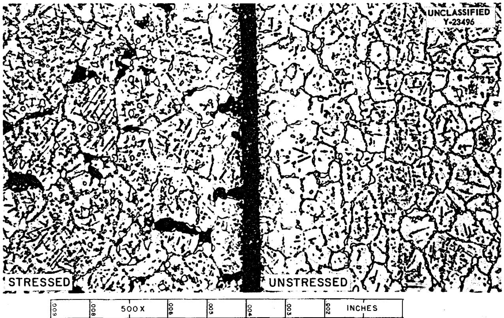  
Fig. 3.1.2. Stressed (8000 psi) and Unstressed Sections of a Specimen of Alloy B-3879 Tested in the Annealed Condition at $1500^{\circ}\mathsf{F}$ in Fuel 107. Etchant: chrome regia. 500X. (Secret with caption)

Table 3.1.15. Results of Study of Effect of Prior Heat Treatment on Creep Properties of Specimens from ORNL Vacuum-Melted Heat 30-63 Tested at 8000 psi and $1500^{\circ}\mathrm{F}$ in Fuel 107   

<table><tr><td>Heat Treatment</td><td>Rupture Life (hr)</td><td>Elongation (%)</td></tr><tr><td>Annealed at 2100°F for 1 hr</td><td>750</td><td>50</td></tr><tr><td>Annealed at 2200°F for 1 hr</td><td>740</td><td>25</td></tr><tr><td>Annealed at 2100°F for 1 hr and aged at 1300°F for 50 hr</td><td>350</td><td>15</td></tr><tr><td>Annealed at 2200°F for 1 hr and aged at 1300°F for 50 hr</td><td>670</td><td>13</td></tr></table>

other heats of INOR-8 in Table 3.1.16, and the compositions of the heats are given in Table 3.1.17. It may be seen that the Haynes alloy, 8284, has the best creep properties of all the alloys listed. It is felt that with an increase in carbon content, this alloy will have a rupture life of 1000 hr or more at $1500^{\circ}\mathrm{F}$ and 8000 psi.

Specimens from the vacuum-melted heat 30-62 were tested to determine the effect on the stress-rupture behavior of adding zirconium to the INOR-8 alloy. Previously, specimens of 30-lb heats of INOR-8 had failed in 680 hr with $30\%$ elongation, but testing of the zirconium-bearing specimen was discontinued at 1189 hr and the elongation was

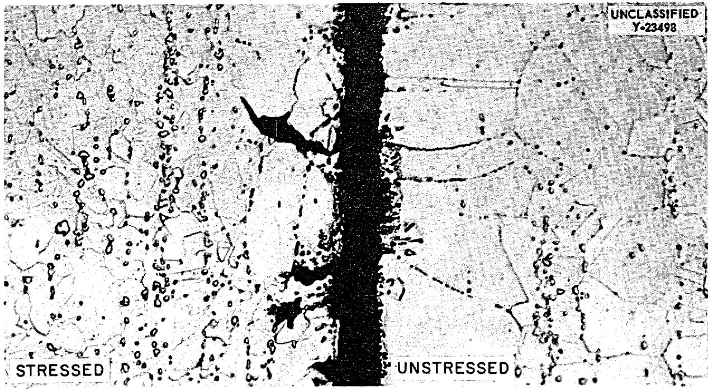

<table><tr><td>003</td><td>002</td><td>500X</td><td>006</td><td>005</td><td>004</td><td>003</td><td>002</td><td>INCHES</td></tr></table>

Fig. 3.1.3. Stressed (8000 psi) and Unstressed Sections of Specimen from Vacuum-Melted Heat VT-66 Tested in the Annealed Condition at $1500^{\circ}\mathrm{F}$ in Fuel 107. Etchant: chrome regia. 500X. (Secret with caption)

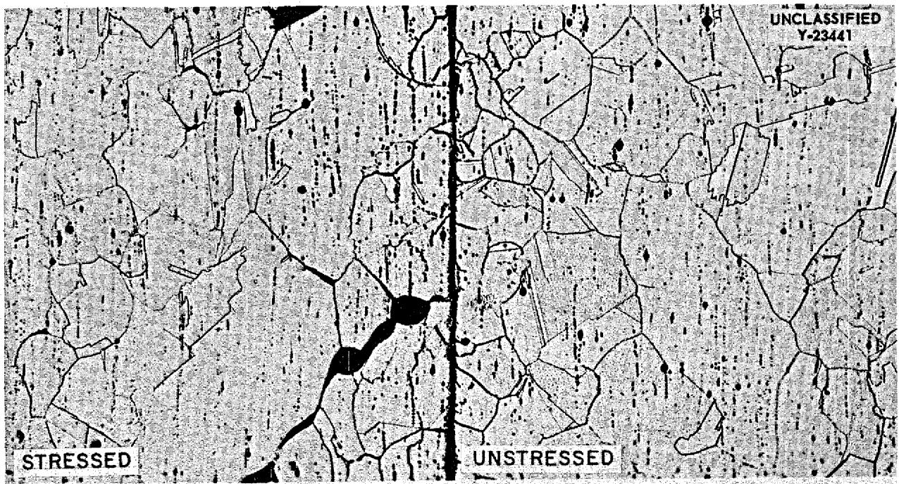  
Fig. 3.1.4. Stressed (8000 psi) and Unstressed Sections of Specimen of Hayes Alloy 8284 Tested in the Annealed Condition at $1500^{\circ}\mathsf{F}$ in Fuel 107. Etchant: chrome regia. 100X. (Secret with caption)

<table><tr><td>100X</td><td>0</td><td>0</td><td>INCHES</td></tr></table>

Table 3.1.16. Comparison of Creep Properties of Several Heats of INOR-8 Tested at $1500^{\circ}\mathrm{F}$ and a Stress of 8000 psi in Fuel 107   

<table><tr><td rowspan="2">Alloy Designation</td><td rowspan="2">Source</td><td colspan="4">Time to Specified Strain (hr)</td><td rowspan="2">Rupture Life (hr)</td><td rowspan="2">Total Elongation (%)</td></tr><tr><td>1%</td><td>2%</td><td>5%</td><td>10%</td></tr><tr><td>8284 (heat SP-16)</td><td>Haynes Stellarite Company</td><td>36</td><td>100</td><td>280</td><td>510</td><td>530</td><td>13</td></tr><tr><td>M-1327</td><td>Westinghouse Electric Corporation</td><td>14</td><td>32</td><td>64</td><td>92</td><td>110</td><td>16</td></tr><tr><td>30-62</td><td>ORNL</td><td>29</td><td>72</td><td>180</td><td>340</td><td>1200</td><td>66</td></tr><tr><td>VT-51</td><td>ORNL</td><td>28</td><td>62</td><td>200</td><td>450</td><td>1243</td><td>49</td></tr><tr><td>30-34</td><td>ORNL</td><td>36</td><td>75</td><td>180</td><td>340</td><td>670</td><td>26</td></tr></table>

Table 3.1.17. Compositions of Various INOR-8 Heats   

<table><tr><td rowspan="2">Alloy Designation</td><td colspan="5">Nominal Composition (wt %), Balance Nickel</td></tr><tr><td>Mo</td><td>Cr</td><td>Fe</td><td>C</td><td>Other</td></tr><tr><td>8284 (heat SP-16)</td><td>16</td><td>7</td><td>5</td><td>0.02</td><td>0.35 W</td></tr><tr><td>M-1327</td><td>17</td><td>7</td><td>4</td><td>0.14</td><td></td></tr><tr><td>30-62</td><td>16</td><td>7</td><td>5</td><td>0.06</td><td>0.15 Zr</td></tr><tr><td>VT-51</td><td>17</td><td>10</td><td>7</td><td>0.06</td><td></td></tr><tr><td>30-34</td><td>15</td><td>6</td><td>5</td><td>0.06</td><td></td></tr></table>

66%. The creep rates of both specimens were similar, and thus the only difference was the increased rupture life of the zirconium-bearing alloy, which may be attributed to an increase in ductility. The zirconium-bearing specimen, which was tested in the annealed and aged condition is shown in Fig. 3.1.5. Bands of various grain sizes ranging from coarse at the surface to fine at the center of the specimen may be seen. The usual heavy concentration of carbide particles in the grain boundaries that is associated with all the high-strength nickel-molybdenum alloy systems is also present. The specimen shows corrosion attack to a depth of approximately 0.5 mil.

Although the INOR-8 alloy does not represent the ultimate in mechanical properties which can be obtained from the nickel-molybdenum alloy systems, it is superior to type 316 stainless steel and

Inconel at $1500^{\circ}\mathrm{F}$ in a fuel environment, as is shown by the representative creep data in Table 3.1.18. Tensile tests of alloy 30-62 in air at $1500^{\circ}\mathrm{F}$ indicated a tensile strength of 46,000 psi with $20\%$ elongation. The maximum corrosive attack observed corresponds to the corrosion found for Hastelloy B in the same fuel environment.

# CORROSION STUDIES

J. H. DeVan

Forced-Circulation Loop Test of a Nickel-Molybdenum Base Alloy Exposed to Fuel 107

J.H.DeVan R.S.Crouse

The first forced-circulation loop fabricated of an experimental nickel-molybdenum base alloy completed 1000 hr of operation with fuel 107 at a maximum fuel-to-metal interface temperature of

$1760^{\circ} \mathrm{F}$ . The loop alloy had the nominal composition $17\%$ Mo-6% Fe-bal Ni. Other operating conditions for the loop, 7641-9, are given below:

<table><tr><td>Maximum bulk fuel temperature</td><td>1610°F</td></tr><tr><td>Fuel temperature drop</td><td>300°F</td></tr><tr><td>Reynolds No.</td><td>10,000</td></tr><tr><td>Flow rate</td><td>1.4 gpm</td></tr><tr><td>Ratio of surface area of heated section to total loop volume</td><td>2.2 in.2/in.3</td></tr></table>

An examination of a hot-leg section of this loop showed attack by the fuel to be confined almost entirely to grain boundaries. The attack reached a maximum depth of 4 mils at the point of maximum wall temperature. As may be seen in Fig. 3.1.6, the attack was, in general, in the form of small, discontinuous voids, although shallow surface pits are also evident along the exposed surface. Considerable oxidation occurred on the outer surface of the hot leg, which was in contact with air during operation of the loop. In addition to forming a

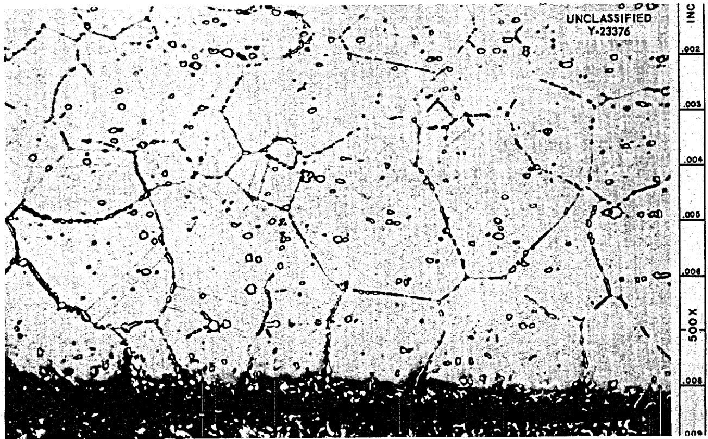  
Fig. 3.1.5. Specimen of Alloy 30-62 Tested in the Annealed and Aged Condition at 8000 psi and $1500^{\circ}$ F in Fuel 107. Etchant: chrome regia. 500X. (Secret with caption)

Table 3.1.18. Representative Creep Test Data Obtained at ${1500}^{ \circ  }\mathrm{F}$   

<table><tr><td rowspan="2">Alloy</td><td rowspan="2">Stress (psi)</td><td rowspan="2">Test Environment</td><td colspan="5">Time to Specified Strain (hr)</td><td rowspan="2">Rupture Life (hr)</td><td rowspan="2">Total Elongation (%)</td></tr><tr><td>0.5%</td><td>1%</td><td>2%</td><td>5%</td><td>10%</td></tr><tr><td>Alloy 30-62</td><td>8000</td><td>Fuel 107</td><td>7</td><td>29</td><td>72</td><td>180</td><td>340</td><td>1200</td><td>66</td></tr><tr><td>Type 316 stainless steel</td><td>6300</td><td>Fuel 30</td><td>4</td><td>20</td><td>95</td><td>300</td><td>540</td><td>977</td><td>55</td></tr><tr><td>Inconel</td><td>3500</td><td>Fuel 30</td><td>22</td><td>70</td><td>180</td><td>600</td><td>1000</td><td>1000</td><td>10</td></tr><tr><td></td><td>8000</td><td>Fuel 30</td><td></td><td></td><td></td><td>3.5</td><td>15</td><td>30</td><td>47</td></tr></table>

heavy, uniform oxide film, the oxidation had proceeded preferentially along grain boundaries to depths of as much as 9 mils.

Examinations of cold-leg sections showed numerous surface pits and some areas of intergranular attack to a depth of 2 mils. A very thin deposit of tiny metal crystals was present over most of the cold-leg surface, and, in addition, widely dispersed clumps of metal deposits up to 6 mils in thickness were found. The heaviest deposits found are shown in Fig. 3.1.7. The deposits interfered with drainage of the fuel from the walls of the loop along these portions of the cold leg, and therefore the deposits were partially covered with a heavy fluoride-mixture film. Samples of this film which contained sizeable quantities of metal crystals were analyzed and were found to contain the following elements:

<table><tr><td>Fuel 
Constituents</td><td>Quantity Found 
(wt %)</td></tr><tr><td>K</td><td>5-10</td></tr><tr><td>Na</td><td>2-5</td></tr><tr><td>Li</td><td>2-5</td></tr><tr><td>U</td><td>10</td></tr></table>

<table><tr><td>Contaminants</td><td>Quantity Found(wt %)</td></tr><tr><td>AI</td><td>0.05</td></tr><tr><td>Fe</td><td>0.3</td></tr><tr><td>Cr</td><td>0.1</td></tr><tr><td>Mo</td><td>0.1</td></tr><tr><td>Ni</td><td>5</td></tr></table>

It was possible to make a separation of the metal crystals from the residual fuel by using an ammonium oxalate solution, and analyses of the metal particles are in progress. The separated metal particles were quite magnetic, and, on the basis of the above analysis, it would appear that they contain large percentages of nickel, with some iron.

Before-test and after-test samples of fuel from this loop showed no change in nickel and iron contamination, but a slight increase in chromium contamination was noted in the after-test sample. It is assumed that Hastelloy W, which was used as a filler wire in making the loop welds, served as the source of chromium.

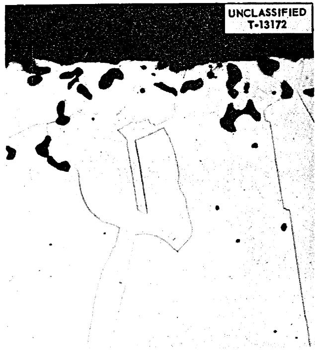  
Fig. 3.1.6. Hot-Leg Attack in Nickel-Molybdenum Base Alloy Forced-Circulation Loop 7641-9 Operated with Fuel 107. Etchant: aqua regia. 250X. (Secret with caption)

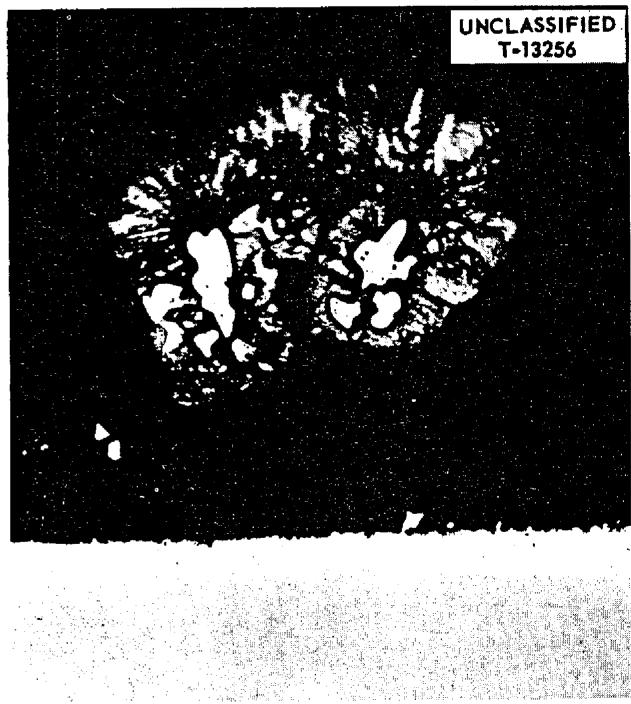  
Fig. 3.1.7. Cold-Leg Sections of Nickel-Molybdenum Base Alloy Forced-Circulation Loop 7641-9 Operated with Fuel 107. Unetched, 250X. (Secret with caption)

# Thermal-Convection Loop Tests of Nickel-Molybdenum Base Alloys Exposed to Fuel 107

D.A.Stoneburner J.R.DiStefano

Two thermal-convection loops constructed of experimental nickel-molybdenum base alloys were tested with the fuel 107 at $1500^{\circ}\mathrm{F}$ for 1000 hr. The compositions of the alloys from which these loops (Nos. 1136 and 1155) were fabricated are presented in Table 3.1.19, along with the results of chemical analyses of the fuel circulated in these and three previously operated loops.[11]

Metallographic examination of loop 1136 revealed heavy surface roughening and pits along the hot-leg surface to a maximum depth of 5 mils. In addition, very large and irregular-shaped voids were present at depths as great as 9 mils below the surface. As may be seen in Fig. 3.1.8, these voids were elongated in the direction of the tubing axis and did not appear to be connected with the attacked areas above. They probably reflect fabrication defects rather than actual areas of attack. The cold leg of loop 1136 showed light surface roughening with no evidence of deposits. The analysis of the fuel after the test, as shown in Table 3.1.19, indicated considerable reaction of the fuel with aluminum and a slight reaction with titanium.

Loop 1155 showed heavy surface roughening and surface pits, with heavy intergranular subsurface void formation to a depth of 3 mils in the hot-leg

section. The cold leg showed moderate surface roughness, with second-phase material concentrated near the surface. No cold-leg deposits or layers were visible. Fabrication defects in the form of voids and cracks were found in the samples examined. Such defects occurred generally to a depth of 7 mils, although one crack extended from the outer surface into the sample to a depth of 20 mils.

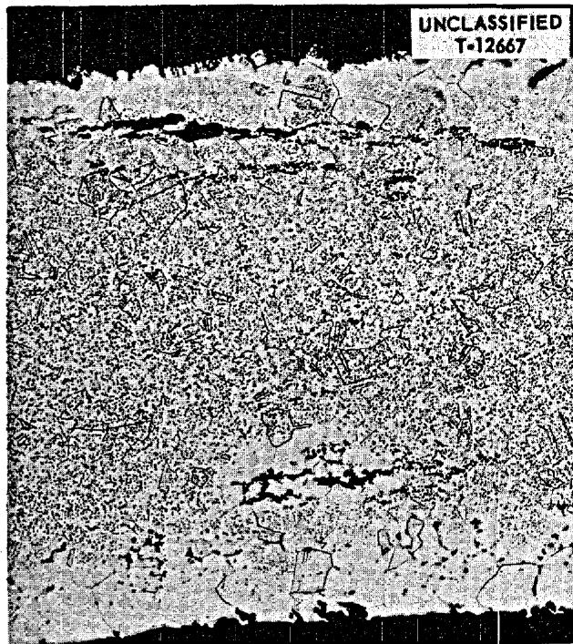  
Fig. 3.1.8. Hot-Leg Attack in Nickel Molybdenum Base Alloy Thermal-Convection Loop 1136 Which Operated with Fuel 107 for 1000 hr at $1500^{\circ}$ F. Etchant: copper regia. 100X. (Secret with caption)

Table 3.1.19. Analyses of Corrosion Products in Fuel 107 After Circulation in Nickel-Molybdenum Base Alloys at $1500^{\circ}\mathsf{F}$   

<table><tr><td>Loop No.</td><td>Alloy Composition (wt %)</td><td>Operating Time (hr)</td><td>Quantity of Alloy Constituents in After-Test Fuel Samples</td></tr><tr><td>1125</td><td>17 Mo-4 V-bal Ni</td><td>1000</td><td>210 ppm</td></tr><tr><td>1123</td><td>17 Mo-4 V-bal Ni</td><td>500</td><td>290 ppm</td></tr><tr><td>1135</td><td>16 Mo-6 Cr-1 Nb-1 Al-bal Ni</td><td>1000</td><td>455 ppm Cr, 20 ppm Nb, 1455 ppm Al</td></tr><tr><td>1136</td><td>16 Mo-2 Al-1.5 Ti-bal Ni</td><td>1000</td><td>1400 ppm Al, 370 ppm Ti</td></tr><tr><td>1155</td><td>INOR-8 plus 0.5 Al-5 Fe-6 Cr-0.5 Mn-0.06 C</td><td>1000</td><td>760 ppm Cr, 415 ppm Al</td></tr></table>

A summary of thermal-convection loop test results has been prepared to provide a comparison of the corrosion properties of the various nickel-molybdenum base alloys tested thus far in fuel 107. In Tables 3.1.20 and 3.1.21, the alloys are grouped according to the level of attack found after 500- and 1000-hr tests at $1500^{\circ}\mathrm{F}$ . As may be seen

in Table 3.1.20, the maximum attack did not exceed 3 mils for any of the alloys tested. Therefore it appears that none of the additions seriously affect corrosion resistance from the standpoint of total depth of attack. In particular, additions of chromium in amounts up to $9\%$ and niobium in amounts up to $5\%$ had little effect on the depth of

Table 3.1.20. Comparison of Attack of Nickel-Molybdenum Base Alloy Thermal-Convection Loops Operated for 500 hr with Fuel 107   

<table><tr><td>Alloys with Very Limited Attack of &lt;1 mil, Nominal Composition (wt %)</td><td>Alloys with Limited Attack of 1 to 2 mils, Nominal Composition (wt %)</td><td>Alloys with Noticeable Attack of 2 to 3 mils, Nominal Composition (wt %)</td></tr><tr><td>17 Mo-2 Ti-bal Ni</td><td>17 Mo-0.5 Al-bal Ni</td><td>17 Mo-2 Al-bal Ni</td></tr><tr><td>17 Mo-2 V-bal Ni</td><td>17 Mo-3 Cr-bal Ni</td><td>16 Mo-2 Al-1.5 Ti-bal Ni</td></tr><tr><td>17 Mo-3 Nb-bal Ni</td><td>20 Mo-3 Cr-bal Ni</td><td>16 Mo-6 Cr-1 Nb-1 Al-bal Ni</td></tr><tr><td>17 Mo-5 Nb-bal Ni</td><td>17 Mo-5 Cr-bal Ni</td><td>16 Mo-6 Cr-1 Nb-1 Al-bal Ni</td></tr><tr><td>17 Mo-4 Fe-bal Ni</td><td>17 Mo-7 Cr-bal Ni</td><td>15 Mo-5 Cr-3 Nb-3 W-0.5 Al-bal Ni</td></tr><tr><td>15 Mo-0.5 Al-3 Nb-3 W-bal Ni</td><td>20 Mo-7 Cr-bal Ni</td><td>17 Mo-4 V-bal Ni</td></tr><tr><td></td><td>16 Mo-9 Cr-bal Ni</td><td></td></tr><tr><td></td><td>17 Mo-2 W-bal Ni</td><td></td></tr><tr><td></td><td>17 Mo-4 W-bal Ni</td><td></td></tr><tr><td></td><td>17 Mo-1 Al-1.5 Ti-bal Ni</td><td></td></tr><tr><td></td><td>18 Mo-1 Al-1.5 Ti-bal Ni</td><td></td></tr><tr><td></td><td>20 Mo-7 Cr-2 Nb-1 Fe-bal Ni</td><td></td></tr><tr><td></td><td>20 Mo-7 Cr-1 Al-2 Nb-1 Fe-bal Ni</td><td></td></tr><tr><td></td><td>20 Mo-1 Nb-2 Ti-0.8 Mn-bal Ni</td><td></td></tr></table>

Table 3.1.21. Comparison of Attack of Nickel-Molybdenum Base Alloy Thermal-Convection Loops Operated for 1000 hr with Fuel 107   

<table><tr><td>Alloys with Limited Attack of 1 to 2 mils, Nominal Composition (wt %)</td><td>Alloys with Noticeable Attack of 2 to 3 mils, Nominal Composition (wt %)</td><td>Alloys with Heaviest Attack of 3 to 5 mils, Nominal Composition (wt %)</td></tr><tr><td>15 Mo-85 Ni</td><td>11 Mo-2 Al-bal Ni</td><td>17 Mo-2 Al-bal Ni</td></tr><tr><td>17 Mo-5 Cr-bal Ni</td><td>20 Mo-1 Nb-2 Ti-8 Mn-bal Ni</td><td>17 Mo-4 V-bal Ni</td></tr><tr><td>17 Mo-2 Ti-bal Ni</td><td>20 Mo-7 Cr-2 Nb-1 Al-1 Fe-bal Ni</td><td>17 Mo-5 Nb-bal Ni</td></tr><tr><td></td><td>17 Mo-4 W-bal Ni</td><td>16 Mo-6 Cr-1 Nb-1 Al-bal Ni</td></tr><tr><td></td><td>17 Mo-3 Nb-bal Ni</td><td>16 Mo-2 Al-1.5 Ti-bal Ni</td></tr><tr><td></td><td>15 Mo-6 Cr-0.5 Al-5 Fe-0.5 Mn-bal Ni</td><td></td></tr></table>

corrosion; however, the presence of these elements as corrosion products in the fuel increased noticeably as the percentage of the element in the base metal increased. It is interesting to note that in no case did alloys containing $20\%$ Mo appear in the column of noticeable attack (2 to 3 mils), whereas alloys with similar additives but with a decreased percentage of molybdenum did show noticeable attack.

Increasing the time of the test from 500 to 1000 hr caused the attack to increase 1 to 2 mils, as shown in Table 3.1.21. The maximum attack recorded was 4 mils, and again none of the alloy additions seriously affected the corrosion resistance.

# Compatibility of Nickel-Molybdenum Base Alloys with Molybdenum

It is expected that the use of nickel-molybdenum alloys as materials of construction in molten fluoride salt reactors will make possible a considerable increase in the operating temperature attainable in such systems. The operating temperature of the moderator material will, of course, increase correspondingly. At the temperatures being considered, moderating materials such as beryllium oxide and the hydrides of zirconium and yttrium must be protectively clad with molybdenum. It is necessary therefore to determine whether the molybdenum cladding will be compatible with nickel-molybdenum alloys in a common fluoride fuel circuit. If it is found that excessive dissimilar metal mass transfer occurs between molybdenum and these alloys, an outer cladding of a nickel-molybdenum alloy over the molybdenum will become an added requirement.

Preliminary compatibility studies of molybdenum with nickel-molybdenum alloys are being made by using Hastelloy W thermal-convection loops with molybdenum inserts contained in the hot leg. One such loop has been operated with fuel 107 at a maximum temperature of $1500^{\circ}\mathrm{F}$ for 1000 hr, and a second loop has operated at $1650^{\circ}\mathrm{F}$ for 517 hr. The latter loop was terminated prior to the scheduled

1000 hr when a leak developed in the hot leg. Metallographic examinations revealed no evidence of attack or metallurgical change of any kind along the inner surface of molybdenum samples taken from the top, middle, and bottom of the inserts from both loops. Numerous fabrication defects were found along the inner surface of the insert from the loop operated at $1500^{\circ}\mathsf{F}$ , and the wall thickness of the insert varied considerably. The outer surfaces of the molybdenum inserts revealed no attack, but the insert from the loop operated at $1500^{\circ}\mathsf{F}$ had an extremely thin metallic layer in some areas. The samples from the bottom of the insert showed less of the deposited layer than did the middle and top insert samples.

The Hastelloy W surfaces that were exposed to fuel showed heavy surface pits and shallow void formation to a depth of 3 mils after the test at $1650^{\circ}\mathrm{F}$ , and 2 mils after the test at $1500^{\circ}\mathrm{F}$ . The Hastelloy W tested at $1500^{\circ}\mathrm{F}$ was attacked in some areas and yet other areas were completely free of attack. Also, the metallic layer on the molybdenum insert was found opposite the area of least attack of the Hastelloy W. The Hastelloy W tested at $1650^{\circ}\mathrm{F}$ had a very thin, discontinuous line of particles immediately above some areas of attacked surface. This line appeared to be associated with foreign phases originally present in the tubing which withstood attack by the fuel.

The Hastelloy W cold-leg surfaces were moderately roughened, and in the loop operated at $1500^{\circ}\mathrm{F}$ there were moderate surface pits and some general subsurface voids to a depth of 1.5 mils. No mass transfer deposits or layers were found.

The corrosion rate and appearance of the after-test samples showed no evidence of serious interaction between molybdenum and Hastelloy W under these test conditions in either loop. However, samples of the molybdenum insert and the Hastelloy W sleeve have been prepared for spectrographic examination to further check for alloying between these metals.

# 3.2. DEVELOPMENT STUDIES OF INCONEL

# STRAIN-CYCLING AND STRESS-RELAXATION STUDIES

C. R. Kennedy

D. A. Douglas

The studies in a program for investigation of the strain-cycle properties of fine- and coarse-grained Inconel were continued, with a series of tests being made to determine the effect of strain reversals upon the creep properties of Inconel. Also, other studies were initiated to determine the strain-cycle properties of Inconel weldments, of carburized Inconel, and of reactor-grade beryllium. The tests to be performed, with the exception of the tests of carburized Inconel, will provide engineering data to be utilized in determining the life expectancy of structural members subjected to strain reversals. The carburized-Inconel test program is being run in conjunction with the alloy development program (Chap. 3.1, "Nickel-Molybdenum Alloy Development Studies") to determine whether carburization is deleterious to the strain-cycle properties of Inconel.

Results of strain-cycle tests of fine- and coarse-grained Inconel tubular specimens at $1600^{\circ}\mathrm{F}$ in NaF-ZrF $_4$ -UF $_4$ (50-46-4 mole %, fuel 30) are presented in Fig. 3.2.1, in which the plastic strain

On assignment from Pratt & Whitney Aircraft.

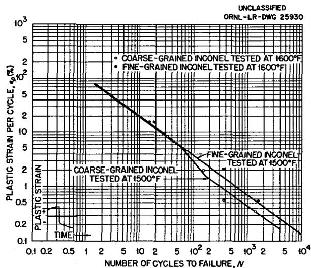  
Fig. 3.2.1. Strain-Cycle Properties of Fine- and Coarse-Grained Inconel Tubular Specimens Tested in NaF-ZrF4-UF4 (50-46-4 mole % fuel 30) at 1500 and $1600^{\circ}\mathrm{F}$ . (Secret with caption).

per-cycle $(\varepsilon_{p})$ is plotted vs the number of cycles to failure $(N)$ . Data from previous similar tests at $1500^{\circ}F$ are also shown for comparison. As may be seen in Fig. 3.2.1, the data indicate that the strain-cycle properties at $1600^{\circ}F$ in fuel 30 are very similar to those at $1500^{\circ}F$ and again show that coarse-grained Inconel is greatly affected by this environment.

The evaluation study of the effect of prior strain cycling upon the creep properties of Inconel is under way. The test procedure includes strain cycling the specimens at $0.83\%$ plastic strain per cycle for different numbers of cycles at $1500^{\circ}\mathrm{F}$ and then creep testing the specimen at 7000 psi. The test results obtained thus far are shown in Fig. 3.2.2 as creep curves of specimen with 0, 100, and 300 strain cycles prior to creep testing. The curves indicate that the creep strength and rupture life are immediately reduced by the first 100 cycles. The effect of 300 cycles does not further reduce the creep strength; however, the total elongation and rupture life are less than after the 100-cycle test. The type of plot that will be produced when the program is completed is shown in Fig. 3.2.3, where the number of cycles prior to creep testing is plotted vs the percentage loss of rupture life

2C. R. Kennedy and D. A. Douglas, ANP Quar. Prog. Rep. June 30, 1957, ORNL-2340, p 190.

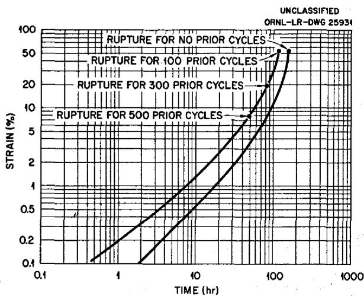  
Fig. 3.2.2. Creep Curves of Inconel Tubes Tested at $1500^{\circ}\mathrm{F}$ in Argon After Prior Strain Cycling at $1500^{\circ}\mathrm{F}$ .

and percentage loss of creep strength. The creep strength value used is the time to $1.0\%$ strain.

This is the first attempt to study the interrelation of strain cycling and simple creep, and these early results emphasize the importance of the interdependence. Apparently the effects can be considered to be additive in that the consumption of

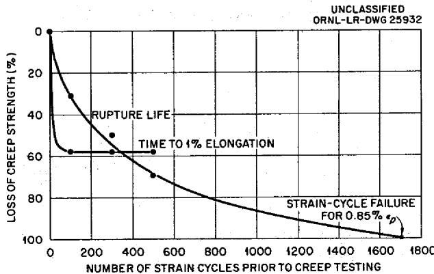  
Fig. 3.2.3. The Effect of Prior Strain Cycling at $1500^{\circ}\mathsf{F}$ on the Creep Properties of Inconel at $1500^{\circ}\mathsf{F}$ . Specimens creep tested at 7000 psi in argon.

life expectancy by one of these factors also results in reduced life under the other condition. This implies that design calculations based on only one of these conditions will be quite optimistic for cases where both strain cycling and creep are present.

A test program has been initiated for evaluating the strain-cycle properties of Inconel weldments in both argon and in fuel 30. Two tubular specimens of conventional size were machined from all-weld-metal bars. The as-received weld metal is shown in Fig. 3.2.4. The results of two tests at $1500^{\circ}\mathrm{F}$ are listed in Table 3.2.1. The data from the test

Table 3.2.1. Results of Strain-Cycling Tests of All-Weld-Metal Inconel Specimens at ${1500}^{ \circ  }\mathrm{F}$   

<table><tr><td>Environment</td><td>Plastic Strain per Cycle (%)</td><td>Number of Cycles to Failure</td></tr><tr><td>Argon</td><td>1.0</td><td>870</td></tr><tr><td>Fuel 30</td><td>0.94</td><td>45</td></tr></table>

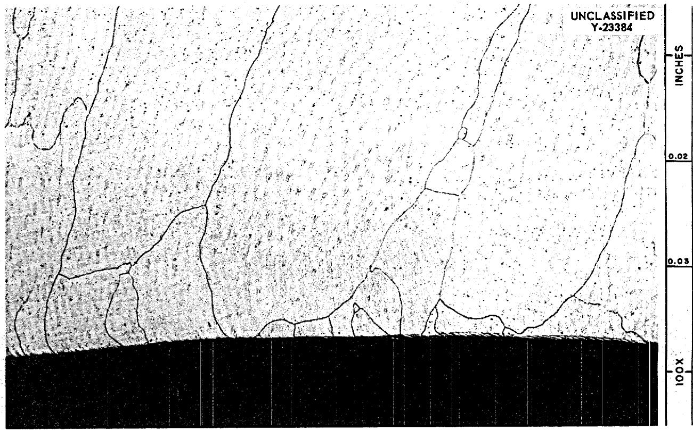  
Fig. 3.2.4. As-Received All-Weld-Metal Inconel Specimen. Etchant: $10\%$ oxalic acid. 100X.

run in argon, as shown in the table, compare favorably with the standard tubular test data. The all-weld-metal specimen tested in fuel 30 was given a 100-hr soak in this environment prior to testing to allow corrosion to occur. As shown in the table, the fuel environment seriously reduced the number of cycles to failure. A metallographic specimen, shown in Fig. 3.2.5, does not indicate, however, that corrosion caused the premature failure. In fact, it appears that the major intergranular cracks initiated at the inner surface where no corrosion had occurred. It therefore appears that the loss of life expectancy may have been caused by defects in the weld or unfavorable orientation of the dendritic grains. Future tests are proposed to check these findings.

During the operation of a reactor with a beryllium reflector, the beryllium will be subjected to thermal gradients which will resolve into strain. Therefore, a test program was begun to investigate the strain-cycle properties of hot-pressed, reactor-grade beryllium. Strain-cycle tests at $1250^{\circ}\mathrm{F}$ were completed and the results are shown in

Fig. 3.2.6 and compared with results obtained for Inconel at $1500^{\circ}\mathrm{F}$ . The data shown illustrate the magnitude of the difference between the strain-cycle characteristics of a brittle metal and those of a ductile alloy.

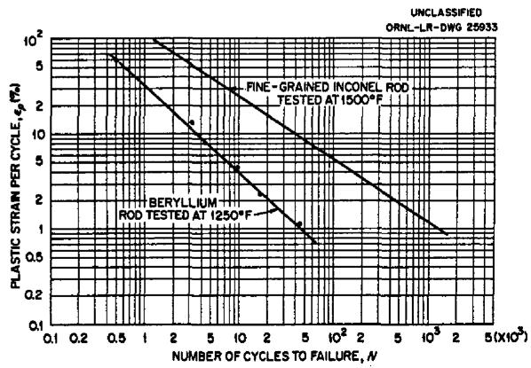  
Fig. 3.2.6. Strain-Cycle Properties of Reactor-Grade Baryllum Tested at $1250^{\circ}\mathrm{F}$ in Argon Compared with Those of Inconel at $1500^{\circ}\mathrm{F}$ .

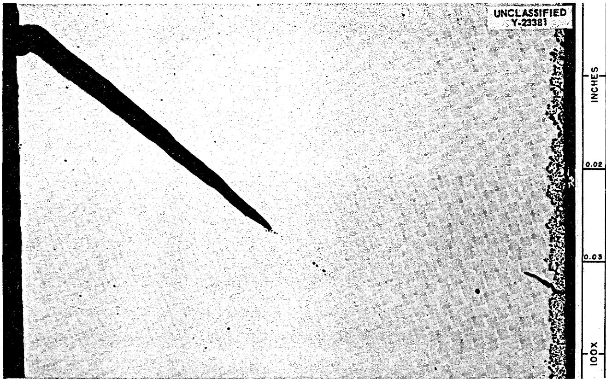  
Fig. 3.2.5. All-Weld-Metal Inconel Specimen After Strain-Cycle Testing at $1500^{\circ}$ F in Fuel 30. Etchant: $10\%$ oxalic acid. 100X. (Secret with caption).

In conjunction with the alloy development program, a series of strain-cycling tests of carburized Inconel at $1500^{\circ}\mathrm{F}$ have also been run. The results of these tests are shown in Fig. 3.2.7, where the data are compared with the data for coarse- and fine-grained Inconel. These results show that for the level of carburization of the specimens tested there was no impairment of the strain-cycle properties.

The program under way at the University of Alabama for exploring the effect of thermally-induced strain cycles is progressing. A series of tests in which the specimen is thermally strain cycled about a mean temperature of $1300^{\circ}\mathrm{F}$ has been completed, and the test results are shown in Fig. 3.2.8 and compared with the mechanically

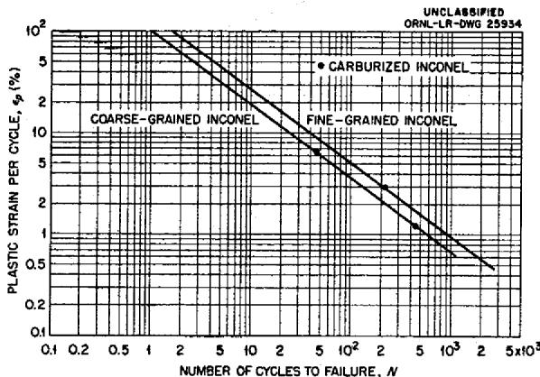  
Fig. 3.2.7. Strain-Cycle Properties of Carburized Inconel Tubes Tested at $1500^{\circ}\mathrm{F}$ in Argon Compared with Fine- and Coarse-Grained Inconel.

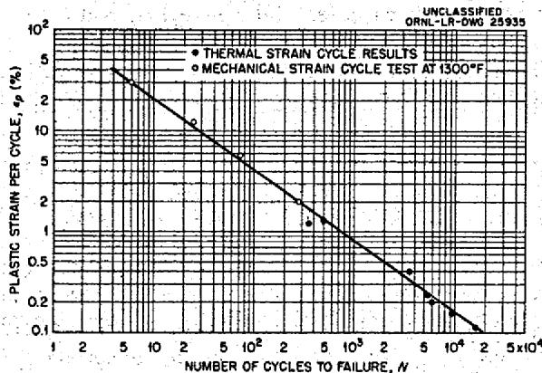  
Fig. 3.2.8. Thermal Strain-Cycle Properties of Inconel Tested at a Mean Temperature of $1300^{\circ}\mathrm{F}$ .

induced strain cycle data obtained at $1300^{\circ}\mathrm{F}$ under isothermal conditions at ORNL. As may be seen, the correlation of the results is excellent. A similar series of tests at a mean temperature of $1500^{\circ}\mathrm{F}$ is in progress.

Relaxation tests of fine-grained Inconel at $1100^{\circ}\mathrm{F}$ have been completed, and the results are shown in Fig. 3.2.9. The test procedure was described previously. The results obtained this quarter agree well with the values expected on the basis of the previous tests.

# BIAXIAL CREEP STUDIES

C. R. Kennedy

D. A. Douglas

The performance of a particular type of test does not always reliably indicate the manner in which material will react under operating conditions. The uniaxial creep test yields quantities of useful information; however, the applicability of the data to multiaxial stress conditions is questionable. Therefore, in an attempt to achieve a better understanding of the behavior of metals under multiaxial stress conditions, biaxial creep studies were initiated. This program has as its aim the correlation of the strain rate and the rupture life data obtained in tests under uniaxial stress conditions with data obtained under biaxial stress conditions.

A convenient way to vary the principal stress ratios is to superimpose an axial load on a tubular specimen. Thus, the circumferential and radial stresses will be dependent upon the internal pressure, and the axial stress will depend upon both the pressure and the axial load. The machines for strain cycling tubular specimens, which were described previously, are used for these tests. This equipment provides a simple means for obtaining strain measurements in the axial direction with the use of a dial gage fastened to the pull rod. Rupture is determined by a drop of internal pressure, which indicates the first complete crack through the wall of the tube. The strain in the tangential direction cannot be measured during the test and can only be roughly obtained after failure.

The tangential stresses applied in various biaxial creep tests were calculated by considering that the stresses are elastic and that their distribution is represented by the Lame equations. The

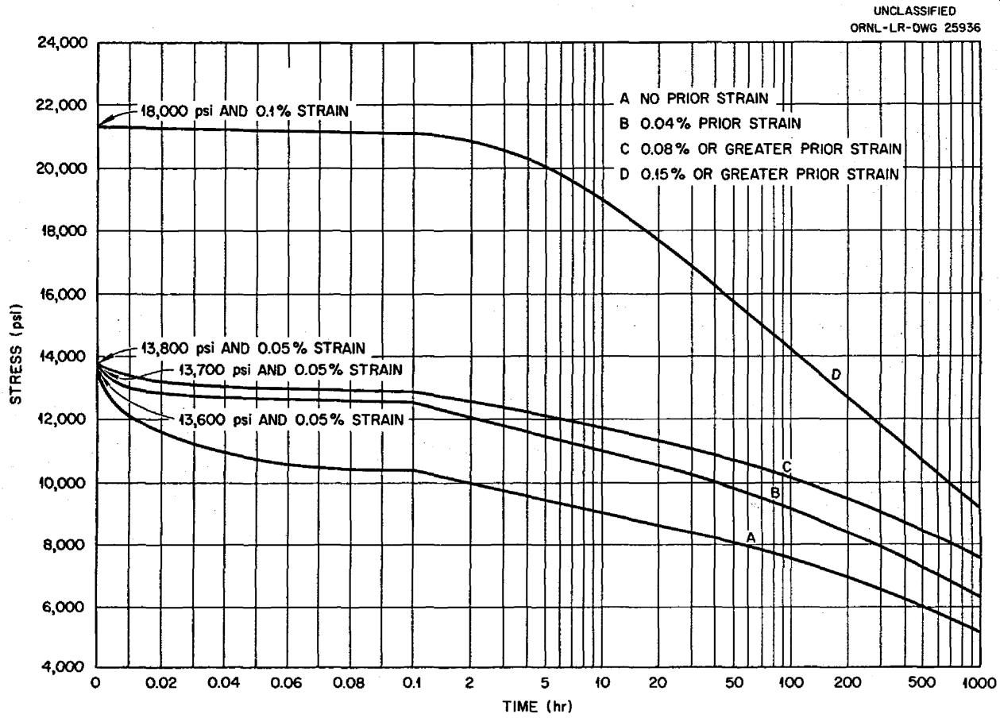  
Fig. 3.2.9. Relaxation Characteristics of Inconel Tested at $1100^{\circ}\mathrm{F}$ and Stressed to Produce a Constant Strain.

distribution of the stresses is indicated in Fig. 3.2.10, where $\sigma_{p^{\prime}}\sigma_{z^{\prime}}$ and $\sigma_{t}$ are the radial, axial, and tangential stresses, respectively. It should be pointed out that

$$
\sigma_ {r} + \sigma_ {t} = \text {c o n s t a n t f o r a l l v a l u e s o f} r,
$$

$$
\left(\sigma_ {t}\right) _ {a} - \left(\sigma_ {t}\right) _ {b} = p,
$$

$$
\left(\sigma_ {t}\right) _ {\text {a v}} = p \frac {a}{b - a} \left(" t h i n - w a l l" f o r m u l a\right),
$$

$$
\sigma_ {z} = \text {c o n s t a n t f o r a l l v a l u e s o f} r.
$$

The latter condition results from the axial strain, $\epsilon_{z^{\prime}}$ being constant for all values of $r$ and $\sigma_r + \sigma_t$ being constant. The actual pressure applied internally was determined by the "thin-wall" formula.

It must be realized, however, that, when the material ceases to behave elastically, the stress distribution will change. This distribution must

be calculated before a correlation of the uniaxial stress properties with the multiaxial stress properties can be made. The two most important factors governing the plastic-stress distribution are (a) the stress-strain-time properties of the material, such as creep and relaxation, and (b) the portion of the stress system which directly contributes to plasticity. For example, in a closed cylinder made of a perfectly plastic material (under a noncrump condition) in which yielding follows the Henky-von Mises criterion,

$$
(1) \left(\sigma_ {t} - \sigma_ {r}\right) ^ {2} + \left(\sigma_ {r} - \sigma_ {z}\right) ^ {2} + \left(\sigma_ {z} - \sigma_ {t}\right) ^ {2} = 2 \sigma_ {0} ^ {2},
$$

where $\sigma_0$ is the yield stress in a simple tension test, the stresses are distributed as shown in Fig. 3.2.11 (ref 5). It may be seen in Fig. 3.2.11 that maximum values of $\sigma_t$ and $\sigma_z$ occur on the

UNCLASSIFIED

ORNL-LR-DWG25937

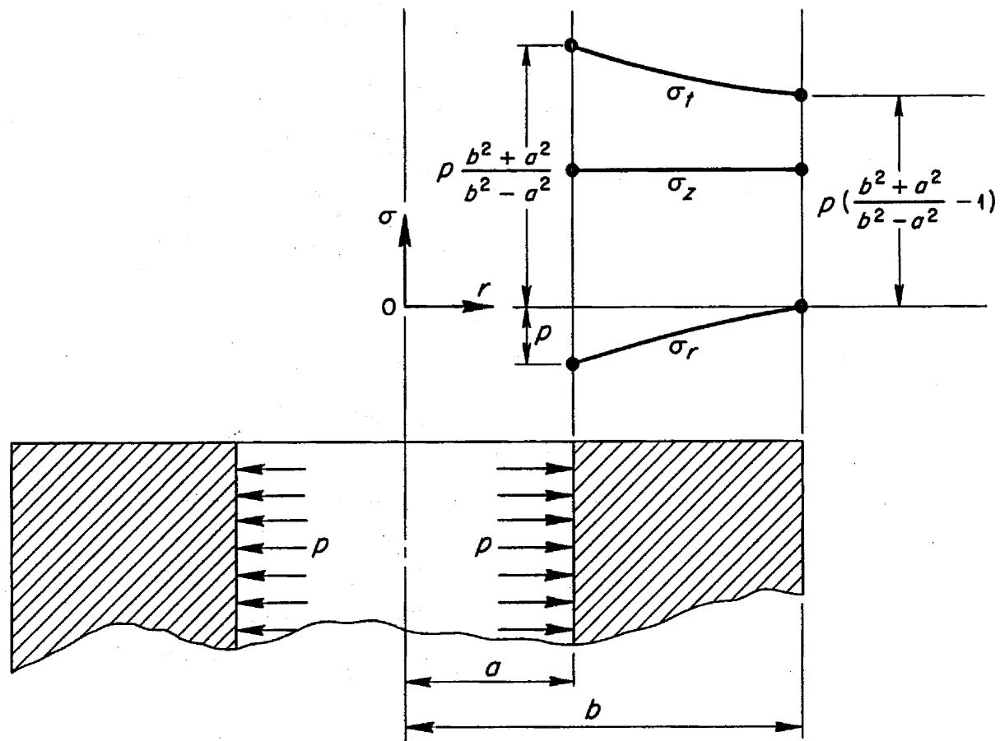  
Fig. 3.2.10. Elastic Distribution of Stresses in a Thick-Walled Cylinder Under Internal Pressure.

outside surface of the pressure vessel. The variation of $\sigma_{t}$ across the wall thickness $[\left(\sigma_{t}\right)_{b} - \left(\sigma_{t}\right)_{a}]$ equals the magnitude of the internal pressure. The $\sigma_{t'}$ , $\sigma_{z'}$ and $\sigma_{r}$ vs $r$ curves are equidistant logarithmic curves.

For a moderately thick-walled cylinder (as opposed to a heavy-walled cylinder) the distribution of all stresses across the wall of the cylinder can be assumed to vary linearly rather than logarithmically. Also, for the condition of creep, the material will probably behave more like the perfectly plastic material than an elastic material, since the strain rate across the wall of the tube is constant. By using these assumptions, the stress distribution in the tubular creep specimens was found to be that shown in Fig. 3.2.12, for either the Henky-von Mises or the maximum shear

stress criteria for yielding. The octahedral shear stress (Henky-von Mises), $\mathbf{T}_{\mathrm{oct}}$ or the maximum shear stress, $\mathbf{T}_{\mathrm{max}}$ should occur simultaneously over the wall of the tube. The value of $\mathbf{T}_{\mathrm{oct}}$ is as follows:

(2) $\mathbf{T}_{\mathrm{oct}} = \frac{1}{3}\left\{\left[\frac{p}{2}\left(\frac{b + a}{b - a}\right)\right]^2 + \right.$

$$
\left. + \left[ p \left(\frac {a}{b - a}\right) - \left(\sigma_ {z}\right) _ {\mathbf {a v}} \right] ^ {2} + \left[ \left(\sigma_ {z}\right) _ {\mathbf {a v}} + \frac {p}{2} \right] ^ {2} \right\} ^ {1 / 2}.
$$

The value of $\mathbf{T}_{\max}$ will depend upon the average $\sigma_z$ relative to $\sigma_l$ and $\sigma_{r'}$ as follows:

(3) $(\sigma_{z} > \sigma_{t} > \sigma_{r})$ $T_{\max} = \frac{(\sigma_z)_{\mathbf{av}}}{2} +\frac{p}{4},$

UNCLASSIFIED

ORNL-LR-DWG 25938

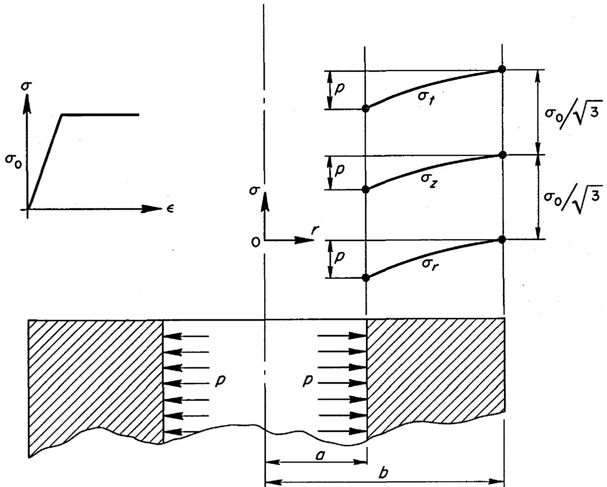  
Fig. 3.2.11. Plastic Distribution of Stresses in a Thick-Walled Cylinder Under Internal Pressure.

(4) $(\sigma_{t} > \sigma_{z} > \sigma_{r})$   
(5) $(\sigma_{t} > \sigma_{r} > \sigma_{z})$ $T_{\max} = \frac{p}{2}\left(\frac{a}{b - a}\right) - \frac{(\sigma_{z})_{\mathbf{av}}}{2}$ .

For the specific case in which the inside diameter of the tube is 0.843 in, and the outside diameter is 0.963 in., the values of $\mathbf{T}_{\mathrm{oct}}$ and $\mathbf{T}_{\mathrm{max}}$ are given in Table 3.2.2 for the tests reported here. As indicated in Table 3.2.2, a series of tests at $1500^{\circ}\mathrm{F}$ and 4000 psi has been completed. The Inconel specimens were machined from $\frac{3}{4}$ -in. pipe to have a 0.843-in. ID and a 0.963-in. OD with a 2.5-in. gage length. All the specimens were annealed in

hydrogen for 2 hr at $1950^{\circ}F$ after machining. The axial creep curves obtained from these tests are shown in Figs. 3.2.13 and 3.2.14, where the axial strain, positive or negative, is plotted vs time. As shown in Figs. 3.2.13 and 3.2.14, for the tests in which the stress ratio of $\sigma_{z}$ to $\sigma_{t}$ was greater than $1/2$ , the strain was positive, and, for those in which the stress ratio was less than $1/2$ , the strain was negative. The specimen in which the stress ratio of $\sigma_{z}$ to $\sigma_{t}$ was $1/2$ did not experience strain in the axial direction. The total strain at rupture (axial, tangential, and radial) is plotted vs the stress ratio in Fig. 3.2.15, and the rupture life of the biaxial creep specimens is plotted vs the stress ratio in Fig. 3.2.16. All stresses shown in

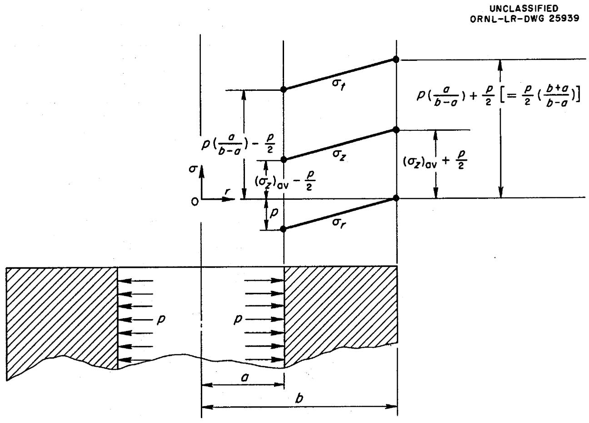  
Fig. 3.2.12. Plastic Distribution of Stresses in a Moderately Thick-Walled Cylinder Under Internal Pressure.

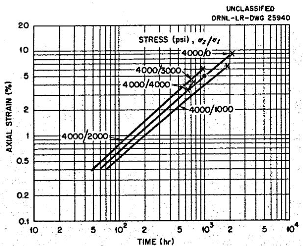  
Fig. 3.2.13. Creep Curves of Inconel Tubes Blaxially Stressed and Tested in Argon at $1500^{\circ}$ F.

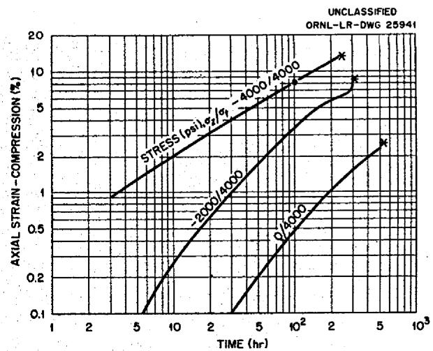  
Fig. 3.2.14. Creep Curves of Inconel Tubes Biaxially Stressed and Tested in Argon at $1500^{\circ}\mathrm{F}$ .

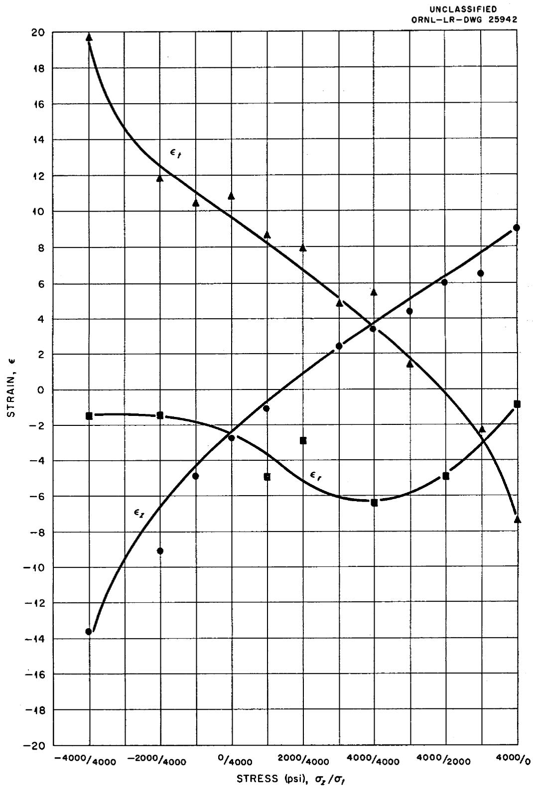  
Fig. 3.2.15. Total Strain at Rupture of Inconel Tubes Creep Tested at $1500^{\circ}\mathrm{F}$ Under Combined Axial and Tangential Stresses.

Table 3.2.2. Octahedral and Maximum Shear Streises of Blaxial Creep Specimens Tested at $1500^{\circ}$ F in Argon   

<table><tr><td>Stress (psi), σz/σt</td><td>Octahedral Shear Stress, Toct(psi)</td><td>Maximum Shear Stress, Tmax(psi)</td></tr><tr><td>4000/0</td><td>1890</td><td>2000</td></tr><tr><td>4000/1000</td><td>1400</td><td>2030</td></tr><tr><td>4000/2000</td><td>1560</td><td>2070</td></tr><tr><td>4000/3000</td><td>1790</td><td>2100</td></tr><tr><td>4000/4000</td><td>2020</td><td>2140</td></tr><tr><td>5000/4000</td><td>1820</td><td>2140</td></tr><tr><td>2000/4000</td><td>1750</td><td>2140</td></tr><tr><td>1000/4000</td><td>1790</td><td>2140</td></tr><tr><td>0/4000</td><td>1960</td><td>2140</td></tr><tr><td>-1000/4000</td><td>2210</td><td>2500</td></tr><tr><td>-2000/4000</td><td>2520</td><td>3000</td></tr><tr><td>-3000/4000</td><td>2880</td><td>3500</td></tr><tr><td>-4000/4000</td><td>3270</td><td>4000</td></tr></table>

the figures were calculated by the elastic "thin-wall" formula.

These data show some very interesting aspects of high-temperature flow characteristics. In Fig. 3.2.13, the creep curves demonstrate that the axial strain rate is independent of the state of stress and dependent only upon the stress in the axial direction in those tests in which the stress ratio, $\sigma_{z}$ to $\sigma_{t}$ , is greater than $1/2$ . It appears from Fig. 3.2.15 that if the greatest extension were taken as a measure of deformation, the conclusion would be reached that the state of stress seriously affects the amount of deformation at rupture. There is no basis, however, for this selection of a measure of deformation; a better measure is the sum of the three strains without regard to sign. Thus it can be seen that the elongation is distributed between the axial and transverse directions; what is lost in one direction is gained by the other. If the three strains are summed with respect to sign, the quantity is reasonably close to zero and indicates the constancy of volume for high-temperature flow.

A correlation of rupture life as a function of the stress system has not yet been accomplished.

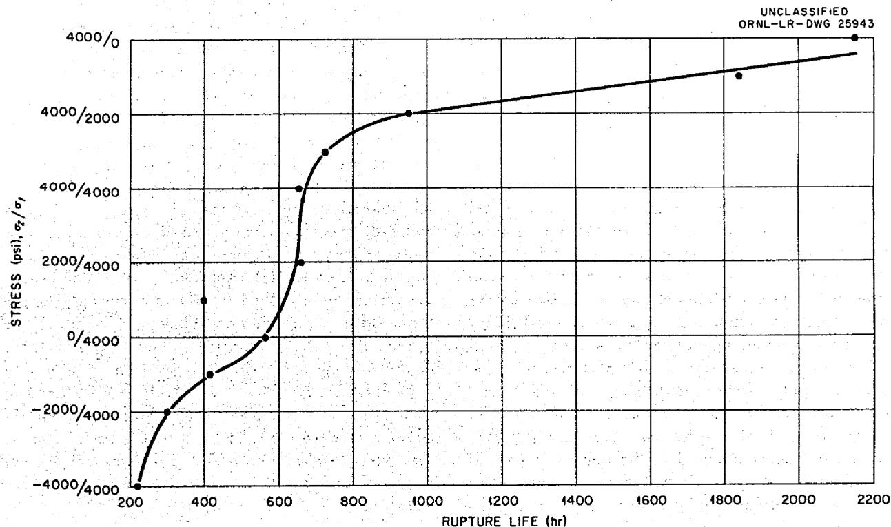  
Fig. 3.2.16. Stress-Rupture Properties of Inconel Tubes Bioxially Stressed and Creep Tested in Argon at $1500^{\circ}$ F.

At high temperatures where intergranular fracture is the cause of failure, there are two factors commonly accepted as contributing to failure: first, the consolidation of vacancies at boundaries, and, second, stress concentrations arising at boundaries because of relative motion of the crystals. The first factor may well be a function of the shear stresses, either the maximum shear stress or the octahedral shear stress (maximum shear stress deviator). In the case of the second factor, the greatest principal stress present in the system appears likely to be a measure of the rate of propagation of the failure. Neither of these two factors alone appears to govern the time to failure. The correlation is further complicated by the apparent difference in rupture life in tests in which the axial stress is greater than the tangential stress and the rupture life in tests in which the tangential stress was the greater. This behavior may be caused by the material being isotropic; however, the symmetry noted in Fig. 3.2.15 gives an indication that this is probably not the case. This same phenomenon has been reported by other investigators5 in results of tests of tubes biaxially stressed at low temperature. It is their explanation that this anomaly is caused by an instability of the uniform mode of deformation; this same instability can also gradually develop under biaxial stress systems in a simple tension test.

# RELATIVE TENSILE PROPERTIES OF INCONEL PLATE AND INCONEL WELD DEPOSITS

R. E. Clausing

P. Patriarca

Knowledge of the relative strengths of weld metal and base metal is required for the accurate prediction of the behavior of welded assemblies. In many instances it is necessary only to determine that the weld is as strong or stronger than the base material for the conditions of operation. Unless the weld metal is subjected to unusual conditions, such as corrosion, impact loads, or loading which will result in excessive weld-metal deformation, failures which occur should be confined to the base metal or heat-affected zones. If the weld proves to be weaker than the base material, this factor must be considered in the design of welded components. Many times welds may be placed in low-stress areas or may be mechanically reinforced to provide the necessary strength.

In certain types of assemblies it is desirable to match the properties of the weld with the properties

of the base material as nearly as possible. Matched mechanical and physical properties are important in structures of uniform cross section which may be expected to deform during operation. Unequal strengths in the proximity of the welds will result in unequal deformation and may result in stress concentrations that will lead to early failure of the component. Welds which are more resistant to deformation than the parent plate may be as undesirable as welds which deform more readily than the base material.

Although in many instances it is not possible to test welded assemblies in simulated service conditions, short-time tensile tests provide much valuable information regarding comparative properties of welds and parent material. Early tensile tests of Inconel weldments indicated that, at room temperature, failures occurred in the weld metal, whereas, at elevated temperatures, the failures occurred in the base material. Two specimens that illustrate these conditions are shown in Fig. 3.2.17; one was tested at room temperature and the other was tested at $1500^{\circ}\mathrm{F}$ . The experimental work reported here was undertaken in order to determine the relative strengths and elongations at failure of Inconel weld metal and base material.

A number of 0.252-in.-dia tensile specimens were machined from an Inconel weldment, as shown in Fig. 3.2.18. The weld was deposited as a fillet by using INCO No. 62 weld wire and PS-1 (ref 6) welding procedures. Preliminary testing revealed, as indicated previously, that the specimens were not likely to fail in the weld metal when tested at the elevated temperatures of interest. It was decided, therefore, to reduce the weld portion of the specimen to a standard size which would ensure an all-weld-metal test section. The 0.252-in.-dia specimens were etched lightly to accurately locate the weld area, which was subsequently reduced to a diameter of 0.126 in. with a gage length of $\frac{1}{2}$ in. A drawing of the resulting specimen is shown in Fig. 3.2.19. Specimens of this type were used to obtain the data reported here. Base-metal tensile specimens were also prepared in the same manner. The base metal had an ASTM grain size of between 6 and 7 and could be classified as fine-grained material.

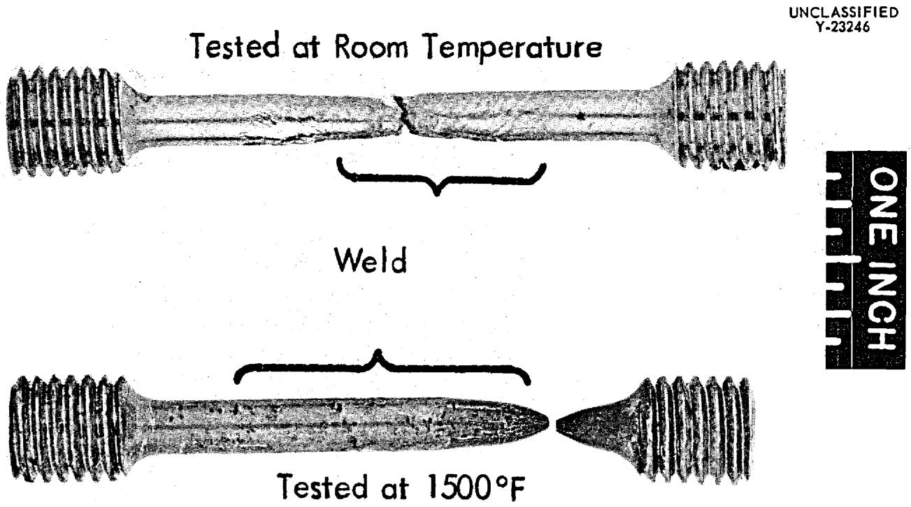

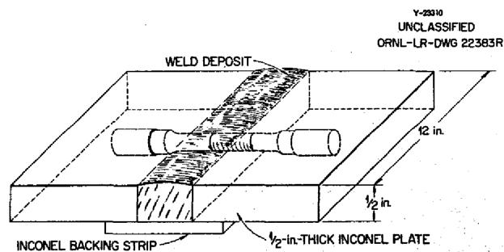  
Fig. 3.2.17. Tensile Test Specimens Machined from Inconel Weldments. Fracture occurred in weld at room temperature and in base metal at $1500^{\circ}\mathrm{F}$ .   
Fig. 3.2.18. Location of 0.252-in.-dia Tensile Specimens Relative to the Weld Deposit.

Two weld specimens and one base-metal specimen were tested at each temperature. The base material was tested in the mill-annealed condition and the welded specimens were tested in the as-welded condition. A cross-head speed of 0.05 in./min produced a strain rate of 0.1 in./in.min on the $\frac{1}{2}$ -in. gage length. The appearance after fracture of the 0.126-in. standard specimen is

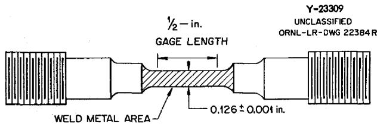  
Fig. 3.2.19. Modified, Transverse, Weld-Metal Tensile Specimen.

illustrated in Fig. 3.2.20. Although the test specimen geometry used in this investigation was unusual, the consistency of the data was quite satisfactory. The experimental data obtained are listed in Table 3.2.3 and presented graphically in Fig. 3.2.21.

As may be seen, both the yield and ultimate strengths of the weld metal are greater than those of the parent metal at elevated temperatures, while the ductility of the weld metal is lower. If a component is subjected to plastic deformation, the $0.2\%$ -offset strength is of paramount importance.

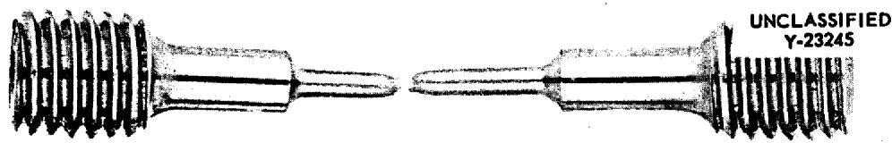  
Base Metal Room Temperature

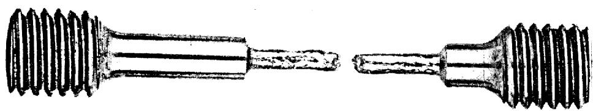  
ONE INCH  
Weld Metal Room Temperature

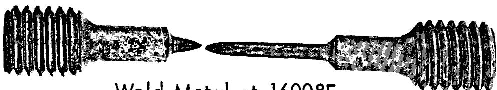  
Weld Metal at $1600^{\circ}F$   
Fig. 3.2.20. Typical Reduced-Section 0.126-in.-dia Tensile Specimens.

Table 3.2.3. Tensile Properties of Inconel Weld Metal and Base Metal   

<table><tr><td>Test Temperature (°F)</td><td>Specimen Type</td><td>Yield Strength at 0.2% Offset (psi)</td><td>Ultimate Strength (psi)</td><td>Elongation at Failure (%)</td></tr><tr><td rowspan="3">Room</td><td>Base metal</td><td>41,532</td><td>99,516</td><td>52</td></tr><tr><td>Weld metal</td><td>50,074</td><td>87,982</td><td>40</td></tr><tr><td>Weld metal</td><td>52,670</td><td>90,652</td><td>40</td></tr><tr><td rowspan="3">1400</td><td>Base metal</td><td>23,790</td><td>34,395</td><td>52</td></tr><tr><td>Weld metal</td><td>32,796</td><td>44,672</td><td>45</td></tr><tr><td>Weld metal</td><td></td><td>47,834</td><td>40</td></tr><tr><td rowspan="3">1600</td><td>Base metal</td><td>18,870</td><td>21,643</td><td>68</td></tr><tr><td>Weld metal</td><td>25,902</td><td>27,225</td><td>60</td></tr><tr><td>Weld metal</td><td>26,361</td><td>27,624</td><td>34</td></tr><tr><td rowspan="3">1800</td><td>Base metal</td><td>9,475</td><td>12,500</td><td>80</td></tr><tr><td>Weld metal</td><td>16,617</td><td>17,314</td><td>56</td></tr><tr><td>Weld metal</td><td>16,279</td><td>16,455</td><td>48</td></tr></table>

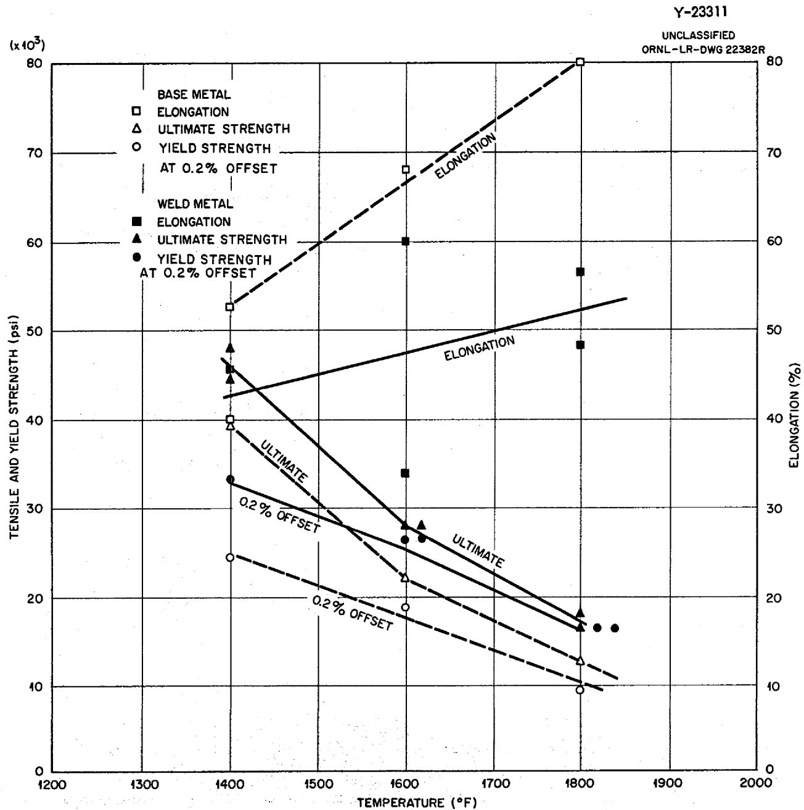  
Fig. 3.2.21. Tensile Properties of Inconel Weldments.

It may also be noted that at $1400^{\circ}\mathrm{F}$ the weld metal has a yield strength which is approximately $30\%$ greater than that of the base material; at $1600^{\circ}\mathrm{F}$ the yield strength of the weld is $35\%$ greater; and at $1800^{\circ}\mathrm{F}$ it is more than $70\%$ greater. It is readily apparent, therefore, that the weld should not deform appreciably at these temperatures in structures

with uniform stress distribution if service conditions comparable to the test conditions are assumed. In summary, Inconel welds appear to be considerably stronger in tension than the base material at temperatures from 1400 to $1800^{\circ}\mathrm{F}$ , a condition which may be desirable or undesirable depending on the stress distribution in service.

# BRAZING ALLOYS FOR INCONEL JOINTS

# Oxidation Studies

G. M. Slaughter

P. Patriarca

The results of static and cyclic oxidation studies, at $1500^{\circ}\mathrm{F}$ and at $1700^{\circ}\mathrm{F}$ , of joints brazed with a large number of alloys have been reported. Other commercial and developmental alloys have since become of interest, and the results of similar static

studies of these newer alloys are presented in Table 3.2.4. The static test results are compared in Table 3.2.5 with the results of cyclic tests. It is evident that the oxidation resistance of most of these alloys is excellent.

# Corrosion Studies

D. H. Jansen

E. E. Hoffman

In an effort to find brazing alloys that could be used in fabricating a NaK-to-fuel heat exchanger, the remainder of a series of high-nickel-content brazing alloys have been corrosion tested in the fuel mixture NaF-ZrF $_4$ -UF $_4$ (53.5-40-6.5 mole %,

Table 3.2.4. Oxidation Resistance of Dry-Hydrogen-Brozed Inconel T-Joints   

<table><tr><td rowspan="2">Brazing Alloy</td><td rowspan="2">Composition (wt %)</td><td colspan="3">Oxidation in Static Air at 1500°F*</td><td colspan="2">Oxidation in Static Air at 1700°F*</td></tr><tr><td>For 200 hr</td><td>For 500 hr</td><td>For 1300 hr</td><td>For 200 hr</td><td>For 500 hr</td></tr><tr><td>Handy &amp; Harman No. 93</td><td>93.3 Ni-3.5 Si-1.9 B-bal Fe and C</td><td>Slight</td><td>Slight</td><td>Slight</td><td>Moderate</td><td>Moderate</td></tr><tr><td>Handy &amp; Harman No. 91</td><td>91.3 Ni-4.5 Si-2.9 B-bal Fe and C</td><td>Slight</td><td>Slight</td><td>Slight</td><td>Slight</td><td>Slight</td></tr><tr><td>Handy &amp; Harman No. 82</td><td>82 Ni-4.5 Si-2.9 Cr-bal Fe and C</td><td>Slight</td><td>Slight</td><td>Slight</td><td>Slight</td><td>Slight</td></tr><tr><td>Handy &amp; Harman No. 72</td><td>72.5 Ni-5 Si-3.5 B-16 Cr-bal Fe and C</td><td>Slight</td><td>Slight</td><td>Slight</td><td>Slight</td><td>Slight</td></tr><tr><td>Rexweld No. 64</td><td>72.5 Ni-4 Si-3.5 B-15 Cr-4 Fe-1 C</td><td>Slight</td><td>Slight</td><td>Slight</td><td>Slight</td><td>Slight</td></tr><tr><td>Haynes No. 40</td><td>73 Ni-4 Si-3 B-14 Cr-0.4 C-bal others</td><td>Slight</td><td>Slight</td><td>Slight</td><td>Slight</td><td>Slight</td></tr><tr><td>Haynes No. 8244</td><td>74.5 Ni-3.5 Si-2 B-9.5 Cr-bal others</td><td>Slight</td><td>Slight</td><td>Slight</td><td>Slight</td><td>Slight</td></tr><tr><td>Coast Metals No. 52 with added boron</td><td>91.25 Ni-4.5 Si-3.25+ B-bal others</td><td>Slight</td><td>Slight</td><td>Slight</td><td>Slight</td><td>Slight</td></tr><tr><td>Special Microbraz No. 50</td><td>77 Ni-13 Cr-10 P + wetting agent</td><td>Slight</td><td>Slight</td><td>Slight</td><td>Complete</td><td>Complete</td></tr><tr><td>Coast Metals No. 53 + 1% Li</td><td>82.1 Ni-4.5 Si-2.9 B-7 Cr-3 Fe-0.5 others + 1% Li</td><td>Moderate (voids)</td><td>Moderate (voids)</td><td>Severe (voids)</td><td>Severe (voids)</td><td>Severe (voids)</td></tr><tr><td>Nicrobraz No. 130</td><td>4.5 Si-3.5 B-0.2 C-bal Ni</td><td>Slight</td><td>Slight</td><td>Slight</td><td>Slight</td><td>Slight</td></tr><tr><td>Colmonoy LM</td><td>5 Si-3 B-6 Cr-2.5 Fe-0.15 C-bal Ni</td><td>Slight</td><td>Slight</td><td>Slight</td><td>Slight</td><td>Slight</td></tr><tr><td>Commercial GE No. 81</td><td>10.2 Si-19 Cr-5 Fe-0.25 C-bal Ni</td><td>Slight</td><td>Slight</td><td>Slight</td><td>Slight</td><td>Moderate</td></tr><tr><td>Experimental Iron-Base</td><td>88.3 Fe-4.8 Si-2.8 B-4.1 Cu</td><td>Slight</td><td>Slight</td><td>Moderate</td><td>Moderate</td><td>Moderate</td></tr><tr><td>Experimental Palladium-Base Self-Fluxing</td><td>Pd-Li</td><td>Slight</td><td>Slight</td><td>Slight</td><td>Severe</td><td>Complete</td></tr><tr><td>Nicrobraz No. 150</td><td>3.4 B-15 Cr-0.15 C-bal Ni</td><td>Slight</td><td>Slight</td><td>Slight</td><td>Slight</td><td>Slight</td></tr><tr><td>Nicrobraz No. 60</td><td>9 Si-15 Mn-bal Ni</td><td>Slight</td><td>Slight</td><td>Slight</td><td>Slight</td><td>Slight</td></tr><tr><td>Nicrobraz No. 10</td><td>11 P-bal Ni</td><td>Slight</td><td>Moderate</td><td>Moderate</td><td>Complete</td><td>Complete</td></tr><tr><td>Nicrobraz No. 45</td><td>6 P-bal Ni</td><td>Moderate</td><td>Moderate</td><td>Moderate</td><td>Severe</td><td>Severe</td></tr><tr><td>L. C. Microbraz</td><td>4.5 Si-3.5 B-13.5 Cr-4.5 Fe-0.15 C-bal Ni</td><td>Slight</td><td>Slight</td><td>Slight</td><td>Moderate</td><td>Moderate</td></tr><tr><td>Cobalt-Modified Coast Metals No. 52</td><td>Coast Metals No. 52 + 20% Co</td><td>Slight</td><td>Slight</td><td>Slight</td><td>Moderate</td><td>Moderate</td></tr></table>

*Slight, 1 to 2 mils of penetration; moderate, 2 to 5 mils of penetration; severe, greater than 5 mils of penetration.

fuel 44) and in NaK (56-44 wt %) in a seesaw furnace apparatus at $1500^{\circ}\mathrm{F}$ for 100 hr. The specimens used for the tests were brazed Inconel tube-to-header joints. The alloys, their compositions, and the results of the individual tests are listed in Table 3.2.6.

The Microbraz No. 130 alloy, which exhibited the best corrosion resistance to both mediums, is shown in Fig. 3.2.22. The only bad feature of this alloy is that numerous voids were formed. This void formation is attributed to the brazing cycle, since the voids were present in the as-received specimens prior to etching. The composition of this alloy is nearly the same as the compositions

of two other brazing alloys (Handy and Harman Nos. 91 and 93) tested previously; the boron content differed slightly. It appears that with the alloys containing 91 to $93\%$ Ni, the porosity in the fillet is related to the amount of boron in the alloy. No porosity was found in Handy and Harman alloy No. 91 $(1.9\% \mathrm{B})$ , very little was observed in Handy and Harman alloy No. 93 $(2.9\% \mathrm{B})$ , but, as shown in Fig. 3.2.22, a considerable amount of porosity was found in the Microbraz No. 130 $(3.5\% \mathrm{B})$ .

In an effort to lower the melting point of the Coast Metals No. 52 alloy, $1 \text{wt} \%$ boron was added to the alloy mixture. The additional boron produced a

Table 3.2.5. Comparison of Static and Cyclic Oxidation Resistance of Dry-Hydrogen-Brazed Inconel T-Joints   

<table><tr><td rowspan="2">Brazing Alloy</td><td rowspan="2">Composition (wt %)</td><td colspan="2">Tested at 1500°F for 500 hr</td><td colspan="2">Tested at 1700°F for 500 hr</td></tr><tr><td>Static Test</td><td>Cyclic Test</td><td>Static Test</td><td>Cyclic Test</td></tr><tr><td>Handy &amp; Harman No. 93</td><td>93.3 Ni-3.5 Si-1.9 B-bal Fe and C</td><td>Slight</td><td>Slight</td><td>Moderate</td><td>Moderate</td></tr><tr><td>Handy &amp; Harman No. 91</td><td>91.3 Ni-4.5 Si-2.9 B-bal Fe and C</td><td>Slight</td><td>Slight</td><td>Slight</td><td>Slight</td></tr><tr><td>Handy &amp; Harman No. 82</td><td>82 Ni-4.5 Si-2.9 B-7 Cr-bal Fe and C</td><td>Slight</td><td>Slight</td><td>Slight</td><td>Moderate</td></tr><tr><td>Handy &amp; Harman No. 72</td><td>72.5 Ni-5 Si-3.5 B-16 Cr-bal Fe and C</td><td>Slight</td><td>Slight</td><td>Slight</td><td>Slight</td></tr><tr><td>Rexweld No. 64</td><td>72.5 Ni-4 Si-3.5 B-15 Cr-4 Fe-1 C</td><td>Slight</td><td>Slight</td><td>Slight</td><td>Slight</td></tr><tr><td>Haynes No. 40</td><td>73 Ni-4 Si-3 B-14 Cr-0.4 C-bal others</td><td>Slight</td><td>Moderate</td><td>Slight</td><td>Moderate</td></tr><tr><td>Haynes No. 8244</td><td>74.5 Ni-3.5 Si-2 B-9.5 Cr-bal others</td><td>Slight</td><td>Slight</td><td>Slight</td><td>Slight</td></tr><tr><td>Coast Metals No. 52 with added boron</td><td>91.25 Ni-4.5 Si-3.25+ B-bal others</td><td>Slight</td><td>Slight</td><td>Slight</td><td>Slight</td></tr><tr><td>Special Microbraz No. 50</td><td>77 Ni-13 Cr-10 P + wetting agent</td><td>Slight</td><td>Slight</td><td>Complete</td><td>Complete</td></tr><tr><td>Coast Metals No. 53 + 1% Li</td><td>82.1 Ni-4.5 Si-2.9 B-7 Cr-3 Fe-0.5 others + 1% Li</td><td>Moderate (voids)</td><td>Moderate (voids)</td><td>Severe (voids)</td><td>Severe (voids)</td></tr><tr><td>Nicrobraz No. 130</td><td>4.5 Si-3.5 B-0.2 C-bal Ni</td><td>Slight</td><td>Slight</td><td>Slight</td><td>Slight</td></tr><tr><td>Colmonoy LM</td><td>5 Si-3 B-6 Cr-2.5 Fe-0.15 C-bal Ni</td><td>Slight</td><td>Slight</td><td>Slight</td><td>Moderate</td></tr><tr><td>Commercial GE No. 81</td><td>10.2 Si-19 Cr-5 Fe-0.25 C-bal Ni</td><td>Slight</td><td>Slight</td><td>Moderate</td><td>Moderate</td></tr><tr><td>Experimental Iron-Base</td><td>88.3 Fe-4.8 Si-2.8 B-4.1 Cu</td><td>Slight</td><td>Moderate</td><td>Moderate</td><td>Moderate</td></tr><tr><td>Experimental Palladium-Base Self-Fluxing</td><td>Pd-Li</td><td>Slight</td><td>Slight</td><td>Complete</td><td>Complete</td></tr><tr><td>Nicrobraz No. 150</td><td>3.4 B-15 Cr-0.15 C-bal Ni</td><td>Slight</td><td>Slight</td><td>Slight</td><td>Slight</td></tr><tr><td>Nicrobraz No. 60</td><td>9 Si-15 Mn-bal Ni</td><td>Slight</td><td>Slight</td><td>Slight</td><td>Slight</td></tr><tr><td>Nicrobraz No. 10</td><td>11 P-bal Ni</td><td>Moderate</td><td>Moderate</td><td>Complete</td><td>Complete</td></tr><tr><td>Nicrobraz No. 45</td><td>6 P-bal Ni</td><td>Moderate</td><td>Severe</td><td>Severe</td><td>Severe</td></tr><tr><td>L. C. Microbraz</td><td>4.5 Si-3.5 B-13.5 Cr-4.5 Fe-0.15 C-bal Ni</td><td>Slight</td><td>Moderate</td><td>Moderate</td><td>Moderate</td></tr><tr><td>Cobalt-Modified Coast Metals No. 52</td><td>Coast Metals No. 52 + 20% Co</td><td>Slight</td><td>Slight</td><td>Moderate</td><td>Moderate</td></tr></table>

Test period: 100 hr  
Test temperature: $1500^{\circ}\mathrm{F}$ in hot zone

Table 3.2.6. Results of Corrosion Tests in Seesaw Furnaces of Brazed Inconel T-Joints Exposed to NaF-ZrF4-UF4 (53.5-40-6.5 mole %, fuel 44) and to NaK (56-44 wt %)   

<table><tr><td rowspan="2">Brazing Alloy Used</td><td colspan="2">Tested in Fuel 44</td><td colspan="2">Tested in NaK</td></tr><tr><td>Weight Loss (%)</td><td>Metallographic Notes</td><td>Weight Loss (%)</td><td>Metallographic Notes</td></tr><tr><td>Low-Melting Microbraz (83% Ni-6% Cr-5% Si-3% B-3% Fe)</td><td>0.05</td><td>Scattered subsurface voids to a depth of 2 mils; alloy depleted to same depth</td><td>0.04</td><td>Depleted to a depth of 3 mils; subsurface voids to a depth of 3 mils</td></tr><tr><td>Rexweld No. 64 (72.5% Ni-15% Cr-4% Fe-4% Si-3.5% B-1% C)</td><td>0.07</td><td>Depleted to a depth of 3 mils; subsurface voids to a depth of 2 mils</td><td>0.06</td><td>Particle leaching and void formation to a depth of 2 mils</td></tr><tr><td>General Electric No. 81 (65% Ni-19% Cr-10% Si-5% Fe-1% Mn)</td><td>0.17</td><td>Attack to maximum depth of 7 mils</td><td></td><td>Uniform attack to a depth of 3 mils</td></tr><tr><td>Nicrobraz No. 50 (74% Ni-13% Cr-10% P-3% others)</td><td>0.08</td><td>No attack or depleted alloy found; voids in fillet</td><td></td><td>Attacked to a depth of 5 mils</td></tr><tr><td>Nicrobraz No. 130 (92% Ni-4.5% Si-3.5% B)</td><td>0.01</td><td>Light, subsurface voids to a depth of 1 mil; numerous voids in body of fillet</td><td>0.03</td><td>Depleted to maximum depth of 3 mils</td></tr><tr><td>Coast Metals No. 52 plus boron (89% Ni-5% Si-4% B-2% Fe) + 1% B</td><td>0.007</td><td>Porous areas in fillet; fillet severely cracked</td><td>0.03</td><td>No attack or depletion; fillet severely cracked</td></tr><tr><td>Coast Metals No. 53 plus lithium (81% Ni-8% Cr-4% Si-4% B-3% Fe) + 1% Li</td><td>0.10</td><td>Alloy depleted to depth of 3 mils; voids present 1 mil from surface; porous areas in body of fillet</td><td>0.06</td><td>Depleted to a depth of 2 mils</td></tr></table>

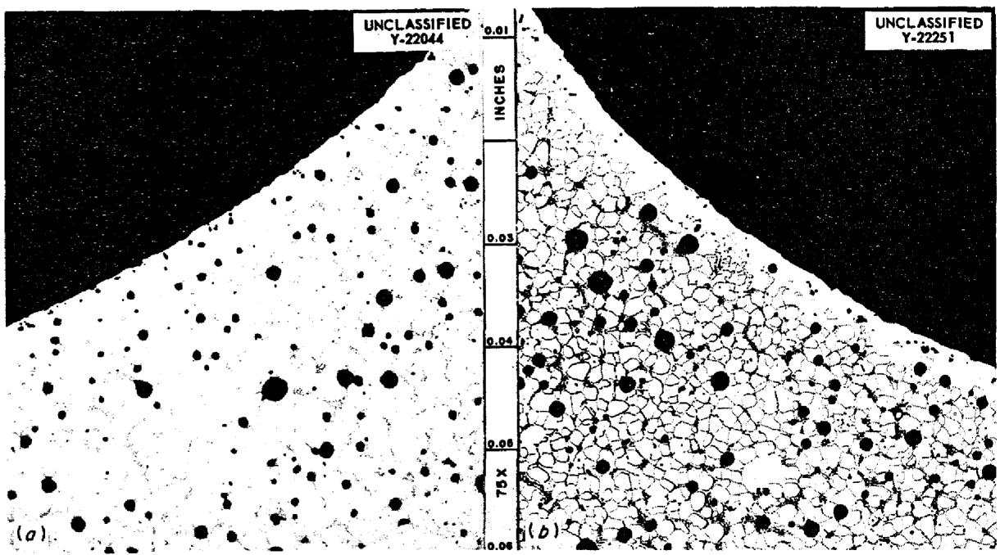  
Fig. 3.2.22. Microbraz No. 130 Brazing Alloy (92% Ni-4.5% Si-3.5% B) After Exposure to (a) NaF-ZrF $_4$ -UF $_4$ (53.5-40-6.5 mole %, fuel 44) and to (b) NaK (56-44 wt %) for 100 hr at $1500^{\circ}\mathrm{F}$ in Seesaw Furnace Apparatus. Note the limited attack and the porous areas formed throughout the fillet during brazing. Etchant: electrolytic oxalic acid. 75X. Reduced 16%. (Seesaw with caption)

brittle alloy that cracked during the brazing operation. The alloy obtained with the boron addition showed the same corrosion resistance to fuel 44 and to NaK as did the original Coast Metals No. 52 alloy.

A Coast Metals No. 53 alloy with $1\mathrm{wt}\%$ lithium added to increase flowability during the brazing operation also showed essentially the same corrosion resistance as the non-lithium-bearing Coast Metals No. 53 alloy when tested in fuel 44 and in NaK in the seesaw furnace apparatus.

The Handy and Harman alloys Nos. 91 and 93, which showed good resistance to the fuel $44,8$ have been tested in NaF-KF-LiF-UF $_4$ (11.2-41-45.3-2.5 mole $\%$ , fuel 107) at a hot-zone temperature of $1500^{\circ}\mathrm{F}$ for 100 hr in the seesaw furnace apparatus. Both alloys showed about the same resistance to fuel 107 under these conditions. Corrosion was limited to 3 to 4 mils of depletion of the minor constituents from the exposed edge

and the formation of small subsurface voids in the depleted region, as may be seen in Fig. 3.2.23.

Coast Metals alloy No. 52 was also tested in fuel 107 under the same conditions. Subsurface void formation was more extensive in this alloy than in the Handy and Harman alloys, as shown in Fig. 3.2.24.

# EFFECT OF GRAIN SIZE ON CORROSION OF INCONEL BY FUEL 30

J.H.Devan

R. S. Crouse

During the examination of the fuel circuit of the NaK-to-fuel heat exchanger ORNL-1, type IHE-3, unusually deep intergranular voids were found in tubes near the tube-to-header joints of the NaK outlet header. The Inconel tubing in this area had relatively large grains because of the heat treatment required to back-braze the tube-to-header joints. It was therefore of interest to determine whether the metallurgical changes accompanying the grain-coarsening heat treatment of Inconel could affect the corrosion resistance of

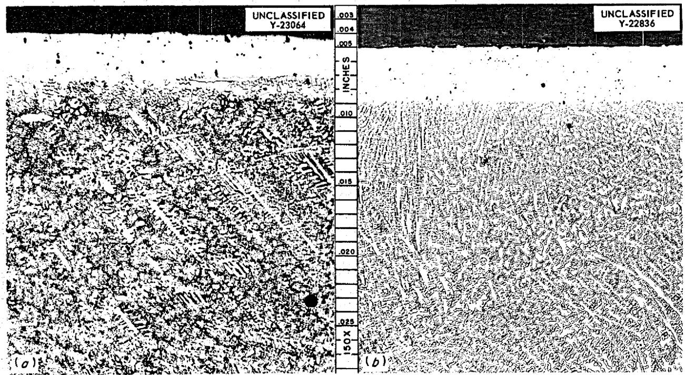  
Fig. 3.2.23. Brazing Alloys (a) Handy & Harman No. 91 and (b) Handy & Harman No. 93 After Exposure to NaF-KF-LIF-UF $_4$ (11.2-41-45.3-2.5 mole %, fuel 107) at $1500^{\circ}\mathrm{F}$ for 100 hr in Seesaw Furnace Apparatus. Etchant: 10% oxalic acid, electrolytic. 150X. Reduced 11%. (Secret with exception)

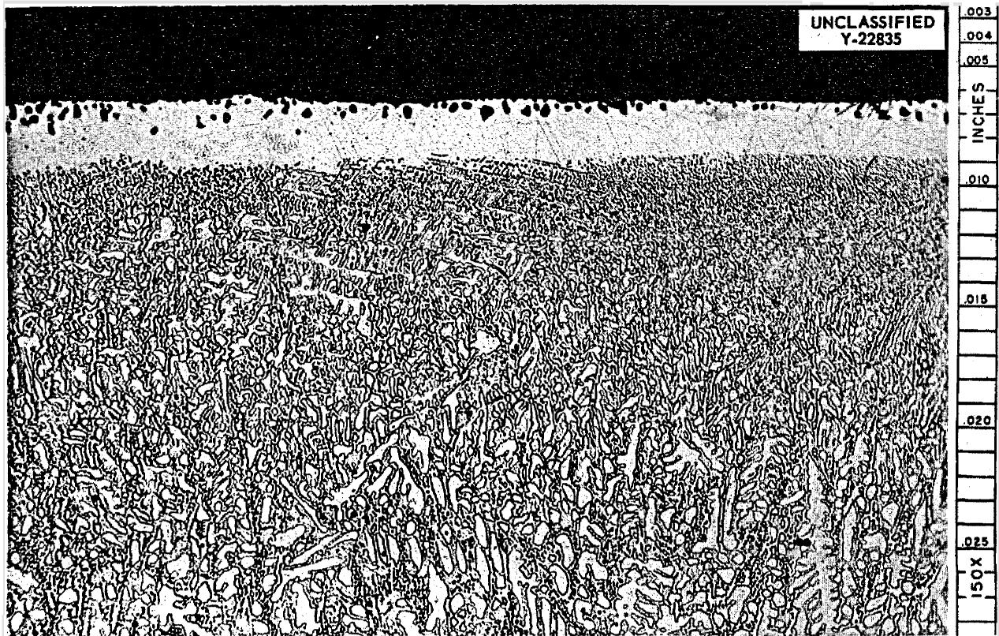  
Fig. 3.2.24. Coast Metals Brazing Alloy No. 52 (89% Ni-5% Si-4% B-2% Fe) After Exposure for 100 hr at $1500^{\circ}\mathrm{F}$ to NaF-KF-LIF-UF $_4$ (11.2-41-45.3-2.5 mole %, fuel 107) in a Seesaw Furnace Apparatus. Etchant: 10% oxalic acid, $^6$ electrolytic. 150X. (Saccat-with-eption)

this alloy in molten fluorides. Accordingly, an Inconel forced-circulation loop, 7641-50, was prepared with hot-leg sections which had been annealed at $1940^{\circ}\mathrm{F}$ for 2 hr in hydrogen. The annealing treatment was intended to produce grains similar to those formed during the furnace brazing of heat exchanger and radiator tubes. The loop was operated with $\mathrm{NaF - ZrF_4 - UF_4}$ (50-46-4 mole %, fuel 30) for 1000 hr with a maximum fuel-to-metal interface temperature of $1600^{\circ}\mathrm{F}$ and a minimum fuel temperature of $1300^{\circ}\mathrm{F}$ . Under similar conditions, a standard Inconel loop (ASTM grain size 4-8) would show 5 to 7 mils of general and intergranular subsurface void formation.

The sizes of the grains of the annealed sections, measured in both before-test and after-test samples, were very random, ranging from ASTM 5 to greater than ASTM 1 within a single sample. After-test samples taken from the point of maximum wall temperature revealed heavy general and intergranular void formation to a depth of 5.5 mils. In addition, a few scattered intergranular voids were visible to a depth of 12 mils, as shown in Fig. 3.2.25. Thus preferential grain-boundary attack,

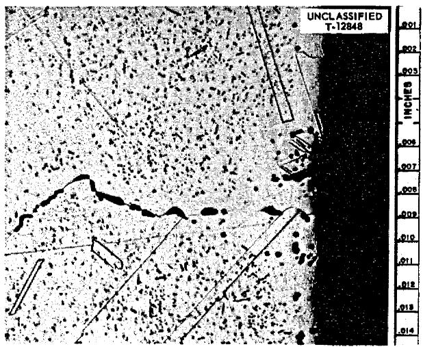  
Fig. 3.2.25. Intergranular Voids Formed During Operation of Inconel Forced-Circulation Loop 7641-50 for 1000 hr with Fuel 30. Heated sections of loop had been annealed at $1940^{\circ}\mathrm{F}$ for 2 hr prior to operation. Etchant: aqua regia, 250X. Reduced $29\%$ . (Geserat with caption).

such as that found in the examination of heat exchanger units, occurred to a limited extent in the coarse-grained sections of this Inconel loop.

Thermal-convection loop tests were run several years ago to evaluate grain-size effects, but little difference in the depth of attack was noted between as-received and annealed specimens.10 In re

viewing the previous tests, however, it appears that subsurface voids were much more concentrated in the grain boundaries of coarse-grained tubing than in the grain boundaries of fine-grained tubing. While the depth of the intergranular voids in the coarse-grained tubing did not greatly exceed the depth of voids in the grain matrix of fine-grained samples, such tests indicate the possibility of relatively deep attack under certain conditions of grain-boundary orientation in coarse-grained material.

# 3.3. WELDING AND BRAZING STUDIES

P. Patriarca

# EXAMINATION OF ALL-WELDED INCONEL IMPELLER THAT CRACKED IN SERVICE

G. M. Slaughter

The sump-type centrifugal pump (model DANA), which was used for circulating the fuel mixture $\mathrm{NaF - ZrF_4 - UF_4}$ (50-46-4 mole $\%$ fuel 30) in small heat exchanger test stand SHE-C, was found, during a routine examination after termination of a test, to have a cracked impeller. The all-welded Inconel impeller had operated for 2350 hr in the temperature range of 1200 to $1500^{\circ}\mathrm{F}$ , with the bulk of the operation at $1300^{\circ}\mathrm{F}$ . The location and the extent of the cracks in the welded vaneto-plate joint are shown in Fig. 3.3.1, and a photomicrograph of one of the cracks is presented in Fig. 3.3.2.

The impeller vane-to-plate welds were fabricated according to the weld joint design shown in

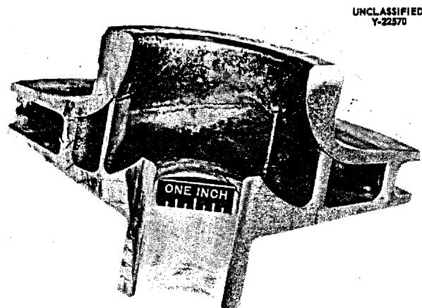

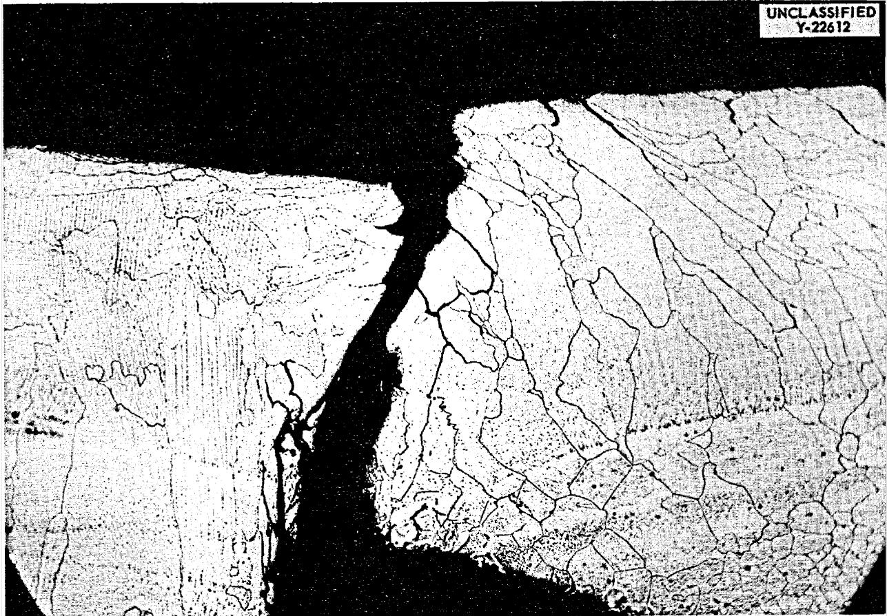  
Fig. 3.3.1. All-Welded Inconel Pump Impeller Showing Location and Extent of Cracks Found After Operation for 2350 hr in the Temperature Range of 1200 to $1500^{\circ}$ F with Fuel 30. (Secret with caption)   
Fig. 3.3.2. Photomicrograph of Weld Fracture Shown in Fig. 3.3.1. 100X. Etchant: electrolytic oxalic acid.

Fig. 3.3.3. It is evident that the fabrication procedure provided only a limited joint length where the vanes were welded to the top plate. Furthermore, the joint design and lack of accessibility permitted only very shallow weld penetration. This condition is exhibited in the upper left of Fig. 3.3.4, which shows a polished and macroetched section of the impeller. A modified fabrication procedure is now being used in which the joints are brazed for additional reinforcement and to improve reliability.

# BRAZED-JOINT CRACKING TESTS

G. M. Slaughter

Preliminary tests have been conducted to determine the extent of braze cracking during the fabrication of high-conductivity-fin NaK-to-air radiators at the York Corp. The cracks have resulted from the transverse shrinkage and distortion of the tube sheets during the deposition of the longitudinal welds of the headers.

As a means of simulating the conditions under which the cracking occurred, tube-to-header braze

fillets were prepared and then cracked by bending the headers. The degree of deformation obtained upon bending is apparent in Fig. 3.3.5, which shows the samples before and after bending. Bending of the header to the extent indicated produced cracks which were considered to be visually representative of those found in the radiators fabricated at the York Corp.

Metallographic examinations of the cracked joints revealed the cracks to be in the braze fillet. In no case did the cracks penetrate into the tubes or the tube sheet. A typical crack in the braze fillet is shown in Fig. 3.3.6.

Sample joints were then rebrazed with and without the use of additional Coast Metals No. 52 brazing slurry. The cracks appeared to completely heal in all cases. The addition of slurry to the fillet before rebrazing appeared to be advantageous, however, in that it permitted a more uniform fillet and provided an additional source of alloy for healing the cracks.

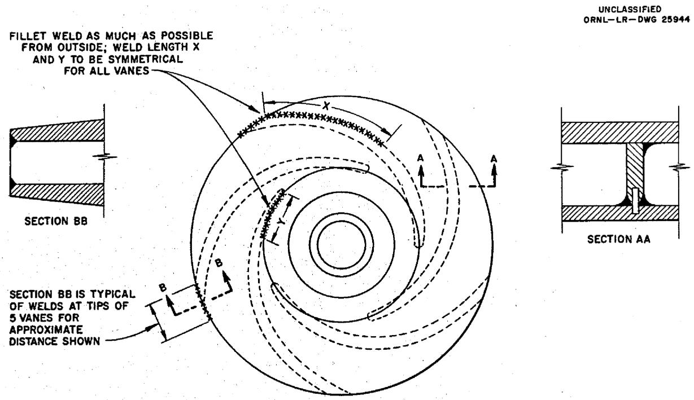  
Fig. 3-3.3. Weld Details of Impeller Vane-to-Plate Joints.

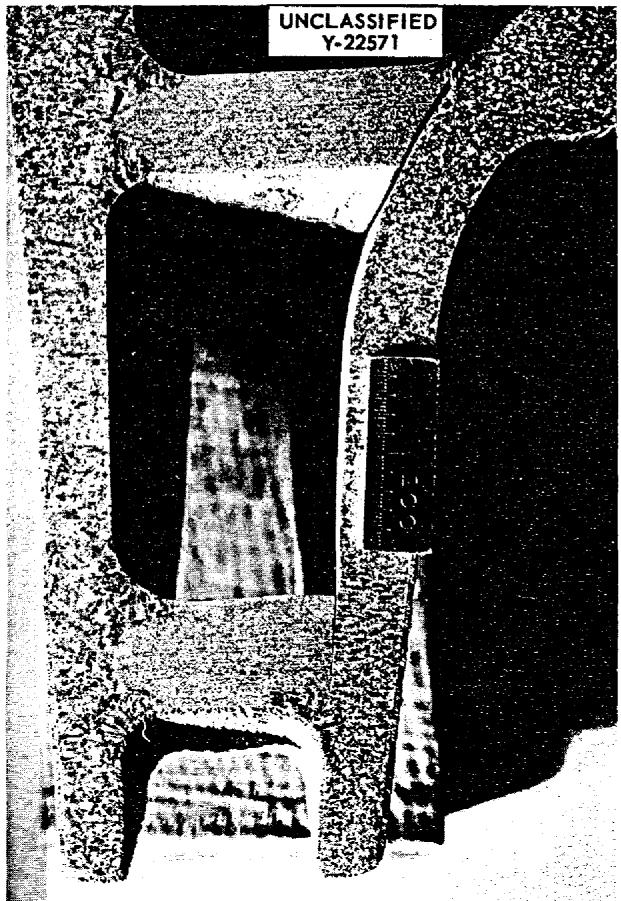  
Fig. 3.3.4. Vane-to-Plate Welds of All-Welded Inconel Impeller Fabricated According to Design Shown in Fig. 3.3.3.

# FABRICATION OF ART FUEL FILL-AND-DRAIN TANK

E. A. Franco-Ferreira G. M. Slaughter

As reported previously, a study of some of the problems associated with fabrication of the ART fuel fill-and-drain tank is under way. Specifically, tests are being run to establish suitable welding and brazing procedures for making the tube-to-tube sheet joints in the tank heads.

As a result of the high degree of restraint exerted by the $1\frac{1}{2}$ -in.-thick tube sheet, the tube-to-tube sheet welds, when made with the standard fusion procedure used for thinner tube sheets, have consistently exhibited root cracks of the type illustrated in Fig. 3.3.7. In order to produce

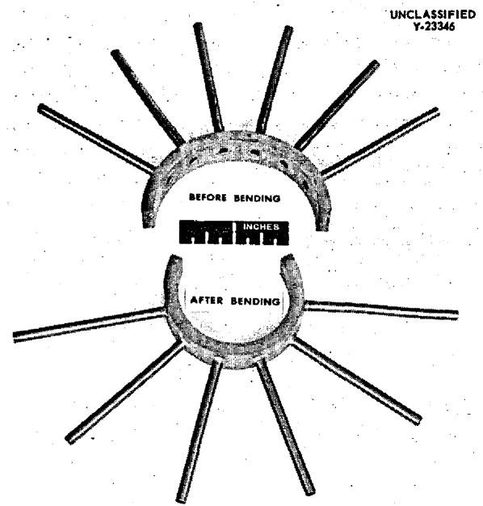  
Fig. 3.3.5. Simulated Tube-to-Header Joints for Braze-Cracking Tests.

joints free of such root cracks, a low restraint, trepanned type of joint was designed. The joint design and the welding procedure for obtaining crack-free welds are presented in Fig. 3.3.8. A machine welding method is preferred for the fabrication of these joints in order to assure consistency and reliability. Welds made according to the prescribed procedure are shown in Fig. 3.3.9.

Brazing experiments were also conducted in order to determine the proper amount of preplaced brazing alloy and the type of preplacement procedure to be used, as well as to evolve a suitable brazing cycle. Calculations were made to determine the amount of Coast Metals brazing alloy No. 52 required to fill a 0.003- to 0.004-in.-wide annulus between the $\frac{5}{8}$ -in.-OD tube and the $1\frac{1}{2}$ -in.-thick tube sheet. The results indicated that two brazing rings, each weighing approximately 1.3 g, would be required for the brazing of each tube.

The configuration of the specimens, that is, the thick tube sheet and the comparatively thin-walled tubes, posed additional problems. When the assembly is being heated to the brazing temperature (1920°F), the temperature of the massive tube sheet lags behind the temperature of the tubes. Several joints may be seen in

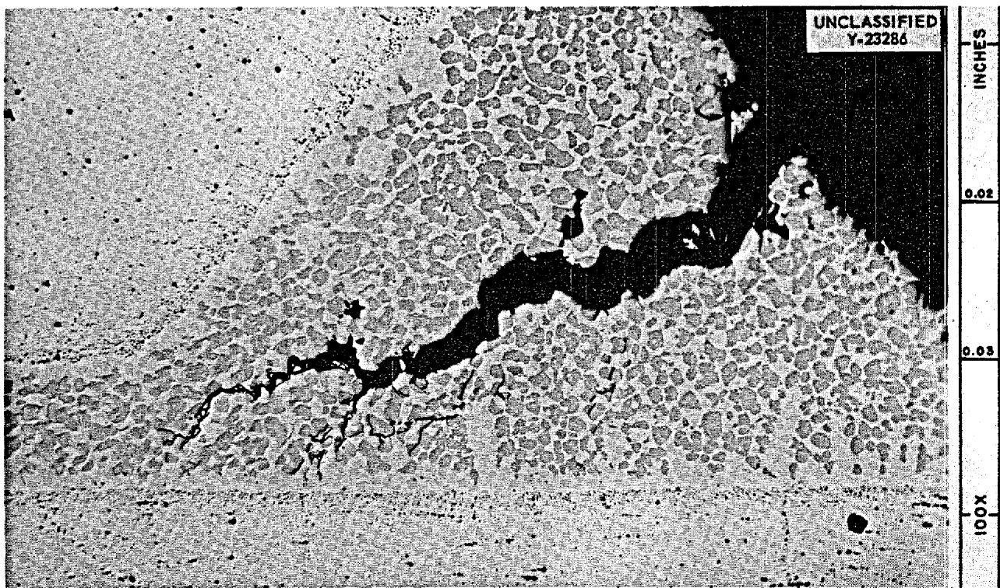  
Fig. 3.3.6. Typical Crack in Braze Fillet. 100X. As-polished.

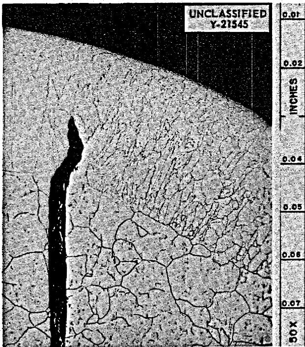  
Fig. 3.3.7. Root Crack in a Tube-to-Tube Sheet Joint Made Under Conditions of High Restraint. Etchant: electrolytic oxalic acid, $50\mathrm{X}$ .

Fig. 3.3.10 in which the brazing alloy failed to fillet because the ring melted around the hot tube and did not wet the cooler tube sheet. The use of radiation shielding, which minimized direct radiation on tubes from the heat source, produced the results shown in Fig. 3.3.11. Such shielding definitely improved the reliability of filleting, but the use of shielding would be impractical for the fabrication of the full-scale heads. Therefore a reliable brazing method has been developed which depends upon keeping the brazing alloy away from the tubes until the tube sheet has become hot enough to melt the alloy. In order to accomplish this, the brazing alloy is contained in annular sumps machined in the tube sheet around each tube. When the tube sheet reaches the brazing temperature, the brazing alloy flows into the space between the tubes and tube sheet through three holes which are drilled from each sump into the tube hole. A detail of the sump arrangement is shown in Fig. 3.3.8.

Both dry powder and cast rings were used successfully for the preplacement of the brazing alloy on the test specimens. When powder was used, the sumps were filled level with the tube

UNCLASSIFIED

ORNL-LR-DWG 25945

JOINT DESIGN:

$t = 0.060$ in., TREPAN DEPTH $= 2t$ TUBE, 0.625-in. OD

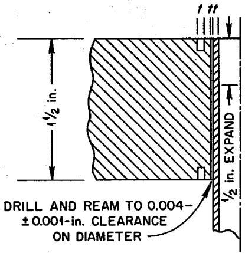

WELDING SEQUENCE:

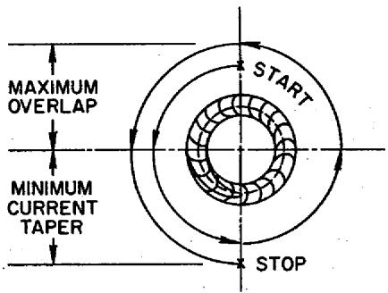

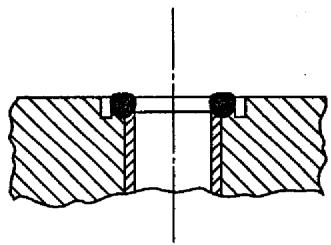

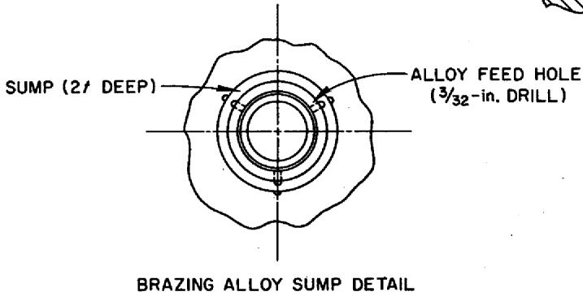  
Fig. 3.3.8. Joint and Welding Procedure Details for Tube-to-Tube Sheet Welds of ART Fill-and-Drain Tank. (Soccat with caption)

WELDING CONDITIONS:

MACHINE MADE WELD

CUP SIZE $= 3 / 8$ -in. OPENING

ELECTRODE-THORIATED TUNGSTEN $3 / 32$ in., POINTED

ELECTRODE PROJECTION - 1/4 in.

ELECTRODE SWING-0.640-in. DIAMETER

ARC DISTANCE-0.050 in.

ARGON FLOW THROUGH TORCH-45 TO 50 cfh

HELIUM BACKUP GAS FLOW-15 cfh

ARC CURRENT-58 TO 60 amp

ELECTRODE TRAVEL SPEED (PERIPHERAL) - 5 in./min

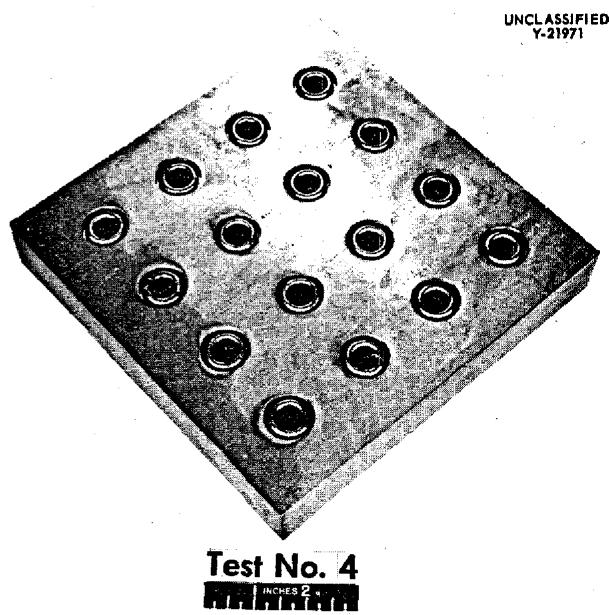  
Fig. 3.3.9. Tube-to-Tube Sheet Welds Made by Using the Optimum Welding Procedure Prescribed for Such Welds in the Heads of the ART Fuel Fill-and-Drain Tank. (Secret with caption)

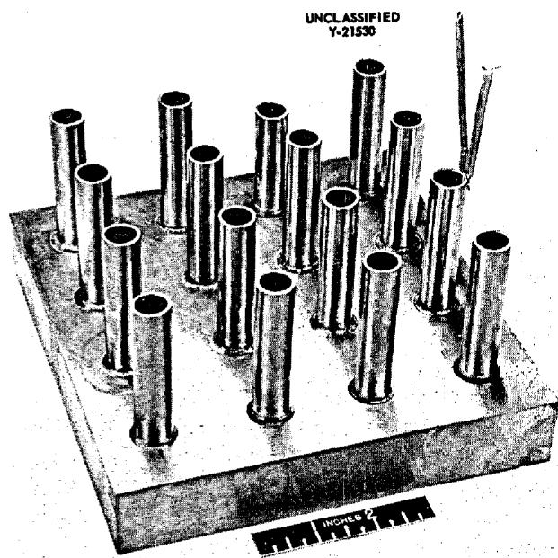  
Fig. 3.3.10. Tube-to-Header Joints Made at a Rate of Rise to Brazing Temperature of $300^{\circ}\mathrm{F/hr}$ Without Radiation Shielding.

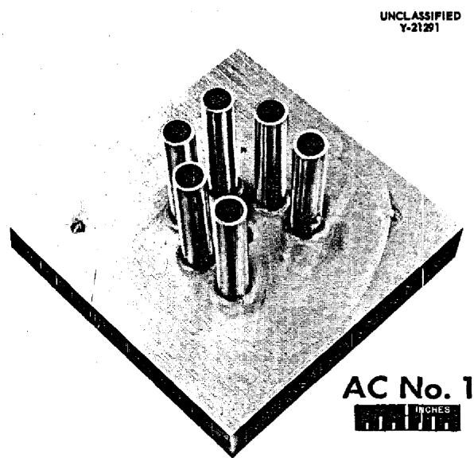  
Fig. 3.3.11. Tube-to-Header Joints Showing Good Fillets Obtained By Using Radiation Shielding.

sheet, and then the powder was wetted with Nicrobraz cement. The use of rings simplifies the preplacement procedure, but it is desirable to prime the rings with a small amount of powdered alloy wetted with Nicrobraz cement.

The brazing cycle finally decided upon provides for a rate of temperature rise of $300^{\circ}\mathrm{F / hr}$ to the brazing temperature of $1920^{\circ}\mathrm{F},$ 1 hr at that temperature, and cooling at a rate of $300^{\circ}\mathrm{F / hr}$ . The relatively low rate of temperature rise is required to avoid brazing alloy liquefaction before the massive header sheet has reached the brazing temperature.

# CORRELATION OF RADIographic AND METALLOGRAPHIC DETERMINATIONS OF POROSITY IN TUBE-TO-HEADER WELDS

G. M. Slaughter

The determination of porosity in tube-to-header welds by radiography requires the use of carefully developed procedures and skillful interpretation of the radiographic film. Further the geometry of tube-to-header joints containing small-diameter thin-walled tubes is so complex that a precise correlation of the results of radiographic and

metallographic examinations would be extremely beneficial. A preliminary study has therefore been conducted to obtain the basic information needed for such a correlation.

For this investigation, approximately 60 welds were made by inert-gas-shielded arc welding of short lengths of Inconel tubing, $3\%$ in. OD with 0.025-in. walls, into holes drilled on the circumference of sections of 3-in. sched-40 Inconel pipe. Each weld was given a designation before it was radiographed, and, after the films had been carefully examined, the locations of pores were noted on the weld specimens. Five welds that contained defects were then removed and the pores were located by alternately grinding and polishing, with a microscope being used frequently as a visual aid.

Gross porosity was found in every case where it was revealed in the radiographic examination. The sizes of the voids detected are summarized in Table 3.3.1. It may be seen that the pores in these five welds were relatively large and thus were readily detectable by careful radiographic examination. A similar investigation will be

Table 3.3.1. Sizes of Voids Detected in Tube-to-Header Welds by Radiographic Examination   

<table><tr><td>Wald No.</td><td>Defect Designation</td><td>Void Dimensions* (in.)</td></tr><tr><td>1</td><td>P-3-1-W6</td><td>0.013 × 0.011</td></tr><tr><td>2</td><td>P-3-1-W8</td><td>0.012 × 0.008</td></tr><tr><td>3</td><td>P-9-1-W6</td><td>0.009 × 0.009</td></tr><tr><td>4</td><td>P-16-2-W12</td><td>0.013 × 0.010</td></tr><tr><td>5</td><td>P-9-2-W12</td><td>0.010 × 0.008</td></tr></table>

*Void diameter was measured in two directions with a Filar eyepiece.

conducted in which finer pores, in the range of 0.003 to 0.005 in., will be studied in order to determine the limitations of detection by the radiographic method.

# FABRICATION OF SODIUM-TO-NaK HEAT EXCHANGERS

G. M. Slaughter

The brazing of the two sodium-to-NaK heat exchangers recently received for installation in

the ETU north head was observed at the Ferrotherm Corp. The brazing equipment, procedures, and general furnace cycles utilized were described previously in connection with the fabrication of radiators at the York Corp.2

During the brazing of heat exchanger No. 1, the exit dew point from the retort was approximately $-100^{\circ}\mathrm{F}$ throughout the brazing cycle. The spread of the readings of the four thermocouples at the start of the hold period was $6^{\circ}\mathrm{F}$ , from 1914 to $1920^{\circ}\mathrm{F}$ , and at the end of the hold period was $11^{\circ}\mathrm{F}$ , from 1921 to $1932^{\circ}\mathrm{F}$ . All thermocouples reached $1920^{\circ}\mathrm{F}$ at some point in the brazing cycle, but the maximum temperature attained was $1932^{\circ}\mathrm{F}$ . During the brazing of unit No. 2, the exit dew point from the retort was approximately $-95^{\circ}\mathrm{F}$ throughout the brazing cycle. The spread of the four thermocouples at the start of the hold period was $5^{\circ}\mathrm{F}$ , from 1918 to $1923^{\circ}\mathrm{F}$ , and at the end of the hold period it was $4^{\circ}\mathrm{F}$ , from 1920 to $1924^{\circ}\mathrm{F}$ . The maximum temperature attained was $1927^{\circ}\mathrm{F}$ .

Upon opening the retorts, the units were found to be clean and bright, and good filleting was evident at all tube-to-header joints. Minor brazing alloy run-off was noted at one header, but it is thought that this could be minimized in the future by the use of commercially available stop-off compounds. The two job samples, which were brazed at the same time as the complete units, were evaluated at ORNL and found to be satisfactory.

# INVESTIGATION OF MATERIAL FOR RADIATOR HEADERS

G. M. Slaughter

Several NaK-to-air radiator headers have been completely machined at York Corp. and are ready for welding to the tubes. York has reported, however, that these headers were fabricated from material which is difficult to weld. The welds made thus far have cracked and have been found to be porous. Further, there has been inconsistent penetration.

Consequently samples of the header material were transmitted to ORNL for examination and evaluation. Preliminary conventional machine

welding tests were conducted, and distinctly different welding behavior from that of normal Inconel was evident. The tube-to-header welds of the York material had a "grainy" appearance. Low-power examination and dye-penetrant inspection also revealed cracks in the welds.

In an attempt to determine the reason for the observed differences in welding characteristics, a metallographic comparison was made between the York material and some Inconel plates of known satisfactory welding characteristics. All samples of the questionable material were found to contain a quantity of inclusions (possibly oxides) distributed randomly as stringers. The samples of known satisfactory characteristics were relatively free of inclusions. The distribution and appearance of the stringers of the York material are shown in Figs. 3.3.12 and 3.3.13, and a typical area in material which has exhibited satisfactory welding behavior is shown in Fig. 3.3.14. The inclusions which appear as dots are probably titanium nitrides and were evident in all samples examined. Such inclusions are apparently unobjectionable. Efforts to positively establish the difference between these materials

by conventional chemical analysis were unsuccessful. Welding tests are being conducted on other lots of inspected Inconel pipe in an effort to provide the necessary quantity of suitable material for York.

# FABRICATION OF A SMALL SEMICIRCULAR HEAT EXCHANGER

E. A. Franco-Ferreira

The construction of a semicircular heat exchanger for experimental tests was undertaken. A description of the heat exchanger and the test objectives was presented previously. The initial planning and procedural experimentation have been completed, and it is expected that the first of the two heat exchangers being fabricated will be available soon.

The initial experiments, which were made in order to devise suitable welding and brazing procedures for the tube bundle, were performed on scrap material. An example of the experimental

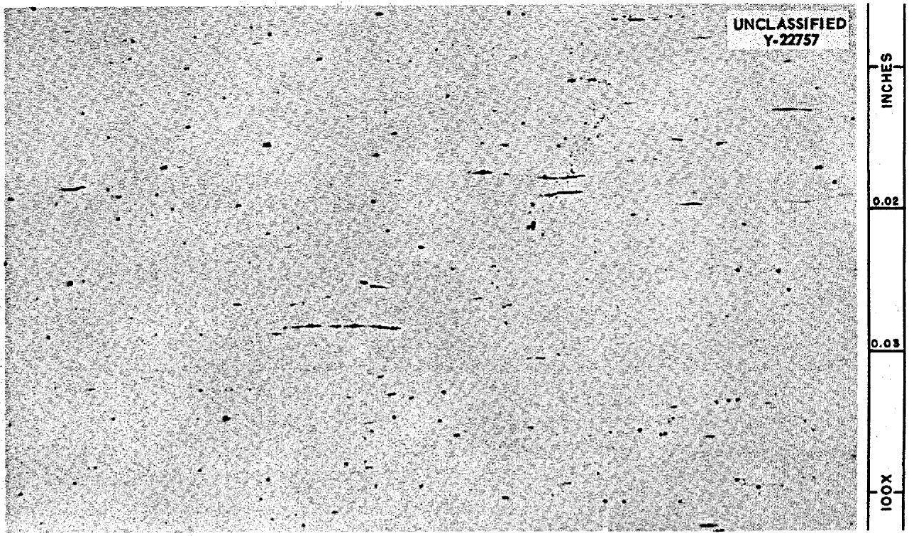  
Fig. 3.3.12. Stringers In Inconel Header Material Available at York Corp. As-polished, 100X.

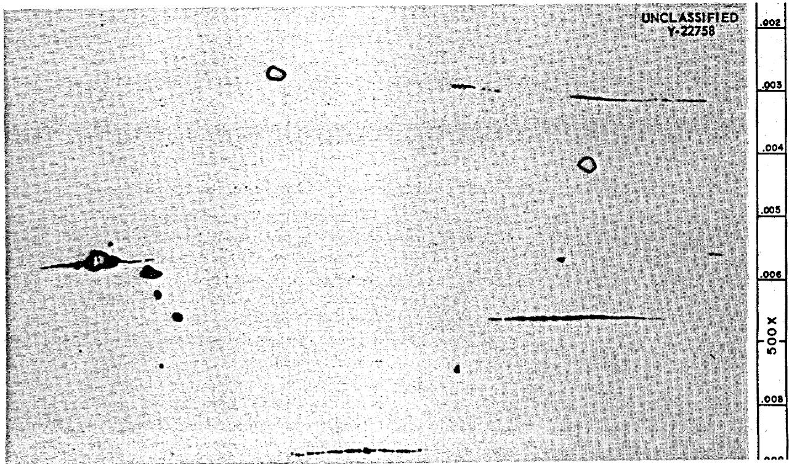  
Fig. 3.3.13. Stringers in Fig. 3.3.12 at a Higher Magnification. As-polished, 500X.

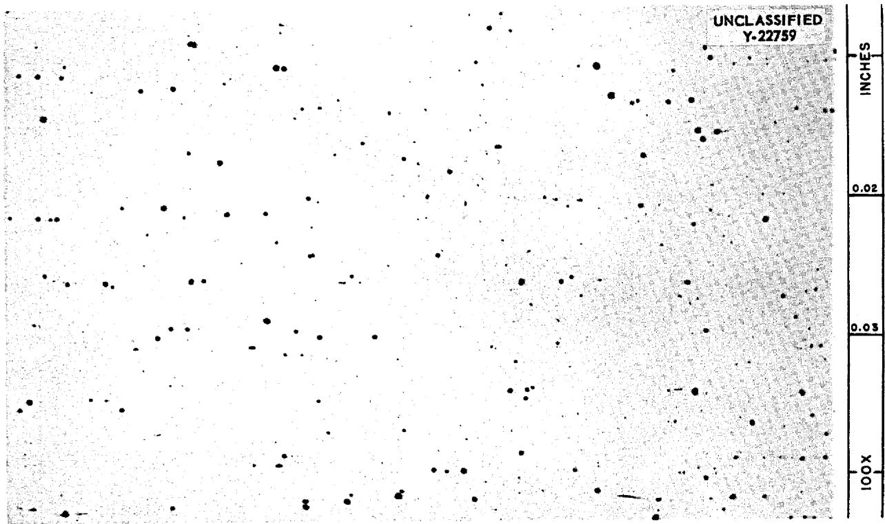  
Fig. 3.3.14. Inconel Which Exhibited Satisfactory Welding Characteristics. Note relative freedom from large stringers. As-polished, 100X.

results is shown in Fig. 3.3.15. Work was not started on the actual heat exchanger until all procedures had been carefully planned. The components of the heat exchanger are shown in Fig. 3.3.16. All parts were minutely checked before the assembly sequence was started.

Experimentation had shown that successful assembly of the tube bundle into the tube sheets, and subsequently, into the channel would depend primarily upon extreme accuracy in the bending of the tubes. Consequently the jig shown in Fig. 3.3.17 was built so that the tubes could be individually checked for conformity to the required dimensions. Thus, each tube in the heat exchanger was hand-picked for assembly by checking it as shown in Fig. 3.3.18.

In the course of assembly of the tubes into the tube sheets it was found that small inaccuracies in bending, even though within the specified tolerances, gave rise to undue stresses under the restraint of the comblike tube spacers. As a result, a decision was made to stress-relieve the tube bundle in the channel before welding and brazing the tube sheets. The tubes were assembled into the tube sheets, and the tube bundle

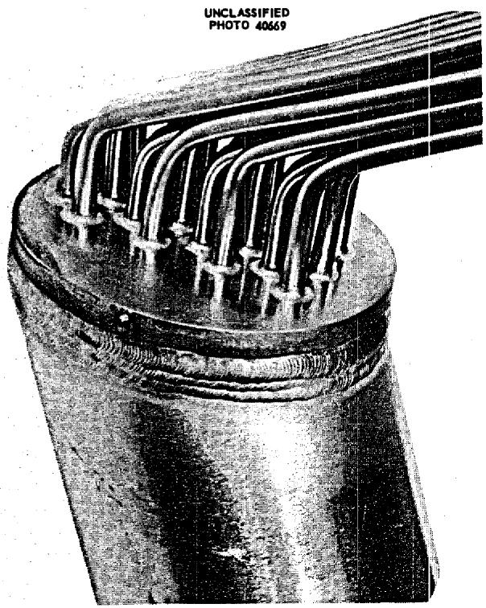  
Fig. 3.3.15. Preliminary Welded and Brazed Semi-circular Heat Exchanger Test Header. As-polished, 100X. Reduced $31\%$ .

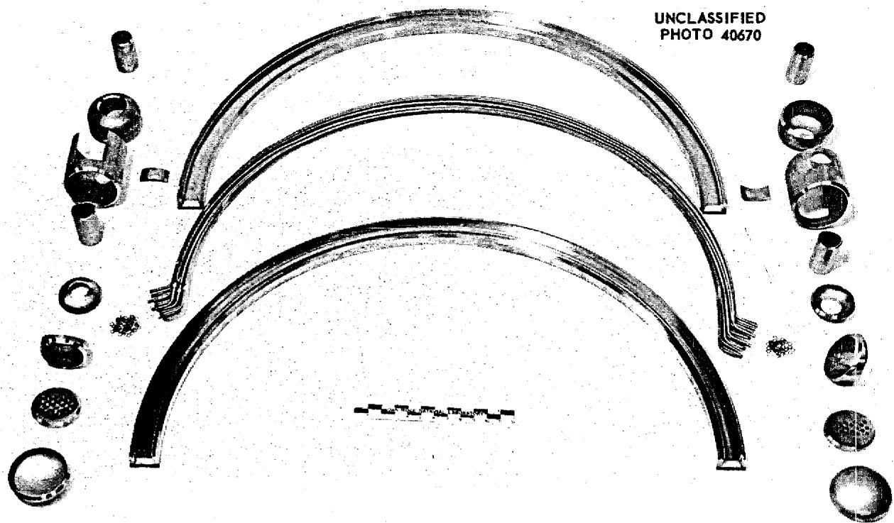  
Fig. 3.3.16. Components for Semicircular Heat Exchanger.

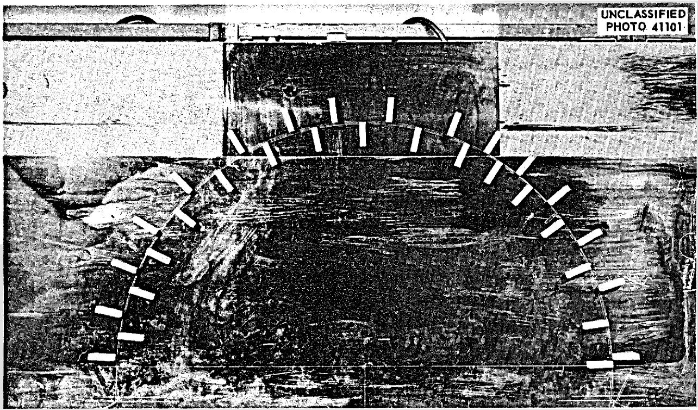  
Fig. 3.3.17. Jig for Checking Conformity of Tube Bending.

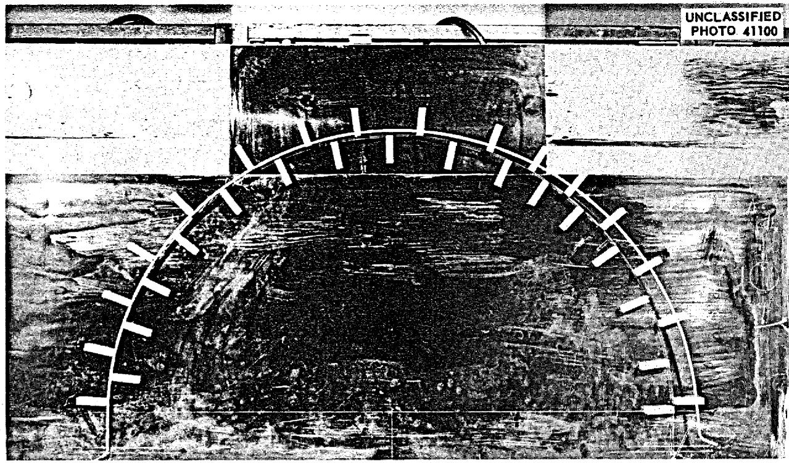  
Fig. 3.3.18. Tube Being Checked in Jig.

was placed into the channel with shim spacers between tubes. The resulting assembly, shown in Fig. 3.3.19, was stress-relieved in dry helium at $1500^{\circ}\mathrm{F}$ for 1 hr. After the stress-relief treatment, the comb spacers were welded into the tube bundle, and the tube sheet welds were made.

Assembly methods dictated that the tube ends protrude randomly beyond the tube sheets, as shown in Fig. 3.3.20. Since it is of prime importance that the distance between the face of the tube sheet and the first bend in each tube be known accurately, the distance that each tube end protruded beyond the tube sheet was measured accurately with a depth micrometer before the ends were cut off flush with the tube sheet. This measurement was correlated with the overall measurement of each tube before assembly, which was obtained by the photo-lofting technique illustrated in Fig. 3.3.21. The length of the cut-off portion was subtracted from the original length to obtain the required dimension.

The NaK inlet and outlet nozzles were welded to the tube sheets before the tube sheets were brazed. The assembly and the preplaced Coast Metals brazing alloy No. 52 rings are shown in Fig. 3.3.22. The tube sheets were then back brazed, one at a time, in a special, curved retort

which was placed in a pit furnace, as shown in Fig. 3.3.23. The remaining components are to be assembled by welding.

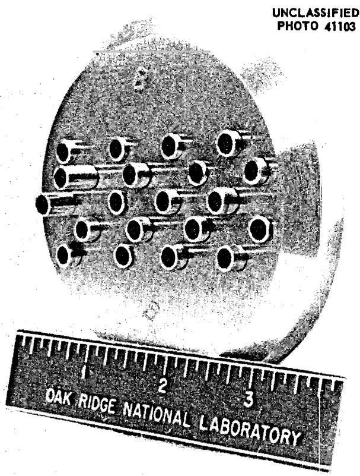  
Fig. 3.3.20. Tube Sheet with Tube Ends Protruding at Random Lengths.

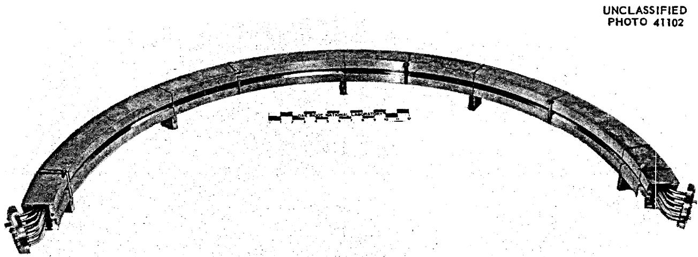  
Fig. 3.3.19. Assembled Heat Exchanger Jigged for Stress Relieving.

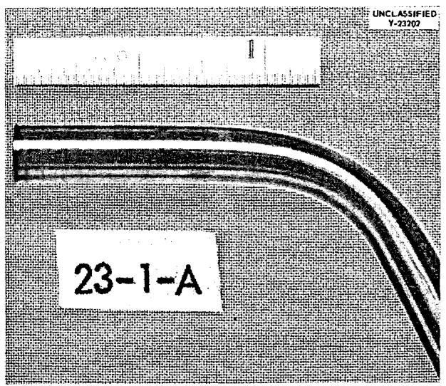  
Fig. 3.3.21. Method Used for Accurately Measuring Dimensions of Tube Bends.

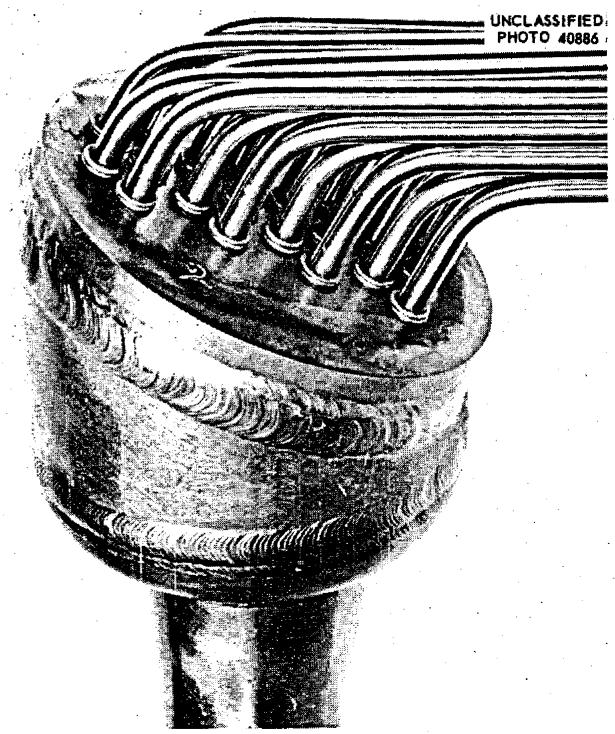  
Fig. 3.3.22. Header Assembly with Nozzles and Preplaced Coast Metals Brazing Alloy No. 52 Rings.

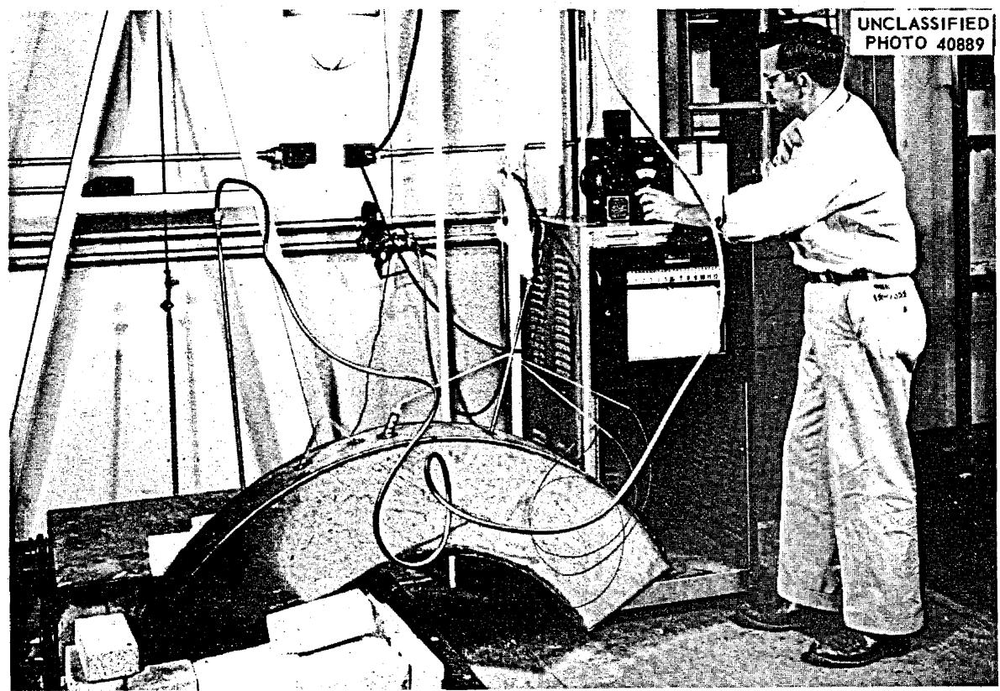  
Fig. 3.3.23. Special Curved Retort for Brazing the Tube Sheets of a Semicircular Heat Exchanger.

# 3.4. CORROSION AND MASS TRANSFER STUDIES

# CORROSION OF VANADIUM IN FLUORIDE FUEL AND IN LITHIUM

D. H. Jansen E. E. Hoffman

The possibility of using vanadium as a constituent of a container material for the fuel mixture NaF-KF-LiF-UF $_4$ (11.2-41-45.3-2.5 mole %, fuel 107) and for lithium is being studied. In order to investigate the effect of fuel 107, a vanadium capsule clad with type 347 stainless steel was filled to one-third its volume with the fuel and inserted in a seesaw furnace apparatus for 100 hr with the hot zone of the capsule at $1500^{\circ}\text{F}$ .

A considerable amount of mass transfer was found after the test in the cold zone of the capsule, as shown in Fig. 3.4.1. The crystals were found by chemical analysis to contain, in addition to vanadium, $0.95 \mathrm{wt} \%$ Fe, $0.21 \mathrm{wt} \%$ Ni, and $< 0.50 \mathrm{wt} \%$ Cr. Thus it appeared that the vanadium capsule material was not pure. An analysis of the material from which the capsule was fabricated showed traces of the same impurities with the same relative magnitudes. The fuel picked up approximately 700 ppm of vanadium during the test. The surface area-to-volume ratio of the capsule was 10 in.²/in.³.

Thickness measurements of the capsule indicated uniform removal of vanadium to a depth of 1.5 mils from the hot zone of the capsule,

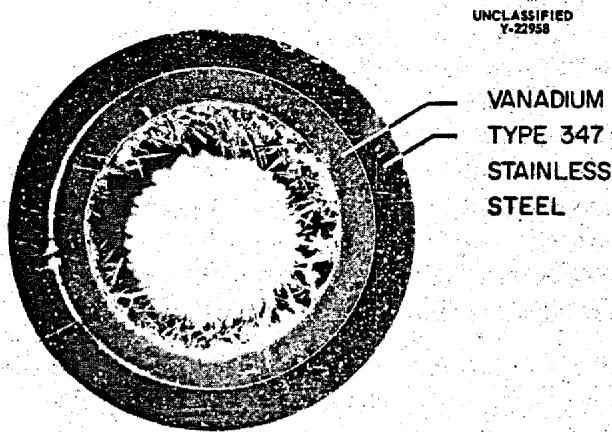  
Fig. 3.4.1. Cold Zone of Vanadium Capsule Exposed to Fuel 107 for 100 hr in Seesaw Furnace Apparatus with a Hot-Zone Temperature of $1500^{\circ}\mathrm{F}$ and a Cold-Zone Temperature of $1200^{\circ}\mathrm{F}$ . 5X. Reduced $35\%$ . (Secret with caption)

and there was intergranular attack to a depth of 1 mil, as shown in Fig. 3.4.2.

A static vanadium capsule filled with lithium was also tested for 100 hr at $1500^{\circ}\mathrm{F}$ . Slight surface roughening on the walls of the bath zone was the extent of the attack found after this test.

# MOLYBDENUM AND NIOBIUM IN CONTACT WITH LITHIUM

E. E. Hoffman

Molybdenum and niobium were tested in contact with lithium in a seesaw-furnace test for 500 hr with a hot-zone temperature of $1500^{\circ}\mathrm{F}$ and a cold-zone temperature of $950^{\circ}\mathrm{F}$ . The test capsule consisted of a molybdenum or a niobium cup enclosed in a jacket container of type 316 stainless steel, as shown in Fig. 3.4.3. The two types of capsules were loaded with lithium, placed in seesaw-furnace apparatus, and cycled at a rate of 1 cpm. The lithium bath was alternately in contact with the refractory metal at approximately $1500^{\circ}\mathrm{F}$ and with the stainless-steel cold zone at approximately $950^{\circ}\mathrm{F}$ . Following the test, the lithium was removed and the capsules were examined.

Metallographic inspection revealed no attack on either the molybdenum or the niobium hot-zone walls, as shown in Figs. 3.4.4 and 3.4.5. Type 316 stainless-steel specimens from the cold-zone walls showed less than 0.0005 in. of surface roughening and less than 0.0005 in. of scattered mass-transfer crystals. These small crystals were similar to crystals seen in previous experiments with lithium in all-stainless-steel systems.

Microspark spectrographic examination of the stainless-steel wall indicated no detectable increase of molybdenum or niobium in comparison with standard samples of type 316 stainless steel. The results of these tests indicate that under the conditions of these experiments, there was little tendency for dissimilar-metal mass transfer or temperature-gradient mass transfer of molybdenum or niobium to the stainless-steel wall.

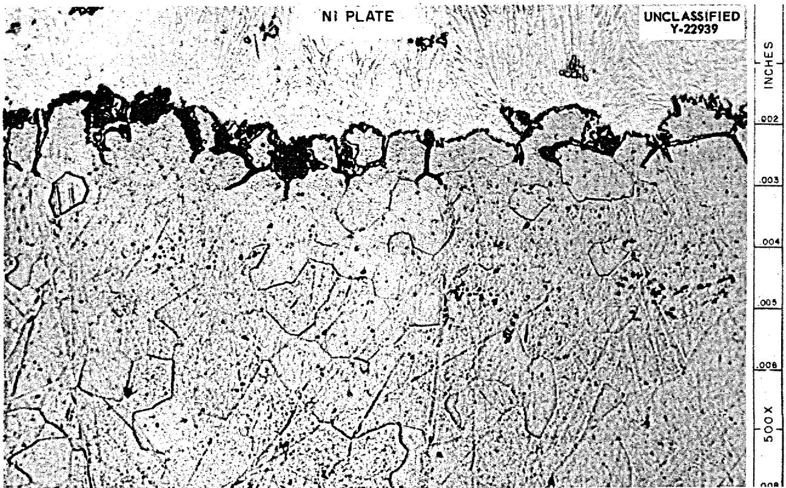  
Fig. 3.4.2. Intergranular Attack In Hot Zone $(1500^{\circ}\mathrm{F})$ of Vanadium Seesaw Test Capsule After Exposure for 100 hr to NaF-KF-LiF-UF $_4$ (11.2-41-45.3-2.5 Mole %, Fuel 107). 500X. Etchant: $\mathsf{NH}_4\mathsf{OH} + \mathsf{H}_2\mathsf{O}_2$ . (Seeret with toption).

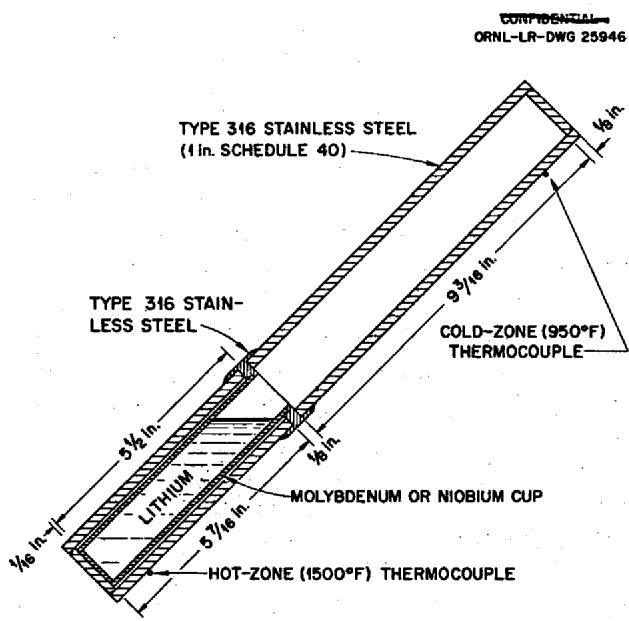  
Fig. 3.4.3. Seesaw Fumace Test Capsule.

# TUNGsten-NICKEL-COPPER ALLOY IN SODIUM

W.H.Cook E.E.Hoffman

Two specimens of the alloy Mallory 1000 (90% W-6% Ni-4% Cu), manufactured by P. R. Mallory and Company, Inc., were exposed to sodium for 100 hr in the hot zones (1500°F) of Inconel containers inserted in a seesaw-furnace apparatus cycled at a rate of 1 cpm. Mallory 1000 is being considered for use as a transition layer between tungsten carbide-cobalt cermets and Inconel in disk and seat brazed joints of sodium or NaK valves for use at high temperatures. One of the specimens was tested as-received and the other was heat treated at 1920°F for ½ hr in a furnace with heating and cooling rates of 300°F/hr. This heat treatment simulated a fabrication operation that would be involved in construction of the valves.

Metallographic examinations indicated that the specimens were equally attacked. The untested

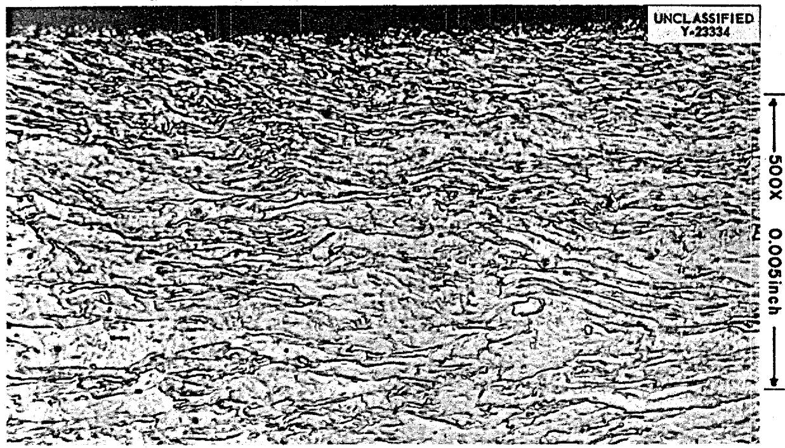  
Fig. 3.4.4. Wall of Molybdenum Capsule Following Exposure for 500 hr to Lithium in the Hot Zone of a Seesaw Furnace at $1500^{\circ}\mathrm{F}$ . Etchant: $50\% \mathrm{H}_2\mathrm{O}_2 + 50\% \mathrm{NH}_4\mathrm{OH}$ . 500X. (Secret with caption)

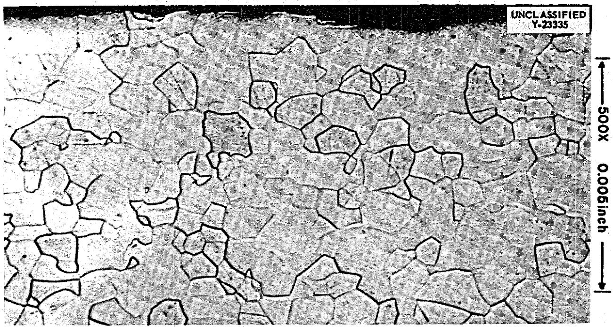  
Fig. 3.4.5. Wall of Niobium Capsule Following Exposure for 500 hr to Lithium in the Hot Zone of a Seesaw Furnace at $1500^{\circ}\mathrm{F}$ . Etchant: $\mathsf{HF} + \mathsf{H}_2\mathsf{O} + \mathsf{H}_2\mathsf{SO}_4 + \mathsf{HNO}_3$ . 500X. (Secret with caption)

and tested specimens are shown in Fig. 3.4.6. Sodium had completely penetrated each specimen (nominal dimensions: $\frac{1}{32} \times \frac{1}{4} \times \frac{1}{2}$ in.). The untested specimens had pore-space areas that constituted approximately $1\%$ of the microscopic field of view, while the pore-space areas of the tested specimens constituted approximately $4\%$ of the field. The attack appeared to have enlarged existing pores and created new ones. Each specimen had a weight loss of $1.3\%$ . Apparently, the quantity of copper present in Mallory 1000 is sufficient to cause this material to be of doubtful value for long exposure to sodium or NaK at $1500^{\circ}\mathrm{F}$ .

# TUNGSTEN CARBIDE- AND TITANIUM CARBIDE-BASE CERMETS IN SODIUM

W.H.Cook E.E.Hoffman

Three types of tungsten carbide- and titanium carbide-base cermets were exposed for 100 hr to sodium at $1200^{\circ}\mathrm{F}$ in Inconel capsules inserted

in a seesaw-furnace apparatus. The designations and compositions of the cermets are given in Table 3.4.1. These corrosion tests were part of over-all evaluation tests to determine the suitability of these materials as seat components of valves for sodium or NaK service at $1000^{\circ}\mathsf{F}$ . The specimens were tested at $1200^{\circ}\mathsf{F}$ rather than at $1000^{\circ}\mathsf{F}$ in an attempt to make the corrosion, if any, severe enough so that the differences in corrosion resistance would be more apparent; however, metallographic examinations of the tested specimens indicated that they were not attacked.

It is interesting to note that K162B was attacked by sodium to a depth of 0.0005 in, in a similar test in which the temperature1 was $1500^{\circ}\mathrm{F}$ .

W. H. Cook, ANP Quar. Prog. Rep. March 31, 1957, ORNL-2274, p 171.

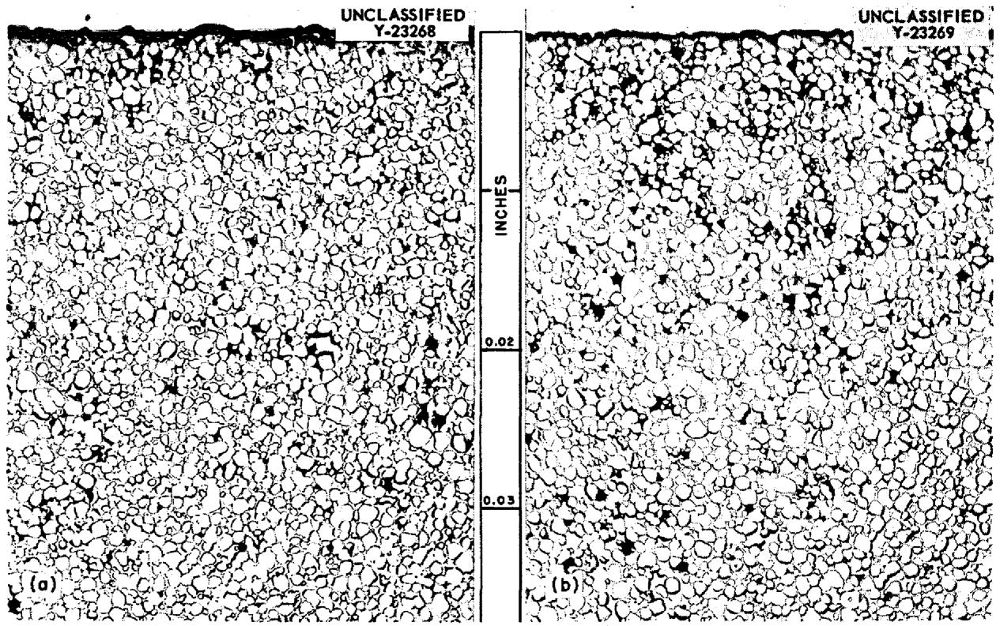  
Fig. 3.4.6. Mallory 1000 (90% W-6% Ni-4% Cu) (a) As-Received and (b) After Exposure for 100 hr to Sodium at $1500^{\circ}\mathrm{F}$ in an Inconel Container in Seesaw Furnace Apparatus. The globular particles are tungsten; the black areas are voids. 100X. Unetched.

Table 3.4.1. Designations and Compositions of Cermets Tested in Sodium at ${1200}^{ \circ  }\mathrm{F}$ In Seesaw Furnace Apparatus   

<table><tr><td rowspan="2">Designation*</td><td rowspan="2">Primary Component</td><td colspan="8">Chemical Composition (wt %)</td></tr><tr><td>Co</td><td>Ni</td><td>Mo</td><td>W</td><td>Ti</td><td>Ta</td><td>Nb</td><td>C</td></tr><tr><td>K94</td><td>WC</td><td>11.75</td><td></td><td></td><td>80.6</td><td></td><td>1.4</td><td>0.6</td><td>5.4</td></tr><tr><td>KM</td><td>WTiC2</td><td>10.75</td><td></td><td></td><td>68.5</td><td>6.7</td><td>5.4</td><td>1.7</td><td>6.7</td></tr><tr><td>K162B</td><td>TiC</td><td></td><td>25</td><td>5</td><td></td><td>52.1</td><td>0.3</td><td>4.5</td><td>13.1</td></tr></table>

*These cermets are manufactured by Kennametal, Inc., and the designations and compositions given are those stated by the manufacturer.

# EXPERIMENTAL STUDIES WITH MOLTEN LITHIUM

E. E. Hoffman T. Hikido

Reports have been received from NDA covering the fiscal year 1957 subcontract studies of corrosion by lithium at high temperatures. The principal reports issued during the year are listed below:

1. Determination of Nitrogen in Lithium by N. I. Sax, N. Chu, R. W. Miles, and R. H. Miles, NDA-38;   
2. Purification of Lithium by Vacuum Distillation by W. Arbiter and S. Lazerus, NDA-39;   
3. Effect of Nitrogen on Corrosion by Lithium by J. M. McKee, NDA-40;   
4. A Method for Determining the Solution Rate of Container Metals in Lithium by M. Kolodney and B. Minushkin, NDA-41;   
5. Progress on Lithium Experimental Program During June, 1957, NDA Memo 75-18.

A brief summary of the recent work is presented here to bring up to date the progress reported previously.4

An analytical procedure for the determination of nitrogen was developed that is satisfactory for concentrations as low as 10 ppm. No completely satisfactory method has yet been found, however, for measuring low concentrations of oxygen in lithium despite considerable effort.

Solution rate studies of stainless steel specimens (principally type 304 stainless steel) have continued. The base-line solution rates observed in this study at $1600^{\circ}\mathrm{F}$ (1.1 to $0.48\mathrm{mg / in.}^{2 - hr}$ ) were of the same order of magnitude as the rate of weight loss of specimens suspended in the hot legs of thermal-convection loops $(0.83, \mathrm{mg / in.}^{2 - hr})$ in which lithium was circulated for approximately 100 hr at a hot-leg temperature of $1600^{\circ}\mathrm{F}$ . Additions of nitrogen or oxygen (approximately 1000 ppm) were found to increase the solution rate by factors that varied from 1.5 to 3 in 4-hr tests. The test apparatus is particularly suitable for the screening of corrosion-resistant materials and for comparing the effects of additives and lithium impurities on the solution process. The main limitation of the apparatus is the lack of an inert container in which to perform the solution rate studies. It is hoped, however, that molybdenum will be a satisfactory inert container.

Several type 316 stainless steel-lithium thermal-convection loop tests have been completed. These tests were conducted with a hot-leg temperature of $1600^{\circ}\mathrm{F}$ , a cold-leg temperature at $1100^{\circ}\mathrm{F}$ , and a lithium velocity of 7 to 8 bpm. The results of the tests have indicated that, in general, the rate of loss of hot-leg weight increased with increased nitrogen contamination of the lithium. The lowest rate of weight loss in the 11 loop tests was approximately $60\mathrm{mg / in}$ .2 in 100 hr, which represents quite heavy and rapid attack. It was concluded that further efforts to reduce this type of corrosion by still further elimination of nitrogen from the lithium were not justified. Only two of eleven loops completed the scheduled 500-hr test without plugging.

The nine loops plugged in times that ranged from 31 to 457 hr. The weights of the crystals found in the loops varied from approximately 1 to 4 g.

Mass-transfer crystals were taken from five locations in each of eight different loops for analysis. The compositions of the crystals varied considerably from sample to sample, but the compositions are fairly well represented by the overall average composition shown in Table 3.4.2. As may be seen from the composition, the crystals were high in chromium, nickel, and manganese content in comparison with the base material. Present plans call for continuation of this study with primary emphasis on refractory metals and corrosion inhibitors.

# INERT ATMOSPHERE CHAMBER FOR THERMAL-CONVECTION LOOP TESTING OF NONOXIDATION-RESISTANT MATERIALS

E. E. Hoffman L. R. Trotter

A stainless steel inert-atmosphere chamber in which thermal-convection loop tests may be conducted was recently constructed. This device was built so that nonoxidation-resistant materials, such as the refractory metals, could be tested in the unclad condition, since attempts to clad molybdenum and niobium with oxidation-resistant alloys have been generally unsatisfactory. Almost invariably, the refractory metals have cracked either during the cladding operation or during the corrosion test, and therefore the corroding medium (sodium, lithium, or fused salt) has contacted both the refractory metal and the cladding metal during the test. A typical crack is shown in Fig. 3.4.7. Other methods of protecting niobium from oxidation are being studied, but none have been perfected to date.

The essential features of the inert-atmosphere chamber are shown in Fig. 3.4.8. Thermal-convection loops may be operated in the chamber either under a vacuum of less than $5\mu$ or with an atmosphere of purified helium or argon. A stainless steel liner is incorporated in the chamber that serves as a thermal-radiation shield for the outer walls. The liner would also simplify cleaning of the chamber walls if a loop leaked.

Several preliminary tests of the chamber have been conducted in order to determine the effectiveness of the system in protecting several

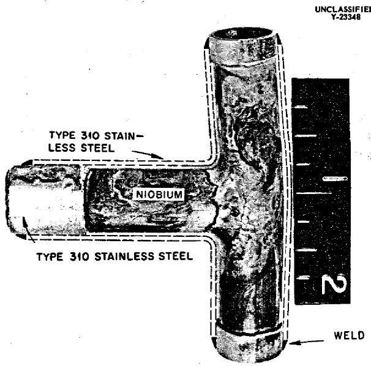  
Fig. 3.4.7. Saddle-Weld Section of a Type 310 Stainless-Steel-Clad Niobium Thermal-Convection Loop After Exposure to Lithium for 500 hr. The stainless steel cladding of the saddle weld was stripped off after completion of the test. The crack occurred during startup or operation of the loop.

Table 3.4.2 Averages of Analyses of Mass-Transfer Crystals Found in Eight Lithium-Type 316 Stainless Steel Thermal-Convection Loops Compared with Analysis of As-Received Stainless Steel Pipe   

<table><tr><td rowspan="2"></td><td colspan="5">Average Content (wt %)</td></tr><tr><td>Fe</td><td>Cr</td><td>Ni</td><td>Mn</td><td>Mo</td></tr><tr><td>Mass-transfer crystals*</td><td>55.9</td><td>22.5</td><td>18.0</td><td>3.3</td><td>1.2</td></tr><tr><td>As-received pipe</td><td>64.9</td><td>17.4</td><td>12.1</td><td>1.8</td><td>2.2</td></tr></table>

*These data were compiled from a report by J. M. McKee, Effect of Nitrogen on Corrosion by Lithium, NDA-40 (June 14, 1957).

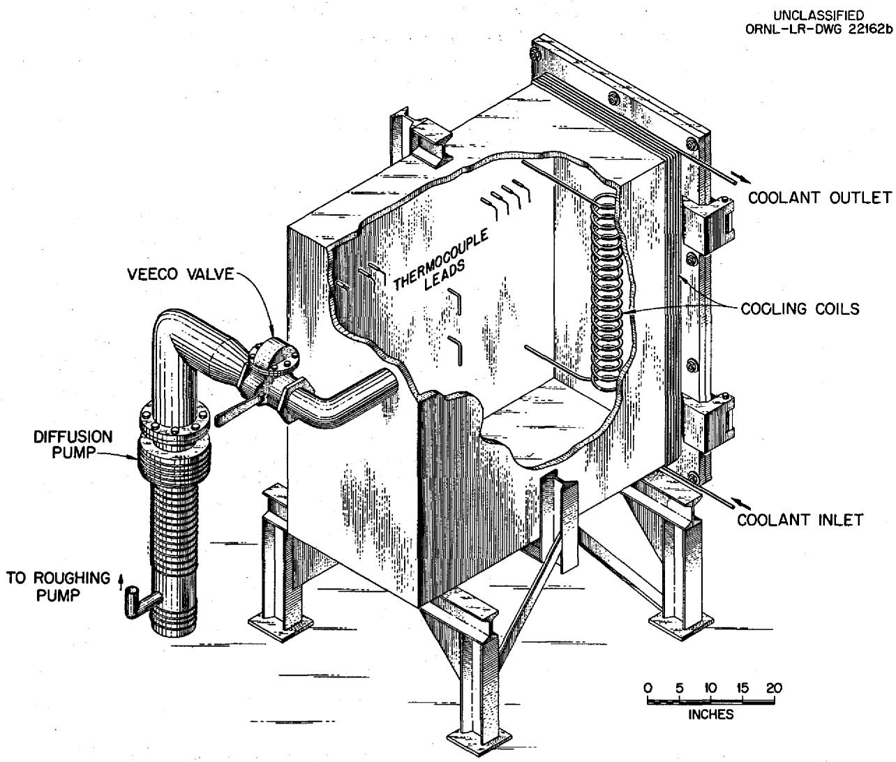  
Fig. 3.4.8. Inert-Atmosphere Chamber for Testing Thermal-Convection Loops Constructed of Nonoxidation-Resistant Materials.

refractory metals from oxidation at elevated temperatures. In the first test, specimens of molybdenum and niobium were suspended in a furnace inside the chamber (argon atmosphere) and heated to $1700^{\circ}\mathrm{F}$ for 23 hr and $2100^{\circ}\mathrm{F}$ for 1 hr. The specimens showed weight gains of 0.1 and $0.5\mathrm{mg / in.}^2$ respectively. In a second, more comprehensive experiment, specimens of four refractory metals were heated to $1700^{\circ}\mathrm{F}$ for 24 hr in evacuated Inconel capsules and in the inert atmosphere chamber filled with argon at a pressure of 14.7 psi. Hardness measurements of these specimens are compared with the hardness of the as-received material in Table 3.4.3. The

hardness values indicate that in all cases the specimens tested in the chamber were softer than as-received material but not substantially different from the specimens tested in the evacuated capsules. The weight-change data, which were obtained only for the specimens tested in argon, indicate that the argon atmosphere was very pure.

Since these results were encouraging, two attempts were made to operate unclad niobium thermal-convection loops in the chamber. In both tests, leaks developed in the saddle-weld areas of the loops. These welds had been made in a dry box in an atmosphere of high-purity argon.

Table 3.4.3. Hardness of Various Refractory Metals As Received and After Being Heated for 24 hr at $1700^{\circ}$ F in an Evacuated Inconel Capsule or in an Inert-Atmosphere Chamber   

<table><tr><td></td><td>Diamond Pyramid Hardness (500-g load)</td><td>Weight Change (mg/in.2)</td></tr><tr><td>Niobium</td><td></td><td></td></tr><tr><td>As received</td><td>212</td><td></td></tr><tr><td>Heated in vacuum</td><td>152</td><td></td></tr><tr><td>Heated in argon</td><td>160</td><td>0</td></tr><tr><td>Molybdenum</td><td></td><td></td></tr><tr><td>As received</td><td>215</td><td></td></tr><tr><td>Heated in vacuum</td><td>207</td><td></td></tr><tr><td>Heated in argon</td><td>210</td><td>-0.1</td></tr><tr><td>Titanium</td><td></td><td></td></tr><tr><td>As received</td><td>246</td><td></td></tr><tr><td>Heated in vacuum</td><td>253</td><td></td></tr><tr><td>Heated in argon</td><td>227</td><td>+5.4</td></tr><tr><td>Zirconium</td><td></td><td></td></tr><tr><td>As received</td><td>165</td><td></td></tr><tr><td>Heated in vacuum</td><td>119</td><td></td></tr><tr><td>Heated in argon</td><td>122</td><td>+2.5</td></tr></table>

Further tests of niobium will be attempted with loops fabricated by Fansteel Metallurgical Corporation. The saddle welds of these loops are fabricated according to the unique design shown in Fig. 3.4.9, and it is hoped they will not crack.

# FORCED-CIRCULATION LOOP TESTS OF SODIUM IN HASTELLOYS, INCONEL, AND STAINLESS STEEL

J. H. DeVan R. S. Crouse

Two forced-circulation loops, one fabricated of Inconel (loop 7426-26) and the other of Hastelloy B (loop 7642-3), were operated with sodium for 2000 hr in order to evaluate the comparative amounts of mass transfer that would occur in these systems over relatively long periods of time. The maximum sodium temperature in both loops was $1500^{\circ}\mathrm{F}$ , and a $300^{\circ}\mathrm{F}$ temperature drop was maintained between hot- and cold-leg sections. The loops also contained by-pass cold traps to

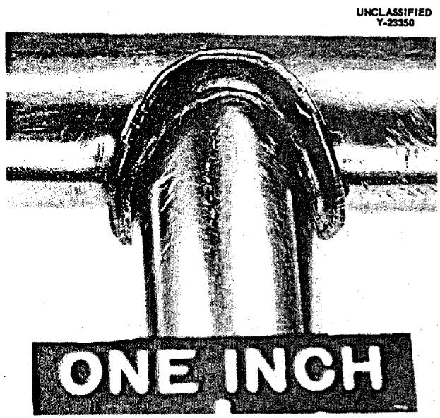  
Fig. 3.4.9. Niobium Tubing Saddle Weld.

establish and maintain a low level of oxide contamination in the sodium.

The crystalline deposits found in both loops after shutdown were weighed, and the amounts were practically the same, being $21\mathrm{g}$ for the Hastelloy B loop and $20\mathrm{g}$ for the Inconel loop. The value of $21\mathrm{g}$ for the Hastelloy B loop may be compared with a value of $17\mathrm{g}$ for a similar Hastelloy B loop operated for 1000 hr under similar conditions.[5] It is evident that mass transfer deposits form in a Hastelloy B system in which sodium is circulated at a substantially faster rate during an initial 1000-hr operating period than during a subsequent 1000-hr period. A similar situation exists in the case of Inconel systems, although the decrease in the rate of mass transfer during the second 1000-hr period is somewhat less for Inconel than for Hastelloy B. A plot showing the variation in mass transfer buildup as a function of time for both systems is presented in Fig. 3.4.10.

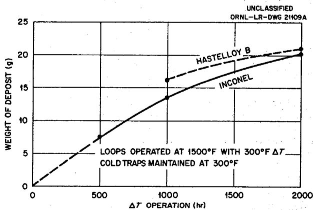  
Fig. 3.4.10. Mass Transfer Buildup as a Function of Time in Forced-Circulation Loops Operated with Sodium.

The results of chemical analyses of the cold-leg deposits formed in the 2000-hr tests are given in Table 3.4.4. In both loops, the cold-leg deposits contained greater percentages of nickel than were present in the base metals. The inner surfaces of the tubing comprising the hot legs of both loops revealed intergranular attack to a depth of 2 mils. The deposit in the cold-leg section of the Hastelloy B loop reached a maximum

Table 3.4.4. Analyses of Cold-Leg Deposits from Hastelloy B and Inconel Forced-Circulation Loops Operated for 2000 hr with Sodium   

<table><tr><td rowspan="2">Loop Material</td><td colspan="4">Elements Present in Cold-Leg Deposits (wt %)</td></tr><tr><td>Ni</td><td>Cr</td><td>Fe</td><td>Mo</td></tr><tr><td>Hastelloy B</td><td>97.4</td><td>0.53</td><td></td><td>0.50</td></tr><tr><td>Inconel</td><td>85.6</td><td>12.8</td><td>0.70</td><td></td></tr></table>

thickness of 24 mils, whereas the deposit in the Inconel loop had a maximum thickness of 30 mils.

A Hastelloy W forced-circulation loop, 7642-4, which was also operated with sodium, was examined following 1000 hr of operation at a hot-leg temperature of $1500^{\circ}\mathrm{F}$ . The mass transfer deposits found in this loop were approximately $17\%$ greater by weight than the deposits found in the Hastelloy B loop operated under identical conditions; namely, 20 g compared with 17 g. A metallographic examination revealed a spongy, heavily attacked area approximately 1.5 mils deep along the hot-leg surfaces exposed to sodium. These corroded areas, which are illustrated in Fig. 3.4.11, seemed to be quite brittle, and in many cases had pulled away from the metal underneath them. The cold-leg deposits in this loop were found by analysis to contain $97\%$ Ni and $3\%$ Cr.

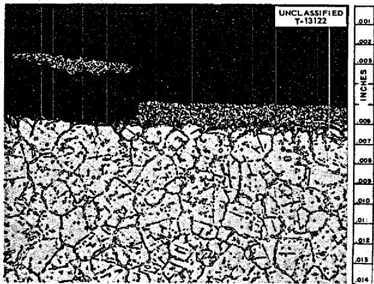  
Fig. 3.4.11. Hot-Leg Surface of Hastelloy W Forced-Circulation Loop Which Operated 1000 hr with Sodium at $1500^{\circ}\mathrm{F}$ . Etchant: $\mathsf{H}_2\mathsf{CrO}_4\mathsf{-HCl}$ . Reduced $31\%$ .

A type 347 stainless steel forced-circulation loop also completed 1000 hr of operation with sodium at a maximum temperature of $1500^{\circ}\mathrm{F}$ and a temperature drop of $300^{\circ}\mathrm{F}$ . The loop (7426-27) also contained an oxide cold trap, which was maintained at $300^{\circ}\mathrm{F}$ . Visual examination of this loop revealed only slight traces of mass transfer in the cooled portions of the loop. The deposits were similar in extent and appearance to those which have been observed in types 316 and 304 stainless steel loops operated under similar conditions, and were much less in amount than the deposits found in Inconel loops operated under similar conditions. A typical cold-leg section from the type 347 stainless steel loop is shown in Fig. 3.4.12. The hot leg of the loop showed light surface pits and void formation to a depth of 2 mils.

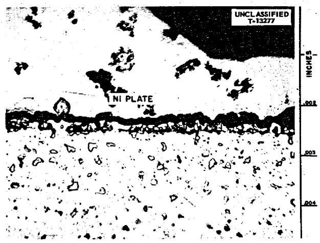  
Fig. 3.4.12. Mass Transfer Deposits in Cold-Leg Section of Type 347 Stainless Steel Forced-Circulation Loop Operated with Sodium for 1000 hr at a Maximum Temperature of $1500^{\circ}\mathrm{F}$ . Etchant: glycerol regia. 750X. Reduced $32\%$ .

# DIFFUSION OF NICKEL IN LIQUID LEAD

J. L. Scott H. N. Leavenworth, Jr.6

Studies of the effects of temperature and concentration on the diffusion of nickel in liquid lead were continued as a part of an over-all fundamental investigation of the mass-transfer process. The initial work and the experimental method were described previously, and the dif

fusion coefficients for saturated solutions of various compositions were presented.7 Additional studies have now been conducted in order to determine the effect of temperature on the diffusion coefficient at constant composition. A constant composition for a series of tests was obtained by saturating the lead, which filled the capillary, with nickel at a given temperature, and then making the diffusion measurements at a higher temperature. Saturation temperatures of $363^{\circ}\mathrm{C}$ and $481^{\circ}\mathrm{C}$ were used for these tests. The results are shown in Fig. 3.4.13, which is a plot of the logarithm of the diffusion coefficient, $D$ , vs the reciprocal of the absolute temperature. The curve for the saturation temperature of $481^{\circ}\mathrm{C}$ is slightly above that for the saturation temperature of $363^{\circ}\mathrm{C}$ , but the two curves are roughly parallel. In order to determine whether the spread in these curves was a result of random variation, a statistical analysis of the data was made. These calculations showed that the curve for $481^{\circ}\mathrm{C}$ differed from the curve for saturated solutions at the $50\%$ confidence level, but not at the $95\%$ level. The data for the curve for $363^{\circ}\mathrm{C}$ were found to be significantly different from the saturation data at the $95\%$ confidence level. Thus, it appears that the diffusion coefficient for nickel in lead is a function of composition, even though the saturation composition is less than $0.5 \, \text{wt} \%$

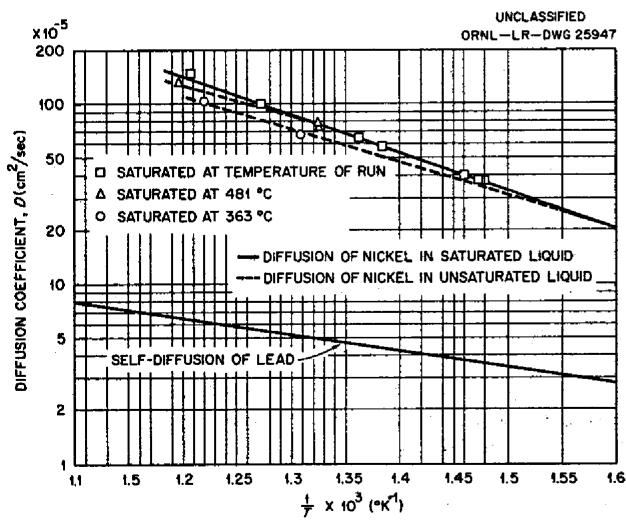  
Fig. 3.4.13. Diffusion in Liquid Lead.

at the highest temperature studied. It also appears that a change in composition affects the entropy of activation for diffusion but not the enthalpy of activation. These results are only tentative because the range of temperatures studied and the amount of data obtained at each temperature are insufficient for a complete analysis. Higher temperatures will be attained through the use of quartz diffusion cells, which will replace the less expensive pyrex cells used in these tests. At the same time, a second method of chemical analysis for nickel in lead, namely, activation analysis, will be utilized in addition to the polarographic method, so that results from independent analytical methods can be compared.

# PURIFICATION OF SODIUM

# J. L. Scott H. N. Leavenworth, Jr.

The vacuum still, which was designed for purifying small batches of sodium for use in fundamental studies, has now been fabricated and installed. A picture of the still before the insulation was installed is shown in Fig. 3.4.14. The basic components of the still are the sodium pot, the receiver for the distilled metal, and a storage tank for undistilled metal. The pot and receiver are each 8 in. in diameter and about 12 in. high. Sodium is introduced into the system and withdrawn through the tubes below the receiver. It is pumped from container to container with the use of purified argon under pressure. An advantage of this system is that sodium can be transferred from the receiver to the pot and redistilled any number of times without opening the system. The heat sources for distillation and for maintaining the sodium in the molten state are Calrod units, as shown. Heating tape will be utilized to maintain the transfer tubes above the melting point of sodium. Cooling for condensation of sodium vapors is provided by coils through which ethylene glycol is pumped. These coils are inside the tube between the pot and the receiver. The level of the sodium in the receiver is determined by spark-plug probes that pass through the receiver flange.

Safety is provided through the use of the regulating system which opens the valve shown in Fig. 3.4.14 to introduce purified argon when the pressure in the system rises to above $1\mu$ . This device, which operates off a thermocouple gage, also turns off the power to the still and the vacuum components. The vacuum is provided by a Megavac-25 pump and a Consolidated Vacuum MC

500 diffusion pump. These components are separated from the still by the valve and a cold trap, which is not shown. The pressure in the system is measured with a National Research type of ion gage. Preliminary tests of the system have shown that a vacuum of $5 \times 10^{-5} \mu$ is readily attainable. Operation of this unit will be started as soon as the electrical wiring and instrumentation are completed.

# MASS TRANSFER IN AQUEOUS SOLUTIONS

# J. L. Scott P. Y. Jackson

Thermal-convection loop tests in which water is circulated through a cylinder of solid benzoic acid located in the hot zone have been initiated in the hope that this system will simulate a liquid-metal system for the analysis of nucleation from supersaturated solutions. Solid benzoic acid is slightly soluble in water and has a high temperature coefficient of solubility. As the benzoic acid dissolves, it is transferred by essentially free convection to the cold zone, which is maintained at a temperature approximately $20^{\circ}\mathrm{C}$ lower than the temperature of the hot zone. The process may be monitored by taking samples from the loop for titration and visually studying the nucleation and growth of crystals in the cold zone. Although insufficient data for complete analysis have been obtained, some trends have been observed. Titration of samples of solution show that the solid dissolves at a rate which is nearly constant, since saturation is not approached in the hot zone. A considerable degree of supersaturation is attained in the cold zone before crystallization becomes visible. The condition of the cold-zone surface, whether clean or dirty, smooth or etched, or straight or formed in a series of bulbs, affects the rate of formation of crystal nuclei and the rate of attachment of these nuclei to the wall. When the cold zone is provided with a collar of crystals upon which new molecules can deposit, the concentration of the acid in the water levels off, as shown in run 3 of Fig. 3.4.15, with little tendency toward supersaturation. In the absence of crystals, the concentration rises to a value corresponding to some degree of supersaturation in the cold zone, but after recrystallization has begun, the concentration falls rapidly to a value corresponding

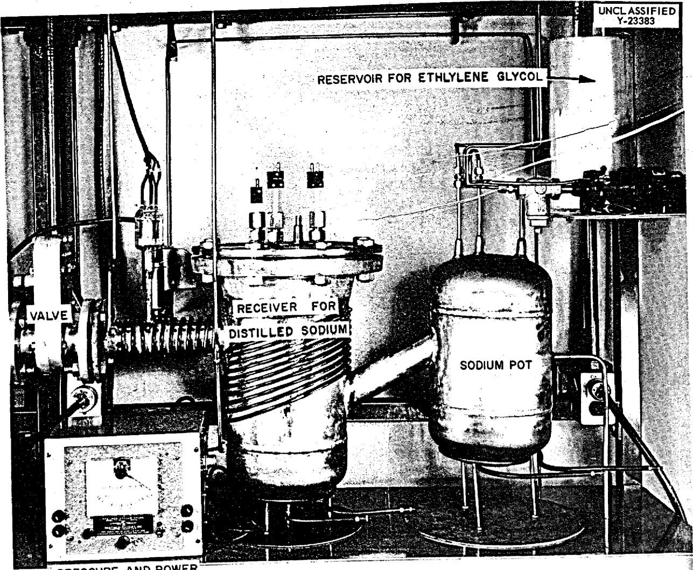

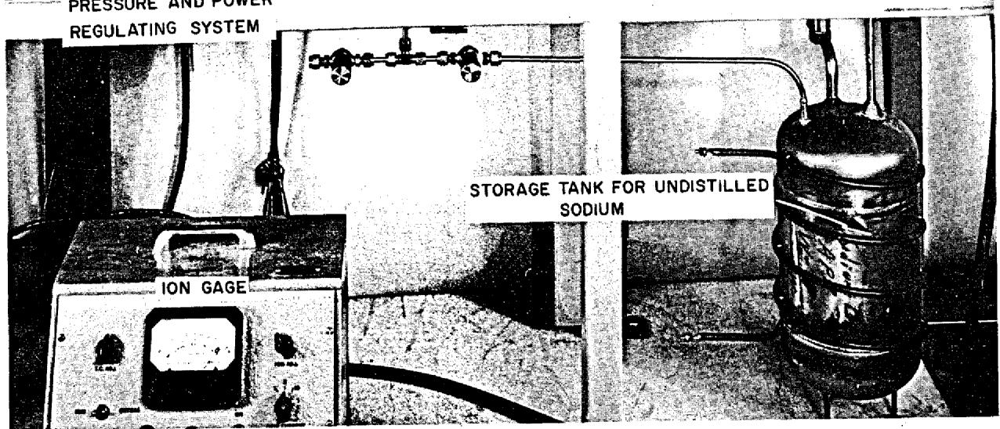  
Fig. 3.4.14. Sodium Still.

to the saturation level, run 8 of Fig. 3.4.15. The hot-zone saturation curve was calculated, from the following equation, to show the solution rate at the hot-zone temperature of $60^{\circ}\mathrm{C}$ for the given surface area $A$ and loop volume $V$ :

$$
C = C _ {s} (1 - e ^ {- a A T / V}), \tag {1}
$$

where

$$
C = \text {c o n c e n t r a t i o n} T,
$$

$$
C _ {s} = \text {s a t u r a t i o n c o n c e n t r a t i o n},
$$

$a =$ the solution rate constant, which is evaluated from the solution rate at times close to zero.

Further tests will be made to determine the effects of changes in the hot-zone temperature, cold-zone geometry, and the surface conditions on the mass-transfer process.

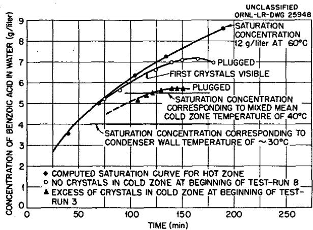  
Fig. 3.4.15. Concentration vs Time Curve for a Benzoic Acid-Water System in a Thermal-Convection Loop.

# 3.5. MATERIALS FABRICATION RESEARCH

# YTTRIUM METAL PRODUCTION

T. Hikido1 R. E. McDonald2  
J. H. Coobs

Experimental studies of the production of high-purity yttrium metal were continued. In the process being developed, lithium is used to reduce a mixture of $\mathsf{YF}_3\text{-}\mathsf{MgF}_2\text{-}\mathsf{LiF}$ to yield an yttrium-magnesium alloy. The fluoride mixtures used are prepared by the Chemistry Division with the use of techniques developed for fluoride-fuel processing (see Chap. 2.4, "Production of Purified Fluoride Mixtures"). The results of the experiments completed thus far are summarized in Table 3.5.1.

The low yields obtained in runs L-2 and L-3 have been attributed to segregation in the crucible; that is, the lithium is separated from the $\mathrm{YF}_3\cdot \mathrm{MgF}_2\cdot \mathrm{LiF}$ layer by the LiF slag, which has a density intermediate between the densities of the two reactants. In run L-4, the reaction retort was tilted at a 45-degree angle to increase the areas of the interface layers and also to promote thermal-convection mixing. The yield was increased from 67 to $83\%$ by this procedure.

The lithium was added in the first three runs in the form of sticks cut into short lengths. In run L-4, the lithium was transferred into the reaction retort in the molten state by differential argon-gas pressure. The molten lithium was filtered through a porous stainless steel filter in this transfer process.

Experiments have been conducted on vacuum heat treatment of the yttrium-magnesium alloy to distill off the magnesium and excess lithium. A 20-g sample of the yttrium sponge produced in this manner from run L-1 was arc melted with the use of a tungsten electrode under an argon atmosphere. The oxygen content of the arc-melted button was determined to be 1200 to 1300 ppm by a vacuum-fusion analysis performed by the Analytical Chemistry Division. A 30-g button from run L-2 has been arc melted and is now being analyzed.

# HYDROGEN DIFFUSION THROUGH METALS

R. E. McDonald T. Hikido J. H. Coobs

Equipment with which to measure the rate of diffusion of hydrogen through potential cladding materials for hydride moderators is being built. The apparatus is shown schematically in Fig. 3.5.1. The test specimen for the basic diffusion measurements will be a heavy walled tube of the material

Table 3.5.1. Summary of Results of Yttrium Reduction Experiments   

<table><tr><td rowspan="2">Run No.</td><td rowspan="2">Charge</td><td rowspan="2">Quantity of Lithium Reductant Added (g)</td><td colspan="2">Yield of Y-Mg Alloy (g)</td><td rowspan="2">Yield (% of theoretical)</td></tr><tr><td>Theoretical</td><td>Actual</td></tr><tr><td>L-1</td><td>591 g of YF3, 232 g of MgF2, 174 g of LiF</td><td>151 (10% excess)</td><td>450</td><td>375</td><td>83</td></tr><tr><td>L-2</td><td>1000 g of YF3-MgF2-LiF mixture (53.9-21.1-25.0 wt %)</td><td>137 (10% excess)</td><td>411</td><td>246</td><td>60</td></tr><tr><td>L-3</td><td>200 g of mixture used in run L-2</td><td>290 (15% excess)</td><td>822</td><td>551</td><td>67</td></tr><tr><td>L-4</td><td>1000 g of mixture used in run L-2</td><td>150 (15% excess)</td><td>411</td><td>340</td><td>83</td></tr></table>

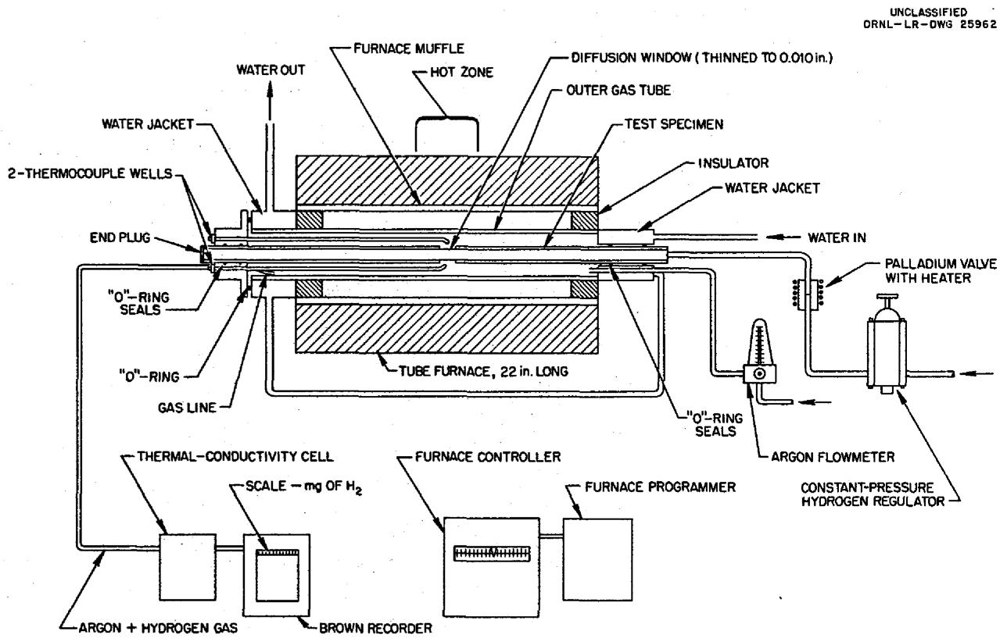  
Fig. 3.5.1. Diagram of Apparatus for Measuring the Rate of Hydrogen Diffusion Through Metals.

being studied, with a section reduced in thickness. This thin "diffusion-window" section will be held in the hot zone of the tube furnace. Hydrogen gas will be maintained at a constant pressure inside the tube, while the outside of the tube will be purged continuously with high-purity argon gas. The purge gas will be passed through a thermal conductivity cell which will detect changes in conductivity of the gas as a result of small additions of hydrogen to the argon. The factor of 10 difference between the thermal conductivity of hydrogen $(0.416 \times 10^{-3} \text{cal/cm-sec.}^{\circ} \text{C}$ at $0^{\circ} \text{C})$ and that of argon $(0.039 \times 10^{-3} \text{at} 0^{\circ} \text{C})$ will make possible the detection of quite small quantities of hydrogen. The impulse from the cell will be transmitted to a strip-type Brown recorder with a scale marked to present the hydrogen content.

The same equipment will be used to measure the rate of loss of hydrogen from clad hydrided-metal assemblies. It will also be useful for monitoring hydrogen losses during thermal cycling and hydrogen migration tests.

# VOLATILITY OF BeO IN STEAM AT MODERATOR TEMPERATURES

A. G. Tharp

The major reported work on the volatility of BeO in steam is found in publications by Grossweiner and Seifert3 and by Elliott.4 The paper by Elliott, which was a doctorate thesis, reviews all the work on volatile oxides in water vapor.

As is usual in these studies it is very difficult to prove an identification of the volatile molecule. The best summation of the present data indicates that the major reaction is

$$
x B e O (s) + H _ {2} O (g) \longrightarrow x B e O \cdot H _ {2} O (g)
$$

There is evidence that one or more volatile species exist which are dependent on oxygen pressure. If

the reaction given above is assumed to be essentially the correct one, the data summarized in Table 3.5.2 are applicable.

The data of Table 3.5.2 are for equilibrium conditions or as near to equilibrium conditions as can be attained in an experiment of this nature. The samples of BeO used were in powder form, and Grossweiner and Seifert used water vapor in helium. Elliott used $\mathsf{H}_2\mathsf{O}\cdot \mathsf{O}_2$ and $\mathsf{H}_2\mathsf{O}\cdot \mathsf{H}_2$ . It should be pointed out that in actual practice it is not possible to obtain a greater volatility than that indicated by the equilibrium constant; that is, no concentration or pressure can exceed the equilibrium. The dynamic conditions of the $\mathsf{BeO}(s) + \mathsf{H}_2\mathsf{O}(g)$ reaction would determine the amount of BeO carried by the steam. Another important factor would be the nature of the $\mathsf{BeO}$ , that is, density, crystal size, external surface area, etc. Another important factor could be that another molecular species of hydrated BeO would become the controlling species under different experimental conditions.

The available data, which are probably quite accurate, indicate that under some conditions it would be entirely possible to corrode and transport large quantities of BeO in steam in relatively short times.

# FABRICATION OF HIGH-DENSITY BeO

# R. L. Hamner

It has been found in the process of fabricating BeO by hot pressing that the "Luckey S.P."

grade oxide produced by Brush Beryllium Company is equivalent to the "fluorescent" grade when densities of $95\%$ or greater are desired. Such densities are obtained by pressing at 1900 to $1950^{\circ}C$ with a pressure of 2000 to 2500 psi. A quantity of high-purity $\mathrm{BeSO_4}$ has been received for experimental attempts to lower the temperature of hot pressing and to obtain high-density material by cold pressing and/or extrusion followed by sintering at about $1500^{\circ}C$ . This experimental approach is based on the production at Battelle Memorial Institute of a highly sinterable material by carefully controlling the calcination temperature to obtain an extremely fine oxide powder.

The hot-pressed BeO specimens described below were fabricated for physical tests:

1. five BeO cylinders, $2 \times 2 \times \frac{1}{2}$ in. ID; density, $97\%$ ; two cylinders damaged in machining;   
2. four BeO blocks, $2 \times 4 \times 1$ in., with four $\frac{1}{4}$ -in.-dia holes running longitudinally;   
3. one BeO block, $1 \times 1 \times 6\frac{1}{2}$ in.; density, $80\%$ ;   
4. one BeO block, $1 \times \frac{5}{8} \times 6\frac{1}{2}$ in.; density, $90\%$ ;   
5. one BeO block, $1 \times \frac{1}{2} \times 6\frac{1}{2}$ in.; density, $96\%$ ;   
6. one BeO cylinder, $2\frac{1}{2}$ in. OD, $\frac{3}{8}$ in. ID, $2\frac{1}{2}$ in. long; density, $80\%$ ;   
7. one $\mathsf{BeO - UO_2}$ (50-50 mole %) block, $5_{16} \times 7_{16} \times$ 9 in.; density, $98\%$ .

5 Summary of Progress Report on an Investigation of the Manufacture of High Density Beryllium Oxide. Parts by the Brush Beryllium Co., PWAC-167 (April 15, 1957).

Table 3.5.2. Data on the Reaction of BeO with Steam   

<table><tr><td rowspan="2">Temperature (°C)</td><td rowspan="2">H2O Passed (moles)</td><td rowspan="2">BeO Collected (moles)</td><td rowspan="2">Flow Rate (liters/min) at Room Temperature</td><td rowspan="2">Steam Pressure (atm)</td><td rowspan="2">Hydrogen Pressure (atm)</td><td rowspan="2">Oxygen Pressure (atm)</td><td colspan="2">Ratio of BeO·H2O (g) Pressure to Pressure of H2O (g)</td></tr><tr><td>Elliott</td><td>Grossweiner and Seifert</td></tr><tr><td></td><td></td><td>×10-4</td><td></td><td></td><td></td><td></td><td>×10-5</td><td>×10-5</td></tr><tr><td>1270</td><td>1.95</td><td>0.3</td><td>1.3</td><td>0.87</td><td></td><td>0.13</td><td>1.0</td><td>6.9</td></tr><tr><td>1285</td><td>1.83</td><td>0.84</td><td>1.7</td><td>0.74</td><td>0.26</td><td></td><td>8.4</td><td>7.6</td></tr><tr><td>1310</td><td>3.44</td><td>1.52</td><td>1.5</td><td>0.95</td><td></td><td>0.05</td><td>4.4</td><td>9.8</td></tr><tr><td>1310</td><td>2.27</td><td>1.12</td><td>1.9</td><td>0.91</td><td></td><td>0.09</td><td>4.9</td><td>9.8</td></tr><tr><td>1310</td><td>3.9</td><td>3.40</td><td>1.7</td><td>0.74</td><td>0.26</td><td></td><td>8.7</td><td>9.8</td></tr><tr><td>1254</td><td>3.88</td><td>1.56</td><td>1.4</td><td>0.88</td><td></td><td>0.12</td><td>4.0</td><td>5.9</td></tr></table>

The physical properties to be investigated include modulus of rupture, elastic modulus, internal friction, thermal expansion, thermal conductivity, total emissivity, and erosion at temperatures up to $1650^{\circ}\mathrm{C}$ . In addition, $\mathrm{UO}_2$ -BeO diffusion studies are to be made.

# BeO THERMOCOUPLE INSERTS AND IRRADIATION TEST SPECIMENS

R. L. Hamner

Special BeO thermocouple inserts and shells for determining volume temperature fluctuations in the ART half-scale core model are being fabricated. Hot-pressed BeO blocks are to be ground to cylinders $\frac{1}{6} \times \frac{1}{2}$ in. for the 12 inserts and to cylinders $\frac{1}{4} \times \frac{1}{2}$ in. for the accompanying shells. Holes will then be made in the $\frac{1}{4} \times \frac{1}{2}$ -in. cylinders by the activation technique to form the shells to accommodate the inserts, and parallel grooves 180-deg apart will be made in the same manner along the periphery of the inserts for holding the thermocouple wires. For good thermal contact the base of the shell and the mating surface of the insert are to be platinized.

Twenty-seven 1-in.-long high-density-BeO cylindrical specimens with diameters of from 0.44 to 0.94 in. are being fabricated for irradiation studies. These specimens are to be canned in Inconel and irradiated in the ETR.

# THERMAL STRESS RESISTANCE OF CERAMIC CYLINDERS

R. A. Potter

An apparatus is being designed for the determination of the heat throughput required to cause initial failure in ceramic cylinders. This information will aid in determining the thermal stress resistance of various ceramic materials. It will also provide a means of studying the effects of varying the physical properties of the materials on their ability to withstand thermal shocks. Consideration is being given to various methods of heating hollow cylinders internally and cooling them externally.

# FABRICATION OF METAL HYDRIDES

R. A. Potter

Nine groups of dense zirconium hydride samples have been prepared in the hydriding apparatus.6

The samples are rods approximately 3 in. in length and $\frac{1}{2}$ in. in diameter, and they contain various amounts of hydrogen, as shown in Table 3.5.3. These pieces were made as part of an effort to establish procedures for hydriding massive yttrium metal.

Modifications have been made in the equipment, which is now ready for production operation as yttrium metal becomes available for hydriding. The procedure to be used is based on a process, developed at the General Electric Company, in which a mixture of hydrogen and helium is passed over the metal.

Table 3.5.3. Hydrogen Contents of Dense Zirconium Hydride Samples   

<table><tr><td>Sample Group No.</td><td>Sample Designation</td><td>Hydrogen Content* (% of total weight)</td></tr><tr><td rowspan="2">I</td><td>a</td><td>0.19</td></tr><tr><td>b</td><td>0.21</td></tr><tr><td rowspan="2">II</td><td>a</td><td>0.36</td></tr><tr><td>b</td><td>0.41</td></tr><tr><td rowspan="2">III</td><td>a</td><td>0.54</td></tr><tr><td>b</td><td>0.56</td></tr><tr><td rowspan="2">IV</td><td>a</td><td>0.83</td></tr><tr><td>b</td><td>0.83</td></tr><tr><td rowspan="2">V</td><td>a</td><td>0.86</td></tr><tr><td>b</td><td>0.92</td></tr><tr><td rowspan="2">VI</td><td>a</td><td>0.95</td></tr><tr><td>b</td><td>0.95</td></tr><tr><td rowspan="2">VII</td><td>a</td><td>1.05</td></tr><tr><td>b</td><td>1.05</td></tr><tr><td rowspan="2">VIII</td><td>a</td><td>1.10</td></tr><tr><td>b</td><td>1.10</td></tr><tr><td rowspan="2">IX</td><td>a</td><td>1.15</td></tr><tr><td>b</td><td>1.15</td></tr></table>

*Determined on the basis of weight gain.

# 3.6. METALLOGRAPHIC EXAMINATIONS OF ENGINEERING TEST COMPONENTS AFTER SERVICE

# ART PROTOTYPE TEST RADIATOR

R.J.Gray J.E.VanCleve,Jr.

A metallographic examination was made of the York Corp. ART prototype test radiator No.1, which operated a total of 870 hr under the following conditions:

Isothermal operation at $1200^{\circ}\mathrm{F}$ 390 hr

Operation with various temperature differentials and a maximum NaK inlet temperature of $1200^{\circ}\mathrm{F}$ 47 hr

Operation with various temperature differentials and a maximum NaK inlet temperature of $1500^{\circ}\mathrm{F}$

Operation at the design condition of a 73 hr NaK inlet temperature of $1500^{\circ}\mathrm{F}$ and an outlet temperature of $1070^{\circ}\mathrm{F}$

Thermal cycles, total 91/2 Slow cycles at a maximum NaK temperature of $1200^{\circ}F$

Slow cycles at a maximum NaK temperature of $1500^{\circ}\mathrm{F}$

Fast cycle (50°F/min) to a NaK temperature of 1525°F

The radiator failed upon reaching full power in the first controlled thermal cycle. The NaK inlet temperature had been increased from $1350^{\circ}\mathrm{F}$ to

1525°F at a rate of 50°F/min and the outlet temperature had remained constant at about 1070°F.

After the radiator had been cleaned it was sectioned for examination. The section containing the tube that failed, which was located by pressurizing the tube with water and observing the leak, is shown in Fig. 3.6.1. The arrow points toward the tube that leaked. A close view of the tube that failed is shown in Fig. 3.6.2. The numbered arrows indicate the readily visible holes, which appear as spots because of internal lighting during photography. The metallographic examination did not reveal evidence of complete penetration of the tube wall at either the circumferential or the longitudinal fissures.

The same tube is shown in Fig. 3.6.3 rotated approximately 90 deg. The dark area in the tube is hole No.1 in Fig. 3.6.2. The curvature of the tube as it enters the header is evident. The good condition of the tube may be attributed to the promptness with which the fire that occurred as a result of the leak was extinguished.

Hole No. 1, which was the largest of the three holes, is shown in Fig. 3.6.4. The opening in the tube wall in this plane measures 0.030 in. More of the tube wall that appears at the extreme right edge of Fig. 3.6.4 may be seen in Fig. 3.6.5.

Hole No. 2 is shown at a magnification of 100 in Fig. 3.6.6 and at a magnification of 500 in

UNCLASSIFIED Y-23342

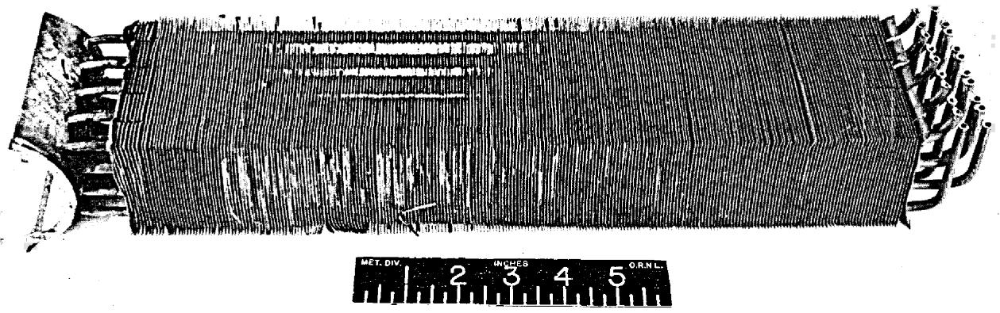  
Fig. 3.6.1. ART Prototype Test Radiator No. 1. (Secret with caption)

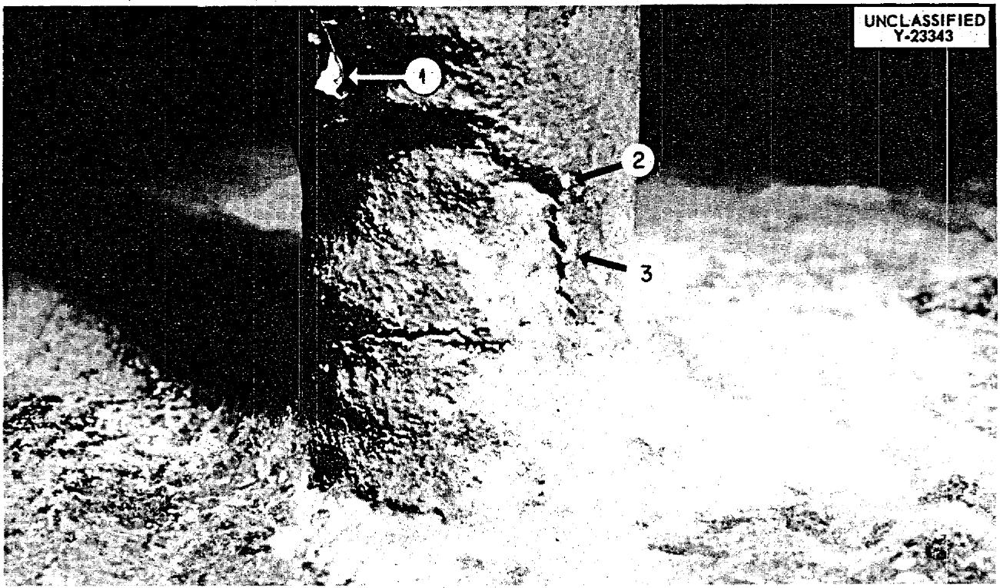  
Fig. 3.6.2. Close View of the Tube That Failed. The numbered arrows indicate the three holes found in the tube.

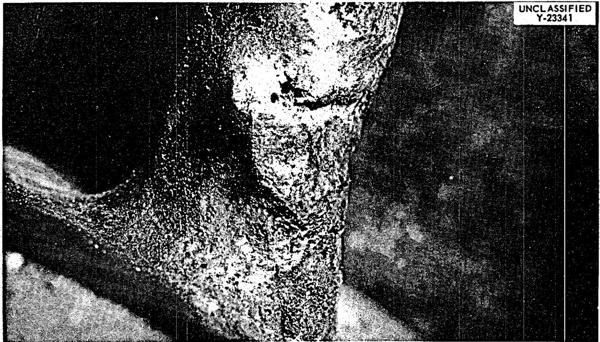  
Fig. 3.6.3. Tube Shown In Fig. 3.6.2 After Being Rotated 90 deg.

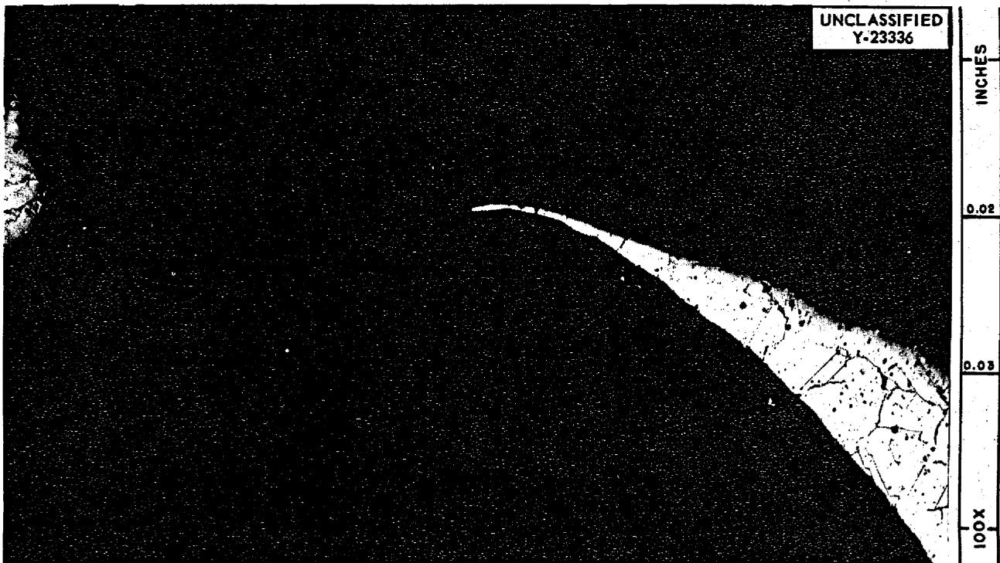  
Fig. 3.6.4. Hole No. 1 of the Tube That Failed. The opening in the tube wall is 0.030 In. Etchant: $10\%$ oxalic acid, 100X.

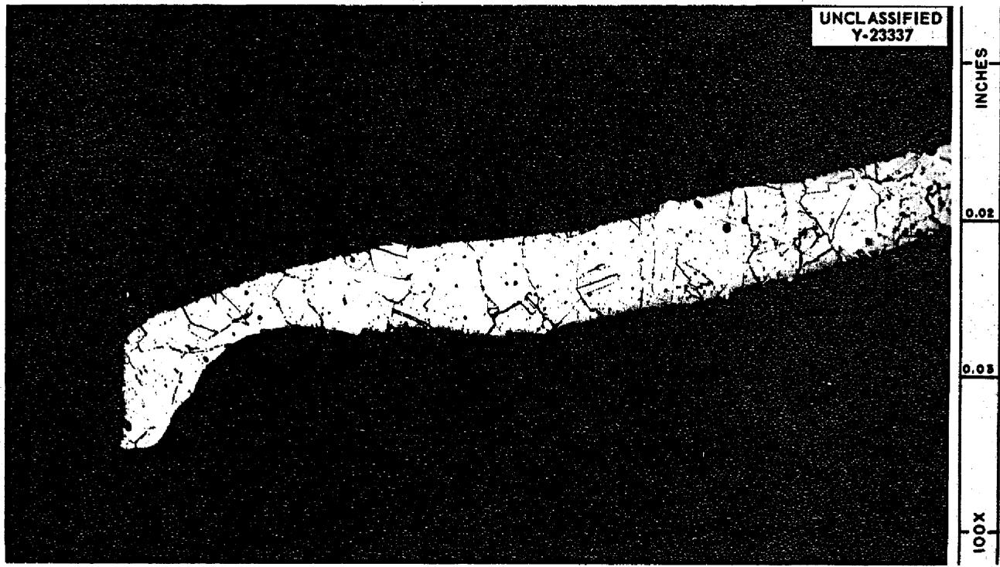  
Fig. 3.6.5. Tube Wall Shown at the Right Edge of Fig. 3.6.4. Note that the internal pressure in the tube produced an outer lip at the point of failure. 100X.

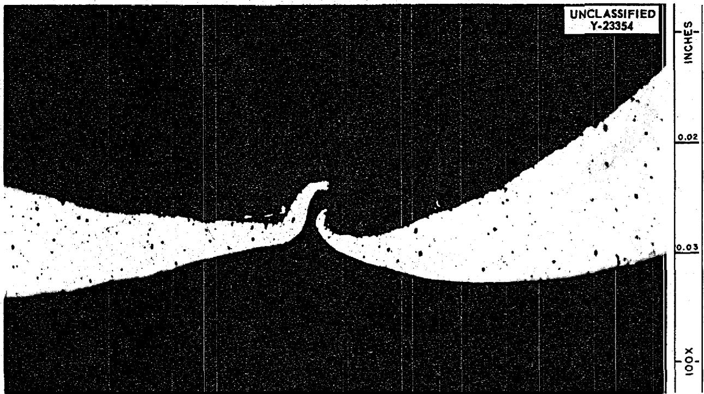  
Fig. 3.6.6. Hole No. 2 of Tube That Failed. Note that the shape of the metal is the same as in Fig. 3.6.5. Etchant: $10\%$ oxalic acid. $100\mathrm{X}$

Fig. 3.6.7. As may be seen the shape of the metal bordering the hole is similar to that of the metal bordering hole No.1. Figure 3.6.7 shows that there was no grain-boundary void formation, and there is no evidence of incipient failure, even very near the area that failed.

The microstructures of the three tubes surrounding the tube that failed are shown in Figs. 3.6.8, 3.6.9, and 3.6.10. Again, there is no evidence of incipient failure in any respect.

The inside diameter, outside diameter, and wall thickness of the tube that failed were measured at various times during polishing of the specimens. Variations in the outside diameter and in the wall thickness were noted in several instances, but all the variations could be directly related to damage done by the fire. There was little or no variation in the inside diameter which would indicate the presence of a stress high enough to produce plastic flow in the tube.

# YORK CORP. RADIATOR NO. 16

R.J. Gray

J. E. Van Cleve, Jr.

York Corp. radiator No. 16 failed with a NaK-to-air leak after 1438 hr of operation, including 1044 hr

under thermal gradient conditions. The NaK inlet temperature during thermal-gradient operation was $1500^{\circ}\mathrm{F}$ or above for 541 hr, and the unit was thermally cycled 21 times.

The fire damage was extensive, and therefore no attempt was made to evaluate the integrity of the brazed fin-to-tube joints. Of the 72 tubes attached to the NaK inlet header, 29 were burned through and 5 more were found to be plugged. Four tubes contained partial plugs, and one was completely plugged. The plug was drilled out of the tube that was completely plugged, and the plug material was found to be green in color. The partial plugs were removed by scraping the tube walls and were found to be brown to black in color. Chemical analysis showed the green material to contain 3.51 wt % uranium and 4.19 wt % zirconium. The darker material contained 7 wt % U, 47 wt % Ni, 7 wt % Cr, and 3 wt % Fe. The difference between the two plugs therefore was that the dark-colored material contained considerable mass-transfer deposits. The presence of uranium indicates that there was a leak of fuel into the NaK in the fuel-to-NaK heat exchanger included in the circuit in which this NaK-to-air radiator was operated. The

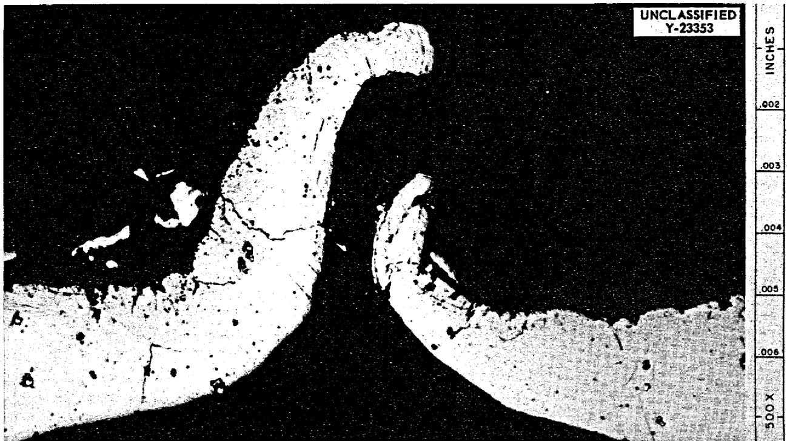  
Fig. 3.6.7. Higher Magnification of Fig. 3.6.6. No evidence of incipient failure may be seen. Etchant: $10\%$ oxalic acid, $500\mathrm{X}$ .

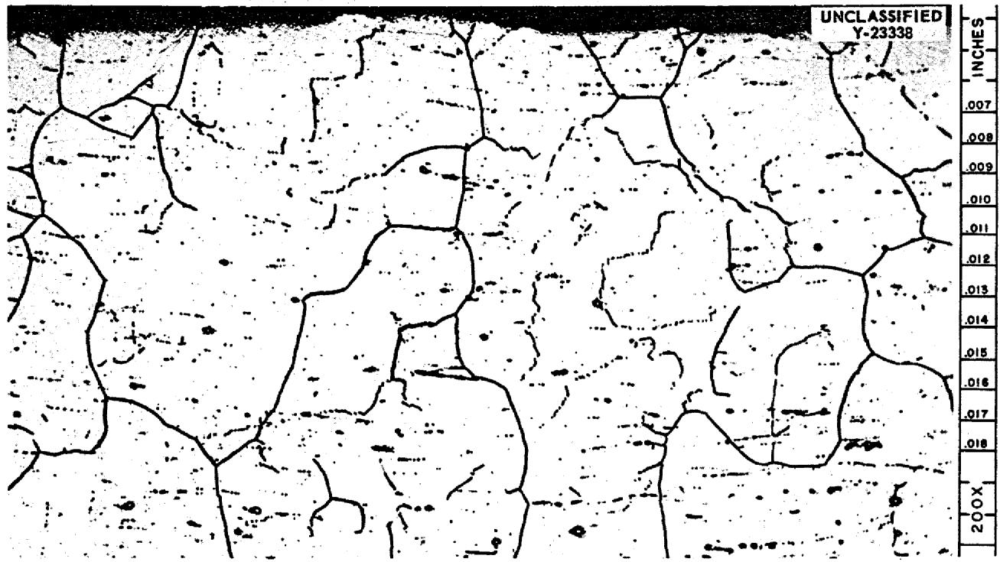  
Fig. 3.6.8. Microstructure of Tube Adjacent to the Tube That Failed. No evidence of incipient failure was found. Etchant: $10\%$ oxalic acid, $200\mathrm{X}$ .

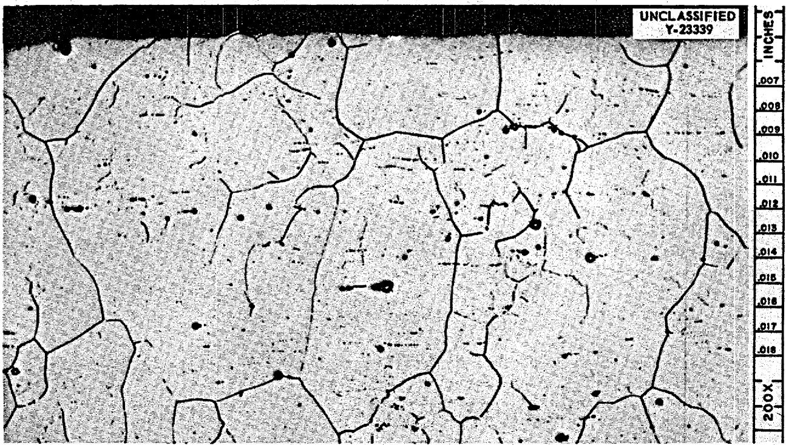  
Fig. 3.6.9. Microstructure of Tube Adjacent to the Tube That Failed. No evidence of incipient failure was found. Etchant: $10\%$ oxalic acid, $200X$ .

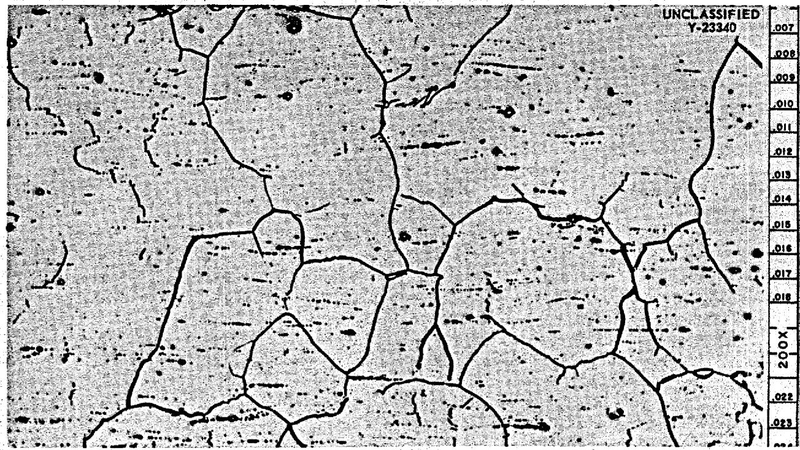  
Fig. 3.6.10. Microstructure of Tube Adjacent to the Tube That Failed. No evidence of incipient failure was found. Etchant: $10\%$ oxalic acid, $200X$ .

examination of the heat exchanger is described in the following section.

# PROCESS ENGINEERING CORP. HEAT EXCHANGER NO.3, TYPE SHE-7

R.J.Gray J.E.VanCleve,Jr.

A small heat exchanger of type SHE-7, which was fabricated by the Process Engineering Corp. and is designated No. 3, was terminated after 1438 hr of operation with the fuel mixture NaF-ZrF $_4$ -UF $_4$ (56-39-5 mole %, fuel 70). The unit operated under thermal-gradient conditions for 1044 hr and was thermally cycled 21 times. Operation of this unit was terminated because of failure of the radiator in the system (see preceding section of this chapter).

Thirty-one samples were removed from the tube bundle and header areas and mounted for metallographic examination to determine the depth of corrosion on both the fuel and the NaK sides. The fuel-side corrosion was found to range from a minimum of 0.001 in. to a maximum of complete penetration. The NaK-side corrosion was found to vary from general roughening of the surface to penetration to a maximum depth of 0.004 in.

An area from the hot-header section is shown in Fig. 3.6.11. As may be seen, the voids completely penetrate the tube wall, but there is little or no general corrosion. Adjacent areas in which the same conditions exist are shown in Figs. 3.6.12 and 3.6.13. A metallic layer found on the fuel side of a tube from the hot-header area is shown in Fig. 3.6.14. Spectrographic analysis showed the metallic layer to be $6.3 \mathrm{wt} \% \mathrm{Cr}$ , $8.5 \mathrm{wt} \% \mathrm{Fe}$ , and $76 \mathrm{wt} \% \mathrm{Ni}$ . This metallic layer was not similar to the gold-colored deposit found in the cool section of a previously examined heat exchanger. The gold-colored deposit was found to have resulted from corrosion of the header region.

The examination of the heat exchanger did not show any open cracks through the tube walls. The presence of the uranium- and zirconium-bearing plugs in York radiator No. 16 proved, however, that a leak was present. Fuel probably leaked through several of the tubes which showed complete grain-boundary penetration, such as those shown in Figs. 3.6.11, 3.6.12, and 3.6.13.

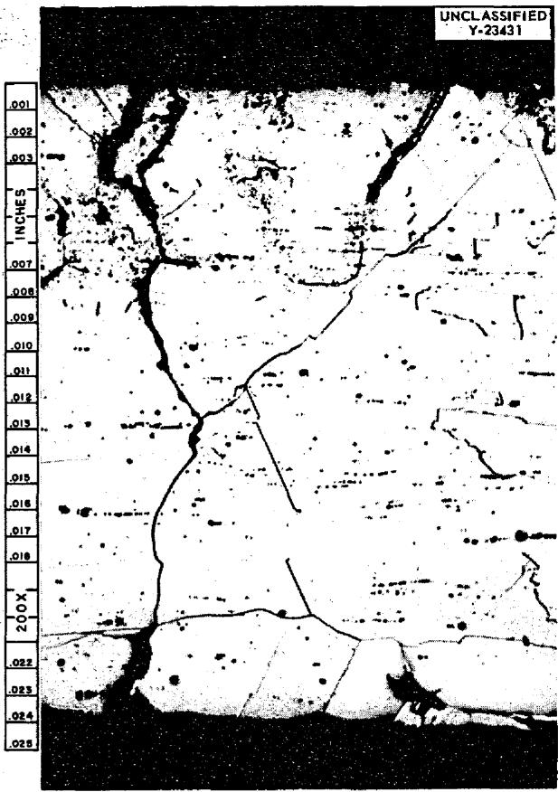  
Fig. 3.6.11. Area from a Tube Near the Hot-Header Section of a NaK-to-Fuel Heat Exchanger Operated at High Temperatures. Note complete grain-boundary penetration and the wide fissures in both surfaces, with little or no general corrosion. Etchant: $10\%$ oxalic acid. 200X. Reduced $24.5\%$ . (Confidential with exception)

# PROCESS ENGINEERING CORP. HEAT EXCHANGER NO. 2, TYPE SHE-7

R.J.Gray J.E.VanCleve,Jr.

Process Engineering Corp. heat exchanger No. 2, type SHE-7, which operated for a total time of 1845 hr and for 1645 hr with NaF-ZrF $_4$ -UF $_4$ (50-46-4 mole %, fuel 30) was also examined. This small heat exchanger was operated under thermal-gradient conditions for 1456 hr and was thermally cycled 29 times. The fuel-inlet temperature was above $1600^{\circ}\mathrm{F}$ for 552 hr. When operation was terminated because of a failure of the economizer in the circulating cold trap that was operating in

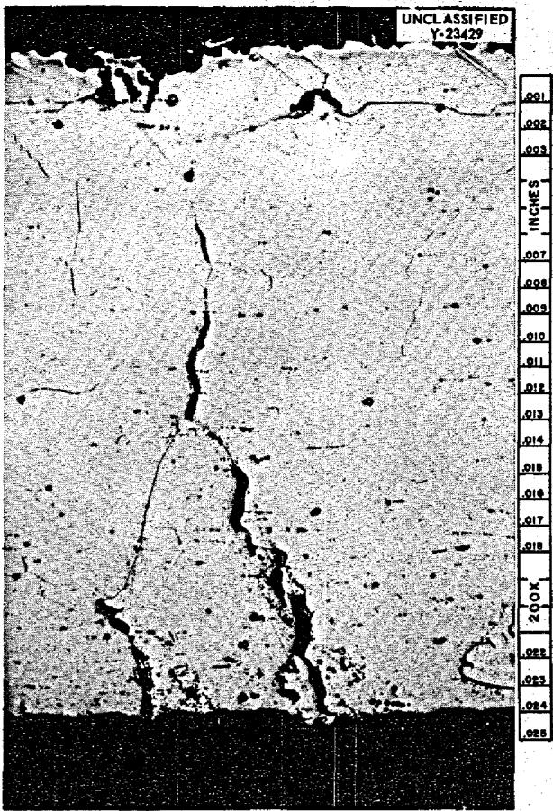  
Fig. 3.6.12. Tube Adjacent to the Tube Shown in Fig. 3.6.11. Complete grain-boundary penetration, with little general corrosion, may be seen. Etchant: $10\%$ oxalic acid. 200X. Reduced $24.5\%$ .

the NaK system, the fuel circuit would not dump and the removal of samples was difficult.

Thirty-four samples were removed from the tube bundle and header areas and mounted for metallographic examination. The fuel-side corrosion was found to range from a minimum of 0.001 in. to a maximum of complete penetration. The NaK-side corrosion varied from general roughening of the exposed surface to a maximum depth of 0.010 in.

The general corrosion and grain-boundary voids found in the wall exposed to fuel are shown in Fig. 3.6.15. The general corrosion in Fig. 3.6.15 reaches a depth of 0.005 in., and beneath this extends 0.005 in. of grain-boundary voids. Thus the depth of corrosion on the fuel side was 0.010 in., or approximately two-fifths of the tube wall.

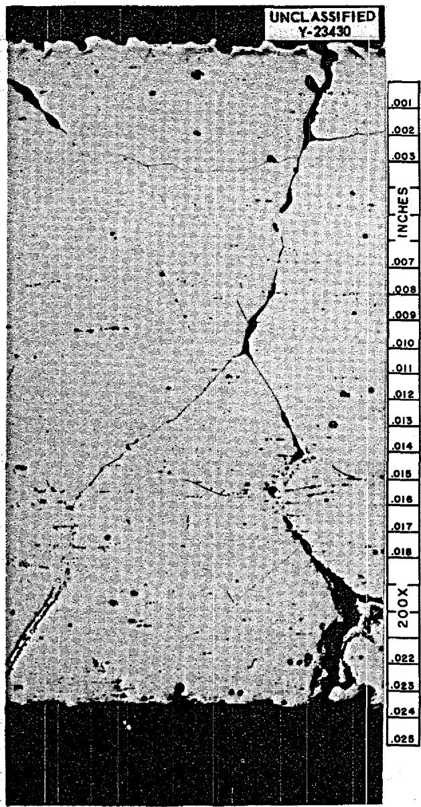  
Fig. 3.6.13. Tube Adjacent to Tube Shown In Fig. 3.6.12. Complete grain-boundary penetration, with little general corrosion, may be seen. Etchant: $10\%$ oxalic acid. 200X.

The NaK-side of the tube wall shown in Fig. 3.6.15 is shown in Fig. 3.6.16. The corrosion, which can, in this instance, be attributed to the NaK, extends to a depth of 0.004 in. This depth of attack added to that by the fuel yields 0.014 in. of corrosion attack; that is, slightly more than one-half the tube wall was attacked.

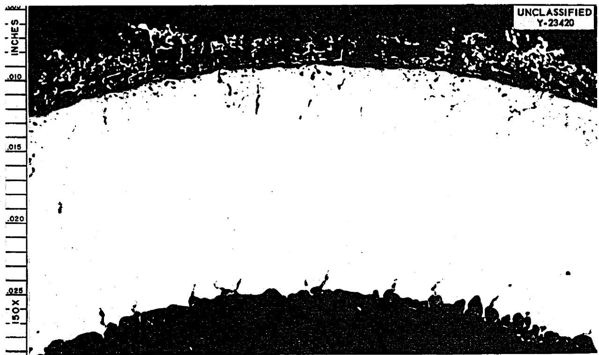

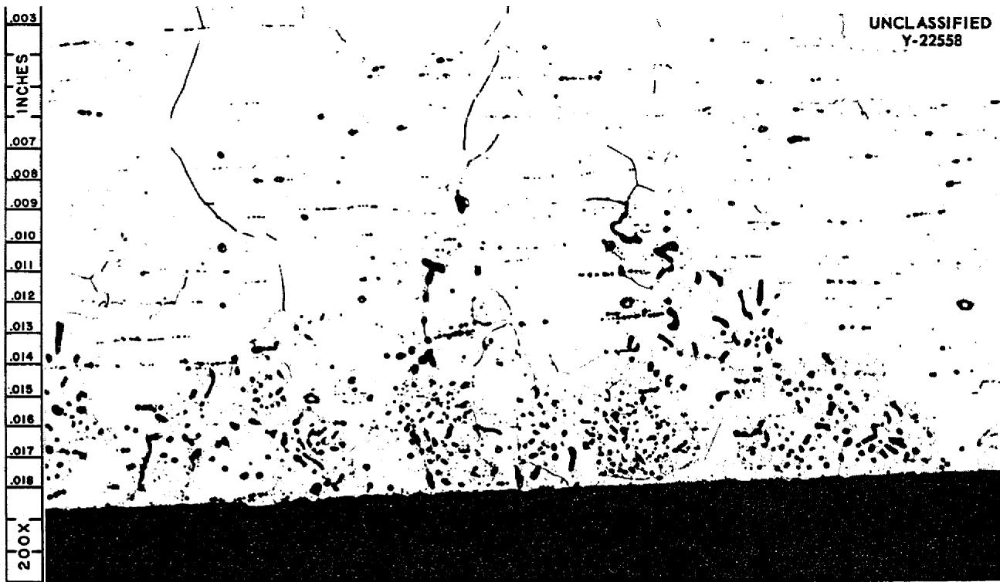  
Fig. 3.6.14. Metallic Layer Along Fuel Side of Tube from Hot-Header Area. Unetched. 100X. (Confidential with caption).   
Fig. 3.6.15. Fuel Side of Tube from Hot-Header Region of Process Engineering Corp. NaK-to-Fuel Heat Exchanger No. 2, SHE-7. General corrosion may be seen to a depth of 0.005 in. plus 0.005 in. of grain-boundary voids. Etchant: $10\%$ oxalic acid, $200X$ .

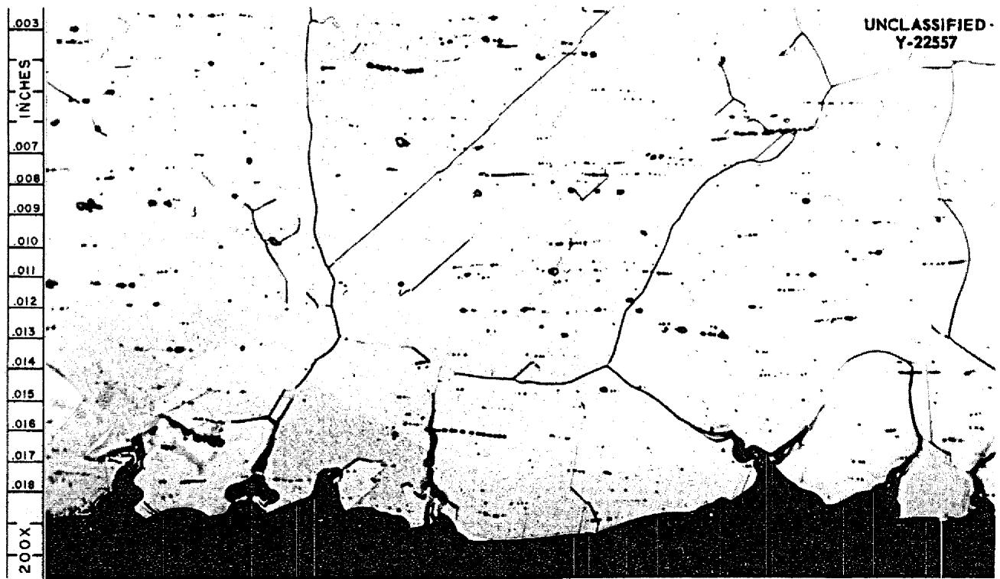  
Fig. 3.6.16. NaK-Side Surface of Tube Shown in Fig. 3.6.15. Etchant: $10\%$ oxalic acid, 200X.

Grain-boundary voids that extended through a tube that was in the hot-header region are shown in Fig. 3.6.17. The voids progressed to such an extent that they cannot be definitely attributed to either fuel or NaK, even though the general corrosion is 0.008 in. in depth. The usual gold-colored metal deposit was found along the surface exposed to the fuel in the cool section.

examination revealed a heavy carbide precipitate to a depth of approximately 5 mils along all Inconel surfaces exposed to NaK. The extent of carburization, which is illustrated in Fig. 3.6.18, was not sufficient to have measurably affected the mechanical properties of heavier Inconel sections, although it was necessary to replace all thinner sections, such as bellows and diaphragms.

# INCONEL CENTRIFUGAL PUMP THAT CIRCULATED NaK

J.H.DeVan R.S.Crouse

An endurance test of an Inconel centrifugal pump that circulated NaK was terminated following approximately 4400 hr of operation primarily at $1200^{\circ}\mathrm{F}$ . For some time before the close of the test, there were indications that lubricating oil had been leaking past the lower shaft seal and into the NaK stream. Upon shutdown, extensive carbon deposits were found immediately below the lower pump seal, and all wetted parts of the pump were dark and tarnished. Metallographic examination was therefore made of some of the wetted parts to determine the nature of metallurgical changes which might have occurred during the test. The

# WELDS OF TEST COMPONENTS   G. M. Slaughter P. Patriarca   Thermal-Convection Loop Welds

A metallographic study of the fused-salt corrosion resistance of saddle welds removed from a large number of thermal-convection loops has been made. Brief operating histories of these loops are presented in Table 3.6.1. No evidence of intergranular corrosion of improperly oriented grains of the type found in the welds of Black, Sivallis & Bryson heat exchanger No. 1 (type IHE-8) was observed.

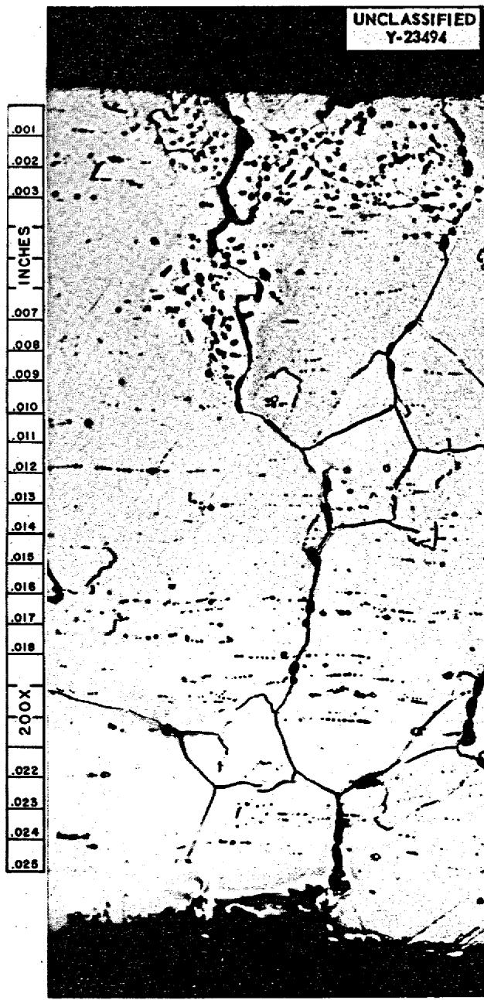  
Fig. 3.6.17. 'Tube Wall from Hot-Header Region. Complete penetration of the tube wall was found. Etchant: $10\%$ oxalic acid. 200X.

# Forced-Circulation Loop Welds

Segments of an electric-resistance-heater lug removed from a nickel-molybdenum alloy forced-circulation loop were obtained and examined metallographically for weld-metal corrosion. The alloy $(17\% \mathrm{Mo - 7\% Fe - balNi})$ tubing had been welded to a Hastelloy B lug adapter with Hastelloy W filler wire. The loop operated for 1000 hr with fuel 107.

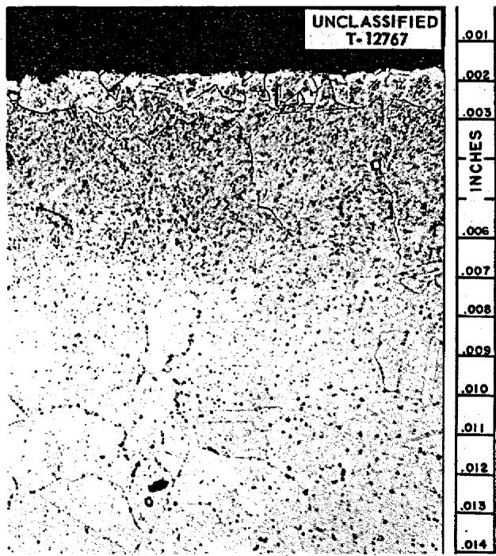  
Fig. 3.6.18. Carburization Which Occurred on Inconel Surfaces Exposed to NaK in Centrifugal Pump Which Circulated NaK for About 4400 hr at Approximately $1200^{\circ}\mathrm{F}$ . The NaK was contaminated with oil following a leak in the pump seal. Etchant: aqua regla. 250X.

Welds from both the upstream and downstream ends of the loop were mounted and examined. The samples were sectioned along the longitudinal axis of the tubing to permit a composite evaluation of the joints. No measurable corrosion of the welds was evident in any of the samples examined.

# Heat Exchanger Welds

The results of metallographic examination of fused-salt corrosion of welds and brazes, and the fused salt and NaK corrosion of tubes in the Black, Sivalls & Bryson heat exchangers types IHE-8 were reported previously. Tube-to-header welds from both the NaK inlet and outlet header have now been examined to determine the extent of NaK corrosion. Attack to a depth of approximately 0.003 in. was prevalent in the NaK inlet header, and in some cases attack to a depth of 0.005 in.

was observed. Typical weld-metal corrosion is shown in Fig. 3.6.19, and the extent of the corrosion in an adjacent tube wall is shown in Fig. 3.6.20. Similar specimens taken from the NaK out

let header are shown in Figs. 3.6.21 and 3.6.22. The extent of corrosion is, of course, much less in the cooler regions. The amount of mass transfer was not determined in this study.

Table 3.6.1. Operating Histories of Thermal-Convection Loops Examined for Weld-Metal Corrosion   

<table><tr><td>Loop No.</td><td>Loop Material</td><td>Fused-Salt* 
Circulated</td><td>Operating Temperature 
(°F)</td><td>Time 
(hr)</td></tr><tr><td>765</td><td>Inconel</td><td>30</td><td>1500</td><td>1500</td></tr><tr><td>779</td><td>Inconel</td><td>30</td><td>1400-1600 
(cycle)</td><td>2000</td></tr><tr><td>876</td><td>Inconel + Inconel 
cast insert</td><td>30</td><td>1500</td><td>500</td></tr><tr><td>1010</td><td>Inconel</td><td>30</td><td>1500</td><td>1000</td></tr><tr><td>792</td><td>Inconel</td><td>30 + 0.2% ZrH2</td><td>1500</td><td>500</td></tr><tr><td>788</td><td>Inconel</td><td>30 + 0.5% ZrH2</td><td>1500</td><td>500</td></tr><tr><td>789</td><td>Inconel</td><td>30 + 0.6% ZrH2</td><td>1500</td><td>500</td></tr><tr><td>790</td><td>Inconel</td><td>30 + 0.7% ZrH2</td><td>1500</td><td>500</td></tr><tr><td>791</td><td>Inconel</td><td>30 + 0.8% ZrH2</td><td>1500</td><td>500</td></tr><tr><td>802</td><td>Inconel</td><td>30 under N2 atm</td><td>1500</td><td>500</td></tr><tr><td>786</td><td>Inconel</td><td>30 + 2.96% addition</td><td>1500</td><td>1500</td></tr><tr><td>785</td><td>Inconel</td><td>30 + 2.23% addition</td><td>1500</td><td>500</td></tr><tr><td>830</td><td>Inconel</td><td>41</td><td>1500</td><td>500</td></tr><tr><td>831</td><td>Inconel</td><td>41</td><td>1500</td><td>500</td></tr><tr><td>734</td><td>Inconel</td><td>82</td><td>1500</td><td>500</td></tr><tr><td>735</td><td>Inconel</td><td>82</td><td>1500</td><td>1500</td></tr><tr><td>841</td><td>Inconel</td><td>82</td><td>1500</td><td>500</td></tr><tr><td>842</td><td>Inconel</td><td>82</td><td>1500</td><td>500</td></tr><tr><td>843</td><td>Inconel</td><td>91</td><td>1500</td><td>500</td></tr><tr><td>844</td><td>Inconel</td><td>91</td><td>1500</td><td>500</td></tr><tr><td>847</td><td>Inconel</td><td>93</td><td>1500</td><td>500</td></tr><tr><td>845</td><td>Inconel</td><td>94</td><td>1500</td><td>500</td></tr><tr><td>846</td><td>Inconel</td><td>94</td><td>1500</td><td>500</td></tr><tr><td>839</td><td>Inconel</td><td>95</td><td>1500</td><td>500</td></tr><tr><td>840</td><td>Inconel</td><td>95</td><td>1500</td><td>500</td></tr><tr><td>798</td><td>Inconel</td><td>107 + 0.94% addition</td><td>1500</td><td>500</td></tr><tr><td>797</td><td>Inconel</td><td>107 + 1.5% addition</td><td>1500</td><td>500</td></tr><tr><td>793</td><td>Inconel</td><td>107 + 1.83% addition</td><td>1500</td><td>500</td></tr><tr><td>799</td><td>Inconel</td><td>107 + 1.83% addition</td><td>1500</td><td>500</td></tr><tr><td>796</td><td>Inconel</td><td>107 + 3.22% addition</td><td>1500</td><td>500</td></tr><tr><td>806</td><td>Monel</td><td>107</td><td>1500</td><td>500</td></tr><tr><td>808</td><td>Monel</td><td>107</td><td>1500</td><td>1000</td></tr><tr><td>771</td><td>Hastelloy B</td><td>30</td><td>1500</td><td>1500</td></tr><tr><td>866</td><td>Hastelloy B</td><td>30</td><td>1625</td><td>1000</td></tr><tr><td>814</td><td>Hastelloy B</td><td>107</td><td>1500</td><td>500</td></tr><tr><td>816</td><td>Hastelloy B</td><td>107</td><td>1500</td><td>2000</td></tr><tr><td>826</td><td>Hastelloy B</td><td>107 + 2% addition</td><td>1500</td><td>1000</td></tr><tr><td>873</td><td>Hastelloy W</td><td>30</td><td>1500</td><td>1000</td></tr><tr><td>857</td><td>Hastelloy X</td><td>30</td><td>1500</td><td>1000</td></tr><tr><td>1014</td><td>76% Ni-24% Mo</td><td>30</td><td>1500</td><td>831</td></tr><tr><td>1015</td><td>76% Ni-24% Mo</td><td>30</td><td>1500</td><td>1000</td></tr><tr><td>1004</td><td>74% Ni-26% Mo</td><td>30</td><td>1500</td><td>791</td></tr><tr><td>1007</td><td>75% Ni-20% Mo-5% Cr</td><td>30</td><td>1500</td><td>1000</td></tr><tr><td>1008</td><td>75% Ni-20% Mo-5% Cr</td><td>30</td><td>1500</td><td>240</td></tr><tr><td>1006</td><td>77% Ni-20% Mo-3% Cr</td><td>30</td><td>1500</td><td>1000</td></tr><tr><td>1013</td><td>85% Ni-15% Mo</td><td>30</td><td>1500</td><td>1000</td></tr></table>

Fused-salt composition:   
No. 30 - NaF-ZrF4-UF4 (50-46-4 mole %).   
No. 41 - NaF-ZrF $_4$ -UF $_4$ (63-25-12 mole%).   
No. 82 - NaF-LiF-ZrF $_4$ -UF $_4$ (20-55-21-4 mole %).   
No.91-NaF-LiF-ZrF4-UF4(53-35-8-4 mole %).   
No. 93 - LiF-ZrF $_4$ -UF $_4$ (50-46-4 mole %).   
No. 94 - KF-ZrF₄-UF₄ (50-46-4 mole %).   
No.95-RbF-ZrF4-UF4(50-46-4 mole %).   
No. 107 - NaF-KF-LiF-UF $_4$ (11.2-41-45.3-2.5 mole %).

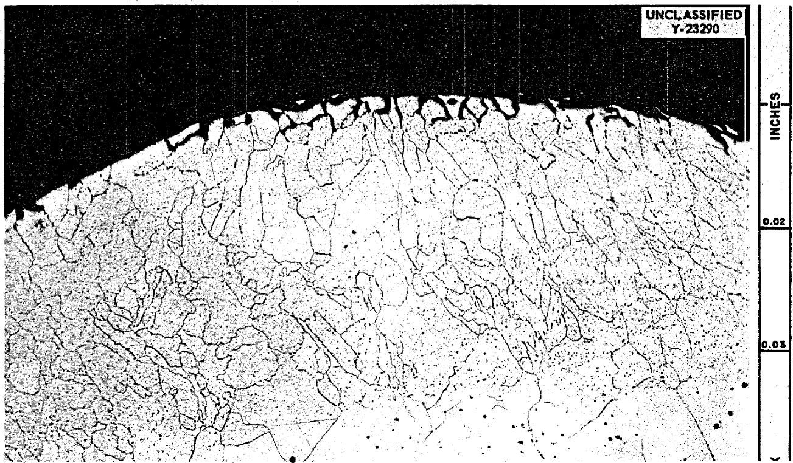

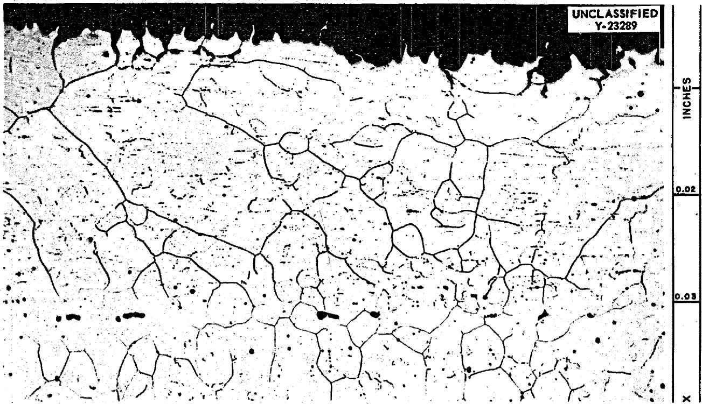  
Fig. 3-6-19. NaK Corrosion in Tube-to-Header Weld of NaK Inlet Header of Black, Silvalls & Bryson NaK-to-Fuel Heat Exchanger Type IHE-8. Etchant: electrolytic oxalic acid. 100X. (Confidential with exception)   
Fig. 3.6.20. NaK Corrosion in Tube Wall Adjacent to Weld Shown in Fig. 3.6.17. 100X. Etchant: electrolytic oxalic acid.

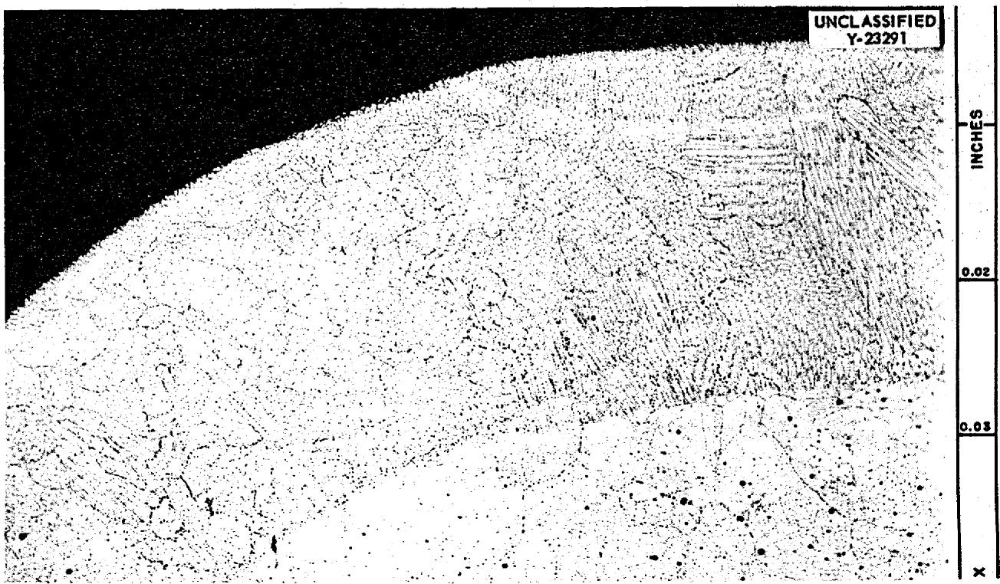  
Fig. 3.6.21. NaK Corrosion in Tube-to-Header Weld of NaK Outlet Header of Black, Silvalls & Bryson NaK-to-Fuel Heat Exchanger Type IHE-8. Etchant: electrolytic oxalic acid. 100X. (Confidential with caption)

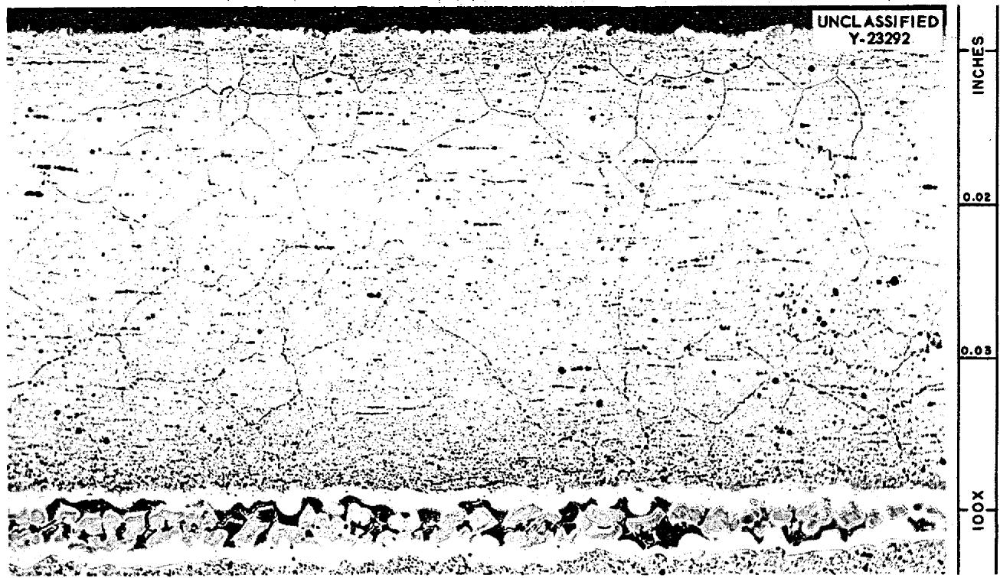  
Fig. 3.6.22. NaK Corrosion in Tube Wall Adjacent to Weld Shown in Fig. 3.6.19. Etchant: electrolytic oxalic acid, 100X.

# 3.7. NONDESTRUCTIVE TESTING

R. B. Oliver

# EDDY-CURRENT MEASUREMENTS OF METAL THICKNESS

R. B. Oliver

J.W.Allen

R.A.Nance

The Metal Identification Meter (MIM-1) developed for the sorting of Inconel, austenitic stainless steels, and the common Hastelloys was successfully adapted to the thickness measurement of thin sections of these alloys. A simple circuit change allows adjustment of the scale range so that finite thicknesses of these alloys, up to 0.040 in., can be measured with a maximum error of $\pm 0.001$ in. The instrument was used to monitor the wall thickness of a type 347 stainless steel cylinder while the wall was being lathe-turned from the original $1/4$ in. to 0.020 in. The stainless steel cylinder, which was $3\frac{1}{2}$ ft long and 6 in. in diameter, was fitted onto a wooden mandrel. Both the Metal Identification Meter and a resonance ultrasound thickness gage showed the finished wall thickness to vary from 0.013 to 0.40 in. The readings made with the two instruments agreed to within 0.001 in. at all times. The Metal Identification Meter and the resonance ultrasound instrument are both excellent instruments for measuring metal thickness when only one side of the material is accessible. When applied to metal sections thinner than 0.020 in., the eddy-current method embodied in the Metal Identification Meter is more accurate than the resonance ultrasound method, and, when applied to section thicknesses greater than 0.060 or 0.070 in., the resonance ultrasound method is

more accurate. The meter is compact, portable, and simple to operate, and it requires no coupling between the probe and the work surface. The values of several components in the circuitry of the eddy-current instrument can be changed so that measurements can be made of thicknesses of metals having conductivities beyond the range of detection of the present model of the Metal Identification Meter.

A new instrument, illustrated in Fig. 3.7.1, for the measurement of sheet and cladding thicknesses has been completed. This instrument is more stable than its predecessor,[2] being nearly free from drift, and is more sensitive and versatile in that it will accommodate a wider range of probe-coil types and of test frequencies. The new instrument is being used in studies of the optimum test parameters for measuring various combinations of cladding and core materials.

# MATHEMATICAL ANALYSIS OF EDDY-CURRENT PROBE COILS

J.W.Allen

M. O. Chester3

Numerous mathematical studies of the impedance of a coil surrounding a cylindrical rod or a tubular object have been made that form a rational basis for the selection of test parameters. Attempts to make a similar analysis of the impedance of a probe coil in proximity with a flat metal plate have not, in the past, been successful, but by making several drastic assumptions regarding the field of the

UNCLASSIFIED Y-23439

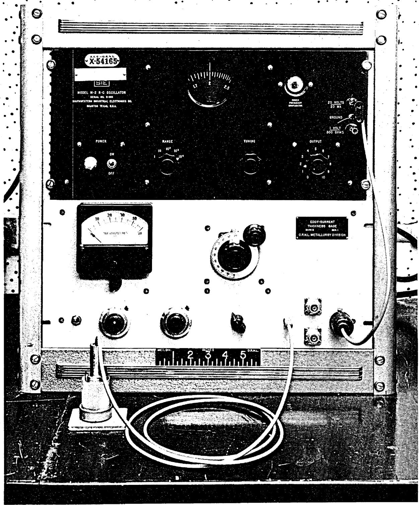  
Fig. 3.7.1. Eddy-Current Thickness Gage, Mark II, Serial 1.

probe coil a semi-empirical mathematical expression has been developed for a single-turn coil near an infinitely thick metal plate. The equation is:

The curves of Fig. 3.7.2 were plotted from Eq. 1 by using the terms $k^2 a^2$ and $\nu$ as separate parameters even though they are related. It should also be noted that these curves are universal,

$$
\begin{array}{l} (1) \frac {R + j \omega L}{\omega L _ {0}} = \frac {1}{2} \left\{j + \frac {1}{\left[ \frac {(k a) ^ {2}}{(K a) ^ {2}} - 1 \right] ^ {1 / 2}} \right\} \\ + \frac {1}{2} \left\{j + \frac {1}{\left[ \frac {(k a) ^ {2}}{(K a) ^ {2}} - 1 \right] ^ {1 / 2}} \right\} \left\{\frac {\left[ \frac {1}{4} + \frac {1}{\nu^ {2}} \right] ^ {1 / 2} - \left[ 1 + \frac {1}{\nu^ {2}} \right] ^ {1 / 2} + \ln \frac {\nu + [ \nu^ {2} + 1 ] ^ {1 / 2}}{\frac {\nu}{2} + \left[ \left(\frac {\nu^ {2}}{2}\right) ^ {2} + 1 \right] ^ {1 / 2}}}{- \left(\frac {1}{2} + \ln \frac {1}{2}\right)} \right\}, \\ \end{array}
$$

in which

$$
R = a - c \text {r e s i s t a n c e o f}
$$

$$
\omega = 2 \pi \text {t i m e s}
$$

$$
L = \text {i n d u c t a n c e}
$$

$$
\omega L = \begin{array}{l} \text {t h e r a c t a n c e o f t h e c o i l i n t h e p r e s s i n e} \\ \text {o f t h e m e t a l ,} \end{array}
$$

$$
\omega L _ {0} = \text {t h e r e a c t a n c e o f t h e c o i l i n a i r},
$$

$$
j = \sqrt {- 1},
$$

$$
k ^ {2} = j \omega \mu_ {0} \sigma ,
$$

$$
\mu_ {0} = 4 \pi \times 1 0 ^ {- 7} = \text {p e r m e a b i l i t y o f n o n m a g n e t i c}
$$

$$
\sigma = \text {t h e} \quad \text {c o n d u c t i v i t y} \quad \text {o f} \quad \text {t h e} \quad \text {m e t a l} \quad \text {i n}
$$

$$
a = \text {t h e} \quad \text {r a d i u s o f t h e} \quad \text {e q u i v a l e n t} \quad \text {s i n g l e - t u r n} \quad \text {c o i l},
$$

$$
v = l / a,
$$

$$
l = \text {t h e} ^ {\prime \prime} \text {l i f t - o f f} ^ {\prime \prime} \text {o r s p a c i n g b e t w e e n e q u i v a l e n t s i n g l e - t u r n c o i l a n d t h e m e t a l}
$$

The term $K$ is determined by the relationship of the following equation:

$$
J _ {0} (K a) = \left[ \frac {\nu^ {2} + 1}{\nu^ {2} + 4} \right] ^ {3 / 2}, \tag {2}
$$

in which $J_0$ is the Bessel function of zero order and of the first kind.

since the parameters are nondimensional and may be calculated for any given test condition. For practical testing purposes, the equivalent "single-turn radii" and the "single-turn lift-off" values may be calculated by a graphical technique on the curves shown in Fig. 3.7.2. In general, very good agreement has been obtained between a considerable amount of experimental data and the curves. More experimental data will be obtained and compared in order to increase the confidence level in applying these calculations.

The problems involved in obtaining a mathematical expression for the impedance of probe coils in the presence of plates having finite thickness and in the presence of a cladding-core couple are much more difficult and more complex than those presented by this case of an infinitely thick plate. There is some possibility, however, that these cases can also be solved. The results of the theoretical probe-coil studies should be valuable in the future application of eddy-current probe coils to the measurement of metal thickness and of the thickness of cladding over a core.

# INSPECTION OF TUBING

R.W.McClung

R. B. Oliver

Both the encircling-coil eddy-current method and the immersed-ultrasound pulse-echo method were used to inspect approximately 18,500 ft of Inconel tubing during the quarter. The tubing ranged in

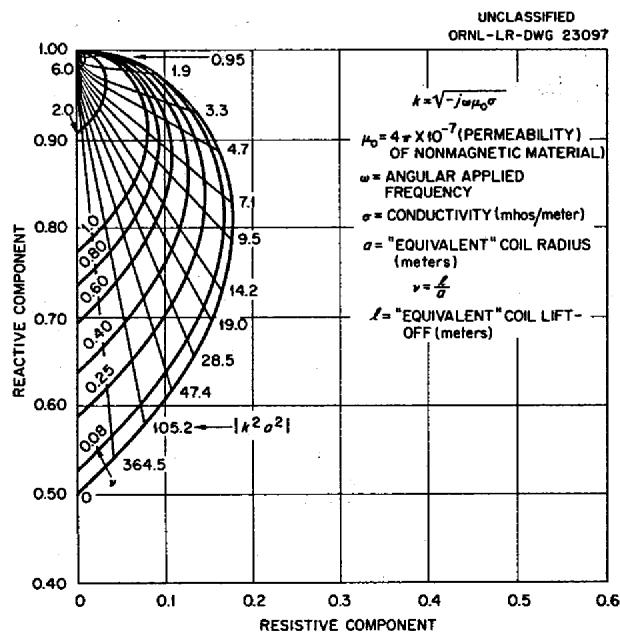  
Fig. 3.7.2. Calculated Relative Impedance of a Probe Coil Above a Conductor with Infinite Thickness.

size from $\frac{3}{16}$ in. OD with a 0.025-in. wall to $\frac{1}{2}$ in. OD with 0.065-in. wall. The rejection rates were dependent on both the quality required and on the minimum usable length. The average rejection rate was about $5\%$ , with variations for individual batches running from as low as $2\%$ to more than $10\%$ . Factors that contribute to the lower average rejection rate in comparison with the rates previously reported were re-polishing and re-inspection of ultrasonic rejects and the removal of magnetic particles by a phosphoric acid treatment.

# INSPECTION OF PIPE

J. K. White

R. W. McClung

Approximately 650 ft of Inconel pipe was inspected by the immersed ultrasound method during the quarter with less than $1\%$ rejection. About 500 ft of the pipe, both $2\frac{1}{2}$ and $3\frac{1}{2}$ in. sched 40, was inspected with resonance ultrasound methods in order to determine the wall thickness. For a specified tolerance of $\pm 5\%$ of the nominal wall thickness, the rejection rate was approximately $90\%$ ; but for a standard tolerance of $\pm 10\%$ , the rejection rate decreased to approximately $10\%$ of the total quantity of pipe.

# PLATE INSPECTION

R. W. McClung

The immersed ultrasound method was used for the inspection of more than 625 ft² of CX-900 Inconel plate in thicknesses ranging from 3/8 to 1 in. The rejection rate was less than 1%. Since the inspected plate was, in general, larger than the required size and rejected areas could be left in the trim, it is difficult to accurately estimate the true rejection as a result of defects.

# CORE SHELL INSPECTION

R.W.McClung

Immersed ultrasound methods were developed for the inspection of the Inconel reactor core shells. The core shells are inspected both for the presence of laminations and for the presence of radial cracks. For the detection of laminations, 5 megacycle ultrasound is directed perpendicularly to the surface and along the radius of a shell, and "ringing" within the thin wall is established. Any damping of the "ringing" pattern is indicative either of a change of wall thickness or of the presence of a lamination. For the detection of cracks, the 5 megacycle ultrasound is introduced into the wall of the shell with an incident angle of approximately 17 deg; any crack lying approximately perpendicular to the path of the ultrasound as it travels through the metal annulus will reflect the signal and indicate the presence of that crack.

Areas on a core shell that indicate damping of the "ringing" of the ultrasound are also examined with resonance ultrasound techniques to assure measurement of the shell thickness with an accuracy of approximately 0.001 in. and to differentiate between possible laminations in the wall and sections of wall thinner than specified. The installation for the continuous measurement of the wall thickness of a core shell is illustrated in Fig. 3.7.3, and the facility for ultrasonic examination for the detection of laminations and cracks is shown in Fig. 3.7.4.

# DETECTION OF UNBONDED AREAS IN PLATES WITH RESONANCE ULTRASOUND

R. B. Oliver

Several of the boron-containing plates for the ART shielding, which were fabricated by Allegheny-Ludlum Steel Corporation, blistered when they were

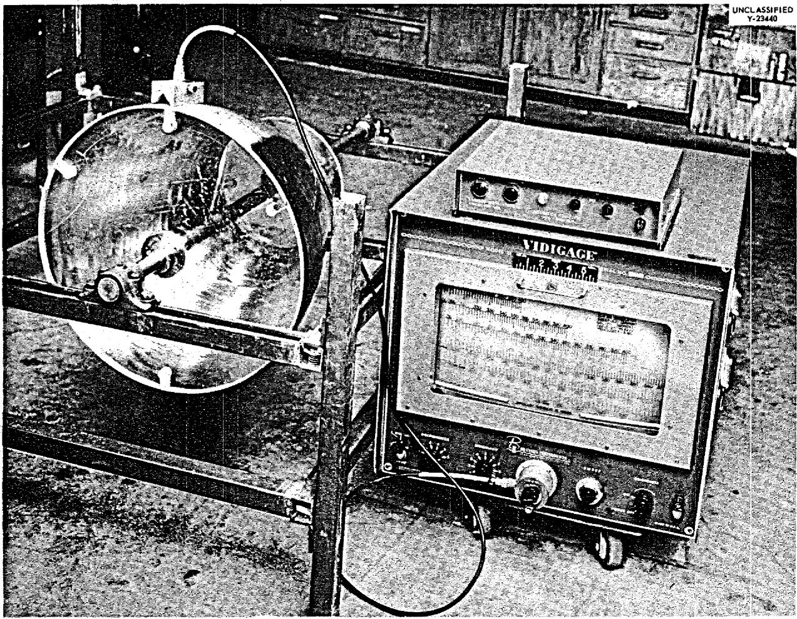  
Fig. 3.7.3. Facility for Wall Thickness Measurements of Core Shells by the Ultrasonic-Resonance Method. (Secret with exception)

heated for forming. The boron carbide-copper core was separated from the type 430 stainless steel cladding by a copper diffusion barrier, and the blisters indicated large unbonded areas at the interface between the cladding and the diffusion barrier. Since only large unbonded areas formed blisters, a nondestructive inspection method was needed in order to detect all unbonded areas before further processing. The resonance-ultrasound method was selected as the method most suited for measurement of these thin sections. In order to use the ultrasonic method, the transducer is supplied with a frequency-modulated signal, and resonance is established for each case that the

instantaneous frequency satisfies the equation:

$$
f = \frac {n V}{2 t}
$$

where

$$
f = \text {f r e q u e n c y} (1 0 ^ {6} \text {c y c l e s / s e c}),
$$

$$
V = \text {v e l o c i t y} (1 0 ^ {5} \text {i n . / s e c}),
$$

$$
t = \text {t h e} (i n.)
$$

$$
n = \text {a s m a l l}, \text {w h o l e i n t e g e r}.
$$

Either the fundamental frequency $(n = 1)$ or the difference between any two successive harmonic frequencies fixes the thickness of the test object,

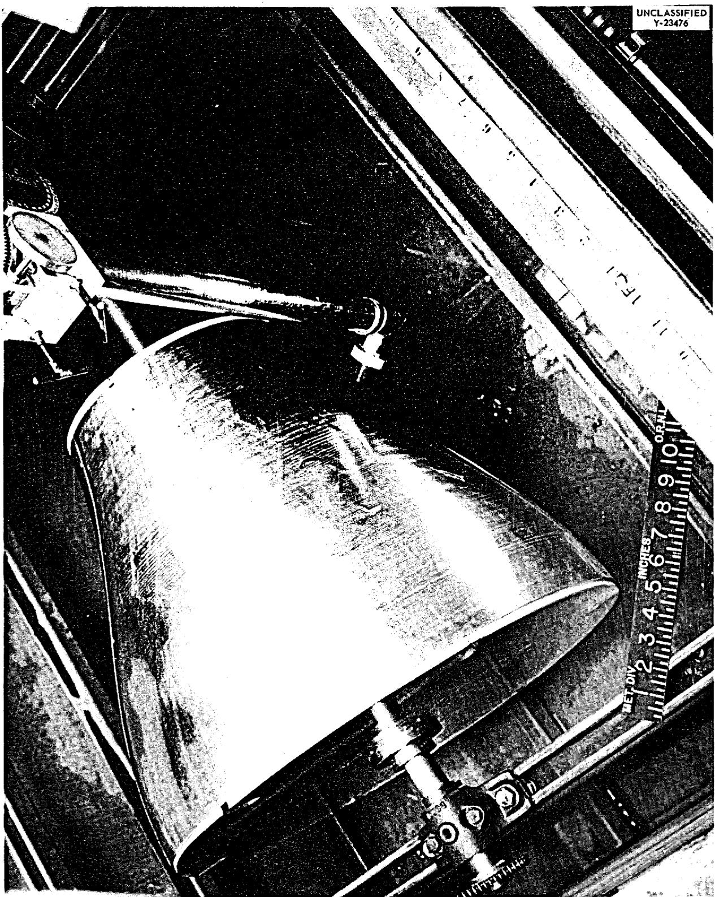  
Fig. 3.7.4. Facility for Ultrasonic Inspection of Core Shells for Laminations and Cracks. (Secret with caption)

and any change in thickness will cause a shift in these resonance frequencies. A lamination or an unbonded area will appear as a change in thickness and may be readily detected if the defect area is at least one-fourth the transducer area. The instrument presents the amplitude of the resonance peaks on the vertical sweep of a cathode-ray oscilloscope, and the frequency values, or thickness dimensions, are displayed on the horizontal sweep of the oscilloscope.

A modulation range of 2 to 4 megacycles was chosen, since this range would produce two harmonic resonances in the full 0.100-in. plate thickness but would be too low to produce a resonance in the 0.010-in. cladding layer. Also, in this frequency range, an unbonded area in the interface near the transducer results in a complete loss of signal; while an unbonded area in the interface on the opposite side from the transducer results in a pronounced shift in the location and spacing of the resonance peaks. This shift in

the resonance frequencies is equivalent to a change in thickness equal to that of the cladding layer on the far side of the plate. If the unbonded area approaches the area of the transducer, or is greater, the set of resonance lines representing the full plate thickness will disappear and a new set of lines will appear; if the unbonded area is less than the area of the transducer, both pairs of resonance lines will be on the screen. A signal gate is available on the instrument to allow the incorporation of visible and audible signals to indicate the occurrence of an unbonded area.

Several of the larger unbonded areas detected with resonance ultrasound and confirmed by stripping the cladding layer from the plate are shown in Fig. 3.7.5. The correlation observed between the nondestructive and destructive tests indicates that the resonance-ultrasound method is a simple and reliable way to locate unbonded areas in this type of plate.

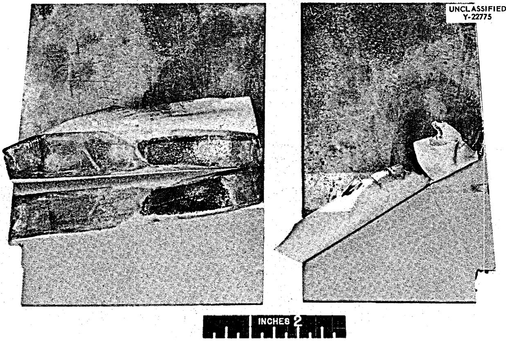  
Fig. 3.7.5. Unbonded Areas in Stainless-Steel-Clad B4C-Cu Plates.

Part 4 RADIATION DAMAGE G.W. Keilholtz

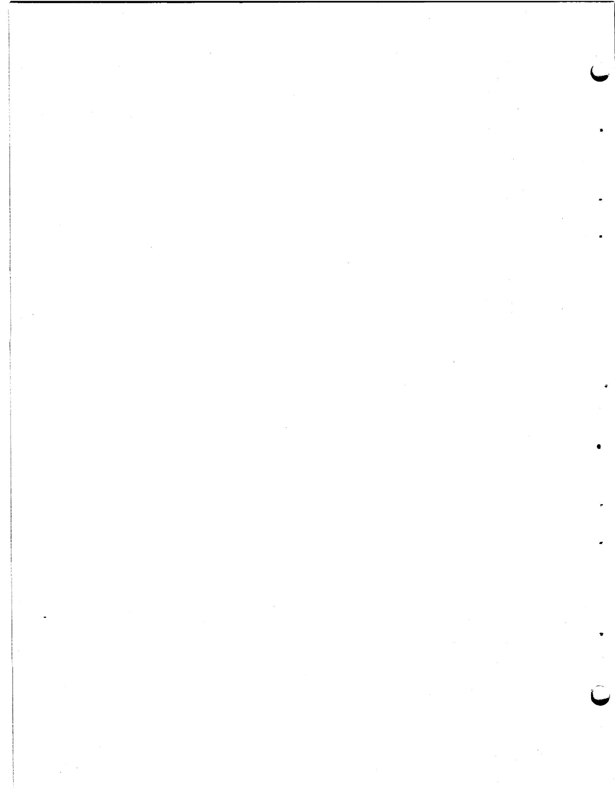

# 4.1. RADIATION DAMAGE

# G.W. Keilholtz

# EXAMINATIONS OF IRRADIATED COMPONENTS AND MATERIALS

A. E. Richt

N. A. Carter

W. B. Parsley

C. Ellis

E. D. Sims

E.J.Manthos

R. M. Wallace

# MTR In-Pile Loops

Disassembly of MTR in-pile loop No. 6, described previously, has been completed except for removal of the pump impeller from the impeller housing. Thirty metallographic specimens were obtained from the fuel circuit, and 27 of the specimens have been examined. It appears from the results obtained thus far that the maximum depth of corrosion is 3 mils. Specimens from the outlet side of the nose coil showed the greatest penetration. Specimen 672, which was taken from the outlet side of the nose coil approximately 1 in. downstream from the location of thermocouples 7 and 8, is shown in Figs. 4.1.1 and 4.1.2. Specimen 651, which was taken at the location of thermocouples 9, 10, and 22, on the nose outlet side, is shown in Figs. 4.1.3 and 4.1.4. Specimens 672 and 651 both show the maximum depth of attack of 3 mils. A typical specimen which showed little or no corrosive attack is shown in Figs. 4.1.5 and 4.1.6. This specimen, No. 641, was taken approximately 13 in. from the face of the pump on the nose inlet side.

A remotely operated lathe will be used to open the impeller housings of the pumps removed from in-pile loops Nos. 4, 5, and 6 so that the impellers can be examined. The impeller housing of the pump from loop No. 5 will be opened first, since its activity level is much lower than the activity levels of the other two impeller housings.

# Moderator Materials

The three capsules irradiated in the MTR high-temperature moderator-materials testing assembly were examined. The test assembly, after removal

from the container, but with the capsules in place, is shown in Fig. 4.1.7. The largest capsule consists of a graphite slug enclosed in a nickel can, and the smallest capsule consists of $\mathsf{ZrH}_4$ jacketed in molybdenum. The remaining capsule consists of three BeO slugs in an Inconel can. The thermocouples on the BeO capsule were all intact, but some of the thermocouples on the graphite and $\mathsf{ZrH}_4$ capsules were broken off or damaged. Dimensions of the three capsules, taken before and after irradiation, are compared in Table 4.1.1.

The three BeO slugs were removed from the capsule by cutting the welds at the end caps and then pushing the slugs out of the can. Dimensions of the BeO slugs before and after irradiation are compared in Table 4.1.2. No evidences of swelling

Table 4.1.1. Dimensions of Moderator-Material Capsules Before and After Irradiation in the MTR   

<table><tr><td rowspan="2">Capsule</td><td colspan="2">Diameter of Can* (in.)</td></tr><tr><td>Before Irradiation</td><td>After Irradiation</td></tr><tr><td rowspan="4">ZrH4in a molybdenum can</td><td rowspan="4">Not available</td><td>0.5366</td></tr><tr><td>0.5367</td></tr><tr><td>0.5360</td></tr><tr><td>0.5363</td></tr><tr><td rowspan="4">BeO in an Inconel can</td><td rowspan="4">1.0412–1.0425</td><td>1.0417</td></tr><tr><td>1.0404</td></tr><tr><td>1.0402</td></tr><tr><td>1.0404</td></tr><tr><td rowspan="6">Graphite in a nickel can</td><td rowspan="6">1.289–1.290</td><td>1.2914</td></tr><tr><td>1.2905</td></tr><tr><td>1.2900</td></tr><tr><td>1.2897</td></tr><tr><td>1.2894</td></tr><tr><td>1.2885</td></tr></table>

*Measurements were taken at evenly spaced points along the length of the capsule.

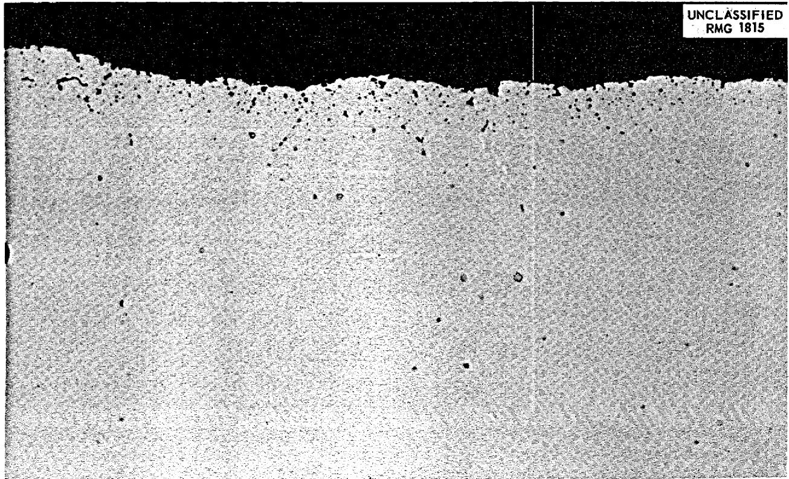

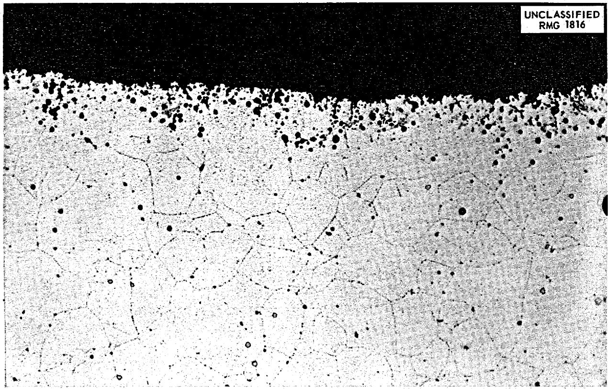  
Fig. 4.1.1. Specimen 672 Taken from Outlet Side of Nose Coil of In-Pile Loop No. 6. As polished. 250X.   
Fig. 4.1.2. Specimen 672 After Etching. 250X.

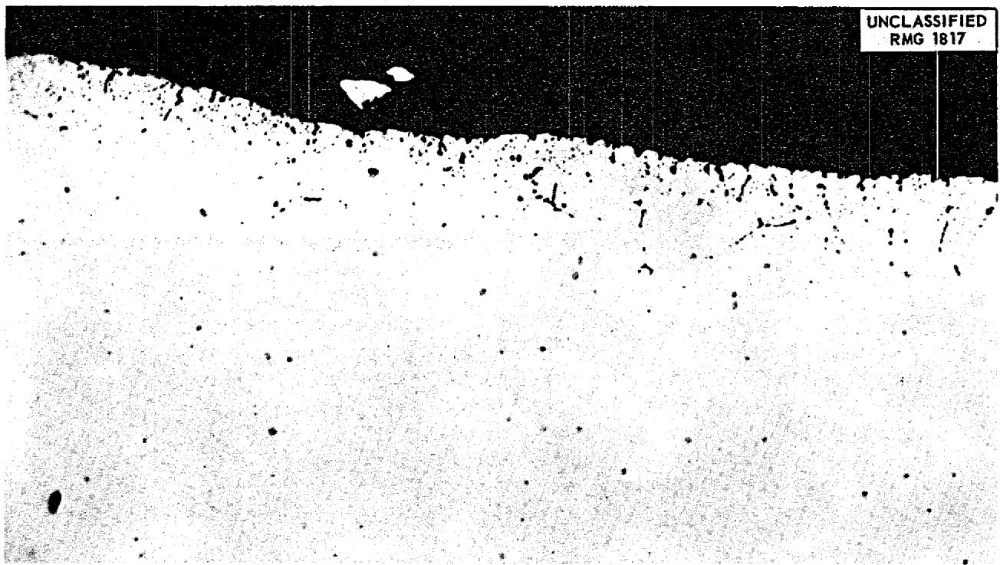  
Fig. 4.1.3. Specimen 651 Taken from Outlet Side of Nose Coil of In-Pile Loop No. 6. As polished, 250X.

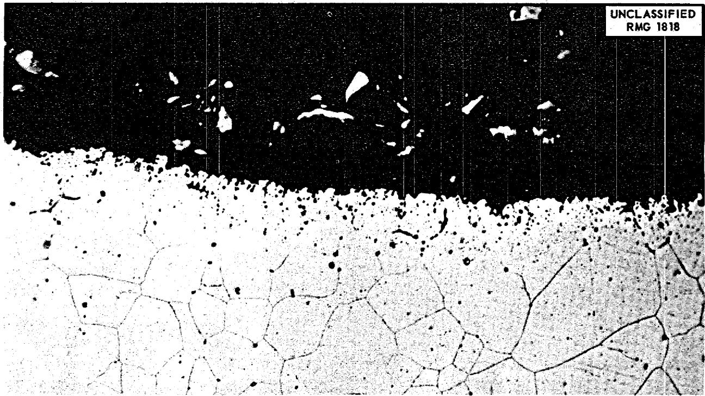  
Fig. 4.1.4. Specimen 651 After Etching. 250X.

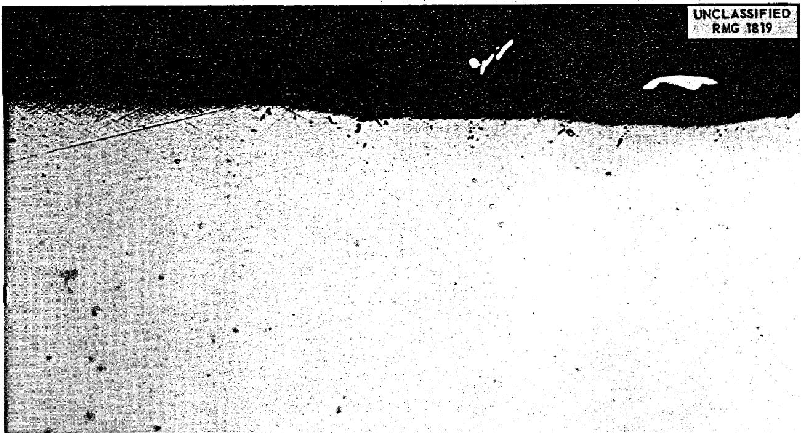  
Fig. 4.1.5. Specimen 641 Taken from Inlet Side of Nose Coil of In-Pile Loop No. 6. As polished, 250X.

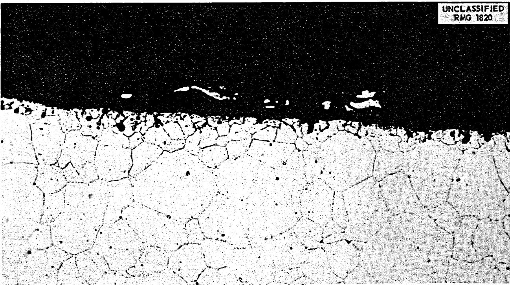  
Fig. 4.1.6. Specimen 641 After Etching. 250X.

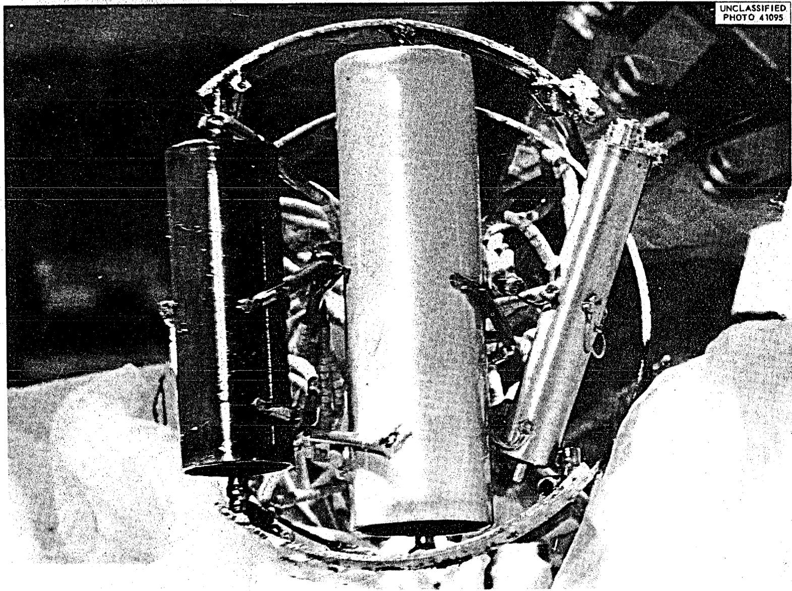  
Fig. 4.1.7. Capsules Containing Moderator Materials Shown During Disassembly After Irradiation in the MTR.

or cracking were noted on the BeO slugs, which are shown in Figs. 4.1.8 and 4.1.9. Slug No.1 was at the top of the capsule and thus was farthest from the reactor.

An attempt was made to remove the graphite slug from its can in a similar manner, but it could not be pushed out easily. Therefore, the can on the graphite slug will be slit open when the $\mathsf{ZrH}_4^*$ containing capsule is sectioned on the remote milling machine.

Table 4.1.2 Dimensions of Three BeO Slugs Before and After Irradiation in the MTR   

<table><tr><td rowspan="2">Slug Number</td><td colspan="2">Length (in.)</td><td colspan="2">Diameter (in.)</td></tr><tr><td>Before Irradiation</td><td>After Irradiation</td><td>Before Irradiation</td><td>After Irradiation</td></tr><tr><td rowspan="2">1</td><td rowspan="2">0.8325</td><td>0.8297</td><td rowspan="2">0.9964</td><td>0.9953</td></tr><tr><td>0.8298</td><td>0.9957</td></tr><tr><td rowspan="2">2</td><td rowspan="2">0.8318</td><td>0.8315</td><td rowspan="2">0.9950</td><td>0.9938</td></tr><tr><td>0.8316</td><td>0.9940</td></tr><tr><td rowspan="2">3</td><td rowspan="2">0.832</td><td>0.8317</td><td rowspan="2">0.997</td><td>0.9967</td></tr><tr><td>0.8317</td><td>0.9964</td></tr></table>

# ARE Specimens

Six specimens from the ARE have been examined. Specimen R8, a section from the pressure shell wall, including a weld, is shown in Fig. 4.1.10. A crack may be seen at the weld junction, and there are several voids in the weld area.

A section from a serpentine bend in a fuel tube in the center of the reactor, specimen R7, is shown in Figs. 4.1.11 and 4.1.12. There was subsurface void formation on the interior wall to a maximum depth of 3.5 mils, but the penetration was not uniform. Some parts of the wall showed deeper and more dense penetration than others. The outer wall of the serpentine bend, which was in contact with sodium, showed what appeared to be a mass transfer deposit (Fig. 4.1.13), in addition to some subsurface void formation. The deposit had plated on the wall to a maximum thickness of 1 mil.

Specimen R3, which was also taken from a serpentine bend in a fuel tube in the center of the core, also showed some subsurface void formation; however, the density and depth of penetration were not so great as for specimen R7. The areas of attack were localized, and some areas of the wall showed no attack, as may be seen in Figs. 4.1.14 and 4.1.15. No deposit similar to that found on specimen R7 was noted on the exterior wall.

Specimen F5, which was taken from the inlet of a fuel-to-helium heat exchanger, was cast in epoxy resin so that the fins on the tube would not be

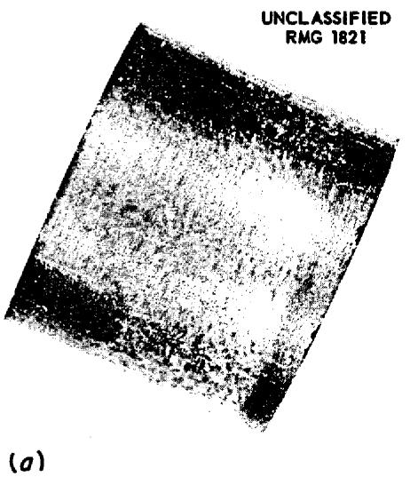

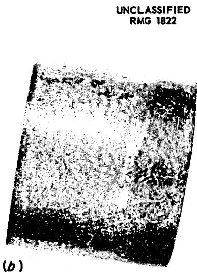

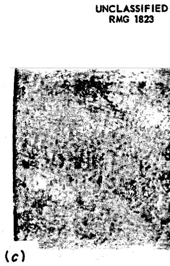  
Fig. 4.1.8. BeO Slugs After Irradiation in MTR. (a) Slug No. 1, which was farthest from reactor. (b) Slug No. 2. (c) Slug No. 3, which was closest to reactor. 2X. Reduced $5.5\%$ .

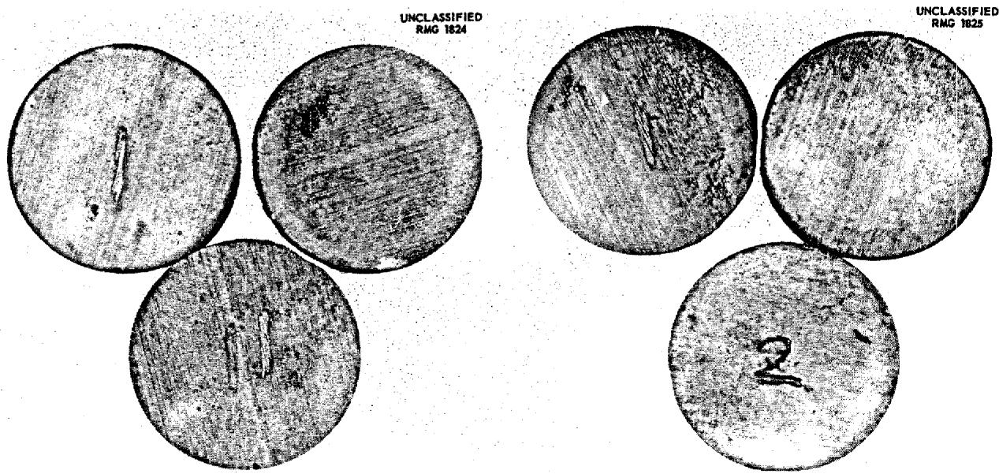  
Fig. 4.1.9. Opposite Ends of BeO Slugs 1, 2, and 3 After Irradiation in the MTR. 2X. Reduced $32\%$ .

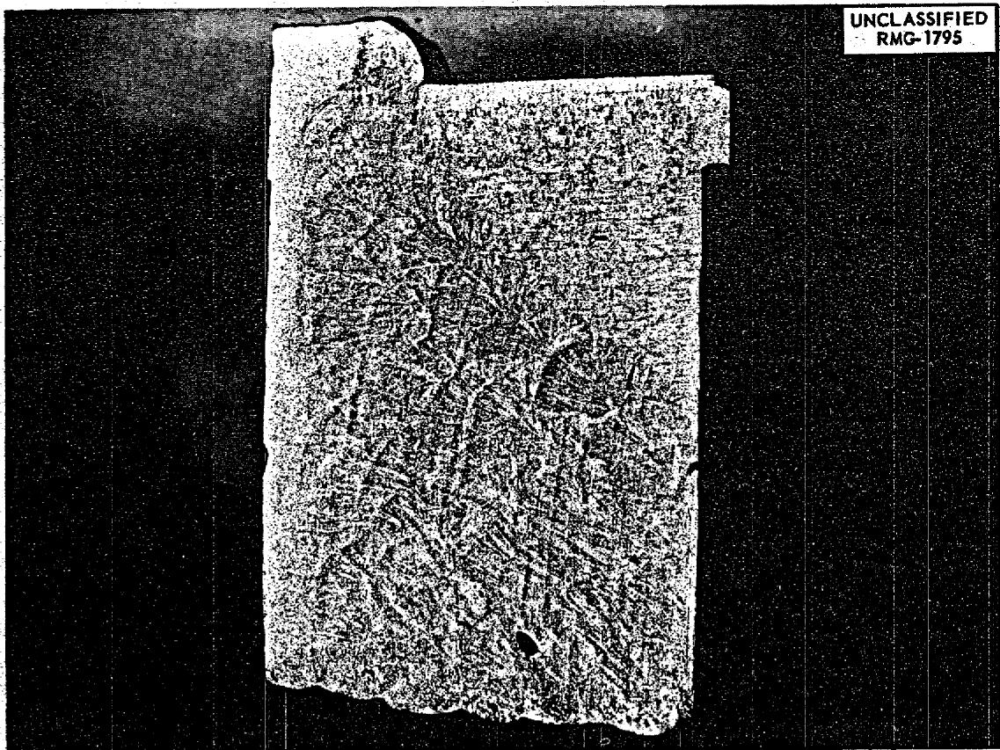  
Fig. 4.1.10. Section from ARE Pressure Shell, Including a Weld. 5X. (Secret with caption)

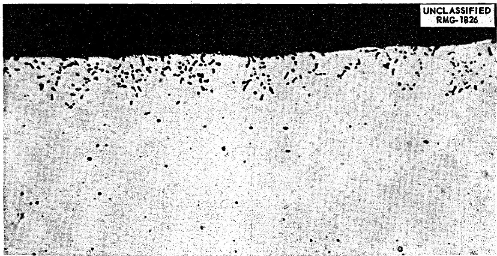  
Fig. 4.1.11. Section from a Serpentine Bend in a Fuel Tube in the ARE Core, Specimen R7. As polished. 250X. (Schematic with caption)

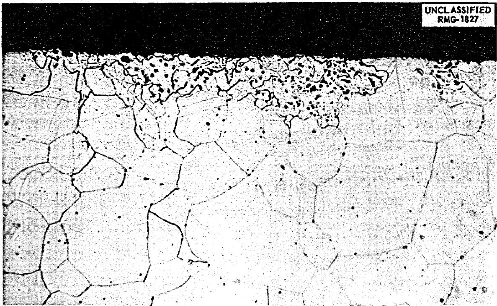  
Fig. 4.1.12. Section Shown in Fig. 4.1.11 After Etching. 250X. (Secret with exception)

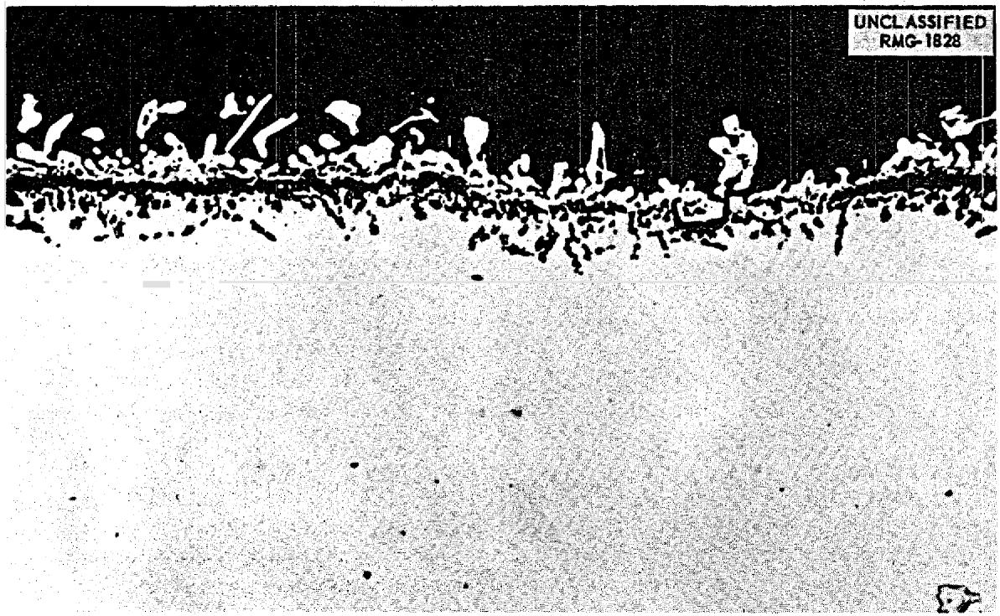  
Fig. 4.1.13. Mass Transfer Deposit on Outer Wall of Fuel Tube at Serpentine Bend. This surface was in contact with sodium during ARE operation. As polished, $500\mathrm{X}$ . (Secret with ejection)

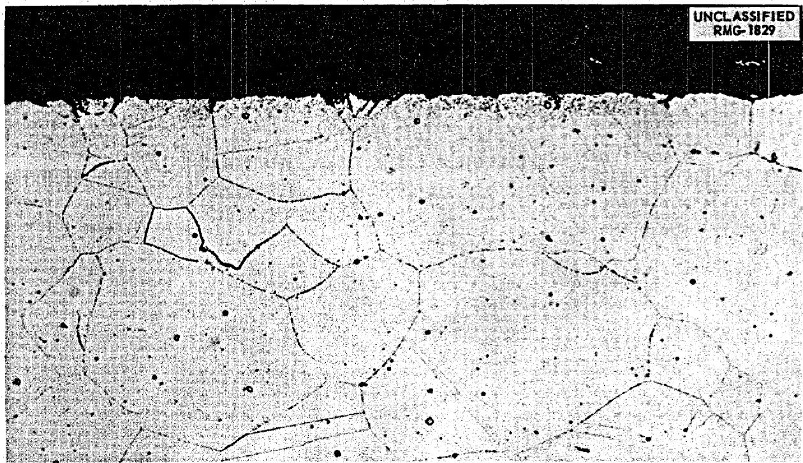  
Fig. 4.1.14. Section of Specimen R3 Taken from Serpentine Bend In Fuel Tube in ARE Core. Etched. 250X. (Secret with caption)

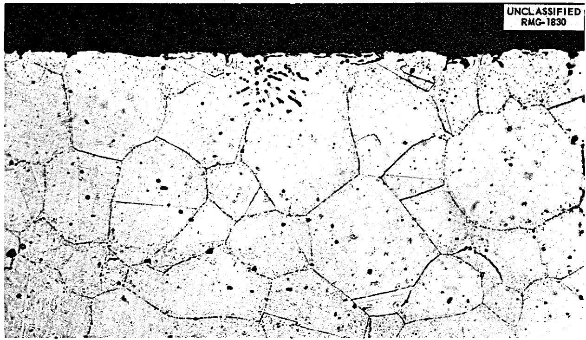  
Fig. 4.1.15. Another Section of Specimen Shown in Fig. 4.1.14. Etched. 250X. (Seoul with caption)

damaged during cutting. The fin-to-tube wall junction is shown in Fig. 4.1.16. (In the ARE fuel-to-helium heat exchangers the fins were helical strips placed in grooves on the tubes. The strips were not brazed to the tubes.) The interior wall of the tube showed subsurface voids to a depth of 4 mils, as shown in Figs. 4.1.17 and 4.1.18. Specimen F9, which was taken from the middle of a bend in a fuel-to-helium heat exchanger, also showed subsurface voids to a depth of 4 mils, as shown in Figs. 4.1.19 and 4.1.20. Specimen S6, the bottom bellows from sodium valve U-23, was also cast in epoxy resin. No cracks in the bellows folds were found, and only a slight roughening of the inside surface was noted, as shown in Fig. 4.1.21.

# CREEP AND STRESS-RUPTURE TESTS OF INCONEL

J. C. Wilson

W.E.Brundage

N. E. Hinkle

W.W.Davis

J. C. Zukas

# MTR Experiments

An eight-specimen tube-burst creep test at $1500^{\circ}\mathrm{F}$ in the MTR, as reported previously, resulted in

times to rupture that were much shorter than expected, and overheating of the specimens under stress during reactor startup was thought to be a possible explanation for the shortened rupture life. Subsequent out-of-pile tests conducted by Douglas and East of the Metallurgy Division in other apparatus but under conditions that duplicated the time-stress-temperature history of the in-pile specimens have indicated that the time to rupture was not appreciably affected by the overheating cycle.

Another out-of-pile test in which the MTR apparatus is duplicated is currently being conducted by the Solid State Division. The time-temperature-stress history of the in-pile specimens is again being duplicated exactly. The apparatus used for the Solid State Division test differs from the apparatus used by the Metallurgy Division in that the heaters and thermocouples are in the same chamber as the specimens and contamination of the atmosphere is a greater problem.

The creep apparatus irradiated in the MTR has been cut from the irradiation plug and returned to

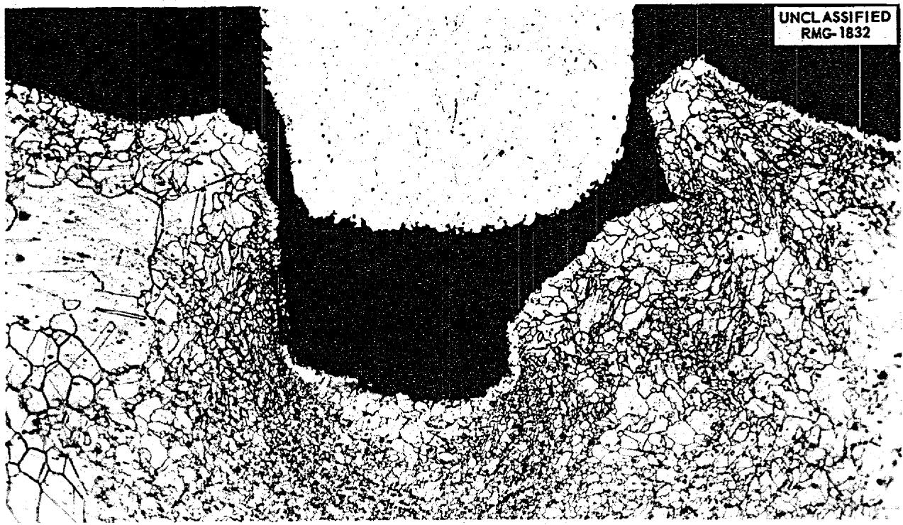  
Fig. 4.1.16. Section of Specimen F5 Showing Fin-to-Tube Wall Junction in ARE Fuel-to-Hellum Heat Exchanger. Fins were wound helically in grooves and were not brazed to the tubes. Etched. 100X. (Seeret with caption)

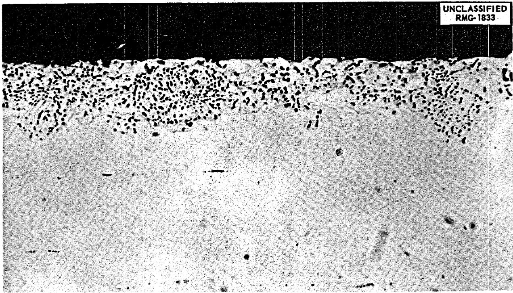  
Fig. 4.1.17. Interior Wall of Tube Shown in Fig. 4.1.16. As polished. 250X. (Secret with caption)

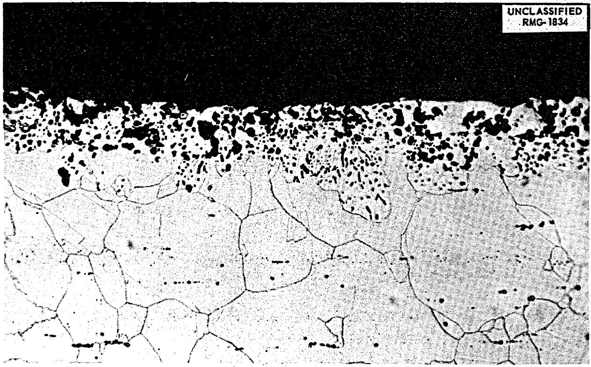  
Fig. 4.1.18. Section Shown in Fig. 4.1.17 After Etching. 250X. (Secret with caption)

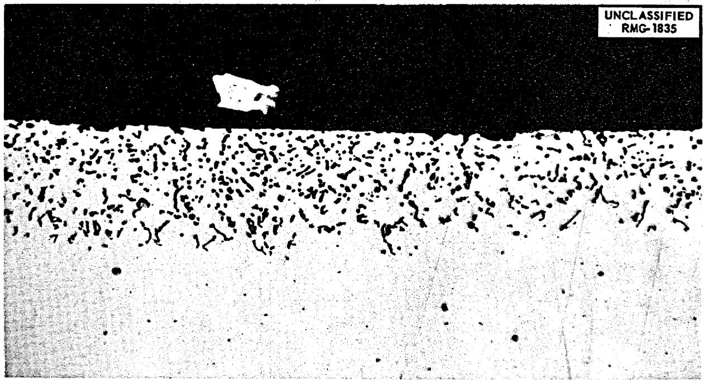  
Fig. 4.1.19. Section of Specimen F9 Taken from Middle of a Bend in an ARE Fuel-to-Hellium Heat Exchanger. As polished. 250X. (Secret with caption)

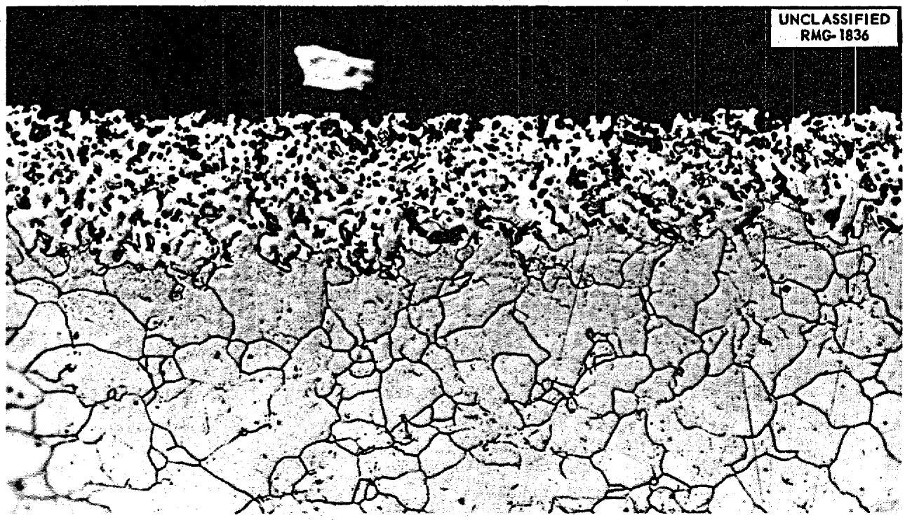  
Fig. 4.1.20. Section Shown in Fig. 4.1.19 After Etching. 250X. (Secret with caption)

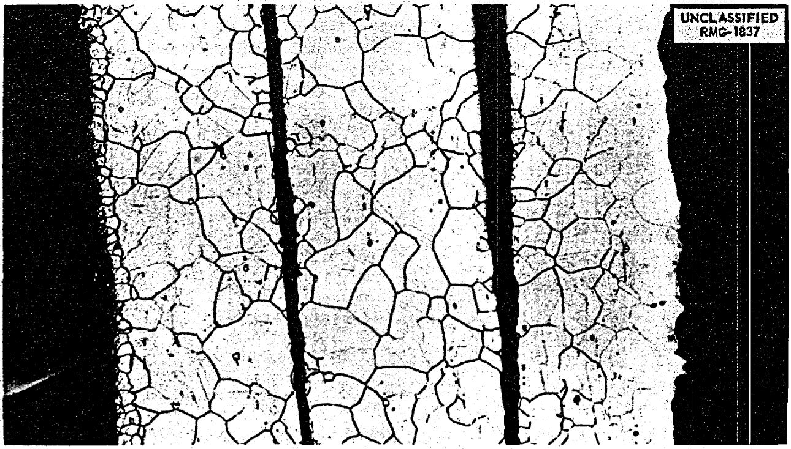  
Fig. 4.1.21. Section of Specimen S6 Taken from the Bottom Bellows of Sodium Valve U-23. Etched. 250X. (Secret with caption)

ORNL. Examination of the specimens for fracture location and surface contamination is scheduled in the hot cells.

Temperature control in a recent MTR irradiation of the eight-specimen apparatus was found to be difficult because of the steep gamma-ray heating gradient in specimens oriented with their long axes along the direction of the gradient (specimens parallel to beam hole axis). An out-of-pile mockup of an apparatus with specimens mounted perpendicular to the beam hole axis is being tested. Only four specimens (instead of eight) can be accommodated in this apparatus, but improved temperature control should result during startup and shutdown of the reactor.

# LITR Experiments

Leaks of undetermined origin caused three stress-corrosion experiments in the LITR to be discontinued. Inconel specimens exposed to $\mathsf{NaF - ZrF}_4\cdot$ UF4 (62.5-12.5-25 mole $\%$ fuel 46) were being tested at $1500^{\circ}\mathsf{F}$ and a stress of 2000 psi. One specimen had been in the reactor for 100 hr after startup, but the other two were irradiated for less than 24 hr. Since all the apparatus was leaktight (as determined with a helium leak detector) before irradiation, thermal stresses that occurred during irradiation are believed to have caused opening of brazed joints or tubing connections. The apparatus now being constructed is being instrumented to check the point of failure. The specimens that failed are to be examined in the hot cells. The apparatus that failed showed that improved furnace construction had allowed control of the temperature at $1500^{\circ}\mathsf{F}$ for a wider variety of fuel loadings and neutron fluxes than was possible earlier.

An experiment was carried out in beam hole HB-3 of the LITR to investigate the effect of irradiation on several kinds of thermocouple insulation. Glass-insulated thermocouple pairs; sheathed, swaged, MgO-insulated pairs; ceramic insulators; and metal-sheathed, unimpregnated, glass-insulated pairs were tested. The specimens were tested in air and in helium at temperatures up to $1500^{\circ}\mathrm{F}$ . Measurements of electrical leakage between the wires of a pair were made in each case as a function of time, flux, integrated flux, and occasional variations in temperature during irradiation and during shutdown periods. The data have not yet been correlated completely, but it has been established that the insulating materials

and practices used in past (and projected) LITR and MTR apparatus have not caused errors in temperature measurements. The only insulation that failed during the tests was on a metal-sheathed, unimpregnated, glass-insulated pair. The electrical potential used during the tests was about 20 v. A metal-sheathed, swaged, MgO-insulated pair of the type intended for use in the ART was included in these tests, but a more definitive experiment that will include a study of the effects of irradiation on the resistivity of Inconel is to be conducted.

# LITR VERTICAL IN-PILE LOOP

W. E. Browning

J.E.Lee, Jr.

H. E. Robertson

M. F. Osborne

R. P. Shields

The forced-circulation loop which was operated in a vertical hole in the LITR for $235\mathrm{hr}$ , as described previously,4 is being disassembled for examination and analysis of the fluoride fuel mixture circulated therein. The loop has been removed from the outer container, and the major subassemblies have been detached. Examination of these sub-assemblies is in progress. The supposition that the pump became inoperative because of bearing seizure was substantiated.

The two pump-shaft bearings were removed by cutting laterally through the pump and shaft above and below each bearing. The shaft in the bearing nearest to the fuel could not be turned by the manipulator. A black porous deposit was found on the wall near the bearing that was, presumably, radiolytic decomposition products from the grease. The shaft in the bearing just below the motor could be turned, but only a small amount at a time, and the bearing above the motor turned freely. All three bearings had been lubricated with the same radiation-resistant lubricant. The difference between the behavior of the bearings is attributed to the difference in dosages from the decay of short-lived fission gases as they diffused upward through the pump.

Of the 55 thermocouples in the loop, 22 failed. Seven of the failures were due to an open circuit in the platinum-rhodium leads. One thermocouple failed because the bead came loose from the Inconel fuel tube, and 14 failed because both the platinum and the platinum-rhodium lead wires had

broken. Illustrations of thermocouples that failed are presented in Figs. 4.1.22, 4.1.23, and 4.1.24. These thermocouples were located on the fuel tubing in the high-temperature region of the loop. Three beads were used for each thermocouple installation, as shown in Figs. 4.1.22 and 4.1.24. Both leads had pulled away from one bead shown in Fig. 4.1.22, and only one lead remains attached to another of the beads. The pair of wires that pulled away from the bead during operation are shown in Fig. 4.1.23. The tapered ends are typical of ductile failure in tension. Wires that broke about $\frac{1}{4}$ to $\frac{1}{2}$ in. from the bead are shown in Fig. 4.1.24. The ends of these wires also show the tapered effect illustrated in Fig. 4.1.23. The mechanical damage of the lead wires probably occurred during thermal expansion of the loop.

The platinum resistance heaters and their lead wires were examined closely to determine the cause of failure of 4 of the 22 heater circuits. The heating elements were in good condition, and

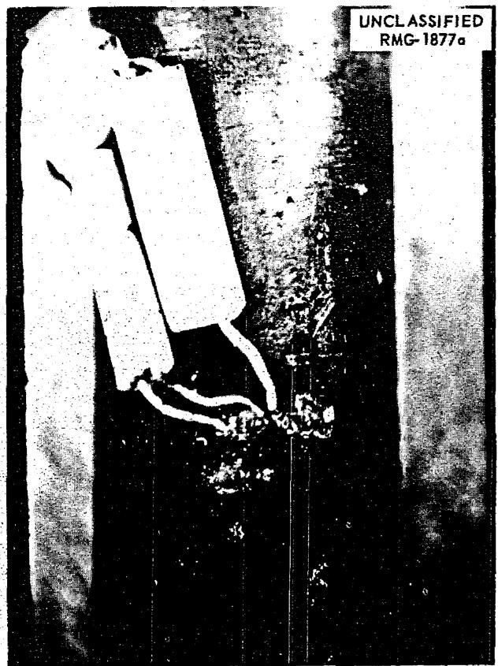  
Fig. 4.1.22. Thermocouple That Failed During Operation of a Vertical In-Pile Loop in the LITR.

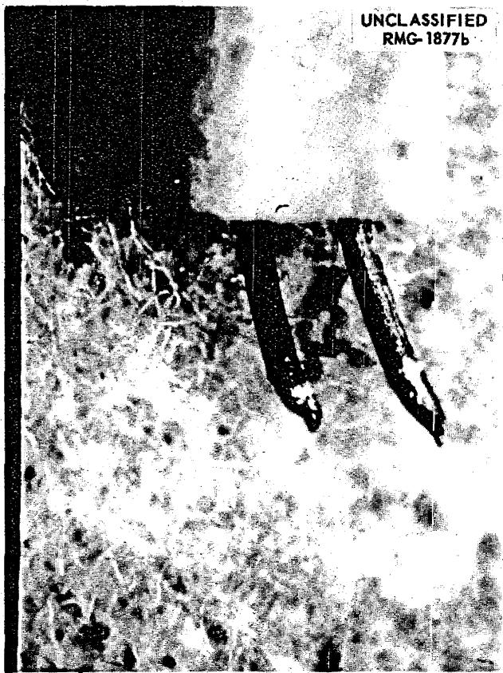  
Fig. 4.1.23. Wires That Pulled Away from Thermocouple Bead Shown in Fig. 4.1.22.

the failures appeared to have been in the lead wires.

Particular attention was given to the distribution of fuel and fuel vapor deposits in the pump. The pump was sectioned longitudinally along the shaft, and one-half is shown in Fig. 4.1.25. No vapor deposits were found in the region above the Graphitar vapor baffle. There was no evidence of splashing of the fuel in the sump chamber. It is interesting to compare the vapor deposits with those observed in the out-of-pile pump, in which much larger deposits of $\mathsf{ZrF}_4$ were found. The difference may be attributed to the longer operating life of the out-of-pile test pump of over 3500 hr. Microscopic examination of the Graphitar vapor baffle showed that the shaft had not rubbed against the baffle; the original tool marks on the Graphitar were undisturbed. The general appearance of the

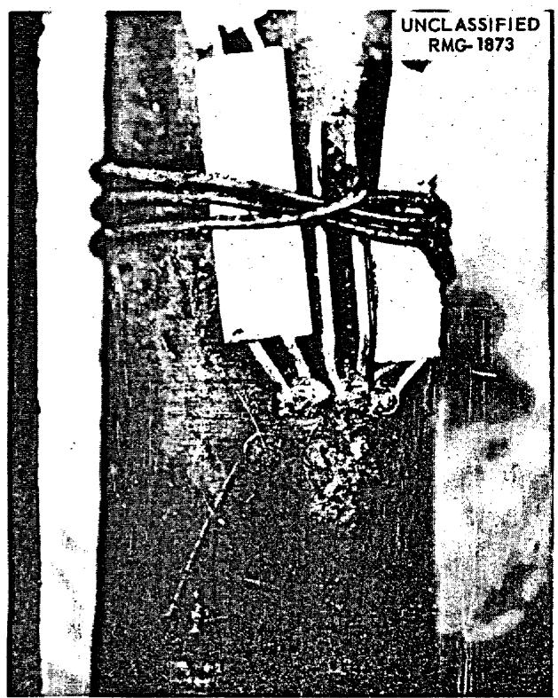  
Fig. 4.1.24. Thermocouple That Failed During Operation of a Vertical In-Pile Loop in the LITR Showing Broken Lead Wires.

loop, as observed during disassembly, was good. The quartz tape that was used to insulate and bind the wires was not discolored or damaged. One air annulus was slightly bowed. Some of the structure of the loop may be seen in Fig. 4.1.26. The heater section shown in the figure is in good condition. No discoloration was found on any of the ceramic heater forms.

Tests are being prepared of bearings designed to withstand fission-gas radiation for longer operating times and thermocouple installations designed to prevent damage of the thermocouple leads during thermal expansion of the fuel tubes. Samples of minute deposits found at various locations in the pump are being analyzed chemically and radiochemically in order to determine the distribution of fission products in the fuel. Specimens of the Inconel tubing are being taken from the fuel circuit for metallographic examination to determine the extent of corrosion in the loop.

# MTR STATIC CORROSION TESTS

H. L. Hemphill

W. E. Browning

Two Inconel capsules containing the fuel mixture NaF-ZrF4-UF4 (53.5-40-6.5 mole %, fuel 44) were withdrawn from the MTR after 720 hr of irradiation at $1500^{\circ}\mathrm{F}$ under static conditions. These capsules will be returned to ORNL for examination. Two Hastelloy B capsules were inserted in the MTR, but operational difficulties made it necessary to delay temperature cycling.

# FLUX MONITORING OF MTR STATIC CORROSION CAPSULES

D. E. Guss

The average thermal-neutron-flux exposures of several static corrosion capsules irradiated in the MTR have been calculated from the Co60 disintegration rate of the Inconel container material. The average fluxes for four of the capsules were also determined by the yields of $\mathsf{Zr}^{95}$ and Cs137 from U235 fission in the fuel contained in the capsules. The values are presented in Table 4.1.3. Revised flux values based on corrected irradiation times are given for three capsules.

# RELATIVE CONTRIBUTION FROM THE $\mathsf{NI}^{60}(n,p)\mathsf{Co}^{60}$ REACTION TO THE $\mathsf{Co}^{60}$ DISINTEGRATION RATE IN IRRADIATED INCONEL

D. E. Guss

The contribution to the $\mathbf{C}\mathbf{o}^{60}$ disintegration rate in irradiated Inconel arising from the nickel constituent through the $\mathrm{Ni}^{60}(n,p)\mathrm{Co}^{60}$ reaction was investigated further. In order to obtain a measure of this contribution the $\mathbf{C}\mathbf{o}^{60}$ disintegration rate was determined for several pieces of vacuum-melted carbonyl nickel ( $\sim 0.002\%$ Co) which had received a 75-min irradiation in the lattice (hole C-46) of the LITR in September 1955. The $\mathbf{C}\mathbf{o}^{60}$ disintegration rate per gram of nickel was equivalent to that which would have been produced by $1\times 10^{-5}\mathrm{g}$ of cobalt. Even if all this activity were attributed to the $\mathrm{Ni}^{60}(n,p)\mathrm{Co}^{60}$ reaction, that is, if there were assumed to be absolutely no

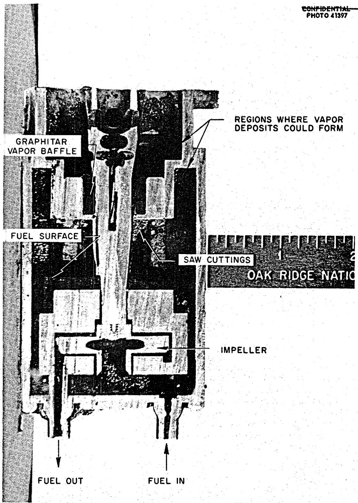  
Fig. 4.1.25. Sectioned Pump from Vertical In-Pile Loop Operated in the LITR.

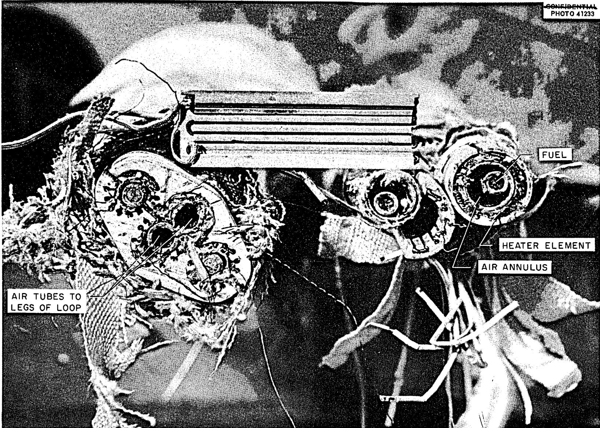  
Fig. 4.1.26. View of Partially Disassembled LITR Vertical In-Pile Loop.

Table 4.1.3. Thermal-Neutron Flux Values Obtained from Flux Monitoring of MTR Static Corrosion Capsules   

<table><tr><td>Capsule Number</td><td>Discharge Date</td><td>Irradiation Time (Mwd)</td><td>Average Flux Calculated from Co60 Disintegration Rate in Inconel Capsule (n/cm2·sec)</td><td>Average Flux Calculated from Fission-Product Yields (n/cm2·sec)</td></tr><tr><td></td><td></td><td></td><td>×1014</td><td>×1014</td></tr><tr><td>227</td><td>12-29-53</td><td>367</td><td>1.39</td><td></td></tr><tr><td>232</td><td>11-18-54</td><td>1282</td><td>1.44</td><td></td></tr><tr><td>237</td><td>3-28-55</td><td>990</td><td>1.42</td><td></td></tr><tr><td>245</td><td>6-20-55</td><td>939</td><td>0.80*</td><td></td></tr><tr><td>252</td><td>7-7-55</td><td>535</td><td>2.36</td><td></td></tr><tr><td>253</td><td>3-28-55</td><td>990</td><td>1.60</td><td></td></tr><tr><td>274</td><td>6-20-55</td><td>939</td><td>0.78*</td><td></td></tr><tr><td>275</td><td>6-20-55</td><td>939</td><td>1.10*</td><td></td></tr><tr><td>316</td><td>7-5-56</td><td>1980</td><td>1.77</td><td>1.97</td></tr><tr><td>317</td><td>7-5-56</td><td>1980</td><td>1.12</td><td>1.19</td></tr><tr><td>333</td><td>9-24-56</td><td>510</td><td>0.78</td><td>0.76</td></tr><tr><td>345</td><td>9-24-56</td><td>510</td><td>0.59</td><td>0.67</td></tr></table>

*Revised values based on corrected irradiation times.

cobalt present in the nickel, it may be seen that the contribution to the $\mathsf{Co}^{60}$ activity in irradiated Inconel arising from the $\mathsf{Ni}^{60}(n,p)\mathsf{Co}^{60}$ reaction would be negligible. The Inconel used in fabricating corrosion-test capsules contains about $1.5\times 10^{-3}\mathrm{g}$ of cobalt per gram of Inconel, and thus the contribution to the total $\mathsf{Co}^{60}$ activity from the nickel would amount to less than $0.5\%$ . Further, the tests are run under conditions in which the ratio of the fast-neutron flux to the thermal-neutron flux is about unity.

# ETR IRRADIATION OF MODERATOR MATERIALS

W.E.Browning G.Samuels

R. P. Shields

Preparations have continued for irradiation in the ETR of moderator materials for use in high-temperature reactors. The irradiation request was approved by the AEC and design details are being worked out with ETR personnel. Fabrication of the

BeO test specimens has been started, and arrangements have been made for fabrication of yttrium hydride test specimens at GE-ANP. (For details of design of equipment for the irradiations see Chap. 1.4, "Engineering Design Studies.")

# EFFECT OF IRRADIATION ON THERMAL-NEUTRON SHIELD MATERIALS

J. G. Morgan

M. T. Morgan P. E. Reagan

# Boron Nitride

Boron nitride is similar to graphite in many respects, but it is white in color and much more resistant to oxidation at high temperatures. Favorable results have been obtained from radiation damage tests conducted on boron nitride as a neutron shielding material. The tests were made, primarily, to explore the general integrity of this relatively new ceramic under irradiation and,

specifically, to determine weight, density, and dimensional changes. Boron nitride was obtained from two manufacturers (Norton Company and The Carborundum Company) in powder form and $3\frac{1}{16}$ -in.-OD, $1\frac{1}{2}$ -in.-long test specimens were hot pressed from the powder. The Norton samples are designated 6002, and the Carborundum samples are designated Cl.

The samples were irradiated in an inert atmosphere either in quartz ampoules or in Inconel capsules. High-temperature irradiations were made in the Inconel capsules, and the quartz ampoules were irradiated at the temperature of the test reactor water. The high-temperature tests were monitored by thermocouples pressed against the outer surface of the sample with leads extending through a ceramic seal in the capsule top. The thermal-neutron dosage was calculated from the activity of a cobalt foil located against the sample.

Surface darkening of the samples during irradiation is thought to have been caused by a metallic deposit. The coating was found to be primarily magnesium, with some silicon and traces of calcium and copper. The irradiated samples retained good crystallinity. The results of x-ray diffraction examinations of samples irradiated in the MTR are presented in Table 4.1.4. The conditions of the tests and the physical property changes resulting from irradiation are described in Table 4.1.5, and irradiated and unirradiated samples are compared in Fig. 4.1.27. The dimensional changes that occurred during the tests were small, and the changes that were detected could not be definitely attributed to radiation damage, since boron nitride is a soft material7 and the micrometers used scraped material from the surface during measurements of the samples. Both the weight and the density changes were less than $1\%$ . The burnup values shown in Table 4.1.5 are average values calculated on the basis of neutron flux and irradiation time. Boron isotopic analyses are being made.

These tests indicate that boron nitride is undamaged by irradiation at a temperature of $1800^{\circ}\mathrm{F}$ to a thermal-neutron dosage of $1.3 \times 10^{20}$ neutrons/cm².

Physical property measurements are now being made on the four samples irradiated at $70^{\circ}\mathrm{F}$ . The gas evolved during irradiation will also be analyzed.

Table 4.1.4. Results of X-Ray Diffraction Examinations of Irradiated Boron Nitride   

<table><tr><td rowspan="2">Plane Indices</td><td colspan="4">Lattice Spacing Dimension 0 (A)</td></tr><tr><td>Original Powder</td><td>Unirradiated Hot-Pressed Sample</td><td>6002-1</td><td>6002-4</td></tr><tr><td>(002)</td><td>3.32</td><td>3.33</td><td>3.37</td><td>3.33</td></tr><tr><td>(100)</td><td>2.17</td><td>2.17</td><td>2.17</td><td>2.17</td></tr><tr><td>(101)</td><td></td><td>2.06</td><td>2.06</td><td>2.06</td></tr><tr><td>(102)</td><td>1.81</td><td>1.82</td><td>1.82</td><td>1.82</td></tr><tr><td>(004)</td><td></td><td>1.66</td><td>1.68</td><td>1.66</td></tr><tr><td>(104)</td><td></td><td>1.32</td><td></td><td>1.32</td></tr><tr><td>(110)</td><td></td><td>1.25</td><td>1.25</td><td>1.25</td></tr><tr><td>(112)</td><td></td><td>1.17</td><td>1.17</td><td>1.17</td></tr><tr><td colspan="5">Hexagonal Structure Axes</td></tr><tr><td>A</td><td colspan="2">2.50</td><td colspan="2">2.50</td></tr><tr><td>C</td><td colspan="2">6.64</td><td colspan="2">6.74*</td></tr></table>

*The expansion in C is 1.6%.

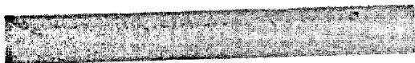  
UNCLASSIFIED RMG-1842   
(a)

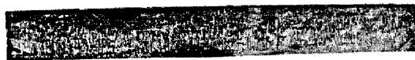  
(b)   
Fig. 4.1.27. Hot-Pressed Boron Nitride (a) Unirradiated and (b) Irradiated in the MTR at $1780^{\circ}\mathrm{F}$ to an Average $\mathbf{B}^{10}$ Burnup of $4\%$ .

Table 4.1.5. Test Conditions and Physical Property Changes Resulting from Irradiation of Hot-Pressed Boron Nitride   

<table><tr><td rowspan="2"></td><td colspan="7">Sample Number</td></tr><tr><td>6002-1</td><td>6002-2</td><td>6002-3</td><td>6002-4</td><td>6002-8</td><td>Cl-11</td><td>Cl-12</td></tr><tr><td>Test facility</td><td>MTR A-28</td><td>LITR C-39</td><td>LITR C-39</td><td>MTR A-28</td><td>Out-of-pile test</td><td>LITR C-39</td><td>LITR C-39</td></tr><tr><td>Test temperature, °F</td><td>1600</td><td>70</td><td>70</td><td>1780</td><td>1470</td><td>70</td><td>70</td></tr><tr><td>Irradiation time, hr</td><td>710</td><td>1674</td><td>1674</td><td>606</td><td>600</td><td>1148</td><td>1148</td></tr><tr><td>Thermal-neutron flux, neutrons/cm2·sec</td><td>5 × 1013</td><td>1.7 × 1013</td><td>1.7 × 1013</td><td>4 × 1013</td><td></td><td>1.7 × 1013</td><td>1.7 × 1013</td></tr><tr><td>Dose, neutrons/cm2</td><td>1.3 × 1020</td><td>1.02 × 1020</td><td>1.02 × 1020</td><td>8.72 × 1019</td><td></td><td>7.02 × 1019</td><td>7.02 × 1019</td></tr><tr><td>Weight change, %</td><td>0.9</td><td>**</td><td>**</td><td>*</td><td>0.26</td><td>**</td><td>**</td></tr><tr><td>Density change, %</td><td>None</td><td>**</td><td>**</td><td>0.13</td><td>0.77</td><td>**</td><td>**</td></tr><tr><td>Dimensional change, %</td><td>None</td><td>**</td><td>**</td><td>0.1</td><td>None</td><td>**</td><td>**</td></tr><tr><td>Average B10burnup, %</td><td>6.0</td><td>4.8</td><td>4.8</td><td>4.0</td><td>None</td><td>3.8</td><td>3.8</td></tr></table>

*Weight-change measurement not made because chips were lost when sample broke.  
**Physical properties yet to be determined.

# Boron Carbide

Irradiation tests of two hot-pressed boron carbide tiles that were prototype samples of ART tiles were completed. A sample designated J-1 was irradiated in the LITR C-39 facility for 1148 hr at the reactor water temperature to a calculated average burnup of $1.4\%$ . A sample designated J-3 was irradiated in the LITR C-42 facility for 910 hr at $1500^{\circ}\mathrm{F}$ to an average burnup of $2.2\%$ . Post-irradiation examinations of these samples are in progress.

An out-of-pile test was conducted in which a third sample (J-2) was cycled 18 times from 200 to $1600^{\circ}\mathrm{F}$ . The sample was then examined under a microscope at magnifications of 20 and 40, and no cracks were observed.

# Cermets

Plates of BN-Ni (10.3 wt % BN) and $\mathsf{CaB}_6$ -Fe (7.6 wt % $\mathsf{CaB}_6$ ) cermets clad with type 304 stainless steel have been irradiated at less than $345^{\circ}\mathsf{F}$ in evacuated quartz ampoules cooled by the LITR reactor water and examined after two different

burnups. The boron in both cermets was natural boron. There were no structural changes as a result of irradiation to an average $\mathsf{B}^{10}$ burnup of 19%, as shown in Table 4.1.6, but both materials were damaged by irradiation to an average burnup of 38%.

The $\mathsf{CaB}_6$ -Fe cermet showed slight cracks throughout the core matrix after the irradiation to an average burnup of $38\%$ , as shown in Fig. 4.1.28. The BN-Ni cermet was more severely cracked than the $\mathsf{CaB}_6$ -Fe cermet, and there was some separation of the core from the cladding. No significant changes in structure of the core or the cladding were found. There was no noticeable increase in fragmentation or porosity. Longitudinal cracks in the sample irradiated to an average burnup of $38\%$ are shown in Fig. 4.1.29, and the two irradiated samples are compared at higher magnification in Fig. 4.1.30.

Stainless-steel-clad $\mathsf{B}_4\mathsf{C}$ -Cu cermets have also been studied. The first three specimens irradiated were fabricated by the ORNL Metallurgy Division. They were 0.5 in. long, 0.1875 in. wide, and 0.102 in. thick. The cores of these specimens

Table 4.1.6. Effect of Irradiation on Dimensions and Hardness of BN-Ni and $\mathsf{CaB}_{6}\mathsf{Fe}$ Cermets Clad with Type 304 Stainless Steel   

<table><tr><td rowspan="2">Measurement</td><td colspan="2">Change After Average B10Burnup of 19% (%)</td><td colspan="2">Change After Average B10Burnup of 38% (%)</td></tr><tr><td>CaB6-Fea</td><td>BN-Nia</td><td>CaB6-Fea</td><td>BN-Nib</td></tr><tr><td>Length</td><td>&lt;=0.1</td><td>&lt;=0.1</td><td>+0.8</td><td>+0.4</td></tr><tr><td>Width</td><td>&lt;=0.2</td><td>&lt;=0.2</td><td>+1.6</td><td>+1.0</td></tr><tr><td>Thickness</td><td>&lt;=0.3</td><td>&lt;=0.3</td><td>+2.1</td><td>+5.4</td></tr><tr><td>Density</td><td>&lt;=0.2</td><td>&lt;=0.2</td><td>-1.2</td><td>-1.0</td></tr><tr><td>Hardness</td><td></td><td></td><td></td><td></td></tr><tr><td>Core</td><td>+1.0c</td><td>+100</td><td>+36c</td><td>+204</td></tr><tr><td>Cladding</td><td>+25</td><td>+25</td><td>+55</td><td>+47.6</td></tr></table>

$a$ Typical sample.   
$b_{\text{Average of three samples}}$ .   
$c$ Based on Diamond pyramid hardness values (4-kg load); all other hardness values are based on Knoop hardness (1-kg load).

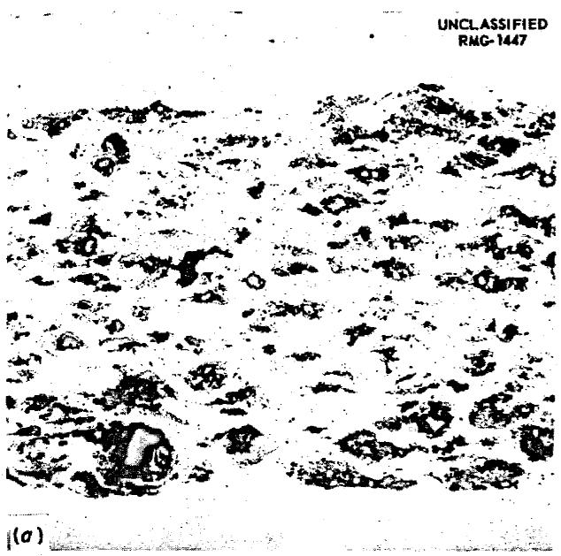

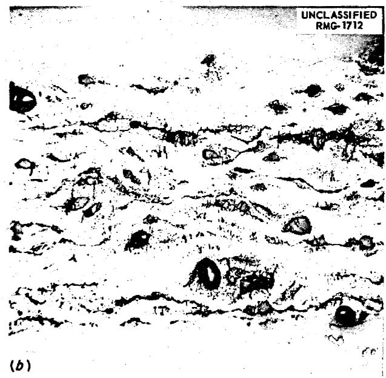  
Fig. 4.1.28. Irradiated $\mathsf{CaB}_6$ -Fe Cermets Clad with Type 304 Stainless Steel. (a) Average $B^{10}$ burnup of $19\%$ . (b) Average $B^{10}$ burnup of $38\%$ . 75X. Reduced $20.5\%$ .

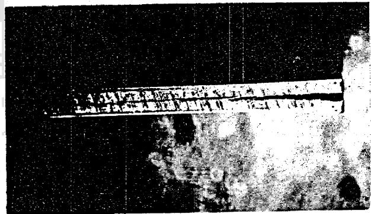  
SIDE VIEW (4X)

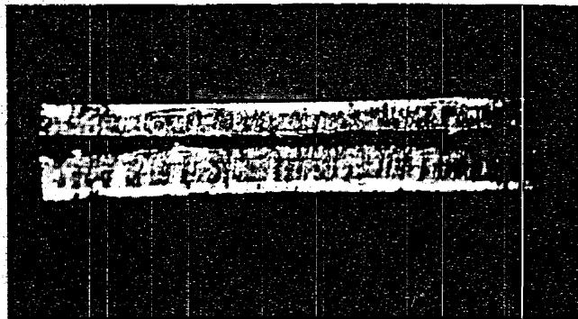  
END VIEW (8X)

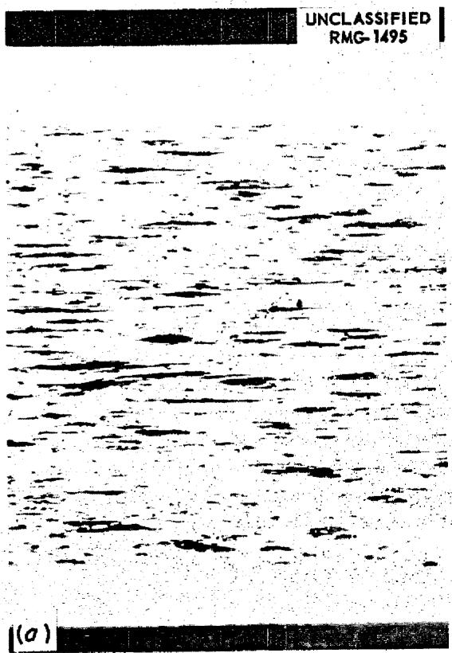  
Fig. 4.1.29. BN-Ni Cermet Clad with Type 304 Stainless Steel Irradiated to an Average B10 Burnup of 38%. Reduced 25%.

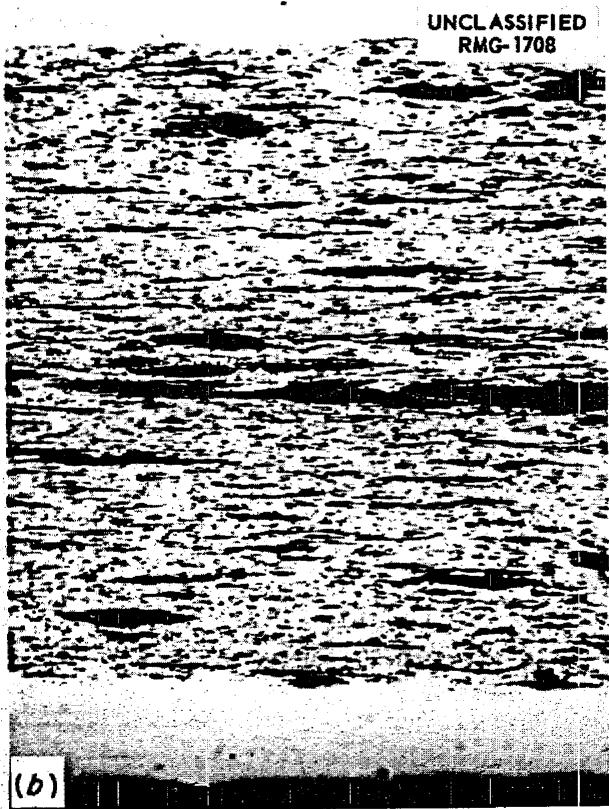  
Fig. 4.1.30. Irradiated BN-Ni Cermets Clad with Type 304 Stainless Steel. (a) Average B10 burnup of 19%. (b) Average B10 burnup of 38%. 75X.

were 6.6 wt $\%$ B $_4$ C dispersed in copper, and they were 0.082 in. thick. The cores were clad on two faces with 0.003 in. of copper followed by 0.007 in. of type 430 stainless steel. The cores were exposed on the four edges of the specimens. The fourth specimen irradiated was a similar sample fabricated by the Allegheny-Ludlum Steel Corp.; it was 1.5 in. long. The irradiation histories of these samples are given in Table 4.1.7.

Hardness measurements made on the stainless steel cladding, the copper layer, and the core after irradiation are summarized in Table 4.1.8, except that post-irradiation core hardness measurements are not reported for samples which cracked severely. The results of dimensional and density measurements are presented in Table 4.1.9. While damage to these samples appears to be a function of burn-up and temperature of irradiation, the thermal

Table 4.1.7. Results of LITR Irradiation of Stainless-Steel-Clad B4C-Copper Carmet Samples   

<table><tr><td>Irradiation Capsule Number</td><td>Average Temperature of Irradiation (°C)</td><td>Average B10Burnup (%)</td><td>Temperature Cycles</td><td>Radiation Damage Found</td></tr><tr><td>227 (3 samples)</td><td>200</td><td>6</td><td>3</td><td>None; no cracks or separation of core from cladding</td></tr><tr><td>327 (3 samples)</td><td>300</td><td>19</td><td>7</td><td>None; no cracks or separation of core from cladding</td></tr><tr><td>127 (3 samples)</td><td>420</td><td>18*</td><td>19</td><td>Longitudinal core cracks and separation of core from cladding</td></tr><tr><td>527 (1 sample)</td><td>870</td><td>12.5</td><td>8</td><td>Longitudinal core cracks and separation of core from cladding</td></tr></table>

*Determined by isotopic analysis; other values were calculated.

Table 4.1.8. Hardness Measurements of Stainless-Steel-Clad B4C-Cu Cermets Before and After Irradiation   

<table><tr><td rowspan="2">Irradiation Capsule Number</td><td rowspan="2">Location of Measurement</td><td colspan="2">Average Knopp Hardness (1-kg Load)</td><td rowspan="2">Percentage Change in Hardness after irradiation</td></tr><tr><td>Unirradiated Sample</td><td>Irradiated Sample</td></tr><tr><td rowspan="3">227</td><td>Cladding</td><td>139</td><td>166</td><td>+19</td></tr><tr><td>Copper layer</td><td>64</td><td>76</td><td>+19</td></tr><tr><td>Core</td><td>76</td><td>102</td><td>+34</td></tr><tr><td rowspan="3">327</td><td>Cladding</td><td>139</td><td>215</td><td>+55</td></tr><tr><td>Copper layer</td><td>64</td><td>88</td><td>+38</td></tr><tr><td>Core</td><td>76</td><td>85</td><td>+12</td></tr><tr><td rowspan="2">127</td><td>Cladding</td><td>139</td><td>186</td><td>+34</td></tr><tr><td>Copper layer</td><td>64</td><td>65</td><td>-2</td></tr></table>

Table 4.1.9. Dimensional and Density Changes as a Result of Irradiation of Stainless-Steel-Clad B4C-Cu Cermets   

<table><tr><td rowspan="2">Irradiation Capsule Number</td><td colspan="3">Dimensional Change* (%)</td><td rowspan="2">Density Change (%)</td></tr><tr><td>Length</td><td>Width</td><td>Thickness</td></tr><tr><td>227**</td><td>+1</td><td>+1</td><td>+1</td><td>+1</td></tr><tr><td>327</td><td>+1</td><td>+1.8</td><td>+2.0</td><td>-3.9 (bulk density)</td></tr><tr><td>127</td><td>+0.5</td><td>+0.8</td><td>+2.3</td><td>-2.3</td></tr><tr><td>527</td><td>+2.5</td><td>+3.5</td><td>+12.1</td><td>-11.6</td></tr></table>

*Results are averages of values for three samples, except for capsule No. 527 which contained only one sample.   
**The samples in capsule No. 227 were slightly oxidized, but there was essentially no change as a result of irradiation.

cycling history is also important. In a composite plate of this type, which is essentially black to neutrons, most of the $(n,\alpha)$ reactions occur in the first few thousandths of an inch of sample thickness. The core becomes harder and more brittle and the stainless steel cladding acts as a bimetallic strip that causes uneven stresses. The uneven stresses are believed to be the reason for a large part of the splitting and warping. An unirradiated stainless-steel-clad $\mathsf{B}_4\mathsf{C}$ -Cu sample is compared in Fig. 4.1.31 with a sample irradiated at $200^{\circ}\mathsf{C}$ to a $6\%$ average $\mathsf{B}^{10}$ burnup. No cracks are evident in the irradiated sample. The separation of the core from the cladding and the cracks which occurred at a higher irradiation temperature and a higher burnup are illustrated in Fig. 4.1.32.

In out-of-pile tests it was demonstrated that thermal stress damage can occur in the absence of irradiation. More cycles were required to cause damage in the out-of-pile experiment, but the

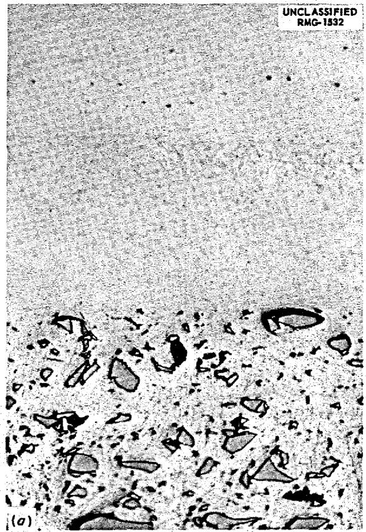

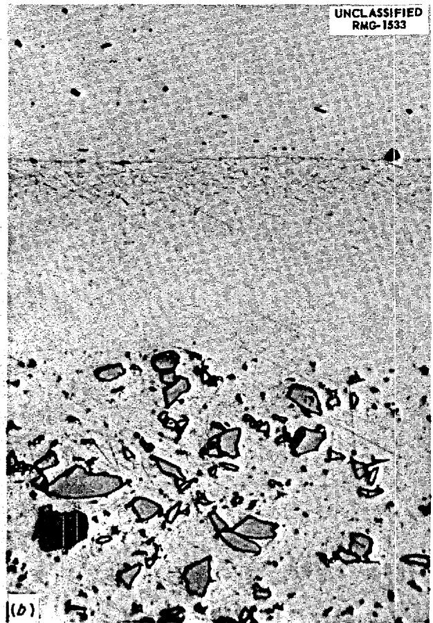  
Fig. 4.1.31. Stainless-Steel-Clad $\mathsf{B}_4\mathsf{C}$ -Cu Cermets (a) Unirradiated and (b) Irradiated at $200^{\circ}C$ to an Average Burnup of $6\%$ . 500X. Reduced $19\%$

UNCLASSIFIED

ORNL-LR-DWG 21028A

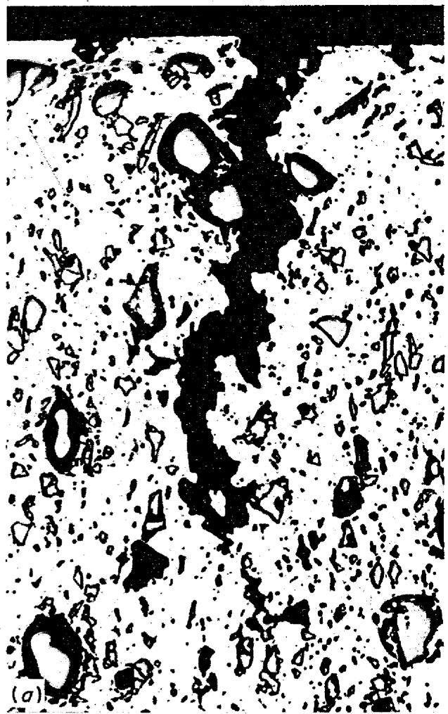

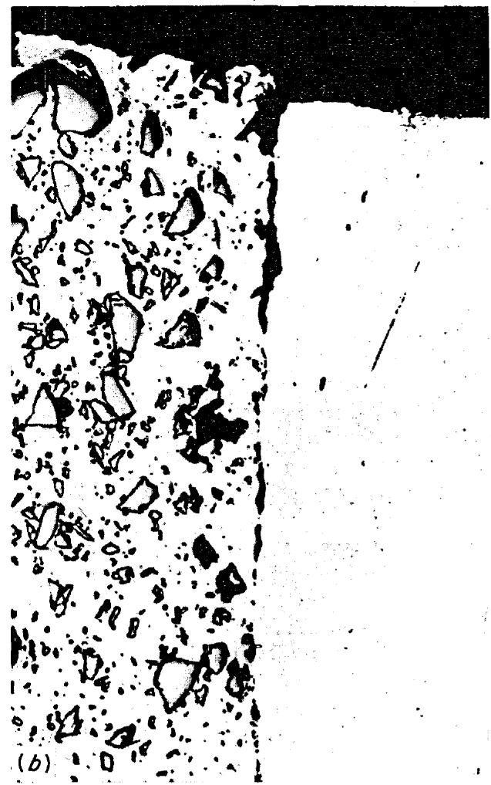  
Fig. 4.1.32. Stainless-Steel-Clad $\mathsf{B}_4\mathsf{C}$ -Cu Cermet Irradiated at $420^{\circ}C$ to an Average B10 Burnup of $18\%$ . (a) A typical core crack. (b) Separation at interface of core and cladding. 250X.

irradiated samples had experienced a different thermal-gradient history that may account for the damage with fewer cycles. In the out-of-pile tests the samples were cycled under vacuum by inserting and withdrawing them from a furnace. Two temperature ranges were used for the tests: 75 to $600^{\circ}\mathrm{C}$ and 100 to $870^{\circ}\mathrm{C}$ . In the 75 to $600^{\circ}\mathrm{C}$ range the heating rate was $300^{\circ}\mathrm{C / min}$ for the first minute and $175^{\circ}\mathrm{C / min}$ for the second minute; the cooling rate was $250^{\circ}\mathrm{C / min}$ for the first minute and $200^{\circ}\mathrm{C / min}$ for the second minute. In the 100 to $870^{\circ}\mathrm{C / min}$ range the heating rate was $960^{\circ}\mathrm{C / min}$ for the first $\frac{1}{2}$ min, $400^{\circ}\mathrm{C / min}$ for the second

$\frac{1}{2}$ min, and $75^{\circ}C / \min$ for the second minute; the cooling rate was $600^{\circ}C / \min$ for the first $\frac{1}{2}$ min, $200^{\circ}C / \min$ for the second $\frac{1}{2}$ min, and $150^{\circ}C / \min$ for the second minute. One cycle was a temperature excursion from minimum to maximum and return to minimum. Descriptions of the samples and the specific conditions of each test are given in Table 4.1.10.

Examinations of the specimens (at a magnification of 500X) after thermal cycling showed that the Norton Company sample had not cracked or chipped. Sample No. 2, fabricated at ORNL, is

shown in Fig. 4.1.33. This view of the core-to-cladding interface shows no evidence of cracks. The scratches were made during hand polishing. Sample No. 3 was found to have one small crack about 0.006 in. long at the interface between the copper and stainless steel layers. In sample No. 4 there was complete separation of the stainless steel cladding from the copper layer over about one-third the area on one face, as shown in Fig. 4.1.34. In addition cracks were found in the core ends about midway between the clad faces, as shown in Fig. 4.1.35. Sample No. 5 was similar to sample No. 4, except that there was slightly more separation at the interface and there were more cracks. In general, sample No. 6 did not show as severe interface separation or as many cracks as found in sample No. 5. It was noted that small cracks initially present in the material were enlarged. Some cracks were found that started at the core-to-cladding interface and propagated into the core. The sample was not constrained during cycling, but after the test it was bowed about $\frac{1}{32}$ in. in the middle. Apparently unequal stresses were created by the bimetallic cladding.

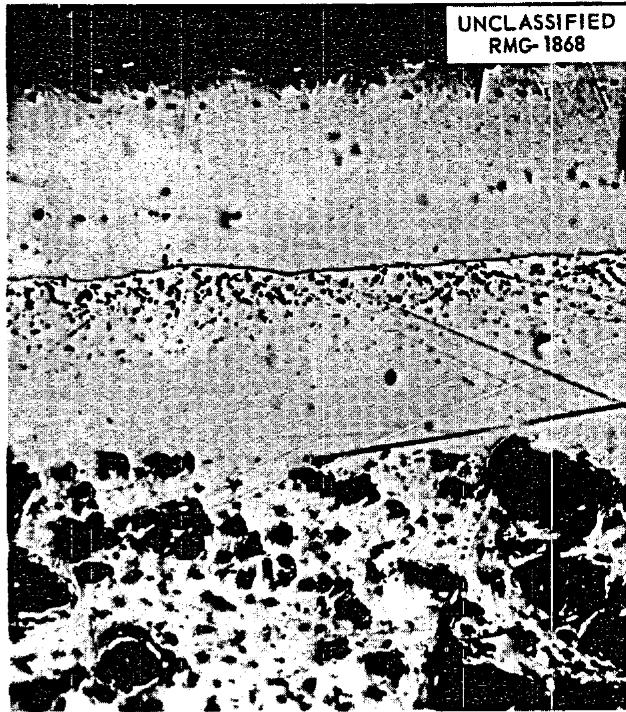  
Fig. 4.1.33. Thermally Cycled, Unirradiated, Stainless-Steel-Clad B4C-Cu Cermet Sample No.2.

Table 4.1.10. Conditions of Thermal Cycling Tests of Composites Made Up of a $\mathsf{B}_4\mathsf{C}$ -Cu Cermet Core, a Layer of Copper, and a Layer of Stainless Steel   

<table><tr><td>Source</td><td>Dimensions (in.)</td><td>Sample No.</td><td>Number of Cycles</td><td>Temperature Range (°C)</td></tr><tr><td>Norton Company*</td><td>0.25 × 0.25 × 1.0</td><td>1</td><td>18</td><td>100-870</td></tr><tr><td rowspan="7">ORNL</td><td rowspan="7">0.1 × 0.1875 × 0.5</td><td>2</td><td>20</td><td>75-600</td></tr><tr><td rowspan="2">3</td><td>20</td><td>75-600</td></tr><tr><td>20</td><td>100-870</td></tr><tr><td rowspan="2">4</td><td>20</td><td>75-600</td></tr><tr><td>38</td><td>100-870</td></tr><tr><td rowspan="2">5</td><td>20</td><td>75-600</td></tr><tr><td>58</td><td>100-870</td></tr><tr><td>Allegheny-Ludlum Steel Corp.</td><td>0.1 × 0.189 × 1.5</td><td>6</td><td>58</td><td>100-870</td></tr></table>

*ART prototype samples.

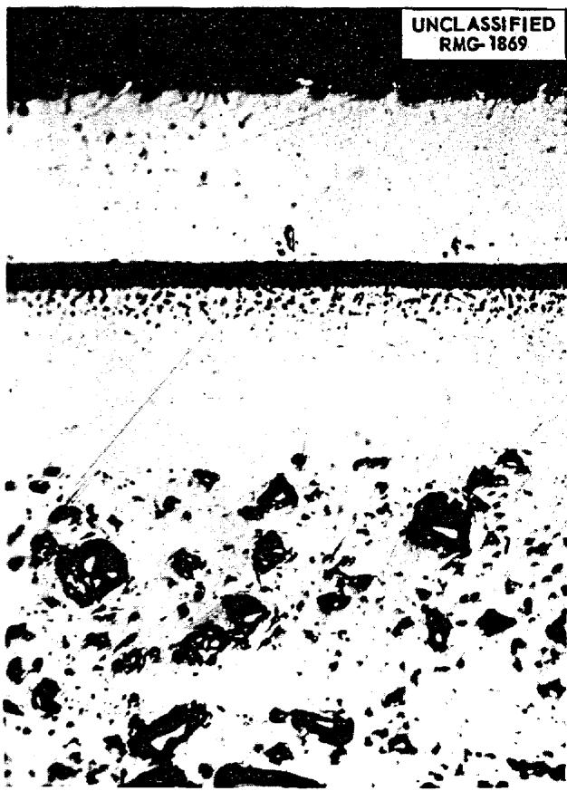  
Fig. 4.1.34. Thermally Cycled, Unirradiated, Stainless-Steel-Clad $\mathsf{B}_4\mathsf{C}$ -Cu Cermet Sample No. 4, Showing Interface Separation.

# EFFECTS OF RADIATION ON ELECTRONIC COMPONENTS

J.C.Pigg

C. C. Robinson

O. E. Schow

The general results that have been obtained in the investigations of the effects of nuclear radiation on semiconductor devices indicate that the barrier phenomenon should be studied under very closely controlled conditions. The equipment necessary for such a study is being developed. The experimental results obtained during the quarter are described below.

# Experimental Results

The results of gamma irradiation of IN 38-A point-contact diodes (greased and ungreased), described previously, have been analyzed with

respect to annealing behavior, and curves describing the behavior have been prepared. The first effect studied was the temperature change of the samples, as shown in Fig. 4.1.36. The initial drop of the temperature may be of significance, and no doubt the rise in temperature during the first hour had some effect on the current through the samples. In any event, the drop, or annealing, in the current of the sample cannot be attributed to temperature changes, since a rise in temperature would be expected to increase the current through the sample, and, in Figs. 4.1.37 and 4.1.38, it may be seen that the reverse currents (at $1 - \nu$ bias) through the samples decreased with time. The greased sample (Fig. 4.1.38) underwent the most severe change, and it would be expected that this change would be reflected in the slope of the reverse saturation current, which is indicative of the surface conditions of the sample. In Fig. 4.1.39, however, it may be seen that the slope of the reverse saturation current does not show such a change. On the contrary, the greased unit seems to have suffered less surface change than the ungreased unit. At the end of 37.5 hr of annealing, both surfaces were apparently the same. An effect of surface coating on the bulk characteristics is indicated in Fig. 4.1.40, which shows the reverse current "Y" intercept, or the saturation current, of these samples. The gamma-ray dosage the samples received was of the order of $9 \times 10^{16}$ photons/cm², which was sufficient to cause bulk damage in germanium. Bulk changes known to take place with a dosage of this magnitude are all of such a nature as to decrease the bulk conductivity of the sample. Speculation has led to the possibility that a revision of the picture of radiation effects in electronic barriers is in order, but as of now there is insufficient evidence to conclusively justify this revision. Experiments are being planned to clarify this problem, however, as described in a following section.

In view of the annealing observed in semiconductor devices by many workers, a number of questions have been raised as to the actual amount of damage that may be introduced into a sample by a given amount of radiation at a given flux level. Such information is desirable in order to correlate device data with data resulting from studies of bulk material. Many experiments have been performed on bulk material in which the samples were maintained at some low temperature, usually that of

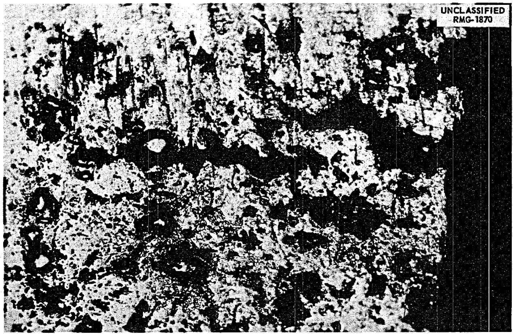  
Fig. 4.1.35. Thermally Cycled, Unirradiated, Stainless-Steel-Clad $\mathsf{B}_4\mathsf{C}$ -Cu Cermet Sample No. 4, Showing Cracks in Core.

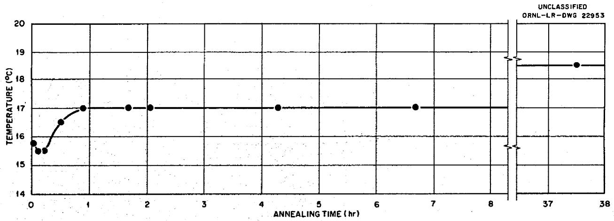  
Fig. 4.1.36. Temperature Changes During Annealing of Point-Contact Diodes (1N-38-A).

Fig. 4.1.37. Reverse Current (1-v Bias) Through Ungreased Sample (1N-38-A) as a Function of Annealing Time.   
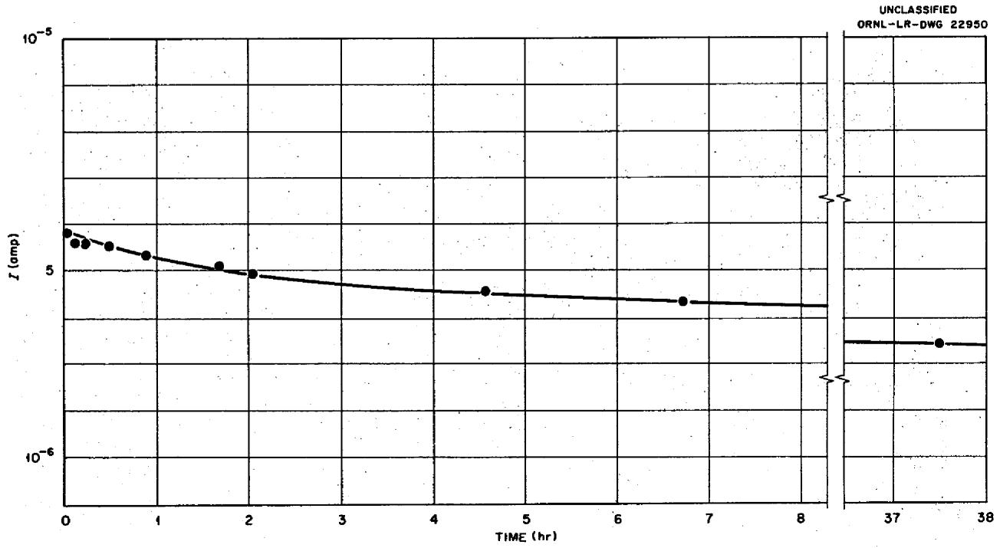  
UNCLASSIFIED   
ORNL-LR-DWG 22949

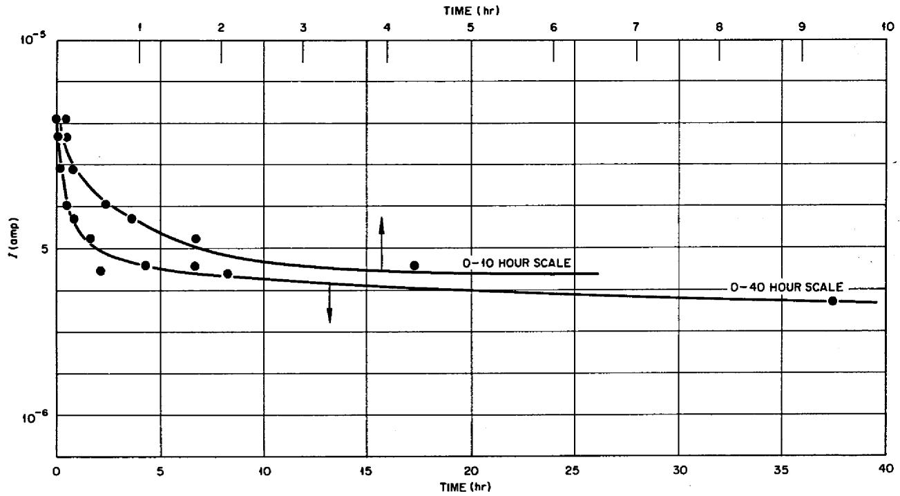  
Fig. 4.1.38. Reverse Current (1-v Bias) Through Greased Sample (1N 38-A) as a Function of Annealing Time.

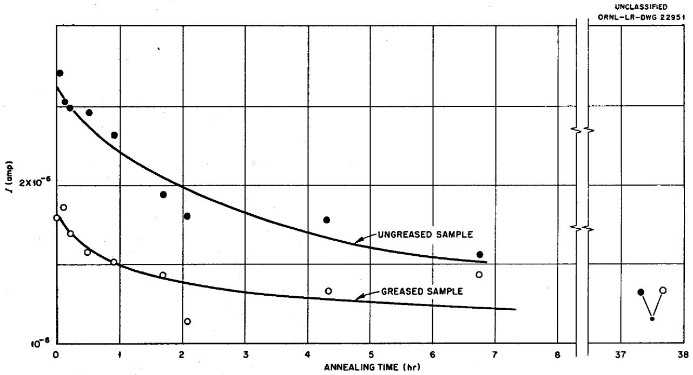  
Fig. 4.1.39. Reverse Saturation Current (1-v Bias) of Samples (1N 38-A) as a Function of Annealing Time.

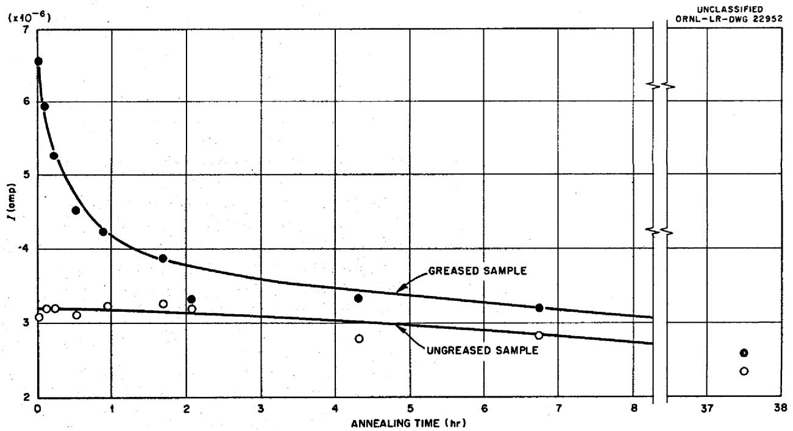  
Fig. 4.1.40. Reverse Current "Y" Intercept vs Annealing Time.

liquid nitrogen, in order to "freeze in" the damage. Application of the freezing principle to devices has not yet been tried, but it could possibly provide much worthwhile information needed in the solution of some of the radiation-damage problems. It thus seems to be worthy of preliminary investigation.

One such preliminary investigation has been undertaken with transistors. Transistors were selected because the information obtained would, in all probability, have immediate value and because the collector current, being a function of the emitter or base current, would present any damage in a magnified form; that is, any changes noted would be indicative not only of the damage to the collector-base diode but also of the damage to the emitter-base diode. Although not presented in detail here, the data resulting from this experiment indicate that damage to devices can be frozen into the sample to some degree. Whether this is all the damage or even a significant portion has not yet been determined, since it is possible that some annealing occurs even at liquid-nitrogen temperature. In this experiment, two samples were bombarded at liquid-nitrogen temperature while two other samples were bombarded at the facility ambient temperature. The facility temperature was not recorded, but it was approximately 20 to $25^{\circ}\mathrm{C}$ . After the irradiation the cold samples were kept cold, and the warm samples were allowed to anneal at room temperature. Approximately 120 hr later the samples kept at liquid-nitrogen temperature were allowed to warm up, and the characteristics were observed.

Comparison of the characteristic curves of the "warm" sample immediately after irradiation with those of the "cold" sample immediately after being warmed to room temperature shows some difference which might be attributable to annealing of the warm sample while being irradiated. Comparison of characteristic curves after the cold sample was warmed shows, of course, significant annealing in the warm sample. Refinement of this type of experiment is indicated in order to determine not only the amount of annealing after irradiation but to verify possible annealing during irradiation. For instance, it may be better to cool the samples bombarded at room temperature to liquid-nitrogen temperature after the bombardment for comparison with samples bombarded at liquid-nitrogen temperature. Longer exposure would also provide more quantitative information, since this would permit more annealing to take place in the samples bombarded at room

temperature and would introduce more damage into both the warm and the cold samples. Further information from this experiment may be available when characteristic curves taken on an "X-Y" recorder are analyzed.

Results of the gamma-ray bombardment of the coated and uncoated point-contact diodes indicated that it would be advisable to determine whether there was any difference in the effect of radiation on devices of different but known material conductivity. Samples of point-contact diodes especially constructed from material of known resistivity were therefore obtained and bombarded in the Solid State Division gamma-ray source. Several curves showing the results of the bombardment have been prepared.

The diodes studies were CK-708's made by the Raytheon Company from crystals of known resistivity. There was no coating material on the crystals. The four samples selected were 4, 4.1, 11, and 12 ohm-centimeter material, respectively. Two of the samples were bombarded in such a manner as to permit data to be taken while they were in the gamma-ray source. The other two were irradiated at the same time, but were not wired for data-taking.

In view of the temperature dependence of the reverse current of the samples, a normalization of currents with the temperature of the gamma-ray facility was attempted. An approximate normalization of the current was taken from the curve of Fig. 4.1.41. This normalization is considered sufficiently accurate when compared with the accuracy of the instrumentation. When normalizations of this type are made in the future, more effort will be expended on the normalization curve. In order to eliminate temperature effects, the curves of the results of this experiment were prepared to show only those points which were taken at the ambient temperature of the irradiating facility, that is, about $25^{\circ}\mathrm{C}$ .

It is immediately noticeable from Fig. 4.1.42 that the conductivity of the 4 and 12 ohm-cm diodes, which are the ones from which data were taken while they were in the source, are similar and that the conductivities of the 4,1 and 11 ohm-cm diodes are similar. The observed current is the product of the current density and the area of the barrier. Since the area of the barrier depends upon the contact pressure, as well as on the conditions of forming, it is possible for diodes made from

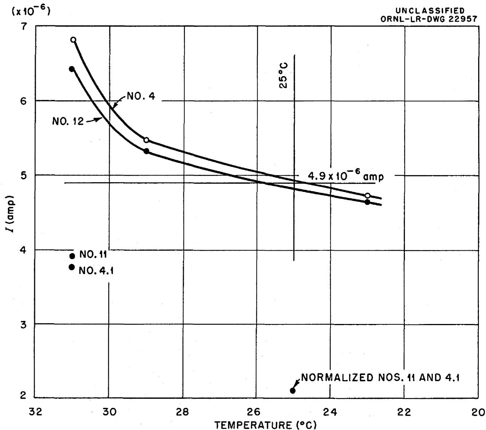  
Fig. 4.1.41. Reverse Current (1-v Bias) Through CK-708 Point-Contact Diode Samples Selected from 4, 4.1, 11, and 12 ohm-centimeter Material as a Function of Temperature.

different bulk material to have the same current under a given set of conditions. Under irradiation, however, the current density changes with changes in the bulk material. Thus, the similarities in sample currents are believed to be coincidences.

It is particularly significant, as shown in Fig. 4.1.42, that the reverse current at one volt of both diodes approached a psuedo plateau that was of the same type as observed in other gamma irradiations of semiconductor devices. Such a plateau, or saturation level, has been observed in gamma

irradiation of bulk germanium, but for low-resistivity germanium the decrease in the electron concentration is approximately linear out to an exposure of $5 \times 10^{18}$ photons/cm², whereas this apparent plateau occurs at an exposure of $1.40 \times 10^{14}$ photons/cm² for the 4 ohm-cm material diode and approximately $7 \times 10^{14}$ photons/cm² for the 12 ohm-cm material diode. Further, carrier removal is manifested as a reduction of current,

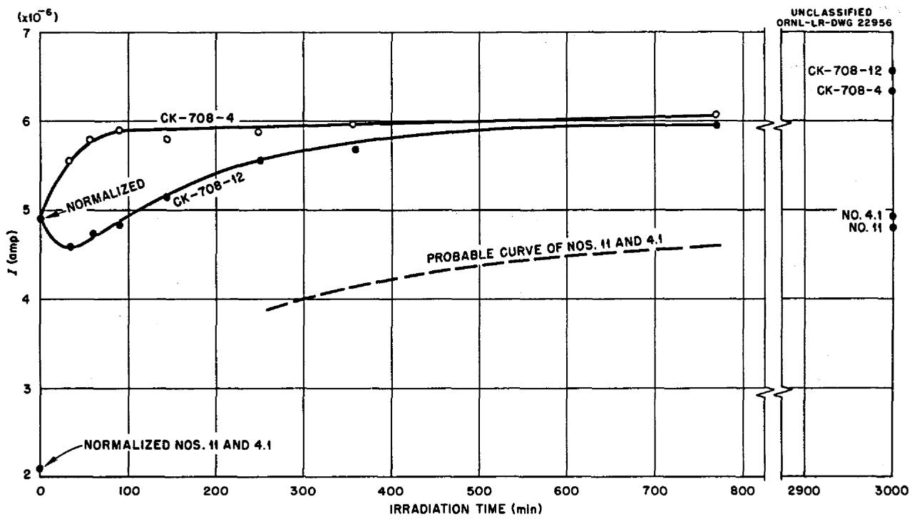  
Fig. 4.1.42. Reverse Current (1-v Bias) Through CK-708 Diodes vs Gamma Irradiation Time.

while in these samples the current increases. It is evident that other factors are involved. There would be, of course, a point at which the bulk effects would begin to show, but higher dosages than those given to these samples would be required. The dosage required can be estimated by referring to previous work done on gamma-ray bombardment of diodes in which the reverse current at $1\mathrm{~V}$ continued to rise until a dosage of $1.75 \times 10^{7}$ r was reached and fell thereafter.[10]

Two components of the current which composed the total current through the CK-708 diodes - the bulk current, represented by the saturation current, and the surface leakage, represented by the saturation slope - are shown in Figs. 4.1.43 and 4.1.44. In the present model of a diode, these currents are in parallel, and the sum of the currents represents the total current through the diode. Such is not the case, however, and this discrepancy is part of the reason for the speculation regarding the need for a new model.

Annealing of the samples is shown in Fig. 4.1.45, but since there is an instance of a high-resistivity sample annealing more rapidly than a low-resistivity

sample and an instance of a low-resistivity sample annealing more rapidly than a high-resistivity sample, no conclusion can be drawn from these curves. Annealing saturation currents and saturation slopes have not yet been analyzed and are not presented here.

The study of the germanium junction as a function of both temperature and radiation is being hampered by instrumentation difficulties. The study is to be as precise as possible, and the sample currents are to be measured at voltage biases as low as $10\mathrm{mv}$ . Difficulty has been encountered with a-c electrical pickup in the servo-controlled power supplies and in providing high-impedance inputs to a Brown recorder, which has a normal impedance of 500 ohms. The servo power supply has been completely redesigned and now incorporates a number of advanced features not ordinarily found in recording systems of this type. An input impedance of 180,000 ohms has been obtained. A block diagram of the system is shown in Fig. 4.1.46. The recorder is an advanced model of the recorder described in ORNL-1199 (ref 11). The more recent

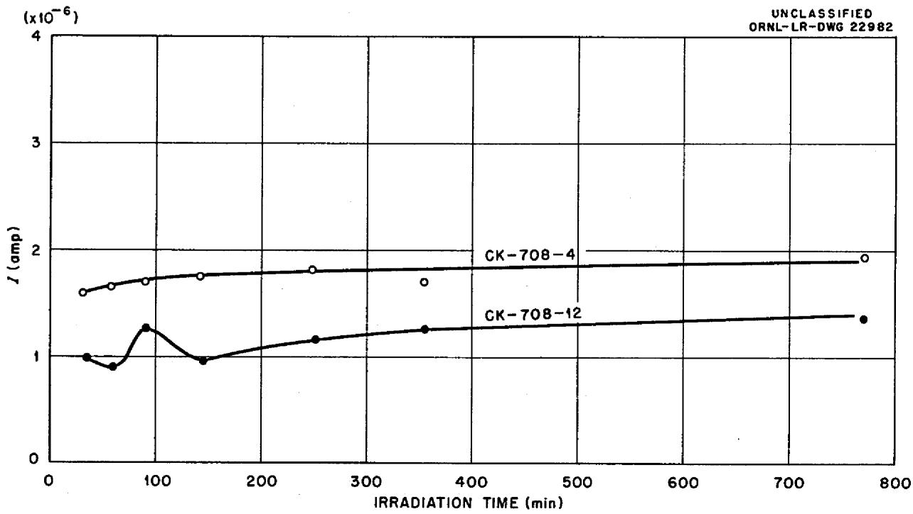  
Fig. 4.1.43. Bulk Current, Represented by Reverse Saturation Current, Through CK-708 Diodes vs Gamma Irradiation Time.

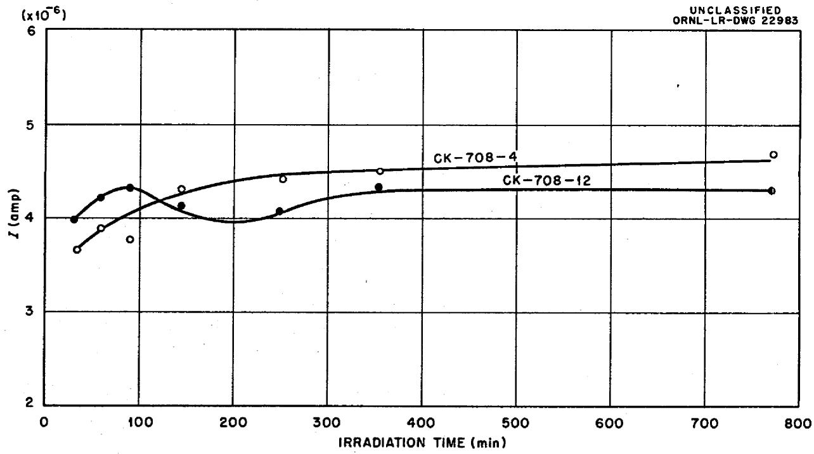  
Fig. 4.1.44. Surface Leakage, Represented by Reverse Saturation Slope, of CK-708 Diodes vs Irradiation Time.

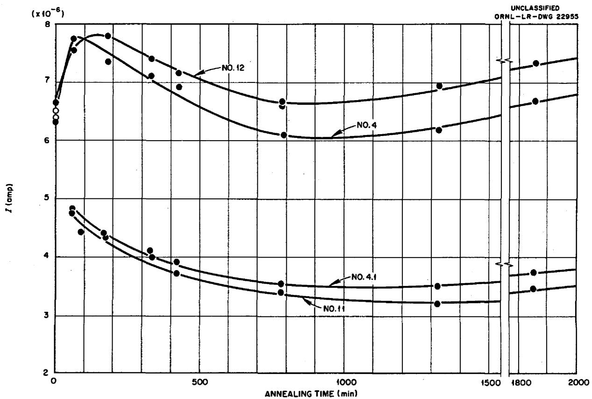  
Fig. 4.1.45. Reverse Current (I-v Bias) Through CK-708 Diodes vs Annealing Time.

modifications of the servo power supply for the system are the high-impedance input, the variable-gain amplifier, the velocity-damping network, and the variable-phase chopper power supply. Recent modifications of the Brown recorder servo circuit are the high-impedance input, the variable-phase chopper power supply, the positive-current feedback-damping network, and jitter filter. Other improvements in the system have included replacement of certain relays to reduce the current through selectro switches, and replacements of certain relays which were shown to be incapable of carrying the necessary currents. The samples for this experiment are 1N-91 alloy junction diodes. For comparison, a germanium bulk sample is bombarded with the diodes. The lifetimes and the barrier heights of the diodes are measured following irradiations. Changes in the resistance of the bulk sample provide a check on the neutron dosage to which the samples are subjected.

Both the diodes and the bulk sample have been bombarded at $-78^{\circ}C$ in a facility that has a fast

neutron flux component of $1.66 \times 10^{8}$ neutrons/cm $^2$ -sec. After irradiation, the characteristics curves of the diodes were recorded at $-78^{\circ}C$ , and the diodes are to be warmed to $0^{\circ}C$ . Sample characteristics will be recorded while the samples are being warmed. Bombardments up to and including a dosage of $10^{11}$ neutrons/cm $^2$ have caused little change in the diode samples. After a bombardment to a dosage of $10^{12}$ neutrons/cm $^2$ , a flattening of the forward curve at $-78^{\circ}C$ has been observed. The reverse current is not observable at this temperature. The samples are being held at $-78^{\circ}C$ pending replacement of faulty relays so that characteristics may be recorded during the warmup period.

# Experimental Refinements

It has been noted that the changes observed in the irradiations performed both in this program and in other programs are, for the most part, opposite to those expected from the results of bulk or surface studies. Therefore efforts have been made to

UNCLASSIFIED

ORNL-LR-DWG 22954

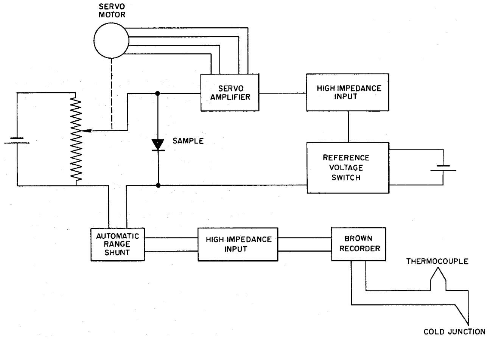  
Fig. 4.1.46. Block Diagram of Multipoint Recorder.

compile quantitative information concerning the behavior of barriers or rectifying devices in the presence of radiation fields so that, by comparison with the results of bulk and surface studies, those characteristics unique to the barrier can be defined. Further refinements of these studies are being made. Several samples of barriers of known characteristics have been obtained and will be studied. The equipment necessary for these studies is being designed, built, or purchased.

A probe mechanism is being constructed that consists basically of a fine screw-driven base which will carry a sample under a probe for determination of its resistivity as a function of sample displacement and to determine location and change of the junction in a sample.

As mentioned before, the surface conditions or surrounding environment of a device can play a

more significant part in the behavior of the device than would be expected from the results of bulk or surface studies. In order to eliminate or at least minimize surface effects it has been decided to prepare samples for irradiation in a standard atmosphere. A vacuum has been proposed and may be tried, but, for the present, helium will be used, since it will provide a heat transfer medium in the event gamma-ray heating becomes a problem. A dry box has been obtained, and it will be modified to provide a helium atmosphere. To further assist in sample preparation, a small chemical hood has been designed and is now being built. This will permit the safe use of etches in the preparation of the samples and in changing the surfaces after the samples have been bombarded.

In order to increase the range of voltages which can be applied to a sample and thereby obtain

information about break-through characteristics and to enhance the accuracy of saturation slope data, an "X-Y" recorder with increased ranges is being obtained. A sample power supply that will be compatible with the characteristics of the recorder is to be designed. The recorder can measure applied voltages up to 100 v on either scale, and thus the range is beyond the maximum voltage at which most diodes operate. With proper shunts it will be possible to extend considerably the range and the types of units which can be studied.

Another multipoint recorder has become available with which to constantly follow changes in a sample

over a period of days. A controlled-voltage power supply is also available, and it is thought that with moderate modifications it will be suitable for use with the recorder. A recorder of this type will do much to clarify such changes as the initial drop in current of the 12 ohm-cm diode, as shown in Fig. 4.1.42. Clarification of such changes is necessary for a conclusive understanding of the mechanism of changes in semiconductor devices.

The design of the fast-flux irradiation facility discussed previously is now being detailed. No date for completion of the design has been set, but the work is proceeding satisfactorily.

Reactor SHIELDING

E. P. Blizzard

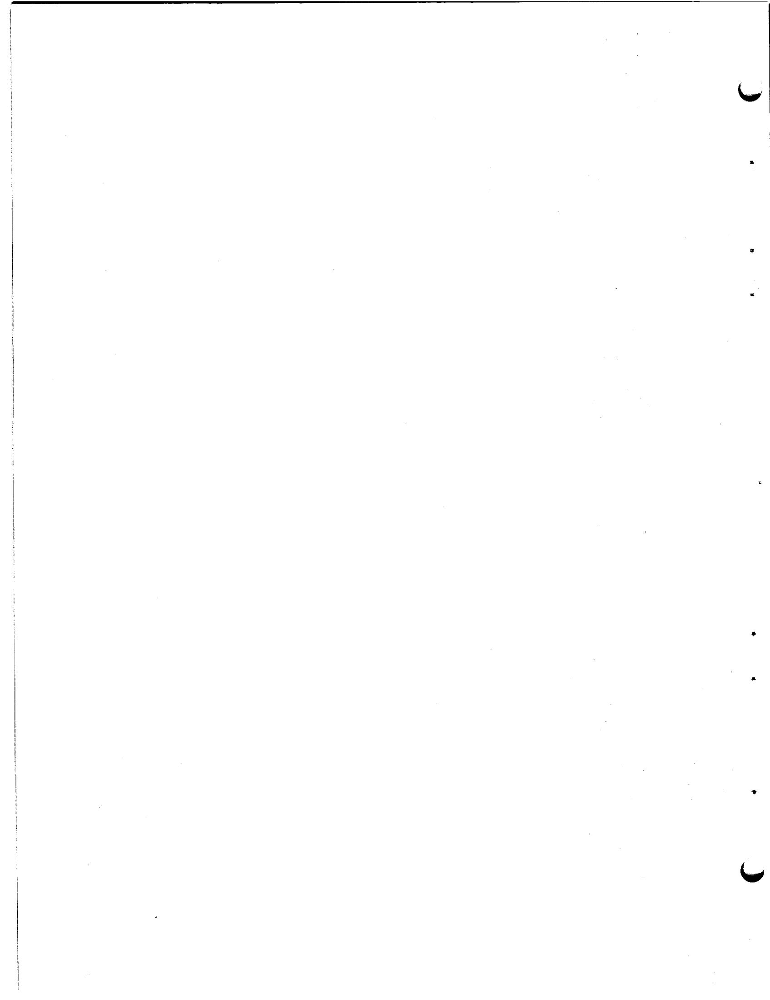

# 5.1. LID TANK SHIELDING FACILITY

# W. Zobel

# RADIATION ATTENUATION MEASUREMENTS IN PLAIN WATER, BORATED WATER, AND OIL

D. W. Cady

E. A. Warman

A comparison of the attenuation of fast neutrons, thermal neutrons, and gamma rays in various liquids has been made through the use of the Lid Tank Shielding Facility (LTSF) at ORNL. The liquids investigated were plain water, borated water, and transformer oil. The borated water used in these tests contained 1.34 wt $\%$ natural boron and had a density of $1.05\mathrm{g/cm^3}$ . The transformer oil was composed of 86.7 wt $\%$ carbon and 12.7 wt $\%$ hydrogen and had a density of $0.87\mathrm{g/cm^3}$ at $20^{\circ}\mathrm{C}$ .

In order to avoid mixing of the borated water or oil with the plain water in the lid tank, these materials were contained in the usual "configuration" tank which was positioned as close to the source as was physically possible. The configuration tank is constructed of mild steel and has dimensions of $65\frac{1}{2} \times 72 \times 71\frac{1}{4}$ in. The production of capture gamma rays in the tank wall near the source was reduced by the insertion of a $3/8$ -in.-thick aluminum window in the side of the tank adjacent to the source. A 2-cm gap between the source and the window was filled with air contained in a thin plastic bag.

Thermal-neutron, fast-neutron, and gamma-ray measurements taken in the three media contained in the configuration tank are shown in Figs. 5.1.1, 5.1.2, and 5.1.3, respectively. Before the data for plain water can be compared with previously published measurements, which were taken in the lid tank rather than the configuration tank, the new curves must be shifted $3\mathrm{cm}$ to the left. The

agreement between a thermal-neutron traverse in the lid tank and a traverse in the configuration tank, with the latter data shifted on the graph a distance of 3 cm to the left, is illustrated in Fig. 5.1.4.

The previously reported curves for thermal-neutron fluxes in oil and in borated water represent data taken with the instrument response normalized to gold-foil fluxes in plain water. This normalizing procedure is not particularly valid, as is indicated by a comparison of counts-to-flux conversion factors used over a period of time. For example, the current conversion factor used with a $12\frac{1}{2}$ -in. $\mathsf{BF}_3$ counter in plain water, obtained by normalizing to the data taken with gold foils in plain water, is $1.66\times 10^{-3}$ . Previously, this same factor would have been used for this counter for all media. The newly determined conversion factor for borated water is $9.78\times 10^{-4}$ , a change of about $41\%$ . Similarly, the conversion

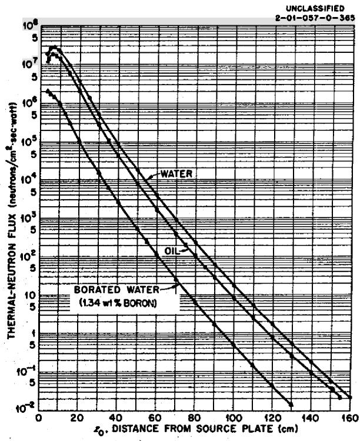  
Fig. 5.1.1. Thermal-Neutron Fluxes in Water, Borated Water, and Oil in the Configuration Tank.

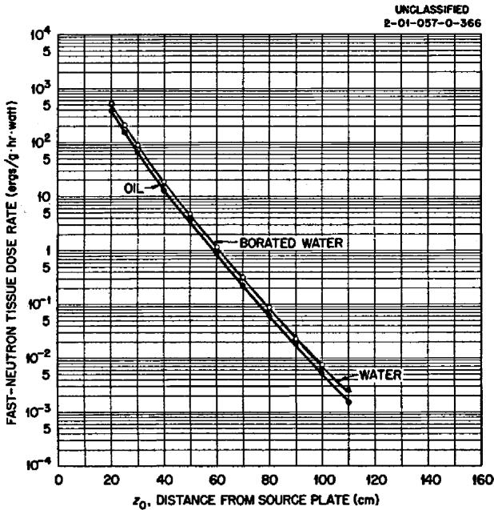

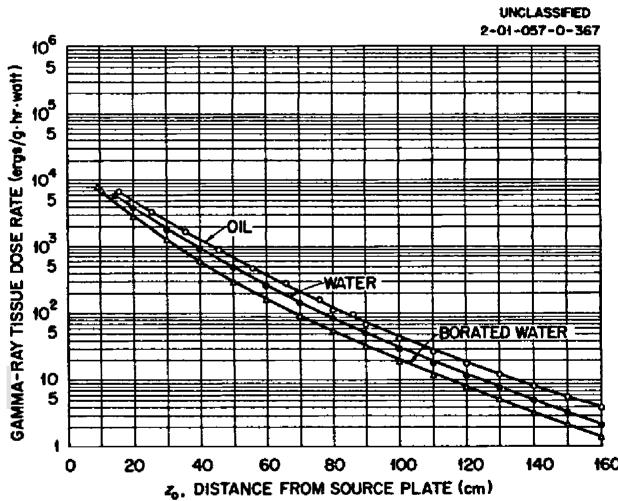  
Fig. 5.1.2. Fast-Neutron Tissue Dose Rates in Water, Borated Water, and Oil in the Configuration Tank.   
Fig. 5.1.3. Gamma-Ray Tissue Dose Rates in Water, Borated Water, and Oil in the Configuration Tank.

factors for the 8-in. $\mathsf{BF}_3$ counter, the 3-in. fission chamber, and the $1 / 2$ -in. fission chamber have been reduced by 26, 37, and $16\%$ , respectively. Corresponding changes were made in the conversion factors for oil.

The data presented here are approximately $5\%$ higher than the earlier data because of the replacement of the old $\frac{1}{8}$ -in.-thick boral shutter on

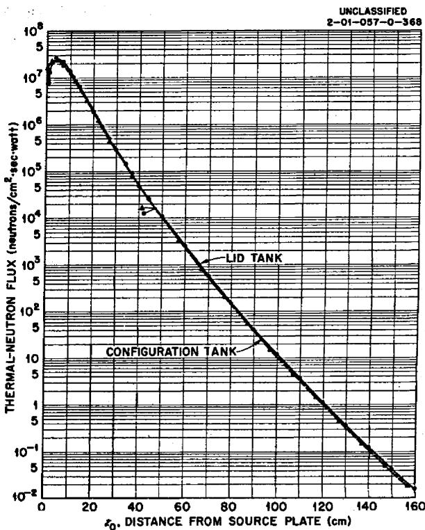  
Fig. 5.1.4. Thermal-Neutron Fluxes in Water in the Lid Tank and in the Configuration Tank.

the source plate by a $\frac{1}{4}$ -in.-thick shutter. Lid tank data are obtained by determining the difference between the shutter-open and shutter-closed measurements. The old $\frac{1}{8}$ -in. shutter did not completely shield the source plate from the reactor thermal flux; therefore, even with the shutter closed, there was fissioning in the source plate. When the shutter-closed readings are subtracted from the shutter-open readings, a small percentage of the source-plate power is eliminated as background. Thus, an increase in the shutter thickness essentially increased the effective source-plate power. This increase is small enough to fall within the uncertainty in source-plate power ( $\pm 5\%$ ), and therefore a more exact determination of the new effective source-plate power will be made.

Thermal-neutron measurements in water are now being corrected for the flux depression that results from the presence of the gold foils and for self-absorption and "self-shielding" in the foils.

These corrections were not made on previously reported curves.5,6

Although it is commonly assumed that the flux depression for "thin" foils is negligible, calculation of the flux depression caused by 2-mil-thick, $1\text{-cm}^2$ gold foils in water, oil, and borated water were made. Several methods of calculation were attempted,[7,8] and each produced a different result. The figures reported here are based on a method suggested by W. R. Burrus.[8] The preliminary values obtained were $8.5\%$ for water, $5.9\%$ for oil, and $5.0\%$ for borated water. Little flux depression is normally expected in borated water, but the amount of boration in the LTSF water is so slight, $1.34\text{wt}\%$ , that the $5.0\%$ value is reasonable. It should be noted here that cadmium-difference flux measurements in borated water are of dubious validity. The cadmium ratio is so small, about $1.5:1$ , that the errors inherent in taking the difference between two large, nearly equal, values are considerable.

The self-absorption correction is a correction to the measured activity of the foil after exposure. Since the foil cannot be infinitely thin, there will be scattering and absorption of the radiation in the activated foil itself. Hence the true activity of the foil, or counting rate, will be reduced by some factor which is dependent on the foil thickness. The dependence of the self-absorption on the foil thickness can be calculated roughly by assuming an exponential absorption and an absorption coefficient independent of the depth in which the particles are emitted. Based on the assumption that one-half the thickness of the foil contributed to the self-absorption, the calculation yields a self-absorption factor for a 2-mil-thick gold foil of approximately $1\%$ .

If a foil is quite thick, enough neutrons will be absorbed so that the nuclei in the center of the foil will "see" a lower thermal-neutron flux than can be seen by those at the surface. If the ratio of the absorption to the scattering for the foil is large, the "self-protection," or "self-shielding," can be calculated because the incident flux suffers an exponential decrease in the foil. For a 2-mil-thick gold foil this calculation yields a "self-protection" factor of $1.5\%$ .

The effect on the configuration tank water curve of considering the $11\%$ correction for flux depression, self-absorption, and self-shielding is shown in Fig. 5.1.5. Both curves shown in Fig. 5.1.5 already contain the $5\%$ correction for the change in thickness of the boral shutter. Therefore, the

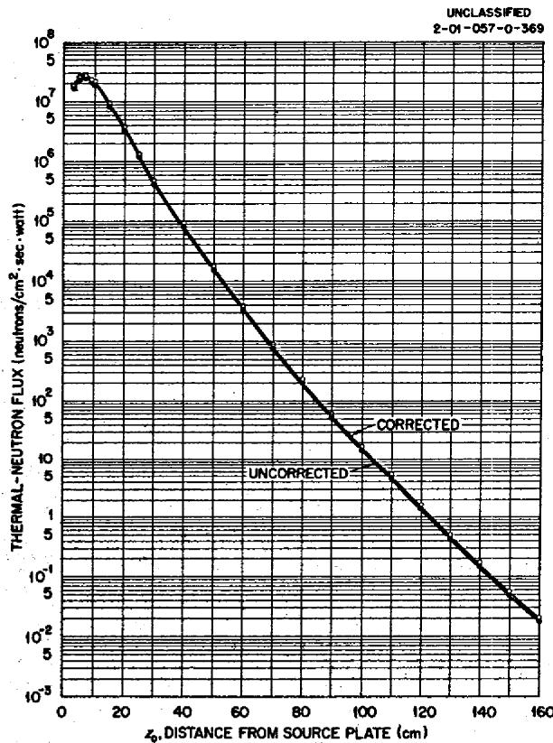  
Fig. 5.1.5. Thermal-Neutron Fluxes in Water in the Configuration Tank: Comparison of Uncorrected Measurements with Those Corrected for Flux Depression, Self-Absorption, and Self-Shielding.

difference between the two curves is due only to this $11\%$ correction.

There have been efforts to predict theoretically the attenuation of gamma rays and neutrons in water. The data presented here will be of value to any future work on this problem. It should be noted that no attempt has been made to predict attenuation in the oil or the borated water.

# STUDY OF ADVANCED SHIELDING MATERIALS

# E. A. Warman

The thermal-neutron data that were omitted from the previous report on the group of tests performed to aid the ANP shield design effort of Pratt & Whitney Aircraft are reported here. These data present detector response measurements normalized to cadmium-difference gold-foil fluxes. The gold-foil fluxes have been corrected for flux depression by the 2-mil-thick foils and for self-absorption and self-shielding in the foils, as described in the preceding paper.

The configurations tested included Hevimet, stainless steel, boral, and lithium hydride, preceded by a beryllium reflector-moderator and backed by borated water to mock up borated alkylbenzene. The materials and their experimental arrangements were described previously; however, subsequent chemical analysis of the borated water has shown that the boron content of the water was 1.34 wt % rather than the 1.46 wt % reported previously.

A comparison of the thermal-neutron measurements taken in water and in borated water (refer to Fig. 5.1.1 in preceding section) showed that the addition of the boron was quite effective in reducing the thermal-neutron flux. The borated water curve had a slightly steeper slope than that of the water curve. The thermal-neutron flux in the borated water was a factor of 29 below that in plain water $15\mathrm{cm}$ from the source plate and a factor of 36 below the flux in water at $120~\mathrm{cm}$ . It should also be noted that the hump in the curve in the forward region was not as pronounced in borated water because of the greater percentage of

absorption of the neutrons being thermalized in the first few centimeters of water.

A short discussion of the measurements made in the borated water beyond the various configurations is presented below, although a complete analysis has not yet been made.

Configurations 25, 26, and 27. - Thermal-neutron flux measurements beyond configuration 25 (Fig. 5.1.6) show the effect of replacing $4\frac{1}{4}$ in. of borated water with $\frac{1}{4}$ in. of Li-Mg alloy plus 4 in. of beryllium. The thermal-neutron flux was raised, as was expected, because of the addition of the beryllium.

Configuration 26 consisted of 4 in. of Hevimet preceded by $\frac{1}{4}$ in. of Li-Mg and 4 in. of beryllium. The slope of a plot of the thermal-neutron flux curve for this configuration is considerably altered from that for configuration 25. This is possibly due to the Hevimet not being as effective as borated water as a thermal-neutron shield, and, as a result, there is a higher thermal-neutron flux at

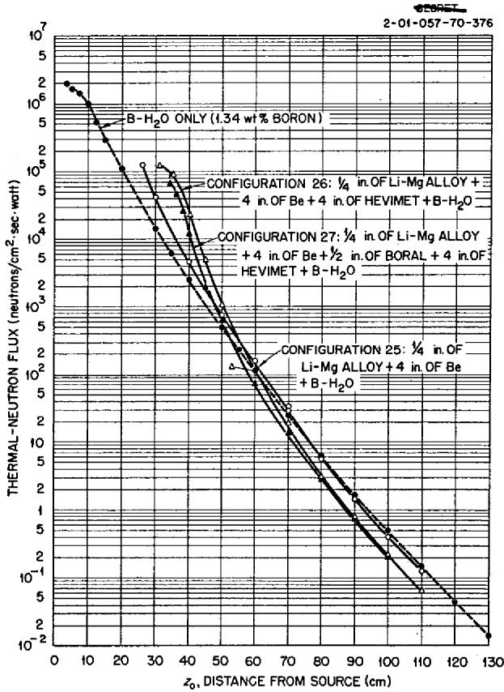  
Fig. 5.1.6. Thermal-Neutron Fluxes Beyond Configurations 25, 26, and 27. (Secret)

short distances beyond the Hevimet. However, the attenuation of fast neutrons in the Hevimet resulted in a reduction of the thermal-neutron flux at greater distances.

In configuration 27 a $\frac{1}{2}$ -in.-thick boral curtain was placed between the beryllium and the Hevimet. The thermal-neutron flux was somewhat lower than that beyond configuration 26 for short distances beyond the Hevimet but was raised so that curves of the data for the two configurations approximately coincided at greater distances. This possibly indicates that the effect of the boral becomes negligible at these distances.

Configurations 28, 29, 30, and 31. - The thermal-neutron flux measurements beyond configuration 28 (Fig. 5.1.7) show the effect of adding 12 in. of lithium hydride behind configuration 27. The flux was lowered by about a factor of 2 immediately following the lithium hydride and approximately a factor of 2.7 at a distance of 100 cm from the source plate. This indicates a softer neutron spectrum. The thermal-neutron measurements beyond a configuration having an additional 12-in.

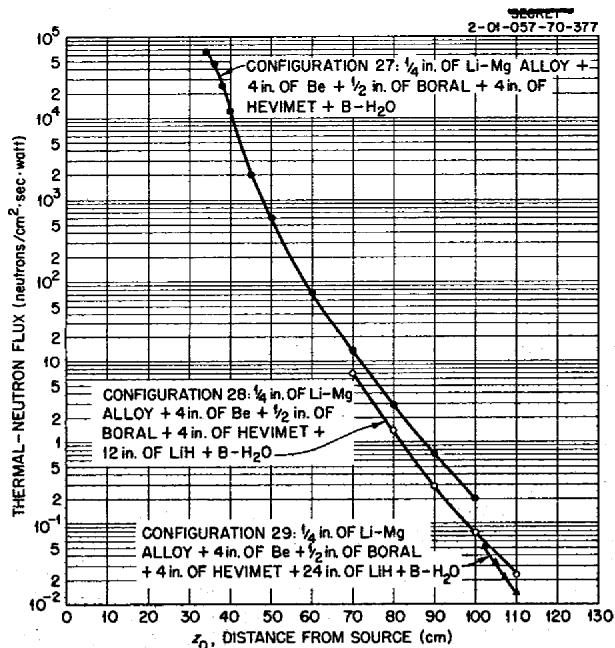  
Fig. 5.1.7. Thermal-Neutron Fluxes Beyond Configurations 27, 28, and 29. (See text)

thickness of lithium hydride (configuration 29) appear to be inconclusive owing to the decreased thermal-neutron flux and to instrumentation difficulties; no thermal-neutron data were obtainable for configurations 30 and 31.

Configurations 32, 33, and 34. - The effect of placing a l-in.-thick stainless steel pressure shell beyond configuration 27 was studied in configuration 32. The change in the slope of the thermal-neutron flux curve may be partially explained by the fact that steel is less effective as a thermal-neutron shield than is borated water. Also, the iron in the steel has a dip in its cross-section curve for 23-kev neutrons, which allows a large number of neutrons of this energy to escape into the borated water where they are subsequently thermalized. These effects would cause an increase in the thermal-neutron flux in the forward region of the curve. On the other hand, scattering of fast neutrons in the steel increases the probability for their absorption in the region further from the source and causes the curve to go below that of configuration 27 in this region.

In configuration 33 the effect of increasing the thickness of the beryllium reflector-moderator used in configuration 32 was studied. The addition of 4 in. of beryllium resulted in an increase in the thermal-neutron flux near the shield surface because of the large percentage of thermalization of neutrons in the beryllium. The flux dropped in the region further away from the source because of the capture of these same neutrons by the boron and hydrogen.

Configuration 34 was an attempt to determine the effect of reducing the thickness of the Hevimet gamma-ray shield used in configuration 32. Subtracting 2 in. of Hevimet allowed an additional 2 in. of borated water to be added to the back of the shield, which resulted in a decrease of the thermal-neutron flux at short distances out in the borated water. The flux increased, however, at greater distances and was slightly above that of configuration 32. The results for configurations 32, 33, and 34 are compared with those for configuration 27 in Fig. 5.1.8.

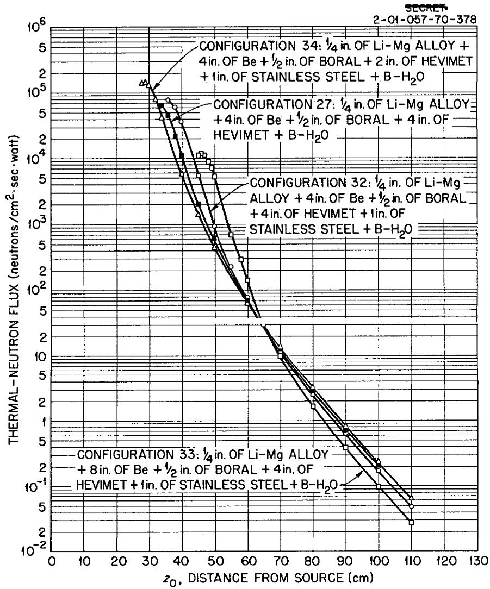  
Fig. 5.1.8. Thermal-Neutron Fluxes Beyond Configurations 27, 32, 33, and 34.

# 5.2. BULK SHIELDING FACILITY

F. C. Maienschein

# THE SUPPRESSION OF CAPTURE GAMMA RAYS BY LITHIUM IN LEAD

J. D. Kingston

One of the problems that confront reactor shield designers is that of shielding against secondary gamma rays produced by the capture of thermal neutrons in lead. A search of the literature revealed that a process for fabricating a lithium-lead alloy was patented in Germany in the 1930's

and that the eutectic contained 0.67 wt % lithium. A lead sample containing 0.67 wt % lithium was then fabricated by the Metallurgy Division, and a preliminary experiment at the Bulk Shielding Facility was performed in order to investigate the effectiveness of the lithium in reducing the capture gamma-ray production in the lead. It was found that lithium distributed throughout lead was approximately as effective as boral covers on a pure lead shield.

# 5.3. TOWER SHIELDING REACTOR-II

C. E. Clifford

L. B. Holland

# MECHANICAL DESIGN

A method of suspension for the TSR-II that will allow a beam of radiation from a collimator through its shield to sweep both a vertical plane and a horizontal plane has been chosen and the design is being examined from structural and stability standpoints. In order to permit rotation of the beam in the vertical direction it was necessary to reduce the length of the reactor tank from that used in previous designs. The relative dimensions of the TSR-II, as now designed, are shown in Fig. 5.3.1.

# NUCLEAR CALCULATIONS

As was reported previously, a nuclear parameter study was carried out with the 3G3R code on the Oracle to establish the dimensions of the TSR-II. The resulting configuration had a 17.5-in.-dia internal water reflector, a 5.5-in.-thick core region, a 7.875-in.-thick external water region, and an aluminum-to-water volume ratio of 0.57. Similar calculations have now been performed on the UNIVAC with the Murine code. A comparison of the values of concentration vs reactivity from the two calculations revealed that a change of $0.3\%$ in the thermal-neutron macroscopic absorption cross section, $\Sigma_{a}$ , for the Oracle calculations was all that was required to obtain complete agreement. Results of the Oracle calculations with the revised value of $\Sigma_{a}$ are compared with the UNIVAC calculations in Fig. 5.3.2. The agreement is such that control problems and the effects of various shells in the design are to be investigated almost entirely with the Oracle 3G3R code, and only the final results will be checked by a repeat calculation with another code.

Calculations have also been performed to determine the total amount of reactivity that could be controlled with a boral shell in an internal water reflector. An ideal case was used with the dimensions given above. A boral shell was placed at

the core-internal reflector interface and the transmission of thermal neutrons through the shell was varied from 0 to $100\%$ . With zero transmission of thermal neutrons the reactivity that could be controlled was found to be $11\%$ . For these calculations the transmission of fast neutrons was assumed to be $100\%$ , and thus the result should be conservative. The change in the thermal-neutron flux produced by the insertion of the zero transmission shell is shown in Fig. 5.3.3.

# FUEL ELEMENT DEVELOPMENT

The fuel element development work is near completion. Of the 71 different fuel plate sizes required for the two types of elements, 60 plates with depleted fuel have been rolled to the correct shape. It is necessary to determine the proper rolling sequences to produce plates with the proper thickness and width and width both held closer than the usual MTR tolerances. Delivery of a three-cylinder hand roller sufficiently long to accommodate the longer fuel plates of the annular elements has made it possible to fabricate several dummy annular elements. Inspection of these elements shows them to be well within the tolerance necessary for operation in the TSR-II. One of the annular elements is shown in Fig. 5.3.4. Two views of a quarter section of the reactor core formed with the dummy aluminum elements are shown in Fig. 5.3.5.

# DEVELOPMENT OF THE CONTROL DEVICE

Improvements were made in the TSR-II prototype control mechanism and a new method was employed to measure the distance traveled by the control plate under scram conditions as a function of time after scram. The design changes were of a minor nature but tended to reduce friction in the positioning device and guiding system. The effect of the changes was to bring the operating pressures more in line with the calculated values. As

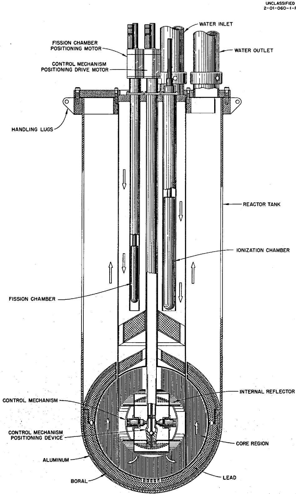  
Fig. 5.3.1. Proposed Tower Shielding Reactor II (Vertical Section).

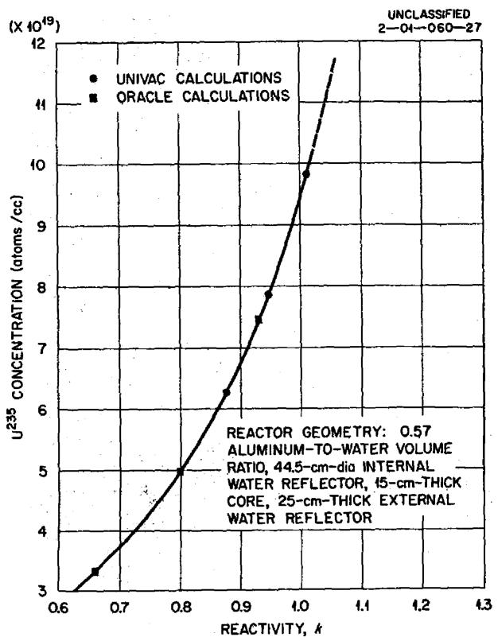  
Fig. 5.3.2. Concentration of $\mathsf{U}^{235}$ in the Proposed TSR-II as a Function of Reactivity. Reactor geometry: 0.57 aluminum-to-water volume ratio, 44.5-cm-dia internal water reflector, 15-cm-thick core, 25-cm-thick external water reflector.

previously reported, $^{6}$ a 66-psi line pressure should be sufficient to hold the poppet against the positioning device for normal operation; reducing the pressure below 50 psi should allow the spring force to overcome the pressure in the cylinder, and the mechanism would move away from the positioning device. (In the reactor the control plates would then move toward the fuel.) The actual pressures observed with the design improvements were 72 psi to operate the mechanism satisfactorily and less than 53 psi to permit the spring to overcome the hydraulic force.

6C. E. Clifford and L. B. Holland, ANP Quar. Prog. Rep. June 30, 1957, ORNL-2340 (Part 1-5), p 323.

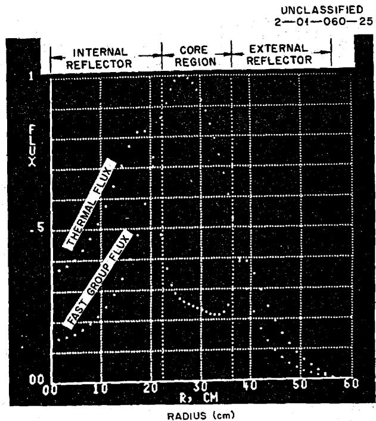  
(a) No Boral Shell.

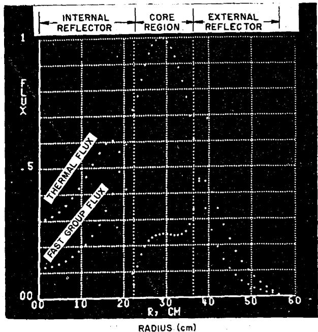  
(b) Thermally Black Shell at Interface of Core and Internal Reflector.   
Fig. 5.3.3. Effect of a Boral Shell at the Core-Internal Reflector Interface on the Neutron Flux in the Proposed TSR-II.

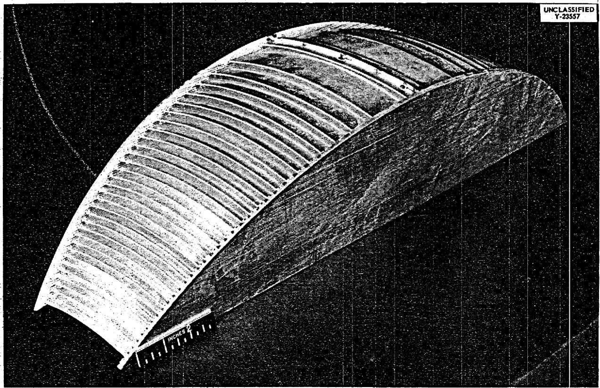  
Fig. 5.3.4. TSR-II Dummy Annular Fuel Element.

The control-plate travel as a function of time under scram conditions was obtained by observing, with an oscilloscope which has a persistent screen, the time required for the piston and control plate to traverse a known part of its travel. The time was defined by having the control plate break an electrical contact when motion started and then make electrical contact when the desired distance had been covered. The change in contact appeared as pips on the sweep signal moving across the oscilloscope screen. The values of distance traveled as a function of time thus obtained are shown in Fig. 5.3.6, together with the same values obtained by an iterative solution of a force-balance equation that was written to design the prototype. A full-scale model is being designed on the same principles.

# CALCULATION OF THE GAMMA-RAY HEATING IN THE LEAD SHIELD

W. W. Dunn

D. K. Trubey

Calculations have been carried out in order to predict the gamma-ray heating in the lead region around the TSR-II core. For these calculations, the core was assumed to contain $9\mathrm{kg}$ of $\mathsf{U}^{235}$ and to have an aluminum-to-water core volume ratio of 0.57. The calculations involved two steps: (1) a calculation of the heating in the core at the core-shield interface, and (2) a Monte Carlo Oracle calculation of the heating in arbitrarily chosen regions (as shown in Fig. 5.3.7) throughout the lead shield. The calculated heating in the core at

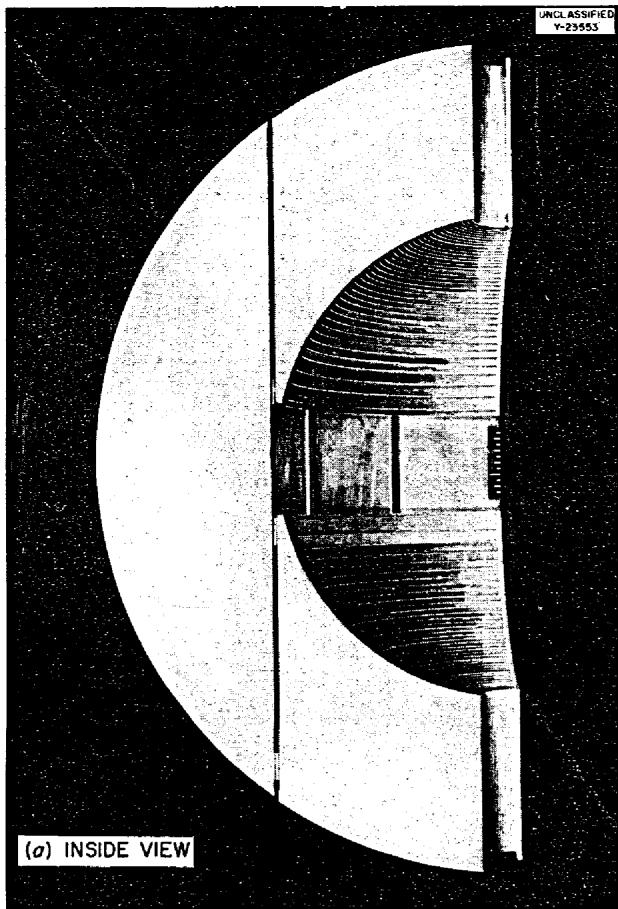

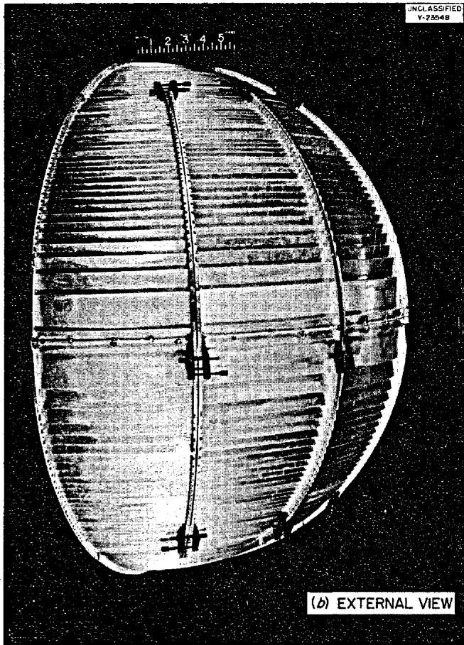  
Fig. 5.3.5. Dummy Fuel Elements for the Proposed TSR-II, Assembled in Quarter Sphere.

the core-shield interface, coupled with an assumption for the angular distribution at the interface, was used as the source term for the Monte Carlo calculation. The two steps are described in detail below.

# Heating at the Core-Shield Interface

For the calculation of the core heating at the core-shield interface, the core was divided into seven spherical shells (see Fig. 5.3.7) chosen so that a reasonable average flux could be assumed for each shell. The source distribution was assumed to be proportional to the thermal-neutron flux as calculated by the Oracle 3G3R code for an aluminum-to-water volume ratio of 0.707 and core dimensions of 20 and $40~\mathrm{cm}$ . This flux plot was scaled to the assumed core dimensions (22.225-cm inner radius and 37.46-cm outer radius) and was

used for the calculation, although the aluminum-to-water volume ratio in the calculation was specified as 0.57. The gamma-ray spectrum from each source shell was then divided into six energy groups, which were arbitrarily chosen as 0.5, 1, 2, 4, 6, and 8 MeV.

According to the usual transformation from a spherical-shell source to an equivalent infinite plane source (neglecting the back plane), the core heating at the core-shield interface as a function of the initial energy $E_0$ leaving the source

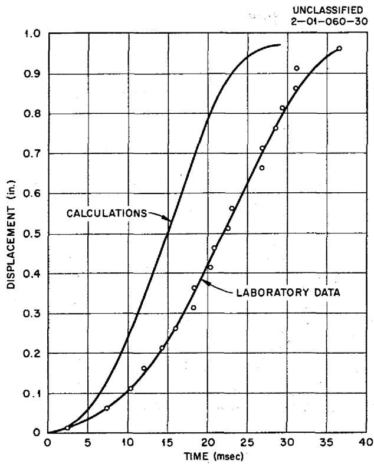  
Fig. 5.3.6. Piston Displacement in Control Mechanism Test for Proposed TSR-II as a Function of Time.

plane was determined by the equation

$$
\begin{array}{l} H _ {\left(\text {s h e l l}, E _ {0}\right)} = \frac {r}{r _ {0}} \left[ 2 \pi K S \left(E _ {0}\right) E _ {0} \mu_ {a} \left(E _ {0}\right) \right] \times \\ \times \int_ {z} ^ {\infty} B (R, E _ {0}) G (R, E _ {0}) R d R, \\ \end{array}
$$

where

$r_0 =$ distance from center of core (or center of internal water reflector) to core-shield interface, cm,

$r =$ distance from center of core to spherical source shell, cm,

$$
z = r _ {0} - r, \mathrm {c m},
$$

$S(E_0) =$ source term for each shell, number of gamma rays of energy $E_0$ generated per square centimeter per fission per second,

$\mu_{a}(E_{0}) =$ energy absorption coefficient for gamma rays of energy $E_0$ in the core,

$R =$ distance from the source point on the spherical shell to the core-shield interface, cm,

$B(R,E_0) =$ energy absorption buildup factor in the core as a function of distance $R$ and source energy $E_0$

$G(R,E_0) =$ attenuation kernel for a point isotropic source

$$
= e ^ {- \mu_ {t} R} / 4 \pi R ^ {2},
$$

$\mu_{t} =$ total absorption coefficient,

$K =$ term to convert to watts of heating per cubic centimeter of material per megawatt of reactor power.

The correction for the heating in the $r_0 + r$ infinite plane, that is, the back plane, was made in the actual calculation, but it amounted to only a small per cent and then only in the innermost core source planes.

The source term, $S(E_0)$ , which was assumed to be proportional to the average thermal-neutron flux in that shell, can be given by the expression

$$
\begin{array}{l} S \left(E _ {0}\right) = A \phi_ {t b} t [ N (p + c) \Sigma_ {f} (u) + \tag {2} \\ + N (f p) \Sigma_ {f} (u) + N (\mathrm {A I}) \Sigma_ {a} (\mathrm {A I}) + \\ \left. + N (\mathsf {H}) \Sigma_ {a} (\mathsf {H}) \right], \\ \end{array}
$$

where

$A =$ factor for normalization to one fission per second in the core,   
$\phi_{tb} =$ average thermal-neutron flux in the source shell,   
$t =$ shell thickness, cm,   
$N(p + c) =$ number of prompt fission and capture gamma rays in the energy group about $E_0$ produced in uranium per fission,   
$\Sigma_{f}(u) =$ macroscopic fission cross section of U235,   
$N(fp) =$ number of fission-product decay gamma rays in the energy group about $E_0$ per fission,   
$N(\mathrm{Al}) =$ number of aluminum capture and decay gamma rays in the energy group about $E_0$ per capture,   
$\Sigma_{a}(A)$ = macroscopic absorption cross section of aluminum,

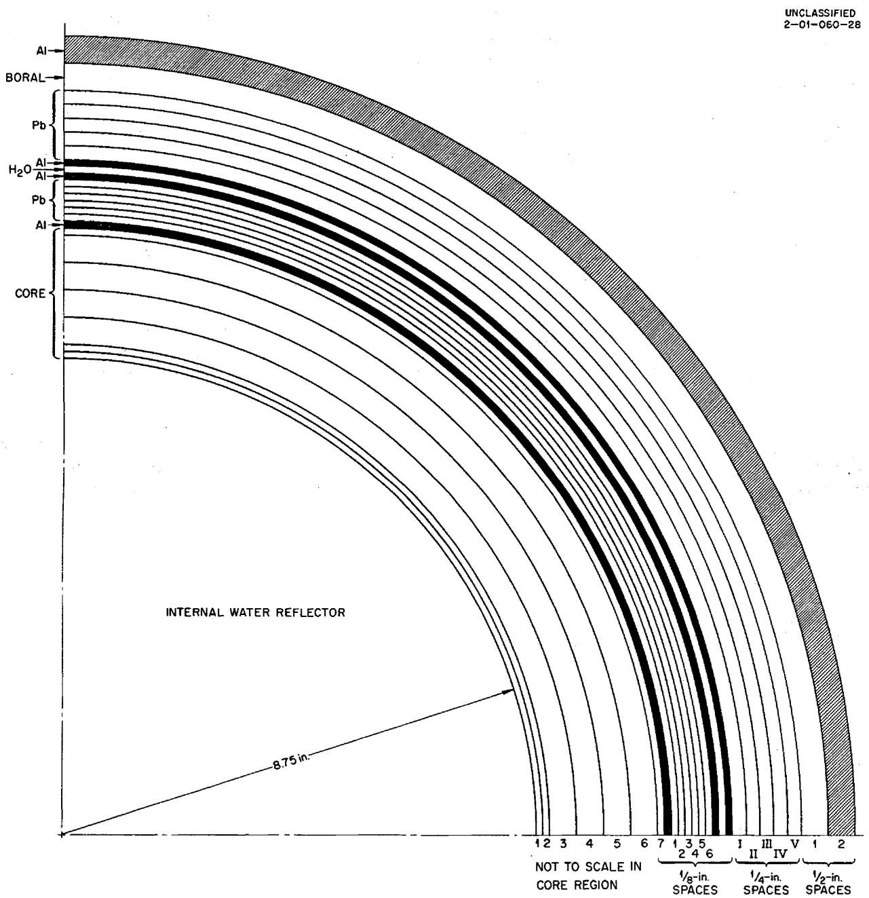  
Fig. 5.3.7. Shield Configuration Used to Calculate Gamma-Ray Heating in the TSR-II.

$N(H) =$ number of hydrogen capture gamma rays in the energy group about $E_0$ per capture,

$\Sigma_{a}(H) =$ macroscopic absorption cross section of hydrogen.

The values used for the $N$ 's as a function of $E_0$ are listed in Table 5.3.1.

The linear and energy absorption coefficients of the core as a function of $E_0$ were determined by the following expression, where $\rho_i$ is the fractional density of the ith material,

$$
\mu_ {\text {(c o r e)}} = \sum_ {i} \left(\frac {\mu}{\rho}\right) _ {i} \rho_ {i}.
$$

Table 5.3.1. Equivalent Number of Gamma Rays in the Core for Each Energy Group $E_0$   

<table><tr><td>E0(Mev)</td><td>N(p+c)/fissiona</td><td>N(/p)/fissiona</td><td>N(H)/captureb</td><td>N(Al)/captureb</td></tr><tr><td>0.5</td><td>3.31</td><td>2.972</td><td>0</td><td>0</td></tr><tr><td>1</td><td>2.55</td><td>1.864</td><td>0</td><td>0.10</td></tr><tr><td>2</td><td>1.687</td><td>0.891</td><td>1.115</td><td>1.53</td></tr><tr><td>4</td><td>0.368</td><td>0.1165</td><td>0</td><td>0.77</td></tr><tr><td>6</td><td>0.050</td><td>0.0084</td><td>0</td><td>0.21</td></tr><tr><td>8</td><td>0.0067</td><td>0.0006</td><td>0</td><td>0.35</td></tr></table>

$^{a}$ H. W. Bertini et al., Basic Gamma-Ray Data for ART Heat Deposition Calculations, ORNL-2113, pp 8,16 (Sept. 17, 1956).   
bH. C. Claiborne and T. B. Fowler, The Calculation of Gamma Heating in Reactors of Rectanguloid Geometry, ORNL CF-56-7-97, p 20 (July 20, 1956).

The energy absorption buildup factors for each $E_0$ in the core were obtained by fitting the expression:

$$
B (R) = 1 + a (\mu t) + b (\mu t) ^ {2}
$$

to the tabulated NDA values for aluminum and water. Where possible, the empirical expression was weighted as the core density ratio, two-thirds aluminum to one-third water. The values of $a$ and $b$ for each value of $E_0$ , which are good up to approximately 7 mean free paths, are given in Table 5.3.2.

The core heating at the core-shield interface was obtained by summing the result of Eq. 1 over all seven core planes. The results are shown in the second column of Table 5.3.3.

Because another method of calculation was used for the second step, it was felt that the heating in some overlapping region should be computed by both methods for purposes of comparison. Therefore, the method described above was also used to determine the heating in the shield at the first aluminum shell and in the initial layer of lead. This was accomplished for the aluminum shell by assuming that the flux entering the aluminum was the same as that which left the core. The aluminum

Table 5.3.2. Values of the Coefficients $a$ and $b$ Used in Determination of $B\left( R\right)$ for the Core   

<table><tr><td>E0</td><td>a</td><td>b</td></tr><tr><td>0.5</td><td>1.10</td><td>0.45</td></tr><tr><td>1</td><td>0.955</td><td>0.185</td></tr><tr><td>2</td><td>0.78</td><td>0.05</td></tr><tr><td>4</td><td>0.57</td><td>0.0</td></tr><tr><td>6</td><td>0.42</td><td>0.0</td></tr><tr><td>8</td><td>0.33</td><td>0.0</td></tr></table>

Table 5.3.3. Heat Contributions from $E_0$ Energy Groups   

<table><tr><td rowspan="2">E0(Mev)</td><td colspan="3">Heat Generation (watts/cm3·Mw)</td></tr><tr><td>At Core-Shield Interface</td><td>In First Aluminum Shell</td><td>In First Lead Interval</td></tr><tr><td>0.5</td><td>0.034</td><td>0.047</td><td>0.649</td></tr><tr><td>1</td><td>0.042</td><td>0.063</td><td>0.389</td></tr><tr><td>2</td><td>0.050</td><td>0.074</td><td>0.360</td></tr><tr><td>4</td><td>0.017</td><td>0.026</td><td>0.251</td></tr><tr><td>6</td><td>0.003</td><td>0.005</td><td>0.055</td></tr><tr><td>8</td><td>0.002</td><td>0.003</td><td>0.025</td></tr><tr><td>Total</td><td>0.148</td><td>0.218</td><td>1.729</td></tr></table>

heating was then the product of the heating per energy group in the core and the ratio of the aluminum-to-core energy absorption coefficients. The results are tabulated in the third column of Table 5.3.3.

For the lead heating, Eq. 1 was resolved for the heating in the aluminum at the aluminum-lead interface, by using the new distances involved and by including the effect of the thin shell of aluminum on the linear and energy absorption coefficients. The buildups in the core and aluminum were assumed to be the same. The resulting heating as a function of the energy group (which agreed to within several per cent of that estimated in the preceding paragraph) was multiplied by the ratio of the lead-to-aluminum energy absorption coefficients to give the results tabulated in the fourth column of Table 5.3.3. Naturally, it is not expected that this estimate for lead will be as good as that for the aluminum shell, and no reliance is placed on it other than for comparison with the calculation discussed below.

Since the Monte Carlo code yields gamma-ray heating as a function of initial energy and angle of incidence, it was necessary to find the energy and angular distribution of the flux incident upon the shield. The energy flux incident upon the shield was estimated by dividing the calculated heating for each initial energy group at the core-aluminum interface into collided and uncollided fluxes. The uncollided flux for each $E_0$ was determined by solving Eq. 1 without buildup factors or absorption coefficients.

The total collided heating for each $E_0$ in the core was found by:

$$
H _ {(\text {c o l l i d e d})} = H _ {(\text {u n c o l l i d e d})} [ B (R) - 1 ].
$$

This was assumed to be made up of collided fluxes of the energy group $E_0$ under consideration plus collided fluxes of each lower energy group $E$ corresponding in size, except for the upper group, to the initial groups $E_0$ . For example, for $E_0$ at 4 Mev:

$$
\begin{array}{l} H _ {(\text {c o l l i d e d})} = \left[ \begin{array}{l} \phi_ {4 - \text {M e v}} \mu_ {a} (4 \text {M e v}) + \phi_ {2 - \text {M e v}} \mu_ {a} (2 \text {M e v}) + \phi_ {1 - \text {M e v}} \mu_ {a} (1 \text {M e v}) + \end{array} \right. \\ \left. + \phi_ {0. 5 - M e v} \mu_ {a} (0. 5 M e v) + \phi_ {0. 1 - M e v} \mu_ {a} (0. 1 M e v) \right] K. \\ \end{array}
$$

# Heating Within the Shield

The Oracle Monte Carlo code10 for the heat deposition resulting from the penetration of gamma rays through stratified slab shields was used to calculate the heating in various TSR-II shield layers which were arbitrarily chosen as follows:

1. the first layer of aluminum,   
2. the six equal regions in the first layer of lead,   
3. the second aluminum layer,   
4. the water layer,   
5. the third aluminum layer,   
6. the five equal regions in the second lead layer,   
7. the two equal regions in the final borated aluminum layers which were considered all aluminum.

These layers are shown in pictorial form in Fig. 5.3.7.

The relative values of the collided fluxes in the above equation were obtained from the ratios of the areas under the differential energy spectrum curve for each $E_0$ , as given by Goldstein and Wilkins for a point isotropic source after passage through one mean free path of water. This was possible since the relative spectrum for each $E_0$ is nearly independent of the distance from the source for a number of mean free paths. Figure 5.3.8 illustrates such a curve for an $E_0$ of 4 Mev. With the ratios of the collided fluxes for each $E$ known, it was possible to solve Eq. 3 and obtain the collided number flux for each energy group. The sum of the collided and uncollided fluxes for each $E$ gave the total incident flux for each energy group.

It was assumed for the uncollided fluxes that the radiation was isotropic in the source planes and, since the back plane correction is unimportant, the angular distribution should also be nearly the same as for infinite plane sources. This angular

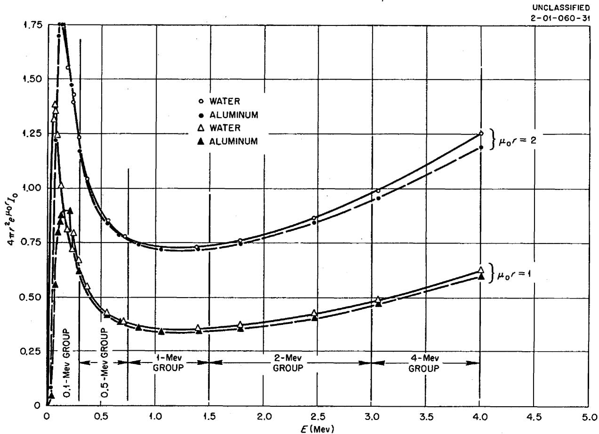  
Fig. 5.3.8. NDA Moments Method Calculation of Collided Gamma-Ray Spectra in Aluminum and Water Media from a 4-Mev Point Source.

distribution was determined by weighting the contribution per solid angle with the exponential attenuation with distance.

The uncollided flux arriving at point $P$ from a source ring of radius $\rho$ on an infinite plane at distance $z$ (Fig. 5.3.9) is

$$
S (z) \frac {e ^ {- \mu R}}{4 \pi R ^ {2}} 2 \pi \rho d p.
$$

This flux arrives in $d\theta$ about $\theta$ and

$$
\frac {\rho d \rho}{R ^ {2}} = \frac {z ^ {2} \tan \theta \sec^ {2} \theta d \theta}{z ^ {2} \sec^ {2} \theta} = \tan \theta d \theta .
$$

Therefore,

$$
F (\theta , z) d \theta = \frac {S}{2} \tan \theta e ^ {- \mu z / \cos \theta} d \theta , \tag {4}
$$

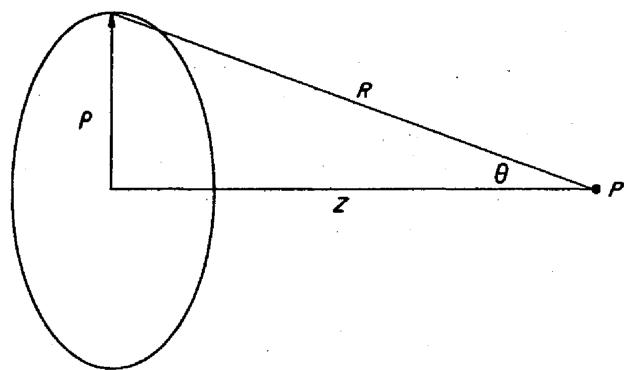  
Fig. 5.3.9. Geometry Used to Determine Incident Uncollided Flux.

where

$\theta =$ angle between the incident radiation and the normal from the shield to the point, $z =$ normal distance from plane to point.

By assuming that the source is uniformly distributed over the core planes, Eq. 4 can be integrated over the core to give

(5) $F(\theta)d\theta = \frac{S^{\prime}}{2\mu}\sin \theta d\theta \left[1 - e^{-\mu z_{\max} / \cos \theta}\right]$

where $S'$ is the volume source strength. Let $A = S'/2\mu$ and normalized by the requirement that

(6) $\phi = \int_{0}^{\pi /2}A\sin \theta d\theta \left(1 - e^{-\mu z_{\max} / \cos \theta}\right),$

which yields

(7) $\phi = A[1 - E_2(\mu z_{\max})]$ ,

where

$$
E _ {2} (x) = x \int_ {x} ^ {\infty} \frac {e ^ {- y}}{y ^ {2}} d y.
$$

The heating for each $E_0$ at any point in the shield from the uncollided flux is given by the expression

(8)

$$
H = \int_ {\theta} f (\theta) A \sin \theta \cos \theta d \theta \left[ 1 - e ^ {- \mu x _ {\max } / \cos \theta} \right],
$$

where

$\cos \theta =$ conversion from fluxes to current as required by Monte Carlo calculations, $f(\theta) =$ Monte Carlo result for fraction of energy deposited in a particular region for a particular $E_0$ and angle of incidence.

A typical plot of $f(\theta)$ for an initial energy $E_0$ of 2 Mev is shown in Fig. 5.3.10. Substitution of Eq. 7 for $A$ in Eq. 8 yields (for heating in the ith region of the shield)

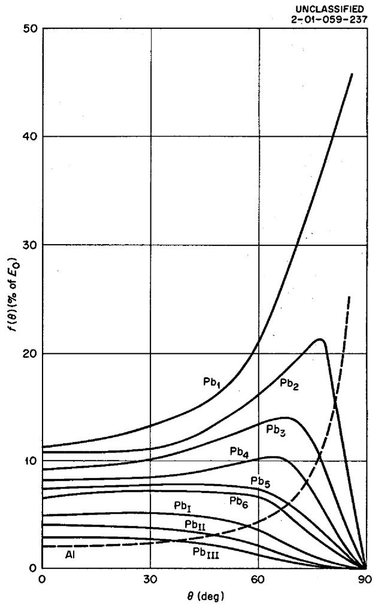  
Fig. 5.3.10. Percentage of 2-Mev Incident Gamma Rays Deposited in Various Regions of the TSR-II Shield as a Function of $\theta$ .

(9) $H_{i}(E) =$

$$
\int_ {\theta} f _ {i} (\theta) \phi (E) \sin \theta \cos \theta d \theta \left[ \frac {1 - e ^ {- \mu z _ {\max } / \cos \theta}}{1 - E _ {2} (\mu z _ {\max })} \right].
$$

Although Eq. 9 was developed for the uncollided flux, for this calculation it was assumed that the collided flux reaching the shield had the same angular distribution as the uncollided flux. Hence Eq. 9 was solved for the total heating in each region in the shield by using the total flux in each energy group. One example of the integrand of Eq. 9 for one energy is shown in Fig. 5.3.11.

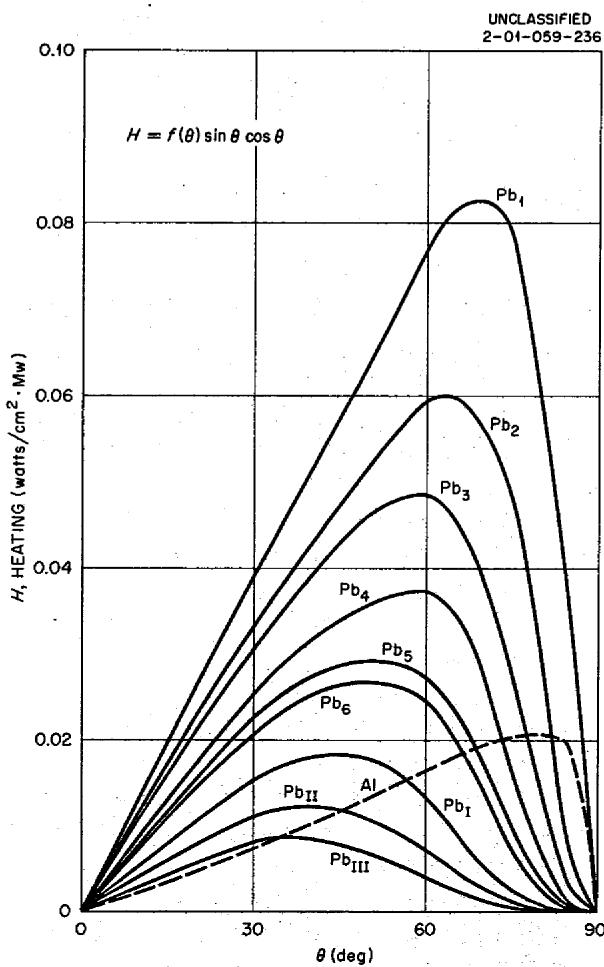  
Fig. 5.3.11. Heating in Various Regions of the TSR-II Shield Resulting from 2-Mev Incident Gamma Rays as a Function of $\theta$ .

The total heating evaluated in each region in the shield by Eq. 9 is shown in the form of a histogram in Fig. 5.3.12. The heating in the aluminum-water-aluminum region and in the final lead and aluminum region was not significant compared with that in other regions and hence is not illustrated. Also shown in Fig. 5.3.12 are the results of the estimates for the first aluminum and lead regions calculated with Eq. 1 and described in the last two paragraphs of the preceding section.

# Conclusions

The calculation of heating in the regions outside the core should be an upper limit of the actual case and therefore serve as a safe basis for design. This is due to the source of leakage radiation being slightly overestimated, since the buildup factors used for attenuation within the core apply to an infinite medium and ignore the depression from the lead layer around the core. This depression is largest for collided photons arriving in directions nearly tangential to the core-shield interface. These photons would be expected to contribute strongly to the heating just at the inner edge of the lead where the heating is the most important.

A further extension of this calculation is presently under way to remove the dependence of the calculation on the energy and angular distribution at the shield interface by utilizing the data from the calculation by Bowman and Trubey (see Chap. 5.4, this report) to extend the Monte Carlo calculation from the shield to the source planes in the core.

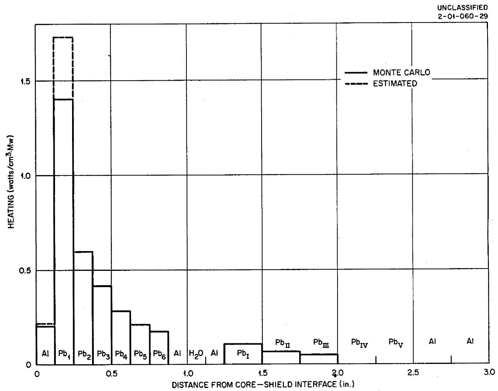  
Fig. 5.3.12. Gamma-Ray Heat Generation Rates in the Proposed TSR-II Lead Shield Region as a Function of Distance from the Core Shield Interface.

# 5.4. SHIELD DESIGN

C. E. Clifford

F. L. Keller

# MONTECARLO CALCULATION OF GAMMA-RAY PENETRATION OF ALUMINUM SLABS

D. K. Trubey

A Monte Carlo calculation of the energy spectrum and angular distribution of gamma rays which penetrate 3-, 6-, and 9-in.-thick aluminum slabs has been carried out by using the Oracle code discussed previously. For this calculation the gamma rays were assumed to be incident normal to the slabs and to have initial energies of 0.662 Mev (the energy of Cs137 gamma rays).

The energy balance for the three slabs, that is, the fraction of energy reflected, absorbed, or transmitted, is given in Table 5.4.1. The fraction transmitted is further broken down into the uncollided and collided portions. The transmitted collided-energy fraction is then subdivided into 10 energy groups which are transmitted through 12 angular sectors, as shown in Table 5.4.2. Since the incident energy is normal to the slab, there is no dependence on an azimuthal angle. The distribution of the transmitted collided-energy fraction into the various energy groups and angular sectors obtained from the calculation is presented in Tables 5.4.3 through 5.4.5. The total collided energy transmitted per unit solid angle for the three slabs is shown in the histograms in Figs. 5.4.1, 5.4.2, and 5.4.3.

An attempt has been made to fit the histogram plots with analytical expressions. If the distribution is represented by

$$
\phi (\theta) = A \cos^ {b} \theta ,
$$

and the energy in each sector is $\phi (i,i + 1)$ where $i = 1,2,\ldots ,13,$ then

$$
2 \pi A \int_ {\mu_ {i + 1}} ^ {\mu_ {i}} \mu^ {b} d \mu = \phi (i, i + 1) \tag {1}
$$

and

$$
2 \pi A \int_ {0} ^ {1} \mu^ {b} d \mu = N, \tag {2}
$$

Table 5.4.2. Angular Sectors and Energy Groups for Transmitted Collided Energy   

<table><tr><td>Angular Sector, S</td><td>θ, Polar Angle* (deg)</td><td>Energy Group, E</td><td>Energy Range (Mev)</td></tr><tr><td>1</td><td>0-5</td><td>1</td><td>0-0.03</td></tr><tr><td>2</td><td>5-10</td><td>2</td><td>0.03-0.05</td></tr><tr><td>3</td><td>10-15</td><td>3</td><td>0.05-0.07</td></tr><tr><td>4</td><td>15-20</td><td>4</td><td>0.07-0.09</td></tr><tr><td>5</td><td>20-25</td><td>5</td><td>0.09-0.19</td></tr><tr><td>6</td><td>25-30</td><td>6</td><td>0.19-0.29</td></tr><tr><td>7</td><td>30-35</td><td>7</td><td>0.29-0.39</td></tr><tr><td>8</td><td>35-40</td><td>8</td><td>0.39-0.49</td></tr><tr><td>9</td><td>40-45</td><td>9</td><td>0.49-0.59</td></tr><tr><td>10</td><td>50-60</td><td>10</td><td>0.59-0.662</td></tr><tr><td>11</td><td>60-70</td><td></td><td></td></tr><tr><td>12</td><td>70-90</td><td></td><td></td></tr></table>

*Angle with the normal.

Table 5.4.1. Fractions of Incident Energy Reflected, Absorbed, and Transmitted   

<table><tr><td rowspan="3">Slab Thickness (in.)</td><td colspan="4">Energy Fraction</td></tr><tr><td rowspan="2">Reflected</td><td rowspan="2">Absorbed</td><td colspan="2">Transmitted</td></tr><tr><td>Uncollided</td><td>Collided</td></tr><tr><td>3</td><td>0.0477</td><td>0.540</td><td>0.213</td><td>0.199</td></tr><tr><td>6</td><td>0.0498</td><td>0.802</td><td>0.0457</td><td>0.102</td></tr><tr><td>9</td><td>0.0483</td><td>0.909</td><td>0.00977</td><td>0.0329</td></tr></table>

Table 5.4.3. Fraction of Incident Energy Transmitted (Collided) in Energy Group E and Sector S for 3-In.-Thick Aluminum Slab   

<table><tr><td rowspan="2">S</td><td colspan="11">Fraction of Incident Energy</td></tr><tr><td>E=1</td><td>E=2</td><td>E=3</td><td>E=4</td><td>E=5</td><td>E=6</td><td>E=7</td><td>E=8</td><td>E=9</td><td>E=10</td><td>Total</td></tr><tr><td>1</td><td>0</td><td>0</td><td>0</td><td>0</td><td>0.0001268</td><td>0.00004886</td><td>0</td><td>0.00008103</td><td>0</td><td>0.002545</td><td>0.002802</td></tr><tr><td>2</td><td>0</td><td>0</td><td>0.00004422</td><td>0.0001214</td><td>0.0005534</td><td>0.0002395</td><td>0.0002185</td><td>0.0002553</td><td>0.0003704</td><td>0.007583</td><td>0.009386</td></tr><tr><td>3</td><td>0</td><td>0</td><td>0.00005692</td><td>0.0001443</td><td>0.0007589</td><td>0.0006092</td><td>0.0004436</td><td>0.0003113</td><td>0.0008273</td><td>0.01141</td><td>0.01456</td></tr><tr><td>4</td><td>0</td><td>0</td><td>0.00008955</td><td>0.0002400</td><td>0.0009322</td><td>0.001012</td><td>0.0009466</td><td>0.0007345</td><td>0.001046</td><td>0.01344</td><td>0.01844</td></tr><tr><td>5</td><td>0</td><td>0</td><td>0.0001136</td><td>0.0002382</td><td>0.001167</td><td>0.0009087</td><td>0.0002115</td><td>0.001380</td><td>0.001411</td><td>0.01181</td><td>0.01724</td></tr><tr><td>6</td><td>0</td><td>0</td><td>0.0001244</td><td>0.00018110</td><td>0.0009606</td><td>0.001033</td><td>0.001344</td><td>0.001136</td><td>0.01356</td><td>0.001181</td><td>0.01952</td></tr><tr><td>7</td><td>0</td><td>0</td><td>0.0001645</td><td>0.0002012</td><td>0.001573</td><td>0.001028</td><td>0.0009510</td><td>0.001722</td><td>0.01308</td><td>0.0004495</td><td>0.01917</td></tr><tr><td>8</td><td>0</td><td>0</td><td>0.0001836</td><td>0.0004086</td><td>0.001685</td><td>0.001071</td><td>0.001019</td><td>0.001518</td><td>0.01319</td><td>0</td><td>0.01908</td></tr><tr><td>9</td><td>0</td><td>0.00001872</td><td>0.0002882</td><td>0.0005362</td><td>0.003537</td><td>0.003130</td><td>0.002531</td><td>0.01222</td><td>0.007077</td><td>0</td><td>0.02934</td></tr><tr><td>10</td><td>0</td><td>0.000008793</td><td>0.0003237</td><td>0.0006943</td><td>0.003529</td><td>0.002386</td><td>0.002794</td><td>0.01414</td><td>0.0008499</td><td>0</td><td>0.02473</td></tr><tr><td>11</td><td>0</td><td>0.00001838</td><td>0.0002007</td><td>0.0044540</td><td>0.002870</td><td>0.001584</td><td>0.005738</td><td>0.003876</td><td>0</td><td>0</td><td>0.01473</td></tr><tr><td>12</td><td>0</td><td>0.00001828</td><td>0.0002145</td><td>0.0005365</td><td>0.003065</td><td>0.001385</td><td>0.003609</td><td>0.001155</td><td>0</td><td>0</td><td>0.009983</td></tr><tr><td>Total</td><td>0</td><td>0.00006417</td><td>0.001804</td><td>0.003747</td><td>0.0207590</td><td>0.014365</td><td>0.019807</td><td>0.03854</td><td>0.05141</td><td>0.04842</td><td>0.19898</td></tr></table>

Table 5.4.4. Fraction of Incident Energy Transmitted (Collided) in Energy Group $E$ and Sector $S$ for 6-in.-Thick Aluminum Slab   

<table><tr><td rowspan="2">S</td><td colspan="11">Fraction of Incident Energy</td></tr><tr><td>E=1</td><td>E=2</td><td>E=3</td><td>E=4</td><td>E=5</td><td>E=6</td><td>E=7</td><td>E=8</td><td>E=9</td><td>E=10</td><td>Total</td></tr><tr><td>1</td><td>0</td><td>0</td><td>0.00004386</td><td>0</td><td>0.0001805</td><td>0</td><td>0.0001698</td><td>0</td><td>0.00006487</td><td>0.001164</td><td>0.001623</td></tr><tr><td>2</td><td>0</td><td>0</td><td>0</td><td>0.00009864</td><td>0.0002970</td><td>0</td><td>0.0002733</td><td>0.0004263</td><td>0.0001370</td><td>0.002511</td><td>0.003752</td></tr><tr><td>3</td><td>0</td><td>0</td><td>0.00004889</td><td>0.00001509</td><td>0.0004989</td><td>0.0003587</td><td>0.0001356</td><td>0.0003558</td><td>0.0006073</td><td>0.005327</td><td>0.007347</td></tr><tr><td>4</td><td>0</td><td>0</td><td>0.00002740</td><td>0.00003203</td><td>0.0007486</td><td>0.0006221</td><td>0.0002833</td><td>0.0005175</td><td>0.0008115</td><td>0.005891</td><td>0.008934</td></tr><tr><td>5</td><td>0</td><td>0.00004552</td><td>0.00006332</td><td>0.0001901</td><td>0.0004834</td><td>0.0008475</td><td>0.0005601</td><td>0.001407</td><td>0.0003428</td><td>0.005755</td><td>0.009695</td></tr><tr><td>6</td><td>0</td><td>0.00001986</td><td>0.0001945</td><td>0.0002363</td><td>0.0003369</td><td>0.0006139</td><td>0.0009168</td><td>0.0005214</td><td>0.006614</td><td>0.0009825</td><td>0.01044</td></tr><tr><td>7</td><td>0</td><td>0</td><td>0.0001201</td><td>0.0002634</td><td>0.001028</td><td>0.0002668</td><td>0.001813</td><td>0.0007509</td><td>0.008405</td><td>0</td><td>0.01265</td></tr><tr><td>8</td><td>0</td><td>0.00001183</td><td>0.0001232</td><td>0.0003411</td><td>0.001845</td><td>0.001374</td><td>0.0007652</td><td>0.001347</td><td>0.005172</td><td>0</td><td>0.01098</td></tr><tr><td>9</td><td>0</td><td>0.00004562</td><td>0.0003138</td><td>0.0006895</td><td>0.001695</td><td>0.001313</td><td>0.001417</td><td>0.005916</td><td>0.002624</td><td>0</td><td>0.01401</td></tr><tr><td>10</td><td>0</td><td>0.000005982</td><td>0.0002887</td><td>0.0002954</td><td>0.002164</td><td>0.001961</td><td>0.001914</td><td>0.003420</td><td>0.0004832</td><td>0</td><td>0.01054</td></tr><tr><td>11</td><td>0</td><td>0.000010710</td><td>0.00007994</td><td>0.0002982</td><td>0.001628</td><td>0.0008028</td><td>0.001932</td><td>0.002165</td><td>0</td><td>0</td><td>0.006917</td></tr><tr><td>12</td><td>0</td><td>0</td><td>0.0003549</td><td>0.0002493</td><td>0.001207</td><td>0.001075</td><td>0.001813</td><td>0.0004993</td><td>0</td><td>0</td><td>0.005198</td></tr><tr><td>Total</td><td>0</td><td>0.0001396</td><td>0.001659</td><td>0.002711</td><td>0.01212</td><td>0.009243</td><td>0.01199</td><td>0.01734</td><td>0.02526</td><td>0.21691</td><td>0.10208</td></tr></table>

Table 5.4.5. Fraction of Incident Energy Transmitted (Collided) in Energy Group $E$ and Sector $S$ for 9-in.-Thick Aluminum Slab   

<table><tr><td rowspan="2">S</td><td colspan="10">Fraction of Incident Energy</td></tr><tr><td>E=1</td><td>E=2</td><td>E=3</td><td>E=4</td><td>E=5</td><td>E=6</td><td>E=7</td><td>E=8</td><td>E=9</td><td>E=10 Total</td></tr><tr><td>1</td><td>0</td><td>0</td><td>0</td><td>0.00001919</td><td>0.00001206</td><td>0</td><td>0.00001067</td><td>0.00009016</td><td>0</td><td>0.0005113 0.0006434</td></tr><tr><td>2</td><td>0</td><td>0</td><td>0.000002177</td><td>0</td><td>0.0001452</td><td>0.00002060</td><td>0.00003799</td><td>0</td><td>0.00002669</td><td>0.001168 0.001400</td></tr><tr><td>3</td><td>0</td><td>0</td><td>0.00001126</td><td>0.00004094</td><td>0.0001060</td><td>0.00001336</td><td>0.00002675</td><td>0.00005468</td><td>0.0004522</td><td>0.001172 0.001877</td></tr><tr><td>4</td><td>0</td><td>0</td><td>0.00003177</td><td>0.00003686</td><td>0.0001807</td><td>0.0002683</td><td>0.00002514</td><td>0.0006556</td><td>0.0003300</td><td>0.001517 0.003045</td></tr><tr><td>5</td><td>0</td><td>0</td><td>0.00007779</td><td>0.00023096</td><td>0.0002761</td><td>0.0002738</td><td>0.0002246</td><td>0.0002301</td><td>0.0006285</td><td>0.001189 0.003131</td></tr><tr><td>6</td><td>0</td><td>0</td><td>0.00002119</td><td>0.0001118</td><td>0.0004371</td><td>0.0001221</td><td>0.0004751</td><td>0.0008794</td><td>0.001685</td><td>0.0001525 0.003885</td></tr><tr><td>7</td><td>0</td><td>0.000001519</td><td>0.000009835</td><td>0.00002760</td><td>0.0003723</td><td>0.0003694</td><td>0.0001137</td><td>0.0001820</td><td>0.001323</td><td>0.0002243 0.002623</td></tr><tr><td>8</td><td>0</td><td>0.00001083</td><td>0.00002665</td><td>0.00004738</td><td>0.0006920</td><td>0.0007257</td><td>0.0001406</td><td>0.0002184</td><td>0.001169</td><td>0 0.003031</td></tr><tr><td>9</td><td>0</td><td>0</td><td>0.0001301</td><td>0.0001344</td><td>0.0006778</td><td>0.0008160</td><td>0.0003914</td><td>0.0009388</td><td>0.002061</td><td>0 0.005149</td></tr><tr><td>10</td><td>0</td><td>0.000003086</td><td>0.0001184</td><td>0.0001807</td><td>0.0011319</td><td>0.0006917</td><td>0.0007707</td><td>0.001425</td><td>0.0001359</td><td>0 0.004457</td></tr><tr><td>11</td><td>0</td><td>0.00001308</td><td>0.00009961</td><td>0.0001479</td><td>0.0004565</td><td>0.0002915</td><td>0.0007973</td><td>0.0003005</td><td>0</td><td>0.002106</td></tr><tr><td>12</td><td>0</td><td>0.000000630</td><td>0.00003136</td><td>0.00008799</td><td>0.0005692</td><td>0.0006130</td><td>0.0002602</td><td>0.00003278</td><td>0</td><td>0.001595</td></tr><tr><td>Total</td><td>0</td><td>0.00002914</td><td>0.0005602</td><td>0.0010658</td><td>0.005057</td><td>0.004206</td><td>0.003274</td><td>0.005007</td><td>0.007811</td><td>0.005934 0.3294</td></tr></table>

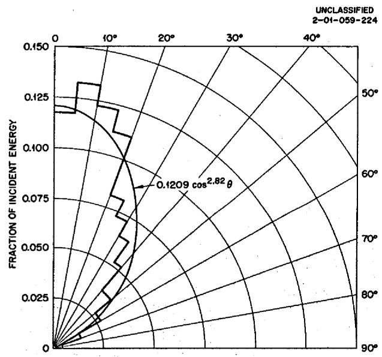  
Fig. 5.4.1. Fraction of Incident Energy Transmitted (Collided) per Unit Solid Angle: 0.662-Mev Gamma Rays Normally Incident on a 3-in.-Thick Aluminum Slab.

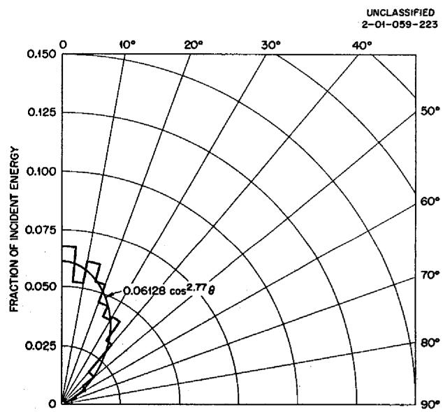  
Fig. 5.4.2. Fraction of Incident Energy Transmitted (Collided) per Unit Solid Angle: 0.662-Mev Gamma Rays Normally Incident on a 6-in.-Thick Aluminum Slab.

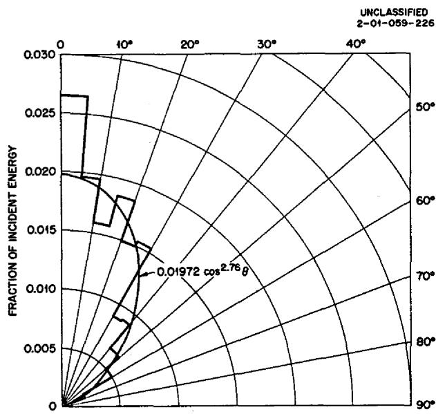  
Fig. 5.4.3. Fraction of Incident Energy Transmitted (Collided) per Unit Solid Angle: 0.662-Mev Gamma Rays Normally Incident on a 9-in.-Thick Aluminum Slab.

where $\mu = \cos \theta$ and $N =$ the total collided energy transmitted. Equation 2 reduces to

$$
\frac {2 \pi A}{b + 1} = N, \tag {3}
$$

and Eq.1 reduces to

$$
N \left(\mu_ {i} ^ {b + 1} - \mu_ {i + 1} ^ {b + 1}\right) = \phi (i, i + 1) \tag {4}
$$

or

$$
\mu_ {i + 1} ^ {b + 1} = \mu_ {i} ^ {b + 1} - \frac {\phi (i , i + 1)}{N}
$$

for $\mu_{1} = 1, \mu_{13} = 0$ ; therefore

$$
\mu_ {j} ^ {b + 1} = 1 - \sum_ {i = 1} ^ {j - 1} \frac {\phi (i , i + 1)}{N}, \text {f o r} j \neq 1, 1 3.
$$

Equation 5 may then be used to get 11 estimates of $b$ . It was found that $b$ did not vary greatly, and so an average was used to determine $A$ from Eq. 3. The resulting equations, $\phi = A\cos^b\theta$ , are also shown in Figs. 5.4.1 through 5.4.3 and indicate no change in the angular distribution with slab thickness.

# MONTE CARLO CALCULATION OF THE GAMMARAY PENETRATION OF LEAD-WATER SLABS

L.A.Bowman

D. K. Trubey

The DO2C55 series of calculations of the gamma-ray penetration of lead-water slab shields, described previously, has been continued, and a total of 512 problems has now been computed. All combinations of the following parameters have been used: slab thicknesses of 1, 2, 4, and 6 mean free paths, consisting of eight varying percentages of lead preceding or following water; initial gamma-ray energies of 1, 3, 6, and 10 MeV; and angles of gamma-ray incidence of 0, 60, 70.5, and 75.5 deg from the normal. The results include information on heating, dose rates, and energy fluxes throughout the slabs; energy and angular distributions reflected back by the slabs; and energy and angular distributions transmitted through the slabs.

The data from all these problems are now being analyzed. Typical plots are shown in Figs. 5.4.4 through 5.4.7, which represent the heating caused by 3-Mev gamma rays incident at various angles on lead slabs 4 mean free paths thick. Note that the heating values in Figs. 5.4.6 and 5.4.7 are reduced by a factor of 2 for ease in plotting.

# MONTECARLO CALCULATION OF GAMMA-RAY DOSE RATE BUILDUP FACTORS FOR LEAD AND WATER SHIELDS

L. A. Bowman

D. K. Trubey

The DO2C55 series of Monte Carlo calculations discussed in the preceding paper also included calculations of dose-rate buildup factors for lead and water shields, sketches of which are presented in Fig. 5.4.8. Only the results for gamma rays incident normal to the slabs are reported here.

In the first group of calculations buildup factors were determined for all-lead slabs which were 1, 2, 4, and 6 mean free paths in thickness at the initial gamma-ray energy. The initial energies were 1, 3, 6, and 10 MeV. The results are compared in Fig. 5.4.9 with the buildup factors computed at NDA by the moments method for an infinitely thick slab. The results are in agreement except near the rear of the slabs, where the Monte Carlo curves are lower. This is due to the reduction in backscattering in the slabs having finite thicknesses.

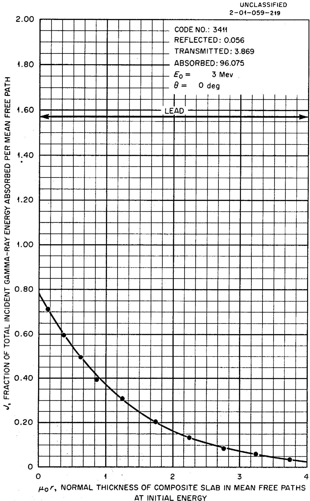  
Fig. 5.4.4. Energy Absorption in a Lead Shield as a Function of the Shield Thickness: 3-Mev Gamma Rays Normally Incident.

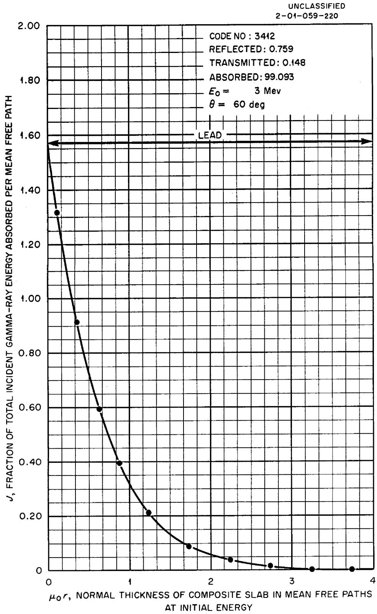  
Fig. 5.4.5. Energy Absorption in a Lead Shield as a Function of the Shield Thickness: 3-Mev Gamma Rays Incident at 60 deg.

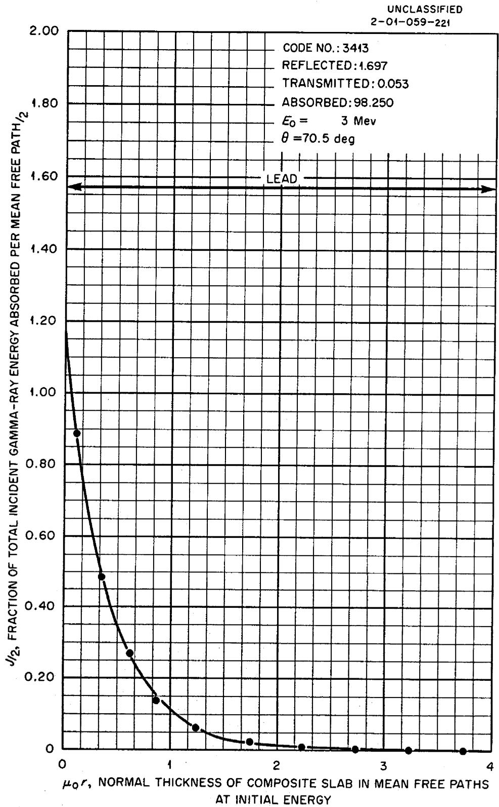  
Fig. 5.4.6. Energy Absorption in a Lead Shield as a Function of the Shield Thickness: 3-Mev Gamma Rays Incident at 70.5 deg.

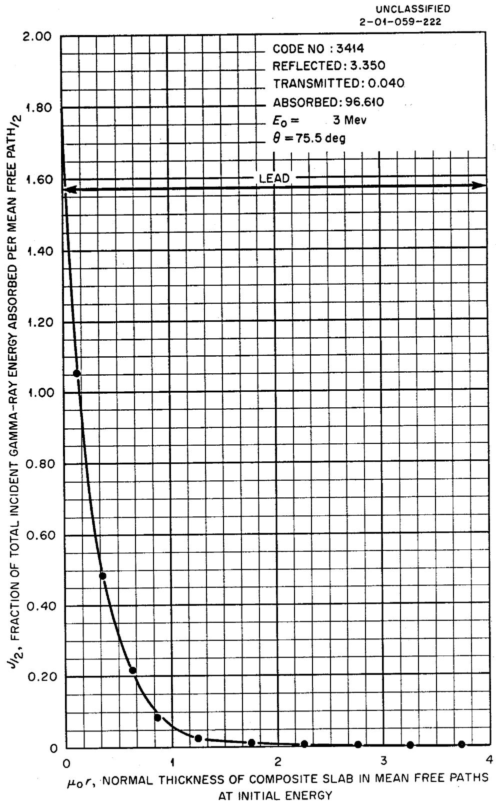  
Fig. 5.4.7. Energy Absorption in a Lead Shield as a Function of the Shield Thickness: 3-Mev Gamma Rays Incident at 75.5 deg.

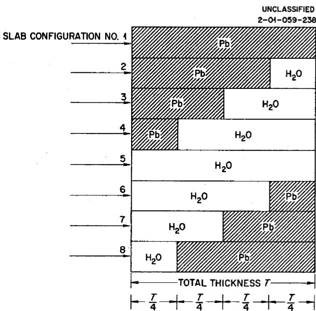  
PARAMETERS:   
INCIDENT ENERGY $= 1,3,6,$ AND 40 MeV   
TOTAL THICKNESS $T = 1,2,4,$ AND 6 MEAN FREE PATHS   
sec $\theta = 1,2,3,$ AND4

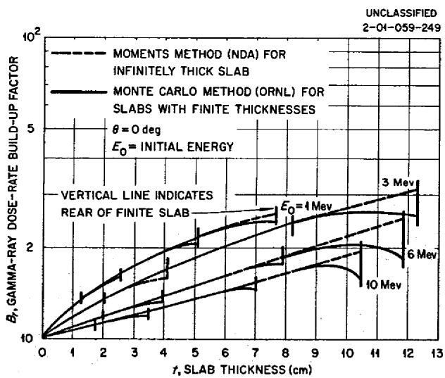  
Fig. 5.4.8. Lead and Water Slab Shield Configurations Used for Monte Carlo Calculations.   
Fig. 5.4.9. Comparison of Dose-Rate Buildup Factors for Lead Slabs Computed by Monte Carlo Method with Those Computed by Moments Method. Normally incident gamma rays.

The Monte Carlo buildup factors for all-water slabs of finite thickness are compared with NDA buildup factors for an infinitely thick slab in Fig. 5.4.10. In this case the Monte Carlo calculations always predicted higher values for the buildup factors.

Values of the Monte Carlo dose-rate buildup factors at the rear of composite lead and water slab shields are plotted in Figs. 5.4.11 through 5.4.14 for total composite slab thicknesses of 1, 2, 4, and 6 mean free paths. The effect of alternating the position of the lead and water is apparent from these figures.

All the buildup factors determined for composite slabs in this series have been compared with

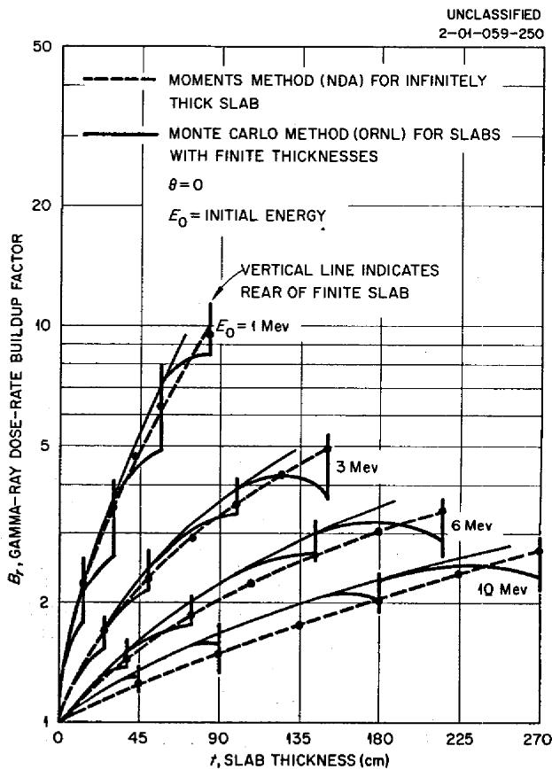  
Fig. 5.4.10. Comparison of Dose-Rate Buildup Factors for Water Slabs Computed by Monte Carlo Method with Those Computed by Moments Method. Normally incident gamma rays.

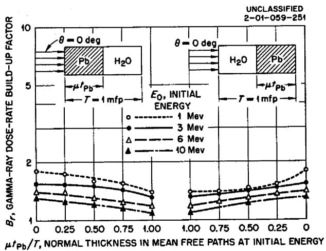  
Fig. 5.4.11. Monte Carlo Dose-Rate Buildup Factors at the Rear of Composite Lead-Water Slab Shields 1 Mean Free Path Thick. Normally incident gamma rays.

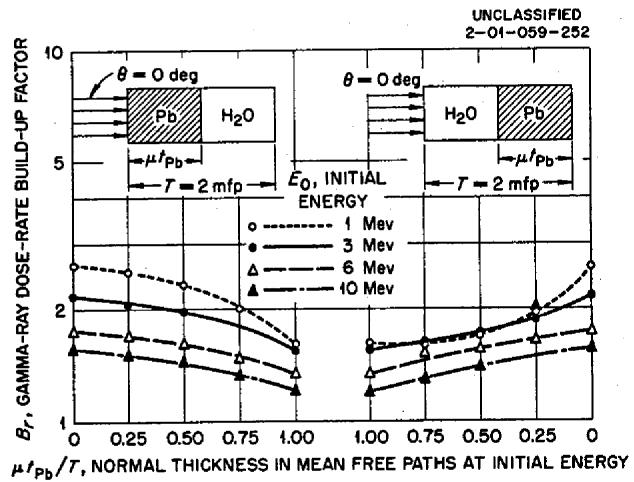  
Fig. 5.4.12 Monte Carlo Dose-Rate Buildup Factor at the Rear of Composite Lead-Water Slab Shields 2 Mean Free Paths Thick. Normally incident gamma rays.

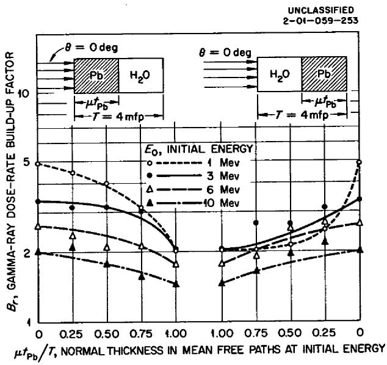  
Fig. 5.4.13. Monte Carlo Dose-Rate Buildup Factor at the Rear of Composite Lead-Water Slab Shields 4 Mean Free Paths Thick. Normally incident gamma Rays.

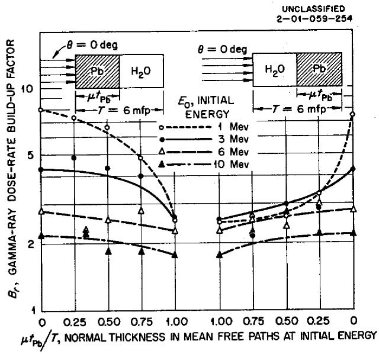  
Fig. 5.4.14. Monte Carlo Dose-Rate Buildup Factor at the Rear of Composite Lead-Water Slab Shields 6 Mean Free Paths Thick. Normally incident gamma rays.

values obtained by use of a formula, proposed by M. H. Kalos of NDA3 in which the buildup factors independently computed for lead and water are combined to determine the buildup factor for a composite slab consisting of the two materials.

$X_{1}, X_{2} =$ thickness in mean free paths of the first and second materials, respectively.

For a water-lead shield the formula is:

$$
B (X _ {1}, X _ {2}) = B _ {2} (X _ {2}) + \left[ \frac {B _ {1} (X _ {1}) - 1}{B _ {2} (X _ {1}) - 1} e ^ {- 1. 7 X _ {2}} + \frac {(\mu_ {c s} / \mu_ {t}) _ {1}}{(\mu_ {c s} / \mu_ {t}) _ {2}} \right. (1 - e ^ {- X _ {2}}) \left[ B _ {2} (X _ {1} + X _ {2}) - B _ {2} (X _ {1}) \right],
$$

For a lead-water slab (that is, lead followed by water) the formula is written as follows:

$$
\begin{array}{l} B \left(X _ {1}, X _ {2}\right) = B _ {2} \left(X _ {2}\right) + \\ + \frac {B _ {1} \left(X _ {1}\right) - 1}{B _ {2} \left(X _ {1}\right) - 1} \left[ B _ {2} \left(X _ {1} + X _ {2}\right) - B _ {2} \left(X _ {2}\right) \right], \\ \end{array}
$$

where

$B_{1}, B_{2} =$ gamma-ray dose-rate buildup factors for the first and second materials, respectively,

where

$$
\begin{array}{l} \mu_ {c s} = \text {C o m p t o n s c a t t e r i n g c r o s s s e c t i o n}, \\ \mu_ {t} = \text {t o t a l c r o s s s e c t i o n}. \\ \end{array}
$$

Tables 5.4.6 and 5.4.7 show the buildup factors determined both by Oracle calculations and by the Kalos formula. It should be pointed out that the numbers representing the Oracle calculations are taken from the curves of Figs. 5.4.11 through 5.4.14 and do not represent actual data points.

3M. H. Kalos, Some Theoretical Methods and Results in Gamma Ray and Neutron Shielding, Shielding Symposium held at the Naval Radiological Defense Laboratory, Oct. 17-19, 1956, 12NDP 1965, p 93-94.

Table 5.4.6. Monte Carlo Gamma-Ray Dose Rate Buildup Factors at Rear of Lead-Water Slab Shields: Comparison of Oracle Calculations with Values Obtained with Kalos Formula   

<table><tr><td rowspan="2">Incident Gamma-Ray Energy (Mev)</td><td colspan="2">Shield (mfp)</td><td colspan="2">Br</td><td rowspan="2">Ratio of Br(Calculated) to Br(Kalos)</td></tr><tr><td>Lead</td><td>Water</td><td>Oracle Calculations</td><td>Kalos Formula</td></tr><tr><td>1</td><td>1</td><td>1</td><td>2.33</td><td>2.18</td><td>1.069</td></tr><tr><td></td><td></td><td>2</td><td>3.30</td><td>3.13</td><td>1.054</td></tr><tr><td></td><td></td><td>3</td><td>4.48</td><td>4.27</td><td>1.049</td></tr><tr><td></td><td></td><td>4</td><td>5.81</td><td>5.60</td><td>1.038</td></tr><tr><td></td><td></td><td>5</td><td>7.51</td><td>7.14</td><td>1.052</td></tr><tr><td></td><td>2</td><td>1</td><td>2.72</td><td>2.51</td><td>1.084</td></tr><tr><td></td><td></td><td>2</td><td>3.90</td><td>3.47</td><td>1.124</td></tr><tr><td></td><td></td><td>3</td><td>5.33</td><td>4.73</td><td>1.127</td></tr><tr><td></td><td></td><td>4</td><td>6.95</td><td>6.06</td><td>1.147</td></tr><tr><td></td><td>3</td><td>1</td><td>3.10</td><td>3.00</td><td>1.033</td></tr><tr><td></td><td></td><td>2</td><td>4.50</td><td>4.05</td><td>1.111</td></tr><tr><td></td><td></td><td>3</td><td>6.22</td><td>5.36</td><td>1.160</td></tr><tr><td></td><td>4</td><td>2</td><td></td><td></td><td></td></tr><tr><td>3</td><td>1</td><td>1</td><td>1.95</td><td>1.90</td><td>1.026</td></tr><tr><td></td><td></td><td>2</td><td>2.58</td><td>2.54</td><td>1.016</td></tr><tr><td></td><td></td><td>3</td><td>3.30</td><td>3.10</td><td>1.065</td></tr><tr><td></td><td></td><td>4</td><td>3.80</td><td>3.60</td><td>1.056</td></tr><tr><td></td><td></td><td>5</td><td>4.21</td><td>4.07</td><td>1.034</td></tr><tr><td></td><td>2</td><td>1</td><td>2.47</td><td>2.46</td><td>1.004</td></tr><tr><td></td><td></td><td>2</td><td>3.15</td><td>3.00</td><td>1.050</td></tr><tr><td></td><td></td><td>3</td><td>3.69</td><td>3.52</td><td>1.048</td></tr><tr><td></td><td></td><td>4</td><td>4.18</td><td>4.03</td><td>1.037</td></tr><tr><td></td><td>3</td><td>1</td><td>2.80</td><td>2.85</td><td>0.982</td></tr><tr><td></td><td></td><td>2</td><td>3.44</td><td>2.89</td><td>1.190</td></tr><tr><td></td><td></td><td>3</td><td>4.00</td><td>3.47</td><td>1.153</td></tr><tr><td>6</td><td>1</td><td>1</td><td>1.60</td><td>1.55</td><td>1.032</td></tr><tr><td></td><td></td><td>2</td><td>2.03</td><td>1.98</td><td>1.025</td></tr><tr><td></td><td></td><td>3</td><td>2.50</td><td>2.43</td><td>1.029</td></tr><tr><td></td><td></td><td>4</td><td>2.66</td><td>2.67</td><td>0.996</td></tr><tr><td></td><td></td><td>5</td><td>2.71</td><td>2.74</td><td>0.989</td></tr><tr><td></td><td>2</td><td>1</td><td>1.98</td><td>1.80</td><td>1.100</td></tr><tr><td></td><td></td><td>2</td><td>2.34</td><td>2.14</td><td>1.093</td></tr><tr><td></td><td></td><td>3</td><td>2.55</td><td>2.50</td><td>1.020</td></tr><tr><td></td><td></td><td>4</td><td>2.62</td><td>2.70</td><td>0.970</td></tr><tr><td></td><td>3</td><td>1</td><td>2.11</td><td>1.96</td><td>1.077</td></tr><tr><td></td><td></td><td>2</td><td>2.31</td><td>2.18</td><td>1.060</td></tr><tr><td></td><td></td><td>3</td><td>2.41</td><td>2.52</td><td>0.956</td></tr><tr><td>10</td><td>1</td><td>1</td><td>1.41</td><td>1.38</td><td>1.022</td></tr><tr><td></td><td></td><td>2</td><td>1.68</td><td>1.64</td><td>1.024</td></tr><tr><td></td><td></td><td>3</td><td>1.90</td><td>1.88</td><td>1.011</td></tr><tr><td></td><td></td><td>4</td><td>2.04</td><td>2.03</td><td>1.005</td></tr><tr><td></td><td></td><td>5</td><td>2.14</td><td>2.12</td><td>1.009</td></tr><tr><td></td><td>2</td><td>1</td><td>1.55</td><td>1.50</td><td>1.033</td></tr><tr><td></td><td></td><td>2</td><td>1.78</td><td>1.72</td><td>1.035</td></tr><tr><td></td><td></td><td>3</td><td>1.97</td><td>1.93</td><td>1.021</td></tr><tr><td></td><td></td><td>4</td><td>2.10</td><td>2.07</td><td>1.014</td></tr><tr><td></td><td>3</td><td>1</td><td>1.65</td><td>1.65</td><td>1.000</td></tr><tr><td></td><td></td><td>2</td><td>1.81</td><td>1.84</td><td>0.984</td></tr><tr><td></td><td></td><td>3</td><td>1.94</td><td>2.02</td><td>0.960</td></tr></table>

Table 5.4.7. Monte Carlo Gamma-Ray Dose Rate Buildup Factors at Rear of Water-Lead Slab Shields: Comparison of Oracle Calculations with Values Obtained with Kalos Formula   

<table><tr><td rowspan="2">Incident Gamma-Ray Energy (Mev)</td><td colspan="2">Shield (mfp)</td><td colspan="2">Br</td><td rowspan="2">Ratio of Br(Calculated) to Br(Kalos)</td></tr><tr><td>Water</td><td>Lead</td><td>Oracle Calculations</td><td>Kalos Formula</td></tr><tr><td>1</td><td>1</td><td>1</td><td>1.70</td><td>1.66</td><td>1.024</td></tr><tr><td></td><td></td><td>2</td><td>1.86</td><td>1.92</td><td>0.969</td></tr><tr><td></td><td></td><td>3</td><td>2.05</td><td>2.12</td><td>0.967</td></tr><tr><td></td><td></td><td>4</td><td>2.22</td><td>2.35</td><td>0.945</td></tr><tr><td></td><td></td><td>5</td><td>2.42</td><td>2.55</td><td>0.949</td></tr><tr><td></td><td>2</td><td>1</td><td>2.20</td><td>1.96</td><td>1.122</td></tr><tr><td></td><td></td><td>2</td><td>2.18</td><td>2.17</td><td>1.005</td></tr><tr><td></td><td></td><td>3</td><td>2.31</td><td>2.45</td><td>0.943</td></tr><tr><td></td><td></td><td>4</td><td>2.52</td><td>2.63</td><td>0.958</td></tr><tr><td></td><td>3</td><td>1</td><td>2.50</td><td>2.27</td><td>1.101</td></tr><tr><td></td><td></td><td>2</td><td>2.46</td><td>2.50</td><td>0.984</td></tr><tr><td></td><td></td><td>3</td><td>2.72</td><td>2.73</td><td>0.996</td></tr><tr><td></td><td>4</td><td>2</td><td></td><td></td><td></td></tr><tr><td>3</td><td>1</td><td>1</td><td>1.74</td><td>1.62</td><td>1.074</td></tr><tr><td></td><td></td><td>2</td><td>1.92</td><td>1.88</td><td>1.021</td></tr><tr><td></td><td></td><td>3</td><td>2.15</td><td>2.16</td><td>0.995</td></tr><tr><td></td><td></td><td>4</td><td>2.39</td><td>2.44</td><td>0.980</td></tr><tr><td></td><td></td><td>5</td><td>2.66</td><td>2.68</td><td>0.993</td></tr><tr><td></td><td>2</td><td>1</td><td>2.28</td><td>1.96</td><td>1.163</td></tr><tr><td></td><td></td><td>2</td><td>2.39</td><td>2.24</td><td>1.067</td></tr><tr><td></td><td></td><td>3</td><td>2.51</td><td>2.54</td><td>0.988</td></tr><tr><td></td><td></td><td>4</td><td>2.70</td><td>2.78</td><td>0.971</td></tr><tr><td></td><td>3</td><td>1</td><td>2.80</td><td>2.33</td><td>1.202</td></tr><tr><td></td><td></td><td>2</td><td>2.88</td><td>2.60</td><td>1.108</td></tr><tr><td></td><td></td><td>3</td><td>2.97</td><td>2.88</td><td>1.031</td></tr><tr><td>6</td><td>1</td><td>1</td><td>1.55</td><td>1.50</td><td>1.033</td></tr><tr><td></td><td></td><td>2</td><td>1.75</td><td>1.79</td><td>0.978</td></tr><tr><td></td><td></td><td>3</td><td>2.01</td><td>2.04</td><td>0.985</td></tr><tr><td></td><td></td><td>4</td><td>2.20</td><td>2.27</td><td>0.969</td></tr><tr><td></td><td></td><td>5</td><td>2.40</td><td>2.56</td><td>0.938</td></tr><tr><td></td><td>2</td><td>1</td><td>2.09</td><td>1.89</td><td>1.106</td></tr><tr><td></td><td></td><td>2</td><td>2.24</td><td>2.23</td><td>1.004</td></tr><tr><td></td><td></td><td>3</td><td>2.38</td><td>2.50</td><td>0.952</td></tr><tr><td></td><td></td><td>4</td><td>2.48</td><td>2.82</td><td>0.879</td></tr><tr><td></td><td>3</td><td>1</td><td>2.48</td><td>2.31</td><td>1.074</td></tr><tr><td></td><td></td><td>2</td><td>2.58</td><td>2.68</td><td>0.963</td></tr><tr><td></td><td></td><td>3</td><td>2.61</td><td>3.04</td><td>0.859</td></tr><tr><td>10</td><td>1</td><td>1</td><td>1.39</td><td>1.41</td><td>0.986</td></tr><tr><td></td><td></td><td>2</td><td>1.52</td><td>1.55</td><td>0.981</td></tr><tr><td></td><td></td><td>3</td><td>1.65</td><td>1.70</td><td>0.971</td></tr><tr><td></td><td></td><td>4</td><td>1.77</td><td>1.92</td><td>0.922</td></tr><tr><td></td><td></td><td>5</td><td>1.90</td><td>2.07</td><td>0.918</td></tr><tr><td></td><td>2</td><td>1</td><td>1.70</td><td>1.72</td><td>0.988</td></tr><tr><td></td><td></td><td>2</td><td>1.79</td><td>1.92</td><td>0.932</td></tr><tr><td></td><td></td><td>3</td><td>1.88</td><td>2.16</td><td>0.870</td></tr><tr><td></td><td></td><td>4</td><td>1.96</td><td>2.39</td><td>0.820</td></tr><tr><td></td><td>3</td><td>1</td><td>1.95</td><td>2.00</td><td>0.975</td></tr><tr><td></td><td></td><td>2</td><td>1.99</td><td>2.34</td><td>0.850</td></tr><tr><td></td><td></td><td>3</td><td>2.08</td><td>2.61</td><td>0.797</td></tr></table>