ORNL-2396

Chemistry-General

TID-4500 (14th ed.)

GUIDE TO THE PHASE DIAGRAMS

OF THE FLUORIDE SYSTEMS

J.E.Ricci

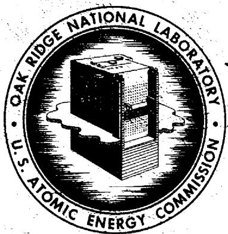

OAK RIDGE NATIONAL LABORATORY

operated by

UNION CARBIDE CORPORATION

for the

U.S. ATOMIC ENERGY COMMISSION

Contract No. W-7405-eng-26

REACTOR PROJECTS DIVISION

# GUIDE TO THE PHASE DIAGRAMS OF THE FLUORIDE SYSTEMS

J. E. Ricci

Consultant to Oak Ridge National Laboratory from New York University, Department of Chemistry

DATE ISSUED

1

OAK RIDGE NATIONAL LABORATORY

Oak Ridge, Tennessee

operated by

UNION CARBIDE CORPORATION

for the

U.S. ATOMIC ENERGY COMMISSION

# PREFACE

A comprehensive study of fused-salt phase equilibria has been in progress at the Oak Ridge National Laboratory for several years in connection with reactor technology. In the course of that study, several complex fused-salt ternary systems have become well enough understood that nearly complete phase diagrams of the systems could be constructed.1 Detailed discussion of the phase equilibria occurring in those systems is included herein.

Except for the $\mathsf{LiF - BeF}_2\mathsf{-UF}_4$ and $\mathsf{NaF - BeF}_2\mathsf{-UF}_4$ systems, each of the diagrams of ternary systems included in this discussion was derived at ORNL in the Fused Salt Chemistry Section, under the direction of W. R. Grimes.

Because it was felt that this collection of fluoride phase diagrams might prove more valuable if accompanied with a discussion of some of the types of phase relations illustrated in them, the following treatment was prepared. The purpose is to present some general principles and explanations which should aid in the reading, interpretation, and use of the actual diagrams in the collection and of other similar diagrams which may still be determined. While the relations are usually explicitly shown, at least as far as they are known, in the temperature-composition diagrams of the binary systems, the corresponding relations are not always equally apparent in the usual "phase diagram" of a ternary system of any complexity. In either case, moreover, the diagram does not show the actual data and observations upon which the diagram itself, essentially an inference, is based, nor does it give any idea of the amount of work, in experimentation and in thought, underlying the construction of the diagram. This aspect of the diagrams, however, is something best presented and treated by the investigators themselves.

All the diagrams in the collection represent "condensed systems": i.e., they show the temperature-composition relations between solid and liquid phases under one atmosphere of open pressure. For chemical reasons the atmosphere was actually helium or argon. No two-liquid equilibria were encountered. Limited miscibility of solids is involved in some of the diagrams, but there are no critical solution (or consolute) points for solid solution. The discussion will deal only with types of phase equilibria actually represented in the systems.

We shall treat first the essentials involved in the binary diagrams of the collection, and then, more extensively, the essential relations for the several ternary diagrams. The last sections will consider specifically the ternary systems and their constituent binary systems.

# CONTENTS

PREFACE 3

LIST OF FIGURES vii

# PART I. GENERAL PRINCIPLES

# 1. BINARY DIAGRAMS 3

1.1. Pure Components as Solid Phases 3   
1.2. Pure Compounds 3  
Relation Between Congruence and Incongruence of Melting for a Binary Compound 4   
1.3. Solid Solution 4  
Continuous Solid Solution 4  
Miscibility Gap in Solid Solution 5  
Solid Solution and Polymorphism 5

# 2. TERNARY EQUILIBRIUM OF LIQUID AND ONE SOLID (SURFACES) 7

2.1. Fixed Solid 8   
2.2. Variable Solid (Solid Solution) 8  
Fractionation Path 9  
Equilibrium Path 9

# 3. TERNARY EQUILIBRIUM OF LIQUID AND TWO SOLIDS (CURVES) 11

3.1. Reaction Types 11   
3.2. Maximum and Minimum Temperature Points 12   
3.3. Equilibrium Crystallization Process for Liquid on a Two-Solid Curve 12

# 4. TERNARY CONDENSED INVARIANT POINTS (FOUR PHASES) 14

4.1. Binary Decompositions in Presence of Ternary Liquid 14  
“Pure” Solids 14  
Effect of the Third Component Entering into Solid Solution 14   
4.2. Types of Ternary Invariants 15  
Type A Invariant: Triangular or Terminal Type of Invariant 15  
Type B Invariant: Quadrangular, Diagonal, or Metathetical Type of Invariant 15   
4.3. Relations of the Three Liquid Curves at Their Invariant Intersection 15   
4.4. Congruent and Incongruent Crystallization End Points 17   
4.5. Melting Points of Ternary Compounds 19   
4.6. Invariants Involving Solids Only 19

# 5. CRYSTALLIZATION PROCESS WITH PURE SOLIDS 20

# 6. CYRSTALLIZATION PROCESS WITH CONTINUOUS BINARY SOLID SOLUTION 25

6.1. Fractionation Process 26   
6.2. Equilibrium Process 26

# 7. CRYSTALLIZATION PROCESS WITH SOLID SOLUTIONS AND SEVERAL INVARIANTS 29

7.1. The Phase Diagram 29   
7.2. Equilibrium Crystallization Process 30   
7.3.Process of Crystallization with Perfect Fractionation 32   
7.4. Ternary Solid Solution in Compound $D_{1}$ 33

# PART II. THE ACTUAL DIAGRAMS

8. SYSTEM X-U-V: LiF-UF4-BeF2 37   
9. SYSTEM $Y - U - V$ : NaF-UF4-BeF2 40   
10. SYSTEM $Y - U - R$ : NaF-UF4-RbF 44

11. SYSTEM Y-Z-R: NaF-ZrF4-RbF 47

11.1. The System According to Figure 11.3 and Neglecting Solid Solution 47   
11.2. Consideration of Solid Solution Formation 49   
11.3. The Region for Compounds $G$ and $H$ of System $R - Z$ 49   
The Region As Shown in Figures 11.6 and 11.7 49   
The Region As Shown in Figures 11.8 and 11.9 51   
11.4. The Region Involving Compounds $B$ and $D$ of System Y-Z 52

12. SYSTEM Y-Z-X: NaF-ZrF4-LiF 55

12.1.Subsystem $Y - A - G - X$ 56   
12.2.Subsystem $E - Z - H$ 58   
12.3.Subsystem $A - E - H - G$ 59   
12.4.Subsolidus Decompositions of Compounds $G$ and I 60   
Decomposition of Compound I 60   
Decomposition of Compound G 61

13. SYSTEM $Y - U - X$ : NaF-UF4-LiF 64

13.1. The Invariants $P_{A^{\prime}}P_{C^{\prime}}P_{G^{\prime}}$ and $P_{E}$ 64   
The Invariant $P_{A}$ 64   
The Invariant $P_{C}$ 65   
The Invariant $P_{G}$ 66   
The Invariant $P_{E}$ 66   
13.2. The Region DUH 68   
13.3. The Region YDHX 71   
13.4. Fractionation Process on the Solid Solution Fields 73

14. SYSTEM $Y - U - Z$ : NaF-UF $^4 -ZrF_4$ 75

14.1. General Characteristics 75   
14.2.Subsystem $Y - A - G$ 75   
14.3. Subsystem $A - D - K - G$ 79  
The Region Involving $A, B, C,$ and $D$ 80  
The Region Involving $G, H, I,$ and $K$ 87  
Fractionation Processes in the Subsystem $A - D - K - G$ 89  
Subsolidus Reactions Involving Compounds $A, H,$ and $J$ 90   
14.4. Subsystem $D - U - Z - K$ 91  
Equilibrium Crystallization Along Curves 91  
Fractionation Processes in the Subsystem $D - U - Z - K$ 94  
Equilibrium Crystallization in the $U_{s}$ Field 95  
Subsolidus Compounds $E$ and $F$ 96

15. SYSTEM Y-W-Z: NaF-ThF4-ZrF4 97

# LIST OF FIGURES

1.1. Pure components as solids 3   
1.2. Retrograde solubility curve 3   
1.3. Binary compounds 3   
1.4. "Inverse" fusion of binary compound 5   
1.5. Singular point between congruence and incongruence of melting 5   
1.6. Continuous solid solution without maximum or minimum 5   
1.7. Continuous solid solution with minimum 5   
1.8. Discontinuous solid solution, eutectic case 6   
1.9. Discontinuous solid solution, peritectic case 6   
1.10.Elevation of transition temperature, involving liquid 6   
1.11.Elevation of transition temperature, subsolidus 6   
1.12. Depression of transition temperature, involving liquid 6   
1.13. Depression of transition temperature, subsolidus 6   
1.14. Depression of transition temperature, lower form pure 6   
2.1. Liquidus surface for pure solid A 8   
2.2. Fractionation path on surface for liquid in equilibrium with $A - B$ solid solution 9   
2.3. Relation between equilibrium path and fractionation paths: for ternary solid solution 10   
2.4. Relation between equilibrium path and fractionation paths: for binary solid solution 10   
3.1. Change from even to odd reaction: two solid solutions 11   
3.2. Change from odd to even reaction: two solid solutions 11   
3.3. Change from odd to even reaction: two pure solids 11   
3.4. Temperature maximum in reaction $L -$ calories $\longrightarrow S_{1} + S_{2}$ 12   
3.5. Temperature minimum in reaction $L + S_{1} -$ calories $\longrightarrow S_{2}$ 12   
3.6. Three-phase triangle on curve for $L$ -calories $\longrightarrow S_{1} + S_{2}$ 12   
4.1.Type A invariant 16   
4.2.Type B invariant 16   
4.3. Arrangement of curves at a eutectic 16   
4.4. Arrangement of curves for case (a) and case (b). 16   
4.5. Arrangement of curves for case (c) and case (d) 16   
4.6. Impossible angles of intersection 17   
4.7.Eutectic triangle contains only the eutectic "point" $E$ 17   
4.8. Eutectic triangle also contains several peritectic "points" 17   
4.9. Invariant, case (a) 19   
4.10.Invariant,case $(d)$ 19   
4.11.Invariant,case (c) 19   
4.12.Invariant,case (b) 19   
4.13. Semicongruent melting point of ternary compound $M_2$ 19

5.1. Two three-solid arrangements for two binary compounds 20

5.2. Necessary arrangement of curves and invariants for the two cases in Fig. 5.1 20

5.3. Hypothetical ternary system with three binary compounds 21

5.4. The section $A - D_{2}$ of Fig. 5.3 21

5.5. Isotherm between $p_1$ and $r$ 21

5.6. Isotherm between $r$ and $m$ 23

5.7. Isotherm above $P_{3}$ and still above $E_{1}$ and $E_{2}$ 24

5.8. Isotherm at $P_{3}$ 24

5.9. The section $D_{1} - D_{2}$ 24

5.10. The section $D_{3} - D_{2}$ 24

5.11. The section $C - D_{3}$ 24

5.12. The section $D_{1} - B$ 24

6.1. Ternary system with continuous $A - B$ solid solution and pure $C$ 25

6.2. The binary system $A - B$ of Fig. 6.1 25

6.3. Arbitrary section, from $C$ to the AB side 25

6.4. Fractionation paths for the solid solution surface 26

6.5. Equilibrium paths and inflection point of fractionation path 28

7.1. Ternary system with discontinuous $A - B$ solid solution and two binary compounds 29

7.2. Binary system $A - B$ of Fig. 7.1 29

7.3. The invariant reaction planes of Fig. 7.1 30

7.4. The section $D_{2} - S_{m}$ 30

7.5. Isotherm above $p$ 31

7.6. Isotherm just below $p$ 31

7.7. Isotherm below $m$ but above $P_{1}$ and above $E_{3}$ 31

7.8. The section $D_{1} - D_{2}$ 32

7.9. The section $D_{1} - B$ 32

7.10. The section $A - D_{2}$ 32

7.11. Portion of Fig. 7.3, with some ternary solid solution at $D_{1}$ 33

7.12. Isotherm for Fig. 7.11, between $p$ and $P_{1}$ 33

7.13. Isotherm just above $P_{1}$ 33

7.14. Part of the section $D_{1} - D_{2}$ , for Fig. 7.11 33

8.1. System $X - U$ :LiF-UF 37

8.2. System $U - V$ : $\mathsf{UF}_4\text{-}\mathsf{BeF}_2$ 37

8.3. System $X - V$ :LiF-BeF 2 37

8.4. System $X - U - V$ : LiF-UF4-BeF2 38

8.5. Isotherm involving the invariant $P_A$ 39

8.6. Isotherm above $P_{2}$ and $P_{1}$ 39

8.7. The section C-V: LiF.4UF $^4$ -BeF 2 39

8.8. The section $B - V$ : 7LiF.6UF4-BeF2 39

8.9. The section B-D: 7LiF·6UF4-2LiF·BeF2 39   
8.10. The section $A - D: 4LiF \cdot UF_4 - 2LiF \cdot BeF_2$ 39   
9.1. System $Y - U$ : $\mathsf{NaF - UF}_4$ 40   
9.2. System $Y - V$ : NaF-BeF 2 40   
9.3. System $Y - U - V$ : $\mathsf{NaF - UF}_4\mathsf{-BeF}_2$ 41   
9.4. Isotherms involving compounds $E$ and $F$ (NaF·2UF $_{4}$ and NaF·4UF $_{4}$ ) 42   
9.5. The section $F - V$ : NaF $\cdot 4UF_{4} - BeF_{2}$ 42   
9.6. The section $E - V$ : NaF-2UF4-BeF2 42   
9.7. The section $D - V$ .. 7NaF-6UF4-BeF2 43   
9.8. The section B-H: 2NaF·UF4-2NaF·BeF2 43   
9.9. The section D-H: 7NaF·6UF4-2NaF·BeF2 43   
10.1. System $R - U$ : RbF-UF 44   
10.2. System Y-R: NaF-RbF 44   
10.3. System $Y - U - R$ : NaF-UF4-RbF 45   
10.4. The section $D - N$ : 7NaF·6UF4–RbF·6UF4 46   
10.5. The section $D - M$ .. 7NaF-6UF-RbF-3UF 46   
10.6. The section $D - K$ .. 7NaF.6UF4-2RbF.3UF 46   
10.7. The section D-I: 7NaF.6UF4-7RbF.6UF4 46   
10.8. The section B-H: 2NaF·UF4-2RbF·UF4 46   
10.9. The section $Y - Q$ : NaF-NaF-RbF-UF 46   
10.10. The section $Q - G$ : NaF.RbF.UF4-3RbF.UF 46   
11.1. System $Y - Z$ : NaF-ZrF 48   
11.2. System $R - Z$ : RbF-ZrF 48   
11.3. System $Y - Z - R$ : NaF-ZrF4-RbF 49   
11.4. The partial section $M_{1} - Z$ .. NaF.RbF.ZrF- $\mathbf{Z}\mathbf{r}\mathbf{F}_{4}$ 50   
11.5. Divisions of Fig. 11.3 50   
11.6. Detail of binary system $Z - R$ .. $\mathsf{ZrF}_4\mathsf{-RbF}$ 50   
11.7. Region involving compounds $H$ and $G$ : 5NaF·2ZrF₄ and 3NaF·ZrF₄   
11.8. Detail of system $Z - R$ , for H (5NaF-2ZrF4) assumed pure 52   
11.9. Region involving $H$ and $G_{i}$ for $H$ pure: $5\mathrm{NaF}\cdot 2\mathrm{ZrF}_{4}$ (pure) and $3\mathrm{NaF}\cdot \mathrm{ZrF}_{4}$   
11.10. Region involving solid solutions in $Y - Z$ (NaF-ZrF $_4$ ) system 53   
12.1. System X-Z: LiF-ZrF 4   
12.2. System Y-X: NaF-LiF 55   
12.3. System Y-Z-X: NaF-ZrF4-LiF 56   
12.4. Region below section $A - G$ (3NaF·ZrF 4-3LiF·ZrF 4) 57   
12.5. The section $A - G$ (3NaF·ZrF 4-3LiF·ZrF 4) 57   
12.6. Region above section $E - H$ (7NaF·6ZrF4-2LiF·ZrF4) 58   
12.7. The section $F - I$ (3NaF·4ZrF 4-3LiF·4ZrF 4) 58

12.8.Middle region of system $Y - Z - X$ .. $\mathrm{NaF - ZrF_4 - LiF}$ 59   
12.9. Decomposition of compound I (3LiF·4ZrF₄) 60   
12.10. The section $F - I$ (3NaF·4ZrF4 - 3LiF·4ZrF4) 61   
12.11. Decomposition of compound $G$ (3LiF·ZrF₄) 62   
12.12. The section $A - G$ (3NaF·ZrF4-3LiF·ZrF4) 63   
13.1. System $X - U$ :LiF-UF 4   
13.2. System $Y - U - X$ : NaF-UF4-LiF 65   
13.3. The section $D - H$ (7NaF·6UF4-7LiF·6UF4) 66   
13.4. Decomposition of compound C (5NaF·3UF4) 67   
13.5. Decomposition of compound $G$ (4LiF·UF4) 68   
13.6. Formation of compound $E$ (NaF-2UF4) 69   
13.7. Region above section $D-H$ (7NaF·6UF4-7LiF·6UF4) 70   
13.8. The section $E - H$ (Naf.2UF-7LiF.6UF) 71   
13.9. Region below section $D-H$ (7NaF·6UF4-7LiF·6UF4) 72   
13.10. The section $B - G$ (2NaF·UF4-4LiF·UF4) 73   
13.11. Detail of Fig. 13.2, near compound C (5NaF·3UF₄) 74   
14.1. System Y-Z: NaF-ZrF4 76   
14.2. System U-Z: UF $^4 -ZrF_4$ 76   
14.3. System $Y - U - Z$ : NaF-UF $\mathbf{\Phi}_4$ -ZrF 77   
14.4. The section $A - G$ (3NaF·UF-3NaF-ZrF) 78   
14.5. The section $D - K$ (7NaF-6UF4-7NaF-6ZrF4) 78   
14.6. The section between $Y$ (NaF) and the point on UZ that represents the composition $1UF_{4} - 1ZrF_{4}$ 78   
14.7.Subsystem $Y - A - G$ ：NaF-3NaF·UF-3NaF·ZrF 79  
14.8. Subsystem $Y - A - G$ (NaF-3NaF·UF4-3NaF·ZrF4): fractionation paths 79   
14.9. Subsystem $A - D - K - G$ : system $\mathsf{NaF - UF}_4 - \mathsf{ZrF}_4$ , region between 3:1 and 7:6 solid solutions   
14.10. Scheme I for compound C (5NaF·3UF₄) 81   
14.11. Sequence of isotherms for Scheme I 82-83   
14.12. The section between $C(5NaF\cdot 3UF_4)$ and the point on $YZ$ that represents the composition $5NaF - 3ZrF_{4}$ , in Scheme I 84   
14.13. Scheme II for compound C (5NaF·3UF4) 86   
14.14. Sequence of isotherms for Scheme II 87   
14.15. The section between $C(5NaF\cdot 3UF_4)$ and the point on $YZ$ that represents the composition $5NaF - 3ZrF_4$ , in Scheme II 88   
14.16. Lower part of subsystem $A - D - K - G$ : the $\mathsf{NaF - ZrF}_4$ side of Fig. 14.9 89   
14.17. Solids left after complete solidification, in region YDK (NaF-7NaF·6UF4-7NaF·6ZrF4) 90   
14.18. Decomposition of compound A (3NaF·UF4) 91   
14.19. Transition in compound I (5NaF·2ZrF4) 92

14.20. Appearance of compound $J$ (3NaF·2ZrF₄) 93   
14.21. Subsystem $D - U - Z - K$ : system NaF-UF4-ZrF4 between the 7:6 solid solution and the UF4-ZrF4 solid solution. 93   
14.22.Subsystem $D - U - Z - K$ :temperature contours 93   
14.23.Subsystem $D - U - Z - K$ :fractionation paths 94   
14.24. Appearance of compounds $E$ and $F$ (NaF-2UF $_{4}$ and NaF-4UF $_{4}$ ) 96   
15.1. System $Y - W$ : NaF-ThF 4 97   
15.2. System W-Z: $\mathsf{ThF}_4\mathsf{-ZrF}_4$ 97   
15.3. System $Y - W - Z$ : NoF-ThF4-ZrF 98   
15.4. System $Y - W - Z$ : NaF-ThF4-ZrF4 (revised) 99   
15.5.Middle region of system $Y - W - Z$ $(\mathrm{NaF - ThF_4 - ZrF_4})$ 100   
15.6.Subsolidus transition in compound B (5NaF-2ZrF4) 101   
15.7. $W - Z$ region of system $Y - W - Z$ (ThF4-ZrF4 region of system NaF-ThF4-ZrF4) 102   
15.8. Fractionation paths for the solid solution surface of system $Y - W - Z$ (NaF-ThF4-ZrF4) 103

# PARTI

# GENERAL PRINCIPLES

# 1.1 PURE COMPONENTS AS SOLID PHASES

With the pure components as the only solid phases in a binary system (Fig. 1.1), the melting points $(T_{A}$ and $T_{B})$ are lowered and the system is always eutectic in type. In Fig. 1.1 the eutectic $e$ involves the high-temperature form of $A(A_{\alpha})$ and the low-temperature form of $B(B_{\beta})$ ; at the temperature of $e$ the phase reaction is:

$$
L (e) - \text {c a l o r i e s} \rightleftharpoons A _ {\alpha} + B _ {\beta}.
$$

If $T_{A}^{\prime}$ is the transition temperature for the forms of $A$ , then the two-solid mixture consists, at equilibrium, of $A_{\alpha}$ and $B_{\beta}$ above $T_{A}^{\prime}$ and of $A_{\beta}$ and $B_{\beta}$ below $T_{A}^{\prime}$ . If $T_{B}^{\prime}$ is the transition temperature for the polymorphic forms of $B$ , there will be a break in the freezing-point curve (or solubility curve) of the $B$ solid at the temperature $T_{B}^{\prime}$ unaffected by the $A$ if both forms of the $B$ solid are pure. Above $T_{B}^{\prime}$ , the liquid is in equilibrium with $B_{\alpha^{\prime}}$ below $T_{B}^{\prime}$ with $B_{\beta}$ . If the transition $B_{\alpha} \rightarrow B_{\beta}$ fails to occur on cooling, a metastable eutectic $e(m)$ is possible, for liquid in (metastable) equilibrium with $A_{\alpha}$ and $B_{\alpha}$ .

It is possible for a solubility curve to show a "retrograde" temperature effect, even down to the eutectic, in which case we would have Fig. 1.2. Retrograde changes of solubility with temperature were not encountered in the present systems, whether binary or ternary, but reference will be made to this question later.)

Liquids with composition between $A$ and $e$ , such as point $a$ (Fig. 1.1), give $A_{\alpha}$ as primary crystallization product when cooled to the curve $T_{A}e$ . At the temperature $T_{x}$ the equilibrium mixture consists of solid $A_{\alpha}$ and liquid $l$ in the ratio (by weight or by moles, depending on the units of the diagram) $x / x$ . When the temperature of $e$ (eutectic) is reached, the remaining liquid freezes invariantly to a secondary crystallization product of a mixture of $A_{\alpha}$ and $B_{\beta}$ crystals in the proportion $ev / eu$ . For liquids between $b$ and $B$ in composition the primary solid will be $B_{\alpha'}$ changing to $B_{\beta}$ at $T_{B'}$ and followed by the eutectic mixture at $e$ .

In a two-phase region such as $T_{A}ue$ , the coexisting equilibrium phases are joined by horizontal tie lines (also called conjugation lines, conodes, joins) running in this case between the liquidus curve $T_{A}e$ and the solidus curve $T_{A}u$ . With pure solid $A$ , the solidus is here a vertical

line, the edge of the diagram. The horizontal line $uev$ is also sometimes considered part of the solidus of the diagram.

# 1.2. PURE COMPOUNDS

Figure 1.3 shows three binary compounds $(C, D, E)$ in the system $A-B$ :

1. Compound $C$ melts congruently at $C_{c}$ ; it has a congruent melting point. It is stable as a solid phase until it melts to a liquid of its own chemical (analytical) composition. Points $e_1$ and $e_2$ are eutectics for solids $A$ and $C_{\alpha}$ and for $C_{\alpha}$ and $D_{\beta}$ respectively. At $T_{C^{\prime}}$ the higher-temperature form $C_{\alpha}$ undergoes transition to $C_{\beta}$ . At $T_{C^{\prime}}$ $C_{\beta}$ decomposes on cooling into the solids $A$ and $D$ .   
2. Compound $D$ melts incongruity at the temperature $D_{i}$ . It decomposes as a solid phase

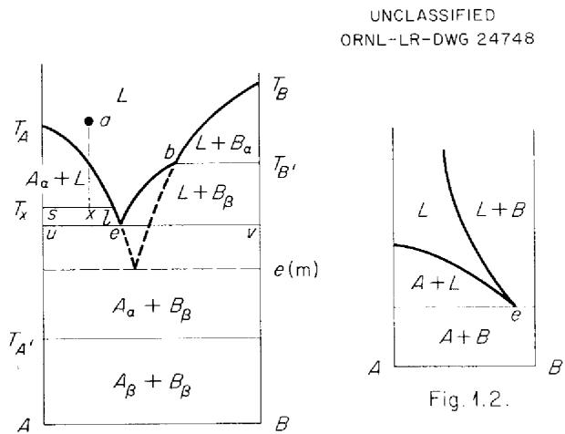

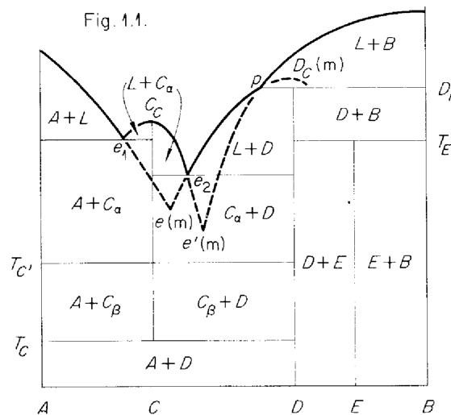  
Fig. 1.1.   
Fig. 1.3.

(into liquid $p$ and solid $B$ ) before reaching its own melting point [the metastable or submerged congruent melting point $D_{c}(m)$ ]. In contrast to a eutectic point $(e_1, e_2)$ , the point $p$ is called a peritectic point (also meritectic, sometimes) and the reaction:

$$
D + \text {c a l o r i e s} \rightleftharpoons L (t) + B
$$

is a peritectic reaction.

3. Compound $E$ decomposes as a solid phase, into $D$ and $B_{1}$ at the temperature $T_{E}$ , before it reaches any equilibrium with liquid. Such a solid phase is sometimes called "subsolidus."

Figure 1.3 shows a metastable eutectic, $e(m)$ , between solids $A$ and $D$ , possible if compound $C$ fails to form on cooling; $e'(m)$ is a similar metastable eutectic for solids $C_a$ and $B$ .

It is also possible for a compound to undergo incongruent melting on cooling (inverse peritectic, or inverse fusion), as shown in Fig. 1.4. No example is found in the actual binary systems studied, but the relation will be referred to under the ternary systems. In Fig. 1.4, $T_{1}$ is the usual incongruent melting point of $C$ ; $T_{2}$ is its inverse fusion point:

$$
C - \text {c a l o r i e s} \rightleftharpoons L (p ^ {\prime}) + B.
$$

# Relation Between Congruence and Incongruence of Melting for a Binary Compound

The flatness of the freezing-point curve of a compound at the maximum, whether exposed and stable as at $C_c$ in Fig. 1.3 or submerged and metastable as at $D_c(m)$ , depends on the degree of dissociation of the compound in the liquid state. If the compound $C$ is not dissociated at all, the maximum is a pointed intersection of two unrelated curves: on one side the freezing-point curve of the compound in the binary system $A - C$ , on the other side the freezing-point curve of the compound in the unrelated binary system $C - B$ . Only when the maximum is such a sharp intersection may the whole diagram be said, strictly, to consist of two adjacent binary systems. If there is any dissociation of $C$ into $A$ and $B$ in the liquid state, the curve is rounded, and its maximum is lowered, because the liquid, even at the maximum itself, is not pure $C$ (in the molecular sense) but $C$ plus $A$ and $B$ . The greater the degree of dissociation, the flatter and lower is the maximum. Hence, whether the melting point of the compound will be exposed or submerged relative to the freezing-point curves of adjacent solid phases depends

on the "true" melting point of the compound without decomposition and on its degree of dissociation in the melt.

In a comparison of corresponding compounds of given formula, such as $A \cdot B$ in a series of homologous binary systems with $A$ fixed and $B$ varied, the congruence or incongruence of the melting point of the compound will be a function of three variables: the melting point of the second component $(B, B', B'', \ldots)$ , the "true" melting point of the compound $(A \cdot B, A \cdot B', \text{etc.})$ , and the degree of dissociation of the compound in the melt.

For a given specific binary system, moreover, the relation may vary with the pressure, because of several effects. Pressure causes some change in the relative melting points of all three solids of the system $(A, C, B)$ ; it causes corresponding changes in the compositions of the intervening isothermally invariant liquid solutions $(e, p, \text{etc.})$ ; and it causes changes in the dissociation of the compound. The melting point of the compound may therefore be exposed (congruent) at one pressure and submerged (incongruent) at a different pressure. At some particular or singular value of the pressure, therefore, the diagram would pass through the configuration in Fig. 1.5. When a system at arbitrary pressure seems to give such a diagram, however, it is reasonable to suppose that the maximum is actually either just exposed or just submerged.

# 1.3. SOLID SOLUTION

# Continuous Solid Solution

In a binary system with continuous solid solution, the usual relation is either an ascending one as in Fig. 1.6, without minimum or maximum, or, as in Fig. 1.7, one with a minimum. Continuous solid solution with a maximum is very rare. The space $L + S$ between the liquidus and solidus curves represents, at equilibrium, two-phase mixtures, the $L$ and $S$ compositions being joined by a horizontal tie line at any temperature. In Fig. 1.6 $L$ and $S$ have the same composition only for the pure components. In Fig. 1.7 the $L$ and $S$ curves touch at the minimum; they touch tangentially, however, and the two parts of the diagram are not strictly like two binary systems side by side.

Except for the pure components or for the composition $m$ , a given composition has a definite temperature range of freezing or melting, for

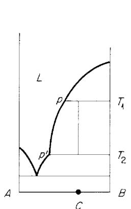  
Fig. 1.4.

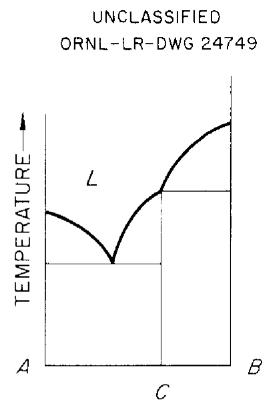  
Fig.1.5.

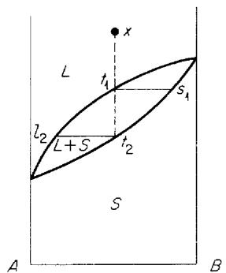  
Fig.1.6

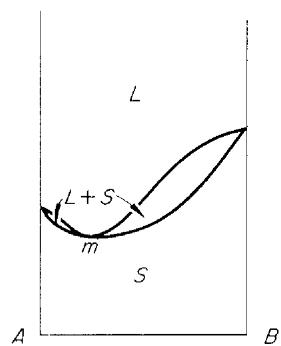  
Fig.1.7.

equilibrium conditions. Liquid $x$ (Fig. 1.6) begins to freeze at $t_1$ , and the solid starts with composition $s_1$ . As the temperature falls, the $L$ and $S$ compositions adjust themselves, always on the ends of a tie line, and the solid reaches the composition $x$ at temperature $t_2$ , the last trace of liquid that solidifies having the composition $l_2$ . Such a crystallization process assumes complete equilibrium all along, with the time for diffusion in the solid that is formed being sufficient for the solid to remain of uniform composition and in equilibrium with the liquid.

As the opposite limiting extreme we may speak of crystallization with perfect fractionation, in which no diffusion at all is assumed to be permitted to occur in the solid. The first trace of solid formed is assumed to be effectively removed from the reaction (as in removal of vapor in distillation), and becomes merely the core of a growing particle with a layered structure, one with infinitesimal layers with infinitesimally changing composition, each layer being taken out of the equilibrium as it is deposited. In such a process the liquid $x$ (Fig. 1.6) begins to freeze

at $t_1$ , forming solid $s_1$ , but now, with removal of $B$ -rich solid, the remaining liquid continues to fall in freezing point and approaches the melting point of $A$ as limit. The solid formed has a core with composition near $s_1$ and an outermost layer approaching $A$ in composition. As in azeotropic distillation, such fractionation in the case of Fig. 1.7 is limited by the minimum $m$ .

# Miscibility Gap in Solid Solution

Figure 1.8 shows limited solid solubility in a system with minimum melting point. The eutectic of this system:

$$
L (e) \rightarrow \text {c a l o r i e s} \rightleftharpoons a + b
$$

is similar to that in Fig. 1.1 except that the solids $(a, b)$ are not pure. They represent the limits of solid miscibility at the temperature $e$ . The change of this solid solubility with temperature is then shown by the curves $aa'$ and $bb'$ , joined by tie lines indicating the compositions of conjugate solid solutions. In Fig. 1.9 the miscibility gap impinges on a system without minimum melting point. The relation:

$$
a + \text {c a l o r i e s} \stackrel {\rightleftharpoons} {\leftarrow} L (p) + b,
$$

is called peritectic, being analogous to the incongruent melting point of a compound (D in Fig. 1.3).

# Solid Solution and Polymorphism

We consider only a few simple relations for the effect of $B$ (in solid solution) on a polymorphic transition point of $A$ . Unlike Fig. 1.1, if $B$ dissolves in solid $A$ , then the transition temperature for:

$$
A _ {\beta} + \text {c a l o r i e s} \rightleftharpoons A _ {a}
$$

is either raised or lowered:

1. It is raised if $B$ is more soluble in the lower form than in the upper form of $A$ (Figs. 1.10, 1.11). The region $x$ represents equilibrium between $\alpha$ phase and $\beta$ phase, and with the $B$ content in $\beta$ greater than the $B$ content in $\alpha$ , the transition temperature is raised, from $T_A$ to $T_A'$ . In Fig. 1.10 the phase reaction at $T_A'$ is:

$$
A _ {\beta} + \text {c a l o r i e s} \rightleftharpoons A _ {\alpha} + L (p).
$$

In Fig. 1.11:

$$
A _ {\beta} + \text {c a l o r i e s} \rightleftharpoons A _ {\alpha} + B _ {s},
$$

the $B_{s}$ phase being a solid solution.

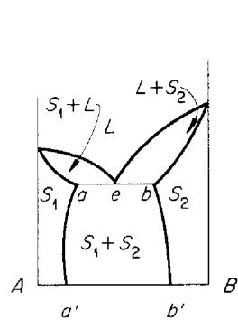  
Fig.1.8.

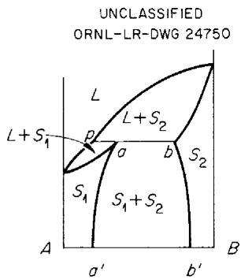  
Fig. 1.9

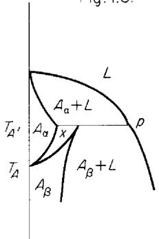  
Fig.1.10.

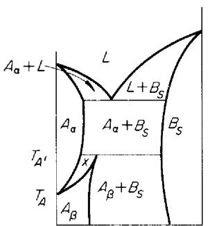  
Fig.1.11.

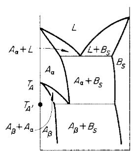  
Fig. 4.13.

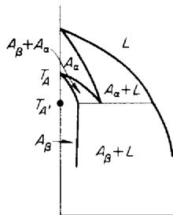  
UNCLASSIFIED   
ORNL-LR-DWG24751   
Fig.1.12.

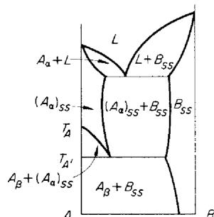  
Fig.114.

2. It is lowered if $B$ is more soluble in the upper form; it is, therefore, always lowered if the lower form is pure $A_{\beta}$ (Figs. 1.12, 1.13, and 1.14).

Polymorphic transitions of this sort apply to solid solutions of binary compounds, as well as to solid solutions of the components themselves. These are only a few of the relations possible in

transitions of solid solutions, but they suffice for the systems under consideration. In particular, these systems involve no case of a congruently melting binary compound dissolving adjacent solids on both sides; such a relation always involves the possibility of nonstoichiometric maxima and Berthollide compounds.

# 2. TERNARY EQUILIBRIUM OF LIQUID AND ONE SOLID (SURFACES)

The ternary diagrams under consideration deal with temperature-composition (T vs c) relations in additive ternary systems, each with three fluorides as components. The special problems of representation met with for reciprocal ternary systems, those containing two cations and two anions, are not involved.

The relations could presumably be completely and explicitly shown in a transparent, "explodable" and sectionable three-dimensional triangular prism model, in which the various phase spaces and the two-, three-, and four-phase equilibria are distinguished. The two-phase spaces contain horizontal (isothermal) tie lines joining the compositions of coexisting phases (liquid and solid, or two solids). The three-phase equilibria occupy spaces triangular in isothermal section - spaces generated by isothermal three-phase triangles, the corners of which move along continuous curves with changing temperature. The four-phase equilibria (isobarically invariant) constitute isothermal planes defined by the four phases of the equilibrium.

The relations in the three-dimensional $T$ vs $\pmb{c}$ prism are usually represented and discussed by means of plane diagrams which are either projections or sections of the prism.

The only type of projection used in the present discussion is the polythermal projection of the liquidus surfaces. This is a projection parallel to the temperature axis, upon the triangular composition plane, showing, therefore, the various parts of the liquidus surface or surfaces as viewed from the direction of high temperature. The resulting "phase diagram" thus consists of fields (projected surfaces) for liquid saturated with a single solid, of the boundary curves between surfaces, for liquid saturated with two solids, and of points for the intersection of these curves, three at a time, for liquid in equilibrium with three solids. The direction of temperature change can be shown by arrows on the curves, and some actual temperatures can be shown by means of isothermal contours.

Such a polythermal projection shows directly which surface will be reached by a liquid of known composition upon cooling, and hence what the nature, if not the composition, of the primary crystallization product will be. The diagrams under consideration give this information (where it is known) unambiguously in every case because they involve no solid phase with a retrograde

effect of temperature on its solubility (Fig. 1.2), so that there is no overlapping, in polythermal projection, of primary phase fields. This restriction is understood in all the subsequent discussion. The absence of retrograde effect means, moreover, that the amount of liquid always diminishes on cooling, while the total amount of solid (or solids) always increases.

The $T$ vs $c$ prism is further studied and analyzed by means of plane sections, which may be vertical $T$ vs $c$ sections through two particular binary compositions, or may be horizontal isothermal sections which then amount to isothermal solubility diagrams of the ternary system.

We shall now consider the crystallization equilibrium of liquid and one solid (the surfaces of the liquidus); in the immediately following sections we shall consider the equilibrium of liquid with two solids (the boundary curves) and the equilibrium of liquid with three solids (the "condensed invariants" of the system).

The "surface" (the field, in projection) is variously referred to as crystallization surface, freezing-point surface, solubility surface, primary phase region, or primary phase field.

When a liquid is cooled to one of these surfaces it deposits one solid on cooling, as long as the liquid is still on the surface ("on the surface" means anywhere short of a boundary curve). Every point on the surface represents equilibrium between that particular liquid (point) and a particular solid composition, and the liquid and solid compositions or points are joined by a tie line (isothermal). If the surface is cut in isothermal section, the isothermal solubility curve is then joined by a series of nonintersecting tie lines to the composition of the saturating solid. If the solid is one of fixed, constant composition, all the tie lines, at any and all temperatures of the surface, meet at the fixed composition of the solid phase. Otherwise the tie lines, at any temperature, simply join the liquidus and solidus curves; the solidus "curve" may be a straight line.

The direction of falling temperature at any point of the surface is away from the composition of the separating solid in equilibrium with the liquid at that point. If the solid is one of fixed composition, therefore, straight lines radiating from its composition are lines of falling temperature, in every direction, and they cut contours of lower temperature, progressively.

# 2.1. FIXED SOLID

In Fig. 2.1, the region $Ae_{1}Ee_{2}$ is the (projected) surface for saturation with pure solid $A$ . The arrows on the boundaries indicate the direction of falling temperature, and the curves $T_{1}, \ldots, T_{4}$ are isothermal contours ( $T_{1} > \ldots > T_{4}$ ). If the liquid $x$ , with composition falling on this surface, is cooled, it begins to precipitate solid $A$ at $T_{1}$ . The crystallization path of the liquid, the path followed by the liquid on the $A$ surface while it is being cooled and while it is precipitating $A$ , is then a straight line extended from $A$ through $x$ . Removal of $A$ from the liquid makes its composition proceed in a straight line from the corner $A$ . The crystallization paths for a field of a solid of fixed composition are therefore simply straight lines radiating from the composition of the solid. The composition of the liquid starting at $x$ , while precipitating $A$ , will therefore be $l_{2}, l_{3}, l_{4}$ , etc., at the successive temperatures shown, and the ratio of solid to liquid is given by $x l_{2} / x A$ , etc., at each temperature. The quantity of liquid is always diminishing, but the liquid is never completely consumed while it is still on the $A$ surface. Some liquid must reach one of the boundary curves of the field.

These relations hold, moreover, whether the solid $A$ is kept in contact with the liquid while it is being cooled, or whether the solid is continually removed as produced.

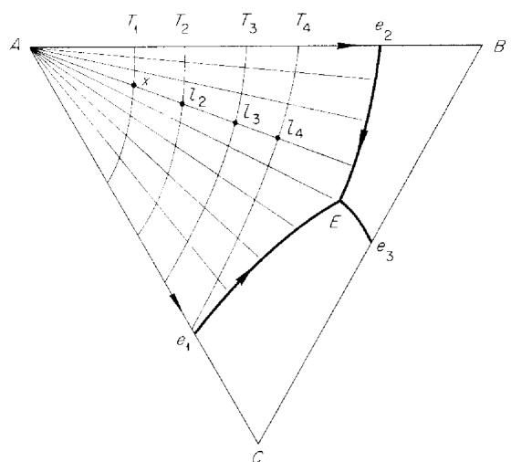  
UNCLASSIFIED ORNL-LR-DWG 24752   
Fig. 2.1

# 2.2. VARIABLE SOLID (SOLID SOLUTION)

If the solid is a ternary solid solution, there is a solidus surface, representing solid solutions which are in equilibrium (point for point) with liquids on the liquidus surface. The solidus surface lies everywhere beneath the liquidus surface in temperature, and it will not be represented at all in the usual "phase diagram." Any point on the liquidus is connected by an isothermal tie line with one individual point on the solidus, representing the solid composition with which it is in equilibrium. These tie lines never anywhere intersect. The space between the two surfaces is the two-phase space in which mixtures consist, at equilibrium, of liquid and the solid solution.

These surfaces are in contact at the composition of a pure component (if the solid phase includes the composition of the pure component), and otherwise only at absolute maxima or absolute minima of temperature, which may be at the binary sides or in the ternary system: only at points, in other words, and not along a whole ridge or trough (valley). [The "absolute" maximum or minimum of a liquidus surface is a point "on" the surface - and this means, it must be recalled, not on any one of its boundaries with another surface. The absolute maximum or minimum may be at a unary point (composition of a component), at a binary point (side of the triangle), or at a ternary point, as at the dome of a continuous ternary liquidus. The surface, moreover, may have more than one absolute maximum (or minimum).]

The equilibrium process of the freezing of a liquid now involves a definite temperature range, the vertical distance along the temperature axis, in the $T$ vs $c$ prism, between the liquidus and solidus surfaces. A liquid of composition $x$ , let us say, begins to freeze at $T_{1}$ (the liquidus temperature at $x$ ) and is completely solidified at $T_{2}$ (the solidus temperature for the same composition $x$ ). The composition $s_{1}$ of the solid, as it just begins to form at $T_{1}$ , is different from $x$ . As the crystallization proceeds, however, with falling temperature, and if the liquid and solid phases maintain complete equilibrium with each other, both phases change in composition, so that at $T_{2}$ the final solid has the original composition $x$ and the last trace of liquid to solidify has still a different composition $l_{2}$ . Between $T_{1}$ and $T_{2}$ each phase has followed a separate, three-dimensional curve with respect to temperature and

composition, one along the liquidus surface and one along the solidus surface, but such that the two compositions were always joined by an equilibrium tie line, at each temperature, passing through the total composition $x$ .

The path followed by the liquid, on the liquidus, in such a process, is called its "equilibrium path": the path followed by the composition of the liquid during cooling, if the whole of the solid phase is at every moment in complete equilibrium with the liquid. Such a process can be attained only as a limit, perhaps, with extremely slow cooling, since the interior of the growing solid can be kept uniform with the surface layer only through diffusion in the solid.

At the opposite extreme of behavior we may specify that no diffusion whatever takes place in the growing solid. The first infinitesimal amount of solid now acts simply as an unchanging core for a growing layered structure, each layer differing infinitesimally in composition from the preceding one, and each layer, because of the absence of diffusion, being effectively removed from the equilibrium as it is formed. In such a process there is no longer a definite freezing range for the liquid. As the solid produced is being effectively removed, the remaining liquid tends toward some temperature minimum of the surface before being consumed. The path followed by the liquid in such a limiting process of perfect fractionation we shall call a "fractionation path."

(When the separating solid is of fixed composition, as in Fig. 2.1, there is no distinction between "equilibrium path" and "fractionation path"; hence the one term, "crystallization path.")

# Fractionation Path

The surface may be considered to be covered by a family of curves (fractionation paths), following the course of falling temperature and hence cutting contours in the order of falling temperature, and all originating at some absolute maximum of the surface. If there is an absolute minimum on the surface, then these paths, after fanning out, converge again at that minimum. All the cases in the systems under consideration concern solid solution surfaces having one or two absolute maxima (in some cases the maximum is submerged or metastable); there are no solid solution surfaces with an absolute minimum. Hence the fractionation paths in these systems do not converge with falling temperature, but end,

each at a separate point, at the various boundaries (for liquid in equilibrium with two solids) of the surface. With two absolute maxima on a surface, there are two families of crystallization paths, one originating at each maximum.

At any point on the surface, such a path starts with a direction given by the $L - S$ tie line at that point of the surface, but the direction immediately changes because, as the temperature changes, the separating solid also changes. The direction of motion for the liquid composition is away from the composition of the separating solid. The fractionation path is therefore such that its tangent at any point is the $L - S$ tie line at that point (Fig. 2.2). Here the curve $Bf$ is a fractionation path on a surface for precipitation of an $A - B$ solid solution; and the lines $l_{1}s_{1}, l_{2}s_{2}, \ldots, l_{4}s_{4}$ are $L - S$ tie lines on this surface at temperatures $T_{1} > T_{2} > T_{3} > T_{4}$ .

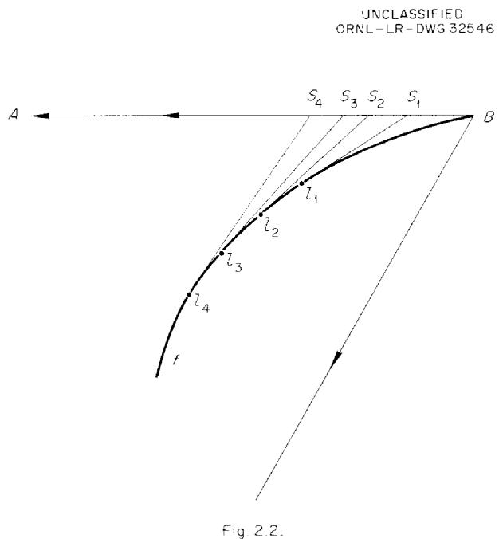

# Equilibrium Path

The composition $x$ in Fig. 2.3 is liquid above temperature $t_1$ and solid below $t_5$ . When cooled to $t_1$ , it just begins to produce solid of composition $s_1$ ; $s_1$ is a point on the solidus surface in equilibrium with the point $l_1$ (or $x$ ) on the liquidus surface. The line $s_1l_1$ is therefore the $S-L$ tie line for $l_1$ at $t_1$ . With precipitation of $s_1$ , the liquid tends to move on the liquidus in the direction of this tie line (i.e., it tends, with

removal of the solid phase, to follow the fractionation path $p_1$ , to which the tie line $s_1l_1$ is tangent at $l_1$ ), but its motion is restricted by the condition that the line joining solid and liquid compositions must always pass through the fixed point $x$ , at each temperature, and that this line must always be an equilibrium tie line. These successive tie lines are $s_2l_2$ , $s_3l_3$ , etc. The solid follows the curve $s_1s_2$ , $s_3l_5$ ( $s_5$ being the same as $x$ ), and the liquid follows the curve (its equilibrium path) $l_1l_2$ , $l_5$ ( $l_1$ being the same as $x$ ). At $t_5$ the sample is completely solidified, $l_5$ being the composition of the last trace of liquid. Since the lines $s_2l_2$ , $s_3l_3$ , etc., are tie lines, they are tangent, at the liquid points, to the fractionation paths $(p_2$ , $\ldots, p_5)$ through these points.

It is thus seen that the equilibrium path of the liquid $x$ (its path on the liquidus surface) is one which crosses, with falling temperature, successive fractionation paths at points where the tangent to the path passes through the point $x$ . The

Fig. 2.3   
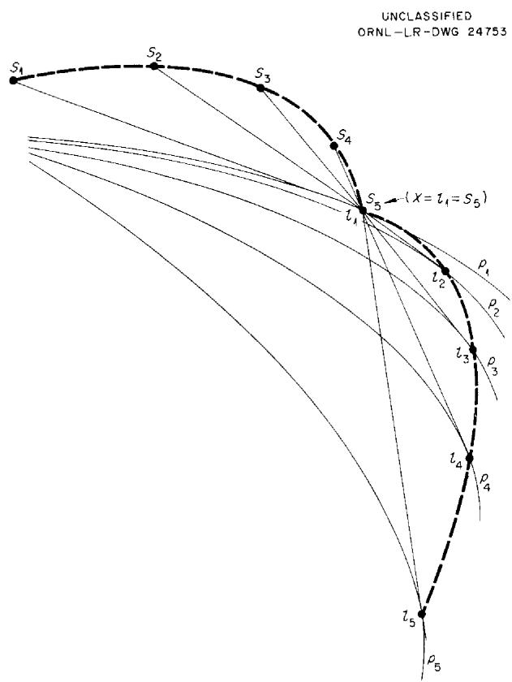  
UNCLASSIFIED   
ORNL-LR-DWG 24754

equilibrium path crosses the fractionation paths from the convex to the concave side. If a fractionation path should be a straight line, it is not crossed by an equilibrium path; it is itself an equilibrium path, as in the case of precipitation of pure solid.

In the general case of Fig. 2.3, the solid is a ternary solid solution, and the liquid may completely solidify, as assumed in Fig. 2.3, before it reaches a boundary curve of the surface. If, as in Fig. 2.2, the solid solution is binary, it is impossible for a ternary liquid precipitating the solid solution to solidify completely before it reaches a boundary curve of the surface, where a solid involving the third component may also precipitate. But although, with binary solid solution, the curve $s_1s_2 \ldots s_5$ becomes a straight line, the relations between equilibrium path and fractionation paths developed in Fig. 2.3 still hold (Fig. 2.4). At $t_4$ the mixture is not all solid; it still consists of liquid and solid in the ratio $s_4x / x l_4$ .

Returning to Fig. 2.3, any total composition, like $x$ itself, on the particular tie line $s_3l_3$ will consist, at $t_3$ , of the phases $s_3$ and $l_3$ . Hence the equilibrium path of any total composition between $s_3$ and $l_3$ will pass through one common point, namely, $l_3$ . Consequently, while there is but one fractionation path passing through any single point of the surface, there will be an infinite number of equilibrium paths passing through the same point. A surface may therefore be described by the family or families of fractionation paths on it, but not by equilibrium paths.

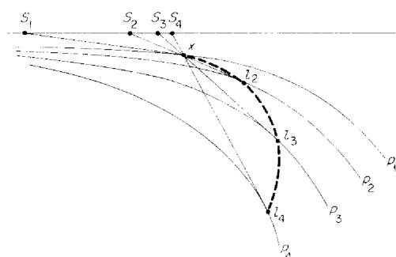  
Fig. 2.4.

# 3. TERNARY EQUILIBRIUM OF LIQUID AND TWO SOLIDS (CURVES)

We now consider the crystallization process for a liquid in equilibrium with two solids, $S_{1}$ and $S_{2}$ : liquid on a curve of twofold saturation (boundary curve, field boundary).

# 3.1. REACTION TYPES

The curve constituting the boundary between the surface for $S_{1}$ and the surface for $S_{2}$ represents liquid in equilibrium with both solids, but not necessarily precipitating both solids upon cooling. If the liquid does precipitate both solids on cooling, and the reaction is:

$$
L - \text {c a l o r i e s} \rightleftharpoons S _ {1} + S _ {2},
$$

the crystallization is said to be positive for both solids, $S_{1}(+)$ , $S_{2}(+)$ , and the curve is said to be one of even reaction. [With retrograde temperature effects it is possible to have both solids dissolving on cooling, with negative crystallization for both, so that the reaction may still be even: $S_{1}(-)$ , $S_{2}(-)$ .] The curve is one of odd reaction (a transition curve) if one solid ( $S_{1}$ , let us say) is dissolving in or reacting with the liquid and the other, $S_{2}$ , is precipitating during cooling. The crystallization is now $S_{1}(-)$ , $S_{2}(+)$ , and the reaction is:

$$
L + S _ {1} - \text {c a l o r i e s} \rightleftharpoons S _ {2}.
$$

The sign of the reaction at a particular point on the two-solid curve involves the direction of the tangent to the curve at that point in relation to the compositions of the two solid phases in equilibrium with the liquid at that point. The liquid is at any point simply one corner $L$ of a three-phase triangle. In the general case, in which all three phases are variable in composition, each equilibrium phase follows its own composition curve in the phase diagram, but the usual polythermal phase diagram shows only the curve for the liquid composition. If the solids $S_{1}$ and $S_{2}$ are of fixed composition, then the $S_{1} - S_{2}$ leg of the triangle is a fixed line and only the $L - S_{1}$ and $L - S_{2}$ legs move, with $L$ on the liquid curve; if one of the solids is a binary solid solution, then the curve for that solid is a straight line; etc. In any case the liquid curve on the ordinary phase diagram represents simply one corner of the three-phase triangle of the equilibrium, and the

whole triangle may in general be moving, with its corners changing in composition, as the temperature changes.

Figures 3.1, 3.2, and 3.3 show three cases: Figs. 3.1 and 3.2, cases with curves for both $S_{1}$ and $S_{2}$ , both of which are therefore ternary solid solutions; Fig. 3.3, a case with fixed solids for $S_{1}$ and $S_{2}$ . The arrows on the curves indicate the direction of falling temperature. The surface on the left of the $L$ curve is that for liquid depositing $S_{1}$ on cooling; that on the right is for liquid depositing $S_{2}$ on cooling.

UNCLASSIFIED

ORNL-LR-DWG 24755

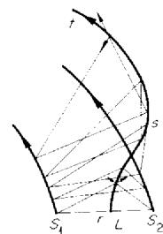  
Fig. 3.1

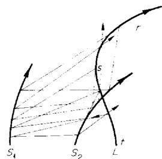  
Fig.3.2

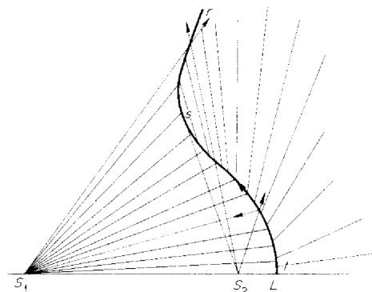  
Fig. 3.3

Positive crystallization (precipitation) of a solid from a liquid corresponds to a direction vector for the motion of the liquid away from the composition of the separating solid; for negative crystallization or dissolving of a solid in a liquid, the direction vector for the motion of the liquid is toward the solid. The resultant of the direction vectors must make the liquid move in the direction of falling temperature on the $L$ curve. Examination of the direction vectors, in Figs. 3.1, 3.2, and 3.3, required to give the indicated motion

on the \(L\) curve, shows that the reaction is even, in every case, between \(r\) and \(s\) \([S_{1}(+) , S_{2}(+)\), and odd between \(s\) and \(t\) \([S_{1}(-) , S_{2}(+)\)\). Equivalent to this procedure is the test of the tangent to the curve at any point. If the tangent extends between the compositions of the equilibrium solids, i.e., if the tangent cuts the \(S_{1}-S_{2}\) leg of the three-phase triangle, the curve is even \([S_{1}(+) , S_{2}(+)\)\); otherwise it is odd. The sign of the reaction changes at point \(s\), where the tangent to the curve passes through the composition of one of the solids \((S_{2}\) for the cases illustrated); i.e., where one of the \(L-S\) legs of the triangle is tangent to the \(L\) curve.

A curve originating at a binary eutectic (presumably as in Fig. 3.1), whether entering the ternary system with falling or with rising temperature, always starts as an even curve, while one originating at a binary peritectic (Figs. 3.2 and 3.3) starts as odd. But in all cases the sign may change as the curve proceeds on its course, both because of changing direction of the $L$ curve and because of variation in solid compositions. Hence if "eutectic curve" or "peritectic curve" refers simply to the origin of the curve, the expression does not necessarily describe the type of reaction later on along the curve. Since the type of reaction at any point on a curve is an important property of the curve, it is better to speak of "even" and "odd" curves in order to distinguish curves for the precipitation of two solids from transition curves.

The sign of the reaction on a liquid-solid curve is, then, quite clear, on the ordinary phase diagram, if the solids are of fixed composition; but, when the solids are variable, the type of reaction (precipitation of two solids or transition) is often unknown, for it is necessary at any point to know the compositions of the saturating solids in order to test the tangent at that point.

Since the direction of falling temperature on a surface is always away from the composition of the separating solid, it turns out that a two-solid curve of even reaction can be reached from either side, but if the reaction is odd $[S_{1}(-), S_{2}(+)$ it can be reached only from the $S_{1}$ side. Both the fractionation paths and the equilibrium paths lead to the odd curve from the $S_{1}$ surface, and away from it on the $S_{2}$ surface. This is at once clear in Fig. 3.3, where all the crystallization paths on the $S_{1}$ surface radiate as straight lines from the point $S_{1}$ , and those on the $S_{2}$ surface are straight lines radiating from the point $S_{2}$ .

# 3.2. MAXIMUM AND MINIMUM TEMPERATURE POINTS

A twofold saturation curve may pass through a maximum or a minimum of temperature. This is possible only if at least one of the solids is variable in composition. At the maximum or minimum the three-phase triangle becomes a line: the three phases $(L, S_1, \text{and } S_2)$ have collinear compositions, all lying on one straight line of the diagram. Figure 3.4 shows the case of a maximum on a curve of even reaction, and Fig. 3.5 a minimum on a curve of odd reaction.

The leading corner of the three-phase triangle (in the direction of falling temperature) may be said to be the liquid. The collinearity corresponds to the relations at a binary origin of such an equilibrium, which is always a maximum or a minimum for the equilibrium, and where of necessity the three phases are on one straight line, which then opens up into a triangle on entering the ternary diagram.

# 3.3. EQUILIBRIUM CRYSTALLIZATION PROCESS FOR LIQUID ON A TWO-SOLID CURVE

When the liquid is on a two-solid curve, the fixed total composition $x$ of the sample being cooled must lie inside the three-phase triangle (Fig. 3.6). The mixture consists of three phases,

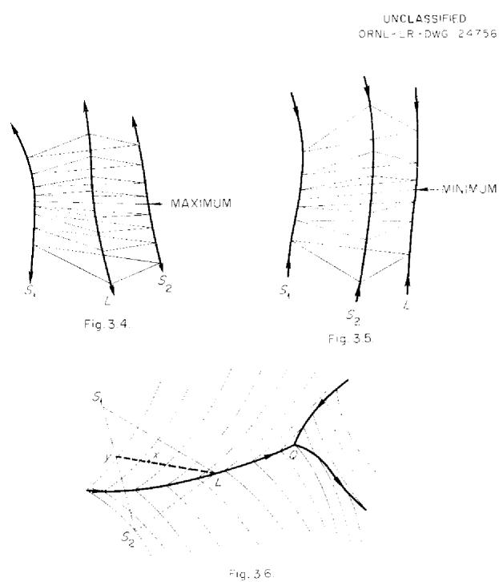

such that the ratio of the total solids to liquid is $xL / xy$ , and the ratio of $S_{1}$ to $S_{2}$ is $yS_{2} / yS_{1}$ .

As the temperature falls and $L$ travels down the curve, the whole three-phase triangle moves with it, $S_{1}$ and $S_{2}$ in general following their own composition curves. Since the point $x$ is fixed, it is therefore possible (but not necessary) that one of the three sides of the triangle may come to sweep through $x$ . When this happens, the mixture becomes a two-phase mixture, the third phase having been consumed in the crystallization process. In the sketch in Fig. 3.6, if the general configuration remains the same while the triangle moves to the right, the amount of solid increases and the liquid diminishes (as always), and when the side $S_{1}S_{2}$ sweeps through $x$ , the liquid vanishes, leaving $S_{1}$ and $S_{2}$ . The solidification process would then be completed while $L$ is still on the curve, or before $L$ reaches the end of the curve, $Q$ . But if the triangle twists and changes shape as $L$ moves down the curve, the point $x$ may come to be swept by the $S_{1}L$ leg ( $S_{2}$ vanishing) or by the $S_{2}L$ leg ( $S_{1}$ vanishing). If $S_{2}$ vanishes and the liquid is left saturated with only $S_{1}$ , the liquid leaves the curve to travel on the $S_{1}$ field; if $S_{1}$ is consumed, the liquid, saturated with $S_{2}$ alone, moves off the curve onto the $S_{2}$ field.

Some of the possible variations of behavior are the following:

1. Curve of even reaction:

(a) If the solids are not variable, no phase is consumed while $L$ is on the curve. The liquid diminishes, but some reaches the end of the curve; $L$ does not leave the curve.

(b) If $S_{1}$ is variable and $S_{2}$ constant, either liquid or $S_{2}$ may be consumed, but not $S_{1}$ .

Solidification may be complete on the curve, or $L$ may leave the curve for the $S_{1}$ field, or it may reach the end of the curve.

(c) If both solids are variable, any one of the three phases may be consumed. Solidification may be complete on the curve, or $L$ may leave the curve on either side, or $L$ may reach the end of the curve.

2. Curve of odd reaction \([S_{1}(-), S_{2}(+)\] : Now \(S_{1}\) may always be consumed, whatever the nature of the solids.

(a) With fixed solids, only $S_{1}$ can be consumed. The liquid may leave the curve for the $S_{2}$ field, or it may reach the end. Solidification cannot be completed with $L$ on the curve.   
(b) If $S_{1}$ is variable ( $S_{2}$ fixed or variable), then any one of the three phases may be consumed. Solidification may be completed on the curve, $L$ may leave the curve for either side, or it may reach the end of the curve.

A transition curve (odd reaction) is traveled $(L$ moves along the curve) only if complete equilibrium is maintained between the liquid and the dissolving, or reacting, solid. If this solid $(S_{1})$ is effectively out of the equilibrium (i.e., if it is removed as formed, if its surface is covered by deposition of $S_{2}$ , or if the process is too rapid), then a liquid which reaches such a curve by deposition of $S_{1}$ merely crosses the curve. It begins to precipitate $S_{2}$ without consuming any $S_{1}$ ; it undergoes a change in direction and enters at once upon the $S_{2}$ surface. The new solid $S_{2}$ is merely deposited upon the first $(S_{1})$ in a nonequilibrium mixture.

# 4. TERNARY CONDENSED INVARIANT POINTS (FOUR PHASES)

Ternary condensed invariant points are generally the points of intersection of three curves, each for a liquid in equilibrium with two solids, resulting in the equilibrium of a liquid with three solids. In addition we shall have to consider reactions involving four solids, below temperatures of equilibrium with liquid.

The four phases of the (isobarically) invariant equilibrium are arranged either as a triangle, with one phase inside (type A), or as a quadrangle (type B). The special case which may appear to be the limit between triangle and quadrangle, with the fourth phase on a side of the triangle (i.e., with three of the four phases on a straight line), is strictly a binary three-phase invariant, and the fourth phase, while present, is not involved in the phase reaction. We shall discuss this case before considering the true ternary invariant reactions.

# 4.1. BINARY DECOMPOSITIONS IN PRESENCE OF TERNARY LIQUID

Given the four coexisting phases arranged as follows:

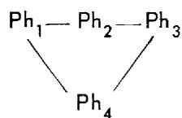

with $\mathsf{Ph}_1, \mathsf{Ph}_2,$ and $\mathsf{Ph}_3$ collinear, then the equilibrium:

$$
\mathrm {P h} _ {2} \rightleftharpoons \mathrm {P h} _ {1} + \mathrm {P h} _ {3} \pm \text {c a l o r i e s}
$$

does not involve $\mathsf{Ph}_4$ . Such a situation arises for the interaction of three solids (collinear) in the presence of a liquid phase:

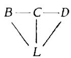

the liquid being saturated with all three. In the usual examples found, the three solids are on a binary side of the ternary diagram, but sometimes they are on a line inside the ternary system.

# "Pure" Solids

If $B, C,$ and $D$ are three successive solids in the binary system $A-E$ , and if they are "pure" in the sense that, although they may involve binary solid solution among themselves, they nevertheless do not take into (ternary) solid solution the third component $F$ , then the temperature (always at constant pressure) of the equilibrium:

$$
C \rightleftharpoons B + D + c a l o r i e s
$$

is unchanged by the presence of a liquid, containing $F$ , in which these solids are dissolved to saturation. The liquid may even contain more than one such foreign component. Provided that the three solids themselves remain pure in respect to any of the foreign components ( $F, G, \ldots$ ) in the liquid phase, the temperature of the phase reaction is the same as that in the binary system $A - E$ itself.

Not only is the temperature independent of the composition of the liquid phase, but, since the liquid is not involved in the phase reaction, the very amount of the liquid phase is constant (complete equilibrium being assumed) during the phase reaction.

Such strictly binary invariant points will be distinguished with a subscript identifying the decomposing solid phase, such as $P_{S_2}$ or $P_{C'}$ in the above examples. A similar invariant would be that of the transition of a binary solid solution in presence of a ternary liquid (points $T_A'$ in Figs. 1.10 to 1.14).

# Effect of the Third Component Entering into Solid Solution

If a foreign component enters any of the three solids, forming a solid solution, the temperature of the phase reaction is changed, and it now varies with the composition of the solid solution (or solid solutions). If $C$ alone forms such a solid solution with the foreign component, then the decomposition temperature is raised if the reaction is:

$$
C + \text {c a l o r i e s} \stackrel {\rightleftarrows} {=} B + D,
$$

and lowered if

$$
C - \text {c a l o r i e s} \rightleftharpoons B + D.
$$

If $C$ remains "pure" while either or both of the other solids form a solid solution with the added component, then the decomposition temperature is lowered if the reaction is:

$$
C + \text {c a l o r i e s} \Longleftrightarrow B + D,
$$

and raised if

$$
C - \text {c a l o r i e s} \xrightarrow {\quad} B + D.
$$

If both $C$ and one (or both) of its products form such a solid solution, then the temperature of decomposition may be either raised or lowered, and it may even pass through a maximum or a minimum.

Finally, however, when such ternary solid solution is involved in one or more of the three solids, their compositions are no longer collinear. The invariant reaction now involves all four phases, it is no longer binary but ternary, and it will pertain to one or other of the ternary types now to be discussed.

# 4.2. TYPES OF TERNARY INVARIANTS

# Type A Invariant: Triangular or Terminal Type of Invariant

In the case of a type A invariant (Fig. 4.1), the phase reaction is terminal with respect to the interior phase. The phase reaction is:

$$
4 \pm \text {c a l o r i e s} \rightleftharpoons 1 + 2 + 3.
$$

On one side of the invariant temperature we have the three equilibria involving 1, 2, and 4; $2'$ , $3'$ , and $4'$ ; and $1''$ , $3''$ , and $4''$ ; and on the other side only the equilibrium of $1'''$ , $2'''$ , and $3'''$ . The interior phase, 4, exists only on one side, and its stable existence is terminated at the type A invariant.

If the interior phase is a liquid and the others are solids, the invariant is a eutectic. All four phases may be solids, and then the invariant is the decomposition of solid 4 into three solids. The liquid may be an exterior phase, and then the invariant is an incongruent melting point of the interior ternary solid 4; two cases arise. Case (a):

$$
4 + \text {c a l o r i e s} \rightleftharpoons 1 + 2 + L
$$

is a ternary analog of the incongruent melting point of a binary solid into liquid and another solid. Case (b):

$$
4 - \text {c a l o r i e s} \rightleftharpoons 1 + 2 + L
$$

is an inverse peritectic or inverse fusion point, like one found in rare cases in binary systems (Fig. 1.4), and (possibly) in one case in the present ternary systems (solid phase $C$ in system $Y - U - Z$ , Fig. 14.10).

# Type B Invariant: Quadrangular, Diagonal, or Metathetical Type of Invariant

In the case of a type B invariant (Fig. 4.2), the phase reaction is:

$$
1 + 3 \pm \text {c a l o r i e s} \Longrightarrow 2 + 4,
$$

not terminal for any phase. On one side of the invariant temperature we have the equilibria involving 1, 2, and 3 and $1^{\prime}, 3^{\prime}$ , and $4^{\prime}$ , and on the other side the equilibria involving $1^{\prime \prime}, 2^{\prime \prime}$ , and $4^{\prime \prime}$ and $2^{\prime \prime \prime}, 3^{\prime \prime \prime}$ , and $4^{\prime \prime \prime}$ . This invariant is related to double decomposition reactions, even when occurring in additive ternary systems. The combination 1 and 3 is stable only on one side of the invariant temperature, and the combination 2 and 4 only on the other side. The stable diagonal of the quadrangle changes from 1-3 to 2-4; hence the term "diagonal reaction."

# 4.3. RELATIONS OF THE THREE LIQUID CURVES AT THEIR INVARIANT INTERSECTION

On the liquidus diagram the only invariants we see are those involving a liquid phase and three solids, and they occur as intersections of three curves of liquid in equilibrium with two solids. Hence, unless the locations of the three solids are known, relative to the position of the invariant liquid (commonly this position is called "the invariant point," but the invariant is not a point but a plane, either triangular or quadrangular), we cannot always know the type of invariant involved.

If, as in Fig. 4.3, all three liquid curves fall in temperature to their intersection, the invariant is a eutectic (type A). The phase reaction is terminal for the liquid, which is inside the three-solid triangle:

$$
L - \text {c a l o r i e s} \Longleftrightarrow S _ {1} + S _ {2} + S _ {3}.
$$

Conversely, if the liquid of the intersection is known to be inside the three-solid triangle, then the temperature must fall to the intersection on all three curves, and the intersection is a eutectic, the temperature minimum for the liquidus in the area of the three-solid triangle.

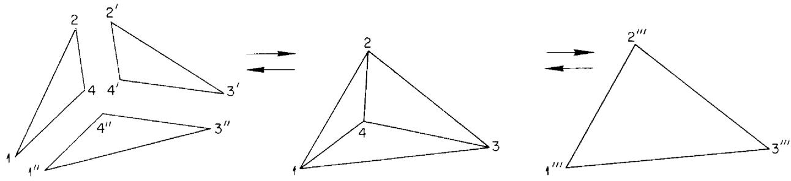  
Fig. 4.1.

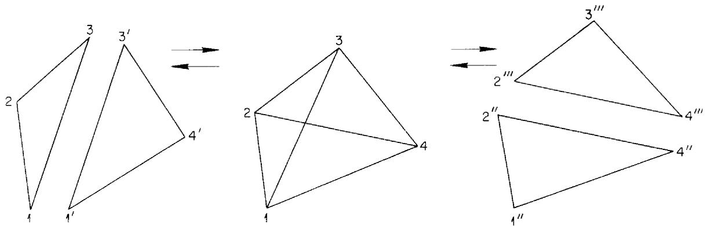  
Fig. 4.2.

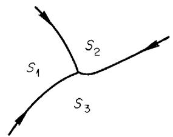  
Fig. 4.3.

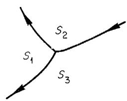  
Fig. 4.4.

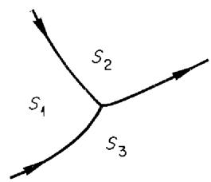  
Fig. 4.5.

But any other arrangement of temperature fall of the three curves may mean either a type A or a type B invariant. Thus, the arrangement in Fig. 4.4 may mean either of the following reactions:

(a) Type A: $S_{1} + \text{calories} \rightleftharpoons S_{2} + S_{3} + L$ .   
(b) Type B: $S_{1} + L + \text{calories} \Longleftrightarrow S_{2} + S_{3}$ .

That in Fig. 4.5 may be either of the following:

(c) Type A: $S_{1} - \text{calories} \Longleftrightarrow S_{2} + S_{3} + L$ .   
(d) Type B: $S_{1} + L - \text{calories} \rightleftharpoons S_{2} + S_{3}$ .

These four invariants involving liquid $(a, b, c, d)$ are usually called simply "ternary peritectics" as distinct from the eutectic reaction.

Moreover, the curves meeting at a eutectic are usually all three of even reaction, but they need not be; one may be odd in reaction. For invariants $(a)$ and $(b)$ (Fig. 4.4) one of the curves proceeding from the invariant to lower temperature must be odd. For invariants $(c)$ and $(d)$ (Fig. 4.5) no restrictions of reaction sign hold.

For all invariant intersections of three liquid curves, no angle of the intersection can be greater than $180^{\circ}$ . This requirement holds both for the truly ternary invariants (types A and B) and for those explained as binary invariants with the three solids on one straight line. This restriction means that the metastable extension of each curve must extend into the field of the third solid. The metastable extension of the curve for liquid in equilibrium with $S_{1}$ and $S_{2'}$ for example, must penetrate to temperatures below the surface for liquid in equilibrium with $S_{3'}$ and this requirement cannot be satisfied, for all three curves simultaneously, if any angle of the intersection is greater than $180^{\circ}$ . Thus, in Fig. 4.6, the extension $ia'$ of the curve for liquid in equilibrium with $S_{2}$ and $S_{3'}$ which is a boundary of the surface for liquid in equilibrium with $S_{3'}$ would have to penetrate beneath the $S_{3}$ surface itself, an impossibility in the absence of retrograde temperature effects, here excluded. The same contradiction would hold for the extension $ib'$ of the curve for liquid in equilibrium with $S_{1}$ and $S_{3'}$ which is also a boundary of the $S_{3}$ surface. Only the metastable extension $ic'$ of the curve for liquid in equilibrium with $S_{1}$ and $S_{2}$ would behave correctly.

# 4.4. CONGRUENT AND INCONGRUENT CRYSTALLIZATION END POINTS

In Figs. 4.7 and 4.8, $E$ represents a eutectic liquid in equilibrium with the three solids $S_{1}, S_{2},$ and $S_{3}$ ; $(S_{1}), (S_{2}),$ and $(S_{3})$ represent the fields for liquid in equilibrium with each of the three solid phases. With complete equilibrium always maintained during cooling, the point $E$ must be reached, along one or another of the three curves meeting at $E$ , by liquid from any total composition in the triangle $S_{1}S_{2}S_{3}$ , no matter how many other invariant points may be traversed on the way; and, with complete equilibrium, only liquids from original compositions in the triangle $S_{1}S_{2}S_{3}$ will reach $E$ . Liquids with original composition $x$ in the triangle $S_{1}S_{2}S_{3}$ cannot dry up, or they cannot be completely solidified, until some liquid finally reaches $E$ . Since liquid $E$ is inside the triangle of its three solids, so that the composition of the liquid $E$ is accountable in terms of its three solids, it is said to dry up congruently; i.e., $E$ is the congruent crystallization end point for compositions in the triangle $S_{1}S_{2}S_{3}$ . Also, when the liquid

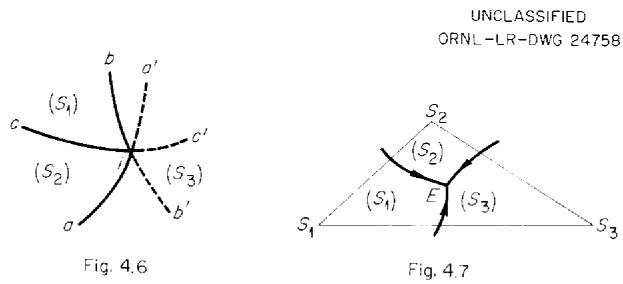

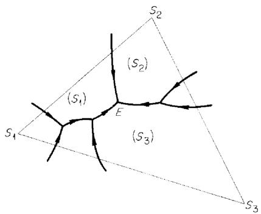  
Fig. 4.8

reaches $E$ , it is always entirely consumed; it never leaves $E$ . This is so whether the solids involved in the reaction are removed as formed or not. (Exceptions, of course, would occur if there is supercooling with respect to some solid phase; in such a case the liquid, approaching an invariant point along a two-solid curve, simply continues on the metastable extension of that curve until the metastability is relieved.)

Invariant points other than eutectics [peritectic points $(a)$ and $(d)$ , Sec 4.3] may be crystallization end points for some compositions, but they are then, in contrast, incongruent crystallization end points. The liquid in these cases is not inside the triangle of its three solids, and its composition is not accountable in terms of these solids.

The following consideration of these invariants assumes complete equilibrium in all processes.

Case $(a)$ : Reaction of type A (Fig. 4.9):

$$
L + S _ {2} + S _ {3} - \text {c a l o r i e s} \rightleftharpoons S _ {1}.
$$

Here point $P$ is reached by liquids traveling down in temperature along the curve $LS_{2}S_{3}$ , provided the original total composition $x$ is in the triangle $PS_{2}S_{3}$ . Then $S_{1}$ appears in the invariant reaction, and if $x$ is in the triangle $S_{1}S_{2}S_{3}$ the liquid is consumed, leaving the three solids. Point $P$ is therefore the incongruent crystallization end point for the composition triangle $S_{1}S_{2}S_{3}$ . As for the rest of the quadrangle: with $\dot{x}$ in the triangle $PS_{1}S_{2}$ , the solid $S_{3}$ is consumed, leaving liquid, $S_{1}$ , and $S_{2}$ , and the liquid enters upon the curve $LS_{1}S_{2}$ ; for $x$ in the triangle $PS_{1}S_{3}$ , $S_{2}$ is consumed, and $L$ leaves along the curve $LS_{1}S_{3}$ .

This invariant is seen to be the incongruent melting point of the interior phase $S_{1}$ , which may be either a fixed ternary compound or a ternary solid solution. Upon heating, it decomposes or melts incongruently, at the temperature of the invariant, to produce liquid of composition $P$ , $S_{2}$ , and $S_{3}$ .

Case $(d)$ : Reaction of type B (Fig. 4.10):

$$
S _ {1} + L - \text {c a l o r i e s} \rightleftharpoons S _ {2} + S _ {3}.
$$

Liquid $P$ is reached on cooling for $x$ in the quadrangle $S_{1}S_{2}PS_{3}$ , along the curve $LS_{1}S_{2}$ if $x$ is in the triangle $S_{1}S_{2}P$ and along curve $LS_{1}S_{3}$ for $x$ in the triangle $S_{1}S_{3}P$ . If $x$ is in the triangle $S_{2}PS_{3}$ , $S_{1}$ is consumed and $L$ proceeds along curve $LS_{2}S_{3}$ . But if $x$ is in the triangle $S_{1}S_{2}S_{3}$ ,

the liquid is consumed, leaving the solids $S_{1}, S_{2}$ and $S_{3}$ . Point $P$ is thus the incongruent crystallization end point for the composition triangle $S_{1}S_{2}S_{3}$ .

The invariants $(b)$ and $(c)$ , on the other hand, are never crystallization end points in a cooling process.

Case (c): Reaction of type A (Fig. 4.11):

$$
S _ {1} - \text {c a l o r i e s} \rightleftharpoons S _ {2} + S _ {3} + L.
$$

This is the inverse incongruent melting point of the solid $S_{1}$ (a fixed ternary compound or a ternary solid solution), decomposing or melting incongruently, on cooling, into liquid of composition $P$ , $S_{2}$ , and $S_{3}$ ; it is somewhat like that in Fig. 1.4 for a binary system. Liquids saturated with $S_{1}$ and $S_{3}$ , along curve $LS_{1}S_{3}$ , reach $P$ on cooling if $x$ is in triangle $S_{1}S_{3}P$ ; and liquids on curve $LS_{1}S_{2}$ , saturated with $S_{1}$ and $S_{2}$ , reach $P$ if $x$ is in triangle $S_{1}S_{2}P$ . Then at $P$ , solid $S_{1}$ decomposes, and when all of it is consumed, the liquid proceeds on the curve $LS_{2}S_{3}$ . This case is encountered later in Fig. 14.10, in system $Y-U-Z$ . For $x$ in triangle $S_{1}S_{2}S_{3}$ , the system is completely solid before the temperature falls to $P$ ; but at $P$ the liquid phase reappears in the invariant reaction, as a result of the decomposition of $S_{1}$ , and $L$ then proceeds along curve $LS_{2}S_{3}$ .

Case (b): Reaction of type B (Fig. 4.12):

$$
S _ {2} + S _ {3} - \text {c a l o r i e s} \rightleftharpoons S _ {1} + L.
$$

At this invariant temperature the combination of solids $S_{2}$ and $S_{3}$ reacts, on cooling, to produce liquid of composition $P$ and $S_{1}$ . Liquid saturated with $S_{2}$ and $S_{3}$ , along curve $LS_{2}S_{3}$ , reaches $P$ on cooling if $x$ is in triangle $PS_{2}S_{3}$ . Then if $x$ is above the diagonal $PS_{1}$ , $S_{3}$ is consumed in the invariant reaction, leaving liquid, $S_{2}$ , and $S_{1}$ , and $L$ then moves away on the curve $LS_{1}S_{2}$ ; for $x$ below the diagonal, $S_{2}$ is consumed, and $L$ leaves upon the curve $LS_{1}S_{3}$ . In this invariant, the cooling of two solids, $S_{2}$ and $S_{3}$ , leads to the formation of liquid and the solid $S_{1}$ , a situation encountered later in Fig. 13.6, in system $Y - U - X$ . For $x$ in triangle $S_{1}S_{2}S_{3}$ , the system is completely solid before the temperature falls to $P$ ; but at $P$ the liquid phase reappears in the invariant reaction, either $S_{2}$ or $S_{3}$ is consumed completely, and $L$ then proceeds along one of the curves falling away from $P$ .

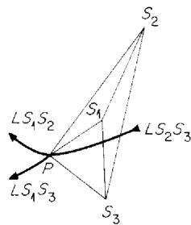  
UNCLASSIFIED   
ORNL-LR-DWG24759   
Fig. 4.9.

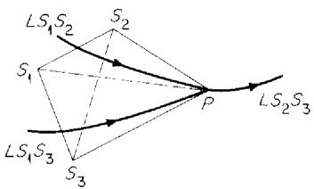  
Fig. 4.10

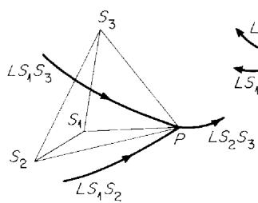  
Fig. 4.11.

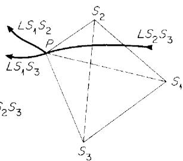  
Fig. 4.12.

With complete equilibrium, therefore, a liquid reaching point $P$ may be completely solidified at that point in case (a) or case (d), but never in case (b) or case (c).

In the absence of complete equilibrium, however, or if the liquid is not given time to react as required with the solid phases at the invariant temperature, the liquid reaching $P$ does not stop there at all, but travels on down in temperature; along one of the issuing two-solid curves if there is an even curve to lower temperature, or onto a surface, of liquid in equilibrium with one solid, if there is no even curve leaving $P$ for lower temperature. Such crystallization processes will be completed in various ways: on a solid solution liquidus surface (the last crystallization product being a single solid), on a curve of even reaction (the last product being a mixture of two solids), or at a eutectic (the last crystallization product being a mixture of three solids).

# 4.5. MELTING POINTS OF TERNARY COMPOUNDS

There are three types of melting points of ternary compounds.

1. Congruent melting point: The solid ternary compound here melts to a ternary liquid of the same composition. This will occur at an absolute maximum of the surface for liquid in equilibrium

with the compound, not at a boundary of that surface. The compound is here said to possess an "open" or "exposed" maximum.

2. Semicongruent melting point: In this case the ternary compound $M_2$ decomposes to a liquid $L_y$ and another solid $M_1$ , with all three compositions, $M_1, M_2$ , and $L_y$ , lying on a straight line in the ternary diagram. This temperature will be a maximum (y, in Fig. 4.13) on the boundary curve between the surface $(L + M_1)$ and the surface $(L + M_2)$ , and hence on curve $LM_1M_2$ . The temperature on curve $LM_1M_2$ falls away from y in both directions, but, while the temperature on the surface $(L + M_1)$ falls toward y, the temperature on the surface $(L + M_2)$ falls away from y.   
3. Incongruent melting point: In this case the ternary compound $S_{T}$ decomposes to a liquid $P$ and two other solids, in an invariant reaction in which the ternary compound is the interior phase of a triangle; case (a) above (Fig. 4.9).

# 4.6. INVARIANTS INVOLVING SOLIDS ONLY

Invariant reactions both of type A and of type B may involve simply four solid phases, below temperatures of liquid equilibrium. The usual case would be some double decomposition of type B. The type A reaction would apply for the decomposition, on heating or cooling, of one solid into three others, as already mentioned. Both types will be encountered later.

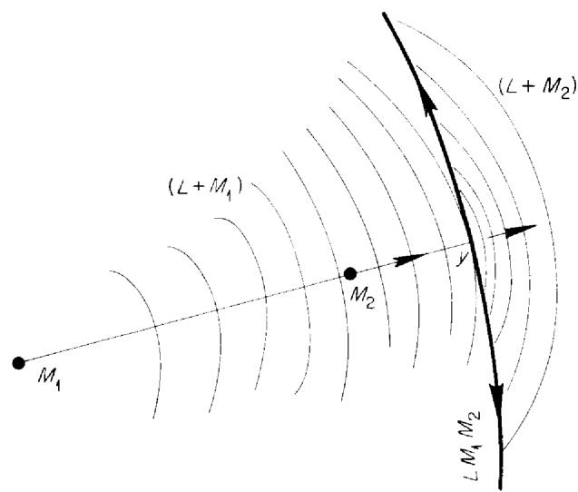  
UNCLASSIFIED   
ORNL-LR-DWG 24760   
Fig. 4.13.

# 5. CRYSTALLIZATION PROCESS WITH PURE SOLIDS

In this and in the next two sections we shall consider some of the relations met with in typical ternary systems, first in systems involving only pure solid phases and then in systems involving solid solutions.

The ternary system of Fig. 5.1 contains two binary compounds, $D_{1}$ and $D_{2}$ , stable at the liquidus temperature and not decomposing on cooling. Any ternary liquid, upon complete solidification, must, if complete equilibrium is maintained throughout, consist finally of a mixture of three of the five solids of the system $A$ , $B$ , $C$ , $D_{1}$ , and $D_{2}$ . But there are two arrangements of the five solids possible: scheme (a) and scheme (b). We know in advance that one of the three-solid combinations will be $A$ , $D_{1}$ , and $D_{2}$ , but to determine whether the coexistence of solids in the system is (a) or (b), experiment is required. In (a) the pair of solids $D_{1}$ and $B$ is an unstable combination, and it would react to produce $D_{2}$ and $C$ (plus excess of either $D_{1}$ or $B$ ), while in (b) the pair $D_{2}$ and $C$ is unstable and would react to produce $D_{1}$ and $B$ . For this reason the three-solid coexistence triangles shown in either scheme are sometimes called "compatibility triangles." Theoretically, a single experiment, upon a liquid composition at the intersection of the lines $D_{1}B$ and $D_{2}C$ , would suffice to establish the coexistence relations, provided that the final solids obtained upon complete crystallization represented true equilibrium. In scheme (a) the experiment would yield the pair $D_{2}$ and $C$ as sole solids, and in scheme (b) the opposite pair. Such an experiment is an application of what is known as Guertler's Klärkreuzverfahren.

In either case, the phase diagram will have five fields and three invariant points of liquid in equilibrium with three solids, each functioning as a crystallization end point, congruent or incongruent, for one of the three-solid triangles. The curves of liquid in equilibrium with two solids will be joined by three intersections, as in Figs. 5.2 (a) and (b), corresponding respectively to Figs. 5.1 (a) and (b). The invariants are numbered to correspond to the three-solid triangles in Fig. 5.1.

in either case, at least one of these invariants must be a eutectic, with the invariant liquid inside the three-solid triangle of corresponding number, while the other two points may be either

eutectics or peritectics, together or separately. Scheme (a) thus comes to have nine possible arrangements of the three invariant points:

<table><tr><td>Triangle I</td><td>Triangle II</td><td>Triangle III</td></tr><tr><td>E1</td><td>E2</td><td>E3</td></tr><tr><td>E1, P2</td><td>--</td><td>E3</td></tr><tr><td>E1</td><td>--</td><td>P2, E3</td></tr><tr><td>E1</td><td>E2, P3</td><td>--</td></tr><tr><td>--</td><td>P1, E2</td><td>E3</td></tr><tr><td>E1, P2, P3</td><td>--</td><td>--</td></tr><tr><td>E1, P2</td><td>P3</td><td>--</td></tr><tr><td>--</td><td>P1, E2, P3</td><td>--</td></tr><tr><td>--</td><td>--</td><td>P1, P2, E3</td></tr></table>

The entry $E_{1}, P_{2}, P_{3} \dots$ in line 7 means, for example, that the first two intersections are in triangle I and the third in triangle II, so that the first is a eutectic and the other two are peritectics.

Although each of the curves for liquid in equilibrium with two solids enters the ternary diagram with falling temperature, the temperature direction on the two interior curves depends on the nature

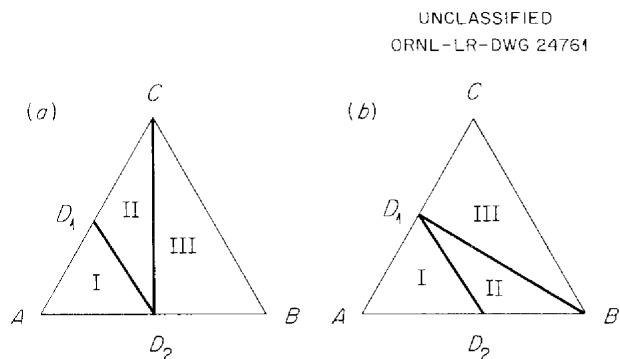  
Fig. 5.1

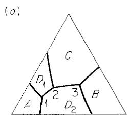

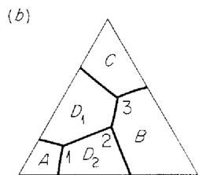  
Fig. 5.2

of the invariant points involved, for only a eutectic is a temperature minimum.

Moreover, each of the nine possibilities enumerated for scheme (a) will have several variations depending on the congruence or incongruence of the melting points of the binary compounds in their binary systems, with further subvariations (for incongruence) depending on whether the peritectic and eutectic solutions for the incongruent compound are on the side of one or of the other component in its binary system. With a congruent melting point, the composition of the compound will be on the binary side of its ternary field, at the maximum temperature of the surface, and the crystallization paths radiate from its composition. The composition point of an incongruently melting compound will be outside its field, but the composition point still represents the (metastable) maximum of its surface, and the crystallization paths radiate, by extension, from its composition.

In Fig. 5.3, with three binary compounds, $D_{2}$ melts congruently, and $e_{5}$ and $e_{6}$ are both binary eutectics:

$$
L \left(e _ {5}\right)\rightarrow B + D _ {2},
$$

$$
L \left(e _ {6}\right)\rightarrow C + D _ {2}.
$$

(Note: reactions are written for the cooling process.) The compounds $D_{1}$ and $D_{3}$ both melt incongruently, and $p_{1}$ and $p_{3}$ are the peritectic liquids of the respective binary systems:

$$
L \left(p _ {1}\right) + C \rightarrow D _ {1}
$$

$$
L \left(p _ {3}\right) + A \rightarrow D _ {3}.
$$

There are six fields, projections of surfaces for liquid saturated with a single solid: $A_{1}, D_{1}, C_{1}, D_{2}, B_{1}$ and $D_{3}$ , in clockwise order.

The system has four ternary invariant points, corresponding to the four three-solid triangles. Three of the invariants are eutectics (temperature minima); however, one, $P_{3}$ , is not, since its liquid, saturated with the solids of triangle III, falls in triangle IV. The temperature along the curve $E_{1}E_{2}$ for liquid saturated with $D_{1}$ and $D_{2}$ has a maximum value at $m$ , the intersection of the boundary curve with the line joining the two solids. This is a "collinear equilibrium," and the three-phase triangle for liquid in equilibrium with $D_{1}$ and $D_{2}$ , starting as the straight line $D_{1}mD_{2}$ , expands, with falling temperature, to end as the triangle

$D_{1}E_{1}D_{2}$ at $E_{1}$ and as the triangle $D_{1}E_{2}D_{2}$ at $E_{2}$ . The line $D_{1}mD_{2}$ , joining the compositions of the solids and intersecting the boundary curve between their adjacent fields, is known as an Alkemade line. With the temperature falling toward $m$ on both adjacent surfaces (for liquid in equilibrium with $D_{1}$ and for liquid in equilibrium with $D_{2}$ ), while the temperature falls away from $m$ on the $E_{1}E_{2}$ curve, the point $m$ is a saddle point on the curve.

The line $A m^{\prime} D_{2}$ is another Alkemade line, and $m^{\prime}$ another saddle point, a minimum in temperature on the surfaces between $A$ and $D_{2}$ but a maximum of temperature on the curve $E_{2} P_{3}$ . The triangle for liquid in equilibrium with $A$ and $D_{2}$ expands, with falling temperature, from the line $A m^{\prime} D_{2}$ to the triangle $A E_{2} D_{2}$ and, also with falling temperature, to the triangle $A P_{3} D_{2}$ .

The section of the diagram through the line $Am^{\prime}D_{2^{\prime}}$ moreover, is a quasi-binary section. The vertical section of the $T$ vs $c$ prism through this line is altogether like the $T$ vs $c$ diagram of a simple binary system (Fig. 5.4). Such a section

UNCLASSIFIED

ORNL-LR-DWG 24762

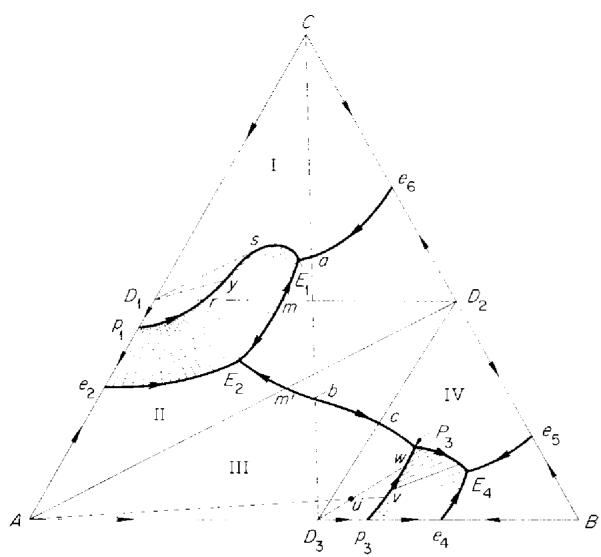  
Fig. 5.3.

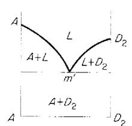  
Fig. 5.4.

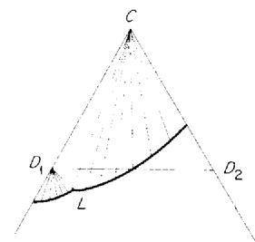  
Fig.5.5.

divides the actual ternary system $A - B - C$ into two separate subsystems, $A - C - D_{2}$ and $A - D_{2} - B$ . The section through the line $D_{1}mD_{2}$ , on the other hand, although also containing a saddle point very similar to $m'$ , is not quasi-binary; one of the solid phases involved in the equilibria traversed on this section is $C$ (between $D_{1}$ and point $r$ ), so that the phase equilibria along line $D_{1}mD_{2}$ are not describable on the basis of a binary system with $D_{1}$ and $D_{2}$ as components.

From this point on, phase reactions involving one or two or three solids will be written always as occurring in the direction of falling temperature, or in the direction of removal of heat, unless otherwise specified. The equation:

$$
L \rightarrow S _ {1} + S _ {2},
$$

therefore, means:

$$
L - \text {c a l o r i e s} \rightarrow S _ {1} + S _ {2}.
$$

The reactions along the boundary curves of Fig. 5.3 are as follows:

$$
e _ {2} E _ {2}: L \rightarrow D _ {1} + A;
$$

$$
p _ {3} P _ {3}: L + A \rightarrow D _ {3} (\text {r e a c t i o n o d d});
$$

$$
e _ {\bar {4}} ^ {\prime} E _ {\bar {4}}: L \rightarrow D _ {3} + B;
$$

$$
e _ {5} E _ {4}: L \rightarrow B + D _ {2};
$$

$$
e _ {6} E _ {1}: L \rightarrow D _ {2} + C;
$$

$p_1E_1$ : reaction odd from $p_1$ to $s\colon L + C\to D_1$ ; reaction even from $s$ to $E_{1}$ .. $L\rightarrow C + D_{1}$ (the line $D_{1}s$ is tangent to the curve);

$$
E _ {1} m E _ {2}: L \rightarrow D _ {1} + D _ {2};
$$

$$
E _ {1} m P _ {3} ^ {-}: L \rightarrow A + D _ {2};
$$

$$
P _ {3} E _ {4}: L \rightarrow D _ {3} + D _ {2}.
$$

The invariant reactions are:

$$
E _ {1}: L \rightarrow D _ {1} + C + D _ {2};
$$

$$
E _ {2}: L \rightarrow A + D _ {1} + D _ {2};
$$

$$
P _ {3}: L + A \rightarrow D _ {2} + D _ {3};
$$

$$
E _ {4}: L \rightarrow D _ {3} + D _ {2} + B.
$$

Liquids with original composition $x$ in triangle I must reach $E_{1}$ for complete solidification; those in triangle II must reach $E_{2}$ ; those in triangle III must reach $P_{3}$ ; and those in triangle IV must reach $E_{4}$ .

The peritectic $P_{3}$ is reached by all liquids with $x$ in the quadrangle $AD_{2}P_{3}D_{3}$ . For $x$ in the region $m^{\prime}D_{2}P_{3}$ , the liquid precipitates $D_{2}$ as the first solid, reaches curve $m^{\prime}P_{3}$ , and then proceeds to $P_{3}$ carrying $A$ and $D_{2}$ as solids. For $x$ in the region $Am^{\prime}P_{3}$ , the liquid reaches curve $m^{\prime}P_{3}$ after precipitating $A$ , and also reaches $P_{3}$ carrying $A$ and $D_{2}$ . Liquids with $x$ in the region $AP_{3}D_{3}$ , and hence on the $A$ surface, precipitate $A$ and reach

the curve $p_3P_{3'}$ , which is then followed while some $A$ reacts with liquid to form $D_3$ . At $P_3$ :

$$
L + A \rightarrow D _ {3} + D _ {2}.
$$

Now for $x$ in triangle III, the liquid is consumed, leaving $A, D_{3},$ and $D_{2}$ (complete solidification). But for $x$ in the triangle $D_{3}D_{2}P_{3}, A$ is consumed and the liquid proceeds on curve $P_{3}E_{4}$ .

The eutectic $E_4$ is reached by all liquids with $x$ in triangle IV. Those from the triangle $D_3D_2P_3$ reach $P_{3'}$ as already explained. Those in the quadrangle $P_3D_2e_5E_4$ precipitate $D_2$ as the first solid, reach one of the boundary curves, and then proceed to $E_4$ , either along curve $P_3E_4$ precipitating $D_3$ and $D_{2'}$ or along curve $e_5E_4$ precipitating $D_2$ and $B$ . Those from the $B$ field behave similarly, reaching $E_4$ either along curve $e_4E_4$ with $D_3$ and $B$ as solids or along curve $e_5E_4$ with $D_2$ and $B$ as solids. Those falling upon the $D_3$ field, $p_3P_3E_4e_4'$ , precipitate $D_3$ as first solid, and reach $E_4$ along either curve $P_3E_4$ or curve $e_4E_4$ . Original compositions in the region $D_3P_3p_3'$ such as point $u$ , give $A$ as first solid and reach the transition curve $p_3P_3$ on a straight line from $A$ , as at point $v$ . They then travel on the curve, toward $P_3$ , but solid $A$ is consumed before $P_3$ is reached, as at point $w$ , on a straight line through $D_3$ and $u$ . At this point the liquid is saturated only with $D_3'$ , and it therefore leaves the curve and travels across the $D_3$ field to one of its boundaries, $P_3E_4$ or $e_4E_4'$ , finally to reach $E_4$ .

The transition curve $p_3P_3$ is therefore left behind, after some travel along the curve, by liquids coming from original, total compositions $x$ in the region $D_3P_3p_3$ , when the tie line $D_3L$ of the three-phase triangle for $L$ on curve $p_3P_3$ comes to sweep through $x$ , for at that point the solid $A$ will have been consumed to leave $D_3$ as the sole solid phase.

(We shall speak of the transition curve as thus being "crossed" by the liquid in an equilibrium process, for $x$ in a specified region. The word "crossing" will be used, for brevity, to mean that the liquid reaches the curve from one field, travels along the curve for a limited range, and then, when the original solid is consumed, leaves it before reaching an invariant point, to move across the adjacent field.)

While the liquid is on any one field, precipitating a single solid, it travels in a straight line extending from the separating solid, until it reaches one of the boundary curves of the field.

Except for the region between point $C$ and the curve between $p_1$ and $s$ , the relations in the subsystem $A - C - D_2$ are simple. Precipitation of a first solid leads to a boundary curve, and along the curve to one of the eutectics. Thus compositions in the region $rsE_1m$ give $D_1$ as first solid, reach either curve $sE_1$ or curve $mE_1$ , and finally point $E_1$ , to end as $D_1$ , $C_1$ , and $D_2$ .

But $p_1s$ is a transition curve, and it is crossed, as explained for curve $p_3P_3$ , by liquids originating in the region $p_1D_1s$ . The curve $p_1s$ is reached by liquids precipitating $C_1$ from the region between the curve and the corner $C$ . Those coming from above the tangent line $D_1s$ do not leave the curve, but stay on the curve up to the eutectic $E_1$ . Along the section $p_1s$ the quantity of $C$ is decreasing at the expense of $D_1$ , and between $s$ and $E_1$ both solids are being precipitated.

For solutions from the region $p_1D_1s$ , solid $C$ is consumed when the tie line $D_{1}L$ of the three-phase triangle passes through the fixed total composition, and the liquid then leaves the curve. For $x$ in the region $D_{1}p_{1}r$ , the liquid then reaches either curve $e_2E_2$ or curve $mE_2$ to end at point $E_2$ ; from the region $D_{1}ry$ (y being on the line $D_{1}E_{1}$ ), the liquid reaches curve $mE_{1}$ and hence point $E_{1}$ .

For $x$ in region $D_{1}ys$ , the liquid, having followed the odd curve $ys$ for part of its length, leaves the curve, travels across the $D_{1}$ field, and then reaches the even part of the same curve, $sE_{1}$ . These compositions then give the following sequence of events. The liquid precipitates $C$ as the primary solid and moves on the $C$ field on a straight line from the corner $C_{1}$ to reach the curve between $p_{1}$ and $s$ . Along the curve, as $L$ moves toward $s$ ,

$$
L + C \rightarrow D,
$$

and $C$ will have been completely redissolved or consumed when $L$ reaches a point on the curve between $y$ and $s$ , on the straight line $D_{1}x$ . The liquid now traverses the $D_{1}$ field, precipitating $D_{1}$ , and reaches the same curve again between $s$ and $E_{1}$ , where it precipitates both $D_{1}$ and $C$ . Finally, at point $E_{1}$ ,

$$
L \rightarrow D _ {1} + C + D _ {2}.
$$

The primary solid phase $C$ therefore disappears, but $C$ reappears later as a secondary crystallization product together with $D_{1}$ .

Finally, some of the relations in Fig. 5.3 will be shown on isothermal diagrams and vertical $T$ vs $c$ sections. Attending first to the isothermal solubility curve of $D_{1}$ , we note that between $p_{1}$ and $r$ its isothermal solubility curve (simply an isothermal temperature contour on the $D_{1}$ field in Fig. 5.3) is not cut by the line $D_{1}D_{2}$ , while between $r$ and $m$ it is. The solid $D_{1}$ is then said to be incongruity soluble in $D_{2}$ in the temperature range between $p_{1}$ and $r$ , but congruently soluble in $D_{2}$ between $r$ and $m$ . A solubility isotherm for this region between $p_{1}$ and $r$ would be schematically as in Fig. 5.5. Between $r$ and $m$ , we have Fig. 5.6: just above $m'$ , below $e_{2}$ , below $e_{6}$ but above $e_{5}$ , above $p_{3}$ , and below the freezing point of $B$ . The isotherm shown in Fig. 5.7 is still above $E_{1}$ and $E_{2}$ , below $p_{3}$ but still above $P_{3}$ and $e_{5}$ . Figure 5.8 is at $P_{3}$ and below $E_{1}, E_{2}$ , and $e_{5}$ , but still above $e_{4}$ . At the invariant $P_{3}$ , the field of $A$ in equilibrium with liquid shrinks to a line $(AP_{3})$ and vanishes, in the reaction:

$$
L \left(P _ {3}\right) + A \rightarrow D _ {3} + D _ {2}.
$$

The vertical $T$ vs $c$ sections through $D_{1}D_{2}$ and $D_{3}D_{2}$ are relatively simple, as shown in Figs. 5.9 and 5.10 (schematic, not in scale with Fig. 5.3). Figure 5.11 shows the vertical section through $CD_{3}$ , and Fig. 5.12 the section through $D_{1}B$ (both schematic).

UNCLASSIFIED L-LR-DWG 24763

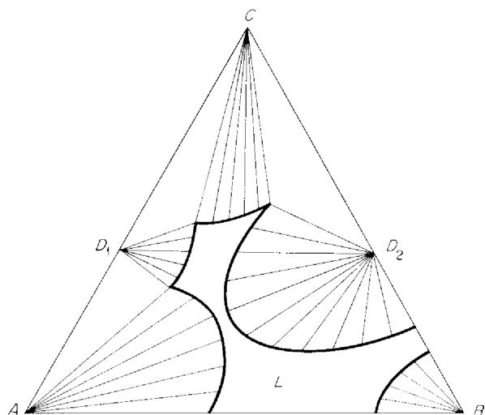  
Fig.5.6

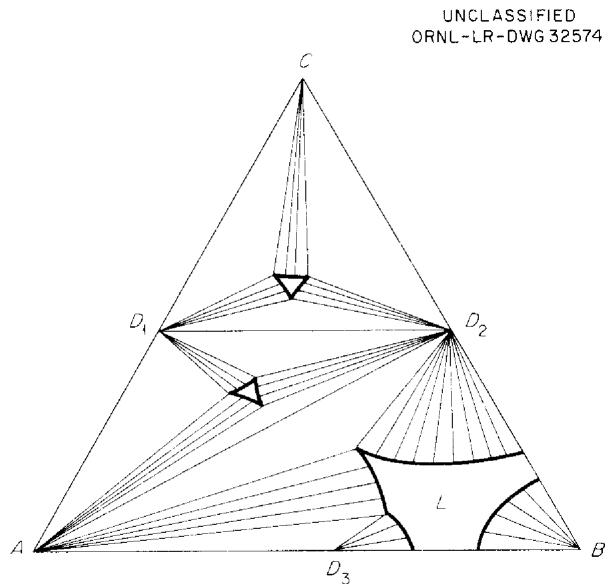  
Fig. 5.7.

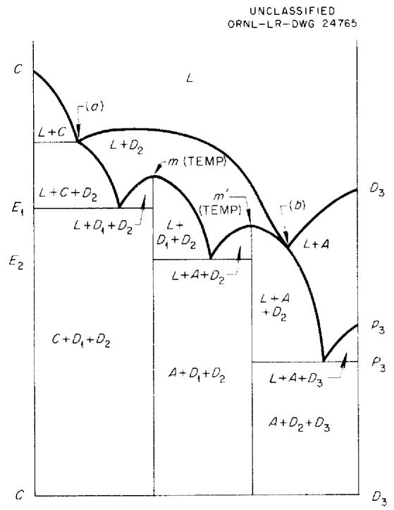  
Fig. 5.11.

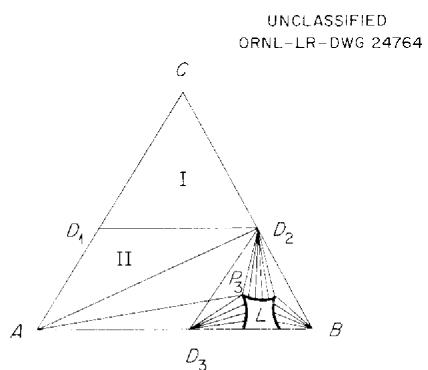  
Fig. 5.8

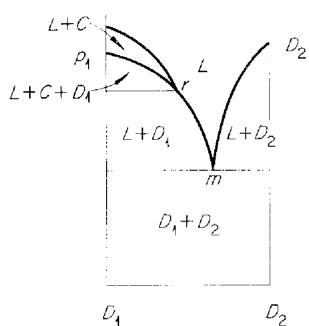  
Fig. 5.9.

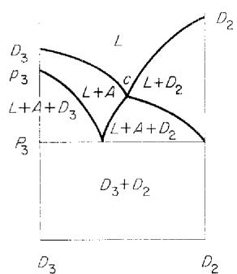  
Fig. 5.10.

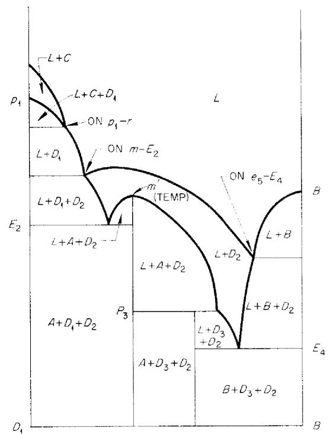  
Fig. 5.12

# 6. CRYSTALLIZATION PROCESS WITH CONTINUOUS BINARY SOLID SOLUTION

The system of Fig. 6.1 involves two solid phases, pure $C$ and the continuous binary solid solution $A-B$ . The binary system has a minimum freezing point at $m$ , Fig. 6.2. All ternary compositions must solidify to two solids, pure $C$ and a binary $A-B$ solid solution. Curve $e_1e_2$ represents liquid precipitating these two solids; $M$ is a temperature minimum on this curve, and it is also the temperature minimum of the whole system. (Curve $e_1e_2$ may have either a minimum or a maximum or neither.) Liquids in the $C$ field reach this curve on straight lines from the corner $C$ ; those in the solid solution field reach it along curves on the solid solution surface. In either case the liquid then travels toward $M$ , but for complete equilibrium solidification is complete, leaving the two solids, before $L$ reaches $M$ , unless the total composition $x$ lies on the straight line CMs. The three-phase triangles for $L$ on the boundary curve start as the straight lines $Ce_1A$ and $Ce_2B$ and proceed, with falling temperature, toward $M$ according to the configurations shown

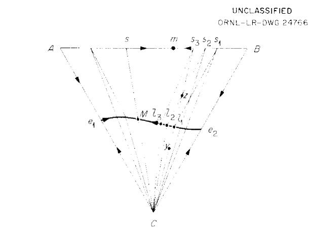  
Fig. 6.1

  
Fig. 6.2

  
Fig. 6.3.

in Fig. 6.1, collapsing again, from either side, to the line CMs.

A vertical $T$ vs $c$ section from $C$ to the side $AB$ appears as in Fig. 6.3. Here the composition of the solid solution $(ss)$ is not on the plane of the section. Even at point $\nu$ the liquid of the section is not in equilibrium with solid solution of the same composition as the liquid (but point $\pmb{u}$ of course is simply the melting point of pure $C$ ). Only for the section through $Cm$ would $\pmb{\nu}$ represent liquid and solid of the same composition, but the section through $Cm$ would not pass through the ternary minimum $M$ . The region $C + L + ss$ of Fig. 6.3 collapses to a horizontal (isothermal) line only for the section through $M$ , CMs (and of course also at the binary sides $Ce_{1}A$ and $Ce_{2}B$ ).

In an equilibrium process, any liquid of original composition $x$ is completely solidified, while traveling on the curve, when the $C - ss$ leg of the three-phase triangle passes through the point $x_{1}$ to leave $C$ and a solid solution of composition on the extension of the line $Cx$ . Solution $y_{1}$ moving on a straight line from $C$ , reaches the curve at $l_{1}$ and there begins to precipitate $s_{1}$ . As $L$ travels on the curve toward $M_{1}$ more $C$ and more solid solution will precipitate, but the solid solution changes in composition, leaving the solids $C$ and $s_{3}$ when the last trace of liquid vanishes at $l_{3}$ . Liquid $z_{1}$ moving on a curved equilibrium path, reaches the curve $e_{1}e_{2}$ at $l_{2}$ , at which point the solid solution has the composition $s_{2}$ . At $l_{2}, C$ also begins to precipitate, and solidification is completed with liquid at $l_{3}$ , leaving $C$ and $s_{3}$ .

The course of the liquid on the solid solution surface, however, is not shown by the "phase diagram" of Fig. 6.1. With a minimum $m$ in the $A-B$ binary equilibrium, this surface has two families of nonintersecting fractionation paths, as sketched in Fig. 6.4. All fractionation paths end, without intersection, at the boundary curve $e_1e_2$ . The two families are separated by a limiting fractionation path originating at $m$ . This path reaches the curve $e_1e_2$ at a point $N$ which may be either on the left or on the right of $M$ . Moreover, the path $mN$ may be either convex toward $B$ , as drawn, or convex toward $A$ , and it may even have a point of inflection. With the arrangement assumed in Fig. 6.4, the fractionation paths on the $A$ side are always convex toward $B$ ; those on the

$B$ side all start as convex toward $A_{\bullet}$ but some of them have an inflection point and become convex toward $B$ before they reach the boundary curve. These inflection points are joined by the locus curve $mR$

# 6.1. FRACTIONATION PROCESS

As liquid follows one of the fractionation paths in a fractionation process, the composition of the layer of solid solution being deposited at any point is given by the tangent to the fractionation path through that point. Then, once the liquid reaches the curve $e_1e_2$ , whether from the $C$ field or from the solid solution field, it moves on the curve toward $M$ as limit. For liquids traveling in the direction $e_1 \rightarrow M$ , the outermost layers of solid solution being deposited have compositions increasing in $B$ content, approaching $s$ as the limit, from the $A$ side. Those moving along the curve in the direction $e_2 \rightarrow M$ deposit layers increasing in $A$ content, and also with $s$ as limit.

The total process therefore varies according to the various regions of the surface. (In this discussion it must be remembered that the fractionation path is everywhere tangent to an equilibrium tie line. Hence the layer of solid being precipitated at the point where the fractionation path reaches the curve $e_1e_2$ is given by the tangent at that point, extended to the line $AB$ . At $M$ itself this tangent is the line $CMs$ ; at $N$ the tangent goes to $z$ , at $R$ to $y$ . Also, the word "solid" will here mean "the layer of solid being deposited.")

1. Region $Ae_{1}M$ (i.e., between $e_{1}$ and the fractionation path $AM$ ): While $L$ is still on the surface, the "solid" increases in $B$ content, to a limit given by the tangent to the particular fractionation path involved at its intersection with the curve $e_{1}M$ ; and as $L$ then travels on the curve (to $M$ as limit), the "solid" increases still further in $B$ (to $s$ as limit).   
2. Region between paths $AM$ and $mN$ : With $L$ on the surface, the "solid" always increases in $B$ , with $z$ as the possible limit for fractionation paths reaching the boundary curve near $N$ . The boundary is reached in the section $MN$ , and then, as $L$ moves toward $M$ , the "solid" increases in $A$ content, toward the limit $s$ .   
3. Region $BRe_{2}$ : With $L$ on the surface, the "solid" increases in $A$ , with $y$ as limit for the path $BR$ itself; then, as $L$ travels on the curve (to $M$ as limit), the "solid" increases still further in $A$ (to $s$ as limit).   
4. Region between paths $BR$ and $mN$ : The "solid" increases in $A$ until the inflection point of the fractionation path is reached (intersection of fractionation path with curve $mR$ ), and the composition of the "solid" at that point is given by the tangent to the fractionation path at the inflection point. Now the "solid" begins to decrease in $A$ content, to a limit given by the tangent at the end of the fractionation path at the boundary curve, reached in the portion $NR$ . Then as $L$ moves on the curve toward $M$ as limit, the outermost layer of solid again moves to increasing $A$ content, toward $s$ as limit.   
5. Path $mN$ : For a solution on the path $mN$ itself, the "solid" increases in $B$ content (between limits $m \to z$ ), and then moves toward $s$ as $L$ , after reaching point $N$ , moves on the curve toward $M$ .

# 6.2. EQUILIBRIUM PROCESS

In a crystallization process with complete equilibrium between the total solid phase and the liquid, the liquid, such as point $a$ in Fig. 6.4, follows an equilibrium path (dotted curve $a \ldots b$ ) in its course on the surface to the boundary curve $e_1 e_2$ . The relation of this equilibrium path to the fractionation paths which it crosses has been explained in connection with Fig. 2.4. The point $b$ is fixed by a three-phase triangle with the $ss-L$ leg passing through point $a$ . Then as $L$ moves on the curve toward $M$ , solidification is complete when the $ss-C$ leg of such a triangle passes through $a$ .

The changes in the composition of the solid solution as the liquid follows its equilibrium path will depend on the region of the surface involved. Now the word "solid" will mean the total solid, assumed to be uniform in composition and in full equilibrium with the liquid. We note first that all equilibrium paths for solutions in the region $AsMe_{1}$ reach the boundary curve between $e_{1}$ and $M$ ; those for solutions in $BsMe_{2}$ reach the curve between $e_{2}$ and $M$ . Point $M$ is reached only for total compositions on the line CMs.

1. Region $AMe_{1}$ : The equilibrium path does not cross the line $sM$ on its way to the boundary curve. The solid increases in $B$ both before and after $L$ reaches the curve.   
2. Region AMs: The equilibrium path crosses the line $sM$ on its way to $e_1M$ . The solid again increases in $B$ both before and after $L$ reaches the curve.   
3. Region $smNM$ : The equilibrium path does not cross the path $mN$ ; it ends on $MN$ . The solid increases in $B$ while $L$ is on the surface, but the reverse change sets in when $L$ begins to travel on the curve.   
4. Region $BRe_{2}$ : The equilibrium path does not cross the line $Ry$ ; it ends on $e_{2}R$ ; the solid increases in $A$ both before and after $L$ reaches the curve.   
5. Region ByR: The equilibrium path crosses $Ry$ ; it ends on $e_2R$ ; the solid increases in $A$ both before and after $L$ reaches the curve.   
6. Region $yzNR$ : The equilibrium path does not cross the path $mN$ ; it ends on $NR$ .   
(a) Region $yzdR$ : The solid increases in $A$ until the equilibrium path crosses curve $mR$ ; then the solid increases in $B$ until $L$ reaches curve $NR$ ; then the solid increases again in $A$ while $L$ travels on the curve.   
(b) Region $dNR$ : The solid increases in $B$ until $L$ reaches curve $NR$ ; then it increases in $A$ .   
7. Region $mzN$ : The equilibrium path crosses the path $mN$ , to reach the boundary curve on the left of $N$ (between $c$ and $N$ , curve $cm$ being the $L - ss$ leg of a three-phase triangle for $L$ at point $c$ ). The behavior for the regions above and below curve $mR$ differs as described for region $yzNR$ .

(The preceding discussion of Fig. 6.4 is based on the analysis by Osborn and Schairer.)

The composition of the equilibrium solid for original liquids in the region Rmy, as just stated, reverses its direction of change (increasing first in A, then in B) while the liquid is still on the surface. The equilibrium path for such a liquid first crosses fractionation paths which are convex with respect to A, in the order 1, 2, 3, 4, etc., and in this region the solid is becoming richer in A. But the rate of this composition change of the solid decreases as the equilibrium path meets fractionation paths of smaller and smaller convexity. When the equilibrium path finally reaches the locus curve mR, it has reached a fractionation path exactly at its inflection point, with no convexity at all at that point. This fractionation path will not be crossed by the equilibrium path, which here turns away and begins to recross the fractionation paths, which are now convex with respect to B; i.e., it now crosses the fractionation paths in the order $1', 2', 3', \ldots, 7'$ , while the solid increases in B content.

It has been argued by Bowen² that when the equilibrium path just touches a fractionation path at the point of inflection of the latter (on curve $mR$ ), the equilibrium path undergoes an abrupt change in direction (a "corner"). This seems to be incorrect. The equilibrium path crosses fractionation paths only from their convex to their concave side. The sharper the curvature of a fractionation path, the greater is the angle of intersection where the equilibrium path crosses it. As the fractionation paths lose their curvature, approaching their inflection points, this angle of intersection diminishes; a zero angle of contact is approached (no longer an intersection) when the equilibrium path reaches a fractionation curve exactly at the latter's inflection point. If an equilibrium path has to cross the fractionation paths 1, 2, 3 before reaching path 4 at the inflection point of path 4, the intersection angle decreases as it crosses paths nearer and nearer to path 4, because the intersection is occurring nearer and nearer to an inflection point of a path.

The contact at such a point must therefore be tangential, and the equilibrium curve changes its course smoothly, without a cusp (Fig. 6.5). If $i$ is the inflection point on the fractionation path $Bf$ , and $is$ is the tangent at $i$ , then equilibrium paths for all total compositions $(a, b, c)$ on the line $is$ reach point $i$ , changing their directions (with respect to the family of fractionation paths) as shown. The change in direction is more marked the farther the total composition is from the point $i$ , but the equilibrium path is nevertheless tangent to $Bf$ at $i$ .

# 7. CRYSTALLIZATION PROCESS WITH SOLID SOLUTIONS AND SEVERAL INVARIANTS

# 7.1. THE PHASE DIAGRAM

In Fig. 7.1 the binary system $A-B$ forms discontinuous solid solution with a eutectic at $e_4$ , liquid saturated with solids whose compositions are $S_e$ and $S_e'$ . These points are to be compared with the binary diagram shown separately as Fig. 7.2. The other solid phases of the ternary system, $C, D_1, D_2$ , are pure; $D_1$ is an incongruity melting binary compound, $D_2$ melts congruently. There are five fields - for $C, D_1, D_2, A_s$ (the $A$ -rich binary solid solution of $A$ and $B$ ), and $B_s$ (the $B$ -rich binary solid solution of $A$ and $B$ ) - and there are three invariant points, each pertaining to a three-solid triangle. From the directions of temperature fall, one is a peritectic, $P_1$ , and two are eutectics, $E_2$ and $E_3$ .

The curve $E_{2}E_{3}$ must have a saddle point $m$ on it, and the $A_{s}$ solid solution which (together with solid $D_{2}$ ) saturates the liquid at point $m$ must lie on the extension of the straight line $D_{2}m$ to the side $AB$ , at $S_{m}$ . The solid solutions saturating liquid $E_{3}$ are somewhere close to the points $S_{e}$ and $S_{e'}$ . Since the temperature of $E_{3}$ is lower than $e_{4'}$ , the compositions of the limiting solids of the $A-B$ miscibility gap at $E_{3}$ will depend on the effect of temperature on the solid-solid solubility.

The three-solid triangles for any of the three invariant points, therefore, cannot be drawn in without the experimental determination of tie lines along the curves near the invariants, and ultimately of the solid solution compositions at the invariants. The invariant $P_{1}$ , a peritectic, involves the solids $C$ , $D_{1}$ , and $S_{1}$ (a solid solution of composition somewhere near $A$ ) in the reaction:

$$
L \left(P _ {1}\right) + D _ {1} \rightarrow C + S _ {1},
$$

and $P_{1}$ is outside triangle I $(CD_{1}S_{1})$ . The eutectic $E_{2}$ must be inside triangle II $(CD_{2}S_{2},$ where $S_{2}$ is another unknown solid solution composition); $E_{3}$ must be inside triangle III $(D_{2}S_{3}S_{3}^{\prime})$ . In the last case, $S_{3}$ and $S_{3}^{\prime}$ are known points if the solid solution limits in the binary system $A - B$ are known for the temperature of $E_{3}$ (as in Fig. 7.2).

In Fig. 7.3, we assume that these key solid solution compositions have been determined and that the three-solid triangles may therefore be drawn. The solid miscibility gap in system $A-B$ has been assumed to widen with falling temperature (Fig.

7.2) so that $S_{e}$ and $S_{e}^{\prime}$ lie between the points $S_{3}$ and $S_{3}^{\prime}$ .

Since $S_{1}, S_{2}$ , and $S_{3}$ are different compositions, the three-solid triangles are not adjacent. They do not have common sides, and they do not cover the whole of the diagram. Only original compositions $x$ falling inside one of these three-solid triangles will, on cooling with complete equilibrium,

  
Fig. 7.1.

  
Fig. 7.2.

solidify to mixtures of three solids: those in triangle I solidify incongruently at $P_{1}$ , those in triangle II and triangle III solidify congruently at $E_{2}$ and $E_{3}$ , respectively. The areas not included in these triangles solidify to two-solid mixtures, and hence these areas are shown with tie lines: $D_{1}$ and a solid solution whose composition is between $A$ and $S_{1}$ for the area $D_{1}AS_{1}$ ; $C$ and a solid solution between $S_{1}$ and $S_{2}$ for the area $CS_{1}S_{2}$ ; $D_{2}$ and a solid solution between $S_{2}$ and $S_{3}$ for the area $D_{2}S_{2}S_{3}$ ; and $D_{2}$ and a solid solution between $S_{3}$ and $B$ for the area $D_{2}S_{3}B$ .

The three-solid triangles do not overlap unless solid-phase interactions (here excluded) should occur at temperatures between the invariants. But when peritectic invariants are involved, the invariant planes (which include the liquid phase

besides the three solids) may overlap, as is the case here for the invariant quadrangle $CD_{1}S_{1}P_{1}$ , overlapping, on the polythermal projection, the invariant triangle $CS_{2}D_{2}$ (with $E_{2}$ as interior phase). These planes are at different temperatures; the $P_{1}$ plane is above the $E_{2}$ plane, which is above the $E_{3}$ plane.

Also, the solid solution compositions $S_{1}$ and $S_{2}$ , it must be kept in mind, are not on the solidus curve $aS_{e}$ of Fig. 7.2. They are simply compositions in the area of solid solution below this binary solidus curve. Liquids on the curve $e_{4}E_{3}$ , including the points $e_{4}$ and $E_{3}$ , are in equilibrium with conjugate solid solutions - solid solutions defined by the miscibility gap of Fig. 7.2. But the solid solutions involved along all other curves $(pP_{1}, P_{1}E_{2}, E_{2}E_{3},$ and $e_{3}E_{3}$ , with the exception of just the point $E_{3}$ ) are simply compositions in the solid solution areas of Fig. 7.2.

# 7.2. EQUILIBRIUM CRYSTALLIZATION PROCESS

The reactions on curves $e_1P_1$ and $e_2E_2$ of Fig. 7.3 are simple precipitations of two pure solids; on $e_1P_1$ :

$$
L \rightarrow C + D _ {1},
$$

and on $e_2E_2$

$$
L \rightarrow C + D _ {2}.
$$

On curve $e_4E_3$ , the liquid precipitates two solid solutions, starting as $S_e$ and $S_e'$ at $e_4$ and changing in composition to $S_3$ and $S_3'$ at $E_3$ . On curve $e_3E_3'$ , the liquid precipitates $D_2$ and a solid solution starting as pure $B$ at $e_3$ and changing in composition to $S_3'$ at $E_3$ . For curve $E_2E_3'$ , the liquid is precipitating $D_2$ and a solid solution. If $S_m$ is the composition of the solid solution for $L$ at $m$ (maximum of the curve), then along curve $mE_3$ the solid solution varies from $S_m$ to $S_3'$ and along curve $mE_2$ it varies from $S_m$ to $S_2$ . The vertical $T$ vs $c$ section on the line $D_2mS_m$ is shown in Fig. 7.4. It looks like a quasi-binary section but it is not. The liquid on the curve $am$ of Fig. 7.4 is in equilibrium, not with $S_m$ , but with a solid solution of changing composition (not on the plane of the diagram) which is $S_m$ only for $L$ at point $m$ itself.

Along curve $P_{1}E_{2}$ , the liquid precipitates $C$ and a solid solution changing from $S_{1}$ (at $P_{1}$ ) to

$S_{2}$ (at $E_{2}$ ). Curve $pP_{1}$ is a transition curve, along which the liquid reacts with solid solution and precipitates $D_{1}$ . The three-phase triangle starts as the line $pD_{1}A$ and ends as $P_{1}D_{1}S_{1}$ , so that the solid solution in equilibrium with liquid on the curve varies from $A$ at $p$ to $S_{1}$ at $P_{1}$ .

Since the solid solutions in the system are only binary, solidification cannot be complete while liquid is traveling on one of the surfaces; the liquid must reach either a curve involving a solid solution or one of the invariants. The course of the liquid on a surface precipitating a pure solid $(C, D_{1},$ or $D_{2})$ is clear: a straight line from the composition of the separating solid (Fig. 7.1). On the two surfaces for solid solution, the paths, whether for fractionation or for equilibrium crystallization, are curved. Fractionation paths are shown in Fig. 7.1; equilibrium paths cross these curves as explained under Fig. 2.4.

In the region $D_{2}S_{m}B$ , only liquids from an original composition $x$ in triangle III $(D_{2}S_{3}S_{3}^{\prime})$ reach $E_{3}$ , to solidify to three solids. Those for $x$ in triangle $E_{3}S_{3}S_{3}^{\prime}$ reach $E_{3}$ along curve $e_{4}E_{3}$ , carrying two solid solutions, and these liquids do not solidify completely until they reach $E_{3}$ , to produce $D_{2}$ as third phase. For $x$ in the region $D_{2}E_{3}S_{3}^{\prime}B$ , the liquid reaches the curve $e_{3}E_{3}$ , but if $x$ is in triangle $D_{2}S_{3}^{\prime}B$ , the liquid is consumed (in complete equilibrium) before reaching the eutectic, to leave $D_{2}$ and a solid solution between $B$ and $S_{3}^{\prime}$ . Liquids in the region $D_{2}S_{m}S_{3}E_{3}$ reach curve $mE_{3}$ , and again those in triangle $D_{2}S_{m}S_{3}$ solidify completely on the curve, before reaching $E_{3}$ , to leave $D_{2}$ and a solid solution between $S_{m}$ and $S_{3}$ . (Similar behavior is shown in the region $D_{2}S_{m}S_{2}E_{2}^{\prime}$ )

The curve $pP_{1}$ is reached by liquids originating in the region $pAS_{1}P_{1}$ , after first precipitating a solid solution between $A$ and $S_{1}$ . For $x$ in triangle $D_{1}AS_{1}$ , the liquid is consumed on the curve $pP_{1}$ , leaving $D_{1}$ and solid solution. For $x$ in triangle $pD_{1}P_{1}$ , the solid solution is consumed on the curve, leaving liquid and $D_{1}$ ; $L$ then leaves the curve, crosses the $D_{1}$ field to curve $e_{1}P_{1}$ , and travels to $P_{1}$ . For $x$ in triangle $D_{1}S_{1}P_{1}$ , no phase is completely consumed along curve $pP_{1}$ , and the liquid reaches $P_{1}$ .

The peritectic $P_{1}$ is also reached for $x$ in the $D_{1}$ field and for $x$ in the region $Ce_{1}P_{1} = \text{along}$ curve $e_{1}P_{1}$ ; $P_{1}$ is thus reached only for $x$ in the quadrangle $CD_{1}S_{1}P_{1}$ . At $P_{1}$ ,

$$
L + D _ {1} \rightarrow C + S _ {1}.
$$

Hence solidification is completed here for $x$ in $CD_{1}S_{1}$ (triangle 1), in an incongruent crystallization end point. Otherwise (for $x$ in triangle $CS_{1}P_{1}$ ) $D_{1}$ is consumed and $L$ begins to move along curve $P_{1}E_{2}$ . This curve is also reached directly from the $C$ field, for $x$ in the region $CP_{1}E_{2}$ , and from the $A_{s}$ field for $x$ in the region $P_{1}S_{1}S_{2}E_{2}$ . As $L$ travels on this curve, precipitating $C$ and solid solution, it completes its solidification if the total original composition $x$ is in triangle $CS_{1}S_{2}$ ; otherwise it reaches $E_{2}$ , the crystallization end point for triangle II.

Some isothermal relations are shown in Figs. 7.5, 7.6, and 7.7. Figure 7.5 is still above the temperature of $p$ , Fig. 7.6 just below $p$ . Points $s_1, l_1, s_2'$ and $l_2'$ in these diagrams are related to the solidus and liquidus curves of the binary system $A-B$ shown in Fig. 7.2. The points $s_1''$ , $s_2''$ in Fig. 7.7 are between $S_e$ and $S_3$ and between $S_e'$ and $S_3'$ , respectively, of Fig. 7.2. The temperature of Fig. 7.7 is between $m$ and the eutectics $E_{2}', E_{3}'$ below all the binary eutectics, but still above $P_1$ . At $P_1$ the tie-line region for $D_1$ in

  
UNCLASSIFIED ORNL-LR-DWG24771   
Fig.7.5.

  
Fig. 7.6.

  
Fig.7.7.

equilibrium with liquid shrinks to a line and vanishes.

Some vertical sections are shown in Figs. 7.8, 7.9, 7.10. The $m$ in Fig. 7.9 is at the temperature of point $m$ but does not represent its composition.

  
Fig. 7.8.

  
Fig. 7.9.

  
Fig. 7.10

# 7.3. PROCESS OF CRYSTALLIZATION WITH PERFECT FRACTIONATION

The fractionation paths in the two solid solution fields (Fig. 7.1) are families of curves radiating from points $A$ and $B$ , respectively. Those in the $A_{s}$ field are convex with respect to $B$ , meaning that as $L$ travels along such a path on cooling, in a fractionation process, it deposits successive solid solution layers always richer in $B$ content; those in the $B_{s}$ field are convex with respect to $A$ , and the outermost solid solution layer here continually increases in $A$ content while $L$ is traveling on the surface.

In fractionation, a liquid in the region between $e_3$ and the path $BE_3$ reaches the curve $e_3E_3'$ , and on this curve the solid solution continues to increase in $A$ content. Liquid between $e_4$ and the path $BE_3$ reaches curve $e_4E_3'$ , but now two solid solutions precipitate, and their outermost layers vary from $S_e$ and $S_e'$ to $S_3$ and $S_3'$ in composition (Fig. 7.3). In an equilibrium process, the curve $e_3E_3$ is reached by all liquids below the line

$E_{3}S_{3}^{\prime}$ , which is tangent, of course, to the fractionation path $BE_{3}$ at $E_{3}^{\prime}$ and $e_4E_3$ is reached only by liquids between $e_4$ and line $E_{3}S_{3}^{\prime}$ .

In a fractionation process on the $A_{s}$ field, the curve $P_{1}E_{2}$ is reached by liquids between the fractionation paths $AP_{1}$ and $AE_{2'}$ and the solid solution continues to increase in $B$ content along this curve. Curve $E_{2}m$ is reached by liquids between the paths $AE_{2}$ and $Am$ , but in this case the outermost solid solution layer being deposited begins to increase in $A$ content as $L$ travels on this curve in the direction $m \rightarrow E_{2}$ . The fractionation process for the region between the paths $AP_{1}$ and $Am$ ends at $E_{2}$ . The curve $mE_{3}$ is reached for liquids between paths $Am$ and $AE_{3'}$ with the solid solution increasing in $B$ content both before and after $L$ reaches the curve; and curve $e_{4}E_{3}$ is reached for liquids between $e_{4}$ and the path $AE_{3}$ . In these regions the fractionation ends at $E_{3}$ .

Liquid between $p$ and the path $AP_{1}$ reaches the curve $pP_{1}$ and immediately crosses this curve to deposit $D_{1}$ on the solid solution already deposited before the curve was reached. The liquid then reaches curve $e_{1}P_{1}$ , deposits a mixture of $D_{1}$ and $C$ while traveling on this curve, reaches $P_{1}$ , and without stopping at $P_{1}$ continues on curve $P_{1}E_{2}$ , depositing $C$ and a solid solution. The process ends at $E_{2}$ . In this process the precipitation of the solid solution is interrupted while $L$ is crossing the $D_{1}$ field and then returning to $P_{1}$ on the curve $e_{1}P_{1}$ . There will consequently be a gap in the composition of the solid solution finally obtained.

In the fractionation process all liquids in the region bounded by the lines $mD_{2}, D_{2}B, BA,$ and the fractionation path $Am$ end at $E_{3}$ , to leave three solids, $A_{s}, B,$ and $D_{2}$ . Liquids in the rest of the system end at $E_{2}$ ; of these, moreover, those in the region bounded by lines $P_{1}C, CA,$ and the path $AP_{1}$ end as a mixture of four solids, $A_{s}, D_{1}, C,$ and $D_{2}$ , while the rest end as three solids, $A_{s}, C,$ and $D_{2}$ .

# 7.4. TERNARY SOLID SOLUTION IN COMPOUND $D_{1}$

Finally, we shall assume that the solid $D_{1}$ forms solid solution with both $A$ and $C$ in its binary system and with the third component $B$ , to give at any temperature a small isothermal area of solid solution of ternary composition. This will affect all the equilibria involving solid $D_{1}$ . The pertinent region of Fig. 7.3 becomes that shown in Fig. 7.11. Figures 7.6 and 7.7 change as shown

in Figs. 7.12 and 7.13. A section like Fig. 7.8 now shows the region of homogeneous ternary solid at the $D_{1}$ side, labeled $D_{1}(s)$ in Fig. 7.14.

UNCLASSIFIED ORNL $\equiv$ LR-DWG 24775

  
UNCLASSIFIED ORNL-LR-DWG 24776

  
Fig. 7.14.

# PART II

# THE ACTUAL DIAGRAMS

The following sections will consider, one at a time, the ternary diagrams which have been constructed. For ease of drawing and for the sake of clarity, the diagrams used in these sections are not according to actual scale, but schematic in their quantitative relations. The formulas and the actual numerical values, including the temperatures, may be obtained from the experimental diagrams. For brevity and simplicity, moreover, single letters rather than chemical formulas have been used to represent the solid phases.

The following is the key for the letters regularly used for the components of all the systems:

<table><tr><td>Symbol</td><td>Component</td></tr><tr><td>R</td><td>RbF</td></tr><tr><td>U</td><td>UF4</td></tr></table>

<table><tr><td>Symbol</td><td>Component</td></tr><tr><td>V</td><td>BeF2</td></tr><tr><td>W</td><td>ThF4</td></tr><tr><td>X</td><td>LiF</td></tr><tr><td>Y</td><td>NaF</td></tr><tr><td>Z</td><td>ZrF4</td></tr></table>

The letters $A, B, \ldots, N$ will be used, as needed, for the various binary compounds in the binary systems. They do not represent the same compounds from one section (ternary system) to another, whereas the components are always referred to by the same letters.

The letter $x$ will be used throughout to mean "the total original composition of a sample being cooled and solidified."

# 8. SYSTEM X-U-V: LiF-UF4-BeF2

The schematic phase diagrams for the binary systems of the first ternary system to be discussed, system $X - U - V$ , are shown in Figs. 8.1, 8.2, and 8.3. No solid solution is involved, either in the binary systems or in the ternary system. Compound $A$ in system $X - U$ decomposes on cooling, at $T_{A'}$ into the solids $X$ and $B$ ; and compound $E$ in system $X - V$ forms on cooling, at $T_{E'}$ from the solids $D$ and $V$ .

Every solid reaching equilibrium with liquid in its binary system must have its own primary phase field, bordering on the side of the triangle, in the ternary system. The field for compound $A$ of the system $X - U$ , however, will have $T_A$ (designated $P_A$ in the ternary system) as its lower temperature limit of stability, inasmuch as $A$ decomposes on cooling to this temperature. At $P_A$ the $X$ and $B$ surfaces of the ternary liquidus, separated above that temperature by the $A$ field, will come into contact. The compound $E$ of system $X - V$ may or may not have a field (for liquid in equilibrium with solid $E$ ) in the ternary system. It will have a field only if the ternary liquid saturated with the two solids $D$ and $V$ exists down to the temperature $T_E$ of Fig. 8.3, the temperature for the formation of $E$ from $D$ and $V$ upon cooling.

The phase diagram of the ternary system is given in Fig. 8.4 (schematic). There are seven fields, identified by letters in parentheses, $(U)$ ,

$(C)$ , etc. The $A$ field vanishes with falling temperature at $P_{A'}$ at the temperature of decomposition of solid $A$ in its binary system, $T_{A'}$ but now in presence of ternary liquid. The temperature of

  
Fig. 8.1.

  
Fig. 8.3

  
Fig. 8.4.

decomposition is unchanged, because the component $V$ does not form solid solution with any of the three solids involved in the reaction. Since solid $A$ decomposes before its field touches any field involving the component $V$ , it is not part of one of the three-solid triangles of the system, of which there are only four, I, II, III, IV, with the corresponding invariant liquids $P_{1}, P_{2}, E_{3}, E_{4}$ .

The reactions on the curves are as follows (all written as the reactions occurring upon cooling):

$$
\begin{array}{l} p _ {1} P _ {1}: L + U \rightarrow C. \\ p _ {2} ^ {P} \colon L + C \to B. \\ p _ {4} P _ {A}: L + X \rightarrow A. \\ e _ {\mathfrak {z}} P _ {A} \colon L \to A + B, \\ p _ {5} E _ {4}: L + X \rightarrow D. B u t \text {t h i s m a y c h a n g e t o :} \\ L \rightarrow X + D \\ \end{array}
$$

as the curve approaches $E_4$ ; it does change if the tangent to the curve comes to fall between $X$ and $D$ .

$$
e _ {6} E _ {3}: L \rightarrow D + V.
$$

$$
e _ {7} ^ {P} \colon L \to U + V.
$$

$$
P _ {1} P _ {2}: L \rightarrow C + V.
$$

$$
P _ {2} E _ {3}: L \rightarrow B + V.
$$

$E_{4}^{*}E_{3}^{*}$ .. $L\to B + D$ .Accordingly, $m$ is a saddle point, with temperature falling away both toward $E_{4}$ and toward $E_{3}$ .But the line $BD$ is not a quasi-binary section, for it includes the $C$ field and the $X$ field.

The invariant reactions are as follows:

$P_{1}: L + U \rightarrow C + V$ . Point $P_{1}$ is reached along either of the two curves falling to it, for $x$ in

the quadrangle $P_{1}CUV$ . It is the incongruent crystallization end point for triangle I (CUV). If $x$ is in triangle $P_{1}CV$ , the liquid continues, completing its solidification at $P_{2}$ for $x$ in triangle II, or continuing still further and completing its solidification at $E_{3}$ for $x$ in triangle III.

$P_{2}$ $L + C\rightarrow B + V$ . Point $P_{2}$ is reached along either of the curves $p_2P_2$ or $P_{1}P_{2^{\prime}}$ for $x$ in the quadrangle $P_{2}BCV.$ It is the incongruent solidification end point for $x$ in triangle II.

$E_{3}$ $L\rightarrow D + B + V$ . Point $E_{3}$ is the congruent solidification end point for triangle III. The final equilibrium solids for this triangle, left at the lowest liquid reaction $(E_3)$ of the region (triangle III), are therefore $B,D,$ and $V$ . However, at a still lower temperature $(T_{E}$ of Fig. 8.3) the solids $D$ and $V$ react to form the compound $E$ . Below $T_{E^{\prime}}$ therefore, the triangle I1I becomes two three-solid triangles, one for $B,D,$ and $E$ and one for $B,E,$ and $V$ $E_{4}$ .. $L\to X + B + D$ .Point $E_{4}$ is the congruent solidification end point for triangle IV.

$P_A$ : $A \to X + B$ , in the presence of liquid $P_A$ . The point $P_A$ is reached by liquid for $x$ in the triangle $XBP_A$ , along either curve $p_4P_A$ (as liquid in equilibrium with $X$ and $A$ ) or curve $e_3P_A$ (as liquid in equilibrium with $A$ and $B$ ). At $P_A$ the solid $A$ decomposes to produce more $X$ and $B$ , and the liquid moves on along curve $P_A E_4$ .

Four of the boundary curves are of odd reaction (transition curves). They are crossed by equilibrium crystallization paths as follows. (The expression "crossing of transition curves" is used with the meaning explained in Sec 5 in connection with curve $p_3P_3$ of Fig. 5.3. For restricted values of $x_t$ , the liquid reaching a transition curve travels along the curve only for part of its length and then leaves it for another field.)

1. $p_1P_1$ : Liquids reaching this curve for $x$ in $p_1CP_1$ (i.e., in the region between $C$ and the curve $p_1P_1$ ) travel along the curve only until all solid $U$ is consumed, when the $CL$ leg of the three-phase triangle passes through $x$ ; $L$ then leaves the curve and crosses the $C$ field.   
2. $p_2^{P_2}$ : Similarly crossed by liquids reaching it from $x$ in the region $p_2BP_{2'}L$ proceeding onto the $B$ field.   
3. $p_4P_A$ : Similarly crossed by $L$ for $x$ in the region $p_4AP_A'$ . $L$ proceeding to travel upon the $A$ field.

  
Fig. 8.5   
Fig. 8.6.

4. $p_5E_4$ : Crossed for $x$ in the region $p_5Ds$ ( $s$ is the point of tangency of the $LD$ leg of the three-phase triangle with curve $p_5E_4$ ). Then, for the region between the line $DS$ and the line $DE_4$ , the primary $X$ solid, which has been entirely consumed while $L$ travels on the curve $p_5s$ , appears again as a secondary crystallization product, mixed with $D$ , when $L$ , traversing the $D$ field, reaches the curve $sE_4$ (cf. curve $p_1E_1$ of Fig. 5.3).

The isothermal relations for the $A$ solid are shown in Fig. 8.5, (a) between $p_4$ and $e_{3'}(b)$ between $e_3$ and $P_{A'}(c)$ at $P_{A'}$ and $(d)$ below $P_A$ .

Figure 8.6 is a schematic isotherm between $e_3$ and $p_{2'}$ above $P_2$ and $P_{1'}$ above $p_{4'}$ and below $e_7$ . The $L + U$ region will vanish as a line when the temperature falls to $P_{1'}$ and the $L + C$ region vanishes similarly at $P_{2'}$ .

Some vertical $T$ vs $c$ sections are shown in Figs. 8.7, 8.8, 8.9, and 8.10.

# 9. SYSTEM Y-U-V: NoF-UF4-BeF2

For the ternary system $Y - U - V$ , we have the binary systems $Y - U$ in Fig. 9.1 and $Y - V$ in Fig. 9.2; the system $U - V$ is as in Fig. 8.2, except that point $e_7$ is now designated $e_9$ . The ternary diagram is given in Fig. 9.3.

The horizontal dotted lines in Figs. 9.1 and 9.2 represent polymorphic changes in pure phases: one in solid $A$ , two in $H$ , and one in $G$ . Even when these transitions occur at liquidus temperatures, as in the transition $T'$ for compound $G$ , there is hardly any effect in the ternary diagram. Strictly, the freezing-point curve of $G$ in the binary system $Y - V$ has a slight break at $t'$ . This break becomes an isothermal crease on the $G$ surface in the ternary system. The crease starts at $t'$ and enters the ternary diagram to look simply like an isothermal contour on the surface. It represents liquid in equilibrium with both forms of $G$ . Above this temperature the surface is for liquid in equilibrium with $G_{\alpha'}$ and below this temperature it is the surface for liquid in equilibrium with $G_{\beta}$ . This crease has been sketched in Fig. 9.3 as the curve $t' t''$ across the $G$ field.

  
Fig. 9.1.   
Fig. 9.2.

In the system $Y - U$ , Fig. 9.1, we note two binary compounds, $A$ and $C$ , decomposing upon cooling and two, $E$ and $F$ , forming from other solids upon cooling. The first two decompose before reaching an invariant involving a solid containing component $V$ ; hence, as in the case of compound $A$ in system $X - U - V$ , these solids have primary phase fields but do not take part in the three-solid triangles of the ternary system. The compounds $E$ and $F$ of the present system, unlike the similar compound $E$ of system $X - U - V$ (Fig. 8.4), do have ternary fields in the system, because the curve for liquid in equilibrium with $D$ and $U$ extends down to the temperature $T_{E}$ for the formation of $E$ from $D$ and $U$ , and the resulting curve for liquid in equilibrium with $E$ and $U$ further extends down to the temperature $T_{E}$ for the formation of $F$ from $E$ and $U$ .

The ternary diagram thus has eleven fields and seven three-solid triangles (with corresponding invariant liquids). It also has four invariant points for liquids accompanying binary solid-phase reactions: $P_A$ and $P_C$ for the decompositions of solids $A$ and $C$ on cooling, and $P_E$ and $P_F$ for the formation of solids $E$ and $F$ on cooling.

The limited $A$ field is divided into two regions by an isothermal crease, $\pmb{u}$ on Fig. 9.3. This crease is at the temperature $T^{\prime}$ of Fig. 9.1, the transition temperature for:

$$
A _ {\alpha} - \text {c a l o r i e s} \rightleftharpoons A _ {\beta}.
$$

The higher-temperature region of the field represents liquid in equilibrium with $A_{\alpha'}$ the lower region liquid in equilibrium with $A_{\beta}$ ; the form decomposing at $P_A$ is $A_{\beta}$ .

The similar transitions in the solid $H$ are assumed to occur below the temperature of equilibrium with any ternary liquid, and hence are assumed to have no effect on the phase diagram.

Five curves are of odd reaction. (The even curves simply precipitate the solids of both adjacent fields.) The transition curves are as follows:

$$
\begin{array}{l} \begin{array}{l}p _ {4} P _ {C}: \quad L + D \rightarrow C; \text {c r o s s e d b y} L \text {f o r} x \text {i n r e g i o n}\\C p _ {4} P _ {C}.\end{array} \\ \begin{array}{l}p _ {3} P _ {C}: L + C \rightarrow B; \text {c r o s s e d b y} L \text {f o r} x \text {i n r e g i o n}\\B p _ {3} P _ {C}.\end{array} \\ P _ {E} P _ {F}: L + U \rightarrow E; c r o s s e d f o r x i n E P _ {E} P _ {F}. \\ P _ {F} P _ {1}: L + U \rightarrow F; c r o s s e d f o r x i n F P _ {F} P _ {1}. \\ P _ {F} P _ {2}: L + F \rightarrow E; c r o s s e d f o r x i n E P _ {F} P _ {2}. \\ \end{array}
$$

  
Fig. 9.3.

Invariant reactions are:

$P_{1}$ $L + U\rightarrow F + V;$ incongruent crystallization end point for triangle I.

$P_{2}$ : $L + F \rightarrow E + V$ ; some, for triangle II.

$P_{3}$ : $L + E \rightarrow D + V$ ; same, for triangle III.

$P_{\lambda}: L + B \to D + H;$ same, for triangle VI.

$E_{4}, E_{5}, E_{7}$ : eutectics for triangles IV, V, VII.

There are two saddle points: $m$ on curve $E_4E_5$ and $m'$ on curve $P_6E_7$ . But only the line $DG$ is a quasi-binary section, dividing the whole diagram into essentially independent subsystems. (Note:

The composition diagram of a ternary system does not have to be a triangle. As long as it is a plane, with only two independent composition variables, it may have any shape.)

Some relations in the subsystem $D - U - V - G$ may be illustrated by consideration of the equilibrium crystallization process for solution $a$ , Fig. 9.3. This point is located on the left of line $UP_{F'}$ in the region $FP_{F}P_{1'}$ in the region $EP_{F}P_{2'}$ in the quadrangle $P_{3}DEV$ , and in triangle IV. The first solid on cooling is $U$ , and the liquid travels on the

straight line $Ua$ to the curve $P_E P_F$ . With $L$ on the curve,

$$
L + U \rightarrow E,
$$

but not all the $U$ solid is consumed, and $L$ reaches $P_F$ . At this point all the $E$ solid so far produced is consumed in reaction with $U$ , to form $F$ , and then the liquid, saturated with $U$ and $F$ , begins to travel on the curve $P_F P_1$ . On this curve, the rest of the $U$ solid is consumed, and $L$ leaves the curve to traverse the $F$ field on the straight line $Fa$ . When $L$ reaches the curve $P_F P_2$ ,

$$
L + F \rightarrow E,
$$

and now when all the $F$ is consumed the liquid leaves this curve to traverse the $E$ field, on the straight line $Ea$ , until it reaches the curve $P_{2}P_{3}$ . Now precipitating $E$ and $V$ , the liquid reaches $P_{3}$ , where

$$
L + E \rightarrow D + V.
$$

Here $E$ is consumed, and $L$ moves on down the curve $P_{3}E_{4}$ , precipitating $D$ and $V$ . It reaches $E_{4}$ and there solidifies completely to $G, D,$ and $V$ . The original solution $a$ thus gives only three solids upon solidification with complete equilibrium. If the phases are not given sufficient time for reaction during the cooling process, the liquid from the composition $a$ would still reach $E_{4}$ before complete solidification, but the final mixture would contain all the solids of the subsystem: $U, E, F, V, D,$ and $G$ .

The point $P_{E}$ is reached, in equilibrium crystallization, for $x$ in the region $DP_{E}U$ , by $L$ on curve $e_{5}P_{E}$ carrying solids $D$ and $U$ ; at $P_{E}$ these solids react to form $E$ , leaving one of them in excess. Hence, if $x$ is in the region $DEP_{E}, U$ is consumed and $L$ takes the curve $P_{E}P_{3}$ ; for $x$ in the region $EUP_{E}, D$ is consumed and $L$ travels on curve $P_{E}P_{F}$ . The point $P_{F}$ is similarly reached, for $x$ in the region $EP_{F}U$ , by $L$ on curve $P_{E}P_{F}$ carrying solids $E$ and $U$ . Then for $x$ in the region $EFP_{F}$ ,

$U$ is consumed and $L$ leaves on curve $P_{F}P_{2'}$ while for $x$ in $FUP_{F'}E$ is consumed and $L$ takes the curve $P_{F}P_{1}$ .

Isotherms near $P_F$ are shown in Fig. 9.4 (a) just above $P_F$ and (b) just below $P_F$ . At $P_F$ the equilibrium area for liquid in equilibrium with $F$ appears as the line $FP_F$ .

Vertical $T$ vs $c$ diagrams for three sections of this subsystem are shown in Figs. 9.5, 9.6, and 9.7; and two $T$ vs $c$ sections for the subsystem $Y - D - G$ are shown in Figs. 9.8 and 9.9.

  
Fig. 9.4.

  
Fig. 9.7.

  
Fig. 9.8.   
Fig. 9.9.

For the ternary system $Y - U - R$ , Fig. 10.1 shows the binary system $R - U$ , and Fig. 10.2 the system $Y - R$ . The binary system $Y - U$ is that of Fig. 9.1, with the same lettering.

Figure 10.3 is the ternary diagram.

We note first the restricted fields for the binary compounds $A$ and $C$ of the system $Y - U$ , ending at points $P_A$ and $P_{C'}$ respectively, at the temperatures of decomposition of these solids on cooling (Fig. 9.1). The isothermal curve $uv$ on the $A$ field has been explained in connection with Fig. 9.3. The low-temperature compounds $E$ and $F$ of Fig. 9.1 do not appear at liquidus temperatures in Fig. 10.3, since the curve of liquid in equilibrium with $D$ and $U(e_5E_{11})$ ends at a temperature higher than $T_E$ of Fig. 9.1.

The new item in the present ternary system is the ternary compound $Q$ , with $P_Q P_3 E_2 P_4$ as its primary phase field. This compound is stable only below the temperature of $P_Q$ . When heated to the temperature of $P_Q$ it decomposes in a strictly binary solid-phase reaction, into the solids $B$ and $H$ . If the ternary compound $Q$ is not pure, but is mixed either with a little $Y$ or with a little $R$ , it still decomposes as a solid phase into

  
Fig. 10.1.

  
Fig. 10.2

the same solids, $B$ and $H$ , at the same temperature, namely that of point $P_{Q'}$ but now in the presence of the liquid $P_{Q}$ . The invariant point $P_{Q}$ is therefore entirely analogous to $P_{E}$ in Fig. 9.3, where solid $E$ decomposes, when heated, into $D$ and $U$ in the presence of the liquid $P_{E}$ .

Figure 10.3 shows fifteen primary phase fields and eleven three-solid triangles with corresponding invariant liquids. There are five saddle points: $m_{1}$ on curve $E_{1}E_{2}$ , $m_{2}$ on curve $E_{5}P_{Q}$ , $m_{3}$ on curve $P_{6}E_{7}$ , $m_{4}$ on curve $E_{7}E_{8}$ , and $m_{5}$ on curve $P_{10}E_{11}$ . Two of these saddle points, $m_{1}$ and $m_{4}$ , are on quasi-binary sections, $Ym_{1}G$ and $Dm_{4}J$ ; Fig. 10.3 therefore consists of three subsystems.

The subsystem $D - U - J$ is relatively simple, with two eutectics, $E_{8}$ and $E_{11}$ , and two peritectics, $P_{9}$ and $P_{10}$ . Three of the curves are transition curves:

$$
p _ {1 3} E _ {1 1}: L + U \rightarrow N; \text {c r o s s e d b y l i q u i d s o r i g i n a t i n} N p _ {1 3} E _ {1 1}. \text {T h i s c u r v e m a y b e c o m e e v e n i n r e a c t i o n c l o s e t o p i n} E _ {1 1}.
$$

$$
\begin{array}{l}p _ {1 2} P _ {1 0}: L + N \rightarrow M; \text {c r o s s e d b y l i q u i d s o r i g i n a t i n g}\\\text {i n r e g i o n} M p _ {1 2} P _ {1 0}.\end{array}
$$

$$
\begin{array}{l l}p _ {1 1} P _ {9}:&L + M \rightarrow K; \text {c r o s s e d b y l i q u i d s o r i g i n a t i n g}\\&\text {i n r e g i o n K p _ {1 1} P _ {9}}.\end{array}
$$

Compositions in triangle XI solidify to $D, U,$ and $N$ , but at $T_{E}$ of Fig. 9.1, $D$ and $U$ react to form $E$ , and the triangle DUN is divided into two triangles of three coexisting solids, DEN and EUN. At a still lower temperature $(T_{F}$ of Fig. 9.1), the triangle EUN divides into EFN and FUN.

In the middle subsystem, $Y - D - J - G$ , there are the following transition curves:

$$
p _ {3} P _ {C}: L + C \rightarrow B; c r o s s e d f o r x i n B p _ {3} P _ {C}.
$$

$$
p _ {4} P _ {C}: L + D \rightarrow C; c r o s s e d f o r x i n C p _ {4} P _ {C}.
$$

$$
p _ {7} P _ {4}: L + G \rightarrow H; c r o s s e d f o r x i n H p _ {7} P _ {4}.
$$

$$
p _ {9} E _ {7}: L + J \rightarrow I; c r o s s e d f o r x i n I p _ {9} E _ {7}.
$$

$$
P _ {Q} ^ {\prime} P _ {4}: L + H \rightarrow Q; c r o s s e d f o r x i n Q P _ {Q} ^ {\prime} P _ {4}.
$$

$$
P _ {C} ^ {\tilde {L}} P _ {6} ^ {\prime}: L + D \rightarrow B, \text {u p t o p o i n t s (l i n e \(\tilde {B} s\) t a n g e n t} \text {t o t h e c u r v e) . T h e r e l a t i o n s a l o n g t h i s} \text {c u r v e a r e l i k e t h o s e e x p l a i n e d f o r c u r v e} p _ {1} s E _ {1} \text {i n F i g . 5 . 3 .}
$$

Point $P_{Q}$ is reached by liquid from original compositions $x$ in the triangle $BP_{Q}H$ . The liquid reaches the curve $m_{2}P_{Q}$ either from the left side, carrying solid $B$ , or from the right side carrying solid $H$ . It then travels on the curve, precipitating both $B$ and $H$ , and reaches $P_{Q}$ . At this point, $B$ and $H$ react to form solid $Q$ , and one of the original

  
Fig. 10.3.

solids will be completely consumed. For $x$ in the triangle $P_{Q}BQ, H$ is consumed and the liquid travels down the curve $P_{Q}P_{3}$ ; for $x$ in the triangle $P_{Q}QH, B$ is consumed and $L$ moves onto curve $P_{Q}P_{4}$ .

Consider a total composition $x$ in the region $QP_{Q}P_{4}$ . On cooling, the first solid is $H$ , and $L$ moves on a straight line from $H$ to reach either curve $P_{Q}P_{4}$ directly, or first curve $m_{2}P_{Q'}$ then point $P_{Q'}$ and then the curve $P_{Q}P_{4}$ . While $L$

travels along this curve, $H$ reacts with liquid to form $Q$ , and eventually $L$ leaves the curve, when all $H$ is consumed, to enter the $Q$ field. Traversing this field on a straight line from $Q$ , it can reach any one of the three other boundaries of the $Q$ field. These are all even curves, and liquid cannot leave them. If $x$ is in triangle III, $L$ will reach $P_{3}$ along curve $P_{Q}P_{3}$ and complete its crystallization at $P_{3}$ to leave solids $Y, B,$ and $Q$ ; for $x$ in triangle II, $L$ ends at $E_{2}$ , leaving $Y, Q$ , and $G$ .

For a liquid with composition $\mathcal{Q}$ itself, the first solid is $H_{1}$ and $L$ travels to the saddle point $m_{2}$ , where the liquid solidifies completely into $B$ and $H_{1}$ which solids will be present at the end in the exact proportions corresponding to $\mathcal{Q}$ . Then at the temperature of $P_{Q}$ these solids combine to produce $\mathcal{Q}$ .

Compositions in triangle V complete their crystallization at $E_{5'}$ into a mixture of $B, H,$ and $I$ . But

on cooling further, $B$ and $H$ combine to produce $Q$ , leaving, below the temperature of $P_{Q'}$ either $B$ , $Q$ , and $I$ or $Q$ , $H$ , and $I$ .

Some $T$ vs $c$ vertical sections are shown in Figs. 10.4-10.10.

  
Fig. 10 6.

  
Fig.10.10

For the ternary system $Y - Z - R$ , the binary system $Y - Z$ is shown (schematically) in Fig. 11.1 and $R - Z$ in Fig. 11.2. The system $Y - R$ is as in Fig. 10.2, but now with $e_{13}$ in place of $e_{14}$ . In each of the first two compounds, $A$ and $B$ , of the system $Y - Z$ , there is some solid solution on the $Z$ side of the stoichiometric composition. In the case of $B$ , solid solution is limited to the upper form, $B_{\alpha}$ , while the lower form, $B_{\beta}$ , is pure. The transition temperature is accordingly lowered, from $T'$ to $T''$ . The compound $E$ forms similar solid solution extending in the direction of the $Y$ side. The subsolidus compound $D$ , which forms from the solids $C$ and $E$ (a solid solution) at $T_{D'}$ forms solid solution on the $Z$ side. The compounds $D$ and $E$ , in other words, may be said to form a limited series of solid solutions with each other. The 1:1 compound will not be considered in connection with the ternary system. It is observed to be formed at relatively low temperature, but its relation to the established phase equilibria of the binary system has not been even tentatively clarified.

The phase diagram for the system $R - Z$ shows some solid solution, on the $Z$ side, for the two compounds $G$ and $H$ . At $T'$ the compound $H$ is shown as undergoing a polymorphic transition:

$$
H _ {\alpha} - \text {c a l o r i e s} \rightleftharpoons H _ {\beta},
$$

and the transition temperature is shown as being lowered to $T^{\prime \prime}$ as the result of the solid solution formation. The relations for compound $H_{1}$ , however, are experimentally not clear. It seems possible that it may in fact be a pure solid phase, without any solid solution, and moreover, without any polymorphic transition.

The ternary diagram for the system is given in Fig. 11.3.

With regard to this diagram, which is shown as it has so far been worked out, we note the absence of any primary phase field for the incongruity melting compound $B$ of the system $Y - Z$ and for the subsolidus compound $D$ of the same system. Both of these solids should have primary phase fields in the ternary system. The regions involved were investigated before the relations for these compounds were definitely established in the binary system, and they have not yet been reinvestigated.

We shall first discuss briefly the relations for the ternary system as reported in the diagram of Fig. 11.3, assuming, moreover, that the solids form no solid solution. This will serve as a basis, then, for a more detailed discussion of special regions of the system involving the missing solids, together with the solid solutions formed.

# 11.1. THE SYSTEM ACCORDING TO FIGURE 11.3 AND NEGLECTING SOLID SOLUTION

There are primary phase fields for three ternary compounds, $M_{1}, M_{2}$ , and $M_{3}$ , all with the same (1:1) ratio of the components $Y$ and $R$ , and varying only in $Z$ content. They lie on a line with the corner $Z$ . Both $M_{1}$ and $M_{3}$ have congruent melting points, with a temperature maximum in each field at the composition of the compound itself. Crystallization paths in each of these two fields radiate in all directions as straight lines from the maximum. Liquid can be in equilibrium with solid $M_{3}$ and any of seven other solids (the $M_{3}$ field has seven boundaries). The $M_{1}$ field has five boundaries (but the field for the here missing compound $B$ will probably add a sixth boundary).

The ternary compound $M_2$ has a semicongruent melting point, at the temperature of point $y$ on the boundary curve between the $M_2$ and $M_1$ fields (cf. Fig. 4.13). Instead of reaching a congruent melting point, the compound $M_2$ , when heated to the temperature of $y$ , decomposes, or melts incongruently, into compound $M_1$ and liquid $y$ , collinear with $M_2$ . The $M_1$ surface falls in temperature toward $y$ , the $M_2$ surface falls away from $y$ , and the temperature on the boundary curve $P_5P_{16}$ falls away from $y$ in both directions.

With saddle points $(m^{\prime}$ and $m^{\prime \prime})$ on each of the other two boundary curves crossed by the line $M_{1}M_{2}M_{3}Z$ , this line is a quasi-binary section (from $M_{1}$ to $Z$ ) of the ternary system (Fig. 11.4); $y$ is seen to be simply the incongruent melting point for the compound $M_{2}$ in this binary system.

Figure 11.3 shows fifteen primary phase fields and sixteen three-solid triangles with corresponding invariant liquids. There are ten saddle points $(m$ -points), only one of which, with all solids assumed pure, is not on a quasi-binary section; this is on the curve $E_{14}E_{15}$ . The nine quasibinary sections divide the diagram into eight quite simple ternary subsystems, shown as the eight areas of Fig. 11.5.

  
Fig 11.1.   
Fig. 11.2.

Only five of the boundary curves in Fig. 11.3 seem to be of odd reaction $(pP_{3}', p_{6}P_{10}', p_{12}P_{11}', p_{8}P_{17}',$ and $P_{5}P_{16})$ ; all the others seem to be even. The curve $P_{5}P_{16}'$ for

$$
L + M _ {1} \rightarrow M _ {2},
$$

is crossed by $L$ for $x$ between the curve and the lines $P_{5}M_{2}$ and $P_{16}M_{2}$ .

The binary peritectic point $p$ has been left unnumbered in Fig. 11.3, because it may represent either $p_2$ or $p_3$ of Fig. 11.1; and the invariant $P_3'$ has been primed, because there must be two invariants here ( $P_3$ and $P_4$ ) in place of just the one. Also, a primary field for compound $D$ of Fig. 11.1 should make its appearance somewhere along the curve $e_4P_6'$ , the prime on $P_6'$ being used because there should be two invariants here also, $P_6$ and $P_7$ .

# 11.2. CONSIDERATION OF SOLID SOLUTION FORMATION

If the actual solid solutions in this system are considered, the phase diagram is no longer divided into as many independent subsystems as assumed in Fig. 11.5. Five of the areas of Fig. 11.5 remain simple, involving only pure solids: $EZM_{3}$ with just $P_{10}$ and $E_{9}$ as invariants; $M_{3}ZJ$ with $P_{11}$ and $E_{12}$ ; $M_{3}JI$ with $E_{13}$ ; $YGR$ with $E_{18}$ ; and $YAG$ with $E_{1}$ .

However, although the solids $A$ and $G$ are present as pure solids in their equilibria below the line

$AG,$ they both form solid solutions, containing excess $Z_{1}$ in their binary systems. In other words, the liquid on curve $m_2\rightarrow E_1$ precipitates pure $A$ and pure $G,$ but the liquid on the part $m_2\rightarrow E_2$ (of the same curve) precipitates two solid solutions, starting as pure $A$ and pure $G$ at $m_2$ and ending as $A_{2}$ (on the side YZ) and $G_{2}$ (on the side RZ), for $E_{2}$ . The $A$ solid solution extends beyond $A_{2},$ toward $Z,$ for the equilibrium with liquid on curve $P_{3}E_{2},$ and the saddle point $m_{3}$ is no longer on a quasi-binary section. At $m_{3},$ the liquid is in equilibrium with $M_{1}$ and a solid solution of composition $A_{m_3},$ between $A_{2}$ and $A_{3},$ the composition corresponding to $L$ at $P_{3}$ . Similarly, the saddle point $m_{8}$ is no longer on a quasi-binary section, since here the liquid is in equilibrium with $M_{1}$ and a solid solution of composition $G_{m_8},$ between $G_{2}$ and $G_{17},$ the composition for $L$ at $P_{17}$ . On the other hand, $m_2,$ on the curve $E_{1}E_{2},$ is exactly on the line AG, a quasi-binary section.

The fractionation paths in the $A$ field, then, originating from point $A$ , are straight lines for the line $Am_2$ and below, but they are curves convex with respect to the $Z$ corner above the line $Am_2'$ with the limiting paths $Ap$ and $Am_2$ both straight (sketched on Fig. 11.3). The paths for the $G$ field are similar: straight lines from $G$ below the line $Gm_2'$ and curves, convex with respect to $Z$ , above this line.

The region $AEM_{3}IG$ , then, although it contains the quasi-binary line $M_{1}M_{3}$ , is not subdivided into separate subsystems; the line $M_{1}M_{2}$ does not cut the region into two parts. For convenience, however, the right and left portions will be discussed separately.

# 11.3. THE REGION FOR COMPOUNDS G AND H OF SYSTEM R-Z

# The Region As Shown in Figures 11.6 and 11.7

The relations for compounds $G$ and $H$ , as assumed in Fig. 11.2, are shown in schematic detail in Fig. 11.6. On the basis of these relations the region $M_{1}M_{2}lG$ of the ternary system would be schematically as sketched in Fig. 11.7. For the $H$ solid solution field the fractionation paths are curves, convex with respect to $Z$ , originating by extension from the point $H$ .

On the curve $m_{8} \rightarrow P_{17}$ , the liquid precipitates $M_{1}$ and solid solution on the binary side starting at $G_{m_{8}}$ for $L$ at $m_{8}$ and ending at $G_{17}$ for $P_{17}$ .

  
Fig. 11.4.

  
Fig. 11.5.   
Fig. 11.6.

  
Fig. 11.7.

These solid solutions are not on the "solidus" curve of Fig. 11.6, but $G_{17}$ itself is. On the curve $p_8 \rightarrow P_{17}$ ,

$$
L + G (\text {s o l i d s o l u t i o n}) \rightarrow H _ {\alpha} (\text {p u r e}).
$$

The three-phase triangle starts as the line $p_{8}H_{a}G_{p_{8}}$ (see Fig. 11.6), and ends as the triangle $P_{17}H_{a}G_{17}$ . This curve is crossed for $x$ in the region $Hp_{8}P_{17}$ . The invariant reaction at $P_{17}$ is

$$
L + G _ {1 7} \rightarrow M _ {1} + H _ {\alpha}.
$$

This is an incongruent crystallization end point for $x$ in triangle XVII ( $M_1HG_{17}$ ); for $x$ in $M_1P_{17}H$ , the liquid moves onto curve $P_{17}P_{16}$ , precipitating $M_1$ and an $H_{\alpha}$ solid solution starting as pure $H$ and ending as $H_{16}$ . (As shown on Fig. 11.6, $H_{16}$ is not on a solidus curve of the binary system.) On curve $y \rightarrow P_{16}$ ,

$$
L + M _ {1} \rightarrow M _ {2};
$$

this curve is crossed for $x$ in the region $M_{2}yP_{16}$ . The point $P_{16}$ is reached for $x$ in the quadrangle $M_{1}M_{2}P_{16}H_{16}$ ; its reaction is

$$
L + M _ {1} \rightarrow M _ {2} + H _ {1 6},
$$

and it is the incongruent crystallization end point for triangle XVI $(M_{1}M_{2}H_{16})$ . For $x$ in the region $M_{2}P_{16}H_{16}$ , $L$ then travels on curve $P_{16} \rightarrow E_{15}$ , precipitating $M_{2}$ and an $H_{\alpha}$ solid solution starting at $H_{16}$ and ending at $H_{15}$ . Along curve $e_{9} \rightarrow E_{15}$ , the liquid precipitates $I$ and an $H_{\alpha}$ solid solution

starting at $H_{e_9}$ and ending at $H_{15}$ (see Fig. 11.6). Along curve $E_{14} \rightarrow E_{15'}$

$$
L \rightarrow M _ {2} + I.
$$

The point $E_{15}$ is reached for $x$ in triangle XV $(M_2IH_{15})$ .

For $x$ in the regions $M_{1}G_{17}G$ , $M_{1}H_{16}H$ , and $M_{2}H_{15}H_{16}$ , liquid is consumed, to leave two solids, while traveling on curves $E_{2}P_{17}$ , $P_{17}P_{16}$ , and $P_{16}E_{15}$ , respectively. The $H$ solid solution produced in these processes, with compositions ranging from $H$ to $H_{15}$ is the $\alpha$ form of $H$ . As the temperature is lowered, however, the solid solution undergoes transition to the $\beta$ form, starting at $T'$ for pure $H$ and ending at $T''$ , as shown in Fig. 11.6; and these temperatures are unaffected by the coexistence with solid $M_{1}$ or solid $M_{2}$ , since the $H_{\alpha}$ and $H_{\beta}$ solid solutions are purely binary.

We have here assumed the order of decreasing temperature to be: $T' \cong P_{16} > e_9 > E_{15} > T''$ . But if $T'' > E_{15}$ , then there is an isothermal crease, at temperature $T''$ , running across the $H$ surface between curves $e_9E_{15}$ and $P_{16}E_{15}$ . The surface between this crease and $E_{15}$ represents liquid in equilibrium with $H_\beta$ solid solution; the rest of the $H$ field represents liquid in equilibrium with $H_\alpha$ solid solution.

For the relations assumed in Fig. 11.7, liquid of composition $a$ gives $M_{1}$ as first solid, and $L$ moves on a straight line from $M_{1}$ (i.e., on the extension of the straight line $M_{1}a$ ) to the curve $yP_{16}$ . Here

$$
L + M _ {1} \rightarrow M _ {2};
$$

$M_{1}$ is consumed; $L$ leaves the curve, traverses the $M_{2}$ field on a straight line from $M_{2^{\prime}}$ and reaches curve $m_7E_{15}$ . Here

$$
L \rightarrow M _ {2} + I,
$$

and at $E_{15}, H_{15}$ also precipitates.

# The Region As Shown in Figures 11.8 and 11.9

The other possibility for the region $M_1M_2IG$ seems to be, as already stated, that $H$ forms no solid solution, and has but one form. Then Fig. 11.6 becomes Fig. 11.8, and Fig. 11.7 becomes Fig. 11.9. In Fig. 11.9, the first solid for liquid

$a$ is the $G$ solid solution, between $G_{m_8}$ and $G_{17}$ . The liquid reaches the curve $m_8P_{17}$ , traveling on a curved equilibrium path over the $G$ surface. On the curve, the liquid precipitates $M_1$ and more solid solution, ending at $G_{17}$ . At $P_{17}$

$$
L + G _ {1 7} \rightarrow M _ {1} + H;
$$

$G_{17}$ is consumed; the liquid travels on curve $P_{17}P_{16'}$ precipitating $M_1$ and $H_1$ and reaches $P_{16'}$ where the liquid is consumed in the reaction

$$
L + M _ {1} \rightarrow M _ {2} + H.
$$

# 11.4. THE REGION INVOLVING COMPOUNDS B AND D OF SYSTEM Y-Z

Figure 11.10 shows a probable arrangement for the missing primary phase fields for compounds $B$ and $D$ of system $Y - Z$ . Also, since four of the solids of system $Y - Z$ form binary solid solutions, there must be various two-solid areas reached upon complete solidification in this region, whenever one of these solids crystallizes together with a solid involving the third component $R$ ; i.e., for every case of a boundary curve involving one of

these solids and a solid containing component $R$ . These areas are shown with tie lines, the relations being essentially as already explained schematically for Fig. 7.3.

The field for compound $B$ is introduced as $p_{2}p_{3}P_{4}P_{3}$ , and that for compound $D$ as $P_{D}P_{6}P_{7}$ . There are now two more three-solid triangles, for the two added ternary invariants. The composition represented by $P_{D}$ is simply the ternary solution present when the compound $D$ forms on cooling from solids $C$ and $E$ (a solid solution); it is similar to $P_{E}$ and $P_{F}$ in Fig. 9.3, where, however, only pure solids are involved.

As explained for the solid phase $H$ under Fig. 11.7, the solid form of $B$ involved on the $B$ field and along its boundaries is the solid solution in the upper polymorphic form $B_{\alpha}$ ranging in composition from pure $B$ to the solid solution limit indicated in Fig. 11.10. As the temperature is lowered, however, the $B_{\alpha}$ phase undergoes transition to the pure $\beta$ form, starting at $T'$ for pure $B_{\alpha}$ and ending at $T''$ for the solid solution (Fig. 11.2). As in the case of compound $H$ these temperatures are unaffected by the coexistence with solid $M_1$ .

Wherever the compound $C$ is involved as a solid phase, its form is $C_{\alpha}$ above the temperature of $t_1$ (Fig. 11.1), $C_{\beta}$ between $t_1$ and $t_2$ , $C_{\gamma}$ between $t_2$ and $t_3$ , and $C_{\delta}$ below $t_3$ . The $C$ surface, $(C)$ , is, strictly, divided into four parts, by the special isothermal contours at $t_1$ , $t_2$ , and $t_3$ . These contours constitute slight creases in the surface, defining the regions for liquid in equilibrium with $C_{\alpha}, C_{\beta}, C_{\gamma},$ and $C_{\delta}$ , respectively.

Since $A, B, D,$ and $E$ are binary solid solutions, the fractionation paths on the fields for these solids are curved. Those for the $E$ field are similar to those on the $A$ field: above the line $Em_4$ they are straight lines from $E,$ and below this line they are curves convex with respect to the corner $Y$ . For the $B$ and $D$ fields the paths originate by extension from the points $B$ and $D$ respectively, and they are convex toward $Z$ in both cases.

Along the binary curve $Ee_4$ (from the congruent melting point of $E$ to $e_4$ ), the liquid precipitates a solid solution starting as pure $E$ at the melting point of $E$ and ending at $E_s$ for $L$ at $e_4$ . Along the ternary curve $e_4P_{D'}$ the liquid precipitates $C$ and a solid solution of $E$ , strictly varying in composition between the temperatures of $e_4$ and $P_{D'}$ but practically constant because the solidus

  
Fig. 11.10.   
(Fig. 11.1) is practically vertical. At $P_{D'}$ , therefore,

$$
C + E _ {s} - \text {c a l o r i e s} \rightarrow D.
$$

For $x$ in the region $CDP_{D^{\prime}}E_{s}$ is consumed, and $L$ travels on curve $P_{D^{\prime}}P_{6^{\prime}}$ precipitating $D$ in the reaction

$$
L + C \rightarrow D.
$$

For $x$ in the region $DE_{s}P_{D^{\prime}}C$ is consumed, and $L$ travels on curve $P_{D}P_{7^{\prime}}$ precipitating two solid

solutions, conjugate solid solutions of the compounds $D$ and $E$ . The $D$ solid starts as pure $D$ at $P_{D}$ and ranges to $D_{s}$ when $P_{7}$ is reached, and the $E$ solid, already at $E_{s'}$ , changes slightly but is still practically constant at $E_{s}$ . The point $P_{7}$ is then the invariant liquid for the solids $D_{s'}, E_{s'}$ and $M_{2'}$ in the reaction

$$
L + D _ {s} \rightarrow E _ {s} + M _ {2}.
$$

For $x$ in the region $E_{s}P_{7}M_{2}, D_{s}$ is consumed, and $L$ moves along curve $P_{7}E_{8}$ , precipitating $M_{2}$ and

$E_{s}$ (still practically constant, we are assuming).

The saddle points $m_{1}, m_{2}, m_{4}$ and $m'$ involve liquid saturated with two pure solids, as does also the special point $y$ ; $m_{3}$ and $m_{8}$ , as already discussed, involve $M_{1}$ and a solid solution $(A_{m_{3}}$ and $G_{m_{3}}$ , respectively).

For liquid of composition $a$ in Fig. 11.10 the first solid on cooling is a solid solution of $A_{3}$ between $A_{m}$ and $A_{3}$ . The liquid reaches curve $p_{2}P_{3}$ , where

$$
L + A (s s) \rightarrow B.
$$

The $A$ solid solution is consumed; $L$ leaves the curve, traverses the $B$ field precipitating solid solution $B$ , and reaches the curve $p_3P_4$ . Here

$$
L + B (s s) \rightarrow C.
$$

The $B$ solid solution is consumed; $L$ leaves the curve, traverses the $C$ field on a straight line from $C_1$ and reaches curve $P_4P_5$ . Here

$$
L \rightarrow C + M _ {1}.
$$

A+P 5

$$
L + M _ {1} \rightarrow C + M _ {2},
$$

$M_{1}$ is consumed, and $L$ moves to $P_{6}$ , where $D$ also precipitates to leave $C, D,$ and $M_{2}$ . The path of the liquid on the solid solution fields ( $A$ and $B$ ) is curved, convex with respect to the corner $Z$ .

Liquid $b$ gives $M_{1}$ as first solid, reaches curve $P_{4}P_{5'}$ precipitates $C$ and $M_{1'}$ and reaches $P_{5'}$ where $M_{1}$ is consumed in the reaction

$$
L + M _ {1} \rightarrow C + M _ {2}.
$$

Now $L$ moves on $P_{5}P_{6}$ to $P_{6}$ , where $C$ is consumed in the reaction

$$
L \rightarrow C \rightarrow D + M _ {2}.
$$

The liquid now starts out on curve $P_{6}P_{7}$ , precipitating $M_{2}$ and solid solution, but the liquid vanishes on the curve to leave a two-solid mixture of $M_{2}$ and a solid solution between $D$ and $D_{s'}$ on a straight line through $b$ and $M_{2}$ .

For the ternary system $Y - Z - X$ , the diagram of the binary system $Y - Z$ , already considered under Fig. 11.1, is used here with the same lettering. The binary systems $X - Z$ and $Y - X$ are shown, schematically, in Fiqs. 12.1 and 12.2. Two of the compounds of the system $X - Z$ decompose on cooling, one of them, $G$ , also showing a polymorphic transition, at $T'$ .

The ternary diagram, as far as it has been worked out, is shown in Fig. 12.3. Like Fig. 11.3, the diagram does not show the primary phase fields for compounds $B$ and $D$ of the $Y - Z$ system, which should appear.

This system involves several series of solid solutions. It has not only the binary solid solutions of the system $Y - Z$ (Fig. 11.1), but also solid solutions, with compositions on straight lines (crosshatched on Fig. 12.3) across the diagram, formed between corresponding binary compounds of the systems $Y - Z$ and $X - Z$ . The compound $A$ of system $Y - Z$ (3Y·1Z) forms solid solution with $G$ (also 3:1 in composition) of system $X - Z$ . The solid solution is not continuous, but has a miscibility gap. Since both compounds have congruent melting points and since the

  
Fig.12.1.

  
Fig.12.2

section $A_{m_2}G$ of Fig. 12.3 is quasi-binary, it is clear that the ternary system may immediately be divided at this point into separate subsystems. With $m_2$ a temperature minimum between $A$ and $G$ , the binary system $A - G$ is eutectic in nature.

Solid $A$ , however, also forms solid solution (with excess $Z$ in its composition) in the binary $Y-Z$ system. The solid solution originating at point $A$ of Fig. 12.3 is therefore actually ternary in composition, occupying an area of the diagram, and one edge of this area is the straight line from point $A$ to point $G$ .

The corresponding compounds $F$ and $I$ , both 3:4 in composition, also form solid solution with a miscibility gap. Both have incongruent melting points, however, and the section $FI$ of Fig. 12.3 is of course not quasi-binary, even though the solutions formed are strictly on the line $FI$ . The quasi-binary section $EH$ , however, through the saddle point $m_3$ on the curve $E_6'E_8$ , divides the upper part of Fig. 12.3 into two independent subsystems. This is so since $E$ forms solid solution with $D$ (Fig. 11.1) but not with $F$ , and $H$ is pure.

We shall therefore discuss this system part by part, for it consists of three practically independent subsystems: $Y - A - G - X$ , $A - E - H - G$ , and $E - Z - H$ . (Note: This independence holds at least to just below liquidus temperatures, but not all the way, since compounds $G$ and $I$ of system $X - Z$ decompose at low temperature.)

We shall first describe the fractionation paths for the solid solution surfaces. The field for the $A$ -rich solid solution of $A$ and $G$ , i.e., the surface for liquid in equilibrium with $A_{s'}$ is $e_1ApP_4'P_3E_2E_1$ . The maximum of this surface is point $A$ itself, since this compound melts congruently. The fractionation paths therefore radiate as curves from point $A$ , and they may be said to consist of two families of paths, divided by the straight-line fractionation path running from $A$ to $m_2$ . All the paths, diverging from this line, are convex with respect to point $G$ . A similar arrangement holds for the $G_s$ field (field for liquid in equilibrium with $G$ -rich solid solution), $e_7Ge_8P_3E_2'$ with a straight-line path running from $G$ to $m_2$ and all other paths diverging from this line and convex with respect to the point $A$ . For the surface $e_5p_6P_{10}P_9'$ for liquid in equilibrium with $F_s$ ( $F$ -rich solid solution of $F$ and $I$ ), the temperature maximum for the origin of the fractionation paths is the metastable congruent melting point of $F$ .

  
Fig. 12.3.

Hence the fractionation paths do not show a common origin on the field itself, but radiate, as curves convex toward $I$ , from point $F$ . The fractionation paths for the $I_{s}$ surface, $e_{9}p_{10}P_{10}P_{9}E_{8}$ , similarly radiate, as curves convex toward $F$ , from the submerged maximum at point $I$ .

The fractionation paths for the fields for solid solutions of the compounds $B, D,$ and $E$ of system $Y - Z$ , to be considered later, will be as described for the same fields in the preceding system (Sec 11.4).

# 12.1. SUBSYSTEM Y-A-G-X

The region YAGX is shown in Fig. 12.4, and the vertical $T$ vs $c$ section $AG$ is given, schematically, in Fig. 12.5.

Liquid on the curve $m_2E_2$ precipitates two mutually saturating solid solutions, with conjugate compositions starting as $s_{m_2}$ and $s_{m_2}'$ at the temperature of $m_2$ and ending as $s_2$ and $s_2'$ at the temperature of $E_2$ . These limiting solid solutions may be identified on the miscibility gap in

  
Fig. 12.4.

  
Fig. 12.5.   
Fig. 12.5, which shows the solid-solid solubility as diminishing with decreasing temperature. On curve $e_1E_1$ , liquid precipitates $Y$ and solid solution $A_s$ ranging from pure $A$ at $e_1$ to $s_1$ at $E_1$ ; similarly, liquid on curve $e_7E_2$ precipitates $X$ and solid solution $G_s$ ranging from $G$ to $s_2'$ . Liquid on curve $E_1E_2$ precipitates $X$ and $A_s$ solid solution starting at $s_m$ for solution $m_1$ and ranging to $s_2$ for liquid following curve $m_1E_2$ and ranging to $s_1$ for liquid following curve $m_1E_1$ . The solid solution compositions $s_1$ and $s_m$ are not related to the miscibility gap of Fig. 12.5; they are merely

points in the $A_{s}$ solid solution area of that diagram. Also, as explained under Fig. 7.3, the line $s_{m_1} m_1 X$ is not a quasi-binary section.

Liquids with original composition $x$ in the region $s_2^{\prime}GX$ reach the curve $e_7E_2$ and solidify completely before reaching $E_{2^{\prime}}$ to leave $X$ and $G_{s}$ . Similarly, liquids from $x$ in the $s_{m_1}s_2X$ solidify on the curve $m_{1}E_{2}$ to leave $A_{s}$ and $X$ . Only liquids for $x$ in the triangle $s_2s_2^{\prime}X$ reach $E_{2}$ to give the three solids $s_2,s_2^{\prime}$ and $X$ . Similarly, only liquids for $x$ in the triangle $Ys_{1}X$ reach $E_{1}$ to form the three solids of triangle I.

Summarizing the equilibrium crystallization process for the curves: curve $e_1E_1$ is reached for $x$ in region $YAs_1E_1$ , but the liquid vanishes on the curve for $x$ in $Yas_1$ ; curve $e_7E_2$ is reached for $x$ in $XGs_2' E_2$ , but the liquid is consumed for $x$ in $XGs_2'$ ; curve $E_1E_2$ is reached for $x$ in $s_1s_2E_2X_E_1$ , but the liquid is consumed for $x$ in $s_1s_2X$ ; curve $e_{11}E_1$ is reached for $x$ in $YE_1X$ , and curve $m_2E_2$ for $x$ in $s_2s_2'E_2$ , but on these curves the liquid does not vanish.

# 12.2. SUBSYSTEM E-Z-H

The region $EZH$ is shown in Fig. 12.6, and the vertical $T$ vs $c$ section $FI$ is shown in Fig. 12.7. The miscibility gap in the $F-I$ solid solution is shown as widening with falling temperature. The three invariant planes in Fig. 12.6 are seen to overlap. The quadrangle $P_{10}s_{10}Zs_{10}'$ is the

  
Fig. 12.7.

highest in temperature. Below it is the quadrangle $P_{9}Es_{9}s_{9}'$ . The lowest in temperature is the triangle for $E_{8}$ , $Es_{8}H$ . (This diagram has certain similarities to the hypothetical case of Fig. 7.3.)

In the relations as assumed in these figures, liquids in the field $p_6Zp_{10}P_{10}$ give pure $Z$ as primary solid, and travel on a straight line from $Z$ to one of the transition curves $p_6P_{10}$ and $p_{10}P_{10}$ . On the curve $p_6P_{10}$ ,

$$
L + Z \rightarrow F _ {s}
$$

the $F$ -rich solid solution. The three-phase triangle for this equilibrium starts as the line $p_6FZ$ and ends as the triangle $P_{10}s_{10}Z$ . For $x$ in the region $FZs_{10}$ , the liquid vanishes on the curve, leaving $Z$ and $F_s$ (between $F$ and $s_{10}$ ). For $x$ in the region $p_6F s_{10}P_{10'}Z$ is consumed while $L$ is on the curve, and the liquid then leaves the curve to travel, on a curved path, across the $F_s$ field. Similar relations hold on the $l$ side, with respect to curve $p_{10}P_{10'}$ with the reaction

$$
L + Z \rightarrow I _ {s}.
$$

For $x$ in the region $IZs_{10}^{\prime}$ , the liquid vanishes on the curve, leaving $Z$ and $I_{s}$ (between $I$ and $s_{10}^{\prime}$ ), and for $x$ in $p_{10}I s_{10}^{\prime}P_{10}$ , $L$ leaves the curve when all $Z$ is consumed, to travel, on a curved path, across the $I_{s}$ field. Only liquids for $x$ in the quadrangle $s_{10}Zs_{10}^{\prime}P_{10}$ reach $P_{10}$ , where the reaction is

$$
L + Z \rightarrow s _ {1 0} + s _ {1 0} ^ {\prime}.
$$

For $x$ in $s_{10}Zs_{10}'$ , therefore, the liquid is consumed at $P_{10}$ to leave the three solids of triangle X, $s_{10}', s_{10}'$ , and $Z$ ; and otherwise, with $Z$ consumed, $L$ moves down along curve $P_{10}P_{9}'$ , precipitating two conjugate solid solutions with compositions changing from $s_{10}$ and $s_{10}'$ to $s_{9}$ and $s_{9}'$ , according to the miscibility gap in Fig. 12.7.

The curve $P_{10}P_{9}$ may also be reached directly from either the $F_{s}$ field or the $l_{s}$ field, for $x$ in the regions $s_{9}s_{10}P_{10}P_{9}$ and $s_{10}'s_{9}'P_{9}P_{10}'$ , respectively. Point $P_{9}$ is reached by liquids for $x$ in the quadrangle $Es_{9}s_{9}'P_{9}'$ , and with the reaction

$$
L + s _ {9} \rightarrow E + s _ {9} ^ {\prime},
$$

this is the incongruent crystallization end point for triangle IX, $Es_{9} s_{9}'$ . If $s_{9}$ is consumed in the $P_{9}$ reaction, the liquid moves down on curve $P_{9} E_{8}$ ,

precipitating $E$ and $I_{s}$ solid solution ranging from $s_9^\prime$ to $s_8$ . (With reference to Fig. 12.7, $s_8$ is in the $I_{s}$ area but not on the solidus edge of the miscibility gap.) Also, liquids reaching curve $e_9E_8$ travel on it precipitating $H$ and $I_{s}$ (between $I$ and $s_8$ ). For $x$ in $H s_8 I$ , the liquid vanishes on the curve to leave $H$ and $I_{s}$ . The point $E_8$ , then, is reached for $x$ in triangle VIII, $E s_8 H$ , for which it is the eutectic.

Finally, liquid traveling on curve $e_5P_{9'}$ but with $x$ in the region $EFs_{9'}$ , vanishes on the curve to leave $E$ and $F_{s}$ ; liquid traveling on the curve $P_{9}E_{8}$ and with $x$ in $Es_{9}'s_{8}$ vanishes to leave $E$ and $I_{s}$ between $s_{9}'$ and $s_{8}$ .

As an example of some of the relations we consider point $a$ in Fig. 12.6. For liquid of this composition, the first solid on cooling is $Z$ , and $L$ reaches curve $p_{6}P_{10}$ on a straight line from $Z$ . On the curve,

$$
L + Z \rightarrow F _ {s},
$$

starting between $F$ and $s_{10}$ and moving toward $s_{10}$ . But before the composition of the solid solution reaches $s_{10}, Z$ is consumed; $L$ leaves the curve and travels on a curved path, convex with respect to $I$ , across the $F_{s}$ field. While $L$

is on the $F_{s}$ surface, the solid solution continues to become richer in $l$ . When $L$ reaches curve $P_{10}P_{9}$ the $l$ -rich solid solution begins to precipitate together with $F_{s}$ , the compositions of the solid solutions being given at each temperature by the miscibility gap of Fig. 12.7. When $L$ reaches $P_{9}$ ,

$$
L + s _ {9} \rightarrow E + s _ {9} ^ {\prime},
$$

and $s_9'$ vanishes. The liquid then travels on the curve $P_9E_8'$ while $s_9$ changes toward $s_8$ . Crystallization is completed at $E_8'$ to leave the solids $E, s_8'$ and $H$ .

# 12.3. SUBSYSTEM A-E-H-G

The phase diagram as constructed in Fig. 12.3 omits fields for the binary compounds $B$ and $D$ of the system $Y - Z$ (Fig. 11.1). We shall, however, discuss the region $AEHG$ , not as shown in Fig. 12.3, but as it might probably appear with the necessary fields for $B$ and $D$ (Fig. 12.8), as was done for the system $Y - Z - R$ in Fig. 11.10.

The points $s_{m_2'} m_2'$ and $s_{m_2}'$ of Fig. 12.8 are the same as those so labelled in Fig. 12.4. The

  
Fig. 12.8.

solid solutions $s_3$ and $s_3'$ (like $s_2$ and $s_2'$ in Fig. 12.4) are also conjugate solid solutions of the $A - G$ solid solution miscibility gap, identifiable in Fig. 12.5.

As liquid travels on the curve $m_2 \to P_3$ , it precipitates solid solutions beginning as $s_{m_2}$ and $s_{m_2}'$ and ending as $s_3$ and $s_3'$ . The solids of triangle III, $s_3', s_3''$ , and $H$ , are in equilibrium with the invariant liquid $P_3$ , where the reaction is

$$
L + s _ {3} ^ {\prime} \rightarrow s _ {3} + H.
$$

If $s_3'$ is consumed in this reaction, the liquid moves down the curve $P_3P_4'$ precipitating $A_s$ solid solution and $H$ . The $A_s$ solid solution, however, is here shown as ternary in composition, and it has the composition $s_4$ when $L$ reaches $P_4$ . Point $a$ is the limiting composition in the binary system $Y - Z$ at the temperature of $p_2$ .

Compositions $x$ in the area $Aas_{4}^{s_3}$ would solidify (in full equilibrium) to a single ternary solid solution phase while the liquid is traveling on the $A_{s}$ field, before the liquid reaches any boundary curve (cf. Fig. 2.3). For $x$ in the region $aBs_{4}, L$ reaches the transition curve $p_{2}P_{4}$ , along which

$$
L + A _ {s} \rightarrow B,
$$

and the liquid vanishes while on that curve, to leave $A_{s}$ (on the curve $a s_{4}$ ) and $B$ .

The rest of the relations in this diagram are altogether similar to those in Fig. 11.10, with $H$ , so to speak, in place of the various ternary compounds of that diagram.

# 12.4. SUBSOLIDUS DECOMPOSITIONS OF COMPOUNDS G AND I

As shown in Fig. 12.1, for the binary system $X - Z$ , the compounds $G$ and $I$ undergo solid-phase decompositions at the temperatures $T_{G}$ and $T_{I'}$ respectively. In the ternary system $Y - Z - X$ , both of these compounds form solid solution with the third component, $Y$ , while their products of decomposition do not. The decomposition temperature is therefore lowered, in both cases, and we shall say to $T_{G}'$ and $T_{I'}$ respectively. The compound $I$ is considered first.

# Decomposition of Compound I

The changes in the two- and three-solid equilibria accompanying the low-temperature decomposition of compound $l$ are shown in the successive isotherms of Fig. 12.9. Isotherm (a) is just below $E_{8}$ of Fig. 12.6, and it represents the various two- and three-solid mixtures which will be obtained

  
（σ）

  
（b）

  
（c）

  
（d）

  
（e）

  
（f）  
Fig. 12.9.

upon complete solidification of any composition in this subsystem. Only the number of phases is shown in the figure; the phases may be identified, if necessary, from Fig. 12.6. Figure 12.9 (b) is just below $T_{l}$ of Fig. 12.1, where the three-solid area for $Z, H,$ and $I_{s}$ appeared on cooling. Figure 12.9 (c) is at the temperature of a four-solid invariant, for the reaction

$$
E + I _ {s} \rightarrow F _ {s} + H
$$

on cooling, and Fig. 12.9 (d) is just below this invariant. Figure 12.9 (e) is at the temperature $T_{l}^{\prime}$ , the lowest temperature for the existence of the $I_{s}$ solid phase (point s). Figure 12.9 (/) is below this temperature. The $T$ vs $c$ section $F_{l}$ (Fig. 12.10) shows little of all these changes.

# Decomposition of Compound G

According to Fig. 12.1, the compound $G$ undergoes a transition on cooling, at $T'$ , from $G_{\alpha}$ to $G_{\beta}$ before the $\beta$ form decomposes at $T_{G}$ . In the successive solid-phase isotherms of Fig. 12.11

it is assumed that, as in the case of the decomposition temperature itself, the transition temperature is also lowered, from $T'$ to $T''$ , as the result of the presence of the third component in solid solution. The temperature-composition relations assumed, then, for the section AG are shown in Fig. 12.12.

The first isotherm, $(a)$ , of Fig. 12.11 represents the two- and three-solid combinations for equilibrium just below the temperature of point $P_{4}$ of Fig. 12.8, for the region $YBHX$ (the ternary solid solution area for $A_{s}$ is omitted). At $T'$ there appears a length of $G_{\beta}$ solid solution, with four new equilibria for $H$ and $(G_{s})_{\beta}$ ; $X$ and $(G_{s})_{\beta}$ ; $H$ , $(G_{s})_{\alpha}$ and $(G_{s})_{\beta}$ ; and $X$ , $(G_{s})_{\alpha}$ and $(G_{s})_{\beta}$ . Figure 12.11(b) shows these new combinations, at a temperature between $T'$ and $T''$ . Figure 12.11(c) is at $T''$ , the lowest temperature for existence of the ternary $G_{\alpha}$ solid solution. Figure 12.11(d) is between $T''$ and $T_{G'}$ where the $\beta$ form begins to decompose (into $H$ and $X$ ) in the binary system. Figure 12.11(e) is between $T_{G}$ and $T_{G'}$ . Figure 12.11(f) is at $T_{G'}'$ , the lowest temperature of existence of the $G_{\beta}$ solid solution in the ternary system. Figure 12.11(g) is below $T_{G'}'$ .

  
UNCLASSIFIED ORNL-LR-DWG25604   
Fig. 12.10.

  
Fig. 12.11.

  
Fig. 12.12.

For the ternary system $Y - U - X$ , the binary system $Y - U$ is used with the lettering shown on Fig. 9.1. The binary system $Y - X$ is that of Fig. 12.2, with $e_{10}$ now in place of $e_{11}$ . The binary system $X - U$ , already given in Fig. 8.1, is repeated here in Fig. 13.1 to show the new lettering required in the present section. We note the binary compounds $A$ and $C$ of system $Y - U$ and $G$ of system $X - U$ , decomposing on cooling. The system $Y - U$ also has two compounds, $E$ and $F$ , which form below the liquidus temperature.

  
Fig. 13.1.

The ternary diagram is given in Fig. 13.2. There are no binary solid solutions involved in this system, but there are two large primary phase fields for solid solutions formed across the diagram by corresponding 7:6 compounds $D$ and $H$ . These compounds form discontinuous solid solution with a considerable miscibility gap. The primary phase fields for $D_{s}$ (the $D$ -rich solid solution) and for $H_{s}$ (the $H$ -rich solid solution) are in contact along the boundary curve $E_{3}E_{4}$ , and the point $m_{3}$ on this curve is a saddle point, being on the line $DH$ . However, compound $D$ has a congruent melting point, while compound $H$ melts incongruently, so that the line $Dm_{3}H$ is not a quasi-binary section. The system has three saddle points but no quasi-binary section at all. The line $Dm_{2}X$ looks like one but is not, because of the solid solution in the $D$ solid phase. The extent of solid-solid solubility at the liquidus temperatures, across the section $DH$ , is suggested by the crosshatching on this line in Fig. 13.2.

The fractionation paths on the $D_{s}$ surface originate at point $D$ and radiate, on either side of the straight-line path $Dm_{3}$ , as curves convex with respect to point $H$ . The paths on the $H$ field must be imagined as radiating by extension from point $H$ (the submerged, metastable maximum of the field); they curve similarly on either side of the straight-line path $Hm_{3}$ (of which only the portion $r \rightarrow m_{3}$ is on the stable surface for liquid in equilibrium with $H_{s}$ ) and are convex with respect to point $D$ .

The vertical $T$ vs $c$ relations for the section $DH$ of the ternary system are shown in Fig. 13.3. The point $r$ is on curve $p_8P_5$ of Fig. 13.2, and $s_r$ is the composition of the solid solution in equilibrium with liquid $r$ . The solids $s_{m_3}$ and $s_{m_3}'$ are the conjugate solid solutions in equilibrium with liquid $m_3$ , the minimum of the section. The compositions below this temperature on Fig. 13.3 correspond to liquids at the ternary eutectics $E_4$ and $E_3'$ , and will be referred to later.

The system (Fig. 13.2) has ten primary phase fields and ten invariant points. Four of these invariants, however, involve simply the decomposition or formation of binary compounds. There are consequently only six three-solid triangles for ultimate combinations of solids on complete solidification, related to two ternary peritectics and four ternary eutectics. We shall consider first the four special invariant points for appearance or disappearance of binary compounds and then the relations involved in the principal invariants.

# 13.1. THE INVARIANTS $P_A, P_C, P_G,$ AND $P_E$

# The Invariant $P_{\mathbf{A}}$

The decomposition of compound $A$ involves pure solids:

$$
A \rightarrow Y + B,
$$

and the temperature of the invariant $P_A$ is therefore the same as $T_A$ in Fig. 9.1. (The changes in isothermal relations near $P_A$ are entirely similar to those shown in Fig. 8.5.) The curves $e_1P_A$ and $e_2P_A$ are both curves of even reaction,

$$
L \rightarrow A + Y
$$

and

$$
L \rightarrow A + B,
$$

respectively; the first is reached by liquid for total composition $x$ in the region $YAP_{A'}$ , the second for $x$ in $ABP_{A}$ . At $P_{A'}$ solid $A$ decomposes, and the

  
Fig. 13.2.

liquid travels on curve $P_A E_1$ precipitating $B$ and $Y$ . The isothermal curve $uv$ represents liquid in equilibrium with $A_\alpha$ and $A_\beta$ and divides the $A$ field into regions for liquid in equilibrium with $A_\alpha$ and for liquid in equilibrium with $A_\beta$ . Its temperature is $T'$ in Fig. 9.1.

# The Invariant $P_{C}$

The temperature of the invariant $P_{C'}$ for the decomposition of compound $C$ in the presence of ternary liquid, is higher than $T_{C}$ of Fig. 9.1, because $C$ is here decomposing not into pure solids

but into $B$ and a solid solution of $D$ and $H$ . The isothermal relations involving $P_{C}$ are shown in Fig. 13.4: (a) between $p_{3}$ and $P_{C'}$ (b) at $P_{C'}$ (c) between $P_{C}$ and $T_{C'}$ and (d) below $T_{C}$ . The reaction on curve $p_{4}P_{C}$ is

$$
L + D _ {5} \rightarrow C,
$$

the three-phase triangle starting as line $p_4CD$ and ending as $P_CCy$ (isotherm $b$ ). This curve is reached for $x$ in the region $p_4DyP_C$ . For $x$ in $CDy$ , the liquid is consumed on the curve to leave

  
Fig. 13.3.

$C$ and $D_{s}$ (between $D$ and $y$ ). For $x$ in $p_4CP_{C'}D_s$ is consumed on the curve, and $L$ then traverses the $C$ field on a straight line from $C$ , to reach curve $p_3P_C$ . For curve $p_3P_{C'}$

$$
L + C \rightarrow B.
$$

The curve is reached for $x$ in $p_3 CP_C$ ; then for $x$ in $p_3 BP_C'$ vanishes on the curve and $L$ leaves the curve to travel on the $B$ field. The point $P_{C'}$ with the invariant reaction

$$
L + C \rightarrow B + y,
$$

is reached only for $x$ in the quadrangle $BCyP_{C}$ . For $x$ in the triangle $BCy$ , the liquid is consumed to leave the three solids, while for $x$ in $ByP_{C'}$ $C$ is consumed and the liquid moves away on curve $P_{C}E_{2'}$ precipitating $B$ and $D_{s'}$ the solid solution ranging from point $y$ at $P_{C}$ to $s_{2}$ (Fig. 13.9) at $E_{2}$ .

At $P_{C}$ the equilibrium between $C$ and liquid, shown in isotherm $(a)$ , is replaced by the equilibrium between $B$ and $D_{s'}$ shown in isotherm $(c)$ , with the $D_{s}$ composition ranging between limits $y'$ and $y''$ . The limit $y'$ reaches pure $D$ at $T_{C}$ and the limit $y''$ reaches $s_{2}$ at $E_{2}$ .

As the temperature begins to fall below $P_{C'}$ compositions in the region $BDy$ have already been completely solidified, either as $C$ and $D_{s}$ (from $D$ to $y$ ) or as $B, C,$ and $y$ . Now as the tie line $By'$ of Fig. 13.4 (c) moves to the left, the $C$ vanishes from the three-solid mixtures to leave $B$ and $D_{s'}$ and the two-solid $(C$ and $D_{s})$ mixtures first change

to $B, C,$ and $y'$ and then lose the $C$ phase to leave $B$ and $D_s$ . The lowest temperature for coexistence of $C$ with liquid is $P_{C'}$ but $C$ finally vanishes from coexistence with solids $B$ and $D_s$ at $T_{C'}$ to leave Fig. 13.4 (d).

# The Invariant $P_{G}$

The relations at $P_{G}$ are similar, except that one of the boundaries of the $G$ field is a curve of even reaction. At $P_{G'}$ the decomposition of $G$ involves pure $X$ and $H_{s}$ solid solution, and the temperature is higher than $T_{G}$ of Fig. 13.1. The isothermal relations are shown in Fig. 13.5: (a) between $e_{7}$ and $P_{G'}$ (b) at $P_{G'}$ (c) between $P_{G}$ and $T_{G'}$ and (d) below $T_{G}$ . The reaction on curve $p_{6}P_{G}$ is

$$
L + X \rightarrow G;
$$

the curve is reached for $x$ in $Xp_{6}P_{G'}$ and crossed for $x$ in $Gp_{6}P_{G}$ . On curve $e_{7}P_{G'}$

$$
L \rightarrow G + H _ {s},
$$

the solid solution starting as pure $H$ and ending at $z$ [Fig. 13.5 (b)]. The curve is reached for $x$ in $P_G z H G$ . For $x$ in $z H G$ , the liquid vanishes on the curve to leave $G$ and $H_S$ . The point $P_{G'}$ for the reaction

$$
L + G \rightarrow z + X,
$$

is reached for $x$ in the quadrangle $P_G zGX$ . For $x$ in the triangle $zGX$ , the liquid vanishes to leave the three solids; for $x$ in $P_G zX$ , $G$ is consumed, and the liquid travels on curve $P_G E_3$ precipitating $X$ and $H_s$ solid solution ranging from $z$ to $s_3'$ (Fig. 13.9) at $E_3$ .

In the two- and three-solid mixtures containing $G$ , left in region $zHX$ as the temperature falls below $P_{G'}$ solid $G$ vanishes to leave simply $X$ and $H_{s'}$ as the tie line $z'X$ of Fig. 13.5 (c) moves to the side of the diagram, which it reaches at $T_{G'}$ to leave the isotherm of Fig. 13.5 (d).

# The Invariant $P_{\varepsilon}$

The invariant $P_{E}$ represents the formation of the binary compound $E$ in the presence of ternary liquid, not from pure solids but from $U$ and $D_{s}$ solid solution; the temperature of $P_{E}$ is therefore lower than $T_{E}$ in Fig. 9.1. The pertinent isothermal relations are shown in Fig. 13.6: $(a)$ between $e_{5}$ and $T_{E'}(b)$ between $T_{E}$ and $P_{E'}(c)$ at $P_{E'}$ and $(d)$ below $P_{E}$ . Curve $e_{5}P_{E'}$ with the reaction

$$
L \rightarrow U + D _ {s},
$$

is reached for $x$ in the region $e_{5}UP_{E}$ by liquid

  
Fig. 13.4.

precipitating $U$ or for $x$ in $D e_{5} P_{E} d$ by liquid precipitating $D_{s}$ solid solution which starts as pure $D$ at $e_{5}$ and ends as $d$ at $P_{E}$ [Fig. 13.6 (c)].

For $x$ in the region $D Ud$ , the liquid vanishes while on the curve between $e_{5}$ and $P_{E'}$ when the tie line $d'U$ , moving from $DU$ at $e_{5}$ to $dU$ at $P_{E'}$ comes to pass through $x$ , to leave $D_{s}$ and $U$ . At $T_{E'}$ however (between $e_{5}$ and $P_{E}$ in temperature), the tie lines $d''E$ and $d''U$ also begin to enter the diagram [Fig. 13.6(b)]. When $x$ comes to be swept by the line $d''U$ , solid $E$ appears in the mixture, and the two-solid mixture of $D_{s}$ and $U$ becomes a mixture of $D_{s'}E$ , and $U$ . Moreover, if $x$ is in the region $DEd$ [Fig. 13.6(c)], it comes next to be swept by the line $d''E$ , when solid $U$ vanishes from the mixture, to leave $D_{s}$ and $E$ .

Mixtures in the region $DUd$ are therefore completely solidified before $L$ reaches $P_{E'}$ and at that temperature, when $d''$ and $d'$ meet to give point $d$ of the invariant quadrangle in Fig. 13.6(c), and when the region for $D_s$ and $U$ has shrunk to the line $dU$ , the solids present are either $D_s$ and $E$ in $DEd$ , or $D_s$ (of composition $d$ ), $E$ , and $U$ in $dEU$ .

Liquids traveling on the curve $e_5^{P_E}$ reach $P_E$ only if $x$ is in the triangle $dUP_E$ .

The reaction at the temperature of $P_{E'}$ however, is

$$
D _ {s} \left(d\right) + U \rightarrow E + L \left(P _ {E}\right);
$$

it requires simply the solids $d$ and $U$ , and proceeds whether or not the liquid phase is present. Hence

  
Fig. 13.5.

those mixtures which had already solidified to $E$ , $d_{i}$ and $U$ now produce liquid of the composition $P_{E}$ again, in the invariant reaction. The invariant $P_{E}$ is an example of the type of invariant discussed as case (b) under Fig. 4.12.

Now for $x$ in the region $EUP_{E'}$ the solid solution $d$ is consumed and $L$ travels away on curve $P_{E}P_{6'}$ along which

$$
L + U \rightarrow E;
$$

and for $x$ in $dEP_{E'}$ , $U$ is consumed and $L$ moves onto curve $P_{E}E_{4'}$ for

$$
L \rightarrow E + D _ {s},
$$

the solid solution starting at $d$ and ending at $s_4$ (Fig. 13.7).

# 13.2. THE REGION DUH

Figure 13.7 gives the schematic arrangement for the reactions involving the invariant points in the upper half of the ternary system, the region $DUH$ . The invariant quadrangle pertaining to $P_{E}$ is shown by dashed lines. The invariant planes are seen to overlap in various ways. The order of temperature is $P_{E} > P_{6} > P_{5} > E_{4}$ . The planes are $dEUP_{E'}EUIP_{6'}EIS_{5}P_{5'}$ and $s_4Es_4'$ (for $E_4$ ).

The transition curve $P_{E}P_{6^{\prime}}$ for the reaction

$$
L + U \rightarrow E,
$$

is reached, directly or indirectly, by liquids for $x$ in the region $P_{E}EUP_{6}$ ; but for $x$ in $P_{E}EP_{6}$ , then leaves the curve when $U$ is consumed, to

  
Fig. 13.6.

travel across the $E$ field. The transition curve $p_{9}P_{6'}$ for the reaction

$$
L + U \rightarrow I,
$$

is reached from the region $p_{9}UP_{6'}$ and it is left by liquid for $x$ in $p_{9}IP_{6}$ . The point $P_{6}$ is reached only for $x$ in $P_{6}EUI$ ; its reaction is

$$
L + U \rightarrow E + I,
$$

and it is the incongruent solidification end point for triangle VI (EUI). At a still lower temperature, solid $F$ of system $Y - U$ forms from the solids $E$ and $U$ , and then we have either $E, F$ , and $I$ or $F, U$ , and $I$ .

The reaction on curve $P_{6}P_{5}$ is odd,

$$
L + E \rightarrow I,
$$

if, as assumed in Fig. 13.7, its tangent extends to the right of $I$ . In this case the curve is reached either from $P_{6}$ (for $x$ in the region $P_{6}El$ ) or directly from the $E$ field for $x$ in $P_{5}EP_{6}$ . But for $x$ in $P_{5}IP_{6}$ the curve is left by the liquid when $E$ is consumed, when the liquid, saturated only with $I$ , moves onto the $I$ field.

Next, the transition curve $p_8^{P_5}$ is reached, directly or indirectly, for $x$ in the region $IP_5p_8$ . The reaction on this curve is

$$
L + I \rightarrow H _ {s}.
$$

The three-phase triangle for liquid in equilibrium with $H_{s}$ and $l$ starts as the straight line $p_{\mathbf{g}}H$ and

extends into the diagram to end as $P_{5} s_{5} I$ . Consequently either the liquid or the solid $l$ may be completely consumed while $L$ is on the curve. For $x$ in $s_{5} IH$ , the liquid is consumed when the $H_{s} - l$ leg of the three-phase triangle sweeps through the point $x$ , to leave $l$ and $H_{s}$ (between $H$ and $s_{5}$ ). For $x$ in the region $p_{8} r P_{5} s_{5} H$ , solid $l$ is consumed when the $L - H_{s}$ leg passes through $x$ ; this leg starts as the line $p_{8} H$ and sweeps around to become $rs_{r}$ for $L$ at $r$ , and finally $P_{5} s_{5}$ . When $l$ has vanished, $L$ leaves the curve to travel upon the $H_{s}$ field, on a curved path (a straight path only between $r$ and $m_{3}$ , but otherwise curving always away from this line). The invariant $P_{5}$ is reached only for $x$ in the quadrangle $P_{5} Els_{5}$ . Its reaction is

$$
L + I \rightarrow E + s _ {5},
$$

and it is the incongruent crystallization end point for triangle V $(EIs_{5})$ .

For $x$ in the region $P_{5}Es_{5}$ the liquid moves on down the curve $P_{5}E_{4'}$ precipitating $E$ and solid solution $H_{s'}$ beginning at $s_5$ and ending at $s_4'$ . The curve $P_{5}E_{4}$ is also reached directly, from the $E$ field for $x$ in $E_{4}EP_{5'}$ and from the $H_{s}$ field for $x$ in $s_{5}P_{5}E_{4}s_{4}'$ . For $x$ in $Es_{4}'s_{5'}$ the liquid vanishes on the curve to leave $E$ and a solid solution (between $s_4'$ and $s_5$ ). The curve $P_{E}E_{4}$ is reached from the $E$ field for $x$ in $P_{E}EE_{4'}$ from $P_{E}$ itself for $x$ in $dEP_{E}$ (d shown in Fig. 13.6), and from the $D_{s}$ field for $x$ in $dP_{E}E_{4}s_{4}$ . Liquid on the curve $P_{E}E_{4}$ precipitates $E$ and $D_{s'}$ starting at $d$ and ending at $s_4$ . Compositions in $dEs_{4}$ solidify completely on the curve to leave $E$ and $D_{s}$ . (It will be recalled that compositions in $DEd$ solidify completely on the curve $e_{5}P_{E'}$ .) The invariant $E_4$ is also reached along curve $m_{3}E_{4'}$ with the liquid precipitating two mutually saturated solid solutions ranging from $s_{m_3}$ and $s_m'$ at $m_3$ to $s_4$ and $s_4'$ (cf. Fig. 13.3). From the $D_s$ side, $m_3E_4$ is reached for $x$ in $s_4E_4m_3$ ; from the $H_s$ side, directly or indirectly, for $x$ in $m_3E_4s_4'$ . The invariant $E_4$ , a eutectic, is therefore reached for $x$ in triangle IV ( $s_4Es_4'$ ).

The vertical $T$ vs $c$ section through $EH$ is shown schematically in Fig. 13.8.

Solution of composition $a$ , in Fig. 13.7, gives $U$ as first solid, and $L$ reaches curve $P_E P_6$ on a straight line from $U$ . On the curve,

$$
L + U \rightarrow E.
$$

The solid $U$ is consumed; $L$ leaves the curve,

  
UNCLASSIFIED ORNL-LR-DWG 256143   
Fig. 13.8.

travels on a straight line from $E$ , and reaches curve $P_{6}P_{5}$ . On this curve

$$
L + E \rightarrow I.
$$

The liquid reaches $P_{5^{\prime}}$ where

$$
L + I \rightarrow E + s _ {5}.
$$

The compound $I$ is consumed, and the liquid follows curve $P_{5} \rightarrow E_{4}$ , precipitating $E$ and a solid solution ranging from $s_{5}$ to $s_{4}^{\prime}$ . At $E_{4}, s_{4}$ also precipitates, and the liquid vanishes to leave $s_{4}, E_{1}$ and $s_{4}^{\prime}$ .

Liquid $b$ gives $U$ as first solid and reaches curve $p_{9}P_{6}$ . On the curve,

$$
L + U \rightarrow I.
$$

The solid $U$ is consumed; $L$ leaves the curve, crosses the $l$ field, and reaches curve $p_8P_5$ . On this curve

$$
L + I \rightarrow H _ {s},
$$

the solid solution starting with composition just to the right of $s_r$ and reaching $s_5$ when $L$ is at $P_5$ . Now

$$
L + I \rightarrow E + s _ {5}.
$$

The compound $I$ is consumed, and $L$ starts out on curve $P_{5}E_{4'}$ but the liquid is consumed before reaching $E_{4'}$ to leave $E$ and a solid solution between $s_{5}$ and $s_{4}'$ .

Liquid $c$ gives $U$ as first solid and reaches curve $e_{\mathfrak{S}}P_{E}$ . On the curve

$$
L \rightarrow U + D _ {s},
$$

and the liquid vanishes, on the curve, to leave $U$ and a solid solution between $D$ and $d$ , fixed by the straight line $Uc$ . As the temperature continues to fall, solid $E$ forms to give $E$ , $U$ , and $D_{s'}$ , the composition of the solid solution moving toward point $d$ . The $D_{s}$ solid reaches point $d$ at the temperature of $P_{E}$ . Here

$$
U + d \rightarrow E + L (P _ {E}).
$$

The solid $U$ is consumed, and liquid reappears, therefore, with composition $P_{E}$ . Now the liquid travels along curve $P_{E}E_{4'}$ precipitating $E$ and $D_{s'}$ with $D_{s}$ starting at $d$ ; but the liquid vanishes while on this curve to leave $E$ and a solid solution between $d$ and $s_{A'}$ fixed by the line $Ec$ .

Finally, consider a liquid of composition $x$ on the line $DH$ . The first solid is $I$ , and liquid reaches curve $p_8P_5$ , for the reaction

$$
L + I \rightarrow H _ {s}.
$$

If $x$ is between $r$ and $s_{r'}$ then when $L$ reaches point $r$ , $l$ will just have been consumed, and the solid solution has the composition $s_r$ . Now the liquid leaves the curve and travels to $m_3$ , where it vanishes to leave the conjugate solid solutions $s_{m_3}$ and $s_{m_3}'$ . But for $x$ between $s_r$ and $H_r$ , the liquid and $l$ vanish simultaneously, leaving $H_s$ as sole solid phase, before $L$ reaches point $r$ on the curve, when the $H_s$ corner of the $L - H_s - I$ three-phase triangle passes through point $x$ .

# 13.3. THE REGION YDHX

The lower part of the ternary system is represented in Fig. 13.9. The relations involving the fields of the decomposing solids $A$ , $C$ , and $G$ have already been discussed. The $Y$ , $B$ , and $X$ fields involve pure solids, with straight-line crystallization paths radiating from the points $Y$ , $B$ , and $X$ , respectively. The transition curve $p_{\mathbf{8}} P_{\mathbf{5}}$ was discussed under Fig. 13.7. Liquids reach this curve on straight-line paths from the point $I$ (Fig. 13.7), but for $x$ in the portion of the $I$ field included in Fig. 13.9, $I$ is completely consumed while $L$ is still on the curve. On leaving the curve, $L$ then travels across the $H_{s}$ field, on a curved path, to reach one of its boundaries $m_{3} E_{3}$ , $P_{G} E_{3}$ or $e_{7} P_{G}$ .

  
Fig. 13.9.

The eutectic $E_{1}$ is reached for $x$ in triangle (YBX). The reaction on the curve $E_{1}m_{1}E_{2}$ is

$$
L \rightarrow B + X,
$$

in both directions. The reaction for curve $E_{2}m_{2}E_{3}$ is

$$
L \rightarrow X + D _ {s},
$$

the solid solution ranging from $s_{m_2}$ for $L$ at $m_2$ , to $s_3$ at $E_3$ and to $s_2$ at $E_2$ . For $x$ in the region $s_2s_3X$ , the liquid is consumed on the curve, before reaching a eutectic, to leave $X$ and $D_s$ (between $s_2$ and $s_3$ ). The point $m_2$ is a saddle point, but the section $s_{m_2m_2X}$ is not quasi-binary; the liquid with composition $s_{m_2}$ is in equilibrium with a solid solution not of composition $s_{m_2}$ but between $D$ and $s_{m_2}$ .

The reaction on curve $P_{C}E_{2}$ is probably of even sign,

$$
L \rightarrow B + D _ {s},
$$

along its whole length. The solid $D_{s}$ for this curve

starts as point $y$ (see Fig. 13.4) for $L$ at $P_C$ and ranges to $s_2$ for $L$ at $E_2$ . For $x$ in the region $CDy$ , solidification is complete on curve $p_4P_C$ to leave $C$ and $D_{s'}$ compositions in $BCy$ solidify at $P_C$ to leave $B, C,$ and $y$ . As the temperature falls further, $C$ then begins to vanish from these solid mixtures, disappearing completely on the binary side of the system at $T_C$ . For $x$ in $Bys_2'$ , solidification is complete on the curve $P_C E_2$ to leave $B$ and $D_s$ . The point $E_2$ is reached only for $x$ in triangle II $(B s_2 X)$ .

Similarly, compositions in the region $zHG$ solidify completely on curve $e_7P_G$ to leave $G$ and $H_{s'}$ and those in $zGX$ solidify at $P_G$ to leave $G$ , $X$ , and $z$ . Then as the temperature falls further, $G$ begins to decompose in these solid mixtures, vanishing last on the binary side at $T_G$ . For $x$ in $s_3'zX$ , the liquid vanishes on the curve $P_G E_3$ to leave $X$ and $H_s$ . On curve $m_3E_3'$ , the liquid precipitates conjugate solid solutions ending at $s_3$ and $s_3'$ . The point $E_3$ is reached for $x$ in triangle III ( $s_3s_3'X$ ).

The vertical $T$ vs $c$ section $BG$ is shown in Fig. 13.10.

  
Fig. 13.10.

Liquid $a$ in Fig. 13.9 gives $X$ as first solid, reaches curve $p_{6}P_{G'}$ reaches $P_{G}$ carrying $G$ and $X$ , and there solidifies to $G$ , $X$ , and $z$ . With falling temperature, the composition of the solid solution moves to the right from $z$ , and $G$ vanishes to leave $X$ and a solid solution fixed by the line $Xa$ .

Liquid $b$ gives $G$ as first solid, reaches curve $e_7P_{G'}$ and solidifies on this curve to leave $G$ and a solid solution $z'$ [Fig. 13.5 (c)] between $z$ and $H$ . Then as the temperature falls further and $z'$ moves to the right, $X$ appears as third solid when the line $Gz'$ passes through $b$ , and finally $G$ vanishes when the line $Xz'$ passes through $b$ .

Liquid $c$ gives $C$ as first solid, reaches curve $p_3P_{C'}$ leaves this curve when $C$ is consumed, reaches curve $e_2P_A$ on the left of $\nu$ , and begins to precipitate $A_a$ together with $B$ . At $\nu$ , $A_a$ changes

to $A_{\beta}$ . At $P_{A'} A_{\beta}$ decomposes, and the liquid travels on curve $P_{A} \rightarrow E_{1}$ to solidify at $E_{1}$ to $Y$ , $B$ , and $X$ .

# 13.4. FRACTIONATION PROCESS ON THE SOLID SOLUTION FIELDS

In a fractionation process, $L$ follows one of the fractionation paths to a boundary of the field; the solid increases in $H$ on the $D_{s}$ field and increases in $D$ on the $H_{s}$ field. The fractionation end point is $E_{4}$ above the line $DH$ . Liquids starting in the region between $e_{5}$ and the path $DP_{E}$ end as four solids, $D_{s'}, U, E$ , and $H_{s'}$ but all others starting in the solid solution fields above line $DH$ end as $D_{s'}, E$ , and $H_{s'}$ .

Below the line $DH$ the fractionation process for the $H_{s}$ field ends at $E_{3}$ , leaving $H_{s}, X_{1}$ and $D_{s}$ ;

the same holds for the $D_{s}$ field above the path $Dm_{2}$ . The rest of the $D_{s}$ field is divided by the fractionation path $Dq$ of Fig. 13.11; $q$ is the intersection of $p_4P_C$ with line $Ct$ , and $t$ is the intersection of curve $p_3P_C$ with line $Bm_{1}$ . Liquid in the region between $p_4$ and the path $Dq$ reaches curve $p_4q$ . Without stopping on the curve, $L$ crosses it and traverses the $C$ field in a straight line from $C$ to reach curve $p_3t$ . Without stopping on this curve, $L$ crosses it and traverses the $B$ field to one of its boundaries, $e_2P_A, P_A E_1$ , and $m_1E_1$ . The process ends at $E_1$ to leave $D_{s'}B$ ,

$Y,$ and $X_{i}$ since solids $C$ and $A$ will have decomposed. The fractionation end point for the $D_{s}$ field between the paths $Dq$ and $Dm_2$ is $E_{2^{\prime}}$ the final solids being $D_{s^{\prime}}B,$ and $X.$ For the region between the paths $Dq$ and $DP_{C^{\prime}}$ the precipitation of the solid solution is interrupted while $L$ crosses the $C$ field and then the $B$ field between curve $tP_{C}$ and curve $\pmb {m}_1\pmb {E}_2,$ finally reaching $E_{2^{\prime}}$ where $D_{s}$ begins to precipitate again with the composition $s_2$ . Consequently, there is then a gap in the composition of the $D_{s}$ solid solution finally obtained.

  
Fig. 13.11.

For the ternary system $Y - U - Z$ , the binary system $Y - U$ appears in Fig. 9.1, and it is here used with the same lettering. The $Y - Z$ binary diagram was given in Fig. 11.1, but it is redrawn here (Fig. 14.1) to show the different lettering necessary in the present section. The system $U - Z$ is given in Fig. 14.2.

# 14.1. GENERAL CHARACTERISTICS

The phase diagram of the ternary system is given schematically in Fig. 14.3.

The principal feature in this system is the existence of three continuous series of solid solutions: that between the components $U$ and $Z$ , with a minimum at $m'$ , that between the congruently melting corresponding 7:6 compounds $D$ and $K$ , and that between the congruently melting corresponding 3:1 compounds $A$ and $G$ . For brevity these solid solutions will be called $U_{s'}$ , $D_{s'}$ , and $A_{s'}$ respectively. The primary phase fields for these solid solutions are the three largest fields of the diagram.

Moreover, each of the sections $AG$ and $DK$ constitutes a quasi-binary section of the system (Figs. 14.4 and 14.5). At least as far as the equilibria involving the liquidus are concerned, therefore, the system as a whole may be divided into three independent subsystems, $Y - A - G$ , $A - D - K - G$ , and $D - U - Z - K$ , which will thus be considered separately.

In the subsystem $Y - A - G$ , with only two fields (pure $Y$ and $A_{s}$ ), there is only one boundary curve $(e_{6} \rightarrow e_{1})$ , and the temperature on this curve falls in the same direction as for the quasi-binary section $G \rightarrow A$ itself. In the subsystem $D - U - Z - K$ the liquidus pertains almost entirely to the primary fields for two continuous (effectively binary) solid solutions. The boundary curve is slightly complicated by the field for compound $M$ , but it has no minimum of temperature. The temperature of the boundary curve falls continuously from the $YU$ to the $YZ$ side, as in the section $DK$ itself, despite the minimum $m'$ in the $U - Z$ system. The middle subsystem, however, is unusual in having opposite directions of falling temperature in its bounding quasi-binary solid solution systems, $D \rightarrow K$ and $A \leftarrow G$ . No "normal" behavior can be predicted for the boundary curve between the solid solution fields. This boundary curve is complicated by the minor fields of the four other solids of this subsystem, but essentially it falls in temperature

from the $AD$ to the $GK$ side, with a slight maximum $m$ near point $e_2$ .

The $A - G$ and $D - K$ solid solutions, moreover (as shown in exaggerated form in Fig. 14.6), are actually ternary in composition on the $YZ$ side. They occupy small areas of ternary composition near points $G$ and $K$ , respectively, not lying simply on the straight lines $AG$ and $DK$ . This is so because the compounds $G$ and $K$ form solid solutions in the $Y - Z$ system itself, besides forming the continuous solid solutions with the analogous compounds of the $Y - U$ system.

The only invariant points (for liquid in equilibrium with three solids) in the entire system are five peritectic points. There is no eutectic, nor is there a minimum on any curve of liquid in equilibrium with two solids.

The vertical $T$ vs $c$ section of the system from the corner $Y$ to a point midway between $U$ and $Z$ is merely a section passing successively through the three adjacent but independent subsystems (Fig. 14.6). Details of this diagram will be mentioned later.

# 14.2. SUBSYSTEM Y-A-G

The relations in the subsystem $Y - A - G$ (Figs. 14.7 and 14.8) are similar to those discussed under Figs. 6.1 to 6.4, but simpler, since there is here no minimum either in the binary edge $AG$ or in the boundary curve $e_1 e_6$ .

All mixtures in the system solidify to two solids, $Y$ and $A_{s}$ . The reaction on the curve $e_{1}e_{6}$ is

$$
L \rightarrow Y + A _ {s},
$$

and the three-phase triangle, starting as the line $Ye_{6}G$ , moves, with the configuration shown in Fig. 14.7, across the diagram to end as the line $Ye_{1}A$ . All liquids reach the boundary curve, and they are completely solidified on that curve when the total composition $x$ is swept by the leg $YA_{s}$ of the three-phase triangle. Liquid $a$ (Fig. 14.7) gives $Y$ as first solid and reaches the curve on a straight line from $Y$ . On the curve, the liquid precipitates $Y$ and a solid solution starting with composition $s_{1}$ . The liquid vanishes on the curve, while moving toward $e_{1}$ , when the solid solution reaches a composition on the extension of the straight line $Ya$ . Liquid $b$ precipitates a solid solution beginning between $G$ and $s_{1}$ . The liquid reaches the curve on a curved equilibrium path

  
Fig. 14.1.

  
Fig. 14.2.

  
Fig. 14.3.

  
Fig. 14.4.

  
Fig.14.5.   
Fig. 14.6.

  
Fig. 14.7.   
Fig. 14.8.

(as discussed in Sec 6) convex with respect to point $A$ . When it reaches the curve, the liquid is at $l_{1}$ and the solid at $s_{1}$ . Now $Y$ begins to precipitate with the solid solution; the liquid moves toward $e_{1}$ , and vanishes when the solid solution reaches a composition on the extension of line $Yb$ .

The vertical $T$ vs $c$ section (first third of Fig. 14.6) is similar to Fig. 6.3; but in the present case the area for liquid in equilibrium with $Y$ and $A_{s}$ collapses to a line only at $e_6$ and at $e_{1'}$ since there is no minimum in the boundary curve.

Crystallization paths in the $Y$ field are straight lines from $Y$ . Fractionation paths in the $A_{s}$ field are a family of curves originating at $G_{i}$ diverging from the line $G \to A_{i}$ convex with respect to $A_{i}$ and each ending at the boundary curve (Fig. 14.8).

# 14.3. SUBSYSTEM A-D-K-G

The two large fields in the subsystem $A - D - K - G$ (Fig. 14.9) pertain to solid solutions $A_{s}$ and $D_{s}$ . Part of the $A_{s}$ field is in the subsystem $Y - A - G$ already discussed, and part of the $D_{s}$ field is in the subsystem $D - U - Z - K$ . The line $G \rightarrow A$ is simply the line of maximum temperature running from $G$ to $A$ , and it is the limiting fractionation path of the field dividing the curved paths of the two subsystems. The line $D \rightarrow K$ is a similar

  
Fig. 14.9.

limiting straight-line fractionation path running from the melting point of $D$ to the melting point of $K_{1}$ and dividing the curved families of fractionation paths of the two adjacent subsystems. The fractionation paths in the $A_{s}$ field (on either side of the line $AG - i.e.$ , both in Fig. 14.8 and in Fig. 14.9) are convex with respect to point $A_{1}$ and those in the $D_{s}$ field are convex with respect to point $K$ . The tangents for the two fractionation curves meeting from two sides at the curve $P_{2}P_{3}$ must be such that the three-phase triangle for this curve points toward $P_{3}$ (direction of falling temperature), as shown for point $a$ in Fig. 14.9.

The vertical $T$ vs $c$ section across the curve $P_{2}P_{3}$ is shown as the middle part of Fig. 14.6. There is theoretically a single-phase ternary solid solution band reaching very slightly into the section both from the AG line and from the DK line; the dimensions are exaggerated in order to show the schematic relations. The region “ $A_{s} + L + D_{s}$ ” is a cut through the space generated by the moving three-phase triangles of curve $P_{2}P_{3}$ . The coexisting phases are not on the plane of the diagram. The order of temperature for the three corners of this cut ( $L > A_{s} > D_{s}$ ) results from the fact that the section involved, from Y to the 1:1 ratio on the UZ side, is reached, with falling temperature, first by the L corner of the three-phase triangle, next by the $A_{s}$ corner, and last by the $D_{s}$ corner, according to the configuration of the triangle drawn on Fig. 14.9.

The solid $H_{\alpha}$ of system $Y - Z$ forms some binary solid solution on the side of compound $I_{s}$ and hence the fractionation paths in the $H_{\alpha}$ field are curved and are convex with respect to $K$ . The common origin of these paths, extended back, is the metastable congruent melting point of $H_{\alpha}$ in the $Y - Z$ binary system. The transition from $H_{\alpha}$ solid solution to pure $H_{\beta}$ , all occurring below liquidus temperature, will be discussed later. The compound $C_{s}$ as will be explained shortly, also forms solid solution with composition extending into the diagram toward the $GK$ side; hence the paths on the $C$ field are also curved, are convex with respect to $K_{s}$ and originate by extension from the point $C$ . Only the solids $B$ and $I$ are pure, in Fig. 14.9. The $I$ field is divided into three portions, by isothermal creases at the temperatures $t_1$ and $t_2$ of Fig. 14.1; the portions represent, with falling temperature, liquid in equilibrium with $I_{\alpha}$ , liquid in equilibrium with $I_{\beta}$ , and liquid in equilibrium with $I_{\gamma}$ . The $t_3$ transition, to $I_{s}$ , occurs at a low temperature and does not affect the liquidus surfaces.

The crosshatched lines in Fig. 14.9 indicate where the solid solution compositions are found.

# The Region Involving $A, B, C,$ and $D$

With regard to the evidence for solid solution formation by compound $C$ , we note that this incongruently melting 5:3 compound decomposes on cooling, at $T_{C}(630^{\circ})$ , into the pure solids $B$ and $D$ in the binary system $Y - U$ . But its primary phase field in the ternary system $Y - U - Z$ extends down to the temperature of $P_{2}$ ( $610^{\circ}$ ). Since $D$ is known to form solid solution with $K$ in the ternary system, the decomposition temperature of $C$ is expected to be raised in the ternary system unless the solid phase $C$ itself forms a solid solution containing the third component. This solid solution, which the compound $C$ must therefore form, may be imagined as involving the hypothetical corresponding 5:3 compound in the $Y - Z$ system, so that the composition of the solid phase to be called $C_{s}$ (solid solution of 5:3 compounds originating at point $C$ ) probably extends on a line into the diagram parallel to the edges $AG$ and $DK$ .

Moreover, the point $P_{2}$ may either represent the lowest temperature of existence of this solid phase in the ternary system; or it may represent simply the lowest temperature for its equilibrium with ternary liquid, while the lowest temperature for its existence may be still lower (in subsolidus relations). In absence of the information required for deciding between these alternatives, we shall consider both relations for this region of the system, referring to the first as Scheme I and to the second as Scheme II.

Scheme I. - The point $P_{2}$ is here assumed to be the lowest temperature of existence of the $C_{s}$ solid solution, with the third component, in other words, continually lowering the decomposition temperature of $C$ . The schematic relations for the invariant four-phase planes would be as shown in Fig. 14.10. There are three such planes. The highest-temperature plane is the quadrangle for $P_{1}$ , involving $B, C_{1}, A_{1}$ and $L(P_{1})$ ; the next, in dashed lines, which will be referred to as the invariant $Q_{z}$ , is a quadrangle involving $B, A_{z}, D_{z}$ and $C_{z}$ ; the lowest is the triangle for $P_{2}$ , for the phases $A_{2}, D_{2}, L(P_{2})$ , and $C_{2}$ as the interior phase.

The order of decreasing temperature for the fixed points involved is assumed to be:

$$
p _ {4} > p _ {3} > m > e _ {2} > P _ {1} > T _ {C} > Q _ {z} > P _ {2}.
$$

A series of isotherms relating these points is given in Fig. 14.11: (a) between $p_4$ and $p_3$ ;

(b) between $p_3$ and $m$ ; (c) between $m$ and $e_2$ ; (d) at $P_1$ ; (e) between $P_1$ and $T_C$ ; (f) between $T_C$ and $Q_z$ ; (g) at $Q_z$ ; (h) between $Q_z$ and $P_2$ ; (i) at $P_2$ ; (j) below $P_2$ .

The reactions on the curves (of liquid in equilibrium with two solids) and at the invariants are as follows:

1. $p_4 \rightarrow P_2$ : $L + D_s \rightarrow C_s$ . The three-phase triangle, triangle 1 in Fig. 14.11(a), starts as the line $p_4CD$ and ends as $P_2C_2D_2$ . This curve is reached by liquids from the region $p_4DD_2P_2'$ precipitating $D_s$ . But for original, total composition $x$ in the region $CDD_2C_2'$ the liquid vanishes while traveling on the curve, before reaching $P_2'$ to leave $C_s$ and $D_s$ when the $C_s - D_s$ leg of the three-phase triangle comes to pass through $x$ . (The appearance and disappearance of phases to be considered in this section will most easily be visualized through the sequence of isotherms in Fig. 14.11. The disappearance of the liquid phase is not necessarily the end of the phase changes.) For $x$ in the region $p_4CC_2P_2'$ the $D_s$

phase vanishes while $L$ is still on the curve, when the $L - C_{s}$ leg of the triangle passes through $x$ . Then the liquid, saturated only with $C_{s'}$ traverses the $C_{s}$ field to reach one of its other boundaries, $p_3P_1$ or $P_1P_2$ .

2. $p_3 \rightarrow P_1: L + C_s \rightarrow B$ . The three-phase triangle, [triangle 2 in Fig. 14.11(b)], starts as line $p_3BC$ and ends as $P_1BC_1$ . The curve is reached for $x$ in $p_3CC_1P_1$ , by liquid precipitating $C_s$ . For $x$ in $BCC_1$ , the liquid vanishes on the curve to leave $B$ and $C_s$ when the leg $B - C_s$ passes through $x$ ; for $x$ in $p_3BP_1$ , $C_s$ vanishes on the curve when the $L-B$ leg passes through $x$ , and then $L$ traverses the $B$ field.

3. $m \rightarrow e_{2}$ : $L \rightarrow B + A_{s}$ . Point $m$ is the temperature maximum on the curve $e_{2}P_{1}$ . For this section, $m \rightarrow e_{2'}$ the three-phase triangle starts as the line $A_{m}mB$ and ends as $Ae_{2}B$ [triangle $3'$ in Fig. 14.11(c)]. The curve is reached from the $B$ field for $x$ in $me_{2}B$ or from the $A_{s}$ field for $x$ in $Ae_{2}mA_{m}$ . The liquid always vanishes before reaching $e_{2'}$ to leave $B$ and $A_{s}$ (between $A$ and $A_{m}$ ) on a line passing through $x$ .

4. $m \to P_{1} \colon L \to B + A_{s}$ . The three-phase triangle [triangle 3 in Fig. 14.11(c)] starts again as the line $A_{m} m B$ and ends as $A_{1} B P_{1}$ . The curve is reached from the $B$ field, by liquid precipitating $B$ , for $x$ in $m B P_{1}$ ; and it is reached from the $A_{s}$ field by liquid precipitating $A_{s'}$ for $x$ in $A_{m} m P_{1} A_{1}$ . Now if $x$ is in $A_{1} A_{m} B$ , the liquid vanishes on the curve to leave $B$ and $A_{s}$ (between $A_{m}$ and $A_{1}$ ) on a line passing through $x$ .

Invariant $P_{1}$ : The triangles 2 and 3 are seen, in Fig. 14.11(c), to be separated by a region in which $B$ is in equilibrium with liquid. This equilibrium shrinks to a line at $P_{1'}$ in the invariant reaction

$$
L \left(P _ {1}\right) + B \rightarrow A _ {1} + C _ {1},
$$

and it is replaced by the equilibrium between $A_{s}$ and $C_{s}$ which now separates two new three-phase triangles [4 and 5 in Fig. 14.11(e)] for $B$ , $C_{s'}$ and $A_{s}$ and for liquid, $A_{s'}$ and $C_{s}$ . Point $P_{1}$ represents a type B diagonal invariant reaction, the triangles 2 and 3 being replaced by 4 and 5. The point $P_{1}$ is reached for $x$ in the quadrangle $A_{1}BC_{1}P_{1}$ . For $x$ in $A_{1}BC_{1}$ , the liquid is consumed in the reaction to leave $A_{1}, B_{1}$ and $C_{1}$ (triangle 4); for $x$ in $A_{1}C_{1}P_{1}$ , the solid $B$ is consumed, and $L$ travels on the curve $P_{1} \rightarrow P_{2}$ , representing the traveling of triangle 5 ( $L - A_{s} - C_{s}$ ).

5. $P_{1} \rightarrow P_{2}: L \rightarrow A_{s} + C_{s}$ . The three-phase triangle (triangle 5) starts, as just explained, as

  
（a）

  
（b）  
（c）

  
（f）

  
（d）  
(e)

  
Fig. 14.11. (part 1)

$A_{1}C_{1}P_{1}$ and ends as $A_{2}C_{2}P_{2}$ . This curve is reached from the $C_s$ field for $x$ in $P_{1}C_{1}C_{2}P_{2'}$ and from the $A_s$ field for $x$ in $A_{1}P_{1}P_{2}A_{2}$ . For $x$ in $A_{1}C_{1}C_{2}A_{2'}$ the liquid vanishes on the curve to leave $A_s$ and $C_s$ when the $A_s - C_s$ leg of the triangle passes through $x$ .

Between the temperatures of $P_{1}$ and $P_{2'}$ however, at $T_{C}$ (the decomposition temperature of $C$ in the binary system) the equilibrium between $B_{t}, C_{st}$ and $D_{s}$ appears as a three-phase triangle [triangle 6 in Fig. 14.11(f)]. It starts as the line BCD at $T_{C}$ and ends as the triangle $BC_{z}D_{z}$ at the invariant temperature $Q_{z}$ .

The invariant $Q_{z}$ involves four solid phases (three of them variable) in another quadrangular or diagonal invariant reaction of type B. As the $Q_{z}$ temperature is approached, the region for the equilibrium between $B$ and $C_{s}$ [which is seen, in

Fig. 14.11(f), to separate triangles 4 and 6] shrinks to a line, the two triangles come into contact, and we have the reaction

$$
B + C _ {z} \rightarrow A _ {z} + D _ {z}.
$$

The equilibrium between $B$ and $C_s$ is replaced by one between $A_s$ and $D_{s'}$ now separating the two new triangles originating at $Q_z$ : triangles 7 and 8 of Fig. 14.11(b), for $B, A_{z'}$ and $D_z$ and for $A_{s'}, D_{s'}$ and $C_s$ .

In all the three-phase triangles of Fig. 14.11, the corners representing variable phases $(C_{s}, A_{s}, D_{s}, L)$ move continually to the right with falling temperature. Triangle 7, however, will be assumed to remain constant with further decrease of temperature; at any rate it will not be involved in any more of the phase changes now under discussion.

  
（g）  
（h）

  
（）  
（j）

  
Fig. 14.11. (part 2)

The invariant reaction $Q_{z}$ will occur for $x$ in the quadrangle $BD_{z}C_{z}A_{z'}$ leaving $B, D_{z'}$ and $A_{z}$ for $x$ in triangle $BD_{z}A_{z'}$ and otherwise $A_{s'}, D_{s'}$ and $C_{s'}$ as triangle 8, which continues to move to the right.

Finally, the three remaining moving triangles, 1, 5, and 8, come together at $P_{2}$ . The range of existence of the $C_{s}$ solid phase, in other words, here shrinks to a point, $C_{2}$ . The invariant $P_{2}$ , then, is of type A, triangular, with $C_{2}$ as interior phase; it is terminal for the phase $C_{s}$ . It is an example of the case $c$ invariant discussed under Fig. 4.11. It may be said to be the decomposition point, on cooling, for the $C_{s}$ solid solution in the

ternary system. The reaction is

$$
C _ {2} \rightarrow D _ {2} + A _ {2} + L \left(P _ {2}\right),
$$

whereupon the liquid then travels down the curve $P_{2} \rightarrow P_{3}$ , with its three-phase triangle 9 [Fig. 14.11(j)].

Some of the relations may be shown, in different fashion, in the $T$ vs $c$ vertical section of Fig. 14.12, between $C$ in system $Y - U$ and the 5:3 ratio in system $Y - Z$ . This section cuts triangles 1, 6, 7, 8, and 9 of the foregoing discussion.

The sequence of phase changes upon cooling, for complete equilibrium, starting with a liquid of specified composition in Fig. 14.10 may be followed

  
Fig. 14.12.

with the aid of Fig. 14.11. The fixed composition point $x$ will fall successively in the various two-phase regions (tie line areas) and three-phase triangles (numbered and explained above) as these move through the point with falling temperature. A few particular compositions will be considered, for illustration.

Point $a$ (Fig. 14.10): The first solid on cooling is $A_{s}$ , starting between $A_{1}$ and $A_{2}$ . The liquid reaches curve $P_{1}P_{2}$ and precipitates $A_{s}$ and $C_{s}$ ( $C_{s}$ starting between $C_{1}$ and $C_{2}$ ). The liquid vanishes before reaching $P_{2}$ , leaving $A_{s}$ and $C_{s}$ on a line through point $a$ . Point $a_{i}$ in other words, finds itself in the two-solid region between triangles 8 and 5 of Fig. 14.11(b). With further

cooling, this region moves to the right, and point $a$ enters triangle 8, with three solids, $A_{s'}$ , $C_{s'}$ and $D_{s}$ . The solid $C_{s}$ thus decomposes into $A_{s}$ and $D_{s}$ on cooling, and the residual $C_{s}$ approaches $C_{2}$ in composition. When the temperature reaches $P_{2}$ , liquid reappears, in the invariant reaction:

$$
C _ {2} - \text {c a l o r i e s} \rightarrow L \left(P _ {2}\right) + A _ {2} + D _ {2}.
$$

[This reaction is case (c) of Sec 4, Fig. 4.11, but now with solids of variable composition.] When all $C_2$ is consumed, the liquid starts out on curve $P_2P_3$ , vanishing to leave $A_s$ and $D_s$ on a line through point $a$ .

Point $b$ : The first solid is $D_{s^{\prime}}$ between $D$ and $D_{2}$ . The liquid reaches curve $p_4P_2$ . Here

$$
L + D _ {s} \rightarrow C _ {s},
$$

$C_s$ starting between $C$ and $C_2$ . The liquid is consumed on the curve, leaving $C_s$ and $D_s$ on a line through $b$ . Point $b$ now comes to be in the region for $C_s$ and $D_{s'}$ between triangles 6 and 1. When triangle 6 reaches $b$ , $B$ appears as a solid phase. Then at $Q_{z'}$

$$
B + C _ {z} \rightarrow A _ {z} + D _ {z},
$$

$B$ is consumed, and $b$ ends as $A_{s}$ and $D_{s'}$ in the region between triangles 7 and 8 [Fig. 14.11(b)].

Point $c$ : As in the case of point $b$ , the liquid reaches curve $p_4P_2$ and vanishes to leave $C_s$ and $D_s$ . But below $T_{C'}$ $C$ begins to decompose; point $c$ comes to be in triangle 6, and finally into the area for $B$ in equilibrium with $D_s$ as triangle 6 moves on.

Point $d$ : The first solid is $C_{s'}$ between $C$ and $C_1$ . The liquid reaches curve $p_3P_{1'}$ where

$$
L + C _ {s} \rightarrow B.
$$

At $P_{1}, A_{1}$ appears, and

$$
L + B \rightarrow A _ {1} + C _ {1}.
$$

The liquid is consumed, and point $d$ finds itself in triangle 4. Next, $A_{s}$ vanishes, leaving $B$ and $C_{s}$ . Then $D_{s}$ appears, and point $d$ enters triangle 6. At $Q_{z'}$

$$
B + C _ {z} \rightarrow A _ {z} + D _ {z},
$$

leaving $B, A_{z^{\prime}}$ and $D_{z^{\prime}}d$ being in triangle 7.

Point e: The first solid is $B$ , and $L$ reaches curve $mP_{1}$ , where

$$
L \rightarrow B + A _ {s},
$$

the solid solution being between $A_{m}$ and $A_{1}$ . At $P_{1}$ ,

$$
L + B \rightarrow A _ {1} + C _ {1},
$$

the liquid is consumed, and point $e$ is now in triangle 4. As this triangle moves on, however, the $C_s$ phase vanishes, to leave $B$ and $A_s$ , on a line through point $e$ .

Point $f$ : The first solid is $C_{s'}$ , $L$ reaches curve $p_3P_{1'}$ , $C_s$ is consumed on the curve, and $L$ traverses the $B$ field to reach curve $mP_1$ . At $P_1$ ,

$$
L + B \rightarrow A _ {1} + C _ {1},
$$

$B$ is consumed, and the liquid travels on curve

$P_{1}P_{2^{\prime}}$ precipitating $A_{s}$ and $C_s$ (triangle 5). The liquid vanishes, however, to leave $A_{s}$ and $C_{s^{\prime}}$ between triangles 4 and 5, and point $f$ next comes to be in triangle 4, as $B, A_{s^{\prime}}$ and $C_s$ . Then at $Q_{z^{\prime}}$

$$
B + C _ {z} \rightarrow A _ {z} + D _ {z},
$$

leaving the solids of triangle 7.

Scheme II. -- The point $P_{2}$ is here assumed not to be the lowest temperature of existence of the $C_{s}$ solid solution (with composition $C_{2}$ ). The $C_{s}$ phase is assumed to vanish, on cooling, at some intermediate composition $(C_{y}, \text{between } C \text{ and } C_{2})$ , at a still lower temperature, that of a four-solid invariant to be called $Q_{y}$ . The relations would be those shown schematically in Fig. 14.13. The highest-temperature invariant plane is again the $P_{1}$ quadrangle, assumed to be identical with that in Scheme I (Fig. 14.10). Next is the $P_{2}$ plane, now a quadrangle, an example of the case (d) invariant discussed under Fig. 4.10. Below these is the triangular plane of the $Q_{y}$ invariant reaction, terminal for $C_{y}$ , the interior phase. We now have the temperature order:

$$
P _ {1} > T _ {C} > P _ {2} > Q _ {y}.
$$

The first six isotherms of Fig. 14.11 apply to Scheme II as they are. The subsequent isotherms are given in Fig. 14.14, and to preserve continuity these will be lettered as follows: $(g)$ at $P_{2'}(b)$ between $P_{2}$ and $Q_{y'}(i)$ at $Q_{y'}(j)$ below $Q_{y}$ .

Except for the positions of the compositions $A_{2}, C_{2}$ and $D_{2}$ involved at $P_{2}$ , the crystallization processes on the liquidus surfaces and on the curves of twofold saturation are the same in both schemes. The schemes differ only in the reactions of the solid phases left after complete solidification.

Triangles 1-6 originate as in Scheme I, and they again move to the right with falling temperature. The relations in the isotherm $(f)$ (which is between $T_{C}$ and $P_{2}$ in Scheme II and between $T_{C}$ and $Q_{z}$ in Scheme I) are topologically the same for both schemes. This is now followed by isotherm $(g)$ , at $P_{2}$ . The triangles 1 and 5, separated in $(f)$ by the equilibrium between $C_{s}$ and liquid, here come into contact, in the reaction

$$
L \left(P _ {2}\right) + C _ {2} \rightarrow A _ {2} + D _ {2},
$$

giving rise to the equilibrium between $A_{s}$ and $D_{s'}$ separating the two new triangles $8'$ and $9'$ . These involve the same phases as the triangles of the same number in Scheme 1, but the compositions are different. Also, while triangle $9'$ , like triangle 9

  
Fig. 14.13.

in Scheme I, now continues to move to the right as the liquid travels on the curve $P_{2}P_{3}$ precipitating $A_{s}$ and $D_{s'}$ , the triangle $8'$ begins to move to the left with falling temperature. Eventually it makes contact with triangles 6 and 4, in the $Q_{y}$ invariant reaction, in the arrangement shown in Fig. 14.14(i). The ternary $C$ solid solution, the interior phase of the triangular, type A invariant reaction, simply decomposes into the solids $B_{i}, A_{y'}$ and $D_{y'}$ leaving triangle $7'$ , which corresponds to triangle 7 of Scheme I.

The vertical $T$ vs $c$ section through $C$ and the 5:3 ratio in the system $Y - Z$ is shown in Fig.14.15, which is to be compared with Fig.14.13. In both cases there are two solid-state decomposition reactions for $C_{s}$ :

$$
C _ {s} \rightarrow B + D _ {s}
$$

and

$$
C _ {s} \rightarrow A _ {s} + D _ {s}.
$$

In Scheme 1, the decomposition into $B$ and $D_{s}$ extends from the binary temperature $T_{C}$ to the invariant $Q_{z'}$ and the decomposition into $A_{s}$ and $D_{s}$ falls in temperature from $Q_{z}$ to the invariant $P_{2}$ . In Scheme II, the decomposition into $B$ and $D_{s}$ falls in temperature from $T_{C}$ to $Q_{y'}$ and the decomposition into $A_{s}$ and $D_{s}$ rises in temperature from $Q_{y}$ to $P_{2}$ .

Point $a$ (Fig. 14.13): The first solid is $D_{s}$ . The liquid reaches curve $p_{4}P_{2'}$ where

$$
L + D _ {s} \rightarrow C _ {s}
$$

(triangle 1), and the liquid vanishes on the curve to leave $C_s$ and $D_s$ . Below $T_{C'}$ , the point $a$ is reached by triangle 6 (for $B, C_{s'}$ and $D_s$ ), and finally remains as $B$ and $D_s$ when it is left behind by triangle 6.

Point $b$ : The first solid is $C_s$ . The liquid reaches curve $p_3P_1$ , where

$$
L + C _ {s} \rightarrow B
$$

(triangle 2). At $P_{1}$

$$
L + B \rightarrow A _ {1} + C _ {1}.
$$

The compound $B$ is consumed, and the liquid moves on curve $P_{1}P_{2'}$ precipitating $A_{s}$ and $C_{s}$ (triangle 5). The liquid vanishes on the curve to leave $A_{s}$ and $C_{s'}$ and point $b$ is next reached by triangle 4 (for $B, C_{s'},$ and $D_{s}$ ). At $Q_{y'}$ the $C_{s}$ phase decomposes to leave $B, A_{y'}$ and $D_{y}$ (triangle 7').

Point $c$ : The first solid is $D_{s}$ . The liquid reaches curve $p_{4}^{P} p_{2'}$ where

$$
L + D _ {s} \rightarrow C _ {s}
$$

(triangle 1). At $P_{2}$

$$
L + C _ {2} \rightarrow A _ {2} + D _ {2}.
$$

The liquid is consumed, and point $c$ is left in triangle $8^{\prime}$ (for $A_{s^{\prime}}C_{s^{\prime}}$ and $D_{s}$ ). But this triangle moves to the left with falling temperature, and before the temperature of $Q_{y}$ is reached, $C_s$ will have vanished to leave $A_{s}$ and $D_{s}$ .

Point $d$ : The first solid is $C_s$ . The liquid reaches curve $P_1P_{2'}$ where $L \to A_s + C_s$ (triangle 5). The liquid vanishes on the curve to leave $A_s$ and

  
（g）  
（h）  
UNCLASSIFIED   
ORNL-LR-DWG25627

  
（）  
（j）

  
Fig. 14.14.

$C_s$ . But point $d$ is next reached by triangle $8'$ , from the right, to give $A_{s'}$ , $C_{s'}$ , and $D_s$ . At $Q_y$ the $C_s$ phase decomposes to leave the three solids of triangle $7' (B, A_{y'}, \text{and} D_y)$ .

# The Region Involving $G, H, I,$ and $K$

The lower part of the subsystem $A - D - K - G$ is shown in Fig. 14.16. Liquids on curve $P_{2}P_{3}$ precipitate the solid solutions $A_{s}$ and $D_{s'}$ solidifying completely, while on the curve, for $x$ above the line $A_{3}D_{3}$ (joining the solid solution compositions for liquid at $P_{3}$ ). (We continue here to call the $A - G$ solid solution $A_{s}$ and the $D - K$ solid solution $D_{s'}$ even down to the limits $G$ and $K$ .) As the composition of $G$ is approached, the $A_{s}$ solid solution is shown as occupying an area in composition, since $G$ also forms solid solution in the binary system $Y - Z$ , varying from $G$ to the composition $G_{7}$ at the temperature of $p_{7}$ . The same situation holds at $K$ , which forms solid

solution in the binary system $Y - Z_{r}$ extending from $K$ to the limit $K_{9}$ at the temperature of $e_{9}$ .

For the curve $p_7P_3$ , which is reached for $x$ in the region $p_7G_7A_3P_3$ , the reaction is

$$
L + A _ {s} \rightarrow H _ {\alpha}.
$$

The solid solution starts at $G_{7}$ for $L$ at $p_7$ and ends at $A_{3}$ for $L$ at $P_{3}$ . The three-phase triangle starts as the line $G_{7}H p_{7}$ and ends as $A_{3}H P_{3}$ . Hence liquid on the curve is completely solidified, leaving $H_{\alpha}$ and $A_{s}$ (between $G_{7}$ and $A_{3}$ ), for $x$ in $H G_{7} A_{3}$ . For $x$ in the area of the ternary solid solution, $ss$ , solidification is complete with $L$ still on the $A_{s}$ surface, before any curve is reached. The curve $p_7P_3$ , moreover, is crossed for $x$ in $H P_{3} p_{7}$ when, after the $A_{s}$ phase has been consumed, the liquid leaves the curve to travel across the $H_{\alpha}$ field, but now precipitating not pure $H_{\alpha}$ but the $H_{\alpha}$ solid solution ranging from $H$ to $H_{4}$ .

  
Fig. 14.15.

The point $P_{3}$ is reached for $x$ in the region $HA_{3}D_{3}P_{3'}$ by way of either curve $P_{2}P_{3}$ or curve $p_{7}P_{3}$ . Liquids with $x$ in the triangle $A_{3}D_{3}H$ then solidify completely in the reaction

$$
L \left(P _ {3}\right) + A _ {3} \rightarrow H _ {a} + D _ {3},
$$

while the others travel down the curve $P_{3} \rightarrow P_{4'}$ precipitating two solid solutions, one of $H_{\alpha}$ ( $H$ to $H_{4}$ ) and one of $D_{s}$ ( $D_{3}$ to $D_{4}$ ). Complete solidification is therefore effected on this curve for $x$ in $HD_{3}D_{4}H_{4}$ . The curve is reached from the $H_{\alpha}$ field for $x$ in $HP_{3}P_{4}H_{4}$ and from the $D_{s}$ field for $x$ in $P_{3}D_{3}D_{4}P_{4}$ .

On the transition curve $p_{8}P_{4}$

$$
L + H _ {\alpha} \rightarrow I _ {\alpha}.
$$

The $H_{\alpha}$ solid solution in equilibrium along this curve is, strictly, variable in composition, starting just to the right of $H_{4}$ at $p_8$ and ending at $H_{4}$ . (Since $P_{4}$ is below $p_8$ in temperature, the composition of $H_{4}$ must be just to the left of that for the binary peritectic $p_8$ of Fig. 14.1.) Since the variation is probably very slight, we have here assumed this solid to be constant at $H_{4}$ for the whole curve. This curve is reached for $x$ in $H_{4}P_{4}p_{8'}$ and it is crossed for $x$ in $IP_4p_8$ . The point $P_{4}$ is thus reached, either from curve $P_{3}P_{4}$ or from curve $p_8P_{4'}$ for $x$ in the quadrangle $H_{4}D_{4}P_{4}I$ . The reaction is

$$
L \left(P _ {4}\right) + H _ {4} \rightarrow I _ {\alpha} + D _ {4},
$$

so that liquidus for $x$ in the triangle $H_4D_4I$ here

  
UNCLASSIFIED ORNL-LR-DWG25629   
Fig. 14.16.

solidify completely. The rest move on down the curve $P_{4}e_{9}$ , precipitating $I$ and $D_{s}$ (between $D_{4}$ and $K_{9}$ ); the form of the compound $I$ deposited will be $I_{a}$ down to temperature $t_{1}$ , then $I_{\beta}$ to temperature $t_{2}$ and $I_{\gamma}$ to the temperature $e_{9}$ . All liquids reaching curve $P_{4}e_{9}$ solidify completely before reaching $e_{9}$ . The curve is reached from the $I$ field for $x$ in $IP_{4}e_{9}$ and from the $D_{s}$ field for $x$ in $P_{4}D_{4}K_{9}e_{9}$ . Liquids with $x$ in the $ss$ area near $K$ solidify completely while $L$ is still on the $D_{s}$ surface.

For composition $a$ in Fig. 14.16 the first solid to form on cooling is $D_{s}$ . The liquid reaches curve $P_{2}P_{3}$ , where

$$
L \rightarrow A _ {s} + D _ {s}.
$$

A† P3

$$
L + A _ {3} \rightarrow H + D _ {3};
$$

$A_{3}$ is consumed, and $L$ starts out on curve $P_{3}P_{4}$ ; on this curve the liquid vanishes, to leave $H_{\alpha}$ and $D_{s}$ solid solutions on a line through point $a$ .

Point $b$ : The first solid is $D_{s}$ . The liquid reaches curve $P_{3}P_{4'}$ where it precipitates a solid solution between $H$ and $H_{4}$ and a solid solution between $D_{3}$ and $D_{4}$ . At $P_{4'}$

$$
L + H _ {4} \rightarrow I _ {\alpha} + D _ {4},
$$

leaving the three solids $H_{4}, I_{2}$ and $D_{4}$ .

Point $c$ : The first solid is $H_{4}$ (strictly slightly to the left of $H_{4}$ ). The liquid reaches curve $p_{8}^{P_{4}}$ .

where

$$
L + H _ {4} \rightarrow I _ {\alpha}.
$$

The solid $H_{4}$ is consumed, and $L$ crosses the $l$ field to curve $P_{4}e_{9}$ . Here

$$
L \rightarrow I + D _ {s},
$$

and the liquid vanishes to leave $I$ and $D_{s}$ on a line through point $c$ ; the polymorphic form of $I$ depends simply on the temperature.

Point $d$ : The first solid is $A_{s'}$ between $G_7$ and $A_3$ . The liquid reaches curve $p_7^P_{3'}$ where

$$
L + A _ {s} \rightarrow H _ {\alpha}.
$$

The solid $A_{s}$ is consumed; $L$ leaves the curve, crosses the $H$ field, and reaches curve $P_{3}P_{4}$ . Here

$$
L \rightarrow H _ {\alpha} + D _ {s}.
$$

A† P4

$$
L + H _ {4} \rightarrow I _ {\alpha} + D _ {4};
$$

$H_{4}$ is consumed; the liquid starts out on curve $P_{4}e_{9'}$ and vanishes to leave $I$ and $D_{s}$ on a line through point $d$ .

# Fractionation Processes in the Subsystem A-D-K-G

The phase changes so far discussed have been those for crystallization with complete equilibrium. We shall now consider crystallization with perfect fractionation, as explained in Sec 6, simply for the two principal solid solution fields of Fig. 14.9.

In a fractionation process, the liquid on a surface follows a single fractionation path (as sketched in Fig. 14.9). These paths are here curves in every case except for the $B$ and $I$ fields, where they are straight lines radiating, by extension, from points $B$ and $I$ , respectively. When the liquid, following such a fractionation path, whether curved or straight, reaches a boundary curve of even reaction (one on which the liquid precipitates two solids on cooling), the liquid travels along this curve. But if it reaches a curve of odd reaction (transition curve), it immediately crosses the curve and begins to travel along a fractionation path - curved or straight - on the next field. (See Sec 4-D for the behavior at invariant points.)

In the fractionation process, the outermost layer of solid solution being deposited by liquid on the

$D_{s}$ field continually increases in $K$ content. It continues to change in the same direction, moreover, whichever of the four boundary curves is reached, while $L$ travels on the boundary curve. But the boundary curve $p_4P_2$ is a transition curve; $L$ does not travel on it but immediately crosses it. Hence the ultimate mixture of solids (non-equilibrium mixture) produced by liquid in a fractionation process varies according to the various regions into which the $D_{s}$ surface may be divided.

There is first a very narrow region, close to the $p_4D$ side, from which $L$ will cross the curve $p_4P_{2'}$ traverse the $C_s$ field, cross the curve $p_3P_{1'}$ traverse the $B$ field, and reach curve $m \rightarrow e_2$ . The final mixture of solids obtained therefore contains $D_{s'}, C_{s'}, B_1$ and $A_{s'}$ (although $C_s$ may have decomposed on cooling).

Next to this region there is one from which $L$ will traverse the same curves and fields but end on the boundary $m \rightarrow P_1$ of the $B$ field. The liquid then follows boundary curves all the way to $e_{\alpha}$ to leave a mixture of all six solids of the subsystem: $D_s, C_s, B, A_s, H_a$ solid solution, and $l_{\alpha}$ . The next region will send $L$ to curve $P_1P_2$ , missing the $B$ field, and now solid $B$ will be missing in the final five-solid mixture, except as formed by decomposition of $C_s$ . For these two regions the composition of the $D_s$ solid solution finally obtained will have a discontinuity (a gap), since precipitation of $D_s$ is interrupted between the point when $L$ reaches and crosses the curve $p_4P_2$ and the point when it reaches $P_2$ along curve $P_1P_2$ (as explained also in Sec 7.3).

The next region, between the fractionation paths $DP_{2}$ and $DP_{3'}$ will miss the $C_s$ field entirely and end as four solids: $D_s, A_s, H_s$ and $I$ . The region between paths $DP_{3}$ and $DP_{4}$ will give only $D_s, H_s$ and $I$ , and that between the path $DP_{4}$ and the corner $K$ only $D_s$ and $I$ .

On the $A_{s}$ field the outermost layer of solid solution continually increases in $A$ content while $L$ is still on the surface. For the region between $A$ and the fractionation path $Gm$ , the solid deposited continues to increase in $A$ content while $L$ moves on the curve $m \rightarrow e_{2'}$ ending as a mixture of $B$ and $A_{s}$ . For the region between the paths $Gm$ and $GP_{3}$ the depositing solid reverses its direction (of composition change) and moves toward $G$ as $L$ travels on the boundary curves $m \rightarrow P_{1} \rightarrow P_{2} \rightarrow P_{3}$ . The liquid then follows the

curves $P_{3} \rightarrow P_{4} \rightarrow e_{9}$ and finally leaves a mixture of all six solids of the subsystem (counting $C_{s'}$ which, however, may have decomposed). For the region between $p_{7}$ and the path $GP_{3}, L$ crosses the curve $p_{7}P_{3}$ but ultimately reaches either $P_{3}P_{4}$ or $P_{4}e_{9}$ to approach, in either case, $e_{9}$ as the limit of the process; the final mixture consists of $A_{s}, H_{a}$ solid solution, $I_{a},$ and $D_{s}$ .

# Subsolidus Reactions Involving Compounds A, H, and J

The two- and three-solid regions left on complete solidification in the two subsystems so far considered, below the temperatures of all the phase reactions discussed, are shown in Fig. 14.17. There are also two single-phase regions $ss$ near points $G$ and $K$ .

At $T_{A}$ (Fig. 9.1), the compound $A$ of the system $Y - U$ (after changing from $A_{\alpha}$ to $A_{\beta}$ at $T'$ ) decomposes on cooling into $Y$ and $B$ . Because $A$ forms ternary solid solution $(A_{s'}$ with $G$ ), the decomposition temperature is lowered in the ternary system. This decomposition involves changes in the upper part of Fig. 14.17, and the pertinent isotherms are shown in Fig. 14.18: $(a)$ just below $T_{Ai}$ ; $(b)$ at a four-solid invariant of type $B$ , where

$$
B + S _ {1} \rightarrow Y + S _ {2}.
$$

on cooling; and $(c)$ below this invariant.

  
Fig. 4.17.

  
Fig. 14.18

At $T^{\prime}$ (Fig. 14.1), $H_{a}$ undergoes transition to $H_{\beta^{\prime}}$ which is a pure solid instead of a binary solid solution, and the binary transition temperature is lowered to $T^{\prime \prime}$ . Since the solid solution is not ternary, these temperatures are not changed in the ternary system. Figure 14.19 shows the accompanying changes in the solid phase combinations: (a) above $T^{\prime}$ , (b) between $T^{\prime \prime}$ and $T^{\prime \prime}$ , (c) below $T^{\prime \prime}$ .

At $T_{J}$ (Fig. 14.1), the compound $J$ of system $Y-Z$ appears on cooling, forming from $I$ and $K_{j}$ (the binary solid solution composition for $K$ at the temperature of $T_{J}$ ). Because $K$ forms ternary solid solution $(D_{s},$ with $D)$ , the formation temperature is lowered in the ternary system. The changes affecting Fig. 14.17 are shown in the isotherms of Fig. 14.20: $(a)$ just at $T_{J}$ , where the point $J$ appears as pure $J$ in equilibrium with $I$ and $K_{j}$ and $(b)$ below $T_{J}$ . With decreasing temperature the three-phase equilibrium of $I + J + D_{s}$ moves into the diagram as the triangle $IJK''$ . The two-phase equilibrium between $J$ and $K_{j}$ (Fig. 14.1) becomes the two-phase tie-line band $J_{s} + D_{s}$ of Fig. 14.20(b), with tie lines running from the binary solid $J - J'$ to the ternary solid $K'' - K'$ .

The solids $J^{\prime}$ and $K^{\prime}$ vary with temperature according to the miscibility gap in the $J - K$ solid solutions shown in Fig. 14.1.

# 14.4. SUBSYSTEM D-U-Z-K

# Equilibrium Crystallization Along Curves

The relations for complete equilibrium solidification in the subsystem $D - U - Z - K$ are shown, schematically, in Fig. 14.21, and Fig. 14.22 shows approximate temperature contours for this region.

There are three primary phase fields: one for the $D - K$ solid solution $D_{s'}$ one for the $U - Z$ solid solution $U_{s}$ , and one for the incongruity melting, pure compound $M$ . The reaction on the curve $e_{5}P_{5}$ is $L \rightarrow D_{s} + U_{s'}$ the three-phase triangle starting as the line $De_{5}U$ and ending as the triangle $D_{5}P_{5}U_{5}$ . This curve is reached from the $D_{s}$ field for total composition $x$ in the region $De_{5}P_{5}D_{5'}$ and from the $U_{s}$ field for $x$ in $e_{5}UU_{5}P_{5}$ . Solidification is complete on the curve for $x$ in $DUU_{5}D_{5'}$ .

The third part of Fig. 14.6 shows the vertical $T$ vs $c$ section through this part of the system. It is similar to the middle part of Fig. 14.6 except that the solid solutions are strictly on vertical lines, $D_{s}$ being on a vertical line through $DK$ and $U_{s}$ on a vertical line through $UZ$ .

On the curve $p_{11}P_{5'}$ from $p_{11}$ to $t$ , the reaction is one of transition,

$$
L + U _ {s} \rightarrow M,
$$

with $U_{s}$ ranging from pure $Z$ at $p_{11}$ to $U_{t}$ at $t$ . For the section of the curve from $t$ to $P_{5'}$ the reaction is even:

$$
L \rightarrow M + U _ {s}
$$

(ranging from $U_{t}$ to $U_{5}$ ). The three-phase triangle $L - M - U_{s}$ starts as the line $p_{11}MZ$ and ends as $P_{5}MU_{5}$ . The sign of the reaction changes at point $t$ , where the $L - M$ leg of the triangle is tangent to the curve.

The odd-reaction section of the curve, $p_{11}t$ , is reached only from the $U_s$ field, for $x$ in the region $p_{11}tU_tZ$ , by liquids precipitating $U_s$ as primary crystallization product. Then if $x$ is in the region $p_{11}tM$ , $U_s$ is consumed while $L$ is traveling on the curve, between $p_{11}$ and $t$ , and the liquid leaves the curve to traverse the $M$ field, on a straight line from $M$ . Compositions for $x$ in $p_{11}yM$ ( $y$ being on the line $P_5M$ ) then reach the curve $P_5e_{10'}$ while those for $x$ in $ytM$ reach the curve $tP_5'$ , where $U_s$

  
（a）  
(b)

  
（c）  
Fig. 14.19.

now richer in $U$ , appears again as a secondary crystallization product mixed with $M$ .

The even portion of the curve, $t^{P_{5'}}$ is reached from either side: from the $U_{s}$ field directly for $x$ in the region $t^{P_{5}} U_{5} U_{t'}$ and from the $M$ field for $x$ in $MP_{5} t$ , either directly or after the crossing of the $yt$ curve.

Liquids for $x$ in the region $MU_{5}Z$ solidify completely while traveling on this curve, somewhere between $p_{11}$ and $P_{5}$ , when $x$ comes to be swept by the $M - U_{s}$ leg of the three-phase triangle.

The point $P_{5}$ is therefore reached only for $x$ in the quadrangle $D_{5}U_{5}MP_{5'}$ and, with the reaction

$$
L + U _ {5} \rightarrow D _ {5} + M,
$$

it is the incongruent crystallization end point for $x$ in the triangle $D_{5}U_{5}M_{1}$ to leave the three solids $D_{5^{\prime}}U_{5^{\prime}}$ and $M$ . For $x$ in $P_{5}D_{5}M_{1}U_{5}$ is consumed, and $L$ travels down the curve $P_{5}e_{10}$ to solidify completely, before reaching $e_{10^{\prime}}$ into $M$ and $D_{s}$ solid solution between $D_{5}$ and $K$ . The curve $P_{5}e_{10^{\prime}}$ along which

$$
L \rightarrow M + D _ {S},
$$

is reached from the $D_{s}$ field directly for $x$ in $KD_{5}P_{5}e_{10}$ and from the $M$ field for $x$ in $e_{10}P_{5}M$ , either directly or after the crossing of the $p_{11}y$ curve.

The compositions of points $D_{5}, U_{5}$ and $U_{t}$ are hypothetical.

  
（a）

  
UNCLASSIFIED   
ORNL-LR-DWG25633   
（b）  
Fig. 14.20.

  
Fig. 14.21.

  
Fig. 14.22.

The minimum $m^{\prime}$ of the $U - Z$ binary system is not involved in any of these considerations, for the points $U_{5}$ and $U_{t}$ involve temperatures and compositions not on the solidus curve of Fig. 14.2.

Point $a$ : For liquid with original composition at point $a$ in Fig. 14.21, the first solid on cooling is $D_{s'}$ with composition between $D$ and $D_{5}$ . The liquid reaches curve $e_{5}P_{5'}$ where

$$
L \rightarrow D _ {s} + U _ {s}
$$

(between $U$ and $U_{5}$ .At $P_{5},$

$$
L + U _ {5} \rightarrow D _ {5} + M.
$$

The solid $U_{5}$ is consumed; the liquid moves onto curve $P_{5}e_{10}$ and vanishes to leave $M$ and $D_{s}$ on a line through $a$ .

Point $b$ : The first solid is $U_{s}$ (below $U_{5}$ ). The liquid reaches curve $p_{11}P_{5}$ , where

$$
L \rightarrow M + U _ {s}.
$$

The solid $U_{s}$ now moves up to reach $U_{5}$ when $L$ reaches $P_{5}$ . Thereafter, the solidification occurs as for point $a$ .

Point c: The first solid is $U_{s}$ (below $U_{t}$ ). The liquid reaches curve $p_{11}P_{5}$ . As $L$ follows this curve, the quantity of $U_{s}$ first diminishes - until $L$ reaches $t -$ and then increases as $L$ moves from $t$ to $P_{5}$ . But all the while the composition of $U_{s}$ is moving toward $U_{5}$ . At $P_{5}$ , the liquid is consumed to leave $D_{5}, U_{5},$ and $M$ .

Point $d$ : (This point is not shown on the diagram; it is in the area between $M$ and curve $p_{11}P_{5'}$ between the lines $MP_5$ and $MD_{5'}$ .) The first solid is $U_{s'}$ near $Z$ . The liquid reaches curve $p_{11}P_{5'}$ and $U_{s}$ is now entirely consumed in the reaction

$$
L + U _ {S} \rightarrow M,
$$

while $L$ is moving on the curve, before it reaches point $t$ . The liquid then leaves the curve, travels across the $M$ field precipitating more $M$ , and reaches the same curve again near $P_5$ . Here

$$
L \rightarrow M + U _ {s}
$$

now near $U_{5}$ in composition). At $P_{5}, U_{5}$ is consumed; the liquid moves onto curve $P_{5}e_{10}$ and vanishes to leave $M$ and $D_{s}$ on a line through point $d$ .

# Fractionation Processes in the Subsystem D-U-Z-K

Figure 14.23 shows schematic fractionation paths in the subsystem $D - U - Z - K$ . These are hypothetical, for we have no information on the

  
Fig. 14.23.

liquid-solid tie-line directions for points on the surfaces (and we can make only uncertain inferences for the directions of tie lines at the boundary curves). However, we shall assume the relations shown schematically in Fig. 14.23 and discuss them along the lines followed under Figs. 6.1 to 6.4.

The paths on the $M$ field are simply straight lines originating by extension from point $M$ . Those on the $D_{s}$ surface originate from the maximum $D$ and diverge from the straight line $DK$ , always convex with respect to $K$ . This means that when a liquid is traveling over this surface, whether in complete equilibrium with the whole solid phase or in a fractionation process, the solid solution is always changing in composition toward $K$ . Moreover, the same direction of change in the solid continues here when either of the boundary curves is reached: $e_{5}P_{5}$ or $P_{5}e_{10}$ .

The $U_{s}$ surface, with two maxima $(U$ and $Z)$ , has two families of fractionation paths, separated by a limiting fractionation path originating at the binary minimum $m^{\prime}$ . This path, $m^{\prime}N$ , must reach one of the two boundary curves, $e_5P_5$ or $p_{11}P_5$ . We assume that it reaches the curve $p_{11}P_5$ at the point $N$ between $P_{5}$ and $t$ , and that it is convex with respect to the corner $Z$ . Accordingly, the

paths on the $U$ side of $m^{\prime}N$ are convex with respect to $Z$ through their entire length, but some of those on the $Z$ side, while starting out as convex with respect to $U$ , pass through a point of inflection and become convex with respect to $Z$ before reaching the boundary curve. The dashed curve $m^{\prime}R$ is the locus of these inflection points, and $R$ is assumed to be between $N$ and $t$ . The paths between $ZR$ and $Zp_{11}$ have no inflection point and are simply convex with respect to $U$ .

For further orientation we note that the line $P_{5}U_{5}$ of Fig.14.21 is tangent at $P_{5}$ to the fractionation path $UP_{5'}$ . $Nr$ is tangent at $N$ to the path $m'N$ , and $Rv$ is tangent at $R$ to the path $ZR$ . Point $y$ is on the line $P_{5}M$ .

The sequence of changes in the fractionation process varies according to the regions into which the $U_{s}$ surface is divided by the lines and curves just defined. The outermost layer of $U_{s}$ solid solution being deposited will be referred to as "solid."

1. Region $e_5UP_5$ (meaning between $e_5$ and the fractionation path $UP_5$ ): While $L$ is still on the $U_5$ surface, the "solid" increases in $Z$ content to a limit given by the tangent to the particular fractionation path involved at the curve $e_5P_5$ . At the same point of the curve, the tangent to the $D_S$ fractionation path gives the initial composition of the $D_S$ "solid" precipitated, together with $U_{s'}$ while $L$ follows the curve $e_5 \rightarrow P_5$ . Then, as $L$ travels on the curve, the "solids" reach $D_S$ and $U_5$ when $L$ reaches $P_5$ . Then $L$ follows curve $P_5e_{10}$ towards $e_{10}$ as limit, depositing $M$ and $D_S$ ranging from $D_S$ to an outermost layer approaching pure $K$ .

2. Region between paths $UP_{5}$ and $m^{\prime}N$ : The "solid" increases in $Z$ while $L$ is on the surface, reaching a point between $U_{5}$ and $r$ when $L$ reaches the curve between $P_{5}$ and $N$ . Then, as the liquid moves toward $P_{5'}$ precipitating $M$ and $U_{s'}$ , the outermost "solid" reverses its direction, reaching $U_{5}$ when $L$ reaches $P_{5}$ . Thereafter the solidification occurs as for region 1. (Note: Once $L$ reaches $P_{5}$ in fractionation, it continues onto curve $P_{5}e_{10'}$ )

3. Region $p_{11}Zy$ : The "solid" increases in $U$ content while $L$ is on the surface, to a limit, fixed by the tangent to the fractionation path, when $L$ reaches the curve between $p_{11}$ and $y$ . The liquid crosses the curve at once in a straight line from $M$ , precipitating $M$ , to reach curve $P_{5}e_{10}$ . Thereafter the solidification occurs as for region 1.

4. Region between paths $Zy$ and $Zt$ : The "solid" increases in $U$ for $L$ on the surface, to a limit, fixed by the fractionation path, when $L$ reaches the curve between $y$ and $t$ . The liquid crosses the curve at once on a straight line from $M$ , precipitating $M$ , to reach the curve again along $tP_{5}$ . This curve is followed to $P_{5'}$ with the liquid precipitating $M$ and $U_{s}$ again, the "solid" starting at a higher $U$ content than when its precipitation ceased on the curve $yt$ . Its composition reaches $U_{5}$ when $L$ reaches $P_{5'}$ thereafter the solidification occurs as for region 1.

5. Region between paths $Zt$ and $ZR$ : The "solid" increases in $U$ both before and after $L$ reaches the curve. The limit is $U_{5}$ at $P_{5}$ . Thereafter the solidification occurs as for region 1.

6. Region between paths $ZR$ and $m^{\prime}N$ : The "solid" increases in $U$ until the inflection point of the fractionation path is reached (intersection of path with curve $m^{\prime}R$ ), and the "solid" at that point is given by the tangent to the path at its inflection point. Now the "solid" begins to decrease in $U$ content, to a limit, given by the tangent to the end of the fractionation path at the boundary curve, reached between $N$ and $R$ . Then, as $L$ follows the curve to $P_{5}$ , the "solid" again moves to higher $U$ content, reaching $U_{5}$ for $L$ at $P_{5}$ . Thereafter the solidification occurs as for region 1.

7. Path $m'N$ : For a liquid on the path $m'N$ itself, the "solid" increases in $Z$ (between the limits $m' \rightarrow r$ ), and then moves, in reverse, to $U_5$ as $L$ moves on the curve from $N$ to $P_5$ . Thereafter the solidification occurs as for region 1.

# Equilibrium Crystallization in the $U_{s}$ Field

We finally consider the behavior of liquid on the $U_{s}$ surface under conditions of complete equilibrium with the whole of the solid phase. For such crystallization with complete equilibrium, involving equilibrium paths crossing the fractionation paths, the behavior for the various regions would be as follows (all entirely analogous to the discussion of the regions in Fig. 6.4). When the liquid reaches a boundary curve, of liquid in equilibrium with two solids, it proceeds according to the equilibrium relations already considered above for Fig. 14.21. We are here dealing only with $L$ on the surface itself.

1. Region between $e_5$ and the fractionation path $UP_5$ : The equilibrium solid always increases in $Z$ content. The equilibrium path does not

cross the line $P_{5}U_{5}$ . The liquid reaches the boundary curve $e_{5}P_{5}$ . (It reaches it at a point where the $L - U_{s}$ leg of the three-phase triangle for $L$ on the curve passes through the total original composition $x$ .)   
2. Region between path $UP_{5}$ and line $U_{5}P_{5}$ : The solid always increases in $Z$ . The equilibrium path crosses the line $U_{5}P_{5}$ on its way to the boundary curve, which is reached between $e_{5}$ and $P_{5}$ .   
3. Region between line $U_{5}P_{5}$ and path $m^{\prime}N$ : The solid always increases in $Z$ . The equilibrium path does not cross the fractionation path $m^{\prime}N$ , and it reaches the boundary curve between $P_{5}$ and $N$ .   
4. Region between $p_{11}$ and the path $ZR$ : The solid always increases in $U$ content. The equilibrium path does not cross the line $Rv$ , and it reaches the boundary curve between $R$ and $p_{11}$ .   
5. Region between the path $ZR$ and the line $Rv$ : The solid always increases in $U$ . The equilibrium path crosses the line $Rv$ , and it reaches the boundary curve between $R$ and $p_{11}$ .   
6. Region between line $Rv$ and line $Nr$ : The equilibrium path does not cross the path $m^{\prime}N$ , and it ends on the curve between $N$ and $R$ .   
(a) Region $r \vee Rd$ : The solid increases in $U$ until the equilibrium path crosses the curve $m'R$ ; then the solid increases in $Z$ content until $L$ reaches the boundary curve.   
(b) Region $dNR$ : The solid always increases in $U$ content for $L$ on the surface.   
7. Region between path $m^{\prime}N$ and line $Nr$ : The equilibrium path crosses the fractionation path $m^{\prime}N$ , to reach the boundary curve on the left of $N$ , between $N$ and a point $c$ , where $cm^{\prime}$ is the $L - U_{s}$ leg of the three-phase triangle for the curve with $U_{s}$ at composition $m^{\prime}$ . The behavior above and below the curve $m^{\prime}R$ differs as under region 6.

# Subsolidus Compounds E and F

The solid equilibria after complete solidification of liquid will be affected, with further fall of

temperature, by the appearance of the subsolidus compounds $E$ and $F$ of the system $Y - U$ (Fig. 9.1). The pertinent isothermal relations are shown schematically in Fig. 14.24: $(a)$ above $T_{E}$ (temperature of formation of $E$ from $D$ and $U$ in the binary system); $(b)$ between $T_{E}$ and $T_{F}$ ; $(c)$ below $T_{F}$ (temperature of formation of $F$ from $E$ and $U$ in the binary system). Only the upper part of Fig. 14.21 is involved.

  
Fig 14.24.

The binary system $Y-W$ is shown schematically in Fig. 15.1, and $W-Z$ in Fig. 15.2. We note compound $G$ in Fig. 15.1, decomposing on cooling at $T_G$ . System $W-Z$ forms continuous solid solution with a minimum at $m$ . The diagram for the system $Y-Z$ is used with the same lettering as shown in Fig. 11.1. It has the subsolidus compound $D$ , solid solution in four compounds $(A, B, D,$ and $F)$ , and transitions in two compounds $(B$ and $C)$ .

The ternary diagram, as at present reported, is that of Fig. 15.3.

Despite the continuous solid solution in the $W$ -Z system there seems to be no solid solution formed across the diagram between the corresponding 2:1 compounds $H$ and $C$ .

The phase diagram as represented in Fig. 15.3 has two principal items of uncertainty. The first is the absence of a field for compound $B$ of system $Y - Z$ . The field now attributed to compound $C$

  
Fig. 15.1

  
Fig.15.2.

pertains, actually, practically entirely to the 5:2 compound $B$ , and only a small region of the "C field" of Fig. 15.3, near the boundary curve $e_4E_6'$ pertains to the 2:1 compound $C$ . There must be another three-solid triangle in the diagram, and another invariant point between $m_2$ and $E_6$ . The second uncertainty concerns the invariant point $E_8$ , reported as eutectic. If a temperature maximum definitely exists on the curve $P_7E_8$ , then $E_8$ must be a eutectic. This temperature maximum, however, if it does exist (and its existence seems to be experimentally uncertain, actually), will not be, as now drawn, on the line $WE$ , for the solid phase in the large field is not pure $W$ but a continuous solid solution of $W$ and $Z$ . The curve $P_7E_8'$ , then, may or may not have a maximum on it, and if it does, the maximum must be on the right of the line $WE$ . The mere position of $E_8$ in the triangle $EWZ$ does not tell us whether it is a peritectic or a eutectic, for it is necessary to know its position in relation to the particular solid solution composition saturating the liquid at $E_9$ .

In Fig. 15.4 we assume, principally for the sake of clarity of discussion, that this invariant, now called $E_{9}$ , is a eutectic; and an additional field is introduced between those for $A$ and $E$ , so that both $B$ and $C$ are now represented with primary fields.

In this schematic diagram, then, there are eleven fields and nine three-solid triangles (not all shown in Fig. 15.3) with corresponding invariant liquids. There are only two saddle points, $m_{1}$ between the $A$ and the $H$ fields, and $m_{3}$ between the fields for $E$ and $W_{s}$ (solid solution of $W$ and $Z$ ).

Because of the binary solid solutions formed by the solid phases $A, B,$ and $F$ , the triangles in Fig. 15.4 are not drawn for the actual compositions of the solid phases involved at the invariant solutions. The probable relations will be discussed separately for the two principal regions of the system, shown in Figs. 15.5 and 15.7.

We shall assume that the saddle point $m_{1}$ is exactly on the line $HA$ , although compound $A$ forms solid solution in the direction of $B$ . With this assumption, the line $Hm_{1}A$ becomes a quasi-binary section (the only one in the system), and the region YHA an independent, simple subsystem, with two invariants, $P_{1}$ and $E_{2}$ , involving pure solid phases. The final solids are either $Y$ , $G$ ,

  
Fig. 15.3.

and $A$ or $G, H,$ and $A$ ; but below $T_G$ of Fig. 15.1, $G$ decomposes into $Y$ and $H$ , leaving $Y, H,$ and $A$ for the whole corner.

Some solid solution is involved at each of the other invariants of the system.

The region between the section $HA$ and roughly $JE$ is shown in detail, in Fig. 15.5, schematically, and distorted for clarity. The reactions along the curves are as follows:

1. $m_{1}P_{3}$ : $L \rightarrow H + A$ , the $A$ solid starting as pure $A$ and ranging to $A_{3}$ at $P_{3}$ .

2. $e_{9}P_{3}:L\to H + I.$   
3. $p_{10} \bar{P}_{5}: L + J \rightarrow I.$   
4. $p_2P_4 \colon L + A \to B$ , the $A$ solid starting with the composition given by Fig. 11.1 at temperature $p_2$ and ranging to $A_4$ at $P_4$ .   
5. $P_{3}P_{4}$ : $L \rightarrow I + A$ , the $A$ solid ranging from $A_{3}$ to $A_{4}$ .   
6. $P_4P_5$ : $L \rightarrow I + B$ , the $B$ solid starting as pure $B$ and ranging to $B_5$ .   
7. $P_{5}P_{6}$ : $L \rightarrow J + B$ , the $B$ solid ranging from $B_{5}$ to $B_{6}$ .

  
Fig. 15.4.

8. $p_3P_6 \colon L + B \to C$ , the $B$ solid starting with the composition given by Fig. 11.1 at temperature $p_3$ and ranging to $B_6$ at $P_6$ .   
9. $e_4E_7 \colon L \to C + E$ , the $E$ solid starting with the composition given by Fig. 11.1 at temperature $e_4$ and ending at $E_{(7)}$ (not to be confused with the eutectic point $E_7$ ).   
10. $P_{6}E_{7}$ : $L \rightarrow J^{+} + C$ . (Note: the solid for the $C$ field is $C_{\alpha}$ above the isothermal curve at $t_{1}$ and $C_{\beta}$ below it.)

11. $p_{11}P_8: L + W_s \rightarrow J,$ the $W_s$ solid starting as pure $W$ and ranging to $W_8$ (of Fig. 15.7).   
12. $P_{8}E_{7}$ : $L \rightarrow J + E$ , the $E$ solid starting as pure $E$ and ending at $E_{(7)}$ . (But the compositions of the solids at $P_{8}$ will be discussed further under Fig. 15.7.)

The invariant reactions are as follows:

$P_{3}$ $L + H\rightarrow A_{3} + I;$ incongruent crystallization end point for triangle III $(HA_{3}I)$

  
Fig. 15.5.

$P_{4}$ $L + A_{4} \rightarrow I + B$ incongruent crystallization end point for triangle IV $(A_{4}IB)$ .

$P_{5}$ $L + I\rightarrow B_{5} + J;$ incongruent crystallization end point for triangle V $(B_{5}IJ)$

$P_{6}$ $L + B_{6} \rightarrow C_{\alpha} + J$ ; incongruent crystallization end point for triangle VI $(B_{6}C_{\alpha}J)$ .

$E_{7}$ .. $L\rightarrow C_{\beta} + J + E_{(7)}$ congruent crystallization end point for triangle VII $[C_{\beta}JE_{(7)}]$

Liquids with original compositions in the tiley line areas of Fig. 15.5 complete their crystallization on the various curves, leaving two-solid mixtures of one pure compound and one solid solution.

The $B$ solid involved in the liquid equilibria of Fig. 15.5 is the $B_{\alpha}$ form. Figure 11.1 shows this form undergoing transition to the pure $B_{\beta}$ between the temperatures $T'$ and $T''$ in the binary system $Y-Z$ . These temperatures are unaffected by the third component $W$ . The changes in the solid-phase

combinations brought about by this transition are shown in the series of schematic isotherms of Fig. 15.6: (a) between $P_{6}$ and $T$ ; (b) between $T''$ and $Q$ ; (c) at $Q$ ; (d) between $Q$ and $T''$ ; (e) below $T''$ . The point $Q$ is a four-solid invariant of type $B$ , the reaction being:

$$
I + B _ {\alpha} (s s) - \text {c a l o r i e s} \rightleftharpoons J + B _ {\beta}.
$$

The two-solid equilibrium between $I$ and $B_{\alpha}(ss)$ here shrinks to a line on cooling, to be replaced by the two-solid equilibrium between $J$ and $B_{\beta}$ (a line). At $T^{\prime \prime}$ , between isotherms $(d)$ and $(e)$ , the equilibrium between $J$ and $B_{\alpha}(ss)$ shrinks to a line and vanishes.

Also, at temperature $T_{D}$ of Fig. 11.1, below $E_{7}$ of Fig. 15.5, the compound $D$ of system $Y-Z$ appears, forming from $C$ and $E_{(7)}$ (more exactly it forms from compound $E$ of the composition given by Fig. 11.1 at the temperature $T_{D}$ ). This simply divides the triangle VII [which involves, at this temperature, $C_{\gamma}, J_{\gamma}$ and $E_{(7)}$ ] into two triangles: one for $C_{\gamma}, J_{\gamma}$ and $D$ (pure $D$ ), and one for $J$ and conjugate solid solutions of $D$ and $E_{\gamma}$ with compositions given in Fig. 11.1. At $t_{3}$ of Fig. 11.1, $C_{\gamma}$ further changes to $C_{8}$ .

The remaining region of the system is shown schematically in Fig. 15.7, with a temperature maximum $m_{3}$ assumed to occur in the curve $P_{8}E_{9}$ , and $E_{9}$ therefore a eutectic. The point $E_{9}$ therefore lies in a three-solid triangle (IX) involving the solids $E, F,$ and a $W-Z$ solid solution assumed to have the composition shown as $W_{9}$ . The $W_{s}$ composition in equilibrium with liquid at $m_{3}, W_{m_{3}}$ is, of course, on a line with $m_{3}$ and $E$ . Although $m_{3}$ , then, is a saddle point, the section $Em_{3}W_{m_{3}}$ is not quasi-binary, since the point $W_{m_{3}}$ does not represent liquid and solid of the same composition in equilibrium. The point $W_{8}$ represents the $W_{s}$ composition for triangle VIII, for the peritectic point $P_{8}$ , together with the two solids $J$ and $E$ . It is assumed that the solid phase $E$ is pure for liquids along the whole length of the curve $P_{8}E_{9}$ , and that the binary solid solution of $E$ (in the direction of $C$ ) enters only beyond $P_{8}$ , on curve $P_{8}E_{7}$ . It seems possible, however, that the $E$ solid phase may begin to vary in composition even before $P_{8}$ is reached. In this case the line $W_{8}E$ would end slightly to the left of $E$ , as would also the line $W_{m_{3}}m_{3}E$ . We assume, therefore, that the spread in the composition of solid $E$ is insignificant along the curve $P_{8}E_{9}$ .

  
Fig.15.6.

  
Fig.15.7.

We consider this region, then, on the basis of the relations as drawn in Fig. 15.7.

The reaction on curve $p_{11}P_{8}$ is

$$
L + W _ {s} \rightarrow J,
$$

and the three-phase triangle starts as the line $p_{11}JW$ and ends as $p_8JW_8$ . The curve is reached by liquids for original composition $x$ in the region $p_{11}WW_8P_8$ . For $x$ in $JWW_8$ , the liquid vanishes on the curve to leave $J$ and $W_s$ . For $x$ in $p_{11}JP_8$ , $W_s$ vanishes on the curve, and $L$ leaves the curve to traverse the $J$ field on a straight line from $J$ . On the curve $m_3P_8$ ,

$$
L \rightarrow E + W _ {s},
$$

the three-phase triangle starting as $E m_{3} W_{m_{3}}$ and ending as $EP_{8} W_{8}$ . For $x$ in the region $EW_{8} W_{m_{3}}$ , the liquid vanishes on the curve to leave $E$ and $W_{s}$ . The curve is reached from the $W_{s}$ field for $x$ in $P_{8} W_{8} W_{m_{3}} m_{3}$ and from the $E$ field for $x$ in $EP_{8} m_{3}$ . The point $P_{8}$ is reached for $x$ in the quadrangle $P_{8} J W_{8} E$ ; the invariant reaction is

$$
L + W _ {8} \rightarrow J + E.
$$

This is the incongruent crystallization end point, then, for triangle VIII $(JW_{8}E)$ ; but for $x$ in $EP_{8}J$ , $L$ moves onto curve $P_{8}E_{7}$ . Along this curve,

$$
L \rightarrow J + E,
$$

with the three-phase triangle starting as $JP_{8}E$ and ending as $JP_{8}E_{(7)}$ , so that for $x$ in $E_{(7)}JE$ the liquid vanishes on the curve to leave $J$ and a solid solution between $E$ and $E_{(7)}$ .

Along curve $m_{3}E_{9}$

$$
L \rightarrow E + W _ {s},
$$

the $W_{s}$ solid ranging between $W_{m_3}$ and $W_{9}$ . For $x$ in the triangle $EW_{m_3}W_{9}$ , the liquid vanishes on the curve to leave $P$ and $W_{s}$ . Along curve $e_{5}E_{9}$ ,

$$
L \rightarrow E + F.
$$

Curve $p_6E_9$ starts as

$$
L + W _ {S} \rightarrow F,
$$

from $p_6$ to point $s_i$ , where the line $Fs$ is tangent to the curve; between $s$ and $E_{9}$ ,

$$
L \rightarrow F + W _ {s}.
$$

The three-phase triangle starts as the line $p_6FZ$ and ends as the triangle $FE_9W_9$ . For $x$ in $FW_9Z$ , the liquid vanishes on the curve to leave $F$ and $W_s$ between $Z$ and $W_9$ . For $x$ in the region $Fp_6s, W_s$ vanishes on the curve, and $L$ traverses the $F$ field to reach either curve $e_5E_9$ or the even section of the original curve, $sE_9$ , when $W_s$ appears again, but as a secondary crystallization product mixed with $F$ . The point $E_9$ is reached only for $x$ in triangle IX, with the reaction

$$
L \rightarrow E + W _ {9} + F.
$$

Compositions in the region covered in Fig. 15.7, then, upon cooling in complete equilibrium, solidify either to a mixture of three solids (the corners of one of the triangles VII, VIII, and IX) or to mixtures of two solids, in the tie-line areas for $J$ and $W_{s'}$ for $J$ and $E$ , for $E$ and $W_{s'}$ and for $F$ and $W_{s}$ .

The fractionation paths on the surface for liquid in equilibrium with $W_{s}$ are sketched in Fig. 15.8, on the basis of the assumptions made in Fig. 15.7. Line $W_{8}P_{8}$ is tangent to the fractionation path ending at $P_{8}, W_{m_{3}}m_{3}$ is tangent to the path $W_{m_{3}}$ .

  
Fig. 15 8.

and $W_{9}E_{9}$ is tangent to the path $WE_{9}$ . Curve $mN$ is the limiting fractionation path dividing the separate families of paths originating at $W$ and at $Z$ . The path $mN$ is assumed to be convex with respect to $Z$ and to end (at $N$ ) on the curve $p_{6}E_{9}$ . The paths on the $W$ side of $mN$ are convex, throughout, toward $Z$ ; the solid solution being precipitated on this surface continually increases in $Z$ content. Those on the $Z$ side start as convex with respect to $W$ , but some of them (nearing $mN$ ) pass through an inflection point before reaching the boundary curve between $p_{6}$ and $N$ . For these paths the solid solution precipitated by liquid traveling on the surface first increases and then decreases in $W$ content before reaching the curve.

The complete fractionation process tends toward one of the eutectics $E_7$ and $E_9$ as limit. It must be remembered that on reaching a transition curve in such a process $L$ does not travel on the curve but immediately crosses it. This occurs, therefore, in a narrow region between $Z$ and the curve

$p_6E_9$ where the odd section of the curve $(p_6s)$ would be crossed. Liquids reaching the boundary curves between $m_{3}$ and $p_6$ all end at $E_{9}$ , however, whether or not they cross the transition curve, and the final solids consist of $E,F,$ and $W_{s}$ .

The curves $p_{11}P_8$ and $p_{10}P_5$ are also crossed in the fractionation process. Consequently in a narrow region between $W$ and the beginning of the curve $p_{11}P_8$ , liquids will end on the curve $e_9P_3$ , then proceeding to $E_7$ as limit, leaving $W_s, J, I, H, A, B, C$ , and $E$ in the final nonequilibrium mixture. For liquids a little farther out from the $YW$ side, the curve $e_9P_3$ will just be missed, and the solid $H$ will not be present at the end. If the curve $p_{10}P_5$ is just missed, then both $A$ and $I$ will also be absent. If the liquid misses the curve $P_5P_6$ , and ends to the right of $P_6$ , then the final solids will be $W_s, J, C$ , and $E$ ; this will be the mixture obtained for liquids up to the fractionation path $W_m_3$ .

# INTERNAL DISTRIBUTION

I. C. E. Center   
2. Biology Library   
3. Health Physics Library

4-5. Central Research Library   
6. Reactor Experimental Engineering Library   
7-26. Laboratory Records Department   
27. Laboratory Records, ORNL R.C.   
28. A. M. Weinberg   
29. L. B. Emlet (K-25)   
30. J. P. Murray   
31. J. A. Swartout   
32. E.H. Taylor   
33. E. D. Shipley   
34. S. C. Lind   
35. M. L. Nelson   
36. C.P. Keim   
37. J.H.Frye, Jr.   
38. R. S. Livingston   
39. H. G. MacPherson   
40. F. L. Culler   
41. A. H. Snell   
42. A. Hollander   
43. M. T. Kelley   
44. K. Z. Morgan   
45. C. F. Weaver   
46. A. S. Householder   
47. C. S. Harrill   
48. C. E. Winters   
49. H. E. Seagren   
50. D. Phillips   
51. F. C. VonderLage   
52. D. S. Billington   
53. J. A. Lane   
54. M. J. Skinner   
55. W.H. Jordan   
56. G.E. Boyd   
57. C. J. Barton   
58. J.P.Blakely   
59. M. Blander   
60. F. F. Blankenship   
61. C.M.Blood   
62. S. Cantor   
63. R. B. Evans   
64. H.A. Friedman   
65. R. A. Gilbert

66. W.R. Grimes   
67. H. Insley   
68. F. Kertesz   
69. S. Langer   
70. R.E.Meadows   
71. R.E.Moore   
72. G.J. Nessle   
73. R.F.Newton   
74. L. G. Overholser   
75. J. D. Redman   
76. J.H.Shaffer   
77. R.J. Sheil   
78. N.V. Smith   
79. R. A. Strehlow   
80. B. J. Sturm

81-90. R.E.Thoma   
91. W. T. Ward   
92. G.M. Watson   
93. M. A. Bredig   
94. S. Datz   
95. R.E. Minturn   
96. A. S. Dworkin   
97. G.P. Smith   
98. M. T. Robinson   
99. A. J. Miller   
100. L. G. Alexander   
101. R. R. Dickison   
102. G.W. Keilholtz   
103. W. D. Manly   
104. A. P. Fraas   
105. L. E. Mann   
106. F. R. Bruce   
107. E. S. Bettis   
108. R.P. Milford   
109. R.A. Charpie   
110. W. K. Ergen   
111. R. B. Lindauer   
112. J.C. White   
13. A, S. Meyer   
114. W. F. Vaughn   
15. D. E. Ferguson   
116. R.E. Blanco   
117. J. T. Long   
118. G.I. Cathers   
119. W.H.Carr, Jr.   
120. H. E. Goelter

121. J. O. Blomeke

122-141. J. Ricci (consultant)

142. C. E. Larson (consultant)

143 P. H. Emmett (consultant)

144. H. Eyring (consultant)

145. G. T. Seaborg (consultant)

146. ORNL - Y-12 Technical Library, Document Reference Section

# EXTERNAL DISTRIBUTION

147. Division of Research and Development, AEC, ORO   
148. W. W. Grigorieff, Oak Ridge Institute of Nuclear Studies   
149-151. University of Cincinnati (I copy each to H. S. Green, J. W. Sausville, and T. B. Cameron)   
152. E. F. Osborn, Pennsylvania State University, University Park, Pennsylvania   
153-713. Given distribution as shown in TID-4500 (14th ed.) under Chemistry-General category (75 copies - OTS)