MOLTEN-SALT REACTOR PROGRAM

QUARTERLY PROGRESS REPORT

FOR PERIOD ENDING OCTOBER 31, 1957

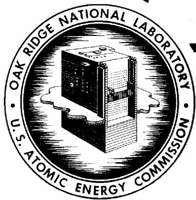

CENTRAL RES

DOCUMENT

LIBRARY

DO NOT TRANSFER

If you wish somedocument, send inand the library

OAK RIDGE NATIONAL LABORATORY

OPERATED BY

UNION CARBIDE NUCLEAR COMPANY

Division of Union Carbide Corporation

UCC

POST OFFICE BOX X · OAK RIDGE, TENNESSEE

# $1.50

Printed in USA. Price cents.Available from the

Office of Technical Services

U.S. Department of Commerce

Washington 25, D. C.

# LEGAL NOTICE

This report was prepared as an account of Government sponsored work. Neither the United States, nor the Commission, nor any person acting on behalf of the Commission:   
A. Makes any warranty or representation, express or implied, with respect to the accuracy, completeness, or usefulness of the information contained in this report, or that the use of any information, apparatus, method, or process disclosed in this report may not infringe privately owned rights; or   
B. Assumes any liabilities with respect to the use of, or for damages resulting from the use of any information, apparatus, method, or process disclosed in this report.   
As used in the above, "person acting on behalf of the Commission" includes any employee or contractor of the Commission to the extent that such employee or contractor prepares, handles or distributes, or provides access to, any information pursuant to his employment or contract with the Commission.

# UNCLASSIFIED

ORNL-2431

UC-81 - Reactors-Power

Contract No. W-7405-eng-26

MOLTEN-SALT REACTOR PROGRAM

QUARTERLY PROGRESS REPORT

For Period Ending October 31, 1957

H. G. MacPherson, Program Director

DATE ISSUED

FEB 7 1958

OAK RIDGE NATIONAL LABORATORY

Operated by

UNION CARBIDE NUCLEAR COMPANY

Division of Union Carbide Corporation

Post Office Box X

Oak Ridge, Tennessee

UNCLASSIFIED

34456 03612222

# INTERNAL DISTRIBUTION

1. L. G. Alexander   
2. E. S. Bettis   
3. D. S. Billington   
4. F. F. Blankenship   
5. E. P. Blizzard   
6. A. L. Boch   
7. C.J. Borkowski   
8. G.E. Boyd   
9. E. J. Breeding   
10. R. B. Briggs   
11. D. O. Campbell   
12. D.W.Cardwell   
13. W.H.Carr   
14. G. I. Cathers   
15. C. E. Center (K-25)   
16. R. A. Charpie   
17. J.H. Coobs   
18. F. L. Culler   
19. J.H. DeVan   
20. L. B. Emlet (K-25)   
21. W. K. Ergen   
22. J. Y. Estabrook   
23. D. E. Ferguson   
24. A. P. Fraas   
25. E. A. Franco-Ferreira   
26. J.H.Frye, Jr.   
27. A. T. Gresky   
28. J. L. Gregg   
29. W. R. Grimes   
30. E. Guth   
31. C. S. Harrill   
32. H.W.Hoffman   
33. A. Hollander   
34. A. S. Householder   
35. W. H. Jordan   
36. G. W. Keilholtz   
37. C. P. Keim   
38. M. T. Kelley   
39. F. Kertesz   
40. B.W.Kinyon   
41. M. E. Lackey   
42. J. A. Lane

43. R. S. Livingston

44. H. G. MacPherson

45. W. D. Manly

46. E. R. Mann

47. L. A. Mann

48. W. B. McDonald

49. J. R. McNally

50. R.P.Milford

51. E. C. Miller

52. K. Z. Morgan

53. E. J. Murphy

54. J. P. Murray (Y-12)

55. M. L. Nelson

56. P. Patriarca

57. A.M.Perry

58. D. Phillips

59. P. M. Reyling

60. J. T. Roberts

61. M. T. Robinson

62. F. E. Romie

63. H. W. Savage

64. A. W. Savolainen

65. J. L. Scott

66. E. D. Shipley

67. M. J. Skinner

68. A.H. Snell

69. J. A. Swartout

70. A. Taboada

71. E.H. Taylor

72. F. C. VonderLage

73. G.M. Watson

74. A. M. Weinberg

75. M. E. Whatley

76. G. D. Whitman

77. G.C.Williams

78. C. E. Winters

79. J. Zasler

0-82. ORNL Y-12 Technical Library Document Reference Section

83-90. Laboratory Records Department   
91-95. Laboratory Records, ORNL-RC   
96-98. Central Research Library

# EXTERNAL DISTRIBUTION

99. R. F. Bacher, California Institute of Technology   
100. Division of Research and Development, AEC, ORO

101-630. Given distribution as shown in TID-4500 (13th ed. Rev.) under Reactors-Power category

(75 copies - OTS)

# UNCLASSIFIED

# CONTENTS

FOREWORD

SUMMARY 1

# PART 1. REACTOR DESIGN STUDIES

NUCLEAR CALCULATIONS 5

GAMMA HEATING OF CORE VESSEL 10

HEAT TRANSFER SYSTEMS 11

# PART 2. MATERIALS STUDIES

METALLURGY 15

Fabrication 16   
Material Procurement 16   
Fabrication of INOR-8. 17   
Transformation Kinetics 18

Welding and Brazing 18   
Dynamic Corrosion 23   
Test Program 23   
Thermal-Convection Loop Tests 25   
Forced-Circulation Loop Tests 29

RADIATION DAMAGE 30

In-Pile Loop Tests 30   
Static In-Pile Capsules 31

CHEMISTRY 32

Phase Equilibrium Studies 32   
Solvent Systems 32   
Systems Containing UF 33   
Systems Containing ThF 36   
Systems Containing Plutonium Fluorides 39

Chemistry of the Corrosion Process 39

Fission-Product Behavior 41

Solubility of the Noble Gases 41   
Solubility of Rare-Earth Fluorides 42

Production of Purified Molten Salts 43

Methods for Purification of Molten Salts 43

# UNCLASSIFIED

# FOREWORD

This quarterly progress report of the Molten-Salt Reactor Program records the technical progress of the research at the Laboratory, under its Contract W-7405-eng-26, on power-producing reactors fueled with circulating fused salts. The report is divided into two major parts: 1. Reactor Design Study and 2. Materials Studies.

Until July 1, 1957, the Molten-Salt Reactor Program was largely a design study, with only token expenditures for experimental work. As of July 1, the program was expanded to include experimental work on materials. A further augmentation of the program occurred on October 1, 1957, when personnel and facilities for additional research and experimentation became available. As a result of this transition, the scope of this quarterly report is considerably broader than that of the previous report, particularly with respect to metallurgy and chemistry. Similarly, it is expected that future quarterly reports will present the activities of the Experimental Engineering group.

# MOLTEN-SALT REACTOR PROGRAM QUARTERLY PROGRESS REPORT

# SUMMARY

# PART I. REACTOR DESIGN STUDIES

# Nuclear Calculations

Additional calculations were made of the nuclear characteristics of two-region, homogeneous, molten-salt, converter reactors. Critical-inventory calculations revealed that for a 9-ft-dia core, the minimum inventory would be about $100\mathrm{kg}$ of $\mathsf{U}^{235}$ . The volume of fuel in the external system was taken to be $340\mathrm{ft}^3$ for a power level of $600\mathrm{Mw}$ (thermal).

Regeneration ratios were obtained as a function of inventory for a 600-Mw system, with thorium concentration as a parameter. From an analysis of the ratios, an envelope was found which is the locus of points of maximum regeneration ratio for a given fuel inventory. From this envelope it may be concluded that (1) with a fuel inventory of a trifle over $100\mathrm{kg}$ , a regeneration ratio of 0.4 can be obtained (in an 8-ft core), (2) by doubling the inventory a regeneration ratio of 0.6 can be obtained (also in an 8-ft core), (3) by doubling it again a regeneration ratio of 0.65 can be obtained (in a 10- to 11-ft core), and (4) further investment of fuel would have a negligible effect on the regeneration ratio.

A design-point selection is to be attempted by balancing fuel savings by regeneration against inventory and processing charges; however, it appears at present that $400\mathrm{kg}$ of $\mathsf{U}^{235}$ may be an economical maximum for these systems. A few calculations on systems fueled with $\mathsf{U}^{233}$ have indicated much lower critical inventories and better regeneration ratios than those obtained for $\mathsf{U}^{235}$ fuel.

# Gamma Heating of Core Vessel

It was estimated that for operation of the Reference Design Reactor at 600 Mw in a core vessel 6 ft in diameter with 1 mole $\%$ ThF $_4$ in the fuel, core gamma rays will liberate $13.4 \, \text{W/cm}^3$ in the core vessel wall. Heating by gamma rays emitted in the blanket was found to be $0.97 \, \text{W/cm}^3$ , and capture gamma rays originating in the wall were found to contribute $1.63 \, \text{W/cm}^3$ to the heating.

The calculations were made for a pure nickel core vessel, and the results are somewhat lower than those to be expected from the calculations now being made for an INOR-8 alloy vessel.

# Heat Transfer Systems

Two thermodynamic systems for producing power from the heat from a molten-salt reactor are being considered, and components and conditions representing preliminary optimization, with respect to cycle efficiency and component sizes, have been selected. Particular attention has been given to limiting thermal stresses. One system being studied transfers heat from the fuel salt to a coolant salt to sodium to water, and the other substitutes mercury for the sodium. The electrical output from a 600-Mw (thermal) reactor would be 258.6 Mw with the sodium system, and 295.8 Mw with the mercury system.

# PART 2. MATERIALS STUDIES

# Metallurgy

A coordinated program is under way for the investigation of container materials for molten salts that will permit operation of a molten-salt reactor for long periods of time at temperatures up to $1300^{\circ}\mathrm{F}$ . Of the materials investigated, the nickel-base alloys are the most suitable to the specifications. Inconel is the best suited of the commercially available materials; but, since its corrosion resistance and high-temperature strength are marginal, the alloy INOR-8 has been developed. Inconel is being studied for comparison and as a secondary choice. The metallurgical program for investigating these materials will include material property studies and fabrication development. Techniques for remote welding and inspection are also being studied.

The material property studies are, at present, concerned primarily with the procurement of the INOR-8 shapes (that is, pipe, sheet, tubing, welding wire, etc.) needed for corrosion tests, and for physical and mechanical property tests. Preliminary studies of cold-rolled sheet material have

indicated that the decrease in ductility of INOR-8 is greatest during the first $40\%$ reduction in thickness. The recovery and recrystallization characteristics of the cold-worked INOR-8 alloy are being investigated.

Mechanical property studies of welded joints of a nickel-molybdenum alloy similar to INOR-8 have indicated that the alloy is weldable and that the mechanical properties of the joint are satisfactory both in the as-welded and the aged conditions.

Thermal-convection loop tests of Inconel and INOR-8 are being made in order to provide data on the corrosive properties of beryllium-bearing fuels as compared with the properties of zirconium-base fuels, the corrosive properties of fuel mixtures containing large quantities of thorium for breeding, and the corrosive properties of non-fuel-bearing fluoride mixtures for use as secondary coolants. These studies will be supplemented with forced-circulation loop tests at flow rates and temperature conditions simulating those of an operating reactor.

# Radiation Damage

An in-pile thermal-convection loop is being prepared for operation in the LITR in order to obtain information on the effect of radiation on corrosion of the container materials by the various fuels being considered. Analyses of the fission products in the fuels will also be made. An improved design has been worked out for the installation of thermocouple leads in the air annulus, and a mockup test is being prepared. Calculations were made for the equilibrium distribution of fission gases in the system, and the charcoal trap to be included in the system was sized accordingly.

Preparations are being made for irradiations of lithium-beryllium-uranium fluoride fuels in INOR-8 capsules in the MTR.

# Chemistry

A review has been made of the extensive body of information available on fused salts in order to orient the development of fuel solvents, fuels,

breeder blankets, and secondary coolants for use in molten-salt power reactors. The systems of most promise appear to be those which contain $\mathsf{BeF}_2$ with LiF and/or NaF.

Efforts were made to resolve discrepancies in reported melting points of $\mathsf{BeF}_2$ , and additional confirmation of the reported value of $545^{\circ}\mathsf{C}$ resulted. Phase-diagram investigations have revealed mixtures that may be of interest as fuel solvents and carriers and as coolants in the systems $\mathsf{LiF - BeF}_2$ , $\mathsf{NaF - BeF}_2$ , and $\mathsf{NaF - LiF - BeF}_2$ . The $\mathsf{NaF - LiF - UF_4}$ system does not appear to be useful directly as a fuel, but low-melting mixtures of interest are available in the $\mathsf{LiF - BeF}_2$ - $\mathsf{UF_4}$ system. A number of $\mathsf{ThF}_4$ -containing systems are being studied, and tentative phase diagrams have been prepared for the $\mathsf{BeF}_2$ - $\mathsf{ThF}_4$ , $\mathsf{LiF - ThF}_4$ , and $\mathsf{NaF - ThF}_4$ systems. The $\mathsf{LiF - BeF}_2$ - $\mathsf{ThF}_4$ and $\mathsf{NaF - BeF}_2$ - $\mathsf{ThF}_4$ systems have been shown to be remarkably similar to their $\mathsf{UF_4}$ -containing analogs. It thus appears that a relatively wide choice of useful breeder materials is available. Studies of systems containing plutonium fluorides were initiated.

An analysis of the corrosion mechanism in systems in which fluoride fuels are contained in nickel-base alloys which contain molybdenum and chromium was applied to the MSR (Molten-Salt Reactor) system. It appears virtually certain that with small chromium activities such as those in Inconel and the INOR alloys, and with small temperature drops such as those contemplated for most reactors, chromium deposition will not result if fuel mixtures based on the $\mathsf{BeF}_2$ -containing system are used.

The available information on fission-product behavior in fluoride fuels has been analyzed in terms of the MSR program. Preliminary experiments with NaF-BeF $_2$ (57-43 mole %) have shown the solubility of CeF $_3$ in this mixture to be considerably less than in NaF-ZrF $_4$ mixtures and to be more temperature sensitive. The anticipated, nearly ideal, solid solution behavior of mixtures of rare earths in the BeF $_2$ -containing system, along with reduced solubility, should make the fission-product partition process quite attractive.

# Part I

# REACTOR DESIGN STUDIES

# NUCLEAR CALCULATIONS

L. G. Alexander

J. T. Roberts

In further nuclear calculations critical inventories and regeneration ratios were obtained as functions of core diameter and thorium concentration in the core. For these calculations the new intermediate-concentration cross sections for thorium were used. Also, minor corrections to some of the previously reported cases have been obtained. Relevant specifications for the systems studied are given in Table 1.1. The results of the calculations are summarized in Table 1.2; analyses of the results are being made.

A graph of the critical concentrations estimated for these reactors is presented in Fig. 1.1. It may be seen that the curve for $1 \, \text{mole} \, \% \, \text{ThF}_4$ does not conform to the general pattern. The calculations have been checked and the results are believed to be correct. In an effort to clarify this behavior, the flux-averaged cross sections for fission of $\mathsf{U}^{235}$

Table 1.1. Specifications for Two-Region Molten-Fluoride-Salt Reactors   

<table><tr><td colspan="2">Core</td></tr><tr><td>Diameter</td><td>5 to 10 ft</td></tr><tr><td>Carrier salt</td><td>69 mole % LiF, 
31 mole % BeF2</td></tr><tr><td>Mean density</td><td>2.0 g/cm3</td></tr><tr><td>Li composition</td><td>0.01% Li6</td></tr><tr><td>U238concentration</td><td>7.5% of U235concentration</td></tr><tr><td>U235concentration</td><td>See Table 1.2</td></tr><tr><td colspan="2">Core Vessel</td></tr><tr><td>Thickness</td><td>1/3in.</td></tr><tr><td>Composition</td><td>INOR-8 alloy</td></tr><tr><td colspan="2">Blanket</td></tr><tr><td>Thiekness</td><td>2 ft</td></tr><tr><td>Composition</td><td>25 mole % ThF4, 
75 mole % LiF</td></tr><tr><td>Mean density</td><td>4.25 g/cm3</td></tr><tr><td>Geometry</td><td>Spherically symmetric</td></tr></table>

and capture in thorium were computed from the flux spectra:

$$
\bar {\sigma} = \int_ {0} ^ {2 0} \int_ {V _ {c}} N \sigma \phi (u) d u d V,
$$

where $V_{c} \approx$ volume of core, $N =$ atoms per cubic centimeter. The results for reactors having zero and 1 mole % ThF4 in the core are shown in Table 1.3.

It is thought that increasing the thorium concentration in the 10-ft core decreases the fission cross section more or less uniformly so that the critical concentration rises regularly. In the 6-ft cores the spectrum is already hard. Adding thorium hardens it further, but the effect on the fission cross section is less. There is a regenerative effect at work. The spectrum is hardened in the following three ways: (1) by decreasing core size, (2) by increasing thorium concentration, and (3) by increasing uranium concentration. If the spectrum is hardened relatively less in the 6-ft core by the addition of thorium, the decrease in uranium cross section is relatively less; hence, less uranium is needed, and the spectrum

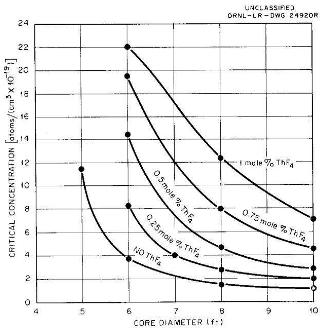  
Fig. 1.1. Critical Concentrations of $\mathsf{U}^{235}$ for Two-Region, Homogeneous, Molten-Salt Reactors.

Table 1.2. Nuclear Characteristics of Clean Two-Region Molten-Fluoride-Salt Reactors at a Fuel Temperature of ${1150}^{ \circ  }\mathrm{F}$   

<table><tr><td>Case number</td><td>87</td><td>53</td><td>54</td><td>55</td><td>106</td><td>86</td><td>107</td><td>61</td><td>88</td><td>89</td><td>90</td><td>91</td><td>92</td><td>93</td><td>63</td><td>84</td><td>62</td><td>87A</td><td>94</td><td>95</td><td>96</td></tr><tr><td>Fuel</td><td>U235</td><td>U235</td><td>U235</td><td>U235</td><td>U235</td><td>U235</td><td>U235</td><td>U235</td><td>U235</td><td>U235</td><td>U235</td><td>U235</td><td>U235</td><td>U235</td><td>U235</td><td>U235</td><td>U235</td><td>U233</td><td>U233</td><td>U233</td><td>U233</td></tr><tr><td>Thorium concentration in fuel (mole %)</td><td>0</td><td>0</td><td>0</td><td>0</td><td>0.25</td><td>0.25</td><td>0.25</td><td>0.25</td><td>0.5</td><td>0.5</td><td>0.5</td><td>0.75</td><td>0.75</td><td>0.75</td><td>1</td><td>1</td><td>1</td><td>0.25</td><td>0.25</td><td>0.25</td><td>0.25</td></tr><tr><td>Diameter of core (ft)</td><td>5</td><td>6</td><td>8</td><td>10</td><td>6</td><td>7</td><td>8</td><td>10</td><td>6</td><td>8</td><td>10</td><td>6</td><td>8</td><td>10</td><td>6</td><td>8</td><td>10</td><td>5</td><td>6</td><td>8</td><td>10</td></tr><tr><td>Critical concentration (mole % UF4)</td><td>0.453</td><td>0.110</td><td>0.047</td><td>0.033</td><td>0.243</td><td>0.160</td><td>0.107</td><td>0.073</td><td>0.572</td><td>0.185</td><td>0.113</td><td>0.772</td><td>0.318</td><td>0.180</td><td>0.875</td><td>0.492</td><td>0.281</td><td>0.147</td><td>0.092</td><td>0.056</td><td>0.043</td></tr><tr><td>Critical mass (kg)</td><td>82</td><td>47</td><td>49</td><td>67</td><td>102</td><td>80</td><td>80</td><td>106</td><td>180</td><td>138</td><td>243</td><td>237</td><td>260</td><td>275</td><td>367</td><td>409</td><td>27</td><td>29</td><td>41</td><td>63</td><td></td></tr><tr><td>Critical inventory* (kg)</td><td>509</td><td>189</td><td>110</td><td>111</td><td>408</td><td>230</td><td>181</td><td>175</td><td>720</td><td>313</td><td>270</td><td>972</td><td>537</td><td>428</td><td>1100</td><td>831</td><td>674</td><td>165</td><td>116</td><td>94</td><td>103</td></tr><tr><td>Regeneration ratio</td><td></td><td></td><td></td><td></td><td></td><td></td><td></td><td></td><td></td><td></td><td></td><td></td><td></td><td></td><td></td><td></td><td></td><td></td><td></td><td></td><td></td></tr><tr><td>Core</td><td>0.039</td><td>0.025</td><td>0.014</td><td>0.012</td><td>0.170</td><td>0.201</td><td>0.224</td><td>0.256</td><td>0.229</td><td>0.332</td><td>0.390</td><td>0.261</td><td>0.378</td><td>0.459</td><td>0.288</td><td>0.394</td><td>0.485</td><td>0.160</td><td>0.175</td><td>0.252</td><td>0.285</td></tr><tr><td>Blanket</td><td>0.541</td><td>0.531</td><td>0.408</td><td>0.303</td><td>0.432</td><td>0.410</td><td>0.350</td><td>0.262</td><td>0.368</td><td>0.305</td><td>0.233</td><td>0.338</td><td>0.267</td><td>0.206</td><td>0.322</td><td>0.236</td><td>0.183</td><td>0.718</td><td>0.592</td><td>0.421</td><td>0.306</td></tr><tr><td>Total</td><td>0.580</td><td>0.556</td><td>0.422</td><td>0.315</td><td>0.602</td><td>0.611</td><td>0.574</td><td>0.518</td><td>0.597</td><td>0.637</td><td>0.623</td><td>0.599</td><td>0.645</td><td>0.665</td><td>0.610</td><td>0.630</td><td>0.668</td><td>0.878</td><td>0.767</td><td>0.673</td><td>0.591</td></tr><tr><td>Neutron balance</td><td></td><td></td><td></td><td></td><td></td><td></td><td></td><td></td><td></td><td></td><td></td><td></td><td></td><td></td><td></td><td></td><td></td><td></td><td></td><td></td><td></td></tr><tr><td>Captures in</td><td></td><td></td><td></td><td></td><td></td><td></td><td></td><td></td><td></td><td></td><td></td><td></td><td></td><td></td><td></td><td></td><td></td><td></td><td></td><td></td><td></td></tr><tr><td>Fuel</td><td>0.5578</td><td>0.5210</td><td>0.4983</td><td>0.4918</td><td>0.5513</td><td>0.5227</td><td>0.5105</td><td>0.5007</td><td>0.5716</td><td>0.5279</td><td>0.5120</td><td>0.5781</td><td>0.5497</td><td>0.5262</td><td>0.5781</td><td>0.5663</td><td>0.5449</td><td>0.4574</td><td>0.4538</td><td>0.4502</td><td>0.4486</td></tr><tr><td>U238Th in core</td><td>0.0220</td><td>0.0128</td><td>0.0060</td><td>0.0935</td><td>0.1053</td><td>0.1145</td><td>0.1283</td><td>0.1308</td><td>0.1752</td><td>0.2000</td><td>0.1510</td><td>0.2071</td><td>0.2416</td><td>0.1657</td><td>0.2236</td><td>0.2643</td><td>-0.0729</td><td>-0.0896</td><td>-0.1133</td><td>-0.1280</td><td></td></tr><tr><td>Th in blanket</td><td>0.3013</td><td>0.2768</td><td>0.2029</td><td>0.1490</td><td>0.2380</td><td>0.2124</td><td>0.1788</td><td>0.1310</td><td>0.2104</td><td>0.1612</td><td>0.1195</td><td>0.1955</td><td>0.1466</td><td>0.1086</td><td>0.1863</td><td>0.1136</td><td>0.0995</td><td>0.3281</td><td>0.2686</td><td>0.1894</td><td>0.1371</td></tr><tr><td>Li + Be in core</td><td>0.0239</td><td>0.0686</td><td>0.1587</td><td>0.2254</td><td>0.0301</td><td>0.0636</td><td>0.0949</td><td>0.1414</td><td>0.0164</td><td>0.0552</td><td>0.0889</td><td>0.0116</td><td>0.0306</td><td>0.0573</td><td>0.0096</td><td>0.0191</td><td>0.0347</td><td>0.0329</td><td>0.0696</td><td>0.1298</td><td>0.1763</td></tr><tr><td>F in core</td><td></td><td></td><td></td><td></td><td></td><td></td><td></td><td></td><td></td><td></td><td></td><td></td><td></td><td></td><td></td><td></td><td></td><td></td><td></td><td></td><td></td></tr><tr><td>Core vessel</td><td>0.0950</td><td>0.1208</td><td>0.0470</td><td>0.0741</td><td>0.0871</td><td>0.0942</td><td>0.1013</td><td>0.0986</td><td>0.0708</td><td>0.0805</td><td>0.0796</td><td>0.0638</td><td>0.0660</td><td>0.0663</td><td>0.0603</td><td>0.0574</td><td>0.0566</td><td>0.1087</td><td>0.1184</td><td>0.1173</td><td>0.1100</td></tr><tr><td>Li + F in blanket</td><td></td><td></td><td></td><td></td><td></td><td></td><td></td><td></td><td></td><td></td><td></td><td></td><td></td><td></td><td></td><td></td><td></td><td></td><td></td><td></td><td></td></tr><tr><td>Leakage from blanket</td><td></td><td></td><td></td><td></td><td></td><td></td><td></td><td></td><td></td><td></td><td></td><td></td><td></td><td></td><td></td><td></td><td></td><td></td><td></td><td></td><td></td></tr><tr><td>Neutron yield,* η</td><td>1.79</td><td>1.93</td><td>2.01</td><td>2.03</td><td>1.81</td><td>1.91</td><td>1.96</td><td>2.00</td><td>1.75</td><td>1.89</td><td>1.95</td><td>1.73</td><td>1.82</td><td>1.90</td><td>1.73</td><td>1.76</td><td>1.84</td><td>2.19</td><td>2.20</td><td>2.22</td><td>2.23</td></tr></table>

*For 600-Mw system with 340 ft³ of fuel in system outside core.

Table 1.3. Flux-Averaged Cross Sections in Molten-Salt Converter Reactors   

<table><tr><td rowspan="2">Core Diameter (ft)</td><td rowspan="2">Thorium Concentration in Core (mole %)</td><td colspan="2">Average Cross Section (barns)</td></tr><tr><td>U235</td><td>Th</td></tr><tr><td rowspan="2">10</td><td>0</td><td>94</td><td>3.0</td></tr><tr><td>1</td><td>14</td><td>1.9</td></tr><tr><td rowspan="2">6</td><td>0</td><td>36</td><td>2.7</td></tr><tr><td>1</td><td>8</td><td>1.8</td></tr></table>

is hardened less, etc. If the effect of the thorium decreases sharply around 0.75 mole $\%$ ThF $_4$ because of resonance shielding, the deviation in the results for the 6-ft core with 1 mole $\%$ ThF $_4$ in the fuel would be satisfactorily accounted for. It is planned to calculate the cross sections for cores with 0.25 and 0.75 mole $\%$ ThF $_4$ in order to verify this speculation.

The critical masses were computed from the core diameters and critical concentrations. The results are listed in Table 1.2 and plotted in Fig. 1.2, together with four additional points resulting from preliminary calculations for 5-ft cores. The apparent deviation of the 6-ft core with 1 mole $\%$ $\mathsf{ThF}_4$ is more pronounced than in Fig. 1.1. It should be remembered, however, that regardless of the thorium concentration the critical masses of all these reactors must decrease as the diameter decreases to below some critical value. Two points, one for a small, homogeneous, molten-salt, beryllium-reflected critical experiment and the other approximating a metallic uranium critical assembly, have been plotted in the lower left-hand corner of the figure. All the curves in Fig. 1.2 probably pass near these two points and through the origin; a family of curves consistent with this assumption is shown in Fig. 1.3. The calculated points appear to correlate reasonably well on this basis. Further calculations will be performed to verify some parts of the curves, especially parts of the curve for 1 mole $\%$ $\mathsf{ThF}_4$ . As will be shown later, however, the reactors corresponding to the portions of the curves to the left of the 6-ft ordinate are not economically attractive, and the details of the peaks will not be investigated.

The solid portions of the curves in Fig. 1.3, which are believed to be correct, and the curve for

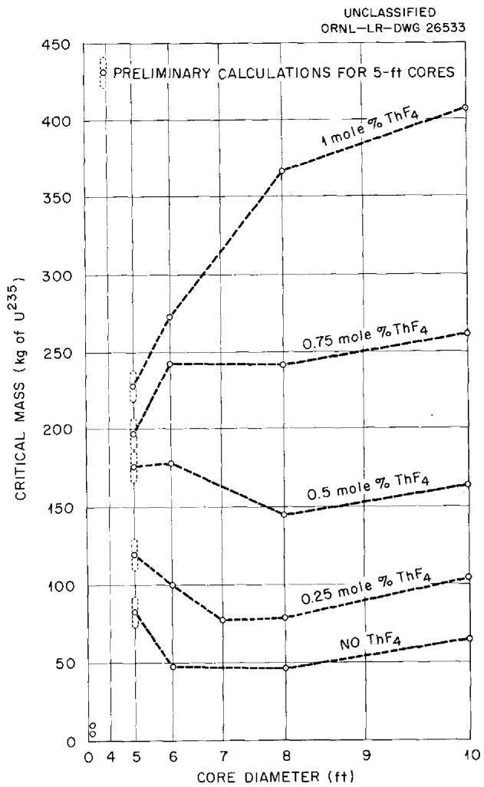  
Fig. 1.2. Critical Masses for Molten-Salt Reactors.

1 mole $\%$ ThF, which was accepted provisionally, were used to compute the critical inventories listed in Table 1.2 and shown in Fig. 1.4. (The values at 7 and 9 ft were obtained by interpolation on a graph of the regeneration ratio vs diameter and ThF concentration.) The volume of fuel in the external system (pump, pipes, heat exchangers) was taken to be $340\text{ft}^3$ , which corresponds to a power level of $600\text{Mw}$ (thermal). It may be seen that a minimum inventory of about $100\text{kg}$ of U235 is obtained at a core diameter of 9 ft. The corresponding power density in the core is $55\text{W/cm}^3$ (average) and the specific power is $6\text{Mw}$ per kilogram of fuel in the system.

The regeneration ratio is shown in Fig. 1.5 as a function of inventory (for a 600-Mw system), with thorium concentration as a parameter. It is thought

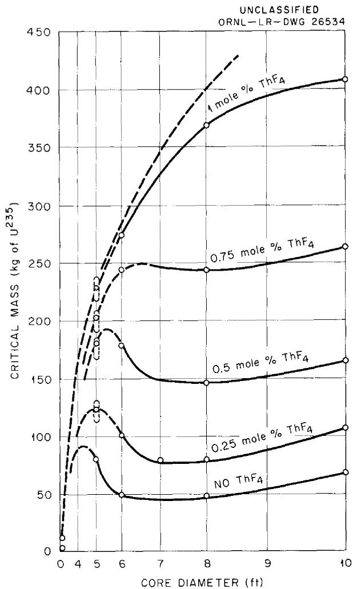  
Fig. 1.3. Tentative Correlation of Critical-Mass Data for Molten-Salt Reactors Based on Assumption that All Curves Pass Through Origin.

that for a given thorium concentration the critical inventory falls as the core diameter increases because the concentration falls more rapidly than the volume increases. Simultaneously the leakage of neutrons to the blanket decreases, but this decrease is, at first, more than offset by the increase in captures by the thorium in the core because of the increase in the ratio of thorium concentration to uranium concentration. Eventually, however, the uranium concentration tends to level off at the finite concentration corresponding to the infinite reactor, and the volume increase becomes the important factor. As a result, the inventory passes through a minimum. At about

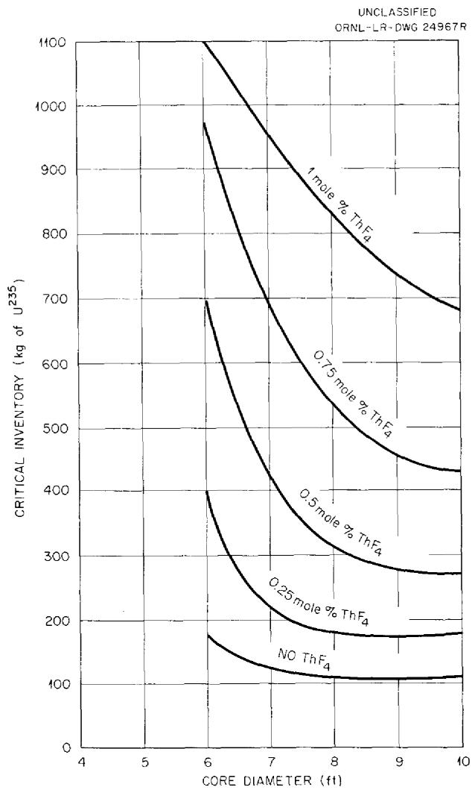  
Fig. 1.4. Critical Inventories for 600-Mw, Molten-Salt Reactors.

the minimum point, the thorium captures in the core level off. But, since the leakage to the blanket continues to fall with volume increase, the regeneration ratio falls off. Also, parasitic captures in fluorine, etc., increase as the spectrum softens. Thus the curves in Fig. 1.5 turn downward and eventually must turn back to the right.

The downturn of the curves is surprisingly sharp. It appears that the "elbows" define an envelope which is the locus of points of maximum regeneration ratio for a given fuel inventory. This envelope is shown in Fig. 1.6. The principal conclusions to be drawn are that (1) with a fuel inventory of a trifle over $100\mathrm{kg}$ , a regeneration ratio of 0.4 can be obtained (in an 8-ft core), (2) by doubling the

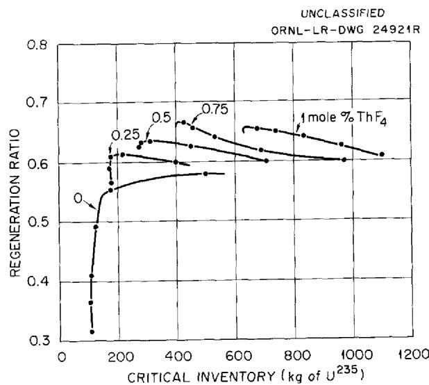  
Fig. 1.5. Regeneration Ratios in Two-Region, 600-Mw, Molten-Salt Reactors.

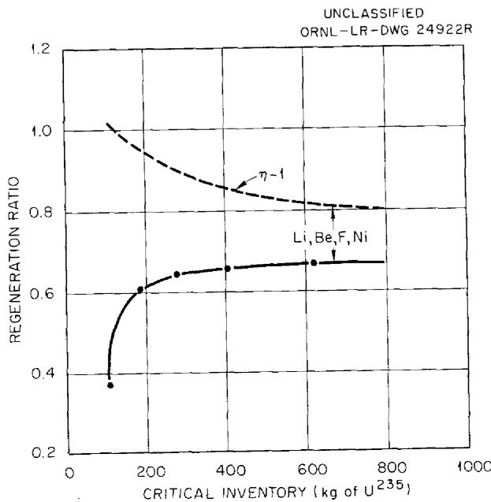  
Fig. 1.6. Optimum Regeneration Ratios for Two-Region, 600-Mw, Molten-Salt Reactors.

inventory a regeneration ratio of 0.6 can be obtained (also in an 8-ft core), (3) by doubling it again a regeneration ratio of 0.65 can be obtained (in a 10- to 11-ft core), and (4) further investment of fuel would have a negligible effect on the regeneration ratio. The optimum diameter appears to increase steadily after the inventory increases beyond $200\mathrm{kg}$ .

A plot of $\eta - 1$ is also included in Fig. 1.6 to give the upper limit on the regeneration ratio. The interval between the envelope and the $\eta - 1$ curve represents parasitic absorptions in fluorine, etc. These absorptions decrease with increasing inventory, because of increased competition from uranium and thorium, and also because of hardening of the spectrum. Judging from the trends of the curves in Fig. 1.6, however, it would seem that, although $\eta - 1$ approaches a minimum at an inventory of $600\mathrm{kg}$ , further significant reduction in parasitic absorptions can be obtained only by enormous increases in the inventory.

Selection of a design point for reactors of this type will consist in balancing fuel savings by regeneration against inventory and processing charges. This will be attempted; however, it does not seem likely that it would pay to invest more than $400\mathrm{kg}$ of $\mathsf{U}^{235}$ in such systems.

It must be remembered that the results discussed above apply only to the initial, clean state; that is, they apply only in the absence of fission products and uranium isotopes (other than $\mathsf{U}^{238}$ ). The accumulation of these substances will of course affect both the critical inventory and the regeneration ratio. However, the performance of the system may not be impaired significantly for some time after startup. In the first place, the $\mathsf{U}^{233}$ generated in the blanket will have a fission cross section in these epithermal reactors about twice as high as that of $\mathsf{U}^{235}$ . Adding this

$\mathsf{U}^{233}$ to the core will tend to offset the accumulation of poisons, and it may not be necessary to add $\mathsf{U}^{235}$ for some time. Further, $\eta$ for $\mathsf{U}^{233}$ is much better than that for $\mathsf{U}^{235}$ , especially in the intermediate-energy range, and replacing $\mathsf{U}^{235}$ with $\mathsf{U}^{233}$ will reduce the parasitic absorptions in the fuel. These effects will be studied by means of the Sorghum program being prepared for the Oracle.

A few calculations on systems fueled with $U^{233}$ have been completed. Four cases, in which core diameters range from 5 to 10 ft and the $ThF_4$ concentration is 0.25 mole %, are described in Table 1.2. The results are compared with those for corresponding $U^{235}$ systems in Fig. 1.7. The critical inventories are much lower with $U^{233}$ fuel, and the regeneration ratio is much better. It is hoped that regeneration ratios well above 0.9 can be achieved at inventories below 500 kg. The calculations will be extended.

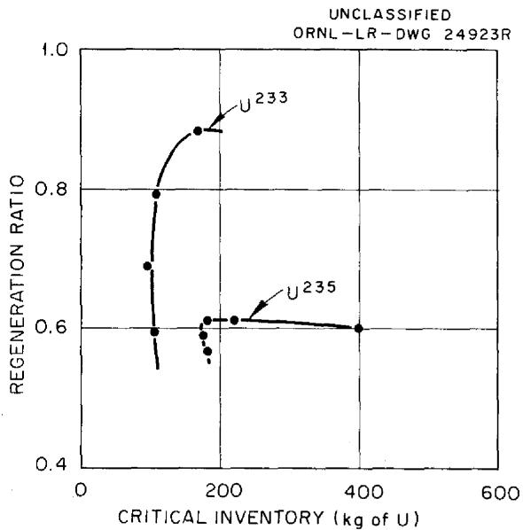  
Fig. 1.7. Comparison of Regeneration Ratios in Molten-Salt Reactors Containing 0.25 Mole % ThF4 and U235 or U233 Enriched Fuel.

# GAMMA HEATING OF CORE VESSEL

L. G. Alexander

L.A.Mann

The study of gamma heating of the core vessel of the Reference Design Reactor was continued. The spectra of the delayed, capture, and inelastic-scattering gamma rays were estimated from data in the literature, and more reliable gamma-energy absorption coefficients for the various materials were computed from the basic data presented by Grodstein.2

The calculations were carried out for a core vessel of pure nickel. The heating by core gamma rays will not be affected much by the presence of alloying constituents. With the use of the new data, it was estimated that during operation at 600 Mw in a core vessel 6 ft in diameter with 1

mole $\%$ ThF $_4$ in the core (see Case 63 in Table 1.2 of preceding section of this report), core gamma rays will liberate $13.4~\mathrm{W/cm}^3$ in the core vessel wall.

Similarly, the heating effected by capture gamma rays emitted in the blanket was estimated to be 0.97 w/cm³ at the inside surface of the core vessel. The previously obtained value of 0.032 w/cm³ (for an INOR-8 core vessel) was obviously in error by an order of magnitude and will be recomputed.

The gamma heating effected by capture gamma rays originating in the nickel wall was estimated to be $1.63\mathrm{w/cm}^3$ . In an INOR-8 alloy vessel, this contribution will be approximately twice as great because of captures in the molybdenum of the alloy. Calculations for an INOR-8 core vessel are being made.

# HEAT TRANSFER SYSTEMS

B.W.Kinyon

F. E. Romie

A study was made of two thermodynamic systems for producing power from a molten-fluoride-salt reactor capable of producing 600 Mw of heat. One system involves transferring heat from the fuel salt to a coolant salt to sodium to water and achieves turbine steam conditions of 1800 psia at $1000^{\circ}\mathrm{F}$ , with reheat to $980^{\circ}\mathrm{F}$ . The other system involves transferring heat from the fuel salt to a coolant salt to mercury to water. Mercury vapor at 180 psia and $1000^{\circ}\mathrm{F}$ would expand through a turbine and exhaust at 7 psia and $605^{\circ}\mathrm{F}$ . The condensing mercury would generate steam at 1250 psia, which would be superheated in two steps to $950^{\circ}\mathrm{F}$ by mercury vapor bled from the turbine and taken directly from the line.

Temperature, flow, and pressure-drop conditions were selected, and pertinent data were obtained for the heat exchangers required for the two systems. The components and conditions represent preliminary optimization with respect to cycle efficiency and component sizes. The conditions were selected with particular attention to limiting thermal stresses to low values.

The steam generator in the sodium system is of interest from the standpoint of low stresses. A high-flow rate and a small temperature change of the sodium are desired in order to achieve a low temperature difference at the hot end. These conditions can be achieved by recirculating sodium through the boiler and by taking sufficient sodium from the pump to supply the heat needed and to provide the head for recirculation. The steam generator best suited for this service is the Lewis boiler, which utilizes bayonet tubes. It is a natural-circulation boiler in which water feeds down a central tube. Boiling occurs during upward flow in the annulus.

In the mercury system, vaporization of the mercury would take place in a J-shaped heat exchanger in which mercury flows inside the tubes, and the coolant salt flows in the shell. A pressure of 180 psia will provide saturated mercury vapor at $1000^{\circ}\mathrm{F}$ , while a 16-ft additional head (required to give a 270-psia total pressure) will result in a saturation temperature of $1075^{\circ}\mathrm{F}$ . Downward flow of the mercury in the short leg of the J, counter to the salt flow, will raise the temperature of the nonboiling mercury to $1075^{\circ}\mathrm{F}$ . Vaporization will occur in the long leg, where both the mercury and

the salt will be flowing upward. Heat for the vaporization will come both from the salt and from the mercury. With the proper salt flow, the difference between the salt temperature and the saturation temperature of the mercury can be made uniform along the boiling section. This will result in low thermal stresses and effective use of the heat transfer area. To avoid difficulties caused by vaporizing too large a fraction of the mercury, a recirculation ratio of 10 to 1 will be employed.

In the binary mercury-steam cycle, the mercury turbine will produce $35\%$ of the power and the steam turbine will produce $65\%$ . The combined turbine heat rate will be 6940 Btu/kwhr, which gives $49.3\%$ efficiency. The sodium system would have a turbine heat rate of 7920 Btu/kwhr, or $43.1\%$ turbine efficiency. The higher efficiency of the mercury system tends to compensate for the higher investment cost; the unit costs of electricity from the two systems are probably comparable.

The heat transfer area from fuel to water for the sodium system is $270\mathrm{ft}^2/\mathrm{Mw}$ (electrical), that is, about one-third or one-fourth the area in a conventional fossil-fuel furnace. A comparison of the characteristics of the sodium and mercury systems is presented in Table 1.4

Table 1.4. Comparison of Mercury and Sodium Heat Transfer Systems for a 600-Mw Molten-Salt Reactor   

<table><tr><td>Parameter</td><td>Sodium System</td><td>Mercury System</td></tr><tr><td>Turbine heat rate (Btu/kwhr)</td><td>7,920</td><td>6,940</td></tr><tr><td>Cycle efficiency (%)</td><td>43.1</td><td>49.3</td></tr><tr><td>Electrical output (Mw)</td><td></td><td></td></tr><tr><td>Mercury</td><td></td><td>101.8</td></tr><tr><td>Steam</td><td>258.6</td><td>194</td></tr><tr><td>Total</td><td>258.6</td><td>295.8</td></tr><tr><td>Total heat transfer area (ft2)</td><td>69,860</td><td>99,520</td></tr><tr><td>Heat transfer area per unit of electrical output (ft2/Mw)</td><td>270*</td><td>336</td></tr></table>

* This value for the sodium system would be somewhat greater than the value for the mercury system if the condenser and feed systems were included.

# Part 2

# MATERIALS STUDIES

# METALLURGY

W. D. Manly

J. L. Scott A. Taboada

The metallurgical work of the Molten-Salt Reactor Program has as an objective the provision of a container material for the molten salts that will have sufficient structural strength and compatibility with the molten salts to permit operation of a reactor for long periods of time at temperatures up to $1300^{\circ}\mathrm{F}$ . The engineering and fabrication data required for successful design and construction of the reactor must be acquired, and, as a longer range objective, remote welding or other joining methods must be developed which will permit the maintenance of highly radioactive equipment.

The requirements for a construction material for a molten-salt reactor are:

1. corrosion resistance to the fused fluorides of interest for long times (5 to 20 years) at temperatures up to $1300^{\circ}\mathrm{F}$ ,   
2. resistance to mass transfer in sodium for similar times and at temperatures up to $1100^{\circ}\mathrm{F}$   
3. sufficient strength and ductility, at operating temperatures, to allow thermal cycling and the stresses expected in the reactor - phase transformations should not occur which might adversely affect the mechanical properties,   
4. fabricability such that reactor components (pumps, heat exchangers, shells, etc.) can be made by using standard practices,   
5. weldability such that sound welds can be made in heavy members under restraint,   
6. suitable nuclear properties,   
7. good oxidation resistance at $1300^{\circ}$ F.

Of the materials investigated, the nickel-base alloys are the most suited to the specifications. The commercially available alloy which best approaches the specifications is Inconel, but its corrosion resistance and high-temperature strength are probably marginal.

In an effort to obtain an alloy with better corrosion resistance and strength in fused-salt environments, the alloy INOR-8 has been developed. Tests at higher-than-MSR service conditions have indicated the corrosion resistance of INOR-8, in the fuel mixtures $\mathrm{NaF - ZrF_4 - UF_4}$ (50-46-4 mole %) and NaF-KF-LiF-UF $^4$ 11.2-41-45.3-2.5 mole %), to be ten times better than that of Inconel. High

temperature rupture strengths were also found to be superior to those of Inconel.

The corrosion problems can be estimated qualitatively from the results of short-term tests at higher-than-MSR temperatures because long times at low temperatures and short times at high temperatures have the same effects according to the accepted theory of corrosion in these systems (see subsequent section of this chapter on "Chemistry of the Corrosion Process"). The use of high-strength materials in the MSR is being considered as a means of obtaining high efficiency with a low fuel inventory, since with the high-strength material the poisoning effect of the core container material may be minimized by using smaller sections. Therefore the properties of INOR-8 are being investigated at MSR service conditions. Further studies of Inconel will be made in order to provide a basis for comparison with the new data obtained for INOR-8. Inconel will also be considered as a secondary choice for the material for construction of an MSR. The metallurgical program for investigating INOR-8 and Inconel may be divided into three major categories: material property studies, fabrication investigations, and supporting work.

Material Properties Studies. - Corrosion studies will be continued for salts of interest, with emphasis on long-term effects, and the mass transfer of liquid metals at MSR conditions will be investigated. Mechanical property studies will include relaxation tests to establish the conditions under which creep can be expected to be a problem and those conditions where tensile data may be reliably used as design values. Tensile tests will be conducted at many temperatures in the range from room temperature to $1400^{\circ}\mathrm{F}$ , and creep tests will be run in air and in fused salts to estimate the limiting strain for long-term operation. The effect of dynamic loading, either thermal or mechanical, will be explored.

Physical property data needed for design, such as thermal conductivity, expansion coefficients, etc., will be obtained; and metallurgical properties,

such as aging and recrystallization, which might affect mechanical properties, will be investigated.

Fabrication Development. - The weldability of INOR-8 will be established and welding procedures will be developed in order to enable reliable reactor component fabrication. The melting, casting, forging, and rolling characteristics of INOR-8 will be investigated, and developmental work on techniques for fabricating tubing will be continued. The acceptable range of chemical composition and properties will be established so that material specifications may be written.

Miscellaneous Supporting Work. - The effect of carburization on the properties of INOR-8 and Inconel and the susceptibility of these materials to carburization in fused salts will be investigated. Work will also be carried out on remote welding and inspection techniques. Engineering designs of reactor components will be reviewed from the metallurgical standpoint.

Details of the metallurgical work carried out during the quarter are presented in the following sections of this report.

# FABRICATION

H. T. Inouye T. K. Roche  
J. Spruiell

A program for obtaining the information required to make INOR-8 a commercial item has been developed. As an aid in procurement, melting and casting techniques are being studied. Methods for fabricating the material are also being investigated. Information on the kinetics of recrystallization and phase transformation is being obtained for use in fabrication studies, and the physical properties of the material are being measured.

# Material Procurement

At the present time there are two sources of INOR-8. It has been purchased from Haynes Stellarite Company, on a purchase order, at a cost of about $5.00 per pound of delivered alloy, and it has been produced on a subcontract basis by the Westinghouse Electric Corporation. Both sources present some procurement difficulties. Orders on the Haynes Stellarite Company are acceptable provided that 10,000-lb heats are purchased. To date, only small pieces have been received from Westinghouse. Considerable deviations from the scope of the Westinghouse

contract will have to be made in order to supply the material requirements for INOR-8 at ORNL. In this respect, a standardization of the sizes and shapes would facilitate the delivery of materials.

The shapes completed and available for the fabrication of corrosion testing loops are listed in Table 2.1. This material was obtained from heat SP-16 produced by Haynes Stellite Company.

Table 2.1. Shapes of INOR-8 Available for the Fabrication of Corrosion Testing Loops   

<table><tr><td>Item</td><td>Size</td><td>Amount</td></tr><tr><td rowspan="4">Bar</td><td>3 in. dia</td><td>About 2 to 3 ft</td></tr><tr><td>3/4in. dia</td><td>85 lb (50 ft)</td></tr><tr><td>1 in. dia</td><td>24 in.</td></tr><tr><td>1½in. dia</td><td>72 in.</td></tr><tr><td rowspan="5">Tubing</td><td>1½in. OD, 0.065-in. wall</td><td>18 ft</td></tr><tr><td>1 in. OD, 0.065-in. wall</td><td>182 ft</td></tr><tr><td>3/8in. OD, 0.025-in. wall</td><td>161 ft</td></tr><tr><td>0.250 in. OD, 0.025-in. wall</td><td>600 ft</td></tr><tr><td>0.500 in. OD, 0.045-in. wall</td><td>1700 ft</td></tr><tr><td>Pipe</td><td>3/8in., sched 40</td><td>100 ft</td></tr><tr><td>Sheet</td><td>0.065 × 36 × 96 in.</td><td>2 pieces</td></tr><tr><td rowspan="3">Plate</td><td>1 × 24 × 48 in.</td><td>1 piece</td></tr><tr><td>1/4 × 36 × 40 in.</td><td>1 piece</td></tr><tr><td>1/2 × 12 × 20 in.</td><td>9 pieces</td></tr></table>

Items currently scheduled for delivery are 200 ft of $\frac{1}{8}$ -in. sched-40 pipe, 100 ft of 3-in. sched-40 pipe, and a small quantity of welding wire.

The Westinghouse program involves three phases of study. At present the developmental work is concerned with providing material for the fabrication of seamless tubing and stock for weldability and mechanical property determinations. Numerous heats have been made in order to supply the material requests. The second phase of the program will be an investigation and evaluation of fabricated products produced from vacuum-induction-melted and the arc-melted material. The third and final phase of the study will involve the reproducibility of results, the production of

standard products, and the reprocessing of developed scrap.

# Fabrication of INOR-8

The fabrication properties of heat SP-16 produced by Haynes Stellar Company were studied.

The variations in the tensile properties of cold-rolled sheet were determined for reductions up to $90\%$ in thickness. The data, presented in Fig. 2.1, show that the decrease in ductility is greatest during the first $40\%$ reduction in thickness. This phenomenon has been observed in other alloys which exhibit a high work-hardening rate.

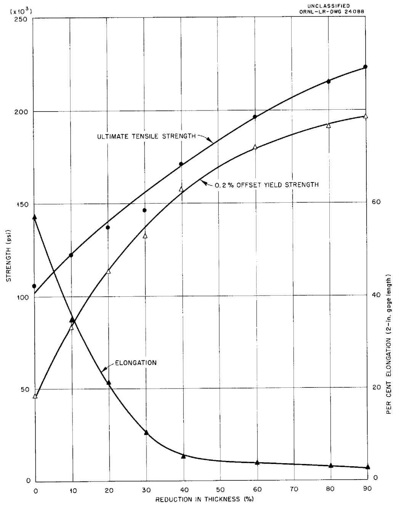  
Fig. 2.1. Work-Hardening Curves for INOR-8, Heat SP-16, Annealed 1 hr at $2150^{\circ}$ F Before Being Given the Reductions Indicated.

# Transformation Kinetics

The recovery characteristics of the cold-worked INOR-8 alloy are shown in Figs. 2.2 through 2.5. Of particular interest are the peaks in the curves observed for the tensile strength, yield point, and hardness at an annealing temperature of $1000^{\circ}\mathrm{F}$ after cold working $80\%$ . As yet it is uncertain whether the increase in strength is due to recovery or to carbide precipitation. Microstructural observations of the cold-worked specimens show that recrystallization for the $80\%$ cold-worked alloy begins at $1350^{\circ}\mathrm{F}$ and is complete at $1400^{\circ}\mathrm{F}$ . For the $40\%$ cold-worked alloy, recrystallization begins at about $1500^{\circ}\mathrm{F}$ and is complete at $1550^{\circ}\mathrm{F}$ .

The effect of the time at the annealing temperature is shown by the isothermal recrystallization curves in Fig. 2.6. These curves show that although recovery and recrystallization are promoted by increasing the time at temperature, these variables are not so significant as temperature.

# WELDING AND BRAZING

# P. Patriarca

# G. M. Slaughter

Mechanical property studies on welded joints of a nickel-molybdenum alloy similar to INOR-8 have been made. The tests were conducted on a Battelle Memorial Institute alloy, heat No. 3766, and it was concluded that this alloy was weldable and that the mechanical properties of the joint were satisfactory both in the as-welded and the aged conditions.

Preliminary tests have also been conducted on two other alloys of INOR-8 composition: a commercial-size heat from Haynes Stellar Company, designated SP-16, which had been annealed $\frac{1}{2}$ hr at $2150^{\circ}$ F and air cooled; and a small ORNL heat, designated heat 30-38.

The initial studies on these alloys were primarily screening tests for determining their relative susceptibilities to weld-metal cracking. One type

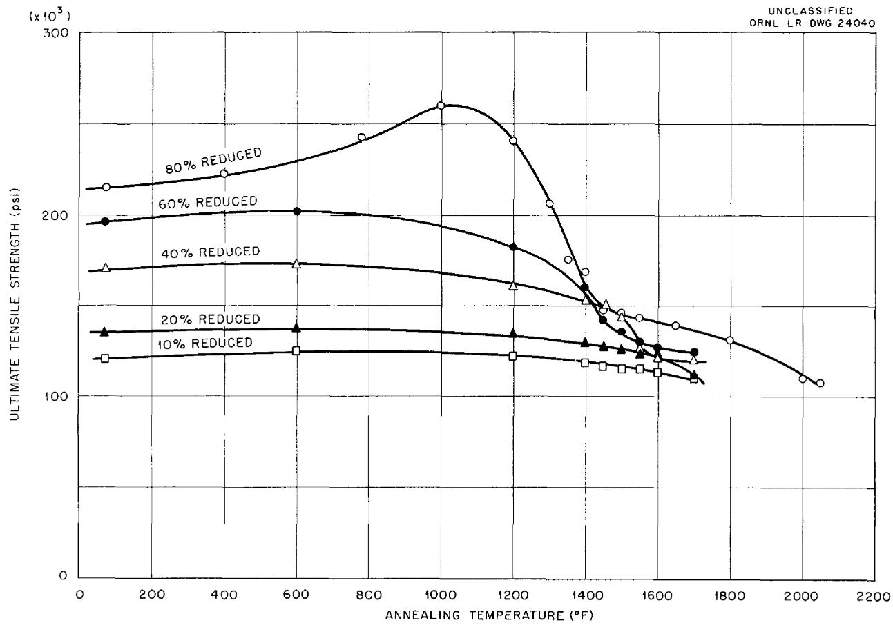  
Fig. 2.2. Room-Temperature Tensile Strength of INOR-8, Heat SP-16, Deformed by Rolling and Annealed 1 hr at Indicated Temperature.

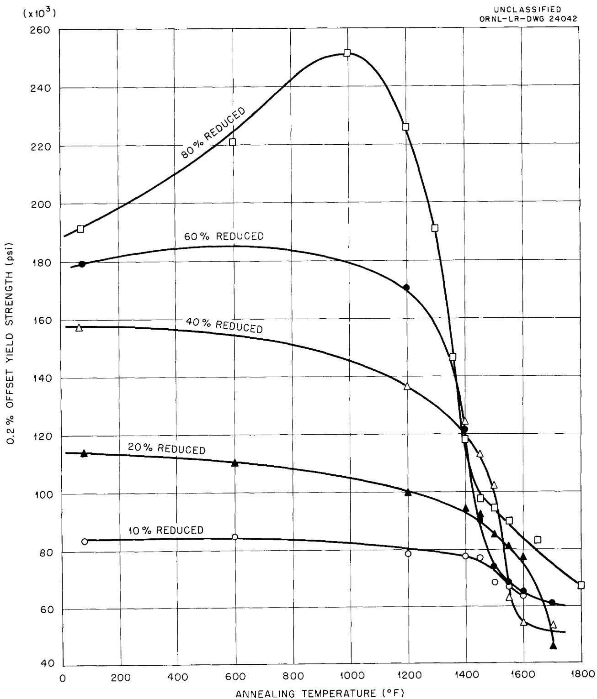  
Fig. 2.3. Yield Strength (0.2% Offset) at Room Temperature of INOR-8, Heat SP-16, Deformed by Rolling and Annealed 1 hr at Indicated Temperature.

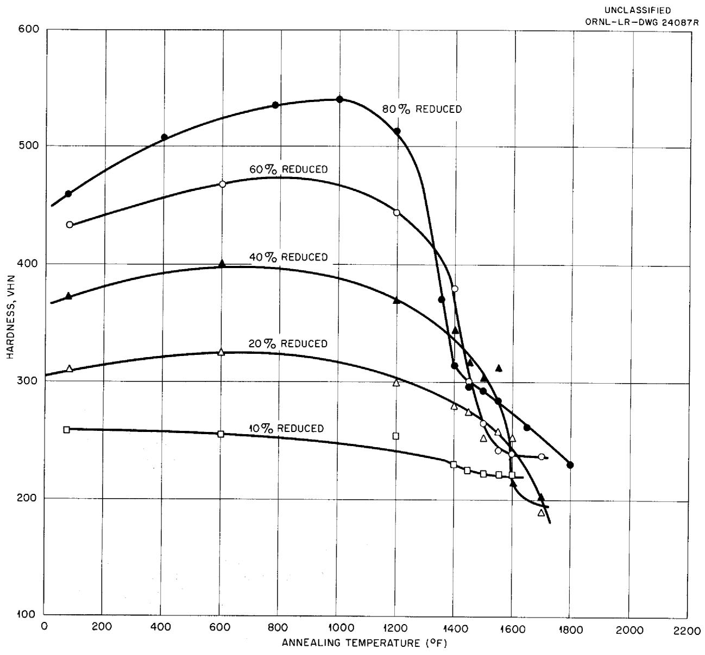  
Fig. 2.4. Hardness (VHN) of INOR-8, Heat SP-16, Deformed by Rolling and Annealed 1 hr at Indicated Temperature.

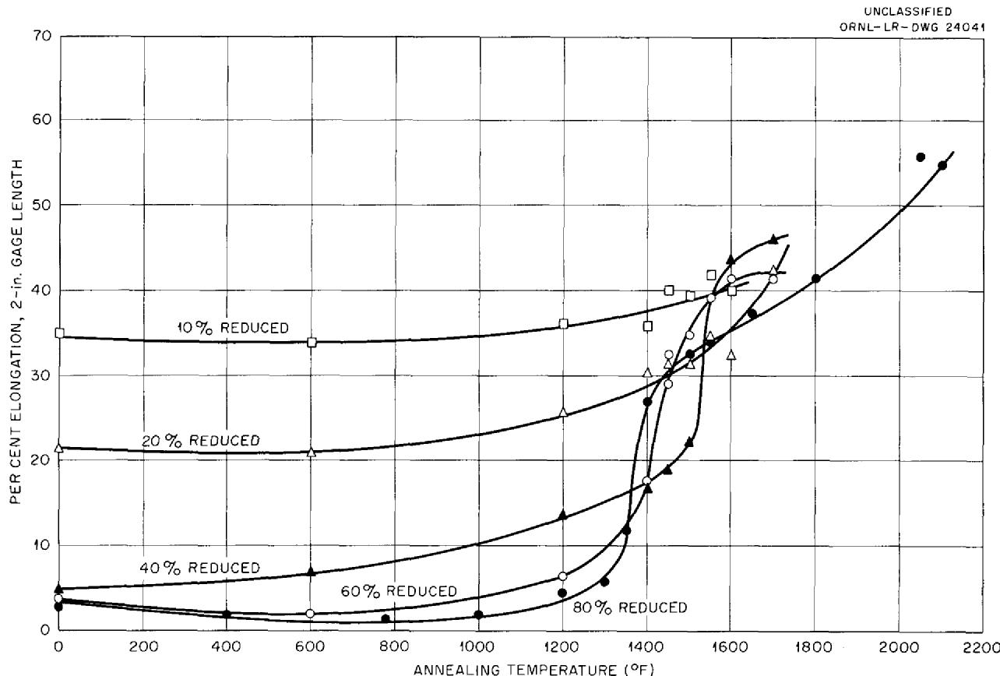  
Fig. 2.5. Room-Temperature Elongation (2-in. Gage Length) of INOR-8, Heat SP-16, Deformed by Rolling and Annealed 1 hr at Indicated Temperature.

of test, termed the circular-groove test, utilizes a $3/32$ -in.-wide, 2-in.-dia, $3/8$ -in.-deep, circular groove machined in a $4 \times 4$ in. specimen of $1/2$ -in. plate. An inert-arc fusion pass (no filler metal addition) is made around the groove and the absence or presence of weld-metal cracks is observed. Test samples of heats SP-16 and 30-38, together with samples of four other alloys for comparison, are shown in Fig. 2.7. It may be seen that the restraint of the specimen caused complete circumferential cracks in the Haynes SP-16 specimen, while no cracking can be observed in the ORNL 30-38 alloy. As was expected, the Inconel specimen cracked extensively, because no columbium-modified filler metal (known as INCO 62) was added.

Another type of crack test, designated as the open-end slot test, utilizes a $2\frac{1}{2} \times 5$ -in. specimen of $\frac{1}{2}$ -in. plate. A 3-in.-long, $\frac{1}{16}$ -in.-wide slot is cut from one end, and a fusion pass is made from the open end of the slot toward the closed end. As may be seen in Fig. 2.8, cracks were found in the Haynes SP-16 alloy but not in the ORNL 30-38 alloy.

As a means of further evaluating the weldability of the Haynes SP-16 alloy, the preparation of typical weld-test plates (Fig. 2.9) for radiographic, mechanical-property, and metallographic studies was initiated. The first test plate, NiMo plate No. 36, was fabricated by using SP-16 alloy filler metal which had been sheared from $\frac{1}{16}$ -in. sheet. Preparation of this plate was terminated after

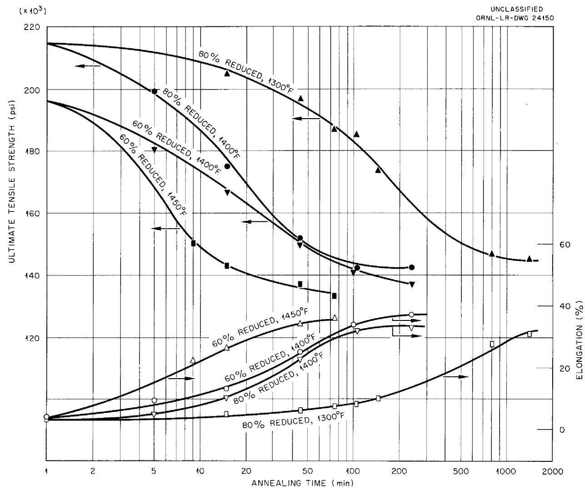  
Fig. 2.6. Isothermal Annealing Curves for INOR-8, Heat SP-16, for 60 and $80\%$ Cold-Reduced Specimens.

deposition of the first few passes because gross weld-metal cracking had occurred. The extent of the cracking is evident in Fig. 2.10. Metallographic examination of the weldment revealed weld-metal cracks of the type shown in Fig. 2.11 and base-metal cracks of the type illustrated in Fig. 2.12.

In view of the unsatisfactory results with the SP-16 filler metal, another weld-test plate, NiMo plate No. 37, was fabricated by using Hastelloy W filler wire. This plate is shown in Fig. 2.13. Although no weld-metal cracks were found by visual and dye-penetrant inspection, metallo

graphic examination of the weld joint revealed severe base-metal cracks of the type shown in Fig. 2.14. Extensive fusion-line porosity of the type illustrated in Fig. 2.15 was also found. Metallographic examination of the SP-16 heat revealed an abnormal number of stringers, which may be responsible for the porosity and extensive base-metal and weld-metal cracking. On the other hand, ORNL alloy 30-38 appeared to be immune to weld-metal cracking, and thus melting practice may be responsible for the poor performance of the Haynes heat. Additional tests are being conducted to evaluate weld-metal and base-metal cracking tendencies of the ORNL heat.

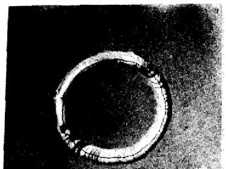  
$\left\{  {1,2,3,4}\right\}   \cdot  \left\{  {1,2,3,4}\right\}   \cdot  \left\{  {1,2,3,4}\right\}$   
INOR-8   
HAYNES SP-16 (HT 8284)

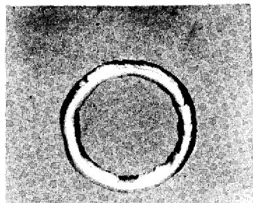  
INOR-8 (HT 30-38)

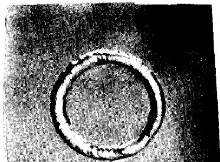  
HASTELELOY B

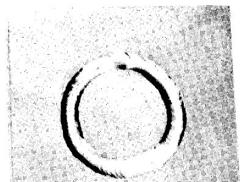  
TYPE 310 SS

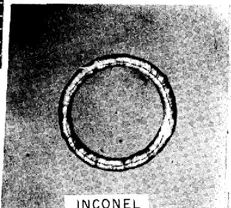

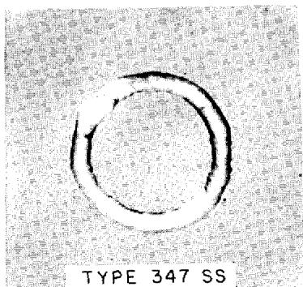  
Fig. 2.7. Circular-Groove Test Specimens for Studying Weld-Cracking Susceptibility.

# DYNAMIC CORROSION

J. H. DeVan J. R. DiStefano

R. S. Crouse

Test Program

A basic question underlying the development of a molten-salt reactor for power production concerns the long-time compatibility of structural materials with the intended fluid heat-transfer media, fluoride salts and sodium.

As stated above, two structural alloys, Inconel and INOR-8, are presently being studied as possible container materials for these applications. Corrosion experiments utilizing thermal-convection loops and forced-circulation loops fabricated of both alloys are presently under way. The test program will, in general, involve three phases. In the first, the relative corrosive properties of the several fluoride mixtures listed in Table 2.2, are to be determined in thermal

convection loops operated for a period of 1000 hr. These tests will provide data on the corrosive properties of beryllium-bearing fuels as compared with the properties of zirconium-base fuels, the corrosive properties of fuel mixtures containing large quantities of thorium for breeding, and the corrosive properties of non-fuel-bearing fluoride mixtures for use as secondary coolants.

The second phase of testing, for which thermal-convection loops will again be used, will subject those systems which appear to be compatible in phase-1 experiments to more extensive investigations at longer time periods and at two temperatures, 1250 and $1350^{\circ}\mathrm{F}$ . The third and final phase of this out-of-pile testing will be conducted in forced-circulation loops at flow rates and temperature conditions simulating those of an operating reactor system. The temperature conditions to be employed in all three phases of testing are shown in Table 2.3. The status of

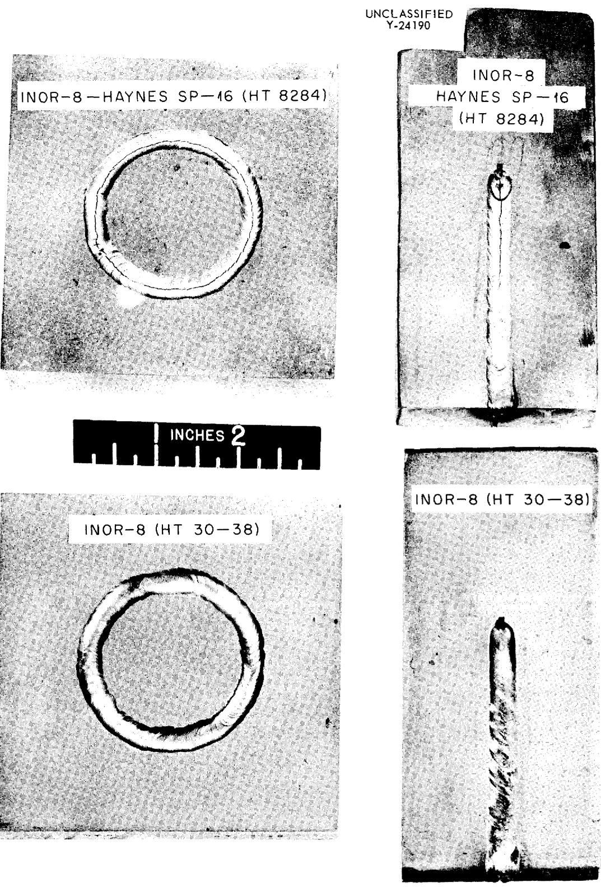  
Fig. 2.8. Circular-Groove and Open-End Slot Weld-Cracking Test Specimens.

tests which have been conducted thus far under these programs is described below.

# Thermal-Convection Loop Tests

A second Inconel loop has completed 1000 hr of operation under the phase-1 program and has been examined metallographically. This second

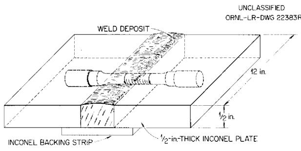  
Fig. 2.9. Weld Test Plate Design.

loop circulated fuel mixture 123, NaF-BeF $_2$ -UF $_4$ (53-46-1 mole %), and operated in accordance with the temperature schedule given in Table 2.3. Hot-leg sections of the loop showed light-to-moderate surface roughening and surface pits to a depth of 0.00025 in., as shown in Fig. 2.16. The appearance of the cold-leg specimens was similar to that of the hot-leg specimens, and they were entirely free from layers of metal crystals. The results of chemical analyses of samples of the fused salt taken before and after the test for the metal constituents are given in Table 2.4.

Other Inconel thermal-convection loops are now being operated to complete an initial evaluation of all the salt mixtures listed in Table 2.2. An INOR-8 loop is also being operated with the salt mixture $\mathrm{NaF - BeF}_2\text{-UF}_4$ (53-46-1 mole %), and additional INOR-8 loops are being fabricated for operation with the remaining fluoride mixtures listed in Table 2.2.

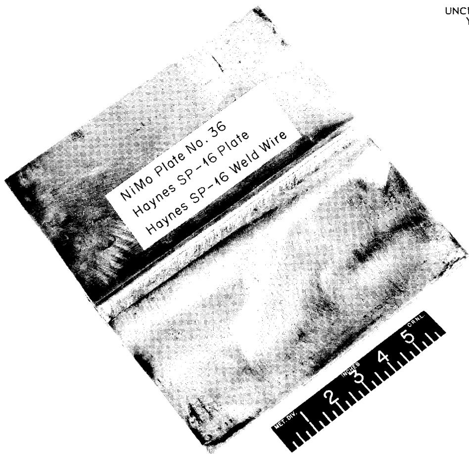  
Fig. 2.10. NiMo Test Plate No. 36.

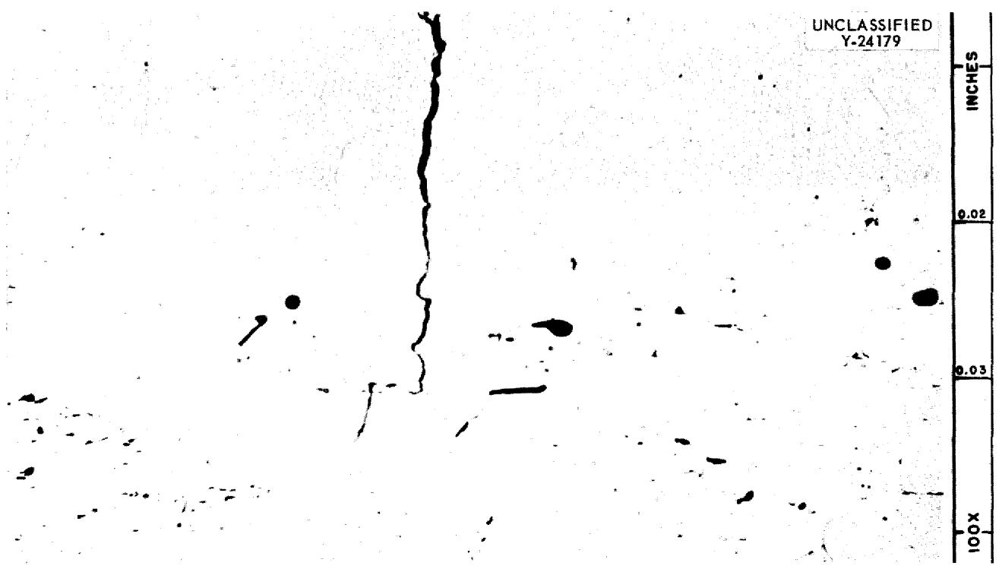  
Fig. 2.11. Weld-Metal Cracks in Haynes SP-16 Weld Metal Welded to SP-16 Base Plate. Etchant: chromic acid and HCl. 100X.

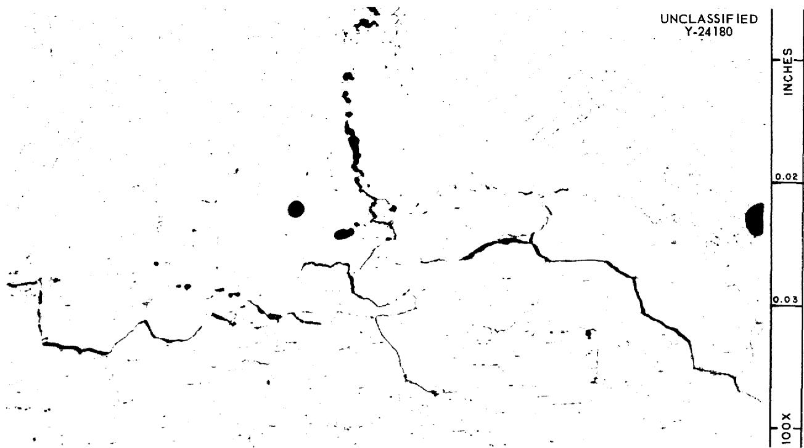  
Fig. 2.12. Base-Metal Cracks in Haynes SP-16 Welded with SP-16 Weld Metal. Etchant: chromic acid and HCI. 100X.

UNCLASSIFIED Y-24049

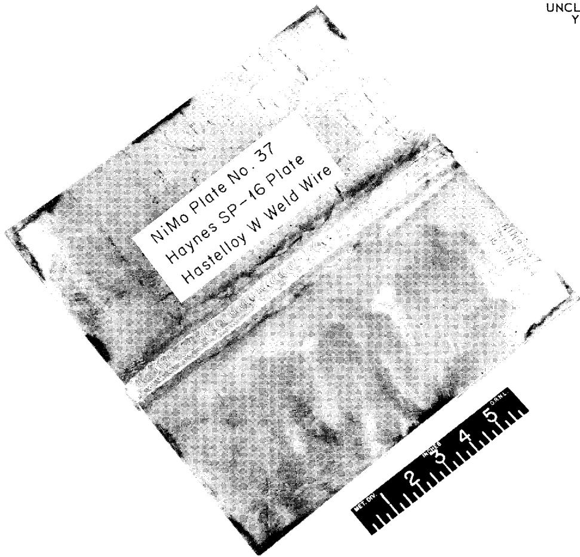

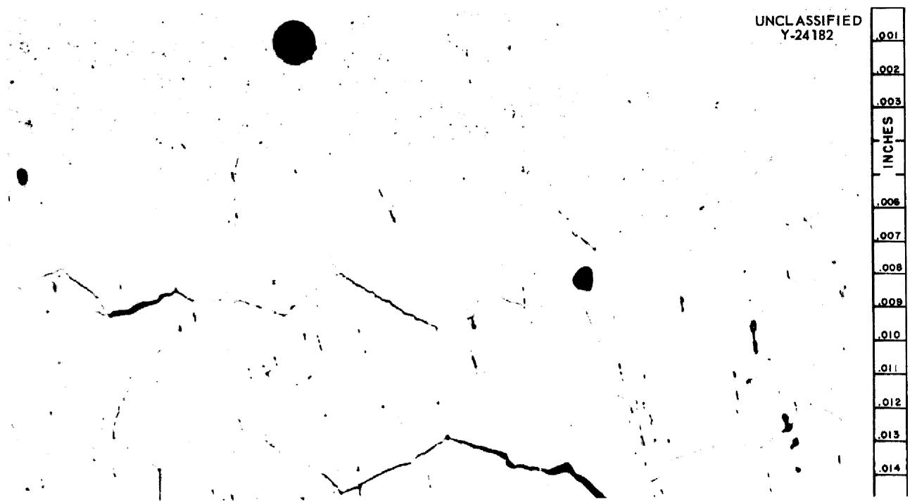  
Fig. 2.13. NiMo Test Plate No. 37.   
Fig. 2.14. Base-Metal Cracks in Haynes SP-16 Welded with Hastelloy W Filler Metal. Etchant: chromic acid and HCL. 250X.

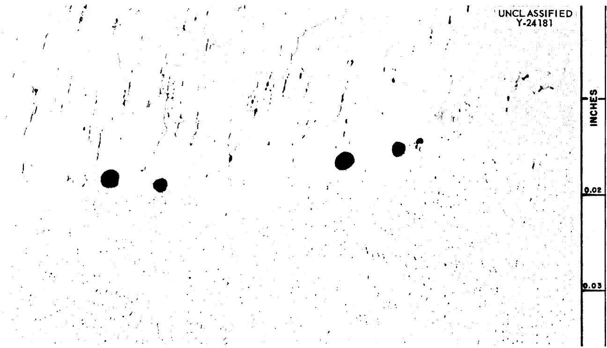  
Fig. 2.15. Fusion Line Porosity of Type Found When SP-16 Base Metal Was Welded with Either SP-16 or Hastelloy W Filler Metal. Etchant: chromic acid and HCl.

Table 2.2. Compositions of Molten Salt Mixtures to be Tested for Corrosiveness in Inconel and INOR-8 Thermal-Convection Loops   

<table><tr><td rowspan="2">Salt Designation</td><td colspan="7">Composition (mole %)</td></tr><tr><td>NaF</td><td>LiF</td><td>KF</td><td>ZrF4</td><td>BeF2</td><td>UF4</td><td>ThF4</td></tr><tr><td colspan="8">Fuel and Blanket Salts</td></tr><tr><td>122</td><td>57</td><td></td><td></td><td>42</td><td></td><td>1</td><td></td></tr><tr><td>129</td><td>55.3</td><td></td><td></td><td>40.7</td><td></td><td>4</td><td></td></tr><tr><td>123</td><td>53</td><td></td><td></td><td></td><td>46</td><td>1</td><td></td></tr><tr><td>124</td><td>58</td><td></td><td></td><td></td><td>35</td><td></td><td>7</td></tr><tr><td>125</td><td>53</td><td></td><td></td><td></td><td>46</td><td>0.5</td><td>0.5</td></tr><tr><td>126</td><td></td><td>53</td><td></td><td></td><td>46</td><td>1</td><td></td></tr><tr><td>127</td><td></td><td>58</td><td></td><td></td><td>35</td><td></td><td>7</td></tr><tr><td>128</td><td></td><td>71</td><td></td><td></td><td></td><td></td><td>29</td></tr><tr><td>130</td><td></td><td>62</td><td></td><td></td><td>37</td><td>1</td><td></td></tr><tr><td>131</td><td></td><td>60</td><td></td><td></td><td>36</td><td>4</td><td></td></tr><tr><td colspan="8">Coolant Salts</td></tr><tr><td>12</td><td>11.5</td><td></td><td>42</td><td></td><td></td><td></td><td></td></tr><tr><td>84</td><td>27</td><td></td><td></td><td></td><td>38</td><td></td><td></td></tr></table>

Table 2.3. Operating Temperatures to be Used in Various Phases of Corrosion Testing   

<table><tr><td></td><td colspan="2">Operating Temperatures (°F)</td></tr><tr><td></td><td>Maximum</td><td>Difference Between Hot and Cold Sections</td></tr><tr><td>Phase 1</td><td></td><td></td></tr><tr><td>Fuel mixtures</td><td>1250</td><td>170</td></tr><tr><td>Coolant salts</td><td>1125</td><td>125</td></tr><tr><td>Phase 2</td><td></td><td></td></tr><tr><td>Fuel mixtures</td><td>1250 to 1350</td><td>170</td></tr><tr><td>Coolant salts</td><td>1050 to 1250</td><td>170</td></tr><tr><td>Phase 3</td><td></td><td></td></tr><tr><td>Fuel mixtures</td><td>1300</td><td>200</td></tr><tr><td>Coolant salts</td><td>1200</td><td>200</td></tr></table>

# Forced-Circulation Loop Tests

An Inconel forced-circulation loop has been in operation for some time in order to determine the corrosion rate of this alloy in a zirconium-base fluoride and in sodium over a period of one year. The loop design employed provides for the operation of separate sodium and fluoride circuits connected through a U-bend heat exchanger. The maximum fluoride interface temperature in this loop is $1250^{\circ}\mathrm{F}$ , while the maximum sodium temperature is $1150^{\circ}\mathrm{F}$ . The loop, as of October 15, had accumulated 4900 hr of operation. Construction of additional Inconel forced-circulation loops, as well as INOR-8 forced-circulation loops, is now under way for testing under the phase-3 program.

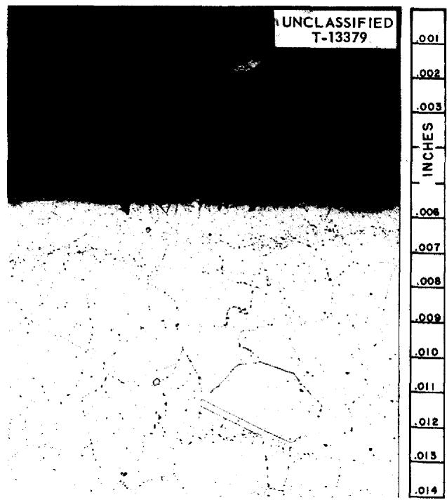  
Fig. 2.16. Hot Leg of Inconel Thermal-Convection Loop 1163 Which Circulated Fuel Mixture 123, NaF-BeF $_2$ -UF $_4$ (53-46-1 Mole %), for 1000 hr at a Maximum Temperature of $1250^{\circ}$ F. 250X.

Table 2.4. Metal Constituents of Fused Salt Before and After Circulation in Loop 1163   

<table><tr><td></td><td colspan="2">Major 
Constituents 
(wt %)</td><td colspan="3">Minor 
Constituents 
(ppm)</td></tr><tr><td></td><td>U</td><td>Be</td><td>Ni</td><td>Cr</td><td>Fe</td></tr><tr><td>Before-test sample</td><td>3.52</td><td>8.03</td><td>75</td><td>375</td><td>185</td></tr><tr><td>After-test sample</td><td></td><td></td><td></td><td></td><td></td></tr><tr><td>Hot leg</td><td>3.43</td><td>8.32</td><td>30</td><td>465</td><td>180</td></tr><tr><td>Cold leg</td><td>3.50</td><td>8.32</td><td>30</td><td>435</td><td>180</td></tr></table>

# RADIATION DAMAGE

G. W. Keilholtz

# IN-PILE LOOP TESTS

W. E. Browning

R.P.Shields

H. E. Robertson

J. F. Krause

An in-pile thermal-convection loop fabricated of an INOR-8 alloy is being prepared for operation in the LITR with a lithium-beryllium-uranium fuel mixture. The purpose of the experiment is to demonstrate the reliability of this combination of materials and to determine the effects of radiation on corrosion of the container material by fluoride fuel in the MSR design temperature range. The fuel container will be examined metallographically for evidence of corrosion after irradiation, and an analysis will be made of the fission products in the fuel. Design features and operating conditions for the loop are described below:

Fuel composition

BeF2-LiF-UF4(37-62-1 mole %) with Li7 and U235

Power density

50 w/cm³ or higher as necessary to achieve desired temperature differential

Maximum temperature 12

1250°F

Axial temperature differential

$150^{\circ} \mathrm{F}$

Duration of in-pile operation

Up to 10,000 hr

The loop will be air-cooled and will have external heaters. It will also have a charcoal trap for removing the xenon gas evolved from the fuel. The mechanical details are similar to those of the miniature, vertical, dynamic corrosion loop recently operated in the LITR. This loop can be converted to a forced-circulation loop with a minimum of modification after suitable pump bearings have been developed.

The parts which will be assembled to form the loop are shown in Fig. 2.17. It may be noted that the loop consists essentially of two parallel tubes with connecting bends at the top and bottom. The loop will be cooled by air passing through an air annulus which will, in general, follow the loop all the way around. The air will travel in the same direction as the fuel.

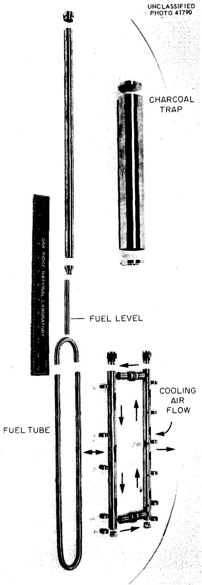  
Fig. 2.17. Parts for INOR-8 Thermal-Convection Loop To Be Operated in the LITR.

Details of the design and planning of the construction and operation of this loop have been reported. The fuel tube is 30 in. long, $\frac{3}{8}$ in. in. outside diameter, and will contain 42 cm³ of fuel. The total power will be approximately 2 kw.

A full-scale mockup of the in-pile loop is being prepared, with electrical resistance heating of the fuel tube to simulate fission heating. The purpose of this out-of-pile test will be to demonstrate the workability of the design and to provide operation information that will aid in an evaluation of hazards in the reactor. The parts shown in Fig. 2.17 have been fabricated for the bench test and are being assembled. Practice welds have been made for the fuel tube by using INOR-8 tubes and INOR-8 welding rod. Fuel for the bench test has been requested.

An improved design has been worked out for the thermocouple leads in the cooling-air annulus that should permit greater movement of the fuel tube without plastic deformation of the thermocouple lead wires. Preparations are being made to conduct a thermocouple mechanical-mockup test of this improved thermocouple installation technique.

Calculations have been made for the equilibrium distribution of fission gases in the system. It is estimated that $9 \times 10^{-4}$ moles of stable xenon and $1.5 \times 10^{-4}$ moles of stable krypton will accumulate during 10,000 hr of operation at 2 kw. This amount of xenon and krypton will be absorbed in the 500-g charcoal trap to such a degree that

$^{1}$ W. E. Browning, Proposed In-Pile Convection Loop for Molten-Salt Reactor, ORNL CF-57-11-20 (in preparation).

the remaining partial pressure of xenon will be $600\mu \mathrm{Hg}$ and that of krypton will be $150\mu \mathrm{Hg}$ . These equilibrium partial pressures are sufficiently low for the adsorption efficiency of the charcoal to be unimpaired. The combined decay-heat generation of all the daughters of fission gases having half-lives greater than 10 sec is only 6 w, according to the calculations. Cooling of the charcoal trap will not be a difficult problem.

Parts for the in-pile loop are being fabricated and will be assembled after the bench test has been started. Fluoride fuel containing enriched $\mathsf{U}^{235}$ and $\mathsf{Li}^7$ has been requested for the in-pile test. The INOR-8 tubing required for both the bench and the in-pile apparatus is available.

# STATIC IN-PILE CAPSULES

W.E.Browning H.L.Hemphill

Preparations are being made to irradiate lithium-beryllium-uranium fluoride fuels in INOR-8 capsules in the MTR. Tests simulating in-pile conditions have been conducted on INOR-8 tubing suitable for use in capsules. Thermal cycling in air at various temperatures up to $1250^{\circ}\mathrm{F}$ did not damage the adherent oxide coating which protects INOR-8 from atmospheric corrosion. Further tests are to be conducted in high-velocity air streams similar to those that are used in-pile, and equipment for testing the durability of thermocouples attached to INOR-8 capsules is being prepared. Fuel material has been requested for these tests.

# CHEMISTRY

W.R.Grimes

# PHASE EQUILIBRIUM STUDIES

C.J.Barton

R.E.Moore

H. F. Friedman

R.A.Strehlow

H. Insley

R.E.Thoma

R.E.Meadows

C. F. Weaver

An extensive and systematic study of phase behavior in fluoride systems has been conducted in the Chemistry Division of the Oak Ridge National Laboratory. In recent months attention has been directed toward those systems of possible use as fuel solvents, fuels, breeder blankets, and secondary coolants. Although the final choice of a fuel system for even the simplest of such reactor embodiments is far from certain, it appears that the systems of most promise are those which contain $\mathsf{BeF}_2$ with LiF and/or NaF.

The present status of the knowledge of phase behavior of these various systems is described briefly here, and references are given to more detailed reports.

# Solvent Systems

Melting Point of $\mathsf{BeF}_2$ . Several investigators have examined the melting point of $\mathsf{BeF}_2$ , and widely differing results have been obtained. Quenching experiments by Roy, Roy, and Osborn established a value of $545^{\circ}\mathsf{C}$ , which was confirmed by Eichelberger et al. of Mound Laboratory. Recently, however, Kirkina, Novoselova, and Simanov, who studied the system $\mathsf{BaF}_2$ - $\mathsf{BeF}_2$ by thermal analysis and x-ray diffraction, stated that $\mathsf{BeF}_2$ crystallizes in a new modification that is stable above $545^{\circ}\mathsf{C}$ when $\mathsf{BaF}_2$ is present. They claim that $545^{\circ}\mathsf{C}$ is a transition temperature between the two forms of $\mathsf{BeF}_2$ and cite the existence of a eutectic at $600^{\circ}\mathsf{C}$ between $\mathsf{BaBeF}_4$ and $\mathsf{BeF}_2$ as proof.

Recent quenches of mixtures containing $\mathsf{BeF}_2$ and up to 5 mole $\%$ $\mathsf{BaF}_2$ have not confirmed the Russian work. When the samples were equilibrated at and quenched from temperatures above $550^{\circ}\mathsf{C}$ , only isotropic material and quench growth were

found by petrographic examination. X-ray diffraction of the specimens showed none of the commonly observed form of $\mathsf{BeF}_2$ but revealed the existence of lines identical with those presented by the Russian investigators for $\mathsf{BaBeF}_4$ . The ordinary variety of $\mathsf{BeF}_2$ was found by petrographic examination of quenches from below $550^{\circ}\mathsf{C}$ , and x-ray diffraction revealed ordinary $\mathsf{BeF}_2$ along with the compound found at higher temperatures. Since this material coexists in equilibrium with $\mathsf{BeF}_2$ below $550^{\circ}\mathsf{C}$ , it is, presumably, $\mathsf{BaBeF}_4$ and it cannot be a high-temperature modification of $\mathsf{BeF}_2$ . These experiments present additional confirmation of the $545^{\circ}\mathsf{C}$ melting temperature of $\mathsf{BeF}_2$ .

The System $\mathsf{LiF - BeF}_2$ - The phase diagram presented in Fig. 2.18 for the simple system $\mathsf{LiF - BeF}_2$ represents data from Roy, Roy, and Osborn; Novoselova, Simanov, and Yarembash; and the Oak Ridge National Laboratory. The low cross sections and generally good nuclear properties of $\mathsf{BeF}_2$ and $\mathsf{Li}^7\mathsf{F}$ , along with the very low liquidus temperatures available in mixtures containing from 35 to 70 mole $\%$ $\mathsf{BeF}_2$ , make this system of obvious interest as a fuel solvent or as a coolant.

The System NaF-BeF $_2$ - The phase diagram for the NaF-BeF $_2$ system, shown in Fig. 2.19, was published by Roy, Roy, and Osborn. $^6$ The lowest temperature in the system is below that in the LiF-BeF $_2$ system, but the liquidus temperature rises more steeply as the BeF $_2$ concentration is decreased. Mixtures that contain between 40 and 65 mole % BeF $_2$ may be of interest to the program.

The System NaF-LiF-BeF $_2$ . - A preliminary and partially complete diagram of the ternary system NaF-LiF-BeF $_2$ is shown as Fig. 2.20. The ternary compound has been identified, with a fair degree of certainty, as NaF-LiF-3BeF $_2$ by petrographic and x-ray diffraction examinations of

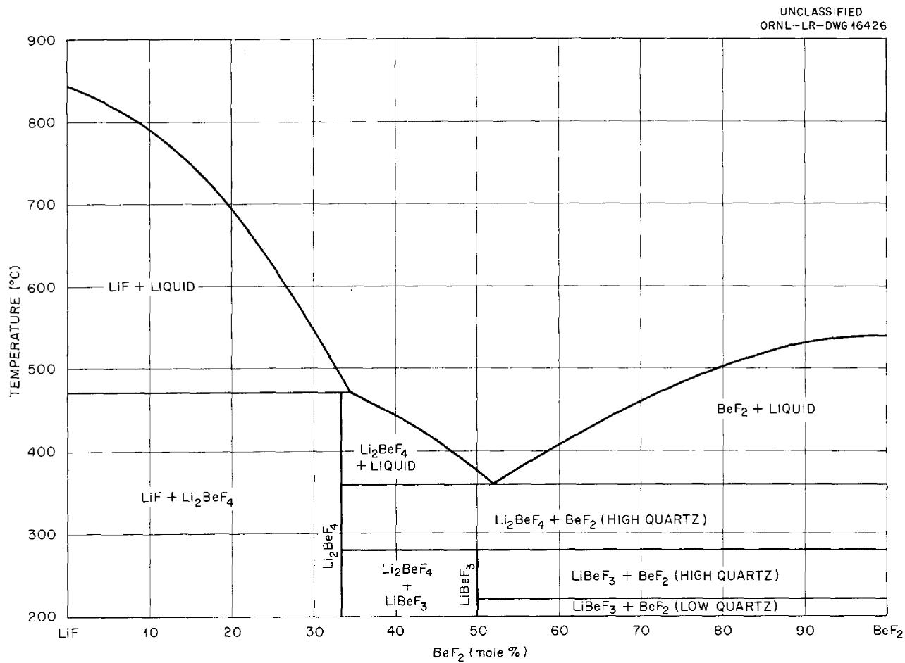  
Fig. 2.18. The System LiF-BeF $_2$ .

previously equilibrated quenched samples containing 60 mole $\%$ $\mathsf{BeF}_2 - 20$ mole $\%$ LiF. The compound melts incongruity to $\mathsf{BeF}_2$ and liquid at about $287^{\circ}\mathsf{C}$ . Only single-phase material was found just below $287^{\circ}\mathsf{C}$ , but the solid-phase reaction in which NaF·LiF·3BeF $_2$ is formed proceeds very slowly at only a few degrees lower. The primary phase field of the ternary compound is small and lies near the composition 50 mole $\%$ $\mathsf{BeF}_2 - 25$ mole $\%$ LiF.

Examinations of quenched samples of a number of compositions containing more than 40 mole $\%$ $\mathsf{BeF}_2$ have led to the conclusion that the following are compatibility triangles:

$$
N a F \cdot L i F \cdot 3 B e F _ {2} - B e F _ {2} - 2 L i F \cdot B e F _ {2}
$$

$$
N a F \cdot L i F \cdot 3 B e F _ {2} - 2 L i F \cdot B e F _ {2} - 2 N a F \cdot L i F \cdot 2 B e F _ {2}
$$

$$
N a F \cdot L i F \cdot 3 B e F _ {2} - 2 N a F \cdot L i F \cdot 2 B e F _ {2} - N a F \cdot B e F _ {2}
$$

$$
N a F \cdot L i F \cdot 3 B e F _ {2} - B e F _ {2} - N a F \cdot B e F _ {2}
$$

Although exact determinations of ternary eutectics and peritectics have not yet been completed, it is apparent that a region with melting points below $300^{\circ}C$ exists in the neighborhood of the primary phase field of NaF.LiF.3BeF.2. Compositions in this region (within 5 to 10 mole $\%$ of 50 mole $\%$ BeF-25 mole $\%$ LiF) may be of interest as lowmelting reactor coolants or fuel carriers.

# Systems Containing $\mathbf{U}\mathbf{F}_4$

The binary systems LiF-UF and NaF-UF have been well known for some years. Neither

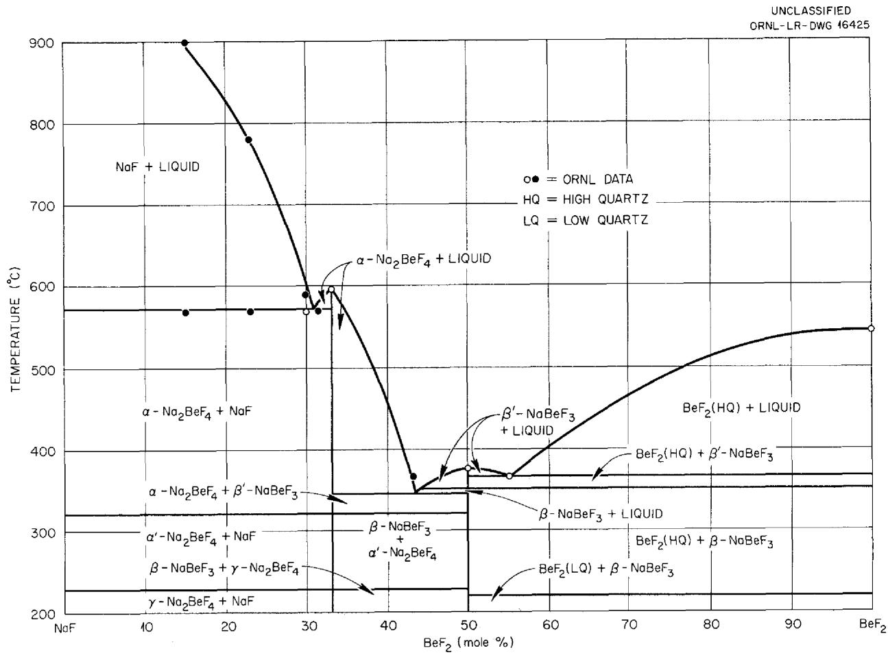

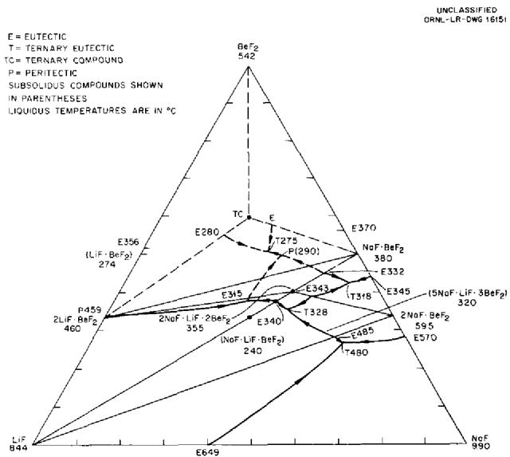  
Fig. 2.19. The System NaF-BeF $_2$ .   
Fig. 2.20. The System NaF-LiF-BeF $_2$ .

of these systems has sufficiently low liquidus temperatures at low uranium concentrations to serve as a practical reactor fuel. Liquids suitably rich in $\mathsf{UF}_4$ for enriching an operating reactor are available, however, with either system. The NaF-LiF- $\mathsf{UF}_4$ ternary system, although it shows considerably lower liquidus temperatures than those of either binary system, is likewise not useful directly as a fuel.

The binary system $\mathsf{BeF}_2\cdot \mathsf{UF}_4$ shows no intermediate compounds and has a eutectic at a concentration of about 1 mole $\%$ UF $^4$ and a temperature of $530^{\circ}C.$ The ternary systems LiF-BeF $^2$ -UF $^4$ and NaF-BeF $^2$ -UF $^4,$ which have been examined in detail at the Mound Laboratory, are shown in Figs. 2.21 and 2.22. It is evident from inspection of these systems that low-melting mixtures of interest as reactor fuels are available over wide composition ranges.

UNCLASSIFIED MOUND LAB. NO. 56-11-29 (REV.)

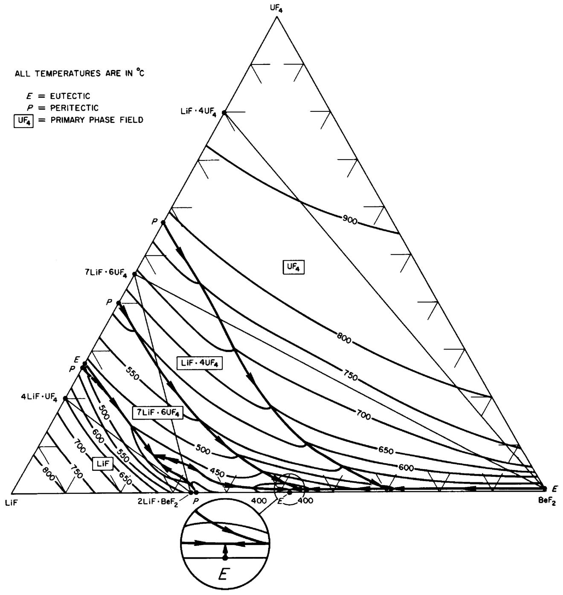  
Fig. 2.21. The System LiF-BeF $_2$ -UF $_4$ .

UNC CLASSIFIED MOUND LAB. NO. 56-11-30 (REV.)

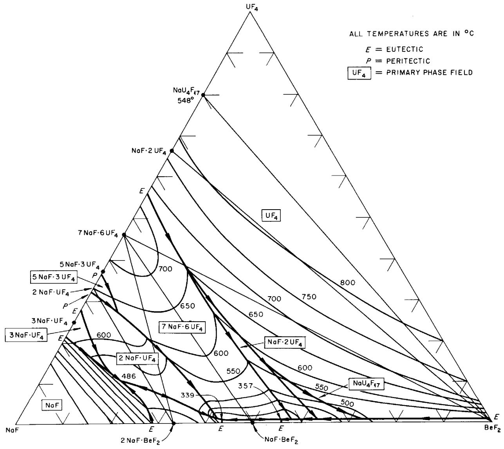  
Fig. 2.22. The System NoF-BeF $_2$ -UF $_4$ .

# Systems Containing ThF

A number of $\mathsf{ThF}_4$ -containing systems are being actively investigated, but virtually complete phase diagrams can be presented at present for only the $\mathsf{BeF}_2$ - $\mathsf{ThF}_4$ , $\mathsf{LiF}$ - $\mathsf{ThF}_4$ , and $\mathsf{NaF}$ - $\mathsf{ThF}_4$ systems.

The System $\mathsf{BeF}_2\cdot \mathsf{ThF}_4$ . - The $\mathsf{BeF}_2\cdot \mathsf{ThF}_4$ binary, shown in Fig. 2.23 is very similar to the $\mathsf{BeF}_2\cdot \mathsf{UF}_4$ system. A single eutectic, that melts at $530^{\circ}\mathsf{C}$ , was found which contains 1.5 mole $\%$ $\mathsf{ThF}_4$ . No intermediate compounds are formed in the system.

The System $\mathsf{LiF - ThF}_4$ Four intermediate compounds occur between LiF and $\mathsf{ThF}_4$ The compound 3LiF.ThF4melts congruently at $580^{\circ}C,$ forms eutectics with LiF and 7LiF-6ThF, respectively, at $570^{\circ}C$ with 22 mole $\%$ $\mathsf{ThF}_4$ and at $560^{\circ}C$ with 29 mole $\%$ $\mathsf{ThF}_4$ .The compounds 7LiF-6ThF, LiF-2ThF, and LiF-4ThF melt incongruity at 595, 755, and $890^{\circ}C.$ The phase diagram, which is presented in Fig. 2.24, shows the LiF-ThF system to have somewhat higher liquidus temperatures than those of its uraniumcontaining counterpart. A narrow range of

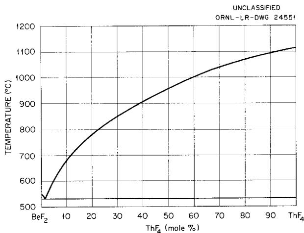  
Fig. 2.23. The System $\mathsf{BeF}_2$ -ThF4

LiF-ThF $^4$ compositions melt below $1100^{\circ}F,$ however, and such mixtures would seem, in principle, to be possible breeder blanket materials.

The System NaF-ThF4. The phase diagram of the NaF-ThF4 system obtained from studies in this Laboratory and shown in Fig. 2.25 differs in several respects from one recently described by Emelyanov and Eustyukhin. As may be seen in Fig. 2.25, NaF-ThF4 melts incongruity to NaF-2ThF4 and liquid, and there is only one crystalline form of 2NaF-ThF4. The Russian diagram, in which the liquidus temperatures are in general similar to those of Fig. 2.25, shows NaF-ThF4 to be a congruent compound and gives

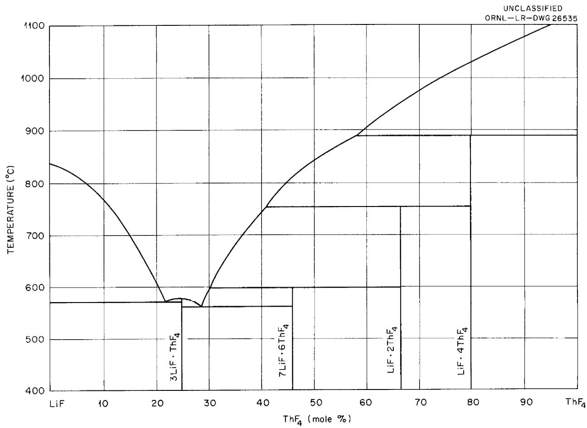  
Fig. 2.24. The System LiF-ThF4.

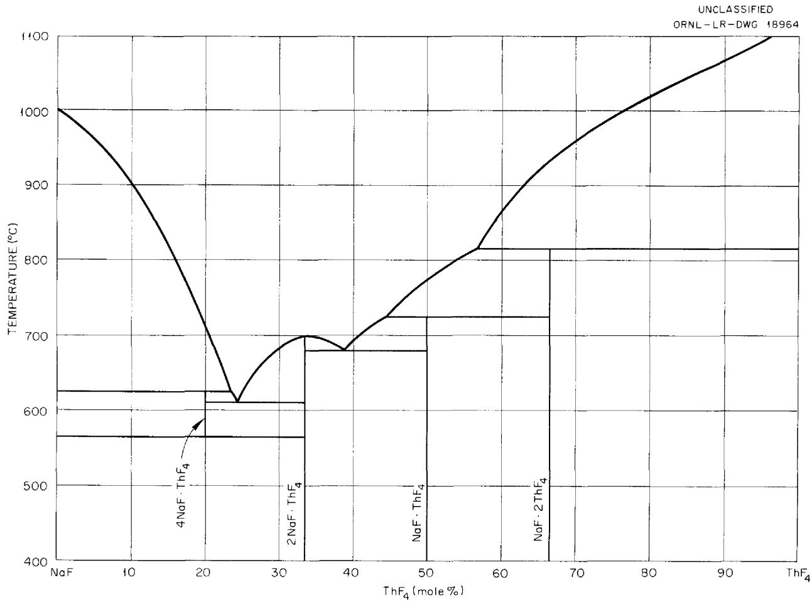  
Fig. 2.25. The System NoF-ThF4.

two crystalline forms of $2\mathrm{NaF}\cdot \mathrm{ThF}_4$ The ORNL diagram (Fig. 2.25) shows that $4\mathrm{NaF}\cdot \mathrm{ThF}_4$ decomposes at $568^{\circ}C.$ It appears that the Russian workers have interpreted these thermal effects as a transition between two forms of $2\mathrm{NaF}\cdot \mathrm{ThF}_{4'}$ which were suggested by Zachariasen; one of these two forms of $2\mathrm{NaF}\cdot \mathrm{ThF}_{4'}$ which may be prepared by Zachariasen's technique, has been shown in this Laboratory to be metastable.

The System $\mathsf{ThF}_4\cdot \mathsf{UF}_4\cdot$ - The compounds $\mathsf{ThF}_4$ and $\mathsf{UF}_4$ form a complete solid solution series for which liquidus and solidus temperatures are not yet completely defined. It appears that the minimum melting point occurs at a concentration of 60 mole $\%$ UF $^4$ and a temperature of $1010^{\circ}C$

Ternary Systems Containing $\mathsf{ThF}_4$ . None of the ternary systems containing $\mathsf{ThF}_4$ can be

considered to be complete, but sufficient study of the systems has been made to support the following statements. The system $\mathsf{LiF - ThF_4 - UF_4}$ has neither ternary compounds nor ternary eutectics. Most of the area on the phase diagram is occupied by the primary phase fields of the $\mathsf{ThF_4 - UF_4}$ , the $\mathsf{LiF - 4ThF_4 - LiF - 4UF_4}$ , and the 7LiF-6ThF-7LiF-6UF solid solutions. Liquidus temperatures, in general, decrease toward the $\mathsf{LiF - UF_4}$ edge of the diagram.

The $\mathsf{LiF - BeF}_2\text{-ThF}_4$ and the NaF-BeF-ThF 4 systems are remarkably similar to their UF 4 containing analogs. In the LiF-BeF-UF system, for example, two ternary eutectics occur that melt at 350 and $435^{\circ}C$ and contain 1 mole $\%$ UF-52 mole $\%$ BeF and 8 mole $\%$ UF-26 mole $\%$ BeF, respectively, and the ternary eutectics for the ThF- containing system are nearly identical in composition and temperature. The very great

similarity of the $\mathsf{LiF - BeF}_2\mathsf{-UF}_4$ and $\mathsf{LiF - BeF}_2\mathsf{-ThF}_4$ ternary systems indicates that a relatively wide choice of useful breeder-fuel compositions should be available.

# Systems Containing Plutonium Fluorides

The available thermodynamic data suggest that $\mathsf{PuF}_3$ should be more stable toward oxidation and disproportionation than $\mathsf{UF}_3$ is at elevated temperatures. Conversely, $\mathsf{PuF}_4$ is more strongly oxidizing and probably is more corrosive than $\mathsf{UF}_4$ . Previous studies indicated that the solubility of $\mathsf{UF}_3$ in $\mathsf{BeF}_2$ -containing melts was less than 2 wt % at $600^{\circ}\mathsf{C}$ , and similar low solubilities were anticipated for $\mathsf{PuF}_3$ . It seemed desirable, therefore, to determine initially the solubility of $\mathsf{PuF}_3$ in mixtures of interest for long-lived power reactors.

The first solubility determinations were made with the 57 mole $\%$ NaF-43 mole $\%$ BeF $_2$ mixture, which is reported to melt at $360^{\circ}\mathrm{C}$ (ref 10). The experiments were performed in a stainless steel glove box supplied with low-humidity air at a pressure slightly below that of the laboratory. Nickel filtration apparatus similar to that developed for obtaining UF $_3$ solubility data was used, but it was slightly modified to permit use of smaller amounts (6 g) of fused salts. Mixtures prepared by holding weighed portions of purified solvent and PuF $_3$ in a mixed atmosphere of argon, hydrogen, and HF for about 1 hr at the desired temperature were filtered by application of vacuum and inert-gas pressure. The nickel filter, which was welded into the end of a long piece of $\frac{3}{8}$ -in. nickel tubing, was kept out of the melt prior to the actual filtration operation. The data obtained in the first experiments are shown in Table 2.5.

10D. M. Roy, R. Roy, and E. F. Osborn, J. Am. Ceram. Soc. 36, 185 (1953).

Table 2.5. Solubility of $\mathsf{PuF}_3$ in NaF-BeF $_2$ (57-43 mole %)   

<table><tr><td rowspan="2">Temperature (°C)</td><td colspan="2">Filtrate Analysis</td></tr><tr><td>Pu (wt %)</td><td>PuF3(mole %)</td></tr><tr><td>538</td><td>1.10</td><td>0.20</td></tr><tr><td>600</td><td>1.32</td><td>0.25</td></tr><tr><td>652</td><td>2.16</td><td>0.41</td></tr></table>

The result obtained at $600^{\circ}C$ was lower than was expected from the results obtained at 538 and $652^{\circ}C,$ and therefore the filtration was repeated at $600^{\circ}C$ after a longer equilibration time. The analysis of this filtrate and those obtained at the same temperature with two other $\mathsf{NaF - BeF}_2$ compositions (64-36 and 50-50 mole %) have not been completed.

Several of the mixtures were also examined spectrophotometrically for the presence of $\mathsf{Pu}^{4+}$ in dissolved portions of the fused salt, and nearly all samples have been examined with a petrographic microscope mounted in a glove box adjacent to the stainless steel processing box. The plutonium in all the samples examined to date appeared to be in the trivalent state, but the plutonium compounds present in the mixtures have not as yet been positively identified. The compound $\mathsf{PuF}_3$ is probably stable in contact with nickel under the conditions of these experiments.

# CHEMISTRY OF THE CORROSION PROCESS

F. F. Blankenship

L.G.Overholser

R. B. Evans

G.M.Watson

A reactor fueled with a molten salt and operated at a high temperature will be free from corrosion only if the system defined by the fuel and its container is thermodynamically stable under all conditions of reactor operation. True thermodynamic stability of such a system would not seem to be realizable in practice. The rate at which the system can attain equilibrium can be made to be very slow for many cases, however, and reliable long-term compatibility can be obtained through the use of certain fluoride fuels and nickel-base alloys, such as Inconel or the INOR alloys (described above under the heading "Metallurgy"), which contain molybdenum and chromium. Since most of the experience with molten-salt corrosion behavior has been gained with Inconel, this material will be used as the example in the following discussion.

When Inconel is exposed at a single uniform temperature to a molten $\mathsf{UF}_4$ solution, selective leaching of chromium from the alloy occurs. Reactions with traces of oxidants, such as $\mathsf{FeF}_2$ or $\mathsf{NiF}_2$ , that were originally present in the melt or were formed by reactions of the melt with oxides on the alloy are partially responsible. A more important contributor to the attack is the attainment

of the equilibrium

$$
2 U F _ {4} + C r \rightleftharpoons C r F _ {2} + 2 U F _ {3}
$$

In simple isothermal tests no chromium is removed from the metal after chemical equilibrium is attained; diffusion within the alloy presumably proceeds until the chromium activity is equal throughout the metal wall. Such attack can be avoided in principle and can be minimized in practice by careful purification of the melt, deoxidation of the alloy, and the addition of $\mathsf{UF}_3$ and $\mathsf{CrF}_2$ at equilibrium concentrations to the melt.

Even when the required purification, deoxidation, and pre-equilibration are perfectly attained, however, a corrosion mechanism still exists when $\mathsf{UF}_4$ -containing solutions are circulated, as in a reactor, through Inconel systems which contain temperature gradients. If the iron and nickel constituents of Inconel are considered to be inert diluents for chromium (as is true to a reasonable approximation), the long-term corrosion process can be described simply. When the fuel mixture is circulated rapidly through the polythermal metal system, uniform concentrations of $\mathsf{UF}_4$ , $\mathsf{UF}_3$ , and $\mathsf{CrF}_2$ are maintained throughout the fluid. The concentrations are those which will satisfy the equilibrium constant

$$
K _ {a} = K _ {\gamma} \cdot K _ {N} = \frac {\gamma_ {C r F _ {2}} \cdot \gamma_ {U F _ {3}} ^ {2}}{\gamma_ {C r} \cdot \gamma_ {U F _ {4}} ^ {2}} \cdot \frac {N _ {C r F _ {2}} \cdot N _ {U F _ {3}} ^ {2}}{N _ {C r} \cdot N _ {U F _ {4}} ^ {2}}
$$

at $N_{\mathbf{Cr}}$ of the unaltered alloy and at an intermediate temperature which depends on the geometry and the temperature profile of the system. In this expression, $K_{a}$ is the equilibrium constant based on free-energy data, $K_{\gamma}$ is the activity coefficient quotient, $K_{N}$ is the equilibrium concentration quotient based on mole fractions, $\gamma$ is the activity coefficient based on pure substances as the standard state, and $N$ is mole fraction. The system must, however, at ultimate equilibrium, satisfy $K_{a}$ at all temperatures and locations in the system with the fixed concentrations of $\mathsf{CrF}_{2^{\prime}}$ , $\mathsf{UF}_{3^{\prime}}$ and $\mathsf{UF}_{4^{\prime}}$ . Since $K_{N}$ for the reaction shown increases with increasing temperature, the chromium concentration in the alloy surface is diminished at high temperatures and is augmented at low temperatures. These surface concentrations are maintained at the values required by the

equations by diffusion of chromium from or into the bulk metal. The equilibrium concentration of chromium at the surface of the alloy is accordingly fixed by the temperature drop in the circuit and the temperature dependence of the equilibrium constant for the chemical reaction. The rate at which chromium is transferred from hot to cold sections of the apparatus is determined by the rate of chromium diffusion in the alloy; this rate depends strongly on the absolute temperature of the metal. The flow rate of the fluid cannot affect the rate of this diffusion-controlled process.

If the equilibrium constant changes sufficiently with temperature, the temperature drop is sufficiently large, and the activity of chromium in the alloy is sufficiently high, the activity of chromium necessary to satisfy the equilibrium constant at low temperatures rises to near unity, and crystals of chromium can form in the low-temperature regions of the system at the expense of depletion of chromium in high-temperature regions of the system. Inconel systems with high- and low-temperature regions at 1600 and $1200^{\circ}\mathrm{F}$ in which NaK-KF-LiF-UF $_4$ mixtures are circulated and Hastelloy-X systems operated at similar temperatures with the fuel mixture NaF-ZrF $_4$ -UF $_4$ belong to the class of systems in which chromium deposits occur. The deposited dendritic crystals of chromium tend to plug the equipment at a rate controlled by diffusion of chromium from high-temperature regions of the system. Such combinations are obviously unsuited for reactor application.

If, however, the temperature effect on the equilibrium constant is small, as is true in many $\mathsf{ZrF}_4$ -containing systems, the equilibrium is satisfied at all useful temperatures without the formation of crystalline chromium deposits. The corrosion occurs, without restricting the flow passages, at a rate controlled by diffusion of chromium from the surfaces into the interior of the cool region.

Measurements of the rate of loss of radiotracer chromium from an inert fluoride melt exposed to Inconel showed the overall diffusion rate for chromium into Inconel to be $3.7 \times 10^{-15} \, \text{cm}^2/\text{sec}$ at $700^{\circ}\text{C}$ ; the activation energy of the process is 66 kcal/g-at. These numbers are, of course, independent of the fuel used.

Relatively little information is available regarding the effect of temperature on the equilibrium constant in $\mathsf{BeF}_2$ -containing systems, but preliminary values obtained for an LiF-BeF $_2$ (48-52 mole %) solvent are compared in Table 2.6 with those for NaF-ZrF $_4$ solvents for which many corrosion tests have been made. The data indicate that the temperature dependence of $K_N$ is significantly greater for LiF-BeF $_2$ systems than for the NaF-ZrF $_4$ systems which do not result in chromium deposition in cool zones of dynamic systems. It appears virtually certain, however, that with small chromium activities, such as those in Inconel and the INOR alloys, and small temperature drops, such as those contemplated for most long-term power reactors, chromium deposition will not result if fuel mixtures based on the $\mathsf{BeF}_2$ -containing system are used. Investigations of the effect of fuel composition on the response of $K_N$ with temperature in $\mathsf{BeF}_2$ -containing systems of reactor interest are continuing.

# FISSION-PRODUCT BEHAVIOR

J. H. Shaffer

R.A.Strehlow

N.V. Smith

W. T. Ward

G.M.Watson

When fission of uranium occurs in a molten fluoride solution, the fission fragments must originate in energy states and ionization levels

very far from those normally encountered. These fragments must, however, quickly lose energy as a consequence of collisions in the melt and come to equilibrium as common chemical entities. The valence states which they will ultimately assume are determined by the requirements of redox equilibria among components of the melt and the alloy container and by the necessity for cation-anion equivalence in the melt.

The equilibrium valences of several of the fission products are not yet well established, but it seems certain that xenon and krypton will appear as elements and that the alkalies, the alkaline earths, zirconium, and the rare earths will appear as ions of their customary valence. A systematic study of the solubility of these materials in NaF-ZrF4 and some other mixtures has been made, and the status of knowledge concerning behavior of these materials is summarized below.

# Solubility of the Noble Gases

The solubilities of the noble gases in molten NaF-ZrF₄ (53-47 mole %) obey Henry's law, increase with increasing temperature, decrease with increasing atomic radius, and are not appreciably affected by the presence of 10 wt % UF₄. The Henry's law constants at 600°C (in moles of gas per cubic centimeter of NaF-ZrF₄

Table 2.6. Equilibrium Quotients for the Reaction $2\mathrm{UF}_{4}(d) + \mathrm{Cr}(c) \rightleftharpoons 2\mathrm{UF}_{3}(d) + \mathrm{CrF}_{2}(d)$ in Molten Fluorides   

<table><tr><td>Reaction Medium</td><td>Temperature (°C)</td><td>Initial UF4Concentration (mole %)</td><td>KN</td></tr><tr><td rowspan="2">NaF-ZrF4(53-47 mole %)</td><td>600</td><td>4.0</td><td>(1.3 ± 0.1) × 10-4</td></tr><tr><td>800</td><td>4.0</td><td>(2.9 ± 0.1) × 10-4</td></tr><tr><td rowspan="2">NaF-ZrF4(50-50 mole %)</td><td>600</td><td>4.1</td><td>(3.2 ± 0.8) × 10-4</td></tr><tr><td>800</td><td>4.1</td><td>(5.9 ± 1.8) × 10-4</td></tr><tr><td rowspan="2">NaF-ZrF4(59-41 mole %)</td><td>600</td><td>3.7</td><td>(1.5 ± 0.2) × 10-5</td></tr><tr><td>800</td><td>3.7</td><td>(1.7 ± 0.7) × 10-5</td></tr><tr><td rowspan="3">LiF-BeF2(48-52 mole %)</td><td>550</td><td>1.5</td><td>2 × 10-6*</td></tr><tr><td>650</td><td>1.5</td><td>1.9 × 10-5*</td></tr><tr><td>800</td><td>1.5</td><td>7 × 10-5*</td></tr></table>

* Preliminary values.

mixture per atmosphere) are $21.6 \times 10^{-8}$ , $11.3 \times 10^{-8}$ , $5.1 \times 10^{-8}$ , and $1.9 \times 10^{-8}$ , respectively, for helium, neon, argon, and xenon. The heats of solution are, in the same order, 6.2, 8.0, 8.2, and 11.1 kcal/mole. The increase in solubility with increasing temperature is in marked contrast to the behavior of HF in this solvent; the Henry's law constant for HF at $600^{\circ}C$ is $1.23 \times 10^{-5}$ , while the heat of solution is $-4.5\mathrm{kcal / mole}$ .

The solubility of krypton has not been examined, but there is little reason to doubt that it dissolves in $\mathsf{NaF - ZrF}_4$ (53-47 mole %) at $600^{\circ}\mathsf{C}$ to the extent of $3\pm 1\times 10^{-8}$ moles/cm³/atm with a heat of solution of $9.5\pm 1.5\mathrm{kcal / mole}$ .

Although experimental determinations are under way, no data have been obtained as yet regarding the solubility of the noble gases in $\mathsf{BeF}_2$ -containing systems. It is anticipated that the solubility of xenon will depend to some extent on solvent composition. (Helium is roughly half as soluble in the LiF-NaF-KF eutectic as in the NaF-ZrF4 mixture described above.) However, it is most unlikely that the solubility will be so different from those listed above as to prevent the removal of krypton and xenon from an operating reactor fueled with a $\mathsf{BeF}_2$ -containing mixture.

# Solubility of Rare-Earth Fluorides

The rare-earth trifluorides are sparingly soluble in $\mathsf{NaF - ZrF_4}$ (53-47 mole %) mixtures. In this solvent the solubility of $\mathsf{CeF}_3$ is 2.3 mole % at $600^{\circ}C$ and 4.3 mole % at $800^{\circ}C$ . The product of the solubility (in mole %) and the third power of the cationic radius is constant to within $\pm 3\%$ for $\mathsf{CeF}_3$ , $\mathsf{LaF}_3$ , and $\mathsf{SmF}_3$ . While the solubility changes with the NaF-to- $\mathsf{ZrF}_4$ ratio, the saturating phase is apparently the simple rare-earth fluoride (that is, $\mathsf{CeF}_3$ ) over a relatively wide $\mathsf{NaF - ZrF}_4$ concentration range.

The solid phase in equilibrium with a saturated solution of two rare-earth fluorides in the NaF-ZrF $_4$ (53-47 mole %) mixture is a nearly ideal solid solution of the rare-earth fluorides. The equality

$$
\frac {N _ {\mathrm {C e F} _ {3 (d)}} \times N _ {\mathrm {L a F} _ {3 (s s)}}}{N _ {\mathrm {L a F} _ {3 (d)}} \times N _ {\mathrm {C e F} _ {3 (s s)}}} = \frac {S _ {\mathrm {C e F} _ {3}} ^ {0}}{S _ {\mathrm {L a F} _ {3}} ^ {0}}
$$

(where $N$ is mole fraction, the subscripts $d$ and $ss$ refer to liquid and solid solution, and $S^0$ is solubility of the single fluoride) is valid at each

temperature. This behavior of rare-earth mixtures indicates that partition of fission-product rare earths between the liquid and solid $\mathsf{CeF}_3$ in a cooled external circuit should deplete the fuel of nuclearly harmful species. The reactor fuel would, of necessity, be saturated with $\mathsf{CeF}_3$ at the reprocessing temperature. If the fuel were NaF-ZrF $_4$ -UF $_4$ , considerable CeF $_3$ (perhaps 2 mole %) would be carried in the circulating stream.

Preliminary experiments on the solubility of $\mathsf{CeF}_3$ in an NaF-BeF $_2$ (57-43 mole %) mixture produced the data presented in Table 2.7. A comparison of the values for the NaF-BeF $_2$ and NaF-ZrF $_4$ mixtures, as read from smooth curves through the experimental points, is given in Table 2.8. It is obvious that the solubility of $\mathsf{CeF}_3$ is considerably less in the BeF $_2$ -containing mixture and that it is more temperature sensitive. The saturating phase has been shown to be the simple trifluoride $\mathsf{CeF}_3$ .

No data have yet been obtained with mixtures of rare earths, but it is anticipated that they will

Table 2.7. Solubility of ${\mathrm{{CeF}}}_{3}$ in NaF-Be ${\mathrm{F}}_{2}$ (53-47 mole %)   

<table><tr><td rowspan="2">Temperature (°C)</td><td colspan="2">Solubility of CeF3</td></tr><tr><td>Ce+++ (wt %)</td><td>CeF3(mole %)</td></tr><tr><td>718</td><td>2.58</td><td>0.83</td></tr><tr><td>639</td><td>1.29</td><td>0.41</td></tr><tr><td>517</td><td>0.39</td><td>0.12</td></tr><tr><td>434</td><td>0.15</td><td>0.047</td></tr></table>

Table 2.8. Comparison of Solubility of ${\mathrm{{CeF}}}_{3}$ in NaF-ZrF ${}_{4}$ (53-47 mole %) and in NaF-BeF ${}_{2}$ (53-47 mole %)   

<table><tr><td rowspan="2">Temperature (℃)</td><td colspan="2">Solubility (mole % CeF3)</td></tr><tr><td>In NaF-ZrF4</td><td>In NaF-BeF2</td></tr><tr><td>750</td><td>3.2</td><td>1.1</td></tr><tr><td>700</td><td>2.7</td><td>0.65</td></tr><tr><td>600</td><td>1.9</td><td>0.29</td></tr><tr><td>550</td><td>1.7</td><td>0.17</td></tr></table>

exhibit the nearly ideal solid solution behavior found in the NaF-ZrF $_4$ system. Such behavior, along with the much reduced solubility in the BeF $_2$ system, should make the fission-product partition process quite attractive. Further studies with NaF-BeF $_2$ (53-47 mole %) and other BeF $_2$ -bearing systems are under way.

# PRODUCTION OF PURIFIED MOLTEN SALTS

J.P.Blokely

C. R. Croft

F.A.Doss

During the past quarter, 23 batches (described in Table 2.9), including eleven different compositions, were prepared. It is likely that some increase in process efficiency or in equipment capacity will become necessary if the demand for these materials continues as at present.

# METHODS FOR PURIFICATION OF MOLTEN SALTS

J.P.Blakely C.R.Croft

F. A. Doss

Production efforts have been devoted, increasingly, to the preparation in pure form of the various $\mathsf{BeF}_2$ -containing mixtures needed for

engineering tests in corrosion loops and similar apparatus. The melts have been processed by using slight modifications of the procedure used to purify $\mathsf{NaF - ZrF}_4$ and $\mathsf{NaF - ZrF}_4\mathsf{-UF}_4$ mixtures. In this method the blended raw materials are charged into reaction vessels of copper-lined stainless steel that have capacities of 5, 10, or 50 lb. The materials are melted and brought to a temperature of $800^{\circ}\mathsf{C}$ under a flowing atmosphere of HF to remove water with a minimum of hydrolysis. The $800^{\circ}\mathsf{C}$ melt is sparged with dry hydrogen to reduce penta- and hexavalent uranium compounds, sulfate, and extraneous oxidants. Subsequent sparging with anhydrous HF serves to volatilize the HCl and $\mathsf{H}_2\mathsf{S}$ and to convert to fluorides any oxygenated compounds in the mixture. This HF treatment, however, contaminates the melt with some copper fluoride through reaction with the container metal. A final 15- to 24-hr sparging with hydrogen serves to remove the $\mathsf{CuF}_2$ , along with any $\mathsf{FeF}_2$ and $\mathsf{NiF}_2$ that was originally present in the melt, by reducing the compound to metal.

The purified melt is then forced under helium pressure through a transfer line that contains a filter of sintered nickel and a sampler into a clean

Table 2.9. Materials Processed During the Quarter   

<table><tr><td rowspan="2">Composition No.</td><td colspan="7">Constituents (mole %)</td><td rowspan="2">Number of Batches</td></tr><tr><td>UF4</td><td>ThF4</td><td>BeF2</td><td>LiF</td><td>NaF</td><td>KF</td><td>ZrF4</td></tr><tr><td>C-12</td><td></td><td></td><td></td><td>46.5</td><td>11.5</td><td>42.0</td><td></td><td>3*</td></tr><tr><td>C-84</td><td></td><td></td><td>38.0</td><td>35.0</td><td>27.0</td><td></td><td></td><td>2*</td></tr><tr><td>C-122</td><td>1.0</td><td></td><td></td><td></td><td>57.0</td><td></td><td>42.0</td><td>1</td></tr><tr><td>C-123</td><td>1.0</td><td></td><td>46.0</td><td></td><td>53.0</td><td></td><td></td><td>2*</td></tr><tr><td>C-124</td><td></td><td>7.0</td><td>35.0</td><td></td><td>58.0</td><td></td><td></td><td>1*</td></tr><tr><td>C-125</td><td>0.5</td><td>0.5</td><td>46.0</td><td></td><td>53.0</td><td></td><td></td><td>2*</td></tr><tr><td>C-126</td><td>1.0</td><td></td><td>46.0</td><td>53.0</td><td></td><td></td><td></td><td>4*</td></tr><tr><td>C-127</td><td></td><td>7.0</td><td>35.0</td><td>58.0</td><td></td><td></td><td></td><td>1</td></tr><tr><td>C-128</td><td></td><td>29.0</td><td></td><td>71.0</td><td></td><td></td><td></td><td>3</td></tr><tr><td>C-129</td><td>4.0</td><td></td><td></td><td></td><td>55.3</td><td></td><td>40.7</td><td>3*</td></tr><tr><td>C-130</td><td>1.0</td><td></td><td>37.0</td><td>62.0</td><td></td><td></td><td></td><td>1</td></tr><tr><td></td><td></td><td></td><td></td><td></td><td></td><td></td><td></td><td>Total 23</td></tr></table>

*Includes one large batch (>13 kg); all other batches were small (<6 kg).

nickel receiver vessel. By manipulation of appropriate valves and connections the cold receiver is detached from the production assembly and attached for storage to a manifold containing helium under a slight positive pressure.

The $\mathsf{BeF}_2$ -containing mixtures are substantially more difficult to purify than $\mathsf{ZrF}_4$ -containing melts. The difficulties are, in general, a consequence of the fact that the $\mathsf{BeF}_2$ containing mixtures are not completely pure.

quence of the fact that $\mathsf{BeF}_2$ contains up to 2000 ppm S, as sulfate, and up to 600 ppm Fe, probably as $\mathsf{FeF}_3$ . The high sulfur content causes numerous equipment failures, especially failures of the nickel or nickel-alloy dip lines and transfer lines. Studies of improvements which can be made readily in the purification process are under way.