3445603612277

AEC RESEARCH AND DEVELOPMENT REPORT

CENTRAL RESEARCH LIBRARY

DOCUMENT COLLECTION

ORNL-2442 04.77A

C-84 - Reactors - Special Features

of Aircraft Reactors

M-3679 (20th ed., Rev.)

DECLASSIFIED

CLASSFCAUTION CHANGED TO: $A \in  C\;{10.9.59}$

THERMAL STRESS ANALYSIS OF THE ART HEAT

EXCHANGER CHANNELS AND HEADER PIPES

D. L. Platus

CENTRAL RESEARCH LIBRARY

DOCUMENT COLLECTION

LIBRARY LOAN COPY

DO NOT TRANSFER TO ANOTHER PERSON

If you wish someone else to see this

document, send in name with document

and the library will arrange a loan.

OAK RIDGE NATIONAL LABORATORY

operated by

UNION CARBIDE CORPORATION

for the

U.S. ATOMIC ENERGY COMMISSION

# LEGAL NOTICE

This report was prepared as an account of Government sponsored work. Neither the United States, nor the Commission, nor any person acting on behalf of the Commission!

A. Makes any warranty or representation, express or implied, with respect to the accuracy, completeness, or usefulness of the information contained in this report, or that the use of any information, apparatus, method, or process disclosed in this report may not infringe privately owned rights; or   
B. Assumes any liabilities with respect to the use of, or for damages resulting from the use of any information, apparatus, method, or process disclosed in this report.

As used in the above, "person acting on behalf of the Commission" includes any employee or contractor of the Commission to the extent that such employee or contractor prepares, handles or distributes, or provides access to, any information pursuant to his employment or contract with the Commission.

ORNL-2442

C-84 - Reactors - Special Features

of Aircraft Reactors

M-3679 (20th ed., Rev.)

This document consists of 38 pages.

Copy 77 of 227 copies. Series A.

Contract No. W-7405-eng-26

REACTOR PROJECTS DIVISION

THERMAL STRESS ANALYSIS OF THE ART HEAT

EXCHANGER CHANNELS AND HEADER PIPES

D. L. Platus

DATE ISSUED

MAP-4198

OAK RIDGE NATIONAL LABORATORY

Oak Ridge, Tennessee

operated by

UNION CARBIDE CORPORATION

for the

U.S. ATOMIC ENERGY COMMISSION

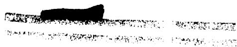

34456 0361227？

# NOMENCLATURE

# Subscripts on Deflections:

P deflections due to in-plane bending of channel   
N deflection due to out-of-plane bending of channel   
r deflection due to rigid-body rotation of plane of channel about y-axis   
T deflections due to relative thermal expansion of channel   
H deflections due to deformations of header pipe

# Symbols:

x,y,z rectangular coordinates

$\mathbf{x}_{b}, \mathbf{z}_{b}$ coordinates of point b

ob distance from origin to point b

$\phi$ angle between negative x-axis and ob

r radius of curve of channel

$\mathbf{r}_{\mathrm{H}}$ maximum radius of header pipe

length of header pipe

p, n directions in xz-plane, parallel and normal to plane of curve, respectively

$\delta x, \delta y, \delta z$ deflections parallel to $x-$ , $y-$ , and $z-$ axes, respectively

$\delta p, \delta n$ deflections in plane and normal to plane of curve, respectively

$\delta \theta, \delta \phi, \delta \gamma$ angular deflections with rotation vectors parallel to $x-$ , $y-$ , and $z-$ axes, respectively

$\delta \psi_{\mathfrak{p}}, \delta \psi_{\mathfrak{n}}$ angular deflections with rotation vectors parallel to $\mathfrak{p}$ and $\mathfrak{n}$ , respectively

$\mathbf{F}_{\mathbf{x}}, \mathbf{F}_{\mathbf{z}}$ forces parallel to x- and z- axes, respectively

P, N forces parallel to p and n, respectively

M, M, M, moments parallel to x-, y-, and z- axes, respectively

$\mathbf{M}_{\mathbb{P}}$ $\mathbf{M}_{\mathbb{N}}$ moments parallel to p and n, respectively

$M_{t}, M_{r}, M_{n}$ moments tangent, radial, and normal to plane of curve at equator, respectively

$\mathbf{M}_{\mathrm{H}}$ resultant bending moment acting on header pipe

Mx,My x= and y= components of MH

$\sigma_1, \sigma_2$ normal stresses

$\sigma_{\mathbf{N}}, \sigma_{\mathbf{n}}$ stresses due to in-plane bending of channel

$\sigma_{\mathrm{F}}, \sigma_{\mathrm{r}}$ stresses due to out-of-plane bending of channel

shear stress or twisting stress

C a function of the cross section used in calculating shear stress?

K a function of the cross section used in calculating torsional rigidity

$\mathbf{I}_{\mathbb{P}}$ moment of inertia of channel cross section about an axis radial to the curve

$\mathbf{I}_{\mathbb{N}}$ moment of inertia of channel cross section about an axis normal to plane of curve

$Z_{P}$ section modulus of channel about an axis radial to the curve

Z_N section modulus of the channel about an axis normal to the curve

$\mathbf{I}_{\mathrm{H}}$ moment of inertia of cross section of header pipe

J H polar moment of inertia of cross section of header pipe

poisson's ratio

E modulus of elasticity

shear modulus, $\mathbf{G} = \frac{\mathbf{E}}{2(1 + \nu)}$

a. a. coefficients in set of linear algebraic equations

$\alpha$ linear coefficient of expansion; angle describing direction of $\mathbf{M}_{\mathrm{H}}$

I temperature

# THERMAL STRESS ANALYSIS OF THE ART HEAT EXCHANGER

# CHANNELS AND HEADER PIPES

This report summarizes the study which was made to determine the stresses, deflections, and the forces and moments acting on the ART heat exchanger channels and header pipes due to relative thermal expansion between the channels and the pressure shell at full power operation.

# Introduction

Figure 1 shows a sketch of a channel and header pipes, and a portion of the pressure shell to which they are connected. During full power operation the temperature of the channel will be higher than that of the pressure shell, and thereby produce relative thermal expansion. The resulting forces and moments will cause deformation of the channel, the header pipes, and the thermal sleeves which connect the pipes to the pressure shell. The stresses due to these loads will be transmitted to the incoming NaK piping.

Figure 2 shows the idealized system used for the analysis. The channel was treated as a semi-circular-arc curved-beam connected directly to the header pipes, which were treated as cantilever beams. This analysis assumes that there is no deformation in the incoming NaK piping, or in the thermal sleeves. It is expected that this assumption will yield an adequate initial estimate for the analysis of the channel.

Because of symmetry it was sufficient to consider only one-half of the channel and one header pipe. The channel was assumed fixed at the mid-point and the deflections due to the relative thermal expansion were applied to the system. Elastic theory was assumed for all calculations.

  
FIG. 1 - SKETCH OF CHANNEL, HEADER PIPES AND ORIENTATION IN   
REACTOR

  
ORNL-LR-DWG. 27494

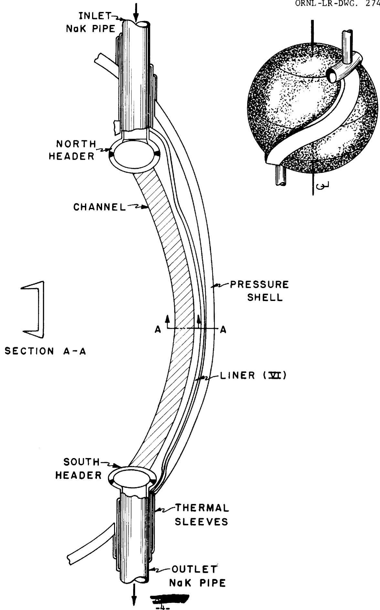

ORNL-LR-DWG. 27495

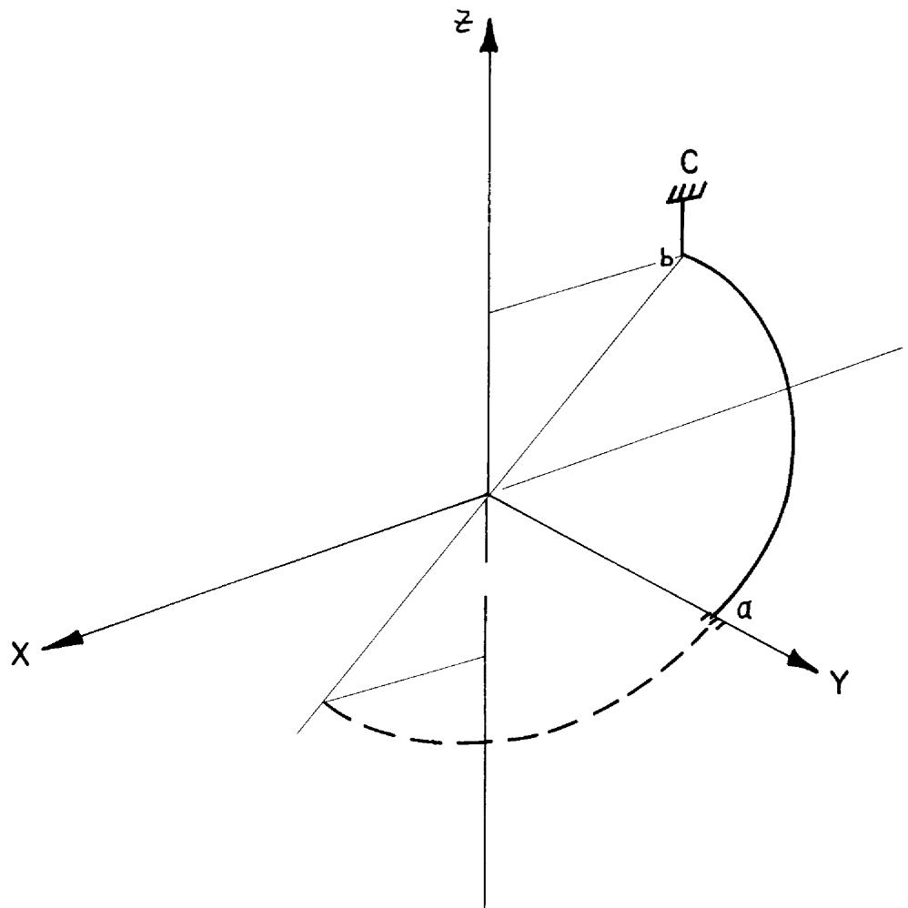

  
FIG.2-SKETCHBEAMSTRUCTUREUSEDTO APPROXIMATE CHANNELAND HEADERS

# Thermal Expansions

The total vertical expansion of the channel relative to the pressure shell was reported in ART Design Memo 8-D-5 as 82 mils. This was assumed to be distributed equally between the sections above and below the mid-point, so that 41 mils was the vertical deflection used in the calculations.

For the radial expansion, the channel was assumed to be at an average temperature of $1425^{\circ}\mathrm{F}$ and the pressure shell at $1240^{\circ}\mathrm{F}$ . Taking the radial position of the header pipes to be 19.59 inches, this gives a radial deflection of 32 mils.

# Method of Analysis

Deflection equations were written to determine the forces and moments acting on the channel at point b, from the thermal expansions applied between points a and c. The coordinate system is shown in Fig. 3. Since the channel is free to grow radially, forces were not applied in the y-direction. The modes of deformation included in-plane and out-of-plane bending of the channel from flexure and torsion and deformation of the header pipe by flexure and torsion.

The deflections for point $b$ due to deformation and rotation of the channel may be expressed by the following equations, in which the subscripts refer to the modes of deflection.

$$
\delta x = \delta x _ {P} + \delta x _ {N} + \delta x _ {r} \tag {1}
$$

$$
\delta z = \delta z _ {P} + \delta z _ {N} + \delta z _ {r} \tag {2}
$$

$$
\delta \theta = \delta \theta_ {P} + \delta \theta_ {N} \tag {3}
$$

$$
\delta \phi = \delta \phi_ {N} + \delta \phi_ {r} \tag {4}
$$

$$
\delta \gamma = \delta \gamma_ {P} + \delta \gamma_ {N} \tag {5}
$$

ORNL-LR-DWG. 27496

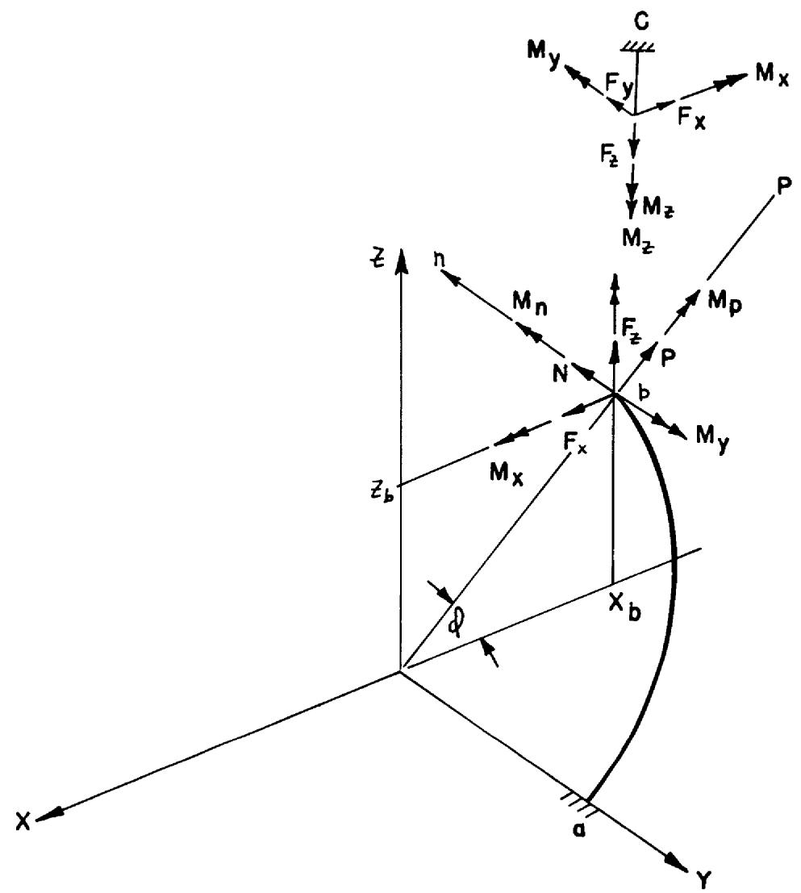  
FIG.3-COORDINATE SYSTEM SHOWING FORCES AND MOMENTS   
ACTING ON CHANNEL AND.HEADER PIPE

The relative thermal expansions applied between points $a$ and $c$ must be equal to the differences in the deflections of point $b$ caused by deformations of the channel and those caused by deformations of the header pipe. Hence, the following relations may be written, in which the subscripts $T$ and $H$ refer to the applied relative thermal expansions and the deflections due to deformation of the header pipe, respectively1.

$$
\delta x _ {P} + \delta x _ {N} + \delta x _ {r} - \delta x _ {H} = \delta x _ {T} \tag {6}
$$

$$
\delta z _ {P} + \delta z _ {N} + \delta x _ {r} = - \delta z _ {T} \tag {7}
$$

$$
\delta \theta_ {P} + \delta \theta_ {N} - \delta \theta_ {H} = 0 \tag {8}
$$

$$
\delta \phi_ {N} + \delta \phi_ {r} - \delta \phi_ {H} = 0 \tag {9}
$$

$$
\delta \gamma_ {P} + \delta \gamma_ {N} - \delta \gamma_ {H} = 0 \tag {10}
$$

By expressing the deflections in Eqs (6) through (10) in terms of the loads acting on the channel at point $b$ , a set of equations results from which these loads may be determined. Since the rigid body rotation of the plane of the channel about the y-axis is an unknown in addition to the five loads $F_x, F_z, M_x, M_y$ and $M_z$ , an additional equation is required, and may be written by summing moments about the y-axis.

$$
\Sigma M _ {y} = M _ {y} + F _ {x} z _ {b} - F _ {z} x _ {b} = 0 \tag {11}
$$

# Deflections From In-Plane Bending of Channel

It is seen from Fig. 3, that the force and moment producing in-plane bending of the channel are $P$ and $M_{\mathbb{N}}$ . These may be resolved into forces and moments parallel to the coordinate axes.

$$
P = F _ {z} \sin \phi - F _ {x} \cos \phi \tag {12}
$$

$$
M _ {N} = M _ {x} \sin \phi + M _ {z} \cos \phi \tag {13}
$$

The deflections due to these loads with respect to the p- and n- axes are given by

$$
\mathcal {G} _ {\mathrm {p}} = \frac {\pi}{4} \frac {\operatorname {P r} ^ {3}}{\operatorname {E I} _ {\mathrm {N}}} - \frac {\operatorname {M} _ {\mathrm {N}} r ^ {2}}{\operatorname {E I} _ {\mathrm {N}}} \tag {14}
$$

$$
\mathcal {S} \psi_ {\mathrm {n}} = - \frac {\operatorname {P r} ^ {2}}{\operatorname {E I} _ {\mathrm {N}}} + \frac {\pi}{2} \frac {\operatorname {M} _ {\mathrm {N}} r}{\operatorname {E I} _ {\mathrm {N}}} \tag {15}
$$

Resolving these deflections into components along the coordinate axes,

$$
\mathcal {E} _ {\mathrm {x} _ {\mathrm {p}}} = - \mathcal {S} _ {\mathrm {p}} \cos \varnothing \tag {16}
$$

$$
\mathcal {S} _ {\mathrm {P}} = \mathcal {S} _ {\mathrm {p}} \sin \phi \tag {17}
$$

$$
\theta_ {P} = \circ \psi_ {n} \sin \varnothing \tag {18}
$$

$$
\mathcal {S} \gamma_ {\mathrm {P}} = \mathcal {S} \psi_ {\mathrm {n}} \cos \varnothing \tag {19}
$$

Substituting Eqs (12) through (15) into Eqs (16) through (18),

$$
\begin{array}{l} \mathcal {S} x _ {P} = \frac {\pi}{4} \frac {r ^ {3}}{E I _ {N}} \left(F _ {x} \cos \phi - F _ {z} \sin \phi\right) \cos \phi \\ + \frac {r ^ {2}}{E I _ {N}} \left(M _ {x} \sin \phi + M _ {z} \cos \phi\right) \cos \phi \end{array} \tag {20}
$$

$$
\begin{array}{l} \mathcal {S} z _ {P} = - \frac {\pi}{4} \frac {r ^ {3}}{E I _ {N}} \left(F _ {x} \cos \phi - F _ {z} \sin \phi\right) \sin \phi \tag {21} \\ + \frac {r ^ {2}}{E I _ {N}} \left(M _ {X} \sin \phi + M _ {Z} \cos \phi\right) \sin \phi \\ \end{array}
$$

$$
\begin{array}{l} \delta \theta_ {P} = \frac {r ^ {2}}{E I _ {N}} \left(F _ {x} \cos \phi - F _ {z} \sin \phi\right) \sin \phi \tag {22} \\ + \quad \frac {\pi}{2} \frac {r}{E I _ {N}} \left(M _ {x} \sin \phi + M _ {z} \cos \phi\right) \sin \phi \\ \end{array}
$$

$$
\begin{array}{l} \mathcal {S} \gamma_ {\mathrm {P}} = \frac {r ^ {2}}{\mathrm {E I} _ {\mathrm {N}}} \left(\mathrm {F} _ {\mathrm {x}} \cos \phi - \mathrm {F} _ {\mathrm {z}} \sin \phi\right) \cos \phi \tag {23} \\ + \frac {\pi}{2} \frac {r}{E I _ {N}} \left(M _ {x} \sin \phi + M _ {z} \cos \phi\right) \cos \phi^ {\prime} \\ \end{array}
$$

Deflections From Out-of-Plane Bending of Channel

The force and moments producing out-of-plane bending of the channel are $N$ , $M_P$ , and $M_y$ . Resolving $N$ and $M_P$ along the coordinate axes,

$$
N = F _ {x} \sin \phi + F _ {z} \cos \phi \tag {24}
$$

$$
M _ {P} = M _ {z} \sin \phi - M _ {x} \cos \phi \tag {25}
$$

The deflections due to these loads with respect to the n, p, and y axes are given by

$$
\mathcal {S} n = N r ^ {3} \left[ \frac {\pi}{4} \frac {1}{E I _ {P}} + \left(\frac {3 \pi}{4} - 2\right) \frac {1}{G K} \right] + \frac {M _ {P} r ^ {2}}{2} \left(\frac {1}{E I _ {P}} + \frac {1}{G K}\right) + \frac {M _ {y} r ^ {2}}{2} \left[ \frac {\pi}{2} \cdot \frac {1}{E I _ {p}} - \frac {1}{G K} \left(2 - \frac {\pi}{2}\right) \right] (2 6)
$$

$$
\begin{array}{l} \mathcal {S} \psi_ {\mathrm {p}} = \frac {\mathrm {N r} ^ {2}}{2} \left(\frac {1}{\mathrm {E I} _ {\mathrm {P}}} + \frac {1}{\mathrm {G K}}\right) + \frac {\gamma}{4} M _ {\mathrm {P}} r \left(\frac {1}{\mathrm {E I} _ {\mathrm {P}}} + \frac {1}{\mathrm {G K}}\right) + \frac {\mathrm {M} r}{2} \left(\frac {1}{\mathrm {E I} _ {\mathrm {P}}} - \frac {1}{\mathrm {G K}}\right) \tag {27} \\ \mathcal {S} \phi_ {\mathrm {N}} = \frac {\mathrm {N r} ^ {2}}{2} \left[ \frac {\pi}{2} \frac {1}{\mathrm {E I} _ {\mathrm {P}}} - \left(2 - \frac {\pi}{2}\right) \frac {1}{\mathrm {G K}} \right] + \frac {\mathrm {M} _ {\mathrm {P}} r}{2} \left(\frac {1}{\mathrm {E I} _ {\mathrm {P}}} - \frac {1}{\mathrm {G K}}\right) + \frac {\pi}{4} \mathrm {M} _ {\mathrm {y}} r \left(\frac {1}{\mathrm {E I} _ {\mathrm {P}}} + \frac {1}{\mathrm {G K}}\right) (2 8) \\ \end{array}
$$

Resolving $\mathcal{O}$ and $\mathcal{O}_{\mathfrak{p}}$ into components parallel to the coordinate axes

$$
\delta x _ {N} = \delta n \sin \phi \tag {29}
$$

$$
\mathcal {S} z _ {N} = \partial^ {n} \cos \varnothing \tag {30}
$$

$$
\int \gamma_ {N} = \int \psi_ {p} \sin \varnothing \tag {31}
$$

$$
\partial^ {\theta} \Theta_ {N} = - \partial^ {\prime} \psi_ {p} \cos \phi \tag {32}
$$

Substituting Eqs (24) through (27) into Eqs (28) through (32),

$$
\begin{array}{l} \mathcal {P} \phi_ {\mathrm {N}} = \frac {r ^ {2}}{2} \left(F _ {\mathrm {x}} \sin \phi + F _ {\mathrm {z}} \cos \phi\right) \left[ \frac {\pi}{2} \frac {1}{E I _ {P}} - \left(2 - \frac {\pi}{2}\right) \frac {1}{G K} \right] \tag {33} \\ - \frac {r}{2} \left(M _ {x} \cos \phi - M _ {z} \sin \phi\right) \left(\frac {1}{E I _ {P}} - \frac {1}{G K}\right) + \frac {\mu}{4} M _ {y} r \left(\frac {1}{E I _ {P}} + \frac {1}{G K}\right) \\ \end{array}
$$

$$
\begin{array}{l} \mathcal {O} _ {\mathbf {x} _ {\mathbb {N}}} = r ^ {3} \left(F _ {x} \sin \phi + F _ {z} \cos \phi\right) \left[ \frac {\pi}{4} \frac {1}{E I _ {P}} + \left(\frac {3 \pi}{4} - 2\right) \frac {1}{G K} \right] \sin \phi \\ - \frac {r ^ {2}}{2} \left(\mathrm {M} _ {\mathrm {x}} \cos \phi - \mathrm {M} _ {\mathrm {z}} \sin \phi\right) \left(\frac {1}{\mathrm {E I} _ {\mathrm {P}}} + \frac {1}{\mathrm {G K}}\right) \sin \phi \tag {34} \\ + \frac {r ^ {2}}{2} M _ {y} \left[ \frac {\pi}{2} \frac {1}{E I _ {P}} - \left(2 - \frac {\pi}{2}\right) \frac {1}{G K} \right] \sin \phi \\ \end{array}
$$

$$
\begin{array}{l} \delta z _ {N} = r ^ {3} \left(F _ {x} \sin \phi + F _ {z} \cos \phi\right) \left[ \frac {\pi}{4} \frac {1}{E I _ {P}} + \left(\frac {3 \pi}{4} - 2\right) \frac {1}{G K} \right] \cos \phi \\ - \frac {r ^ {2}}{2} \left(M _ {x} \cos \phi - M _ {z} \sin \phi\right) \left(\frac {1}{E I _ {P}} + \frac {1}{G K}\right) \cos \phi \tag {35} \\ + \frac {r ^ {2}}{2} M _ {y} \left[ \frac {\pi}{2} \frac {1}{E I _ {P}} - \left(2 - \frac {\pi}{2}\right) \frac {1}{G K} \right] \cos \phi \\ \end{array}
$$

$$
\begin{array}{l} \mathcal {S} \gamma_ {\mathrm {N}} = \frac {\mathrm {r} ^ {2}}{2} \left(\mathrm {F} _ {\mathrm {x}} \sin \phi + \mathrm {F} _ {\mathrm {z}} \cos \phi\right) \left(\frac {1}{\mathrm {E I} _ {\mathrm {P}}} + \frac {1}{\mathrm {G K}}\right) \sin \phi \\ - \frac {\pi}{4} r \left(M _ {x} \cos \phi - M _ {z} \sin \phi\right) \left(\frac {1}{E I _ {P}} + \frac {1}{G K}\right) \sin \phi \tag {36} \\ + \frac {r}{2} M _ {y} \left(\frac {1}{E I _ {P}} - \frac {1}{G K}\right) \sin \phi \\ \end{array}
$$

$$
\begin{array}{l} \theta_ {N} = - \frac {r ^ {2}}{2} \left(F _ {x} \sin \phi + F _ {z} \cos \phi\right) \left(\frac {1}{E I _ {p}} + \frac {1}{G K}\right) \cos \phi \\ + \frac {\pi}{4} r \left(M _ {x} \cos \phi - M _ {z} \sin \phi\right) \left(\frac {1}{E I _ {P}} + \frac {1}{G K}\right) \cos \phi \tag {37} \\ - \frac {r}{2} M _ {y} \left(\frac {1}{E I _ {P}} - \frac {1}{G K}\right) \cos \varnothing \\ \end{array}
$$

Deflections From Rigid-Body Rotation of Channel About y-axis

The $x$ - and $z$ - deflections from rigid-body rotation of the channel about the $y$ -axis are given by

$$
\mathcal {S} z _ {r} = \overline {{o b}} \mathcal {S} \phi_ {r} \cos \phi \tag {38}
$$

$$
\oint_ {r} \mathbf {x} _ {r} = \overline {{o b}} \delta \phi_ {r} \sin \phi \tag {39}
$$

Deflections From Deformation of Header Pipe

Since the loads acting on the channel are transmitted to the header pipe in the opposite directions, the deflections of the header pipe may be written in terms of these loads.

$$
\int_ {H} x _ {H} = - \frac {1}{E I _ {H}} \left(\frac {F _ {x} l ^ {3}}{3} - \frac {M _ {y} l ^ {2}}{2}\right) \tag {40}
$$

$$
\int_ {\mathbf {H}} \theta_ {\mathbf {H}} = - \frac {\mathrm {M} _ {\mathbf {x}} \ell}{\mathrm {E I} _ {\mathbf {H}}} \tag {41}
$$

$$
\partial \phi_ {\mathrm {H}} = \frac {1}{\mathrm {E I} _ {\mathrm {H}}} \left(\frac {\mathrm {F} _ {\mathrm {x}} l ^ {2}}{2} - \mathrm {M} _ {\mathrm {y}} l\right) \tag {42}
$$

$$
\delta \gamma_ {\mathrm {H}} = - \frac {\mathrm {M} _ {\mathrm {Z}}}{\mathrm {G J} _ {\mathrm {H}}} \tag {43}
$$

Solution of Deflection Equations

Substituting Eqs (20)-(23), (33)-(37), (38), (39), and (40)-(43) into Eqs (6)-(11) gives six equations in six unknowns. These can be written in terms of coefficients $a_{11}$ , through $a_{16}$ , as follows:

$$
\begin{array}{l} a _ {1 1} F _ {x} + a _ {1 2} F _ {z} + a _ {1 3} M _ {x} + a _ {1 4} M _ {y} + a _ {1 5} M _ {z} + a _ {1 6} \phi_ {r} = \int x _ {T} \\ a _ {2 1} F _ {x} + a _ {2 2} F _ {z} + a _ {2 3} M _ {x} + a _ {2 4} M _ {y} + a _ {2 5} M _ {z} + a _ {2 6} \phi_ {r} = - \int z _ {T} \\ a _ {3 1} F _ {x} + a _ {3 2} F _ {z} + a _ {3 3} M _ {x} + a _ {3 4} M _ {y} + a _ {3 5} M _ {z} = 0 \\ a _ {4 1} F _ {x} + a _ {4 2} F _ {z} + a _ {4 3} M _ {x} + a _ {4 4} M _ {y} + a _ {4 5} M _ {z} + a _ {4 6} \phi_ {r} = 0 \tag {44} \\ a _ {5 1} F _ {x} + a _ {5 2} F _ {z} + a _ {5 3} M _ {x} + a _ {5 4} M _ {y} + a _ {5 5} M _ {z} = 0 \\ \mathrm {a} _ {6 1} \mathrm {F} _ {\mathrm {x}} + \mathrm {a} _ {6 2} \mathrm {F} _ {\mathrm {z}} + \mathrm {a} _ {6 4} \mathrm {M} _ {\mathrm {y}} = 0 \\ \end{array}
$$

where,

$$
\begin{array}{l} a _ {1 1} = r ^ {3} \left[ \frac {\pi}{4} \frac {1}{E I _ {P}} + \left(\frac {3 \pi}{4} - 2\right) \frac {1}{G K} \right] \sin^ {2} \phi + \frac {\pi}{4} \frac {r ^ {3}}{E I _ {N}} \cos^ {2} \phi + \frac {\ell^ {3}}{3 E I _ {H}} \\ a _ {1 2} = r ^ {3} \left[ \frac {\pi}{4} \frac {1}{E I _ {P}} + \left(\frac {3 \pi}{4} - 2\right) \frac {1}{G K} \right] \sin \phi \cos \phi - \frac {\pi}{4} \frac {r ^ {3}}{E I _ {N}} \sin \phi \cos \phi \\ a _ {1 3} = \infty \frac {r ^ {2}}{2} \left(\frac {1}{E I _ {P}} + \frac {1}{G K}\right) \sin \phi \cos \phi + \frac {r ^ {2}}{E I _ {N}} \sin \phi \cos \phi \\ a _ {1 4} = \frac {r ^ {2}}{2} \left[ \frac {\pi}{2} \frac {1}{E I _ {P}} - \left(2 - \frac {\pi}{2}\right) \frac {1}{G K} \right] \sin \phi - \frac {l ^ {2}}{2 E I _ {H}} \\ a _ {1 5} = \frac {r ^ {2}}{2} \left(\frac {1}{E I _ {P}} + \frac {1}{G K}\right) \sin^ {2} \phi + \frac {r ^ {2}}{E I _ {N}} \cos^ {2} \phi \\ a _ {1 6} = \overline {{o b}} \sin \varnothing \\ a _ {2 1} = r ^ {3} \left[ \frac {\pi}{4} \frac {1}{E I _ {P}} + \left(\frac {3 \pi}{4} - 2\right) \frac {1}{G K} \right] \sin \phi \cos \phi - \frac {\pi}{4} \frac {r ^ {3}}{E I _ {N}} \sin \phi \cos \phi \\ a _ {2 2} = r ^ {3} \left[ \frac {\pi}{4} \frac {1}{E I _ {P}} + \left(\frac {3 \pi}{4} - 2\right) \frac {1}{G K} \right] \cos^ {2} \phi + \frac {\pi}{4} \frac {r ^ {3}}{E I _ {N}} \sin^ {2} \phi \\ \end{array}
$$

$$
a _ {2 3} = - \frac {r ^ {2}}{2} \left(\frac {1}{E I _ {P}} + \frac {1}{G K}\right) \cos^ {2} \phi - \frac {r ^ {2}}{E I _ {N}} \sin^ {2} \phi
$$

$$
a _ {2 4} = \frac {r ^ {2}}{2} \left[ \frac {\pi}{2} \frac {1}{E I _ {P}} - \left(2 - \frac {\pi}{2}\right) \frac {1}{G K} \right] \cos \phi
$$

$$
a _ {2 5} = \frac {r ^ {2}}{2} \left(\frac {1}{E I _ {P}} + \frac {1}{G K}\right) \sin \phi \cos \phi - \frac {r ^ {2}}{E I _ {N}} \sin \phi \cos \phi
$$

$$
a _ {2 6} = \overline {{o b}} \cos \varnothing
$$

$$
a _ {3 1} = - \frac {r ^ {2}}{2} \left(\frac {1}{E I _ {P}} + \frac {1}{G K}\right) \sin \phi \cos \phi + \frac {r ^ {2}}{E I _ {N}} \sin \phi \cos \phi
$$

$$
a _ {3 2} = - \frac {r ^ {2}}{2} \left(\frac {1}{E I _ {P}} + \frac {1}{G K}\right) \cos^ {2} \phi - \frac {r ^ {2}}{E I _ {N}} \sin^ {2} \phi
$$

$$
a _ {3 3} = \frac {\pi}{4} r \left(\frac {1}{E I _ {P}} + \frac {1}{G K}\right) \cos^ {2} \phi + \frac {\pi}{2} \frac {r}{E I _ {N}} \sin^ {2} \phi + \frac {\ell}{E I _ {H}}
$$

$$
a _ {3 4} = - \frac {r}{2} \left(\frac {1}{E I _ {P}} - \frac {1}{G K}\right) \cos \varnothing
$$

$$
a _ {3 5} = - \frac {\pi}{4} r \left(\frac {1}{E I _ {P}} + \frac {1}{G K}\right) \sin \phi \cos \phi + \frac {\pi}{2} \frac {r}{E I _ {N}} \sin \phi \cos \phi
$$

$$
a _ {4 1} = \frac {r ^ {2}}{2} \left[ \frac {\pi}{2} \frac {1}{E I _ {P}} - \left(2 - \frac {\pi}{2}\right) \frac {1}{G K} \right] \sin \phi - \frac {l ^ {2}}{2 E I _ {H}}
$$

$$
a _ {4 2} = \frac {r ^ {2}}{2} \left[ \frac {\pi}{2} \frac {1}{E I _ {P}} - (2 - \frac {\pi}{2}) \frac {1}{G K} \right] \cos \phi
$$

$$
a _ {4 3} = - \frac {r}{2} \left(\frac {1}{E I _ {P}} - \frac {1}{G K}\right) \cos \phi
$$

$$
\mathbf {a} _ {4 4} = \frac {\mathcal {U}}{4} \mathbf {r} \left(\frac {1}{E I _ {P}} + \frac {1}{G K}\right) + \frac {\ell}{E I _ {H}}
$$

$$
a _ {4 5} = \frac {r}{2} \left(\frac {1}{E I _ {P}} - \frac {1}{G K}\right) \sin \varnothing
$$

$$
\mathbf {a} _ {4 6} = \mathbf {1}
$$

$$
a _ {5 1} = \frac {r ^ {2}}{2} \left(\frac {1}{E I _ {P}} + \frac {1}{G K}\right) \sin^ {2} \phi + \frac {r ^ {2}}{E I _ {N}} \cos^ {2} \phi
$$

$$
a _ {5 2} = \frac {r ^ {2}}{2} \left(\frac {1}{E I _ {P}} + \frac {1}{G K}\right) \sin \phi \cos \phi - \frac {r ^ {2}}{E I _ {N}} \sin \phi \cos \phi
$$

$$
a _ {5 3} = - \frac {\pi}{4} r \left(\frac {1}{E I _ {P}} + \frac {1}{G K}\right) \sin \phi \cos \phi + \frac {\pi}{2} \frac {r}{E I _ {N}} \sin \phi \cos \phi
$$

$$
a _ {5 4} = \frac {r}{2} \left(\frac {1}{E I _ {P}} - \frac {1}{G K}\right) \sin \phi
$$

$$
a _ {5 5} = \frac {\pi}{4} r \left(\frac {1}{E I _ {P}} + \frac {1}{G K}\right) \sin^ {2} \phi + \frac {\pi}{2} \frac {r}{E I _ {N}} \cos^ {2} \phi + \frac {\ell}{G J _ {H}}
$$

$$
a _ {6 1} = z _ {b}
$$

$$
a _ {6 2} = - x _ {b}
$$

$$
a _ {6 4} = 1
$$

# Results

Equations (44) were solved with the aid of an IBM-650. The numerical data and values of the coefficients are given in Appendix A. The following results were obtained:

$$
\begin{array}{l} F _ {x} = 5 6 5. 9 \quad l b s. \\ F _ {z} = - 4 2 6. 7 \text {l b s 。} \\ M _ {x} = \infty 5 4 6 2 \quad i n - l b s. \tag {45} \\ M _ {y} = 3 9 1 \text {i n - l b s 。} \\ M _ {z} = - 6 6 2 0 \text {i n - l b s 。} \\ \phi_ {r} = - 3. 4 6 8 \times 1 0 ^ {- 3} \text {r a d i a n} \\ \end{array}
$$

# Calculation of Deflections

The y-deflection at $b$ relative to point $a$ can be calculated from the loads producing in-plane bending.

$$
\mathcal {D} y = \frac {\Pr^ {3}}{2 E I _ {N}} - \left(\frac {\pi}{2} - 1\right) \frac {M _ {N} r ^ {2}}{E I _ {N}} \tag {46}
$$

Substituting $\mathbf{P}$ and $\mathbf{M}_{\mathbf{N}}$ from Eqs (12) and (13) into Eq (46),

$$
\mathrm {d} y = - \frac {r ^ {3}}{2 \mathrm {E I} _ {\mathrm {N}}} \left(F _ {x} \cos \phi - F _ {z} \sin \phi\right) - \left(\frac {\gamma}{2} - 1\right) \frac {r ^ {2}}{\mathrm {E I} _ {\mathrm {N}}} \left(M _ {x} \sin \phi + M _ {z} \cos \phi\right) \tag {47}
$$

Using the values (45) for the forces and moments in Eq (47),

$$
\mathcal {S} y = - 0. 0 3 7 3 \text {i n}.
$$

This result indicates that the channel will expand 37 mils towards Shell V, at the equator, in addition to the free relative thermal expansion reported in ART Design Memo 8-D-5.

Since there are no forces on the channel in the y-direction, the y-deflection at b, relative to the actual coordinate system, is zero.

The x-deflection at $b$ can be calculated by summing the in-plane and out-of-plane x-deflections for the channel, or from the deflection of the header pipe. Taking the latter, and using Eq (40),

$$
\mathcal {S} x = - \frac {1}{E I _ {H}} \left(\frac {F _ {x} l ^ {3}}{3} - \frac {M _ {y} l ^ {2}}{2}\right) = - 0. 0 0 2 9 9 \quad i n.
$$

The angular deflections at $b$ can be calculated from the deformation of the header pipe, using Eqs (41), (42), and (43).

$$
\theta = - \frac {M _ {x} l}{E I _ {H}} = 1. 7 8 5 x 1 0 ^ {- 3} r a d.
$$

$$
\delta \phi = \frac {1}{E I _ {H}} \left(\frac {F _ {x} l ^ {2}}{2} - M _ {y} l\right) = 5. 6 5 7 x 1 0 ^ {- 4} r a d.
$$

$$
\ell \gamma = - \frac {M _ {z} \ell}{G _ {H}} = 2. 8 1 3 x 1 0 ^ {- 3} r a d.
$$

# Stresses in Channel at Header

The stresses in the channel at point b (Fig. 2) can be calculated from the moments, $M_N$ , $M_P$ , and $M_y$ . From Eqs (12), (13), (24), and (25), with the values from (45),

$$
P = F _ {z} \sin \phi - F _ {x} \cos \phi = - 7 0 8. 5 l b s.
$$

$$
M _ {N} = M _ {x} \sin \phi + M _ {z} \cos \phi = - 8 5 6 3 \text {i n - l b s 。}
$$

$$
N = F _ {x} \sin \phi + F _ {z} \cos \phi = - 1 6. 2 2 l b s.
$$

$$
M _ {P} = M _ {z} \sin \phi - M _ {x} \cos \phi = 5 7 2 \text {i n - l b s}.
$$

The maximum bending stresses due to $M_N$ and $M_P$ are calculated as follows:

$$
\sigma_ {P} = \pm \frac {M _ {P}}{z _ {P}} = \pm 8 3 p s i
$$

$$
\sigma_ {\mathrm {N}} = - \frac {\mathrm {M} _ {\mathrm {N}}}{\mathrm {z} _ {\mathrm {N}}} = 8 2 3 4 \mathrm {p s i}
$$

The maximum shear stress due to $M_y$ may be estimated by an approximate method. This stress occurs at or near the inside corner of the channel. (See Fig. 4)

$$
\tau_ {\max } = \frac {M C}{K} \tag {48}
$$

where

$$
\begin{array}{l} K = \text {a f u n c t i o n o f t h e c r o s s s e c t i o n o f t h e c h a n n e l u s e d i n} \\ = 0. 0 9 2 9 5 \text {i n} ^ {4} \\ \end{array}
$$

$$
C = \frac {D}{1 + \frac {\pi^ {2} D ^ {4}}{1 6 A ^ {2}}} \left\{1 + \left[ 0. 1 1 8 \ln \left(1 - \frac {D}{2 r}\right) - 0. 2 3 8 \frac {D}{2 r} \right] \tan h \frac {2 \phi}{\pi} \right\} (4 9)
$$

# where

D = diameter of the largest circle inscribed in the cross section = 0.45 in.

$r =$ radius of curvature of the boundary at the point (negative when Eq 49 is used) $= -0.110$ in.

A = area of the section = 2.582 in²

$\phi =$ angle through which a tangent to the boundary rotates in turning or traveling around the reentrant portion, measured in radians $= \pi /2$

For these values,

C = 0.8612 in.

Using Eq (48) with the above values of C and K,

$$
\tau_ {\max } = 3 6 2 3 \mathrm {p s i}
$$

# Stresses in Channel at Equator

The moments tangent, radial, and normal to the curve at the equator may be expressed from equilibrium conditions, (see Figs. 3 and 5).

$$
M _ {t} = M _ {P} + N r = 2 1 7. 2 \text {i n - l b s}.
$$

$$
M _ {r} = - M _ {y} = - 3 9 1 \text {i n - l b s}.
$$

$$
M _ {n} = - M _ {N} + P r = - 6 9 5 4 \text {i n - l b s}.
$$

The maximum bending stresses due to $\mathbf{M}_{\mathbf{r}}$ and $\mathbf{M}_{\mathbf{n}}$ given by

$$
\sigma_ {r} = \pm \frac {M _ {r}}{z _ {P}} = \pm 5 7 p s i
$$

$$
\sigma_ {n} = \frac {m _ {n}}{z _ {N}} = - 6 6 8 7 p s i
$$

ORNL-LR-DWG. 27497

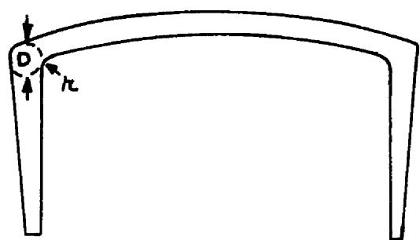  
FIG. 4-CROSS-SECTION OF CHANNEL

ORNL-LR-DWG. 27498

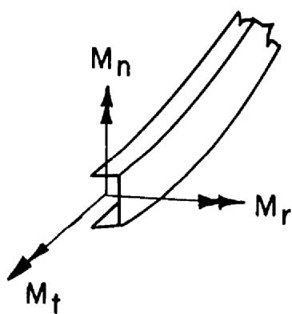  
FIG.5-SKETCH SHOWING PRINCIPAL MOMENTS ON CHANNEL AT EQUATOR

The maximum shear stress due to $M_t$ can be calculated by Eq (48). Using the same C/K ratio as before,

$$
\tau_ {\max } = 2 0 1 3 \mathrm {p s i}
$$

# Stresses in Header Pipe

Bending stresses are produced in the header pipe from $\mathbf{F}_{\mathbf{x}}$ , $\mathbf{M}_{\mathbf{x}}$ and $\mathbf{M}_{\mathbf{y}}$ . Referring to Fig. 3 the moment in the y-direction at the fixed end of the pipe due to $\mathbf{F}_{\mathbf{x}}$ and $\mathbf{M}_{\mathbf{y}}$ is given by

$$
M _ {H y} = M _ {y} - F _ {x} \ell = - 3 8 5 3 i n - l b s.
$$

The moment in the $x$ -direction at the fixed end is

$$
M _ {H x} = M _ {x} = - 5 4 6 2 \text {i n - l b s}.
$$

Taking the vector sum of these moments gives a maximum bending moment,

$$
M _ {H} = - 6 6 8 4 \text {i n - l b s}.
$$

The maximum bending stress due to this moment is given by

$$
\sigma_ {H} = \pm \frac {M _ {H}}{z _ {H}} = \pm 6 2 8 2 p s i.
$$

The maximum shear stress due to $M_z$ is given by

$$
\tau_ {\max } = \frac {M _ {Z} r _ {H}}{J _ {H}} = - 3 1 1 1 p s i 。
$$

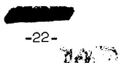

Thermal stresses are produced in the header pipe from radial and axial temperature gradients, in addition to those caused by relative thermal expansion of the channel. Figure 6 shows the north and south headers and pipes with the approximate temperatures of the surrounding fluids.

The axial temperature gradients should be small except in the regions close to the headers which are subjected to cross-flow from the fuel. Because of the azimuthal variation in heat transfer coefficients and the complicated geometry of these regions, it is possible that thermal cycling of these small sections of pipe could occur. Although these temperature fluctuations would be difficult to calculate, small thermal shields welded to the headers might be warranted.

Because the layer of fuel surrounding the header pipes over most of their lengths is very thin, an estimate of the radial temperature profiles may be calculated using simple conduction with semi-infinite slab geometry. With the temperatures indicated in Fig. 6, these calculations give temperature differences across the walls of $23^{\circ}\mathrm{F}$ and $32^{\circ}\mathrm{F}$ for the north and south header pipes, respectively. The stresses in the outside walls due to these gradients can be calculated by

$$
\sigma = \frac {\alpha E \Delta T}{1 - \nu}, \tag {43}
$$

giving - 4574 psi for the north header pipe, and 6176 psi for the south.

The bending and twisting stresses may now be combined with the stresses due to the radial temperature gradient in the header pipe in order to get the maximum normal and shear stresses. Figure 7 shows the fixed end of the header pipe, the direction of the resultant bending moment, and the bending stresses due to $\mathsf{M}_{\mathsf{H}}$ . Since the twisting stresses

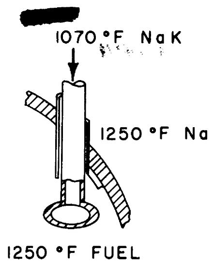

ORNL-LR-DWG. 27499

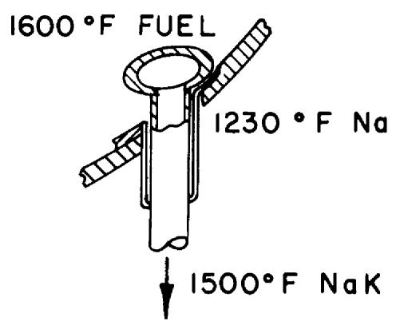

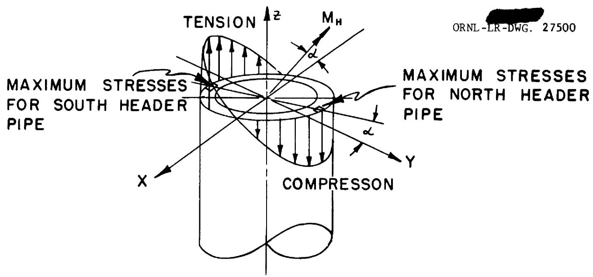  
FIG.6-SKETCH SHOWING NORTH AND SOUTH HEADER PIPES APPROXIMATE FLUID TEMPERATURES  
FIG.7-FIXED END OF HEADER PIPE SHOWING BENDING STRESSES AND ELEMENTS AT WHICH MAXIMUM STRESSES OCCUR

and temperature gradient stresses are uniformly distributed around the header pipe, the direction of $\mathbf{M}_{\mathrm{H}}$ determines the location of the maximum stresses in the pipe. For the north header pipe, the temperature gradient stresses are compressive at the outside wall, so the maximum stresses occur where the bending stress is a maximum in compression. This element is at the outside wall, $90^{\circ}$ clockwise from the direction of $-\mathbf{M}_{\mathrm{H}}$ and an angle $\alpha$ counterclockwise from the positive y-axis, where

$$
\alpha = \tan^ {- 1} \left(\frac {\mathrm {M} _ {\mathrm {y H}}}{\mathrm {M} _ {\mathrm {x H}}}\right) = 3 5. 2 ^ {\circ}
$$

For the south header, the temperature gradient stresses are tensile at the outer wall, so the maximum stresses occur where the bending stress is a maximum in tension. This point is $180^{\circ}$ from the point of maximum stress in the north header pipe, or an angle $\alpha$ counter clockwise from the negative y-axis, when the south header pipe is oriented as in Fig. 7 (eg the z-axis is directed away from the equator).

The maximum stresses can be calculated for the north and south header pipes from the combined stresses acting on the elements in the outer walls of the header pipes, as shown in Fig. 7. The stresses acting on these elements are shown in Fig. 8. The maximum normal and shear stresses are given by

$$
\sigma_ {\max } = \frac {1}{2} \left(\sigma_ {1} + \sigma_ {2}\right) \pm \left[ \left(\frac {\sigma_ {1} - \sigma_ {2}}{2}\right) ^ {2} + \tau^ {2} \right] ^ {1 / 2} \tag {44}
$$

$$
\Upsilon_ {\max } = \left[ \left(\frac {\sigma_ {1} - \sigma_ {2}}{2}\right) ^ {2} + \Upsilon^ {2} \right] ^ {1 / 2} \tag {45}
$$

ORNL-LR-DWG. 27501

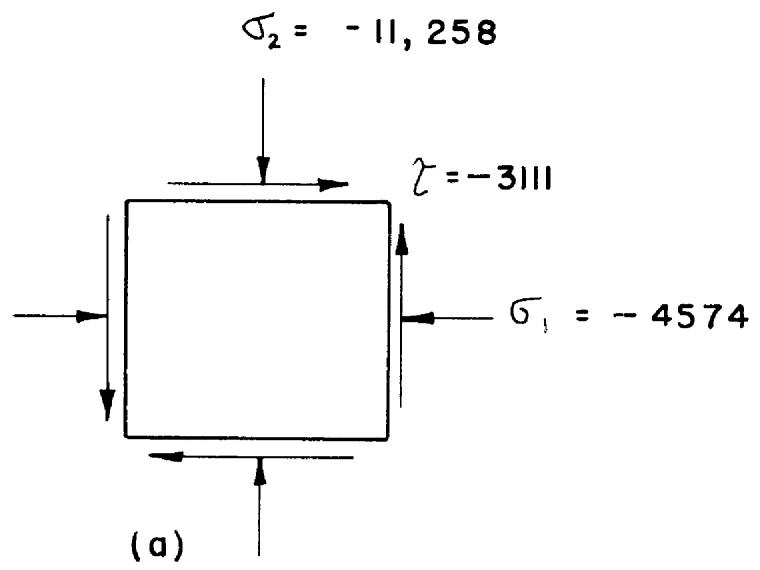

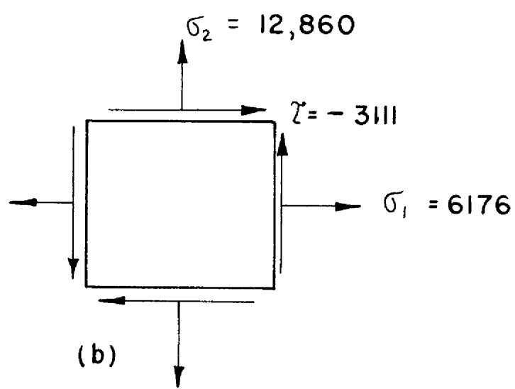  
FIG.8-ELEMENTS UNDER MAXIMUM STRESS IN OUTSIDE WALL OF (a) NORTH HEADER PIPE; (b) SOUTH HEADER PIPE (STRESSES IN psi)

For the north header pipe,

$$
\sigma_ {\max } = - 1 2, 4 8 0 \mathrm {p s i}
$$

$$
\tau_ {\max } = 4 5 6 5 \mathrm {p s i}.
$$

For the south header pipe,

$$
\sigma_ {\max } = 1 4, 0 8 0 \mathrm {p s i}
$$

$$
\tau_ {\max } = 4 5 6 5 \mathrm {p s i}.
$$

# References

1. D. L. Platus and B. L. Greenstreet, "Deflection Equations for Various Loadings of Circular-Arc Curved Beams", CF 57-4-96.   
2. R. J. Roark, Formulas for Stresses and Strain, Third Edition, 1954, pp 170-181.   
3. S. Timoshenko and J. N. Goodier, Theory of Elasticity, Second Edition, 1951, p. 287.   
4. S. Timoshenko, Strength of Materials, Part II, 1941, pp 270-271.

# Appendix A

# Numerical Data

$$
x _ {b} = - 1 9. 5 9 \text {i n .}
$$

$$
z _ {b} = 1 4. 0 8 \text {i n .}
$$

$$
r = 2 1. 9 \text {i n}.
$$

$$
\overline {{o b}} = 2 4. 1 2 5 \text {i n .}
$$

$$
l = 7. 5 0 \text {i n}.
$$

$$
E = 1 5 \times 1 0 ^ {6} p s i
$$

$$
\nu = 0. 3
$$

$$
G = 5. 8 \times 1 0 ^ {6} p s i
$$

$$
I _ {P} = 2 0. 7 2 \text {i n}
$$

$$
I _ {N} = 2. 4 6 \text {i n} ^ {4}
$$

$$
K ^ {N} = 0. 0 9 2 9 5 \text {i n} ^ {4}
$$

$$
\begin{array}{r l r} I _ {H} & = & 1. 5 3 \text {i n} ^ {4} \\ J _ {H} & = & 3. 0 6 \text {i n} ^ {4} \end{array} \left\{ \begin{array}{l} 2 - 1 / 2 \text {i n c h} \\ \text {S c h 4 0 P i p e} \end{array} \right.
$$

$$
\delta x _ {T} = 0. 0 3 2 \text {i n .}
$$

$$
\mathrm {S} \mathrm {z} _ {\mathrm {T}} = \quad 0. 0 4 1 \text {i n}.
$$

# Numerical Values of Coefficients Used in Eqs (44)

$$
a _ {1 1} = 2 5 3 8. 7 \times 1 0 ^ {- 6}
$$

$$
a _ {1 2} = 3 2 1 2. 9 \times 1 0 ^ {- 6}
$$

$$
a _ {1 3} = - 2 0 6. 1 9 \times 1 0 ^ {- 6}
$$

$$
a _ {1 4} = - 1 1 2. 5 3 \times 1 0 ^ {- 6}
$$

$$
a _ {1 5} = 1 6 1. 1 8 x 1 0 ^ {- 6}
$$

$$
a _ {1 6} = 1 4. 0 7 9
$$

$$
a _ {2 1} = 3 2 1 2. 6 \times 1 0 ^ {- 6}
$$

$$
a _ {2 2} = 4 6 9 3. 5 \times 1 0 ^ {- 6}
$$

$$
a _ {2 3} = - 2 9 9. 7 6 \times 1 0 ^ {- 6}
$$

$$
a _ {2 4} = - 1 5 4. 8 6 \times 1 0 ^ {- 6}
$$

$$
a _ {2 5} = 2 0 6. 1 9 \times 1 0 ^ {- 6}
$$

$$
a _ {2 6} = 1 9. 5 9
$$

$$
a _ {3 1} = - 2 0 6. 1 9 x 1 0 ^ {- 6}
$$

$$
a _ {3 2} = - 2 9 9. 8 8 \times 1 0 ^ {- 6}
$$

$$
a _ {3 3} = 2 1. 1 7 3 x 1 0 ^ {- 6}
$$

$$
a _ {3 4} = 1 6. 5 5 \times 1 0 ^ {- 6}
$$

$$
a _ {3 5} = - 1 4. 7 8 7 \times 1 0 ^ {- 6}
$$

$$
\begin{array}{l} a _ {4 1} = - 1 1 2. 5 3 \times 1 0 ^ {- 6} \\ a _ {4 2} = - 1 5 4. 8 8 \times 1 0 ^ {- 6} \\ a _ {4 3} = 1 6. 5 5 \times 1 0 ^ {- 6} \\ a _ {4 4} = 3 2. 4 6 4 \times 1 0 ^ {- 6} \\ a _ {4 5} = - 1 1. 8 9 6 \times 1 0 ^ {- 6} \\ a _ {4 6} = 1. 0 0 0 0 \\ \end{array}
$$

$$
\begin{array}{l} a _ {5 1} = 1 6 1. 1 8 \times 1 0 ^ {- 6} \\ a _ {5 2} = 2 0 6. 1 7 \times 1 0 ^ {- 6} \\ a _ {5 3} = - 1 4. 7 8 7 \times 1 0 ^ {- 6} \\ a _ {5 4} = - 1 1. 8 9 6 \times 1 0 ^ {- 6} \\ a _ {5 5} = 1 1. 9 8 6 \times 1 0 ^ {- 6} \\ \end{array}
$$

$$
\begin{array}{l} a _ {6 1} = 1 4. 0 8 \\ a _ {6 2} = 1 9. 5 9 \\ a _ {6 4} = 1. 0 0 0 0 \\ \end{array}
$$

# Appendix B

Evaluation of Torsional Rigidity Factor, K

For a narrow rectangular beam of length $b$ and width $c$ , $K$ can be approximated using the membrane analogy to give

$$
K = \frac {1}{3} b c ^ {2} \tag {B1}
$$

Similarly, for a narrow trapezoidal section9,

$$
\mathrm {K} = \frac {1}{1 2} b _ {1} \left(c _ {1} + c _ {2}\right) \left(c _ {1} ^ {2} + c _ {2} ^ {2}\right) \quad (\mathrm {B} 2)
$$

For a cross-section built up of narrow elements, $\mathbf{K}$ can be approximated by summing the $\mathbf{K}$ 's for the individual elements10. Thus, for the channel (Fig. 4), by summing two trapezoidal sections and one rectangle,

$$
K = \frac {1}{3} b c ^ {3} + \frac {1}{6} b _ {1} \left(c _ {1} + c _ {2}\right) \left(c _ {1} ^ {2} + c _ {2} ^ {2}\right) \quad (B 3)
$$

Using Eq (B3) with

$$
b = 5. 0 0 \text {i n 。}
$$

$$
c = 0. 1 2 5 \text {i n}.
$$

$$
b _ {1} = 3. 4 5 \mathrm {i n}.
$$

$$
\begin{array}{l} c _ {1} = 0. 1 0 \text {i n}. \\ c _ {2} = 0. 5 0 \text {i n}. \\ K = 0. 0 9 2 9 5 \text {i n} ^ {4} \\ \end{array}
$$

# INTERNAL DISTRIBUTION

1. J. C. Amos   
2. D. S. Billington   
3. F. F. Blankenship   
4. E. P. Blizzard   
5. A. L. Boch   
6. C. J. Borkowski   
7. G. E. Boyd   
8. E. J. Breeding   
9. R. B. Briggs   
10. D. W. Cardwell   
11. C. E. Center (K-25)   
12. R. A. Charpie   
13. B. Y. Cotton   
14. F. L. Culler   
15. J. H. Devan   
16. D. A. Douglas   
17. L. B. Emlet (K-25)   
18. D. E. Ferguson   
19. A. P. Fraas   
20. J. H. Frye, Jr.   
21. W. T. Furgerson   
22. R. J. Gray   
23. B. L. Greenstreet   
24. W. R. Grimes   
25. E. Guth   
26. C. S. Harrill   
27. R. L. Heestand   
28. H. W. Hoffman   
29. A. Hollaender   
30. A. S. Householder   
31. W. H. Jordan   
32. P. R. Kasten   
33. G. W. Keilholtz   
34. M. T. Kelley   
35. J. L. Kerrebrock   
36. J. A. Lane

37. R. S. Livingston   
38. H. G. MacPherson   
39. R. E. MacPherson   
40. W. D. Manly   
41. J. R. McNally   
42. R. V. Meghreblian   
43. K. Z. Morgan   
44. E. J. Murphy   
45. J. P. Murray (Y-12)   
46. M. L. Nelson   
47. P. Patriarca   
48. A. M. Perry   
49. H. W. Savage   
50. A. W. Savolainen   
51. R. D. Schultheiss   
52. R. L. Senn   
53. E. D. Shipley   
54. M. J. Skinner   
55. A. H. Snell   
56. F. J. Stanek   
57. J. A. Swartout   
58. A. Taboada   
59. J. R. Tallackson   
60. E. H. Taylor   
61. D. B. Trauger   
62. A. M. Weinberg   
63. C. E. Winters   
64. M. M. Yarosh

65-67. ORNL - Y-12 Technical Library, Document Reference Section   
68-75. Laboratory Records Department   
76: Laboratory Records ORNL R.C.   
77-79. Central Research Library   
80. Reactor Experimental Engineering Library

# EXTERNAL DISTRIBUTION

81. Division of Research and Development, AEC, ORO   
82-84. Air Force Ballistic Missile Division   
85-86. AFPR, Boeing, Seattle   
87. AFPR, Boeing, Wichita   
88. AFPR, Curtiss-Wright, Clifton   
89. AFPR, Douglas, Long Beach   
90-92. AFPR, Douglas, Santa Monica

，

93. AFPR, Lockheed, Burbank

94-95. AFPR, Lockheed, Marietta

96. AFPR, North American, Canoga Park

97. AFPR, North American, Downey

98-99. Air Force Special Weapons Center

100. Air Materiel Command   
101. Air Research and Development Command (RDGN)   
102. Air Research and Development Command (RDTAPS)

103-116. Air Research and Development Command (RDZPSP)   
117. Air Technical Intelligence Center

118-120. ANP Project Office, Convair, Fort Worth

121. Albuquerque Operations Office   
122. Argonne National Laboratory   
123. Armed Forces Special Weapons Project, Sandia   
124. Armed Forces Special Weapons Project, Washington   
125. Assistant Secretary of the Air Force, R&D

126-131. Atomic Energy Commission, Washington

132. Atomics International   
133. Battelle Memorial Institute

134-135. Bettis Plant (WAPD)

136. Bureau of Aeronautics   
137. Bureau of Aeronautics General Representative   
138. BAR, Aerojet-General, Azusa   
139. BAR, Convair, San Diego   
140. BAR, Glenn L. Martin, Baltimore   
141. BAR, Grumman Aircraft, Bethpage   
142. Bureau of Yards and Docks   
143. Chicago Operations Office   
144. Chicago Patent Group   
145. Curtiss-Wright Corporation   
146. Engineer Research and Development Laboratories

147-150. General Electric Company (ANPD)

151. General Nuclear Engineering Corporation   
152. Hartford Area Office   
153. Idaho Operations Office   
154. Knolls Atomic Power Laboratory   
155. Lockland Area Office   
156. Los Alamos Scientific Laboratory   
157. Marquardt Aircraft Company   
158. Martin Company   
159. National Advisory Committee for Aeronautics, Cleveland

160. National Advisory Committee for Aeronautics, Washington   
161. Naval Air Development Center   
162. Naval Air Material Center   
163. Naval Air Turbine Test Station   
164. Naval Research Laboratory   
165. New York Operations Office   
166. Nuclear Development Corporation of America   
167. Nuclear Metals, Inc.   
168. Office of Naval Research   
169. Office of the Chief of Naval Operations (OP-361)   
170. Patent Branch, Washington

171-174. Pratt and Whitney Aircraft Division

175. San Francisco Operations Office   
176. Sandia Corporation   
177. School of Aviation Medicine   
178. Sylvania-Corning Nuclear Corporation   
179. Technical Research Group   
180. USAF Headquarters   
181. USAF Project RAND   
182. U.S. Naval Radiological Defense Laboratory

183-184. University of California Radiation Laboratory, Livermore   
185-202. Wright Air Development Center (WCOSI-3)   
203-227. Technical Information Service Extension, Oak Ridge