3 4456 0022893 8

# CENTRAL RESEARCH LIBRARY DOCUMENT COLLECTION

ORNL-2464

UC-80 Reactors-General

TID-4500 (15th ed.)

# ART REMOVAL AND DISASSEMBLY

A. A. Abbatiello

F. R. McQuilkin

# CENTRAL RESEARCH LIBRARY

# DOCUMENT COLLECTION

# LIBRARY LOAN COPY

# DO NOT TRANSFER TO ANOTHER PERSON

If you wish someone else to see this

document, send in name with document

and the library will arrange a loan.

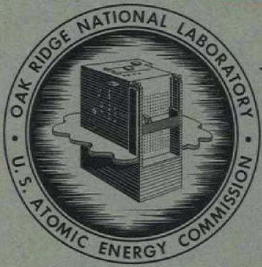

# OAK RIDGE NATIONAL LABORATORY

operated by

UNION CARBIDE CORPORATION

for the

U.S. ATOMIC ENERGY COMMISSION

# Printed in USA. Price $2.75 . Available from the

Office of Technical Services

Department of Commerce

Washington 25, D.C.

# LEGAL NOTICE

This report was prepared as an account of Government sponsored work. Neither the United States, nor the Commission, nor any person acting on behalf of the Commission:

A. Makes any warranty or representation, expressed or implied, with respect to the accuracy, completeness, or usefulness of the information contained in this report, or that the use of any information, apparatus, method, or process disclosed in this report may not infringe privately owned rights; or   
B. Assumes any liabilities with respect to the use of, or for damages resulting from the use of any information, apparatus, method, or process disclosed in this report.

As used in the above, "person acting on behalf of the Commission" includes any employee or contractor of the Commission, or employee of such contractor, to the extent that such employee or contractor of the Commission, or employee of such contractor prepares, disseminates, or provides access to, any information pursuant to his employment or contract with the Commission, or his employment with such contractor.

Contract No. W-7405-eng-26

REACTOR PROJECTS DIVISION

ART REMOVAL AND DISASSEMBLY

A. A. Abbatiello and F. R. McQuilkin

DATE ISSUED

MAR4 1960

OAK RIDGE NATIONAL LABORATORY

Oak Ridge, Tennessee

operated by

UNION CARBIDE CORPORATION

for the

U.S. ATOMIC ENERGY COMMISSION

# CONTENTS

1. INTRODUCTION 1   
2. OBJECTIVES AND CRITERIA 5

Information Required. 5   
Problems Considered 5   
Off-Gas Leakage 5   
Removal Methods 5   
Disassembly Facility 6

3. REMOVAL 6

Philosophy and General Plan for Removal 6   
Radioactivity 8   
Access into the 7503 Cell 8   
Severing the Reactor for Removal 10   
Withdrawal of the Reactor 13

4. DISASSEMBLY 14

Disassembly in the Hot Cell 14   
Hot Cell Equipment Criteria 19   
Cutting Methods 20   
Methods of Measurement 23

5. SPECIAL STUDIES 31

Shielding Studies 31   
Decontamination of Pressure Vessel, Hot Cell, and Tools 31   
Size Distribution of Waste Particles from Severance Techniques 32   
Disposal of Radioactive Materials 32   
Facility Mockup for Cold Testing 33   
Underwater Disassembly Study 33

6. FACILITY 33

Consideration of 7503 Facility 33   
Consideration of Other Arrangements 34   
Proposed Facility 34   
Site Investigations 37   
Scale Model of Large Hot Cell 38

7. SCHEDULE AND COST ESTIMATE 42

Schedule 42   
Cost Estimate 42

8. ACKNOWLEDGMENTS 43

# APPENDICES

A. COMPILEATION OF REQUIRED ART SAMPLES, MEASUREMENTS, AND EXAMINATIONS 45   
B. OUTLINE OF ART DISASSEMBLY PROBLEMS 54   
C. RDHC HOT CELL EQUIPMENT 66   
D.ABRASIVE GRINDING INVESTIGATIONS 70   
E. HELIARC TORCH CUTTING 72   
F. ULTRASONIC CUTTING (ALSO CALLED MAGNETOSTRICTION) 75

G. ELOX CUTTING 76   
H.A COMPARATIVE CONTOUR MEASURING SYSTEM 78

I. FLAME SPRAYED REPLICAS 80   
J. SPRAYING OF GYPSUM CEMENT 81   
K. CAST GYPSUM CEMENT REPLICAS 82

L. OPTICAL MEASUREMENTS THROUGH HOT CELL WINDOWS (ZINC BROMIDE) 84   
M. OPTICAL MEASUREMENTS THROUGH HOT CELL WINDOWS (EARLY DESIGN LEAD GLASS) 86   
N. OPTICAL MEASUREMENTS THROUGH HOT CELL WINDOWS (CURRENT DESIGN LEAD GLASS) 88   
O. ART DISASSEMBLY CELL (ADC) FACILITY CRITERIA 91   
P. SITE INVESTIGATIONS - REACTOR ENGINEERING HOT CELL FACILITIES 116

# ABSTRACT

A study of a high-level-activity hot cell for the major dissection of the ART was made. Such dissection was necessary to obtain metallurgical and design data on which future high-performance reactors might be based. The study included severing and removing the reactor from the test cell after operation, a procedure for a component removal sequence, and a proposed disassembly building facility.

Evaluations of handling, measuring, and cutting techniques for remote work are presented. Although these are based on limited experimental work, progress is adequate to indicate their potential value for any high-level reactors which must be handled after irradiation. In many cases details of the work in the form of the original report have been included in the Appendix.

With the termination of the ART project in September 1957, the draft for what was to have been a status report was revised to become this termination report. Thus, the plans and experimental work are recorded for those who may find the information useful on similar problems.

# 1. INTRODUCTION

The major effort of the ANP program at ORNL was directed toward the construction and operation of a reactor known as the Aircraft Reactor Test (ART). It was expected that much information would be derived during the scheduled 1000-hr test period. However, there were many items which could not be learned except by disassembly and careful analysis of the reactor itself after the completion of the operating period. With the recent decision not to complete and operate the reactor, actual performance and test data will not be available, but the detailed planning carried out for the disassembly of this reactor should provide a sound basis for any comparable reactor.

Because of the unusual performance requirements, the ART was to operate with power densities many times higher than had heretofore been obtained. Weight limitations for aircraft reactors require a highly refined design in which many of the parts may undergo plastic deformation during operation. While predictions of the conditions of the ART reactor parts have been made, based upon careful analysis of a long series of experiments on a smaller scale, it is not possible to duplicate all of the operating conditions simultaneously prior to running the reactor. Thus it was extremely important that a fairly complete disassembly and postmortem examination be conducted on the reactor to determine how well it withstood the test conditions. Therefore, the disassembly, inspection, and precise measurement of the parts, coupled with complete metallographic examinations, were to be a vital phase of the overall experiment.

It was recognized from the inception of the ART project that disassembly of the reactor would be required. However, it had been believed that the ART reactor pit and the hot fuel dump tank pit, plus the surrounding area in Building 7503, would be adequate and available for the ART reactor as it was for the ARE disassembly. Accordingly, this phase of the project work was not pursued immediately, as an all-out effort was needed to get the ART reactor components into the production stage and to modify and prepare the 7503 building so that it would be

suitable for the ART test. Sufficient progress was made in both of these phases to show clearly that disassembly of the ART reactor would have been a very difficult operation and that the existing ARE pits in Building 7503 were grossly inadequate.

In extrapolating experience gained in the disassembly of the ARE, the differences in proposed power level and operating time for the ART were taken into account. The ARE was operated for a total of 100 Mwhr, whereas the ART was scheduled to operate for a total of 30,000 Mwhr. This increase by a factor of 300 in the total irradiation of the reactor components meant vastly increased difficulty in disassembly. Since the bulk of the radioactivity 100 days or more after shutdown would be from long-lived isotopes, the radioactivity would be directly proportional to the number of megawatt-hours that the reactor was operated. Whereas disassembly of the ARE was possible in the Building 7503 pits by using improvised methods and "long-handled tools" from above with roof plugs removed (see Fig. 1), the operation was marginal and certainly could not have been repeated for disassembly of a reactor having a radiation level 300 times greater. Both the shielding and dusting problems would have made it prohibitive.

The ARE reactor was a relatively simple piece of equipment, consisting of six sets of parallel-flow pipe runs, each formed into a serpentine shape with a series of U-bends arranged with headers at either end, surrounded by the solid moderator and all contained within a welded tank. Disassembly of this unit was accomplished by removing the end plates and pipe header manifolds, cutting the U-bends from one end, and pulling all remaining pipe from the reactor container. However, the ART reactor (Fig. 2) is a complex piece of machinery which is best described as a multilayer pressure vessel because of its multiplicity of precision-made shells, or casings, which either direct the flow of the fuel or encase such components as the reflector-moderator, the boron carbide shield, and the several sodium passages required for internal cooling. Atop the reactor is the north head, consisting of a series of precision-built labyrinth-type channels. Heat ex-changers built to close-tolerance specifications were to be located within the fuel-channel layers of the vessel and within the north head. Because of the numerous precision-built parts in this reactor, it

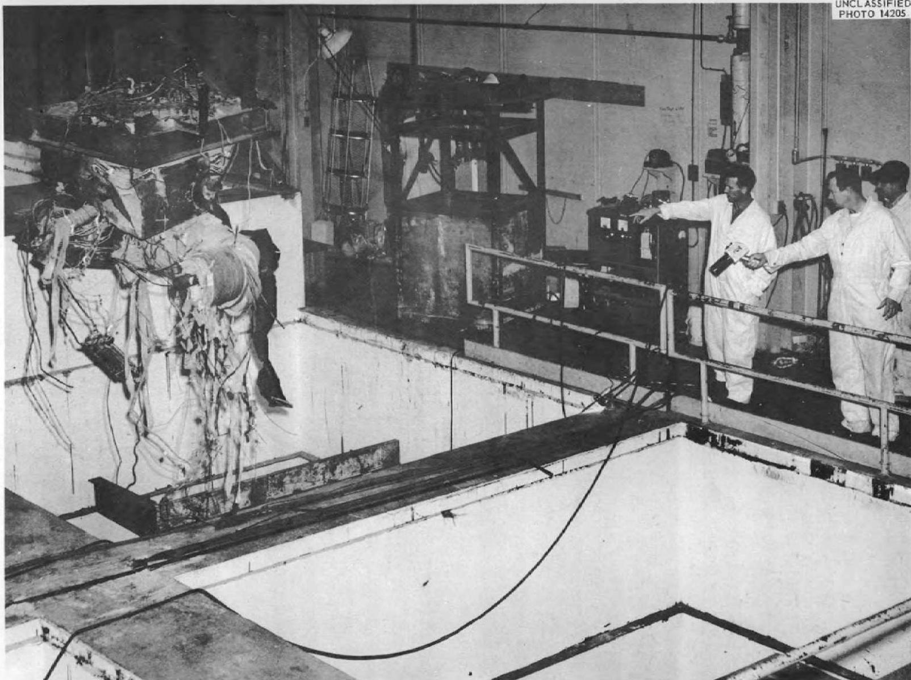  
Fig. 1. Disassembly of the ARE. Main fuel pump being lifted from cell.

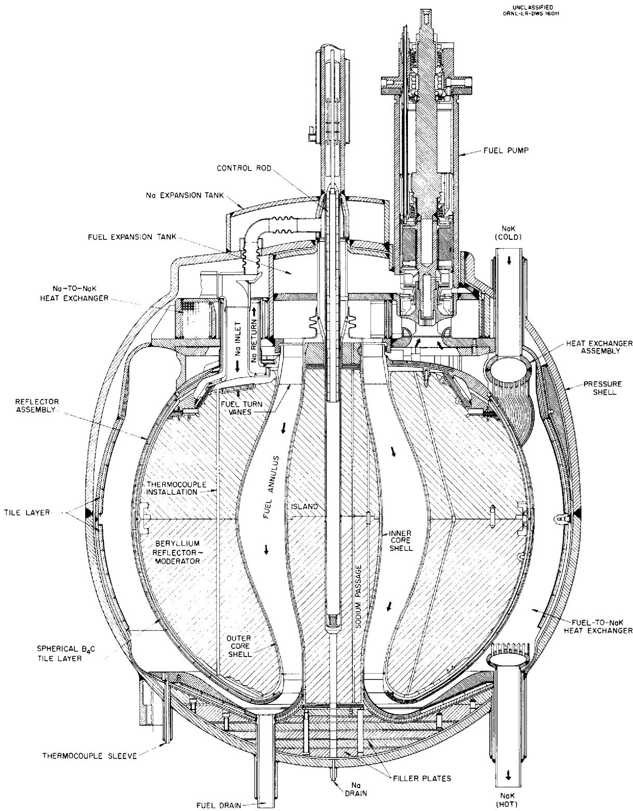  
Fig. 2. Cross Section of the ART Reactor.

was known that both the assembly process and the disassembly operation would be difficult and tedious.

Since the ARE reactor was essentially a plumbing system, the principal types of information sought by disassembly were those obtainable from chemical and metallurgical studies. Since the unit was relatively simple and operated at very low stress levels, there was no need for accurate physical measurements to determine dimensional changes resulting from its operation. However, the ART reactor is designed very closely; in fact many parts were expected to deform no more than $0.2\%$ during the startup and off-design-point operations. Many non-nuclear tests, such as the ETU, were planned to prove the design insofar as possible, but without nuclear heat the actual temperature distribution cannot be exactly duplicated. Therefore precise physical measurements were to be taken after operation to confirm many of the decisions made during the design, assembly, and operation of the machine. For these reasons, the requirements for postoperation measurements and samples for chemical and metallurgical studies were numerous.

Accordingly, approximately a year ago a concerted effort by the ANP Project was started to examine the problems of ART reactor removal and disassembly. Although the experience gained from the ARE disassembly was available, the fact remains that neither the Oak Ridge National Laboratory nor any other USAEC installation has performed a thorough dissection of a radioactive reactor to obtain information such as that required for the ART.

Therefore the objective of developing a program for safe removal and disassembly of the ART constituted something of a pioneering effort in a new field. Significant progress was made; however, much of the work is preliminary. Even so, it was deemed advisable to bring together in one report the results of work accomplished. This is a termination report designed to present the plans, methods, and information as tentatively developed.

Not only has preparation of the report provided the authors another opportunity to evaluate the numerous facets of the program, but its study by reviewers should stimulate development of program improvements and application of this information to other

reactor studies. The authors, therefore, solicit comments and suggestions from readers.

In general, the investigations have been divided into the following categories:

1. Removal: disengagement, withdrawal, and transportation of the radioactive reactor and components from the Building 7503 operations cell to the disassembly hot cell   
2. Disassembly: dismantling of the radioactive reactor and components in a hot cell plus obtaining the required postoperation specimens and information   
3. Special studies: shielding studies, particle size distribution, cutting methods evaluations, sealing systems, replication and measuring techniques, and scale models   
4. Hot cell facility: the physical plant, including dismantling hot cell, service and maintenance hot cell, hot storage, and basic equipment as required for the disassembly operations

Before the detailed discussions under the above headings, a discussion of criteria has been included to make the program objectives more definitive. For completeness, a brief review of tentative schedules and budget considerations is presented at the end of the report. A considerable portion of the material has been included in the Appendix in order to permit presentation of the information in detail without disturbing the continuity of the report.

While the development of handling methods, measurement techniques, and cutting processes has been directed toward a specific reactor, namely, the ART, it is believed that many of the features are applicable to the dismantling of other large reactors. Certainly the basic schemes may be adapted to other disassembly situations. Experience has indicated that each new advance in technology requires a corresponding advance in its associated facilities. Thus, the highly radioactive reactor equipment requires specialized methods capable of safely handling the physical units. The necessity for working through remote devices increases the difficulties by a large factor. It is realized that practically all new reactors will be faced with similar problems, and any solutions which are developed during this work should find application in reactors which follow.

# 2. OBJECTIVES AND CRITERIA

# Information Required

The major types of information required from dis-assembly of the ART were:

1. information and dimensional data on the effects that power operation of the reactor has upon the structural stability, distortion, warping, cracking, and local behavior in the vicinity of welds, brazed joints, etc., of all major reactor components;   
2. chemical analyses of samples of the reactor parts to determine whether significant reactions occurred during operation;   
3. metallurgical study of specimens from each region and each major part of the reactor to ascertain the extent of plating-out of fission products, if any occurred, and to determine what changes were brought about by the unique operation of radiation, temperature, fuel circulating velocities, pressure, and corrosion;   
4. material studies to ascertain the compatibility of beryllium and Inconel, the integrity of a boron carbide shield layer and its cladding, and the effects of radiation damage on various metals, particularly those associated with the boron carbide layer;   
5. in the event of a failure of any part during operation, study of the exact conditions at the point of failure.

The first step after the formation of the ART Disassembly Group was to establish in precise terminology exactly what was required from the disassembly that would satisfy the above general requirements. A compilation of the resulting details can be seen in Appendix A. A study of the "before" and "after" measurements required for creep deformation revealed that simpler methods of getting this data could be devised, as will be explained later.

# Problems Considered

Accordingly, steps were taken to identify all problems and circumstances which would exist or might arise that would have a definite bearing on the disassembly operations. Therefore, in an effort to establish an early set of design criteria, a report entitled Outline of ART Disassembly Problems was prepared and discussed with all parties who were to

be concerned with this project. This report is presented herein as Appendix B.

At this stage it was recognized that the ART Disassembly Group could progress faster if the group could review its work and problems frequently with Project management as well as others concerned. Accordingly, a "Disassembly Planning Meeting" was organized on a semiformal basis. In the weekly meetings during late 1956, considerable assistance was obtained through the establishment of several important criteria, particularly those dealing with the conditions for which shielding, ventilation, and accessibility are vital. Minutes of these meetings are available in the Project records; however, all technical data have been included in this report in the appropriate places.

Another major step in the establishment of criteria was a series of studies of the postpower operations and shutdown procedures for the ART. From these, determinations were made of likely starting conditions for removal and disassembly of each component. A. P. Fraas3 prepared the first report on a general basis at the outset of the disassembly program; W. B. Cottrell4 reviewed the problems in detail late in 1956.

# Off-Gas Leakage

In connection with shielding requirements, a decision was made to establish an arbitrary, though realistic, radiation source of a certain intensity that could be used for calculations. Accordingly, an assumption was made that during the operation of the ART there would occur from the reactor inside the pressure vessel an "off-gas" leakage of $1\%$ . This value is considered to be an abnormal one with reference to a successful and normal operation by the ART, but it is believed that the use of this figure is conservative and also provides a safety factor except in the case of a major reactor failure. Activity levels have been calculated for normal reactor operations and have been reported.

# Removal Methods

The exact method of removing the ART from the pressure vessel was not determined; however, five

methods or basic types of equipment were analyzed. The final selection of one of these methods would have established most of the design criteria associated with the ART removal phase of this program. The five principal methods considered were:

1. radisphere,   
2. flat top or floating floor,   
3. remote C-crane,   
4. rigid polar,   
5. swinging polar.

Studies indicated that either the floating floor or the remote C-crane was likely to be the most practical method, with the final selection to be made on the basis of existing activity level, accessibility, and cost.

# Disassembly Facility

With regard to the large hot cell facility, design criteria were established in rough draft form as proposed for submittal to an architect-engineer. The architect-engineer, in turn, was to prepare the detailed engineering and construction drawings for the facility. In addition to the problems associated with space, equipment, maintenance, and basic design of the large hot cell, two problems that were of particular concern were contamination and personnel shielding. The air-borne radioactivity would require adequate filtering systems and a negative air pressure within the cell in order to keep the operating area low in activity. Complete circulating, filtering, and disposal systems were required for all working solutions, such as cutting fluids, decontaminants, and wash solutions. Personnel shielding was to be provided by $4\frac{1}{2}$ -ft-thick barytes concrete walls and shielded viewing windows.

# 3. REMOVAL

Upon completion of operation of the ART it was planned that, while the pressure vessel of the 7503 cell was still closed, all the process fluids would be transferred to their respective removal containers. The fuel system was to be rinsed, the NaK was to be removed, and the sodium was to be drained from all parts of the reactor except the control rod. All these operations were to be performed by remote control. After sufficient time for decay of activity in the fuel, the cell (Fig. 3) was to be unsealed and cautiously opened. At this stage the program for disassembly of the ART was to begin.

# Philosophy and General Plan for Removal

While successful removal, transport, and disassembly of the ART were to be dependent upon the radioactivity level of the fuel and equipment, it must be recognized that the possible activity level could have been anywhere from very low to very high. The former represented the case wherein operational difficulties occurred shortly after nuclear operations began, while the latter represented the extreme case of a near catastrophe, in which efforts to recover the equipment could yet have been justified. The normal case was to be that in which the reactor was successfully operated for 500 hr at 60 Mw without leaks from the off-gas, fuel, NaK, or sodium systems, and consequently all activity in the cell would have been successfully contained. However, for the design case, criteria were assumed that would represent a situation somewhere between the normal and subcatastrophe cases. The two basic situations recognized as causes for troublesome activity were leaks from the off-gas system and accidents where fuel would get outside the containers and shields. Either case would require both means for controlling or reducing contamination, and shielding protection for man entry into the cell. Arbitrarily, it was established that removal design criteria would not go beyond the case of off-gas system leaks. Improvised measures would be employed for worse situations.

To avoid the possibility of contaminated lines at the manhole and to ensure an early transfer of fuel to the recovery tank, it was planned to relocate the control panel for the fuel transfer from the temporary location on the main floor to the auxiliary equipment room panel. Also, to eliminate the need for vacuum distillation of sodium from the reactor, plans were to permit the sodium in the control rod to freeze. It was to be removed subsequently from the reactor in the disassembly hot cell.

To reduce the quantity of sodium within the components, the reactor shell sodium and moderator sodium were to be drained through separate lines to a common line having a bismuth valve and then through the 7503 cell wall to a drain tank in the radiator pit. It was recognized that residual sodium would remain in pockets within the reactor.

Because of the possible contamination on all surfaces within the cell, it was proposed to wash these many surfaces down with a portable deluge shower head. To remove the waste water and to simplify drainage of the water from shield systems, it was

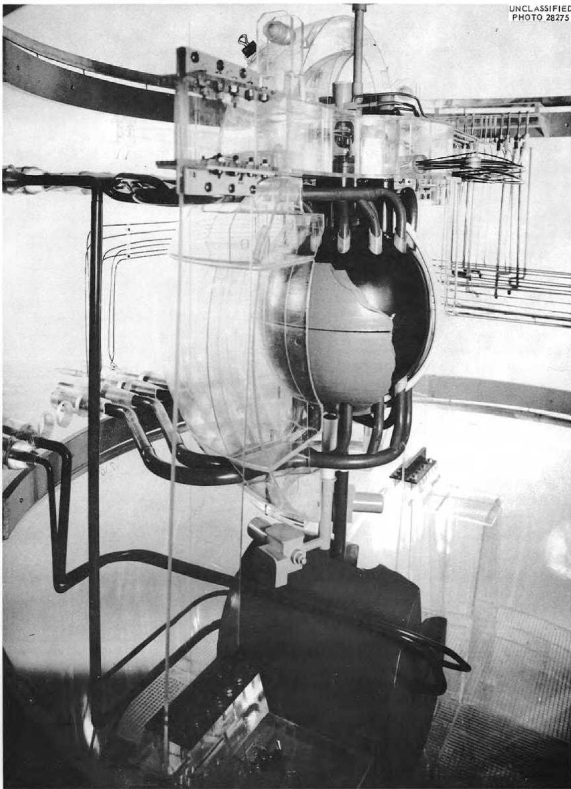  
Fig. 3. Model of the ART. The reactor is shown in the operating cell prior to removal.

planned to install a sump pump that could transfer water to a safe drainage system.

To facilitate removal of components with remote equipment, it was proposed that every line that had to be cut should have an accessible horizontal section of pipe. The only exception to this was the fuel drain line. For this, it was first proposed to preinstall a severance device; however, later it was planned to use a portable one. Wherever gas leakage from severed pipes appeared likely, a sealing device such as the "sealant injector" was to be used.

In order to reduce spread of contamination in the building, it was planned to provide a containment can into which the fuel recovery tank could be drawn for the transfer. The can was to be equipped with a blower and filters to promote convection cooling of the tank.

For removal and transportation of the hot reactor, it was proposed to drain the reactor water shield, lift and carry it through the 7503 building with the remotely controlled 30-ton building crane, and mount it on a heavy-duty low-boy trailer. If deemed necessary, the reactor water shield would be refilled for the trip to the disassembly hot cell.

# Radioactivity

A compilation of postoperation dose rates as predicted for the ART is presented in Table 1.

Pursuant to the decision that shielding design criteria would be based on the off-gas system leak

Table 1. Predicted Dose Rates for ART Reactor*   
100 days after shutdown Based on operation for 500 hr at 60 Mw   

<table><tr><td>No.</td><td>Case</td><td>Dose Rate atShield Surface(r/hr)</td></tr><tr><td>1</td><td>Undrained reactor, 100% of fuel,no water, and no lead shield</td><td>6500</td></tr><tr><td>2</td><td>2% of fuel, no water shield, andno lead shield</td><td>750</td></tr><tr><td>3</td><td>2% of fuel, no water shield, butwith lead shield</td><td>0.4</td></tr><tr><td>4</td><td>2% of fuel, water in shield, andlead shield</td><td>\( {3.5} \times {10}^{-3} \)</td></tr></table>

$^{\star}$ D. E. Guss, ANP Quar. Prog. Rep. Dec. 31, 1956, ORNL-2221, p 85; A. A. Abbatiello, Dose Rates for ART Reactor, ORNL CF-57-7-91 (July 25, 1957).

case, calculations for gamma dose rates and amounts of beta activity were performed by D. E. Guss of the Solid State Division. It was assumed that:

1. during the entire operation period $1\%$ of the off-gas somehow leaked from the off-gas plumbing system into the 7503 cell,   
2. the gaseous fission products which escaped plated out on the simple geometrical surface of a 12-ft-radius sphere,   
3. the computed dose rate would be based on the gamma activity of the daughters of these fission products at 10 days after shutdown following 500 hr of continuous operation at 60 Mw.

For this case the gamma dose rate through a 1-in. lead shield would be $6\mathrm{r / hr}$ . The most serious offender in dose would be $\mathsf{La}^{140}$ with $1\frac{1}{2}$ -Mev gamma-ray energy. Since it is the decay product of 12.8-day $\mathsf{Ba}^{140}$ and has a 40-hr half life itself, the dose rate should fall fairly fast to the next dose-rate level as the $\mathsf{La}^{140}$ decays. This new level is a dose rate of $600\mathrm{mr / hr}$ through a 1-in. lead shield approximately 40 days following the shutdown.

The amount of beta activity in the cell 10 days after shutdown was calculated to be as follows:

<table><tr><td>Half Life</td><td>Curies</td></tr><tr><td>13 days</td><td>710</td></tr><tr><td>20 days</td><td>1387</td></tr><tr><td>28 years</td><td>13</td></tr><tr><td>Total</td><td>2110</td></tr></table>

Most of these betas are of $1\frac{1}{2}$ -Mev energy and have a maximum range of 18 ft in air. This amount of activity would require appropriate protection for personnel in the vicinity of the open manhole. Since approximately $\frac{1}{2}$ cm of Lucite should be sufficient to stop betas at the manhole location, it was recognized that the gamma dose through the cell top following such an off-gas leak might well be the more serious problem. It would exist immediately upon lowering of the annulus water level.

# Access into the 7503 Cell

Five methods were considered for providing access and for performing the removal from the pressure cell. These methods are described below and are compared in detail in Table 2.

1. Radisphere. - This device is a shielded personnel container with windows and with articulated cutting tools mounted externally. The operator and all controls are inside the container, which is attached to the pressure cell crane hook. Precautions

Table 2. Comparison of Pressure Cell Guillotine Handling Systems*   

<table><tr><td>Device\Factor</td><td>Relative Cost</td><td>Safety</td><td>Maneuverability</td><td>Viewing</td><td>Contamination Spread</td><td>Failure Consequence</td><td>Advantage</td><td>Disadvantage</td></tr><tr><td>Radisphere (55)</td><td>1 (10)</td><td>Bad (0)</td><td>Fair to bad (10)</td><td>Good direct; good TV (30)</td><td>Some (5)</td><td>Large (0)</td><td>Operator can approach work</td><td>Failure of motors or controls locks operator in radia-tion field</td></tr><tr><td>Floating floor (91)</td><td>1.25 (8)</td><td>Good (20)</td><td>Good (20)</td><td>Fair direct; good TV (25)</td><td>Little (8)</td><td>Small (10)</td><td>Good air control, visibility, shielding, and control</td><td>Requires maximum cell opening at an early date</td></tr><tr><td>Remote C-crane (80)</td><td>0.5 (20)</td><td>Fair to good (15)</td><td>Fair to bad (10)</td><td>Poor direct; good TV (20)</td><td>Some (5)</td><td>Small (10)</td><td>Good air control and shielding</td><td>Large inertial forces will make exact placement difficult</td></tr><tr><td>Rigid polar (75)</td><td>1 (10)</td><td>Good (20)</td><td>Fair to good (15)</td><td>Poor direct; good TV (20)</td><td>Some (5)</td><td>Large (5)</td><td>Good air control, shielding, and control</td><td>Long stroke of cylinder (7 ft) would complicate design</td></tr><tr><td>Swinging polar (86)</td><td>0.75 (13)</td><td>Good (20)</td><td>Good (20)</td><td>Poor direct; good TV (20)</td><td>Little (8)</td><td>Large (5)</td><td>Good air control, shielding, con- trol, and sim- plicity</td><td>Inertia of tool would require care in operation</td></tr></table>

*Numbers in parentheses are arbitrary rating factors.

taken in the design of this tool should include dual controls for the crane (internal and external), radiation monitoring equipment, communication equipment, and an external source of breathing air.

2. Floating Floor. - This device consists of a ring-shaped float on which a circular floor is placed. The circular floor contains a rotating disk which has a slot across the diameter. A vertical tube, which carries the shear, operates through the slot in the floor. The shear can be manipulated to any point in the cell by a combination of rotary and linear travels. Shielding is provided on the floor and is limited only by the buoyancy of the float. The device is locked at any point by flooding the float tank and letting the floor rest on the pressure cell edge.   
3. Remote C-Crane. - The tool used in this technique is a large horseshoe made of large-diameter pipe. One end of the horseshoe is suspended from the 30-ton crane, and the other end is snaked through the manhole. The in-cell end of the tool has a shear attached to it which is moved by a combination of the crane movements and fulcrum location.   
4. Rigid Polar. - This method makes use of the pressure cell crane bridge, to which is attached a trolley containing a vertical telescoping member that carries the shear. The telescoping member would have to have a long travel, 8 to 10 ft, which may not be practical.   
5. Swinging Polar. - In this system the hydraulic shear is suspended from the hook of the pressure cell crane and is placed in position by crane movements. A rotation at the hook would have to be added to the existing equipment; in addition, it would be necessary to motorize the trolley and to provide external crane controls.

Of the systems described, the floating floor and the remote C-crane appear the most attractive. Final selection was deferred for completion of design studies. The floating floor method offered direct visual observation through shield-type windows placed in the floor, while the remote C-crane would depend upon properly located television cameras for directing and observing the work. Since televiewing for removal was considered promising by some, in a preliminary test with one camera, it is believed that a satisfactory job could be done in the cell with three cameras of types that are commercially available. One would be suspended from the outside edge of the manhole, pointing in the general direction of the reactor. It would have remote plane, tilt, focus, and lens change, and would

watch the over-all operation, Two fixed-lens cameras would travel with the remotely operated tool carrier and follow the progress of the operation. One would be mounted on the carrier so as to look down on the tool; the other would be mounted on the tool itself so as to look horizontally at the work.

# Severing the Reactor for Removal

Choice of methods for severing the reactor free of its numerous connections was based on the following factors:

1. It must sever the connections effectively.   
2. It must cause a minimum of contamination.   
3. It must require a minimum of time to do the work.   
4. It must lend itself to remote operation.   
5. It must require a minimum of maintenance.   
6. It must be priced within economic justification.

An evaluation study was made to determine which cutting method most nearly approached the ideal, as well as to determine which facets of the ideal must be relaxed to achieve the desired end result. For removal from the cell, shearing of pipes, wires, and instrument lines appeared most desirable because of the minimal activity spread and the partial closure effected when the cut was made. Accordingly, it was decided that severing of large diameter pipe $(3\frac{1}{2}$ -in.-ID sched-40 Inconel) in the pressure cell should be done with a hydraulic guillotine-type cutter (Fig. 4). The shear has been designed and built, and tests have demonstrated that it will cut 4-in. pipe satisfactorily. It is hydraulically operated and is manipulated by the crane. The hydraulic controls provide rotational motion, so that the tool can be adjusted to the proper cutting angle for the pipe. Small pipes $(\frac{3}{8}$ -in.-ID sched-40 Inconel) would be cut with a "hook-shear." This device, which would be smaller for use in close quarters, has yet to be designed and tested. A logging-type saw which could be fitted with a band filer has also been considered for this service. Test work would be required for an evaluation of this tool.

A special problem was encountered where the fuel drain line connects the reactor and the dump tank. It was planned to use the large hydraulic shear, mounted in the horizontal position, for this cut. A cartridge-actuated sealant injector (Fig. 5) was

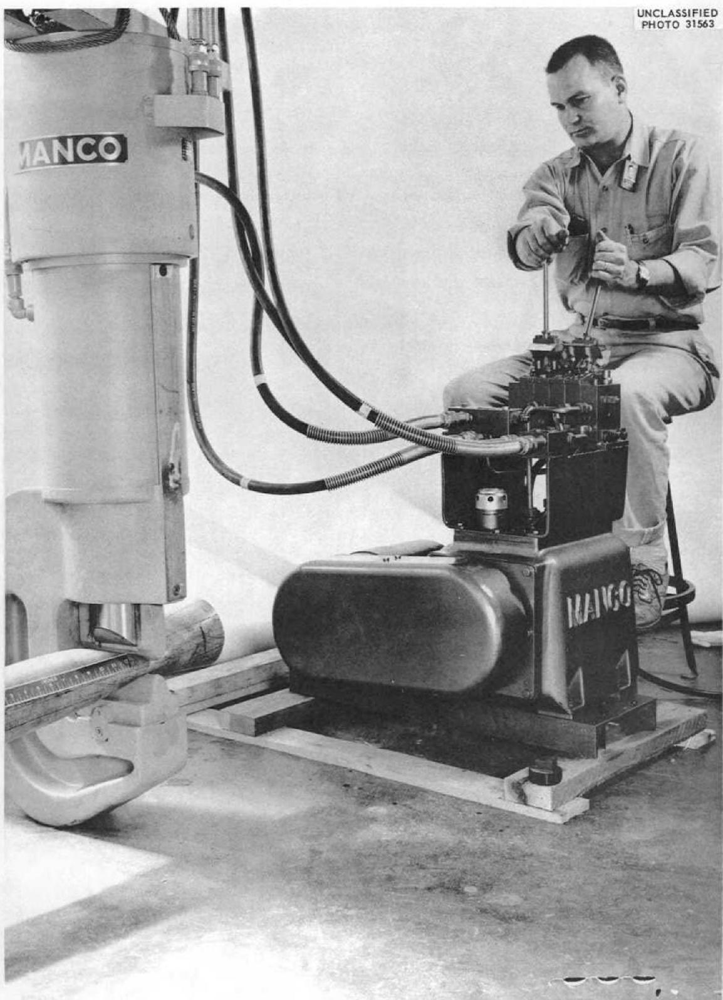  
Fig. 4. Hydraulic Shear for 4-in. Pipe.

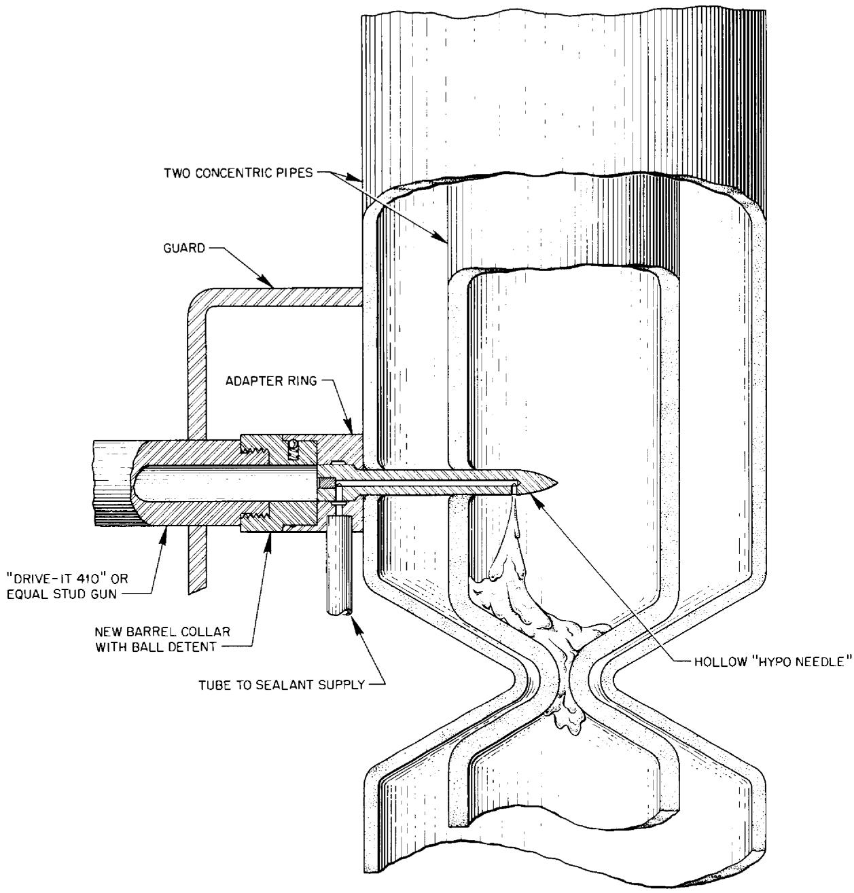  
Fig. 5. Cartridge-Actuated Sealant Injector for Pipes Containing Radioactive Materials.

# TO OPERATE:

1. PLACE ADAPTER RING OVER GUN MUFFLE.   
2. SET "HYPONEEDLE" IN BARREL TO GAGE DEPTH.   
3. PLACE CHARGE IN BREECH AND LOCK.   
4. HOLD STUD GUN FIRMLY AGAINST SURFACE TO BE PIERCED AND RELEASE TRIGGER.

designed for sealing the activity within this pipe before it was severed. Figure 6 shows a cross section of two concentric pipes into which injection-type pins were driven with a stud gun in a preliminary test for the purpose of determining the proper propelling force for adequate penetration. As indicated in Fig. 5, the concentric pipes would be crimped prior to injection of the sealant. After the inner pipe was sealed, the two pipes would then be severed by means of the guillotine cutter. The same general scheme, except for different pipes sizes, would be used for the snow-trap vent lines. Although development work on this device is incomplete, it is believed that this method of sealing would have prevented the spread of activity from the severed ends of pipes.

7A. A. Abbatiello, Cartridge Actuated Sealant Injector for Radioactive Pipes, ORNL CF-57-5-59 (May 21, 1957).

The tool maintenance problems for the severance devices were expected to vary with the extractability of the tool system. Dropping of cut lines was considered as probably acceptable but somewhat undesirable. Schemes for eliminating this exist, so it was not considered a serious problem.

# Withdrawal of the Reactor

The possibility of the reactor wedging on the support columns was considered. It was recognized that for this possible problem, as well as other unscheduled difficulties, a foolproof removal tool such as an extended cutting torch would have to be available as a contingency tool. Whatever the removal scheme is, special attention would be required for releasing the reactor stop device.

When all severing of reactor connections was complete, it was planned to lift the reactor by means of

UNCLASSIFIED PHOTO 28724

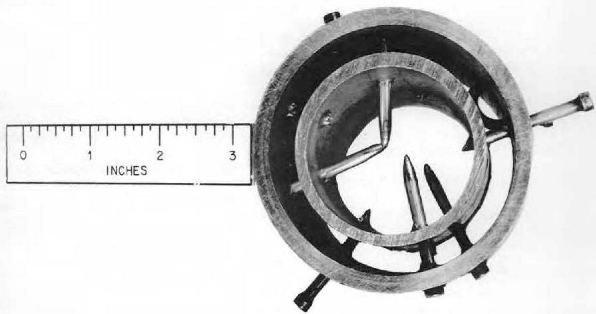  
Fig. 6. Two Concentric Pipes Pierced with Hollow Sealant Injector Needles by Using Stud Gun.

a bail carried by the building crane. This bail was designed to engage the lifting pins on the support structure with only visual observation from above. If activity levels permitted, the crane operator would work from the crane cab; otherwise, a remote control cable would be necessary. The crane was to lift the reactor and carry it to the front of the building, where it would be placed on the low-boy carrier. Since the capacity of the building crane is limited, it was intended to drain the water jacket for this phase, and then replace the water in the jacket for the additional shielding it would provide during transit. Adequate dust covers to prevent the spread of activity would be applied, and the unit would then be towed to the hot cell. Suitable shielding was to be placed between the reactor and the operator during transit.

# 4. DISASSEMBLY

Upon arrival of the reactor at the Reactor Disassembly Hot Cell (RDHC), it was to be positioned in the unloading area under the extended rails for the hot cell bridge crane. After the water shield was drained to reduce weight, the reactor was then to be transferred into the cell. At this stage dissection operations were to begin.

The program was to make visual observations, take physical measurements, make replications, take photographs, and remove original specimens as the reactor was dismantled in a carefully planned sequence. Pieces removed were to be decontaminated and conveyed to hot storage for subsequent dissection and examination or for disposal. It was planned that operations performed in the large hot cell would be limited to large units, while work on the smaller items would be done in specially equipped small cells.[8]

A component disassembly method (the approximate reverse of the assembly order) was planned to provide the best accessibility, as well as to yield the required specimens with minimum distortion.

# Disassembly in the Hot Cell

A detailed set of operation planning sheets forms the nucleus of the disassembly procedure. These

sheets cover a step-by-step analysis of each operation required to disassemble the ART and are arranged in a sequence that specifies the cutting operations, the samples to be obtained, the measurements or observations to be taken, and the tools required. They also include views of the reactor at various stages of disassembly, so that the reader can visualize the operations more easily. It starts with the arrival of the ART aboard a low-boy at the main entrance doors of the large hot cell.

For the convenience of the reader in understanding the procedures which follow, a series of sketches has been included. Figure 2 shows the reactor in cross section. Figures 7-9 show the reactor at various stages of disassembly, and Fig. 10 is a typical page from the eighty-odd operation sheets that were developed for the sequential disassembly work.

By means of the 30-ton hot cell overhead crane, the support structure with the reactor attached is picked up from the low-boy and transported into the disassembly section of the hot cell, where it is suspended from wall brackets. The water shield sections are removed, and the lower NaK manifolds and the fuel dump lines are severed with a hydraulic shear. The purpose of this operation is to permit removal of the south lead shield and to permit attachment of machining fixtures. The south lead and equatorial lead shield sections are then removed. The reactor is then moved into the turntable area of the hot cell, where final machining and trimming of the south NaK manifolds, the fuel dump lines, thermocouple stubs, and any other projections on the bottom of the reactor are performed. Next to be removed is the snow trap, which is suspended from the support structure. It is followed by the fuel pumps and sodium pumps, which are removed from the reactor as individual units. By raising the turntable, the reactor load is transferred from the support structure to the turntable, and the support structure is then removed from the reactor. At this point the reactor is securely attached to the turntable on a special mounting fixture which readily permits positioning and alignment of the reactor.

In order to remove the north lead, the north NaK manifolds are then severed and trimmed. Next, the four pump barrels are cut off as close as possible to Shell VII by using a tool similar to an internal boring bar. The control rod is severed near Shell VII, and all other projecting elements from the north head are machined away to give maximum

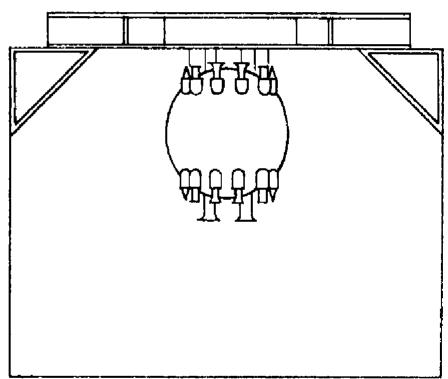  
(a)

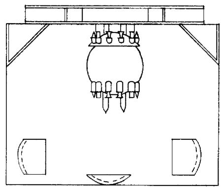  
（b）

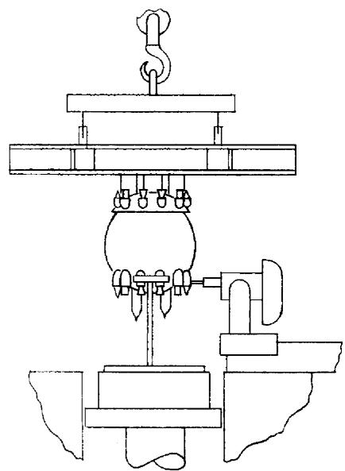  
（c）

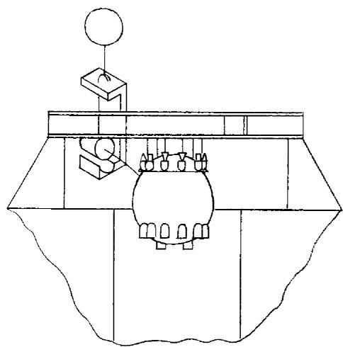  
（）

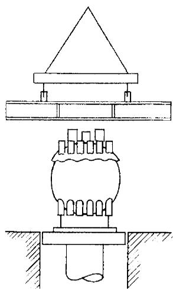  
(e)   
Fig. 7. Preparatory Steps for Disassembly of the ART in the Hot Cell. (a) Remove water jacket. (b) Remove lead shield. (c) Trim off NaK headers. (d) Remove snow trap. (e) Place reactor on turntable and remove support structure.

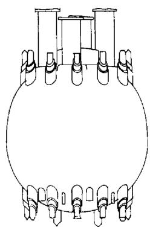  
Step 1   
a. Trim NoK lines   
b. Remove pump barrels

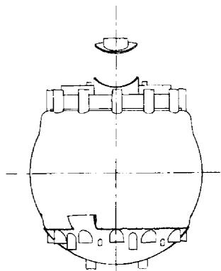  
Step 4   
a. Cut Shell VI just below girth weld   
b. Remove Shell VI, north head, heat exchanger, and reflectormoderator subassembly

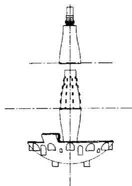  
Step 7   
a. Remove north island beryllium   
b. Cut lower half of Shell I vertically and at bottom   
c. Remove lower half of Shell I

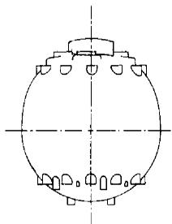  
Step 2   
a. Trim off thermocouple stubs   
b. Remove sodium expansion tank dome   
c. Remove control rod thimble   
d. Free Shell VII from fuel pump barrel adapter   
e. Drill thermocouples and tubes to free Shell VII   
f. Drill three holes through to Shell IV to establish reference points   
g. Cut Shell VII below girth weld   
h. Remove upper half of Shell VII

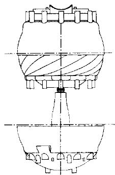  
Step 5   
a. Cut Shell VI around circumference at blowout patch level   
b. Remove upper portion of lower half of Shell VI   
c. Remove thermocouple from bottom of island

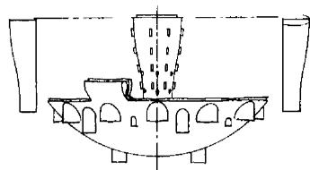  
Step 8   
a. Invert subassembly   
b. Drill out sodium drain tube   
c. Remove section of Shell VII with sleeve intact   
d. Counterbore thread on island tie-down rod   
e. Remove Shell VII, filler plates, Shell VI, and Cu-B₄C disk under island

UNCLASSIFIED ORNL-LR-DWG.44400   
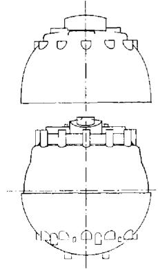  
Step 3   
a. Remove upper portion of lower half of Shell VII   
b. Remove fuel chamber top

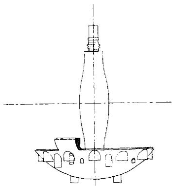  
Step 6   
a. Cut Shell 1 at equator

Fig. 8. Major Steps for Disassembly of the ART. Steps 1-9.   
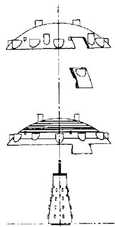  
Step 9   
a. Clear turntable   
b. Return Shell VI, north head, heat exchanger, and reflectormoderator subassembly to turntable

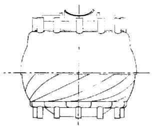  
Step 9A   
a. Drill out pins which join heat exchanger channels to Shell VI   
b. Affix retention band about girth of heat exchangers   
c. Cut weld joining lower deck to Shell VI   
d. Remove Shell VI north (with Shell V and tiles)

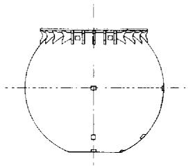  
Step 12   
a. Invert remaining assembly   
b. Cut Shell IV north at north end and at equator, then make two vertical cuts diametrically opposite each other on north portion   
c. Remove all segments of Shell IV

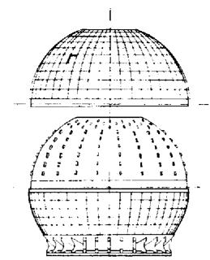  
Step 15   
a. Invert to upright position   
b. Sever Shell II 4 in. south of north end   
c. Drill access holes through load ring and drill out locks and screws attaching beryllium to load ring   
d. Remove strut ring and Shell III upper

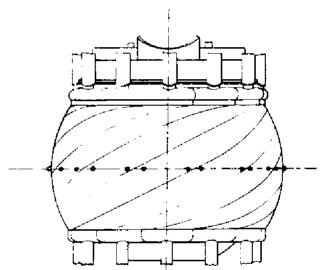  
Step 10   
a. Cut beryllium suspension tube (sodium return outer wall)   
b. Lift off north head

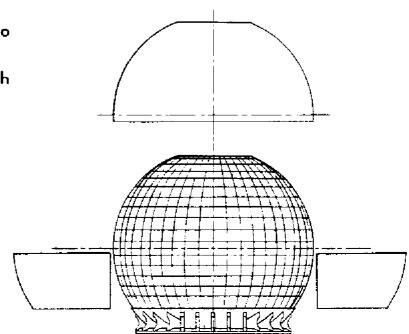  
Step 13   
a. Remove equatorial tiles and one specific tile

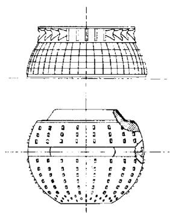  
Step 16   
a. Remove beryllium C-clamps   
b. Lift off beryllium north half

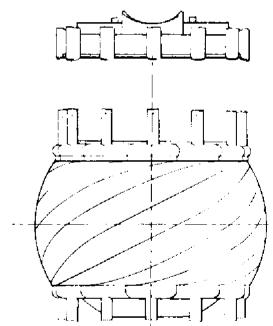  
Step 11   
a. Remove heat exchangers

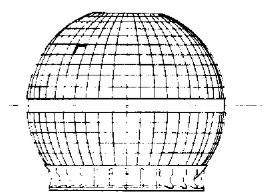  
Step 14   
a. Make equatorial cut in Shell III   
b. Sever Shell III south from Shell II   
c. Remove Shell III south

Fig. 9. Major Steps for Disassembly of the ART. Steps 9A-17.   
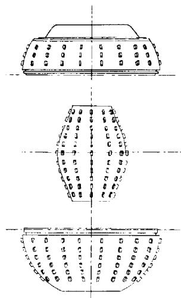  
Step 17   
a. Remove Shell II   
b. Clear turntable

OPERATION No.

Sheet No. 80

HOT CELL DISASSEMBLY

# OPERATION

Remove copper cermet at pressure ring; also $\mathsf{B}_4\mathsf{C}$ tile ring support and care specimens of beryllium in contact with ring support

# TOOLS

1. Remote milling machine   
2. Hollow mill or end mill (to cut plug)

# SPECIMEN

II FI 2 Vis 2 DBA   
VD 1DBA   
II D4 3Mp   
II D5 3Mp

# DISPOSITION

All specimens to small cells

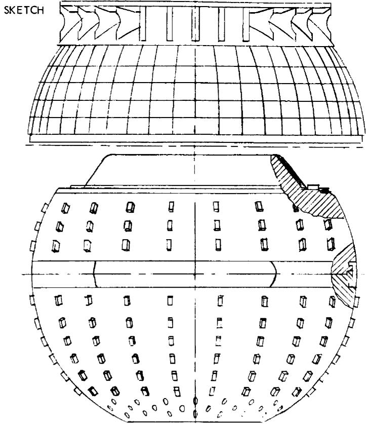  
Fig. 10. Sheet No. 80 from the Operation Manual for ART Disassembly.

access. The sodium expansion tank dome top is then cut away by abrasive grinding, sawing, or drilling a series of interlocking holes, followed by the removal of the wall in a similar fashion. A series of interlocking holes at a $45^{\circ}$ angle from the horizontal is made around the circumference of the control rod thimble in the vicinity of Shell VII, the fuel tank top, and the stack to the fuel tank. In order to remove the control rod to complete freeing the north head from Shell VII, both fuel pump barrels must be disconnected at the weld to Shell VII. There are also a number of miscellaneous dip lines, thermocouples, etc., which must be disconnected. A cut with an abrasive grinder around the circumference of Shell VII at approximately 1 in. below the equator completes partial freeing of Shell VII from the reactor, and the north hemisphere of this shell may now be lifted off.

With the reactor in this condition, much of the machining in connection with obtaining specimens and measurements of the north head assembly may now be done. When this work is completed, an abrasive cut may be made through Shell VI at the equator. This frees the subassembly consisting of Shell VI, the north head, heat exchangers, and reflectormoderator, which may be lifted off at this time and stored for further work. Shells VII and VI are then severed completely in the blowout patch area, thus leaving Shell I exposed for examination, specimen removal, and measurement. Shell I is then removed, and this exposes the island beryllium and spacers. The north half of the island beryllium is removed at this time, and the remaining portion of the reactor on the turntable is sent to storage.

The subassembly consisting of Shell VI, the north head, the heat exchangers, and the reflector-moderator assembly is placed in a saddle fixture on the turntable and clamped down. Pins connecting Shell VI and the fuel-to-Nak heat exchangers are then machined away at 24 places, and a temporary band is placed around the heat exchangers just below the lower edge of Shell VI. In order to separate Shell VI from the subassembly, a cut is made around the connection of Shell VI to the lower deck and also at the connection of Shell VI to the heat exchanger thermal sleeves. Shell VI may now be lifted off, exposing the heat exchanger cluster for measurement and examination. At this point the sodium flow dividing elbow is severed in a vertical plane at the pump outlet, as is also the outside wall of the sodium annular return passage. This completes the

severing of the lower deck connections, and the lower deck and attached parts may now be lifted off. A sling is attached to the heat exchanger bundles, the temporary restraining band is removed, and the heat exchangers are lifted clear of the sub-assembly. Shell IV is now exposed, and the required specimens and measurements are taken.

The subassembly is now removed from the turntable and replaced in the inverted position, that is, north end down. Shell IV is now severed around the circumference at the south end, the equator, and the north end. This permits the north hemisphere of Shell IV to drop down, and the south hemisphere may be lifted off. The tiles surrounding the reflectormoderator are now available for examination and sampling.

The necessary tiles and cernet are next removed so that Shell III may be severed around the circumference at a point slightly north of the equator and also at the south end. The Shell III segment is removed so that the beryllium south hemisphere is exposed. The spacers and sodium passages may be examined now. The assembly is once again inverted and secured to the turntable. The bolts through the pressure ring into the beryllium are counterbored away, and Shell II is severed at the north end. The support ring and the attached portion of Shell III may then be lifted off, exposing the north beryllium hemisphere for an examination of spacers and sodium passages. The band which locks the two beryllium hemispheres is cut and removed. This permits the removal of the north beryllium hemisphere, which is sent to another cell location so that the sodium passages may be examined. This completes the primary disassembly of the reactor; however, many of the removed pieces and subassemblies must go to small hot cells for further and final processing.

Other items that may require further work in the large hot cell machining area are the pumps, dump tank, snow trap, control rod, and valves. Support fixtures will be required for carrying each specific part, as well as special tools for the required cutting.

# Hot Cell Equipment Criteria

The needs for hot cell equipment were studied intensively, and much still remained to be done to select the practical equipment, methods, and techniques that would accomplish the desired result.

Appendix C covers the design criteria which had been developed for the hot cell equipment.

# Cutting Methods

A development program for the required tools for both the test cell and the hot cell was worked up, with the most promising cutting devices specified for procurement or further testing. In connection with these studies, a hydraulic shear capable of pinching through a full-sized $3\frac{1}{2}$ -in. IPS NaK line has been designed and built. This tool is remotely operable and will shear pipes, producing almost complete closure with minimum contamination spread (see Fig. 4). A portable band saw intended

9A. A. Abbatiello, Remote Shearing, ORNL CF-58-11-7 (Nov. 5, 1958).

for remote operation with a manipulator has been procured and tested in a hot cell10 (see Fig. 11).

Hot cell disassembly operations to this date have included plans for milling heads to be used for drilling and milling. A $2\frac{1}{4}$ -in.-dia by 0.051-in.-thick slitting saw cut satisfactorily and held up reasonably well, but requires a rigid support. It was planned to use a Bridgeport-type milling head to drill a series of interlocking holes to part various members. Tests to determine tool feeds, speeds, expected life, changing method, production rate, and control were to be run. Although all the data were not obtained, sufficient tests were completed to select the more practical cutting methods.

10A. A. Abbatiello, A Portable Bandsaw for Hot Cell Use, ORNL CF-58-2-110 (Feb. 19, 1958).

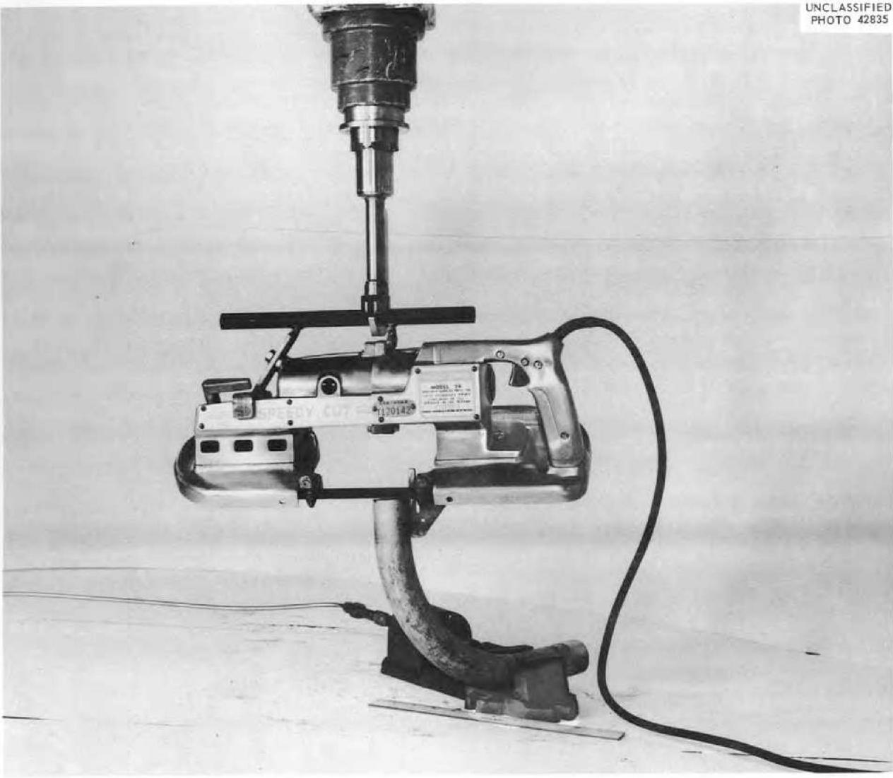  
Fig. 11. Remotely Operated Band Saw. Shown supported from manipulator.

Preliminary tests showed that the interlocking drilled hole method was slow and tool life was short. The drilling of alternate large and small holes was most effective and cut a $\frac{1}{2}$ -in. Inconel plate at a rate of $\frac{1}{3}$ ft/hr. It could be used if access to the cut area could not be gained in any other way, but, in general, other processes look more attractive from the standpoint of cutting rate and tool life.

Sawing operations were planned for the inner shells, which would be highly active. Band saws, reciprocating saws, and circular saws were considered, with preference given to the heavy chip producers to keep activity down. Methods of controlling the direction of cut, saw speed, and rate of feed have to be developed. Blade life and speed of accomplishing a given task are to be determined.

Grinding wheels, due to their high cutting rate, warrant more detailed study. Controlled tests must

be done to determine optimum operation conditions, and methods of control and elimination of airborne contamination must be sought. Two types of abrasive grinding were evaluated on Inconel: (1) a dry wheel mounted on a radial arm and (2) a wet wheel mounted on a horizontal track. The results indicate extremely high cutting rates for both of them, with acceptable wheel wear. As is shown in Figs. 12 and 13, a plate and three concentric Inconel pipes (to mock up the NaK sleeve) were cut through in about 1 min. However, these methods would spread activity and require more elaborate filtering and decontamination systems. The details of this test are described in Appendix D.

Flame or arc cutting is the fastest known method of separating Inconel. It has some major disadvantages; for example, it leaves rough edges, it spreads microscopic contamination, and the high temperature

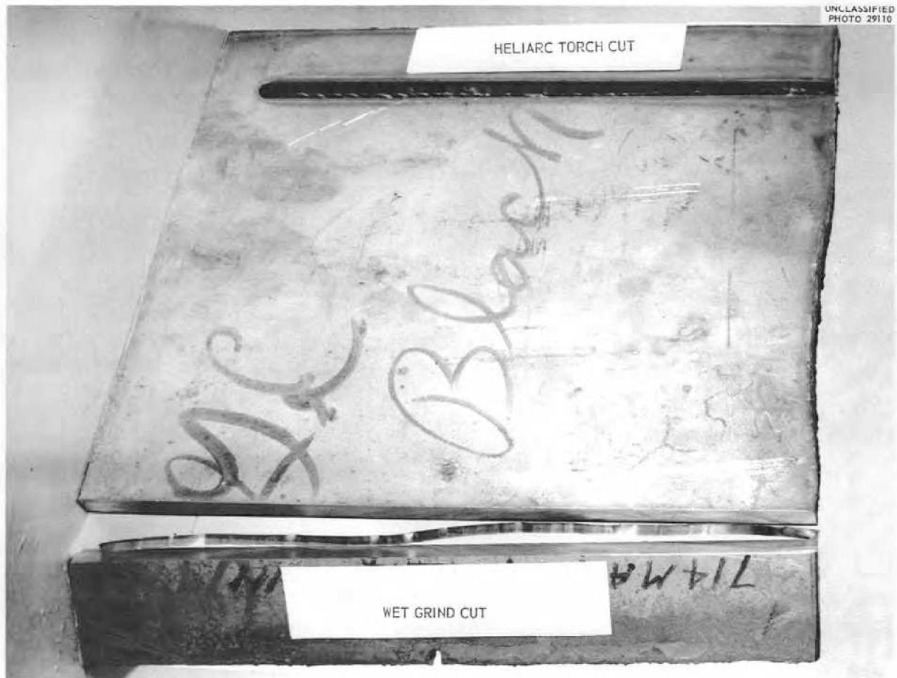  
Fig. 12. Wet Grind Cut. A 1-ft length of $\frac{1}{2}$ -in.-thick Inconel plate, cut in approximately 1 min with a water-flushed, 24-in.-dia abrasive wheel operating at about 10,000 surface feet per minute.

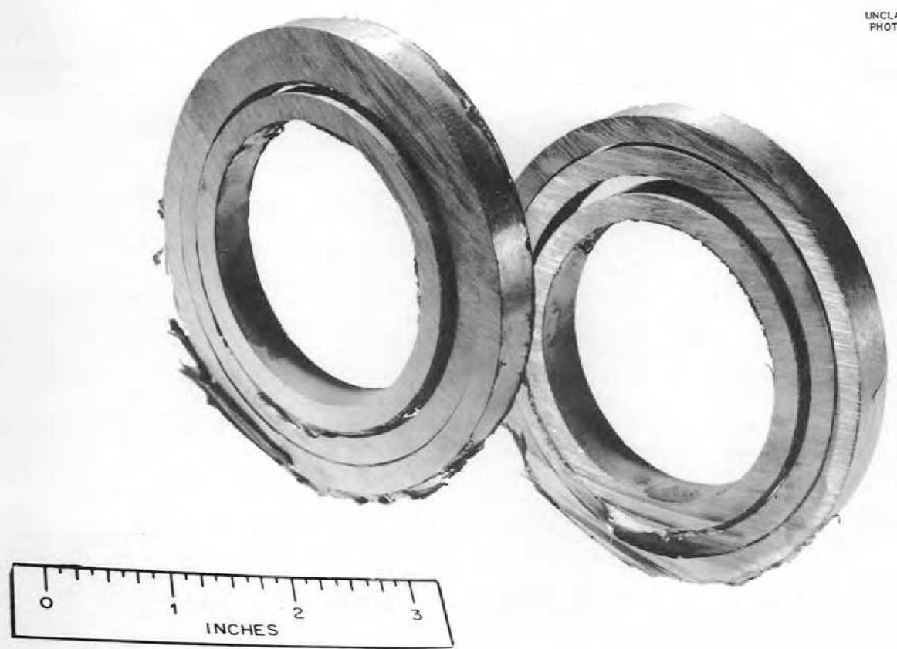  
DRY GRIND CUT   
Fig. 13. Dry Grind Cut. Three concentric Inconel pipes, cut through in about 1 min with a dry 16-in.-dia abrasive wheel operating at 10,000 surface feet per minute.

may cause metallurgical changes. This process is of limited usefulness for hot cell requirements but should not be confused with the Heliarc cutting process, which is described later.

The Heliarc cutting torch is relatively new and was recently observed in action. It is believed adaptable to cutting Inconel and stainless steels from a remote mounting, and, since it does not require an oxidant, it has certain advantages for hot cell work. However, the amount of activity released will probably limit its use to those outer shells which have the greatest bulk and are difficult to reach, but where the activity level is relatively low. The ability to cut through several layers of Inconel in one pass has been demonstrated and will be useful, especially when conventional cutting processes are unable to reach the area to be severed. A more complete description of this torch appears in Appendix E.

The ultrasonic (or magnetostriction) system of cutting was tested on Inconel, but the cutting rate was so slow that this method was not considered satisfactory. It can be applied with better results on materials which are too hard for normal cutting processes, such as the boron carbide tiles. It is not expected that these tiles will be cut unless some special requirement makes it necessary, in which case this process is available. Descriptions of both these processes may be obtained from Appendix F.

The electric disintegration (Elox) process of machining appears to have some usefulness for special applications in the hot cell, principally in the auxiliary cells rather than in the main cell. A brief test of Elox cutting was made on cutting Inconel on an available machine. Slow cutting action was observed, which was somewhat erratic and unsatisfactory on Inconel. However, the process has shown

its usefulness in cutting extremely hard materials which are good electrical conductors. One exception is the boron carbide tiles. It was found that boron carbide is not sufficiently conducting to permit the electric arc to do its work. In case boron carbide tiles are to be sampled, the only processes for cutting them are ultrasonic cutting (previously described), grinding with boron carbide, and splitting them by fracturing, as the material is quite brittle.

# Methods of Measurement

The determination of the dimensions of the reactor after it has been operated, in order to obtain direct comparisons with the physical size and shape before operation, is one of the major problems. Since the second phase of these measurements must be made in the hot cell, several measuring systems have been studied and test work has been done on those which looked promising, within the available time and facilities. Measurements to determine the following possible changes were planned:

1. alignment of parts,   
2. creep deformation,   
3. buckling,   
4. thermal distortion,   
5. discontinuity due to stress or thermal shock,   
6. wear (pump parts).

In order for measurements to be of value in determining the above factors, a certain minimum accuracy is required. For the purposes of this discussion it is assumed that changes in size due to creep, to be significant, will be of the order of 0.1 to $1.0\%$ of the original dimension and that measurements should be accurate to within $\pm 20\%$ of the change. On this basis the pressure shell would change in size in the range from 0.058 to 0.580 in. on the diameter, and accuracy of $\pm 0.012$ to $\pm 0.120$ in. would be required. On Shell I at the smallest diameter (6.75 in. approximately) the expected changes will be in the range from 0.0067 to 0.067 in. and the accuracy required will be from $\pm 0.0013$ to $\pm 0.013$ in. It follows that the desired accuracy on the smaller parts is $\pm 0.001$ in., which would require careful work even outside a hot cell.

The measuring systems may be arranged into four main classifications, as follows:

1. optical systems,   
2. photographic systems,   
3. replication,   
4. direct measurement.

Each of these classifications has several variations which were investigated. These are briefly described below, and the important differences are outlined in Table 3.

A. Optical Systems. - A-1. Rectilinear Telescope. - This device consists of a telescope with cross hairs, so mounted on ways that it can be moved to any point in an area, in this case an area about 5 ft wide by 7 ft high. The line of sight of the telescope remains normal to the plane in which the telescope moves at all times. The telescope and ways would be mounted on the inside wall of the hot cell with provisions made to view the cross hairs of the telescope and to measure the exact position of the telescope from outside the walls of the cell. In the case of the pressure shell, for instance, measurements would be made by sighting the telescope on the visible edge of the pressure shell on one side, noting the position of the telescope, then moving the telescope across a diameter until it sights on the opposite visible edge. The difference in measurement between the two sights would be the diameter of the pressure shell at that particular point in the vertical direction and at that particular rotational position of the reactor. As many measurements as desired around the sphere could be made by rotating the reactor on its mounting turntable, and measurements from top to bottom of the reactor could be made by moving the telescope up or down.

A-2. Theodolite Range Finder. - This system of measuring is essentially a surveying technique. Two theodolites are mounted on an accurately measured base line. If a diameter is to be measured, targets are placed against the reactor at the ends of the diameter. The distance from the center of the target to the edge is accurately known. Then, by angular measurement with the theodolites, the coordinates of the target center for each target are calculated. From the distance between target centers, the diameter is derived by subtracting twice the distance from the center to the edge of the target.   
A-3. Optical Measurement Through Hot Cell Windows.- This system uses conventional optical tooling instruments mounted outside the cell window.11 These instruments sweep the entire window area and permit horizontal and vertical measurements

Table 3. Comparison of Measurement Systems   

<table><tr><td rowspan="2"></td><td colspan="3">A. Optical</td><td colspan="4">B. Photographic</td><td colspan="2">C. Replication</td><td>D. Direct Measurement</td></tr><tr><td>A-1 Rectilinear Telescope</td><td>A-2 Theodolite Range Finder</td><td>A-3 Measurement Through Hot Cell Windows</td><td>B-1 Lifting</td><td>B-2 Contour Mapping</td><td>B-3 Photogrammetric</td><td>B-4 Comparative Contour Measurement</td><td>C-1 Metals</td><td>C-2, C-3 Plastics, Resins, Gypsum Plasters</td><td>D-1 Direct Measurement</td></tr><tr><td>Brief description</td><td>Scape on rectilinear mounting carriage inside cell</td><td>Surveying technique</td><td>Coordinate optical tooling system set up outside cell window and reading dimensions of part on a vernier scale by optical means</td><td>Measurement of accurate full-scale photographs</td><td>Project plane lines on a surface and photograph to produce contour lines</td><td>Aerial mapping; like lofting, except that a 4×5 in. photo is measured with catheterometer-type instrument</td><td>A grid is placed before the surface to be measured; the shadow of the grid cast at a 45° angle and the grid are photographed on a common plate; the distance between the wire image and its shadow represents the distance from its plane to the contour surface</td><td>Metal is sprayed on a surface and the replica is lifted off</td><td>Plastics or gypsum plasters are poured into a form placed over the surface to be copied and allowed to harden, then removed; the gun-mplaced gypsum is applied with a Gunnite-type mixing gun</td><td>Arrangement of snap or dial gages are mounted on appropriate supports and moved by means of manipulators within the cell and placed across the object to be gaged</td></tr><tr><td>Estimated accuracy, in.</td><td>±0.003</td><td>±0.005</td><td>±0.003</td><td>±0.005</td><td>±0.010 (?)</td><td>±0.004</td><td>±0.010</td><td>±0.001</td><td>±0.001</td><td>±0.002</td></tr><tr><td>Advantages and disadvantages</td><td>Difficult maintenance because of contamination; eye-piece must be re-motely viewed</td><td>Difficult to align remotely; does not see a flat plane</td><td>Clean, as no instruments are within the cell, but depends on the accuracy of the cell window; area limited to glass area, or the part must be lifted and rotated for proper orientation</td><td>Records much information rapidly</td><td>Would quickly show major contour changes; delicate, would have to be mounted within the cell</td><td>Gives a rapid photographic record; is compact</td><td>Is convenient and should give reproducible results because all elements (camera, light source, and grid) are mounted on one dolly; would require adequate shielding for camera to prevent film fogging or would be limited to low-activity areas</td><td>Extremely good surface detail and actual contours recorded, but limited to items which can have parring lines for casting with draw-alloy; on &quot;before&quot; replicates requires extreme cleanliness to limit impurities left in system</td><td>Not quite as good as for C-1, but quite satisfactory; cleanliness requirements are not quite as severe as for C-1</td><td>Simple in construction but difficult to use remotely; probably extremely slow and of limited usefulness</td></tr><tr><td>Complexity</td><td>High</td><td>High</td><td>Medium; uses standard, available equipment</td><td>Medium</td><td>High</td><td>Medium</td><td>Medium; uses easily available parts</td><td>Requires remote operation of the metal spray gun</td><td>Requires remote operation of the emplacement gun or setting of molds</td><td>Gages are simple but handling them remotely presents problems for accurate placement</td></tr><tr><td>Estimated cost</td><td>$10,000-15,000</td><td>$16,000</td><td>$8000</td><td>$6400</td><td>$14,400</td><td>$4700</td><td>$8000</td><td>$4000</td><td>$1000 plus varied mold construction cost</td><td>Gages are low in individual cost but a large number may be required</td></tr><tr><td>Availability</td><td>Not standard; 6-9 months to construct</td><td>9-10 months</td><td>3-4 months</td><td>6-9 months</td><td>Not standard, must be designed and custom built</td><td>6 months; some design required</td><td>Not a standard item, but may be constructed from avilable parts</td><td>2 months</td><td>2 months</td><td>2 months</td></tr><tr><td>Adaptability to a variety of parts</td><td>Good</td><td>Good</td><td>Good, within the limits of the window area, or the ability to position the part</td><td>Good</td><td>Fair</td><td>Good</td><td>Fair; best adapted to gradual contour surfaces; not suitable for extremely irregular surfaces</td><td>Limited to parts which can be withdrawn</td><td>Limited to parts which can be withdrawn</td><td>New or adjustable gage required for each part</td></tr><tr><td>Evaluation</td><td>Once considered attractive, but now of academic interest because it is super-seded by simpler methods (see A-3)</td><td>Too complex for use in a radioactive area</td><td>Appears as the most useful system for wide application, leaving un-disturbed working space within the cell; a full-scale demonstration has been made</td><td>An attractive system for medium accuracy measurement, and as a progress record; could be very useful but needs further work for adaptation</td><td>Comments are about the same as for B-1, except for the added complexity of the light source within the radio-active area</td><td>A variation of and similar to photoflighting, using smaller negatives, requiring reading them with magnifying optical instruments; should be investigated further</td><td>Might be useful device to get &quot;before&quot; and &quot;after&quot; records of the outer shell contours</td><td>A useful tool for making accurate physical records of contour and surface finish before and after operation; large reductions in activity will possibly make direct extension of costs feasible, relieving hot cells</td><td>Some comments as for C-1 apply, except the casting and pouring techniques replace the metal spraying</td><td>Direct measurement sounds simple, but would be difficult to obtain full usefulness; would be most appropriate for some of the major overall dimensions</td></tr><tr><td>References</td><td></td><td></td><td>Appendixes L, M, and N</td><td></td><td></td><td></td><td>Appendix H</td><td>Appendix I</td><td>Appendixes J and K</td><td></td></tr></table>

in this plane. Thus, any object within the direct view normal to the cell window may be scanned, and the coordinate measurements may be read directly on the vernier scales outside the cell.

Tests have indicated modern lead glass windows to be of sufficient accuracy to make this system practical (see Appendixes L, M, and N). An optically flat reference bar mounted on the exterior of

the cell wall is used to align the instrument at various elevations, as shown in Fig. 14. This system places all instruments outside the cell, where they are not exposed to contamination, and utilizes the cell interior for working area. The part to be measured must be capable of being lifted and rotated, for which the lift-turntable is available within the hot cell.

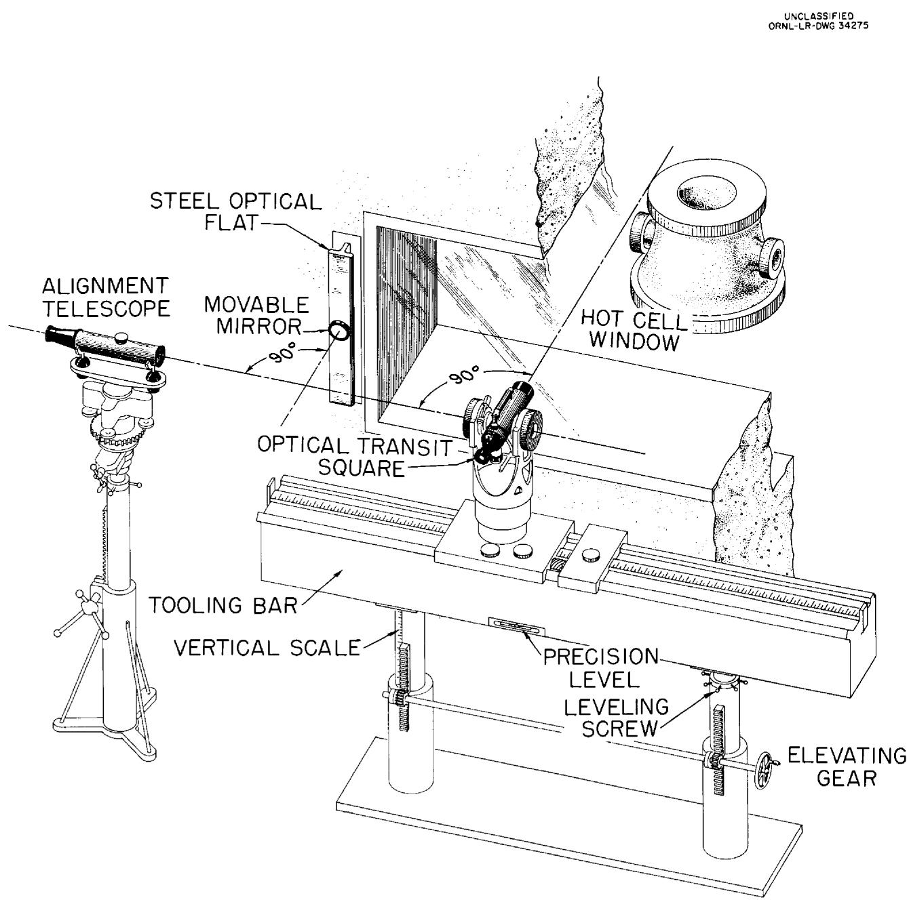  
Fig. 14. Optical Measurement for Hot Cell Application.

B. Photographic Systems. - B-1. Photographic Lofting. - This system is essentially the photographic mapping of an object to produce a full-sized image, which is then measured. The equipment required is a periscopic camera lens system of long focal length capable of producing an image perhaps 18 in. in diameter. An enlarging system with a movable image board, such as a vertical plate, is suspended from tracks in the ceiling in such a manner as to permit the board to be brought closer to the lens or farther away to obtain the full-sized image. Equipment for measuring the image, such as trams, is also required. Two or more target points are placed in the object space in a plane normal to the optical axis and parallel to the axis of the reactor. The plane is a known distance from the axis of the reactor. The distance between the target points is accurately determined. A negative is made on a glass plate. An enlargement is made, with the image adjusted in size until the distance between target points on the image is the same as the actual distance. Measurements are then made of diameters, for instance, on the enlargement. From these measurements the actual diameter is calculated.

B-2. Photographic Contour Mapping (by projecting a grid). - This system is basically the same as the lofting reproduction measuring system described in the preceding section, with the addition of a grid projecting system normal to the optical projector capable of producing a sharply defined spot of light about $\frac{1}{4}$ in. or less in diameter on the reactor. The projector would swing on a horizontal axis so that the spot of light would sweep a plane perpendicular to the optical axis of the camera. With the hot cell dark, the camera shutter would be opened and the projector would sweep the spot of light over the reactor, thus recording on the film the intersection of a plane with the surface of the reactor. Next, the projector would be moved a specified distance, say 1 in., along its horizontal axis and again swept over the reactor, thus producing on the film the intersection of a second plane with the surface of the reactor. This process would be repeated until the image of a quadrant of the reactor was mapped on the film. The reactor would then be rotated $90^{\circ}$ on its mounting turntable, and a contour map of a second quadrant made; and so on for the third and fourth quadrants. It may be feasible to use a multiple projector so that a quadrant can be mapped with one sweep of the projector. From the contour

map as produced above, by either mathematical or graphic techniques, the rectilinear coordinates of any point on the exposed surface of the reactor could be determined.

B-3. Photogrammetric Technique. - This may be described as an aerial mapping technique and differs from the procedure described earlier under lofting in that the photograph would be only $4 \times 5$ in. approximately.

The equipment would consist of a camera with periscopic lens system, for shielding the film, so mounted in the wall of the hot cell that the optical axis of the camera system would intersect the axis of the reactor. The lens system would need to be carefully calibrated, and the exact distance of the lens system from the axis of the reactor would need to be established. The photographic negative would be measured with a coordinate measuring microscope. For instance, from the diameter of the reactor as measured on the negative, the actual diameter of the reactor could be calculated.

C. Replication. - The purpose of replication on disassembly is to obtain a replica surface which is accurate enough to be measured. It is intended to measure on the replica the distance between scribed lines, between weld beads, and in some cases to measure the curvature.

The intent of the development work on replicas is to determine the feasibility of producing replicas of sufficient accuracy to provide a measurement of the reactor parts on disassembly. This accuracy should be within $\pm 0.003$ in. Also to be determined is the amount of radioactive contamination that will adhere to the replicas. It is expected that an activated surface which has been decontaminated will not transfer activity to the replicas.

There are two methods of applying the replicating material - by spraying and by pouring into a mold. Due to the difficulty of design for and positioning of molds on odd-shaped contours in the hot cell, the spraying methods appear most promising. The spraying technique will require development of a parting method so that the replica will cover only an area which can be withdrawn and thus can be removed. There are some cases, such as a replica of the fuel passage at the bottom, where the pouring technique will be preferred.

Three types of material can be used to produce replicas: metals, plastics, and plaster. Each is discussed separately later.

There are three questions regarding replication for which answers are required:

1. How accurately can replicas be prepared, and which method and material provide greatest accuracy? (Tests have indicated satisfactory accuracy with both metal spraying and gypsum casting methods.)   
2. How are molds to be built or parting lines provided in the hot cell?   
3. How much radioactive contamination will adhere to the replica?

C-1. Metal Replicas. - Although metals are readily cast in normal operations, the use of such methods does not appear feasible in a hot cell. Flame-spraying of metals, however, is practical. Metals are flame-sprayed by a special metallizing oxyacetylene torch which automatically melts metal wire and blows the molten metal on the surface to be coated in the manner of a paint sprayer. The temperature effects on the accuracy of the replica are believed minor in that it is reported that metal can be sprayed on paper without charring the paper.

Various metals can be used in this operation, such as aluminum, brass, lead alloys, or steel. In order to minimize the heating of the part being coated, the lead alloys appear most desirable. From the point of view of strength and rigidity of the replica without unwieldy thickness, aluminum or brass would be better. The proper metal to use can be determined only by trial, with the principal consideration being the accuracy of duplication with sufficient strength to permit hot cell handling. Use of reinforcing wire mesh or a stiff backup metal may be found necessary. Lead alloy wire has been used with a metallizing gun and trial replicas have been successfully made, as shown in Fig. 15.

Several replicas have been produced of Shell I sections, and a comparison of the dimensions, surface finishes, and duplication of detail makes this process look excellent. However, traces of lead alloys left within the reactor could seriously weaken Inconel, and for this reason it is not likely that lead alloy metallizing will be permitted for the "before" dimensions. Interested divisions have been requested to comment on this problem and make recommendations.

C-2. Plastic or Resin Replicas. - The thermosetting resins that cure at room temperature after the addition of an accelerator, such as the epoxies or polyesters, are suitable for use in preparing replicas. The usual method of handling is to pour into a mold and allow to harden. It is reported that there is a spraying method for handling them, but it is not known whether this method could be used in a hot

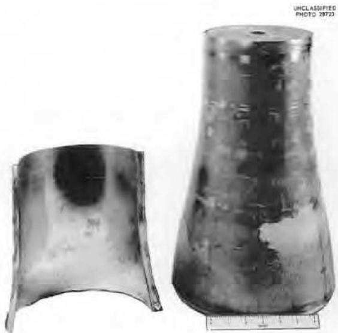  
Fig. 15. Lead Alloy Replica of a Reactor Component.

cell. It appears that developing a thick layer would be particularly troublesome with a spraying technique because of the setting time required.

The epoxies are frequently used in preparing replicas, but they have extreme adhesiveness when applied to metal. Applying a releasing material with adequate thoroughness might cause difficulty in a hot cell and would rule out the use of resins for the replica of the fuel passage at the bottom of the reactor. For other replicas to which a pour technique is adaptable, such as the replicas of Shells I and II, the casting resins may be suitable.

The process of making resin replicas consists in preparing a mold, with the area to be duplicated as one side of the bottom, and filling the mold with the mixed resin and accelerator.

C-3. Plaster Replicas. - There are several types of gypsum plasters available with varying amounts of shrinkage or expansion on setting. The U.S. Gypsum Co. markets several under various trade names such as Hydrocal, Ultracal, and Hydrostone. Some are reported to have an expansion on setting of as little as 0.0002 in./in. These materials will show extremely fine detail (such as scribe lines on the test piece) which we will require.

Unfortunately the gypsum plasters are not readily sprayable. Two test cases were produced by the spraying technique by the Gunite method, but actually with the Bondact gun. Detail was fair with adequate strength, but the poor performance of the specific gun used indicates the need for better equipment if this program is to be pursued. The replicas produced are shown in Fig. 16.

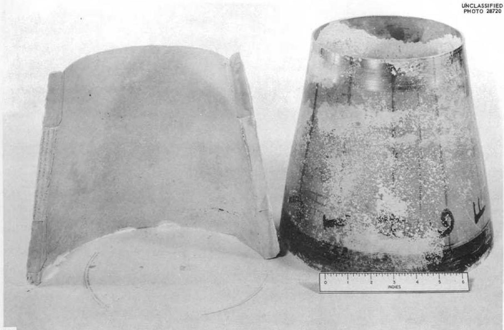  
(a)

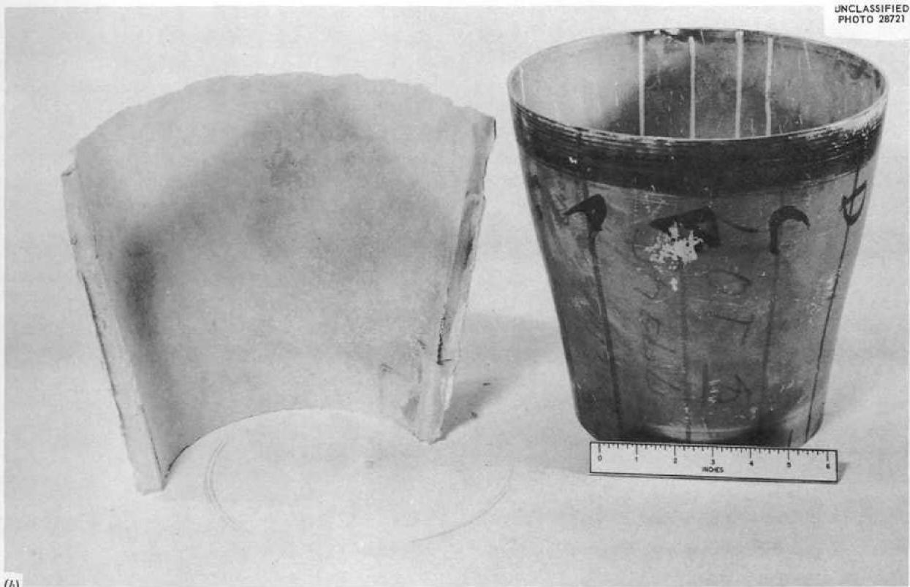  
Fig. 16. Replicas Made with Gun-Emplaced Gypsum. (a) Replica made without use of a release agent. (b) Replica made with an oil release agent.

During the setting period the plasters pass through a so-called plastic stage when they can be handled as a mason handles mortar. Whether replicas could be made in the hot cell by this means is not known. It appears doubtful.

However, there are some replicas required on disassembly to which a technique of pouring into a mold is applicable. These are the replicas of the fuel passage at the bottom of the reactor and the replicas of the surfaces of Shells I and II, and possibly the replica of the bottom of Shell III. The process consists in preparing a mold for containing the cement in the liquid state. The area to be duplicated is one side or the bottom of the mold. The mold is filled with a plaster-water mixture. When

the mixture is hard, the mold and plaster replica are removed (Figs. 17 and 18).

D. Direct Measurement. - The use of snap gages for direct measurement of the item in the cell has been proposed, because it has been used at other AEC installations. The method has ruggedness and simplicity to recommend it, but becomes awkward for handling the large number of required gages by remote manipulators. Schemes for using direct reading dial indicators mounted in a suitable framework to ride over the reactor have also been sketched. Such methods can be used if no better tools are available, but their use is to be avoided because of the problems involved in their use and the excessive time required.

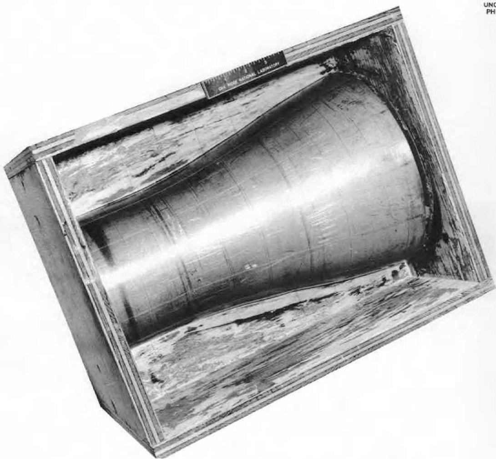  
Fig. 17. Mold for Making Replicas of Radioactive Components.

UNCLASSIFIED PHOTO 40713

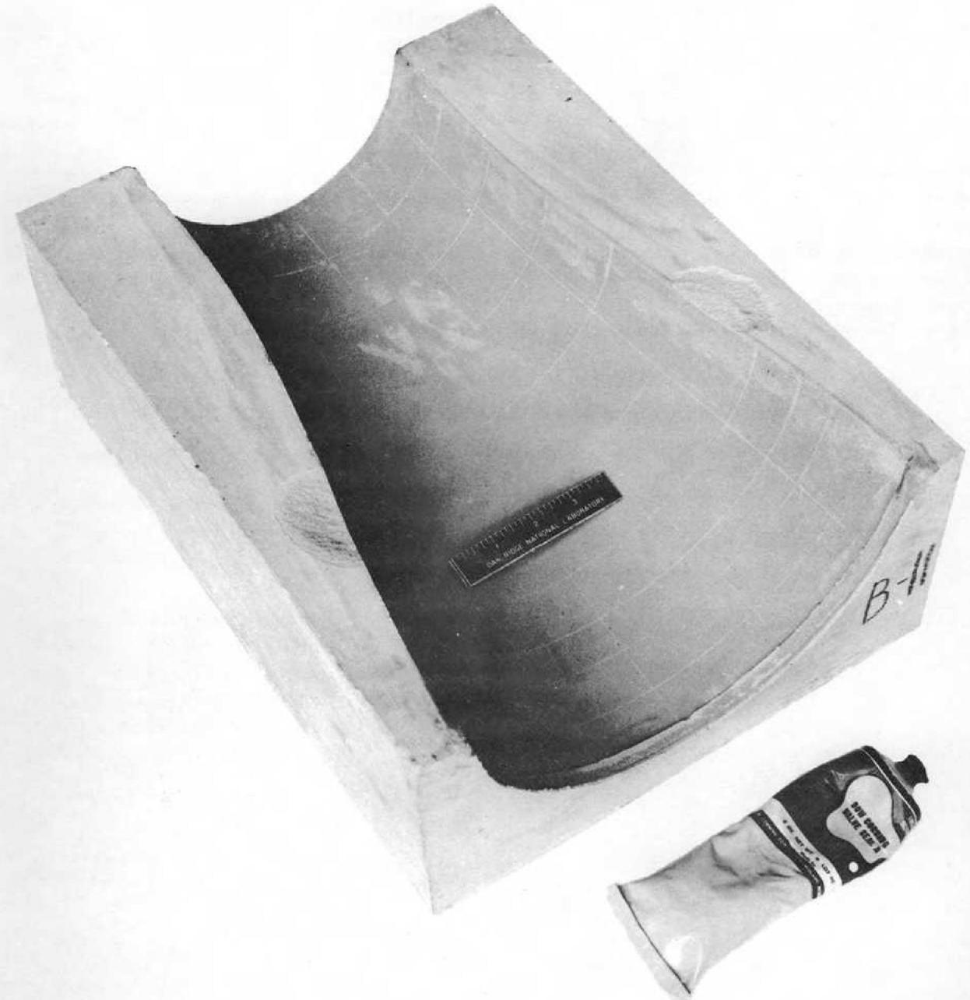  
Fig. 18. Gypsum Plaster Replica of the Surface of a Reactor Component. The tube contains a lubricant used to release the replica from the mold.

# 5. SPECIAL STUDIES

Associated with the specific studies for removal, disassembly, tools, and facilities were studies of shielding, decontamination, size of air-borne particles, disposal of radioactive materials, and a mock-up of the hot cell facility. This work is discussed separately as much for emphasis on its importance as for lack of a more suitable place for the material.

# Shielding Studies12

The wall thickness required for the ART hot cell is dependent upon reactor power level, operating time, time elapse after shutdown, fraction of the fission products contained by the reactor, and allowable dosage rate established for the outside of the cell wall. The wall thickness was calculated for a reactor power of 60 Mw and infinite operating time (in order to approximate operation for 1000 hr). At least $20\%$ of the curies of activity would have plated out on the reactor. The reactor would also have contained activity in fuel which had not been rinsed out. For the purposes of calculation, the fraction of fission products contained in the reactor was taken as $100\%$ . A change from $20\%$ to $100\%$ only represented an increase of 5 in. in the required wall thickness.

The assumed maximum permissible dose for a person outside the cell wall is 100 mr/week, or 2.2 mr/hr for an 8-hr day and 5-day week. To allow cell operators to accumulate a margin of allowable dose for necessary work in higher radiation fields, a dosage rate of 0.5 mr/hr was selected. These wall thickness calculations were based on a comparable study13 for similar conditions. This study was a multigroup calculation for gross fission products and Co60 radiation using data from shielding design manuals.14,15 The results are shown in Fig. 19. The required thickness is indicated as 4 ft of bar-rytes concrete. It was recommended that a conservative thickness of 4.5 ft be used to allow for future application of the cell to higher power reactors.

Penetrations through the cell walls for manipulators and other equipment would have produced

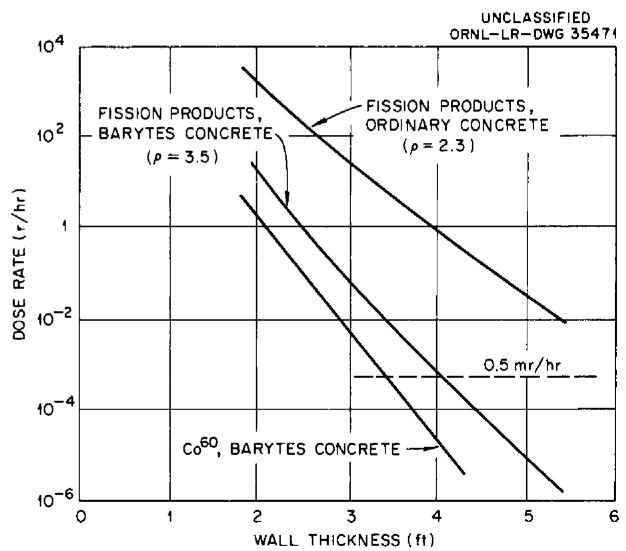  
Fig. 19. Calculated Dose Rate Outside Hot Cell Wall. Assumptions: (1) $100\%$ of fuel in reactor; (2) operation for infinite time (approximating operation for 1000 hr) at 60 Mw; (3) reactor located 6 ft from inner surface of shield; (4) 100 days after shutdown.

local radiation dose rates higher than $0.5\mathrm{mr / hr}$ Reasonable precautions would have been required when intense sources were brought into line with a hole; however, special shielding would not have been required unless it proved necessary to keep personnel in line with a hole at the same time that major sources inside the cell were also in line.

# Decontamination of Pressure Vessel, Hot Cell, and Tools

Decontamination of the ART pressure vessel, the hot cell, and other associated tooling has been considered, but no definite or final steps have been specified because they are directly contingent upon the results of the ART operations.

For the pressure vessel, the procedure may be to wash down the reactor, support structure, and tank walls with hydraulic jets that are lowered down through the access hole. A dilute acid wash solution appears to be the most suitable for this purpose. A sump pump installed near the floor of the pressure vessel would remove this contaminated liquid through the access hole, or if the volume is not too great, it could be left in the pressure vessel for removal after the reactor has been removed.

In the hot cell the problem is somewhat different. The walls may have to be decontaminated at frequent

intervals to permit safe entrance of operating and maintenance personnel. Each of the reactor pieces, as it is removed, will have to be decontaminated before it is sent to storage or to a small cell for further work. All of the tools which will require maintenance must also be decontaminated before being withdrawn into the intermediate hot cell. Visits to other hot cells at ORNL, and discussions with the operating personnel, have revealed different philosophies on hot cell operations.

One group feels that the cell area should be capable of being cleaned up adequately for personnel entry. Another group advocates the complete rinsedown of the walls and equipment with a powerful spray or rinse, washing all water and contaminants into a hot drain. One installation, where water is permitted, cuts up all critical assemblies under 10 to 15 ft of water. The underwater technique cannot be seriously considered because of the presence of sodium as well as the radioactivity dispersion from fused salt systems, but when the major elements have been severed and opened, cleaning the cell interior may proceed safely.

Work at the 4501 cell has been successfully carried on in disassembling "in-pile" loops by cutting through the surface of the loop with a high speed grinding wheel. The radioactive dust which accumulates on the cell walls and on the equipment has been washed down by means of high velocity jets, and all the contamination products have been washed down a hot drain. This method might be satisfactory in the large hot cell, but it introduces complications. For example, there could be a reaction with sodium or NaK which might be left in lines or crevices around the reactor. The possibility of washing active materials into areas which cannot be easily cleaned is highly undesirable. However, an effort has been made to design the large hot cell with straight clean walls and scuppers so that the wash solution will easily drain.

Small tools may be cleaned in a dilute acid solution. Large tools and machinery, however, may not be dipped in cleaning baths and may have to be sprayed. In many cases it should be possible to cover the tools with plastic hoods in order to limit the amount of contamination they collect.

# Size Distribution of Waste Particles from Severance Techniques

A study16 was made by an MIT Practice School group on particle size distribution, that is, the size

of air-borne particles given off by the sawing, grinding, Heliac cutting, and hydraulic shear cutting methods. It is apparent that the shear is the cleanest of all the methods considered. All the others gave rather large dust contamination values. It was found, for example, in grinding Inconel, either wet or dry, that $10^{4}$ to $10^{7}$ particles per cubic centimeter of air were drawn through a filter of the measuring equipment. This amount of possible activity could be tolerated only if the hot cell were equipped with an adequate filtering system. For this reason the hydraulic shear appeared to be the most desirable method for cutting pipes in the pressure vessel and probably also for rough cutting and removal of manifolds in the hot cell. Torch cutting is the least desirable of the methods considered, from the air contamination standpoint. It resulted in the creation of about $10^{7}$ to $10^{9}$ particles per cubic centimeter. However, it might have been practical to use either the torch or grinding for the outer shell girth cut because of the low level of activity in this shell (VII) as compared with Shells I and II.[17]

# Disposal of Radioactive Materials

Radioactive materials were expected to consist of reactor parts, air-borne particles, and contaminated solutions.

The Health Physics Division recommends that contaminated waste solutions be disposed of in ORNL waste pit No. 3. Solution transport to this pit may be in the Operations Division's 4300-gal-capacity tank truck, which has 1 in. of protective lead shielding in front of the tank. Solutions must be made slightly alkaline before or when they are transferred into the truck tank.

The reactor parts were to be placed in storage containers and placed in a vault or other storage facility until required in the auxiliary cells.

The philosophy at ORNL on discharge-air quality required that the released air should be normally suitable for human breathing; therefore, the discharge system should be designed either for containment of the discharge air or for release at an elevation in the ORNL plant area approximately equal to that of the isotope area stack No. 3039. In the case of the RDHC this would have meant not only that the air must be discharged through

an absolutely efficient and reliable filter system but that the discharge air would have to be either recirculated as clean air supply to a hermetically sealed facility or discharged up a 250-ft stack. It was planned to investigate this problem further, particularly from the point of view of possibly discharging the properly filtered air at the facility roof elevation. Of course, the used filters after removal were to be placed in dust-tight containers and disposed of at the burial grounds.

Tools and equipment used in the hot cell were to be thoroughly decontaminated before they were taken out of the auxiliary cell. If the count could not be brought to tolerance levels, it was planned to dispose of the equipment at the burial ground rather than risk the spread of contamination.

# Facility Mockup for Cold Testing

In the event project schedules did not allow time for preliminary testing, a full-scale cold mockup of a portion of the hot cell was considered necessary for checking and shakedown of tools and procedures as well as for personnel training.

There was the possibility of using the ETU for this work, although it was realized that the need for rapidly gaining entry into this unit would not result in a procedure identical with that planned for the hot cell. Nevertheless, the direct operation of tools and fixtures on a full-sized model was considered a practical approach to the problems under hot conditions. This would have been especially useful in the development of replication technique, optical measurements, testing of cutting methods, and development and checking of special tools and fixtures.

# Underwater Disassembly Study

Some consideration was given to underwater disassembly for removal of the reactor from the pressure cell. Since plans were to effect the fuel transfer, sodium transfer, and the fuel flush operation remotely, the first step upon removing the man-hole cover was to cut the recovery tank free. In view of this it was proposed that, following the removal of the recovery tank and the postoperation sample tank, the cell be decontaminated, the top hemisphere of the cell be cut off, and then the cell be flooded with water. It was then planned that the remaining removal operations would be handled under water from a suitable platform. Accordingly a study was initiated to investigate the contamination aspects of such a system.

To obtain a rough idea as to what would happen to the estimated 2000 curies of beta activity under flood conditions, a simple experiment was performed.18 Water slightly acidified with nitric acid was agitated in a $10\frac{1}{2} \times 14 \times 2\frac{1}{2}$ in. pan as successive quantities of radioactive Sr90 were dissolved. Readings of beta activity were taken with a "cutie pie" instrument at a point $8\frac{1}{2}$ in. above the liquid level. The activity was primarily of 1-Mev energy. Samples of the solution were analyzed for activity content with the following results:

<table><tr><td>Beta Activity 81/2in. Above Surface (mr/hr)</td><td>Activity Content (μc/ml)</td></tr><tr><td>18</td><td>0.35</td></tr><tr><td>85</td><td>1.50</td></tr><tr><td>110</td><td>2.00</td></tr></table>

Although it appears that the activity count measured above the surface was roughly proportional to the activity content of the liquid, the study was not pursued further because of the potential hazard of working with sodium submerged in water.

# 6. FACILITY

# Consideration of 7503 Facility

As was stated previously, the early project thinking was that the two pits in Building 7503 (ART facility) used for ARE operation and disassembly would provide suitable space for ART disassembly. A single pit 28 ft by 21 ft by 22 ft deep would result if the partition between them were removed. Inasmuch as the walls of these pits are constructed of standard reinforced concrete 18 in. thick, an additional $3\frac{1}{2}$ ft of dense concrete shielding would have to be added to each wall. The resulting $21 \times 14$ ft floor space is obviously too small when compared with the $20 \times 52$ ft area needed for disassembly in a hot cell or the $3000\text{-ft}^2$ area required for the assembly of the reactor.

The space available for an operating area for such a hot cell is completely inadequate. Experience with hot cells has shown that a shielded area for the repair and decontamination of tools and equipment adjacent to the working area is imperative. Space limitations prohibit constructing such a cell in Building 7503. While the 30-ton crane installed

in the building is adequate for transporting the reactor from the operating cell to the disassembly cell, radiation levels would be too high to permit removing the shield plugs of the disassembly cell after the reactor shield has been removed, thus prohibiting further use of the crane. The low head room in such a cell would not permit the installation of adequate handling equipment inside the cell. Underwater disassembly of the ART in this or any other area is not feasible because of the violent chemical reactions between water and liquid metals and because of the requirement for precise measurement.

# Consideration of Other Arrangements

The feasibility of constructing the RDHC adjacent to Building 7503 was considered so as to minimize the movement of the reactor and to take advantage of the 30-ton overhead crane. To do this would require that the RDHC be located directly in front of the building, replacing the main access ramp to the building. The RDHC would then have to be built essentially underground, with the cell roof serving as the building access driveway. The cost of such underground construction and the fact that movement of the shielded radioactive reactor within the Laboratory area is not a critical problem offset any real advantages for this arrangement. It has the further disadvantage of requiring that construction proceed simultaneously with the installation and operation of the ART reactor.

Since ORNL has no hot cell facilities which are capable of handling an assembly as large as the ART, use of the GE-ANP hot shop was reviewed for its suitability for the ART disassembly. However, this was considered impractical on the basis of (1) the potential shipping hazard to the ART, (2) the necessary revision to the GE-ANP facility, and (3) the probable scheduling difficulties.

As was pointed out above, a large portion of the information to be gained from the ART is obtainable only from examination during and after disassembly. No estimate of any damage to the reactor resulting from shipment would be possible. Therefore the information obtained by disassembly would have to be discounted an unknown amount. Basically, the GE-ANP hot shop has adequate shielding, crane facility, and remote handling equipment for ART disassembly. However, the elevation and location of the viewing windows as designed for the G-E requirements might be somewhat awkward to work

through on the ART; also, use of the underwater storage facility would be prohibitive for the ART, because of the NaK and sodium explosion hazard. To use the GE-ANP facility, then, would require sufficient modifications to make certain that all ART disassembling operations could be performed, to provide a dry storage facility, and to install the specialized tooling required for ART disassembly. Since the GE-ANP facility would have to be available on a continuous basis for the estimated amount of time needed to disassemble the ART, scheduling and operations would be exceedingly difficult and costly for both the GE-ANP and ART programs.

Disassembly and inspection of the ART will require approximately 12 to 18 months. Because experience indicates that the need for handling large pieces of highly radioactive assemblies is increasing rapidly both in number and scope, it is anticipated that the usefulness of the facility for other applications will be extensive. Therefore it is believed that, by the time the facilities would be completed, reactor programs in progress would provide problems requiring the massive collection of data from numerous loops and irradiation experiments. Hence, it is anticipated that the proposed facility for the ART would be in constant use from the time it is completed.

# Proposed Facility

The proposal for a large hot cell provides for construction of a large, single hot cell divided into two rooms (Figs. 20 and 21). One of these rooms, the disassembly and decontamination area, is approximately 52 ft long by 20 ft wide by 36 ft high, clear inside dimensions. The other, for shielded maintenance of cell tools and equipment, is approximately 20 ft long by 20 ft wide by 36 ft high, clear inside dimensions. The area is served by an overhead crane and by two overhead manipulators mounted from a common bridge. Along the sides and one end of this cell are operating areas equipped with remotely controlled handling equipment and high density viewing windows. Wall plugs over each of the windows provide access for master-slave manipulators. A tool and equipment setup area is located along a portion of one side of this cell. A change room adjacent thereto provides for control of personnel access to and egress from the contaminated setup area. A tunnel connects the cell to a shielded storage area, so that radioactive materials can be

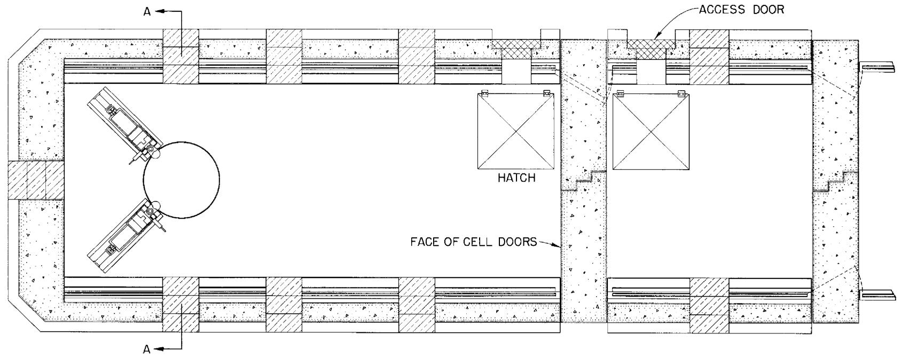  
UNCLASSIFIED   
ORNL-LR-DWG 19299   
Fig. 20. Proposed Reactor Disassembly Hot Cell: Floor Plan.

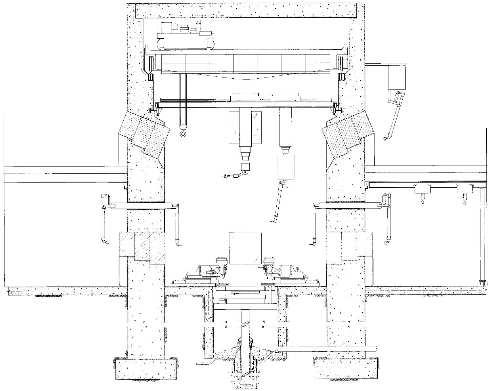  
Fig. 21. Proposed Reactor Disassembly Hot Cell: Section of Disassembly Area. Section A-A of Fig. 20.

transferred from the cell and safely stored until needed without requiring entry into the cell. Full-width double shielding doors at the end of the cell and between the two cell rooms are provided for insertion of the equipment to be disassembled. Also, an access door is provided for each room, to permit man entry or small tool transfer into the cell while contaminated. The cell is constructed of high-density concrete, with the walls about $4\frac{1}{2}$ ft thick and the roof $2\frac{1}{2}$ ft thick. A reinforced concrete floor will be provided.

The operating areas will be steel frame, with the exterior walls of masonry construction. A 30-ton overhead crane will operate over the entire length of the cell and will extend over a loading platform at the end of the cell. A remotely operated mechanical conveyor system will take radioactive parts from the cell, through the tunnel, to the storage facility.

Special disassembly tools and equipment will be required both for the disassembly work in the RDHC and for the removal of a reactor from its operating station, such as the ART cell in Building 7503. The hot cell will contain a disassembly table (lift-turntable) where a reactor can be held in position, rotated, and raised or lowered for disassembly operations. When the lift-turntable with the reactor is lowered into the shaft and a shielding cover is placed over the opening, a "safe" is formed. The working area of the cell may then be cleaned to permit entrance of maintenance personnel.

Included in the RDHC building are the facility requirements for space, equipment and furniture for office, laboratory, and building services.

All air entering the building will be filtered. The exhaust air will pass through a double set of filters into a stack. With the exception of the cells and building services areas, the building will be air

conditioned. Building services that will be provided include clean compressed air, vacuum cleaning system, intercommunication, telephone, power, lighting, heating, demineralized water, sanitary water, sanitary waste, and provisions for special decontamination solutions. All radioactive waste solutions will be transferred to the existing ORNL tank farm. A fire detection system will be installed. Also included will be instrumentation as required for air flow control and radiation activity monitoring.

The RDHC building will occupy an area of approximately 11,000 ft², and the combined facilities will occupy approximately 30,000 ft², including the storage unit. A list of layout drawings prepared for study of tool placement and space utilization is given in Table 4.

# Site Investigations

In conjunction with the establishment of design criteria for the large hot cell facility, possible site locations at ORNL were investigated. This investigation was conducted with the assistance of other laboratory personnel and in particular with people from the Solid State Division. The results are presented in Appendix P.

Shortly after this report was prepared, a group called the Central High Level Laboratory Advisory Committee reviewed the study and indicated a site in the 3500 area at X-10 as the most favorable location for the RDHC (see Fig. 22). It should be noted that the Central High Level Laboratory (CHLL) was a large proposed facility which included the RDHC as a unit. A design subcommittee for the CHLL advisory committee was established to serve in an advisory and review capacity with the objective of obtaining a facility that not only would be useful for disassembly of the ART but would have lasting usefulness as a general hot cell facility.

Table 4. Layout Drawings for Reactor Disassembly Hot Cell   

<table><tr><td>X-10 Dwg. No.</td><td>Y-12 Sketch No.</td><td>Drawing Title</td><td>Date</td></tr><tr><td>E-29279</td><td>SK-JEC-1303</td><td>Sect. A-A Thru Cell, Set 2</td><td>1-25-57</td></tr><tr><td>E-29280</td><td>SK-JEC-1306</td><td>Cell Plan Sh. No. 1, Set 2</td><td>1-28-57</td></tr><tr><td>E-29281</td><td>SK-JEC-1307</td><td>Cell Plan Sh. No. 2, Set 2</td><td>1-28-57</td></tr><tr><td>E-29282</td><td>SK-JEC-1320</td><td>Sect. B-B Thru Cell, Set 2</td><td>1-28-57</td></tr></table>

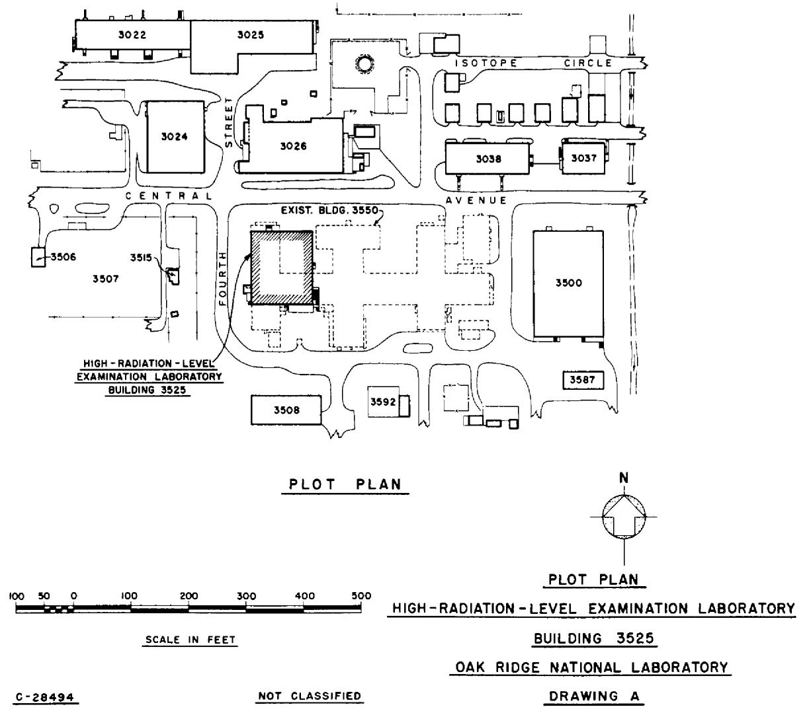  
Fig. 22. Plot Plan for Proposed Reactor Disassembly Hot Cell.

# Scale Model of Large Hot Cell

A model of the hot cell (Figs. 23-25) has been constructed to a scale of 1 in. = 1 ft. In order to visualize more clearly in three dimensions the handling and cutting problems associated with the ART disassembly, sufficient detail has been provided to permit a realistic approach to the tech

niques envisioned. It is believed that it will aid in the further development of such items as hot cell design criteria, operational sequences, handling fixtures, tools, and equipment. It was expected that the completed model, together with the operation manual, would aid in dissemination of information and in hot cell operator instruction.

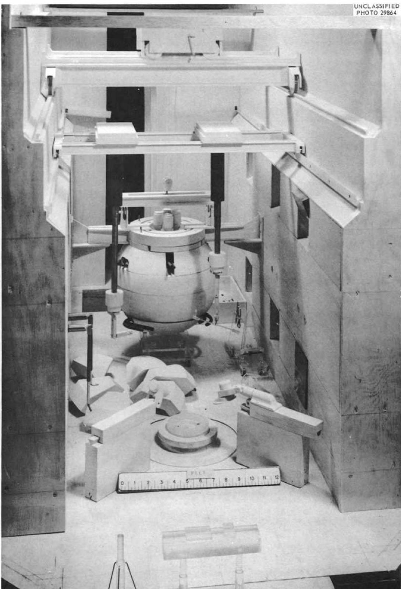  
Fig. 23. Scale Model of Proposed Reactor Disassembly Hot Cell: Front View. The completely shielded reactor and support structure are shown being placed on the wall brackets. The location of the mounting stands for optical tooling is shown in the foreground, as well as the lift-turntable and the mounted cutting head units.

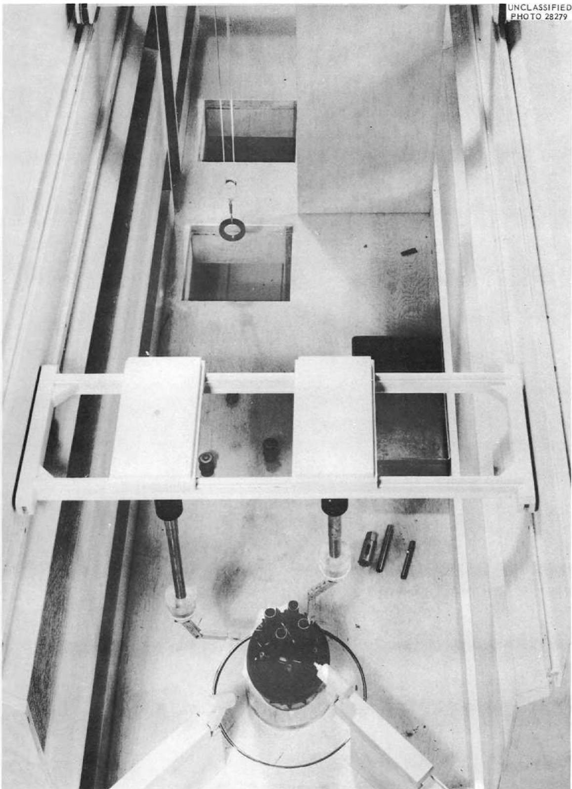  
Fig. 24. Scale Model of the Proposed Reactor Disassembly Hot Cell: Top View. The unshielded reactor is shown mounted on the disassembly table. The cutting and machining tools are mounted near the bottom of the picture.

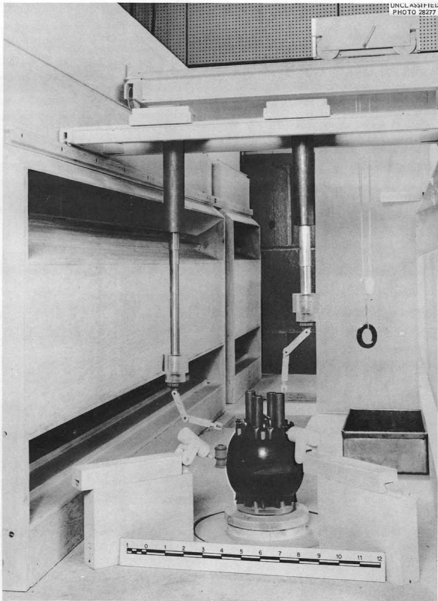  
Fig. 25. Scale Model of the Proposed Reactor Disassembly Hot Cell: Perspective View of Disassembly Area.

# 7. SCHEDULE AND COST ESTIMATE

# Schedule

Construction of the large hot cell and procurement of disassembly tools and fixtures were scheduled so that they would have been available for use in the event that disassembly of the ART was required following commencement of nuclear operation.[19,20]

Allowing the time necessary to remove and transfer the ART to the RDHC, it was concluded that, to avoid delaying the program, the completion date was to be September 30, 1960. If the RDHC facility had not been available for use at that time, there would

have been a delay in inspecting and evaluating the reactor machinery to obtain the valuable data on what happened to the ART components during reactor operation.

It was estimated that disassembly of the ART would take 12 to 18 months. When that operation was finished, the cell was to be available for disassembly and maintenance requirements of other large radioactive equipment. It would also meet one of the basic facility requirements for the development of advanced aircraft reactors.

# Cost Estimate

The cost of the basic RDHC structure is estimated to be $528,000. This does not include the shielded hot cell. The cost of services, estimated at$ 705,000, includes air conditioning for building work areas and a separate system for special filtration and cleaning of contaminated air from the hot cell.

Table 5. Details of Cost Estimates for RDHC   

<table><tr><td></td><td>Contractor</td><td>ORNL</td><td>Total</td></tr><tr><td>Engineering, design, and inspection*</td><td>$ 250,000</td><td>$ 447,000</td><td>$ 697,000</td></tr><tr><td>Construction costs**</td><td></td><td></td><td></td></tr><tr><td>Land and land rights</td><td></td><td></td><td></td></tr><tr><td>Improvement to land</td><td>50,000</td><td></td><td>50,000</td></tr><tr><td>Building</td><td></td><td></td><td></td></tr><tr><td>Structure</td><td>508,000</td><td>20,000</td><td>528,000</td></tr><tr><td>Services</td><td>700,000</td><td>5,000</td><td>705,000</td></tr><tr><td>Other structures</td><td></td><td></td><td></td></tr><tr><td>Structure</td><td>275,000</td><td>109,000</td><td>384,000</td></tr><tr><td>Services</td><td>25,000</td><td>1,000</td><td>26,000</td></tr><tr><td>Utilities</td><td>90,000</td><td>5,000</td><td>95,000</td></tr><tr><td>Equipment and installation</td><td>1,330,000</td><td>1,639,000</td><td>2,969,000</td></tr><tr><td>Removal costs less salvage</td><td></td><td></td><td></td></tr><tr><td>Contingency</td><td>323,000</td><td>223,000</td><td>546,000</td></tr><tr><td>Total</td><td>$3,551,000</td><td>$2,449,000</td><td>$6,000,000</td></tr></table>

*Major Contractor and Intended Type of Contract:   
ORNL (\$447,000): title I engineering services for building, and titles II, III, and IV engineering services for cells and cell equipment.   
AEC ($250,000): prime AEC contract - Titles II and III engineering services for building.   
**Construction:   
ORNL (\$2,002,000): utility extensions and connections and all specialized cell equipment.   
AEC ($3,301,000): lump-sum prime contract, construction of facility.

The estimated cost of $384,000 for other structures covers the shielded storage cell for radioactive reactor components and parts. The cost of the shielded transfer tunnel connecting the storage cell with the main disassembly cell is also included.

The large item of $2,969,000 for equipment and installation covers the very expensive heavily shielded hot cell with its crane and built-in equipment plus the remote-control equipment needed in reactor disassembly. The transparent shielding windows to permit viewing of the operations are included in the total equipment cost, along with the manipulators, cutting and machining tools, and special equipment items required to make the hot cell fully usable for the purposes for which it is designed. A tabulation of the estimated cost is presented in Table 5.

# 8. ACKNOWLEDGMENTS

The authors wish to acknowledge the leadership and guidance of S. J. Cromer, W. F. Boudreau, and M. Bender. Valuable assistance was given by D. B. Trauger and W. B. Cottrell in the activity levels study and the removal and disassembly phases. The cooperation of F. Ring, Jr., and his associates, particularly A. M. Tripp and M. G. Willey, was invaluable in developing the cell plans and the operating procedures. A. P. Fraas and R. V. Meghreblian provided able assistance from the Power Plant Engineering Department. V. J. Kelleyhan contributed with the cell facility criteria.

The shielding studies were developed by W. E. Browning, R. P. Shields, and D. E. Guss of the Solid State Division. The early coordination of

this program with other ORNL hot cell studies was provided by S. E. Dismuke and O. Sisman.

It would be difficult to recognize individually all those who contributed to the test and development work, but some who come to mind will be mentioned for their specific part. The Chemical Technology Division provided facilities and assistance for the Elox test and also for the hot cell optical tooling test. The dry grinding test was made with equipment and help of the Engineering and Mechanical Division in their Source and Fissionable Material Machine Shop. Other work contributed by that division included the cutting methods evaluations tests, machining of the sealant injection needles, and the optical flat for the optical tooling test.

One of our consultants was Professor J. Litton of Purdue University, who collaborated on the early removal studies and later reviewed the overall plan, with which he generally concurred.

To associated contractors on this Project we are indebted to Pratt & Whitney Aircraft for the help provided by L. W. Love, especially on the studies of replication by casting and metallizing, and to Convair for the services of J. H. Dowdy, who made many contributions to the planning studies.

Commercial equipment manufacturers cooperated in providing equipment or tests at no cost on items which were not otherwise available to us. We are grateful to the Osborne Equipment Co. of Knoxville for the gun-emplaced gypsum replicas, to the Ty-Saman Machine Co. of Knoxville for the wet grinding test on Inconel, to the Lucey Boiler & Manufacturing Corp. of Chattanooga for the Heliarc torch cutting demonstration, and to the Brunson Instrument Co. of Kansas City, Mo., for the optical tooling course and the loan of the optical measuring instruments.

APPENDIX A. COMPILEATION OF REQUIRED ART SAMPLES, MEASUREMENTS, AND EXAMINATIONS

<table><tr><td rowspan="2">Sample or Observation</td><td rowspan="2">Number of Samples Required</td><td colspan="6">Observations Requiredb</td><td rowspan="2">Notes</td><td rowspan="2">Requestorc</td></tr><tr><td>Visual</td><td>Dimensions Before and After</td><td>Dye Check</td><td>Photomicrograph</td><td>Chemical</td><td>Other</td></tr><tr><td colspan="10">I. Shells</td></tr><tr><td colspan="10">A. Inner core shell, No. I</td></tr><tr><td>1. At points of greatest temperature fluctuation</td><td>2</td><td></td><td>*</td><td>*</td><td>*</td><td></td><td></td><td></td><td>M, H, C</td></tr><tr><td>2. At inlet</td><td>2</td><td></td><td>*</td><td>*</td><td>*</td><td></td><td></td><td></td><td>M, H, C</td></tr><tr><td>3. At outlet</td><td>2</td><td></td><td>*</td><td>*</td><td>*</td><td></td><td></td><td></td><td>M, H, C</td></tr><tr><td>4. At midplane</td><td>2</td><td></td><td>*</td><td>*</td><td>*</td><td></td><td></td><td>Include weld samples</td><td>M, H, C</td></tr><tr><td>5. At turning vane</td><td>3</td><td></td><td>*</td><td></td><td>*</td><td></td><td></td><td></td><td>H</td></tr><tr><td colspan="10">B. Outer core shell, No. II</td></tr><tr><td>1. At points of greatest temperature fluctuation</td><td>2</td><td></td><td>*</td><td></td><td>*</td><td></td><td></td><td></td><td>H</td></tr><tr><td>2. At inlet</td><td>2</td><td></td><td>*</td><td></td><td>*</td><td></td><td></td><td></td><td>M, H, C</td></tr><tr><td>3. At outlet</td><td>2</td><td></td><td>*</td><td></td><td>*</td><td></td><td></td><td></td><td>M, H, C</td></tr><tr><td>4. At midplane</td><td>2</td><td></td><td>*</td><td></td><td>*</td><td></td><td></td><td>Include weld samples</td><td>M, H, C</td></tr><tr><td>5. Weld at south end</td><td>3</td><td></td><td></td><td></td><td>*</td><td></td><td></td><td></td><td>H</td></tr><tr><td>6. Weld, Shell II to Shell III, at top</td><td>3</td><td></td><td></td><td></td><td>*</td><td></td><td></td><td></td><td>H</td></tr><tr><td colspan="10">C. Shell No. III</td></tr><tr><td>1. Weld at equator</td><td>2</td><td></td><td></td><td></td><td>*</td><td></td><td></td><td></td><td>H</td></tr><tr><td>2. Lower region</td><td>2</td><td>*</td><td>*</td><td></td><td>*</td><td></td><td></td><td>Observe buckling at bottom</td><td>M</td></tr><tr><td>3. Joint between Shells III and IV</td><td></td><td></td><td>*</td><td></td><td></td><td></td><td></td><td>Observe alignment</td><td>M</td></tr><tr><td colspan="10">D. Shell No. IV</td></tr><tr><td>1. At midplane</td><td>2</td><td>*</td><td>*</td><td></td><td>*</td><td></td><td></td><td>Include weld samples</td><td>M, H, C</td></tr><tr><td>2. At inlet</td><td>2</td><td>*</td><td>*</td><td></td><td>*</td><td></td><td></td><td></td><td>M, H, C</td></tr><tr><td>3. At outlet</td><td>2</td><td>*</td><td>*</td><td></td><td>*</td><td></td><td></td><td></td><td>M, H, C</td></tr><tr><td colspan="10">E. Shell No. V</td></tr><tr><td>1. At midplane</td><td>2</td><td>*</td><td>*</td><td></td><td>*</td><td></td><td></td><td>Include weld samples</td><td>M, H, C</td></tr><tr><td>2. At inlet</td><td>2</td><td>*</td><td>*</td><td></td><td>*</td><td></td><td></td><td></td><td>M, H, C</td></tr><tr><td>3. At outlet</td><td>2</td><td>*</td><td>*</td><td></td><td>*</td><td></td><td></td><td></td><td>M, H, C</td></tr><tr><td>4. Special samples, Shell V</td><td>15, 1 in.2 surface</td><td></td><td></td><td></td><td>*</td><td>*</td><td>Radiochemical</td><td>For evaluation of chemical processing plant problem; should come from top, center, and bottom of wall</td><td>B</td></tr><tr><td>5. Joint between Shells V and VI</td><td></td><td></td><td>*</td><td></td><td></td><td></td><td></td><td>Observe alignment</td><td>M</td></tr><tr><td colspan="10">F. Shell No. VI</td></tr><tr><td>1. Shell No. VI</td><td>2</td><td></td><td>*</td><td></td><td>*</td><td></td><td></td><td></td><td>H, M</td></tr><tr><td>2. Shell VI blowout patch</td><td>1</td><td></td><td></td><td></td><td>*</td><td></td><td></td><td>Section required</td><td>H, M</td></tr><tr><td rowspan="2">Sample or Observation</td><td rowspan="2">Number of 
Samples 
Required</td><td colspan="6">Observations Requiredb</td><td rowspan="2">Notes</td><td rowspan="2">Requesterc</td></tr><tr><td>Visual</td><td>Dimensions 
Before and 
After</td><td>Dye 
Check</td><td>Photomi- 
crograph</td><td>Chemical</td><td>Other</td></tr><tr><td>G. Shell No. VII</td><td></td><td></td><td></td><td></td><td></td><td></td><td></td><td></td><td></td></tr><tr><td>1. Island (girth?) weld</td><td>4</td><td>*</td><td></td><td>*</td><td></td><td></td><td></td><td>Large weld sample required, commen-surate to weld size</td><td></td></tr><tr><td>2. Weld, Shell VII to Shell VI</td><td>3</td><td></td><td></td><td>*</td><td></td><td></td><td></td><td>Weld actually part of north head</td><td>H</td></tr><tr><td>3. Weld, Shell VII to MF pump barrel</td><td>2</td><td>*</td><td></td><td>*</td><td></td><td></td><td></td><td>Creep deformation required</td><td>H, M</td></tr><tr><td>4. Weld, Shell VII to sodium pump barrel</td><td>2</td><td>*</td><td></td><td>*</td><td></td><td></td><td></td><td>Creep deformation required</td><td>H, M</td></tr><tr><td>5. Blowout patch, Shell VII</td><td>1</td><td></td><td></td><td>*</td><td></td><td></td><td></td><td>Section required</td><td>H, M</td></tr><tr><td>6. Pressure shell (No. VII)</td><td></td><td>*</td><td></td><td></td><td></td><td></td><td></td><td>Creep deformation</td><td>M</td></tr><tr><td>H. Shell at bottom of island</td><td></td><td></td><td></td><td></td><td></td><td></td><td></td><td></td><td></td></tr><tr><td>1. Shell buckling</td><td></td><td>*</td><td></td><td>*</td><td></td><td></td><td></td><td>Buckling of shells enclosing tiles</td><td>M</td></tr><tr><td>2. Expansion joint at island top</td><td>4</td><td></td><td></td><td>*</td><td></td><td></td><td></td><td>Thermal distortion</td><td>M</td></tr><tr><td>I. Shell at core exit channel</td><td>4</td><td>*</td><td></td><td>*</td><td></td><td></td><td></td><td>Buckling of shells enclosing tiles</td><td>M</td></tr><tr><td>J. Thermal sleeves</td><td></td><td></td><td></td><td></td><td></td><td></td><td></td><td></td><td></td></tr><tr><td>1. Thermal sleeves distortion</td><td>4</td><td>*</td><td></td><td>*</td><td></td><td></td><td></td><td>Thermal distortion as seen in longi-tudinal section preferred</td><td>M</td></tr><tr><td>2. Thermal sleeve attached to lines and Shell VII</td><td>4</td><td></td><td></td><td>*</td><td></td><td></td><td></td><td>Stress concentration in weld</td><td>M</td></tr><tr><td>K. Support ring</td><td></td><td></td><td></td><td></td><td></td><td></td><td></td><td></td><td></td></tr><tr><td>1. Support ring welds at base</td><td>2</td><td></td><td>*</td><td>*</td><td></td><td></td><td></td><td></td><td>M, H</td></tr><tr><td>2. Support ring</td><td>4</td><td>*</td><td></td><td></td><td></td><td></td><td></td><td>Creep deformation</td><td>M</td></tr><tr><td>3. Support ring feet</td><td>2</td><td></td><td></td><td>*</td><td></td><td></td><td></td><td></td><td>M</td></tr><tr><td>L. Weld of B4C can to island at south end</td><td>2</td><td></td><td></td><td>*</td><td></td><td></td><td></td><td></td><td>H</td></tr><tr><td>M. Lead from shield</td><td>4</td><td>*</td><td></td><td></td><td></td><td>Radiochemical</td><td></td><td></td><td>C</td></tr><tr><td>II. Beryllium reflector</td><td></td><td></td><td></td><td></td><td></td><td></td><td></td><td></td><td></td></tr><tr><td>A. Slices (pie cuts) at various latitudes</td><td>3</td><td></td><td>*</td><td></td><td></td><td></td><td></td><td>Observe vicinity of Na holes; include one section at outlet</td><td>M,C,H</td></tr><tr><td>B. Coolant holes (inner surface)</td><td>3</td><td></td><td></td><td>*</td><td></td><td></td><td></td><td></td><td>M</td></tr><tr><td>C. Region under support ring pads</td><td>2</td><td></td><td></td><td>*</td><td></td><td></td><td></td><td></td><td>M, H</td></tr><tr><td>D. Inconel-beryllium compatibility</td><td></td><td></td><td></td><td></td><td></td><td></td><td></td><td></td><td></td></tr><tr><td>1. Spacer holes</td><td>4</td><td></td><td></td><td>*</td><td></td><td></td><td></td><td></td><td>M</td></tr><tr><td>2. Staples</td><td>4</td><td></td><td></td><td>*</td><td></td><td></td><td></td><td>One from last row at south end</td><td>H</td></tr><tr><td>3. Spacers from island</td><td>2</td><td></td><td></td><td></td><td></td><td></td><td></td><td>Take from south end</td><td>H</td></tr><tr><td>4. Ring support</td><td>3</td><td></td><td></td><td>*</td><td></td><td></td><td></td><td></td><td>M, H</td></tr><tr><td>5. Beryllium in contact with ring support</td><td>3</td><td></td><td></td><td>*</td><td></td><td></td><td></td><td></td><td>M, H</td></tr><tr><td>6. Control rod thimble</td><td>2</td><td></td><td></td><td>*</td><td></td><td></td><td></td><td>Contact points</td><td>M</td></tr><tr><td>Visual</td><td>Dimensions Before and After</td><td>Dye Check</td><td>Photomicrograph</td><td>Chemical</td><td>Other</td></tr><tr><td>7. Control rod thimble section</td><td>1</td><td></td><td></td><td></td><td>*</td><td></td><td></td><td></td><td>H</td></tr><tr><td>8. Beryllium around control rod thimble</td><td>2</td><td></td><td></td><td></td><td>*</td><td></td><td></td><td>At contact points</td><td>M</td></tr><tr><td>9. Seal grooves and support pads</td><td>3</td><td></td><td></td><td></td><td>*</td><td></td><td></td><td>For stress concentration</td><td>M</td></tr><tr><td>E. Dimensions of outer contour</td><td>30</td><td>*</td><td></td><td></td><td></td><td></td><td></td><td>Photographs and general visual inspection, particularly the region under strut</td><td>M</td></tr><tr><td>F. Cu-B4C at pressure ring</td><td>2</td><td>*</td><td>*</td><td></td><td></td><td></td><td></td><td></td><td>H</td></tr><tr><td colspan="10">III. Main heat exchanger</td></tr><tr><td>A. North header with 6" of tube intact</td><td>12 or 3 min.</td><td>*</td><td>*</td><td>*</td><td>*</td><td>*</td><td>Chemical analysis of deposits</td><td>Examine tube-to-header welds</td><td>M, H, C, S</td></tr><tr><td>B. South header with 6" of tube intact</td><td>12 or 3 min.</td><td>*</td><td>*</td><td>*</td><td>*</td><td>*</td><td>Chemical analysis of deposits</td><td>Examine tube-to-header welds</td><td>S, M, H, C</td></tr><tr><td>C. One complete heat exchanger in channel</td><td>1</td><td>*</td><td>*</td><td>*</td><td>*</td><td>*</td><td>For flow test</td><td>If obtainable, might supplant III D, F</td><td>S</td></tr><tr><td>D. Heat exchanger channels</td><td>2</td><td></td><td>*</td><td></td><td>*</td><td></td><td></td><td>For creep deformation information</td><td>M</td></tr><tr><td>E. Channel wedge from heat exchanger</td><td>1</td><td></td><td></td><td></td><td></td><td></td><td></td><td>To be taken where channel is hottest</td><td>H</td></tr><tr><td>F. 6" section with spacer comb at equator</td><td>12 or 3 min.</td><td>*</td><td>*</td><td></td><td>*</td><td>*</td><td>Chemical analysis of deposits</td><td></td><td>S</td></tr><tr><td colspan="10">IV. Auxiliary heat exchangers</td></tr><tr><td>A. Inlet header with 6" of tube of heat exchanger A or B</td><td>1</td><td>*</td><td>*</td><td>*</td><td>*</td><td>*</td><td>Analysis of deposits and activation</td><td>Flow tests may be required; include 4" of inlet nozzle if from B</td><td>S, H, C</td></tr><tr><td>B. Outlet header as before for same heat exchanger</td><td>1</td><td>*</td><td>*</td><td>*</td><td>*</td><td>*</td><td>Analysis of deposits and activation</td><td>Flow tests may be required; include 4" of inlet nozzle if from B</td><td>S, H, C</td></tr><tr><td>C. Sample at midpoint of heat exchanger</td><td>2</td><td></td><td></td><td></td><td></td><td></td><td></td><td>Analysis of activation and mass transfer</td><td>C</td></tr><tr><td colspan="10">V. Boron carbide tiles</td></tr><tr><td>A. B4C tile from equator region</td><td>1</td><td></td><td>*</td><td></td><td></td><td></td><td></td><td>Complete tile requested</td><td>H, C</td></tr><tr><td>B. Cu-B4C tile from equator region</td><td>1</td><td></td><td>*</td><td></td><td></td><td></td><td></td><td>Complete tile requested</td><td>H</td></tr><tr><td>C. Cu-B4C disk intact from south end of island</td><td>1</td><td></td><td>*</td><td></td><td></td><td></td><td></td><td>Complete tile requested</td><td>H</td></tr><tr><td>D. Cu-B4C from pressure ring</td><td>1</td><td></td><td>*</td><td></td><td></td><td></td><td></td><td>Complete tile requested</td><td>H</td></tr><tr><td colspan="10">VI. North head</td></tr><tr><td>A. Sleeves on pump barrels</td><td>2</td><td></td><td></td><td></td><td>*</td><td></td><td></td><td>Follows cut No. 2</td><td>M</td></tr><tr><td>B. Sodium expansion tank dome top</td><td>2</td><td></td><td>*</td><td>*</td><td>*</td><td></td><td></td><td>Follows cut No. 3; discontinuity stress or thermal shock</td><td>M</td></tr><tr><td>C. Sodium expansion tank dome floor</td><td>2</td><td></td><td>*</td><td>*</td><td>*</td><td></td><td></td><td>Follows cut No. S; discontinuity stress or thermal shock</td><td>Md</td></tr><tr><td>D. Intersection of upper deck to expansion tank</td><td>2</td><td></td><td></td><td></td><td>*</td><td></td><td></td><td>Section weld</td><td>M</td></tr><tr><td>E. Sodium pipe expansion joints</td><td>2</td><td>*</td><td></td><td></td><td>*</td><td></td><td></td><td>Thermal distortion</td><td>M</td></tr><tr><td>F. Sodium return tube from reflector</td><td></td><td></td><td></td><td></td><td></td><td></td><td></td><td>Creep deformation of part attached to torus</td><td>M</td></tr><tr><td>1. Return tube</td><td>1</td><td></td><td>*</td><td></td><td>*</td><td></td><td></td><td>Creep deformation of part attached to torus</td><td>H</td></tr><tr><td>2. Weld at sodium outlet from reflector</td><td>2</td><td></td><td></td><td></td><td>*</td><td></td><td></td><td></td><td></td></tr><tr><td>G. Structure exposed to surface radiation</td><td></td><td></td><td></td><td></td><td></td><td></td><td></td><td>Thermal distortion; examine for deposits</td><td>M, C</td></tr><tr><td>1. Expansion tank lines</td><td>2</td><td>*</td><td></td><td>*</td><td>*</td><td></td><td></td><td>Thermal distortion; examine for deposits</td><td>M, C</td></tr><tr><td>2. Control rod thimble</td><td>2</td><td>*</td><td></td><td>*</td><td>*</td><td></td><td></td><td>Thermal distortion; examine for deposits</td><td>M, C</td></tr><tr><td>H. Flat plates, disks, walls under pressure</td><td></td><td></td><td></td><td></td><td></td><td></td><td></td><td>Examine for deposits</td><td>C</td></tr><tr><td>1. Bottom of expansion chamber</td><td></td><td>*</td><td></td><td></td><td></td><td>*</td><td></td><td>Creep deformation</td><td>M</td></tr><tr><td>2. North head lower deck</td><td>2</td><td></td><td>*</td><td></td><td></td><td></td><td></td><td>Creep deformation</td><td>M</td></tr><tr><td>3. North head upper deck</td><td>2</td><td></td><td>*</td><td></td><td></td><td></td><td></td><td>Creep deformation</td><td>M</td></tr><tr><td>4. Wall below liquid level</td><td>2</td><td></td><td>*</td><td></td><td></td><td></td><td></td><td>Outside and inside castings after</td><td>M</td></tr><tr><td>5. Wall above liquid level</td><td>2</td><td></td><td>*</td><td></td><td></td><td></td><td></td><td></td><td></td></tr><tr><td>I. Snow trap line</td><td>2</td><td>*</td><td></td><td></td><td></td><td>*</td><td>Mass and activity of deposits</td><td>Examine for deposits</td><td>C</td></tr><tr><td>J. Sodium level device</td><td>1</td><td></td><td>*</td><td></td><td></td><td></td><td></td><td>Observe for thermal distortion and condition of MgO packing</td><td>W</td></tr><tr><td>K. Reactor thermocouples</td><td>6</td><td></td><td></td><td></td><td></td><td></td><td>Remove for calibration check</td><td></td><td>W</td></tr><tr><td>L. Pressure transmitters</td><td>2</td><td></td><td></td><td></td><td></td><td></td><td>Remove for calibration check</td><td></td><td>W</td></tr><tr><td>M. Heated section of rod</td><td>1</td><td>*</td><td>*</td><td></td><td></td><td></td><td>Radiochemical</td><td></td><td>W</td></tr><tr><td>N. Sodium sample from rod thimble</td><td>1</td><td></td><td></td><td></td><td></td><td>*</td><td>Radiochemical</td><td>Observe for leaching of rod</td><td>W</td></tr><tr><td>VII. Both MF and MN reactor pumps</td><td></td><td></td><td></td><td></td><td></td><td></td><td></td><td></td><td></td></tr><tr><td>A. Rotary elements, MF</td><td>2</td><td>*</td><td>*</td><td>*</td><td>*</td><td></td><td></td><td>Inspect for erosion and damage; remove one element intact</td><td>D, H</td></tr><tr><td>B. Rotary elements, MN</td><td>2</td><td>*</td><td>*</td><td>*</td><td>*</td><td></td><td></td><td>Inspect for erosion and damage; remove one element intact</td><td>D, H</td></tr><tr><td>C. Thermal barrier, MF</td><td>1 or 2</td><td>*</td><td>*</td><td></td><td>*</td><td>*</td><td></td><td>Observe for deposits in cooling passages, distortion; remove one intact</td><td>D, H</td></tr><tr><td>D. Thermal barrier, MN</td><td>1 or 2</td><td>*</td><td>*</td><td></td><td>*</td><td>*</td><td></td><td>As for MF, lesser importance</td><td>D</td></tr><tr><td>E. Volutes, MF</td><td>Surface</td><td>*</td><td>*</td><td>*</td><td></td><td></td><td></td><td></td><td>H</td></tr><tr><td>F. Volutes, MN</td><td>Surface</td><td>*</td><td>*</td><td>*</td><td></td><td></td><td></td><td></td><td>H</td></tr><tr><td>G. Shaft, MF</td><td>1</td><td>*</td><td></td><td></td><td></td><td></td><td>Load-deflection test</td><td></td><td>D</td></tr><tr><td>H. Shaft, MN</td><td>1</td><td>*</td><td></td><td></td><td></td><td></td><td>Load-deflection test</td><td></td><td>D</td></tr><tr><td>I. Seal assembly, MF</td><td>1</td><td>*</td><td></td><td></td><td></td><td></td><td>Bellows spring characteristics</td><td>Observe for damage and deposits, condition of seal faces</td><td>D</td></tr><tr><td>J. Seal assembly, MN</td><td>1</td><td>*</td><td></td><td></td><td></td><td></td><td>Bellows spring characteristics</td><td>As for MF</td><td>D</td></tr><tr><td>K. Oil samples, MF and MN</td><td>4</td><td>*</td><td></td><td></td><td></td><td>*</td><td>Physical properties</td><td>Observe for carbon</td><td>D</td></tr><tr><td>L. Lubricating and cooling passages</td><td>All for one MF and one MN</td><td>*</td><td></td><td></td><td></td><td></td><td></td><td>Observe for carbon and resin</td><td>D</td></tr><tr><td>M. Bearings, MF</td><td>4</td><td>*</td><td>*</td><td></td><td>*</td><td></td><td>Determine hardness</td><td>Check for wear</td><td>D</td></tr><tr><td>N. Bearings, MN</td><td>4</td><td>*</td><td>*</td><td></td><td>*</td><td></td><td>Determine hardness</td><td>Check for wear</td><td>D</td></tr><tr><td>O. Elastomer seals, MF and MN</td><td>All for one MF and one MN</td><td>*</td><td>*</td><td></td><td></td><td>*</td><td>Determine hardness and elasticity</td><td></td><td>D</td></tr><tr><td>P. Off-gas lines (supply and catch basin), MF</td><td></td><td>*</td><td></td><td></td><td></td><td>*</td><td>Activity of deposits</td><td>Observe for snow, gunk, salt</td><td>D</td></tr><tr><td>Q. Off-gas lines (supply and catch basin), MN</td><td></td><td>*</td><td></td><td></td><td></td><td>*</td><td></td><td>Observe for gunk and NaK</td><td>D</td></tr><tr><td colspan="10">VIII. NaK auxiliary pumps</td></tr><tr><td>A. Rotary elements</td><td>2</td><td>*</td><td>*</td><td>*</td><td>*</td><td></td><td></td><td>Inspect for erosion and damage; remove one intact</td><td>D</td></tr><tr><td>B. Volutes</td><td>2</td><td>*</td><td>*</td><td></td><td></td><td></td><td>Determine hardness</td><td>Inspect for erosion</td><td>D</td></tr><tr><td>C. Shaft</td><td>1</td><td></td><td></td><td></td><td></td><td></td><td>Load-deflection</td><td></td><td>D</td></tr><tr><td>D. Seal assembly</td><td>2</td><td>*</td><td></td><td></td><td></td><td></td><td>Bellows spring characteristics</td><td>Inspect seal faces for wear</td><td>D</td></tr><tr><td>E. Lubricating and cooling passages</td><td>One pump</td><td>*</td><td></td><td></td><td></td><td></td><td></td><td>Observe for carbon</td><td>D</td></tr><tr><td>F. Bearings</td><td>2</td><td>*</td><td>*</td><td></td><td>*</td><td></td><td>Determine hardness</td><td>Check for wear</td><td>D</td></tr><tr><td>G. Elastomer seals</td><td>All for one pump</td><td>*</td><td>*</td><td></td><td></td><td></td><td></td><td>Observe general condition</td><td>D</td></tr><tr><td>H. Gas lines (supply and catch basin)</td><td>All for one pump</td><td>*</td><td></td><td></td><td></td><td>*</td><td></td><td>Observe for NaK</td><td>D</td></tr><tr><td>Visuel</td><td>Dimensions Before and After</td><td>Dye Check</td><td>Photomicrograph</td><td>Chemical</td><td>Other</td></tr><tr><td colspan="10">IX. NoK special pumps</td></tr><tr><td>A. Rotary elements</td><td>2</td><td>*</td><td>*</td><td>*</td><td>*</td><td></td><td></td><td>Inspect for erosion and damage; remove one intact</td><td>D</td></tr><tr><td>B. Volutes</td><td>2</td><td>*</td><td>*</td><td></td><td></td><td></td><td>Determine hardness</td><td>Inspect for erosion</td><td>D</td></tr><tr><td>C. Shaft</td><td>1</td><td></td><td></td><td></td><td></td><td></td><td>Load-deflection</td><td></td><td>D</td></tr><tr><td>D. Seal assembly</td><td>2</td><td>*</td><td></td><td></td><td></td><td></td><td>Bellows spring characteristics</td><td>Inspect seal faces for wear</td><td>D</td></tr><tr><td>E. Lubricating and cooling passages</td><td>One pump</td><td>*</td><td></td><td></td><td></td><td></td><td></td><td>Observe for carbon</td><td>D</td></tr><tr><td>F. Bearings</td><td>2</td><td>*</td><td>*</td><td></td><td>*</td><td></td><td>Determine hardness</td><td>Check for wear</td><td>D</td></tr><tr><td>G. Elastomer seals</td><td>All for one pump</td><td>*</td><td>*</td><td></td><td></td><td></td><td></td><td>Observe general condition</td><td>D</td></tr><tr><td>H. Gas lines (supply and catch basin)</td><td>All for one pump</td><td>*</td><td></td><td></td><td></td><td>*</td><td></td><td>Observe for NaK</td><td>D</td></tr><tr><td colspan="10">X. Dump valves</td></tr><tr><td>A. Valve seat</td><td>2</td><td>*</td><td>*</td><td></td><td>*</td><td></td><td></td><td>Remove intact</td><td>H</td></tr><tr><td>B. Valve stem and poppet</td><td>2</td><td>*</td><td>*</td><td></td><td>*</td><td></td><td></td><td>Remove intact</td><td>H</td></tr><tr><td>C. Bellows</td><td>1</td><td>*</td><td>*</td><td></td><td></td><td></td><td></td><td></td><td>C</td></tr><tr><td colspan="10">XI. Dump tank</td></tr><tr><td>A. Heads</td><td>4</td><td>*</td><td>*</td><td></td><td>*</td><td></td><td></td><td>Measure distortion and remove samples</td><td>M</td></tr><tr><td>B. Lower region of cylindrical shell</td><td>3</td><td></td><td></td><td></td><td>*</td><td></td><td></td><td>Remove samples at liquid-gas interface and at bottom for examination</td><td>M, C</td></tr><tr><td>C. Tube sheet with 6" of all tubes</td><td>1</td><td>*</td><td>*</td><td>*</td><td>*</td><td>*</td><td>Flow test may be required</td><td>Chemical analysis of deposits only</td><td>S</td></tr><tr><td colspan="10">XII. Reactor snow trap</td></tr><tr><td>A. Samples at inlet, center, outlet</td><td>3-6</td><td>*</td><td></td><td></td><td></td><td>*</td><td>Radiochemical</td><td>Determine total amount of snow</td><td>C</td></tr><tr><td>B. Dump tank snow trap</td><td></td><td>*</td><td></td><td></td><td></td><td></td><td></td><td>Determine total amount of snow</td><td>C</td></tr><tr><td colspan="10">XIII. Off-gas line</td></tr><tr><td>A. Representative samples</td><td>4</td><td>*</td><td></td><td></td><td></td><td>*</td><td>Radiochemical</td><td>Observe for deposits</td><td>C</td></tr><tr><td>B. Solenoid valves in line</td><td>2</td><td>*</td><td></td><td></td><td></td><td></td><td></td><td>Observe for deposits, particularly around seat</td><td>C</td></tr><tr><td>C. Throttle valves</td><td>1</td><td>*</td><td></td><td></td><td></td><td></td><td></td><td>Observe for deposits</td><td>C</td></tr><tr><td>Visual</td><td>Dimensions Before and After</td><td>Dye Check</td><td>Photomicrograph</td><td>Chemical</td><td>Other</td></tr><tr><td>D. Disaster block valve</td><td>1</td><td>*</td><td></td><td></td><td></td><td></td><td></td><td>Observe for deposits</td><td></td></tr><tr><td>E. Representative samples in adsorber</td><td>6</td><td>*</td><td></td><td></td><td></td><td>*</td><td>Radiochemical</td><td></td><td>C</td></tr><tr><td>XIV. Miscellaneous items from cell</td><td></td><td></td><td></td><td></td><td></td><td></td><td></td><td></td><td></td></tr><tr><td>A. Fluid samples</td><td></td><td></td><td></td><td></td><td></td><td></td><td></td><td></td><td></td></tr><tr><td>1. Postpower sampling pots</td><td>5</td><td></td><td></td><td></td><td></td><td>*</td><td>Radiochemical and physical</td><td>Deliver tanks to Chemical Tech-nology Division</td><td>C</td></tr><tr><td>2. Sodium</td><td>1</td><td></td><td></td><td></td><td></td><td>*</td><td>Radiochemical</td><td>Remove sample when draining system</td><td>C</td></tr><tr><td>3. Oil from rod drive gear box</td><td>1</td><td></td><td></td><td></td><td></td><td>*</td><td></td><td></td><td>D</td></tr><tr><td>B. Rod drive gear box</td><td>1</td><td>*</td><td></td><td></td><td></td><td></td><td>Mechanical condition</td><td>Remove intact</td><td>W</td></tr><tr><td>C. Hydraulic motor seal (MF pump)</td><td>1</td><td>*</td><td></td><td></td><td></td><td></td><td></td><td>Radiation damage</td><td>C</td></tr><tr><td>XV. Items outside reactor cell</td><td></td><td></td><td></td><td></td><td></td><td></td><td></td><td></td><td></td></tr><tr><td>A. Main radiator</td><td>1</td><td>*</td><td>*</td><td>*</td><td>*</td><td>*</td><td>Flow tests; chemi- cal analysis of deposits</td><td>Remove intact</td><td>S, C</td></tr><tr><td>B. Special radiator</td><td>1</td><td>*</td><td>*</td><td>*</td><td>*</td><td>*</td><td>Flow tests; chemi- cal analysis of deposits</td><td>Remove intact</td><td>S, C</td></tr><tr><td>C. Pipe joints in NaK manifolds</td><td></td><td></td><td></td><td>*</td><td>*</td><td></td><td></td><td>Examine for thermal distortion</td><td>M</td></tr><tr><td>1. Inside cell on reactor</td><td></td><td></td><td></td><td></td><td></td><td></td><td></td><td></td><td></td></tr><tr><td>2. Samples from weld at onchor point</td><td></td><td></td><td></td><td></td><td></td><td></td><td></td><td></td><td></td></tr><tr><td>D. Hydraulic drive oil</td><td>4</td><td>*</td><td></td><td></td><td></td><td>*</td><td>Radiochemical</td><td>Check for damage and contamination</td><td>D, C</td></tr><tr><td>E. Lube oil (type K stands)</td><td>5</td><td>*</td><td></td><td></td><td></td><td>*</td><td>Radiochemical</td><td>Check for damage and contamination</td><td>D, C</td></tr><tr><td>F. Auxiliary radiator</td><td>3</td><td>*</td><td></td><td></td><td></td><td>*</td><td>Radiochemical</td><td>Compare activities of deposits with those for main radiators; other meas- urements for main radiator of interest if main shows damage</td><td>C</td></tr></table>

This sample list, dated September 18, 1956, was compiled by D. B. Trauger from items submitted by the Power Plant Engineering, Chemistry, Metallurgy, and Solid State organizations. It was the basis of early planning, although revisions were later made when better measurement and replication methods were developed. A summary of the changes made after discussions with the Stress Analysis Group is shown in Table A-2.   
Indicated by asterisks.   
Symbols: M Meghreblion, Power Plant Engineering, Stress Analysis   
C Cottrell, Receptor Operations   
H Hikido, Metallurgy   
S Schultheiss, Power Plont Engineering, Heot Transfer   
$d$ Request canceled March 5, 1957.   
D Dytko, Engineering Development   
W Walker, Instrumentation   
B Bruce, Chemical Technology, Fuel Reprocessing

Table A-2. Sample Request Compilation. Part II $^{a,b}$   

<table><tr><td rowspan="3">Item</td><td rowspan="3">Reference</td><td colspan="7">Observations RequiredC</td><td rowspan="3">General Remarks</td></tr><tr><td colspan="2">Direct Measurement</td><td colspan="3">Replication</td><td colspan="2">Standard Photos</td></tr><tr><td>Before</td><td>After</td><td>Before</td><td>After</td><td>Remarks</td><td>Before</td><td>After</td></tr><tr><td>Shell I</td><td>3 weld buttons on tap transition</td><td>None</td><td>None</td><td>*</td><td>*</td><td>(Hydrocal cast)</td><td>*</td><td>*</td><td></td></tr><tr><td>Shell II</td><td>(Prick marks on top of collar)</td><td>None</td><td>None</td><td>*</td><td>*</td><td>(Hydrocal cast)</td><td>*</td><td>*</td><td></td></tr><tr><td>Shell III</td><td>3 prick punches an support ring; 2&quot; scratch grid on lower machine break edge or chisel mark on spur (meridian mark with azimuth determined)</td><td>*</td><td>None</td><td>None</td><td>*</td><td></td><td>(None)</td><td>*</td><td>Decision on 2&quot; or coarser grid (Meghreblian says 2&quot; OK); feasibility of reference and measurement during assembly (Abele says OK)</td></tr><tr><td>Shell IV</td><td>None</td><td>None</td><td>None</td><td>(*)</td><td>(None)</td><td></td><td>(None)</td><td>(None)</td><td>(Contour photo before and after of lower half)</td></tr><tr><td>Shell V</td><td>None</td><td>None</td><td>None</td><td></td><td>*</td><td>(See general remarks)</td><td>None</td><td>(None)</td><td>(Salad bowl; Hydrocal; type V-VI weld; Hydrocal)</td></tr><tr><td>Shell VI</td><td>2 punch marks outside near blowout patch</td><td>*</td><td>*</td><td>None</td><td>*</td><td>Our choice</td><td>None</td><td>None</td><td></td></tr><tr><td>Shell VII girth weld</td><td>2 sets of 7 punch marks for diameter measurement</td><td>*</td><td>*</td><td>None</td><td>None</td><td></td><td>None</td><td>None</td><td></td></tr><tr><td>Weld, shell VII to MF pump barrel</td><td></td><td>d</td><td>d</td><td>None</td><td>None</td><td></td><td>None</td><td>None</td><td>6 weld specimens each barrel</td></tr><tr><td>Weld, shell VII to MN pump barrel</td><td></td><td>d</td><td>d</td><td>None</td><td>None</td><td></td><td>None</td><td>None</td><td>2 weld specimens each barrel</td></tr><tr><td>Shell VII</td><td>2 sets of 3 weld buttons</td><td>*</td><td>*</td><td>None</td><td>*</td><td>(Local) (Cast 2&#x27; of circumference)</td><td>None</td><td>None</td><td></td></tr><tr><td>Thermal sleeves</td><td></td><td>(None)</td><td>None</td><td>None</td><td>None</td><td></td><td>None</td><td>None</td><td>1 thermal sleeve sample</td></tr><tr><td>Support ring</td><td></td><td>None</td><td>*</td><td>None</td><td>None</td><td></td><td>None</td><td>None</td><td></td></tr><tr><td>Beryllium reflector</td><td></td><td>None</td><td>None</td><td>None</td><td>None</td><td></td><td>(None)</td><td>*</td><td></td></tr><tr><td>Main heat exchanger</td><td></td><td>d</td><td>d</td><td>None</td><td>*</td><td></td><td>None</td><td>None</td><td>1 heat exchanger required intact</td></tr><tr><td>Auxiliary heat exchanger</td><td></td><td>None</td><td>None</td><td>None</td><td>None</td><td></td><td>None</td><td>None</td><td></td></tr><tr><td>Sodium expansion tank dome top</td><td>2 weld beads on dome</td><td>None</td><td>None</td><td>*</td><td>*</td><td>(Lead or Hydrocal OK)</td><td>None</td><td>None</td><td></td></tr><tr><td>Fluid expansion tank top</td><td></td><td>None</td><td>None</td><td>None</td><td>*</td><td>(Lead or Hydrocal OK)</td><td>None</td><td>None</td><td></td></tr><tr><td>Intersection of upper deck to expansion tank</td><td></td><td>None</td><td>None</td><td>None</td><td>None</td><td></td><td>None</td><td>None</td><td>2 weld samples</td></tr><tr><td>Sodium pipe expansion joints</td><td></td><td>None</td><td>None</td><td>None</td><td>None</td><td></td><td>None</td><td>None</td><td>Remove intact as sample</td></tr><tr><td>Sodium return tube from reflector</td><td></td><td>None</td><td>None</td><td>None</td><td>None</td><td></td><td>None</td><td>None</td><td>Remove intact as sample</td></tr><tr><td>Expansion tank lines</td><td></td><td>None</td><td>None</td><td>None</td><td>None</td><td></td><td>None</td><td>None</td><td>Remove sections as samples</td></tr><tr><td>Control rod thimble</td><td></td><td>None</td><td>None</td><td>None</td><td>None</td><td></td><td>None</td><td>None</td><td>Remove intact as sample</td></tr><tr><td>North head lower deck</td><td></td><td>None</td><td>*e</td><td>None</td><td>None</td><td></td><td>None</td><td>None</td><td></td></tr><tr><td>North head upper deck</td><td></td><td>None</td><td>*</td><td>None</td><td>None</td><td></td><td>None</td><td>None</td><td></td></tr><tr><td>Wall below liquid level</td><td></td><td>None</td><td>None</td><td>*</td><td>*</td><td>(Abele to investigate)</td><td>None</td><td>None</td><td></td></tr><tr><td>Dump tank heads</td><td></td><td>None</td><td>None</td><td>None</td><td>*</td><td></td><td>None</td><td>None</td><td></td></tr><tr><td>Lower region of cylindrical shell</td><td></td><td>None</td><td>None</td><td>None</td><td>*</td><td></td><td>None</td><td>None</td><td></td></tr></table>

a Summary of revised measurements after meeting on March 5, 1957, with Stress Analysis Group. Compiled by F. R. McQuilkin, dated June 13, 1957.   
bComments from review meeting on June 11, 1957, are in parentheses.   
cIndicated by osterisks.   
$d_{\text{Plans in abeyance}}$   
eSpecial gage required.

I. Reactor removal.

A. Removal preparations.

1. Establishment of fluid removal sequence.

a) Need for NaK as heating medium during draining and flushing to keep fuel and Na hot.   
b) Accessibility of fluid removal connections.   
c) Pressure and temperature restrictions on fluid circuits during draining and flushing.   
$d$ ) Conditions which must be established for charging investment material, if used.

2. Safety requirements of cell during removal operations.

a) Conditions for water to be drained from around reactor cell.   
b) Circumstances when manhole cover can be removed from cell.   
c) Conditions and methods under which upper part of cell can be cut off and removed.   
d) Ventilation and purging requirements placed on cell when cover is removed.   
e) Decontamination requirement of the cell interior to permit personnel entrance.   
f) Provisions necessary for fire protection during rinsing and disassembly operations.   
g) Personnel access limitations during removal operations.

(1) When the fuel has been rinsed from the reactor, can personnel enter the cell without being shielded if water bag is filled? If so, for how long?   
(2) When water is drained from the water bag, will this impose additional access restrictions on the cell?

b) Establish radiation dosage per hour for personnel in cell during removal operations under conditions as follows:

(1) After the reactor fuel passages have been rinsed.   
(2) When the Chem Tech tank and fuel samples have been removed.   
(3) When the snow trap is removed.

i) How will spread of active chips, dust, and vent gases be controlled to reduce contamination?

3. Rinsing operations.

a) What is the fuel holdup in the reactor after draining, and how much activity is it contributing to the reactor?   
b) What rinsing fluids can be used to reduce the residual fuel activity?

(1) Are the potential rinse fluids limited to barren carrier, fused salts, lead, and lead alloys?   
(2) Of the rinse fluids considered, how are they evaluated for the following: dilution of residual activity, wall washing, residual fuel displacement, distortion and corrosion effect on the reactor components, interference with subsequent inspection, potential shielding value?

c) How will sodium be removed?

(1) Will permanent lines be needed from the moderator and island circuits?   
(2) Will vacuum extraction equipment be needed for the moderator circuit?   
(3) Can a displacement fluid be used?

d) After the NaK is drained, how will low spots be flushed?

(1) Can the NaK be displaced by another fluid?   
(2) What dangers will be introduced in line severing if all NaK is not removed?

e) Can fuel rinse fluids be stored and transferred to the reactor from points outside the cell?

(1) If so, what are the locations and connections required?   
(2) How are the spent fluids handled?   
(3) How are fluids transported into and out of the reactor?

f) How will effectiveness of fuel rinse be determined?

(1) Can rinse fluid be monitored to determine the amount of activity being removed?   
(2) What means can be used to determine the reduction in activity in the cell resulting from rinsing? Will the spectrometer tubes be useful for this purpose?   
(3) What facilities are required for this operation?

4. Investment materials.

a) Can lead, lead alloys, fused salt, plaster of paris, plastic, or other materials be used to invest the reactor?   
b) What value is gained from investment material?

(1) Dimensional relationship of parts may be fixed.   
(2) Possible displacement of fuel may reduce activity.   
(3) Possible self-shielding effect of investment material.

c) Disadvantages of investment.

(1) Difficulty in investing any parts except fuel passage.   
(2) Possible distortion of parts by excessive mass and shrinkage stresses.   
(3) Difficulty of insuring thorough investment because of gas entrapment and shrinkage pockets.   
(4) Possible concealment of evidence by investment material.   
(5) Introduction of additional cutting problems during disassembly.   
(6) Problem of radiation deterioration of organic investment materials.   
(7) Additional handling load problems from investment materials.   
(8) Dust problems introduced from plaster of paris.   
(9) Need for transfer device for investment material.

B. Cell disassembly.

1. Components to be removed from cell.

a) Fuel containers - Chem Tech tank, sample tubes.   
b) Snow traps -- must these be removed in the cell?   
c) Offgas lines.

$d$ ) Instruments and lines including control rod.   
e) NaK piping - main and auxiliary.   
f) Auxiliary piping - lube, hydraulic, air, water.   
g)Dumpvalveactuator.   
b) Water bag - should this be removed in hot cell?   
i) Reactor, including support platform.   
$j$ ) Fuel dump tank.

2. Handling of high-activity parts requiring shielding and remote handling.

a) Shearing techniques for shielded lines, including preinstallation.   
b) Shielding devices for active parts and severed lines.   
c) Remote lifting devices and manipulators.   
$d$ ) Observation tools.

3. Handling of moderate activity parts.

a) Application of quick mounting and extension tools.   
b) Contamination dust control by vacuum and liquid washing.   
c) Handling fixtures for moderate activity parts.   
$d$ ) Personnel shielding for "in cell" operations.

4. Handling of low-activity parts.

a) Physical access problems.   
b) Protection against radiation exposure from adjacent equipment during "in cell" operations.   
c) Hazard problems other than radiation.   
$d$ ) Tools required for severing of low-activity lines.   
e) Handling means for equipment during severing operations, particularly reactor support.

(1) Shielding requirements or remote operating requirements for overhead crane and transport truck.   
(2) Attachment fixtures and appurtenances for parts.   
(3) Remote observation devices such as periscopes, mirrors, closed circuit TV, etc.

5. Personnel requirements for disassembly.

a) Radiation dose limits of personnel.   
b) Period of time personnel can be in cell:

(1) In shielded basket.   
(2) Without shielding.

c) Manpower estimates for disassembly, including craft classification.

6. Self-shielding considerations of reactor parts.

a) Will the water bag have sufficient shielding value to warrant leaving it on until the reactor is removed to the hot cell?

(1) Can it be filled with a fluid more dense than water during disassembly for shield purposes?

(2) Can the reactor assembly be handled when the water bag is full of fluid?

b) Will investment materials provide any self-shielding benefits?

C. Experimental program requirements.

1. Chemical.

a) Evaluate fuel rinse fluids for the following: corrosion effects, evidence of destruction, reduction of activity by fuel dilution and displacement, wall washing effect, personnel hazard, potential distortion of parts.   
b) If investment materials are used, evaluate their shielding benefits, chemical reactivity with fuel, soundness of solidification, gas entrapment, potential distortion effects, and compatibility with other fluids such as Na and NaK.   
c) Evaluation flushing media for the NaK and Na systems for the following: displacement effect, reactivity, conditions of charging, potential hazard, compatibility with reactor structure and contents.   
d) Review chemical sample requirements.

2. System testing.

a) Determine system holdup in ETU by spiking fuel or by preliminary check with other fluids.   
b) Determine heat exchanger holdup from measurement of holdup in heat exchanger test rigs.   
c) Try flushing operations for removal of Na and NaK on ETU.   
d) Test flushing operations for fuel on ETU.   
e) Attempt investment charging on ETU or other mockup, if evaluation shows that it would be desirable.

3. Metallurgical.

a) Review and condense metallurgical specimen requirements for all parts of reactor, including connecting equipment and instruments.   
b) Evaluate the pros and cons of investment materials for the following: metallurgical information to be gained, techniques to be developed, evidence of destruction, metallurgical compatibility with the structure.   
c) Cutting materials for shears which must be preinstalled adjacent to hot lines.   
d) Practicability of induction melting for line shearing techniques.   
e) Electrical and gas-torch cutting equipment for disassembly operations where chips, fumes, dust, and spatter must be completely controlled.

4. Mechanical development.

a) Design, procure, and test remote tools such as shears, induction melting coils.   
b) Test manipulating devices for removing hot equipment from cell.   
c) Metallurgical evaluation of severing devices.

D. Design program.

1. Establish personnel access, remote operation, and remote removal requirements of all disassembly operations.   
2. Review the practicability of introducing flushing media from outside the cell, the means of transporting it to and from the reactor, the storage problems, the fuel rinse cycle, the Na extraction techniques.

3. Establish the sequence of equipment removal and line severing from physical access considerations.   
4. Incorporate working space for disassembly operations and preinstalled tools in the cell design.   
5. Make provisions around lines for preinstalled severing tools, where needed.   
6. Modify 7503 design to incorporate remote crane operation, cell ventilation requirements, additional cell penetrations, and flushing facilities.

# II. Reactor disassembly.

A. Transport requirements for movement with 30-ton building crane in 7503.

1. What are the attachments and conditions of the reactor at the time of removal?   
2. What are the limitations or specifications of each unit to be removed plus its environment for both the normal and abnormal situations?   
3. What lifting lugs or rig will be on the reactor?   
4. Will the lifting rig permit remotely controlled hook engagement?   
5. Will shielding of the crane cab be necessary?   
6. Will a remote control for the crane be necessary?   
7. What special precautions should be observed while lifting, moving, and placing reactor with building crane?

B. Transport carrier.

1. Is there certainty that the transport carrier will not be a limiting factor in the transfer of the reactor under abnormal conditions?   
2. Technique for mounting reactor on trailer - must this operation be done remotely?   
3. What shielding, it any, is required for trailer cab - will sky shine and road reflection amplify this problem? Would refilling the water bag provide useful shielding? Would modification of the mounting be required?   
4. Problem of shielding a K-25 trailer and/or cab to be borrowed for reactor movements -- will this trailer be available for this purpose?   
5. What special precautions should be observed while transporting reactor to hot cell?

a) Will unusual traffic control be required?   
b) Will incident control be required?   
c) Will personnel evacuation be necessary?   
d) Will road contamination control be necessary?   
e) Should a drip pan or drop cloth be used on trailer?

# C. Hot cell facility requirements.

1. Establish physical location for facility using the following criteria:

a) Within the controlled ORNL area.   
b) Economically near the heavy-duty roadway to 7503.   
c) At a location that is economically feasible with respect to ORNL reactor installations (present and future) and with respect to access by the construction contractor.   
d) Economically near power and water service and preferably near steam service.

e) Either near an available tall stack or at a location where it is feasible and permissible to erect one, if necessary, for either the GTHC or the ADC.   
f) On terrain and soil economically suitable for a large, heavy structure with underground facilities.   
g) Either economically near the tank farms or on terrain and in a locale where release of contaminated wastes is feasible (or include in the design an economically feasible method for a large holdup volume with provision for pumping or transporting appreciable volumes of contaminated liquids).   
b) At a location available for construction July 1, 1957.   
i) At a location where transport time would be negligible as compared to loading and unloading problem of small contaminated parts.   
i) At a location away from heavy traffic so as to minimize contamination liability.

2. Firm up physical layout in regard to:

a) Cell dimensions in plan and elevation.   
b) Tooling and equipment layout, including special manipulators, instruments, pit-mounted pedestal turntable. Is there economical advantage in pit-mounting the pedestal turntable?   
c) Receiving and setup areas - is the truck access and tool storage area sufficient and not excessive?   
d) Underground transfer and storage facility.   
e) Access requirements and cell doors for personnel and equipment.   
) Office and laboratory space - what groups must be housed in the facility?   
g) Personnel decontamination rooms.   
b) Building services area for ventilation, air conditioning, pumps, valve stations, etc.   
i) Layout requirements for sleeves and penetrations through cell wall, including microscopy viewing ports.   
i) Roof hatches.   
k) Provision for future alterations.   
l) Knockout- or block-type construction around windows.

3. Firm design criteria.

a) Shield criteria for walls, windows, doors, and roof in various areas.   
b) Temporary or otherwise partitions or enclosures (dry boxes, hoods, etc.) to isolate particulates.   
c) Viewing arrangement and requirements.   
d) Decontamination system and permanently installed equipment - chemicals, materials of construction, volumes, services, holdup, drainage, and disposal arrangement.   
e) Ventilation and exhaust requirements.

(1) Ventilation for functional areas - air changes?   
(2) Vacuum cleaning system.   
(3) High-velocity vacuum system.   
(4) Filtration requirements.

(5) Exhaust stack - what are dimensional requirements of stack for ADC, if required?   
(6) Pressure differentials for areas.

) Building services and equipment criteria.

(1) Lighting and electrical services.   
(2) Emergency power.   
(3) Heating.   
(4) Cranes.   
(5) Water.   
(6) Steam.   
(7) Sanitary waste.   
(8) Process water waste.   
(9) Air.   
(10) Air conditioning.   
(11) Demineralized water.   
(12) Drainage.

g) Lost-tool transfer scheme.   
b) Cell liner and wall inserts.   
i) Cell-to-cell transfer device.   
$j$ ) Floor loading.   
$k$ )Criteria for underground transfer and storage facility.

(1) Dimensions and weights of items stored.   
(2) Conveyor devices.

1) Safety and fire protection.   
$m$ ) Supporting facilities and services.

(1) Intercommunications - telephone, PA system, cell communications, alarms.   
(2) Instrumentation - radiation and ventilation.

# D. Disassembly program and equipment.

1. Evaluate the conditions specified in IIAI above that may hold for the reactor as received at ADC.

a) Is the water bag in place and empty?   
b) Will the pumps be in place?   
c) Will the control rod drive be removed?   
d) Will the nuclear activity counter pods be in place?   
e) Will the snow trap under the support bridge be in place?   
f) Will dump valves and actuators be in place?   
g) Will all instruments within the water bag outer skin be in place?   
b) Will all lines and leads that have been severed be dangling and possibly dusty with, or dripping, radioactive or other hazardous materials?

2. Movement of reactor into disassembly cell.

a) Will the operation be reverse to the 7503 movement? Must this operation be done remotely?   
b) Will the reactor be held on the 30-ton crane for stripdown operations, or set on a rigid fixture using the bridge support?

3. Stripdown operations.

a) Establish methods for removal of the following external components and parts:

(1) Water bags.   
(2) NaK pipes.   
(3) Manifolds.   
(4) Snow traps.   
(5)Dump valves and actuators.   
(6) Nuclear counter pods.   
(7) Lead shield - How will it be removed? Can it be unbolted?   
(8) Superfluous portions of bridge support that may be removed.   
(9) All other items.

b) What provisions must be made for stripdown in midair to facilitate maneuverability and to avoid setting reactor on its bottom until shield weight is removed?   
c) Will these tools be adequate for stripdown - wrenches, torches, cutoff wheels, and pipe cutting shears worked from Oman-type manipulator?   
$d$ ) Will suspended reactor hold steady if an antitorque device is used?   
e) Will a dropcloth scheme for contamination control be feasible?   
f) Will bosses on top and bottom of reactor pressure shell be suitable for mounting of the stripped reactor on a mating turntable fixture?   
g) Remove pumps - will wrenches, with perhaps a persuader worked from a manipulator, accomplish this?   
b) Remove remainder of bridge support structure - will wrenches and persuader worked from a manipulator do this?

4. Disassembly operations.

a) Type of information needed from specimens - detailed list of all visual and measurement information and specimens required - will investment material reduce visual and measurement examination?   
b) Type of disassembly operations required - core drilling vs component removal vs section sampling - as outlined in following sections. Evaluate each as to suitability for providing required information and specimens. Establish advantages and disadvantages of each method.

c) Coredrilling.

(1) Evaluate core drilling as one approach to reactor disassembly - is it a feasible method for obtaining any of the information sought in the ART disassembly?   
(2) Would core drilling the equator (if a suitable tool is available) be desirable whether or not investment material is used?   
(3) If core drilling cannot be done, will a trepanning scheme with some means of popping out the $\mathtt{B}_4\mathtt{C}$ tiles and $\mathtt{B}_4\mathtt{C}$ -copper be feasible?

$d$ Component removal.

(1) As the second approach to reactor disassembly, evaluate the methods and tools required to obtain complete components from the reactor.   
(2) Can suitable tools and techniques be employed in reverse to the assembly process so as to free the top half of the pressure shell at the north head where assembly welds occur such as the four auxiliary NaK lines and around the control rod thimble?   
(3) Can the various shell layers be freed in this type of disassembly?   
(4) Can all components required for study be obtained?   
(5) How will reactor be held rigid when the need for tilting arises?   
(6) Could this disassembly be done with such tools as grinder, large circular saw, and milling tool?   
(7) As a last resort, would use of a cutting torch be permitted?   
(8) How will handling devices be influenced by the cutting tools used?   
(9) Would any of the reactor assembly fixtures be useful for this disassembly method?

$e$ ) Section sampling.

(1) As a third approach to reactor disassembly, evaluate the methods and tools required to obtain limited portions of severed and dismembered components by use of large-diameter, deep-cutting tools.   
(2) Will dismembered pieces of components be adequate?   
(3) Could this disassembly be done with a milling tool or slow-speed saw, or perhaps a grinding wheel?   
(4) Would cutting limits be fixed by tool size and cutting methods?   
(5) Would the cutting method be particularly influenced by the scheme for removal of B, C tiles and B, C-copper?   
(6) How will handling devices be influenced by the cutting tools used?   
(7) Would any of the reactor assembly fixtures be useful for this disassembly method?

5. Tooling requirements.

a) Establishment of the disassembly tooling program, with evaluation of the following possible tools:

(1) Cutting devices.

(a) Horizontal cutting tool.   
(b) Vertical cutting tool.   
(c) Interchangeable heads for both cutters.

i)Grinder head (large diameter disk).

ii) Miller or slow-speed saw.

iii)Boringhead.   
iv) Trepanning head.

(d) Electric discharge cutter.   
(e) Ultrasonic cutter.

(f) Cutting torch with accessories, including water jacket cutting tools.   
(g) Do-All band saw.

(2) Manipulators.

(a) Oman type with General Mills unit.   
(b) Wall-mounted General Mills unit.   
(c) Argonne-type mod. 8.

(3) Optical measuring devices.

(a) Periscope - Kollmorgan type.   
(b) Optical rectilinear device - Lenox type.   
(c) Binoculars and mounts.   
(d) Gages and measuring tools.   
(e) Microscope.   
(f) Stereomicroscope.

(4)Turntablerig.

(a) Main lift and turntable for reactor.   
(b) Tool mounting ring for cutters.

(5) Miscellaneous.

(a) Portable tools, including saws, impact wrenches, shears, etc.   
(b) Portable storage racks for tools, gages, etc.

# E. Decontamination.

1. What decontamination fluids should be used?   
2. Techniques of decontamination.

a) Are methods such as dipping or hosing likely to give satisfactory results?   
b) Type of contamination removed - what will be its nature and what particular problems can be anticipated?   
c) What checking methods should be planned? Should scanning probes movable by manipulators be planned?   
d) Identify the fluid handling problems. Can the wash fluid be recirculated? What transfer, storage, and disposal problems should be anticipated?   
e) Are there chemical hazards that can result from unremoved sodium, NaK, fuel, or oil that must be considered?   
f) Should methods for cleaning large parts from NaK, sodium, or fuel systems be provided to aid visual inspection?

# F. Contaminated parts transfer and storage.

1. Transport procedure.   
2. Viewing methods.   
3. Access arrangements.

4. System for parts identification.

a) Photographs.   
b) Identification plates.

c) Storage location identification.   
$d$ ) Record system.

5. Future handling and disposal of parts.

a) Will all parts be passed through storage to GTHC? If not, how are parts to be handled for disposal? What are the dimensional and activity limitations?   
b) Should the lead from the shield be washed for disposal instead of stored?

G. Experimental program requirements.

1. Tools and gage development.

a) Establish requirements for and possibility of measurements during disassembly.   
b) Evaluate cutting methods as they affect every material in the reactor - grinding, milling, circular saw, etc.   
c) Evaluate measurement methods - need for coordination of planning for "before" and "after" measurements.   
d) Establish development contracts for gages, optical and measuring devices - Manco, Lenox.

2. Decontamination development.

a) Techniques and fluids for decontamination of parts.   
b) System and technique for cell, tool, and equipment decontamination.

3. Hot cell examination development.

a) Development of laboratory procedures and techniques for hot cell examination of reactor parts and materials.

(1) Macroscopic and microscopic inspection.   
(2) Physical testing.   
(3) Metallurgical examination.   
(4) Chemical analyses.

H. Testing and training requirements.

1. Test disassembly equipment and procedures in a mockup facility prior to availability of ADC.   
2. For this purpose establish location, arrangement, and preliminary planning for the function.   
3. Plan procedures and training program sufficiently to establish criteria for architect-engineer design.

I. Design program requirements.

1. Verify the fact that the reactor design will satisfy requirements for its movement and placement with remotely controlled equipment. Will lifting arrangement be adequate? Can reactor be affixed to disassembly turntable?   
2. A preliminary design of the trailer shield should be prepared to ascertain feasibility of transporting reactor.   
3. Firmly establish location of facility.   
4. Prepare layout and required design sketches and design criteria suitable for use by architect-engineer for both facility and tools.

5. Prepare a preliminary proposal for the project.   
6. Procurement specifications for disassembly tools, giving functional and operating conditions, by architect-engineer.   
7. Pictorial representations of disassembly operations, by architect-engineer.   
8. Inspection tools - specifications suitable for procurement.   
9. Architect-engineer design of ADC facility and mockup facility.   
10. Make model of disassembly facility,

# Introduction

The equipment to be installed and used in the dis-assembly cell may be grouped into five general categories:

A. Handling Equipment   
B. Cutting Tools   
C. Observation Tools   
D. Measurement Tools   
E. Cell Service Equipment

The tools and equipment will be listed along with the criteria for each. This outlines the plans for the equipment at this time. Where only the name of an item is given it indicates a required tool for which criteria had not yet been developed. The equipment is based upon facility dimensions given in "ART Disassembly Cell Facility Criteria."2

# A. Handling Equipment (All Remotely Operable)

1. 30-Ton Crane. - Remotely operable with controls at viewing windows or by easily attached pendant; hook travel from 3 ft above floor of lowest pit to highest retracted position available with standard crane; adequate high and low speeds on bridge, trolley, and lifting motion to permit accurate positioning and rapid equipment removal - use 7503 crane speeds as a guide; the crane track and power supply shall permit the crane to pass through the large shielding doors (a hinged track is envisioned); a method is required for retrieving the crane should it fail while the cell is hot.   
2. Overbead Manipulator (Bridge Type). - Remotely operable from any viewing window; telescoping support such as used on Farrell-Birmingham or General Electric manipulators (this support would carry a General Mills or a Borg-Warner type arm); two of these units would be mounted on a single bridge; each on a separate trolley; manipulator hand would have to reach floor and retract to 21 ft above cell floor or higher; coverage of full cell floor area desirable.   
3. Bracket for Support Structure. - Assume support structure plus reactor weighs 30 tons; bracket to extend from wall far enough to support end of bridge support; bracket to be readily removable with manipulators.   
4. Turntable and Lift. - The lift platform shall be 8 ft in diameter; the lift capacity shall be 20

tons plus turntable; the lift shall lower the top of the reactor 5 ft below the cell floor and raise the bottom of the platform 3 ft above it; the lift pit shall be drainable and a wiper shall seal the platform edge to the pit wall; a locking device such as opposed hydraulic cylinders shall lock the lift platform in position; the turntable mounted on the lift platform shall have a high and low speed to permit its use for rough turning or accurate angular positioning; table diameter to be $5\frac{1}{2}$ ft; table to have self-centering 3-jaw chuck traversing from 60 in. to 30 in. circle.

5. Pump Gripper. - This tool will resemble ice tongs or a gear puller and will be used for withdrawing the fuel or sodium pumps after they are freed by their jack bolts; the tool will be hung from a crane hook on the manipulator.   
6. Model 8 Manipulator. - A number of Argonne National Lab Model 8 type manipulators will be required; American Machine and Foundry is one supplier of this type unit.   
7. Radisphere. - A self-propelled and shielded vehicle for safe man entry into the hot cell is desired; shielding equivalent to 1 ft of high density concrete; integral air supply; two manipulator arms; one-man capacity; communication; adequate viewing to permit maintenance work; safety cable for retrieving car.   
8. Holding Vise. - A number of positioning and holding vises will be required for machining specific parts.   
9. Special Slings and Bails. - In order to pick up some equipment with the head room available, special slings will be required (this applies also to delicate equipment with poor weight distribution); special bails which fit the 30-ton crane hook and which can be engaged remotely will be required.   
10. Dollies for Lead Shield. - Dollies are required to hold the sides of the lead shield while they are disengaged. It is expected that the dollies used for attaching the lead shield will be available for its removal.   
11. Jigs and Fixtures. - A number of drilling and cutting jigs will probably be required for such things as removal of the control rod.   
12. Handling Cans for Storage. In the general disassembly plan each piece removed will be decontaminated and placed in a large can. For smaller parts, small cans will be filled and then placed in the large cans. Two sizes of large cans are planned,

both 6 ft tall. One will be 3 ft in diameter and the other 6 ft. There will be storage for 36 three-foot cans and 3 six-foot cans. When a large can is filled, a lid will be attached and the can placed in the storage facility. The cans will be stainless steel and designed to be readily decontaminated. The bail on the can should facilitate remote handling.

13. Decontamination Equipment. - Decontamination of severed reactor parts shall be accomplished in a stainless steel pan. The pan shall be 8 ft in diameter and have a 3-in. raised lip at the periphery. It should have a low spot from which a small pump can recirculate it through a nozzle for raising or dumping it into a hot drain. The suction to the pump shall be filtered so that large chips, etc., will remain in the pan. It should be possible to remove the pan from the cell remotely. This may only require appropriately placed lifting eyes.

# B. Cutting Tools (All Remotely Operable)

1. NaK Line Saw. -- A cut-off tool for the main and auxiliary NaK lines is required. These are $3\frac{1}{2}$ and $2\frac{1}{2}$ -in. Sch. 40 Inconel lines which must be cut without distortion since the lead shield and shells will be slipped over them. A saw, cutting wheel, or end mill appears to be the most satisfactory tool for this job.   
2. Drill Head. - Drilling has been adiudged the best means of removing large chips with minimum tool rigidity while cutting irregularly shaped pieces from the reactor. For this operation a Bridgeport drilling head was chosen with means for positioning it to be provided.   
3. Drill Head Mounting and Positioning Unit. - The unit for mounting the drill head shall carry the head to the center of the lift platform. The head should have vertical and horizontal travel of 5 in. It should be possible to rotate and lock the drill head at any angle from vertical to horizontal and drill at that angle. Maximum drill size is 1 in. The range of travel of the drill head positioning unit shall permit drilling through a range of from 50 to 60 in. above the cell floor.   
4. Coolant and Circulating System. - A cooling fluid will be used in the drilling and cutting operations. A catch pan, filter, and return pump shall be provided at the turntable to recirculate this fluid. The catch pan shall not be larger in diameter than the pit in which the lift table operates.   
5. Guillotine. - A number of small lines and instrument connections will have to be sheared off.

A Manco unit to be carried by a crane and operated remotely will be used. One-inch Sch. 40 Inconel lines will be cut with this unit. In addition, a large shear with a $3\frac{1}{2}$ -in. IPS capacity will be available.

6. Sealant Injector. -- A tool similar to a stud driver has been developed. This unit will shoot a hollow needle into any of the Inconel pipes from the reactor. A sealing medium will then be injected into the line through this hollow needle much like a hypodermic needle injection. The unit should be adjustable for $3\frac{1}{2}$ -in. to $\frac{3}{8}$ -in. Sch. 40 Inconel pipe. The injector will be used to seal a line before it is cut off and thus contain contamination.   
7. Impact Wrench. - The impact applied to the shaft should be adjustable from that required to loosen the smallest bolt to a maximum force capable of shearing the largest bolt used in the reactor assembly. The adjustment of torque to be applied by the hammer should be suited to regulation with a manipulator.   
8. Cutting Torch and Accessories. - The torch should be adapted to handling with a manipulator. It will be used to cut Inconel as well as steel, so necessary auxiliaries should be provided.   
9. Do-All Bandsaw. - A Do-All bandsaw model 26 or equivalent shall be provided. Controls shall be remote, and the unit will be located in the equipment maintenance cell.   
10. Portable Tools. - A group of portable tools equivalent to those available to a maintenance mechanic shall be provided. These would include hand tools, drills, grinders, cut-off wheels, impact wrenches, etc.   
11. Pinch-Off Shears. - A pinch-off shear similar to a bolt cutter shall be adapted to remote operation. This will be used to cut instrument tubing, $\frac{1}{4}$ -in. by 0.065-in.-wall stainless steel, and lead wires.   
12. Special Cutters. - A group of special cutters may have to be developed for disassembling the sample and chem tech tanks.   
13. Cutting Wheel and Mounting. - A pneumatically or electrically driven cutting wheel shall be designed. The mounting for this wheel shall be installed near the main turntable but only if operation shows that a wheel of this type is required.   
14. Remotely Operable Center Punch. - Since one method for cutting out of planes, etc., is by means of drilling a series of closely spaced holes, a spring loaded center punch is required. It should be possible to space the drilled holes by adding a locating pin to this unit. In this way a group of equally

spaced centers can be located. The punch will be set and used by a manipulator hand. Minimum hole spacing $\frac{1}{4}$ in., maximum 1 in.

# C. Observation Tools

1. Shielding Windows. - The shielding afforded by these windows shall be equivalent to 5 ft of barrytes concrete (230 lb/cu ft). The cold face of the window shall be approximately $3 \times 4$ ft. If a combination of glass and zinc bromide will give adequate shielding at less cost than all glass, the combination window is acceptable.   
2. Periscope. - The periscope will penetrate a 5-ft-thick shielding wall. The floor on both sides of the wall will be at the same elevation. The periscope should extend to permit viewing from floor level to 7 ft above the floor. It is expected that the periscope will be used to look through a microscope and to take pictures of small objects. Kollmorgan Optical Corp, makes a number of acceptable perisopes. The radiation level in the cell will be $6500 \mathrm{r} / \mathrm{hr}$ . Periscope lenses shall be non-browning.   
3. Binoculars and Mounting. - The binoculars will be mounted on the cold side of the observation windows. A flexible support similar to BX cable shall be provided. The two eyepieces of the binoculars should be easily separated so that either section could be used as a telescope. 8X binoculars are acceptable.   
4. TV Equipment. - A TV camera will be mounted on the 30-ton crane. This camera would be capable of viewing the hook through its full travel and also pan around the cell for viewing operations on the floor. The camera shall be remotely operable and have one normal and one high-magnification lens.   
5. Photographic Equipment. - A still camera for use outside the windows and through the periscope is required. The camera shall be of the reflex type which permits viewing the image seen by the lens. A movie camera is also required for taking pictures of the disassembly methods and procedures to aid others working on similar problems.   
6. Borescope.-Borescopes for looking into small diameter (0.210 in.) and larger diameter $(\frac{3}{8}$ in.) pipe are desired. These should be approximately 36 in. long and suitable for viewing through the periscope. The glass used in these units shall be non-browning in a radiation level of $6500~\mathrm{r/hr}$ .   
7. Portable Lights. - A free standing group of sodium vapor and fluorescent lights is required. These units should be readily lamped and balanced

for handling with a crane hook. These lights will be used for picture taking and increased illumination where required.

# D. Measurement Tools

1. Coordinate Scope. - In measuring irregular shapes such as shells it is felt that a telescope viewed through a periscope could be developed. This telescope would be carried on accurately calibrated lead screws moving the scope in a vertical and horizontal direction. If the scope is always perpendicular to the piece to be measured, it can be sighted on points and their coordinates determined. A travel of 60 in. is required in both directions. An accuracy of $\pm 0.001$ in. is desired in 6 to 12 in. dimensions and $\pm 0.003$ in. in the 50 to 60 in. range.   
2. Mechanical Measuring Device.-A mechanical measuring device consisting of three vertical posts is envisioned. Long travel dial indicators would be attached to these posts and parts measured in respect to the post spacing. Vertical measurements could likewise be taken.   
3. Photographic Measuring Unit. - An adaptation of aerial mapping and lofting as used in the aircraft industry is envisioned. In this procedure a picture would be taken normal to the part to be measured, perhaps with a grid background. The picture would then be projected on a flat surface and measured. An accuracy of $\pm 0.001$ in. is desired. This photographic technique should also be extended to include stereoscopic pictures for information purposes.   
4. Gages and Measuring Tools. - It may be desirable to have available a group of gages for particular measurements. These may be "go or no-go" gages, plug gages, depth gages, micrometers, calipers, etc.   
5. Portable Gage Storage Racks. - It is felt that any gage racks for storing gages, etc., within the cell should be portable, so that definite areas will not be required and they can be placed in available space.   
6. Crane Scale, -A dynamometer type crane scale (0-10,000 lb) is required. It will be used to check part weights and to make sure that a piece being removed has been cut free.   
7. Radiation Instruments. - Detectors which give the radiation level in the cells are required. A portable unit is desired for inside the cell. Other detectors will be located in the operating and other areas for personnel protection.

# E. Cell Service Equipment

The items listed in this category were intended to cover the special features which are necessary to meet hot cell requirements in addition to the generally accepted services.

These are listed as follows:

1. Shielding. - Adequate shielding is required to handle the activity levels anticipated.4   
2. Decontamination. - Facilities are necessary to wash down all internal cell areas, giving consideration to a complete spray system capable of remote operation.   
3. Contaminant Holding System. - Provision will be necessary for all wash water to be held until it is sufficiently low in count to be disposed of, or otherwise safely handled.   
4. Illumination. - Several types of lamps will be required, such as sodium vapor for general lighting and mercury vapor for flood lighting. Lamp cooling and ventilation are required in addition to accessibility plugs for lamp changes.   
5. Handling Equipment. - Provision must be made to remove and replace the wall manipulator shielding plugs, by means of a portable crane in the operating area. This crane is also used to handle master-slave manipulators when changing them.   
6. Crane Rails. -- Both the main crane and the overhead manipulator crane rails should be provided

with swing-out sections to permit closing the main doors of the main and intermediate cell, yet allow direct travel of the cranes to the receiving bay.

7. Access Doors. - Personnel access doors to both the main and intermediate cell will be required from the "warm" areas.   
8. Access Roof Plugs. - Special removable roof plugs and means for handling them will provide a cell of greater usefulness and enable it to handle a wide variety of future work.   
9. Shielded Cable Ways. - Adequate provision is required for shielded cable ways, pipe tunnels, and conduit paths to maintain the integrity of the shielding, and to provide necessary drainage and decontamination.   
10. Lost Tool Transfer Schemes. - Provision for bringing miscellaneous tools and samples to and from the cell are required to reduce the need for opening the large doors.   
11. Miscellaneous Services. - Convenient outlets will be required both inside the cell and in the operating area for 220-v ac, 110-v ac, air, water, intercoms, etc.   
12. Ventilation and Filtration System. - Contaminated cell air will be required to be filtered before recirculating or being sent up the stack. Rough filters which will hold the bulk of activity, chips, etc., must be located inside shielded areas and capable of remote handling and disposal. The air cleanup filters must be accessible for remote handling in case they become highly active during unusual conditions.

This memo describes two separate Inconel grinding tests performed on two machines, one at a vendor's plant and the second at the ORNL SF Machine Shop, Bldg. 3044.

A visit was made to the Ty-Sa-Man Machine Co. on May 22, by Frank McQuilkin, L. W. Love, and the writer to observe their cutting and grinding machine. A sample piece of Inconel plate was provided for them to cut off. The object was to learn more about their cutting methods and its possible adaptation to our hot cell requirements.

The person contacted was James L. Hensley, their chief engineer. He gave us a short tour of the plant in order to familiarize us with the type of machine they build. Most of them are custom-built units with rather large travels intended for specialized heavy cuts on plate. In general, the wheels and motor are mounted on a carriage which moves back and forth across the work. Cross travel is provided with traverse tracks, like an overhead crane. The machine which was used for our test was a 40-hp machine using a Manhattan type 714 wheel of $24^{\prime \prime}$ dia. The wheel operated at 1560 rpm with a rim speed of 9800 bpm. Water cooling was used. The selection of this wheel was made on the basis of grinding studies Ty-Sa-Man Co. had recently completed for International Nickel Company. The maximum motor capacity of 40 hp was not utilized, but by means of an ammeter it was observed that about 15 hp was the maximum power used during the cut which they made. The plate was Inconel of $1/2$ "thickness and $12^{\prime \prime}$ wide. The entire width of the cut was made in $2\frac{1}{4}$ minutes, including a preliminary scoring cut about $1\frac{1}{6}$ deep. These results indicate that grinding could be adapted to hot cell use with good speed and precision, but the type of mounting would require redesign. The motor is mounted overhead and drives the wheel spindle through multiple V-belts. The belts follow a general "L" shape so that the weight of the wheel and the spindle determines the load on the cutting surface. This load can be varied by means of counter weights. By oscillating the wheel it was observed that no burning had occurred at the edges of the cut. The finish is excellent, and from the cutting rate it can be seen that this method must be seriously considered in any tool evaluation program.

Further work should be done to determine whether a spray of water would be permissible in the shell area and whether the metallic particles would spread contamination throughout the cell to an intolerable amount. This study should determine whether this contamination is serious enough to warrant the extra cost of an air circulating and filtering system, and if so this could be weighed against the reduction in cell time which such a grinding method would permit.

It is the writer's opinion that abrasive grinding as a basic cutting tool would be practical but would require a change in philosophy in regard to contamination within the cell. Although opinions differ on this point, it has been proven, especially in the high level cells at 4501, that activity as spread by such a grinding operation may be washed out by a direct rinsing method, and more serious thought should be given to this as compared to the extreme difficulty of manipulating a drill or end-milling operation to produce all the devious cuts which must be made. It is true that such a grinding wheel would make necessary longer cuts (because of arc length) in order to remove specific sections of the reactor, but by using a wheel of about $24^{\prime \prime}$ dia, the depth of cut which this type would permit would make practically every area of the shell accessible. This should be particularly useful in the areas around the Na expansion joint, the pump barrels, and the girth cut.

In case such a design is to be built, Ty-Sa-Man Co. have prefabricated spindles available which could be used as a basic element. The mounting of this spindle in our case is primarily vertical, with an adjustment to permit the rotation of the wheel through an arc all the way from vertical to horizontal. The wheel mounting must also be arranged in such a manner that the wheel can travel in the plane of the blade. This means that the entire drive would be mounted so that it would be on a radial arm to permit travel of the wheel in the direction of the cut. This is particularly important in cutting off the NaK headers, since the wheel must be mounted at a $45^{\circ}$ angle. These machines are controlled from a central push-button control panel which would lend itself to remote operation.

During the discussion which followed, Mr. Hensley suggested a method for mounting wheels in a cell for easy remote removal and changing. This consists of mounting a Stewart-Warner type magnetic clutch on the spindle flange and using a steel

bonded wheel which would then be held against the face by a magnetic force. Two pins mounted on this surface would drive the wheel, yet would permit easy removal of the wheel in the event of breakage or other reasons for changing. It was his opinion that in our case, where perhaps 5 hp might be used, we might get by with dry wheels. For Inconel he suggested a resin-bonded wheel.

A second grinding test was made May 28 on an Inconel NaK header mockup using a type M-75 Stone saw made by the Stone Machinery Co. of Manlius, N. Y. This machine is located at the SF Machine Shop at Bldg. 3044.

This is a manual feed radial arm saw. The piece cut was an assembly of three concentric pipes $(3\frac{1}{2}^{\prime \prime}, 3^{\prime \prime}$ , and $2\frac{1}{2}^{\prime \prime}$ Sch. 40 Inconel) mounted and welded at a $45^{\circ}$ angle to simulate the NaK header. The part was clamped in the table vise, and the wheel pulled down through the work. It is estimated about 10 pounds pull was used at the end of the lever arm. Several times the cutting was stopped in order to remove the cut portions of the pipes, yet in spite of these slight delays, the first cut was made in about

2 minutes and the second cut was made in about 1 minute.

These cuts were made dry with a Carborundum Co. Aloxite wheel No. A-243B-T36 operating at 2520 rpm. The wheel was $16''$ in dia. and $\frac{1}{8}$ thick. Wheel wear was about $\frac{1}{32}$ on the radius for the first cut and almost $\frac{1}{16}$ on the second cut.

The radial type mounting of this motor and spindle would lend itself easily to the type of mounting outlined previously. An eccentrically mounted built-in gear head gives a clean exterior with adequate depth of cut using the $16^{\prime \prime}$ wheel. Maximum depth of cut with a new wheel is about $5^{\prime \prime}$ with this arrangement.

With this dry grinding, the spread of particles over large areas is apparent, and emphasizes the need for decontamination studies previously discussed.

A comparison of the two grinders investigated to date points to the advantages of the Stone machine saw with regard to type of drive, power available, type of mounting, and maneuverability. When design work for the grinding fixture proceeds, the use of the Stone machine saw should be considered.

# Introduction

The evaluation of cutting methods for hot cell use has covered drilling, end milling, wet and dry grinding, ultrasonic, and electric disintegration. A Heliarc torch cutting method which was recently made available was tested on Inconel.

There are two specific applications for this tool. First, a torch capable of remote manipulation is desired for use in the hot cell to reach difficult areas of a reactor, and second, in cutting apart the ETU, a manually operated torch would expedite access to reactor internal regions, which it is desired to study before ART assembly proceeds.

# Description of Heliarc Torch

The Heliarc cutting process is a high temperature constricted arc between the tungsten electrode and the work. The molten metal is blown out with a mixture of hydrogen and argon to form a kerf. An auxiliary circuit is used for arc starting. It has been used successfully in stainless steels, Inconel, and aluminum. The inert atmosphere prevents the walls adjacent to the kerf from hardening. The torch is capable of sufficient control to permit weld preparation of thick plates with the minimum of machining, which, combined with its high speed, make it highly desirable in fabricating nonferrous alloys.

The equipment which was used for this test was a model FSH-6 installed at the Lucey Boiler and Manufacturing Corp., Chattanooga, Tenn. In their installation the arc voltage was obtained with two 400-amp welders connected in series to hold a minimum of 115 volts on open circuit. Gas flows of $40 - 60\mathrm{cfh}$ of argon and hydrogen are required. The hydrogen is 20 to $35\%$ of the total flow. A minimum of 2 quarts of water per minute is required for adequate torch cooling.

# Test Runs

A type 302 stainless steel plate $\frac{3}{8}$ " thick by 3 ft wide was cut through its full length in about 3 minutes, using the mechanized head.

Next, our piece, an Inconel plate $\frac{1}{2}$ thick by $12^{\prime \prime}$ wide, was cut, leaving a small connecting strip to indicate the width of the kerf, as shown in Fig. E-1. This plate was cut in about 1 minute.

During this test the stainless steel plate used in the test above was placed about $\frac{3}{4}$ below the Inconel plate. Sufficient energy remained in the cutting stream to pierce and produce a slot in the stainless steel plate. Although all observers were surprised, it was a welcome development because a cut of multiple layers is desired for some applications.

The third test was on a section of three concentric pipes, $3\frac{1}{2}''$ , $3''$ , and $2\frac{1}{2}''$ , all Sch. 40 Inconel pipe. The cut was arranged for the axial direction to permit a setup under the mechanized head, which can only cut a straight line. The torch successfully penetrated all three pipe walls simultaneously. The rate of travel was about the same as for the preceding cuts, about 1 ft per minute. Slag and "icicles" were formed in large quantities, but they were knocked off without too much difficulty. See Fig. E-2. The molten material which was blown out of the kerf solidified on the opposite wall of the inner pipe, but did not adhere. It was possible to raise one end of it with a thin chisel, as may be seen in Fig. E-2.

# Results

The results of this test indicate the following:

1. This type of cutting torch has high cutting rates.   
2. The control would be adaptable to remote hot cell operation.   
3. Large volumes of molten metal would be released into the reactor and hot cell areas, but the harm which this might do is not obvious, without better cold mockups and hot testing. Although this slag is not too adherent, it will present a problem merely to clear it away.

From these observations, it appears such a torch would be a useful tool for both the ETU disassembly and the ART. It may be considered versatile and maneuverable in close quarters, but is probably not a cure-all. Problems of arc starting and manipulation under remote conditions will have to be worked out. The large quantity of molten metal removed from the kerf will be detrimental regarding activity spread.

In general, this torch appears to be sufficiently useful to warrant its purchase. The first application could be the girth cut on the ETU, which would be a formidable job under conventional machining

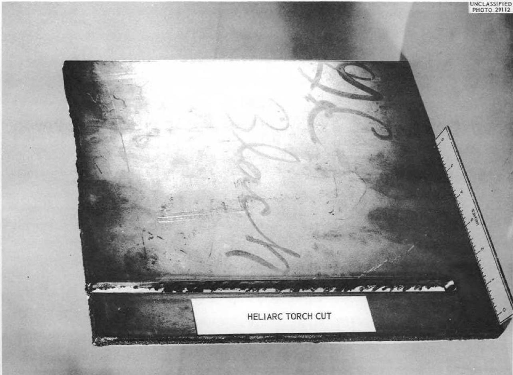  
Fig. E-1. Inconel Plate Cut by Heliarc Torch.

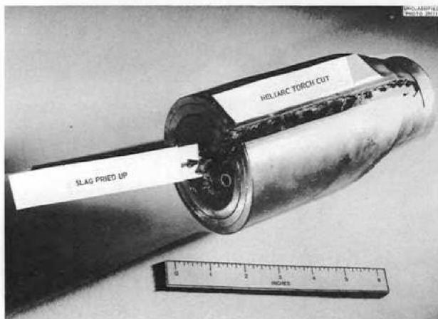  
Fig. E-2. Three Concentric Inconel Pipes Cut by Heliarc Torch.

techniques; for instance, using a boring mill and standard lathe point tool. Grinding would also be a suitable method for this cut.

It is recommended that this equipment be purchased and development started on special tooling and training personnel in its use. At the very least, it may be looked upon as the "fireman's ax" type of emergency measure when all other types of cutting devices still leave cuts necessary.

# Acknowledgments

The idea of using this type torch was first proposed by Mr. M. Bender. Arrangements for the use of the installation at Lucey Boiler and Mfg. Corp. for this test were made by Mr. Earl Woods of the Linde Company in Knoxville, Tennessee. The cooperation of Mr. R. C. Trane, Jr., Manager, and R. S. Lane, Plant Superintendent, of Lucey Boiler Corp. was most helpful.

Evaluation of cutting methods for cutting Inconel which might be applied to hot cell conditions has continued. Interlocked drilled holes, grinding, and Elox cutting have been previously reported. Ultrasonic cutting was also considered because of its potential value in cutting hard materials, but since large amounts of Inconel would also have to be cut, severing rates on Inconel were important. This test was an evaluation on cutting Inconel only.

The equipment used was the Cavitron, made by the Sheffield Corporation, of Dayton, Ohio. The machine is located in Bldg. 2525, in the Central Machine Shop Facilities.

The process may be described as a cutting action produced by flowing an abrasive fluid over the surface to be cut and accelerating the abrasive particles by means of a high frequency (about 20 kc) imparted by a ram which travels about $0.0005''$ and is attached to the driving member. The fluid containing the abrasive also serves to wash away the particles removed in the cut.

The cutting tool was a narrow stainless steel blade, $\frac{1}{16}'' \times 1\frac{5}{8}''$ in section. The machine was operated at frequencies of 19.5 to 20.5 kc with a vertical load of 3 lb 6 oz. The cutting fluid is a suspension of water and 280 grain size boron carbide, called Norbide, made by the Norton Company. The Inconel sample was the same piece as had been used for the Elox test, a partly curved section about $\frac{1}{4}''$ thick by $1\frac{3}{8}''$ wide.

# Conclusions

1. After operating the machine for one hour, a notch about 0.025 deep had been started near the upper corners of the Inconel bar, which had contacted the blade. See Fig. F-1.   
2. The results are unsatisfactory on Inconel, which is considered relatively soft.

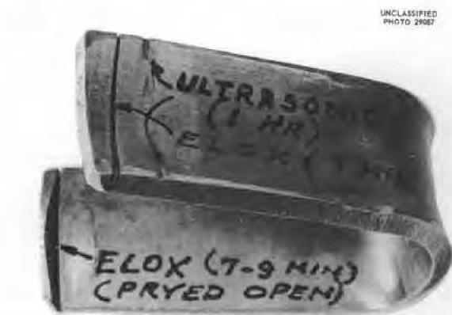

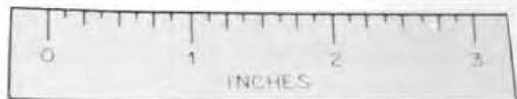  
Fig. F-1. Ultrasonic and Elox Cutting of Inconel.

3. This process is better adapted to the hard, brittle materials, like quartz and $\mathsf{B}_4\mathsf{C}$ , which are difficult to cut with ordinary cutting methods. Under these conditions the low cutting rate is acceptable for these hard materials.

# Recommendations

Based on the above test, no action is recommended on ultrasonic disintegration for hot cell use, unless it is necessary to cut material which is too difficult for ordinary means. Interior surfaces of the $\mathsf{B}_4\mathsf{C}$ tiles appear to be one of the spots where the process could be applied, but it is proposed that these tiles might be chipped to expose these surfaces.

# Acknowledgments

We are indebted to Merle Brown and Dick Fox of the Central Machine Shop Facilities for the use of this equipment.

# APPENDIX G. ELOX CUTTING

The problems of severing active pieces during disassembly require the development of a number of cutting methods. Grinding, drilling, and Heliarc torch cutting have been considered. One process which has been suggested but has not yet been evaluated is the Elox cutting process (also called electrical disintegration).

An Elox machine was made available to us which had been used for experimentally cutting apart fuel elements. A test was arranged to cut Inconel plate in this machine.

The machine used is located in Bldg. 4505 in the Unit Operations Section of the Chemical Technology Division, and is a model M-500, serial 149. To describe this process simply, one might say that it operates like a welding machine, except that the material is vaporized by means of an electric arc and washed away instead of fused. A current is passed through the electrode, which can be of any shape to make a particular cut desired, and then to the work to complete the circuit. Usually, the entire area to be cut is submerged; or it may be sprayed with either a conducting oil or in our case a demineralized water was used. The electrode wears away at about the same rate as the material which is removed in the cut. The process has the advantage of making any odd-shaped cut which can be made using a plunge-type movement, and producing a cut close to the dimensions of the electrode. The material removed by the arc is vaporized into tiny globules and is floated away by means of the circulating fluid.

# Tests Run

Four test runs were made, three of them using Inconel, and the last one, as a check, was made with stainless steel. The Inconel plate was about $\frac{1}{4} \times 1\frac{3}{8}$ in section and was slightly curved. See Fig. G-1. It was clamped into the vise and placed below the solution level. The electrode was a brass plate about $0.030''$ thick and was mounted from a vertical head. The rate at which the blade or electrode is advanced depends on a device built into the head which automatically maintains the arc gap. In the first test a cut of about $\frac{1}{8}$ deep was

made in about 3 min. After this period, some errati operation was encountered and the operation was stopped without completing the cut.

The other end of the Inconel plate was then set up and the test repeated using a new section of the electrode. This time it was permitted to run about 9 min, but the depth of cut was approximately the same as before with erratic operation during about the last half of the period.

The first test was made with the test piece submerged but no forced circulation. The second test was approximately the same except that the circulating pump was started and the liquid forced across the cut section to remove the particles in an attempt to obtain steady operation. This was not successful.

The third test consisted of a hollow brass electrode about $\frac{3}{8}$ in hexagonal end section with a hole through it. The object was to force liquid through the electrode and thereby wash the particle out from the arc area. In this test it operated for about a total of 9 min, but again the last half was erratic in operation and the depth of cut was only about $\frac{3}{32}$ .

In order to determine whether the Inconel was causing this difficulty, a fourth test was run using

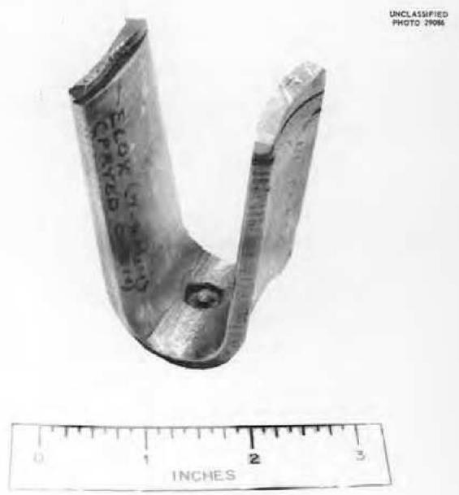  
Fig. G-1. Inconel Plate Cut by Elox Process.

the same hexagonal vertical electrode but the material was changed to stainless steel. After about 7 min operation the depth of cut was about the same $(\frac{3}{2})$ as had occurred in the Inconel plate.

In none of the four tests was complete severance obtained.

The conclusions which might be drawn from this test are as follows:

1. The cut proceeds at a relatively slow rate but makes quite a clean-cut edge, therefore would be desirable for thin, light sections.   
2. The electrode is consumed at approximately the same rate as the cut is made.   
3. The particles which are removed from the cut are confined to the liquid solution, which might be desirable for limiting contamination.   
4. The erratic operation which was noted was not fully explained. It may be possible to improve the operations which were noted here, using the following suggestions:

a) A wider electrode, perhaps $\frac{1}{16}$ " thick, might give higher current density and better alignment.   
b) A higher velocity and better flow of water through the gap might prevent some of the erratic operation.   
c) It is suggested that the manufacturer be asked to tell us what was being done incorrectly in this test, or whether there was something basically wrong with this particular machine.   
$d^{\prime}$ ) An electrode of trapezoidal section, wider at the base, might be used to automatically increase the clearance as the cut is deepened. The same effect might be produced by applying an electrically insulating paint to the side walls of the electrode.

In trying to determine where this process could be applied, it is apparent that submerging a complete reactor in order to put the electrodes in a submerged position is impractical. However, it may be possible to use the Elox process in one of the auxiliary hot cells. It could be used for the removal of specific smaller specimens after the major elements have been taken off the reactor, especially in cases where the part is fragile and sawing or grinding might damage the specimen (such as the heat exchanger bundle). As a side comment this method has been used at the G-E hot cell at the MTR for severing their thin-wall fuel elements. It has been used successfully, but in a discussion with Mr. Dave Durrill (in charge of the G-E hot cell) he mentioned that they were no longer using this process, but were shearing their fuel elements instead.

Two other previous tests might also be noted here. A piece of $\mathsf{B}_4\mathsf{C}$ could not be cut on an electrical disintegration type machine, apparently because of insufficient electrical conductivity. However, a piece of $\mathsf{Cu - B_4C}$ was successfully penetrated using this method.

Sawing may also be used on $\mathsf{Cu - B}_4\mathsf{C}$ but it is impossible to saw $\mathsf{B}_4\mathsf{C}$ . The precision cuts made with the electrical disintegration method make this process attractive for $\mathsf{Cu - B}_4\mathsf{C}$ in spite of its slowness.

# Acknowledgments

We wish to acknowledge the courtesy of Mr. C. D. Watson for the use of this equipment, and for its operation to Mr. George A. West.

In hot cell operation, it is desired to compare critical reactor parts before and after they have been operated. To do this, photographic records have been considered. One of the early systems2 which was proposed was a grid projecting system whereby a cross-section grid would be projected on a spherical surface from an angle. The photograph of this grid shadow on this spherical surface would cause a contour to be produced. Any variation from the normal would cause the curved lines to deviate from a circular arc. One problem with this system is that it is too difficult to project a series of lines on a surface with sufficient definition to make them readable to the accuracy required.

A system has recently come to our attention which overcomes this objection. It has been developed by K. B. Jackson3 and is described in Photogrammetric Engineering.4 The system consists of a wire grid placed close to the object to be measured. A vertical light source at a $45^{\circ}$ angle from the side produces a shadow of this wire grid on the surface being studied (see Fig. H-1). A camera directly in front of the object to be measured photographs both the grid and its shadow, thus the difference between the two lines as measured in the photograph will give an indication of the space between the grid and the contour surface. Since the grid consists of a series of vertical wires accurately spaced and stretched taut, it represents a true grid, and by making the light

Report by A. A. Abbatiello dated May 31, 1957.

2M. G. Willey, Lofting, memo to A. A. Abbatiello, dated March 6, 1957.

3Dept. of Applied Physics, University of Toronto, Toronto, Canada.   
4 Photogrammetric Eng. 21, 71-76 (March 1955).

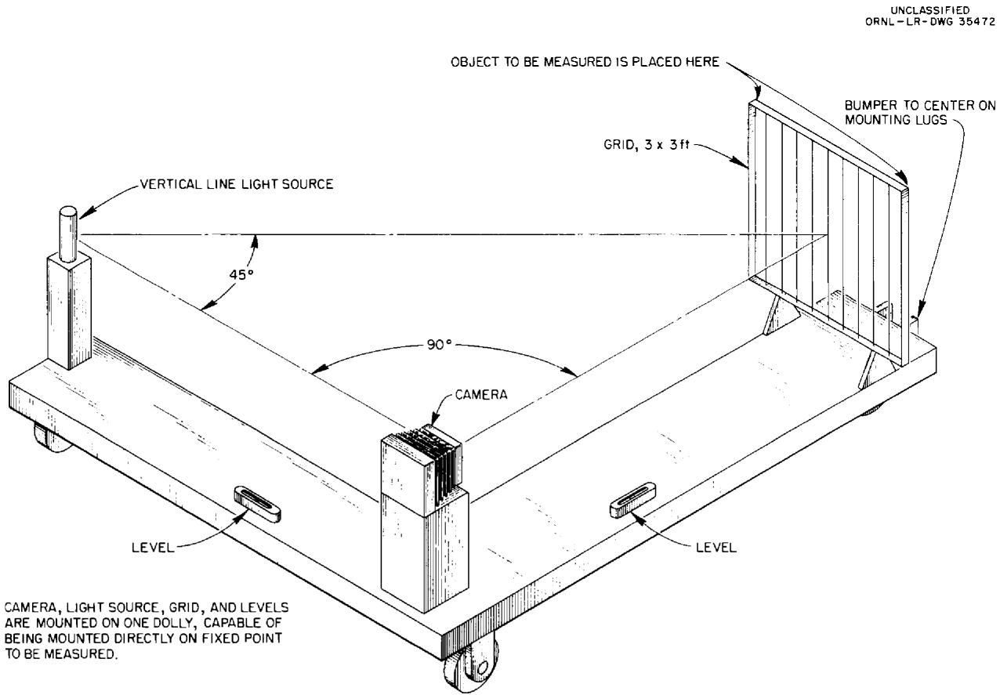  
Fig. H-1. Contour Measuring System.

source angle $45^{\circ}$ it is possible to directly measure on the film surface the deviation between the vertical line and its shadow.

This scheme might be adapted to cur requirements as follows:

A dolly would be built upon which would be mounted the grid, camera, and the light source arranged at three corners of a $45 - 90^{\circ}$ triangle. The front end of the triangle (at the grid) would carry a bumper stop which would be adjusted to fit the machining lugs of the shells. By aligning the dolly in front of the reactor it would be possible to make a photograph of the projected grid lines and the grid in the manner used by Jackson. By taking this series of photographs at each of the lug locations, the general contour of the reactor can be produced. It would probably be impractical to take in the area beyond the NaK connections, but this might be adequate. These would be preserved, and a similar set of photographs could be made after the reactor had been set up in the hot cell, using the same rig. It would be possible to move the rig by means of the crane and shield the camera with a lead box up until the time the exposure was to be made. The complete rig could then be raised and brought into the auxiliary cell, where the film could be removed and a new one set, or change plates in the camera remotely.

Such a system would have the advantage of being a totally self-contained unit capable of being carried to the reactor as it was assembled and the original record photographs made. The same unit would then be available for use in the hot cell. It does not require an extremely accurate camera, as would be true with the photo-lofting process, since the grid wire and its shadow becomes the item of measurement.

As shown in Fig. H-1, the dolly becomes the carrier and the mounting unit for the camera, the light source, and the grid. The position of each of these units is critical and therefore should be fixed on the mounting device and retained. A level in both directions should be added, so that all the photographs taken would be level regardless of slight variations in the floor. The base line produced by the lower edge of the reactor mounting lug would be the point from which the unit would be indexed. This device would be used to make photographs of the reactor as it is assembled.

In the hot cell a similar arrangement using the same points of reference on the reactor surface would be used to get the second set of pictures. The photographs could then be compared and differences noted and measured. A correction may be required for the possible shift in lug reference point.

Briefly, this contour measuring system appears to be a simplified version of photo-lofting which could be directly applied to our requirements. It is particularly attractive because the entire device can be mounted as one unit, carried about both during the reactor assembly and in the hot cell. Its cost should not be excessive because the camera need not be an accurate item and the light source is merely a vertically aligned tube. The grid consists of a set of thin wires arranged on a framework, with the entire unit placed on a structural steel dolly capable of being transported and retaining the three-element relationship.

This scheme is submitted for consideration and possible construction of a test setup designed to evaluate it.

Preliminary trials to determine a suitable method of making replicas were made using a rejected Shell I as the surface to be reproduced. Scribe lines were placed every $30^{\circ}$ around the shell and $2^{\prime \prime}$ apart vertically. The scribe lines were located with an accuracy of $0.001^{\prime \prime}$ .

The first spraying trial was made at X-10 Metal-lurgy with a metalizing gun assigned to Mr. H. Inouye.

The first trial was made with aluminum wire. Aluminum would not build up on the Inconel surface. It was dislodged by the air blast of the gun as fast as formed.

The second trial was with Spramold wire, a lead alloy. The lead adhered readily and showed good detail but could not be removed in a reasonable thickness without bending. Some blistering of the lead occurred during spraying, but thorough cleaning with acetone of the Inconel surface stopped the formation of blisters.

The third and fourth trials were made with an estimated $0.020''$ thickness of lead backed with $0.005''$ to $0.010''$ of aluminum. There was considerable variation in thickness from point to point on the surface due to the impossibility of judging accurately, during spraying, the thickness already applied.

The aluminum backing caused the replica to curl away from the surface. While this facilitated removal of the replica, it made impossible the accurate measurement of distances between points on the replica.

A sixth trial was made at the main Y-12 machine shop with the cooperation of Mr. W. C. Collins.

In this trial the surface of Shell I was carefully waxed and polished with Simoniz wax. Spramold wire $\frac{1}{8}''$ in diameter was used. An area covering approximately $120^{\circ} \times 8^{\prime \prime}$ at the small end of the shell was delineated with pressure sensitive tape folded to produce a parting ridge about $\frac{3}{8}''$ high. The area thus marked out was sprayed with the Spramold wire to a maximum depth of $0.170''$ . There was considerable variation in thickness, with a minimum of perhaps $0.125''$ . The spraying operation required about 25 minutes. The shell heated up during spraying to an estimated $200^{\circ}\mathrm{F}$ .

The replica and shell were allowed to cool to room temperature before attempting removal of the replica. The pressure sensitive tape (cloth backed) was pulled away, which permitted the replica to fall off. No prying or rough handling was required. The reproduction obtained was excellent. There were some blisters, which were thought to have been caused by excessive wax. Fortunately none of the blisters occurred on a scribed line.

The replica was then measured with a radius sweep gage, with the following four results:

<table><tr><td>Location</td><td>Radius of Shell (in.)</td><td>Radius of Replica (in.)</td><td>Difference (in.)</td></tr><tr><td>Station 7 (top)</td><td>3.407</td><td>3.4035</td><td>-0.0035</td></tr><tr><td>Station 6</td><td>3.432</td><td>3.4445</td><td>+0.0125</td></tr><tr><td>Station 5</td><td>3.598</td><td>3.6108</td><td>+0.0128</td></tr><tr><td>Station 4</td><td>3.898</td><td>3.9109</td><td>+0.0129</td></tr></table>

Measurements of the $2^{\prime \prime}$ vertical distances between the circumferential scribed lines were measured on the contour projecting gage with the following results:

# Inches

Distance from station 7 to 6 2.0000

Distance from station 6 to 5 2.0000

Distance from station 5 to 4 2.0006

Distance from station 4 to 3 2.0003

The sixth replica, prepared at the Y-12 machine shop, is quite rigid and with reasonably careful handling will not bend out of shape. The radius measurements indicate that the replica was warped somewhat either during spraying or while cooling. It is believed that the lack of warping at the top was caused by the flow of molten lead over the top edge of the shell, which tended to hold the replica to the shell at that point.

The operation of the metal spraying equipment required considerable adjustment and trial before satisfactory spraying could be accomplished. However, at neither X-10 or Y-12 had the operator a previous experience in spraying lead.

A. A. Abbatiello and L. W. Love visited the Osborne Equipment Company in Knoxville to try the spraying of gypsum cement with Bondact cement spraying equipment.

The equipment consists of a mixing gun in which water and cement are combined and sprayed on a surface with an air blast, a hopper for feeding the cement into the air stream, a pressurized water tank, an air compressor, and suitable hoses.

About 25 lb of Ultracal 30, a trade name of the U.S. Gypsum Co. for a low-expansion gypsum cement, was taken to Knoxville for the trial spraying.

The Ultracal 30 was sprayed on a part of a reject Shell I. One half of the shell was oiled with 30W lubricating oil applied with a rag in a light to moderate coat. The other half of the shell was not coated. Separating strips of plywood $\frac{1}{2}'' \times \frac{1}{2}''$ were taped to the shell $180^{\circ}$ apart to provide a means of separating the two halves of the cast.

The equipment with which the trial spraying was carried out was old, with an unsatisfactory design for controlling the flow of cement into the air stream. At least it was unsatisfactory when used with Ultracal 30. The equipment operated erratically due to variations in the rate of flow of the gypsum cement. The operator was unable to adjust the flow of water to correspond to the flow of cement, with the result that the mix was either too wet and flowing or too dry, which caused it to blow away as dust. It is estimated that about one-fourth

of the 25 lb taken to Knoxville was actually applied to the shell. The remainder was splattered or dusted over the environs.

After a few minutes' operation the Ultracal 30 hardened in the gun, which then had to be dismantled and cleaned before work could continue.

The coating applied varied from $\frac{3}{16}$ to $\frac{5}{8}$ . It is believed that a more uniform coating could have been applied if the operator had been able to give his attention to the spraying operation rather than to continual adjustment of the equipment.

The replica from the oiled side of the shell was removed without difficulty. There was clean separation except for one spot about 1 sq in. in area. This replica showed some detail but did not compare in clarity with the flame-sprayed lead. The surface was somewhat dusty.

The replica from the side of the shell which had not been oiled was removed with somewhat greater difficulty but was nonetheless removed without breaking. This cast adhered over the principal part of the surface, leaving an irregular thin coating of gypsum cement. This replica does not show fine detail but does conform closely to the contours of the shell. Both replicas are sufficiently rigid and strong to withstand handling.

It was concluded as a result of this test that the spraying of gypsum cements was not practical for a hot cell operation. This conclusion was based on (1) production of excessive splatter and dust, (2) erratic operation of the equipment, (3) plugging of the gun with gypsum cement.

It is recognized that (2) and (3) above could probably be overcome with further trials or redesign of parts of the equipment, but the final result to be expected would not justify the time and money required.

# APPENDIX K. CAST GYPSUM CEMENT REPLICAS

In order to evaluate gypsum cement as a replicating material, four types were ordered from the U.S. Gypsum Co. These cements have the following properties as reported by the manufacturer:

<table><tr><td>Type Name of Cement</td><td>Setting Time (min)</td><td>Setting Expansion (in./in.)</td><td>Dry Compression Strength (lb/sq in.)</td></tr><tr><td>Ultracal 30</td><td>25-35</td><td>0.0003</td><td>7,300</td></tr><tr><td>Ultracal 60</td><td>75-90</td><td>0.0002</td><td>7,300</td></tr><tr><td>Hydrocal B-11</td><td>20-25</td><td>0.0005</td><td>3,800</td></tr><tr><td>Hydrostone</td><td>20-25</td><td>0.002</td><td>11,000</td></tr></table>

The first cast was made with Ultracal 30. Into a box of suitable size a mix of $18\frac{1}{2}$ lb of water and 50 lb of Ultracal 30 was poured. A rejected Shell I with Lucite end plates was pushed down into the box until it rested on wooden stops previously located. A second mix was prepared of $12\frac{3}{4}$ lb of water and 35 lb of Ultracal 30 and poured on top of the first to bring the final level up to the point where half the shell was immersed. Silicone Valve Seal "A" was used as the mold release agent. In addition, half the immersed area of the shell was coated with sprayed lacquer. The cast was removed by striking the free side of the shell a few blows with a hammer, using a block of wood to prevent damage to the shell.

The replication was only fair in this first case. There were a considerable number of air bubbles trapped in the cement on the underside of the shell, too much mold release agent was used causing poor detail, and the shell apparently shifted slightly during the second pour.

It was decided that a different pouring arrangement was necessary. A mold box was prepared so that the cement could be poured over the top side of the shell rather than immersing the shell in the cement. Four replicas were prepared of Shell I using the four types of gypsum cement listed above and the improved mold box. Results of these trials were as follows:

<table><tr><td rowspan="2">Cement</td><td colspan="2">Mix</td><td rowspan="2">Mold Release Agent</td><td rowspan="2">Quality of Replication</td><td rowspan="2">Estimated Dimensional Reproduction of 2&quot; Grid Lines</td></tr><tr><td>Water (lb)</td><td>Cement (lb)</td></tr><tr><td>Ultracal 30</td><td>18.5</td><td>50</td><td>D.C. Valve Seal &quot;A&quot;</td><td>Poor - too much mold release agent</td><td>Could not measure</td></tr><tr><td>Ultracal 60</td><td>19.0</td><td>50</td><td>D.C. Valve Seal &quot;A&quot;</td><td>Improved - too much mold release agent</td><td>2.00&quot;</td></tr><tr><td>Hydrocal B-11</td><td>20.0</td><td>40</td><td>D.C. Valve Seal &quot;A&quot;</td><td>Satisfactory</td><td>2.00&quot;</td></tr><tr><td>Hydrostone</td><td>16.5</td><td>55</td><td>D.C. Valve Seal &quot;A&quot;</td><td>Satisfactory</td><td>2.01&quot;</td></tr></table>

1Memo from L. W. Love to F. R. McQuilkin dated May 27, 1957.

The estimate of dimensional reproduction was made visually with a scale marked in $\frac{1}{64}$ gradations. Appearance of the replicas indicates that in all four cases too much mold release agent remained on the shell. The Dow Corning Valve Seal "A" is too viscous and thus hard to wipe off. It is believed that Dow Corning Mold Release Emulsion 35B, which has recently been received, would improve the replication detail.

It is reported that D-C Valve Seal "A" can be dissolved with methylchloroform but not many other solvents. D-C 200 fluid, which is believed to be the base for Emulsion 35B, can be removed by amyl acetate, gasoline, perchloroethylene, and trichloroethylene, among other solvents. There thus appears to be considerable advantage to using Emulsion 35B. It should work also with the flame-sprayed lead.

# APPENDIX L. OPTICAL MEASUREMENTS THROUGH HOT CELL WINDOWS (ZINC BROMIDE)1

One of the principal objectives in hot cell operations is the accurate measurement of parts by remote means. Optical methods have been considered but have not been evaluated on their basic accuracy. In order to clarify this point a test was set up at the Solid State Division Hot Cell in Bldg. 3025, using available equipment.

The basic instrument used was a Gaertner Scientific Co. cathetometer No. 2832 borrowed from the Solid State Division. A piece of accurately finished dowel pin $0.437''$ dia by $4''$ long was used as the test specimen. To show the effect of surface reflection, one end was left shiny and the other was painted with Dykem. An oxidized surface might have been a better nonreflecting surface, however.

In order to get a comparison of the dimensions obtained with no window and then through the window, a set of readings was first obtained with the cathetometer and the sample set up outside the cell about five feet apart. The specimen was then brought inside the cell and the cathetometer set up directly in front of and normal to the window. When these readings were completed, the cathetometer was moved to test the effect of looking through the window at an angle. Two sets of angular data were taken, the first being at an angle of $15^{\circ}$ looking up at the specimen and the second at an angle of $30^{\circ}$ from the side. Several individuals were used to take different readings in order to determine the possible variations which might be expected. The data are presented at the end of this memo.

The conclusions which may be drawn from this test are preliminary, but are sufficient to change some original concepts and to warrant further work.

1. An examination of the data indicates there is no marked difference in accuracy between the readings taken with the specimen outside and those taken with the specimen inside the cell.   
2. The reflected highlights from both the clear and darkened end of the sample tend to give low readings. As the operator becomes more experienced in knowing what to look for, this error becomes less. Oxidized surfaces would also tend to reduce this error.   
3. Angular readings through the zinc bromide window do not reduce the accuracy, but the angle increases the chromatic aberration. However, this effect appears tolerable if the telescope used is limited to 3 or 4 power.   
4. This system has an inherent disadvantage in that it is slow and requires pre-established reference points. The points must be easily identifiable.   
5. The results obtained with zinc bromide windows indicate such a measuring system would be feasible if it were decided to use it.   
6. Further checking to determine the limitations of such a system working through multilayered lead glass windows appears as a next step, to check for effect of density and surface variations.

7. It appears feasible for a good operator, with a little practice, to obtain readings of the order of $+0.000''$ to $-0.007''$ using this method.

# Data Taken

The first set of data was taken outside the cell, with both sample and cathetometer set up about five feet apart. Normal diameter of specimen is $0.437''$ as measured with direct reading micrometer calipers. (Note: $0.437''$ dia = 11.07 mm as the cathetometer was calibrated in millimeters. All readings were taken in millimeters and converted to inches.)

# Readings Outside Cell

<table><tr><td>Operator</td><td>Location</td><td>Diameter Reading (in.)</td><td>Variation (in.)</td><td>Notes</td></tr><tr><td>A</td><td>Dark end</td><td>0.436</td><td>-0.001</td><td></td></tr><tr><td>W</td><td>Light end</td><td>0.431</td><td>-0.006</td><td></td></tr><tr><td>SW</td><td>Light end</td><td>0.421</td><td>-0.016</td><td>His first try</td></tr></table>

# Reading with Sample Placed Inside Cell

<table><tr><td>Operator</td><td>Location</td><td>Angle</td><td>Diameter Reading (in.)</td><td>Variation (in.)</td><td>Notes</td></tr><tr><td>A</td><td>Dark end</td><td>Normal</td><td>0.426</td><td>-0.011</td><td></td></tr><tr><td>A</td><td>Light end</td><td>Normal</td><td>0.430</td><td>-0.007</td><td></td></tr><tr><td>A</td><td>Light end</td><td>Normal</td><td>0.434</td><td>-0.003</td><td></td></tr><tr><td>A</td><td>Dark end</td><td>Normal</td><td>0.428</td><td>-0.009</td><td></td></tr><tr><td>S</td><td>Dark end</td><td>Normal</td><td>0.422</td><td>-0.015</td><td>His first try</td></tr><tr><td>S</td><td>Dark end</td><td>Normal</td><td>0.424</td><td>-0.013</td><td></td></tr><tr><td>A</td><td>Light end</td><td>15° up</td><td>0.436</td><td>-0.001</td><td></td></tr><tr><td>A</td><td>Dark end</td><td>15° up</td><td>0.426</td><td>-0.011</td><td></td></tr><tr><td>A</td><td>Light end</td><td>30° side</td><td>0.425</td><td>-0.012</td><td></td></tr><tr><td>A</td><td>Dark end</td><td>30° side</td><td>0.432</td><td>-0.005</td><td></td></tr></table>

# APPENDIX M. OPTICAL MEASUREMENTS THROUGH HOT CELL WINDOWS (EARLY DESIGN LEAD GLASS)

The purpose of this memo is to report the results obtained by measuring a piece of Inconel in a hot cell through a lead glass window. The object was to repeat the test made on the zinc bromide windows and reported on April 15.[2] The evaluation of measuring through lead glass will determine the feasibility of optical tooling instruments mounted outside cell windows.

The same cathetometer as used for the previous test was set up in Bldg. 4501 B cell, lower window. The window in this cell is about $20^{\prime \prime}$ square and 3 ft thick. Unfortunately this window is one of the first lead glass windows installed, and therefore its quality is not representative of present day windows. However, for the purpose of this test it was desired to make the conditions as severe as might be met in practice to determine what the upper limits might be.

The sample was a piece of $\frac{1}{2}$ Sch. 40 Inconel pipe which had a dull oxidized surface finish similar to what is expected in our hot cell. The pipe was mounted in a ring stand and placed in the cell. The cathetometer was placed on the outside of the cell window on a table. The pipe diameter was $0.831'' - 0.832''$ and was quite uniform, although the pipe was slightly curved – about $24''$ radius.

Since the cathetometer is calibrated in millimeters, the conversion of the $0.832''$ diameter of the pipe becomes $21.13\mathrm{mm}$ , and this is taken as the normal reading for the pipe diameter. It will be observed that in the data sheet the diameters of the pipe as recorded will vary in location depending on which section of the glass area was used when the measurement was made.

Measurements (Table M-1) were made in approximately five places. Position A was on the lower right-hand corner $(4^{\prime\prime}$ from each edge) of the glass, perpendicular to the surface. Position B was on the lower left-hand corner, also perpendicular to the surface. Position C was approximately the same as Position A, i.e., on the right-hand side, but looking through the window at an angle of $15^{\circ}$ to the normal. Position D was taken from the left

side of the window (near B), looking at an angle of about $22^{\circ}$ from the normal. Position E is the same as Position D except that it was lowered $4^{\prime \prime}$ , and therefore this line of sight is parallel to D but $4^{\prime \prime}$ below it, still $22^{\circ}$ from the normal.

As in the previously reported experiment, several observers were used to take readings in order to determine the variations between individuals. The conclusions which may be drawn from this experiment are as follows:

1. The groups of readings which are taken through the particular zone of the window will show reasonable agreement (about $\pm 0.003''$ ).   
2. Rather wide differences were found at the different points measured, $+0.007^{\prime \prime}, + 0.020^{\prime \prime}$ $+0.013^{\prime \prime}, + 0.020^{\prime \prime}, + 0.012^{\prime \prime}$ . Since this window is one of the first built, it is expected that it would have rather wide variations. A newer window about 4 ft thick is on order but will not be delivered until about another month. If desired, the test could be repeated, but this is not felt necessary.   
3. These tests could be repeated from the newer window, but it may be stated generally that measurements through the lead glass will be limited in usefulness to the long dimensions.   
4. It will be noted that the angular measurements did not introduce the higher inaccuracies which might have been expected, or the high chromatic aberration which was noted through the zinc bromide windows. This may be partially explained by the lights used in the two different cells. Less chromatic aberration was noted in this window. The type of light used is fluoride mercury vapor. Fortunately, this effect will make it possible to use higher power telescopes, if desired. (The test instrument was only 3 to 4 power.)   
5. Another conclusion which may be drawn is that in practically all cases the measurements read oversize, whereas the previous measurements through the zinc bromide windows were all undersize. It is believed that the basic cause for this difference is the color of the finish on the specimen. The rather shiny surfaces on the specimen tested in the zinc bromide windows tended to produce highlights which caused the observer to read the lighter edge, which would result in a low reading.

6. Because of these oxidized surfaces and also because of the light colored background in the cell, it was possible to establish the edge of the specimen with good precision. It may not be possible in all cases to duplicate this condition when the work starts in the hot cell, but this method may be an aid, that is, to provide a light background surface so that any darker object which would be placed before it would produce a shadowgraph type of image.

The general results of this test seemed to indicate there is a possibility of using the Brunson optical tooling bar or similar equipment for limited

applications from outside the cell wall. This is not recommended for the small high accuracy dimensions. It may, however, be suitable for the large dimensions which are required across the major reactor proportions. If the error which lead glass introduces is a constant, a variation of $0.010''$ to $0.020''$ may be tolerated in the longer dimensions.

Acknowledgment is made to Oscar Sisman and George Parker for assistance in arranging for the use of the 4501 cell, and to W. E. Brundage of the Solid State Division for the use of the cathetometer.

Table M-1. Data on Lead Glass Window at Bldg. 4501   
Window: Bldg. 4501, cell B, lower, $19'' \times 19''$ , 3 ft thick  
Specimen: pipe, diameter $0.832'' = 21.13 \mathrm{~mm}$   

<table><tr><td>Run</td><td>Position</td><td>By</td><td>Reading Top (mm)</td><td>Reading Bottom (mm)</td><td>Difference (mm)</td><td>Deviation (in.)</td><td>Notes</td></tr><tr><td>1</td><td>A</td><td>WK</td><td>87.03</td><td>65.53</td><td>21.50</td><td>+0.017</td><td rowspan="5">View normal to surface; specimen tilted about 5°</td></tr><tr><td>2</td><td>A</td><td>AA</td><td>89.96</td><td>65.68</td><td>21.28</td><td>+0.007</td></tr><tr><td>3</td><td>A</td><td>AA</td><td>87.26</td><td>65.87</td><td>21.39</td><td>+0.010</td></tr><tr><td>4</td><td>A</td><td>WK</td><td>87.05</td><td>65.77</td><td>21.28</td><td>+0.006</td></tr><tr><td>5</td><td>A</td><td>AA</td><td>86.91</td><td>65.38</td><td>21.53</td><td>+0.016</td></tr><tr><td>6</td><td>A</td><td>AA</td><td>83.13</td><td>61.62</td><td>21.53</td><td>+0.016</td><td rowspan="7">View normal to surface; specimen leveled</td></tr><tr><td>7</td><td>A</td><td>AO</td><td>83.45</td><td>61.63</td><td>21.82</td><td>+0.027</td></tr><tr><td>8</td><td>A</td><td>AA</td><td>81.71</td><td>60.09</td><td>21.63</td><td>+0.020</td></tr><tr><td>9</td><td>A</td><td>WP</td><td>81.63</td><td>60.00</td><td>21.63</td><td>+0.020</td></tr><tr><td>10</td><td>A</td><td>WP</td><td>81.90</td><td>60.15</td><td>21.75</td><td>+0.024</td></tr><tr><td>11</td><td>A</td><td>WP</td><td>81.58</td><td>59.88</td><td>21.70</td><td>+0.022</td></tr><tr><td>12</td><td>A</td><td>WP</td><td>81.80</td><td>60.18</td><td>21.62</td><td>+0.020</td></tr><tr><td>13</td><td>B</td><td>AA</td><td>80.94</td><td>59.09</td><td>21.85</td><td>+0.028</td><td rowspan="4">At left side of window, normal to surface</td></tr><tr><td>14</td><td>B</td><td>AA</td><td>75.49</td><td>54.40</td><td>21.09</td><td>-0.002</td></tr><tr><td>15</td><td>B</td><td>AA</td><td>77.81</td><td>56.35</td><td>21.46</td><td>+0.013</td></tr><tr><td>16</td><td>B</td><td>AA</td><td>77.70</td><td>56.33</td><td>21.37</td><td>+0.010</td></tr><tr><td>17</td><td>C</td><td>AA</td><td>76.47</td><td>55.01</td><td>21.46</td><td>+0.013</td><td rowspan="4">At right side, 15° off normal to surface</td></tr><tr><td>18</td><td>C</td><td>AA</td><td>76.54</td><td>55.08</td><td>21.46</td><td>+0.013</td></tr><tr><td>19</td><td>C</td><td>AA</td><td>76.45</td><td>55.01</td><td>21.44</td><td>+0.013</td></tr><tr><td>20</td><td>C</td><td>AA</td><td>76.95</td><td>55.64</td><td>21.31</td><td>+0.007</td></tr><tr><td>21</td><td>D</td><td>AA</td><td>75.38</td><td>53.75</td><td>21.63</td><td>+0.020</td><td rowspan="3">Left side, 22° off normal to surface</td></tr><tr><td>22</td><td>D</td><td>AA</td><td>75.49</td><td>53.86</td><td>21.63</td><td>+0.020</td></tr><tr><td>23</td><td>D</td><td>AA</td><td>75.41</td><td>53.78</td><td>21.63</td><td>+0.020</td></tr><tr><td>24</td><td>E</td><td>AA</td><td>51.13</td><td>29.81</td><td>21.32</td><td>+0.007</td><td rowspan="4">Left side, 22° off normal but 4&quot; lower than D</td></tr><tr><td>25</td><td>E</td><td>AA</td><td>51.03</td><td>29.49</td><td>21.54</td><td>+0.016</td></tr><tr><td>26</td><td>E</td><td>AA</td><td>50.99</td><td>29.55</td><td>21.44</td><td>+0.012</td></tr><tr><td>27</td><td>E</td><td>AA</td><td>50.91</td><td>29.47</td><td>21.44</td><td>+0.012</td></tr></table>

# APPENDIX N. OPTICAL MEASUREMENTS THROUGH HOT CELL WINDOWS (CURRENT DESIGN LEAD GLASS)

The first in this series of tests measured the optical qualities of a zinc bromide window in the Solid State Division, Bldg. 3025, for the purpose of taking measurements from outside, and was dated April 15. The second test was done on measurements taken through an early lead glass window at the High Level Laboratory in Bldg. 4501 and was dated May 17. This memo, the third in the series, presents the test data taken on one of the new lead glass windows which have been purchased for the High Level Chemical Development Facility, Bldg. 4507, but have not yet been installed. The work was done while they were still in storage at Bldg. 7005.

When the new lead glass windows which are to be installed in the HLCD were made available to us, a set of data was taken to compare this window with the earlier lead window previously reported.

The window is 4 ft. thick, 20 in. high, and 36 in. wide at the outside of the cell. It is composed of the following pieces of glass, starting from the outside surface: 1 piece of plate glass, density $2.5\mathrm{g / cc}$ , 1 in. thick; 5 pieces of lead glass, density $3.3\mathrm{g / cc}$ , each 8 in. thick; 1 piece of lead glass of the same density, 6 in. thick; for a total of 46 in. of lead glass. The inside of the cell window is covered with a piece of 1 in. thick non-browning plate glass of $2.7\mathrm{g / cc}$ density. The spaces are filled with a mineral oil to cut down reflections. These windows were built by the Corning Glass Works at their Harrodsburg, Ky., Plant, and are shown on their drawing 12931-1480 and on ORNL drawing D-25357. Four of these windows are available and one of them was selected for this test at random.

The equipment which was used was the same as that used previously, i.e., a Gaertner Scientific Co. cathetometer borrowed from the Solid State Division and placed on the front side of the window. A piece of $\frac{1}{2}$ in. Sch. 40 Inconel pipe with

a dull finish was placed on the cell side of the window and mounted in a horizontal position. Readings (Table N-1) were taken at five points through the window. Three of them were normal to the surface, at points A, 12 in. from the right edge of the window, B, about at the center, and C, at 4 in. from the left edge of the window. All three of these readings were taken at the approximate horizontal centerline. Two readings, D and E, were obtained at an angle to the surface. Position D was at an angle of $25^{\circ}$ from the normal entering at a point 4 in. from the left edge, looking toward the right. Position E was taken at a point about 12 in. from the right edge of the window facing the glass at an angle of about $23^{\circ}$ from the normal, but looking toward the left.

Because these windows were located in a storage area, the only available illumination was daylight. A door open to the exterior of the building was raised and the object to be measured was illuminated by natural daylight.

# Conclusions

1. As can be seen by examination of the data, the dimensions obtained through this window are better than any of those obtained heretofore, either with the zinc bromide or through the earlier lead glass window in Bldg. 4501. The results indicate that there is closest agreement between all the readings of any data taken to date. There were no marked differences between any of the specific points on this window as measured.   
2. The deviations noted from the true diameter were both on the plus and minus side, indicating that these readings gave better dispersion about the mean.   
3. Because the cathetometer could not be focused on the longer distances (Positions D and E), some parallax was encountered which could not be removed (parallax is the apparent shifting of the cross hairs on the image as the eye is moved across the field of view and means the cross hairs are not located at the exact focal point of the eyepiece). A telescope designed for the range of distance at hand would have avoided this handicap.   
4. Nevertheless, in spite of the problems of trying to adapt the available equipment to this

Window: $20 \times 36$ in., 4 ft thick, tested while in storage at Bldg. 7005, May 31, 1957, natural daylight illumination

Specimen: pipe, diameter 0.832 in. = 21.13 mm

Table N-1. Data on Lead Glass Window for HLCD   

<table><tr><td>Run</td><td>Position</td><td>Reading Top (mm)</td><td>Reading Bottom (mm)</td><td>Difference (mm)</td><td>Deviation (in.)</td><td>Notes</td></tr><tr><td>1</td><td>A</td><td>80.77</td><td>59.49</td><td>21.28</td><td>+0.006</td><td rowspan="3">Normal to surface at position A</td></tr><tr><td>2</td><td>A</td><td>80.84</td><td>59.69</td><td>21.15</td><td>+0.001</td></tr><tr><td>3</td><td>A</td><td>80.77</td><td>59.82</td><td>20.85</td><td>-0.011</td></tr><tr><td>4</td><td>B</td><td>80.37</td><td>59.39</td><td>20.98</td><td>-0.006</td><td rowspan="5">Normal to surface at position B</td></tr><tr><td>5</td><td>B</td><td>80.51</td><td>59.33</td><td>21.18</td><td>+0.002</td></tr><tr><td>6</td><td>B</td><td>80.47</td><td>59.52</td><td>20.95</td><td>-0.007</td></tr><tr><td>7</td><td>B</td><td>80.59</td><td>59.25</td><td>21.34</td><td>+0.009</td></tr><tr><td>8</td><td>B</td><td>80.44</td><td>59.49</td><td>20.95</td><td>-0.007</td></tr><tr><td>9</td><td>C</td><td>89.10</td><td>67.98</td><td>21.12</td><td>-0.0004</td><td rowspan="4">Normal to surface at position C</td></tr><tr><td>10</td><td>C</td><td>89.29</td><td>67.92</td><td>21.37</td><td>+0.010</td></tr><tr><td>11</td><td>C</td><td>88.96</td><td>67.82</td><td>21.14</td><td>+0.0004</td></tr><tr><td>12</td><td>C</td><td>89.12</td><td>67.86</td><td>21.26</td><td>+0.005</td></tr><tr><td>13</td><td>D</td><td>89.50</td><td>68.25</td><td>21.25</td><td>+0.005</td><td rowspan="4">At angle of 25° to right</td></tr><tr><td>14</td><td>D</td><td>89.44</td><td>68.36</td><td>21.18</td><td>+0.002</td></tr><tr><td>15</td><td>D</td><td>89.42</td><td>68.32</td><td>21.10</td><td>-0.001</td></tr><tr><td>16</td><td>D</td><td>89.51</td><td>68.22</td><td>21.29</td><td>+0.006</td></tr><tr><td>17</td><td>E</td><td>78.62</td><td>57.10</td><td>21.52</td><td>+0.015*</td><td rowspan="4">At angle of 23° to left</td></tr><tr><td>18</td><td>E</td><td>78.51</td><td>57.50</td><td>21.01</td><td>-0.005</td></tr><tr><td>19</td><td>E</td><td>78.84</td><td>57.85</td><td>20.99</td><td>-0.006</td></tr><tr><td>20</td><td>E</td><td>78.86</td><td>57.71</td><td>21.15</td><td>+0.001</td></tr></table>

* Probably due to parallax.

test, the results are most encouraging. The test setup was made and about 20 readings were taken in a 2-hour period, which indicates that an acceptable rate for obtaining data is possible.

5. The available range of accuracy and reproducibility using this system appears adequate to justify its use, as determined by the 0.1 to $1\%$ change in dimensions expected as suggested by the Power Plant Design Department.   
6. Since these readings compare favorably with the first set of readings taken in air only (see my

April 15 memo), it is apparent that the lead window has little effect and that we have reached the accuracy obtainable with this type of experimental setup. It should be noted that this test was improvised from available equipment and that a larger power scope with a longer focusing range would have provided better results. However, in spite of these minor difficulties it is felt that lead windows as presently produced and indicated by this example, which will be used at the HLCD, will be adequate to give the type of measurements needed. All the plus values averaged out to $+0.0052$ in., and all the minus values averaged $-0.0054$ in.

The object which was measured was placed about 2 ft inside the cell, i.e., from the window.

When the reactor is placed in the cell it is expected that it will be about 10 ft from the window. Our equipment did not permit this long range test. Had the equipment been available, which would have focused properly at these longer ranges, it would have been preferable to make this test to determine whether the angular deviation varies as the distance. However, since such small deviations were found with the present readings, it is expected that as the distance becomes greater the variation will not increase appreciably.

# Acknowledgments

We are again indebted to W. E. Brundage of the Solid State Division for the use of the cathetometer, to H. C. Duggan of E & M Division for the information and specifications on this new lead glass window, and to Frank Ring, Jr., for permission to use these windows.

# 1. Introduction

Continued study and experimentation in the field of nuclear energy by the Oak Ridge National Laboratory (ORNL) has progressed to the stage where facilities are necessary for handling large, highly radioactive assemblies and disassembling these units to obtain engineering data.

# 1.1. Document Definition

These criteria outline the requirements for construction of an ART Disassembly Cell (ADC) at the Oak Ridge National Laboratory, Oak Ridge, Tennessee. In preparing the drawings and construction specifications the prime consideration has been to acquaint the Architect-Engineer (A-E) with general facility requirements without restricting his normal freedom of choice as to engineering and construction details. The benefit of the Architect-Engineer's experience on similar structures, to amplify and improve the design criteria, is solicited.

# 1.2. Location

The ADC shall be located on the site shown in Fig. 0-1. This site is within the X-10 plant security area.

# 1.3. Completion Considerations

Special consideration shall be given to the design and construction schedules to insure transfer of the ADC to ORNL by June 1, 1958. Maximum use shall be made of standard equipment and prefabrication to minimize procurement and construction time.

# 1.4. Special Considerations

Construction within the Laboratory is subject to certain special conditions covering operations such as blasting. These conditions shall be included in the specifications. Information of this nature will be furnished by ORNL.

# 1.4.1. Provision for Additions

It is definitely planned that an addition will be made to the building. This addition may be equal to or larger than the ADC. Figure 0-2 shows the proposed location of this addition. The addition is not included in this design, except that a study shall be made to determine the additional utilities required. ORNL will collaborate in determining these requirements.

# 1.4.2. AEC Construction Requirements

The A-E will be expected to provide estimates and services as required to fulfill AEC requirements as to bid evaluation, construction reports, and procedures. Standard AEC construction requirements which are required to be a part of the ADC specification will be furnished to the A-E.

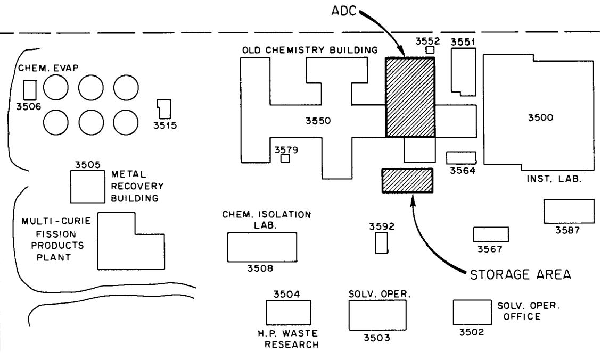  
NOTE: INCREASE SCALE AND SHOW TOPOGRAPHY AND UTILITIES

3500-3999

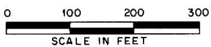

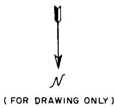  
Fig. 0-1. ADC Facility Site.

# 1.5. Security

No security clearance will be required for contractor's personnel, inasmuch as the construction area will be isolated from the X-10 security area by security fencing and provision will be made for free access to the construction area from a road open to public travel.

# 1.5.1. Exterior Doors

All exterior doors shall be of $1\frac{3}{4}$ -in. insulated metal construction. They shall have concealed hinges and pins or the approved security equivalent. All exterior swinging doors shall have panic hardware. All exterior doors, swinging and roll-up, shall be equipped with approved security eyelets. The roll-up door shall be operable from the interior of the building only.

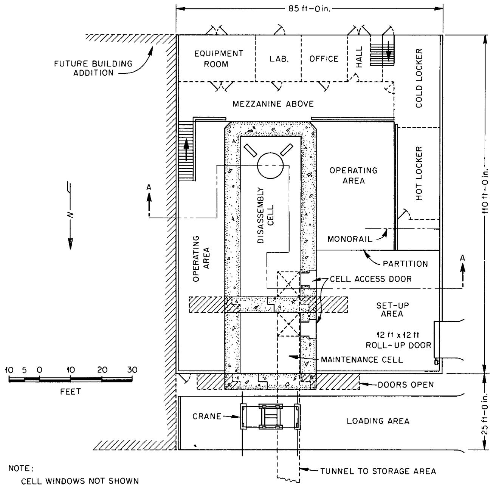  
Fig. 0-2. ADC Floor Plan.

# 1.5.2. Locks

All cylinders for locks and exit bolts shall be Best Universal Lock Company's $1\frac{5}{32}$ -in. cylinder bore, 7-pin core No. 1E74 or approved equivalent. Cores shall be uncombined. Cores and blank keys shall be supplied to ORNL for combining and cutting of keys. Panic hardware, locked type, to accommodate the above cylinder will be used where required.

# 1.5.3. Access to Underground Storage Facility

The underground storage facility is accessible via a tunnel from the ADC. A secondary entrance from ground level shall be provided and suitably shielded.

This entrance shall have a metal door equal to or stronger than the exterior doors for the ADC, with similar locks.

# 1.6. Special Studies To Be Made by the A-E

It is desired that the A-E study the building exhaust requirements and make recommendations as to the cost of erecting a new stock to elevation _______ or use an existing stock with necessary modifications. A study of a storage facility as outlined in Section 2.3.11 shall be made.

# 2. Description of Facility

# 2.1. General Description

The ADC shall be arranged generally as shown on Figs. 0-2 and 0-3. It shall be approximately 125 ft wide by 85 ft long by 36 ft high. Windows will be located in the offices only. Adjacent to the ADC will be an underground storage area for radioactive materials. A tunnel will connect the two buildings. Design of the underground storage should be such that it may be enlarged to serve the planned building addition.

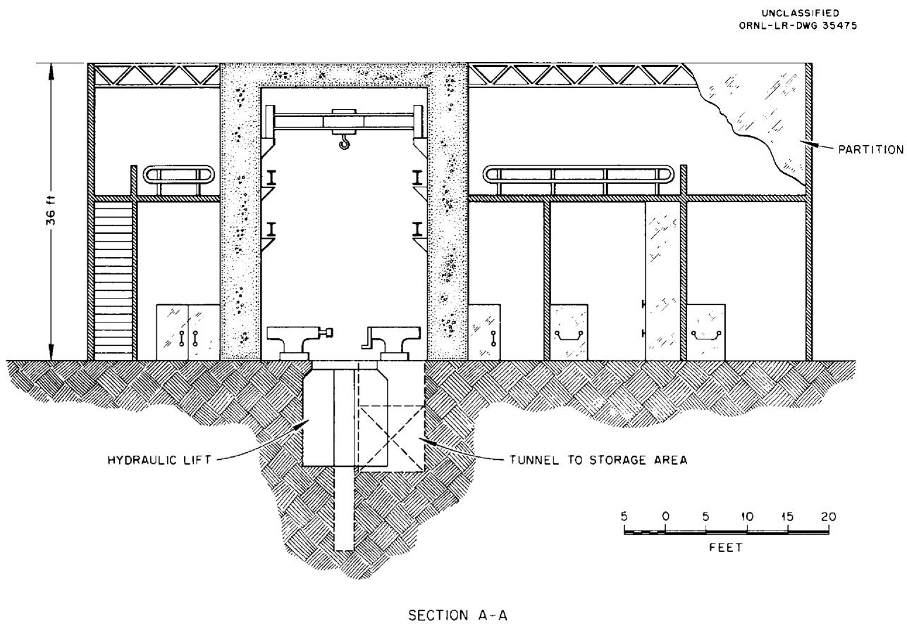  
Fig. 0-3. Sectional View of ADC Building.

# 2.1.1. Type of Building

The building shall be of structural framing with reinforced concrete floors, metal roof panels, built-up roof, and exterior walls of concrete block faced with brick to conform to the appearance of existing permanent laboratory buildings. One wall of the ADC shall not be brick faced but shall be designed with provision for the future additions. Building and construction shall be such that low level airborne contamination is contained and decontamination is facilitated.

# 2.1.2. Floor Plan

Figure 0-2 shows the proposed floor plan. The layout chosen is intended to show general area requirements and other operating features. Structural considerations, location of utilities, economy of layout, etc., may necessitate its revision.

# 2.1.3. Site Location

Figure 0-1 shows the site chosen for the ADC and the adjacent buildings. Locations of utility tie-in points are shown.

# 2.2. Building Areas Required

# 2.2.1. Unloading Area

An area is required in front of the cell sliding doors where large equipment trucked to the ADC can be unloaded and transported into the building. This area is in effect a truck unloading dock.

# 2.2.2. Set-Up Area

This area is a hot (possibly radioactively contaminated) area. It is the staging area where small tools and equipment to be placed in or removed from the cell are prepared. Personnel going into and out of the cells will operate from this area.

# 2.2.3. Personnel Decontamination Area

This is a locker room where contaminated clothing is removed. Personnel are required to wash any contaminated dust, etc., from their persons before leaving this area and entering the cold locker room.

# 2.2.4. Locker Room

A locker room where operating personnel can leave their clean clothing before entering the hot locker room and donning their coveralls is required. It will also provide toilet facilities for other personnel in the building.

# 2.2.5. Operating Area

This area is located adjacent to the cell. It is the working area from which the disassembly tools and manipulators will be operated during disassembly. All viewing of operations and measurements will be made from this area.

# 2.2.6. Office and Laboratory Area

The business of keeping track of the disassembly operation will be conducted here. Any work of a minor nature involving need for laboratory equipment will be handled in this area.

# 2.2.7. Mezzanine

Access to viewing windows at an upper elevation is necessary. Additional offices and storage space for health physics instruments, etc., are to be available at this level.

# 2.2.8. Building Service Equipment Area

It is intended that all service equipment such as air conditioning units, hot water heater, electrical cabinets, etc., be located in one single area separate from the rest of the areas.

# 2.2.9. Disassembly Cell

A cell is required where large equipment may be sectioned and examined to obtain engineering information. Due to the biological hazard the area where this is done must be heavily shielded. Special provision must also be made for ready decontamination.

# 2.2.10. Maintenance or Temporary Reactor Storage Cell

A cell is required where the equipment from the disassembly cell can be repaired while disassembly operations are still in progress. It will permit such maintenance without the necessity of decontaminating the large cell. Such an area, if adjacent to the disassembly cell, can also be used for temporary storage of large radioactive components when access is required to the main cell.

# 2.2.11. Storage Facility

As large radioactive components are disassembled, it is desirable to have some area where their parts may be safely stored. Since these parts will in turn be studied in great detail, it must be possible to withdraw specific ones from storage. This storage facility will be common to the ADC and the future building addition.

# 2.3. Requirements for Areas

# 2.3.1. Unloading Area

# 2.3.1.1. Dimensions

The unloading area will be an 18-ft roadbed passing in front of the sliding doors for the cell. It shall be depressed 6 in. below the level of the cell floor. This will tend to contain any spillage in this area.

# 2.3.1.2. Overhead Crane

A 30-ton crane shall extend out over the unloading area for use in unloading heavy components. Tracks for both O-man manipulators shall extend out over the unloading area farther than the crane so that the crane can be between the building and one of these manipulators when it picks up a load.

# 2.3.1.3. Contaminated Fluid Drain

A drain which connects to the contaminated fluid drainage system shall be provided in the unloading area. It shall be valved off and used only when decontamination of the unloading area is required.

# 2.3.1.4. Storm Drain

Because the unloading area is depressed below surrounding areas, a storm drain will be required. Provision shall be made for closing this drain during decontamination operations.

# 2.3.1.5. Load Requirements

The roadbed in this area must be suitable for heavy duty trucking. It should have a load capacity equal to the roads in the X-10 plant area.

# 2.3.2. Set-Up Area

# 2.3.2.1. Dimensions

This area should be approximately $40 \times 40$ ft. Ceiling height should be sufficient to permit set-up of portable lifts, etc., to load and unload light trucks. A ceiling height of approximately 20 ft is desirable.

# 2.3.2.2. Floor Load

The floor load in this area should be adequate to permit use of a $\frac{3}{4}$ -ton pick-up truck or a small fork lift.

# 2.3.2.3. Roll-Up Door

An exterior roll-up door is required to provide truck access to the set-up area. This door should be operable from the set-up area only, with an external buzzer or bell to request admittance.

# 2.3.2.4. Flooring and Painting

The floor in this area shall be concrete covered with a vinyl coating equivalent to Amercoat No. 33 applied as recommended by the manufacturer. Color scheme and paints for walls and ceiling shall conform to ORNL standards.

# 2.3.2.5. Access from Other Areas

Access to the set-up area will normally be through the hot locker room. The set-up area will be classed as a hot area since entrance into the cells will be from this area. The roll-up door will be used for access into this area only when special precautions have been taken.

# 2.3.2.6. Tool Decontamination Table and Sink

A mechanics' work table shall be provided in the area, with a sink at one end suitable for decontaminating small tools. This sink should connect into the contaminated fluid drain system. A contaminated fluid floor drain is required in this area.

# 2.3.2.7. Safety Shower

A safety shower is required in this area.

# 2.3.3. Personnel Decontamination Area

# 2.3.3.1. Access from Other Areas

This is the hot locker room. It shall connect with the setup area through a swinging door with a door closer. Connection from this room to the cold locker room shall be by means of a pass-through shower or a swinging door. The locker room should be sized to accommodate six men per shift on a three-shift basis.

# 2.3.3.2. Equipment and Hardware

The general types of equipment required in this area are shown on

Fig. O-4. Toilet hardware shall be brass, chrome plated, and all brackets, bolts, and screws shall be chrome plated.

UNCLASSIFIED

ORNL-LR-DWG 35476

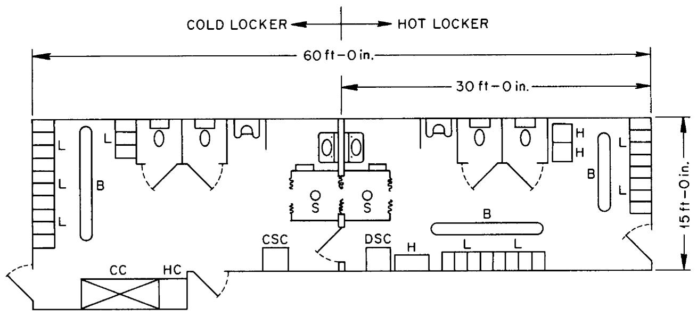

LEGEND

LOCKERS   
B BENCH   
CC CLEAN CLOTHES   
HC HAND AND FOOT COUNTER   
CSC CLEAN SHOE COVERS   
DSC DIRTY SHOE COVERS   
S   
H HAMPER

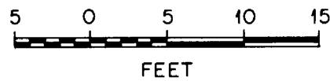

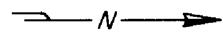  
Fig. 0-4. Locker Rooms.

2.3.3.3. Contaminated Fluid Drains

All drainage including floor drain, lavatory, and showers shall be to the contaminated drain system. The toilets shall drain to the sanitary drain system.

2.3.3.4. Flooring and Painting

The floor in this area shall be concrete covered with a vinyl coating equivalent to Amercoat No. 33 applied as recommended by the manufacturer. Color scheme and materials for walls and ceiling shall conform to ORNL standards.

2.3.3.5. Floor Load

Floor load in this area shall be normal for this type of service.

2.3.4. Locker Room

2.3.4.1. Design Operating Crew

The locker room should be sized on the basis of six men per shift on a three-shift basis. Two additional people will normally be in the building on the day shift.

2.3.4.2. Access from Other Areas

The cold locker room shall be accessible from the hot locker room by means of a pass-through shower. A swinging door with door closer shall be the access to the operating area. If convenient, access to the locker room is desirable from the street.

2.3.4.3. Equipment and Hardware

The general types of equipment required in this area are shown on Fig. 0-4. Toilet hardware shall be brass, chrome plated, and all brackets, bolts, and screws shall be chrome plated.

2.3.4.4. Flooring and Painting

The floor in the locker room shall be steel troweled concrete finished with hardener. The paint shall be consistent with ORNL standards as to color and type.

2.3.4.5. Floor Load

The floor load shall be standard for this type of area.

2.3.5. Operating Area

2.3.5.1. Access from Other Areas

The operating area shall be accessible from the laboratory, offices, building service equipment room, locker room, and the street.

Emergency exits shall be provided from this area where required.

2.3.5.2. Janitors' Closet

A janitor's closet with sink is required either in this area or in the locker room. The space under the stairs to the mezzanine would be an acceptable location.

2.3.5.3. Stairway to Mezzanine It is desired that access to the mezzanine be provided by a staircase leading from the operating area.   
2.3.5.4. Flooring and Painting The flooring in the operating area shall be grease-proof asphalt tile equivalent to Kentile. Walls and ceiling shall be painted in accordance with ORNL standards; however, special effort shall be made to use flat paints which will minimize reflection.   
2.3.5.5. Floor Load The floor load in this area shall be standard for halls where large numbers of people may congregate.

2.3.6. Office and Laboratory Area

2.3.6.1. Access from Other Areas Access to the office and labs shall be from the operating area or the street, depending upon location.   
2.3.6.2. Office Equipment All desks, chairs, and other office equipment will be supplied by ORNL.   
2.3.6.3. Laboratory Equipment The laboratory shall be equipped with a laboratory table with a hood at one end and a sink at the other end. This shall be an acid sink and for this reason should drain into the contaminated fluid drainage system. Provision shall be made for installing bottled gas near the table.   
2.3.6.4. Dimensions The office shall be sized to accommodate two desks, file drawers, etc. The laboratory should accommodate a desk and storage cabinets as well as the work table.   
2.3.6.5. Flooring and Painting These areas shall have grease-proof asphalt tile with walls and ceilings painted to conform to ORNL standards.   
2.3.6.6. Partitions Room division shall be accomplished with movable metal partitions similar to those manufactured by the Mills Co.

2.3.7. Mezzanine

2.3.7.1. Access from Other Areas Access to the mezzanine shall be by staircase from the operating area. A secondary means of egress shall be provided in case of emergency.

2.3.7.2. Rooms

Rooms on the mezzanine shall be sized and provided with fixtures so that they may be readily usable for office space.

2.3.7.3. Floor Loading

The floor of the mezzanine shall be designed to permit storage of light equipment or assembly of groups of approximately 15 people.

2.3.7.4 Flooring and Painting

Flooring and painting in this area shall be similar to that used in the office and laboratory area.

2.3.7.5. Partitions

Room division shall be accomplished with movable metal partitions similar to those manufactured by the Mills Co.

2.3.8. Building Service Equipment Area

2.3.8.1. Access from Other Areas

This area shall be accessible from the operating area or from the street. The street access shall be sufficiently large to permit installation or removal of equipment in this area.

2.3.8.2. Equipment

It is desirable to have all of the building service equipment located in a single place. It is expected that the building air conditioning, hot water heater, lighting and power panels, etc., will be located here.

2.3.8.3. Floor Loading

The floor in this area shall be designed for the heavy loads of the equipment located in it.

2.3.8.4. Floor Drain

A floor drain shall be provided in this area to which any drainage from the equipment can be directed. This drain should tie into the building storm drain system.

2.3.8.5. Flooring and Painting

The floor in this area will be steel troweled concrete, hardened. Painting of walls and ceiling shall conform to ORNL standards.

2.3.9. Disassembly Cell

2.3.9.1. Dimensions

The approximate inside dimensions of the disassembly cell (Fig. O-5) shall be 52 ft long by 20 ft wide by 34 ft high. The shielding walls shall be $4\frac{1}{2}$ -ft-thick high-density concrete of at least 230 pounds per cubic foot. The roof shall be 2-ft-thick high-density concrete.

UNCLASSIFIED

ORNL-LR-DWG 35477

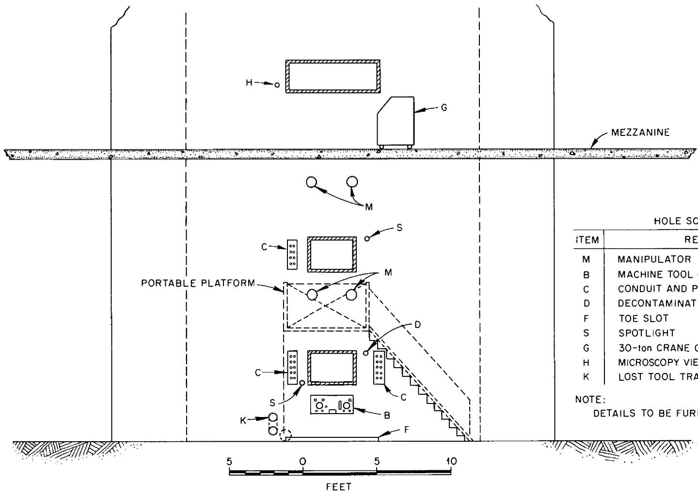  
Fig. 0-5. Cell, South Elevation.

HOLE SCHEDULE   

<table><tr><td>ITEM</td><td>REMARKS</td></tr><tr><td>M</td><td>MANIPULATOR</td></tr><tr><td>B</td><td>MACHINE TOOL CONTROLS</td></tr><tr><td>C</td><td>CONDUIT AND PIPE, SLEEVE PANEL</td></tr><tr><td>D</td><td>DECONTAMINATION NOZZLE CONNECTION</td></tr><tr><td>F</td><td>TOE SLOT</td></tr><tr><td>S</td><td>SPOTLIGHT</td></tr><tr><td>G</td><td>30-ton CRANE CONTROL</td></tr><tr><td>H</td><td>MICROSCOPY VIEWING PORT</td></tr><tr><td>K</td><td>LOST TOOL TRANSFER</td></tr></table>

NOTE: DETAILS TO BE FURNISHED BY ABBE

# 2.3.9.2. Cell Liner

The interior surface of the shielding wall and floor shall be lined with stainless steel to facilitate decontamination operations.

# 2.3.9.3. Viewing Windows

The shielded viewing windows shall be approximately $3 \times 4$ ft (viewing area on operating side), glass with oil laminations or zinc bromide tanks. They shall be the tapered type and be sized by the A-E for maximum vision to all parts of the cells. The A-E shall investigate the possibility of using a "package" window as manufactured by Corning Glass Works, or approved equivalent. The shield wall surrounding the windows shall be high-density solid concrete blocks suitably installed to permit easy revisions to hole size and placement in these areas.

# 2.3.9.4. Bridge Crane

A 30-ton bridge crane shall be provided in the disassembly cell. The tracks for the crane shall extend from the disassembly cell, through the maintenance cell, and out over the unloading area. Crane rails shall pivot out of the way where the crane passes through the large doors. Slow travel and hoisting by the crane are desirable to permit accurate positioning of equipment. The maximum hook to floor clearance shall be 26 ft. The lift of the hook shall be from 3 ft above the floor of the lowest pit to at least 26 ft above the cell floor. Controls for the crane shall be located in the operating area. Provision shall be made for quickly attaching and detaching a pendant control with which the crane may be operated from the cell floor.

# 2.3.9.5. Wash Down Facilities

A spray system shall be installed in the hot cell rooms which will handle detergent and hot or cold water for decontaminating purposes. The system shall be supplied from a pump and tank. The cellRooms are to be individually valved. Consideration should be given to the use of dilute nitric acid (approx. $6\%$ ) in this system.

# 2.3.9.6. Large Shielding Doors

The wall between the disassembly cell and the maintenance cell shall be movable. Split type doors are preferred consisting of $4\frac{1}{2}$ ft of high-density concrete covered with a stainless steel skin. The doors shall be motor operated with controls located in the operating area. Where necessary, an air seal shall be provided between the cell and the operating area.

# 2.3.9.7. O-Man Tracks

Two sets of tracks suitable for O-man manipulators shall be provided in the cell. These tracks shall be located to permit the manipulators to pass the crane and each other.

# 2.3.9.8. Manipulator Holes

There shall be two holes above each viewing window for manipulators. The holes shall be sized and spaced for the Argonne Model 8 type manipulators.

# 2.3.9.9. Lost Tool Transfer Scheme

There shall be incorporated in the design of hot cell rooms a device with appropriate shielding which will allow an operator to transfer small objects into and out of the hot cell rooms after the rooms are radioactive. This system shall be designed and located so that contamination is confined to the cell rooms or is otherwise controlled. Maximum dimension of objects to be transferred are 6 in. dia. by 18 in. long. Transfer devices, if mechanized, shall also be manually operable from operating area side.

# 2.3.9.10. Access Door

A suitably shielded door shall be provided to permit entrance into the cell from the set-up area. The door shall be mechanized or counter-weighted in such a way that one man may move it. The penetration of the cell liner shall be developed by the A-E. A hole $4 \times 5$ ft is suggested.

# 2.3.9.11. Contaminated Fluid Drain

Four contaminated fluid drains shall be provided in the cell and shall tie into the contaminated fluid drain system. These drains should each have a closure which can be actuated from the operating area. One of these drains shall be located in the bottom of the elevator pit.

# 2.3.9.12. Wall Inserts

Stiffeners shall be attached to the outer surface of the cell liner at suitable spacing to permit attachment of shelves and storage racks for instruments, tools, gages, etc. These stiffeners may be attached to the concrete, but relative expansion problems should be studied to prevent buckling the cell liner.

# 2.3.9.13. Microscopy Viewing Posts

There shall be installed in the disassembly area two microscopy viewing portholes, size and positioning of holes to be furnished by ORNL.

2.3.9.14. Transfer Hatch to Storage Area and Cover

There shall be a transfer system from the disassembly cell to an underground storage area as shown on Figs. 0-2, 0-3, and 0-6. This system shall be designed to allow specimens to be lowered from the crane or a manipulator onto a mechanized dolly in an underground tunnel. The dolly shall run on tracks and be controlled remotely. When the dolly is in position under the hot cell hatch, specimens may be lifted out with manipulators. The hatchway shall have an $8 \times 8$ -ft cover which shall be motor driven and controlled from the operating area. This is not a shielding cover but an air seal.

2.3.9.15. Floor Loading

The floor in the disassembly area shall be designed for a possible maximum uniform load of 3000 pounds per square foot. However, foundation pads capable of carrying the tool equipment loads plus working loads shall be provided where fixed tools will be installed as indicated on Figs. 0-2 and 0-3.

2.3.9.16. Elevator Pit and Plug

A hydraulic lift will be located in a pit in the cell as shown on Figs. 0-2 and 0-3. A shielding plug for the pit (thickness by ORNL) shall be provided and provision made for storing it within one of the cells. Design should permit the 30-ton crane to pick the plug up and cover the pit when the lift is depressed. Pit design shall facilitate maintenance and decontamination.

2.3.9.17. Parts Decontamination

Parts will be decontaminated where indicated on Fig. 0-2; therefore the floor shall be sloped in this area to a contaminated fluid drain.

2.3.10. Maintenance of Temporary Reactor Storage Cell

2.3.10.1. Dimensions

This cell will have one wall common to the disassembly cell and will be approximately 20 ft wide by 20 ft long by 34 ft high. The shielding walls shall be high-density concrete, at least 230 pounds per cubic foot, $4\frac{1}{2}$ ft thick.

2.3.10.2. Cell Liner

The interior of this cell shall be lined with stainless steel as in the disassembly cell.

2.3.10.3. Viewing Windows

The viewing windows in this cell shall be similar to those in the dis-assembly cell.

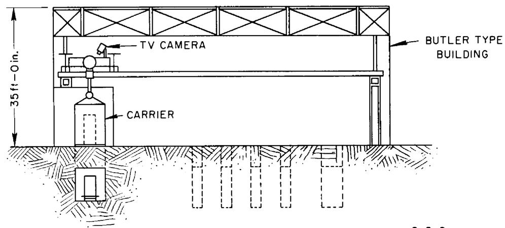  
ELEVATION

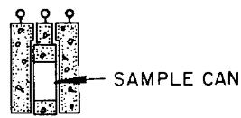  
CARRIER DETAIL

Fig. 0-6. Storage Area.   
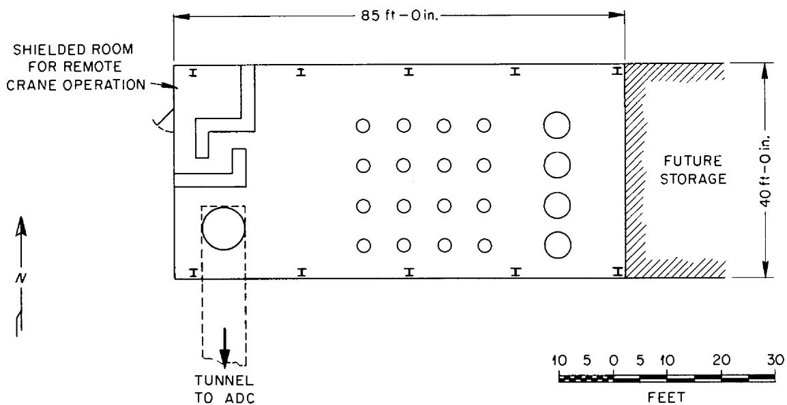  
NOTE:   
OPERATING EXPERIENCE MAY DEMONSTRATE  
THAT REMOTE OPERATION OF CRANE IS  
NOT NECESSARY.

PLAN

2.3.10.4. Bridge Crane

The same 30-ton crane which serves the disassembly cell will serve this cell. Where the crane passes through a large shielding door it must be possible to separate the track and pivot it out of the way to permit the door to close.

2.3.10.5. Wash Down Facilities

This system should be the same as that in the disassembly cell.

2.3.10.6. Large Shielding Doors

The maintenance cell shall have motor operated split doors at each end, one pair in common with the disassembly cell and the other pair opening to the loading area. Both doors shall be motorized and controlled from the operating area.

2.3.10.7. O-Man Tracks

The manipulator tracks will pass through this cell and will have to be handled in the same manner as the crane tracks where door interference will be encountered.

2.3.10.8. Manipulator Holes

Requirements are the same as in the disassembly cell.

2.3.10.9. Access Door

An access plug and door in the cell liner shall be provided giving access from the set-up area into the cell. A hole $4 \times 5$ ft is suggested. The requirements are the same as for the access door into the dis-assembly cell.

2.3.10.10. Contaminated Fluid Drain

At least two such drains shall be located in the maintenance cell. These drains should each have a closure which can be actuated from the operating area.

2.3.10.11. Wall Inserts

Requirements are the same as in the disassembly cell.

2.3.10.12. Floor Loading

The floor of the cell shall be designed for a maximum uniform loading of 3000 pounds per square foot.

# 2.3.11. Storage Facility

2.3.11.1. Location and Dimensions

The storage facility shall be located as near to the ADC as construction and shielding will permit. This will reduce the cost of extending the tunnel and utilities into the storage area. Location of the storage area shall permit extension of the building at some future

date. The storage area shall be planned to accommodate thirty-six 3 ft dia by 6 ft high drums and six 5 ft dia by 6 ft high drums. These drums must be positioned remotely, so area for this handling equipment will be required.   
2.3.11.2. The storage facility shielding will be determined by ORNL, but for preliminary studies 5 ft of high-density concrete or its shielding equivalent shall be assumed for personnel protection.   
2.3.11.3. Mechanization Because of the biological hazard from the stored materials, the storage facility shall be completely mechanized for remote handling. ORNL intends to propose a number of acceptable methods and request the A-E to study these methods from a design and cost standpoint and make recommendations. Prime considerations in evaluating these methods shall be simplicity, reliability, ease of maintenance, safety, minimum cost, and possibilities for increasing the storage capacity.   
2.3.11.4. Provisions for Additions It is definitely expected that the storage facility will have to be increased. The design and layout shall be such that this expansion of the facilities can be accomplished without seriously interfering with the operation of the existing storage. Any expansion of the facilities shall also be possible without exposing construction personnel to radiation hazards.   
2.3.11.5. Floor Loading The floor loading in the storage area shall be no less than that in the cells but may be any higher loading which might be necessitated by the method of storage chosen.   
2.3.11.6. Painting The storage facility interiors shall be painted with an acid resistant paint equivalent to Amercoat No. 33 applied as recommended by the manufacturer. This paint shall be used for all areas upon which contaminated materials may be spilled or dropped.   
2.3.11.7. Contaminated Fluid Drain The entire storage facility shall be provided with adequate floor drains which tie into the contaminated liquid drainage system for the area.   
2.3.11.8. Storage Methods Engineering studies shall be conducted by the A-E to evaluate the following methods of storage on the basis of simplicity, reliability, ease of maintenance, safety, minimum cost, and possibility for increasing storage capacity.

1. Storage in a Large Shielded Room

Cans stored in a single room; light overhead crane, remotely operated; no shielding between cans; operator outside looking through shielding window; method for crane removal and repair.

2. Plug Storage

Cans stored in holes in ground with shield plugs; cans separated from one another and shielded to make radiation from can being handled the main problem; shielded carrier, cans can be remotely drawn up into it like inverted tumbler; heavy crane, remotely operated; light building which can be held at a slightly negative pressure.

3. Underwater Storage

Water for shielding; method for pressurizing cans with inert gas and sinking under water in single large pool; light crane; water treatment scheme.

4. Conveyor Belt

Heavy shielding; conveyor hooks carrying cans on circular or elongated system; conveyor mechanism readily accessible; cans in a common tunnel not shielded from one another.

2.4. Building Utilities

2.4.1. Heating

The heating system for the ADC shall be steam to be supplied from an existing central steam plant. The A-E shall design the temperatures for the various areas in accordance with good engineering practice. There shall be no temperature or humidity control in the cell. The remainder of the building shall be air conditioned.

2.4.1.1. Combination with Air Conditioner

With the entire building air conditioned it appears desirable to provide the air conditioning unit with a steam coil and in this way heat the building.

2.4.2. Lighting

2.4.2.1. Lighting Requirements by Areas

1. Entrance Doors

Incandescent industrial type fixtures, reflector type units, heavy duty, weatherproof, located above doors and switched locally.

Red incandescent exit fixtures shall be located above doors where applicable in complying with fire and safety codes, no local switching.

2. Stair Well

Incandescent, 10 foot-candles, locally switched.

3. Safety Shower

Green incandescent, no local switching.

4. Grounds

Incandescent, conforming to security and ORNL standards as to type and intensity.

5. Set-Up Area

Fluorescent or incandescent, vapor tight, 50 foot-candles, switched at panels.

6. Hot and Cold Locker Rooms

Incandescent, industrial type diffusing fixtures, switched at doors, vapor proof in hot locker room, 20 foot-candles.

7. Offices and Laboratory Area

Fluorescent, commercial office diffusing type, symmetrical arrangement, switched at doors, 40 foot-candles.

8. Operating Area

Incandescent or fluorescent, industrial type diffusing fixtures, 50 foot-candles, switched at panels. Special emphasis on the area immediately in front of the windows.

9. Equipment Room

Incandescent, industrial type diffusing fixtures, symmetrical arrangement, switched at door, 30 foot-candles.

10. Disassembly and Maintenance Cells

Incandescent and sodium vapor, industrial type diffusing fixtures, vapor proof, panel switched, 300 foot-candles total. In addition, a mercury arc spotlight shall be provided at each window. Special emphasis shall be placed upon making the lamps in this area readily replaceable.

2.4.2.2. Emergency Lighting

An emergency lighting system is to be provided to supply low level lighting in cells, stairs, exits, and other critical areas.

2.4.3. Ventilation and Air Conditioning

2.4.3.1. Basic Philosophy

It is intended that the flow of air leakage resulting from the pressure levels within the building should be into the building and, within the building, from uncontaminated areas to areas of higher contamination. In this way, the spread of air-borne contamination to cold areas should be minimized. Temperature levels should be maintained such

that operators performing difficult disassembly operations with manipulators will be in a comfortable environment.

# 2.4.3.2. Design Conditions

Areas other than the cells shall have approximately seven air changes per hour, with the air migrating to the cell area. The hot cells shall have approximately twenty air changes per hour and be at a greater negative pressure than any other areas in the ADC. All of this air shall be cleaned and exhausted to the atmosphere through a stack. The A-E shall determine whether a new stack will be required or whether an existing stack can be utilized. The cells shall be maintained under a negative pressure at all times to prevent radioactive particles from migrating to colder areas. When the cell doors are opened, an indraft shall result through the openings which prevents radioactive particles from migrating to colder areas. The A-E shall locate the filters in the cells for easy replacement with manipulators.

Cell ventilation shall be separately controlled so that it can be shut off, if desired, without affecting the ventilation of the remainder of the building. Downdraft ventilation is desirable in the cells. No temperature or humidity control is required for the cells. The remaining areas shall be maintained at $78^{\circ}\mathrm{F}$ , $50\%$ relative humidity with control in accordance with good engineering practice.

# 2.4.3.3. Special Filter Considerations

No filters shall be used which are not of a replaceable type. All filter installations should feature ease of replacement in the event air-borne contamination deposits material with an appreciable activity in the filters. Building occupancy and operations will be discussed with the A-E.

# 2.4.4. Electrical Facilities

# 2.4.4.1. Building Service Entrance

The building power transformer or tie-in to existing lines shall supply 480-volt 3-phase 60-cycle power to the ADC. The A-E will size this equipment to accommodate a $25\%$ future load increase in the ADC.

# 2.4.4.2. Interior Distribution

A new 480-volt 3-phase load center shall be installed in the ADC. Feeders shall radiate from this load center to individual 480-208/120-volt 3-phase transformers where lower voltages are required. Load centers and breaker panels shall be sized to accommodate a $25\%$ future load increase.

2.4.4.3. Conduit

Conduit to accommodate wiring shall be run to all permanently located equipment and shall be embedded in floors, ceilings, or walls, whichever is the most feasible. Conduit shall be installed for wiring to all outlets for lights, receptacles, transformer locations, etc. Approximately six conduit sleeves shall be installed in the cell walls at each viewing window. ORNL will provide layouts showing size and positions for conduits.

2.4.4. Grounding

An adequate grounding system shall be extended throughout the facility for equipment and building grounding.

2.4.4.5. Receptacles for Areas

The A-E shall specify receptacles in areas as functionally required. ORNL will provide information on receptacles required for operations functions.

2.4.4.6. Emergency Power Requirements

An emergency power supply shall be provided. This will power the emergency lighting system. In addition, 120-volt a-c single-phase emergency power receptacles are required in both cells, in the set-up area, and in the equipment room.

2.4.4.7. Motors

Motors above $\frac{1}{2}$ horsepower shall be rated at 480 volts, 3 phase, wherever possible.

2.4.5. Water

2.4.5.1. Distribution

All water to the building will be from the plant sanitary water system. It will be distributed in the facility to sinks, equipment, fountains, etc., as required. Drainage will be to the sanitary drain system except where otherwise specified.

2.4.6. Communications

2.4.6.1. Intercoms for Areas

A complete intercommunication system shall be provided which permits contact between all areas except the equipment room and locker rooms.

2.4.6.2. Commercial Telephone

Provision shall be made for extension of the existing commercial telephone system into the ADC. Phones will be installed in all offices and laboratories, the operating area, and the set-up area.

Wiring installed shall permit addition of phones if offices are added on the mezzanine.

# 2.4.7. Sanitary Drainage

Sanitary waste lines from the ADC shall tie into the existing waste system for ORNL.

# 2.4.8. Storm Drains

# 2.4.8.1. Roof Drains

Roof drainage shall be provided and connected to existing area storm drains.

# 2.4.8.2. Unloading Area Drains

Because the unloading area is depressed below the surrounding ground level, a storm drain which can be closed off shall be provided which connects into the storm drain system.

# 2.4.8.3. Building and Tunnel Drainage

Adequate drainage for all underground construction such as foundations, tunnels, etc., shall be provided.

# 2.4.9. Contaminated Fluid Drainage

# 2.4.9.1. Requirements

Where drains for radioactively contaminated fluid are specified, they shall connect into a drain system which ties into a holding drum. Flow from this tank will be regulated at a preset value, and discharge will be to the existing ORNL contaminated waste disposal tank system.

# 2.4.9.2. Shielding Requirements

ORNL will supply the shielding criteria for this system. Piping materials shall be chosen to withstand dilute nitric acid solutions (6%).

# 2.4.10. Compressed Air

# 2.4.10.1. Requirements

A connection shall be made with existing plant compressed air lines or a compressor provided. Lines for 90 psig air shall be provided in both cells, the set-up area, and the unloading area.

# 2.4.11. Utilities Identification

All utilities in the buildings shall be clearly labeled. The standard laboratory color scheme shall be followed in painting, and self-adhesive labels such as the Quik-Label manufactured by the W. H. Brady Company or an approved equal shall be specified.

# 2.5. Alteration, Removal, or Relocating of Existing Building or Equipment

Any existing equipment such as piping, manholes, drain ditches, fire hydrants, etc., which the A-E may find necessary to alter, remove, or relocate for the ADC shall be subject to approval from ORNL. A building now exists on the site planned for the ADC.

The A-E shall study removal of designated portions of this building which can be vacated at an earlier date than others. This study should include necessary protection for portions of the building left standing. The necessary construction consequences of this restriction should be presented for ORNL evaluation.

# 2.6. Special Supporting Services

# 2.6.1. Vacuum Cleaning System

A manifold vacuum clean-up system shall be installed to service the cell rooms and set-up area. There shall be at least five connections in the disassembly area. The facility maintenance area and set-up area shall have two connections. This system shall have not less than 60 inches w.g. vacuum at each of the individual connections and adequate flow for dust pick-up when it is assumed that three connections may be in use at one time. All particulate matter in the cell rooms shall be removed by a bag and filter located in each room for ease of disposal. The discharge header for the vacuum system shall terminate into the stack.

# 2.6.2. High Vacuum System

A manifold high velocity vacuum system having four connections shall be installed to service the disassembly cell and maintenance cell, two connections per cell, for removal of cutting tool chips. The pump for this vacuum system shall be specified by the A-E.

# 2.6.3. Radiation Detection

A radiation detection system shall be provided to measure levels in certain areas. A hand and foot counter will be required in the cold locker room. Other requirements of this system will be specified by ORNL.

# 2.6.4. Fire Alarm System

A Gamewell or approved equal fire alarm system shall be provided for the buildings. A smoke detection system shall be provided for the storage facility and in the cell exhaust ducts.

# 2.6.5. Cell Decontamination System

A spray system shall be installed in the hot cell rooms which will handle detergent, dilute nitric acid (6%), and hot or cold water for decontaminating purposes. System design shall permit washing down either cell independently.

# 2.6.6. Service Roads

Service road construction shall be governed by AEC design standards except as modified for increased vehicular wheel loads. Roads shall be consistent with existing heavy duty ORNL roads in the vicinity of the ADC.

# 2.6.7. Container for Contaminatedtrash

Provision shall be made to place a Dempster Dumpster type container near the ADC. This container will be provided by ORNL, but a space allocation with road access shall be provided by the A-E.

# 2.7. ORNL Furnished Equipment

# 2.7.1. A-E Specified

The A-E will be expected to specify all equipment required for completion of the building and placing it in operational readiness. This includes such items as cranes, viewing windows, air conditioner, etc. Any equipment so specified which cannot, in the A-E's opinion, be obtained by the contractor before June 1, 1958, shall be procured by ORNL for installation at a later date by others.

# 2.7.2. ORNL Specified

A list of equipment to be supplied by ORNL will be provided to the A-E along with dates when the items will be available for installation. Equipment such as manipulators, tools, furniture, instruments, etc., will be in this category.

# APPENDIX P. SITE INVESTIGATIONS - REACTOR ENGINEERING HOT CELL FACILITIES1,2

A survey has been made of the Bethel Valley and Melton Valley areas for a suitable site location for the Reactor Engineering Hot Cell Facility (REHCF). Findings of this study and recommendations by the survey team are reported below and on the attached tabulation and drawing. This study was made by Mr. S. E. Dismuke of the Solid State Division and the writer of ARED with the helpful aid of Mr. C. M. Carter of the Engineering and Mechanical Division's Civil Engineering Section and Mr. W. E. Thompson of the Buget Office. The information and recommendations presented herein were reviewed in the Reactor Disassembly Planning Meeting on October 3, 1956, and this letter is being submitted with the endorsement of and at the instruction of that meeting.

Assuming that the final plans will require an area approximately as indicated by the sketches included in the recent proposal3 to the AEC, the search was for a site that would ultimately accommodate a facility approximately 190 ft by 320 ft or 60,800 sq ft, plus allowances for contractor working and storage space. On a three phase construction basis, the gross area requirement would be about (1) 60,000 sq ft by July 1, 1957, (2) 70,600 sq ft by July 1, 1958, and 85,800 sq ft at such time that construction of the 20 “future” cells should be started. In addition to space, the locations were studied with respect to utilities, services, center of reactor installations, center of hot cell operations, public roads, stack installations, soil conditions, accessibility from 7500 area, contractor accessibility, current use of space, and planned future use of the space.

Table P-1 lists findings for the eleven most promising sites studied. The approximate location of each site is shown on Fig. P-1. A summary of advantages and disadvantages for each site, along with recommendations, is given below. You will note that Sites 4, 8, and 11 are recommended as suitable locations for the Reactor Engineering Hot Cell Facility.

Site 1-7500 area

Advantage: Adjacent to Bldg. 7503

Disadvantage: Remote from center of Laboratory operations, hot cell personnel, and services; remote from hot waste drain system; on semipublic road; outside ORNL security fence; if required, a discharge stack would have to be constructed

Recommendation: Not recommended for REHCF

Site 2 - 1500 area

Advantage: Readily available construction space

Table P-1. Site Investigations: Reactor Engineering Hot Cell Facility (REHCF)   

<table><tr><td>Criteria Item</td><td>Site 1</td><td>Site 2</td><td>Site 3</td><td>Site 4</td><td>Site 5</td><td>Site 6</td></tr><tr><td>A. Site location</td><td>7500 area(300 ft E of 7503 on 7500 Road)</td><td>1500 area(600 ft S of 1000 Bldg. on 1st St.)</td><td>2500 area(500 ft SW of Steam Bldg. on 1st St.)</td><td>3500 area(present site of 3550 Bldg. on Central Ave.)</td><td>3000 area(present site of 3026 Bldg. on Central Ave.)</td><td>3000 area(150 ft W of 13,8 kv substa-tion on Bethel Valley Rd.)</td></tr><tr><td>B. Requirements to make area available</td><td>Clear land of timber</td><td>N. R.</td><td>N. R.</td><td>Relocate offices and labs of 4 divisional groups; roze Bldg. 3550</td><td>Relocate lab. function; raze Bldg. 3026</td><td>N. R.</td></tr><tr><td>C. Area possibly available 7/1/57:</td><td></td><td></td><td></td><td></td><td></td><td></td></tr><tr><td>Dimensions</td><td>400 × 500 ft</td><td>400 × 600 ft</td><td>200 × 500 ft</td><td>250 × 400 ft</td><td>150 × 250 ft</td><td>300 × 300 ft</td></tr><tr><td>Area</td><td>200,000 ft2</td><td>240,000 ft2</td><td>100,000 ft2</td><td>100,000 ft2</td><td>37,500 ft2</td><td>90,000 ft2</td></tr><tr><td>Sufficient?</td><td>Yes</td><td>Yes</td><td>Yes</td><td>Yes</td><td>No</td><td>Yes</td></tr><tr><td>D. Area possibly available after 7/1/57:</td><td></td><td></td><td></td><td></td><td></td><td></td></tr><tr><td>Dimensions</td><td>400 × 500 ft</td><td>400 × 600 ft</td><td>200 × 500 ft</td><td>250 × 400 ft</td><td>150 × 250 ft</td><td>300 × 300 ft</td></tr><tr><td>Area</td><td>200,000 ft2</td><td>240,00o ft2</td><td>100,000 ft2</td><td>100,000 ft2</td><td>37,500 ft2</td><td>90,000 ft2</td></tr><tr><td>Sufficient?</td><td>Yes</td><td>Yes</td><td>Yes</td><td>Yes</td><td>No</td><td>Yes</td></tr><tr><td>E. Is the site:</td><td></td><td></td><td></td><td></td><td></td><td></td></tr><tr><td>1. within ORNL security area?</td><td>No</td><td>No</td><td>Yes</td><td>Yes</td><td>Yes</td><td>Yes</td></tr><tr><td>2. near heavy-duty road to 7503?</td><td>Yes</td><td>Yes</td><td>Yes</td><td>Yes</td><td>Yes</td><td>Yes</td></tr><tr><td>3. away from public or semipublic road?</td><td>No</td><td>No</td><td>No</td><td>Yes</td><td>Yes</td><td>No</td></tr><tr><td>4. near Lab. area reactor installations?</td><td>No</td><td>No</td><td>No</td><td>Yes</td><td>Yes</td><td>Yes</td></tr><tr><td>5. near present Solid State Bldg.?</td><td>No</td><td>No</td><td>No</td><td>Yes</td><td>Yes</td><td>No</td></tr><tr><td>6. near power service?</td><td>Yes</td><td>Yes</td><td>Yes</td><td>Yes</td><td>Yes</td><td>Yes</td></tr><tr><td>7. near potable water service?</td><td>Yes</td><td>Yes</td><td>Yes</td><td>Yes</td><td>Yes</td><td>Yes</td></tr><tr><td>8. near steam and air service?</td><td>Yes</td><td>Yes</td><td>Yes</td><td>Yes</td><td>Yes</td><td>Yes</td></tr><tr><td>9. near natural gas service?</td><td>No</td><td>Yes</td><td>Yes</td><td>Yes</td><td>Yes</td><td>Yes</td></tr><tr><td>10. near sanitary sewer?</td><td>No</td><td>Yes</td><td>Yes</td><td>Yes</td><td>Yes</td><td>No</td></tr><tr><td>11. near process sewer?</td><td>No</td><td>No</td><td>No</td><td>Yes</td><td>Yes</td><td>No</td></tr><tr><td>12. near hot waste drain?</td><td>No</td><td>No</td><td>No</td><td>Yes</td><td>Yes</td><td>No</td></tr><tr><td>13. near process water?</td><td>No</td><td>Yes</td><td>Yes</td><td>Yes</td><td>Yes</td><td>Yes</td></tr><tr><td>14. near existing stack?</td><td>No</td><td>No</td><td>No</td><td>Yes</td><td>Yes</td><td>Yes</td></tr><tr><td>15. near available stock?</td><td>No</td><td>No</td><td>No</td><td>Doubtful</td><td>Doubtful</td><td>Yes</td></tr><tr><td>16. near feasible stack construction site?</td><td>Yes</td><td>No</td><td>Doubtful</td><td>Yes</td><td>Doubtful</td><td>N. R.</td></tr><tr><td>17. easily accessible for contractor?</td><td>Yes</td><td>Yes</td><td>Yes</td><td>Yes</td><td>Doubtful</td><td>Yes</td></tr><tr><td>F. Is underground storage and transfer facility feasible?</td><td>Yes</td><td>Yes</td><td>Yes</td><td>Yes</td><td>Doubtful</td><td>Yes</td></tr><tr><td>G. Are terrain, soil, and subsoil suitable?</td><td>Yes</td><td>Yes</td><td>Yes</td><td>Yes</td><td>Doubtful</td><td>Doubtful</td></tr><tr><td>H. General site rating: composite evaluation</td><td>Fair</td><td>Fair</td><td>Fair</td><td>Good</td><td>Poor</td><td>Fair</td></tr></table>

Table P-1 (continued)   

<table><tr><td>Criteria Item</td><td>Site 7</td><td>Site 8</td><td>Site 9</td><td>Site 10</td><td>Site 11</td></tr><tr><td>A. Site location</td><td>5500 area(500 ft E of4500 Bldg.)</td><td>2000 area(immediately W of oldsteam plant, Bldg. 2011)</td><td>2500 area(present site of Bldg.2506)</td><td>3000 area(present site of Bldg. 3022)</td><td>4000 area(north of 4500 and4501 Bldgs.)</td></tr><tr><td>B. Requirements to make area available</td><td>N. R.</td><td>Relocate 2018 shop; re-locate 2012 H.P. lab;relocate 2011 Liq. Met,lab.; raze vacated bldgs.</td><td>Relocate pymaster andstoreroom; raze bldg.</td><td>Relocate E &amp; M Div. officesand dwg. rooms; raze bldg.</td><td>N. R.</td></tr><tr><td colspan="6">C. Area possibly available 7/1/57:</td></tr><tr><td>Dimensions</td><td>300 × 400 ft</td><td>190 × 290 ft</td><td>200 × 275 ft</td><td>100 × 300 ft</td><td>200 × 500 ft</td></tr><tr><td>Area</td><td>120,000 ft2</td><td>55,000 ft2</td><td>55,000 ft2</td><td>30,000 ft2</td><td>100,000 ft2</td></tr><tr><td>Sufficient?</td><td>Yes</td><td>Yes</td><td>Yes</td><td>No</td><td>Yes</td></tr><tr><td colspan="6">D. Area possibly available after 7/1/57:</td></tr><tr><td>Dimensions</td><td>300 × 400 ft</td><td>190 × 500 ft</td><td>200 × 275 ft</td><td>100 × 300 ft</td><td>200 × 500 ft</td></tr><tr><td>Area</td><td>120,000 ft2</td><td>95,000 ft2</td><td>55,000 ft2</td><td>30,000 ft2</td><td>100,000 ft2</td></tr><tr><td>Sufficient?</td><td>Yes</td><td>Yes</td><td>No</td><td>No</td><td>Yes</td></tr><tr><td colspan="6">E. Is the site:</td></tr><tr><td>1. within ORNL security area?</td><td>No</td><td>Yes</td><td>Yes</td><td>Yes</td><td>Yes</td></tr><tr><td>2. near heavy-duty road to 7503?</td><td>No</td><td>Yes</td><td>Yes</td><td>Yes</td><td>Yes</td></tr><tr><td>3. away from public or semipublic road?</td><td>No</td><td>Yes</td><td>Yes</td><td>Yes</td><td>Yes</td></tr><tr><td>4. near Lab. area reactor installations?</td><td>No</td><td>Yes</td><td>Yes</td><td>Yes</td><td>Yes</td></tr><tr><td>5. near present Solid State Bldg.?</td><td>No</td><td>Yes</td><td>Yes</td><td>Yes</td><td>Yes</td></tr><tr><td>6. near power service?</td><td>Yes</td><td>Yes</td><td>Yes</td><td>Yes</td><td>Yes</td></tr><tr><td>7. near potable water service?</td><td>Yes</td><td>Yes</td><td>Yes</td><td>Yes</td><td>Yes</td></tr><tr><td>8. near steam and air service?</td><td>Yes</td><td>Yes</td><td>Yes</td><td>Yes</td><td>Yes</td></tr><tr><td>9. near natural gas service?</td><td>Yes</td><td>Yes</td><td>Yes</td><td>Yes</td><td>Yes</td></tr><tr><td>10. near sanitary sewer?</td><td>Yes</td><td>Yes</td><td>Yes</td><td>Yes</td><td>Yes</td></tr><tr><td>11. near process sewer?</td><td>Yes</td><td>Yes</td><td>Yes</td><td>Yes</td><td>Yes</td></tr><tr><td>12. near hot waste drain?</td><td>Yes</td><td>Yes</td><td>Yes</td><td>Yes</td><td>Yes</td></tr><tr><td>13. near process water?</td><td>Yes</td><td>Yes</td><td>Yes</td><td>Yes</td><td>Yes</td></tr><tr><td>14. near existing stack?</td><td>No</td><td>Yes</td><td>Yes</td><td>Yes</td><td>No</td></tr><tr><td>15. near available stack?</td><td>No</td><td>Yes</td><td>Yes</td><td>Doubtful</td><td>No</td></tr><tr><td>16. near feasible stock construction site?</td><td>Yes</td><td>N. R.</td><td>N. R.</td><td>Doubtful</td><td>Yes</td></tr><tr><td>17. easily accessible for contractor?</td><td>Yes</td><td>No</td><td>Yes</td><td>No</td><td>Yes</td></tr><tr><td>F. Is underground storage and transfer facilityfeasible?</td><td>Yes</td><td>Yes</td><td>Yes (rock)</td><td>No</td><td>Yes</td></tr><tr><td>G. Are terrain, soil, and subsoil suitable?</td><td>Yes</td><td>Yes</td><td>Yes</td><td>Yes</td><td>Yes</td></tr><tr><td>H. General site rating: composite evaluation</td><td>Fair +</td><td>Good</td><td>Fair -</td><td>Poor</td><td>Good</td></tr></table>

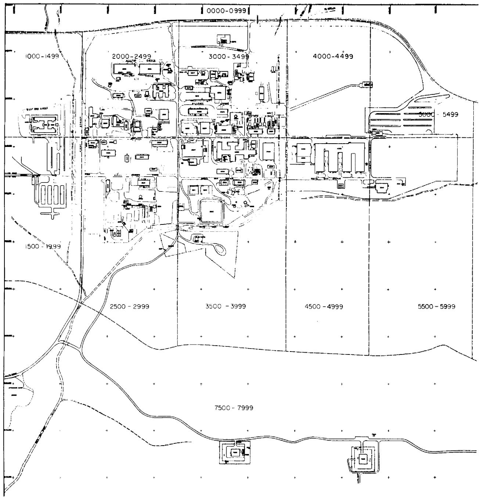  
Fig. P-1. Site Investigations for Reactor Engineering Hot Cell Facility.

Disadvantage: Remote from center of Laboratory operations, hot cell personnel, and services, while at the same time is removed from 7500 area reactor installations; remote from hot waste drain system; on semipublic road; outside ORNL security fence; if required, a discharge stack would have to be constructed in a location that is upwind of the Laboratory prevailing wind direction

Recommendation: Not recommended for REHCF

Site 3 - 2500 area

Advantage: Readily available construction space

Disadvantage: Remote from center of Laboratory operations, hot cell personnel, and services, while at the same time is removed from 7500 area reactor installations; remote from hot waste drain system; on semipublic road; if required, a discharge stack would have to be constructed in a location that is upwind of the Laboratory prevailing wind direction

Recommendation: Not recommended for REHCF

Site 4 - 3500 area

Advantage: Located near center of Laboratory operations, hot cell personnel, utilities, and services, including hot waste drain system

Disadvantage: To vacate Bldg. 3550 on the site requires relocation of offices and labs of personnel from four divisions (this can be done in three phases to correspond with new construction phases); if required, a discharge stack would have to be constructed, or possibly arrangements could be developed for limited use of the No. 3039 stack

Recommendation: Recommended for REHCF

Site 5 - 3000 area (3026 Building site)

Advantage: Located near center of Laboratory operations, hot cell personnel, utilities, and services, including hot drain; five existing cells could be incorporated in the small building design

Disadvantage: Site is much too small for a facility of the dimensions proposed; the sloping terrain and subsoil rock conditions would affect the building usage and construction cost; to replace Bldg. 3026, limited operations by two divisions would be disrupted; if required, a discharge stack should be constructed, or possibly limited use of No. 3039 stack could be arranged

Recommendation: Not recommended for REHCF

Site 6 - 3000 area (this is the site adjacent to Bethel Valley Road that was described in the proposal)

Advantage: Readily available construction site; near an existing and available stack No. 3020

Disadvantage: Somewhat removed from center of Laboratory operations, hot cell personnel, and services; remote from hot waste drain system; on public road; the sloping terrain and subsoil rock conditions would affect the construction cost; future expansion possible only if substation or water mains are relocated

Recommendation: Not recommended by the survey team for REHCF

Site 7 - 5500 area

Advantage: Readily available construction site; near the 4500 area scientific personnel; future expansion to the east would be feasible

Disadvantage: Somewhat removed from center of Laboratory operations, hot cell personnel, and services; outside ORNL security fence; if required, a discharge stack should be constructed; near public road

Recommendation: Not recommended for REHCF

Site 8 - 2000 area (2018 Building site)

Advantage: Located near center of Laboratory operations, hot cell personnel, utilities, and services, including hot waste drain; adjacent to existing and available discharge stack No. 2061; future expansion toward the west would be feasible

Disadvantage: To vacate site the Central Machine Shop Annex in Bldg. 2018 (scheduled to move to Bldg. 2525 in spring 1957), Liquid Metals Laboratory operations in Bldgs. 2011 and 2017, and Health Physics Laboratory Monitoring operations in Bldg. 2012 all must be relocated and the buildings razed (this can be done in three phases to correspond with new construction phases); the sloping terrain on the north side would somewhat affect building layout and construction cost

Recommendation: Recommended for REHCF

Site 9 - 2500 area (2506 Building site)

Advantage: Located near center of Laboratory operations, hot cell personnel, utilities, and services, including hot waste drain; near existing and available discharge stack No. 2061

Disadvantage: Site is small for the facility as proposed and therefore future expansion would not be feasible; to vacate site the paymaster's office and tool stores must be relocated and the building razed; known rock in the area would affect construction cost

Recommendation: Not recommended for REHCF

Site 10 - 3000 area (3022 Building site)

Advantage: Located near center of Laboratory operations, hot cell personnel, utilities, and services, including hot waste drain; near existing discharge stack No. 3020

Disadvantage: Site is much too small for the facility as proposed; to vacate site the E & M Division offices and drafting rooms would have to be relocated and the building razed; the terrain on the north side of site would affect building layout and construction cost

Recommendation: Not recommended for REHCF

Site 11 - 4000 area

Advantage: Located near center of Laboratory operations, hot cell personnel, utilities, and services, including hot waste drain; is readily available construction site

Disadvantage: If required, a discharge stack should be constructed, or possibly limited use of No. 3039 stack could be arranged; adjacent to former radioactive waste burial ground No. 606B

Recommendation: Recommended for REHCF

Supplementary to the above summary we wish to amplify the findings as to requirements for making the sites ready for construction:

Sites 1, 2, 3, 6, 7, and 11 are readily available and require relatively minor site preparation work.

Site 4 in the 3500 area requires vacating and razing Bldg. 3550. Relocation of the lab and office groups imposes certain problems that would have to be resolved. Where it might be reasonable to vacate and raze the center (office) wing first and later remove the outer (lab) wings, the present plans for such relocation call for transferring only a portion of the Bldg. 3550 activities in calendar year 1959.

Site 5 in the 3000 area cannot be released for a building site until present commitments for the RaLa project in Bldg. 3026 expire March 31, 1957, and after arrangements are made to relocate hot cell activities in the west end of the building.

Site 8 in the 2000 area is the present site of temporary buildings 2011, 2012, 2017, and 2018. As pointed out above, the Central Machine Shop Annex in Bldg. 2018 is scheduled to move to Bldg. 2525 in the spring of 1957. The writer understands that the activities of the Health Physics Laboratory Monitoring Group in Bldg. 2012 are now such that relocation problems would be minor and probably could be worked out on short notice. Also, it is understood that the Liquid Metals Lab, which recently occupied the former steam plant Bldgs. 2011 and 2017, will require the building until the Metals and Ceramics Building is available in early calendar year 1960.

Present plans for Site 9 call for relocation from Bldg. 2506 of the paymaster's office in the summer of 1958 and removal of the tool stores activity to an undetermined place at about the same time. The building is subsequently scheduled to be razed for construction of a permanent plant protection headquarters building as a fiscal year 1959 capital project.

Site 10 is scheduled for release as a permanent building area after the E & M Division offices and drafting rooms are relocated in a second floor addition to be constructed on Bldg. 2525 as a fiscal year 1959 project.

# INTERNAL DISTRIBUTION

1. A. A. Abbatiello   
2. S. E. Beall   
3. M. Bender   
4. D. S. Billington   
5. E. P. Blizzard   
6. C. J. Borkowski   
7. W. F. Boudreau   
8. G. E. Boyd   
9. E. J. Breeding   
10. R. B. Briggs   
11. W. E. Browning   
12. F. R. Bruce   
13. T. J. Burnett   
14. A. D. Callihan   
15. R. S. Carlsmith   
16. C. E. Center (K-25)   
17. R. A. Charpie   
18. R. L. Clark   
19. W. B. Cottrell   
20. F. L. Culler   
21. S. E. Dismuke   
22. H. G. Duggan   
23. W. K. Eister   
24. L. B. Emlet (K-25)   
25. D. E. Ferguson   
26. A. P. Fraas   
27. E. A. Franco-Ferreira   
28. E. J. Frederick   
29. J. H. Frye, Jr.   
30. W. R. Grimes   
31. C. S. Harrill   
32. W. R. Harwell   
33. T. Hikido   
34. W. H. Jordan   
35. G. W. Keilholtz   
36. C. P. Keim   
37. Eugene Lamb   
38. R. B. Lindauer

39. R. S. Livingston   
40. R. N. Lyon   
41. W. D. Manly   
42. E. R. Mann   
43. H. G. MacPherson   
44. F. R. McQuilkin   
45. R. P. Milford   
46. A. J. Miller   
47. K. Z. Morgan   
48. J. P. Murray (Y-12)   
49. G. Morris   
50. A. R. Olsen   
51. G.W. Parker   
52. P. Patriarca   
53. A. M. Perry   
54. P. M. Reyling   
55. F. Ring, Jr.   
56. A. F. Rupp   
57. H. W. Savage   
58. R. P. Shields   
59. Oscar Sisman   
60. M. J. Skinner   
61. A. M. Smith   
62. J. A. Swartout   
63. D. B. Trauger   
64. A. M. Weinberg   
65. G. D. Whitman   
66. G. C. Williams   
67. C. E. Winters   
68. Health Physics Library   
69. Biology Library   
70. Reactor Experimental Engineering Library

71-72. Central Research Library

73-75. ORNL - Y-12 Technical Library, Document Reference Section

76-95. Laboratory Records Department

96. Laboratory Records, ORNL R.C.

# EXTERNAL DISTRIBUTION

97. Division of Research and Development, AEC, ORO

98-681. Given distribution as shown in TID-4500 (15th ed.) under Reactors-General category (75 copies - OTS)