ORNL-2474

UC-81 - Reactors-Power

MOLTEN-SALT REACTOR PROGRAM

QUARTERLY PROGRESS REPORT

FOR PERIOD ENDING JANUARY 31-1958

# OAK RIDGE NATIONAL LABORATORY

operated by

UNION CARBIDE CORPORATION

for the

U.5: ATOMIC ENERGY COMMISSION

Printed in USA. Price $\$ 2,75$ cents. Available from the

Office of Technical Services

U.S. Department of Commerce

Washington 25, D. C.

# LEGAL NOTICE

This report was prepared as an account of Government sponsored work. Neither the United States, nor the Commission, nor any person acting on behalf of the Commission:

A. Makes any warranty or representation, express or implied, with respect to the accuracy, completeness, or usefulness of the information contained in this report, or that the use of any information, apparatus, method, or process disclosed in this report may not infringe privately owned rights; or   
B. Assumes any liabilities with respect to the use of, or for damages resulting from the use of any information, apparatus, method, or process disclosed in this report.

As used in the above, "person acting on behalf of the Commission". includes any employee or contractor of the Commission to the extent that such employee or contractor prepares, handles or distributes, or provides access to, any information pursuant to his employment or contract with the Commission.

Contract No. W-7405-eng-26

MOLTEN-SALT REACTOR PROGRAM

QUARTERLY PROGRESS REPORT

For Period Ending January 31, 1958

H. G. MacPherson, Program Director

DATE ISSUED

#

MAY 14 1958

OAK RIDGE NATIONAL LABORATORY

Oak Ridge, Tennessee

operated by

UNION CARBIDE CORPORATION

for the

U.S. ATOMIC ENERGY COMMISSION

# FOREWORD

This quarterly progress report of the Molten-Salt Reactor Program records the technical progress of the research at the Laboratory, under its Contract W-7405-eng-26, on power-producing reactors fueled with circulating fused salts. The report is divided into two major parts: 1. Reactor Design Studies and 2. Materials Studies.

Until July 1, 1957, the Molten-Salt Reactor Program was largely a design study, with only token expenditures for experimental work. As of July 1, the program was expanded to include experimental work on materials. A further augmentation of the program occurred on October 1, 1957, when personnel and facilities for additional research and experimentation became available. As a result of these transitions, this quarterly report has been expanded to include component development and testing, engineering research, metallurgical and chemical investigations, and radiation-damage testing.

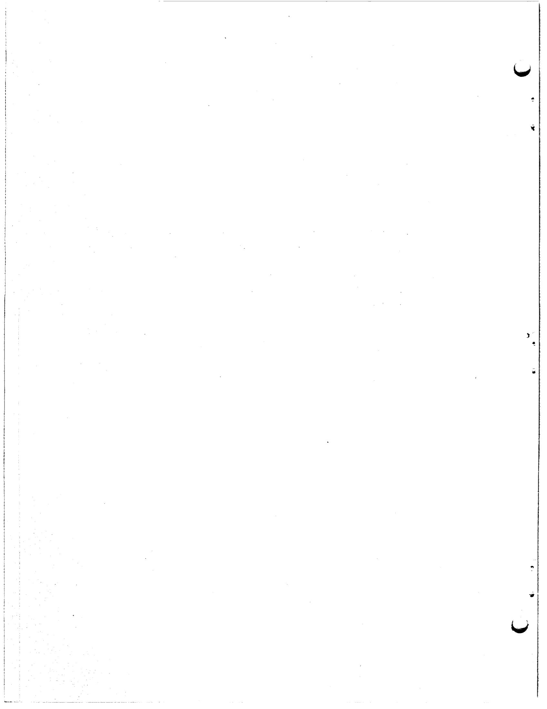

# CONTENTS

SUMMARY 1

# PART 1. REACTOR DESIGN STUDIES

1.1. REACTOR DESIGN 9

Study Layouts of Reactor System 9

Nuclear Calculations 12

Univac-Ocusol Reactor Calculations 12

Oracle Calculations 14

IBM-704 Codes 15

Fuel Fill-and-Drain System Design 15

Design of a Hydrostatic Bearing for a Molten Salt Pump Impeller 16

1.2. COMPONENT DEVELOPMENT AND TESTING 18

Fuel Pump Design and Development 18

Pump Design Studies 18

Development Tests of Salt-Lubricated Bearings 18

Development Tests of Mechanical Shaft Seals 19

Development Tests of Oil-Lubricated Bearings 20

Irradiation and Endurance Tests of Bearings and Seals 20

Development of Techniques for Remote Maintenance of the Reactor System 20

Mechanical Joint Development 20

Remote Manipulation Techniques 24

Heater-Insulation Units for Remote Application 25

Maintenance Demonstration Facility. 26

Heat Exchanger Development 27

Design, Construction, and Operation of Materials Testing Loops 27

Forced-Circulation Loops 27

In-Pile Loops 32

1.3. ENGINEERING RESEARCH 35

Hydrodynamic Studies of MSR Core 35

Physical Property Measurements 37

Molten Salt Heat Transfer Studies 37

1.4. ADVANCED REACTOR STUDIES 41

A Molten Salt Natural-Convection Reactor 41

Salt-Cooled Heat Exchangers 42

Helium-Cooled Heat Exchangers for Steam Cycle 42

Helium-Cooled Heat Exchanger for Gas-Turbine Cycle 43

Comparison of the Various Cooling Systems 44

Comparison of Natural-Convection System with Forced-Convection System 44

High-Flux Reactors 44

# PART 2. MATERIALS STUDIES

# 2.1.METALLURGY 51

Dynamic Corrosion Studies 51   
Thorium-Bearing Salts in Thermal-Convection Loops 51   
Uranium-Bearing Salts and Coolant Salts in Thermal-Convection Loops 52   
Results of Examination of Samples Removed from Forced-Circulation Loop CPR 54

General Corrosion Studies 54

Effect of Carburization on Reactor Structural Materials 54   
Corrosion of Brazing Alloys by Fuel Salts 59   
Corrosion of INOR-8 Welds by NaK and by Fuel Salts 60

Physical Properties of INOR-8. 62   
Mechanical Properties of INOR-8. 63

Welding and Brazing Studies 64

Metal Seals for Remote-Disconnect Flanged Joints 64   
Welding of INOR-8 Tubing 65   
Evaluation Tests for Welds 67   
Examination of INOR-8 Forced-Circulation Loop That Failed During Initial Heating 71   
Fabrication of Test Components 73

Development of Nondestructive Testing Techniques 75

Evaluation of INOR-8 Tubing. 75   
Cladding Thickness Measurements and Bond Inspections 77

Inspection Results 77

Material Inspection 77   
Weld Inspection 78   
Failure Analyses 78

# 2.2. RADIATION DAMAGE 79

In-Pile Thermal-Convection Loop Tests 79   
In-Pile Static Capsule Tests 80

# 2.3.CHEMISTRY 81

Phase Equilibrium Studies 81

Systems Containing $\mathsf{UF}_4$ and/or ThF 81   
Solubility and Stability of $\mathsf{PuF}_3$ in Molten Fluorides 88

# Fused Chlorides as Secondary Heat Transfer Fluids 90

Vapor Pressures of LiF-BeF2 Mixtures 91   
Fuel Reprocessing 91   
Solubility of Noble Gases in Molten Fluoride Mixtures 91   
Solubility of HF in Molten Fluorides 93   
Solubilities of Fission-Product Fluorides 94   
Order of Oxide Precipitation in Fluoride Salt Melts 97   
Chemical Reactions of Oxides with Fluorides in LiF-KF 99   
Lithium Recovery from NaF-KF-LiF Melts 101

Chemistry of the Corrosion Process 105

Activity Coefficients of $\mathbf{CrF}_2$ in NaF-ZrF 105

Solubility of $\mathsf{FeF}_2$ in LiF-BeF, 107

Use of $\mathbf{Cr}^{5+}$ to Study Chromium Migration in Polythermal Inconel-

Molten Salt Systems 107

Activity of Nickel in Nickel-Molybdenum Alloys 111

Production of Purified Mixtures 113

Preparation of Pure Fluorides 113

Small-Scale Purification Operations 113

Preparation of Material for In-Pile Loop 113

Transfer and Service Operations 113

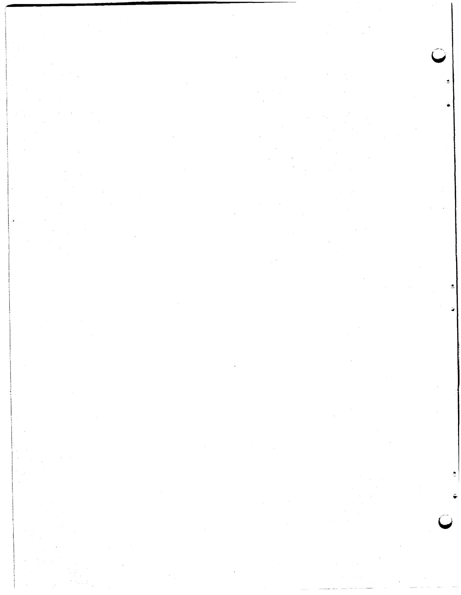

# MOLTEN-SALT REACTOR PROGRAM QUARTERLY PROGRESS REPORT

# SUMMARY

# PART 1. REACTOR DESIGN STUDIES

# 1.1. Reactor Design

Preliminary layouts have been prepared of the molten-salt reactor system that are based on the use of five fuel pumps and two blanket-salt pumps. The total thermal power production is assumed to be 638 Mw, with $90\%$ of the power being generated in the 8-ft-dia core and $10\%$ being generated in the 2-ft-thick blanket. The proposed layouts are being studied in order to achieve simplification and to minimize the fuel inventory. Layouts of the reactor cell are also being studied in order to determine the best possible arrangements of piping and other components that will provide minimum plant size and yet facilitate remote maintenance.

The parameter study of two-region, homogeneous, molten salt reactors was continued through nuclear calculations on the Univac, the Oracle, and the IBM-704. The Univac calculations indicate that, for the same core diameter and thorium content of the fuel salt, the $U^{233}$ inventory would be one-half the $U^{235}$ inventory. In the $U^{235}$ case the regeneration ratio is limited to a maximum of about 0.675, and in the $U^{233}$ case it appears to be possible to exceed 1.0. It is pointed out, however, that the regeneration ratio for a $U^{233}$ -fueled reactor will decrease with time as burnup poisons accumulate, while in the $U^{235}$ -fueled reactors with initial regeneration ratios of about 0.6 or better the regeneration ratio may actually improve with time and with reasonable chemical-processing rates because of the buildup of the superior $U^{233}$ fuel.

Comparisons of lithium-beryllium and sodium-beryllium salts showed that the sodium-beryllium salts required 1.1 to 2 times the $U^{235}$ inventory required with the lithium-beryllium salts. Also, the sodium-beryllium salts show a disadvantage of 0.1 to 0.15 in regeneration ratio.

Modifications were made in the Sorghum program for the Oracle, which was designed for computing progressive changes in core concentration and regeneration ratios. A subroutine was incorporated for computing the constants from the concentrations, absorption cross sections, initial spectrum,

and leakage probabilities. The resulting constants reproduce the initial spectrum and critical concentration exactly.

A preliminary fuel fill-and-drain system design was completed which satisfies the design criteria in that (1) it is always in a standby condition in which it is immediately available for drainage of the fuel, (2) it can adequately handle the fuel afterheat, and (3) criticality cannot be achieved in the drain system. The fill-and-drain vessel consists of forty-eight 20-ft lengths of 12-in.-dia pipe arranged in six vertical banks connected on opposite ends with mitered joints. The system is preheated and maintained at the desired temperature with bayonet-type electrical heaters in tubes located axially in the pipes. Removal of afterheat will be accomplished by radiant heat transfer to banks of water-filled boiler tubes that will normally be dry.

A hydrostatic bearing was designed for use in fuel pumps which differs from the conventional bearing in that the pockets rotate on the impeller. A bearing of this type has the advantage that the pressure of the pumped fluid would maintain the centering of the impeller in the pump casing.

# 1.2. Component Development and Testing

Preliminary pump design studies have indicated that five pumps with the following characteristics would be suitable for circulating fuel 130 (BeF $_2$ -LiF-UF $_4$ , 37-62-1 mole %) in the molten salt reactor being considered:

<table><tr><td>Flow through pump</td><td>4590 gpm</td></tr><tr><td>Head produced by pump</td><td>71 ft</td></tr><tr><td>Temperature at pump inlet</td><td>1230°F (max)</td></tr><tr><td>Static pressure at pump inlet</td><td>19.2 psia</td></tr><tr><td>Pump shaft speed</td><td>1160 rpm</td></tr></table>

Pump designs and arrangements are being studied in order to determine the most favorable arrangement of all elements with respect to adaptability to reactor construction, durability, remote maintenance problems, reactor operational problems, and other considerations.

Facilities are being designed and constructed for development tests of the salt-lubricated bearings being considered for use in fused salt pumps. The oil-lubricated bearings being used at present are unsatisfactory because they must be shielded from both the heat and the radiation from the fuel salt in order to avoid damage to the bearings and to the lubricant. Equipment is to be set up for high-temperature tests of both hydrodynamic and hydrostatic salt-lubricated bearings.

Oil-lubricated mechanical shaft seals are being studied for auxiliary system applications. Modifications in purge-gas flow are being tested as a means of preventing diffusion of process-fluid vapor into the seal region. Also, since oil-lubricated bearings may be required for the upper seals of the fuel pumps, tests of Dowtherm A as a lubricant are under way. This lubricant decomposes into gaseous and liquid products when irradiated, rather than into carbonaceous deposits of the type that result from the irradiation of hydrocarbon-base lubricants. A test of a pump rotary element with oil-lubricated bearings is also under way in a radiation field. Further, a bellows-mounted seal is being operated in an endurance test in a sump pump that is circulating NaK at $1250^{\circ}\mathrm{F}$ .

Techniques for remote maintenance of the components within the reactor cell are being studied. It is considered that the most feasible solution to the maintenance problem is to make all components removable and replaceable by remote manipulation. Therefore means for remotely separating and joining pipes are being investigated. Tests are under way of three types of flange joints: (1) a freeze-flange joint in which a frozen seal of molten salt is used to prevent leakage of molten salt through the space between the flanges, (2) a joint which has a cast-metal seal between the flanges, and (3) a joint in which a V-shaped tooth on each flange indents the sealing ring.

The various types of remote-handling apparatus now available commercially are being studied for applicability to maintenance of this reactor system. The remote assembly and disassembly of a pump in a hot cell is being attempted as a means of studying the manipulation problems. Design work has also been initiated on heater-insulation units that can be remotely removed and replaced. Plans are being made for a large-scale demonstration facility in which to test mechanical joints,

the replaceability of components, the adequacy of heater-insulation units, the unitization of wiring harness and service piping, and the application of remote-viewing and -handling apparatus and techniques.

A heat exchanger test facility is being operated to obtain heat transfer correlations for predicting the heat transfer performance of the molten salts of interest. Experimental information is required because the heat transfer characteristics of some salts appear to be affected by the type of structural material used and by the wetting properties of the salts.

Forced-circulation loops in which large temperature drops can be achieved are being operated to study the corrosion of INOR-8 and of Inconel by the fused salts of interest. The long-time effects are of particular interest, and satisfactory operation of a loop will imply operation for one year or longer without significant equipment difficulties or changes in operating conditions. Two special loops have been constructed of INOR-8. One of these includes graphite specimens and will be examined after operation to determine the extent to which graphite causes carburization of INOR-8 and the effects of the fused salt mixture on graphite. The other loop includes INOR-8 specimens for weight-loss studies.

A forced-circulation loop is also being assembled that will be operated in a beam hole in the MTR. Operation of the loop will provide information on fuel stability and corrosion of INOR-8 under irradiation at simulated reactor conditions.

# 1.3. Engineering Research

Three entrance-exit systems proposed for the core of the molten salt reactor are being studied in glass models. Preliminary qualitative data on flow patterns and velocity profiles have been obtained through visual observation and photographic recording of the motion of phosphorescent particles. The three systems being studied consist of (1) a core with the inlet and outlet diametrically opposite each other (straight-through flow), (2) a core with the inlet and outlet concentric and the fluid entering through the inner pipe and exiting through the outer annulus, and (3) a core with the inlet and outlet concentric and the fluid entering through the annulus and exiting through the inner pipe. In initial experiments with the concentric system and the fluid entering through the inner pipe, a

large toroidal eddy was noted in the region between the high-velocity, central, downward jet and the return stream along the core walls. Such an eddy could engender discrete high-temperature masses within the main fluid flow and thus give rise to high-frequency thermal cycling of system components. The effect of a vortex generator at the entrance will be studied.

Experimental determinations are being made of the viscosities and thermal conductivities of several $\mathsf{BeF}_2$ -bearing fluoride salt mixtures. Heat transfer studies are being made in order to determine the effect of nonwetting and interfacial film formation on heat transfer in Inconel and INOR-8 systems. A single circular tube will be used for these studies with the salt mixture LiF-BeF $_2$ -UF $_4$ (53-46-1 mole%).

# 1.4. Advanced Reactor Studies

A preliminary design study was made of a natural-convection molten salt reactor which could be used in a system in which there was a premium placed on reliability and ease of maintenance. The advantages of eliminating the fuel-circulating pumps and the attendant problems of maintenance are obtained at the cost of the increased fuel volume required for a system in which the pressure losses must be very low. A gas-turbine cycle or one of several steam cycles that operate efficiently under high-temperature conditions would be used with this system. In this study both helium and a molten salt were considered as coolants for the primary heat exchanger. A comparison of the natural-convection system with the forced-circulation system indicates that, for a 60-Mw (thermal) reactor, the natural-convection system requires a fuel inventory about $42\%$ greater than that of the forced-circulation system.

An idealized reactor model is being used in a systematic study of the influence of various factors on the power required to obtain a given flux in a research reactor. Data have been obtained for the idealized model, and further studies are under way for a model modified to reflect more realistic conditions.

# PART 2. MATERIALS STUDIES

# 2.1. Metallurgy

Corrosion experiments are under way with thermal-convection and forced-circulation loops fabricated of INOR-8 and Inconel. The first phase of a three-phase test program has been almost

completed and part of the second phase of testing is under way. Only Inconel thermal-convection loops have been examined thus far, but the low corrosion rates expected in these 1000-hr tests were found.

Studies are under way for determining the effect of carburization on the mechanical properties of reactor structural materials. The sodium-graphite system was found to be a rapid and effective medium for carburizing stainless steels, Hastelloy B, and Inconel. On the other hand, Inconel exposed to the graphite-fuel 30 (NaF-ZrF4-UE4, 50-46-4 mole %) system for 100 hr at 1500 and at $1250^{\circ}\mathrm{F}$ in seesaw-furnace apparatus did not become carburized. Static capsule tests revealed that INOR-8 carburized more readily in sodium than Inconel. The INOR-8 tensile specimens to be used for strength and elongation determinations are being prepared by using the sodium-graphite system.

The precious-metal brazing alloys, $82\%$ Au- $18\%$ Ni and $80\%$ Au- $20\%$ Cu, being considered for use in the fabrication of fuel-salt-to-coolant-salt heat exchangers were corrosion tested in fuel mixtures. Neither alloy showed attack after 2000 hr at $1200^{\circ}\mathrm{F}$ in static tests and 500 hr in seesaw-furnace apparatus. Similarly, no attack was found on any of the welded INOR-8 plates tested in NaK and in fuel 130 in seesaw-furnace apparatus for 500 hr at $1200^{\circ}\mathrm{F}$ . Various nickel-molybdenum-base welding rods were used.

Measurements were made of the modulus of elasticity, the thermal conductivity, and the tensile properties of several commercial air-melted heats of INOR-8. Studies were initiated for determining whether INOR-8 has a tendency to embrittle in the temperature range of 1000 to $1400^{\circ}\mathrm{F}$ . Specimens are being aged for periods of 500, 1,000, 2,000, 5,000, and 10,000 hr. Preliminary results show that the specimens aged 500 hr did not become brittle.

Tests are under way for obtaining basic data on the strength of INOR-8. Since relatively long periods are required to obtain data on plastic properties, preliminary data on tensile properties are being obtained for use in design studies. Data are presented for sheet specimens that must be considered as approximate. Relaxation tests being made to determine whether INOR-8 will deform plastically under reactor operating conditions have indicated that the creep strength will have to be investigated.

In support of the component development program, metal seals for remote-disconnect flanged joints were investigated. A series of tests showed that silver or a silver-copper eutectic alloy would make effective cast metal seals on flange joints made of stainless steel, INOR-8, and Inconel.

Investigations of the welding characteristics of INOR-8 tubing were continued, and evaluation tests were made of various weld metals. Seven different heats of INOR-8 from three different sources have been studied, and only one has shown cracking tendencies when welded. In these investigations, weld test plates are prepared that provide specimens for mechanical property studies of welded joints, for radiographic, metallographic, and hardness studies, and for obtaining general information on the welding characteristics of the materials under conditions of high restraint.

An examination was made of the INOR-8 forced-circulation loop that failed during initial heating in a test stand. The failure occurred near the fusion line of the weld joining a Hastelloy B nipple and an INOR-8 (Haynes heat SP-16) adapter. The lack of ductility of the Hastelloy B nipple, which was part of a finish-machined Hastelloy B pump barrel, was the cause of the failure. INOR-8 pumps are now being fabricated for use in the forced-circulation loops.

# 2.2. Radiation Damage

Preparations are being made for the operation of an INOR-8 thermal-convection loop in the LITR. An electrically heated full-scale mockup has been assembled and filled with fuel to test components and procedures. A new type of thermocouple assembly has been designed for use with this loop. In mockup tests the thermocouple has survived dozens of thermal cycles in which the thermal expansion was many times greater than that expected in the loop. The new assembly allows the thermocouple jacket to move as the fuel tube moves during expansion.

Charcoal for use in a trap for adsorbing xenon during operation of the loop was baked in vacuum for 48 hr at $500^{\circ}\mathrm{C}$ in order to decompose organic impurities and was then tested with radiokrypton to determine the effect of the heat treatment on its adsorptive qualities. It was found that the charcoal was $10\%$ more effective than it was before the heat treatment.

Calculations were made of the magnitude of the undesirable effects that would result from the

presence of the $\mathsf{Li}^6$ isotope in the fuel mixture (fuel 130) for the in-pile loop. Since the possible effects of traces of tritium in the loop could not be evaluated with confidence, it was decided to use the best available $\mathsf{Li}^7$ .

Preparations are being made for the operation of a similar loop in the ORR and for the irradiation of fuel 130 in INOR-8 capsules in the MTR.

# 2.3. Chemistry

Phase equilibrium studies are being made for determining whether an $\mathsf{LiF - BeF}_2$ mixture will dissolve sufficient $\mathsf{ThF}_4$ and $\mathsf{UF}_4$ to provide a fuel for a fused salt breeder reactor. The studies have indicated that the quaternary system LiF- $\mathsf{BeF}_2$ -ThF $^4$ -UF $^4$ can be treated as a ternary system and that some interpolations can be made between the systems LiF- $\mathsf{BeF}_2$ -UF $^4$ and LiF- $\mathsf{BeF}_2$ -ThF $^4$ with regard to liquidus temperatures and phase relationships. Breeder reactor blanket or breeder reactor fuel solvent compositions, whose maximum $\mathsf{ThF}_4$ concentration is limited to that available in salts having less than a $550^{\circ}C$ liquidus, may be chosen from an area of the phase diagram in which the upper limits of $\mathsf{ThF}_4$ concentration are obtained in the following compositions: 75 mole % LiF-16 mole % ThF $^4$ -9 mole % $\mathsf{BeF}_2$ , 69.5 mole % LiF-21 mole % ThF $^4$ -9.5 mole % $\mathsf{BeF}_2$ , 68 mole % LiF-22 mole % ThF $^4$ -10 mole % $\mathsf{BeF}_2$ .

The solubility and stability of $\mathsf{PuF}_3$ in beryllium-containing fluoride salts are being investigated. The solubility has been shown to increase with increasing $\mathsf{BeF}_2$ concentration in LiF- $\mathsf{BeF}_2$ mixtures. In the NaF- $\mathsf{BeF}_2$ system, the solubility of $\mathsf{PuF}_3$ is higher in the mixtures with 50 mole % $\mathsf{BeF}_2$ and 36 mole % $\mathsf{BeF}_2$ than in the mixture with 43 mole % $\mathsf{BeF}_2$ . Thus there is an indication that the solubility of $\mathsf{PuF}_3$ in this solvent goes through a minimum in the vicinity of mixtures with 43 mole % $\mathsf{BeF}_2$ . The solubility of $\mathsf{PuF}_3$ at $565^{\circ}\mathsf{C}$ in the binary mixtures studied varied from about 0.2 mole % for the 57 mole % NaF-43 mole % $\mathsf{BeF}_2$ mixture to 0.45 mole % for the 51.6 mole % LiF-48.4 mole % $\mathsf{BeF}_2$ mixture. This concentration range would probably be adequate to fuel a molten salt plutonium-burner reactor. In the one ternary mixture studied, NaF-LiF- $\mathsf{BeF}_2$ (56-12-28 mole %), a value of 1.5 mole % $\mathsf{PuF}_3$ was obtained at $565^{\circ}\mathsf{C}$ . Thus there is an indication that the solubility of $\mathsf{PuF}_3$ continues to increase with

decreasing $\mathsf{BeF}_2$ concentration. No evidence of disproportionation of $\mathsf{PuF}_3$ has been found in these experiments.

A survey was made of the physical, chemical, and nuclear properties of fused chlorides of possible interest as secondary heat transfer fluids. The survey showed the eutectic composition 41.7 mole % RbCl-58.3 mole % LiCl to be the most attractive from the standpoints of vapor pressure and corrosion. Thermal-convection loop tests would be required to determine the rate of mass transfer. Apparatus is being constructed for treating RbCl-LiCl mixtures to remove the water that is always present in the salts.

The vapor pressures of $\mathsf{LiF - BeF}_2$ mixtures are expected to be low at MSR temperatures, and, to determine the magnitude, measurements were made of the vapor pressure of the solvent mixture 64.9 mole % LiF-35.1 mole % $\mathsf{BeF}_2$ . Since behavior similar to that of the NaF-BeF $_2$ system can be expected in the LiF-BeF $_2$ system, it is anticipated that the vapor pressure of a 70 mole % LiF-30 mole % $\mathsf{BeF}_2$ solution will be about one-half the vapor pressure of the 64.9 mole % LiF-35.1 mole % $\mathsf{BeF}_2$ solution at the same temperature.

Studies of the solubilities of the noble gases in NaF-KF-LiF mixtures were continued. The studies of the NaF-KF-LiF mixtures were undertaken pending completion of facilities for studying solvents containing $\mathsf{BeF}_2$ . It is expected that the numerical values of the noble gas solubilities in solvents containing $\mathsf{BeF}_2$ will be less than the corresponding values in NaF-ZrF and more than those in NaF-KF-LiF.

Studies of the solubility of HF in NaF-ZrF $_4$ and NaF-KF-LiF mixtures were continued, and studies of LiF-BeF $_2$ mixtures were initiated. Both the HF solubility and the heat of solution values for the LiF-BeF $_2$ (51-49 mole %) mixture are of the same order of magnitude as the values obtained with corresponding NaF-ZrF $_4$ mixtures.

The solubilities of fission-product fluorides in $\mathsf{BeF}_2$ -containing solvents are being studied by using radioactive tracer techniques. Values are presented for the solubilities as a function of temperature and composition of $\mathsf{CeF}_3$ in NaF-BeF $2^{\prime}$ YF in NaF-BeF, CeF in LiF-BeF, and CeF and LaF in the presence of each other in LiF-BeF.

The precipitation of oxides of fission products from fluoride melts is being studied as one of the

possible methods for the purification of fuel mixtures. Simple thermodynamic considerations are being applied in order to calculate the relative order of precipitation of oxides. Calculations are described for the oxide precipitation of $\mathsf{U}^{4+}$ , $\mathsf{Ce}^{+++}$ , and $\mathsf{Be}^{++}$ from an LiF-BeF $_2$ mixture containing $\mathsf{UF}_4$ and $\mathsf{CeF}_3$ . As part of this study the solubilities and precipitation reactions of a variety of solutes are being studied in the simple binary solvent LiF-KF. The following useful generalizations are based on the information obtained thus far regarding the solubilities of oxides of uranium, zirconium, hafnium, rare earths, alkaline earths, and alkali metals in this solvent.

1. Uranium, zirconium, and hafnium precipitate as the dioxides and are the least soluble.   
2. Rare earths precipitate as $\mathsf{R}_2\mathsf{O}_3$ and have very low solubilities.   
3. Beryllium and magnesium oxides are slightly more soluble than the rare earth oxides but are still quite insoluble.   
4. Barium, strontium, calcium, potassium, sodium, and lithium oxides are more soluble than the oxides specified in items 1, 2, and 3.

An experimental study of the activity coefficients of $\mathsf{CrF}_2$ in NaF-ZrF4 (53-47 mole %) was continued, and equilibrium quotients obtained at $850^{\circ}C$ for the reaction

$$
\mathrm {C r F} _ {2} (d) + \mathrm {H} _ {2} (g) \rightleftharpoons \mathrm {C r} (s) + 2 \mathrm {H F} (g)
$$

are presented. Experiments are under way at other temperatures.

In preparation for a determination of activity coefficients of $\mathsf{FeF}_2$ in LiF-BeF $_2$ (63-37 mole%), it was established that equilibrium measurements can be made with solutions of $\mathsf{FeF}_2$ in this solvent at concentrations well in excess of 5000 ppm $\mathsf{Fe}^{++}$ , even at $500^{\circ}\mathsf{C}$ , which is the lowest temperature of interest.

A proposed graphical method evolved for calculating the rate and amount of chromium migration (corrosion) to be expected in Inconel- $\mathsf{NaF - ZrF_4}$ UF4 systems is described. The results of actual loop experiments in which Cr51 was used to trace the chromium migration were used to check the validity of the calculations.

Attempts are being made to measure the activity of nickel in nickel-molybdenum alloys by using an electromotive-force method. Experimental difficulties are being studied.

Part 1

# 1.1. REACTOR DESIGN

# H. G. MacPherson

# STUDY LAYOUTS OF REACTOR SYSTEM

E.J.Breeding

J. Y. Estabrook W. S. Harris R. E. Helms

Preliminary layouts of the molten-salt reactor (MSR) system are being prepared as a means of studying the mechanical design. These layouts are based on the use of five fuel pumps and two blanket-salt pumps. The total thermal power production is assumed to be 638 Mw, with $90\%$ of the power being generated in the 8-ft-dia core and $10\%$ being generated in the 2-ft-thick blanket. Each of the layouts, presented here as Figs. 1.1.1 through 1.1.5, has both satisfactory and unsatisfactory features. It is hoped that through examining many possible arrangements the most simple design can be determined. Layouts of the reactor cell are also being made in order to determine the best possible arrangements of piping and other components that will provide minimum plant size and yet facilitate remote maintenance.

The basic layout shown in Fig. 1.1.1 of a two-pass reactor with a blanket was conceived with the support and fabrication problems as the major influence. The main support ring is, in effect, a channel rolled into a ring. Both the blanket and core shells are supported by this ring. The fuel pumps are supported by their barrels, which penetrate the top flange. Both the fuel and the blanket-salt expansion tanks are formed by conventional shell-head shapes. Individual pump suction lines direct to the neck of the reactor core vessel are provided to avoid stresses induced by penetration of the blanket shell. The method of support of the pumps permits the pump discharges to be rotated without altering the details of fabrication of the vessel. Except for the outrigged blanket-salt pumps, the unit is symmetrical in order to simplify fabrication. All parts of the fuel system are in packages of five in order to lower the cost of fabrication. The fuel inventory of a reactor of this type would be low, that is, approximately $330\mathrm{ft}^3$ . One of the main objections to this layout is that there is no blanket salt around the neck of the core vessel.

The layout presented in Fig. 1.1.2 has the advantage that the core is completely surrounded

with blanket salt, and yet simple shapes have been retained for ease of fabrication. The fuel pumps are equally spaced around the periphery of the reactor, and the two blanket-salt pumps are located in a central annulus of blanket over the core. This arrangement permits the support of the pumps and the blanket pressure shell from a grid type of

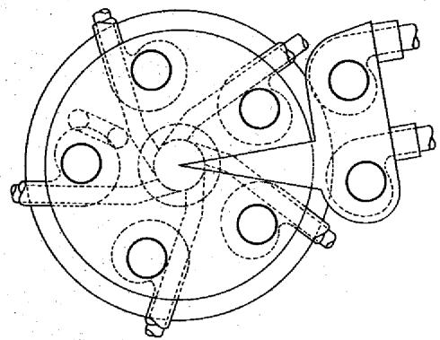  
UNCLASSIFIED   
ORNL-LR-DWG 27883

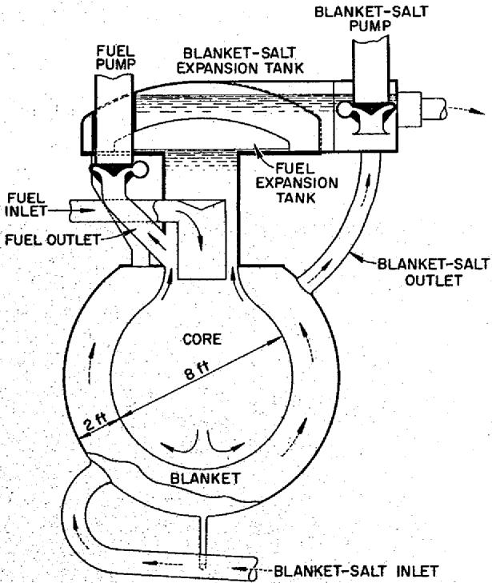  
Fig. 1.1.1. MSR Layout with Outrigged Blanket-Salt Pumps and No Blanket Salt Around Neck of Core.

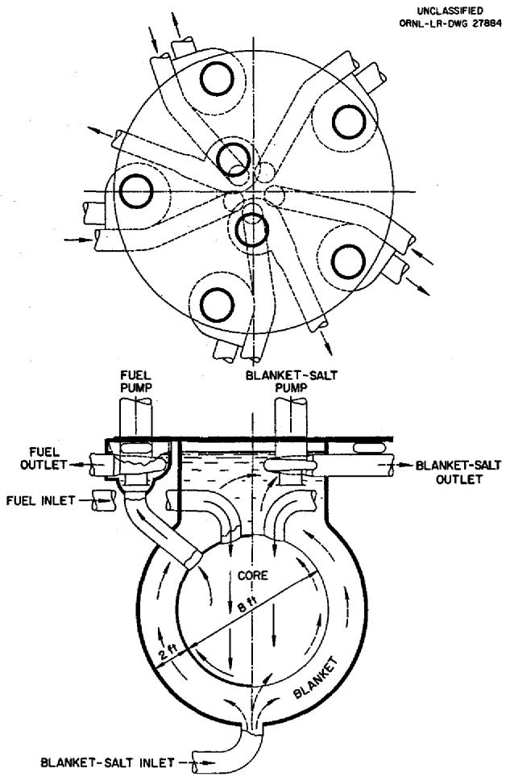  
Fig. 1.1.2 MSR Layout with Fuel Pumps Equally Spaced Around the Periphery and the Blanket-Salt Pumps in a Central Annulus of Blanket over the Core.

frame above the reactor. The fuel pumps are connected by a gas annulus or torus with space for expansion of the fuel under conditions other than normal. The pumps are completely covered with fuel at all times. The fuel inventory for this layout is $395\text{ft}^3$ and could be reduced, since the connecting pipes out of the core and the pump tanks appear to be larger than necessary. The fuel inlet and outlet pipes pass through the blanket pressure vessel wall and may create undesirable stresses. The temperature difference between the inlet and outlet pipes is expected to be about $135^{\circ}\text{F}$ . Further study will be required to determine whether the resulting stresses can be tolerated.

The layout shown in Fig. 1.1.3 has the five fuel pumps equally spaced around the top and the two

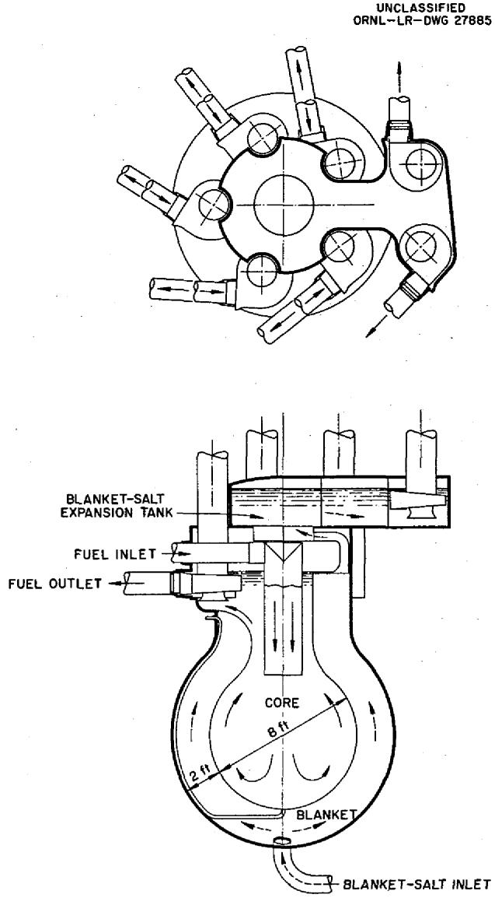  
Fig. 1.1.3. MSR Layout with Five Fuel Pumps That Have a Common Header and Offset Blanket-Salt Pumps That Draw from a Blanket Chamber Above the Fuel Expansion Tank.

blanket-salt pumps offset in a blanket chamber above the fuel expansion tank. The five fuel pumps have a common header. The suction, volute, and discharge of each pump are located in a trough to minimize inventory and to direct the flow. The fuel returns through the fuel expansion tank, gathers in a plenum, and is then directed to the core. The fuel pumps are supported by their barrels from the fuel expansion tank top. The blanket salt flows upward around the core and passes between the fuel pumps in rectangular

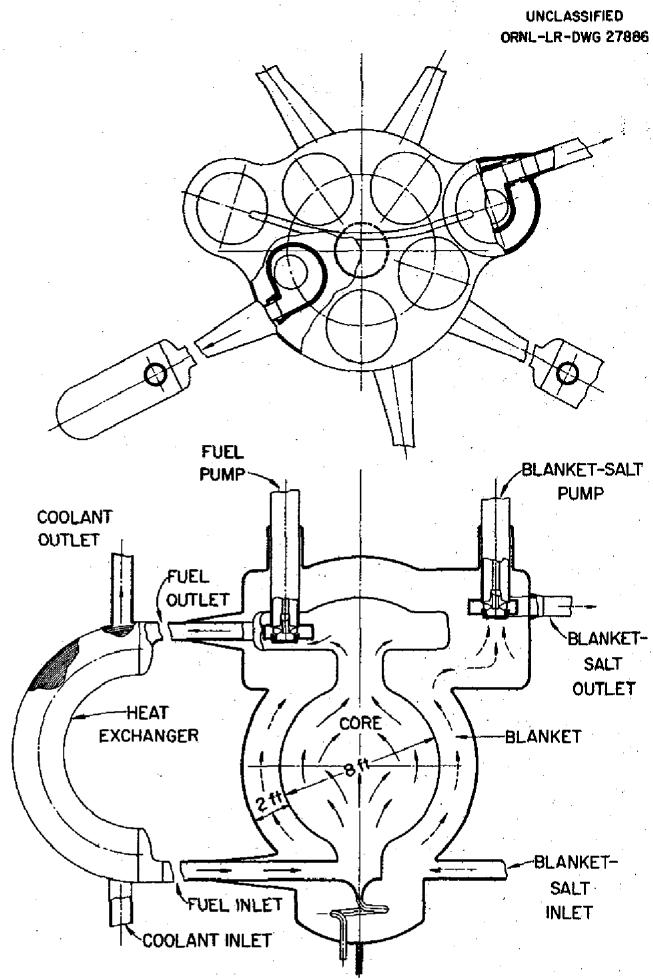  
Fig. 1.1.4. Single-Pass MSR Layout.

ducts to a plenum at the center of the blanket deck from which the offset blanket-salt pumps draw. The blanket-salt pumps are supported by their barrels from the blanket expansion tank top. The reactor supports could be located under the fuel pumps. The fuel inventory for this layout is approximately 440 ft3.

One of several preliminary layouts of single-pass systems is shown in Fig. 1.1.4. The single-pass system offers the possibility of closely coupling the primary heat exchangers to the reactor. Such close coupling would be of advantage in minimizing the size of the reactor cell. Thermal sleeves are incorporated to relieve the stresses involved in connecting the outer blanket shell to the inlet and outlet piping. The top of the reactor is somewhat simpler than for a two-pass system, although some of the complication was merely transferred to the bottom of the reactor. This layout required a fuel

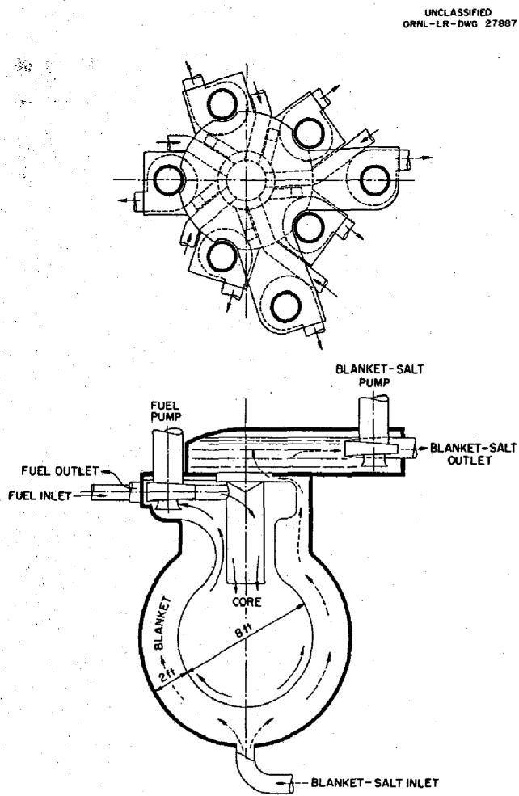  
Fig. 1.1.5. MSR Layout with Fuel Return Ducts at the Same Place as the Fuel Discharge Ducts.

inventory of $420 ft^3$ . The reactor support problem was not considered in these studies; however, a load ring and pump barrel type of support would probably be required.

Another two-pass system is shown in Fig. 1.1.5. The return fuel ducts are brought back to the top of the reactor at the same place as the pump discharge ducts. (Results of flow studies of this arrangement are presented in Chap 1.3.) This feature tends to lower the overall height and hence the pressure difference across the core shell. The plan view shows much less blanket material in the region of the discharge and return ducts than there is in designs having the return ducts above or below the discharge ducts. As in all the two-pass layouts with multiple pumps, the top of the reactor is complex with regard to fabricability.

# NUCLEAR CALCULATIONS

L. G. Alexander

J. T. Roberts

Nuclear calculations relative to parameter studies of molten salt reactors for the production of power were continued. The Univac calculations, for which the Ocusol program is used, have provided information about $\mathsf{U}^{235}$ and $\mathsf{U}^{233}$ -fueled reactors of the reference design type, primarily, but studies have been initiated of plutonium-fueled molten salt reactors and of graphite-moderated molten salt $\mathsf{U}^{233}$ breeder reactors.

# Univac-Ocusol Reactor Calculations

# J. T. Roberts

The parameter study of two-region, homogeneous, molten salt reactors described in the previous report has been extended and refined. The calculations based on the use of the 69 mole $\%$ LiF-31 mole $\%$ BeF $_2$ salt plus ThF $_4$ and UF $_4$ in the core and of the 75 mole $\%$ LiF-25 mole $\%$ ThF $_4$ salt in the blanket were completed, and a new study based on the use of a 63 mole $\%$ LiF-37 mole $\%$ BeF $_2$ salt plus ThF $_4$ and UF $_4$ in the core and of a 71 mole $\%$ LiF-16 mole $\%$ BeF $_2$ -13 mole $\%$ ThF $_4$ salt in the blanket was initiated. The effects of changing the salts are expected to be a small reduction in critical mass and a reduction of approximately $12\%$ in the external regeneration ratio. Blanket thickness will also be a variable in the new parameter study.

In the calculations just completed a comparison was made of $U^{233}$ and $U^{235}$ -fueled reactors. The results of these calculations are presented in Fig. 1.1.6, which shows the fissionable material inventory at startup as a function of core diameter. The effect of various amounts of thorium, in the range 0 to 1 mole % in the fuel salt, is also shown. For the same core diameter and thorium content of the fuel salt, the $U^{233}$ inventory for the cases shown is less than half the $U^{235}$ inventory. This is due to both the higher $\sigma_f$ and the lower $a$ for $U^{233}$ compared with those for $U^{235}$ in intermediate reactors. In Figs. 1.1.7 and 1.1.8, the $\eta-1$ , the initial total regeneration ratio, and the initial blanket regeneration ratio for $U^{235}$ and $U^{233}$ -fueled reactors are plotted as functions of thorium content of the fuel salt for core diameters in the

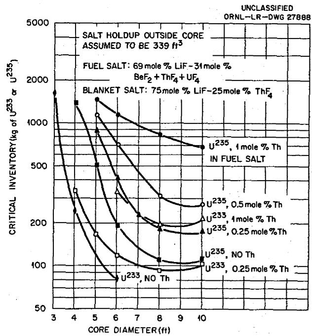  
Fig. 1.1.6. Clean, Critical Inventory of U233 and U235 for 600-Mw Reactors Fueled with Lithium-Beryllium-Base Salts.

range 5 to 10 ft. In the $\mathsf{U}^{235}$ cases the regeneration ratio is limited to a maximum of about 0.675 by the comparatively low value of $\eta$ and a practical minimum loss to capture in the salt and in the core shell of about 0.1+. The $\mathsf{U}^{233}$ cases were not carried far enough to establish a "ceiling" on the regeneration ratio, but, judging from the $\eta - 1$ values, it would seem to be possible to exceed 1.0 by increasing the thorium content of the fuel salt to, perhaps, 1.5 to 2% and, at the same time, increasing the $\mathsf{U}^{233}$ inventory to, perhaps, 300 to 900 kg, depending on the core diameter. It should be remembered, however, that the regeneration ratios shown for the $\mathsf{U}^{233}$ -fueled reactors will decrease with time as burnup poisons accumulate in the system, while in the $\mathsf{U}^{235}$ -fueled reactors, with initial regeneration ratios of about 0.6 or better, the regeneration ratio may actually improve with time and with reasonable chemical-processing rates because of the buildup of the superior $\mathsf{U}^{233}$ fuel.

Calculations were also made in order to compare lithium-beryllium and sodium-beryllium salts as fuels for reactors of the reference design type. Figure 1.1.9 presents a comparison of the $U^{235}$ inventories at startup for reactors fueled with

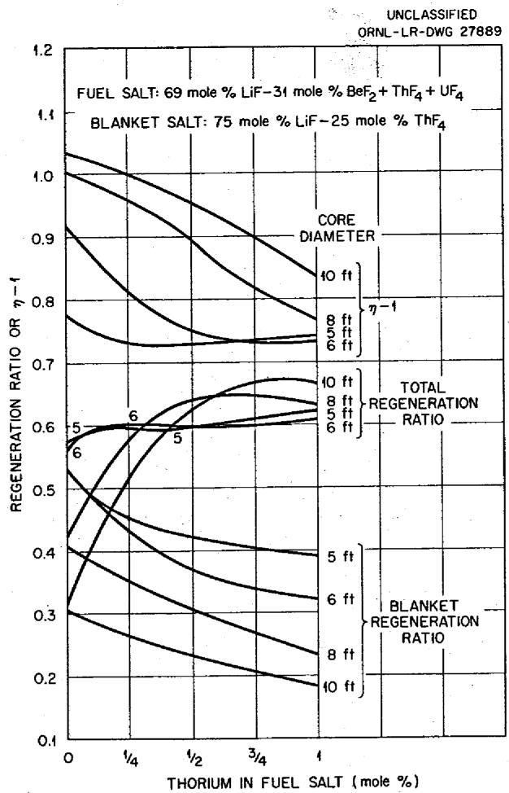  
Fig. 1.1.7. Initial Regeneration Characteristics of Molten Salt Reactors Fueled with Lithium-Beryllium-Base Salts Containing U235.

69 mole % LiF-31 mole % BeF $_2$ plus ThF $_4$ and UF $_4$ in the core and 75 mole % LiF-25 mole % ThF $_4$ in the blanket and for reactors fueled with 53 mole % NaF-47 mole % BeF $_2$ plus ThF $_4$ and UF $_4$ in the core and 58 mole % NaF-35 mole % BeF $_2$ -7 mole % ThF $_4$ in the blanket. For the same core diameter and thorium content of the fuel salt, the sodium-beryllium-base salts required 1.1 to 2 times the U $^{235}$ inventory required for the lithium-beryllium-base salts. In Fig. 1.1.10 the $\eta-1$ , the initial total regeneration ratio, and the initial blanket regeneration ratio are plotted for reactors fueled with Na-Be salts. In comparison with the Li-Be-base fuels (Fig. 1.1.7), the Na-Be-base fuels show a disadvantage of 0.1 to 0.15 in regeneration ratio. Since Na-Be salts cost approximately one-half as much as Li $^{7}$ -Be salts,

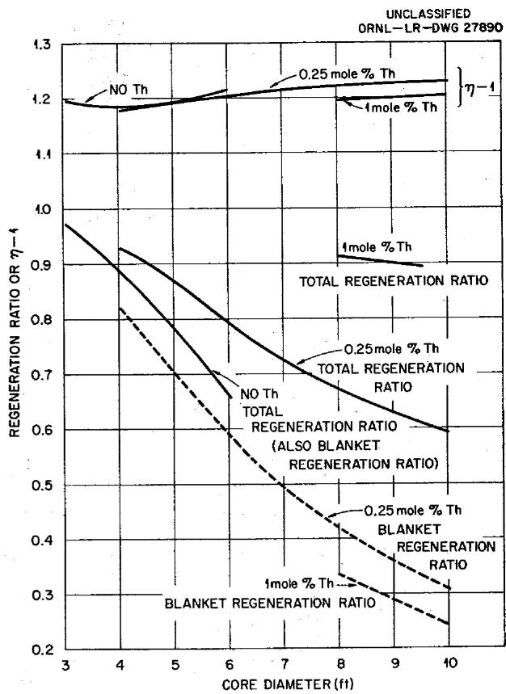  
Fig. 1.1.8. Initial Regeneration Characteristics of Molten Salt Reactors Fueled with Lithium-Beryllium-Base Salts Containing U233.

some further studies of them will be made, even though they do not compare very favorably on a nuclear basis.

A comparison of flux-averaged cross sections of $U^{235}$ , $U^{236}$ , and $U^{238}$ in reactors of the reference design type indicated that at steady state the concentration of $U^{236}$ plus $U^{238}$ will be about 60 to $90\%$ of the $U^{235}$ concentration. This estimate, together with the $U^{235}$ critical concentration estimates, indicates that the use of 1 mole $\%$ $UF_4$ in corrosion tests is conservatively high if data applicable to the reactors of greatest interest are to be obtained. The data may not, however, be applicable to graphite-moderated thermal reactors, since the steady-state ratios of even to odd uranium isotopes will be greater in thermal than in intermediate reactors.

Cross sections for Na, Be, Pu239, Pu240, C, and Bi have been added to the Ocusol sigma tape (for

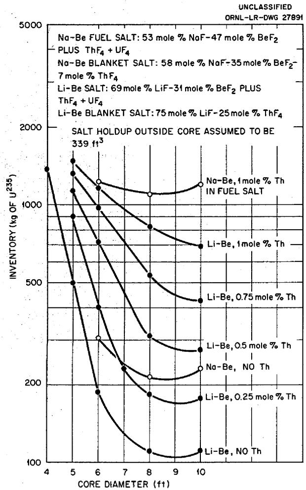  
Fig. 1.1.9. Clean, Critical Inventory of U235 for 600-Mw Reactors Fueled with Lithium-Beryllium- or with Sodium-Beryllium-Base Salts.

cross sections available previously see ref 2). Also, thorium cross sections with $\sigma_{a}$ adjusted for resonance saturation effects have been inserted for 0.25, 0.5, 0.75, 7, and 13 mole % thorium in lithium-beryllium-base salts. Pseudo cross sections for combined Li-Be-F in various core and blanket salts have been inserted so that these may be used as a single "element" in Ocusol calculations, which are limited to seven elements in a region.

# Oracle Calculations

# L. G. Alexander

The Sorghum program was designed for computing progressive changes in core concentrations and

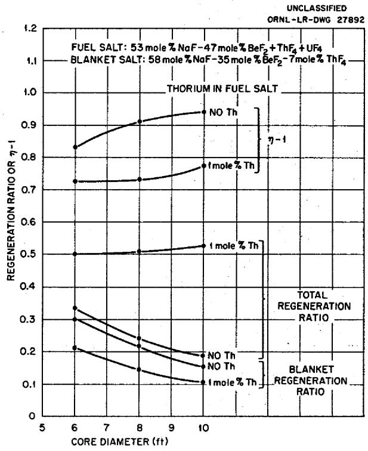  
Fig. 1.1.10. Initial Regeneration Characteristics of Molten Salt Reactors Fueled with Sodium-Beryllium-Base Salts Containing U235.

regeneration ratios in molten salt reactors, with Ocusol or Cornpone outputs being used for the initial states. It is based on the assumption that the scattering and leakage probabilities are insensitive functions of the varying concentrations. The program was operated with constants that characterized the spectrum, leakage, and scattering in Ocusol Case 89-2, for which the data were presented previously.3 The code operated satisfactorily but disclosed the hitherto unrecognized fact that the spectrum and leakage output from Ocusol are not consistent with the scattering properties. The source of the inconsistency is not known, but may be due to a biased round-off of the leakages at the highest energies, which, being small, are known to only two significant figures. Since the spectrum in Sorghum is computed in a stepwise manner, beginning with the high-energy groups, the round-off bias tends to accumulate and to be amplified in the lower groups.

In order to remedy this defect, a subroutine for computing the constants for Sorghum from the concentrations, absorption cross sections, initial spectrum, and leakage probabilities was written and incorporated in the program. The resulting constants, which differ only slightly from those based on the scattering cross sections computed by Ocusol, reproduce the initial spectrum and critical concentration exactly.

Absorption cross sections for $\mathsf{Pa}^{233}$ , $\mathsf{U}^{234}$ , $\mathsf{U}^{236}$ , $\mathsf{Np}^{237}$ , and $\mathsf{Pu}^{239}$ were estimated and were inserted into the program, together with fission cross sections for $\mathsf{Pu}^{239}$ . The modified program has been operated successfully on a test case. Tests to determine limitations imposed on the magnitude of the time increment by convergence requirements and the drift in group leakage probabilities are in progress.

Efforts to bring the Oracle program Cornpone into use for molten salt reactors have been continued. Initial tests, for which the Ocusol group structure and cross sections were used, showed disagreement in the critical mass; also, the computing time was excessive. The effects of modifying the group structure, scaling factors, number of space points in thin-shell regions, and method of treating the principal scatterers are being studied.

A decision to normalize the fractional absorption of neutrons in each elemental species with respect to the reactor as a whole, rather than with respect to the various regions, has necessitated revisions of the edit subroutine. Provision has been made to edit the integrated flux in each group and each region for use in Sorghum and other perturbation calculations.

# IBM-704 Codes

# D. Baxter

The applicability of existing IBM-704 codes to molten salt reactor calculations was investigated, and three promising codes were selected for further study. These are: the "CURE," a generalized, two-dimensional, multigroup program suitable for investigating the effect of the north head of the reactor on the reactivity and breeding ratio; the "GM-GNU," a multigroup, multiregion, one-dimensional program similar to Eyewash-Ocusol; and the "Curtiss-Wright 075," a two-dimensional, multigroup, multiregion code.

# FUEL FILL-AND-DRAIN SYSTEM DESIGN

# G. D. Whitman

A preliminary design study has been made of a fuel fill-and-drain system for the MSR. This system must meet the following three major design criteria:

1. A preheating system must be provided that is capable of maintaining the drain vessel and its connecting plumbing at $1200^{\circ}\mathsf{F}$ .   
2. A reliable heat-removal system must be provided that has sufficient capacity to handle the fuel afterheat.   
3. The drain vessel must be "ever-safe" so that criticality cannot be achieved when the fuel is drained.

The fuel draining operation has not been considered as an emergency procedure which must be accomplished in a relatively short period of time in order to prevent a catastrophe. It is considered that, if all forced circulation ceased during high-power operation, the thermal capacity and heat losses of the system would prevent prompt thermal transients that would be capable of causing failure of the primary containment vessels. There are, however, other incentives for rapid removal of the fluid from the fuel circuit. If, for example, there was a leak in the fuel system it would be important to drain the fuel in order to minimize the cell contamination and cross contamination of systems. Further, rapid removal of the fuel at the time of a shutdown for maintenance would have an economic advantage in reducing the power outage time.

A consideration of these factors indicated that the maximum afterheat design load should be 10 Mw for a 600-Mw reactor that had been operating for one year and had been shut down for 10 min before the fuel was drained. No credit was taken for fission-gas removal during operation. It was determined that 15 min would be required to remove the fuel from the reactor.

For the drain vessel design calculations, it was assumed that at $1200^{\circ}\mathrm{F}$ the fuel system volume would be 600 ft³. The design capacity of the drain vessel was therefore set at 750 ft³ in order to allow for temperature excursions and a residual heel. An array of 12-in.-dia pipes was selected as the primary containment vessel of the drain system in order to obtain a large surface-area-to-volume ratio for heat transfer efficiency and to provide a

large amount of nuclear poison material. Forty-eight 20-ft lengths of 12-in.-dia pipe would be arranged in six vertical banks connected on opposite ends with mitered joints. The six banks of pipe would be connected at the bottom with a common drain line that would connect with the fuel system. The drain system would be preheated and maintained at the desired temperature with electric heaters installed in small-diameter pipes located axially inside the 12-in.-dia pipes. These bayonet-type heaters could all be removed or installed from one face of the pipe array to facilitate maintenance. The entire system would be installed in an insulated room or furnace to minimize heat losses.

The removal of the fuel afterheat would be accomplished by filling boiler tubes installed between the 12-in.-dia fuel-containing pipes with cold water from a header that would normally be full. The boiler tubes would normally be dry and at the ambient temperature of about $1200^{\circ}\mathrm{F}$ . Cooling would be accomplished by radiant heat transfer from the fuel-containing pipes to the low-pressure, low-temperature water in the boiler tubes. For the peak afterheat load, about 150 gpm of water would be required to supply the boiler tubes.

This fill-and-drain system design satisfies the design criteria in that it is always in a standby condition in which it is immediately available for drainage of the fuel, it can adequately handle the fuel afterheat, and it provides double containment of the fuel. The heat-removal scheme is essentially self-regulating in that the amount of heat removal is determined by the rate of heat transfer. Both the water and the fuel systems are at low pressure, and a double failure would be required for the two fluids to be mixed. The drain system tank could be enclosed and sealed from the atmosphere because there are no large gas-cooling ducts or other major external systems connected to it. A stainless steel tray would be placed below each bank of pipes to catch the fuel if a leak developed. These trays would be cooled by water walls to prevent any possibility of meltdown and destruction of the cell.

# DESIGN OF A HYDROSTATIC BEARING FOR A MOLTEN SALT PUMP IMPELLER

B. W. Kinyon

A hydrostatic bearing was investigated for use as a pilot bearing for a molten salt pump because

the pressure of the pumped fluid could be used to maintain the centering of the impeller in the pump casing. Two designs are possible: one in which the pockets are located around the inside of the bearing and one in which the pockets are on the impeller. The latter design offers the advantage that the supply passages for fluid flow to the pockets are in the impeller and are thus replaceable.

The chief difference between the conventional hydrostatic bearing with stationary pockets and the bearing in which the pockets rotate on the impeller is that in the latter case the fluid flow through a given pocket is variable except when the impeller is centered, which only occurs under the improbable situation that there is no side-load on the shaft. The variation in flow velocity, $\nu$ , of the fluid leaving the pockets of the two designs is shown in Fig. 1.1.11.

The pressure in the pocket acting between the shaft and the journal is proportional to $v^2$ if the pockets are stationary, but the proportionality must be adjusted by an acceleration factor if the pockets are rotating. The curves of Fig. 1.1.11 indicate that the load-supporting ability of the two designs

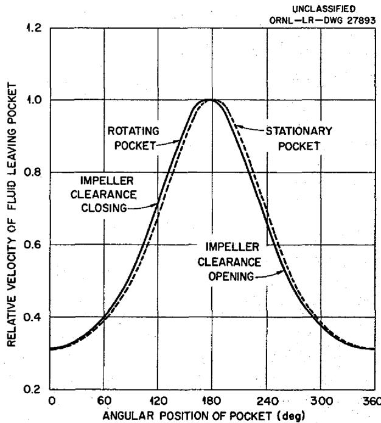  
Fig. 1.1.11. Comparison of Velocities of Fluid Leaving Pockets of Stationary and Rotating Hydrostatic Bearing Systems.

is nearly the same, but there is a slight angular displacement between the curves.

Preliminary calculations for a 16-in.-dia impeller running at 1175 rpm and having 12 pockets around the periphery have been made. The radial clearance was taken as 0.015 in. The load capacity per inch of pocket height is shown in Fig. 1.1.12 as a function of impeller displacement. Circumferential flow between pockets was neglected in these preliminary calculations. A calculation at one point indicated that the circumferential flow would reduce the load capacity about $15\%$ for a bearing 1.5 in. high. If the bearing height were increased, the relative circumferential flow would increase, and the load capacity of the bearing per inch of height would decrease, even though the total load capacity of the bearing would increase. For this bearing, a flow of 0.137 ft³/sec was required with a power consumption of 1.38 hp (net). These values are 1.25 and $0.82\%$ , respectively, of the flow and power consumption of the pump.

An investigation of the effect of varying the pressure and flow indicated that, for the same power consumption, high flow at low pressure would give more load capacity in the bearing than would low flow at high pressure. The pressure developed by a rotating column of fluid is proportional to $R_{o}^{2} - R_{i}^{2}$ , where $R_{o}$ and $R_{i}$ are the outer and inner radii of the fluid supply passage

in the impeller, and therefore increasing $R_{i}$ and enlarging the orifice would result in a larger load capacity of the bearing without increasing the power required for providing the flow for the bearing.

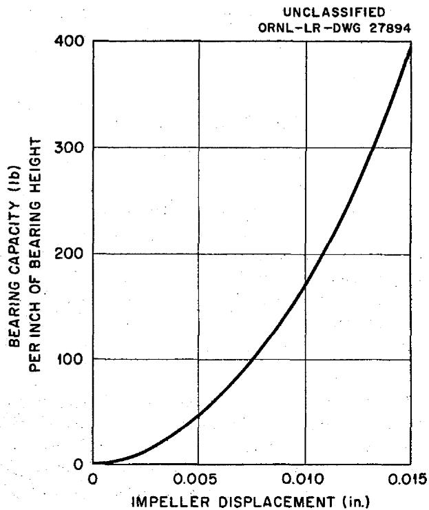  
Fig. 1.1.12. Bearing Capacity vs Displacement of Impeller Having 12 Pockets Around Periphery and Operating at 1175 rpm.

# 1.2. COMPONENT DEVELOPMENT AND TESTING

H. W. Savage

W. B. McDonald

# FUEL PUMP DESIGN AND DEVELOPMENT

W. F. Boudreau

A. G. Grindell

# Pump Design Studies

W.G.Cobb

M. E. Lackey

The optimum design of a fuel pump for a circulating-fuel reactor is, of course, dependent on the general configuration of the reactor and its major components. In turn, the design of the reactor can be substantially influenced by the pump characteristics. This mutual interdependence dictates that pump design must be continuously coordinated with the general reactor design.

One of the major considerations in the design of a centrifugal pump is the problem of cavitation. The onset of cavitation is primarily governed by the net total pressure available at the impeller inlet to lift the salt into the impeller. Cavitation must be avoided, since it can cause physical damage to the impeller or to other parts of the pump. Cavitation data obtained for fused salt pumps at ORNL have been studied in relation to pressures, flow rates, and pressure drops in the heat exchangers and in other portions of the primary fuel circuit of the reference-design reactor. These preliminary studies indicate that five pumps with the following design parameters will be suitable for circulating fuel 130 (BeF $_2$ -LiF-UF $_4$ , 37-62-1 mole $\%$ ):

Flow through pump 4950 gpm

Head produced by pump 71 ft

Temperature at pump inlet 1230°F (max)

Static pressure at pump inlet 19.2 psia

Pump shaft speed 1160 rpm

A pump design is being prepared that is based on these design values, but it is realized that further studies of the reactor design may require changes. It will not be difficult to translate the results of these studies to pumps of other capacities.

The basic design of an impeller and a double volute for the pump was developed that is serving as the basis for a series of pump layouts. Various types and arrangements of bearings (salt-lubricated, oil-lubricated, and gas-lubricated) and seals are being considered in conjunction with at least two different motor arrangements (totally enclosed and conventional). These layouts will permit a determination of the most favorable arrangement of all elements from the standpoints of adaptability to reactor construction, durability, adaptability to remote maintenance operations, reactor operational problems, and so on.

A number of commercial organizations have built pumps for use with liquid metals under service conditions which approach those of the molten salt reactor. In order to utilize their experience, study contracts are to be negotiated with several manufacturers. These companies will be asked to study the fuel pump application in the light of their own experience and to formulate conceptual designs that incorporate their recommendations. Preliminary discussions have been held with representatives of Allis-Chalmers Mfg. Co., Westinghouse Electric Corp., and Byron Jackson Co.

# Development Tests of Salt-Lubricated Bearings

P. G. Smith

L. V. Wilson

The fused salt pumps now in use for development tests have conventional oil-lubricated bearings. These elements impose restrictions on the design and construction of the pump, since the bearings

must be shielded from both the heat and the radiation from the fuel salt in order to avoid damage to the bearings and to the lubricant. The availability of a satisfactory bearing lubricated by the fuel salt would eliminate these restrictions and should permit improvements in pump construction from the standpoints of reliability and simplification.

A survey of existing knowledge concerning materials suitable for use in the construction of salt-lubricated bearings was made, and it was found that at least two combinations of materials showed considerable promise: (1) molybdenum running against tungsten carbide containing 12.5 wt % cobalt and (2) tungsten carbide containing 12.5 wt % cobalt running against itself. The coefficients of thermal expansion of these materials differ from those of INOR-8 and Inconel, however, and therefore there may be design and development problems involved in the use of these materials.

Two high-temperature bearing test units are to be set up. One unit will provide facilities for testing hydrodynamic (plain journal) bearings, and the other will provide for the testing of hydrostatic (fluid piston) bearings. Existing high-temperature equipment will be modified for use in this test program.

The design of the hydrodynamic-bearing test unit has been completed, and procurement and fabrication of parts have been initiated. This test unit will utilize a modified sump pump designed for circulating NaK at high temperatures. The impeller has been removed, and the shaft has been modified to accommodate the rotating portion of the test bearing at its lower end. The stationary element of the bearing is held by a movable arm brought out of the pump tank through a bellows seal. Variable loads can be applied to the bearing by an air cylinder attached to the outer end of the movable arm. A calibrated drive motor is used in order to obtain data on load vs test-unit torque. The test information that will be obtained is expected to permit a good analysis of the behavior of the fused salts of interest as bearing lubricants.

The theory of the hydrodynamic bearing has been well worked out in recent years, and its relative mechanical simplicity tends to facilitate analysis. The initial studies of the pump design problem have indicated, however, that the hydrostatic (fluid-piston) type of bearing may have a number of advantages for use in fused salt pumps. Among

the most important is that such bearings can withstand a considerable amount of mechanical damage without appreciable impairment of their load-carrying capacity. Therefore the second bearing test unit will incorporate a hydrostatic bearing. Layout studies indicate that a satisfactory test unit can be constructed by removing the lower (oil-lubricated) bearing and seal of another pump of the type described above and incorporating a hydrostatic bearing on the shaft immediately above the impeller. The impeller will be used as the source of pressure and load for the bearing.

The novel form of hydrostatic bearing described in Chap. 1.1, which eliminates complexities associated with many conventional hydrostatic bearings, will also be tested. A model that will use water as the lubricant is to be constructed.

The combined geometries of the reactor and the pumps will, of course, determine eventually the location of the pump bearings. Since salt-lubricated bearings could be placed at several locations in the pump, studies of a variety of configurations of salt-lubricated bearings are being made in terms of the basic variables, such as diameter, clearance ratio, and length-to-diameter ratio.

# Development Tests of Mechanical Shaft Seals

Development tests of sump pumps with oil-lubricated shaft seals that were designed for circulating high-temperature NaK have revealed that NaK vapor may diffuse into the seal oil-leakage area and react with the oil to form sludges that interfere with the functioning of the seal. Since oil-lubricated shaft seals would be of use in molten salt reactor applications, means for preventing diffusion of process-fluid vapor into the seal region are being sought.

The flow path of the helium in the seal area (which normally serves to purge the oil leaking from the seal) was changed so that part of the helium would flow upward into the seal area and the remainder would flow downward along the shaft to reduce diffusion of the NaK vapor into the seal region. A pump incorporating this modified seal has now operated for approximately 2600 hr at a NaK temperature of $1200^{\circ}\mathrm{F}$ and a pump speed of 2400 rpm. Seal leakage has been negligible, and no evidences of seal damage have been noted. The test is continuing.

# Development Tests of Oil-Lubricated Bearings

P. G. Smith

W.E.Thomas

The lower bearings for the fuel pumps may possibly be salt-lubricated, as described above, but oil-lubricated bearings may be required at the upper end of the shaft. The oil in these bearings could, of course, be damaged by radiation from the salt fuel. It has been found that the lubricant Dowtherm A, a eutectic mixture of diphenyl and diphenyl oxide, offers the advantage that it decomposes into gaseous and liquid products when irradiated rather than into carbonaceous deposits of the type that result from the irradiation of hydrocarbon-base lubricants. The principal disadvantage of Dowtherm as a lubricant is that it lacks the property of oiliness, that is, the ability to provide very thin films for lubrication.

An experimental evaluation of the behavior of Dowtherm A is being conducted in a special high-temperature sump pump that includes centrifuges for degassing. The pump is circulating fuel 30 (NaF-ZrF₄-UF₄, 50-46-4 mole %) at a temperature of 1200°F; the shaft speed is about 3000 rpm; and the temperature of the lubricant returning from the bearing is maintained at 180°F.

The initial test was terminated by failure of the drive motor after 172 hr of operation. Future tests will be on a long-term basis, except that the pump will be dismantled in order to inspect it for signs of wear at intervals of 1000 hr. Aside from the swelling of some O-rings made of buna N elastomer, no adverse effects attributable to the use of Dowtherm A as a lubricant have been noted.

# Irradiation and Endurance Tests of Bearings and Seals

S. M. DeCamp

W.E.Thomas

Bearings exposed to radiation fields could be lubricated with hydrocarbons if it were possible to limit the dose received by any part of the lubricant to a maximum value of about $10^{9}$ r. In theory, this could be accomplished by changing the lubricant frequently enough to avoid an excessive total dose. In practice, it would be difficult to be certain that all the lubricant was removed from the area of greatest exposure in a sufficiently uniform manner. Irradiation tests have demonstrated that any portion of a hydrocarbon lubricant that receives an excessive dose of radiation will form solid residues and (for some types of lubricant) acidic

products. Such reaction products could be expected to interfere with the removal of the balance of the lubricant from the irradiated area.

A test unit for investigating this problem in a practical situation has been set up in the canal at the MTR. Spent fuel elements are placed around the seal and bearing area of a test unit composed of a bearing housing, a (lower) sleeve bearing, an (upper) double-row ball bearing, upper and lower shaft seals, and a shaft. The lower seal and bearing area will be exposed to a total dose of $1.3 \times 10^{10}$ rep of gamma radiation. Test operation of this unit will be started soon.

A life test of a bellows-mounted seal (all metal, except for the carbon nose piece) is being conducted in a sump pump that is circulating NaK at $1250^{\circ}\mathrm{F}$ ; the pump shaft speed is 2400 rpm. Although the leakage of the seal was high when it was first installed, it has been negligible during the last 400 hr of an accumulated total of 2500 hr of operation.

# DEVELOPMENT OF TECHNIQUES FOR REMOTE MAINTENANCE OF THE REACTOR SYSTEM

# E. Storto

The ability to perform maintenance work on the primary and secondary systems of the reactor within the containment cell is of primary importance to the successful operation of a central-station nuclear power plant. Consideration of the problems involved indicates that the most feasible solution to this maintenance problem is to make all components removable and replaceable by remote manipulation and to arrange and interconnect the components so that the number of replaceable units is minimized. Actual repair work on or disposal of components that had failed would then be carried out in separate hot-cell facilities set up for this purpose. The problems associated with this maintenance concept have been studied, and solutions now being worked out are described in the following sections.

# Mechanical Joint Development

# A. S. Olson

In order for all components of the reactor to be removable and replaceable by remote manipulation, it is necessary to provide a means for remotely separating and joining the pipes which connect the major components of the system. Welded joints provide a system of the highest integrity, of course, and methods for remote welding and

inspection are being developed at other installations. The difficulties are formidable, however, and satisfactory equipment and techniques cannot be expected in the near future. Attention is therefore being given to the development of a reliable mechanical joint.

The freeze-flange type of joint shown in Fig. 1.2.1 is being tested in the Inconel loop illustrated schematically in Fig. 1.2.2. In this type of joint, a frozen seal of molten salt is used to prevent leakage of the salt from the loop through the space between the flanges. An additional seal of soft iron or copper rings is provided to minimize gas leakage during shutdowns of the loop.

Heat transfer from the molten salt in the tubing to the outer edge of the flange is reduced by providing a narrow section in the flange. In addition, there is a channel for air cooling in each flange. The test flanges are made of Inconel and are held together with eight quick-opening toggle clamps, as shown in Fig. 1.2.3.

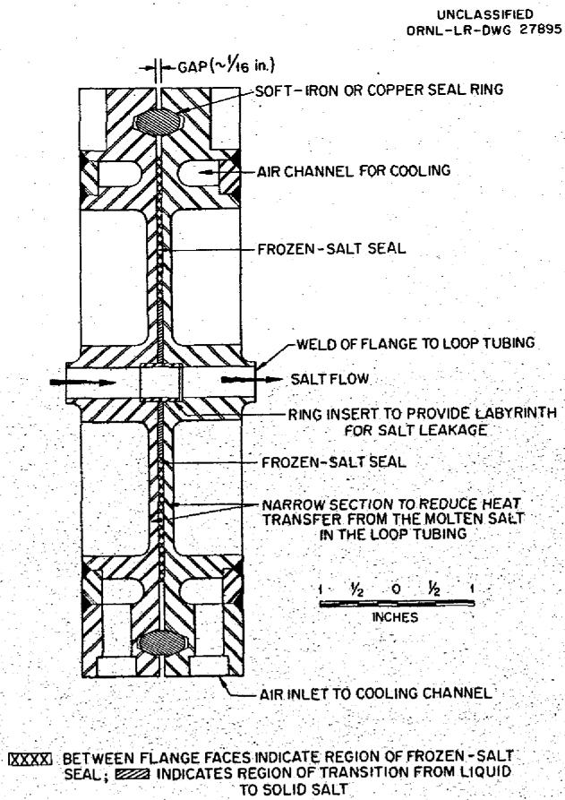  
Fig. 1.2.1. Diagram of Freeze-Flange Joint.

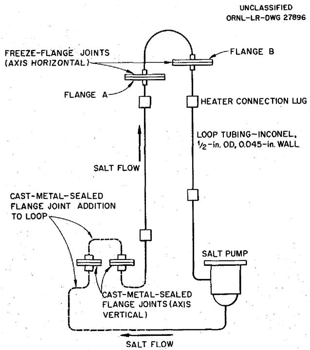  
Fig. 1.2.2. Diagram of Loop for Testing Freeze-Flange Joints and Cast-Metal-Sealed Flange Joints.

During the loop tests, temperatures were measured at the points indicated in Fig. 1.2.4. Fuel 30, which has a melting point of about $970^{\circ}\mathrm{F}$ , was circulated in the loop at a flow rate of 2 gpm. In the first test the salt temperature was cycled 50 times between 1150 and $1300^{\circ}\mathrm{F}$ , and then the loop was operated isothermally for several days at $1300^{\circ}\mathrm{F}$ . The average cycle time was 44 min; a cycle is defined as a temperature variation from 1300 to $1150^{\circ}\mathrm{F}$ and back to $1300^{\circ}\mathrm{F}$ . In the second test the temperature variation of the salt was from 1300 to $1500^{\circ}\mathrm{F}$ and back to $1300^{\circ}\mathrm{F}$ , and the number of cycles was reduced to 30. The average cycle time was 29 min. Representative temperatures measured during both tests are listed in Table 1.2.1.

Both joints operated successfully; there was no indication of salt leakage. Neither the flanges nor the seal rings were damaged by the high temperatures or the strains resulting from the thermal cycling. The frozen seals found upon separating the flanges may be seen in Fig. 1.2.5, and a flange from which the salt has been removed is shown in Fig. 1.2.6. Prior to taking these photographs, the salt had been drained from the loop and the loop had cooled to room temperature.

A new freeze-flange joint is being installed in the loop. The new flanges are identical to those described above except that copper sealing rings are used in place of iron rings. A similar freeze-flange joint is being designed for use in a 4-in. pipe.

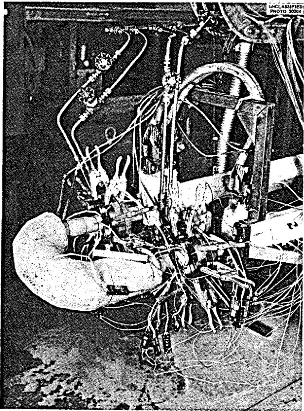

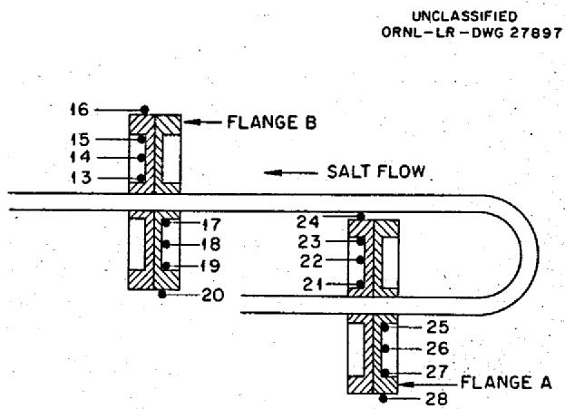  
Fig. 1.2.3. Freeze-Flange Joints in Test Loop.   
Fig. 1.2.4. Locations of Thermocouples on Freeze-Flange Joints.

Gas leakage tests made at room temperature with a helium leak detector show leakage rates for these joints that are below the specified maximum rate of $10^{-7}\mathrm{cm}^3/\mathrm{sec}$ . One joint had a leakage rate of $3 \times 10^{-9}\mathrm{cm}^3/\mathrm{sec}$ , and the rate for another was $2.4 \times 10^{-8}\mathrm{cm}^3/\mathrm{sec}$ .

A flange joint which has a cast-metal seal between the two halves has also been designed, and tests are to be made with two sealing materials: silver and an alloy of $72\%$ silver and $28\%$ copper (see Chap. 2.1 for details of selection of sealing materials). A seal will be formed by fusion of the sealing material before the loop is charged with salt. The seal material will be in the solid state during operation. Joints of this type are being incorporated into the test loop, as shown in Fig. 1.2.2. A diagram of the cast-metal-seal flange joint is shown in Fig. 1.2.7.

A flange joint with a soft-annealed copper ring for sealing the two flanges has also been designed. A raised tooth of V-shaped cross section, machined on the face of each flange, indents a flat copper

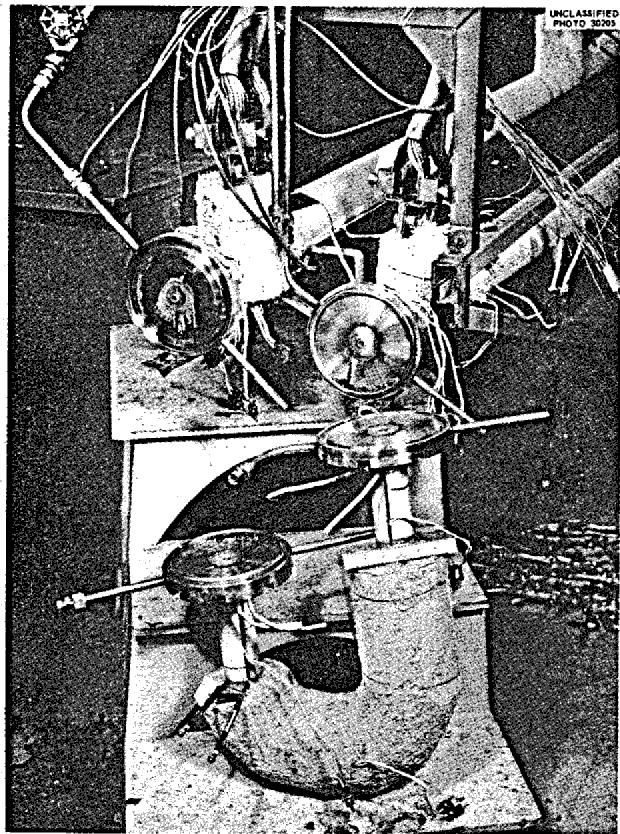  
Fig. 1.2.5. Flanges Shown in Fig. 1.2.3 After Tests. Note frozen-salt seals.

Table 1.2.1. Freeze-Flange Temperatures Measured During Thermal Cycles   

<table><tr><td rowspan="2">Thermocouple Number*</td><td colspan="4">Test No. 1 - Salt Temperature Cycled 50 Times Between 1150 and 1300°F</td><td colspan="4">Test No. 2 - Salt Temperature Cycled 30 Times Between 1300 and 1500°F</td></tr><tr><td>Minimum Temperature (°F)</td><td>Cycle Number</td><td>Maximum Temperature (°F)</td><td>Cycle Number</td><td>Minimum Temperature (°F)</td><td>Cycle Number</td><td>Maximum Temperature (°F)</td><td>Cycle Number</td></tr><tr><td>21</td><td>862</td><td>16</td><td>1018</td><td>33,50</td><td>960</td><td>3</td><td>1170</td><td>21,24</td></tr><tr><td>22</td><td>625</td><td>16</td><td>760</td><td>33,50</td><td>695</td><td>1,3</td><td>950</td><td>9</td></tr><tr><td>23</td><td>450</td><td>6,14,20</td><td>577</td><td>16</td><td>500</td><td>3</td><td>652</td><td>9</td></tr><tr><td>24</td><td>245</td><td>16</td><td>280</td><td>50</td><td>275</td><td>3</td><td>305</td><td>30</td></tr><tr><td>25</td><td>693</td><td>10</td><td>820</td><td>4</td><td>810</td><td>6,12</td><td>942</td><td>1</td></tr><tr><td>26</td><td>490</td><td>16</td><td>580</td><td>4</td><td>582</td><td>6,21</td><td>665</td><td>1</td></tr><tr><td>27</td><td>348</td><td>16</td><td>405</td><td>50</td><td>410</td><td>6</td><td>452</td><td>1,9,27,30</td></tr><tr><td>28</td><td>205</td><td>16</td><td>240</td><td>4</td><td>250</td><td>1,3,6</td><td>260</td><td>9,24</td></tr><tr><td>13</td><td>798</td><td>6</td><td>957</td><td>33</td><td>915</td><td>3,6</td><td>1122</td><td>21</td></tr><tr><td>14</td><td>560</td><td>16</td><td>685</td><td>41</td><td>660</td><td>1,3</td><td>905</td><td>27</td></tr><tr><td>15</td><td>375</td><td>16</td><td>447</td><td>41</td><td>465</td><td>6</td><td>595</td><td>15,21,27</td></tr><tr><td>16</td><td>200</td><td>10,16</td><td>228</td><td>37</td><td>255</td><td>24</td><td>305</td><td>27</td></tr><tr><td>17</td><td>748</td><td>16</td><td>865</td><td>2</td><td>865</td><td>12,18,21</td><td>1010</td><td>1,3</td></tr><tr><td>18</td><td>510</td><td>16</td><td>590</td><td>2</td><td>615</td><td>12,18</td><td>700</td><td>1,6</td></tr><tr><td>19</td><td>315</td><td>16</td><td>362</td><td>50</td><td>410</td><td>6</td><td>450</td><td>3,6,9,30</td></tr><tr><td>20</td><td>185</td><td>16</td><td>215</td><td>50</td><td>260</td><td>21</td><td>278</td><td>30</td></tr></table>

*See Fig. 1.2.3 for location of thermocouple.

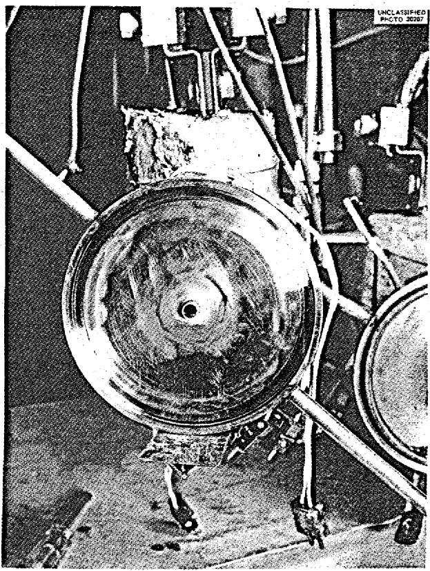  
Fig. 1.2.6. Tested Flange After Removal of Frozen Salt.

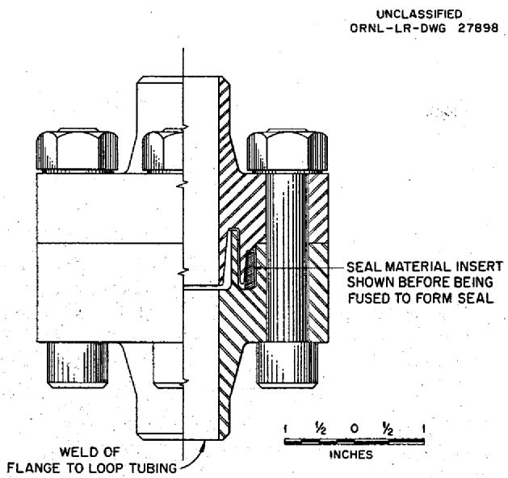  
Fig. 1.2.7. Diagram of Cast-Metal-Sealed Flange Joint.

ring to provide a tight seal when the joint is formed. A diagram of this indented-seal flange is shown in Fig. 1.2.8, and actual parts are shown in Fig. 1.2.9.

Gas leakage tests made at room temperature with a helium leak detector showed the indented seal flange joint to have a leakage rate of $1.3 \times 10^{-9} \, \text{cm}^3/\text{sec}$ when the two flanges were clamped together with a new copper seal ring. A leakage rate of $6 \times 10^{-8} \, \text{cm}^3/\text{sec}$ was obtained after reassembly of the flanges without replacement of the previously indented copper ring. Both leakage rates are below the leakage rate allowed by the specifications. High-temperature tests of this type of joint are planned.

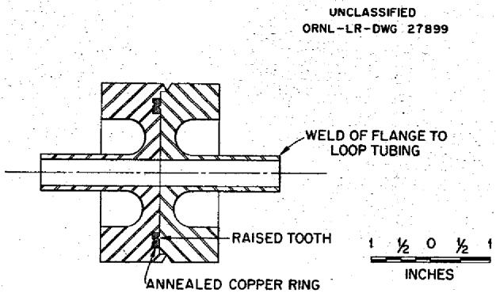  
Fig. 1.2.8. Diagram of Indented-Seal Flange Joint.

# Remote Manipulation Techniques

# C. K. McGlothlan

Consideration of the various types of remote-handling apparatus now available commercially indicates that they may be applicable to maintenance of the molten salt reactor system. Experience in the use of such apparatus has indicated, however, that some modifications of the commercial equipment would be desirable and that considerable work will be required to develop special tools and techniques for using the equipment effectively.

Equipment has been set up for studying the problems associated with remote maintenance work. The component being used for the initial experiments is a pump that has been used for circulating NaK at high temperatures. The manipulation apparatus is a new General Mills model E-3

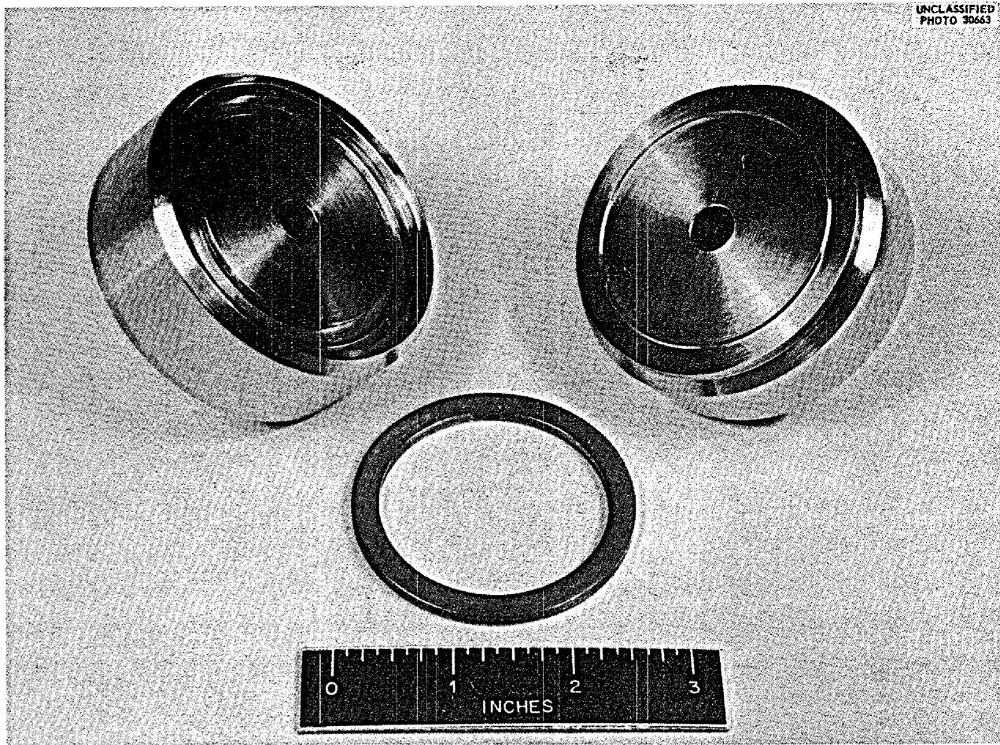  
Fig. 1.2.9. Components of an Indented-Seal Flange Joint.

mechanical arm mounted on the standard General Mills carriage and traveling bridge. The operations to be performed are listed below:

1. Remove the pump cover flange bolts.   
2. Disconnect the tachometer cables.   
3. Disconnect oil and cover-gas service lines.   
4. Insert the lifting eye in the impeller shaft.   
5. Loosen the pump cover flange.   
6. Remove the pump rotary element.   
7. Align and replace the pump rotary element.   
8. Replace the pump cover flange bolts.   
9. Tighten the pump cover flange.   
10. Reconnect the service lines.   
11. Reconnect the tachometer cables.

Moving pictures will be taken to assist in motion studies and in the development of techniques applicable to the handling of other components. The cell in which the experiments are to be performed is shown in Fig. 1.2.10.

# Heater-Insulation Units for Remote Application

A. L. Southern

All pipes and components of the reactor system will have to be preheated and insulated. Therefore methods are being studied for rapid, remote removal and replacement of heater elements, and preliminary studies have indicated that heater-insulation units are required that will incorporate the following features:

1. short, light sections contoured to fit specific components or pipe sections,   
2. ceramic clamshell heating elements built into the insulation blanket,   
3. hinged construction to permit unfastening, removal, lifting, and replacement as a unit,   
4. plug-in electrical connections.

Design work on such heater-insulation units has been initiated. Vendors of resistance-heating

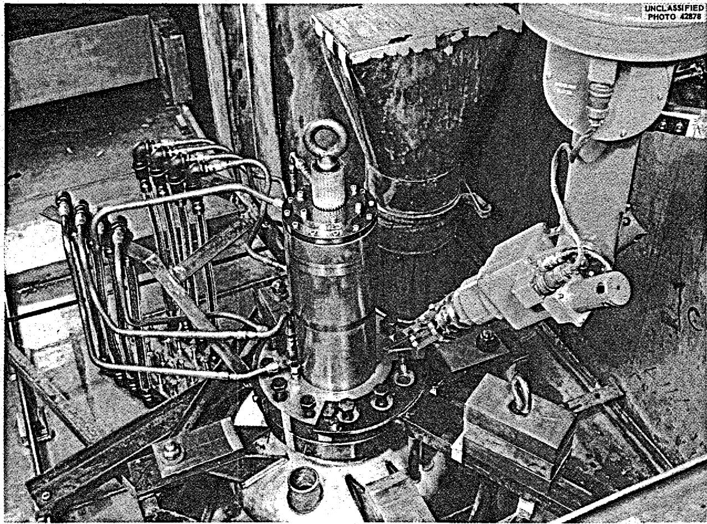  
Fig. 1.2.10. Cell for Remote Maintenance Experiments.

elements have indicated their willingness to assist in developing heaters to meet the requirements, and plans are being made to build and test experimental units.

# Maintenance Demonstration Facility

# E. Storto

The feasibility of system features, equipment, and techniques developed experimentally for application to a remotely maintainable reactor system is to be determined in a large-scale demonstration facility. The configuration of this facility will be essentially the same as that of the reactor cell, and mockups of components will be used to determine the best arrangements for accessibility, minimization of fuel holdup and pumping power, ease of observation, and efficiency of space

utilization. Equipment will be provided for circulating a barren fused salt at reactor design temperatures and pressures in simulated reactor primary and secondary circuits in order to test mechanical joints, the replaceability of components, the adequacy of heater-insulation units, the unitization of wiring harness and service piping, and the application of remote-viewing and -handling apparatus and techniques.

Thus far, preliminary facility layout studies have been made, and work has been started on a small-scale wooden and plastic model to assist in visualization and resolution of space conflicts. Preliminary specifications have been prepared for the procurement of a remote manipulator of the General Mills model E-3 type that incorporates modifications suggested by ORNL experience with this equipment. Work orders have been

written for the clearing of an area for the facility in Bldg. 9201-3 at the Y-12 Plant and for construction of a craneway for the manipulator bridge. Arrangements have been made to study the application of a commercial, closed, television circuit to reactor system maintenance problems.

# HEAT EXCHANGER DEVELOPMENT

J.C.Amos R.E.MacPherson R.L.Senn

Heat transfer correlations for use in predicting heat exchanger performance are required for the development of a realistic heat exchanger design. While standard heat transfer correlations have been found to be satisfactory for predicting the heat transfer performance of some molten salts, the performance of some other salts has been found to deviate from these correlations for various reasons. For example, the heat transfer characteristics of some salts appear to be critically affected by the type of material selected for heat exchanger construction. Also, differences in heat transfer performance of some salt mixtures have been attributed to a difference in wetting properties of the salts. It is, therefore, essential that heat transfer correlations for the specific salt mixtures under consideration for use in the molten salt reactor be determined experimentally so that proposed heat exchanger designs can be adequately evaluated.

Heat transfer coefficients will be determined in laboratory-scale single-tube test apparatus (see Chap. 1.3 of this report), and it has already been possible to obtain pertinent fused salt heat transfer data from a relatively large-scale heat exchanger test facility that was available. A schematic flow diagram of the test facility is shown in Fig. 1.2.11. All components of this system are Inconel, and heat is supplied to the fused salt by direct resistance heating of the Inconel tubing. The heat is transferred from the salt flowing in the tubes to NaK flowing in the shell side of a 25-tube heat exchanger of the type shown in Fig. 1.2.12, and heat is removed from the NaK by a 500-kw NaK-to-air heat dump. Salt and NaK flow rates are measured by venturis equipped with Moore Nullmatic pressure-measuring devices. The NaK flow rate is also measured with an electromagnetic flowmeter. All temperatures are measured with Chromel-Alumel thermocouples. The NaK loop is equipped with a circulating cold

trap for control of the oxide content. This test facility, which is designated Small Heat Exchanger Test Stand C (SHE-C), is shown in Figs. 1.2.13 and 1.2.14. Heat transfer data are presently being obtained for fuel 130. Other fuel salts will be tested as required.

The system was calibrated by making a test run with fuel 30 (NaF-ZrF4-UF4, 50-46-4 mole %), for which heat transfer data were available. Data were obtained over a fused salt Reynolds number range of 425 to 6150 at temperatures ranging from 1100 to $1300^{\circ}\mathrm{F}$ . The heat balances obtained were in good agreement throughout; there was, normally, agreement to within $2\%$ .

Preliminary analyses of data obtained for fuel 130 are being made. Since the physical property data currently being used for this salt were extrapolated from data on other salts, complete correlation of these data with results for other fluids cannot be made until physical property data for fuel 130 are determined experimentally. Approximate heat transfer coefficients can, however, be obtained with the current information. A block diagram showing operating conditions for a typical heat transfer run is presented in Fig. 1.2.15.

The difficulty of accurately predicting liquid metal heat transfer performance in heat exchanger shells may make desirable the further refinement of the fused salt data by substituting a fused salt of known heat transfer properties for the NaK now being circulated in the secondary loop. Such a substitution, if made, would require further modifications of the test facilities.

# DESIGN, CONSTRUCTION, AND OPERATION OF MATERIALS TESTING LOOPS

Forced-Circulation Loops

J. L. Crowley

The corrosion of various materials, particularly Inconel and INOR-8, by fused salt mixtures in the temperature range 1100 to $1300^{\circ}\mathrm{F}$ is being investigated with forced-circulation loops in which high thermal gradients can be attained in order to simulate reactor operating conditions. Low corrosion rates are anticipated for Inconel and INOR-8 in contact with the fused salts of interest in the MSR program, and thus long-time effects are to be investigated. Satisfactory operation of a loop will imply operation for one year or longer

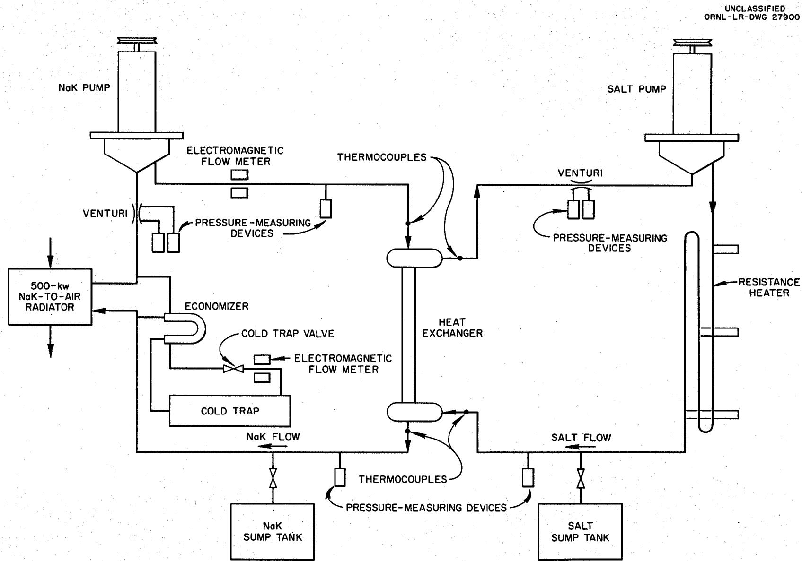  
Fig. 1.2.11. Schematic Flow Diagram of Small Heat Exchanger Test Stand C.

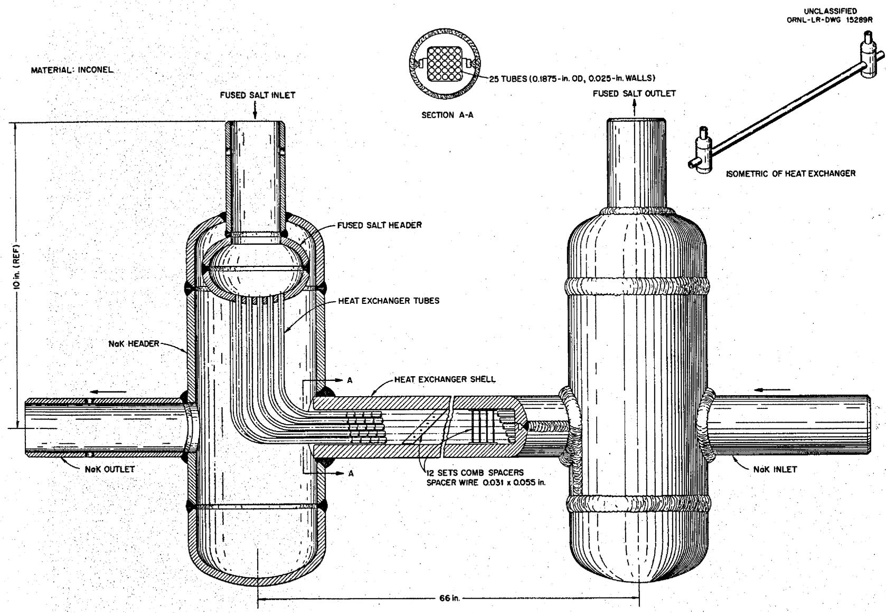  
Fig. 1.2.12. Diagram of Small Heat Exchanger of the Type Being Used To Obtain Fused Salt Heat Transfer Data.

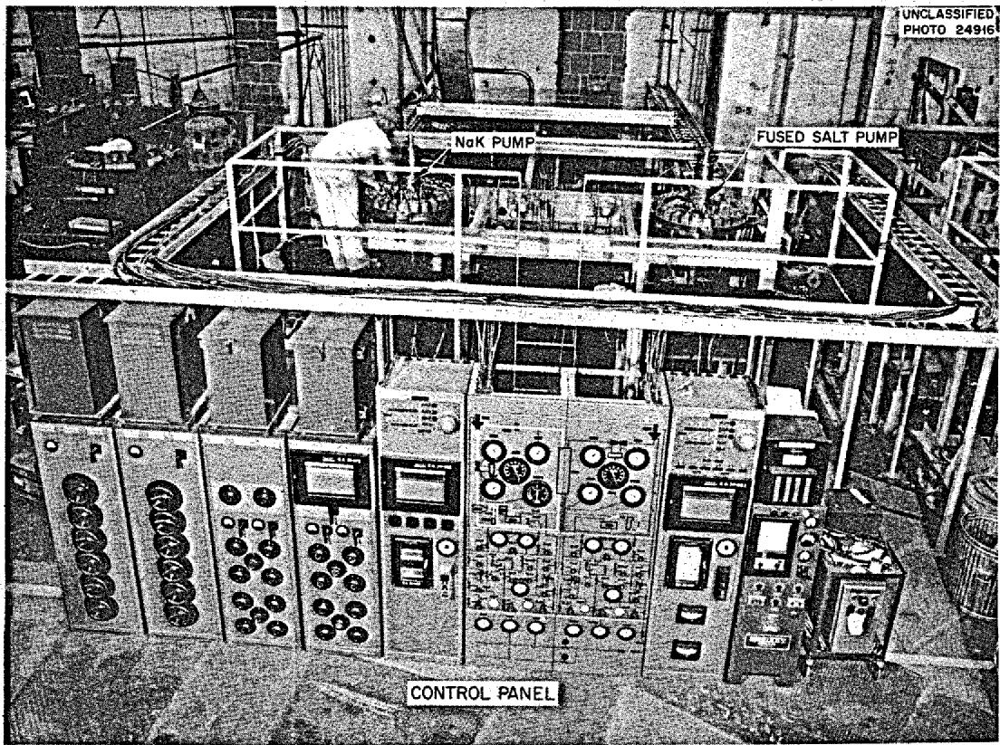  
Fig. 1.2.13. Small Heat Exchanger Test Stand C.

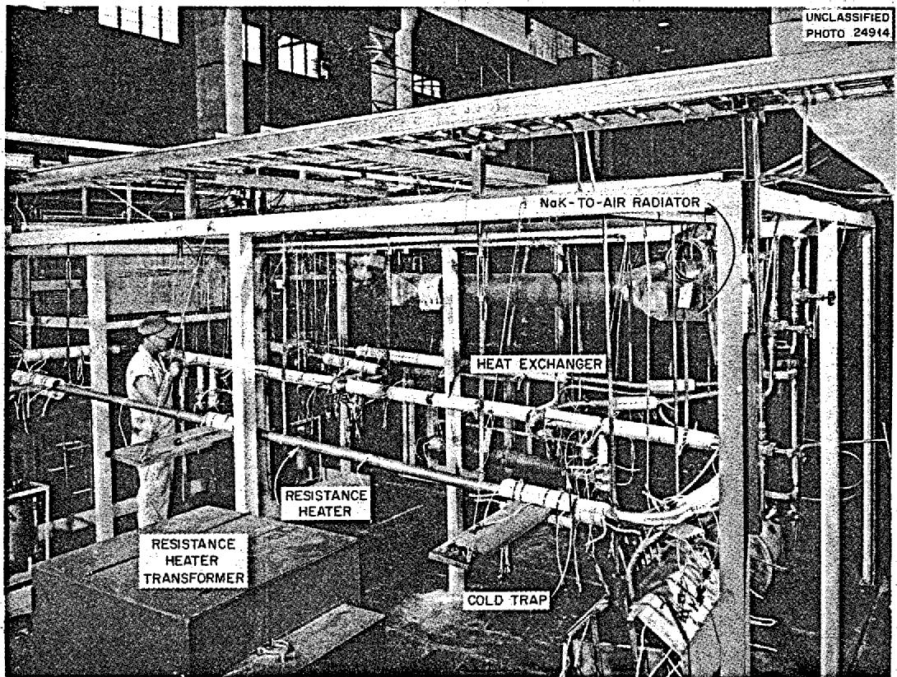  
Fig. 1.2.14. Piping Arrangement of Small Heat Exchanger Test Stand C.

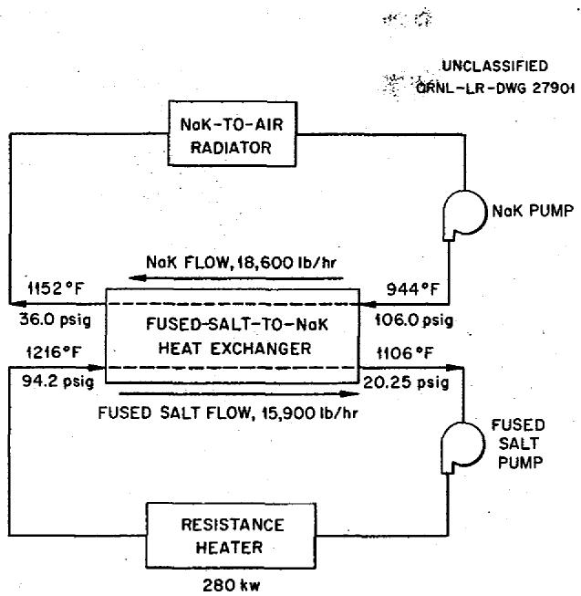  
Fig. 1.2.15. Block Diagram Showing Typical Operating Conditions for a Heat Transfer Run in Test Stand SHE-C.

without significant equipment difficulties or changes in operating conditions. The scope of the planned tests requires at least 15 test facilities, nine of which were available at the start of the quarter and two of which became available during the period. The remaining loops are being constructed.

The operating experience thus far has shown the need for improvements in test stand reliability, and therefore more precise methods for inspecting, maintaining, and assuring continuity of operation of test stand components are being provided. Four Inconel and three INOR alloy loops are circulating salt mixtures, and one Inconel bifluid loop is in operation that has separate sodium and salt circuits connected through a U-tube heat exchanger. All the loops ceased to operate and the salts froze during an unanticipated, unprotected power outage, and two Inconel loops, including the bifluid loop, failed as a result. For the INOR-8 loops fabricated to date, Hastelloy B pumps have been used because INOR-8 pumps were not available. Three of these INOR-8 loops have failed in the sections made of Hastelloy B, which does not weld readily and becomes brittle. INOR-8 pumps will be used in future loops. (Discussions of solutions to fabrication problems are presented in Chap. 2.1 of this report.)

The availability of good quality INOR-8 is improving, and two special INOR-8 loops have been constructed. One of these includes graphite specimens and the other includes special INOR-8 specimens for weight loss studies.

In the weight loss studies an effort will be made to determine accurately the corrosion rate of INOR-8 at a wall temperature of $1300^{\circ}\mathrm{F}$ , when exposed to a fused salt, by carefully measuring and weighing the inserts. Provisions will be made to assure that the specimens are not exposed to the atmosphere before and after exposure. Three samples will be exposed, each for a different time, in an effort to establish a corrosion rate which may be extrapolated to operating periods of several years.

The loop for the weight loss studies was designed, as shown in Fig. 1.2.16, to incorporate the three samples at the hot end of the heater section with a separate power source to control the wall temperatures. The samples were machined to fit inside a sleeve. The samples and the sleeve were fused together at the ends when welded into the loop piping so that current would pass through the samples.

The loop which contains graphite specimens will be examined after operation to determine the extent to which graphite causes carburization of INOR-8 and the effects of the fused salt on graphite. Specimens of impervious graphite especially prepared by the National Carbon Company are being used. The graphite-specimen assembly is shown in Fig. 1.2.17. The graphite container was designed to give a graphite-to-INOR-8 surface area ratio of 0.67. It has been installed at the outlet of the heater section of a standard forced-circulation loop fabricated of $3\frac{1}{6}$ -in.-dia, 0.035-in.-wall INOR-8 tubing. The graphite rods are 11 in. long; 32 of them are $1/2$ in. in diameter and 24 are $3/16$ in. in diameter. At both ends of the container, retainer and baffle plates hold the rods in place and distribute the flow. The $1/2$ -in. rods are separated from each other by wire spacers wound around them at 3-in. intervals. The rods were carefully weighed after the spacers were installed, and their positions were noted before the box was sealed.

The bifluid loop that was placed in operation in March 1957 had accumulated a total of 6673 hr of operation at the specified temperatures and flow rates when operation of the loop was terminated

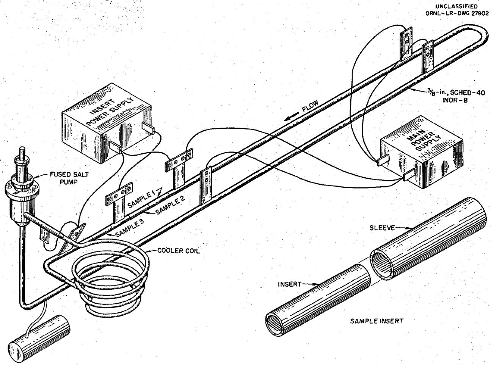  
Fig. 1.2.16. Diagram of Forced-Circulation Loop for Weight-Loss Studies of INOR-8 Exposed to Circulating Fused Salts.

by the power failure described above. Freezing of the salt in the loop caused a section of the first heater leg to rupture. This damaged tubing section and the pump and pump motor have been replaced. The salt circuit of the loop was refilled with a new charge of fuel 122, but the original sodium charge is being used. Operation was resumed on January 13, 1958. (The results of examinations of samples removed from the damaged portion of this loop are reported in Chap. 2.1 of this report.)

The loops that have been operated or are now operating are listed in Table 1.2.2, which also gives operating data. A maximum pump speed of 3000 rpm has been established on the basis of test experience in order to ensure long life. At this speed, full turbulence in the fluid is difficult to attain, however. The Reynolds numbers are low

and vary widely for different fluids because of differences in viscosities.

# In-Pile Loops

D. B. Trauger

J.A.Conlin

P.A.Gnadt

Authorization has been requested for irradiation of a forced-circulation loop in the MTR. The loop is to consist of a hairpin of $\frac{1}{8}$ -in., sched-40 pipe with additional coils in the nose end near the reactor face, a miniature pump to circulate the fuel, and a salt-to-air heat exchanger. Shielding, auxiliary cooling, pump drive mechanisms, and instrumentation will also be provided. Operation of the loop will provide information on fuel stability and on the corrosion of INOR-8 under

Table 1.2.2. Forced-Circulation Loop Operations Summary as of January 31, 1958   

<table><tr><td>Loop Designation</td><td>Loop Material and Size</td><td>Composition Number of Circulated Fluid*</td><td>Flow Rate (gpm)</td><td>Approximate Reynolds Number</td><td>Maximum Wall Temperature (°F)</td><td>Minimum Fluid Temperature (°F)</td><td>Maximum Fluid Temperature (°F)</td><td>Hours of Operation at Conditions Given</td><td>Comments</td></tr><tr><td>9344-1</td><td>Inconel, 1/2 in. OD, 0.045 in. wall</td><td>123</td><td>2.0</td><td>3250</td><td>1300</td><td>1100</td><td>1210</td><td>2400</td><td>Operation continuing; salt has frozen twice because of control difficulty and a power failure</td></tr><tr><td>9344-2</td><td>Inconel, 1/2 in. OD, 0.045 in. wall</td><td>12</td><td>2.5</td><td>8200</td><td>1200</td><td>1000</td><td>1100</td><td>1328</td><td>Loop failed on thaw-out attempt after power failure; repairs under way; operation to be resumed</td></tr><tr><td>9377-1</td><td>Inconel, 1/2 in. OD, 0.045 in. wall</td><td>126</td><td>2.0</td><td>1600</td><td>1300</td><td>1100</td><td>1175</td><td>1890</td><td>Operation continuing; salt froze once because of power failure</td></tr><tr><td>9733-2</td><td>Inconel, 1/2 in. OD, 0.045 in. wall</td><td>130</td><td>2.0</td><td>3000</td><td>1300</td><td>1100</td><td>1210</td><td>1510</td><td>Operation continuing; salt has frozen twice because of motor control difficulties and a power failure</td></tr><tr><td rowspan="2">9354-3</td><td rowspan="2">INOR-8 Hot leg, 3/8 in. sched 40 Cold leg, 1/2 in. OD, 0.045 in. wall</td><td rowspan="2">84</td><td rowspan="2">2.75</td><td>4500</td><td rowspan="2">1200</td><td rowspan="2">1070</td><td rowspan="2">1150</td><td rowspan="2">1160</td><td rowspan="2">Operation continuing; salt has frozen twice because of motor control difficulties and a power failure</td></tr><tr><td>5400</td></tr><tr><td>9354-1</td><td>INOR-8, 1/2 in. OD, 0.045 in. wall</td><td>126</td><td>2.5</td><td>2000</td><td>1300</td><td>1100</td><td>1210</td><td>184</td><td>Failed on startup; repaired and restarted, but flow stoppages because of plugs finally resulted in second failure; repairs being made</td></tr><tr><td>9354-2</td><td>INOR-8, 1/2 in. OD, 0.045 in. wall</td><td>12</td><td>2.0</td><td>6500</td><td>1200</td><td>1050</td><td>1140</td><td>112</td><td>Hastelloy pump bowl failed after 112 hr of operation; repairs being made</td></tr><tr><td rowspan="2">CPR</td><td rowspan="2">Inconel</td><td>122</td><td>1</td><td>5000**</td><td rowspan="2">1250</td><td>1095</td><td>1190</td><td rowspan="2">6673</td><td rowspan="2">Operation continuing; salt has frozen twice; part of salt tubing damaged second time and replaced; pump replaced and fuel replaced after second freeze</td></tr><tr><td>Sodium</td><td>~7</td><td>97,700</td><td>1085</td><td>1135</td></tr></table>

*Composition 123: NaF-BeF $_2$ UF $_4$ (53-46-1 mole %)   
Composition 12: NaF-LiF-KF (11.5-46.5-42 mole %)   
Composition 126: LiF-BeF $_2$ -UF $_4$ (53-46-1 mole %)   
Composition 130: LiF-BeF2-UF4 (62-37-1 mole %)   
Composition 84: NaF-LiF-BeF, (27-35-38 mole %)   
Composition 122: NaF-ZrF $_4$ -UF $_4$ (57-42-1 mole %)

\*\*In heat exchanger.

UNCLASSIFIED PHOTO 30631

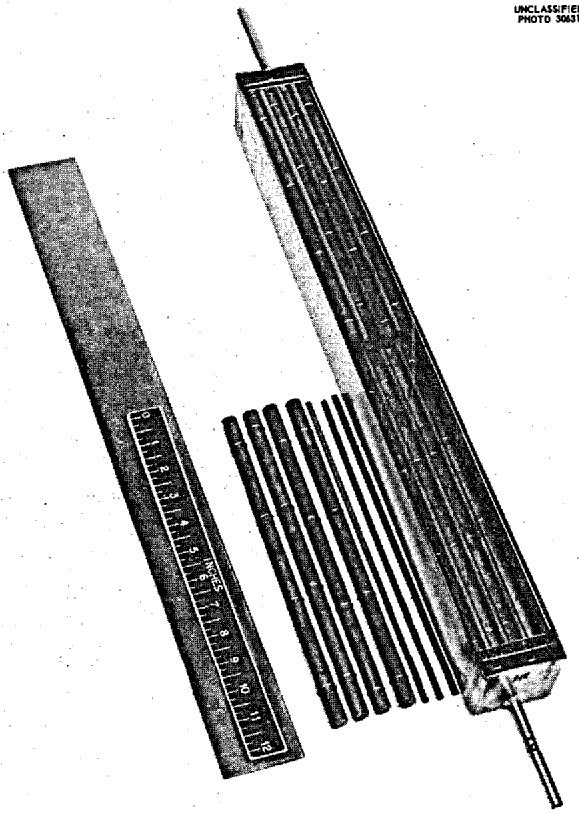  
Fig. 1.2.17. Graphite Specimen Assembly for Insertion into INOR-8 Forced-Circulation Loop.

simulated reactor service conditions. The operating conditions specified are listed below:

Average loop power density 50 w/cm³

Nose coil power density 187 w/cm³

Maximum wall temperature 1300°F

Maximum temperature difference (obtained by the addition of 4 kw of electric heat)

Pump speed 1700 rpm

Flow velocity 2.7 fps

Proposed test duration 2000 hr

Reynolds number 1600

Fission power 7.8 kw

A section of the heat exchanger and the heater have been fabricated, and out-of-pile tests of these components will be initiated as soon as they can be incorporated into an existing heat transfer test loop.

# 1.3. ENGINEERING RESEARCH

H.W.Hoffman

# HYDRODYNAMIC STUDIES OF MSR CORE

# F. E. Lynch

The molten salt reactor as presently designed has a spherical core. Three entrance-exit systems have been proposed for this core, namely, inlet and outlet diametrically opposite each other with straight-through flow, inlet and outlet concentric with the fluid entering through the inner pipe and exiting through the outer annulus, and inlet and outlet concentric with the fluid entering through the annulus and exiting through the inner pipe. With each of these entrance-exit systems, stagnation and flow separation are possible in the spherical core region and could cause excess heating of the core walls and thermal cycling of reactor components.

Glass models of each of the three core configurations have been fabricated from large (13.7-in.-ID) Pyrex reaction vessels. Two of the models are shown in Figs. 1.3.1 and 1.3.2. The straight-

through core has 6-in.-dia entrance and exit pipes. The concentric system has a 4-in.-dia central pipe within a 6-in.-dia 90-degree elbow. In the model for annular flow studies, the central tube is flared outward at the bottom to direct the flow along the spherical surface.

Initial qualitative data have been obtained for the concentric system with fluid entering through the central pipe by using the phosphorescent-particle flow-visualization technique. Both visual observation of particle motion within a continuously illuminated plane and photographic recording of instantaneous velocity profiles were employed in obtaining the data. Figure 1.3.3 shows the results obtained visually at an inlet Reynolds modulus of 80,000 (2.58 fps in the 4-in. pipe). The inlet jet was of sufficient strength to retain its shape (a 4-in.-dia cylinder) to the bottom of the vessel. At this point the fluid turned and moved upward in $\alpha \frac{1}{2}$ -to $\frac{3}{4}$ -in.-wide annular region immediately

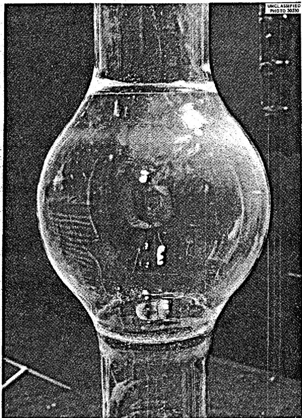  
Fig. 1.3.1. MSR Straight-Through Flow Model.

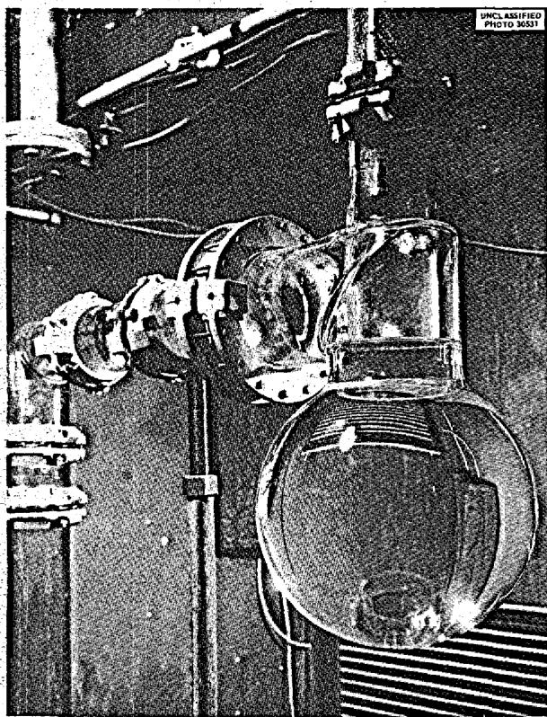  
Fig. 1.3.2. MSR Concentric Entrance-Exit Core Model Designed for Fluid to Enter Through Inner Pipe.

UNCLASSIFIED ORNL-LR-DWG 27903

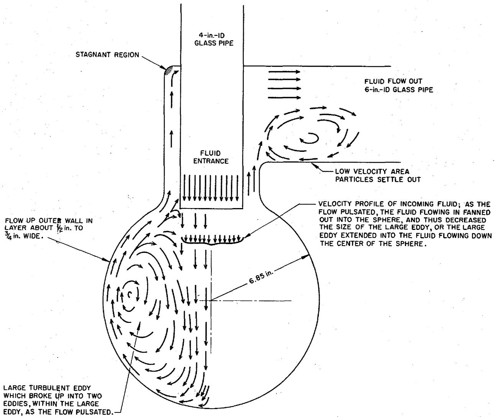  
Fig. 1.3.3. Flow Patterns Observed Within an Illuminated Plane of the Concentric Entrance-Exit Core Model with Fluid Entering Through Inner Pipe.

adjacent to the core wall. The volume between these two flow regions was filled with a large toroidal eddy, with its axis of rotation lying near the main upward flow. Because of unsteadiness in the flow-generating system, the flow patterns fluctuated. The main effect of these pulsations was in the structure and size of the large eddy. During periods of pulsation, the central core of the eddy broke up into two smaller eddies surrounded by the larger rotating mass. It can be

seen that the eddy removes fluid from the exiting stream and recirculates this liquid through the high heat generation regions of the core. If good mixing occurs, there could result a uniform increase of the exit temperature that corresponded to a longer fluid residence time in the core. However, there exists a strong possibility that the outgoing stream will contain discrete fluid bodies that will be at temperatures considerably higher than the mixed-mean temperature. Under these conditions,

high-frequency thermal cycling of system components could occur.

Several typical instantaneous-profile photographs of the flow in the concentric system are shown in Fig. 1.3.4. Since grid photographs are not available, quantitative velocity analyses of the data cannot be made. In all cases the time lapse between the initial excitation and the recording of the profile was approximately 0.1 sec. In Fig. 1.3.4a the velocity profile at the exit of the inlet pipe is shown. The straight light line above the profile indicates the initial excitation, or zero-time line. The zero-time line is either directly marked or indicated by a small triangle near the outer sphere wall on all the photographs. The profile in the outer annulus is also visible in Fig. 1.3.4a. Figure 1.3.4b shows the profile at a position just above the equator of the sphere, and both the downward central flow and the upward flow along the wall may be seen. The effect of flow pulsation may be seen clearly in Figs. 1.3.4c and 1.3.4d for excitations at the same position but at different times. Figure 1.3.4e shows a profile obtained at a 45-deg angle near the sphere bottom. This photograph indicates a very rapid drop-off in velocity in moving radially away from the surface and defines clearly the extent of the low velocity region (high light-intensity region).

Studies will be continued with this model, as well as with the straight-through and the annular entrance systems. The effects on the velocity pattern of inducing vortex motion by a generator located at the entrance will also be determined.

# PHYSICAL PROPERTY MEASUREMENTS

# W.D.Powers

Experimental determinations are being made of the viscosities and thermal conductivities of several $\mathrm{BeF}_2$ -bearing fluoride salt mixtures. The compositions to be studied have been prepared, and preliminary measurements are being made on one mixture. The toxicity of the beryllium salts dictated that all measurements be made in inert gas dry boxes. For the viscosity study, the efflux cup (capillary) viscometer will be used. This instrument consists of a 1-in.-long capillary tube through which the fluid drains from a reservoir with a capacity of about $6\mathrm{cm}^3$ . The time required for the reservoir to empty through the tube is directly proportional to the kinematic viscosity. The cups to be used have been calibrated with

glycerine-water solutions whose viscosities have been accurately obtained with Cannon-Fenske-Ostwald viscometers.

The thermal conductivities of several $\mathsf{BeF}_2$ -containing fluoride salt mixtures will be measured with the use of a variable-gap device. In this apparatus the molten salt is contained in the gap between two parallel plates, the upper plate being movable. A series of measurements are made for various salt thicknesses. This technique permits the separation of interfacial and metal thermal resistances so that the thermal conductivity of the salt alone is obtained.

# MOLTEN SALT HEAT TRANSFER STUDIES

# H.W.Hoffman

Heat transfer studies of molten salts1,2 have indicated that the general correlations for heat transfer of ordinary fluids $(0.5 < N_{\mathsf{P_r}} < 100)$ also apply to the salts. However, these investigations have also shown that for some metal-salt combinations marked reductions in system heat transfer occur because of interfacial film formation and nonwetting. Therefore, data on these phenomena are needed for the design of critical heat transfer components.

The apparent heat transfer coefficient experimentally determined for flow through a single circular tube has been found to be a sensitive indication of the presence of nonwetting or interfacial film formation in molten salt systems. The experimental apparatus developed for such heat transfer coefficient determinations is shown in Fig. 1.3.5, and a schematic diagram of the system is shown in Fig. 1.3.6. It is proposed to use this apparatus to study the salt mixture $\mathsf{LiF - BeF}_2\mathsf{-UF}_4$ (53-46-1 mole %) in both Inconel and INOR-8 systems. The molten salt, contained in the two tanks, is cycled through an electrical-resistance-heated test section by pressurizing one of the tanks with the helium blanket gas while venting the other tank. When the salt has been transferred into the vented tank, the pressures are automatically

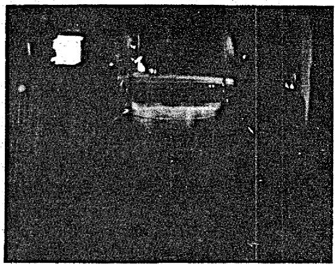  
(a)

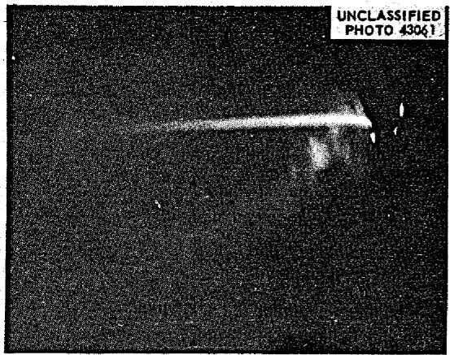  
(b)

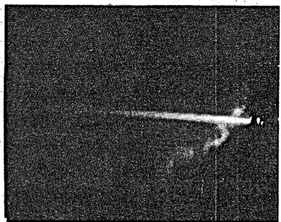  
(c)

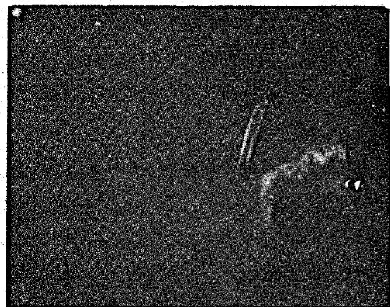  
(d)

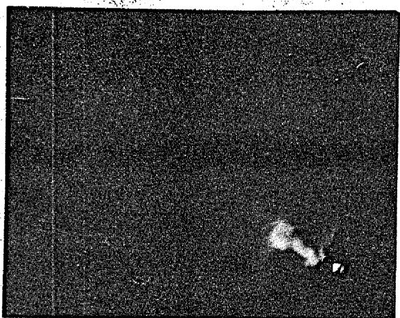  
(e)   
Fig. 1.3.4. Instantaneous-Velocity-Profile Photographs in Concentric Entrance-Exit Core Model with Fluid Entering Through Inner Pipe.

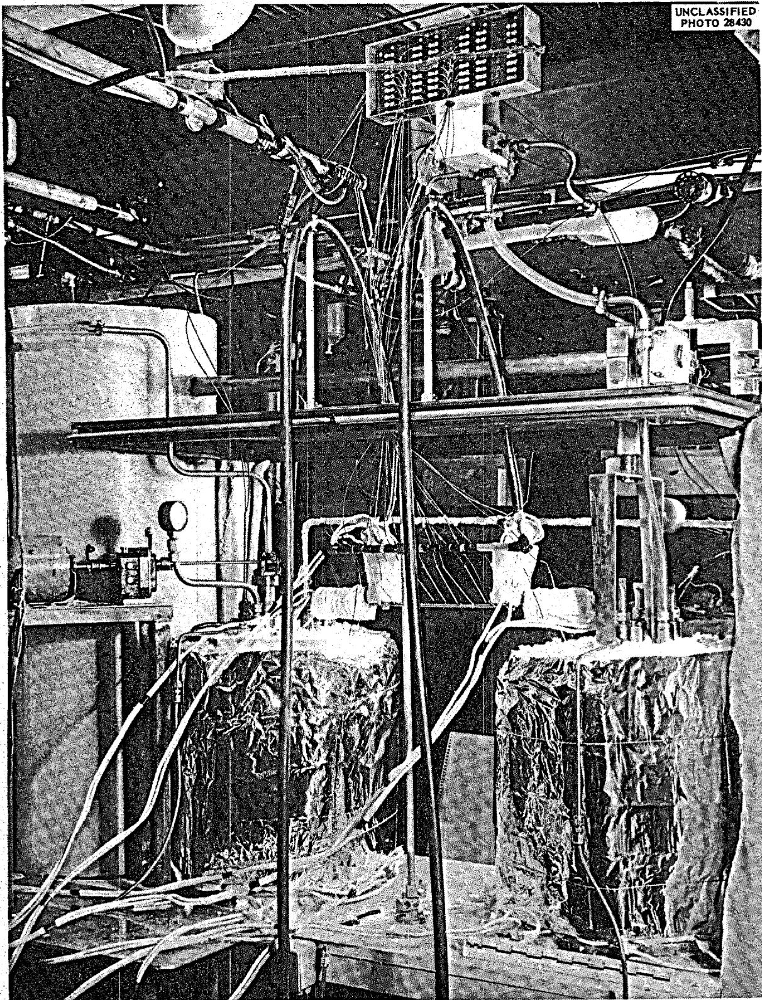  
Fig. 1.3.5. Experimental System for Determining Heat Transfer Coefficients for LiF-BeF $_2$ -UF $_4$ (53-46-1 Mole%).

reversed, and the fluid is caused to flow in the opposite direction through the test section. The fluid flow rate is determined by observing the deflection of the steel beam that supports one of the tanks as the fluid flows into or out of the tank. Test section inlet and outlet mixed-mean temperatures, as well as tube outside surface temperatures, are recorded. Because of the toxicity of the beryllium salt, it will be necessary to provide traps or absorbers on the system gas vent lines.

Sufficient salt has been prepared to charge this system, and experimental measurements will be made in the near future.

Since film formation, if such should occur, may be a relatively slow process, an apparatus is being designed which will allow long-time, continuous exposure of test section tubes to flowing salt. The tubes will then be removed from this system and welded into the heat transfer coefficient apparatus for study.

UNCLASSIFIED ORNL-LR-DWG 27904

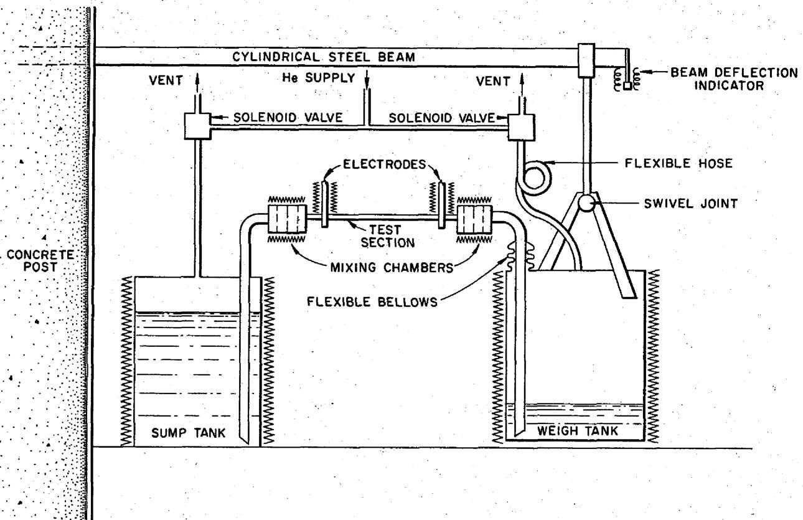  
Fig. 1.3.6. Schematic Diagram of Experimental System for Determining Heat Transfer Coefficients for LiF-BeF $_2$ -UF $_4$ (53-46-1 Mole%).

# 1.4. ADVANCED REACTOR STUDIES

# A MOLTEN SALT NATURAL-CONVECTION REACTOR

F. E. Romie

B.W.Kinyon

One of the problems of a circulating-liquid-fuel reactor is the provision of reliable long-lived fuel-circulation pumps. This problem would be eliminated if the liquid fuel circulated by natural convection through the reactor core, through vertical convection risers, and through the primary heat exchangers. A molten salt fuel is well suited to such a reactor because high temperatures could be attained without pressurization, and therefore a gas-turbine cycle or one of several steam cycles that operate efficiently under high-temperature conditions could be utilized. The temperatures would not be so high as to be inconsistent with the desired long corrosion life. The advantages of eliminating the fuel-circulation pump and the attendant problems of maintenance and replacement are obtained at the cost of the increased fuel volume required for a system in which the pressure losses must be very low. There are, however, applications for a reactor system in which the premium placed on reliability and ease of maintenance could make the natural-convection system attractive. The results of a preliminary design study of such a system are described briefly here, and a detailed report is being published.

A schematic diagram of the 60-Mw (thermal) molten salt natural-convection reactor system that was analyzed is shown in Fig. 1.4.1. The temperature of the fuel salt entering the exchanger was specified to be $1225^{\circ}\mathrm{F}$ , a temperature that is consistent with long corrosion life, and the exit fuel-salt temperature was varied from 975 to $1025^{\circ}\mathrm{F}$ . The fuel salt used in this study was $\mathrm{LiF - BeF_2 - UF_4}$ (62-37-1 mole %, mixture 130). Two mediums, a molten salt (NaF-LiF-BeF $_2$ ), 27-35-38 mole %, mixture 84) and helium, were considered as coolants for the primary exchanger. The exchanger entrance and exit temperatures for the molten salt coolant were fixed at 875 and $1025^{\circ}\mathrm{F}$ , respectively. These temperatures are consistent with the generation of 850-psia, $900^{\circ}\mathrm{F}$ steam in a system in which heat is transferred from the fuel salt to a coolant salt

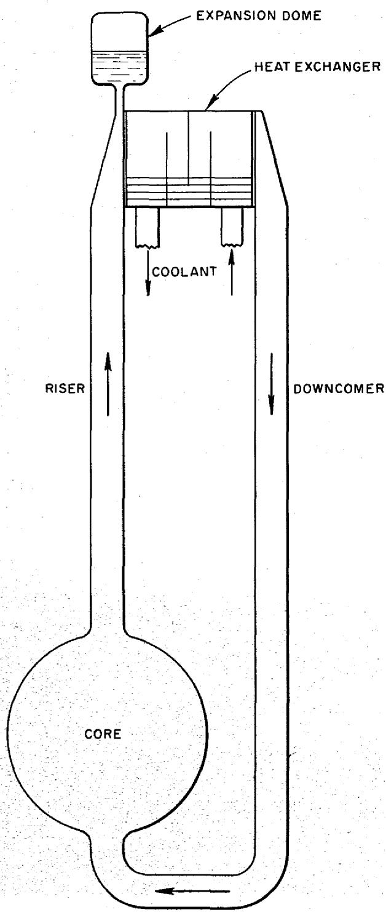  
Fig. 1.4.1. Schematic Diagram of a Molten Salt Natural-Convection Reactor.

to sodium to steam. A similar system has been described elsewhere. For a 60-Mw thermal output, the 850-psia, $900^{\circ}\mathrm{F}$ steam would give a generator output of about 22 Mw, with a thermal efficiency of $37\%$ .

Two sets of terminal temperatures were specified for the helium coolant. The first set, 850 to $1025^{\circ}\mathrm{F}$ , was selected for generation of 850-psia, $900^{\circ}\mathrm{F}$ steam in a system in which helium would be the only intermediate medium between the fuel salt and steam. The second set of helium terminal temperatures, 676 to $1100^{\circ}\mathrm{F}$ , was selected for a helium gas-turbine cycle with an estimated output of roughly 18 Mw.

For a specified flow rate of the fuel salt, temperature change of the fuel salt, and pressure drop across the exchanger, there is one combination of riser diameter and height of exchanger above the core for which the salt contained in the risers is a minimum. These optimum combinations were used in heat exchanger calculations carried out for exchanger heights above the reactor of 5, 10, and 20 ft.

# Salt-Cooled Heat Exchangers

Design values for the salt-cooled heat exchanger are summarized in Table 1.4.1. The designs are based on 0.634-in.-ID, 0.059-in.-wall tubes. Smaller-diameter tubes would give a lower total fuel-salt volume, but the number of tubes required would be

2B. W. Kinyon and F. E. Romie, Two Power Generation Systems for a Molten Fluoride Reactor, paper to be presented at the 4th Nuclear Engineering and Science Conference of the 1958 Nuclear Congress, Chicago, Ill., March 17-21.

larger. For example, 0.42-in.-ID tubes in an exchanger 10 ft above the reactor would involve a total external fuel-salt volume of 123 ft³, but it would require 7200 tubes.

The design values presented in Table 1.4.1 are based on a fuel-salt temperature change of $225^{\circ}\mathsf{F}$ . Varying the temperature change from 200 to $250^{\circ}\mathsf{F}$ does not change the total fuel-salt volume appreciably.

# Helium-Cooled Heat Exchangers for Steam Cycle

Reference design values for a helium-cooled heat exchanger in which the helium terminal temperature would be suitable for the generation of $900^{\circ}\mathrm{F}$ steam are presented in Table 1.4.2. It was assumed

Table 1.4.2. Design Values for a Helium-Cooled Heat Exchanger for a Steam Cycle   
Helium temperature range: 850 to $1025^{\circ}$ F Helium pressure level: 100 psia   

<table><tr><td>Height of heat exchanger above reactor, ft</td><td>10</td></tr><tr><td>Number of tubes</td><td>3240</td></tr><tr><td>Length of each tube, ft</td><td>11.5</td></tr><tr><td>Distance from front to rear of tube array, ft</td><td>0.77</td></tr><tr><td>Transverse dimension of heat exchanger, ft</td><td>78</td></tr><tr><td>Generator output used to pump helium through exchanger, %</td><td>2</td></tr><tr><td>Total fuel-salt volume outside core, ft3</td><td>172</td></tr></table>

Table 1.4.1. Design Values for a Salt-Cooled Heat Exchanger for a Natural-Convection Molten Salt Reactor Coolant salt temperature range: 875 to $1025^{\circ}\mathrm{F}$   

<table><tr><td>Height of heat exchanger above reactor, ft</td><td>5</td><td>10</td><td>20</td></tr><tr><td>Number of tubes</td><td>4570</td><td>3150</td><td>2200</td></tr><tr><td>Diameter of tube bundle, ft</td><td>5.1</td><td>4.2</td><td>3.5</td></tr><tr><td>Length of each tube, ft</td><td>7.8</td><td>11.3</td><td>16</td></tr><tr><td>Fuel-salt volume in risers, ft3</td><td>55</td><td>68</td><td>89</td></tr><tr><td>Fuel-salt volume in headers and tubes, ft3</td><td>97</td><td>91</td><td>86</td></tr><tr><td>Total fuel-salt volume outside reactor core, ft3</td><td>152</td><td>159</td><td>175</td></tr></table>

that copper fins would be used on the helium-cooled heat exchanger tubes. The use of lower-conductivity fins would lead to a considerably increased fuel inventory. The dimensions given for the heat exchanger are those for a three-helium-pass crossflow exchanger. Doubling the helium pressure level to 200 psia while maintaining a pumping expenditure of $2\%$ of generator output would not change the total salt volume appreciably but would give a more compact heat exchanger. A similar result would be obtained if at 100 psia the pumping expenditure were doubled.

A cross section of a possible helium-cooled heat exchanger configuration is shown in Fig. 1.4.2. The configuration shown permits attachment of the riser pipes to the salt headers, with sufficient flexibility to minimize thermal stresses, and provides a cylindrical container for the pressurized helium. Use of two such cylinders to contain the reference-design heat exchanger would give two

heat exchangers, each 19.5 ft long. If the helium pressure were increased to 200 psia, the length of each heat exchanger would be reduced to 12 ft.

# Helium-Cooled Heat Exchanger for Gas-Turbine Cycle

The temperature of the helium returned to the heat exchanger from the gas-turbine-system regenerator is estimated to be $676^{\circ}\mathrm{F}$ , which is $174^{\circ}\mathrm{F}$ below the fusion temperature of the fuel salt. Therefore a counterflow heat exchanger with longitudinally finned tubes was selected for the gas-turbine cycle. The temperature of the interface between the fuel salt and the tube wall can be maintained at, or above, any desired value by adjustment of the gas-side thermal resistance per unit tube length. The design values given in Table 1.4.3 are based on a minimum interface temperature of $900^{\circ}\mathrm{F}$ . For a longitudinally finned

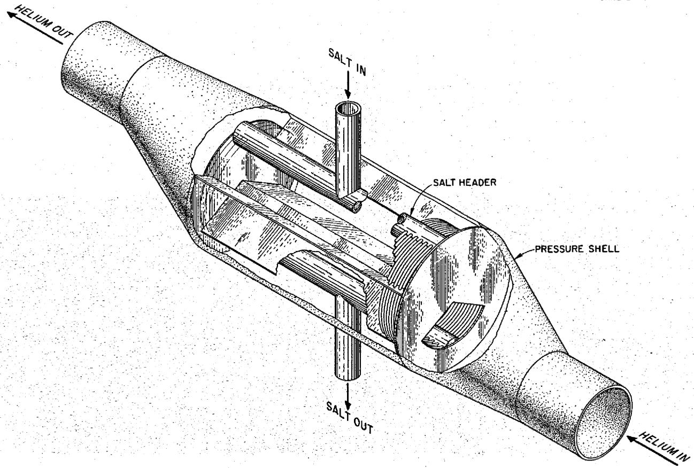  
UNCLASSIFIED   
ORNL-LR-DWG27948   
Fig. 1.4.2. Schematic Diagram of a Possible Fuel-Salt-to-Helium Heat Exchanger with Three Gas Passes.

Table 1.4.3. Design Values for a Helium-Cooled Heat Exchanger for a Gas-Turbine Cycle Helium temperature range: 676 to ${1100}^{ \circ  }\mathrm{F}$   

<table><tr><td>Height of heat exchanger above reactor, ft</td><td>10</td></tr><tr><td>Number of tubes</td><td>3300</td></tr><tr><td>Length per tube, ft</td><td>11</td></tr><tr><td>Total fuel-salt volume outside core, ft3</td><td>160</td></tr></table>

tube the required gas-side thermal resistance variation along the tube length can be obtained by an axial variation of the fin height. No data were available on the heat transfer and flow friction characteristics of longitudinally finned tubes in a tube bundle, and the exchanger designs are thus not complete. However, the number of tubes, length per tube, and fuel-salt holdup volume can be estimated with good accuracy if it is assumed, as seems likely, that the same gas-side thermal resistance is realizable with uncut longitudinally fined tubes as with circumferentially finned tubes.

# Comparison of the Various Cooling Systems

The fuel-salt holdup volume differs less than $10\%$ for the three cooling systems considered and is therefore not a determining factor in the selection of the coolant medium for the reactor. In general, the helium-cooled heat exchangers have much larger overall dimensions than the salt-cooled heat exchangers. The increased bulk is caused by the larger spacing required by the finned tubes and also by the large volume required by the helium headers. An increase in helium pressure would decrease the helium header volume and also should decrease the fuel-salt header volume. An upper limit on the helium pressure would probably be set by consideration of the effects of a tube rupture in the fuel-salt system. It is of interest to note that, in other studies of gas cooling in which such considerations were apparently not limiting, gas pressures as high as 1000 psia have been recommended.

# Comparison of Natural-Convection System with Forced-Convection System

The design of a forced-convection reactor system2 led to an estimate of 0.56 ft3 of fuel salt

external to a molten salt reactor per thermal megawatt. For the free-convection system using a $160\text{-ft}^3$ external salt volume in the generation of $60\text{Mw}$ , the corresponding specific volume is $2.67\text{ft}^3/\text{Mw}$ . Calculations based on these numbers and initial, clean, critical-mass data for an unreflected molten salt reactor indicate that the fuel inventory for both the free- and forced-convection systems is at a minimum with a core diameter of about 8 ft for a thermal output of $60\text{Mw}$ . For an 8-ft-dia core the specific powers are 895 and $1275\text{kw}$ of heat per kilogram of $\mathsf{U}^{235}$ for the free-and forced-convection systems, respectively. The free-convection system is thus estimated to require a fuel inventory about $42\%$ greater than that of the forced-convection system. With higher thermal outputs the specific powers would be larger, but the specific power for the forced-convection reactor increases more rapidly with increasing power than does that of the free-convection reactor.

# HIGH-FLUX REACTORS

# W. K. Ergen

A systematic study3 was started to determine the influence of various factors on the power required to obtain a given flux. At the beginning of the study, a reactor idealized in the manner described below was considered.4

The fuel is concentrated in a spherical shell embedded in an infinite moderator; that is, the moderator occupies the space inside as well as outside the shell. The shell is "infinitely thin" but "black" for thermal neutrons; that is, the thickness of the shell is small compared with its radius but large compared with the diffusion length in the fuel. The shell emits $\eta f$ fission neutrons for each thermal neutron absorbed. Absorptions at epithermal energies, both in the fuel and the moderator, are neglected. In this model, the fission neutrons emitted from the shell slow down according to the age kernel and then diffuse

according to diffusion theory, with the boundary condition created by the "black" shell.

For this model, it is possible to compute the number, $J$ , of neutrons which return, at thermal energy, to the shell per fission neutron emitted. The neutrons returning to the shell give $J\eta f$ fission neutrons, and if the reactor is to be critical

$$
J \eta f = 1.
$$

From this equation, the required $\eta f$ has been computed for $\mathsf{D}_2\mathsf{O}$ , Be, BeO, and C moderators and for various values of shell radius. The results are plotted in Figs. 1.4.3 through 1.4.6. The abscissa of each plot gives the shell radius, $r$ , in cm, and also in dimensionless units $\rho = r / \sqrt{\tau}$ where $\sqrt{\tau}$ is the slowing-down length.

In the sphere enclosed by the shell (the island, or internal thermal column, or flux trap) the neutrons

reach thermal energies at some distance from the shell, and, in the process of diffusing toward the shell, these neutrons set up a flux gradient, which results in high fluxes at the center. These center fluxes are also plotted in Figs. 1.4.3 through 1.4.6. It may be seen that for Be and BeO a flux of $10^{-3}$ neutrons/cm² per fission neutron emitted is obtained, which corresponds to about 140 Mw for $10^{16}$ neutrons/cm²·sec. For D₂O and C the flux per fission neutron is smaller, and hence the power required for $10^{16}$ neutrons/cm²·sec is higher. This is primarily due to the large diffusion constants of D₂O and C, which make it possible for the neutrons to reach the shell without setting up a very large flux gradient.

The curves are, of course, applicable only to the idealized model. Present investigations cover the modifications caused by more realistic assumptions, such as holes in the shell, finite thickness of the shell, moderation in the shell, and flux depression in the flux trap as a result of insertion of absorbing samples.

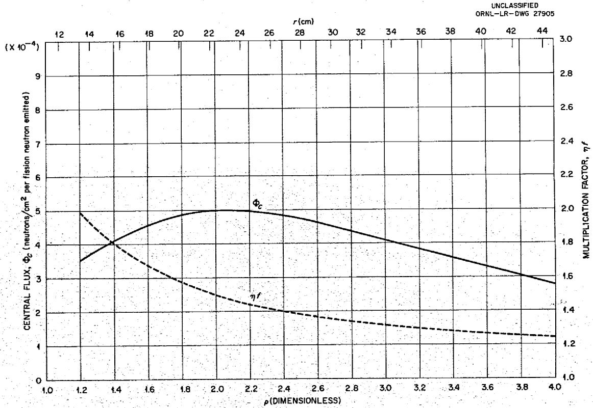  
Fig. 1.4.3. Central Flux and Multiplication Factor as Functions of Shell Radius of Idealized Flux Trap Reactor with a $\mathsf{D}_2\mathsf{O}$ Moderator.

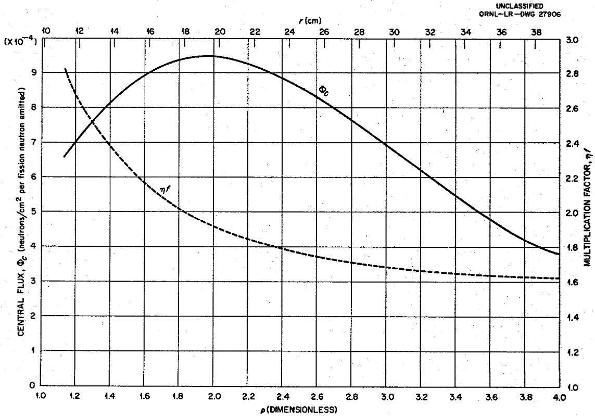  
Fig. 1.4.4. Central Flux and Multiplication Factor as Functions of Shell Radius of Idealized Flux Trap Reactor with a Be Moderator.

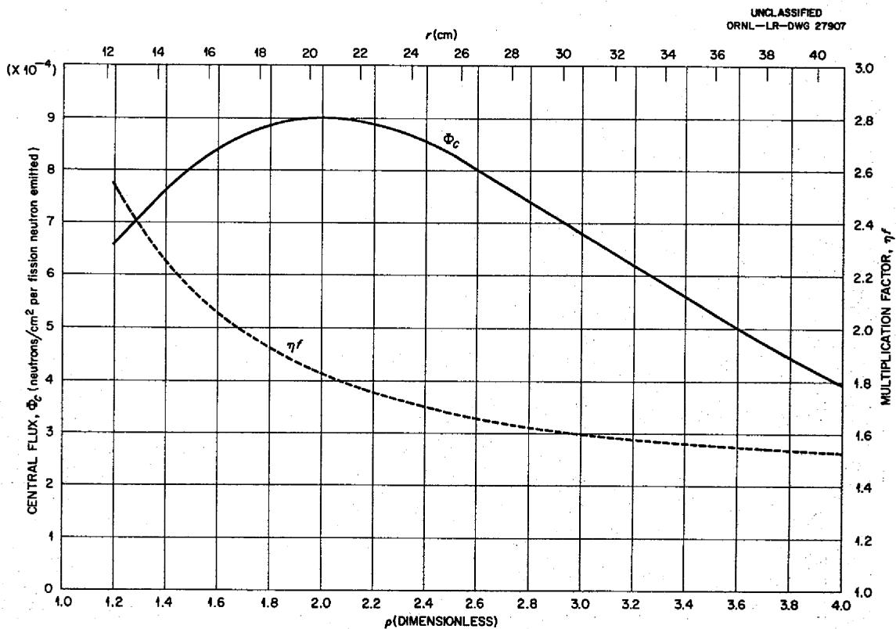  
Fig. 1.4.5. Central Flux and Multiplication Factor as Functions of Shell Radius of Idealized Flux Trap Reactor with a BeO Moderator.

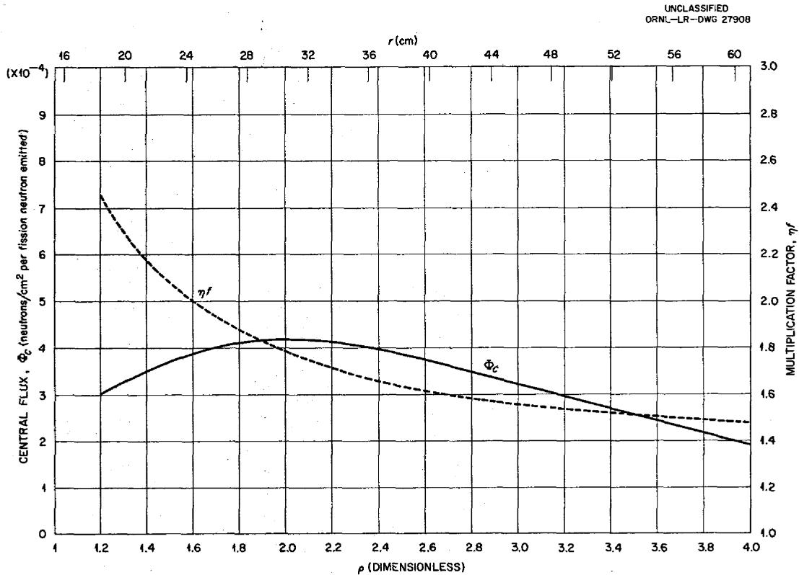  
Fig. 1.4.6. Central Flux and Multiplication Factor as Functions of Shell Radius of Idealized Flux Trap Reactor with a C Moderator.

Part 2

MATERIALS STUDIES

# 2.1.METALLURGY

W. D. Manly

A. Taboada

# DYNAMIC CORROSION STUDIES

J. H. DeVan

J.R.DiStefano R.S.Crouse

Corrosion experiments are under way for which thermal-convection loops and forced-circulation loops were fabricated of Inconel (nominal composition: 15 wt % Cr, 7 wt % Fe, bal Ni) and of INOR-8 (nominal composition: 17 wt % Mo, 6 wt % Fe, 6 wt % Cr, bal Ni). As discussed previously, the test program is being conducted in three distinct phases. In the first phase, relative corrosion properties of 12 fluoride salt mixtures are being determined in thermal-convection loops operated for 1000 hr. During the quarter, tests of Inconel loops were completed for all the salts except salt 131 (LiF-BeF $_2$ -UF $_4$ , 60-36-4 mole $\%$ ); four salts were tested in INOR-8 loops, which are now being examined. As part of phase 2 of the program, three salts are being circulated in Inconel loops and five in INOR-8 loops. The tests will be run for extended periods at two temperature levels, 1250 and $1350^{\circ}\mathrm{F}$ . In the third and final phase of the test program, salts are being tested in forced-circulation loops under simulated reactor operating conditions. Four salts are presently being tested in Inconel loops and three in INOR-8 loops, as described in Chap. 1.2 of this report. The results of postoperative examinations of these loops will be described in this chapter as they are completed.

Ten of the Inconel loops operated in phase 1 of the program have been examined metallographically. After successful operation for 1000 hr, the salt mixture in each loop was allowed to freeze in place. Samples were then cut from each loop at the locations shown in Fig. 2.1.1, and the salt contained in each sample was melted out under a helium atmosphere. The results of metallographic examination of the samples are presented in Table 2.1.1 and are discussed below.

# Thorium-Bearing Salts in Thermal-Convection Loops

The loops which circulated thorium-bearing salts comprise three pairs on the basis of similarities

in the fuels they circulated. Loops 1169 and 1177, the first pair listed in Table 2.1.1, circulated salt 128 (LiF-ThF4, 71-29 mole %). Loop 1169 showed less than 1 mil of attack throughout (Fig. 2.1.2), while loop 1177 was, in general, attacked to a depth of less than 1 mil (Fig. 2.1.3) but had scattered pits to a depth of 1.5 mils in some areas.

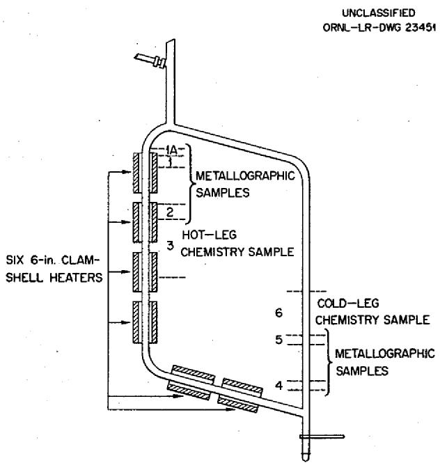  
Fig. 2.1.1. Diagram of a Standard Inconel Thermal-Convection Loop Showing Location of Metallographic Samples.

The second pair of loops, 1173 and 1176, was operated to evaluate salt mixtures 124 (NaF-BeF $_2$ -ThF $_4$ , 58-35-7 mole %) and 127 (LiF-BeF $_2$ -ThF $_4$ , 58-35-7 mole %). As may be seen in Table 2.1.1, loop 1173, in which salt 124 was circulated, was attacked substantially more than loop 1176, which circulated salt 127. This result is in conflict, however, with the corrosion properties normally exhibited by NaF-BeF $_2$ and LiF-BeF $_2$ mixtures; in previous tests the LiF-BeF $_2$ mixtures tended to produce more initial corrosion in Inconel systems than NaF-BeF $_2$ mixtures produced. Thus the test results for loop 1173 are questionable, and a repeat test under similar conditions has been

Table 2.1.1. Results of Metallographic Examinations of Inconel Thermal-Convection Loops Operated in Phase 1 of Corrosion Test Program   

<table><tr><td rowspan="2">Loop No.</td><td rowspan="2">Salt Designation</td><td rowspan="2">Salt Composition</td><td colspan="2">Metallographic Results</td></tr><tr><td>Hot-Leg Attack (mils)</td><td>Cold-Leg Appearance</td></tr><tr><td colspan="5">Thorium-Bearing Salts</td></tr><tr><td>1169</td><td>128</td><td>LiF-ThF4, 71-29 mole %</td><td>&lt;1</td><td>Light surface roughness</td></tr><tr><td>1177</td><td>128</td><td>LiF-ThF4, 71-29 mole %</td><td>1.5</td><td>Attack to a depth of 1 mil</td></tr><tr><td>1173</td><td>124</td><td>NaF-BeF2-ThF4, 58-35-7 mole %</td><td>4</td><td>Attack to a depth of 1 mil</td></tr><tr><td>1176</td><td>127</td><td>LiF-BeF2-ThF4, 58-35-7 mole %</td><td>&lt;1</td><td>Surface roughness and surface pits</td></tr><tr><td>1174</td><td>125</td><td>NaF-BeF2-UF4-ThF4, 53-46-0.5-0.5 mole %</td><td>2</td><td>Surface roughness and surface pits</td></tr><tr><td>1163</td><td>123</td><td>NaF-BeF2-UF4, 53-46-1 mole %</td><td>&lt;1</td><td>Surface roughness</td></tr><tr><td colspan="5">Uranium-Bearing Salts and Coolant Salts</td></tr><tr><td>1161*</td><td>122</td><td>NaF-ZrF4-UF4, 57-42-1 mole %</td><td>&lt;1</td><td>Attack to a depth of &lt;1 mil</td></tr><tr><td>1170</td><td>129</td><td>NaF-ZrF4-UF4, 55.3-40.7-4 mole %</td><td>2</td><td>Very heavy surface roughness and pits</td></tr><tr><td>1171</td><td>126</td><td>LiF-BeF2-UF4, 53-46-1 mole %</td><td>2</td><td>Voids to a depth of 1 mil</td></tr><tr><td>1172</td><td>84</td><td>LiF-NaF-BeF2, 35-27-38 mole %</td><td>2</td><td>Attack to a depth of &lt;1 mil</td></tr><tr><td>1175</td><td>12</td><td>LiF-NaF-KF, 46.5-11.5-42 mole %</td><td>&lt;1</td><td>Attack to a depth of &lt;1 mil</td></tr></table>

*Operated prior to the period of this report.

initiated. The fuel salts used in loops 1174 and 1163 were identical except that the fuel in loop 1174 had $0.5\mathrm{mole}\% \mathrm{ThF}_4$ substituted for one-half the $\mathsf{UF}_4$ in salt 123. There was attack to a depth of 2 mils in loop 1174 (Fig. 2.1.4), whereas loop 1163 was attacked to a depth of only 1 mil.

# Uranium-Bearing Salts and Coolant Salts in Thermal-Convection Loops

Four loops (1170, 1171, 1172, and 1175) that circulated uranium-bearing or coolant salts were also examined, and the results are presented in Table 2.1.1. Loop 1170, which circulated a zirconium-base mixture containing 4 mole $\%$ UF $_{4}$ , salt 129, was operated for comparison with loop 1161, which was operated previously with a salt similar to that circulated in loop 1170 except that

the $\mathsf{UF}_4$ concentration was a factor of 4 less. The attack in loop 1161 was to a depth of less than 1 mil, compared with 2 mils in loop 1170. These results emphasize the importance of the $\mathsf{UF}_4$ concentration on corrosion by fluoride salt mixtures.

The operation of loop 1171 gave the first data for evaluation of an $\mathsf{LiF - BeF}_2$ -base fuel system and revealed slightly more attack than has been found for either the NaF-BeF2-UF4 or the NaF $\mathsf{ZrF}_4$ -UF4 fuel systems. While the attack in this loop was, in general, less than 2 mils deep, it was quite concentrated, as may be seen in Fig. 2.1.5.

The circulation of the coolant salts 12 and 84 at a maximum temperature of $1125^{\circ}\mathrm{F}$ resulted in attack similar to that found in the loops that circulated fuel-bearing mixtures. Attack in loop 1172, which

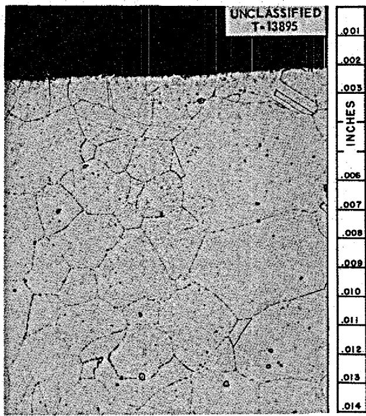  
Fig. 2.1.2. Specimen Taken from Hot Leg of Inconel Thermal-Convection Loop 1169 at Point of Maximum Loop Temperature, 250X.

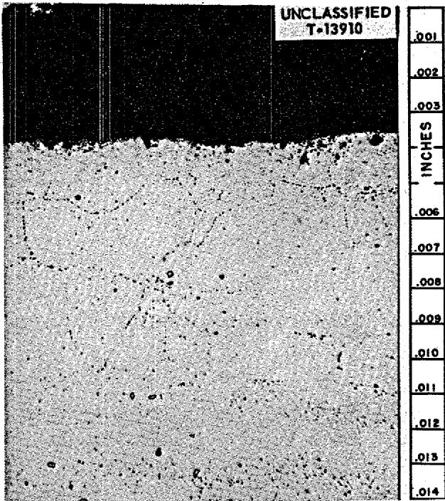  
Fig. 2.1.4. Specimen Taken from Hot Leg of Inconel Thermal-Convection Loop 1174 at Point of Maximum Loop Temperature, 250X.

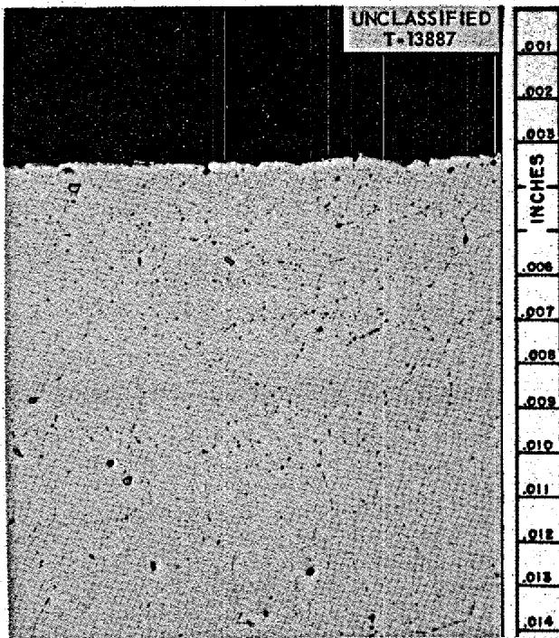  
Fig. 2.1.3. Specimen Taken from Hot Leg of Inconel Thermal-Convection Loop 1177 at Point of Maximum Loop Temperature. 250X.

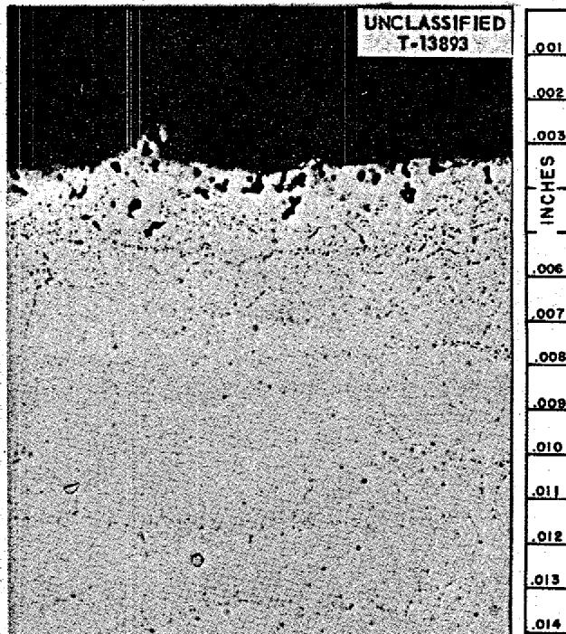  
Fig. 2.1.5. Specimen Taken from Hot Leg of Inconel Thermal-Convection Loop 1171 at Point of Maximum Loop Temperature. 250X.

circulated salt 84, was more extensive with respect both to amount and to depth than the attack in loop 1175, which circulated salt 12.

# Results of Examination of Samples Removed from Forced-Circulation Loop CPR

As stated in Chap.1.2, samples were taken for metallographic examination from the forced-circulation bifluid loop designated CPR. The samples were taken from a portion of the hot leg which ruptured when the salt froze because of a power failure after more than 6500 hr of operation. A sample taken from the discharge end of the heated leg showed no measurable corrosion (Fig. 2.1.6), but samples taken from near the point at which the failure occurred, that is, near the inlet to the heated leg, revealed attack to a depth of 2 mils (Fig. 2.1.7). The deeper attack at this point was probably the result of fuel contamination near the point of failure. The loop was successfully repaired and is now back in operation.

# GENERAL CORROSION STUDIES

E. E. Hoffman

W. H. Cook

D. H. Jansen

# Effect of Carburization on Reactor Structural Materials

Studies are under way for determining whether the mechanical properties of INOR-8, Inconel,

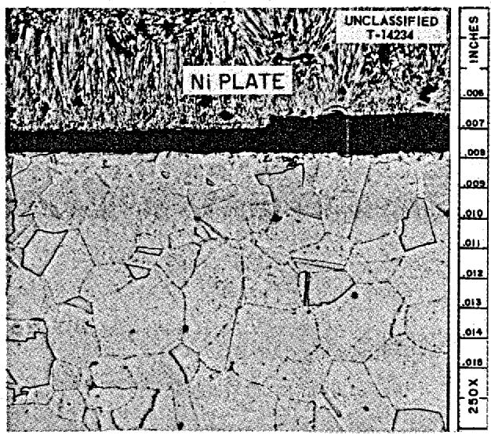  
Fig. 2.1.6. Section Taken from Inconel Forced-Circulation Loop CPR at Discharge End of Heated Leg. 250X. Reduced $22\%$ .

and potential reactor structural alloys would be detrimentally altered by carburization. Tests have indicated that the sodium-graphite system is a rapid and effective carburizing medium for stainless steels, Hastelloy B, and Inconel upon exposure at $1500^{\circ}\mathrm{F}$ for 100 hr. Carburization tests of Hastelloy B are of particular interest because the composition of Hastelloy B is similar to that of INOR-8, both alloys being of the nickel-molybdenum-chromium-iron system. A summary is presented in Table 2.1.2 of the results of static tests

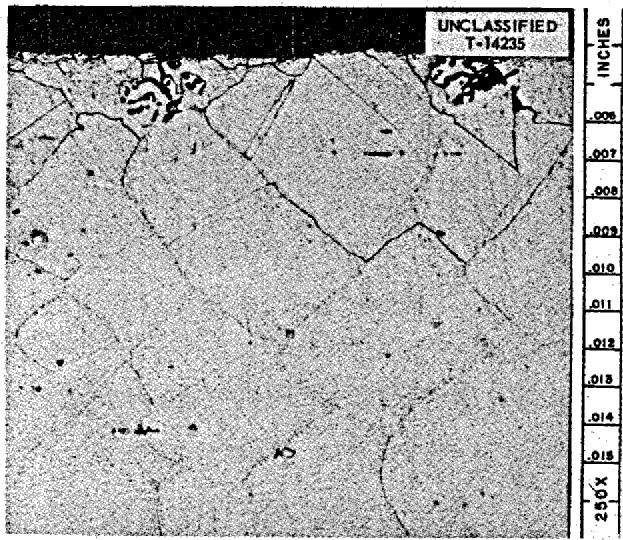  
Fig. 2.1.7. Section Taken from Inconel Forced-Circulation Loop CPR at Inlet to Heated Leg. 250X. Reduced $22\%$ .

Nominal specimen dimensions: $0.035 \times 0.4 \times 0.7$ in.

Table 2.1.2. Summary of Results of 500-hr Stotic Carburization Tests of Hastelloy B Specimens   

<table><tr><td>Carburizing Medium</td><td>Test Temperature (°F)</td><td>Depth of Carburization (mils)</td></tr><tr><td rowspan="2">Sodium + 25 wt % graphite*</td><td>1500</td><td>29**</td></tr><tr><td>1200</td><td>4</td></tr><tr><td rowspan="2">Fuel 30 + 25 wt % graphite*</td><td>1500</td><td>3</td></tr><tr><td>1200</td><td>0</td></tr></table>

*Reactor grade.   
\*\*Carbon completely penetrated the 0.035-in.-thick specimen; the value given is depth of penetration of the Hastelloy B capsule in which the specimen was exposed.

of Hastelloy B in sodium and in NaF-ZrF $_4$ -UF $_4$ (50-46-4 mole %, fuel 30) containing 25 wt % graphite. The effects of temperature and medium on the carburization of this alloy are clearly shown. The specimen that was exposed at $1500^{\circ}\mathrm{F}$ to fuel containing graphite is shown in Fig. 2.1.8. The carbide-like material on the edge of the specimen was not uniform; it varied from zero to a maximum depth of 3 mils.

The carburization of Inconel was investigated in 100-hr seesaw-furnace tests in which the hot- and cold-zone temperatures were 1500 and $1250^{\circ}\mathrm{F}$ , respectively. The test capsules were made from 1-in., sched-40 Inconel pipe, in which was suspended, near the central axis, a C-18 (commercial-grade) graphite rod $\frac{1}{4}$ in. in diameter and 18 in. long. The capsules were filled with fuel 30. A capsule without the graphite rod was tested under identical conditions as a control. Examinations of specimens taken from the hot and cold zones

of the pipes after the tests did not reveal any positive indications of carburization. The examinations included hardness measurements, metallographic examination, and chemical analyses.

Additional data were obtained from two Inconel thermal-convection loops with graphite inserts in which fuel 30 was circulated. These loops (Nos. 30 and 39) were constructed as shown in Fig. 2.1.9. The graphite insert in loop 30 was the commercial material designated C-18, which had an average bulk density of 1.60, and the insert in loop 39 was the commercial material designated CCN, which had an average bulk density of 1.90. The hot legs of both loops were at $1300^{\circ}\mathrm{F}$ . The cold leg of loop 30 was at $1040^{\circ}\mathrm{F}$ and that of loop 39 was at $1070^{\circ}\mathrm{F}$ . Operation of loop 30 was terminated at 695 hr, rather than the scheduled 1000 hr, because of a power failure; loop 39 operated the full scheduled 1000 hr.

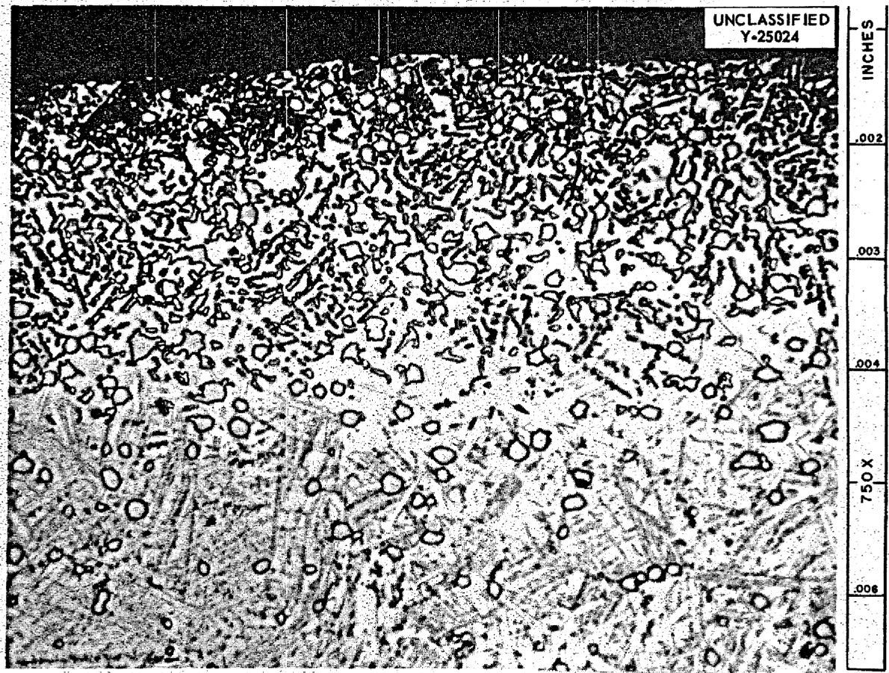  
Fig. 2.1.8. Hastelloy B After Exposure to Fuel 30 Containing 25 wt % Graphite at $1500^{\circ}\mathrm{F}$ for 500 hr. Etchant: chromic and hydrochloric acids. 750X.

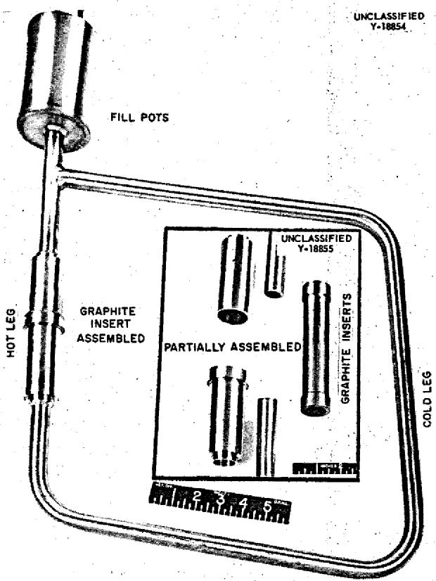  
Fig. 2.1.9. Inconel Thermal-Convection Loop with Graphite Insert.

Metallographic examinations were made of specimens taken from positions indicated by circled numbers in Fig. 2.1.10. The regions that were most severely attacked, metallographic specimens 17 from both loops, are compared in Fig. 2.1.11. Further tests are being made to determine the cause for greater attack in loop 30 than in loop 39. The metallographic examinations did not reveal any positive signs of carburization in either loop.

Chemical analyses of the fuel before and after the tests did not show any significant changes as a result of contact with the Inconel and the graphite. For example, the carbon content of the as-received fuel was $0.005\%$ , and the carbon content was 0.018 and $0.024\%$ , respectively, in the fuel from loop 30 and 39 at the conclusions of the tests.

Chemical analyses for carbon were also made on each of three successive 0.010-in.-deep millings from the inner walls of specimens taken from the same locations as the metallographic specimens.

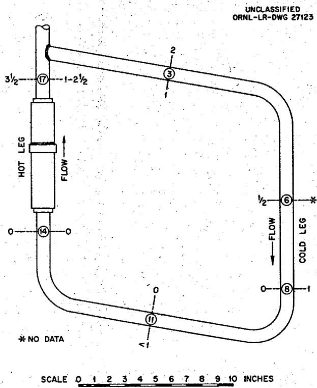  
Fig. 2.1.10. Sketch of Inconel Thermal-Convection Loop with Graphite Insert in Hot Leg. Locations at which specimens were removed are indicated by circled numbers. Numbers opposite the circled numbers outside the loop are attack, in mils, in loop 30; numbers inside the loop are attack in loop 39.

The results did not indicate any significant carbon increase in comparison with the carbon content of as-received Inconel sampled in the same manner.

Dimensionally and visually the graphite inserts were unchanged by their exposure, except that the CCN graphite had changed from a glossy black to a dull gray metallic color. The color change was uniform on the inner surface but mottled on the exterior. Photomicrographs of specimens of the graphite inserts before and after the tests are shown in Figs. 2.1.12 and 2.1.13. Fuel was found in the pore spaces throughout the $\frac{1}{4}$ -in.-thick walls of both inserts after the tests; however, the C-18 graphite did not appear to be attacked. There was essentially no attack on the CCN graphite, but it had a thin metallic-appearing film on the inner and outer surfaces. The film was too thin and erratic for accurate thickness measurements to be

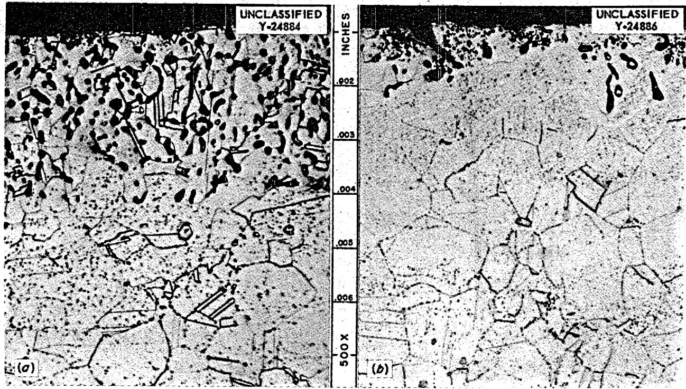  
Fig. 2.1.11. (a) Specimen from Position 17 of Loop 30; (b) Specimen from Position 17 of Loop 39. Etchant: aqua regia, 500X.

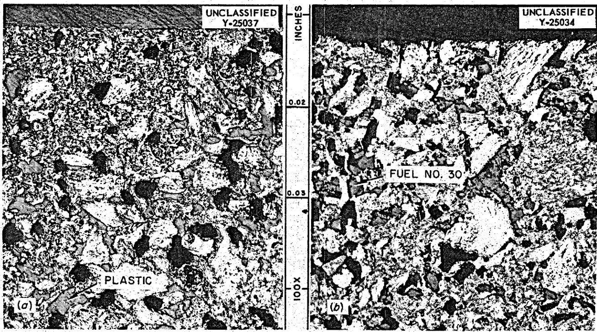  
Fig. 2.1.12. C-18 Graphite (a) As Received and (b) After Exposure for 695 hr to Fuel 30 at $1300^{\circ}\mathrm{F}$ in an Inconel Thermal-Convection Loop. In (a) the gray material in some of the pores is plastic mounting material. In (b) the dark-gray material in some of the pores is fuel, 100X.

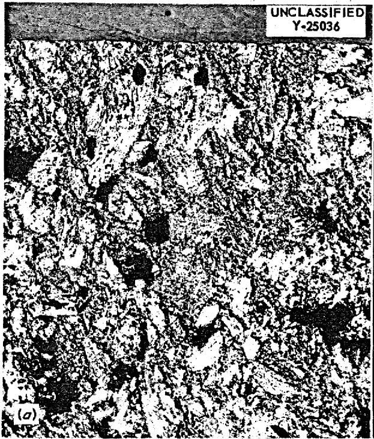

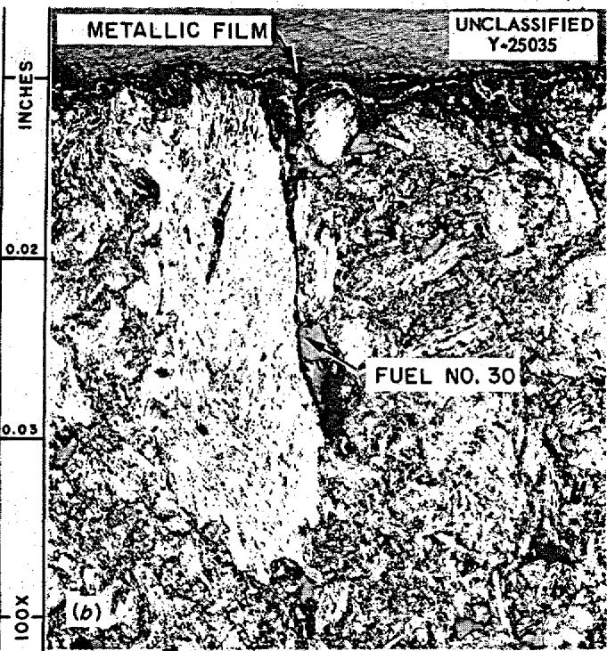  
Fig. 2.1.13. CCN Graphite (a) As Received and (b) After Exposure for 1000 hr to Fuel 30 at $1300^{\circ}\mathrm{F}$ in an Inconel Thermal-Convection Loop. In (b) there is a thin metallic film at the surface. 100X.

made; it appeared to range from zero to much less than 0.0005 in. in thickness. In scattered regions the film penetrated into the specimen along the graphite particles; the maximum penetration of this sort was to a depth of 0.005 in.

A microspark analysis of the inner surface of the CCN graphite insert showed that the main components, in the order of decreasing quantity, were zirconium, chromium, and uranium and that there were traces of sodium and nickel. It is to be noted, in particular, that chromium and nickel were detected along with the cations of the salt. A quantitative analysis of millings from the graphite surface will be made in order to determine which of these five components are from the metallic-appearing film and to determine the quantities present. The results of these thermal-convection loop tests indicate, however, that at $1300^{\circ}\mathrm{F}$ the carburization of Inconel in such systems is probably a slow process, if it occurs at all.

Static capsule tests at $1500^{\circ}\mathrm{F}$ have also been made in the study of the effect of carbon on Inconel and INOR-8 (heat SP-16) in sodium, in $\mathsf{NaF - BeF}_2\cdot$ UF4 (53-46-1 mole $\%$ fuel 123), and in LiF-BeF2-UF4 (62-37-1 mole $\%$ fuel 130). These 100-hr

static tests at $1500^{\circ}\mathrm{F}$ were primarily to determine which material, INOR-8 or Inconel, carburized most readily when exposed to graphite under the same conditions and to compare the carburization rates of the materials in fuels and in sodium.

The specimens used in these tests were small coupons, 40 mils thick, that were held in graphite sleeves in Inconel capsules. The metal specimens and the sodium or fuel were loaded into these capsules under a purified argon atmosphere and then sealed by inert-arc welding.

Metallographic examinations indicated, as shown in Table 2.1.3, that INOR-8 is more susceptible to carburization than is Inconel under these conditions. This is due to the molybdenum in the INOR-8 forming carbides more easily than the chromium in Inconel. For example, it is known that type 316 stainless steel, which contains 2 to $3\%$ molybdenum, carburizes more readily than similar austenitic stainless steels which do not contain molybdenum. The appearance of the INOR-8 after the test is shown in Fig. 2.1.14.

Total carbon in as-received Inconel: 0.038%

Total carbon in as-received INOR-8: 0.020%

Table 2.1.3. Results of Carburization Tests of Inconel and INOR-8 Specimens Exposed to Sodium and to Fuel at $1500^{\circ}$ F for 100 hr   

<table><tr><td>Test System</td><td>Alloy Tested</td><td>Weight Change (%)</td><td>Total Carbon Content (%)</td><td>Metallographic Results</td></tr><tr><td rowspan="2">Graphite-Sodium</td><td>Inconel</td><td>+0.50</td><td>0.60</td><td>Carburized to a depth of 10 to 12 mils, the first 1.5 mils being a light band in which carbide particles were agglomerated</td></tr><tr><td>INOR-8</td><td>+0.36</td><td>0.36</td><td>Carburized throughout; first 9 mils showed a heavy pre-cipitate; carbide particles less dense in interior of specimen</td></tr><tr><td rowspan="2">Graphite-Fuel 123</td><td>Inconel</td><td>+0.20</td><td>0.04</td><td>Attack to maximum depth of 2 mils in form of small sub-surface voids; no carburization observed</td></tr><tr><td>INOR-8</td><td>+0.30</td><td>0.01</td><td>Small stringers 0.5 mil deep along edge; fine, scattered parricle formation to a depth of 1 mil</td></tr><tr><td rowspan="2">Graphite-Fuel 130</td><td>Inconel</td><td>-0.37</td><td>0.03</td><td>Attacked to a maximum depth of 2 mils in the form of small subsurface voids; no carburization observed</td></tr><tr><td>INOR-8</td><td>+0.03</td><td>0.01</td><td>Particles found in the grain boundaries to a depth of 1.5 mils</td></tr></table>

Chemical analyses did not show carburization of either Inconel or INOR-8 in the fuel mixtures. Corrosion attack by fuel 130 was more severe, in all cases, than attack by fuel 123. Similar static tests were also conducted at $1250^{\circ}\mathrm{F}$ . Metallographic examination and chemical analysis of these samples are not yet completed. INOR-8 tensile test specimens are being carburized by using the sodium-graphite system, and the specimens will be tested in order to determine the effect of carburization on tensile strength and elongation.

# Corrosion of Brazing Alloys By Fuel Salts

D. H. Jansen

The precious-metal-base brazing alloys, $82\%$ Au- $18\%$ Ni and $80\%$ Au- $20\%$ Cu, which are being considered for use in the fabrication of fuel-salt-to-coolant-salt heat exchangers, have been corrosion tested in NaF-KF-LiF-UF $\mathbf{4}$ (11.2-41-45.3-2.5 mole $\%$ fuel 107) and in LiF-BeF $\mathbf{2}$ -UF $\mathbf{4}$ (62-37-1 mole $\%$ fuel 130). Static tests were run on both the alloys

in both the fuels for 2000-hr periods at $1200^{\circ}\mathrm{F}$ . Both alloys were also tested in fuel 130 for 500 hr in a seesaw-furnace apparatus with a hot-zone temperature of $1200^{\circ}\mathrm{F}$ . Hastelloy W capsules were used as container materials in these tests because INOR-8 was not available. The capsules were loaded under a purified argon atmosphere with the specimens and enough fuel to fill the capsules to one-third their volumes; the capsules were then sealed by Heliarc welding.

Chemical analysis of the fuel 107 to which the $82\%$ Au- $18\%$ Ni alloy was exposed showed 57 ppm gold, and the analysis of the fuel 107 to which the $80\%$ Au- $20\%$ Cu alloy was exposed showed 23 ppm gold. No attack was observed on either alloy in any of the tests. The $82\%$ Au- $18\%$ Ni alloy specimen that was tested in fuel 130 for 500 hr in the seesaw-furnace apparatus is shown in Fig. 2.1.15. The thin layer on the surface was observed on the same alloy when tested in fuel 107. X-ray analysis on this layer indicates that it is composed of approximately $70\%$ Ni- $30\%$ Au.

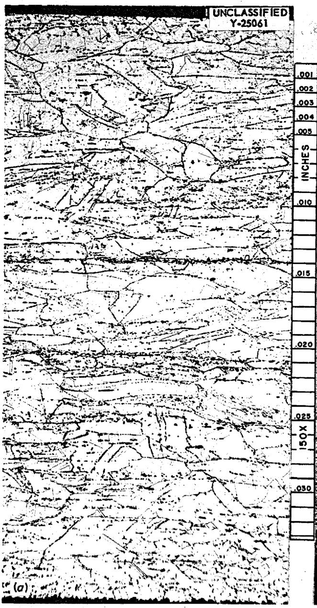

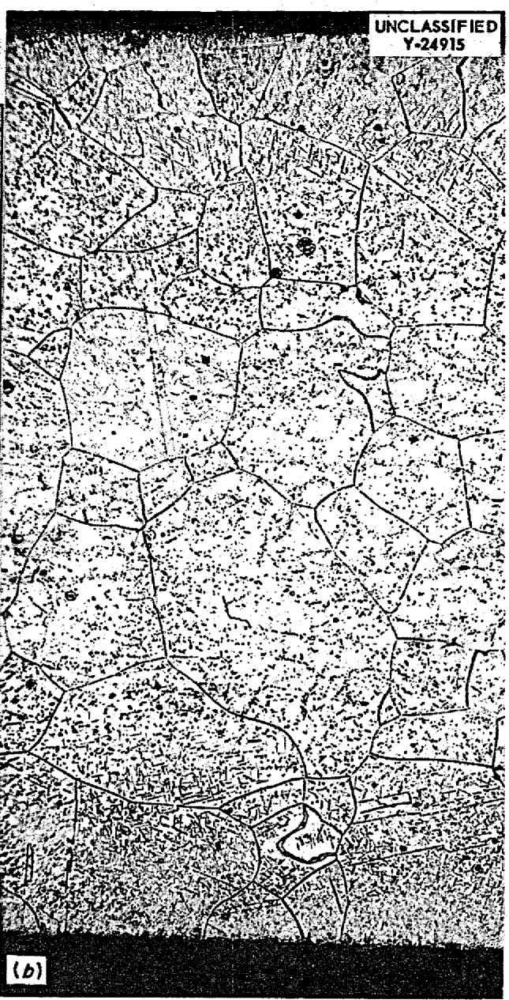  
Fig. 2.1.14. INOR-8 from Heat SP-16 (a) As Received and (b) After Exposure to a Sodium-Graphite System for 100 hr at $1500^{\circ}\mathrm{F}$ . Etchant: copper regia. 150X.

Corrosion of INOR-8 Welds by NaK and by Fuel Salts

D. H. Jansen

INOR-8 plates from heat SP-16 that were welded with various nickel-molybdenum-base welding rods have been corrosion tested in seesaw-furnace apparatus at a hot-zone temperature of $1200^{\circ}\mathrm{F}$ in

NaK (56-44 wt %) and in fuel 130 for 500 hr. These tests were conducted because the weld metals contained some minor constituents that have shown limited corrosion resistance to these mixtures; however, no attack was found on any of the welds. The compositions of the welding rods are given in Table 2.1.4, along with the observed weight changes and the results of metallographic examinations of the tested welds.

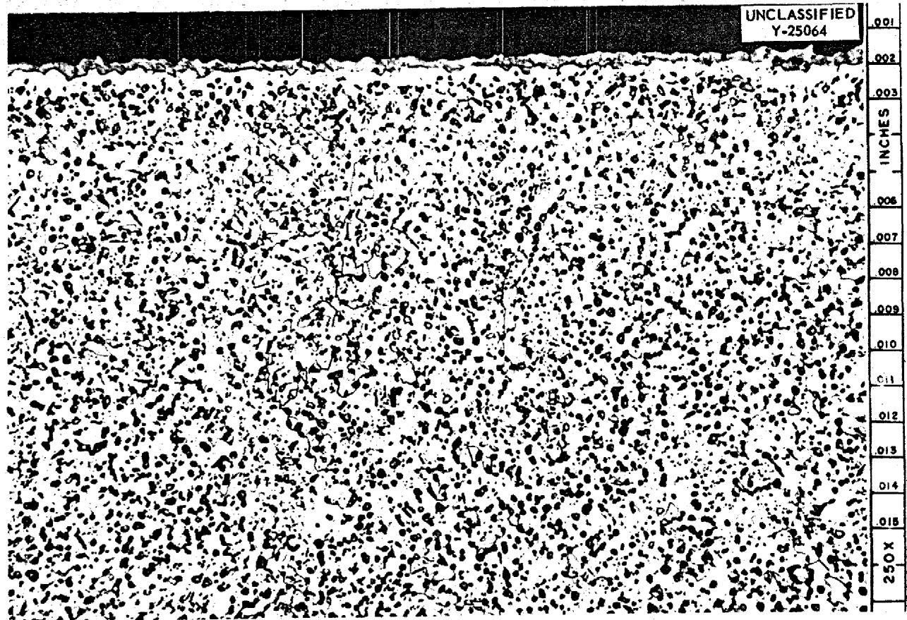  
Fig. 2.1.15. Specimen of an $82\%$ Au- $18\%$ Ni Brazing Alloy After Exposure to Fuel 130 for 500 hr in Seesaw-Furnace Apparatus with a Hot-Zone Temperature of $1200^{\circ}\mathrm{F}$ . Etchant: KCN. 250X.

Table 2.1.4. Results of Corrosion Tests of INOR-8 Welds in NaK and In Fuel 130   
Time period: 500 hr  
Hot-zone temperature: $1200^{\circ}\mathrm{F}$   

<table><tr><td rowspan="2">Nominal Composition of Filler Rod</td><td colspan="2">Specimen Tested in NaK</td><td colspan="2">Specimen Tested in Fuel 130</td></tr><tr><td>Weight Change (%)</td><td>Metallographic Notes</td><td>Weight Change (%)</td><td>Metallographic Notes</td></tr><tr><td>74% Ni-15% Mo-6% Cr-5% Fe (heat 30-38, INOR-8)</td><td>+0.015</td><td>No attack; cracks in heat-affected zone</td><td>-0.035</td><td>No attack</td></tr><tr><td>70% Ni-16% Mo-7% Cr-5% Fe (heat SP-16, INOR-8)</td><td>-0.035</td><td>No attack; cracks in heat-affected zone</td><td>-0.037</td><td>No attack; cracks in welds</td></tr><tr><td>60% Ni-25% Mo-7% Fe-5% Cr-2.5% Co (Hastelloy W)</td><td>+0.016</td><td>No attack on weld</td><td>-0.047</td><td>No attack on weld</td></tr></table>

# PHYSICAL PROPERTIES OF INOR-8

T. K. Roche H. Inouye

Measurements were made of the modulus of elasticity, the thermal conductivity, and the tensile properties of several commercial air-melted heats of INOR-8 fabricated at Haynes Stellar Company or at the Westinghouse Electric Corp. The compositions of the heats studied are given in Table 2.1.5. The SP designations indicate material from Haynes Stellar Company and 8M designates material from Westinghouse.

Preliminary thermal conductivity data for heat SP-16 in the annealed condition are presented in Table 2.1.6. The data were obtained in vacuum, and Armco iron was used as the standard. Values are given for Inconel for comparison.

The values of Young's modulus given in Table 2.1.7 were obtained by sonic methods. An annealed bar of heat SP-19 was used.

Studies were initiated for determining whether INOR-8 has a tendency to embrittle in the tempera

3Data obtained by S. Fulkerson of ORNL with sonic equipment at the Bureau of Standards.

Table 2.1.5. Chemical Analyses of INOR-8 Heats   

<table><tr><td rowspan="2">Element</td><td colspan="3">Amount Found (wt %)</td></tr><tr><td>Heat SP-19</td><td>Heat 8M-1</td><td>Heat SP-16</td></tr><tr><td>Mo</td><td>16.65</td><td>16.20</td><td>15.82</td></tr><tr><td>Cr</td><td>7.43</td><td>7.47</td><td>6.99</td></tr><tr><td>Fe</td><td>4.83</td><td>6.1</td><td>4.85</td></tr><tr><td>C</td><td>0.06</td><td>0.14</td><td>0.02</td></tr><tr><td>Si</td><td>0.04</td><td>0.21</td><td>0.32</td></tr><tr><td>W</td><td>Trace</td><td>*</td><td>0.35</td></tr><tr><td>Mn</td><td>0.48</td><td>0.69</td><td>0.34</td></tr><tr><td>P</td><td>0.010</td><td>0.009</td><td>0.009</td></tr><tr><td>S</td><td>0.015</td><td>0.006</td><td>0.014</td></tr><tr><td>Cu</td><td>0.02</td><td>*</td><td>0.03</td></tr><tr><td>V</td><td>0.10</td><td>*</td><td>*</td></tr><tr><td>B</td><td>*</td><td>*</td><td>0.04</td></tr><tr><td>Co</td><td>0.51</td><td>*</td><td>0.51</td></tr><tr><td>Ti</td><td>•</td><td>0.11</td><td>*</td></tr><tr><td>Ni</td><td>70.00</td><td>70.6</td><td>70.50</td></tr></table>

*Not analyzed for.

ture range of 1000 to $1400^{\circ}\mathrm{F}$ . Specimens are being aged for periods of 0, 500, 1,000, 2,000, 5,000, and 10,000 hr. The room-temperature tensile properties obtained after 500-hr aging heat treatments at several temperatures are presented in Table 2.1.8. These data show that the alloy does not become embrittled during a 500-hr aging period. The higher strength and lower ductility of heat 8M-1 in comparison with heat SP-19 are ascribed to a difference of $0.08\%$ in the carbon content.

Table 2.1.6. Thermal Conductivities of INOR-8 (Heat SP-16) and Inconel at Various Temperatures   

<table><tr><td rowspan="2">Temperature (°C)</td><td colspan="2">Thermal Conductivity [cal/cm2·sec·(°C/cm)]</td></tr><tr><td>INOR-8</td><td>Inconel</td></tr><tr><td>100</td><td>0.023</td><td>0.039</td></tr><tr><td>200</td><td>0.028</td><td>0.041</td></tr><tr><td>300</td><td>0.042</td><td>0.043</td></tr><tr><td>400</td><td>0.050</td><td>0.045</td></tr><tr><td>500</td><td>0.059</td><td>0.048</td></tr><tr><td>600</td><td>0.067</td><td>0.050</td></tr><tr><td></td><td>(extrapolated)</td><td></td></tr><tr><td>700</td><td>0.075</td><td>0.052</td></tr><tr><td></td><td>(extrapolated)</td><td></td></tr></table>

Table 2.1.7. Modulus of Elasticity for INOR-8 at Temperatures Up to ${1050}^{ \circ  }\mathrm{C}$   

<table><tr><td>Temperature (°C)</td><td>Young&#x27;s Modulus (psi)</td></tr><tr><td></td><td>× 10^6</td></tr><tr><td>14</td><td>31.7</td></tr><tr><td>223</td><td>29.3</td></tr><tr><td>412</td><td>27.8</td></tr><tr><td>501</td><td>27.1</td></tr><tr><td>576</td><td>26.3</td></tr><tr><td>636</td><td>26.2</td></tr><tr><td>701</td><td>24.8</td></tr><tr><td>800</td><td>23.7</td></tr><tr><td>857</td><td>22.7</td></tr><tr><td>902</td><td>21.9</td></tr><tr><td>953</td><td>20.7</td></tr><tr><td>1000</td><td>19.1</td></tr><tr><td>1050</td><td>17.7</td></tr></table>

Table 2.1.8. Room-Temperature Tensile Properties of INOR-8   

<table><tr><td rowspan="2">Heat Treatment</td><td colspan="2">Tensile Strength (psi)</td><td colspan="2">Yield Strength at 0.2% Offset (psi)</td><td colspan="2">Elongation (%)</td></tr><tr><td>Heat SP-19</td><td>Heat 8M-1</td><td>Heat SP-19</td><td>Heat 8M-1</td><td>Heat SP-19</td><td>Heat 8M-1</td></tr><tr><td>Annealed</td><td>114,400</td><td>117,100</td><td>44,700</td><td>51,900</td><td>50</td><td>39</td></tr><tr><td>Annealed and aged 500 hr at 1000°F</td><td>112,000</td><td>115,700</td><td>42,500</td><td>47,200</td><td>53</td><td>43</td></tr><tr><td>Annealed and aged 500 hr at 1100°F</td><td>112,600</td><td>114,500</td><td>44,000</td><td>48,000</td><td>51</td><td>43</td></tr><tr><td>Annealed and aged 500 hr at 1200°F</td><td>112,300</td><td>114,600</td><td>44,700</td><td>48,600</td><td>51</td><td>43</td></tr><tr><td>Annealed and aged 500 hr at 1300°F</td><td>112,000</td><td>113,400</td><td>44,500</td><td>47,600</td><td>49</td><td>41</td></tr><tr><td>Annealed and aged 500 hr at 1400°F</td><td>112,400</td><td>116,000</td><td>43,900</td><td>47,000</td><td>50</td><td>40</td></tr></table>

# MECHANICAL PROPERTIES OF INOR-8

# D. A. Douglas

Tests are under way for obtaining the basic data on the strength of INOR-8 required for design calculations. The confidence level which can be applied to the data and the variables which affect the reproducibility of the data will be defined. Studies will also be made of the behavior of the metal under both static and dynamic loadings in order to more accurately predict the service life of various component parts.

Since relatively long periods are required to obtain data on plastic properties, preliminary data on tensile properties are being obtained for use in design studies. The yield strength at $0.2\%$ offset and the rupture strengths of INOR-8 were measured in the temperature range of 1000 to $1300^{\circ}\mathrm{F}$ and at room temperature. The results of the measurements are summarized in Table 2.1.9.

The data presented in Table 2.1.9 were obtained on sheet specimens and must be considered as approximate because of experimental errors in the elastic portion of the stress-strain data. Errors occur partly because it is difficult to achieve accurate alignment with a sheet specimen and partly because subsize specimens are sensitive to experimental variations. Conventional specimens 0.505 in. in diameter are being machined from a wrought bar so that more accurate values can be obtained.

The study of the plastic properties of INOR-8 is being made in order to determine whether INOR-8 will deform plastically under reactor operating conditions. In the relaxation tests used for this study, a specimen is loaded to a fixed amount of strain and the resulting elongation is maintained either by adding to the load or by subtracting from it. The need to remove the load to maintain the fixed strain would indicate that the material deformed plastically. The results of a series of tests at 1200 and $1300^{\circ}\mathrm{F}$ are summarized in Table 2.1.10.

The large decrease in stress with time indicated that the plastic properties of the INOR-8 were important and that the creep strength would have to be investigated. Creep tests are therefore under way at stresses of 12,000 to 30,000 psi with the specimens exposed to fuel 107 at 1100, 1200, and $1300^{\circ}\mathrm{F}$ . The status of these tests is presented in Table 2.1.11.

Tests were also performed at temperatures considerably above the anticipated operating temperature of the reactor as a means of gaging the damage to the metal which might occur through accidental temperature excursions. These results are presented in Fig. 2.1.16.

Another series of tests will be run in order to obtain a statistical estimate of the reproducibility of creep results from one test to another and from one heat of material to another. These tests will be conducted in air at $1250^{\circ}\mathrm{F}$ .

Table 2.1.9. Elastic Properties of INOR-8   

<table><tr><td>INOR-8 Heat</td><td>Temperature (°F)</td><td>Yield Strength at 0.2% Offset (psi)</td><td>Ultimate Strength (psi)</td><td>Ductility (%)</td></tr><tr><td>Haynes SP-16</td><td>Room</td><td>45,000</td><td>106,000</td><td>58</td></tr><tr><td>Haynes SP-19</td><td>Room</td><td>45,000</td><td>114,000</td><td>39</td></tr><tr><td>Westinghouse</td><td>Room</td><td>52,000</td><td>117,000</td><td>50</td></tr><tr><td>Haynes SP-19</td><td>1000</td><td>27,000</td><td>90,000</td><td>19</td></tr><tr><td>Westinghouse</td><td>1000</td><td>36,000</td><td>100,000</td><td>43</td></tr><tr><td>Haynes SP-19</td><td>1100</td><td>29,000</td><td>93,000</td><td>50</td></tr><tr><td>Westinghouse</td><td>1100</td><td>38,000</td><td>103,000</td><td>37</td></tr><tr><td>Haynes SP-16</td><td>1200</td><td>25,000</td><td>67,000</td><td>44</td></tr><tr><td>Haynes SP-19</td><td>1200</td><td>27,000</td><td>82,000</td><td>36</td></tr><tr><td>Westinghouse</td><td>1200</td><td>38,000</td><td>83,000</td><td>16</td></tr><tr><td>Haynes SP-16</td><td>1300</td><td>24,000</td><td>58,000</td><td>37</td></tr><tr><td>Haynes SP-19</td><td>1300</td><td>28,000</td><td>70,000</td><td>24</td></tr><tr><td>Westinghouse</td><td>1300</td><td>38,000</td><td>70,000</td><td>18</td></tr></table>

Table 2.1.10. Relaxation Data for INOR-8   

<table><tr><td rowspan="2">Temperature (°F)</td><td rowspan="2">Strain (psi)</td><td rowspan="2">Initial Stress (psi)</td><td colspan="3">Stress (psi) for Constant Elongation</td></tr><tr><td>At 1 hr</td><td>At 10 hr</td><td>At 100 hr</td></tr><tr><td rowspan="3">1300</td><td>0.05</td><td>11,000</td><td>11,500</td><td>10,000</td><td>6,000</td></tr><tr><td>0.1</td><td>21,500</td><td>21,500</td><td>16,000</td><td>5,500</td></tr><tr><td>0.2</td><td>29,750</td><td>20,500</td><td>10,500</td><td>4,500</td></tr><tr><td rowspan="2">1200</td><td>0.05</td><td>12,000</td><td>12,500</td><td>12,000</td><td>10,000</td></tr><tr><td>0.1</td><td>22,500</td><td>23,000</td><td>22,000</td><td>17,000</td></tr></table>

# WELDING AND BRAZING STUDIES

G. M. Slaughter

# Metal Seals for Remote-Disconnect Flanged Joints

In the development of mechanical joints that can be disconnected by remotely controlled mechanisms, it has been necessary to investigate various types of seals. Tests have been made of the feasibility of heating a sealing material in an annulus to make or break the seal or of pouring molten metal into a preheated and clamped flange assembly. The results of mockup tests of such a

joint, designated "cast-metal-sealed flange joint," are presented in Chap. 1.2.

A survey of phase diagrams of possible seal and flange materials which should be relatively immiscible in each other indicated that the silvernickel system might be useful. Silver and iron were found to be virtually insoluble in each other, and copper and iron possess only limited solubility in each other. It also seems probable that the silver-copper eutectic alloy, Handy & Harman alloy BT, which melts at $1435^{\circ}\mathrm{F}$ , could be used with iron-base flange materials.

Table 2.1.11. Creep Data for INOR-8   

<table><tr><td>Temperature (°F)</td><td>Stress (psi)</td><td>Strain (%)</td><td>Time (hr)</td><td>Creep Rate (%/hr)</td></tr><tr><td rowspan="4">1300</td><td>30,000</td><td>15.33</td><td>110</td><td>Ruptured</td></tr><tr><td>25,000</td><td>6.53</td><td>187</td><td>*</td></tr><tr><td>20,000</td><td>9.56</td><td>882</td><td>Ruptured</td></tr><tr><td>15,000</td><td>10.99</td><td>2894</td><td>Ruptured</td></tr><tr><td rowspan="5">1200</td><td>30,000</td><td>4.7</td><td>9**</td><td>Ruptured</td></tr><tr><td>25,000</td><td>2.84</td><td>1195</td><td>2 × 10-3</td></tr><tr><td>20,000</td><td>2.70</td><td>1894</td><td>2 × 10-4</td></tr><tr><td>15,000</td><td>0.81</td><td>1863</td><td>2 × 10-4</td></tr><tr><td>12,000</td><td>0.97</td><td>1172</td><td>6 × 10-5</td></tr><tr><td rowspan="3">1100</td><td>25,000</td><td>0.70</td><td>164</td><td>*</td></tr><tr><td>15,000</td><td>0.58</td><td>68</td><td>*</td></tr><tr><td>12,000</td><td>0.31</td><td>43</td><td>*</td></tr></table>

*Test under way.   
**Test to be repeated; low elongation at failure is not considered to be typical.

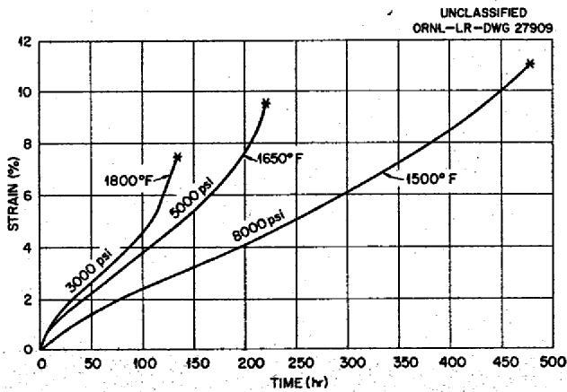  
Fig. 2.1.16. Creep Curves for Solution-Annealed INOR-8 Tested in Fuel 107 at Various Temperatures and Stresses.

A series of tests was then conducted in dry helium in order to study the wetting characteristics of silver and the silver-copper eutectic alloy on nickel, iron, and other possible flange materials - type 316 stainless steel, INOR-8, and Inconel. The specimens are shown in Fig. 2.1.17.

Metallographic examinations were made of duplicate samples after solidification and after holding at elevated temperatures for extended periods of time in order to determine the extent and type of

diffusion. The excellent wetting of nickel by silver in dry helium is indicated by the small contact angle shown in Fig. 2.1.18. An even smaller contact angle was found on the nickel-BT alloy sample. Metallographic examination of the silver-nickel interface revealed no penetration of silver into the nickel after brazing and after subsequent aging for 500 hr at $1200^{\circ}\mathrm{F}$ . Only slight penetration of nickel by the silver-copper alloy was observed after aging. The marginal wetting of INOR-8 and Inconel by silver in dry helium is illustrated by the contact angle of approximately 90 deg shown in Fig. 2.1.19. The BT alloy exhibited very poor wetting on both INOR-8 and Inconel. The wetting of iron by silver and the BT alloy in dry helium was poor and intermittent.

The deposition of an electrolytic nickel plate on Inconel and INOR-8 samples was found, however, to promote good wetting by both silver and the BT alloy. The nickel plate was not penetrated by silver, but there was some solution of the nickel plate by the BT alloy. The deposition of an electrolytic silver plate on the electrolytic nickel plate did not improve the wetting by either alloy. Aging experiments at $1200^{\circ}\mathrm{F}$ are now under way on electroplated materials.

A preliminary sealing test specimen was developed that consisted of a nickel tube and a nickel container in which the seal could be made with silver under a dry helium atmosphere. The joint was made and broken four times, and the joint was leaktight after each sealing. Thus there appears to be excellent wetting of nickel by silver under repeated heating and cooling cycles. As stated above, mockups of cast-metal-sealed flange joints are being tested that utilize the results of these studies.

# Welding of INOR-8 Tubing

G. M. Slaughter

Before the fabrication of INOR-8 tubing from heat SP-16 into the various corrosion loops of interest was initiated, it was decided that a metallurgical investigation of typical welds should be conducted. A preliminary investigation, described previously, indicated that the use of SP-16 filler wire for the welding of $\frac{1}{2}$ -in. plate from heat SP-16 was, in general, unsatisfactory because of weld-metal cracking. Also, welds made on similar specimens

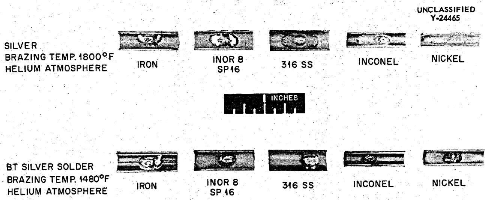

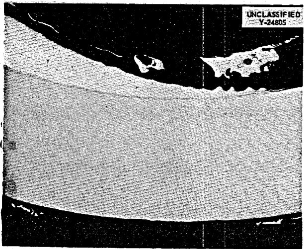  
Fia. 2.1.17. Silver and Silver-Copper Eutectic, Handy & Harman Alloy BT, on Several Base Materials.   
Fig. 2.1.18. Specimen Showing Excellent Wetting of a Nickel Tube by Silver. Unetched, $50\%$ Reduced $30\%$ .

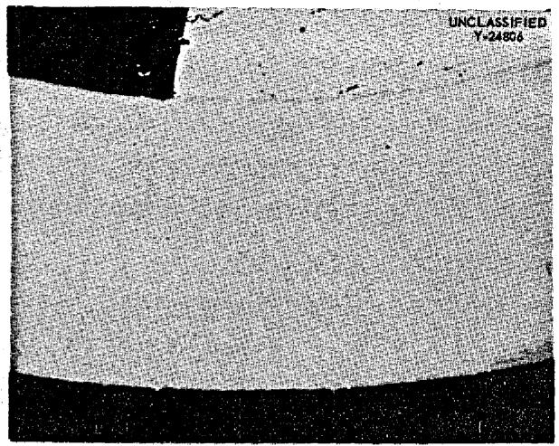  
Fig. 2.1.19. Specimen Showing Marginal Wetting of INOR-8 by Silver. Unetched, 50X. Reduced $30\%$ .

under conditions of high restraint resulted in severe base-metal cracking.

Test welds have since been made on the $\frac{3}{8}$ -in.-OD, 0.035-in.-wall tubing from heat SP-16 under low-restraint conditions. Since the previous experiments had indicated that SP-16 filler wire was not satisfactory for this application, material from an ORNL heat of INOR-8 (heat 30-38) which had shown promise in weld-cracking tests was fabricated into wire and utilized as filler metal in

the production of the test welds. Heat 30-38 has the nominal composition $15\%$ Mo-6% Cr-5% Fe-0.5% Mn-0.5% Al-0.06% C-bal Ni. A photomicrograph of a typical welded joint is shown in Fig. 2.1.20.

The results of visual, radiographic, and metallog- graphic examinations and mechanical tests at room temperature and at $1300^{\circ}F$ on as-welded specimens indicate that sound, low-restraint butt welds of SP-16 tubing can be made with heat 30-38

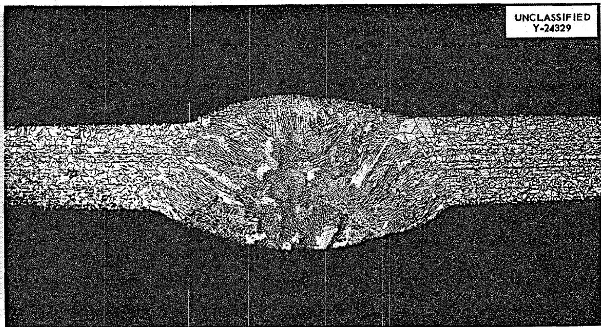  
Fig. 2.1.20. Typical Joint in SP-16 Tubing Welded with Heat 30-38 Filler Wire. Etchant: chromic and hydrochloric acids. 25X.

filler metal. No base-metal or weld-metal cracks were found, and the room- and elevated-temperature mechanical tests of the as-welded joints indicated satisfactory characteristics. The properties of the joints after aging at elevated temperatures are being investigated as a means of determining their overall suitability for high-temperature applications.

Since no significant quantity of heat 30-38 filler metal was available in the optimum wire size, material from another ORNL heat (30-72) of the same nominal composition was processed into wire. Sample butt welds of the $\frac{3}{8}$ -in.-OD, 0.035-in.-wall SP-16 tubing were made as before, and a preliminary evaluation made to obtain data for the development of a procedure specification indicated that the welds were satisfactory. The developmental work has been completed on which to base a procedure specification and an operator's qualification test specification.

Numerous saddle welds were examined during the development of the welding procedures, and intergranular base-metal cracks to the extent of $20\%$ of the tube wall thickness were occasionally observed in the microsections. The higher restraint conditions involved in the fabrication of

these welds undoubtedly explain the presence of base-metal cracks in the saddle welds and the freedom from cracks in the lower restraint butt welds. Since the detection of these defects cannot be ensured by radiography or dye-penetrant inspection, it is recommended that the SP-16 tubing not be used for critical applications, such as in-pile loops.

# Evaluation Tests for Welds

Preliminary results in the development of screening tests for determining the relative susceptibilities of various alloys to weld-metal cracking were described previously.4 The circular-groove test, which utilizes an inert-arc fusion pass on a 32-in.-wide, 2-in.-dia, 8-in.-deep circular groove machined in a $4 \times 4$ in. specimen of 2-in. plate, has now been used to test the weld-metal cracking tendencies of the INOR-8 alloys Westinghouse 8M-1 and Haynes SP-19 (see Table 2.1.5, above, for the composition of these alloys). No weldmetal cracks were found in either alloy; the Westinghouse 8M-1 specimen is shown in Fig. 2.1.21.

Metallographic sectioning of this type of specimen can also be used to determine the susceptibility

of the material to base-metal cracking during welding. Base-metal cracks identical to those found in highly restrained test welds were found in a Haynes SP-16 specimen, as shown in Fig. 2.1.22.

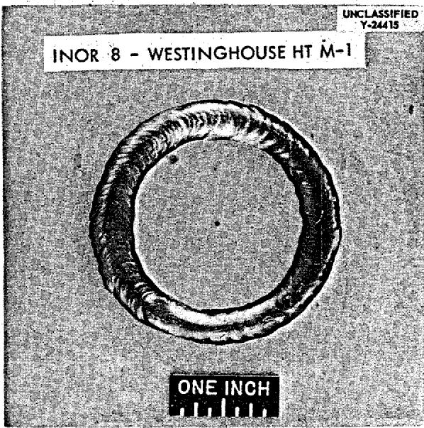  
Fig. 2.1.21. Westinghouse 8M-1 Circular-Groove Weld-Cracking-Test Specimen.

No base-metal defects were observed in the Westinghouse 8M-1 material, a typical area of which is shown in Fig. 2.1.23. No stringers or inclusions are evident. Although no base-metal cracks were found in the Haynes SP-19 specimen, the presence of slight, occasional, fusion-line porosity was noted. This condition is shown in Fig. 2.1.24.

A crack test for materials available only in rod form was also developed. A longitudinal slot, $\frac{3}{16}$ in. deep and $\frac{3}{32}$ in. wide, is machined in a $\frac{3}{4}$ -in.-dia bar and a fusion weld is made along the slot. Weld-metal cracks were found in a Haynes SP-16 bar, but there were none in a Westinghouse 8M-9 bar. The two specimens are shown in Fig. 2.1.25.

The welding characteristics of seven different heats of INOR-8 from three different sources have been studied, and only the Haynes SP-16 heat exhibited cracking tendencies. This cracking has been attributed to the melting practice and should not be considered as indicative of the properties of the alloy.

Weld test plates are being prepared as a means of evaluating the weldability of heavy sections of nickel-molybdenum alloys. Three stages in the

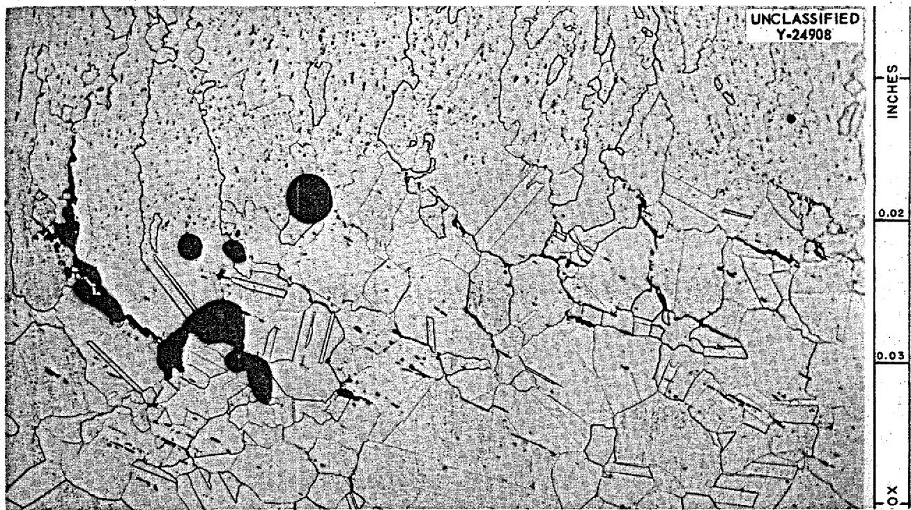  
Fig. 2.1.22. Base-Metal Cracks Found by Metallographic Examination of a Haynes SP-16 Circular-Groove Weld-Cracking-Test Specimen. Etchant: HCl + CuCl + alcohol, 100X.

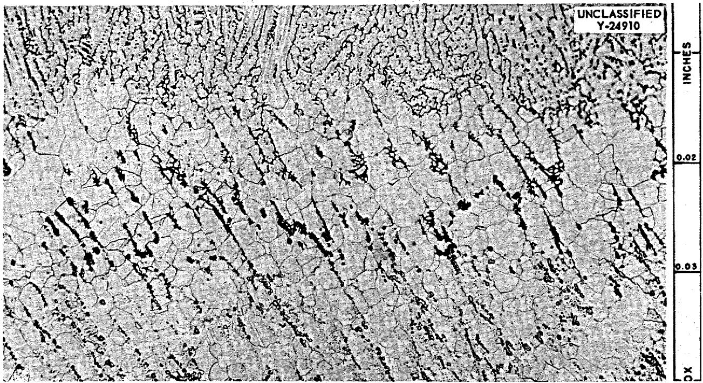

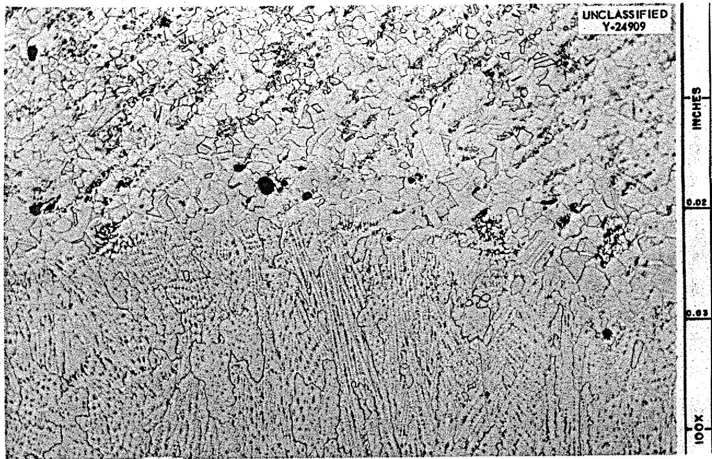  
Fig. 2.1.23. Typical Area of Westinghouse 8M-1 Circular-Groove Weld-Cracking-Test Specimen. Etchant: HCl + CuCl + alcohol. 100X.   
Fig. 2.1.24. Haynes SP-19 Circular-Groove Weld-Cracking-Test Specimen Showing Slight, Occasional, Fusion-Line Porosity. Etchant: HCl + CuCl + alcohol. 100X.

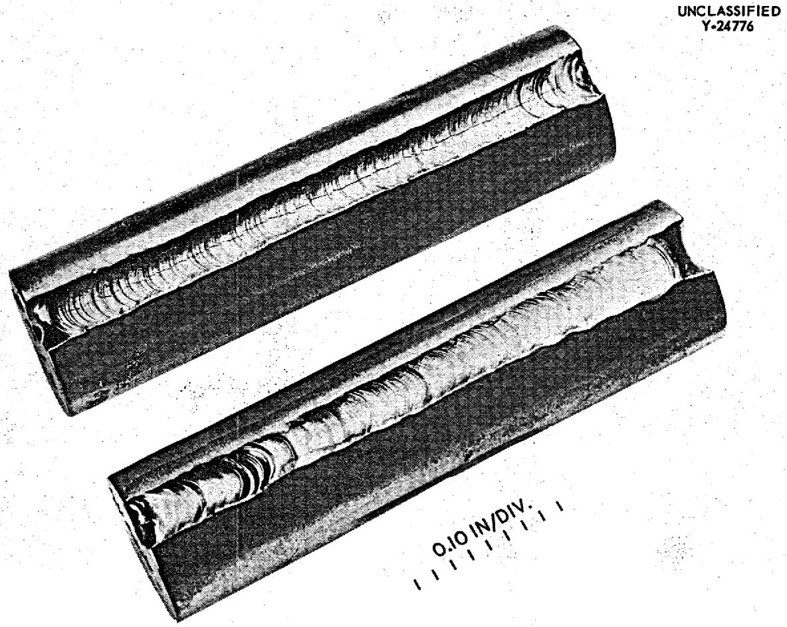  
Fig. 2.1.25. Rod Weld-Cracking-Test Specimens Showing a Crack in a Haynes SP-16 Bar and No Cracks in a Westinghouse 8M-9 Bar.

preparation of a typical test plate are illustrated in Figs. 2.1.26, 2.1.27, and 2.1.28. These plates provide specimens for mechanical property studies of welded joints and are useful for radiographic, metallographic, and hardness studies, as well as for obtaining general information pertaining to the welding characteristics of the materials under conditions of high restraint. A summary of the status of the evaluations of the INOR-8 weld test plates made to date is presented in Table 2.1.12.

For hardness studies, samples of the welded test plates are removed and measurements are made on the weld metal and base metal in the as-welded condition and after aging. Preliminary work has consisted of determining the Rockwell B hardness of the two zones, but complete hardness traverses across the weld heat-affected zones are being made to obtain a more complete understanding

of the influence of welding. The results of the preliminary hardness measurements on test plates 38 and 40 are presented in Table 2.1.13. In comparison, the hardness of Hastelloy B and W weld metals in the as-welded condition is approximately 20 on the Rockwell C scale, which is approximately equal to a value of 98 on the Rockwell B scale. After aging at $1300^{\circ}\mathrm{F}$ for 200 hr, the hardness of Hastelloy W weld metal rises to approximately 32 on the Rockwell C scale, while that of Hastelloy B rises to approximately 41.

It may be seen that heat 30-38 weld metal is slightly harder in both the as-welded and aged conditions than Haynes SP-16 weld metal. However, no significant hardening that can be attributed to aging is evident for either alloy. Both these alloys are considerably softer after aging than either Hastelloy B or W.

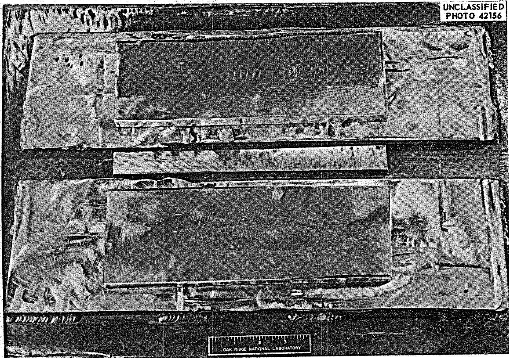  
Fig. 2.1.26. Weld Test Plate Assembly for Evaluating the Weldability of Heavy Sections Shown Prior to Welding.

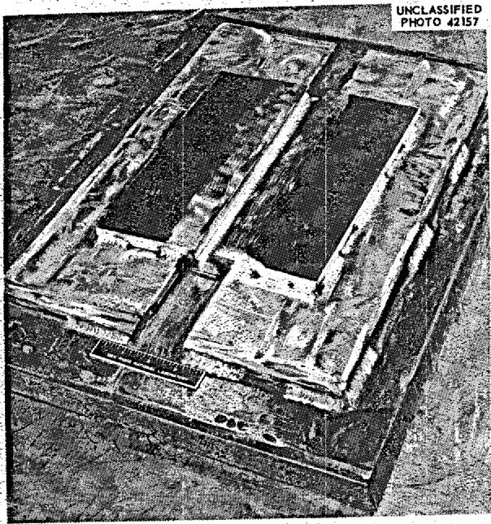  
Fig. 2.1.27. Weld Test Plate Assembly After Tack Welds Were Made.

Approximately 40 bend tests have been made on Hastelloy W weld metal and heat 30-38 weld metal at room and elevated temperatures. These tests were made on specimens in the as-welded condition and on aged specimens. The testing and aging temperatures used were room temperature and 1100, 1200, 1300, 1500, and $1650^{\circ}\mathrm{F}$ . The data obtained in the tests are being analyzed.

# Examination of INOR-8 Forced-Circulation Loop That Failed During Initial Heating

The first INOR-8 forced-circulation loop failed during initial heating in a test stand at Y-12. The loop was fabricated of Haynes SP-16 material. The failure was found to have occurred near the fusion line of the weld joining a Hastelloy B nipple to an SP-16 adapter. The broken joint is shown in Fig. 2.1.29. The Hastelloy B nipple was part of the finish-machined Hastelloy B pump barrel. The opposite end of the SP-16 adapter was welded to the SP-16 tubing of the loop. Filler

Table 2.1.12. Summary of Status of Evaluations of INOR-8 Weld Test Plates   

<table><tr><td>Plate No.</td><td>Base Metal</td><td>Filler Metal</td><td>Status of Evaluation</td></tr><tr><td>36</td><td>Haynes SP-16</td><td>Haynes SP-16 (sheared strip)</td><td>Weld metal cracked severely; no mechanical property tests conducted</td></tr><tr><td>37</td><td>Haynes SP-16</td><td>Hastelloy W</td><td>Plate machined into side-bend specimens for room- and elevated-temperature testing; tests 90% complete</td></tr><tr><td>38</td><td>Haynes SP-16</td><td>ORNL heat 30-38</td><td>Status same as for plate No. 37</td></tr><tr><td>39</td><td>Haynes SP-16 (weld made under lower restraint than conventional test plates)</td><td>Hastelloy W</td><td>Metallographic evaluation completed; no mechanical property tests to be conducted</td></tr><tr><td>40</td><td>Haynes SP-16</td><td>Haynes SP-16 rod obtained from Haynes Stellarite Co.</td><td>Weld metal cracked severely; no mechanical property tests conducted</td></tr><tr><td>41</td><td>Haynes SP-19</td><td>Haynes SP-19 (sheared strip)</td><td>Plate being machined into side-bend test specimens</td></tr><tr><td>42</td><td>Haynes SP-19</td><td>Haynes SP-19 (sheared strip)</td><td>Status same as for plate No. 41</td></tr><tr><td>43</td><td>Haynes SP-16</td><td>Westinghouse heat 8M-5*</td><td>Plate to be machined into side-bend specimens</td></tr><tr><td>44</td><td>Haynes SP-16</td><td>ORNL heat 30-73**</td><td>Plate to be machined into side-bend specimens</td></tr></table>

*Nominal composition: 17.3% Mo-7.0% Cr-5.2% Fe-0.087% C-0.19% Si-0.79% Mn-0.001% P-0.002% S-0.018% Ti-bal Ni.  
**Nominal composition: 17% Mo-8% Cr-5% Fe-0.5% Mn-0.06% C-bol Ni.

Table 2.1.13. Hardness Data for Test Plates 38 and 40   

<table><tr><td rowspan="2">Condition</td><td colspan="3">Hardness on Rockwell B Scale</td></tr><tr><td>Base Material (Haynes SP-16)</td><td>Plate 38 Weld Metal (Heat 30-38)</td><td>Plate 40 Weld Metal (Haynes SP-16)</td></tr><tr><td>As welded</td><td>89</td><td>97</td><td>92</td></tr><tr><td>Aged at 1100°F for 200 hr</td><td>89</td><td>97</td><td>90</td></tr><tr><td>Aged at 1300°F for 200 hr</td><td>87</td><td>95</td><td>88</td></tr><tr><td>Aged at 1500°F for 200 hr</td><td>85</td><td>94</td><td>86</td></tr><tr><td>Aged at 1650°F for 200 hr</td><td>85</td><td>91</td><td>86</td></tr></table>

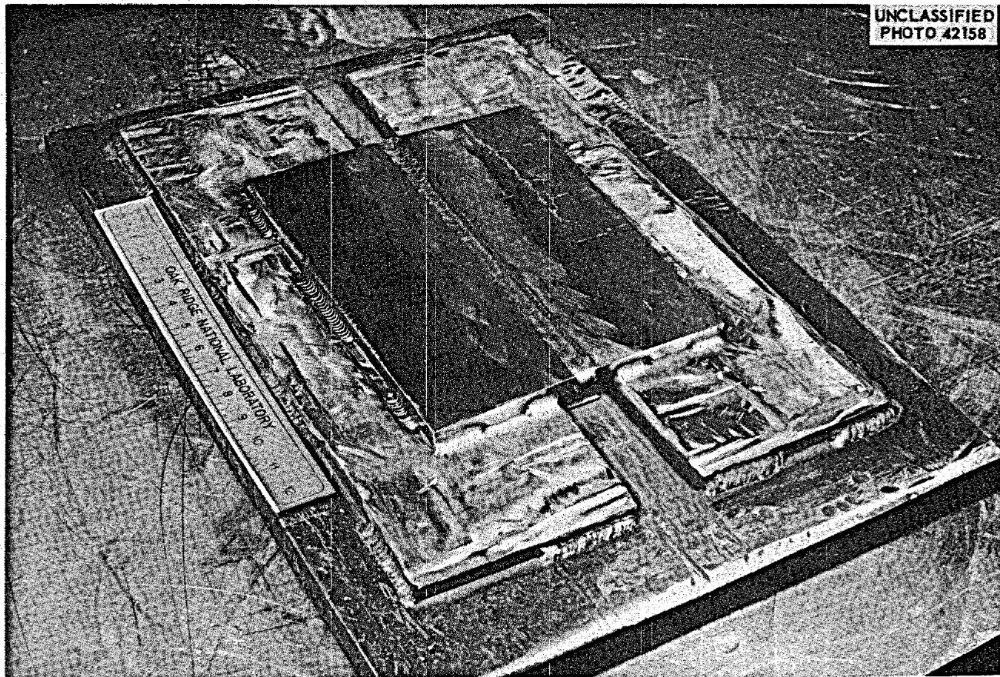  
Fig. 2.1.28. Weld Test Plate Assembly After Welding.

wire from heat 30-72 was used in the fabrication of the entire loop.

Metallographic examinations were made of sections from the area of the failure. Profuse cracks were found in the Hastelloy B nipple, and the fracture interface was predominantly in the heat-affected zone, as shown in Fig. 2.1.30. In some cases, cracks were found as much as $\frac{1}{16}$ in away from the fracture interface, as shown in Fig. 2.1.31. No evidence of cracking or failure of the heat 30-72 weld metal was noted. It thus appears that the failure can be attributed to the lack of ductility of the Hastelloy B nipple and its inability to accommodate the stresses encountered during startup of this loop.

# Fabrication of Test Components

Work has been initiated on the fabrication of two Haynes SP-16 pumps for forced-circulation corrosion testing loops. A modified fabrication procedure is being utilized in the fabrication of these pumps, since extensive base-metal cracking

occurred in a mockup experiment. In the mockup experiment, the components of the most highly stressed portions of the weldment were assembled,

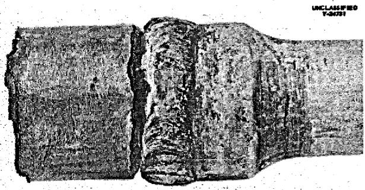  
0.IO IN/DIV.   
111111   
Fig. 2.1.29. Joint That Failed During Initial Heating of First INOR-8 Forced-Circulation Loop. The break is at the fusion line of the weld joining a Hastelloy B nipple to an SP-16 adapter.

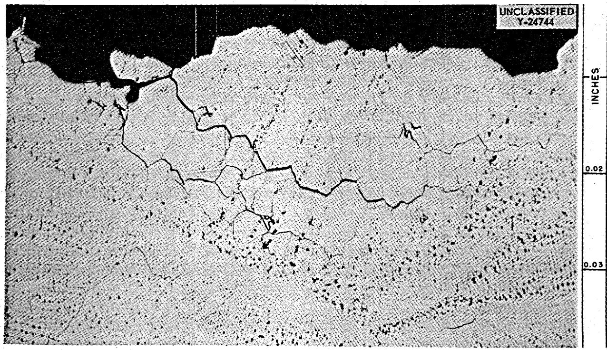

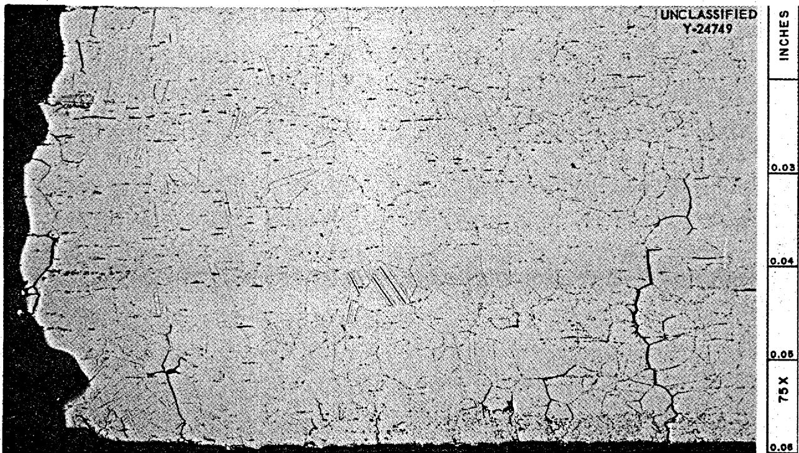  
Fig. 2.1.30. Cracks in Heat-Affected Zone of Hastelloy B Nipple. Etchant: chromic and hydrochloric acids. 100X.   
Fig. 2.1.31. Diverse Cracks in Hastelloy B Nipple. Etchant: chromic and hydrochloric acids. 75X.

welded, and metallographically examined after welding. The components studied are shown in Figs. 2.1.32, 2.1.33, and 2.1.34 before and after being welded. Metallographic sections of the finished welds revealed extensive base-metal cracking.

In the modified fabrication procedure, a 1-in. cap is premachined to approximately the desired dimension in order to reduce the restraint on the joint, and additional stress-relief anneals are used. The two units being fabricated are approximately $25\%$ complete.

The fabrication of a Haynes SP-16 INOR-8 in-pile loop for operation in the LITR was completed, as were nine INOR-8 thermal-convection loops.

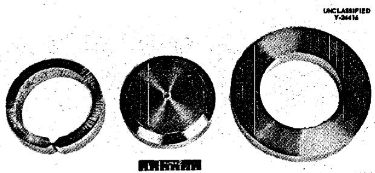  
Fig. 2.1.32. Pump Fabrication Test Components Prior to Welding.

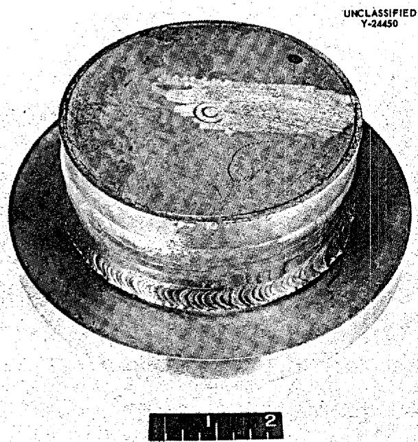  
Fig. 2.1.33. Top View of Completed Pump Fabrication Test Assembly.

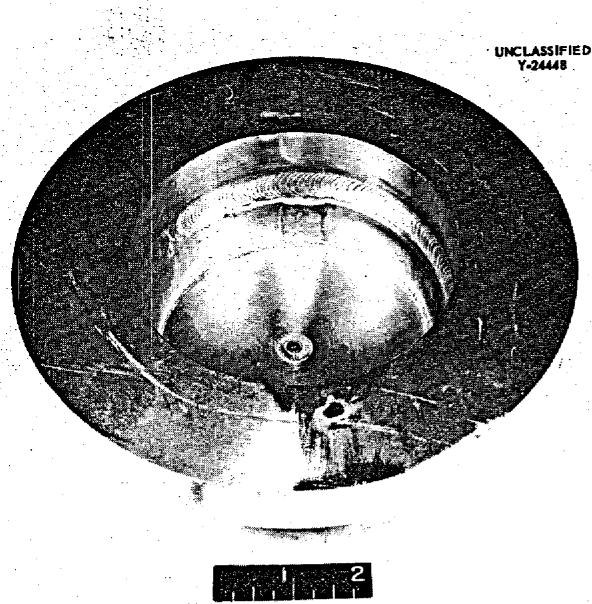  
Fig. 2.1.34. Bottom View of Completed Pump Fabrication Test Assembly.

Forty-seven Haynes SP-16 hot ductility test specimens were machined and sent to Rensselaer Polytechnic Institute for evaluation. A report of the findings will be submitted when the study is complete. Haynes SP-19 specimens are being machined for similar studies.

# DEVELOPMENT OF NONDESTRUCTIVE TESTING TECHNIQUES

R. B. Oliver

R. W. McClung

J.W.Allen

# Evaluation of INOR-8 Tubing

Immersed ultrasound and eddy-current techniques, radiography, and fluorescent penetrants were used to evaluate several lots of INOR-8 tubing in sizes that included $\frac{1}{4}$ -in. OD, 0.025-in. wall; $\frac{1}{2}$ -in. OD, 0.045-in. wall; and 0.200-in. OD, 0.050-in. wall. Discrete discontinuities were noted in all the tubing. Many of the areas of discontinuity are being examined metallographically. The lamination shown in Fig. 2.1.35 is typical of the more common defects; it was detected by the immersed ultrasound technique in $\frac{1}{4}$ -in.-OD, 0.025-in.-wall tubing. Similar defects were noted in the $\frac{1}{2}$ -in.-OD, 0.045-in.-wall tubing. Also common to both the $\frac{1}{4}$ -in. and $\frac{1}{2}$ -in. tubing were voids along the weld bead, such as those illustrated in Fig. 2.1.36. No results of metallographic examinations are yet available for the 0.200-in.-OD tubing, but macro

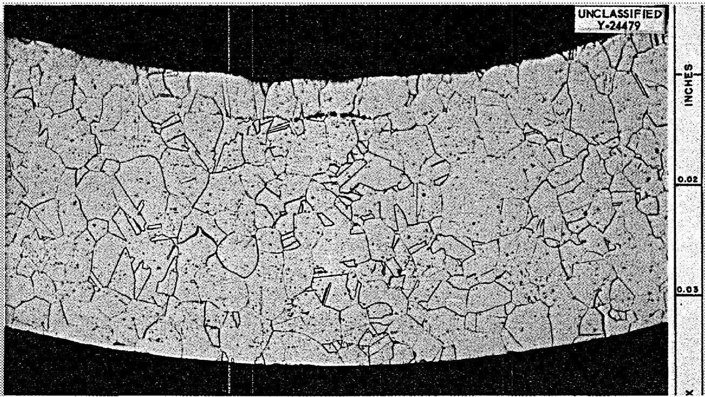  
Fig. 2.1.35. Lamination Found by Immersed Ultrasound Inspection of $\frac{1}{4}$ -in.-OD, 0.025-in.-Wall INOR-8 Tubing. Etchant: chromic and hydrochloric acids. 100X.

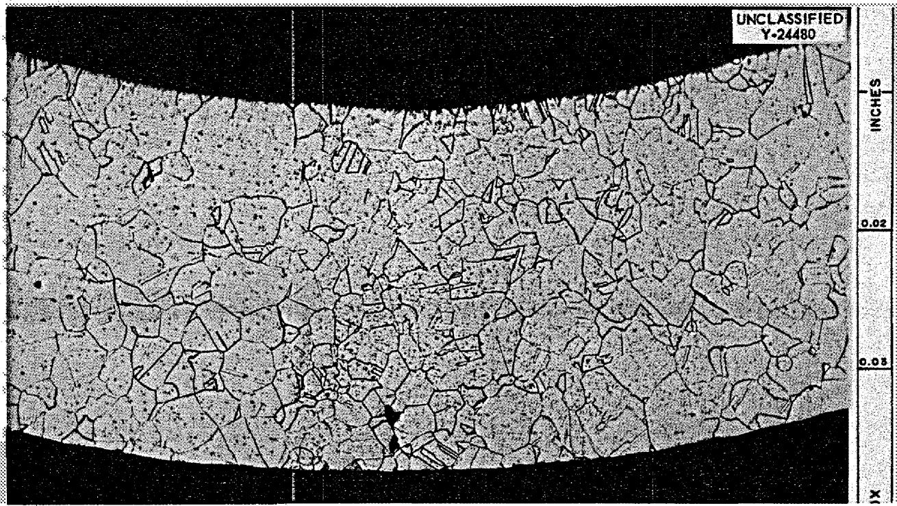  
Fig. 2.1.36. Subsurface Void Found by Immersed Ultrasound Inspection of $\frac{1}{2}$ -in.-OD, 0.045-in.-Wall INOR-8 Tubing. Etchant: chromic and hydrochloric acids. 100X.

examination of sections of the tube revealed several severe laps on the inner surface. Despite the formidable appearance of the illustrated defects, the over-all quality of the INOR-8 tubing has been better than that of other commercial nickel-molybdenum alloy tubing previously evaluated.

# Cladding Thickness Measurements and Bond Inspections

Development studies were continued of techniques for the measurement of cladding thickness with the eddy-current probe coil. Each cladding thickness will require a special adaptation of the techniques in order to compensate for variations in configuration, materials, and thicknesses. Basic information on the parameters involved is being obtained.

Techniques are also being developed for the evaluation of bond quality by ultrasonic methods. As in the case of cladding thickness measurements, techniques will be required which are peculiar to the particular application.

# INSPECTION RESULTS

G.M.Tolson

J. H. DeVan

# Material Inspection

A summary of material inspections during the quarter is presented in Table 2.1.14. The intended usage was the criterion used to determine the type of inspection performed and the acceptability. Whenever possible the rejected material was downgraded for less critical applications.

The over-all rejection rate for experimental nickel-molybdenum tubing was high, but it varied considerably from lot to lot and, in fact, was quite low for some lots. Most of the rejections were due to defects in the weld area, such as lack of fusion (Fig. 2.1.37), cracks (Fig. 2.1.38), and pores (Fig. 2.1.39). The seamless tubing was in general of better quality than the Weldrawn tubing, and the Weldrawn tubing was of better quality than the as-welded tubing. A casting made from INOR-8 was rejected because of large pores, but the general appearance of the casting indicated that casting of complicated shapes may be possible with improved techniques.

Table 2.1.14. Materials Inspected   

<table><tr><td>Item</td><td>Material</td><td>Quantity Inspected</td><td>Quantity Rejected</td></tr><tr><td>Tubing</td><td>Experimental nickel-molybdenum alloys</td><td>3293 ft 91/2in.</td><td>2006 ft 81/2in.</td></tr><tr><td>Tubing</td><td>Inconel</td><td>500 ft</td><td>8 in.</td></tr><tr><td>Duplex tubing</td><td>Inconel over type 316 stainless steel</td><td>483 ft</td><td>3 ft</td></tr><tr><td rowspan="3">Pipe</td><td>INOR-8</td><td>100 ft</td><td>5 ft</td></tr><tr><td>Inconel</td><td>110 ft</td><td>9 in.</td></tr><tr><td>Stainless steel</td><td>40 ft 5 in.</td><td>1 ft</td></tr><tr><td>Plate</td><td>INOR-8</td><td>19 ft2</td><td>0</td></tr><tr><td rowspan="3">Bar</td><td>INOR-8</td><td>97 ft 2 in.</td><td>6 ft</td></tr><tr><td>Inconel</td><td>6 ft</td><td>0</td></tr><tr><td>Stainless steel</td><td>2 ft 1 in.</td><td>1 ft</td></tr><tr><td rowspan="2">Miscellaneous</td><td>INOR-8 casting</td><td>1</td><td>1</td></tr><tr><td>Inconel Calrods</td><td>730 ft</td><td>0</td></tr></table>

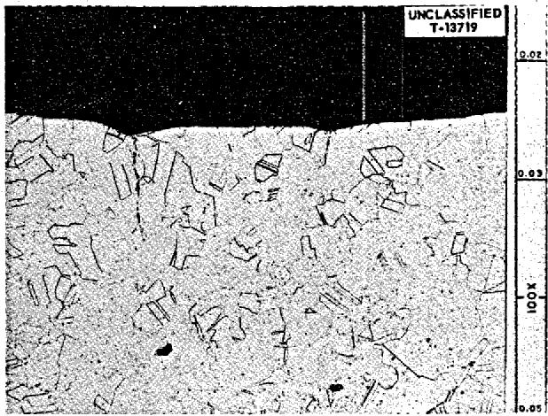  
Fig. 2.1.37. Specimen Showing Lack of Fusion Found in Weld Area of INOR-8 Tubing. Etchant: aqua regia, 100X. Reduced $31\%$ .

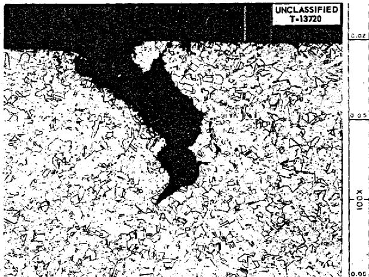  
Fig. 2.1.38. Specimen Showing a Crack Found in Weld Area of Weldrawn INOR-8 Tubing. Etchant: aqua regia, 100X. Reduced $31\%$ .

# Weld Inspection

Welds are inspected according to the quality needed, and the three general quality levels considered at the present time are designated C, CN, and S. The C type of weld is of reactor quality and receives visual, penetrant, and radiographic inspection. The CN type of weld is just as critical as the C type, but it is in a position such that it cannot be radiographed. The S type of weld is used in noncritical applications and receives only visual inspection. The specifications are being revised to include a fourth type of weld which will be designated NC. The NC welds will be used where a leaktight joint is required but certain deviations

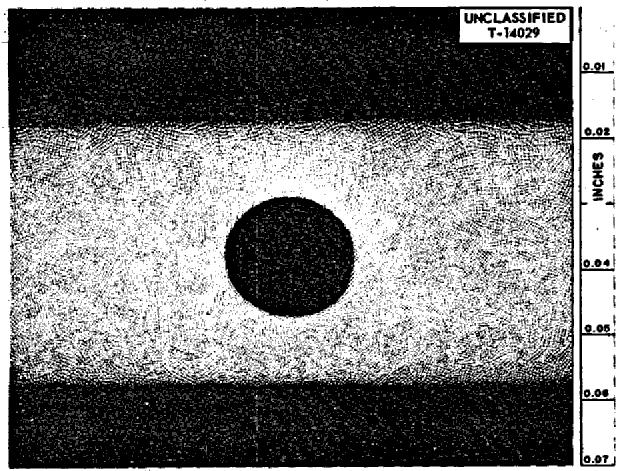  
Fig. 2.1.39. Specimen Showing a Pore Found in Weld Area of As-Welded INOR-8 Tubing. Etchant: chromic and hydrochloric acids. 50X. Reduced $33\%$ .

can be allowed. The type of inspection of an NC weld will depend on its application.

The amount of penetration allowable on C and CN welds made on tubing has been increased from 0.025 to 0.035 in., because there was difficulty in maintaining such a tight tolerance and the test loop work now in progress does not require such rigid control.

A total of 131 C welds made on INOR-8 material was inspected, and the rejection rate was $9\%$ , which is less than one-half the rejection rate previously found for Inconel welds. A total of 248 C welds and 197 CN and S welds on other materials was also inspected, with 57 C welds and 3 CN and S welds being rejected.

# Failure Analyses

A Chromel-Alumel thermocouple which failed after 240 thermal cycles between 800 and $1200^{\circ}\mathrm{F}$ in NaK was inspected to determine the cause of the failure. The thermocouple was encased in a protective Inconel well, and therefore it was necessary to locate the failure by radiographic inspection. A break was indicated on one of the wires near the thermocouple junction, and metallographic sections were taken at the failed area. The thermocouple wire at the break had necked down considerably, and thus a ductile tensile failure was indicated. Since the junction of the thermocouple had been firmly attached to the bottom of the well, failure appeared to be the result of differential expansion between the thermocouple wires and the surrounding Inconel well.

# 2.2. RADIATION DAMAGE

G.W. Keilholtz

# IN-PILE THERMAL-CONVECTION LOOP TESTS

W. E. Browning

H.E.Robertson R.P.Shields

The electrically heated full-scale mockup of the in-pile thermal-convection loop, described previously, was welded and filled with fuel in a dry box. The fuel mixture $\mathrm{BeF}_2$ -LiF-UF $_4$ (37-62-1 mole %, fuel 130) containing depleted uranium and normal lithium will be circulated in the mockup, which, like the in-pile loop, is fabricated of INOR-8 alloy. Thermocouples and heaters are now being installed on the mockup to demonstrate the workability of the design and to provide operating information for use in the in-pile loop tests.

Mechanical mockup tests were performed on a series of thermocouple leads being considered for service in the cooling-air annulus of the loop. Since thermal expansion of the fuel tubes damaged thermocouples in previously operated loops, it was desired to select a design which would prevent plastic deformation of the thermocouple lead wires. The mechanical mockup test was performed in an apparatus which was similar to a portion of the fuel tube and cooling-air-annulus tube, with the outer parts made of transparent plastic to permit observation of the thermocouple during expansion of the fuel tube. The various thermocouple lead wire assemblies being considered were tested in this apparatus in order to determine the effect of longitudinal movement of the fuel tube of as much as $\frac{1}{2}$ in. Radial movement of the fuel tube in the loop is prevented by radial spacer pins. The thermocouple assembly selected consists of a thin-walled stainless steel tube which fits closely around a ceramic insulator tube. The stainless steel tube is split at the end and is resistance spot welded to the fuel tube near the point where the thermocouple bead is joined to the fuel tube. This stainless steel thermocouple jacket is installed nearly parallel to the fuel tube and is brought out along a straight line at a small angle from the fuel tube. As the fuel tube moves longi

tudinally during thermal expansion, the thermocouple jacket moves longitudinally along its own axis through the port in the air annulus and through the heater assembly, and it moves slightly with respect to the bundle of lead wires. This arrangement provides a relatively rigid structural member which does not move with respect to the thermocouple wire or the thermocouple bead, and thus does not apply stress to the thermocouple. Thermocouples of this type have survived dozens of cycles in which the thermal expansion was many times greater than that expected in the loop.

The in-pile loop is to include a charcoal trap for removing the xenon which will diffuse from the surface of the fuel. Any organic material and water present in the charcoal as an impurity would be decomposed by radiation from adsorbed fission products, and the decomposition products could contaminate the fuel and interfere with interpretation of the results of the experiment. The charcoal used in the loop will therefore be baked in vacuum for 48 hr at $500^{\circ}\mathrm{C}$ in order to decompose organic impurities. The charcoal which was installed in the mockup loop was subjected to this treatment. The holdup time of the heat-treated charcoal for radiokrypton in a flowing helium stream was measured to determine whether the heat treatment had reduced the capacity of the charcoal for noble gases. It was found that the charcoal was $10\%$ more effective as an absorber for krypton after the heat treatment than it had been before. This effect was no doubt the result of dehydration of the charcoal.

Calculations were made to determine the magnitude of undesirable effects of the $\mathsf{Li}^6$ isotope in the fuel for the in-pile loop. The effects considered were (1) the flux depression that would result from absorption of thermal neutrons by the $\mathsf{Li}^6$ , (2) the biological hazard that would be present in the event of an accidental release of the tritium that would be produced by the $(n,a)$ reaction in $\mathsf{Li}^6$ , (3) the internal gas pressure that would be generated by nuclear reaction products from $\mathsf{Li}^6$ , and (4) the possible chemical effects of the tritium equivalent of HF and the consequent interference with the interpretation of the results of the experiment. All these effects were found

to be unimportant except the last one. The possible effects of traces of tritium in the loop cannot be evaluated with sufficient confidence to risk operating the in-pile loop under such conditions. It was decided therefore to obtain the best available $\mathsf{Li}^7$ for use in the in-pile test. Lithium containing $99.8\%$ $\mathsf{Li}^7$ was obtained and was used in the production of a batch of fuel 130 (see Chap. 2.3 for production details). Sufficient fuel for filling three loops is now available in powder form.

Preparations are being made in the ORR facilities for the operation of a similar forced-circulation loop. The loop assembly housing and lead tube have been fabricated for use in preliminary hydraulic tests of the reactor before startup. These tests will show whether the lead tube is structurally adequate in the reactor cooling-water stream. The same assembly is being used for surveys of the flux in the experimental space designated for this experiment. Conduit trays and an auxiliary control panel are being installed to carry lead wires from the experimental assembly in the reactor to the laboratory, where the controls for the loop will be located.

# IN-PILE STATIC CAPSULE TESTS

W. E. Browning

H. L. Hemphill

Preparations for the irradiation of fuel 130 in INOR-8 capsules in the MTR were continued. The fuel used in these test capsules will be the same as that used in the in-pile thermal-convection loop. The INOR-8 tubing intended for use in fabricating these capsules had to be rejected because of high aluminum content. Another batch

of INOR-8 tubing of satisfactory composition contained a large number of flaws. Short sections of this batch of tubing are being selected for use in the MTR capsules. The INOR-8 tubing for the MTR capsules is more difficult to fabricate than that used in the thermal-convection loop because of the small diameter and large wall thickness, 0.200 in. OD and 0.100 in. ID.

Other capsules are being fabricated for irradiation in the MTR in order to determine the stability of graphite in contact with fuel 130 during exposure to radiation. Existing Inconel capsules are being used for the outer containers. Graphite liners with 0.025-in.-thick walls have been prepared that have a 0.100-in.-dia bore and are 1 in. in length. These graphite liners will have a loose plug at the top end and three small holes near the bottom to allow the fuel to fill the space inside the graphite liner and the space between the liner and the Inconel outer can. The fuel will provide heat transfer between the graphite and the Inconel wall, and fairly accurate estimates of the graphite temperatures can be based on measurements of the temperature of the wall, the thermal conductivity of the graphite, and the heat generation by fission in the fuel. These capsules will be irradiated at a metal wall temperature of $1250^{\circ}\mathrm{F}$ .

After irradiation the capsules will be examined in the Solid State Division hot cells in order to determine whether the graphite disintegrated. If the graphite is intact, an attempt will be made to determine the distribution of fuel components and fission products in the graphite. The graphite and the Inconel will be examined metallographically for evidences of corrosion, and the fuel will be chemically analyzed for carbon and the constituents of Inconel.

# 2.3. CHEMISTRY

W.R.Grimes

# PHASE EQUILIBRIUM STUDIES

# Systems Containing $\mathbf{U}\mathbf{F}_{4}$ and/or $\mathbf{ThF}_4$

R. E. Thoma

H.A.Friedman

H. Insley

C. F. Weaver

Phase equilibrium studies are being made for determining whether an $\mathsf{LiF - BeF}_2$ mixture will dissolve sufficient $\mathsf{ThF}_4$ and $\mathsf{UF}_4$ to provide a fuel for a fused-salt breeder reactor. It will be practical to treat the quaternary system $\mathsf{LiF - BeF}_2$ - $\mathsf{ThF}_4$ - $\mathsf{UF}_4$ as a ternary system if the phase equilibria and isotherms are very similar in the systems $\mathsf{LiF - BeF}_2$ - $\mathsf{ThF}_4$ and $\mathsf{LiF - BeF}_2$ - $\mathsf{UF}_4$ and if extensive solid solution occurs in the system $\mathsf{LiF - ThF}_4$ - $\mathsf{UF}_4$ .

The systems $\mathsf{BeF}_2\text{-}\mathsf{ThF}_4$ (ref 1) and $\mathsf{BeF}_2\text{-}\mathsf{UF}_4$ are very similar. Liquidus curves of the systems $\mathsf{LiF - UF_4}$ (ref 2) and $\mathsf{LiF - ThF_4}$ (ref 1) are also similar, although $\mathsf{LiF - UF_4}$ and $\mathsf{LiF - ThF_4}$ solid phases are, in general, dissimilar. It is evident that phase diagrams of the systems $\mathsf{LiF - BeF}_2\text{-}\mathsf{UF}_4$ and $\mathsf{LiF - BeF}_2\text{-}\mathsf{ThF}_4$ will be similar and that substitutional solid solution occurs in the system $\mathsf{LiF - ThF_4}\text{-}\mathsf{UF}_4$ . It may be inferred that some interpolations can be made between the systems $\mathsf{LiF - BeF}_2\text{-}\mathsf{UF}_4$ and $\mathsf{LiF - BeF}_2\text{-}\mathsf{ThF}_4$ with regard to liquidus temperatures and phase relationships.

The System $\mathsf{LiF - BeF}_2\cdot \mathsf{ThF}_4$ Results of phase equilibrium studies now under way of the system. $\mathsf{LiF - BeF}_2\cdot \mathsf{ThF}_4$ are consistent with liquidus profiles obtained previously. Recent experiments have been confined principally to studies of the section of the diagram that represents mixtures containing 60 to 80 mole % LiF. The results are presented in the partial diagram shown in Fig. 2.3.1. This diagram is based on (1) analyses of the thermal effects that are indicated in heating and cooling (from above the liquidus) curves for 50- to 100-g fused-salt samples, (2) petrographic and x-ray diffraction examinations of these samples, and (3) results of thermal-gradient quenching experiments.

Breeder reactor blanket or breeder reactor fuel solvent compositions, whose maximum $\mathsf{ThF}_4$ concentration is restricted to that available in salts having less than a $550^{\circ}\mathrm{C}$ liquidus, may be chosen from an area of the phase diagram (Fig.2.3.1) in which the upper limits of $\mathsf{ThF}_4$ concentration are obtained in the compositions:

$$
\begin{array}{l} 75 \text {mole} \% \text {LiF}-16 \text {mole} \% \text {ThF} _{4}-9 \text {mole} \% \text {BeF}_{2} \\ 69.5 \text {mole} \% \text {LiF}-21 \text {mole} \% \text {ThF} _{4}-9.5 \text {mole} \% \text {BeF}_{2} \\ 68 \text {mole} \% \text {LiF} - 22 \text {mole} \% \text {ThF} _ {4} - 10 \text {mole} \% \text {BeF} _ {2} \\ \end{array}
$$

Results of thermal-gradient quenching experiments (Table 2.3.1) have shown that the temperatures along two of the boundary curves limiting the primary phase $3\mathrm{LiF}\cdot \mathrm{ThF}_4$ are those shown in Figs. 2.3.2 and 2.3.3. The results of quenched samples 2, 4, 5, 6, and 7 show that a lower melting liquid occurs in the system than had been suggested by earlier data, and yet neither petrographic nor x-ray diffraction data permit a conclusion as to what phases are present in the eutectic which this low-melting liquid represents. The composition of this liquid appears to be approximately 66 mole % LiF-4.5 mole % ThF-29.5 mole % BeF; however, the sequence of appearance of solid phases in Table 2.3.1 does not suggest that this is a eutectic composition.

The System $\mathrm{LIF - ThF_4 - UF_4}$ The compounds $\mathrm{ThF_4}$ and $\mathsf{UF}_4$ form a continuous solid solution. Slowly cooled melts give multiple temperature breaks, most of which are at lower temperatures than the liquidus values observed optically in quenched samples. Since supercooling occurs in the slowly cooled melts, the optical results from quenched samples are relied on for liquidus values. The liquidus points and curve are shown in Fig. 2.3.4. Apparently no minimum exists within the system; consequently, the solidus line cannot extend below the melting point of $\mathsf{UF}_4$ . The solidus line must therefore be close to the liquidus line; however, the presence of a brown, unidentified material at temperatures below the liquidus has precluded optical observation of solidus temperatures.

The $\mathsf{ThF}_4$ - $\mathsf{UF}_4$ solid solution is green, frequently twinned, and biaxial negative. It has an optic

angle of about 65 deg and a birefringence of approximately 0.05. The indices of refraction are shown in Fig. 2.3.5 as functions of $\mathsf{UF}_4$ content.

The compounds $\mathsf{LiF}\cdot 4\mathsf{ThF}_4$ and $\mathsf{LiF}\cdot 4\mathsf{UF}_4$ form a continuous solid solution. A tentative liquidus curve for the $\mathsf{LiF}\cdot 4\mathsf{ThF}_4$ - $\mathsf{LiF}\cdot 4\mathsf{UF}_4$ join is shown in Fig. 2.3.6. This liquidus and the liquidus in the system $\mathsf{ThF}_4\cdot \mathsf{UF}_4$ indicate that the $\mathsf{ThF}_4\cdot \mathsf{UF}_4$ solid-solution primary-phase field is slightly

convex in the direction of decreasing temperatures. The three-phase region composed of liquid, $\mathsf{ThF}_4\cdot \mathsf{UF}_4$ solid solution, and LiF-4ThF-LiF-4UF4 solid solution, which emerges as the LiF-4ThF4-LiF-4UF4 solid solution primary-phase field, is convex in the direction of increasing temperatures.

The LiF-4ThF $_4$ -LiF-4UF $_4$ solid solution is green and biaxial negative, and has an optic angle of about 5 deg. Its birefringence is approximately

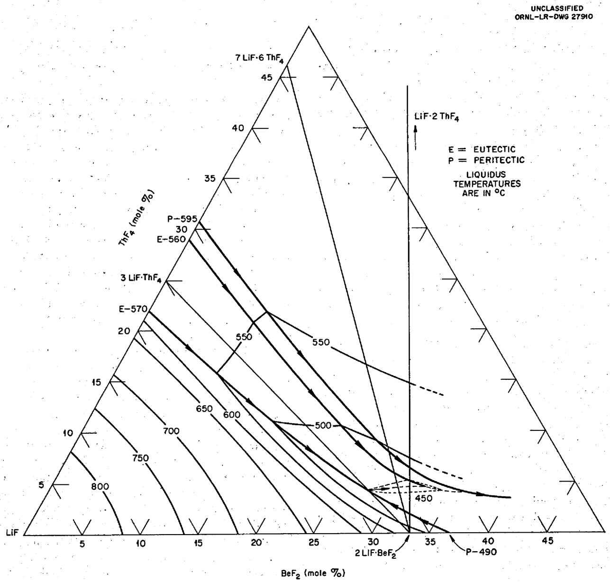  
Fig. 2.3.1. Partial Phase Diagram of the System LiF-BeF $_2$ -ThF $_4$ for the Region Representing Mixtures Containing 50 to 100 Mole % LiF.

Table 2.3.1. Results of Thermal-Gradient Quenching Experiments on the System LiF-BeF ${}_{2}$ -ThF ${}_{4}$   

<table><tr><td rowspan="2">Sample No.</td><td colspan="3">Composition (mole %)</td><td rowspan="2">Temperature (°C)</td><td rowspan="2">Phases Present</td></tr><tr><td>LiF</td><td>BeF2</td><td>ThF4</td></tr><tr><td>1</td><td>68</td><td>27</td><td>5</td><td>460</td><td>3LiF·ThF4* and liquid</td></tr><tr><td></td><td></td><td></td><td></td><td>448</td><td>3LiF·ThF4, 2LiF·BeF2, and liquid</td></tr><tr><td></td><td></td><td></td><td></td><td>426</td><td>3LiF·ThF4, 2LiF·BeF2, and little or no liquid</td></tr><tr><td>2</td><td>66</td><td>29</td><td>5</td><td>452</td><td>3LiF·ThF4 and liquid</td></tr><tr><td></td><td></td><td></td><td></td><td>444</td><td>3LiF·ThF4, 2LiF·BeF2, and liquid</td></tr><tr><td></td><td></td><td></td><td></td><td>413</td><td>3LiF·ThF4, 2LiF·BeF2, and very little liquid**</td></tr><tr><td>3</td><td>64</td><td>31</td><td>5</td><td>451</td><td>3LiF·ThF4 and liquid</td></tr><tr><td></td><td></td><td></td><td></td><td>431</td><td>3LiF·ThF4, 2LiF·BeF2, and very little liquid</td></tr><tr><td></td><td></td><td></td><td></td><td>428</td><td>3LiF·ThF4, 2LiF·BeF2, and no liquid</td></tr><tr><td>4</td><td>65</td><td>29</td><td>6</td><td>466</td><td>7LiF·6ThF4 and liquid</td></tr><tr><td></td><td></td><td></td><td></td><td>457</td><td>3LiF·ThF4 and liquid, no 7LiF·6ThF4</td></tr><tr><td></td><td></td><td></td><td></td><td>440</td><td>3LiF·ThF4, 2LiF·BeF2, and liquid</td></tr><tr><td></td><td></td><td></td><td></td><td>413</td><td>3LiF·ThF4, 2LiF·BeF2, and very little liquid</td></tr><tr><td>5</td><td>67</td><td>26</td><td>7</td><td>470</td><td>3LiF·ThF4 and liquid</td></tr><tr><td></td><td></td><td></td><td></td><td>444</td><td>3LiF·ThF4, 2LiF·BeF2, and liquid</td></tr><tr><td></td><td></td><td></td><td></td><td>413</td><td>3LiF·ThF4, 2LiF·BeF2, and a small amount of liquid</td></tr><tr><td>6</td><td>66</td><td>27</td><td>7</td><td>474</td><td>7LiF·6ThF4 and liquid</td></tr><tr><td></td><td></td><td></td><td></td><td>457</td><td>3LiF·ThF4, a small amount of 7LiF·6ThF4, and liquid</td></tr><tr><td></td><td></td><td></td><td></td><td>452</td><td>3LiF·ThF4 and liquid, no 7LiF·6ThF4</td></tr><tr><td></td><td></td><td></td><td></td><td>444</td><td>3LiF·ThF4, 2LiF·BeF2, and liquid</td></tr><tr><td></td><td></td><td></td><td></td><td>413</td><td>3LiF·ThF4, 2LiF·BeF2, and liquid</td></tr><tr><td>7</td><td>64</td><td>29</td><td>7</td><td>479</td><td>7LiF·6ThF4 and liquid</td></tr><tr><td></td><td></td><td></td><td></td><td>455</td><td>7LiF·6ThF4, 3LiF·ThF4, and liquid</td></tr><tr><td></td><td></td><td></td><td></td><td>446</td><td>3LiF·ThF4, 2LiF·BeF2, and liquid</td></tr><tr><td></td><td></td><td></td><td></td><td>395</td><td>3LiF·ThF4, 2LiF·BeF2, and little or no liquid</td></tr><tr><td>8</td><td>70</td><td>20</td><td>10</td><td>484</td><td>3LiF·ThF4 and liquid</td></tr><tr><td></td><td></td><td></td><td></td><td>449</td><td>3LiF·ThF4 and liquid</td></tr><tr><td>9</td><td>69.5</td><td>7.5</td><td>23</td><td>563</td><td>7LiF·6ThF4 and liquid</td></tr><tr><td></td><td></td><td></td><td></td><td>559</td><td>3LiF·ThF4, 7LiF·6ThF4, and liquid</td></tr><tr><td></td><td></td><td></td><td></td><td>444</td><td>3LiF·ThF4, 7LiF·6ThF4, and a small amount of liquid</td></tr></table>

*The phase 3LiF·ThF₄, as it appears in the ternary system, is routinely observed as a solid solution.   
**The presence of liquid in the lowest temperature sample indicates that the temperature range of the experiment was not low enough to permit determination of the solidus temperature.

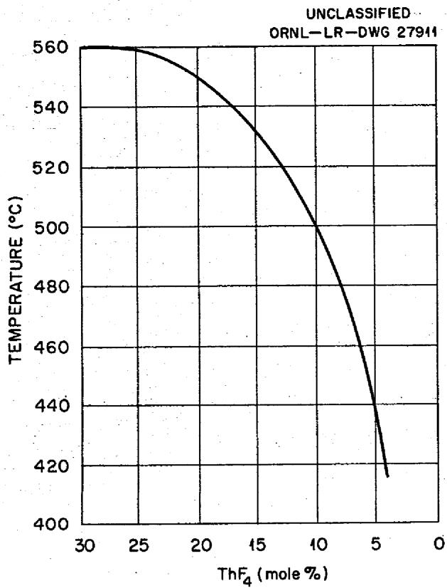

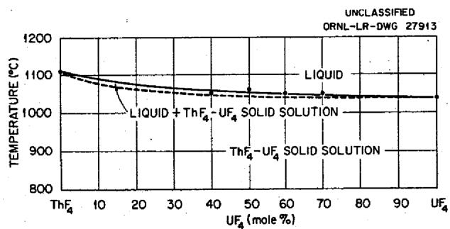  
Fig. 2.3.2 Temperature Variation Along the Boundary Curve from the Composition Point 71 Mole % LiF-29 Mole % ThF4 to the Eutectic Composition Point at About 29.5 Mole % BeF2-4.5 Mole % ThF4-66 Mole % LiF.   
Fig. 2.3.4. The System $\mathsf{ThF}_4\text{-}\mathsf{UF}_4$

0.01. The indices of refraction as functions of $\mathbf{U}\mathbf{F}_{\lambda}$ content are shown in Fig. 2.3.7.

The compounds $7\mathrm{LiF}\cdot 6\mathrm{ThF}_4$ and $7\mathrm{LiF}\cdot 6\mathrm{UF}_4$ form a continuous solid solution. The liquidus curve for the $7\mathrm{LiF}\cdot 6\mathrm{ThF}_4\cdot 7\mathrm{LiF}\cdot 6\mathrm{UF}_4$ join is shown in Fig. 2.3.8. This curve and the three-phase region in the LiF-4ThF-LiF-4UF4 join indicate that the LiF-4ThF-LiF-4UF4 solid-solution primary-phase field is convex in the direction of increasing temperatures.

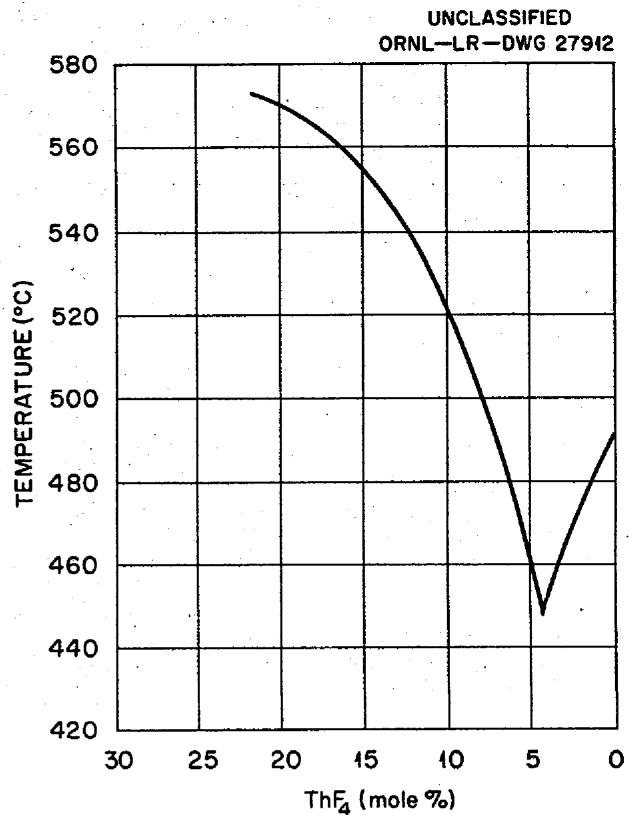

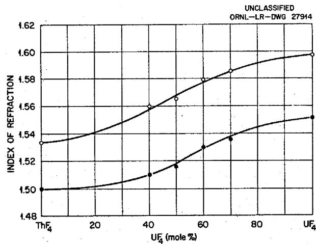  
Fig. 2.3.3. Temperature Variation Along the Boundary Curves from the Composition Point 78 Mole % LiF-22 Mole % ThF4 to the Composition Point 63 Mole % LiF-37 Mole % BeF2*   
Fig. 23.5. Indices of Refraction in the System $\mathsf{ThF}_4\cdot \mathsf{UF}_4$ .

The 7LiF-6ThF4-7LiF-6UF4 solid solution is green and uniaxial. Its birefringence is low and varies from 0 to 0.006. The indices of refraction are shown in Fig. 2.3.9 as functions of UF4

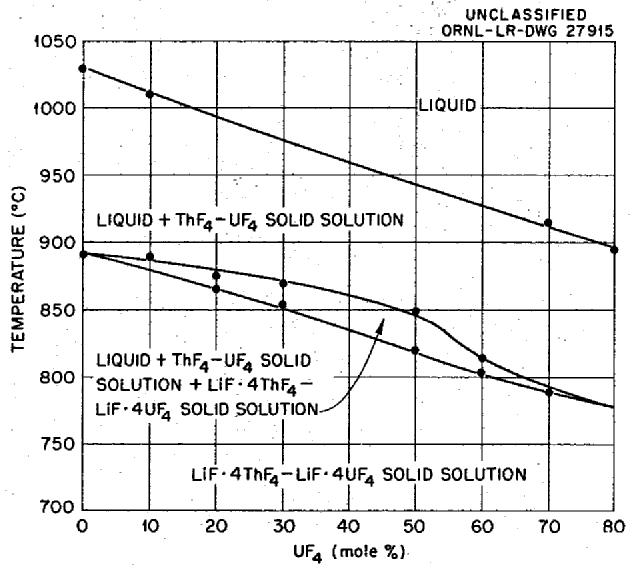  
Fig. 23.6. The Join $\mathsf{LIF}\cdot 4\mathsf{ThF}_4\cdot \mathsf{LIF}\cdot 4\mathsf{UF}_4$ .

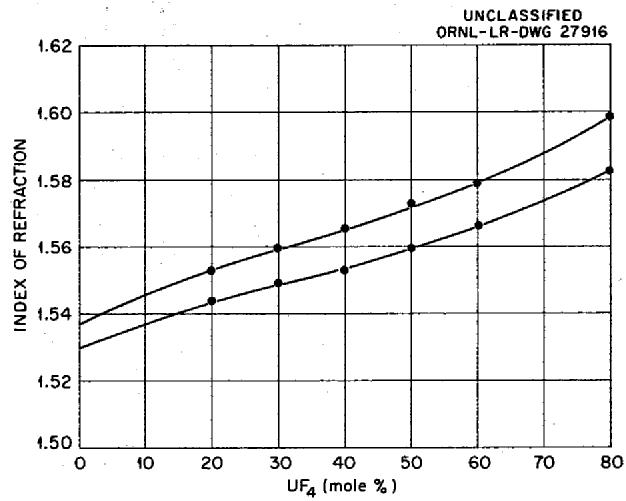

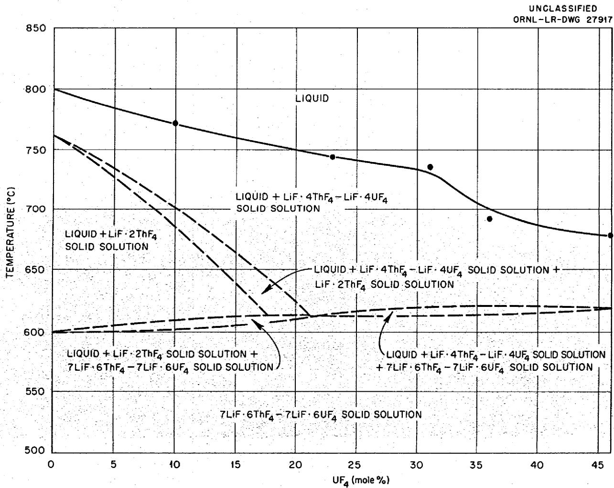  
Fig. 2.3.7. Indices of Refraction Along the Join LiF·4ThF4·LiF·4UF4   
Fig. 2.3.8. The Join 7LiF-6ThF $_4$ -7LiF-6UF $_4$ .

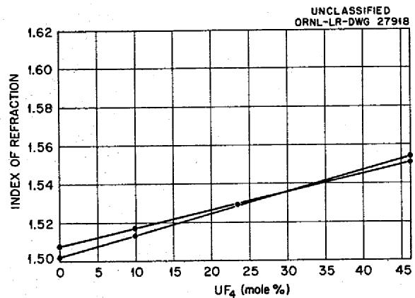  
Fig. 23.9. Indices of Refraction Along the Join 7LiF·6ThF4·7LiF·6UF4.

content. As the $\mathsf{UF}_4$ content increases, the solid solution changes from uniaxial positive to uniaxial negative. Further, for mixtures containing about 31 mole $\%$ UF4, the solid solution should be isotropic. Quenches of such mixtures have produced 7LiF-6ThF-7LiF-6UF4 solid solutions that have birefringes which are too low to measure microscopically.

The curvatures of the ThF-UF solid-solution primary-phase field and the LiF-4ThF-LiF-4UF solid-solution primary-phase field, which were mentioned above, indicated that their boundary curve should bend away from the LiF vertex of the LiF-ThF-UF diagram. Experimental values confirm this indication, as shown in Fig. 2.3.10.

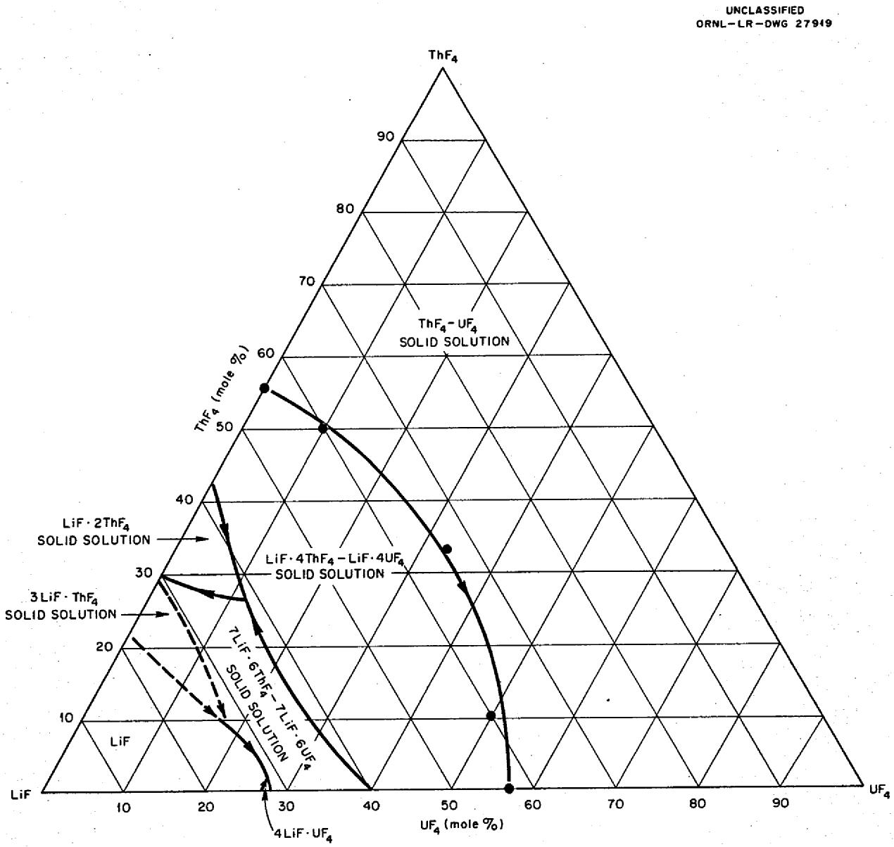  
Fig. 2.3.10. The Primary-Phase Fields in the System LiF-ThF $_4$ -UF $_4$ .

In the system diagram presented in Fig. 2.3.11, the temperatures of points $a$ and $c$ are 500 and $488^{\circ}C$ , respectively. Consequently the LiF-4LiF·UF4 boundary curve temperatures drop from point $a$ to point $c$ . The temperatures of points $c$ and $d$ are 488 and $500^{\circ}C$ , respectively. Consequently the boundary curve between the LiF primary-phase field and the 7LiF·6ThF4·7LiF·6UF4 solid-solution primary-phase field drops in temperature from point $d$ to point $c$ . In addition, evidence exists (Table 2.3.2) that 4LiF·UF4 appears as a third solid phase in compositions along this

boundary curve. There is also evidence (Table 2.3.2) that LiF appears as a third solid phase in compositions along the boundary curve between the $4\mathrm{LiF}\cdot \mathrm{UF}_4$ primary-phase field and the 7LiF-6ThF4-7LiF-6UF4 solid-solution primary-phase field. Thus the boundary curve temperatures must decrease from point $b$ to point $c$ . Point $c$ is, then, a eutectic.

The solid phases in equilibrium in compositions near point $c$ at the invariant temperature are LiF, 4LiF·UF4, and 7LiF·6ThF4·7LiF·6UF4 solid solution containing about 41.5 mole % UF4. From

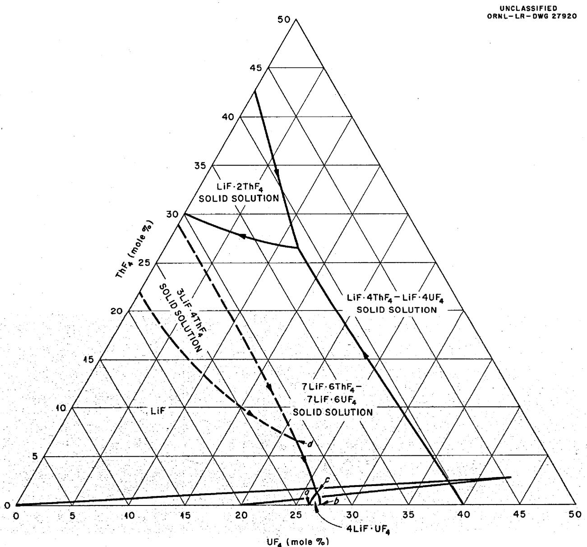  
Fig. 2.3.11. Primary-Phase Fields in the System LiF-ThF $_4$ -UF $_4$ for the Region Representing Mixtures Containing 50 to 100 Mole % LiF.

Table 2.3.2. Results of Thermal-Gradient Quenching Experiments in the System LiF-ThF $_4$ -UF $_4$   

<table><tr><td colspan="3">Composition (mole %)</td><td rowspan="2">Temperature of Phase Change (℃)</td><td rowspan="2">Phases Above Phase Change</td><td rowspan="2">Phases Below Phase Change</td></tr><tr><td>LiF</td><td>ThF4</td><td>UF4</td></tr><tr><td>40</td><td>10</td><td>50</td><td>808</td><td>Liquid</td><td>Liquid + LiF·4UF4·LiF·4ThF4 solid solution</td></tr><tr><td>33.3</td><td>33.3</td><td>33.3</td><td>862</td><td>Liquid + UF4-ThF4 solid solution</td><td>Liquid + LiF·4UF4·LiF·4ThF4 solid solution</td></tr><tr><td>40</td><td>50</td><td>10</td><td>880</td><td>Liquid</td><td>Liquid + LiF·4UF4·LiF·4ThF4 solid solution</td></tr><tr><td>72.5</td><td>1</td><td>26.5</td><td>485</td><td>Liquid + 4LiF·UF4 + 7LiF·6UF4·7LiF·6ThF4 solid solution</td><td>LiF + 4LiF·UF4 + 7LiF·6UF4·7LiF·6ThF4 solid solution</td></tr><tr><td>71</td><td>2</td><td>27</td><td>491</td><td>Liquid + LiF + 7LiF·6UF4·7LiF·6ThF4 solid solution</td><td>LiF + 4LiF·UF4 + 7LiF·6UF4·7LiF·6ThF4 solid solution</td></tr></table>

this information the compatibility triangle at the invariant temperature can be drawn as shown in Fig.2.3.11. The invariant falls within this triangle, and consequently, as stated above, point $c$ must be a eutectic.

# Solubility and Stability of $\mathsf{PuF}_3$ in Molten Fluorides

C.J.Barton R.A.Strehlow

Values for the solubility of $\mathsf{PuF}_3$ in NaF-BeF2 (57-43 mole %) at three temperatures were given in the previous report. During the past quarter, values were obtained for the solubility of $\mathsf{PuF}_3$ in two additional NaF-BeF2 mixtures, three LiF-BeF2 compositions, and one NaF-LiF-BeF2 mixture as a function of temperature. The range of BeF2 concentrations covered in each of the binary solvent systems, approximately 36 to 50 mole % includes the concentration range likely to be of interest in the MSR program. Binary mixtures with lower BeF2 concentrations have too high liquidus temperatures to be useful at power reactor temperatures, and the viscosity of mixtures containing more than 50 mole % BeF2 is too high to make them attractive. The ternary solvent mixture was included in the study to permit solubility determinations with a lower BeF2 concentration than would have been possible in the binary systems at the lower limit of the temperature range studied.

3C. J. Barton et al., MSR Quar. Prog. Rep. Oct. 31, 1957, ORNL-2431, p 39.

The results obtained to date in these studies are presented in Table 2.3.3. Some of the results are almost certainly incorrect and will be checked in new filtration experiments as soon as possible. The possibility of analytical error was minimized in most of the doubtful results by repeating the analysis, either with a new portion of the same sample or a separate portion of the original sample. Except for the first few samples submitted for analysis, which were ground but not sieved, all filtrates were ground either to -65 or -200 mesh and mixed thoroughly to avoid the possibility of inhomogeneity. A possible cause of the observed discrepancies in the data would be an error in the measurement of the temperature of the liquid salt mixture. A fairly large vertical temperature gradient is known to exist in the heated zone occupied by the fused salt container, and it is possible that the thermocouple was accidentally shifted in the course of the experiments. An additional uncertainty in the determination of the melt temperatures resulted from the thermocouple wells in most of the filter bottles used in these experiments being shorter than the design called for; the ends of the wells were not in contact with the melts. Improved filter bottles that have thinner walled thermocouple wells of the proper length to permit the thermocouple junction to be surrounded by the salt mixture became available near the end of the quarter and were used for the last two measurements made,

Table 2.3.3. Solubility of $\mathsf{PuF_3}$ in Alkali Fluoride-Beryllium Fluoride Mixtures   

<table><tr><td colspan="3">Solvent Composition (mole %)</td><td rowspan="2">Filtration Temperature (℃)</td><td colspan="2">Filtrate Analysis</td></tr><tr><td>NaF</td><td>LiF</td><td>BeF2</td><td>Pu(wt %)</td><td>PuF3(mole %)</td></tr><tr><td>64</td><td></td><td>36</td><td>550</td><td>1.54</td><td>0.29</td></tr><tr><td></td><td></td><td></td><td>598</td><td>2.43</td><td>0.46</td></tr><tr><td></td><td></td><td></td><td>650</td><td>4.40</td><td>0.85</td></tr><tr><td>57</td><td></td><td>43</td><td>538</td><td>1.17</td><td>0.22</td></tr><tr><td></td><td></td><td></td><td>600</td><td>1.36</td><td>0.26</td></tr><tr><td></td><td></td><td></td><td>652</td><td>2.16</td><td>0.41</td></tr><tr><td>50</td><td></td><td>50</td><td>552</td><td>1.77</td><td>0.34</td></tr><tr><td></td><td></td><td></td><td>600</td><td>1.97</td><td>0.37</td></tr><tr><td></td><td></td><td></td><td>651</td><td>2.72</td><td>0.52</td></tr><tr><td></td><td>64</td><td>36</td><td>532</td><td>1.15</td><td>0.16</td></tr><tr><td></td><td></td><td></td><td>600</td><td>1.82</td><td>0.27</td></tr><tr><td></td><td></td><td></td><td>643</td><td>4.30</td><td>0.63</td></tr><tr><td></td><td>56</td><td>44</td><td>550</td><td>1.98</td><td>0.30</td></tr><tr><td></td><td></td><td></td><td>649</td><td>6.24</td><td>0.98</td></tr><tr><td></td><td>51.6</td><td>48.4</td><td>463</td><td>1.02</td><td>0.16</td></tr><tr><td></td><td></td><td></td><td>549</td><td>2.44</td><td>0.38</td></tr><tr><td></td><td></td><td></td><td>599</td><td>2.88</td><td>0.45</td></tr><tr><td></td><td></td><td></td><td>654</td><td>5.76</td><td>0.93</td></tr><tr><td>56</td><td>16</td><td>28</td><td>554</td><td>7.68</td><td>1.4</td></tr></table>

that is, the measurements on the 51.6 mole % LiF-48.4 mole % BeF $_2$ and 56 mole % NaF-17 mole % LiF-28 mole % BeF $_2$ mixtures. The improved bottles will be used to check some of the earlier data. The solvent compositions given in Table 2.3.3 are theoretical. The actual compositions have not yet been established by chemical analysis, except for the 51.6 mole % LiF-48.4 mole % BeF $_2$ composition, which is the same mixture as that used for the determination of the solubility of CeF $_3$ , which is discussed in a subsequent section of this chapter.

The data given in Table 2.3.3 show that, for $\mathsf{LiF - BeF}_2$ mixtures in the composition range studied, the solubility of $\mathsf{PuF}_3$ increases with increasing $\mathsf{BeF}_2$ concentration, at least at the lower temperatures. In the NaF-BeF $_2$ system, the solubility of $\mathsf{PuF}_3$ is higher in the mixtures with 50 mole % $\mathsf{BeF}_2$ and 36 mole % $\mathsf{BeF}_2$ than in the mixture with 43 mole % $\mathsf{BeF}_2$ . Thus there is an

indication that the solubility of $\mathsf{PuF}_3$ in this solvent goes through a minimum in the vicinity of mixtures with 43 mole $\%$ $\mathsf{BeF}_2$ . The solubility value obtained with the ternary mixture, which is probably low because of the lack of a sufficient amount of $\mathsf{PuF}_3$ to saturate the solution, indicates that the solubility of $\mathsf{PuF}_3$ continues to increase with decreasing $\mathsf{BeF}_2$ concentration. All the plutonium in this mixture was found to be combined as $\mathsf{NaPuF}_4$ . The solubility of $\mathsf{PuF}_3$ at $565^{\circ}\mathsf{C}$ in the binary mixtures studied varied from about 0.2 mole $\%$ for the 57 mole $\%$ NaF-43 mole $\%$ $\mathsf{BeF}_2$ mixture to 0.45 mole $\%$ for the 51.6 mole $\%$ LiF-48.4 mole $\%$ $\mathsf{BeF}_2$ mixture. This concentration range is believed, at the present time, to be more than adequate to fuel a molten salt plutonium-burner reactor.

Another purpose of this investigation was the observation of the stability of $\mathsf{PuF}_3$ in fused salt

mixtures. This has been accomplished by determining the plutonium species present in cooled samples of filtrates and unfiltered residues produced by filtering mixtures that had been heated at temperatures of 550 to $650^{\circ}\mathrm{C}$ for periods that were usually in excess of 2 hr. The plutonium compounds present in the mixtures were identified by petrographic examination, and valence determinations were made by spectrophotometric examination of dissolved portions of the samples. Only trivalent plutonium has been found in the mixtures examined to date. In addition, the bottom portions of two nickel filter bottles used in filtration experiments were submitted for analysis after removal of all except a trace of fused salt. One sample had been in contact with the NaF- $\mathsf{BeF}_2\mathsf{-PuF}_3$ mixture at $600^{\circ}\mathrm{C}$ for about 2 hr and the other had contained the LiF- $\mathsf{BeF}_2\mathsf{-PuF}_3$ mixture at temperatures varying from 500 to $650^{\circ}\mathrm{C}$ for approximately 8 hr. The plutonium found in the two samples amounted to 0.05 and 0.17 mg, respectively, and could be accounted for by the trace of fused salt remaining on the nickel. No evidence of disproportionation of $\mathsf{PuF}_3$ in fused alkali fluoride-beryllium fluoride melts under the conditions maintained in these experiments has been observed to date.

# FUSED CHLORIDES AS SECONDARY HEAT TRANSFER FLUIDS

# R.E.Moore

The physical, chemical, and nuclear properties of a secondary coolant for a molten salt power reactor must satisfy a number of requirements. The following characteristics are desired:

1. low melting point,   
2. low viscosity,   
3. high heat capacity,   
4. high thermal conductivity,   
5. low vapor pressure,   
6. stability toward structural metals,   
7. reasonably low thermal-neutron cross section,   
8. freedom from activation in a radiation field.

Fluorides and chlorides seem to offer the best choices among possible salt systems. Melting points of $300^{\circ}C$ and lower can be obtained with fluoride mixtures containing $\mathsf{BeF}_2$ , but the viscosities of these mixtures are high. If a low melting point accompanied by a low viscosity is to be obtained it is necessary to turn to chloride systems.

A large number of chloride systems have been described in the literature, but, after an elimination process based on gross deviations from the properties listed above, there remained only a few systems for further consideration. The eutectic compositions (mole %) and melting temperatures of these systems are listed below:

<table><tr><td>Composition</td><td>Melting Temperature (°C)</td></tr><tr><td>41.7 mole % RbCl-58.3 mole % LiCl</td><td>318</td></tr><tr><td>64 mole % ZnCl2-36 mole % SnCl2</td><td>171</td></tr><tr><td>38 mole % KCl-62 mole % SnCl2</td><td>180</td></tr><tr><td>29 mole % KCl-71 mole % ZnCl2</td><td>262</td></tr><tr><td>23 mole % LiCl-77 mole % ZnCl2</td><td>294</td></tr><tr><td>47.5 mole % RbCl-52.5 mole % ZnCl2</td><td>249</td></tr></table>

The very low melting points of the last five mixtures listed would seem to make these compositions especially attractive. All these mixtures contain, however, either $\mathsf{SnCl}_2$ or $\mathsf{ZnCl}_2$ , which have high vapor pressures, although the pressures are possibly not high enough to interfere with pump operation in the coolant circuit. A calculation of the ideal vapor pressure of the 29 mole % KCl-71 mole % $\mathsf{ZnCl}_2$ mixture, based on literature values for $\mathsf{ZnCl}_2$ , gave values of $140~\mathrm{mmHg}$ at $650^{\circ}\mathrm{C}$ and $1.4~\mathrm{mmHg}$ at $450^{\circ}\mathrm{C}$ . The actual pressures may be somewhat lower than the ideal. Vapor pressures of the mixtures containing $\mathsf{SnCl}_2$ would be expected to be much higher than those for mixtures containing $\mathsf{ZnCl}_2$ , because the boiling point of $\mathsf{SnCl}_2$ ( $623^{\circ}\mathrm{C}$ ) is considerably lower than the boiling point of $\mathsf{ZnCl}_2$ ( $732^{\circ}\mathrm{C}$ ).

Another important question concerning compositions containing $\mathsf{SnCl}_2$ or $\mathsf{ZnCl}_2$ is the possibility of reaction with structural metals. Calculations based on values of free energies of formation indicate that considerable reaction may occur, especially in the case of $\mathsf{SnCl}_2$ mixtures. There is enough uncertainty in the calculations, however, that static corrosion tests should be made. Plans are being made for experiments in which Inconel will be exposed to molten mixtures containing $\mathsf{ZnCl}_2$ and $\mathsf{SnCl}_2$ in sealed containers of fused silica.

The eutectic composition 41.7 mole % RbCl-58.3 mole % LiCl appears to be the most attractive from the standpoints of vapor pressure and corrosion. The boiling points of RbCl and LiCl (1390 and $1353^{\circ}\mathrm{C}$ ) are sufficiently high that the vapor pressure of the mixture should be negligible at reactor temperatures. Calculations based on values of the free energies of formation indicate that the mixture should be extremely stable in contact with Inconel. Thermal-convection loop tests should be made to determine the rate of mass transfer. The new low prices of rubidium salts (quoted by American Potash & Chemical Corp. at $13.00 to $27.50 per pound) may remove the cost objection to the use of rubidium chloride.

The treatment of RbCl-LiCl mixtures to remove water, which is always present in the salts, requires vacuum drying, grinding, and contacting with HCl during slow heating. Once the hydrolysis reaction

$$
C l ^ {-} + H _ {2} O \rightleftharpoons O H ^ {-} + H C l
$$

has proceeded to the right, the reaction is not readily shifted to the left. An apparatus for carrying out such treatments is to be constructed.

# VAPOR PRESSURES OF LiF-BeF $_2$ MIXTURES

F. F. Blankenship S. Cantor

It was anticipated that at MSR operating temperatures the vapor pressure of the fuel mixture would be low, but, since it is important to know the magnitude of the vapor pressure, the total vapor pressure of a fuel solvent composed of 64.9 mole % LiF and 35.1 mole % BeF $_2$ was measured by using the Rodebush-Dixon $^6$ method. The equation that fits the data, which are given in Table 2.3.4, is

$$
\log p (\mathrm {m m H g}) = 8. 7 6 4 - \frac {1 0 , 0 5 0}{T},
$$

where $T$ is temperature in ${}^0\mathbf{K}$ . A linear extrapolation of the data to temperatures of reactor interest is presented in Table 2.3.5.

From the vapor pressures of the NaF-BeF $_2$ system, it was found that a change of 5 mole % in the higher boiling component lowered the total

Table 2.3.4. Vapor Pressures of the 64.9 Mole % LiF-35.1 Mole % BeF₂ Mixture   

<table><tr><td>Temperature (°C)</td><td>Pressure (mm Hg)</td></tr><tr><td>968.6</td><td>4.9</td></tr><tr><td>1017</td><td>9.4</td></tr><tr><td>1039</td><td>12.9</td></tr><tr><td>1066</td><td>18.1</td></tr><tr><td>1095</td><td>25.8</td></tr><tr><td>1128</td><td>40.0</td></tr><tr><td>1146</td><td>47.3</td></tr><tr><td>1160</td><td>55.4</td></tr><tr><td>1182</td><td>71.8</td></tr><tr><td>1194</td><td>83.0</td></tr><tr><td>1203</td><td>88.8</td></tr></table>

Table 2.3.5. Extrapolated Vapor Pressures of the 64.9 Mole % LiF-35.1 Mole % BeF $_2$ Mixture   

<table><tr><td>Temperature (℃)</td><td>Pressure (mm Hg)</td></tr><tr><td>500</td><td>0.000058</td></tr><tr><td>550</td><td>0.00036</td></tr><tr><td>600</td><td>0.0018</td></tr><tr><td>650</td><td>0.0076</td></tr><tr><td>700</td><td>0.027</td></tr></table>

pressure by approximately one-half. Similar behavior can be expected in the LiF-BeF $_2$ system. For instance, the vapor pressure of a 70 mole % LiF-30 mole % BeF $_2$ solution would be about one-half the vapor pressure of the 64.9 mole % LiF-35.1 mole % BeF $_2$ solution at the same temperature.

# FUEL REPROCESSING

G.M.Watson

F. F. Blankenship

# Solubility of Noble Gases in Molten Fluoride Mixtures

N.V. Smith

Numerical values of the solubilities of helium, neon, argon, and xenon in NaF-ZrF $_4$ (53-47 mole %), expressed as Henry's law constants, were presented

previously. Measurements on the solubility of helium and of neon in NaF-KF-LiF (11.5-42-46.5 mole %) have now been concluded, and the experimental results are summarized in Tables 2.3.6 and 2.3.7 and are presented graphically in Figs. 2.3.12, 2.3.13, and 2.3.14. The solubility study was undertaken with the NaF-KF-LiF mixture as the solvent pending the completion of facilities for studying solvents containing $\mathsf{BeF}_2$ .

The solvent NaF-KF-LiF has a liquid structure which is quite different from that of the NaF-ZrF4 mixture, and the structures of mixtures containing BeF2 probably range in between. Accordingly, it may be safe to expect that the numerical values

8J. H. Shaffer et al., MSR Quar. Prog. Rep. Oct. 31, 1957, ORNL-2431, p 41.

of the noble gas solubilities in solvents containing $\mathsf{BeF}_2$ will be less than the corresponding values in NaF-ZrF4 but more than those in NaF-KF-LiF.

The results presented in Tables 2.3.6 and 2.3.7 show the same trends as those previously observed for solubilities in mixtures containing $\mathsf{ZrF}_4$ . The solubilities follow Henry's law, increase with increasing temperature, and decrease with increasing molecular weight of the gas. The heats of solution for the helium and neon gases in this solvent were calculated to be 8000 and 8900 calories per gram-mole of gas. The numerical magnitudes of the solubilities in NaF-KF-LiF are roughly $50\%$ of the corresponding values in NaF-ZrF. A more detailed analysis will be made when the measurements of the solubility of argon in this solvent are completed.

Table 2.3.6. Solubility of Helium in NaF-KF-LiF (11.5-42-46.5 Mole %)   

<table><tr><td>Temperature (°C)</td><td>Saturating Pressure (atm)</td><td>Solubility (moles of helium/cm3of melt)</td><td>K*</td></tr><tr><td></td><td></td><td>× 10-8</td><td>× 10-8</td></tr><tr><td rowspan="5">600</td><td>2.08</td><td>22.1</td><td>10.6</td></tr><tr><td>1.77</td><td>19.0</td><td>10.7</td></tr><tr><td>1.51</td><td>16.9</td><td>11.2</td></tr><tr><td>1.00</td><td>11.0</td><td>11.0</td></tr><tr><td>1.00</td><td>12.8</td><td>12.8</td></tr><tr><td></td><td></td><td></td><td>Av 11.3 ± 0.7</td></tr><tr><td>650</td><td>2.08</td><td>28.5</td><td>13.7</td></tr><tr><td rowspan="5">700</td><td>2.05</td><td>35.5</td><td>17.3</td></tr><tr><td>2.04</td><td>34.8</td><td>17.1</td></tr><tr><td>1.75</td><td>30.8</td><td>17.6</td></tr><tr><td>1.5</td><td>26.3</td><td>17.4</td></tr><tr><td>0.98</td><td>17.6</td><td>17.9</td></tr><tr><td></td><td></td><td></td><td>Av 17.5 ± 0.2</td></tr><tr><td rowspan="5">800</td><td>2.06</td><td>48.3</td><td>23.5</td></tr><tr><td>2.04</td><td>48.2</td><td>23.6</td></tr><tr><td>1.77</td><td>41.8</td><td>23.6</td></tr><tr><td>1.51</td><td>33.6</td><td>22.3</td></tr><tr><td>0.99</td><td>21.7</td><td>21.9</td></tr><tr><td></td><td></td><td></td><td>Av 23.0 ± 0.7</td></tr></table>

$*K = c / p$ in moles of gas per cubic centimeter of melt per atmosphere.

Table 2.3.7. Solubility of Neon In NaF-KF-L1F (11.5-42-46.5 Mole %)   

<table><tr><td>Temperature (°C)</td><td>Saturating Pressure (atm)</td><td>Solubility (moles of neon/cm3of melt)</td><td>K*</td></tr><tr><td></td><td></td><td>× 10-8</td><td>× 10-8</td></tr><tr><td rowspan="3">600</td><td>2.07</td><td>9.57</td><td>4.61</td></tr><tr><td>1.49</td><td>6.42</td><td>4.30</td></tr><tr><td>1.01</td><td>4.20</td><td>4.16</td></tr><tr><td></td><td></td><td></td><td>Av 4.36 ± 0.20</td></tr><tr><td rowspan="3">700</td><td>2.05</td><td>15.06</td><td>7.36</td></tr><tr><td>1.51</td><td>11.04</td><td>7.33</td></tr><tr><td>1.02</td><td>7.99</td><td>7.84</td></tr><tr><td></td><td></td><td></td><td>Av 7.51 ± 0.22</td></tr><tr><td rowspan="3">800</td><td>2.07</td><td>22.52</td><td>10.89</td></tr><tr><td>1.50</td><td>16.53</td><td>11.00</td></tr><tr><td>1.03</td><td>12.05</td><td>11.66</td></tr><tr><td></td><td></td><td></td><td>Av 11.18 ± 0.26</td></tr></table>

$*K = c / p$ in moles of gas per cubic centimeter of melt per atmosphere,

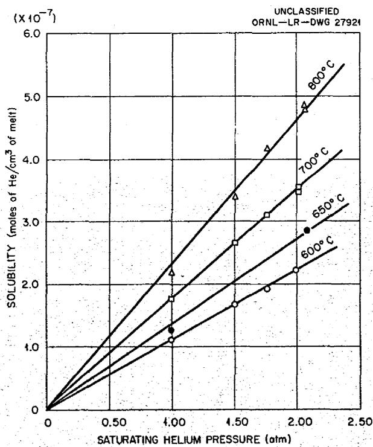  
Fig. 2.3.12. Solubility of Helium in Molten NaF-KF-LIF (11.5-42-46.5 Mole %).

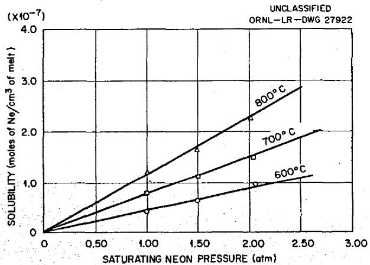  
Fig. 2.3.13. Solubility of Neon in Molten NaF-KF-LIF (11.5-42-46.5 Mole %).

# Solubility of HF in Molten Fluorides J.H.Shaffer

Measurements are being made of the solubility of HF in various molten fluoride solvents as a function of temperature, pressure, and solvent composition. The effects of composition of mixtures in the NaF-ZrF $_4$ system are shown graphically in

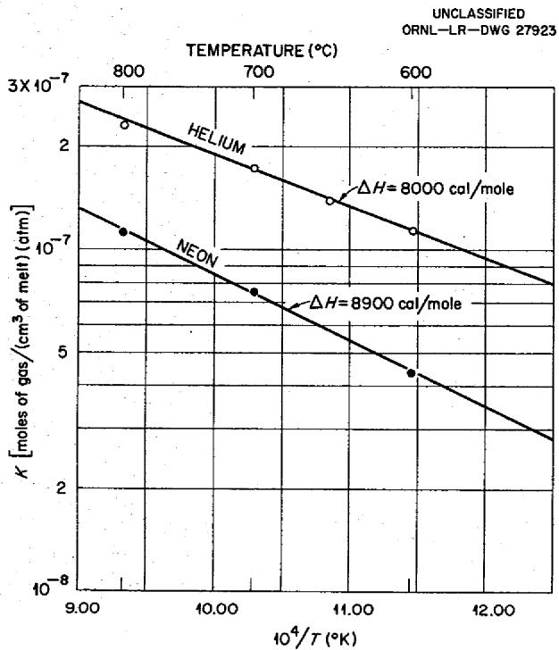  
Fig. 2.3.14. Temperature Dependence of Solubilities of Helium and Neon in NaF-KF-LiF (11.5-42-46.5 Mole%).

Fig. 2.3.15. There is a remarkable increase in HF solubility with increasing NaF concentration.

Preliminary results obtained for the solubility of HF in NaF-KF-LiF (11.5-42-46.5 mole %) are presented in Fig. 2.3.16. Since the liquid structure of this solvent might be assumed to approximate that of molten NaF, the value of the solubility of HF in the NaF-KF-LiF system may be used at 0 mole % ZrF₄ in Fig. 2.3.17. This curve was constructed from solubility measurements of solvents containing 19.5, 35, 40, 47, and 55 mole % ZrF₄. The regions from 0 to 19.5 and from 19.5 to 35 mole % ZrF₄ were interpolated because of the high melting points of the corresponding NaF-ZrF₄ mixtures. The heat of solution of HF as a function of solvent composition is shown in Fig. 2.3.18.

The curves presented in Fig. 2.3.17 reveal a 50-fold increase in HF solubility as the $\mathsf{ZrF}_4$ concentration decreases from 55 to 0 mole%. The heat of solution increases about threefold in the corresponding composition range. Similar correlations will be attempted as other solvents are studied.

A study of the solubility of HF in $\mathsf{LiF - BeF}_2$ mixtures was initiated, and the results obtained to

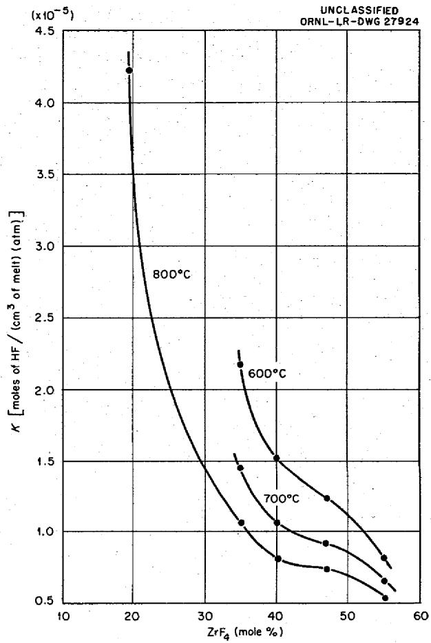  
Fig. 2.3.15. Henry's Law Constants for HF Solubility in NaF-ZrF4 Mixtures as a Function of Solvent Composition.

date for the $\mathsf{LiF - BeF}_2$ (51-49 mole %) mixture are shown in Fig. 2.3.19. The heat of solution of HF in $\mathsf{LiF - BeF}_2$ (51-49 mole %) as calculated from the data presented in Fig. 2.3.19 is -4100 cal/mole. Both the HF solubility and heat of solution values for the $\mathsf{LiF - BeF}_2$ (51-49 mole %) mixture are of the same order of magnitude as the values obtained with corresponding NaF-ZrF4 mixtures. Additional measurements of HF solubility in mixtures in the $\mathsf{LiF - BeF}_2$ system are being made.

# Solubilities of Fission-Product Fluorides

W. T. Ward

Investigations are under way for determining the solubilities of some fission-product fluorides in various $\mathsf{BeF}_2$ -containing solvents. The radioactive

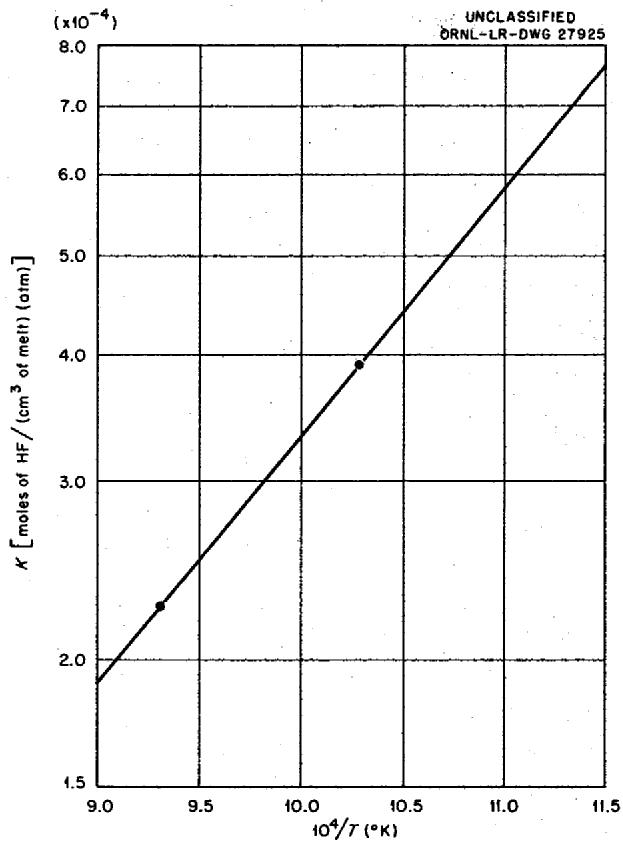  
Fig. 2.3.16. Henry's Law Constants for HF Solubility in NaF-KF-LiF (11.5-42-46.5 Mole %) as a Function of Temperature.

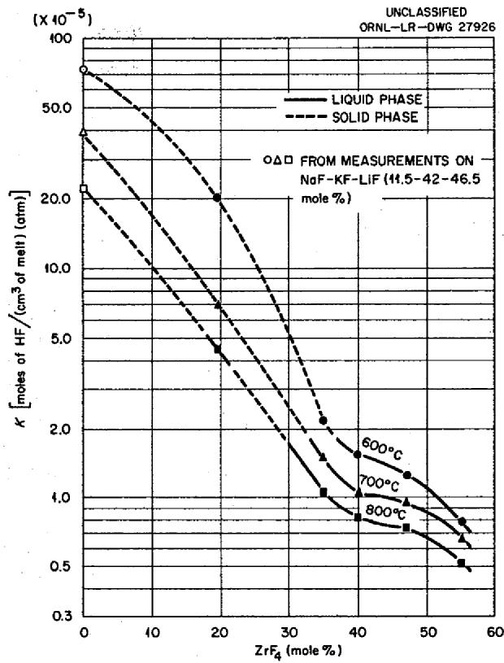  
Fig. 2.3.17. Henry's Law Constants for HF Solubility in NaF-ZrF4 Mixtures.

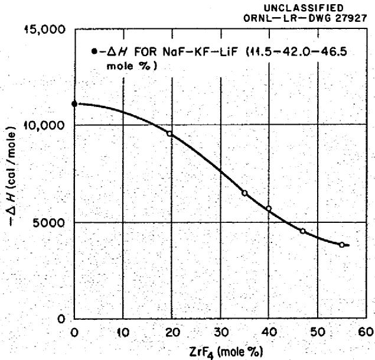  
Fig. 2.3.18. Heat of Solution of HF in NaF-ZrF4 Mixtures.

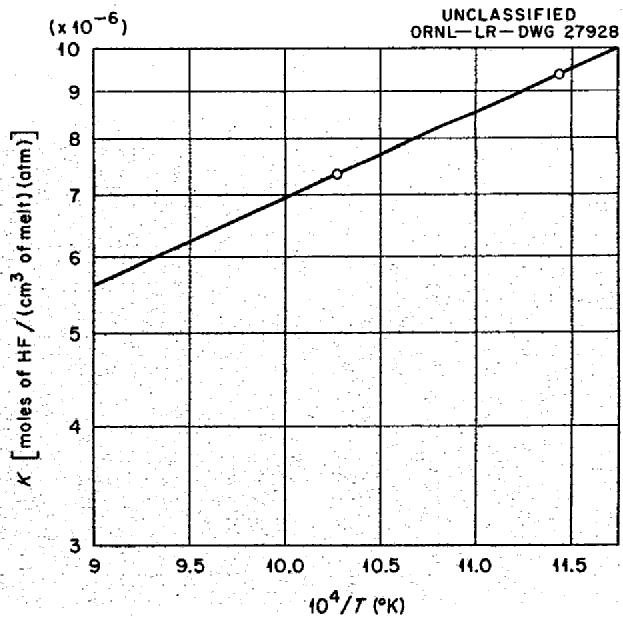  
Fig. 2.3.19. Henry's Law Constants for HF Solubility in LiF-BeF $_2$ (51-49 Mole%).

tracer techniques described in a previous report are being used.

$\mathsf{CeF}_3$ in NaF-BeF2. - The values of the solubility of $\mathsf{CeF}_3$ in two NaF-BeF2 mixtures were determined at four points in the temperature range 420 to $720^{\circ}\mathsf{C}$ . The data are summarized in Table 2.3.8.

$YF_{3}$ in NaF-BeF $_{2}$ . - Values obtained for the solubility of $YF_{3}$ in NaF-BeF $_{2}$ (61-39 mole %) are presented in Table 2.3.9. The total $Y^{+++}$ in the system, as calculated from the weights of $YF_{3}$ and solvent added at the beginning of the experiment, was 6.0 wt %. No satisfactory explanation can be offered for the amount apparently found in

9W. T. Ward et al., Solubility Relations Among Some Fission Product Fluorides in NaF-ZrF4-UF4 (50-46-4 Mole %), ORNL-2421 (Jan. 15, 1958).

Table 2.3.8. Solubility of $\mathsf{CeF}_3$ in NaF-BeF2 Solvents   

<table><tr><td rowspan="2">Temperature (°C)</td><td colspan="2">Filtrate Analysis</td></tr><tr><td>Ce (wt %)</td><td>CeF3(mole %)</td></tr><tr><td colspan="3">Solvent: 61 Mole % NaF-39 Mole % BeF2*</td></tr><tr><td>718</td><td>2.58</td><td>0.83</td></tr><tr><td>639</td><td>1.29</td><td>0.41</td></tr><tr><td>517</td><td>0.39</td><td>0.12</td></tr><tr><td>424</td><td>0.15</td><td>0.047</td></tr><tr><td colspan="3">Solvent: 56 Mole % NaF-44 Mole % BeF2*</td></tr><tr><td>716</td><td>2.86</td><td>0.93</td></tr><tr><td>627</td><td>1.38</td><td>0.44</td></tr><tr><td>520</td><td>0.56</td><td>0.18</td></tr><tr><td>424</td><td>0.26</td><td>0.083</td></tr></table>

*Composition of solvent based on chemical analysis.

Table 2.3.9. Solubility of $YF_{3}$ in NaF-BeF $_{2}$ (61-39 Mole %)   

<table><tr><td rowspan="2">Temperature (℃)</td><td colspan="2">Filtrate Analysis</td></tr><tr><td>Y (wt %)</td><td>YF3(mole %)</td></tr><tr><td>716</td><td>7.9</td><td>4.3</td></tr><tr><td>617</td><td>7.6</td><td>4.1</td></tr><tr><td>522</td><td>3.8</td><td>1.9</td></tr><tr><td>427</td><td>2.2</td><td>1.1</td></tr></table>

the first two filtrates being higher than the calculated amount.

$\mathsf{CeF}_3$ in LiF-BeF2. - Experiments for determining how a variation of the lithium-to-beryllium ratio in LiF-BeF2solvents affects the solubility of $\mathsf{CeF}_3$ are in progress. The results obtained thus far are given in Table 2.3.10 and shown graphically in Fig. 2.3.20. The solubility of $\mathsf{CeF}_3$ appears to be at a minimum in the mixture containing about 63 mole % LiF. The saturating phase in all cases was found, by microscopy, to be pure $\mathsf{CeF}_3$ .

$\mathsf{CeF}_3$ and $\mathsf{LaF}_3$ in LiF-BeF2. - The solubilities of $\mathsf{CeF}_3$ and $\mathsf{LaF}_3$ in the presence of each other in LiF-BeF2 (52.5-47.5 mole %) were determined with the use of two radioactive tracers. The total composition of the system was calculated to be 2.05 mole % $\mathsf{CeF}_3$ , 4.41 mole % $\mathsf{LaF}_3$ , and 93.54 mole % solvent. The results are shown in Fig. 2.3.21, in which the logarithm of the solubilities (mole %) is plotted against the reciprocal of the temperature.

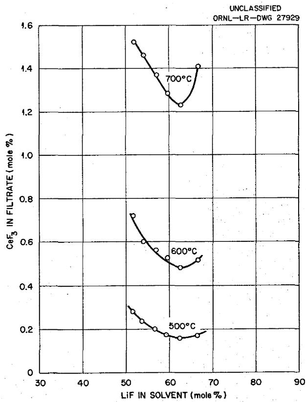  
Fig. 2.3.20. Solubility of $\mathsf{CeF}_3$ in Various LiF-BeF $_2$ Solvents.

Table 2.3.10. Solubility of ${\mathrm{{CeF}}}_{3}$ in Various LiF-Be ${\mathrm{F}}_{2}$ Solvents   

<table><tr><td colspan="2">Solvent Composition (mole %)</td><td rowspan="2">Filtrate Temperature (°C)</td><td colspan="2">Filtrate Analysis</td></tr><tr><td>LiF</td><td>BeF2</td><td>Ce (wt %)</td><td>CeF3(mole %)</td></tr><tr><td>51.6</td><td>48.4</td><td>726</td><td>6.47</td><td>1.80</td></tr><tr><td></td><td></td><td>615</td><td>3.12</td><td>0.83</td></tr><tr><td></td><td></td><td>501</td><td>1.09</td><td>0.284</td></tr><tr><td></td><td></td><td>407</td><td>0.41</td><td>0.105</td></tr><tr><td>53.8</td><td>46.2</td><td>717</td><td>6.41</td><td>1.76</td></tr><tr><td></td><td></td><td>632</td><td>2.98</td><td>0.79</td></tr><tr><td></td><td></td><td>511</td><td>1.04</td><td>0.269</td></tr><tr><td></td><td></td><td>412</td><td>0.367</td><td>0.094</td></tr><tr><td>56.7</td><td>43.3</td><td>723</td><td>6.09</td><td>1.64</td></tr><tr><td></td><td></td><td>612</td><td>2.42</td><td>0.622</td></tr><tr><td></td><td></td><td>508</td><td>0.86</td><td>0.219</td></tr><tr><td></td><td></td><td>425</td><td>0.328</td><td>0.082</td></tr><tr><td>59.3</td><td>40.7</td><td>704</td><td>4.96</td><td>1.29</td></tr><tr><td></td><td></td><td>627</td><td>2.66</td><td>0.677</td></tr><tr><td></td><td></td><td>544</td><td>1.14</td><td>0.286</td></tr><tr><td></td><td></td><td>476</td><td>0.515</td><td>0.128</td></tr><tr><td>62.7</td><td>37.3</td><td>720</td><td>5.77</td><td>1.50</td></tr><tr><td></td><td></td><td>643</td><td>2.91</td><td>0.73</td></tr><tr><td></td><td></td><td>556</td><td>1.26</td><td>0.309</td></tr><tr><td></td><td></td><td>467</td><td>0.442</td><td>0.108</td></tr><tr><td>66.0</td><td>34.0</td><td>729</td><td>6.96</td><td>1.79</td></tr><tr><td></td><td></td><td>656</td><td>3.72</td><td>0.92</td></tr><tr><td></td><td></td><td>556</td><td>1.34</td><td>0.322</td></tr><tr><td></td><td></td><td>476</td><td>0.535</td><td>0.127</td></tr></table>

# Order of Oxide Precipitation in Fluoride Salt Melts

M. Blander

The precipitation of oxides of fission products from fluoride melts is being studied as one of the possible methods for the purification of molten salt reactor fuel mixtures. Although the detailed theoretical analysis of such precipitation is relatively complex, simple thermodynamic considerations can be applied in order to calculate the relative order of precipitation of oxides. As an illustration of the principles involved, calculations are described here for the oxide precipitation of $\mathsf{U}^{4+}$ , $\mathsf{Ce}^{+++}$ , and $\mathsf{Be}^{++}$ from an LiF-BeF $_2$ mixture containing $\mathsf{UF}_4$ and $\mathsf{CeF}_3$ .

The rule for the relative precipitation of oxides from a melt is also the rule of stability. The order of precipitation of $\mathrm{Ce}_2\mathrm{O}_3$ and BeO in the LiF-BeF $_2$ melt, for example, is investigated by comparing the thermodynamic stability of the pair of compounds on the right of the following equation with that of the pair on the left side of the equation:

$$
(1) \quad C e _ {2} O _ {3} + 3 B e F _ {2} \rightleftharpoons 2 C e F _ {3} + 3 B e O
$$

At temperatures at which the oxide is a solid and precipitates in pure form, the oxide that precipitates first should be a member of the stable pair. The procedure is, then, to calculate the free-energy change, $\Delta F^{\circ}$ , for the pure solids of the reaction represented by Eq. 1. The ratio of the activities

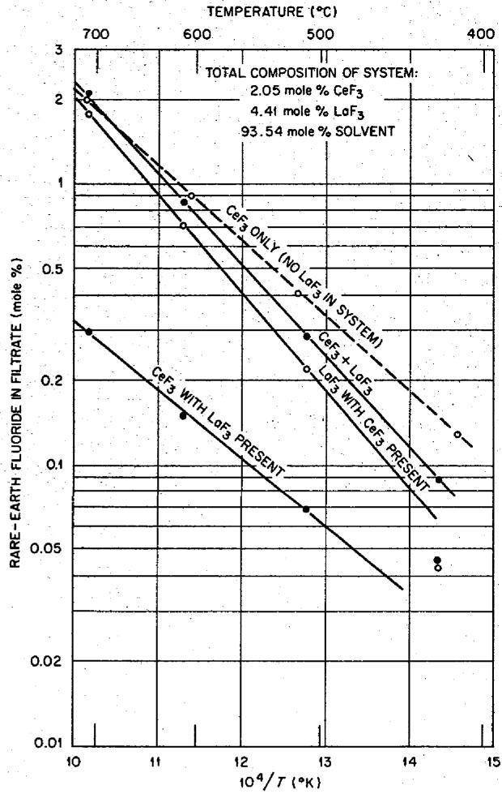  
UNCLASSIFIED ORNL-LR-DWG 27930   
Fig. 2.3.21. Solubilities of $\mathsf{CeF}_3$ and $\mathsf{LaF}_3$ When Both Are Present in LiF-BeF $_2$ (52.5-47.5 Mole %) Solvent.

(based on the solid as the standard state) of the two fluorides involved in the reaction when the solvent is in equilibrium with the pure solids $\mathrm{Ce}_2\mathrm{O}_3$ and BeO simultaneously can then be calculated by using Eq. 2:

$$
\Delta F ^ {\circ} = - R T \ln K = - 2. 3 0 3 R T \log \frac {a _ {C \bullet F _ {3}} ^ {2}}{a _ {B \bullet F _ {2}} ^ {3}}. \tag {2}
$$

If the equilibrium ratio $a_{\mathsf{CeF}_3}^2 / a_{\mathsf{BeF}_2}^3$ is greater than the ratio in solution, BeO will precipitate, and, if it is less than the ratio in solution, Ce₂O₃ will precipitate. A value of $\Delta F^0$ for Eq. 1 of -140 kcal was obtained by using the values of the

free energies of formation given in Table 2.3.11, and from Eq. 2 it was found that

$$
\begin{array}{l} a _ {C e F _ {3}} ^ {2} / a _ {B e F _ {2}} ^ {3} = 1 0 ^ {1 4 0, 0 0 0 / 4 5 7 0} \tag {3} \\ = 1 0 ^ {2 9. 8} = 6. 3 \times 1 0 ^ {2 9}. \\ \end{array}
$$

Table 2.3.11. Free Energies of Formation of Fluorides and Oxides of $\mathbf{Be}^{++}$ , $\mathbf{Ce}^{+++}$ , and $\mathbf{U}^{4+}$ at $1000^{\circ}\mathbf{K}^*$   

<table><tr><td></td><td>Free Energy of Formation (kcal/mole)</td></tr><tr><td>Fluorides</td><td></td></tr><tr><td>BeF2</td><td>-196</td></tr><tr><td>CeF3</td><td>-360</td></tr><tr><td>UF4</td><td>-373</td></tr><tr><td>Oxides</td><td></td></tr><tr><td>BeO</td><td>-123</td></tr><tr><td>Ce2O3</td><td>-361</td></tr><tr><td>UO2</td><td>-218</td></tr></table>

*Data reported by A. Glassner, A Survey of the Free Energies of Formation of the Fluorides, Chlorides, and Oxides of the Elements to $2500^{\circ}K$ , ANL-5107 (Aug. 1953).

The activity, based on the solid as standard state, of $\mathrm{CeF}_3$ in a 1 mole $\%$ solution in LiF-BeF $_2$ would be of the order of $10^{-3}$ ; the activity, based on the solid as standard state, of $\mathrm{BeF}_2$ in a 70-30 mole $\%$ mixture of LiF-BeF $_2$ would be of the order of $10^{-2}$ ; and the estimated ratio of $a_{\mathrm{CeF}_3}^2 / a_{\mathrm{BeF}_2}^3$ is about 1. Since the calculated equilibrium ratio of activities is much greater than the estimated ratio, it may be concluded that BeO will precipitate before $\mathrm{Ce}_2\mathrm{O}_3$ precipitates. Since the calculated equilibrium ratio is so large, most of the $\mathrm{BeF}_2$ will probably precipitate before any $\mathrm{Ce}_2\mathrm{O}_3$ precipitates. These conclusions are true only if the BeO and $\mathrm{Ce}_2\mathrm{O}_3$ form no compounds and do not form solid solutions. If $\mathrm{Ce}_2\mathrm{O}_3$ precipitates readily it must be as a compound or solid solution with BeO.

The order of precipitation of $\mathsf{U}^{4+}$ and $\mathsf{Ce}^{++}$ may be studied in a similar manner. The $\Delta F^0$ for the reaction

$$
3 U F _ {4} + 2 C e _ {2} O _ {3} \rightleftharpoons 3 U O _ {2} + 4 C e F _ {3} \tag {4}
$$

is -253 kcal, and the equilibrium ratio of the

activities of $\mathsf{CeF}_3$ and $\mathsf{UF}_4$ calculated from this quantity is, at $1000^{\circ}\mathsf{K}$

$$
\begin{array}{l} a _ {C e F _ {3}} ^ {4} / a _ {U F _ {4}} ^ {3} = 1 0 ^ {2 5 3, 0 0 0 / 4 5 7 0} \tag {5} \\ = 1 0 ^ {5 5. 3} = 2 \times 1 0 ^ {5 5}. \\ \end{array}
$$

The activities of $\mathsf{UF}_4$ and $\mathsf{CeF}_3$ are of the order of $10^{-3}$ for a 1 mole $\%$ solution of these two substances, and a crude approximation of the ratio $a_{\mathsf{CeF}_3}^4 /a_{\mathsf{UF}_4}^3$ would give a value of $10^{-3}$ . Since this is much smaller than the ratio calculated in Eq. 5, it is concluded that $\mathsf{UO}_2$ will precipitate almost completely before any $\mathsf{Ce}_2\mathsf{O}_3$ precipitates. This conclusion is subject to the condition that only pure $\mathsf{Ce}_2\mathsf{O}_3$ or $\mathsf{UO}_2$ can precipitate. These sample calculations illustrate the utility of even crude approximations to the activities of components of salt mixtures. The same conclusions would have been obtained even if the individual activities had been in error by an order of magnitude.

# Chemical Reactions of Oxides with Fluorides in LiF-KF

J.H.Shaffer

Selective precipitation of oxides may be useful in the development of a suitable scheme for the reprocessing of molten salt reactor fuels. Accordingly, the solubility and some selective precipitation reactions of a variety of solutes are being studied. In order to avoid complications, the simple binary mixture of LiF and KF was chosen as a solvent.

On the basis of direct and indirect information gained from the experiments completed thus far, the following useful generalizations can be made regarding the solubility of oxides of uranium, zirconium, hafnium, rare earths, alkaline earths, and alkali metals in this solvent:

1. Uranium, zirconium, and hafnium precipitate as the dioxides and are the least soluble.   
2. Rare earths precipitate as $\mathsf{R}_2\mathsf{O}_3$ and have very low solubilities.   
3. Beryllium and magnesium oxides are slightly more soluble than the rare earth oxides but are still quite insoluble.   
4. Barium, strontium, calcium, potassium, sodium, and lithium oxides are more soluble than the oxides specified in items 1, 2, and 3.

Quantitative measurements of the solubilities of the relatively insoluble oxides are difficult to make, because the solubilities are so low as to be below the direct limit of detection of the radiochemical method used. However, extrapolations have been made in order to estimate the concentration of the particular metal ion remaining in solution in the presence of some $25\%$ excess precipitating agent (usually CaO or $\mathsf{Na}_2\mathsf{O}_2$ ). The results are presented in Table 2.3.12.

Several separations of solutes appear to be possible on the basis of the selective precipitation of oxides obtained in the experiments. The results of the experiments are presented in Figs. 2.3.22, 2.3.23, and 2.3.24, which show the concentration of solutes that remained in the liquid as the system was titrated by the stepwise addition of CaO. For example, Figs. 2.3.22 and

Table 2.3.12. Concentration of Metal Ion in Molten LIF-KF at $600^{\circ}\mathrm{C}$ in the Presence of Excess Precipitating Agent   

<table><tr><td>Metal Ion</td><td>Precipitating Phase*</td><td>Metal Found (wt %)</td><td>Analytical Method Used</td></tr><tr><td>Zirconium</td><td>ZrO2</td><td>&lt;0.0008</td><td>Radiochemical</td></tr><tr><td>Hafnium</td><td>HfO2</td><td>&lt;0.0008</td><td>Radiochemical</td></tr><tr><td>Uranium</td><td>UO2</td><td>&lt;0.0085</td><td>Chemical</td></tr><tr><td>Cerium</td><td>Ce2O3</td><td>&lt;0.01</td><td>Radiochemical</td></tr><tr><td>Beryllium</td><td>BeO</td><td>&lt;0.02</td><td>Chemical</td></tr><tr><td>Barium</td><td>Soluble to extent added</td><td>&gt;6.5</td><td>Radiochemical</td></tr></table>

*Compositions of saturating phases calculated from indicated end points of titration curves obtained with CaO as the titrating agent.

2.3.23 show that uranium is precipitated essentially quantitatively as $\mathsf{UO}_2$ before any of the $\mathsf{Ce}_2\mathsf{O}_3$ is formed. The concentrations of cerium in these experiments were determined radiochemically, while the uranium concentrations were determined by chemical analysis. In the titration of the mixture $\mathsf{ZrF}_4\cdot \mathsf{CeF}_3$ with CaO, as shown in

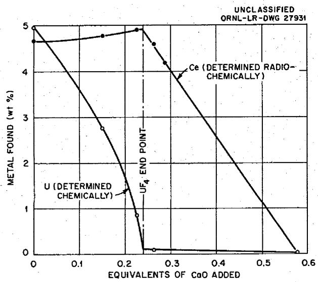  
Fig. 2.3.22. Titration of $\mathsf{CeF}_3$ and $\mathsf{UF}_4$ with CaO in LiF-KF (50-50 Mole%).

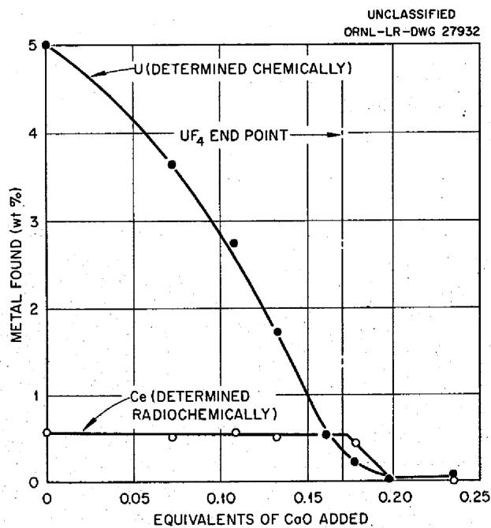  
Fig. 2.3.23. Titration of $\mathsf{CeF}_3$ and $\mathsf{UF}_4$ with CoO in LiF-KF (50-50 Mole%).

Fig. 2.3.24, the separation does not appear to be quite as sharp as in the case of the UF $_4$ -CeF $_3$ mixture, as shown in Figs. 2.3.22 and 2.3.23.

The titration with CaO of $\mathsf{ZrF}_4$ in the presence of nonradioactive $\mathsf{CeF}_3$ is shown in Fig. 2.3.25.

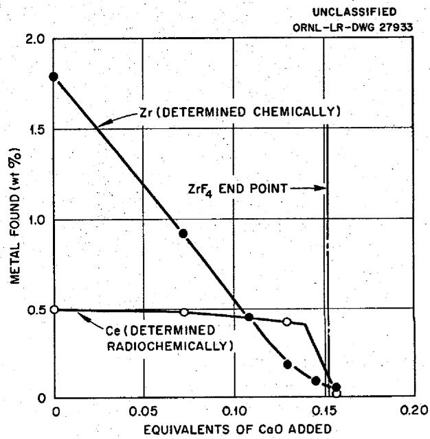  
Fig. 2.3.24. Titration of $\mathrm{CeF}_3$ and $\mathrm{ZrF}_4$ with CaO in LiF-KF (50-50 Mole%).

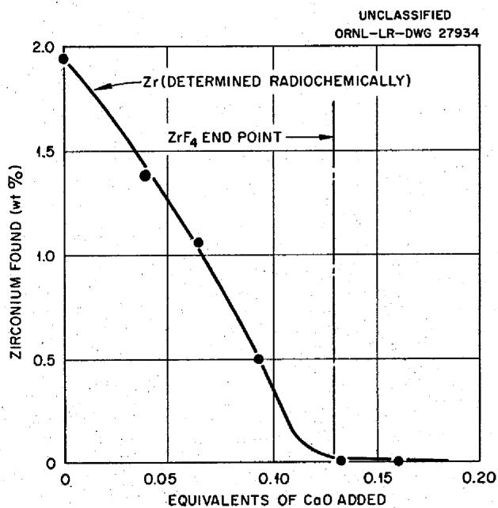  
Fig. 2.3.25. Titration of $\mathbf{ZrF_4}$ in the Presence of $\mathbf{CeF}_3$ with CaO in LiF-KF (50-50 Mole%).

In order to determine the concentration of zirconium radiochemically, the zirconium was labeled with Hf181, and the hafnium was assumed to behave like zirconium. The titration curve shows the assumption to be sound.

The titration of the mixture $\mathsf{CeF}_3\cdot \mathsf{BeF}_2$ with CaO is shown in Fig. 2.3.26. From the curve it may be seen that cerium and beryllium are precipitated simultaneously but not in definite proportions; they probably precipitate as a solid solution. The results are summarized in Table 2.3.13. It has been suggested[10] that the results of this experiment indicate that an attempt should be made to precipitate cerium from the solution by adsorption on an excess of BeO. Accordingly, attempts are being made to precipitate not only cerium but also uranium.

# Lithium Recovery from NaF-KF-LiF Melts

# R. A. Strehlow

The possibility of recovering the economically valuable materials from molten salt reactor fuels is of concern in the selection of a particular set of fuel components. The mixtures of alkali metal fluorides which have been considered suffer to

10B. J. Sturm, private communication to J. H. Shaffer.

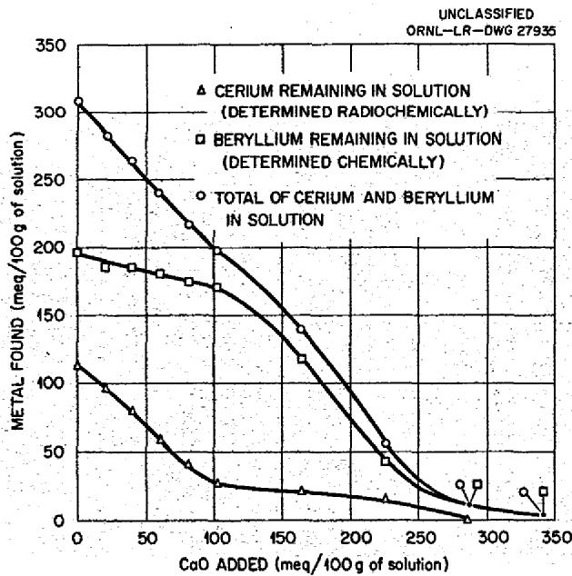  
Fig. 2.3.26. Titration of $\mathrm{CeF}_3$ and $\mathrm{BeF}_2$ with CaO in LIF-KF (50-50 Mole%).

Table 2.3.13. Titration of ${\mathrm{{CeF}}}_{3}$ and ${\mathrm{{BeF}}}_{2}$ with $\mathrm{{CaO}}$ in LIF-KF (50-50 Mole %)   

<table><tr><td colspan="2">Metal Ion Found in Liquid (meq/100 g of solution)</td><td rowspan="2">CaO Added (meq/100 g of solution)</td></tr><tr><td>Ce++</td><td>Be++</td></tr><tr><td>112</td><td>197</td><td>0</td></tr><tr><td>96</td><td>186</td><td>21.0</td></tr><tr><td>80</td><td>184</td><td>39.8</td></tr><tr><td>58</td><td>182</td><td>61.2</td></tr><tr><td>40</td><td>175</td><td>82.0</td></tr><tr><td>27</td><td>171</td><td>102.8</td></tr><tr><td>21</td><td>118</td><td>164.0</td></tr><tr><td>14</td><td>42</td><td>225.9</td></tr><tr><td>0.5</td><td>11</td><td>287.0</td></tr><tr><td>0.06</td><td>4</td><td>342.0</td></tr></table>

some extent from the restriction that isotopically pure $\mathsf{Li}^7$ must be used. The discarding of the $\mathsf{Li}^7$ contained in these fuels after the maximum allowable poison concentration had accumulated would place a moderately serious cost burden on the power produced from a lithium-containing fuel.

Either of two approaches may be used to increase the utility of the fuel. Fuels from which the lanthanides can be removed can, of course, be reprocessed and reused. This presumably is the case for $\mathsf{LiF - BeF}_2$ -base fuels in which the principal residual (nonlanthanide) poisons would be primarily elements which are more noble than beryllium. If, on the other hand, the rare earths cannot be conveniently removed, the lithium must, perforce, be removed from the balance of the fuel. This is the case for alkali fluoride melts containing combinations of lithium, sodium, and potassium fluorides.

It would be desirable to be able to remove the lithium from NaF-KF-LiF mixtures by a simple high-temperature technique and for the product to be in a concentrated form and free from rare-earth contamination. It may be seen from Table 2.3.14, which shows the free energies of formation at $1000^{\circ}\mathrm{K}$ of some halides, that samarium halides are considerably more stable than the corresponding alkali metal halides. Although, among the alkali metal halides, lithium forms the most stable fluoride, potassium forms the most stable

Table 2.3.14. Free Energies of Formation of Halides*   

<table><tr><td rowspan="2">M+</td><td colspan="4">-ΔF at 1000°K (kcal/mole)</td></tr><tr><td>F-</td><td>Cl-</td><td>Br-</td><td>I-</td></tr><tr><td>Li+</td><td>124.6</td><td>80.2</td><td>70.1</td><td>56.4</td></tr><tr><td>Na+</td><td>112.6</td><td>76.7</td><td>68.3</td><td>56.0</td></tr><tr><td>K+</td><td>108.9</td><td>81.6</td><td>75.2</td><td>63.5</td></tr><tr><td>Sm++</td><td>114.7</td><td>65.7</td><td>54.7</td><td>39.3</td></tr><tr><td>Sm++</td><td>125.0</td><td>86.0</td><td>73.0</td><td>61.0</td></tr><tr><td>Be++</td><td>97.5</td><td>42.3</td><td>29.9</td><td>12.7</td></tr></table>

\*L. Brewer et al., Natl. Nuclear Energy Ser. Div. IV, 19B (1950).

chloride, bromide, and iodide. It seems to be possible that the reaction described by

$$
\mathrm {L i F} + \mathrm {K} \rightleftharpoons \mathrm {K F} + \mathrm {L i} \tag {6}
$$

might be made to occur if, for example, potassium chloride or bromide were added in sufficient amount to a mixture of the fluorides. Although sodium would be extracted to a greater extent than lithium, its presence in small amount is not a serious consideration. The equilibrium constant for the reaction (Eq. 6) can be calculated, since

$$
\Delta F ^ {\circ} = - R T \ln K _ {a} = - R T \ln \frac {a _ {\mathrm {L I}} a _ {\mathrm {K F}}}{a _ {\mathrm {K}} a _ {\mathrm {L I F}}} \tag {7}
$$

where the $a$ 's represent the thermodynamic activities of the substances symbolized by the subscripts, $R$ is the gas constant (1.98 cal/mole $\cdot^{\circ}\mathrm{K}$ ), $T$ is the absolute temperature, and $\Delta F^{\circ}$ is the change in free energy per mole when the process is carried out with all substances maintained at unit activity. Thus at $1000^{\circ}\mathrm{K}$ ,

$$
\begin{array}{l} 1 5, 7 0 0 \mathrm {c a l} / \mathrm {m o l e} = (- 1. 9 8 \mathrm {c a l} / \mathrm {m o l e}. ^ {\circ} \mathrm {K}) \times \\ \times 1 0 0 0 ^ {\circ} \mathrm {K} \times \ln K _ {a}, \\ \ln K _ {a} = - 7. 9 3, \\ K _ {a} = 3. 6 \times 1 0 ^ {- 4}. \\ \end{array}
$$

The principal difficulty in carrying out calculations for more complicated cases (for example,

mixed fluoride-chloride systems) is in the estimation of the values of $a_{\mathsf{L1}} / a_{\mathsf{K}}$ and $a_{\mathsf{KF}} / a_{\mathsf{L1F}}$ for the metal phase and salt phase, respectively, as functions of composition. The ratio, $a_{\mathsf{L1}} / a_{\mathsf{K}}$ , may be assumed to be equal to $N_{\mathsf{L1}} / N_{\mathsf{K}}$ , where $N_{\mathsf{L1}}$ is the mole fraction of lithium in the metal phase. This is equivalent to assuming ideal behavior in the metal.

In the salt phase the ratio of activities may be calculated for KF-LiF-KCl as a function of the amount of KCl added. The methods which have been used for the calculation of activities in multicomponent systems are described below. Use is made of the approximation

$$
a _ {M _ {1} X _ {1}} = \frac {N _ {M _ {1} ^ {+}} N _ {X _ {1} ^ {-}}}{\left(N _ {\sum M ^ {+}} + N _ {\sum X ^ {-}}\right) ^ {2}} \tag {8}
$$

where $N_{M_1^+}$ and $N_{X_1^-}$ are the numbers of moles of $M_1^+$ and $X_1^-$ , and the expression $N_{\Sigma M^+} + N_{\Sigma X^-}$

represents the total number of moles of all positive and negative ions. This approximation11 may be expected to serve only at extremely high temperatures, since, clearly, no distinction is drawn between positive and negative ions. The calculation implies a gas-like character of the melted salt. Temkin12 used the relation:

$$
a _ {M _ {1} X _ {1}} = \frac {n _ {M _ {1} ^ {+}}}{n _ {\Sigma M ^ {+}}} \cdot \frac {n _ {X _ {1} ^ {-}}}{n _ {\Sigma X ^ {-}}} = N _ {M _ {1} ^ {+}} N _ {X _ {1} ^ {-}}, \tag {9}
$$

where $n_{M_1^+}$ and $n_{X_1^-}$ are the numbers of moles of the positive and negative ions, respectively, $n_{\sum M^+}$ is the number of moles of all the positive ions, and $n_{\sum X^-}$ is the number of moles of all the negative ions. Here the "activity" of the individual positive ion is related to the other positive ions instead of the ions of both charges.

The Temkin definition of mole fraction provided the point of departure for Flood, Forland, and Griotheim, $^{13}$ who, from theoretical considerations, constructed a method of calculating the activity coefficient. Their relation may be symbolized by:

$$
\ln \gamma_ {1 1} = - \sum_ {2 2} ^ {m n} N _ {M _ {i}} N _ {X _ {j}} \Delta F _ {i j} ^ {\circ} / R T, \tag {10}
$$

where $\gamma_{11}$ is the activity coefficient in a multicomponent system containing $m$ cations and $n$ anions, and $\Delta F_{ij}^{\circ}$ is the standard free energy of formation of component $M_iX_j$ by the simple metatheoretical reaction which also produces $M_1X_1$ . This simplifies for a simple ternary reciprocal system to

$$
\ln \gamma_ {1 1} = - N _ {M _ {2}} N _ {X _ {2}} \Delta F _ {M _ {2} X _ {2}} ^ {\circ} / R T.
$$

The activity is calculable, therefore, by the equation

$$
a _ {M _ {1} X _ {1}} = N _ {M _ {1}} N _ {X _ {1}} e ^ {- \left(N _ {M _ {2}} N _ {X _ {2}} \Delta F _ {M _ {2} X _ {2}} ^ {\circ} / R T\right)}.
$$

For the system under consideration, the metatheoretical reaction that produces the various components is

$$
\mathrm {L i F} + \mathrm {K C l} \rightleftharpoons \mathrm {K F} + \mathrm {L i C l}
$$

which has an associated $\Delta F^{\circ}$ at $1000^{\circ}K$ of 17.1 kcal/mole.

The ternary mixture LiF-KF-KCl is displayed schematically as a reciprocal system in Fig. 2.3.27. Point 1 in Fig. 2.3.27 represents a mixture that is 50 mole % LiF and 50 mole % KF. This composition is near the eutectic composition for the KF-LiF binary, which contains 52 mole % LiF, and was chosen as a representative fluid with properties similar to those of potential fuel mixtures. The line AB is the locus of compositions formed upon addition of KCl to the original composition. This line is divided into four equal parts by points 2, 3, and 4. The calculation of $a_{\mathrm{Li}} / a_{\mathrm{K}}$ from Eq. 7 is shown below for each of these compositions at $1000^{\circ}\mathrm{K}$ . The pertinent

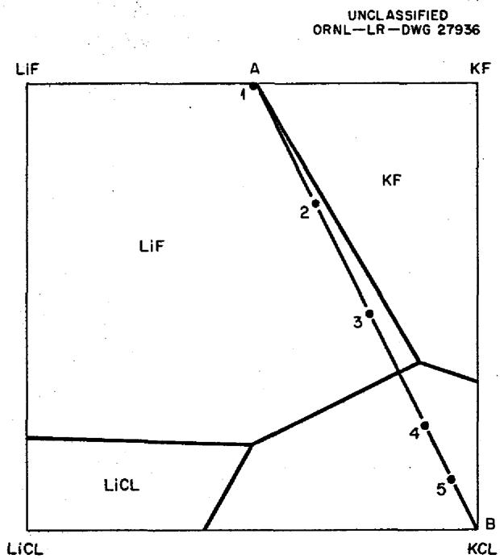  
Fig. 2.3.27. The Ternary Mixture LiF-KF-KCl Displayed Schematically as a Reciprocal System.

expressions are:

$$
a _ {L i F} = N _ {L i ^ {+}} N _ {F ^ {-}} \exp \left(N _ {K ^ {+}} N _ {C l ^ {-}} \Delta F _ {K C l ^ {-}} / R T\right),
$$

$$
a _ {K F} = N _ {K ^ {+}} N _ {F ^ {-}} \exp \left(N _ {L I ^ {+}} N _ {C I ^ {-}} \Delta F _ {L I C I} / R T\right).
$$

For point 1:

$$
a _ {L i F} = a _ {K F} = 0. 5 \cdot
$$

For point 2:

$$
\begin{array}{l} a _ {L i F} = 0. 3 7 5 \times 0. 7 5 \times \\ \times \exp [ 0. 6 2 5 \times 0. 2 5 \times (+ 1 7. 1) / 1. 9 8 ], \\ \end{array}
$$

$$
\begin{array}{l} a _ {K F} = 0. 6 2 5 \times 0. 7 5 \times \\ \times \exp [ 0. 3 7 5 \times 0. 2 5 \times (- 1 7. 1) / 1. 9 8 ], \\ \end{array}
$$

$$
\begin{array}{l} \frac {a _ {K F}}{a _ {L I F}} = \frac {0 . 6 2 5}{0 . 3 7 5} \exp (- 1. 3 5 - 0. 8 1) \\ = 0. 2 1. \\ \end{array}
$$

For point 3:

$$
\begin{array}{l} a _ {L \mid F} = 0. 2 5 \times 0. 5 \times \\ \times \exp [ 0. 7 5 \times 0. 5 \times (+ 1 7. 1) / 1. 9 8 ], \\ \end{array}
$$

$$
\begin{array}{l} a _ {K F} = 0. 7 5 \times 0. 5 \times \\ \times \exp [ 0. 2 5 \times 0. 5 \times (- 1 7. 1) / 1. 9 8 ], \\ \end{array}
$$

$$
\begin{array}{l} \frac {a _ {\mathrm {K F}}}{a _ {\mathrm {L i F}}} = 1 5 \exp (- 7. 0 8 - 0. 4 7) \\ = 1 5 \exp (- 7. 5 5) \\ = 0. 0 0 7 8 \cdot \\ \end{array}
$$

$$
\begin{array}{l} \frac {a _ {K F}}{a _ {L i F}} = 3 \exp (- 3. 2 4 - 1. 0 8) \\ = 0. 1 0 8. \\ \end{array}
$$

For point 4:

$$
\begin{array}{l} a _ {\text {L I F}} = 0. 1 2 5 \times 0. 2 5 \times \\ \times \exp [ 0. 8 7 5 \times 0. 7 5 \times (+ 1 7. 1 / 1. 9 8) ], \\ \end{array}
$$

$$
\begin{array}{l} a _ {K F} = 0. 8 7 5 \times 0. 2 5 \times \\ \times \exp [ 0. 1 2 5 \times 0. 7 5 \times (- 1 7. 1 / 1. 9 8) ], \\ \end{array}
$$

$$
\begin{array}{l} \frac {a _ {\mathrm {K F}}}{a _ {\mathrm {L i F}}} = 7 \exp (- 5. 6 7 - 0. 8 1) \\ = 7 \exp (- 6. 4 8) \\ = 0. 0 1 0 6 \cdot \\ \end{array}
$$

For point 5:

$$
N _ {C I} = 0. 8 7 5,
$$

$$
\begin{array}{l} a _ {L I F} = 0. 0 6 2 5 \times 0. 1 2 5 \times \\ \times \exp [ 0. 9 3 7 5 \times 0. 8 7 5 \times (+ 1 7. 1 / 1. 9 8) ], \\ \end{array}
$$

$$
\begin{array}{l} a _ {K F} = 0. 9 3 7 5 \times 0. 1 2 5 \times \\ \times \exp [ 0. 0 6 2 5 \times 0. 8 7 5 \times (- 1 7. 1 / 1. 9 8) ], \\ \end{array}
$$

Since $K$ for the reaction (Eq. 6) was known to be $3.6 \times 10^{-4}$ , values for the ratio $a_{\mathrm{Li}} / a_{\mathrm{K}}$ could be calculated. The calculated values are shown in Table 2.3.15.

The formal significance of these calculations which involve the Flood, Forland, and Grijotheim relation may be clarified by considering the adding of KCI to LiF until a particular composition in the ternary diagram of Fig. 2.3.27 is reached, namely, the very center of the diagram, where

$$
N _ {L i ^ {+}} = N _ {K ^ {+}} = N _ {F ^ {-}} = N _ {C l ^ {-}} = 0. 5,
$$

and therefore

$$
N _ {\text {L i F}} = N _ {\text {L i C l}} = N _ {\text {K F}} = N _ {\text {K C l}} = 0. 2 5.
$$

The equilibrium constant for the reaction

$$
K C I + L i F = L i C l + K F
$$

may be expressed as

$$
K _ {a} = K _ {N} K _ {\gamma} = \frac {N _ {K F} N _ {L i C l}}{N _ {K C l} N _ {L i F}} \cdot \frac {\gamma_ {K F} \gamma_ {L i C l}}{\gamma_ {K C l} \gamma_ {L i F}},
$$

Table 2.3.15. The Ratio $a_{\mathrm{Lj}} / a_{\mathrm{K}}$ at $1000^{\circ}\mathrm{K}$ for the Reaction $\mathrm{K} + \mathrm{LiF} \rightleftharpoons \mathrm{KF} + \mathrm{Li}$ upon Addition of KX to KF-LiF (50-50 Mole %)   

<table><tr><td rowspan="2">KX (mole %)</td><td colspan="3">Ratio aL1/aK for</td></tr><tr><td>X = Cl-(ΔF° = 17.1)</td><td>X = Br-(ΔF° = 20.8)</td><td>X = I-(ΔF° = 22.5)</td></tr><tr><td>0.0</td><td>3.6 × 10-4</td><td>3.6 × 10-4</td><td>3.6 × 10-4</td></tr><tr><td>0.25</td><td>1.9 × 10-3</td><td>2.7 × 10-3</td><td>3.7 × 10-3</td></tr><tr><td>0.50</td><td>3.4 × 10-3</td><td>2.2 × 10-2</td><td>3.5 × 10-2</td></tr><tr><td>0.75</td><td>3.4 × 10-2</td><td>1.4 × 10-1</td><td>2.6 × 10-1</td></tr><tr><td>0.875</td><td>4.6 × 10-2</td><td>2.2 × 10-1</td><td>4.9 × 10-1</td></tr></table>

where $K_{a}$ is determined from the expression

$$
\Delta F ^ {\circ} = - R T \ln K _ {a}.
$$

Since $K_N$ is unity,

$$
K _ {a} = K _ {\gamma}.
$$

A value for $K_{\gamma}$ of $6.2 \times 10^{-5}$ at $1500^{\circ}\mathrm{K}$ is then obtained from the expression

$$
- 1 7, 1 0 0 = R T \ln K _ {\gamma}.
$$

As a crude approximation it may be assumed that LiF and KCl (the stable pair) have equal activities. This permits an estimate to be made of the activities:

$$
y _ {K F} = y _ {L i C l} = \frac {1}{y _ {K C l}} = \frac {1}{y _ {L i F}},
$$

$$
\gamma_ {K F} = (6. 2 \times 1 0 ^ {- 5}) ^ {1 / 4} = 0. 0 8 9 = \frac {1}{\gamma_ {L i F}},
$$

$$
a _ {K C I} = a _ {L i F} = 2. 8,
$$

$$
a _ {\text {L i C l}} = a _ {\text {K F}} = 0. 0 2.
$$

It should be noted here that for this example a measure of the error involved in the calculation may be seen, since an activity in excess of unity (using the solid as the standard state) would indicate precipitation or at least an immiscibility gap. Since neither of these is known to occur at $1500^{\circ}\mathrm{K}$ , it would be expected that these values may be in error by, perhaps, factors of 3. This would result in an error factor of 10 for the ratio $a_{\mathrm{Li}} / a_{\mathrm{K}}$ .

Experimental work has been carried out for the purpose of ascertaining the magnitude of the $N_{\mathrm{Li}} / N_{\mathrm{K}}$ ratios. Samples consisting of $300\mathrm{g}$ of LiF-KF (50-50 mole $\%$ were equilibrated in a nickel reactor with about $70\mathrm{g}$ of potassium. The potassium metal addition was prepared by melting it and casting it into a nickel injection device equipped with a nickel filter. The injector was attached to the reactor, and the potassium was remelted by application of a flame to the injector. The injector was then pressurized with argon to force the molten metal through the filter into the reactor, where the potassium was equilibrated at

$450^{\circ}C$ with the LiF-KF mixture. The mixture was then cooled to $150^{\circ}C$ to permit the salt to solidify, and two samples of the molten potassium were taken. Although the sampling temperature was below the consolute temperature for the Li-K system, it was suitable for any small ratios of $a_{\mathrm{Li}} / a_{\mathrm{K}}$ . A modified metal-sampling apparatus14 was used which permitted samples of liquid metal to be obtained under an inert atmosphere. Two quantities of KCl were then added in amounts of 100 and $300\mathrm{g}$ . The mixture was equilibrated, and the metal phase was sampled after each addition in the manner described above.

Analyses gave values for the three determinations of $N_{\mathrm{Li}} / N_{\mathrm{K}} \simeq 10^{-4}$ and of $N_{\mathrm{Cl}^-} = 0, 0.16,$ and 0.35, respectively. One equilibration of a mixture of KI-Lil-K containing less than 0.05 mole fraction of fluoride was carried out, and a value of $N_{\mathrm{Li}} / N_{\mathrm{K}} = 0.35$ was obtained. These results indicate that the estimates described here and presented in Table 2.3.15 may be accepted as being of the correct order of magnitude. This leads to the conclusion that, at probable Li' price levels, this process is not economically feasible.

# CHEMISTRY OF THE CORROSION PROCESS

G.M.Watson F.F.Blankenship

G. J. Nessle

Activity Coefficients of $\mathsf{CrF}_2$ in NaF-ZrF4

C. M. Blood

The activity coefficients of $\mathsf{CrF}_2$ dissolved in a molten mixture of NaF-ZrF $_4$ (53-47 mole %) are being determined by using techniques described previously. $^{15}$ The activity coefficients of the metal fluoride solute are determined from experimentally measured values of equilibrium quotients of the reaction:

$$
M F _ {2} (d) + H _ {2} (g) \rightleftharpoons M (s) + 2 H F (g).
$$

The results of experimental measurements on $\mathsf{CrF}_2$ at $850^{\circ}\mathsf{C}$ are summarized in Table 2.3.16.

Table 2.3.16. Equilibrium Quotients at $850^{\circ} \mathrm{C}$ of the Reaction $\mathbf{CrF}_2(d) + \mathbf{H}_2(g) \rightleftharpoons \mathbf{Cr}(s) + 2\mathbf{HF}(g)$   

<table><tr><td>PHF (atm)</td><td>XCrF2(mole fraction)</td><td>Kx*</td><td>PHF (atm)</td><td>XCrF2(mole fraction)</td><td>Kx*</td></tr><tr><td>×10-3</td><td>×10-2</td><td>×10-3</td><td>×10-3</td><td>×10-2</td><td>×10-3</td></tr><tr><td>9.55</td><td>9.48</td><td>0.97</td><td>6.49</td><td>3.05</td><td>1.39</td></tr><tr><td>9.63</td><td>9.42</td><td>0.99</td><td>6.63</td><td>3.11</td><td>1.42</td></tr><tr><td>10.78</td><td>9.27</td><td>1.27</td><td>6.43</td><td>3.19</td><td>1.31</td></tr><tr><td>10.54</td><td>9.14</td><td>1.23</td><td>7.98</td><td>3.87</td><td>1.66</td></tr><tr><td>10.55</td><td>9.08</td><td>1.24</td><td>8.16</td><td>3.91</td><td>1.72</td></tr><tr><td>11.19</td><td>9.42</td><td>1.34</td><td>6.73</td><td>3.82</td><td>1.19</td></tr><tr><td>11.01</td><td>9.25</td><td>1.32</td><td>6.91</td><td>3.96</td><td>1.21</td></tr><tr><td>11.26</td><td>9.29</td><td>1.38</td><td>7.30</td><td>4.04</td><td>1.33</td></tr><tr><td>11.85</td><td>9.42</td><td>1.51</td><td>7.75</td><td>4.09</td><td>1.48</td></tr><tr><td>11.78</td><td>9.35</td><td>1.50</td><td>7.40</td><td>4.07</td><td>1.35</td></tr><tr><td>11.64</td><td>9.37</td><td>1.46</td><td>7.83</td><td>4.07</td><td>1.52</td></tr><tr><td>11.90</td><td>9.73</td><td>1.47</td><td>8.45</td><td>4.25</td><td>1.70</td></tr><tr><td>12.04</td><td>9.86</td><td>1.49</td><td>7.96</td><td>4.23</td><td>1.51</td></tr><tr><td>12.51</td><td>9.84</td><td>1.61</td><td>8.58</td><td>4.27</td><td>1.74</td></tr><tr><td>12.57</td><td>9.99</td><td>1.60</td><td>3.88</td><td>1.26</td><td>1.20</td></tr><tr><td>11.65</td><td>9.73</td><td>1.41</td><td>3.78</td><td>1.14</td><td>1.26</td></tr><tr><td>12.06</td><td>9.52</td><td>1.55</td><td>3.91</td><td>1.03</td><td>1.50</td></tr><tr><td>12.58</td><td>9.50</td><td>1.69</td><td>4.33</td><td>1.18</td><td>1.59</td></tr><tr><td>13.51</td><td>9.86</td><td>1.88</td><td>4.83</td><td>1.43</td><td>1.64</td></tr><tr><td>13.39</td><td>9.90</td><td>1.84</td><td>5.36</td><td>1.53</td><td>1.89</td></tr><tr><td>5.12</td><td>2.63</td><td>1.00</td><td>4.81</td><td>1.57</td><td>1.48</td></tr><tr><td>6.43</td><td>3.04</td><td>1.37</td><td>4.63</td><td>1.63</td><td>1.32</td></tr><tr><td>6.99</td><td>3.04</td><td>1.62</td><td>4.73</td><td>1.63</td><td>1.38</td></tr><tr><td></td><td></td><td></td><td></td><td></td><td>Av 1.45 ± 0.17</td></tr></table>

$^{*}K_{x} = P_{HF}^{2} / X_{CrF_{2}}P_{H_{2}}$ where $X$ is mole fraction and $P$ is pressure in atmospheres.

This tabulation shows the experimentally determined partial pressure of HF and mole fraction of $\mathsf{CrF}_2$ , together with the resulting equilibrium quotient. In each case the partial pressure of hydrogen was determined by subtracting the partial pressure of HF from 1 atm. The equilibrium quotients are also shown graphically in Fig. 2.3.28 as a function of the $\mathsf{CrF}_2$ content.

An examination of the results indicates that, within the experimental precision achieved, the equilibrium quotients are independent of the mole fraction of $\mathsf{CrF}_2$ in the concentration range studied.

In order to obtain the activity coefficients of $\mathsf{CrF}_2$ in this solvent at $850^{\circ}\mathsf{C}$ , the following equilibrium constants were calculated from available

tabulations16 of thermodynamic properties:

1. for $\mathsf{CrF}_2(s) + \mathsf{H}_2(g)\rightleftharpoons \mathsf{Cr}(s) + 2\mathsf{HF}(g)$

$$
K _ {a} = 5. 1 \times 1 0 ^ {- 3};
$$

2. for $\mathsf{CrF}_2(l) + \mathsf{H}_2(g)\rightleftharpoons \mathsf{Cr}(s) + 2\mathsf{HF}(g)$

$$
K _ {a} = 8. 0 \times 1 0 ^ {- 3}.
$$

Comparison of these constants with the average value that was obtained for the equilibrium ratio, $(1.45 \pm 0.17) \times 10^{-3}$ , yielded values of activity coefficients of $\mathsf{CrF}_2$ of 0.284 and of 0.181 at

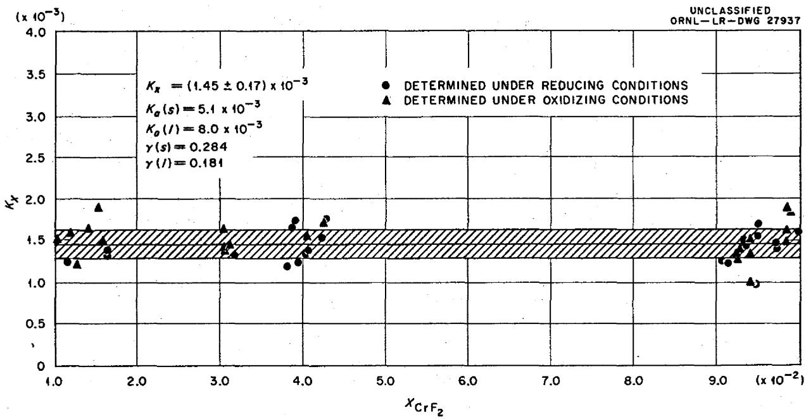  
Fig. 2.3.28. Equilibrium Quotients at $850^{\circ}\mathrm{C}$ of the Reaction $\mathsf{CrF}_2(d) + \mathsf{H}_2(g)\rightleftharpoons \mathsf{Cr}(s) + 2\mathsf{HF}(g)$ in NaF-ZrF4 (53-47 Mole %).

$850^{\circ}C$ with respect to the solid and the supercooled-liquid standard states, respectively. Experimental work is under way at other temperatures.

# Solubility of $\mathsf{FeF}_2$ in LiF-BeF2 R.J.Sheil

Before attempting to determine activity coefficients of $\mathsf{FeF}_2$ in molten LiF-BeF $_2$ (63-37 mole %), it was necessary to establish a concentration range below which the $\mathsf{FeF}_2$ does not precipitate as a complex compound or in the pure state. For this investigation, known amounts of iron were added, as $\mathsf{FeF}_2$ , to the solvent, and filtered samples of the solution were obtained at different temperatures. The concentrations of iron in the filtrates, as determined by chemical analysis, were then compared with the amounts of $\mathsf{FeF}_2$ added. The results of the comparisons for these separate additions of $\mathsf{FeF}_2$ are summarized in Table 2.3.17. The tabulated results indicate that equilibrium measurements can be made with solutions of $\mathsf{FeF}_2$ in this solvent at concentrations well in excess of $5000~\mathrm{ppm}$ $\mathsf{Fe}^{++}$ even at $500^{\circ}\mathsf{C}$ , which is the lowest temperature contemplated for the experiment.

Table 2.3.17. Concentration of Iron Dissolved In LiF-BeF $_2$ (63-37 Mole %) at 500, 600, and $700^{\circ}\mathrm{C}$   

<table><tr><td rowspan="2">Fe++ Added (ppm)</td><td colspan="3">Fe++ Found in Filtrate (ppm)</td></tr><tr><td>At 700°C</td><td>At 600°C</td><td>At 500°C</td></tr><tr><td>5,000</td><td>4,925</td><td>4,835</td><td>4,845</td></tr><tr><td>10,000</td><td>9,386</td><td>9,125</td><td>9,390</td></tr><tr><td>50,000</td><td>49,100*</td><td>41,700</td><td>33,100</td></tr></table>

*Petrographic examination of this filtrate revealed that the saturating phase was pure $\mathsf{FeF}_2$ .

# Use of Cr51 To Study Chromium Migration in Polythermal Inconel-Molten Salt Systems R. B. Evans

A proposed graphical method for calculating the rate and amount of migration (corrosion) to be expected in Inconel-NaF-ZrF $_4$ -UF $_4$ systems because of the reaction

$$
C r ^ {o} + 2 U F _ {4} = 2 U F _ {3} + C r F _ {2}
$$

has been evolved through studies of chromium migration within polythermal loop systems. The

calculations are based on the assumption that the circulating salt initially contains equilibrium concentrations of $\mathsf{UF}_{4^{\prime}}$ , $\mathsf{UF}_{3^{\prime}}$ and $\mathsf{CrF}_{2^{\prime}}$ which are independent of time. In an attempt to compare the calculated results with results of actual loop experiments, a study was made of four thermal loop experiments in which $\mathsf{Cr}^{51}$ was utilized to trace the chromium migration patterns within the loops. Several important points regarding the use of radioactive tracers in loops were noted in the course of this work and are described below, since they will be of definite value in investigations of corrosion in polythermal loop systems. An outline of the experimental conditions for the four loop tests is given in Table 2.3.18. Three of the four experiments, as indicated in Table 2.3.18, were conducted with $\mathsf{Cr}^{51}$ initially present only in the salt, as $\mathsf{Cr}^{*}\mathsf{F}_{2^{\prime}}$ . The results of these first three experiments, in which $\mathsf{Cr}^{0*}$ was initially absent from the walls, do not give a direct indication of the overall chromium migration pattern as a result of corrosion. To illustrate this point, a combined plot of the experimental data for the first three experiments of Table 2.3.18 is shown in Fig. 2.3.29. If it is assumed that the loop wall distribution patterns for $\mathsf{Cr}^{0}$ and $\mathsf{Cr}^{0*}$ coincide, it could be concluded from Fig. 2.3.29 that the zone of maximum deposition of chromium as a result of the reversal of the corrosion reaction is near section A. By mass-balance calculations, $A$ is between the zones of maximum chromium corrosion or depletion, $C - C^{\prime}$ , and the zones of maximum deposition as a result of corrosion, $B - B^{\prime}$ . In other words, the loop wall distribution patterns for

$\mathbf{Cr}^{\circ}$ and $\mathbf{Cr}^{\circ \star}$ do not coincide when radioactive chromium is initially introduced to the system as $\mathbf{Cr}^{\star}\mathbf{F}_{2}$ .

Curve 2 of Fig. 2.3.29 shows a secondary maximum near the region of the true deposition. The original investigators17 have suggested that the shape of curve 2 is of greater significance than are the shapes of curves 1 and 3, because the loop operating time for the data of curve 2 was 400 hr as compared with 125 and 288 hr for curves 1 and 3, respectively. The salt in loop No. 3 was, however, pre-equilibrated for 192 hr before operation. It would seem that, if the secondary maximum of curve 2 were truly significant, the other two curves should have shown some tendency toward the initial formation of such a maximum. It is difficult to visualize a chromium transport

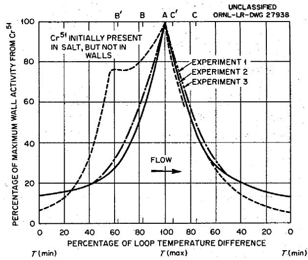  
Fig. 2.3.29. Effect of $\mathsf{UF}_4\text{-}\mathsf{UF}_3$ Corrosion on $\mathbf{Cr}^{51}$ Distribution in Inconel Loops.

Table 2.3.18. Summary of Experimental Conditions of Battelle Thermal Loop Experiments   

<table><tr><td></td><td colspan="4">Experiment No.</td></tr><tr><td></td><td>1</td><td>2</td><td>3</td><td>4</td></tr><tr><td>Cr51initially in the melt</td><td>Yes</td><td>Yes</td><td>Yes</td><td>Yes</td></tr><tr><td>Cr51initially in walls</td><td>No</td><td>No</td><td>No</td><td>Yes</td></tr><tr><td>UF3and CrF2initially in melt</td><td>No</td><td>No</td><td>Yes</td><td>Yes</td></tr><tr><td>Total operating time, hr</td><td>125</td><td>400</td><td>288</td><td>288</td></tr><tr><td>Average loop temperature, °F</td><td>1356</td><td>1341</td><td>1352</td><td>1345</td></tr></table>

mechanism whereby the relative amount of chromium deposited at a point suddenly jumps from a constant value of $30\%$ of the maximum to a value of $75\%$ of the maximum after 288 hr of operation. Calculated $\mathrm{Cr}^{51}$ distribution curves for this type of experiment under conditions of perfect pre-equilibration of the salt have the shape exhibited by curves 1 and 3. They also have a constant shape with respect to time when plotted on a relative basis. The theory on which these calculations were based is outlined below.

The $\mathbf{C}\mathbf{r}^{0\star}$ distribution under any experimental procedure is governed by two chemical equilibria at the wall surface, the most important of the two being the wall exchange reaction

$$
C r ^ {0} + C r ^ {*} F _ {2} \rightleftharpoons C r ^ {0 *} + C r F _ {2}
$$

for which

$$
K _ {1} = \frac {N _ {\mathbf {C r} ^ {\circ} * N _ {\mathbf {C r}} F _ {2}}}{N _ {\mathbf {C r} ^ {\circ} N _ {\mathbf {C r} ^ {*} F _ {2}}} \simeq 1}, \tag {1}
$$

where $N$ denotes mole fraction of the material indicated by the subscript. Equation 1 is independent of temperature. The other reaction that affects the $\mathbf{Cr}^{0\star}$ distribution is

$$
\mathrm {C r} ^ {\circ} + 2 \mathrm {U F} _ {4} \rightleftharpoons 2 \mathrm {U F} _ {3} + \mathrm {C r F} _ {2}
$$

in which the chromium may be labeled or unlabeled. Thus

$$
K _ {2} = \frac {N _ {U F _ {3}} ^ {2} N _ {\left(C r F _ {2} + C r ^ {*} F _ {2}\right)}}{N _ {U F _ {4}} ^ {2} N _ {\left(C r ^ {\circ} + C r ^ {\circ *} \right.}}). \tag {2}
$$

The equilibrium ratio $K_{2}$ is temperature dependent. If the $\mathsf{UF}_{4},\mathsf{UF}_{3},$ and $\mathsf{CrF}_2$ concentrations in the salt are constant with respect to time, Eq. 2 may be rewritten as a function of any loop position, $L,$ as

$$
N _ {\left(C r ^ {o} + C r ^ {o *}\right) L} = \frac {\left[ N _ {\left(C r ^ {o} + C r ^ {o *}\right)} \left(K _ {2}\right) \right] _ {B P}}{\left(K _ {2}\right) _ {L}}. \tag {3}
$$

The subscript $BP$ refers to balance points, which are the two points that separate the zones of deposition and depletion. In a properly pre-equilibrated loop these points remain stationary.

The net chromium migration across the wall surface is zero at these points. Accordingly the wall-surface chromium concentration at the balance points is equal to the original chromium concentration in the alloy.

In addition to the chemical equilibria at the surface, the $\mathbf{Cr}^{\circ \star}$ (and $\mathbf{Cr}^{\circ}$ ) wall distribution is governed by the concentration of $\mathbf{Cr}^{\circ \star}$ (and $\mathbf{Cr}^{\circ}$ ) initially in the interior of the walls as a result of the solid-state diffusion phenomena that are characteristic of metals at high temperature. Since linear diffusion in a semi-infinite medium is involved, the distributions also depend on the square root of the diffusion coefficient, $D$ , for chromium in Inconel. The diffusion coefficient is practically the same for $\mathbf{Cr}^{\circ}$ and for $\mathbf{Cr}^{\circ \star}$ , and the value is very sensitive to temperature changes.

A combination numerical-schematic steady-state example similar to conditions of the third experiment and involving the various chromium concentrations in three loop sections is presented in Fig. 2.3.30. Equations 1 and 3 were used to prepare the example. It was assumed that, at a given instant of time,

$$
N _ {C r ^ {*} F _ {2}} = 1 \times 1 0 ^ {- 1 0},
$$

$$
N _ {C r} = 0. 1 7 4,
$$

$$
T _ {B P} = 1 0 1 0 ^ {\circ} \mathrm {K}
$$

[thus $N_{(\mathsf{CrF}_2 + \mathsf{Cr}^*\mathsf{F}_2)} = 2.52\times 10^{-3}$ , independent of time], and the maximum salt temperature is $1042^{\circ}\mathrm{K}$ $(T_{\text{mean}} = 997^{\circ}\mathrm{K})$ . The salt was assumed to be NaF-ZrF-UF4 (50-46-4 mole $\%$ initially). [thus $N_{(\mathsf{CrF}_2 + \mathsf{Cr}^*\mathsf{F}_2)} = 2.52\times 10^{-3}$ , independent of time], and the maximum salt temperature is $1042^{\circ}\mathrm{K}$ $(T_{\text{mean}} = 997^{\circ}\mathrm{K})$ . The salt was assumed to be NaFe-UF4 (50-46-4 mole $\%$ initially). The quantities $(dM / dt)_{T'}(dM / dt)_{\mathsf{Cr}^{\circ}}$ and $(dM / dt)_{\mathsf{Cr}^{\circ}}$ represent, respectively, the net diffusion rate of all chromium, of unlabeled chromium, and of labeled chromium. The rates are positive when the flow occurs in a positive $x$ direction, that is, when $[\mathsf{Cr}^{\circ}]_{x=0} - [\mathsf{Cr}^{\circ}]_{x=\infty}$ is positive.

The most significant point demonstrated by Fig. 2.3.30 is that calculated instantaneous $\mathbf{Cr}^{0*}$ loop wall distribution data that take corrosion into account will give approximately the same

<table><tr><td>Twall</td><td>Tsalt</td><td>K2×104</td><td>CrF2</td><td>CrF2</td><td>CrO</td><td>CrO*</td><td>ΔCrO</td><td>ΔCrO*</td><td>CrO</td><td>CrO*</td></tr><tr><td>(℃)</td><td>(℃)</td><td></td><td colspan="8">CONCENTRATION, C(mole %)</td></tr><tr><td rowspan="2">1042</td><td rowspan="2">1042</td><td rowspan="2">3.32</td><td>0.252</td><td>1×10-6</td><td>15.9</td><td>6.3×10-7</td><td>-1.5</td><td>+6.3×10-7</td><td>17.4</td><td>0</td></tr><tr><td>(dM/dt)T&lt;1</td><td>(dM/dt)T&lt;1</td><td>(dM/cr0←)</td><td>(dM/cr0→)</td><td colspan="4">(dM/cr0→)</td></tr><tr><td colspan="3">(BALANCE POINT)</td><td>0.252</td><td>1×10-8</td><td>17.4</td><td>6.9×10-7</td><td>0</td><td>+6.9×10-7</td><td>17.4</td><td>0</td></tr><tr><td>967</td><td>1010</td><td>3.03</td><td>(dM/dt)T=0</td><td>(dM/dt)T&lt;1</td><td>(dM/cr0←)</td><td colspan="5">(dM/cr0→)</td></tr><tr><td rowspan="2">952</td><td rowspan="2">952</td><td rowspan="2">2.52</td><td>0.252</td><td>1×10-8</td><td>20.9</td><td>8.3×10-7</td><td>+3.5</td><td>+8.3×10-7</td><td>17.4</td><td>0</td></tr><tr><td>(dM/dt)T&gt;1</td><td>(dM/dt)T&gt;1</td><td>(dM/cr0→)</td><td colspan="5">(dM/cr0→)</td></tr></table>

$$
\begin{array}{l} \left(\frac {d M}{d t}\right) _ {T} = \text {N E T D I F F U S I O N R A T E O F A L L} \\ \left(\frac {d M}{d t}\right) _ {\mathrm {C r} ^ {0}} = \text {N E T D I F F U S I O N R A T E O F U N L A B E L E D} _ {\text {C H R O M I U M}} \quad \text {S U R F A C E L A Y R A S S U M E D T O} \\ \left(\frac {d M}{d t}\right) _ {\mathrm {C r} ^ {0 *}} = \text {N E T D I F F U S I O N R A T E O F L A B E L E D} \\ \end{array}
$$

Fig. 2.3.30. Theoretical Concentration Relationships for Chromium in Various Inconel Thermal-Convection Loop Wall Segments.

curves as those obtained experimentally (Fig. 2.3.29) because (1) $\mathsf{Cr}^{\circ \star}$ is always diffusing into the walls along the entire loop, regardless of the sign or value of the other flow rates, and (2) the $\mathsf{Cr}^{\circ \star}$ diffusion rate is highest in the high-temperature region, since $(dM / dt)_{\mathsf{Cr}^{\circ \star}}$ is proportional to $(\Delta C_{\mathsf{Cr}^{\circ \star}} \cdot D^{1/2})$ and $D^{1/2}$ increases with temperature. It may be concluded that experiments similar to the first three listed in Table 2.3.18 are of little value for corrosion studies because the $\mathsf{Cr}^{\circ \star}$ distribution pattern is controlled by the wall exchange reaction and wall temperature rather than by the corrosion reaction of interest.

In the fourth experiment, $\mathbf{Cr}^{51}$ was initially present both in the salt, as $\mathbf{Cr}^{\star}\mathbf{F}_{2^{\prime}}$ and in the walls, as $\mathbf{Cr}^{\circ \star}$ . The labeled chromium migration pattern in this case tended to follow the over-all migration pattern of the corrosion, as shown graphically on Fig. 2.3.31. Comparisons of

Figs. 2.3.31 and 2.3.32 demonstrate that the corrosion pattern calculated by assuming that $T_{\text{wall}} \big]_{x=0} = T_{\text{salt}}$ is in fair agreement with the pattern obtained experimentally. The experimental curve of Fig. 2.3.31 is not symmetrical, and the point of maximum deposition appears to be displaced downstream from the maximum wall temperature at section A. In general, the same features characterize the curve of Fig. 2.3.32. This strongly suggests that the wall temperature at the inner surface of the tubing is very close to the salt temperature and that this temperature controls the value of the equilibrium constant for the corrosion reaction.

The ability to reproduce the shape of the activity vs wall-temperature plots for the Battelle thermal loop experiments - particularly for the fourth experiment - by means of calculations based on the predicted behavior suggests that the proposed

UNCLASSIFIED

ORNL-LR-DWG 27940

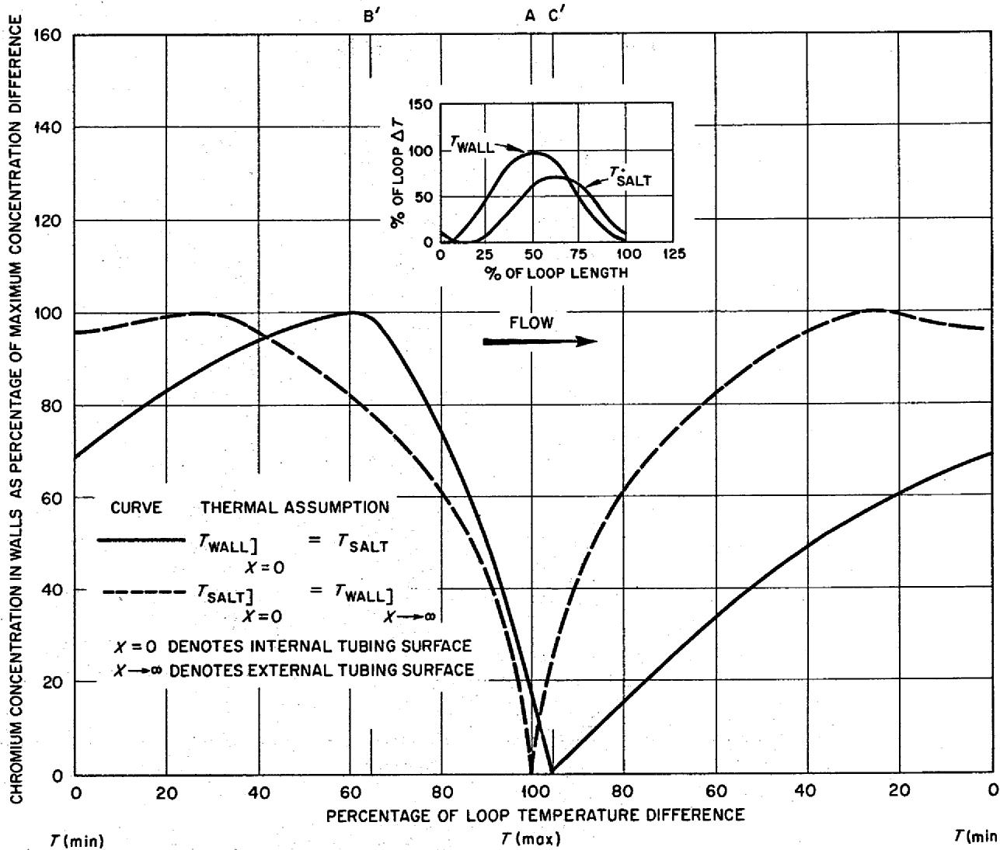  
Fig. 2.3.31. Calculated Loop Wall Distribution of Chromium After Diffusion-Controlled $\mathsf{UF}_4$ - $\mathsf{UF}_3$ Corrosion of Inconel.

migration mechanisms give a reasonable explanation of the steady-state chromium migration within thermal loops.

# Activity of Nickel in Nickel-Molybdenum Alloys S. Langer

Measurements are being made of the activity of nickel in nickel-molybdenum alloys by using an electromotive force method. The reliability of measurements made with emf cells of the type

Ni(metal)

NiCl2(1 wt %) in

NoCl-KCl eutectic

Ni-Mo alloy

is dependent upon the reversibility of the cell. The usual criteria18-20 accepted as evidence that the cell is behaving reversibly are that

1. the potential remains constant with time at constant temperature,   
2. mechanical agitation has no effect on the potential,   
3. the potential of the cell returns to its equilibrium value rapidly after polarization,

18J. F. Elliot and J. Chipman, Trans. Faraday Soc. 47, 138 (1951).   
19. K. W. Wagner, Thermodynamics of Alloys, p 91-97, Addison-Wesley, Cambridge, 1952.   
20G. F. A. Kortum and J. O'M Bockris, Textbook of Electrochemistry, p 581, Elsevier, New York, 1951.

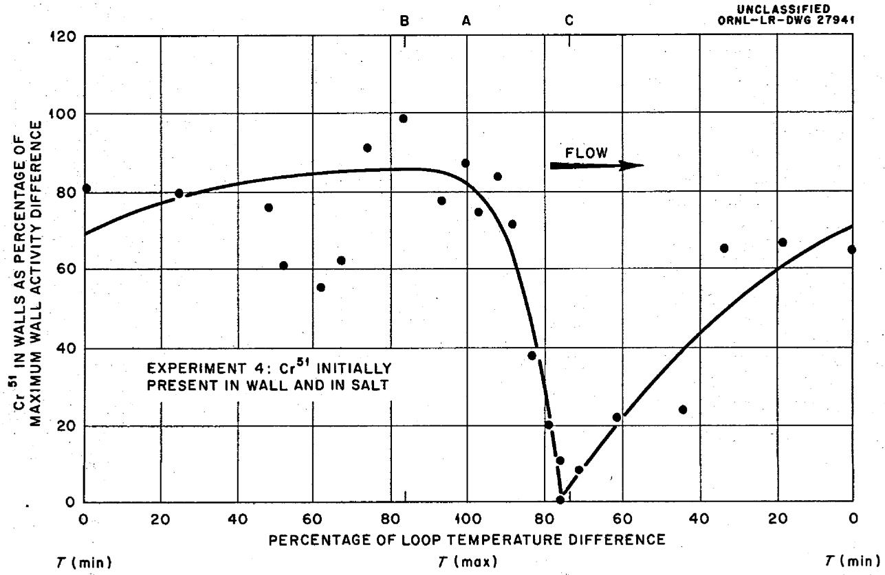  
Fig. 2.3.32. Effect of $\mathsf{UF}_4\text{-}\mathsf{UF}_3$ Corrosion on $\mathbf{Cr}^{51}$ Distribution in Inconel Loop.

4. the observed potentials are reversible with respect to temperature changes,   
5. there is no difference of potential between two apparently identical electrodes.

The first condition has been met by all cells tested. Also, mechanical agitation of the electrodes has had no effect on the observed emf. The cells have also returned to their equilibrium potentials within 30 min after all four electrodes have been shorted together. In most cases, the electrodes are within 2 mv of their equilibrium potential within 5 min after shorting for as long as 15 min. It was found that concentration cells in the nickel-chromium system were not readily reversible with respect to temperature changes.[21] However, the first attempt to run a cell at two different temperatures in this study was successful. A cell with alloy electrodes containing

10 and 20 at. $\%$ molybdenum gave constant potentials at $800^{\circ}C$ for 15 days and for 6 more days at $700^{\circ}C$ . It is planned, in the future, to ascend and descend the temperature scale between 750 and $1000^{\circ}C$ with all cells.

The criterion of reversibility, however, has been the cause of the early termination of several cell experiments. Each cell as presently run contains two alloy electrodes (usually of different composition) and two pure nickel electrodes that were annealed at $2200^{\circ}\mathrm{F}$ for 16 hr after fabrication. In general, one nickel electrode becomes erratic either shortly after the start of a run or after behaving properly for as long as 12 days. Potentials as high as 70 mv have been observed between two nickel electrodes which two days previously had been behaving properly and exhibited no potential difference. Cells containing four nickel electrodes from different sources are now being run in an effort to discover the cause of this anomalous behavior. No explanation is evident to date.

# PRODUCTION OF PURIFIED MIXTURES

J. P. Blakely

G. J. Nessle

Preparation of Pure Fluorides

Some transition-metal fluorides of high purity were prepared for use in studies of corrosion, chemical equilibria, and phase relationships, and for use as reactants in the preparation of other fluorides, including complexes. Nearly a kilogram each of ferric, ferrous, nickelous, and cobaltous fluorides were prepared. Ferric fluoride was prepared by passing anhydrous hydrogen fluoride gas over anhydrous ferric chloride at about $300^{\circ}\mathrm{C}$ . For preparing the ferrous, nickelous, and cobaltous fluorides, the commercially available hydrated chlorides were partially dehydrated at about $100^{\circ}\mathrm{C}$ and treated with hydrogen fluoride at about $400^{\circ}\mathrm{C}$ .

# Small-Scale Purification Operations

# C. R. Croft

The experimental facilities were used for the processing of $530\mathrm{kg}$ of salt mixtures in 55 batches that consisted of 5-, 10-, and 50-lb quantities. Twenty-eight of these batches were materials that contained $\mathsf{BeF}_2$ . Included in the total were 11 batches of the NaF-KF-LiF-UF4 mixture for use by the Metallurgy Division.

Requests for molten salts and especially for $\mathsf{BeF}_2$ -bearing mixtures have reached a level which is beyond the production capabilities of the experimental facilities. It is anticipated that the 250-lb-batch production equipment will be operated at intervals during the next several months to provide the material required.

Four batches totaling $270\mathrm{kg}$ of $\mathsf{LiF - BeF}_2\mathsf{-UF}_4$ mixture were prepared during a trial run of the 250-lb-batch production equipment for two weeks during December. This operation, on a three-shift, five-day-week basis, was conducted in cooperation with the Y-12 Industrial Hygiene Department, and face masks and complete protective clothing were used by the operating personnel. Careful monitoring by the industrial hygienists revealed no significant exposure of the personnel to air-borne beryllium compounds. The occurrence of severe dermatitis among the operators, however, indicated that routine operation of the equipment under the conditions of this test

was not feasible. It will, apparently, be necessary to enclose the equipment and to provide an improved ventilation system before its continued use can be adjudged safe in all practicable circumstances.

Analyses indicated only 3 to 4 wt % uranium in the final product, rather than the 6.4 wt % charged to the reactor. Examination of the residue in the reactor showed high concentrations of uranium as $\mathsf{UO}_2$ . It is apparent that contact between HF and the liquid in the large reactor was insufficient to remove $\mathsf{H}_2\mathsf{O}$ and $\mathsf{BeO}$ from the mixture and that precipitation of $\mathsf{UO}_2$ by the reaction

$$
U F _ {4} + 2 B e O \rightarrow U O _ {2} + 2 B e F _ {2}
$$

resulted. Experiments are under way to develop a modified technique for preparing satisfactory material with this equipment. Most of the available material can be used in experiments for which the precise compositions requested are not essential.

# Preparation of Material for In-File Loop

# F.A. Doss

A single batch was prepared that totaled about $300\mathrm{g}$ of $\mathsf{LiF - BeF}_2\mathsf{-UF}_4$ mixture in which Li7 and U235 were used. The solvent mixture of Li7F and $\mathsf{BeF}_2$ was purified in Building 9928 at the Y-12 Plant. When analyses of specimens from this preparation had indicated its purity to be satisfactory, the material, in its original container, was taken to Building 9212 at the Y-12 Plant where the $\mathsf{U}^{235}\mathsf{F}_4$ was added and the final purification was accomplished. Chemical analyses made by Y-12 and ORNL laboratories were in good agreement as to composition of the melt for accountability purposes. The material has, accordingly, been transferred to the requestor (see Chap. 2.2 of this report).

# Transfer and Service Operations

# F. A. Doss

Fifty-five filling and draining operations were performed during the quarter. Requests for such services declined to a low of 12 during December and then increased to 25 during January. About $640\mathrm{kg}$ of salt and about $300\mathrm{kg}$ of alkali metals were transferred in these operations.

# INTERNAL DISTRIBUTION

1. L. G. Alexander

46. J. A. Lane

2. E. S. Bettis

47. R. S. Livingston

3. D. S. Billington

48. H. G. Mac Pherson

4. J. P. Blakely

49. W. D. Manly

5. F. F. Blankenship

50. E. R. Mann

6. E. P. Blizzard

51. L. A. Mann

7. A. L. Boch

52. W. B. McDonald

8. C. J. Borkowski

53. J. R. McNally

9. G. E. Boyd

54. H. J. Metz

10. M. A. Bredig

55. R. P. Milford

11. E. J. Breeding

56. E. C. Miller

12. R. B. Briggs

57. K. Z. Morgan

13. D. O. Campbell

58. J. P. Murray (Y-12)

14. D. W. Cardwell

59. M. L. Nelson

15. W. H. Carr

60. P. Patriarca

16. G. I. Cathers

61. A. M. Perry

17. C. E. Center (K-25)

62. D. Phillips

18. R. A. Charpie

63. P. M. Reyling

19. J. H. Coobs

64. J. T. Roberts

20. F. L. Culler

65. M. T. Robinson

21. J. H. Devan

66. H. W. Savage

22. L. B. Emlet (K-25)

67. A. W. Savolainen

23. W. K. Ergen

68. J. L. Scott

24. J.Y. Estabrook

69. E. D. Shipley

25. D. E. Ferguson

70. M. J. Skinner

26. A. P. Fraas

71. A. H. Snell

27. E. A. Franco-Ferreira

72. J. A. Swartout

28. J. H. Frye, Jr.

73. A. Taboada

29. A. T. Gresky

74. E. H. Taylor

30. J. L. Gregg

75. R. E. Thoma

31-33. W.R.Grimes

76. F. C. VonderLage

34. E. Guth

77. G.M. Watson

35. C. S. Harrill

78. A. M. Weinberg

36. H. W. Hoffman

79. M. E. Whatley

37. A. Hollander

80. G. D. Whitman

38. A. S. Householder

81. G. C. Williams

39. W. H. Jordan

82. C. E. Winters

40. G. W. Keilholtz

83. J. Zasler

41. C. P. Keim

84-87. ORNL Y-12 Technical Library Document Reference Section

42. M. T. Kelley

88-99. Laboratory Records Department

43. F. Kertesz

100. Laboratory Records, ORNL-RC

44. B. W. Kinyon

101-103. Central Research Library

# EXTERNAL DISTRIBUTION

104. Division of Research and Development, AEC, ORO

105-681. Given distribution as shown in TID-4500 (13th ed. Rev.) under Reactors-Power category (75 copies - OTS)

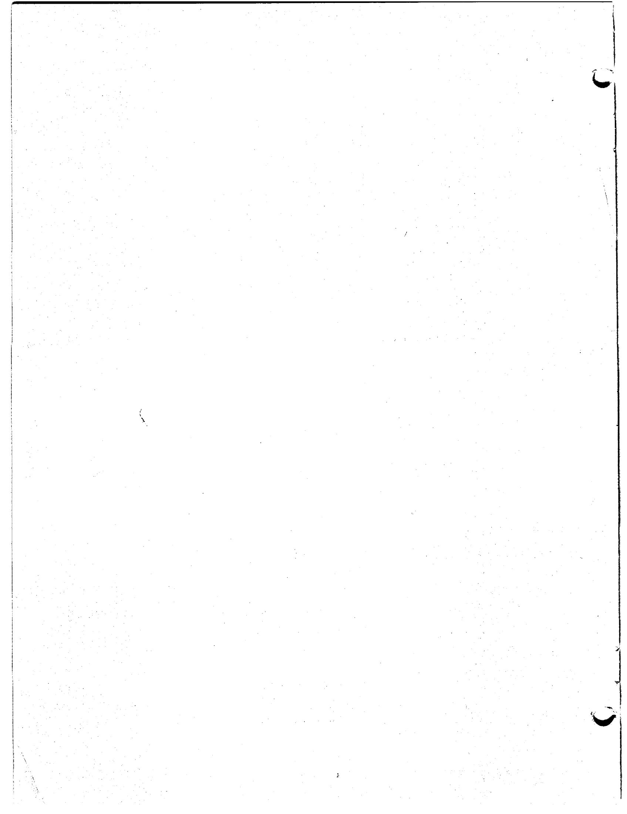

Contract No. W-7405-eng-26

MOLTEN-SALT REACTOR PROGRAM

QUARTERLY PROGRESS REPORT

For Period Ending January 31, 1958

H. G. MacPherson, Program Director

DATE ISSUED

#

MAY 14 1958

OAK RIDGE NATIONAL LABORATORY

Oak Ridge, Tennessee

operated by

UNION CARBIDE CORPORATION

for the

U.S. ATOMIC ENERGY COMMISSION

