DECLASSIFIED

$\therefore {S}_{\Delta APQ} = {S}_{\Delta AQP} + {S}_{\Delta PQR}$

$\therefore {S}_{\Delta BCD} = {S}_{\Delta COD} + {S}_{\Delta BDO} - {S}_{\Delta BOC}$

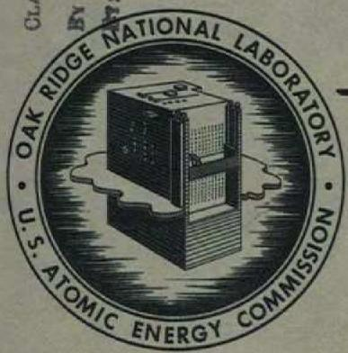

LIBRARY

REFERENCE COPY

AIRCRAFT NUCLEAR PROPULSION PROJECT

QUARTERLY PROGRESS REPORT

FOR PERIOD ENDING MARCH 31, 1958

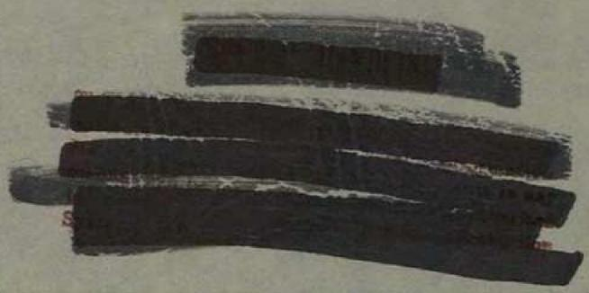

OAK RIDGE NATIONAL LABORATORY

operated by

UNION CARBIDE CORPORATION

for the

U.S. ATOMIC ENERGY COMMISSION

# LEGAL NOTICE

This report was prepared as an account of Government sponsored work. Neither the United States, nor the Commission, nor any person acting on behalf of the Commission:

A. Makes any warranty or representation, express or implied, with respect to the accuracy, completeness, or usefulness of the information contained in this report, or that the use of any information, apparatus, method, or process disclosed in this report may not infringe privately owned rights; or   
B. Assumes any liabilities with respect to the use of, or for damages resulting from the use of any information, apparatus, method, or process disclosed in this report.

As used in the above, "person acting on behalf of the Commission" includes any employee or contractor of the Commission to the extent that such employee or contractor prepares, handles or distributes, or provides access to, any information pursuant to his employment or contract with the Commission.

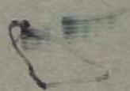

ORNL-2517

C-85 - Reactors-Aircraft Nuclear

Propulsion Systems

This document consists of 146 pages.

Copy/0J of 219 copies. Series A.

Contract No. W-7405-eng-26

# AIRCRAFT NUCLEAR PROPULSION PROJECT

# QUARTERLY PROGRESS REPORT

For Period Ending March 31, 1958

A. J. Miller, Project Coordinator

DATE ISSUED

AUG 201958

OAK RIDGE NATIONAL LABORATORY

Oak Ridge, Tennessee

operated by

UNION CARBIDE CORPORATION

for the

U.S. ATOMIC ENERGY COMMISSION

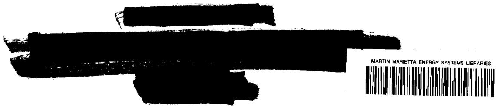

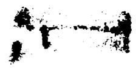

# FOREWORD

The ORNL-ANP program provides research and development support in shielding, reactor materials, and reactor engineering to organizations engaged in the development of air-cooled and liquid-metal-cooled reactors for aircraft propulsion. The work described here is basic to or in direct support of investigations under way at General Electric Company, Aircraft Nuclear Propulsion Department, and Pratt & Whitney Aircraft Division, United Aircraft Corporation. This report is divided into four major parts: 1. Metallurgy, 2. Chemistry and Radiation Damage, 3. Engineering, and 4. Shielding.

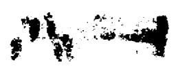

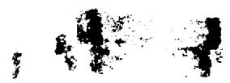

# INTRODUCTION

The current ANP program at ORNL consists primarily of supporting research and developmental work for the General Electric Company, Aircraft Nuclear Propulsion Department, on air-cooled reactors and for Pratt & Whitney Aircraft on lithium-cooled reactors. Metallurgical, chemical, and engineering information required to develop and evaluate materials and components for use in specific systems is being obtained. The work in support of lithium-cooled reactor development is providing information on factors affecting the stability of high-temperature columbium-lithium systems, factors affecting the mechanical properties of columbium, basic hydrodynamic and heat transfer characteristics of lithium systems, and components for use in lithium systems. Work under way on moderator materials for use at high temperatures, shielding materials, and the production of low-oxygen-content yttrium metal is related to the requirements of both types of reactor.

A comprehensive shielding program is being carried out to aid in the development of lightweight reactor and crew shields for nuclear-powered

aircraft. The major experimental facilities employed are the Lid Tank Shielding Facility (LTSF), which provides a beam of radiation for attenuation measurements on materials in slab geometry immersed in water; the Bulk Shielding Facility (BSF), which provides a reactor for attenuation measurements in three-dimensional geometry of configurations immersed in water; and the Tower Shielding Facility (TSF), at which operating reactors, reactor shields, and crew shields can be suspended as high as 200 ft in the air. Much of the experimentation at these facilities is on material configurations and shield mockups specified by GE or P&W in connection with their current design problems. Measurements are also made to obtain fundamental shielding data as part of a basic program of study of the theory of radiation attenuation and the development of shield design methods.

Details of the progress made on this program during the past three months are presented in this report. Future progress reports will be on a semi-annual basis.

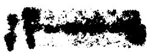

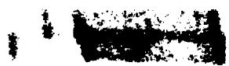

# ANP PROJECT QUARTERLY PROGRESS REPORT

# SUMMARY

# PART 1. METALLURGY

# 1.1. Fabrication

Effort is being devoted to determining the effects of impurities, such as oxygen, nitrogen, hydrogen, and carbon, on the fabricability, weldability, mechanical properties, and corrosion resistance of columbium. In comparisons of cold-worked powder-metallurgy and arc-cast material, the form in which the impurities are present was found to be as important as the quantity of the impurities. Studies of the effects of various heat treatments on impure columbium were initiated, and the preliminary results indicated that nitrogen is the impurity most influential in heat treatment effects.

Work was continued on the fabrication of columbium tube shells. Three arc-cast billets were extruded satisfactorily and are to be drawn into tubing. Additional billets are being obtained for determining optimum extrusion temperatures and cladding procedures.

Coatings of brazing alloys applied by flame spraying are being tested for oxidation protection of columbium. Both Coast Metals brazing alloys 52 and 53 were found to provide satisfactory protection in 1000-hr oxidation tests at $1700^{\circ}\mathrm{F}$ . Subsequent metallographic examination, however, revealed cracks in the coatings that could have led to rapid failure. Studies of the reaction rates between low-pressure gases and columbium were initiated in order to determine the permissible limits of gaseous contaminants in the environment when columbium is exposed at high temperatures.

Developmental work on methods and apparatus for the production of low-oxygen-content yttrium metal was continued. The method now being studied involves the lithium reduction of a low-melting mixture of the fluorides of yttrium, magnesium, and lithium to produce an yttrium-magnesium alloy from which yttrium sponge is produced by vacuum distillation. Castings prepared from the sponge by arc melting under an argon atmosphere with a tungsten electrode were analyzed for impurity content. The chemical analyses indicated oxygen contents of 600 to 3000 ppm and nitrogen contents of 50 to 17,000 ppm. Experiments are

under way to determine the relationship between impurity content and tensile properties.

An electron-beam method of consolidating the yttrium-magnesium alloy directly into a finished billet is being investigated. This method, if successful, could eliminate the vacuum-distillation and arc-melting steps. Also, equipment is being assembled for hydriding yttrium.

# 1.2. Corrosion

Methods are being studied for purifying the lithium required in projects in support of both the air-cycle and the lithium-cooled reactors. Lithium as pure as it is practical to produce is needed for the reduction step in the production of low-oxygen-content yttrium metal, as well as for studies of the effects of minor amounts of oxide and nitride on the corrosion of reactor materials. Determinations of the solubility of nitrogen and oxygen in lithium and studies of various purification techniques indicated that gettering was a more satisfactory purification technique than low-temperature filtration or vacuum distillation. Initial gettering tests with zirconium, titanium, and a mixture of titanium and calcium indicated significant reductions of the nitrogen content of lithium, but these gettering materials had little effect on the oxygen content. Further experiments will be performed with other metals which have oxides whose free-energy values indicate that they are suitable as getters for oxygen. The extensive oxidation of an yttrium metal specimen upon exposure to lithium suggested the possibility of using yttrium metal in the purification of the lithium required in the reduction step of the yttrium production process.

Two zirconium-base alloys being investigated for use as weld-filler rod in the fabrication of ductile saddle welds in columbium tubing were tested for corrosion resistance in lithium. Static and thermal-convection loop tests showed weld joints made with both an $85\%$ Zr-15% Cb and an $80\%$ Zr-15% Cb-5% Mo alloy to have excellent corrosion resistance.

Thermal-convection loop tests of lithium-columbium systems have thus far been of limited

duration because of the high rate of penetration of the longitudinal weld in the wall of the columbium tubing by the lithium metal. Two loops of sintered columbium tubing with inserts of arc-cast material showed very little attack away from the longitudinal weld, but there was severe attack in the heat-affected and weld zones.

Static tests of lithium-filled columbium tubes were made in order to determine whether the environment in which the thermal-convection loop tests were made had an effect on the weld attack. Four capsules, two in an argon atmosphere and the other two in a dynamic vacuum of less than $5\mu$ , were attacked similarly. The weld and heat-affected zones of all four capsules were heavily attacked, and there were several cases of complete penetration. The base material away from the weld zone was unattacked.

Experimental work on a lead-lithium alloy containing 0.69 wt $\%$ lithium - a potential shielding material - was completed. An experimental shield was prepared for studies at the Bulk Shielding Facility.

# 1.3. Welding and Brazing

The effect of oxidation on brazed joints is being investigated. A nickel-rich solid-solution layer forms on the fillet surfaces of joints brazed with the Coast Metals nickel-base brazing alloys and the depleted region is quite ductile. Thus it appears that the ductility of oxidized joints of this type should improve during service. Studies of the rate of depletion of microconstituents during high-temperature oxidation are under way.

Refractory-metal brazing alloys for use in lithium-cooled reactor applications are being investigated, since the nickel-base brazing alloys have poor resistance to lithium. A survey was made of the columbium and zirconium binary systems of potential interest, and other systems will be studied.

# 1.4. Mechanical Properties

Investigations were continued of the high-temperature mechanical properties of structural metals. The testing programs include mechanical and thermal strain cycling, mechanical stress cycling (fatigue), creep in bending, and creep under multiaxial stresses. Inconel was chosen as the first test material because its tensile, uniaxial creep, and relaxation characteristics are

well known and could be used in the analysis of its behavior under more complex stress situations.

In mechanical strain cycling, emphasis is placed on evaluating the influence of frequency of cycling on the number of cycles to failure. The extent to which the cycle time influences the number of cycles to rupture is dependent on the plastic strain per cycle and the temperature. A comparison of the number of cycles to rupture at low strains for cycle times of 2 and 30 min revealed that long cycle times decrease the strain absorption capacity. This effect becomes more apparent at the low strain-per-cycle values and is also magnified by increasing temperature. A severe frequency effect, for example, was observed at $1\%$ strain and at $1500^{\circ}\mathrm{F}$ ; fine-grained material endured approximately 700 cycles at 2 min per cycle and only 160 cycles at 30 min per cycle. At $1300^{\circ}\mathrm{F}$ , however, 2- and 30-min cycles yielded the same number of cycles to rupture at $1\%$ strain.

A series of thermal strain cycling tests at a mean temperature of $1500^{\circ}\mathrm{F}$ were completed at the University of Alabama. The correlation between mechanical and thermal cycling data was very poor. Lack of agreement between the tests is attributed to the unreliability of the techniques presently used to measure the plastic strain per cycle in the thermal cycling tests.

Fatigue studies were conducted by Battelle Memorial Institute. Data obtained at $1600^{\circ}F$ on specimens stress cycled at 1 and 10 cps revealed a similar frequency effect to that observed in the strain cycling tests conducted at ORNL. Specimens cycled at the high frequency endured 10 times more cycles before failure than did the specimens in comparable lower frequency tests.

The effect of cyclic stresses on creep properties was also investigated. Small alternating stresses were beneficial to the creep properties. The time to rupture showed a slight increase, and the creep rate decreased in comparison with pure creep properties. Upon further increasing the alternating stress, the time to rupture decreased. Conventional Goodman-type diagrams, which relate time to rupture to the stress ratio, were obtained for the two frequencies, 1 and 10 cps.

Results from creep-bending tests at $1500^{\circ}\mathrm{F}$ support the hypothesis that creep-bending behavior can be predicted from tensile creep data. As postulated, creep in the outer beam fibers will follow curves in tensile creep tests at the

stress initially present in the outer fibers. However, after the first few hours, the bending creep rate correlates more closely with tensile creep data corresponding to a lower stress. This indicates that the bending stresses in the beam are redistributed through relaxation and that the redistribution results in a lower stress in the outer fiber of the beams.

Multiaxially stressed tubular specimens were creep tested at $1500^{\circ}\mathrm{F}$ . It was found that the creep rate in the axial direction was not influenced by tangential stress in cases where the axial-to-tangential stress ratio, $\sigma_z / \sigma_{t'}$ , was greater than 0.5. In other words, the axial stress alone determined the axial creep rate. At the stress ratio of 0.5, no axial creep was observed, although a tensile stress was present in the axial direction. At stress ratios, $\sigma_z / \sigma_{t'}$ from 0.5 to -1.0, compressive axial creep was observed. In compression, however, creep rates were accelerated by tangential stress.

In contrast to the creep rates, time to rupture was greatly affected by tangential stress. As the stress ratio decreased from $\infty$ to 1.0, for example, when one of the principal stresses was held at 6000 psi, the time to rupture decreased from 350 to 90 hr. At ratios below 1.0, where only the axial stress was varied, the variance of time to rupture with stress ratio was only slight, although the time to rupture continued to decrease as the stress ratio decreased. The minimum time to rupture occurred at the stress ratio -1.0.

At present neither the creep nor rupture behavior can be related to the common mechanical theories of flow and fracture. However, a number of tentative conclusions can be drawn from the data. It seems likely that deformation rates under multiaxial stresses are controlled by the maximum normal stress in the axial direction in the range of stress ratios from 0.5 to $\infty$ . This implies that data from conventional uniaxial creep tests are valid bases for design under these conditions. However, the elongation to which a material may be stretched before failure is markedly affected by changes in stress distribution, and it decreases greatly with increased tangential stress. Recognition of this fact by the designer may alter the selection of a limiting strain.

# 1.5. Ceramics

Dense beryllium oxide is being studied for use as a neutron reflector material in air-cycle reactors. The possibility of adding boron as a suppressor for secondary gamma rays is also being investigated. Specimens containing $\mathsf{ZrB}_{2^{\prime}}$ , $\mathsf{TaN}_{2^{\prime}}$ , $\mathsf{TaN}_{2^{\prime}}$ , $\mathsf{CrB}_{2^{\prime}}$ , $\mathsf{HfB}_{2^{\prime}}$ , $\mathsf{CeB}_{6^{\prime}}$ and BN were prepared, and the specimens containing $\mathsf{ZrB}_{2}$ and $\mathsf{HfB}_{2}$ were found to be much superior to the other combinations with respect to oxidation resistance at $1300^{\circ}\mathsf{C}$ . Additives are being sought that will densify extruded and cold-pressed BeO bodies and possibly, but not necessarily, fulfill the boron content requirements.

# 1.6. Nondestructive Testing

The study of eddy-current techniques for measuring cladding thicknesses was continued. Correlation of the measurements with the results of metallographic examinations is under way. Also, the possibility of measuring the thickness of a nonmagnetic cladding material on a magnetic core is being investigated. Measurements of aluminum coating thicknesses on steel in the absence of an intermetallic layer can be made with an accuracy of 0.0001 in. or greater.

During investigation of the problem of measuring the thickness of aluminum coatings on steel, a new technique was developed which shows promise of eliminating the inaccuracies introduced by lift-off or poor coupling between the probe coil and the part. A method that is independent of lift-off variations will be adaptable to automatic scanning.

An ultrasonic phenomenon known as Lamb waves, which are basically a characteristic elastic vibration established in a thin metal plate, is being investigated for possible use in the detection of laminations. The Lamb waves are generated in thin metal sections by directing a beam of ultrasonic energy at particular incident angles to the sheet surface.

Equipment has been obtained and is being tested for measurements of ultrasonic attenuation and velocity. Changes in ultrasonic attenuation as a function of changes in metal structures will be examined, and methods for valid ultrasonic inspection of welded structures will be developed.

# PART 2. CHEMISTRY AND RADIATION DAMAGE

# 2.1. Materials Chemistry

The methods developed for the preparation of the $\mathsf{LiF - MgF}_2\mathsf{-YF}_3$ mixture required in the production of yttrium metal were analyzed in terms of possible large-scale production in available equipment. Since scale-up of the process appears to present no particular difficulties, a pilot plant in which the available equipment will be utilized was designed and is being constructed. The pilot plant will be capable of supplying a quantity of fluoride mixture sufficient for the production monthly of 200 lb of low-oxygen-content yttrium metal.

Experimental studies were initiated of a possible method for the extraction of impurities from lithium metal with molten salts. In order to avoid contamination of the lithium by extraneous metal, the eutectic mixture LiF-LiBr (12-88 mole%) was chosen as the extractant for preliminary studies. In an additional step, bismuth was used to extract the residual lithium from the salt mixture following the initial impurity extraction. Further experiments must be performed before the effectiveness of the method can be determined.

# 2.2. Analytical Chemistry

The precision of a method which has been proposed for the determination of lithium oxide in metallic lithium was evaluated by analyzing samples of a dispersion of metallic lithium in paraffin. In this method the lithium sample is dispersed in paraffin so that aliquots for analysis can be obtained by merely cutting and weighing. In order to determine the uniformity of the sample dispersion in the paraffin, dispersions were prepared with a Waring Blender fitted with a stainless steel mixing cup in which a helium atmosphere was maintained. Samples of the solidified material, which contained approximately 1 g of the dispersed metal, were analyzed. The average value for five samples was 230 ppm, with a coefficient of variation of 5%. These results indicate the validity of the assumption that lithium oxide is uniformly distributed in the lithium-paraffin dispersion.

The apparatus previously used for determination of oxides in fused mixtures of fluoride salts is being adapted for use with $\mathsf{BrF}_2\cdot \mathsf{SbF}_6$ . This flux should be applicable to the determination of oxides in fused mixtures of lithium fluoride and magnesium fluoride.

# 2.3. Radiation Damage

The tube-burst stress-rupture apparatus for tests under irradiation in the MTR was completed, and final preirradiation tests were initiated. The apparatus differs from that used in previous MTR irradiations in that the Inconel specimens will be irradiated in air rather than in helium to avoid changes in thermocouple calibration, and the specimens will be cooled internally in order to avoid overheating. While being irradiated the specimens will be at $1500^{\circ}\mathrm{F}$ and at stresses of 3000 to 6000 psi. It is planned to continue tests of Inconel specimens until all experimental difficulties have been resolved and basic data on the material have been obtained.

Metallographic examination of an Inconel stress-rupture specimen irradiated in the LITR for 600 hr while at a stress of 2000 psi and a temperature of $1500^{\circ}\mathrm{F}$ showed that rupture had occurred outside the gage length where the temperature was not monitored. The specimen was exposed to a fluoride fuel mixture on the inside and helium on the outside. No evidence of increased corrosion as a result of irradiation was found in the gage length where the temperature was monitored. A holding fixture for creep experiments in the ORR pool has been installed, and a flux monitoring facility was completed.

Irradiation-induced changes in semiconductor diodes were studied in the light of the two principal barrier theories: the Shockley diffusion theory and the charge recombination-generation theory. Experimental evidence indicates that irradiation causes a change in the predominant mechanism of rectification of germanium $p-n$ junctions from the diffusion mechanism to the recombination-generation mechanism. This shift in mechanism explains the difficulty heretofore encountered in explaining the radiation-induced changes in current-voltage characteristics.

Work continued on the preparation of apparatus for thermal-stress- and thermal-shock-resistance testing of moderator materials at high temperatures in the ETR. The specimens that will be irradiated include beryllium oxide, beryllium, and yttrium hydride. Preirradiation tests of the specimens will be made to determine elastic properties and dimensions and the effect of heat cycling. The yttrium hydride specimens will, in addition, be examined by x-ray diffraction in order to determine the crystal type and lattice spacing. These studies will be repeated after irradiation to detect changes.

# PART 3. ENGINEERING

# 3.1. Component Development and Testing

A forced-circulation loop was designed for studying the corrosion of columbium by lithium metal circulating at high temperatures in a system with a temperature gradient. In order to protect the columbium tubing from air oxidation, the auxiliary portions of the loop, that is, the fill and drain lines, the line to the lithium expansion tank, and the loop which includes the rotating-magnet pump, will be clad with type 446 stainless steel. The tubing that will be at high temperatures in the test section will be surrounded with static sodium which will transfer heat to or remove heat from the columbium tubing in the hot and cold legs of the loop. The cladding of the external portion of the columbium loop will be joined with the stainless steel expansion tank of the sodium system. An all-stainless-steel loop of this design is being constructed in which NaK will be circulated in order to obtain operating data with which to validate assumptions made in heat transfer and flow calculations.

The centrifugal pump rotary assembly in operation under gamma irradiation in the canal at the MTR had received an accumulated gamma-ray dose of $1.6 \times 10^{9}$ rep by the end of the quarter, that is, about one-half the planned dose. The equipment continues to operate satisfactorily, and no gross changes have been observed in the oil (Gulfcrest-34) which is used to lubricate the bearing and seal. Oil-lubricated pumps of this type are being tested for applicability to liquid-metal circulation in radiation fields.

Modifications were made to the primary face seals of centrifugal pumps being tested for high-temperature service. Use of a Fulton-Sylphon seal prevented accumulation of undesirable deposits on the gas side of the seal. A split purge arrangement stopped the rise of vapor from the pumped fluid and likewise prevented accumulation of deposits on the seal face.

One phase of the development and testing of shut-off valves for high-temperature service was completed. A valve was developed which is satisfactory for operation in NaK at temperatures up to $1300^{\circ}\mathrm{F}$ . Cermet combinations known to be compatible with lithium were used as seat and plug materials. The valve will be satisfactory if fabricated from columbium or another material compatible with lithium.

# 3.2. Heat Transfer Studies

Experimental studies of the effect of thermal stress cycling on structural materials were continued with the use of the pulse-pump system. The effects of exposure time, that is, total number of thermal cycles, on the Inconel test specimens are being investigated. For correlation with these studies, measurements are being made of the attenuation of sinusoidal temperature oscillations at the interior surface of a thick-walled Inconel cylinder.

The study of the effect of screens in a diverging annular channel on the thermal structure of a fluid with internal heat generation was completed. The use of variable porosity screens reduced the amplitude of the surface temperature fluctuations to less than $10\%$ of the axial rise at both the inner and outer channel walls. The screens also effectively reduced flow asymmetries caused by stoppage of one of the two pumps in the flow system.

Initial studies of heat transfer in a liquid metal with internal heat generation were completed. Preliminary analyses of the data indicate that the surface-to-fluid mean temperature differences are greater than predicted. It thus appears that the theory-vs-experiment discrepancies observed in liquid-metal wall-heat-transfer systems - that is, externally heated systems - also exist in the internally heated systems.

# 3.3. Instruments and Controls

A data acquisition, or digital recording, system was obtained for use in recording and correlating the process variables for which measuring instruments will be required in a reactor system. The information obtained with this system will be useful in evaluations of the need for instruments and the preparation of specifications for instruments.

Life tests of ORNL-designed liquid-metal-level transducers were continued. Two units have accumulated 5408 hr of operation at $1200^{\circ}\mathrm{F}$ in NaK and two have accumulated 775 hr. Eight units were tested to investigate wetting in NaK at various temperatures. The data are being analyzed. Two 1-in. turbine flowmeters that had operated in NaK for 2000 hr at temperatures up to $1560^{\circ}\mathrm{F}$ were removed from the test loop and are being disassembled for examination. The design principles embodied in these instruments are suitable for the

design of instruments for use with high-temperature lithium systems.

Strain gages for static measurements at temperatures up to $2000^{\circ}\mathrm{F}$ are being studied. Since past experience with strain gages has been almost entirely at low temperatures, a test facility for evaluating various types of strain gages at high temperatures is being devised.

A design of an in-pile loop in which to study the effects of high-level radiation on thermocouples was prepared. The test environment will be sodium.

Tests are under way on pneumatic pressure transmitters. Overrange pressures are being used to determine the aging characteristics of the instruments with respect to accuracy and overall safety.

# PART 4. SHIELDING

# 4.1. Shielding Theory

In order to predict and check the results of shielding experiments, a computation was made of the energy and angular distribution of the gamma rays at the surface of the BSF reactor. The calculated gamma-ray energy spectrum normal to the surface of the reactor checked with that obtained in previous calculations, and the first detailed calculation of angular distribution was completed.

# 4.2. Lid Tank Shielding Facility

The experiment designed by GE-ANP for studying the production of secondary gamma rays in configurations containing advanced shielding materials is being continued. The latest tests were performed to determine the optimum placement of boral within configurations containing stainless steel. The most effective way of reducing the capture gamma-ray dose rates beyond the configurations was to distribute the boral evenly throughout the stainless steel and, in addition, to place some boral behind the stainless steel.

# 4.3. Bulk Shielding Facility

The design of a stainless-steel-clad, $\mathsf{UO}_2$ -fueled reactor for the BSF was completed, and a report for submission to the Advisory Committee on Reactor Safeguards was prepared. Mechanical tests and analog computations carried out on the control system indicate that it is capable of safely reversing positive periods as short as 8 msec.

This would be equivalent to an excess reactivity of $1.2\%$ ; however, it is planned to limit the stainless steel reactivity to $0.75\%$ until a planned series of tests on the BSR-II and its control system can be performed at the SPERT Facility.

The study of the spectra of gamma radiation associated with the fission of $\mathsf{U}^{235}$ is continuing. It has included a second BSF determination of prompt radiation, the results of which are in general agreement with the previous results, although they differ by as much as a factor of 2 in some energy regions. Preliminary results were also obtained in measurements of the fission-product gamma radiation emitted during the period between $5 \times 10^{-8}$ and $10^{-6}$ sec after fission and during the period between 1 and 1500 sec after fission.

A $3/4$ -in.-dia by 2-in.-deep well was drilled into the truncated end of the 9-in.-dia crystal of NaI(Tl) - which will be used as a total absorption gamma-ray spectrometer at the BSF - in order to reduce the effects on the spectral response of the Compton scattering near the surface where the gamma radiation enters the crystal. In an attempt to improve the percentage resolution, seven 3-in.-dia photomultiplier tubes were mounted on the crystal. In spite of this improvement, the total absorption spectrometer does not yet compete favorably with other spectrometers in terms of resolution, although its efficiency is two or three orders of magnitude greater.

A study of the heat production in a large slab mockup of a typical aircraft shield was undertaken at the BSF. The mockup being investigated consists of a 4-in.-thick slab of beryllium, followed by a gamma-ray shield and 16 in. of lithium hydride. The gamma-ray material consists of 3 in. of lead, 3 in. of iron, or 2 in. of Mallory 1000. The entire shield is submerged in an oil-filled aluminum tank positioned against the BSR. Measurements are being made of the heating, dose rates, and fluxes within the shield.

# 4.4. Tower Shielding Facility

An experiment in cooperation with Convair, Fort Worth, is now being conducted at the Tower Shielding Facility to obtain neutron and gamma-ray dose rates and thermal-neutron fluxes under conditions similar to those encountered with the Nuclear Test Airplane Program but in the absence of the airplane structure. The experiment will also include dose rates and flux measurements

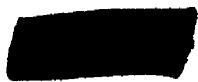

taken at various positions around the ASTR while the reactor is 12.5 ft above the ground as in the Convair ground test measurements. In order to sort out the ground scattering effects, similar

measurements will be made while the reactor is suspended at an altitude of approximately 190 ft. Other measurements will be made to determine the spectra of neutrons emitted from the ASTR.

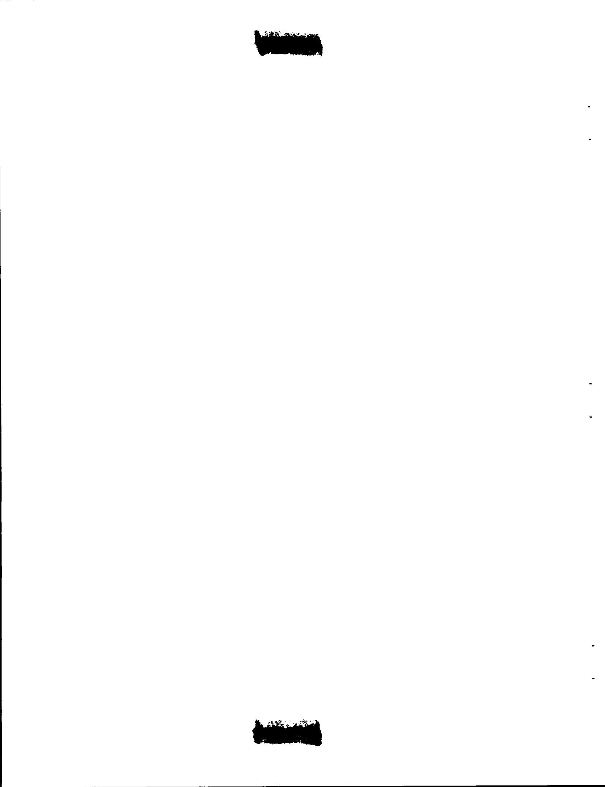

# CONTENTS

INTRODUCTION

SUMMARY VII

# PART 1. METALLURGY

1.1.FABRICATION 3

Columbium Investigations 3   
Fabrication Studies 3   
Oxidation Protection 4   
Reaction Rates 4   
Yttrium Metal Production 4   
Alloy Production 4   
Evaluation of Material 5   
Yttrium Hydriding 8

1.2. CORROSION 9

Lithium Purification: Methods of Reducing the Nitrogen and Oxygen Content 9   
Solubility of Nitrogen and Oxygen in Lithium 9   
Filtration 10   
Vacuum Distillation 10   
Gettering with Zirconium, Titanium, and Calcium 11

Static Lithium Corrosion of Yttrium 20

Static Lithium Corrosion of Zirconium-Base Alloys 21   
Thermal-Convection Loop Tests of Lithium in Cumbium 24   
Static Lithium Corrosion of Cumbium 26   
Metallurgical Studies of Lead-Lithium Alloys 30

1.3.WELDING AND BRAZING 32

Oxidation of Coast Metals Brazing Alloys 52 and 53 32   
Development of Brazing Alloys for Lithium Service 33

1.4.MECHANICAL PROPERTIES 36

Strain-Cycling Investigations 36   
Creep Under Bending Stresses 39   
Creep Under Multiaxial Stresses 41

1.5.CERAMICS 45

Boron Compounds 45   
Boron Additions to BeO 45   
Densification of BeO 45

1.6. NONDESTRUCTIVE TESTING 47

Eddy-Current Thickness Measurements 47   
Lamb Ultrasonic-Wave Studies 49   
Ultrasonic Attenuation and Velocity Measurements 50

# PART 2. CHEMISTRY AND RADIATION DAMAGE

# 2.1.MATERIALS CHEMISTRY 53

Preparation of Charge Material for Reduction to Yftrium 53   
Conversion of $\mathrm{Y}_2\mathrm{O}_3$ to $\mathrm{YF}_3$ 53   
Preparation of $\mathsf{MgF}_2$ 53   
Preparation of the LiF-MgF $2\text{-} YF_{3}$ Charge Mixture 54   
The System LiF-YF 3 54

Extraction of Lithium Metal Impurities with Molten Salts 55

# 2.2.ANALYTICAL CHEMISTRY 57

Determination of Oxygen in Metallic Lithium 57   
Determination of Oxygen in Fluoride Salts 57

# 2.3.RADIATION DAMAGE 58

Creep and Stress Rupture Tests Under Irradiation 58   
MTR Experiments 58   
LITR Experiments 59   
ORR Tests 60

Radiation Effects in Electronic Components 60

Irradiation Tests of Moderator Materials for Use at High Temperatures 62

# PART 3. ENGINEERING

# 3.1. COMPONENT DEVELOPMENT AND TESTING 67

Loop for Investigating Corrosion in Lithium-Columbium Systems 67

Pump Development 67

Irradiation Test of Bearings and Seals 67   
Seal Improvements 67   
Cavitation Tests 69

Valves for Use at High Temperatures 69

Thermal Stability Tests of Metal Shells 69

# 3.2. HEAT TRANSFER STUDIES 72

Studies of the Effect of Thermal-Stress Cycling on Structural Materials 72

Pulse-Pump System 72   
Thermal EntranceStudieswithWater 74

Thermal Structure of Fluids Flowing in Volume-Heated Systems 77

Diverging Annular Channel with Screens 77   
Liquid-Metal Experiment 79

# 3.3. INSTRUMENTATION AND CONTROLS 81

Data Acquisition System 81   
Liquid-Metal-Level Transducers 81   
Strain Gages for Use at High Temperatures 81   
Test Set-Up for Study of Effect of Radiation on Thermocouples 82   
Pressure Transmitters for Use at High Temperatures 82

# PART 4. SHIELDING

# 4.1. SHIELDING THEORY 85

A Calculation of Energy Spectrum and Angular Distribution of Gamma Rays at Surface of BSF Reactor 85

Geometry 85   
Thermal-Neutron Flux 85   
Gamma-Ray Sources 86   
Absorption Coefficients 86   
Buildup Factors 87   
Flux Computation 87   
Angular Distribution 89   
Conclusions 89

# 4.2. LID TANK SHIELDING FACILITY 90

Study of Advanced Shielding Materials (GE Series) 90

# 4.3. BULK SHIELDING FACILITY 104

The BSF Stainless Steel- $\mathrm{UO}_2$ Reactor (BSR-II) 104

Spectra of Gamma Radiation Associated with the Fission of U235 104

Fission-Product Gamma Rays Emitted More Than 1 sec After Fission 105   
Fission-Product Gamma Rays Emitted Between $5\times 10^{-8}$ and $10^{-6}$ sec After Fission. 105   
Prompt Gamma Rays 107   
Total Absorption Gamma-Ray Spectroscopy 108   
A Study of Radiation Heating in Shields 113

# 4.4. TOWER SHIELDING FACILITY 117

Aircraft Shield Test Reactor Experiment at the Tower Shielding Facility 117

# Part 1

# METALLURGY

W. D. Manly

Metallurgy Division

T. Hikido

U.S. Air Force

# 1.1. FABRICATION

J. H. Coobs

D. O. Hobson

H. Inouye

W. J. Werner

Metallurgy Division

T. Hikido, U.S. Air Force

# COLUMBIUM INVESTIGATIONS

H. Inouye

D. O. Hobson

# Fabrication Studies

Cold Working. - Attempts have been made to fabricate columbium at room temperature because of its reactivity with gases at high temperatures. Metal prepared by the powder metallurgy process, in which relatively large quantities of oxides, nitrides, and carbides were present, was successfully fabricated, but arc-cast material, in which the impurity content was lower, was brittle when fabricated at room temperature. It appeared therefore that the form in which the impurities were present in the metal was as important as the quantity present. The impurities are taken into solution in the melting step, and, if they do not precipitate significantly during cooling, a subsequent, suitable heat treatment of the material should improve its fabricability. Thus heat treatment of the metal at temperatures above the solubility limit of the impurities should have no effect on the fabricability, whereas, at a lower temperature, precipitation should occur and result in a ductile metal because of overaging. In order to test this hypothesis, sections of an arc-cast ingot prepared by the electron-beam melting process were heat treated at 750, 850, and $1000^{\circ}\mathrm{C}$ for 24 hr. The lower temperatures were selected to cause precipitation, whereas the higher temperature was selected to be above that at which the impurities would be retained in solution. The results of cold rolling and bend tests of the heat-treated specimens are presented in Table 1.1.1. Samples from the as-cast ingot and the sample annealed at $1000^{\circ}\mathrm{C}$ could not be rolled, but the other samples were cold rolled to foil. On the basis of the solubility data for oxygen1 and nitrogen2 in columbium, it appears that the element which causes the observed heat-treatment effects

is nitrogen. The various specimens were identical, metallographically, after heat treatment.

Extrusion. - Work has continued on the fabrication of columbium tube shells. Three arc-cast billets were extruded satisfactorily and will be shipped to Superior Tube Company to be drawn into tubing. The three billets, all from Superior Tube Company, were copper plated for protection, heated in argon, and extruded at a 7:1 ratio. The first billet was extruded at $900^{\circ}\mathrm{C}$ , and, presumably as a result of contamination caused by pinholes in the copper plating, the extrusion had numerous small, deep cracks across the surface. The second billet was extruded at $815^{\circ}\mathrm{C}$ . The surface was fairly good, but there was a little roughness as a result of large grains and of some glass lubricant having been carried through the die unmelted. The extrusion pressure was approximately 60 psi, that is, well within the limits of the press. The third billet was extruded at $980^{\circ}\mathrm{C}$ without the glass lubricant, and an extrusion pressure of only 53 psi was required. The surface condition was very good.

Table 1.1.1. Effect of Heat Treatment on the Fabricability of Cast Columbium*   
Heat treatment: 24 hr in vacuum of $10^{-5}$ mm Hg at indicated temperature   

<table><tr><td>Heat Treatment Temperature (℃)</td><td>Bend Angle at Fracture** (deg)</td><td>Cold-Rolling Results</td></tr><tr><td>As cast</td><td>127</td><td>Brittle fracture on first pass</td></tr><tr><td>750</td><td>180</td><td>Rolled to foil</td></tr><tr><td>850</td><td>180</td><td>Rolled to foil</td></tr><tr><td>1000</td><td></td><td>Brittle fracture on first pass</td></tr></table>

Twelve columbium billets have been ordered for future work. These will be used to determine the optimum extrusion temperatures and the best cladding procedures. It may be possible by rapid heating in an induction furnace to extrude bare billets.

# Oxidation Protection

Some work has continued on the oxidation protection of columbium. Satisfactory results were obtained in oxidation tests for 1000-hr periods at $1700^{\circ}\mathrm{F}$ of specimens coated with Coast Metals alloys 52 and 53. The specimens were coated by flame-spraying with the powdered alloy and were then heated in a purified helium atmosphere to a temperature just below the brazing temperature.

A specimen coated with alloy 53 showed a weight increase of $1.1\mathrm{mg/cm}^2$ in 200 hr, after which the weight decreased slowly to a total weight gain of $0.6\mathrm{mg/cm}^2$ after 1000 hr. This weight change compares quite favorably with that which would occur in the same period if the specimen were type 316 stainless steel. At $1600^{\circ}\mathrm{F}$ , a type 316 stainless steel specimen would gain about $1.5\mathrm{mg/cm}^2$ in 1000 hr.

A specimen coated with alloy 52 showed a weight increase during the first 24 hr and then lost weight for 100 hr, at which time the total weight change was a loss of $1.2\mathrm{mg/cm^2}$ . After 300 hr the specimen began to gain weight again and it was still gaining after 1000 hr.

Metallographic studies of the coatings showed a large amount of surface oxidation, some reaction layer formation, and a few diffusion voids at the interface. The Coast Metals coatings were cracked in several places, but hardness readings showed no hardness increases in the columbium near the cracks. The specimen coated with alloy 53 had an average hardness of 110 DPH, while the specimen coated with alloy 52 had a hardness of 78.7 DPH. The coatings ranged in hardness from 250 to 750 DPH.

Oxidation tests were also run on two columbium tubes coated with alloy 53 and filled with lithium. The specimens were tested at $1500^{\circ}\mathrm{F}$ , and they failed because of incomplete protection by the brazed coating. The heat treatment evidently did not cause complete flow of the braze metal.

# Reaction Rates

The reaction rates between low-pressure gases and columbium are being studied to determine the permissible limits of gaseous contaminants when columbium is exposed at high temperatures. An apparatus is being constructed that is designed for determining reaction rates of columbium with the pure gases at pressure levels of 0.01 to $1000\mu \mathrm{Hg}$ . In addition to providing a means for establishing the required purity of the atmosphere during high-temperature testing, the apparatus will be used for the preparation of samples for the determination of the effect of a specific impurity on the properties of the metal.

Preliminary absorption isotherms for oxygen in columbium at 950 and $1050^{\circ}C$ show that columbium rapidly absorbs oxygen in the pressure range from 10 to $1000\mu \mathrm{Hg}$ . The absorption rate decreases as the pressure is decreased. In the pressure range between 40 and $800\mu \mathrm{Hg}$ ,the formation of an oxide film competes with the absorption of oxygen by the metal.

# YTTRIUM METAL PRODUCTION

T. Hikido W.J.Werner

# Alloy Production

Six additional experiments were completed in the study of the lithium reduction of a mixture of the fluorides of yttrium, magnesium, and lithium to produce an yttrium-magnesium alloy. In run L-8 and subsequent runs both the lithium and the fluoride mixture were transferred in the molten state into the reduction retort through resistance-heated lines from their respective storage containers by means of differential gas pressures. At the present time the transfer lines are constructed of $\frac{1}{4}$ -in.-OD, 25-mil-wall Inconel tubing. The direct transfer of the molten fluoride mixture from the fluorinating apparatus to the reduction retort is now being considered. When this change is made a $\frac{3}{8}$ -in. transfer line will be used. This will facilitate the handling of larger quantities of material, and larger quantities of alloy will be produced in each run. A schematic diagram of the apparatus now being used is presented in Fig. 1.1.1. A distillation apparatus capable of handling 4 to 5 lb of alloy is used in conjunction with this apparatus. The yttrium sponge produced by distillation is arc-melted under an argon atmosphere with a tungsten electrode to form finger

UNCLASSIFIED

ORNL-LR-DWG 30413

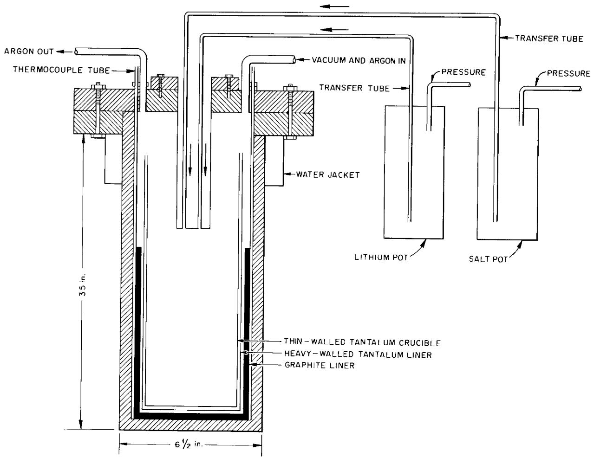  
Fig. 1.1.1. Diagram of Reduction Retort for the Preparation of Yttrium-Magnesium Alloy. (Secret with caption)

castings of the type shown in Fig. 1.1.2. The results of chemical analyses of several of these castings are presented in Table 1.1.2.

A new method for consolidating the alloy directly into a finished ingot is being investigated. The electron-beam melting method developed at Temescal Metallurgical Company is being considered for this application. In the near future several ingots of yttrium-magnesium alloy will be sent to Temescal for melting by this process and will be returned for evaluation. If the process proves to be satisfactory for melting this alloy, the vacuum distillation and arc-melting steps can be eliminated.

# Evaluation of Material

Tensile Tests. - A series of specimens were machined from finger castings and pulled at room temperature. The purpose of these tests was to see whether there was any direct correlation between tensile properties and impurity content. However, as can be seen from Fig. 1.1.2, the grains in the as-cast specimens are quite large and nonuniform. A program for determining the recrystallization properties is being initiated in order to develop means for controlling the grain size. It is believed that, when the size of the grains of the tensile specimens can be controlled, a correlation between impurity content and tensile properties will be found.

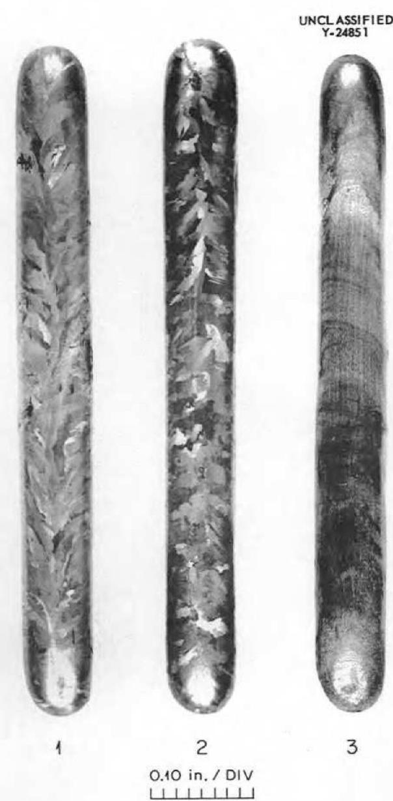  
Fig. 1.1.2. Yttrium Finger Castings L-8A-1, L-8A-2, L-8A-3. (Secret with caption)

Metallographic Techniques. - In the past the metallography of yttrium has been hampered by the lack of adequate polishing and etching techniques, but a suitable polishing and etching technique for yttrium has now been developed. The specimen is ground dry on 320, 400, and

Table 1.1.2. Results of Chemical Analyses of Castings of Yttrium Sponge   

<table><tr><td>Run Number</td><td>Oxygen Content (ppm)</td><td>Nitrogen Content (ppm)</td></tr><tr><td>L-8A-1</td><td>640</td><td>710</td></tr><tr><td>L-8A-2</td><td>1700</td><td>1,300</td></tr><tr><td>L-8A-3</td><td>1900</td><td>8,900</td></tr><tr><td>L-8A-4</td><td>3000</td><td>17,000</td></tr><tr><td>L-9A</td><td>1600</td><td>320</td></tr><tr><td>L-9B-1</td><td>1300</td><td>1,100</td></tr><tr><td>L-9B-2</td><td>1400</td><td>570</td></tr><tr><td>L-9B-3</td><td>1600</td><td>1,700</td></tr><tr><td>L-9B-4</td><td>1800</td><td>2,000</td></tr><tr><td>L-9B-5</td><td>1200</td><td>1,400</td></tr><tr><td>L-10A-1</td><td>610</td><td>140</td></tr><tr><td>L-10A-2</td><td>940</td><td>110</td></tr><tr><td>L-10A-4</td><td>1100</td><td>120</td></tr><tr><td>L-10A-6</td><td>1100</td><td>140</td></tr><tr><td>L-10A-7</td><td>980</td><td>100</td></tr><tr><td>L-10A-8</td><td>850</td><td>100</td></tr><tr><td>L-11A-1</td><td>1200</td><td>58</td></tr></table>

600 papers and then ground on 2.0 paper with a petroleum solvent and paraffin as a lubricant in the rough polishing step. It is then polished on a diamond wheel with 20- to $40 - \mu$ diamond paste and canvas cloth, 6- to $8 - \mu$ diamond paste and canvas cloth, and 0 to $1 - \mu$ diamond paste and "airplane" cloth. For the final polishing step, a Syntron vibratory polishing is used, with (1) Linde A on micro cloth and alcohol plus $10\%$ oxalic acid as the lubricant, (2) Linde B on micro cloth and vacuum-diffusion-pump oil as the lubricant, and finally (3) magnesium oxide on micro cloth and vacuum-diffusion-pump oil as the lubricant. The etchant used is an equal-volume mixture of $\mathrm{HNO}_3$ , $\mathrm{H}_3\mathrm{PO}_4$ , and $\mathrm{CH}_3\mathrm{COOH}$ . The etchant is cooled with ice in order to assure a slow etching reaction, and the sample is submerged in the cold etchant for 3 to 5 sec or until a thick film is formed on the surface of the specimen. The sample is then immediately washed with hot water. The reproducibility of this procedure is illustrated in Figs. 1.1.3, 1.1.4,

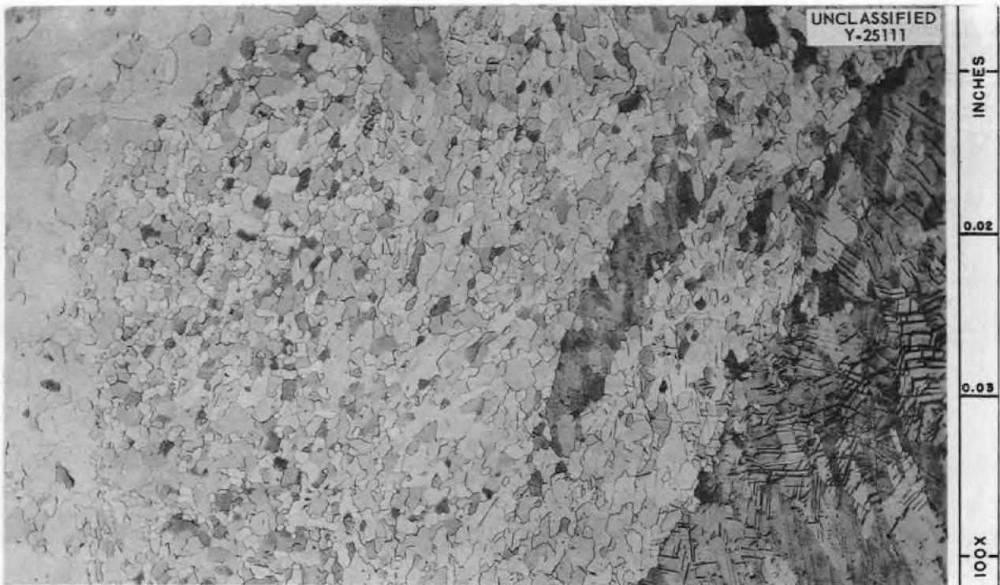

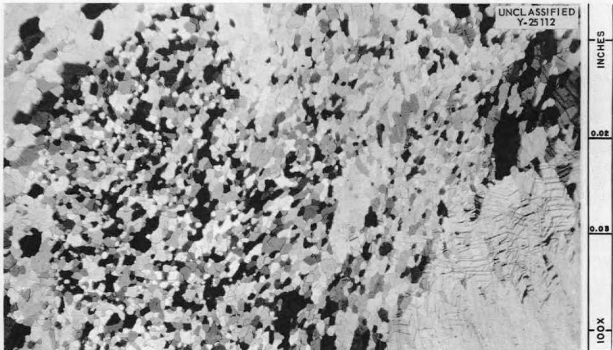  
Fig. 1.1.3. Sample L-10A-2 Under Bright Field Illumination. 100X. Etchont: HNO₃-H₃PO₄-CH₃COOH.   
Fig. 1.1.4. Sample L-10A-2 Under Polarized Light Illumination. 100X. Etchant: HNO $_3$ -H $_3$ PO $_4$ -CH $_3$ COOH.

and 1.1.5. All three figures are photomicrographs of the same area of sample No. L-10A-2 after $30\%$ reduction by swaging and annealing at $800^{\circ}\mathrm{C}$ for $30\mathrm{min}$ . Figure 1.1.3 is a bright-field photomicrograph; Fig. 1.1.4 is a polarized light photomicrograph; and Fig. 1.1.5 is a sensitive tint photomicrograph.

# Yttrium Hydriding

Several pieces of hydriding equipment were received from Wright Air Development Center. The equipment consists of two hydriding furnaces with associated gas metering tanks, a dissociation-pressure-measuring furnace, a modulus of elasticity rig, and a thermal stress rig. A program of study of hydrided yttrium is to be initiated.

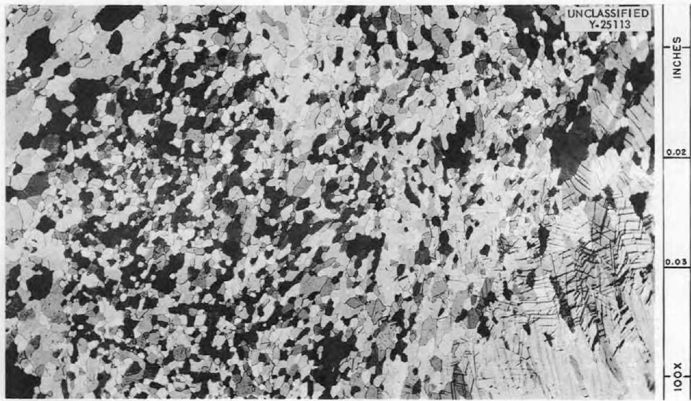  
Fig. 1.1.5. Sample L-10A-2 Under Sensitive Tint Illumination. 100X. Etchant: HNO $_3$ H $_3$ PO $_4$ CH $_3$ COOH.

# 1.2. CORROSION

E.E.Hoffman W.H.Cook D.H.Jansen Metallurgy Division

# LITHIUM PURIFICATION: METHODS OF REDUCING THE NITROGEN AND OXYGEN CONTENT

Various means for purifying lithium, including low-temperature filtration, vacuum distillation, and getting with active refractory metals, are being studied. Commercially produced lithium usually contains oxygen and nitrogen in quantities of several hundred to several thousand parts per million, and techniques for reducing the total oxygen and nitrogen impurity content to less than 50 ppm are being sought. Lithium as pure as it is practical to produce is needed (1) for corrosion tests of container metals in which the effects of minor amounts of oxide and nitride can be determined and (2) for use as feed material in the production of low-oxygen-content yttrium metal.

# Solubility of Nitrogen and Oxygen in Lithium

In order to determine whether cold trapping and low-temperature filtration would be practical methods for reducing the nitrogen and oxygen concentration of lithium, several experiments were conducted to obtain solubility data. Preliminary data were obtained first on the rate of solution and the equilibrium solubility of lithium nitride

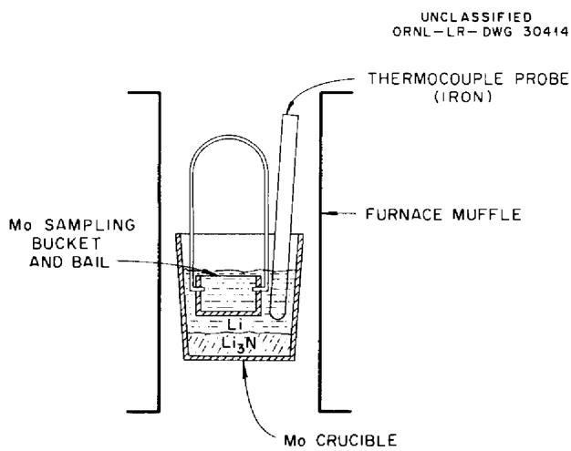  
Fig. 1.2.1. Apparatus for Measuring the Solubility of $\mathsf{Li}_3\mathsf{N}$ in Lithium in a Purified Argon Atmosphere.

in molten lithium at $752^{\circ}\mathrm{F}$ . The test was conducted, in a purified argon atmosphere, in the apparatus shown in Fig. 1.2.1. Specially prepared lithium nitride was fused in the bottom of the molybdenum crucible and allowed to solidify prior to the introduction of the lithium metal. The lithium nitride was fused prior to the test to reduce the pickup of particulate lithium nitride during sampling. The results of the test, as tabulated below, indicate that the solubility of nitrogen at $752^{\circ}\mathrm{F}$ ( $400^{\circ}\mathrm{F}$ above the melting point of lithium) is quite high:

<table><tr><td>Time (min)</td><td>Nitrogen (wt %)</td></tr><tr><td>0</td><td>0.11</td></tr><tr><td>30</td><td>0.99</td></tr><tr><td>60</td><td>1.50</td></tr><tr><td>180</td><td>2.10</td></tr><tr><td>240</td><td>2.86</td></tr><tr><td>300</td><td>3.14</td></tr></table>

In order to reduce the possibility of trapping impurity particles in the samples and yet obtain a large amount of sample for more complete analyses, a more refined solubility test rig was designed and built. This stainless steel apparatus is shown in Fig. 1.2.2. The test unit was loaded in a purified inert atmosphere with $60\mathrm{g}$ of lithium metal and sufficient lithium nitride or oxide to give a total oxygen or nitrogen content of $5\mathrm{wt}\%$ . The system was sealed under 1 atm of pressure and placed in a furnace. At the end of the test run, the system was evacuated to a pressure of less than $5\mu$ . The test unit was then tilted, as shown in Fig. 1.2.2, to submerge the filter head. Argon gas pressure was then applied to the system to force lithium into the evacuated sampling tube, which was also at the test temperature. In order to avoid segregation of the impurities during solidification, the sampling tube was plunged into an oil-dry-ice bath. The stainless steel sampling tube was replaced with

UNCLASSIFIED ORNL-LR-DWG 24830

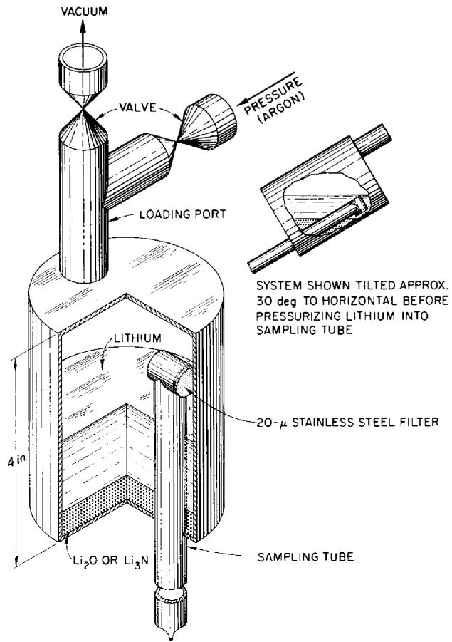  
Fig. 1.2.2. Stainless Steel Test Rig for Determining the Solubility of Oxides and Nitrides in Lithium.

one made of titanium for tests of oxygen solubility to facilitate activation analysis. The results of these tests are given in Table 1.2.1. These preliminary data indicate that low-temperature filtration and cold trapping are not promising methods of lithium purification if the nitride or oxide impurity content is to be reduced to below several hundred parts per million.

# Filtration

Early filtering experiments conducted by GEANPD indicated, in agreement with the conclusion above, that low-temperature filtration would not reduce the nitrogen and oxygen content.2 Also,

the Nuclear Development Corporation of America (NDA) has reported unsuccessful attempts to purify lithium by filtration at temperatures only slightly above the melting point.3 Filtration experiments conducted at ORNL have further substantiated these findings, as shown in Table 1.2.2. The slight increases in nitrogen and oxygen content upon filtering may be attributed either to inhomogeneities in the lithium or to contamination during or following sampling. It appears therefore that low-temperature filtration and cold trapping may be beneficial only in reducing the nitrogen and oxygen content of lithium that is very highly contaminated with nitrogen or oxygen.

# Vacuum Distillation

Vacuum distillation of lithium as a means of reducing the nitrogen and oxygen content has been studied at ORNL and at NDA. The NDA system has been used successfully to reduce the nitrogen content to below 10 ppm. In the NDA system, titanium sponge is added to the still prior to distillation to getter the nitrogen and to assist in the purification. No titanium was added to the still in the distillation performed at ORNL. The ORNL distillation system and allied equipment are shown in Figs. 1.2.3 and 1.2.4. Approximately $1100\mathrm{g}$ of lithium is charged to the still and $80\%$ of each charge is distilled into the receiver. The remaining $20\%$ is discharged through the drain line at the completion of each distillation. The distillation rates average $30\mathrm{g / hr}$ or $2.5\mathrm{g / hr}$ per square inch of liquid-vapor interface area.

Six distillations have been performed to date, and the nitrogen and oxygen content of the distillate has been of the same magnitude as or higher than that of the lithium charged into the still in all distillations. The results of the six distillations are given in Table 1.2.3. The system operated in a satisfactory manner except as noted in the table. The operating conditions were identical with those used at NDA, insofar as possible, in order to ascertain the effectiveness of distillation when no titanium getter was added to the still. The results indicate that distillation without gettering is not a practical means of

Table 1.2.1. Solubility of Nitrogen and Oxygen in Molten Lithium   

<table><tr><td>Test No.</td><td>Solute*</td><td>Filtering Temperature (℃)</td><td>Aging Time Prior to Sampling (hr)</td><td>Sample No.</td><td>Solubility (ppm)</td><td>Remarks</td></tr><tr><td rowspan="3">1</td><td rowspan="3">Li3N</td><td rowspan="3">300</td><td rowspan="3">64</td><td>1</td><td>4,060</td><td>Samples slowly cooled; considerable</td></tr><tr><td>2</td><td>7,560</td><td>segregation occurred</td></tr><tr><td>3</td><td>19,600</td><td></td></tr><tr><td rowspan="2">2</td><td rowspan="2">Li3N</td><td rowspan="2">250</td><td rowspan="2">24</td><td>1</td><td>1,000</td><td>Samples quenched to prevent</td></tr><tr><td>2</td><td>920</td><td>segregation</td></tr><tr><td rowspan="3">3</td><td rowspan="3">Li3N</td><td rowspan="3">250</td><td rowspan="3">72</td><td>1</td><td>1,080</td><td>Samples quenched</td></tr><tr><td>2</td><td>1,380</td><td></td></tr><tr><td>3</td><td>1,400</td><td></td></tr><tr><td rowspan="2">4</td><td rowspan="2">Li3N</td><td rowspan="2">300</td><td rowspan="2">24</td><td>1</td><td>1,760</td><td>Samples quenched</td></tr><tr><td>2</td><td>1,900</td><td></td></tr><tr><td rowspan="2">5</td><td rowspan="2">Li2O</td><td rowspan="2">250</td><td rowspan="2">24</td><td>1</td><td>19,700</td><td>Samples quenched</td></tr><tr><td>2</td><td>22,700</td><td></td></tr></table>

*The test chamber was loaded with 60 g of lithium metal and 5 wt % nitrogen (as Li₃N) or oxygen (as Li₂O). The lithium used contained 1076 ppm N₂ and 550 ppm O₂.

Table 1.2.2. Results of Tests of Low-Temperature Filtration as a Means of Purifying Lithium   

<table><tr><td></td><td colspan="3">Impuritiesa(ppm)</td></tr><tr><td></td><td>O2</td><td>N2</td><td>C</td></tr><tr><td>As-received lithiumb</td><td></td><td></td><td></td></tr><tr><td>Sample 1</td><td>334</td><td>560</td><td>15</td></tr><tr><td>2</td><td>446</td><td>645</td><td></td></tr><tr><td>Filtered lithiumc</td><td></td><td></td><td></td></tr><tr><td>Sample 1</td><td>595</td><td>680</td><td>11</td></tr><tr><td>2</td><td>518</td><td>760</td><td>18</td></tr></table>

$^{a}$ Analytical methods: (1) activation analysis for oxygen, (2) steam distillation followed by colorimetric analysis for nitrogen, and (3) spectrophotometric determination of lithium carbide in metallic lithium as the acetylene-silver perchlorate complex.   
${}^{b}$ Packed by vendor in stainless steel gastight con-tainers under helium.   
${}^{c}$ Transferred through ${5.2\mu }$ stainless steel filter at ${300}^{ \circ  }\mathrm{C}$ following aging at ${300}^{ \circ  }\mathrm{C}$ .

purification. Lithium samples from all the purification tests are being exchanged between NDA and ORNL in order to check the reproducibility of the analytical results at the two installations.

# Getting with Zirconium, Titanium, and Calcium

The results of the filtration, distillation, and solubility tests described above indicated that getting of the nitrogen and oxygen by active metals might be the best method of purification. The free energies of formation of various oxide and nitride compounds of interest were therefore examined (Table 1.2.4) in order to select the getting metals to be tested. As may be seen, a considerable number of metals would probably getter nitrogen from lithium metal, but the oxide of lithium is extremely stable and only a few metals, among them calcium, yttrium, thorium, and beryllium, have oxides whose free-energy values indicate that they might be suitable as getters for reducing the oxygen content of lithium. Studies of the purification of lithium by getting have thus far been limited to tests with zirconium, titanium, and calcium.

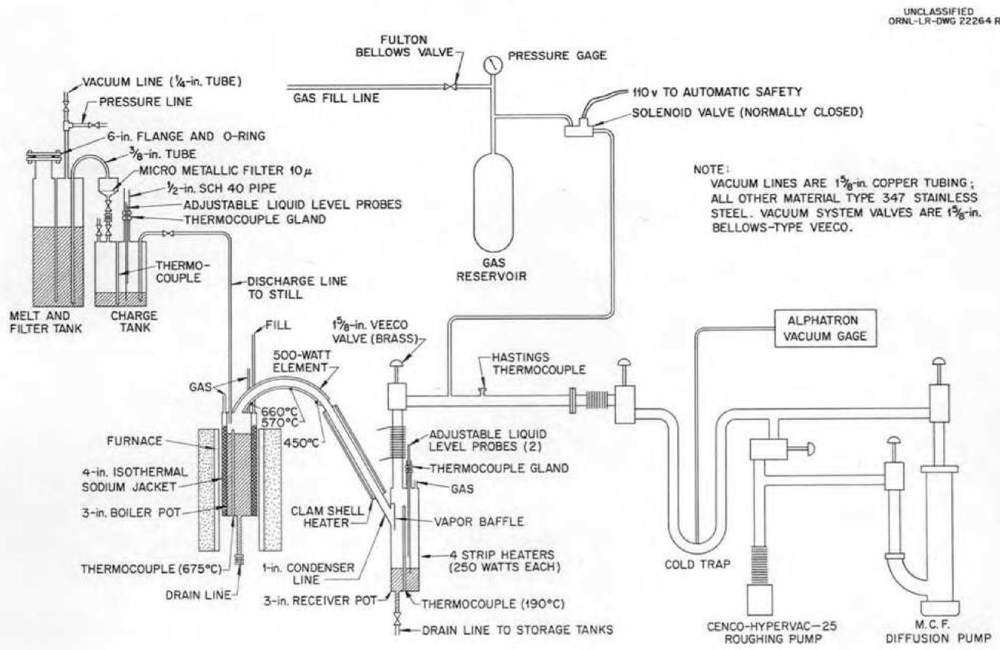  
Fig. 1.2.3. Diagram of Lithium Distillation System.

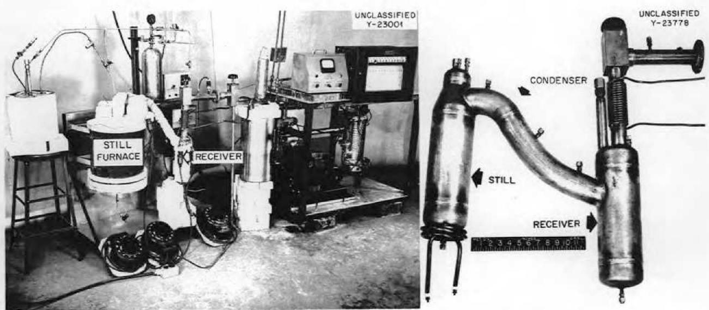  
Fig. 1.2.4. Lithium Distillation System With and Without Furnaces and Insulation.

Table 1.2.3. Effect of Vacuum Distillation at $650^{\circ}\mathrm{C}$ on the Nitrogen and Oxygen Content of Lithium   
Vacuum at cold trap with system cold: $2 \times 10^{-5} \mathrm{~mmHg}$ Vacuum at cold trap with system at temperature: $1 \times 10^{-4} \mathrm{~mmHg}$   

<table><tr><td>Distillation No.</td><td>Nitrogen* (ppm)</td><td>Oxygen* (ppm)</td><td>Remarks</td></tr><tr><td>Charge to still (1100 g)</td><td>1170, 1250</td><td>226</td><td>As received and filtered at 300°C through a 5-μ filter</td></tr><tr><td rowspan="2">1</td><td>1400, 1300</td><td>370, 285</td><td></td></tr><tr><td>Av 1350</td><td>Av 327</td><td></td></tr><tr><td rowspan="2">2</td><td>1260, 1150, 885, 1010</td><td>700, 389, 376, 533</td><td></td></tr><tr><td>Av 1076</td><td>Av 500</td><td></td></tr><tr><td rowspan="2">3</td><td>3000, 1900</td><td>375</td><td>New still (4 in. pipe); condenser leaked near end of run</td></tr><tr><td>Av 2450</td><td></td><td></td></tr><tr><td rowspan="2">4</td><td>4200, 5300</td><td>1120, 1210</td><td>Some contamination of system occurred during repair of leak following distillation No. 4</td></tr><tr><td>Av 4750</td><td>Av 1165</td><td></td></tr><tr><td rowspan="2">5</td><td>1600, 1600, 2000</td><td>203, 198</td><td></td></tr><tr><td>Av 1733</td><td>Av 200</td><td></td></tr><tr><td rowspan="2">6</td><td>1800, 2100, 2700, 3100</td><td>701, 758, 688, 630,</td><td></td></tr><tr><td>Av 2425</td><td>Av 694</td><td></td></tr></table>

*Each value is for a separate analysis or is an average, as indicated, of the values given.

Zirconium Gettering Test. - Only one getting experiment with zirconium has been conducted thus far. The appearance of the 0.022-in.-thick zirconium getter sheet before and after the test may be seen in Fig. 1.2.5, and the test results are summarized in Table 1.2.5. Metallographic sections of the zirconium specimen are shown in Fig. 1.2.6. The results of chemical analyses of the lithium and the zirconium indicate that zirconium is an efficient nitrogen getter under the conditions of this test. The absence of an increase in the oxygen content of the zirconium is in agreement with the free-energy data given in Table 1.2.4. The zirconium sheet weighed 33.913 g before the test and 33.933 g after the test; that is, there was a net weight gain of 0.65 mg/in. $^{2}$ .

Titanium Gettering Tests. - Three lithium purification tests were run with titanium foil as the gettering agent, and two tests were run with titanium sponge. It was realized that much more efficient gettering would be obtained with sponge, because of the larger surface area per unit of weight, but foil was used in the preliminary

experiments so that precise data on the gettering rates and the formation of oxide or nitride layers could be obtained by x-ray and metallographic examinations.

The conditions of the first two tests with titanium foil were similar except for the test temperature, which was $1400^{\circ}\mathrm{F}$ in one test and $1500^{\circ}\mathrm{F}$ in the other. The test conditions and results are given in Tables 1.2.6 and 1.2.7. The results of both experiments show that titanium will getter nitrogen from lithium quite rapidly at both 1400 and $1500^{\circ}\mathrm{F}$ . The rate of nitrogen removal from the lithium was highest in the first 24-hr test period at $1500^{\circ}\mathrm{F}$ , as would be expected, since the diffusion rate of nitrogen into the titanium is greater at the higher temperature. The considerable decrease in the rate of removal during the second 24-hr test period emphasizes the need for a high ratio of titanium surface to lithium volume. As would be expected from the free-energy data, titanium is not effective in getting oxygen from lithium. The considerable increase in the oxygen content of the lithium is not understood; but, since the analytical

Table 1.2.4. Free Energies of Formation of Various Oxide and Nitride Compounds of Metals of Interest as Getters in the Purification of Lithium   

<table><tr><td rowspan="2">Metal</td><td rowspan="2">Compound</td><td colspan="3">-ΔF° (kcal per gram atom of nonmetal)</td></tr><tr><td>At 25°C</td><td>At 223°C</td><td>At 727°C</td></tr><tr><td rowspan="2">Lithium</td><td>Li2O(a)</td><td>138</td><td>130</td><td>123</td></tr><tr><td>Li3N(b)</td><td>37</td><td></td><td></td></tr><tr><td rowspan="2">Calcium</td><td>CaO(c)</td><td>144</td><td>139</td><td>128</td></tr><tr><td>1/2Ca3N2(b)</td><td>47</td><td></td><td></td></tr><tr><td rowspan="2">Yttrium</td><td>1/3Y2O3(d)</td><td>143</td><td></td><td></td></tr><tr><td>YN(b)</td><td>64</td><td></td><td></td></tr><tr><td rowspan="2">Thorium</td><td>1/2ThO2(e)</td><td>140</td><td>136</td><td>125</td></tr><tr><td>1/4Th3N4(b)</td><td>71</td><td></td><td></td></tr><tr><td rowspan="2">Beryllium</td><td>BeO(c)</td><td>139</td><td>134</td><td>123</td></tr><tr><td>1/2Be3N2(b)</td><td>61</td><td></td><td></td></tr><tr><td rowspan="2">Uranium</td><td>1/2UO2(c)</td><td>128</td><td>125</td><td>117</td></tr><tr><td>UN(b)</td><td>75</td><td></td><td></td></tr><tr><td rowspan="2">Barium</td><td>BaO(c)</td><td>126</td><td>120</td><td>107</td></tr><tr><td>1/2Ba3N2(b)</td><td>37</td><td></td><td></td></tr><tr><td rowspan="2">Zirconium</td><td>1/2ZrO2(f)</td><td>124</td><td>119</td><td>108</td></tr><tr><td>ZrN(f)</td><td>75</td><td>71</td><td>60</td></tr><tr><td rowspan="2">Titanium</td><td>1/2TiO2(g)</td><td>101</td><td>98</td><td>88</td></tr><tr><td>TiN(b)</td><td>73</td><td></td><td></td></tr><tr><td rowspan="2">Columbium</td><td>1/5Cb2O5(c)</td><td>85</td><td></td><td></td></tr><tr><td>CbN(b)</td><td>53</td><td></td><td></td></tr><tr><td rowspan="2">Molybdenum</td><td>1/2MoO2(c)</td><td>60</td><td></td><td></td></tr><tr><td>Mo2N(b)</td><td>10</td><td></td><td></td></tr></table>

$(a)_{C}$ . E. Weber and L. F. Epstein, J. Met. and Ceramics, Issue No. 3, TID-67, p 85-110 (May 1949).   
$(b)_{L}$ . Brewer et al., Nail. Nuclear Energy Ser. Div IV 19B, 44 ff. (1950).   
$(c)_{F.D.Rossini et al.,Natl.Bur.Standards(U.S.)Circ.500(Feb.1,1952).}$   
$(d)$ I. E. Campbell (ed.), High-Temperature Technology, Wiley, New York, 1956.   
$(e)_{0}$ . Kubaschewski and E. L. Evans (eds.), Metallurgical Thermo Chemistry, vol 1, Academic Press, New York, 1951.   
$\langle f\rangle$ B. Lustman and F. Kerze, Jr. (eds.), The Metallurgy of Zirconium, McGraw-Hill, New York, 1955.   
$(g)_{F}$ . D. Richardson and J. H. E. Jeffes, J. Iron Steel Inst. (London) 160, 261 (1948).

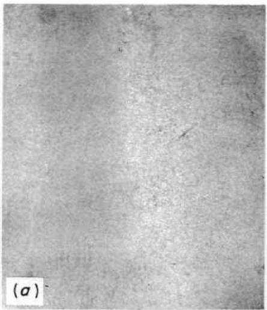  
UNCLASSIFIED Y-24728

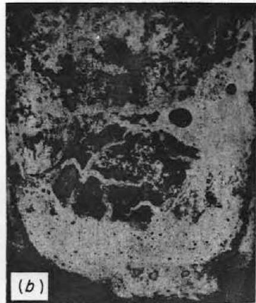

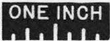  
Fig. 1.2.5. Zirconium Sheet (a) Before and (b) After Exposure to Lithium at $1400^{\circ}\mathrm{F}$ for 24 hr. Surface colors on the zirconium specimen after the test were bronze and purple.

UNCLASSIFIED Y-25514

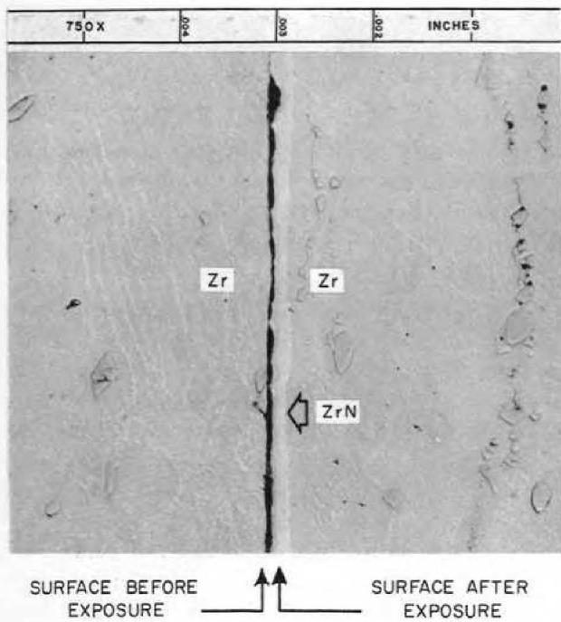  
Fig. 1.2.6. Metallographic Sections of Zirconium Specimens (a) Before and (b) After Exposure to Lithium for 24 hr at $1400^{\circ}\mathrm{F}$ . Note 0.0002-in. layer of $\mathsf{ZrN}$ on surface of exposed specimen. As polished, 750X. Reduced $28\%$ .

Volume of lithium: 23.4 in.  
Weight of lithium: 180 g  
Surface area of zirconium sheet: 30.6 in.²  
Ratio of zirconium surface area to lithium volume: 1.31 in.²/in.³  
Container: Armco iron  
Test temperature: $1400^{\circ}$ F

Table 1.2.5. Results of Lithium-Zirconium Settering Test No. 1   

<table><tr><td rowspan="2">Material Analyzed</td><td colspan="2">Impurity Content (ppm)</td></tr><tr><td>N2</td><td>O2</td></tr><tr><td>Lithium</td><td></td><td></td></tr><tr><td>Before test</td><td>1100</td><td></td></tr><tr><td>After 24 hr</td><td>630</td><td></td></tr><tr><td>Zirconium</td><td></td><td></td></tr><tr><td>Before test</td><td>70</td><td>1000</td></tr><tr><td>After 24 hr</td><td>510</td><td>1000</td></tr></table>

Test temperature: $1400^{\circ}\mathrm{F}$

Volume of lithium: 103.9 in.

Weight of lithium: 800 g

Surface area of titanium foil: 280 in.²

Ratio of titanium surface area to lithium volume: 2.69 in.²/in.³

Container: type 347 stainless steel

Weight of titanium foil:

Before test: 128.910 g

After test: 129.578 g

Net gain: 0.668 g or 2.38 mg/in.²

Table 1.2.6. Results of Lithium-Titanium Gettering Test No. 1   

<table><tr><td rowspan="2">Material Analyzed</td><td colspan="2">Impurity Content (ppm)</td><td rowspan="2">Remarks</td></tr><tr><td>N2</td><td>O2</td></tr><tr><td>Lithium</td><td></td><td></td><td></td></tr><tr><td>Before test</td><td>3100</td><td>200</td><td></td></tr><tr><td>After 24 hr</td><td>1600</td><td>1230</td><td>Rate of N2loss (0-24 hr), 62 ppm/hr</td></tr><tr><td>After 48 hr</td><td>900</td><td>2280</td><td>Rate of N2loss (24-48 hr), 28 ppm/hr</td></tr><tr><td>Titanium foil (0.012 in. thick)</td><td></td><td></td><td></td></tr><tr><td>Before test</td><td>73</td><td>1500</td><td></td></tr><tr><td>After 24 hr</td><td>1800</td><td>1400</td><td>X-ray examination of surface showed Ti, Ti(N), and TiN; metallographic examination showed 0.0002-in. layer of TiN</td></tr><tr><td>After 48 hr</td><td>2000</td><td>1500</td><td>X-ray examination of surface showed Ti, Ti(N), and TiN; metallographic examination showed 0.0004-in. layer of TiN</td></tr></table>

procedure (activation analysis) employed for determining the oxygen content is difficult and segregation of impurities in the test samples is a problem, it is possible that the increase in the oxygen content is an analysis error. Material balances indicate that the increased nitrogen content of the titanium accounts for only approximately $40\%$ of the observed weight increase of the foil. The surface color of the titanium was bronze following 48 hr of exposure to lithium at $1400^{\circ}\mathrm{F}$ and indigo following 48 hr of exposure at $1500^{\circ}\mathrm{F}$ . Polished and etched cross sections of the titanium specimens following the various tests are shown in Fig. 1.2.7.

In test No. 3, which was run at $1500^{\circ}\mathrm{F}$ for a total of 192 hr, the stainless gettering container

was loaded with 280 in.² of titanium foil that remained in the lithium for the entire test. This foil was wrapped on a stainless steel holder as shown in Fig. 1.2.8. Small titanium tabs with 6-in.² surface areas were inserted into the molten lithium during certain time periods of the test run as given in Table 1.2.8. The purpose of this was to determine the effectiveness of a fresh getter surface as the nitrogen content of the lithium decreased. The analytical data obtained from this test are presented in Tables 1.2.8 and 1.2.9. As may be seen, the nitrogen content of the lithium was lowered significantly during the experiment, and the rate of nitrogen pickup by fresh titanium did not decrease appreciably as the nitrogen content of the lithium

Table 1.2.7. Results of Lithium-Titanium Gettering Test No. 2   

<table><tr><td>Test temperature: 1500°F</td></tr><tr><td>Volume of lithium: 94.8 in.3</td></tr><tr><td>Weight of lithium: 730 g</td></tr><tr><td>Surface area of titanium foil: 283 in.2</td></tr><tr><td>Ratio of titanium surface area to lithium volume: 2.98 in.2/in.3</td></tr><tr><td>Container: type 347 stainless steel</td></tr><tr><td>Weight of titanium foil:</td></tr><tr><td>Before test: 129.287 g</td></tr><tr><td>After test: 130.292 g</td></tr><tr><td>Net gain: 1.005 g or 3.55 mg/in.2</td></tr></table>

<table><tr><td rowspan="2">Material Analyzed</td><td colspan="2">Impurity Content (ppm)</td><td rowspan="2">Remarks</td></tr><tr><td>N2</td><td>O2</td></tr><tr><td>Lithium</td><td></td><td></td><td></td></tr><tr><td>Before test</td><td>2450</td><td>370</td><td></td></tr><tr><td>After 24 hr</td><td>740</td><td>910</td><td>Rate of N2loss (0-24 hr), 71 ppm/hr</td></tr><tr><td>After 48 hr</td><td>380</td><td>730</td><td>Rate of N2loss (24-48 hr), 15 ppm/hr</td></tr><tr><td>Titanium foil (0.012 in. thick)</td><td></td><td></td><td></td></tr><tr><td>Before test</td><td>73</td><td>1500</td><td></td></tr><tr><td>After 24 hr</td><td>1600</td><td>1000</td><td>X-ray examination of surface showed Ti(N) and TiN; metallographic examination showed 0.0004-in. layer of TiN</td></tr><tr><td>After 48 hr</td><td>3200</td><td>1400</td><td>X-ray examination of surface showed Ti(N) and TiN; metallographic examination showed 0.0006-in. layer of TiN</td></tr></table>

UNCLASSIFIED Y-25413

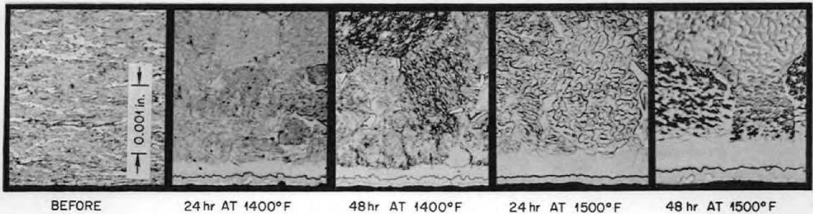  
Fig. 1.2.7. Surfaces of Titanium Gettering Specimens Before and After Exposure to Molten Lithium. Exposed surface at bottom. Note titanium nitride layer. Etchant: HF- $\mathsf{HNO}_3$ -glyceria, Reduced $28\%$

# ANP PROJECT PROGRESS REPORT

dropped from 550 to 100 ppm. At some nitrogen content in the lithium of less than 100 ppm very little titanium nitride formed on the fresh titanium surface (see 120 to 192 hr specimen), and, instead, massive quantities of nickel were picked up by the titanium from the lithium. Titanium tabs inserted at various periods are shown in Fig.

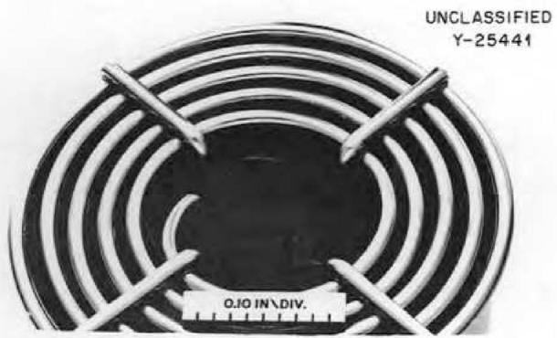

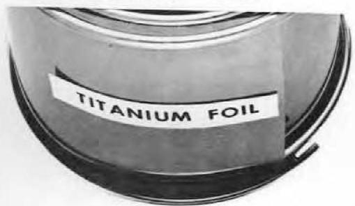  
STAINLESS STEEL HOLDER   
Fig. 1.2.8. Titanium Gettering Foil and Stainless Steel Support Assembly for Foil.

1.2.9; the structure change resulting from nickel alloying may be seen. It appears therefore that stainless steel is probably not a satisfactory container material for purification tests. The nickel, iron, and chromium content of the lithium samples was lower than expected at the $1500^{\circ}\mathrm{F}$ sampling temperature. It has been reported that

Test temperature: $1500^{\circ}\mathrm{F}$

Volume of lithium: 102.3 in.

Weight of lithium: 788 g

Surface area of titanium foil: 280 in.²

Ratio of titanium surface area to lithium volume: 2.73 in.²/in.³

Container: type 347 stainless steel

Table 1.2.8. Analyses of Lithium Samples from Lithium-Titanium Settering Test No. 3   

<table><tr><td rowspan="2">Lithium Samples</td><td colspan="5">Impurity Content (ppm)</td></tr><tr><td>N2</td><td>O2</td><td>Fe</td><td>Ni</td><td>Cr</td></tr><tr><td>Before test</td><td>1400</td><td></td><td></td><td></td><td></td></tr><tr><td>After 24 hr</td><td>550</td><td></td><td></td><td></td><td></td></tr><tr><td>After 48 hr</td><td>350</td><td>1080</td><td>40</td><td>90</td><td>49</td></tr><tr><td>After 72 hr</td><td>200</td><td>2790</td><td>32</td><td>70</td><td>23</td></tr><tr><td>After 96 hr</td><td>100</td><td>1750</td><td>61</td><td>58</td><td>47</td></tr><tr><td>After 120 hr</td><td>125</td><td>694</td><td>29</td><td>65</td><td>13</td></tr><tr><td>After 192 hr</td><td>53</td><td>675</td><td></td><td></td><td></td></tr></table>

Table 1.2.9. Analyses of Titanium Samples from Lithium-Titanium Gettering Test No. 3   

<table><tr><td rowspan="2">Titanium Samples</td><td colspan="5">Impurity Content (wt %)</td><td rowspan="2">Weight Gain of Foil During Exposure (mg/in.2)</td></tr><tr><td>N2</td><td>O2</td><td>Fe</td><td>Ni</td><td>Cr</td></tr><tr><td>Before test</td><td>0.044</td><td>0.14</td><td>0.17</td><td>0.017</td><td>0.010</td><td></td></tr><tr><td>0-24 hr</td><td>0.250</td><td>0.16</td><td>0.19</td><td>0.025</td><td>0.014</td><td>1.8</td></tr><tr><td>24-48 hr</td><td>0.140</td><td>0.17</td><td>0.18</td><td>0.027</td><td>0.012</td><td>0.9</td></tr><tr><td>48-72 hr</td><td>0.180</td><td>0.16</td><td>0.35</td><td>0.039</td><td>0.019</td><td>1.2</td></tr><tr><td>76-92 hr</td><td>0.140</td><td>0.14</td><td>0.16</td><td>0.033</td><td>0.014</td><td>1.3</td></tr><tr><td>96-192 hr*</td><td>0.200</td><td>0.17</td><td>0.21</td><td>0.90</td><td>0.022</td><td>12.4</td></tr><tr><td>120-192 hr**</td><td>0.061</td><td>0.16</td><td>0.25</td><td>10.10</td><td>0.117</td><td>57.9</td></tr><tr><td>0-192 hr</td><td>0.390</td><td>0.15</td><td>0.26</td><td>0.23</td><td>0.011</td><td>4.9</td></tr></table>

\*Note high nickel content and large weight gain during exposure period. \*\*Note low nitrogen content, high nickel content, high chromium content, and large weight gain.

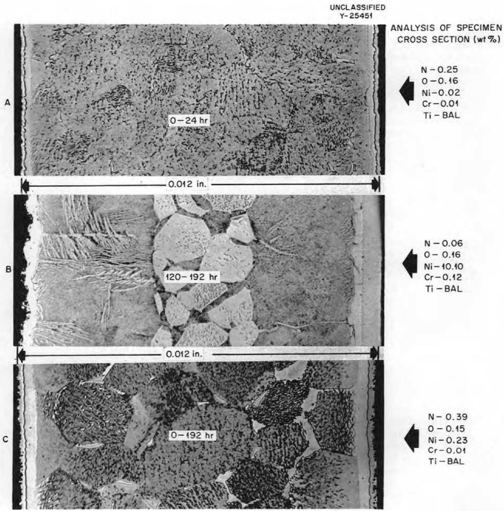  
Fig. 1.2.9. Titanium Specimens from Lithium-Titanium Settering Test No. 3. (a) Tab exposed during 0- to 24-hr test period. (b) Tab exposed during 120- to 192-hr test period. Note extensive phase changes as a result of high nickel pickup. (c) Specimen exposed during 0- to 192-hr test period. Etchant: $25\%$ HF- $25\%$ HNO $_3$ - $50\%$ glyceria. Reduced $20\%$ .

the solubility of nickel in lithium is 1580 ppm at $1200^{\circ}\mathrm{F}$ .

Analyses of the stainless steel container showed (Table 1.2.10) that stainless steel does not contribute significant amounts of nitrogen to the lithium. There was some mass transfer of the titanium to the stainless steel container wall.

Table 1.2.10. Results of Analyses of Type 347 Stainless Steel Container Used in Lithium-Titanium Gettering Test No. 3   

<table><tr><td rowspan="2">Description of Sample</td><td colspan="3">Impurity Content (wt %)</td></tr><tr><td>O2</td><td>N2</td><td>Ti</td></tr><tr><td>Before test</td><td>0.048</td><td>0.086</td><td>0.032</td></tr><tr><td>After test</td><td></td><td></td><td></td></tr><tr><td>0.050-in. cut from inside wall</td><td>0.045</td><td>0.074*</td><td>0.055</td></tr><tr><td>0.050-in. cut from outside wall</td><td>0.029</td><td>0.038*</td><td></td></tr></table>

\*Oxide scale on outside removed before sample taken for analysis.

Approximately $20\mathrm{kg}$ of badly contaminated lithium was recently received from Nuclear Development Corporation of America. This lithium had been exposed to air in 2-lb lots for a considerable period of time. Of this material, $10.4\mathrm{kg}$ was pressurized through a $65 - \mu$ stainless steel filter at $250^{\circ}\mathrm{F}$ into a stainless steel container. A 4-in.-dia high-temperature finger containing $1.7\mathrm{kg}$ of titanium sponge extended from the bottom to the top of the 12-in.-dia stainless steel container.

The purification tank, the lithium, and the hot finger were maintained for 100 hr at $1000^{\circ}\mathrm{F}$ and then for another 100 hr at $1400^{\circ}\mathrm{F}$ . The nitrogen content of the lithium after filtering and before getting was 2250 ppm and after the getting was 33 ppm. The oxygen content, which was 950 ppm after getting, was not substantially altered by the purification treatment.

Lithium-Titanium-Calcium Gettering Test. - As indicated above, the purification of lithium by

getting the nitrogen and oxygen with titanium has only been partially successful. Titanium has been an excellent getter for nitrogen in all tests thus far, but it seems doubtful that it will be useful in reducing the oxygen content of lithium. In an effort to prepare low-oxygen-content lithium for use in yttrium metal production, gettering with both titanium metal sponge and triple-distilled calcium was tried. Calcium is one of the few metals whose oxide has a lower free energy than that of lithium oxide (see Table 1.2.4). There is considerable disagreement between the two available calcium-lithium phase diagrams, particularly with regard to the solubility of calcium in lithium at temperature slightly above the melting point of lithium. At $400^{\circ}\mathrm{F}$ for instance, Zamotorin gives the solubility of calcium in liquid lithium as approximately $3\%$ , while Wolfson gives a value of approximately $60\%$ .

The conditions and results of the first test with titanium and calcium are given in Fig. 1.2.10. As may be seen, the purification procedure reduced the nitrogen content to a very low value but the oxygen content actually increased. The fairly low calcium content (1.95%) of the lithium product as compared with the amount (10%) placed in tank No. 1 indicates either that the solubility of calcium in liquid lithium is lower than the value given by Wolfson or that the calcium alloyed with the titanium in tank No. 2 during the high-temperature gettering treatment. The latter possibility is thought to be the more probable.

# STATIC LITHIUM CORROSION OF YTTRIUM

# E. E. Hoffman

An yttrium metal specimen was exposed to static lithium for 100 hr at $1500^{\circ}\mathrm{F}$ in a columbium container tube. The test assembly and the considerable amount of yttrium metal which mass transferred from the test specimen to the inner wall of the columbium tube are shown in Fig. 1.2.11. The yttrium cylinder decreased in diameter from 0.210 in. to as low as 0.207 in. in some areas, and it lost 0.10 g/in.², or 2.4%, in weight. The extensive attack of the yttrium is illustrated

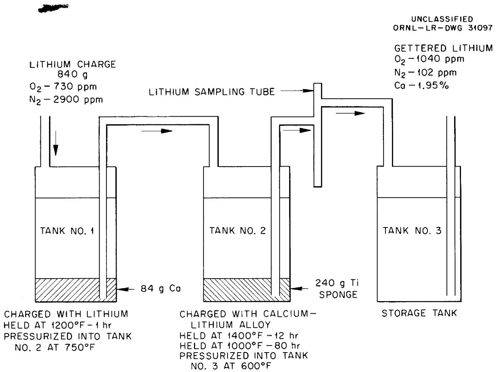  
Fig. 1.2.10. Test Conditions and Results of Lithium-Calcium-Titanium Settering Test No. 1.

in Fig. 1.2.12, which shows the exposed end of the yttrium cylinder following the test. The specimen, which was machine-ground prior to test, was heavily etched by the lithium, particularly along the grain boundaries. It appears therefore that the solubility of yttrium in lithium at the test temperature of $1500^{\circ}\mathrm{F}$ is appreciable.

A metallographic section of the yttrium specimen is shown in Fig. 1.2.13. A phase, which has tentatively been identified as yttrium oxide, may be seen along the surface and in the grain boundaries. The bulk oxygen content of the yttrium specimen increased from 1900 ppm before the exposure to lithium to 3000 ppm following test. The possibility of using yttrium metal as a gettering agent to reduce the nitrogen and particularly the oxygen concentration of the lithium to be used in the subsequent production of low-oxygen-content yttrium metal is being considered.

# STATIC LITHIUM CORROSION OF ZIRCONIUM-BASE ALLOYS

# E. E. Hoffman

Difficulty has been encountered in making ductile columbium tubing saddle welds with the use of columbium weld-filler rod. Therefore two zirconium-base alloys were tested for use as welding-rod alloys in the fabrication of various columbium corrosion test components. Both an $85\%$ Zr-15% Cb and an $80\%$ Zr-15% Cb-5% Mo alloy were used, and the binary alloy was found to yield the most ductile, crack-resistant weldments. The details of these welding studies have been reported,7 and the results of static corrosion tests are given below. In addition,

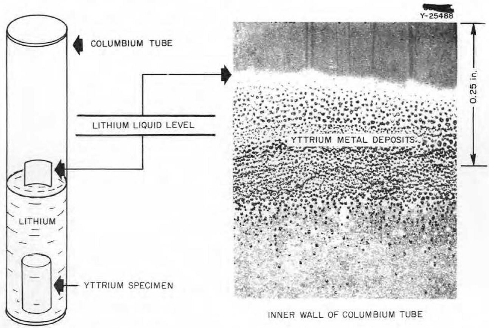  
Fig. 1.2.11. Yttrium-Lithium Corrosion Test Assembly and Inner Wall of Columbium Container After 100 hr at $1500^{\circ}\mathrm{F}$ . Reduced $18\%$ .

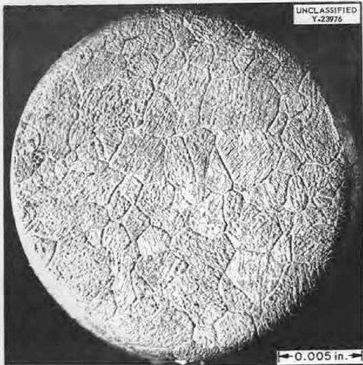  
Fig. 1.2.12. Surface of the End of an Yttrium Cylinder Following Exposure to Lithium for 100 hr at $1500^{\circ}\mathrm{F}$ . Reduced $34\%$ . (Secret with caption)

several columbium thermal-convection loops have been fabricated and tested in which the saddle welds and butt welds were made with the $85\%$ $\mathrm{Zr - 15\%}$ Cb alloy. During relatively short-time exposures to lithium in these loop tests (115 hr at $1500^{\circ}F$ and 36 hr at $1600^{\circ}F$ ), weld joints made with the binary alloy were found to have excellent corrosion resistance to the lithium. Details of these tests are given in the following section. In the static tests, specimens of the $85\%$ $\mathrm{Zr - 15\%}$ Cb alloy and the $80\%$ $\mathrm{Zr - 15\%}$ Cb- $5 \%$ Mo alloy were exposed to lithium for 100 hr at $1830^{\circ}F$ . The ternary-alloy specimen showed no weight change as a result of the exposure, and the binary alloy showed a very slight weight gain (0.001 g/in.2). As may be seen in Fig. 1.2.14, neither specimen was attacked. The $85\%$ $\mathrm{Zr - 15\%}$ Cb alloy was used to seal the columbium corrosion test capsule, and the appearance of the weld joint following the test is shown in Fig. 1.2.15. Some intergranular cracking occurred near the top of the weld joint as a result of the thermal treatment during the test. However, the test

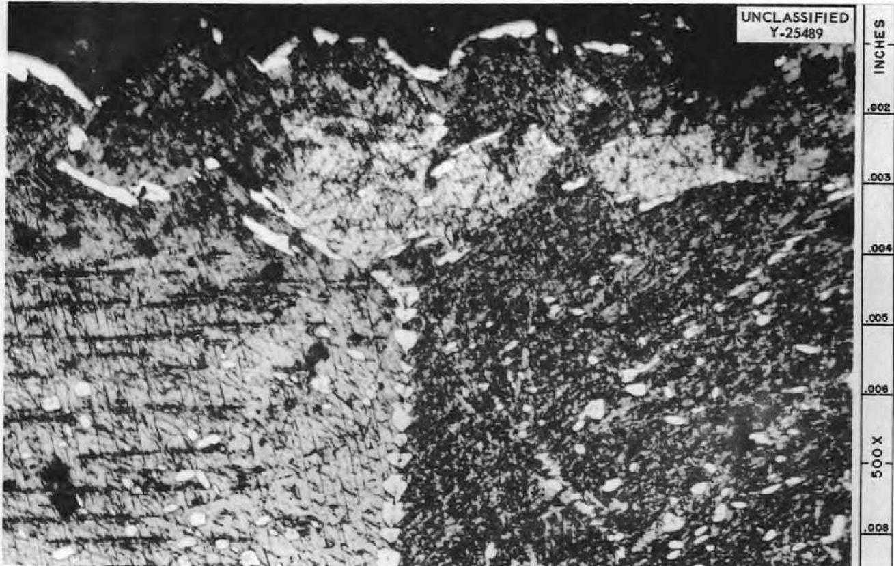

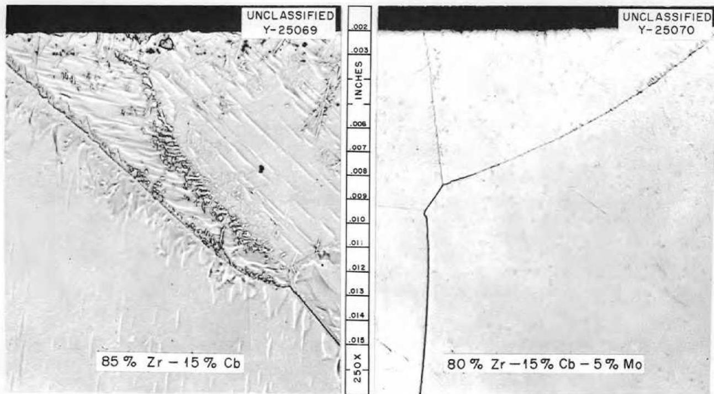  
Fig. 1.2.13. Metallographic Section of Yttrium Specimen Following Exposure to Lithium for 100 hr at $1500^{\circ}\mathrm{F}$ . White phase along surface (top) and the grain boundaries has tentatively been identified as yttrium oxide. Etchant: $\mathsf{HNO}_3$ - $\mathsf{HC}_2\mathsf{H}_3\mathsf{O}_2$ - $\mathsf{H}_2\mathsf{O}$ . 500X. (Secret with caption)   
Fig. 1.2.14. Metallographic Sections of Two Zirconium-Base Alloys Following Exposure to Lithium for 100 hr at $1830^{\circ}\mathrm{F}$ . Cathodic etch. 250X. Reduced $12\%$ . (Secret with caption)

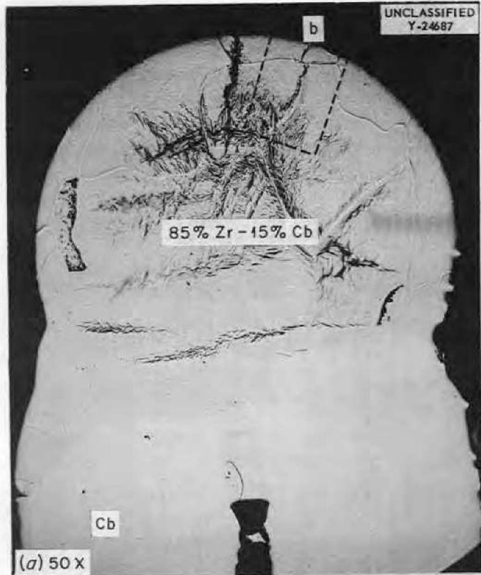

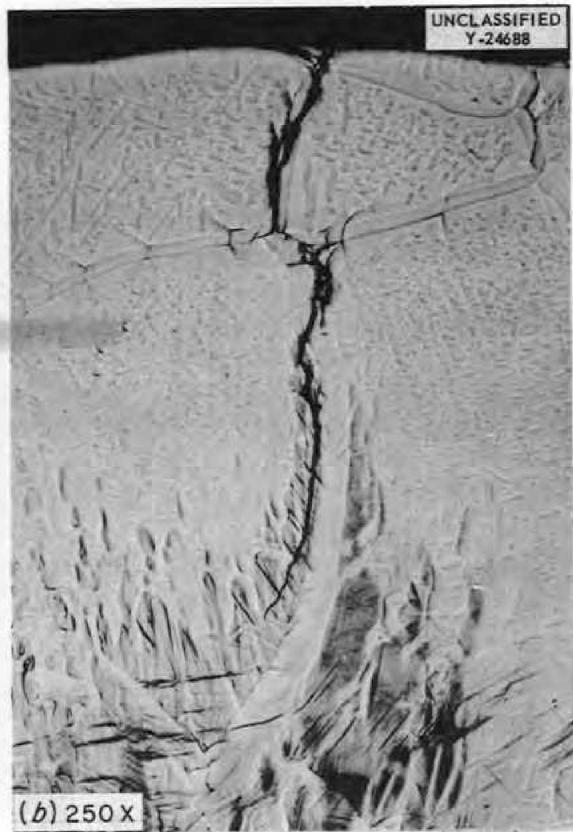  
Fig. 1.2.15. Section Through End of Columbium Tube Where $85\%$ Zr- $15\%$ Cb Alloy Was Used as Filler Rod To Seal the Crimped Edges. Specimen was exposed to lithium for 100 hr at $1830^{\circ}\mathrm{F}$ . Enlarged view of cracked section in (a) may be seen in (b). As polished, Reduced $17\%$ . (Secret with caption)

capsule did not fail. Although most of the cracking occurred in the brittle grain-boundary phase, some transgranular cracking was also detected. The diamond pyramid hardness of the Zr-Cb weld joint was 236 as brazed, and the weld was ductile. The hardness was essentially the same following the test, 238 DPH, but the joint was found to be extremely brittle, as shown in Fig. 1.2.15.

Although no attack was detected in the base material of the sintered columbium tube wall, heavy intergranular penetration by lithium was detected in the longitudinal tube weld and in the heat-affected zone of the weld. This attack was found to extend to a depth of approximately 0.025 in.

# THERMAL-CONVECTION LOOP TESTS OF LITHIUM IN COLUMBIUM

E. E. Hoffman

As was reported previously, three of the four columbium thermal-convection loops that have

circulated lithium have shown heavy intergranular attack. These earlier tests and the tests to be discussed here were conducted in a stainless steel vacuum chamber. The procedure used, as illustrated in Fig. 1.2.16, permits the testing of unclad columbium loops. The attainable vacuum (less than $5\mu$ with the loop at operating temperature) has been adequate to prevent oxidation or embrittlement of the columbium tube wall. The tests conducted to date have been of limited duration because of the high rate of penetration of the longitudinal tube wall weld by the lithium metal. The penetration is illustrated in Fig. 1.2.17(a), which is a picture of a section of tubing from the hot leg of loop No. 58, and in Fig. 1.2.17(b), which is a transverse section through the tube wall at the location of the leak. Both the loops (Nos. 58 and 59) to be described

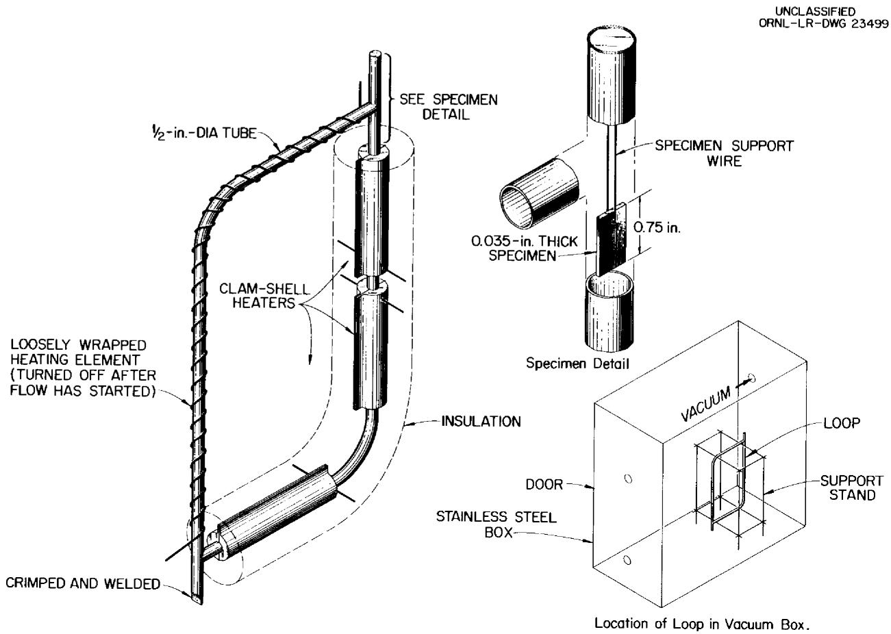  
Fig. 1.2.16. Thermal-Convection Loop in Vacuum Chamber.

here were constructed of $\frac{1}{2}$ -in.-OD, 0.035-in.-wall sintered columbium tubing and each contained an insert of arc-cast columbium tubing in the hot-leg section, as shown in Fig. 1.2.18. The tests of both loops were terminated by lithium penetration of the longitudinal tube wall weld. The extent of the attack in the hot and cold legs of these loops is given in Table 1.2.11. Very little attack was detected in the base material of the tube wall away from the weld and the heat-affected zone of the weld. In general, the intergranular attack in the heat-affected zones adjacent to weld areas was as deep as in the the weld zone itself. The metallographic sections showing the attack of the arc-cast insert specimen and of the sintered tube wall are presented in Figs. 1.2.18 and 1.2.19. A hardness survey (25-g load) was made on the tube wall, as shown in Fig. 1.2.18, in order to determine whether

there were any areas of embrittlement in the tube wall which might indicate pickup of elements such as nitrogen or oxygen either from the lithium or the atmosphere (vacuum) during test. No such embrittlement was detected, and, in fact, the arc-cast specimen was softer following test than before. The mechanism of the attack detected primarily in the weld zones and heat-affected areas of these loops is not known at present, but it is thought to be due to precipitation or segregation of impurities into the grain boundaries during the welding operation. This does not, however, explain the heavy attack of the arc-cast columbium tube inserts in both tests. The sheet specimens that were exposed in the hot legs in the position shown in Fig. 1.2.16 were examined for weight change. The specimen in loop 58 showed a weight loss of $7.5\mathrm{mg / in}$ .2, and the specimen in loop 59 gained $0.62\mathrm{mg / in}$ .2.

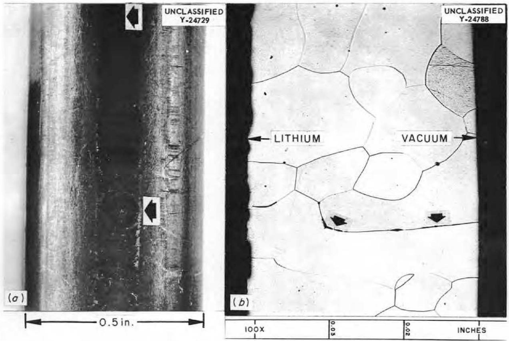  
Fig. 1.2.17. Section of Sintered Columbium Tubing from Hot Leg of Loop No. 58 (See Fig. 1.2.18 for Over-All View). (a) Columbium tube showing location of lithium penetration through longitudinal weld. (b) Metallographic section of tube wall weld zone showing penetration along grain boundary. Etchant: HF-H $_2$ SO $_4$ -HNO $_3$ -H $_2$ O. Reduced 6%. (Secret with caption)

Nitrogen and oxygen analyses of various sections of the columbium from loop No. 58 are given in Table 1.2.12. For these analyses, weld metal was cut from the tube wall and analyzed separately from the base material. The nitrogen and oxygen content was slightly higher in all the specimens tested than in the as-received material. Static capsule tests are presently being conducted on specimens of various grades of columbium sheet that were inert-gas welded with varying degrees of protection during welding to study the effect of pickup of contaminants such as oxygen and nitrogen on corrosion resistance.

# STATIC LITHIUM CORROSION OF COLUMBIUM

# E.E.Hoffman

A series of static tests was conducted in order to determine whether the type of environment (vacuum, 1 to $5\mu$ ) in which the thermal-convection

loop tests were conducted was in any way responsible for the intergranular attack of the weld and heat-affected zones of the loop material. Four sintered columbium tubes of the same material $(\mathsf{N}_2,0.016\% ;\mathsf{O}_2,0.027\%)$ as that used to construct loops 58 and 59 were loaded with lithium metal. Two tubes were then tested in a stainless steel container as illustrated schematically in Fig. 1.2.20(a), and the other two tubes were tested in the vacuum chamber as shown in Fig. 1.2.20(b). The tests were conducted at $1500^{\circ}\mathrm{F}$ for 100 hr. Argon gas (160 liters) containing 5 ppm $\mathsf{O}_2$ and 58 ppm $\mathsf{N}_2$ was circulated through the test assembly shown in Fig. 1.2.20(a). A dynamic vacuum of less than $5\mu$ was maintained around the test assembly shown in Fig. 1.2.20(b). At the completion of the tests, various sections of the test capsules were examined metallographically. The bath and vapor zones of each of the four columbium tubes were found to have

Table 1.2.11. Results of Columbium-Lithium Thermal-Convection Loop Tests Nos. 58 and 59   

<table><tr><td>Loop No.</td><td>Location of Specimen</td><td>Metallographic Data</td></tr><tr><td>58</td><td>Hot leg</td><td></td></tr><tr><td></td><td>Arc-cast insert</td><td>Attack to a depth of 7 mils</td></tr><tr><td></td><td>Sintered tube</td><td></td></tr><tr><td></td><td>Weld zone</td><td>Attack to a depth of 7 mils in most areas, complete penetration in several areas</td></tr><tr><td></td><td>Base material</td><td>No attack</td></tr><tr><td></td><td>Cold-leg sintered tube</td><td></td></tr><tr><td></td><td>Weld zone</td><td>Attack to a depth of 5 mils</td></tr><tr><td></td><td>Base material</td><td>No attack</td></tr><tr><td>59</td><td>Hot leg</td><td></td></tr><tr><td></td><td>Arc-cast insert</td><td>Attack to a depth of 16 mils</td></tr><tr><td></td><td>Sintered tube</td><td></td></tr><tr><td></td><td>Weld zone</td><td>Attack to a depth of 10 mils in most areas, complete penetration in several areas</td></tr><tr><td></td><td>Base material</td><td>Attack to a depth of 2 to 3 mils</td></tr><tr><td></td><td>Cold-leg sintered tube</td><td></td></tr><tr><td></td><td>Weld zone</td><td>Attack to a depth of 11 mils</td></tr><tr><td></td><td>Base material</td><td>No attack</td></tr></table>

Table 1.2.12. Results of Nitrogen and Oxygen Analyses of Columbium Sections from Thermal-Convection Loop No. 58   

<table><tr><td>Specimen</td><td>Nitrogen Content (wt %)</td><td>Oxygen Content (wt %)</td></tr><tr><td>Arc-cast columbium tubing insert</td><td></td><td></td></tr><tr><td>As received</td><td>0.009</td><td>0.045</td></tr><tr><td>After exposure to lithium in hot leg at 1600°F</td><td>0.023</td><td>0.054</td></tr><tr><td>Sintered columbium tubing</td><td></td><td></td></tr><tr><td>As received</td><td>0.016</td><td>0.027</td></tr><tr><td>After exposure to lithium in hot leg at 1600°F</td><td></td><td></td></tr><tr><td>Weld zone</td><td>0.025</td><td>0.041</td></tr><tr><td>Base material</td><td>0.027</td><td>0.035</td></tr><tr><td>After exposure to lithium in cold leg at 1300°F</td><td></td><td></td></tr><tr><td>Weld zone</td><td>0.023</td><td>0.039</td></tr><tr><td>Base material</td><td>0.023</td><td>0.038</td></tr></table>

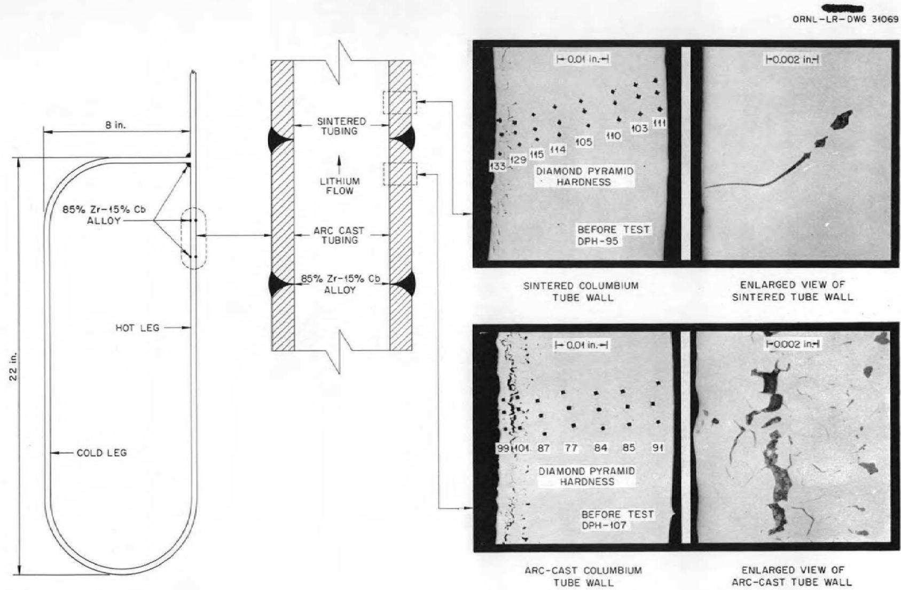  
Fig. 1.2.18. Cumbium-Lithium Thermal-Convection Loop No. 58 Which Operated for 36 hr with the Hot Leg at $1600^{\circ}$ F and the Cold Leg at $1300^{\circ}$ F. All photomicrographs show the specimens in the as-polished, unetched condition. Reduced 51.5%.

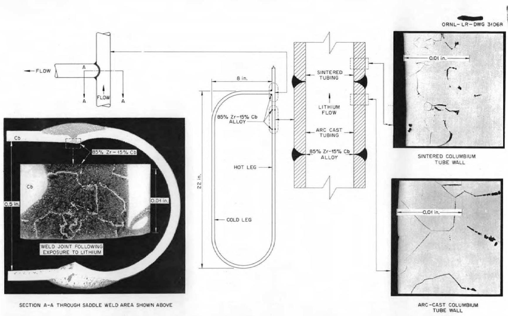  
Fig. 1.2.19. Cumbium-Lithium Thermal-Convection Loop No. 59 Which Operated for 115 hr with the Hot Leg at $1500^{\circ}$ F and the Cold Leg at $1300^{\circ}$ F. All photomicrographs show the specimens in the as-polished, unetched condition. Reduced $56\%$ .

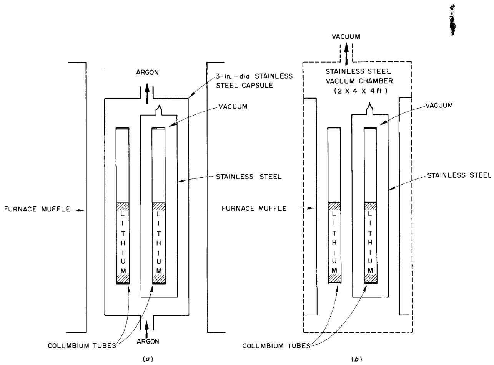  
Fig. 1.2.20. Columbium-Lithium Corrosion Test Assembly for Studying the Effect of the Environment Around the Test Capsule on Corrosion.

at least 25 mils of intergranular penetration, and, in several cases, there was complete intergranular penetration in the longitudinal weld zone and in the heat-affected zone of the tube wall. The base material of each of the four tube walls in regions away from the weld zone showed no attack. The nature of the attack in the weld and in the heat-affected zones of the tube wall is illustrated in Fig. 1.2.21. As may be seen, the tube wall was completely penetrated. A grain-boundary phase seems to be associated with the attack along the grain boundaries. As yet this phase has not been identified; it may be either columbium oxide or columbium nitride. The grain-boundary phase is very difficult to retain during normal metallographic polishing,

and therefore special polishing techniques were used on these specimens.

# METALLURGICAL STUDIES OF LEAD-LITHIUM ALLOYS

D. H. Jansen

Experimental work on a lead-lithium alloy containing 0.69 wt $\%$ lithium, which is a potential shielding material, was completed. Details of metallurgical studies conducted on the alloy have been reported. An experimental lead-lithium shield measuring $36 \times 36 \times 4$ in. was prepared for shielding studies at the ORNL Bulk Shielding Facility.

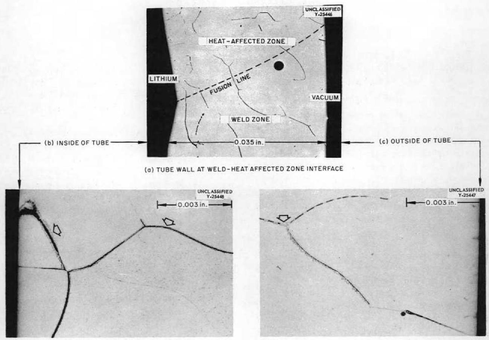  
Fig. 1.2.21. Columbium Tube Wall Following Exposure to Static Lithium for 100 hr at $1500^{\circ}\mathrm{F}$ . (a) Unetched, (b) and (c) etched with $\mathsf{HF - HNO_3 - H_2SO_4 - H_2O}$ . Reduced $41\%$ . (Secret with caption)

# 1.3. WELDING AND BRAZING

P. Patriarca

R. L. Heestand

G. M. Slaughter

E.A.Franco-Ferreira

Metallurgy Division

# OXIDATION OF COAST METALS BRAZING ALLOYS 52 AND 53

G. M. Slaughter

The ductility of a brazed joint is greatly dependent upon its microstructure, that is, the type and distribution of intermetallics, eutectics, and primary solid solutions. The redistribution or removal of the microconstituents should therefore result in a change in ductility of the brazing alloy. Gross depletion of intermetallics from a brazing alloy fillet should provide a significant improvement of its ductility.

The formation of a nickel-rich solid solution layer on the fillet surfaces of joints brazed with Coast Metals brazing alloys 52 and 53 during oxidation has been reported. Room- and elevated-temperature bend tests on Inconel samples overlaid with approximately 0.020 in. of brazing alloy have indicated that this depleted layer possesses considerable ductility and may actually provide a cushion to absorb imposed stresses. This condition is illustrated in Fig. 1.3.1, in which a crack in the braze matrix may be seen to terminate at the solid-solution interface. Preliminary hardness measurements have indicated that the hardness of the depleted zone is approximately 140 VHN as compared with an interior hardness of 700 VHN. Thus it appears that the ductility of the oxidized joints should improve during service. This condition should be beneficial in most applications.

A further study was conducted to determine the rate of depletion of microconstituents during high-temperature oxidation. Ten-gram cast buttons of the Ni-Si-B alloy (Coast Metals alloy 52) and Ni-Cr-Si-B alloy (Coast Metals alloy 53) were made and oxidized at 1100, 1300, 1500, 1600, and $1700^{\circ}\mathrm{F}$ for 24-, 50-, 100-, 500-, and 1000-hr periods. The depth of the depleted layer was determined metallographically for each sample.

The weight-change and depletion-depth data obtained for alloy 52 are presented in Table 1.3.1, and the data for alloy 53 are given in Table 1.3.2. Plots of the data are shown in Figs. 1.3.2 and 1.3.3.

It may be seen that the extent of depletion is significantly greater in alloy 52 than in alloy 53. Also, it may be seen that the depletion in alloy 52 would still continue after 1000 hr, while it appears that the depletion has leveled off in the case of alloy 53. However, in all cases the depth of depletion increased with increasing temperature. Hardness studies and chemical and spectrographic

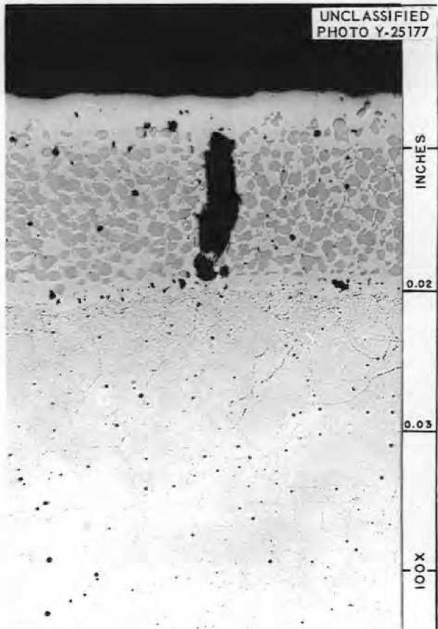  
Fig. 1.3.1. Braze Matrix Showing Crack Which Terminates at Solid-Solution Interface. As polished. 100X.

analyses in the different zones will be conducted in an effort to more clearly understand the nature of the oxidation.

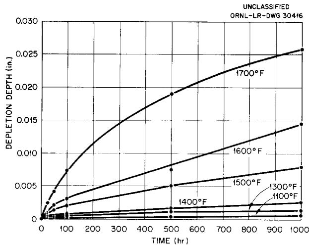  
Fig. 1.3.2. Results of Oxidation Tests of Coast Metals Brazing Alloy 52.

# DEVELOPMENT OF BRAZING ALLOYS FOR LITHIUM SERVICE

G. M. Slaughter

Refractory-metal-base brazing alloys are being investigated for a high-temperature reactor application in which they would be exposed to the lithium coolant. Nickel-base brazing alloys have been shown to have poor corrosion resistance to lithium.

A literature survey was conducted to determine whether columbium and zirconium binary systems possessed eutectics or minimums. The results of the survey are summarized in Tables 1.3.3 and 1.3.4. A similar survey of the molybdenum, titanium, and tantalum systems will be conducted, and promising binary and ternary systems will be investigated in corrosion and flowability tests. It is expected that vacuum brazing will be required to obtain suitable flow of many of these alloys, and therefore a vacuum furnace system is being constructed.

Table 1.3.1. Results of Oxidation Tests of Coast Metals Brazing Alloy 52   

<table><tr><td>Temperature (°F)</td><td>Time (hr)</td><td>Weight Change (%)</td><td>Depletion Depth (in.)</td><td>Temperature (°F)</td><td>Time (hr)</td><td>Weight Change (%)</td><td>Depletion Depth (in.)</td></tr><tr><td rowspan="5">1100</td><td>24</td><td>+0.08</td><td>&lt;0.001</td><td rowspan="5">1500</td><td>24</td><td>0.00</td><td>&lt;0.001</td></tr><tr><td>50</td><td>-0.12</td><td>&lt;0.001</td><td>50</td><td>-0.02</td><td>0.001-0.002</td></tr><tr><td>100</td><td>+0.05</td><td>&lt;0.001</td><td>100</td><td>-0.04</td><td>0.002-0.003</td></tr><tr><td>500</td><td>+0.07</td><td>&lt;0.001</td><td>500</td><td>+0.16</td><td>0.004-0.006</td></tr><tr><td>1000</td><td>+0.03</td><td>&lt;0.001</td><td>1000</td><td>-0.22</td><td>0.007-0.009</td></tr><tr><td rowspan="5">1300</td><td>24</td><td>+0.09</td><td>&lt;0.001</td><td rowspan="5">1600</td><td>24</td><td>+0.24</td><td>&lt;0.001</td></tr><tr><td>50</td><td>+0.02</td><td>&lt;0.001</td><td>50</td><td>-0.05</td><td>0.002-0.003</td></tr><tr><td>100</td><td>+0.11</td><td>&lt;0.001</td><td>100</td><td>-0.10</td><td>0.003-0.004</td></tr><tr><td>500</td><td>+0.18</td><td>0.001-0.002</td><td>500</td><td>-0.28</td><td>0.007-0.008</td></tr><tr><td>1000</td><td>+0.12</td><td>0.001-0.002</td><td>1000</td><td>-0.35</td><td>0.014-0.015</td></tr><tr><td rowspan="5">1400</td><td>24</td><td>-0.06</td><td>&lt;0.001</td><td rowspan="5">1700</td><td>24</td><td>0.00</td><td>0.002-0.003</td></tr><tr><td>50</td><td>+0.10</td><td>&lt;0.001</td><td>50</td><td>-0.15</td><td>0.003-0.005</td></tr><tr><td>100</td><td>+0.25</td><td>&lt;0.001</td><td>100</td><td>-0.30</td><td>0.007-0.008</td></tr><tr><td>500</td><td>+0.02</td><td>0.001-0.002</td><td>500</td><td>-1.00</td><td>0.018-0.020</td></tr><tr><td>1000</td><td>+0.14</td><td>0.002-0.003</td><td>1000</td><td>-1.22</td><td>0.025-0.027</td></tr></table>

Table 1.3.2. Results of Oxidation Tests of Coast Metals Brazing Alloy 53   

<table><tr><td>Temperature (°F)</td><td>Time (hr)</td><td>Weight Change (%)</td><td>Depletion Depth (in.)</td></tr><tr><td rowspan="5">1100</td><td>24</td><td>+0.003</td><td>&lt;0.001</td></tr><tr><td>50</td><td>+0.01</td><td>&lt;0.001</td></tr><tr><td>100</td><td>+0.06</td><td>&lt;0.001</td></tr><tr><td>500</td><td>+0.03</td><td>&lt;0.001</td></tr><tr><td>1000</td><td>+0.18</td><td>&lt;0.001</td></tr><tr><td rowspan="5">1300</td><td>24</td><td>+0.04</td><td>&lt;0.001</td></tr><tr><td>50</td><td>+0.06</td><td>&lt;0.001</td></tr><tr><td>100</td><td>+0.08</td><td>&lt;0.001</td></tr><tr><td>500</td><td>+0.06</td><td>&lt;0.001</td></tr><tr><td>1000</td><td>+0.10</td><td>&lt;0.001</td></tr><tr><td rowspan="5">1400</td><td>24</td><td>+0.05</td><td>&lt;0.001</td></tr><tr><td>50</td><td>+0.05</td><td>&lt;0.001</td></tr><tr><td>100</td><td>+0.09</td><td>&lt;0.001</td></tr><tr><td>500</td><td>+0.22</td><td>&lt;0.001</td></tr><tr><td>1000</td><td>+0.22</td><td>0.000-0.002 (intermittent)</td></tr><tr><td rowspan="5">1500</td><td>24</td><td>+0.05</td><td>&lt;0.001</td></tr><tr><td>50</td><td>+0.16</td><td>&lt;0.001</td></tr><tr><td>100</td><td>+0.08</td><td>0.001 (intermittent)</td></tr><tr><td>1000</td><td>+0.006</td><td>0.003-0.004 (intermittent)</td></tr><tr><td>5000</td><td>+0.30</td><td>0.004-0.005 (intermittent)</td></tr><tr><td rowspan="5">1600</td><td>24</td><td>+0.15</td><td>&lt;0.001</td></tr><tr><td>50</td><td>+0.08</td><td>0.001 (intermittent)</td></tr><tr><td>100</td><td>+0.17</td><td>&lt;0.001</td></tr><tr><td>500</td><td>-0.14</td><td>0.006-0.007 (intermittent)</td></tr><tr><td>1000</td><td>-0.12</td><td>0.005-0.007 (intermittent)</td></tr><tr><td rowspan="5">1700</td><td>24</td><td>-0.007</td><td>0.002-0.003 (intermittent)</td></tr><tr><td>50</td><td>-0.02</td><td>&lt;0.001</td></tr><tr><td>100</td><td>+0.14</td><td>0.002-0.004 (intermittent)</td></tr><tr><td>1000</td><td>-0.32</td><td>0.008-0.010 (intermittent)</td></tr><tr><td>5000</td><td>-0.41</td><td>0.008-0.010 (intermittent)</td></tr></table>

The Zr-Cb and Zr-Cb-Mo alloys have been used as filler materials in the welding of columbium thermal-convection loops, and both alloys have shown excellent resistance to corrosion by lithium (see Chap. 1.2, this report). Further studies of these alloys will be conducted, and the Zr-Mo and Zr-Ti alloys, which should also be corrosion resistant, will receive early attention.

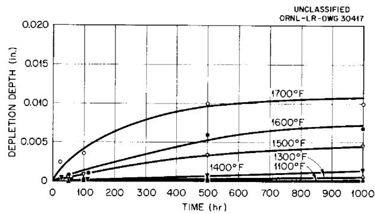  
Fig. 1.3.3. Results of Oxidation Tests of Coast Metals Brazing Alloy 53.

Table 1.3.3. Columbia Binary Systems of Potential Interest as Brazing Alloys   

<table><tr><td rowspan="2">System</td><td colspan="2">Eutectics or Minimums*</td></tr><tr><td>Composition (wt %)</td><td>Melting Temperature (°F)</td></tr><tr><td>Cb</td><td></td><td>4475</td></tr><tr><td>Cb-Co</td><td>79 Co, eutectic</td><td>2300</td></tr><tr><td rowspan="2">Cb-Fe</td><td>33 Fe, eutectic</td><td>2850</td></tr><tr><td>82 Fe, eutectic</td><td>2500</td></tr><tr><td rowspan="2">Cb-Ni</td><td>48 Ni, eutectic</td><td>2150</td></tr><tr><td>77 Ni, eutectic</td><td>2320</td></tr><tr><td rowspan="3">Cb-Si</td><td>18 Si, eutectic</td><td>3450</td></tr><tr><td>58 Si, eutectic</td><td>3400</td></tr><tr><td>95 Si, eutectic</td><td>2350</td></tr><tr><td>Cb-Th</td><td>93 Th, eutectic</td><td>2600</td></tr><tr><td>Cb-V</td><td>65 V, eutectic</td><td>3290</td></tr><tr><td>Cb-Zr</td><td>75 Zr, minimum</td><td>3200</td></tr></table>

*J.P. Page, Alloys and Compounds of Niobium, ORNL CF-56-10-36 (Oct. 8, 1956).

Table 1.3.4. Zirconium Binary Systems of Potential Interest as Brazing Alloys   

<table><tr><td rowspan="2">System</td><td colspan="2">Eutectics or Minimums*</td></tr><tr><td>Composition (wt %)</td><td>Melting Temperature (°F)</td></tr><tr><td>Zr</td><td></td><td>3353</td></tr><tr><td rowspan="3">Zr-Al</td><td>11 Al, eutectic</td><td>2460</td></tr><tr><td>22 Al, eutectic</td><td>2700</td></tr><tr><td>46 Al, eutectic</td><td>2700</td></tr><tr><td rowspan="3">Zr-B</td><td>2 B, eutectic</td><td>3200</td></tr><tr><td>38 B, eutectic</td><td>4208</td></tr><tr><td>75 B, eutectic</td><td>3380</td></tr><tr><td rowspan="2">Zr-Be</td><td>5 Be, eutectic</td><td>1800</td></tr><tr><td>93 Be, eutectic</td><td>2250</td></tr><tr><td>Zr-Cb</td><td>25 Cb, minimum</td><td>3200</td></tr><tr><td rowspan="3">Zr-Co</td><td>20 Co, eutectic</td><td>1750</td></tr><tr><td>45 Co, eutectic</td><td>2750</td></tr><tr><td>65 Co, eutectic</td><td>2700</td></tr><tr><td rowspan="2">Zr-Cr</td><td>18 Cr, eutectic</td><td>2340</td></tr><tr><td>69 Cr, eutectic</td><td>2970</td></tr><tr><td rowspan="3">Zr-Cu</td><td>21 Cu, eutectic</td><td>1830</td></tr><tr><td>37 Cu, eutectic</td><td>1710</td></tr><tr><td>47 Cu, eutectic</td><td>1635</td></tr><tr><td rowspan="2">Zr-Fe</td><td>16 Fe, eutectic</td><td>1715</td></tr><tr><td>84 Fe, eutectic</td><td>2426</td></tr><tr><td rowspan="2">Zr-Ge</td><td>7.7 Ge, eutectic</td><td>2795</td></tr><tr><td>99 Ge, eutectic</td><td>1712</td></tr><tr><td>Zr-In</td><td>22 In, eutectic</td><td>~2550</td></tr><tr><td>Zr-Mn</td><td>22.5 Mn, eutectic</td><td>2076</td></tr><tr><td>Zr-Mo</td><td>31 Mo, eutectic</td><td>2768</td></tr><tr><td rowspan="2">Zr-Ni</td><td>17 Ni, eutectic</td><td>1760</td></tr><tr><td>27 Ni, eutectic</td><td>1805</td></tr><tr><td>Zr-Sb</td><td>22 Sb, eutectic</td><td>2600</td></tr><tr><td rowspan="2">Zr-Si</td><td>2.4 Si, eutectic</td><td>2940</td></tr><tr><td>75 Si, eutectic</td><td>2470</td></tr><tr><td>Zr-Sn</td><td>23.5 Sn, eutectic</td><td>2894</td></tr><tr><td>Zr-Th</td><td>75 Th, minimum</td><td>2426</td></tr><tr><td>Zr-Ti</td><td>55 Ti, minimum</td><td>2900</td></tr><tr><td>Zr-V</td><td>30 V, eutectic</td><td>2246</td></tr><tr><td>Zr-W</td><td>18 W, eutectic</td><td>3000</td></tr><tr><td>Zr-Zn</td><td>31 Zn, eutectic</td><td>1860</td></tr></table>

*B. Lustman and F. Kerze, Jr. (eds.), The Metallurgy of Zirconium, 1st ed., McGraw-Hill, New York, 1955.

# 1.4. MECHANICAL PROPERTIES

D. A. Douglas

R.W.Swindeman

Metallurgy Division

# STRAIN-CYCLING INVESTIGATIONS

Investigations of the problem of thermal fatigue in reactor materials were continued. The capacity of Inconel to absorb strain reversals is being intensively studied in the temperature range from 1200 to $1650^{\circ}\mathrm{F}$ . The effects of such variables as strain amplitude, temperature, cycle frequency, grain size, geometry, and environment are being considered. Three types of test have been employed in these investigations: mechanical strain cycling, thermal strain cycling, and mechanical stress cycling (fatigue). The mechanical-strain-cycling tests are being conducted at ORNL. The other two test programs have been subcontracted to The University of Alabama (thermal strain cycling) and Battelle Memorial Institute (fatigue).

Much of the information obtained thus far from mechanical-strain-cycling tests has been reported in previous reports in this series. The conclusions that have been drawn from the test results are (1) that the relation between total plastic strain absorbed per cycle $(\varepsilon_{p})$ and the number of cycles to failure $(N)$ is of the form

$$
N ^ {a} \epsilon_ {\widehat {p}} = C, \tag {1}
$$

where $\alpha$ and $C$ are constants; (2) that grain size is a significant factor, with fine-grained material being superior to coarse-grained material in its ability to survive a greater number of cycles; and (3) that temperature does not have a large effect on time to rupture in the range of 1300 to $1600^{\circ}F$ at cycle frequencies of 0.5 per minute.

Recent investigations have been concerned with the effect of the cycle time (frequency) on the relationship between $\epsilon_{p}$ and $N$ . In these tests a load is applied which is of a magnitude that will cause the specimen to experience a specified plastic strain in one half of the specified cycle

time, and then the load is reversed to produce the same plastic strain in the opposite direction in the other half of the cycle time. Comparisons of data obtained at different frequencies and temperatures are presented in Figs. 1.4.1 through 1.4.4. As may be seen in Fig. 1.4.1, the results for specimens tested in argon at $1300^{\circ}\mathrm{F}$ with 2- and 30-min cycles give $\epsilon_{p}$ vs $N$ curves that fall close together. When the plastic strain per

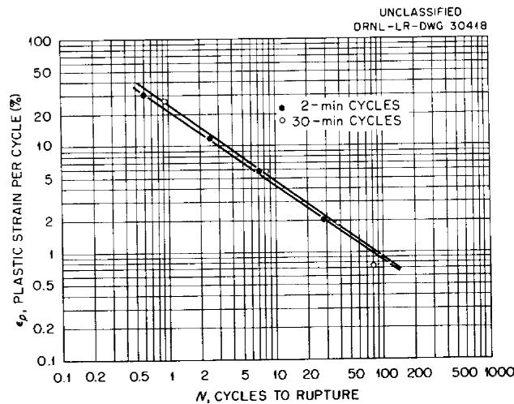  
Fig. 1.4.1. Effect of Strain Cycling on Fine-Grained Inconel Tubes Tested in Argon at $1300^{\circ}$ F.

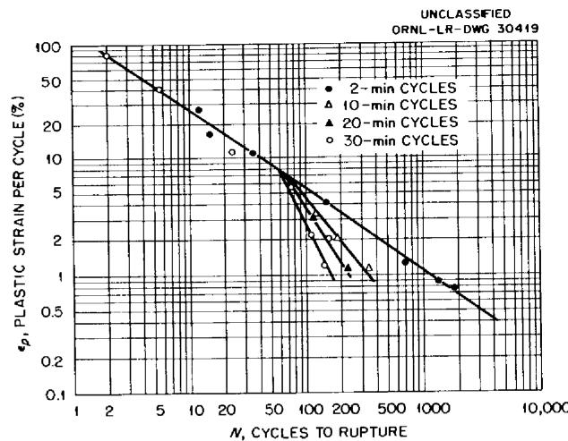  
Fig. 1.4.2. Effect of Strain Cycling on Fine-Grained Inconel Tubes Tested in Argon at $1500^{\circ}$ F.

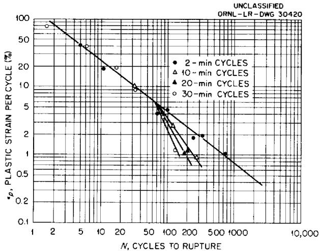  
Fig. 1.4.3. Effect of Strain Cycling on Coarse-Grained Inconel Tubes Tested in Argon at $1500^{\circ}$ F.

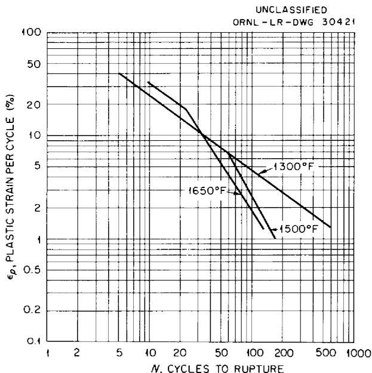  
Fig. 1.4.4. Effect of Strain Cycling on Fine-Grained Inconel Tubes Tested at 1500, 1650, and $1900^{\circ}$ F in Argon at 30 Minutes per Cycle.

cycle is above $1\%$ , the 30-min cycle results in a slight increase in the number of cycles before failure. The effect of long cycle periods at low strains (below $1\%$ ) remains to be clarified.

In similar tests of coarse- and fine-grained specimens at $1500^{\circ}\mathrm{F}$ , cycling periods of 2, 10, 20, and 30 min were used. The results of these tests, as presented in Figs. 1.4.2 and 1.4.3, show, in all cases, that when the strain per cycle is

above $5\%$ the cycle frequency has no significant effect on the number of cycles to rupture. At low values of $\epsilon_{p}$ , however, the cycle time becomes increasingly important. At the same plastic strain per cycle, the number of cycles to rupture decreases with increases in the cycle period. From a standpoint of actual time to rupture, however, long cycle periods result in increased life. Since the 30-min cycle period is 15 times greater than the 2-min cycle period, a considerable reduction in the number of cycles to failure would have to occur before the time to rupture would be shorter for the 30-min cycle than for the 2-min cycle.

A comparison of results obtained at 1300, 1500, and $1650^{\circ}F$ with a 30-min cycle is given in Fig. 1.4.4. The data indicate that the "break point," that is, the point where a frequency effect is first noticeable, moves to higher values of $\epsilon_{p}$ as the test temperature is increased. These data contrast with data for 2-min cycles, which showed little effect of temperature. The existence of a break in the $\epsilon_{p}$ vs $N$ curves is somewhat questionable, since it is possible that a smooth curve which did not satisfy the empirical relation given by Eq. I could be drawn through the data.

Actually, in the type of test system employed in these frequency investigations, the value of $\varepsilon_{p}$ is not constant throughout the test; a small increase in $\varepsilon_{p}$ occurs as the test progresses. In general, the change in $\varepsilon_{p}$ occurs in the first few cycles and thereafter increases only slightly. The values of $\varepsilon_{p}$ which are given in the data correspond to measurements taken in the middle or near the end of the test, and therefore the change in $\varepsilon_{p}$ that occurs in the early part of the test is not reflected to a large extent in the curves presented in Figs. 1.4.1 through 1.4.4.

Since the cyclic strains of greatest interest from a design standpoint are well below $5\%$ , it appears that cycle frequency must be considered in evaluating the probable lifetime of a material that will be subjected to cyclic strains. Further work is needed therefore to establish the effects of strain cycling over a larger frequency spectrum and a larger strain amplitude range.

Since the cyclic strains induced during the operation of a reactor are primarily the result of thermal rather than mechanical strain cycling, the mechanical-strain-cycling data can be useful in design only if correlation can be obtained with results from comparable thermal-cycling tests. Tests in which the strain is induced thermally

have been conducted at mean temperatures of 1300 and $1500^{\circ}\mathrm{F}$ with a cycle period of 38 sec. Data obtained at $1300^{\circ}\mathrm{F}$ in the two types of tests show excellent agreement when analyzed on the basis of the equation relating plastic strain to the number of cycles to failure.2 Data obtained in similar tests at $1500^{\circ}\mathrm{F}$ are compared in Fig. 1.4.5.

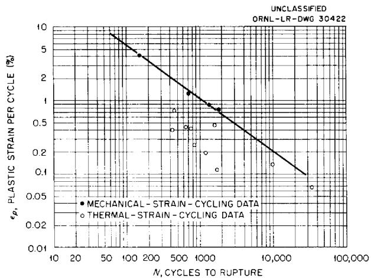  
Fig. 1.4.5. Comparison of Effects of Thermal and Mechanical Strain Cycling on Inconel Tested at a Mean Temperature of $1500^{\circ}$ F.

As may be seen, the correlation of the data from the two tests is poor, especially at values of $\epsilon_{p}$ greater than $0.1\%$ . The lack of agreement may be attributed, in part, to difficulties in determining the plastic strain in the thermal-strain-cycling test. The specimens are resistance heated in the thermal-cycling tests, and high thermal gradients are set up that produce variations in the elastic and plastic properties. Therefore an "effective gage length" must be established which may vary as the test progresses. Local hot spots produced by imperfections, cracks, or changes in cross-sectional area also produce localized strain. These effects are most pronounced for the high-temperature cycles, which correspond to the high-strain cycles. More refined methods of determining the plastic strain and of minimizing the temperature gradients are being considered.

Some data have also been obtained concerning the effect of the cycle frequency on the life of material subjected to thermal strain cycling. Two tests have been conducted at $1300^{\circ}\mathrm{F}$ for which 30-min cycles were used. One specimen was cycled at $1.3\% \in_{p'}$ and it survived 100 cycles

as compared with 600 cycles in a test for which the cycle period was 38 sec. The second specimen, which was cycled at $0.93\% \epsilon_{p}$ , lasted 375 cycles as compared with 800 cycles when tested on a 38-sec cycle.

In some instances, service conditions may exist within a reactor in which the cyclic frequencies of the strains, whether mechanically or thermally induced, will be high, that is, 1 to 10 cps. High-temperature fatigue may occur under such conditions that is usually considered to be the result of stress cycling rather than strain cycling. Fatigue studies are therefore being conducted on Inconel specimens at 1200, 1400, and $1600^{\circ}\mathrm{F}$ . Results from tests at $1600^{\circ}\mathrm{F}$ in which frequencies of 1 and 10 cps were used are shown in Fig. 1.4.6. Under these conditions, the effect of cycle frequency is evident. Specimens cycled at 10 cps endure 10 times as many cycles at the same stress level as those cycled at 1 cps. An attempt is being made to dynamically measure the strain per cycle at these frequencies. If this can be done, the results of fatigue investigations can be correlated with the strain-cycling data.

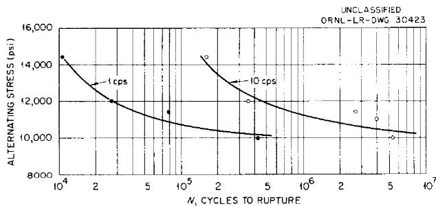  
Fig. 1.4.6. Effect of Stress Cycling on Inconel Tested at $1600^{\circ}$ F.

One particular question which can be answered by fatigue studies is whether high-frequency strain cycling weakens the material being tested. At frequencies such as those employed in the strain-cycling tests (0.5 cpm), weakening of the Inconel specimens was observed at and above $1300^{\circ}\mathrm{F}$ and the weakening progressed as the number of cycles increased. In high-frequency fatigue tests, however, the strain rate is very high, the recovery time is minimized, and the conditions are favorable for strain hardening. There is evidence that small cyclic stresses strengthen Inconel from a creep standpoint, as may be seen in Fig. 1.4.7. It also may be seen, in comparison with the results

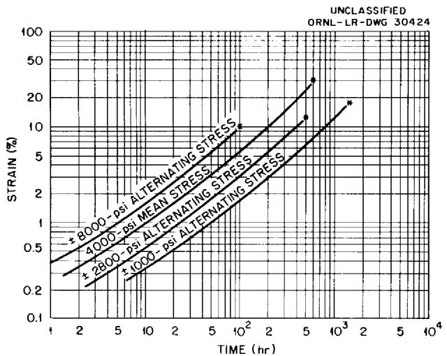  
Fig. 1.4.7. Creep Curves of Coarse-Grained Inconel Tested at $1600^{\circ}$ F in Air at 4000 psi Mean Stress and Several Stresses Alternated at 1 cps.

obtained for a mean stress of 4000 psi, that application of a stress of 1000 psi alternated at a frequency of 1 cps resulted in a decrease in creep rate and an increase in time to rupture. Higher stresses, 2800 and 8000 psi alternated at 1 cps, however, decreased the time to rupture. On the basis of these and similar tests at other mean stress levels, it appears that low alternating stresses are beneficial with regard to creep characteristics.

Goodman diagrams are presented in Figs. 1.4.8 and 1.4.9 that are based on the results obtained in the tests at 1 and 10 cps, respectively. In these diagrams, selected times to rupture are plotted as a function of the ratio of the alternating stress to the mean stress. From these plots the stress conditions that will result in failure by creep can be differentiated from the stress conditions that will result in failure from fatigue in a system in which both creep and fatigue exist.

# CREEP UNDER BENDING STRESSES

Studies have been initiated for determining the extent to which tensile creep data can be correlated with data on creep under bending stresses. The testing apparatus shown in Fig. 1.4.10 has been designed to impose a pure bending stress

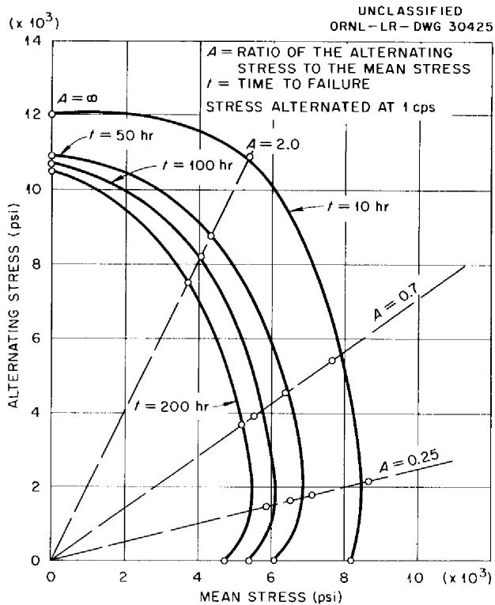  
Fig. 1.4.8. Goodman Diagram (Time to Failure) for Inconel Tested at $1600^{\circ}\mathbf{F}$ . Stress alternated at 1 cps.

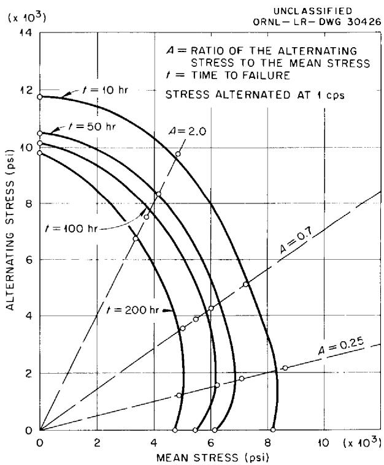  
Fig. 1.4.9. Goodman Diagram (Time to Failure) for Inconel Tested at $1600^{\circ}$ F. Stress alternated at 10 cps.

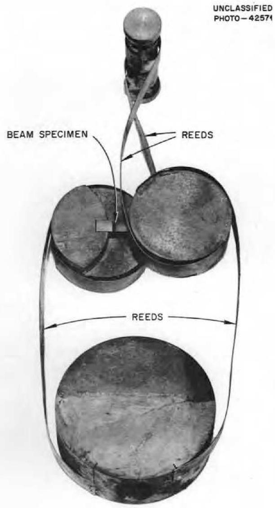

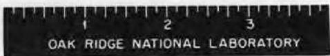  
Fig. 1.4.10. Apparatus for Investigating Creep Under Bending Stresses.

on a beam specimen. A similar apparatus was used by Platus and Cotton for room-temperature tests of lead. The beam specimen is a 0.20-in.-square bar of Inconel with a l-in. gage length. It fits tightly into square notches cut into the

small disks shown in Fig. 1.4.10. Couples that tend to rotate the disks in opposite directions are applied by means of equal loads on the reeds. The couples produce a bending moment in the beam specimen. The stress in the outer fibers of the beam, $\sigma_{\mathrm{r}}$ as calculated from elastic theory is

$$
\sigma = \frac {3 D P}{w ^ {3}} = 7 5 0 P,
$$

where $D$ is the diameter of the specimen-holding disk (2 in.), $P$ is the applied load, and $\omega$ is the thickness of the beam specimen.

The tests have been conducted in fused-salt environments in order to obtain uniform temperatures in the test sections. As bending occurs, the disks rotate, the reeds unwind, and the pull rods move upward. The beam deforms as an arc of a circle. A simple relation exists in this case between strain in the outer fiber, $\epsilon$ , and the upward travel of the pull rod, $x$ :

$$
\epsilon = \frac {w x}{2 l} = \frac {x}{1 0},
$$

where $w$ is the beam width (0.20 in.) and $l$ is the gage length (1 in.).

The creep-in-bending curve for Inconel tested in a fused-salt environment at $1500^{\circ}\mathrm{F}$ and stressed at 6000 psi is presented in Fig. 1.4.11, and the tensile creep curve at the same stress level is presented for comparison. For the first 10 hr, the agreement is satisfactory between the results of the two tests. After this period, however, the

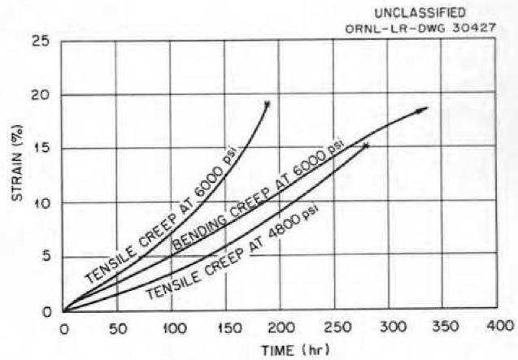  
Fig. 1.4.11. Tensile and Bending Creep Curves for Fine-Grained Inconel Tested in a Molten-Salt Environment at $1500^{\circ}$ F.

slope of the tensile creep curve begins to increase rapidly. According to Platus, the bending stress is very quickly redistributed in the beam in the early stages of creep, and there is a resulting decrease in the outer fiber stress to about $80\%$ of the value predicted by elastic theory. If this analysis is correct, the bending creep rate after a few hours should be comparable with the tensile creep rate at a stress of 4800 psi. As may be seen in Fig. 1.4.11, the agreement is good, to a first approximation, for strains up to $10\%$ . The slopes of the tensile creep curves can be expected to increase more rapidly, however, than the slope of the bending creep curve, since corrosion by the fused salt, cracks, and changes in cross-sectional area play greater roles in changing the creep rate of the 0.060-in.-thick tensile sheet specimens than in changing that of the 0.20-in.-thick bending creep specimen.

# CREEP UNDER MULTIAXIAL STRESSES

Uniaxial creep tests have yielded valuable data on the creep characteristics of structural materials at high temperatures, but such information is not applicable under service conditions which produce multiaxial stresses in many reactor components. The creep and rupture properties of materials under such multiaxial stress conditions are therefore of interest, especially where the data can be used to evaluate various mechanical theories of flow and fracture. Creep tests on multiaxially stressed Inconel tubing are being conducted at $1500^{\circ}\mathrm{F}$ in which the principal stresses, that is, the axial and tangential stresses in the tube wall, are varied by imposing an axial load on the pressurized tube.7 The radial stresses are small as compared with the axial and tangential stresses and are therefore neglected; the remaining axial and tangential stresses are thus referred to as biaxial rather than triaxial. The stress distribution in the tube wall is described by the ratio of the axial stress to the tangential stress, $\sigma_z / \sigma_t$ . The time to rupture and the creep rate are observed as the stress ratio is varied from specimen to specimen.

Tests are being conducted in which one of the principal stresses is held at 3000, 4000, or 6000 psi while the stress ratio is varied from $\infty$ to $-1.0$ . Axial creep curves obtained in the tests at 6000 psi are presented in Figs. 1.4.12 and 1.4.13. The data show a trend similar to that found previously in tests at 4000 psi. As long as the axial stress is held at 6000 psi (Fig. 1.4.12), the slopes of the creep curves are practically independent of the tangential stress. The time to rupture and the strain at rupture do, however, show some dependence on the stress ratio. Both the time to rupture and the strain at rupture decrease as the stress ratio approaches 1.0. For ratios below 1.0, the axial stress is decreased, and the axial creep rate is, therefore, correspondingly decreased. The axial strain at rupture and the time to rupture continue to decrease, as shown in Figs. 1.4.14 and 1.4.15. At a stress ratio of 0.5, no appreciable creep in the axial direction can be detected. For stress ratios lower than 0.5, compressive creep occurs, as shown in Fig. 1.4.13. The strain in compression at rupture increases with decreasing axial stress.

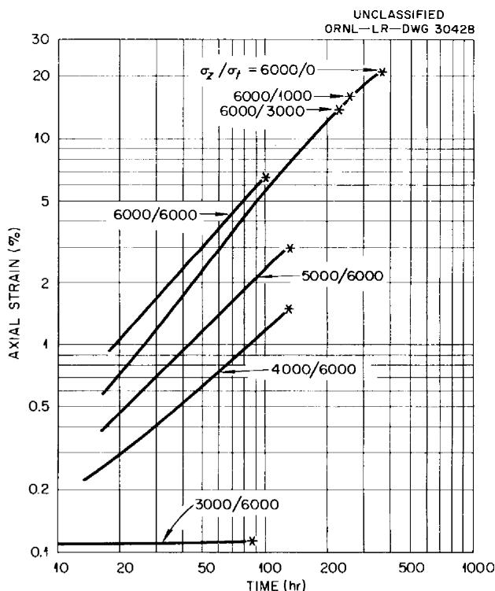  
Fig. 1.4.12. Creep Curves of Inconel Tubes Biaxially Stressed and Tested in Argon at $1500^{\circ}$ F.

Any theory that is an attempt to explain behavior under biaxial stresses must relate the variation in creep rate and rupture life to the stress ratio. As indicated previously and shown in Fig. 1.4.16, multiaxial creep rates at stress ratios greater than 0.5 correlate well with uniaxial creep rates at the same stress level. The data are plotted without consideration of the tangential stress. The creep rates were taken from creep curves at $1\%$ strain. If the increasing creep rate in the tangential

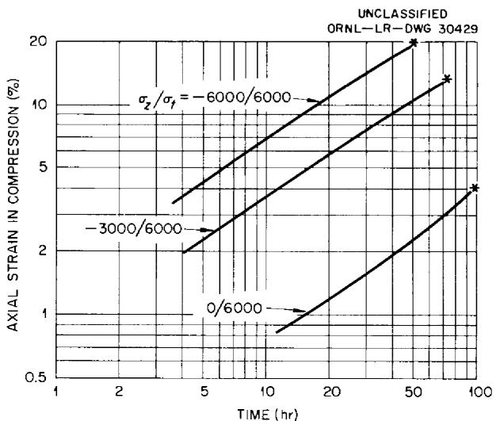  
Fig. 1.4.13. Creep Curves of Inconel Tubes Biaxially Stressed and Tested in Argon at $1500^{\circ}\mathbf{F}$ . Axial strain in compression.

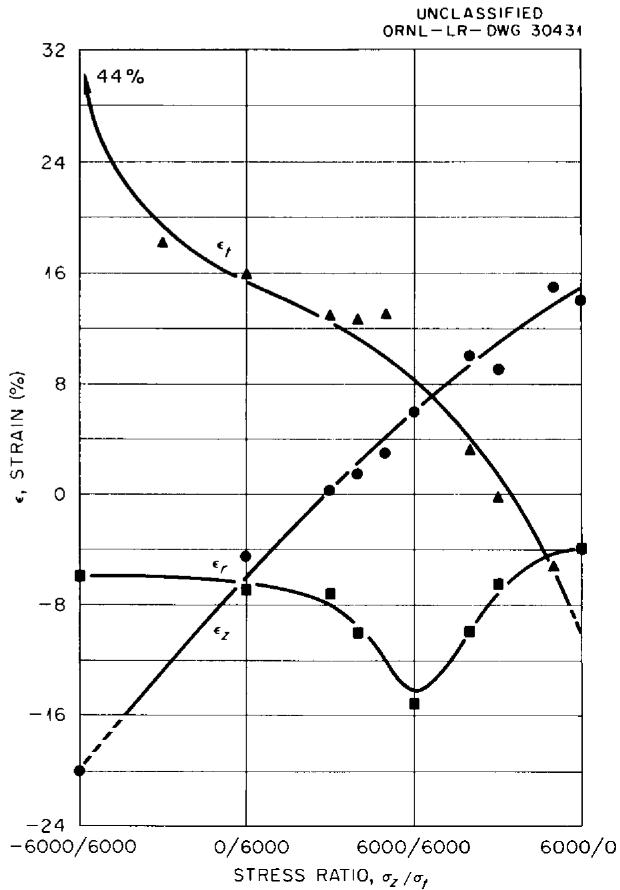

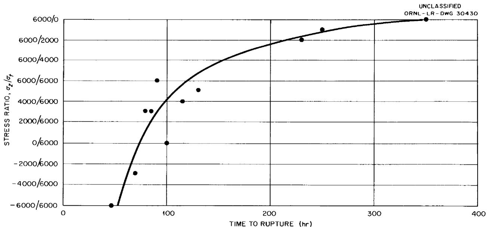  
Fig. 1.4.15. Total Strain at Rupture of Inconel Tubes Creep Tested at $1500^{\circ}$ F Under Combined Axial and Tangential Stresses.   
Fig. 1.4.14. Time to Rupture as a Function of the Stress Ratio in Inconel Tubes Biaxially Stressed and Creep Tested in Argon at $1500^{\circ}$ F.

direction, which corresponds to the decreasing stress ratio, were to induce a compressive component to the creep in the axial direction, the observed creep rate would decrease as $\sigma_{z} / \sigma_{t}$ decreased from $\infty$ to 1. Such behavior would be predicted under the assumption that the sum of the strains and of the strain rates in the three principal directions must at all times be zero. No influence of tangential creep is observed. Moreover, as the axial stress decreases and the stress ratio drops from 1.0, the axial creep rates remain in agreement with pure tensile data. No effect of the tangential strain is noted until the stress ratio approaches 0.5. Here, the sudden disappearance of axial creep can be partly attributed to foreshortening of the tube caused by "bowing out" in the center of the gage length. Below the ratio 0.5, the axial creep rate in compression is higher than that which would be expected by assuming dependence on axial stress alone. Two additional factors influence this creep

8M. Gensamer, Strength of Metals Under Combined Stresses, American Society for Metals, Cleveland, 1941.

rate, however. One of these is the bowing-out effect previously mentioned. The other is an eccentric-load effect from the compressive axial load acting on the bowed-out tube. It is difficult to predict how creep in one direction may affect the deformation rate in the other. For one thing, deformation is accompanied by changes in the stress values and stress distribution, which, in turn, result in changes in the creep rates in the principal directions. Evidence of stress redistribution has been found during tests. Near the stress ratio of 0.5, specimens have been observed to start creeping in compression and then move into tension. The opposite effect has also been noted.

On a microscopic scale, there are many factors which have not been considered in the theories of flow. For example, the generation of cracks, voids, and lattice defects by the maximum stress may influence the creep rate produced by a lesser stress in another direction. The stress dependence of the creep mechanism could also be considered. Preferred orientation, which is present to a degree in tube material, causes an

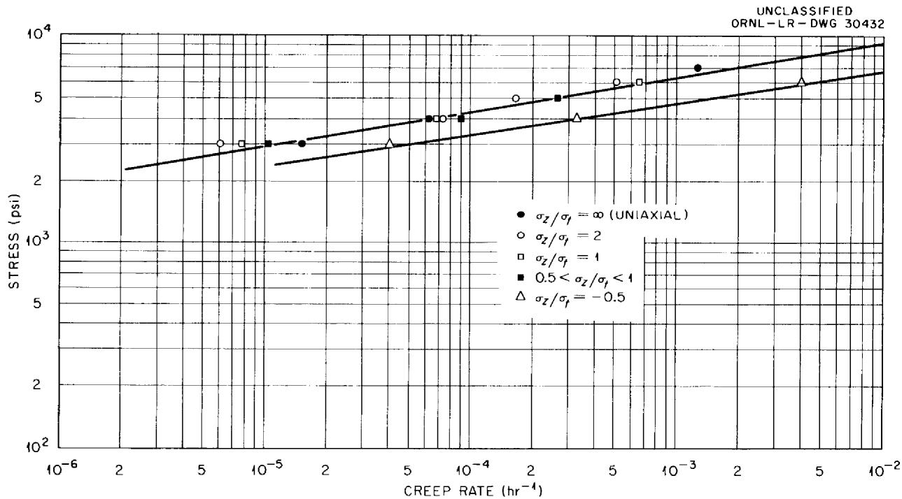  
Fig. 1.4.16. Axial Creep Rate of Inconel Tubes at $1500^{\circ}$ F When Biaxially Stressed at Various Axial-to-Tangential Stress Ratios.

orientation dependence of elastic and plastic properties. Factors that influence the fracture point of the material are even more numerous. At the present time no clear fracture criterion has been established. The maximum shear stress,

the octahedral shear stress, and the maximum normal stress theories of yielding have been rejected because they fail to explain the type of stress-ratio dependence which has been observed for the time to rupture.

# 1.5. CERAMICS

L.M.Doney R.L.Hammer R.A.Potter Metallurgy Division

In cooperation with GE-ANPD, fabrication studies are being made of dense beryllium oxide for use as a neutron reflector material. The possibility of adding boron (0.5 to 1 wt $\%$ ) as a suppressor for secondary gamma rays is also being investigated. The two phases of the studies involve (1) a survey of boron compounds and their effects on the thermal stability and oxidation resistance of BeO and (2) densification of extruded and cold-pressed BeO to which the boron compounds have been added.

# BORON COMPOUNDS

The boron compounds of initial interest were the borides of the transition metals of the fourth, fifth, and sixth periodic groups, whose physical properties, such as thermal stability and oxidation resistance, made them particularly attractive for the application described. For preliminary studies it was necessary to synthesize the compounds in the laboratory. Diborides of Ti, Zr, Hf, Ta, V, and Cr were synthesized by reacting small batches $(\sim 100\mathrm{g})$ of the metal oxides, or, in the case of zirconium, the metal silicate, with graphite and boron carbide in graphite crucibles heated by high-frequency induction to temperatures in excess of $2000^{\circ}\mathrm{C}$ . Because of reaction-product gases, it was difficult to determine the exact temperatures of the reactions by the available optical methods; therefore, visual observation of ignited out-gases and time-power control of the induction unit aided in determining reaction progress.

The reaction between zircon sand, graphite, and boron carbide was more complete than the other reactions, and the product was cleaner. During the reaction, $\mathrm{ZrB_2}$ was produced as a mass of granules slightly sintered together which were similar in size and shape to the original sand particles. X-ray diffraction patterns were made of all the compounds, and in each case the material was found to be predominantly boride.

# BORON ADDITIONS TO BeO

Specimens of boron-containing BeO were prepared for preliminary evaluation by mixing the

boron compounds with Brush Beryllium Company "Luckey S.P." grade BeO in sufficient amount to give 1 wt % boron and then hot pressing the mixtures at $1900^{\circ}\mathrm{C}$ at a pressure of 2000 psi. Specimens containing $\mathsf{ZrB}_2$ , $\mathsf{TaN}_2$ , $\mathsf{Tb}_2$ , $\mathsf{CrB}_2$ , $\mathsf{HfB}_2$ , $\mathsf{CeB}_6$ , and BN were prepared.

Comparable densities (94 to $96\%$ of theoretical) were obtained for all mixtures except $\mathsf{CeB}_6$ -BeO, which was discarded because of its generally poor appearance. Microscopic examinations indicated that the additives were held in the BeO and uniformly distributed, with the exception of $\mathsf{CrB}_2$ , the lowest melting compound of the series, which appeared to have migrated toward the periphery of the specimen.

The fabricated specimens were oxidation tested at $1000^{\circ}\mathrm{C}$ and at $1300^{\circ}\mathrm{C}$ . At $1000^{\circ}\mathrm{C}$ the $\mathsf{ZrB}_2$ -BeO and $\mathsf{HfB}_2$ -BeO specimens showed no weight change after 34 hr; the $\mathsf{TaN}_2$ , $\mathsf{Tb}_2$ , and $\mathsf{CrB}_2$ combinations showed small weight changes ( $< 0.2\%$ ) and attendant oxidation products. The exposed BN of the BN-BeO specimen had almost completely disappeared, and there were easily visible pits and craters. The disappearance of the BN is believed to be due to oxidation and subsequent volatilization.

The $\mathsf{ZrB}_2$ and $\mathsf{HfB}_2$ mixtures exhibited oxidation resistance at $1300^{\circ}C$ that was much superior to the oxidation resistance of other combinations. The $\mathsf{ZrB}_2$ and $\mathsf{HfB}_2$ specimens showed weight changes of only $0.15\%$ after 300 hr. X-ray patterns of the $\mathsf{ZrB}_2$ -BeO mixture before and after oxidation were identical.

In view of its stability in air and its availability, only $\mathsf{ZrB}_2$ will be used in future work on this phase of the program. Specimens of the $\mathsf{BeO - ZrB}_2$ mixture are being fabricated for determinations of modulus of rupture, compressive creep, and thermal conductivity before tests are made in the ETR.

# DENSIFICATION OF BeO

Additives are being sought that will densify extruded and cold-pressed BeO bodies and possibly, but not necessarily, fulfill the boron

content requirements. Preliminary data obtained by the Brush Beryllium Company indicated that the following two compositions should be investigated: $94.0\%$ BeO- $5.0\%$ MgO- $1.0\%$ $\mathsf{B}_4\mathsf{C}$ and $98.0\%$ BeO- $1.0\%$ Fe2O3-1.0% B4C. An extruded body was produced from the first composition that, when fired to 1500oC in an oxidizing atmosphere, had a density of approximately 2.86 g/cm². No determination was made of the boron content.

In order to determine effects of the individual components on BeO, mixtures were made containing the following parts by weight: 94.0 parts BeO plus 5.0 parts MgO; 94.0 parts BeO plus 1.0 part B $_4$ C; 98.0 parts BeO plus 1.0 part Fe $_2$ O $_3$ ; 98.0 parts BeO plus 1.0 part B $_4$ C. Data obtained here have indicated that the additive ZrB $_2$ may possibly fulfill the density requirement, as well as the boron requirement, and, therefore, the

composition $94.8\%$ BeO- $5.2\%$ $\mathsf{ZrB}_2$ is also being investigated.

The various compositions, including one of $100\%$ BeO for comparison, were mixed in a jar on rolls for 18 hr and then pressed at 20,000 psi in steel dies, broken up, granulated by passing through a 30-mesh screen, and remixed for 2 hr. Right cylinder shapes approximately $\frac{3}{4} \times \frac{3}{4}$ in. were made by pressing the materials at 15,000 psi. Pieces from each of the compositions are being fired to 1100, 1300, and $1500^{\circ}\mathrm{C}$ in oxidizing atmospheres. These pieces will be compared with others fired in inert atmospheres and their differences in density and boron retention properties will be noted. In the future, these compositions, as well as additional ones, will be made into extruded shapes and compared with their cold-pressed counterparts.

# 1.6. NONDESTRUCTIVE TESTING

J.W.Allen

R.W.McClung R.A.Nance

Metallurgy Division

# EDDY-CURRENT THICKNESS MEASUREMENTS

J.W.Allen R.A.Nance

The study of eddy-current techniques for measuring cladding thicknesses on flat fuel plates was continued, with special emphasis on the ability of the probe coil to locate areas of minimum cladding thickness. In past metallographic correlation studies, sections have been taken through a point beneath the center of the probe, and the results have been erratic because the area of thinnest cladding does not necessarily occur at this point. In order to gain a better understanding of this problem, a study was made of the cladding thickness variations over the entire in-dia area underneath the probe coil. This was accomplished by successively removing thin layers of the cladding and plotting contours of the cladding thickness variations. Contour plots of two such areas which were examined are presented in Figs. 1.6.1 and 1.6.2. The several sections taken through the area beneath

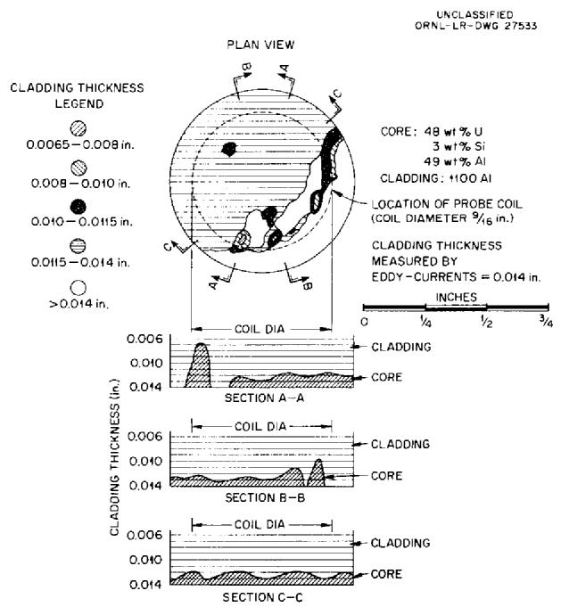  
Fig. 1.6.1. Contour Plot of Cladding Thickness Variations on Flat-Plate Fuel Element.

the center of the probe indicate the varied measurements which can be obtained by changing the orientation of the section. Each section indicates a different minimum cladding thickness, none of which occurred beneath the center of the probe.

The study of the possibility of measuring the thickness of a hot-dipped aluminum coating on steel was also continued. This metal system is not of any particular project importance in itself, but it is typical of metal systems in which a magnetic material is clad with a nonmagnetic material. The specimens that were examined had aluminum coatings of 0.0016-in. nominal thickness, including an intermetallic layer of approximately 0.0003-in. thickness, as shown in Fig. 1.6.3. The intermetallic layer adversely affects the measurement of coating thicknesses of less than 0.0005 in., but the accuracy of the measurement is $\pm 0.0002$ in. for the thickness range of 0.0005 in. to 0.0016 in. Measurements of aluminum coating thicknesses on steel in the absence of

1R. B. Oliver, R. A. Nance, and J. W. Allen, ANP Quar. Prog. Rep. Dec. 31, 1957, ORNL-2440, p 192.

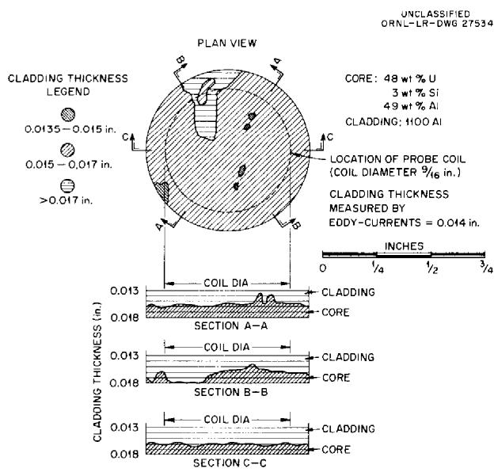  
Fig. 1.6.2. Contour Plot of Cladding Thickness Variations on Flat-Plate Fuel Element.

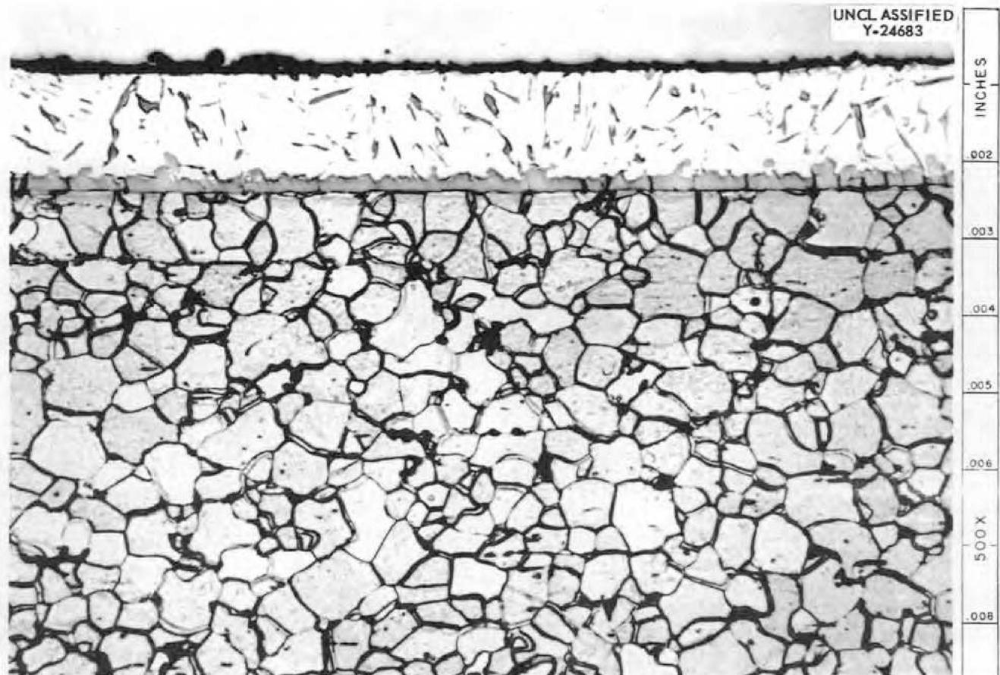  
Fig. 1.6.3. Hot-Dipped Aluminized Coating on Low Carbon Steel. Etchant: $2\%$ nital.

an intermetallic layer can be made with an accuracy of 0.0001 in, or greater.

While investigating the problem of measuring the thickness of aluminum coatings on steel, a new technique was developed which shows considerable promise of eliminating the inaccuracies introduced by lift-off or poor coupling between the probe coil and the part. Previously, thickness measurements have been made by measuring the amplitude variations of the impedance of the probe coil as it scans the part. These amplitude variations are determined with respect to the impedance of the probe when placed on a thick section of one of the component metals of the system being measured. This method requires that the surface of the part be flat and that the probe be in intimate contact with the surface or have a constant amount of lift-off. Even a small variation in lift-off (0.001 in.) introduces changes in both the amplitude and the phase angle of the coil's impedance, which greatly

affect the thickness measurement. It was found that in measuring the thickness of aluminum on steel it is possible to eliminate the effects of lift-off by referring all impedance measurements to the impedance of the coil in air and then utilizing the phase change of the coil's impedance as a measurement of the thickness. With this technique, lift-off greatly affects the amplitude of the coil's impedance but causes almost no change in its phase angle, as illustrated in the impedance diagram of Fig. 1.6.4. The phase angle, $\theta$ , of a vector from the air point to the thickness curve is used as a measure of the aluminum coating thickness. The introduction of lift-off causes the vector length to shorten, but has no appreciable effect on the angle $\theta$ . By using this technique the coating thickness measurements can be made to be largely independent of the amount of lift-off.

A plot of the phase-angle variation as a function of aluminum coating thickness on steel is shown in Fig. 1.6.5. As in all eddy-current thicknesses

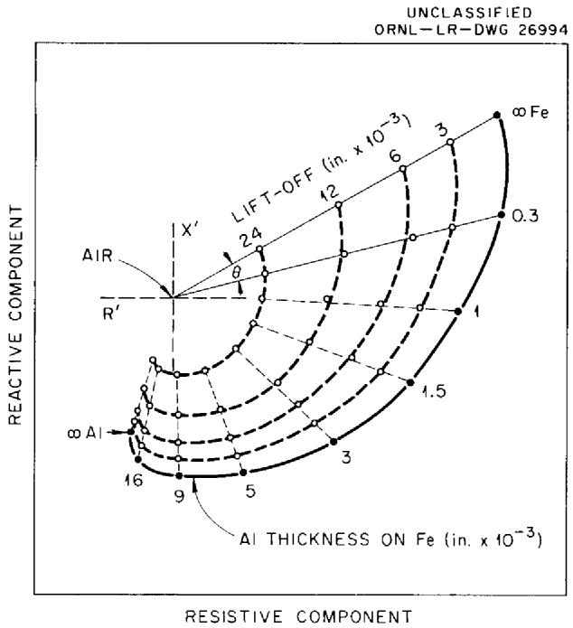  
Fig. 1.6.4. Normalized Probe Coil Impedance Variations for Varying Thicknesses of Aluminum on Low Carbon Steel at $20\mathrm{kc}$ Referenced to Impedance of Probe Coil in Air.

measurements, the most sensitive measurements are those on the thinnest sections. At the present time the phase-angle measurement technique can be used to advantage only if the base material is magnetic. A study is being made to determine whether the technique can be successfully applied to systems having nonmagnetic bases. This method is particularly well suited to automation because of its independence of lift-off variations.

# LAMB ULTRASONIC-WAVE STUDIES

# R.W.McClung

The detection of laminations in thin $(\frac{1}{4}$ in. or less) metal sections and the nondestructive evaluation of bond quality in clad structures are among the more difficult inspection problems. Radiographic, eddy-current, and dye penetrant methods are not applicable to these problems because of unfavorable orientation and non-accessibility of laminar discontinuities. Conventional pulse-echo ultrasonic techniques do not have the required resolving abilities. Resonance ultrasonic methods can, in some instances, provide a partial solution to the problem; however,

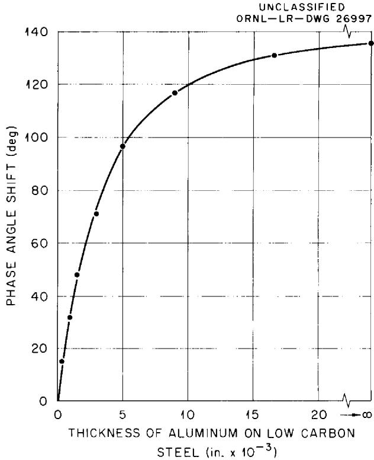  
Fig. 1.6.5. Eddy Current Thickness Gage Calibration Curve, 20 kc.

the sensitivity of the resonance method is limited, and, being a contact technique, it is subject to the inherent difficulties of contact testing: relatively slow inspection speed and problems of contact pressure and application of couplings.

A possible solution to these problems involves an ultrasonic phenomenon known as Lamb waves, which are basically a characteristic elastic vibration established in a thin metal plate. The vibration has a frequency in the ultrasonic range, and the frequency, plate thickness, and the mode of the vibration are interrelated. This phenomenon was postulated by Horace Lamb in 1916 on the basis of a mathematical study.

A program of study has been initiated to gain familiarity with this generally unknown technique. The Lamb waves are being generated in thin metal sections by directing a beam of ultrasonic energy at particular incident angles to the sheet surface. At the present time, commercial ultrasonic instrumentation is being used to generate and receive these vibrations. As more familiarity with the system is gained, it is planned to build specific instrumentation which will optimize the test requirements. Early results in this study have been quite promising.

# ULTRASONIC ATTENUATION AND VELOCITY MEASUREMENTS

J.W.Allen

R.W.McClung

The evaluation of any ultrasonic inspection result is difficult because of the attenuation of the ultrasonic energy in the part being inspected. This attenuation is almost entirely a function of the test metal structure and the frequency of the ultrasonic waves. The problem of ultrasonic attenuation is particularly troublesome in the inspection of weldments. In many instances, the attenuation is so severe that gross weld defects are not detectable. In order to overcome these problems of ultrasonic attenuation, much more information and knowledge must be obtained about the phenomenon. An ultrasonic attenuation comparator has been procured for studying the attenuation problem in more detail, and familiarization studies with this new equipment have begun.

It is planned to study the changes in ultrasonic attenuation as a function of changes in grain size, size and dispersions of included matter, and other changes in metal structures that can be produced by heat treatment and working. Another phase of the attenuation studies will be an attempt to provide valid ultrasonic inspection of welded structures.

An electronic counter type of time intervalometer has been obtained which is capable of measuring the time interval between successive ultrasonic pulses to within $\pm 0.1\mu \mathrm{sec}$ . This instrument is presently being used with an existing pulse-echo ultrasonic instrument for a very accurate measurement of ultrasonic velocity. It is planned to evaluate the changes in ultrasonic velocity as a function of the parameters noted above for the ultrasonic attenuation measurements. In addition, these velocity measurements will be used in basic studies of the elastic properties of metals.

# Part 2

# CHEMISTRY AND RADIATION DAMAGE

# 2.1. MATERIALS CHEMISTRY

W. R. Grimes Chemistry Division

# PREPARATION OF CHARGE MATERIAL FOR REDUCTION TO YTTRIUM

G. J. Nessle

Methods have been developed for the preparation of the $\mathrm{LiF - MgF_2 - YF_3}$ mixture used in the production of yttrium metal and for the delivery of the mixture into the reduction vessel. The production process consists in preparation, by a method similar to that used successfully in the past for the preparation of fluoride fuel mixtures, of a suitable mixture of LiF, $\mathrm{MgF_2}$ , and $\mathrm{YF_3}$ that is virtually free of oxygen, reduction of this mixture with metallic lithium to produce a low-melting yttrium-magnesium alloy, removal of the magnesium and the lithium by vacuum distillation, and consolidation of the resulting yttrium sponge to a massive ingot. The reduction, distillation, and consolidation steps are carried out by the Metallurgy Division in the manner described in Chap. 1.1 of this report. Details of the methods used in the production of the fluoride-mixture charge material by the Chemistry Division are presented below. Since conversion of $\mathrm{Y}_2\mathrm{O}_3$ and suitable compounds of magnesium to fluorides can be accomplished on a large scale in available equipment, a pilot plant capable of supplying a quantity of fluoride mixture sufficient for the production of 200 lb of yttrium metal per month has been designed and is being constructed.

# Conversion of $\mathsf{Y}_2\mathsf{O}_3$ to $\mathsf{YF}_3$

J. Truitt

Complete conversion of an oxide to a fluoride by treatment of the solid with anhydrous HF vapor is usually difficult because the product fluoride tends to coat the oxide and greatly diminish the rate of conversion. Since, however, HF treatment of the $\mathrm{LiF - MgF_2 - YF_3}$ liquid is the final oxygen-removal stage in the yttrium production process, complete conversion of $\mathsf{Y}_2\mathsf{O}_3$ to $\mathsf{YF}_3$ in the first step is not essential. Therefore conditions for the treatment of $\mathsf{Y}_2\mathsf{O}_3$ by HF have been examined in small-scale equipment similar to the 250-lb-scale equipment which was

used successfully for conversion of $\mathsf{ZrCl}_4$ to $\mathsf{ZrF}_4$ .

The treatment temperatures used have varied from 1100 to $1400^{\circ}\mathrm{F}$ and HF flow rates have varied between 84 and 132 liters/hr for a 3-lb charge of $\mathsf{Y}_2\mathsf{O}_3$ . The processing time was usually 12 hr, but one test was terminated after 6 hr.

Evaluation of the product by petrographic examination, x-ray diffraction, chemical analysis for fluorine and yttrium, and by measurement of the oxygen evolved upon treatment with $\mathsf{BrF}_3$ indicated that the products of all runs were satisfactory. The conversion, as calculated from the fluorine-to-yttrium ratio, was above $97\%$ in all cases and was, in general, above $99\%$ . The oxygen content was $1.5\%$ in the worst case and was usually below $0.5\%$ .

Some further testing will be required to establish optimum processing times and HF flow rates, but the results show that a temperature of $1100^{\circ}\mathrm{F}$ and the lowest flow rate of HF used thus far are adequate. The scale-up of the process to that to be used in the very similar 250-lb-capacity equipment should present no great difficulty.

# Preparation of $\mathsf{MgF}_2$

J. Truitt

Inquiries are still being made, but thus far no $\mathsf{MgF}_2$ which passed all specifications has yet been offered by commercial sources at a reasonable price. Accordingly, conversion of $\mathsf{MgO}$ and $\mathsf{Mg(OH)}_2$ to $\mathsf{MgF}_2$ by hydrofluorination of the solid materials has been investigated. The effect of temperature and HF flow rate have been examined over the same range as in the $\mathsf{Y}_2\mathsf{O}_3$ hydrofluorination described above. The hydroxide was found to be more readily converted than the oxide and to yield an appreciably purer product. The hydroxide has the disadvantage, however, that its bulk density is lower than that of the oxide and therefore less material can be produced per run in the equipment and higher losses of powder to the gas exit train occur. Modifications have been made in the gas exit line to alleviate the latter difficulty.

A temperature of $1100^{\circ}\mathrm{F}$ was found to be adequate for conversion of either magnesium compound. Petrographic and x-ray examination revealed traces of $\mathsf{MgO}$ in three of four preparations made from the oxide but showed no such material in preparations made from $\mathsf{Mg(OH)}_2$ . The conversion, based on the fluorine-to-magnesium ratio obtained from chemical analyses, was above $95\%$ in every case and was, in general, better than $98\%$ . It appears that sufficiently good conversion to provide feed for the liquid-phase purification step can be assured and that scale-up to 250-lb equipment will not prove to be difficult.

# Preparation of the LiF-MgF2-YF3 Charge Mixture

J. Truitt J. E. Eorgan

In the present process for producing the yttrium-magnesium alloy used in the preparation of yttrium metal, a fluoride mixture containing 25 wt $\%$ LiF, 21.1 wt $\%$ MgF $_2$ , and 53.9 wt $\%$ YF $_3$ is charged to the reduction vessel. It is essential that the fluoride mixture be very pure, especially with respect to oxide concentration, since the oxygen content of the metal depends directly on the oxide concentration of the fluoride mixture. In order for the metal to have the low oxygen content specified, the fluoride mixture must not contain more than 500 ppm oxygen.

In the preparation of the charge mixture, the individual fluoride salts LiF, $\mathsf{MgF}_2$ , and $\mathsf{YF}_3$ are blended in the proper proportions in a 5-lb-capacity nickel reaction vessel. The vessel is purged with helium to remove entrapped air and moisture and then with anhydrous HF at room temperature. The mixture is then heated to $1500^{\circ}\mathsf{F}$ under an atmosphere of HF. At this point, the melt (mp, $1210^{\circ}\mathsf{F}$ ) is subjected to successive treatments of hydrogen and anhydrous HF to remove the last traces of oxides and reducible impurities. At the completion of the treatment the batch is transferred through a sintered nickel filter and sampler into a nickel receiver can, which is so designed that the fluoride mixture can be transferred directly into the reduction vessel when needed. The melt is allowed to cool and the receiver can is stored on a helium header system under a positive pressure of helium.

A sample of each preparation is submitted for chemical and petrographic analysis in order to

determine whether the purity and the composition meet the specifications. At the present time, no satisfactory method is available for determining the oxygen content of the purified fluoride melt, but the analytical method used for determining oxygen in the $\mathsf{YF}_3$ is being modified and adapted for use on these melts (see Chap. 2.2, this report). If precise analyses indicate the need, steps can be taken to change the processing procedure to lower the oxygen content of the melts.

Thus far, ten batches of the fluoride mixture have been made with $\mathsf{YF}_3$ and $\mathsf{MgF}_2$ processed from the oxides. Petrographic and x-ray analyses have not detected oxides in these batches.

# The System LiF-YF3

R. E. Thoma

Magnesium fluoride is present in the fluoride mixture charged to the reduction equipment only because the magnesium released upon reduction drastically lowers the freezing point of metallic yttrium and permits separation of molten metal from slag at a readily attainable temperature (that is, below $1000^{\circ}\mathrm{C}$ ). If the reduction could be accomplished at a temperature above $1600^{\circ}\mathrm{C}$ , the melting point of yttrium metal, the magnesium would be unnecessary, and subsequent vacuum distillation and consolidation steps could be avoided. In this instance, the binary system $\mathrm{LiF - YF_3}$ could be used as the charge material if satisfactory compositions could be melted at temperatures sufficiently low to permit purification by the standard method (described above) in equipment of copper or nickel.

A preliminary investigation of the binary system $\mathsf{LiF - YF}_3$ has indicated that liquidus temperatures in the composition region 15 to 50 mole $\% \mathrm{YF}_3$ are much lower than those reported in the Russian literature. Results of recent thermal-gradient quenching experiments are consistent with thermal-analysis data, to within $5^{\circ}\mathsf{C},$ and show the presence of a single eutectic, containing 23 mole $\% \mathrm{YF}_3,$ which melts at $699\pm 4^{\circ}C.$ A previous visual observation in this laboratory had indicated a solidus temperature of $690^{\circ}C$ in this composition region. A single $\mathsf{LiF - YF}_3$ compound has been observed. Optically, it is uniaxial positive with

an ordinary index of refraction of 1.454 and an extraordinary index of refraction of 1.472. Results of quenching experiments show that this compound contains at least 40 mole $\% \mathrm{YF}_3$ . Although the data are as yet insufficient for the preparation of a phase diagram of the LiF- $\mathrm{YF}_3$ system, it is obvious that satisfactory compositions are available that will permit processing in the standard equipment.

# EXTRACTION OF LITHIUM METAL IMPURITIES WITH MOLTEN SALTS

G.M.Watson J.H.Shaffer

Experiments in the selective precipitation of oxides from molten fluoride mixtures have suggested that lithium oxide is relatively soluble in such molten salts. It should, accordingly, be possible to remove lithium oxide from molten lithium by extraction with a molten salt, and it may be possible at the same time to remove lithium nitride and lithium carbide. Since as a consequence of such a separation the lithium metal will be saturated with the extracting salt at the temperature of separation of salt and metal, it will be advantageous to use a low-melting salt mixture for the extraction in order to minimize the salt content of the lithium. Metallic lithium is such an active reductant, however, that, if contamination of the lithium by extraneous metal is to be avoided, only salts of lithium may be used. These considerations led to the choice of the eutectic mixture LiF-LiBr (12-88 mole $\%$ mp, $453^{\circ}\mathrm{C}$ ) for preliminary tests of the extraction method.

Treatment of molten lithium at $600^{\circ}\mathrm{C}$ with the LiF-LiBr mixture should extract most of the lithium oxide from the metal, but the salt mixture will be saturated with metallic lithium. Therefore, in preliminary experiments, metallic bismuth has been used in an additional step to extract the dissolved lithium from the salt. If the lithium is completely removed, titration of an aqueous solution of the salt should provide a convenient measure of the lithium oxide removed from the molten lithium.

The LiF-LiBr eutectic was prepared by adding LiF that had been purified by hydrofluorination and hydrogenation to dehydrated LiBr. The bismuth extractant was prepared by reducing commercial-grade bismuth with hydrogen at $600^{\circ}\mathrm{C}$ in a graphite-lined nickel reactor and transferring

it through a stainless steel filter disk of 0,0008-in. porosity in a stainless steel line to a storage container; the stored bismuth was then treated with additional hydrogen at $400^{\circ}\mathrm{C}$ until used.

The lithium metal purification apparatus consists of an extraction chamber and auxiliary storage containers. The entire apparatus, including lines, is constructed of stainless steel; it is filled with a hydrogen atmosphere and heated to $700^{\circ}\mathrm{C}$ prior to use. An argon atmosphere is maintained at all times after the hydrogen-firing step.

The purification procedure consists in transferring, to the extraction chamber, a portion of LiF-LiBr salt mixture measured by differences in liquid levels in the salt storage container. The lithium to be purified is then transferred to the extraction chamber from a weighed storage container. All transfers are effected by pressurizing with argon, and changes in transfer-line connections are made inside a small, inert-atmosphere dry box. The two-phase mixture is then agitated for 1 hr at $600^{\circ}\mathrm{C}$ by energizing a magnetic coil. (The optimum extraction time has not yet been determined.) Following the extraction a dip leg is lowered to the salt-metal interface and the lithium is transferred to a clean storage container.

An extraction of dissolved and entrained lithium from the salt is made at $600^{\circ}\mathrm{C}$ by repeating the extraction procedure with liquid bismuth as the extractant. Following this, a sample of the salt, taken by means of a filter tube, is dissolved in water and its total alkalinity is determined by titration with standard acid. The alkalinity of the pure salt mixture having been previously determined, a calculation of the quantity of lithium impurities removed from the metallic lithium is then possible. One experimental determination has been completed, and the results are presented below:

Weight of salt 1387 g

Weight of lithium metal 675 g

Salt-lithium extraction time 1 hr

Salt-bismuth extraction time 3/4 hr

Lithium impurities extracted 324 ppm (calculated as $O_2$ )

The effectiveness of these methods for purification and analysis of the purified product cannot,

of course, be evaluated on the basis of this one experiment. It is planned to test the methods by repeating the purification procedure with the same batch of lithium. If the method is effective, the amount of impurities removed as the number of extractions increases should rapidly diminish.

When purification appears to have been attained, known amounts of an oxide, probably $\mathrm{CuO}$ , will be added to the purified lithium metal, and the process will be repeated to determine its reliability. The apparatus will then be modified to permit sampling and analysis of the metallic lithium.

# 2.2. ANALYTICAL CHEMISTRY

# J.C. White Analytical Chemistry Division

# DETERMINATION OF OXYGEN IN METALLIC LITHIUM

A. S. Meyer, Jr.

R. E. Feathers

The precision of a method which has been proposed for the determination of lithium oxide in metallic lithium1 was evaluated by analyzing samples of a dispersion of metallic lithium in paraffin. Lithium oxide was assumed to be uniformly distributed with respect to the metal in the solidified hydrocarbon, and therefore a source of standard samples of unknown, yet uniform, oxide concentration was available.

The dispersions were prepared with a Waring Blendor fitted with a stainless steel mixing cup in which a helium atmosphere was maintained. In this cup, 95 g of lithium was combined with 230 g of paraffin. The lithium used had been pretreated, in an effort to reduce the concentration of dense impurities, by centrifugation of the molten metal at a temperature slightly above its melting point. The metal was dispersed in the paraffin by heating the contents of the vessel to $230^{\circ}\mathrm{C}$ and agitating it vigorously for 30 min. The dispersion was then cooled rapidly to avoid segregation of the oxide.

Samples of the solidified material that contained approximately $1\mathrm{g}$ of the dispersed metal were analyzed. The analytical procedure described previously2 was followed in detail, except that the samples were wrapped with perforated silver foil to moderate the rate of dissolution of the metal. The results of the analyses are presented below:

<table><tr><td>Lithium (g)</td><td>Oxygen (ppm)</td></tr><tr><td>0.76</td><td>240</td></tr><tr><td>0.90</td><td>243</td></tr><tr><td>0.97</td><td>222</td></tr><tr><td>1.01</td><td>224</td></tr><tr><td>1.02</td><td>220</td></tr><tr><td>Average</td><td>230</td></tr><tr><td>Standard deviation</td><td>11</td></tr><tr><td>Coefficient of variation</td><td>5%</td></tr></table>

Since the absolute standard deviation of the results corresponds to a titration error of only about one drop of 0.01 N standard acid, the precision is considered to be satisfactory. Further, the results indicate that the assumption that lithium oxide is uniformly distributed in the lithium-paraffin dispersion is valid.

# DETERMINATION OF OXYGEN IN FLUORIDE SALTS

A. S. Meyer, Jr. G. Goldberg

The use of the addition compound, $\mathsf{KBrF}_{4}$ , which is formed by the reaction of equimolar amounts of KF and $\mathsf{BrF}_{3}$ , as the active reagent for the determination of oxides in fused mixtures of fluoride salts has been described in previous reports. This compound, $\mathsf{KBrF}_{4}$ , functions as a basic flux, and, as such, reacts readily with acidic oxides such as yttrium oxide, but it reacts slowly with basic oxides such as magnesium oxide. Sheft, Martin, and Katz recommend the use of an acidic flux, $\mathsf{BrF}_{2} \cdot \mathsf{SbF}_{6}$ , which is the addition compound of $\mathsf{BrF}_{3}$ and $\mathsf{SbF}_{5}$ , for reactions with strongly basic oxides. Accordingly, the apparatus for the determination of oxides in fused mixtures of fluoride salts is being adapted for use with $\mathsf{BrF}_{2} \cdot \mathsf{SbF}_{6}$ . This flux should be applicable to the determination of oxides in fused mixtures of lithium fluoride and magnesium fluoride.

# 2.3. RADIATION DAMAGE

G.W. Keilholtz

Solid State Division

# CREEP AND STRESS RUCTURE TESTS UNDER IRRADIATION

J.C.Wilson

W.E.Brundage

W.W.Davis

N.H.Hinkle

J.C.Zukas

# MTR Experiments

The tube-burst stress-rupture apparatus for tests under irradiation in the MTR was completed and final preirradiation tests are under way. This six-specimen apparatus is similar to the eight-specimen apparatus operated earlier, except for two important modifications. The specimens will be

tested in air in order to avoid the changes of thermocouple calibration observed earlier when the specimens were tested in helium, and air cooling of the specimens will be used to achieve better temperature control. The earlier apparatus was subjected to temperatures on the order of $1700^{\circ}\mathrm{F}$ as a result of gamma heating. Since the use of air rather than helium surrounding the apparatus would result in even more severe overheating, a "cold finger" that is cooled by circulating air is centered in each specimen (as shown in Fig. 2.3.1).

UNCLASSIFIED PHOTO 42859

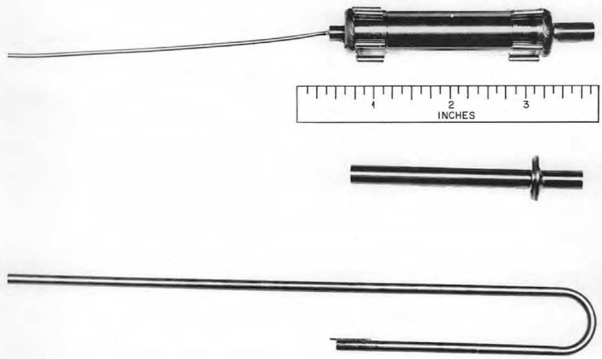  
Fig. 2.3.1. In-Pile Stress-Rupture Specimen and Cooling Means. At the top is a complete stress-rupture specimen and capillary tube for pressurizing to the test stress. The cold finger projects from the right end. In the middle is a blind-end, cold-finger tube ready for welding into a specimen. At the bottom is a hairpin tube for supplying cooling air to the top of the cold finger.

Cooling of the specimen takes place by radiation from the inside surface of the specimen tube to the outside of the cold finger tube. At the in-pile end of the apparatus where the gamma heating is greatest, there is also some cooling by metal conduction. The partially assembled MTR apparatus is shown in Fig. 2.3.2. Electrical heating was used to simulate gamma heating in out-of-pile tests made to establish the design configuration. The MTR tests will be operated at $1500^{\circ}\mathrm{F}$ at stresses from 3000 to 6000 psi. The specimen tube walls are 0.03 in. thick. Out-of-pile tests of single specimens in air have given results that agree with those obtained earlier by the Metallurgy Division.

Since air is to be used as the specimen environment in the MTR tests, little more has been done in the study of the effects of helium and contaminants from the experimental apparatus on the change of calibration of Chromel-Alumel and iron-constantan thermocouples. X-ray diffraction, Curie point, and metallographic studies have been started.

# LITR Experiments

An examination was made of an Inconel stress-corrosion specimen with a 0.02-in.-thick wall that had operated in the LITR for 625 hr before rupture. The stress on the specimen was 2000 psi; the test temperature was $1500^{\circ}\mathrm{F}$ ; and the specimen environment was $\mathrm{NaF - ZrF_4 - UF_4}$ (62.5-12.5-25 mole %) on the inside of the capsule and helium on the outside. The post-irradiation examination showed a maximum of 3 mils of attack at the center of the specimen where the control thermocouples were located. The attack was in the form of scattered voids at grain boundaries. The attack on the helium side of the tube was approximately the same in terms of depth, distribution, and density of voids. Rupture occurred in the neighborhood of the liquid-vapor interface in the upper part of the capsule. It is possible that the temperature exceeded $1500^{\circ}\mathrm{F}$ in this region.

In common with other in-pile stress-rupture tests, the regions of the test specimen that showed the typical severe intergranular separations of third-stage creep were localized in the neighborhood of the fracture. In out-of-pile tests, the

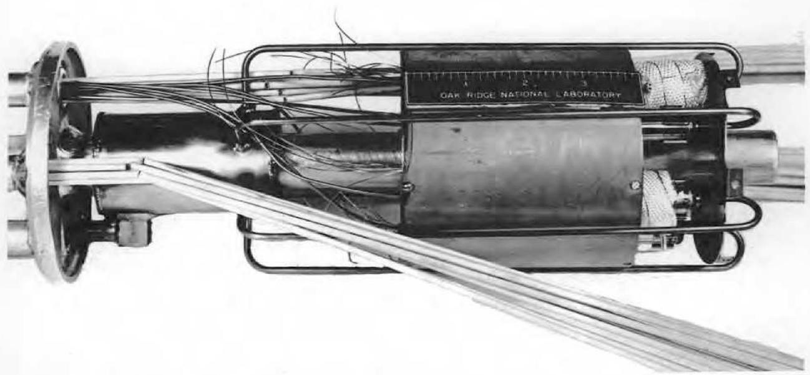  
UNCL ASSIFIED  
PHOTO 42860  
Fig. 2.3.2. Partially Assembled Stress-Rupture Apparatus Designed for Insertion in HB-3 of the MTR. The in-pile ends of several specimens are visible. The $\frac{1}{8}$ -in. tubes will supply cooling air to the cold fingers inside the specimens.

occurrence of the intergranular separations is more widespread throughout the specimen length.

# ORR Tests

The apparatus-holding fixture for attaching experiment cans to the pool face of the ORR has been completed and installed. The surfaces of the reactor tank were neither plane nor well-aligned, and therefore careful shimming was necessary to obtain the required dimensional tolerances. Several sets of the experiment latching mechanism and the handling tool have been designed and built. A sample holder has also been built that will be used initially to hold thermocouples for measuring the pool face temperature during shakedown operations. Design work is proceeding on experiment cans and terminal facilities for experiment cables. An air-filled can has been designed and built to fit against the pool face of the reactor for use in monitoring the flux pattern in the pool facility. The can will also be used by the Operations Division to determine the effect of voids on reactivity.

Mockups of conceptual models of in-pile creep apparatus for irradiation at the ORR have been tested in order to determine the best specimen geometry for large numbers of specimens in the presence of gamma heating that is expected to be of the order of 10 w/g. The objective is to accommodate about 18 specimens in a 15-in. length of one of the lattice positions, but it may be difficult to hold the temperature down to the desired $1500^{\circ}$ F. Instrumentation, safety circuit, and equipment layouts are being planned.

# RADIATION EFFECTS IN ELECTRONIC COMPONENTS

J.C.Pigg

C. C. Robinson

O.E.Schow

The current-voltage characteristics of $p-n$ junctions have been studied extensively. The two principal pictures currently used to explain barrier behavior are the junction theory of Shockley and the carrier generation and recombination theory of Pell, which was later extended by Sah et al.

The junction theory of Shockley predicts a saturation current in the reverse direction and a forward current proportional to $e^{qV / kT}$ . The carrier generation theory does not postulate saturation in the reverse direction and predicts an $e^{qV / nkT}$ dependence in the forward direction. The former picture can be used to explain the current-voltage characteristics at room temperature of semiconductors having small forbidden gaps -- for example, germanium -- and the latter to explain these characteristics in material having large forbidden gaps -- for example, silicon. Pell has shown that even in germanium the charge-generation process predominates at low temperatures.

The reverse current of a junction may be expressed as the sum of two terms:

$$
I _ {R} = I _ {d} + I _ {r g},
$$

where

$l_{d} =$ the junction current,

$l_{rR} =$ the generation current.

The reverse junction current is given by Shockley as

$$
I _ {d} = I _ {0} \left(1 - e ^ {- q V / k T}\right),
$$

with

$$
I _ {0} = I _ {p s} + I _ {n s},
$$

$$
I _ {p s} = A q p \left(D _ {p} / \tau_ {p}\right) ^ {1 / 2},
$$

$$
I _ {n s} = A q n \left(D _ {n} / \tau_ {n}\right) ^ {1 / 2},
$$

where the diffusion constant, $D$ , and lifetime, $\tau$ , are those corresponding to the location in the crystal where the carrier considered exists as a minority carrier and where

$$
V = \text {v o l t a g e},
$$

$$
q = \text {e l e c t r o n i c}
$$

$n,p =$ density of electrons and holes, respectively,

$D_{n}, D_{p} =$ diffusion constant of electrons and holes, respectively,

$\tau_{n'} \tau_p =$ lifetime of electrons and holes, respectively, when appearing as a minority carrier,

$k =$ Boltzmann's constant,

$T =$ absolute temperature,

$A =$ area of the barrier.

The reverse current component from the charge recombination-generation mechanism as given by Pell is

$$
I _ {R} = q G / W A,
$$

where $G$ is the charge regeneration rate, $f$ is the fraction of the space-charge region involved in charge generation, and $W$ is the thickness is the barrier.

These factors have been given in terms of the electronic properties of the material as follows:

$$
G = \frac {n _ {1} p _ {1} (1 - e ^ {- q V / k T})}{\tau_ {n} (n + n _ {1}) + \tau_ {p} (p + p _ {1})},
$$

$$
f = \frac {V + \epsilon_ {\mathrm {g}} - 2 \epsilon_ {\mathrm {r}}}{V + V _ {\Delta F}},
$$

where $n_1$ and $p_1$ are the respective carrier densities that would occur if the Fermi level were at the energy level of the recombination center, $\varepsilon_{g'}$ is the band gap, $\varepsilon_r$ is the depth of the recombination center from the nearest allowed band, $V_{\Delta F}$ is the barrier height.

The barrier thickness, $W$ (in cm), can be determined in terms of the barrier capacitance, $C$ (in $\mu \mathrm{f}$ ), which for germanium is

$$
W = 1. 4 2 A / C,
$$

and $n_1, p_1$ by definition, are given by

$$
n _ {1} = N _ {c} e ^ {\left(\epsilon_ {r} - \epsilon_ {g}\right) / k T},
$$

$$
p _ {1} = N _ {\nu} e ^ {(\varepsilon_ {g} - \varepsilon_ {r}) / k T},
$$

where $N_{c}$ is the density of states in the conduction band and $N_{\nu}$ is the density of states in the valence band.

A combination of these factors gives the reverse current as

It can readily be seen that the $I_{R}$ term corresponding to the recombination-generation mechanism does not indicate saturation in the reverse direction and that this term is also more strongly dependent upon carrier lifetime than is the diffusion component.

If it is assumed that the recombination-generation level is appreciably closer to one band than to the other, the expression can be simplified. If, for example, the level in question is near the conduction band, then $\tau_{n}n_{1} >> \tau_{p}p_{1}$ . The expression then becomes

$$
\begin{array}{l} I _ {r g} = \frac {1 . 4 2 A ^ {2}}{C} q \left(\frac {V + \epsilon_ {g} - 2 \epsilon_ {r}}{V + V _ {\Delta F}}\right) \times \\ \times \quad \frac {N _ {\nu}}{\tau_ {n}} e ^ {(\epsilon_ {g} - \epsilon_ {r}) / k T} (1 - e ^ {- q V / k T}). \\ \end{array}
$$

The $l_{rg}$ term in $I_R$ is exponentially related to temperature by the factor $e^{(\epsilon_g - \epsilon_r) / kT}$ . The $l_d$ term in $I_R$ is exponentially related to temperature by the factor $e^{-\epsilon_g / kT}$ . It would be expected, as Pell found, that the $l_d$ term predominates at high temperatures and the $l_{rg}$ term predominates at low temperatures in a germanium junction.

Curtis et al. found a recombination level about 0.2 ev below the conduction band. Such a level justifies the assumption made above. They found that the lifetime decreased essentially linearly with irradiation exposure, and they attributed the decrease in lifetime to the introduction of recombination centers by the irradiation.

For small-dosage irradiations in which the Fermi level is not changed, $l_{R}$ would be expected to increase as a result of the decreased minority carrier lifetime. Since $l_{d} \propto 1 / \tau^{1 / 2}$ and $l_{rg} \propto 1 / \tau$ , $l_{rg}$ would increase at a faster rate than $l_{d}$ . In addition, new recombination-generation centers

$$
I _ {r g} = \frac {1 . 4 2 A ^ {2} q n _ {1} p _ {1} (V + \epsilon_ {g} - 2 \epsilon_ {r})}{C \left[ \tau_ {n} (n + n _ {1}) + \tau_ {p} (p + p _ {1}) \right] \left[ V + V _ {\Delta F} \right]} (1 - e ^ {- q V / k T}).
$$

that will add a new term $l_{rg}^{\prime}$ to $I_R$ will be introduced at 0.2 ev below the conduction band. If $I_R$ is defined from the limit as $V$ goes to zero of the slope of the reverse current-voltage characteristic,

$$
\begin{array}{l} I _ {R} = I _ {d} + \frac {k T}{q} \lim  _ {V \rightarrow 0} \frac {d}{d V} \left(I _ {r g}\right), \\ = A q p \left(\frac {D _ {p}}{\tau_ {p}}\right) ^ {1 / 2} + A q n \left(\frac {D _ {n}}{\tau_ {n}}\right) ^ {1 / 2} + \\ + 1. 4 2 \frac {A ^ {2}}{C} q \frac {n _ {1}}{\tau_ {p}} \left(\frac {\epsilon_ {g} - 2 \epsilon_ {r}}{V _ {\Delta F}}\right). \\ \end{array}
$$

Curves showing the effect of temperature on $I_{R}$ for a 1N91 germanium-alloy-junction power rectifier before irradiation, after an integrated fast neutron exposure of $10^{13}$ , and after an exposure of $10^{14}$ are presented in Fig. 2.3.3. Before irradiation,

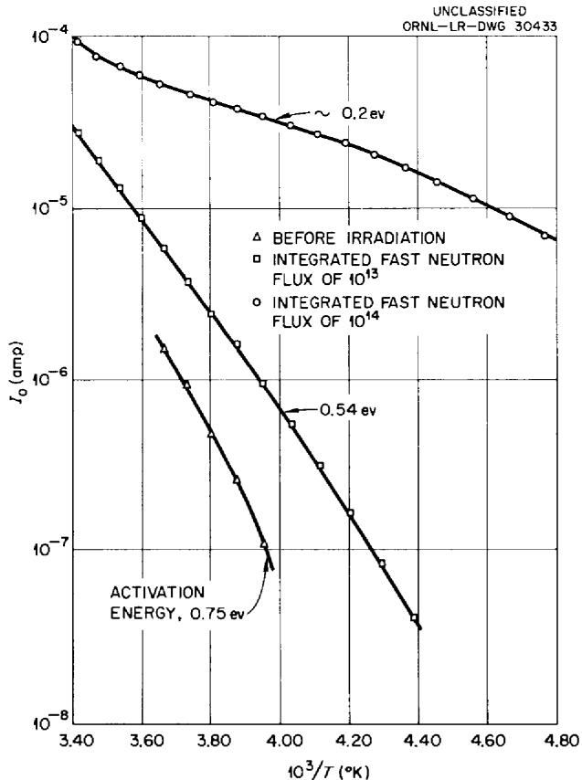  
Fig. 2.3.3. Curves Showing Effect of Temperature on $I_0$ for IN91 Germanium-Alloy-Junction Power Rectifier Before and After Irradiation in ORNL Graphite Reactor.

the slope of the line shows an activation energy of 0.75 ev, which corresponds to $\epsilon_{g}$ . This indicates that the Shockley diffusion theory applies to this sample. After irradiation in the animal tunnel of the ORNL Graphite Reactor to an exposure of $10^{13}$ , $I_{R}$ had increased by about a factor of 4. Measurements of barrier height showed no appreciable change, and thus no appreciable change in the Fermi level was indicated. The curve does not show a sharp break of the kind reported by Pell: in fact, the slope seems to increase at low temperatures. It is believed at present that this increase in slope is experimental error resulting from the small currents involved in measuring $I_{r}$ at low voltages. After an exposure of $10^{14}$ , the curve assumed a slope of approximately 0.2 ev, in agreement with the expectation of a predominating $I_{rg}$ as a result of a recombination-generation level 0.2 ev below the conduction band.

The absence of saturation in the reverse current-voltage characteristics curves of germanium diodes after the units have been exposed to irradiation is thus due to a change in rectification mechanism resulting from the bombardment-produced recombination-generation centers. Such a change in mechanism will also change the forward characteristic. Hence, changes in the emitter behavior of transistors subjected to radiation may be expected.

# IRRADIATION TESTS OF MODERATOR MATERIALS FOR USE AT HIGH TEMPERATURES

W.E.Browning R.P.Shields J.E.Lee, Jr.

Preparation of apparatus, as previously described, for irradiation of moderator materials at high temperatures in the ETR has been continued. The yttrium hydride capsules submitted by GEANPD for this experiment were examined radiographically and were found to have large hidden radial cracks. Additional yttrium hydride specimens have therefore been requested; they will be encapsulated at ORNL. The other specimens for the initial test are ready.

The specimens are right cylinders, and they will be stacked in the C-33 H10 position in the

ETR in the order shown in Table 2.3.1, which is the order from the top down with the center line of the reactor between numbers 3 and 4. Table 2.3.1 also gives the specimen size, material, and gamma heating it will receive. Each capsule will contain three specimens.

Table 2.3.1. Moderator Materials for Irradiation in the ETR   

<table><tr><td>Capsule Number</td><td>Height of Each 1-in.-dia Specimen (in.)</td><td>Moderator Material</td><td>Gamma Heating (w/g)</td></tr><tr><td>1</td><td>0.5</td><td>Beryllium oxide</td><td>18</td></tr><tr><td>2</td><td>0.75</td><td>Beryllium</td><td>23</td></tr><tr><td>3</td><td>0.75</td><td>Yttrium hydride</td><td>25</td></tr><tr><td>4</td><td>1.0</td><td>Yttrium hydride</td><td>25</td></tr><tr><td>5</td><td>1.0</td><td>Beryllium oxide</td><td>23</td></tr><tr><td>6</td><td>1.0</td><td>Yttrium hydride</td><td>18</td></tr></table>

Compatibility tests are being run to determine the effect of yttrium hydride on Inconel and on type 446 stainless steel when heated in contact, in a hydrogen atmosphere to a temperature of $900^{\circ}\mathrm{C}$ . The duration of the test will be several weeks.

Several mockup experiments have demonstrated that the heat from the hottest specimen can be carried across a 10-mil annulus filled with a helium-nitrogen mixture which will be essentially static. Also it has been demonstrated that thermocouples can be attached to the walls of the capsule in the 10-mil annulus.

Several preirradiation tests have been or are being made on all specimens. The yttrium hydride specimen will be studied by x-ray diffraction; it will be heat cycled; and measurements will be made of its elastic properties and dimensions. The other specimens will be studied similarly, except that they will not be examined by x-ray diffraction. The x-ray diffraction examination of yttrium hydride will be made to determine crystal type and lattice spacing. These studies will be repeated after irradiation in order to detect changes, if any.

# Part 3

# ENGINEERING

A. P. Fraas

A. L. Boch

Reactor Projects Division

# 3.1. COMPONENT DEVELOPMENT AND TESTING

H. W. Savage

E. Storto

Reactor Projects Division

# LOOP FOR INVESTIGATING CORROSION IN LITHIUM-COLUMBIUM SYSTEMS

D. R. Ward

A forced-circulation loop has been designed, as shown in Fig. 3.1.1, for testing corrosion in lithium-columbium systems. The loop will be constructed of columbium, and lithium will be circulated with the use of motor-driven electromagnets. The loop is designed to minimize the need for cladding to provide oxidation protection of welded joints. Clad joints are required only at filling- and expansion-tank connections in the coolest part of the loop. The welded columbium tubing joints in heated and cooled parts of the loop will be surrounded by a liquid metal (sodium) heat-transfer fluid or an inert gas. High-quality columbium tubing is presently becoming available only in short random lengths, and many joints may therefore be required in the heated and cooled portions of the columbium loop. Prior to construction with columbium, the performance characteristics of the loop will be determined in an identical loop constructed of stainless steel in which NaK will be circulated.

# PUMP DEVELOPMENT

W. F. Boudreau

A. G. Grindell

# Irradiation Test of Bearings and Seals

D. L. Gray

Operation of the rotary element of an oil-lubricated centrifugal pump installed in a gamma-irradiation facility in the MTR canal, as previously described, was resumed after the damaged shaft had been repaired. Examination of the shaft indicated that the lower journal bearing had been damaged and that the damage had probably occurred as a result of temporary, accidental operation of the shaft at an excessive speed. By late in the quarter, the bearing and seal parts had been subjected to a total accumulated gamma-ray dose of $1.6 \times 10^{9}$ rep. About $98\%$ of the lubricant (Gulfcrest-34) is external to the radiation field, however, and the

gamma-ray dose to the bulk of the oil has been only $3 \times 10^{7}$ rep. Only the lubricant that remains between seal faces or has accumulated in the catch basin has received the full dose.

It has been estimated that by the time the bulk of the oil has accumulated a dose of $5 \times 10^{8}$ rep, a $25\%$ increase in viscosity will have occurred. The increase in the viscosity of the lubricant and the resultant bearing overheating and increased seal leakage are expected to provide information with which to evaluate the useful life of the rotary system in a radiation field. The data obtained can then be used in the design of elements and shielding with which to lengthen the useful life. The effect of irradiation on the physical properties and composition of the oil will be determined.

# Seal Improvements

D. L. Gray

Two modifications made to improve the primary face seal of a centrifugal pump for high-temperature service are being tested. The modifications were made to reduce the rate of accumulation of grease-like materials on the gas side of the seal where lubricant that leaks through the seal mixes with gases laden with constituents from the liquid being pumped. In one modification, the leakage of lubricant is reduced by the use of a Fulton-Sylphon seal. In the other modification, purge gas is admitted to the shaft clearance annulus between the seal and the liquid being pumped so that flow of the gas toward the liquid reduces diffusion of undesirable vapor to the seal region.

The Fulton-Sylphon seal was installed in a liquid metal pump and had operated about 3700 hr by the end of the quarter at pump speeds ranging from 2400 to 3450 rpm. The rubbing speed between seal faces varied from 39.25 to 56.5 fps. Oil leakage averaged less than $1\mathrm{cm}^3$ per day. Thus far no evidence of accumulation of deleterious deposits on the gas side of the seal has been noted.

The split-purge arrangement, described previously,² had operated about 3400 hr when the test

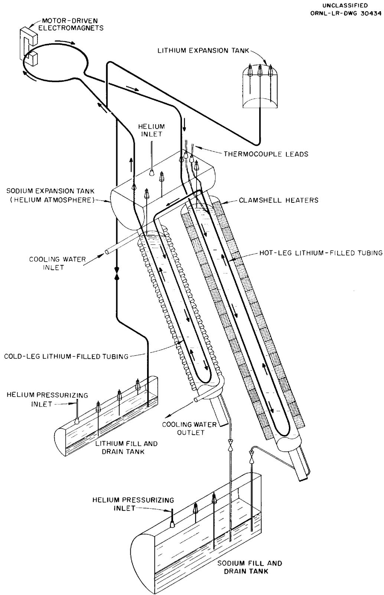  
Fig. 3.1.1. Diagram of Forced-Circulation Loop for Corrosion Testing of Columbium Tubing Exposed to Circulating Lithium.

was suspended to find the cause for increasing restriction to the flow of the gas. Deposits had accumulated in the shaft annulus and closed the gas entry ports. Since there were no deposits above the gas inlets or in any part of the seal region, it was evident that the purge gas had successfully stopped the rise of vapor from the pumped fluid. The cleanliness of the oil-leakage catch basin and the deposits in the shaft annulus may be seen in Fig. 3.1.2. An elastomeric seal between rotating parts had hardened and it may have allowed lubricant to leak into the shaft annulus independently of the action of the pump primary face seal.

# Cavitation Tests

P.G.Smith W.E.Thomas

Experiments have shown that cavitation-induced damage of an impeller is primarily a function of the head-vs-flow characteristics of the pump. The density of the fluid being pumped affects only the pressures, and therefore pump cavitation tests with water and liquid metals will indicate the operating conditions to be expected in the pumping of lithium with similar pumps. Two tests are now under way in which pumps are being operated over a wide range of conditions in order to evaluate cavitation-induced damage as a function of time. One pump has operated under cavitation conditions for more than 4000 hr without changes in performance characteristics and the other has operated 500 hr. Upon completion of these tests, which are scheduled for a total of 10,000 hr, the impellers will be examined for cavitation damage.

# VALVES FOR USE AT HIGH TEMPERATURES

# I. T. Dudley

Satisfactory high-temperature operation of a general-purpose poppet valve with a bellows-sealed stem has been demonstrated. Valves with the plug and the seat of Stellar 6 overlaid on Inconel have been tested with NaK, and valves with Kennametal cermets for both the plug and the seat have been tested with fused salts. Since

cermets of the type tested are known to be compatible with lithium, the valve with the cernet plug and seat would be expected to be satisfactory for use with lithium. The available valve bodies were constructed of Inconel and consequently could not be tested with lithium.

The valve with the Stellar 6 plug and seat was tested with NaK at $1000^{\circ}\mathrm{F}$ under a pressure of 50 psi. Leakage decreased from $0.75~\mathrm{cm}^3 /\mathrm{hr}$ to $0.2~\mathrm{cm}^3 /\mathrm{hr}$ after 1500 hr. The force needed to open the valve remained less than 50 lb, and a 1300-lb force was needed to effect closure. Posttest examination showed slight creep of the seating surfaces, but the closure had not been affected.

The valve with the K-162B cermet seat (Rockwell A hardness, 89) and KM plug (Rockwell A hardness, 91) operated satisfactorily when the test liquid was free of particulate matter. Particulate solids suspended in the liquid prevented full seating of the very hard, carefully lapped surfaces of the mating cermets.

# THERMAL STABILITY TESTS OF METAL SHELLS

J.C.Amos R.L.Senn

The second thin-shell test model was subjected to a creep buckling test at $1500^{\circ}\mathrm{C}$ in an atmosphere of helium with an external pressure of 52 psi. The shell buckled as shown in Fig. 3.1.3 in 111.15 hr. The top half of this shell where buckling occurred had previously been subjected to 339 thermal cycles in a thermal-cycling test stand. A detailed description of this thermal-cycling test was presented previously.

Two additional thin shells of the same geometry are being fabricated by welding together over-size sections and reducing the weldment to the desired final dimensions by machining. Metallurgical observation has shown that in some locations the weld metal that remains after the machining may consist of a single grain that extends across the total shell thickness. In order to investigate further the durability under thermal cycling of a vessel fabricated as a machined weldment, one of the new shells is currently being assembled in the thermal-cycling test container.

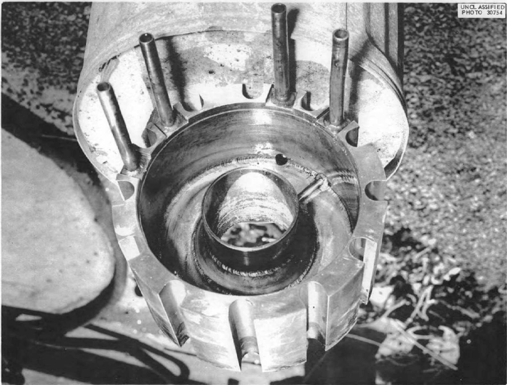  
Fig. 3.1.2. Oil-Leakage Catch Basin and Outer Wall of Shaft Annulus of Centrifugal Pump Operated with a Split-Purge Arrangement to Prevent the Rise of Vapor from the Pumped Fluid.

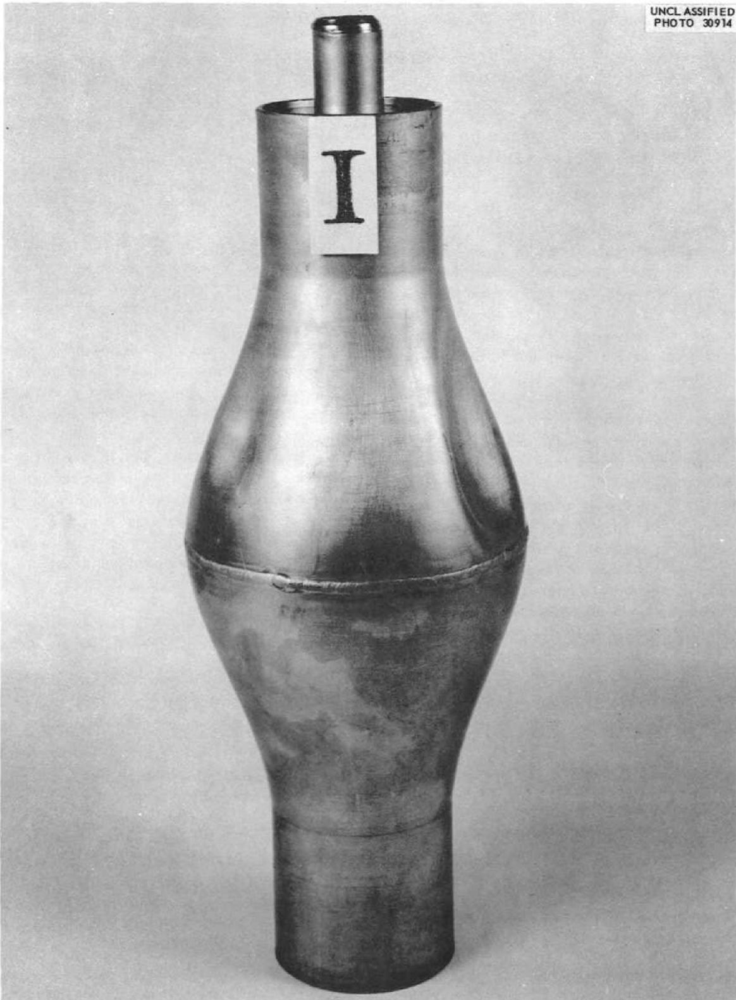  
Fig. 3.1.3. Thin Shell Weldment That Buckled After 111.15 hr at $1500^{\circ}$ F in an Atmosphere of Helium and an External Pressure of 52 psi.

# 3.2. HEAT TRANSFER STUDIES

# H. W. Hoffman Reactor Projects Division

# STUDIES OF THE EFFECT OF THERMAL-STRESS CYCLING ON STRUCTURAL MATERIALS

# Pulse-Pump System

# J.J.Keyes A.I.Krakoviak

Three additional tests (tests 6, 7, and 8) have been run with the high-frequency thermal-cycling pulse-pump loop in which the fuel mixture NaF-ZrF4-UF4 (56-39-5 mole %) was the circulating fluid and helium was the pulsing and cover gas. The test sections were 0.485-in.-ID, 0.415-in.-wall Inconel cylinders machined from bar stock.

The operating conditions and results of tests 6 through 8 are given in Tables 3.2.1 and 3.2.2. This series of experiments has been primarily concerned with the effects of exposure time (or total number of cycles) on thermal cycling. Thus, runs 5 and 6 and runs 7 and 8 each constitute time-comparison test-pairs which were performed under conditions as nearly identical as could be maintained with long-term operation of the experimental equipment. In all tests the fluid flow was kept constant at 6 gpm (equivalent to $b = 3700$ Btu/hr.ft².°F in the test section); the pulsing

frequency was 0.4 cps. The stream-temperature amplitudes were different in the two test groups.

In run 6, incipient intergranular cracks were found after 22.8 hr of pulsing with a stream-temperature amplitude of $\pm 242^{\circ}F$ . This is illustrated in Fig. 3.2.1 which shows surface cracks to a depth of 2.5 mils. The test section of run 5, as previously reported,² had cracks as deep as 72 mils after 135 hr of pulsing.

For tests 7 and 8, the stream-temperature amplitude was $\pm 139^{\circ}F$ , with run 7 lasting 155 hr and run 8, 351 hr. The results of these tests are given by the photomicrographs of Figs. 3.2.2 and 3.2.3. The specimen used in test 7 showed variable subsurface void formation (ranging from light to heavy in concentration) to a depth of 3 mils. No cracks were found in the test section. This is to be compared with run 8 (exposed to $2^{1/4}$ times as many thermal cycles) in which massive cracking occurred. Typical cracks which formed near the test-section entrance (region just beyond the conical inlet) are shown in Fig. 3.2.2. The cracks penetrated the 0.415-in. wall to a depth of 0.080 in.

A section of 1-in. sched-40 pipe $\frac{1}{2}$ in. downstream from the Y-section (junction of the hot and cold streams) was removed after a total

Table 3.2.1. Operating Conditions of High-Frequency Thermal-Stress-Cycling Tests of Inconel Pipe   

<table><tr><td rowspan="2">Test Variables</td><td colspan="3">Test Number</td></tr><tr><td>6</td><td>7</td><td>8</td></tr><tr><td>Average fluid temperature, °F</td><td>1398</td><td>1410</td><td>1409</td></tr><tr><td>Maximum temperature difference between hot and cold streams, °F</td><td>484</td><td>278</td><td>278</td></tr><tr><td>Frequency of temperature oscillations, cps</td><td>0.4</td><td>0.4</td><td>0.4</td></tr><tr><td>Total pulsing time, hr</td><td>22.8</td><td>156.0</td><td>352.0</td></tr><tr><td>Total cycles</td><td>32,800</td><td>224,000</td><td>508,000</td></tr><tr><td>Total fluid flow rate, gpm</td><td>6.2</td><td>6.3</td><td>6.3</td></tr></table>

Table 3.2.2. Results of High-Frequency Thermal-Cycling Tests of Inconel Pipes   

<table><tr><td>Test No.</td><td>Samplea</td><td>Wall Thickness (in.)</td><td>Measured Temperature Amplitude on Outside Pipe Wall (°F)</td><td>Estimated Temperature Amplitude on Inside Pipe Wall (°F)b</td><td>Results of Metallographical Examination of Test Piece and Adjacent Piping</td></tr><tr><td>6</td><td>a</td><td>0.133</td><td>±17.5</td><td>±55</td><td>Moderate to heavy void formation to a depth of 2 mils above weld</td></tr><tr><td>6</td><td>b</td><td>0.415</td><td>Not measured</td><td>±136</td><td>Cracks to a depth of 3 mils occurred at point where inside diameter of pipe was reduced to 0.485 in.</td></tr><tr><td>6</td><td>c and d</td><td>0.415</td><td>Not measured</td><td>±136</td><td>Cracks occurred throughout test section with severity decreasing markedly below middlec</td></tr><tr><td>6</td><td>e</td><td>0.415</td><td>Not measured</td><td>±136</td><td>Cracks observed (less severe than at entrance) in 0.485-in.-ID section at point where inside diameter increased to 1.049 in.c</td></tr><tr><td>6</td><td>f</td><td>0.133</td><td>±28.0</td><td>±55</td><td>Light void formation</td></tr><tr><td>7</td><td>a</td><td>0.133</td><td>±11.0</td><td>±32</td><td>No evidence of cracks</td></tr><tr><td>7</td><td>b,c,d</td><td>0.415</td><td>0</td><td>±78</td><td>No evidence of cracks; light to heavy voids to a depth of 3 mils</td></tr><tr><td>7</td><td>e</td><td>0.133</td><td>±16.0</td><td>±32</td><td>No evidence of cracks in pipe above or below weld; however, cracks to a depth of 25 mils developed in weld-base metal interface</td></tr><tr><td>8</td><td>b</td><td>0.133</td><td>±12.7</td><td>±32</td><td>Intermittent light void formation to a depth of 3 mils</td></tr><tr><td>8</td><td>c</td><td>0.415</td><td>Not measured</td><td>±78</td><td>Very heavy cracking to a depth of 85 mils ¼ in. below point where test section is reduced to 0.485 in. ID</td></tr><tr><td>8</td><td>d</td><td>0.415</td><td>Not measured</td><td>±78</td><td>Transverse section from center to test piece showed less heavy cracking than sample c; cracks to a depth of 42 mils</td></tr><tr><td>8</td><td>e</td><td>0.415</td><td>Not measured</td><td>±78</td><td>Cracks to a depth of 16 mils in small-diameter section that finally degenerate to moderate intergranular void formation in diverging region</td></tr><tr><td>8</td><td>f</td><td>0.133</td><td>±20.4</td><td>±32</td><td>Light void formation to a depth of 4 mils; no evidence of cracks in welded zone</td></tr></table>

For sample location, see Fig. 1.7.1, p 56, ANP Quar. Prog. Rep. Dec. 31, 1957, ORNL-2440.   
${}^{b}$ Assuming 100% efficiency,using Jakob's equation for calculation of $\eta$ ,and neglecting entrance effects.   
Some grain-boundary relief was seen in conjunction with some of the well-developed cracks. This was probably due to deformation occurring just before failure.

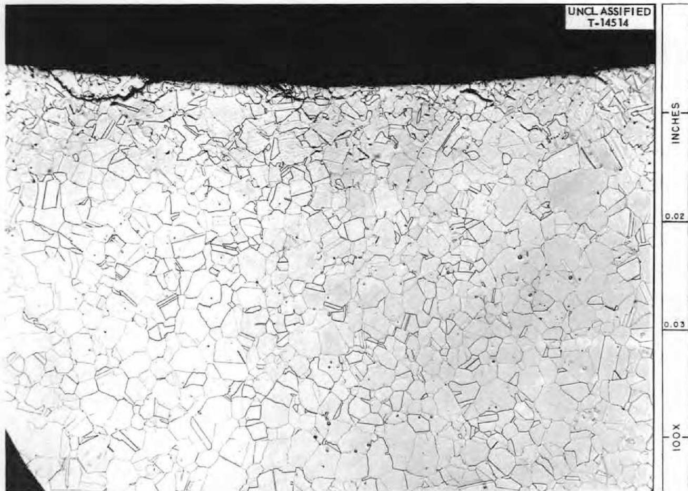  
Fig. 3.2.1. Effect of High-Frequency Thermal Cycling on Inconel in an NaF-ZrF $_4$ -UF $_4$ (56-39-5 mole %) Environment - Test 6. Etchant: Marble's reagent, 100X. (Secret with caption)

exposure of approximately 1200 hr. Of this total, 408 hr were at a stream-temperature amplitude of $\pm 240^{\circ}\mathrm{F}$ , 606 hr at $\pm 135^{\circ}\mathrm{F}$ , and 183 hr isothermal at $1300^{\circ}\mathrm{F}$ . The section was subjected to $4.3 \times 10^{6}$ thermal cycles over this period. Photographs of the sample showed no evidence of intergranular cracks. Heavy subsurface void formation to a depth of 3.5 mils was observed. The lack of cracking may be attributed to (1) a low heat-transfer rate and hence relatively small surface-temperature fluctuation ( $\eta < 0.25$ ) in this section, (2) a low cyclic frequency (0.4 cps), for which the pipe wall is effectively thin, and (3) stresses that were low over most of the accumulated time.

# Thermal Entrance Studies with Water

# J.J.Keyes

Measurements of surface attenuation reported by Mott3,4 for conditions far downstream were ex

tended to measurements of regions close to the entrance of a thick-walled Inconel cylinder. These measurements are of interest in connection with the high-temperature thermal-cycling tests, since a substantial fraction of the test section is in a thermal entrance region where increased heat transfer and thus increased surface temperature amplitude prevails.

The entrance geometry under investigation consists of a sudden contraction from a 24-in. length of 1-in. sched-40 pipe (ID = 1.049 in.) to the sharp-edge entrance of the 0.460-in.-ID test section, with a consequent area reduction

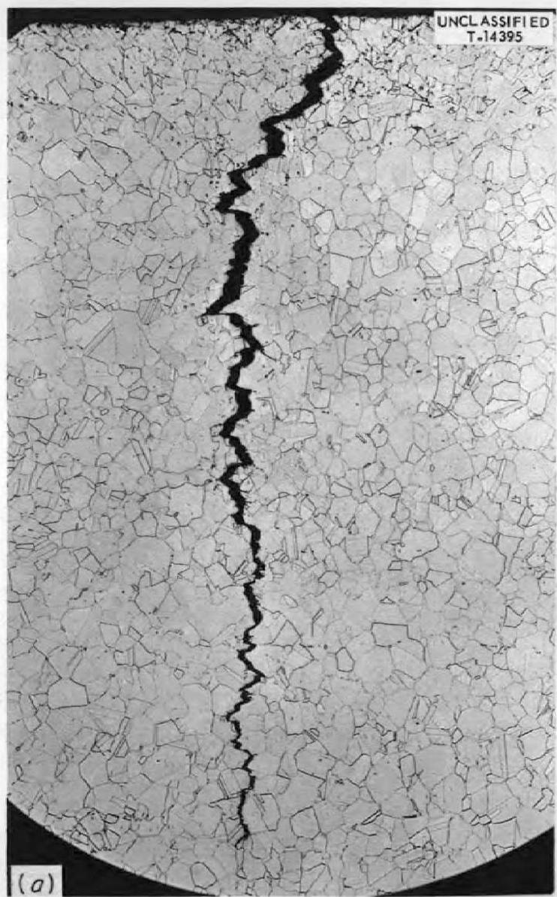

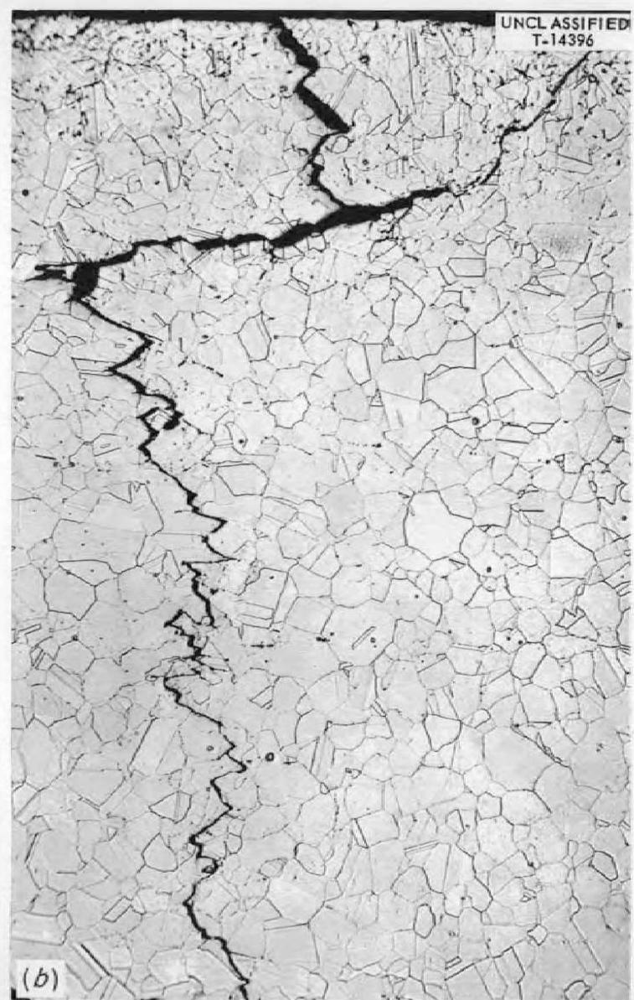  
Fig. 3.2.2. Effect of High-Frequency Thermal Cycling on Inconel in an $\mathsf{NaF - ZrF_4 - UF_4}$ (56-39-5 mole %) Environment - Test 8. Etchant: Marble's reagent. (a) 75X; (b) 100X. Reduced 4%. (Secret with caption)

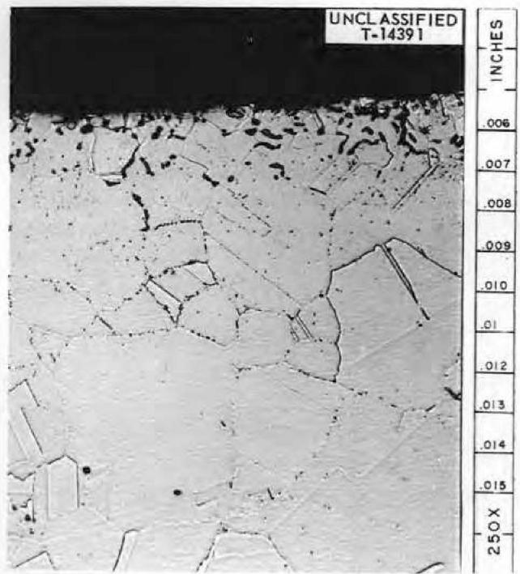  
Fig. 3.2.3. Effect of High-Frequency Thermal Cycling on Inconel in an NaF-ZrF4-UF4 (56-39-5 mole %) Environment - Test 7. Etchant: modified aqua regia. 250X. (Secret with caption)

of 5.2 (see Fig. 3.2.4). Greater reduction was not deemed practical, since the length of pipe upstream required to establish flow ahead of the contraction would have resulted in severe attenuation of the thermal oscillations at the test section.

Surface temperatures were measured by means of the Inconel-nickel "gun-barrel" thermocouple previously described3,4 and stream temperatures by a 0.005-in. Inconel-nickel wire couple immersed with the junction approximately at midstream. Reynolds moduli were varied from 50,000 to 133,000 and $x / d$ from 65 to 4.3 ( $x$ is the distance of the wall thermocouple from the entrance of the test section of diameter $d$ ).

Some of the results are plotted in Figs. 3.2.5 and 3.2.6, where the ordinate is the experimental value of the local attenuation ratio

$$
\eta_ {x} = \frac {\text {s u r f a c e t e m p e r a t u r e a m p l i t u d e a t} x}{\text {f l u i d s t r e a m t e m p e r a t u r e a m p l i t u d e a t} x}.
$$

Curves are drawn for frequencies of 1, 2, and 3 cps. The dashed lines in Fig. 3.2.5 represent calculations based on the Jakob equation, and

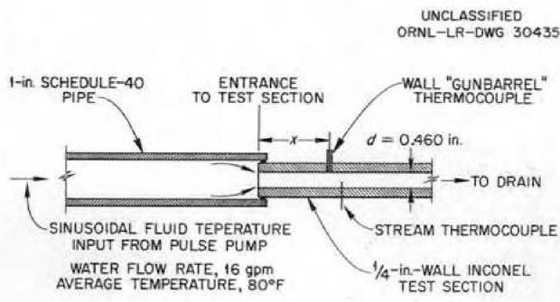  
Fig. 3.2.4. Test Section Entrance Geometry.

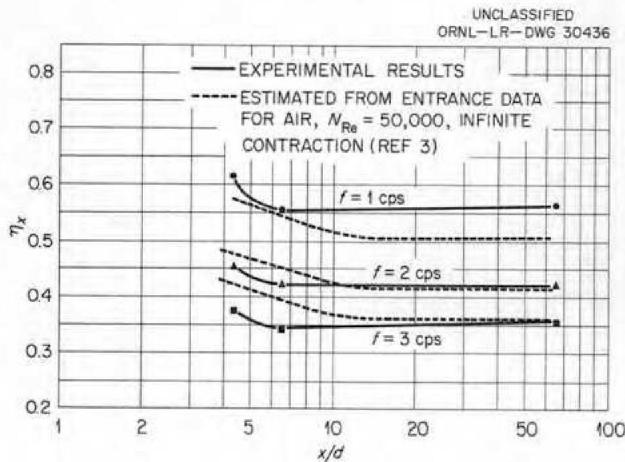

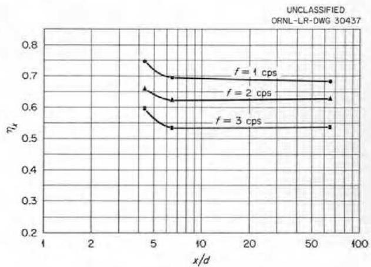  
Fig. 3.2.5. Variation of Local Surface Attenuation Ratio, $\eta_{x}$ , with Distance from Sharp-Edge Entrance in a Circular Tube of Diameter 0.46 in. at $N_{\text{Re}} = 67,000$ ( $b_{\infty} = 2800 \text{ Btu/hr·ft}^{2.0} \text{F}$ ).   
Fig. 3.2.6. Variation of Local Surface Attenuation, $\eta_{x^{\prime}}$ with Distance from Sharp-Edge Entrance in a Circular Tube of Diameter 0.46 in. at $N_{\mathrm{Re}} = 133,000$ $(b_{\infty} = 4870\mathrm{Btu / hr}\cdot \mathrm{ft}^{2},^{\circ}\mathrm{F})$

were obtained by replacing the local heat-transfer coefficient, $b_{x^{\prime}}$ by the quantity

$$
H _ {\infty , H _ {2} O} \left(\frac {b _ {x}}{b _ {\infty}}\right) _ {a l r}
$$

where $(b_{x} / b_{\infty})_{\mathrm{a1r}}$ is obtained from the measurements of Boelter et al. for an infinite contraction at $N_{R_0} = 50,000,$ and $H_{\infty ,H_20}$ is determined by the Dittus-Boelter correlation,

$$
b _ {\infty , H _ {2} O} d / k = 0. 0 2 3 N _ {R e} ^ {0. 8} N _ {P r} ^ {0. 3 5}.
$$

It is apparent that, for the conditions of this study, entrance effects are not significant above an $x / d$ of about 6.

The variation of $\eta$ at $x / d = 4.3$ for $N_{\mathbb{R}^{\bullet}}$ of 133,000 and 50,000 is shown in Fig. 3.2.7 and compared with curves (dashed) calculated from the Jakob equation and entrance data for air, as described in the preceding paragraph. Note that the calculations underestimate the effect of $N_{\mathbb{R}^{\bullet}}$ and consequently of $b$ on $\eta_{x}$ . It is intended to continue these measurements down to

5L. M. K. Boelter, G. Young, and H. W. Iversen, An Investigation of Aircraft Heaters XXVII - Distribution of Heat-Transfer Rate in the Entrance Section of a Circular Tube, NACA TN-1451 (July 1948).

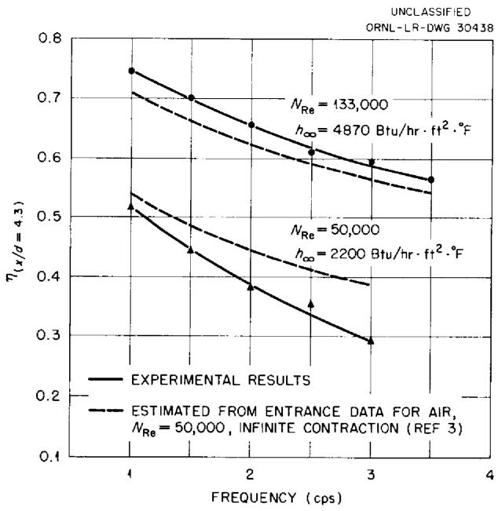  
Fig. 3.2.7. Variation of Surface Attenuation, $\eta$ , with Frequency at $x / d = 4.3$ .

at least $x / d = 1$ and to study other entrance configurations of interest.

# THERMAL STRUCTURE OF FLUIDS FLOWING IN VOLUME-HEATED SYSTEMS

# Diverging Annular Channel with Screens

N. D. Greene

The study of the effect of screens in a diverging annular channel on the thermal structure of a fluid with internal heat generation has been completed. Three screens with increased porosity in the region of the outer wall were installed in the positions shown in Fig. 3.2.8. The topmost screen was of uniform porosity. A 3.8-in.-thick drilled Boltaron sheet located in the channel entrance converted the swirl entrance flow to

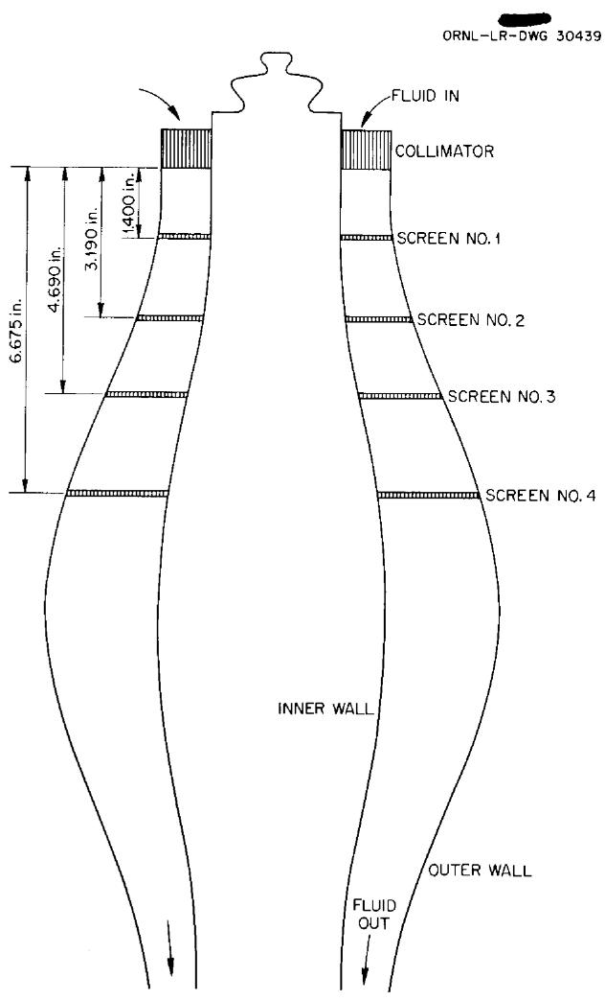  
Fig. 3.2.8. Location of Screens in Diverging Annular Channel.

axial flow. The screen porosities are listed in Table 3.2.3.

Both steady-state and fluctuating temperatures were measured at the inner and outer channel walls. The transient data are compared in Fig. 3.2.9 with data obtained in previous measurements on the vaned entrance system and on

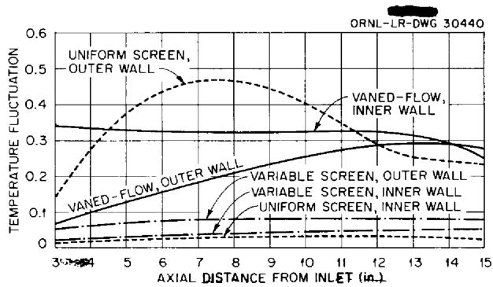  
Fig. 3.2.9. Transient Temperature Fluctuations for Vaned-Flow and Uniform and Variable Porosity Screened Channels with Two-Pump Operation. Power generation uniform at $120\mathrm{kw}$ ; $N_{\mathrm{Re}} = 81,500$ .

the uniform-porosity screen system. The amplitude of the surface-temperature fluctuations was reduced to less than $10\%$ of the axial rise at both the inner and outer channel walls with the variable porosity screens. In Fig. 3.2.10, the steady-state temperature distributions for the two screened systems are compared.

6H. F. Poppendiek et al., Analytical and Experimental Studies of the Temperature Structure Within the ART Core, ORNL-2198 (Jan. 31, 1957).   
7N. D. Greene and W. R. Gambill, ANP Quar. Prog. Rep. Sept. 30, 1957, ORNL-2387, p 104.

Table 3.2.3. Screen Porosities   

<table><tr><td rowspan="2">Screen Position</td><td colspan="2">Porosity</td></tr><tr><td>Inner Region</td><td>Outer Region</td></tr><tr><td>Collimator</td><td>0.580</td><td>0.580</td></tr><tr><td>No. 1</td><td>0.670</td><td>0.670</td></tr><tr><td>No. 2</td><td>0.598</td><td>0.665</td></tr><tr><td>No. 3</td><td>0.557</td><td>0.660</td></tr><tr><td>No. 4</td><td>0.459</td><td>0.660</td></tr></table>

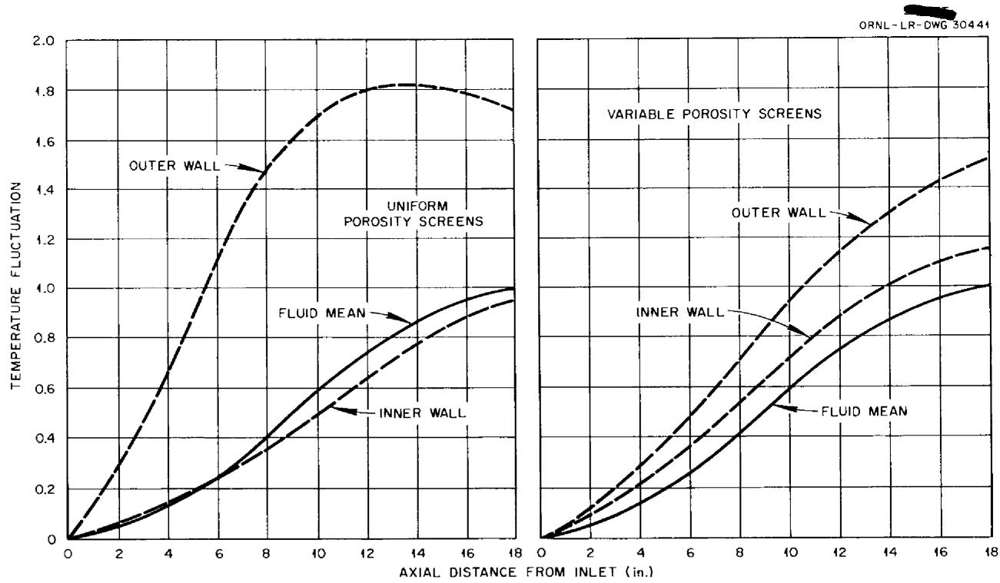  
Fig. 3.2.10. Mean Temperature Distribution for Uniform and Variable Porosity Screened Channels with Two-Pump Operation. Power generation uniform at $120\mathrm{kw}$ , $N_{\mathrm{Re}} = 84,000$ .

The effect of single-pump operation on the temperature distributions was also studied. The results are given in Fig. 3.2.11 for the transient measurements and in Fig. 3.2.12 for the steady-state measurements. It is apparent from Fig. 3.2.11 that the screens effectively reduce the flow asymmetries caused by the one-pump entrance flow, and hence there is only a small increase in the temperature fluctuation amplitude between

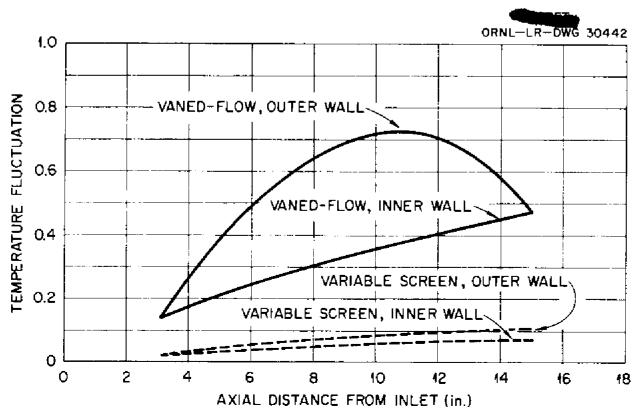  
Fig. 3.2.11. Transient Temperature Fluctuations for Vaned-Flow and Variable Porosity Screened Channels with One-Pump Operation. Power generation uniform at $120\mathrm{kw}$ ; $N_{\mathrm{Re}} = 40,000$ .

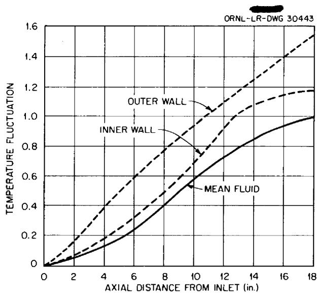  
Fig. 3.2.12. Mean Temperature Distribution for Variable Porosity Screened Channel with One-Pump Operation. Power generation uniform at $120\mathrm{kw}$ ; $N_{\mathrm{Re}} = 40,000$ .

the two-pump and one-pump conditions. This study has demonstrated that the amplitude of the surface temperature fluctuations can be markedly reduced by introducing properly designed screens into the main channel flow region.

# Liquid-Metal Experiment

G. L. Muller8 H. W. Hoffman

Initial studies of heat transfer in a liquid metal (mercury) with internal heat generation have been completed. The scope of the experiments is indicated in Table 3.2.4. To determine whether magneto-hydrodynamic effects existed in the mercury flowing through the test section due to the heavy (1000 amp) electrical current used in heating the mercury, several half-power runs were made.

Table 3.2.4. Test Conditions for Volume-Heated Mercury Experiment   

<table><tr><td>Run</td><td>Description</td></tr><tr><td>Full power</td><td>16 runs at flow rates ranging from NRe=6,000 to NRe=150,000</td></tr><tr><td>Half power</td><td>2 runs at flow rates dupli-cating two full-power tests</td></tr><tr><td>Low power</td><td>1 run</td></tr><tr><td>Effect of guard heater on test-section temperature</td><td>2 runs at different guard-heater power levels</td></tr><tr><td>Thermocouple calibration</td><td>4 runs at temperature levels varying from 58°F to 222°F</td></tr><tr><td>Electrode heat loss</td><td>2 runs at two power levels</td></tr></table>

The results of these tests can be compared with the results of full-power runs at the same flow rates to establish the magnitude of this effect. Preliminary calculations have indicated that magneto-hydrodynamic corrections will be negligible. One low-power test was made to establish the shape of the fluid mixed-mean temperature profile along the test section.

Midway in the series of full-power experiments, the steel rotor of the Moyno pump began to bind

within the rubber stator. The pump is a positive-displacement screw-type in which the turning rotor rubs along the stator, and the liquid being pumped provides the necessary lubrication between the rotor and stator. Because of its high surface tension relative to the usual oxide coating on steel, mercury is a poor lubricant. In order to overcome this defect, sufficient sodium metal was added to the system to produce a sodium-mercury alloy with $0.02 \mathrm{wt} \%$ Na. This sodium addition had a negligible effect on the thermal and electrical properties of the fluid, but it reduced the oxide layer on the steel and allowed the mercury to wet the steel.

Preliminary analyses of the data indicate that the surface-to-fluid mean temperature differences

are greater than those predicted by the analyses of Poppendiek. From this, it appears that the theory-vs-experiment discrepancies observed in liquid-metal wall-heat-transfer systems exist also in the volume-heated system. Since interfacial resistances, such as gaseous films or particulate scales, do not affect the results of this study (adiabatic walls), it can be concluded that the radial conductivity (molecular and eddy) in the mercury is smaller than postulated.

# 3.3. INSTRUMENTATION AND CONTROLS

H. J. Metz Instrumentation and Controls Division

# DATA ACQUISITION SYSTEM

G. H. Burger

A data acquisition, or digital recording, system was purchased from the G. M. Giannini Company in order to evaluate the use of such a system in the handling or recording in digital form of such process variables as temperature, flow, and pressure which are normally encountered in reactor instrument systems, reactor component test stands, and reactor instrument development and testing. It is expected that, with the experience gained with the use of this equipment, a better evaluation can be made of the need for instruments and instrument systems for future reactor application. The system purchased was selected upon the basis of its relative simplicity and compatibility with the present use of strip-chart recorders, as well as its expected reliability (comparable with that of a Brown recorder) and its flexible design features.

The system is constructed to record automatically on a typewriter and to display visually on a lamp bank the values of the millivolts inputs of ten 12-point Brown strip-chart recorders (120 points) plus a time reference. The automatic typewriter is equipped to punch tape in the Oracle code. Controls are included in the system to enable automatic logging cycles to be made at regular timed intervals in tabular form or on tape or both. The system is capable of logging 120 points in approximately 4 to 8 min, depending on the Brown recorders. Recorders other than the Brown instruments can be used, and the recorders may be single-point, 16-point, or 24-point as well as the presently installed 12-point recorders.

A self-balancing potentiometer or an equivalent device is used to convert voltage inputs to shaft position. The initial digital encoding is done by an encoding disk which is mounted on the movable shaft of the self-balancing potentiometer or other device.

# LIQUID-METAL-LEVEL TRANSDUCERS

G. H. Burger

Life tests of ORNL-designed liquid-metal-level transducers have been continued. Two of the four

units being tested have accumulated 5408 hr of operation at $1200^{\circ}\mathrm{F}$ in NaK and the other two have accumulated 775 hr. It is planned to continue these tests indefinitely.

Eight transducers were tested to investigate wetting at temperatures of 300, 400, 500, and $600^{\circ}\mathrm{F}$ . Seven of the transducers were regular Inconel units and one was an Inconel unit plated with iron to a thickness of approximately 0.003 to 0.005 in. The test results for all the units are now being compiled and will be included in a later report.

After completion of the wetting tests, four units were installed in the test rig and the temperature was raised to $1200^{\circ}\mathrm{F}$ for life tests of these units.

# STRAIN GAGES FOR USE AT HIGH TEMPERATURES

C. L. Pearce, Jr.1

A search of the literature on bonded strain gages for static measurements at temperatures up to $2000^{\circ}\mathrm{F}$ is under way. Since the bulk of the published work on the subject is several years old and, in many cases, preliminary, some of the people who have been involved in strain gage research are being contacted to bring the survey up to date. Various groups at ORNL who have used strain gages have been interviewed; however, the use of strain gages at ORNL has been almost entirely at low temperatures. The companies that market commercial strain gages are being contacted to determine the present limits of applicability of their gages to high-temperature static strain measurements and to determine the feasibility of extending the range.

Effort is being directed toward devising a relatively inexpensive test facility for evaluating and comparing the various types of bonded strain gages presently available. The comparisons should show wherein the high-temperature limitation occurs in each case in order to indicate the possibilities of extension of the temperature limit.

A preliminary survey has indicated that the present temperature limit on reliable measurements

of static strains is $900^{\circ}F$ . Phase changes in the materials appear to be the limiting factor.

# TEST SET-UP FOR STUDY OF EFFECT OF RADIATION ON THERMOCOUPLES

A.M. Leppert

Preliminary design of an in-pile loop in which to study the effects of high-level radiation on thermocouples has been completed. In this design, sheathed thermocouples are brazed into a pot partially filled with triple-distilled sodium under high vacuum. The sodium acts as a thermal heat sink. The pot temperature is obtained by monitoring the vapor pressure of the sodium.

A bench test is under way in order to determine the reproducibility of the vapor pressure-vs-temperature curve for sodium. Since the sodium vapor will be radioactive, it should not be brought outside the test cell to the electromanometer pressure transducer. Consequently it was decided to put an isolating diaphragm in the sodium vapor line, with a solid-filled system from the diaphragm to the electromanometer.

A diaphragm and housing have been assembled and tests begun to determine effects of operating the filled part of the system and electromanometer head at varying temperatures and different fill pressures. A small pot with several sheathed thermocouples has been fabricated, and as soon as the diaphragm tests are completed the pot will be welded to the diaphragm housing and filled.

Tests will be then conducted to check the reproducibility of the vapor-pressure curve. The temperature range to be investigated is 600 to $1500^{\circ}\mathrm{F}$ .

# PRESSURE TRANSMITTERS FOR USE AT HIGH TEMPERATURES

C. M. Burton

Two pneumatic 0- to 200-psi pressure transmitters with 3- to 15-psi signal outputs (Taylor Instrument Cos. Model 226R) and Inconel bodies are now undergoing overrange pressure tests. These tests were started in an attempt to determine the aging characteristics of the instruments with respect to accuracy and to overall safety. Calibrations are made at intervals to detect error drift, and it is hoped that the errors will give a warning of impending failure of the primary seal. It is possible that the primary seal will deform slightly by bulging of the flat circular plates above and below the diaphragms. If so, the stresses will be somewhat relieved as a spherical shape is approached, creep at the high temperature will decrease, and the safe life of the unit will be extended, but it is possible that the accuracy of the instrument may be affected. The furnaces are shut down occasionally and micrometer measurements are made on the pressure transmitter bodies to detect deformation. After approximately 2500 and 1750 hr, respectively, with the two units at $1400^{\circ}\mathrm{F}$ and 300 psig, calibrations have not changed appreciably, and the bodies have not deformed noticeably.

Part 4

# SHIELDING

E. P. Blizzard

Applied Nuclear Physics Division

# 4.1. SHIELDING THEORY

# F. L. Keller

# Applied Nuclear Physics Division

# A CALCULATION OF ENERGY SPECTRUM AND ANGULAR DISTRIBUTION OF GAMMA RAYS AT SURFACE OF BSF REACTOR

L.A.Bowman

R.H. Lessig²

W.W.Dunn2

D. K. Trubey

In the past it has not been possible to use directly the Monte Carlo shielding codes to check, or to predict, the experimental results of shielding experiments performed with the Bulk Shielding Facility (BSF) reactor. While theoretical calculations of the energy spectrum have been performed for comparison with the experimentally measured gamma-ray spectrum, there is only limited information on the angular distribution at the reactor surface. The calculation reported here represents a new attempt to calculate the energy spectrum from primary gamma-ray sources and, in addition, to determine the angular distribution of the gamma rays at the reactor surface.

# Geometry

The reactor was divided into four quadrants, with each quadrant containing one quarter of the reactor volume, as shown in Fig. 4.1.1. The thermal

$$
\begin{array}{l} \text {U N C L A S F I E D ,} \\ 2 - 0 1 - 0 5 9 - 2 7 9 \end{array}
$$

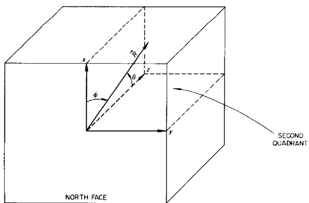  
Fig. 4.1.1. Assumed Geometry for the Calculation of the Gamma-Ray Spectrum of the BSF Reactor (Loading 33).

neutron flux in the second quadrant was used to perform an integration of the power and the gamma-ray leakage out the center of the north face of the reactor. The integration was performed over the angles $\phi$ and $\theta$ so that an angular distribution of the gamma rays could be computed.

# Thermal-Neutron Flux

Thermal-neutron flux measurements were available for points within the volume of the second quadrant of BSR loading 33 for a reactor power of 27.36 kw. Plotting and cross-plotting these measured values produced curves which could be used to determine the flux at any point in this volume. Integration over the reactor, that is,

$$
\begin{array}{l} P o w e r \approx C \int_ {R e a c t o r} \phi_ {t h} (\vec {R}) d \vec {R} \\ = C \int_ {\theta} \int_ {\phi} \int_ {0} ^ {R (\max )} \phi_ {t h} (\theta , \phi , R) \\ \end{array}
$$

$$
R ^ {2} d R \sin \theta d \theta d \phi ,
$$

where

$$
\begin{array}{l} \phi_ {t h} = \text {t h e r m a l - n e u t r o n} \quad \text {f l u x} \quad (\text {t a k e n} \quad \text {f r o m} \quad \text {t h e} \\ C = \Sigma_ {f} (u) / K, \\ \begin{array}{l} \Sigma_ {t} (u) = \text {m a c r o s c o p i c u r a n i u m f i s s i o n c r o s s s e c t i o n} \\ = 0. 0 5 6 5 \mathrm {c m} ^ {- 1}, \end{array} \\ K = \text {f a c t o r} \quad \text {t o} \quad \text {c o n v e r t} \quad \text {f i s s i o n} \quad \text {r a t e} \quad \text {t o} \\ = 3. 4 8 \times 1 0 ^ {1 3} \text {f i s s i o n s / s e c} \cdot \mathrm {k w}, \\ \end{array}
$$

yielded a power of 29.48 kw or approximately $8\%$ more than the rated power of 27.36 kw. The

29.48-kw figure was used in the normalization for this calculation, since neither the integration over $\phi$ nor the integration over $\theta$ (power and gamma-ray leakage) accounts for the corners properly. For the calculation of the second quadrant to apply equally to the other three quadrants, it was necessary to assume that the reactor has flux symmetry in all quadrants.

# Gamma-Ray Sources

The following primary gamma-ray sources were considered in this calculation: (1) prompt fission and capture gamma rays from uranium, (2) fission-product-decay gamma rays, (3) capture and decay gamma rays from aluminum, and (4) capture gamma rays from water. These sources were grouped into six initial energy groups of 0.5, 1, 2, 4, 6, and 8 Mev and were taken into account as expressed in the following equation, which gives the source for a particular energy group at a point:

$$
\begin{array}{l} S \left(E _ {0}, \vec {R}\right) = \phi_ {t h} (\vec {R}) [ N (p + c) \Sigma_ {f} (u) + N (f p) \Sigma_ {f} (u) + \\ \left. \left. + N (\mathsf {A I}) \Sigma_ {a} (\mathsf {A I}) + N (\mathsf {H}) \Sigma_ {a} (\mathsf {H}) \right] \right., \\ \end{array}
$$

where

$\phi_{\mathbf{t}\mathbf{h}}(\vec{R}) =$ thermal-neutron flux at $\vec{R}$ $N(p + c) =$ number of prompt and capture gamma rays in the energy group about $E_0$ produced in uranium per fission (see Table 4.1.1),

$$
\begin{array}{l} \begin{array}{l} \Sigma_ {f} (u) = \text {m a c r o s c o p i c f i s s i o n c r o s s s e c t i o n o f} \\ U ^ {2 3 5} (0. 0 2 5 \mathrm {e v}), \end{array} \\ N (f p) = \text {n u m b e r o f f i s s i o n - p r o d u c t g a m m a r a y s} \\ \begin{array}{l} N (\mathrm {A l}) = \text {n u m b e r o f a l i n u m c a p t u r e a n d d e c a y} \\ \text {g a m m a r e y i n t h e e n e r g y g r o u p a b o u t} \\ E _ {0} \text {p e r c a p t u r e (s e e T a b l e 4 . 1 . 1 a n d} \\ \text {r e f 7)}, \end{array} \\ \Sigma_ {a} (\mathrm {A l}) = \text {m a c r o s c o p i c} \quad \text {a b s o r p t i o n} \quad \text {c r o s s} \quad \text {s e c t i o n} \quad \text {f o r} \quad \text {a l u m i n} \quad (0. 0 2 5 \mathrm {e v}) \quad (\text {s e e} \quad \text {r e f} \quad 8), \\ \begin{array}{l} N (H) = \text {n u m b e r o f h y d r o g e n c a p t u r e g a m m a} \\ \text {r a y s i n t h e e n e r g y g r o u p a b o u t E _ {0} p e r} \\ \text {c a p t u r e (s e e T a b l e 4 . 1 . 1 a n d r e f 7)}, \end{array} \\ \Sigma_ {a} (H) = \text {m a c r o s c o p i c c r o s s s e c t i o n o f h y d g e n} \\ \end{array}
$$

# Absorption Coefficients

The linear absorption coefficients, $\mu_{i}$ for the core as a function of $E_0$ were determined by the following expression, where $f_{i}$ is the fractional density of the ith material:

$$
\begin{array}{l} \mu_ {E _ {0}} (\text {c o r e}) = \sum_ {i} \left(\frac {\mu}{f}\right) f _ {i}, (2) \\ f = \sum_ {i} f _ {i}. (3) \\ \end{array}
$$

7H. W. Bertini et al., Basic Gamma-Ray Data for ART Heat Deposition Calculations, ORNL-2113, pp 9, 16 (July 5, 1956).   
8H. C. Claiborne and T. B. Fowler, The Calculation of Gamma Heating in Reactors of Rectanguloid Geometry, ORNL CF-56-7-97, p 20 (July 20, 1956).

Table 4.1.1. Equivalent Number of Gamma Rays in the Core for Each Energy Group $E_0$   

<table><tr><td>Energy Interval (Mev)</td><td>E0(Mev)</td><td>N(p+c) per Fission*</td><td>N(fp) per Fission*</td><td>N(H) per Capture**</td><td>N(Al) per Capture**</td></tr><tr><td>0 - 0.75</td><td>0.5</td><td>3.31</td><td>2.972</td><td>0</td><td>0</td></tr><tr><td>0.75 - 1.5</td><td>1.0</td><td>2.55</td><td>1.864</td><td>0</td><td>0.10</td></tr><tr><td>1.5 - 3.0</td><td>2.0</td><td>1.687</td><td>0.891</td><td>1.115</td><td>1.53</td></tr><tr><td>3.0 - 5.0</td><td>4.0</td><td>0.368</td><td>0.1165</td><td>0</td><td>0.77</td></tr><tr><td>5.0 - 7.0</td><td>6.0</td><td>0.050</td><td>0.0084</td><td>0</td><td>0.21</td></tr><tr><td>7.0 - 9.0</td><td>8.0</td><td>0.0067</td><td>0.0006</td><td>0</td><td>0.35</td></tr></table>

*Taken from ref 7.   
**Taken from ref 8.

# Buildup Factors

The energy buildup factors for each energy group were obtained by fitting curves between the NDA tabulated values for aluminum and for water. Where possible, the curve was weighted by the ratio of the electron densities of aluminum and water.

# Flux Computation

The uncollided and collided fluxes in a particular direction at the center of the north face for each initial energy group were computed by numerically integrating the standard point kernels over the volume, $V$ , of the differential solid angle, where $S(E_0, \vec{R})$ is the average source strength at $\vec{R}$ and and $B(\mu R)$ is the energy buildup factor:

(4a) $\phi_{\gamma \text{uncollided}}(\theta, \phi, E_0)$

$$
= \int_ {V} \frac {E _ {0} S \left(E _ {0} , \vec {R}\right) e ^ {- \mu R}}{4 \pi R ^ {2}} d \vec {R},
$$

(4b) $\phi_{\gamma_{\mathrm{collid}}\mathbf{d}}(\theta ,\phi ,E_0)$

$$
= \int_ {V} \frac {E _ {0} S \left(E _ {0} , \vec {R}\right) e ^ {- \mu R}}{4 \pi R ^ {2}} [ B (\mu R) - 1 ] d \vec {R}.
$$

The collided flux from each initial energy group was separated into effective contributions to the energy group under consideration and each lower energy group. For example, for the collided flux from the 4-Mev initial energy group:

(5) $\phi_{\gamma \text{collided}}(E_0 = 4 \text{Mev}) = \phi_{\gamma}(4 \text{Mev}) +$

$$
+ \phi_ {\gamma} (2 M e v) + \phi_ {\gamma} (1 M e v) + \phi_ {\gamma} (0. 5 M e v).
$$

The contributions to each of the lower energy groups were obtained by comparing the areas in each energy group under the NDA differential energy spectrum for a point source after passage through 1 mfp (mean free path) of water for the initial energy group under consideration. The use of the energy spectrum after passage through 1 mfp of water was assumed, since the spectrum is nearly independent of distance of penetration

for a number of mean free paths. The total flux in a particular direction, $\phi_{\gamma}(\theta ,\phi ,E)$ was the sum of the uncollided flux for that energy group and the collided contributions from each higher energy group. This total flux and the uncollided flux are given in Table 4.1.2. The total and uncollided flux for $\theta = 0$ was converted to an energy spectrum and plotted in Fig. 4.1.2 as a histogram. Also

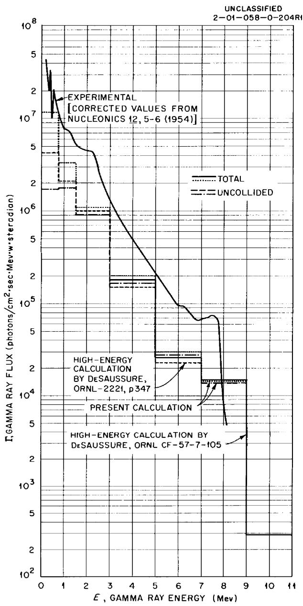  
Fig. 4.1.2. Comparison of Calculated and Experimental Spectra of Gamma Rays at the Surface of the BSF Reactor. Polar angle $\theta = 0$ deg.

Table 4.1.2. Gamma-Ray Energy Flux as a Function of the Polar Angle, $\theta$ , the Azimuthal Angle, $\phi$ , and the Average Energy, $E$   

<table><tr><td rowspan="3">E(Mev)</td><td colspan="10">Gamma-Ray Energy Flux (Mev/cm2·sec·watt·steradian)</td></tr><tr><td colspan="2">θ=0 deg</td><td colspan="2">θ=30 deg</td><td colspan="2">θ=45 deg</td><td colspan="2">θ=60 deg</td><td colspan="2">θ=90 deg</td></tr><tr><td>Total</td><td>Uncollided</td><td>Total</td><td>Uncollided</td><td>Total</td><td>Uncollided</td><td>Total</td><td>Uncollided</td><td>Total</td><td>Uncollided</td></tr><tr><td colspan="11">Φ=0 deg</td></tr><tr><td>8.0</td><td>2.47 × 105</td><td>2.38 × 105</td><td>2.24 × 105</td><td>2.16 × 105</td><td>1.92 × 105</td><td>1.85 × 105</td><td>1.58 × 105</td><td>1.54 × 105</td><td>1.40 × 105</td><td>1.36 × 105</td></tr><tr><td>6.0</td><td>3.66 × 105</td><td>3.33 × 105</td><td>3.30 × 105</td><td>2.30 × 105</td><td>2.83 × 105</td><td>2.59 × 105</td><td>2.34 × 105</td><td>2.18 × 105</td><td>2.08 × 105</td><td>1.95 × 105</td></tr><tr><td>4.0</td><td>1.59 × 106</td><td>1.39 × 106</td><td>1.43 × 106</td><td>1.24 × 106</td><td>1.24 × 106</td><td>1.09 × 106</td><td>1.04 × 106</td><td>9.41 × 105</td><td>9.31 × 105</td><td>8.48 × 105</td></tr><tr><td>2.0</td><td>3.43 × 106</td><td>2.70 × 106</td><td>3.08 × 106</td><td>2.42 × 106</td><td>2.72 × 106</td><td>2.20 × 106</td><td>2.37 × 106</td><td>1.98 × 106</td><td>2.15 × 106</td><td>1.83 × 106</td></tr><tr><td>1.0</td><td>2.52 × 106</td><td>1.38 × 106</td><td>2.26 × 106</td><td>1.25 × 106</td><td>2.00 × 106</td><td>1.17 × 106</td><td>1.75 × 106</td><td>1.10 × 106</td><td>1.60 × 106</td><td>1.04 × 106</td></tr><tr><td>0.5</td><td>4.51 × 106</td><td>6.69 × 105</td><td>3.98 × 106</td><td>6.20 × 105</td><td>3.46 × 106</td><td>5.94 × 105</td><td>2.93 × 106</td><td>5.75 × 105</td><td>2.63 × 106</td><td>5.51 × 105</td></tr><tr><td colspan="11">Φ=30 deg</td></tr><tr><td>8.0</td><td>2.47 × 105</td><td>2.38 × 105</td><td>2.12 × 105</td><td>2.04 × 105</td><td>1.92 × 105</td><td>1.86 × 105</td><td>1.64 × 105</td><td>1.59 × 105</td><td>1.34 × 105</td><td>1.31 × 105</td></tr><tr><td>6.0</td><td>3.66 × 105</td><td>3.33 × 105</td><td>3.12 × 105</td><td>2.85 × 105</td><td>2.84 × 105</td><td>2.60 × 105</td><td>2.43 × 105</td><td>2.25 × 105</td><td>1.99 × 105</td><td>1.88 × 105</td></tr><tr><td>4.0</td><td>1.59 × 106</td><td>1.39 × 106</td><td>1.36 × 106</td><td>1.19 × 106</td><td>1.24 × 106</td><td>1.10 × 106</td><td>1.08 × 106</td><td>9.66 × 105</td><td>8.96 × 105</td><td>8.18 × 105</td></tr><tr><td>2.0</td><td>3.43 × 106</td><td>2.70 × 106</td><td>2.90 × 106</td><td>2.37 × 106</td><td>2.73 × 106</td><td>2.19 × 106</td><td>2.43 × 106</td><td>2.01 × 106</td><td>2.08 × 106</td><td>1.77 × 106</td></tr><tr><td>1.0</td><td>2.52 × 106</td><td>1.38 × 106</td><td>2.10 × 106</td><td>1.24 × 106</td><td>2.01 × 106</td><td>1.18 × 106</td><td>1.79 × 106</td><td>1.11 × 106</td><td>1.54 × 106</td><td>1.02 × 106</td></tr><tr><td>0.5</td><td>4.51 × 106</td><td>6.69 × 105</td><td>3.70 × 106</td><td>6.20 × 105</td><td>3.46 × 106</td><td>5.98 × 105</td><td>3.01 × 106</td><td>5.78 × 105</td><td>2.50 × 106</td><td>5.45 × 105</td></tr><tr><td colspan="11">Φ=50 deg</td></tr><tr><td>8.0</td><td>2.47 × 105</td><td>2.38 × 105</td><td>2.08 × 105</td><td>2.01 × 105</td><td>1.76 × 105</td><td>1.71 × 105</td><td>1.46 × 105</td><td>1.43 × 105</td><td>1.19 × 105</td><td>1.17 × 105</td></tr><tr><td>6.0</td><td>3.66 × 105</td><td>3.33 × 105</td><td>3.06 × 105</td><td>2.81 × 105</td><td>2.60 × 105</td><td>2.41 × 105</td><td>2.17 × 105</td><td>2.04 × 105</td><td>1.77 × 105</td><td>1.68 × 105</td></tr><tr><td>4.0</td><td>1.59 × 106</td><td>1.39 × 106</td><td>1.34 × 106</td><td>1.18 × 106</td><td>1.15 × 106</td><td>1.04 × 106</td><td>9.75 × 105</td><td>8.88 × 105</td><td>8.04 × 105</td><td>7.45 × 105</td></tr><tr><td>2.0</td><td>3.43 × 106</td><td>2.70 × 106</td><td>2.94 × 106</td><td>2.36 × 106</td><td>2.60 × 106</td><td>2.14 × 106</td><td>2.26 × 106</td><td>1.92 × 106</td><td>1.91 × 106</td><td>1.66 × 106</td></tr><tr><td>1.0</td><td>2.52 × 106</td><td>1.38 × 106</td><td>2.16 × 106</td><td>1.24 × 106</td><td>1.92 × 106</td><td>1.17 × 106</td><td>1.62 × 106</td><td>1.08 × 106</td><td>1.42 × 106</td><td>9.83 × 105</td></tr><tr><td>0.5</td><td>4.51 × 106</td><td>6.69 × 105</td><td>3.78 × 106</td><td>6.23 × 105</td><td>3.27 × 106</td><td>5.98 × 105</td><td>2.76 × 106</td><td>5.71 × 105</td><td>2.25 × 106</td><td>5.37 × 105</td></tr><tr><td colspan="11">Φ=65 deg</td></tr><tr><td>8.0</td><td>2.47 × 105</td><td>2.38 × 105</td><td>2.05 × 105</td><td>1.98 × 105</td><td>1.65 × 105</td><td>1.61 × 105</td><td>1.36 × 105</td><td>1.33 × 105</td><td>1.12 × 105</td><td>1.10 × 105</td></tr><tr><td>6.0</td><td>3.66 × 105</td><td>3.33 × 105</td><td>3.03 × 105</td><td>2.78 × 105</td><td>2.45 × 105</td><td>2.29 × 105</td><td>2.02 × 105</td><td>1.91 × 105</td><td>1.66 × 105</td><td>1.58 × 105</td></tr><tr><td>4.0</td><td>1.59 × 106</td><td>1.39 × 106</td><td>1.33 × 106</td><td>1.18 × 106</td><td>1.09 × 106</td><td>9.89 × 105</td><td>9.16 × 105</td><td>8.42 × 105</td><td>7.57 × 105</td><td>7.07 × 105</td></tr><tr><td>2.0</td><td>3.43 × 106</td><td>2.70 × 106</td><td>2.96 × 106</td><td>2.41 × 106</td><td>2.50 × 106</td><td>2.09 × 106</td><td>2.15 × 106</td><td>1.85 × 106</td><td>1.82 × 106</td><td>1.61 × 106</td></tr><tr><td>1.0</td><td>2.52 × 106</td><td>1.38 × 106</td><td>2.15 × 106</td><td>1.25 × 106</td><td>1.85 × 106</td><td>1.16 × 106</td><td>1.59 × 106</td><td>1.07 × 106</td><td>1.36 × 106</td><td>9.64 × 105</td></tr><tr><td>0.5</td><td>4.51 × 106</td><td>6.69 × 105</td><td>3.75 × 106</td><td>6.28 × 105</td><td>3.12 × 106</td><td>6.00 × 105</td><td>2.59 × 106</td><td>5.71 × 105</td><td>2.09 × 106</td><td>5.34 × 105</td></tr><tr><td colspan="11">Φ=90 deg</td></tr><tr><td>8.0</td><td>2.47 × 105</td><td>2.38 × 105</td><td>2.05 × 105</td><td>1.98 × 105</td><td>1.62 × 105</td><td>1.58 × 105</td><td>1.33 × 105</td><td>1.30 × 105</td><td>1.08 × 105</td><td>1.07 × 105</td></tr><tr><td>6.0</td><td>3.66 × 105</td><td>3.33 × 105</td><td>3.03 × 105</td><td>2.79 × 105</td><td>2.39 × 105</td><td>2.25 × 105</td><td>1.97 × 105</td><td>1.87 × 105</td><td>1.61 × 105</td><td>1.55 × 105</td></tr><tr><td>4.0</td><td>1.59 × 106</td><td>1.39 × 106</td><td>1.33 × 106</td><td>1.18 × 106</td><td>1.07 × 106</td><td>9.77 × 105</td><td>8.93 × 105</td><td>8.25 × 105</td><td>7.40 × 105</td><td>6.93 × 105</td></tr><tr><td>2.0</td><td>3.43 × 106</td><td>2.70 × 106</td><td>2.96 × 106</td><td>2.39 × 106</td><td>3.47 × 106</td><td>2.08 × 106</td><td>2.11 × 106</td><td>1.83 × 106</td><td>1.79 × 106</td><td>1.59 × 106</td></tr><tr><td>1.0</td><td>2.52 × 106</td><td>1.38 × 106</td><td>2.17 × 106</td><td>1.27 × 106</td><td>1.83 × 106</td><td>1.16 × 106</td><td>1.56 × 106</td><td>1.06 × 106</td><td>1.33 × 106</td><td>9.60 × 105</td></tr><tr><td>0.5</td><td>4.51 × 106</td><td>6.69 × 105</td><td>3.80 × 106</td><td>6.35 × 105</td><td>3.08 × 106</td><td>6.05 × 105</td><td>2.52 × 106</td><td>5.73 × 105</td><td>2.03 × 106</td><td>5.35 × 105</td></tr></table>

shown are the results of calculations by deSauSSure3 and the experimental results.4

# Angular Distribution

The energy flux at the surface of the reactor, averaged over the azimuthal angle, $\phi_{i}$ is shown in Fig. 4.1.3 as a function of the polar angle, $\theta$ . A typical plot of the variation of the flux with $\phi$ when $\theta = 30$ deg is shown in Fig. 4.1.4.

# Conclusions

The gamma-ray energy spectrum normal to the reactor surface, as calculated in this study, is in good agreement with previous calculations by deSaussure. The present calculation is an overestimate, particularly in the low-energy range, since it was assumed that the collided flux, as calculated by the energy buildup factors, is all traveling in the outward direction.

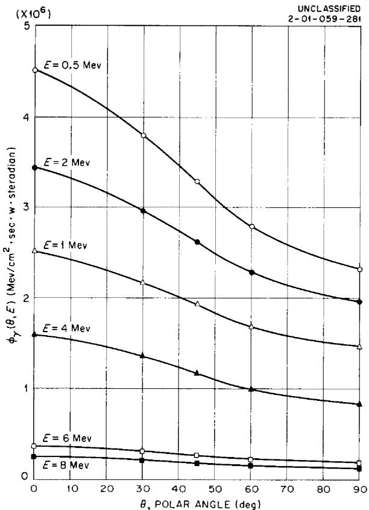  
Fig. 4.1.3. Total Calculated Gamma-Ray Energy Flux at the Surface of the BSF Reactor as a Function of the Polar Angle, $\theta$ , Averaged over the Azimuthal Angle, $\phi$ , for Various Energies $E$ .

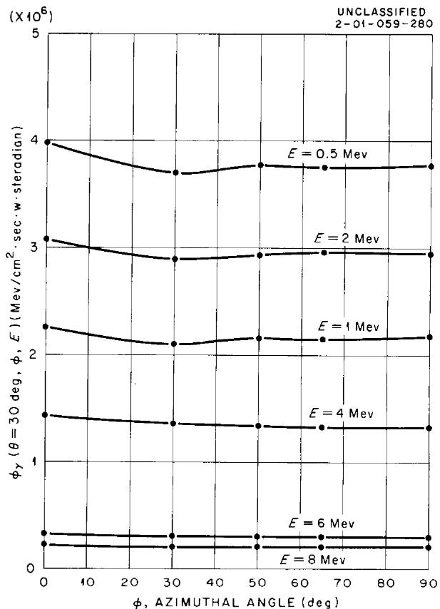  
Fig. 4.1.4. Total Calculated Gamma-Ray Energy Flux at the Surface of the BSF Reactor as a Function of the Azimuthal Angle, $\phi_{t}$ for Various Energies $E$ When Polar Angle $\theta = 30$ deg.

# 4.2. LID TANK SHIELDING FACILITY

W.Zobel

Applied Nuclear Physics Division

# STUDY OF ADVANCED SHIELDING MATERIALS (GE SERIES)

L. Jung

The experiment designed by GE-ANP for studying the production of secondary gamma rays in configurations containing advanced shielding materials is being continued. The configurations used in the latest tests are listed in Table 4.2.1, and the size and composition of the various materials included in the configurations are described in Table 4.2.2. While all the measurements beyond these configurations have been completed, only the gamma-ray and fast-neutron measurements are reported here; the thermal-neutron data have not yet been evaluated.

The group 2 configurations consisted of a 4-in.-thick beryllium slab, 4 in. of stainless steel as a gamma-ray shield, and a 12-in.-thick lithium hydride neutron shield with boral placed at various positions within the configurations in an attempt to reduce the number of secondary gamma rays produced in the components of the shield, especially in the stainless steel. There was an unavoidable 1-cm-thick oil layer adjacent to the source plate.

The effect of inserting boral between the beryllium and the stainless steel in this group of configurations is shown in Fig. 4.2.1. A $\frac{1}{4}$ -in. thickness of boral (configuration 2-Q) reduced the gamma-ray dose rate 100 cm from the source by $34.4\%$ of that measured in the case where no boral was used (configuration 2-A). Increasing the boral thickness to $\frac{1}{2}$ in. (configuration 2-F) reduced the dose an additional $12.2\%$ . A further increase in the boral thickness to 1 in. (configuration 2-0) gave no additional attenuation.

A comparison of measurements beyond configurations 2-G, 2-N, 2-O, and 2-P (Fig. 4.2.2) shows that placing all the boral immediately behind the beryllium was not as effective as distributing it throughout the stainless steel, as long as some of the boral remained behind the beryllium. Placing 1 in. of boral immediately behind the beryllium (configuration 2-0) reduced the gamma-ray dose rate 100 cm from the source $17\%$ below that measured for a configuration in which the boral was distributed throughout the stainless steel (configuration 2-P). However, placing $\frac{1}{2}$ in. of the boral in the stainless steel and keeping

another $\frac{1}{2}$ in. behind the beryllium (configuration 2-N) reduced the dose rate at the same point by $27\%$ .

Fast-neutron dose rates beyond configurations 2-F, 2-G, 2-N, 2.O, 2-P, and 2-Q are shown in Figs.4.2.3 and 4.2.4.No particular significance can be attached to the noticeable differences in the curves, since the reproducibility of the fastneutron data at the LTSF is not better than $10\%$

Configurations 4-O and 4-P consisted of $26~\mathrm{cm}$ of oil adjacent to the source plate (not including the unavoidable 1-cm oil gap) followed by 4 in. of stainless steel. Configuration 4-O also had $\frac{1}{2}$ in. of boral immediately behind the stainless steel. As indicated by Fig. 4.2.5, there were no significant differences in the dose rates beyond these two configurations; however, a comparison of these measurements with the measurements beyond configuration 4-A, in which the 26-cm oil gap was not present, shows that the oil gap in configurations 4-O and 4-P reduced the gamma-ray dose rate 100 cm from the source plate to $22\%$ of that measured behind configuration 4-A. The fast-neutron dose rates (Fig. 4.2.6) showed no appreciable difference except immediately behind the stainless steel. The dose rate beyond configuration 4-P is higher by $45\%$ than that beyond configuration 4-A at a point $44~\mathrm{cm}$ from the source. At $62~\mathrm{cm}$ the two curves intersect. The curves for configurations 4-A and 4-O merge for all distances from the source $>60~\mathrm{cm}$ .

Configurations 4-M, 4-N, 4-Q, 4-R, 4-S, and 4-T consisted of 4 in. of stainless steel and $\frac{1}{4}$ to 1 in. of boral placed in various positions with respect to the stainless steel. Configurations 4-M and 4-N were run to determine the comparative effects of placing $\frac{1}{2}$ in. of boral in front of or behind the stainless steel. The results (Fig. 4.2.7) show that an additional reduction of $14\%$ was obtained $100\mathrm{cm}$ from the source when the boral was placed behind the stainless steel. A comparison of the dose rates beyond configurations 4-N and 4-T shows that substituting $\frac{1}{4}$ in. of boral for $\frac{1}{2}$ in. of boral behind the beryllium increased the gamma-ray dose rate by $13\%$ at a distance $100\mathrm{cm}$ from the source.

The measurements beyond group 4 configurations again showed that evenly distributing the boral in the stainless steel matrix, while at the same

Table 4.2.1. Description of Latest Configurations Tested in GE Series ${}^{a}$   

<table><tr><td>Configuration Number</td><td>Description of Configuration</td><td>Location of Probe,b
z0(cm)</td><td>Unavoidable Oil Gap Within Configurationc(cm)</td></tr><tr><td>2-A</td><td>4 in. of Be + 4 in. of stainless steel + 12 in. of LiH + oil</td><td>58.0</td><td>2.3</td></tr><tr><td>2-F</td><td>4 in. of Be + ½ in. of boral + 4 in. of stainless steel + 12 in. of LiH + oil</td><td>59.8</td><td>2.9</td></tr><tr><td>2-G</td><td>4 in. of Be + ½ in. of boral + 4 in. of stainless steel + ½ in. of boral + 12 in. of LiH + oil</td><td>61.0</td><td>2.8</td></tr><tr><td>2-N</td><td>4 in. of Be + ½ in. of boral + 2 in. of stainless steel + ½ in. of boral + 2 in. of stainless steel + 12 in. of LiH + oil</td><td>61.8</td><td>3.6</td></tr><tr><td>2-O</td><td>4 in. of Be + 1 in. of boral + 4 in. of stainless steel + 12 in. of LiH + oil</td><td>61.8</td><td>3.7</td></tr><tr><td>2-P</td><td>4 in. of Be + 1 in. of stainless steel + ½ in. of boral + 2 in. of stainless steel + ½ in. of boral + 1 in. of stainless steel + 12 in. of LiH + oil</td><td>62.0</td><td>3.9</td></tr><tr><td>2-Q</td><td>4 in. of Be + ¼ in. of boral + 4 in. of stainless steel + 12 in. of LiH + oil</td><td>59.4</td><td>3.3</td></tr><tr><td>4-A</td><td>4 in. of stainless steel + oil</td><td>15.8</td><td>1.0</td></tr><tr><td>4-M</td><td>½ in. of boral + 4 in. of stainless steel + oil</td><td>17.8</td><td>3.7</td></tr><tr><td>4-N</td><td>4 in. of stainless steel + ½ in. boral + oil</td><td>17.6</td><td>3.5</td></tr><tr><td>4-O</td><td>26 cm of oil + 4 in. of stainless steel + ½ in. of boral + oil</td><td>42.6</td><td>2.0</td></tr><tr><td>4-P</td><td>26 cm of oil + 4 in. of stainless steel + oil</td><td>41.6</td><td>2.3</td></tr><tr><td>4-Q</td><td>½ in. of boral + 4 in. of stainless steel + ½ in. of boral + oil</td><td>19.6</td><td>3.7</td></tr><tr><td>4-R</td><td>3 in. of stainless steel + ½ in. of boral + 1 in. of stainless steel + ½ in. of boral + oil</td><td>19.8</td><td>3.9</td></tr><tr><td>4-S</td><td>2 in. of stainless steel + ½ in. of boral + 2 in. of stainless steel + ½ in. of boral + oil</td><td>19.6</td><td>3.7</td></tr><tr><td>4-T</td><td>4 in. of stainless steel + ¼ in. of boral + oil</td><td>17.6</td><td>3.7</td></tr><tr><td>41-A</td><td>4 in. of stainless steel (dry) + oil in an Al tank (½-in.-thick walls)</td><td>15.5</td><td>1.8 (air gap)</td></tr><tr><td>41-B</td><td>4 in. of stainless steel (dry) + ½ in. of boral (dry) + oil in an Al tank (½-in.-thick walls)</td><td>16.8</td><td>1.9 (air gap)</td></tr><tr><td>41-C</td><td>2 in. of stainless steel (dry) + ½ in. of boral (dry) + 2 in. of stainless steel (dry) + ½ in. of boral (dry) + oil in an Al tank (½-in.-thick walls)</td><td>18.0</td><td>1.7 (air gap)</td></tr><tr><td>Oil</td><td>Oil only in configuration tank</td><td>3.15d</td><td></td></tr></table>

$a$ Includes some configurations reported in ANP Quar. Prog. Rep. Dec. 31, 1957, ORNL-2440, p 263.   
bActual distance from source plate to back of solid configuration.   
$c$ Includes 1-cm recession of the aluminum window in the configuration tank.   
$d$ Position of inside surface of the aluminum window in the configuration tank.

time keeping a good thermal-neutron absorber behind the solid materials, is the most effective way to reduce the capture gamma-ray dose rate. A comparison of the dose rates beyond configuration 4-A, in which no boral was used, and 4-S, in which boral was evenly distributed in the stainless steel, shows that the boral reduced the dose rate $100\mathrm{cm}$ from the source by $51\%$ (Fig. 4.2.8), whereas the dose rate beyond configurations 4-Q and 4-R, in which boral was used but was not placed within the stainless steel matrix, was reduced $47\%$ . As was expected, there were no significant changes in the fast-neutron dose rates beyond the group 4 configurations (Fig. 4.2.9).

Configurations 41-A, 41-B, and 41-C consisted of 4 in. of stainless steel interspersed with boral in a dry arrangement to eliminate oil gaps between the slabs. The oil was contained in a 56-in.-long aluminum tank which was placed immediately behind the solid materials. Gamma-ray dose-rate measurements beyond these configurations (Fig. 4.2.10) show that the addition of $\frac{1}{2}$ in. of boral behind the stainless steel reduced the dose rate approximately $46\%$ at $100~\mathrm{cm}$ from the source. A

further $5\%$ reduction was realized when an additional $\frac{1}{2}$ in. of boral was placed within the stainless steel, but this may be within experimental error. Comparing measurements beyond configuration 41-C with those beyond a similar configuration, 4-S (in Fig. 4.2.8), shows that the dose rate $30~\mathrm{cm}$ behind configuration 41-C was approximately $61\%$ higher than that beyond configuration 4-S. Since configuration 41-C did not have the $3.7~\mathrm{cm}$ of oil distributed throughout the configuration, it is presumed that the difference in the dose rates is due to the additional inelastic scattering in configuration 41-C.

The fast-neutron dose-rate measurements (Fig. 4.2.11) show an average reduction of $17\%$ from configuration 41-C to 41-A caused by the addition of 1 in. of oil in place of the boral. The fast-neutron dose rate beyond configuration 4-S is approximately $35\%$ lower than that beyond configuration 41-C; the comparison is based on equal oil thickness behind each configuration. This difference is due to the distributed oil in configuration 4-S.

This series of experiments is being continued.

Table 4.2.2. Physical Properties of Materials Used for Mockup Tests of Advanced Shielding Materials (GE Series)   

<table><tr><td>Material</td><td>Thickness of Material* per Slab (cm)</td><td>Description</td></tr><tr><td>Transformer oil</td><td></td><td>Specific gravity, 0.88 at 15.6°C; nominal composition, 86.5 wt % C and 12.5 wt % H; H:C atom ratio, 1.72:1</td></tr><tr><td>Beryllium</td><td>10.16</td><td>48 × 49 × 4 in. metallic slabs</td></tr><tr><td>Type 347 stainless steel</td><td>2.54</td><td>5 ft × 5 ft × 1 in. slab; composition, 58.35 wt % Fe, 18.0 wt % Cr, 10.3 wt % Ni, 2.0 wt % Mn, 1.0 wt % Si, 0.08 wt % C, 0.04 wt % P, 0.03 wt % S; density, 7.8 g/cm3</td></tr><tr><td>Lithium hydride</td><td>32.0</td><td>5 × 5 × 1 ft slab encased in aluminum cans (1/4-in.-thick walls); composition, 95 wt % LiH and 5 wt % un-accounted for (probably oxygen and hydrogen); density, 0.75 g/cm3</td></tr><tr><td>Boral</td><td>1.3</td><td>48 × 48 × 0.4 in. slab with 0.05-in.-thick Al cladding; composition, 80 wt % Al, 15.7 wt % boron, 4.3 wt % carbon; density, 2.60 g/cm3</td></tr><tr><td>Boral</td><td>0.63</td><td>44.5 × 44.5 × 0.15 in. with 0.05-in.-thick Al cladding; composition, 80 wt % Al, 15.7 wt % boron, 4.3 wt % carbon; density, 2.60 g/cm3</td></tr></table>

\*Including cladding.

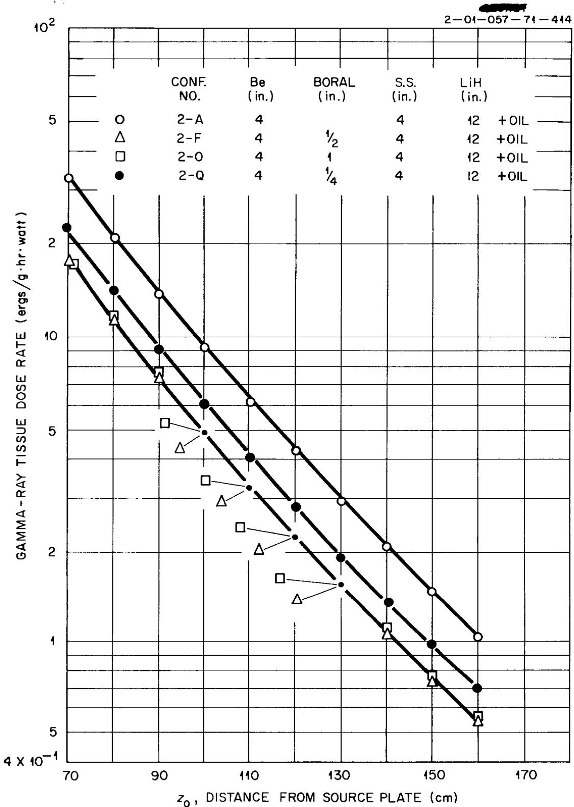  
Fig. 4.2.1. Gamma-Ray Tissue Dose Rates Beyond Configurations 2-A, 2-F, 2-O, and 2-Q: Effect of Inserting Boral Behind Beryllium in Configurations Containing Stainless Steel.

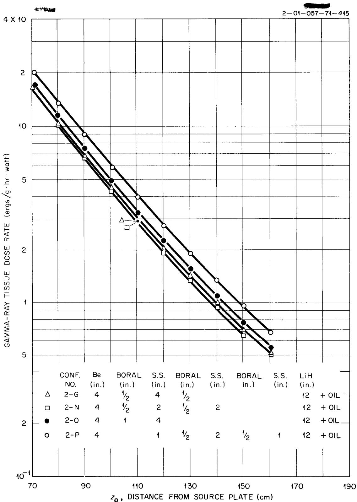  
Fig. 4.2.2. Gamma-Ray Tissue Dose Rates Beyond Configurations 2-G, 2-N, 2-O, and 2-P: Effect of Distributing Boral Throughout Configurations Containing Stainless Steel.

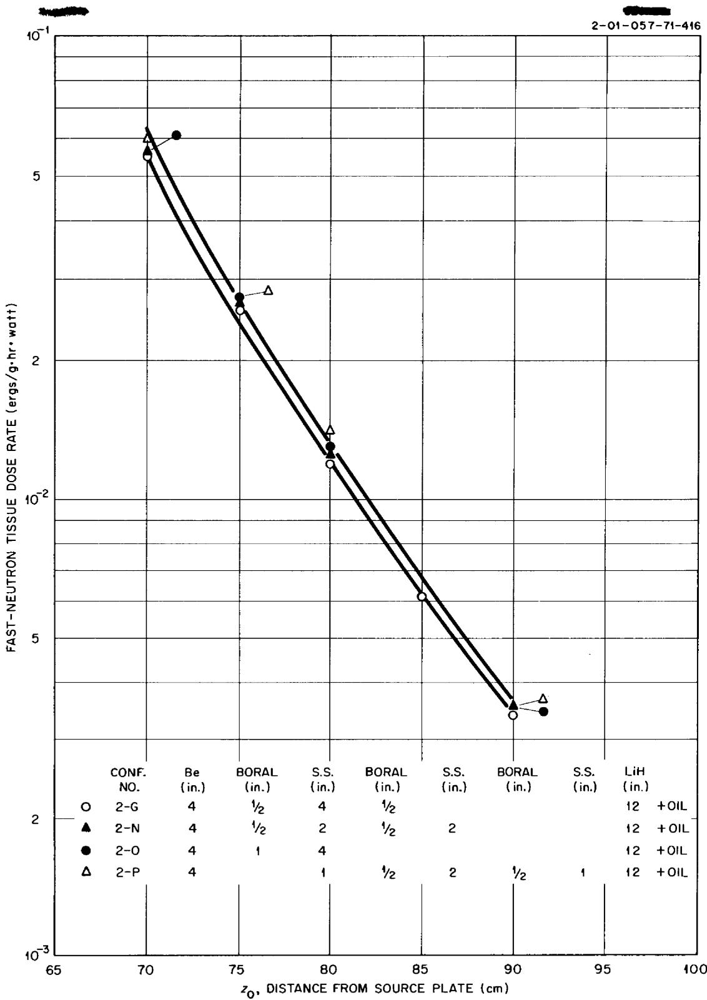  
Fig. 4.2.3. Fast-Neutron Tissue Dose Rates Beyond Configurations 2-G, 2-N, 2-O, and 2-P.

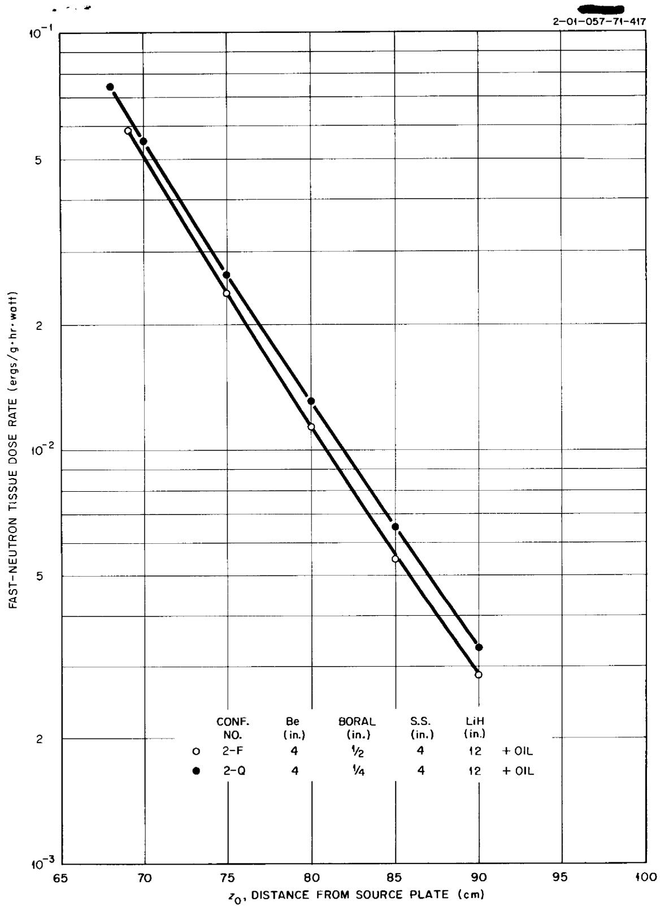  
Fig. 4.2.4. Fast-Neutron Tissue Dose Rates Beyond Configurations 2-F and 2-Q.

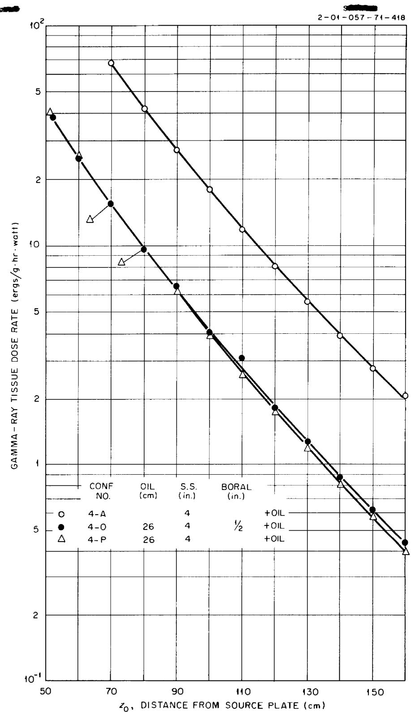  
Fig. 4.2.5. Gamma-Ray Tissue Dose Rates Beyond Configurations 4-A, 4-O, and 4-P: Effect of Oil Gap Preceding Configurations Containing Stainless Steel.

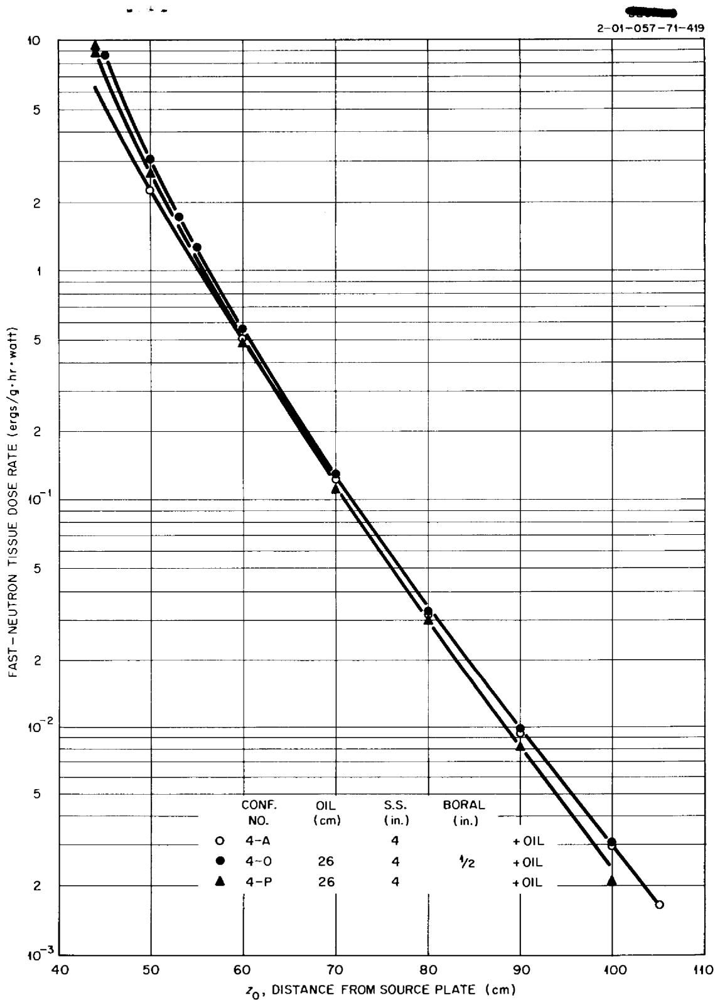  
Fig. 4.2.6. Fast-Neutron Tissue Dose Rates Beyond Configurations 4-A, 4-O, and 4-P.

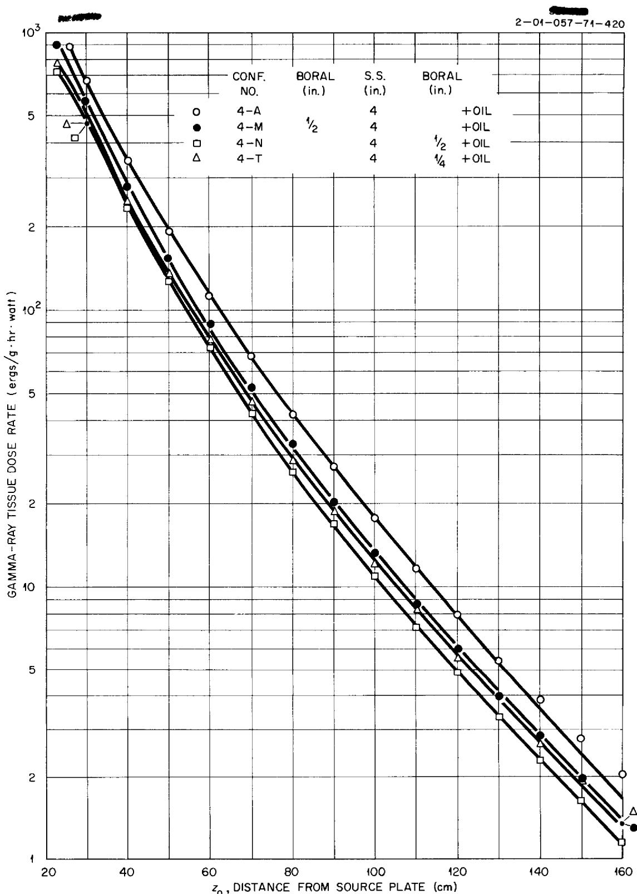  
Fig. 4.2.7. Gamma-Ray Tissue Dose Rates Beyond Configurations 4-A, 4-M, 4-N, and 4-T: Effect of Inserting Boral in Configurations Containing Stainless Steel.

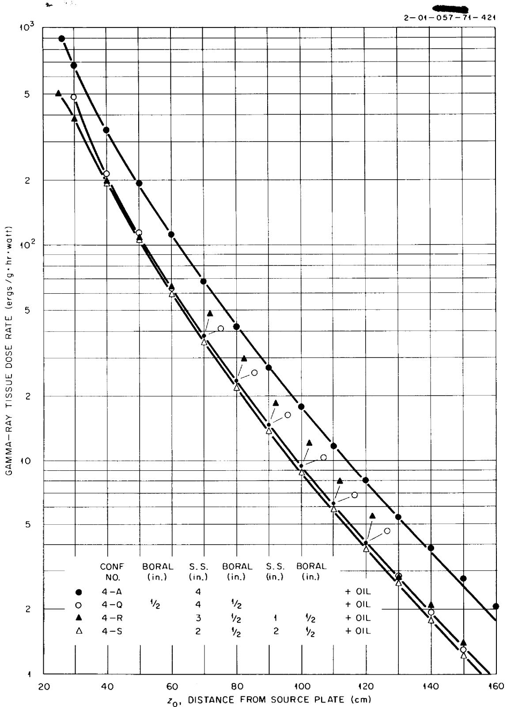  
Fig. 4.2.8. Gamma-Ray Tissue Dose Rates Beyond Configurations 4-A, 4-Q, 4-R, and 4-S: Effect of Inserting Boral in Configurations Containing Stainless Steel.

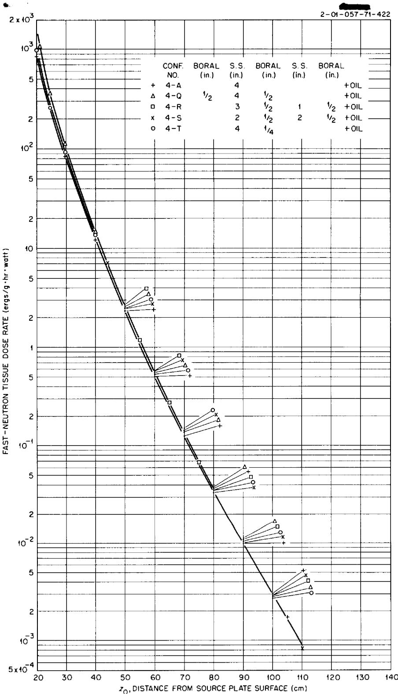  
Fig. 4.2.9. Fast-Neutron Tissue Dose Rates Beyond Configurations 4-A, 4-Q, 4-R, 4-S, and 4-T.

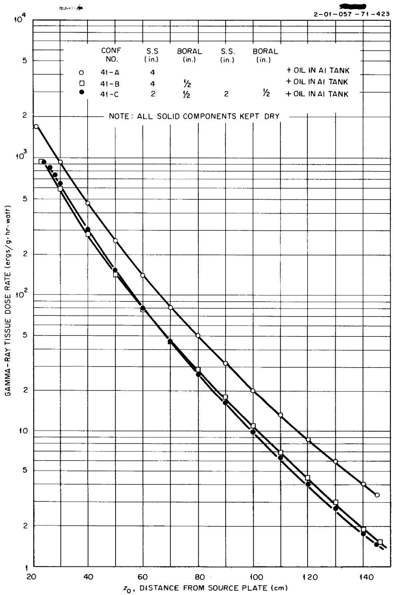  
Fig. 4.2.10. Gamma-Ray Tissue Dose Rates Beyond Configurations 41-A, 41-B, and 41-C: Effect of Inserting Boral in Configurations Containing Stainless Steel.

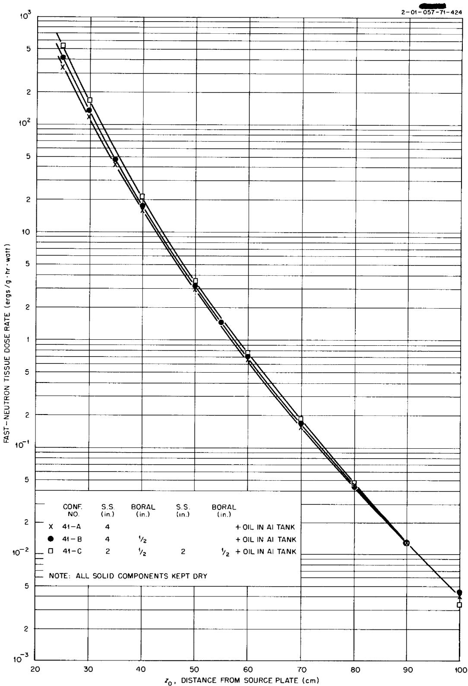  
Fig. 4.2.11. Fast-Neutron Tissue Dose Rates Beyond Configurations 41-A, 41-B, and 41-C.

# 4.3. BULK SHIELDING FACILITY

F. C. Maienschein

Applied Nuclear Physics Division

# THE BSF STAINLESS STEEL- $\mathsf{UO}_2$ REACTOR (BSR-II)

E. G. Silver

As previously reported, a stainless-steel-clad $\mathrm{UO}_2$ -fueled reactor for the BSF is being designed. This reactor, identified as the Bulk Shielding Reactor II (BSR-II), is to be used alternately with the present aluminum-clad reactor (BSR-I).

The utility of the BSR-II for shield test purposes derives from the nature of its gamma-ray spectrum and its geometrical configuration. A steel core construction will give rise to a gamma-ray spectrum which is harder than that from an aluminum core. Since the reactors of interest to the ANP program have, in many cases, core components of the Fe-Ni-Co system, such core materials in the test reactor will mock up the gamma-ray spectrum more successfully than an aluminum core would.

The BSR-II is designed for maximum utility as a shield-test radiation source. The core is cubical, 15 in. on each edge, and the grid plate is designed so that it does not project laterally beyond the core edge. The overall height of the core is also minimized in order to make compact wraparound shield mockups possible. This arrangement will provide an intense, symmetrical, localized source of reactor radiation.

Detailed descriptions of the design of the BSR-II are included in the safeguard report for the reactor. The reactor will utilize a control system of four spring-driven pairs of control plates, which can be positioned in any of the 25 fuel-element positions of the core. The acceleration of the control plates by means of springs will assure safety of the system, which, owing to its high absorption cross section, has a prompt-neutron-generation time in the core that is only about one-third as long as that of the BSR-I. Mechanical tests and analog computations carried out on the control system indicate that it is

capable of safely reversing positive periods as short as 8 msec. This would be equivalent to an excess reactivity of $1.2\%$ . However, as a safety precaution it is planned to limit the potential excess reactivity to $0.75\%$ (prompt criticality) until a planned series of tests on the BSR-II and its control system at the SPERT Facility are completed.

The safeguard report also contains the results of calculations carried out with respect to hazards arising outside the X-10 area from a catastrophe to the BSR-II. It was found that the hazards were less than those which could be caused by the ORR, which adjoins the BSF, and which has been approved for operation. It is anticipated that, following approval by the Advisory Committee on Reactor Safeguards, the BSR-II will be fabricated and placed in operation during the calendar year 1958.

# SPECTRA OF GAMMA RADIATION ASSOCIATED WITH THE FISSION OF U235

T. A. Love

R.W.Peelle

F. C. Maienschein

W. Zobel

For some time efforts have been under way at the Bulk Shielding Facility to measure the spectra of the gamma radiation which emanates from $U^{235}$ (ref 3) and its products as a result of fission induced by thermal neutrons. Information on the resulting gamma-ray distributions, given as a function of the time after fission and the photon energy, is essential for optimum design of both shielding and heat-deposition systems for power reactors. Two experimental approaches have been used thus far: in one approach, delayed-gamma-ray data were obtained by observing $U^{235}$ samples that had been exposed in a reactor; in the other approach, both delayed- and prompt-gamma-ray data were obtained by observing spectra in time-correlation with pulses from a $U^{235}$ -containing pulse ion chamber. The progress with

the experiments and the analyses for these two types of problems is discussed below.

# Fission-Product Gamma Rays Emitted More Than 1 sec After Fission

Previous reports have presented the results obtained from the preliminary analysis of a series of experiments in which studies were made of time and energy distributions of gamma rays given off by irradiated $U^{235}$ samples between 1 sec and 1500 sec after fission. The final analysis has been delayed by the need to develop methods for removing from the data all nonuniqueness effects caused by the response characteristics of the multiple-crystal spectrometer used in the experiments. Such corrections to the previously reported values may amount to between 10 and $30\%$ . Progress has been made, and during the coming report period it is anticipated that final analysis will be completed.

The data have been partially reanalyzed to provide a better approximation to the final result. The steps which have been completed include improvements in the calculation of the number of fissions occurring in the samples used and removal from the observed pulse-height spectra of the contributions from the "tail" of the detector response functions for monoenergetic gamma rays. Effects from the breadth of the peaks of the response curves have not been removed but are felt to be less important. The results of this latest reanalysis are presented in Figs. 4.3.1 and 4.3.2. Included in Fig. 4.3.1 is the previously reported7 equilibrium spectrum from a rotating fuel belt, which has not been reanalyzed. Included in Fig. 4.3.2 is a comparison with radiochemical data8 of the total observed rate of photon energy release as a function of time after fission.

5W. Zobel, T. A. Love, and R. W. Peelle, ANP Quar. Prog. Rep. March 10, 1956, ORNL-2061, p 250-53; W. Zobel and T. A. Love, ANP Quar. Prog. Rep. Sept. 10, 1956, ORNL-2157, p 291-96; Appl. Nuclear Phys. Ann. Rep. Sept. 10, 1956, ORNL-2081, p 95-101.   
6W. Zobel et al., ANP Quar. Prog. Rep. June 30, 1957, ORNL-2340, p 294-95; Appl. Nuclear Phys. Ann. Rep. Sept. 1, 1957, ORNL-2389, p 97-98.   
7R. W. Peelle, W. Zobel, and T. A. Love, ANP Quar. Prog. Rep. Dec. 10, 1955, ORNL-2012, p 223-26; Appl. Nuclear Phys. Ann. Rep. Sept. 10, 1956, ORNL-2081, p 91-94.   
8J. F. Perkins and R. W. King, "Energy Release from Decay of the Fission Products," Nuclear Sci. and Eng. (to be published); Papers Presented at the Fourth Semiannual ANP Shielding Information Meeting, Nov. 19-20, 1957, ORNL-2497, vol II, paper II-B.

# Fission-Product Gamma Rays Emitted Between $5 \times 10^{-8}$ and $10^{-6}$ sec After Fission

During the preliminary experiments designed to aid in the determination of the energy spectrum of gamma rays emitted in coincidence with fission, counts were observed in the region between $5 \times 10^{-8}$ and $10^{-6}$ sec after fission. These counts are now believed to arise from delayed gamma rays. More recently, a beam of thermal neutrons from the ORNL Graphite Reactor has been utilized to obtain measurements of the intensity and energy of these gamma rays. For experimental reasons that involve random backgrounds, it was impossible to use the multiple-crystal spectrometer for these measurements. Instead, a single-crystal sodium iodide detector was used; consequently, the results are presented in terms of pulse-height spectra rather than energy spectra.

Some of the spectral data obtained at various short times after fission, by using standard delayed-coincidence techniques, are shown in Fig. 4.3.3. The source of the fission radiation was a small 0.5-cm-dia by 1.0-cm-long spiral fission chamber. Time-distribution data obtained for various energy groups with the same fission source and the previously described time analyzer are shown in Fig. 4.3.4. Gamma rays appearing "after" fission were compared with those "before" fission to avoid any effects from gamma rays coincident with fission. Absolute intensities of the gamma radiation in these two experiments are known, approximately, in terms of the intensity of the prompt gamma radiation as observed in the same geometry and plotted in Fig. 4.3.3. (The plotted points in this case were obtained by multiplying the observed number of counts per fission per Mev by $10^{7}$ .) Values for the relative number of counts observed in a few pulse-height groups during the time interval after fission between $5 \times 10^{-8}$ and $10^{-6}$ sec are given in Table 4.3.1.

Although this contribution to the fission-associated gamma radiation does not appear to be negligible compared with the prompt radiation, such short-delayed gamma rays are not known

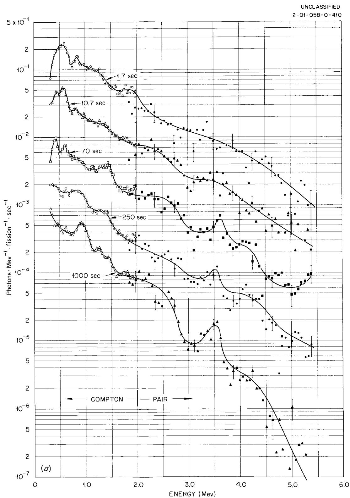

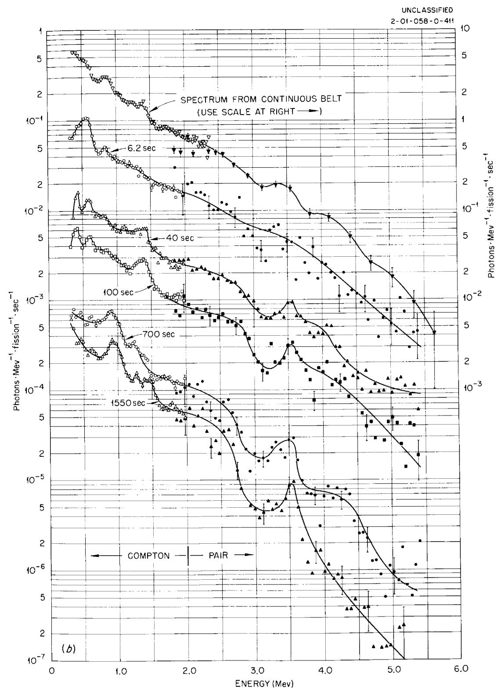  
Fig. 4.3.1. Gamma-Ray Energy Spectra Observed at Long Times After Fission. The errors shown are a combination of counting statistics with other uncertainties. The lines were fitted to the points by eye. All data, except for the top curve in (b), were obtained at the stated times after fission. The top curve in (b) is the spectrum emitted from the continuous fuel belt about $8 \times 10^{3}$ sec after irradiation of the belt commenced (use righthand scale). No response corrections were included in this top curve.

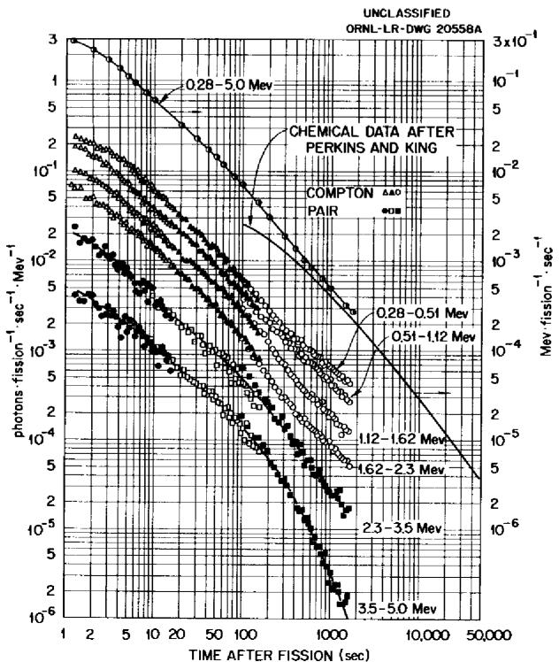  
Fig. 4.3.2. Time Dependence of the Emission of Gomma Rays for Long Times After Fission. On the lower portion of the graph are shown the photon intensity-time distributions for six energy intervals. At the top of the graph is shown the observed integrated energy release and the compilation of J. F. Perkins and R. W. King (private communication) based on spectral studies of chemically separated fission products (use righthand scale). No correction for the spectrometer response function was made for the photon data and only a very approximate correction was made for the energy release data.

to have been observed previously. Since the energy release in a beta-ray decay would have to be larger than typical neutron binding energies if these gamma rays were to follow beta decay, the short-period radiation described above is assumed to arise from primary fission products which are formed in isomeric states. While the data given above only extend to $10^{-6}$ sec, the range to $10^{-5}$ sec has been surveyed. Presently unavoidable random coincidence backgrounds were larger than the counts which might have been observed from any gamma radiation in this time region.

These gamma rays follow fission by so short an interval that they may be considered "prompt"

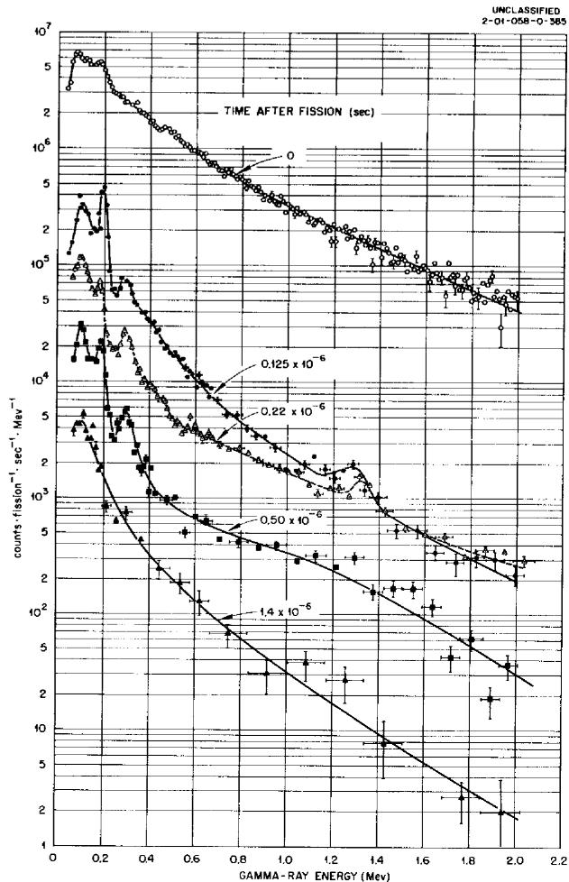  
Fig. 4.3.3. Pulse-Height Spectra Observed at Short Times After Fission. The top curve represents the prompt radiation. Random backgrounds have been subtracted, and lines are fitted to the points only to connect associated data.

for shielding purposes. However, experiments planned to observe prompt radiation may exclude these delayed radiations. As has been reported, gamma rays emitted during this period may be important in the consideration of the aftereffects of nuclear explosions.[11]

# Prompt Gamma Rays

Following a period in which extensive checks were made to ensure credible results, many measurements have been obtained for a new determination of the spectrum of gamma rays

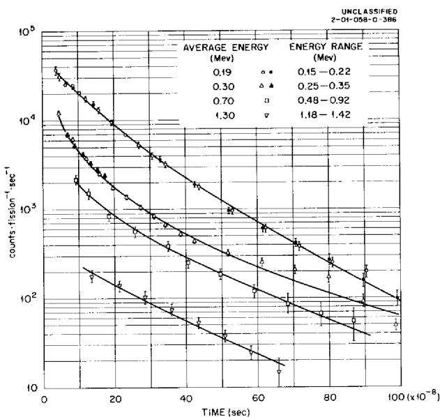  
Fig. 4.3.4. Time Dependence of the Emission of Gamma Rays Within Selected Energy Groups for Times Less than $10^{-6}$ sec After Fission. Corrections have been made for random backgrounds and the prompt gamma-ray contributions. Data have been combined for adjacent channels on the time analyzer. Before combination, the time-channel width for most of the runs was $(9.3 \pm 0.2) \times 10^{-8}$ sec. The different symbols for a given energy group correspond to independent runs. The errors shown are determined from the number of recorded counts, and the lines are drawn only to connect related points.

emanated in coincidence with the thermal-neutron fission of $U^{235}$ . Additional experimental results will be required to allow a final evaluation of these data, but a preliminary analysis was performed in which compensation was made for the nonunique response of the spectrometer to monoenergetic gamma radiation. The results of this new experiment, after the approximate analysis, are shown in Fig. 4.3.5. The results are in fair agreement with those obtained in a previously reported preliminary experiment, and in general agreement with those of Gamble, although they differ as much as a factor of 2 in some energy regions.

The data shown in Fig. 4.3.5 may be integrated to yield $7.2 \pm 0.8$ Mev/fission and $7.4 \pm 0.8$ photons/fission in the energy range between

Table 4.3.1. Fission Gamma-Ray Delay Fraction as a Function of Energy*   

<table><tr><td>Average Gamma-Ray Energy (Mev)</td><td>Gamma-Ray Energy Interval (Mev)</td><td>ND/NP**</td></tr><tr><td>0.19</td><td>0.15–0.22</td><td>0.20 ± 0.04</td></tr><tr><td>0.30</td><td>0.25–0.35</td><td>0.07 ± 0.03</td></tr><tr><td>0.70</td><td>0.48–0.92</td><td>0.038 ± 0.01</td></tr><tr><td>1.3</td><td>1.18–1.42</td><td>0.020 ± 0.004</td></tr><tr><td>Integral</td><td>0.16–1.93</td><td>0.057 ± 0.003</td></tr></table>

*These data and the quoted errors apply to count-rate data as obtained in pulse-height groups from a small single crystal. Interpretation of these results as true photon intensities might lead to errors of a factor of 2 or more.   
$\star \star N_{D} =$ total number of counts per fission observed in the specified energy interval for delay times between $5\times 10^{-8}$ and $10^{-6}$ sec; $N_P =$ number of counts per fission associated with prompt gamma rays in the same energy interval.

0.3 and 10 Mev. The error estimates in Fig. 4.3.5 and in the integral quantities are preliminary, since an accurate error analysis is impossible until the experiment has been concluded.

It is expected that future experiments will increase the accuracy of the data for energies above 1.5 MeV. An additional experiment may be performed to yield data between about 80 and 800 kev. The results of a thorough analysis of the existing and anticipated data will be made available as soon as possible.

# TOTAL-ABSORPTION GAMMA-RAY SPECTROSCOPY

G. T. Chapman T. A. Love

A series of gamma-ray spectral measurements important for ANP shielding design is planned for both reactors at the BSF, the aluminum-clad BSR-I and the stainless-steel-clad BSR-II. A new spectrometer system, called the BSR model IV gamma-ray spectrometer,13 which is now under

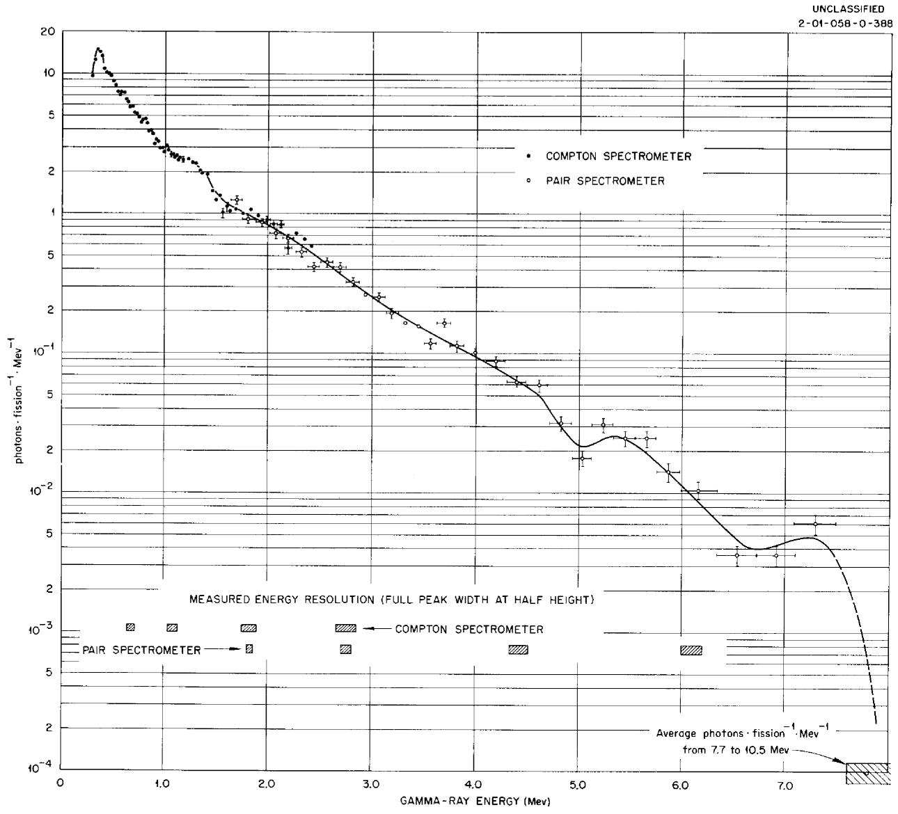  
Fig. 4.3.5. Energy Spectrum of Gamma Rays Observed Within $10^{-7}$ sec After Fission. The ordinate errors shown were obtained from counting statistics, and the energy errors represent in each case the energy interval over which the results were averaged. The resolution functions of the spectrometers used are indicated by the horizontal bars. The line is drawn only to connect the points. This plot represents a preliminary analysis of the data, and systematic errors as large as $15\%$ may occur in some energy regions.

construction, will be used for these measurements, and it is hoped that the detector for the system will be a "total absorption" NaI(TI) crystal. Such a crystal potentially may facilitate the interpretation of complex gamma-ray spectra owing to the increased probability that a gamma ray may lose nearly all of its energy in the crystal. This, in effect, would simplify the observed pulse-height distribution for any given gamma-ray

energy by eliminating a major portion of those lower-energy pulses arising from scattered photons escaping from the crystal.

Currently, various multiple-crystal spectrometers are used for obtaining reactor spectral data. Unfortunately, these spectrometers are

complicated electronically and have low efficiencies which require time-consuming operations. The total-absorption spectrometer, with its greater sensitivity, should simplify spectral measurements through the possible elimination of the complicated two-speed coincidence and pulse-height analysis system required with the multiple-crystal spectrometers.

The total-absorption crystal used in the model IV spectrometer system will probably be a 9-in.-dia right cylindrical crystal of NaI(Tl), one of which is currently being investigated at the BSF.15 A $3/4$ -in.-dia by 2-in.-deep well was drilled into the truncated end of the crystal (Fig. 4.3.6) in order to reduce the effects on the spectral response of Compton scattering near the surface where the gamma radiation enters the crystal.

The crystal has been investigated by introducing gamma rays of energies ranging from 0.279 Mev

15G. T. Chapman, ANP Quar. Prog. Rep. June 30, 1957, ORNL-2340, p 295; G. T. Chapman and T. A. Love, ANP Quar. Prog. Rep. March 31, 1957, ORNL-2274 (Part 6), p 25.

$(Hg^{203})$ to 2.76 Mev $(Na^{24})$ into the truncated end of the crystal through long lead collimators. The response of the crystal to the two gamma rays from $Na^{24}$ before the well was drilled into the crystal is shown in Fig. 4.3.7. The pulse-height distribution was obtained with a 20-channel pulse-height analyzer. The distortion that appears on the low-energy side of the 2.76-Mev peak was noticeable when any gamma ray of energy greater than about 1.6 Mev was introduced into the crystal. It was postulated that this distortion was due to the interaction of gamma rays near the surface of the crystal and to subsequent escape of the scattered gamma rays from the small-diameter region of the cone.

The response of the crystal to the same gamma-ray energies with the same conditions, but with the gamma rays collimated into the bottom of the well, is shown in Fig. 4.3.8. The shape of the distribution curve indicates an improvement over the distribution shown in Fig. 4.3.7 in that the 2.76-Mev peak is more symmetrical about the

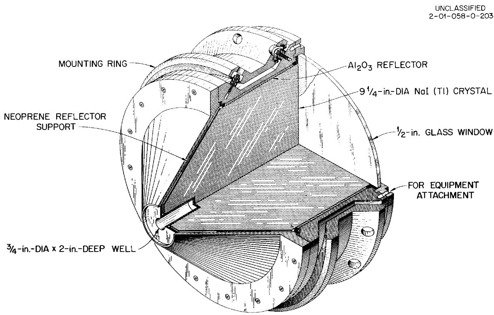  
Fig. 4.3.6. Sketch of $9\frac{1}{4}$ -in.-dia Sodium Iodide (Thallium-Activated) Gamma-Ray Spectrometer Crystal Showing $\frac{3}{4}$ -in.-dia by 2-in.-Deep Well in Truncated End.

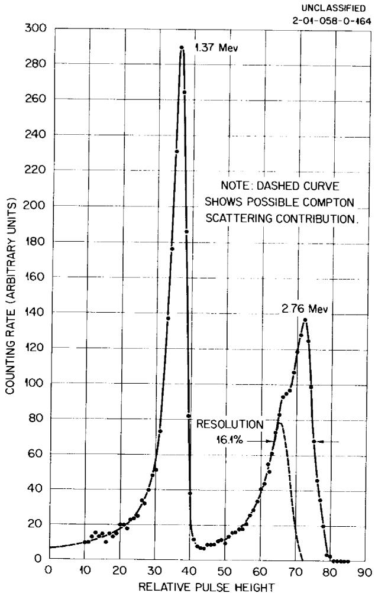  
Fig. 4.3.7. Response of the $9\frac{1}{4}$ -in.-dia Crystal to 2.76- and 1.37-Mev Na²⁴ Gamma Rays Collimated into the Truncated End of the Crystal. The distortion on the low-energy side of the 2.76-Mev peak was postulated to be the result of multiple interactions in the small-diameter region of the cone.

peak channel. A nearly constant resolution of about $15\%$ was observed for all energies during these tests. This effect has not been explained as yet.

In an attempt to improve the percentage resolution, seven 3-in.-dia photomultiplier tubes were mounted on the crystal. A voltage divider was constructed to allow an accurate adjustment of the individual photomultiplier tube gains and data were obtained with the 256-channel analyzer. The response to the $\mathbf{Na}^{24}$ gamma rays collimated into the well, as before, is shown in Fig. 4.3.9. The shape of the curve indicates an improvement

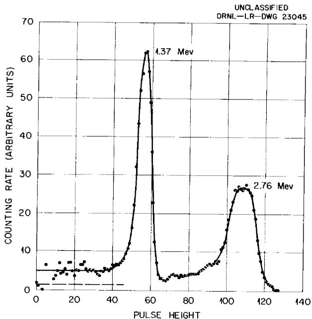  
Fig. 4.3.8. Response of the $9\frac{1}{4}$ -in.-dia Sodium Iodide Crystal to $\mathsf{Na}^{24}$ Gamma Rays Callimated into the Bottom of the Well and Observed with Three 5-in.-dia Photomultiplier Tubes. The ratio of the peak area to the total area is 0.73 for the 1.37-Mev gamma ray and 0.67 for the 2.76-Mev gamma ray.

in that the distribution is not so flat near the peak channels. It is believed that the addition of the well improved the response. (The new 256-channel pulse-height analyzer has only recently been put into operation. It is necessary, because of the variable dead time of the analyzer, to install an automatic dead-time clock to facilitate the accurate subtraction of the background from the data. This equipment is being installed in the analyzer.)

A comparison of the photofractions, that is, the ratio of the area under the full-energy peak to the area under the total distribution curve, obtained with the well in the crystal with those calculated by Berger and Doggett $^{16}$ is presented in Fig. 4.3.10. The calculations were made by using a Monte Carlo technique for a 5-in.-dia by 9-in.-long cylindrical crystal. The measured photofractions agree to within about $3.5\%$ with the calculated values. Since in both cases the gamma rays were in the energy region below

3 Mev, and since the radial loss is low for crystals as large as 5 in. in diameter, it is believed that the comparison is probably realistic, regardless of the difference in crystal geometry. A comparison with other existing spectrometers is presented in Table 4.3.2. This table shows the

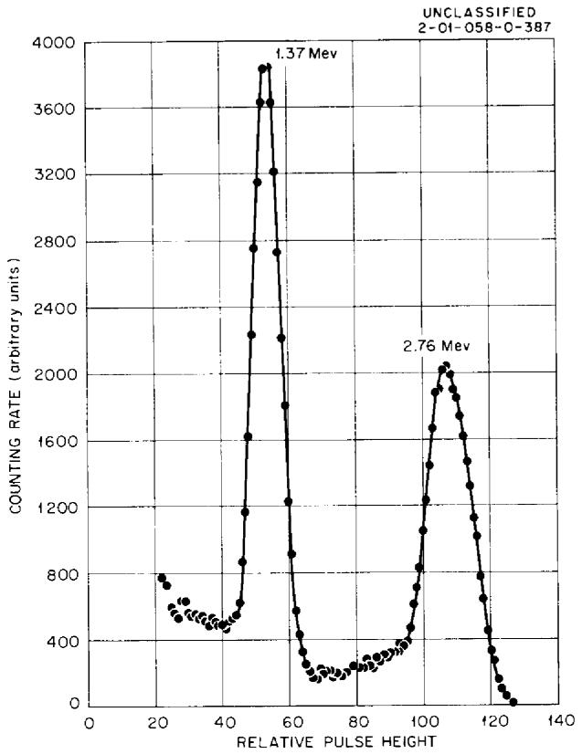  
Fig. 4.3.9. Response of the $9\frac{1}{4}$ -in.-dia Sodium Iodide Crystal to $\mathsf{Na}^{24}$ Gamma Rays Collimated into the Bottom of the Well and Observed with Seven 3-in.-dia Photomultiplier Tubes. No measurement of the photofraction was attempted since the equipment did not allow an accurate background subtraction.

measured photofractions for the total-absorption spectrometer and those measured with multicrystal spectrometers. $^{14}$ The values for the multicrystal spectrometers were obtained from a rough fit to data taken by Peelle, Love, and Zobel. $^{17}$

The total-absorption spectrometer, with the present crystal, does not compete favorably with the other spectrometers in terms of resolution. The efficiency of the total-absorption spectrometer is, however, two to three orders of magnitude greater than the efficiencies of the multiple-crystal spectrometers.

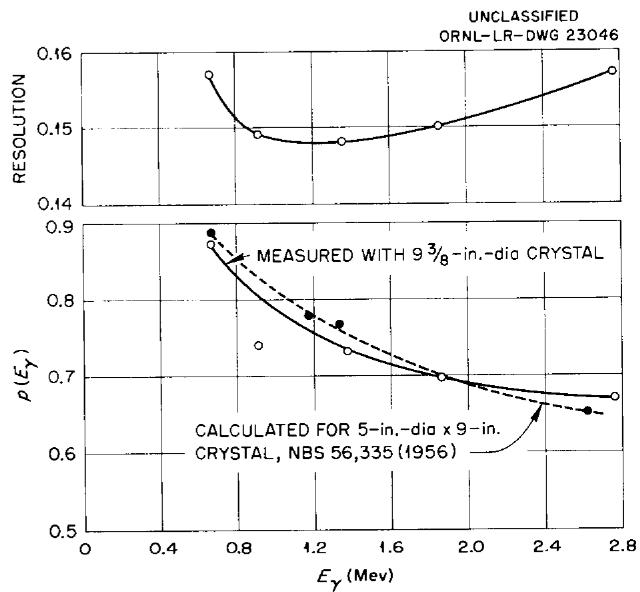  
17W. Zobel, private communication.   
Fig. 4.3.10. Ratio of Peak Area to Total Area, $p(E_{\gamma})$ , for the $9\frac{1}{4}$ -in.-dia Sodium Iodide Crystal as a Function of the Energy of Gamma Rays Collimated into the Well.

Table 4.3.2. Photofractions Obtained with Several Spectrometers for Gamma Rays of Various Energies   

<table><tr><td rowspan="2">Gamma-Ray Energy (Mev)</td><td colspan="3">Photofractions</td></tr><tr><td>Total-Absorption Spectrometer</td><td>Pair Spectrometer</td><td>Compton Spectrometer</td></tr><tr><td>0.662</td><td>0.87</td><td></td><td>0.81</td></tr><tr><td>0.903</td><td>0.74</td><td></td><td>0.76</td></tr><tr><td>1.37</td><td>0.73</td><td>0.99</td><td>0.67</td></tr><tr><td>1.85</td><td>0.69</td><td>0.94</td><td>0.57</td></tr><tr><td>2.76</td><td>0.67</td><td>0.84</td><td>0.38</td></tr></table>

# A STUDY OF RADIATION HEATING IN SHIELDS

# K.M.Henry

Past experimental work with high-efficiency shields has been devoted almost entirely to measurements of the radiation attenuation of the shields, with little investigation of the concomitant heating produced in the shields by the radiation. Since it may be necessary to provide cooling channels in aircraft shields, a study of the heat production in a large slab mockup of a typical shield was undertaken at the BSF. This work is now in progress, with the objectives of the experiment being (1) to obtain experimental information that can be used to verify the results of the best available methods for calculating the energy deposition in a shield, (2) to obtain data that can be used directly in current shielding problems, and (3) to obtain flux and dose measurements within a shield so that correlations can be made between these measurements and heat deposition.

The shield mockup currently being investigated

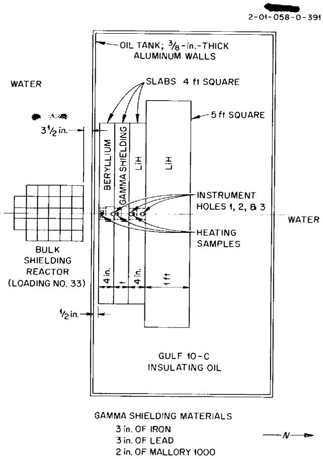  
Fig. 4.3.11. Plan View of BSF Shield Heating Experiment with Heating Samples in the Fore Position.

consists of a 4-in.-thick slab of beryllium, followed by a gamma-ray shield and 16 in. of lithium hydride. The lithium hydride is divided into two sections of 4 and 12 in., respectively, as shown in Fig. 4.3.11. The gamma-ray section, which varies in composition, consists of 3 in. of lead, 3 in. of iron, or 2 in. of Mallory 1000. The entire shield is submerged in an oil-filled aluminum tank positioned against the Bulk Shielding Reactor, with the horizontal axes of the shield and reactor coincident.

Measurements of the heating within the shield caused by radiation from the reactor are obtained by attaching thermocouples on or near thin disk-type samples located within the shield. The heat loss, or cooling of the shield, is also observed after the reactor is removed from the vicinity of the shield.

The heating-measurement samples, which are each 1.25 in. in diameter, are encased in containers made of the same material (see Fig. 4.3.12). The samples themselves are surrounded

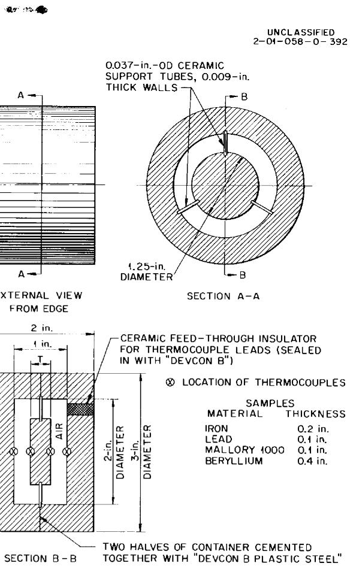  
Fig. 4.3.12. Details of Metallic Heating Samples, Containers, and Thermocouple Locations for BSF Heating Experiment.

by layers of air except at points where support tubes are attached. (Because of fabrication difficulties, it is necessary to encase the lithium hydride sample in a cadmium-covered aluminum case.) Each sample case contains four thermocouples, one attached to each face of the sample and one attached to each inside face of the sample case. The cases are plugged into recessions in the faces of the shield sections along the shield axis. In a specific shield assembly all the samples are either on the sides of the shield sections facing the reactor (fore position) or on the sides away from the reactor (aft position). The diameters of the shield cases used in the aft position are larger than the diameters of those used in the fore position so that radiation streaming through crevices straight through the shield can be avoided. At the interfaces of the shield sections, vertical wells extend downward through the shield to the samples. Flux and dose

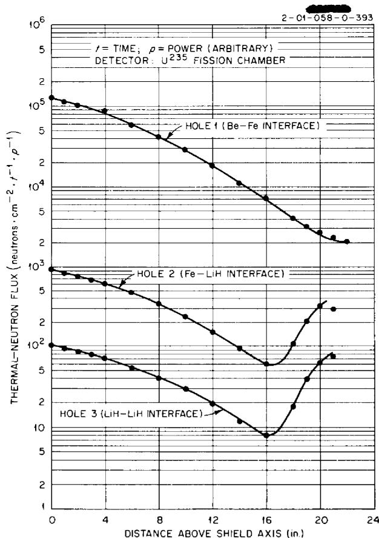  
Fig. 4.3.13. Thermol-Neutron Fluxes at the Shield Interfaces as a Function of Distance Above the Shield Axis (BSF Shield Heating Experiment).

rate measurements are made by instruments positioned within these wells (U²³⁵ fission detector, Hurst dosimeter, and ionization chambers). The wells also accommodate the thermocouple leads.

All planned measurements with configurations in which lead and iron were used as the gamma-ray shield have been completed. In addition, measurements with configurations using Mallory 1000 have been completed for the samples in the fore position. The work has been delayed temporarily in order to permit the Mallory 1000 activity to decay sufficiently so that the shield can be approached.

The thermal-neutron fluxes, the fast-neutron dose rates, and the gamma-ray dose rates at the beryllium-iron, iron-LiH, and LiH-LiH interfaces in the beryllium-iron-LiH configuration are given in Figs. 4.3.13, 4.3.14, and 4.3.15, respectively. Measurements of the temperature in the beryllium, iron, and lithium hydride samples are shown in Figs. 4.3.16, 4.3.17, and 4.3.18, respectively. These data are presented only to indicate orders of magnitude; no attempts have yet been made to analyze flux, dose, and temperature data in terms of actual reactor power.

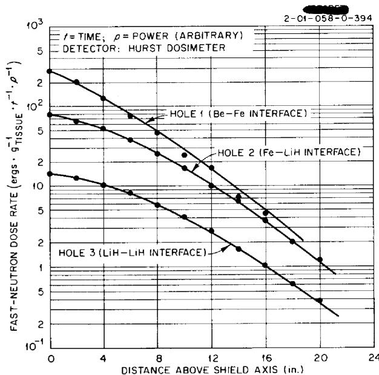  
Fig. 4.3.14. Fost-Neutron Dose Rates of the Shield Interfaces as a Function of Distance Above the Shield Axis (BSF Shield Heating Experiment).

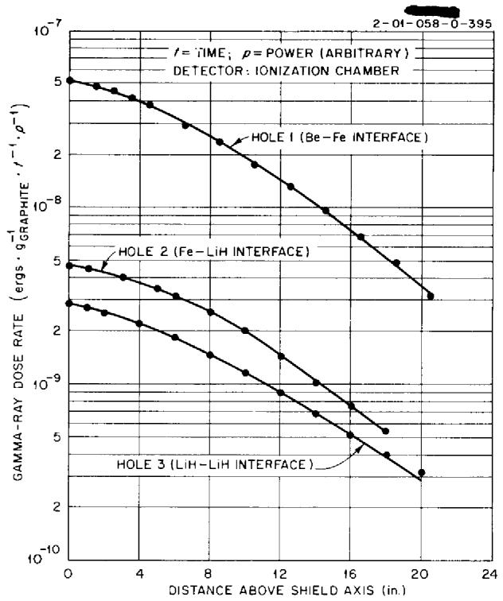  
Fig. 4.3.15. Gamma-Ray Dose Rates at the Shield Interfaces as a Function of Distance Above the Shield Axis (BSF Shield Heating Experiment).

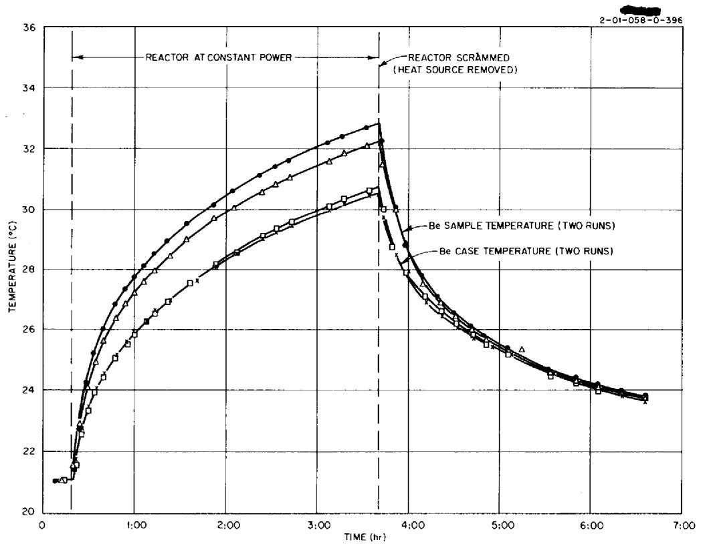  
Fig. 4.3.16. Temperature of the Beryllium Sample at the Be-Tank Wall Interface as a Function of Time (BSF Shield Heating Experiment).

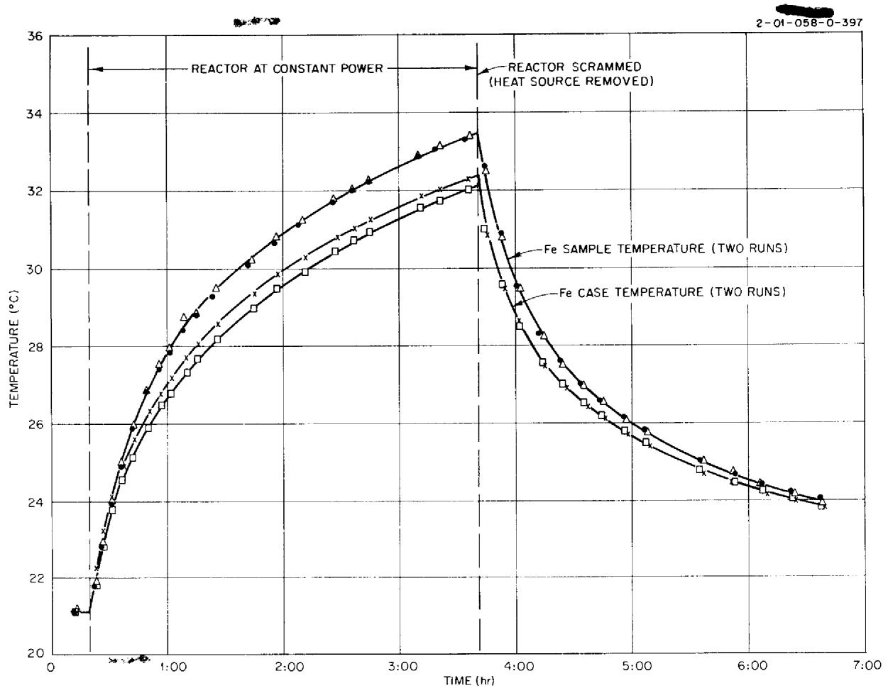

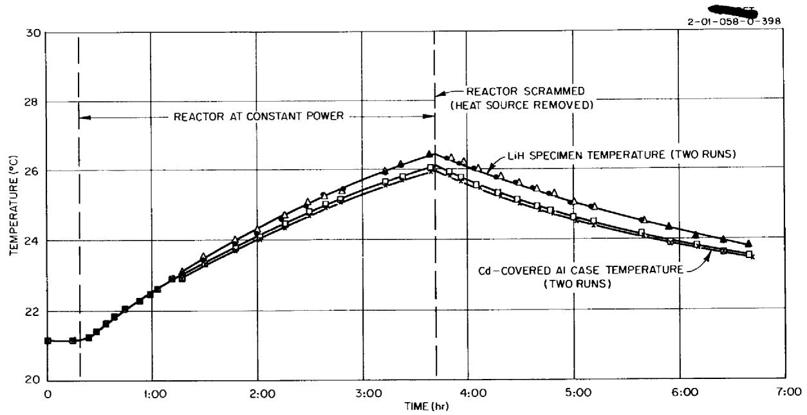  
Fig. 4.3.17. Temperature of the Iron Sample at the Be-Fe Interface as a Function of Time (BSF Shield Heating Experiment).   
Fig. 4.3.18. Temperature of the Lithium Hydride Sample at the Fe-LiH Interface as a Function of Time (BSF Shield Heating Experiment).

# 4.4. TOWER SHIELDING FACILITY

# C. E. Clifford

# Applied Nuclear Physics Division

# AIRCRAFT SHIELD TEST REACTOR EXPERIMENT AT THE TOWER SHIELDING FACILITY

V. R. Cain

J. L. Hull

B. J. Workman

F. J. Muckenthaler

In cooperation with Convair, Fort Worth, an experiment is now being conducted at the Tower Shielding Facility in which neutron and gamma-ray dose rates and thermal-neutron fluxes are being obtained under conditions similar to those encountered with the Nuclear Test Airplane (NTA) program but in the absence of the airplane structure. The NTA program at Convair included shielding measurements taken inside and outside the NTA,

1Convair, Ft. Worth.

both while in flight and while on the ground. It also included measurements in the absence of the airplane with the Aircraft Shield Test Reactor (ASTR) on a cradle 12.5 ft above a concrete pad. All these measurements will be compared with measurements taken in air at the TSF to determine magnitudes of ground and aircraft-structure effects. It will also be possible to obtain a more accurate source term for the ASTR in this experiment, since ground effects can be greatly reduced.

The ASTR consists of an array of MTR-type fuel elements mounted horizontally between two grid plates. Demineralized water is used as moderator, reflector, and coolant. The fuel element arrangement can be seen in Fig. 4.4.1, which also shows

UNCLASSIFIED

ORNL-LR-DWG 28942

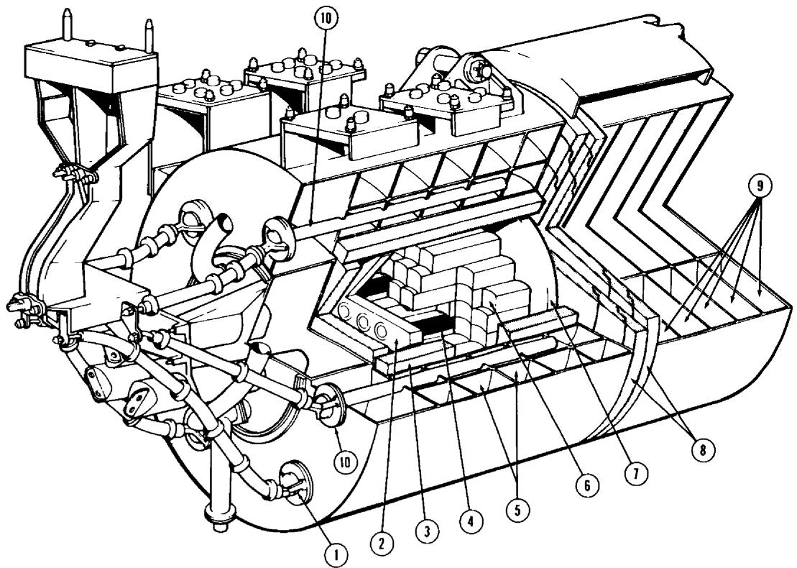  
Fig. 4.4.1. Cutaway View of the Aircraft Shield Test Reactor (ASTR).

I. GAMMA MONITOR   
2.AFTGRID   
3. PRESSURE VESSEL LEAD CASE   
4. CONTROL ROD   
5. MAIN SHIELD TANKS

6. FUEL ELEMENTS   
7. FORWARD GRID   
8. LEAD RINGS AND DISKS   
9. FORWARD SHIELD TANKS   
10. ION CHAMBER

the location of the various reactor shield tanks, which can be filled or drained remotely, and Fig. 4.4.2 shows the locations of the ASTR, the NTA crew compartment (also shown in Fig. 4.4.3), the cylindrical crew-shield mockup (also shown in Fig. 4.4.4), and various detectors in the positions used in the NTA.

The TSF experiments are being conducted in three phases: (1) data are being obtained for comparison with data taken at Fort Worth with the reactor center line 12.5 ft above ground level; (2) the spectra of neutrons from the ASTR are being determined, and (3) measurements are being made for comparison with NTA detector station measurements.

The configuration used in Phase 1 is shown in Figs. 4.4.5 and 4.4.6. The reactor support, which is attached to the hoist cables, allows the reactor to rotate 180 deg. The support truss for the detector and the crew compartment or crew-shield mockup is suspended from two hoist cables at one end and is attached to the reactor support at the opposite end. In Phase 1, groups of one fast-neutron dosimeter, one anthracene scintillation counter, one bare $\mathsf{BF}_3$ counter and one cadmium-covered $\mathsf{BF}_3$ counter are suspended from the truss on the reactor center line at distances of 33, 59, and 100 ft from the reactor center. The 100-ft detector station is shown in Fig. 4.4.7. Measurements are made with the various detectors as a function of reactor angular orientation, with the center line of the system 12.5 ft above the concrete apron, as a function of altitude, and as a function of reactor angular orientation at full altitude.

A neutron collimator assembly will be suspended from the truss in Phase 2. Neutron emulsions

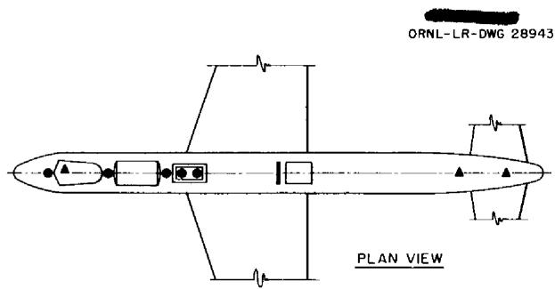  
GAMMA AND NEUTRON DETECTORS, DIRECT BEAM SHIELDS   
$\triangle$ GAMMA AND NEUTRON DETECTORS, NO DIRECT BEAM SHIELDS

Fig. 4.4.2. Detector, Crew Compartment, and Crew-Shield Mockup Positions in the NTA.   
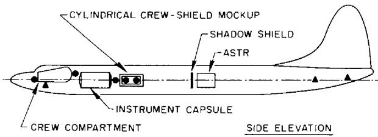  
NOTE: DATA TAKEN AT SIX POSITIONS INSIDE THE CREW COMPARTMENT

will be placed within the collimator to determine the fast-neutron spectra emitted from the ASTR with the side tanks emptied.

In Phase 3, the NTA crew compartment and the cylindrical crew-shield mockup will be suspended from the truss at positions duplicating those found in the NTA. Measurements with all types of detectors will be made at all the positions used in the NTA, as shown in Fig. 4.4.2, except those in the tail section of the airplane.

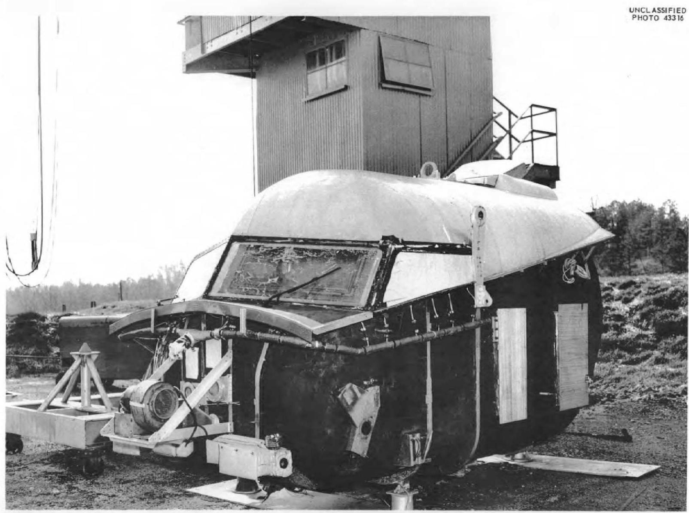  
Fig. 4.4.3. The NTA Crew Compartment.

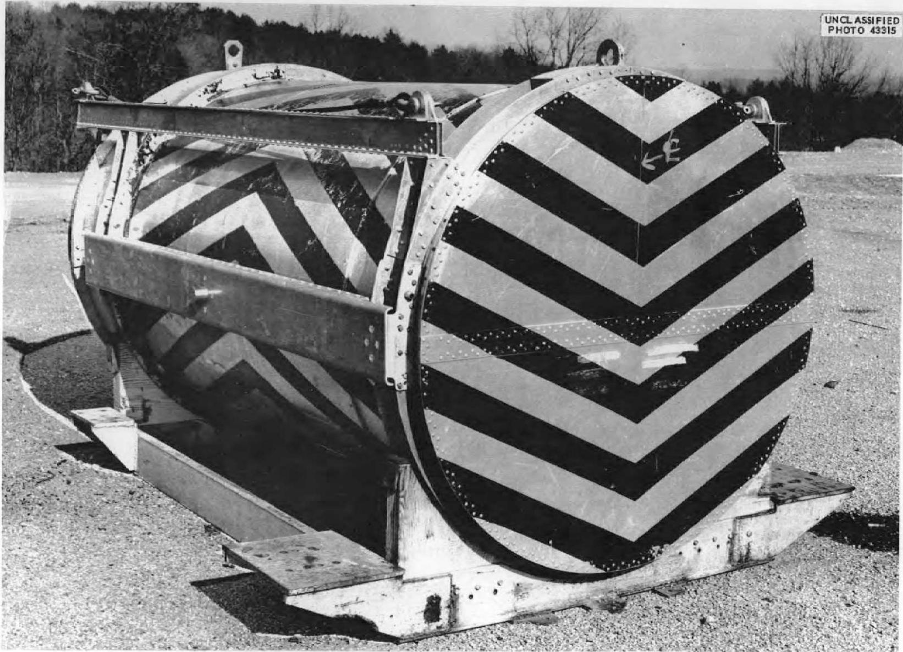  
Fig. 4.4.4. The Cylindrical Crew-Shield Mockup Used in the NTA.

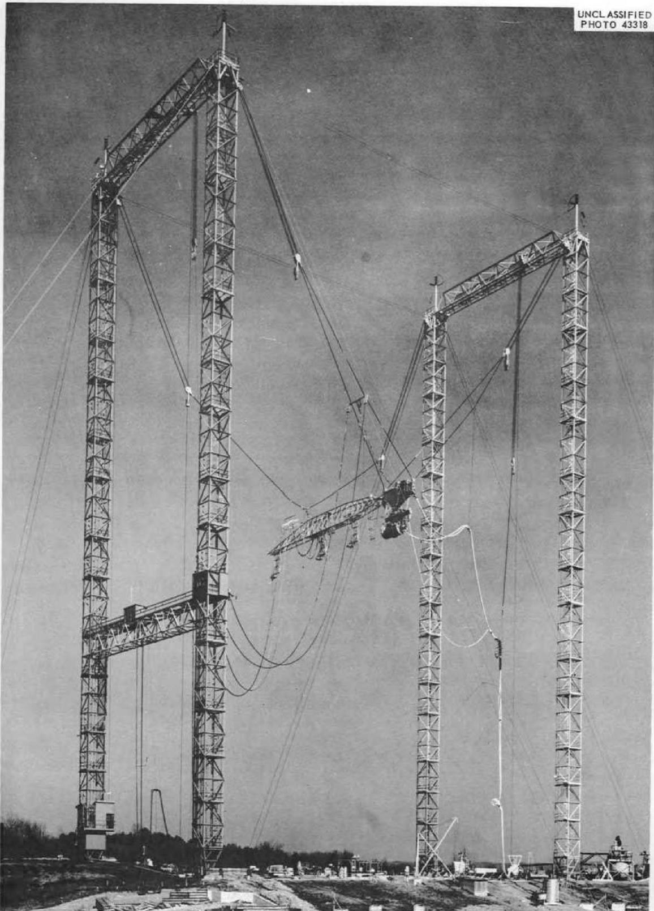  
Fig. 4.4.5. The ASTR Suspended in Air at the TSF.

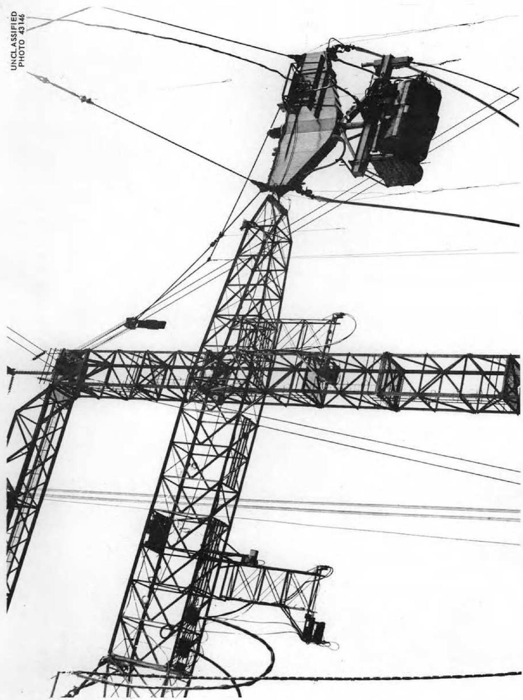  
Fig. 4.4.6. Closeup of the ASTR and Two Groups of Detectors Suspended from the Truss.

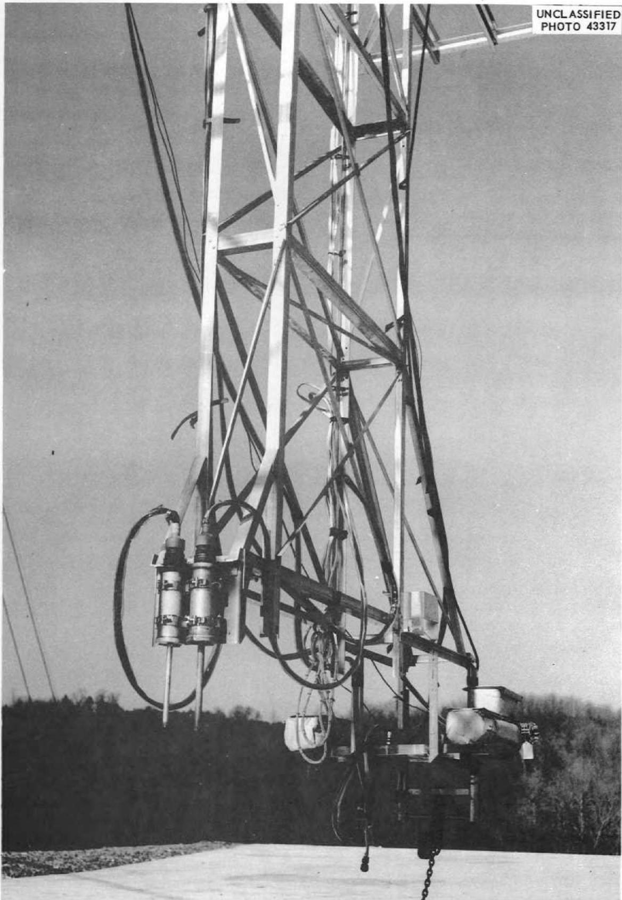  
Fig. 4.4.7. Detector Station 100 ft from the ASTR.

# INTERNAL DISTRIBUTION

I. J.W. Allen

2. D. S. Billington

3. F. F. Blankenship

4. E. P. Blizzard

5. C. J. Borkowski

6. W. F. Boudreau

7. G.E. Boyd

8. E. J. Breeding

9. R. B. Briggs

10. F. R. Bruce

11. A. D. Callihan

12. C. E. Center (K-25)

13. R. A. Charpie

14. C. E. Clifford

15. J. H. Coobs

16. W. B. Cottrell

17. F. L. Culler

18. D. R. Cuneo

19. J.H. Devan

20. L. M. Doney

21. D. A. Douglas

22. L. B. Emlet (K-25)

23. A. P. Fraos

24. J.H.Frye

25. W. T. Furgerson

26. R.J. Gray

27. B. L. Greenstreet

28. W.R.Grimes

29. A. G. Grindell

30. E. Guth

31. C. S. Harrill

32. T. Hikido

33. M.R.Hill

34. E.E.Hoffman

35. H.W.Hoffman

36. A. Hollander

37. A. S. Householder

38. W.H. Jordan

39. G. W. Keilholtz

40. C. P. Keim

41. F. L. Keller

42. M. T. Kelley

13. J. J. Keyes

44-45. J.A.Lane

46. R. S. Livingston

47. R.N.Lyon

48. H. G. MacPherson

49. F. C. Maienschein

50. W. D. Manly

51. E. R. Mann

52. R. V. Meghreblian

53. A. J. Miller

54. K. Z. Morgan

55. E. J. Murphy

56. J. P. Murray (Y-12)

57. M. L. Nelson

58. G. J. Nessle

59. L. G. Overholser

60. P. Patriarca

61. S. K. Penny

62. A. M. Perry

63. J.C.Pigg

64. P. M. Reyling

65. H. W. Savage

66. A. W. Savolainen

67. R. D. Schultheiss

68. J. L. Scott

69. E. D. Shipley

70. A. Simon

71. M. J. Skinner

72. A. H. Snell

73. E. Storto

74. C. D. Susano

75. J. A. Swartout

76. E. H. Taylor

77. D. B. Trauger

78. D. K. Trubey

79. G.M. Watson

30. A. M. Weinberg

31. J. C. White

32. E. P. Wigner (consultant)

33. G.C. Williams

34. J. C. Wilson

35. C. E. Winters

36. W. Zobel

87-89. ORNL - Y-12 Technical Library, Document Reference Section

90-96. Laboratory Records Department

97. Laboratory Records, ORNL R.C.

98-100. Central Research Library

# EXTERNAL DISTRIBUTION

101-103. Air Force Ballistic Missile Division

104-105. AIPR, Boeing, Seattle

106. AFRR, Boeing, Wichita   
107. AFPR, Curtiss-Wright, Clifton   
108. AFPR, Douglas, Long Beach

109-111. AFPR, Douglas, Santa Monica

112. AFPR, Lockheed, Burbank

113-114. AFPR, Lockheed, Marietta

115. AFPR, North American, Canada Park   
116. AFPR, North American, Darney   
117. AFPR, North American, Los Angeles   
118. Air Force Special Weapon Center   
119. Air Research and Development Command (RDTAPS)   
120. Air Research and Development Command (RDZPSP)   
121. Air Technical Intelligence Center   
122. Air University Library

123-125. ANP Project Office, Civair, Fort Worth

126. Argonne National Laboratory   
127. Armed Forces Special Forces Project, Sandia   
128. Armed Forces Special Reations Project, Washington   
129. Army Ballistic Missile Agency   
130. Assistant Secretary of Defense, R&D (WSEG)   
131. Assistant Secretary of the Air Force, R&D

132-137. Atomic Energy Commission, Washington

138. Bettis Plant (WAPD)   
139. Bureau of Aeronautij   
140. Bureau of Aeronautics General Representative   
141. BAR, Aerojet-Genetics, Azusa   
142. BAR, Convair, Santiago   
143. BAR, Goodyear Aircraft, Akron   
144. BAR, Grumman Aircraft, Bethpage   
145. BAR, Martin, Baltrope   
146. Bureau of Ships   
147. Bureau of Yards at Docks

148-149. Chicago Operation Office

150. Chicago Patent Group   
151. Curtiss-Wright Correlation

152-155. General Electric Company (ANPD)

156. Hartford Area Offici   
157. Jet Propulsion Laboratory   
158. Knolls Atomic Power Laboratory   
159. Lockland Area Office   
160. Los Alamos Scientific Laboratory   
161. Marquardt Aircraft Company   
162. National Advisory Committee for Aeronautics, Cleveland   
163. National Advisory Committee for Aeronautics, Washington   
164. Naval Air Development Center   
165. Naval Air Material Center   
166. Naval Air Turbine Test Station

167. Nat'l Research Laboratory

168. Offic of Naval Research

169. Office of the Chief Naval Operations (OP-361)

170. Patent Branch, Wilmington

171. Phillips, Petroleum Company

175. Pratt and Whitney Aircraft Division

176. Redstone 2

177. San Francisco Operations Office

178. Sandia Corp. 1

179. Sandia Corporation, Livermore

180. School of Aviation Medicine

181. USAF Headquarters

182. USAF Project AND

183. U.S. Naval Medical Defense Laboratory

185. University of California Radiation Laboratory, Livermore

203. Wright Air Development Center

218. Technical information Service Extension, Oak Ridge

219. Division of Research and Development, Atomic Energy Commission, Oak Ridge Operations

Reports previously issued in this series are as follows:

ORNL-528 Period Ending November 30, 1949

ORNL-629 Period Ending February 28, 1950

ORNL-768 Period Ending May 31, 1950

ORNL-858 Period Ending August 31, 1950

ORNL-919 Period Ending December 10, 1950

ANP-60 Period Ending March 10, 1951

ANP-65 Period Ending June 10, 1951

ORNL-1154 Period Ending September 10, 1951

ORNL-1170 Period Ending December 10, 1951

ORNL-1227 Period Ending March 10, 1952

ORNL-1294 Period Ending June 10, 1952

ORNL-1375 Period Ending September 10, 1952

ORNL-1439 Period Ending December 10, 1952

ORNL-1515 Period Ending March 10, 1953

ORNL-1556 Period Ending June 10, 1953

ORNL-1609 Period Ending September 10, 1953

ORNL-1649 Period Ending December 10, 1953

ORNL-1692 Period Ending March 10, 1954

ORNL-1729 Period Ending June 10, 1954

ORNL-1771 Period Ending September 10, 1954

ORNL-1816 Period Ending December 10, 1954

ORNL-1864 Period Ending March 10, 1955

ORNL-1896 Period Ending June 10, 1955

ORNL-1947 Period Ending September 10, 1955

ORNL-2012 Period Ending December 10, 1955

ORNL-2061 Period Ending March 10, 1956

ORNL-2106 Period Ending June 10, 1956

ORNL-2157 Period Ending September 10, 1956

ORNL-2221 Period Ending December 31, 1956

ORNL-2274 Period Ending March 31, 1957

ORNL-2340 Period Ending June 30, 1957

ORNL-2387 Period Ending September 30, 1957

ORNL-2440 Period Ending December 31, 1957