THE INFLUENCE OF COMPOSITION UPON

THE $1500^{\circ}F$ CREEP- RUCTURE STRENGTH AND

MICROSTRUCTURE OF MOLYBDENUM

CHROMIUM-IRON-NICKEL BASE ALLOYS

T. K. Roche

CENTRAL RESEARCH LIBRARY

DOCUMENT COLLECTION

LIBRARY LOAN COPY

DO NOT TRANSFER TO ANOTHER PERSON

If you wish someone else to see this

document, send in home with document and the library will arrange a loan.

OAK RIDGE NATIONAL LABORATORY

operated by

UNION CARBIDE CORPORATION

for the

U.S. ATOMIC ENERGY COMMISSION

Printed in USA. Price $2.75 cents. Available from the

Office of Technical Services

U.S. Department of Commerce

Washington 25, D.C.

# LEGAL NOTICE

This report was prepared as an account of Government sponsored work. Neither the United States, nor the Commission, nor any person acting on behalf of the Commission!

A. Makes any warranty or representation, express or implied, with respect to the accuracy, completeness, or usefulness of the information contained in this report, or that the use of any information, apparatus, method, or process disclosed in this report may not infringe privately owned rights; or   
B. Assumes any liabilities with respect to the use of, or for damages resulting from the use of any Information, apparatus, method, or process disclosed in this report.

As used in the above, "person acting on behalf of the Commission" includes any employee or contractor of the Commission to the extent that such employee or contractor prepares, handles or distributes, or provides access to, any information pursuant to his employment or contract with the Commission.

Contract No. W-7405-eng-26

METALLURGY DIVISION

THE INFLUENCE OF COMPOSITION UPON THE $1500^{\circ}$ F CREEP-RUPTURE STRENGTH AND MICROSTRUCTURE OF MOLYBDENUM-CHROMIUM-IRON-NICKEL BASE ALLOYS

Thomas Kirby Roche

DATE ISSUED

JUN 24 1958

Submitted as a Thesis to the Graduate Council of the University of Tennessee in partial fulfillment of the requirements for the degree of Master of Science

OAK RIDGE NATIONAL LABORATORY

Operated by

UNION CARBIDE CORPORATION

for the

Atomic Energy Commission

# ACKNOWLEDGEMENT

The author is indebted to Dr. E. E. Stansbury for his advice throughout the course of this investigation and for his contributions to the preparation of the final manuscript.

Special thanks are due H. Inouye and D. A. Douglas, Jr., of the Oak Ridge National Laboratory for their helpful comments.

Direct assistance in accumulating the experimental data for this work was provided by the following ORNL personnel: G. E. Angel, melting and casting; J. F. Newsome and W. R. Johnson, fabrication; C. K. Thomas, creep-rupture testing; W. H. Farmer, metallography; W. R. Laing and staff, chemical analyses. Their contributions are gratefully appreciated.

The author also is indebted to Mrs. Freda Finn of the Metallurgy Reports Office for her cooperation in typing this manuscript.

Finally, thanks are extended to Union Carbide Corporation for its provision for employee educational assistance.

# TABLE OF CONTENTS

# CHAPTER

PAGE

I. SUMMARY. 1   
II. INTRODUCTION 4   
III. OBJECTIVE. 10   
IV. EXPERIMENTAL PROCEDURE 11   
V. RESULTS AND DISCUSSION 23   
VI. CONCLUSIONS AND RECOMMENDATIONS. 89

LIST OF REFERENCES. 93

BIBLIOGRAPHY. 95

APPENDIX. 97

# CHAPTER I

# SUMMARY

Results of an alloy development program at the Oak Ridge National Laboratory have shown an alloy within the composition range 15/17 per cent molybdenum - 6/8 per cent chromium - 4/6 per cent iron - 0.04/0.08 per cent carbon - balance nickel, designated as INOR-8, to be an attractive structural material for use in a nuclear power reactor fueled with molten-uranium-bearing fluoride salts.

The present study enlarges upon the technology of the alloy INOR-8 through an investigation of the influence of composition variation upon the $1500^{\circ}\mathrm{F}$ creep-rupture strength and microstructure of alloys encompassed by the range 1.0/20 per cent molybdenum - 5/10 per cent chromium - 4/10 per cent iron - 0.5 per cent aluminum - 0.5 per cent manganese - 0.06 per cent carbon - balance nickel. The composition of the individual alloys was varied systematically with the intent that by direct comparison the effect of an element upon strength could be determined. All alloys were tested in creep-rupture at a stress of 10,000 psi in the annealed condition. The criteria used to evaluate the strength of the alloys were the times required to reach strains between 1 and 10 per cent.

The results could not be explained in simple terms of composition variation since the principal factors affecting the strength of the alloys were: solid-solution elements, carbide and non-carbide

aging reactions, the presence of $\mathbf{M}_6\mathbf{C}$ -type carbides in the micro-structures, and grain size.

From the standpoint of their creep-rupture strength, it was possible to conveniently group the alloys according to the three concentrations of molybdenum studied: 10, 15, and 20 per cent. It could be concluded from the analyses and microstructures of these alloys that the relative strength contribution of each of the previously mentioned factors varied between the individual groups.

The combined effects of solid-solution strengthening by molybdenum and the increase in quantity of dispersed $\mathsf{M}_6\mathsf{C}$ -type carbides which this element promoted in the annealed materials were the predominant factors which increased the strength of the alloys grouped by molybdenum content. The only exception noted was in the case of the 20 per cent molybdenum - 7 per cent chromium - 10 per cent iron alloy which precipitated a non-carbide phase as a consequence of crossing a new phase boundary. This phase contributed noticeably to creep-rupture strength in the later stages of test.

The contribution of chromium and iron to the strength of the alloys within the individual groups could not be established with certainty due to simultaneous variations in other factors affecting creep-rupture behavior.

To obtain a better indication of the strengthening influence of chromium and iron, creep-rupture studies were conducted on low-carbon "high-purity" alloys. Although an analysis of the data was complicated by the presence of a limited amount of carbide precipitation and by

grain-size variations, the influence of chromium was found to be significant when 5 to 10 per cent was added to the 15 per cent molybdenum - balance nickel base. However, the presence of 10 per cent chromium in the base composition showed the most pronounced strengthening influence. The strengthening effect of iron was interpreted as being insignificant when amounts up to 10 per cent were added to the 15 per cent molybdenum - 7 per cent chromium - balance nickel base.

A general consideration of all data obtained from this investigation favorably supports the composition specification placed upon the alloy INOR-8.

# CHAPTER II

# INTRODUCTION

The advancement in the technology of a nuclear power reactor fueled with molten~uranium~bearing fluoride salts has been concerned, in part, with the development of a structural material which will be compatible with the reactor operating conditions. In such a reactor the material would be subjected to several corrosive environments at elevated temperatures in addition to complex stresses derived from flowing fluids, temperature gradients, and thermal cycles; consequently, it is necessary that the material meet rigid requirements, among them being:

1. sufficient strength and reasonable ductility at elevated temperatures;   
2. good corrosion resistance to the molten fluoride salts;   
3. good oxidation resistance;   
4. favorable fabricability for the production of a variety of shapes, i.e., plate, sheet, bar, wire, tubing, etc.;   
5. good weldability and brazeability; and   
6. suitable nuclear properties.

It has been found through various test programs conducted over the past several years, that of the commercially available alloys, Inconel (80 Ni - 14 Cr - 6 Fe) and Hastelloy B (67 Ni - 28 Mo - 5 Fe)

were the most promising for this application; however, neither is an "ideal" material with respect to the above requirements. With particular regard to the elevated temperature strength of the two alloys, Hastelloy B is much superior to Inconel at $1500^{\circ}\mathrm{F}$ , as shown in Figure 1. In structures fabricated from Inconel, specification of design stresses must take into account the deterioration of its strength due to a significant amount of corrosion by the molten fluoride salts as well as that due to temperature. Thus, in many cases, Inconel becomes a marginal alloy where thin sections are encountered. Hastelloy B, on the other hand, is virtually unaffected by the molten fluoride salts and, at the same time, possesses high strength; however, extended service in the temperature range of approximately $1200 - 1600^{\circ}\mathrm{F}$ results in a decrease in its ductility to such a degree that it also becomes a marginal material.

A recent study of the aging characteristics of Hastelloy B by R. E. Clausing, et al, $^{1}$ has shown the most prominent loss in ductility of the alloy to occur after aging at $1300^{\circ}\mathrm{F}$ , due to the precipitation of an intermetallic compound interpreted as being the beta phase $(\mathrm{Ni}_{4}\mathrm{Mo})$ of the nickel-molybdenum system. Between $1500^{\circ}\mathrm{F}$ and $1650^{\circ}\mathrm{F}$ , the precipitate observed upon aging was different from that noted at $1300^{\circ}\mathrm{F}$ and was tentatively identified as the gamma phase $(\mathrm{Ni}_{3}\mathrm{Mo})$ . The effect of the gamma phase on decreasing the tensile ductility of Hastelloy B was not quite so marked as that of the lower temperature beta phase. The assumed intermetallic compounds were deduced from the nickel-molybdenum equilibrium diagram $^{2}$ shown in Figure 2, it being

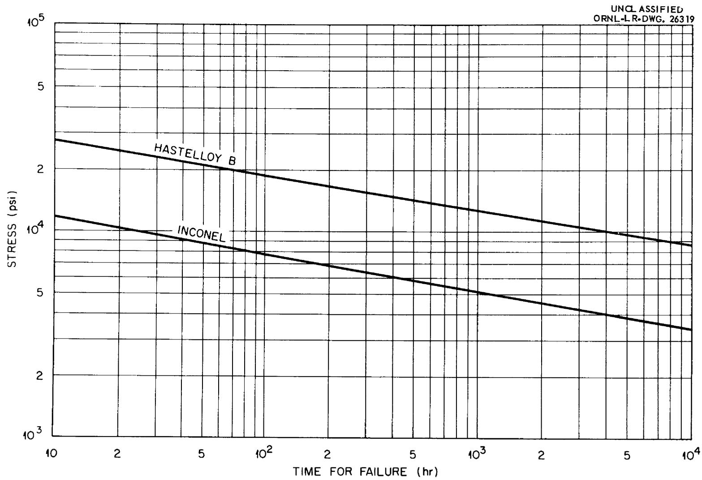  
Figure 1. Comparison of the stress-rupture properties of Inconel and Hastelloy B at $1500^{\circ}\mathrm{F}$ .

UNCLASSIFIED Y-12802

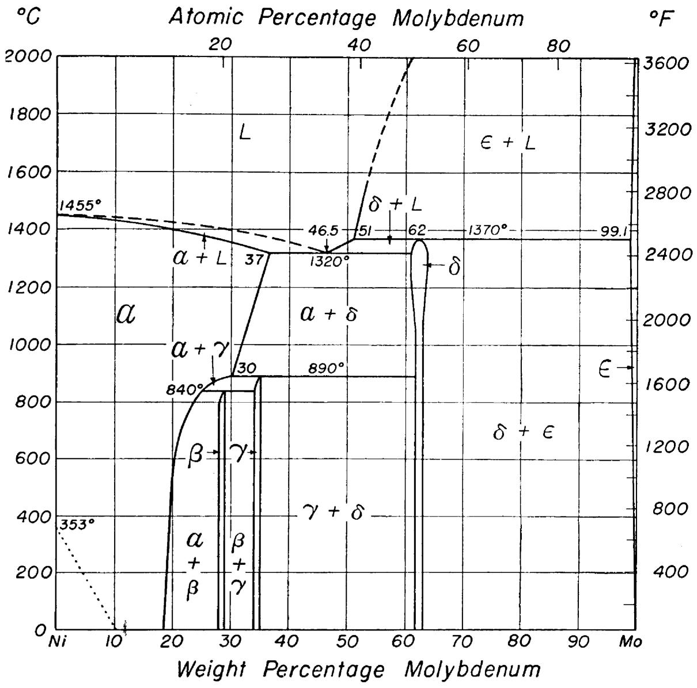  
Figure 2. Nickel-Molybdenum equilibrium diagram.

recognized that the presence of iron and other elements in Hastelloy B could have an influence on the location of the phase boundaries.

In view of the overall requirements of the "ideal" alloy, it became apparent that these could best be met by a material having the desirable features of Inconel and Hastelloy B. During the past few years, an alloy development program at the Oak Ridge National

Laboratory has been concerned with the evaluation of numerous nickel-base alloys with a primary strengthening addition of 15 - 20 per cent molybdenum. This amount of molybdenum is within the solubility limits of molybdenum in nickel at elevated temperatures, and therefore, embrittlement associated with the precipitation of Ni Mo y intermetallic compounds does not occur. Subsequent additions made to the nickel-molybdenum base composition to augment its properties included such elements as chromium, iron, niobium, vanadium, tungsten, aluminum, titanium, and carbon. Data obtained from screening tests designed to investigate strength, fluoride-salt corrosion, oxidation, fabricability, and weldability of the various alloys showed the necessity of a composition balance since enhancement of a particular property was obtained at the expense of one or more other properties. At the present time, the best compromise material, in light of the original requirements of the "ideal" alloy, is the composition, 15/17 Mo - 6/8 Cr - 4/6 Fe - 0.04/0.08 C - balance Ni, designated as INOR-8. This alloy is classified as the solid-solution type with the exception, however, of carbide particles which are stable over a wide temperature range.

During the course of the alloy screening tests the potential importance of a number of variables became evident. Among those variables incompletely understood were the influence of heat treatment, melting practice, and changes in composition upon the strength of a given alloy. Of these three subjects, it was believed that a program set up to investigate the influence of composition variation upon the strength, as well as the microstructure, of alloys within a range encompassing that of the alloy INOR-8 would prove the most beneficial. Such an investigation was carried out and is described in the following chapters.

# CHAPTER III

# OBJECTIVE

The objective of this investigation was to determine the influence of composition variation upon the $1500^{\circ}\mathrm{F}$ creep-rupture strength and microstructure of molybdenum-chromium-iron-nickel base alloys. The alloys for this study were encompassed by the range 10/20 Mo - 5/10 Cr - 4/10 Fe - 0.5 Al - 0.5 Mn - 0.06 C - balance Ni. The composition of the individual alloys was varied systematically with the intent that by direct comparison, the effect of an element upon strength could be determined.

# CHAPTER IV

# EXPERIMENTAL PROCEDURE

Two general series (I and II) of alloys were prepared for this investigation. Series I was prepared to show the influence of variations in the molybdenum, chromium, and iron contents at a constant carbon content on the creep-rupture behavior and microstructure of the resultant alloys. The melting stock used for preparing the alloys of this series was of the following reported purity: nickel pellets, 99.9 per cent; sintered molybdenum bar ends, 99.8 per cent; alumino-thermic chromium, 99.3 per cent with approximately 1000 ppm oxygen; vacuum-melted ingot iron, 99.9 per cent; and carbon in the form of graphite. Aluminum and manganese were added as malleableizing agents. Previous work with nickel-molybdenum-chromium alloys at ORNL has shown them to be subject to cracking during hot-rolling in the absence of malleableizers, even though the alloys were prepared by vacuum-melting techniques from reportedly good-quality melting stock. It is believed that the hot-cracking tendencies are caused, principally, by the residual gases present in the materials.

The presence of carbon in the alloys of series I produced creep-rupture results which indicated that carbon through carbide formation was masking the strengthening influence of chromium and iron. This fact prompted the preparation of the alloys of series II. The alloys of series II are referred to as "high-purity" alloys and were prepared from the same nickel and iron melting stock as the alloys of series I;

however, arc-cast molybdenum and special high-purity chromium flakes (140 ppm oxygen) were substituted for the sintered molybdenum bar ends and alumino-thermic chromium, respectively. No intentional carbon or malleableizing agents were added to the alloys of series II.

# Melting and Casting

All alloys were prepared by vacuum-induction-melting. A total charge of 1450 grams per alloy was placed in a zirconia crucible, outgassed by intermittent application of power, and finally melted under a vacuum of approximately 100 microns of mercury. Each alloy was held in the molten state from twenty to thirty minutes to insure solution of the charge, and then cast into a graphite mold to form an ingot one and one-half inches in diameter by four inches in length, excluding the hot-top.

# Ingot Analysis

The hot-tops were cut from the ingots and turnings for chemical analysis were taken from the bottom of each hot-top across the entire transverse section. A prior skin cut, which was discarded, was made on the outside diameter of the hot-tops before collecting the turnings. The results of the analyses performed by the Analytical Chemistry Division of ORNL are shown in Table I. The nominal composition of each alloy based upon the weight of the elements making up the charge is also given in Table I for comparison. In general, the nominal compositions were in good agreement with the analyzed compositions.

TABLEI   
NOMINAL AND ANALYZED COMPOSITIONS OF THE ALLOYS   

<table><tr><td rowspan="2"></td><td rowspan="2">Alloy No.</td><td colspan="7">Nominal Composition (Wt %)</td><td colspan="7">Analyzed Composition (Wt %)</td></tr><tr><td>Ni</td><td>Mo</td><td>Cr</td><td>Fe</td><td>Al</td><td>Mn</td><td>C</td><td>Ni</td><td>Mo</td><td>Cr</td><td>Fe</td><td>Al</td><td>Mn</td><td>C</td></tr><tr><td rowspan="16">Series I</td><td>VT-43</td><td>Bal</td><td>10</td><td>5</td><td>4</td><td>0.5</td><td>0.5</td><td>0.06</td><td>Bal</td><td>9.87</td><td>4.94</td><td>4.00</td><td>0.79~</td><td>0.59</td><td>0.076</td></tr><tr><td>VT-44</td><td>Bal</td><td>10</td><td>5</td><td>10</td><td>0.5</td><td>0.5</td><td>0.06</td><td>Bal</td><td>9.83</td><td>4.86</td><td>9.63</td><td>0.90</td><td>0.61</td><td>0.06</td></tr><tr><td>VT-47</td><td>Bal</td><td>10</td><td>7</td><td>4</td><td>0.5</td><td>0.5</td><td>0.06</td><td>Bal</td><td>9.61</td><td>6.59</td><td>3.76</td><td>0.81</td><td>0.59</td><td>0.07</td></tr><tr><td>VT-48</td><td>Bal</td><td>10</td><td>7</td><td>10</td><td>0.5</td><td>0.5</td><td>0.06</td><td>Bal</td><td>9.42</td><td>6.58</td><td>9.29</td><td>0.82</td><td>0.53</td><td>0.07</td></tr><tr><td>VT-53</td><td>Bal</td><td>10</td><td>10</td><td>4</td><td>0.5</td><td>0.5</td><td>0.06</td><td>Bal</td><td>9.62</td><td>10.01</td><td>4.19</td><td>0.78</td><td>0.50</td><td>0.064</td></tr><tr><td>VT-54</td><td>Bal</td><td>10</td><td>10</td><td>10</td><td>0.5</td><td>0.5</td><td>0.06</td><td>Bal</td><td>10.93</td><td>9.71</td><td>10.67</td><td>0.88</td><td>0.53</td><td>0.068</td></tr><tr><td>VT-45</td><td>Bal</td><td>15</td><td>5</td><td>4</td><td>0.5</td><td>0.5</td><td>0.06</td><td>Bal</td><td>14.10</td><td>4.79</td><td>3.93</td><td>0.77</td><td>0.55</td><td>0.073</td></tr><tr><td>VT-46</td><td>Bal</td><td>15</td><td>5</td><td>10</td><td>0.5</td><td>0.5</td><td>0.06</td><td>Bal</td><td>16.27</td><td>4.90</td><td>10.33</td><td>0.81</td><td>0.57</td><td>0.090</td></tr><tr><td>VT-49</td><td>Bal</td><td>15</td><td>7</td><td>4</td><td>0.5</td><td>0.5</td><td>0.06</td><td>Bal</td><td>15.50</td><td>6.83</td><td>4.32</td><td>0.88</td><td>0.59</td><td>0.075</td></tr><tr><td>VT-50</td><td>Bal</td><td>15</td><td>7</td><td>10</td><td>0.5</td><td>0.5</td><td>0.06</td><td>Bal</td><td>14.37</td><td>6.99</td><td>10.21</td><td>0.86</td><td>0.64</td><td>0.081</td></tr><tr><td>VT-55</td><td>Bal</td><td>15</td><td>10</td><td>4</td><td>0.5</td><td>0.5</td><td>0.06</td><td>Bal</td><td>15.94</td><td>9.80</td><td>4.25</td><td>0.81</td><td>0.53</td><td>0.077</td></tr><tr><td>VT-56</td><td>Bal</td><td>15</td><td>10</td><td>10</td><td>0.5</td><td>0.5</td><td>0.06</td><td>Bal</td><td>15.76</td><td>9.84</td><td>10.29</td><td>0.89</td><td>0.43</td><td>0.077</td></tr><tr><td>VT-57</td><td>Bal</td><td>20</td><td>5</td><td>4</td><td>0.5</td><td>0.5</td><td>0.06</td><td>Bal</td><td>21.06</td><td>4.88</td><td>4.31</td><td>0.86</td><td>0.56</td><td>0.07</td></tr><tr><td>VT-58</td><td>Bal</td><td>20</td><td>5</td><td>10</td><td>0.5</td><td>0.5</td><td>0.06</td><td>Bal</td><td>19.72</td><td>7.19</td><td>10.38</td><td>0.81</td><td>0.41</td><td>0.069</td></tr><tr><td>VT-59</td><td>Bal</td><td>20</td><td>7</td><td>4</td><td>0.5</td><td>0.5</td><td>0.06</td><td>Bal</td><td>18.60</td><td>6.93</td><td>4.23</td><td>0.94</td><td>0.41</td><td>0.075</td></tr><tr><td>VT-60</td><td>Bal</td><td>20</td><td>7</td><td>10</td><td>0.5</td><td>0.5</td><td>0.06</td><td>Bal</td><td>20.70</td><td>7.11</td><td>10.17</td><td>0.76</td><td>0.38</td><td>0.066</td></tr><tr><td rowspan="8">Series II</td><td>VT-90</td><td>Bal</td><td>15</td><td>-</td><td>-</td><td>-</td><td>-</td><td>-</td><td>Bal</td><td>14.34</td><td>-</td><td>-</td><td>-</td><td>-</td><td>0.022</td></tr><tr><td>VT-89</td><td>Bal</td><td>15</td><td>3</td><td>-</td><td>-</td><td>-</td><td>-</td><td>Bal</td><td>14.59</td><td>2.98</td><td>-</td><td>-</td><td>-</td><td>0.018</td></tr><tr><td>VT-88</td><td>Bal</td><td>15</td><td>5</td><td>-</td><td>-</td><td>-</td><td>-</td><td>Bal</td><td>14.39</td><td>5.04</td><td>-</td><td>-</td><td>-</td><td>0.024</td></tr><tr><td>VT-87</td><td>Bal</td><td>15</td><td>7</td><td>-</td><td>-</td><td>-</td><td>-</td><td>Bal</td><td>14.89</td><td>7.03</td><td>-</td><td>-</td><td>-</td><td>0.025</td></tr><tr><td>VT-86</td><td>Bal</td><td>15</td><td>10</td><td>-</td><td>-</td><td>-</td><td>-</td><td>Bal</td><td>14.89</td><td>10.19</td><td>-</td><td>-</td><td>-</td><td>0.017</td></tr><tr><td>VT-91</td><td>Bal</td><td>15</td><td>7</td><td>4</td><td>-</td><td>-</td><td>-</td><td>Bal</td><td>15.53</td><td>5.04</td><td>2.05</td><td>-</td><td>-</td><td>0.010</td></tr><tr><td>VT-92</td><td>Bal</td><td>15</td><td>7</td><td>7</td><td>-</td><td>-</td><td>-</td><td>Bal</td><td>15.24</td><td>7.19</td><td>7.19</td><td>-</td><td>-</td><td>0.021</td></tr><tr><td>VT-93</td><td>Bal</td><td>15</td><td>7</td><td>10</td><td>-</td><td>-</td><td>-</td><td>Bal</td><td>14.79</td><td>7.16</td><td>10.18</td><td>-</td><td>-</td><td>0.024</td></tr></table>

# Ingot Fabrication

The rough, as-cast surface of each ingot was ground smooth prior to break-down accomplished by hot-rolling in air at a furnace temperature of $2150^{\circ}\mathrm{F}$ . Reductions of 50 mils in thickness per pass were given from the initial one and one-half inch diameter to 0.750 inch thick. From a thickness of 0.750 inch to 0.275 inch reductions of 30 mils in thickness per pass were given. After hot-rolling, the alloy strips were pickled in a hot aqueous solution3 of 10 per cent sulphuric acid containing 5 per cent by weight of sodium nitrate and 5 per cent by weight of sodium chloride. At this stage the materials were examined visually and edge and surface cracks which developed during hot-rolling were ground out. The strips were subsequently cold-rolled to 0.065 inch thick at a reduction schedule of approximately 3 mils in thickness per pass. Although alloys of this type work-harden quite rapidly, it was possible to cold-roll from 30 to 40 per cent in thickness before an intermediate annealing treatment for one-half hour at $2150^{\circ}\mathrm{F}$ in a hydrogen atmosphere. The above procedure was followed as nearly as possible for all the alloys.

In general, the fabricability of both series of alloys as determined by the extent of cracking during hot-rolling was satisfactory with one exception being an alloy of series I, VT-60 (20 Mo - 7 Cr - 10 Fe - 0.5 Al - 0.5 Mn - 0.06 C - balance Ni). Strip suitable for creep-rupture specimens could not be obtained due to excessive cracking.

# Creep-Rupture Testing

The creep-rupture tests were carried out in the Mechanical Properties Laboratory of the ORNL Metallurgy Division. A description of the creep-testing facilities of this Laboratory has been reported previously by D. A. Douglas and W. D. Manly. Details from this report which were pertinent to this investigation, i.e., description of apparatus, are presented in the Appendix.

After stress-relieving the 0.065-inch-thick strip for one-half hour at $1600^{\circ}\mathrm{F}$ , two sheet-type creep-rupture specimens, as illustrated in Figure 3, were machined from each alloy. Prior to test, all specimens were annealed at $2100^{\circ}\mathrm{F}$ for one-half hour in a hydrogen atmosphere followed by cooling in the furnace cold-zone considered equivalent to an air-cool. Each specimen was tested in creep-rupture at a stress of 10,000 psi (constant load), a temperature of $1500^{\circ}\mathrm{F}$ , and in an inert atmosphere of argon. After fixing a specimen in a creep frame, the temperature was brought up to $1500^{\circ}\mathrm{F}$ . The control temperature during test as well as the temperature gradient along the specimen gage length was maintained within $\pm 5^{\circ}\mathrm{F}$ . Loading of the specimen took place immediately upon achieving a uniform temperature along the gage length.

For the alloys of series I, microscopic and dial-gage extension readings were taken every two hours during the first eight hours of the test, and thereafter, readings were made once every twenty-four hours until rupture occurred. Extension readings were made on the "high-purity" alloys of series II every one-half hour during the initial

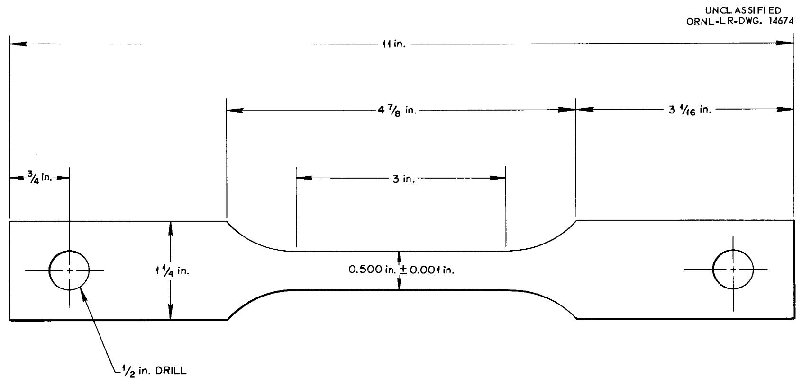  
Figure 3. Sheet-type creep-rupture specimen.

stages of test to closely follow the strain vs time curves to 1 percent strain. Thereafter, readings were taken on these alloys every two hours. After a specimen ruptured, it was allowed to furnace-cool and a total elongation measurement was made.

The criteria used to evaluate the strength of the alloys were times to 1, 2, 5, and 10 per cent strain. Because more frequent extension readings were made on the "high-purity" alloys during the initial stages of test, the time to 0.5 per cent strain was also used as a strength criterion for this series of alloys.

In order to make a relative comparison of the strengths of the alloys, a three and one-half inch gage length was arbitrarily selected for computing the per cent strain from the extension measurements. The point of zero elongation was taken as the reading obtained immediately after the application of the full load on the specimen.

# Grain Size Measurements

The standard annealing treatment given each creep-rupture specimen prior to test produced different grain sizes between the various alloys, thus introducing another variable to be considered in evaluating the test results. To obtain an indication of the variation, grain-size measurements were made on a longitudinal section of an unstressed end of one creep-rupture specimen per alloy using the Heyn Procedure.5 Briefly, the method consists of counting the number of grains in a magnified image of the specimen intersecting a line of

known length. By dividing the length of the line by the product of the number of intersecting grains times the magnification, a value of the average grain diameter is obtained. Each reported grain size represents an average of ten readings taken at different locations in a given sample.

# Aging Studies

All alloys of series I were investigated for their aging response. Coupons were cut from the 0.065-inch-thick strip, annealed one-half hour at $2100^{\circ}\mathrm{F}$ in a hydrogen atmosphere and cooled in the furnace cold zone. All coupons were placed in a quartz tube, sealed off under a vacuum of 0.1 micron of mercury, and then aged at $1500^{\circ}\mathrm{F}$ for 5, 25, 50, 100, and 1000 hours. All aging heat-treatments were carried out in Kanthal-wound furnaces which were constructed at ORNL. Chromel-alumel thermocouples were used for controlling and recording temperature. Periodically, furnace temperatures were checked with a standardized platinum/platinum-10 per cent rhodium thermocouple and a Rubicon Potentiometer. Figure 4 shows a photograph of the heat-treating furnaces with their temperature-controlling and recording instruments. Upon completion of all aging treatments, the capsules were crushed under water to effect rapid cooling of the coupons.

A surface of each coupon parallel to the rolling direction was prepared for metallographic examination using the procedure to be described later. The aging response of the alloys was determined by

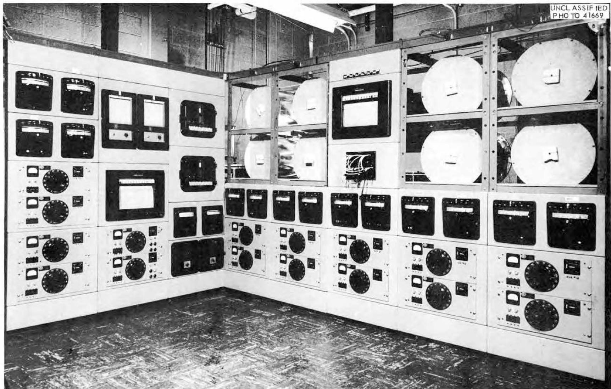  
Figure 4. Heat-treating furnaces with temperature-controlling and recording instruments.

hardness measurements made on these specimens as well as a solution-annealed standard of each alloy. The average hardness reported for a given specimen represents an average of four measurements taken at different locations on the specimen. All hardness measurements were made with a Wilson Tukon Micro-Hardness Tester using a 10 kilogram load with a 16 millimeter objective and a $136^{\circ}$ diamond pyramid indenter.

Because carbide precipitation was not anticipated in the "high-purity" alloys of series II, but did occur to a limited extent as will be pointed out in Chapter V, one coupon of each alloy of this series was aged for 100 hours at $1500^{\circ}\mathrm{F}$ to determine its "equilibrium" structure. Hardness and metallographic studies were performed on these specimens and a solution-annealed standard.

# Decarburization Studies

In order to present evidence that certain observed precipitates were carbide particles, selected compositions were subjected to a decarburization treatment and examined for the disappearance of precipitates. The treatment consisted of rolling alloy strip to 0.012 inch thick, heat-treating for 100 hours at $2200^{\circ}\mathrm{F}$ in a hydrogen atmosphere to effect decarburization, dropping the furnace temperature to $1500^{\circ}\mathrm{F}$ and aging for an additional 100 hours, followed by water-quenching from temperature. The microstructures of the alloys were examined and compared with the microstructures of the same alloys after aging at $1500^{\circ}\mathrm{F}$

in an evacuated quartz capsule. A carbon analysis was also obtained on the decarburized materials.

The alloys subjected to this treatment included: 10 and 15 per cent molybdenum alloys of series I with the lowest and highest chromium plus iron contents; 20 per cent molybdenum alloys of series I containing 5 per cent chromium plus 4 and 10 per cent iron; and the "high-purity" alloys of series II containing 7 per cent chromium plus 0, 7, and 10 per cent iron.

# Metallographic Studies and Procedures

In addition to a solution-annealed coupon of each alloy, the alloy specimens aged for carbide precipitation at $1500^{\circ}\mathrm{F}$ , and those subjected to the decarburization treatment, metallographic studies were conducted on an as-cast specimen taken from the ingot hot-top of each alloy, and longitudinal and transverse sections in both the gage length and grip of one creep-rupture specimen per alloy.

All specimens which were prepared for metallographic examination were first mounted in the conventional manner in bakelite. Initial grinding was done on lead laps employing American Optical 302, 303-1/2, and 305 corundum abrasive (listed in order of decreasing particle size), followed by intermediate and final polishing on a Syntron Vibro-Polisher. Three steps were used for intermediate and final polishing:

(1) a silk cloth with 0.3 micron aluminum oxide abrasive (Linde A),   
(2) a micro cloth with Linde A abrasive, and (3) a micro cloth with

O.l micron aluminum oxide abrasive (Linde B). After polishing, all specimens were etched in glycera regia consisting of 1 part HNO₃, 3 parts HCl, and 4 parts glycerine. Photomicrographs were made with a Bausch and Lamb Research Metallograph using bright field illumination.

# CHAPTER V

# RESULTS AND DISCUSSION

# CREEP-RUPTURE STUDIES

The interpretation of the creep-rupture data obtained from the alloys studied for this investigation could not adequately be made in simple terms of composition variations. This complication arose since composition variations caused not only solid-solution strengthening, but also, variations in grain size, dispersed particles, and precipitation reactions within the materials. Analysis of the data showed that these factors, which are known to affect the creep-rupture behavior of an alloy, were interrelated to varying degrees in establishing the properties of the alloys. The observed creep-rupture behavior, therefore, is the resultant of these combined variables.

The carbon intentionally added to the alloys of series I was very effective in introducing into these materials changes in the microstructure which affect creep-rupture behavior. For illustration, Figures 5, 6, and 7 show the as-cast microstructures of three alloys of series I at the different molybdenum contents with 7 per cent chromium - 4 per cent iron - 0.5 per cent aluminum - 0.5 per cent manganese - 0.06 per cent carbon - balance nickel. In addition to the face-centered-cubic matrix, all contained at least one additional phase which formed by a eutectic decomposition in the 15 and 20 per cent molybdenum alloys and which apparently precipitated from solid solution in the 10 per cent molybdenum alloy. In contrast, the as-cast microstructure of a

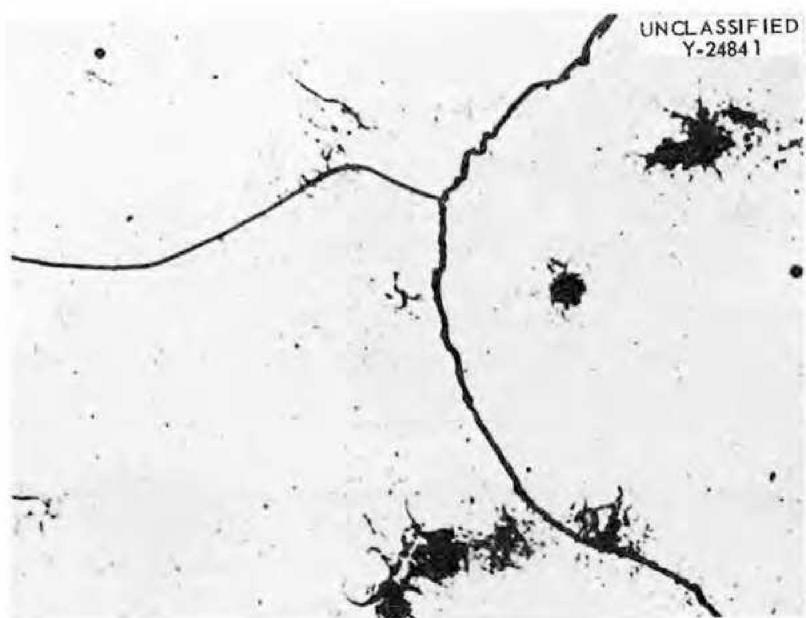  
Figure 5. Alloy VT-47, 10 Mo - 7 Cr - 4 Fe - 0.5 Al - 0.5 Mn - 0.06 C - Balance Ni. As-cast. Etchant: Glycera Regia. 500X.

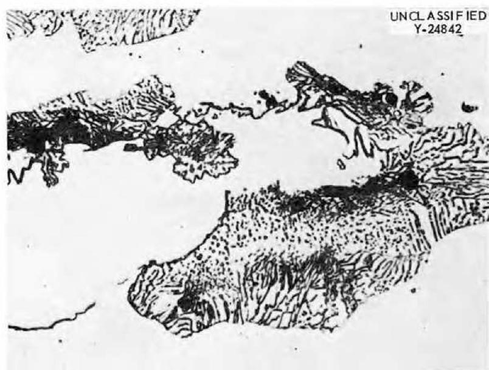  
Figure 6. Alloy VT-49, 15 Mo - 7 Cr - 4 Fe - 0.5 Al - 0.5 Mn - 0.06 C - Balance Ni. As-cast. Etchant: Glycera Regia. 500X.

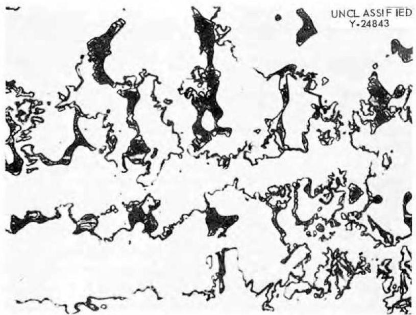  
Figure 7. Alloy VT-59, 20 Mo - 7 Cr - 4 Fe - 0.5 Al - 0.5 Mn - 0.06 C - Balance Ni. As-cast. Etchant: Glycera Regia. 500X.

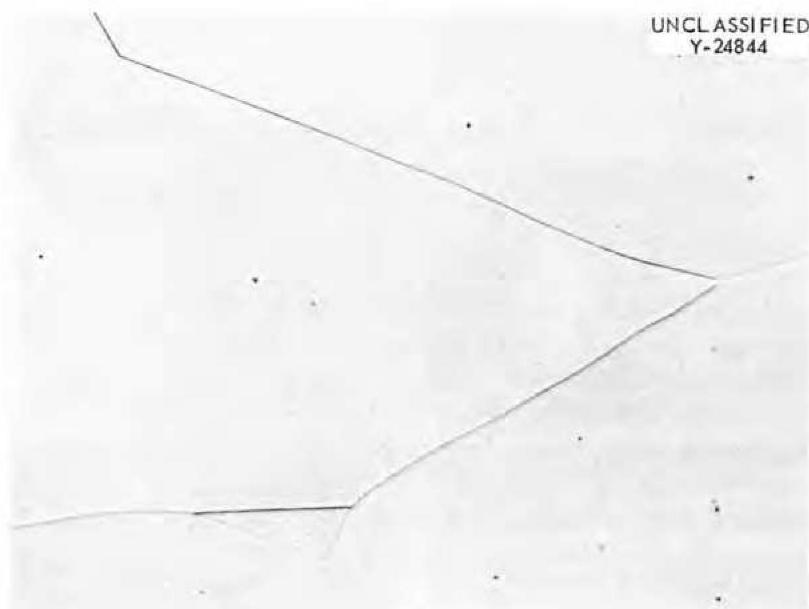  
Figure 8. Alloy VT-91, 15 Mo - 7 Cr - 4 Fe - Balance Ni. As-cast. Etchant: Glycera Regia. 500X.

low-carbon "high-purity" alloy of series II with 15 per cent molybdenum - 7 per cent chromium - 4 per cent iron - balance nickel is shown in Figure 8. The cleanliness of this microstructure indicates that the second phase observed in the 0.06 per cent carbon alloys was a carbide.

Microstructures developed in these alloys after rolling the ingots to 0.065-inch-thick strip, and solution-annealing specimens of each at $2100^{\circ}\mathrm{F}$ for one-half hour in a hydrogen atmosphere are shown in Figures 9, 10, 11, and 12. By comparing Figures 9, 10, and 11, a trend was established with respect to an increasing quantity of globular $\mathsf{M}_6\mathsf{C}$ -type* carbides present as stringers in the materials with an increasing molybdenum-to-carbon ratio. The presence of these carbides influenced the as-solution annealed grain size of the series I alloys with the result that it ranged from coarse to fine, depending upon the total quantity of particles present. Furthermore, a fine-grain-boundary precipitate was found in the alloys with 10 and 15 per cent molybdenum which was presumably a carbide formed during cooling of the specimen to room temperature. The fine-grain-boundary precipitate was for the most part absent in the 20 per cent molybdenum alloys which reflected a tie-up of most of the total carbon in the globular $\mathsf{M}_6\mathsf{C}$ -type carbides.

*Recent work6 performed by the Westinghouse Electric Corporation for ORNL has shown the microstructure of an as-forged sample of the alloy INOR-8 with 0.13 per cent carbon to contain large globular particles. These particles were identified as an M6C-type carbide by x-ray diffraction analysis of the residue obtained from electrolytic dissolution of the sample. X-ray spectrographic analysis of this residue showed molybdenum to be the principal constituent together with nickel. The M6C carbide was, therefore, considered to be (Mo,Ni)6C.

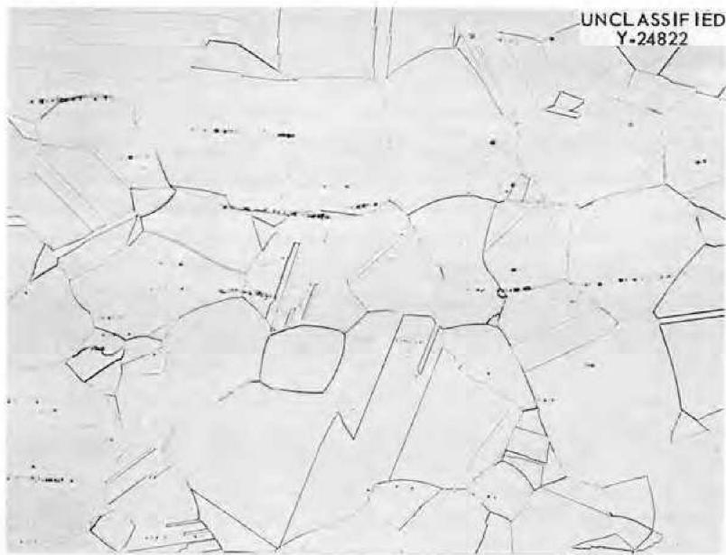

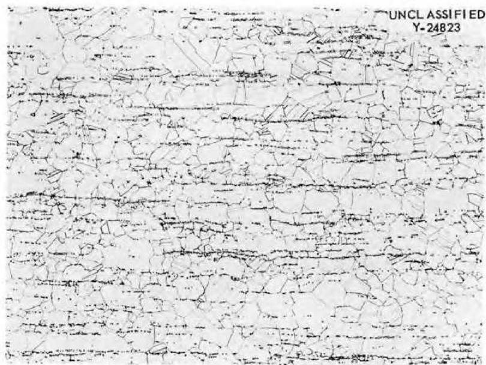  
Figure 9. Alloy VT-47, 10 Mo - 7 Cr - 4 Fe - 0.5 Al - 0.5 Mn 0.06 C - Balance Ni. Solution-annealed 1/2 hr. at $2100^{\circ}\mathrm{F}$ . Etchant: Glycera Regia. 100X.   
Figure 10. Alloy VT-49, 15 Mo - 7 Cr - 4 Fe - 0.5 Al - 0.5 Mn - 0.06 C - Balance Ni. Solution-annealed 1/2 hr. at $2100^{\circ}$ F. Etchant: Glycera Regia. 100X.

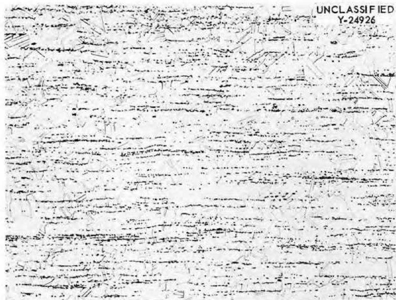  
Figure 11. Alloy VT-59, 20 Mo - 7 Cr - 4 Fe - 0.5 Al - 0.5 Mn - 0.06 C - Balance Ni. Solution-annealed $1/2$ hr. at $2100^{\circ}$ F. Etchant: Glycera Regia. 100X.

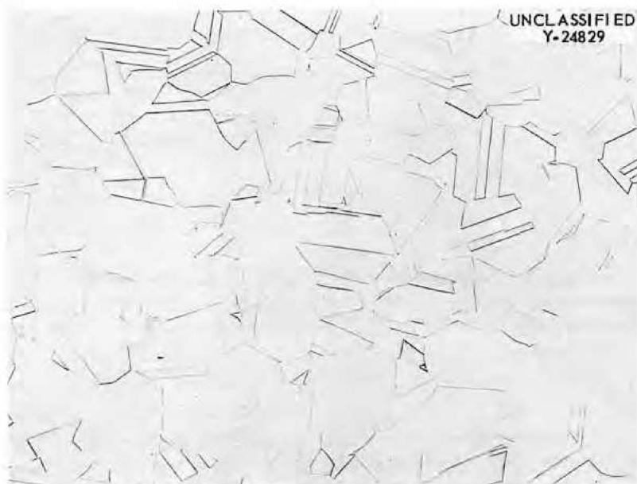  
Figure 12. Alloy VT-91, 15 Mo - 7 Cr - 4 Fe - Balance Ni. Solution-annealed 1/2 hr. at $2100^{\circ}$ F. Etchant: Glycera Regia. 100X.

The hydrogen atmosphere used during solution-annealing effectively caused decarburization around the edges of the 0.06 per cent carbon alloys, particularly at the 10 and 15 per cent molybdenum concentrations resulting in a grain-size gradient in these alloys. Grain-size measurements reported for the alloys, however, included the average of all grains across the thickness of a given specimen.

A presentation of the creep-rupture data which were obtained on the various alloys follows in this chapter, and are discussed in terms of the several variables which were encountered.

10. Per Cent Molybdenum Alloys with 0.5 Per Cent Aluminum - 0.5 Per Cent Manganese - 0.06 Per Cent Carbon and Varying Percentages of Chromium and Iron

A summary of the creep-rupture data obtained on the 10 per cent molybdenum alloys of series I is presented in Table II and illustrated by the graph in Figure 13. Each creep-rupture test has been represented by a bar in Figure 13 on which is indicated at the appropriate times, strains of 1, 2, 5, and 10 per cent as well as the specimen elongation at fracture. The times to the specified values of strain were interpolated from a plot of strain vs time for each test.

Obvious metallurgical factors which could have influenced the measured creep rate of this group of alloys were: a variation in grain size between the individual alloys, carbide precipitation occurring within the alloys at $1500^{\circ}\mathrm{F}$ , and variations in the chromium and iron contents. In addition, a certain amount of scatter existed between the data for the duplicate tests of any one alloy.

# TABLE II

SUMMARY OF CREEP-RUPTURE DATA ON Ni-BASE ALLOYS CONTAINING 10 Mo - 0.5 Al - 0.5 Mn - 0.06 C AND VARYING PERCENTAGES OF Cr AND Fe

Test Conditions

Temp: 1500°F

Stress: 10,000 psi

Atmos: Argon

<table><tr><td rowspan="2">Test No.</td><td rowspan="2">Alloy No.</td><td colspan="2">Composition Variable (Wt %)</td><td colspan="4">Time to Specified 
Strain(a)(Hr.)</td><td rowspan="2">Rupture 
Life 
(Hr.)</td><td rowspan="2">Elong- 
ation (%)</td><td rowspan="2">Average 
Grain Dia. 
(mm)</td></tr><tr><td>Cr</td><td>Fe</td><td>1%</td><td>2%</td><td>5%</td><td>10%</td></tr><tr><td>10-8-1</td><td>VT-43</td><td>5</td><td>4</td><td>14.5</td><td>27</td><td>64</td><td>120</td><td>233.7</td><td>31.25</td><td>-</td></tr><tr><td>10-8-11</td><td></td><td></td><td></td><td>14</td><td>28.5</td><td>63</td><td>105</td><td>156.9</td><td>28.57</td><td>0.0833</td></tr><tr><td>10-8-2</td><td>VT-44</td><td>5</td><td>10</td><td>14.5</td><td>27</td><td>62</td><td>100</td><td>151.6</td><td>20.54</td><td>-</td></tr><tr><td>10-8-20</td><td></td><td></td><td></td><td>16</td><td>28</td><td>54</td><td>72</td><td>75.8</td><td>13.39</td><td>0.0653</td></tr><tr><td>10-8-5</td><td>VT-47</td><td>7</td><td>4</td><td>13</td><td>23</td><td>53</td><td>83(b)</td><td>84.7</td><td>10.71</td><td>0.147</td></tr><tr><td>10-8-8</td><td></td><td></td><td></td><td>16</td><td>28</td><td>59</td><td>-</td><td>84.7</td><td>8.93</td><td>-</td></tr><tr><td>10-8-6</td><td>VT-48</td><td>7</td><td>10</td><td>14.5</td><td>26</td><td>55</td><td>90</td><td>106.2</td><td>16.07</td><td>-</td></tr><tr><td>10-8-19</td><td></td><td></td><td></td><td>19</td><td>33</td><td>63</td><td>98</td><td>131.8</td><td>16.07</td><td>0.0598</td></tr><tr><td>10-8-21</td><td>VT-53</td><td>10</td><td>4</td><td>23.5</td><td>43</td><td>81</td><td>-(b)</td><td>99.7</td><td>7.14</td><td>0.0833</td></tr><tr><td>10-8-29</td><td></td><td></td><td></td><td>19</td><td>33.5</td><td>64</td><td>-</td><td>71.5</td><td>6.25</td><td>-</td></tr><tr><td>10-8-15</td><td>VT-54</td><td>10</td><td>10</td><td>16.5</td><td>31</td><td>68</td><td>118</td><td>210.9</td><td>37.5</td><td>0.143</td></tr><tr><td>10-8-31</td><td></td><td></td><td></td><td>20</td><td>36</td><td>73</td><td>117</td><td>134.3</td><td>13.39</td><td>-</td></tr></table>

(a) Microscope readings except where noted.   
(b) Dial-gage readings.

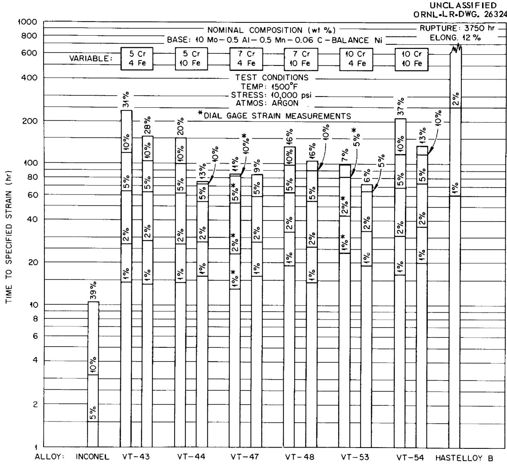  
Figure 13. Bar-graph of creep-rupture test results obtained at $1500^{\circ}\mathrm{F}$ , 10,000 psi., on Ni-base alloys with 10 Mo - 0.5 Al - 0.5 Mn - 0.06 C and varying percentages of Cr and Fe.

The results of average grain-diameter measurements on an unstressed portion of the creep-rupture specimens are shown in Table II. A reason for the variation in grain size was found in that greater numbers of stringers produced finer grain sizes. The amount of carbide stringering, however, could not be correlated well with the carbon analyses of the alloys. This lack of correlation was attributed to the possibility of carbide segregation being present in the alloys, or that the annealing treatments given the alloys during ingot fabrication caused decarburization. If either or both of these explanations be valid, then the carbon content of an individual sample was not representative of the analyzed carbon content of the parent ingot.

The alloys of this group were all found to be subject to carbide precipitation. Table III shows the range and average hardness of the various coupons of each alloy after solution-annealing at $2100^{\circ}\mathrm{F}$ and subsequent aging at $1500^{\circ}\mathrm{F}$ . Figure 14 is a graphical representation of the average hardness of each alloy as a function of time at $1500^{\circ}\mathrm{F}$ , compared with its hardness in the solution-annealed condition. In general, peak hardness of the alloys was reached after 25 to 50 hours at temperature. It should be mentioned that some scatter was encountered in the hardness values obtained on the various coupons. This could be attributed to orientation effects accentuated by large grain size as well as segregation effects of carbide banding in the rolling direction.

A general correlation could be made between the hardness change upon aging at $1500^{\circ}\mathrm{F}$ and the resultant microstructures. To illustrate

# TABLE III

DIAMOND PYRAMID HARDNESS DATA ON Ni- BASE ALLOYS CONTAINING LO Mo -

0.5 Al - 0.5 Mn - 0.06 C AND VARYING PERCENTAGES OF Cr AND Fe.

SOLUTION-ANNEALED 1/2 HR. AT $2100^{\circ}\mathrm{F}$ , AGED AT $1500^{\circ}\mathrm{F}$ .

<table><tr><td rowspan="3">Alloy No.</td><td rowspan="2" colspan="2">Composition Variable (Wt. %)</td><td rowspan="2" colspan="2">Solution Annealed at 2100°F</td><td colspan="10">Aged at 1500°F</td></tr><tr><td colspan="2">5 Hr.</td><td colspan="2">25 Hr.</td><td colspan="2">50 Hr.</td><td colspan="2">100 Hr.</td><td colspan="2">1000 Hr.</td></tr><tr><td>Cr</td><td>Fe</td><td>Range</td><td>Avg.</td><td>Range</td><td>Avg.</td><td>Range</td><td>Avg.</td><td>Range</td><td>Avg.</td><td>Range</td><td>Avg.</td><td>Range</td><td>Avg.</td></tr><tr><td>VT-43</td><td>5</td><td>4</td><td>138-141</td><td>140</td><td>178-189</td><td>184</td><td>188-196</td><td>193</td><td>175-191</td><td>183</td><td>169-178</td><td>174</td><td>143-152</td><td>147</td></tr><tr><td>VT-44</td><td>5</td><td>10</td><td>135-151</td><td>145</td><td>158-173</td><td>166</td><td>162-175</td><td>168</td><td>163-172</td><td>168</td><td>149-161</td><td>157</td><td>147-155</td><td>150</td></tr><tr><td>VT-47</td><td>7</td><td>4</td><td>130-146</td><td>139</td><td>157-166</td><td>162</td><td>157-168</td><td>163</td><td>161-165</td><td>163</td><td>154-163</td><td>159</td><td>143-151</td><td>146</td></tr><tr><td>VT-48</td><td>7</td><td>10</td><td>138-145</td><td>141</td><td>161-164</td><td>162</td><td>157-159</td><td>158</td><td>149-158</td><td>154</td><td>150-161</td><td>157</td><td>138-146</td><td>143</td></tr><tr><td>VT-53</td><td>10</td><td>4</td><td>132-149</td><td>141</td><td>172-177</td><td>175</td><td>171-176</td><td>174</td><td>170-180</td><td>176</td><td>169-176</td><td>172</td><td>156-170</td><td>164</td></tr><tr><td>VT-54</td><td>10</td><td>10</td><td>124-140</td><td>135</td><td>160-165</td><td>163</td><td>161-168</td><td>163</td><td>166-186</td><td>174</td><td>156-157</td><td>157</td><td>143-151</td><td>148</td></tr></table>

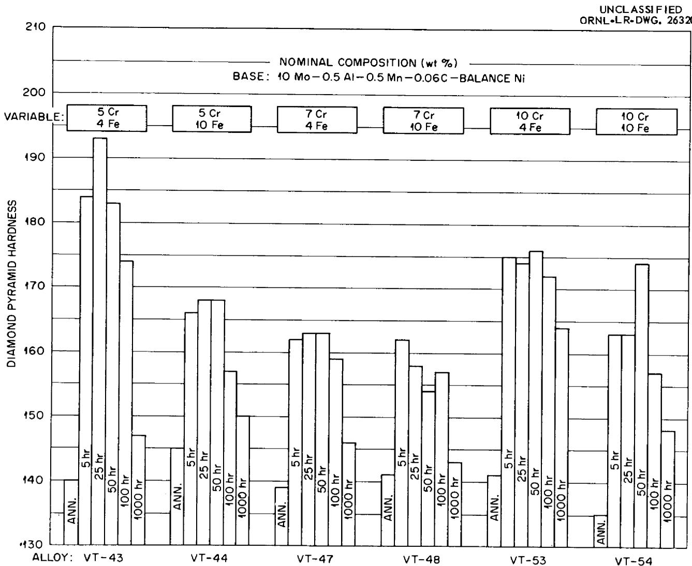  
Figure 14. Bar-graph of average hardness of Ni-base alloys with 10 Mo - 0.5 Al - 0.5 Mn - 0.06 C and varying percentages of Cr and Fe. Solution-annealed 1/2 hr. at $2100^{\circ}\mathrm{F}$ , aged for 5, 25, 50, 100, and 1000 hr. at $1500^{\circ}\mathrm{F}$ .

this, Figure 15 shows a series of photomicrographs taken of alloy VT-43 (10 Mo - 5 Cr - 4 Fe - 0.5 Al - 0.5 Mn - 0.06 C - balance Ni) during the course of aging in the absence of mechanical stress. In the solution-annealed condition, the microstructure contained a fine-grain-boundary precipitate and a few stringers of larger M6C-type carbides. After five hours at $1500^{\circ}\mathrm{F}$ , a matrix precipitate was in the early stages of development with fine particles being precipitated along preferred crystallographic planes. The progress of precipitation continued with time when, after 50 hours, discrete particles were observed which showed only slight change in size up to 1000 hours at temperature. The microstructure of the gage length of a creep-rupture specimen of alloy VT-43 is shown in Figure 16 and was found to be identical to that observed in the unstressed coupons aged for 50 hours or more.

It was significant to note that the aging response of alloy VT-43 was greater in terms of peak hardness and quantity of precipitated carbides than that shown by the other alloys of this group. An apparent correlation existed between this fact and the reported carbon content of 0.076 per cent for alloy VT-43 which was higher than that reported for the other compositions.

The least amount of aging, noted metallographically in the 10 per cent molybdenum alloys was found in alloy VT-54 (10 Mo - 10 Cr - 10 Fe - 0.5 Al - 0.5 Mn - 0.06 C - balance Ni). Figure 17 shows typical microstructures exhibited by this alloy upon aging. During the early stages there was evidence of precipitation of fine carbides within the grains, but longer times at temperature promoted a concentration of these

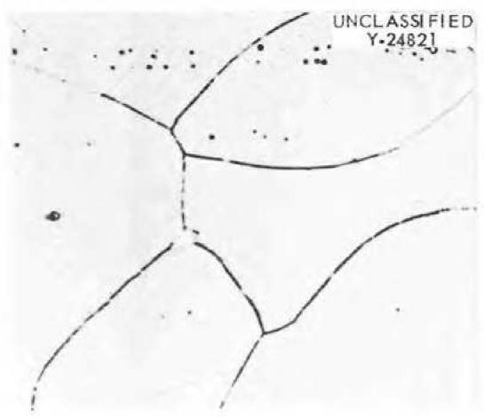  
Solution Annealed. DPH 140

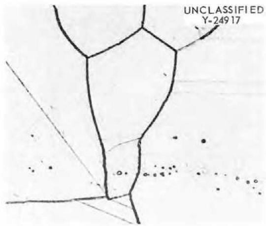  
5 Hr. at 1500°F. DPH 184

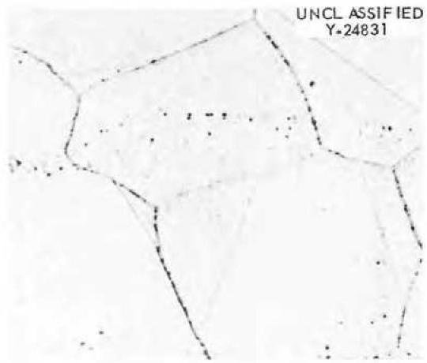  
25 Hr. at 1500°F. DPH 193

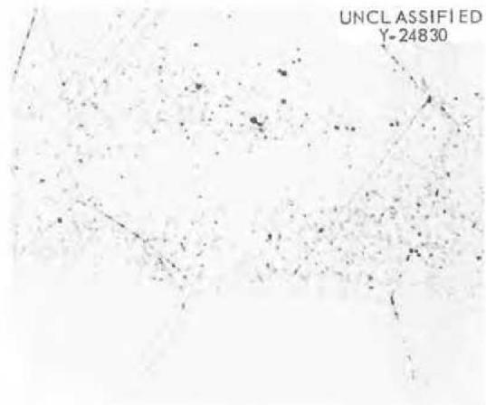  
50 Hr. at 1500°F. DPH 183

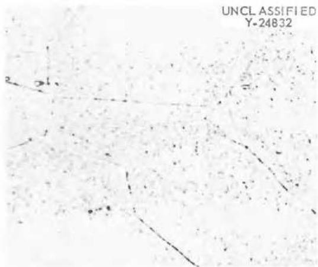  
100 Hr. at $1500^{\circ}F$ . DPH 174

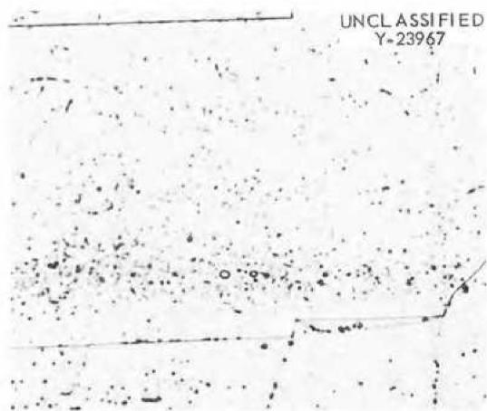  
1000 Hr. at 1500°F. DPH 147   
Figure 15. Alloy VT-43, 10 Mo - 5 Cr - 4 Fe - 0.5 Al - 0.5 Mn - 0.06 C - Balance Ni. Solution-annealed $1/2$ hr. at $2100^{\circ}$ F, aged at $1500^{\circ}$ F. Etchant: Glycera Regia. 500X.

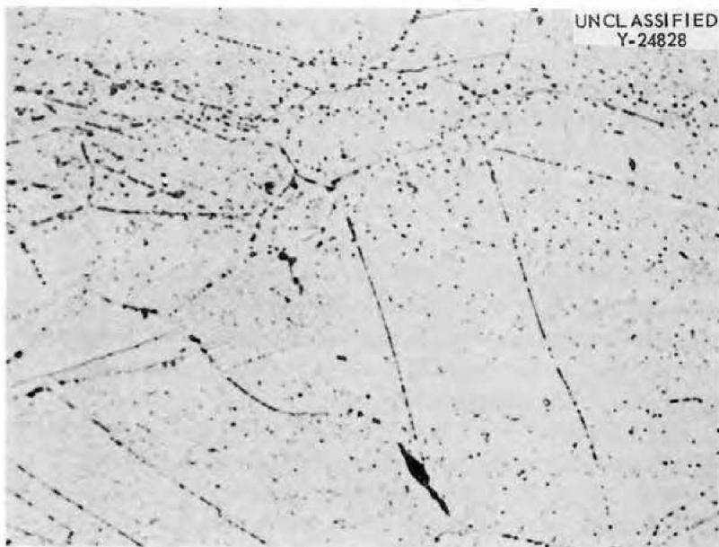  
Figure 16. Alloy VT-43, 10 Mo - 5 Cr - 4 Fe - 0.5 Al - 0.5 Mn - 0.06 C - Balance Ni. Longitudinal section in gage length of creep-rupture specimen. Rupture life: 156.9 hr. Etchant: Glycera Regia. 500X.

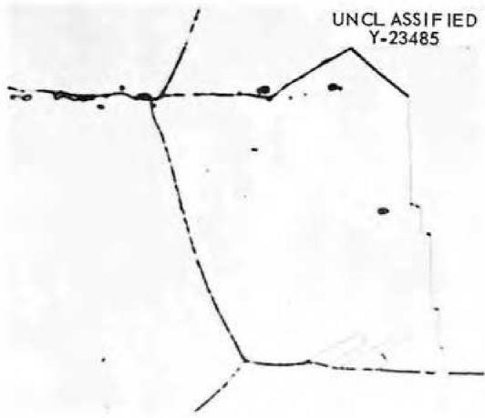  
Solution Annealed. DPH 135

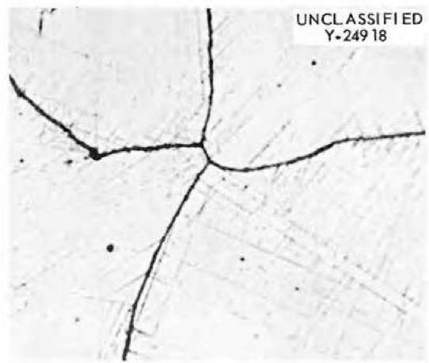  
5 Hr. at 1500°F. DPH 163

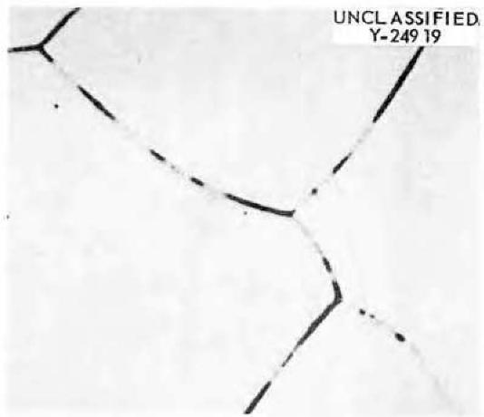  
25 Hr. at 1500°F. DPH 163

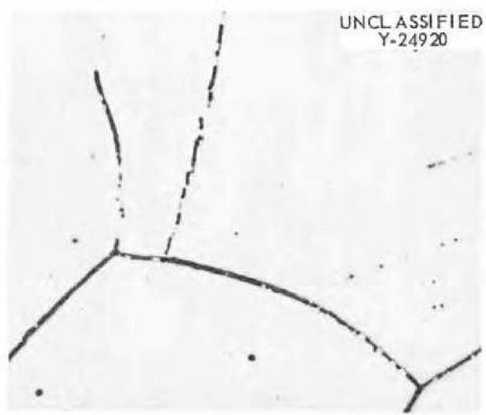  
50 Hr. at 1500°F. DPH 174

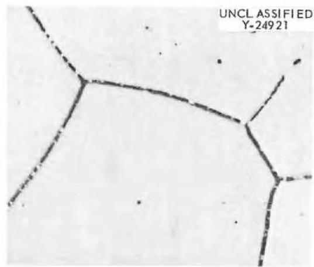  
100 Hr. at 1500°F. DPH 157

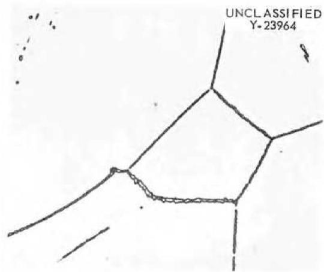  
1000 Hr. at 1500°F. DPH 148   
Figure 17. Alloy VT-54, 10 Mo - 10 Cr - 10 Fe - 0.5 Al - 0.5 Mn - 0.06 C - Balance Ni. Solution-annealed $1/2$ hr. at $2100^{\circ}$ F, aged at $1500^{\circ}$ F. Etchant: Glycera Regia. 500X.

precipitates at the grain and twin boundaries. On the other hand, the microstructure of the gage length of a creep-rupture specimen of this alloy illustrated in Figure 18 showed bands of a fine matrix precipitate but still of lesser quantity than in the case of alloy VT-43. Although it is felt that the difference in quantity of precipitated carbides between the two alloys is related to a larger difference in their total carbon contents than indicated by the analyses, it is recognized that a change in carbon solubility may have been effected by the variation in chromium and iron contents.

Because of inconsistencies in the factors which affect creep-rupture behavior, it was not possible to satisfactorily rationalize the strengths of the alloys. A possible comparison could be made between the strengths of alloys VT-43 and VT-53 where the principal difference between the alloys was a 5 per cent increase in the chromium content of the latter over the former with average grain diameters being comparable. The slightly higher average strength of alloy VT-53 up to 5 per cent strain could have been attributed to the increased chromium content. A more realistic evaluation of the alloys of this group, however, was the generalization that their strengths were not grossly different as a result of a summation of the factors affecting creep-rupture behavior. Their strengths, also, exceeded that of Inconel but were inferior to that of Hastelloy B which will be shown to be true for all alloys of series I.

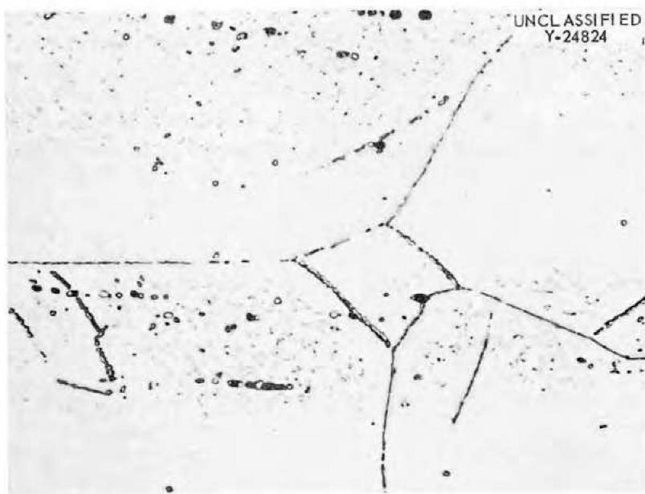  
Figure 18. Alloy VT-54, 10 Mo - 10 Cr - 10 Fe - 0.5 Al - 0.5 Mn - 0.06 C - Balance Ni. Longitudinal section in gage length of creep-rupture specimen. Rupture life: 210.9 hr. Etchant: Glycera Regia. 500X.

15 Per Cent Molybdenum Alloys with 0.5 Per Cent Aluminum - 0.5 Per Cent Manganese - 0.06 Per Cent Carbon and Varying Percentages of Chromium and Iron

A summary of the creep-rupture data obtained on the 15 per cent molybdenum alloys of series I is presented in Table IV and illustrated by the bar-graph in Figure 19. These data have been presented in the same manner as the data for the 10 per cent molybdenum alloys discussed previously. Again, it was found that several factors in addition to solid-solution effects of molybdenum could have influenced the measured creep rate, specifically: grain-size variations, dispersed $\mathsf{M}_6\mathsf{C}$ -type carbides, slight aging tendencies, and variations in the chromium and iron contents.

Referring to Figure 10, illustrating a solution-annealed microstructure of a 15 per cent molybdenum alloy with 0.06 per cent carbon, it can be seen that a considerable number of $\mathsf{M}_6\mathsf{C}$ -type carbides remained undissolved after the solution-annealing treatment at $2100^{\circ}\mathsf{F}$ . These particles were very effective in reducing the as-annealed grain size of these alloys relative to the as-annealed grain size of the 10 per cent molybdenum alloys. Average grain-diameter measurements on an unstressed portion of the creep-rupture specimens shown in Table IV also indicated a variation in grain size between the individual alloys of this group. The decrease in average grain diameter in the materials upon increasing the iron content from 4 to 10 per cent at the three chromium levels has been attributed to an increase in quantity of $\mathsf{M}_6\mathsf{C}$ -type carbides dispersed in the alloys. The widest grain-size variation occurred between

# TABLE IV

SUMMARY OF CREEP-RUPTURE DATA ON Ni-BASE ALLOYS CONTAINING 15 Mo - 0.5 Al - 0.5 Mn - 0.06 C AND VARYING PERCENTAGES OF Cr AND Fe

Test Conditions

Temp: 1500°F

Stress: 10,000 psi

Atmos: Argon

<table><tr><td rowspan="2">Test No.</td><td rowspan="2">Alloy No.</td><td colspan="7">Composition</td><td rowspan="2">Rupture Life (Hr.)</td><td rowspan="2">Elongation (%)</td><td rowspan="2">Average Grain Dia. (mm)</td></tr><tr><td>Cr</td><td>Fe</td><td>Time to Specified 1%</td><td>2%</td><td>Strain(a)(Hr.) 5%</td><td>10%</td><td></td></tr><tr><td>10-8-3</td><td>VT-45</td><td>5</td><td>4</td><td>25.5</td><td>45</td><td>94</td><td>150</td><td>192.4</td><td>16.07</td><td>-</td><td></td></tr><tr><td>10-8-10</td><td></td><td></td><td></td><td>30</td><td>52</td><td>105</td><td>173</td><td>218.2</td><td>16.96</td><td>0.0357</td><td></td></tr><tr><td>10-8-4</td><td>VT-46</td><td>5</td><td>10</td><td>20</td><td>35</td><td>71</td><td>110</td><td>152.4</td><td>24.10</td><td>-</td><td></td></tr><tr><td>10-8-9</td><td></td><td></td><td></td><td>20</td><td>36</td><td>76</td><td>127</td><td>200.6</td><td>25.00</td><td>0.0297</td><td></td></tr><tr><td>10-8-7</td><td>VT-49</td><td>7</td><td>4</td><td>26.5</td><td>47.5</td><td>97</td><td>158</td><td>181.8</td><td>14.28</td><td>0.0400</td><td></td></tr><tr><td>10-8-25</td><td></td><td></td><td></td><td>26</td><td>44</td><td>84</td><td>132</td><td>174.2</td><td>17.85</td><td>-</td><td></td></tr><tr><td>10-8-23</td><td>VT-50</td><td>7</td><td>10</td><td>16</td><td>29</td><td>62</td><td>110</td><td>225.9</td><td>38.37</td><td>0.0261</td><td></td></tr><tr><td>10-8-30</td><td></td><td></td><td></td><td>15</td><td>27</td><td>59</td><td>95</td><td>115.0</td><td>21.42</td><td>-</td><td></td></tr><tr><td>10-8-18</td><td>VT-55</td><td>10</td><td>4</td><td>30</td><td>59</td><td>140</td><td>210</td><td>259.2</td><td>14.28</td><td>0.0397</td><td></td></tr><tr><td>10-8-32</td><td></td><td></td><td></td><td>23</td><td>44</td><td>94</td><td>148</td><td>186.9</td><td>18.75</td><td>-</td><td></td></tr><tr><td>10-8-13</td><td>VT-56</td><td>10</td><td>10</td><td>24.5</td><td>45.5</td><td>102</td><td>180</td><td>345.1</td><td>33.04</td><td>-</td><td></td></tr><tr><td>10-8-16</td><td></td><td></td><td></td><td>22</td><td>42</td><td>96</td><td>175</td><td>447.7</td><td>46.82</td><td>0.0348</td><td></td></tr></table>

(a) Microscope readings.

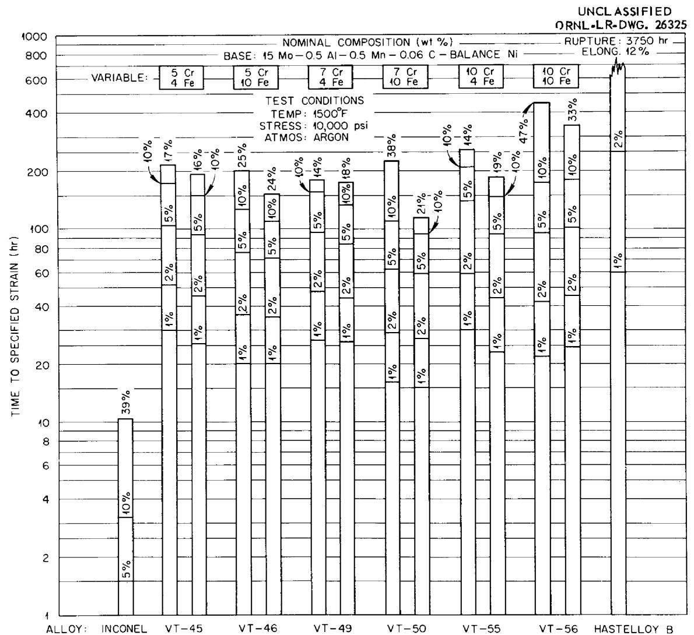  
Figure 19. Bar-graph of creep-rupture test results obtained at $1500^{\circ}\mathrm{F}$ , 10,000 psi., on Ni-base alloys with 15 Mo - 0.5 Al - 0.5 Mn - 0.06 C and varying percentages of Cr and Fe.

the 7 per cent chromium alloys which are compared in Figures 20 and 21. In general, the difference in quantity of dispersed $\mathsf{M}_6\mathsf{C}$ -type carbides was supported by the analyzed carbon contents of the alloys.

Comparison of the range and average hardnesses of these alloys in the annealed and aged conditions is shown in Table V, and the average hardnesses are plotted in Figure 22. Compared to the 10 per cent molybdenum alloys, the 15 per cent molybdenum alloys were harder and showed less aging response. The 15 per cent molybdenum alloys contained a greater number of $\mathsf{M}_6\mathsf{C}$ -type carbides which did not dissolve upon solution-annealing. As a result, the amount of total carbon available for reprecipitation as carbide particles was less upon aging at $1500^{\circ}\mathsf{F}$ .

A correlation between microstructure and hardness was found for all alloys of this group. Because similar microstructures were developed within the materials upon aging and creep-rupture testing, representative photomicrographs are presented only for the materials with the lowest and highest alloy contents. The microstructures of the aged material with the lowest alloy content, VT-45 (15 Mo - 5 Cr - 4 Fe - 0.5 Al - 0.5 Mn - 0.06 C - balance Ni) are shown in Figure 23. After five hours at $1500^{\circ}\mathrm{F}$ , there was an indication of a grain-boundary reaction. The only apparent change in microstructure for aging times greater than 5 hours was for the grain-boundary particles to become somewhat more discrete and show coalescence after aging for 1000 hours. The application of stress did not have a measurable effect on the microstructure of this alloy, as shown in Figure 24. The microstructures

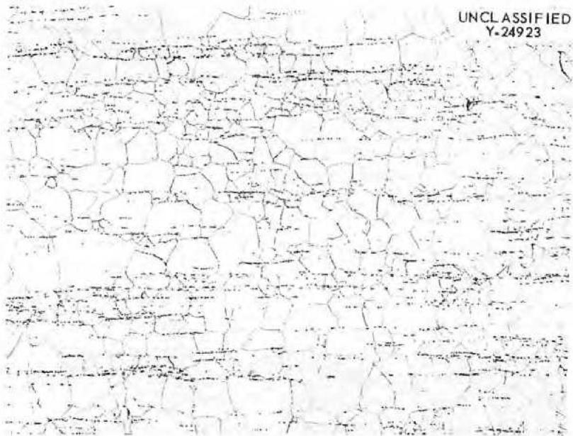  
Figure 20. Alloy VT-49, 15 Mo - 7 Cr - 4 Fe - 0.5 Al - 0.5 Mn - 0.06 C - Balance Ni. Longitudinal section in grip of creep-rupture specimen. Rupture life: 181.8 hr. Etchant: Glycera Regia. 100X.

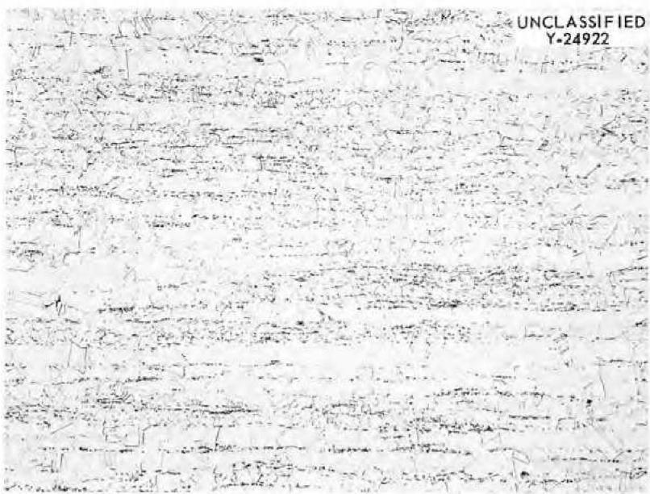  
Figure 21. Alloy VT-50, 15 Mo - 7 Cr - 10 Fe - 0.5 Al - 0.5 Mn - 0.06 C - Balance Ni. Longitudinal section in grip of creep-rupture specimen. Rupture life: 225.9 hr. Etchant: Glycera Regia. 100X.

# TABLE V

DIAMOND PYRAMID HARDNESS DATA ON Ni- BASE ALLOYS CONTAINING 15 Mo -

0.5 Al - 0.5 Mn - 0.06 C AND VARYING PERCENTAGES OF Cr AND Fe.

SOLUTION-ANNEALED 1/2 HR. AT $2100^{\circ}\mathrm{F}$ , AGED AT $1500^{\circ}\mathrm{F}$ .

<table><tr><td rowspan="3">Alloy No.</td><td rowspan="2" colspan="2">Composition Variable (Wt %)</td><td rowspan="2" colspan="2">Solution Annealed at 2100°F</td><td colspan="9">Aged at 1500°F</td></tr><tr><td colspan="2">5 Hr.</td><td colspan="2">25 Hr.</td><td colspan="2">50 Hr.</td><td colspan="2">100 Hr.</td><td>1000 Hr.</td></tr><tr><td>Cr</td><td>Fe</td><td>Range</td><td>Avg.</td><td>Range</td><td>Avg.</td><td>Range</td><td>Avg.</td><td>Range</td><td>Avg.</td><td>Range</td><td>Avg.</td><td>Range</td></tr><tr><td>VT-45</td><td>5</td><td>4</td><td>173-177</td><td>174</td><td>187-189</td><td>188</td><td>183-189</td><td>187</td><td>181-188</td><td>185</td><td>176-181</td><td>179</td><td>169-188</td></tr><tr><td>VT-46</td><td>5</td><td>10</td><td>176-191</td><td>184</td><td>196-201</td><td>199</td><td>192-194</td><td>193</td><td>192-194</td><td>193</td><td>193-197</td><td>195</td><td>189-194</td></tr><tr><td>VT-49</td><td>7</td><td>4</td><td>173-181</td><td>178</td><td>202-205</td><td>203</td><td>197-203</td><td>199</td><td>189-196</td><td>192</td><td>192-198</td><td>195</td><td>180-188</td></tr><tr><td>VT-50</td><td>7</td><td>10</td><td>182-198</td><td>191</td><td>198-199</td><td>198</td><td>187-192</td><td>190</td><td>198-198</td><td>198</td><td>187-188</td><td>187</td><td>186-201</td></tr><tr><td>VT-55</td><td>10</td><td>4</td><td>181-196</td><td>188</td><td>201-206</td><td>204</td><td>202-203</td><td>203</td><td>206-207</td><td>207</td><td>199-205</td><td>202</td><td>189-197</td></tr><tr><td>VT-56</td><td>10</td><td>10</td><td>185-189</td><td>187</td><td>196-205</td><td>201</td><td>201-206</td><td>203</td><td>198-201</td><td>199</td><td>201-202</td><td>201</td><td>188-196</td></tr></table>

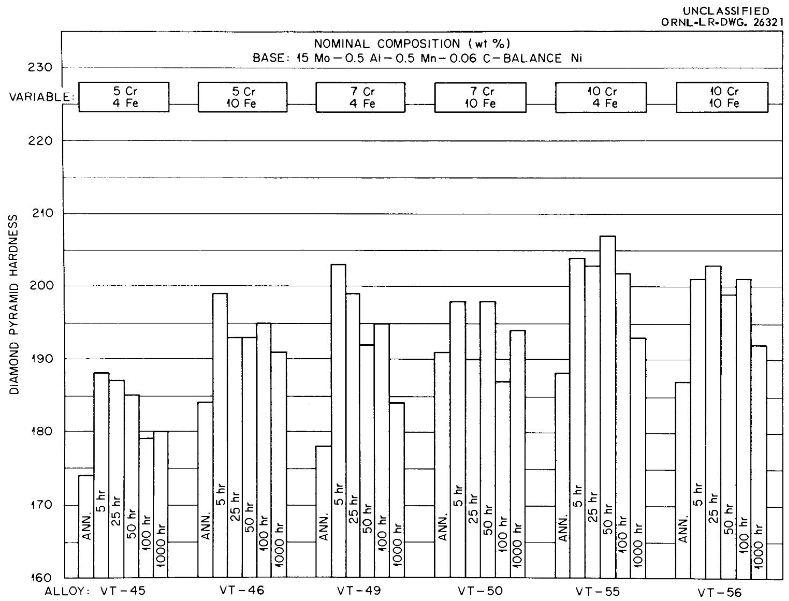  
Figure 22. Bar-graph of average hardness of Ni-base alloys with 15 Mo - 0.5 Al - 0.5 Mn - 0.06 C and varying percentages of Cr and Fe. Solution-annealed $\frac{1}{2}$ hr. at $2100^{\circ}$ F, aged for 5, 25, 50, 100, and 1000 hr. at $1500^{\circ}$ F.

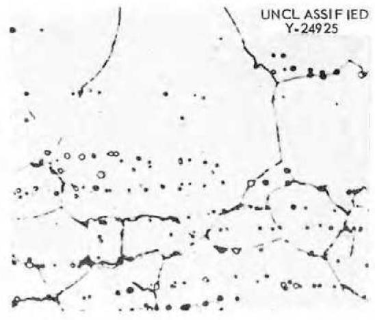  
Solution Annealed. DPH 174

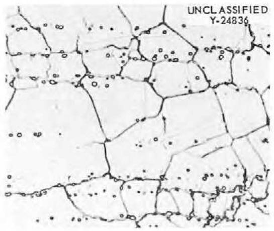  
5 Hr. at 1500°F. DPH 188

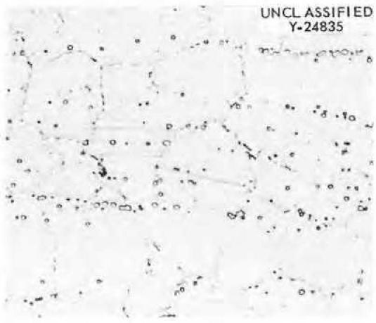  
25 Hr. at 1500°F. DPH 187

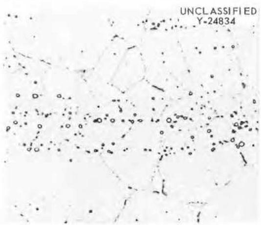  
50 Hr. at 1500°F. DPH 185

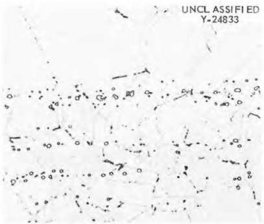  
100 Hr. at 1500°F. DPH 179

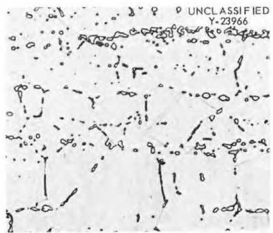  
1000 Hr. at 1500°F. DPH 180   
Figure 23. Alloy VT-45, 15 Mo - 5 Cr - 4 Fe - 0.5 Al - 0.5 Mn - 0.06 C - Balance Ni. Solution-annealed $1/2$ hr. at $2100^{\circ}$ F, aged at $1500^{\circ}$ F. Etchant: Glycera Regia. 500X.

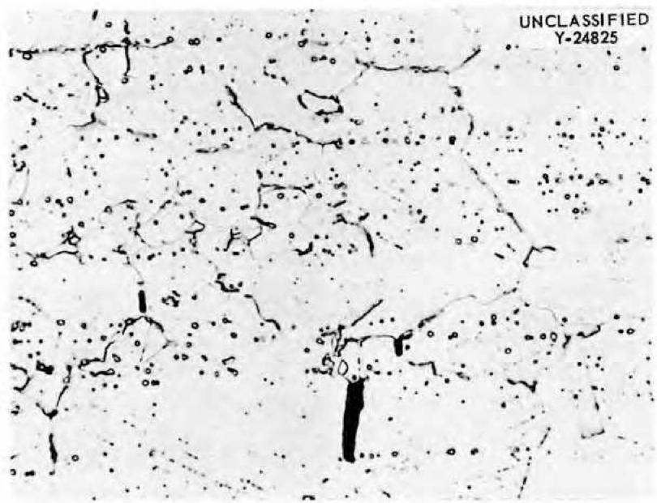  
Figure 24. Alloy VT-45, 15 Mo - 5 Cr - 4 Fe - 0.5 Al - 0.5 Mn - 0.06 C - Balance Ni. Longitudinal section in gage length of creep-rupture specimen. Rupture life: 218.2 hr. Etchant: Glycera Regia. 500X.

developed by the material with the highest alloy content, VT-56 (15 Mo - 10 Cr - 10 Fe - 0.5 Al - 0.5 Mn - 0.06 C - balance Ni), after aging and creep-rupture testing are shown in Figures 25 and 26, respectively.

The creep strength of the 15 per cent molybdenum alloys was greater than that of the 10 per cent molybdenum alloys. The principal contributing factors to this increased strength were undoubtedly the solid-solution strengthening effect of molybdenum, and the carbide dispersion strengthening effect. These were of sufficient magnitude to overcome the advantage of coarser grain size held by the 10 per cent molybdenum alloys.

Increasing the chromium and iron contents of the 15 per cent molybdenum alloys did not bring about pronounced strengthening effects. In fact, there was a slight weakening of the alloys upon increasing the iron content from 4 to 10 per cent at a constant chromium concentration. An explanation based upon the finer grain size of the high-iron alloys does not follow since the cause of the finer grain size was attributed to an increase in quantity of $\mathsf{M}_6\mathsf{C}$ -type carbides in the alloys; the latter would be expected to over-ride the influence of grain size upon the creep-rupture behavior. The exact cause of the strength differences noted is not clear, therefore, from the data which have been obtained.

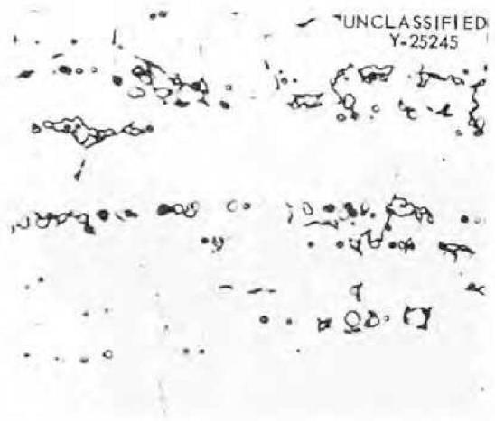  
Solution Annealed. DPH 187

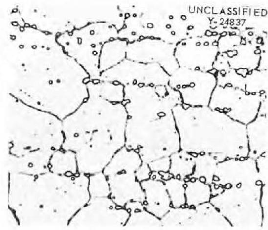  
5 Hr. at 1500°F. DPH 201

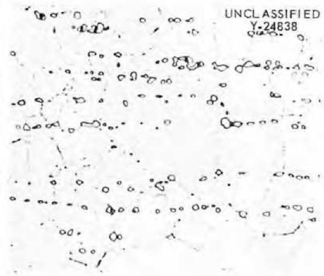  
25 Hr. at 1500°F. DPH 203

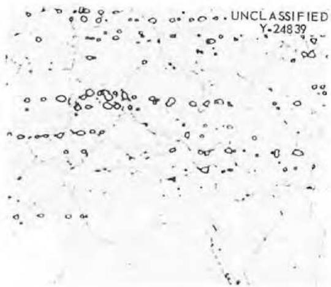  
50 Hr. at 1500°F. DPH 199

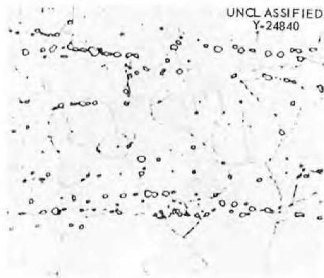  
100 Hr. at 1500°F. DPH 201

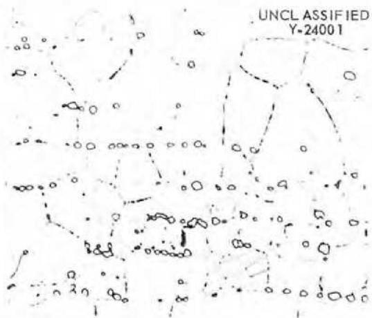  
1000 Hr. at 1500°F. DPH 192   
Figure 25. Alloy VT-56, 15 Mo - 10 Cr - 10 Fe - 0.5 Al - 0.5 Mn - 0.06 C - Balance Ni. Solution-annealed $1/2$ hr. at $2100^{\circ}$ F, aged at $1500^{\circ}$ F. Etchant: Glycera Regia. 500X.

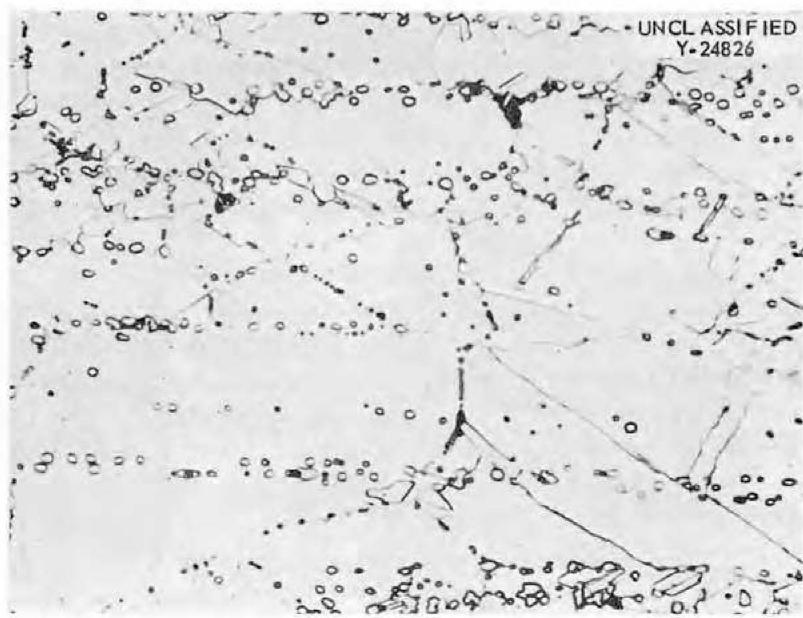  
Figure 26. Alloy VT-56, 15 Mo - 10 Cr - 10 Fe - 0.5 Al - 0.5 Mn - 0.06 C - Balance Ni. Longitudinal section in gage length of creep-rupture specimen. Rupture life: 447.7 hr. Etchant: Glycera Regia. 500X.

20 Per Cent Molybdenum Alloys with 0.5 Per Cent Aluminum - 0.5 Per Cent Manganese - 0.06 Per Cent Carbon and Varying Percentages of Chromium and Iron

Hot-rolling of the 20 per cent molybdenum alloys was less successful than for the lower molybdenum-content alloys. As a result, creep-rupture specimens could be prepared from only three of the four alloys listed in Table VI where a summary of the creep-rupture results is presented. These data are plotted in bar-graph form in Figure 27. As in the case of the 10 and 15 per cent molybdenum alloys of this series, an attempt was made to interpret the data in terms of the variables which could be influencing creep-rupture behavior.

The solution-annealed grain size of this group of alloys was smaller than that of the 10 and 15 per cent molybdenum alloys and was attributed to the increase in the quantity of $\mathsf{M}_6\mathsf{C}$ -type carbides present in the microstructure. A very slight variation in grain size between the individual alloys was also noted as shown in Table VI.

Hardness and metallographic studies were conducted on all four alloys of this group after aging at $1500^{\circ}\mathrm{F}$ . Table VII shows the range and average hardness of the various coupons of each alloy after aging; the average hardnesses are shown graphically in Figure 28.

The aging response of these alloys showed evidence that a phase boundary had been crossed by the 10 per cent iron alloys at both chromium concentrations. It should be mentioned, however, that both 10 per cent iron alloys contained 7 per cent chromium according to the reported analyses. The precipitation of the additional phase in these

# TABLE VI

SUMMARY OF CREEP-RUPTURE DATA ON Ni-BASE ALLOYS CONTAINING 20 Mo - 0.5 Al - 0.5 Mn - 0.06 C AND VARYING PERCENTAGES OF Cr AND Fe

Test Conditions

Temp: $1500^{\circ}\mathrm{F}$

Stress: 10,000 psi

Atmos: Argon

<table><tr><td rowspan="2">Test No.</td><td rowspan="2">Alloy No.</td><td colspan="2">Composition Variable (Wt %)</td><td colspan="4">Time to Specified</td><td rowspan="2">Rupture Life (Hr.)</td><td rowspan="2">Elong-ation (%)</td><td rowspan="2">Average Grain Dia. (mm)</td></tr><tr><td>Cr</td><td>Fe</td><td>1%</td><td>2%</td><td>5%</td><td>10%</td></tr><tr><td>10-8-14</td><td>VT-57</td><td>5</td><td>4</td><td>24</td><td>47</td><td>105</td><td>180</td><td>284.2</td><td>21.43</td><td>-</td></tr><tr><td>10-8-26</td><td></td><td></td><td></td><td>33.5</td><td>60</td><td>122</td><td>205</td><td>293.1</td><td>22.31</td><td>0.0318</td></tr><tr><td>10-8-24</td><td>VT-58</td><td>5</td><td>10</td><td>26</td><td>53</td><td>130</td><td>260</td><td>660.5</td><td>47.31</td><td>0.0247</td></tr><tr><td>10-8-27</td><td></td><td></td><td></td><td>18</td><td>38</td><td>100</td><td>200</td><td>449.1</td><td>39.28</td><td>-</td></tr><tr><td>10-8-22</td><td>VT-59</td><td>7</td><td>4</td><td>30</td><td>54</td><td>118</td><td>200</td><td>344.1</td><td>38.39</td><td>0.0289</td></tr><tr><td>10-8-28</td><td></td><td></td><td></td><td>25.5</td><td>45</td><td>95</td><td>162</td><td>298.0</td><td>51.78</td><td>-</td></tr><tr><td></td><td>VT-60</td><td>7</td><td>10</td><td colspan="4">(No tests)</td><td></td><td></td><td></td></tr></table>

(a) Microscope readings.

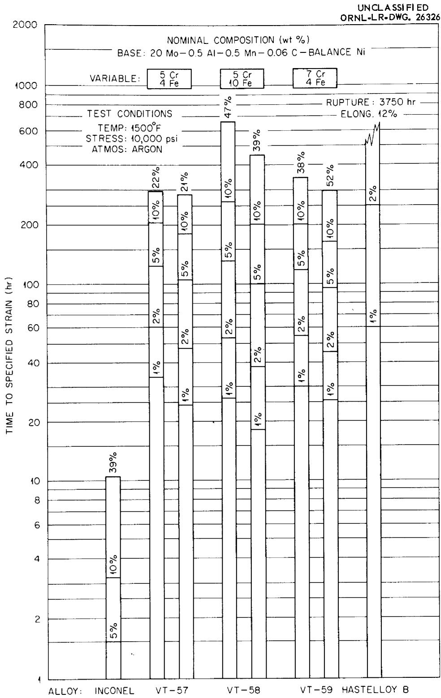  
Figure 27. Bar-graph of creep-rupture test results obtained at $1500^{\circ}\mathrm{F}$ , 10,000 psi., on Ni-base alloys with 20 Mo - 0.5 Al - 0.5 Mn - 0.06 C and varying percentages of Cr and Fe.

# TABLE VII

DIAMOND PYRAMID HARDNESS DATA ON Ni- BASE ALLOYS CONTAINING 20 Mo -

0.5 Al - 0.5 Mn - 0.06 C AND VARYING PERCENTAGES OF Cr AND Fe.

SOLUTION-ANNEALED 1/2 HR. AT $2100^{\circ}\mathrm{F}$ , AGED AT $1500^{\circ}\mathrm{F}$ .

<table><tr><td rowspan="3">Alloy No.</td><td colspan="2">Composition Variable (Wt %)</td><td colspan="2">Solution Annealed at 2100°F</td><td colspan="9">Aged at 1500°F</td><td></td></tr><tr><td rowspan="2">Cr</td><td rowspan="2">Fe</td><td rowspan="2">Range</td><td rowspan="2">Avg.</td><td colspan="2">5 Hr.</td><td colspan="2">25 Hr.</td><td colspan="2">50 Hr.</td><td colspan="2">100 Hr.</td><td colspan="2">1000 Hr.</td></tr><tr><td>Range</td><td>Avg.</td><td>Range</td><td>Avg.</td><td>Range</td><td>Avg.</td><td>Range</td><td>Avg.</td><td>Range</td><td>Avg.</td></tr><tr><td>VT-57</td><td>5</td><td>4</td><td>201-206</td><td>203</td><td>205-215</td><td>212</td><td>206-215</td><td>212</td><td>203-206</td><td>205</td><td>202-205</td><td>204</td><td>198-210</td><td>204</td></tr><tr><td>VT-58</td><td>5</td><td>10</td><td>198-205</td><td>201</td><td>207-210</td><td>209</td><td>202-210</td><td>206</td><td>207-210</td><td>209</td><td>215-218</td><td>216</td><td>235-240</td><td>238</td></tr><tr><td>VT-59</td><td>7</td><td>4</td><td>201-215</td><td>209</td><td>207-207</td><td>207</td><td>215-222</td><td>217</td><td>210-219</td><td>216</td><td>215-222</td><td>218</td><td>207-215</td><td>212</td></tr><tr><td>VT-60</td><td>7</td><td>10</td><td>194-202</td><td>198</td><td>207-215</td><td>211</td><td>201-210</td><td>207</td><td>212-218</td><td>214</td><td>207-219</td><td>213</td><td>235-236</td><td>236</td></tr></table>

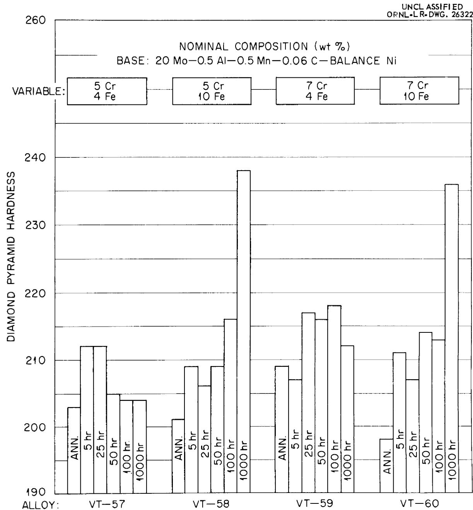  
Figure 28. Bar-graph of average hardness of Ni-base alloys with 20 Mo - 0.5 Al - 0.5 Mn - 0.06 C and varying percentages of Cr and Fe. Solution-annealed $1/2$ hr. at $2100^{\circ}\mathrm{F}$ , aged for 5, 25, 50, 100, and 1000 hr. at $1500^{\circ}\mathrm{F}$ .

alloys brought about a steady increase in hardness with aging time at $1500^{\circ}\mathrm{F}$ which could be correlated with an increase in grain-boundary precipitate. The hardness data for the low-iron alloys at the two chromium contents agreed well with the trend previously noted, in that the response to carbide aging was only slight due to the tie-up of carbon in the $\mathsf{M}_6\mathsf{C}$ -type carbides which did not dissolve during the solution-annealing treatment. Consequently, the difference between the solution-annealed hardness of these two alloys and their peak hardness upon aging was less than that noted for the 15 per cent molybdenum alloys. The general hardness level of the 20 per cent molybdenum alloys was greater than for the lower molybdenum alloys.

The course of aging of alloy VT-59 (20 Mo - 7 Cr - 4 Fe - 0.5 Al - 0.5 Mn - 0.06 C - balance Ni) at $1500^{\circ}\mathrm{F}$ is illustrated in Figure 29. A grain-boundary reaction had occurred after five hours, and discrete grain-boundary particles were observed after 25 to 1000 hours. Figure 30 shows there was little effect of stress on the microstructure of this alloy. The solution-annealed and aged microstructures developed by alloy VT-60 (20 Mo - 7 Cr - 10 Fe - 0.5 Al - 0.5 Mn - 0.06 C - balance Ni) are illustrated in Figure 31. Precipitation of an additional grain-boundary phase was observed with increasing aging time. Figure 32 more clearly shows this phase as it developed in the gage length of a creep-rupture specimen of alloy VT-58 (20 Mo - 5 Cr - 10 Fe - 0.5 Al - 0.5 Mn - 0.06 C - balance Ni).

If the average time, i.e., average of the two tests per alloy, to 1 per cent strain was used as a criterion for determining the

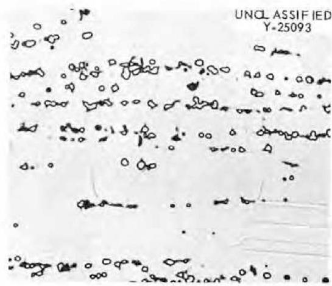  
Solution Annealed. DPH 209

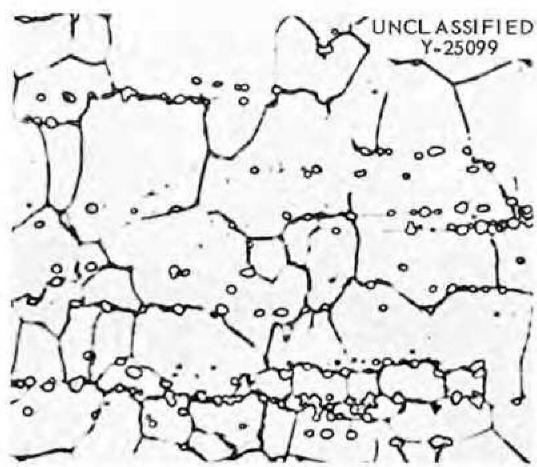  
5 Hr. at 1500°F. DPH 207

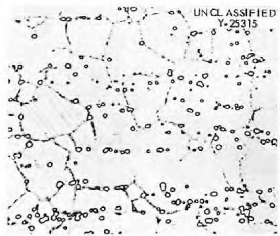  
25 Hr. at 1500°F. DPH 217

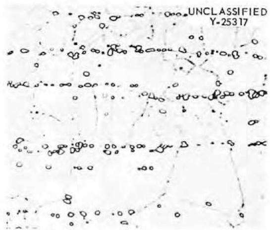  
50 Hr. at 1500°F. DPH 216

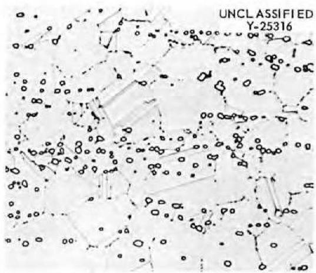  
100 Hr. at 1500°F. DPH 218

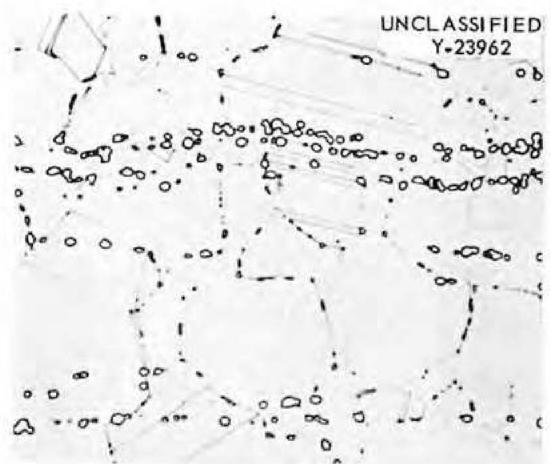  
1000 Hr. at 1500°F. DPH 212   
Figure 29. Alloy VT-59, 20 Mo - 7 Cr - 4 Fe - 0.5 Al - 0.5 Mn - 0.06 C - Balance Ni. Solution-annealed 1/2 hr. at $2100^{\circ}\mathrm{F}$ , aged at $1500^{\circ}\mathrm{F}$ . Etchant: Glycera Regia. 500X.

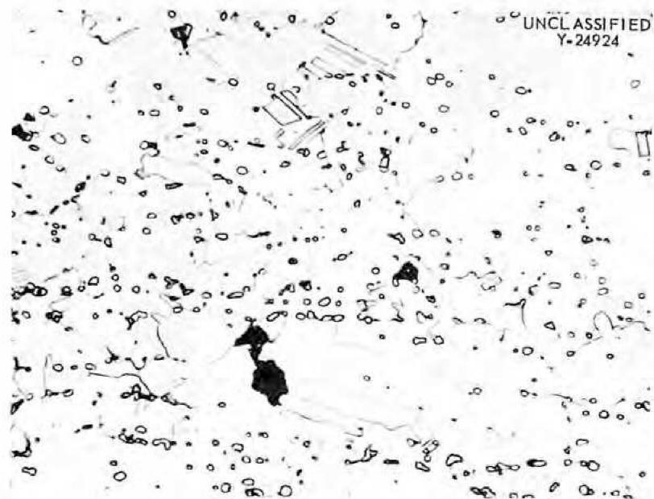  
Figure 30. Alloy VT-59, 20 Mo - 7 Cr - 4 Fe - 0.5 Al - 0.5 Mn - 0.06 C - Balance Ni. Longitudinal section in gage length of creep-rupture specimen. Rupture life: 344.1 hr. Etchant: Glycera Regia. 500X.

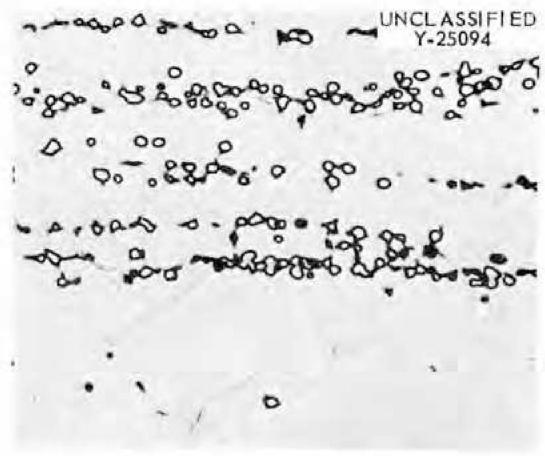  
Solution Annealed. DPH 198

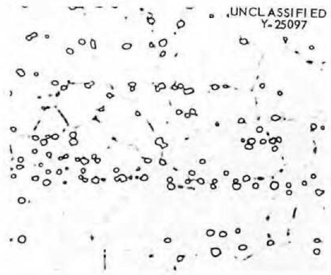  
5 Hr. at 1500°F. DPH 211

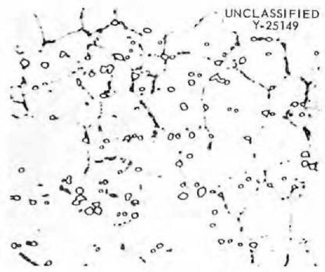  
25 Hr. at 1500°F. DPH 207

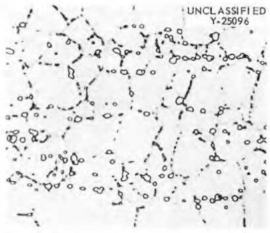  
50 Hr. at 1500°F. DPH 214

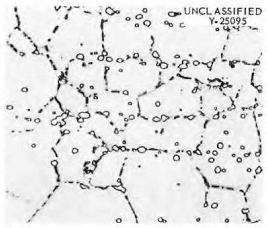  
100 Hr. at 1500°F. DPH 213

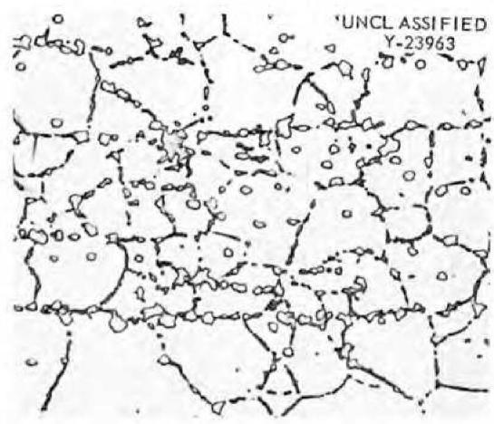  
1000 Hr. at 1500°F. DPH 236   
Figure 31. Alloy VT-60, 20 Mo - 7 Cr - 10 Fe - 0.5 Al - 0.5 Mn - 0.06 C - Balance Ni. Solution-annealed $1/2$ hr. at $2100^{\circ}$ F, aged at $1500^{\circ}$ F. Etchant: Glycera Regia. 500X.

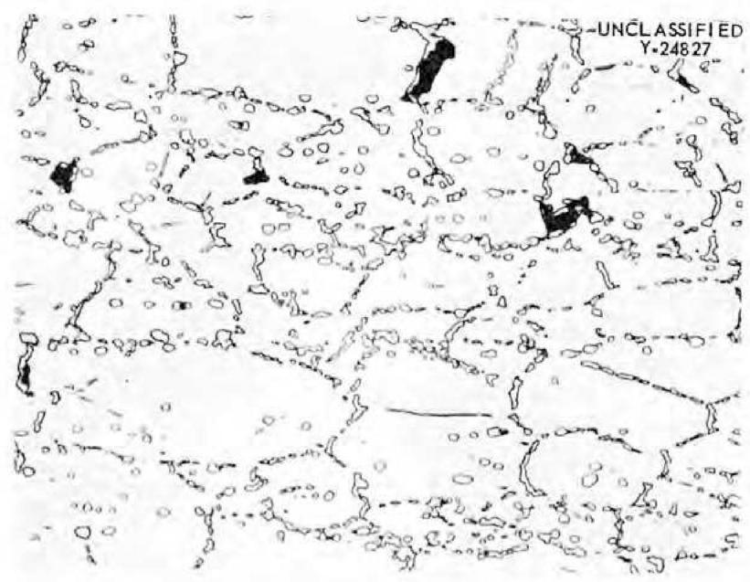  
Figure 32. Alloy VT-58, 20 Mo - 5 Cr - 10 Fe - 0.5 Al - 0.5 Mn - 0.06 C - Balance Ni. Longitudinal section in gage length of creep-rupture specimen. Rupture life: 660.5 hr. Etchant: Glycera Regia. 500X.

strength of the alloys in which only carbide precipitation was present, there was little difference between the 20 per cent molybdenum alloys and the corresponding 15 per cent molybdenum alloys. However, the average times to strains greater than 1 per cent showed the 20 per cent molybdenum alloys to be stronger.

Comparing the data between the individual 20 per cent molybdenum alloys, there was little difference in the strengths of alloys VT-59 and VT-57. It was intended that alloy VT-59 represent a 2 per cent increase in the nominal chromium content. The analyzed compositions of these two alloys, however, showed the higher chromium alloy to contain approximately 3 per cent less molybdenum. The fact that no difference in the amount of precipitate was noted within the two materials indicated the creep strength to be more dependent upon structure than the variation in molybdenum and chromium contents.

It was interesting to note the behavior of the 10 per cent iron alloy, VT-58, in creep-rupture. Average times for strains up to 1 per cent were less for this alloy than either of the alloys VT-57 or VT-59. However, the times required for strains between 2 and 5 per cent were comparable for all three alloys. For greater amounts of strain the greater strength of alloy VT-58 was evident by the progressively longer times for a given strain. The rupture life of alloy VT-58 was significantly longer. This behavior was probably associated with the slightly finer grain size of alloy VT-58 compared with that of the other two alloys coupled with instabilities resulting from the precipitation of the non-carbide grain-boundary phase. These factors

caused an increased initial creep rate. The non-carbide grain-boundary phase later added to the strength in the final stages of test.

# "High-Purity" Alloys

Because the carbon intentionally added to the alloys of series I was very effective in introducing into these materials several of the factors which affect creep-rupture behavior, strengthening effects attributable to chromium and/or iron could not be established from the data with any degree of certainty. Therefore, the alloys of series II were prepared with no intentional carbon addition. The alloys were intended to show the influence of increasing amounts of chromium upon the strength of a 15 Mo - balance Ni binary alloy, and the influence of increasing amounts of iron upon the strength of a 15 Mo - 7 Cr - balance Ni ternary alloy.

The creep-rupture data obtained on the alloys of series II are summarized in Table VIII. Considering the influence of chromium, it would be inferred from the bar-graph of creep-rupture results shown in Figure 33 that more than 3 per cent chromium in a 15 Mo - balance Ni binary alloy brought about an increase in strength. Unfortunately, it was necessary to consider also the effects of grain-size variations and a precipitation reaction in the alloys containing 5 per cent or more of chromium.

Grain-size measurements tabulated in Table VIII made on the creep-rupture specimens of the straight chromium-bearing alloys showed a sharp decrease in grain size when they contained 5 per cent or more of chromium. Apparently, the stress-relieving treatment at $1600^{\circ}\mathrm{F}$ for

Temp: 1500°F

Stress: 10,000 psi

Atmos: Argon

TABLE VIII   
SUMMARY OF CREEP-RUPTURE DATA ON Ni-BASE ALLOYS CONTAINING   
15 Mo AND VARYING PERCENTAGES OF Cr AND Fe   
Test Conditions   

<table><tr><td rowspan="2">Test No.</td><td rowspan="2">Alloy No.</td><td colspan="2">Composition Variable (Wt %)</td><td colspan="5">Time to Specified Strain(a) (Hr.)</td><td rowspan="2">Rupture Life (Hr.)</td><td rowspan="2">Elongation (%)</td><td rowspan="2">Average Grain Dia. (mm)</td></tr><tr><td>Cr</td><td>Fe</td><td>0.5%</td><td>1%</td><td>2%</td><td>5%</td><td>10%</td></tr><tr><td>10-8-42</td><td>VT-90</td><td>Base</td><td>-</td><td>2.7</td><td>3.9</td><td>6.2</td><td>10.7</td><td>-</td><td>12.6</td><td>7.14</td><td>0.0952</td></tr><tr><td>10-8-49</td><td></td><td></td><td></td><td>4.5</td><td>6.6</td><td>9.6</td><td>15.5</td><td>-</td><td>19.7</td><td>8.03</td><td>-</td></tr><tr><td>10-8-39</td><td>VT-89</td><td>3</td><td>-</td><td>3.5</td><td>4.9</td><td>6.6</td><td>-</td><td>-</td><td>7.8</td><td>3.57</td><td>0.0917</td></tr><tr><td>10-8-50</td><td></td><td></td><td></td><td>3.5</td><td>4.9</td><td>6.7</td><td>9.5</td><td>-</td><td>10.1</td><td>6.25</td><td>-</td></tr><tr><td>10-8-38</td><td>VT-88</td><td>5</td><td>-</td><td>7.2</td><td>10.2</td><td>14.5</td><td>-</td><td>-</td><td>19.0</td><td>3.57</td><td>-</td></tr><tr><td>10-8-40</td><td></td><td></td><td></td><td>8.4</td><td>11.2</td><td>14.5</td><td>-</td><td>-</td><td>17.4</td><td>3.57</td><td>0.0492</td></tr><tr><td>10-8-36</td><td>VT-87</td><td>7</td><td>-</td><td>9</td><td>12.1</td><td>16</td><td>20.7</td><td>-</td><td>20.8</td><td>5.35</td><td>-</td></tr><tr><td>10-8-41</td><td></td><td></td><td></td><td>9.6</td><td>13.3</td><td>19</td><td>29.5</td><td>-</td><td>31.8</td><td>6.25</td><td>0.0591</td></tr><tr><td>10-8-43</td><td>VT-86</td><td>10</td><td>-</td><td>-</td><td>15.5</td><td>27</td><td>56</td><td>95</td><td>122.6</td><td>16.96</td><td>-</td></tr><tr><td>10-8-46</td><td></td><td></td><td></td><td>11.7</td><td>18.8</td><td>31.5</td><td>68</td><td>115</td><td>159.9</td><td>18.75</td><td>0.0510</td></tr><tr><td>10-8-47</td><td>VT-91</td><td>7</td><td>4</td><td>7.5</td><td>10.5</td><td>13.8</td><td>18.2</td><td>-</td><td>18.4</td><td>5.35</td><td>0.0869</td></tr><tr><td>10-8-48</td><td></td><td></td><td></td><td>8.8</td><td>12.3</td><td>17.5</td><td>24.7</td><td>-</td><td>25.6</td><td>7.14</td><td>-</td></tr></table>

# TABLE VIII (continued)

# SUMMARY OF CREEP-RUPTURE DATA ON Ni-BASE ALLOYS CONTAINING 15 Mo AND VARYING PERCENTAGES OF Cr AND Fe

Test Conditions

Temp: 1500°F

Stress: 10,000 psi

Atmos: Argon

<table><tr><td rowspan="2">Test No.</td><td rowspan="2">Alloy No.</td><td colspan="2">Composition Variable (Wt %)</td><td colspan="5">Time to Specified Strain(a)(Hr.)</td><td rowspan="2">Rupture Life (Hr.)</td><td rowspan="2">Elongation (%)</td><td rowspan="2">Average Grain Dia. (mm)</td></tr><tr><td>Cr</td><td>Fe</td><td>0.5%</td><td>1%</td><td>2%</td><td>5%</td><td>10%</td></tr><tr><td>10-8-44</td><td>VT-92</td><td>7</td><td>7</td><td>13.2</td><td>19</td><td>29</td><td>50</td><td>67</td><td>68.1</td><td>10.71</td><td>0.0641</td></tr><tr><td>10-8-34</td><td></td><td></td><td></td><td>14</td><td>20.8</td><td>32</td><td>57</td><td>80</td><td>80.3</td><td>10.71</td><td>-</td></tr><tr><td>10-8-45</td><td>VT-93</td><td>7</td><td>10</td><td>12.5</td><td>19.2</td><td>30</td><td>54</td><td>-</td><td>75.8</td><td>9.82</td><td>0.0641</td></tr><tr><td>10-8-35</td><td></td><td></td><td></td><td>12.5</td><td>19.2</td><td>30</td><td>54</td><td>-</td><td>73.7</td><td>8.92</td><td>-</td></tr></table>

(a) Microscope readings.

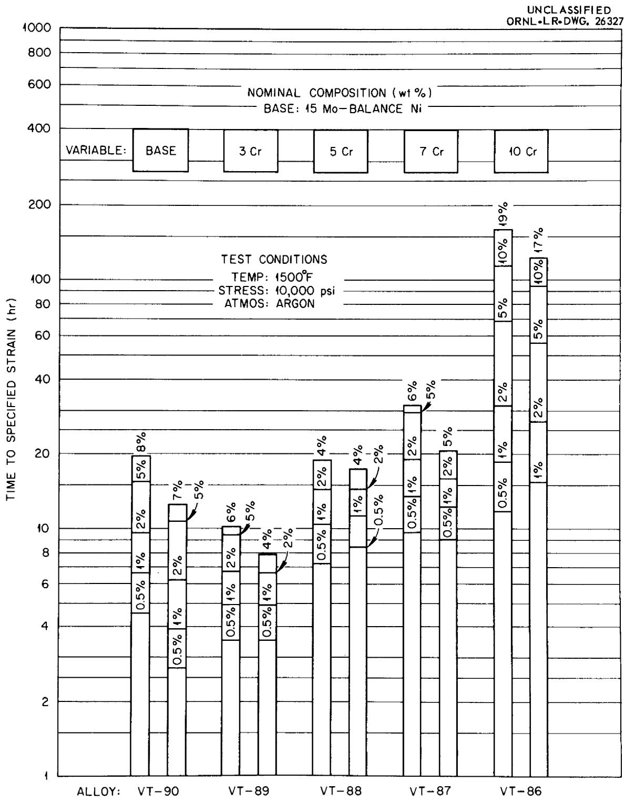  
Figure 33. Bar-graph of creep-rupture test results obtained at $1500^{\circ}\mathrm{F}$ , 10,000 psi., on Ni-base alloys with 15 Mo and varying percentages of Cr.

one-half hour given all the materials prior to machining creep-rupture specimens precipitated the grain-boundary phase which, until effectively dissolved, retarded grain growth in the specimens during the solution-annealing treatment.

The range and average hardness of the chromium-bearing ternary alloys after a solution-annealing treatment as well as after aging 100 hours at $1500^{\circ}\mathrm{F}$ are shown in Table IX. The average hardness data are presented in bar-graph form in Figure 34. Increasing the chromium content caused an increase in hardness of the ternary alloys, although it should be remembered that the hardness measurements included a grain-size variable as well as a composition variable. The slight increase in hardness as a result of the $1500^{\circ}\mathrm{F}$ aging treatment in the alloys containing 5 per cent or more of chromium could be correlated with the precipitation which occurred in these alloys.

Figures 35, 36, and 37 show the microstructure of alloy VT-90 (15 Mo - balance Ni) after having been solution-annealed, aged 100 hours at $1500^{\circ}\mathrm{F}$ , and creep-rupture tested at $1500^{\circ}\mathrm{F}$ . In all cases the structure is that of a solid-solution alloy. These microstructures were also representative of alloy VT-89 (15 Mo - 3 Cr - balance Ni) under the same conditions.

Figures 38, 39, and 40 illustrate the microstructures found in alloy VT-87 (15 Mo - 7 Cr - balance Ni) after solution-annealing, aging, and creep-rupture testing. This series of photomicrographs depicts the grain-boundary precipitate typical of that found in the alloys.

DIAMOND PYRAMID HARDNESS DATA ON Ni-BASE ALLOYS CONTAINING 15 Mo AND VARYING PERCENTAGES OF Cr AND Fe. SOLUTION-ANNEALED $1/2$ HR. AT $2100^{\circ}$ F, AGED FOR 100 HR. AT $1500^{\circ}$ F.

TABLE IX   

<table><tr><td rowspan="2">Alloy No.</td><td colspan="2">Composition Variable (Wt %)</td><td colspan="2">Solution Annealed at 2100°F</td><td colspan="2">Aged 100 Hr. at 1500°F</td></tr><tr><td>Cr</td><td>Fe</td><td>Range</td><td>Avg.</td><td>Range</td><td>Avg.</td></tr><tr><td>VT-90</td><td colspan="2">Base</td><td>139-141</td><td>140</td><td>132-133</td><td>132</td></tr><tr><td>VT-89</td><td>3</td><td>-</td><td>144-146</td><td>145</td><td>141-145</td><td>143</td></tr><tr><td>VT-88</td><td>5</td><td>-</td><td>155-155</td><td>155</td><td>156-159</td><td>157</td></tr><tr><td>VT-87</td><td>7</td><td>-</td><td>151-159</td><td>155</td><td>157-160</td><td>158</td></tr><tr><td>VT-86</td><td>10</td><td>-</td><td>159-163</td><td>161</td><td>163-166</td><td>165</td></tr><tr><td>VT-91</td><td>7</td><td>4</td><td>148-151</td><td>150</td><td>151-156</td><td>154</td></tr><tr><td>VT-92</td><td>7</td><td>7</td><td>151-157</td><td>155</td><td>155-162</td><td>159</td></tr><tr><td>VT-93</td><td>7</td><td>10</td><td>148-155</td><td>152</td><td>153-158</td><td>155</td></tr></table>

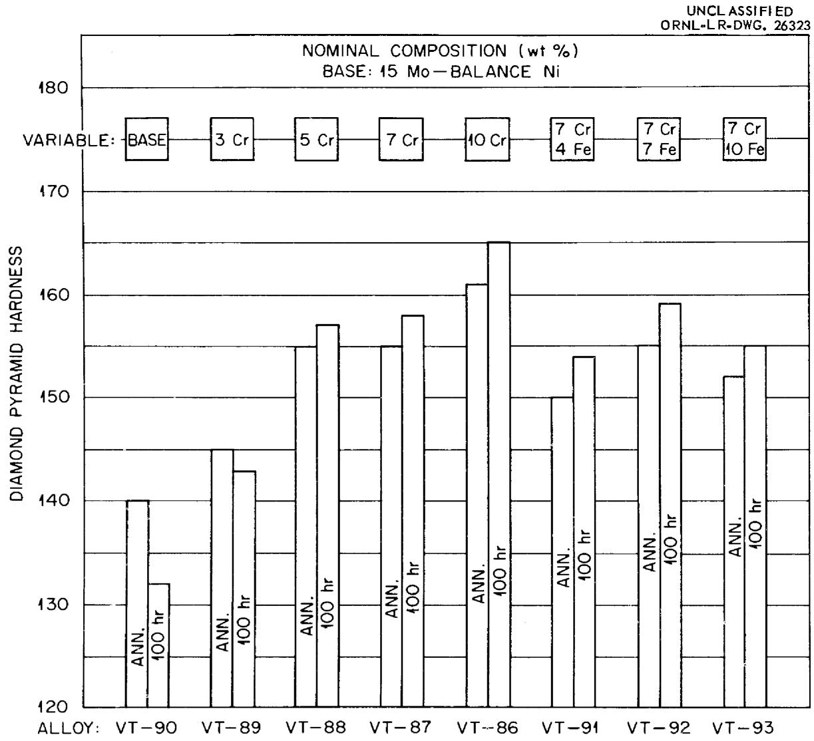  
Figure 34. Bar-graph of average hardness of Ni-base alloys with 15 Mo and varying percentages of Cr and Fe. Solution-annealed $1/2$ hr. at $2100^{\circ}\mathrm{F}$ , aged for 100 hr. at $1500^{\circ}\mathrm{F}$ .

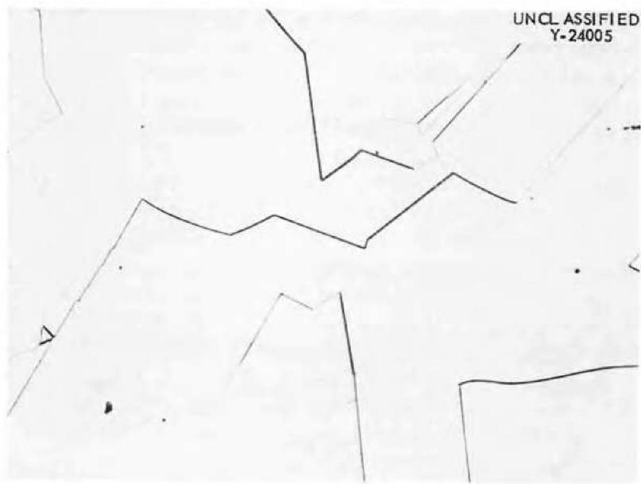  
Figure 35. Alloy VT-90, 15 Mo - Balance Ni. Solution-annealed $1/2$ hr. at $2100^{\circ}$ F. DPH 140. Etchant: Glycera Regia. 500X.

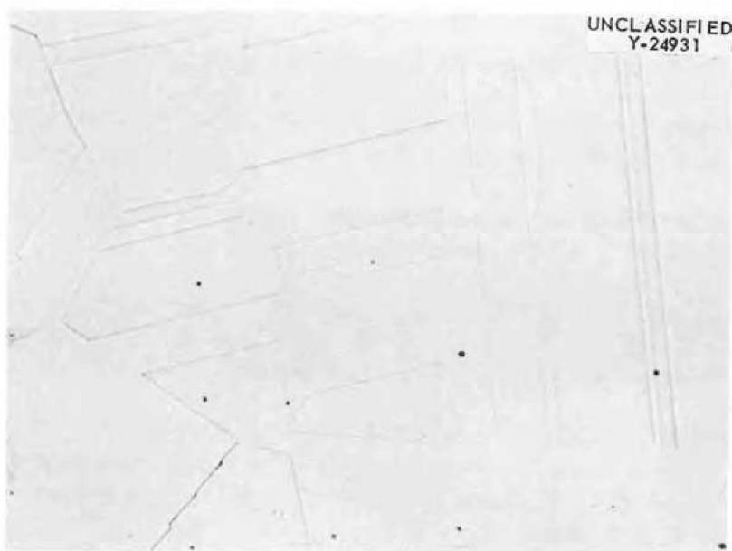  
Figure 36. Alloy VT-90, 15 Mo - Balance Ni. Solution-annealed $1/2$ hr. at $2100^{\circ}$ F, aged for 100 hr. at $1500^{\circ}$ F. DPH 132. Etchant: Glycera Regia. 500X.

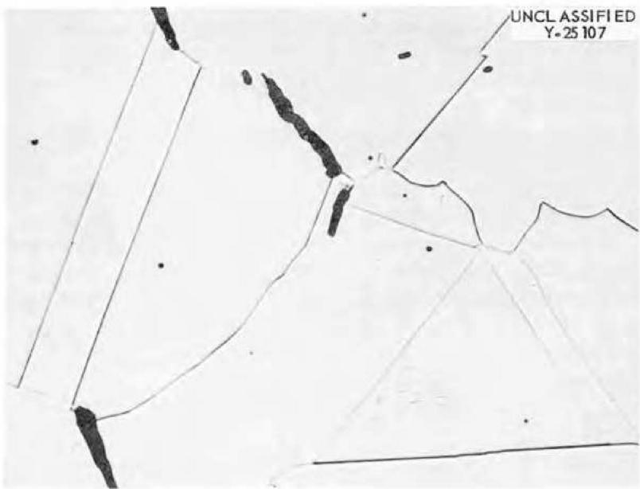  
Figure 37. Alloy VT-90, 15 Mo - Balance Ni. Longitudinal section in gage length of creep-rupture specimen. Rupture life: 12.6 hr. Etchant: Glycera Regia. 500X.

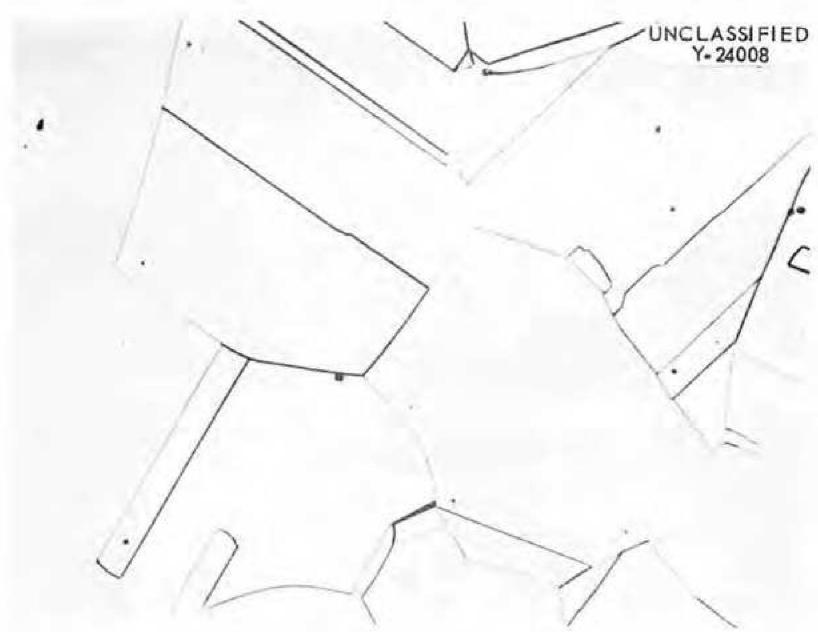  
Figure 38. Alloy VT-87, 15 Mo - 7 Cr - Balance Ni. Solution-annealed 1/2 hr. at $2100^{\circ}$ F. DPH 155. Etchant: Glycera Regia. 500X.

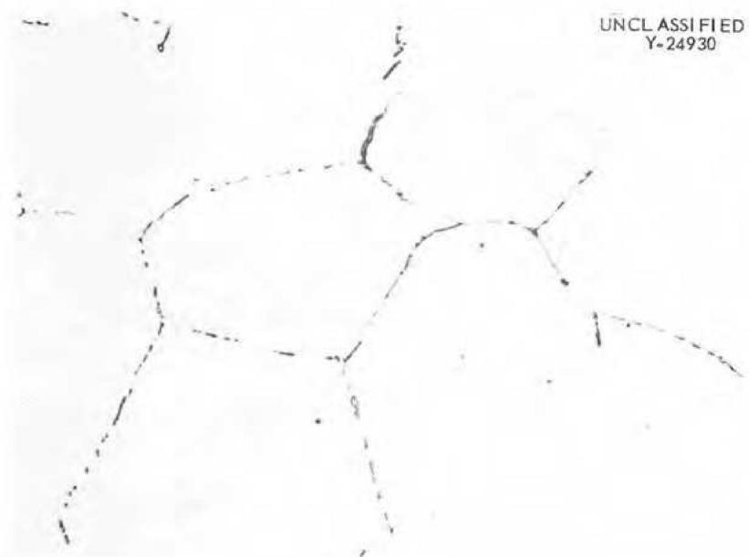  
Figure 39. Alloy VT-87, 15 Mo - 7 Cr - Balance Ni. Solution-annealed 1/2 hr. at $2100^{\circ}\mathrm{F}$ , aged for 100 hr. at $1500^{\circ}\mathrm{F}$ . DPH 158. Etchant: Glycera Regia. 500X.

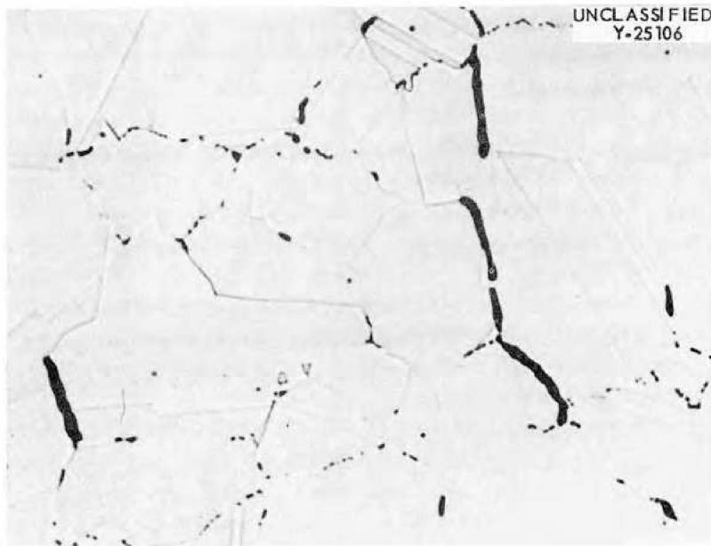  
Figure 40. Alloy VT-87, 15 Mo - 7 Cr - Balance Ni. Longitudinal section in gage length of creep-rupture specimen. Rupture life: 31.8 hr. Etchant: Glycera Regia. 500X.

containing 5, 7, and 10 per cent chromium as a result of aging or creep-rupture testing at $1500^{\circ}\mathrm{F}$ .

Because of the inconsistencies in the grain sizes and the amount of grain-boundary precipitate in this group of alloys, a comparison of their relative strengths could at best be made between the 0 and 3 per cent chromium alloys, and between the 5, 7, and 10 per cent chromium alloys. With this scheme of evaluation, it was concluded that a 3 per cent chromium addition added nothing to the strength of the binary base composition. Similarly, only a slight increase in strength was realized by increasing the chromium content from 5 to 7 per cent; but an increase to 10 per cent chromium showed a more significant strengthening effect, particularly for the time required to reach a strain of 2 per cent or more.

The creep-rupture data obtained on the alloys prepared to show the influence of increasing amounts of iron upon the strength of a $15\mathrm{Mo} = 7\mathrm{Cr}$ - balance Ni ternary composition are plotted in Figure 41. Interpretation of the data was again complicated by the necessity of considering grain size and precipitation variables in addition to composition.

Grain-size measurements made on a creep-rupture specimen of each of the iron-bearing alloys are tabulated in Table VIII. The variation noted has been attributed to the difference in the amount of precipitation which occurred in these alloys during the stress-relieving treatment prior to machining the creep-rupture specimens. It will be shown that the volume of grain-boundary particles precipitated at $1500^{\circ}\mathrm{F}$

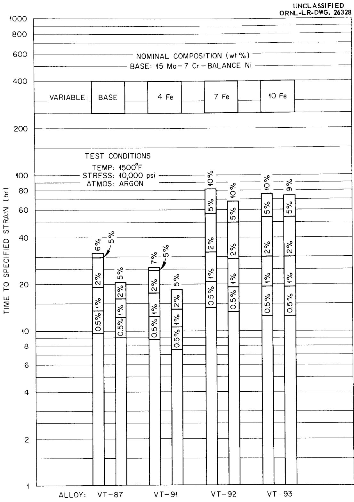  
Figure 41. Bar-graph of creep-rupture test results obtained at $1500^{\circ}\mathrm{F}$ , 10,000 psi., on Ni-base alloys with 15 Mo - 7 Cr and varying percentages of Fe.

in the alloy of lowest iron content was less than that found in the 7 and 10 per cent iron alloys.

The range and average hardness of the alloys after solution-annealing at $2100^{\circ}\mathrm{F}$ and after aging 100 hours at $1500^{\circ}\mathrm{F}$ are shown in Table IX. The average hardness data have been plotted in bar-graph form in Figure 34. There was no significant trend in hardness as a function of increasing iron content; the slight rise in hardness of each alloy after aging 100 hours at $1500^{\circ}\mathrm{F}$ has been attributed to the grain-boundary precipitation which took place in the alloys.

Microstructures developed by alloy VT-91 (15 Mo - 7 Cr - 4 Fe - balance Ni, chemical analysis indicated 5 Cr and 2 Fe) after having been solution-annealed, aged 100 hours at $1500^{\circ}\mathrm{F}$ , and creep-rupture tested at $1500^{\circ}\mathrm{F}$ are shown in Figures 42, 43, and 44. Although a small quantity of grain-boundary precipitate was observed in the aged coupon, virtually none was found in the creep-rupture specimen.

The 7 and 10 per cent iron alloys precipitated a larger amount of the grain-boundary phase which was observed in both the 100-hour aged specimens and the creep-rupture specimens. This is evident when Figures 45, 46, and 47, microstructures of alloy VT-92 (15 Mo - 7 Cr - 10 Fe - balance Ni) are compared with the previous three figures. The amount of grain-boundary precipitate observed in these alloys could be correlated with their carbon analyses. Both the 7 and 10 per cent iron alloys contained approximately twice the amount of carbon as the 4 per cent iron alloy.

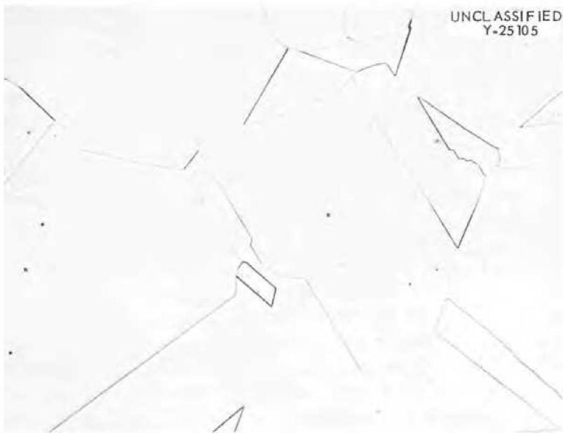  
Figure 42. Alloy VT-91, 15 Mo - 7 Cr - 4 Fe - Balance Ni. Solution-annealed $1/2$ hr. at $2100^{\circ}$ F. DPH 150. Etchant: Glycera Regia. 500X.

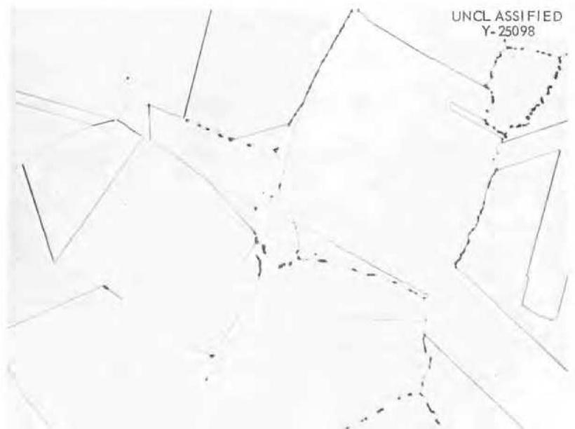  
Figure 43. Alloy VT-91, 15 Mo - 7 Cr - 4 Fe - Balance Ni. Solution-annealed 1/2 hr. at $2100^{\circ}\mathrm{F}$ , aged for 100 hr. at $1500^{\circ}\mathrm{F}$ . DPH 154. Etchant: Glycera Regia. 500X.

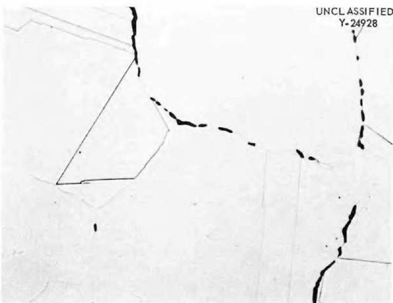  
Figure 44. Alloy VT-91, 15 Mo - 7 Cr - 4 Fe - Balance Ni. Longitudinal section in gage length of creep-rupture specimen. Rupture life: 18.4 hr. Etchant: Glycera Regia. 500X.

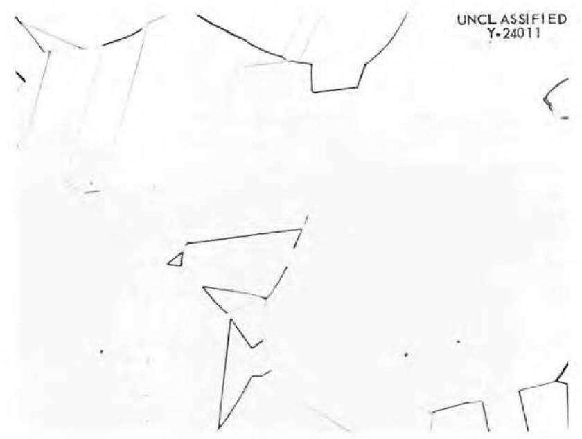  
Figure 45. Alloy VT-93, 15 Mo - 7 Cr - 10 Fe - Balance Ni. Solution-annealed $1/2$ hr. at $2100^{\circ}$ F. DPH 152. Etchant: Glycera Regia. 500X.

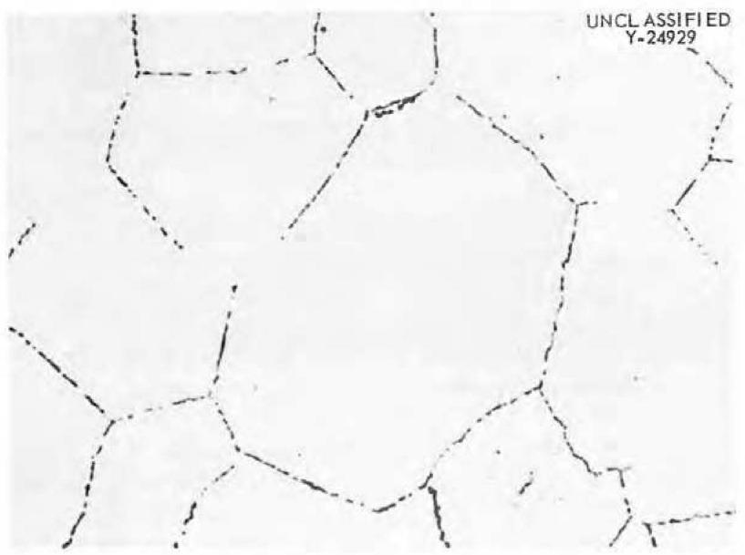  
Figure 46. Alloy VT-93, 15 Mo - 7 Cr - 10 Fe - Balance Ni. Solution-annealed $1/2$ hr. at $2100^{\circ}$ F, aged for 100 hr. at $1500^{\circ}$ F. DPH 155. Etchant: Glycera Regia. 500X.

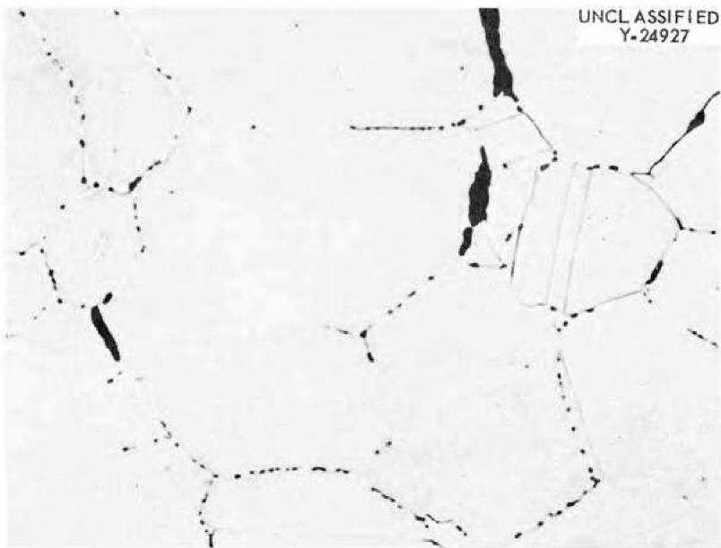  
Figure 47. Alloy VT-93, 15 Mo - 7 Cr - 10 Fe - Balance Ni. Longitudinal section in gage length of creep-rupture specimen. Rupture life: 75.8 hr. Etchant: Glycera Regia. 500X.

The presence of other variables in addition to composition caused difficulty in attempting to determine the influence of iron upon the strength of the alloys. For example, comparing the strength of the ternary base composition, VT-87, with that of the 4 per cent iron alloy, VT-91, it was found that both materials were comparable in strength. However, such a comparison necessitated an accounting not only for the difference in composition, but also for the differences in grain size and amount of precipitation present in the materials. It was, then, a summation of the variables affecting creep-rupture behavior which equalized the strength of the alloys.

It was possible to make a direct comparison of the effect of increasing iron content between the alloys containing 7 and 10 per cent iron. The fact that no increase in strength was realized by the further increase of 3 per cent iron showed this element to have an insignificant effect as a solid-solution strengthensener.

# DECARBURIZATION STUDIES

A comparison of the microstructures of the 15 per cent molybdenum alloys with and without an intentional carbon addition left little doubt that carbides accounted for the bulk of second phase material observed in these alloys, since the quantity present was related to the carbon content. Also, the fact that the nickel-molybdenum-chromium ternary compositions of series II were located well within the alpha phase boundaries of the $1508^{\circ}\mathrm{F}$ section of this system proposed by

Lundy and Stansbury7 indicated that the precipitates found at $1500^{\circ}\mathrm{F}$ in these alloys were carbides. On the other hand, the observed increase in the amount of precipitated particles with increasing percentages of iron added to the 15 per cent molybdenum - 7 per cent chromium - balance nickel alloy warranted more conclusive phase identification in the iron-bearing alloys of series II. It has already been shown by creep-rupture tests, hardness studies, and metallographic means that precipitation of a phase other than a carbide occurred in the 20 per cent molybdenum alloys of series I when the iron content was increased from 4 to 10 per cent. Evidence was therefore needed to establish whether iron was having this same influence upon the 15 per cent molybdenum alloys.

As indicated in Chapter IV, the decarburization studies were conducted on selected series II compositions as well as on several alloys of series I to observe the disappearance of carbide phases, thereby affording a method of phase identification. The decarburization treatment consisted of heat-treating the alloys in a hydrogen atmosphere for 100 hours at $2200^{\circ}\mathrm{F}$ . An additional aging treatment for 100 hours at $1500^{\circ}\mathrm{F}$ was then given the alloys in order that a comparison could be made between these microstructures and those obtained after the conventional aging treatment at $1500^{\circ}\mathrm{F}$ .

Comparative carbon analyses of the alloys before and after decarburization are shown in Table X. It is apparent that this treatment effectively reduced the carbon content to 0.010 - 0.016 per cent. Typical microstructures are illustrated in Figures 48 through 52. All

TABLE X   
CARBON ANALYSES OF ALLOYS BEFORE AND AFTER DECARBURIZATION TREATMENT   

<table><tr><td rowspan="2"></td><td rowspan="2">Alloy No.</td><td colspan="6">Nominal Composition (Wt %)</td><td colspan="2">Analyzed Carbon Content (Wt %)</td></tr><tr><td>Ni</td><td>Mo</td><td>Cr</td><td>Fe</td><td>Al</td><td>Mn</td><td>Before</td><td>After</td></tr><tr><td rowspan="6">Series I</td><td>VT-43</td><td>Bal</td><td>10</td><td>5</td><td>4</td><td>0.5</td><td>0.5</td><td>0.076</td><td>0.012</td></tr><tr><td>VT-54</td><td>Bal</td><td>10</td><td>10</td><td>10</td><td>0.5</td><td>0.5</td><td>0.068</td><td>0.016</td></tr><tr><td>VT-45</td><td>Bal</td><td>15</td><td>5</td><td>4</td><td>0.5</td><td>0.5</td><td>0.073</td><td>0.011</td></tr><tr><td>VT-56</td><td>Bal</td><td>15</td><td>10</td><td>10</td><td>0.5</td><td>0.5</td><td>0.077</td><td>0.014</td></tr><tr><td>VT-57</td><td>Bal</td><td>20</td><td>5</td><td>4</td><td>0.5</td><td>0.5</td><td>0.070</td><td>0.012</td></tr><tr><td>VT-58</td><td>Bal</td><td>20</td><td>5</td><td>10</td><td>0.5</td><td>0.5</td><td>0.069</td><td>0.012</td></tr><tr><td rowspan="3">Series II</td><td>VT-87</td><td>Bal</td><td>15</td><td>7</td><td>-</td><td>-</td><td>-</td><td>0.025</td><td>0.012</td></tr><tr><td>VT-92</td><td>Bal</td><td>15</td><td>7</td><td>7</td><td>-</td><td>-</td><td>0.021</td><td>0.011</td></tr><tr><td>VT-93</td><td>Bal</td><td>15</td><td>7</td><td>10</td><td>-</td><td>-</td><td>0.024</td><td>0.010</td></tr></table>

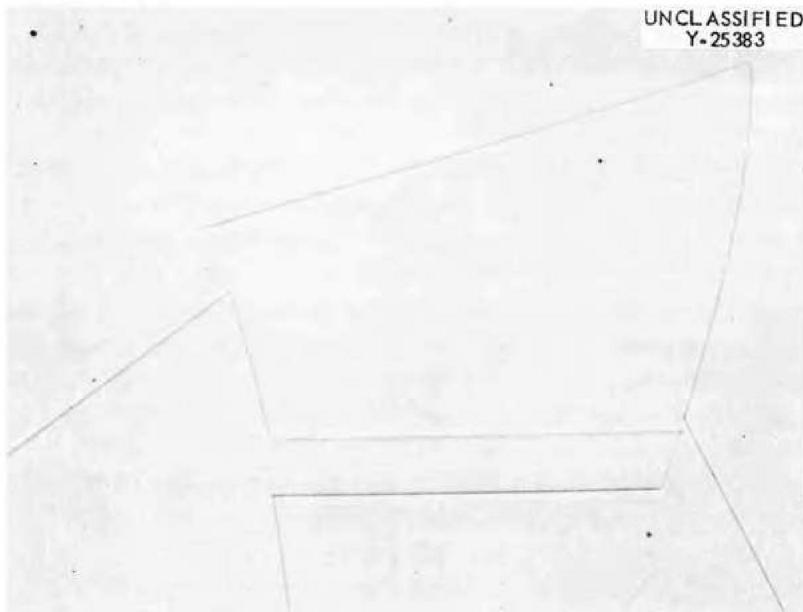  
Figure 48. Alloy VT-43, 10 Mo - 5 Cr - 4 Fe - 0.5 Al - 0.5 Mn - 0.012 C - Balance Ni. Decarburized in a hydrogen atmosphere at $2200^{\circ}\mathrm{F}$ , aged for 100 hr. at $1500^{\circ}\mathrm{F}$ . Etchant: Glycera Regia. 500X.

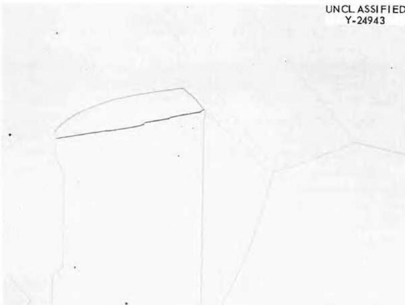  
Figure 49. Alloy VT-56, 15 Mo - 10 Cr - 10 Fe - 0.5 Al - 0.5 Mn - 0.014 C - Balance Ni. Decarburized in a hydrogen atmosphere at $2200^{\circ}\mathrm{F}$ , aged for 100 hr. at $1500^{\circ}\mathrm{F}$ . Etchant: Glycera Regia. 500X.

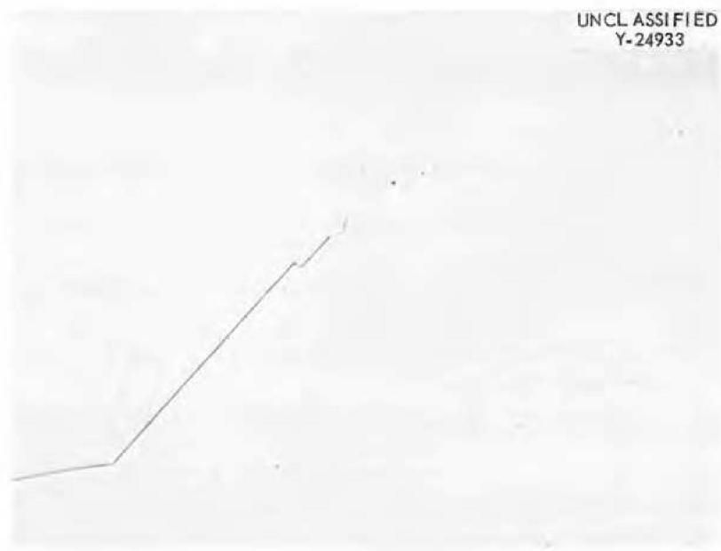  
Figure 50. Alloy VT-57, 20 Mo - 5 Cr - 4 Fe - 0.5 Al - 0.5 Mn - 0.012 C - Balance Ni. Decarburized in a hydrogen atmosphere at $2200^{\circ}\mathrm{F}$ , aged for 100 hr. at $1500^{\circ}\mathrm{F}$ . Etchant: Glycera Regia. 500X.

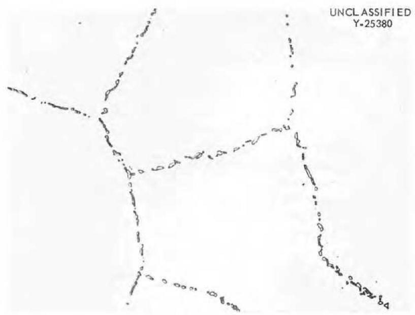  
Figure 51. Alloy VT-58, 20 Mo - 5 Cr - 10 Fe - 0.5 Al - 0.5 Mn - 0.012 C - Balance Ni. Decarburized in a hydrogen atmosphere at $2200^{\circ}\mathrm{F}$ , aged for 100 hr. at $1500^{\circ}\mathrm{F}$ . Etchant: Glycera Regia. 500X.

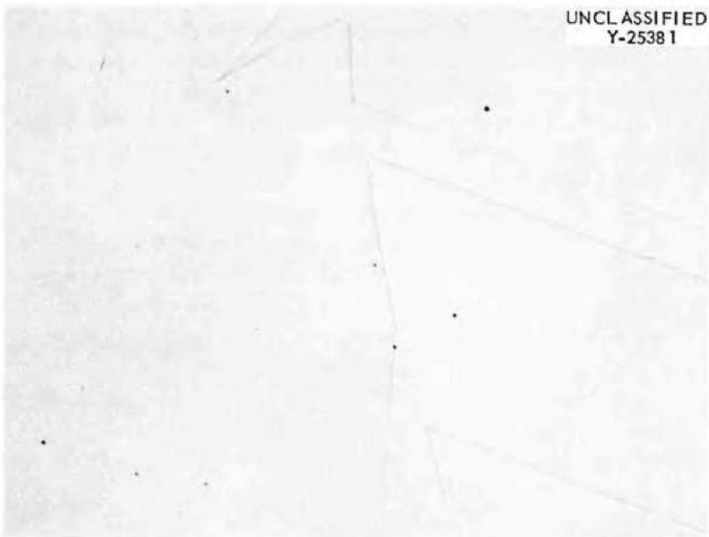  
Figure 52. Alloy VT-93, 15 Mo - 7 Cr - 10 Fe - 0.010 C - Balance Ni. Decarburized in a hydrogen atmosphere at $2200^{\circ}\mathrm{F}$ , aged for 100 hr. at $1500^{\circ}\mathrm{F}$ . Etchant: Glycera Regia. 500X.

alloys were found to be void of precipitated particles with the exception of alloy VT-58 which retained a grain-boundary phase. These results present evidence that within the experimental conditions of this investigation, all phases in excess of the matrix could be attributed to carbide particles with the exception of an additional phase found in alloys VT-58 and VT-60, both of which were 20 per cent molybdenum alloys of series I with 10 per cent iron.

# CHAPTER VI

# CONCLUSIONS AND RECOMMENDATIONS

Based upon the experimental results of the present investigation, the following conclusions and recommendations can be stated:

# Conclusions

1. From the standpoint of their creep-rupture strength at $1500^{\circ}\mathrm{F}$ and 10,000 psi, it was possible to conveniently group the molybdenum-chromium-iron-nickel base alloys containing a nominal content of 0.5 per cent aluminum - 0.5 per cent manganese - 0.06 per cent carbon according to the three concentrations of molybdenum studied: 10, 15, and 20 per cent.   
2. The principal factors affecting the strength of the alloys within these groups were: solid-solution elements, aging reactions, the presence of $\mathsf{M}_6\mathsf{C}$ -type carbides in the microstructures, and grain size.   
3. It could be concluded from the analyses and microstructures of these alloys that the relative strength contribution of each factor varied between the individual groups.   
4. The combined effects of solid-solution strengthening by molybdenum and the increase in quantity of dispersed $\mathsf{M}_6\mathsf{C}$ -type carbides which this element promoted in the annealed materials were the predominant factors which progressively increased the strength of the alloys grouped by molybdenum content. The only exception noted was in

the case of the 20 per cent molybdenum - 7 per cent chromium - 10 per cent iron alloy which precipitated a non-carbide phase as a consequence of crossing a new phase boundary. The presence of this phase in the microstructure contributed noticeably to creep-rupture strength in the later stages of test.

5. The contribution of chromium and iron to the strength of the alloys within the individual groups could not be established with certainty due to simultaneous variations in other factors affecting creep-rupture behavior.

6. Because of the scatter in rupture life between alloys of a group, this was not a good criterion for strength. On the other hand, times to specified amounts of strain preceding rupture appeared more meaningful for correlative interpretation of the data.

7. Although the studies conducted upon the "high-purity" nickel-molybdenum-chromium ternary alloys with 15 per cent molybdenum were complicated by carbide precipitation and grain-size variations, the data indicated the strengthening influence of chromium to be significant in the range of 5 to 10 per cent, but most pronounced when 10 per cent was present. The strengthening influence of iron was interpreted as being insignificant when amounts up to 10 per cent were added to a 15 per cent molybdenum - 7 per cent chromium - balance nickel base.

8. A general consideration of all data obtained from this investigation favorably supports the composition specification placed upon the alloy INOR-8. An increase in the presently specified molybdenum range for this alloy, yet keeping within the solubility

limits, would be made at the expense of fabricability and would result in only slight gain in strength as shown by this work. Although the solid-solution strength contribution of chromium is of less significance than the contribution of molybdenum and dispersed carbide particles, chromium is necessary at the specified concentration to impart oxidation resistance. Iron at the specified concentration is insignificant as a solid-solution strengthensener, but the introduction of this element into the alloy through the use of ferro-alloy additions is not objectionable.

# Recommendations

1. Future attempts to determine the solid-solution strengthening influence of specific elements in an alloy should be preceded by a careful consideration of methods to isolate the variable(s) of interest. Of particular importance, as shown by this work, is the elimination of carbon from alloys containing strong carbide formers. Purification of the alloys by a prior decarburization treatment, similar to that described here, would be invaluable.   
2. It would be of interest to determine the chemical composition of the carbide phase(s) which were present in the alloys studied for this investigation.   
3. For advancing the technology of the alloy INOR-8, the influence of heat treatment upon creep-rupture behavior should be investigated.

LIST OF REFERENCES

# LIST OF REFERENCES

1. Clausing, R. E., Patriarca, P., and Manly, W. D., "Aging Characteristics of Hastelloy B," ORNL-2314 (July 1957)   
2. Metals Handbook, American Society for Metals, Cleveland, p. 1230 (1948)   
3. Hastelloy, Corrosion-Resistant Alloys, Haynes Stellite Company, p. 100 (May 1957)   
4. Douglas, D. A. and Manly, W. D., "A Laboratory for the High-Temperature Creep Testing of Metals and Alloys in Controlled Environments," ORNL-2053 (September 1956)   
5. ASTM Standards, Part 2, Non-Ferrous Metals, American Society for Testing Materials, p. 1443 (1955)   
6. La Marche, A. E., "Pilot Plant Development of a Nickel-Molybdenum Base High-Temperature Alloy," First Periodic Progress Report Under Subcontract No. 1067 Under Contract No. W-7405 eng-26, Blairsville, Pennsylvania, Blairsville Metals Plant of the Westinghouse Electric Corporation, (May 1957)   
7. Lundy, T. S. and Stansbury, E. E., "A Metallographic and X-Ray Study of Nickel-Base Alloys of 20 - 25 Per Cent Molybdenum and 3 - 15 Per Cent Chromium," Report No. 2 Under Subcontract No. 582 Under Contract No. W-7405 eng-26, Knoxville, Tennessee, Department of Chemical Engineering of the University of Tennessee (1957)

BIBLIOGRAPHY

# BIBLIOGRAPHY

Beattie, H. J., Jr. and VerSnyder, F. L., "The Influence of Molybdenum on the Phase Relationships of a High Temperature Alloy," Trans. Amer. Soc. Metals, 49, p. 883 (1957).   
Monkman, F. C., Jr., Grant, N. J., and Floe, C. F., "Final Report on Development and Testing of Nickel-Molybdenum Alloys," ORNL-1990 (November 1955).   
Parker, E. R., "Creep of Metals," High Temperature Properties of Metals, American Society for Metals, Cleveland, pp. 1-40 (1951).   
Preston, O., Grant, N. J., and Floe, C. F., "Final Report on Development and Testing of Vacuum Melted Nickel-Molybdenum Alloys with Minor Alloying Additions," ORNL-2181 (October 1956).   
Preston, O., Grant, N. J., and Floe, C. F., "Final Report on Development and Testing of Air Melted Nickel-Molybdenum Alloys with Minor Alloying Additions," ORNL-2520 (June 1957).   
Rotherham, L. A., Creep of Metals, Institute of Physics, London (1951).   
Stoffel, D. W. and Stansbury, E. E., "A Metallographic and X-Ray Study of Nickel Alloys of 20 - 30 Per Cent Molybdenum," Report No. 1 Under Subcontract No. 582 Under Contract No. W-7405 eng-26, Knoxville, Tennessee, Department of Chemical Engineering of the University of Tennessee (1955).

__________

APPENDIX

# APPENDIX

# CREEP-RUPTURE TESTING APPARATUS

Typical creep frames used in the Mechanical Properties Laboratory of the ORNL Metallurgy Division for testing in gaseous environments are shown in Figure 53. The main component of a creep frame of this type is a leaktight test chamber which can be heated uniformly to the desired test temperature and in which strain and temperature measurements can be made on a stressed test specimen. The chamber, itself, consists of a metal tube, water-jacketed on the ends to allow sufficient cooling for the brass bellows and for the rubber O-rings utilized as seals. Side ports are provided to allow for optical measurement of the specimen extension. The heating elements are wound around the tube in such a way as to compensate for the heat losses at the ends and at the side ports. External shunts are provided to allow for adjustment of vertical temperature gradients. Pull rods connected to and extending through the two bellows make it possible to introduce a load on the specimen inside the chamber. With the bottom pull rod anchored in place, the specimen can be stressed by application of a load to the top bellows through a lever arm and a weight-pan system.

Four thermocouples are wired to the specimen, two at either end of the specimen gage length, and the leads are brought out of the test chamber through rubber stoppers to a junction box. One thermocouple is used for temperature control with the use of a Leeds and Northrup duration-adjust-type controller (DAT) and a Speedomax recorder.

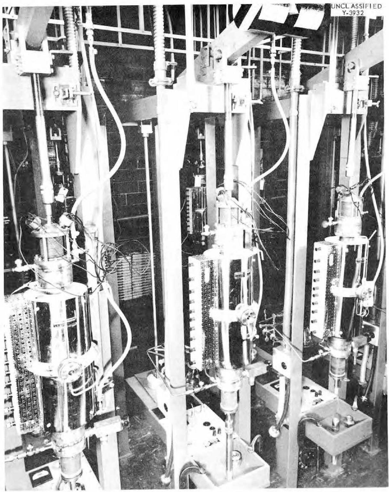  
Figure 53. Creep frames for testing in gaseous environments.

Temperature readings from each of the four thermocouples are made with a multi-point precision indicator.

The extension of specimens during creep is measured optically by means of a pair of dovetailed platinum alloy strips which are spot-welded over the gage length. The strips are referenced so that measurements can be made with a microscope through the test chamber side ports. This optical method of measuring extensions is precise to approximately ± 0.0003 inch. Figure 54 shows a specimen connected to the top bellows, with the platinum extensometer and thermocouples in place ready for assembly in the test chamber. Figure 55 is a view of the scribed platinum extensometer from which the extension measurements are made. A dial gage attached to the pull rod outside the test chamber acts as a rough check on the micrometer microscope readings.

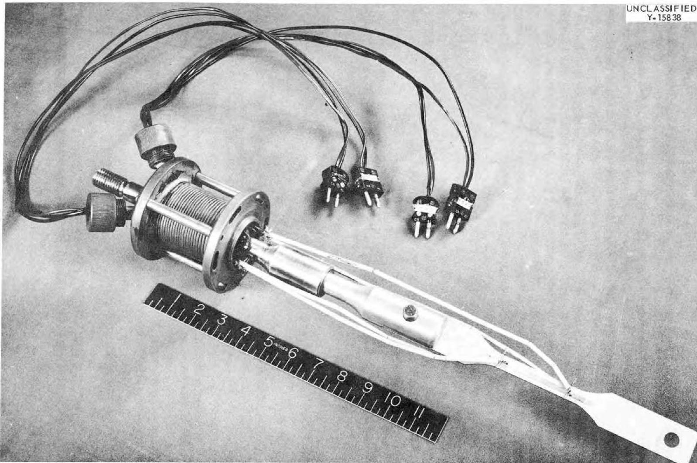  
Figure 54. Assembly of creep-rupture specimen, extensometer, thermocouples, and pull rods with the top bellows flange.

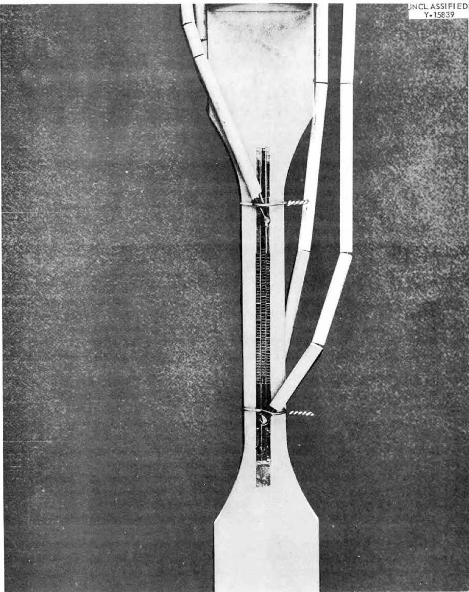  
Figure 55. Gage length of a creep-rupture specimen with extensometer in place.

# INTERNAL DISTRIBUTION

1. G. M. Adamson, Jr.   
2. R. G. Affel   
3. J. W. Allen   
4. C. J. Barton   
5. R. J. Beaver   
6. M. Bender   
7. D. S. Billington   
8. F. F. Blankenship   
9. E. P. Blizzard   
O. E. G. Bohlmann   
1. E. S. Bomar, Jr.   
2. C. J. Borkowski   
3. W. F. Boudreau   
4. G. E. Boyd   
5. M. A. Bredig   
6. E. J. Breeding   
7. W. E. Browning   
B. F. R. Bruce   
9. A. D. Callihan   
D. D. W. Cardwell   
1. C. E. Center   
2. R. A. Charpie   
3. R. L. Clark   
4. R. E. Clausing   
5. C. E. Clifford   
6. J. H. Coobs   
7. W. B. Cottrell   
B. R. S. Crouse   
9. F. L. Culler   
D. D. R. Cuneo   
1. J. E. Cunningham   
2. J. H. DeVan   
3. L. M. Doney   
+. D. A. Douglas   
5.E.R.Dytko   
5. W. K. Eister   
7. L. B. Emlet (K-25)   
3. D. E. Ferguson   
9. A. P. Fraas   
D.E.A.Franco-Ferreira   
L. J. H. Frye, Jr.   
2. W. T. Furgerson   
3. R. J. Gray   
A. T. Gresky   
5. W. R. Grimes   
5. A. G. Grindell   
7. E. Guth   
3. J. P. Hammond   
D.C.S.Harrill   
D. R. L. Heestand   
..T. Hikido

52-86. M.R.Hill   
87. E. E. Hoffman   
88. H. W. Hoffman   
89. A. Hollander   
90. A. S. Householder   
91. J. T. Howe   
92. H. Inouye   
93. L. K. Jetter   
94. W. H. Jordan   
95. G. W. Keilholtz   
96. C. P. Keim   
97. F. L. Keller   
98. M. T. Kelley   
99. F. Kertesz   
OO. J. J. Keyes   
O1. J. A. Lane   
02. R. B. Lindauer   
03. R. S. Livingston   
04. R. N. Lyon   
05. H. G. MacPherson   
06. R. E. MacPherson   
07. F. C. Maienschein   
08. W. D. Manly   
09. E. R. Mann   
10. L. A. Mann   
11. W. B. McDonald   
12. C. J. McHargue   
13. J. R. McNally   
14. F. R. McQuilkin   
15. R. V. Meghreblian   
16. R. P. Milford   
17. A. J. Miller   
18. R. E. Moore   
19. J. G. Morgan   
20. K. Z. Morgan   
21. J. P. Murray (Y-12)   
22. M. L. Nelson   
23. G. J. Nessle   
24. L. G. Overholser   
25. W. W. Parkinson   
26. P. Patriarca   
27. S. K. Penny   
28. A. M. Perry   
29. J. P. Page   
30. D. Phillips   
31. M. L. Picklesimer   
32.J.C.Figg   
33. A. E. Richt   
34. M. T. Robinson   
35. T. K. Roche   
36. H. W. Savage

137. A. W. Savolainen   
138. L. D. Schaeffer   
139. R. D. Schultheiss   
140. D. Scott   
141. J. L. Scott   
142. E. D. Shipley   
143. A. Simon   
144. O. Sisman   
145. J. Sites   
146. M. J. Skinner   
147. G. M. Slaughter   
148. C. O. Smith   
149. G. P. Smith   
150. A. H. Snell   
151. C. D. Susano   
152. J. A. Swartout   
153. A. Taboada   
154. E. H. Taylor   
155. R. E. Thoma   
156. W. C. Thurber   
157. D. B. Trauger   
158. D. K. Trubey   
159. G. M. Watson

160. R. C. Waugh   
161. A. M. Weinberg   
162. J. C. White   
163. G. D. Whitman   
164. J. C. Wilson   
165. C. E. Winters   
166. H. L. Yakel, Jr.   
167. W. Zobel   
168. E. Creutz (consultant)   
169. N. J. Grant (consultant)   
170. H. Leidheiser, Jr. (consultant)   
171. T. S. Shevlin (consultant)   
172. E. E. Stansbury (consultant)   
173. C. S. Smith (consultant)   
174. Reactor Experimental Engineering Library   
176. Central Research Library   
177. Metallurgy Library   
178-180. ORNL - Y-12 Technical Library, Document Reference Section   
181-200. Laboratory Records Department   
201. Laboratory Records, ORNL R.C.

# EXTERNAL DISTRIBUTION

202. Division of Research and Development, AEC, ORO 203-767. Given distribution as shown in TID-4500 (13th ed., Rev., Feb. 15, 1958) under Metallurgy and Ceramics category (75 copies - OTS)