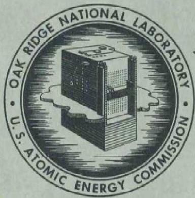
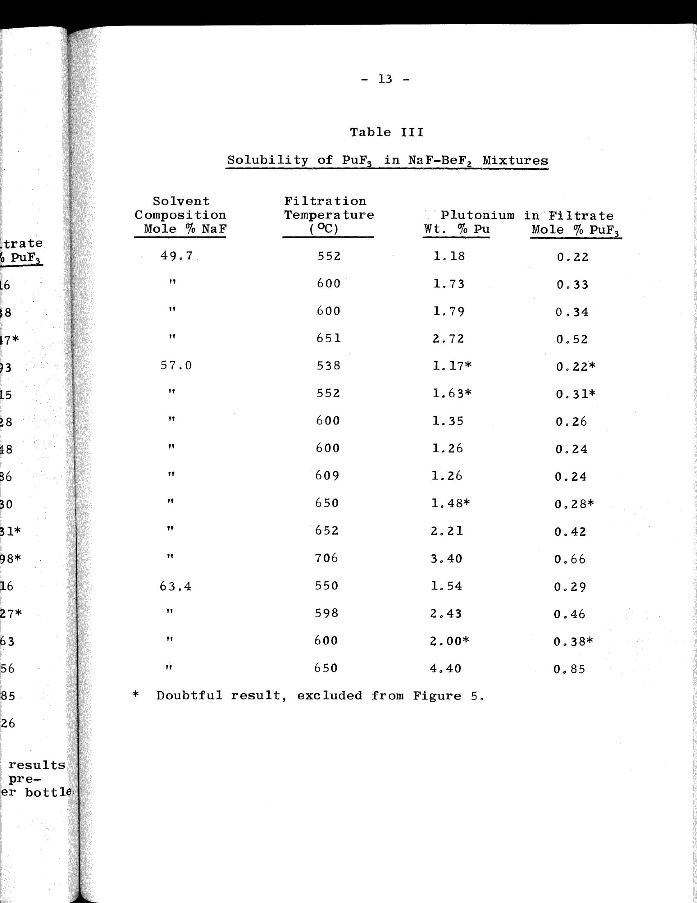
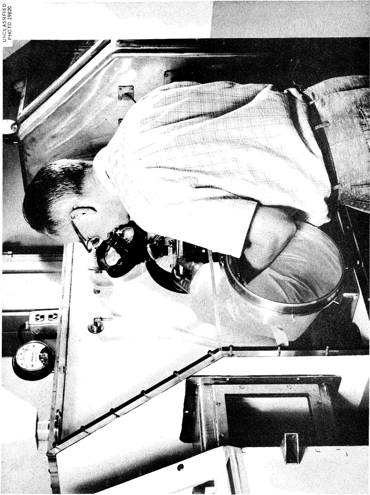
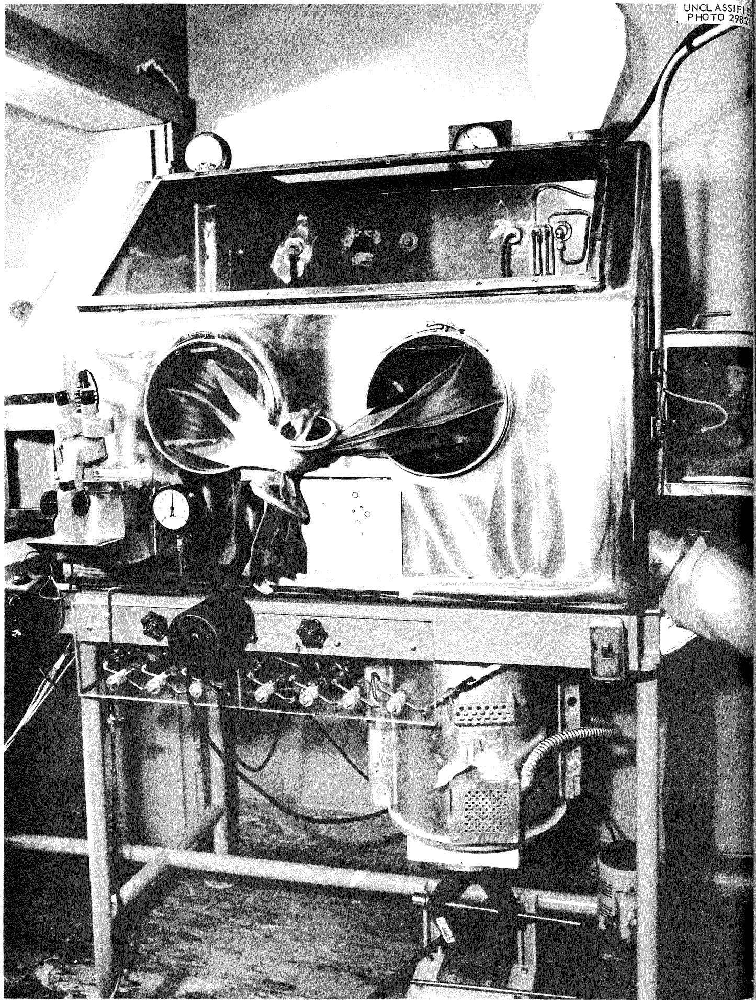
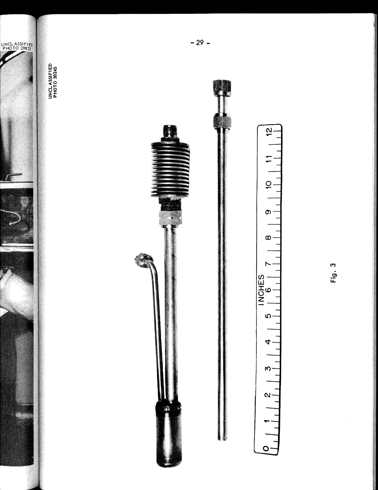
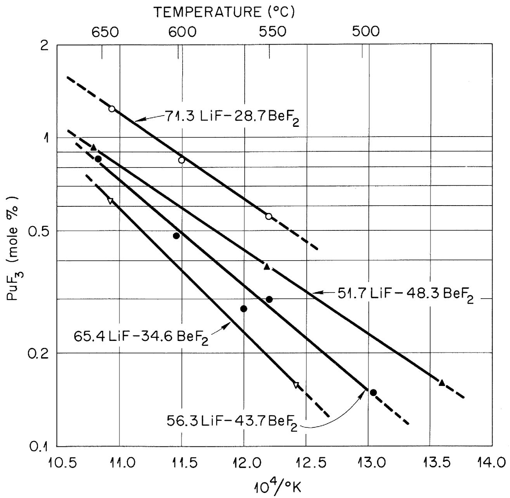
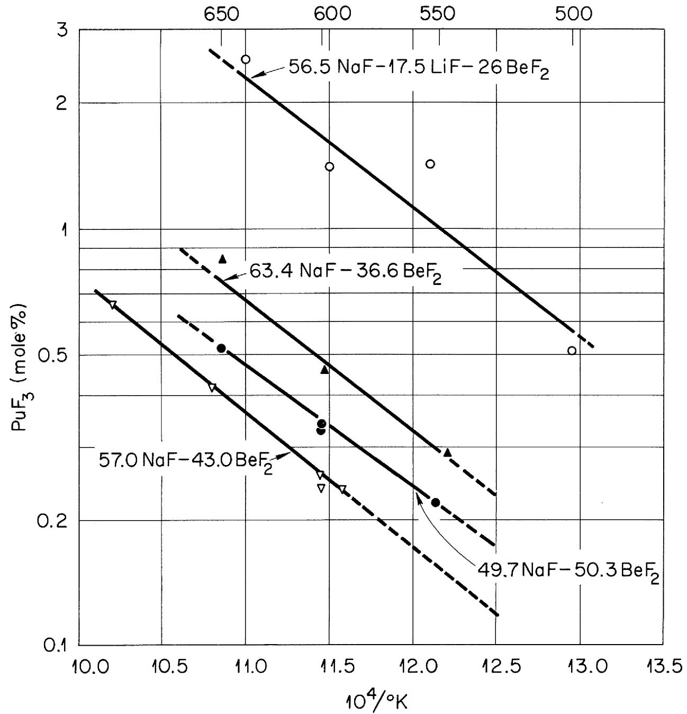
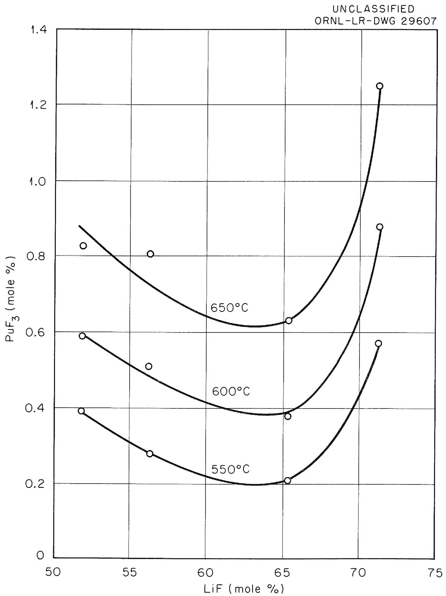
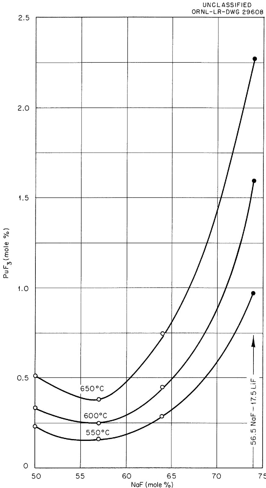
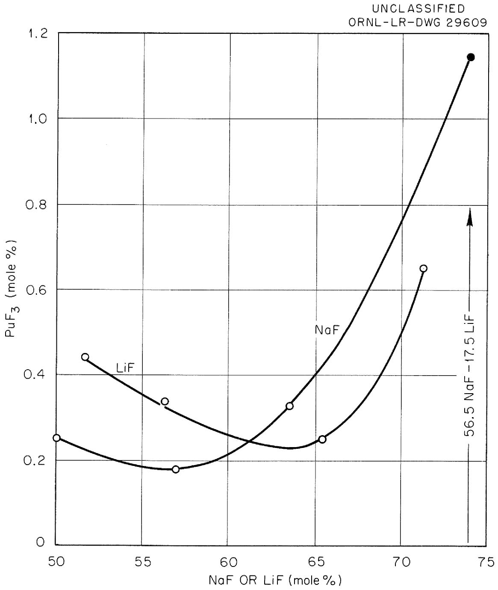

ORNL-2530

Chemistry-General

SOLUBILITY AND STABILITY OF ${\mathrm{{PuF}}}_{3}$ IN

FUSED ALKALI FLUORIDE-BERYLLIUM

FLUORIDE MIXTURES

C.J.Barton

W. R. Grimes

R.A.Strehlow

OAK RIDGE NATIONAL LABORATORY

operated by

UNION CARBIDE CORPORATION

for the

U.S. ATOMIC ENERGY COMMISSION

CENTRAL RESEARCH LIBRARY DOCUMENT COLLECTION

LIBRARY LOAN COPY

DO NOT TRANSFER TO ANOTHER PERSON

If you wish someone else to see this document, send in name with document and the library will arrange a loan.

# ABSTRACT

The solubility of $\mathrm{PuF_3}$ in one NaF-LiF-BeF $_2$ mixture, three NaF-BeF $_2$ mixtures and four LiF-BeF $_2$ mixtures was determined at temperatures ranging from about 550 to $650^{\circ}\mathrm{C}$ . Solubility-composition diagrams for the binary systems at $565^{\circ}\mathrm{C}$ show that in the LiF-BeF $_2$ system a minimum solubility of 0.25 mole $\%$ $\mathrm{PuF_3}$ occurs at about 63 mole $\%$ LiF while in the NaF-BeF $_2$ system the minimum solubility of 0.18 mole $\%$ $\mathrm{PuF_3}$ occurs at approximately 57 mole $\%$ NaF. In both systems, the solubility increases rather slowly on adding $\mathrm{BeF_2}$ to the composition exhibiting minimum solubility but increases quite rapidly on adding alkali fluoride to this composition. The highest solubility observed at $565^{\circ}\mathrm{C}$ was 1.2 mole $\%$ $\mathrm{PuF_3}$ in the mixture NaF-LiF-BeF $_2$ (56.5-17.5-26 mole $\%$ ). In fused LiF-BeF $_2$ - $\mathrm{PuF_3}$ mixtures, the only plutonium species observed with the help of a polarizing microscope was $\mathrm{PuF_3}$ but another compound believed to have the formula $\mathrm{NaPuF_4}$ was found in the fused NaF-BeF $_2$ - $\mathrm{PuF_3}$ mixture containing 64 mole $\%$ NaF and in the mixture resulting from the addition of $\mathrm{PuF_3}$ to the ternary solvent composition. No evidence of disproportionation of $\mathrm{PuF_3}$ was found in the course of the solubility studies.

# SOLUBILITY AND STABILITY OF $\mathbf{PuF}_3$ IN

# FUSED ALKALI FLUORIDE-BERYLLIUM FLUORIDE MIXTURES

C. J. Barton, W. R. Grimes and R. A. Strehlow

# INTRODUCTION

An extensive series of studies conducted by W. R. Grimes and co-workers in the Chemistry Division of Oak Ridge National Laboratory demonstrated that $\mathrm{UF_4}$ can be dissolved in a number of fused fluoride solvents to provide fuel for fused salt reactors. The feasibility of the circulating fused salt reactor concept was established by the successful operation of the Aircraft Reactor Experiment.[2,3] The only fissionable species that have been considered for a fused fluoride burner reactor are $\mathrm{U}^{235}\mathrm{F}_4$ and $\mathrm{U}^{235}\mathrm{F}_3$ but the possibility of a $\mathrm{ThF_4 - U}^{233}\mathrm{F_4}$ fused salt breeder reactor seems promising.[1] Some consideration has also been given to the use of $\mathrm{U}^{235}\mathrm{Cl}_4$ or $\mathrm{U}^{235}\mathrm{Cl}_3$ as the fissionable material in a fast neutron fused salt reactor.[1] Thermodynamic data[4] which indicate that $\mathrm{PuF_3}$ is more stable than $\mathrm{UF_3}$ and that $\mathrm{PuF_4}$ is much more corrosive than $\mathrm{UF_4}$ prompted the choice of $\mathrm{PuF_3}$

1. W. R. Grimes et al., Reactor Handbook, Vol. 2, Section 6, AECD-3646, May 1955.   
2. A. M. Weinberg and R. C. Briant, "Molten Fluorides as Power Reactor Fuels," Nuclear Science and Engineering, 2, 797-803 (1957).   
3. E. S. Bettis, W. B. Cottrell, E. R. Mann, J. L. Meem, and G. D. Whitman, "The Aircraft Reactor Experiment--Operation," Nuclear Science and Engineering, 2, 841-853 (1957).   
4. Alvin Glassner, "The Thermochemical Properties of the Oxides, Fluorides, and Chlorides to $2500^{\mathrm{K}}$ ," ANL-5750.

es

ona1

er of

tors.

pt

ave

5 F

else

able

amic

that

f $\mathbf{PuF}_3$

6,

Power

7-803

and

Oxides,

as the plutonium-bearing species for the first experimental examination of the possibility of using $\mathrm{Pu}_{239}$ as the fissionable material in a fused fluoride power reactor (see Appendix A). It seems reasonable to expect that $\mathrm{PuF}_3$ will not be more corrosive than $\mathrm{UF}_4$ under proposed power reactor conditions but it is recognized that data to support this belief will not be easy to obtain. This report gives the results obtained to date of a preliminary investigation of one aspect of this problem, namely, the solubility and stability of $\mathrm{PuF}_3$ in suitable fused salt solvents. Alkali fluoride-beryllium fluoride systems were used in these studies since they are the only solvents currently of interest in the fused salt power reactor program. The studies included determination of the effect of solvent composition and temperature on the solubility of $\mathrm{PuF}_3$ . The effect of addition of other fluorides on the solubility of $\mathrm{PuF}_3$ in fused LiF- $\mathrm{BeF}_2$ is being studied and will be reported at a later date.

# EXPERIMENTAL

# Equipment

Two glove boxes constructed for fused salt studies are shown in Figures 1 and 2. They are connected by an interchange chamber and constitute an extension of an inter-connected series of negative-pressure glove boxes used by personnel of the Isotopes Division, Oak Ridge National Laboratory, for handling plutonium isotopes separated by use of the calutron. The microscope glove box shown in Figure 1 has plywood back, bottom

and sides while the front and top are made of clear plastic material for maximum visibility. The eyepiece of a Zeiss polarizing microscope protrudes through an opening in the slanting front of the glove box which is sealed with an airtight bellows arrangement permitting vertical movement of the eye piece. The microscope support is constructed of transparent plastic material to facilitate observation of objects beneath the microscope which are illuminated with light from a bulb in the base of the microscope. The microscope glove box is a modification of one used at Los Alamos Scientific Laboratory for microscopic examination of highly toxic materials. The stainless steel glove box shown in Figure 2 is a modification of a muffle box built for plutonium isotope work. Some of the more interesting features of this glove box are: (1) A heating well consisting of a $1-1/2''$ length of $6''$ I.D. pipe welded around an opening in the bottom of the box and connected to an $8''$ length of $4''$ I.D. pipe closed at the bottom. The interior of the well is heated to a maximum of approximately $800^{\circ}\mathrm{C}$ by means of a $5''$ I.D. 2700-watt tube furnace mounted on a jack beneath the box so that it can be lowered to facilitate rapid cooling of the well. The box is kept cool by water flowing through a copper coil soldered to the bottom of the box around the well. (2) A discharge chute consisting of a $12''$ length of $4''$ I.D. pipe welded to the right side of the box at an angle of $60^{\circ}$ from the vertical, loosely sealed on the inside of the box by a sliding door and tightly

sealed at the other end by a long plastic sock which is also used to encase materials removed from the box. This discharge arrangement is similar to that used on a number of glove boxes at Los Alamos Scientific Laboratory. (3) A small protrusion on the front of the box at the left side having a glass top over which a low-power long focal length (9X and 18X) binocular microscope and light is mounted for examination of objects inside the box. (4) Sodium fluoride traps (not visible in Figure 2) mounted inside of the box on the back wall, consisting of two 30" lengths of 3" I.D. copper tubing filled with 1/8" NaF pellets to remove HF from exhaust gases. The first one of the traps connected in series is heated to $100^{\circ}\mathrm{C}$ by means of a heating coil to prevent caking of the NaF through formation of HF-rich complexes, while the second trap is unheated in order to effect more complete removal of HF.

The pressure in the boxes is maintained $1/2$ to $1"$ of water below that of the laboratory by means of an exhaust system. Air filtered through a CWS filter can be alternately supplied to the box from the room ( $50\%$ RH), from an "Lectrodryer" (approximately $15\%$ RH) or from a drying tower packed with Drierite (moisture content not determined). Bellows-type valves mounted on a panel below the front face of the box control admission of argon, $95\%$ argon- $5\%$ hydrogen mixture, HF, and vacuum to apparatus within the box. The argon-hydrogen mixture was used to supply a reducing atmosphere over the melts instead of pure hydrogen because of safety considerations. The gas tanks and

vacuum pump are located outside of the laboratory.

# Materials

Plutonium trifluoride used in these studies was high-purity material supplied by Los Alamos Scientific Laboratory. Solvent mixtures were purified prior to being introduced into the glove box by treating fused mixtures with gaseous HF and $\mathbf{H}_2$ at about $800^{\mathrm{OC}}$ and cooling under an inert atmosphere. The composition of some of the purified mixtures was modified either by addition of crystalline $\mathrm{BeF}_2$ purified by the above-described procedure or by addition of Harshaw optical grade LiF.

# Apparatus

A picture of the filtration apparatus used in this investigation is shown in Figure 3. This apparatus is a modification of that used earlier in these laboratories for solubility determinations,\* the main change being a reduction in the diameter of the sample container in order to permit smaller charges to be used. The copper bellows permit the filter medium to be kept out of contact with the charge material prior to the actual filtration in order to minimize clogging of the filter medium. The apparatus shown in Figure 3 was assembled by heliarc welding in the Special Services Shop of the Y-12 Plant. An improved version of the apparatus used for the last few experiments performed was assembled in the Welding and Brazing Facility, ORNL,

by brazing the top part together with gold-nickel alloy in a hydrogen atmosphere at about $1000^{\circ}\mathrm{C}$ . This procedure permitted use of thin-wall tubing for the thermocouple well and also effected removal of oxide film from the nickel surfaces.

The temperature of the melt surrounding the tip of the thermocouple well was measured and controlled by means of a platinum-platinum $10\%$ rhodium thermocouple connected to a Brown proportional controller. It was recorded on a $300 - 1000^{\circ}\mathrm{C}$ recorder. A portable potentiometer provided an e.m.f. to keep the recorder on scale while the temperature was below $300^{\circ}\mathrm{C}$ and was also used to check the potential of the thermocouple junction. The recorder and potentiometer readings generally agreed within $2^{\circ}\mathrm{C}$ . The temperature near the center of the furnace heating coils was indicated on a Brown Protect-O-Vane controller.

The temperature of the heated NaF trap was measured and controlled by means of a chromel-alumel thermocouple, in a thermocouple well extending from the center of one end of the trap to a point near the middle, connected to a Brown Pyr-O-Vane controller.

# Experimental Procedure

The filtration apparatus (Figure 3) was first connected to the gas tanks and vacuum pump through the manifold system below the stainless steel glove box (Figure 2) and vacuum tested at room temperature. After a vacuum of about 50 microns was obtained, the filter stick was removed and charge material consisting of 5.0 to 5.5 grams of solvent mixture and enough $\mathrm{PuF}_5$

to give 6.0 grams total charge was transferred from plastic vials into the filter apparatus through a long-neck metal funnel. The ratio of solvent to $\mathrm{PuF_3}$ was adjusted to provide at least twice the amount of $\mathrm{PuF_3}$ that was expected to be dissolved. After the filter stick was replaced, the filter apparatus was re-connected and vacuum tested. It was then filled with argon-hydrogen mixture introduced through the filter stick, which was positioned so that its lower end was close to the fused salt mixture, providing reducing atmosphere to help keep the plutonium in the trivalent state. Argon-hydrogen mixture was used in preference to pure hydrogen because of safety considerations. Gaseous HF was mixed with the argon-hydrogen mixture before the temperature of the filter bottle reached $250^{\circ}\mathrm{C}$ in order to minimize hydrolysis resulting from adsorbed water on the surface of the fused salt and $\mathrm{PuF_3}$ crystals or to reconvert any hydrolysis products to fluorides.

The filter bottle and contents were held at the desired filtration temperature $\pm 5^{\circ}\mathrm{C}$ for two hours with a slow flow of the mixed gases over the surface of the liquid and then filtration was effected by applying a vacuum to the filter stick and argon pressure of 3 to 6 lbs to the surface of the liquid while the bellows was compressed to bring the filter stick into contact with the liquid for a period of 5 to 10 minutes. The filtrate and residue were allowed to cool slowly to room temperature in an argon atmosphere. The filter stick was then removed

and cut into sections for removal of the filtrate. A new charge of solvent and $\mathrm{PuF_3}$ was added to the residue from the previous filtration, a new filter stick was inserted in the apparatus and the above filtration procedure was repeated at a different temperature. After the required number of filtrations had been completed with each solvent composition, the filter bottle was cut open and the residue from the final filtration experiment was removed for examination and analysis.

A variation of the above-described procedure was used in filtration experiments with one solvent (71.3 LiF-28.7 $\mathrm{BeF}_2$ ). Flexible hose connections were placed in the three gas lines leading to the filtration apparatus. This permitted the filter bottle to be withdrawn from the furnace at the conclusion of the filtration period while argon gas was still being pulled through the filter stick, causing the filter bottle and contents to cool quite rapidly (approximately $100^{\circ}$ per minute between 600 and $300^{\circ}\mathrm{C}$ ). This procedure eliminated any possibility of a portion of the filtrate running through the filter medium during the cooling period and it had the advantage of making the filtrate available for examination at room temperature about 30 minutes after the end of the filtration. It was also possible with this arrangement to agitate the contents of the filter bottle by moving the apparatus up and down. The principal disadvantages are the hazards associated with the handling of hot objects in the glove box and the extremely small crystal size of the

rapidly cooled mixtures which makes microscopic identification of crystals difficult.

# Results

Table I gives the composition of solvent mixtures which were analyzed chemically. The first column shows the nominal or intended composition of the mixtures while the last column shows the composition calculated from analytical data. The composition of solvent mixtures not included in Table I was calculated.

Solubility data obtained with LiF-BeF $_2$ mixtures are given in Table II; NaF-BeF $_2$ solubility data are contained in Table III; and the solubility of $\mathrm{PuF_3}$ in one NaF-LiF-BeF $_2$ mixture is shown in Table IV. The data are shown graphically in Figures 4 and 5, omitting doubtful results, as a plot of the log of the molar concentration of $\mathrm{PuF_3}$ versus $1 / T$ ( $^0\mathrm{K}$ ). Figure 6 shows solubility data at three temperatures as a function of solvent composition for LiF-BeF $_2$ mixtures while Figure 7 shows a similar plot for NaF-BeF $_2$ compositions. The data obtained with the ternary mixture (Table IV) were used to extend the data in Figure 7 by considering $56.5\%$ NaF and $17.5\%$ LiF as equivalent to 74 mole $\%$ NaF. A comparison of the two systems, using interpolated solubility values at $565^{\circ}\mathrm{C}$ is shown in Figure 8, again using data on the ternary system to extend the NaF-BeF $_2$ curve.

Dissolved portions of seven samples were examined spectrophotometrically for $\mathsf{Pu}^{+4}$ content. No $\mathsf{Pu}^{+4}$ was detected in any of the samples. The limit of detection varied from 0.2 to $3.0\%$ ,

Table I Composition of Solvent Mixtures   

<table><tr><td>Nominal Composition (mole %)</td><td>Na or Li (Wt. %)</td><td>Be (Wt. %)</td><td>Calculated Composition (mole %)</td></tr><tr><td>50 NaF-50 BeF2</td><td>25.32</td><td>10.06*</td><td>49.7 NaF=50.3 BeF2</td></tr><tr><td>57 NaF-43 BeF2</td><td>29.14</td><td>8.64*</td><td>57.0 NaF=43.0 BeF2</td></tr><tr><td>64 NaF-36 BeF2</td><td>33.12</td><td>7.48*</td><td>63.4 NaF=36.6 BeF2</td></tr><tr><td>66.7 LiF-33.3 BeF2</td><td>14.47</td><td>8.80*</td><td>68.1 LiF=31.9 BeF2</td></tr><tr><td>50 LiF-50 BeF2</td><td>9.90</td><td>12.0</td><td>51.7 LiF=48.3 BeF2</td></tr><tr><td>56 LiF-44 BeF2</td><td>10.98</td><td>11.12*</td><td>56.3 LiF=43.7 BeF2</td></tr><tr><td>56 NaF-16 LiF-28 BeF2</td><td>30.86 Na 2.89 Li</td><td>5.98*</td><td>56.5 NaF=17.5 LiF=26.0 BeF2</td></tr></table>

* Average of results obtained by two laboratories.

Table II   
Solubility of $\mathsf{PuF}_3$ in LiF-BeF2 Mixtures   

<table><tr><td>Solvent Composition Mole % Li</td><td>Filtration Temperature (℃.)</td><td>Plutonium Wt. % Pu</td><td>in Filtrate Mole % PuF3</td></tr><tr><td>51.7</td><td>463</td><td>1.02</td><td>0.16</td></tr><tr><td>&quot;</td><td>549</td><td>2.44</td><td>0.38</td></tr><tr><td>&quot;</td><td>599</td><td>2.96*</td><td>0.47*</td></tr><tr><td>&quot;</td><td>654</td><td>5.76</td><td>0.93</td></tr><tr><td>56.3</td><td>494</td><td>1.04**</td><td>0.15</td></tr><tr><td>&quot;</td><td>560</td><td>1.89**</td><td>0.28</td></tr><tr><td>&quot;</td><td>602</td><td>3.15**</td><td>0.48</td></tr><tr><td>&quot;</td><td>653</td><td>5.47**</td><td>0.86</td></tr><tr><td>&quot;</td><td>550</td><td>1.98</td><td>0.30</td></tr><tr><td>&quot;</td><td>599</td><td>2.04*</td><td>0.31*</td></tr><tr><td>&quot;</td><td>649</td><td>6.24*</td><td>0.98*</td></tr><tr><td>65.4</td><td>532</td><td>1.15</td><td>0.16</td></tr><tr><td>&quot;</td><td>600</td><td>1.78*</td><td>0.27*</td></tr><tr><td>&quot;</td><td>643</td><td>4.30</td><td>0.63</td></tr><tr><td>71.3</td><td>546</td><td>4.00</td><td>0.56</td></tr><tr><td>&quot;</td><td>597</td><td>5.90</td><td>0.85</td></tr><tr><td>&quot;</td><td>650</td><td>8.48</td><td>1.26</td></tr></table>

* Doubtful result, excluded from Figure 4.   
** Results obtained with a pre-fused mixture. Other results with this composition were obtained with mixtures prepared by mixing LiF, $\mathsf{Li}_2\mathsf{BeF}_4$ and $\mathsf{PuF}_3$ in the filter bottle.

Solubility of $\mathsf{PuF}_3$ in NaF-LiF-BeF $_2$ (56.5-17.5-26 mole %)

Table IV   

<table><tr><td>Filtration Temperature (℃)</td><td>Plutonium Wt. % Pu</td><td>in Filtrate Mole % PuF3</td></tr><tr><td>500</td><td>2.92</td><td>0.51</td></tr><tr><td>554</td><td>7.68</td><td>1.43</td></tr><tr><td>565</td><td>2.61*</td><td>0.46*</td></tr><tr><td>600</td><td>7.59</td><td>1.41</td></tr><tr><td>634</td><td>13.0</td><td>2.58</td></tr><tr><td>655</td><td>6.45*</td><td>1.18*</td></tr></table>

* Doubtful result, excluded from Figure 5.

depending upon the plutonium concentration in the samples and the size of the sample analyzed. Since these results, coupled with a careful examination of each sample by means of the petrographic microscope, demonstrated that all of the plutonium in these samples was in the trivalent form, other samples were analyzed chemically only for total plutonium content but microscopic examination of the samples continued. A summary of the petrographic observations made by R. A. Strehlow is contained in Appendix B.

Since $\mathrm{Pu}^{+4}$ produced by disproportionation of $\mathrm{PuF}_3$ could have been reduced by hydrogen in the atmosphere above the melt or by the nickel walls of the container, it seemed advisable to look for other evidence of the absence of disproportionation of $\mathrm{PuF}_3$ . In similar studies with $\mathrm{UF}_3$ -containing melts, U metal resulting from disproportionation of $\mathrm{UF}_3$ was found to have alloyed with the container wall. In order to determine whether a similar alloying effect occurred when $\mathrm{PuF}_3$ -containing melts were in contact with nickel, the bottom section of two welded nickel filter bottles (Figure 3) that had been in contact with such melts were scraped as clean as possible and analyzed for total plutonium content. One sample had contacted a mixture of NaF, $\mathrm{BeF}_2$ and $\mathrm{PuF}_3$ at $600^{\circ}\mathrm{C}$ for two hours while the other had contacted a similar mixture at temperatures varying from 550 to $650^{\circ}\mathrm{C}$ for approximately eight hours. The plutonium found in the two samples, amounting to 0.05 and 0.17 mg respectively, could

be accounted for by the trace of fused salt remaining on the nickel. No evidence of disproportionation of $\mathrm{PuF}_3$ in fused alkali fluoride-beryllium fluoride melts under the conditions maintained in these solubility studies has been observed to date. Discussion

Straight lines correlate the data in Figures 4 and 5 within the limits of reproducibility of the results. Changes in composition of the solvent mixtures seem to have little effect on the slope of the lines. It appears, therefore, that the heat of solution of $\mathrm{PuF}_3$ in these solvents is essentially constant for the temperature and composition ranges studied.

The solubility-composition plots, Figures 6, 7, and 8, show that the solubility of $\mathrm{PuF_3}$ in the melts goes through a minimum with a sharp increase on the alkali fluoride side and a gradual increase on the $\mathrm{BeF_2}$ side of the minimum. This result is not unexpected since the $\mathrm{BeF_2 - PuF_3}$ eutectic probably contains a very low concentration of $\mathrm{PuF_3}$ while the alkali fluoride- $\mathrm{PuF_3}$ eutectics almost certainly contain a much higher $\mathrm{PuF_3}$ concentration.

Inspection of Figure 8 and the phase diagrams of the binary systems $\mathrm{LiF - BeF}_2^5$ and $\mathrm{NaF - BeF}_2^6$ shows that a higher solubility

5. D. M. Roy, R. Roy, and E. F. Osborn, J. Ceram. Soc. 37, 300 (1954); Novoselova, Simanov, and Yarembash, J. Phys. Chem. USSR, 26, 1244 (1952).   
6. D. M. Roy, R. Roy, and E. F. Osborn, J. Ceram. Soc., 33, 85 (1950); Ibid, 36, 185 (1953); E. Thilo and H. Schroder, Z. physik. chem., 197, 41 (1951).

of $\mathrm{PuF}_3$ at $565^{\circ}\mathrm{C}$ can be achieved in the LiF-BeF $_2$ system than in the NaF-BeF $_2$ system for solvent mixtures having the same liquidus temperature. For example, the LiF-BeF $_2$ mixture containing 69 mole % LiF which is liquid at $520^{\circ}\mathrm{C}$ , will dissolve about 0.50 mole % of $\mathrm{PuF}_3$ at $565^{\circ}$ while the comparable NaF-BeF $_2$ mixture melting at $520^{\circ}\mathrm{C}$ contains 62.5 mole % NaF and will hold 0.26 mole % $\mathrm{PuF}_3$ in solution at $565^{\circ}$ . If much more than 0.5 mole % $\mathrm{PuF}_3$ is needed for a circulating fuel reactor having a minimum temperature of $565^{\circ}$ , it may be necessary to resort to a ternary solvent in order to keep the liquidus temperature of the solvent at an acceptably low figure.

Approximation $25\%$ of the filtration data recorded in Tables II, III, and IV (those results marked with asterisks) were excluded from Figures 4 and 5 and some of the points in these graphs do not lie very close to the lines. This scatter of data reflects to some extent the difficulty in obtaining equilibrium data with small amounts of fused salts. It was desirable to use small amounts of materials for these experiments because of neutron production in plutonium-beryllium fluoride melts. However, an analysis of factors having a possible influence on the results may be of help in evaluating the data. Low results could be due to failure to saturate the solvent because of inadequate equilibration time, absence of a means of agitation (see page 9), or lack of a sufficient amount of $\mathrm{PuF}_3$ in the mixture. There are two fairly obvious explanations of high results. A temperature gradient is known to

exist in the heated zone occupied by the filter bottle during filtration experiments, with the temperature decreasing in going from the bottom to the top of the chamber. If the thermocouple junction was above the surface of the liquid in the filter bottle, the temperature indicated by the thermocouple was probably lower than that of the liquid. Some of the filter bottles used in these studies had thermocouple wells too short to reach the surface of the liquid and it is also possible that errors in the determination of the temperature of the melts resulted from the thermocouple being inadvertently pulled part way out of the thermocouple well. The other possibility is that a portion of the solvent or a low-melting ternary eutectic having a lower plutonium content than that of the original filtrate ran back through the filter after partial solidification of the filtrate occurred. (See Experimental Procedure, p. 7)

Confidence in plutonium values reported by the analytical laboratory was strengthened by having a number of samples reanalyzed under different sample designations. The results, shown in Appendix C, indicate that satisfactory reproducibility was obtained although the differences for some samples were greater than expected from the precision of the potentiometric plutonium determination. It is possible that some of the early samples which were ground but not sieved were not entirely homogeneous.

# Acknowledgments

The writers are grateful to F. N. Case of the Isotopes Division of ORNL, for help in planning the glove boxes used in this investigation; to R. J. Sheil, Chemistry Division, ORNL, for designing the gas manifold system; to H. Insley, Consultant, ORNL, for help in designing the microscope glove box; to personnel of the Analytical Division of ORNL under the direction of L. T. Corbin, J. H. Cooper and W. R. Laing for performing the numerous analyses required in these studies; and to personnel of the Los Alamos Scientific Laboratory including R. D. Baker, W. J. Maraman, Charles Metz and K. W. R. Johnson for helpful advice during the planning stage of the project and for furnishing the high purity $\mathrm{PuF}_3$ used in this investigation.

# Appendix A

Thermodynamic Calculations for Reactions at $1000^{\mathrm{O}}\mathrm{K}$ .

<table><tr><td>Reaction</td><td>ΔF for Reaction as written (k Cal)</td><td>ΔF per Gm. Atom of F, k Cal</td></tr><tr><td>4UF3→ 3UF4+ UO</td><td>+ 12</td><td>+ 1.0</td></tr><tr><td>4PuF3→ 3PuF4+ PuO</td><td>+ 214</td><td>+ 18</td></tr><tr><td>2UF4+ CrO→ 2UF3+ CrF2</td><td>+ 31</td><td>+ 3.9</td></tr><tr><td>2UF3+ 3CrO→ 2UO+ 3CrF2</td><td>+ 120</td><td>+ 20</td></tr><tr><td>2PuF4+ CrO→ 2PuF3+ CrF2</td><td>- 80</td><td>- 10</td></tr><tr><td>2PuF3+ 3CrO→ 2PuO+ 3CrF2</td><td>+ 194</td><td>+ 32</td></tr></table>

# Appendix B

R. A. Strehlow

Optical Properties of Fluoride Mixtures Containing $\mathsf{PuF}_3$

Petrographic examinations were carried out on filtrates and residues obtained in the study with a principal objective of identifying the plutonium containing phase. All of the slide preparations for the work were made in a glove-port plexi-glas box (Figure 1) in which was mounted a polarizing microscope. The optical character of the various plutonium compounds permitted distinction to be made from the crystals of the various solidified solvents. The solvents generally contained one or more of the compounds: $\mathrm{Li}_2\mathrm{BeF}_4$ , $\mathrm{Na}_2\mathrm{BeF}_4$ , $\mathrm{NaBeF}_3$ , $\mathrm{LiBeF}_3$ , $\mathrm{BeF}_2$ . All of these compounds have refractive indices of less than 1.4.

Inasmuch as the plutonium phases had much higher refractive indices an initial observation was made of the growth form of all phases of higher index by examining the crushed specimen in an oil with a refractive index of about 1.35. Under these conditions all phases of appreciably higher index appear quite heavily bordered and are easily located in the microscope field. Observation of the color and birefringence of the phase indicated which of the possible compounds con

taining plutonium was present: Pu(III) fluorides are blue and Pu(IV) fluorides tan. (No $\mathrm{PuF_4}$ was observed in the filtrates or residues in this study.) The maximum birefringence of $\mathrm{PuF_3}$ observed in this study is about 0.003. The interference color (observed with crossed polarizing discs) is approximately that of the crystal observed in "white" light, pale blue. The compound $\mathrm{NaPuF_4}$ appears reddish blue and has a maximum birefringence of about 0.02. The optical properties of these compounds are compared in Table B-1 with those of some $\mathrm{Ce^{+3}}$ , $\mathrm{U^{+3}}$ , and $\mathrm{U^{+4}}$ compounds.

The $\mathrm{Pu(III)}$ ion is about the same size as the Ce(III) and U(III) ions and differs from them in its polarizability which is, of course, shown by the differences in refractive indices.

The most common growth form of $\mathrm{PuF_3}$ as crystallized from the solvents used in the study was that of thin sheets which could be observed with their maximum birefringence only when they existed as platy inclusions in the solvent crystals. Under these conditions they exhibited their maximum birefringence and parallel extinction. No compound was found which could be considered a LiF- $\mathrm{PuF_3}$ binary compound in LiF $\mathrm{BeF_2 - PuF_3}$ melts and no change in the refractive index of $\mathrm{PuF_3}$ was seen which would indicate solid solution of LiF in the $\mathrm{PuF_3}$ .

The growth form of the $\mathrm{PuF}_3$ is strongly dependent on the

Table B-1   
Refractive Indices and Optical Character of Some   
Plutonium, Cerium, and Uranium Fluorides   

<table><tr><td></td><td>ηε</td><td>ηω</td><td>Description</td></tr><tr><td>PuF3</td><td>1.683</td><td>1.685</td><td>Uniaxial (-); blue*</td></tr><tr><td>UF3</td><td colspan="2">~2</td><td>Isotropic; red</td></tr><tr><td>CeF3</td><td>1.607</td><td>1.613</td><td>Uniaxial (-); colorless</td></tr><tr><td></td><td>ηα</td><td>ηγ</td><td>Description</td></tr><tr><td rowspan="2">PuF4</td><td>1.577</td><td>1.629</td><td rowspan="2">2ν = -65°</td></tr><tr><td>pink</td><td>green-brown</td></tr><tr><td rowspan="2">UF4</td><td>1.550</td><td>1.594</td><td rowspan="2">2ν = -57°</td></tr><tr><td>blue-green</td><td>green-brown</td></tr><tr><td></td><td>ηω</td><td>ηε</td><td>Description</td></tr><tr><td>NaUF4</td><td>1.552</td><td>1.564</td><td>Uniaxial (+)</td></tr><tr><td>NaPuF4</td><td>1.534</td><td>1.552</td><td>Uniaxial (+) (length slow)</td></tr><tr><td>NaCeF4</td><td>1.494</td><td>1.512</td><td>Uniaxial (+)</td></tr></table>

* The sign of $\mathbf{PuF}_3$ as observed in this work does not agree with that listed by E. Staritsky and A. L. Truitt in "The Actinide Elements," NNES, IV-14A, McGraw-Hill Book Co.

cooling rate and is described in Table B-2.

Table B-2

The Effect of Extremes in Cooling Rates On Appearance of $\mathsf{PuF}_3$ in LiF-BeF2 Mixtures

# Rate

# Appearance

# Rapid

Asterisms $< 5\mu$ across frequently imbedded in glassed solvent. Occasional identifiable crystals near $3 - 8\mu$ in diameter.

# Slow

Large plates ( $>50\mu$ across, $5\mu$ thick) giving the uniaxial (-) interference figure; solvent well crystallized.

A sample prepared by mixing LiF-NaF-PuF₃ (50-33.3-16.7 mole %) was examined petrographically after fusing. A large amount of a plutonium containing phase, LiF crystals, and NaF-LiF eutectic aggregates were observed. Since the plutonium compound was found only in mixtures containing sodium fluoride and since the optical properties were similar to those for the known compounds NaCeF₄ and NaUF₄, this plutonium compound was designated as NaPuF₄.

It is interesting to note that $\mathrm{NaPuF_4}$ was observed as the sole plutonium containing phase in the filtrate from the mixture NaF-LiF-BeF $_2$ (56.5-17.5-26 mole %). Some $\mathrm{NaPuF_4}$ was seen in the residue from the mixture containing 64 mole % NaF but not in the filtrate. This indicates that the isotherms as shown in Figure 7 probably cross the $\mathrm{NaPuF_4 - PuF_3}$ primary phase field

boundary at a relative composition of very near 64-36 mole NaF per mole $\mathrm{BeF}_2$ . $\mathrm{PuF}_3$ was observed in both filtrates and residues of other NaF content.

A comparison was made of transmission spectra by means of a Leitz pupillary spectroscope. The principal difference between $\mathrm{NaPuF_4}$ and $\mathrm{PuF_3}$ is an absorption band between $6500\textup{\AA}$ and $6650\textup{\AA}$ for $\mathrm{PuF_3}$ which exists at $6660\textup{\AA}$ to $6800\textup{\AA}$ for $\mathrm{NaPuF_4}$ . For the $\mathrm{PuF_3}$ there is also more transmission between $5200\textup{\AA}$ and $6000\textup{\AA}$ which presumably accounts for the difference in color between $\mathrm{NaPuF_4}$ and $\mathrm{PuF_3}$ .

# Appendix C

Analysis of Re-submitted Samples   

<table><tr><td>Original Sample</td><td>% Pu</td><td>Re-Check</td><td>% Pu</td></tr><tr><td>A5</td><td>1.36</td><td>G2</td><td>1.33</td></tr><tr><td>B5</td><td>1.41</td><td>E8-C9</td><td>1.15-1.22</td></tr><tr><td>A7</td><td>2.16</td><td>G3</td><td>2.25</td></tr><tr><td>B3</td><td>1.37</td><td>G6</td><td>1.60</td></tr><tr><td>D6</td><td>1.77</td><td>G7</td><td>1.68</td></tr><tr><td>B7</td><td>1.82</td><td>H3</td><td>1.74</td></tr><tr><td>E7</td><td>2.88</td><td>H8</td><td>3.03</td></tr></table>

  
UNCLASSIFIED PHOTO 30245  
Fig. 2

UNCLASSIFIED

ORNL-LR-DWG 29605

  
Fig. 4. Solubility of $\mathsf{PuF}_3$ as a Function of Temperature for LiF-BeF $_2$ Solvents.

-31-

UNCLASSIFIED

ORNL-LR-DWG 29606

  
TEMPERATURE $(^{\circ}C)$   
Fig. 5. Solubility of $\mathsf{PuF}_3$ as a Function of Temperature for NaF-BeF $_2$ and NaF-LiF-BeF $_2$ Solvents.

  
Fig. 6. Solubility of $\mathsf{PuF}_3$ as a Function of Solvent Composition for LiF-BeF $_2$ Mixtures.

  
Fig. 7. Solubility of PuF3 as a Function of Solvent Composition for NaF-BeF $_2$ Mixtures.

# INTERNAL DISTRIBUTION

1. C. E. Center   
2. Biology Library   
3. Health Physics Library

4-5. Central Research Library   
6. Reactor Experimental Engineering Library   
7-26. Laboratory Records Department   
27. Laboratory Records, ORNL R.C.   
28. A. M. Weinberg   
29. L. B. Emlet (K-25)   
30. J. P. Murray (Y-12)   
31. J. A. Swartout   
32. E. H. Taylor   
33. E. D. Shipley   
34. S. C. Lind   
35. M. L. Nelson   
36. C. P. Keim   
37. J. H. Frye, Jr.   
38. R. S. Livingston   
39. H. G. MacPherson   
40. F. L. Culler   
41. A. H. Snell   
42. A. Hollander   
43. M. T. Kelley   
44. K. Z. Morgan   
45. T. A. Lincoln   
46. A. S. Householder   
47. C. S. Harrill   
48. C. E. Winters   
49. D. W. Cardwell   
50. D. Phillips   
51. F. C. VonderLage   
52. D. S. Billington   
53. J. A. Lane   
54. M. J. Skinner   
55. W. H. Jordan   
56. G. E. Boyd   
57. C. J. Barton   
58. J. P. Blakely   
59. M. Blander   
60. F. F. Blankenship   
61. C. M. Blood   
62. S. Cantor   
63. R. B. Evans   
64. H. A. Friedman   
65. R. A. Gilbert   
66. W. R. Grimes   
67. H. Insley   
68. F. Kertesz   
69. S. Langer

70. R. E. Moore   
71. G. J. Nessle   
72. R. F. Newton   
73. L. G. Overholser   
74. J. D. Redman   
75. J. H. Shaffer   
76. R. J. Sheil   
77. N. V. Smith   
78. R. A. Strehlow   
79. B. J. Sturm   
80. R. E. Thoma   
81. W. T. Ward   
82. G. M. Watson   
83. C. F. Weaver   
84. M. A. Bredig   
85. S. Datz   
86. R. E. Minturn   
87. A. S. Dworkin   
88. G. P. Smith   
89. M. T. Robinson   
90. A. J. Miller   
91. L. G. Alexander   
92. R. R. Dickison   
93. G. W. Keilholtz   
94. W. D. Manly   
95. A. F. Fraas   
96. L. E. Mann   
97. F. R. Bruce   
98. E. S. Bettis   
99. R. P. Milford   
00. R. A. Charpie   
01. W. K. Ergen   
02. R. B. Lindauer   
03. J. C. White   
04. A. S. Meyer   
05. W. F. Vaughn   
06. D. E. Ferguson   
07. R. E. Blanco   
08. J. T. Long   
09. G. I. Cathers   
10. W. H. Carr, Jr.   
11. H. E. Goeller   
12. J. O. Blomeke   
13. J. Ricci (consultant)   
14. C. E. Larson (consultant)   
15. P. H. Emmett (consultant)   
16. H. Eyring (consultant)   
17. G. T. Seaborg (consultant)   
18. ORNL - Y-12 Technical Library, Document Reference Section

# EXTERNAL DISTRIBUTION

119. Division of Research and Development, AEC, ORO 120-674. Given distribution as shown in TID-4500 (13th ed., Rev., Feb. 15, 1958) under Chemistry-General category (75 copies - OTS)