AEC RESEARCH AND DEVELOPMENT REPORT

DECLASSIFIED

CLASSIFICATION CHANGED TO:

BY AUTHORITY OF:

${By} : \frac{1}{6}a = \frac{1}{2}b - \frac{3}{5}c + 1$

A ZERO POWER REFLECTOR-MODERATED

REACTOR EXPERIMENT AT ELEVATED TEMPERATURE

D. Scott

G. W. Alwang

E. F. Demski

W. J. Fader

E. V. Sandin

R. E. Malenfant

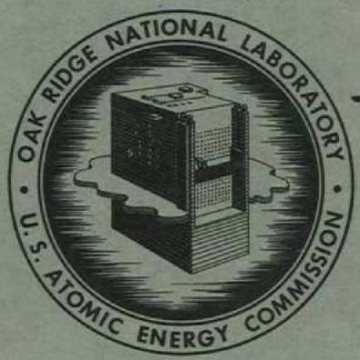

CENTRAL RESEARCH LIBRARY DOCUMENT COLLECTION

LIBRARY LOAN COPY

DO NOT TRANSFER TO ANOTHER PERSON

If you wish someone else to see this document, send in name with document and the library will arrange a loan.

OAK RIDGE NATIONAL LABORATORY

operated by

UNION CARBIDE CORPORATION

for the

U.S. ATOMIC ENERGY COMMISSION

# LEGAL NOTICE

This report was prepared as an account of Government sponsored work. Neither the United States, nor the Commission, nor any person acting on behalf of the Commission:

A. Makes any warranty or representation, express or implied, with respect to the accuracy, completeness, or usefulness of the information contained in this report, or that the use of any information, apparatus, method, or process disclosed in this report may not infringe privately owned rights; or   
B. Assumes any liabilities with respect to the use of, or for damages resulting from the use of any information, apparatus, method, or process disclosed in this report.

As used in the above, "person acting on behalf of the Commission" includes any employee or contractor of the Commission to the extent that such employee or contractor prepares, handles or distributes, or provides access to, any information pursuant to his employment or contract with the Commission.

ORNL-2536

C-84-Reactors-Special Features

of Aircraft Reactors

This document consists of 100 pages

Copy 4 of 214 copies. Series A

Contract No. W-7405-eng-26

Applied Nuclear Physics Division

A ZERO POWER REFLECTOR-MODERATED REACTOR EXPERIMENT AT ELEVATED TEMPERATURE

Dunlap Scott, G. W. Alwang,\* E. F. Demski,\*

W. J. Fader,\* E. V. Sandin,\* R. E. Malenfant

Date Issued

AUG 1 1958

* Pratt and Whitney Aircraft

OAK RIDGE NATIONAL LABORATORY

Oak Ridge, Tennessee

operated by

UNION CARBIDE CORPORATION

for the

U. S. ATOMIC ENERGY COMMISSION

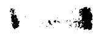

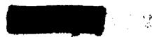

# SUMMARY

An experiment using a full-scale mockup of the core and reflector of Pratt and Whitney Aircraft Reactor No. 1 (PWAR-1), a reflector-moderated reactor, was performed at zero power and elevated temperatures in the ORNL Critical Experiments Facility. The mockup consisted of a 8.1-in.-dia cylindrical beryllium central region surrounded by a fuel annulus contained between two Hastelloy X core shells. The inner shell was 8.5 in. in diameter and 0.125 in. thick. The outer one varied from 21.4 in. in diameter and 0.156 in. in thickness at the midplane to 14.8 in. in diameter and 0.25 in. in thickness at the ends. This core shell assembly was covered by a 13-in.-thick beryllium reflector. Coolant passages, but not the coolant, were mocked up in both beryllium regions. The control and safety rod consisted of a 2.4-in.-OD x 2.00-in.-ID cermet annulus composed of $70\%$ nickel and $30\%$ rare earth oxides contained in a 0.035-in.-thick Inconel jacket which was guided along the reactor axis by a 2.875-in.-OD Inconel tube with 0.120-in.-thick walls. The fuel was a mixture of the fused fluoride salts of sodium, zirconium, and uranium. The critical concentration of the clean reactor was $10.22 \text{wt}\%$ U $^{235}$ at $1258^{\circ}\text{F}$ . The calibration of the control rod over the range from the midplane to the top of the beryllium resulted in an increase in fuel concentration to $12.2 \text{wt}\%$ U $^{235}$ and an indicated value of $\$2.5$ . The specific mass reactivity coefficient $(\Delta m/m)/(\Delta k/k)$ was $5.90 \pm 0.5$ and was constant within experimental error over the range of the experiment. The temperature reactivity coefficient for this mockup, measured between 1200 and $1350^{\circ}\text{F}$ , was $-0.47\%$ / $\text{ft}$ . The effect of a B $^{10}$ neutron filter between the fuel annulus and the beryllium in the entrance duct region was evaluated for the fast leakage, fission rate distribution, and reactivity. The power distribution through the fuel region was measured by counting the fission fragment gamma-ray activity in small uranium disks positioned in the fuel annulus throughout the experiment. A measure of the neutron flux distribution in the reflector was made with gold foils. In addition to a presentation of the measurements this report also includes a discussion of the important engineering design features and construction problems.

# PREFACE AND ACKNOWLEDGEMENTS

The elevated temperature experiment for the Pratt and Whitney Aircraft Corporation Reactor No. 1 (PWAR-1) was performed as a cooperative effort of PWAC and Oak Ridge National Laboratory. The component design and fabrication, which were patterned after a high-temperature experiment that had previously been performed at ORNL, were largely completed by PWAC at the Hartford, Connecticut plant under the direction of E. V. Sandin and G. W. Alwang of PWAC and W. C. Tunnell of ORNL. The final component assembly was carried out by ORNL personnel under the direction of W. C. Tunnell, and the experiment was performed in the ORNL Critical Experiments Facility by both PWAC and ORNL personnel.

Once the reactor was brought to the operating temperature it was kept at that temperature until all experimental work was completed. This necessitated 24-hr operation, for which personnel was assigned in three shifts as follows:

# Chief

D. Scott   
E. Sandin*   
W. Fader*

# Reactor Operation

E. Demski*   
D. Harvey*   
J. J. Lynn

# Data Processing

M. K. Albright   
R. Malenfant   
G. W. Alwang*

# Instrumentation

V. G. Harness   
J. F. Ellis   
E.R.Rohrer

In addition, other personnel was available, continuously during the approach to critical and on short notice thereafter, for special services. These included J. E. Eorgan, George Nessle, and Jack Truitt of the ORNL Materials Chemistry Division; R. D. Parten, L. C. Johnson, and W. D. Carden of the ORNL Health Physics Division; and W. F. Vaughn of the ORNL Analytical Chemistry Division.

* PWAC

TABLE OF CONTENTS   

<table><tr><td>Summary . . . . . . . . . . . . . . . . . . . . . . . . . . . . . . . . . . . . . . . . . . . . . . . . . . . . . . . . . . . . . . . . . . . . . . . . . . . . . . . . . . . . . . . . . . . . . . . . . . . . .
Preface and Acknowledgements . . . . . . . . . . . . . . . . . . . . . . . . . . . . . . . . . . . . . . . . . . . . . . . . . . . . . . . . . . . . . . . . . . . . . . . . . . . . . . . . . . . . . . . . . . . . . . . . . . ..
Introduction . . . . . . . . . . . . . . . . . . . . . . . . . . . . . . . . . . . . . . . . . . . . . . . . . . . . . . . . . . . . . . . . . . . . . . . . . . . . . . . . . . . . . . . . . . . . . . . . . . .. . . . . . . . . . . . . . . . . . . . . . . . . . . . . . . . . . . . . . . . . . . . . . . . . . . . . . . . . . . . . . . . . . . . . . . . . . . . . . . . . . . . . . . . . . . . . . . . . . . . 
I. Description of Reactor Assembly . . . . . . . . . . . . . . . . . . . . . . . . . . . . . . . . . . . . . . . . . . . . . . . . . . . . . . . . . . . . . . . . . . . . . . . . . . . . . . . . . . . . . . . . . . . . . . . . . . . 3</td></tr><tr><td>II. Experimental Results . . . . . . . . . . . . . . . . . . . . . . . . . . . . . . . . . . . . . . . . . . . . . . . . . . . . . . . . . . . . . . . . . . . . . . . . . . . . . . . . . . . . . . . . . . . . . . . . . . . Critical Uranium Concentration . . . . . . . . . . . . . . . . . . . . . . . . . . . . . . . . . . . . . . . Effect of B10 Sleeves on the Reactivity . . . . . . . . . . . . . . . Critical Concentration as a Function of Rod Position and B10 Sleeve Position The Specific Mass Reactivity Coefficient . . . . . . . . . . . . . . The Effect of Temperature on Reactivity . . . . . . . . . . . . Fuel Importance in End Duct . . . . . . . . . . . . . . . Fast-Neutron Leakage Measurements . . . . . . . . . . . . Longitudinal Fission Rate in End Duct . . . . . . . . . . . Radial Fission Rate Distribution Gold Neutron Flux Distribution in the Beryllium Reflector .. . . . . . . . . . . . . . . . . . . . . . . . . . . . . . . . . . . . . . . . . . . . .
App. A. Engineering Report .. . . . . . . . . . . . . . . . . . . .
Description of Assembly Components .. . . . . . . . . .
Reactor Tank .. . . . . . . . . . . . . Sump Tank .. . . . . . . . Enricher .. . . . . . . . Control Rod Drive .. . . . . . . Source Drive .. . . . . . . Gas System and Nuclear Controls .. Filling and mixing circuit Standby helium supply circuit Moderator helium supply circuit Fuel level indicators .. .. .. .. .. .. .. .. .. .. .. .. .. .. .. .. .. .. .. .. .. .. .. .. .. .. .. .. .. .. .. .. .. .. .. .. .. .. .. .. .. .. .. .. .. .. .. .. .. .. .. .. .. .. .. .. .. .. .. .. .. .. .. .. .. .. .. .. .. .. .. .. .. .. .. .. .. .. .. .. .. .. .. .. .. .. .. .. .. .. .. .. .. .. .. .. .. .. .. .. ... .. .. .. .. .. .. .. .. .. .. .. .. .. .. .. .. .. .. .. .. .. .. .. .. .. .. .. .. .. .. .. .. .. .. .. .. .. .. .. .. .. .. .. .. .. .. .. .. .. .. .. .. .. .. .. .. .. .. .. .. .. .. .. .. .. .. .. .. .. .. .. .. .. .. .. .. .. .. .. .. .. .. .. .. .. .. .. .. .. .. .. .. .. .. .. .. .. .. .. .
Construction of Assembly Components .. . . . . . . Welding .. . . . . . . Fabrication of Core Shells .. . . . . . . 64</td></tr></table>

Page No.

Fabrication of B10 Sleeves 69

Fabrication of B1C-Cu Plates 72

Fabrication of Beryllium Parts 73

Fabrication of Gold Foils 73

Fabrication of Control Rod 74

Fuel Manufacture 76

Material Failures 76

Typical Sequence of Operation 79

Enriching. 79

Mixing 80

Sampling 80

Instrument Checks 81

Filling the Reactor Core 81

Temperature Readings 81

Approach to Critical (Routine) 82

Maintaining the Power Level 82

Shutdown 82

App. B. Composition and Weights of Reactor Materials 83

App.C.List of Figures 86

App. D. List of Tables 88

# INTRODUCTION

A reflector-moderated reactor experiment was performed at elevated temperatures at the Critical Experiments Facility of the Oak Ridge National Laboratory (ORNL) as part of the circulating-fuel reactor program of the Pratt and Whitney Aircraft Company (PWAC). In general, the purpose of the experiment was to experimentally verify the theoretically predicted nuclear properties of a PWAC reactor (designated as PWAR-1) and, in addition, to establish those properties of the reactor system which are not susceptible to accurate theoretical analyses. Prior to the experiment some effort had been expended in correlating PWAR-1 analytical work to the room-temperature and elevated-temperature critical experiments performed at ORNL in conjunction with the Aircraft Reactor Test (ART). Owing to the similarity of the design between the ART and PWAR-1, this was of considerable value in establishing analytical techniques suitable to the PWAR-1; however, it was recognized that before absolute confidence could be placed in these techniques the results should be verified by an experiment designed especially to mock up the PWAR-1. The choice of an elevated-temperature experiment, as opposed to a more versatile room-temperature experiment, was largely based on the following considerations:

1. The over-all PWAR-1 design was considered to be well established, since it was possible to check analytical procedures against the series of ART room-temperature experiments.   
2. The information still to be determined, therefore, could be obtained better in an elevated temperature mockup which not only conformed more exactly to the design in temperature, but also in geometry and in the physical composition and properties of its component materials.   
3. The ease with which uranium concentration could be increased in an elevated-temperature experiment made it more feasible from an operational point of view.

The decision to perform the elevated-temperature experiment was made early in January, 1956, after discussion between representatives of both PWAC and ORNL. At that time the responsibility for design and fabrication of most of the components was assigned to PWAC. Accordingly, advanced estimates of material requirements were made and by the end of February, 1956, essentially all materials had been ordered. At the same time preliminary drawings of the moderator had been supplied to the Brush Beryllium Company and fabrication of the moderator was begun. Engineering design work was continued and final layouts were completed late in March, 1956.

By May 8, 1956, all detail drawings had been released. It was hoped that the fabrication and assembly of all components could be completed by July 1, 1956, but, because of exceptionally long delivery times for nickel-based alloys

and many problems encountered in fabricating the core shells and the moderator, the component assemblies of the experiment did not arrive at ORNL until November 9, 1956.

Final setting up of the experiment began immediately. A variety of problems were encountered during this period and the experiment was not ready for the introduction of fuel and the beginning of multiplication measurements until January 28, 1957. A summary and description of the problems which occurred during fabrication and final assembly are contained in Appendix A. The experiment was made critical on February 5, 1957, and by the end of February all data had been taken and disassembly had begun.

The experiment was run at essentially zero nuclear power. The operating temperature was held constant at approximately $1250^{\circ}\mathrm{F}$ , which corresponds closely to the design operating temperature of the PWAR-1 moderator; this temperature was maintained by external heaters.

During the course of the experiment various nuclear parameters were investigated as requested by PWAC.

# I. DESCRIPTION OF REACTOR ASSEMBLY

The apparatus consisted of the following major components (see Fig. 6):

1. the reactor assembly,   
2. the reactor tank,   
3. the sump tank,   
4. the enricher,   
5. the control rod drive, source drive and supports,   
6. the inert gas system,   
7. nuclear control and instrumentation circuits,   
8. heating and temperature control circuits.

The reactor assembly was mounted within the reactor tank in a helium atmosphere. The sump tank, located under the reactor tank, contained the fuel when it was not in the reactor core. Helium pressure was used to transfer the fuel from the sump tank up through a fill and drain line to the reactor core. The fuel consisted of the ternary system $\mathrm{NaF - ZrF_4 - UF_4}$ which has a liquidus temperature in the neighborhood of $1000^{\circ}\mathrm{F}$ . Additional uranium in the form of $\mathrm{Na_2UF_6}$ was added to the fuel in the sump tank by means of the enricher.

After criticality was achieved a chemical analysis was determined after every third enrichment. A continuous inventory of the contents of the sump was maintained and was used to indicate the uranium concentration when a chemical analysis was not available. Table 1 gives the weight percent of each component as obtained by the two methods and demonstrates that the calibration of the enricher was reasonable. Sample 12 was the initial critical concentration.

Table 1. Fuel Constituents   

<table><tr><td rowspan="2">Number</td><td colspan="2">Uranium (wt%)</td><td colspan="2">UF4(wt%)</td><td colspan="2">NaF (wt%)</td><td colspan="2">ZrF4(wt%)</td></tr><tr><td>By Analysis</td><td>By Inventory</td><td>By Analysis</td><td>By Inventory</td><td>By Analysis</td><td>By Inventory</td><td>By Analysis</td><td>By Inventory</td></tr><tr><td>12</td><td>10.97</td><td>10.963</td><td>14.514</td><td>14.501</td><td>20.082</td><td>20.152</td><td>65.416</td><td>65.343</td></tr><tr><td>13</td><td>11.13</td><td>11.066</td><td></td><td>14.640</td><td></td><td>20.154</td><td></td><td>65.206</td></tr><tr><td>14</td><td>11.26</td><td>11.180</td><td></td><td>14.790</td><td></td><td>20.155</td><td></td><td>65.054</td></tr><tr><td>15</td><td>11.39</td><td>11.310</td><td></td><td>14.969</td><td></td><td>20.157</td><td></td><td>64.873</td></tr><tr><td>16</td><td>11.52</td><td>11.450</td><td></td><td>15.148</td><td></td><td>20.159</td><td></td><td>64.692</td></tr><tr><td>17</td><td>11.64</td><td>11.584</td><td></td><td>15.325</td><td></td><td>20.161</td><td></td><td>64.513</td></tr><tr><td>18</td><td>11.83</td><td>11.718</td><td></td><td>15.502</td><td></td><td>20.163</td><td></td><td>64.335</td></tr><tr><td>19</td><td>11.96</td><td>11.851</td><td></td><td>15.678</td><td></td><td>20.165</td><td></td><td>64.156</td></tr><tr><td>20</td><td>12.09</td><td>11.983</td><td></td><td>15.853</td><td></td><td>20.166</td><td></td><td>63.979</td></tr><tr><td>21</td><td>12.20</td><td>12.137</td><td></td><td>16.057</td><td></td><td>20.169</td><td></td><td>63.773</td></tr><tr><td>22</td><td>12.52</td><td>12.312</td><td>16.563</td><td>16.288</td><td>20.453</td><td>20.171</td><td>63.050</td><td>63.540</td></tr></table>

The configuration of the reactor assembly is shown in Fig. 1. The fuel was contained in the annulus formed by the inner and outer Hastelloy X core shells. Incremental volumes in this core are given in Table 2. The outer shell was 0.156 in. thick in the region of the midplane (cross section at maximum core diameter) and 0.250 in. thick in regions further than 7-3/4 in. above and below midplane. The inner core shell was uniformly 0.125 in. thick except in the lower end duct where its thickness increased to 0.250 in. Due to difficulties encountered in the fabrication of these shells, variations in the wall thickness of $\pm 0.025$ in., as well as out-of-roundness and departures from designed contour, occurred. Appendix A gives an account of these difficulties plus a detailed picture of the final shapes and thicknesses.

The central moderator column, or the island, consisted of beryllium through which longitudinal holes 0.250 in. in diameter were drilled to mock up coolant passages. The distribution of these holes is given in Table 3. An annular void 0.125 in. in. average thickness was located between the inner core shell and the island beryllium to mock up a coolant passage. Because of engineering and operational complications, none of the coolant passages contained sodium as they would in the power reactor itself. A 2.935-in.-dia longitudinal hole through the center of the island contained the control rod thimble, a 2.875-in.-OD Inconel tube with 0.120-in.-thick walls. A 12.5-in.-long beryllium cylinder, contained in a stainless steel jacket, was placed in the bottom of the thimble to limit the lower travel of the rod in the event of mechanical failure in the rod support linkage.

The control rod, which also served as a safety rod, consisted of a 2.430-in.-OD x 2.000-in.-ID annulus of $70\%$ Ni, $30\%$ Lindsay Mix* cermet 36 in. long (see Appendix A). This annulus was physically contained in a 0.035-in.-thick Inconel jacket. Its motion for control purposes was confined to the region from 24.155 in. above to 1.415 in. below the midplane.

A 4.3 x $10^6$ neutrons/sec (Jan. 31, 1957) Po-Be source rode longitudinally down through the center of the annular control rod into the control rod thimble to its normal position which, during multiplication measurements and startups, was a little below the reactor midplane.

The reflector was built up around the core shell assembly, Fig. 2, with 4-in.-thick beryllium rings as shown in Figs. 3 and 4. Holes 0.250 in. in diameter were drilled through these slabs to approximate the probable distribution of coolant passages in the reflector of the power reactor. The distribution of these holes at three elevations as a function of radial distance from the reactor axis is shown in Table 3. A coolant annulus having an average thickness of 0.125 in. was also provided between the outer core shell and the reflector beryllium. Again no sodium was contained within these coolant passages; however, a helium atmosphere was maintained in the reactor tank as shown in Fig. 5 to protect the beryllium. For the radial gold foil activation measurements, foil holders were provided which were placed into slots in the reflector at three elevations. The complete assembly, with its covering insulation, is shown in Fig. 6.

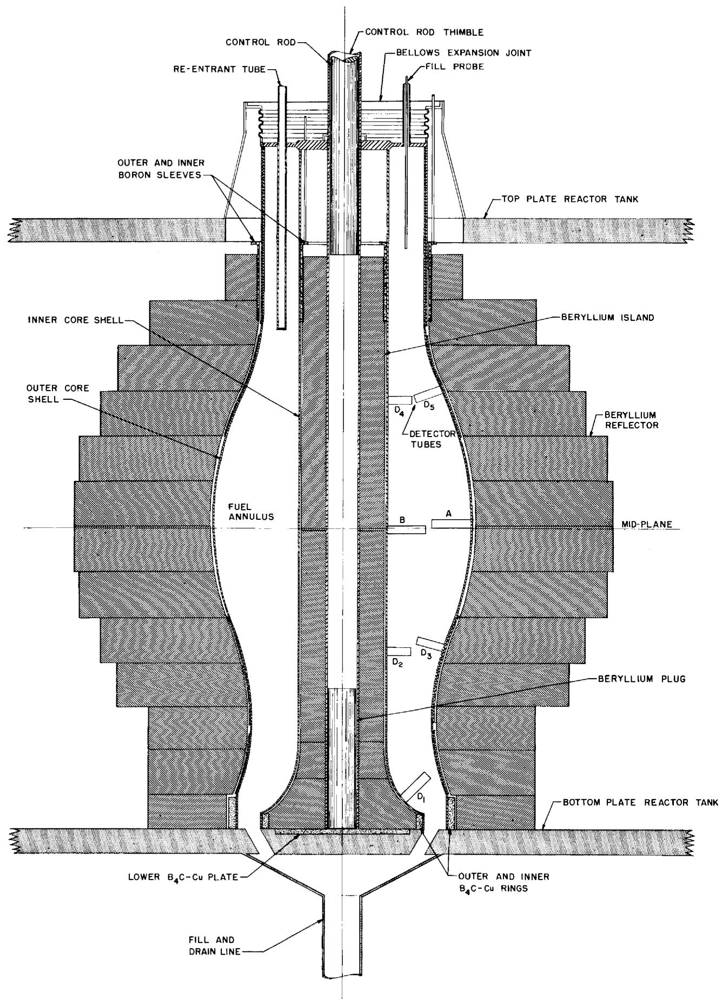  
FIGURE 1. REACTOR ASSEMBLY-MAJOR COMPONENTS

Table 2. Incremental Core Volumes   

<table><tr><td>Zone(in. above midplane)</td><td>Volumeb(in.3)</td><td>Zone(in. below midplane)</td><td>Volume(in.3)</td></tr><tr><td>26 to 25</td><td>115.14</td><td>0 to 1</td><td>292.87</td></tr><tr><td>25&quot; 24</td><td>115.19</td><td>1 &quot; 2</td><td>288.24</td></tr><tr><td>24&quot; 23</td><td>115.23</td><td>2 &quot; 3</td><td>280.06</td></tr><tr><td>23&quot; 22</td><td>115.33</td><td>3 &quot; 4</td><td>270.69</td></tr><tr><td>22&quot; 21</td><td>115.47</td><td>4 &quot; 5</td><td>260.19</td></tr><tr><td>21&quot; 20</td><td>115.70</td><td>5 &quot; 6</td><td>247.70</td></tr><tr><td>20&quot; 19</td><td>116.40</td><td>6 &quot; 7</td><td>233.94</td></tr><tr><td>19&quot; 18</td><td>117.57</td><td>7 &quot; 8</td><td>219.61</td></tr><tr><td>18&quot; 17</td><td>119.44</td><td>8 &quot; 9</td><td>205.65</td></tr><tr><td>17&quot; 16</td><td>121.57</td><td>9 &quot; 10</td><td>191.48</td></tr><tr><td>16&quot; 15</td><td>124.66</td><td>10 &quot; 11</td><td>176.91</td></tr><tr><td>15&quot; 14</td><td>131.16</td><td>11 &quot; 12</td><td>162.50</td></tr><tr><td>14&quot; 13</td><td>140.26</td><td>12 &quot; 13</td><td>149.58</td></tr><tr><td>13&quot; 12</td><td>150.60</td><td>13 &quot; 14</td><td>139.27</td></tr><tr><td>12&quot; 11</td><td>162.24</td><td>14 &quot; 15</td><td>130.43</td></tr><tr><td>11&quot; 10</td><td>175.01</td><td>15 &quot; 16</td><td>124.18</td></tr><tr><td>10&quot; 9</td><td>189.82</td><td>16 &quot; 17</td><td>119.44</td></tr><tr><td>9&quot; 8</td><td>204.50</td><td>17 &quot; 18</td><td>119.97</td></tr><tr><td>8&quot; 7</td><td>218.73</td><td>18 &quot; 19</td><td>115.02</td></tr><tr><td>7&quot; 6</td><td>233.33</td><td>19 &quot; 20</td><td>117.00</td></tr><tr><td>6&quot; 5</td><td>247.39</td><td>20 &quot; 21</td><td>119.00</td></tr><tr><td>5&quot; 4</td><td>259.56</td><td>21 &quot; 22</td><td>120.80</td></tr><tr><td>4&quot; 3</td><td>269.86</td><td>22 &quot; 23</td><td>123.44</td></tr><tr><td>3&quot; 2</td><td>279.08</td><td>23 &quot; 24</td><td>135.01</td></tr><tr><td>2&quot; 1</td><td>286.60</td><td>24 &quot; 25</td><td>117.74</td></tr><tr><td>1&quot; 0</td><td>292.54</td><td>25 &quot; 26</td><td>85.99</td></tr><tr><td></td><td></td><td>26 &quot; 27</td><td>83.71</td></tr></table>

a. Each core volume quoted for a 1-in.-high zone was obtained by numerical integration of the final core dimensions. The total volume to 2 in. above the beryllium obtained by integration was 9159 in. or 150.2 liters; the measured volume was 147.2 liters.   
b. These volumes correspond to an unheated assembly. The volumes for an assembly at $1250^{\circ}\mathrm{F}$ are obtained by multiplying by 1.032.

Table 3. Distribution of Holesa in the Reflector and Moderator   

<table><tr><td colspan="6">In Reflector</td><td colspan="2">In Island
at All Elevations</td></tr><tr><td colspan="2">16 in. Above and Below Midplane</td><td colspan="2">8 in. Above and Below Midplane</td><td colspan="2">At Midplane</td><td rowspan="2">Radius.
(in.)b</td><td rowspan="2">No. of
Holes</td></tr><tr><td>Radius
(in.)b</td><td>No. of
Holes</td><td>Radius
(in.)b</td><td>No. of
Holes</td><td>Radius
(in.)b</td><td>No. of
Holes</td></tr><tr><td>8.123</td><td>120</td><td>9.897</td><td>120</td><td>11.134</td><td>120</td><td>1.787</td><td>16</td></tr><tr><td>8.626</td><td>60</td><td>10.400</td><td>60</td><td>11.637</td><td>60</td><td>2.137</td><td>16</td></tr><tr><td>8.710</td><td>60</td><td>10.484</td><td>60</td><td>11.721</td><td>60</td><td>2.687</td><td>32</td></tr><tr><td>9.162</td><td>60</td><td>10.900</td><td>60</td><td>12.137</td><td>60</td><td>3.287</td><td>32</td></tr><tr><td>9.234</td><td>60</td><td>-11.067</td><td>60</td><td>12.304</td><td>60</td><td>3.687</td><td>32</td></tr><tr><td>9.793</td><td>60</td><td>-11.567</td><td>60</td><td>12.804</td><td>60</td><td></td><td></td></tr><tr><td>10.126</td><td>60</td><td>11.900</td><td>60</td><td>13.137</td><td>60</td><td></td><td></td></tr><tr><td>10.626</td><td>60</td><td>-12.400</td><td>60</td><td>13.637</td><td>60</td><td></td><td></td></tr><tr><td>11.126</td><td>60</td><td>-12.900</td><td>60</td><td>14.137</td><td>60</td><td></td><td></td></tr><tr><td>11.626</td><td>60</td><td>13.400</td><td>60</td><td>14.637</td><td>60</td><td></td><td></td></tr><tr><td>12.293</td><td>60</td><td>14.067</td><td>60</td><td>15.304</td><td>60</td><td></td><td></td></tr><tr><td>12.960</td><td>60</td><td>-14.734</td><td>60</td><td>15.971</td><td>60</td><td></td><td></td></tr><tr><td>14.626</td><td>60</td><td>16.400</td><td>60</td><td>17.637</td><td>60</td><td></td><td></td></tr></table>

a. All holes were 0.250 in. in diameter and were distributed equally around 360 deg at the given radius.   
b. The radii given apply only at the indicated elevations since these are continuous holes which roughly follow the outer core shell contour. Straight lines between corresponding hole radii describe the path.

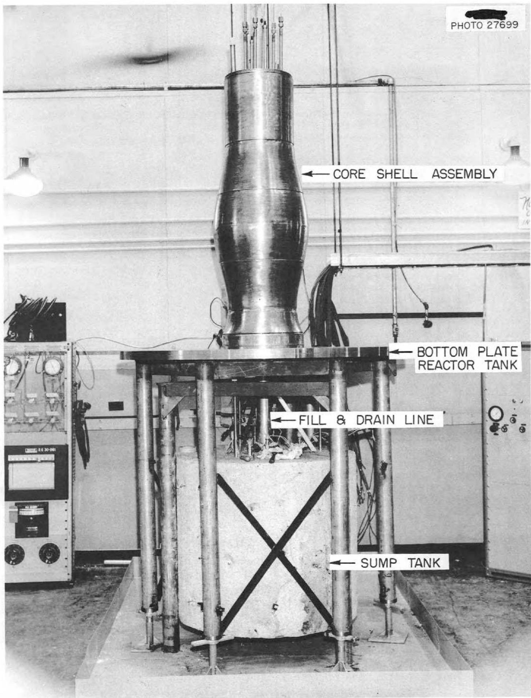  
Fig. 2. Core Shell Assembly in Place.

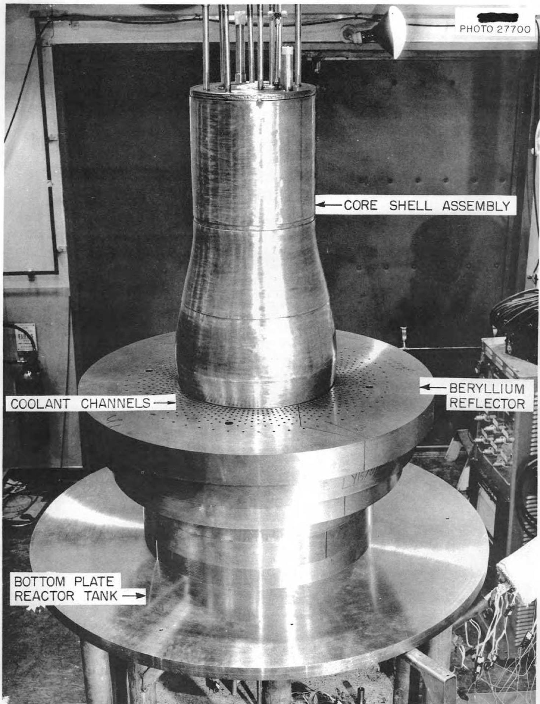  
Fig. 3. Partial Reflector Assembly.

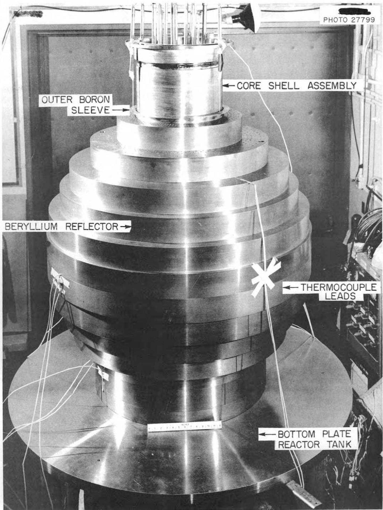  
Fig.4. Reactor Assembly Complete.

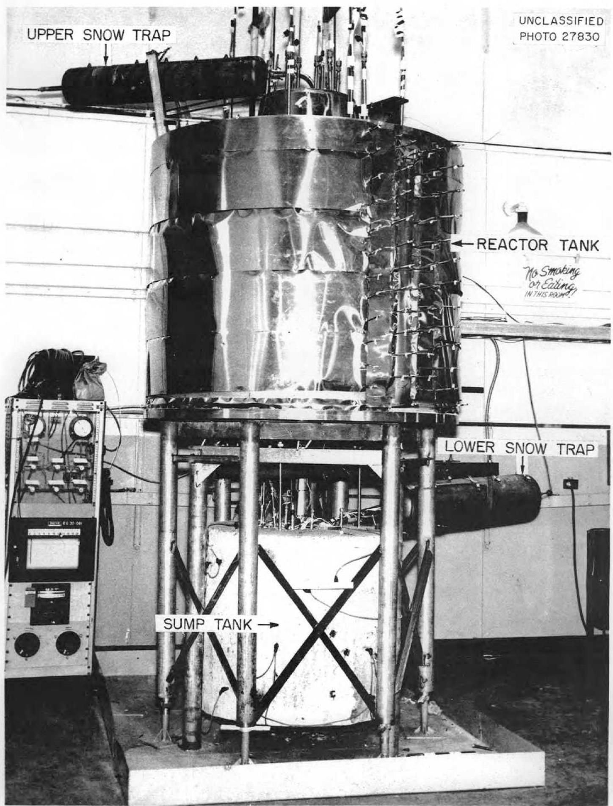  
Fig.5. Reactor Tank in Place with Heaters.

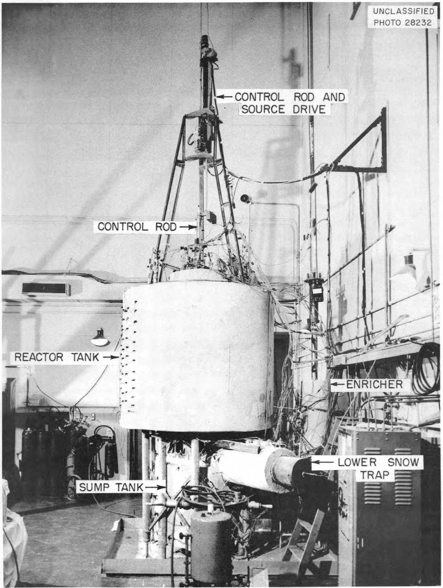  
Fig. 6. Assembly Complete.

Natural boron carbide-copper plates, which simulated boron-containing regions in the PWAR-1 design, surrounded the lower end duct. A boron carbide-copper plate was also placed at the bottom of the island to limit fissioning to the core region. The areal density of boron carbide in these plates was $0.35\mathrm{g/cm}^2$ .

Sleeves containing elemental $\mathsf{B}^{10}$ powder packed to a density of $1.5\mathrm{g / cc}$ in an annulus 0.060 in. thick surrounded the upper end duct. These sleeves, which acted as neutron shields, could be moved from a position of complete retraction to their fully inserted position about 6 in. below the top of the beryllium by actuating rods protruding from the top of the reactor through gastight fittings. Longitudinally through the end duct annulus, in the neighborhood of these shields, a re-entrant tube was provided in which fission rate measurements were made for various positions of the boron shields.

It will be noted that while the reflector shapes in the power reactor consisted of continuous curves, these curves were approximated by straight-line segments and step functions in the experiment. The sketch shown in Fig. 7 gives a comparison between the power reactor and the critical experiment.

The level of the liquid in the core was normally held 1 in. above the top of the beryllium moderator. The safety system was arranged to dump the fuel into the sump tank under various hazardous conditions, nuclear or mechanical, which will be described later. It required 1.8 to 2.0 sec for the fuel to drop the first 6 in. and 29 to 30 sec to completely empty the core.

Detailed dimensions of the reactor assembly relevant to interpretation of the experimental results are given in Fig. 8 and Table 4. Appendix A contains, in addition to a discussion of all other components of the experiment, a further account of the engineering problems associated with the reactor assembly. Appendix B gives analyses of the materials contained in the assembly as well as weights of the moderator and core shell components.

# II. EXPERIMENTAL RESULTS

# Introduction

Upon the request of PWAC, the following experimental information was obtained:

1. Critical concentration as a function of control rod position.   
2. Reactor period for small displacements of the control rod.   
3. The effect on control rod worth of increasing the areal density of rod poison.   
4. Critical concentration as a function of the position of $\mathbf{B}^{10}$ shields around the upper end duct.

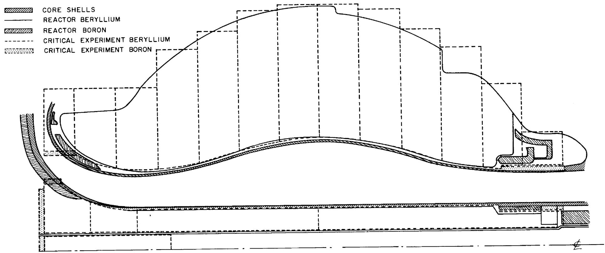  
FIGURE 7. A COMPARSION OF THE POWER REACTOR DESIGN (PWAR-1) AND THE ELEVATED TEMPERATURE CRITICAL ASSEMBLY

5. The over-all temperature coefficient of reactivity between isothermal states in the region between 1200 to $1350^{\circ}\mathrm{F}$ .   
6. Leakage of fast neutrons from the upper end duct for various positions of the B10 shields.   
7. Longitudinal power distribution in the upper end duct for various positions of the $\mathbf{B}^{10}$ shields.   
8. Radial power distribution at three elevations in the core and at one position in the lower end duct.   
9. Radial neutron flux distribution at three elevations in the moderator as indicated by gold foil activation.

# Critical Uranium Concentration

The clean critical uranium concentration is defined as that concentration of uranium in weight percent of a specified fuel for which, at a specified temperature, the experiment was critical with the control rod and $\mathsf{B}^{10}$ sleeves completely withdrawn. This concentration was approached stepwise by additions of fluoride salt mixtures of high $\mathsf{UF}_4$ concentrations to the mixtures in the fuel sump.

During the approach to criticality both $\mathsf{B}^{10}$ sleeves were fixed in their full-out positions, and the temperatures of the fuel sump and reactor were approximately $1250^{\circ}\mathsf{F}$ . The initial content of the sump was $523.7\mathrm{kg}$ of a $\mathrm{NaF - ZrF_4 - UF_4}$ mixture, with a uranium concentration of 4.35 wt%. Previous experience with ART mockup critical assemblies at room temperature and at $1200^{\circ}\mathsf{F}$ indicated that this concentration would be far below the critical concentration. The fuel was raised into the reactor core to the level of the fill probe, the control rod was withdrawn, and the neutron counting rates of two $\mathsf{BF}_3$ long counters and one Hornyak scintillation counter were determined while the Po-Be neutron source ( $4.3\times 10^6$ neutrons/sec) was at the reactor midplane.

About $13.8\mathrm{kg}$ of $\mathrm{Na_2UF_6}$ containing $59.8\mathrm{wt}\%$ uranium was then added to the fuel sump. The fuel mixture was homogenized by raising it to the level of the reactor midplane and dropping it back into the sump 15 times. To check the effectiveness of this mixing procedure, a sample of the fuel was extracted for chemical analysis after 10 mixings and again after five more mixings. The reported analyses of the uranium concentrations of the two samples differed by $1\%$ of the value, which was $5.86\mathrm{wt}\%$ uranium. The probable error reported was $\pm 0.2\%$ of the value. The fuel was then raised to the level of the fill probe, the control rod was withdrawn, and the counting rates of the neutron counters were determined while the Po-Be source was in the reactor as before. Four more batches of 12.6 to $13.8\mathrm{kg}$ of $\mathrm{Na_2UF_6}$ were added to the fuel sump. After each addition the fuel was mixed 15 times, a sample was extracted for chemical analysis, and the neutron counting rates were determined as above. The four additions resulted in a uranium concentration of $10.74\mathrm{wt}\%$ by chemical analysis.

Table 4. Dimensions for Reactor Assembly Sketch   

<table><tr><td>Designationa</td><td>Cold (in.)</td><td>Hot (in.)</td><td>Description</td></tr><tr><td>A</td><td>23.906</td><td>24.155</td><td>Control rod zero</td></tr><tr><td>B</td><td>23.855</td><td>24.155</td><td>Midplane to top of island beryllium</td></tr><tr><td>C</td><td>24.250</td><td>24.553</td><td>Midplane to top of reflector beryllium</td></tr><tr><td>D</td><td>-</td><td>25.527</td><td>Midplane to top of fuel, fill probe on</td></tr><tr><td>E</td><td>17.737</td><td>17.924</td><td>Midplane to lower limit of longitudinal power traverse</td></tr><tr><td>F</td><td>25.649</td><td>25.927</td><td>Midplane to top of inner B4C-Cu ring inside lower end duct</td></tr><tr><td>G</td><td>23.750</td><td>24.028</td><td>Midplane to top of outer B4C-Cu ring around lower end duct</td></tr><tr><td>H</td><td>14.812</td><td>14.949</td><td>Midplane to top of beryllium plug in lower portion of control rod thimble</td></tr><tr><td>J</td><td>26.750</td><td>27.028</td><td>Midplane to base of reflector beryllium</td></tr><tr><td>K</td><td>27.149</td><td>27.427</td><td>Midplane to base of island beryllium</td></tr><tr><td>Lb</td><td>10.529</td><td>10.639</td><td>Maximum inside radius of the outer core shell</td></tr><tr><td>M</td><td>24.000</td><td>24.274</td><td>Radius of reflector (slab G)</td></tr><tr><td>N</td><td>4.000</td><td>4.046</td><td>Radius of island beryllium</td></tr><tr><td>P</td><td>1.318</td><td>1.332</td><td>Radius of control rod thimble</td></tr><tr><td>R</td><td>16.000</td><td>16.182</td><td>Radius of reflector (slab B)</td></tr><tr><td>S</td><td>8.920</td><td>9.013</td><td>Radius of outer core shell in lower end duct</td></tr><tr><td>T</td><td>7.250</td><td>7.325</td><td>Radius of inner core shell in lower end duct</td></tr></table>

a. Refer to Fig. 8.   
b. Arrow displaced for clarity.

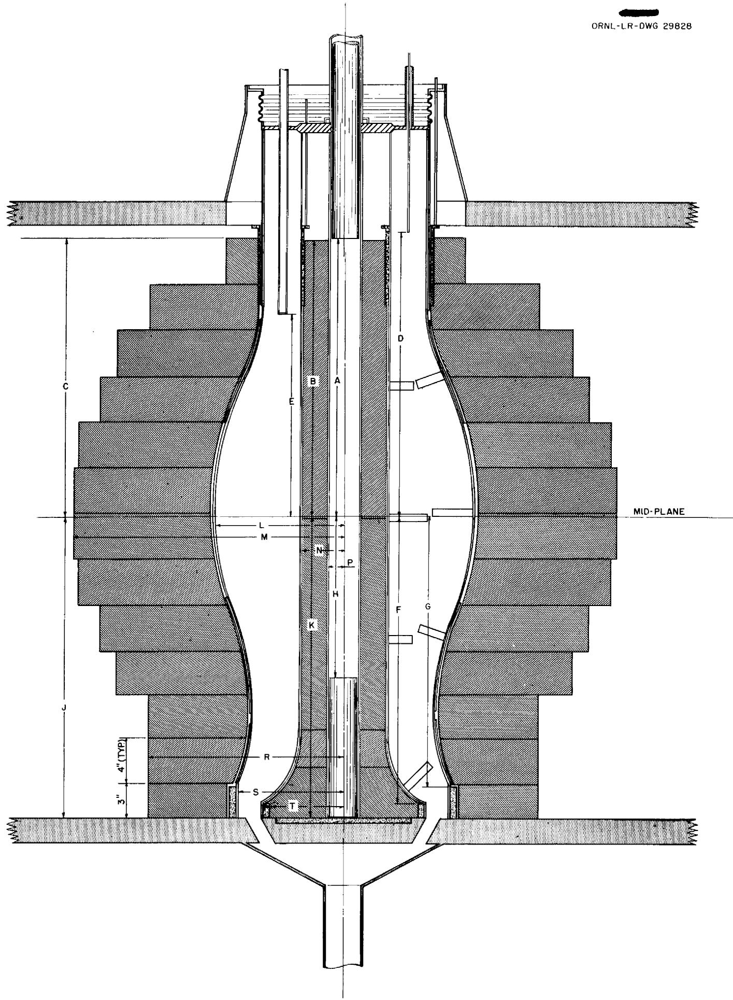  
FIGURE 8. REACTOR ASSEMBLY-DIMENSIONS

Subsequent additions of uranium were made from the enricher in increments of about $750\mathrm{g}$ of $\mathrm{Na_2UF_6}$ containing $59.8\mathrm{wt}\%$ uranium. The procedures of mixing, sampling and neutron counting rate determinations were carried out after each addition. In Fig. 9 the ratios of the neutron counting rates observed at the $4.35\mathrm{wt}\%$ concentration to the counting rates observed at higher concentrations are plotted versus the uranium concentrations in weight percent reported from chemical analysis. The reactor first showed a positive period with the control rod and source withdrawn at a concentration of $10.97\mathrm{wt}\%$ $\pm 0.02\mathrm{wt}\%$ uranium (10.22 wt% U235). The reactivity corresponding to this period was 4.63 cents as calculated from the inhour formula with $\beta = 0.0073$ . The mean reactor temperature at this point was $1248^{\circ}\mathrm{F}$ . Using the value of $-0.473$ cents/ $^{\circ}\mathrm{F}$ for the temperature coefficient of reactivity (p. 32), it was determined that with the rod withdrawn this concentration would constitute a critical system at $1258^{\circ}\mathrm{F}$ . The probable error is that reported for the result of the chemical analysis. Chemical analyses of the sample containing $10.97\mathrm{wt}\%$ uranium showed that other constituents in the mixture were as follows: zirconium, $35.7 \pm 0.2\mathrm{wt}\%$ ; sodium, $11.0 \pm 0.1\mathrm{wt}\%$ ; and fluorine, $42.4 \pm 0.4\mathrm{wt}\%$ . The corresponding value of the $\mathrm{UF_4}$ concentration in mol percent is $5.09 \pm 0.01$ .

# Control Rod Evaluation

The reactivity worth of the control rod was evaluated over the part of its travel from the midplane to approximately the upper surface of the beryllium island. The lower end of the rod was used as the reference in indicating the rod position.

The value of the rod in cents was obtained from period measurements in the following manner. A small known amount of the enriching salt was added from the enricher and thoroughly mixed with the fuel. The fuel was then raised into the reactor and the rod pulled out to its previous position at critical, which put the reactor on a positive period. At an appropriate power level the rod was inserted to determine the new position at critical. The period was determined from the strip chart record of the logarithm of the neutron level as seen by a $\mathbf{BF}_3$ ionization chamber. The reactivity in cents required to override this period was calculated using the inhour equation with five delayed neutron groups and an effective delayed neutron fraction of 0.0073. From these data the average sensitivity of the rod in cents per inch over this interval of rod travel was found by dividing the value of the period expressed in cents by the distance in inches the rod traveled to override this period. A plot of the sensitivity as a function of control rod position is given in Fig. 10.

If during control rod calibrations the fuel additions are of an appropriate size so that a reasonable period, i.e., between 100 and 200 sec, is obtained when the rod is withdrawn to the pervious critical position, the total value of the rod can be obtained by summing the values obtained for each successive enrichment. At least two determinations of the period were made for each enrichment. Since slightly different critical positions were usually obtained after each period determination, the rod position used for the next enrichment

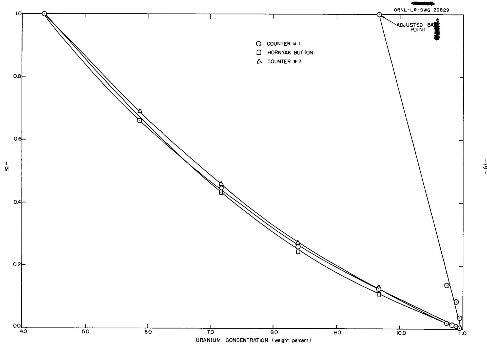  
FIGURE 9. RECIPROCAL MULTIPLICATION

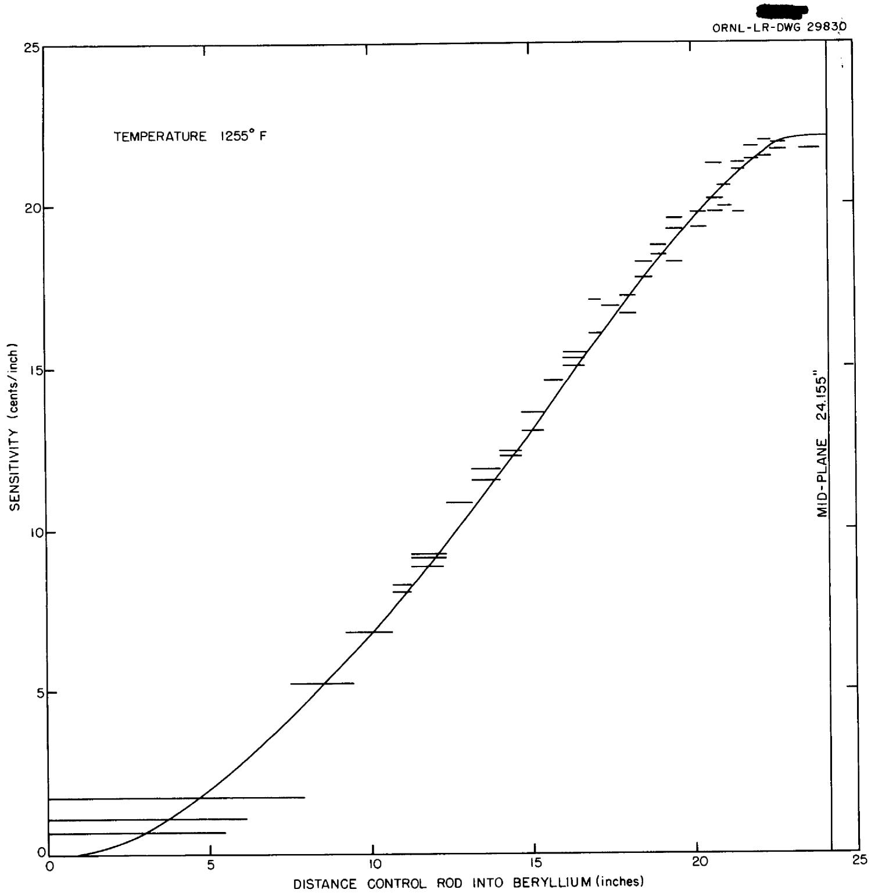  
FIGURE 10. CONTROL ROD SENSITIVITY

was chosen either as the average value of the preceding critical positions or, in cases where the positions varied a considerable amount, as the last position obtained. In using these data to obtain the integrated value of the rod, each period value in cents found for any one enrichment was added to the value of the rod for the position used during the period. In most cases the values so obtained when plotted against rod position defined a curve with a slope near the value of the sensitivity of the rod determined directly from the period. This justified using a direct interpolation to compute the integrated value of the rod for the position used to put the reactor on a positive period after the next enrichment, if this did not coincide with a previous critical position. In some cases the curve through these sums had a slope of the wrong sign, probably due to temperature changes during the run, in which case an inverse interpolation was performed to find the integrated value of the rod for the position used during the succeeding period.

In one case the position of the rod used to produce a period was outside the previously calibrated range. For this case, the integrated value of the rod was found by extrapolation, using the sensitivity determined directly from the period. This extrapolation was short, 0.2 in. of rod travel.

A plot of the total control rod value in cents as a function of the rod position is shown in Fig. 11. The data used to plot this curve are listed in Table 5. The position of the rod plotted in all cases is the distance the tip of the rod was inserted below the top of the island beryllium as indicated on the Veeder Root counter attached to the selsyn repeater on the control panel. The relation between the Veeder Root indication and the actual position of the control rod was checked before each run.

The evaluation of the control rod by this method assumes that the temperature remains constant during the time of the run. The fuel was usually raised into the reactor region and allowed to remain there about 45 min so that it would reach thermal equilibrium before the reactor was put on a positive period. The method of averaging the data to obtain the curve of the integrated value of the control rod versus position effectively gives a reduced weight to any measurement for which the error due to changes in temperature during a run is large.

The period produced by setting the rod at or near a previous critical position is a result of the net reactivity change which occurred since the last time the reactor was critical and the value of the period is independent of what specific changes occurred. Experiments indicated that the sensitivity of the rod did not change appreciably with changes in concentration and temperature for the range over which these quantities varied during the course of the experiment. Therefore, the increment of the rod required to override the periods produced during rod calibration runs, when only the concentration and temperature varied, was independent of what changes occurred. For small changes in temperature the effect of changes in dimensions of the rod due to thermal expansion was assumed to be negligible. Thus, this method of evaluating the rod is independent of temperature changes which occur between runs. However, in using the curve of total rod value versus control rod position as a calibration curve to evaluate any specific reactivity change

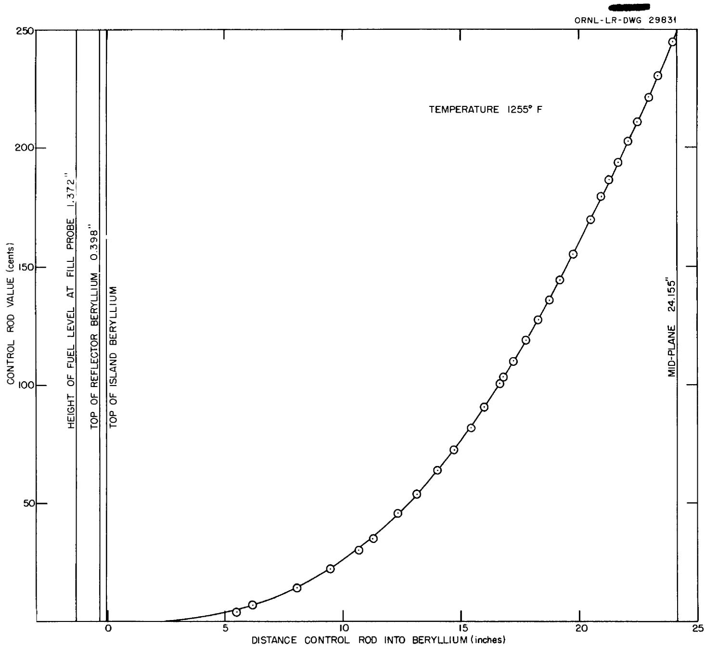  
FIGURE II. CONTROL ROD EVALUATION

Table 5. Reactivity Value of the Control Rod at Various Positions   

<table><tr><td>Distance Between Lower End of Rod and Top of Beryllium (in.)</td><td>Rod Value (cents)</td></tr><tr><td>0.000</td><td>0.0</td></tr><tr><td>5.520</td><td>3.80</td></tr><tr><td>6.180</td><td>6.80</td></tr><tr><td>7.960</td><td>13.89</td></tr><tr><td>8.075</td><td>14.10</td></tr><tr><td>9.460</td><td>21.85</td></tr><tr><td>10.660</td><td>29.76</td></tr><tr><td>11.270</td><td>34.95</td></tr><tr><td>12.384</td><td>45.24</td></tr><tr><td>13.136</td><td>53.41</td></tr><tr><td>14.019</td><td>63.86</td></tr><tr><td>14.705</td><td>72.29</td></tr><tr><td>15.420</td><td>81.94</td></tr><tr><td>16.000</td><td>90.14</td></tr><tr><td>16.685</td><td>100.40</td></tr><tr><td>16.809</td><td>103.14</td></tr><tr><td>17.208</td><td>109.89</td></tr><tr><td>17.755</td><td>118.90</td></tr><tr><td>18.285</td><td>127.30</td></tr><tr><td>18.726</td><td>135.73</td></tr><tr><td>19.201</td><td>144.44</td></tr><tr><td>19.735</td><td>154.84</td></tr><tr><td>20.489</td><td>169.15</td></tr><tr><td>20.970</td><td>179.30</td></tr><tr><td>21.284</td><td>185.16</td></tr><tr><td>21.688</td><td>193.76</td></tr><tr><td>22.090</td><td>202.48</td></tr><tr><td>22.475</td><td>210.90</td></tr><tr><td>22.950</td><td>221.20</td></tr><tr><td>23.350</td><td>230.05</td></tr><tr><td>24.000</td><td>244.15</td></tr><tr><td>24.155 (Midplane)</td><td></td></tr></table>

which is produced in the reactor, any change in average temperature which occurs during the time the desired change is made must be taken into account. A complete temperature survey of the reactor, therefore, was recorded during each run of the experiment, and an average reactor temperature was found by the method described on page 30.

The total effectiveness of the rod extrapolated to the midplane from the measurements of this experiment was $248\phi$ or a $\Delta k$ of about $1.8\%$ . This was considerably less than the value of about $3.8\%$ predicted by multigroup calculations performed by PWAC. In order to check the effect of increasing the density of rare earth poisons in the rod as a possible way of increasing the effectiveness of the rod, one of the control rods used in the ART Hot Critical Experiment was modified so that it could be inserted inside the rod used in this experiment. This ART rod had a 30-in.-long annulus of Lindsay Mix rare earth oxides 1/8-in.-thick with an outside diameter of 1.275 in. It was enclosed in an 1.34-in.-OD Inconel tube with 0.020-in.-thick walls. At the end of the experiment this rod was inserted so that its lower end was within 1/4 in. of the end of the outer rod. The system was critical when the combined rod was 3.25 in. from the midplane or 1.7 in. from the previous critical position. This is about $40\phi$ or a net increase in effectiveness of approximately $16\%$ . If this reactivity value is considered as an areal effect and the rod diameters are used to correct it, the value becomes $76\phi$ , which gives a $30\%$ increase as an upper limit. While large in magnitude, this is not enough of an increase to account for the large difference between the calculated and experimental values.

# Effect of B10 Sleeves on the Reactivity

The effect on the reactivity of the movable B $^{10}$ sleeves was evaluated for three uranium concentrations and for several degrees of insertion. The results are listed in Table 6 and a plot of the data is shown in Fig. 12.

The position of the sleeves was determined from notches filed in each of the three support pins attached to the inner and outer sleeves. These marks were made during the initial warm-up of the reactor when the sleeves were at the bottom of the slots provided for them in the island and reflector beryllium. The marks coincided with the top of the collar in the Conax fittings through which the pins passed. Since the slots in the beryllium were 6 in. deep, the position of the sleeves listed in Table 6 is the average of the distance measured between these marks and the top of the collar subtracted from 6 in.

Because of difficulty encountered in moving the outer sleeve for the experiments at the two higher uranium concentrations, two of the three actuating pins broke loose; it was later discovered during disassembly that all three pins had been severely bent. Therefore, the position of the outer sleeve is somewhat uncertain except in the fully inserted position when it was possible to feel the sleeves strike the bottom of the beryllium slots. When the sleeves were withdrawn to the "Out" position the distance from the file marks to the Conax collar was more than 5-1/2 in. in all cases. Therefore, since it is doubtful that the pins straightened out or stretched appreciably when the sleeves were pulled up, the sleeves in the "Out" position extended no more than 1/2 in. into the beryllium. For the position "1/2 In" at a concentration of 12.20 wt% uranium, the file marks were 3 in. from the collar, but the uncertainty in the position of the outer sleeve is probably 1/2 in. or more.

Table 6. Effect on Reactivity of Inserting the $B^{10}$ Sleeves into the End Duct Beryllium   

<table><tr><td>Average Depth of Sleeves in Beryllium (in.)</td><td>Uranium Concentration (wt%)</td><td>Loss in Reactivity (cents)</td></tr><tr><td>0.26</td><td>11.52</td><td>0 (Reference)</td></tr><tr><td>1.3</td><td>11.52</td><td>2.6</td></tr><tr><td>3.0</td><td>11.52</td><td>16.5</td></tr><tr><td>5.5</td><td>11.52</td><td>64.1</td></tr><tr><td>Out</td><td>11.83</td><td>0 (Reference)</td></tr><tr><td>In</td><td>11.83</td><td>73.2</td></tr><tr><td>Outer Sleeve In, Inner Sleeve Out</td><td>11.83</td><td>54.8</td></tr><tr><td>Inner Sleeve In, Outer Sleeve Out</td><td>11.83</td><td>27.6</td></tr><tr><td>Out</td><td>12.20</td><td>0 (Reference)</td></tr><tr><td>1/2 In</td><td>12.20</td><td>12.6</td></tr><tr><td>In</td><td>12.20</td><td>69.6</td></tr></table>

The control rod position for criticality was determined for each position of the sleeves. An average temperature over the reactor was obtained from the thermocouple readings and the rod position data corrected for temperature changes from run to run. The reactivity sensitivity of the rod at each sleeve position was determined from period measurements and compared with the sensitivity obtained during the calibration of the rod. The sensitivity had decreased slightly, especially for the cases where the sleeves were fully inserted, but no correction was made. Neglecting this effect overestimates the value of the sleeves fully inserted by less than $10\%$ for the 11.52 wt% uranium case, where the effect is greatest, and less than $2\%$ for the 12.20 wt% uranium case.

At a concentration of 11.83 wt% of uranium the effect of each sleeve was determined by inserting each sleeve separately to the full "In" position while the other sleeve remained in the "Out" position and finding the rod position for criticality. These results also appear in Table 6 and are plotted in Fig. 12 and indicate that the outer sleeve is about twice as effective as the inner sleeve. The interaction of one sleeve with the other is indicated by the fact that the sum of the values of each sleeve alone is greater than the effect of both sleeves together by about $15\%$ .

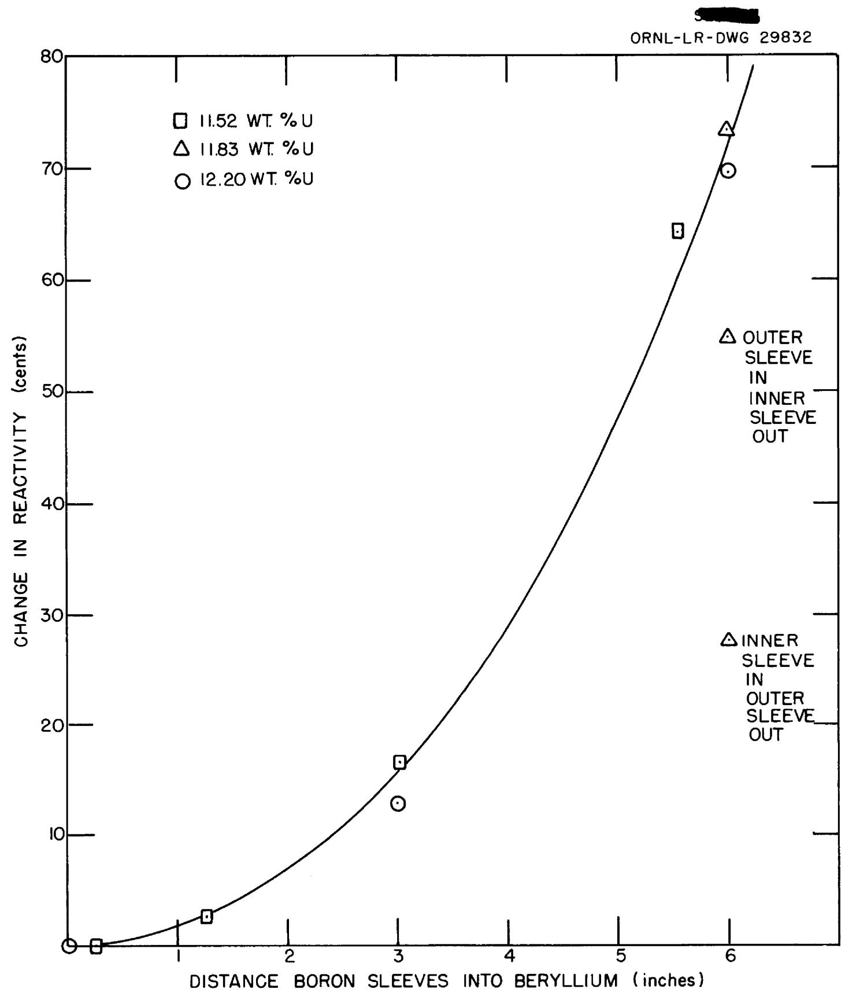  
FIGURE 12. EFFECT OF BORON SLEEVES ON REACTIVITY

During several runs, uranium foil detector tubes were inserted in the re-entrant tube to determine the effect of the sleeves on the fissioning rate in the end duct as described on page 37. The effect of adding this uranium in this region on the reactivity measurements for the sleeve was investigated by determining the critical rod position with and without the detector tube for several sleeve positions. No measurable effect was observed.

# Critical Concentration as a Function of Rod Position and BIO Sleeve Position

The concentration of uranium in the salt mixture was determined frequently throughout the experiment by performing a chemical analysis on a sample removed from the sump. A running inventory of the sump contents was maintained from which a reasonably accurate uranium concentration could be calculated for cases when no chemical analysis was available. Thus the variation of critical concentration with control rod position and with $\mathtt{B}^{10}$ sleeve position can easily be obtained. By correcting both the rod and $\mathtt{B}^{10}$ sleeve data to the same temperature, the interrelationship of all three parameters can be shown simultaneously as a three-dimensional surface. Figure 13 depicts this surface for a temperature of $1225^{\circ}\mathrm{F}$ and Table 7 gives the data obtained at the points where chemical analyses for uranium concentrations were made.

This surface shows there is little change in the shape of the curve of concentration versus rod position as the $B^{10}$ sleeves are inserted. Likewise, there is little change in the shape of the curve of concentration versus sleeve position as the control rod is inserted.

Table 7. Control Rod Position as a Function of Uranium Concentration and B10 Sleeve Position   

<table><tr><td rowspan="3">Uranium Concentration (wt%)</td><td colspan="5">Distance Control Rod is Inserted into Beryllium (in.)</td></tr><tr><td colspan="5">B10 Sleeve Positions</td></tr><tr><td>0 in.</td><td>1.3 in.</td><td>3 in.</td><td>5.5 in.</td><td>6 in.</td></tr><tr><td>10.97</td><td>3.66</td><td></td><td></td><td></td><td></td></tr><tr><td>11.13</td><td>9.14</td><td></td><td></td><td></td><td></td></tr><tr><td>11.26</td><td>12.47</td><td></td><td></td><td></td><td></td></tr><tr><td>11.39</td><td>14.81</td><td></td><td></td><td></td><td></td></tr><tr><td>11.52</td><td>16.85</td><td>16.70</td><td>15.80</td><td>11.77</td><td></td></tr><tr><td>11.64</td><td>18.42</td><td></td><td></td><td></td><td></td></tr><tr><td>11.83</td><td>19.93</td><td></td><td></td><td></td><td></td></tr><tr><td>11.96</td><td>21.26</td><td></td><td></td><td></td><td></td></tr><tr><td>12.09</td><td>22.55</td><td></td><td></td><td></td><td></td></tr><tr><td>12.20</td><td>24.11</td><td></td><td>23.53</td><td></td><td>20.87</td></tr><tr><td>12.48</td><td></td><td></td><td></td><td></td><td>22.64</td></tr></table>

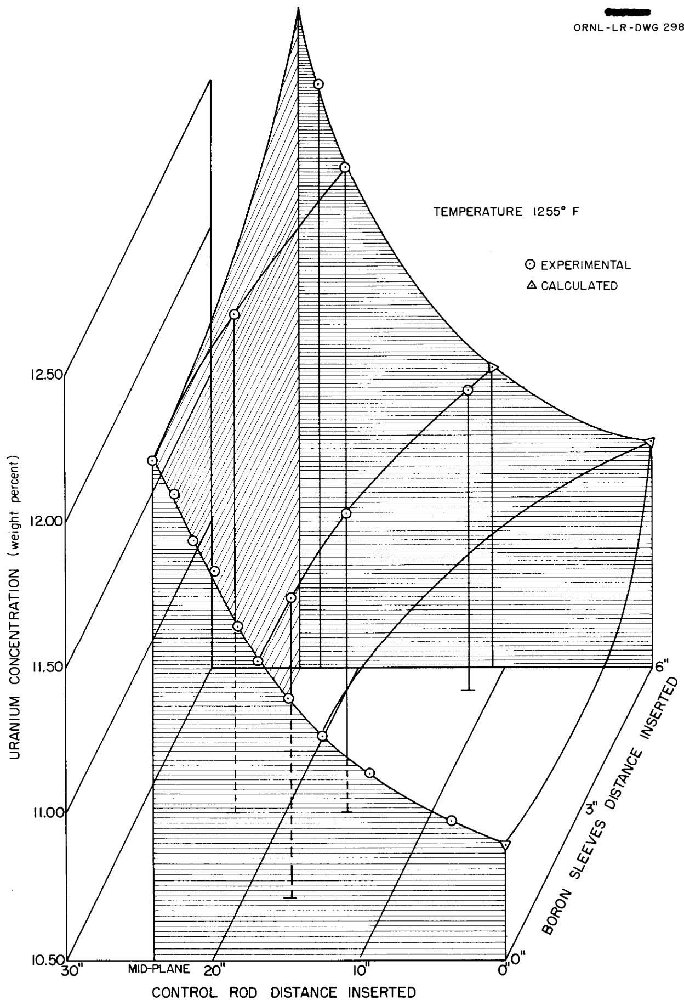  
FIGURE 13. CRITICAL SURFACE FOR PWAR-I ELEVATED TEMPERATURE CRITICAL ASSEMBLY

# The Specific Mass Reactivity Coefficient

The specific mass reactivity coefficient was calculated as the ratio of $\Delta \mathfrak{m} / \mathfrak{m}$ , the fractional increase in the mass of uranium in the reactor core when the uranium concentration is changed, to $\triangle \mathrm{k} / \mathrm{k}$ , the reactivity caused by the change in concentration.

The uranium concentration was determined by chemical analysis after each three additions from the enricher. For each set of these additions $\Delta \mathbf{m} / \mathbf{m}$ was calculated as the ratio of the increase of uranium in the reactor core to the mass of uranium in the core after the additions according to the relation

$$
\Delta m / m = \frac {\rho_ {f} c _ {f} - \rho_ {i} c _ {i}}{\rho_ {f} c _ {f}} = 1 - \frac {\rho_ {i} c _ {i}}{\rho_ {f} c _ {f}}
$$

where $C_{j} =$ initial uranium concentration, wt%,

$\mathbb{C}_{\mathbf{f}} =$ uranium concentration after three additions of $\mathrm{Na_2UF_6}$ to the initial concentration, wt%,

$\rho_{i} =$ initial fuel mixture density, $\mathrm{g / cm^3}$

$\rho_{\mathrm{f}} =$ fuel mixture density after three additions of $\mathrm{Na_2UF_6}$ to the initial concentration, g/cm³,

$\mathfrak{m} =$ mass of uranium in the reactor core corresponding to the uranium concentration $\mathbf{C}_{\mathbf{f}}$ .

Since precise values for the initial and final fuel mixture densities at $1250^{\circ}\mathrm{F}$ were not available, the ratio $\rho_{\mathrm{i}} / \rho_{\mathrm{f}}$ was calculated with the aid of a rule established by Cohen and Jones2 which states that the density of any mixture of fluoride salts over the temperature range of 600 to $900^{\circ}\mathrm{C}$ is proportional to the density of the mixture at room temperature calculated by the formula

$$
\rho = \frac {\sum_ {j = 1} ^ {N} M _ {j} f _ {j}}{\sum_ {j = 1} ^ {N} (M _ {j} / P _ {j}) f _ {j}}
$$

where $M_j =$ molecular weight of the $j$ th component fluoride salt,

$f_{j} = \text{mol fraction of the jth component fluoride salt},$

$\rho_{j} = \text{room temperature density of the } j \text{th component fluoride salt.}$

The mean deviation of the ratios of the densities of 15 fluoride mixtures measured at elevated temperatures from the densities calculated by this formula for room temperature is $3\%$ .

The net reactivity $\Delta k / k$ caused by each set of three additions was calculated in the following way. The rod value in cents at the critical position for the initial concentration was subtracted from the rod value at the critical position for the final concentration, that is, the concentration after three additions from the enricher. Next, a correction was made for the effect of temperature on reactivity, using the coefficient of -0.473 cents/ $^{\circ}$ F reported on page 32 and the difference in the temperatures at which the two critical rod positions had been determined. The temperature corrected difference in the rod value in cents was multiplied by $\beta = 0.0073$ to obtain the reactivity $\Delta k / k$ caused by the change in concentration. Values of $(\Delta m / m) / (\Delta k / k)$ calculated for eight increases in the concentration are listed in Table 8.

Table 8. Specific Mass Reactivity Coefficients   

<table><tr><td>Uranium 
Concen-
tration 
(wt%)</td><td colspan="2">Room 
Temperature 
Fuel 
Density 
(g/cm3)</td><td>Rod Value 
at 
Critical 
(cents)</td><td>Reactor 
Temperature 
(oF)</td><td>Temperature 
Correction 
(cents)</td><td>Δk/k</td><td>(Δm/m) 
(Δk/k)a</td></tr><tr><td>11.13</td><td>4.142</td><td>-</td><td>21.8</td><td>1251.0</td><td></td><td></td><td></td></tr><tr><td>11.26</td><td>4.144</td><td>0.0122</td><td>45.2</td><td>1257.0</td><td>+2.84</td><td>0.00192</td><td>6.35</td></tr><tr><td>11.39</td><td>4.146</td><td>0.0120</td><td>72.1</td><td>1258.0</td><td>0.47</td><td>0.00200</td><td>6.00</td></tr><tr><td>11.52</td><td>4.148</td><td>0.0119</td><td>103.1</td><td>1255.7</td><td>-1.09</td><td>0.00218</td><td>5.45</td></tr><tr><td>11.64</td><td>4.150</td><td>0.0109</td><td>128.0</td><td>1260.5</td><td>+2.27</td><td>0.00198</td><td>5.50</td></tr><tr><td>11.83</td><td>4.152</td><td>0.0165</td><td>154.7</td><td>1262.3</td><td>0.85</td><td>0.00201</td><td>8.21</td></tr><tr><td>11.96</td><td>4.155</td><td>0.0115</td><td>185.2</td><td>1253.5</td><td>-4.16</td><td>0.00192</td><td>5.99</td></tr><tr><td>12.09</td><td>4.157</td><td>0.0113</td><td>210.9</td><td>1258.2</td><td>+2.22</td><td>0.00204</td><td>5.54</td></tr><tr><td>12.20</td><td>4.160</td><td>0.0103</td><td>244.2</td><td>1259.5</td><td>0.61</td><td>0.00247</td><td>4.17</td></tr></table>

a. The mean value of $(\triangle m / m) / (\triangle k / k)$ calculated as the numerical average of the eight values listed is $5.90 \pm 0.5$ . The principal source of error in this value is the uncertainty in the values of the uranium concentrations. The probable error of $\pm 0.5$ assigned to $(\triangle m / m) / (\triangle k / k)$ reflects a probable error of $\pm 0.01$ wt% reported for the results of the chemical analyses.

# The Effect of Temperature on Reactivity

The effect of the reactor temperature on the reactivity was measured over the temperature range of 1200 to $1350^{\circ}\mathrm{F}$ for a uranium concentration of 11.83 wt%. For this concentration the control rod critical positions were measured at temperatures 1197.0, 1256.5, 1265.1, 1306.9, and $1355.5^{\circ}\mathrm{F}$ . These temperatures are numerical averages of the temperatures indicated by 16 reactor thermocouples, identified by asterisks in Fig. 27 of Appendix A. The control rod value corresponding to the critical positions were read from the curve of rod value versus rod position, shown in Fig. 11. A plot of the control rod position versus reactor temperatures, shown in Fig. 14, is, within the experimental

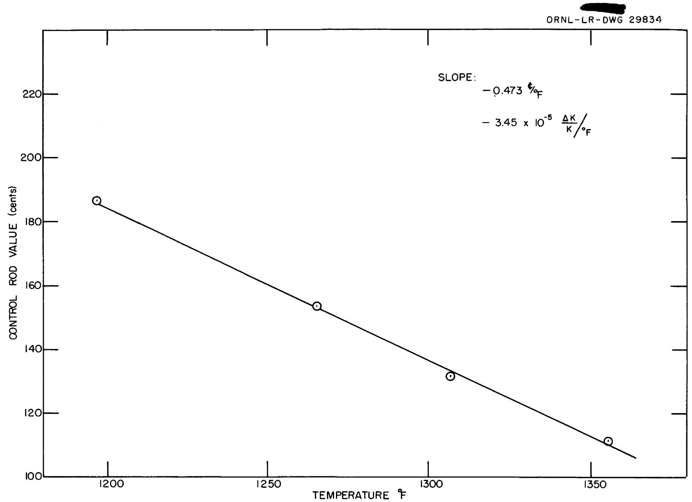  
FIGURE 14. EFFECT OF TEMPERATURE ON REACTIVITY

errors, a straight line with a slope of -0.473 cents/°F. Table 9 lists the control rod positions determined at critical for the five temperatures and the control rod values corresponding to the critical positions.

Since the control rod sensitivity variation with temperature is smaller than other experimental errors, the use of the control rod calibration, which was performed at temperatures near $1250^{\circ}\mathrm{F}$ , was justified. These rod sensitivities were determined by measuring positive periods for small control rod displacements from the critical positions at 1197.0, 1306.9, and $1355.5^{\circ}\mathrm{F}$ . The control rod sensitivities, in cents/in., observed at these temperatures are included in Table 9. Sensitivities observed for the same positions of the rod at temperatures near $1250^{\circ}\mathrm{F}$ are also given for comparison.

Table 9. Variation of Critical Control Rod Position and Rod Value with Temperature   
Uranium Concentration = 11.83 wt%   

<table><tr><td>Temperature (°F)</td><td>Rod Position (in.)</td><td>Rod Value (cents)</td><td>Rod Sensitivity at Temperature (cents/in.)</td><td>Rod Sensitivity at 1250°F (cents/in.)</td></tr><tr><td>1197.0</td><td>21.35</td><td>186.7</td><td>20.6</td><td>20.8</td></tr><tr><td>1256.6</td><td>19.89</td><td>157.6</td><td></td><td></td></tr><tr><td>1265.1</td><td>19.68</td><td>153.6</td><td></td><td></td></tr><tr><td>1306.9</td><td>18.55</td><td>132.6</td><td>18.0</td><td>17.9</td></tr><tr><td>1355.5</td><td>17.32</td><td>111.3</td><td>15.8</td><td>15.9</td></tr></table>

# Fuel Importance in End Duct

The effectiveness of dumping the fuel as a means of shutting down this experiment depended on the time required to remove the fuel from the first few inches of the end duct and the reactivity value of this fuel. Fuel drop times were determined and are reported elsewhere in this report. The importance of the fuel was investigated by determining the control rod position for different fuel levels in the end duct. The results could also be used to estimate the effectiveness of the boron sleeves in suppressing the fissioning rate in the end duct.

Control rod positions at criticality were found for fuel levels 1, 3, 5, and 7 in. below the fill probe level, which was approximately 1 in. above the top of the beryllium. Defining the tip of the fill probe as the reference level of the fuel, the position of an adjustable probe when its tip was at this reference level was found as follows.

The salt was raised until it contacted the fill probe. Then the adjustable probe was moved until it just contacted the salt. The salt level was allowed to drop and the time and order in which the two probe lights went out was noted. The adjustable probe was then moved in accordance with these indications, the salt again raised and the time between and order of lighting of the probes noted. This procedure was repeated until the probes were contacted nearly simultaneously. Usually a condition was reached where the order in which the salt contacted and fell off the probes no longer was consistent, which was taken as an indication that the probes were essentially at the same level and the position of the adjustable probe was noted. The adjustable probe was then inserted the desired distance from this position and the fuel was raised until it contacted the probe. The helium supply was then shut off and the fuel height was maintained during the run by the gas tightness of the system. The adjustable probe was also used to probe for the fuel height after most of the runs, and the readings obtained indicated that during any one run the fuel height dropped less than 1/16 in., the equivalent of less than a $2\%$ error in the magnitude of the reactivity value of the fuel displaced.

Because of a possible interaction between fuel height and rod sensitivity, period measurements were made for each fuel height and the sensitivity of the rod was calculated. The values obtained are listed in Table 10 along with the sensitivities obtained for the same rod travel with the fuel at the fill probe level. Since a significant effect was noted, the sensitivity values obtained for each fuel height were plotted as a function of rod position and the integral under a smooth curve through these points was computed to find the loss in reactivity as the fuel height was lowered. The results are listed in Table 11 and plotted in Fig. 15. Comparing this result with the B10 sleeve data indicates that inserting the B10 sleeves 6 in. into the beryllium is nearly 80% as effective from a reactivity standpoint as lowering the fuel level to the same depth in the beryllium.

Table 10. Effect of Fuel Height on Rod Sensitivity   

<table><tr><td rowspan="2">Fuel Height
Distance Below
Fill Probe
(in.)</td><td rowspan="2">Rod
Position
at Criticality
(in.)</td><td colspan="2">Rod Sensitivity (cents/in.)</td></tr><tr><td>Fuel Below
Fill Probe</td><td>Fuel at
Fill Probea</td></tr><tr><td>0</td><td>19.74</td><td>19.4</td><td>19.4</td></tr><tr><td>1</td><td>19.53</td><td>19.1</td><td>19.0</td></tr><tr><td>3</td><td>18.61</td><td>17.4</td><td>17.8</td></tr><tr><td>5</td><td>16.93</td><td>14.8</td><td>15.4</td></tr><tr><td>7</td><td>13.36</td><td>8.35</td><td>10.6</td></tr></table>

a. These values were determined during the initial calibration of the rod; see Fig. 10.

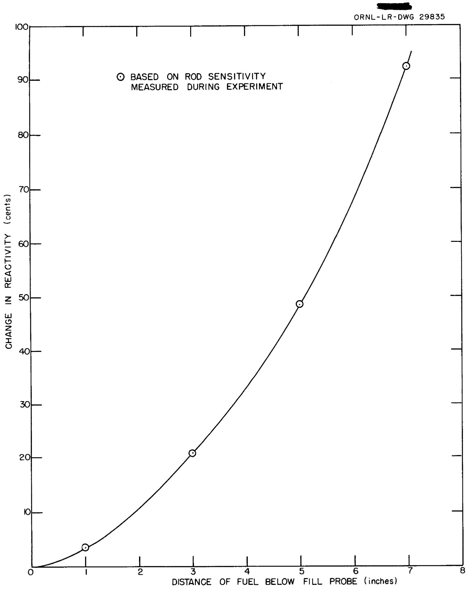  
FIGURE 15. EFFECT OF FUEL LEVEL ON REACTIVITY

Table 11. Effect of Fuel Level on Reactivity   

<table><tr><td>Fuel Height
Distance Below
Fill Probe
(in.)</td><td>Loss in
Reactivity
(cents)</td></tr><tr><td>1</td><td>3.7</td></tr><tr><td>3</td><td>20.6</td></tr><tr><td>5</td><td>48.2</td></tr><tr><td>7</td><td>91.7</td></tr></table>

# Fast-Neutron Leakage Measurements

The relative effectiveness of each of several arrangements of the $\mathsf{B}^{10}$ sleeves in the upper end duct in the reduction of the leakage of fast neutrons from that region of the reactor was measured. A fast-neutron scintillation counter sensitive only to neutrons with energies above about 1 Mev, and similar to one developed by Hornyak,[3] was secured to the top of the reactor tank for this purpose. The scintillator, a 2-in.-dia, 1/4-in.-thick ZnS-Lucite disk, was viewed by a DuMont 6292 photomultiplier tube, and both were mounted in a water-cooled brass can. A water flow rate of about 1 liter/min was sufficient to hold the photomultiplier temperature near $68^{\circ}\mathsf{F}$ when the ambient temperature outside the can was $110^{\circ}\mathsf{F}$ . Figure 16 shows the location of the neutron detector. The thermal insulation between the detector and the reactor assembly was Superox, a calcined diatomaceous silica product of Johns-Manville. During all of the leakage measurements the fuel level was at the tip of the fill probe.

The fast-neutron leakage measurements were made in two series, one during the reactivity evaluation of the $\mathbf{B}^{10}$ sleeves (p. 24) and the other during the uranium foil exposures described in the following section. The first series included three arrangements of the sleeves: (1) both sleeves inserted 1.3 in. into the beryllium, (2) both sleeves inserted 3.0 in. into the beryllium, and (3) both sleeves inserted 5.5 in. into the beryllium. Four sleeve configurations were used in the second series: (1) both sleeves inserted less than 0.5 in. into the beryllium, (2) the outer sleeve inserted approximately 6 in. and the inner sleeve inserted less than 0.5 in. into the beryllium, (3) both sleeves inserted approximately 6 in. into the beryllium, and (4) the inner sleeve inserted approximately 6 in. and the outer sleeve inserted less than 0.5 in. into the beryllium. The effect of the difference in the fuel concentration and the presence of the uranium foils was within experimental error. For both series of measurements the counting rate of

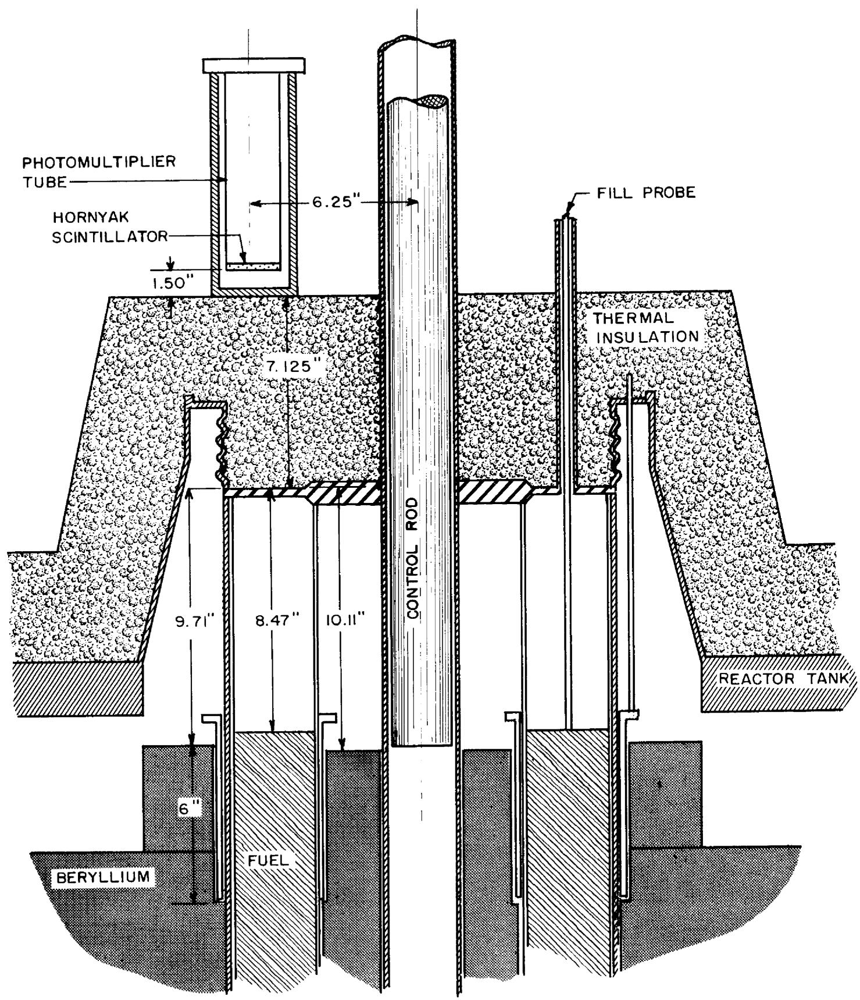  
FIGURE 16. LOCATION OF FAST NEUTRON LEAKAGE DETECTOR

a EF, long counter, located on the floor approximately 20 ft from the reactor, was used to correct the leakage measurements for variations in reactor power.

The results are summarized in Table 12, where the neutron scintillation detector counting rate, corrected for reactor power, is tabulated for each sleeve arrangement. In Fig. 17 the ratio of the power-corrected counting rate for each sleeve arrangement to that for both sleeves inserted less than 0.5 in. into the beryllium has been plotted versus sleeve insertion. These ratios are also listed in Table 12. The horizontal bars on the data points at $1/4$ in. and 6 in. indicate the uncertainties in the positions of the sleeves for those points.

Table 12. Fast-Neutron Leakage Measurements   

<table><tr><td colspan="5">B10 Sleeve Positions (in. Below Top of Beryllium)</td></tr><tr><td>Inner Sleeve</td><td>Outer Sleeve</td><td>Counting Ratea (counts/min)</td><td>Ratios of Counting Ratesb</td><td></td></tr><tr><td>0.5 (Out)</td><td>0.5 (Out)</td><td>9870</td><td>1.00</td><td></td></tr><tr><td>1.3</td><td>1.3</td><td>9280</td><td>0.94</td><td></td></tr><tr><td>3.0</td><td>3.0</td><td>8090</td><td>0.82</td><td></td></tr><tr><td>5.5</td><td>5.5</td><td>6220</td><td>0.63</td><td></td></tr><tr><td>6 (In)</td><td>6 (In)</td><td>6120</td><td>0.62</td><td></td></tr><tr><td>0.5 (Out)</td><td>6 (In)</td><td>6910</td><td>0.70</td><td></td></tr><tr><td>6 (In)</td><td>0.5 (Out)</td><td>9080</td><td>0.92</td><td></td></tr></table>

a. Corrected for reactor power.   
b. Ratio of counting rate to that when both sleeves are inserted less than 0.5 in.

# Longitudinal Fission Rate in End Duct

The longitudinal fission rate distribution in the upper end duct for various positions of the B10 sleeves was determined by exposing enriched uranium foils, 3/4 in. in diameter and 4 mils thick, in the fuel annulus. The foils were distributed between 1/8-in.-thick calcium fluoride spacers to simulate the fuel mixture. This arrangement resulted in a uranium density of 0.6 g/cc as compared with 0.4 g/cc for the reactor fuel. The discrepancy is primarily due to the fact that the detectors were designed well in advance of the experiment when a higher value of fuel concentration was estimated.

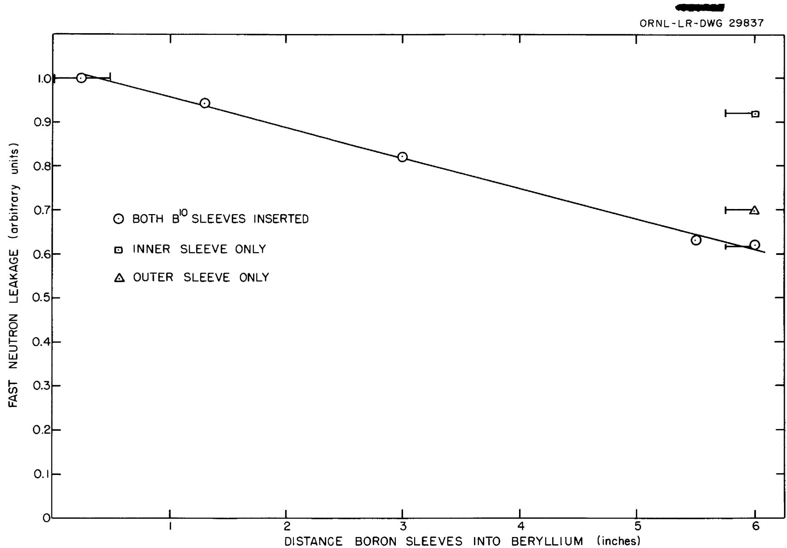  
FIGURE 17. EFFECT OF $B^{10}$ SLEEVES ON LEAKAGE OF FAST NEUTRONS IN THE REGION OF THE UPPER END DUCT

Sixty-one foils were arranged in each of six detector tubes. A representative number of these foils were within a narrow weight range for counting purposes and the others were selected to give the correct average density. The detector tubes consisted of 7/8-in.-OD Inconel tubing with a 0.035-in.-thick wall and 0.076-in.-thick end caps. The calcium fluoride spacers were made cup-like to isolate the uranium from the Inconel, thereby preventing intermetallic diffusion at operating temperature. In addition, aluminum oxide spacers were placed at the ends of the tubes where welds were made since the stability of calcium fluoride at the welding temperature was in doubt. The physical arrangement of material in the detector tubes is shown in Fig. 18.

The detector tubes were introduced into the reactor fuel annulus through the re-entrant tube (Fig. 1) which was constructed of 1.125-in.-OD Inconel tubing with a 0.062-in.-thick wall and a 0.062-in.-thick bottom cap. The exact orientation of the re-entrant tube is not known due to warping and dimensional changes during the reactor assembly and heating. The last available orientation placed the tube axis at an angle of 0 deg 55 min to the reactor axis with the bottom of the tube closer to the inner core shell. The distance from the inner core shell to tube axis at this point was 1.237 in.

Longitudinal fission rate distribution measurements were made for five settings of the parameters. (It was assumed that with the bottom of the control rod below the bottom of the detector tube, changes of rod position would have little effect on the fission rate distribution in the end duct.) Table 13 gives the reactor conditions during the runs. A total of six runs were made, five with 20-min exposures at a relative power of 0.05, and one with a 180-min exposure at a relative power of 0.10. The relative fission rates of the foils from the five 20-min exposures were compared by counting their normalizers at equal decay times for a period of $45\mathrm{hr}$ . The long, high-power run, $V_{b}$ , was made under essentially the same effective conditions as run $V_{a}$ . The data are given in Fig. 18 and Table 14.

Table 13. Conditions of Reactor During Longitudinal Fission Rate Traverses in the Upper End Duct   

<table><tr><td rowspan="2">Run</td><td rowspan="2">Fuel Concentration (wt%)</td><td colspan="2">B10Sleeve Positions (in. Below Top of Beryllium)</td><td rowspan="2">Distance Between Bottom of Control Rod and Top of Beryllium Island (in.)</td></tr><tr><td>Inner Sleeve</td><td>Outer Sleeve</td></tr><tr><td>I</td><td>10.98</td><td>0.5 (Out)</td><td>0.5 (Out)</td><td>6.2</td></tr><tr><td>II</td><td>11.83</td><td>0.5 (Out)</td><td>0.5 (Out)</td><td>19.89</td></tr><tr><td>III</td><td>11.83</td><td>6 (In)</td><td>0.5 (Out)</td><td>18.49</td></tr><tr><td>IV</td><td>11.83</td><td>0.5 (Out)</td><td>6 (In)</td><td>16.79</td></tr><tr><td>Va</td><td>11.83</td><td>6 (In)</td><td>6 (In)</td><td>15.63</td></tr><tr><td>Vb*</td><td>12.48</td><td>6 (In)</td><td>6 (In)</td><td>20.90</td></tr></table>

* Long exposure.

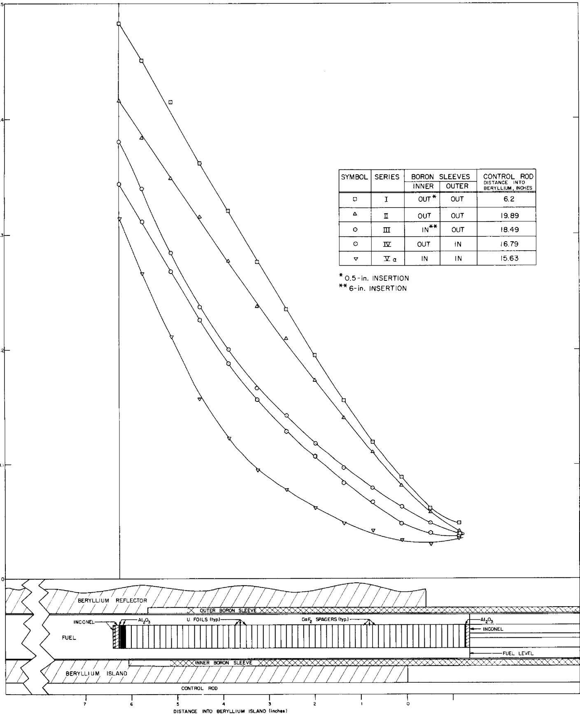  
FIGURE 18. LONGITUDINAL FISSION RATE DISTRIBUTION

Table 14. Longitudinal Fission Rate Distribution in the Upper End Duct   

<table><tr><td rowspan="2">Distance from Top of Island Berylliuma (in.)</td><td colspan="6">Relative Activity</td></tr><tr><td>Run I</td><td>Run II</td><td>Run III</td><td>Run IV</td><td>Run Va</td><td>Run Vb*</td></tr><tr><td>6.230</td><td>0.4833</td><td>0.4162</td><td>0.3806</td><td>0.3440</td><td>0.3142</td><td>0.3142</td></tr><tr><td>5.730</td><td>0.4504</td><td>0.3841</td><td>0.3399</td><td>0.3109</td><td>0.2660</td><td>0.2669</td></tr><tr><td>5.105</td><td>0.4150</td><td>0.3487</td><td>0.2843</td><td>0.2682</td><td>0.2141</td><td>0.2087</td></tr><tr><td>4.480</td><td>0.3621</td><td>0.3150</td><td>0.2377</td><td>0.2259</td><td>0.1558</td><td>0.1594</td></tr><tr><td>3.855</td><td>0.3208</td><td>0.2767</td><td>0.1999</td><td>0.1878</td><td>0.1206</td><td>0.1261</td></tr><tr><td>3.230</td><td>0.2762</td><td>0.2374</td><td>0.1665</td><td>0.1561</td><td>0.0933</td><td>0.0973</td></tr><tr><td>2.605</td><td>0.2350</td><td>0.2905</td><td>0.1422</td><td>0.1287</td><td>0.0758</td><td>0.0786</td></tr><tr><td>1.980</td><td>0.1948</td><td>0.1734</td><td>0.1188</td><td>0.1068</td><td>0.0611</td><td>0.0621</td></tr><tr><td>1.355</td><td>0.1559</td><td>0.1409</td><td>0.0971</td><td>0.0831</td><td>0.0467</td><td>0.0496</td></tr><tr><td>0.730</td><td>0.1198</td><td>0.1106</td><td>0.0790</td><td>0.0661</td><td>0.0400</td><td>0.0422</td></tr><tr><td>0.105</td><td>0.0881</td><td>0.0812</td><td>0.0622</td><td>0.0477</td><td>0.0311</td><td>0.0336</td></tr><tr><td>-0.520</td><td>0.0607</td><td>0.0580</td><td>0.0478</td><td>0.0383</td><td>0.0288</td><td>0.0302</td></tr><tr><td>-1.145</td><td>0.0447</td><td>0.0405</td><td>0.0381</td><td>0.0363</td><td>0.0340</td><td>0.0338</td></tr></table>

a. Positive direction is down.   
\*. Long exposure.

The relative activities were obtained by counting the foils in two pairs of scintillation counters. Each pair was connected to a common RCL AID-P pre-amplifier, which, in turn, was connected to an RCL 2204 single-channel analyzer through an RCL 2420 linear amplifier. Each scintillation counter consisted of a $1 - 1 / 2 \times 3$ in. NaI(Tl) crystal mounted on a Dumont 6363 photo-multiplier tube. These counters were arranged face-to-face to approximate a $4\pi$ counter geometry and were assembled in a lead shield 2 in. thick. Both tubes in each pair were supplied by a single RCL Mark 15 Model 22 high-voltage supply through a voltage divider so that they could be peaked together. Integral counts of gamma rays with energies above 0.5 MeV were recorded.

Each foil was counted twice in each counter assembly, with the normalizer foil from the same tube in the other. The normalizer foil was exposed at the same time as the counting foils and represented the same position in the reactor for each set of runs. For each longitudinal run, the foil nearest the bottom of the detector tube was chosen for the normalizer. Since this method was used, no decay correction was necessary to determine the ratio of foil activation to normalizer activation after application of background corrections to the observed counting rates. Counting in this manner also corrects for any slow change in counter sensitivity with time. Statistics were good to $1\%$ ; however, a small variation in the thickness of the fluoride spacers or change in orientation of the re-entrant tube would lead to an indeterminate error.

Corrections for changes in counter sensitivity between runs were made by counting a $\text{Co}^{60}$ standard under the same counting conditions used for the normalizer foils. Corrections were also made for differences in reactor power during the various foil exposures. The reactor power was monitored with a $\text{BF}_3$ proportional counter.

The counting rates were also corrected for both the counter background and the initial activity of the uranium foils. A determination of the counting rates of ten unexposed foils from the same weight group as those exposed in the reactor indicated that the variation of this activity between foils was small. Therefore, the values obtained were averaged and applied to each of the foil counting rates in the same manner as a background correction. As the background and average initial activity were only a small percentage of the gross activity, the statistics are still within $1\%$ .

As plotted in Fig. 18, the relative activity, R.A., for each foil used to measure the 'longitudinal fission rate distribution is given by

$$
R. A. = \frac {C _ {F} (t) - B _ {F} - I}{C _ {N} (t) - B _ {N} - I} P S N
$$

where

$$
\begin{array}{r l} \mathrm {C _ {F} (t)} \text {a n d} \mathrm {C _ {N} (t)} & = \text {a c t i v i t i e s o f e x p o s e d f o i l a n d n o r m a l i z e r ,} \\ & \text {r e s p e c t i v e l y , o b s e r v e d a t t i m e t a f t e r e x p o s u r e ,} \\ \mathrm {B _ {F}}, \mathrm {B _ {N}} & = \text {c o u n t e r b a g r o u n d d u n i n g c o u n t i n g o f f o i l a n d} \\ & \text {n o r m a l i z e r , r e s p e c t i v e l y ,} \\ \mathrm {I} & = \text {a v e r a g e i n i t i a l a c t i v i t y o f b o t h f o i l a n d} \\ & \text {n o r m a l i z e r ,} \end{array}
$$

$\mathbf{P} =$ normalization factor for reactor power (from $\mathbf{BF}_3$ counters),

S = normalization factor for counter sensitivity (from Co $^{60}$ counting rates),

$\mathbb{N} =$ normalization factor to compare activities from different detector tubes (from normalizer foils).

# Radial Fission Rate Distribution

The radial fission rate distribution was measured at three elevations in the reactor core and at one in the lower end duct. Uranium foils were used for detectors. These were placed in detector tubes which were positioned in the fuel as shown in Fig. 19 and Table 15.

Table 15. Positions of Radial Detector Tubes   

<table><tr><td rowspan="2">Tube Designation</td><td colspan="2">Distance from Reactor Midplane at Point of Attachment (in.)</td><td rowspan="2">Core Shell to Which Attached</td><td rowspan="2">Angle of Tube Axis to Reactor Axis (deg)</td></tr><tr><td>In Cold Assembly</td><td>In Hot Assembly</td></tr><tr><td>Above Midplane</td><td></td><td></td><td></td><td></td></tr><tr><td>D5</td><td>11.00</td><td>11.11</td><td>Outer</td><td>76</td></tr><tr><td>D4</td><td>10.06</td><td>10.17</td><td>Inner</td><td>90</td></tr><tr><td>At Midplane</td><td></td><td></td><td></td><td></td></tr><tr><td>A</td><td>0</td><td>0</td><td>Outer</td><td>90</td></tr><tr><td>B</td><td>0.07</td><td>0.07</td><td>Inner</td><td>90</td></tr><tr><td>Below Midplane</td><td></td><td></td><td></td><td></td></tr><tr><td>D3</td><td>11.00</td><td>11.11</td><td>Outer</td><td>104</td></tr><tr><td>D2</td><td>11.44</td><td>11.56</td><td>Inner</td><td>90</td></tr><tr><td>D1*</td><td>24.32</td><td>24.57</td><td>Inner</td><td>41</td></tr></table>

* In lower end duct.

The detector tubes were welded to the core. shells and remained in the reactor during the entire period of operation. The detector tubes consisted of 7/8-in.-OD Inconel tubing with a 0.035-in.-thick wall and 0.035-in.-thick end caps. The tube lengths varied with their positions in the assembly. The uranium foils inside the tubes were separated with calcium fluoride spacers as they were for the longitudinal fission rate measurement described previously. The counting procedure was also the same.

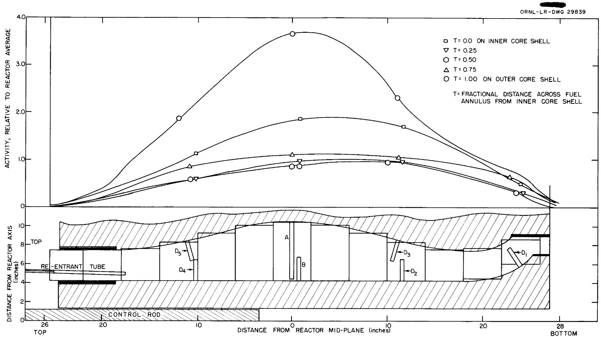  
FIGURE 19. PWAR-I ELEVATED TEMPERATURE CRITICAL ASSEMBLY FISSION RATE DISTRIBUTION

The radial foil activities are plotted with respect to the average relative activity, defined by the equation4

$$
A _ {a v} = \frac {\int A (r , z) d V}{V _ {F}}
$$

where

$$
\begin{array}{r c l} V _ {F} & = & \text {f u e l v o l u m e ,} \\ A (r, Z) & = & \text {r e l a t i v e a c t i v i t y a t r , Z ,} \\ r & = & \text {r a d i a l c o o r d i n a t e ,} \\ Z & = & \text {a x i a l c o o r d i n a t e .} \end{array}
$$

This integration was performed numerically. The fuel annulus was approximated by a series of 14 cylindrical annuli (Fig. 19) of height $\triangle Z$ . Each annulus was further divided into a series of concentric shells of thickness $\Delta r$ and mean radius $r$ . The relative activity for each incremental volume was interpolated from the relative activity of the radial foil data. This value was assumed to be independent of $Z$ over each cylinder. The average relative activity was then determined from the summation:

$$
A _ {a v} = \frac {\sum_ {i = 1} ^ {1 4} \sum_ {j = 1} ^ {N} A _ {i} \left(r _ {i j}\right) r _ {i j} \triangle r _ {i j} \triangle Z _ {i}}{\sum_ {i = 1} ^ {1 4} \sum_ {j = 1} ^ {N} r _ {i j} \triangle r _ {i j} \triangle Z _ {i}}
$$

where

$$
A _ {i} \left(r _ {i j}\right) = \text {r e l a t i v e a c t i v i t y i n t h e j t h c y l i n d r i c a l s h e l l o f t h e}
$$

$$
r _ {i j} = \text {m e a n r a d i u s o f t h e c y l i n d r i c a l s h e l l o f t h e j t h s e c t i o n},
$$

$$
\Delta r _ {i j} = \text {t h i c k n e s s o f t h e i t h c y l i n d r i c a l s h e l l o f t h e j t h s e c t i o n ,}
$$

$$
\Delta Z _ {i} = \text {h e i g h t o f t h e i t h s e c t i o n}.
$$

The volume of the fuel region, as determined by this method, is 148.7 liters, as compared with the measured value of 147.2 liters in the cold assembly. The activities were then normalized to this average relative activity.

Table 16 gives the results of all of the radial tubes. Foil positions in this table are given as the perpendicular distance of the foil from the inner core shell. This distance, together with the distance of the attachment point of the detector tubes from the midplane and the angle of the detector tube axis to the reactor axis listed in Table 15, gives the exact positions of the individual foils. The data are plotted in Figs. 20 and 21.

Table 16. Radial Fission Rate Distribution   
(Relative to Reactor Average)   

<table><tr><td>Distance from
Inner Core Shell
(in.)</td><td>Relative Activity</td></tr><tr><td colspan="2">Tube D5, Above Midplane</td></tr><tr><td>2.061</td><td>0.691</td></tr><tr><td>2.546</td><td>0.733</td></tr><tr><td>3.031</td><td>0.825</td></tr><tr><td>3.516</td><td>1.054</td></tr><tr><td>3.880</td><td>1.388</td></tr><tr><td>4.123</td><td>1.781</td></tr><tr><td colspan="2">Tube D4, Above Midplane</td></tr><tr><td>0.054</td><td>1.084</td></tr><tr><td>0.304</td><td>0.930</td></tr><tr><td>0.679</td><td>0.798</td></tr><tr><td>1.179</td><td>0.713</td></tr><tr><td>1.679</td><td>0.685</td></tr><tr><td>2.179</td><td>0.711</td></tr><tr><td colspan="2">Tube A, At Midplane</td></tr><tr><td>0.174</td><td>1.503</td></tr><tr><td>0.799</td><td>1.090</td></tr><tr><td>1.549</td><td>0.936</td></tr><tr><td>2.299</td><td>0.863</td></tr><tr><td>3.049</td><td>0.858</td></tr><tr><td>3.674</td><td>0.921</td></tr><tr><td>4.299</td><td>1.042</td></tr><tr><td>4.674</td><td>1.174</td></tr><tr><td>5.049</td><td>1.423</td></tr><tr><td>5.299</td><td>1.638</td></tr><tr><td>5.549</td><td>1.987</td></tr><tr><td>5.799</td><td>2.516</td></tr><tr><td>6.049</td><td>3.378</td></tr><tr><td colspan="2">Tube B, At Midplane</td></tr><tr><td>0.054</td><td>1.804</td></tr><tr><td>0.304</td><td>1.491</td></tr><tr><td>0.554</td><td>1.306</td></tr><tr><td>0.804</td><td>1.173</td></tr><tr><td>1.179</td><td>1.050</td></tr><tr><td>1.804</td><td>0.922</td></tr><tr><td>2.429</td><td>0.878</td></tr><tr><td colspan="2">Tube D3, Below Midplane</td></tr><tr><td>2.061</td><td>0.899</td></tr><tr><td>2.546</td><td>0.919</td></tr><tr><td>3.031</td><td>1.045</td></tr><tr><td>3.516</td><td>1.340</td></tr><tr><td>3.880</td><td>1.764</td></tr><tr><td>4.123</td><td>2.325</td></tr><tr><td colspan="2">Tube D2, Below Midplane</td></tr><tr><td>0.054</td><td>1.613</td></tr><tr><td>0.304</td><td>1.327</td></tr><tr><td>0.679</td><td>1.898</td></tr><tr><td>1.179</td><td>0.940</td></tr><tr><td>1.679</td><td>0.896</td></tr><tr><td>2.179</td><td>0.905</td></tr><tr><td colspan="2">Tube D1, Below Midplane</td></tr><tr><td>0.054</td><td>a</td></tr><tr><td>0.304</td><td>a</td></tr><tr><td>0.679</td><td>0.322</td></tr><tr><td>1.054</td><td>0.329</td></tr><tr><td>1.554</td><td>0.399</td></tr><tr><td>1.929</td><td>0.505</td></tr><tr><td>2.179</td><td>0.631</td></tr></table>

a. Foils destroyed, probably by leak in detector tube.

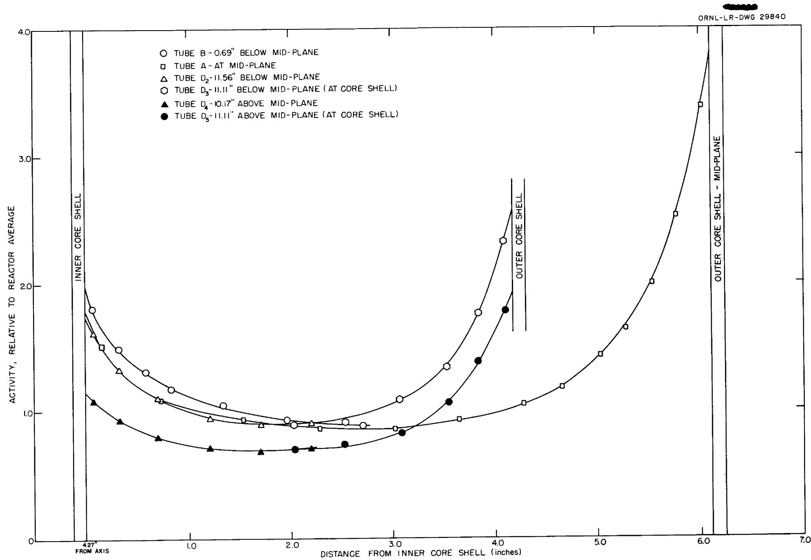  
FIGURE 20. RADIAL FISSION RATE DISTRIBUTION, TUBES A, B, $D_2 - D_5$ .

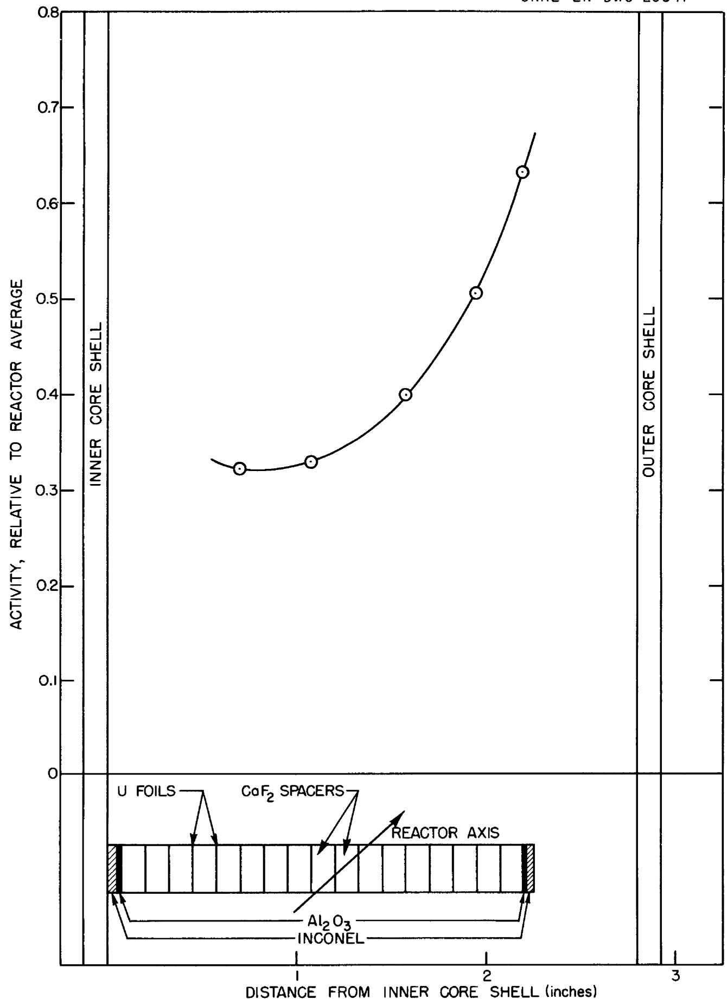  
FIGURE 21. RADIAL FISSION RATE DISTRIBUTION - TUBE $D_{1}$ 24.57" BELOW MID PLANE AT CORE SHELL

Counting statistics for these foils were within $1\%$ . Any error introduced by the numerous normalizations or assumptions will affect the absolute magnitude of the relative activities as plotted but will not affect their relative values.

# Gold Neutron Flux Distribution in the Beryllium Reflector

Gold foils were used to measure the neutron flux distribution in the beryllium reflector of the reactor at three nominal elevations: the midplane, 8 in. below the midplane, and 16 in. below the midplane. The actual positions of the foils in both the hot and the cold assembly are given in Table 17.

Table 17. Longitudinal Positions of Gold Foils in Cold and Hot Assemblies   

<table><tr><td rowspan="2">Nominal Position</td><td colspan="2">Distance from Midplane (in.)</td></tr><tr><td>In Cold Assembly</td><td>In Hot Assembly</td></tr><tr><td>At midplane</td><td>0.03 (below)</td><td>0.03 (below)</td></tr><tr><td>8 in. below midplane</td><td>8.03</td><td>8.09</td></tr><tr><td>16 in. below midplane</td><td>16.03</td><td>16.16</td></tr></table>

The gold foils were 5/16 in. in diameter and 2 mils thick. They were held in covered beryllium oxide cups and placed in slots in beryllium slabs which were then placed in the reflector. The foils remained in the reflector throughout the period of operation. Technical difficulties prevented the comparison of these bare foils with cadmium-covered foils (see Appendix A). The final reactor run was made nine times as long and a factor of two greater in power than any other run so that the major part of the activity observed in the foils would result from this run for which the rod position and fuel concentration were known. In this run the bottom of the control rod was 3.25 in. above the reactor midplane and the fuel concentration was 12.28 wt% uranium.

When the foils were removed from the reactor, they were found to have melted and, in some cases, gave the appearance of having vaporized or diffused into the beryllium oxide. For this reason it was necessary to count the entire beryllium oxide assembly along with a piece of tape which had been used to pick up any small particles which possibly had fallen out of the cup into the foil slot in the beryllium slab. In some cases, the additional material so obtained raised the counting rate by $5\%$ .

The condition of the foils indicated an alloying with some material. Spectroscopic examination of an exposed foil revealed considerable quantities of zinc. Zinc concentration in unexposed foils was negligible. As a halflife determination of the material was in good agreement with the accepted halflife of gold, it is reasonable to assume that only gold

activity was being counted. No conclusions have been drawn as to the source of the zinc.

The relative activities of the gold foils were obtained with the same counting procedures used for the uranium foils except that gamma rays above 0.33 MeV were accepted. The results are given in Fig. 22 and Table 18.

An estimation of the absolute error in these measurements is complicated by the fact that some material may have been lost. For this reason, the negative indeterminacy in the results is less than $1\%$ , which represents the counting statistics, whereas the positive indeterminacy may be large. This fact was considered when the curves shown in Fig. 22 were drawn.

Table 18. Radial Gold Neutron Flux Distribution in the Beryllium Reflector   

<table><tr><td rowspan="2">Distance from Inner Surface of Beryllium Reflector (in.)</td><td colspan="3">Relative Activity</td></tr><tr><td>At Midplane</td><td>8 in. Below Midplane</td><td>16 in. Below Midplane</td></tr><tr><td>0.190</td><td>0.473</td><td>0.478</td><td>0.217</td></tr><tr><td>1.125</td><td>0.687</td><td>0.826</td><td>0.414</td></tr><tr><td>2.125</td><td>0.866</td><td>0.998</td><td>0.412</td></tr><tr><td>2.875</td><td></td><td></td><td>0.600</td></tr><tr><td>3.125</td><td>1.000a</td><td>1.008</td><td></td></tr><tr><td>3.625</td><td></td><td></td><td>0.613</td></tr><tr><td>3.875</td><td>0.998</td><td>0.951</td><td></td></tr><tr><td>4.375</td><td></td><td></td><td>0.559</td></tr><tr><td>4.625</td><td>0.947</td><td>0.841</td><td></td></tr><tr><td>5.375</td><td>0.855</td><td>0.847</td><td></td></tr><tr><td>6.375</td><td>0.739</td><td>0.711</td><td></td></tr><tr><td>6.500</td><td></td><td></td><td>0.350</td></tr><tr><td>7.375</td><td>0.595</td><td>0.610</td><td></td></tr><tr><td>7.935</td><td></td><td></td><td>0.122</td></tr><tr><td>8.875</td><td>0.450</td><td>0.420</td><td></td></tr><tr><td>10.375</td><td>0.269</td><td>0.257</td><td></td></tr><tr><td>11.710</td><td></td><td>0.095</td><td></td></tr><tr><td>13.010</td><td>0.063</td><td></td><td></td></tr></table>

a. This foil used for normalization.

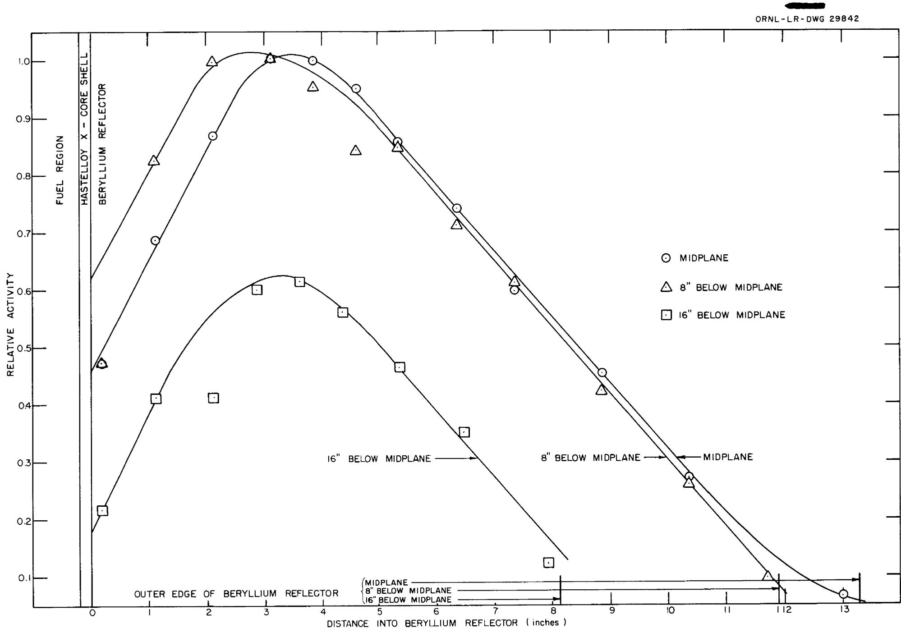  
FIGURE 22. RADIAL NEUTRON FLUX - GOLD FOILS

# Appendix A

# ENGINEERING REPORT

In this appendix the various components comprising the critical experiment assembly are described in detail. In addition, some account of the fabrication techniques and problems encountered is given, as well as a simple description of the operation of the equipment. If greater detail is required, engineering drawings, circuit diagrams, etc. may be obtained from the Pratt and Whitney Aircraft Engineering Assembly Specification Index FXR548 and from Oak Ridge National Laboratory.* Drawings of specific subassemblies are indicated by the T numbers shown in Fig. 23, which is a sketch of the entire assembly.

# Description of Assembly Components

# Reactor Tank

The reactor tank was constructed of Inconel and served to contain the entire reactor assembly as shown in Fig. 23. Calrod-type heaters attached around the entire external envelope of the tank were capable of providing a maximum of $200\mathrm{kw}$ for heating, although it was found that about $11.9\mathrm{kw}$ sufficed to maintain an average temperature of $1250^{\circ}\mathrm{F}$ in the assembly. Risers in various positions on the tank top accommodated thermocouple leads.

The exterior of the reactor tank was insulated with 4-in.-thick blocks of calcined diatomaceous silica, and the tank assembly was mounted about 5 ft above floor level on a stainless steel stand.

The reactor tank was pressurized with helium through a gas inlet-outlet line located on the tank top. A gastight connection between the top of the reactor tank and the reactor assembly was made by a bellows coupling to allow for differential thermal expansion. The helium pressure in the tank was held at about 10 psig or about $\frac{4}{3}$ psig above the maximum pressure expected in the reactor core. A permanently installed gas line between the reactor tank and the island region assured equalization of pressure in the two beryllium regions.

# Sump Tank

The sump tank, also constructed of Inconel, had a capacity of 287 liters at operating temperature. It was suspended from a tripod stand located below the reactor tank (Fig. 23) and connected to the core region of the reactor through a vertical 3.5-in.-OD Inconel fill and drain line (0.216-in.-thick wall). Since this line was welded directly to the bottom of the reactor, and since the sump tank and reactor tank were separately supported, it was necessary to use a bellows coupling gas seal at the point of entry of the line into the sump tank to allow for differential expansion. Risers and fittings on the top of the sump tank provided for a thermocouple

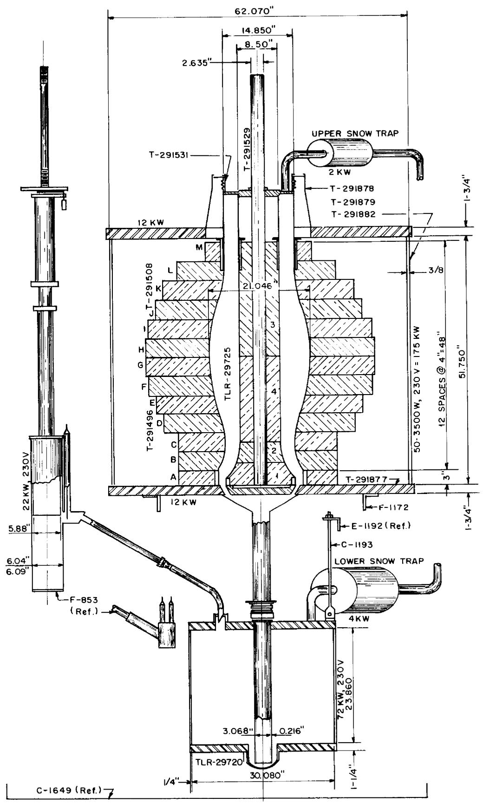  
FIGURE 23.PWAR-I ELEVATED TEMPERATURE CRITICAL ASSEMBLY-OVERALL DIMENSION SKETCH

well, sampling tube, enricher line, level probe, and helium inlet and vent lines. A large snow trap was placed in the main helium fill and vent line. The sump tank was wrapped with heaters and insulated to provide a maximum possible heat input of 72 kw. It was found that temperatures could be maintained with 3 kw.

# Enricher

The enricher was designed as a convenient means for increasing the uranium content of the fuel mixture in the sump tank. It operated as follows: a piston, actuated by a hand-operated screw, moved downward into a cylinder displacing molten $\mathrm{Na_2UF_6}$ which flowed over a wier and thence through the enricher line to the sump tank. The enricher was filled initially to the level of the wier, and the zero position of the piston was established before the enricher line was connected to the sump tank. Subsequently any downward motion of the piston from this position, as measured by a Veeder Root counter directly geared to the screw, resulted in the transfer of a known quantity of $\mathrm{Na_2UF_6}$ to the sump tank. The calibration indicated that on the average 165 g of uranium was transferred for each 0.125-in. stroke of the piston as would be expected from the calculated value using the piston dimensions. Because of surface tension effects at the wier, however, the total amount transferred during any single enriching operation was uncertain by about 40 g. Since enrichments were typically of the order of 300 g and also since samples were frequently taken for chemical analysis, no particular problems were encountered due to this uncertainty.

The liquidus temperature of $\mathrm{Na}_2\mathrm{UF}_6$ is $1190^{\circ}\mathrm{F}$ ; therefore, it was necessary to maintain the enricher at a temperature somewhat above the rest of the system. It was decided that $1400^{\circ}\mathrm{F}$ was a convenient operating temperature. This temperature was maintained by heaters and insulation wrapped around the cylinder. The maximum heat input which could be provided was $22\mathrm{kw}$ , but $1.4\mathrm{kw}$ was sufficient to hold the temperature.

The enricher was suspended by springs and hanger rods from a bracket attached to the wall adjacent to the rig as shown in Fig. 6. A means was provided to check and adjust the level of the enricher after each enrichment since proper operation depended upon maintaining the enricher axis vertical.

After each enrichment the piston was withdrawn to bring the liquid level below the weir and reduce the possibility of accidental enrichment. A liquid level probe was provided in the enricher outlet to indicate when the liquid was approaching the weir level.

# Control Rod Drive

The control rod drive, which was supported above the reactor assembly by a tripod standing on the reactor tank top, consisted of a 1/20-hp electric motor driving a 10 thread per inch screw. A traveling nut on this screw carried a magnet which coupled the control rod to the rod drive. The magnet

rode in a sheet metal sleeve designed so that the walls acted as bearing surfaces for the magnet assembly. A tube extended up through a bearing and shock absorber at the bottom of this sleeve into the region of the magnet's travel. A shock absorber, universal joint, and soft iron core was fitted to the top of this tube. The purpose of the universal joint was to insure that good contact between the magnet and the soft iron core was always maintained. At the lower end of the tube a yoke was attached. The control rod was connected to one end of the yoke by a wire cable universal joint, and the other end of the yoke held a weight which served as a counterbalance for the control rod. This entire assembly was mounted in a vertical position and any interruption of magnet current resulted in the release of the soft iron core from the magnet, whereupon the entire assembly fell by gravity to its rest position defined by the position of the shock absorber at the bottom of the bearing sleeve. Some adjustment in the position of the control rod with respect to the shock absorber was possible at the wire cable connection to the yoke. In addition, means were also provided for small vertical and horizontal adjustments of the entire drive unit where it connected to the tripod, as well as at the base of the tripod legs.

Limit switches were mounted so that lights on the control panel would indicate the upper and the equivalent midplane positions of the magnet. Additional limit switches and associated lights indicated when the control rod was down and when the magnet and control rod were in contact. There were other limit switches which stopped the magnet assembly at the upper and lower end of travel. A synchro transmitter geared to the lead screw made it possible, through a synchro receiver and Veeder Root counter, to remotely observe the magnet position, which when the contact light was lit also defined the control rod position. The relation between actual control rod position and Veeder Root counter reading was checked immediately prior to each run of the reactor. This system allowed for driving the rod at one constant speed, 8.8 in./min. A jog control was also provided which reduced the starting torque of the motor, allowing for small adjustments in the rod position.

# Source Drive

The source drive was mounted adjacent to the control rod drive and was supported by the same tripod. It consisted of a remotely operated 1/20-hp motor which drove a 0.250-dia rod through a friction gear. The source was attached on the lower end of the rod. Guide bearings held the source rod in position with respect to the drive unit. Adjustment of the source rod to conform with the axis of the control rod was accomplished by shimming under the mounting bolts of the source drive unit. Immediately beneath the drive unit and attached to it, a pig containing Lucite and boron carbide was provided to house the source when in the "full out" position. Normally the source could not be brought into the pig immediately after removal from the reactor because of its high temperature. Therefore, provision was made for the source to stop for cooling at a position between the top of the reactor and the pig. Limit switches defined the three positions of the source, i.e., "in", "out," and "full out".

Gas System and Nuclear Controls

The gas system was composed of three circuits: a filling and mixing circuit, a helium supply circuit for standby operation, and a moderator helium supply circuit. This system was interlocked with the nuclear controls to provide the following functions:

1. Raise the fuel into the reactor region.   
2. Maintain and indicate the fuel level in the reactor.   
3. Mix the fuel automatically.   
4. Provide interlocks for automatic safety of operation.   
5. Supply and maintain an inert helium atmosphere in the moderator region.   
6. Supply and maintain an inert helium atmosphere in the sump tank, enricher, and reactor core for standby conditions and for filling and sampling operations.

Figure 24 is an elementary flow diagram of the three gas panels. Helium was supplied to the gas system from a rack of helium bottles and manifold through a pressure reducing valve (unnumbered at the extreme right of Fig. 24). The helium entered the gas panels at approximately 80 psig. The bourdon gage, PI-8, indicated the supply pressure, and the pressure switch, PS-5, turned on a red light when the pressure dropped below 80 psig.

Filling and Mixing Circuit. The gas entered the filling and mixing circuit at hand valve HV-1, which was the shutoff valve to allow maintenance of the circuit. After entering at a pressure of 80 psig the gas was then reduced to a pressure of 20 psig by a pressure control valve, PCV-1. The pressure was indicated on PI-3. PCV-2 was a highly accurate Moore regulating valve used to maintain the pressure in the sump constant to within a small fraction of an inch of mercury. HV-5 and -6 were used to isolate valve PCV-2 for any necessary maintenance. Also, since this valve was of the constant bleed type, it was necessary to isolate both sides of it when the bypass line through HV-4 was being used to prevent back flow of radioactive gases and helium from the sump into the control room through the bleed hole in the PCV-2. HV-7 and HV-8 were the primary manual control valves in the fill line. These two valves were used in series for safety and finer control considerations. A solenoid valve, SV-5, was used for automatic shutoff. It was a normally closed valve so that loss of electric power automatically stopped the flow of filling gas.

Flow indicators FI-1 and -2 were used to indicate the rate at which gas was flowing into the system and this indicated how rapidly the salt was being added to the reactor or what the leak rate of the system was when the regulator valve, PCV-2, was maintaining the fuel level constant. The flow meters differed by about a factor of 14 in sensitivity. The hand valves HV-9, -13, and -14 were used to select the flow meter desired and also permitted their removal for servicing.

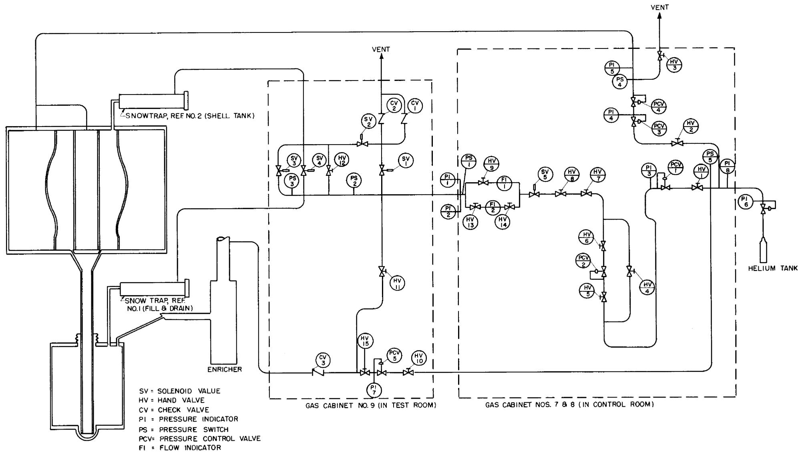  
FIGURE 24. PWAR-I ELEVATED TEMPERATURE CRITICAL ASSEMBLY   
INERT GAS SYSTEM

Pressure in the sump and reactor core was prevented from inadvertently reaching dangerous values by a high pressure safety switch, PS-1, which closed SV-5 and vented the system through SV-1. The pressure in the system was indicated on both PI-1, a 10-in.-dia bourdon gage, and PI-2, a 35-in. long mercury monometer. In the fill and hold conditions, PI-1 and -2 indicated the height of the salt in the reactor.

The sump and reactor core were vented with normally open solenoid operated valves, SV-1 and -2. SV-2 was closed only in the hold condition. Check valves in the vent line, CV-1 and -2, prevented the back flow of air into the system. They were connected in parallel to insure venting.

SV-3 and -4 were solenoid valves actuated by pressure switches PS-3 and -2, respectively, and were used in the automatic mixing operation. PS-3 was set to open at a pressure which raised the salt somewhat less than halfway up into the reactor. The electrical circuitry was arranged (see Fig. 25) so that the actuation of this switch opened SV-3 and closed SV-5, allowing the salt to rapidly dump into the sump, thereby mixing it. PS-3 closed at slightly above atmospheric pressure, which in turn closed SV-3 and opened SV-5 and again admitted helium to raise the salt, starting the cycle over again. PS-2 was set to open at a slightly higher pressure than PS-3 and was connected so it opened both SV-3 and -4 and closed SV-5. It was included as a safety device to dump the salt in the event PS-3 failed to do so. It also closed at approximately atmospheric pressure.

EV-12 was a manual valve which allowed SV-3 and -4 to be bypassed and was used during the standby condition (see following section) to maintain the reactor core and sump regions at the same pressure and prevent the salt from rising into the reactor core.

The line through HV-ll and CV-3 was provided to allow the filling gas to flow from the supply through the enricher into the sump. The enriching salt, $\mathrm{Na_2UF_6}$ , has a high affinity for $\mathrm{ZrF_4}$ vapor which evolved in appreciable quantities from the fuel mixture at the operating temperature, and it was therefore desirable that little or no gas flow from the sump into the enricher. CV-3 prevented the flow of helium out of the sump through the enricher when the salt was dumped.

Standby Helium Supply Circuit. During enriching, sampling and sump filling operations and during other periods when the salt remained in the sump for an extended length of time, an inert helium atmosphere was maintained in the system. The helium supply circuit used for this purpose was separate from the one described above, and since it was used only during non-nuclear operations it was identified as the "standby" helium supply circuit.

The standby circuit consisted of HV-10, PCV-5, HV-15 and PI-7 as shown in Fig. 24. Two shutoff valves were used so that by opening one, HV-10, before opening the other, HV-15, it was possible to check the pressure setting of

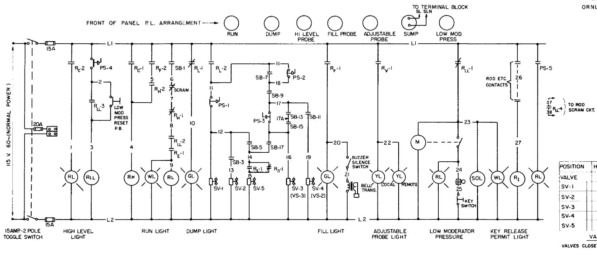

UNCLASSIFIED

ORNL-LR-DWG 29845

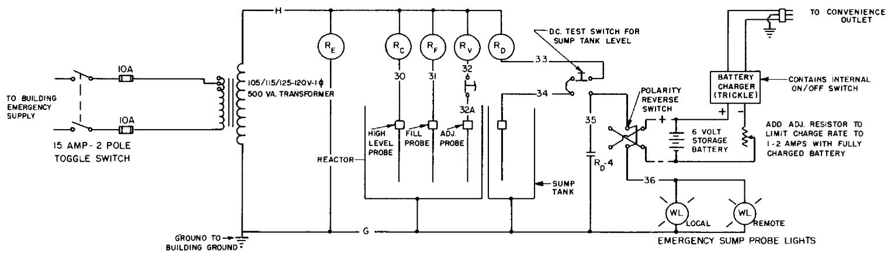  
FIGURE 25. PWAR-I ELEVATED TEMPERATURE CRITICAL ASSEMBLY ELECTRICAL WIRING DIAGRAM

<table><tr><td colspan="2">POSITION</td><td>HOLD</td><td>FILL</td><td>DUMP</td><td>MIX</td></tr><tr><td colspan="2">CONTACT</td><td></td><td></td><td></td><td></td></tr><tr><td>1 2</td><td>1</td><td>X</td><td>X</td><td></td><td>X</td></tr><tr><td>OH-OH-O</td><td>2</td><td></td><td></td><td></td><td></td></tr><tr><td>3 4</td><td>3</td><td>X</td><td></td><td></td><td></td></tr><tr><td>OH-OH-O</td><td>4</td><td></td><td></td><td></td><td></td></tr><tr><td>5 6</td><td>5</td><td></td><td>X</td><td></td><td></td></tr><tr><td>OH-OH-O</td><td>6</td><td></td><td></td><td></td><td></td></tr><tr><td>7 8</td><td>7</td><td>X</td><td>X</td><td></td><td></td></tr><tr><td>OH-OH-O</td><td>8</td><td></td><td></td><td></td><td></td></tr><tr><td>9 10</td><td>9</td><td>X</td><td>X</td><td></td><td>X</td></tr><tr><td>OH-OH-O</td><td>10</td><td></td><td></td><td></td><td></td></tr><tr><td>11 12</td><td>11</td><td>X</td><td>X</td><td></td><td>X</td></tr><tr><td>OH-OH-O</td><td>12</td><td></td><td></td><td></td><td></td></tr><tr><td>13 14</td><td>13</td><td>X</td><td>X</td><td></td><td></td></tr><tr><td>OH-OH-O</td><td>14</td><td></td><td></td><td></td><td></td></tr><tr><td>15 16</td><td>15</td><td>X</td><td>X</td><td></td><td></td></tr><tr><td>OH-OH-O</td><td>16</td><td></td><td></td><td></td><td></td></tr><tr><td>17 18</td><td>17</td><td></td><td></td><td></td><td>X</td></tr><tr><td>OH-OH-O</td><td>18</td><td></td><td></td><td></td><td></td></tr></table>

DEVELOPMENT OF SB SWITCH   
EVEN NUMERED CONTACTS NOT REQUIRED AND ARE NOT THEREFORE LISTED.   
ODD NUMERED CONTACTS ARE CLOSED IN POSITIONS INDICATED BY "X".

PCV-5 with PI-7 before applying any pressure to the sump. This prevented the inadvertent application of a dangerously high pressure to the sump.

HV-11 was always closed before gas was admitted through this system, thus insuring that the gas flowed through the enricher into the sump. In addition, a mechanical interlock between HV-15 and -12 made it impossible to open HV-15 before HV-12 had been opened and also prevented HV-12 from being closed before HV-15 had been closed. This insured that SV-3 and -4 were bypassed and no difference in pressure between the sump and the reactor core could develop which would raise the salt into the reactor during standby operation.

Two standby procedures were used. In one the sump was vented through SV-1 and CV-1 and -2 and a continuous bleed of helium through PCV-5 was maintained. This was used primarily for sampling operations. In the other procedure SV-1, -2, and -5 were closed and a constant pressure of 2 or 3 psig was maintained on the sump by means of PCV-5. The latter procedure was used for all extended shutdown periods.

Moderator Helium Supply Circuit. During all operations an inert gas atmosphere was maintained in the two moderator regions. The circuit which supplied helium to these regions of the system consisted of HV-2 and PCV-3 and -4 as shown in Fig. 24. Two pressure regulators were used to insure safety by reducing the possibility of applying a dangerously high pressure to the moderator regions. The pressure was indicated on PI-4 and -5. Pressure switch PS-4 was set to open when the pressure in the moderator region fell below a pressure which was slightly higher than the hydrostatic pressure produced by the normal height of salt in the reactor core above the bottom plate of the reactor tank. The opening of PS-4 dumped the fuel and dropped the control rod. This forestalled the creation of the potentially dangerous condition in which the hydrostatic pressure of the salt in the reactor core was higher than the helium gas pressure in the moderator. If a leak in the core shells had occurred under such a condition, it would have been possible for salt to enter the moderator region with an attendant addition of a large amount of positive reactivity. The control rod was dropped to provide additional safety in the event some salt did leak into the moderator region. This switch also turned on a flashing light and rang a bell.

A vent was provided for the moderator regions through HV-3.

Fuel Level Indicators. In addition to the indication of the salt level given by the pressure gauges PI-1 and -2, three probes were provided at the top of the reactor core region, two in fixed positions and one variable. The tip of one of the fixed probes was approximately 1 in. above the level of the beryllium island. This probe was called the fill probe and was used to determine the normal height of the salt for most runs. The salt contacting the fill probe turned on a light on the gas panel and activated a buzzer. The buzzer could be silenced by a switch provided in its circuit (see Fig. 25).

The tip of the other fixed probe was l in. above the fill probe and was called the high-level probe. This probe acted as a safety device to prevent the salt from rising too high in the core region. When the salt contacted it, solenoid valves were actuated such that the salt was dumped until it dropped below the fill probe. The valves then returned to the condition they were in before the high-level probe was contacted.

The adjustable probe was used to determine salt levels other than the fill probe height and was also used to more accurately determine the salt level at the fill probe. To do the latter, the adjustable probe was moved until it was very nearly at the same height as the fill probe and the salt level was then maintained so it was in contact with one but not the other probe. In this fashion the level of the salt could be determined and held to within about $1/64$ in. of the level of the fill probe. Fuel in contact with the adjustable probe caused lights on both the gas panel in the control room and the cabinet in the reactor room to turn on.

A probe was also used in the sump tank to indicate when the salt was in the sump. This probe, as well as the other three, was supplied with 110 volts ac through an isolation transformer from the building emergency power circuit. Therefore, in the event of a power failure, which should automatically dump the fuel, the sump probe would be supplied with power from the building emergency motor generator set and could then be used to determine whether the salt was in the sump. For the minute or so required for the motor generator set to come up to voltage, or for the case in which it failed completely, a storage battery was provided which, by pushing a button, would put 6 volts dc on the probe. Since a probe in these salts quickly becomes polarized when direct current is applied to it, a polarity reverse switch was also included so that it could be depolarized.

Connections Between Gas System and Nuclear Controls. The gas system was connected to the nuclear control circuits in three places. First, as was mentioned above, loss of the moderator pressure dropped the control rod and dumped the fuel. Second, the nuclear scram circuit was connected to the gas system so that initiation of a scram signal also dumped the fuel. And third, an interlock was provided in the circuit of SV-5 so that when the salt was in the sump, SV-5 could not be opened to admit gas to raise the salt unless the control rod and source were both inserted to the midplane of the reactor. This prevented the salt from being raised into the reactor core when the control rod or source was in an unsafe position. After the salt had been raised high enough in the reactor core so that the probe in the sump no longer was in contact with the salt, the rod and source could be moved and SV-5 would remain open. This permitted the Moore regulator, PCV-2, to add gas through SV-5 to maintain the fuel level during the operation of the reactor.

Nuclear Instruments and Controls. The nuclear instrumentation used for this experiment was identical with that used for the low-temperature experiments performed at this facility and described in detail elsewhere. It consisted of the following components: two $\mathrm{BF}_3$ ionization chambers connected to vibrating reed electrometers whose output was indicated on linear strip charts, a $\mathrm{BF}_3$ ionization chamber connected to a logarithmic amplifier with a range of about 6-1/2 decades (this same amplifier also provided a signal to indicate pile period); a $\mathrm{BF}_3$ chamber connected to a dc amplifier which was read on a linear strip chart; an anthracene scintillation counter read on a linear strip chart; two $\mathrm{BF}_3$ proportional counters connected to linear amplifiers and scalers; and a Hornyak scintillator (zinc sulfide in lucite) connected to a linear amplifier and scalar. The outputs of the two vibrating reed electrometers and the anthracene scintillator were connected to the scram circuit. A special control panel, designed and built for the ART Elevated Temperature Experiment, was used again in this experiment with minor modifications. It contained the switches, lights, Veeder Root counter, and circuitry for the control of the motion and indication of the position of the source and control rod and the interconnection of these with the nuclear scram circuit and the gas system.

# Snow Traps

Two reaction traps packed with aluminum oxide pellets were installed in the experiment to remove zirconium fluoride vapor, or "snow", from the displaced gas during filling and dumping operations. One trap was mounted in the offgas line from the top of the reactor; the second trap was installed in the vent line from the sump tank. The traps were similar except that the sump tank trap was made from 10-in.-dia pipe while the reactor trap was made from 8-in.-dia pipe. The sump tank trap was larger because of the higher gas flow rate through the vent line during fuel dumping procedures.

Each trap consisted of a reaction section and a filter section. The reaction section, which was 12 in. long, contained 4 to 8 mesh aluminum oxide pellets which reacted with the zirconium fluoride vapor to form nonvolatile zirconium oxide and slightly volatile aluminum fluoride. This section was insulated and heated with heaters to a temperature in excess of $1400^{\circ}\mathrm{F}$ . The filter section contained 3-1/2 in. of Demister packing. followed by 1 in. of Fiberfax packing and another 1 in. of Demister packing. This section was intended to remove the small amount of aluminum fluoride vapor formed in the reaction section, as well as any unreacted zirconium fluoride vapor. The filter section was uninsulated and cooled by natural convection and radiation.

# Heating and Temperature Control Circuits

The primary power supply for heating the critical experiment was a 100-KVA transformer feeding a three-phase 400-amp disconnect at 460 v. From this disconnect two smaller transformers were supplied. A 75-KVA

transformer provided the power for a series of variable auto transformers which controlled the voltage across all heaters except those on the sump tank. Auto transformers controlling the sump tank heaters were fed from a 25-KVA transformer. In the event of a primary power supply failure, a switch gear was so arranged that the sump tank variable auto transformers were supplied from a 25-KVA capacity diesel standby power system.

All the variable auto transformers were mounted in cabinets in the control room. It was therefore not necessary to enter the test cell to adjust power to the heaters. The positions of the heater units on the rig are shown in Fig. 26.

Thermocouples were located at various positions throughout the assembly as shown in Fig. 27. The thermocouple leads ran to patch panels where, by appropriate patching arrangements, they could be made to read on any point of three 16-point Brown recorders or on two fast Brown recorders. The 16-point recorders were used in each of the three major areas, the reactor, the sump tank and the enricher. There was duplication in the installation of thermocouples to allow for failure during the course of the experiment. The fast Brown recorders permitted continuous reading of any four thermocouples. They were most frequently used for observing the temperature transient in the enricher transfer line during additions of enriched fuel and the approach of the fuel and reactor assembly to thermal equilibrium after filling.

Variable auto transformers were adjusted until all temperatures being recorded for a given assembly read in a close group at the temperature desired. The minimum attainable temperature spread was typically of the order of $20^{\circ}\mathrm{F}$ .

# Construction of Assembly Components

As was previously noted, the responsibility for most of the component construction was assumed by Pratt and Whitney Aircraft; however, the nuclear control and instrumentation circuitry, the control rod and source drives, most of the enricher assembly, and the reactor tank support stand were components which had previously been used at the ORNL Critical Experiments Facility. In addition, ORNL performed the following tasks: the final assembly of the detector tubes that contained the foils; manufacture of the control rod meat and assembly of the rod; drilling of coolant holes in the larger beryllium island pieces; manufacture of $\mathtt{B_4C - Cu}$ shields; reassembly of the enricher barrel; and final setup of the experiment including heaters, insulation, heating circuits, gas lines and the reactor tank closure welds.

Although the manufacture of most of the assemblies and components involved standard techniques and methods, fabrication of certain items was problematical. These problems are discussed below.

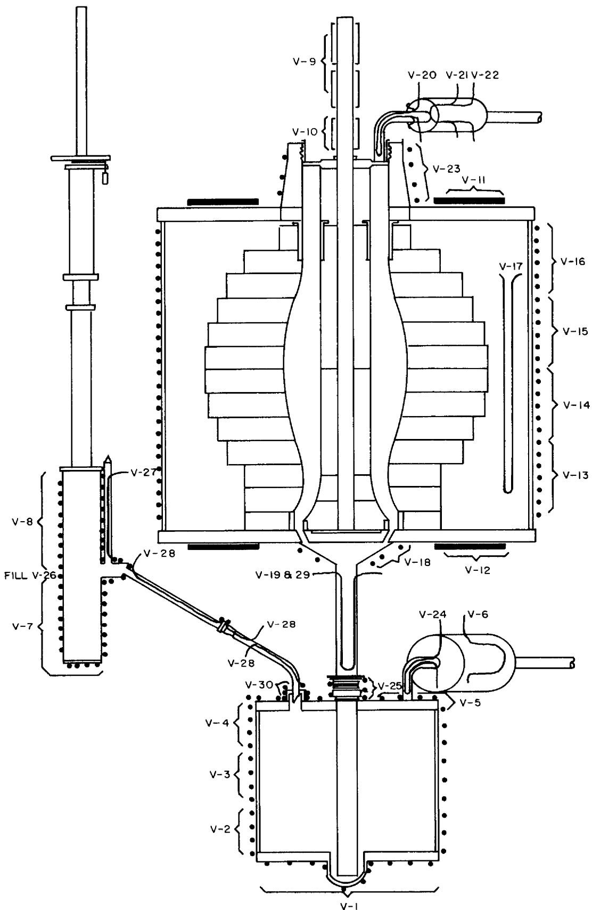  
FIGURE 26. PWAR-I ELEVATED TEMPERATURE CRITICAL ASSEMBLY HEATER LOCATIONS

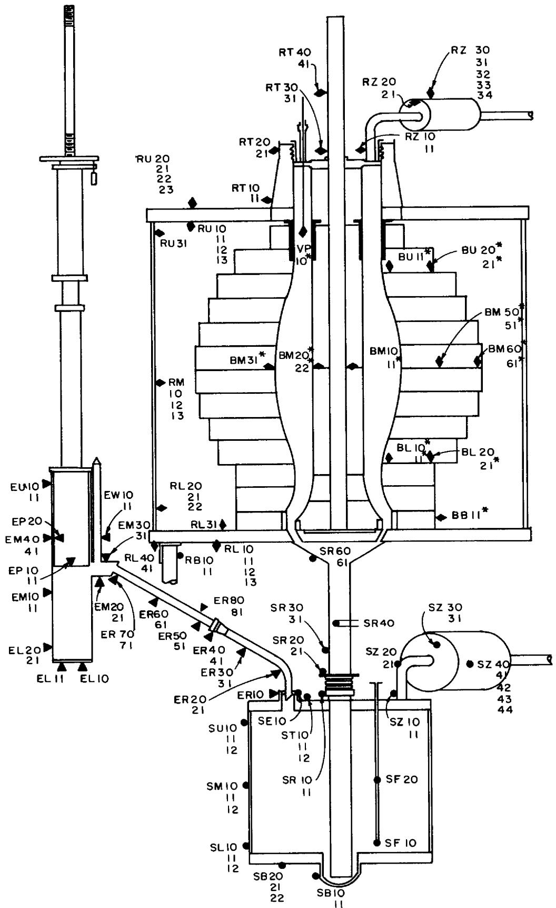  
FIGURE 27. PWAR-1 ELEVATED TEMPERATURE CRITICAL ASSEMBLY - THERMOCOUPLE LOCATIONS

# Welding

Throughout the component fabrication period welding was a major problem. A detailed account of the welding and weld inspection techniques used in the manufacture of the reactor assembly and the sump tank is contained in CPS-120* and CPS-140 which were based on original ORNL Metallurgy Division specifications PS-1, -14, and -18 covering inert gas-shielded tungsten-arc dc welding for nickel-based alloys. When these specifications, which were very stringent, were followed, entirely satisfactory welds resulted; however, it was not until considerable training and practice had been acquired by Canel welding personnel that good welds were obtained.

Difficulties were also experienced in maintaining the oxygen content of the inert gas sufficiently low to eliminate the occurrence of oxide inclusions. The gas used was $99.8\%$ pure argon supplied from a shop cascade system through molecular sieves. The minimum dewpoint of the gas was maintained at $-50^{\circ}\mathrm{F}$ , but some oxide inclusions continued to occur. This problem was never completely resolved and it was necessary to relax the weld specifications somewhat to allow the presence of not more than one oxide inclusion per inch of weld, no inclusion to exceed $5\%$ of the weld thickness.

During fabrication it became clear that the weld shrinkage problem had been underestimated. In joints where full penetration is required it is, of course, desirable to begin the weld with an adequate gap between the surfaces to be joined. Unfortunately the shrinkage encountered required that additional fixtures be used, which in some cases resulted in distortion.

Difficulties with Hastelloy X to Inconel joints had been anticipated, but these joints were no more troublesome than joints between identical metals. Requirements for filler rod etc. are given in CPS-120.

Before making the final closure welds on the detector tubes, the tubes, with their uranium foils and calcium fluoride spacers in place, were thoroughly outgassed. The closure weld was then made in a dry box containing helium, thus leaving an atmospheric pressure of helium in the tube. Most welds were dye checked, leak checked and radiographed.

# Fabrication of Core Shells

Developing techniques for fabricating the inner and outer core shells presented considerable difficulty, particularly for the outer shell. The cylindrical shell which made up most of the inner core shell was made by

rolling and seam welding a Hastelloy X sheet 0.125 in. in thickness. This technique did not produce a cylinder that conformed to the desired tolerances (±0.010 in. on the radius). In addition, repairs to the welded seam produced considerable localized distortions. It was, therefore, necessary to press a sizing plug through the shell to help round it and to increase the inside diameter sufficiently to allow the island beryllium to be put in place. Better, though more expensive, approaches to this problem would have been to (1) form the part in a die, (2) roll and seam weld the part to a radius less than that finally desired and size it in an expanding cluster or (3) produce it by extrusion.

The technique first attempted in producing the larger components of the outer shell was hydrospinning. A mandrel was made which conformed to the inside contour of the liners. The mandrel was mounted on the hydrospin machine and a rolled, seam-welded conical shell was fixed to it. Attempts were then made to spin the shell down onto the mandrel, thus producing the final contour. In order to attain the desired 0.156-in. wall thickness, stock 0.188 in. thick was used since the metal was expected to move considerably along the mandrel in the direction of roller motion, thereby reducing the shell thickness during the spinning process.

The first problem which arose in this process involved cracking at the seam weld. This was corrected by rolling the weld bead down until the thickness at the weld was identical with the parent metal thickness. Circumferential cracks then began to appear in the region being worked under the roller. These were attributed to the very rapid work hardening properties of Hastelloy X and, therefore, blow torches were installed to elevate the temperature of the material above the annealing temperature while it was being worked. The fact that it was impossible to maintain any but a small section of the material above annealing temperature caused this continuous annealing method to be discarded. It then became necessary to dismount the material frequently and subject it to a stress relief cycle.

During the first efforts to form this component, cracks also developed in regions not being worked under the roller. These cracks always appeared in a region near the large diameter of the cone that had been contacted by the mandrel as the spinning operation proceeded from the small diameter to the large diameter. This was corrected by increasing the apex angle of the cone until contact was never made between the cone and the mandrel except at points between the smallest diameter and the region being worked by the roller.

When the above difficulties had been eliminated it became possible to spin shells free of structural defects; however, the problem of producing usable core shells was by no means solved. It was found to be virtually impossible to get good contact at all points between the shell and the mandrel; therefore, the shells produced did not have the proper contour, the differences being in many places as great as 0.125 in. on the radius. In addition, no satisfactory method could be devised to control the shell thickness. The movement of metal in the direction of the tool motion was small and varied considerably with distance along the axis of the shell. Consequently, while

the thickness in some areas was reduced, in other areas, particularly those where the required diameter decrease was greatest, the shell wall increased in thickness. Efforts to fabricate the shells using the hydrospin process were therefore abandoned.

A second attempt was made to produce the larger components of the outer shell by die forming in a 1500-ton press. The mandrel intended for use in the hydrospin process was used as a punch. This method proved quite successful, although it was impossible to conform to the desired tolerances without first investigating spring-back and other associated problems and then manufacturing a new punch and die. Also, since only 0.188-in. stock was available and the die forming process produces essentially no decrease in wall thickness, the shell walls were uniformly oversize. It was therefore necessary after die forming to contour turn the shells down until the wall thickness requirements were met. Satisfactory parts were eventually produced by this technique.

The smaller parts of the inner and outer shells of both the lower and upper duct were constructed by rolling and seam welding them and then either hydroforming or die forming them. Of these latter processes, die forming seemed to give the most satisfactory results. Again some difficulty was experienced in conforming to tolerances because no time was available for a full investigation of spring-back, optimum clearances and other phenomena relevant to the die design. Tables 19 and 20 give the final dimensions of the inner and outer core shells.

# Fabrication of B10 Sleeves

Difficulties encountered in fabricating the inner and outer boron sleeves resulted in changes in the sleeve design during this period. Essentially each sleeve consisted of a B10-filled annulus formed between two concentric metal cylinders. Actually sheets of metal were welded on the outside and inside of spacer rings, both at the top and bottom, as shown in the accompanying sketch.

The first attempt to fabricate these sleeves resulted in a 0.100-in.-thick boron annulus between 0.019-in.-thick Hastelloy X walls. The interior

of the annulus was plated with 1 mil of copper to prevent interaction between the boron and the nickel component of Hastelloy X. The annulus was packed with elemental B10 powder, 100% of which passed through 100 mesh and 90% through 200 mesh screen. The annulus was then outgassed at room temperature and sealed under vacuum (< 1 in. Hg). All welds were dye checked, leak checked, and radiographed. During the course of the core shell assembly the inner sleeve reached a temperature in the neighborhood of 500°F. At this point it bulged and one of the closure welds failed. This failure is explained as follows: The boron powder contained 94% boron; the remaining 6% was primarily oxygen in the form of

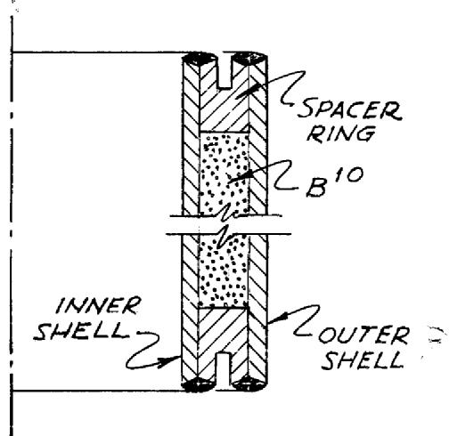

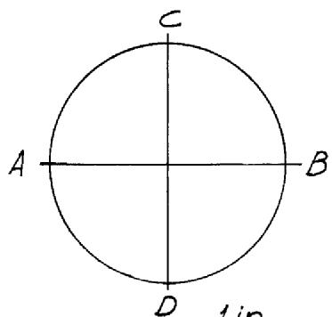

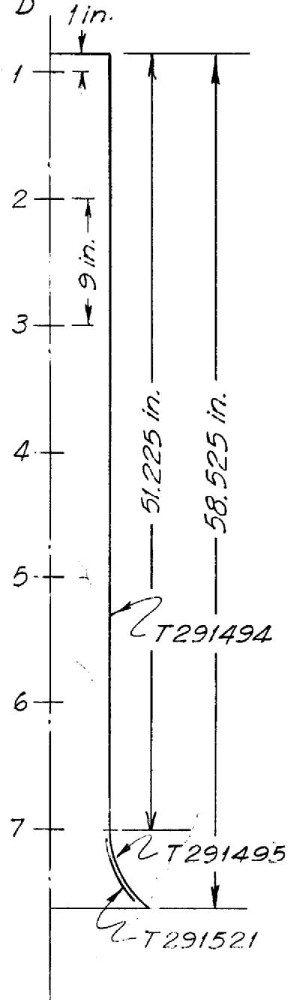

A. Liner Section T 291494

Table 19. Dimensions of Inner Core Shell ${}^{a - c}$   

<table><tr><td rowspan="2">Station</td><td colspan="2">Outside Diameter (in.)</td></tr><tr><td>A B</td><td>C D</td></tr><tr><td>1</td><td>8.554</td><td>8.473</td></tr><tr><td>2</td><td>8.542</td><td>8.485</td></tr><tr><td>3</td><td>8.533</td><td>8.478</td></tr><tr><td>4</td><td>8.545</td><td>8.430</td></tr><tr><td>5</td><td>8.543</td><td>8.435</td></tr><tr><td>6</td><td>8.537</td><td>8.486</td></tr><tr><td>7</td><td>8.523</td><td>8.508</td></tr></table>

B. Liner Section T 291495

<table><tr><td rowspan="2">Distance from Small End (in.)</td><td colspan="2">Inside Radii (in.)</td></tr><tr><td>Design</td><td>Actual</td></tr><tr><td>0</td><td>4.125</td><td>4.125</td></tr><tr><td>1</td><td>4.170</td><td>4.170</td></tr><tr><td>2</td><td>4.280</td><td>4.300</td></tr><tr><td>3</td><td>4.520</td><td>4.550</td></tr><tr><td>4</td><td>4.840</td><td>4.910</td></tr><tr><td>5</td><td>5.280</td><td>5.340</td></tr><tr><td>6</td><td>5.875</td><td>5.935</td></tr><tr><td>6.5</td><td>6.260</td><td>6.320</td></tr><tr><td>7</td><td>6.700</td><td>6.730</td></tr><tr><td>7.3</td><td>7.050</td><td>7.050</td></tr></table>

a. T numbers are Pratt and Whitney drawing numbers corresponding to the sections being described.   
b. The wall thickness for each of the three sections of the inner core shell (liners T 291494 and T 291495 and stiffener T 291521) was 0.125 in. + 0.005 in.   
c. All dimensions are for room temperature.

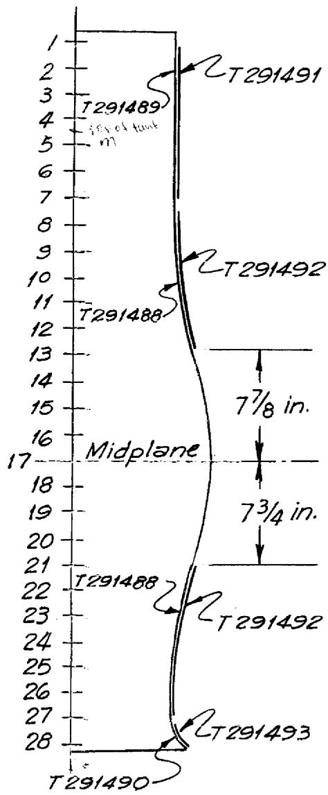

Table 20. Dimensions of Outer Core Shell   

<table><tr><td colspan="6">A. Dimensions at Specific Stations</td></tr><tr><td rowspan="2">Station (2 in. Apart)</td><td colspan="2">Inside Diameter (in.)</td><td rowspan="2">Measured Deviation in Inside Diameterb (in.)</td><td rowspan="2">Measured Average Wall Thickness (in.)</td><td rowspan="2">Maximum Deviation in Wall Thickness (in.)</td></tr><tr><td>Mean Design</td><td>Measured</td></tr><tr><td>1</td><td>14.850</td><td>14.765</td><td>0.121</td><td>0.156</td><td>0.010</td></tr><tr><td>2</td><td>14.850</td><td>14.775</td><td></td><td>0.156</td><td>0.010</td></tr><tr><td>3</td><td>14.850</td><td>14.779</td><td></td><td>0.156</td><td>0.010</td></tr><tr><td>4</td><td>14.850</td><td>14.795</td><td></td><td>0.156</td><td>0.010</td></tr><tr><td>5</td><td>14.850</td><td>14.805</td><td></td><td>0.156</td><td>0.010</td></tr><tr><td>6</td><td>14.850</td><td>14.815</td><td></td><td>0.156</td><td>0.010</td></tr><tr><td>7</td><td>14.850</td><td>14.815</td><td></td><td>0.156</td><td>0.010</td></tr><tr><td>8</td><td>14.850</td><td>14.912</td><td>0.012</td><td>0.156</td><td>0.010</td></tr><tr><td>9</td><td>15.038</td><td>15.106</td><td>0.020</td><td>0.166</td><td>0.020</td></tr><tr><td>10</td><td>15.576</td><td>15.646</td><td>0.014</td><td>0.165</td><td>0.016</td></tr><tr><td>11</td><td>16.400</td><td>16.470</td><td>0.022</td><td>0.160</td><td>0.017</td></tr><tr><td>12</td><td>17.414</td><td>17.485</td><td>0.136</td><td>0.157</td><td>0.010</td></tr><tr><td>13</td><td>18.482</td><td>18.481</td><td>0.064</td><td>0.164</td><td>0.004</td></tr><tr><td>14</td><td>19.494</td><td>19.464</td><td>0.016</td><td>0.150</td><td>0.013</td></tr><tr><td>15</td><td>20.320</td><td>20.270</td><td>0.016</td><td>0.151</td><td>0.008</td></tr><tr><td>16</td><td>20.858</td><td>20.829</td><td>0.020</td><td>0.154</td><td>0.005</td></tr><tr><td>17</td><td>21.046</td><td>21.058</td><td>0.010</td><td>0.148</td><td>0.007</td></tr><tr><td>18</td><td>20.858</td><td>20.840</td><td>0.026</td><td>0.145</td><td>0.013</td></tr><tr><td>19</td><td>20.320</td><td>20.288</td><td>0.038</td><td>0.147</td><td>0.012</td></tr><tr><td>20</td><td>19.994</td><td>19.478</td><td>0.240</td><td>0.153</td><td>0.012</td></tr><tr><td>21</td><td>18.482</td><td>18.494</td><td>0.034</td><td>0.154</td><td>0.012</td></tr><tr><td>22</td><td>17.414</td><td>17.488</td><td>0.036</td><td>0.149</td><td>0.011</td></tr><tr><td>23</td><td>16.400</td><td>16.466</td><td>0.010</td><td>0.152</td><td>0.011</td></tr><tr><td>24</td><td>15.576</td><td>15.632</td><td>0.024</td><td>0.153</td><td>0.011</td></tr><tr><td>25</td><td>15.038</td><td>15.112</td><td>0.010</td><td>0.158</td><td>0.016</td></tr><tr><td>26</td><td>14.850</td><td>14.932</td><td></td><td>0.156</td><td>0.010</td></tr><tr><td>27</td><td></td><td>15.042</td><td></td><td>0.156</td><td>0.010</td></tr><tr><td>28</td><td></td><td>15.713</td><td></td><td>0.156</td><td>0.010</td></tr></table>

B. Average Wall Thickness for Each Section   

<table><tr><td colspan="2">Sectionc</td><td colspan="2">Average Wall Thickness (in.)</td></tr><tr><td colspan="4">Linersd</td></tr><tr><td>T 291489</td><td></td><td>0.156</td><td>+ 0.005</td></tr><tr><td>T 291488</td><td>(upper)</td><td>0.158</td><td>+ 0.005</td></tr><tr><td>T 291488</td><td>(lower)</td><td>0.151</td><td>+ 0.005</td></tr><tr><td>T 291490</td><td></td><td>0.156</td><td>+ 0.005</td></tr><tr><td colspan="4">Stiffenersd</td></tr><tr><td>T 291491</td><td></td><td>0.094</td><td>+ 0.005</td></tr><tr><td>T 291492</td><td>(upper)</td><td>0.094</td><td>+ 0.005</td></tr><tr><td>T 291492</td><td>(lower)</td><td>0.094</td><td>+ 0.005</td></tr><tr><td>T 291493</td><td></td><td>0.094</td><td>+ 0.005</td></tr></table>

a. All dimensions are for room temperature.   
b. I.e., the difference between two perpendicular diameters.   
c. T numbers are Pratt and Whitney drawing numbers corresponding to the sections being described.   
d. Gaps between stiffeners and liners $= 0$ to 0.020 in.

boric oxide. As the temperature of the powder increased the boric acid lost its water of crystallization and the pressure in the annulus increased. Cases adsorbed on the boron powder also contributed to this pressure increase until the elastic modulus of the annulus walls was exceeded and permanent deformation occurred.

Although this problem could have been corrected by outgassing the sleeves at high temperature, it was decided to rebuild the sleeves to a new design, since considerable doubt had arisen about the ability of the copper plate on the interior of the sleeves to completely prevent embrittlement of the Hastelloy X due to the effect of boron. It was extremely difficult to maintain the continuity of the plated surfaces due to scratching during the boron packing process. The following design changes were therefore made. Type 410 stainless steel, which contains no nickel, was substituted for the Hastelloy X, and means were provided for continuously controlling the pressure in the annulus. Because stainless steel has less strength than Hastelloy X at high temperatures, it was necessary to increase the wall thickness to 0.062 in. The boron annulus thickness was accordingly decreased to 0.062 in., some of which was required to allow for slightly increased clearances between the core shells and the moderator in the region of sleeve travel.

During assembly of the experiment a vacuum pump was connected to the boron annuli of the sleeves so that, during leak checks and outgassing of the moderator regions, the pressure differential across the sleeve walls was never in the direction of bursting stresses. Later when the experiment was in operation and the moderator pressure was the order of 25 psia, pressure in the sleeves was raised to atmospheric.

# Fabrication of $\mathrm{B_4C - Cu}$ Plates

Boron-containing neutron shields in the lower hemisphere of the reactor were designed to be a $\mathrm{B_4C - Cu}$ cermet clad in stainless steel.* Unfortunately, efforts to fabricate one of these shields, the largest piece, failed. Because of this difficulty the shields were redesigned as Inconel cans containing boron carbide powder.

The cans of boron carbide were outgassed at room temperature and the final closure was made under vacuum ( $< 1$ in. $\mathrm{Hg}$ ). At this time the significant hydroscopic and adsorption properties of the elemental boron powder was becoming evident. It was decided therefore to check the outgassing properties of the boron carbide powder with a quick experiment in which a mockup of a boron carbide shield was made and outgassed at room temperature. The shield was then heated and the internal pressure noted. Beginning at -28 in. $\mathrm{Hg}$ the pressure increase followed the ideal gas law up to about $140^{\circ}\mathrm{C}$ , at which point considerable quantities of gas began evolving. When $200^{\circ}\mathrm{C}$ was reached, the pressure was 60 psig. This pressure was then bled to atmospheric and the heating was continued. The P/T ratio remained approximately constant until the temperature reached about $500^{\circ}\mathrm{C}$ , when the evolution of gas was again noted. The experiment ended when a temperature of about $600^{\circ}\mathrm{C}$ was reached and a pressure of 60 psig had again built up. As a result of the experiment plans to use the boron carbide cans were abolished.

Analysis of the gases coming off the boron carbide powder showed them to be primarily composed of water vapor with smaller amounts of $\mathrm{SO}_2$ , $\mathrm{SO}_2$ , $\mathrm{NO}$ , $\mathrm{CO}_2$ , $\mathrm{CO}$ and hydrocarbons being present. The primary source of evolving gases appeared to be water of crystallization in the boric oxide impurity of the boron carbide.

Unfortunately one of the boron carbide shields had been installed in the core shell assembly before the experiment with the shield mockup was performed and it was necessary to remove it. The parts originally produced as $\mathrm{B_4C - Cu}$ sintered pieces were then re-examined. Although the large piece was badly warped and cracked, reworking it straightened it sufficiently so that it could be fitted into position around the lower duct. The reworking caused some additional cracks, but since structural integrity was of no particular importance in the neutron shields the sintered pieces were canned and used despite the cracks.

The conditions under which the smaller B1C-Cu sintered parts were manufactured was as follows: boron carbide was blended with copper powder in the ratio of 25 vol % boron carbide and 75 vol % copper. This was poured into stainless steel tubes which were then flattened, evacuated and hot rolled. The part was then cold formed and machined to bring it within the desired tolerances. The large piece was sintered first, then enclosed in stainless steel, evacuated and hot rolled.

# Fabrication of Beryllium Parts

The techniques for hot sintering and machining of large beryllium parts were developed by the Brush Beryllium Company and no fabrication problems were encountered due to the processes used. However, the excessive machining time required to produce each beryllium part delayed delivery dates long beyond the original schedule. This holdup was somewhat alleviated by supplying Brush with extra drill presses required to drill approximately 800 coolant holes in each 4-in.-thick reflector ring.

A small percentage of the coolant holes were chipped at the bottom surface of the rings. This apparently occurred as the drill bit broke through during the drilling operation. For the purpose of the critical experiment this defect was of no consequence.

The deep hole drilling in the two long island pieces was performed at the Y-12 Plant. The deviation from the designed path of the coolant holes in these pieces was the order of 0.003 in. per inch of hole length. This departure from design tolerance was also of no consequence in the experiment.

# Fabrication of Gold Foils

As previously noted, gold foils used for activation measurements during the experiment were placed in slots provided for them at various radial positions in the beryllium reflector. Since an investigation of the compatibility of gold and beryllium at high temperature showed a strong tendency for the two metals to alloy, an attempt was made to find a suitable covering for the gold foils that was also compatible with the beryllium. Tests with

ceramic wafers of both beryllium oxide and aluminum oxide in contact with gold on one side and beryllium on the other showed no detectable degeneration of the gold foils at high temperatures (1400°F) in an inert atmosphere. On the basis of these tests it was decided to use hot-pressed beryllium oxide as the gold foil holders.

Despite the above results, it was found when the gold foils were removed at the end of the experiment that considerable physical change in the foils had occurred. Spectral analysis showed the presence of sufficient quantities of zinc in the gold to form a low melting alloy. The source of this contaminant is unknown but it was established that the original foils and the ceramic containers were zinc free.

Some effort was expended in attempting to find a cadmium-containing cover for the foils in the hope that a comparison of the total activation with the activation by neutrons above the cadmium cutoff could be made. The only materials which had suitable physical properties and were available were cadmium oxide and cadmium silicate. A series of experiments were run to check the compatibility of these materials with gold and beryllium and the results were negative. Because time was not available to launch a thorough investigation of this problem, the effort was dropped.

# Fabrication of Control Rod

The control rod meat was made by the ORNL Metallurgy Division Ceramics Laboratory by pressing and sintering a blend of rare earth oxides and nickel powder into the form of cylindrical annuli about 2.3 in. long. Sixteen of these cermet pieces were then machined and used to make up the poison section of the control rod. The resulting cylindrical annulus was contained between two Inconel tubes.

The first rod that was fabricated had a constant outside diameter; however, it was found that in order to maintain the desired clearance between the rod and its thimble (0.062 in.) straightness requirements on the rod weldment, thimble weldment and upper thimble extension would be impossible to meet without a major alteration in fabrication technique. It was also found that when the cold rod entered the hot thimble it tended to bend at points of contact with the thimble wall because of the more rapid heating of the rod at these points. This resulted in a binding of the rod in the thimble.

In an attempt to eliminate the binding problem, the design of the rod was changed. The outside tube of the rod was removed between the top of the poison section and the rod lifting flange and replaced by a tube with a smaller outside diameter (see Fig. 28). With this change it was only necessary for the 0.062-in. clearance requirement to be met over 38 in. of the rod length rather than over its entire length. Considerably more curvature of the thimble and the rod could then be tolerated and no further problems were experienced with control rod motion.

ORNL-LR-DWG 29848

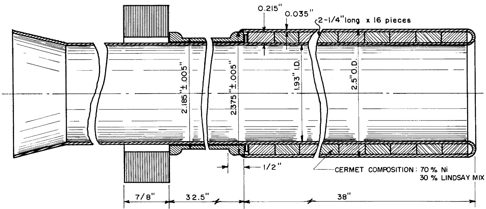  
FIGURE 28. PWAR-I ELEVATED TEMPERATURE CRITICAL ASSEMBLY CONTROL ROD

# Fuel Manufacture

The fuel was manufactured by the ORNL Materials Chemistry Division. The procedure used was as follows: The $\mathrm{Na_2UF_6}$ and $\mathrm{NaF - ZrF_4}$ were made separately. In each case, a low hafnium content mixture of the raw fluorides was prepared. The mixture was heated to $1500^{\circ}\mathrm{C}$ in a hydrogen fluoride atmosphere. Three processing steps then were performed. In the first step reduction of the sulphates and oxides to sulphides and lower order oxides was accomplished with hydrogen gas. Next hydrogen fluoride was used to convert the reduced products to fluorides and drive off hydrogen sulfide. Finally hydrogen gas was again used to reduce the metallic impurities to base metals, thereby releasing hydrogen fluoride.

A more detailed account of the fuel manufacturing processes is presented elsewhere.

# Material Failures

The major material failure which occurred during the course of the experiment was a leak in the fabricated 6-in. schedule 40 Inconel pipe cap at the bottom of the sump tank. When the final assembly was complete and all checks were made the sump tank was filled with barren salt $(\mathrm{NaF - ZrF_4})$ . A few hours later a heater failure occurred on the bottom of the sump tank at the pipe cap. This heater was disconnected from the heater power circuits and, since no other symptoms of a failure were evident, operational checks were begun. Among other things these checks included testing the mixing operation and raising the salt into the reactor core to check the level probes. About a day after the filling operation had been completed a strong smell of hydrogen fluoride was noticed in the test cell. Examination of the sump tank bottom revealed a salt leak. The barren salt was immediately removed from the sump tank and power to the heaters was cut off. Removal of the insulation disclosed extensive leaking at the 6-in. pipe cap. Cracks in the walls of the pipe cap extended for about an inch vertically up to but not into the weld that joined the cap to the bottom of the tank (see Fig. 29). Extensive fluoride attack had occurred all over the tank bottom and even up along the tank walls. All insulation and heaters were removed and the tank was completely cleaned with abrasive wheels. The 6-in. cap was removed and an 8-in. forged cap was welded in position to replace it. After the heaters and insulation had been reinstalled, the tank was again ready for service.

Re-examination of the X rays of the weld of the 6-in. cap to the sump tank disclosed no defects either in the weld or in the parent metal, although the X-ray sensitivity for the parent metal was only the order of $5\%$ . Dye checks made during the fabrication of the sump tank also disclosed no defects. An additional pipe cap which had been made from the same piece of Inconel bar stock as that used in the assembly was also die checked and radiographed, but again no defects were apparent.

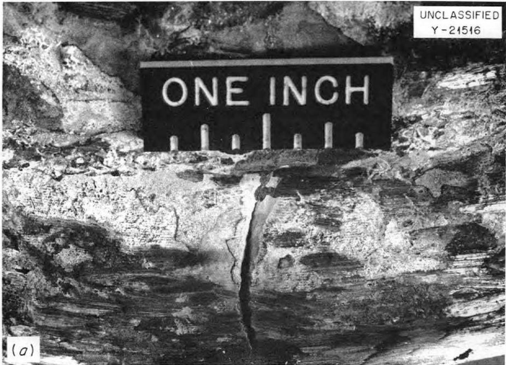

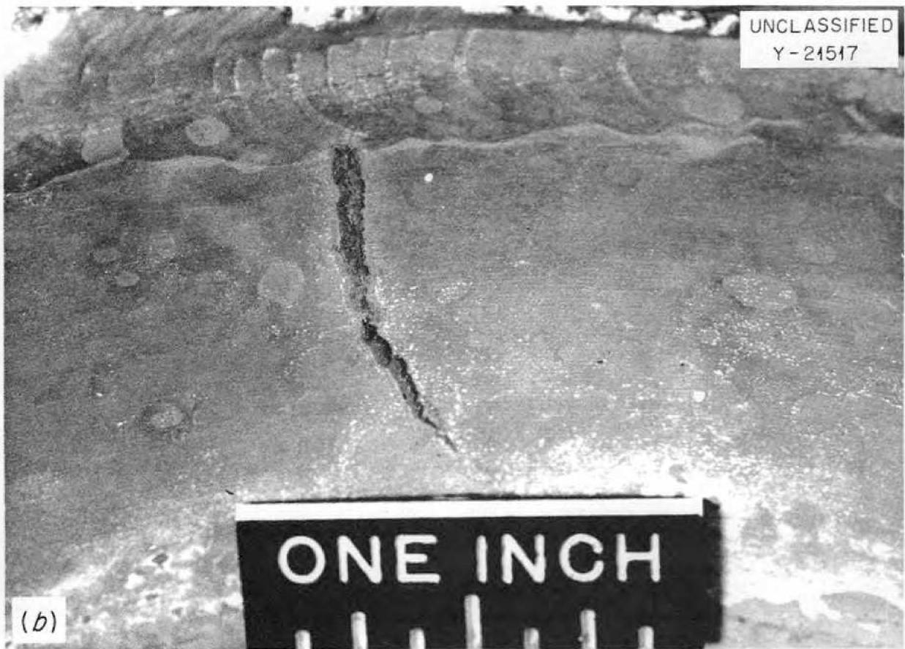  
Fig. 29. Sump Tank Pipe Cap Failure - (a) Outside Crack; (b) Inside Crack.

In investigating the failure of the cap the following points were noted:

1. During fabrication, the pipe cap weld had been subjected to approximately 12 repairs. There had been no subsequent stress relief.   
2. The pipe cap had been machined from Inconel bar stock, which had been substituted for the originally specified wrought Inconel due to a delay in shipment. Defects in rolled Inconel plate and bar are frequently detectable only in sonic tests, and the cap could therefore have been defective prior to installation.   
3. The pipe cap wall thickness was 0.280 in. This was joined to the bottom plate of the sump tank which was $1 - 1 / 2$ in. thick. During initial heat-up, unequal heating of these two parts could have caused stresses due to differential expansion.   
4. The tank temperature during the initial fill had been $1250^{\circ}\mathrm{F}$ , while the temperature of the entering salt during the fill had been $1300^{\circ}\mathrm{F}$ . There had also been a temperature differential between the reactor core and the sump tank of no greater than $50^{\circ}\mathrm{F}$ during the aforementioned operational checks. Thermal shock from these sources would appear to be negligible.   
5. It is the general opinion that the heater failure at the pipe cap occurred after the leak had begun, although this could not be definitely established. The failure could have been due to any or all of items (1), (2), and (3) above.

Another small leak developed during the course of the experiment at a Swagelok fitting in the sump tank sampling line. The first indication of this leak was the inability to hold the fuel level during a refilling operation. During this operation some fuel was always forced up into the sampling line (see Fig.23), which extended down into the sump tank, until the fuel level in the sump tank dropped below the bottom of the line. The leak in the line above the tank was suspected when a loss of the gas pressure in the sump became apparent. Investigation showed that the leak did exist but fortunately only a few hundred cubic centimeters of fuel had been lost.

This amount of fuel was sufficient to cause considerable fluoride attack to the sump tank top. After removing the insulation and investigating the damage, it was deemed necessary to remove the heaters on the top of the sump tank from the heating circuits. It was possible to maintain the sump tank temperatures without these heaters so the experiment was continued with no replacements being made.

Upon removal of the uranium fission rate detector foils from the detector tube $\mathsf{D}_1$ , it was found that a few of the foils nearest the inner core shell were damaged. This, plus discoloration of the inside of the tube body and the calcium fluoride spacers in the same region, indicated a very minor leak in the detector tube, although no defects had been detected when the tubes were leak and dye checked prior to installation. It was necessary to machine through

the weld at the tube end in order to remove the foils; therefore, the probable source of the failure was destroyed prior to its discovery and no investigation of the origin of the leak was possible.

Toward the end of the experimental program two of the 1/8-in. Inconel actuating pins on the outer boron sleeve failed at the weld which joined them to the upper support ring of the sleeve. Subsequent movement of the sleeve was impossible and it remained in the "in" position for the remainder of the experiment. This failure was believed to be due to too small a diameter of the actuating pins, flexure of the pins when in use and the tendency of the sleeve to cock and bind while being moved. When the reactor assembly was disassembled these actuating pins were observed to be badly bent at their lower ends.

Considerable difficulty was experienced with sheathed thermocouple wires used in the test. These commercial thermocouples consist of chromel and alumel wires surrounded by a packed powder magnesium insulator, the whole contained in an Inconel sheath. A marked tendency for these thermocouples to short and ground out was observed. Investigation proved the alumina to be very loosely packed in certain regions and sometimes even completely absent. Wherever possible, beaded thermocouple wires were used.

# Typical Sequence of Operation

Operation of the assembly was performed by a crew of four persons for each shift: a crew chief, a gas panel operator, a nuclear controls operator, and a recorder. The steps included in the operation consisted of enriching, mixing, and sampling the fuel, checking the operation of the instruments, filling the core, bringing the system to critical, maintaining the required nuclear power level, and finally shutting down the system. These steps are described below.

# Enriching

In order for the enricher to function properly it was necessary that its axis be vertical. Two bubble levels, at right angles to each other, were permanently mounted on the enricher lead screw housing so that the level of the enricher could be checked prior to each enrichment. Because of changes in the ambient temperature in the test cell plus small changes in the temperature of the experiment components, with resulting changes in thermal expansion, it was frequently necessary to make level corrections. This was accomplished by adjusting the support brackets which ran from the enricher barrel to the adjacent wall of the test cell.

When the enricher was not in use its piston was backed off about three turns (3/8 in.) to ensure that the $\mathrm{Na_2UF_6}$ level was well below the wier and thus to preclude the possibility of any accidental enrichment. The first step in enriching was therefore to raise the level of the $\mathrm{Na_2UF_6}$ to the wier.

The required position of the piston for raising the $\mathrm{Na}_{2}\mathrm{UF}_{6}$ level was determined by noting the maximum reading of the enricher Veeder Root counter during the previous enrichment. The approach of the $\mathrm{Na}_{2}\mathrm{UF}_{6}$ to the wier level could be noted by observing the resistance reading on a Simpson meter which was connected to the enricher outlet liquid level probe. When this probe was contacted, the $\mathrm{Na}_{2}\mathrm{UF}_{6}$ level was about 0.16 in. below the wier. When the wier level had been reached, any desired amount of uranium could be added to the sump tank by continuing to lower the piston into the enricher barrel. One turn of the hand wheel was equivalent to $165\mathrm{g}$ of uranium.

Since the enricher temperature was $1400^{\circ}\mathrm{F}$ and all other components in the experiment were maintained at about $1250^{\circ}\mathrm{F}$ , it was possible to observe the flow of the enriching salt to the sump tank by noting the temperatures recorded by thermocouples attached to the enricher transfer line. After each enrichment the hand wheel was backed off about three turns as previously noted.

During each enrichment, Veeder Root readings were made as follows: (1) the reading found prior to the enrichment, (2) the reading at which the outlet liquid level probe was contacted, (3) the reading to which the piston was lowered, (4) the number of turns added, and (5) the reading to which the piston was returned after the enrichment. Because of the importance of this operation readings 3 and 5 were checked by a second operator.

# Mixing

A description of the mixing operation is given with the description of the inert gas system (p.57). Analysis of samples during the first phase of the experiment verified that 15 mixing cycles were sufficient to assure uniform mixing. The helium supply pressure was adjusted to give a mix cycle time of about 2 min. As the fuel was being raised for the first mix cycle of each series, response of the period meter was observed. The apparent period was never allowed to become less than 30 sec; therefore, with the higher uranium concentrations toward the end of the experiment, it was necessary to increase the mix cycle time somewhat. It will be recognized, of course, that the positive period observed during fuel mixing and raising operations did not necessarily represent positive reactivity of the system.

Also, during the first mix cycle, operation of the mix pressure switches and associated circuitry was checked for proper functioning. After initial adjustment of pressure trip levels no difficulties were encountered throughout the experiment.

# Sampling

Fuel samples were taken for chemical analysis after every third enrichment following attainment of the first critical concentration. The sampling procedure was as follows: First the sump tank was vented. A graphite-lined, flanged pot containing a smaller graphite-lined stainless steel cup was then connected to the sampling line. The sampling line was then evacuated and heated to greater than $1400^{\circ}\mathrm{F}$ by electric heaters and, on uninsulated parts

of the line, by a blowtorch. The vacuum applied to the flanged pot caused fuel to be drawn from the sump tank into the pot, spilling first into the stainless steel cup, then overflowing into the pot proper. The beginning of this overflow was detected with a liquid level probe, and immediately after it began the pot was pressurized and fuel remaining in the sample line was blown back into the sump tank. The pot was then disconnected and taken to an ORNL Analytical Chemistry Division laboratory for sample analysis. (This laboratory and the experiment were located in the same building.)

# Instrument Checks

In general, complete instrument checks were not made prior to each run, but they were made at least once during each 8-hr shift. These consisted of checking the response of the $\mathbf{EF}_3$ proportional and Hornyak button counters and checking the nuclear scram on two continuously reading $\mathbf{BF}_3$ ionization chambers and one gamma-ray sensitive channel. Each channel was checked separately and the control rod was allowed to drop. The fuel dump was checked on at least one channel. Response of the log N period meter and one dc amplifier channel not connected to the scram circuits was also checked. All checks were made using a Po-Be neutron source or a radium gamma-ray source.

Immediately before each run, the relation of the Veeder Root counter reading on the control rod panel and the physical position of the rod was established. The rod was brought down to the midplane limit switch and the Veeder Root reading was again recorded. At the same time the distance between the control rod flange and the top of the rod thimble extension was physically measured and recorded.

# Filling the Reactor Core

With the fuel in the sump tank, the control rod was brought to midplane and the source put in the "in" position. As previously noted, interlocks were provided which required this before the helium pressure could be placed on the sump tank. The fuel was then raised, using PCV-2 (see Fig. 24) as the maximum pressure control valve and FI-1 to indicate the rate of gas addition, to the level of the fill probe, noting carefully the response of the period and power level meters as a guide to the rate of rise. This system of filling gave an almost idealized startup condition since the rate of gas addition varied inversely with sump pressure and the sump pressure increase rate decreased with increased sump pressure. This rate decrease was a result of the increased gas volume in the sump as the sump pressure increased. Because the temperature of the sump tank was not usually identical to the temperature of the reactor core, it was necessary to keep the fuel within the core for about $45\mathrm{min}$ prior to each critical run to allow for thermal equilibration. If this were not done, temperature transients would disturb the reactivity measurements being made. A thermocouple in the variable probe which read fuel temperature in the top of the core and a thermocouple on the outer core shell were continuously recorded by a fast Brown recorder located on the gas panel. By this means the approach to thermal equilibrium could be observed.

# Temperature Readings

As noted under "Experimental Results," average temperatures for each run

were determined by reading a series of selected thermocouples in the reactor assembly. These readings for each run were usually taken shortly after the neutron level was reached and shortly before the control rod position was recorded in an attempt to obtain a mean of the slow transient temperatures.

# Approach to Critical (Routine)

When all of the above steps had been accomplished the experiment was ready for operation. The estimated critical position of the control rod was noted by the operator and withdrawal of the rod from the midplane began. The rate of rod removal was determined by the period meter which was never allowed to be below 30 sec. When the neutron level was sufficiently high, removal of the source began. The criterion for complete source removal was the low response of the neutron level to source motion. With the source out, withdrawal of the rod continued until the rod was at the critical position for the last enrichment. The power level was then allowed to increase on a period defined by this rod position. Increments of uranium added were always such as to make this period the order of 100 sec during a typical run. When the log N meter indicated the desired level, the rod was moved in until reactor power was level and the period infinite. The change in power level during the constant period was usually the order of two decades. Measurement of this period determined the reactivity difference for the rod positions. The second measurement was made by reducing the neutron level for a short interval and then repeating the positive period step.

# Maintaining the Power Level

Since automatic means were not provided, the power level was maintained by the operator. A tendency of the system to drift in level was attributed to slow thermal transients and convection currents in the reactor assembly and fuel and fuel level drift. Thus slow and unpredictable reactivity changes required frequent minor adjustments of the control rod position.

Two means were provided for maintaining fuel level: automatic regulation of the pressure through PCV-2 (see Fig. 24) could be used, or the helium supply could be closed off. Of these, the latter means was more frequently used but because of the finite helium leak rate of the system it was necessary to occasionally readjust the fuel level during a run. Whenever the helium leak rate became excessive it was necessary to remove the accumulation of $\mathrm{ZrF_4}$ from the valve seats of SV-3 and SV-4 (Fig. 24).

# Shutdown

The system was shut down by dumping the fuel and returning the control rod to the midplane. Immediately after shutdown the source was moved to the "in" position. After a short wait the test cell was entered and the gas system put in standby operation.

# Appendix B

# COMPOSITIONS AND WEIGHTS OF REACTOR MATERIALS

Table 21. Composition of $\mathsf{B}^{10}$ Pieces   

<table><tr><td>Material</td><td>wt%</td></tr><tr><td>Total Boron</td><td>94</td></tr><tr><td>B10</td><td>92</td></tr><tr><td>Iron</td><td>0.23</td></tr><tr><td>Oxygen</td><td>~6</td></tr></table>

Table 22. Composition of Control Rod Cermet   

<table><tr><td>Material</td><td>wt%</td></tr><tr><td>Nickel</td><td>70</td></tr><tr><td>Lindsay Mixa(Rare Earth Oxides)</td><td>30</td></tr><tr><td>Sm (b)</td><td>63.8</td></tr><tr><td>Cd (b)</td><td>26.3</td></tr><tr><td>Dy (b)</td><td>4.8</td></tr><tr><td>Nd (b)</td><td>0.9</td></tr><tr><td>Misc. (b)</td><td>4.2</td></tr></table>

a. The europium was removed from the mixture.   
b. In the form of an oxide; the weight percent quoted includes the oxygen.

Table 23. Composition of Beryllium Oxide Foil Holders   

<table><tr><td>Material</td><td>wt%</td><td>Material</td><td>wt%</td></tr><tr><td>Al</td><td>0.2</td><td>Mg</td><td>&lt; 0.05</td></tr><tr><td>B</td><td>0.002</td><td>Mn</td><td>&lt; 0.02</td></tr><tr><td>Ba</td><td>&lt; 0.02</td><td>Mo</td><td>&lt; 0.02</td></tr><tr><td>Ca</td><td>&lt; 0.1</td><td>Na</td><td>&lt; 0.01</td></tr><tr><td>Cu</td><td>&lt; 0.05</td><td>Ni</td><td>&lt; 0.05</td></tr><tr><td>Cb</td><td>&lt; 0.1</td><td>Pb</td><td>&lt; 0.1</td></tr><tr><td>Cd</td><td>&lt; 0.001</td><td>Si</td><td>0.1</td></tr><tr><td>Co</td><td>&lt; 0.05</td><td>Sn</td><td>&lt; 0.05</td></tr><tr><td>Cr</td><td>&lt; 0.05</td><td>Ti</td><td>&lt; 0.02</td></tr><tr><td>Fe</td><td>&lt; 0.02</td><td>V</td><td>&lt; 0.02</td></tr><tr><td>K</td><td>&lt; 0.01</td><td>Zr</td><td>&lt; 0.1</td></tr><tr><td>Li</td><td>&lt; 0.01</td><td>BeO</td><td>Remainder</td></tr></table>

Table 24. Composition and Weights of Beryllium Reflector and Island Parts   

<table><tr><td rowspan="3">Piecea</td><td rowspan="3">P and W Dwg. No.</td><td colspan="11">Compositionb</td><td rowspan="3">Density (g/cc) Weightd(kg)</td></tr><tr><td colspan="4">wt%</td><td rowspan="2">Al</td><td rowspan="2">Mn</td><td rowspan="2">Li</td><td colspan="3">ppm</td><td rowspan="2">B</td></tr><tr><td>Be</td><td>BeO</td><td>Fe</td><td></td><td>Co</td><td>Ni</td><td>Cd</td></tr><tr><td colspan="14">Reflector</td></tr><tr><td>A</td><td>T 291496</td><td>98.29</td><td>1.72</td><td>0.15</td><td>0.025</td><td>90</td><td>&lt;0.3</td><td>5</td><td>190</td><td>&lt;0.2</td><td>1.1</td><td>1.843</td><td>47.2</td></tr><tr><td>B</td><td>T 291497</td><td>99.20</td><td>1.18</td><td>0.12</td><td>0.041</td><td>80</td><td>&lt;0.3</td><td>5-10</td><td>150</td><td>&lt;0.2</td><td>0.8</td><td>1.840</td><td>64.8</td></tr><tr><td>C</td><td>T 291498</td><td>98.85</td><td>1.38</td><td>0.15</td><td>0.038</td><td>80</td><td>&lt;0.3</td><td>3</td><td>190</td><td>&lt;0.2</td><td>0.1</td><td>1.840</td><td>68.2</td></tr><tr><td>D</td><td>T 291499</td><td>98.90</td><td>1.54</td><td>0.16</td><td>0.057</td><td>70</td><td>&lt;0.3</td><td>20</td><td>400</td><td>&lt;0.2</td><td>0.8</td><td>1.846</td><td>118.4</td></tr><tr><td>E</td><td>T 291500</td><td>98.50</td><td>1.62</td><td>0.15</td><td>0.019</td><td>120</td><td>&lt;0.3</td><td>3</td><td>260</td><td>&lt;0.2</td><td>0.2</td><td>1.853</td><td>139.2</td></tr><tr><td>F</td><td>T 291501</td><td>98.90</td><td>1.46</td><td>0.10</td><td>0.025</td><td>120</td><td>&lt;0.3</td><td>4</td><td>160</td><td>&lt;0.2</td><td>1.3</td><td>1.852</td><td>167.8</td></tr><tr><td>G</td><td>T 291502</td><td>98.90</td><td>1.50</td><td>0.14</td><td>0.020</td><td>130</td><td>&lt;0.3</td><td>4</td><td>200</td><td>&lt;0.2</td><td>1.3</td><td>1.850</td><td>175.8</td></tr><tr><td>H</td><td>T 291503</td><td>98.60</td><td>1.81</td><td>0.12</td><td>0.026</td><td>130</td><td>&lt;0.3</td><td>4</td><td>160</td><td>&lt;0.2</td><td>1.8</td><td>1.849</td><td>172.5</td></tr><tr><td>I</td><td>T 291504</td><td>98.60</td><td>1.78</td><td>0.14</td><td>0.013</td><td>130</td><td>&lt;0.3</td><td>4</td><td>180</td><td>&lt;0.2</td><td>0.6</td><td>1.849</td><td>168.6</td></tr><tr><td>J</td><td>T 291505</td><td>98.60</td><td>1.61</td><td>0.15</td><td>0.019</td><td>120</td><td>&lt;0.3</td><td>3</td><td>260</td><td>&lt;0.2</td><td>2.0</td><td>1.853</td><td>140.6</td></tr><tr><td>K</td><td>T 291506</td><td>98.90</td><td>1.39</td><td>0.14</td><td>0.041</td><td>80</td><td>&lt;0.3</td><td>6</td><td>230</td><td>&lt;0.2</td><td>1.1</td><td>1.856</td><td>118.8</td></tr><tr><td>L</td><td>T 291507</td><td>98.67</td><td>1.46</td><td>0.15</td><td>0.028</td><td>100</td><td>&lt;0.3</td><td>4</td><td>210</td><td>&lt;0.2</td><td>c</td><td>1.845</td><td>69.3</td></tr><tr><td>M</td><td>T 291508</td><td>98.40</td><td>1.48</td><td>0.14</td><td>0.046</td><td>80</td><td>&lt;0.3</td><td>1</td><td>160</td><td>&lt;0.2</td><td>1.1</td><td>1.847</td><td>66.9</td></tr><tr><td></td><td></td><td></td><td></td><td></td><td></td><td></td><td></td><td></td><td></td><td></td><td>TOTAL</td><td>1518.1</td><td></td></tr><tr><td colspan="14">Island</td></tr><tr><td>1</td><td>T 291509</td><td>98.38</td><td>1.70</td><td>0.12</td><td>0.041</td><td>80</td><td>&lt;0.3</td><td>1</td><td>90</td><td>&lt;0.2</td><td>0.6</td><td>1.860</td><td>13.46</td></tr><tr><td>2</td><td>T 291510</td><td>98.30</td><td>1.81</td><td>0.15</td><td>0.035</td><td>90</td><td>&lt;0.3</td><td>2</td><td>240</td><td>&lt;0.2</td><td>c</td><td>1.854</td><td>5.83</td></tr><tr><td>3</td><td>T 291511</td><td>98.80</td><td>1.40</td><td>0.15</td><td>0.025</td><td>90</td><td>&lt;0.3</td><td>5</td><td>270</td><td>&lt;0.2</td><td>1.4</td><td>1.860</td><td>26.83</td></tr><tr><td>4</td><td>T 291512</td><td>98.40</td><td>1.64</td><td>0.13</td><td>0.031</td><td>80</td><td>&lt;0.3</td><td>2</td><td>150</td><td>&lt;0.2</td><td>c</td><td>1.857</td><td>20.33</td></tr><tr><td></td><td></td><td></td><td></td><td></td><td></td><td></td><td></td><td></td><td></td><td></td><td>TOTAL</td><td>66.45</td><td></td></tr></table>

a. Refer to Fig. 23, p. 54.   
b. Four samples were checked for rare earths; the results all showed that Gd, Eu, Sm, and Dy constituted $< 0.0005\%$ of the samples.   
c. Not detectable.   
d. Measured weight.

Table 25. Composition and Weights of Core Shells   

<table><tr><td rowspan="3">Piecea</td><td rowspan="3">P and W Dwg. No.</td><td colspan="14">Composition</td><td rowspan="3">Weight (kg)</td></tr><tr><td colspan="7">wt%</td><td colspan="7">ppmb</td></tr><tr><td>Mo</td><td>Fe</td><td>Cr</td><td>Co</td><td>Mn</td><td>W</td><td>Ni</td><td>In</td><td>B</td><td>Dy</td><td>Cd</td><td>Eu</td><td>Sm</td><td>Gd</td></tr><tr><td colspan="17">Outer Core Shell</td></tr><tr><td>Top liner</td><td>T291489</td><td>9.41</td><td>17.2</td><td>23.36</td><td>1.45</td><td>0.70</td><td>-</td><td>bal.</td><td>c</td><td>0.001-0.0001</td><td></td><td>c</td><td></td><td></td><td></td><td>15.12</td></tr><tr><td>Middle linerd</td><td>T291488</td><td></td><td></td><td></td><td></td><td></td><td></td><td></td><td></td><td></td><td></td><td></td><td></td><td></td><td></td><td></td></tr><tr><td>Upper, A</td><td></td><td>8.52</td><td>20.8</td><td>22.9</td><td>1.71</td><td>0.71</td><td>-</td><td>bal.</td><td>-</td><td>-</td><td>5</td><td>-</td><td>5</td><td>5</td><td>5</td><td>22.53</td></tr><tr><td>Upper, B</td><td></td><td>7.4</td><td>17.6</td><td>23.0</td><td>1.69</td><td>0.96</td><td>-</td><td>bal.</td><td>-</td><td>-</td><td>5</td><td>-</td><td>5</td><td>5</td><td>5</td><td>21.95</td></tr><tr><td>Lower, C</td><td></td><td>8.5</td><td>19.5</td><td>18.4</td><td>1.27</td><td>0.58</td><td>-</td><td>bal.</td><td>-</td><td>-</td><td>5</td><td>-</td><td>5</td><td>5</td><td>5</td><td>9.13</td></tr><tr><td>Lower, D</td><td></td><td>8.5</td><td>17.3</td><td>22.5</td><td>1.55</td><td>0.48</td><td>-</td><td>bal.</td><td>-</td><td>-</td><td>5</td><td>-</td><td>5</td><td>5</td><td>5</td><td>7.44</td></tr><tr><td>Top stiffener</td><td>T291491</td><td>7.91</td><td>17.0</td><td>21.7</td><td>1.74</td><td>0.67</td><td>-</td><td>bal.</td><td>c</td><td>0.001-0.0001</td><td></td><td>c</td><td></td><td></td><td></td><td></td></tr><tr><td>Middle stiffener</td><td>T291492</td><td></td><td></td><td></td><td></td><td></td><td></td><td></td><td></td><td></td><td></td><td></td><td></td><td></td><td></td><td></td></tr><tr><td>Upper</td><td></td><td>8.55</td><td>17.8</td><td>20.1</td><td>-</td><td>0.92</td><td>-</td><td>bal.</td><td>-</td><td>-</td><td>5</td><td>-</td><td>5</td><td>5</td><td>5</td><td>7.42</td></tr><tr><td>Lower</td><td></td><td>6.76</td><td>16.8</td><td>21.6</td><td>1.42</td><td>0.61</td><td>-</td><td>bal.</td><td>-</td><td>-</td><td>5</td><td>-</td><td>5</td><td>5</td><td>5</td><td>7.42</td></tr><tr><td>Bottom liner</td><td>T291490</td><td>10.2</td><td>17.1</td><td>22.5</td><td>1.19</td><td>0.56</td><td>-</td><td>bal.</td><td>c</td><td>0.001-0.0001</td><td></td><td>c</td><td></td><td></td><td></td><td>10.81</td></tr><tr><td>Bottom stiffener</td><td>T291493</td><td>8.69</td><td>17.2</td><td>22.9</td><td>1.21</td><td>0.56</td><td>-</td><td>bal.</td><td>c</td><td>0.001-0.0001</td><td></td><td>c</td><td></td><td></td><td></td><td>94.40</td></tr><tr><td colspan="17">Inner Core Shell</td></tr><tr><td>Top liner</td><td>T291494</td><td>7.50</td><td>17.3</td><td>24.5</td><td>1.61</td><td>0.72</td><td>-</td><td>bal.</td><td>-</td><td>-</td><td>5</td><td>-</td><td>5</td><td>5</td><td>5</td><td>23.04</td></tr><tr><td>Bottom liner</td><td>T291495</td><td>7.66</td><td>16.9</td><td>23.3</td><td>1.12</td><td>1.21</td><td>-</td><td>bal.</td><td>-</td><td>-</td><td>5</td><td>-</td><td>5</td><td>5</td><td>5</td><td>5.84</td></tr><tr><td>Bottom stiffener</td><td>T291521</td><td>7.50</td><td>15.0</td><td>24.5</td><td>2.14</td><td>0.62</td><td>-</td><td>bal.</td><td>c</td><td>0.001-0.0001</td><td></td><td>c</td><td></td><td></td><td></td><td>28.88</td></tr></table>

a. Refer to Tables 19 and 20, pp. 70 and 71.   
b. These values are lower limits of the analytical method and the actual contents are less than the amounts listed.   
c. Not detectable.   
d. Sample A was taken near the top of the upper section of the middle liner, while Sample B was taken near the bottom of the upper section.   
Similarly, samples C and D were taken near the top and bottom, respectively, of the lower section of the middle liner.

# Appendix C

# LIST OF FIGURES

# Figure No.

Page No.

1. Reactor Assembly - Major Components 5   
2. Core Shell Assembly in Place 8   
3. Partial Reflector Assembly 9   
4. Reactor Assembly Complete 10   
5. Reactor Tank in Place with Heaters 11   
6. Assembly Complete 12   
7. A Comparison of the Power Reactor Design (FWAR-1) and the Elevated Temperature Critical Assembly 14   
8. Reactor Assembly - Dimensions 17   
9. Reciprocal Multiplication 19   
10. Control Rod Sensitivity 20   
11. Control Rod Evaluation 22   
12. Effect of $\mathbf{B}^{10}$ Sleeves on Reactivity 26   
13. Critical Surface for PWAR-1, Elevated Temperature Critical Assembly 28   
14. Effect of Temperature on Reactivity 31   
15. Effect of Fuel Level on Reactivity 34   
16. Location of Fast-Neutron Leakage Detector 36   
17. Effect of $\mathsf{B}^{10}$ Sleeves on Leakage of Fast Neutrons in the Region of the Upper End Duct 38   
18. Longitudinal Fission Rate Distribution 40   
19. PwAR-1 Elevated Temperature Critical Assembly Fission Rate Distribution 44   
20. Radial Fission Rate Distribution, Tubes A, B, D2 - D5. 48

# Figure No.

21. Radial Fission Rate Distribution, Tube D1 49   
22. Radial Neutron Flux 52   
23. Sketch of Critical Assembly Showing Dimensions 54   
24. Flow Diagram of Inert Gas System 58   
25. Electrical Wiring Diagram 60   
26. Heater Locations 65   
27. Thermocouple Locations 66   
28. Control Rod 75   
29. Sump Tank Pipe Cap Failure 77

# Appendix D

# LIST OF TABLES

# Table No.

Page No.

1. Fuel Constituents 3   
2. Incremental Core Volumes 6   
3. Distribution of Holes in the Reflector and Moderator 7   
4. Dimensions for Reactor Assembly Sketch 16   
5. Reactivity Value of the Control Rod at Various Positions 23   
6. Effect on Reactivity of Inserting the B10 Sleeves into the End Duct Beryllium 25   
7. Control Rod Position as a Function of Uranium Concentration and B10 Sleeve Position 27   
8. Specific Mass Reactivity Coefficients 30   
9. Variation of Critical Control Rod Position and Rod Value with Temperature 32   
10. Effect of Fuel Height on Rod Sensitivity 33   
11. Effect of Fuel Level on Reactivity 35   
12. Fast-Neutron Leakage Measurements 37   
13. Conditions of Reactor During Longitudinal Fission Rate Traverses in the Upper End Duct 39   
14. Longitudinal Fission Rate Distribution in the Upper End Duct 41   
15. Positions of Radial Detector Tubes 43   
16. Radial Fission Rate Distribution 46   
17. Longitudinal Positions of Gold Foils in Cold and Hot Assemblies 50   
18. Radial Gold Neutron Flux Distribution in the Beryllium Reflector 51   
19. Dimensions of Inner Core Shell 70   
20. Dimensions of Outer Core Shell 71

# List of Tables (cont.)

Table No.

21. Composition of B10 Pieces 83   
22. Composition of Control Rod Cermet 83   
23. Composition of Beryllium Oxide Foil Holders 83   
24. Composition and Weights of Beryllium Reflector and Island Parts 84   
25. Composition and Weights of Core Shells 85

# INTERNAL DISTRIBUTION

1. C. E. Center   
2. Biology Library   
3. Health Physics Library

4-5. Central Research Library   
6. Reactor Experimental Engineering Library

7-11. Laboratory Records Department   
12. Laboratory Records, ORNL R.C.   
13. A. M. Weinberg   
14. L. B. Emlet (K-25)   
15. J. P. Murray (Y-12)   
16. J. A. Swartout   
17. E. H. Taylor   
18. E. D. Shipley   
19. A. H. Snell   
20. E. P. Blizzard   
21. M. L. Nelson   
22. W. H. Jordan   
23. G. E. Boyd   
24. R. A. Charpie   
25. S. C. Lind   
26. F. L. Culler   
27. A. Hollander   
28. J. H. Frye, Jr.   
29. M. T. Kelley   
30. J. L. Fowler   
31. R. S. Livingston   
32. K. Z. Morgan   
33. T. A. Lincoln   
34. A. S. Householder   
35. C. P. Keim   
36. C. S. Harrill   
37. C. E. Winters

38. D. S. Billington   
39. H. E. Seagren   
40. A. J. Miller   
41. M. J. Skinner   
42. R. R. Dickison   
43. J. A. Harvey   
44. A. Simon   
45. F. C. Maienschein   
46. C. E. Clifford   
47. A. D. Callihan   
48. R. R. Coveyou   
49. W. Zobel   
50. F. L. Keller   
51. C. D. Zerby   
52. D. K. Trubey   
53. S. K. Penny   
54. R. W. Peelle   
55. W. K. Ergen   
56. A. P. Fraas   
57. W. R. Grimes   
58. W. D. Manly   
59. A. M. Perry   
60. H. W. Savage   
61. W. C. Tunnel   
62. F. L. Friedman (consultant)   
63. H. Goldstein (consultant)   
64. H. Hurwitz (consultant)   
65. L. W. Nordheim (consultant)   
66. R. R. Wilson (consultant)   
67. ORNL - Y-12 Technical Library, Document Reference Section

# EXTERNAL DISTRIBUTION

68-71. Air Force Ballistic Missile Division   
72-73. AFPR, Boeing, Seattle   
74. AFPR, Boeing, Wichita   
75. AFPR, Curtiss-Wright, Clifton   
76. AFPR, Douglas, Long Beach   
77-79. AFPR, Douglas, Santa Monica   
80. AFPR, Lockheed, Burbank   
81-82. AFPR, Lockheed, Marietta   
83. AFPR, North American, Canoga Park   
84. AFPR, North American, Downey   
85-86. Air Force Special Weapons Center   
87. Air Materiel Command   
88 Air Research and Development Command (RDTAEF)   
89. Air Research and Development Command (RDZPSP)

90. Air Technical Intelligence Center   
91-93. ANP Project Office, Convair, Fort Worth   
94. Albuquerque Operations Office   
95. Argonne National Laboratory   
96. Armed Forces Special Weapons Project, Sandia   
97. Armed Forces Special Weapons Project, Washington   
98. Army Ballistic Missile Agency   
99. Assistant Secretary of the Air Force, R&D

100-105. Atomic Energy Commission, Washington

106. Atomics International   
107. Battelle Memorial Institute

108-109. Bettis Plant (WAPD)

110. Bureau of Aeronautics   
111. Brueau of Aeronautics General Representative   
112. BAR, Aerojet-General, Azusa   
113. BAR, Convair, San Diego   
114. BAR, Grumman Aircraft, Bethpage   
115. BAR, Martin, Baltimore   
116. Bureau of Yards and Docks

117-118. Chicago Operations Office

119. Chicago Patent Group   
120. Curtiss-Wright Corporation   
121. Engineer Research and Development Laboratories

122-127. General Electric Company (ANPD) (copy to M. C. Leverett and J. W. Morfitt)

128. General Nuclear Engineering Corporation   
129. Hartford Area Office   
130. Knolls Atomic Power Laboratory   
131. Lockland Area Office

132-133. Los Alamos Scientific Laboratory (copy to H. C. Paxton)

134. Marquardt Aircraft Company   
135. Martin Company   
136. National Advisory Committee for Aeronautics, Cleveland   
137. National Advisory Committee for Aeronautics, Washington   
138. National Bureau of Standards   
139. Naval Air Development Center   
140. Naval Air Material Center   
141. Naval Air Turbine Test Station   
142. Naval Research Laboratory   
143. New York Operations Office   
144. Nuclear Metals, Inc.   
145. Office of Naval Research   
146. Office of the Chief of Naval Operations (OP-361)   
147. Patent Branch, Washington   
148. Phillips Petroleum Company

149-158. Pratt and Whitney Aircraft Division (copy to G. W. Alwang, A. Carson, W. J.

Fader, W. G. Kennedy, E. V. Sandin, and R. I. Strough)

159. Redstone Arsenal   
160. San Francisco Operations Office   
161. Sandia Corporation   
162. School of Aviation Medicine   
163. Sylvania-Corning Nuclear Corporation

164. Technical Research Group   
165. USAF Headquarters   
166. USAF Project RAND   
167. U.S. Naval Radiological Defense Laboratory   
168-169. University of California Radiation Laboratory, Livermore   
170-188. Wright Air Development Center (copy to R. E. Malenfant)   
189-213. Technical Information Service Extension, Oak Ridge   
214. Division of Research and Development, AEC, ORO