PHASE DIAGRAMS OF NUCLEAR REACTOR MATERIALS

R.E.Thoma,Editor

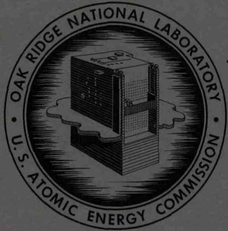

OAK RIDGE NATIONAL LABORATORY

operated by

UNION CARBIDE CORPORATION

for the

U.S. ATOMIC ENERGY COMMISSION

Printed in USA. Price $3.50. Available from the

Office of Technical Services

Department of Commerce

Washington 25, D.C.

# LEGAL NOTICE

This report was prepared as an account of Government sponsored work. Neither the United States, nor the Commission, nor any person acting on behalf of the Commission;

A. Makes any warranty or representation, expressed or implied, with respect to the accuracy, completeness, or usefulness of the information contained in this report, or that the use of any information, apparatus, method, or process disclosed in this report may not infringe privately owned rights; or   
B. Assumes any liabilities with respect to the use of, or for damages resulting from the use of any information, apparatus, method, or process disclosed in this report.

As used in the above, "person acting on behalf of the Commission" includes any employee or contractor of the Commission, or employee of such contractor, to the extent that such employee or contractor of the Commission, or employee of such contractor prepares, disseminates, or provides access to, any information pursuant to his employment or contract with the Commission, or his employment with such contractor.

# DISCLAIMER

This report was prepared as an account of work sponsored by an agency of the United States Government. Neither the United States Government nor any agency Thereof, nor any of their employees, makes any warranty, express or implied, or assumes any legal liability or responsibility for the accuracy, completeness, or usefulness of any information, apparatus, product, or process disclosed, or represents that its use would not infringe privately owned rights. Reference herein to any specific commercial product, process, or service by trade name, trademark, manufacturer, or otherwise does not necessarily constitute or imply its endorsement, recommendation, or favoring by the United States Government or any agency thereof. The views and opinions of authors expressed herein do not necessarily state or reflect those of the United States Government or any agency thereof.

# DISCLAIMER

Portions of this document may be illegible in electronic image products. Images are produced from the best available original document.

Contract No. W-7405-eng-26

# REACTOR CHEMISTRY DIVISION

# PHASE DIAGRAMS OF NUCLEAR REACTOR MATERIALS

R.E.Thoma,Editor

DATE ISSUED

F

OAK RIDGE NATIONAL LABORATORY

Oak Ridge, Tennessee

operated by

UNION CARBIDE CORPORATION

for the

U.S. ATOMIC ENERGY COMMISSION

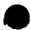

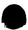

# CONTENTS

# INTRODUCTION 1

# 1.METAL SYSTEMS 2

1.1. The System Silver-Zirconium 2   
1.2. The System Indium-Zirconium 4   
1.3. The System Antimony-Zirconium 6   
1.4. The System Lead-Zirconium 8

# 2.METAL-FUSED-SALT SYSTEMS. 9

2.1. The Sodium Metal-Sodium Halide Systems 9   
2.2. The Potassium Metal-Potassium Halide Systems 10   
2.3. The Rubidium Metal-Rubidium Halide Systems 11   
2.4. The Cesium Metal-Cesium Halide Systems 12   
2.5. The Alkali Metal-Alkali Metal Fluoride Systems 13

# 3. FUSED-SALT SYSTEMS 14

3.1. The System LiF-NaF 14   
3.2. The System LiF-KF 15   
3.3. The System LiF-RbF 16   
3.4. The System LiF-CsF 17   
3.5. The System NaF-KF 18   
3.6. The System NaF-RbF 19   
3.7. The System KF-RbF 20   
3.8. The System LiF-NaF-KF 21   
3.9. The System LiF-NaF-RbF 22   
3.10. The System LiF-KF-RbF 23   
3.11. The System NaF-KF-RbF 24   
3.12. The System $\mathsf{NaBF}_4\mathsf{-KBF}_4$ 25   
3.13.The System NaF-FeF 2 26   
3.14.The System NaF-NiF 27   
3.15.The System RbF-CaF 28   
3.16.The SystemLiF-NaF-CaF, 29   
3.17. The System NaF-MgF2-CaF 30   
3.18.The System NaF-KF-AIF 32   
3.19. The System LiF-BeF 2 33   
3.20. The System NaF-BeF 34   
3.21. The System KF-BeF 36   
3.22. The System RbF-BeF 38   
3.23. The System CsF-BeF 40   
3.24.The SystemLiF-NaF-BeF 42   
3.25. The System LiF-RbF-BeF2. 44   
3.26.The System NaF-KF-BeF 46   
3.27. The System NaF-RbF-BeF 2   
3.28. The System NaF-ZnF 48   
3.29. The System $\mathsf{KF - ZnF}_2$ 49   
3.30. The System RbF-ZnF 50   
3.31. The System $\mathsf{LiF - YF}_3$ 51   
3.32. The System LiF-ZrF 52   
3.33.The System NaF-ZrF 54

3.34. The System KF-ZrF 56   
3.35.The System RbF-ZrF 57   
3.36. The System CsF-ZrF 58   
3.37.The SystemLiF-NaF-ZrF 60   
3.38. The System NaF-KF-ZrF 62   
3.39.The System NaF-RbF-ZrF 64   
3.40. The System NaF-CrF2-ZrF4: The Section NaF·CrF2-ZrF4 66   
3.41. The System NaF- $\mathsf{CeF}_3\mathsf{-ZrF}_4$ 67   
3.42. The System LiF- $\mathsf{CeF}_3$ 68   
3.43.The System NaF-HfF 70   
3.44. The System LiF-ThF 72   
3.45.The System NaF-ThF 73   
3.46.The System KF-ThF 74   
3.47.The System RbF-ThF 76   
3.48. The System $\mathsf{BeF}_2\text{-}\mathsf{ThF}_4$ 77   
3.49.The System $\mathsf{BeF}_2\text{-}\mathsf{UF}_4$ 78   
3.50. The System $\mathsf{MgF}_2\mathsf{-ThF}_4$ 79   
3.51.The SystemLiF-BeF2-ThF 80   
3.52.The System NaF-ZrF-ThF 82   
3.53.The System LiF-UF 84   
3.54.The System LiF-UF 85   
3.55.The System NaF-UF 86   
3.56.The System NaF-UF 88   
3.57.The System KF-UF 90   
3.58.The System RbF-UF 91   
3.59.The System CsF-UF 92   
3.60. The System $\mathsf{ZrF}_4\cdot \mathsf{UF}_4^*$ 93   
3.61. The System SnF2-UF 94   
3.62.The System $\mathsf{PbF}_2\text{-}\mathsf{UF}_4$ 95   
3.63.The System ThF-UF 96   
3.64. The System LiF $^4$ NaF-UF 98   
3.65.The System LiF-KF-UF 101   
3.66.The System LiF-RbF-UF 102   
3.67.The System NaF-KF-UF 103   
3.68.The System NaF-RbF-UF 104   
3.69.The System LiF-BeF2-UF 108   
3.70. The System NaF-BeF2-UF 110   
3.71. The System NaF-PbF2-UF 113   
3.72.The System KF-PbF-UF 114   
3.73.The System NaF-ZrF-UF 116   
3.74.The System LiF-ThFA-UF 119   
3.75.The System NaF-ThF-UF:The Section 2NaF.ThF-2NaF.UF 124   
3.76. The System LiF-PuF 125   
3.77.The System LiCl-FeCl 126   
3.78.The System KCl-FeCl, 127   
3.79.The System NaCl-ZrCI 128   
3.80.The System KCl-ZrCI 130   
3.81. The System LiCl-UCI 131   
3.82.The System LiCl-UCI 132   
3.83.The System NaCI-UCI 133   
3.84. The System NaCl-UCI 134

3.85.The System KCI-UCI 135   
3.86.The System RbCI-UC1 136   
3.87. The System CsCl-UCI 137   
3.88. The System $\mathsf{K}_3\mathsf{CrF}_6 - \mathsf{Na}_3\mathsf{CrF}_6 - \mathsf{Li}_3\mathsf{CrF}_6$ 138

# 4. OXIDE AND HYDROXIDE SYSTEMS 139

4.1. The System $\mathsf{SiO}_2\text{-}\mathsf{ThO}_2$ 139   
4.2. The System LiOH-NaOH 140   
4.3. The System LiOH-KOH 141   
4.4. The System NaOH-KOH 142   
4.5. The System NaOH-RbOH 143   
4.6. The System $\mathsf{Ba(OH)}_2\mathsf{-Sr(OH)}_2$ 144

# 5.AQUEOUS SYSTEMS 145

5.1. The System $\mathsf{UO}_2 - \mathsf{P}_2\mathsf{O}_5 - \mathsf{H}_2\mathsf{O}, 25^{\circ}\mathsf{C}$ Isotherm 145   
5.2. The System $\mathsf{UO}_3^2 -\mathsf{H}_3^2\mathsf{PO}_4 - \mathsf{H}_2\mathsf{O},$ $25^{\circ}C$ isotherm 146   
5.3. The System $\mathsf{U}(\mathsf{HPO}_4)_2 - \mathsf{Cl}_2\mathsf{O}_7 - \mathsf{H}_2\mathsf{O}, 25^{\circ}\mathsf{C}$ Isotherm 147   
5.4. The System $\mathrm{UO}_3 - \mathrm{Na}_2\mathrm{O} - \mathrm{CO}_2 - \mathrm{H}_2\mathrm{O}$ $26^{\circ}C$ Isotherm 148   
5.5. Portions of the System $\mathsf{ThO}_2\mathsf{-Na}_2\mathsf{O}\mathsf{-CO}_2\mathsf{-H}_2\mathsf{O}, 25^{\circ}\mathsf{C}$ isotherm 150   
5.6. The System $\mathrm{Na}_2\mathrm{O} - \mathrm{CO}_2 - \mathrm{H}_2\mathrm{O}$ $25^{\circ}\mathrm{C}$ Isotherm 153   
5.7. Solubility of Uranyl Sulfate in Water 156   
5.8. Two-Liquid-Phase Region of $\mathsf{UO}_2\mathsf{SO}_4$ in Ordinary and Heavy Water 158   
5.9. The System $\mathrm{UO}_3\mathrm{-SO}_3\mathrm{-H}_2\mathrm{O}$ 160   
5.10. Coexistence Curves for Two Liquid Phases in the System $\mathrm{UO}_2\mathrm{SO}_4 - \mathrm{H}_2\mathrm{SO}_4 - \mathrm{H}_2\mathrm{O}$ 164   
5.11. Two-Liquid-Phase Region of the System $\mathsf{UO}_2\mathsf{SO}_4 - \mathsf{H}_2\mathsf{SO}_4 - \mathsf{H}_2\mathsf{O}$ 166   
5.12. Two-Liquid-Phase Coexistence Curves for $\mathsf{UO}_3$ -Rich Solutions in the System $\mathsf{UO}_3\mathsf{-SO}_3\mathsf{-H}_2\mathsf{O}$ With and Without HNO3 167   
5.13. Solubility of $\mathsf{UO}_3$ in $\mathsf{H}_2\mathsf{SO}_4 - \mathsf{H}_2\mathsf{O}$ Mixtures 168   
5.14. Effect of Excess $\mathsf{H}_2\mathsf{SO}_4$ on the Phase Equilibria in Very Dilute $\mathsf{UO}_2\mathsf{SO}_4$ Solutions 169   
5.15. Second-Liquid-Phase Temperatures of $\mathsf{UO}_2\mathsf{SO}_4 - \mathsf{Li}_2\mathsf{SO}_4$ Solutions 170   
5.16. Second-Liquid-Phase Temperatures for $\mathsf{UO}_2\mathsf{SO}_4$ Solutions Containing $\mathsf{Li}_2\mathsf{SO}_4$ or $\mathsf{BeSO}_4$ 171   
5.17. Second-Liquid-Phase Temperatures for $\mathsf{BeSO}_4$ Solutions Containing $\mathsf{UO}_3$ 172   
5.18. The System $\mathrm{NiSO}_4 - \mathrm{UO}_2\mathrm{SO}_4 - \mathrm{H}_2\mathrm{O}$ at $25^{\circ}C$ 173   
5.19. Phase-Transition Temperatures in Solutions Containing $\mathsf{CuSO}_4$ $U O_{2}S O_{4}$ ,and $\mathsf{H}_2\mathsf{SO}_4$ 174   
5.20. The Effect of $\mathrm{CuSO}_4$ and $\mathrm{NiSO}_4$ on Phase-Transition Temperatures: 0.04 m $\mathrm{UO}_2\mathrm{SO}_4$ ; 0.01 m $\mathrm{H}_2\mathrm{SO}_4$ 175   
5.21. The System $\mathbf{\tilde{U}}\mathbf{O}_3 - \mathbf{Cu}\mathbf{O} - \mathbf{Ni}\mathbf{O} - \mathbf{SO}_3 - \mathbf{D}_2\mathbf{O}$ at $300^{\circ}\mathrm{C}; 0.06 \, \text{m} \, \text{SO}_3$ 176   
5.22. Solubility of $\mathrm{Nd}_2(\mathrm{SO}_4)_3$ in $0.02m\mathrm{UO}_2\mathrm{SO}_4$ Solution Containing $0.005m$ HSO4 (180-300oC) 177   
5.23.Solubility of $\mathsf{L}\mathsf{a}_2(\mathsf{SO}_4)_3$ in $\mathsf{UO}_2\mathsf{SO}_4$ Solutions 178   
5.24.Solubility of $\mathsf{CdSO}_4$ in $\mathsf{UO}_2\mathsf{SO}_4$ Solutions 179   
5.25.Solubility of $C s_{2}S O_{4}$ in $\mathsf{UO}_2\mathsf{SO}_4$ Solutions 180   
5.26. Solubility of $\mathsf{Y}_2(\mathsf{SO}_4)_3$ in $\mathsf{UO}_2\mathsf{SO}_4$ Solutions 181   
5.27. Solubility of $\mathsf{Ag}_2\mathsf{SO}_4$ in $\mathsf{UO}_2\mathsf{SO}_4$ Solutions 182   
5.28.Solubility at $250^{\circ}C$ of $\mathsf{BaSO}_4$ in $\mathsf{UO}_2\mathsf{SO}_4 - \mathsf{H}_2\mathsf{O}$ Solutions 183   
5.29. Solubility of $\mathsf{H}_2\mathsf{WO}_4$ in 0.126 and $1.26\dot{M}$ $\mathsf{UO}_2\mathsf{SO}_4$ 184   
5.30. Phase Stability of $\mathsf{H}_2\mathsf{WO}_4$ in $1.26\text{M}$ $\mathsf{UO}_2\mathsf{F}_2$ 186

5.31. The System $\mathsf{UO}_2(\mathsf{NO}_3)_2 - \mathsf{H}_2\mathsf{O}$ 188   
5.32. Phase Equilibria of $\tilde{\mathbf{U}}\tilde{\mathbf{O}}_3$ and HF in Stoichiometric Concentrations (Aqueous System). 190   
5.33.Solubility of Uranium Trioxide in Orthophosphoric Acid Solutions 191   
5.34. Solubility of Uranium Trioxide in Phosphoric Acid at $250^{\circ}\mathrm{C}$ 192   
5.35.Solubility of $\mathsf{UO}_3$ in $\mathsf{H}_2\mathsf{PO}_4$ Solution 193   
5.36. The System $\mathrm{UO}_2\mathrm{CrO}_4 - \mathrm{H}_2\mathrm{O}$ 194   
5.37. Variation of $\mathsf{Li}_2\mathsf{CO}_3$ Solubility with $\mathsf{UO}_2\mathsf{CO}_3$ Concentration at Constant CO, Pressure (250°C) 195   
5.38. The System $\mathrm{Li}_2\mathrm{O} - \mathrm{UO}_3 - \mathrm{CO}_2 - \mathrm{H}_2\mathrm{O}$ at $250^{\circ}\mathrm{C}$ and 1500 psi. 196   
5.39. The System $\mathrm{Th(NO_3)_4 - H_2O}$ 197   
5.40. Hydrolytic Stability of Thorium Nitrate-Nitric Acid and Uranyl Nitrate Solutions 198   
5.41. The System $\mathsf{ThO}_2\mathsf{-CrO}_3\mathsf{-H}_2\mathsf{O}$ at $25^{\circ}C$ 199   
5.42. Phase Stability of $\mathsf{ThO}_2\mathsf{-H}_3\mathsf{PO}_4\mathsf{-H}_2\mathsf{O}$ Solutions at High Concentrations of $\mathsf{ThO}_2$ 200

# PHASE DIAGRAMS OF NUCLEAR REACTOR MATERIALS

# INTRODUCTION

This compilation presents the phase diagrams for possible materials for nuclear reactors developed at the Oak Ridge National Laboratory over the period 1950-59. It represents the efforts of certain personnel in what are now the Chemical Technology, Metallurgy, Chemistry, and Reactor Chemistry Divisions of ORNL. This document also contains diagrams originated by other installations under contract to ORNL during that interval. In addition, a few diagrams from the unclassified literature have been included when they form part of completed systems sequences.

No general discussion of the principles of heterogeneous phase equilibrium has been included since excellent discussions are available in many well-known publications. Equilibria in several of the fused-salt systems presented below have been described in some detail in a recent publication by Ricci. Nor has any attempt been made to assemble the phase equilibrium data on reactor materials available from many other sources. For such information the reader is referred to other recently published compilations of phase diagrams $^{2-6}$ and to the several new works dealing specifically with nuclear reactor materials. $^{7-9}$

While some of the diagrams presented below are the result of fundamental researches, most were obtained in support of the ORNL programs in development of fluid-fueled reactors. Others have been developed as a consequence of ORNL interests in reprocessing of nuclear fuels, reactor metallurgy, production of uranium and thorium from raw materials, and studies of mechanisms of corrosion.

Much of the research effort was devoted to searches for systems of direct use as fluid fuels or blanket materials; unpromising systems were often given only casual attention. The diagrams in this collection, accordingly, vary widely in the degree of completeness of examination. A brief description of the status of the work is presented in each case; in a few cases, where no detailed description of the system has been published, the available data have been included with the diagram.

1J.E.Ricci,Guide to the Phase Diagrams of the Fluoride Systems,ORNL-2396 (Nov.19,1958).   
2J. F. Hogerton and R. C. Grass (eds.), The Reactor Handbook, vol 2, AECD-3646 (May 1955).   
3T. Lyman (ed.), Metals Handbook, American Society for Metals, Cleveland, Ohio, 1948.   
4F. A. Rough and A. A. Bauer (eds.), Constitution of Uranium and Thorium Alloys, BMI-1300 (June 2, 1958).   
5E. M. Levin, H. F. McMurdie, and F. P. Hall, Phase Diagrams for Ceramists, The American Ceramic Society, Columbus, Ohio, 1956.   
6E. M. Levin, H. F. McMurdie, and F. P. Hall, Supplement to Phase Diagrams for Ceramists, The American Ceramic Society, Columbus, Ohio, 1959.   
7B. Yates, Materials for Use in Nuclear Reactors, Information Bibliography, IGRL-IB/R-15 (2nd ed.), 1958.   
8H. H. Hausner and S. B. Roboff, Materials for Nuclear Power Reactors, Reinhold Publishing Corp., New York, 1955.   
9B. Kopelman (ed.), Materials for Nuclear Reactors, McGraw-Hill Book Co., New York, 1959.

# 1. METAL SYSTEMS

# 1.1. The System Silver-Zirconium

J. O. Betterton, Jr., and D. S. Easton, “The Silver-Zirconium System,” Trans. Met. Soc. AIME 212, 470-75 (1958).

A detailed investigation was made of the phase diagram of silver-zirconium, particularly in the region 0 to 36 at. $\%$ Ag. The system was found to be characterized by two intermediate phases, $\mathsf{Zr}_2\mathsf{Ag}$ and $\mathsf{ZrAg}$ , and a eutectoid reaction in which the $\beta$ -zirconium solid solution decomposes into $\alpha$ -zirconium and $\mathsf{Zr}_2\mathsf{Ag}$ . It was found that impurities in the range $0.05\%$ from the iodide-type zirconium were sufficient to introduce deviations from binary behavior; with partial removal of these impurities an increase in the $\alpha$ -phase solid solubility limit from 0.1 to 1.1 at. $\%$ Ag was observed.

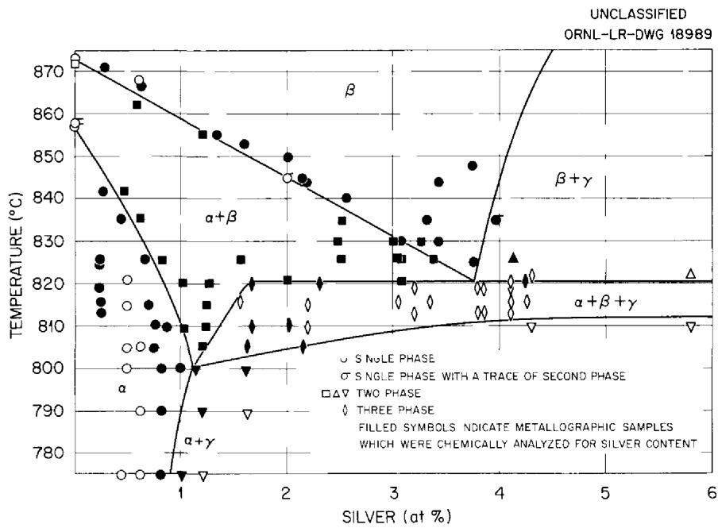  
Fig. 1.1a. The System Silver-Zirconium in the Eutectoid Region (0-6 at. $\%$ Ag).

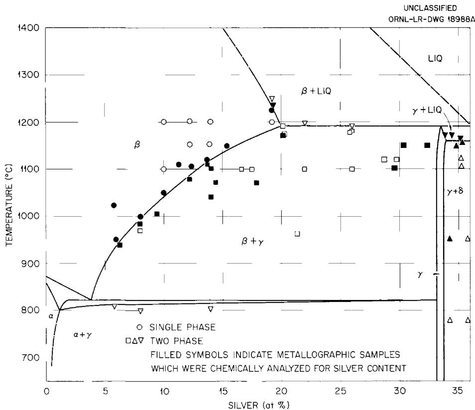  
Fig. 1.1b. The System Silver-Zirconium in the Region 0-36 at. $\%$ Ag.

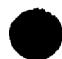

# 1.2. The System Indium-Zirconium

J. O. Betterton, Jr., and W. K. Noyce, "The Equilibrium Diagram of Indium-Zirconium in the Region 0-26 at. pct In," Trans. Met. Soc. AIME 212, 340-42 (1958).

The zirconium-rich portion of the indium-zirconium phase diagram was determined as a study of the effect of alloying a trivalent B-subgroup element, indium, with zirconium in group IVA. The temperature of the allotropic transition was found to rise with indium, terminating in a peritectoid reaction, $\beta (9.3\% \ln) + \gamma (22.4\% \ln) = \alpha (10.1\% \ln)$ at $1003^{\circ}C$ . In this respect the effect of indium is analogous to that of aluminum in zirconium and titanium alloys.

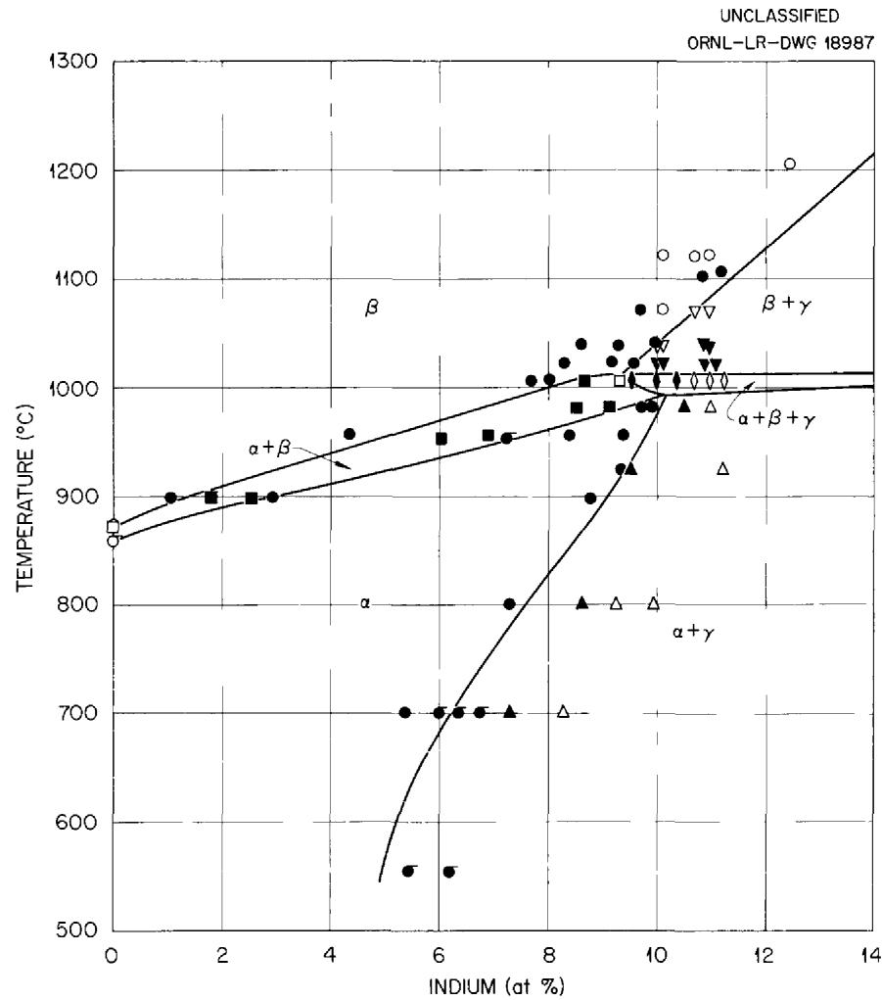  
Fig. 1.2a. The System Indium-Zirconium in the Peritectoid Region (0-13 at. $\%$ In).

BLANK

BLANK

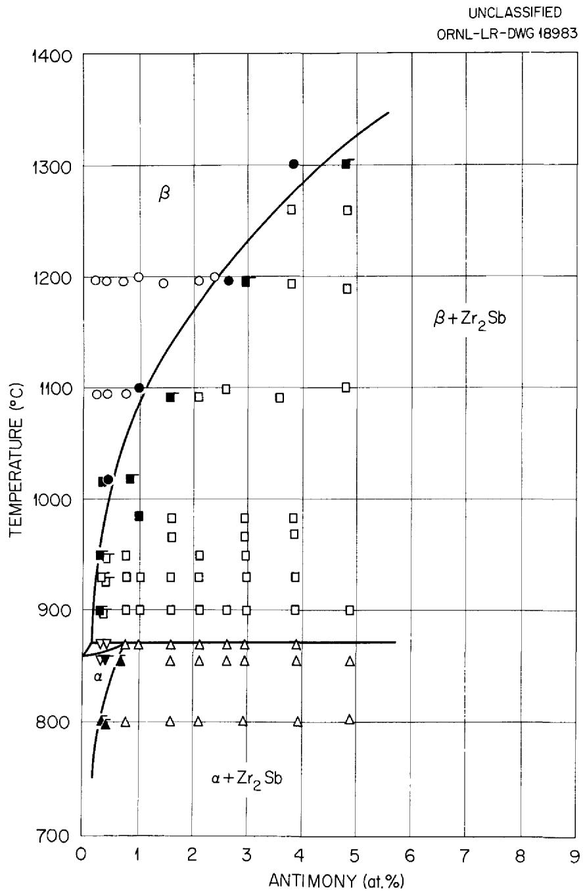  
Fig. 1.3b. The System Antimony-Zirconium in the Peritectoid Region (0-6 at. % Sb).

# 1.4. The System Lead-Zirconium

G. D. Kneip, Jr., and J. O. Betterton, Jr., cited by E. T. Hayes and W. L. O'Brien, "Zirconium Equilibrium Diagrams," p 443-83 in The Metallurgy of Zirconium, ed. by B. Lustman and F. Kerze, Jr., McGraw-Hill Book Co., New York, 1955.

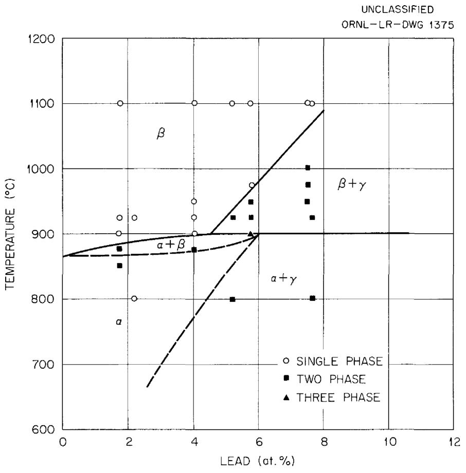  
Fig. 1.4 The System Lead-Zirconium in the Peritectoid Region (0-12 at. % Pb).

# 2.1. The Sodium Metal-Sodium Halide Systems

M. A. Bredig and J. E. Sutherland, "High-Temperature Region of the Sodium-Sodium Halide Systems," Chem. Ann. Prog. Rep. June 20, 1957, ORNL-2386, p 119. Subsequent report on these systems to be published.

UNCLASSIFIED

ORNL-LR-DWG.21894A

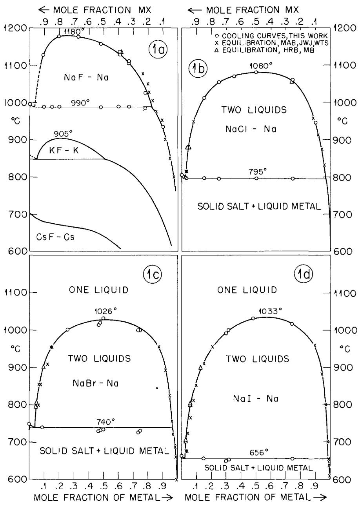  
Fig. 2.1. The Sodium Metal-Sodium Halide Systems.

# 2.2. The Potassium Metal-Potassium Halide Systems

J. W. Johnson and M. A. Bredig, "Miscibility of Metals with Salts in the Molten State. III. The Potassium-Potassium Halide Systems," J. Phys. Chem. 62, 604 (1958).

Complete miscibility of metal and salt exists in the KX-K systems, $X = F$ , Cl, Br, and I, at and above 904, 790, 727, and $717^{\circ}C$ , that is, as close as $+47$ , $+18$ , $-7$ , and $+22^{\circ}$ , respectively, to the melting points of the salts. The asymmetry of the liquid-liquid coexistence areas, especially of the fluoride and chloride systems, as indicated by the consolidate compositions (20, 39, 44, and 50 mole % metal, respectively), is largely explained by the difference in molar volumes of salt and metal. At the monotectic temperature, the solubility of the solid salts in the liquid metal, as well as of the metal in the liquid salt phase, is much larger than in the case of the sodium systems.

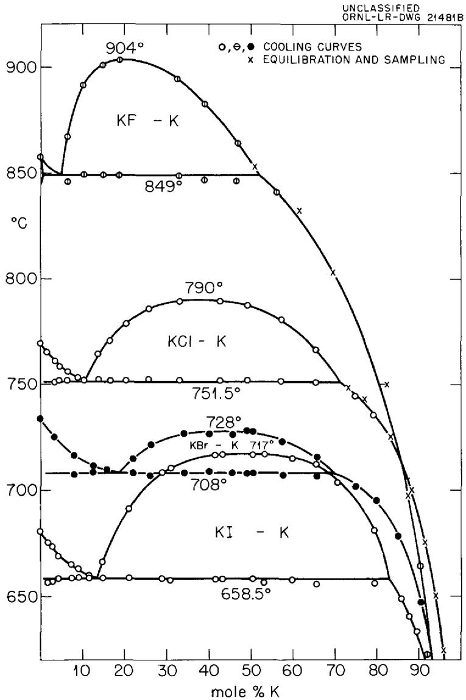  
Fig. 2.2. The Potassium Metal-Potassium Halide Systems.

# 2.3. The Rubidium Metal-Rubidium Halide Systems

M. A. Bredig and J. W. Johnson, "Rubidium-Rubidium Halide Systems," *Chem. Ann. Prog. Rep.* June 20, 1957, ORNL-2386, p 122; M. A. Bredig, J. E. Sutherland, and A. S. Dworkin, "Molten Salt-Metal Solutions. Phase Equilibria," *Chem. Ann. Prog.* Rep. June 20, 1958, ORNL-2584, p 73. Subsequent report on these systems to be published.

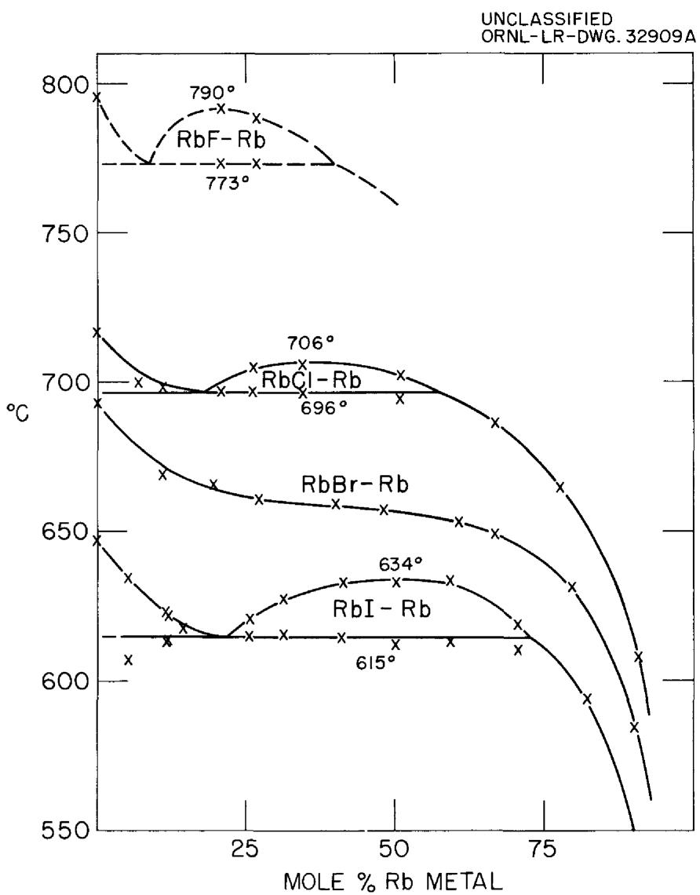  
Fig. 2.3. The Rubidium Metal-Rubidium Halide Systems.

# 2.4. The Cesium Metal-Cesium Halide Systems

M. A. Bredig, H. R. Bronstein, and W. T. Smith, Jr., "Miscibility of Liquid Metals with Salts. II. The Potassium-Potassium Fluoride and Cesium-Cesium Halide Systems," J. Am. Chem. Soc. 77, 1454 (1955).

Miscibility in all proportions of cesium metal with cesium halides at and above the melting points of the pure salts, and of potassium metal with potassium fluoride $50^{\circ}$ above the melting point of the salt, occurs. The temperature-concentration range of coexistence of two liquid phases decreases in going from sodium to potassium systems and disappears altogether for the cesium systems. The solubility of the solid halides in the corresponding liquid alkali metals, at a given temperature, increases greatly with increase of atomic number of the metal.

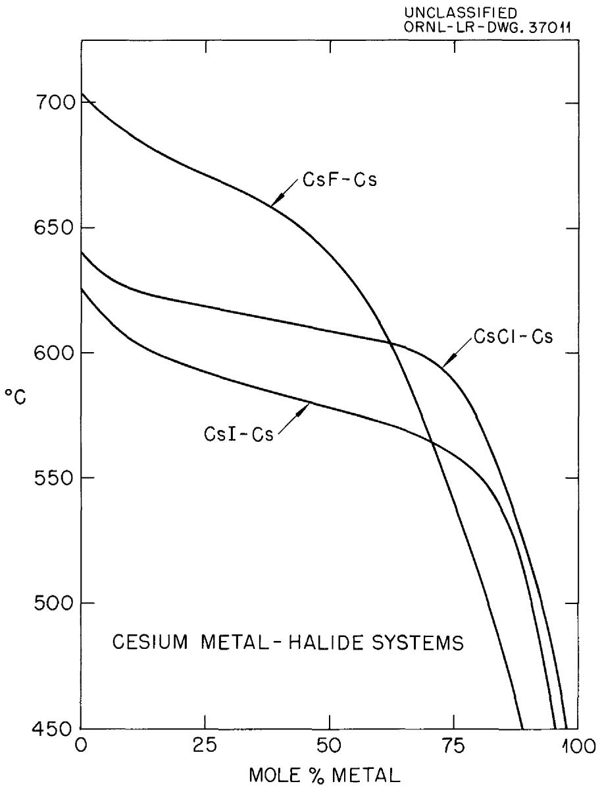  
Fig. 2.4. The Cesium Metal-Cesium Halide Systems.

# 2.5. The Alkali Metal-Alkali Metal Fluoride Systems

M. A. Bredig, J. E. Sutherland, and A. S. Dworkin, "Molten Salt-Metal Solutions. Phase Equilibria," Chem. Ann. Prog. Rep. June 20, 1958, ORNL-2584, p 73.

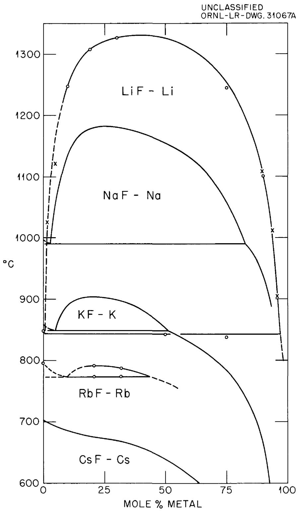  
Fig. 2.5. The Alkali Metal-Alkali Metal Fluoride Systems.

# 3. FUSED-SALT SYSTEMS

# 3.1. The System LiF--NaF

A. G. Bergman and E. P. Dergunov, “Fusion Diagram of LiF-KF-NaF,” Compt. rend. acad. sci. U.R.S.S. 31, 753-54 (1941).

The system LiF-NaF contains a single eutectic at 60 LiF-40 NaF (mole %), m.p. $652^{\circ}\mathrm{C}$ .

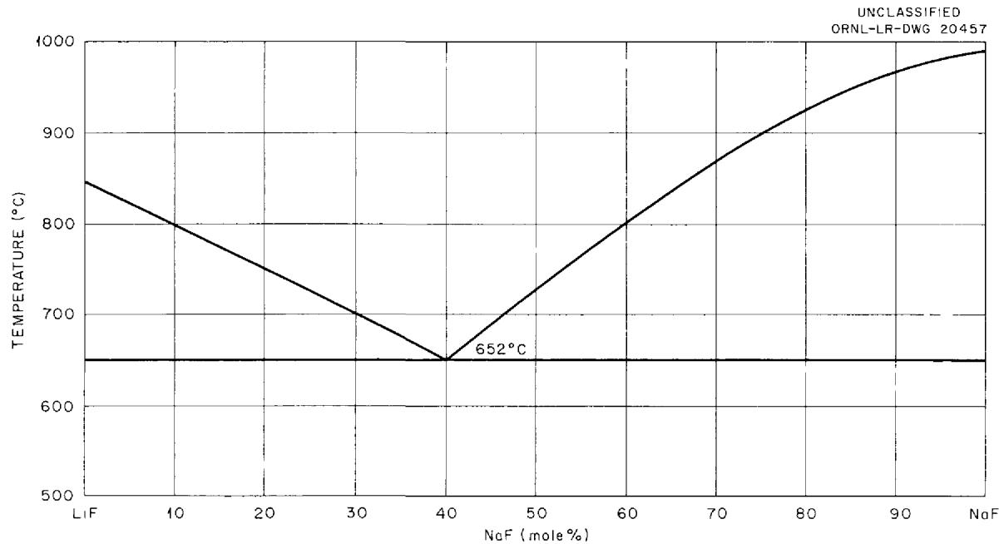  
Fig. 3.1. The System LiF-NaF.

# 3.2. The System LiF-KF

A. G. Bergman and E. P. Dergunov, “Fusion Diagram of LiF-KF-NaF,” Compt. rend. acad. sci. U.R.S.S. 31, 753-54 (1941).

The system LiF-KF contains a single eutectic at 50 LiF-50 KF (mole %), m.p. $492^{\circ}\mathrm{C}$ .

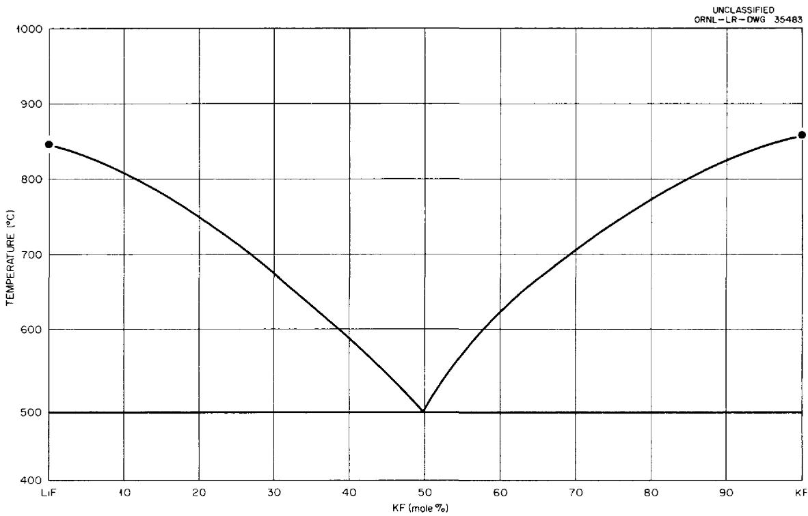  
Fig. 3.2. The System LiF-KF.

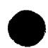

# 3.3. The System LiF-RbF

C. J. Barton, T. N. McVay, L. M. Bratcher, and W. R. Grimes, unpublished work performed at the Oak Ridge National Laboratory, 1951-54.

Preliminary diagram.

Invariant Equilibria   

<table><tr><td>Mole % LiF in Liquid</td><td>Invariant Temperature (℃)</td><td>Type of Equilibrium</td><td>Phase Reaction at Invariant Temperature</td></tr><tr><td>44</td><td>470</td><td>Eutectic</td><td>L ⇌ RbF + LiF·RbF</td></tr><tr><td>47</td><td>475</td><td>Peritectic</td><td>L + LiF ⇌ LiF·RbF</td></tr></table>

General characteristics of the system have been reported by E. P. Dergunov, "Fusion Diagrams of the Ternary Systems of the Fluorides of Lithium, Sodium, Potassium, and Rubidium," Doklady Akad. Nauk S.S.S.R. 58, 1369-72 (1947).

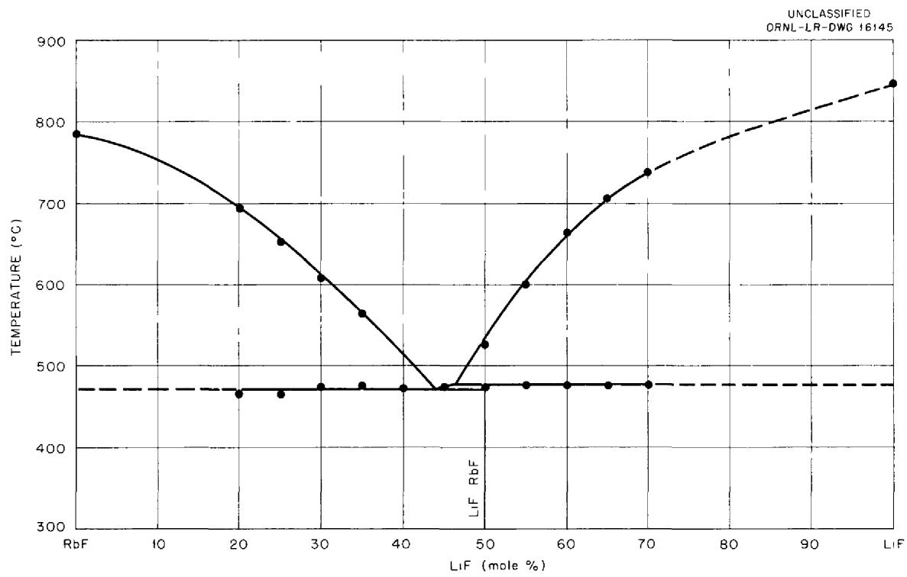  
Fig. 3.3. The System LiF-RbF.

# 3.4. The System LiF-CsF

C. J. Barton, L. M. Bratcher, T. N. McVay, and W. R. Grimes, unpublished work performed at the Oak Ridge National Laboratory, 1952-54.

Preliminary diagram.

Invariant Equilibria   

<table><tr><td>Mole % CsF in Liquid</td><td>Invariant Temperature (℃)</td><td>Type of Equilibrium</td><td>Phase Reaction at Invariant Temperature</td></tr><tr><td>55</td><td>495 ± 5</td><td>Peritectic</td><td>LiF + L ⇌ LiF·CsF</td></tr><tr><td>63</td><td>475 ± 5</td><td>Eutectic</td><td>L ⇌ LiF·CsF + CsF</td></tr></table>

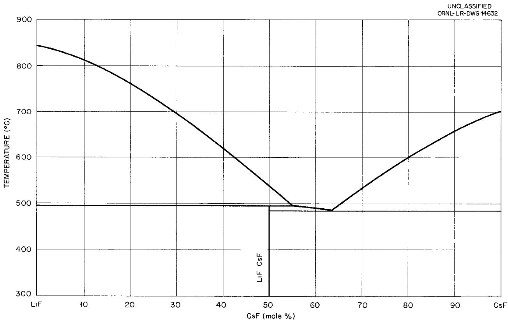  
Fig. 3.4. The System LiF-CsF.

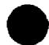

# 3.5. The System NaF-KF

A. G. Bergman and E. P. Dergunov, “Fusion Diagram of LiF-KF-NaF,” Compt. rend. acad. sci. U.R.S.S. 31, 753-54 (1941).

The system NaF-KF contains a single eutectic at 40 NaF-60 KF (mole %), m.p. $710^{\circ}\mathrm{C}$ .

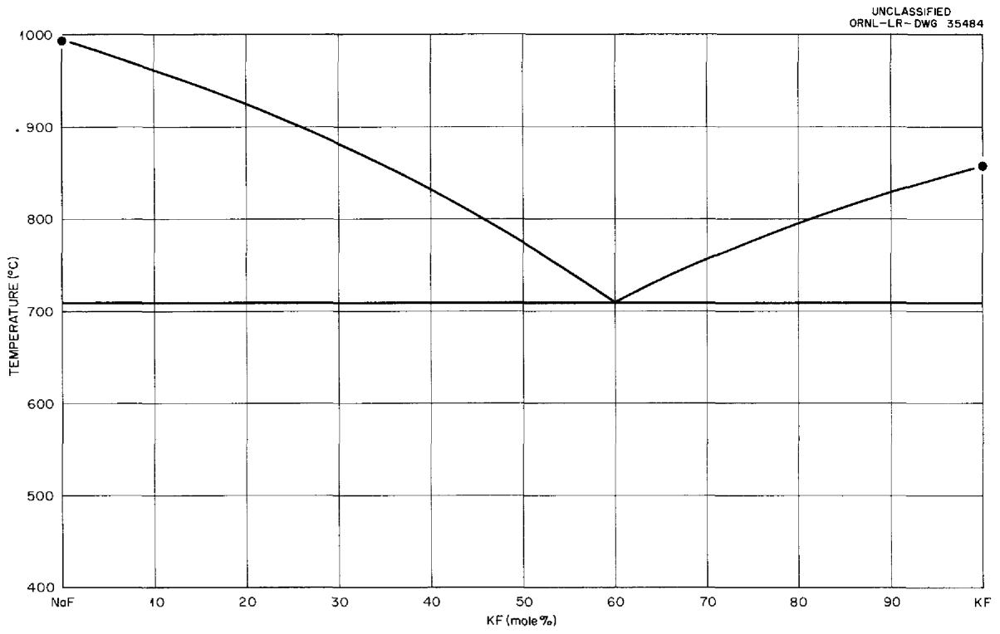  
Fig. 3.5. The System NaF-KF.

# 3.6. The System NaF-RbF

C. J. Barton, J. P. Blakely, L. M. Bratcher, and W. R. Grimes, unpublished work performed at the Oak Ridge National Laboratory, 1951.

Preliminary diagram. The system NaF-RbF contains a single eutectic at 27 NaF-73 RbF (mole %), m.p. $675 \pm 10^{\circ}\mathrm{C}$ .

General characteristics of the system have been reported by E. P. Dergunov, "Fusion Diagrams of the Ternary Systems of the Fluorides of Lithium, Sodium, Potassium, and Rubidium," Doklady Akad. Nauk S.S.S.R. 58, 1369-72 (1947).

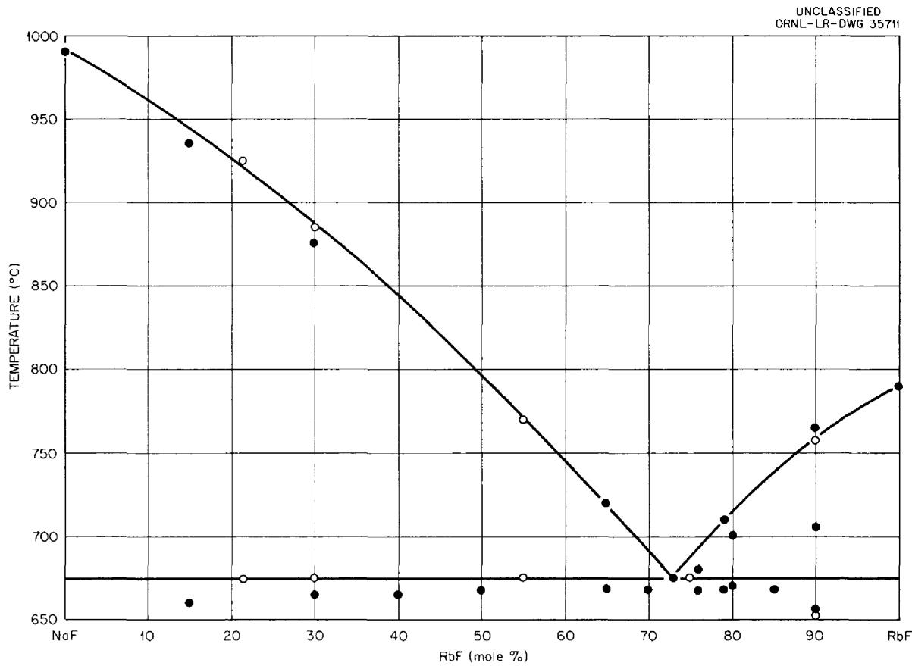  
Fig. 3.6. The System NaF-RbF.

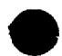

# 3.7. The System KF-RbF

C. J. Barton, J. P. Blakely, L. M. Bratcher, and W. R. Grimes, unpublished work performed at the Oak Ridge National Laboratory, 1951.

Preliminary diagram. The system KF-RbF contains a solid solution minimum at 28 KF-72 RbF (mole %), m.p. $770 \pm 10^{\circ}\mathrm{C}$ .

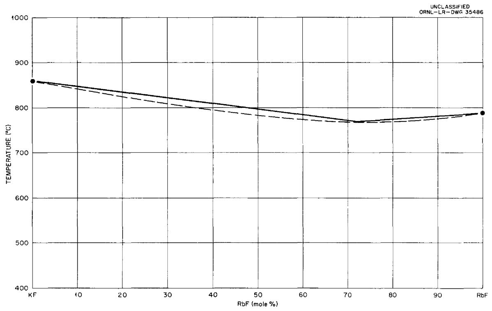  
Fig. 3.7. The System KF-RbF.

# 3.8. The System LiF-NaF-KF

A. G. Bergman and E. P. Dergunov, "Fusion Diagram of LiF-KF-NaF," Compt. rend. acad. sci. U.R.S.S. 31, 753-54 (1941).

The system LiF-NaF-KF contains a single eutectic at 46.5 LiF-11.5 NaF-42.0 KF (mole %), m.p. $454^{\circ}\mathrm{C}$ .

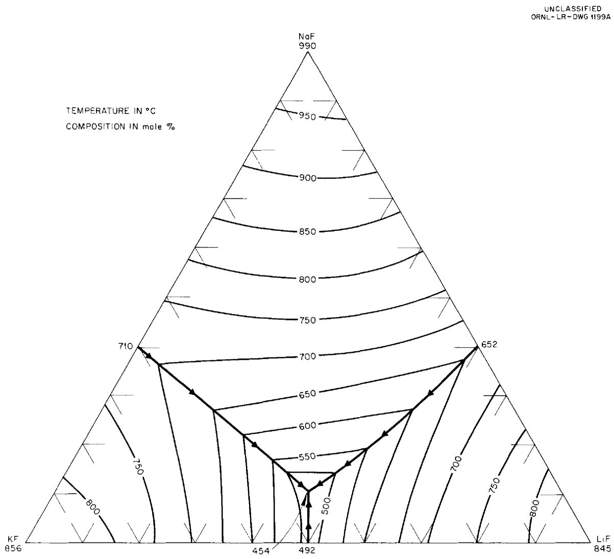  
Fig. 3.8. The System LiF-NaF-KF.

# 3.9. The System LiF-NaF-RbF

C. J. Barton, L. M. Bratcher, J. P. Blakely, and W. R. Grimes, unpublished work performed at the Oak Ridge National Laboratory, 1951.

Preliminary diagram. The system LiF-NaF-RbF contains a single eutectic at 42 LiF-6 NaF-52 RbF (mole %), m.p. $430 \pm 10^{\circ}\mathrm{C}$ . The composition and temperature of the ternary peritectic point have not yet been determined.

General characteristics of the system have been reported by E. P. Dergunov, "Fusion Diagrams of the Ternary systems of the Fluorides of Lithium, Sodium, Potassium, and Rubidium," Doklady Akad. Nauk S.S.S.R. 58, 1369-72 (1947). Dergunov lists the composition and temperature of the ternary eutectic as 46.5 LiF-6.5 NaF-47 RbF (mole %), m.p. $426^{\circ}\mathrm{C}$ .

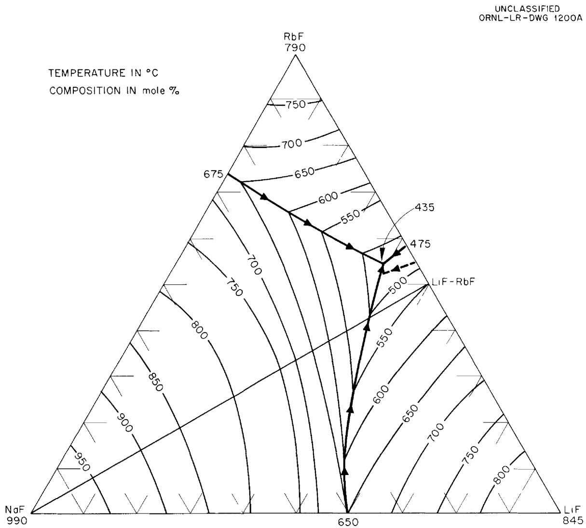  
Fig. 3.9. The System LiF-NaF-RbF.

# 3.10. The System LiF-KF-RbF

C. J. Barton, J. P. Blakely, L. M. Bratcher, and W. R. Grimes, unpublished work performed at the Oak Ridge National Laboratory, 1951.

Preliminary diagram. The system LiF-KF-RbF contains a single eutectic at 40 LiF-32.5 KF-27.5 RbF (mole %), m.p. $440 \pm 10^{\circ}\mathrm{C}$ .

General characteristics of the system have been reported by E. P. Dergunov, "Fusion Diagrams of the Ternary Systems of the Fluorides of Lithium, Sodium, Potassium, and Rubidium," Doklady Akad. Nauk S.S.S.R. 58, 1369-72 (1947).

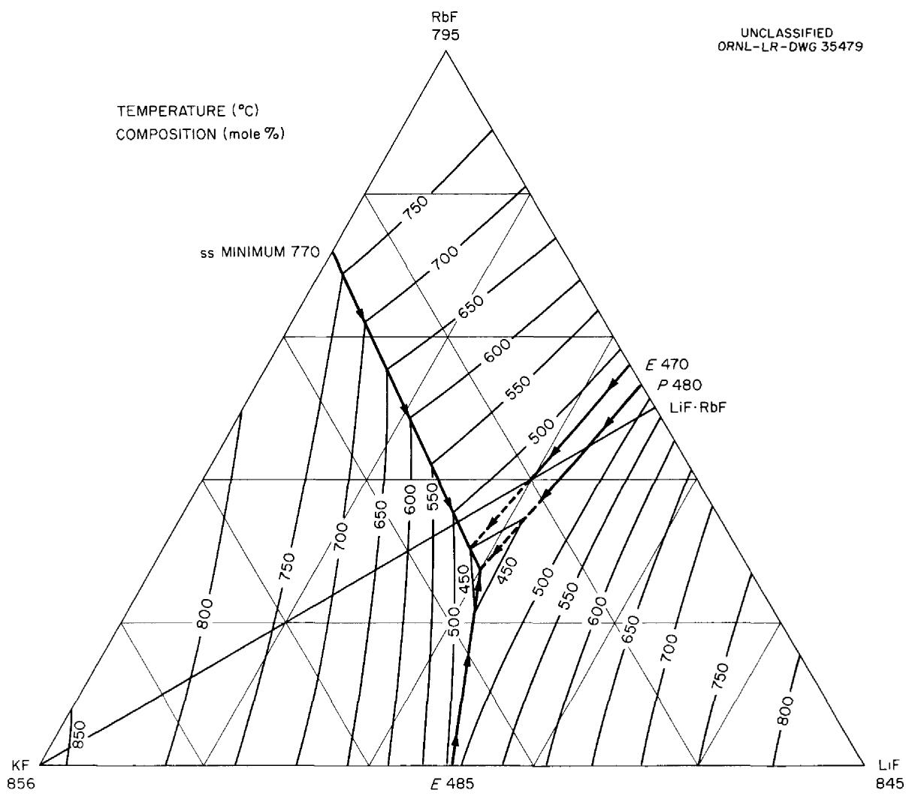  
Fig. 3.10. The System LiF-KF-RbF.

# 3.11. The System NaF-KF-RbF

C. J. Barton, L. M. Bratcher, J. P. Blakely, and W. R. Grimes, unpublished work performed at the Oak Ridge National Laboratory, 1951.

Preliminary diagram. The system NaF-KF-RbF contains a single eutectic at 21 NaF-5 KF-74 RbF (mole %), m.p. $621 \pm 10^{\circ}C$ .

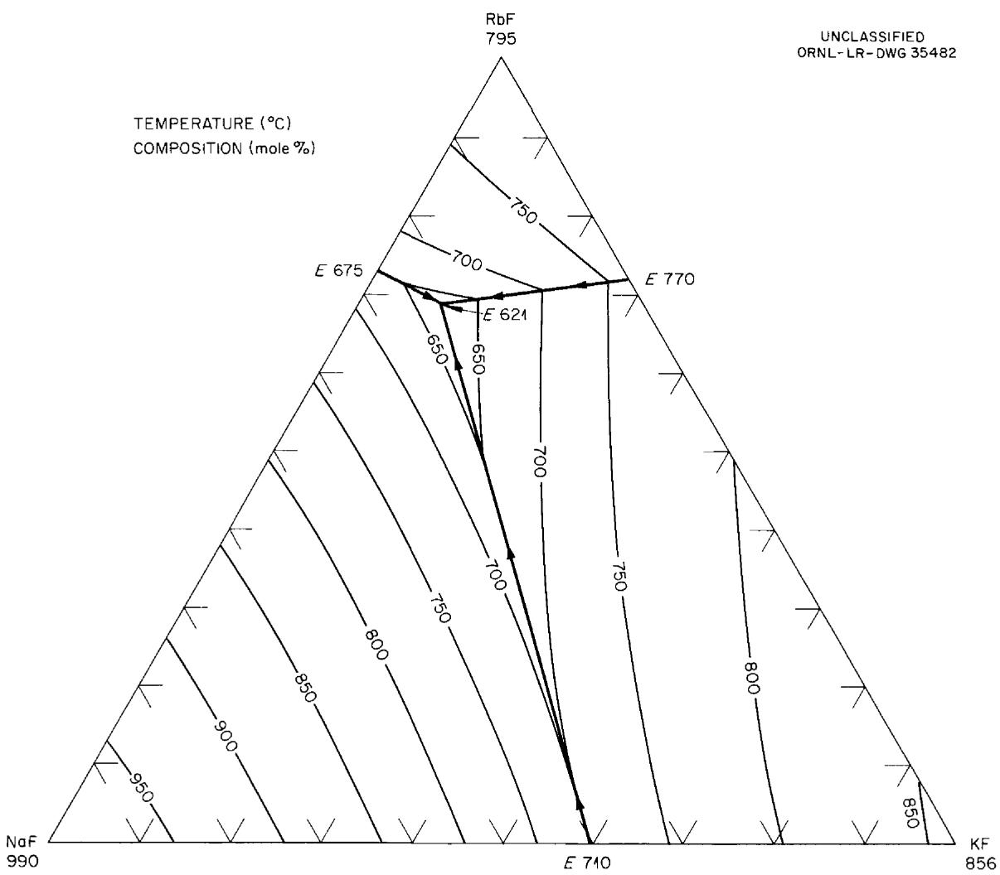  
Fig. 3.11. The System NaF-KF-RbF.

# 3.12. The System $\mathsf{NaBF}_4$ -KBF

R. E. Moore, J. G. Surak, and W. R. Grimes, unpublished work performed at the Oak Ridge National Laboratory, 1957.

Preliminary diagram. The system $\mathsf{NaBF}_4\text{-}\mathsf{KBF}_4$ contains a single eutectic at 88 $\mathsf{NaBF}_4 - 12\mathsf{KBF}_4$ (mole \%), m.p. $355^{\circ}C$ . The dotted line was obtained from thermal effects representing incompletely understood solid-phase transformations of $\mathsf{KBF}_4$ and $\mathsf{NaBF}_4$ .

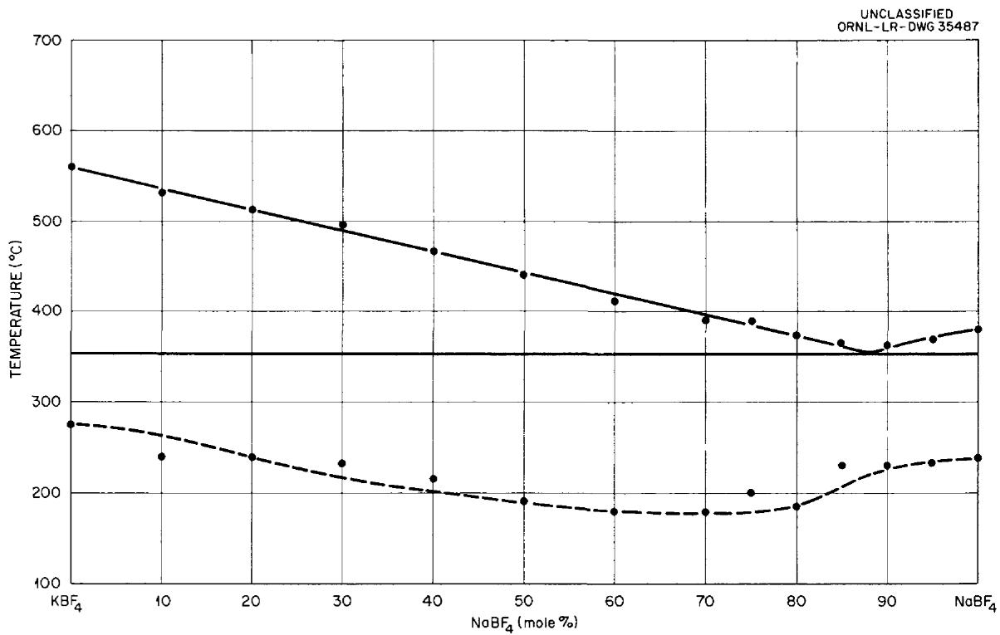  
Fig. 3.12. The System NaBF $_4$ -KBF $_4$ .

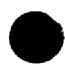

# 3.13. The System NaF-FeF $_2$

R. E. Thoma, H. A. Friedman, B. S. Landau, and W. R. Grimes, unpublished work performed at the Oak Ridge National Laboratory, 1957.

Preliminary diagram.

Invariant Equilibria   

<table><tr><td>Mole % FeF2in Liquid</td><td>Invariant Temperature (℃)</td><td>Type of Equilibrium</td><td>Phase Reaction at Invariant Temperature</td></tr><tr><td>30</td><td>680</td><td>Eutectic</td><td>L ⇌ NaF + NaF·FeF2</td></tr><tr><td>50</td><td>783</td><td>Congruent melting point</td><td>L ⇌ NaF·FeF2</td></tr><tr><td>63</td><td>745</td><td>Eutectic</td><td>L ⇌ NaF·FeF2 + FeF2</td></tr></table>

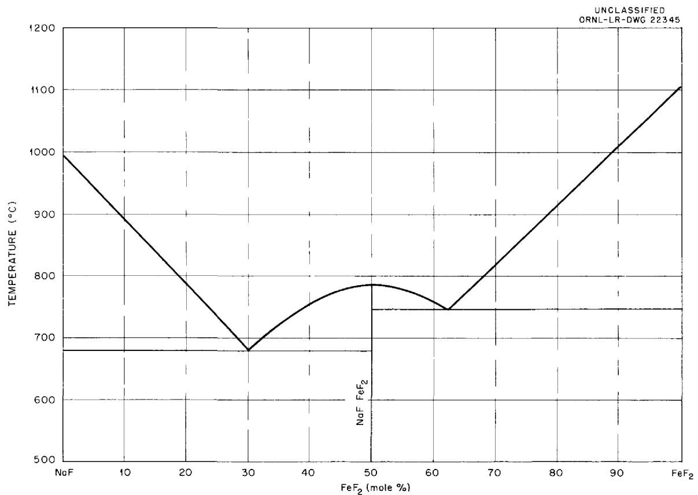  
Fig. 3.13. The System NaF-FeF2

# 3.14. The System NaF-NiF

R. E. Thoma, H. A. Friedman, B. S. Landau, and W. R. Grimes, unpublished work performed at the Oak Ridge National Laboratory, 1957.

Preliminary diagram.

Invariant Equilibria   

<table><tr><td>Mole % NiF2in Liquid</td><td>Invariant Temperature (℃)</td><td>Type of Equilibrium</td><td>Phase Reaction at Invariant Temperature</td></tr><tr><td>23</td><td>795</td><td>Eutectic</td><td>L ⇌ NaF + NaF·NiF2</td></tr><tr><td>50</td><td>1045</td><td>Congruent melting point</td><td>L ⇌ NaF·NiF2</td></tr><tr><td>57</td><td>1040</td><td>Eutectic</td><td>L ⇌ NaF·NiF2 + NiF2</td></tr></table>

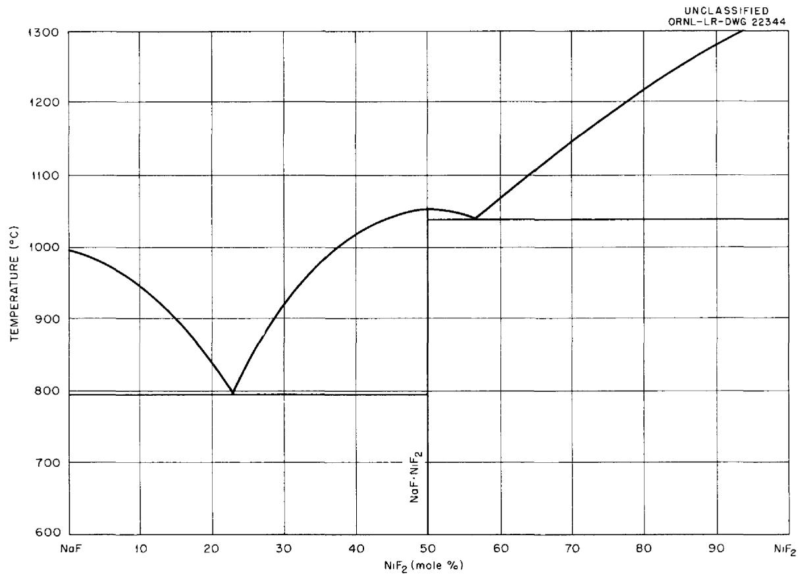  
Fig. 3.14. The System NaF-NiF $_2$

# 3.15. The System RbF-CaF

C. J. Barton, L. M. Bratcher, R. J. Sheil, and W. R. Grimes, unpublished work performed at the Oak Ridge National Laboratory, 1956.

Preliminary diagram.

Invariant Equilibria   

<table><tr><td>Mole % CaF2in Liquid</td><td>Invariant Temperature (oC)</td><td>Type of Equilibrium</td><td>Phase Reaction at Invariant Temperature</td></tr><tr><td>9</td><td>760</td><td>Eutectic</td><td>L ⇌ RbF + RbF·CaF2</td></tr><tr><td>50</td><td>1110</td><td>Congruent melting point</td><td>L ⇌ RbF·CaF2</td></tr><tr><td>57</td><td>1090</td><td>Eutectic</td><td>L ⇌ RbF·CaF2 + CaF2</td></tr></table>

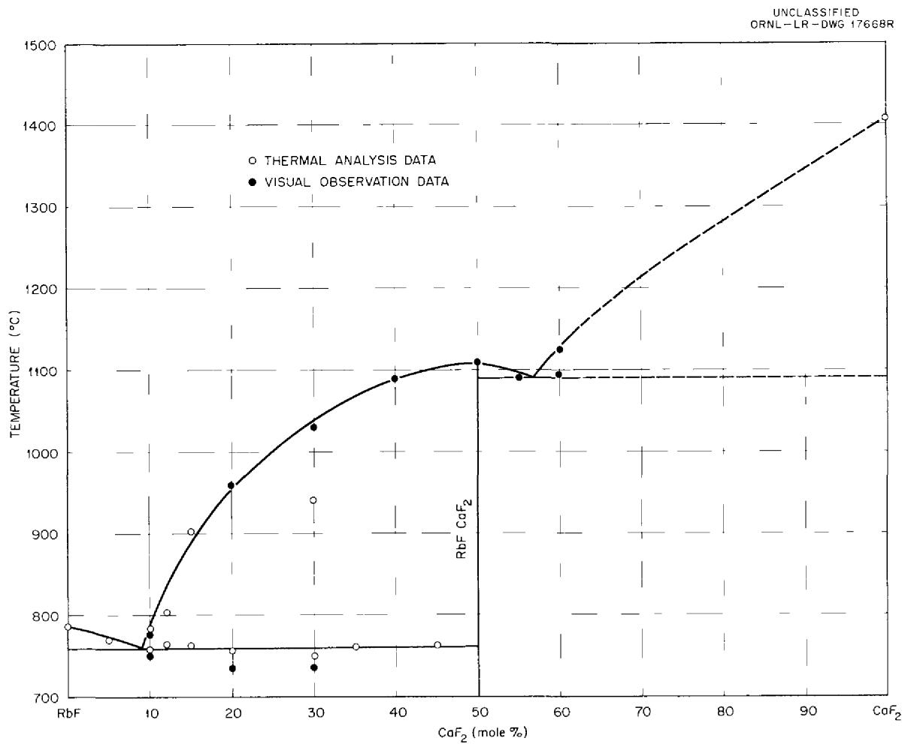  
Fig. 3.15. The System RbF-CaF2

# 3.16. The System LiF-NaF-CaF

C. J. Barton, L. M. Bratcher, and W. R. Grimes, unpublished work performed at the Oak Ridge National Laboratory, 1955-56.

Preliminary diagram. The system LiF-NaF-CaF2 contains a single eutectic at 53 LiF-36 NaF-11 CaF2 (mole %), m.p. 616°C.

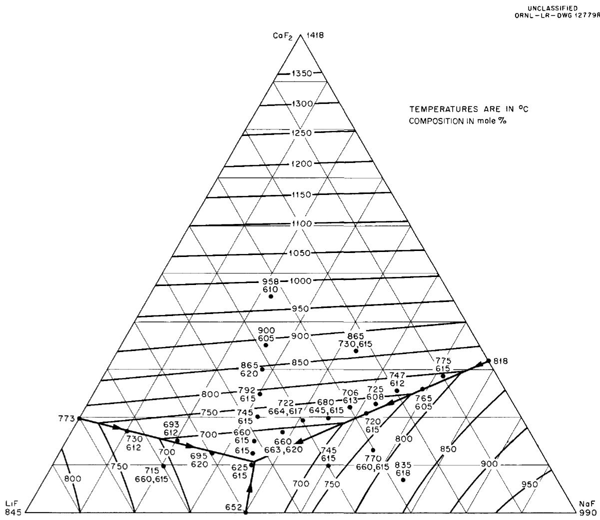  
Fig. 3.16. The System LiF-NaF-CaF

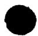

# 3.17. The System $\mathsf{NaF - MgF_2 - CaF_2}$

C. J. Barton, L. M. Bratcher, J. P. Blakely, and W. R. Grimes, unpublished work performed at the Oak Ridge National Laboratory, 1955-56.

Preliminary diagram.

Invariant Equilibria   

<table><tr><td colspan="3">Composition of Liquid (mole %)</td><td rowspan="2">Temperature (℃)</td><td rowspan="2">Type of Equilibrium</td><td rowspan="2">Solids Present at Invariant Temperature</td></tr><tr><td>NaF</td><td>CaF2</td><td>MgF2</td></tr><tr><td>65</td><td>23</td><td>12</td><td>745</td><td>Eutectic</td><td>NaF, NaF·MgF2, and CaF2</td></tr><tr><td>35</td><td>28</td><td>37</td><td>905</td><td>Eutectic</td><td>CaF2, MgF2, and NaF·MgF2</td></tr></table>

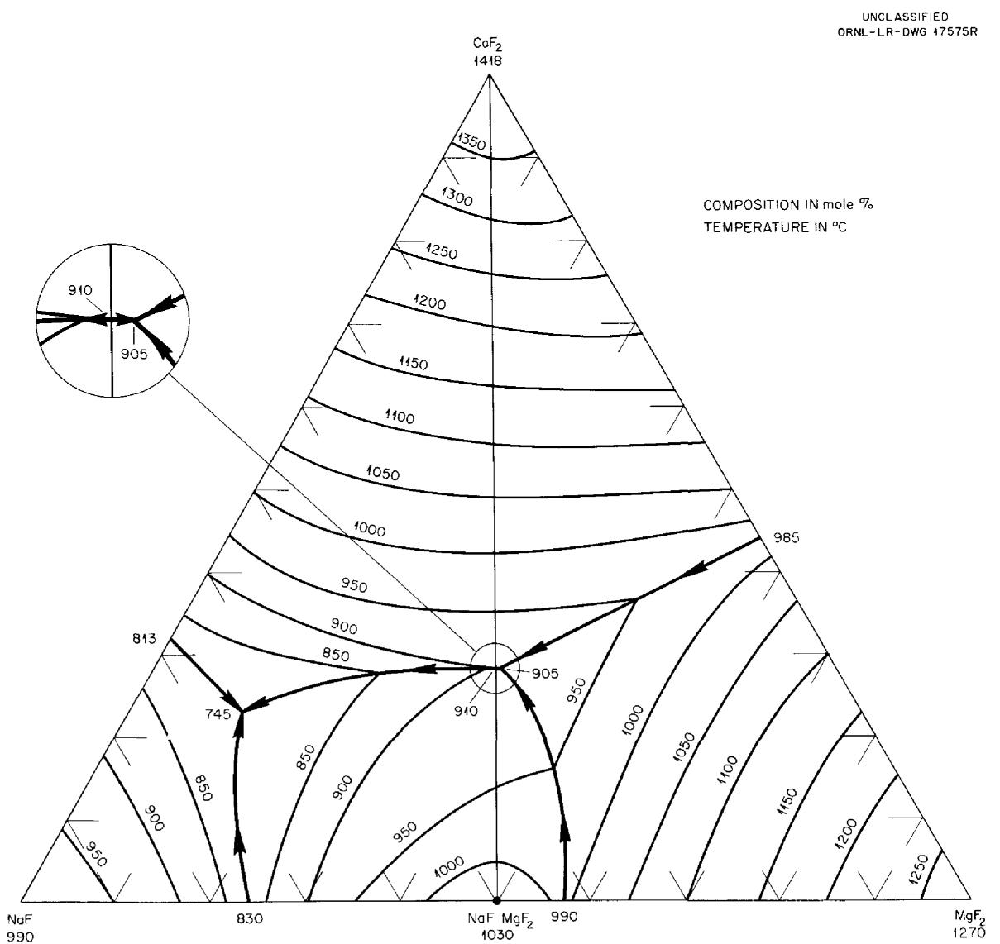  
Fig. 3.17a. The System NaF-MgF $_2$ -CaF $_2$

The minimum temperature along the quasi-binary section $\mathsf{NaF}\cdot \mathsf{MgF}_2\text{-CaF}_2$ occurs at the composition 36 NaF-36 MgF $^2 -28$ CaF $^2$ (mole %), at $910^{\circ}C$

The existence of the compound $\mathsf{NaF}\cdot \mathsf{MgF}_2$ was previously reported by A. G. Bergman and E. P. Dergunov, Compt. rend. acad. sci. U.R.S.S. 31, 755 (1941).

Ternary systems of alkali fluorides with $\mathsf{MgF}_2$ have been reported by Bergman et al. as follows: the system LiF-NaF-MgF $_2$ by A. G. Bergman and E. P. Dergunov, Compt. rend. acad. sci. U.R.S.S. 31, 755 (1941); the system LiF-KF-MgF $_2$ by A. G. Bergman and S. P. Parlenko, Compt. rend. acad. sci. U.R.S.S. 31, 818-19 (1941); the system NaF-KF-MgF $_2$ by A. G. Bergman and E. P. Dergunov, Compt. rend. acad. sci. U.R.S.S. 48, 330 (1945).

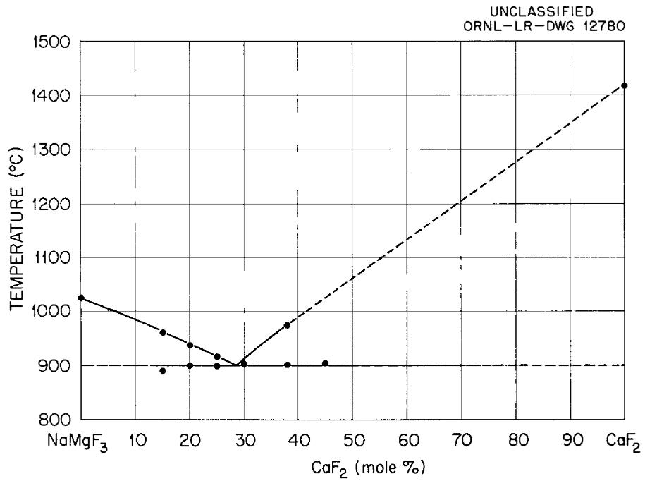  
Fig. 3.17b. The Subsystem NaF·MgF $_2$ -CaF $_2$

# 3.18. The System NaF-KF-AlF3

C. J. Barton, L. M. Bratcher, and W. R. Grimes, unpublished work performed at the Oak Ridge National Laboratory, 1951-52.

Preliminary diagram. No study has been made at the Oak Ridge National Laboratory of the phase relationships occurring within the system NaF-KF-AlF₃. Phase diagrams have been reported for the AlF₃ binary systems, NaF-AlF₃ [P. P. Fediotieff and W. P. Iljinsky, Z. anorg. Chem. 80, 121 (1913); also N. A. Pushin and A. V. Baskow, ibid. 81, 350 (1913)] and KF-AlF₃ [P. P. Fediotieff and K. Timofeeff, Z. anorg. u. allgem. Chem. 206, 265 (1932)].

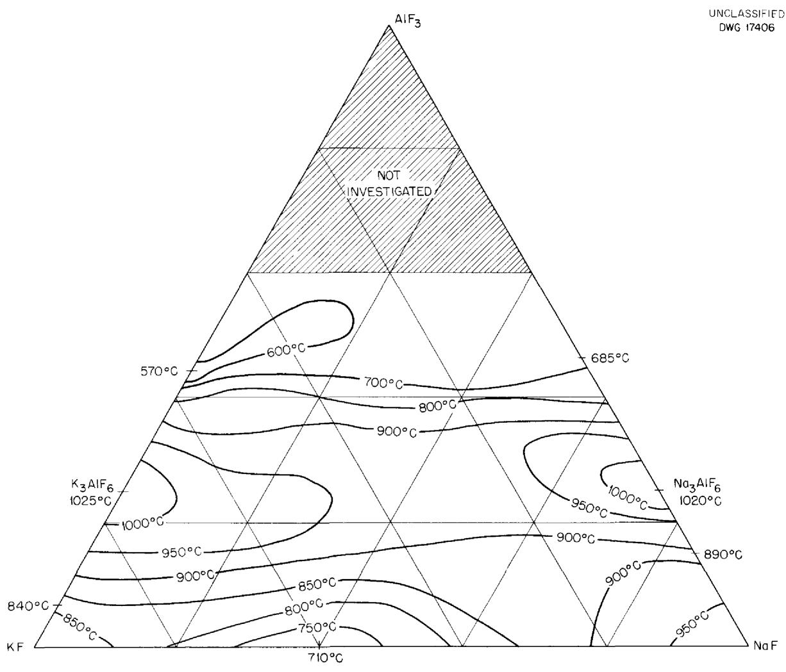  
Fig. 3.18. The System NaF-KF-AlF3.

# 3.19. The System LiF-BeF $_2$

This phase diagram is a composite from several published sources $^{1-3}$ and from unpublished data derived at the Oak Ridge National Laboratory (R. E. Moore, C. J. Barton, R. E. Thoma, and T. N. McVay) and at the Mound Laboratory (J. F. Eichelberger, C. R. Hudgens, L. V. Jones, and T. B. Rhinehammer). Thermal gradient quenching data (ORNL) and differential thermal analysis data (Mound Laboratory) have served to corroborate this composite diagram.

Invariant Equilibria   

<table><tr><td>Mole % BeF2in Liquid</td><td>Invariant Temperature (°C)</td><td>Type of Equilibrium</td><td>Phase Reaction at Invariant Temperature</td></tr><tr><td>33.5*</td><td>454</td><td>Peritectic</td><td>L + LiF ⇌ 2LiF·BeF2</td></tr><tr><td>52</td><td>355</td><td>Eutectic</td><td>L ⇌ 2LiF·BeF2 + BeF2</td></tr><tr><td>-</td><td>280</td><td>Upper temperature of stability for LiF·BeF2</td><td>2LiF·BeF2 + BeF2 ⇌ LiF·BeF2</td></tr></table>

*Ref 3.

Roy, Roy, and Osborn have reported the presence of the compound $\mathsf{LiF}\cdot 2\mathsf{BeF}_2$ in the system $\mathsf{LiF}\cdot \mathsf{BeF}_2$ although neither the Mound Laboratory nor the ORNL data have indicated the existence of this compound.

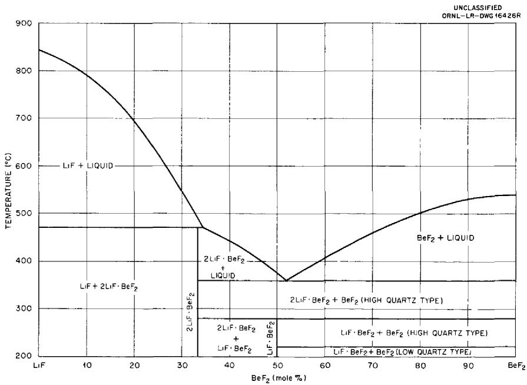  
Fig. 3.19. The System LiF-BeF $_2$

# 3.20. The System NaF-BeF

D. M. Roy, R. Roy, and E. F. Osborn, "Fluoride Model Systems: III. The System NaF-BeF $_2$ and the Polymorphism of Na $_2$ BeF $_4$ and BeF $_2$ ," J. Am. Ceram. Soc. 36, 185 (1953).

# Invariant Equilibria*

<table><tr><td>Mole % BeF2in Liquid</td><td>Invariant Temperature (°C)</td><td>Type of Equilibrium</td><td>Phase Reaction at Invariant Temperature</td></tr><tr><td>31</td><td>570</td><td>Eutectic</td><td>L ⇌ NaF + α-2NaF·BeF2</td></tr><tr><td>33.3</td><td>600</td><td>Congruent melting point</td><td>L ⇌ α-2NaF·BeF2</td></tr><tr><td>-</td><td>320</td><td>Inversion</td><td>α-2NaF·BeF2 ⇌ α&#x27;-2NaF·BeF2</td></tr><tr><td>-</td><td>225</td><td>Inversion</td><td>α&#x27;-2NaF·BeF2 ⇌ γ-2NaF·BeF2</td></tr><tr><td>43</td><td>340</td><td>Eutectic</td><td>L ⇌ α-2NaF·BeF2 + β-NaF·BeF2</td></tr><tr><td>50</td><td>376 ± 5</td><td>Congruent melting point</td><td>L ⇌ β&#x27;·NaF·BeF2</td></tr><tr><td>55</td><td>365</td><td>Eutectic</td><td>L ⇌ β&#x27;·NaF·BeF2 + BeF2</td></tr></table>

*Roy, Roy, and Osborn did not list invariant equilibria; those shown are estimates made from the report of work and from experiments performed at the Oak Ridge National Laboratory.

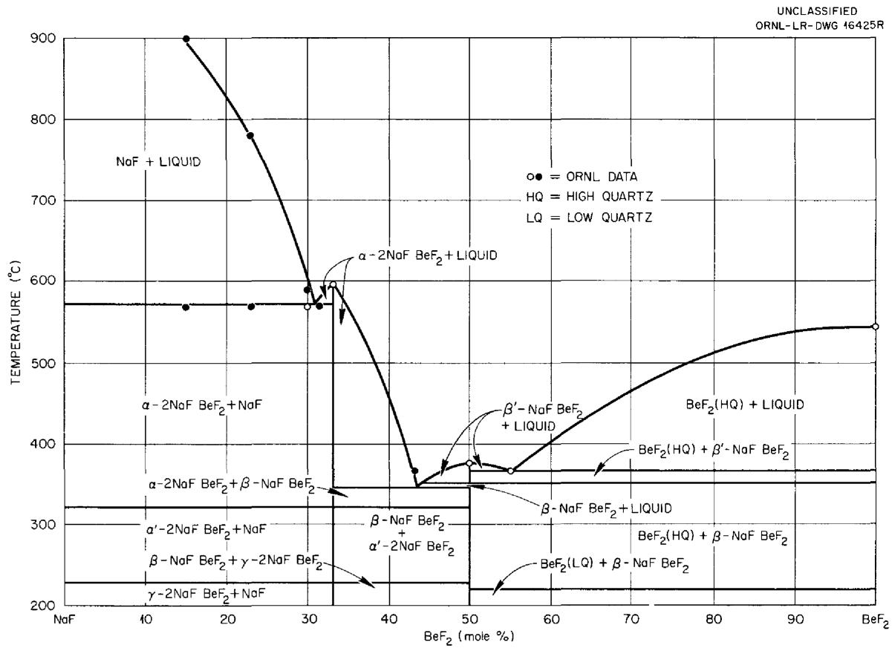  
Fig. 3.20. The System NaF-BeF $_{2}$

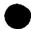

# 3.21. The System $\mathsf{KF - BeF}_2$

R. E. Moore, C. J. Barton, L. M. Bratcher, T. N. McVay, G. D. White, R. J. Sheil, W. R. Grimes, R. E. Meadows, and L. A. Harris, unpublished work performed at the Oak Ridge National Laboratory, 1955-56.

Preliminary diagram.

Invariant Equilibria   

<table><tr><td>Mole % BeF2In Liquid</td><td>Invariant Temperature (°C)</td><td>Type of Equilibrium</td><td>Phase Reaction at Invariant Temperature</td></tr><tr><td>19</td><td>720</td><td>Eutectic</td><td>L ⇌ KF + 3KF·BeF2</td></tr><tr><td>25</td><td>740</td><td>Congruent melting point</td><td>L ⇌ 3KF·BeF2</td></tr><tr><td>27</td><td>730</td><td>Eutectic</td><td>L ⇌ 3KF·BeF2 + α-2KF·BeF2</td></tr><tr><td>33.3</td><td>787</td><td>Congruent melting point</td><td>L ⇌ α-2KF·BeF2</td></tr><tr><td>-</td><td>685</td><td>Inversion</td><td>α-2KF·BeF2 ⇌ β-2KF·BeF2</td></tr><tr><td>52</td><td>390</td><td>Peritectic</td><td>β-2KF·BeF2 + L ⇌ KF·BeF2</td></tr><tr><td>59</td><td>330</td><td>Eutectic</td><td>L ⇌ KF·BeF2 + β-KF·2BeF2</td></tr><tr><td>66.7</td><td>358</td><td>Congruent melting point</td><td>L ⇌ α-KF·2BeF2</td></tr><tr><td>-</td><td>334</td><td>Inversion</td><td>α-KF·2BeF2 ⇌ β-KF·2BeF2</td></tr><tr><td>72.5</td><td>323</td><td>Eutectic</td><td>L ⇌ β-KF·2BeF2 + BeF2</td></tr></table>

This system has been reported by M. P. Borzenkova, A. V. Novoselova, Yu. P. Simanov, V. I. Chernikh, and E. I. Yarembash, "Thermal and X-Ray Analysis of the KF-BeF $_2$ System," Zbur. Neorg. Kbim. 1, 2071-82 (1956).

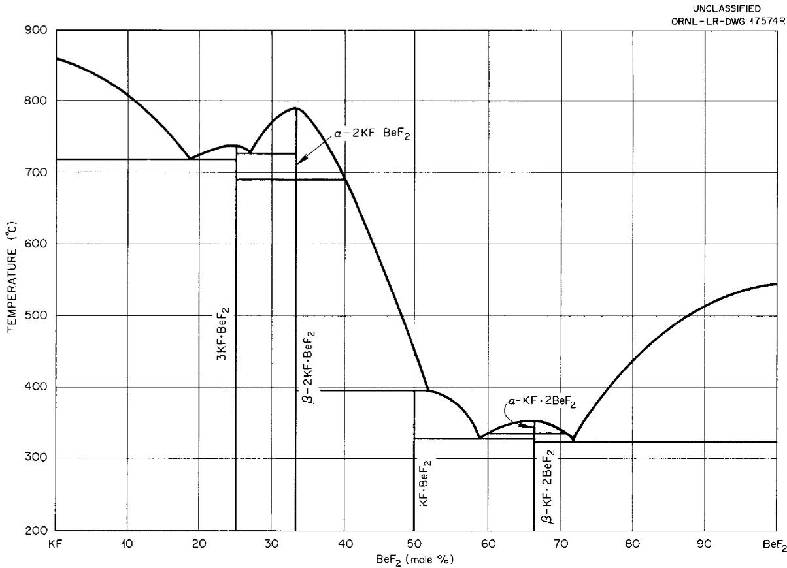  
Fig. 3.21. The System KF-BeF $_2$ .

# 3.22. The System RbF-BeF

R. E. Moore, C. J. Barton, L. M. Bratcher, T. N. McVay, G. D. White, R. J. Sheil, W. R. Grimes, and R. E. Meadows, unpublished work performed at the Oak Ridge National Laboratory, 1955-56.

Preliminary diagram.

Invariant Equilibria   

<table><tr><td>Mole % BeF2in Liquid</td><td>Invariant Temperature (°C)</td><td>Type of Equilibrium</td><td>Phase Reaction at Invariant Temperature</td></tr><tr><td>16</td><td>675</td><td>Eutectic</td><td>L ⇌ RbF + 3RbF·BeF2</td></tr><tr><td>25</td><td>725</td><td>Congruent melting point</td><td>L ⇌ 3RbF·BeF2</td></tr><tr><td>27</td><td>720</td><td>Eutectic</td><td>L ⇌ 3RbF·BeF2 + 2RbF·BeF2</td></tr><tr><td>33.3</td><td>800</td><td>Congruent melting point</td><td>L ⇌ 2RbF·BeF2</td></tr><tr><td>50.5</td><td>442</td><td>Peritectic</td><td>L + 2RbF·BeF2 ⇌ RbF·BeF2</td></tr><tr><td>61</td><td>383</td><td>Eutectic</td><td>L ⇌ RbF·BeF2 + RbF·2BeF2</td></tr><tr><td>66.7</td><td>464</td><td>Congruent melting point</td><td>L ⇌ RbF·2BeF2</td></tr><tr><td>81</td><td>397</td><td>Eutectic</td><td>L ⇌ RbF·2BeF2 + BeF2</td></tr></table>

This system has also been reported by R. G. Grebenschikov, "Investigation of the Phase Diagram of the $\mathsf{RbF - BeF}_2$ System and of Its Relationship to the $\mathsf{BaO - SiO}_2$ System," Doklady Akad. Nauk S.S.S.R. 114, 316 (1957).

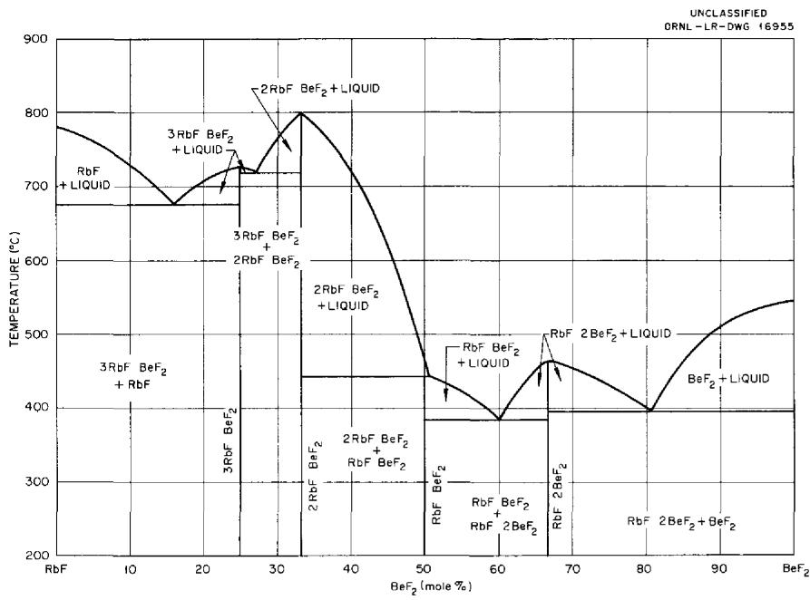  
Fig. 3.22 The System RbF-BeF $_{2^*}$

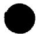

# 3.23. The System CsF-BeF

O. N. Breusov, A. V. Novoselova, and Yu. P. Simanov, "Thermal and X-Ray Phase Analysis of the System CsF-BeF $_2$ and Its Interrelationships with MeF and BeF $_2$ Systems," Doklady Akad. Nauk S.S.S.R. 118, 935-37 (1958).

Invariant Equilibria   

<table><tr><td>Mole % BeF2in Liquid</td><td>Invariant Temperature (°C)</td><td>Type of Equilibrium</td><td>Phase Reaction at Invariant Temperature</td></tr><tr><td>14</td><td>598</td><td>Eutectic</td><td>L ⇌ CsF + β-3CsF·BeF2</td></tr><tr><td>23.5</td><td>659</td><td>Peritectic</td><td>α-2CsF·BeF2+ L ⇌ α-3CsF·BeF2</td></tr><tr><td>-</td><td>617</td><td>Inversion</td><td>α-3CsF·BeF2 ⇌ β-3CsF·BeF2</td></tr><tr><td>33.3</td><td>793</td><td>Congruent melting point</td><td>L ⇌ α-2CsF·BeF2</td></tr><tr><td>-</td><td>404</td><td>Inversion</td><td>α-2CsF·BeF2 ⇌ β-2CsF·BeF2</td></tr><tr><td>48</td><td>449</td><td>Eutectic</td><td>L ⇌ α-2CsF·BeF2+ α-CsF·BeF2</td></tr><tr><td>50</td><td>475</td><td>Congruent melting point</td><td>L ⇌ α-CsF·BeF2</td></tr><tr><td>-</td><td>360</td><td>Inversion</td><td>α-CsF·BeF2 ⇌ β-CsF·BeF2</td></tr><tr><td>-</td><td>140</td><td>Inversion</td><td>β-CsF·BeF2 ⇌ γ-CsF·BeF2</td></tr><tr><td>58.4</td><td>393</td><td>Eutectic</td><td>L ⇌ α-CsF·BeF2+ β-CsF·2BeF2</td></tr><tr><td>66.7</td><td>480</td><td>Congruent melting point</td><td>L ⇌ α-CsF·2BeF2</td></tr><tr><td>-</td><td>450</td><td>Inversion</td><td>α-CsF·2BeF2 ⇌ β-CsF·2BeF2</td></tr><tr><td>77.5</td><td>367</td><td>Eutectic</td><td>L ⇌ β-CsF·2BeF2+ BeF2</td></tr></table>

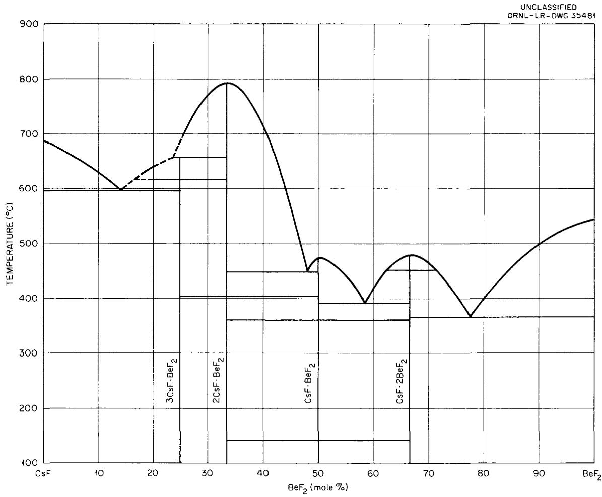  
Fig. 3.23. The System CsF-BeF $_{2}$

# 3.24. The System LiF-NaF-BeF

R. E. Moore, C. J. Barton, W. R. Grimes, R. E. Meadows, L. M. Bratcher, G. D. White, T. N. McVay, and L. A. Harris, unpublished work performed at the Oak Ridge National Laboratory, 1951-58.

Preliminary diagram.

Invariant Equilibria*   

<table><tr><td colspan="3">Composition of Liquid (mole %)</td><td rowspan="2">Invariant Temperature (℃)</td><td rowspan="2">Type of Equilibrium</td><td rowspan="2">Solids Present at Invariant Point</td></tr><tr><td>LiF</td><td>NaF</td><td>BeF2</td></tr><tr><td>15</td><td>58</td><td>27</td><td>480</td><td>Eutectic</td><td>NaF, LiF, and 2NaF·BeF2</td></tr><tr><td>23</td><td>41</td><td>36</td><td>328</td><td>Eutectic</td><td>LiF, 2NaF·BeF2, and 2NaF·LiF·2BeF2</td></tr><tr><td>20</td><td>40</td><td>40</td><td>355</td><td>Congruent melting point</td><td>2NaF·LiF·2BeF2</td></tr><tr><td>5</td><td>53</td><td>42</td><td>318</td><td>Eutectic</td><td>NaF·BeF2, 2NaF·BeF2, and 2NaF·LiF·2BeF2</td></tr><tr><td>31.5</td><td>31</td><td>37.5</td><td>315</td><td>Eutectic</td><td>2LiF·BeF2, LiF, and 2NaF·LiF·2BeF2</td></tr></table>

*Invariant equilibria shown in the phase diagram by the intersections of dotted-line boundary curves have not been determined with sufficient precision to be listed in the table.

Minimum Temperature on Alkemade Lines   

<table><tr><td colspan="3">Composition of Liquid (mole %)</td><td rowspan="2">Temperature (℃)</td><td rowspan="2">Alkemade Line</td></tr><tr><td>LiF</td><td>NaF</td><td>BeF2</td></tr><tr><td>16</td><td>56</td><td>28</td><td>485</td><td>2NaF·BeF2-LiF</td></tr><tr><td>26</td><td>37</td><td>37</td><td>340</td><td>2NaF·LiF·2BeF2-LiF</td></tr><tr><td>11</td><td>44</td><td>45</td><td>332</td><td>NaF·BeF2-2NaF·LiF·2BeF2</td></tr><tr><td>16</td><td>45</td><td>39</td><td>343</td><td>2NaF·BeF2-2NaF·LiF·2BeF2</td></tr><tr><td>30.5</td><td>31</td><td>38.5</td><td>316</td><td>2LiF·BeF2-2NaF·LiF·2BeF2</td></tr></table>

Phase relationships of two of the ternary compounds in this system have been reported by W. Jahn ["Silicate Models. V. NaLi(BeF₄), a Model Substance for Monticellite, CaMg(SiO₄)₂", Z. anorg. u. allgem. Chem. 276, 113-27 (1954); "Silicate Models. VI. Na₃Li(BeF₄)₂, a New Compound in the Ternary System NaF-LiF-BeF₂, and Its Relation to Merwinite, Ca₃Mg(SiO₄)₂", Z. anorg. u. allgem. Chem. 277, 274-86 (1954)].

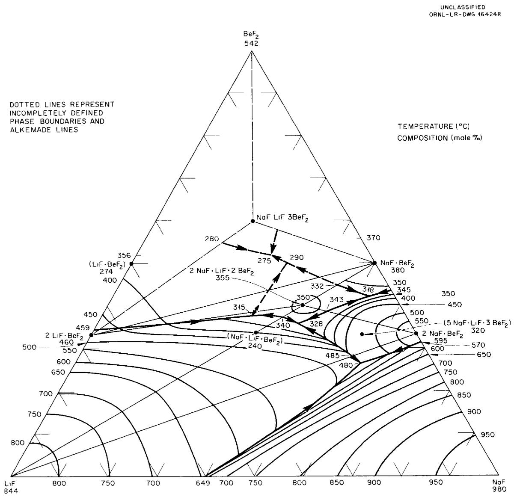  
Fig. 3.24. The System LiF-NaF-BeF

# 3.25. The System LiF-RbF-BeF

T. B. Rhinehammer, D. E. Etter, C. R. Hudgens, N. E. Rogers, and P. A. Tucker, unpublished work performed at the Mound Laboratory.

Preliminary diagram.

Invariant Equilibria and Singular Points   

<table><tr><td colspan="3">Composition of Liquid (mole %)</td><td rowspan="2">Temperature (℃)</td><td rowspan="2">Type of Equilibrium</td><td rowspan="2">Solid Phases Present</td></tr><tr><td>LiF</td><td>RbF</td><td>BeF2</td></tr><tr><td>40.0</td><td>20.0</td><td>40.0</td><td>485 ± 5</td><td>Congruent melting point</td><td>2LiF·RbF·2BeF2</td></tr><tr><td>33.3</td><td>33.3</td><td>33.3</td><td>544 ± 5</td><td>Incongruent melting point of LiF·RbF·BeF2</td><td></td></tr><tr><td>33.0</td><td>8.0</td><td>59.0</td><td>295 ± 5</td><td>Eutectic</td><td>2LiF·BeF2, 2LiF·RbF·2BeF2, and BeF2</td></tr><tr><td>26.0</td><td>12.0</td><td>62.0</td><td>305–320</td><td>Peritectic</td><td>2LiF·RbF·2BeF2, RbF·2BeF2, and BeF2</td></tr><tr><td>12.0</td><td>29.0</td><td>59.0</td><td>334 ± 5</td><td>Quasi-binary eutectic</td><td>2LiF·RbF·2BeF2 and RbF·2BeF2</td></tr><tr><td>11.0</td><td>34.0</td><td>55.0</td><td>300 ± 5</td><td>Eutectic</td><td>2LiF·RbF·2BeF2, RbF·BeF2, and RbF·2BeF2</td></tr><tr><td>11.5</td><td>35.5</td><td>53.0</td><td>335 ± 5</td><td>Peritectic</td><td>2LiF·RbF·2BeF2, LlF·RbF·BeF2, and RbF·BeF2</td></tr><tr><td>9.0</td><td>40.0</td><td>51.0</td><td>380 ± 5</td><td>Peritectic</td><td>LiF·RbF·BeF2, 2RbF·BeF2, and RbF·BeF2</td></tr><tr><td>50.0</td><td>8.0</td><td>42.0</td><td>426 ± 5</td><td>Peritectic</td><td>LiF, 2LiF·RbF·2BeF2, and 2LiF·BeF2</td></tr><tr><td>41.5</td><td>19.5</td><td>39.0</td><td>473 ± 5</td><td>Quasi-binary eutectic</td><td>LiF and 2LiF·RbF·2BeF2</td></tr><tr><td>35.0</td><td>25.5</td><td>39.5</td><td>470 ± 5</td><td>Peritectic</td><td>LiF, 2LiF·RbF·2BeF2, and LiF·RbF·BeF2</td></tr><tr><td>23.0</td><td>40.0</td><td>37.0</td><td>530 ± 5</td><td>Peritectic</td><td>LiF, 2RbF·BeF2, and LiF·RbF·BeF2</td></tr><tr><td>30.0</td><td>35.0</td><td>35.0</td><td>544 ± 5</td><td>Maximum on the boundary</td><td>LiF and LiF·RbF·BeF2</td></tr><tr><td>41.0</td><td>39.5</td><td>19.5</td><td>640 ± 5</td><td>Quasi-binary eutectic</td><td>LiF and 2RbF·BeF2</td></tr><tr><td>43.0</td><td>50.0</td><td>7.0</td><td>527 ± 5</td><td>Peritectic</td><td>LiF, 3RbF·BeF2, and 2RbF·BeF2</td></tr><tr><td>43.0</td><td>54.0</td><td>3.0</td><td>470 ± 5</td><td>Peritectic</td><td>LiF, LiF·RbF, and 3RbF·BeF2</td></tr><tr><td>43.0</td><td>55.0</td><td>2.0</td><td>462 ± 5</td><td>Eutectic</td><td>LiF·RbF, RbF, and 3RbF·BeF2</td></tr></table>

UNCLASSIFIED

ORNL-LR-DWG 38113

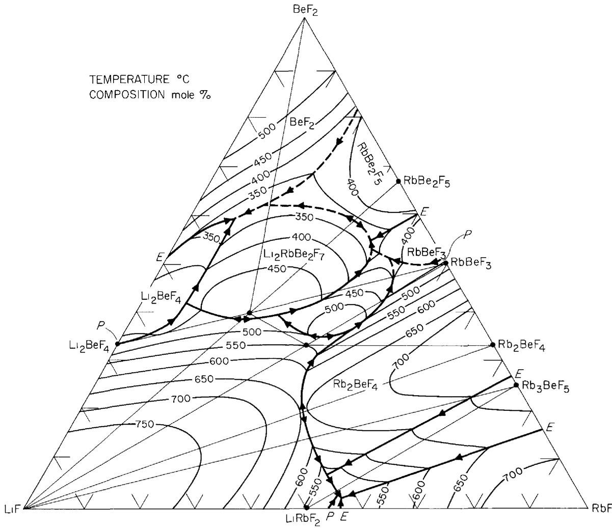  
Fig. 3.25. The System LiF-RbF-BeF2

# 3.26. The System NaF-KF-BeF

R. E. Moore, C. J. Barton, L. M. Bratcher, T. N. McVay, and W. R. Grimes, unpublished work performed at the Oak Ridge National Laboratory, 1952-55.

Preliminary diagram. Phase relationships within the system NaF-KF-BeF $_2$ have not yet become so well defined at the Oak Ridge National Laboratory that the compositions and temperatures of the invariant points may be listed.

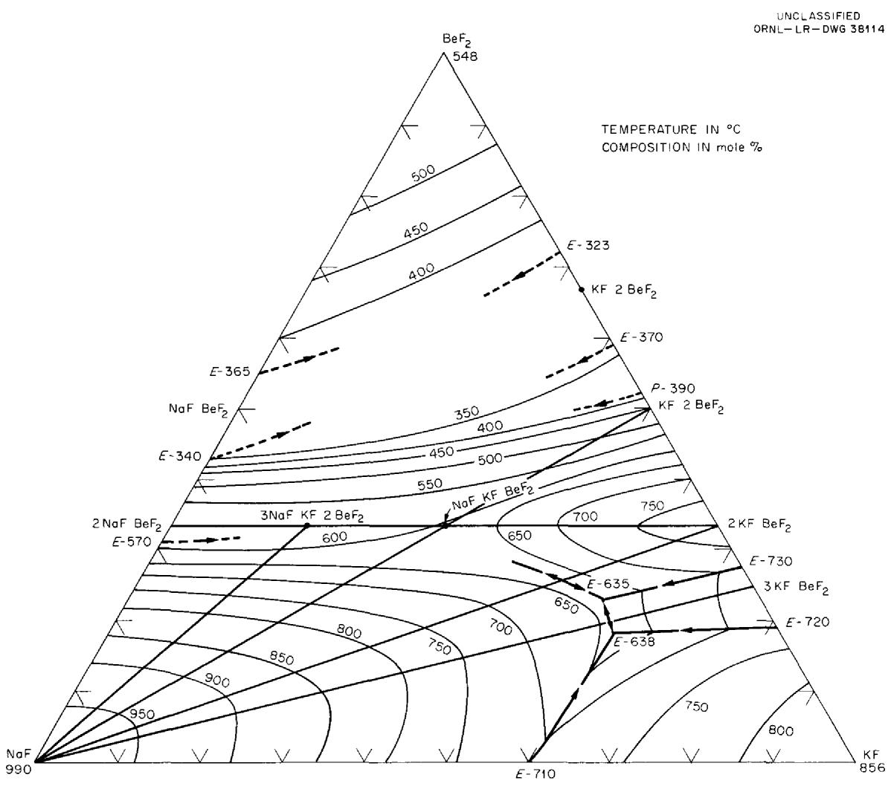  
Fig. 3.26. The System NaF-KF-BeF $_{2^{\circ}}$

# 3.27. The System NaF-RbF-BeF

R. E. Moore, C. J. Barton, L. M. Bratcher, and W. R. Grimes, unpublished work performed at the Oak Ridge National Laboratory, 1954-57.

Preliminary diagram.

Invariant Equilibria and Singular Points   

<table><tr><td colspan="3">Composition of Liquid (mole %)</td><td rowspan="2">Temperature (℃)</td><td rowspan="2">Type of Equilibrium</td><td rowspan="2">Solids Present at Invariant Temperature</td></tr><tr><td>NaF</td><td>RbF</td><td>BeF2</td></tr><tr><td>20.5</td><td>68.5</td><td>11.0</td><td>610</td><td>Eutectic</td><td>RbF, NaF, and 3RbF·BeF2</td></tr><tr><td>50</td><td>37.5</td><td>12.5</td><td>640</td><td>Quasi-binary eutectic</td><td>3RbF·BeF2and NaF</td></tr><tr><td>46</td><td>38</td><td>16</td><td>635</td><td>Eutectic</td><td>3RbF·BeF2, 2RbF·BeF2, and NaF</td></tr><tr><td>45</td><td>37</td><td>18</td><td>650</td><td>Quasi-binary eutectic</td><td>2RbF·BeF2and NaF</td></tr><tr><td>37</td><td>33</td><td>30</td><td>570</td><td>Peritectic</td><td>2RbF·BeF2, NaF, and 2NaF·4RbF·3BeF2</td></tr><tr><td>52</td><td>15</td><td>33</td><td>477</td><td>Eutectic</td><td>2NaF·4RbF·3BeF2, NaF, and 2NaF·BeF2</td></tr><tr><td>33</td><td>33.7</td><td>33.3</td><td>580</td><td>Peritectic</td><td>2RbF·BeF2and 2NaF·4RbF·3BeF2</td></tr><tr><td>51.7</td><td>15</td><td>33.3</td><td>480</td><td>Quasi-binary eutectic</td><td>2NaF·4RbF·3BeF2and 2NaF·BeF2</td></tr></table>

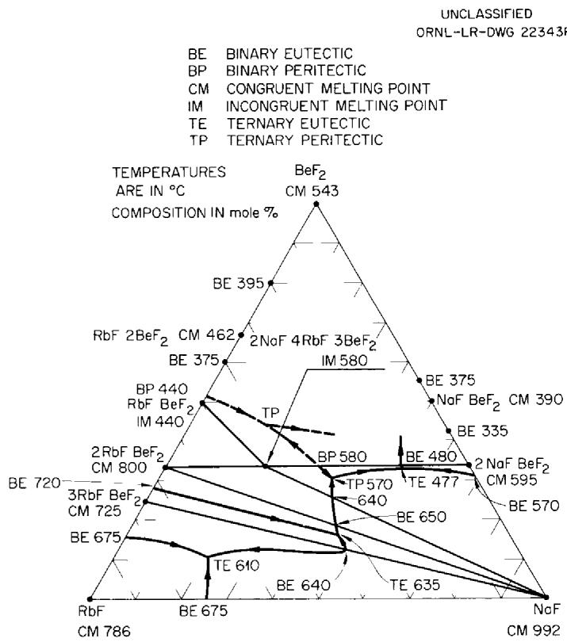  
Fig. 3.27. The System NaF-RbF-BeF

# 3.28. The System $\mathsf{NaF - ZnF}_2$

C. J. Barton, L. M. Bratcher, and W. R. Grimes, unpublished work performed at the Oak Ridge National Laboratory, 1952.

Preliminary diagram.

Invariant Equilibria   

<table><tr><td>Mole % ZnF2in Liquid</td><td>Invariant Temperature (℃)</td><td>Type of Equilibrium</td><td>Phase Reaction at Invariant Temperature</td></tr><tr><td>33</td><td>635</td><td>Eutectic</td><td>L ⇌ NaF + NaF·ZnF2</td></tr><tr><td>50</td><td>748 ± 10</td><td>Congruent melting point</td><td>L ⇌ NaF·ZnF2</td></tr><tr><td>69</td><td>685</td><td>Eutectic</td><td>L ⇌ NaF·ZnF2 + ZnF2</td></tr></table>

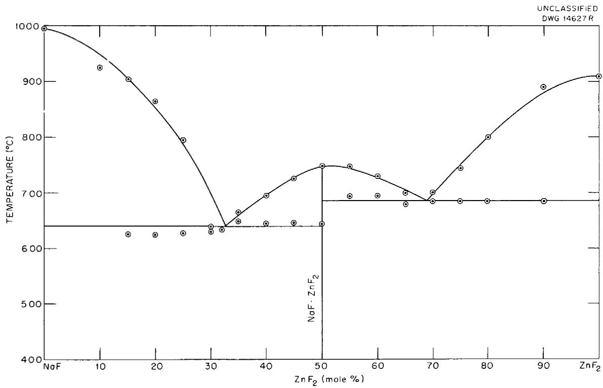  
Fig. 3.28. The System NaF-ZnF2

# 3.29. The System $\mathsf{KF} - \mathsf{ZnF}_2$

C. J. Barton, L. M. Bratcher, and W. R. Grimes, unpublished work performed at the Oak Ridge National Laboratory, 1952.

Preliminary diagram.

Invariant Equilibria   

<table><tr><td>Mole % ZnF2in Liquid</td><td>Invariant Temperature (℃)</td><td>Type of Equilibrium</td><td>Phase Reaction at Invariant Temperature</td></tr><tr><td>21</td><td>670</td><td>Eutectic</td><td>L ⇌ KF + 2KF·ZnF2</td></tr><tr><td>30</td><td>720 ± 10</td><td>Peritectic</td><td>L + KF·ZnF2 ⇌ 2KF·ZnF2</td></tr><tr><td>50</td><td>850 ± 10</td><td>Congruent melting point</td><td>L ⇌ KF·ZnF2</td></tr><tr><td>80</td><td>740 ± 5</td><td>Eutectic</td><td>L ⇌ KF·ZnF2 + ZnF2</td></tr></table>

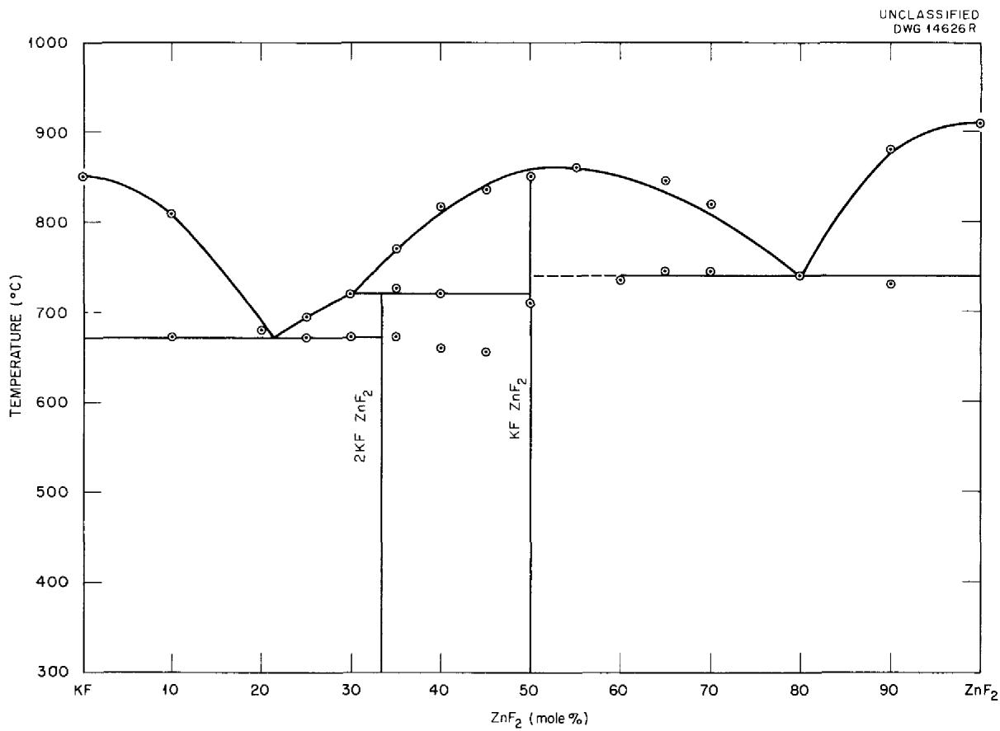  
Fig. 3.29. The System $\mathsf{KF} - \mathsf{ZnF}_{\mathbf{z}}$

# 3.30. The System RbF-ZnF

C. J. Barton, L. M. Bratcher, and W. R. Grimes, unpublished work performed at the Oak Ridge National Laboratory, 1952.

Preliminary diagram.

Invariant Equilibria   

<table><tr><td>Mole % ZnF2in Liquid</td><td>Invariant Temperature (℃)</td><td>Type of Equilibrium</td><td>Phase Reaction at Invariant Temperature</td></tr><tr><td>21</td><td>595 ± 10</td><td>Eutectic</td><td>L ⇌ RbF + 2RbF·ZnF2</td></tr><tr><td>32</td><td>620 ± 10</td><td>Peritectic</td><td>L + RbF·ZnF2 ⇌ 2RbF·ZnF2</td></tr><tr><td>50</td><td>730 ± 10</td><td>Congruent melting point</td><td>L ⇌ RbF·ZnF2</td></tr><tr><td>70</td><td>650</td><td>Eutectic</td><td>L ⇌ RbF·ZnF2 + ZnF2</td></tr></table>

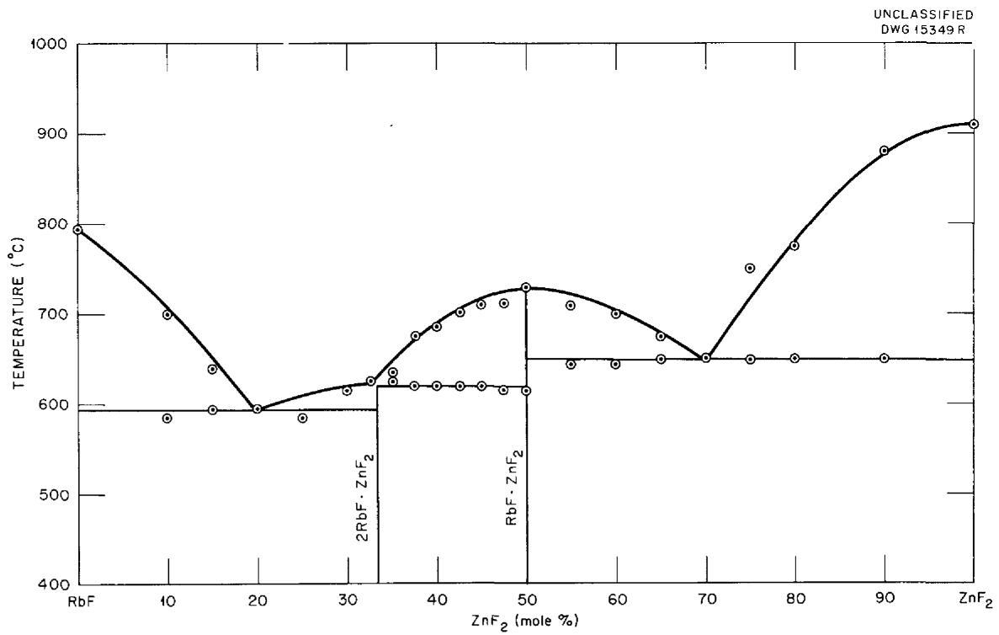  
Fig. 3.30. The System RbF-ZnF

# 3.31. The System $\mathsf{LiF}_{\sim}\mathsf{YF}_{3}$

R. E. Thoma, C. F. Weaver, and H. A. Friedman, unpublished work performed at the Oak Ridge National Laboratory, 1958-59.

Preliminary diagram.

Invariant Equilibria   

<table><tr><td>Mole % YF3in Liquid</td><td>Invariant Temperature (°C)</td><td>Type of Equilibrium</td><td>Phase Reaction at Invariant Temperature</td></tr><tr><td>19</td><td>695</td><td>Eutectic</td><td>L ⇌ LIF + LIF·YF3</td></tr><tr><td>49</td><td>815</td><td>Peritectic</td><td>L + YF3 ⇌ LIF·YF3</td></tr></table>

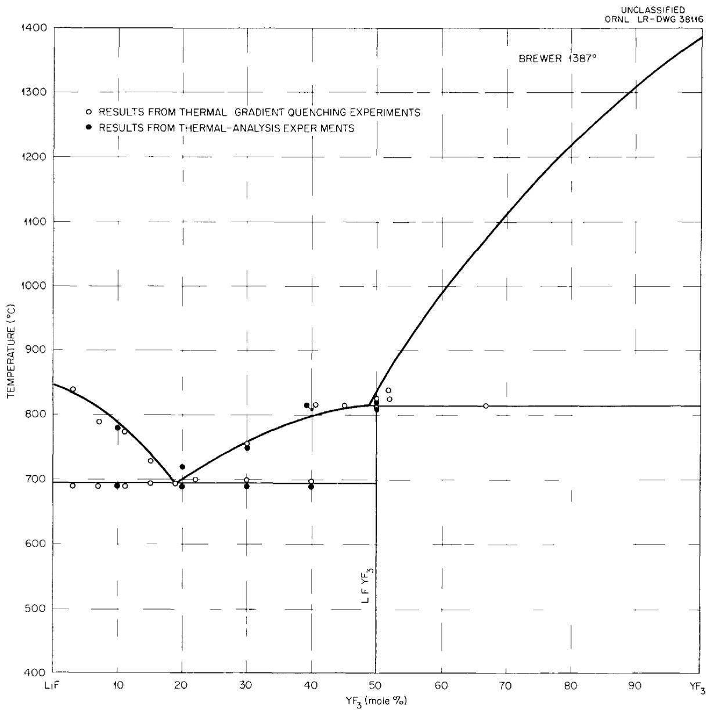  
Fig. 3.31. The System LiF-YF3.

# 3.32. The System LiF-ZrF4

R. E. Moore, F. F. Blankenship, W. R. Grimes, H. A. Friedman, C. J. Barton, R. E. Thoma, and H. Insley, unpublished work performed at the Oak Ridge National Laboratory, 1951-56. Preliminary diagram.

Invariant Equilibria   

<table><tr><td>Mole % ZrF4in Liquid</td><td>Invariant Temperature (℃)</td><td>Type of Equilibrium</td><td>Phase Reaction at Invariant Temperature</td></tr><tr><td>21</td><td>598</td><td>Eutectic</td><td>L ⇌ LiF + α-3LiF·ZrF4</td></tr><tr><td>25</td><td>662</td><td>Congruent melting point</td><td>L ⇌ α-3LiF·ZrF4</td></tr><tr><td>-</td><td>475</td><td>Inversion</td><td>α-3LiF·ZrF4 ⇌ β-3LiF·ZrF4</td></tr><tr><td>-</td><td>470</td><td>Decomposition</td><td>β-3LiF·ZrF4 ⇌ LiF + 2LiF·ZrF4</td></tr><tr><td>29.5</td><td>570</td><td>Eutectic</td><td>L ⇌ α-3LiF·ZrF4 + 2LiF·ZrF4</td></tr><tr><td>33.3</td><td>596</td><td>Congruent melting point</td><td>L ⇌ 2LiF·ZrF4</td></tr><tr><td>49</td><td>507</td><td>Eutectic</td><td>L ⇌ 2LiF·ZrF4 + 3LiF·4ZrF4</td></tr><tr><td>51.5</td><td>520</td><td>Peritectic</td><td>L + ZrF4 ⇌ 3LiF·4ZrF4</td></tr><tr><td>-</td><td>466</td><td>Decomposition</td><td>3LiF·4ZrF4 ⇌ 2LiF·ZrF4 + ZrF4</td></tr></table>

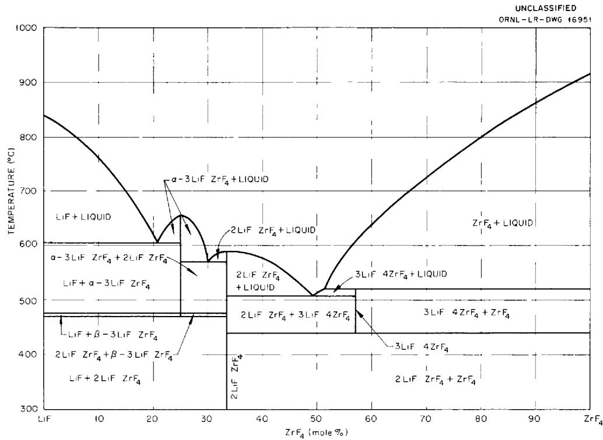  
Fig. 3.32. The System LiF-ZrF4

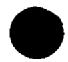

# 3.33. The System NaF-ZrF4

C. J. Barton, W. R. Grimes, H. Insley, R. E. Moore, and R. E. Thoma, “Phase Equilibria in the Systems NaF-ZrF₄, UF₄-ZrF₄, and NaF-ZrF₄-UF₄,” J. Phys. Chem. 62, 665-76 (1958).

Invariant Equilibria   

<table><tr><td>Mole % ZrF4in Liquid</td><td>Invariant Temperature (℃)</td><td>Type of Equilibrium</td><td>Phase Reaction at Invariant Temperature</td></tr><tr><td>20</td><td>747</td><td>Eutectic</td><td>L ⇌ NaF + 3NaF·ZrF4</td></tr><tr><td>25</td><td>850</td><td>Congruent melting point</td><td>L ⇌ 3NaF·ZrF4*</td></tr><tr><td>-</td><td>523</td><td>Inversion</td><td>α-5NaF·2ZrF4 ⇌ β-5NaF·2ZrF4</td></tr><tr><td>30.5</td><td>500</td><td>Eutectoid</td><td>α-5NaF·2ZrF4ss ⇌ β-5NaF·2ZrF4+ γ-2NaF·ZrF4</td></tr><tr><td>34</td><td>640</td><td>Peritectic</td><td>L + 3NaF·ZrF4(ss, ca. 27.5 mole % ZrF4) ⇌ α-5NaF·2ZrF4</td></tr><tr><td>39.5</td><td>544</td><td>Peritectic</td><td>L + α-5NaF·2ZrF4(ss, 30 mole % ZrF4) ⇌ α-2NaF·ZrF4</td></tr><tr><td>-</td><td>533</td><td>Inversion</td><td>α-2NaF·ZrF4 ⇌ β-2NaF·ZrF4</td></tr><tr><td>-</td><td>505</td><td>Inversion</td><td>β-2NaF·ZrF4 ⇌ γ-2NaF·ZrF4</td></tr><tr><td>40.5</td><td>500</td><td>Eutectic</td><td>L ⇌ γ-2NaF·ZrF4 + 7NaF·6ZrF4ss</td></tr><tr><td>46.2</td><td>525</td><td>Congruent melting point</td><td>L ⇌ 7NaF·6ZrF4</td></tr><tr><td>49.5</td><td>512</td><td>Eutectic</td><td>L ⇌ 7NaF·6ZrF4 + 3NaF·4ZrF4</td></tr><tr><td>56.5</td><td>537</td><td>Peritectic</td><td>L + ZrF4 ⇌ 3NaF·4ZrF4</td></tr></table>

$^{*}$ A determination of the crystal structure of $3NaF \cdot ZrF_{4}$ has been reported by L. A. Harris, "The Crystal Structures of $\mathsf{Na}_3\mathsf{ZrF}_7$ and $\mathsf{Na}_3\mathsf{HfF}_7$ ," Acta Cryst. 12, 172 (1959).

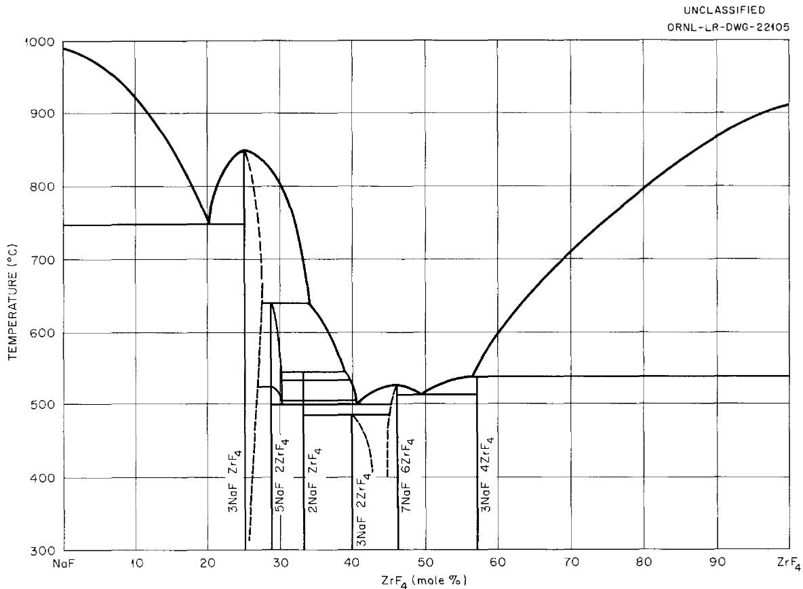  
Fig. 3.33. The System NaF-ZrF4.

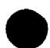

# 3.34. The System $\mathsf{KF} - \mathsf{ZrF}_4$

C. J. Barton, H. Insley, R. P. Metcalf, R. E. Thoma, and W. R. Grimes, unpublished work performed at the Oak Ridge National Laboratory, 1951-55.

Preliminary diagram.

Invariant Equilibria   

<table><tr><td>Mole % ZrF4in Liquid</td><td>Invariant Temperature (℃)</td><td>Type of Equilibrium</td><td>Phase Reaction at Invariant Temperature</td></tr><tr><td>14</td><td>765</td><td>Eutectic</td><td>L ⇌ KF + 3KF·ZrF4</td></tr><tr><td>25</td><td>910</td><td>Congruent melting point</td><td>L ⇌ 3KF·ZrF4</td></tr><tr><td>36</td><td>590</td><td>Peritectic</td><td>3KF·ZrF4 + L ⇌ 2KF·ZrF4</td></tr><tr><td>40.5</td><td>412</td><td>Peritectic</td><td>2KF·ZrF4 + L ⇌ 3KF·2ZrF4</td></tr><tr><td>42</td><td>390</td><td>Eutectic</td><td>L ⇌ 3KF·2ZrF4 + KF·ZrF4</td></tr><tr><td>50</td><td>475</td><td>Congruent melting point</td><td>L ⇌ KF·ZrF4</td></tr><tr><td>55</td><td>440</td><td>Eutectic</td><td>L ⇌ KF·ZrF4 + ZrF4</td></tr></table>

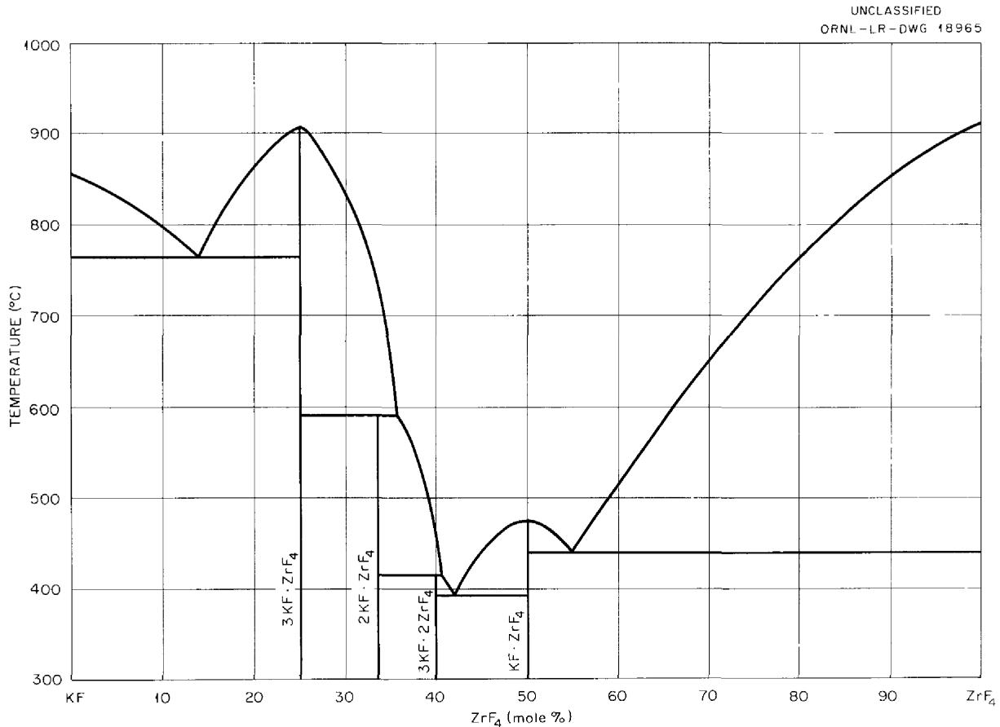  
Fig. 3.34. The System $\mathsf{KF} - \mathsf{ZrF}_{\mathbf{A}}$

# 3.35. The System RbF-ZrF4

R. E. Moore, R. E. Thoma, C. J. Barton, W. R. Grimes, H. Insley, B. S. Landau, and H. A. Friedman, unpublished work performed at the Oak Ridge National Laboratory, 1955-56.

Preliminary diagram.

Invariant Equilibria   

<table><tr><td>Mole % ZrF4in Liquid</td><td>Invariant Temperature (℃)</td><td>Type of Equilibrium</td><td>Phase Reaction at Invariant Temperature</td></tr><tr><td>10</td><td>710</td><td>Eutectic</td><td>L ⇌ RbF + 3RbF·ZrF4</td></tr><tr><td>25</td><td>897</td><td>Congruent melting point</td><td>L ⇌ 3RbF·ZrF4</td></tr><tr><td>34</td><td>620</td><td>Peritectic</td><td>L + 3RbF·ZrF4ss ⇌ α-2RbF·ZrF4</td></tr><tr><td>-</td><td>460</td><td>Inversion</td><td>α-2RbF·ZrF4 ⇌ β-2RbF·ZrF4</td></tr><tr><td>-</td><td>370</td><td>Lowered inversion and decomposition</td><td>α-2RbF·ZrF4ss ⇌ β-2RbF·ZrF4ss</td></tr><tr><td>42</td><td>410</td><td>Eutectic</td><td>L ⇌ α-2RbF·ZrF4ss + 5RbF·4ZrF4</td></tr><tr><td>44.4</td><td>445</td><td>Congruent melting point</td><td>L ⇌ 5RbF·4ZrF4</td></tr><tr><td>48</td><td>390</td><td>Eutectic</td><td>L ⇌ 5RbF·4ZrF4 + β-RbF·ZrF4</td></tr><tr><td>50</td><td>423</td><td>Congruent melting point</td><td>L ⇌ α-RbF·ZrF4</td></tr><tr><td>-</td><td>391</td><td>Inversion</td><td>α-RbF·ZrF4 ⇌ β-RbF·ZrF4</td></tr><tr><td>54</td><td>400</td><td>Eutectic</td><td>L ⇌ α-RbF·ZrF4 + RbF·2ZrF4</td></tr><tr><td>57</td><td>447</td><td>Peritectic</td><td>L + ZrF4 ⇌ RbF·2ZrF4</td></tr></table>

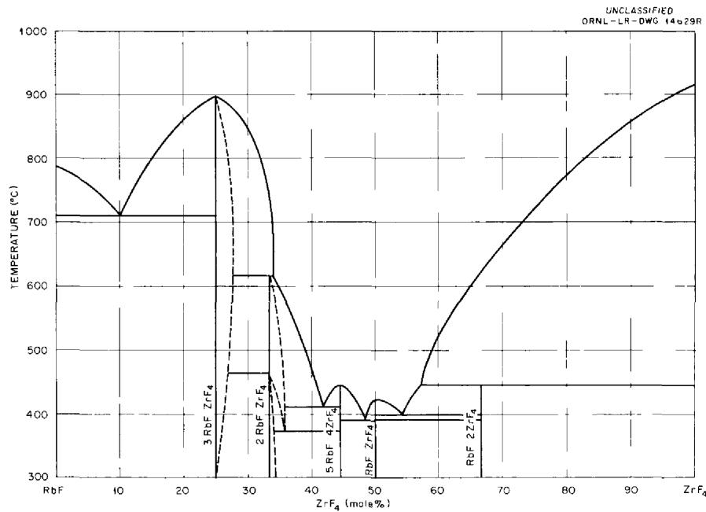  
Fig. 3.35. The System RbF-ZrF4.

# 3.36. The System CsF-ZrF

C. J. Barton, L. M. Bratcher, and W. R. Grimes, unpublished work performed at the Oak Ridge National Laboratory, 1952-53.

Preliminary diagram.

Invariant Equilibria   

<table><tr><td>Mole % ZrF4in Liquid</td><td>Invariant Temperature (°C)</td><td>Type of Equilibrium</td><td>Phase Reaction at Invariant Temperature</td></tr><tr><td>9</td><td>640</td><td>Eutectic</td><td>L ⇌ CsF + 3CsF·ZrF4</td></tr><tr><td>25</td><td>775</td><td>Congruent melting point</td><td>L ⇌ 3CsF·ZrF4</td></tr><tr><td>35</td><td>520</td><td>Peritectic</td><td>L + 3CsF·ZrF4 ⇌ 2CsF·ZrF4</td></tr><tr><td>40</td><td>420</td><td>Eutectic</td><td>L ⇌ 2CsF·ZrF4 + α-CsF·ZrF4</td></tr><tr><td>50</td><td>515</td><td>Congruent melting point</td><td>L ⇌ α-CsF·ZrF4</td></tr><tr><td>-</td><td>320</td><td>Inversion</td><td>α-CsF·ZrF4 ⇌ β-CsF·ZrF4</td></tr><tr><td>59</td><td>470</td><td>Eutectic</td><td>L ⇌ α-CsF·ZrF4 + ZrF4</td></tr></table>

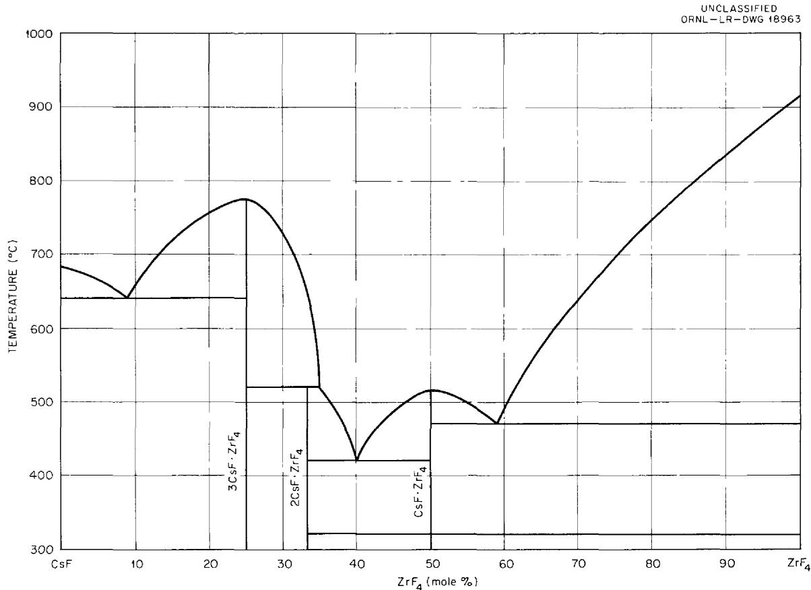  
Fig. 3.36. The System CsF-ZrF4.

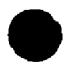

# 3.37. The System LiF-NaF-ZrF4

F. F. Blankenship, H. A. Friedman, H. Insley, R. E. Thoma, and W. R. Grimes, unpublished work performed at the Oak Ridge National Laboratory, 1953-59.

Preliminary diagram.

Invariant Equilibria   

<table><tr><td colspan="3">Composition of Liquid (mole %)</td><td rowspan="2">Temperature (℃)</td><td rowspan="2">Type of Invariant</td><td rowspan="2">Solids Present at Invariant Temperature</td></tr><tr><td>LiF</td><td>NaF</td><td>ZrF4</td></tr><tr><td>37</td><td>52</td><td>11</td><td>604</td><td>Eutectic</td><td>NaF, LiF, and 3NaF·ZrF4</td></tr><tr><td>55</td><td>22</td><td>23</td><td>590</td><td>Eutectic</td><td>α-3LiF·ZrF4, 3NaF·ZrF4ss, and LiF</td></tr><tr><td>32</td><td>36</td><td>32</td><td>450</td><td>Peritectic</td><td>β-3LiF·ZrF4, 3NaF·ZrF4ss, and 2LiF·ZrF4</td></tr><tr><td>31</td><td>35</td><td>34</td><td>448</td><td>Peritectic</td><td>3NaF·ZrF4, α-5NaF·2ZrF4ss, and 2LiF·ZrF4</td></tr><tr><td>31</td><td>34.5</td><td>34.5</td><td>445</td><td>Peritectic</td><td>2NaF·ZrF4, α-5NaF·2ZrF4ss, and 2LiF·ZrF4</td></tr><tr><td>26</td><td>37</td><td>37</td><td>425</td><td>Eutectic</td><td>2NaF·ZrF4, 7NaF·6ZrF4, and 2LiF·ZrF4</td></tr><tr><td>29</td><td>25.5</td><td>45.5</td><td>449</td><td>Eutectic</td><td>7NaF·6ZrF4, 3NaF·4ZrF4ss, and 2LiF·ZrF4</td></tr><tr><td>29</td><td>24.5</td><td>46.5</td><td>453</td><td>Peritectic</td><td>3NaF·4ZrF4ss, 3LiF·4ZrF4ss, and 2LiF·ZrF4</td></tr><tr><td>28</td><td>24</td><td>48</td><td>475</td><td>Peritectic</td><td>3NaF·4ZrF4ss, 3LiF·4ZrF4ss, and ZrF4</td></tr></table>

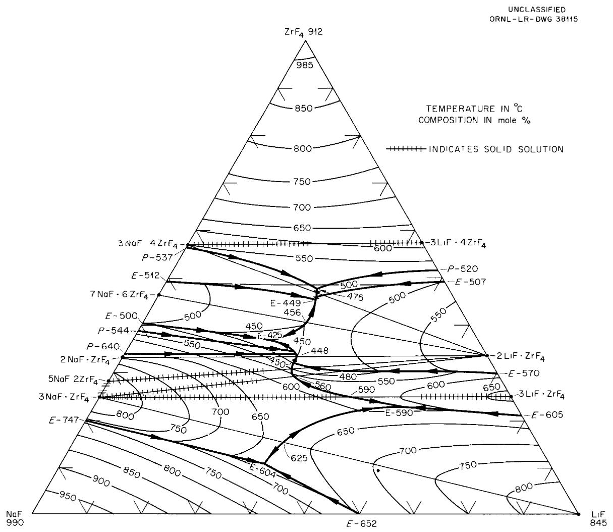  
Fig. 3.37. The System LiF-NaF-ZrF4

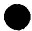

# 3.38. The System NaF-KF-ZrF4

R. E. Thoma, C. J. Barton, H. Insley, H. A. Friedman, and W. R. Grimes, unpublished work performed at the Oak Ridge National Laboratory, 1951-55.

Preliminary diagram.

Invariant Equilibria*   

<table><tr><td colspan="3">Composition of Liquid (mole %)**</td><td>Invariant Temperature (℃)</td><td>Type of Equilibrium</td><td>Solids Present at Invariant Point</td></tr><tr><td>NaF</td><td>KF</td><td>ZrF4</td><td></td><td></td><td></td></tr><tr><td>34</td><td>58</td><td>8</td><td>695</td><td>Eutectic</td><td>NaF, KF, and 3KF·ZrF4</td></tr><tr><td>45</td><td>38</td><td>17</td><td>720</td><td>Eutectic</td><td>NaF, 3KF·ZrF4, and 3NaF·3KF·2ZrF4</td></tr><tr><td>61</td><td>19</td><td>20</td><td>710</td><td>Eutectic</td><td>NaF, 3NaF·ZrF4, and 3NaF·3KF·2ZrF4</td></tr><tr><td>52</td><td>17</td><td>31</td><td></td><td>Peritectic</td><td>3NaF·ZrF4, 3NaF·3KF·2ZrF4, and NaF·KF·ZrF4</td></tr><tr><td>48</td><td>18</td><td>34</td><td></td><td>Peritectic</td><td>3NaF·ZrF4, NaF·KF·ZrF4, and 5NaF·2ZrF4</td></tr><tr><td>33</td><td>32</td><td>35</td><td></td><td>Peritectic</td><td>3NaF·3KF·2ZrF4, 3KF·ZrF4, and NaF·KF·ZrF4</td></tr><tr><td>12</td><td>51</td><td>37</td><td></td><td>Peritectic</td><td>3KF·ZrF4, 2KF·ZrF4, and NaF·KF·ZrF4</td></tr><tr><td>40</td><td>21</td><td>39</td><td></td><td>Peritectic</td><td>5NaF·2ZrF4, 2NaF·ZrF4, and NaF·KF·ZrF4</td></tr><tr><td>39</td><td>21</td><td>40</td><td></td><td>Peritectic</td><td>2NaF·ZrF4, 7NaF·6ZrF4, and NaF·KF·ZrF4</td></tr><tr><td>11</td><td>49</td><td>40</td><td></td><td>Peritectic</td><td>2KF·ZrF4, 3KF·2ZrF4, and NaF·KF·ZrF4</td></tr><tr><td>10</td><td>48</td><td>42</td><td>385</td><td>Eutectic</td><td>3KF·2ZrF4, KF·ZrF4, and NaF·KF·ZrF4</td></tr><tr><td>15</td><td>40</td><td>45</td><td></td><td>Eutectic</td><td>KF·ZrF4, NaF·KF·ZrF4, and 2NaF·3KF·5ZrF4</td></tr><tr><td>22</td><td>33</td><td>45</td><td></td><td>Peritectic</td><td>NaF·KF·ZrF4, 7NaF·6ZrF4, and 2NaF·3KF·5ZrF4</td></tr><tr><td>25</td><td>25</td><td>50</td><td></td><td>Eutectic</td><td>7NaF·6ZrF4, 3NaF·4ZrF4, and 2NaF·3KF·5ZrF4</td></tr><tr><td>21</td><td>29</td><td>51</td><td></td><td>Eutectic</td><td>3NaF·4ZrF4, ZrF4, and 2NaF·3KF·5ZrF4</td></tr><tr><td>20</td><td>30</td><td>50</td><td>432</td><td>Congruent melting point</td><td>2NaF·3KF·5ZrF4</td></tr></table>

*Three solid phases have been observed routinely in the composition region 30-50 mole $\%$ $\mathsf{ZrF}_4$ which have not been identified as to composition. Whether these exhibit primary phases at the liquidus surface has not yet been determined.   
**Compositions of invariant points shown by the intersection of dotted boundary curves are approximate.

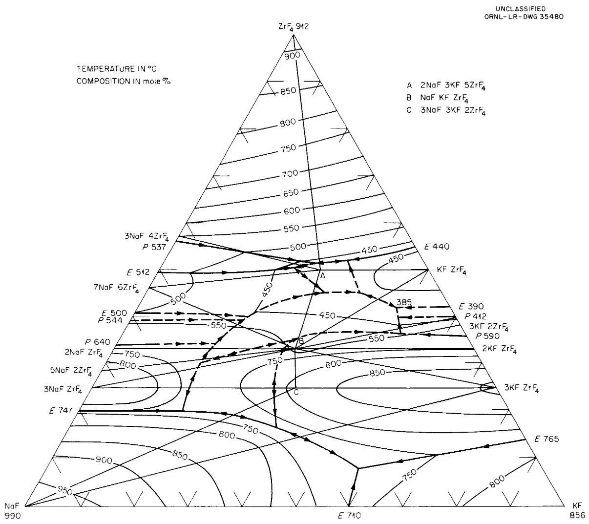  
Fig. 3.38. The System NaF-KF-ZrF₄. The isotherms for the temperatures 600, 650, and 700°C between the 30 and 40 mole % ZrF₄ compositions have been omitted in order not to obscure the phase relationships in this polythermal projection.

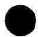

# 3.39. The System NaF-RbF-ZrF4

R. E. Thoma, H. Insley, H. A. Friedman, and W. R. Grimes, unpublished work performed at the Oak Ridge National Laboratory, 1951-56.

Preliminary diagram.

Invariant Equilibria   

<table><tr><td colspan="3">Composition of Liquid (mole %)</td><td>Invariant Temperature (℃)</td><td>Type of Equilibrium</td><td>Solids Present at Invariant Point</td></tr><tr><td>NaF</td><td>RbF</td><td>ZrF4</td><td></td><td></td><td></td></tr><tr><td>23</td><td>72</td><td>5</td><td>643</td><td>Eutectic</td><td>NaF, RbF, and 3RbF·ZrF4</td></tr><tr><td>50</td><td>27</td><td>23</td><td>720</td><td>Eutectic</td><td>NaF, 3RbF·ZrF4, and 3NaF·ZrF4</td></tr><tr><td>37</td><td>32</td><td>31</td><td>605</td><td>Eutectic</td><td>3NaF·ZrF4, 3RbF·ZrF4, and NaF·RbF·ZrF4</td></tr><tr><td>39</td><td>26</td><td>35</td><td>545</td><td>Peritectic</td><td>3NaF·ZrF4, 5NaF·2ZrF4, and NaF·RbF·ZrF4</td></tr><tr><td>36.3</td><td>24.2</td><td>39.5</td><td>427</td><td>Peritectic</td><td>5NaF·2ZrF4, 2NaF·ZrF4, and NaF·RbF·ZrF4</td></tr><tr><td>34.5</td><td>24</td><td>41.5</td><td>424</td><td>Peritectic</td><td>2NaF·ZrF4, NaF·RbF·ZrF4, and 3NaF·3RbF·4ZrF4</td></tr><tr><td>34</td><td>23.5</td><td>42.5</td><td>422</td><td>Peritectic</td><td>2NaF·ZrF4, 7NaF·6ZrF4, and 3NaF·3RbF·4ZrF4</td></tr><tr><td>33</td><td>23.5</td><td>43.5</td><td>420</td><td>Eutectic</td><td>7NaF·6ZrF4, 3NaF·3RbF·4ZrF4, and NaF·RbF·2ZrF4</td></tr><tr><td>28.5</td><td>21.5</td><td>50</td><td>443</td><td>Eutectic</td><td>3NaF·4ZrF4, 7NaF·6ZrF4, and NaF·RbF·2ZrF4</td></tr><tr><td>28</td><td>21.5</td><td>50.5</td><td>446</td><td>Peritectic</td><td>3NaF·4ZrF4, ZrF4, and NaF·RbF·2ZrF4</td></tr><tr><td>23.5</td><td>39.5</td><td>37</td><td>470</td><td>Peritectic</td><td>NaF·RbF·ZrF4, 2RbF·ZrF4, and 3RbF·ZrF4</td></tr><tr><td>21</td><td>40</td><td>39</td><td>438</td><td>Peritectic</td><td>NaF·RbF·ZrF4, 2RbF·ZrF4, and 3NaF·3RbF·4ZrF4</td></tr><tr><td>8</td><td>50</td><td>42</td><td>400</td><td>Eutectic</td><td>3NaF·3RbF·4ZrF4, 2RbF·ZrF4, and 5RbF·4ZrF4</td></tr><tr><td>8.5</td><td>47</td><td>44.5</td><td>395</td><td>Eutectic</td><td>3NaF·3RbF·4ZrF4, 5RbF·ZrF4, and NaF·RbF·2ZrF4</td></tr><tr><td>6.2</td><td>45.8</td><td>48</td><td>380</td><td>Eutectic</td><td>NaF·RbF·2ZrF4, 5RbF·4ZrF4, and RbF·ZrF4</td></tr><tr><td>5</td><td>42</td><td>53</td><td>398</td><td>Eutectic</td><td>NaF·RbF·2ZrF4, RbF·ZrF4, and RbF·2ZrF4</td></tr><tr><td>6.5</td><td>39</td><td>54.5</td><td>423</td><td>Peritectic</td><td>ZrF4, NaF·RbF·2ZrF4, and RbF·2ZrF4</td></tr><tr><td>33.3</td><td>33.3</td><td>33.3</td><td>642</td><td>Congruent melting point</td><td>NaF·RbF·ZrF4</td></tr><tr><td>25</td><td>25</td><td>50</td><td>462</td><td>Congruent melting point</td><td>NaF·RbF·2ZrF4</td></tr></table>

<table><tr><td colspan="3">Composition of Liquid (mole %)</td><td rowspan="2">Temperature (℃)</td><td rowspan="2">Alkemade Line</td></tr><tr><td>NaF</td><td>RbF</td><td>ZrF4</td></tr><tr><td>24.75</td><td>24.75</td><td>51.5</td><td>455</td><td>NaF·RbF·2ZrF4-ZrF4</td></tr><tr><td>6</td><td>44</td><td>50</td><td>402</td><td>NaF·RbF·2ZrF4-RbF·ZrF4</td></tr><tr><td>7.5</td><td>46.5</td><td>46</td><td>405</td><td>NaF·RbF·2ZrF4-5RbF·4ZrF4</td></tr><tr><td>8.5</td><td>48.5</td><td>43</td><td>405</td><td>3NaF·RbF·4ZrF4-5RbF·4ZrF4</td></tr><tr><td>28</td><td>28</td><td>44</td><td>435</td><td>3NaF·RbF·4ZrF4-NaF·RbF·2ZrF4</td></tr><tr><td>22</td><td>40</td><td>38</td><td>442</td><td>3NaF·3RbF·4ZrF4-2RbF·ZrF4</td></tr><tr><td>29</td><td>41.5</td><td>49.5</td><td>450</td><td>NaF·RbF·2ZrF4-7NaF·6ZrF4</td></tr><tr><td>37</td><td>24.5</td><td>38.5</td><td>610</td><td>NaF·RbF·ZrF4-3NaF·ZrF4</td></tr><tr><td>47</td><td>28</td><td>25</td><td>732</td><td>3NaF·ZrF4-3RbF·ZrF4</td></tr><tr><td>36</td><td>48</td><td>16</td><td>777</td><td>NaF-3RbF·ZrF4</td></tr><tr><td>30</td><td>36.7</td><td>33.3</td><td>598</td><td>NaF·RbF·ZrF4-3RbF·ZrF4</td></tr></table>

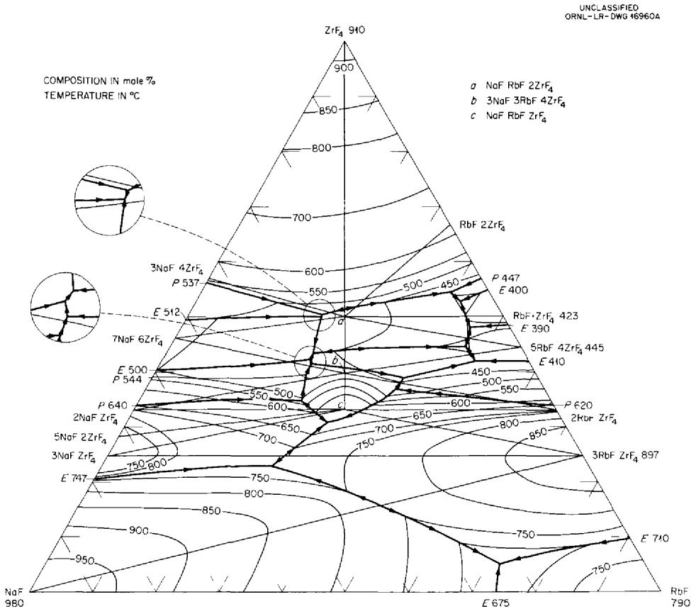  
Fig. 3.39. The System NaF-RbF-ZrF4.

3.40. The System $\mathsf{NaF - CrF}_2 - \mathsf{ZrF}_4$ : The Section $\mathsf{NaF}\cdot \mathsf{CrF}_2 - \mathsf{ZrF}_4$

R. E. Thoma, H. A. Friedman, B. S. Landau, and W. R. Grimes, unpublished work performed at the Oak Ridge National Laboratory, 1956-57.

Preliminary diagram. No invariant equilibria occur for compositions lying on the section $\mathsf{NaF}\cdot \mathsf{CrF}_2\mathsf{-ZrF}_4$ .

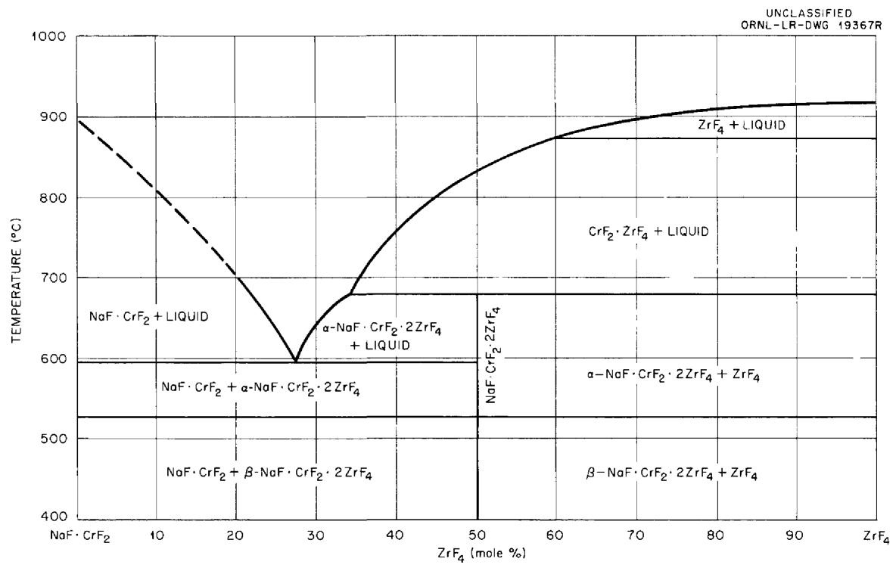  
Fig. 3.40. The Section NaF·CrF $_2$ -ZrF $_4$ .

# 3.41. The System $\mathsf{NaF - CeF}_3 - \mathsf{ZrF}_4$

W. T. Ward, R. A. Strehlow, W. R. Grimes, and G. M. Watson, "Solubility Relationships of Rare Earth Fluorides and Yttrium Fluoride in Various Molten NaF-ZrF $_4$ and NaF-ZrF $_4$ –UF $_4$ Solvents," J. Chem. Eng. Data (in press).

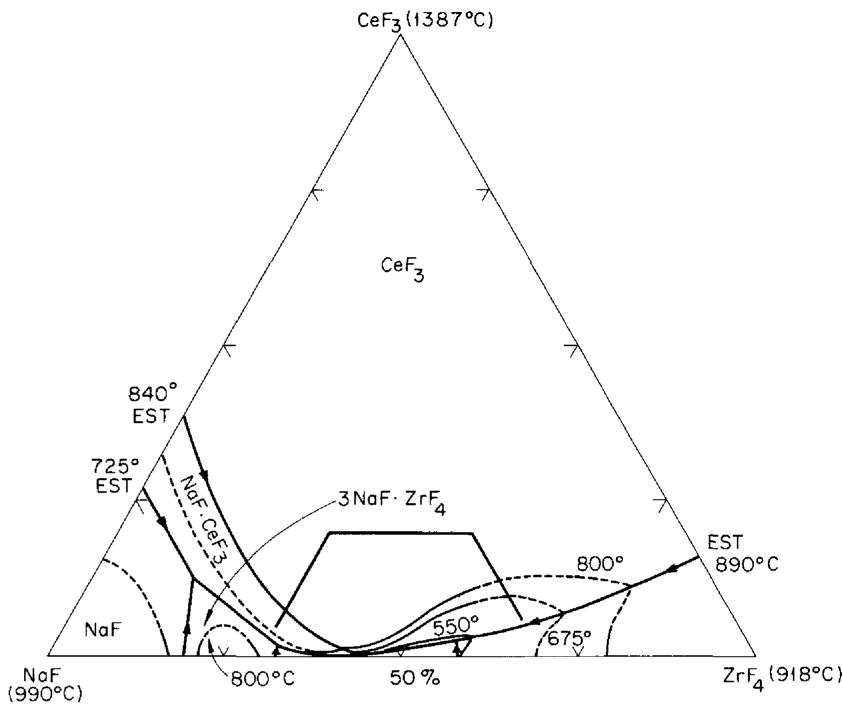  
UNCLASSIFIED ORNL-LR-DWG 29164R   
Fig. 3.41a. The System NaF- $\mathsf{CeF}_3\mathsf{-ZrF}_4$   
UNCLASSIFIED ORNL-LR-DWG 29165R   
PROBABLE NoF $\cdot$ ZrF4PRIMARY PHASE FIELDS

A ${\mathrm{{ZrF}}}_{4}$

D $2 \mathrm{NaF} \cdot Z \mathrm{rF}_{4}$

B 3NaF·4ZrF4

E $5 \mathrm{NaF} \cdot 2 \mathrm{ZrF}_{4}$

C $7 \mathrm{NaF} \cdot 6 \mathrm{ZrF}_{4}$

F 3NaF·ZrF4

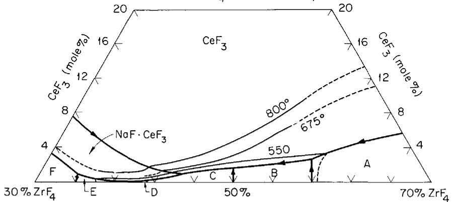  
Fig. 3.41b. The System NaF- $\mathsf{CeF}_3\mathsf{-ZrF}_4$ in the Region 30-70 Mole % NaF, 0-20 Mole % CeF $3^{\prime}$ 30-70 Mole % ZrF

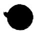

# 3.42. The System LiF- $\mathsf{CeF}_3$

C. J. Barton, L. M. Bratcher, R. J. Sheil, and W. R. Grimes, unpublished work performed at the Oak Ridge National Laboratory, 1956-57.   
Preliminary diagram. The system $\mathsf{LiF - CeF}_3$ contains a single eutectic at 81 LiF-19 $\mathsf{CeF}_3$ (mole %), m.p. $755\pm 5^{\circ}C$

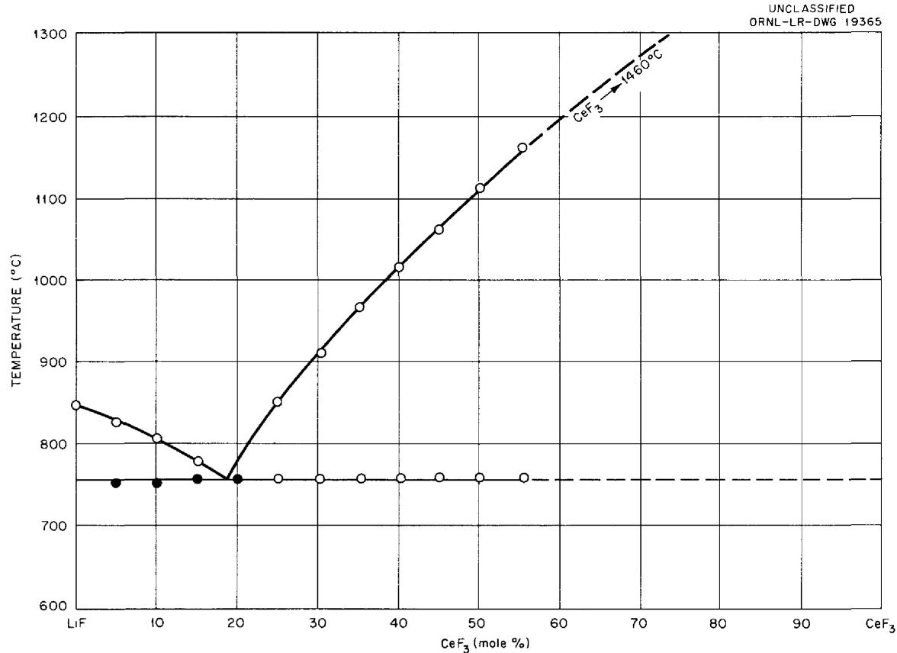  
Fig. 3.42. The System LiF- $\mathsf{CeF}_3$

# 3.43. The System NaF-HfF4

R. E. Thoma, C. F. Weaver, T. N. McVay, H. A. Friedman, and W. R. Grimes, unpublished work performed at the Oak Ridge National Laboratory, 1956-58.

Preliminary diagram.

Invariant Equilibria   

<table><tr><td>Mole % HfF4in Liquid</td><td>Invariant Temperature (°C)</td><td>Type of Equilibrium</td><td>Phase Reaction at Invariant Temperature</td></tr><tr><td>18.5</td><td>695</td><td>Eutectic</td><td>L ⇌ NaF + 3NaF·HfF4</td></tr><tr><td>25</td><td>863</td><td>Congruent melting point</td><td>L ⇌ 3NaF·HfF4*</td></tr><tr><td>34</td><td>606</td><td>Peritectic</td><td>L + 3NaF·HfF4 ⇌ α-5NaF·2HfF4</td></tr><tr><td>-</td><td>535</td><td>Inversion</td><td>α-5NaF·2HfF4 ⇌ β-5NaF·2HfF4</td></tr><tr><td>35</td><td>586</td><td>Peritectic</td><td>L + α-5NaF·2HfF4 ⇌ β-2NaF·HfF4</td></tr><tr><td>-</td><td>Below 350</td><td>Inversion</td><td>β-2NaF·HfF4 ⇌ γ-2NaF·HfF4</td></tr><tr><td>-</td><td>Below 350</td><td>Inversion</td><td>γ-2NaF·HfF4 ⇌ δ-2NaF·HfF4</td></tr><tr><td>43</td><td>510</td><td>Eutectic</td><td>L ⇌ β-2NaF·HfF4 + 7NaF·6HfF4</td></tr><tr><td>45</td><td>531</td><td>Peritectic</td><td>L + NaF·HfF4 ⇌ 7NaF·6HfF4</td></tr><tr><td>50</td><td>557</td><td>Congruent melting point</td><td>L ⇌ NaF·HfF4</td></tr><tr><td>53</td><td>535</td><td>Eutectic</td><td>L ⇌ NaF·HfF4 + HfF4</td></tr></table>

$^{*}$ A determination of the crystal structure of $3NaF \cdot HfF_{4}$ has been reported by L. A. Harris, "The Crystal Structures of $\mathsf{Na}_{3}\mathsf{ZrF}_{7}$ and $\mathsf{Na}_{3}\mathsf{HfF}_{7}^{\prime \prime}$ " Acta Cryst. 12, 172 (1959).

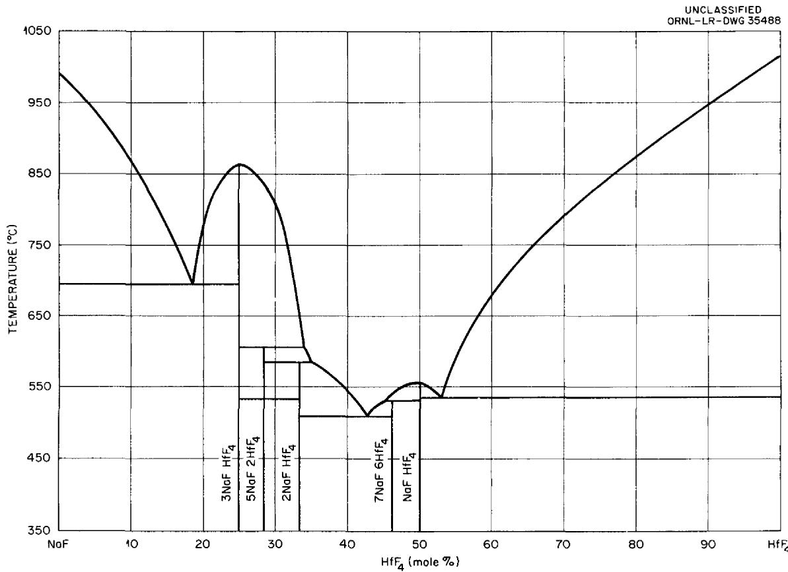  
Fig. 3.43. The System NaF-HfF4

# 3.44. The System LiF-ThF4

R. E. Thoma, H. Insley, B. S. Landau, H. A. Friedman, and W. R. Grimes, “Phase Equilibria in the Fused Salt Systems LiF-ThF₄ and NaF-ThF₄,” J. Phys. Chem. 63, 1266-74 (1959).

Invariant Equilibria   

<table><tr><td>Mole % ThF4in Liquid</td><td>Invariant Temperature (°C)</td><td>Type of Equilibrium</td><td>Phase Reaction at Invariant Temperature</td></tr><tr><td>23</td><td>568</td><td>Eutectic</td><td>L ⇌ LiF + 3LiF·ThF4</td></tr><tr><td>25</td><td>573</td><td>Congruent melting point</td><td>L ⇌ 3LiF·ThF4</td></tr><tr><td>29</td><td>565</td><td>Eutectic</td><td>L ⇌ 3LiF·ThF4 + 7LiF·6ThF4</td></tr><tr><td>30.5</td><td>597</td><td>Peritectic</td><td>LiF·2ThF4 + L ⇌ 7LiF·6ThF4</td></tr><tr><td>42</td><td>762</td><td>Peritectic</td><td>LiF·4ThF4 + L ⇌ LiF·2ThF4</td></tr><tr><td>62</td><td>897</td><td>Peritectic</td><td>ThF4 + L ⇌ LiF·4ThF4</td></tr></table>

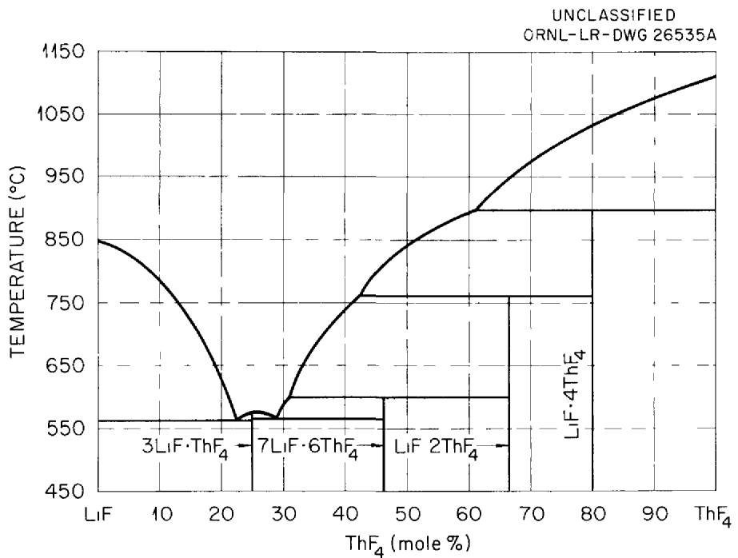  
Fig. 3.44. The System LiF-ThF4

# 3.45. The System NaF-ThF

R. E. Thoma, H. Insley, B. S. Landau, H. A. Friedman, and W. R. Grimes, “Phase Equilibria in the Fused Salt Systems LiF-ThF₄ and NaF-ThF₄,” J. Phys. Chem. 63, 1266-74 (1959).

Invariant Equilibria   

<table><tr><td>Mole % ThF4in Liquid</td><td>Invariant Temperature (°C)</td><td>Type of Equilibrium</td><td>Phase Reaction at Invariant Temperature</td></tr><tr><td>21.5</td><td>645</td><td>Peritectic</td><td>NaF + L ⇌ α-4NaF·ThF4</td></tr><tr><td>22.5</td><td>618</td><td>Eutectic</td><td>L ⇌ α-4NaF·ThF4 + 2NaF·ThF4</td></tr><tr><td>-</td><td>604</td><td>Inversion</td><td>α-4NaF·ThF4 ⇌ β-4NaF·ThF4</td></tr><tr><td>-</td><td>558</td><td>Decomposition</td><td>β-4NaF·ThF4 ⇌ NaF + 2NaF·ThF4</td></tr><tr><td>33.3</td><td>705</td><td>Congruent melting point</td><td>L ⇌ 2NaF·ThF4</td></tr><tr><td>37</td><td>690</td><td>Eutectic</td><td>L ⇌ 2NaF·ThF4 + 3NaF·2ThF4</td></tr><tr><td>40</td><td>712</td><td>Congruent melting point</td><td>L ⇌ 3NaF·2ThF4</td></tr><tr><td>41</td><td>705</td><td>Eutectic</td><td>L ⇌ 3NaF·2ThF4 + α-NaF·ThF4</td></tr><tr><td>-</td><td>683</td><td>Decomposition</td><td>3NaF·2ThF4 ⇌ 2NaF·ThF4 + α-NaF·ThF4</td></tr><tr><td>45.5</td><td>730</td><td>Peritectic</td><td>NaF·2ThF4 + L ⇌ α-NaF·ThF4</td></tr><tr><td>58</td><td>831</td><td>Peritectic</td><td>ThF4 + L ⇌ NaF·2ThF4</td></tr></table>

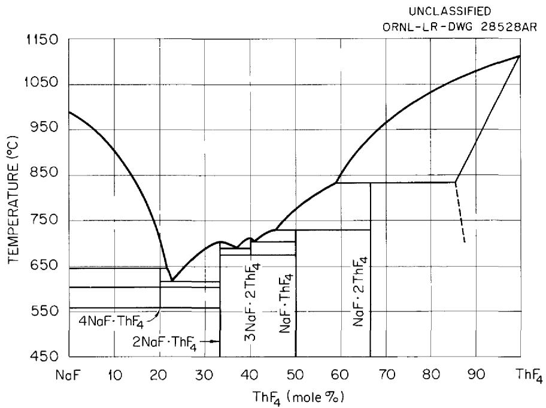  
Fig. 3.45. The System NaF-ThF4

# 3.46. The System $\mathsf{KF - ThF}_4$

W. J. Asker, E. R. Segnit, and A. W. Wylie, “The Potassium Thorium Fluorides,” J. Chem. Soc. 1952, 4470-79.

This system has also been reported by A. G. Bergman and E. P. Dergunov, Doklady Akad. Nauk S.S.S.R. 53, 753 (1941) and by V. S. Emelyanov and A. J. Evstyukhin, "An Investigation of Fused-Salt Systems Based on Thorium Fluoride - II. NaF-KF-ThF₄, NaF-ThF₄, and KF-ThF₄," J. Nuclear Energy 5, 108-14 (1957).

Invariant Equilibria   

<table><tr><td>Mole % ThF4in Liquid</td><td>Invariant Temperature (°C)</td><td>Type of Equilibrium</td><td>Phase Reaction at Invariant Temperature</td></tr><tr><td>14</td><td>694</td><td>Eutectic</td><td>L ⇌ KF + β-5KF·ThF4</td></tr><tr><td>-</td><td>635</td><td>Inversion</td><td>α-5KF·ThF4 ⇌ β-5KF·ThF4</td></tr><tr><td>-</td><td>712</td><td>Peritectic</td><td>L + 3KF·ThF4 ⇌ α-5KF·ThF4</td></tr><tr><td>25</td><td>865</td><td>Congruent melting point</td><td>L ⇌ 3KF·ThF4</td></tr><tr><td>-</td><td>570</td><td>Decomposition</td><td>3KF·ThF4 ⇌ β-5KF·ThF4 + β-2KF·ThF4</td></tr><tr><td>31</td><td>691</td><td>Eutectic</td><td>L ⇌ 3KF·ThF4 + α-2KF·ThF4</td></tr><tr><td>-</td><td>747</td><td>Peritectic</td><td>L + KF·ThF4 ⇌ α-2KF·ThF4</td></tr><tr><td>-</td><td>645</td><td>Inversion</td><td>α-2KF·ThF4 ⇌ β-2KF·ThF4</td></tr><tr><td>50*</td><td>905</td><td>Congruent melting point</td><td>L ⇌ KF·ThF4</td></tr><tr><td>56</td><td>875</td><td>Eutectic</td><td>L ⇌ KF·ThF4 + KF·2ThF4</td></tr><tr><td>66</td><td>930</td><td>Peritectic</td><td>L + KF·3ThF4 ⇌ KF·2ThF4</td></tr><tr><td>75</td><td>990</td><td>Congruent melting point</td><td>L ⇌ KF·3ThF4</td></tr><tr><td>78</td><td>980</td><td>Eutectic</td><td>L ⇌ KF·3ThF4 + ThF4ss</td></tr></table>

*It has been shown that the compound labeled by Asker et al. has the actual formula 7KF·6ThF₄, cf. R. E. Thoma, Crystal Structures of Some Compounds of UF₄ and TbF₄ with Alkali Fluorides, ORNL CF-58-12-40 (December 11, 1958).

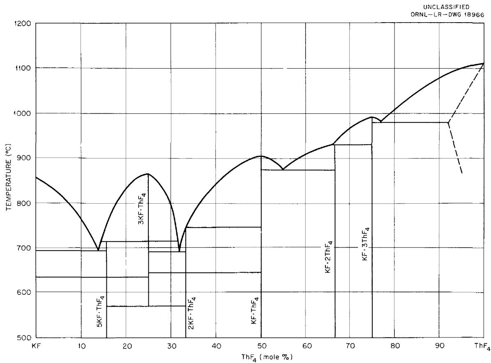  
Fig. 3.46. The System KF-ThF4

# 3.47. The System RbF-ThF4

E. P. Dergunov and A. G. Bergman, “Complex Formation Between Alkali Metal Fluorides and Fluorides of Metals of the Fourth Group,” Doklady Akad. Nauk S.S.S.R. 60, 391-94 (1948).

Invariant Equilibria   

<table><tr><td>Mole % ThF4in Liquid</td><td>Invariant Temperature (°C)</td><td>Type of Equilibrium</td><td>Phase Reaction at Invariant Temperature</td></tr><tr><td>15</td><td>664</td><td>Eutectic</td><td>L ⇌ RbF + 3RbF·ThF4</td></tr><tr><td>25</td><td>974</td><td>Congruent melting point</td><td>L ⇌ 3RbF·ThF4</td></tr><tr><td>37</td><td>762</td><td>Eutectic</td><td>L ⇌ 3RbF·ThF4 + RbF·ThF4</td></tr><tr><td>50</td><td>852</td><td>Congruent melting point</td><td>L ⇌ RbF·ThF4</td></tr><tr><td>54</td><td>848</td><td>Eutectic</td><td>L ⇌ RbF·ThF4 + RbF·3ThF4</td></tr><tr><td>75</td><td>1004</td><td>Congruent melting point</td><td>L ⇌ RbF·3ThF4</td></tr><tr><td>80</td><td>1000</td><td>Eutectic</td><td>L ⇌ RbF·3ThF4 + ThF4</td></tr></table>

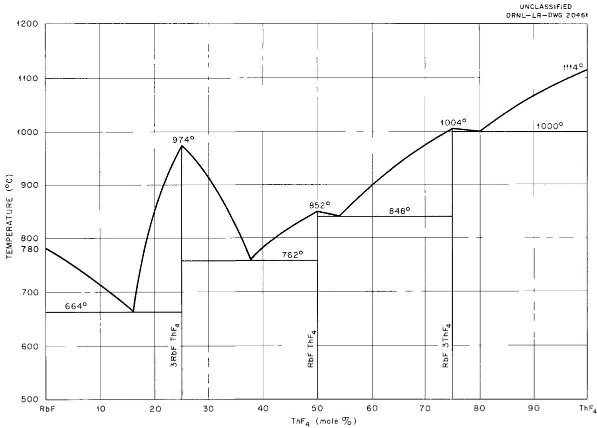  
Fig. 3.47. The System RbF-ThF

# 3.48. The System $\mathsf{BeF}_2 - \mathsf{ThF}_4$

R. E. Thoma, H. Insley, H. A. Friedman, and C. F. Weaver, “Phase Equilibria in the Systems $\mathsf{BeF}_2$ -ThF₄ and LiF-BeF₂-ThF₄,” paper to be presented at the 136th National Meeting of the American Chemical Society, Atlantic City, N. J., Sept. 13–18, 1959.

The system $\mathsf{BeF}_2\mathsf{-ThF}_4$ contains a single eutectic at 98.5 $\mathsf{BeF}_2 - 1.5\mathsf{ThF}_4$ (mole $\%$ ), m.p. $526 \pm 3^{\circ}\mathsf{C}$ .

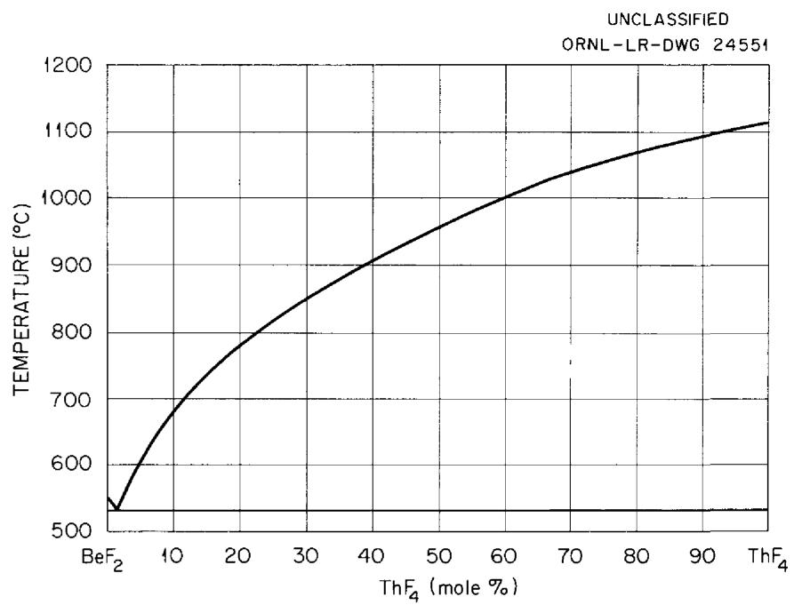  
Fig. 3.48. The System $\mathsf{BeF}_2\text{-}\mathsf{ThF}_4$

# 3.49. The System $\mathsf{BeF}_2 - \mathsf{UF}_4$

T. B. Rhinehammer, P. A. Tucker, and E. F. Joy, Phase Equilibria in the System $BeF_{2} - UF_{4}$ , MLM-1082 (to be published).

Preliminary diagram. The system $\mathsf{BeF}_2 - \mathsf{UF}_4$ contains a single eutectic at 99.5 $\mathsf{BeF}_2 - 0.5\mathsf{UF}_4$ (mole %), m.p. $535 \pm 2^{\circ}\mathsf{C}$ .

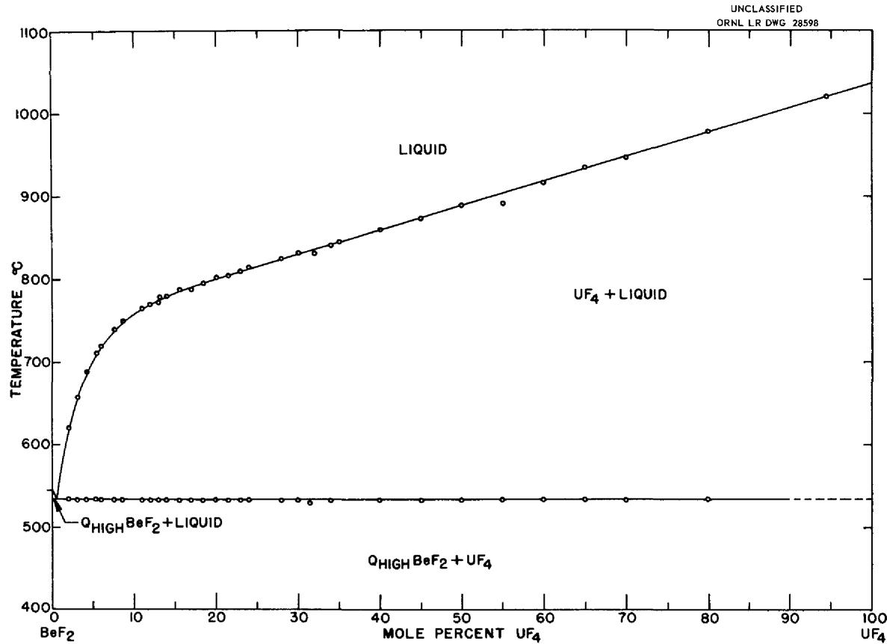  
Fig. 3.49. The System $\mathsf{BeF}_2\mathsf{-UF}_4$

# 3.50. The System $\mathsf{MgF}_2\text{-}\mathsf{ThF}_4$

J. O. Blomeke, An Investigation of the $TbF_{4}$ -Fused Salt Solutions for Homogeneous Reactors, ORNL-1030 (June 19, 1951) (declassified with deletions).

Invariant Equilibria   

<table><tr><td>Mole % ThF4in Liquid</td><td>Invariant Temperature (℃)</td><td>Type of Equilibrium</td><td>Phase Reaction at Invariant Temperature</td></tr><tr><td>25</td><td>915</td><td>Eutectic</td><td>L ⇌ ThF4+ MgF2·2ThF4</td></tr><tr><td>33.3</td><td>937</td><td>Congruent melting point</td><td>L ⇌ MgF2·2ThF4</td></tr><tr><td>40</td><td>925</td><td>Eutectic</td><td>L ⇌ MgF2·2ThF4+ MgF2</td></tr></table>

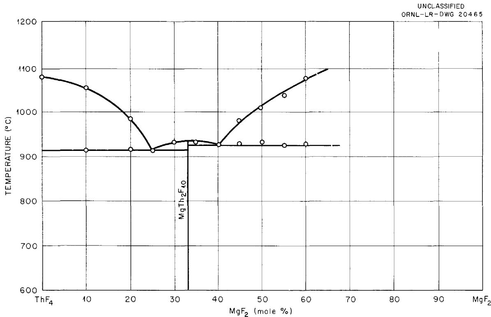  
Fig. 3.50. The System MgF2–ThF4

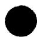

# 3.51. The System LiF-BeF $_2$ -ThF $_4$

R. E. Thoma, H. Insley, H. A. Friedman, and C. F. Weaver, "Phase Equilibria in the Systems $\mathsf{BeF}_2$ -ThF₄ and LiF-BeF₂-ThF₄," paper to be presented at the 136th National Meeting of the American Chemical Society, Atlantic City, N. J., Sept. 13-18, 1959.

Invariant Equilibria   

<table><tr><td colspan="3">Composition of Liquid (mole %)</td><td rowspan="2">Invariant Temperature (℃)</td><td rowspan="2">Type of Invariant</td><td rowspan="2">Solids Present at Invariant Point</td></tr><tr><td>LiF</td><td>BeF2</td><td>ThF4</td></tr><tr><td>15</td><td>83</td><td>2</td><td>497 ± 4</td><td>Peritectic</td><td>ThF4, LiF·4ThF4, and BeF2</td></tr><tr><td>33.5</td><td>64</td><td>2.5</td><td>455 ± 4</td><td>Peritectic</td><td>LiF·4ThF4, LiF·2ThF4, and BeF2</td></tr><tr><td>47</td><td>51.5</td><td>1.5</td><td>356 ± 6</td><td>Eutectic</td><td>2LiF·BeF2, LiF·2ThF4, and BeF2</td></tr><tr><td>60.5</td><td>36.5</td><td>3</td><td>433 ± 5</td><td>Peritectic</td><td>LiF·2ThF4, 3LiF·ThF4ss, and 2LiF·BeF2</td></tr><tr><td>65.5</td><td>30.5</td><td>4</td><td>444 ± 4</td><td>Peritectic</td><td>LiF, 2LiF·BeF2, and 3LiF·ThF4ss</td></tr><tr><td>63</td><td>30.5</td><td>6.5</td><td>448 ± 5</td><td>Peritectic</td><td>3LiF·ThF4ss, 7LiF·6ThF4, and LiF·2ThF4</td></tr></table>

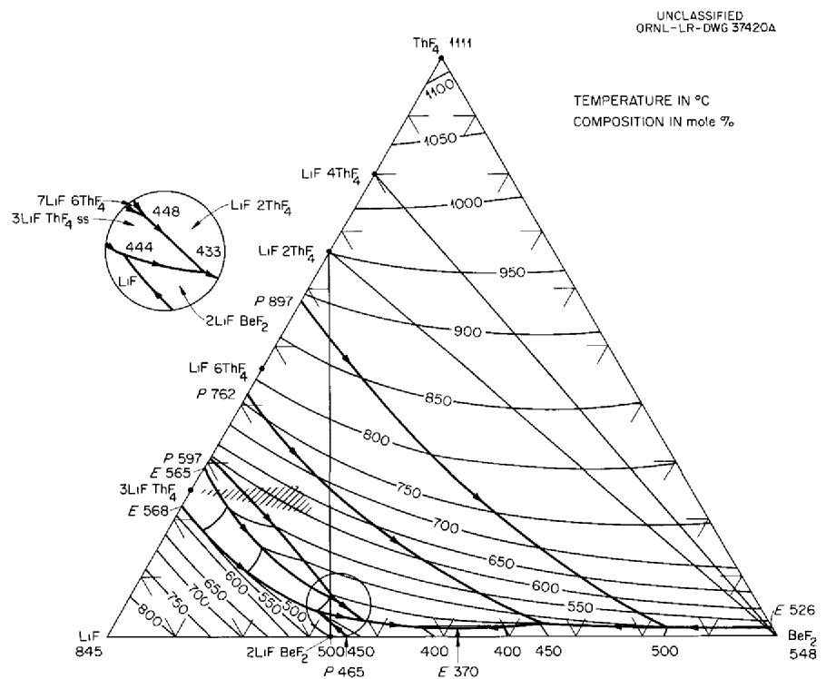  
Fig. 3.51a. The System LiF-BeF $_2$ -ThF $_4$ .

Limits of Single-Phase 3LIF-ThF4 Solid Solution   

<table><tr><td colspan="3">Composition (mole %)</td></tr><tr><td>LiF</td><td>BeF2</td><td>ThF4</td></tr><tr><td>75</td><td>0</td><td>25</td></tr><tr><td>58</td><td>16</td><td>26</td></tr><tr><td>59</td><td>20</td><td>21</td></tr></table>

A three-dimensional model of the system $\mathsf{LiF - BeF}_2\text{-}\mathsf{ThF}_4$ is shown in Fig. 3.51b.

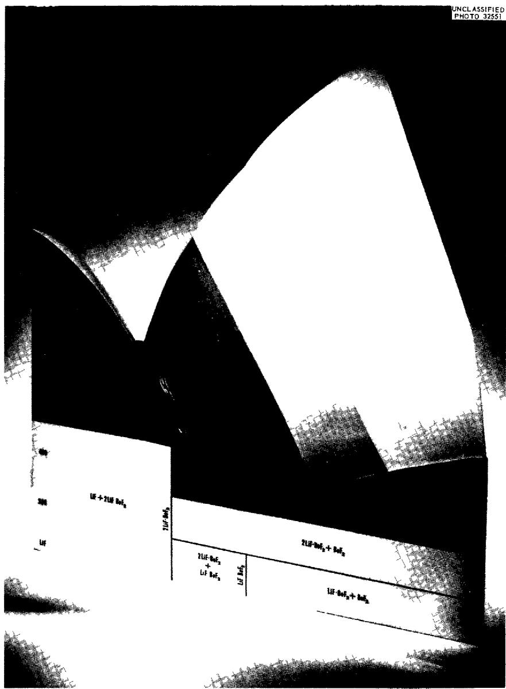  
Fig. 3.51b. Model of the System LiF-BeF $_2$ -ThF $_4$ .

# 3.52. The System NaF-ZrF4-ThF4

R. E. Thoma, H. Insley, B. S. Landau, H. A. Friedman, and W. R. Grimes, unpublished work performed at the Oak Ridge National Laboratory, 1956-57.

Preliminary diagram.

Invariant Equilibria   

<table><tr><td colspan="3">Composition of Liquid (mole %)</td><td rowspan="2">Invariant Temperature (℃)</td><td rowspan="2">Type of Equilibrium</td><td rowspan="2">Solids Present at Invariant Point</td></tr><tr><td>NaF</td><td>ZrF4</td><td>ThF4</td></tr><tr><td>77</td><td>3</td><td>20</td><td>645</td><td>Peritectic</td><td>NaF, α-4NaF·ThF4, and 3NaF·ZrF4</td></tr><tr><td>75.5</td><td>2.5</td><td>22</td><td>618</td><td>Eutectic</td><td>α-4NaF·ThF4, 2NaF·ThF4, and 3NaF·ZrF4</td></tr><tr><td>63</td><td>6</td><td>31*</td><td>683</td><td>Decomposition point of 3NaF·2ThF4 in ternary system</td><td>3NaF·2ThF4, 2NaF·ThF4, and NaF·ThF4</td></tr><tr><td>65.5</td><td>21.5</td><td>13</td><td>622</td><td>Peritectic</td><td>2NaF·ThF4, 3NaF·ZrF4, and NaF·ThF4</td></tr><tr><td>65.5</td><td>24.5</td><td>10</td><td>615</td><td>Peritectic</td><td>3NaF·ZrF4, NaF·ThF4, and α-5NaF·2ZrF4</td></tr><tr><td>64.5</td><td>25.5</td><td>10</td><td>593</td><td>Peritectic</td><td>α-5NaF·2ZrF4, NaF·ThF4, and NaF·2ThF4</td></tr><tr><td>58</td><td>38</td><td>4</td><td>538</td><td>Peritectic</td><td>α-5NaF·2ZrF4, α-2NaF·ZrF4, and NaF·2ThF4</td></tr><tr><td>58</td><td>40</td><td>2</td><td>495</td><td>Eutectic</td><td>β-2NaF·ZrF4, NaF·2ThF4, and 7NaF·6ZrF4-3NaF·2ZrF4ss</td></tr><tr><td>53</td><td>42</td><td>4</td><td>510</td><td>Peritectic</td><td>NaF·2ThF4, Th(Zr)F4ss, and 7NaF·6ZrF4-3NaF·2ThF4ss</td></tr><tr><td>49.5</td><td>48</td><td>2.5</td><td>505</td><td>Eutectic</td><td>7NaF·6ZrF4, 3NaF·4ZrF4, and Zr(Th)F4ss</td></tr></table>

*Approximate composition.

Note: The boundary curve maximum on the Alkemade line $7\mathrm{NaF}\cdot 6\mathrm{ZrF}_4 - \mathrm{ThF}_4$ is unlikely to fall exactly on this line, because pure $\mathrm{ThF}_4$ does not occur along this line. Since $\mathrm{ThF}_4$ forms solid solutions with both $\mathrm{ZrF}_4$ and $\mathrm{NaF}\cdot 2\mathrm{ThF}_4$ , it is not readily determined on which side of the Alkemade line this maximum occurs.

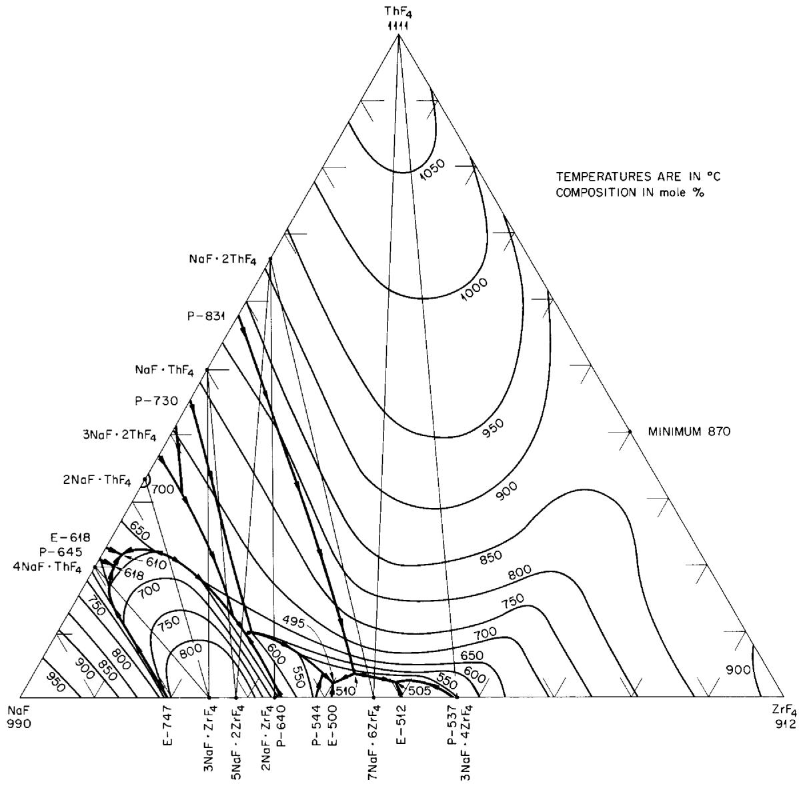  
UNCLASSIFIED   
ORNL-LR-DWG 20466A   
Fig. 3.52. The System NaF-ZrF-ThF.

# 3.53. The System LiF-UF3

C. J. Barton, V. S. Coleman, L. M. Bratcher, and W. R. Grimes, unpublished work performed at the Oak Ridge National Laboratory, 1953-54.

Preliminary diagram. The system $\mathsf{LiF - UF}_3$ contains a single eutectic at 73 LiF-27 UF $_3$ (mole %), m.p. $770^{\circ}\mathrm{C}$ .

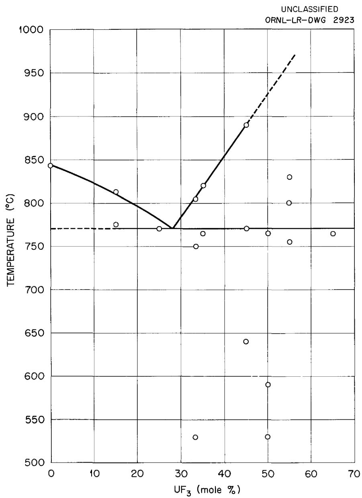  
Fig. 3.53. The System LiF-UF $_{3^{\circ}}$

# 3.54. The System LiF-UF

C. J. Barton, H. A. Friedman, W. R. Grimes, H. Insley, R. E. Moore, and R. E. Thoma, "Phase Equilibria in the Alkali Fluoride-Uranium Tetrafluoride Fused Salt Systems: 1. The Systems LiF-UF4 and NaF-UF4", J. Am. Ceram. Soc. 41, 63-69 (1958).

Invariant Equilibria   

<table><tr><td>Mole % UF4in Liquid</td><td>Invariant Temperature (℃)</td><td>Type of Equilibrium</td><td>Phase Reaction at Invariant Temperature</td></tr><tr><td>-</td><td>470</td><td>Decomposition</td><td>4LiF·UF4⇌ LiF + 7LiF·6UF4</td></tr><tr><td>26</td><td>500</td><td>Peritectic</td><td>LiF + L⇌ 4LiF·UF4</td></tr><tr><td>27</td><td>490</td><td>Eutectic</td><td>L⇌ 4LiF·UF4 + 7LiF·6UF4</td></tr><tr><td>40</td><td>610</td><td>Peritectic</td><td>L + LiF·4UF4⇌ 7LiF·6UF4</td></tr><tr><td>57</td><td>775</td><td>Peritectic</td><td>L + UF4⇌ LiF·4UF4</td></tr></table>

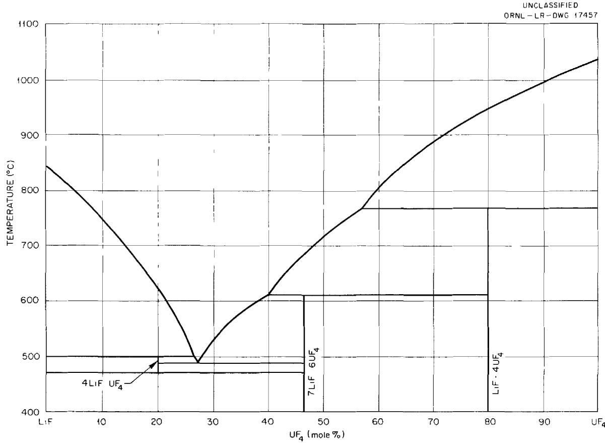  
Fig. 3.54. The System LiF-UF4.

# 3.55. The System NaF-UF3

C. J. Barton, V. S. Coleman, T. N. McVay, and W. R. Grimes, unpublished work performed at the Oak Ridge National Laboratory, 1953-54.

Preliminary diagram.

Invariant Equilibria   

<table><tr><td>Mole % UF3in Liquid</td><td>Invariant Temperature (℃)</td><td>Type of Equilibrium</td><td>Phase Reaction at Invariant Temperature</td></tr><tr><td>27</td><td>715</td><td>Eutectic</td><td>L ⇌ NaF + α-NaF·UF3</td></tr><tr><td>35</td><td>775</td><td>Peritectic</td><td>L + UF3 ⇌ α-NaF·UF3</td></tr><tr><td>-</td><td>595</td><td>Inversion</td><td>α-NaF·UF3 ⇌ β-NaF·UF3</td></tr></table>

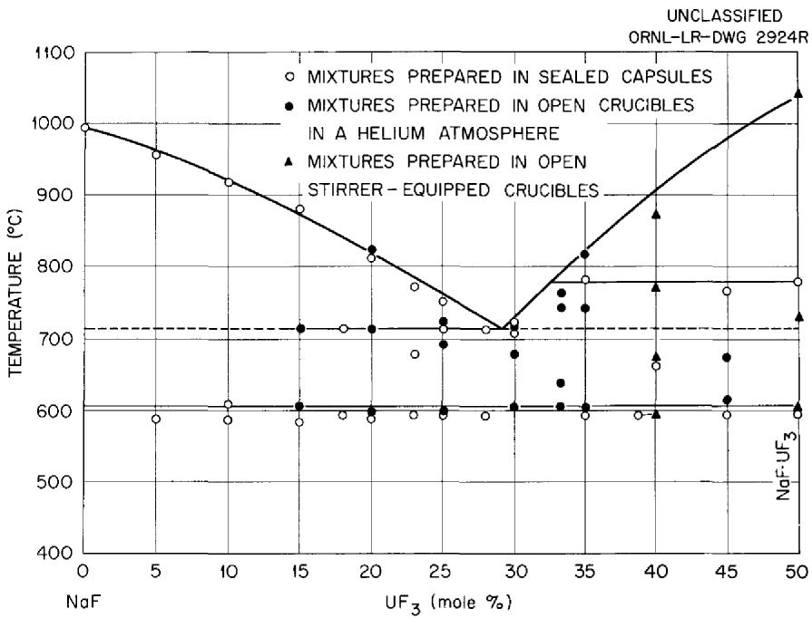  
Fig. 3.55. The System NaF-UF3

# 3.56. The System NaF-UF4

C. J. Barton, H. A. Friedman, W. R. Grimes, H. Insley, R. E. Moore, and R. E. Thoma, “Phase Equilibria in the Alkali Fluoride-Uranium Tetrafluoride Fused Salt Systems: I. The Systems LiF-UF4 and NaF-UF4,” J. Am. Ceram. Soc. 41, 63-69 (1958).

Invariant Equilibria   

<table><tr><td>Mole % UF4in Liquid</td><td>Invariant Temperature (°C)</td><td>Type of Equilibrium</td><td>Phase Reaction at Invariant Temperature</td></tr><tr><td>21.5</td><td>618</td><td>Eutectic</td><td>L ⇌ α-3NaF·UF4 + NaF</td></tr><tr><td>25</td><td>629</td><td>Congruent melting point</td><td>L ⇌ α-3NaF·UF4</td></tr><tr><td>-</td><td>528</td><td>Inversion</td><td>α-3NaF·UF4 ⇌ β-3NaF·UF4</td></tr><tr><td>-</td><td>497</td><td>Decomposition</td><td>β-3NaF·UF4 ⇌ NaF + 2NaF·UF4</td></tr><tr><td>28</td><td>623</td><td>Eutectic</td><td>L ⇌ α-3NaF·UF4 + 2NaF·UF4</td></tr><tr><td>32.5</td><td>648</td><td>Peritectic</td><td>L + 5NaF·3UF4 ⇌ 2NaF·UF4</td></tr><tr><td>37</td><td>673</td><td>Peritectic</td><td>L + 7NaF·6UF4 ⇌ 5NaF·3UF4</td></tr><tr><td>-</td><td>630</td><td>Decomposition</td><td>5NaF·3UF4 ⇌ 2NaF·UF4 + 7NaF·6UF4</td></tr><tr><td>46.2</td><td>718</td><td>Congruent melting point</td><td>L ⇌ 7NaF·6UF4</td></tr><tr><td>56</td><td>680</td><td>Eutectic</td><td>L ⇌ 7NaF·6UF4 + UF4</td></tr><tr><td>-</td><td>660</td><td>Upper stability limit of NaF·2UF4</td><td>7NaF·6UF4 + UF4 ⇌ NaF·2UF4</td></tr></table>

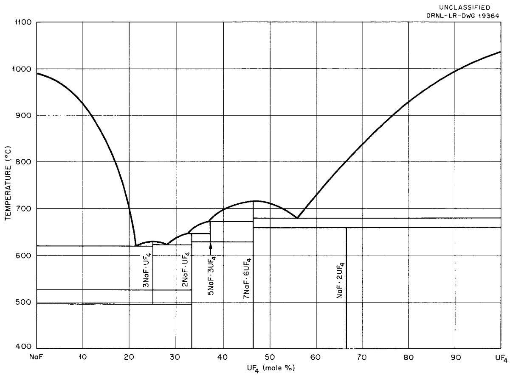  
Fig. 3.56. The System NaF-UF4.

# 3.57. The System $\mathsf{KF - UF}_4$

R. E. Thoma, H. Insley, B. S. Landau, H. A. Friedman, and W. R. Grimes, “Phase Equilibria in the Alkali Fluoride-Uranium Tetrafluoride Fused Salt Systems: II. The Systems KF-UF4 and RbF-UF4,” J. Am. Ceram. Soc. 41, 538-44 (1958).

Invariant Equilibria   

<table><tr><td>Mole % UF4in Liquid</td><td>Invariant Temperature (oC)</td><td>Type of Equilibrium</td><td>Phase Reaction at Invariant Temperature</td></tr><tr><td>15</td><td>735</td><td>Eutectic</td><td>L ⇌ KF + 3KF·UF4</td></tr><tr><td>25</td><td>957</td><td>Congruent melting point</td><td>L ⇌ 3KF·UF4</td></tr><tr><td>-</td><td>608</td><td>Decomposition</td><td>2KF·UF4 ⇌ 3KF·UF4 + 7KF·6UF4</td></tr><tr><td>35</td><td>755</td><td>Peritectic</td><td>3KF·UF4 + L ⇌ 2KF·UF4</td></tr><tr><td>38.5</td><td>740</td><td>Eutectic</td><td>L ⇌ 2KF·UF4 + 7KF·6UF4</td></tr><tr><td>46.2</td><td>789</td><td>Congruent melting point</td><td>L ⇌ 7KF·6UF4</td></tr><tr><td>54.5</td><td>735</td><td>Eutectic</td><td>L ⇌ 7KF·6UF4 + KF·2UF4</td></tr><tr><td>65</td><td>765</td><td>Peritectic</td><td>UF4 + L ⇌ KF·2UF4</td></tr></table>

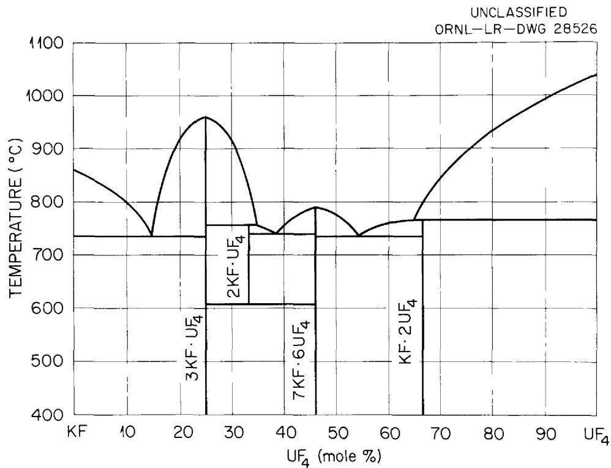  
Fig. 3.57. The System KF-UF $A_{4}$

# 3.58. The System RbF-UF4

R. E. Thoma, H. Insley, B. S. Landau, H. A. Friedman, and W. R. Grimes, “Phase Equilibria in the Alkali Fluoride-Uranium Tetrafluoride Fused Salt Systems: II. The Systems KF-UF4 and RbF-UF4,” J. Am. Ceram. Soc. 41, 538-44 (1958).

Invariant Equilibria   

<table><tr><td>Mole % UF4in Liquid</td><td>Invariant Temperature (oC)</td><td>Type of Equilibrium</td><td>Phase Reaction at Invariant Temperature</td></tr><tr><td>10</td><td>710</td><td>Eutectic</td><td>L ⇌RbF + 3RbF·UF4</td></tr><tr><td>25</td><td>995</td><td>Congruent melting point</td><td>L ⇌3RbF·UF4</td></tr><tr><td>38</td><td>818</td><td>Peritectic</td><td>L + 3RbF·UF4 ⇌ 2RbF·UF4</td></tr><tr><td>43.5</td><td>675</td><td>Eutectic</td><td>L ⇌2RbF·UF4 + 7RbF·6UF4</td></tr><tr><td>44</td><td>693</td><td>Peritectic</td><td>RbF·UF4 + L ⇌ 7RbF·6UF4</td></tr><tr><td>50</td><td>735</td><td>Congruent melting point</td><td>L ⇌RbF·UF4</td></tr><tr><td>55</td><td>714</td><td>Eutectic</td><td>L ⇌RbF·UF4 + 2RbF·3UF4</td></tr><tr><td>56.5</td><td>722</td><td>Peritectic</td><td>RbF·3UF4 + L ⇌ 2RbF·3UF4</td></tr><tr><td>57</td><td>730</td><td>Peritectic</td><td>RbF·6UF4 + L ⇌ RbF·3UF4</td></tr><tr><td>70.5</td><td>832</td><td>Peritectic</td><td>UF4 + L ⇌ RbF·6UF4</td></tr></table>

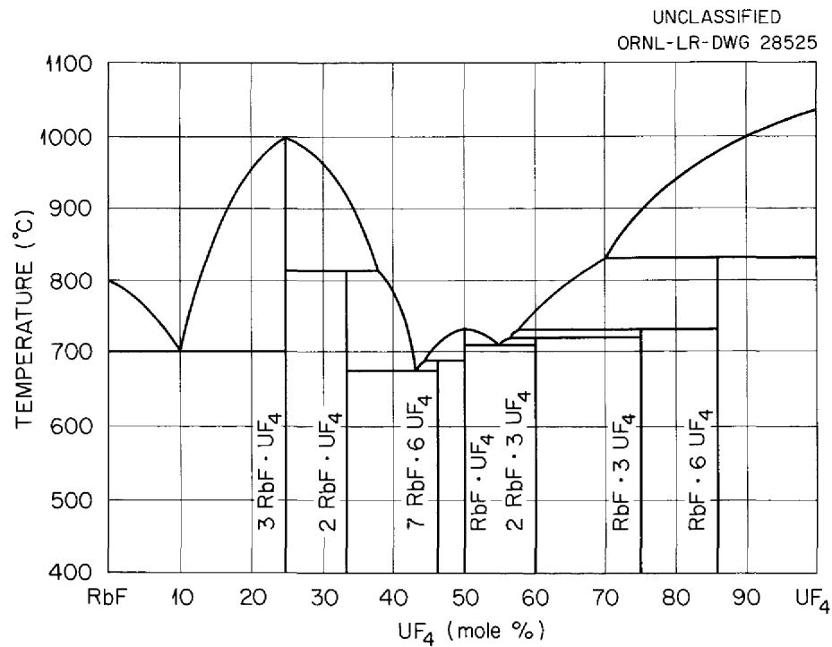  
Fig. 3.58. The System RbF-UF

# 3.59. The System CsF-UF

C. J. Barton, L. M. Bratcher, J. P. Blakely, G. J. Nessle, and W. R. Grimes, unpublished work performed at the Oak Ridge National Laboratory, 1951-53.

Preliminary diagram.

Invariant Equilibria   

<table><tr><td>Mole % UF4in Liquid</td><td>Invariant Temperature (°C)</td><td>Type of Equilibrium</td><td>Phase Reaction at Invariant Temperature</td></tr><tr><td>7.5</td><td>650</td><td>Eutectic</td><td>L ⇌ CsF + 3CsF·UF4</td></tr><tr><td>25</td><td>970</td><td>Congruent melting point</td><td>L ⇌ 3CsF·UF4</td></tr><tr><td>34</td><td>800</td><td>Peritectic</td><td>L + 3CsF·UF4 ⇌ 2CsF·UF4</td></tr><tr><td>41</td><td>695</td><td>Eutectic</td><td>L ⇌ 2CsF·UF4 + α-CsF·UF4</td></tr><tr><td>50</td><td>735</td><td>Congruent melting point</td><td>L ⇌ α-CsF·UF4</td></tr><tr><td>-</td><td>550</td><td>Inversion</td><td>α-CsF·UF4 ⇌ β-CsF·UF4</td></tr><tr><td>53</td><td>725</td><td>Eutectic</td><td>L ⇌ α-CsF·UF4 + UF4</td></tr></table>

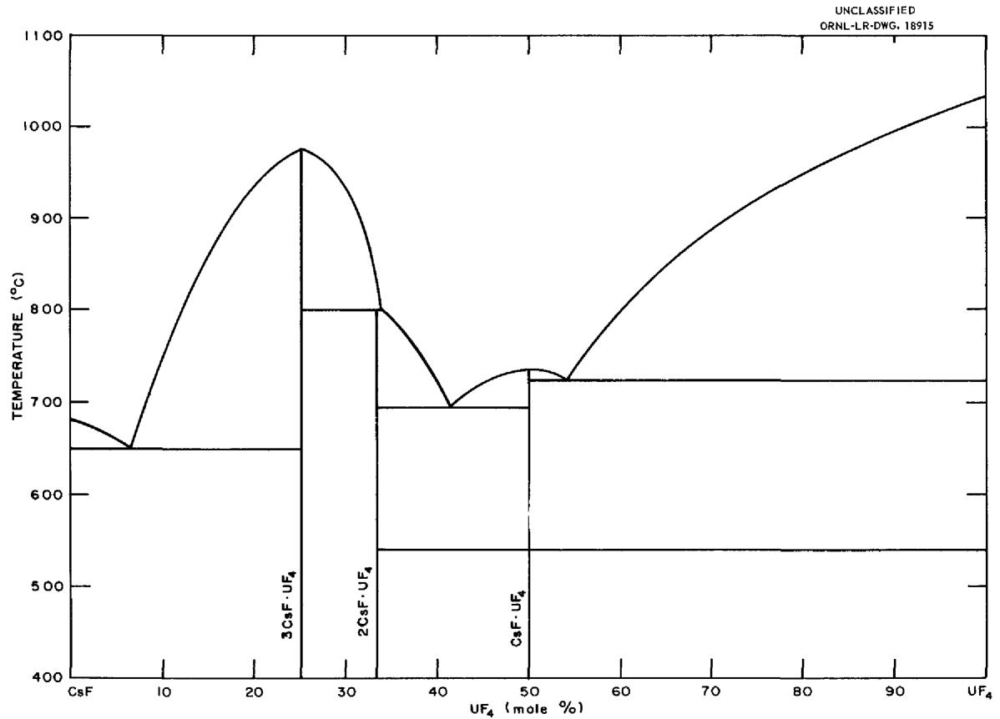  
Fig. 3.59. The System CsF-UF4

# 3.60. The System $\mathsf{ZrF}_4\sim \mathsf{UF}_4$

C. J. Barton, W. R. Grimes, H. Insley, R. E. Moore, and R. E. Thoma, “Phase Equilibria in the Systems NaF-ZrF₄, UF₄-ZrF₄, and NaF-ZrF₄-UF₄,” J. Phys. Chem. 62, 665-76 (1958).

The system $\mathsf{ZrF}_4 - \mathsf{UF}_4$ forms a continuous series of solid solutions having a minimum melting temperature of $765^{\circ}\mathsf{C}$ at 77 $\mathsf{ZrF}_4 - 23\mathsf{UF}_4$ (mole%).

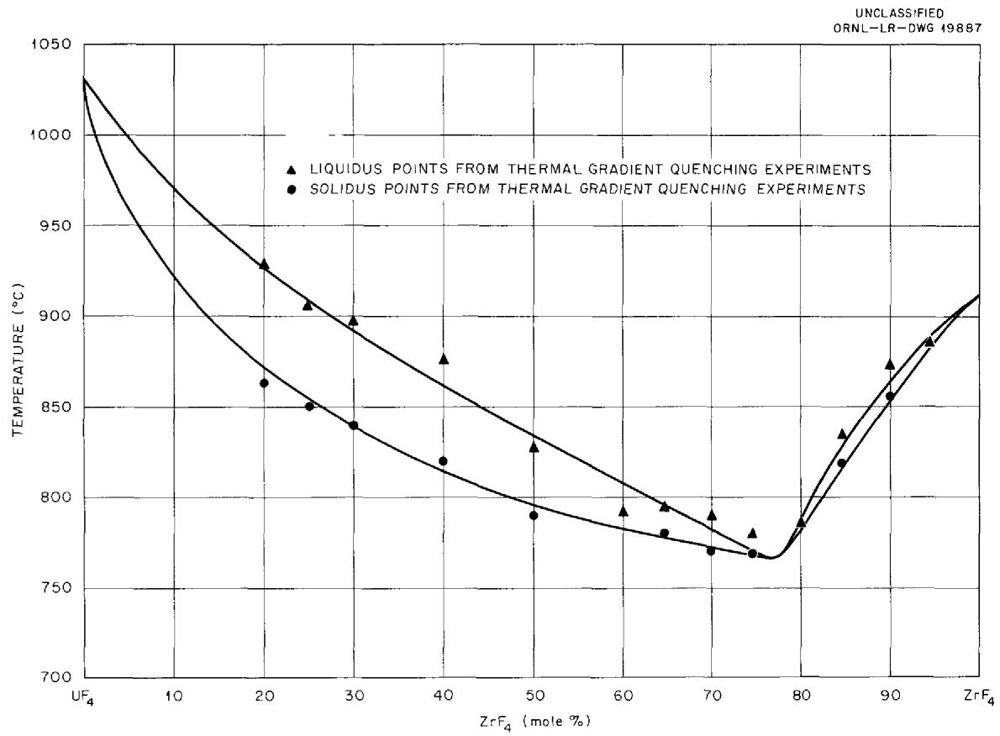  
Fig. 3.60. The System $\mathsf{ZrF}_{4} - \mathsf{UF}_{4}$ .

# 3.61. The System $\mathsf{SnF}_2\text{-}\mathsf{UF}_4$

B. J. Thamer and G. E. Meadows, The Systems $UF_4 - SnF_2$ and $PuF_3 - SnF_2$ , LA-2286 (July 1959).

Invariant Equilibria   

<table><tr><td>Mole % UF4in Liquid</td><td>Invariant Temperature (℃)</td><td>Type of Equilibrium</td><td>Phase Reaction at Invariant Temperature</td></tr><tr><td>0.5</td><td>212</td><td>Eutectic</td><td>L ⇌ SnF2+ 2SnF2·UF4</td></tr><tr><td>4.5</td><td>340</td><td>Peritectic</td><td>L + SnF2·UF4 ⇌ 2SnF2·UF4</td></tr><tr><td>7.8</td><td>371</td><td>Peritectic</td><td>L + UF4 ⇌ SnF2·UF4</td></tr></table>

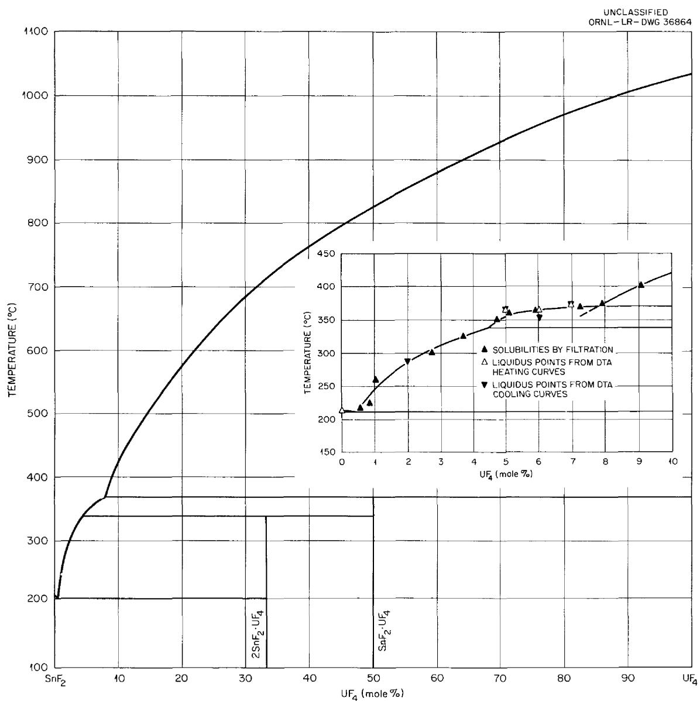  
Fig. 3.61. The System SnF $_2$ -UF $_4$ .

# 3.62. The System $\mathsf{PbF}_2\mathsf{-UF}_4$

C. J. Barton, L. M. Bratcher, J. P. Blakely, G. J. Nessle, and W. R. Grimes, unpublished work performed at the Oak Ridge National Laboratory, 1950-51.

Preliminary diagram.

Invariant Equilibria   

<table><tr><td>Mole % UF4in Liquid</td><td>Invariant Temperature (oC)</td><td>Type of Equilibrium</td><td>Phase Reaction at Invariant Temperature</td></tr><tr><td>14.3</td><td>920</td><td>Congruent melting point</td><td>L ⇌ 6PbF2·UF4</td></tr><tr><td>35</td><td>835</td><td>Eutectic</td><td>L ⇌ 6PbF2·UF4 + 3PbF2·2UF4</td></tr><tr><td>40</td><td>840</td><td>Congruent melting point</td><td>L ⇌ 3PbF2·2UF4</td></tr><tr><td>62</td><td>762 ± 10</td><td>Eutectic</td><td>L ⇌ 3PbF2·2UF4 + UF4</td></tr></table>

The eutectic at quite high $\mathsf{PbF}_2$ concentrations is not shown on this diagram. The authors examined thermal data but found no evidence of a eutectic thermal effect.

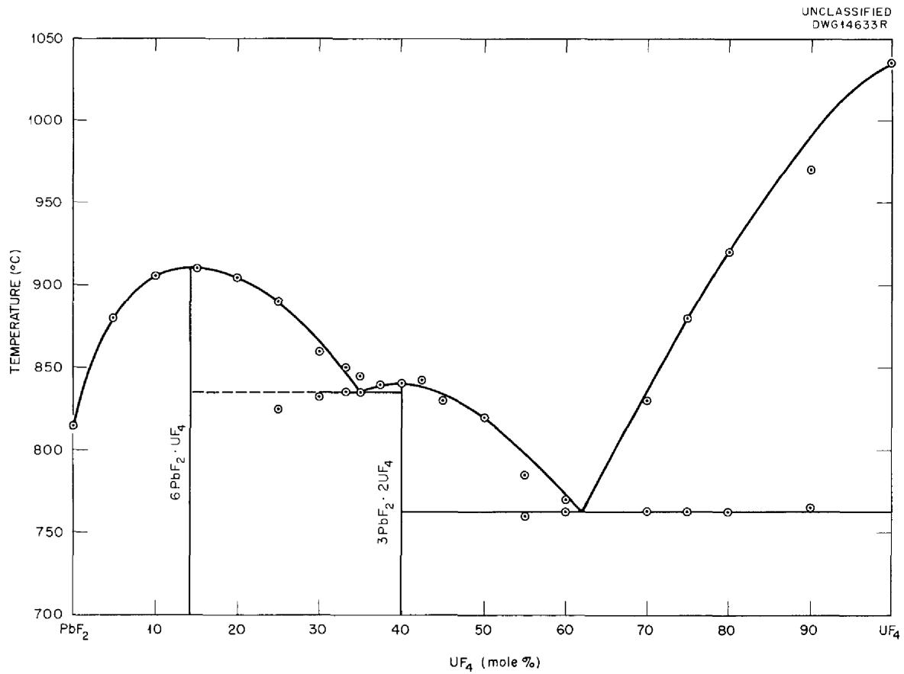  
Fig. 3.62. The System $\mathsf{PbF}_2 - \mathsf{UF}_4$ .

# 3.63. The System $\mathsf{ThF}_4 - \mathsf{UF}_4$

C. F. Weaver, R. E. Thoma, H. A. Friedman, and H. Insley, “Phase Equilibria in the Systems UF₄-ThF₄ and LiF-ThF₄-UF₄,” paper presented at the 61st National Meeting of the American Ceramic Society, Chicago, Ill., May 17–21, 1959.

The system $\mathsf{ThF}_4\text{-}\mathsf{UF}_4$ forms a continuous series of solid solutions without a minimum.

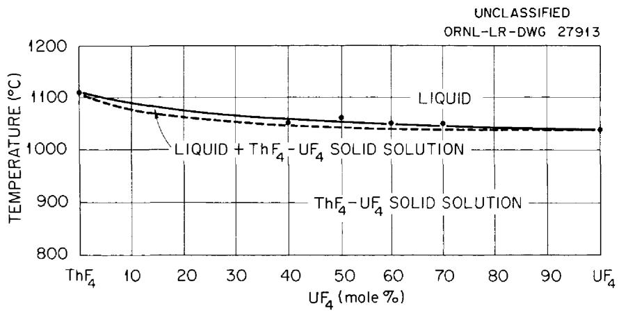  
Fig. 3.63. The System $\mathsf{ThF}_4 - \mathsf{UF}_4$

# 3.64. The System LiF-NaF-UF

R. E. Thoma, H. Insley, B. S. Landau, H. A. Friedman, and W. R. Grimes, "Phase Equilibria in the Alkali Fluoride-Uranium Tetrafluoride Fused Salt Systems: III. The System NaF-LiF-UF4," J. Am. Ceram. Soc. 42, 21-26 (1959).

Invariant Equilibria   

<table><tr><td colspan="3">Composition of Liquid (mole %)</td><td rowspan="2">Invariant Temperature (℃)</td><td rowspan="2">Type of Equilibrium</td><td rowspan="2">Solid Phases Present at Invariant Point</td></tr><tr><td>NaF</td><td>LiF</td><td>UF4</td></tr><tr><td>60</td><td>21</td><td>19</td><td>480</td><td>Eutectic</td><td>2NaF·UF4, NaF, and LiF</td></tr><tr><td>65</td><td>13</td><td>22</td><td>497</td><td>Peritectic</td><td>β-3NaF·UF4, 2NaF·UF4, and NaF</td></tr><tr><td>7</td><td>65.5</td><td>27.5</td><td>470</td><td>Peritectic</td><td>7LiF·6UF4ss, * 4LiF·UF4, and LiF</td></tr><tr><td>35</td><td>37</td><td>28</td><td>480</td><td>Eutectic</td><td>2NaF·UF4, 7NaF·6UF4ss, and LiF</td></tr><tr><td>57</td><td>13</td><td>30</td><td>630</td><td>Peritectic</td><td>2NaF·UF4, 5NaF·3UF4, and 7NaF·6UF4ss</td></tr><tr><td>24.3</td><td>43.5</td><td>32.2</td><td>445</td><td>Eutectic</td><td>7NaF·6UF4ss, LiF, and 7LiF·6UF4ss</td></tr><tr><td>24.5</td><td>29</td><td>46.5</td><td>602</td><td>Eutectic</td><td>NaF·2UF4, 7LiF·6UF4ss, and 7NaF·6UF4ss</td></tr><tr><td>24.3</td><td>28.7</td><td>47</td><td>605</td><td>Peritectic</td><td>NaF·2UF4, LiF·4UF4, and 7LiF·6UF4ss</td></tr><tr><td>23.5</td><td>28</td><td>48.5</td><td>640</td><td>Peritectic</td><td>UF4, NaF·2UF4, and LiF·4UF4</td></tr><tr><td>37.5</td><td>10.5</td><td>52</td><td>660</td><td>Peritectic</td><td>UF4, NaF·2UF4, and 7NaF·6UF4ss</td></tr></table>

*The compounds 7LiF·6UF₄ and 7NaF·6UF₄ as they occur in the ternary system are members of the solid solution 7LiF·6UF₄-7NaF·6UF₄.

UNCLASSIFIED

ORNL-LR-DWG28214R

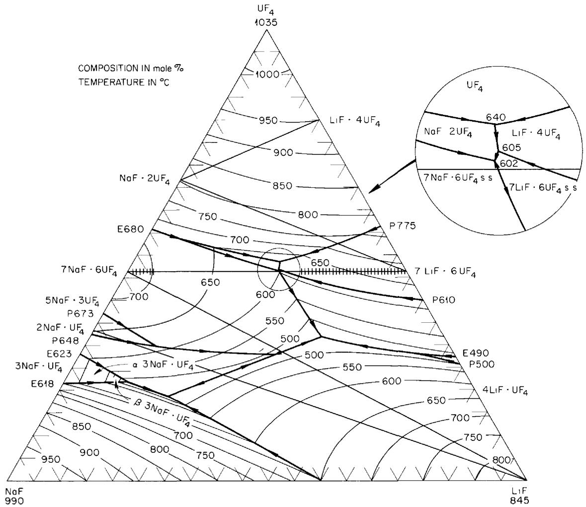  
Fig. 3.64a. The System LiF-NaF-UF $4^{\circ}$

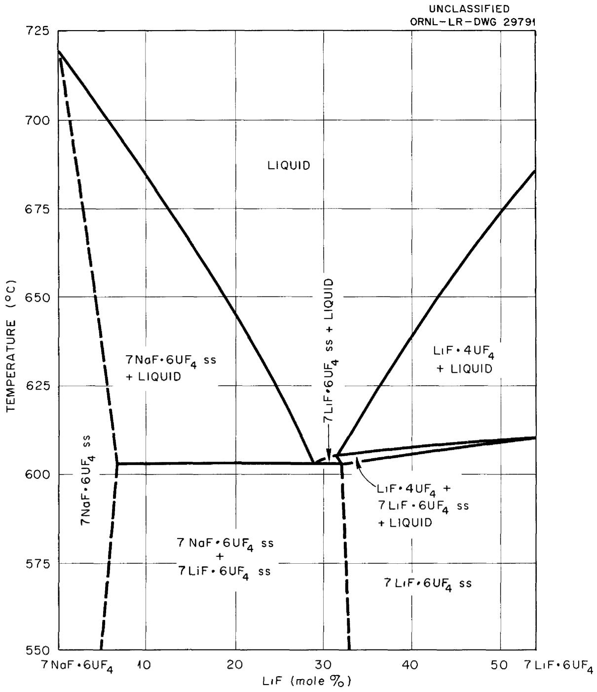  
Fig. 3.64b. The Join 7NaF·6UF4–7LiF·6UF4.

# 3.65. The System LiF-KF-UF4

C. J. Barton, J. P. Blakely, L. M. Bratcher, and W. R. Grimes, unpublished work performed at the Oak Ridge National Laboratory, 1950-51.

Preliminary diagram. The system LiF-KF-UF $_4$ has not yet been defined at the Oak Ridge National Laboratory with sufficient precision to permit the temperatures and compositions of the invariant equilibria to be listed.

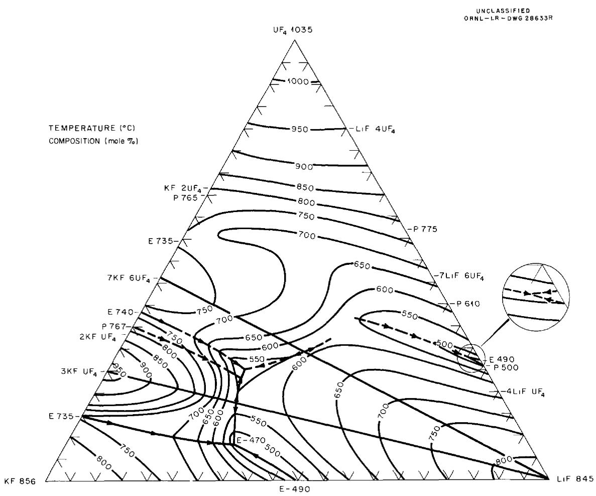  
Fig. 3.65. The System LiF-KF-UF4

# 3.66. The System LiF-RbF-UF

C. J. Barton, J. P. Blakely, L. M. Bratcher, and W. R. Grimes, unpublished work performed at the Oak Ridge National Laboratory, 1950-51.

Preliminary diagram. Phase relationships within the system LiF-RbF-UF $_4$ have not yet become so well defined at the Oak Ridge National Laboratory that the compositions and temperatures of the invariant points may be listed.

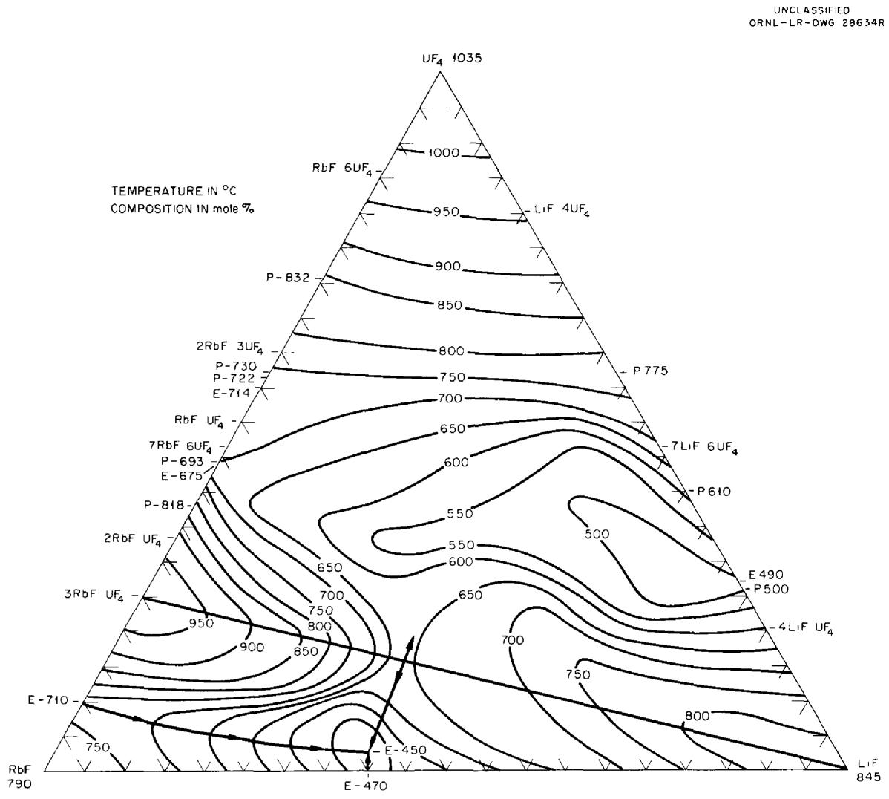  
Fig. 3.66. The System LiF-RbF-UF4.

# 3.67. The System NaF-KF-UF

R. E. Thoma, C. J. Barton, J. P. Blakely, R. E. Moore, G. J. Nessle, H. Insley, and H. A. Friedman, unpublished work performed at the Oak Ridge National Laboratory, 1950-58.

Preliminary diagram. Phase relationships within the system NaF-KF-UF have not yet become so well defined at the Oak Ridge National Laboratory that the compositions and temperatures of the invariant points may be listed.

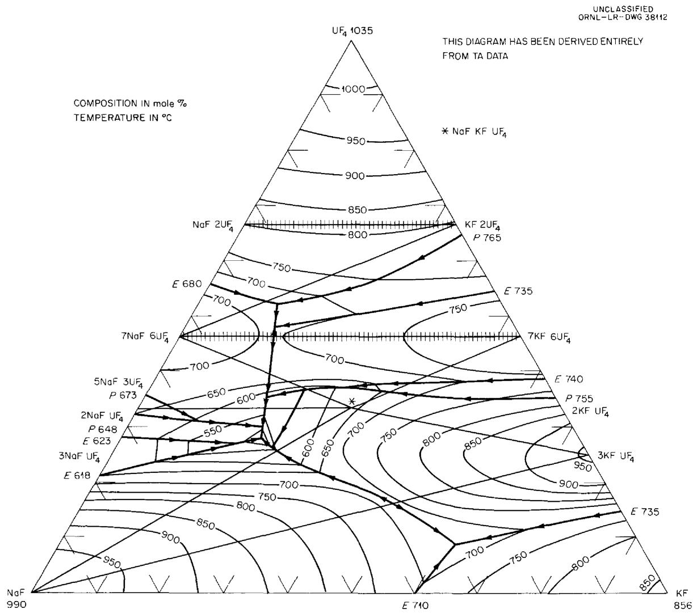  
Fig. 3.67. The System NaF-KF-UF4.

# 3.68. The System NaF-RbF-UF

R. E. Thoma, H. Insley, H. A. Friedman, and W. R. Grimes, unpublished work performed at the Oak Ridge National Laboratory, 1955-56.

Preliminary diagram.

Invariant Equilibria   

<table><tr><td colspan="3">Composition of Liquid (mole %)</td><td rowspan="2">Invariant Temperature (℃)</td><td rowspan="2">Type of Equilibrium</td><td rowspan="2">Solid Phases Present at Invariant Point</td></tr><tr><td>NaF</td><td>RbF</td><td>UF4</td></tr><tr><td>18</td><td>73</td><td>9</td><td>670</td><td>Eutectic</td><td>RbF, NaF, and 3RbF·UF4</td></tr><tr><td>46</td><td>33</td><td>21</td><td>470</td><td>Eutectic</td><td>NaF, NaF·RbF·UF4, and 3RbF·UF4</td></tr><tr><td>44</td><td>33</td><td>23</td><td>500</td><td>Peritectic</td><td>NaF·RbF·UF4, 2RbF·UF4, and 3RbF·UF4</td></tr><tr><td>45</td><td>30</td><td>25</td><td>485</td><td>Peritectic</td><td>NaF, 2NaF·UF4, and NaF·RbF·UF4</td></tr><tr><td>52</td><td>23</td><td>25</td><td>500</td><td>Decomposition</td><td>3NaF·UF4, NaF, and 2NaF·UF4</td></tr><tr><td>41</td><td>26</td><td>33</td><td>555</td><td>Peritectic</td><td>2RbF·UF4, 2NaF·UF4, and NaF·RbF·UF4</td></tr><tr><td>57</td><td>8</td><td>35</td><td>630</td><td>Decomposition</td><td>2NaF·UF4, 5NaF·3UF4, and 7NaF·6UF4</td></tr><tr><td>33</td><td>30</td><td>37</td><td>535</td><td>Eutectic</td><td>2RbF·UF4, 2NaF·UF4, and 7RbF·6UF4</td></tr><tr><td>32</td><td>29</td><td>39</td><td>540</td><td>Peritectic</td><td>7RbF·6UF4, 2NaF·UF4, and 7NaF·6UF4</td></tr><tr><td>26</td><td>27</td><td>47</td><td>620</td><td>Eutectic</td><td>7RbF·6UF4, 7NaF·6UF4, and RbF·UF4</td></tr><tr><td>25</td><td>25</td><td>50</td><td>630</td><td>Eutectic</td><td>7NaF·6UF4, RbF·UF4, and 2RbF·3UF4</td></tr><tr><td>27</td><td>22</td><td>51</td><td>633</td><td>Peritectic</td><td>7NaF·6UF4, 2RbF·3UF4, and RbF·3UF4</td></tr><tr><td>33</td><td>14</td><td>53</td><td>655</td><td>Peritectic</td><td>7NaF·6UF4, RbF·3UF4, and RbF·6UF4</td></tr><tr><td>42</td><td>3</td><td>55</td><td>678</td><td>Peritectic</td><td>7NaF·6UF4, RbF·6UF4, and UF4</td></tr></table>

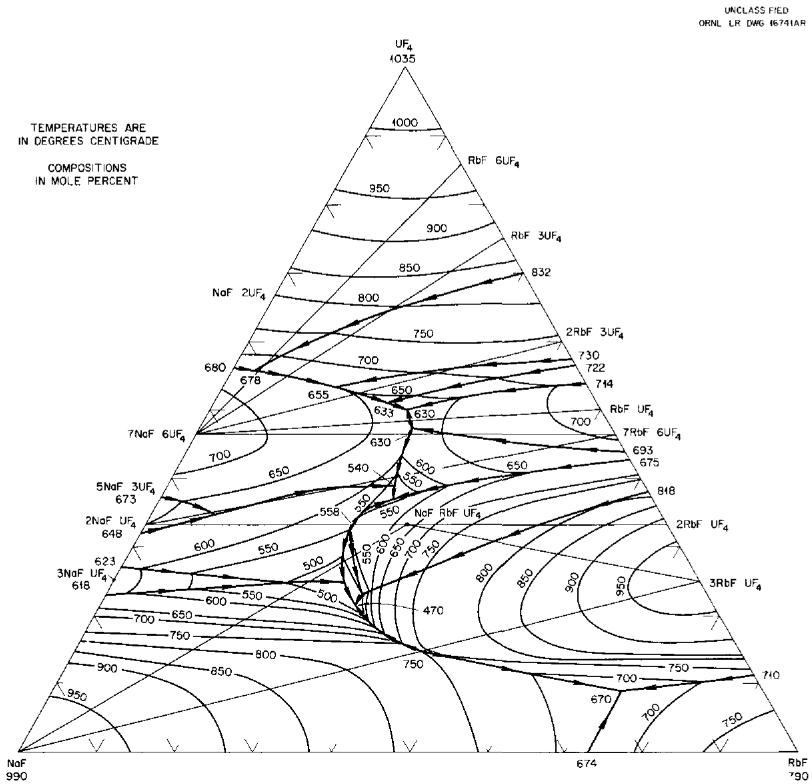  
Fig. 3.68a. The System NaF-RbF-UF4

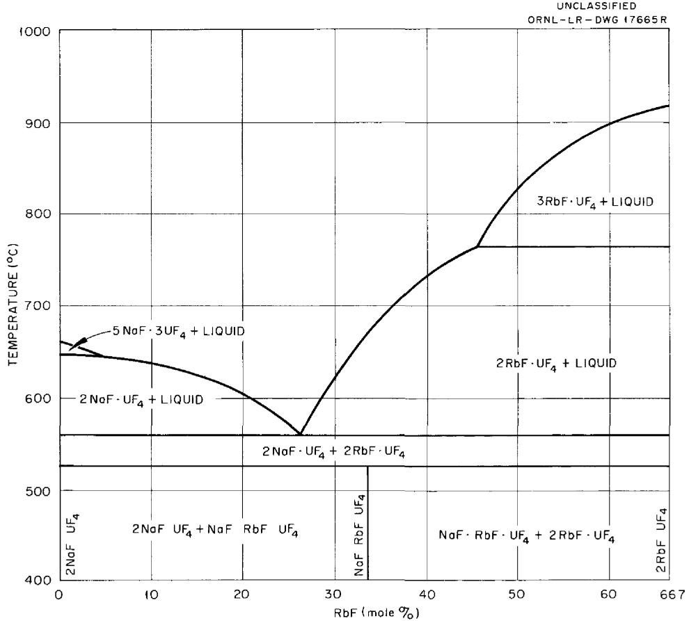  
Fig. 3.68b. The Section 2NaF·UF4–2RbF·UF4.

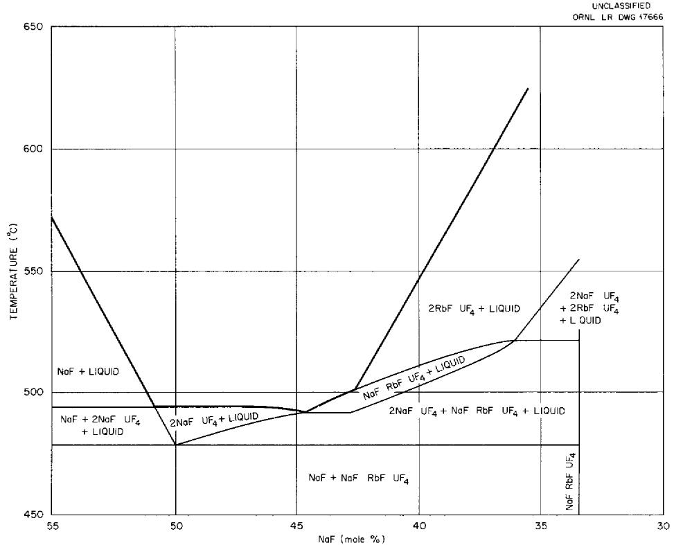  
Fig. 3.68c. The Section NaF-NaF-RbF-UF4.

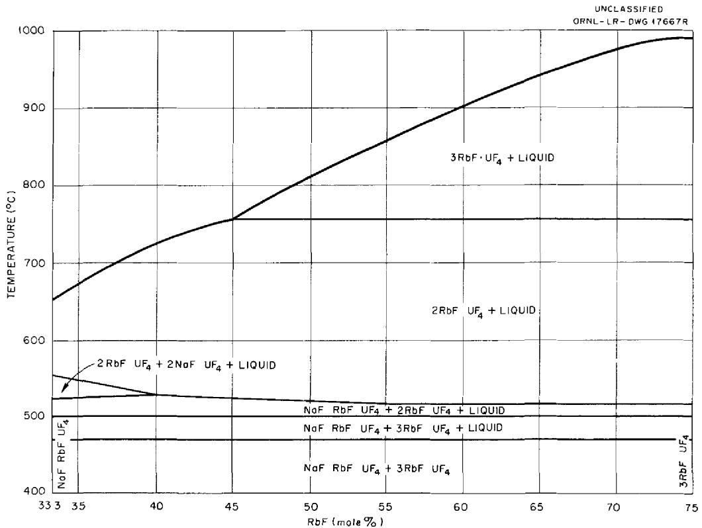  
Fig. 3.68d. The Section 3RbF·UF4NaF·RbF·UF4.

# 3.69. The System $\mathsf{LiF - BeF}_2 - \mathsf{UF}_4$

L. V. Jones, D. E. Etter, C. R. Hudgens, A. A. Huffman, T. B. Rhinehammer, N. E. Rogers, P. A. Tucker, and L. J. Wittenberg, Phase Equilibria in the LiF-BeF $_2$ -UF $_4$ Ternary Fused Salt System, MLM-1080 (Aug. 24, 1959).

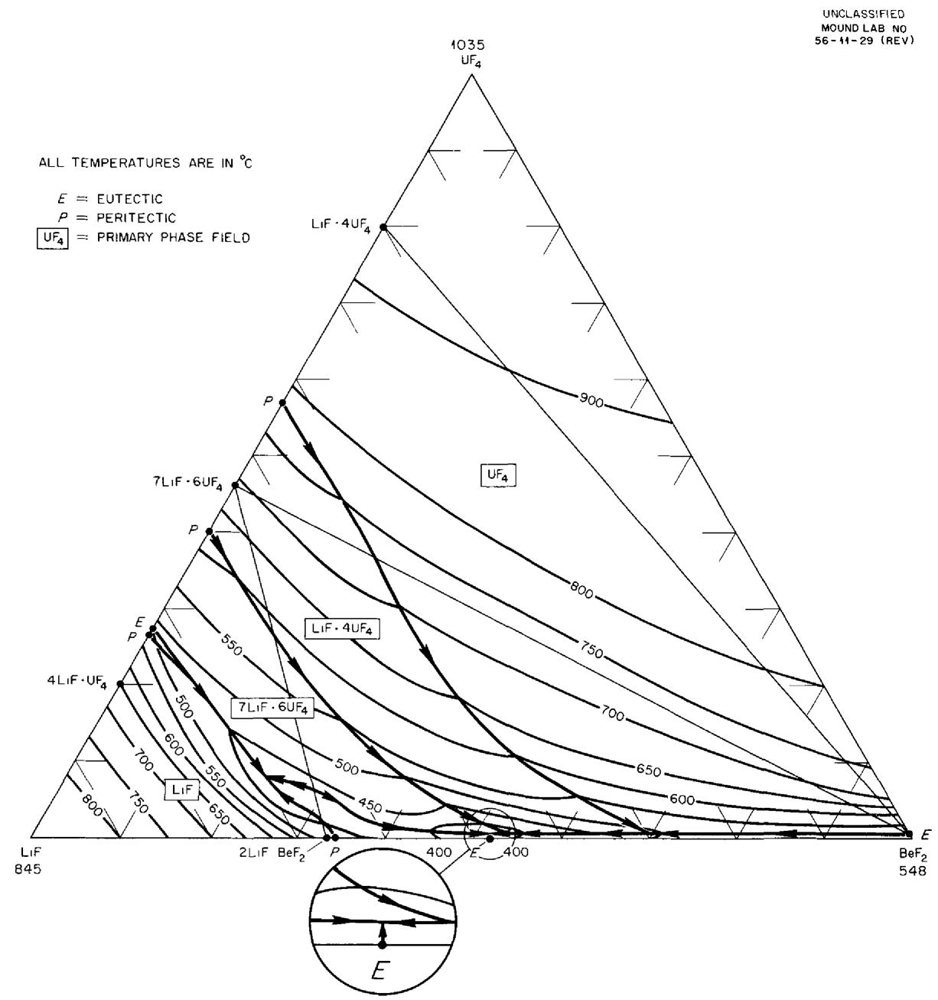  
Fig. 3.69a. The System LiF-BeF $_2$ -UF $_4$ .

Invariant Equilibria   

<table><tr><td colspan="3">Composition of Liquid (mole %)</td><td rowspan="2">Temperature (℃)</td><td rowspan="2">Type of Equilibrium</td><td rowspan="2">Solid Phases Present at Invariant Temperature</td></tr><tr><td>LiF</td><td>BeF2</td><td>UF4</td></tr><tr><td>72</td><td>6</td><td>22</td><td>480</td><td>Peritectic (decomposition of 4LiF·UF4in the ternary system)</td><td>4LiF·UF4, LiF, and 7LiF·6UF4</td></tr><tr><td>69</td><td>23</td><td>8</td><td>426</td><td>Eutectic</td><td>LiF, 2LiF·BeF2, and 7LiF·6UF4</td></tr><tr><td>48</td><td>51.5</td><td>0.5</td><td>350</td><td>Eutectic</td><td>7LiF·6UF4, 2LiF·BeF2, and BeF2</td></tr><tr><td>45.5</td><td>54</td><td>0.5</td><td>381</td><td>Peritectic</td><td>LiF·4UF4, 7LiF·6UF4, and BeF2</td></tr><tr><td>29.5</td><td>70</td><td>0.5</td><td>483</td><td>Peritectic</td><td>UF4, LiF·4UF4, and BeF2</td></tr></table>

The minimum temperature in the quasi-binary system $2LiF \cdot BeF_{2} - 7LiF \cdot 6UF_{4}$ occurs at 65 LiF-29 $BeF_{2} - 6UF_{4}$ (mole %) at $438^{\circ}\mathrm{C}$ .

A three-dimensional model of the system $\mathsf{LiF - BeF}_2\mathsf{-UF}_4$ is shown in Fig. 3.69b.

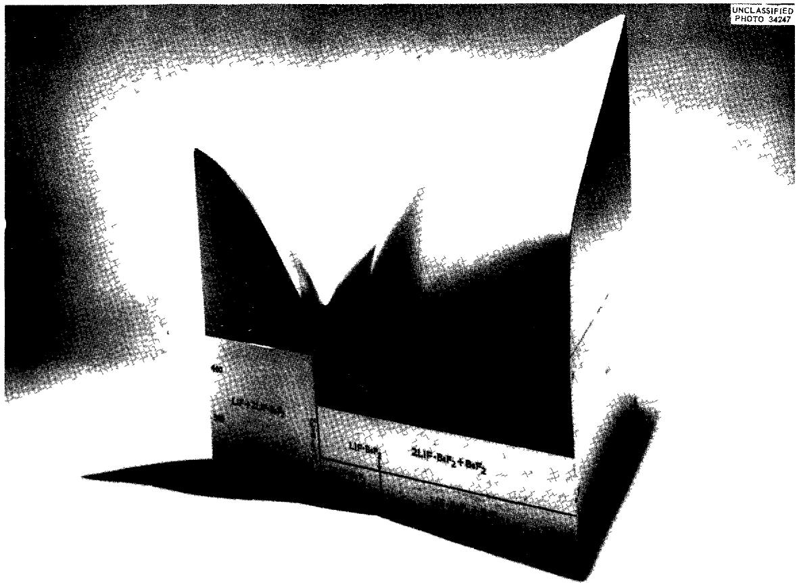  
Fig. 3.69b. Model of the System LiF-BeF $_2$ -UF $_4$ .

# 3.70. The System NaF-BeF $_2$ -UF $_4$

J. F. Eichelberger, C. R. Hudgens, L. V. Jones, G. Pish, T. B. Rhinehammer, P. A. Tucker, and L. J. Wittenberg, unpublished work performed at the Mound Laboratory, 1956-57.

Preliminary diagram.

Invariant Equilibria   

<table><tr><td colspan="3">Composition of Liquid (mole %)</td><td rowspan="2">Temperature (℃)</td><td rowspan="2">Type of Equilibrium</td><td rowspan="2">Solid Phases Present at Invariant Temperature</td></tr><tr><td>NaF</td><td>BeF2</td><td>UF4</td></tr><tr><td>74</td><td>12</td><td>14</td><td>500</td><td>Peritectic (decomposition of 3NaF·UF4in ternary system)</td><td>3NaF·UF4, NaF, and 2NaF·UF4</td></tr><tr><td>72.5</td><td>17</td><td>19.5</td><td>486</td><td>Eutectic</td><td>NaF, 2NaF·UF4, and 2NaF·BeF2</td></tr><tr><td>64.5</td><td>9</td><td>26.5</td><td>630</td><td>Peritectic (decomposition of 5NaF·3UF4in the ternary system)</td><td>5NaF·3UF4, 2NaF·UF4, and 7NaF·6UF4</td></tr><tr><td>57</td><td>42</td><td>1</td><td>378</td><td>Peritectic</td><td>2NaF·BeF2, 2NaF·UF4, and 7NaF·6UF4</td></tr><tr><td>56</td><td>43.5</td><td>0.5</td><td>339</td><td>Eutectic</td><td>2NaF·BeF2, NaF·BeF2, and 7NaF·6UF4</td></tr><tr><td>43.5</td><td>55.5</td><td>1</td><td>357</td><td>Eutectic</td><td>7NaF·6UF4, BeF2, and NaF·BeF2</td></tr><tr><td>41</td><td>58</td><td>1</td><td>375</td><td>Peritectic</td><td>7NaF·6UF4, NaF·2UF4, and BeF2</td></tr><tr><td>26</td><td>63</td><td>1</td><td>409</td><td>Peritectic</td><td>NaF·2UF4, NaF·4UF4, and BeF2</td></tr><tr><td>44</td><td>18</td><td>38</td><td>665</td><td>Peritectic</td><td>7NaF·6UF4, UF4, and NaF·2UF4</td></tr><tr><td>40</td><td>47</td><td>13</td><td>548</td><td>Peritectic</td><td>UF4, NaF·2UF4, and NaF·4UF4</td></tr><tr><td>27</td><td>72</td><td>1</td><td>498</td><td>Peritectic</td><td>UF4, BeF2, and NaF·4UF4</td></tr></table>

The minimum temperature in the quasi-binary system $2\mathrm{NaF}\cdot \mathrm{BeF}_2 - 2\mathrm{NaF}\cdot \mathrm{UF}_4$ occurs at 66.7 LiF-25 $\mathrm{BeF}_2 - 8.3\mathrm{UF}_4$ (mole %) at $528^{\circ}\mathrm{C}$ . The minimum temperature in the quasi-binary system NaF $\cdot$ BeF $_2$ -7NaF $\cdot$ 6UF $_4$ occurs at 50.5 NaF-48.5 $\mathrm{BeF}_2 - 1.0\mathrm{UF}_4$ (mole %) at $367^{\circ}\mathrm{C}$ .

A three-dimensional model of the system $\mathsf{NaF - BeF}_2\mathsf{-UF}_4$ has been constructed by the authors and is shown in Fig. 3.70b.

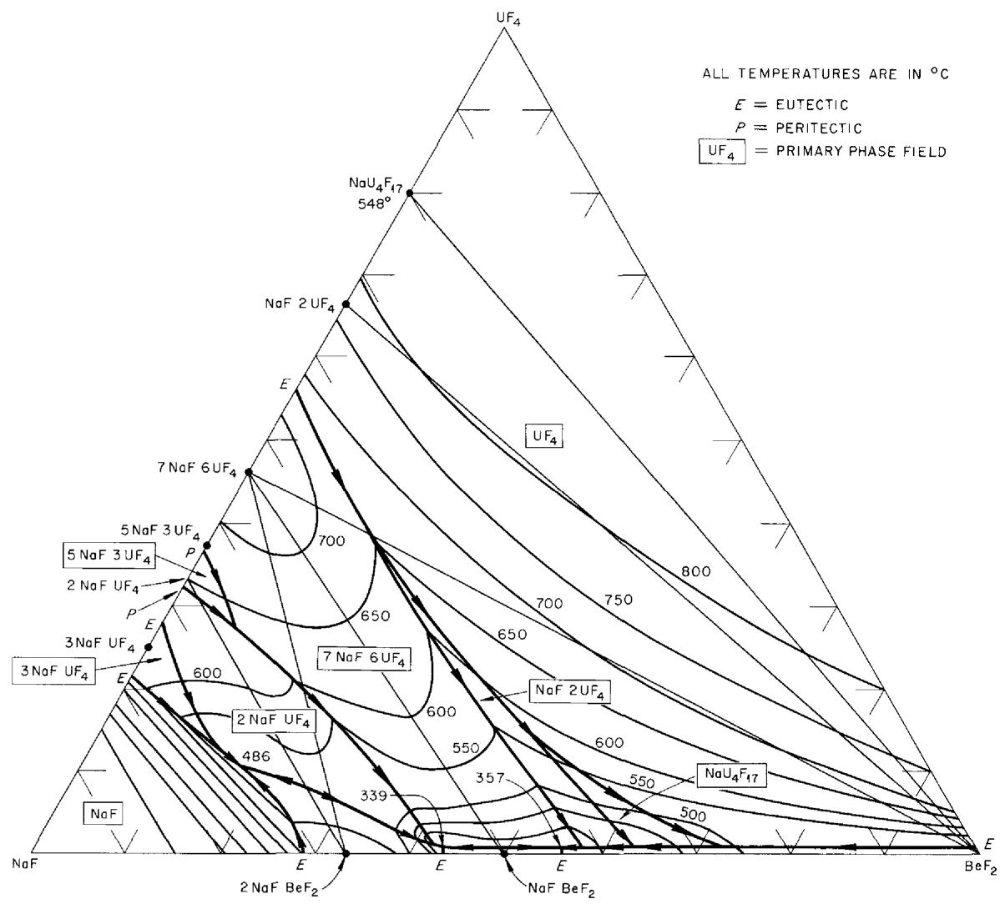  
Fig. 3.70a. The System NaF-BeF2-UF4

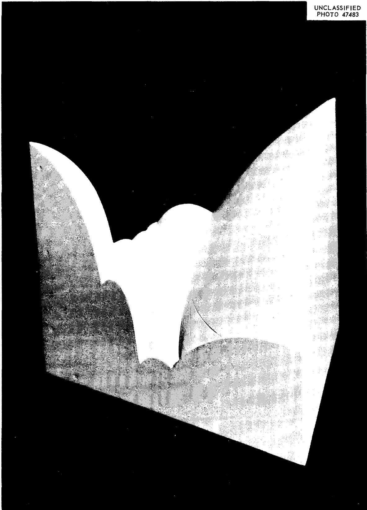  
Fig. 3.70b. Model of the System NaF-BeF $_2$ -UF $_4$ .

# 3.71. The System NaF-PbF2-UF4

C. J. Barton, J. P. Blakely, G. J. Nessle, L. M. Bratcher, and W. R. Grimes, unpublished work performed at the Oak Ridge National Laboratory, 1950-51.

Preliminary diagram. No study has been made at the Oak Ridge National Laboratory of the phase relationships within the system NaF-PbF $_2$ -UF $_4$ .

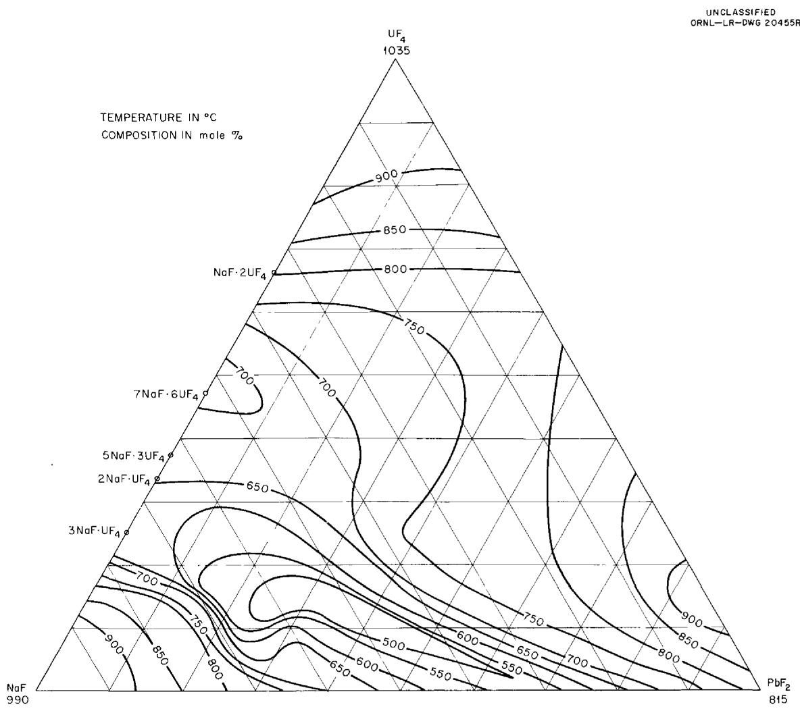  
Fig. 3.71. The System NaF-PbF $_2$ -UF $_4$ .

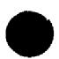

# 3.72. The system $\mathsf{KF - PbF}_2 - \mathsf{UF}_4$

C. J. Barton, J. P. Blakely, G. J. Nessle, L. M. Bratcher, and W. R. Grimes, unpublished work performed at the Oak Ridge National Laboratory, 1950-51.

Preliminary diagram. No study has been made at the Oak Ridge National Laboratory of the phase relationships within the system $\mathsf{KF - PbF}_2 - \mathsf{UF}_4$ .

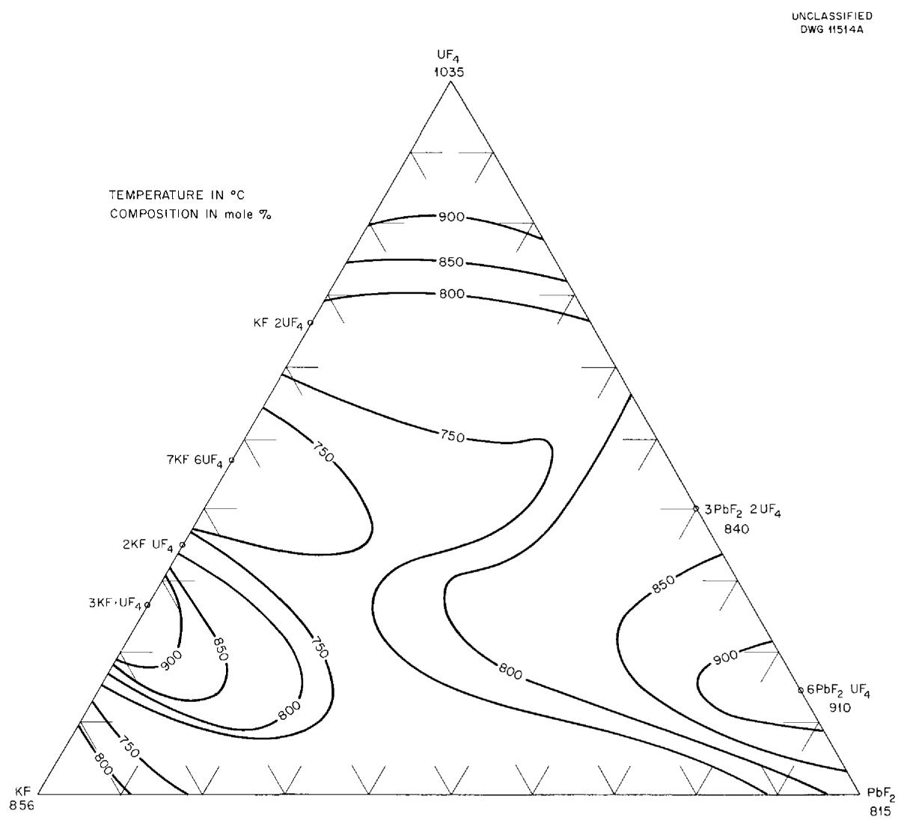  
Fig. 3.72. The System $\mathsf{KF - PbF}_2 - \mathsf{UF}_4$ .

# 3.73. The System NaF-ZrF4-UF4

C. J. Barton, W. R. Grimes, H. Insley, R. E. Moore, and R. E. Thoma, “Phase Equilibria in the Systems NaF-ZrF₄, UF₄-ZrF₄, and NaF-ZrF₄-UF₄,” J. Phys. Chem. 62, 665-76 (1958).

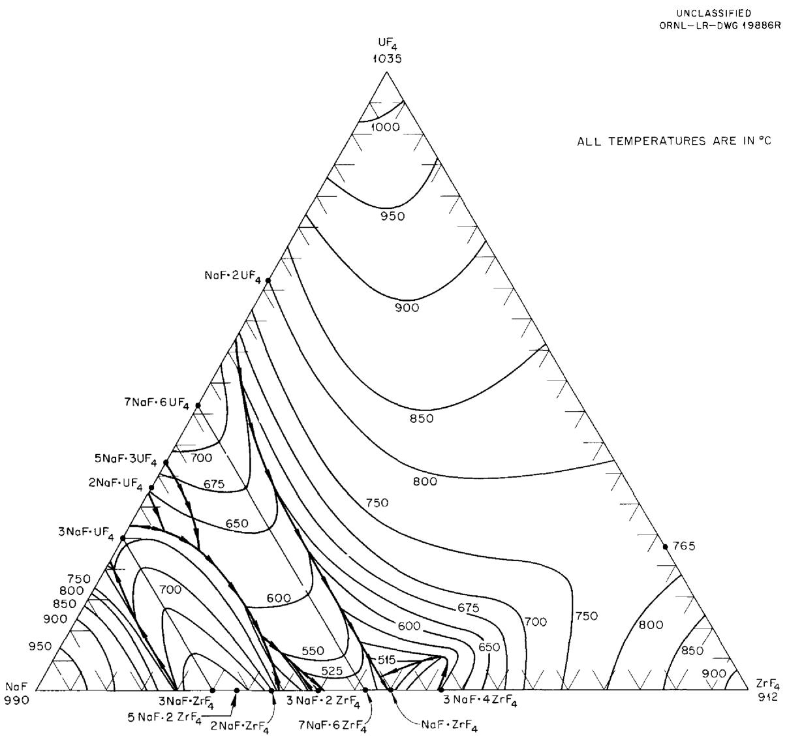  
Fig. 3.73a. The System NaF-ZrF4-UF 4

Invariant Equilibria and Singular Points   

<table><tr><td colspan="3">Composition of Liquid (mole %)</td><td rowspan="2">Temperature (℃)</td><td rowspan="2">Type of Equilibrium</td><td rowspan="2">Solids Present at Invariant Point</td></tr><tr><td>NaF</td><td>ZrF4</td><td>UF4</td></tr><tr><td>69.5</td><td>4.0</td><td>26.5</td><td>646</td><td>Maximum temperature of boundary curve</td><td>3NaF·(U,Zr)F4and 2NaF·UF4</td></tr><tr><td>68.5</td><td>5.5</td><td>26.0</td><td>640</td><td>Peritectic</td><td>3NaF·(U,Zr)F4, 2NaF·UF4and 5NaF·3UF4ss</td></tr><tr><td>65.5</td><td>12.0</td><td>22.5</td><td>613</td><td>Peritectic or decomposition</td><td>3NaF·(U,Zr)F4, 5NaF·3UF4ss, and 7NaF·6(U,Zr)F4</td></tr><tr><td>64.0</td><td>27.0</td><td>9.0</td><td>592</td><td>Peritectic</td><td>3NaF·(U,Zr)F4, 5NaF·2ZrF4ss, and 7NaF·6(U,Zr)F4</td></tr><tr><td>61.5</td><td>34.5</td><td>4.0</td><td>540</td><td>Peritectic</td><td>5NaF·2ZrF4ss, 2NaF·ZrF4, and 7NaF·6(U,Zr)F4</td></tr><tr><td>50.5</td><td>47</td><td>2.5</td><td>513</td><td>Peritectic</td><td>7NaF·6(U,Zr)F4, (U,Zr)F4, and 3NaF·4ZrF4</td></tr></table>

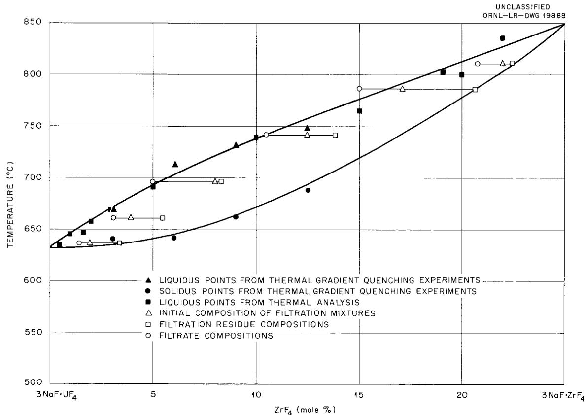  
Fig. 3.73b. The Subsystem $3NaF \cdot UF_{4} - 3NaF \cdot ZrF_{4}$ .

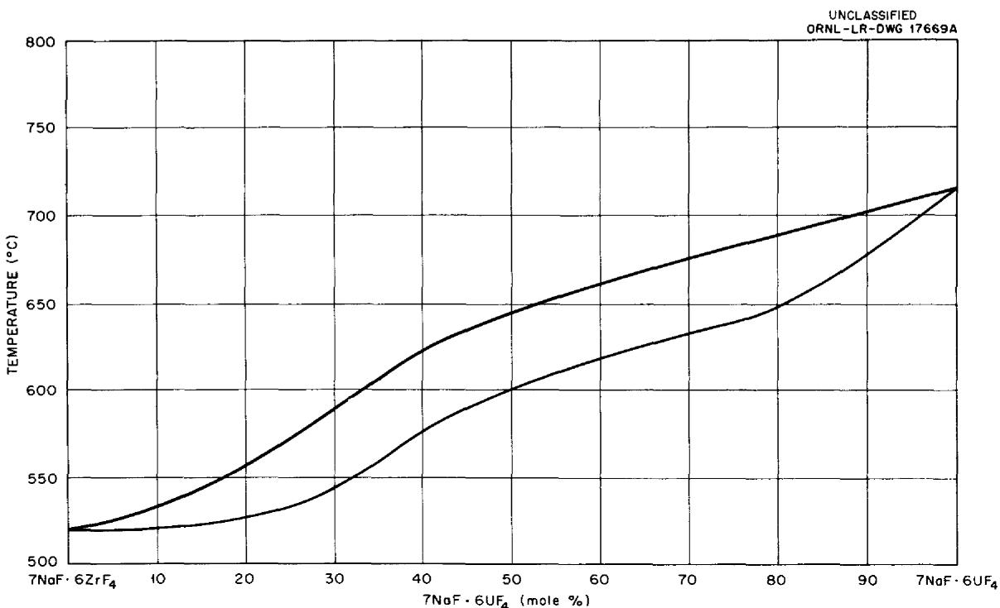  
Fig. 3.73c. The Subsystem 7NaF·6ZrF4-7NaF·6UF4

# 3.74. The System $\mathsf{LiF - ThF}_4 - \mathsf{UF}_4$

C. F. Weaver, R. E. Thoma, H. Insley, and H. A. Friedman, "Phase Equilibria in the Systems UF4-ThF4 and LiF-ThF4-UF4," paper presented at the 61st National Meeting of the American Ceramic Society, Chicago, III., May 17-21, 1959.

Invariant Equilibria   

<table><tr><td colspan="3">Composition of Liquid (mole %)</td><td rowspan="2">Invariant Temperature (℃)</td><td rowspan="2">Type of Equilibrium</td><td rowspan="2">Solids Present at Invariant Point</td></tr><tr><td>LiF</td><td>ThF4</td><td>UF4</td></tr><tr><td>72.5</td><td>7.0</td><td>20.5</td><td>500</td><td>Peritectic</td><td>LiF, 3LiF·(Th,U)F4, and 7LiF·6(U,Th)F4</td></tr><tr><td>72.0</td><td>1.5</td><td>26.5</td><td>488</td><td>Eutectic</td><td>LiF, 4LiF·UF4, and 7LiF·6(U,Th)F4</td></tr><tr><td>53</td><td>18</td><td>19</td><td>609</td><td>Peritectic</td><td>7LiF·6(U,Th)F4, LiF·2(U,U)F4, and LiF·4(U,Th)F4</td></tr></table>

A three-dimensional model of the system $\mathsf{LiF - ThF}_4 - \mathsf{UF}_4$ is shown in Fig. 3.74e.

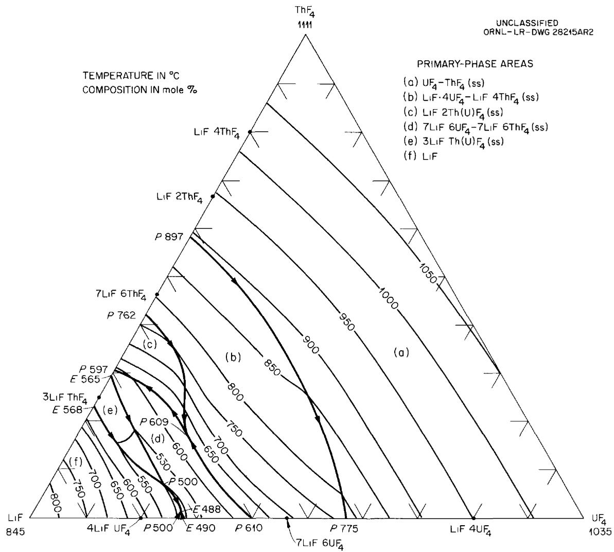  
Fig. 3.74a. The System LiF-ThF-UF

(a) LIQUID + 3LiF·ThF4ss   
(b) LiF+LIQUID   
(c) LiF + 3LiF·ThF4 ss + LIQUID   
(d) LiF + 7LiF·6ThF4 - 7LiF·6UF4 ss + LIQUID   
(e) 4LiF·UF4+LIQUID+LiF   
(f) $4\mathrm{LiF}\cdot \mathrm{UF}_{4} + \mathrm{LIQUID}$   
(g) 4LiF·UF+7LiF·6ThF-7LiF·6UFss+LIQUID   
(h) 3LiF·ThF4ss   
（i）3LIF·ThF4ss+7LIF·6ThF-7LIF·6UF4ss+LIF  
$(j)$ LiF $+7$ LiF·6ThF-7LiF·6UFs s   
$(k)$ $\mathsf{L}\mathsf{I}\mathsf{F} + 4\mathsf{L}\mathsf{i}\mathsf{F}\cdot \mathsf{U}\mathsf{F}_{4} + 7\mathsf{L}\mathsf{i}\mathsf{F}\cdot 6\mathsf{T}\mathsf{h}\mathsf{F}_{4} - 7\mathsf{L}\mathsf{i}\mathsf{F}\cdot 6\mathsf{U}\mathsf{F}_{4}$ ss   
（/）4LiF·UF+7LiF·6ThF-7LiF·6UFss

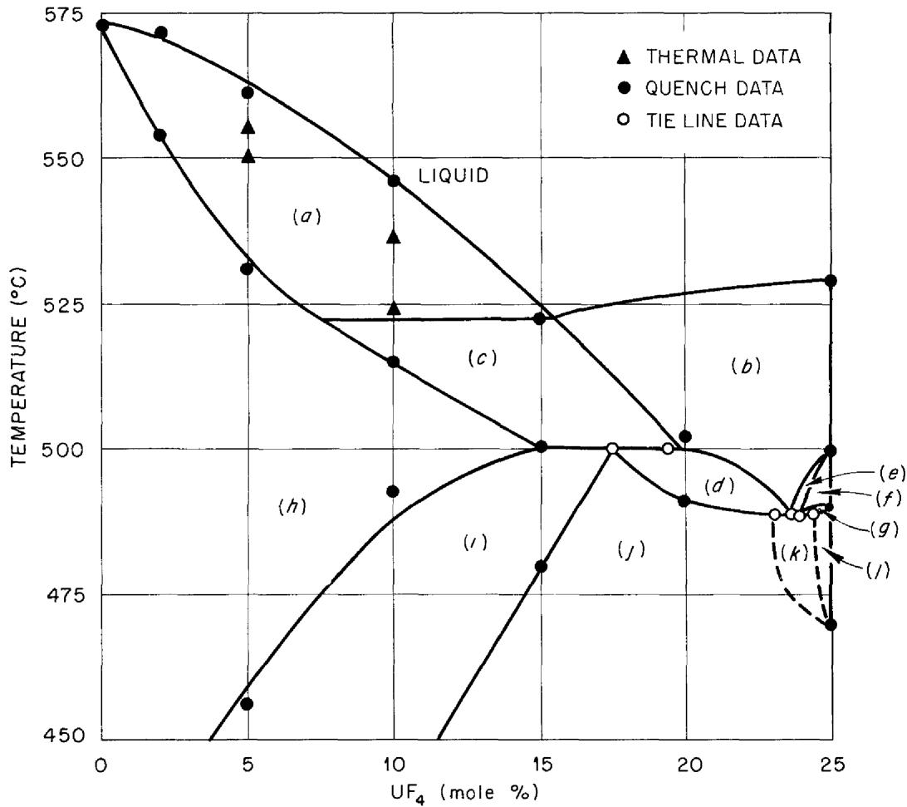  
Fig. 3.74b. The System LiF-ThF $_4$ -UF $_4$ : The Section at 75 Mole % LiF.

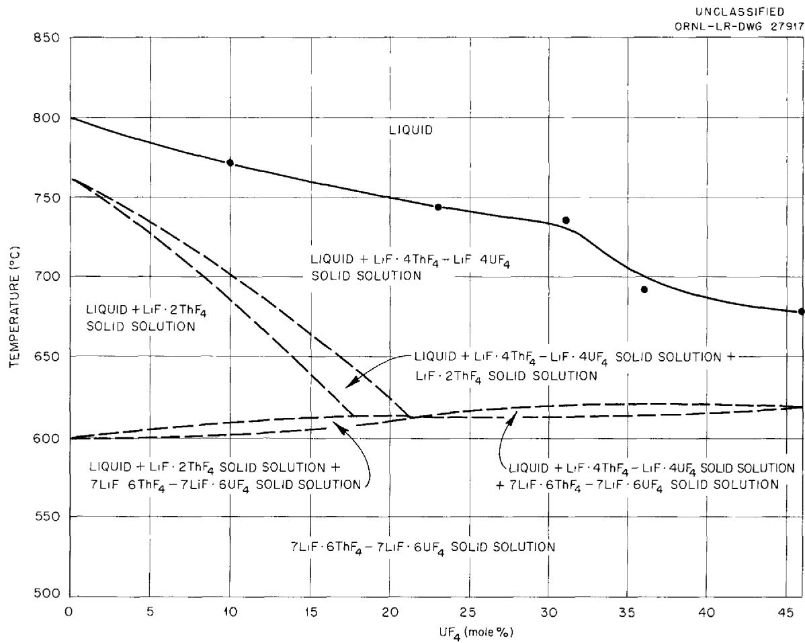  
Fig. 3.74c. The System LiF-ThF4-UF4: The Section at 53.8 Mole % LiF.

(a) $\mathsf{U}\mathsf{F}_4 - \mathsf{Th}\mathsf{F}_4\mathsf{ss} + \mathsf{LiQUID}$   
(b) $\mathrm{LiF} \cdot 4\mathrm{UF}_4 - \mathrm{LiF} \cdot 4\mathrm{ThF}_4 + \mathrm{LIQUID}$   
(c) $UF_{4} - ThF_{4}$ ss + LIQUID + LIF $\cdot 4UF_{4} - LIF\cdot 4ThF_{4}$ ss   
(d) $\mathrm{LiF} \cdot 2\mathrm{ThF}_4$ ss + LIQUID + LiF·4UF4-LiF·4ThF4ss   
(e) $\mathsf{LIF}\cdot 4\mathsf{UF}_4 - \mathsf{LiF}\cdot 4\mathsf{ThF}_4\mathsf{ss} + \mathsf{LIQUID} + 7\mathsf{LIF}\cdot 6\mathsf{UF}_4 - 7\mathsf{LIF}\cdot 6\mathsf{ThF}_4\mathsf{ss}$   
(f) $\mathrm{LiF}\cdot 2\mathrm{ThF}_4\mathrm{ss}$   
(g) $\mathsf{LIF}\cdot 4\mathsf{UF}_4 - \mathsf{LIF}\cdot 4\mathsf{ThF}_4$ ss+7LiF·6UF-7LiF·6ThFss   
(h) $\mathsf{LiF}\cdot 4\mathsf{UF}_4 - \mathsf{LiF}\cdot 4\mathsf{ThF}_4\mathsf{ss} + 7\mathsf{LiF}\cdot 6\mathsf{UF}_4 - 7\mathsf{LiF}\cdot 6\mathsf{ThF}_4\mathsf{ss} + \mathsf{LiF}\cdot 2\mathsf{ThF}_4\mathsf{ss}$

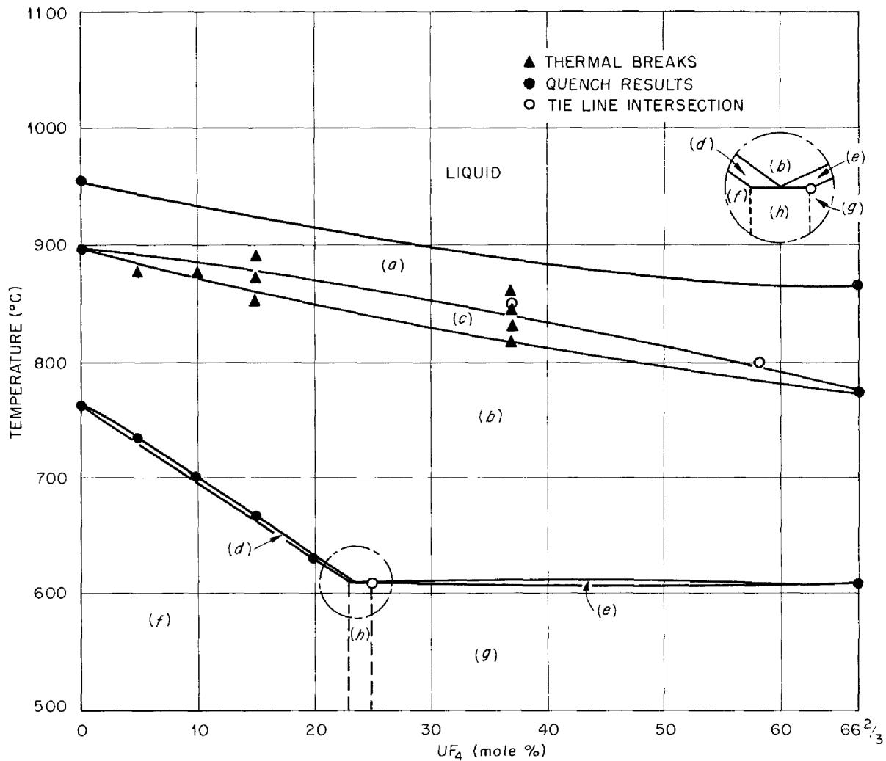  
Fig. 3.74d. The System LiF-ThF $_4$ -UF $_4$ : The Section at 33.3 Mole % LiF.

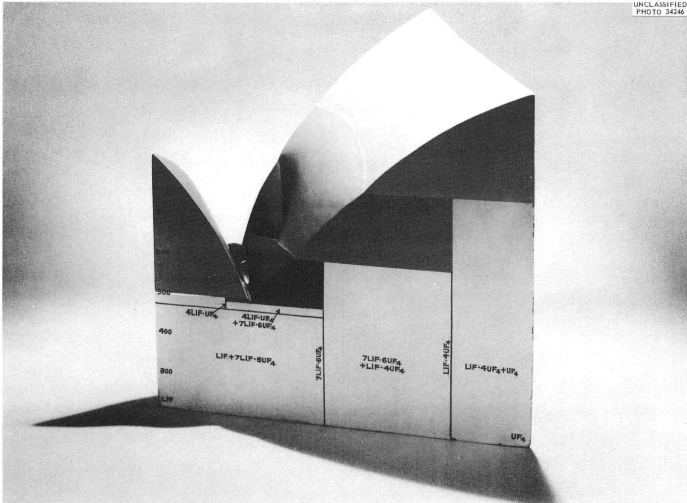  
Fig. 3.74e. Model of the System LiF-ThF-UF

# 3.75. The System $\mathsf{NaF - ThF_4 - UF_4}$ : The Section 2NaF.ThF-2NaF.UF

R. E. Thoma, H. Insley, H. A. Friedman, and C. F. Weaver, unpublished work performed at the Oak Ridge National Laboratory, 1958-59.

Preliminary diagram.

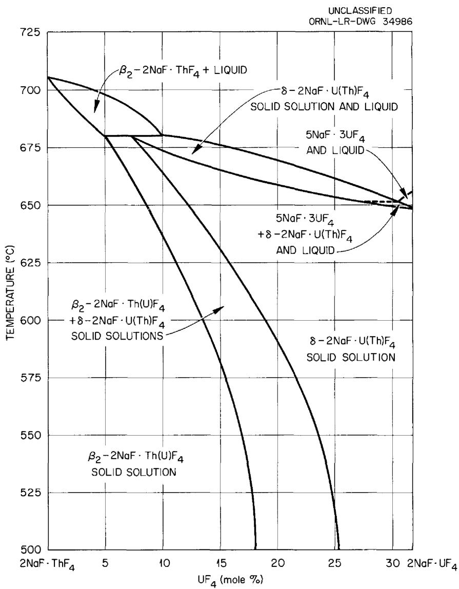  
Fig. 3.75. The Section $2\mathsf{NaF}\cdot \mathsf{ThF}_4 - 2\mathsf{NaF}\cdot \mathsf{UF}_4$

# 3.76. The System $\mathsf{LiF - PuF}_3$

C. J. Barton and R. A. Strehlow, "Phase Relationships in the System Lithium Fluoride-Plutonium Fluoride," paper presented at the 135th National Meeting of the American Chemical Society, Boston, Mass., Apr. 5-10, 1959.

The system $\mathsf{LiF - PuF}_3$ contains a single eutectic at 80.5 LiF-19.5 $\mathsf{PuF}_3$ (mole %), m.p. $743^{\circ}\mathsf{C}$ .

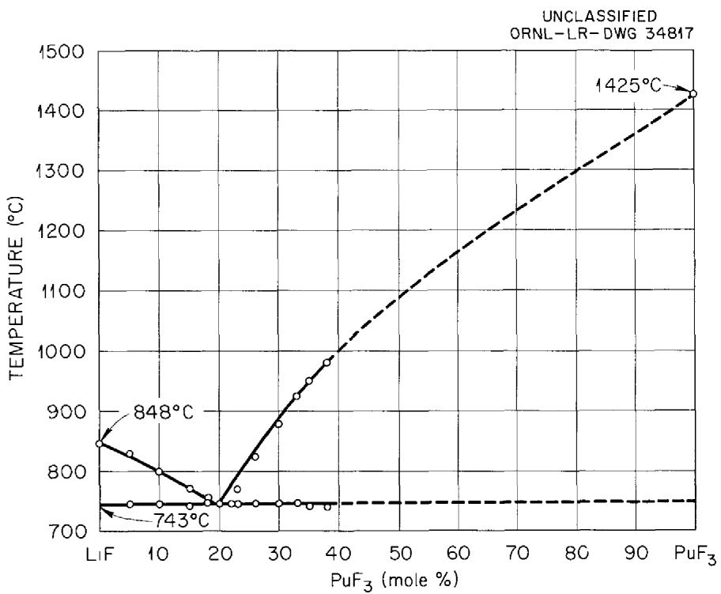  
Fig. 3.76. The System LiF-PuF3.

# 3.77. The System $\mathsf{LiCl - FeCl}_2$

C. Beusman, Activities in the KCl-FeCl $_2$ and LiCl-FeCl $_2$ Systems, ORNL-2323 (May 15, 1957).

The system $\mathsf{LiCl - FeCl}_2$ forms a continuous series of solid solutions with a minimum at 60 LiCl-40 $\mathsf{FeCl}_2$ (mole %), m.p. $540^{\circ}\mathsf{C}$ .

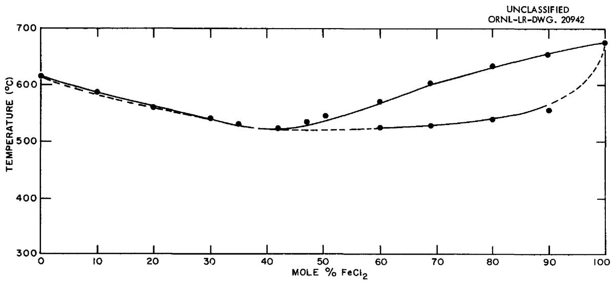  
Fig. 3.77. The System LiCl-FeCl2

# 3.78. The System KCl-FeCl $_2$

C. Beusman, Activities in the KCl-FeCl $_2$ and LiCl-FeCl $_2$ Systems, ORNL-2323 (May 15, 1957). Anearly identical diagram to this one has been reported by H. L. Pinch and J. M. Hirshon, "Thermal Analysis of the Ferrous Chloride-Potassium Chloride System," J. Am. Chem. Soc. 79, 6149-50 (1957).

Invariant Equilibria   

<table><tr><td>Mole % FeCl2in Liquid</td><td>Invariant Temperature (oC)</td><td>Type of Equilibrium</td><td>Phase Reaction at Invariant Temperature</td></tr><tr><td>35</td><td>385</td><td>Peritectic</td><td>L+KCl⇌α-2KCl·FeCl2</td></tr><tr><td>-</td><td>255</td><td>Inversion</td><td>α-2KCl·FeCl2⇌β-2KCl·FeCl2</td></tr><tr><td>39</td><td>355</td><td>Eutectic</td><td>L⇌α-2KCl·FeCl2+α-KCl·FeCl2</td></tr><tr><td>50</td><td>400</td><td>Congruent melting point</td><td>L⇌α-KCl·FeCl2</td></tr><tr><td>-</td><td>300</td><td>Inversion</td><td>α-KCl·FeCl2⇌β-KCl·FeCl2</td></tr><tr><td>53</td><td>390</td><td>Eutectic</td><td>L⇌α-KCl·FeCl2+FeCl2</td></tr></table>

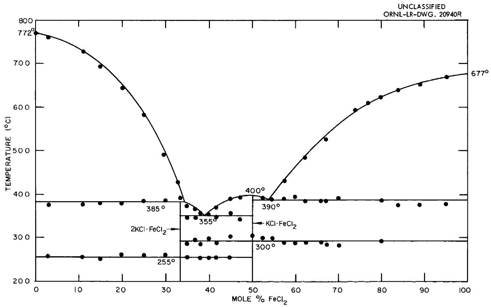  
Fig. 3.78. The System KCl-FeCl2

# 3.79. The System NaCl-ZrCl4

C. J. Barton, R. J. Sheil, and W. R. Grimes, unpublished work performed at the Oak Ridge National Laboratory, 1956.

Preliminary diagram.

Invariant Equilibria   

<table><tr><td>Mole % ZrCl4in Liquid</td><td>Invariant Temperature (°C)</td><td>Type of Equilibrium</td><td>Phase Reaction at Invariant Temperature</td></tr><tr><td>28.0</td><td>535 ± 5</td><td>Peritectic</td><td>L + NaCl ⇌ 3NaCl·ZrCl4</td></tr><tr><td>-</td><td>445 ± 5</td><td>Decomposition</td><td>3NaCl·ZrCl4 ⇌ NaCl + α-2NaCl·ZrCl4</td></tr><tr><td>28.5</td><td>525 ± 5</td><td>Eutectic</td><td>L ⇌ 3NaCl·ZrCl4 + α-2NaCl·ZrCl4</td></tr><tr><td>33.3</td><td>626 ± 5</td><td>Congruent melting point</td><td>L ⇌ α-2NaCl·ZrCl4</td></tr><tr><td>-</td><td>370 ± 5</td><td>Inversion</td><td>α-2NaCl·ZrCl4 ⇌ β-2NaCl·ZrCl4</td></tr><tr><td>58</td><td>352 ± 5</td><td>Peritectic</td><td>L + β-2NaCl·ZrCl4 ⇌ α-3NaCl·4ZrCl4</td></tr><tr><td>-</td><td>312 ± 5</td><td>Inversion</td><td>α-3NaCl·4ZrCl4 ⇌ β-3NaCl·4ZrCl4</td></tr><tr><td>63</td><td>312 ± 5</td><td>Eutectic</td><td>L ⇌ β-3NaCl·4ZrCl4 + ZrCl4</td></tr></table>

Previous reports on the system $\mathsf{NaCl - ZrCl}_4$ have been made by N. A. Berlozerskts and O. A. Kucherenko, Zbur. Priklad. Kbim. 13, 1552 (1940), I. S. Morozov and B. G. Korshunov, Zbur. Neorg. Kbim. 1, 145(1956), and H. H. Kellogg, L. J. Howell, and R. C. Sommer, Physical Chemical Properties of the Systems NaCl-ZrCl $_4$ , KCl-ZrCl $_4$ , and NaCl-KCl-ZrCl $_4$ , Summary Report, NYO-3108 (April 7, 1955).

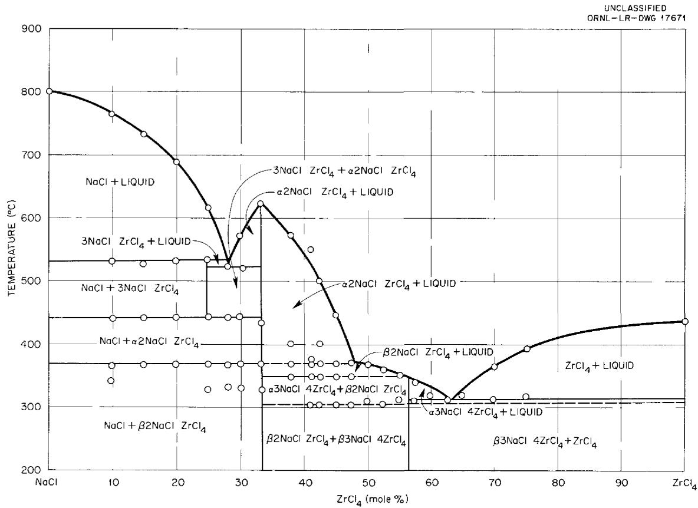  
Fig. 3.79. The System NaCl-ZrCl4

# 3.80. The System KCl-ZrCl4

C. J. Barton, R. J. Sheil, and W. R. Grimes, unpublished work performed at the Oak Ridge National Laboratory, 1955.

Preliminary diagram.

Invariant Equilibria   

<table><tr><td>Mole % ZrCl4in Liquid</td><td>Invariant Temperature (°C)</td><td>Type of Equilibrium</td><td>Phase Reaction at Invariant Temperature</td></tr><tr><td>23</td><td>600 ± 5</td><td>Eutectic</td><td>L ⇌ KCl + 2KCl·ZrCl4</td></tr><tr><td>33.3</td><td>790 ± 5</td><td>Congruent melting point</td><td>L ⇌ 2KCl·ZrCl4</td></tr><tr><td>48</td><td>565 ± 5</td><td>Peritectic</td><td>L + 2KCl·ZrCl4 ⇌ α·7KCl·6ZrCl4</td></tr><tr><td>-</td><td>222 ± 4</td><td>Inversion</td><td>α·7KCl·6ZrCl4 ⇌ β·7KCl·6ZrCl4</td></tr><tr><td>65</td><td>225 ± 4</td><td>Eutectic</td><td>L ⇌ α·7KCl·6ZrCl4 + ZrCl4</td></tr></table>

Some phase work on this system has been reported by H. H. Kellogg, L. J. Howell, and R. C. Sommer, Physical Chemical Properties of the Systems NaCl-ZrCl₄, KCl-ZrCl₄, and NaCl-KCl-ZrCl₄, Summary Report, NYO-3108 (April 7, 1955).

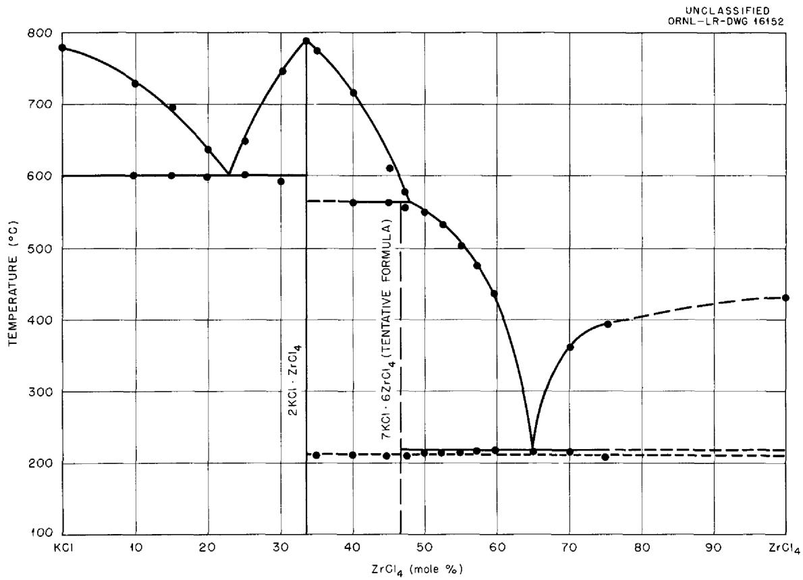  
Fig. 3.80. The System KCl-ZrCl4.

# 3.81. The System LiCl-UCI3

C. J. Barton, A. B. Wilkerson, and W. R. Grimes, unpublished work performed at the Oak Ridge National Laboratory, 1953.

Preliminary diagram. The system $\mathsf{LiCl - UCl}_3$ contains a single eutectic at 75 LiCl-25 UCl $_3$ (mole %), m.p. $495 \pm 5^{\circ}\mathsf{C}$ .

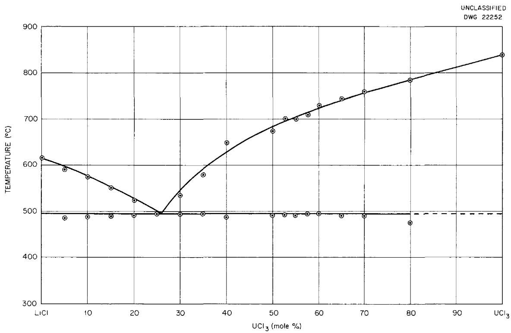  
Fig. 3.81. The System LiCl-UCI3

# 3.82. The System LiCl-UCI

C. J. Barton, R. J. Sheil, and W. R. Grimes, unpublished work performed at the Oak Ridge National Laboratory, 1953.

Preliminary diagram.

Invariant Equilibria   

<table><tr><td>Mole % UCl4in Liquid</td><td>Invariant Temperature (°C)</td><td>Type of Equilibrium</td><td>Phase Reaction at Invariant Temperature</td></tr><tr><td>29</td><td>415</td><td>Eutectic</td><td>L ⇌ 2LiCl·UCl4+ LiCl</td></tr><tr><td>33.3</td><td>430 ± 10</td><td>Congruent melting point</td><td>L ⇌ 2LiCl·UCl4</td></tr><tr><td>48</td><td>405</td><td>Eutectic</td><td>L ⇌ 2LiCl·UCl4+ UCl4</td></tr></table>

Some data on this system were reported by C. A. Kraus in Phase Diagrams of Some Complex Salts of Uranium with Halides of the Alkali and Alkaline Earth Metals, M-251 (July 1, 1943).

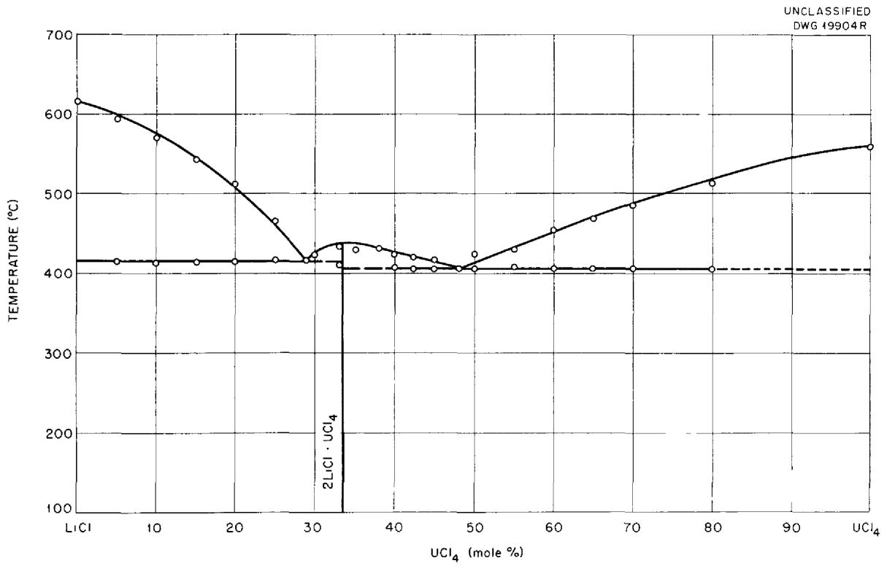  
Fig. 3.82. The System LiCl-UCI

# 3.83. The System NaCl-UCI3

C. A. Kraus, unpublished work.

Preliminary diagram constructed with the author's permission from data reported in Phase Diagrams of Some Complex Salts of Uranium with Halides of the Alkali and Alkaline Earth Metals, M-251 (July 1, 1943).

The system NaCl-UCI3 contains a single eutectic at 67 NaCl-33 UCI3 (mole %), m.p. 525°C.

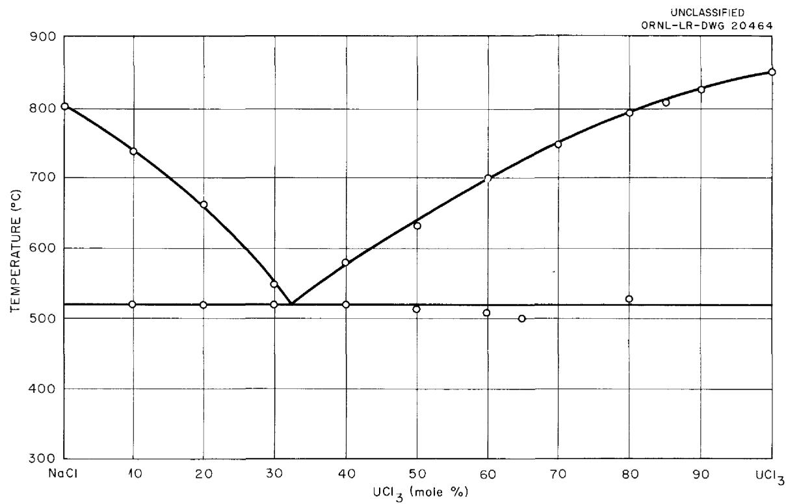  
Fig. 3.83. The System NaCl-UCl3

# 3.84. The System NaCl-UCI

C. J. Barton, R. J. Sheil, A. B. Wilkerson, and W. R. Grimes, unpublished work performed at the Oak Ridge National Laboratory, 1953.

Preliminary diagram.

Invariant Equilibria   

<table><tr><td>Mole % UCl4in Liquid</td><td>Invariant Temperature (°C)</td><td>Type of Equilibrium</td><td>Phase Reaction at Invariant Temperature</td></tr><tr><td>30</td><td>430 ± 5</td><td>Eutectic</td><td>L ⇌ NaCl + 2NaCl·UCl4</td></tr><tr><td>33.3</td><td>440 ± 5</td><td>Congruent melting point</td><td>L ⇌ 2NaCl·UCl4</td></tr><tr><td>47</td><td>370 ± 5</td><td>Eutectic</td><td>L ⇌ 2NaCl·UCl4 + unidentified compound</td></tr><tr><td>57</td><td>415 ± 5</td><td>Peritectic</td><td>L + UCl4 ⇌ unidentified compound</td></tr></table>

A phase diagram of this system has been reported by C. A. Kraus in Phase Diagrams of Some Complex Salts of Uranium with Halides of the Alkali and Alkaline Earth Metals, M-251 (July 1, 1943).

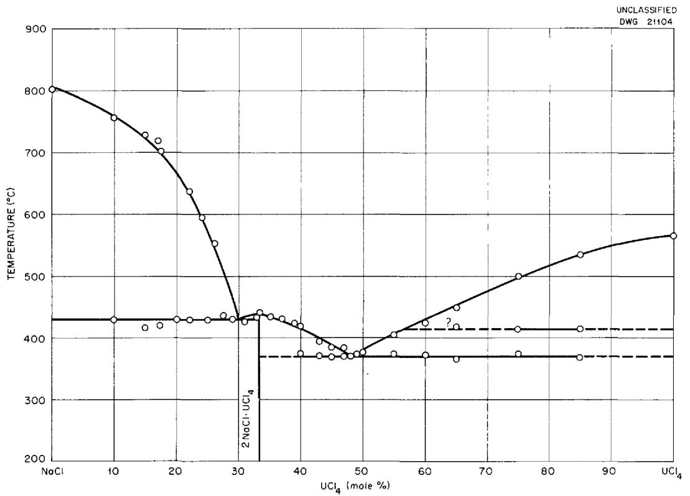  
Fig. 3.84. The System NaCl-UCI4

# 3.85. The System KCl-UCI

C. J. Barton, A. B. Wilkerson, T. N. McVay, R. J. Sheil, and W. R. Grimes, unpublished work performed at the Oak Ridge National Laboratory, 1954.

Preliminary diagram.

Invariant Equilibria   

<table><tr><td>Mole % UCl4in Liquid</td><td>Invariant Temperature (°C)</td><td>Type of Equilibrium</td><td>Phase Reaction at Invariant Temperature</td></tr><tr><td>25</td><td>550</td><td>Eutectic</td><td>L ⇌ KCl + 2KCl·UCl4</td></tr><tr><td>33.3</td><td>630</td><td>Congruent melting point</td><td>L ⇌ 2KCl·UCl4</td></tr><tr><td>44</td><td>330</td><td>Eutectic</td><td>L ⇌ 2KCl·UCl4 + KCl·UCl4</td></tr><tr><td>49</td><td>345</td><td>Peritectic</td><td>L + KCl·3UCl4 ⇌ KCl·UCl4</td></tr><tr><td>61</td><td>395</td><td>Peritectic</td><td>L + UCl4 ⇌ KCl·3UCl4</td></tr></table>

A phase diagram of this system has been reported by C. A. Kraus in Phase Diagrams of Some Complex Salts of Uranium with Halides of the Alkali and Alkaline Earth Metals, M-251 (July 1, 1943).

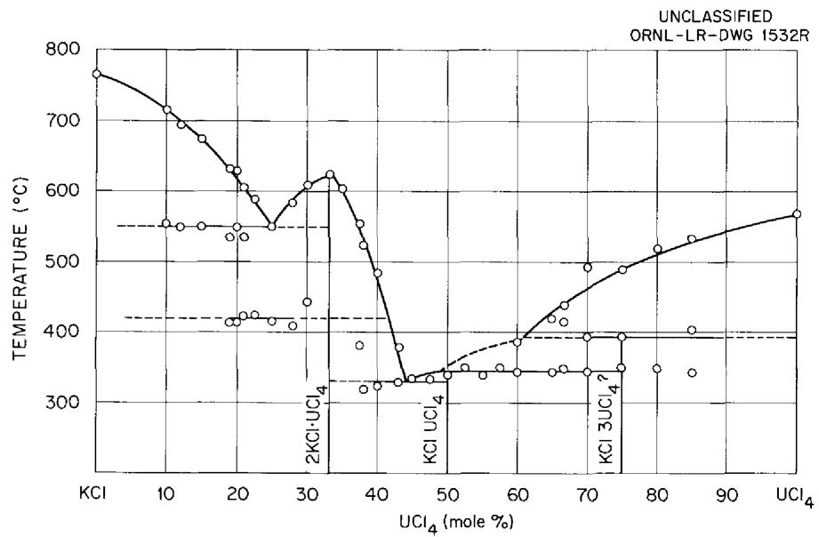  
Fig. 3.85. The System KCI-UCI4

# 3.86. The System $\mathsf{RbCl - UCl}_3$

C. J. Barton, R. J. Sheil, A. B. Wilkerson, and W. R. Grimes, unpublished work performed at the Oak Ridge National Laboratory, 1954.

Preliminary diagram.

Invariant Equilibria   

<table><tr><td>Mole % UCl3in Liquid</td><td>Invariant Temperature (oC)</td><td>Type of Equilibrium</td><td>Phase Reaction at Invariant Temperature</td></tr><tr><td>15</td><td>610</td><td>Eutectic</td><td>L ⇌RbCl + 3RbCl·UCl3</td></tr><tr><td>25</td><td>745 ± 10</td><td>Congruent melting point</td><td>L ⇌3RbCl·UCl3</td></tr><tr><td>40</td><td>560 ± 10</td><td>Peritectic</td><td>L + 3RbCl·UCl3 ⇌ 2RbCl·UCl3</td></tr><tr><td>45.5</td><td>513 ± 5</td><td>Eutectic</td><td>L ⇌ 2RbCl·UCl3 + RbCl·UCl3</td></tr><tr><td>49</td><td>550 ± 10</td><td>Peritectic</td><td>L + UCl3 ⇌ RbCl·UCl3</td></tr></table>

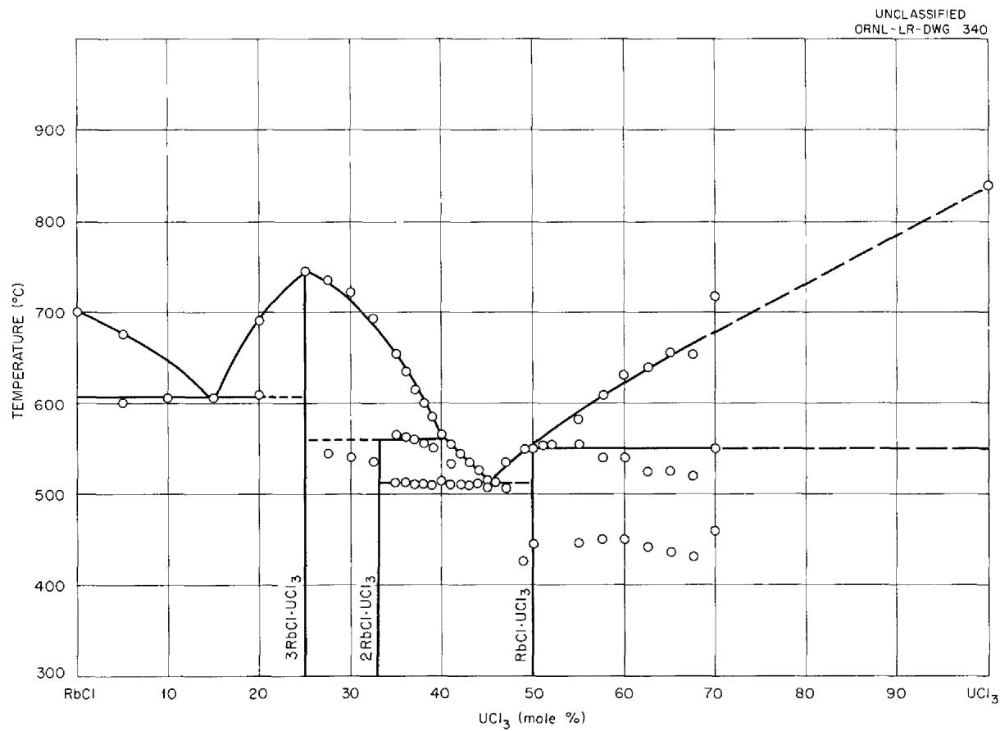  
Fig. 3.86. The System RbCl-UCI

# 3.87. The System CsCl-UCI4

C. J. Barton, A. B. Wilkerson, and W. R. Grimes, unpublished work performed at the Oak Ridge National Laboratory, 1953.

Preliminary diagram.

Invariant Equilibria   

<table><tr><td>Mole % UCl4in Liquid</td><td>Invariant Temperature (°C)</td><td>Type of Equilibrium</td><td>Phase Reaction at Invariant Temperature</td></tr><tr><td>20</td><td>505 ± 5</td><td>Eutectic</td><td>L ⇌ CsCl + 2CsCl·UCl4</td></tr><tr><td>33.3</td><td>657 ± 5</td><td>Congruent melting point</td><td>L ⇌ 2CsCl·UCl4</td></tr><tr><td>58</td><td>370 ± 5</td><td>Eutectic</td><td>L ⇌ 2CsCl·UCl4 + CsCl·2UCl4</td></tr><tr><td>63</td><td>382 ± 5</td><td>Peritectic</td><td>L + UCl4 ⇌ CsCl·2UCl4</td></tr></table>

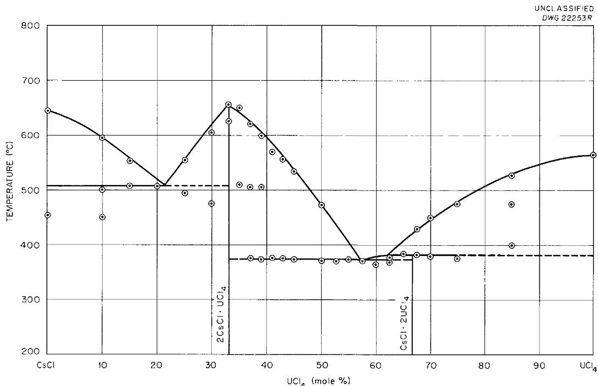  
Fig. 3.87. The System CsCl-UCI4

# 3.88. The System $K_{3}CrF_{6} - Na_{3}CrF_{6} - Li_{3}CrF_{6}$

B. J. Sturm, L. G. Overholser, and W. R. Grimes, unpublished work performed at the Oak Ridge National Laboratory, 1951-52.

Preliminary diagram.

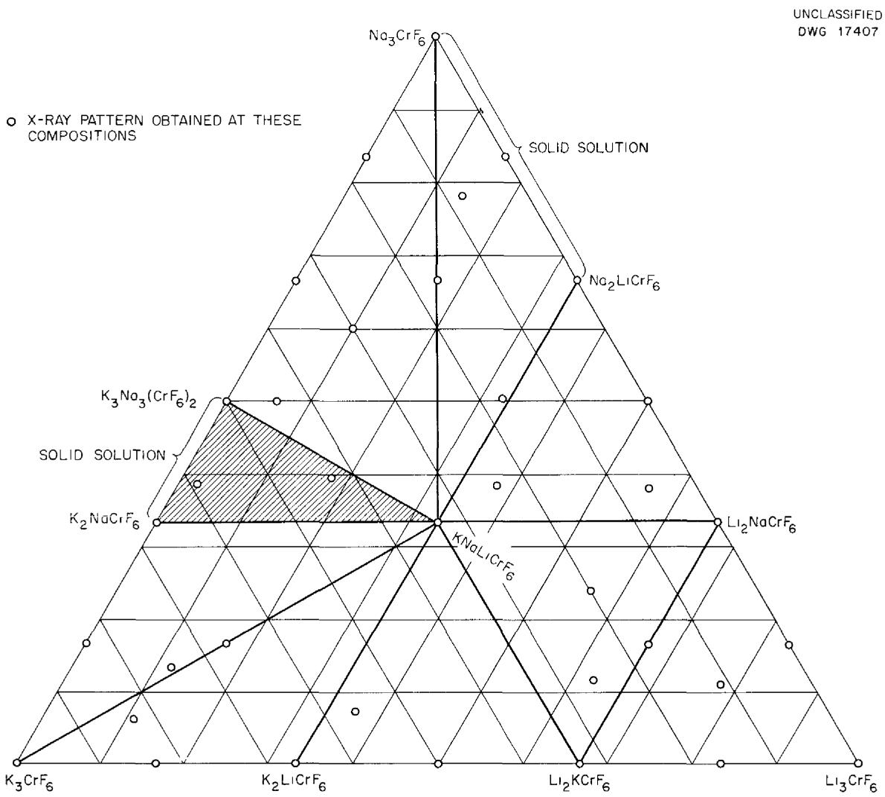  
Fig. 3.88. The System $\mathrm{K}_3\mathrm{CrF}_6 - \mathrm{Na}_3\mathrm{CrF}_6 - \mathrm{Li}_3\mathrm{CrF}_6$ .

# 4. OXIDE AND HYDROXIDE SYSTEMS

# 4.1. The System $\mathsf{SiO}_2\mathsf{-ThO}_2$

L. A. Harris, “A Preliminary Study of the Phase Equilibria Diagram of $\mathsf{ThO}_2\mathsf{-SiO}_2$ ,” J. Am. Ceram. Soc. 42, 74-77 (1959).

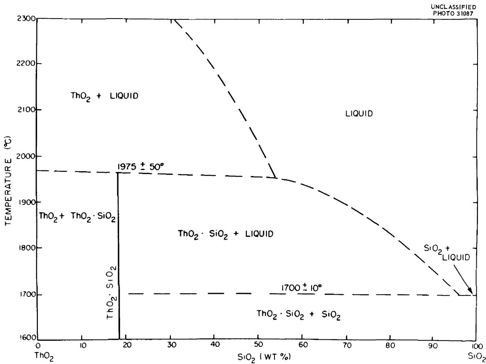  
Fig. 4.1. The System $\mathsf{SiO}_2\text{-}\mathsf{ThO}_2$

# 4.2. The System LiOH-NaOH

C. J. Barton, J. P. Blakely, K. A. Allen, W. C. Davis, and B. S. Weaver, unpublished work performed at the Oak Ridge National Laboratory, 1951.

Preliminary diagram. A phase diagram of the system LiOH-NaOH has been reported more recently by N. A. Reshetnikov and G. M. Oonzhakov, Zbur. Neorg. Khim. 3, 1433 (1958).

Invariant Equilibria   

<table><tr><td>Mole % LiOH in Liquid</td><td>Invariant Temperature (℃)</td><td>Type of Equilibrium</td><td>Phase Reaction at Invariant Temperature</td></tr><tr><td>27</td><td>219</td><td>Eutectic</td><td>L ⇌ NaOH + α-NaOH·LiOH</td></tr><tr><td>40</td><td>250</td><td>Peritectic</td><td>L + LiOH ⇌ α-LiOH·NaOH</td></tr><tr><td>-</td><td>180</td><td>Inversion</td><td>α-LiOH·NaOH ⇌ β-LiOH·NaOH</td></tr></table>

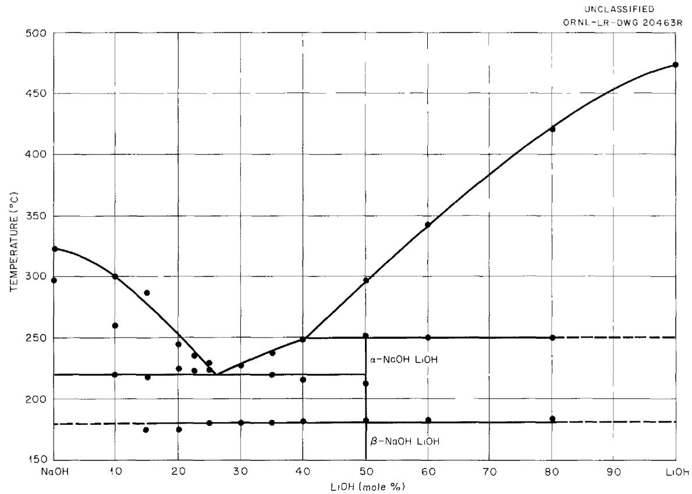  
Fig. 4.2. The System LiOH-NaOH.

# 4.3. The System LiOH-KOH

C. J. Barton, J. P. Blakely, L. M. Bratcher, and W. R. Grimes, unpublished work performed at the Oak Ridge National Laboratory, 1951.

Preliminary diagram.

Invariant Equilibria   

<table><tr><td>Mole % KOH in Liquid</td><td>Invariant Temperature (℃)</td><td>Type of Equilibrium</td><td>Phase Reaction at Invariant Temperature</td></tr><tr><td>40</td><td>315</td><td>Incongruent melting point of 3LiOH·2KOH</td><td>L + LiOH ⇌ 3LiOH·2KOH</td></tr><tr><td>70</td><td>245</td><td>Eutectic</td><td>L ⇌ 3LiOH·2KOH + β-KOH</td></tr></table>

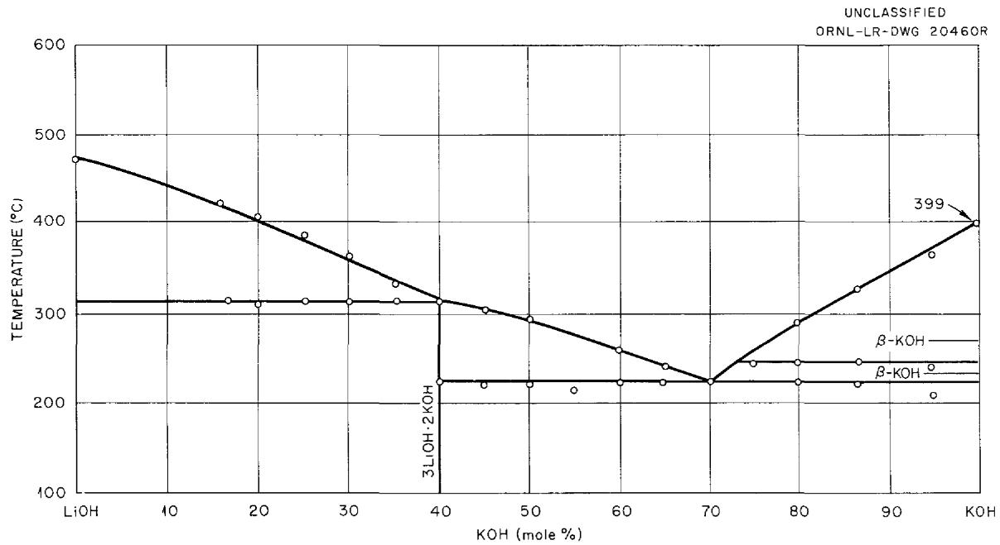  
Fig. 4.3. The System LIOH-KOH.

# 4.4. The System NaOH-KOH

G. von Hevesy, “The Binary Systems NaOH-KOH, KOH-RbOH, and RbOH-NaOH,” Z. physik. Chem. 73, 667-84 (1910).

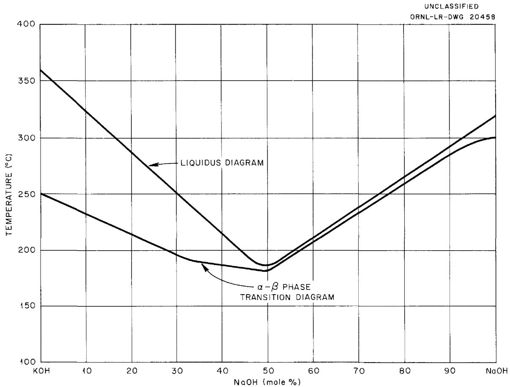  
Fig. 4.4. The System NaOH-KOH.

# 4.5. The System NaOH-RbOH

G. von Hevesy, “The Binary Systems NaOH-KOH, KOH-RbOH, and RbOH-NaOH,” Z. physik. Chem. 73, 667-84 (1910).

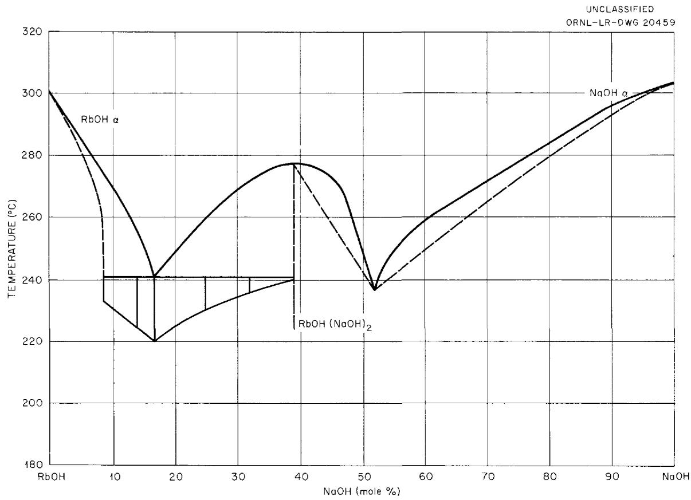  
Fig. 4.5. The System NaOH-RbOH.

# 4.6. The System $\mathsf{Ba(OH)}_2 - \mathsf{Sr(OH)}_2$

K. A. Allen, W. C. Davis, and B. S. Weaver, unpublished work performed at the Oak Ridge National Laboratory, 1951.

Preliminary diagram. The system $\mathsf{Ba(OH)}_2 - \mathsf{Sr(OH)}_2$ contains a single eutectic at 37 $\mathsf{Sr(OH)}_2 - 63\mathsf{Ba(OH)}_2$ (mole $\%$ ), m.p. $360^{\circ}\mathsf{C}$ .

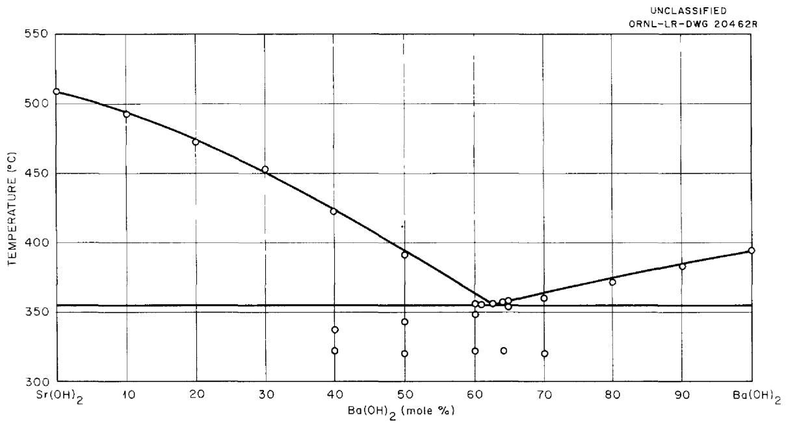  
Fig. 4.6. The System $\mathsf{Ba(OH)}_2 - \mathsf{Sr(OH)}_2$

# 5.1. The System $\mathsf{UO}_2 - \mathsf{P}_2\mathsf{O}_5 - \mathsf{H}_2\mathsf{O}, 25^{\circ}\mathsf{C}$ Isotherm

J. M. Schreyer, "The Solubility of Uranium(IV) Orthophosphates in Phosphoric Acid Solutions," J. Am. Chem. Soc. 77, 2972 (1955).

The transition point between $\mathsf{U}(\mathsf{HPO}_4)_2\cdot 6\mathsf{H}_2\mathsf{O}$ and $\mathsf{U}(\mathsf{HPO}_4)_2\cdot \mathsf{H}_3\mathsf{PO}_4\cdot \mathsf{H}_2\mathsf{O}$ as stable solids was at $0.62\pm 0.02$ M U (10.3 wt $\%$ $\mathsf{UO}_2$ ) and $9.8\pm 0.1$ M PO4 (42.6 wt $\%$ P2O5), density $1.63\pm 0.03$ g/ml. The compound $\mathsf{U}(\mathsf{HPO}_4)_2\cdot \mathsf{H}_3\mathsf{PO}_4\cdot \mathsf{H}_2\mathsf{O}$ is incongruity soluble in water.

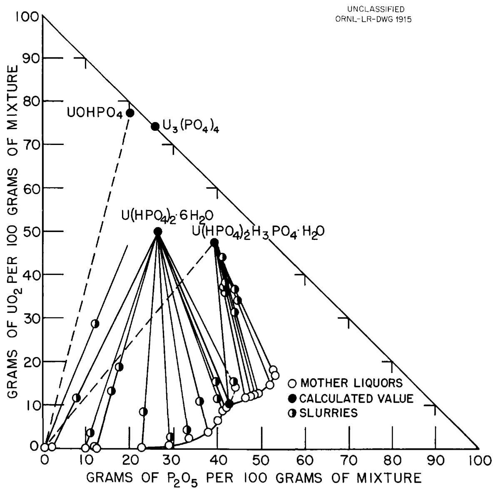  
Fig. 5.1. The System $\mathsf{UO}_2 - \mathsf{P}_2\mathsf{O}_5 - \mathsf{H}_2\mathsf{O}$ , $25^{\circ}\mathsf{C}$ Isotherm.

# 5.2. The System $\mathsf{UO}_3 - \mathsf{H}_3\mathsf{PO}_4 - \mathsf{H}_2\mathsf{O}, 25^{\circ}\mathsf{C}$ Isotherm

J. M. Schreyer and C. F. Baes, Jr., "The Solubility of Uranium(VI) Orthophosphates in Phosphoric Acid Solution," J. Am. Chem. Soc. 76, 354 (1954).

The normal phosphate $(\mathsf{UO}_2)_3(\mathsf{PO}_4)_2\cdot 6\mathsf{H}_2\mathsf{O}$ is stable below 0.025 mole $\%$ $\mathsf{H}_3\mathsf{PO}_4$ . The stability ranges are as follows:

# Compound

$$
\left(\mathrm {U O} _ {2}\right) _ {3} \left(\mathrm {P O} _ {4}\right) _ {2} \cdot 6 \mathrm {H} _ {2} \mathrm {O}
$$

$$
\mathrm {U O} _ {2} \mathrm {H P O} _ {4} \cdot 4 \mathrm {H} _ {2} \mathrm {O}
$$

$$
\mathrm {U O} _ {2} \left(\mathrm {H} _ {2} \mathrm {P O} _ {4}\right) _ {2} \cdot 3 \mathrm {H} _ {2} \mathrm {O}
$$

# Total Phosphate Molarity

$$
<   0. 0 1 4
$$

$$
0. 0 1 4 \text {-} 6. 1
$$

$$
> 6. 1
$$

UNCLASSIFIED

DWG 20233

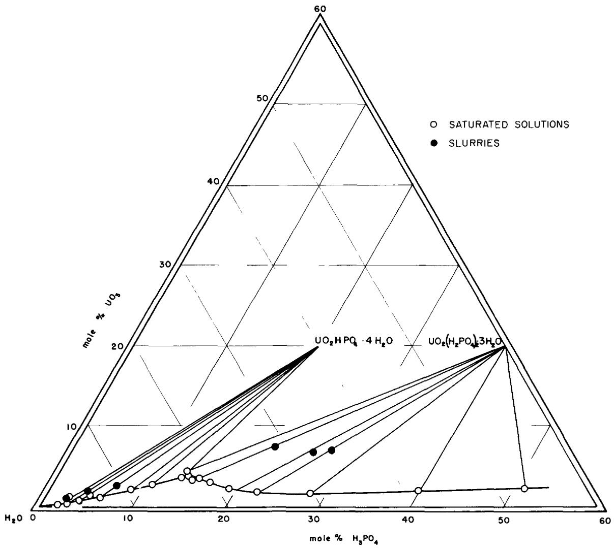  
Fig. 5.2. The System $\mathsf{UO}_3 - \mathsf{H}_3\mathsf{PO}_4 - \mathsf{H}_2\mathsf{O}$ , $25^{\circ}\mathsf{C}$ isotherm. 0-60 mole % $\mathsf{UO}_3$ , 0-60 mole % $\mathsf{H}_3\mathsf{PO}_4$ .

# 5.3. The System $\mathsf{U}(\mathsf{HPO}_4)_2 - \mathsf{Cl}_2\mathsf{O}_7 - \mathsf{H}_2\mathsf{O}, 25^{\circ}\mathsf{C}$ Isotherm

J. M. Schreyer and L. R. Phillips, “The Solubility of Uranium(VI) Orthophosphates in Perchloric Acid Solutions,” J. Phys. Chem. 60, 588 (1956).

The stable solids in this system are $\mathrm{U}(\mathrm{HPO}_4)_2\cdot 2\mathrm{H}_2\mathrm{O}$ , $\mathrm{U}(\mathrm{H}_2\mathrm{PO}_4)_2(\mathrm{ClO}_4)_2\cdot 4\mathrm{H}_2\mathrm{O}$ , and $\mathrm{U}(\mathrm{H}_2\mathrm{PO}_4)_2(\mathrm{ClO}_4)_2\cdot 6\mathrm{H}_2\mathrm{O}$ . Metastable anhydrous $\mathrm{U}(\mathrm{HPO}_4)_2$ formed readily in all solution compositions tested. X-ray diffraction patterns indicated the existence of three polymorphic forms of $\mathrm{U}(\mathrm{H}_2\mathrm{PO}_4)_2(\mathrm{ClO}_4)_2\cdot 6\mathrm{H}_2\mathrm{O}$ .

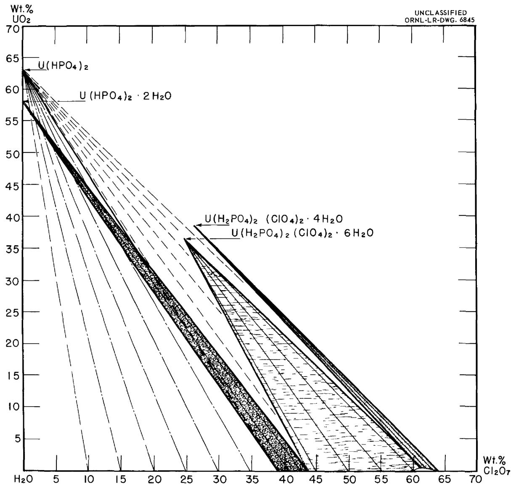  
Fig. 5.3. Schreinemakers' Projection of the System $\mathsf{UO}_2 - \mathsf{P}_2\mathsf{O}_5 - \mathsf{Cl}_2\mathsf{O}_7 - \mathsf{H}_2\mathsf{O}$ at $25^{\circ}\mathsf{C}$ . A projection on the $\mathsf{UO}_2 - \mathsf{Cl}_2\mathsf{O}_7 - \mathsf{H}_2\mathsf{O}$ face, plotted in rectangular coordinates.

# 5.4. The System $\mathsf{UO}_3\text{-Na}_2\mathsf{O}\text{-CO}_2\text{-H}_2\mathsf{O}, 26^{\circ}\mathsf{C}$ Isotherm

C. A. Blake, C. F. Coleman, K. B. Brown, D. G. Hill, R. S. Lowrie, and J. M. Schmitt, "Studies in the Carbonate-Uranium System," J. Am. Chem. Soc. 78, 5978 (1956).

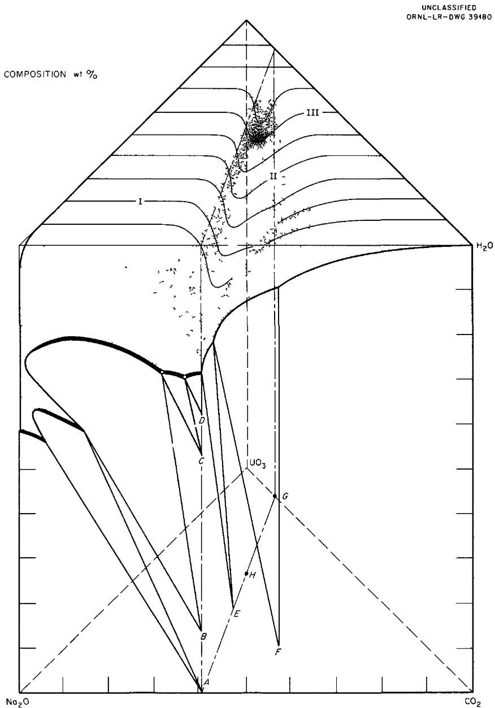  
Fig. 5.4a. The System $\mathsf{UO}_3\text{-Na}_2\mathsf{O}\text{-CO}_2\text{-H}_2\mathsf{O}$ at $26^{\circ}C$ . Compositions are plotted in weight per cent. I, solutions in equilibrium with sodium uranates; II, solutions in equilibrium with sodium uranyl tricarbonate; III, solutions in equilibrium with uranyl carbonate. A, $\mathsf{Na}_2\mathsf{CO}_3$ ; B, $\mathsf{Na}_2\mathsf{CO}_3\cdot \mathsf{H}_2\mathsf{O}$ ; C, $\mathsf{Na}_2\mathsf{CO}_3\cdot 7\mathsf{H}_2\mathsf{O}$ ; D, $\mathsf{Na}_2\mathsf{CO}_3\cdot 10\mathsf{H}_2\mathsf{O}$ ; E, $\mathsf{Na}_2\mathsf{CO}_3\cdot \mathsf{NaHCO}_3\cdot 2\mathsf{H}_2\mathsf{O}$ (trona); F, $\mathsf{NaHCO}_3$ , G, $\mathsf{UO}_2\mathsf{CO}_3$ ; H, $\mathsf{Na}_4\mathsf{UO}_2(\mathsf{CO}_3)_3$ . The entire upper face of the triangular prism represents pure water.

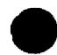

The stable uranium-carbonate solids found were $\mathsf{UO}_2\mathsf{CO}_3$ and $\mathsf{Na}_4\mathsf{UO}_2(\mathsf{CO}_3)_3$ . The solution composition at the transition point (not determined exactly) was at least 26 wt $\%$ $\mathsf{UO}_3$ , 5.6 wt $\%$ $\mathsf{Na}_2\mathsf{O}$ , and 7.2 wt $\%$ $\mathsf{CO}_2$ (mole ratio $\mathsf{UO}_3:\mathsf{Na}_2\mathsf{O}:\mathsf{CO}_2 = 1:1.0:1.8$ ).

Further data on this system are available from the American Documentation Institute (document No. 5079). These include compositions, pH's, and densities at points in and near the planes $\mathsf{Na}_2\mathsf{O} - \mathsf{CO}_2 - \mathsf{H}_2\mathsf{O}$ , $\mathsf{UO}_3 - \mathsf{Na}_2\mathsf{O} - \mathsf{H}_2\mathsf{O}$ , $\mathsf{UO}_2\mathsf{CO}_3 - \mathsf{Na}_2\mathsf{CO}_3 - \mathsf{H}_2\mathsf{O}$ , $\mathsf{Na}_4\mathsf{UO}_2(\mathsf{CO}_3)_3 - \mathsf{NaHCO}_3 - \mathsf{H}_2\mathsf{O}$ , $\mathsf{UO}_3 - \mathsf{Na}_2\mathsf{CO}_3 - \mathsf{H}_2\mathsf{O}$ , $\mathsf{UO}_3 - \mathsf{NaHCO}_3 - \mathsf{H}_2\mathsf{O}$ , and $\mathsf{UO}_2\mathsf{CO}_3 - \mathsf{Na}_2\mathsf{O} - \mathsf{H}_2\mathsf{O}$ .

Related phase equilibria in the system $\mathsf{Na}_2\mathsf{O} - \mathsf{UO}_3 - \mathsf{H}_2\mathsf{O}$ at 50 and $75^{\circ}\mathsf{C}$ are reported by J. E. Ricci and F. J. Loprest, J. Am. Chem. Soc. 77, 2119 (1955).

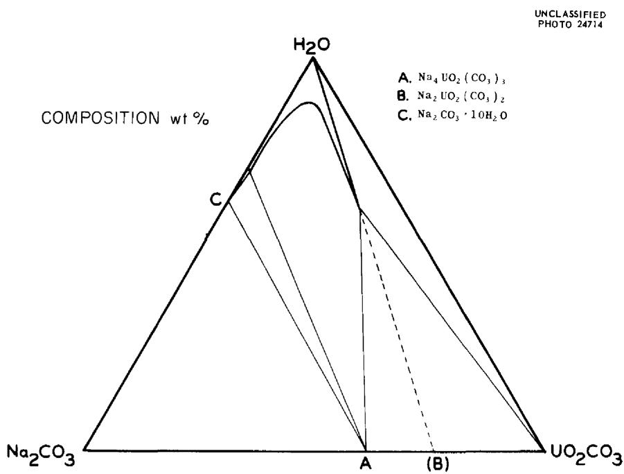  
Fig. 5.4b. The Section $\mathrm{UO}_2\mathrm{CO}_3 - \mathrm{Na}_2\mathrm{CO}_3 - \mathrm{H}_2\mathrm{O}$ at $26^{\circ}\mathrm{C}$ .

# 5.5. Portions of the System $\mathsf{ThO}_2\mathsf{-Na}_2\mathsf{O}\mathsf{-CO}_2\mathsf{-H}_2\mathsf{O},$ $25^{\circ}C$ Isotherm

F. A. Schimmel, unpublished work performed at the Oak Ridge National Laboratory, 1955. The stable thorium-carbonate solids found were $\mathrm{ThOCO}_3\cdot 8\mathrm{H}_2\mathrm{O}$ and $\mathrm{Na}_6\mathrm{Th}(\mathrm{CO}_3)_5\cdot 12\mathrm{H}_2\mathrm{O}$ .

Ternary Points   

<table><tr><td rowspan="2">Solid Phases Present</td><td colspan="3">Composition of Solution (wt %)</td></tr><tr><td>ThO2</td><td>Na2O</td><td>CO2</td></tr><tr><td>Na6Th(CO3)5·12H2O, NaHCO3, and Na2CO3·NaHCO3·2H2O (trona)</td><td>0.62</td><td>12.0</td><td>9.96</td></tr><tr><td>Na6Th(CO3)5·12H2O, Na2CO3·10H2O, and trona</td><td>0.48</td><td>14.1</td><td>10.86</td></tr></table>

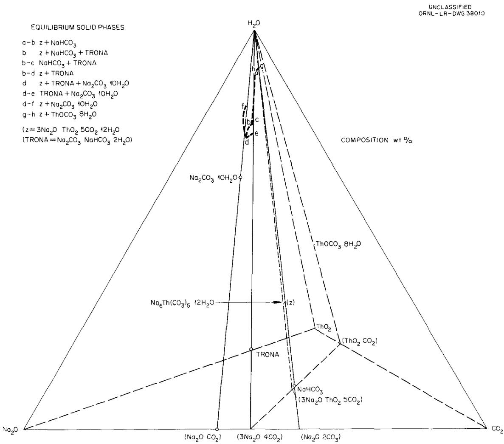  
Fig. 5.5a. Perspective Representation of the System $\mathsf{ThO}_2\mathsf{-Na}_2\mathsf{O}\mathsf{-CO}_2\mathsf{-H}_2\mathsf{O}$ as a Tetrahedron.

The highest thorium solubility found was 3.35 wt $\%$ ThO $_2$ (3.06 wt $\%$ Na $_2$ O, 3.60 wt $\%$ CO $_2$ ) in equilibrium with solid Na $_6$ Th(CO $_3$ ) $_5$ .12H $_2$ O and ThOCO $_3$ .8H $_2$ O. (The terminal points of this binary line were not established.) The maximum thorium solubility in equilibrium with Na $_6$ Th(CO $_3$ ) $_5$ .12H $_2$ O and Na $_2$ CO $_3$ .10H $_2$ O was 1.25 wt $\%$ ThO $_2$ (12.5 wt $\%$ Na $_2$ O, 9.4 wt $\%$ CO $_2$ ); with Na $_6$ Th(CO $_3$ ) $_5$ .12H $_2$ O and trona, the highest solubility was 0.7 wt $\%$ ThO $_2$ (12.6 wt $\%$ Na $_2$ O, 10.4 wt $\%$ CO $_2$ ). The highest found with Na $_6$ Th(CO $_3$ ) $_5$ .12H $_2$ O and NaHCO $_3$ was 1.2 wt $\%$ ThO $_2$ (5.0 wt $\%$ Na $_2$ O, 6.0 wt $\%$ CO $_2$ ), which was the most dilute NaHCO $_3$ solution tested.

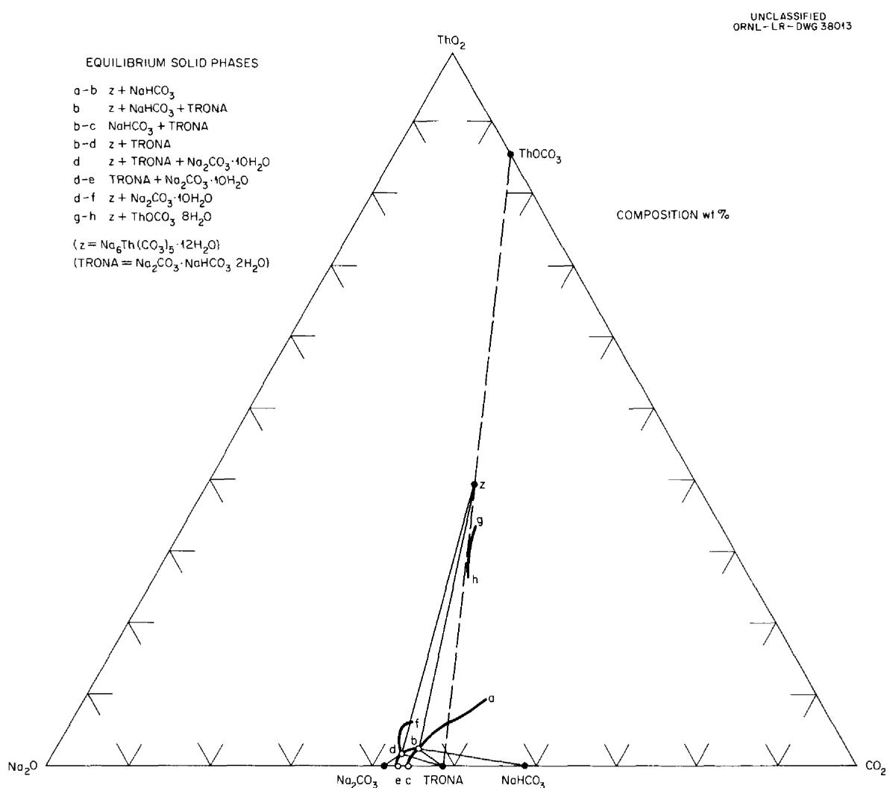  
Fig. 5.5b. The System $\mathsf{ThO}_2\text{-Na}_2\mathsf{O}\text{-CO}_2\text{-H}_2\mathsf{O}$ at $25^{\circ}\mathsf{C}$ . Projection to the $\mathsf{ThO}_2\text{-Na}_2\mathsf{O}\text{-CO}_2$ face along radii from the $\mathsf{H}_2\mathsf{O}$ vertex.

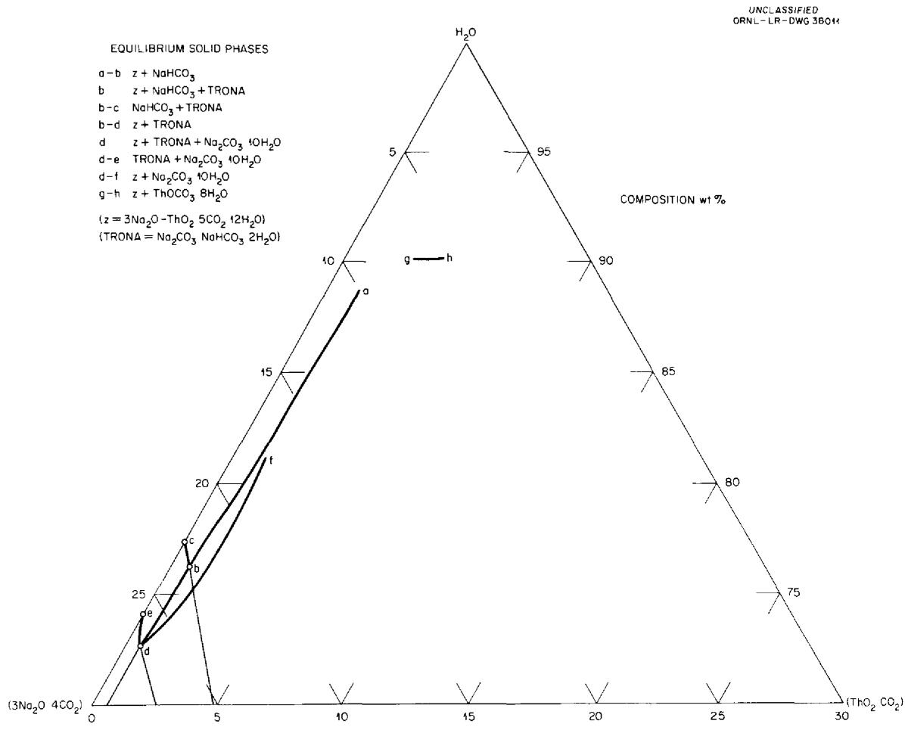  
Fig. 5.5c. The System $\mathsf{ThO}_2\text{-Na}_2\mathsf{O}\text{-CO}_2\text{-H}_2\mathsf{O}$ at $25^{\circ}\mathsf{C}$ . Projection to the $\mathsf{ThO}_2\text{:CO}_2\text{-3Na}_2\mathsf{O}\text{:4CO}_2\text{-H}_2\mathsf{O}$ internal plane, represented as an equivalent triangle, along radii from the $\mathsf{CO}_2$ vertex. Portion from 70 to 100 wt % $\mathsf{H}_2\mathsf{O}$ .

# 5.6. The System $\mathsf{Na}_2\mathsf{O} - \mathsf{CO}_2 - \mathsf{H}_2\mathsf{O}$ , $25^{\circ}\mathsf{C}$ Isotherm

F. A. Schimmel, unpublished work performed at the Oak Ridge National Laboratory, 1955.

Significant changes from the data of Freeth [Phil. Trans. Roy. Soc. London 233, 35 (1922)] were found throughout the range; there was closer agreement in the bicarbonate range with the data of Hill and Bacon [J. Am. Chem. Soc. 49, 2487 (1927)].

Transition Points   

<table><tr><td rowspan="2">Solid Phases Present</td><td colspan="2">Composition of Solution (wt %)</td></tr><tr><td>Na2O</td><td>CO2</td></tr><tr><td>NaOH·H2O and Na2CO3</td><td>40.5</td><td>0.85</td></tr><tr><td>Na2CO3and Na2CO3·H2O</td><td>31.4</td><td>0.72</td></tr><tr><td>Na2CO3·H2O and Na2CO3·7H2O</td><td>18.7</td><td>6.9</td></tr><tr><td>Na2CO3·7H2O and Na2CO3·10H2O</td><td>17.85</td><td>7.8</td></tr><tr><td>Na2CO3·10H2O and Na2CO3·NaHCO3·2H2O (trona)</td><td>13.7</td><td>10.35</td></tr><tr><td>Trona and NaHCO3</td><td>11.9</td><td>9.5</td></tr></table>

The System $\mathsf{Na}_2\mathsf{O} - \mathsf{CO}_2 - \mathsf{H}_2\mathsf{O}, 25^{\circ}\mathsf{C}$ Isotherm   

<table><tr><td colspan="2">Composition of Saturated Solution (wt %)</td><td>Equilibrium Solid Phase</td></tr><tr><td>Na2O</td><td>CO2</td><td></td></tr><tr><td>41.3</td><td>0</td><td>NaOH·H2O</td></tr><tr><td>40.5</td><td>0.85</td><td>Na2CO3</td></tr><tr><td>40.45</td><td>0.8</td><td>Na2CO3</td></tr><tr><td>31.6</td><td>0.67</td><td>Na2CO3</td></tr><tr><td>31.4</td><td>0.72</td><td>Na2CO3and Na2CO3·H2O</td></tr><tr><td>31.1</td><td>0.78</td><td>Na2CO3·H2O</td></tr><tr><td>29.9</td><td>0.5</td><td>Na2CO3·H2O</td></tr><tr><td>26.6</td><td>0.4</td><td>Na2CO3·H2O</td></tr><tr><td>25.2</td><td>0.55</td><td>Na2CO3·H2O</td></tr><tr><td>23.2</td><td>0.9</td><td>Na2CO3·H2O</td></tr><tr><td>23.15</td><td>1.0</td><td>Na2CO3·H2O</td></tr><tr><td>21.15</td><td>2.3</td><td>Na2CO3·H2O</td></tr><tr><td>19.3</td><td>4.3</td><td>Na2CO3·H2O</td></tr><tr><td>18.95</td><td>6.0</td><td>Na2CO3·H2O</td></tr><tr><td>18.57</td><td>7.5</td><td>Na2CO3·H2O (metastable)</td></tr><tr><td>18.6</td><td>7.8</td><td>Na2CO3·H2O (metastable)</td></tr><tr><td>18.7</td><td>6.9</td><td>Na2CO3·H2O and Na2CO3·7H2O</td></tr><tr><td>18.5</td><td>6.75</td><td>Na2CO3·7H2O (metastable)</td></tr><tr><td>17.7</td><td>7.95</td><td>Na2CO3·7H2O (metastable)</td></tr><tr><td>18.3</td><td>7.3</td><td>Na2CO3·7H2O</td></tr><tr><td>17.85</td><td>7.8</td><td>Na2CO3·7H2O and Na2CO3·10H2O</td></tr><tr><td>17.3</td><td>7.88</td><td>Na2CO3·10H2O</td></tr><tr><td>16.1</td><td>7.9</td><td>Na2CO3·10H2O</td></tr><tr><td>15.6</td><td>7.92</td><td>Na2CO3·10H2O</td></tr><tr><td>15.1</td><td>8.1</td><td>Na2CO3·10H2O</td></tr><tr><td>13.7</td><td>8.85</td><td>Na2CO3·10H2O</td></tr><tr><td>13.28</td><td>9.4</td><td>Na2CO3·10H2O</td></tr><tr><td>13.55</td><td>10.15</td><td>Na2CO3·10H2O</td></tr><tr><td>14.1</td><td>11.0</td><td>Na2CO3·10H2O (metastable)</td></tr><tr><td>13.7</td><td>10.35</td><td>Na2CO3·10H2O and trona*</td></tr><tr><td>17.0</td><td>13.0</td><td>Trona (metastable)</td></tr><tr><td>16.7</td><td>12.7</td><td>Trona (metastable)</td></tr><tr><td>13.8</td><td>10.35</td><td>Trona</td></tr><tr><td>11.9</td><td>9.5</td><td>Trona and NaHCO3</td></tr><tr><td>11.55</td><td>9.3</td><td>NaHCO3</td></tr><tr><td>10.5</td><td>8.8</td><td>NaHCO3</td></tr><tr><td>9.4</td><td>8.0</td><td>NaHCO3</td></tr><tr><td>8.1</td><td>7.5</td><td>NaHCO3</td></tr><tr><td>6.4</td><td>6.5</td><td>NaHCO3</td></tr><tr><td>5.4</td><td>5.75</td><td>NaHCO3</td></tr><tr><td>3.9</td><td>5.0</td><td>NaHCO3</td></tr><tr><td>3.56</td><td>4.95</td><td>NaHCO3</td></tr><tr><td>3.47</td><td>4.93</td><td>NaHCO3</td></tr></table>

*The formula of trona is Na₂CO₃·NaHCO₃·2H₂O.

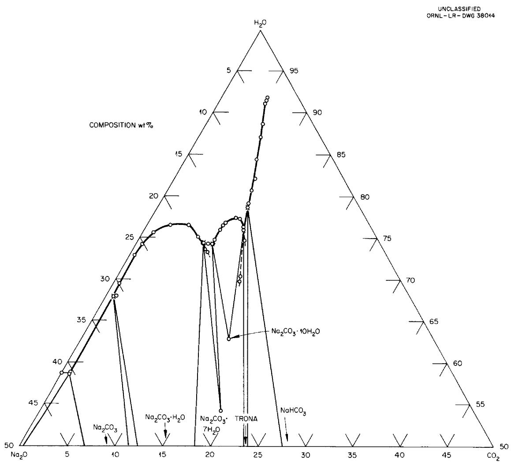  
Fig. 5.6. The System $\mathrm{Na}_2\mathrm{O} - \mathrm{CO}_2 - \mathrm{H}_2\mathrm{O}$ , $25^{\circ}\mathrm{C}$ Isotherm. 0-50 wt $\%$ $\mathrm{Na}_2\mathrm{O}$ , 0-50 wt $\%$ $\mathrm{CO}_2$ .

# 5.7. Solubility of Uranyl Sulfate in Water

1. C. H. Secoy, J. Am. Chem. Soc. 72, 3343 (1950) (data above $300^{\circ}\mathrm{C}$ ).   
2. C. H. Secoy, J. Am. Chem. Soc. 70, 3450 (1948) (data up to $300^{\circ}\mathrm{C}$ ).   
3. L. Helmholtz and G. Friedlander, Physical Properties of Uranyl Sulfate Solutions, MDDC-808 (1943) (room temperature data).   
4. C. Dittrich, Z. physik. Chem. 29, 449 (1899).   
5. E. V. Jones and W. L. Marshall, HRP Quart. Prog. Rep. March 15, 1952, ORNL-1280, p 180-83.   
6. E. V. Jones and W. L. Marshall, HRP Quar. Prog. Rep. Jan. 31, 1959, ORNL-2696, p 210-11.

The two-liquid-phase region of this system in actuality must be represented by the three components $\mathsf{UO}_3$ , $\mathsf{SO}_3$ , and $\mathsf{H}_2\mathsf{O}$ . The curve representing the boundary of liquid-liquid immiscibility is correct for stoichiometric solutions. However, the tie lines within the region of immiscibility do not connect two solutions containing stoichiometric $\mathsf{UO}_2\mathsf{SO}_4$ but rather connect solutions containing varying concentrations and ratios of $\mathsf{UO}_3$ and $\mathsf{SO}_3$ (Fig. 5.10). At low concentrations and high temperatures, that is, below $0.02\text{m}$ $\mathsf{UO}_2\mathsf{SO}_4$ and above $250^{\circ}\mathsf{C}$ , hydrolysis occurs to produce a nonstoichiometric solution phase. The point of hydrolysis is dependent on concentration and temperature (see Sec 5.13).

Note: Revised data (ref 5) are used to construct the immiscibility boundary in the figure. Earlier data (ref 1) showed higher temperatures in this region and a possible likelihood of acid impurity in the solutions.

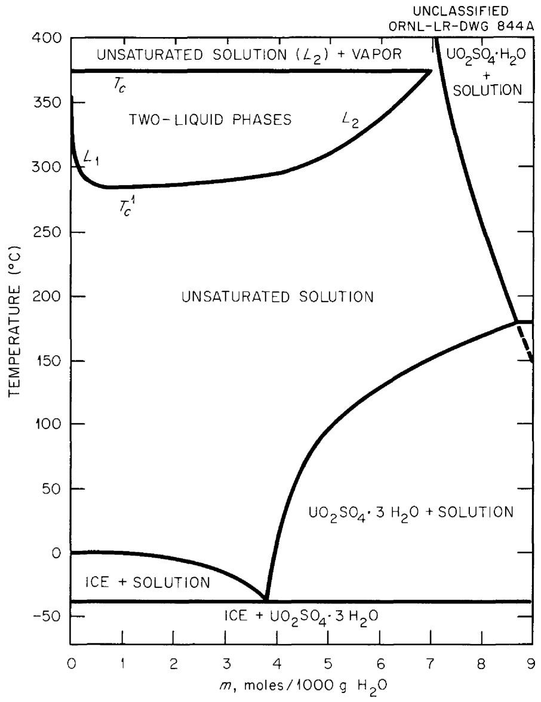  
Fig. 5.7. The System $\mathrm{UO}_2\mathrm{SO}_4 - \mathrm{H}_2\mathrm{O}$ .

# 5.8. Two-Liquid-Phase Region of $\mathsf{UO}_2\mathsf{SO}_4$ in Ordinary and Heavy Water

E. V. Jones and W. L. Marshall, HRP Quar. Prog. Rep. March 15, 1952, ORNL-1280, p 180-83.

The two curves shown are boundary curves for liquid-liquid immiscibility obtained by observing the phase-transitional behavior of known $\mathsf{UO}_2\mathsf{SO}_4 - \mathsf{H}_2\mathsf{O}$ ( $\mathsf{D}_2\mathsf{O}$ ) solutions in sealed tubes as a function of temperature. For later reference, this procedure is designated the visual-synthetic method. As was described in Sec 5.7, the concentrations and compositions of the two phases within the boundary region at equilibrium cannot be obtained from this figure. Mixtures which are solutions at lower temperatures separate into two liquid phases as the temperature is raised, according to the boundary curves.

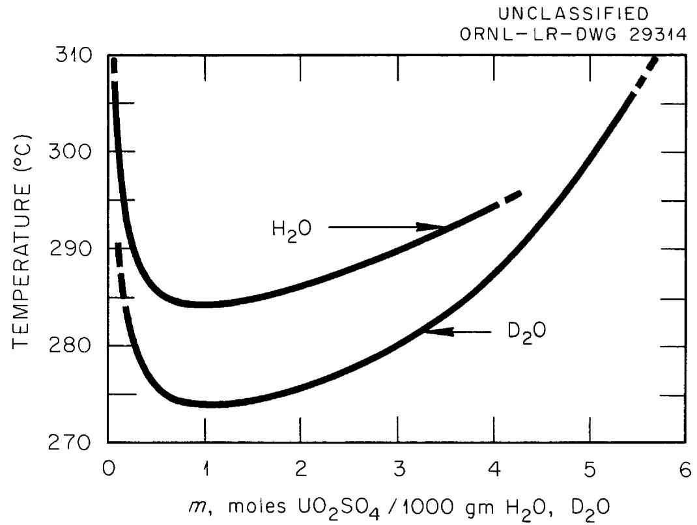  
Fig. 5.8. Two-Liquid-Phase Region of $\mathsf{UO}_2\mathsf{SO}_4$ in Ordinary and Heavy Water.

# 5.9. The System $\mathsf{UO}_3 - \mathsf{SO}_3 - \mathsf{H}_2\mathsf{O}$

1. A. Colani, Bull. soc. chim. France [4] 43, 754-62 (1928).   
2. J. S. Gill, E. V. Jones, and C. H. Secoy, HRP Quar. Prog. Rep. Oct. 31, 1953, ORNL-1658, p 87.

The $25^{\circ}$ data on the $\mathsf{SO}_3$ -rich side are those of Colani. The higher temperature data are those of Gill, Jones, and Secoy, obtained by filtration techniques at temperature. The number and identity of the solid phases in the $\mathsf{UO}_3$ -rich regions at 25, 100, and $175^{\circ}\mathsf{C}$ are somewhat uncertain. Subsequent unpublished work of F. E. Clark and C. H. Secoy has disclosed that the K solid is identical (x-ray diffraction) with the mineral uranopilite, $6\mathsf{UO}_3\cdot \mathsf{SO}_3\cdot x\mathsf{H}_2\mathsf{O}$ , that the G solid is not identifiable as any known mineral, and that at least one additional unidentified solid phase occurs at 25 and $100^{\circ}$ . The liquidus curves for the 25 and $100^{\circ}$ isotherms are essentially correct as shown except that the transition points (two solid phases) occur at somewhat lower concentrations than those indicated.

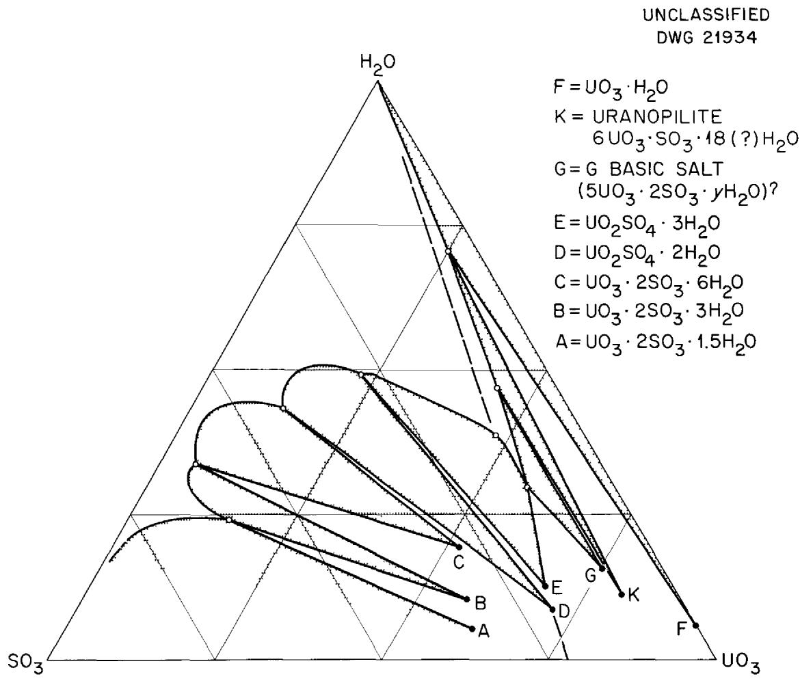  
Fig. 5.9a. The System $\mathrm{UO}_3\text{-SO}_3\text{-H}_2\mathrm{O}$ at $25^{\circ}\mathrm{C}$ .

UNCLASSIFIED DWG 21935

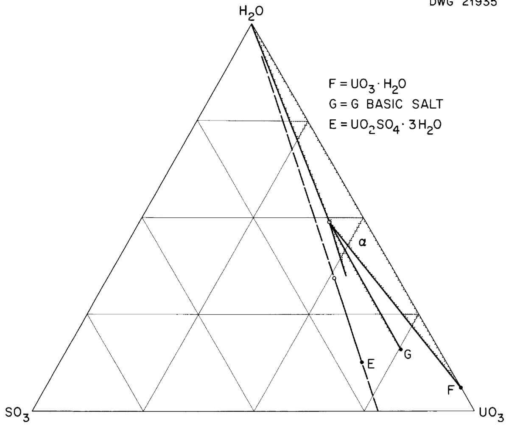  
Fig. 5.9b. The System $\mathrm{UO}_3 - \mathrm{SO}_3 - \mathrm{H}_2\mathrm{O}$ at $100^{\circ}\mathrm{C}$ .

UNCLASSIFIED DWG 21936

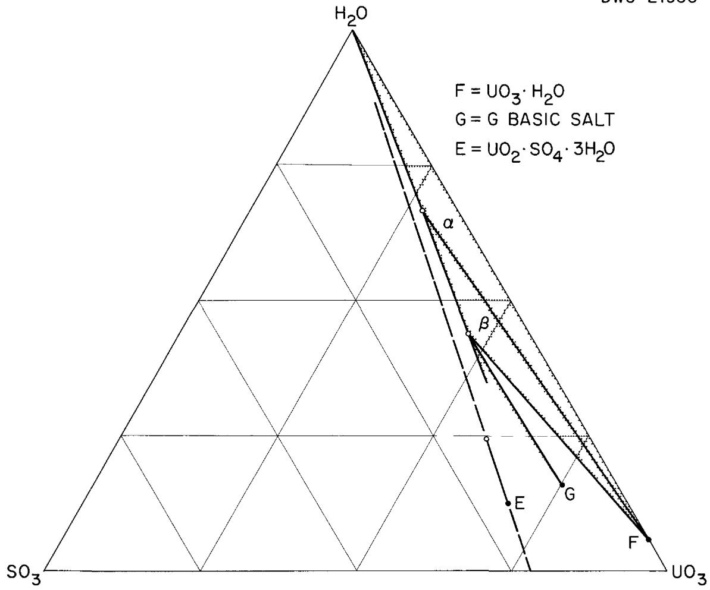  
Fig. 5.9c. The System $\mathrm{UO}_3 - \mathrm{SO}_3 - \mathrm{H}_2\mathrm{O}$ at $175^{\circ}\mathrm{C}$ .

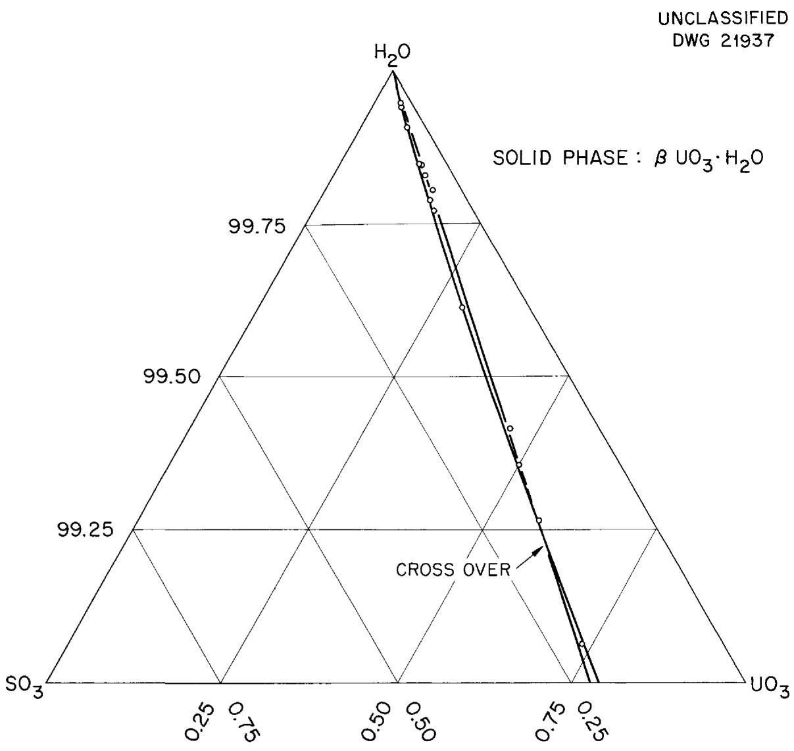  
Fig. 5.9d. The System $\mathsf{UO}_3 - \mathsf{SO}_3 - \mathsf{H}_2\mathsf{O}$ at $250^{\circ}\mathsf{C}$ .

5.10. Coexistence Curves for Two Liquid Phases in the System $\mathsf{UO}_2\mathsf{SO}_4 - \mathsf{H}_2\mathsf{SO}_4 - \mathsf{H}_2\mathsf{O}$

H. W. Wright, W. L. Marshall, and C. H. Secoy, HRP Quart. Prog. Rep. Oct. 1, 1952, ORNL-1424, p 108.

All curves in this figure must extrapolate to the critical temperature of water $(374.2^{\circ}\mathrm{C})$ at zero concentration of uranium. These are boundary curves which were determined by observing sealed tubes in which immiscibility occurred in $\mathsf{UO}_3 - \mathsf{SO}_3 - \mathsf{H}_2\mathsf{O}$ solutions upon varying the temperature. As was explained in Sec 5.7, they do not represent concentrations and compositions of the two liquid phases within the temperature-concentration region of immiscibility but are lower solution boundary curves.

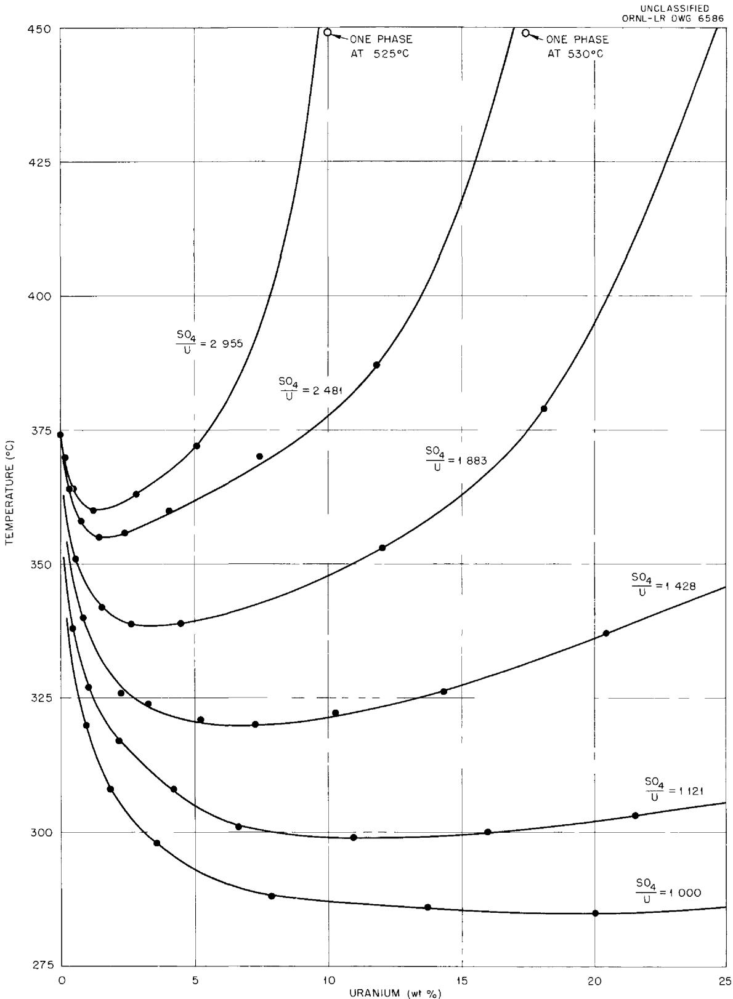  
Fig. 5.10. Coexistence Curves for Two Liquid Phases in the System $\mathsf{UO}_2\mathsf{SO}_4 - \mathsf{H}_2\mathsf{SO}_4 - \mathsf{H}_2\mathsf{O}$ .

# 5.11. Two-Liquid-Phase Region of the System $\mathsf{UO}_2\mathsf{SO}_4 - \mathsf{H}_2\mathsf{SO}_4 - \mathsf{H}_2\mathsf{O}$

R. E. Leed and C. H. Secoy, Chem. Quar. Prog. Rep. Sept. 30, 1950, ORNL-870, p 29-30; C. H. Secoy, Chem. Quar. Prog. Rep. Dec. 31, 1949, ORNL-607, p 33-38.

In contrast with the immiscibility curves shown in Fig. 5.10, each of these curves must extrapolate to a critical temperature curve for $\mathsf{SO}_3 - \mathsf{H}_2\mathsf{O}$ in which a small or negligible amount of $\mathsf{UO}_3$ is dissolved. Since $\mathsf{SO}_3$ dissolved in $\mathsf{H}_2\mathsf{O}$ (neglecting any dissolved $\mathsf{UO}_3$ ) will elevate the critical temperature, the curves obtained from solutions containing a constant amount of free $\mathsf{H}_2\mathsf{SO}_4$ will all extrapolate to critical temperatures higher than that (374.2°C) for $\mathsf{H}_2\mathsf{O}$ alone.

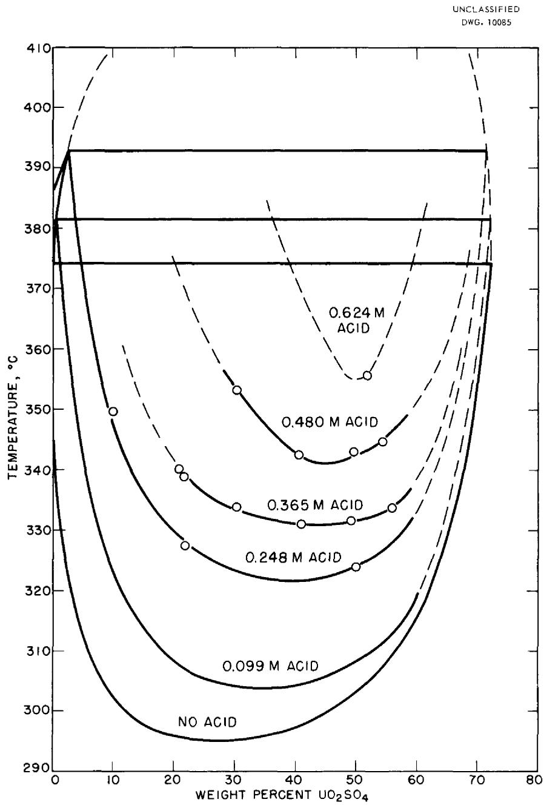  
Fig. 5.11. Two-Liquid-Phase Region of the System $\mathsf{UO}_2\mathsf{SO}_4 - \mathsf{H}_2\mathsf{SO}_4 - \mathsf{H}_2\mathsf{O}$

5.12. Two-Liquid-Phase Coexistence Curves for $\mathsf{UO}_3$ -Rich Solutions in the System $\mathsf{UO}_3$ -SO₃-H₂O With and Without HNO₃

E. V. Jones and W. L. Marshall, HRP Quar. Prog. Rep. July 1, 1952, ORNL-1318, p 147-48.

These curves have been obtained by the visual-synthetic method mentioned in Sec 5.8. They are therefore boundary curves and do not describe compositions and concentrations within the liquid-liquid immiscibility region.

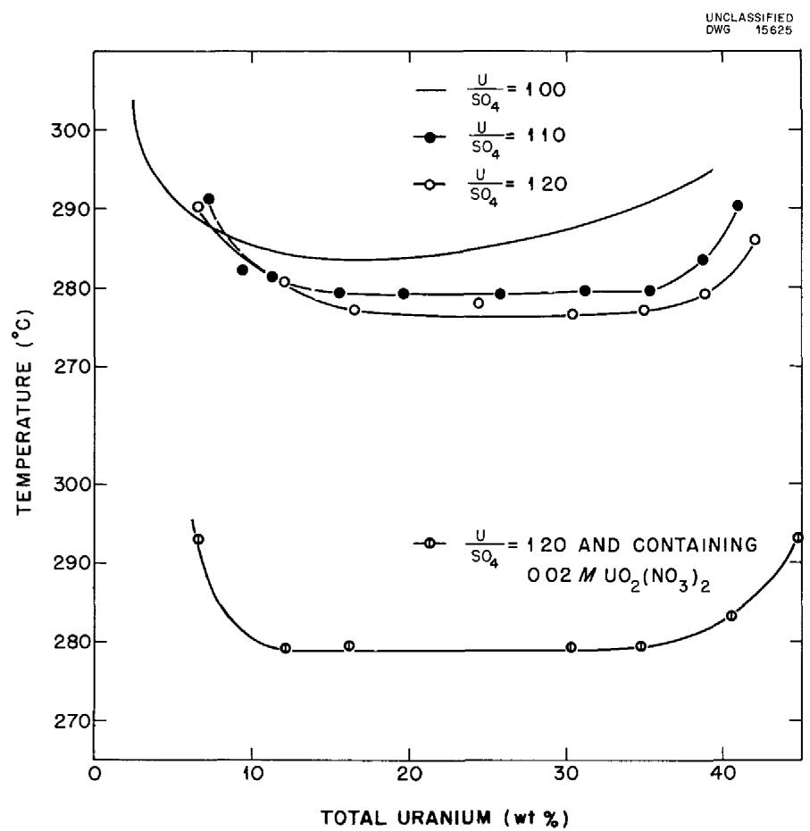  
Fig. 5.12. Two-Liquid-Phase Coexistence Curves for $\mathsf{UO}_3$ -Rich Solutions in the System $\mathsf{UO}_3 - \mathsf{SO}_3 - \mathsf{H}_2\mathsf{O}$ With and Without $\mathsf{HNO}_3$ .

# 5.13. Solubility of $\mathsf{UO}_3$ in $\mathsf{H}_2\mathsf{SO}_4 - \mathsf{H}_2\mathsf{O}$ Mixtures

W. L. Marshall, Anal. Chem. 27, 1923 (1955).

The data are represented in this manner in order to show the full concentration range on one figure and to best indicate the degree of precision. The solid phase is $\alpha\text{-}\mathsf{UO}_3\cdot \mathsf{H}_2\mathsf{O}$ below $205^{\circ}\mathsf{C}$ and $\beta \text{-}\mathsf{UO}_3\cdot \mathsf{H}_2\mathsf{O}$ above $205^{\circ}\mathsf{C}$ . These curves represent hydrolysis equilibria.

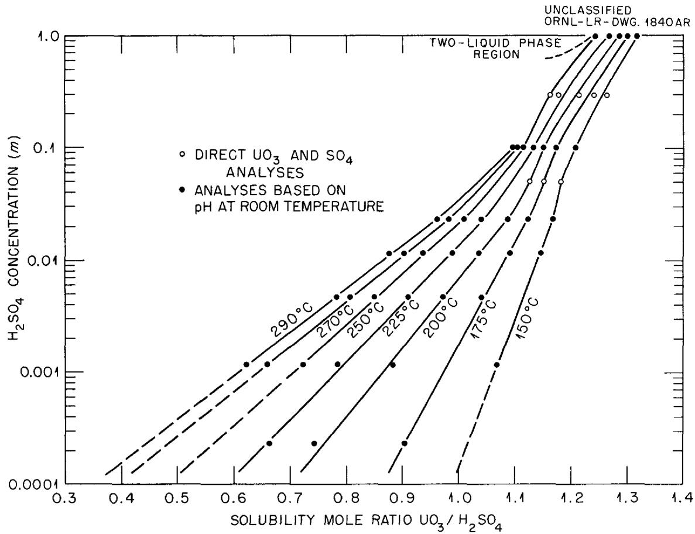  
Fig. 5.13. Solubility of $\mathsf{UO}_3$ in $\mathsf{H}_2\mathsf{SO}_4 - \mathsf{H}_2\mathsf{O}$ Mixtures.

5.14. Effect of Excess $\mathsf{H}_2\mathsf{SO}_4$ on the Phase Equilibria in Very Dilute $\mathsf{UO}_2\mathsf{SO}_4$ Solutions

I. W. L. Marshall, Anal. Chem. 27, 1923 (1955).   
2. H. W. Wright, W. L. Marshall, and C. H. Secoy, HRP Quar. Prog. Rep. Oct. 1, 1952, ORNL-1424, p 108.

The curves were drawn by C. H. Secoy from data used for Figs. 5.10 and 5.13.

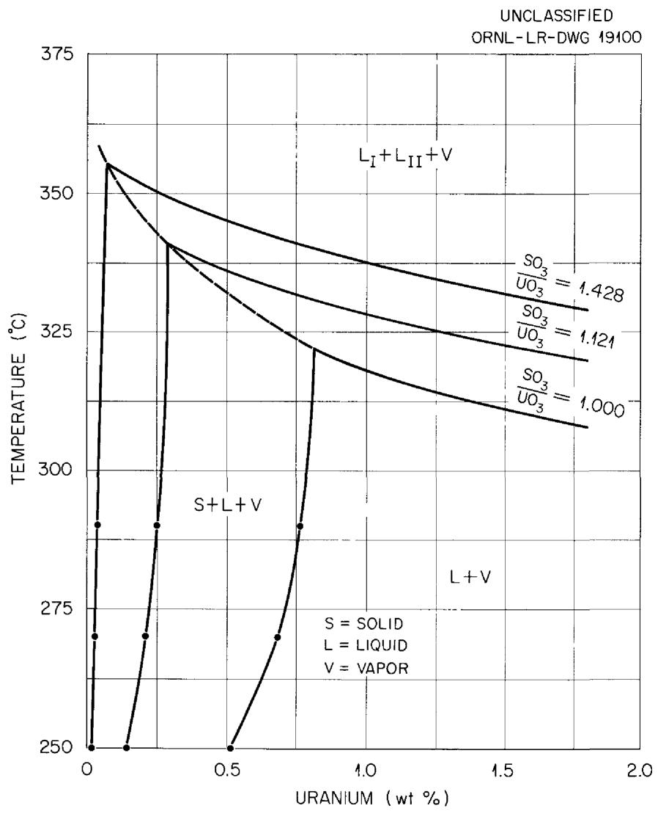  
Fig. 5.14. Effect of Excess $\mathsf{H}_2\mathsf{SO}_4$ on the Phase Equilibria in Very Dilute $\mathsf{UO}_2\mathsf{SO}_4$ Solutions.

# 5.15. Second-Liquid-Phase Temperatures of $\mathsf{UO}_2\mathsf{SO}_4 - \mathsf{Li}_2\mathsf{SO}_4$ Solutions

R. S. Greeley, S. R. Buxton, and J. C. Griess, "High Temperature Behavior of Aqueous $\mathsf{UO}_2\mathsf{SO}_4 - \mathsf{Li}_2\mathsf{SO}_4$ and $\mathsf{UO}_2\mathsf{SO}_4 - \mathsf{BeSO}_4$ ," paper presented at American Nuclear Society 2nd Winter Meeting, New York City (Oct. 1957). Also R. S. Greeley and J. C. Griess, HRP Dynamic Solution Corrosion Studies for Quarter Ending July 31, 1956, ORNL CF-56-7-52, p 30-31.

These data were obtained by the visual-synthetic method mentioned in Sec 5.8.

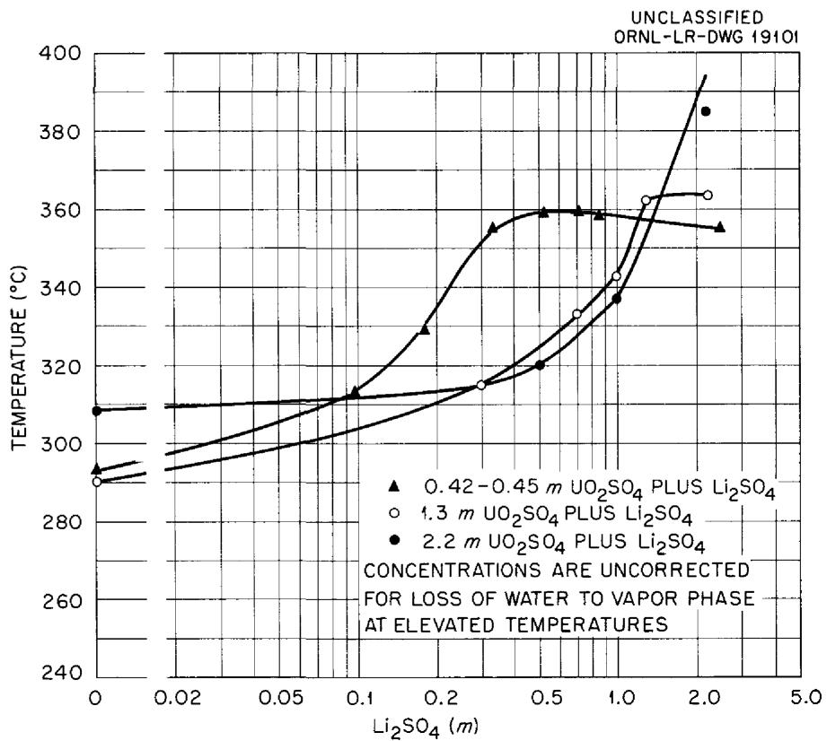  
Fig. 5.15. Second-Liquid-Phase Temperatures of $\mathsf{UO}_2\mathsf{SO}_4 - \mathsf{Li}_2\mathsf{SO}_4$ Solutions.

5.16. Second-Liquid-Phase Temperatures for $\mathsf{UO}_2\mathsf{SO}_4$ Solutions Containing $\mathsf{Li}_2\mathsf{SO}_4$ or $\mathsf{BeSO}_4$

R. S. Greeley and J. C. Griess, HRP Dynamic Solution Corrosion Studies for Quarter Ending July 31, 1956, ORNL CF-56-7-52, p 30.

Liquid-liquid immiscibility occurs at the boundary curves as the temperature is raised.

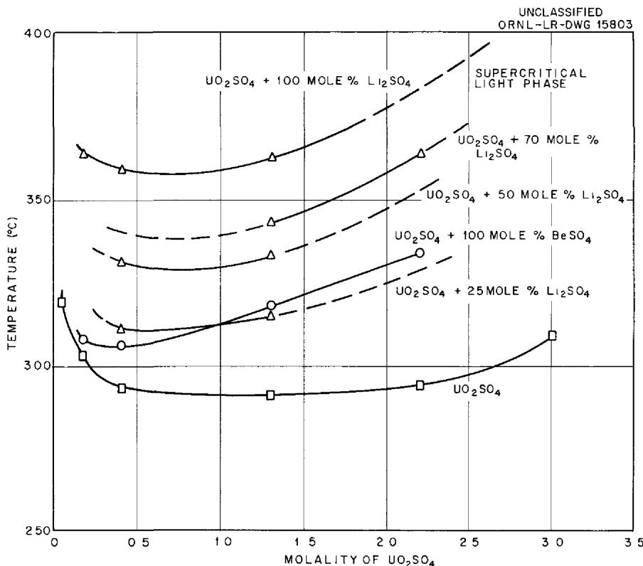  
Fig. 5.16. Second-Liquid-Phase Temperatures for $\mathsf{UO}_2\mathsf{SO}_4$ Solutions Containing $\mathsf{Li}_2\mathsf{SO}_4$ or $\mathsf{BeSO}_4$ .

# 5.17. Second-Liquid-Phase Temperatures for $\mathsf{BeSO}_4$ Solutions Containing $\mathsf{UO}_3$

R. S. Greeley and J. C. Griess, HRP Dynamic Solution Corrosion Studies for Quarter Ending July 31, 1956, ORNL CF-56-7-52, p 31.

Liquid-liquid immiscibility occurs at the boundary curves as the temperature is raised.

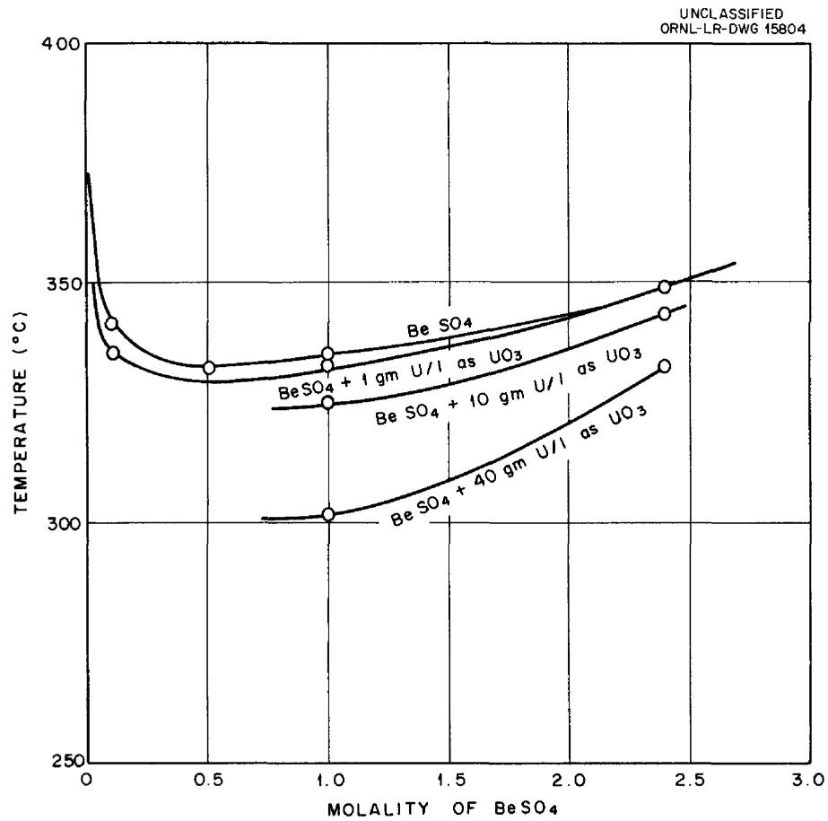  
Fig. 5.17. Second-Liquid-Phase Temperatures for $\mathsf{BeSO}_4$ Solutions Containing $\mathsf{UO}_3$ .

# 5.18. The System $\mathsf{NiSO}_4 - \mathsf{UO}_2\mathsf{SO}_4 - \mathsf{H}_2\mathsf{O}$ at $25^{\circ}C$

E. V. Jones, J. S. Gill, and C. H. Secoy, HRP Quar. Prog. Rep. Oct. 31, 1954, ORNL-1813, p 166-67.

Also included in the reference are solubility data for this system at 175 and $250^{\circ}C$ . The data at high temperature are not in sufficient quantity for a diagram to be presented.

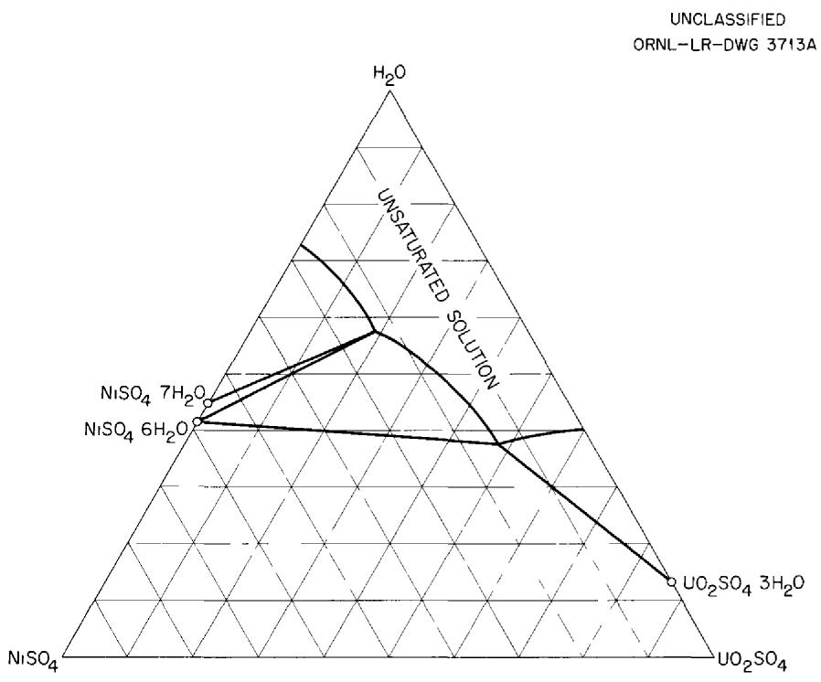  
Fig. 5.18. The System $\mathsf{NiSO}_4\text{-}\mathsf{UO}_2\mathsf{SO}_4\text{-}\mathsf{H}_2\mathsf{O}$ at $25^{\circ}\mathsf{C}$ . Compositions are plotted in weight per cent.

5.19. Phase-Transition Temperatures in Solutions Containing $\mathsf{CuSO}_4$ , $\mathsf{UO}_2\mathsf{SO}_4$ , and $\mathsf{H}_2\mathsf{SO}_4$

F. E. Clark, J. S. Gill, R. Slusher, and C. H. Secoy, J. Chem. Eng. Data 4, 12 (1959).

All data were obtained by the visual-synthetic method mentioned in Sec 5.8 and represent temperatures at which immiscibility occurred upon raising the temperature. No deductions can be made regarding compositions within the two-liquid-phase region.

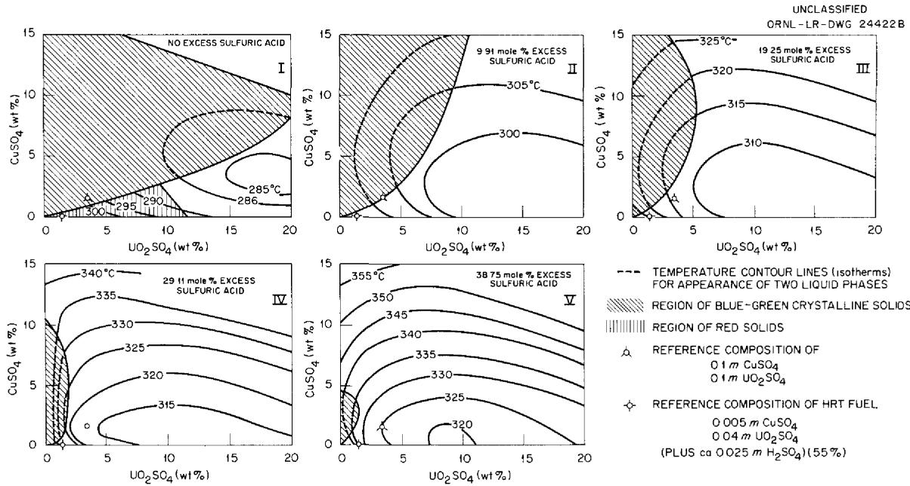  
Fig. 5.19. Phase-Transition Temperatures in Solutions Containing $\mathrm{CuSO}_{4}$ , $\mathrm{UO}_{2}\mathrm{SO}_{4}$ and $\mathrm{H}_{2}\mathrm{SO}_{4}$ .

5.20. The Effect of $\mathsf{CuSO}_4$ and $\mathsf{NiSO}_4$ on Phase-Transition Temperatures: 0.04 m $\mathsf{UO}_2\mathsf{SO}_4$ ; 0.01 m $\mathsf{H}_2\mathsf{SO}_4$   
C. H. Secoy et al., HRP Quar. Prog. Rep. July 31, 1957, ORNL-2379, p 163. Also additional data: F. Moseley, Core Solution Stability in the Homogeneous Aqueous Reactor; the Effect of Corrosion Product and Copper Concentrations, HARD(C)/P-41 (May 1957).

The curves for liquid-liquid immiscibility were drawn from data obtained by the visual-synthetic method mentioned in Sec 5.8. Saturation temperatures for solid-liquid equilibria were obtained by measuring solution concentrations as a function of temperature and determining a break in the curve. The numbers in parentheses are temperatures at which the indicated solid phase appeared upon raising the temperature. Solid phases indicated in parentheses were found in small quantity.

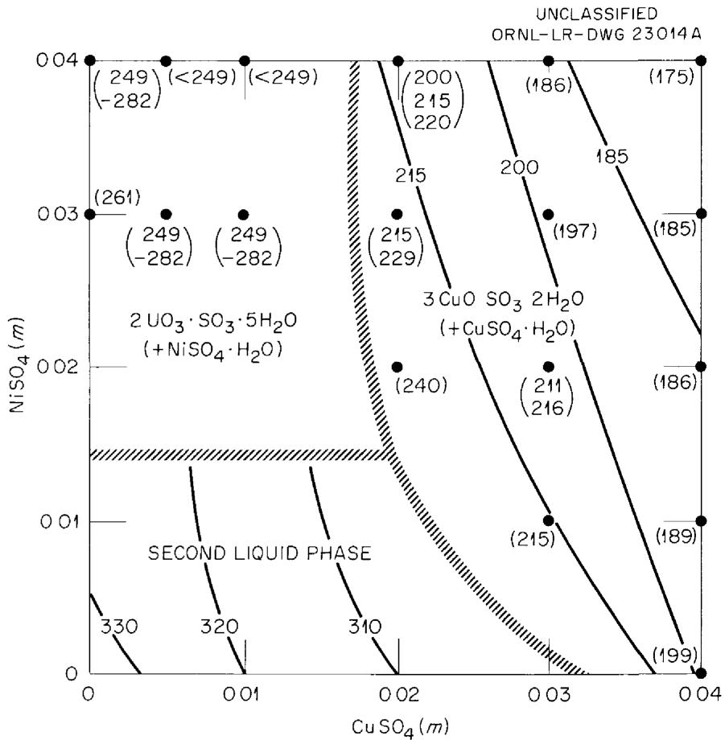  
Fig. 5.20. The Effect of $\mathsf{CuSO}_4$ and $\mathsf{NiSO}_4$ on Phase-Transition Temperatures: $0.04\text{m}$ $\mathsf{UO}_2\mathsf{SO}_4$ ; $0.01\text{m}$ $\mathsf{H}_2\mathsf{SO}_4$ .

5.21. The System $\mathsf{UO}_3$ -CuO-NiO- $\mathsf{SO}_3$ -D $_2$ O at $300^{\circ}\mathsf{C}$ ; 0.06 m SO $_3$

J. S. Gill, R. Slusher, and W. L. Marshall, HRP Quar. Prog. Rep. Jan. 31, 1959, ORNL-2696, p 205-13.

The variation in solution composition in the presence of one, two, and three solid phases was determined at $300^{\circ}\mathrm{C}$ from 0.04 to $0.2\ \mathrm{mSO}_3$ . Solubility relationships at $0.06\ \mathrm{mSO}_3$ were obtained from these separate solubility curves, and the skeletal volume figure for the five-component system was drawn. Other skeletal figures can be drawn at various $\mathrm{SO}_3$ concentrations. This investigation is still in progress, and the data are subject to revision.

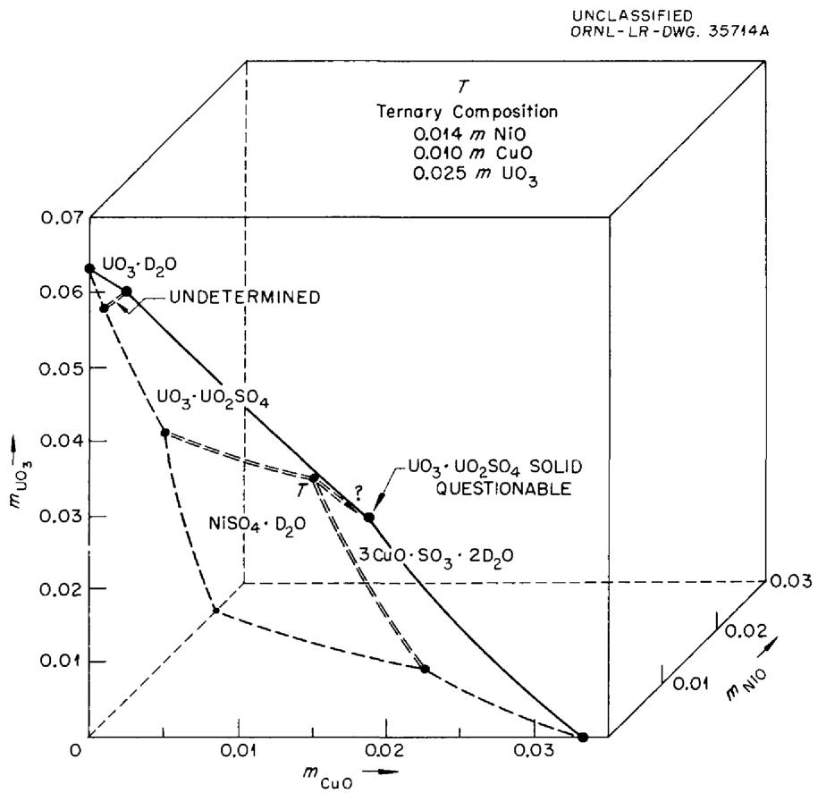  
Fig. 5.21. The System $\mathsf{UO}_3 - \mathsf{CuO} - \mathsf{NiO} - \mathsf{SO}_3 - \mathsf{D}_2\mathsf{O}$ at $300^{\circ}\mathsf{C}$ ; 0.06 m SO₃.

5.22. Solubility of $\mathsf{Nd}_2(\mathsf{SO}_4)_3$ in $0.02m\mathsf{UO}_2\mathsf{SO}_4$ Solution Containing $0.005m\mathsf{H}_2\mathsf{SO}_4(180 - 300^{\circ}\mathsf{C})$

R.E.Leuze et al.HRP Quar.Prog.Rep.April 30,1954,ORNL-1753,p176-79.

Also included in the reference are preliminary solubility data for rare earth sulfate mixtures as well as $\mathrm{Ce}_2(\mathrm{SO}_4)_3$ and $\mathrm{La}_2(\mathrm{SO}_4)_3$ in $0.02\,m\,UO_2SO_4$ , $0.005\,m\,H_2SO_4$ .

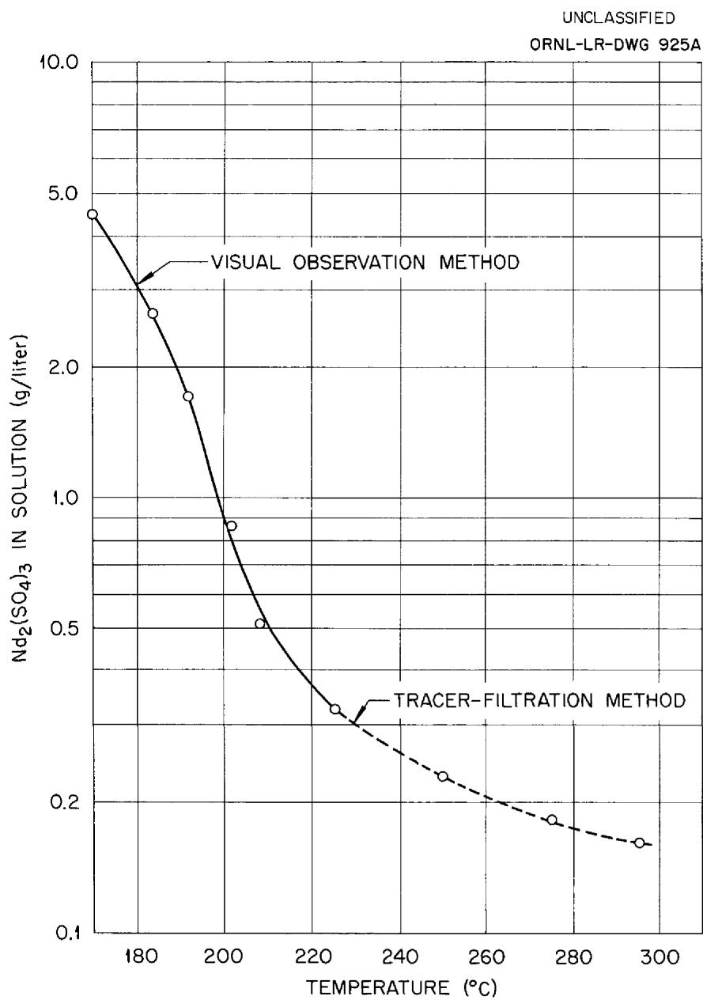  
Fig. 5.22. Solubility of $\mathsf{Nd}_2(\mathsf{SO}_4)_3$ in $0.02m\mathsf{UO}_2\mathsf{SO}_4$ Solution Containing $0.005m\mathsf{H}_2\mathsf{SO}_4$ ( $180 - 300^{\circ}\mathsf{C}$ ).

# 5.23. Solubility of $\mathsf{L}\alpha_{2}(\mathsf{SO}_{4})_{3}$ in $\mathsf{UO}_2\mathsf{SO}_4$ Solutions

E. V. Jones, M. H. Lietzke, and W. L. Marshall, J. Am. Chem. Soc. 79, 267 (1957); also The Solubility of Several Metal Sulfates at High Temperatures and Pressures in Water and in Aqueous Uranyl Sulfate Solution, ORNL CF-55-7-69 (declassified Aug. 23, 1955).

Experimental data for Figs. 5.23-5.27 were obtained by the visual-synthetic method described in Sec 5.8. The very large effect of $\mathsf{UO}_2\mathsf{SO}_4$ must be noted and indicates considerable solvation of other species by aqueous $\mathsf{UO}_2\mathsf{SO}_4$ .

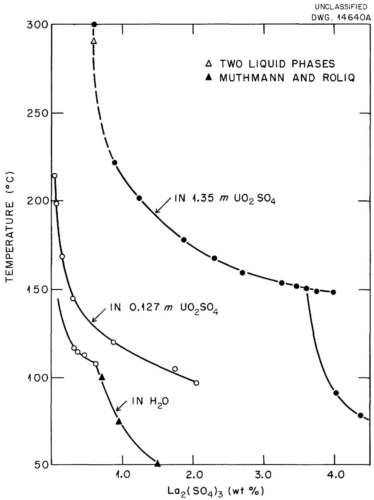  
Fig. 5.23. Solubility of $\mathsf{La}_2(\mathsf{SO}_4)_3$ in $\mathsf{UO}_2\mathsf{SO}_4$ Solutions.

# 5.24. Solubility of $\mathsf{CdSO}_4$ in $\mathsf{UO}_2\mathsf{SO}_4$ Solutions

E. V. Jones, M. H. Lietzke, and W. L. Marshall, J. Am. Chem. Soc. 79, 267 (1957); also The Solubility of Several Metal Sulfates at High Temperatures and Pressures in Water and in Aqueous Uranyl Sulfate Solution, ORNL CF-55-7-69 (declassified Aug. 23, 1955).

See comments in Sec 5.23.

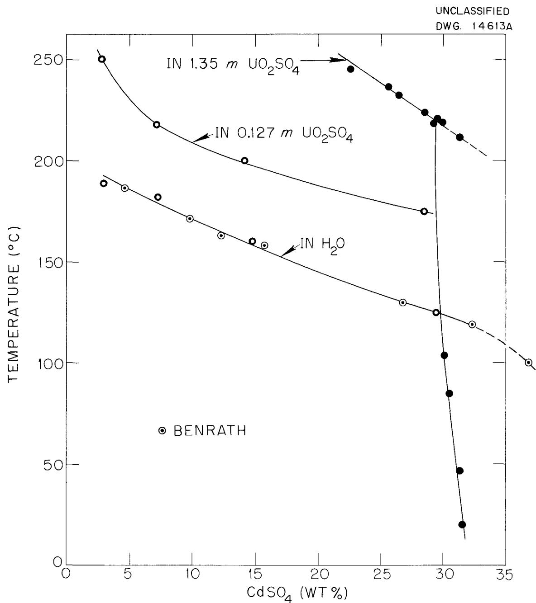  
Fig. 5.24. Solubility of $\mathrm{CdSO}_4$ in $\mathrm{UO}_2\mathrm{SO}_4$ Solutions.

# 5.25. Solubility of $\mathsf{C}\mathsf{s}_2\mathsf{SO}_4$ in $\mathsf{UO}_2\mathsf{SO}_4$ Solutions

E. V. Jones, M. H. Lietzke, and W. L. Marshall, J. Am. Chem. Soc. 79, 267 (1957); also The Solubility of Several Metal Sulfates at High Temperatures and Pressures in Water and in Aqueous Uranyl Sulfate Solution, ORNL CF-55-7-69 (declassified Aug. 23, 1955).

See comments in Sec 5.23.

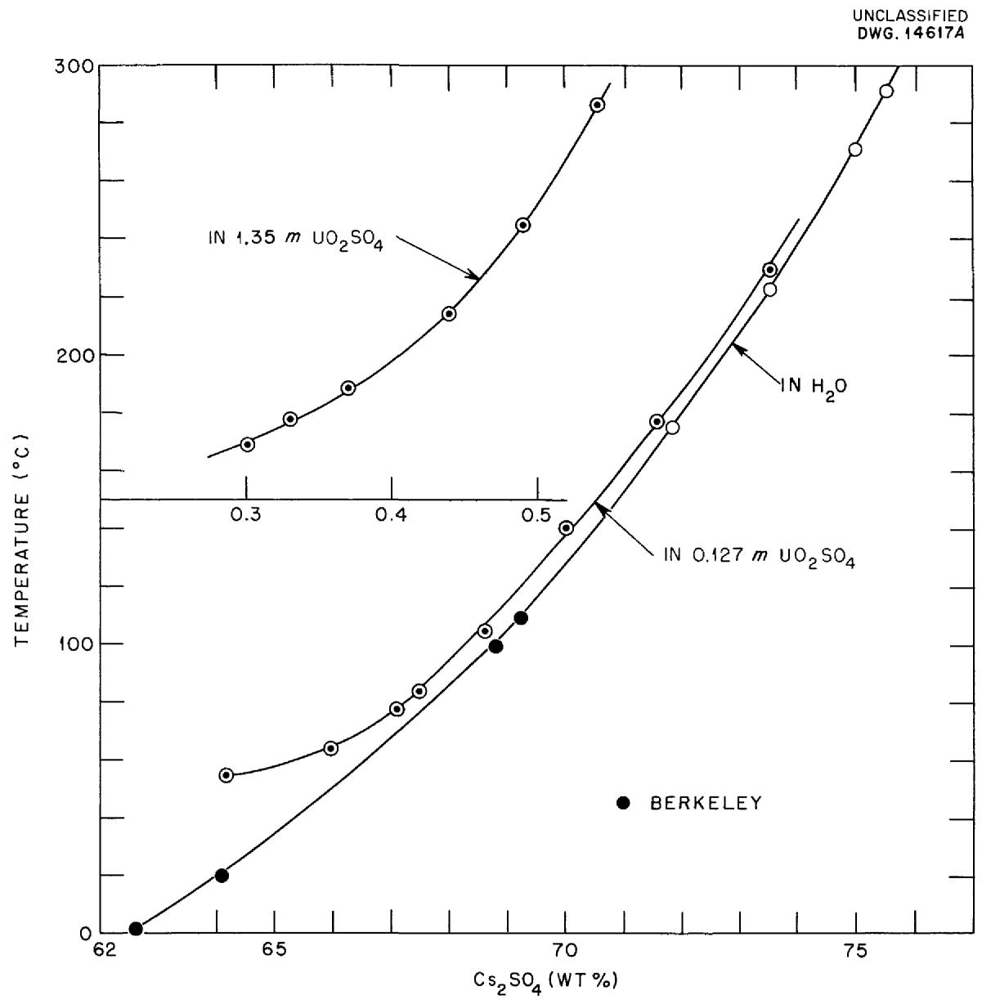  
Fig. 5.25. Solubility of $\mathrm{Cs}_2\mathrm{SO}_4$ in $\mathrm{UO}_2\mathrm{SO}_4$ Solutions.

# 5.26. Solubility of $\mathsf{Y}_2(\mathsf{SO}_4)_3$ in $\mathsf{UO}_2\mathsf{SO}_4$ Solutions

E. V. Jones, M. H. Lietzke, and W. L. Marshall, J. Am. Chem. Soc. 79, 267 (1957); also The Solubility of Several Metal Sulfates at High Temperatures and Pressures in Water and in Aqueous Uranyl Sulfate Solution, ORNL CF-55-7-69 (declassified Aug. 23, 1955).

See comments in Sec 5.23.

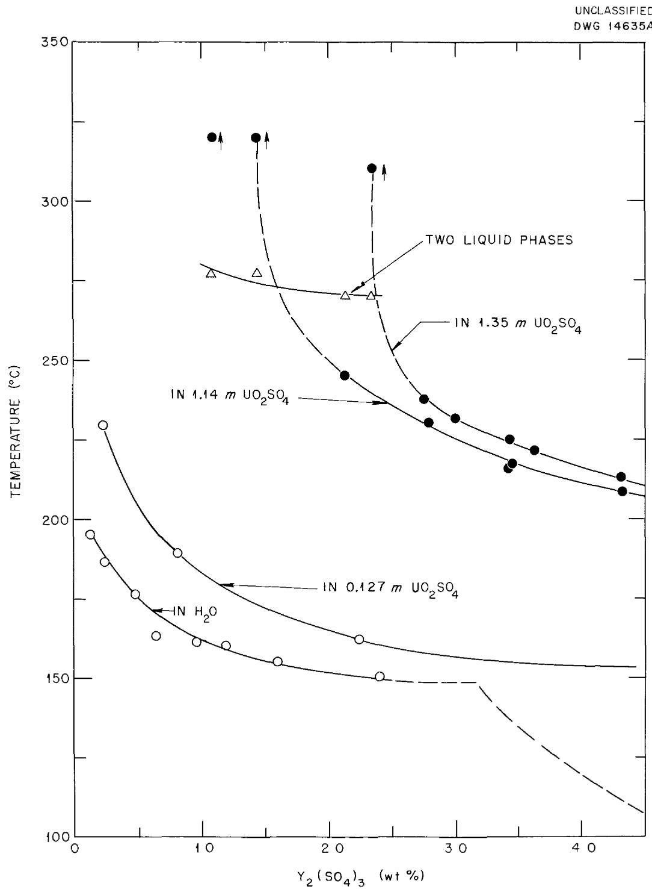  
Fig. 5.26. Solubility of $\mathsf{Y}_2(\mathsf{SO}_4)_3$ in $\mathsf{UO}_2\mathsf{SO}_4$ Solutions.

# 5.27. Solubility of $\mathsf{Ag}_2\mathsf{SO}_4$ in $\mathsf{UO}_2\mathsf{SO}_4$ Solutions

E. V. Jones, M. H. Lietzke, and W. L. Marshall, J. Am. Chem. Soc. 79, 267 (1957); also The Solubility of Several Metal Sulfates at High Temperatures and Pressures in Water and in Aqueous Uranyl Sulfate Solution, ORNL CF-55-7-69 (declassified Aug. 23, 1955).

See comments in Sec 5.23.

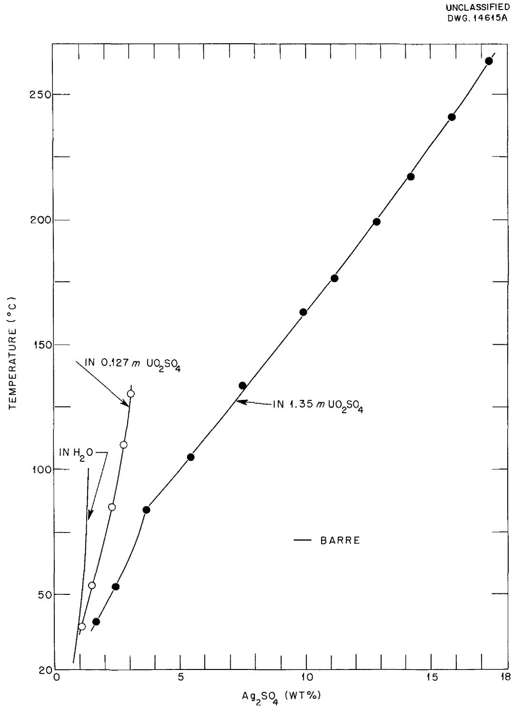  
Fig. 5.27. Solubility of $\mathrm{Ag_2SO_4}$ in $\mathrm{UO_2SO_4}$ Solutions.

# 5.28. Solubility at $250^{\circ}\mathrm{C}$ of $\mathsf{BaSO}_4$ in $\mathsf{UO}_2\mathsf{SO}_4 - \mathsf{H}_2\mathsf{O}$ Solutions

E. V. Jones, M. H. Lietzke, and W. L. Marshall, J. Am. Chem. Soc. 79, 267 (1957); also The Solubility of Several Metal Sulfates at High Temperatures and Pressures in Water and in Aqueous Uranyl Sulfate Solutions, ORNL CF-55-7-69 (declassified Aug. 23, 1955).

Solutions were filtered from solids at $250^{\circ}\mathrm{C}$ to obtain the solubility of $\mathsf{BaSO}_4$ in $\mathsf{H}_2\mathsf{O}$ . Counting of radioactive barium was used to determine the solubility concentration. The very large effect of $\mathsf{UO}_2\mathsf{SO}_4$ must be noted and indicates considerable solvation of other species by aqueous $\mathsf{UO}_2\mathsf{SO}_4$ .

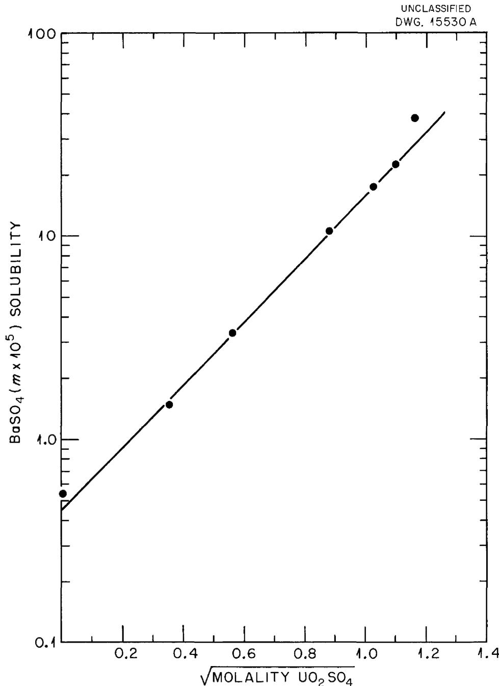  
Fig. 5.28. Solubility at $250^{\circ}\mathrm{C}$ of $\mathsf{BaSO}_4$ in $\mathsf{UO}_2\mathsf{SO}_4 - \mathsf{H}_2\mathsf{O}$ Solutions.

5.29. Solubility of $\mathsf{H}_2\mathsf{WO}_4$ in 0.126 and 1.26 M $\mathsf{UO}_2\mathsf{SO}_4$

C. E. Coffey, W. L. Marshall, and G. H. Cartledge, HRP Quar. Prog. Rep. Oct. 31, 1953, ORNL-1658, p 96-99.

The data shown in the figures were obtained by direct sampling of equilibrated solutions, by the filter bomb method, and by the synthetic method described previously in Sec 5.8. In 0.126 M $\mathrm{UO}_2\mathrm{SO}_4$ the solubility of $\mathrm{H}_2\mathrm{WO}_4$ first shows a positive temperature coefficient of solubility and then, above $100^{\circ}\mathrm{C}$ , a negative coefficient of solubility. In 1.26 M $\mathrm{UO}_2\mathrm{SO}_4$ the temperature coefficient of solubility is positive up to $285^{\circ}$ , the temperature at which two liquid phases form - a characteristic of $\mathrm{UO}_2\mathrm{SO}_4 - \mathrm{H}_2\mathrm{O}$ solutions.

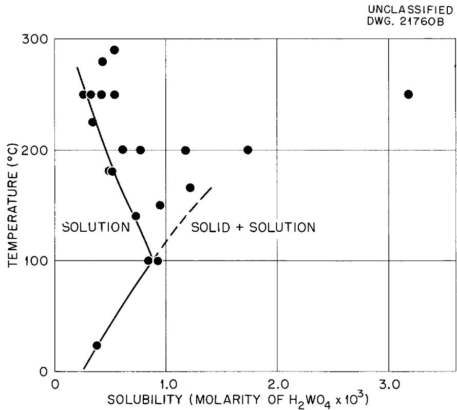  
Fig. 5.29a. Solubility of $\mathsf{H}_2\mathsf{WO}_4$ in 0.126 M $\mathsf{UO}_2\mathsf{SO}_4$ .

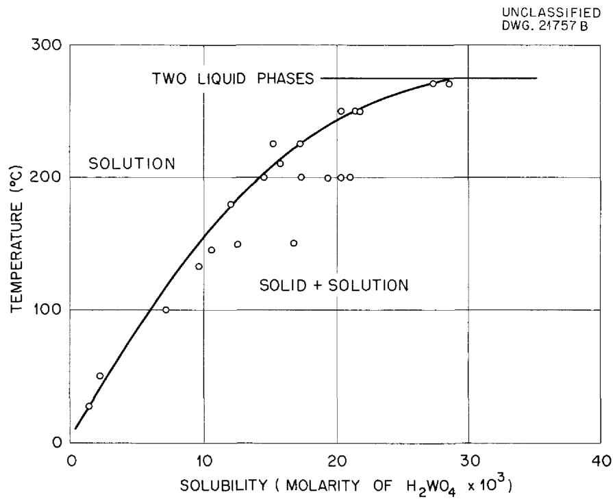  
Fig. 5.29b. Solubility of $\mathsf{H}_2\mathsf{WO}_4$ in 1.26 M $\mathsf{UO}_2\mathsf{SO}_4$ .

5.30. Phase Stability of $\mathsf{H}_2\mathsf{WO}_4$ in 1.26 M UO $_2$ F $_2$

C. E. Coffey, W. L. Marshall, and G. H. Cartledge, HRP Quar. Prog. Rep. Oct. 31, 1953, ORNL-1658, p 96-99.

The methods of solubility and stability determination were the same as for analogous studies of $\mathsf{H}_2\mathsf{WO}_4$ in $\mathsf{UO}_2\mathsf{SO}_4$ (Sec 5.29). The data on the figure as drawn show temperatures at which hydrolytic precipitation of an unidentified solid phase occurs from solutions stable at lower temperatures.

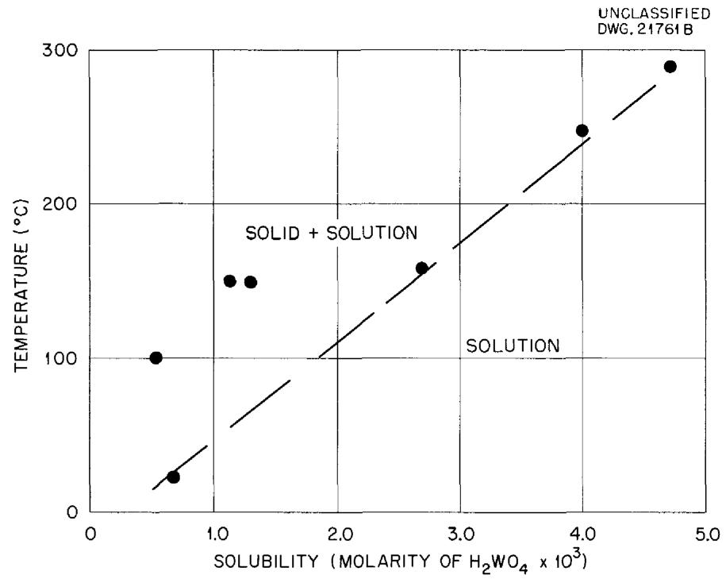  
Fig. 5.30. Phase Stability of $\mathsf{H}_2\mathsf{WO}_4$ in $1.26M\cup O_2F_2$

# 5.31. The System $\mathsf{UO}_2(\mathsf{NO}_3)_2 - \mathsf{H}_2\mathsf{O}$

1. Reported in full by W. L. Marshall, J. S. Gill, and C. H. Secoy, Chem. Quar. Prog. Rep. March 31, 1951, ORNL-1053, p 22-25.   
2. Reported in part by W. L. Marshall, J. S. Gill, and C. H. Secoy, J. Am. Chem. Soc. 73, 1867 (1951).

As in the case of the system $\mathsf{UO}_2\mathsf{SO}_4 - \mathsf{H}_2\mathsf{O}$ , hydrolysis occurs at high temperatures and low concentrations, resulting in precipitation of $\mathsf{UO}_3\cdot \mathsf{H}_2\mathsf{O}$ from stoichiometric $\mathsf{UO}_2(\mathsf{NO}_3)_2$ solutions. In addition, decomposition of $\mathsf{NO}_3^-$ occurs at elevated temperature to produce an equilibrium vapor phase of nitrogen oxides. Letter $A$ represents a region of complete solution. Data at low temperature up to point $F$ were obtained by direct analysis of equilibrated solutions, whereas the high-temperature data were obtained by the visual-synthetic method described in Sec 5.8.

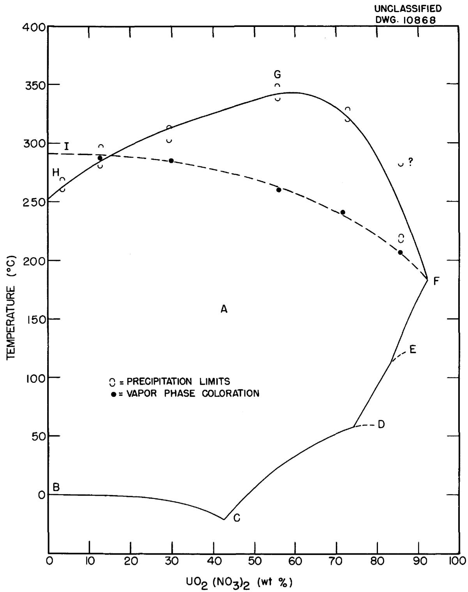  
Fig. 5.31. The System $\mathrm{UO}_2(\mathrm{NO}_3)_2 - \mathrm{H}_2\mathrm{O}$ .

# 5.32. Phase Equilibria of $\mathsf{UO}_3$ and HF in Stoichiometric Concentrations (Aqueous System)

W. L. Marshall, J. S. Gill, and C. H. Secoy, J. Am. Chem. Soc. 76, 4279 (1954).

The two-liquid-phase region and the region of "basic" solid solution + saturated solution are in actuality segments of the three-component system $\mathsf{UO}_3\mathsf{-HF}\mathsf{-H}_2\mathsf{O}$ , in which the equilibrium phases are nonstoichiometric with regard to $\mathsf{UO}_2\mathsf{F}_2$ . This system is somewhat analogous to the system $\mathsf{UO}_3\mathsf{-H}_2\mathsf{SO}_4\mathsf{-H}_2\mathsf{O}$ (see Sec 5.7).

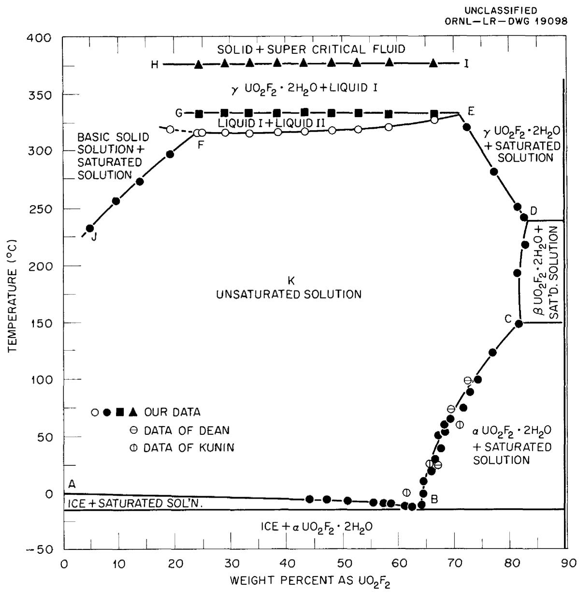  
Fig. 5.32. Phase Equilibria of $\mathsf{UO}_3$ and HF in Stoichiometric Concentrations (Aqueous System).

# 5.33. Solubility of Uranium Trioxide in Orthophosphoric Acid Solutions

W. L. Marshall, J. S. Gill, and H. W. Wright, HRP Quar. Prog. Rep. May 15, 1951, ORNL-1057, p 112-15.

The data were obtained for the most part by equilibrating solutions of known concentration in sealed tubes for various times at different temperatures. Phase changes were observed visually.

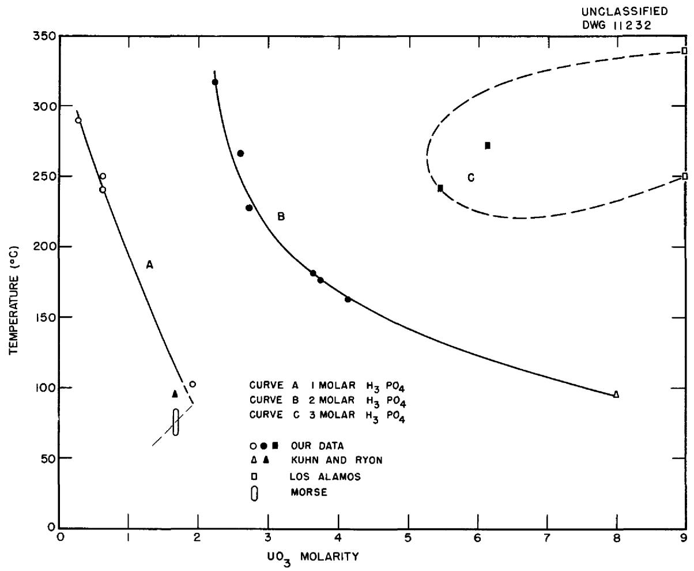  
Fig. 5.33. Solubility of Uranium Trioxide in Orthophosphoric Acid Solutions.

# 5.34. Solubility of Uranium Trioxide in Phosphoric Acid at $250^{\circ}\mathrm{C}$

J. S. Gill, W. L. Marshall, and H. W. Wright, HRP Quar. Prog. Rep. Aug. 15, 1951, ORNL-1121, p 119-21.

Solution and solid mixtures were equated at $250^{\circ}\mathrm{C}$ in sealed glass tubes. The tubes were cooled rapidly to room temperature, and the solution and solid phases were analyzed. The slow reversibility of equilibrium conditions made this procedure possible.

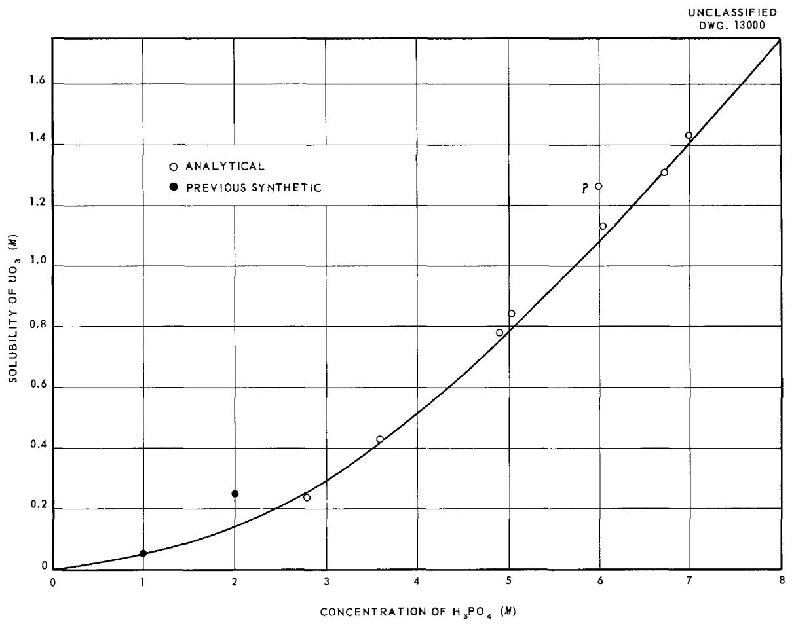  
Fig. 5.34. Solubility of Uranium Trioxide in Phosphoric Acid at $250^{\circ}\mathrm{C}$ .

# 5.35. Solubility of $\mathsf{UO}_3$ in $\mathsf{H}_3\mathsf{PO}_4$ Solution

B. J. Thamer et al., The Properties of Phosphoric Acid Solutions of Uranium as Fuels for Homogeneous Reactors, LA-2043 (March 6, 1956); W. L. Marshall, J. S. Gill, and H. W. Wright, HRP Quar. Prog. Rep. May 15, 1951, ORNL-1057, p 112-15; and J. S. Gill, W. L. Marshall, and H. W. Wright, HRP Quar. Prog. Rep. Aug. 15, 1951, ORNL-1121, p 119-21.

This figure represents a compilation from the data of B. J. Thamer et al. of Los Alamos and W. L. Marshall et al. of Oak Ridge National Laboratory.

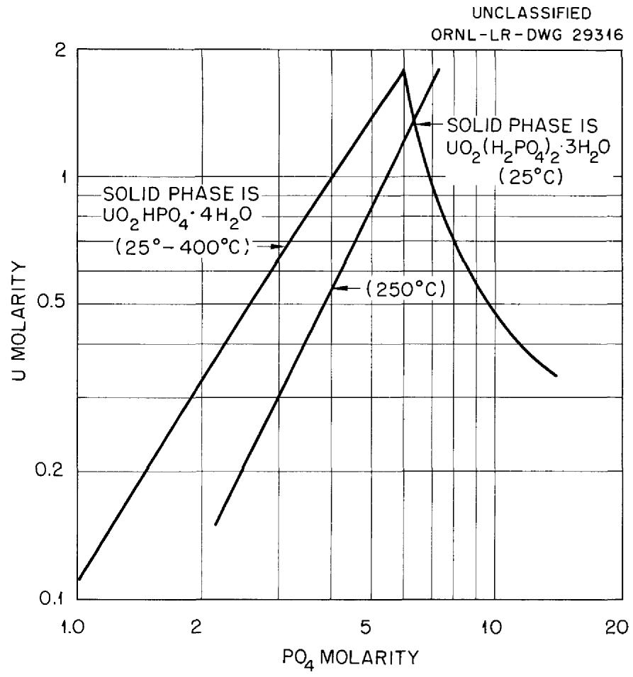  
Fig. 5.35. Solubility of $\mathrm{UO}_3$ in $\mathrm{H}_3\mathrm{PO}_4$ Solution.

# 5.36. The System $\mathsf{UO}_2\mathsf{CrO}_4 - \mathsf{H}_2\mathsf{O}$

1. F. J. Loprest, W. L. Marshall, and C. H. Secoy, J. Am. Chem. Soc. 77, 4705 (1955).   
2. W. L. Marshall, HRP Quar. Prog. Rep. March 31, 1953, ORNL-1554, p 105-6.

The solid phases are $\mathrm{UO}_2\mathrm{CrO}_4\cdot 5\% \mathrm{H}_2\mathrm{O}$ (A) and $\mathrm{UO}_2\mathrm{CrO}_4\cdot x\mathrm{H}_2\mathrm{O}$ (B). Curve $rs$ represents the boundary of a region in which hydrolytic precipitation of a basic uranyl chromate occurs. In the same concentration range the dichromate, $\mathrm{UO}_2\mathrm{Cr}_2\mathrm{O}_7$ , is stable to the critical temperature and apparently dissolves in the supercritical fluid (ref 2).

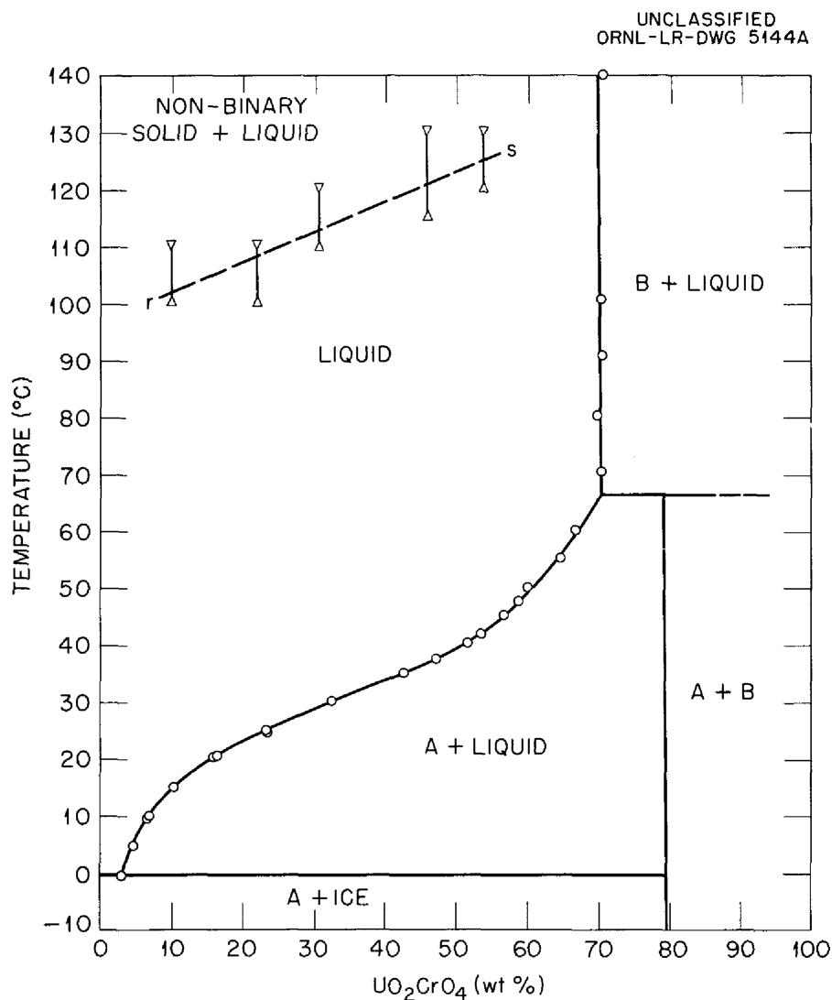  
Fig. 5.36. The System $\mathrm{UO}_2\mathrm{CrO}_4 - \mathrm{H}_2\mathrm{O}$ .

5.37. Variation of $\mathsf{Li}_2\mathsf{CO}_3$ Solubility with $\mathsf{UO}_2\mathsf{CO}_3$ Concentration at Constant $\mathsf{CO}_2$ Pressure (250°C)

1. F. J. Loprest, W. L. Marshall, and C. H. Secoy, HRP Quar. Prog. Rep. July 31, 1955, ORNL-1943, p 227-35.   
2. W. L. Marshall, F. J. Loprest, and C. H. Secoy, HRP Quar. Prog. Rep. Jan. 31, 1956, ORNL-2057, p 131-32.

The solubility relationships in the figure indicate strong complexing of $\mathsf{UO}_2\mathsf{CO}_3$ with $\mathsf{Li}_2\mathsf{CO}_3$ under $\mathsf{CO}_2$ pressure. The formation of $\mathsf{HCO}_3^-$ species in solution is indicated.

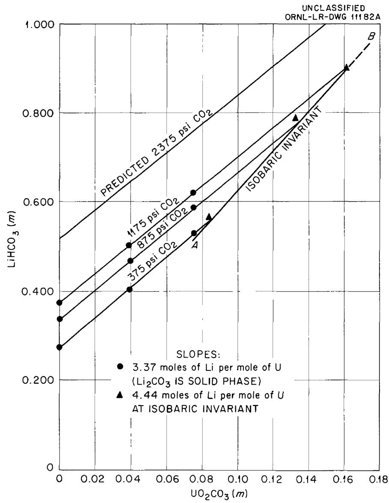  
Fig. 5.37. Variation of $\mathsf{Li}_2\mathsf{CO}_3$ Solubility with $\mathsf{UO}_2\mathsf{CO}_3$ Concentration at Constant $\mathsf{CO}_2$ Pressure (250°C).

5.38. The System $\mathrm{Li}_2\mathrm{O}-\mathrm{UO}_3-\mathrm{CO}_2-\mathrm{H}_2\mathrm{O}$ at $250^{\circ}\mathrm{C}$ and 1500 psi

1. F. J. Loprest, W. L. Marshall, and C. H. Secoy, HRP Quar. Prog. Rep. July 31, 1955, ORNL-1943, p 227-35.   
2. W. L. Marshall, F. J. Loprest, and C. H. Secoy, HRP Quar. Prog. Rep. Jan. 31, 1956, ORNL-2057, p 131-32.

As $\mathrm{CO}_{2}$ pressure is increased, the area of complete solution (indicated by the shading) increases. As temperature is increased, the solution area decreases.

UNCLASSIFIED

ORNL-LR-DWG11342B

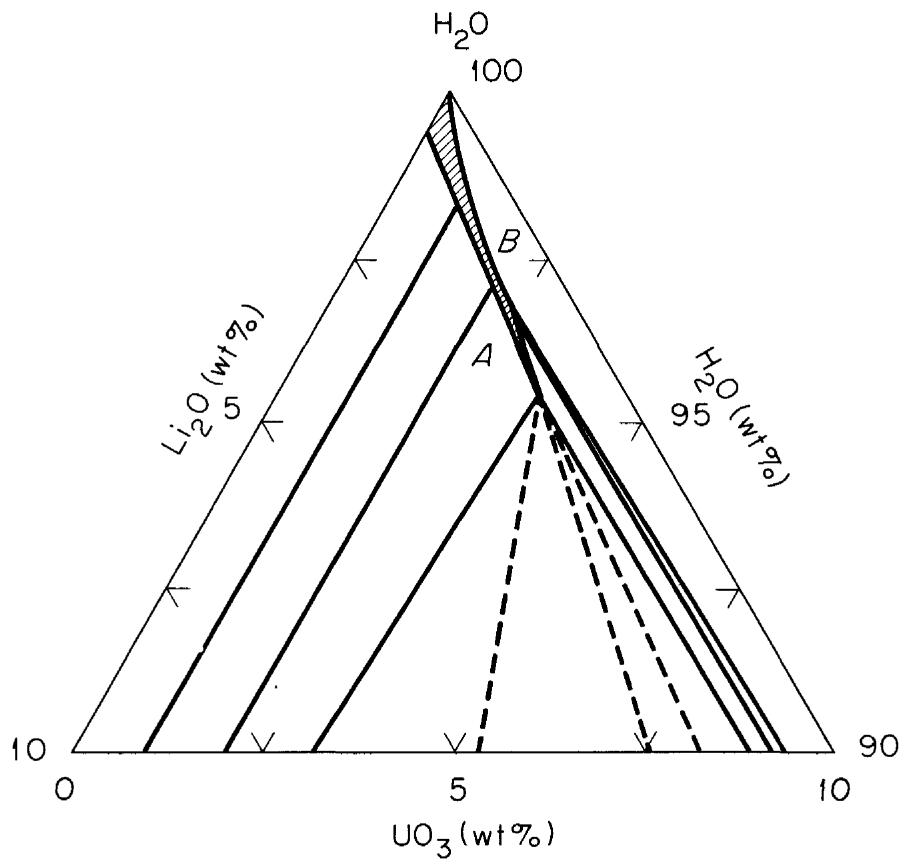  
Fig. 5.38. The System $\mathsf{Li}_2\mathsf{O} - \mathsf{UO}_3 - \mathsf{CO}_2 - \mathsf{H}_2\mathsf{O}$ at $250^{\circ}\mathsf{C}$ and 1500 psi.

# 5.39. The System $\mathrm{Th(NO_3)_4 - H_2O}$

1. Reported in full by W. L. Marshall, J. S. Gill, and C. H. Secoy, HRP Quar. Prog. Rep. Nov. 30, 1950, ORNL-925, p 279-90.   
2. W. L. Marshall, J. S. Gill, and C. H. Secoy, J. Am. Chem. Soc. 73, 4991 (1951).

Hydrolytic precipitation of $\mathsf{ThO}_2$ and thermal decomposition of $\mathsf{NO}_3^-$ in this system occur in an analogous manner to the reactions occurring in the system $\mathsf{UO}_2(\mathsf{NO}_3)_2 - \mathsf{H}_2\mathsf{O}$ (see Sec 5.31). At higher temperatures the two-component system in actuality must be considered in terms of the three components $\mathsf{ThO}_2$ , $\mathsf{HNO}_3$ , and $\mathsf{H}_2\mathsf{O}$ .

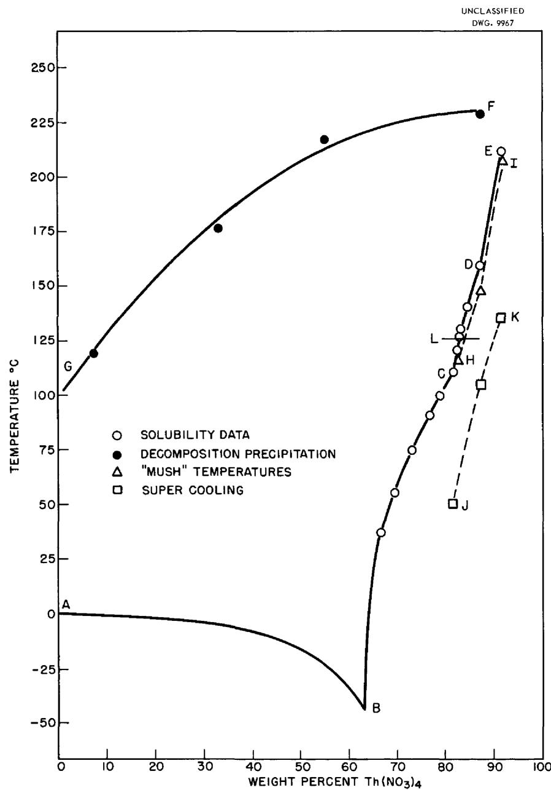  
Fig. 5.39. The System $\mathrm{Th(NO_3)_4 - H_2O}$ .

# 5.40. Hydrolytic Stability of Thorium Nitrate-Nitric Acid and Uranyl Nitrate Solutions

1. W. L. Marshall and C. H. Secoy, HRP Quar. Prog. Rep. Oct. 31, 1953, ORNL-1658, p 93-96.   
2. W. L. Marshall, J. S. Gill, and C. H. Secoy, Chem. Quar. Prog. Rep. March 31, 1951, ORNL-1053, p 22-25.

The data used to draw the individual curves were obtained by observations at various temperatures of tubes that contained different solutions of known concentration. The procedure was analogous to that used for obtaining data for Fig. 5.33. The curve for hydrolytic precipitation of $\mathrm{UO}_2(\mathrm{NO}_3)_2$ is taken from ref 2.

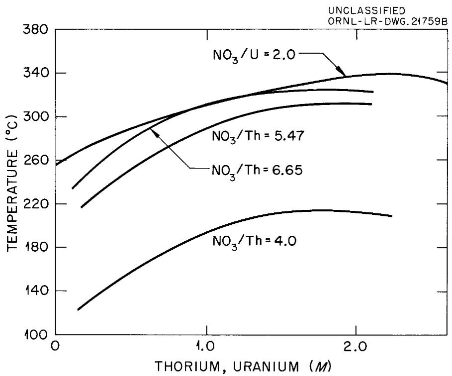  
Fig. 5.40. Hydrolytic Stability of Thorium Nitrate-Nitric Acid and Uranyl Nitrate Solutions.

# 5.41. The System $\mathsf{ThO}_2 - \mathsf{CrO}_3 - \mathsf{H}_2\mathsf{O}$ at $25^{\circ}C$

1. H. T. S. Britton, J. Chem. Soc. 123, 1429 (1923).   
2. W. L. Marshall, F. J. Loprest, and C. H. Secoy, HRP Quar. Prog. Rep. Jan. 31, 1955, ORNL-1853, p 205-6.

The phase diagram at $25^{\circ}$ was determined by Britton. Points 1-7 indicate compositions investigated at high temperature by Marshall, Loprest, and Secoy. These solution compositions were phase stable up to $160^{\circ}\mathrm{C}$ for point 7 and $320^{\circ}\mathrm{C}$ for point 1.

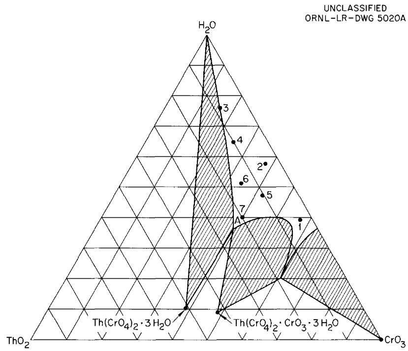  
Fig. 5.41. The System $\mathsf{ThO}_2 - \mathsf{CrO}_3 - \mathsf{H}_2\mathsf{O}$ at $25^{\circ}\mathsf{C}$ . Compositions are in weight per cent.

# 5.42. Phase Stability of $\mathsf{ThO}_2\mathsf{-H}_3\mathsf{PO}_4\mathsf{-H}_2\mathsf{O}$ Solutions at High Concentrations of $\mathsf{ThO}_2$

W. L. Marshall, experimental data in ORNL research notebook 2881, p 35 (May 1953).

Solutions of appropriate concentrations were prepared and analyzed. These solutions were sealed in glass tubes and shaken at various temperatures for times varying from 1 hr to several days. In this manner the phase stability boundaries with respect to concentration and temperature were established. At first inspection of the figure it is surprising that more $\mathsf{ThO}_2$ can be dissolved per liter at the lower $\mathsf{H}_3\mathsf{PO}_4 / \mathsf{ThO}_2$ ratio than at the higher ratio. Actually, there is a physical volume limitation due to the high fractional volumes occupied by $\mathsf{ThO}_2$ and $\mathsf{H}_3\mathsf{PO}_4$ at these concentrations. As any solution is diluted with $\mathsf{H}_2\mathsf{O}$ , hydrolysis of thorium in solution occurs. At room temperature, solutions in which the $\mathsf{H}_3\mathsf{PO}_4 / \mathsf{ThO}_2$ ratio is 5:1 are gels, whereas 10:1 ratio solutions are still fluid.

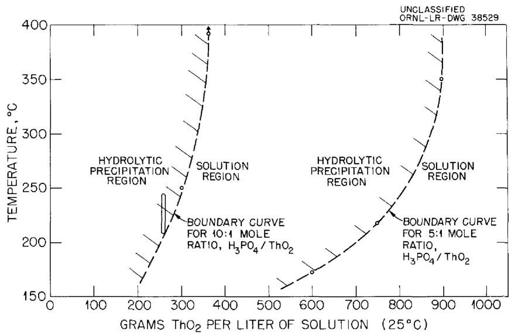  
Fig. 5.42. Phase Stability of $\mathsf{ThO}_2 - \mathsf{H}_3\mathsf{PO}_4 - \mathsf{H}_2\mathsf{O}$ Solutions at High Concentrations of $\mathsf{ThO}_2$

# ACKNOWLEDGMENT

Acknowledgment is made to the following for permission to reproduce copyrighted material:

American Ceramic Society

American Institute of Mining, Metallurgical, and Petroleum Engineers

Analytical Chemistry

Journal of Chemical and Engineering Data

Journal of Physical Chemistry

Journal of the American Chemical Society

U.S. Atomic Energy Commission

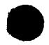

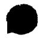

# INTERNAL DISTRIBUTION

1. R. D. Ackley   
2. R. E. Adams   
3. G. M. Adamson   
4. L. G. Alexander   
5. K. A. Allen   
6. C. F. Baes

7-11. C.J. Barton   
12. S. E. Beall   
13. P. R. Bell   
14. J. O. Besserton   
15. A. M. Billings   
16. D. S. Billington   
17. C. A. Blake   
18. J. P. Blakely   
19. R. E. Blanco   
20. F. F. Blankenship   
21. M. Blander   
22. E. P. Blizzard   
23. C. M. Blood   
24. A. L. Boch   
25. E. G. Bohlman   
26. S. E. Bolt   
27. G.E. Boyd   
28. M. A. Bredig   
29. J. C. Bresee   
30. R. B. Briggs   
31. H. R. Bronstein   
32. J. R. Brown   
33. K. B. Brown   
34. W. E. Browning   
35. F. R. Bruce   
36. W. D. Burch   
37. S. R. Buxton   
38. S. Cantor   
39. W.H.Carr   
40. W. L. Carter   
41. G. H. Cartledge   
42. G. I. Cathers   
43. C. E. Center   
44. R. H. Chapman   
45. R. A. Charpie   
46. R. D. Cheverton   
47. H. C. Claiborne   
48. G.W.Clark   
49. C. F. Coleman   
50. E. L. Compere   
51. J. A. Cox   
52. J. H. Crawford   
53. C. R. Croft   
54. F. L. Culler

55. J. S. Culver   
56. D. R. Cuneo   
57. J. E. Cunningham   
58. D. G. Davis   
59. R. J. Davis   
60. W. C. Davis   
61. J. H. Devan   
62. R. R. Dickison   
63. L. M. Doney   
64. F. A. Doss   
65. J. S. Drury   
66. A. S. Dworkin   
67. L. B. Emlet (K-25)   
68. J. L. English   
69. J. E. Eorgan   
70. R. B. Evans   
71. D. E. Ferguson   
72. J. L. Fowler   
73. A. P. Fraas   
74. H. A. Friedman   
75. J. H. Frye, Jr.   
76. C. H. Gabbard   
77. W.R.Gall   
78. J. S. Gill   
79. J. H. Gillette   
80. L. O. Gilpatrick   
81. J. M. Googin (Y-12)   
82. R. S. Greeley   
33. A. T. Gresky   
84. J. C. Griess   
89. W. R. Grimes   
90. E. Guth   
91. P. A. Haas   
92. P.H.Harley   
93. C. S. Harrill   
94. L. A. Harris   
95. P. N. Haubenreich   
96. G. M. Hebert   
97. H. L. Hemphill   
98. J.W.Hill   
99. E. C. Hise   
00. E. E. Hoffman   
01. H. W. Hoffman   
02. A. Hollaender   
03. R.W.Horton   
04. A. S. Householder   
05. H. Insley   
06. G. H. Jenks   
07. D. T. Jones   
08. E.V. Jones

109. W. H. Jordan   
110. P. R. Kasten   
111. G. W. Keilholtz   
112. C. P. Keim   
113. M. T. Kelley   
114. M. J. Kelley   
115. B. W. Kinyon   
116. N. A. Krohn   
117. J. A. Lane   
118. S. Langer   
119. C. G. Lawson   
120. J. E. Lee, Jr.   
121. R. E. Leed   
122. R. E. Leuze   
123. W. H. Lewis   
124. M. H. Lietzke   
125. T. A. Lincoln   
126. S. C. Lind   
127. R. B. Lindauer   
128. R. S. Livingston   
129. J. T. Long   
130. R. A. Lorenz   
131. R. E. Lowrie   
132. M. I. Lundin   
133. R. N. Lyon   
134. J. P. McBride   
135. W. B. McDonald   
136. H. F. McDuffie   
137. H. A. McLain   
138. R. A. McNees   
139. H. G. MacPherson   
140. T. N. McVay   
141. J. R. McWherter   
142. W. D. Manly   
143-147. W. L. Marshall   
148. R. E. Meadows   
149. R. P. Metcalf   
150. R. P. Milford   
151. A. J. Miller   
152. J. W. Miller   
153. C. S. Morgan   
154. K. Z. Morgan   
155. R. E. Moore   
156. R. L. Moore   
157. J. P. Murray (Y-12)   
158. M. L. Nelson   
159. G. J. Nessle   
160. R.F.Newton   
161. L. G. Overholser   
162. L. F. Parsly, Jr.   
163. R. L. Pearson   
164. F. N. Peebles

165. D. Phillips   
166. L. R. Phillips (Y-12)   
167. M. L. Picklesimer   
168. W. T. Rainey   
169. A. D. Redman   
170. S. A. Reed   
171. P. M. Reyling   
172. D. M. Richardson   
173. R. C. Robertson   
174. A. D. Ryon   
175. H. C. Savage   
176. H. W. Savage   
177. F. A. Schimmel (Y-12)   
178. J. M. Schmitt   
179. J. M. Schreyer (Y-12)   
180. H. E. Seagren   
181. C. H. Secoy   
182. C. L. Segaser   
183. J. H. Shaffer   
184. E. M. Shank   
185. R. J. Sheil   
186. R. P. Shields   
187. E. D. Shipley   
188. M. D. Silverman   
189. M. J. Skinner   
190. R. Slusher   
191. N. V. Smith   
192. W. T. Smith, Jr.   
193. A. H. Snell   
194. B. A. Soldano   
195. I. Spiewak   
196. H. H. Stone   
197. R. A. Strehlow   
198. B. J. Sturm   
199. C. D. Susano   
200. J. E. Sutherland   
201. J. A. Swartout   
202. A. Taboada   
203. E. H. Taylor   
213. R. E. Thoma   
214. D. G. Thomas   
215. M. Tobias   
216. D. S. Toomb   
217. D. B. Trauger   
218. J. Truitt   
219. W. E. Unger   
220. R. Van Winkle   
221. F. C. VonderLage   
222. W. T. Ward   
223. G. M. Watson   
224. B. S. Weaver   
225. C. F. Weaver

226. A. M. Weinberg   
227. K.W. West   
228. M. E. Whatley   
229. G. C. Williams   
230. C. E. Winters   
231. H. W. Wright   
232. J. P. Young   
233. F. C. Zapp   
234. P. H. Emmett (consultant)   
235. H. Eyring (consultant)   
236. D. G. Hill (consultant)   
237. C. E. Larson (consultant)

238. W. O. Milligan (consultant)   
239. J. E. Ricci (consultant)   
240. G. T. Seaborg (consultant)   
241. E. P. Wigner (consultant)   
242. Biology Library   
-244. Central Research Library   
245. Health Physics Library   
-265. Laboratory Records Department   
266. Laboratory Records, ORNL R.C.   
267. Reactor Experimental Engineering Library   
268. ORNL - Y-12 Technical Library,

Document Reference Section

# EXTERNAL DISTRIBUTION

269-270. Stanford Research Institute, Menlo Park, Calif. (1 copy ea. to D. Cubicciotti and J. W. Johnson)   
271-272. National Lead Co., P. O. Box 158, Cincinnati 39, Ohio (1 copy ea. to R. E. DeMarco and K. Notz)   
273. Geophysical Laboratory, Carnegie Institution of Washington, 2801 Upton St., Washington 8, D.C. (J. W. Grieg)   
274. Mound Laboratory, Miamisburg, Ohio (E. F. Eichelberger)   
275-276. Minnesota Mining and Manufacturing Co., Central Research Dept., 2301 Hudson Rd., St. Paul 9, Minn. (1 copy ea. to J. R. Johnson and G. D. White)   
277. Chemical Separations and Development Branch, Nuclear Technology, Division of Reactor Development, AEC, Washington 25, D.C. (F. Kerze, Jr.)   
278. Dept. of Chemistry, Brown University, Providence 12, R.I. (C. A. Kraus)   
279. Mallinckrodt Chemical Works, Uranium Division, P.O. Box 472, St. Charles, Mo. (C. W. Kuhlman)   
280. Portland Cement Association Fellowship, National Bureau of Standards, Washington 25, D. C. (E. M. Levin)   
281-282. National Carbon Research Laboratories, P.O. Box 6116, Cleveland, Ohio (1 copy ea. to G. W. Mellors and S. Senderoff)   
283. College of Mineral Industries, Pennsylvania State University, University Park, Pa. (E. F. Osborn)   
284. Los Alamos Scientific Laboratory, P.O. Box 1663, Los Alamos, N. M. (B. J. Thamer)   
285. Dept. of Physics, University of Chicago, Chicago, III. (W. H. Zachariasen)   
286. Reaction Motors Division, Thiokol Chemical Corp., Denville, N.J. (F. L. Loprest)   
287. National Bureau of Standards, Washington 25, D. C. (H. F. McMurdie)   
288. U.S. Geological Survey, Washington 25, D.C. (G.W. Morey)   
289. National Carbon Co., Union Carbide Corporation, Parma, Ohio (F. E. Clark)   
290. Division of Research and Development, AEC, Washington   
291. Division of Research and Development, AEC, ORO   
292. Division of Reactor Development, AEC, Washington   
293. Division of Reactor Development, AEC, ORO   
294. Oak Ridge Institute of Nuclear Studies, Oak Ridge   
295-851. Given distribution as shown in TID-4500 (15th ed.) under Chemistry-General category (75 copies - OTS)