MARTIN MARIETTA ENERGY SYSTEMS LIBRARIES

34456 03506169

ORNL-2551

Reactors-Power

TID-4500 (13th ed., Rev.)

February 15, 1958

${C}_{y} \cdot  {108}$

LIE

REFRKE

MOLTEN-SALT REACTOR PROGRAM

QUARTERLY PROGRESS REPORT

FOR PERIOD ENDING JUNE 30, 1958

CENTRAL RESEARCH LIBRARY DOCUMENT COLLECTION

LIBRARY LOAN COPY

DO NOT TRANSFER TO ANOTHER PERSON

If you wish someone else to see this document, send in name with document and the library will arrange a loan.

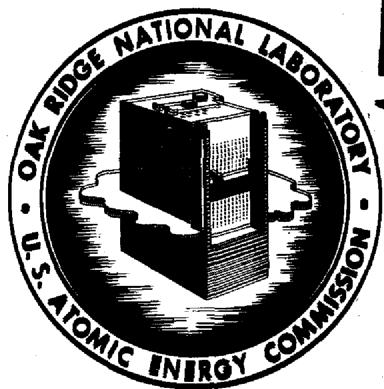

OAK RIDGI NATIONAL LABORATORY

operated by

UNION CARBIDE CORPORATION

for the

U.S. ATOMIC ENERGY COMMISSION

# Printed in USA. Price 2.75 cents. Available from the

Office of Technical Services

U.S. Department of Commerce

Washington 25, D. C.

# LEGAL NOTICE

This report was prepared as an account of Government sponsored work. Neither the United States, nor the Commission, nor any person acting on behalf of the Commission:   
A. Makes any warranty or representation, express or implied, with respect to the accuracy, completeness, or usefulness of the information contained in this report, or that the use of any information, apparatus, method, or process disclosed in this report may not infringe privately owned rights; or   
B. Assumes any liabilities with respect to the use of, or for damages resulting from the use of any information, apparatus, method, or process disclosed in this report.   
As used in the above, "person acting on behalf of the Commission" includes any employee or contractor of the Commission to the extent that such employee or contractor prepares, handles or distributes, or provides access to, any information pursuant to his employment or contract with the Commission.

ORNL-2551

Reactors-Power

TID-4500 (13th ed., Rev.)

February 15, 1958

Contract No. W-7405-eng-26

# MOLTEN-SALT REACTOR PROGRAM

# QUARTERLY PROGRESS REPORT

For Period Ending June 30, 1958

H. G. MacPherson, Program Director

DATE ISSUED

SEP 10 1958

OAK RIDGE NATIONAL LABORATORY

Oak Ridge, Tennessee

operated by

UNION CARBIDE CORPORATION

for the

U.S. ATOMIC ENERGY COMMISSION

3 4456 0350616 9

# MOLTEN-SALT REACTOR PROGRAM QUARTERLY PROGRESS REPORT

# SUMMARY

# PART 1. REACTOR DESIGN STUDIES

# 1.1. Design Studies

A conceptual design of a power reactor, designated the "interim design reactor," was prepared. This two-region, homogeneous reactor uses molten salt fuel which is circulated by a single fuel pump located at the top of the core. The net power output is 260 Mw, and the reactor has a thermal capacity of 640 Mw. The total cost of the power produced by this reactor is estimated to be 8.9 mills/kwhr, of which 2.5 mills/kwhr is fuel cost.

The core of the reactor was designed to have a volume approximating that of an 8-ft-dia sphere, and the shapes of sections taken through the walls can be expressed as simple algebraic functions. This latter criterion assures smooth shapes, easily calculated volumes, and dimensional reproducibility.

An analysis of the weights of various portions of the system was made to aid in construction planning and cost estimating. It was estimated that the empty equipment would weigh 684,000 lb, the fuel salt would weigh 102,358 lb, the blanket salt would weigh 194,769 lb, and the sodium would weigh 100,188 lb.

A detailed evaluation of the fabricability of the reactor was made, and it was established that conventional practices of the pressure-vessel industry could be used. It is recommended that the initial reactor be fabricated entirely in one shop so that tolerances need not be so rigid for fitup of parts as they would be if parts were supplied by various vendors.

Design work was completed on the fuel pump proposed for the interim design reactor. The motor and pump rotating assembly are completely replaceable remotely as a cartridge unit. The lower bearing is a salt-lubricated orifice-compensated hydrostatic bearing, and the upper bearing is a hemispherical orifice-compensated hydrostatic type that uses the pressurized helium purge supply for lubrication and support.

Nuclear calculations were continued, and some results were obtained for reactors fueled with $U^{233}$ and with plutonium. The initial regeneration ratios obtained ranged up to 1.03 at critical inventories of $U^{233}$ that were much less than the

critical inventories required for reactors fueled with $U^{235}$ . In comparison with corresponding $U^{235}$ reactors, the critical inventories of plutonium-fueled reactors were about one-third as great. The required plutonium concentration was found to be well below the solubility limit in salts of interest.

A comparative study of the various gases that might be used as cover gases for molten-salt reactor systems revealed that helium and argon are, at present, the only suitable gases. Helium is less expensive than argon, but it is not available outside the United States.

Test rigs were designed for experimental studies of three types of bearings. These bearings, which are designed for molten-salt application, are (1) a hydrodynamic bearing with conventional journal and sleeve, (2) a hydrostatic, orifice-compensated bearing mounted on the hub of the impeller with stationary pockets supplied with high-pressure molten salts, and (3) a hydrostatic bearing with rotating pockets.

# 1.2. Component Development and Testing

Development tests of salt-lubricated bearings are under way with an INOR-8 journal and sleeve being tested in the hydrodynamic bearing test rig. This initial bearing failed when the thrust load was increased from 100 to 125 lb with the shaft operating at 1200 rpm and the molten salt at a temperature of $1200^{\circ}$ F. Other journal and sleeve materials are being studied. A rotating-pocket hydrostatic bearing was fabricated for testing.

Tests of conventional organic-liquid-lubricated bearings were continued. A sump pump in which the lubricant is Dowtherm A has operated satisfactorily for 1620 hr with a molten salt as the pumped fluid at a temperature of $1200^{\circ}\mathrm{F}$ . The shaft speed is 2600 rpm. The oil-lubricated pump rotary assembly that is being operated in a gamma-irradiation field at the MTR has accumulated a gamma-ray dose of $5.9 \times 10^{9}~\mathrm{r}$ . The bulk of the Gulfcrest 34 lubricant is external to the radiation field, and thus the exposure of the oil has been only $10^{8}~\mathrm{r}$ .

Calculations were made of the conditions required for operation of a gas-lubricated bearing.

A small hemispherical bearing is to be used to test the validity of the calculations.

Test operation of a NaK pump with a labyrinth and split-purge seal arrangement was terminated when the passages to the labyrinth became constricted. Material that contained carbon was found to have blocked the passage. Face surfaces of the lower seal, which had operated 3386 hr, were free of NaK and were in good operating condition. A bellows-mounted seal being subjected to an endurance test in a NaK pump continued to operate satisfactorily. Over 5100 hr of operation has accumulated. Since there are no elastomers in this type of seal, it may be suitable for operation in a radiation field.

Components of electric motors are being tested for service at high temperatures in a radiation field, since the successful development of salt-lubricated bearings would make totally submerged canned-rotor pumps applicable to molten-salt systems. Investigations are under way of high permeability magnet steels, insulating materials, and current-carrying conductors.

Tests were made to determine the length of time required to bring a typical fused-salt piping system to a temperature of $900^{\circ}\mathrm{F}$ by preheating a portion of the system with electric-furnace elements and transmitting the heat to the remainder of the system by forced circulation of helium within the piping. With about $49\%$ of the surface heated, 9 hr and a minimum helium pressure of 98 psig were required to reach $900^{\circ}\mathrm{F}$ .

Screening tests of mechanical joints for remote separation of system components were continued. None of the joints tested have given any evidence of leakage during tests with molten salts. Joints are being assembled for tests with sodium.

Experimental remote maintenance work on a NaK pump was completed, and the results indicated the feasibility of remote maintenance work on accessible components of a molten-salt system. A three-dimensional viewing system is being developed. High-quality welds were produced in preliminary remote welding experiments, which emphasized the need for a good viewing system. An engineering layout was prepared for a remote maintenance demonstration facility, and detailing and fabrication of the components are under way. Combination heater and insulation units designed for remote application and removal were fabricated for testing.

Commercially available expansion joints were ordered for testing. If expansion joints can be used in fuel and coolant circuit piping, the extra space and fluid inventories required for thermal expansion loops could be avoided.

Processing of the data obtained from a heat transfer coefficient test in which fuel 130 (LiF-BeF $_2$ -UF $_4$ , 62-37-1 mole %) was circulated in an available heat exchanger test facility was completed. The data are presented in comparison with similar data for other fluids. A molten-salt-to-air radiator was designed and is being fabricated for a molten-salt-to-molten-salt heat transfer test.

Operation of forced-circulation and thermal-convection corrosion-testing loops was continued. Improvements are being made to the test stands to assure operational reliability.

Out-of-pile tests of components of the in-pile loop being prepared for insertion in the MTR were continued. Difficulties with gravity-filling of the system because of the high surface tension of fuel 130 have delayed the work. New filling techniques are being developed.

# 1.3. Engineering Research

Preliminary values were obtained for the viscosities of the salt mixtures $\mathrm{NaF - BeF_2 - UF_4}$ (53-46-1 mole %), $\mathrm{LiF - BeF_2 - UF_4}$ (53-46-1 mole %), and $\mathrm{LiF - BeF_2 - UF_4}$ (62-37-1 mole %) over the temperature range 500 to $900^{\circ}\mathrm{C}$ . The enthalpy and heat capacity of the mixture $\mathrm{LiF - BeF_2 - UF_4}$ (62-37-1 mole %) were established in the temperature range 100 to $800^{\circ}\mathrm{C}$ . Studies were initiated of the thermal conductivity, surface tension, and thermal expansion of the beryllium-containing fluoride salts. Initial measurements of the heat transfer coefficient for $\mathrm{LiF - BeF_2 - UF_4}$ (53-46-1 mole %) flowing through a heated Inconel tube have indicated that this salt behaves, with respect to heat transfer, in the same manner as ordinary fluids.

Hydrodynamic studies were continued with small-scale glass models of proposed reactor cores. In the straight-through flow model it was found that the inlet high-velocity flow essentially short-circuited the core and passed directly from the entrance to the exit without appreciable spreading. The remainder of the core was filled with slowly rotating fluid that had extremely low velocities along the sphere wall. The concentric system

with annular inlet flow exhibited a number of peculiarities which can be associated with the shortness of the annulus. The main flow was down along the sphere surface located 180 deg from the inlet elbow and up along the back surface at the 0-deg position. A tapering vortex existed in the equatorial plane at the center of this flow. Extension of the central pipe in the concentric pipe-entrance system showed increased velocities at the bottom of the sphere.

# 1.4. Instrumentation and Controls

Inconel-sheathed Chromel-Alumel thermocouples with magnesium oxide insulation and hot-junction closure welds made by the Heliarc welding process are being tested for endurance and stability. In 10,000 hr of exposure to sodium at $1500^{\circ}\mathrm{F}$ , only two of 38 thermocouples have failed because of weld closure deficiencies. Drifts from initial temperature readings are within $\pm 0.75\%$ .

Test facilities were prepared for investigating the suitability for molten-salt reactor service of the resistance-type fuel level indicator. Design work is under way on modifications required to improve a commercial mechanism for use in switching low-level transducer signals. Various types of pressure transducer are being evaluated for molten-salt service.

# 1.5. Advanced Reactor Studies

A conceptual design was prepared of a 5-Mw experimental reactor in which molten salt fuel would be circulated by thermal convection. This simple, reliable system could be converted to a 50-Mw pilot plant by adding a fuel pump and increasing the capacity of the heat dump. The 5-Mw reactor could be constructed of components already developed. It would demonstrate the feasibility of continuous operation of a molten-salt reactor, provide in-pile corrosion data, and serve as a mockup to develop and demonstrate remote maintenance procedures. The 50-Mw system would be sufficiently similar to a large-scale power-producing plant to lead directly to design and construction of a large power plant.

The possibility of a thermal-convection reactor of approximately 600-Mw thermal output was also investigated. It was found that a fuel inventory of 1775 ft³ would be required, which is to be compared with the 530 ft³ estimated for a reactor system in which the fuel is circulated by a pump.

The heat exchange equipment that would be required for gas cooling of a molten-salt reactor was studied. Helium, steam, and hydrogen were the gases considered. For a given set of conditions, hydrogen was the most effective, but helium and steam were reasonably comparable. An optimization of the size of the tubing to be used in the heat exchanger gave a value of 0.5 in. Larger tube diameters led to excessive tube lengths, and smaller diameters led to large numbers of tubes in the matrix.

# PART 2. MATERIALS STUDIES

# 2.1. Metallurgy

Metallurgical examinations and corrosion evaluations were made of specimens from several Inconel and INOR-8 thermal-convection loops in which various fluoride mixtures were circulated. One of the Inconel loops, which were operated at a maximum hot-leg temperature of $1250^{\circ}\mathrm{F}$ in order to determine the corrosive effects of various fluorides under MSR temperature conditions, gave results which contradict the corrosion postulate that $\mathsf{ThF}_4$ should effect a lower corrosion rate than comparable additions of UF. No explanation for the increased attack by the $\mathsf{ThF}_4$ -containing mixture is readily available. Seven INOR-8 thermal-convection loops that were operated under MSR temperature conditions for 1000 hr with various fluoride mixtures showed no attack, and one INOR-8 loop that was operated for more than 6300 hr was found to have widely scattered subsurface voids that ranged to a maximum depth of 0.75 mil at the hottest point. The initial results for INOR-8 loops are favorable.

Specimens for studies of the effect of carburization on the mechanical properties of Inconel and INOR-8 were prepared by exposure in a sodium-graphite system, since carburization takes place slowly if at all in a molten-salt system. Control specimens were given the same heat treatment in an argon atmosphere. INOR-8 was found to have been more heavily carburized than Inconel by the sodium-graphite system. Tensile tests showed that carburization increased the tensile strength and yield strength of Inconel and reduced its ductility. The INOR-8 specimens were found to have a lowered tensile strength, slightly increased yield strength, and greatly reduced

ductility. Studies of INOR-8 and Inconel in salt-graphite systems are being planned.

Preliminary tests have shown brazing alloys with high gold and silver contents to have promising corrosion resistance to molten salts. Therefore long-term corrosion data are to be obtained by insertion of samples in the hot legs of thermal-convection loops.

Good correlation has been found among tensile property data for INOR-8 obtained at ORNL, Haynes Stellar Company, and Battelle Memorial Institute. Data are now available on yield strength, tensile strength, ductility, relaxation, and Young's modulus as functions of temperature. Preliminary creep data have been obtained, and extensive creep tests are under way.

An investigation of the influence of composition variations on the creep-rupture strength and the microstructure of INOR-type alloys was completed. A general consideration of all the data obtained favorably supports the composition selected for the alloy INOR-8. Embrittlement studies have indicated that aging in the temperature range from 1000 to $1400^{\circ}\mathrm{F}$ has no significant effect on the properties of INOR-8.

Five air-melted heats of INOR-8 were prepared by Westinghouse, and about 20,000 lb of finished products will be supplied from these heats. The first shipment of seamless tubing was received, and it was found to be of excellent quality.

Experimental studies of bearing materials are under way. Flame-sprayed INOR-8 coatings were successfully bonded to INOR-8 journals. Similar molybdenum coatings cracked severely and separated from the INOR-8 upon thermal cycling. Molybdenum rods sprayed with molybdenum are now being tested.

Additional welding studies have further indicated that the weldability of INOR-8 is satisfactory. Sound welds can be made, and the weld deposition characteristics of the material are comparable with those of Inconel or the stainless steels. Tests of all-weld-metal specimens of INOR-8 and Inconel have shown that INOR-8 has a slightly higher ultimate tensile strength than that of Inconel, a significantly higher yield strength, and a markedly lower high-temperature ductility.

A weld made in a 10-in.-dia Inconel pipe with a $5/8$ -in. wall by a semiremote welding process being developed for the PAR project by Westinghouse was examined. Radiographic examination showed

the weld to be completely sound; there was no evidence of porosity.

Examinations of the cast-metal seals of two flanged joints that were tested with molten salts were made. It was found that slight oxidation had impeded wetting. The joint with a silver-copper alloy seal appeared to be less subject to nonwetting than the joint with a pure silver seal.

Studies are under way of an internal tube welding procedure being developed by the Griscom-Russell Company that would be applicable to the attachment of tubes to tube sheets in heat exchangers if back-brazing were impractical. Such a procedure may be applicable to the fabrication of the large heat exchangers that will be required for molten-salt reactors.

# 2.2. Radiation Damage

Apparatus is being assembled for in-pile tests of the corrosion of INOR-8 by the molten salts of interest. An electrically heated mockup of a loop for operation in the LITR is nearing completion. Parts for the in-pile model have been fabricated.

Final examination of an Inconel loop that circulated a molten salt in a vertical hole in the LITR showed the corrosion to be the same as that which would have been expected in the absence of radiation. A new fuel salt sampling method in which the salt is melted out was found to be as satisfactory as the previous method of drilling into the salt to obtain a sample.

Further preparations were made for the installation and operation of a forced-circulation loop in an ORR facility. Studies of bearings for use in the loop pump are under way, and the motor of the pump used in previous in-pile loops is being redesigned.

Inconel capsules for testing the stability of graphite in contact with molten-salt fuel were shipped to the MTR for irradiation at $1250^{\circ}$ F. INOR-8 capsules were fabricated for similar tests.

# 2.3. Chemistry

Phase equilibrium studies of $\mathsf{LiF - BeF}_2$ systems containing $U F_{4}$ and/or ThF were continued. A molten-salt breeder-reactor fuel with a liquidus temperature of $440\pm 5^{\circ}C$ and with no more than 36 mole $\%$ $\mathsf{BeF}_2$ is available in the LiF-BeF-ThF-UF system. Studies of the LiF-BeF-ThF

system have shown the existence of three eutectics with temperatures in the range 360 to $429^{\circ}\mathrm{C}$ . Studies of the LiF-ThF $_4$ -UF $_4$ system have shown, as was expected, extensive formation of solid solution.

Additional data were obtained on the solubility of $\mathsf{PuF}_3$ in alkali fluoride-beryllium fluoride mixtures. The data indicate that the solubility of $\mathsf{PuF}_3$ in LiF-BeF $_2$ mixtures is at a minimum for mixtures containing about 63 mole % LiF and that it is at a minimum in the NaF-BeF $_2$ system for mixtures containing about 57 mole % NaF. Data for the solubility of $\mathsf{PuF}_3$ in an LiF-BeF $_2$ (63-37 mole %) mixture containing 1 mole % ThF $_4$ indicate that the addition of ThF $_4$ does not appreciably affect the solubility of $\mathsf{PuF}_3$ in this solvent.

Further experimental measurements were made of the solubilities of the noble gases in molten salt mixtures. Data were obtained for the solubility of argon in NaF-KF-LiF (11.5-42-46.5 mole %) at 600, 700, and $800^{\circ}\mathrm{C}$ and of helium in LiF-BeF $_2$ (64-36 mole %) at 500 to $800^{\circ}\mathrm{C}$ . The trends of the data were the same as those previously observed with mixtures containing $\mathsf{ZrF}_4$ . It has been demonstrated that the solubilities of HF in LiF-BeF $_2$ and in NaF-ZrF $_4$ mixtures are about the same when the alkali fluoride content is low. As the alkali fluoride content is increased, however, the solubilities of HF in the two mixtures differ markedly.

Studies of the solubilities of fission-product fluorides in molten alkali fluoride-beryllium fluoride systems were continued. Data were obtained for the solubility of $\mathsf{CeF}_3$ over the temperature range of 450 to $700^{\circ}\mathsf{C}$ for LiF-BeF and NaF-BeF mixtures containing 50 to 70 mole % alkali fluoride. It was found that the solubility passed through a minimum at about 62 to 63 mole % alkali fluoride in both solvents.

The chemical reactions of oxides with fluorides in LiF-KF are being studied in an investigation of the chemical separation of solutes in fluoride

mixtures by selective precipitation as oxides. The characteristics of BeO as a precipitating agent are being studied.

The activity coefficients of $\mathsf{NiF}_2$ dissolved in a molten mixture of LiF-BeF $_2$ (62-38 mole %) are being determined. Data obtained at $600^{\circ}\mathsf{C}$ gave calculated activity coefficients of 2347 and 515 with respect to the solid and liquid standard states, respectively. It is known, however, that the assumed melting point for $\mathsf{NiF}_2$ is in doubt. The solubility of $\mathsf{NiF}_2$ in LiF-BeF $_2$ (61-39 mole %) was measured and was found to be independent of the amount of $\mathsf{NiF}_2$ added.

A series of experiments for rechecking data obtained at high temperatures on the diffusion coefficients for chromium in nickel-base alloys and to extend the data to temperatures below $600^{\circ}C$ is being planned. A depletion method is to be used to check the high-temperature data, and a constant-potential method will be used for the low-temperature experiments.

A study of the vapor pressures of the CsF-BeF $_2$ system was made in order to obtain information on the effect of composition on the thermodynamic activities in fuel mixtures containing BeF $_2$ . Deviations from ideal behavior were observed that were strongly dependent on the size of the alkali cation.

Studies of fused chlorides as heat transfer fluids were initiated. The mixtures KCl-ZnCl $_{2'}$ LiCl-ZnCl $_{2'}$ and LiCl-RbCl are being investigated.

Experiments are under way to study the saturation of graphite with an inert salt whose melting point is somewhat higher than proposed reactor fuel temperatures as a possible method for preventing the graphite from absorbing molten-salt fuel. Graphite rods that were soaked in and completely penetrated by an $\mathsf{LiF - MgF}_2$ mixture are now soaking in $\mathsf{LiF - BeF}_2\mathsf{-UF}_4$ (62-37-1 mole %) at $1200^{\circ}\mathsf{F}$ .

Alteration of a production facility to provide for the large-scale processing of beryllium-containing materials was nearly completed.

# CONTENTS

SUMMARY iii

# PART 1. REACTOR DESIGN STUDIES

1.1. DESIGN STUDIES 3

Interim Design Reactor 3

Reactor Core Configuration 3

Weight Analysis of Reactor System 6

Evaluation of Fabricability of Reactor Vessel 6

Outer Blanket Shell 6

Inner Core Shell 7

Blanket System Pump Housing 9

Fuel Pump Design 9

Nuclear Calculations 11

Modifications of Oracle Program Sorghum for Calculational Analyses of

Molten-Salt Reactors 11

Analyses of Reactors Fueled with U233 12

Analyses of Reactors Fueled with Plutonium 13

Argon as a Protective Atmosphere for Molten Salts 14

Bearing Tester Designs 15

Hydrodynamic Bearing Tester 15

Hydrostatic Rotating-Pocket Bearing Tester 17

Hydrostatic Stationary-Pocket Bearing Tester 19

1.2. COMPONENT DEVELOPMENT AND TESTING 20

Fuel Pump Development 20

Development Tests of Salt-Lubricated Bearings 20

Development Tests of Conventional Bearings 21

Gas-Lubricated Bearing Studies 21

Mechanical Seals 21

Radiation-Resistant Electric Motors for Use at High Temperatures 22

Piping Preheating Tests 22

Development of Techniques for Remote Maintenance of the Reactor System 23

Mechanical Joint Development 23

Remote Manipulation Techniques 26

Remote Maintenance Demonstration Facility 29

Heater-Insulation Unit Development 29

Evaluation of Expansion Joints for Molten-Salt Reactor Systems 31

Heat Transfer Coefficient Measurement 31

Design, Construction, and Operation of Materials Testing Loops 33

Forced-Circulation Loops 33

In-Pile Loops 34

1.3. ENGINEERING RESEARCH 38

Physical Property Measurements 38

Viscosity 38

Thermal Conductivity 38

Enthalpy and Heat Capacity 38   
Surface Tension 39   
Thermal Expansion 39

Hydrodynamic Studies of MSR Core 39   
Molten-Salt Heat Transfer Studies 43

# 1.4. INSTRUMENTATION AND CONTROLS 48

Endurance and Stability Tests of Sheathed Thermocouples 48   
Resistance-Type Fuel Level Indicator 48   
Scanning Switches 48   
Pressure Transducers 48

# 1.5. ADVANCED REACTOR DESIGN STUDIES 49

An Experimental 5-Mw Thermal-Convection Reactor 49   
A 600-Mw Thermal-Convection Reactor 51   
Gas-Cooled Molten-Salt Heat Exchanger 52

# PART 2. MATERIALS STUDIES

# 2.1.METALLURGY 57

Dynamic Corrosion Studies 57

Inconel Thermal-Convection Loop Tests 57   
INOR-8 Thermal-Convection Loop Tests 58

General Corrosion Studies 59

Carburization of Inconel and INOR-8 59   
Brazing Alloys in Contact with Molten Salts 62

# Mechanical Properties of INOR-8 64

Fabrication Studies 66

Influence of Composition on Properties of INOR-8 66   
High-Temperature Stability of INOR-8 67   
Status of Production of INOR-8 (Westinghouse Subcontract 1067) 68   
Status of Production of Seamless Tubing (Superior Tube Company Subcontract 1112) 68   
Bearing Materials 69

Welding and Brazing Studies 69

Weldability Evaluations 69   
Remote Welding 70   
Joint Development 71   
Component Fabrication 72

# Material and Component Inspection 76

# 2.2. RADIATION DAMAGE 78

In-Pile Dynamic Corrosion Tests 78

INOR-8 Thermal-Convection Loop Assembly for Operation in the LITR 78   
LITR Forced-Circulation Loop Examination 79   
ORR Forced-Circulation Loop Development 81

# In-Pile Static Corrosion Tests 81

# 2.3.CHEMISTRY 83

Phase Equilibrium Studies 83

Systems Containing $\mathsf{UF}_4$ and/or ThF 83

Solubility of $\mathsf{PuF}_3$ in Alkali Fluoride-Beryllium Fluoride Mixtures 84

Fission-Product Behavior 88

Solubility of Noble Gases in Molten Fluoride Mixtures 88

Solubility of HF in LiF-BeF, Mixtures 89

Solubilities of Fission-Product Fluorides in Molten Alkali Fluoride-Beryllium Fluoride Solvents 90

Chemical Reactions of Oxides with Fluorides in LiF-KF 90

Chemistry of the Corrosion Process 93

Activity Coefficients of NiF, in LiF-BeF 93

Solubility of NiF, in LiF-BeF, (61-39 MoTe %) 93

Experimental Determination of Chromium Diffusion Coefficients in Molten Salt-Inconel Systems 95

Vapor Pressures for the CsF-BeF2 System 97

Fused Chlorides as Heat Transfer Fluids 98

Permeability of Graphite by Molten Fluoride Salts 99

Preparation of Purified Materials 101

Preparation of $\mathsf{CrF}_2$ 101

Production-Scale Operations 101

Experimental-Scale Operations 101

Transfer and Service Operations 103

# REACTOR DESIGN STUDIES

# 1.1. DESIGN STUDIES

H. G. MacPherson

Reactor Projects Division

# INTERIM DESIGN REACTOR

Conceptual design studies of a power reactor have led to an "interim design reactor," which is described in a report entitled Molten Salt Reactor Program Status Report. Since this report will not be issued for general circulation until September, a brief description of the interim design reactor will be given here, together with some design information that is not included in the status report.

The interim design reactor is a two-region, homogeneous, molten-salt reactor with a single fuel pump at the top of the reactor core, as shown in Fig. 1.1.1. The gross electrical output is $275\mathrm{Mw}$ , and, since $15\mathrm{Mw}$ is required in the plant, the net power output is $260\mathrm{Mw}$ . The net over-all plant efficiency is about $40\%$ , and thus the reactor has a thermal capacity of $640\mathrm{Mw}$ .

The molten salt fuel used in the reactor core is initially a mixture with the following approximate composition: 61.8 mole $\%$ LiF, 36.9 mole $\%$ BeF $_{2'}$ , 1.0 mole $\%$ ThF $_{4'}$ and 0.3 mole $\%$ UF $_{4}$ . The volume of the system is such that the initial critical inventory is about 600 kg of U $^{235}$ . Fuel reprocessing is initiated at the end of one year in small batches equivalent to reprocessing the entire fuel charge once per year. With this system of reprocessing, the inventory of U $^{235}$ builds up to about 900 kg at the end of the first year and remains approximately constant for the next 20 years. The inventory of U $^{233}$ gradually builds up to about 300 kg at the end of 20 years. The blanket salt is a mixture of 71 mole $\%$ LiF, 16 mole $\%$ BeF $_{2'}$ and 13 mole $\%$ ThF $_{4}$ . The average conversion ratio for this reactor is 0.53 over the 20-year period.

An off-gas system is provided in a side stream of a circulating fuel circuit. The fuel is purged of xenon and krypton by mixture with a helium purge gas. The purge gas is circulated through cooled charcoal beds of sufficient size to absorb the xenon and krypton, and the helium is recirculated to provide a continuous purge.

The circulating fuel, which is pumped from the top of the reactor, is divided into four streams that lead to four primary heat exchangers. The four streams return to the reactor core and enter

tangentially at the bottom to provide a swirling motion to the fuel as it rises in the reactor core.

Heat is interchanged between the fuel and the steam in two sodium circuits in series, the first being radioactive because of delayed neutrons and the second being nonradioactive. For this reactor system a fuel cost of 2.5 mills/kwh and a total power cost of 8.9 mills/kwh have been estimated.

The pertinent features of the interim design reactor are given in Table 1.1.1.

# REACTOR CORE CONFIGURATION

J.Y. Estabrook W.S.Harris

The shape of the core of the interim design reactor is somewhat arbitrary; however, certain criteria were adhered to in its definition. First, the volume of fuel in the core was to at least equal, but not greatly exceed, that of an 8-ft-dia sphere, that is, $268\mathrm{ft}^3$ . Second, the shapes of sections taken through the walls of the core were to be expressed as simple algebraic equations in order to assure smooth shapes, easily calculated volumes, and dimensional reproducibility. The fuel inlet to the core was to consist of four 10-in. sched-40 pipes bent slightly to impart a rotational component to the fuel as it progressed through the core. The four inlet pipes determined the minimum diameter of the bottom of the reactor. The fuel exit was to consist of an 18-in.-dia pump inlet sufficiently removed from the main body of the core to make the fuel surrounding the pump definitely separate from the critical mass of the reactor.

Between the bottom and the large central spherical portion of the core, a conical shape was introduced, as shown in Fig. 1.1.1. The included angle of the cone (60 deg) is probably the most arbitrary part of the core shape and it will remain so until hydraulic experiments are performed. A large angle tended to minimize the fuel inventory, but it may bring about intolerable flow separation.

The curve joining the spherical portion of the core with the pump inlet was determined by sketching in a curve, noting its point of tangency (40 in. above the center of the sphere) and then calculating the slope at that point (1.62088).

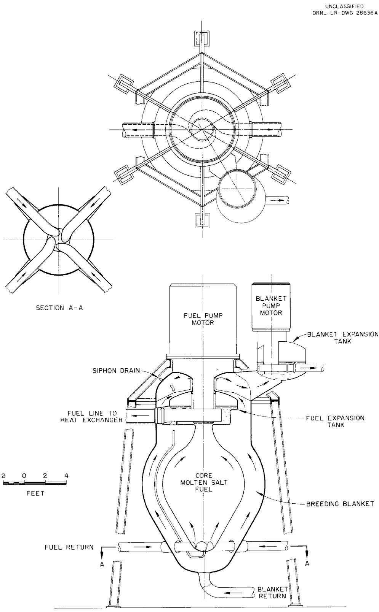  
Fig. 1.1.1. Reactor Vessel and Pump Assembly.

Table 1.1.1. Reactor Plant Characteristics   

<table><tr><td>Fuel</td><td>&gt;90% U235F4 (initially)</td></tr><tr><td>Fuel carrier</td><td>62 mole % LiF, 37 mole % BeF2, 1 mole % ThF4</td></tr><tr><td>Neutron energy</td><td>Intermediate</td></tr><tr><td>Moderator</td><td>LiF-BeF2</td></tr><tr><td>Primary coolant</td><td>Fuel solution circulating at 23,800 gpm</td></tr><tr><td>Power</td><td></td></tr><tr><td>Electric (net)</td><td>260 Mw</td></tr><tr><td>Heat</td><td>640 Mw</td></tr><tr><td>Regeneration ratio</td><td></td></tr><tr><td>Clean (initial)</td><td>0.63</td></tr><tr><td>Average (20 years)</td><td>~0.53</td></tr><tr><td>Blanket</td><td>71 mole % LiF, 16 mole % BeF2, 13 mole % ThF4</td></tr><tr><td>Estimated costs</td><td></td></tr><tr><td>Total</td><td>$69,800,000</td></tr><tr><td>Capital</td><td>$269/kw</td></tr><tr><td>Electric</td><td>8.88 mills/kwh</td></tr><tr><td>Refueling cycle at full power</td><td>Semicontinuous</td></tr><tr><td>Shielding</td><td>Concrete room walls, 9 ft thick</td></tr><tr><td>Control</td><td>Temperature and fuel concentration</td></tr><tr><td>Plant efficiency</td><td>40.6%</td></tr><tr><td>Exit fuel temperature</td><td>1210°F at approximately 83 psia</td></tr><tr><td>Steam</td><td></td></tr><tr><td>Temperature</td><td>1000°F with 1000°F reheat</td></tr><tr><td>Pressure</td><td>1800 psia</td></tr><tr><td>Second loop fluid</td><td>Sodium</td></tr><tr><td>Third loop fluid</td><td>Sodium</td></tr><tr><td>Structural materials</td><td></td></tr><tr><td>Fuel circuit</td><td>INOR-8</td></tr><tr><td>Secondary loop</td><td>Type 316 stainless steel</td></tr><tr><td>Tertiary loop</td><td>5% Cr, 1% Si steel</td></tr><tr><td>Steam boiler</td><td>2.5% Cr, 1% Mo steel</td></tr><tr><td>Steam superheater and reheater</td><td>5% Cr, 1% Si steel</td></tr><tr><td>Active-core dimensions</td><td></td></tr><tr><td>Fuel equivalent diameter</td><td>8 ft</td></tr><tr><td>Blanket thickness</td><td>2 ft</td></tr><tr><td>Temperature coefficient, (Δk/k)/°F</td><td>-(3.8 ± 0.04) × 10-5</td></tr><tr><td>Specific power</td><td>~1000 kw/kg</td></tr><tr><td>Power density</td><td>80 kw/liter</td></tr><tr><td>Fuel inventory</td><td></td></tr><tr><td>Initial (clean)</td><td>600 kg of U235</td></tr><tr><td>Average (20 years)</td><td>~900 kg of U235</td></tr><tr><td>Critical mass (clean)</td><td>267 kg of U235</td></tr><tr><td>Burnup</td><td>Unlimited</td></tr></table>

The curve had the appearance of part of an ellipse with its center about 2 in. above the entrance to the pump and perhaps 30 to 50 in. off to one side of the core centerline. The general equations of an ellipse having the ordinates shown in Fig. 1.1.2 were used to determine the distance $(b)$ off the core centerline:

$$
b ^ {2} x ^ {2} + a ^ {2} y ^ {2} - 2 b a ^ {2} y + b ^ {2} a ^ {2} - a ^ {2} b ^ {2} = 0,
$$

$$
\frac {d y}{d x} = \frac {b ^ {2} x}{a ^ {2} (y - b)} = 1. 6 2 0 8 8.
$$

By substituting the values of $x$ and $y$ shown in the sketch into the general equations, it was possible to solve for $b$ without determining the coefficients $a$ and $b$ ; $b$ was found to be 39.091. The determination of $a$ and $b$ was then made by simply transferring the origin so that it was at the center of the ellipse. The general equations were then

$$
\frac {x ^ {2}}{a ^ {2}} + \frac {y ^ {2}}{b ^ {2}} = 1,
$$

$$
\frac {d y}{d x} = - \frac {b ^ {2}}{a ^ {2}} \frac {x}{y}.
$$

The calculations gave $a = 34.15$ and $b = 30.14$ . When the result was checked for fit with the spherical portion of the core, it was found that a better match was obtained by slightly changing

UNCLASSIFIED ORNL-LR-DWG 31190

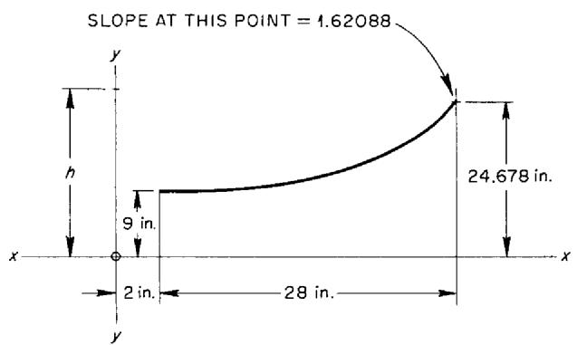  
Fig. 1.1.2. Curve Joining Spherical Portion of Core with Pump Inlet.

$b$ to 39.078. The mismatch in slope at the point of tangency with the sphere was only about $0^{\circ}1'$ , which is well within manufacturing tolerance for shapes of this size.

# WEIGHT ANALYSIS OF REACTOR SYSTEM

J.Y. Estabrook W.S.Harris

The interim design reactor was used as a basis for preliminary rough estimates of the weights of the various components of such a system. Information on the weights is pertinent to remote handling and maintenance problems, plant layout, and construction planning and costs. For these estimates it was assumed that sodium would be used as an intermediate heat exchange medium between the fuel and steam and that boilers of the Loeffler type would be used. The data obtained are presented in Table 1.1.2.

# EVALUATION OF FABRICABILITY OF REACTOR VESSEL

E. J. Breeding

Fabricability was a major consideration in the layout of the interim design reactor. Since the first reactor does not need to be designed for mass production, it was not considered to be essential to maintain interchangeability in vessel parts. It will be permissible for the fabricator to fit the parts, within reasonable limitations, to the tolerances he can expect with his equipment and methods. This implies that the entire reactor vessel should be fabricated in one shop adequately equipped to accomplish the job. If parts were to be fabricated by various suppliers, the dimensional tolerances would have to be somewhat closer to assure fitup upon assembly.

An arrangement of shapes that appear to be fabricable according to conventional practice of the pressure-vessel industry is shown in Fig. 1.1.3. Comments on the numbered sections are presented below.

# Outer Blanket Shell

Section 1 is a conventional flanged section designed as a support to which the fuel pump assembly can be bolted.

Section 2 is a transition ring to provide a satisfactory welding arrangement and stress distribution in the neck region. This section can be machined as part of section 1 or can be welded to section 1.

Table 1.1.2. Estimates of Weights of Components of a Molten-Salt Reactor System   

<table><tr><td></td><td>Weight (lb)</td></tr><tr><td colspan="2">Empty equipment</td></tr><tr><td>Reactor vessel, including fuel and blanket salt pumps and motors</td><td>111,100</td></tr><tr><td>Fuel-to-sodium heat exchangers (4)</td><td>62,300</td></tr><tr><td>Blanket salt-to-sodium heat exchanger</td><td>5,400</td></tr><tr><td>Fuel system superheaters (4)</td><td>279,000</td></tr><tr><td>Blanket system superheater</td><td>23,000</td></tr><tr><td>Fuel system reheaters (4)</td><td>50,000</td></tr><tr><td>Fuel piping</td><td>18,000</td></tr><tr><td>Blanket salt piping</td><td>4,000</td></tr><tr><td>Sodium piping</td><td>52,000</td></tr><tr><td>Sodium pumps and motors</td><td>80,000</td></tr><tr><td>Total</td><td>684,000</td></tr><tr><td colspan="2">Fuel inventory</td></tr><tr><td>In reactor, including fuel in pump and expansion spaces (325 ft3at 122 lb/ft3)</td><td>39,650</td></tr><tr><td>In piping (290 ft3)</td><td>35,380</td></tr><tr><td>In heat exchangers (224 ft3)</td><td>27,328</td></tr><tr><td>Total</td><td>102,358</td></tr><tr><td colspan="2">Blanket salt inventory</td></tr><tr><td>In reactor, pump, and expansion space (920 ft3at 201 lb/ft3)</td><td>184,920</td></tr><tr><td>In heat exchanger (29 ft3)</td><td>5,829</td></tr><tr><td>In piping (20 ft3)</td><td>4,020</td></tr><tr><td>Total</td><td>194,769</td></tr><tr><td colspan="2">Sodium inventory</td></tr><tr><td>In fuel-to-sodium heat exchangers (160 ft3at 49.5 lb/ft3)</td><td>7,920</td></tr><tr><td>In blanket salt-sodium heat exchanger (26 ft3)</td><td>1,287</td></tr><tr><td>In superheaters (768 ft3)</td><td>38,016</td></tr><tr><td>In reheaters (240 ft3)</td><td>11,880</td></tr><tr><td>In piping (830 ft3)</td><td>41,085</td></tr><tr><td>Total</td><td>100,188</td></tr></table>

Section 3 is a 2:1 ASME elliptical shell head with the center section removed. It is welded to section 2.

Section 4 is a cylinder rolled from plate and joined with one longitudinal weld.

Section 5 is a standard hemispherical shell head with a flued opening.

Section 6 is a hemispherical shell head cut and flared to mate with section 7.

Section 7 is a tapered conical section rolled from plate and joined with one longitudinal weld.

Section 8 is a 2:1 elliptical shell with a flued nozzle for joining with the blanket salt inlet pipe.

# Inner Core Shell

Section 9 is a conical, dished section with a flued opening.

Section 10, which is the pump barrel housing, can be either a straight section of pipe or a cylinder rolled from plate and longitudinally welded.

Section 11 is an elliptical shell head.

UNCLASSIFIED ORNL-LR-DWG 31191

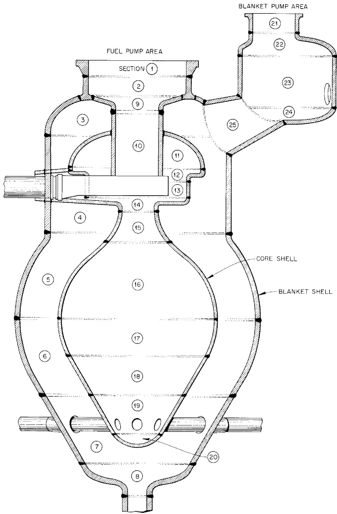  
Fig. 1.1.3. Molten-Salt Reactor Vessel. See text for discussion of fabricability of numbered sections.

Section 12 is a special shape with reverse flues.

Section 13 is a cylindrical section rolled from plate or made from straight pipe.

Section 14 is a plate with reverse flues.

Section 15 is a forged neck or a machined plate weldment.

Section 16 is a hemispherical shell head with a flared opening.

Section 17 is a hemispherical shell head cut and flared to mate with section 18.

Section 18 is a tapered conical section rolled from plate and longitudinally welded.

Section 19 is a tapered conical section rolled from plate and longitudinally welded. The fuel inlet pipe sections, the thermal sleeves, and the outer shell section 7 will be a separate subassembly.

Section 20 is an elliptical shell head.

# Blanket System Pump Housing

Section 21 is a standard flanged section combined with a nozzle section of straight pipe or a standard flange machined on a cylindrical section.

Section 22 is a standard elliptical head with a flued nozzle opening.

Section 23 is a cylindrical rolled-plate section with the pump-discharge thermal sleeve welded in as in section 19.

Section 24 is an elliptical shell head.

Section 25 is a special shape fabricated to form a transition section between the vessels.

# FUEL PUMP DESIGN

W. G. Cobb

The fuel pump proposed for the interim design reactor is shown in Fig. 1.1.4. Fuel is fed directly from the reactor core into the volute, which is suspended from the roof of the expansion tank and is submerged in the fluid. The drive motor is completely canned and is located in a clean portion of the purge gas system. The motor and pump rotating assembly are completely replaceable remotely as a cartridge unit. Fuel salt and blanket salt flow through and around structural parts for high-temperature cooling. Radiation shielding of the motor is provided by solid shield materials located below and around

the motor compartment. Temperature control of the motor and shield materials is accomplished by circulation of a low-temperature coolant through passages lining the motor compartment. The pump and motor rotating parts are mounted on a common shaft that is supported by a salt-lubricated orifice-compensated hydrostatic lower bearing, which uses the impeller suction shroud as a journal, and by a compound thrust and radial bearing located immediately below the motor rotor and supported on the cooled thermal barrier.

The upper bearing is a hemispherical orifice-compensated hydrostatic type that uses the pressurized helium purge supply for lubrication and support. An approximate bearing configuration is shown in Fig. 1.1.5. Thrust capacity is provided by the lower continuous circumferential pocket. Gas is admitted through several orificed ports into the feed grooves at the upper and lower pocket extremities to provide stability. Radial load capacity is provided by the multiple pockets surrounding the upper regions of the hemispherical journal. Each pocket has an orifice-compensated supply. The feed grooves in the thrust pocket and the radial pockets have depths of approximately 3 mils. The thrust-pocket depth would probably not exceed 1 mil. Instability interaction of the thrust and radial forces is eliminated by using a continuous circumferential bleed groove which exhausts to the motor cavity. It is expected that the high gas velocity through the inner portion of the thrust bearing will prevent diffusion of the primary fission products into the motor cavity. The elimination of liquid lubricants avoids the radiation damage and system contamination problems encountered with their usage. Approximate gas conditions for bearing operation are given below:

<table><tr><td>Gas supply pressure</td><td>50 psia</td></tr><tr><td>Motor cavity pressure</td><td>16.2 psia</td></tr><tr><td>Shaft annulus pressure</td><td>19.2 psia</td></tr><tr><td>Thrust</td><td>1000 lb</td></tr><tr><td>Radial thrust</td><td>1000 lb</td></tr><tr><td>Shaft annulus flow</td><td>1.95 scfm</td></tr><tr><td>Total thrust bearing flow</td><td>6.0 scfm</td></tr><tr><td>Total radial bearing flow</td><td>5.5 scfm</td></tr><tr><td>Total flow to motor cavity</td><td>9.55 scfm</td></tr><tr><td>Total gas flow</td><td>11.5 scfm</td></tr></table>

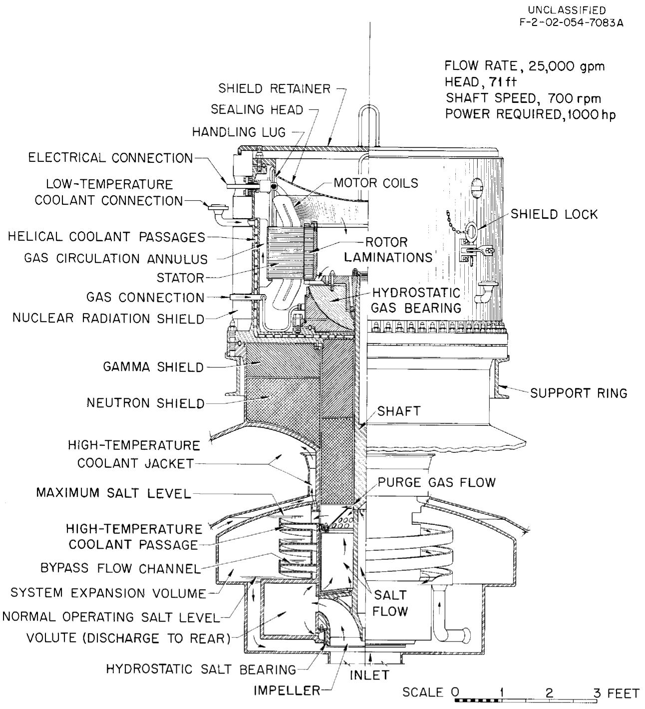  
Fig. 1.1.4. Fuel Pump for Interim Design Reactor.

UNCLASSIFIED

ORNL-LR-DWG 31192

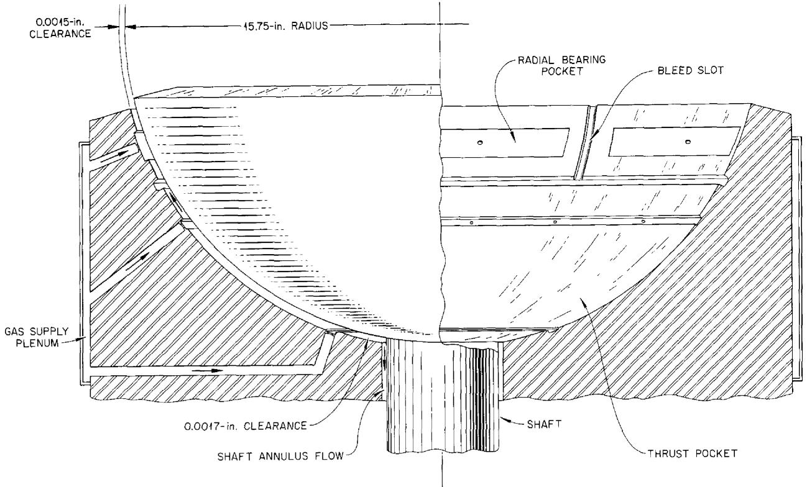  
Fig. 1.1.5. Hemispherical, Orifice-Compensated, Gas-Lubricated Bearing Designed To Be Used as Upper Bearing of Pump Shown in Fig. 1.1.4.

# NUCLEAR CALCULATIONS

# Modifications of Oracle Program Sorghum for Calculational Analyses of Molten-Salt Reactors

L.G. Alexander

The Oracle program Sorghum, a 31-group, zero-dimensional, reactor "burn-out" code, was extensively modified as required for analyses of molten-salt reactors. Provision for automatic insertion of the thorium cross sections corresponding to the partial saturation of the resonances was made, with the option available in the input format. Similarly, a fuel option in the input was added to provide a choice between $U^{233}$ and $U^{235}$ as the isotope whose concentration is adjusted to bring the reactor to the critical condition. The output edit was modified to give the following: time in years; concentration of key fuel, in atoms/cm $^3$ ; total inventory of fissionable material, in kg (including $U^{233}$ in blanket system); integrated net burnup, in kg (initial inventory plus integral of feed rate less total inventory at time $T$ );

inventories of all nuclear species in core and blanket, in kg; fraction of neutrons causing fission in each of the three fissionable isotopes $(U^{233}, U^{235}, P_{u}^{239})$ ; neutron absorption ratios for fourteen species; average $\eta$ ; average $\nu$ ; regeneration ratio; and neutron balance. These items are punched at each edit. A subroutine was also provided which edits simultaneously, via the console typewriter, the time, critical concentration of fuel, total inventory of fissionable material, regeneration ratio, and balance. A routine that provides for automatically beginning the core processing cycle at the end of the initial period (usually one year) was also added.

Several provisions for detecting defective problems were made, including the console type-out just described, a subroutine to dump the memory on drive 1 periodically so that no more than $10\mathrm{min}$ of computing time is lost in event of machine error, and iteration overflow that stops the computation in cases where the critical calculation does not converge in 31 trials. The modified program appears to be working satisfactorily.

# Analyses of Reactors Fueled with $\mathbf{U}^{233}$

# L.G. Alexander

The investigation of the initial-state nuclear characteristics of two-region, homogeneous, molten-fluoride-salt reactors fueled with $U^{233}$ was continued. The data required for comparison of reactors fueled with $U^{233}$ or $U^{235}$ and having thorium concentrations in the range from 0 to 1 mole % $ThF_{4}$ in the fuel salt were obtained, and the results are plotted in Fig. 1.1.6. The comparison is based on reactors fueled with $U^{233}$ or $U^{235}$ having a basic core salt containing 31 mole % $BeF_{2}$ and 69 mole % LiF and a blanket salt containing 25 mole % $ThF_{4}$ and 75 mole % LiF. The regeneration ratios range up to 0.95 at inventories of less than 350 kg of $U^{233}$ for a 600-Mw system having external fuel volume of 339 ft $^{3}$ .

In the interim design reactor described above, the fuel salt composition was 37 mole $\%$ $\mathsf{BeF}_2 - 63$ mole $\%$ LiF plus UF and ThF, and the blanket salt had a composition of 13 mole $\%$ ThF-16 mole $\%$ BeF-71 mole $\%$ LiF. The performance of reactors fueled with U233 and having these fuel and blanket salts is shown in Fig. 1.1.7. The

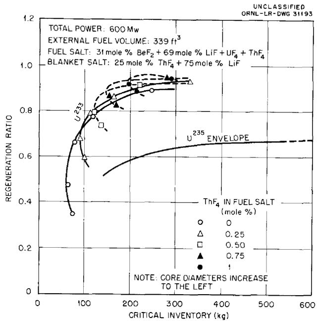  
Fig. 1.1.6. Initial-State Nuclear Performance of Two-Region, Homogeneous, Molten-Fluoride-Salt Reactors Fueled with $U^{233}$ Compared with Reactors Fueled with $U^{235}$ .

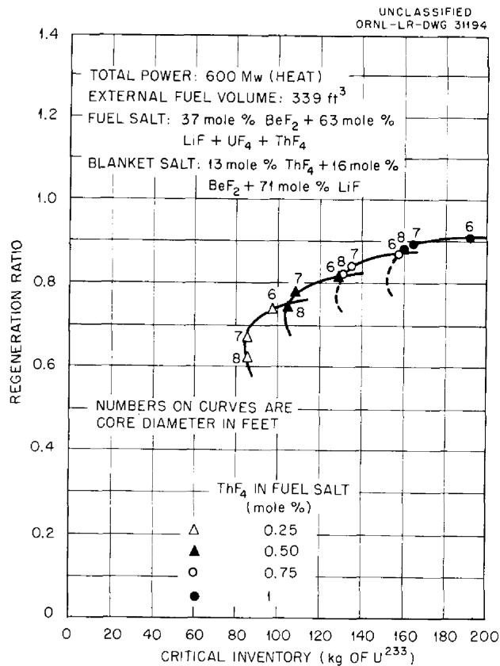  
Fig. 1.1.7. Initial-State Nuclear Performance of Two-Region, Homogeneous, Molten-Fluoride-Salt Reactors Fueled with $U^{233}$ .

regeneration ratios range up to 0.9 at critical inventories of $U^{233}$ that are about one-fifth the critical inventories required for reactors fueled with $U^{235}$ . It was clear from the trend of the curves in Fig. 1.1.7 that the performance would be improved by increasing the thorium concentration, and therefore three reactors with 4 mole % $ThF_{4}$ in the fuel salt were studied. The results, presented in Table 1.1.3, give regeneration ratios that slightly exceed 1.0. It seems reasonable that a further slight increase could be obtained by adjusting the diameter and the thorium concentration.

The long-term performance of the $U^{233}$ -fueled reactor with an 8-ft-dia core was studied with the use of the Sorghum code. An extract from the results is shown in Fig. 1.1.8. As may be seen, the regeneration ratio fell rapidly from the initial value to about 0.96 during the first year of operation, while the inventory rose about 200 kg from the initial 560 kg. At this time processing of the core fluid was started at a rate sufficient

Fuel salt: 37 mole % BeF $_2$ + 63 mole % LiF + UF $_4$ + ThF $_4$

Blanket salt: 13 mole % ThF $_4$ + 16 mole % BeF $_2$ + 71 mole % LiF

Total power: 600 Mw (heat)

External fuel volume: 339 ft3

Table 1.1.3. Initial-State Nuclear Characteristics of Two-Region, Homogeneous, Molten-Fluoride-Salt Reactors Fueled with $U^{233}$ and Having 4 Mole % ThF4 in Fuel Salt   

<table><tr><td>Core diameter, ft</td><td>6</td><td>8</td><td>12</td></tr><tr><td>U233 in fuel salt, mole %</td><td>0.324</td><td>0.226</td><td>0.140</td></tr><tr><td>U233 atom density*</td><td>12.14</td><td>8.48</td><td>5.27</td></tr><tr><td>Critical mass, kg of U233</td><td>149</td><td>246</td><td>479</td></tr><tr><td>Critical inventory, kg of U233</td><td>595</td><td>559</td><td>869</td></tr><tr><td>Neutron absorption ratios**</td><td></td><td></td><td></td></tr><tr><td>U233 (fissions)</td><td>0.8715</td><td>0.8660</td><td>0.8785</td></tr><tr><td>U233 (nγ)</td><td>0.1285</td><td>0.1340</td><td>0.1215</td></tr><tr><td>Be-Li-F in fuel salt</td><td>0.0887</td><td>0.0999</td><td>0.1274</td></tr><tr><td>Core vessel</td><td></td><td></td><td></td></tr><tr><td>Li-F in blanket salt</td><td>0.0856</td><td>0.0616</td><td>0.0320</td></tr><tr><td>Outer vessel</td><td></td><td></td><td></td></tr><tr><td>Leakage</td><td></td><td></td><td></td></tr><tr><td>Th in fuel salt</td><td>0.6409</td><td>0.7734</td><td>0.9228</td></tr><tr><td>Th in blanket salt</td><td>0.3725</td><td>0.2517</td><td>0.1306</td></tr><tr><td>Neutron yield, η</td><td></td><td>2.19</td><td>2.21</td></tr><tr><td>Regeneration ratio</td><td>1.013</td><td>1.025</td><td>1.038</td></tr></table>

\*Atoms $(\times 10^{19}) / \mathrm{cm}^3$   
\*\*Neutrons absorbed per neutron absorbed in U233.

to hold the concentration of fission fragments constant. The regeneration ratio was approximately stabilized, but the inventory continued to creep up to about $950\mathrm{kg}$ in 15 years. Meanwhile, the integrated net burnup, that is, total purchases less inventory, had reached $250\mathrm{kg}$ . The net burnup rate averaged about $16\mathrm{kg}$ per year.

# Analyses of Reactors Fueled with Plutonium

D. Baxter

Two cases of two-region, homogeneous, molten-fluoride-salt reactors fueled with plutonium were

studied. The cores contained no thorium and were 6 and 8 ft in diameter, respectively. The results of the analyses are presented in Table 1.1.4. In comparison with corresponding U235-fueled reactors, the critical inventories of these reactors are about one-third as great, and the required plutonium concentration appears to be well below the solubility limit in the salt mixtures of interest. The regeneration in the blanket was substantial; it amounted to about $40\%$ of the fuel burned. The U233 formed in the blanket should be effective in compensating for ingrowth of fission products.

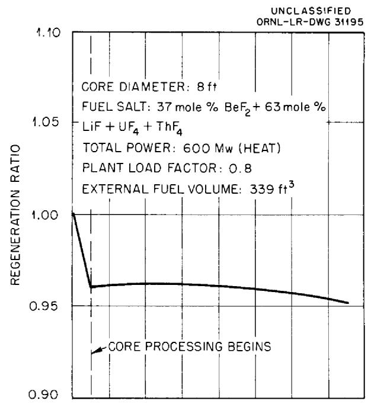

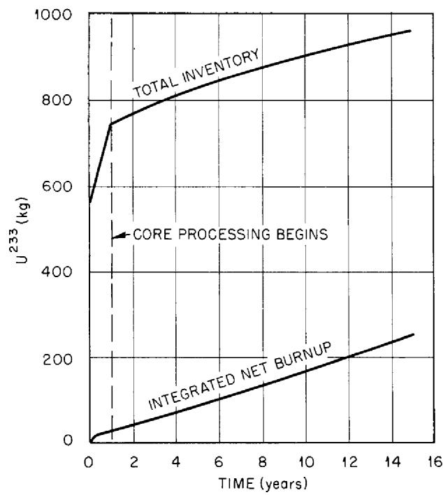  
Fig. 1.1.8. Long-Term Nuclear Performance of Two-Region, Homogeneous, Molten-Fluoride-Salt Reactors Fueled with $\mathsf{U}^{233}$ and Having 4 Mole $\%$ $\mathsf{ThF}_4$ in Fuel Salt.

# ARGON AS A PROTECTIVE ATMOSPHERE FOR MOLTEN SALTS

L.A.Mann

Helium has been used almost exclusively at ORNL as the protective or "blanket" gas for molten salts in experiments in both radioactive and nonradioactive environments. Argon has been used occasionally, and other gases have been considered as possible alternates for use with particular designs, materials, and operating conditions (for example, krypton, xenon, neon, hydrogen, nitrogen, carbon dioxide). Several factors must be considered in selecting the cover gas. The major considerations are, of course, availability and cost of gas of the required purity. In establishing the specifications for the gas, it is necessary to study the effects of the gas on the container and other contacted materials, as well as the effect of the gas on the salt and the salt on the gas. If the gas is to be used in a radioactive environment, determinations must be made of the activity that will be induced in the gas and the effect the activity will have on the system. For molten-salt reactor use, the requirement of ability to strip krypton and xenon from the fuel is an added factor.

The scarcity and high cost factors immediately eliminate neon, krypton, and xenon from consideration for use in large systems. The nonnoble gases can be evaluated only in terms of specific applications. The possible chemical activity of the nonnoble gases requires that a determination be made of the compatibility of the gas with all materials contacted under the proposed operating conditions.

A review of the various factors has indicated that only helium and argon are suitable for moltensalt reactor application. Cylinder argon costs, at present, about 6.5 cents per standard cubic foot, compared with about 4 cents for cylinder helium. Pipe line helium costs about 2.5 cents, but it is anticipated that the price will increase in the near future. Helium has the disadvantage that no considerable sources of helium have been found to exist outside the United States. Calculations have indicated that the activity produced in the A40 isotope of natural argon by neutron

Total power: 600 Mw (heat)

External fuel volume: 339 ft³

Fuel salt: 37 mole % BeF $_2$ + 63 mole % LiF + PuF $_3$

Blanket salt: 13 mole % ThF $_4$ + 16 mole % BeF $_2$ + 71 mole % LiF

Table 1.1.4. Initial-State Nuclear Characteristics of Two-Region, Homogeneous, Molten-Fluoride Reactors Fueled with Plutonium   

<table><tr><td>Core diameter, ft</td><td>6</td><td>8</td></tr><tr><td>Thorium in fuel salt, mole %</td><td>0</td><td>0</td></tr><tr><td>Pu in fuel salt, mole %</td><td>0.045</td><td>0.013</td></tr><tr><td>Pu atomic density*</td><td>1.55</td><td>0.460</td></tr><tr><td>Critical mass, kg of Pu</td><td>19.7</td><td>13.7</td></tr><tr><td>Critical inventory, kg of Pu</td><td>78.1</td><td>31.1</td></tr><tr><td>Neutron absorption ratios**</td><td></td><td></td></tr><tr><td>Pu (fissions)</td><td>0.6043</td><td>0.6291</td></tr><tr><td>Pu (n,γ)</td><td>0.3957</td><td>0.3709</td></tr><tr><td>Li-Be-F in fuel salt</td><td>0.1404</td><td>0.3093</td></tr><tr><td>Core vessel</td><td>0.1282</td><td>0.1459</td></tr><tr><td>Li-Be-F in blanket salt</td><td>0.0266</td><td>0.0233</td></tr><tr><td>Outer vessel</td><td>0.0047</td><td>0.0034</td></tr><tr><td>Leakage</td><td>0.0070</td><td>0.0033</td></tr><tr><td>Th in blanket</td><td>0.4625</td><td>0.3530</td></tr><tr><td>Neutron yield, η</td><td>1.76</td><td>1.84</td></tr><tr><td>Regeneration ratio</td><td>0.463</td><td>0.35</td></tr></table>

\*Atoms $(\times 10^{-19}) / \mathrm{cm}^3$

\*\*Neutrons absorbed per neutron absorbed in U233.

capture is negligible compared with that of the krypton and xenon that will escape from the fuel in a molten-salt reactor.

# BEARING TESTER DESIGNS

L.V.Wilson

# Hydrodynamic Bearing Tester

A test rig was designed for experimental studies of hydrodynamic bearings and bearing materials in molten salts. The apparatus consists primarily of a model PK centrifugal pump which was modified so that a journal could be mounted on the shaft at the normal impeller position, as shown in Fig. 1.1.9. The bearing is flexibly supported, and radial force may be applied to it through the load column attached to the load beam. The force for the bearing is applied to the load beam by an air cylinder mounted on the spool piece. The bearing torque is measured by changes in power input to the motor that drives the pump shaft.

Some of the materials being considered for bearings have coefficients of thermal expansion that are approximately one-third the coefficient of INOR-8. Since a stress problem will exist when the bearing assembly is raised to operating temperatures, a compensating-column type of journal mounting is being investigated. In the design illustrated in Fig. 1.1.9, the journal is mounted on eight radial load columns made of the same material as the journal. These load columns are located near the centerline of the shaft and near the axial center of the bearing to keep the differential expansion to a low enough value to be absorbed by the elastic bending of the load columns. The bearing load on the journal is transmitted to the shaft by the columnar reaction of the load columns.

Results of operating of this test rig are described in Chapter 1.2 of this report.

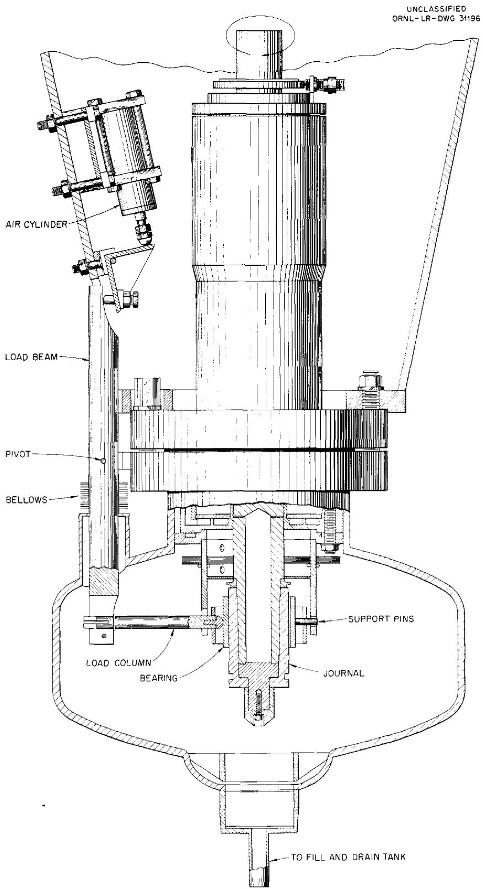  
Fig. 1.1.9. Apparatus for Experimental Studies of Hydrodynamic Bearings.

# Hydrostatic Rotating-Pocket Bearing Tester

A rig designed for water tests of a hydrostatic orifice-compensated bearing is shown in Fig. 1.1.10. The bearing pockets and orifices are located on the rotating member and the pressure supply is provided by the centrifugal pumping action of the supply channels to the orifices. The rotating element is relatively rigid, and the stationary element, which is mounted on two ball bearings,

is free to move in the direction of the load, which is applied by means of an air cylinder. Motion of the stationary element relative to the rotary element is measured by dial indicators. The stationary element is a Plexiglas shell, reinforced with cutout steel pipe, to permit observation of bearing operation. Pressure taps to measure pressure distribution are located in the Plexiglas around the periphery of the bearing.

UNCLASSIFIED

ORNL-LR-DWG31197

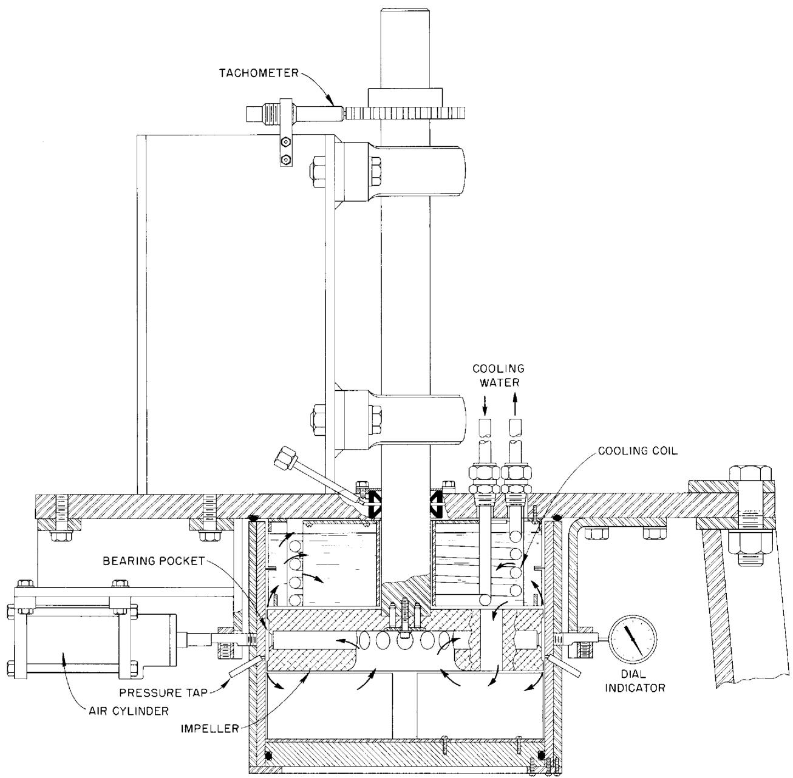  
Fig. 1.1.10. Apparatus for Experimental Studies of Hydrostatic Rotating-Pocket Bearingsings.

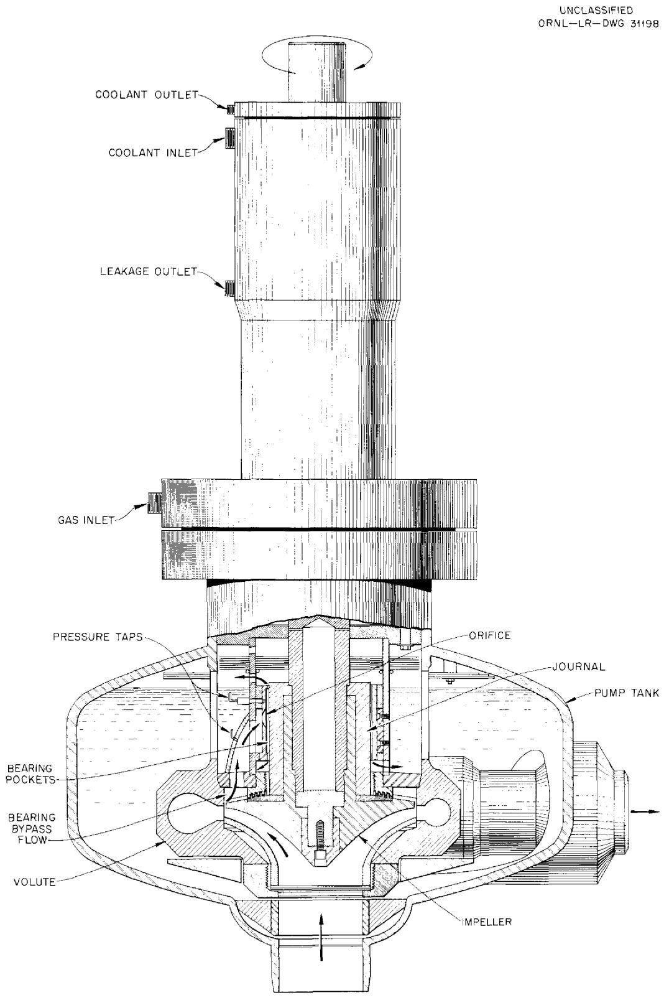  
Fig. 1.1.11. Apparatus for Experimental Studies of Hydrostatic Stationary-Pocket Bearings.

# Hydrostatic Stationary-Pocket Bearing Tester

A rig designed for testing hydrostatic stationary-pocket bearings in water and then in molten salts is shown in Fig. 1.1.11. A model PK pump was modified for this application by removing the lower ball bearing and seal, replacing them with a labyrinth seal, and mounting the journal of the hydrostatic bearing on the impeller hub. The lower bearing load is carried by the hydrostatic bearing,

which is supplied with high-pressure fluid from around the outer periphery of the impeller. The fluid flows from the impeller to the bearing orifices, into the bearing pockets, and out to the expansion tank. The load on the bearing is produced by the radial hydraulic unbalance in the volute acting on the impeller. The bearing load and the direction of the load are measured by the pressures in the bearing pockets and their resultant vector.

# 1.2. COMPONENT DEVELOPMENT AND TESTING

H. W. Savage

W. B. McDonald

Reactor Projects Division

# FUEL PUMP DEVELOPMENT

W. F. Boudreau

A. G. Grindell

# Development Tests of Salt-Lubricated Bearings

P. G. Smith

W.E.Thomas

L. V. Wilson

Hydrodynamic Bearings. Construction of equipment for testing hydrodynamic bearings in salt mixtures was completed, and cold and hot mechanical shakedown tests were performed (see Chap. 1.1 for description of equipment design). The first test was run to obtain a preliminary evaluation of tolerable bearing loads, and the bearing consisted of an INOR-8 journal and sleeve, since this material was known to have excellent corrosion resistance to salt mixtures. While dry, the bearing was subjected to one thermal cycle from room temperature to $1200^{\circ}\mathrm{F}$ and return. Heating required 26 hr and cooling 12 hr, and the journal was rotated in the bearing one-quarter turn each hour by hand.

An attempt was then made to operate the bearing in fuel salt 130 (LiF-BeF $_2$ -UF $_4$ , 62-37-1 mole %) at $1200^{\circ}\mathrm{F}$ with a shaft speed of 1200 rpm. The bearing operated for about 20 min at an applied load of up to 100 lb. When the load was increased to 125 lb, the power consumption of the drive motor increased rapidly, and within a few additional minutes the load became sufficient to stall the motor. The test was interrupted at this point, and the shaft and bearing assembly were removed for examination. Results of the examination are not yet available. A second similar bearing, modified to assure better filling, is operating satisfactorily.

Tests are planned in which fuel 130 will be used as the lubricant and some of the operations expected for the fuel pump in a molten-salt reactor will be simulated in order to obtain bearing performance data for comparison with the results of calculations based on theoretical considerations. The calculations related bearing clearance and minimum film thickness to bearing load, speed, and salt viscosity and were the basis for selecting testing clearances of 0.003 and 0.005 in between radial journal and sleeve. Calculations of the

journal power required and of Sommerfeld's number were also made for bearings having either of the two clearances specified. The INOR-8 bearing tested had a radial clearance of 0.005 in.

Other design and experimental investigations are under way to determine a suitable means for mounting refractory metal or cermet bearing journals and sleeves (molybdenum and tungsten carbide with $12\%$ cobalt binder) to the basic structural material. The design must take into account the differences in thermal expansion between the materials, and imposition of stresses sufficient to distort the bearing material must be avoided.

Hydrostatic Bearings. - Calculations have been made to determine load capacity, eccentricity, bearing liquid flow, bearing pressure distribution, journal speed, orifice size, bearing clearance, and supply pressure for tests of hydrostatic bearings. Fabrication of the test equipment (described in Chap. 1.1) is nearly complete. Preliminary water tests will be performed to obtain the bearing load and pressure distribution with respect to test loop flow, flow resistance, pump speed, and power.

Rotating-Pocket Hydrostatic Bearings. - The test apparatus described in Chap. 1.1 for evaluating the rotating pocket hydrostatic bearing, with water as a lubricant, was completed. The test bearing consists of an aluminum journal 11.351 in. in diameter and 2.5 in. in height. There are twelve pockets, 0.090 in. deep, equally spaced around the periphery, with all lands, both peripheral and axial, 0.375 in. in length. The bearing is constructed from Plexiglas pipe, bored to 11.375 in. ID, to give a radial clearance of 0.012 in. between journal and bearing. Each pocket on the journal is supplied with pressurized lubricant by one vane of the impeller. Each vane consists of a $\frac{3}{4}$ -in.-dia drilled hole and takes its inlet from the 4-in.-dia impeller eye. The test-bearing impeller is designed to deliver a 50-ft head (with water) at the orifice face when rotating at 1300 rpm.

# Development Tests of Conventional Bearings

D. L. Gray W. E. Thomas

Organic-Liquid-Lubricated Bearings. - The high-temperature sump pump being used to conduct an experimental evaluation of the behavior of Dowtherm A (eutectic mixture of diphenyl and diphenyl oxide) as a lubricant has continued to operate satisfactorily for a period of 1620 hr. The pump is circulating fuel 30 $(\mathrm{NaF} - \mathrm{ZrF}_4 - \mathrm{UF}_4, 50 - 46 - 4$ mole %) at a temperature of $1200^{\circ}\mathrm{F}$ ; the shaft speed is about 2600 rpm; the temperature of the Dowtherm A supplied to the bearings is maintained at $180^{\circ}\mathrm{F}$ , with approximately a $5^{\circ}\mathrm{F}$ rise through the test bearings.

Upon completion of 1000 hr of operation, the pump was disassembled and the test bearings were inspected. The double-row angular-contact ball bearings that were submerged in the lubricant during operation showed no detectable wear or imperfections. The diameters of the aluminum bearing and the Inconel journal were measured and the diametral clearance was found to have increased by 0.001 to 0.0045 in., as measured at room temperature. Since 0.0045 in. is the design diametral clearance, this initial wear may be attributed to "wear in" rather than to poor lubrication.

It was also noted that the O-rings (buna N material) had increased in size upon exposure to Dowtherm A, but the elasticity of the material had not been affected greatly. No leakage was observed from the O-rings during operation.

Bearing and Seal Gamma Irradiation. By the end of the quarter the pump rotary assembly being operated in the canal at the MTR as a bearing test under gamma irradiation had accumulated a gamma-ray dose of $5.9 \times 10^{9} \mathrm{r}$ . Since the bulk of the Gulfcrest 34 bearing lubricant is external to the radiation field, the oil has accumulated a gamma-ray dose of about $10^{8} \mathrm{r}$ . Samples of oil totaling $931 \mathrm{~cm}^{3}$ , collected at various time intervals from the lower-seal-leakage catch basin and from the bulk oil supply, as well as four different helium samples, have been received from the MTR for analyses. The rotary element is operating under the following conditions: shaft speed, $4000 \mathrm{rpm}$ ; total lubricating oil flow, $4 \mathrm{~gpm}$ ; temperature of oil inlet to bearing housing, $143^{\circ} \mathrm{F}$ ; lower seal helium purge flow, $60 \mathrm{liters/day}$ ; upper seal helium purge flow, $500 \mathrm{liters/day}$ .

The barrier heater used to simulate gamma heating in the lower seal area completely shorted out on March 3. The oil temperature level dropped only 5 to $7^{\circ}\mathrm{F}$ , and the loss of the heater was not considered sufficient cause for terminating the test.

For seven days during March, the test assembly operated without gamma irradiation while necessary maintenance was performed on other MTR canal tests. A power failure in April stopped test operation for approximately 20 min. During this power failure, some $750~\mathrm{cm}^3$ of oil leaked from the lower seal oil purge line before the helium purge flow was regained.

# Gas-Lubricated Bearing Studies

# D. L. Gray

Gas-lubricated bearings are being considered for use in molten-salt pumps. In one design, the gas bearing is hemispherical. A study of the literature has indicated that this type of bearing is probably feasible, but it is known that gas-lubricated bearings require very small running clearances and are subject to self-induced vibrations. Calculations have indicated that a thrust bearing of 8.5-in. spherical radius, supported with helium, as proposed for a 5000-gpm molten-salt pump, will require a minimum supply pressure of 45 to 50 psia. A gas flow of 5 scfm will be required to maintain a minimum clearance of 0.001 in. in this bearing. For a 25,000-gpm pump, a thrust bearing of 15.75 in. spherical radius that is designed for a constant clearance between journal and bearing at equilibrium conditions will require a 5-scfm helium flow into the pump tank and a 4-scfm flow into the motor cavity, at a supply pressure of 40 psia, in order to provide a minimum clearance of 0.001 in. A small hemispherical bearing approximately 8 in. in diameter will be used to test the validity of these calculations.

# Mechanical Seals

D. L. Gray

Labyrinth and Split-Purge Arrangement. - Operation was terminated of the NaK pump which was modified, as previously described, to include a

labyrinth in the pump shaft annulus between the seal region and the pump bowl and a purge gas inlet midway of its length so that a portion of the helium purge gas moved upward in the shaft annulus past the lower seal region and into the catch basin and the remainder of the purge gas moved down the shaft annulus and into the gas volume of the pump tank. The pump had operated for 3386 hr, but, during the last three weeks of the test, it was observed that the pump tank pressure responded slowly to changes in gas supply pressure. It was deduced that the small holes drilled through the heat barrier shaft sleeve to the labyrinth had become constricted. Efforts to clear the passages were unsuccessful, and the test was terminated when communication from gas supply to the pump tank became impractical.

A post-test inspection of the pump rotary assembly revealed that the lower surface of the heat barrier was covered with NaK and oxides. Brown- and black-colored material had practically filled the gas supply holes which fed the labyrinth, circumferential, V-groove plenum. This material was later determined by chemical analysis to contain approximately $7\%$ carbon, and thus it was evident that lubricating oil or graphite had played a part in the formation of the constriction.

Approximately 0.064 in. of the lower seal graphite nose piece had been worn away during the 3386 hr of service. Both face surfaces of the lower seal were free of NaK and, although worn, appeared to be in excellent operating condition.

Bellows-Mounted Seal. -- By the end of the quarter, the bellows-mounted seal being subjected to an endurance test in a NaK pump had accumulated more than 5100 hr of operation. This modified Fulton-Sylphon type of seal is being tested without gas purge protection from the vapors of the NaK being pumped. The main helical spring was removed from the standard seal and replaced with 24 small-diameter helical springs equispaced in a circle around the bellows and concentric with it. There are no elastomers in this seal, and therefore it may prove to be suitable for a pump that is to operate in a radiation field. As mentioned previously, the seal leakage during the first 2000 hr of operation averaged approximately $25~\mathrm{cm}^3/$ day, but it then decreased to approximately $8~\mathrm{cm}^3/$ week

and has remained at that rate despite two shutdowns required to correct deficiencies in parts unrelated to the test.

# Radiation-Resistant Electric Motors for Use at High Temperatures

S. M. DeCamp

The successful development of molten-salt-lubricated bearings would permit consideration of totally submerged canned-rotor pumps for molten-salt service. Such a pump would require an electric drive motor that would operate reliably at high temperatures and would be resistant to damage by radiation. A preliminary study has indicated the need for high permeability magnet steels suitable for $1250^{\circ}\mathrm{F}$ operation, current-carrying conductors of acceptable strength and electrical conductivity at $1250^{\circ}\mathrm{F}$ , and electrical insulation for use between the conductors and the magnet iron or steel that would not be damaged by high temperatures.

An investigation of electrical insulating materials was initiated. At present, ceramics and glasses appear to be the most promising materials for this application. Several wire manufacturers are developing insulated wire for missile electronic components, and some of their products may be suitable for the motor being considered.

A contract has been given to the Louis Allis Company for the production of six test coils suitable for use at $1200^{\circ}\mathrm{F}$ . These coils will be insulated with a coating of metallic oxides that appears to have good radiation and thermal stability. The first test coils, which are expected in September, will be tested at the desired service temperature, and if they have satisfactory thermal stability they will be tested for nuclear radiation stability.

Work performed by others in the development of motors for use at high temperatures has indicated that loss of strength and high resistance of the conductor will be problems at the contemplated operating temperature of $1200^{\circ}\mathrm{F}$ . Nickel and copper alloys are being considered for use as conductors. At $1200^{\circ}\mathrm{F}$ , the Curie point of common electrical steels is approached, and it may be necessary to use cobalt steels.

# Piping Preheating Tests

D. L. Gray

Tests were made to determine the length of time required to bring a typical fused-salt piping system to a temperature $(900^{\circ}\mathrm{F})$ substantially above the

salt freezing temperature by preheating a portion of a closed forced-circulation test loop with electric-furnace elements and transmitting the heat to the remainder of the loop by forced circulation of helium within the system piping.

The preheating tests were made in a loop that included a pump, piping, a venturi, and throttling valves. About 1200 lb of Inconel was used in constructing the loop. Forty-nine per cent of the total loop surface was subjected to radiant heating from the flat, ceramic-covered, radiant-wire heating elements. The loop helium pressures and pump speeds used in three tests are given below:

<table><tr><td>Loop Pressure (psig)</td><td>Pump Speed (rpm)</td></tr><tr><td>14</td><td>3475</td></tr><tr><td>98</td><td>3450</td></tr><tr><td>10</td><td>0</td></tr></table>

The required temperature of $900^{\circ}\mathrm{F}$ was attained in a period of approximately 9 hr in the test for which a system pressure of 98 psig was used. It was not possible to reach the desired temperature in either of the other tests.

# DEVELOPMENT OF TECHNIQUES FOR REMOTE MAINTENANCE OF THE REACTOR SYSTEM

E. Storto W.B.McDonald

# Mechanical Joint Development

A. S. Olson

Further screening tests were conducted on the three types of mechanical joints, described previously, that are being developed to facilitate remote removal and replacement of reactor components. The loop shown in Fig. 1.2.1, which

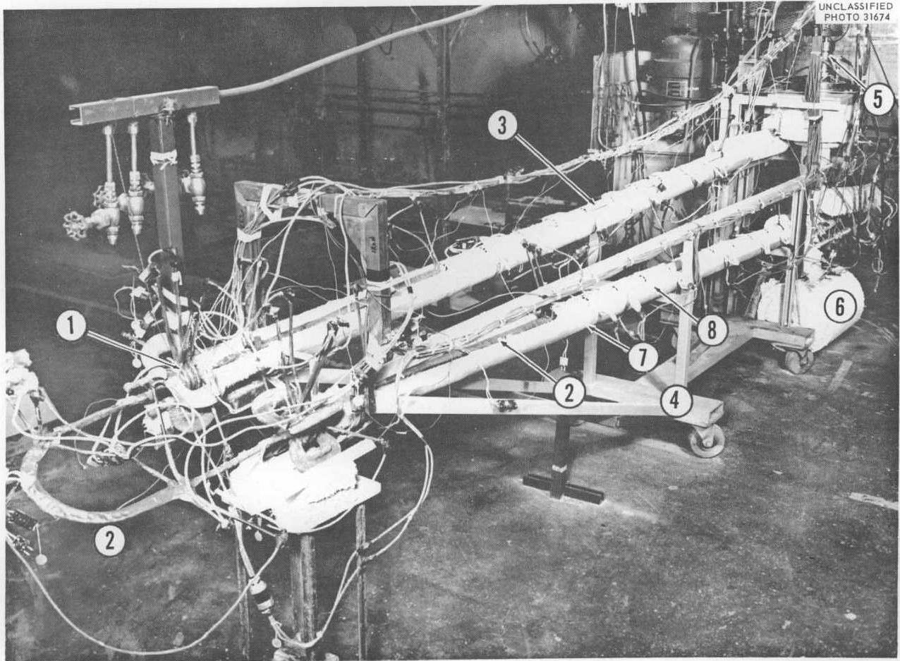  
Fig. 1.2.1. Mechanical Joint Test Loop. (1) Joint being tested, (2) Calrod heaters and shim stock binding, (3) clamshell heaters, (4) loop frame, (5) molten-salt pump, (6) salt sump, (7) insulation support trough, (8) insulation.

was used for these tests, is capable of circulating molten salts at temperatures up to $1500^{\circ}\mathrm{F}$ , and controlled thermal cycling conditions can be imposed. An assembled joint is shown in Fig. 1.2.2. The joints are subjected to the following typical test procedure:

1. joint assembled and leak checked while cold (leakage specification, $<  1\times 10^{-7}\mathrm{cm}^3$ of helium per second),   
2. joint welded into loop and loop operated through 50 thermal cycles between 1100 and $1300^{\circ}\mathrm{F}$   
3. loop drained and joint removed intact,   
4. joint leak checked,   
5. joint separated, remade, and leak checked.

None of the joints tested have given any indication of leakage during operation, and the leakage rates found before and after the tests have been satisfactory. Three joints that were photographed upon separation after testing are shown in Figs. 1.2.3, 1.2.4, and 1.2.5.

The freeze-flange joint shown in Fig. 1.2.3 was separated without difficulty, the backup seal ring was easily removed, and the frozen salt was readily cleaned from the flange faces. The indented-seal flange joint shown in Fig. 1.2.4 was also separated without difficulty, but the gasket stuck to one-half the joint and had to be machined

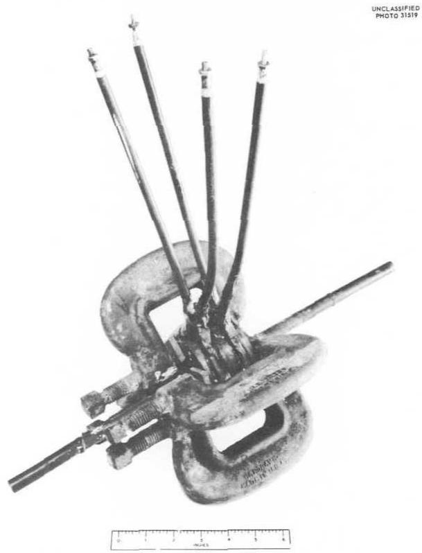

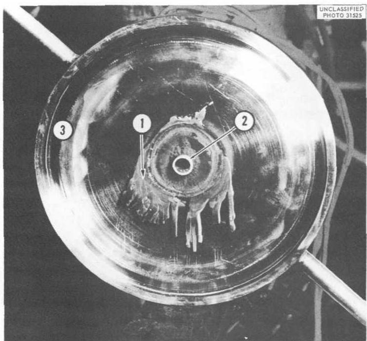  
Fig. 1.2.2. Assembled Indented-Seal Flange Joint After Removal from Test Loop.   
Fig. 1.2.3. Freeze-Flange Joint Separated After Testing. (1) Frozen salt between flange faces, (2) insert sleeve, (3) groove for backup seal ring.

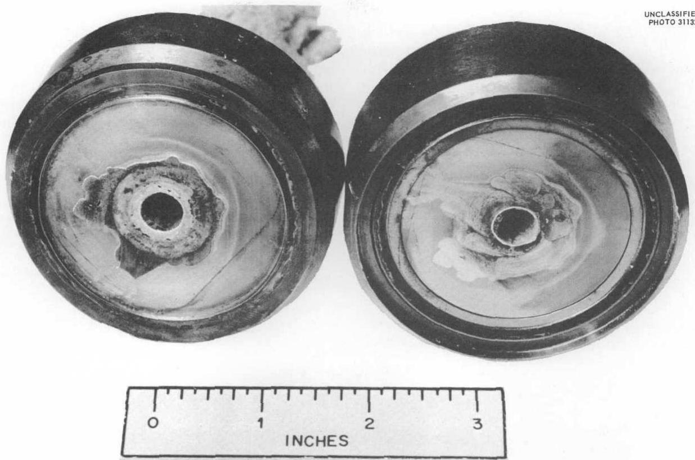

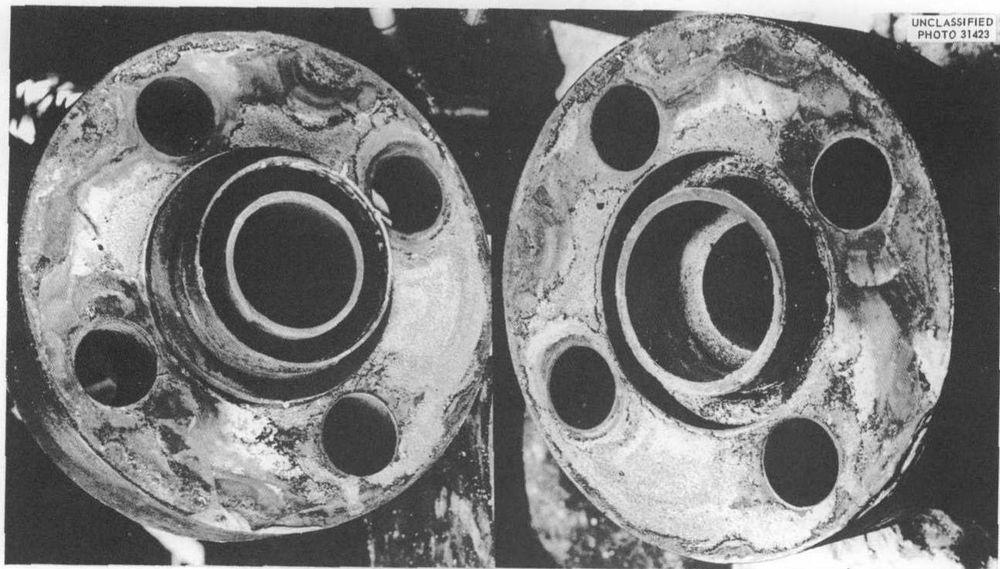  
Fig. 1.2.4. Indented-Seal Flange Joint Separated After Testing.   
Fig. 1.2.5. Cast-Metal-Sealed Flange Joint Separated After Testing.

from the flange face. The cast-metal-sealed flange joint (Fig. 1.2.5) was heated to above the melting point of the sealing metal in order to effect separation, and heavy oxidation of the sealing metal resulted. Considerable force was required to separate the flanges, and it was impossible to remake a tight joint without reworking both sealing faces.

The freeze-flange and indented-seal joints are being reassembled for testing with sodium as the circulated fluid, since sodium may be used as the secondary coolant for a molten-salt reactor system. All parts of the freeze-flange joint are being reused. A new gasket will be used in the reassembled indented-seal flange joint.

A new freeze-flange joint for use in 4-in. pipe has been fabricated and assembled, as shown in Fig. 1.2.6. Details of the design of this joint may be seen in Fig. 1.2.7. The 4-in. joint will be installed in an existing salt-circulating loop for testing. Provision has been made for continuous leak monitoring of the joint during high-temperature operation of the loop.

# Remote Manipulation Techniques

C. K. McGlothlan

Experimental remote maintenance work on a NaK pump which had been used in a high-temperature

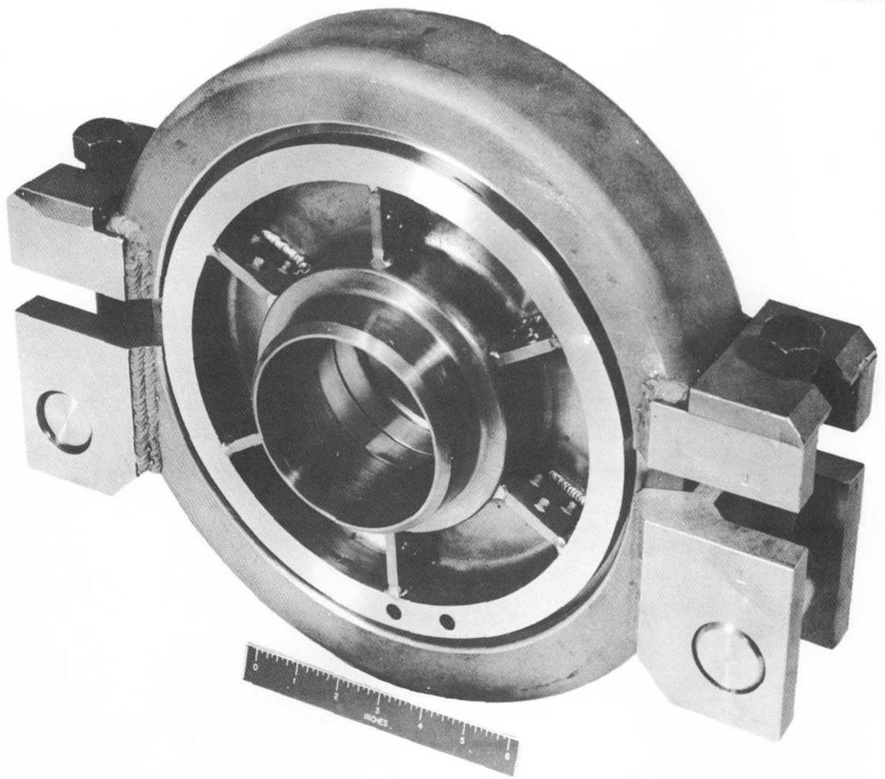  
Fig. 1.2.6. New Freeze-Flange Joint for 4-in. Pipe.

UNCLASSIFIED

ORNL-LR-DWG 31199

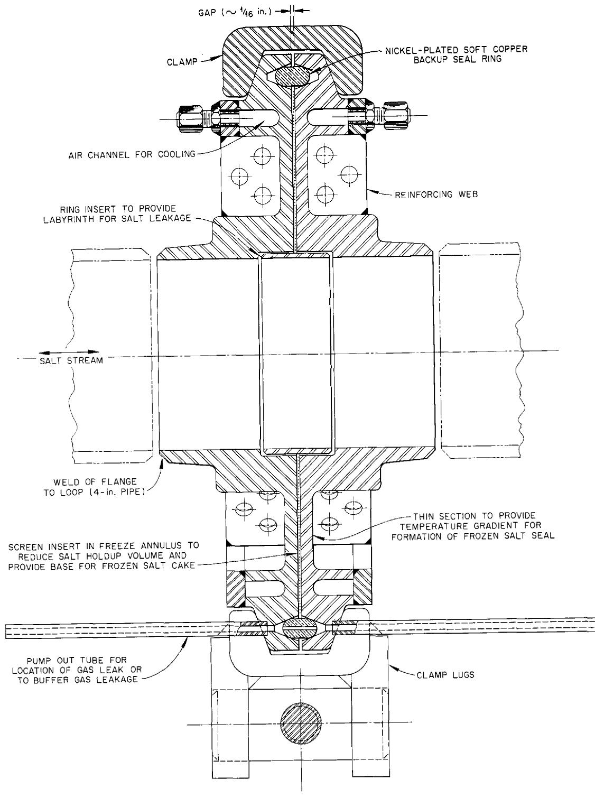  
Fig. 1.2.7. Design Details of Joint Shown in Fig. 1.2.6.

system was completed as previously planned. The results of this work showed that remote maintenance is definitely feasible for a pump or any other readily accessible component in a fused-salt system.

Good vision is essential to the performance of maintenance operations by remote manipulation, and direct viewing through cell windows, indirect viewing with periscopes, and closed-circuit television viewing have been considered for this application. The use of television is contingent on the availability of radiation-resistant cameras and the development of stereo viewing. A review of work in progress at ORNL and in industry has given reasonable assurance that video cameras

can be constructed that will operate satisfactorily for extended periods in gamma radiation of up to $1 \times 10^{5} \mathrm{r/hr}$ . Since no good stereo television system was found to be readily available, an experimental optical stereo system was designed and constructed. Stereo pair photographs were used to simulate television monitor screens activated by a pair of television cameras remotely located. The three-dimensional viewing achieved with this system was very satisfactory, and therefore specifications were issued for the purchase of a matched pair of closed-circuit television systems, the monitors of which will be substituted for the stereo pair photographs.

A study of the feasibility of remote welding by mechanical manipulation was initiated. A pair of Argonne model 8 manipulator arms was set up to handle a standard Heliarc welding torch and filler rod, as shown in Figs. 1.2.8 and 1.2.9. Two welders succeeded in producing high quality welds

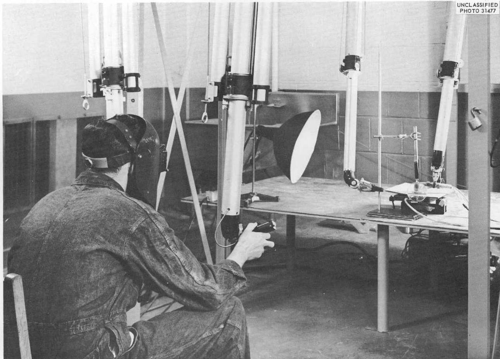  
Fig. 1.2.8. Remote Welding of Plate.

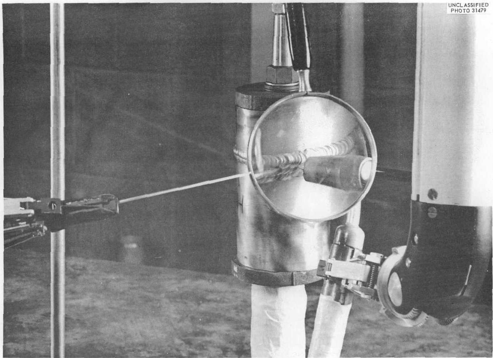  
Fig. 1.2.9. Remote Welding of Pipe.

with this apparatus on standard Inconel plate and pipe test coupons. The welds passed x-ray and dye-penetrant tests. A specimen of pipe opened by a leak was also repaired. Both welders reported that they had no difficulty in becoming accustomed to the apparatus (Figs. 1.2.10 and 1.2.11), but they both stated that inadequate viewing was a severe handicap. The best results have been achieved by viewing through binoculars, but this method results in severe eyestrain. Experiments are now being conducted on the development of camera lens filtering and special illumination to permit remote viewing of the welding process with television.

# Remote Maintenance Demonstration Facility

An engineering layout has been approved for a remote maintenance demonstration facility (Fig. 1.2.12), and detailing and fabrication of the components are proceeding. An order has been placed for a General Mills manipulator, and specifications

for a closed-circuit television viewing system were issued, as stated above. An area has been cleared for the facility in the experimental engineering building (Building 9201-3), and design of the manipulator runway is essentially complete.

# Heater-Insulation Unit Development

Pilot model heater-insulation units (Fig. 1.2.13) were fabricated and are to be tested on a loop circulating molten salts. The units are constructed on the clamshell principle and are designed to be applied to pipe sections and removed from them by remote manipulation. Each unit will serve to preheat its pipe section preparatory to filling of the system and will insulate it during high-temperature operation. Joints between units are covered with clamshell inserts that contain only insulation.

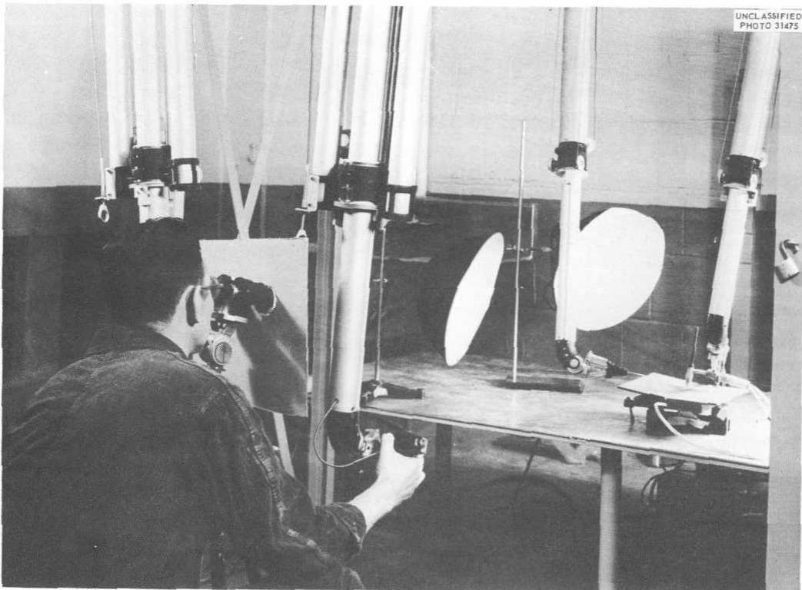

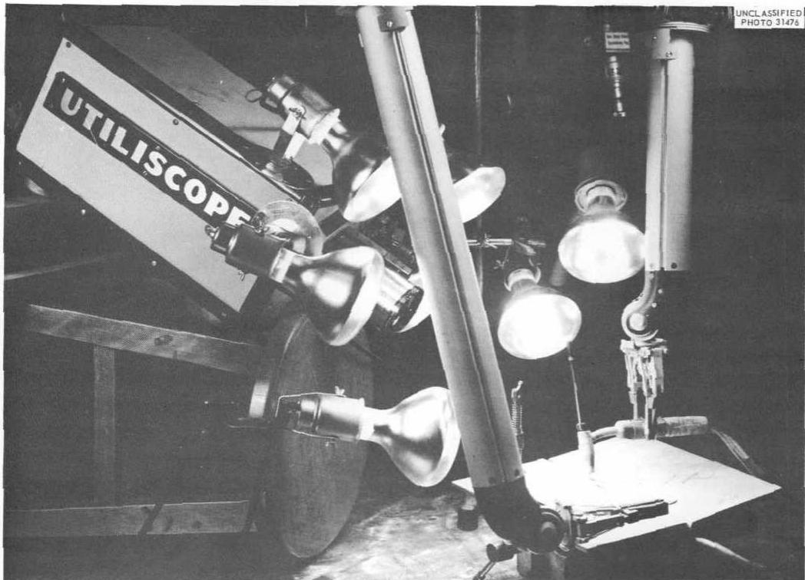  
Fig. 1.2.10. Remote Welding Viewed with Binoculars.   
Fig. 1.2.11. Setup for Television Viewing of Remote Welding.

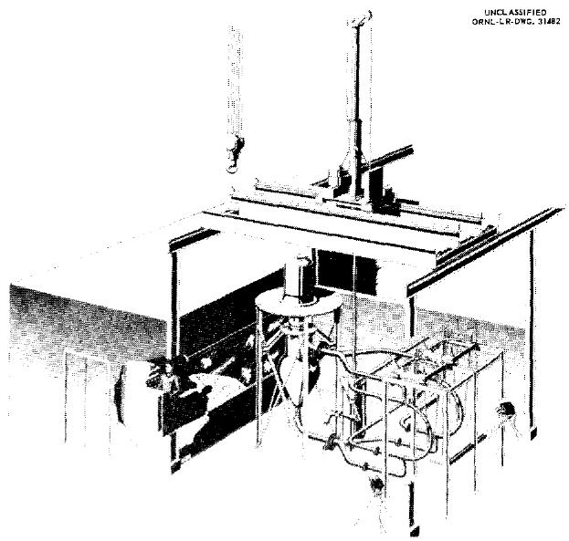  
Fig. 1.2.12. Remote Maintenance Demonstration Facility.

# EVALUATION OF EXPANSION JOINTS FOR MOLTEN-SALT REACTOR SYSTEMS

R. L. Senn

A test program was initiated to evaluate expansion joints that are commercially available, with respect to their usefulness in molten-salt reactor systems. If expansion joints can be used in fuel and coolant circuit piping, the extra space and fluid inventories required for thermal expansion loops can be avoided.

Six expansion joints were ordered from three different vendors. Each vendor will supply one Inconel and one stainless steel unit. The Inconel joints are to be tested with the molten salts of current interest, and the stainless steel joints are to be tested with sodium.

A test stand was designed and is presently being built which will provide for simultaneous testing of three expansion joints. Each joint will be cycled through its maximum axial traverse once every 2 hr for 1000 cycles. The cycle period is sufficient to allow relaxation of stresses introduced into the bellows by each half cycle. The joint will be filled with the appropriate fluid and held at $1300^{\circ}\mathrm{F}$ and 75 psi during the test.

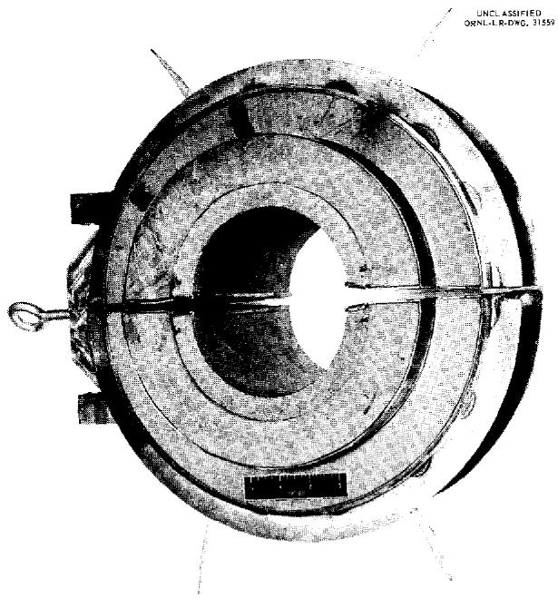  
Fig. 1.2.13. Pilot-Model Heater-Insulation Unit.

# HEAT TRANSFER COEFFICIENT MEASUREMENT

J.C.Amos R.E.MacPherson

R. L. Senn

Processing of the data obtained from a heat transfer coefficient test in which fuel 130 was circulated in an available heat exchanger test facility was completed and a preliminary report was issued. Descriptions of the test facility and experimental procedures were presented previously. Data obtained during an initial calibration run for fuel 30 $(\mathrm{NaF - ZrF_4 - UF_4},50 - 46 - 4\text{mole}\%)$ as well as the data obtained with fuel 130 flowing on the inside of the round heat exchanger tubes, are compared in Fig. 1.2.14 with (1) the Dittus-Boelter equation,

$$
N _ {N u} / N _ {P r} ^ {0. 4} = 0. 0 2 3 N _ {R e} ^ {0. 8},
$$

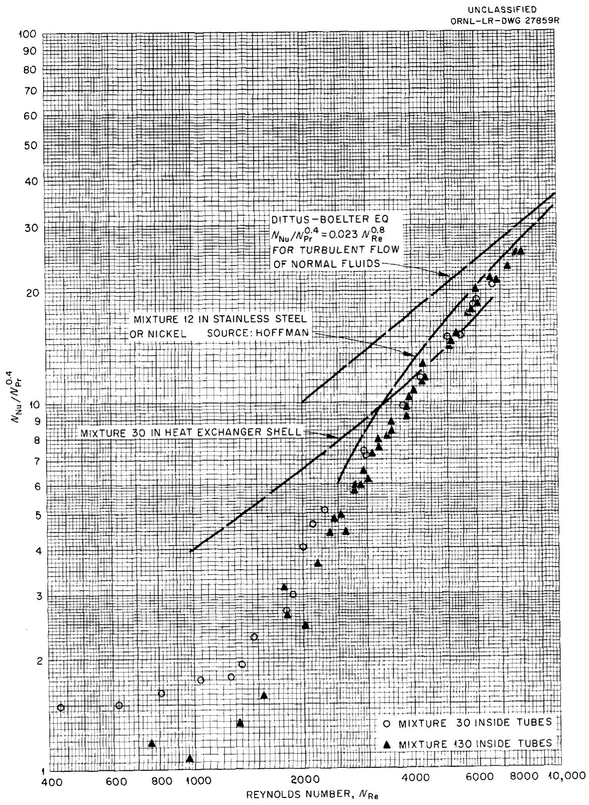  
Fig. 1.2.14. Correlation of Results of Molten-Salt Heat Transfer Coefficient Measurements.

for turbulent flow of normal fluids in ducts; (2) an experimental curve for molten salt mixture 12 (NaF-KF-LiF, 11.5-42-46.5 mole %) flowing inside round nickel or stainless steel tubes; and (3) an experimental curve for fuel 30 flowing on the shell side of heat exchangers similar to the heat exchanger utilized in this test. As may be noted, the data for flow inside the tubes are in general agreement with the data for mixture 12 and for fuel 30 flowing on the shell side above a Reynolds number of 4000, but they are lower than the shell side data at Reynolds numbers below 4000. This difference at the lower Reynolds numbers has been attributed to improved shell-side heat transfer at Reynolds numbers normally associated with laminar and early transitional flow as a result of the turbulence promoted by the wire spacers utilized in the closely spaced heat exchanger tube bundle.

It was necessary during the course of this test to formulate, on the basis of experimental data, an equation for predicting the heat transfer performance of the NaK flowing in the shell side of the test heat exchanger. The resulting equation,

$$
N _ {N u} = 0. 0 6 6 \left(N _ {R e} N _ {P r}\right) ^ {0. 6},
$$

is compared on the basis of the test heat exchanger dimensions with various other empirical heat transfer equations in Fig. 1.2.15. As may be seen, there is good agreement with an equation developed by Tidball for NaK flowing in baffled-shell heat exchangers.

A molten-salt-to-air radiator has been designed and is currently being fabricated locally to replace the NaK-to-air radiator in the heat exchanger test facility used to obtain the information described above. Modifications have been started on the test facility to accommodate this radiator and thus provide for a molten-salt-to-molten-salt heat transfer test.

# DESIGN, CONSTRUCTION, AND OPERATION OF MATERIALS TESTING LOOPS

# Forced-Circulation Loops

J. L. Crowley

Operation of forced-circulation corrosion testing loops was continued. Repair work was completed

on three loops, and, by the end of March, nine loops were operating - six that were fabricated of Inconel and three of INOR-8.

On April 6, a circuit breaker failed, and the main resistance-heating power supply was lost to six of the nine operating loops. The salts in these loops froze, and, when heat was reapplied, four of the loops ruptured in the heated section because of the excessive stress created by the expanding salt. Two of the loops successfully resumed operation.

Two of the four ruptured loops have been repaired and restarted, one was disassembled for examination, and one is yet to be repaired and restarted. Samples of tubing were removed from the loops for metallurgical examination before repairs were made. A summary of operating experience as of May 31, 1958, is presented in Table 1.2.1.

The bifluid loop, designated CPR, partially froze just after it had passed a full year of accumulated operating time because the salt-pump drive motor failed as a result of an overload. The lack of driving force on the centrifugal pump then caused a seal failure. When the pump was removed to replace the seal, a metallic coating was discovered on the impeller and the associated liner assembly. The coating is believed to have contributed to the overload of the motor by causing interference. A sample of the material was removed for analysis.

Two new loops were started. One is a standard Inconel loop (designated 9377-3 in Table 1.2.1) that is circulating fuel 131. The second is a special-purpose INOR-8 loop that contains graphite specimens and is circulating fuel 130. This loop (designated 9354-5 in Table 1.2.1) was described in the previous report.[12]

Another special-purpose loop (9354-4) for making weight-loss studies of INOR-8 sample inserts was completed and will be placed in operation when the required fuel 130 charge is available. The samples will be removed at staggered intervals, as described previously,[12] in order to establish a corrosion rate which can be extrapolated to several years of operation.

As a result of the incident which caused the four loop failures of April 6, improvement of test stands to assure operational reliability has been accelerated. Adequate automatic protection of the salt system against failures resulting from trouble with

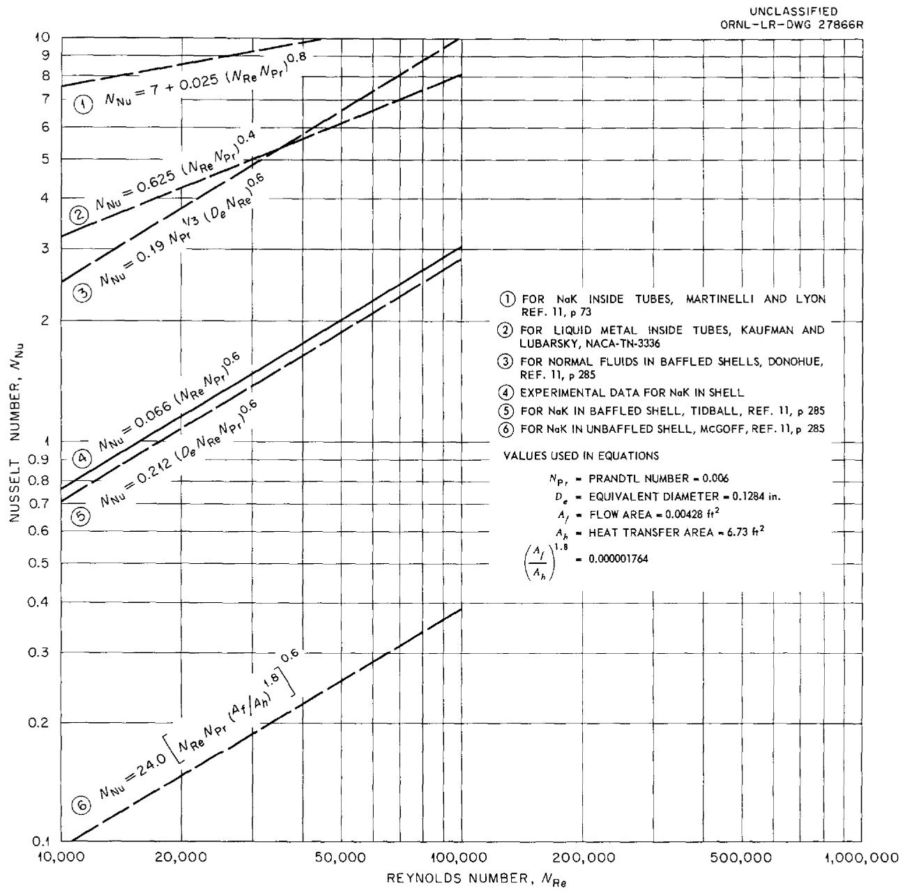  
Fig. 1.2.15. Comparison of Various NaK Heat Transfer Equations.

conventional components has required mechanical and electrical redesign of the loops and changes in operating procedures. The major improvements to be incorporated in new loops and test facilities are shown schematically in Fig. 1.2.16. A loop that incorporates all the improved features has been fabricated and is shown in Fig. 1.2.17 on its portable dolly with one half of the cooler box removed. Changes of operating loops are being made as they are shut down for disassembly or for repairs.

# In-Pile Loops

D. B. Trauger

J. A. Conlin

P.A.Gnadt

Out-of-pile tests were conducted which demonstrated adequate heat-removal capacity of the salt-to-air heat exchanger designed for use with the in-pile loop that is to be operated in the MTR.[13]

The temperature region near the salt freezing point

Table 1.2.1. Forced-Circulation Loop Operations Summary as of May 31, 1958   

<table><tr><td>Loop Designation</td><td>Loop Material and Size</td><td>Composition Number of Circulated Fluid*</td><td>Flow Rate (gpm)</td><td>Approximate Reynolds Number at 1100°F</td><td>Maximum Wall Temperature (°F)</td><td>Minimum Fluid Temperature (°F)</td><td>Maximum Fluid Temperature (°F)</td><td>Hours of Operation at Conditions Given</td><td>Comments</td></tr><tr><td rowspan="2">CPR</td><td rowspan="2">Inconel, 3/8 in. sched 40, 1 in. OD × 0.035 in. wall, 3/8 in. OD × 0.035 in. wall</td><td>122</td><td>1</td><td>5,000</td><td>1250</td><td>1095</td><td>1190</td><td>8801</td><td>Repairs being made on pump impeller</td></tr><tr><td>Sodium</td><td>~7</td><td>97,700</td><td></td><td>1085</td><td>1135</td><td></td><td></td></tr><tr><td>9344-1</td><td>Inconel, 1/2 in. OD, 0.045 in. wall</td><td>123</td><td>2</td><td>3,250</td><td>1300</td><td>1100</td><td>1210</td><td>5125</td><td>Loop shut down for 90 hr to change motor</td></tr><tr><td rowspan="2">9354-3</td><td rowspan="2">INOR-8 Hot leg, 3/8 in. sched 40 Cold leg, 1/2 in. OD, 0.045 in. wall</td><td>84</td><td>2.75</td><td>4,500</td><td>1200</td><td>1070</td><td>1150</td><td>3983</td><td>Loop froze once because of power loss; thawed successfully</td></tr><tr><td></td><td></td><td>5,400</td><td></td><td></td><td></td><td></td><td></td></tr><tr><td>9344-2</td><td>Inconel, 1/2 in. OD, 0.045 in. wall</td><td>12</td><td>2.5</td><td>8,200</td><td>1200</td><td>1000</td><td>1100</td><td>2956</td><td>Loop froze because of power loss; repaired and restarted</td></tr><tr><td>9377-1</td><td>Inconel, 1/2 in. OD, 0.045 in. wall</td><td>126</td><td>2.0</td><td>1,600</td><td>1300</td><td>1100</td><td>1175</td><td>3413</td><td>Loop froze because of power loss; to be repaired and restarted</td></tr><tr><td>9377-2</td><td>Inconel, 1/2 in. OD, 0.045 in. wall</td><td>130</td><td>2.0</td><td>3,000</td><td>1300</td><td>1100</td><td>1210</td><td>3055</td><td>Loop failed when frozen because of power loss; terminated 4/6/58</td></tr><tr><td>9354-1</td><td>INOR-8, 1/2 in. OD, 0.045 in. wall</td><td>126</td><td>2.5</td><td>2,000</td><td>1300</td><td>1100</td><td>1210</td><td>2106</td><td>Hastelloy pump bowl replaced with INOR-8 pump bowl; no incidents during this period</td></tr><tr><td>9377-3</td><td>Inconel, 1/2 in. OD, 0.045 in. wall</td><td>131</td><td>2.0</td><td>3,400</td><td>1300</td><td>1100</td><td>1215</td><td>1925</td><td>Loop froze once because of power loss; thawed successfully</td></tr><tr><td>9354-2</td><td>INOR-8, 1/2 in. OD, 0.045 in. wall</td><td>12</td><td>2.0</td><td>6,500</td><td>1200</td><td>1050</td><td>1140</td><td>1052</td><td>Hastelloy pump bowl replaced with INOR-8 pump bowl and loop restarted 2/26/58; loop subsequently froze because of power loss; failure occurred during attempt to restart</td></tr><tr><td>9354-5</td><td>INOR-8, 3/8 in. OD, 0.035 in. wall</td><td>130</td><td>1.1</td><td>2,200</td><td>1300</td><td>1100</td><td>1205</td><td>501</td><td>Special loop containing graphite samples; started 5/8/58</td></tr><tr><td>9354-4</td><td>INOR-8 Hot leg, 3/8 in. sched 40 Cold leg, 1/2 in. OD, 0.045 in. wall</td><td>130</td><td></td><td></td><td></td><td></td><td></td><td></td><td>Special loop containing INOR-8 inserts; fuel salt not yet available</td></tr></table>

\*Composition 122: NaF-ZrF4-UF4 (57-42-1 mole %)   
Composition 123: NaF-BeF $_2$ -UF $_4$ (53-46-1 mole %)   
Composition 84: NaF-LiF-BeF $_2$ (27-35-38 mole %)   
Composition 12: NaF-LiF-KF (11.5-46.5-42 mole %)

Composition 126: LiF-BeF $_2$ -UF $_4$ (53-46-1 mole %)

Composition 130: LiF-BeF $_2$ -UF $_4$ (62-37-1 mole %)

Composition 131: LiF-BeF $_2$ -UF $_4$ (60-36-4 mole %)

EMERGENCY CONDITIONS WHICH WILL AUTOMATICALLY PLACE LOOP ON ISOTHERMAL OR PRE HEAT CONDITIONS:

1. LOW TEMPERATURE.  
2. HIGH TEMPERATURE.  
3. LOSS OF TRANSFORMER POWER.   
4. LOSS OF BOTH CLUTCH SUPPLIES.   
5. LOSS OF PUMP DRIVE MOTOR.   
6. COMPLETE POWER FAILURE (DIESEL GENERATOR STARTS).   
7. LOSS OF BUS DUCT SUPPLYING LOOP EQUIPMENT (DIESEL GENERATOR STARTS).

LOOP ON ISOTHERMAL OR LOW HEAT CONDITIONS CONSISTS OF:

\*A.HEATER LUGS "B" AND "D DISCONNECTED BY 1600 AMP BREAKER TO PROVIDE RESISTANCE HEAT THROUGH LUGS "A" AND "C"TO ENTIRE LOOP EXCEPT COOLER COIL.   
B. RESISTANCE HEAT APPLIED DIRECTLY TO COOLER COIL BY 10 KVA POWER SUPPLY.

C. COOLING AIR OFF.   
D. LID DROPPED ON COOLER DUCT TO ENCLOSE COOLER COIL. NOTE: ALTERNATE METHOD, IN THE EVENT OF FAILURE OF THE 110 KVA POWER SUPPLY, AUTOMATICALLY CONNECTS CLAM SHELL HEATERS (ITEM 10) TO PROVIDE SUFFICIENT HEAT TO PREVENT HEATERZE UP.

Fig. 1.2.16. Improved Forced-Circulation Corrosion Testing Loop and Test Facilities.   
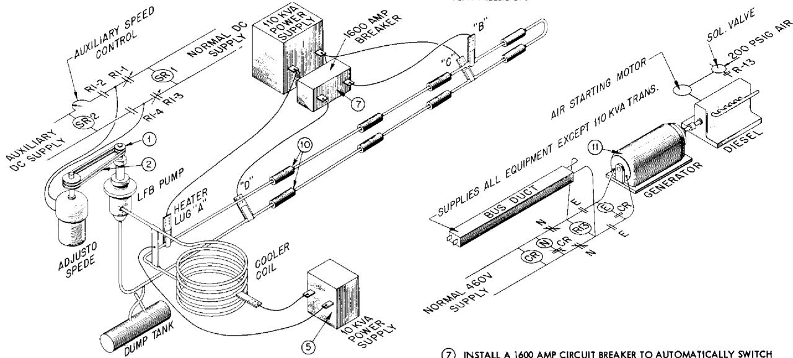  
IMPROVEMENTS INCORPORATED IN REVISED CORROSION LOOP DESIGN:   
(1) DOUBLE SHEAVES ON PUMP DRIVE.   
(2) USE OF STEEL CORE "V" BELTS.   
3. MAINTAINED CONTACT ON PUMP MOTOR START BUTTON.   
4. USE OF AUTOMATIC RESET ON TRANSFORMER POWER.   
⑤ EMISSION OF SLOW RESPONSE HEATER ELEMENTS ON COOLER COIL BY APPLYING DIRECT RESISTANCE HEAT AUTOMATICALLY IN EVENT OF AN EMERGENCY CONDITION.   
6. USE OF A LID ON COOLER COIL DUCT WHICH DROPS AUTOMATICALLY IN THE EVENT OF AN EMERGENCY CONDITION.

⑦ INSTALL A 1600 AMP CIRCUIT BREAKER TO AUTOMATICALLY SWITCH TO LOW HEAT CONNECTIONS ON LOOP PIPPING IN AN EMERGENCY.   
8. IMPROVED OPERATION OF MAGNETIC CLUT SHPE SPEED ALARM BY USE OF HIGHER QUALITY METER RELAY AND CIRCUIT CHANGES.  
9. INCREASED FUNCTION OF LOW TEMPERATURE ALARM TO INCLUDE AUTOMATIC ACTIONS FOR PREVENTION OF FREEZE UPS.

PROVISIONS MADE FOR THE USE OF CLAM SHELL HEAT AUTOMATICALLY IN THE EVENT OF A FAILURE OF MAIN 110 KVA TRANSFORMER POWER.   
11 PROVISIONS MADE FOR USE OF EMERGENCY DIESELGENERATOR, IN THE EVENT OF A COMPLETE POWER FAILURE, FOR ISOTHERMAL OPERATION OF CORROSION LOOPS.

was investigated extensively in these tests, since low temperatures can be expected during a reactor scram. It was determined that a control system can be designed which will permit the loop to survive a reactor scram without danger of freezing and without close operator supervision. The salt in the heat exchanger was deliberately frozen and remelted several times during the course of the experiment.

Prototype pump tests revealed that gravity-filling of the system will be difficult because of the surface tension of fuel 130, and two other methods of filling are being studied. One method is to fill the pump sump with small increments of fuel. This method is not compatible with filling the loop after insertion in the reactor as was done previously with other loops. Accordingly, tests are being run with the prototype pump loop to determine the

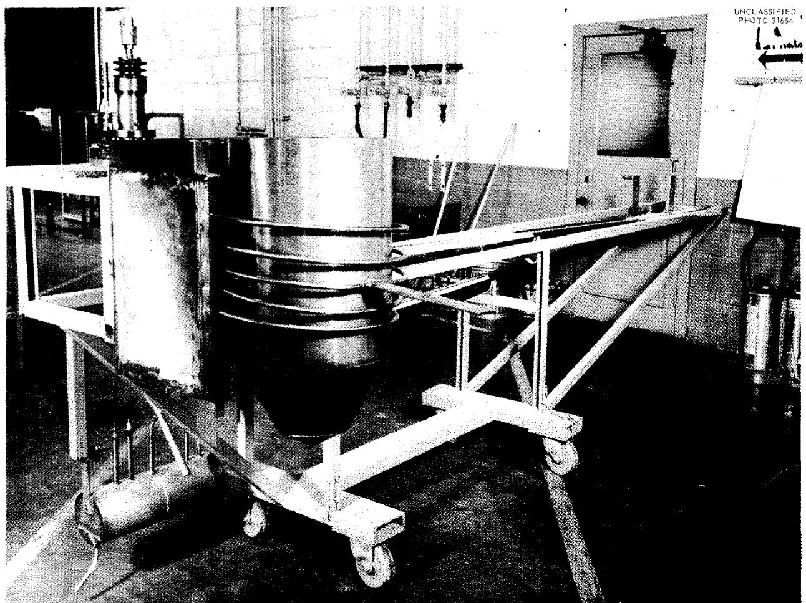  
Fig. 1.2.17. New Forced-Circulation Loop.

feasibility of freezing and melting the loop. This method would permit a complete loop checkout prior to its shipment to NRTS for installation in the MTR and would eliminate the uncertainties associated with filling after complete assembly when minor repairs could no longer be made. The second method utilizes the gravity-filling system, with the filling lines modified so that the pump impeller and loop are filled before a pump sump

level is established. This method was demonstrated successfully with water.

The in-pile loop assembly has been completed to the point where the pump can be installed. Further assembly work will be delayed, however, until the new filling techniques are tested. All parts have been fabricated and the shielding and bulkhead sections are complete.

# 1.3. ENGINEERING RESEARCH

H.W.Hoffman

Reactor Projects Division

# PHYSICAL PROPERTY MEASUREMENTS

W. D. Powers

# Viscosity

The viscosities of three beryllium-containing fluoride salt mixtures were experimentally determined over the temperature range 500 to $900^{\circ}\mathrm{C}$ . As previously described, the measurements were made with the use of precalibrated efflux-cup viscometers. The scatter of the data was above average $(\pm 10\%)$ in one case, and therefore the data must be considered to be preliminary. Mean viscosity values at three temperatures are given in Table 1.3.1.

Some of the observed deviations of the data might be explained in terms of the surface tension of the beryllium salts. There is considerable "humping" of the fluid surface, and thus the determination of the cup efflux time is extremely difficult. Further measurements of the three mixtures listed in Table 1.3.1 and of other salts are being made, and possible refinements of the measuring technique are being studied.

# Thermal Conductivity

A variable-gap apparatus is being fabricated with which to measure the thermal conductivities of beryllium-containing fluoride salt mixtures. Contamination by the beryllium salt requires that the apparatus be expendable, and, hence, it must be relatively small and inexpensive. On the

other hand, a small system increases the uncertainty in the measurement and control of the heat flow through the test sample. It is believed that the design chosen represents a satisfactory compromise between the factors of cost, ease of operation, and experimental accuracy. The apparatus will consist of two solid stainless steel cylinders, each 4 in. in diameter and $4\frac{1}{2}$ in. long, arranged so that their vertical axes are coincident. The lower cylinder will be an integral part of the sample container, while the upper cylinder will be supported and separated from the lower cylinder by a set of support rings attached to the sample container. These rings will permit adjustment of the sample thickness in 0.010-in. steps between 0 and 0.14 in. Heat generated by cartridge heaters located within the upper cylinder will flow downward through the test sample to a heat sink located below the lower cylinder. The magnitude of the heat flow will be determined by calculation from the measured temperature gradients in the two cylinders.

# Enthalpy and Heat Capacity

The measurement of the enthalpy and heat capacity of the mixture $\mathsf{LiF - BeF}_2\mathsf{-UF}_4$ (62-37-1 mole %) was completed. Values for these properties may be represented by the following equations:

$$
\begin{array}{l} \text {S o l i d} (1 0 0 \text {t o} 3 0 0 ^ {\circ} \mathrm {C}) \\ H _ {T} - H _ {3 0 ^ {\circ} \mathbf {C}} = - 9. 6 + 0. 2 9 3 T + (2. 1 8 \times 1 0 ^ {- 5}) T ^ {2} \\ c _ {p} = 0. 2 9 3 + (4. 3 6 \times 1 0 ^ {- 5}) T \\ \end{array}
$$

Table 1.3.1. Viscosities of Beryllium-Containing Fluoride Salt Mixtures   

<table><tr><td colspan="4">Salt (mole %)</td><td colspan="3">Viscosity (cp)</td></tr><tr><td>LiF</td><td>NaF</td><td>BeF2</td><td>UF4</td><td>At 600°C</td><td>At 700°C</td><td>At 800°C</td></tr><tr><td></td><td>53</td><td>46</td><td>1</td><td>15.2</td><td>7.4</td><td>4.2</td></tr><tr><td>53</td><td></td><td>46</td><td>1</td><td>20.5</td><td>10.8</td><td>6.4</td></tr><tr><td>62</td><td></td><td>37</td><td>1</td><td>12.2</td><td>7.2</td><td>4.7</td></tr></table>

Liquid (471 to $790^{\circ}\mathrm{C}$ )

$$
\begin{array}{l} H _ {T} \sim H _ {3 0 ^ {\circ} C} = 2 4. 2 + 0. 4 8 8 T + (2. 5 2 \times 1 0 ^ {- 5}) T ^ {2} \\ c _ {p} = 0. 4 8 8 + (5. 0 4 \times 1 0 ^ {- 5}) T \\ \end{array}
$$

In the expressions above,

$$
H = \text {e n t h a l p y} \quad \text {i n} \quad \mathrm {c a l} / \mathrm {g},
$$

$$
\begin{array}{l} c _ {p} = \text {h e a t c a p a c i t y i n} \mathrm {c a l} / \mathrm {g}. ^ {\circ} \mathrm {C}, \\ T = \text {t e m p e r a t u r e} \quad \mathrm {i n} \quad \mathrm {C}. \\ \end{array}
$$

# Surface Tension

Recent experiences in pumping a beryllium-containing mixture through a small in-pile loop and observations made during viscosity measurements generated interest in measurements of the surface tensions of mixtures in this class of fluoride salts. An apparatus is therefore being fabricated with which to measure surface tensions by the maximum-bubble-pressure method. The maximum pressure necessary to form a bubble at the end of a small-diameter tube immersed in the salt melt will be determined, and the surface tension will then be calculated from the formula

$$
\gamma = \delta p \frac {r}{2} ,
$$

where $\delta p$ is the pressure difference between the inside and outside of the formed bubble and $r$ is the inside radius of the tube. The maximum-bubble-pressure method was chosen for this investigation because (1) the experimental apparatus is simple and presents no design and fabrication difficulties, (2) instrumentation for measuring the pressure is available and can be readily calibrated, (3) the theory of the method is well developed and on a sound basis, and (4) a new surface is formed with each bubble so that, with a clean tip on the bubbler, surface contamination should not be a problem.

Preliminary studies made with water to provide operational experience gave the following results:

<table><tr><td>Diameter of Tube (in.)</td><td>Surface Tension (dynes/cm)</td></tr><tr><td>0.026</td><td>68</td></tr><tr><td>0.032</td><td>70</td></tr><tr><td>0.046</td><td>72</td></tr></table>

The generally accepted value for the surface tension of water is 72 dynes/cm at $24^{\circ}\mathrm{C}$ . The

difference between the accepted value and the experimental values is believed to be due to inaccuracies in the measurement of the inside tube diameter. An error of 0.001 in. would be sufficient to account for the observed discrepancies. Measurements with the salt mixture $\mathrm{NaNO}_2\mathrm{-NaNO}_3\mathrm{-KNO}_3$ (40-7-53 wt %) are currently in progress.

# Thermal Expansion

In evaluating the nuclear characteristics of a reactor, it is necessary to know the quantity of fuel present in the core at any time. For a homogeneous reactor, such as the MSR, the fuel density, and hence the amount of fuel, is dependent on the core temperature. This relationship between the core temperature and the fuel density enters the nuclear calculations as the coefficient of thermal expansion. Variations in the values derived for this coefficient for a number of beryllium-containing mixtures from density measurements at ORNL and at the Mound Laboratory have indicated the need for a direct measurement of the thermal expansion of the salt mixture.

An apparatus has been designed and is being fabricated with which to obtain the thermal expansion by measuring the difference in height of the fluid in the two legs of a U-tube when the legs are maintained at different temperatures. The liquid levels in the two legs will be determined with adjustable metallic probes inserted through the Lucite top of the inert-atmosphere box containing the apparatus. The probes will be hollow, with only the contact tip solid, since the large thermal gradient which will exist along the probe would make the length of a solid rod both variable and indeterminate. Low-expansion quartz rods will be inserted in the tubes; and the movement of the upper ends of these rods, as determined by fixed micrometers, will be used to establish the liquid-level difference in the U-tube. The initial "zero" will be obtained by maintaining the two legs at the same constant temperature.

# HYDRODYNAMIC STUDIES OF MSR CORE

# F. E. Lynch

Hydrodynamic studies of three proposed maltensalt reactor cores were continued with the use of the phosphorescent-particle flow visualization technique. The three cores being investigated

differ only in the associated entrance-exit systems which provide (1) straight-through flow with diametrically opposed entrance and exit (MSR-1), (2) concentric entrance-exit flow with fluid entering through the inner pipe and exiting through the outer annulus (MSR-2), and (3) concentric entrance-exit flow with fluid entering through the annulus and exiting through the inner pipe (MSR-3). The physical details of these models and the characteristics of flow of the second type mentioned above were described in the previous report.

The results of full-field observations made with a planar light source for the straight-through flow model (MSR-1) are given in Fig. 1.3.1. The inlet Reynolds modulus (based on the inside diameter of the inlet pipe) was 74,000, which corresponds to a flow rate of 1.38 ft/sec. It may be seen

2F. E. Lynch, MSR Quar. Prog. Rep. Jan. 31, 1958, ORNL-2474, p 35.

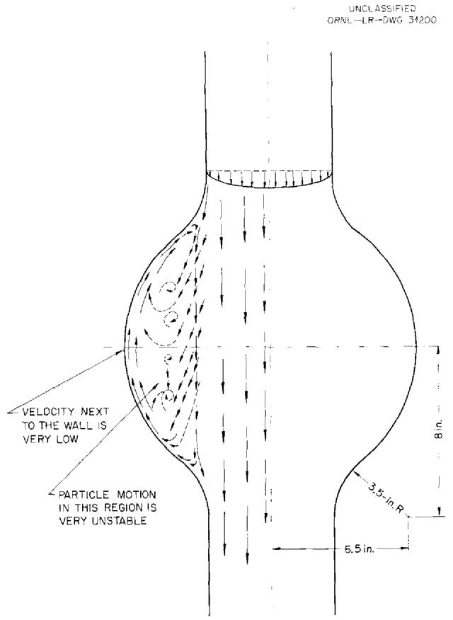  
Fig. 1.3.1. Flow Patterns Observed Within an Illuminated Plane of the Straight-Through Core Flow Model (MSR-1).

that the main high-velocity flow short-circuited the core and passed directly from the entrance to the exit with essentially no spreading. The remainder of the core was filled with slowly rotating fluid that exhibited low-velocity flow upward along the sphere surface and extremely low-velocity flow near the core exit. This rotating mass displayed some instability (perhaps associated with gross pressure fluctuations in the system), with smaller eddies appearing as indicated by the dashed lines of Fig. 1.3.1. Instantaneous velocity profiles for this same flow are shown in Fig. 1.3.2 at the indicated axial positions along the core. The flatness of the velocity profile through the central jet is apparent at all positions. The distortion of the exciting beam and the profile, particularly noticeable in $(a)$ , $(b)$ , and $(f)$ of Fig. 1.3.2, resulted from the curvature of the sphere.

Results were also obtained for flow in the third type of model described above (MSR-3). A photograph of the experimental system is shown in Fig. 1.3.3. The central pipe was flared outward at the top of the core so that the fluid entering through the outer annulus was directed along the sphere surface. For this system, the inlet Reynolds modulus (based on the diameter of the inlet side arm) was 70,000, which corresponds to a flow rate of 1.3 ft/sec.

The gross velocity patterns obtained through visual observation of particle motion within an illuminated plane of MSR-3 are shown in Figs. 1.3.4 to 1.3.6. The complexity of the flow is only partly indicated by these figures. The observed patterns were generated, not by the annular entrance per se, but rather by the manner in which the fluid entered the annulus, as is evident in Fig. 1.3.4, which shows that the fluid flowed past the central pipe rather than parallel to it. Lengthening the annular region or installing turning vanes should correct this condition. Such changes are to be studied in future tests.

The inset circle of Fig. 1.3.4 outlines the nature of an off-center rotating eddy formed by the asymmetrical inlet flow. When observed from above (see Fig. 1.3.5), this eddy was found to consist of two separate vortices, one located 120 deg from the inlet and the other slightly less than 90 deg. Both tapered toward the center and joined intermittently. The outer face of the eddy did not contact the sphere surface. At

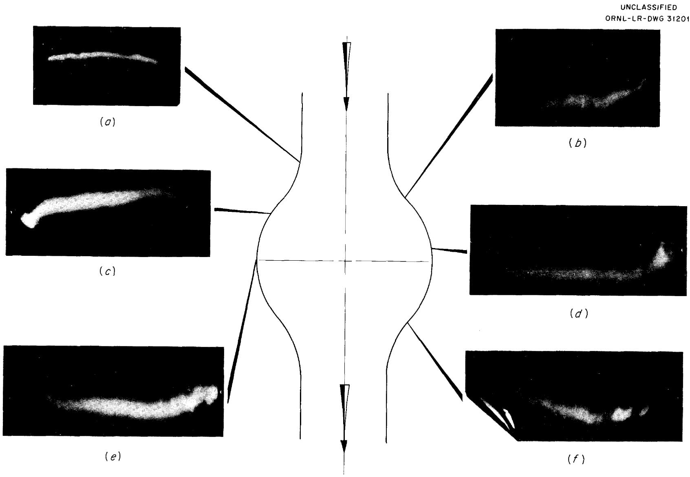  
Fig. 1.3.2. Instantaneous-Velocity-Profile Photographs in Straight-Through Core Flow Model (MSR-1).

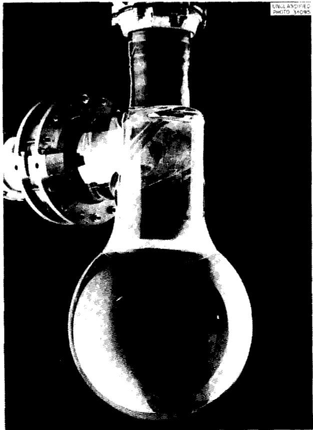  
Fig. 1.3.3. Concentric Entrance-Exit Model (MSR-3) Designed for Fluid Entrance Through Outer Annulus.

higher velocities, the vortices combined and the eddy assumed a position perpendicular to the inlet flow. Other aspects of the flow in this geometry are shown in Fig. 1.3.6, in which the plane of illumination includes the center of the sphere. The inlet flow imparted a general rotation to the entire fluid mass. Further, it was observed that at the exit the flow split and some of the fluid recirculated through the core. A number of stagnant regions were noted. One was found off the trailing edge of the inlet flare at a position 180 deg from the inlet where the incoming and recirculating flows combined. Another, found within the inlet flare region, was due to bypassing of the inlet flow. This stagnant region extended around the annulus to 90 deg on each side of the entrance. A third stagnant region was found close to the sphere center in the region of the eddy. As is also shown in Fig. 1.3.6, it was found that the axis of the eddy rotated.

A series of instantaneous velocity profile photographs obtained for this geometry are presented in Figs. 1.3.7 and 1.3.8, which were

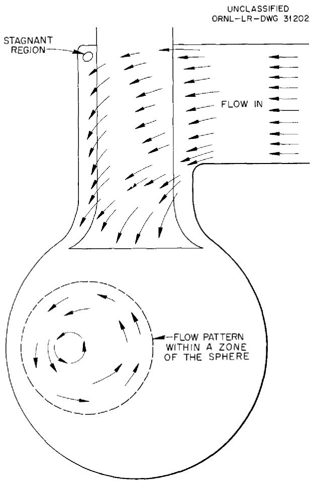

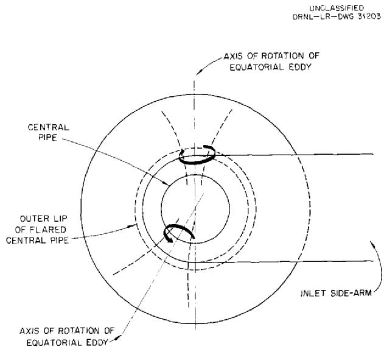  
Fig. 1.3.4. Flow Patterns Within the Annular Entrance and a Zone of MSR-3 As Observed in an Illuminated Plane.   
Fig. 1.3.5. Flow Patterns Within MSR-3 As Observed from Above.

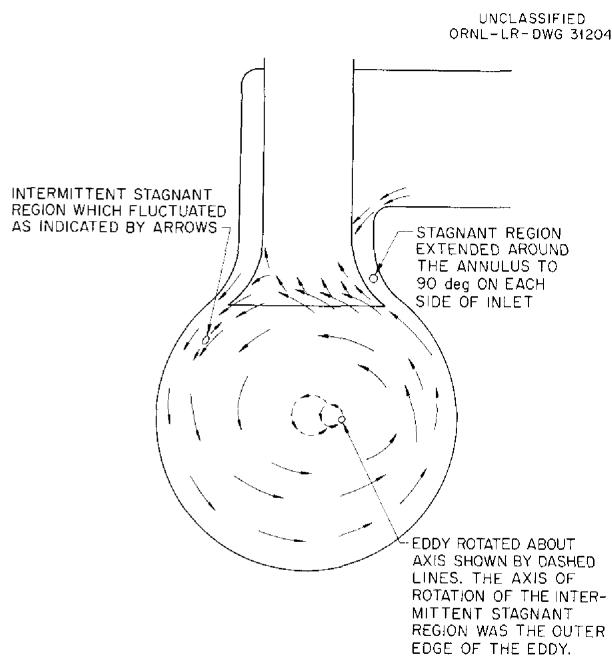  
Fig. 1.3.6. Flow Patterns Within MSR-3 As Visualized in an Illuminated Plane.

taken at positions 90 deg apart. The downward flow along the sphere wall in the region opposite the inlet is apparent in Fig. 1.3.8, while Fig. 1.3.7 gives evidence of the upward surface flow in the region closer to the inlet. Further, Fig. 1.3.8, (b) through (d), shows clearly the eddy described in Fig. 1.3.5.

Recent studies by Taylor3 of flow in a sphere with a central pipe entrance and an annular exit have shown that the depth of penetration of the inlet stream is a function of the extent of projection of the central pipe into the sphere. A bubble-photograph technique was used in these studies. Taylor also investigated the effect of flaring the inlet pipe. With no projection into the sphere, it was found that the inlet stream did not reach the bottom of the sphere. This condition persisted until the projection extended to one-fourth of an inlet-pipe diameter. Considerable vibration was observed when flared tubes were used. The amplitude of vibration increased for tube projections of one-fourth diameter or less and also varied with the expansion angle, being greater with a 40-deg

included-angle flare than with a 20-deg flare. Vibrations with the straight tube occurred only for projections of less than one-fourth diameter.

The model shown in Fig. 1.3.9 (MSR-2A) was fabricated in order to study the effect of extending the central pipe in the MSR-2 model. The central pipe was extended three-fourths of a pipe diameter into the sphere (compared with one-fourth diameter for MSR-2), and the flare at the top of the sphere in the region of the join with the exit pipe was increased. Bubble photographs of the over-all flow are shown in Fig. 1.3.10. The inlet Reynolds modulus was 118,000, which corresponds to a flow rate of 3.25 ft/sec in the inlet pipe. An unsteadiness in the flow pattern may be seen by comparing the two photographs of Fig. 1.3.10. In Fig. 1.3.10a, a well-defined eddy may be seen in the right-hand region of the sphere, while the left side shows a number of smaller eddies and more random patterns. In Fig. 1.3.10b, taken a short time later, the patterns are reversed. It was also noted that the three-fourths-diameter projection gave a higher velocity at the bottom of the sphere than did the original one-fourth-diameter projection. A series of instantaneous velocity-profile photographs obtained with this model at a Reynolds modulus of 108,000 (flow rate of 3 ft/sec) are shown in the consecutive exposure reproduced in Fig. 1.3.11. The points of excitation are indicated by arrows.

# MOLTEN-SALT HEAT TRANSFER STUDIES

# H.W.Hoffman

A preliminary series of tests was completed with the salt mixture $\mathsf{LiF - BeF}_2\mathsf{-UF}_4$ (53-46-1 mole %) flowing through an electrical-resistance-heated small-diameter Inconel tube. Typical results are shown in Fig. 1.3.12, where the data are presented in terms of the Colburn $j$ -factor. It may be seen that the limited results closely agree with the correlation, $j = 0.023N_{\mathrm{Re}}^{-0.2}$ , for ordinary fluids. Some difficulty was experienced in establishing a satisfactory heat balance for the system, and experiments are under way to diagnose and correct this difficulty. An existing system that contains a pump is to be modified so that long-time exposure data can be obtained with this salt mixture. Long-time exposure will be required in order to determine what adverse conditions, such as those which would arise as a result of film formation, will exist in this system.

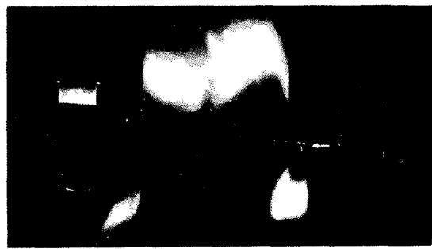  
(a)

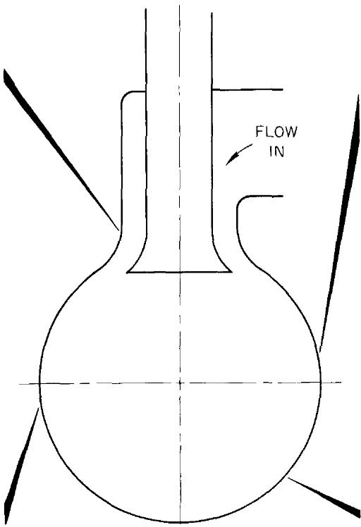

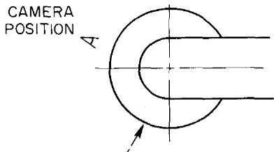  
ANGLE OF EXCITATION

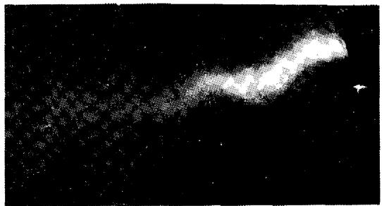  
(b)

  
(d)   
Fig. 1.3.7. Instantaneous-Velocity-Profile Photographs in MSR-3.

UNCLASSIFIED

ORNL-LR-DWG 31206

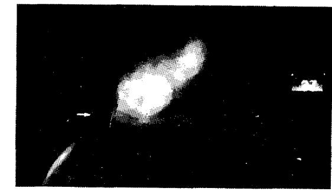  
(a)

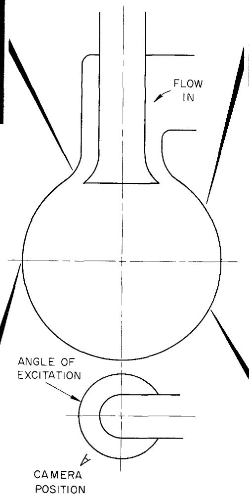

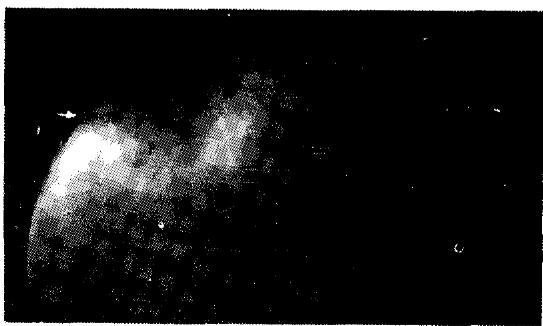  
(b)

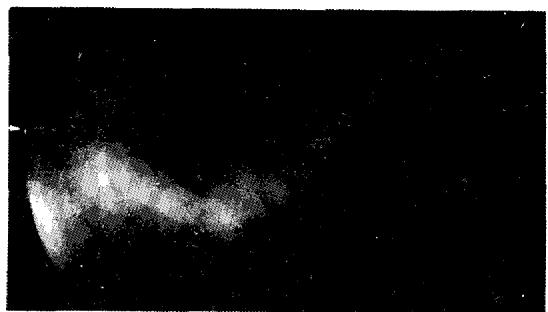  
(c)

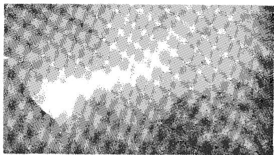  
（d）  
Fig. 1.3.8. Instantaneous-Velocity-Profile Photographs in MSR-3. Photographs taken 90 deg from those of Fig. 1.3.7.

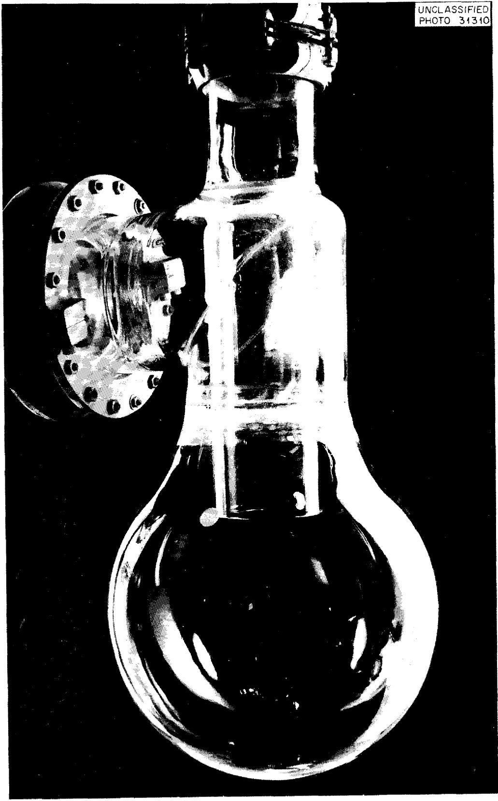  
Fig. 1.3.9. Modified MSR-2 Central-Pipe-Inlet and Annular-Exit Flow Model (MSR-2A).

UNCLASSIFIED

PHOTO 44496

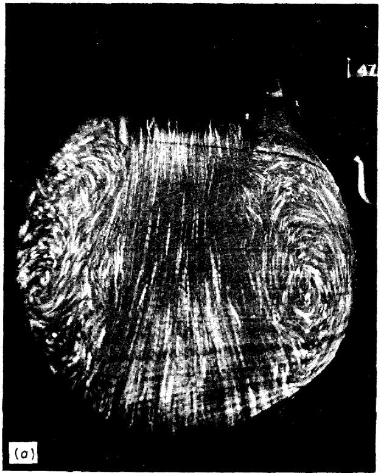

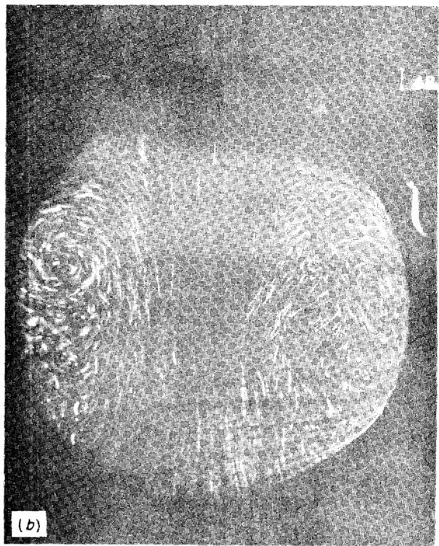

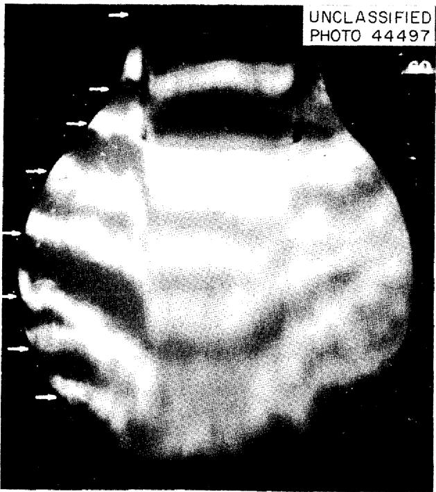  
Fig. 1.3.10. Bubble Photographs of Flow in MSR-2A.   
Fig. 1.3.11. Consecutive Instantaneous-Velocity-Profile Photographs of Flow in MSR-2A.

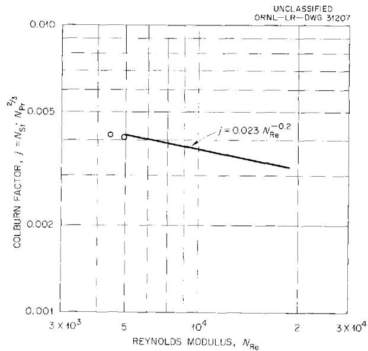  
Fig. 1.3.12. Heat Transfer with LiF-BeF $_2$ -UF $_4$ (53-46-1 Mole %).

# 1.4. INSTRUMENTATION AND CONTROLS

H. J. Metz

Instrumentation and Controls Division

# ENDURANCE AND STABILITY TESTS OF SHEATHED THERMOCOUPLES

C.M.Burton

Inconel-sheathed, 0.250-in.-OD, Chromel-Alumel thermocouples with magnesium oxide insulation and hot-junction closure welds made by the Heliarc welding process are being tested in order to determine the expected accurate life of a thermocouple in service and to determine the effect of a liquid metal or a molten-salt environment on the integrity of the closure weld. More than 10,000 hr have been accumulated in a test in which sheathed thermocouples are immersed in sodium held at $1500^{\circ}\mathrm{F}$ . The temperature of the sodium bath is reduced once each week to $1300^{\circ}\mathrm{F}$ and to $1100^{\circ}\mathrm{F}$ for readings at these temperatures. Of the 38 thermocouples included in this test, only 2 have failed because of weld closure deficiencies. Although the temperature readings from the various thermocouples being tested do not correspond exactly to the reading from the calibrated standard thermocouple as a result of individual variations and of different positions in the pot of heated sodium, drifts from the initial temperature readings are within $\pm 0.75\%$ .

# RESISTANCE-TYPE FUEL LEVEL INDICATOR

R. F. Hyland

Test facilities were prepared for an investigation of the suitability for molten-salt reactor service of the resistance-type fuel level indicator. Two Inconel elements of the type shown in Fig. 1.4.1 were fabricated for these tests without temperature compensation. Tests of these elements in fuel 130 (LiF-BeF $_2$ -UF $_4$ , 62-37-1 mole %) will provide the

data needed for design of temperature-compensated INOR-8 elements and indications of the long-term stability of the elements.

# SCANNING SWITCHES

A.M. Leppert

Design work is under way on modifications required to improve the Delta switch manufactured by the Detroit Controls Corp. for use in switching low-level transducer signals. Switches of this type are useful for monitoring transducer signals for alarm purposes and for commuting, transmitting over a pair of wires, and decommuting as many as 80 signals. The modified units are to have stainless steel housings, and the individual contacts will be insulated with Ceramicite.1 The present units have Bakelite bodies which hold and insulate the individual contacts. The modifications of this mercury-jet type of switch are being made to increase bearing life, reduce the mercury contamination, and eliminate electrostatic charges during operation.

# PRESSURE TRANSDUCERS

J. W. Krewson

A test program was initiated for determining the suitability of various types of pressure transducers for use in a reactor containment cell where freedom from drift, errors, and failure would be essential. The available instruments are being tested under a single pressure condition in order to determine their static drift behavior, and other instruments are to be obtained. The relationship between temperature and drift is also being studied.

UNCLASSIFIED PHOTO 29725

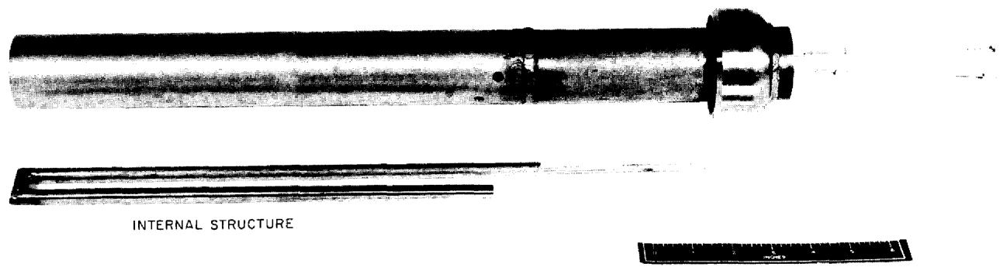  
Fig. 1.4.1. Resistance-Type Fuel Level Probe.

# 1.5. ADVANCED REACTOR DESIGN STUDIES

H. G. MacPherson

Reactor Projects Division

# AN EXPERIMENTAL 5-Mw

# THERMAL-CONVECTION REACTOR

# J.Zasler

The history of reactor technology has indicated that the development and demonstration of a reactor concept requires the operation of a small experimental reactor and a medium-sized pilot plant. In the case of molten-salt power reactor development, it appears that the simplest and most reliable experimental reactor would be based on thermal convection of the fuel. A design study has indicated that a 5-Mw thermal-convection reactor would be large enough to provide experimental data and yet be small enough to keep the

chief disadvantages of the thermal-convection system - excessive fuel volume and large heat exchangers - from being major factors. Further, the 5-Mw thermal-convection reactor could be converted to a 50-Mw pilot plant by adding a fuel pump and increasing the capacity of the heat dump. Proposed layouts for the 5-Mw reactor system are shown in Figs. 1.5.1 and 1.5.2, and the dimensions and operating conditions for 5- and 50-Mw service are given in Table 1.5.1. Provisions would be included for connecting the blanket and fuel regions so that the reactor could be operated

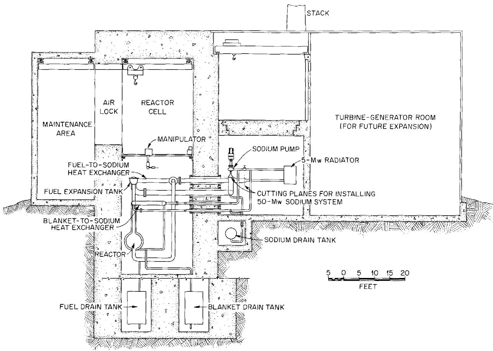  
UNCLASSIFIED ORNL-LR-DWG 31208   
Fig. 1.5.1. Elevation Drawing of 5-Mw Experimental Molten-Salt Reactor Plant.

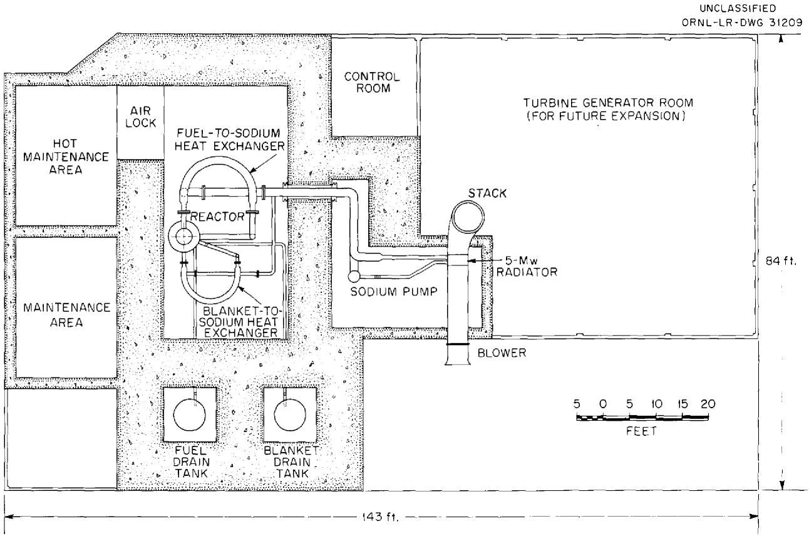  
Fig. 1.5.2. Plan View of 5-Mw Experimental Molten-Salt Reactor Plant.

as a one-region system. The 5-Mw reactor envisioned could be constructed of components already developed. In order to provide for 50-Mw operation, the fuel expansion tank was designed so that a sump-type fuel pump could be installed in it, and the sodium lines leading to the heat exchanger were sized to handle the flow required in the 50-Mw system.

The 5-Mw reactor would serve to demonstrate the feasibility of continuous operation of a moltensalt reactor, to provide in-pile corrosion data on removable samples in hot and cold legs, to develop and demonstrate remote maintenance procedures, and, by replacing the air heat dump with a steam heat dump, to demonstrate sodium-to-steam heat transfer. When the experiment had been completed, the system could be converted for 50-Mw operation by installing a sump-type fuel pump in the fuel expansion tank, a new sodium system consisting of a 10,000-gpm pump and a sodium-to-steam heat exchanger, and a turbine-generator system. The fuel-to-sodium heat exchanger designed for 5-Mw

operation would be satisfactory for 50-Mw operation because of the reduction in the fuel film resistance that would occur as a result of going from laminar flow at the lower power to turbulent flow at the higher power. Calculations indicate that the blanket circuit could be designed so that thermal convection would provide adequate circulation of the salt at both power levels, but if necessary a pump could be installed. Although such a plant would not be identical with a large-scale power-producing plant, there would be sufficient similarity, especially with respect to control, corrosion, and maintenance problems, so that successful operation would lead directly to the design and construction of a large power plant.

A rough estimate has indicated that the 5-Mw plant would cost about $10,000,000, and that for an additional $10,000,000 it could be converted to the 50-Mw plant. The arbitrary power levels and estimated costs would, of course, be subject to change if optimization studies were carried out for these systems.

Table 1.5.1. Dimensions and Operating Conditions for Experimental 5- and 50-Mw Molten-Salt Reactor Systems   

<table><tr><td>Power output, Mw (thermal)</td><td>5.19</td><td>50</td></tr><tr><td>Reactor</td><td></td><td></td></tr><tr><td>Core diameter, ft</td><td>5</td><td>5</td></tr><tr><td>Blanket thickness, ft</td><td>0.5</td><td>0.5</td></tr><tr><td>Power density, w/cm3</td><td>1.5</td><td>15</td></tr><tr><td>Diameter of riser and downcomer, in.</td><td>10</td><td>10</td></tr><tr><td>Height of fuel heat exchanger above reactor centerline, ft</td><td>20</td><td>20</td></tr><tr><td>Fuel velocity in riser, ft/sec</td><td>0.64</td><td>6.17</td></tr><tr><td>Fuel head, ft</td><td>0.39</td><td>12.66</td></tr><tr><td>Fuel volume, ft3</td><td>120</td><td>120</td></tr><tr><td>Fuel flow, gpm</td><td>158</td><td>1515</td></tr><tr><td>Sodium flow, gpm</td><td>578</td><td>9250</td></tr><tr><td>Heat exchanger</td><td></td><td></td></tr><tr><td>Tube inside diameter, in.</td><td>0.6</td><td>0.6</td></tr><tr><td>Tube wall thickness, in.</td><td>0.050</td><td>0.050</td></tr><tr><td>Tube length, ft</td><td>20</td><td>20</td></tr><tr><td>Number of tubes</td><td>250</td><td>250</td></tr><tr><td>Shell outside diameter, in.</td><td>18</td><td>18</td></tr><tr><td>Shell wall thickness, in.</td><td>0.375</td><td>0.375</td></tr><tr><td>Fuel inlet temperature, °F</td><td>1210</td><td>1210</td></tr><tr><td>Fuel outlet temperature, °F</td><td>1010</td><td>1010</td></tr><tr><td>Sodium inlet temperature, °F</td><td>850</td><td>850</td></tr><tr><td>Sodium outlet temperature, °F</td><td>1100</td><td>1000</td></tr></table>

# A 600-Mw THERMAL-CONVECTION REACTOR J. Zasler

An analysis similar to that of Romie and Kinyon² was used as a basis for a study of the possibility of a thermal-convection reactor of approximately 600-Mw thermal output. A system with the following dimensions would be required if a fuel-to-sodium heat exchanger, with sodium in the tubes, were used:

Core diameter, ft 8

Fuel temperature drop, ${}^{\circ}\mathsf{F}$ 200

Height of heat exchanger above 25 reactor centerline, ft

Diameter of riser, ft 4

Heat exchanger pressure drop, lb/ft² 27

Heat exchanger (based on use of 4) Number of tubes (in each exchanger) 6125

Outside diameter of tubes, in. 0.70  
Tube length, ft 11.4

Fuel volumes, ft3

In reactor and expansion tank 300

In riser and downcomer 800

In heat exchangers 675 Total 177

2F. E. Romie and B. W. Kinyon, A Molten Salt Natural Convection Reactor System, ORNL CF-58-2-46 (Feb. 5, 1958).

The $1775\mathrm{ft}^3$ value is to be compared with the $530\mathrm{ft}^3$ estimated for a reactor system in which the fuel is circulated by a pump. The greater fuel volume would be reflected in a higher cost for the larger inventory of $\mathsf{U}^{235}$ , the lower conversion ratio, and the increased size of equipment. The cost of power from such a system would probably be approximately $\frac{1}{2}$ mill/kwhr higher than for the system in which the fuel is circulated by a pump.

# GAS-COOLED MOLTEN-SALT HEAT EXCHANGER

# R.E. MacPherson

A design study was completed of the heat exchange equipment that would be required for gas cooling of a molten-salt reactor. For the study, it was assumed that the reactor had an output of 574 Mw (thermal) that was divided among four primary salt-to-gas heat exchangers. Helium, steam, and hydrogen were considered as coolants, and the effects of varying tube sizes, coolant pressure level, and coolant inlet temperature (at a fixed outlet temperature) were investigated.

The following dimensions and operating conditions were assumed for a heat exchanger of the type illustrated in Fig. 1.5.3 in the preparation of Table 1.5.2, which gives operating cost data as a function of the type of coolant:

<table><tr><td>Salt</td><td>LiF-BeF2-UF4(62-37-1
mole %, fuel 130)</td></tr><tr><td>Salt inlet temperature</td><td>1210°F</td></tr><tr><td>Salt outlet temperature</td><td>1075°F</td></tr><tr><td>Coolant outlet temperature</td><td>1025°F</td></tr><tr><td>Coolant operating pressure</td><td>300 psig</td></tr><tr><td>Heat load</td><td>143.5 Mw</td></tr><tr><td>Tubing size</td><td>0.5 in.</td></tr><tr><td>Wall thickness</td><td>0.050 in.</td></tr><tr><td>Fin dimensions</td><td></td></tr><tr><td>Outside diameter</td><td>1.024 in.</td></tr><tr><td>Thickness</td><td>0.023 in.</td></tr></table>

<table><tr><td>Fins per inch</td><td>7.32</td></tr><tr><td>Salt pressure drop</td><td>40 psig</td></tr><tr><td>Enriched salt cost</td><td>$1335/ft3</td></tr><tr><td>Blower power cost</td><td>9 mills/kwhr</td></tr></table>

It may be seen that, for a given set of conditions, hydrogen is the most effective coolant. Helium and steam are reasonably comparable, since the larger-diameter heat exchanger required with steam offsets the advantage of shorter length. There are certain economic incentives for choosing steam over helium, since components for high-temperature steam systems are well developed. In addition, leakage of steam to the atmosphere would be less of a problem inasmuch as the replacement cost would be negligible. However, the consequences of a steam-to-salt leak would be quite serious.

By lowering the coolant inlet temperature to $700^{\circ}\mathrm{F}$ , a heat exchanger with helium as coolant appears to be more attractive dimensionally than the heat exchanger with hydrogen at an inlet temperature of $850^{\circ}\mathrm{F}$ . The hazards of hydrogen usage would be avoided, but other problems would be introduced by the gas being at a temperature lower than the salt freezing temperature.

The results presented in Table 1.5.2 were based on a heat exchanger with circumferentially finned tubing with the salt making four serpentine passes across the helium stream. Inconel was used exclusively as the material of fabrication for both tubes and fins to avoid any question of material compatibility. Mechanical bonding of the fins to the tubes was assumed. An optimization of the tubing size on the basis of the assumed operating conditions indicated a tube diameter of 0.5 in. Larger tube diameters led to excessive tube lengths, and smaller diameters led to large numbers of tubes in the matrix.

Table 1.5.2. Gas-Cooled Molten-Salt Heat Exchanger Operating Costs Based on Enriched Salt Cost plus Blower Power Cost   

<table><tr><td rowspan="2">Coolant Gas</td><td rowspan="2">Coolant in let Temperature (°F)</td><td colspan="2">Heat Exchanger Size</td><td rowspan="2">Yearly Operating Cost for One Heat Exchanger</td></tr><tr><td>Length (ft)</td><td>Diameter (ft)</td></tr><tr><td>Helium</td><td>850</td><td>32</td><td>9.8</td><td>$216,000</td></tr><tr><td>Hydrogen</td><td>850</td><td>18</td><td>8.9</td><td>$198,000</td></tr><tr><td>Steam</td><td>850</td><td>26</td><td>11.2</td><td>$211,000</td></tr><tr><td>Helium</td><td>700</td><td>17</td><td>8.2</td><td>$191,000</td></tr></table>

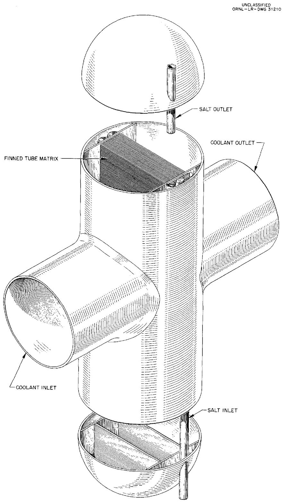  
Fig. 1.5.3. Gas-Cooled Heat Exchanger.

.

#

# MATERIALS STUDIES

# 2.1. METALLURGY

W.D.Manly D.A.Douglas A.Taboada Metallurgy Division

# DYNAMIC CORROSION STUDIES

J.H.DeVan J.R.DiStefano

Corrosion experiments in which Inconel and INOR-8 thermal-convection and forced-circulation loops are being utilized were continued as part of a three-phase corrosion program, previously described. No forced-circulation loop tests were completed during the quarter, and therefore no additional results of examinations are available. The status of all forced-circulation loops now in operation is presented in Chap. 1.2 of this report. Tests of three Inconel and eight INOR-8 thermal-convection loops were completed during the quarter, however, and results of examinations of these loops are presented here.

# Inconel Thermal-Convection Loop Tests

The three Inconel thermal-convection loop tests which were completed conclude the first phase of

corrosion testing of this alloy in contact with fused fluoride mixtures. The purpose of this initial testing phase was to obtain information with which to evaluate the relative corrosive characteristics of 12 fluoride mixtures in Inconel thermal-convection loops operated for 1000 hr at a maximum hot-leg temperature of $1250^{\circ}\mathrm{F}$ with a temperature difference across the loop of $170^{\circ}\mathrm{F}$ . The hot leg of Inconel loop 1178, which circulated fuel mixture 130 (62 mole % LiF-37 mole % $\mathrm{BeF}_2 - 1$ mole $\% \mathrm{UF}_4$ ), was found to have voids to a depth of 1 mil, as shown in Fig. 2.1.1. The second loop (1191), which circulated fuel mixture 131 (60 mole $\%$ LiF-36 mole $\%$ $\mathrm{BeF}_2 - 4$ mole $\%$ $\mathrm{UF}_4$ ), was found to have hot-leg attack in the form of intergranular voids to a depth of less than 1 mil, as shown in Fig. 2.1.2. The third loop

J. H. DeVan, J. R. DiStefano, and R. S. Crouse, MSR Quar. Prog. Rep. Oct. 31, 1957, ORNL-2431, p 23.

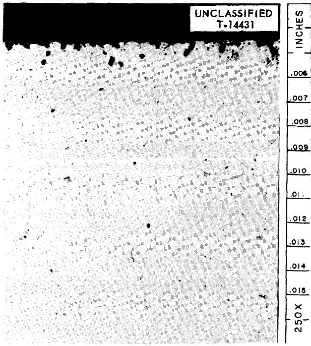  
Fig. 2.1.1. Hot-Leg Section of Inconel Thermal-Convection Loop 1178 Which Circulated $\mathsf{LiF - BeF}_2\mathsf{-UF}_4$ (62-37-1 Mole %) for 1000 hr at $1250^{\circ}\mathsf{F}$ . 250X.

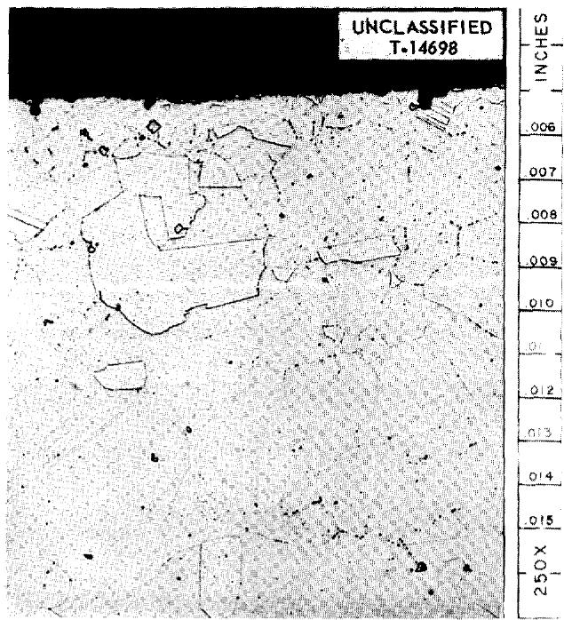  
Fig. 2.1.2. Hot-Leg Section of Inconel Thermal-Convection Loop 1191 Which Circulated LiF-BeF $_2$ -UF $_4$ (60-36-4 Male %) for 1000 hr at $1250^{\circ}$ F. 250X.

(1192) was operated to check previous test results obtained with fuel mixture 125 (53 mole % NaF-46 mole % BeF $_2$ -0.5 mole % UF $_4$ -0.5 mole % ThF $_4$ ). The previous loop (1174) that circulated this fuel mixture at $1250^{\circ}\mathrm{F}$ was attacked to a depth of 2 mils. The check of the results was considered to be necessary (1) because corrosion theory indicates that UF $_4$ should effect a higher corrosion rate than comparable additions of ThF $_4$ and (2) because a loop (1163) which had circulated a mixture which was the same, except that the ThF $_4$ was replaced with UF $_4$ , showed quite limited corrosion to a depth of less than 1 mil. The

examination of the check loop (1192), however, showed attack to a depth of 4 mils in the hot section. No explanation for the increased attack is readily apparent at this time. Chemical analyses of the salts circulated in these loops are presented in Table 2.1.1.

# INOR-8 Thermal-Convection Loop Tests

The operating conditions and results of eight INOR-8 thermal-convection loop tests are presented in Table 2.1.2. These are the first results reported for INOR-8 loops operated under MSR conditions. As may be observed, the results are favorable;

Table 2.1.1. Chemical Analyses of Salts Circulated in Inconel Thermal-Convection Loops for 1000 hr at a Hot-Leg Temperature of $1250^{\circ}$ F   

<table><tr><td rowspan="2">Loop No.</td><td rowspan="2">Salt No.</td><td rowspan="2">Salt Composition (mole %)</td><td rowspan="2">Sample Taken</td><td colspan="3">Major Constituents (wt %)</td><td colspan="3">Minor Constituents (ppm)</td></tr><tr><td>U</td><td>Be</td><td>Th</td><td>Ni</td><td>Cr</td><td>Fe</td></tr><tr><td rowspan="2">1178</td><td rowspan="2">130</td><td rowspan="2">62 LiF-37 BeF2-1 UF4</td><td>Before test</td><td>6.81</td><td>8.88</td><td></td><td>100</td><td>65</td><td>230</td></tr><tr><td>After test</td><td>6.76</td><td>8.50</td><td></td><td>80</td><td>160</td><td>240</td></tr><tr><td rowspan="2">1191</td><td rowspan="2">131</td><td rowspan="2">60 LiF-36 BeF2-4 UF4</td><td>Before test</td><td>21.8</td><td>7.00</td><td></td><td>320</td><td>40</td><td>210</td></tr><tr><td>After test</td><td>19.9</td><td>6.77</td><td></td><td>145</td><td>75</td><td>175</td></tr><tr><td rowspan="2">1192</td><td rowspan="2">125</td><td rowspan="2">53 NaF-46 BeF2-0.5 UF4-0.5 ThF4</td><td>Before test</td><td>2.26</td><td>8.39</td><td>2.66</td><td>175</td><td>60</td><td>210</td></tr><tr><td>After test</td><td>1.60</td><td>8.00</td><td>2.56</td><td>45</td><td>160</td><td>180</td></tr></table>

Table 2.1.2. Operating Conditions and Results of INOR-8 Thermal-Convection Loop Tests   

<table><tr><td>Loop No.</td><td>Salt No.</td><td>Salt Composition (mole %)</td><td>Temperature of Hot Section (°F)</td><td>Operating Time (hr)</td><td>Depth of Attack (mils)</td></tr><tr><td>1162</td><td>123</td><td>53 NaF-46 BeF2-1 UF4</td><td>1250</td><td>6360</td><td>0.75</td></tr><tr><td>1164</td><td>124</td><td>58 NaF-35 BeF2-7 ThF4</td><td>1250</td><td>1000</td><td>0</td></tr><tr><td>1165</td><td>12</td><td>11.5 NaF-46.5 LiF-42 KF</td><td>1250</td><td>1340</td><td>0</td></tr><tr><td>1179</td><td>130</td><td>62 LiF-37 BeF2-1 UF4</td><td>1250</td><td>1000</td><td>0</td></tr><tr><td>1194</td><td>12</td><td>11.5 NaF-46.5 LiF-42 KF</td><td>1125</td><td>1000</td><td>0</td></tr><tr><td>1195</td><td>84</td><td>27 NaF-35 LiF-28 BeF2</td><td>1125</td><td>1000</td><td>0</td></tr><tr><td>1197</td><td>126</td><td>53 LiF-46 BeF2-1 UF4</td><td>1250</td><td>1000</td><td>0</td></tr><tr><td>1205</td><td>129</td><td>55.3 NaF-40.7 ZrF4-4 UF4</td><td>1250</td><td>1000</td><td>0</td></tr></table>

only loop 1162, which operated for 6300 hr, showed measurable attack. The attack in loop 1162, as shown in Fig. 2.1.3, was in the form of widely scattered subsurface voids. The attack ranged to a depth of 0.75 mils at the hottest point of the loop. Chemical analyses of the salts circulated in these INOR-8 loops are presented in Table 2.1.3.

# GENERAL CORROSION STUDIES

E.E.Hoffman

W.H.Cook D.H.Jansen

# Carburization of Inconel and INOR-8

The study, previously described,2 of the problems associated with the use of graphite in direct contact with molten-salt fuel in a reactor was continued. Since carburization occurs slowly, if at all, in a molten-salt system, specimens for studies of the effect of carburization on the mechanical properties of Inconel and INOR-8 are obtained by exposure of the specimens in a sodium-graphite system. The apparatus used for preparing the specimens is shown in Fig. 2.1.4. Tensile specimens 0.040 in. thick and specimens for metallographic and chemical analyses that consist of 0.040-in.-thick plates and 0.25-in.-thick bars

are held at $1600^{\circ}\mathrm{F}$ for 40 hr both in the sodium-graphite environment and in an argon environment. The specimens heated in an argon environment serve as control specimens for determining the effect of the heat treatment.

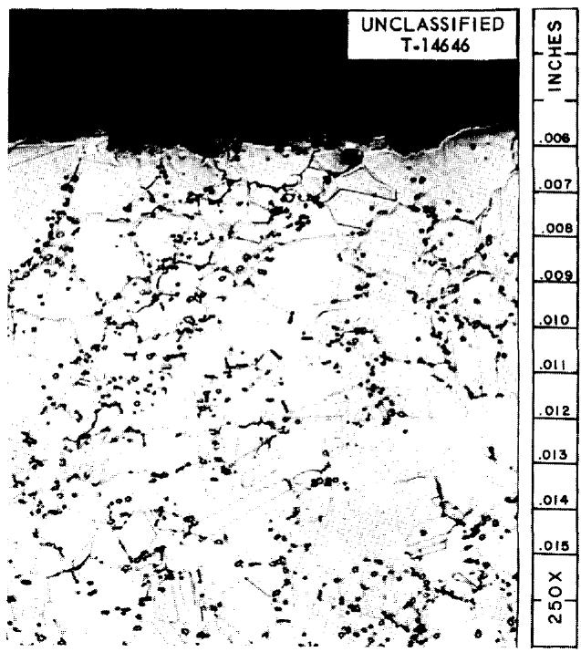  
Fig. 2.1.3. Hot-Leg Section of INOR-8 Thermal-Convection Loop 1162 Which Circulated NaF-BeF $_2$ -UF $_4$ (53-46-1 Mole %) for 6360 hr at $1250^{\circ}$ F. 250X.

2E. E. Hoffman, W. H. Cook, and D. H. Jansen, MSR Quar. Prog. Rep. Jan. 31, 1958, ORNL-2474, p 54.

Table 2.1.3. Chemical Analyses of the Salts Circulated in INOR-8 Thermal-Convection Loops   

<table><tr><td rowspan="2">Loop No.</td><td rowspan="2">Sample Taken</td><td colspan="3">Major Constituents (wt %)</td><td colspan="3">Minor Constituents (ppm)</td></tr><tr><td>Be</td><td>U</td><td>Th</td><td>Cr</td><td>Ni</td><td>Fe</td></tr><tr><td rowspan="2">1162</td><td>Before test</td><td>8.87</td><td>3.25</td><td></td><td>445</td><td>75</td><td>110</td></tr><tr><td>After test</td><td>8.50</td><td>2.95</td><td></td><td>250</td><td>72</td><td>580</td></tr><tr><td rowspan="2">1164</td><td>Before test</td><td>4.46</td><td></td><td>25.5</td><td>200</td><td>85</td><td>420</td></tr><tr><td>After test</td><td>5.15</td><td></td><td>20</td><td>300</td><td>20</td><td>170</td></tr><tr><td rowspan="2">1179</td><td>Before test</td><td>7.03</td><td>8.97</td><td></td><td>120</td><td>175</td><td>200</td></tr><tr><td>After test</td><td>6.50</td><td>8.64</td><td></td><td>10</td><td>215</td><td>70</td></tr><tr><td rowspan="2">1195</td><td>Before test</td><td>9.33</td><td></td><td></td><td>30</td><td>1730</td><td>85</td></tr><tr><td>After test</td><td>8.72</td><td></td><td></td><td>30</td><td>30</td><td>250</td></tr><tr><td rowspan="2">1197</td><td>Before test</td><td>10.2</td><td>6.62</td><td></td><td>15</td><td>65</td><td>30</td></tr><tr><td>After test</td><td>9.75</td><td>6.30</td><td></td><td>150</td><td>55</td><td>265</td></tr></table>

UNCLASSIFIED

ORNL-LR-DWG27988R

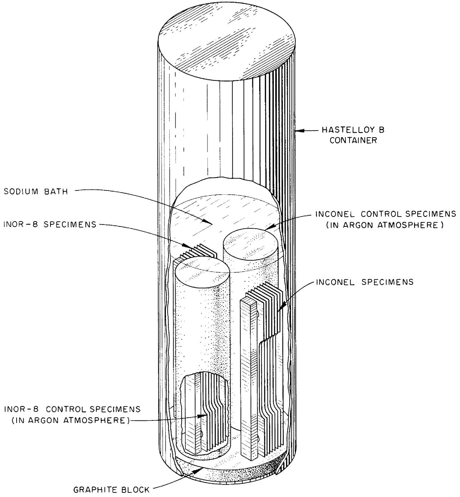  
Fig. 2.1.4. Apparatus for Carburization of Inconel and INOR-8 Specimens.

Metallographic examinations of the 0.040-in.-thick plates exposed to the sodium-graphite system showed Inconel and INOR-8 to be carburized to approximately the same depth. Heavy carburization was found to a depth of about 0.003 in. and some evidence of carburization could be detected to a depth of 0.012 to 0.014 in., as indicated in Fig. 2.1.5. Chemical analyses, presented in

Table 2.1.4, indicated that the INOR-8 was more heavily carburized than the Inconel; that is, a greater carbon concentration was found in millings taken from the cross section and surface of the INOR-8 alloy than in those from the Inconel.

Tensile tests were run in room-temperature air on three specimens from each of the control and carburized units. Since the results were in good

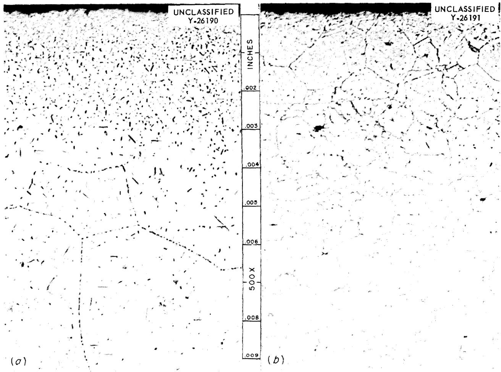  
Fig. 2.1.5. Specimens 0.040 in. Thick of (a) Inconel and (b) INOR-8 (Heat SP-16) After Exposure in a Sodium-Graphite System for 40 hr at $1600^{\circ}\mathsf{F}$ . Etchant: copper regia, 500X.

Table 2.1.4. Carbon Analyses of Millings Taken from 0.25-in.-Thick Bars of Inconel and INOR-8 Carburized in a Sodium-Graphite System for 40 hr at ${1600}^{ \circ  }\mathrm{F}$   

<table><tr><td rowspan="2">Sample</td><td colspan="2">Carbon Found (wt %)</td></tr><tr><td>Inconel Specimen</td><td>INOR-8 Specimen</td></tr><tr><td>Millings from cross section</td><td>0.04</td><td>0.06</td></tr><tr><td>First 0.010 in. from surface (0–0.010 in.)</td><td>0.25</td><td>0.33</td></tr><tr><td>Second 0.010 in. from surface (0.010–0.020 in.)</td><td>0.09</td><td>0.08</td></tr></table>

agreement, average values are presented in Table 2.1.5.

As may be seen in Table 2.1.5, carburization of the Inconel increased its tensile strength and yield strength and reduced its ductility. The same carburizing treatment lowered the tensile strength, slightly increased the yield strength, and greatly reduced the ductility of INOR-8 (heat SP-16).

Apparatus is being prepared for studies of INOR-8 and Inconel in contact with a graphite and molten salt system.

# Brazing Alloys in Contact with Molten Salts

# E.E.Hoffman

# D. H. Jansen

Two precious-metal-base brazing alloys showed promising corrosion resistance to $\mathsf{LiF - BeF}_2\mathsf{-UF}_4$ (62-37-1 mole $\%$ fuel 130) in preliminary tests, and therefore other commercially available brazing alloys having high gold or silver contents are currently being tested at $1300^{\circ}\mathsf{F}$ . The compositions of the alloys being tested and their approximate brazing temperatures are listed in Table 2.1.6. The solidus points of all these alloys are well above $1250^{\circ}\mathsf{F}$ , the highest temperature expected in a molten-salt power reactor.

In order to obtain long-term dynamic corrosion data on brazing alloys in fuel 130, a series of five alloys will be tested in duplicate by inserting brazed lap joints in the hot legs of thermal-convection loops. The designations of the alloys

that will be tested and their compositions are given below:

Composition   

<table><tr><td>Coast Metals alloy No. 52</td><td>89% Ni-5% Si-4% B-2% Fe</td></tr><tr><td>Coast Metals alloy No. 53</td><td>81% Ni-8% Cr-4% Si-4% B-3% Fe</td></tr><tr><td>General Electric alloy No. 81</td><td>70% Ni-20% Cr-10% Si</td></tr><tr><td>Au-Ni</td><td>82% Au-18% Ni</td></tr><tr><td>Copper</td><td>100% Cu</td></tr></table>

The configuration that will be used for their insertion in the hot leg of a thermal-convection loop is shown in Fig. 2.1.6. The loops are ready for filling and should be in operation in the near future. A series of three identical loops is to be

Table 2.1.6. Precious-Metal-Base Alloys Being Tested in Static Fuel 130   
Test temperature: $1300^{\circ}$ F   
Test duration: 500 hr   

<table><tr><td>Material</td><td>Brazing Temperature Range (°F)</td></tr><tr><td>Pure silver</td><td>1760-1900</td></tr><tr><td>90% Ag-10% Cu (coin silver)</td><td>1600-1850</td></tr><tr><td>72% Ag-28% Cu</td><td>1435-1650</td></tr><tr><td>50% Ag-33.3% Au-16.7% Cu</td><td>1525-1600</td></tr><tr><td>75% Au-20% Cu-5% Ag</td><td>1650-1850</td></tr><tr><td>42% Au-40% Ag-18% Cu-0.6% Zr</td><td>1508-1600</td></tr></table>

Jansen, MSR. *Quar. Prog. Rep.* Jan. 31, 1958, 74, p 59.

Table 2.1.5. Results of Tensile Tests of Carburized and Control Specimens of Inconel and INOR-8   

<table><tr><td>Material</td><td>Tensile Strength (psi)</td><td>Yield Strength at 0.2% Offset (psi)</td><td>Elongation (% in 2-in. gage)</td></tr><tr><td colspan="4">Inconel</td></tr><tr><td>Control</td><td>75,878</td><td>20,906</td><td>47.25</td></tr><tr><td>Carburized</td><td>91,532</td><td>28,577</td><td>25.67</td></tr><tr><td colspan="4">INOR-8</td></tr><tr><td>Control</td><td>116,338</td><td>50,542</td><td>49.50</td></tr><tr><td>Carburized</td><td>98,535</td><td>52,828</td><td>7.75</td></tr></table>

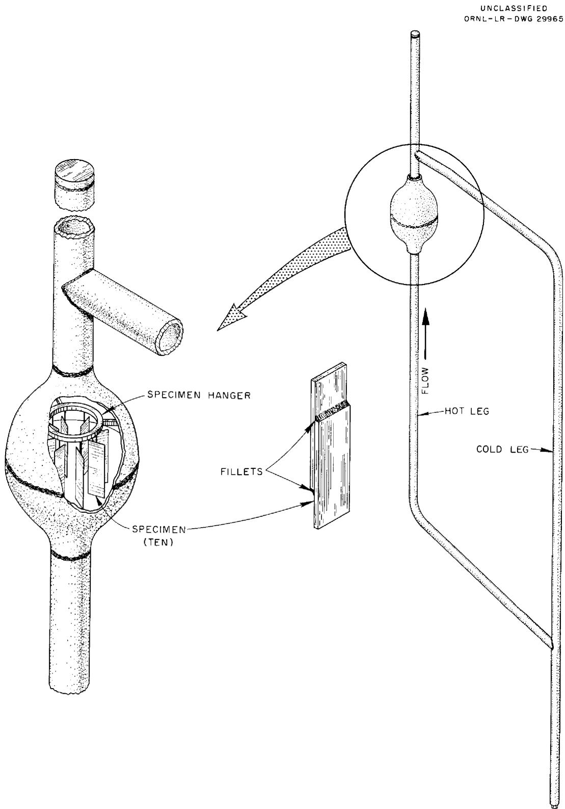  
Fig. 2.1.6. Configuration for Tests of Brazing Alloy Specimens in the Hot Leg of a Thermal-Convection Loop.

operated for 1000-hr, 5000-hr, and 10,000-hr periods before the specimens are removed for examination.

# MECHANICAL PROPERTIES OF INOR-8

# D. A. Douglas

The tensile properties of INOR-8 at various temperatures were measured at this laboratory and at Haynes Stellar Company on material from similar heats that contained $0.02\%$ carbon and at Battelle Memorial Institute (BMI) on material from a heat that contained $0.06\%$ carbon. The ORNL data are presented in Fig. 2.1.7 and are compared in Figs. 2.1.8 and 2.1.9 with the Haynes Stellar and BMI data. As may be seen from Fig. 2.1.8, there is good correlation of the data. The BMI results were expected to be slightly higher than the others as a result of the higher carbon content. The yield strength shows the expected trend, but the tensile strength at $1250^{\circ}\mathrm{F}$ appears to be low. The elongations measured at rupture in the same experiments are shown in Fig. 2.1.9. The relatively brittle failure which occurred in the

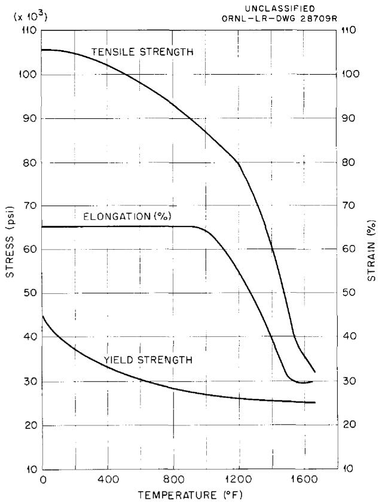  
Fig. 2.1.7. Tensile Properties of INOR-8 as a Function of Temperature.

BMI test at $1250^{\circ}F$ explains the low tensile strength reported in Fig. 2.1.8. The temperature dependence of Young's modulus for INOR-8 is shown in Fig. 2.1.10.

Relaxation curves obtained from data taken at 1200, 1300, 1400, 1500, and $1600^{\circ}\mathrm{F}$ are presented in Fig. 2.1.11. Considerable relaxation occurs at $1400^{\circ}\mathrm{F}$ and above within the first 6 min of the test. At $1300^{\circ}\mathrm{F}$ and below, incubation periods of

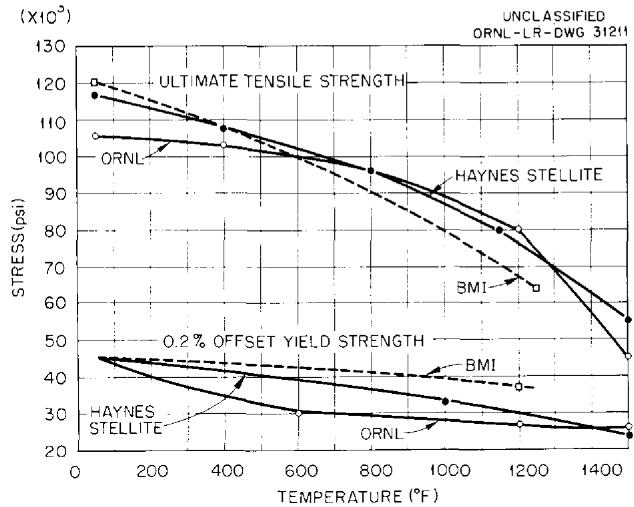  
Fig. 2.1.8. Comparison of Tensile Properties of INOR-8 Obtained at ORNL, Haynes Stellar Company, and Battelle Memorial Institute (BMI).

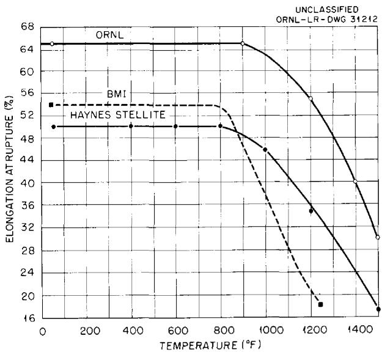  
Fig. 2.1.9. Comparisons of Tensile Elongations of INOR-8 Specimens Tested at ORNL, Haynes Stellar Company, and Battelle Memorial Institute.

1 hr and longer occur before creep commences. It appears that, even at $1200^{\circ}\mathrm{F}$ , INOR-8 will eventually relax to a stress of 2000 to 3000 psi.

Creep tests of INOR-8 (heat SP-16) are under way at temperatures ranging from 1100 to $1500^{\circ}\mathrm{F}$ with fuel 107 (NaF-KF-LiF-UF4, 11.2-41-45.3-2.5 mole%). The data obtained thus far are plotted in Fig. 2.1.12 as creep rate vs stress for temperatures

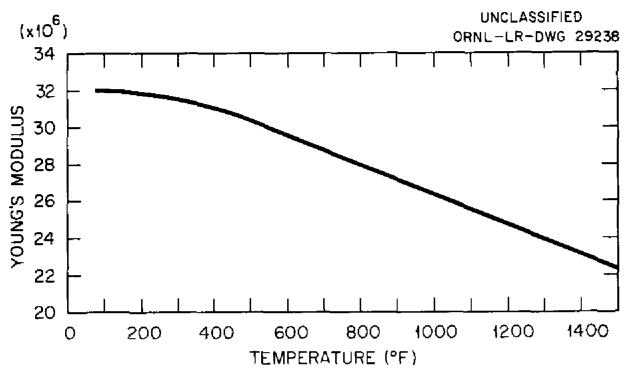  
Fig. 2.1.10. Young's Modulus for INOR-8 as a Function of Temperature.

of 1100, 1200, and $1300^{\circ}F$ . Stress-rupture and creep results obtained in tests in air at Haynes Stellar Company are presented in Fig. 2.1.13, and data obtained at ORNL in molten salts under similar test conditions are presented in Fig.2.1.14. The correlation of the data is excellent.

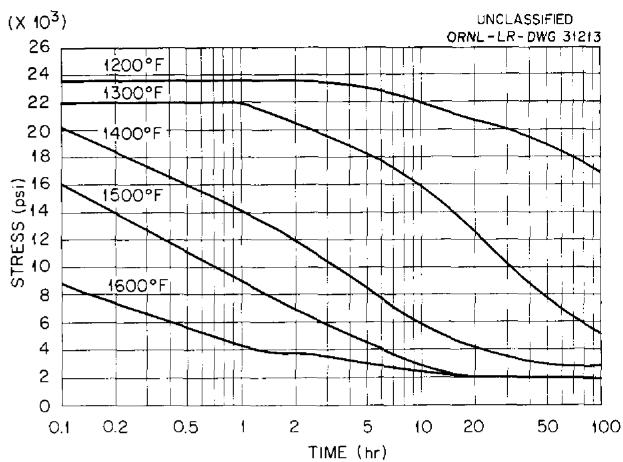  
Fig. 2.1.11. Relaxation Curves for INOR-8 Stressed to $0.1\%$ Strain at Temperatures from 1200 to $1600^{\circ}\mathrm{F}$ .

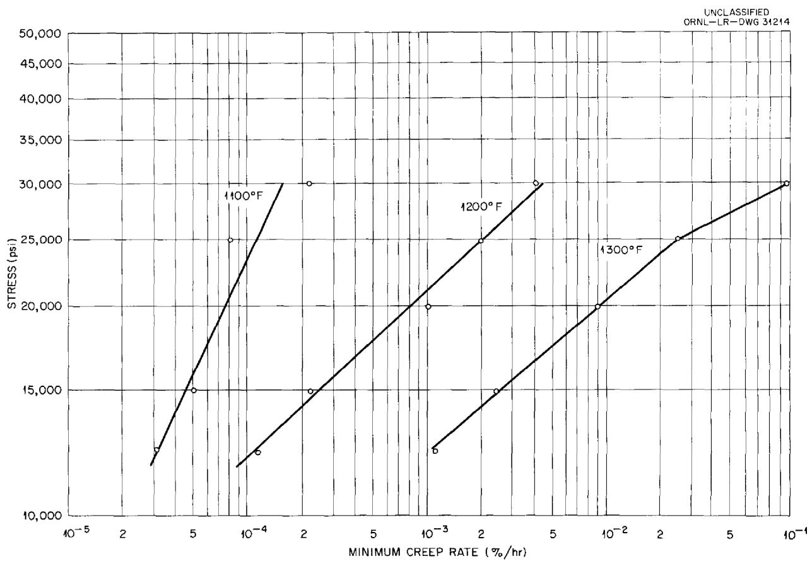  
Fig. 2.1.12. Creep Rates vs Stress for INOR-8 Tested at Various Temperatures in a Molten-Salt Environment.

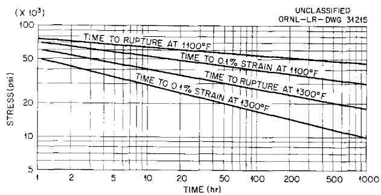  
Fig. 2.1.13. INOR-8 Creep and Stress-Rupture Data Obtained in Air by Haynes Stellar Company.

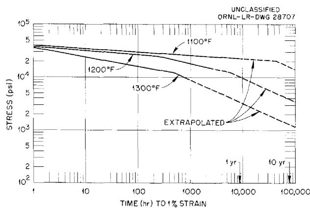  
Fig. 2.1.14. Time to $1\%$ Strain vs Stress for INOR-8 Tested at Various Temperatures in a Molten-Salt Environment.

# FABRICATION STUDIES

J.H.Coobs H.Inouye T.K.Roche

# Influence of Composition on Properties of INOR-8

T. K. Roche

An investigation was completed of the influence of composition variation on the creep-rupture strength at $1500^{\circ}\mathrm{F}$ and the microstructure of alloys containing 10–20% Mo, 5–10% Cr, 4–10% Fe, 0.5% Al, 0.5% Mn, 0.06% C, and the balance nickel. A report has been prepared that presents the details of this investigation, and the results are summarized below.

The compositions of the alloys studied were varied systematically in an effort to determine the effect of each element on the alloy strength. Creep-rupture tests at a stress of 10,000 psi were run on all the alloys in the annealed condition. The criteria used to evaluate the strengths of the

alloys were the times required to produce strains between 1 and $10\%$ .

The results could not be explained simply in terms of composition variation, since the principal factors affecting the strength of the alloys were solid-solution elements, carbide and noncarbide aging reactions, the presence of $M_6C$ -type carbides in the microstructures, and grain size. From the standpoint of creep-rupture strength, it was possible to conveniently group the alloys according to the three concentrations of molybdenum studied: 10, 15, and $20\%$ . It could be concluded from the chemical and microstructural analyses that the relative contribution of each of the factors to the strength of the alloy varied among the groups.

The combined effects of solid-solution strengthening by molybdenum and the increase in quantity of dispersed $\mathsf{M}_{6}\mathsf{C}$ -type carbides which this element promoted in the annealed materials were the predominant factors which increased the strength of the alloys grouped by molybdenum content. The only exception noted was the $20\%$ Mo-7% Cr-10% Fe alloy, which precipitated a noncarbide phase as a consequence of crossing a new phase boundary. This phase contributed noticeably to creep-rupture strength in the later stages of testing.

The contributions of chromium and iron to the strengths of the alloys within the individual groups could not be established with certainty because of simultaneous variations in other factors affecting creep-rupture behavior. In order to obtain a better indication of the strengthening influence of chromium and iron, creep-rupture studies were conducted on low-carbon "high-purity" alloys. Although the analysis of the data was complicated by the presence of a limited amount of carbide precipitation and by grain-size variations, the influence of chromium was found to be significant when 5 to $10\%$ was added to a $15\%$ Mo-bal Ni base, with the presence of $10\%$ chromium in the base composition resulting in the most pronounced strengthening influence. The strengthening effect of iron was interpreted as being insignificant when amounts up to $10\%$ were added to a $15\%$ Mo-7% Cr-bal Ni base. A general consideration of all the data obtained from this investigation favorably

supported the composition specification selected for the alloy INOR-8.

# High-Temperature Stability of INOR-8

H. Inouye

Embrittlement studies of INOR-8 in the temperature range of 1000-1400°F were completed for aging times up to 2000 hr. Data from tensile tests of such specimens indicate that aging produces no significant changes in the properties of the alloy. Two heats containing different carbon

contents were found, however, to have significantly different properties. The lower carbon content alloy (heat SP-19, 0.06% C) behaved in a more ductile manner than the higher carbon content alloy (heat 8M-1, 0.14% C).

The data obtained in the tests are compared in Figs. 2.1.15 and 2.1.16 with data for Hastelloy B, whose tendency to embrittle was previously discussed.5

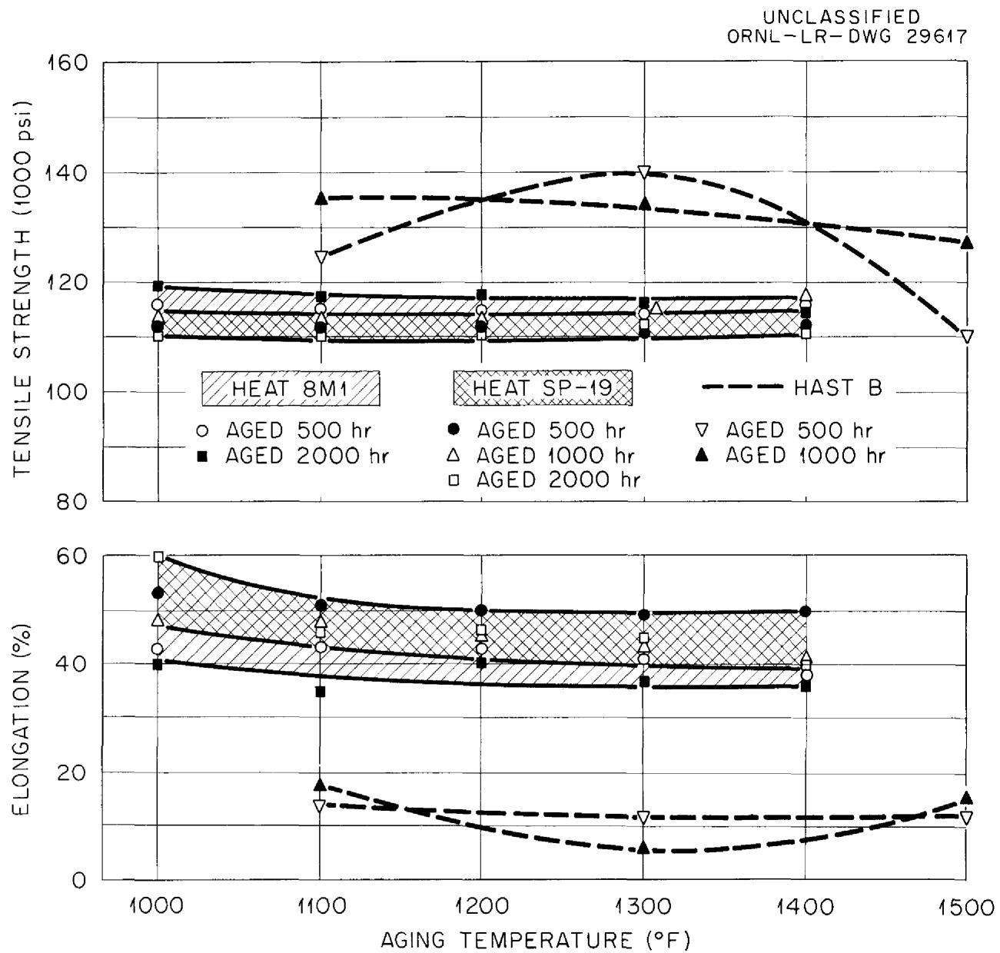  
Fig. 2.1.15. Room-Temperature Tensile Properties of INOR-8 and Hastelloy B After Aging in the Temperature Range $1000 - 1400^{\circ}\mathrm{F}$ for Times Up to 2000 hr.

# Status of Production of INOR-8

# (Westinghouse Subcontract 1067)

H. Inouye

Five air-melted heats of INOR-8 consisting of about 5000 lb each were prepared at the Blairsville Metal Plant of the Westinghouse Electric Corp. About 20,000 lb of finished products are to be furnished from these heats.

# Status of Production of Seamless Tubing

# (Superior Tube Company Subcontract 1112)

H. Inouye

The first shipment of seamless INOR-8 tubing (0.500 in. OD, 0.045 in. wall) was received during the quarter. It consisted of approximately 150 ft of tubing which was processed by the Superior Tube Company's production department without

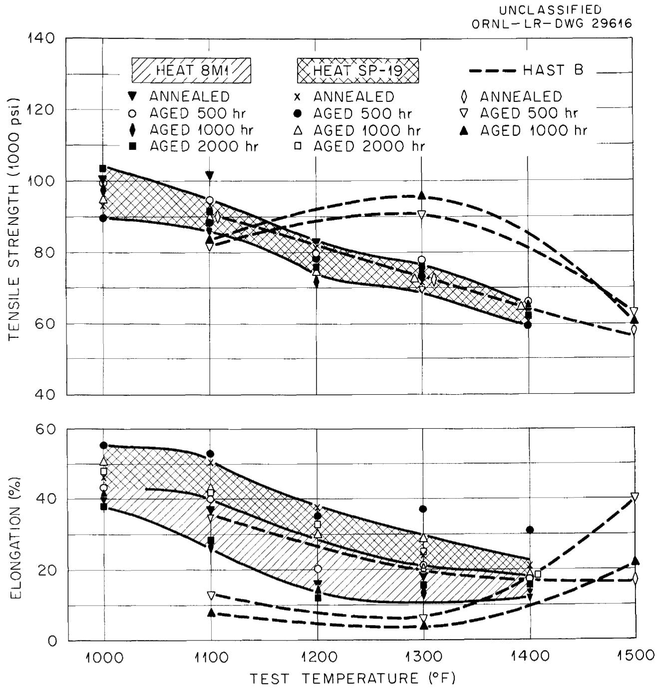  
Fig. 2.1.16. Elevated-Temperature Tensile Properties of INOR-8 and Hastelloy B After Aging in the Temperature Range 1000-1400°F for Times Up to 2000 hr.

difficulty. This was the first production run of seamless tubing by a commercial vendor. The production involved an extrusion from a 9-in.-dia drilled billet to a 4-in.-OD, $\frac{1}{2}$ -in.-wall tube shell by the International Nickel Company (on a purchase order), reduction by Babcock & Wilcox to a 2-in.-OD, 0.187-in.-wall tube, and tube reduction and drawing by the Superior Tube Company to the final size. Despite the circuitous route involving four manufacturers, the tubing appears to be of excellent quality. (The inspection of this material is described in a subsequent section of this chapter.)

# Bearing Materials

J. H. Coobs

INOR-8 Journals. - Two 3-in.-dia journals of INOR-8 were flame-sprayed with INOR-8 for use in bearing tests. One journal was built up with 5 mils of sprayed coating and the second with 20 mils. The journals were first sprayed with a light layer ( $\sim$ 2 mils) of molybdenum to provide a rough bonding surface, and after being sprayed with INOR-8 were heat-treated at $2250^{\circ}\mathrm{F}$ to bond the coatings.

During the heat treatment, the 5-mil coating on the first journal separated at one end. This journal was recoated after being rough-machined to provide a better bonding surface. The final coating was more than 25 mils thick and was successfully applied and finished. These results indicate that the thickness of the sprayed coating for a 3-in.-dia journal should be a minimum of 20 mils.

An experiment was also run in which an INOR-8 journal was flame-sprayed with molybdenum. A sample of $1\frac{1}{2}$ -in.-dia INOR-8 pipe was threaded to provide a good bonding surface, spray-coated with about 20 mils of molybdenum, and subjected to thermal cycling. The great difference between the thermal expansion of INOR-8 and that of molybdenum resulted in severe cracking of the coating during the first thermal cycle. After 23 additional thermal cycles from room temperature to $1350^{\circ}\mathrm{F}$ , the molybdenum layer was partially separated from the INOR-8 base. The large cracks that developed in the coating during the first thermal cycle and the area where the coating broke away from the INOR-8 pipe may be seen in Fig. 2.1.17.

Molybdenum Journals. - Several 1-in.-dia specimens of molybdenum rod were sprayed with molybdenum in an effort to develop a suitable procedure for spray-coating molybdenum journals.

Preliminary tests indicated that a surface which had been grit-blasted and etched was most suitable for bonding, and that a high-temperature heat treatment was needed for producing reliable coatings. Evaluation tests are now under way on two specimens of $2\frac{1}{4}$ -in.-dia molybdenum rod. These rods were rough-threaded to provide a good bonding surface. One sample was then cleaned by bright-annealing at $1800^{\circ}\mathrm{F}$ , and the other was etched with chromic-sulfuric pickling solution. Both specimens were sprayed with about 20 mils of molybdenum and then heat-treated at $2250^{\circ}\mathrm{F}$ for 2 hr in order to bond the coatings.

# WELDING AND BRAZING STUDIES

P. Patriarca

R. L. Heestand

E.A.Franco-Ferreira

G. M. Slaughter

# Weldability Evaluations

Results of tests of specimens of Haynes heats SP-16 and -19 that were machined from $\frac{1}{4}$ -in. plate and were sent to Rensselaer Polytechnic Institute for hot ductility testing are presented in Table 2.1.7. Since weldability tests of these two alloys had indicated severe weld-metal and base-metal cracking of the SP-16 material and good weldability of the SP-19 material, the results of these tests were expected to be of value in determining whether welding techniques and materials or the base material composition was the cause of the difference in weldability. As may be seen, the ductility of the SP-19 alloy upon heating to $2200^{\circ}\mathrm{F}$ was significantly higher than that of the SP-16 alloy. Further, the ductility of the SP-19 alloy was not appreciably impaired by prior heating to $2300^{\circ}\mathrm{F}$ , but it was impaired somewhat by prior heating to $2350^{\circ}\mathrm{F}$ and above.

Additional weld test plates were made for mechanical property studies of welded joints and for radiographic, metallographic, and hardness examinations, as well as to obtain general information pertaining to the welding characteristics of the materials under conditions of high restraint. In general, the weldability of the INOR-8 alloys appears to be good. No weld cracking difficulties have been experienced with any of various heats, except Haynes heat SP-16. The welds have been found to be sound, in general, and the welding deposition characteristics of the material are comparable with those of Inconel or the stainless

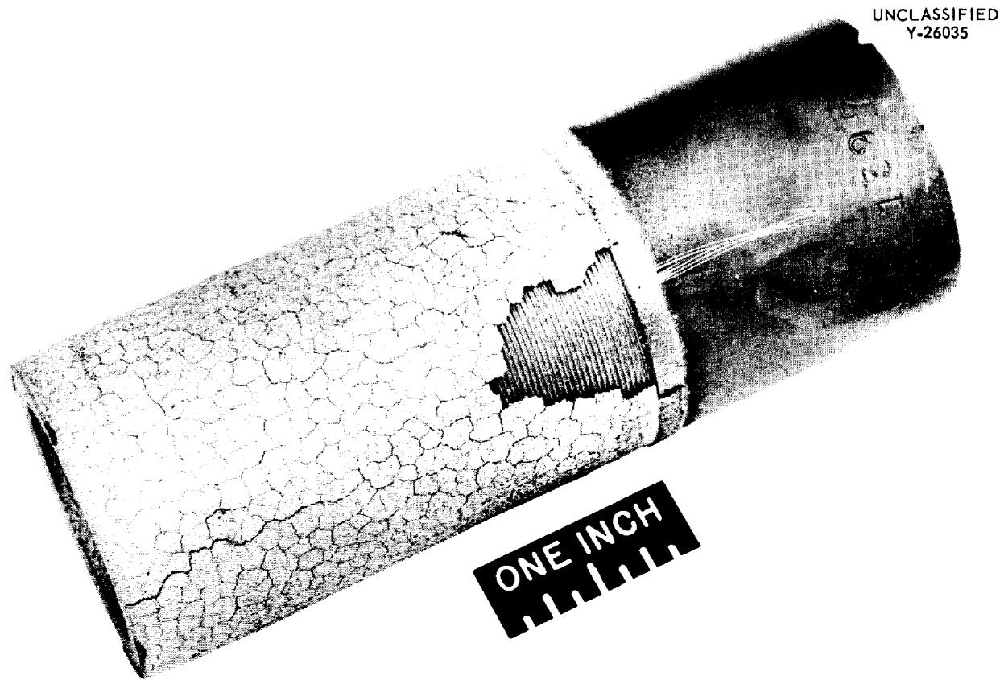  
Fig. 2.1.17. INOR-8 Pipe Spray-Coated with Molybdenum and Heated Through 24 Thermal Cycles from Room Temperature to $1350^{\circ}$ F.

steels. A new International Nickel Company filler metal, designated INCO Weld A, which was designed for the joining of dissimilar materials, is being tested for applicability to the joining of Inconel to INOR-8. This new filler metal is reported to be subject to aging at high temperatures (contains $3\%$ titanium), and therefore its mechanical properties both in the as-welded and aged conditions should be studied.

All-weld-metal reduced-section tensile bars (0.252-in. dia) were prepared from the test plates of Westinghouse heat M-5, Haynes heat SP-19, and Inconel, and tensile tests were conducted at room temperature, 1200, 1300, and $1500^{\circ}\mathrm{F}$ . The results are presented in Table 2.1.8. The Inconel data were obtained in order to provide a comparison with the data for INOR-8. Comparisons of wrought sheet and weld metal of both Inconel and material from heat SP-19 are shown in Fig. 2.1.18.

Although moderate ductilities were obtained at the lower temperatures for both heats of INOR-8

weld metal, the ductilities of both heats were $10\%$ or lower at $1500^{\circ}\mathrm{F}$ . Although the ultimate tensile strengths are approximately the same, the yield strengths of the two heats of weld metal were much greater than those of the wrought sheet. For example, the yield strength of heat SP-19 wrought sheet at room temperature was approximately 44,000 psi, while it was approximately 30,000 psi at $1200^{\circ}\mathrm{F}$ . The ductilities of INOR-8 in both forms are comparable. An examination of the data also reveals that, in general, INOR-8 possesses a slightly higher ultimate tensile strength than that of Inconel, a significantly higher yield strength, and a markedly lower high-temperature ductility.

# Remote Welding

# E.A.Franco-Ferreira

A test specimen was supplied to Welding Processes, Inc., Wilmington, Delaware, for semi-remote welding by a machine being developed for

Table 2.1.7. Results of High-Temperature Ductility Tests on Haynes SP-16 and SP-19 Materials   

<table><tr><td rowspan="2">Thermal Cycle</td><td colspan="2">Reduction in Area (%)</td><td colspan="2">Ultimate Tensile Strength (psi)</td></tr><tr><td>SP-16</td><td>SP-19</td><td>SP-16</td><td>SP-19</td></tr><tr><td>1800°F (on heating)</td><td>40.8</td><td>63.4</td><td>53,600</td><td>56,400</td></tr><tr><td>2000°F (on heating)</td><td>30.8</td><td>73.8</td><td>41,300</td><td>42,800</td></tr><tr><td>2200°F (on heating)</td><td>1.8</td><td>72.8</td><td>3,400</td><td>30,200</td></tr><tr><td>2300°F (on heating)</td><td>1.1</td><td>6.0</td><td></td><td>20,000</td></tr><tr><td>2400°F (on heating)</td><td>0.5</td><td>0.0</td><td>1,300</td><td>1,800</td></tr><tr><td>2400°F cooled to 2300°F</td><td>0.6</td><td>0.0</td><td>600</td><td>5,600</td></tr><tr><td>2400°F cooled to 2200°F</td><td>0.1</td><td></td><td>1,700</td><td></td></tr><tr><td>2400°F cooled to 2000°F</td><td>1.8</td><td></td><td>14,000</td><td></td></tr><tr><td>2400°F cooled to 1800°F</td><td>4.5</td><td></td><td>17,300</td><td></td></tr><tr><td>2350°F cooled to 1800°F</td><td></td><td>33.2</td><td></td><td>55,200</td></tr><tr><td>2350°F cooled to 2000°F</td><td></td><td>30.8</td><td></td><td>44,400</td></tr><tr><td>2350°F cooled to 2200°F</td><td></td><td>0.3</td><td></td><td>24,900</td></tr><tr><td>2300°F cooled to 1800°F</td><td></td><td>59.1</td><td></td><td>59,000</td></tr><tr><td>2300°F cooled to 2000°F</td><td></td><td>68.4</td><td></td><td>45,900</td></tr><tr><td>2300°F cooled to 2200°F</td><td></td><td>63.8</td><td></td><td>31,800</td></tr></table>

the Westinghouse PAR Project. The specimen was a 10-in.-dia Inconel pipe with a $5/8$ -in. wall. The weld was made with the pipe axis vertical; nitrogen was used as the backup gas; and the arc was shielded with helium. A continuous arc time of 5 hr was required for the 59 passes of the weld.

Views of the face and root of the sample weld are shown in Figs. 2.1.19 and 2.1.20. The large amount of root push-through was apparently the result of internal mismatch in the pipe samples rather than to an inherent defect in the welding procedure. Radiographic inspection at ORNL showed the weld to be completely sound, with no evidence of porosity. A cross section of the weld may be seen in Fig. 2.1.21. The structure is that of a normal Inconel weldment.

# Joint Development

# G. M. Slaughter

Mechanical property tests were made on cast silver in order to provide information pertinent to the design of a flanged joint with a cast metal seal

(see Chap. 1.2, this report). The 0.252-in.-dia tensile bars prepared from cast silver were tested at room temperature, $1200^{\circ}\mathrm{F}$ , and $1400^{\circ}\mathrm{F}$ . The test results indicated that the room-temperature mechanical properties were about the same as those given in published data, that is, 20,000 psi tensile strength, 8,000 psi yield strength, and $50\%$ elongation in 1 in. At $1200^{\circ}\mathrm{F}$ , the tensile strength dropped to 2400 psi and the yield strength to 1900 psi, with a corresponding elongation of 6 to $10\%$ . At $1400^{\circ}\mathrm{F}$ , the tensile strength was 1500 psi, the yield strength was 1000 psi, and the elongation was $10\%$ .

Half-sections of two flanged joints with cast-metal seals that were tested under simulated operating conditions, as described in Chap. 1.2, are shown in Figs. 2.1.22 and 2.1.23. The seal material used for the joint shown in Fig. 2.1.22 was silver, whereas the seal material used for the joint shown in Fig. 2.1.23 was a silver-copper alloy. The examination indicated that moderate oxidation of the components had occurred during

opening and closing of the flange and that the oxidation had impeded wetting of the base metal. The joint with the silver-copper alloy seal appeared to be less subject to nonwetting than the joint containing the pure silver seal, probably because of the lower temperatures required to remelt the alloy during opening. A typical interface between the silver-copper alloy and the Inconel base metal is shown in Fig. 2.1.24.

Table 2.1.8. Comparative Tensile Properties of All-Weld-Metal Specimens of INOR-8 and Inconel (As Welded)   

<table><tr><td rowspan="2">Temperature</td><td colspan="2">INOR-8</td><td rowspan="2">Inconel</td></tr><tr><td>Westinghouse Heat M-5</td><td>Haynes Heat SP-19</td></tr><tr><td colspan="4">Ultimate Tensile Strength (psi)</td></tr><tr><td>Room</td><td>116,615</td><td>116,725</td><td>95,295</td></tr><tr><td></td><td>121,260</td><td>115,095</td><td>93,975</td></tr><tr><td>1200° F</td><td>72,350</td><td>74,965</td><td>67,570</td></tr><tr><td></td><td>75,575</td><td>65,930</td><td>68,945</td></tr><tr><td>1300° F</td><td>62,855</td><td>59,075</td><td>58,740</td></tr><tr><td></td><td>67,500</td><td>64,080</td><td>59,015</td></tr><tr><td>1500° F</td><td>54,595</td><td>53,780</td><td>37,480</td></tr><tr><td></td><td>57,040</td><td>52,175</td><td>36,505</td></tr><tr><td colspan="4">Yield Strength at 0.2% Offset (psi)</td></tr><tr><td>Room</td><td>75,385</td><td>78,425</td><td>56,790</td></tr><tr><td></td><td>80,840</td><td>76,390</td><td>55,980</td></tr><tr><td>1200° F</td><td>55,580</td><td>54,595</td><td>37,790</td></tr><tr><td></td><td>57,240</td><td>50,525</td><td>44,100</td></tr><tr><td>1300° F</td><td>52,900</td><td></td><td>38,610</td></tr><tr><td></td><td></td><td>50,300</td><td>37,390</td></tr><tr><td>1500° F</td><td>50,520</td><td>44,815</td><td>34,630</td></tr><tr><td></td><td>51,130</td><td>44,930</td><td>34,285</td></tr><tr><td colspan="4">Elongation (% in l-in. gage)</td></tr><tr><td>Room</td><td>41</td><td>37</td><td>41</td></tr><tr><td></td><td>52</td><td>38</td><td>45</td></tr><tr><td>1200° F</td><td>18</td><td>19</td><td>49</td></tr><tr><td></td><td>18</td><td>17</td><td>41</td></tr><tr><td>1300° F</td><td>12</td><td>16</td><td>38</td></tr><tr><td></td><td>12</td><td></td><td>40</td></tr><tr><td>1500° F</td><td>4.5</td><td>9.5</td><td>77</td></tr><tr><td></td><td>5.5</td><td>10</td><td>65</td></tr></table>

# Component Fabrication

G. M. Slaughter

The Griscom-Russell Company, Massillon, Ohio, is developing an internal tube welding procedure that would be applicable to the attachment of tubes to tube sheets in heat exchangers if back-brazing were impractical, as it would be for thick tube sheets or exceptionally large heat exchangers. In order to make tube-to-tube-sheet joints with the procedure being developed, the tube sheet is drilled with holes of the same dimension as the inside diameter of the tubing, and bosses are machined or otherwise formed on the underside of the tube sheet to permit a butt welding operation. Inert-gas-shielded tungsten-arc welding is then performed internally with a specially constructed rotating-electrode mechanism designed to provide a full penetration weld. A test joint is shown before and after welding in Fig. 2.1.25.

The joints made by this Griscom-Russell procedure have included $1\frac{1}{2}$ -in.-OD, 0.072-in.-wall to $1\frac{1}{2}$ -in.-OD, 0.070-in.-wall tubing, but most of the experience has been with the larger size tubes. The primary production item has been a heat exchanger made for the Knolls Atomic Power Laboratory of $2.25\%$ Cr- $1\%$ Mo steel, which contained 76 welds. The tubes were $1\frac{1}{2}$ -in. OD and $1\frac{5}{16}$ -in. OD, and both sizes of tubing had 0.072-in. walls. A power supply which consists of a 200-amp Vickers Controlarc rectifier with a program timer was used for this welding. The weld program included an initial high current, rapid current decay to the normal welding current, and slow decay at the weld termination. The tungsten electrode was seated in a modified copper collet assembly, and a stainless steel gas-focusing assembly was used to direct the shielding gas onto the weld zone.

Test welds made with 1-in.-OD, 0.070-in.-wall, type 316 stainless steel tubes were obtained for examination at ORNL. Incomplete fusion of the locating lips of the headers was found in some areas of some of the tubes, but this could probably be remedied by careful determination of the optimum welding variables. Moderate oxidation of the outer surfaces of the welds was found, but this condition was probably the result of inadequate purging by the makeshift welding fixture being used. Nondestructive and metallographic examinations of these welds have not been completed, and it is not yet known whether they contain

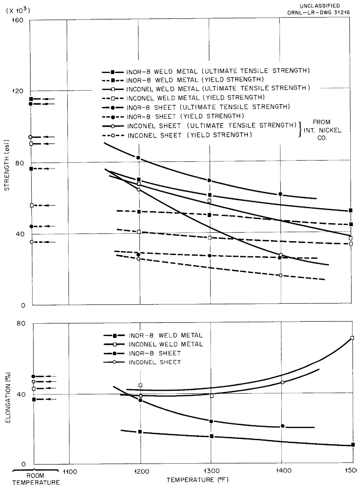  
Fig. 2.1.18. Comparative Average Mechanical Properties of INOR-8 Heat SP-19 and Inconel Weld Metal and Wrought Sheet.

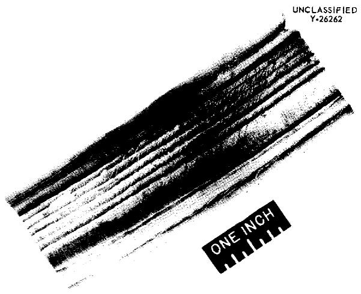  
Fig. 2.1.19. Face of an Experimental Weld Made by a Semiremove Welding Process Being Developed by Welding Processes, Inc.

  
Fig. 2.1.20. Root of the Experimental Weld Shown in Fig. 2.1.19.

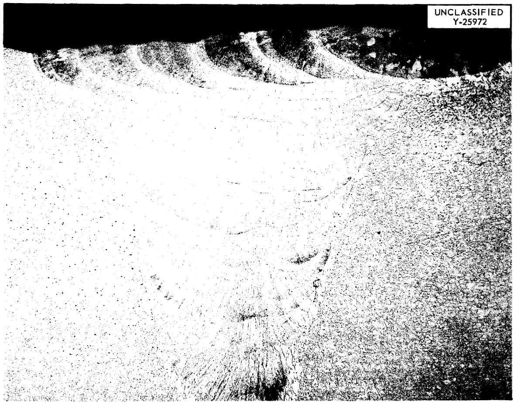  
Fig. 2.1.21. Microstructure of the Experimental Weld Shown in Figs. 2.1.19 and 2.1.20. Etchant: electrolytic oxalic acid, $10\%$ . 2X.

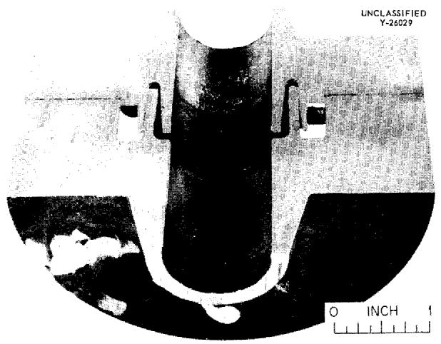  
Fig. 2.1.22. Half-Section of a Flanged Joint with a Cast Silver Seal.

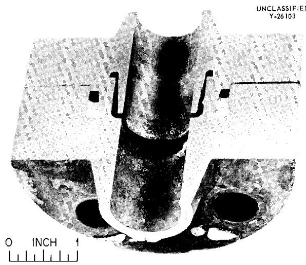  
Fig. 2.1.23. Half-Section of a Flanged Joint with a Silver-Copper Alloy Seal.

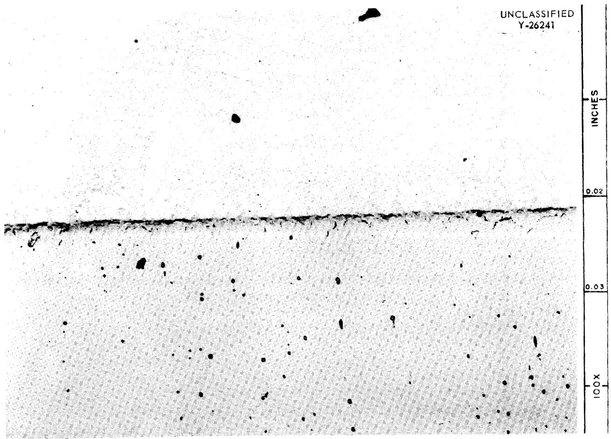  
Fig. 2.1.24. Interface Between Silver-Copper Alloy and Inconel Base Metal. Unetched. 100X.

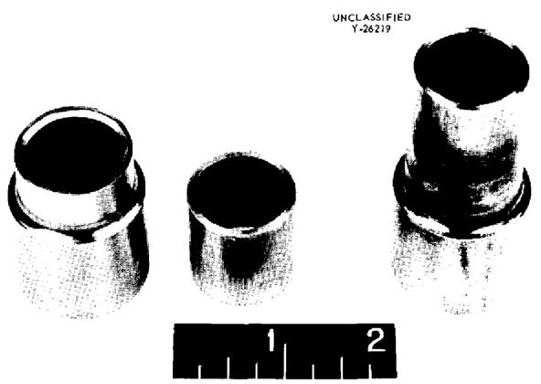  
Fig. 2.1.25. Joint Before and After Welding by Internal Welding Procedure.

undesirable pores; however, Griscom-Russell engineers have indicated that repair of a weld to eliminate porosity has been accomplished by repeating the fusing of the complete joint.

An important factor to consider with this method of heat exchanger fabrication is that the tubes would have to be cut quite accurately to the proper length. This would be a definite requirement if the tubes were straight, since any slight mismatch would inhibit assembly. The use of a bayonet or U-tube heat exchanger would probably be necessary. Inspection of the KAPL heat exchanger welds was accomplished with a $1 \times 1.5$ -mm spheroidal thulium source ( $3/4$ curie). The source was placed inside the tube, and film was wrapped around the outside of the weld. A small quantity of $1/2$ -in.-OD, 0.050-in.-wall INOR-8 tubing and $3/4$ -in.-dia and 3-in.-dia INOR-8 bar is being prepared for test welding at Griscom-Russell.

# MATERIAL AND COMPONENT INSPECTION

J.W.Allen

R.W.McClung

J.H.DeVan

R.A.Nance

G.M.Tolson

Penetrant and radiographic methods were used for the inspection of 675 ft 5 in. of INOR-8 tubing. Defects greater than $5\%$ of the wall thickness were cause for rejection, and on this basis only 13 ft 5 in. of the tubing was rejected. One lot of approximately 150 ft of seamless Weldrawn INOR-8 tubing that appeared to be of particularly high quality was inspected by radiographic, dye penetrant, ultrasonic, and eddy current methods

and only 5 ft 8 in. was found to be rejectable. About five discontinuities were detected by radiography, but none were found by use of the encircling-coil eddy-current technique. The ultrasonic inspection revealed the presence of several cracks which had not been detected by any of the previous inspections, and approximately 3 ft of tubing was rejected because of these cracks. Some of these rejected areas were split, and dye penetrant inspections of the inner surfaces were made. In each case, longitudinal discontinuities were found on the inner surface, and therefore these sections were studied metallographically. The discontinuities proved to be cracks that started at the inner surface and proceeded to depths of up to 0.005 in., as shown in Figs. 2.1.26 and 2.1.27; the cracks were approximately $\frac{1}{2}$ to 1 in. in length. No discontinuities were found on the outer surfaces. In all previous inspections of small diameter tubing, most of the cracks were found on the outer surface.

In addition to the INOR-8 tubing, 273 ft of INOR-1, -2, -3, -5, and -6 experimental alloy tubing was also inspected. Although it was checked only for gross defects, it was necessary to reject 95 ft of this tubing. Of the 75 ft of INOR-8 pipe inspected,

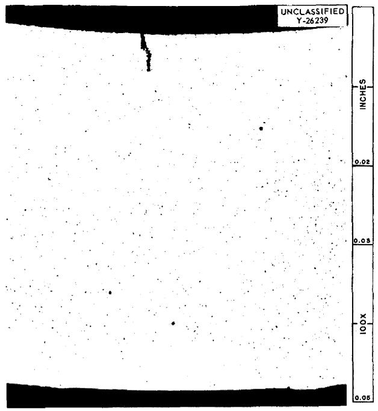  
Fig. 2.1.26. A Typical Large Crack Found by Ultrasonic Inspection of $\frac{1}{2}$ -in.-ID, 0.045-in.-Wall INOR-8 Tubing. 100X. Reduced $32\%$ .

none was rejected; and of the 37 ft of INOR-8 bar inspected, 6 in. was rejected.

Two expansion bellows were inspected for high-temperature sodium service by dye penetrant and vacuum techniques and were found to be acceptable.

The pump bulkhead for an in-pile test loop was inspected after it had been machined. Dye penetrations were found, but, since none of the penetrations were in areas where leak tightness was essential, the part was accepted.

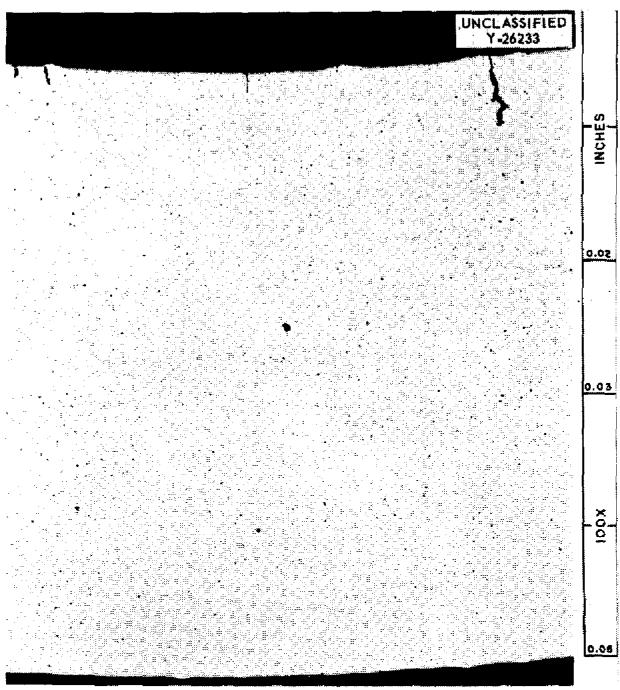  
Fig. 2.1.27. Multiple Cracks Found by Ultrasonic Inspection of $\frac{1}{2}$ -in.-OD, 0.045-in.-Wall INOR-8 Tubing. 100X. Reduced $32\%$ .

A duplex-tube heat exchanger, Inconel over stainless steel, was inspected in finished form and found to be acceptable. Fifty-six Hoke valves were inspected with intended use as the criterion for the evaluation. Two valves that were rejected were subsequently repaired, inspected, and found to be acceptable.

A pump impeller casting of INOR-8 (Fig. 2.1.28), which was prepared by the Haynes Stellar Company, was inspected by radiography. Although the general appearance of the casting was good, it was rejected because of large pores. Radiographic inspection was also used to check the spacing of the wires in 636 ft of Calrods, and no deviations from the predetermined standards were found.

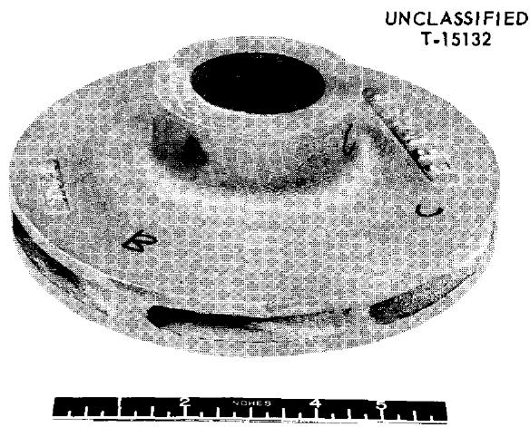  
Fig. 2.1.28. INOR-8 Pump Impeller Casting Made by Haynes Stellar Co.

# 2.2. RADIATION DAMAGE

G.W. Keilholtz

Solid State Division

# IN-PILEDYNAMICCORROSIONTESTS

W.E.Browning

J. E. Lee, Jr.

H.E.Robertson

W.H. Montgomery

R.P. Shields

# INOR-8 Thermal-Convection Loop Assembly for Operation in the LITER

Assembly work was continued on the electrically heated INOR-8 mockup of the INOR-8 thermal-convection loop being constructed for circulating molten salt fuel in an irradiation facility in the LITR. Installation of thermocouples and heaters was completed (Fig. 2.2.1). High-current power connections for the heaters were made to the fuel

tube for generation of power to simulate fission power. An automatic control system for the cooling air was designed and fabricated that includes provisions for metering the distribution of air flow between the two coolant channels on the loop. A panel was prepared for the individual controls of the various platinum clamshell heaters that are installed on the loop. The various components of the loop are now being joined and thermal insulation is being installed. When the mockup has been completely assembled, it will be operated under conditions simulating those expected in the in-pile loop in order to demonstrate the workability of the design and to provide operating information for use during the in-pile experiment.

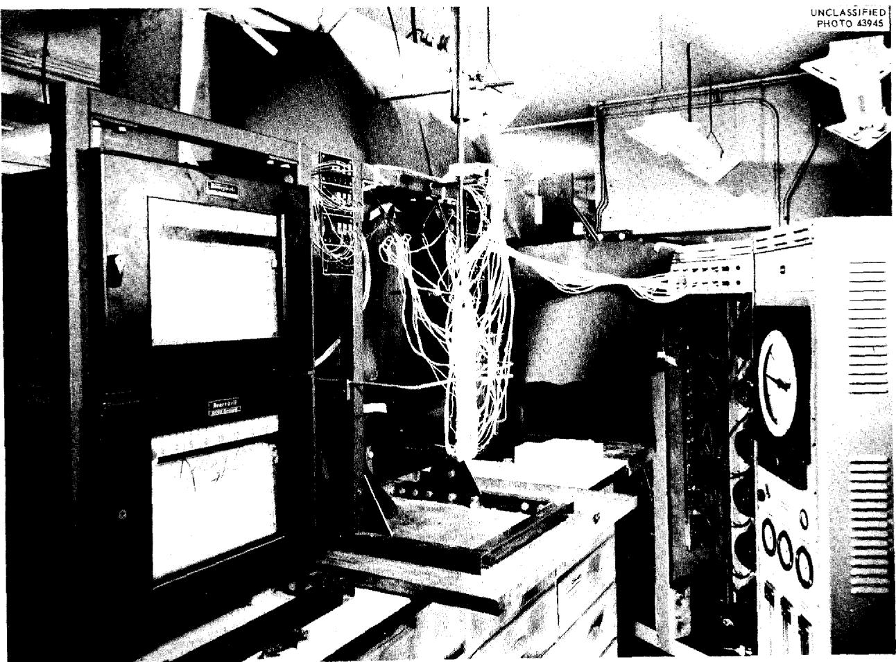  
Fig. 2.2.1. Electrically Heated Mockup of Thermal-Convection Loop for Operation in the LITR.

The parts for the fuel system of the in-pile model have been fabricated. Assembly of these parts awaits operation of the electrically heated mockup. The charcoal to be used in the xenon adsorber has been prepared for the in-pile experiment by heat treatment in dry helium. Design details of the outer can for the in-pile loop are being worked out.

# LITR Forced-Circulation Loop Examination

The Inconel forced-circulation loop which circulated a molten salt in a vertical hole in the LITR for 235 hr at a maximum temperature of $1600^{\circ}\mathrm{F}$ and a temperature differential of 230 to $250^{\circ}\mathrm{F}$ was examined for corrosion, and the fuel mixture was analyzed for fission products. The corrosion was the same as that which would have been expected under the same conditions in the absence of radiation.

A section of Inconel tubing including fuel $(\mathrm{NaF - ZrF}_4 - UF_4, 60.8 - 27.4 - 11.8$ mole $\%$ was cut from each region that contained a thermocouple. Several sections were examined metallographically, and a maximum depth of penetration of 4 mils was found. The 4 mils of penetration was in a section of the hot leg of the loop approximately 12 in. from the hairpin nose portion of the loop. Etched and unetched pieces of metal from the

hot leg of the loop are shown in Fig. 2.2.2, and a section of tubing from the cold leg of the loop is shown in Fig. 2.2.3. The penetration found in a section of the hairpin of the loop is shown in Fig. 2.2.4.

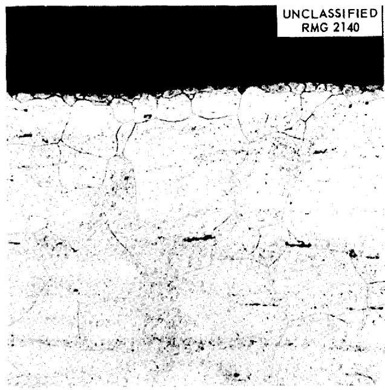  
Fig. 2.2.3. Section of Inconel Tubing from Cold Leg (1290°F During Operation) of LITR Vertical In-Pile Loop. Etched, 250X.

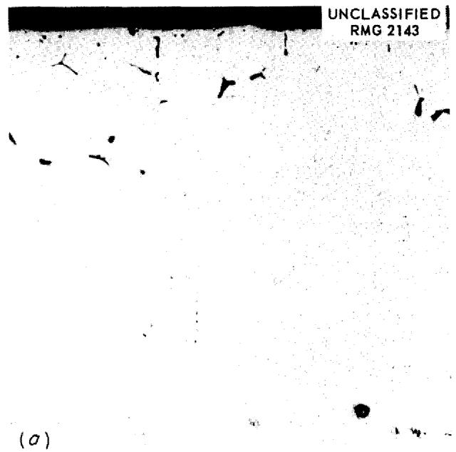

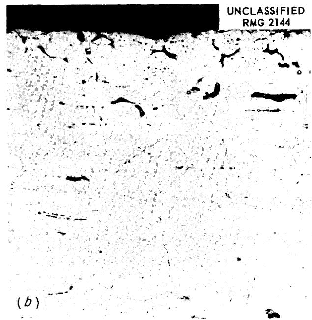  
Fig. 2.2.2. Sections of Inconel Tubing from Hot Leg (1490°F During Operation) of LITR Vertical In-Pile Loop. (a) Unetched. (b) Etched. 250X.

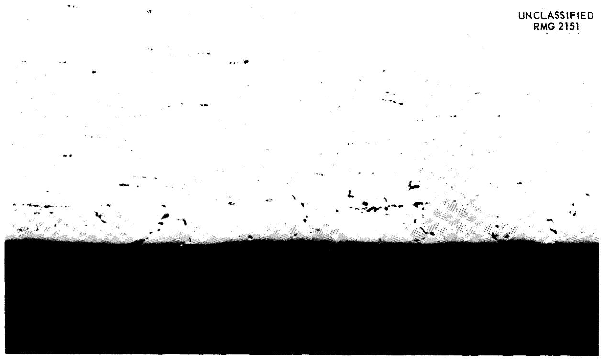  
Fig. 2.2.4. Section of Inconel Tubing from Hairpin Nose Loop (1510°F During Operation) of LITR Vertical In-Pile Loop. Unetched, 250X.

A new fuel salt sampling method, in which the salt is melted out of the tubing, was tested to determine whether the salt and the metallographic specimens were affected. In order to compare the old and the new techniques of sampling, one sample of salt was drilled from the tube and a second sample was obtained by suspending the tube in an atmosphere of helium and heating it by induction until the salt dropped out as a pellet.

The results of radiochemical analysis of the salts obtained by the two methods are given in Table 2.2.1. The data show that the two sampling techniques are equivalent as far as radiochemical results are concerned. Analyses of the fuel samples for Fe, Cr, and Ni are under way.

In order to test the effect of the melting-out technique on metallographic samples, specimens from which the fuel was drilled and from which the salt was melted were submitted for examination. A metallographic sample cut from a piece of tubing from which the fuel was melted is shown in Fig. 2.2.5. The temperature was deliberately allowed to go $200^{\circ}\mathrm{F}$ higher than necessary during melting of the fuel, and the specimen was held at this temperature for 1 min. Normally the salt

drops out within 15 sec after the induction heater is turned on. The longer heating period was used to exaggerate any effect of the melting-out procedure. It is apparent in Fig. 2.2.5 that no significant amount of corrosion occurred during the melting-out operation.

Table 2.2.1. Results of Radiochemical Analyses of Fuel Salt Samples Obtained by Two Methods from Inconel Forced-Circulation Loop Operated in the LITR   

<table><tr><td rowspan="2">Constituents Analyzed For</td><td colspan="2">Amount Found (mc/mg)</td></tr><tr><td>In Drilled Sample</td><td>In Melted Sample</td></tr><tr><td>Zr95</td><td>6.7 × 10-2</td><td>6.7 × 10-2</td></tr><tr><td>Cs137</td><td>1.40 × 10-4</td><td>1.41 × 10-4</td></tr><tr><td>Ce144</td><td>6.85 × 10-3</td><td>7.65 × 10-3</td></tr><tr><td>Sr89</td><td>1.84 × 10-2</td><td>1.92 × 10-2</td></tr><tr><td>Sr90</td><td>5.45 × 10-4</td><td>5.68 × 10-4</td></tr></table>

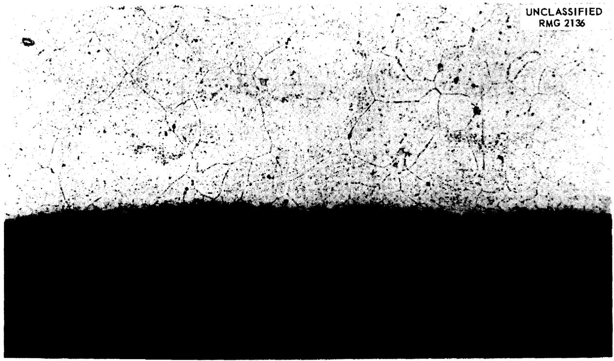  
Fig. 2.2.5. Section of Inconel Tubing Held at $1390^{\circ}$ F for 1 min During Melting-Out of Fuel Sample, 250X.

# ORR Forced-Circulation Loop Development

Preparations are being made for the operation of a forced-circulation loop in an ORR facility. The loop assembly housing and lead tube were tested in the reactor and were found to be capable of withstanding the force of the flowing reactor cooling water. Flux profile measurements are under way at reduced reactor power levels to determine the effect of a poison load simulating that of the in-pile experiments.

Studies directed toward the development of bearings which will withstand the radiation conditions surrounding the pump of the in-pile loop are under way. An ordinary carbon-steel ball-bearing assembly modified to use a silver separator and a ball-bearing assembly that has special titanium carbide balls are to be tested out-of-pile without lubrication.

Removal of xenon from the atmosphere above the fuel by circulating helium sweep gas through the pump tank, through a charcoal holdup trap, through the pump motor can, and down the shaft annulus to the pump tank to complete the cycle is

being considered. Removal of the xenon and fission-product gases and recirculation of the purified sweep gas to prevent upward diffusion of the fission gases may prevent damage of the lubricant in the bearings. Experimental tests and calculations are planned for evaluating the probability of the success of this arrangement.

The motor of the pump used in in-pile loops is being redesigned to increase the available torque and to eliminate a universal joint which is judged to be a possible source of trouble.

# IN-PILE STATIC CORROSION TESTS

W.E.Browning H.L.Hemphill

Inconel capsules were assembled for testing the stability of graphite in contact with maltensalt fuel (Fig. 2.2.6) and were shipped to the MTR for irradiation at $1250^{\circ}\mathrm{F}$ . INOR-8 capsules were fabricated for similar irradiation and are being assembled. The metal stock from which these capsules were made was selected from tubing that contained flaws, since flawless tubing of the proper dimensions was unavailable.

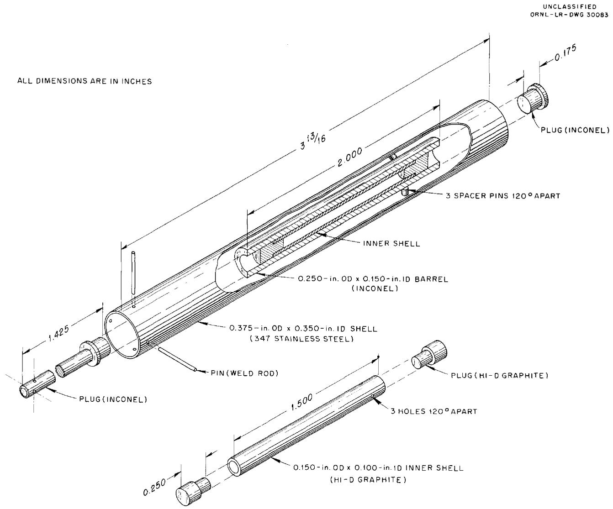

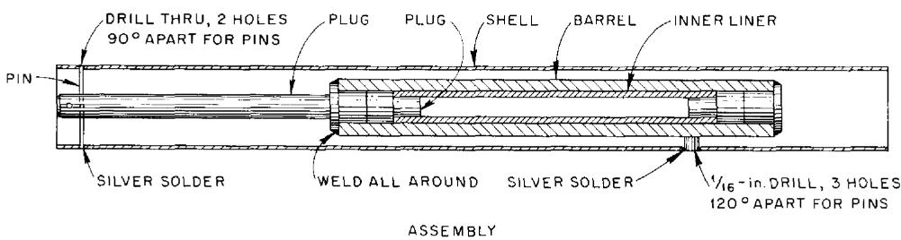  
Fig. 2.2.6. Capsule for Testing the Stability of Graphite in Contact with Molten-Salt Fuel Under Irradiation in the MTR.

# 2.3. CHEMISTRY

# W. R. Grimes Chemistry Division

# PHASE EQUILIBRIUM STUDIES

# Systems Containing UF $^4$ and/or ThF

R.E.Thoma

H. A. Friedman

H. Insley

C. F. Weaver

The System LiF-BeF2-ThF4-UF4.-Detailed studies are being made of the phase equilibria characteristics of the quaternary system LiF-BeF2-ThF4-UF4 in the composition region 26 to 40 mole % BeF2, 1 to 3 mole % UF4 and 1 mole % ThF4. A fused-salt breeder-reactor fuel having a liquidus temperature of $440 \pm 5^{\circ}C$ and containing no more than 36 mole % BeF2 can be chosen from this composition region. Liquidus curves for some LiF-BeF2-ThF4-UF4 compositions in this region are shown in Fig. 2.3.1.

The System $\mathsf{LiF - BeF}_2\mathsf{-ThF}_4$ A partial phase diagram of the system $\mathsf{LiF - BeF}_2\mathsf{-ThF}_4$ was presented previously, and a more complete phase diagram based on inferences from the best thermal analysis and quenching data presently available is shown in Fig. 2.3.2. Recent results of optical and x-ray diffraction examinations of quenched

samples indicate that the following three eutectics occur within this fuel solvent system:

<table><tr><td colspan="3">Composition (Mole %)</td><td rowspan="2">Melting Point (℃)</td></tr><tr><td>LiF</td><td>BeF2</td><td>ThF4</td></tr><tr><td>66</td><td>29</td><td>5</td><td>427</td></tr><tr><td>65</td><td>30</td><td>5</td><td>429</td></tr><tr><td>47</td><td>51.5</td><td>1.5</td><td>~360</td></tr></table>

Two experimental factors preclude the immediate construction of an unequivocal polythermal phase diagram. First, $\mathsf{LiF - ThF_4}$ solid phases do not appear in the ternary system $\mathsf{LiF - BeF}_2\mathsf{-ThF}_4$ as pure phases; that is, they contain $\mathsf{BeF}_2$ . The type of solution which occurs is not, as yet, known. Since no $\mathsf{LiF - ThF}_4$ compounds occur as pure phases in the ternary system, all Alkemade lines become areas in the polythermal diagram rather than lines and thus lose some significance relative to defining compatibility triangles.

Second, no hydrolysis products have been observed in any $\mathsf{LiF - BeF}_2\mathsf{-ThF}_4$ samples, although these materials convert $\mathsf{UF}_4$ into $\mathsf{UO}_2$ so readily in $\mathsf{LiF - BeF}_2\mathsf{-ThF}_4\mathsf{-UF}_4$ mixtures that stringent measures are required to ensure their absence.

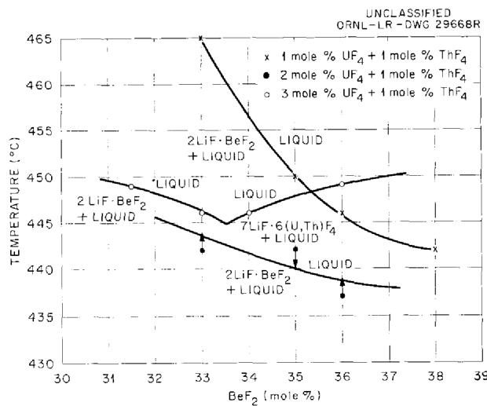  
Fig. 2.3.1. Liquidus Temperatures in the System LiF-BeF $_2$ -UF $_4$ -ThF $_4$ .

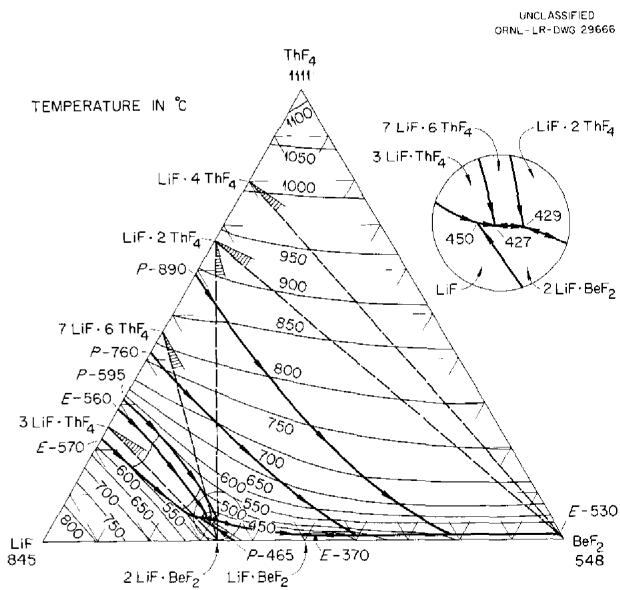  
Fig. 2.3.2. The System LiF-BeF $_2$ -ThF $_4$ .

Previous reports1,2 of results of LiF-BeF2-ThF4 quenches showed consistent liquidus and secondary phase temperatures and rarely reproducible solidus temperatures. It can be inferred that such variations in solidus values are indicative of the presence of a quaternary liquid containing hydrolysis products in solution. The most recent quench data for mixtures with compositions close to that of the 2LiF-BeF2-7LiF-6ThF4-LiF-2ThF4 eutectic and to that of the 2LiF-BeF2-7LiF-6ThF4-3LiF-ThF4 eutectic were obtained with samples in which only prehydrofluorinated BeF2 was used. The results from these data are much more self-consistent than those obtained with as-received BeF2.

The System $\mathsf{LiF - ThF_4 - UF_4}$ In quaternary mixtures of LiF-BeF2-ThF4-UF4, solid solutions of LiF-ThF and LiF-UF compounds are precipitated from molten liquids as primary or secondary phases. An understanding of the UF4-ThF4 phase behavior in molten-salt reactor fuels whose compositions are chosen from the quaternary system LiF-BeF2-ThF4-UF4 is therefore dependent on a reliably accurate LiF-ThF4-UF4 phase diagram.

A comprehensive study of the phase equilibria in the system $\mathsf{LiF - ThF_4 - UF_4}$ has been made, and the phase diagram for the system is presented in Fig. 2.3.3. A report giving complete results of the thermal analysis and of optical and x-ray diffraction examinations of quenched samples is being prepared.

The salient characteristic of the system LiF-ThF4-UF4, as would be expected, is the extensive formation of solid solutions. In the course of the investigation detailed studies were made of methods for the precise determination of UF4 and ThF4 concentrations in primary phases. It was found that concentrations precise to within ±0.5 mole % could be determined with the petrographic microscope for UF4 or ThF4.

The supplemental results obtained from recently completed thermal-gradient quenching experiments were consistent with the results presented previously, and liquidus isotherms could be drawn for the entire system. Also, data from the recent experiments defined the phase boundaries of the

$3\mathrm{LiF}\cdot \mathrm{ThF}_4$ compound and established the solubility limit of $UF_4$ in this phase at the solidus. The compound $3\mathrm{LiF}\cdot \mathrm{UF}_4$ has no region of stability in either the binary system $LiF\cdot UF_4$ or the ternary system $LiF\cdot ThF_4\cdot UF_4$ . It is probably isostructural with $3\mathrm{LiF}\cdot \mathrm{ThF}_4$ . Solubility studies of mixtures with the composition $3\mathrm{LiF}\cdot UF_4\cdot 3\mathrm{LiF}\cdot \mathrm{ThF}_4$ (75 mole% LiF) show that $3\mathrm{LiF}\cdot \mathrm{Th}(U)F_4$ solid solutions containing as much as 15.5 mole% $UF_4$ may be formed. This solid solution is green, is biaxial negative, and has a birefringence of approximately 0.008, with an optic angle of approximately 30 deg. The indices of refraction of $3\mathrm{LiF}\cdot \mathrm{Th}(U)F_4$ as a function of $UF_4$ content are shown in Fig. 2.3.4.

# Solubility of $\mathsf{PuF}_3$ in Alkali Fluoride-Beryllium Fluoride Mixtures

C.J.Barton R.A.Strehlow

Further information was obtained on the solubility of $\mathsf{PuF}_3$ in alkali fluoride-beryllium fluoride mixtures. During the quarter, additional data were obtained for several of the solvent compositions previously tested and for one new solvent mixture. Some of the previously reported solubility values were changed slightly as the result of repeated analyses, and, in addition, the solvent compositions were more accurately defined. All the data obtained to date are given in Table 2.3.1 and are shown graphically in Figs. 2.3.5 and 2.3.6. The values marked with asterisks in Table 2.3.1 are believed to be incorrect, and therefore they were omitted from the graphs. The data indicate that the solubility of $\mathsf{PuF}_3$ in LiF-BeF $_2$ mixtures is at a minimum for mixtures containing about 63 mole% LiF and that it is at a minimum in the NaF-BeF $_2$ system for mixtures containing about 57 mole% NaF. Comparison of $\mathsf{PuF}_3$ solubility data with the results of CeF $_3$ solubility determinations showed that CeF $_3$ was slightly more soluble than $\mathsf{PuF}_3$ for the same solvent composition and temperature. A study of the effect of CeF $_3$ on the solubility of $\mathsf{PuF}_3$ in LiF-BeF $_2$ (63-37 mole%) is under way.

UNCLASSIFIED

ORNL-LR-DWG 28215R

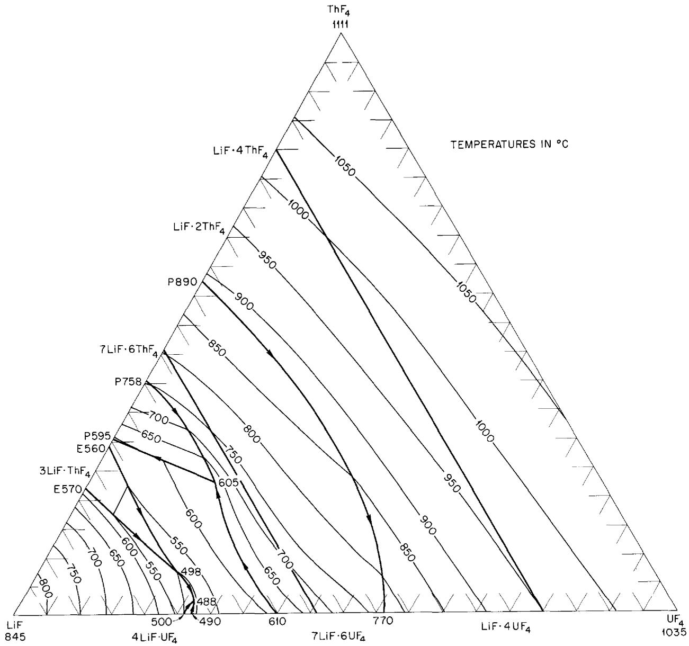  
Fig. 2.3.3. The System LiF-ThF $_4$ -UF $_4$ .

Because there is interest in the possibility of converting Th²³² to fissionable U²³³ in a plutonium-fueled fused-salt reactor, a brief study was made of the effect of 1 mole % ThF₄ on the solubility of PuF₃ in LiF-BeF₂ (63-37 mole%). The results of the study are presented in Fig. 2.3.7, in which data for PuF₃ solubility in LiF

$\mathsf{BeF}_2$ (65.4-34.6 mole %), obtained from Table 2.3.1, are compared with data for $\mathsf{PuF}_3$ solubility in LiF- $\mathsf{BeF}_2$ -ThF4 (62.4-36.6-1.0 mole %, calculated composition). A plot of solvent composition vs $\mathsf{PuF}_3$ solubility3 indicated that the difference in the LiF-to- $\mathsf{BeF}_2$ ratios of the two solvents would have very little effect on the

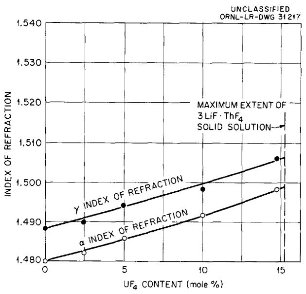  
Fig. 2.3.4. Indices of Refraction for 3LiF·ThF₄ Solid Solution.

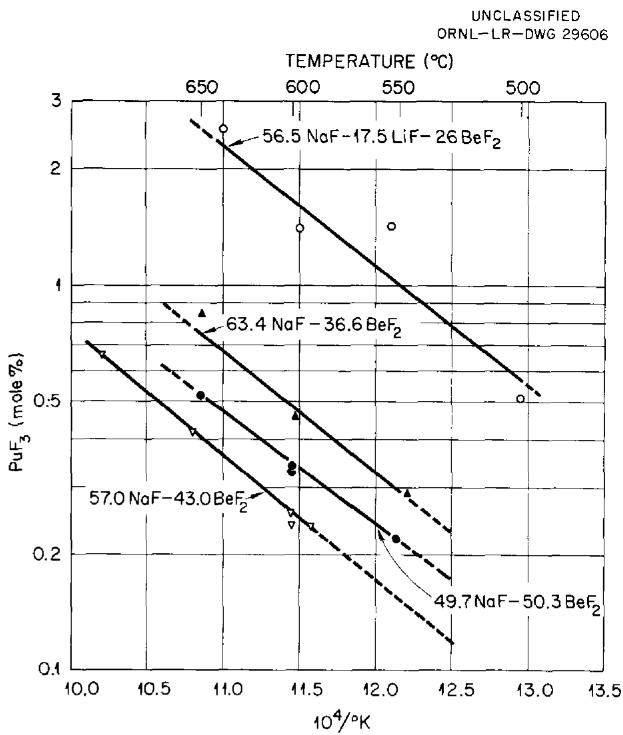

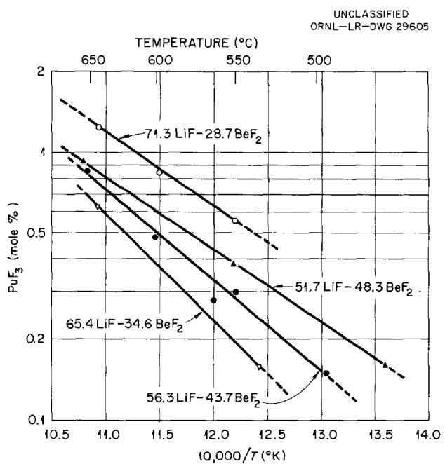  
Fig. 2.3.6. Solubility of $\mathsf{PuF}_3$ as a Function of Temperature for NaF-BeF $_2$ and NaF-LiF-BeF $_2$ Solvents.   
Fig. 2.3.5. Solubility of $\mathsf{PuF}_3$ as a Function of Temperature for LiF-BeF $_2$ Solvents.

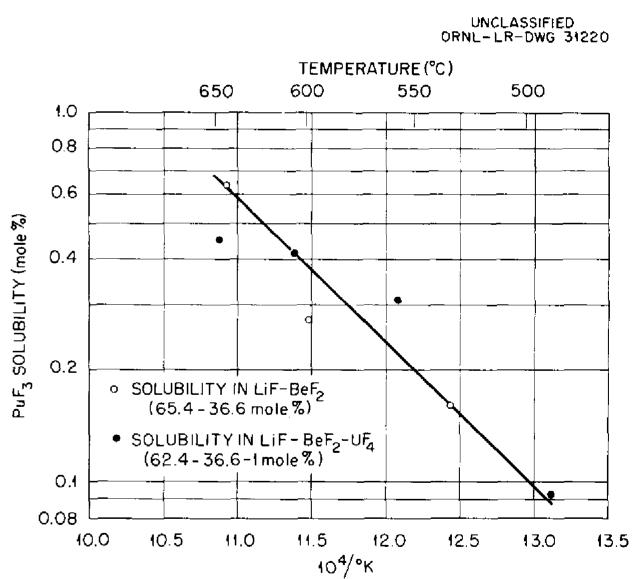  
Fig. 2.3.7. Effect of Addition of $\mathsf{ThF}_4$ on Solubility of $\mathsf{PuF}_3$ in an LiF-BeF $_2$ Mixture.

Table 2.3.1. Solubility of $\mathsf{PuF}_3$ in Alkali Fluoride-Beryllium Fluoride Mixtures   

<table><tr><td colspan="3">Solvent Composition (mole %)</td><td rowspan="2">Filtration Temperature (℃)</td><td colspan="2">Filtrate Analysis</td></tr><tr><td>NaF</td><td>LiF</td><td>BeF2</td><td>Pu (wt %)</td><td>PuF3(mole %)</td></tr><tr><td>49.5</td><td></td><td>50.5</td><td>552</td><td>1.18</td><td>0.22</td></tr><tr><td></td><td></td><td></td><td>600</td><td>1.73</td><td>0.33</td></tr><tr><td></td><td></td><td></td><td>600</td><td>1.79</td><td>0.34</td></tr><tr><td></td><td></td><td></td><td>651</td><td>2.72</td><td>0.52</td></tr><tr><td>57.0</td><td></td><td>43.0</td><td>538</td><td>1.17*</td><td>0.22*</td></tr><tr><td></td><td></td><td></td><td>552</td><td>1.63*</td><td>0.31*</td></tr><tr><td></td><td></td><td></td><td>600</td><td>1.35</td><td>0.26</td></tr><tr><td></td><td></td><td></td><td>600</td><td>1.26</td><td>0.24</td></tr><tr><td></td><td></td><td></td><td>609</td><td>1.26</td><td>0.24</td></tr><tr><td></td><td></td><td></td><td>650</td><td>1.48*</td><td>0.28*</td></tr><tr><td></td><td></td><td></td><td>652</td><td>2.21</td><td>0.42</td></tr><tr><td></td><td></td><td></td><td>706</td><td>3.40</td><td>0.66</td></tr><tr><td>63.4</td><td></td><td>36.6</td><td>550</td><td>1.54</td><td>0.29</td></tr><tr><td></td><td></td><td></td><td>598</td><td>2.43</td><td>0.46</td></tr><tr><td></td><td></td><td></td><td>600</td><td>2.00*</td><td>0.38*</td></tr><tr><td></td><td></td><td></td><td>650</td><td>4.40</td><td>0.85</td></tr><tr><td></td><td>51.7</td><td>48.3</td><td>463</td><td>1.02</td><td>0.16</td></tr><tr><td></td><td></td><td></td><td>549</td><td>2.44</td><td>0.38</td></tr><tr><td></td><td></td><td></td><td>599</td><td>2.96*</td><td>0.47</td></tr><tr><td></td><td></td><td></td><td>654</td><td>5.76</td><td>0.93</td></tr><tr><td></td><td>56.3</td><td>43.7</td><td>494</td><td>1.04</td><td>0.15</td></tr><tr><td></td><td></td><td></td><td>560</td><td>1.89</td><td>0.28</td></tr><tr><td></td><td></td><td></td><td>602</td><td>3.15</td><td>0.48</td></tr><tr><td></td><td></td><td></td><td>653</td><td>5.47</td><td>0.86</td></tr><tr><td></td><td></td><td></td><td>550</td><td>1.98</td><td>0.30</td></tr><tr><td></td><td></td><td></td><td>599</td><td>2.04*</td><td>0.31*</td></tr><tr><td></td><td></td><td></td><td>649</td><td>6.24*</td><td>0.95*</td></tr><tr><td></td><td>65.4</td><td>34.6</td><td>532</td><td>1.15</td><td>0.16</td></tr><tr><td></td><td></td><td></td><td>600</td><td>1.78</td><td>0.27</td></tr><tr><td></td><td></td><td></td><td>643</td><td>4.30</td><td>0.63</td></tr><tr><td></td><td>71.3</td><td>28.7</td><td>546</td><td>4.00</td><td>0.56</td></tr><tr><td></td><td></td><td></td><td>597</td><td>5.90</td><td>0.85</td></tr><tr><td></td><td></td><td></td><td>650</td><td>8.48</td><td>1.26</td></tr><tr><td>56.5</td><td>17.5</td><td>26.0</td><td>500</td><td>2.92</td><td>0.51</td></tr><tr><td></td><td></td><td></td><td>554</td><td>7.68</td><td>1.43</td></tr><tr><td></td><td></td><td></td><td>565</td><td>2.61*</td><td>0.46*</td></tr><tr><td></td><td></td><td></td><td>600</td><td>7.59</td><td>1.41</td></tr><tr><td></td><td></td><td></td><td>634</td><td>13.0</td><td>2.58</td></tr><tr><td></td><td></td><td></td><td>655</td><td>6.45*</td><td>1.18*</td></tr></table>

* Doubtful results excluded from Figs. 2.3.5 and 2.3.6.

solubility of $\mathsf{PuF}_3$ , but it is expected that the solubility of $\mathsf{PuF}_3$ in pure LiF-BeF $_2$ (63-37 mole %) will be determined in the near future in order to obtain a more direct comparison. Although the scatter of the data shown in Fig. 2.3.7 precludes firm conclusions, it seems likely that the addition of 1 mole % ThF $_4$ to an LiF-BeF $_2$ (63-37 mole %) mixture will not appreciably affect the solubility of $\mathsf{PuF}_3$ in the solvent.

# FISSION-PRODUCT BEHAVIOR

G.M.Watson

F. F. Blankenship

# Solubility of Noble Gases in Molten Fluoride Mixtures

N.V. Smith

Studies were made of the solubilities of argon in NaF-LiF-KF (11.5-42-46.5 mole %) and of helium in LiF-BeF $_2$ (64-36 mole %), and numerical values expressed as Henry's law constants are presented in Tables 2.3.2 and 2.3.3 and Fig. 2.3.8. For comparison, the previously reported $^5$ solubility constants of helium and neon are also shown in Fig. 2.3.8.

The trends of the data are the same as those previously observed for the solubilities of the noble gases in mixtures containing $\mathsf{ZrF}_4$ . The solubilities follow Henry's law, increase with increasing temperature, and decrease with increasing molecular weight of the gas. However, an interesting difference in solubility is exhibited by helium in the LiF-BeF2 mixture. The heat of solution of helium is considerably lower in LiF-BeF2 than in NaF-KF-LiF or in mixtures containing ZrF4 and is not approximated by the product TΔS calculated from the gas law for isothermal expansion of an ideal gas from an initial concentration, $C_{g'}$ at the temperature and pressure of saturation, to a final concentration, $C_{d'}$ that is numerically equal to the measured solubility. The entropy of solution diminished by the entropy of expansion of an ideal gas over the same concentration range, $C_{g}$ to $C_{d'}$ is considerably larger in the mixture containing BeF2 than in any of the molten fluoride mixtures previously studied. The heats and entropies of solution for helium, neon, and argon in NaF-KF-LiF and for helium in LiF-BeF2, as well

5N. V. Smith, MSR Quar. Prog. Rep. Jan. 31, 1958, ORNL-2474, p 91.

6 J. H. Shaffer et al., MSR Quar. Prog. Rep. Oct. 31, 1957, ORNL-2431, p 41.

Table 2.3.2. Solubility of Argon in NaF-KF-LiF (11.5-42-46.5 Mole %)   

<table><tr><td>Temperature (℃)</td><td>Saturating Pressure (atm)</td><td>Solubility (moles of argon/cm3of melt)</td><td>K*</td></tr><tr><td></td><td></td><td>×10-8</td><td>×10-8</td></tr><tr><td rowspan="3">600</td><td>1.01</td><td>0.834</td><td>0.825</td></tr><tr><td>1.50</td><td>1.378</td><td>0.917</td></tr><tr><td>2.02</td><td>1.929</td><td>0.957</td></tr><tr><td></td><td></td><td></td><td>Av 0.90 ± 0.05</td></tr><tr><td rowspan="3">700</td><td>1.00</td><td>1.744</td><td>1.744</td></tr><tr><td>1.50</td><td>2.705</td><td>1.799</td></tr><tr><td>2.04</td><td>3.811</td><td>1.871</td></tr><tr><td></td><td></td><td></td><td>Av 1.80 ± 0.04</td></tr><tr><td rowspan="3">800</td><td>1.004</td><td>3.411</td><td>3.397</td></tr><tr><td>1.51</td><td>5.161</td><td>3.422</td></tr><tr><td>2.033</td><td>6.842</td><td>3.365</td></tr><tr><td></td><td></td><td></td><td>Av 3.40 ± 0.02</td></tr></table>

$*K = c / p$ in moles of gas per cubic centimeter of melt per atmosphere.

Table 2.3.3. Solubility of Helium in LiF-BeF $_2$ (64-36 Mole %)   

<table><tr><td>Temperature (℃)</td><td>Saturating Pressure (atm)</td><td>Solubility (moles of helium/cm3of melt)</td><td>K*</td></tr><tr><td></td><td></td><td>×10-8</td><td>×10-8</td></tr><tr><td rowspan="3">500</td><td>1.009</td><td>7.46</td><td>7.39</td></tr><tr><td>1.521</td><td>11.46</td><td>7.53</td></tr><tr><td>1.996</td><td>15.08</td><td>7.56</td></tr><tr><td></td><td></td><td></td><td>Av 7.49</td></tr><tr><td rowspan="3">600</td><td>1.103</td><td>11.74</td><td>11.59</td></tr><tr><td>1.570</td><td>18.76</td><td>11.95</td></tr><tr><td>2.107</td><td>22.40</td><td>11.11</td></tr><tr><td></td><td></td><td></td><td>Av 11.55</td></tr><tr><td rowspan="3">700</td><td>1.004</td><td>14.81</td><td>14.75</td></tr><tr><td>1.526</td><td>23.75</td><td>15.56</td></tr><tr><td>1.963</td><td>28.41</td><td>14.47</td></tr><tr><td></td><td></td><td></td><td>Av 14.93</td></tr><tr><td rowspan="3">800</td><td>0.996</td><td>19.36</td><td>19.47</td></tr><tr><td>1.52</td><td>29.63</td><td>19.49</td></tr><tr><td>1.978</td><td>38.55</td><td>19.49</td></tr><tr><td></td><td></td><td></td><td>Av 19.49</td></tr></table>

$*K = c / p$ in moles of gas per cubic centimeter of melt per atmosphere.

as the corresponding $T\Delta S$ products, are given in Table 2.3.4. As may be observed, the heats of solution in NaF-KF-LiF can be estimated to within $10\%$ by considering the gas to be ideal and calculating the entropy of isothermal expansion over the concentration interval defined by a single experiment. This is not the case, however, for helium in LiF-BeF $_2$ . The fundamental significance of these observations is not immediately apparent, and efforts to interpret the data will be deferred until additional measurements have been made.

# Solubility of HF in $\mathsf{LiF - BeF}_2$ Mixtures

J. H. Shaffer

The investigation of the solubility of HF in LiF-BeF $_2$ mixtures as a function of solvent composition in the range 0–55 mole % BeF $_2$

was almost completed, and, in order to avoid repetition, it is planned to withhold presentation of the results until the measurements are completed. It may be mentioned that, in mixtures with low alkali fluoride content, the solubility of HF in $\mathsf{LiF - BeF}_2$ mixtures is approximately the same as in $\mathsf{NaF - ZrF}_4$ mixtures. As the alkali fluoride content is increased, however, the solubilities of HF in the two mixtures differ markedly. For example, in mixtures containing about 90 mole % alkali fluoride, the HF solubilities are about tenfold lower in the $\mathsf{LiF - BeF}_2$ system than in the $\mathsf{NaF - ZrF}_4$ system. This comparison is based on the interpolation described previously of available data for the $\mathsf{NaF - ZrF}_4$ system.

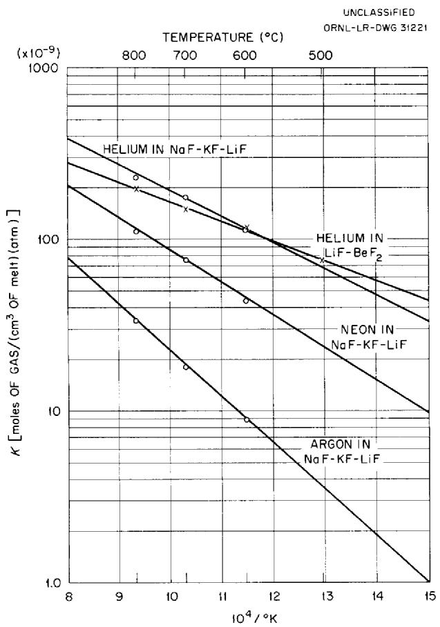  
Fig. 2.3.8. Solubilities of Noble Gases in NaF-KF-LiF (11.5-42-46.5 Mole %) and in LiF-BeF $_2$ (64-36 Mole %).

# Solubilities of Fission-Product Fluorides in Molten Alkali Fluoride-Beryllium Fluoride Solvents

W. T. Ward

Determinations of the solubility of $\mathsf{CeF}_3$ over the temperature range of 450 to $700^{\circ}\mathrm{C}$ were completed for both LiF-BeF $_2$ and NaF-BeF $_2$ solvents ranging in composition between 50 and 70 mole % alkali fluoride. It was found that the solubility of $\mathsf{CeF}_3$ passed through a minimum at approximately 62 to 63 mole % alkali fluoride in both solvents. The solubility values were somewhat less in NaF-BeF $_2$ than in LiF-BeF $_2$ of corresponding composition, as may be seen in Fig. 2.3.9, in which the solubilities in terms of weight per cent cerium are plotted as functions of solvent composition for three different temperatures. The same solubility values in terms of mole per cent $\mathsf{CeF}_3$ in the filtrates are shown in Fig. 2.3.10. Solubility values taken from these curves are listed in Table 2.3.5.

# Chemical Reactions of Oxides with Fluorides in LiF-KF

J. H. Shaffer

As shown previously, it is possible to effect some chemical separations of solutes in molten

Table 2.3.4. Enthalpy and Entropy Changes Occurring upon Solution of Some Noble Gases in Molten Fluorides at $1000^{\circ}\mathrm{K}$   

<table><tr><td rowspan="2">Solvent</td><td rowspan="2">Gas</td><td colspan="2">Solution</td><td rowspan="2">Ideal Gas Expansion TΔS</td></tr><tr><td>ΔH (cal/mole)</td><td>ΔS (eu)</td></tr><tr><td rowspan="3">NaF-KF-LiF (11.5-42-46.5 mole %)</td><td>Helium</td><td>8,000</td><td>-0.25</td><td>8,250</td></tr><tr><td>Neon</td><td>8,900</td><td>-0.97</td><td>9,870</td></tr><tr><td>Argon</td><td>12,400</td><td>-0.10</td><td>12,500</td></tr><tr><td>LiF-BeF2 (64-36 mole %)</td><td>Helium</td><td>4,850</td><td>-3.73</td><td>8,580</td></tr></table>

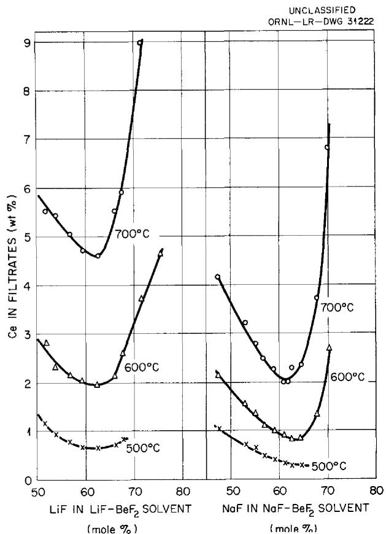  
Fig. 2.3.9. Solubility of $\mathsf{CeF}_3$ as Ce (wt %) in Alkali Fluoride-Beryllium Fluoride Solvents.

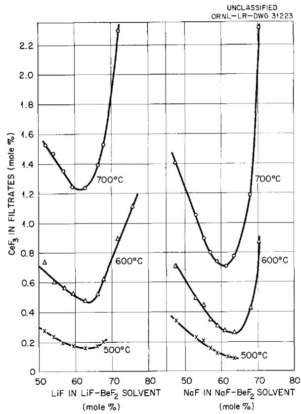  
Fig. 2.3.10. Solubility of $\mathsf{CeF}_3$ as $\mathsf{CeF}_3$ (Mole %) in Alkali Fluoride-Beryllium Fluoride Solvents.

Table 2.3.5. Solubility of $\mathsf{CeF}_3^*$ at 500, 600, and $700^{\circ}\mathrm{C}$ in NaF-BeF $_2$ and LiF-BeF $_2$ Solvents as a Function of Solvent Composition   

<table><tr><td rowspan="3">Alkali Fluoride in Solvent (mole %)</td><td colspan="4">At 700°C</td><td colspan="4">At 600°C</td><td colspan="4">At 500°C</td></tr><tr><td colspan="2">In NaF-BeF2</td><td colspan="2">In LiF-BeF2</td><td colspan="2">In NaF-BeF2</td><td colspan="2">In LiF-BeF2</td><td colspan="2">In NaF-BeF2</td><td colspan="2">In LiF-BeF2</td></tr><tr><td>Ce (wt %)</td><td>CeF3(mole %)</td><td>Ce (wt %)</td><td>CeF3(mole %)</td><td>Ce (wt %)</td><td>CeF3(mole %)</td><td>Ce (wt %)</td><td>CeF3(mole %)</td><td>Ce (wt %)</td><td>CeF3(mole %)</td><td>Ce (wt %)</td><td>CeF3(mole %)</td></tr><tr><td>50</td><td>3.6</td><td>1.25</td><td>5.9</td><td>1.65</td><td>1.84</td><td>0.60</td><td>2.9</td><td>0.79</td><td>0.87</td><td>0.29</td><td>1.3</td><td>0.31</td></tr><tr><td>55</td><td>2.8</td><td>0.91</td><td>5.2</td><td>1.40</td><td>1.33</td><td>0.41</td><td>2.3</td><td>0.61</td><td>0.58</td><td>0.19</td><td>0.86</td><td>0.22</td></tr><tr><td>60</td><td>2.15</td><td>0.72</td><td>4.7</td><td>1.24</td><td>0.95</td><td>0.30</td><td>2.00</td><td>0.51</td><td>0.38</td><td>0.12</td><td>0.68</td><td>0.168</td></tr><tr><td>63</td><td>2.13</td><td>0.74</td><td>4.66</td><td>1.18</td><td>0.82</td><td>0.26</td><td>1.97</td><td>0.48</td><td>0.32</td><td>0.093</td><td>0.66</td><td>0.162</td></tr><tr><td>65</td><td>2.55</td><td>0.85</td><td>5.1</td><td>1.28</td><td>0.88</td><td>0.28</td><td>2.06</td><td>0.50</td><td>0.30</td><td>0.076</td><td>0.70</td><td>0.166</td></tr><tr><td>70</td><td>6.2</td><td>1.95</td><td>7.7</td><td>1.9</td><td>2.4</td><td>0.77</td><td>3.2</td><td>0.79</td><td></td><td></td><td></td><td></td></tr><tr><td>75</td><td></td><td></td><td></td><td></td><td></td><td></td><td></td><td>1.07</td><td></td><td></td><td></td><td></td></tr></table>

*The experimental error of the measurements is estimated to be ±5%.

LiF-KF by selective precipitation as oxides. Relatively sharp separations of uranium from cerium and of zirconium from cerium were demonstrated by the stepwise addition of solid CaO to solutions containing $\mathsf{UF}_4\text{-}\mathsf{CeF}_3$ and $\mathsf{ZrF}_4\text{-}\mathsf{CeF}_3$ in molten LiF-KF. It was also found, however, that $\mathsf{CeF}_3$ and $\mathsf{BeF}_2$ coprecipitated from the LiF-KF solvent containing $\mathsf{BeF}_2\text{-}\mathsf{CeF}_3$ when CaO was added. It appeared to be pertinent, therefore, before attempting investigations of LiF-BeF $_2$ solvent mixtures, to determine the characteristics of BeO as a precipitating agent for uranium, zirconium, and cerium from solutions made up with the simple solute LiF-KF. It would be desirable, of course, to use BeO as a precipitating agent in mixtures containing $\mathsf{BeF}_2$ , since it would not introduce any foreign constituents to the solution.

The results of an experiment in which BeO was used as the precipitating agent for zirconium are presented in Fig. 2.3.11. The concentration of zirconium remaining in the LiF-KF solvent is shown as a function of time. A filtrate was obtained before addition of a 20-fold excess of BeO pellets, and filtrates were obtained at intervals after the addition. As may be seen, the precipitation of the zirconium took place in $\frac{1}{2}$ hr or less after the addition of the BeO, but several hours were required to reach the stoichiometric concentration of beryllium in the solvent. On the basis of this experiment alone, it is not possible to state why the concentration of beryllium takes some time to build up to the stoichiometric value, but it may be surmised that zirconium oxide forms as a layer over the pellets of BeO and that it therefore takes time for the $\mathrm{BeF}_2$ to diffuse out. It is interesting to note that the free energies of formation of the pure solids show a positive free-energy change of +16.6 kcal for the reaction

$$
2 \mathrm {B e O} + \mathrm {Z r F} _ {4} \rightleftharpoons \mathrm {Z r O} _ {2} + 2 \mathrm {B e F} _ {2}.
$$

The partial precipitation of cerium that occurred upon addition of 20-fold excess of BeO to an

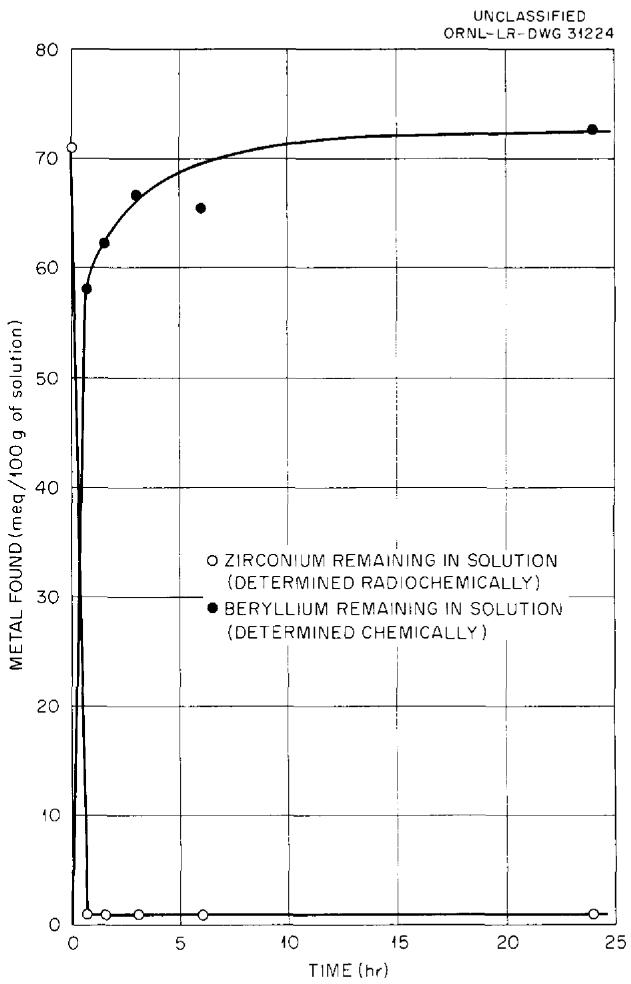  
Fig. 2.3.11. Results of Reaction of $\mathsf{ZrF}_4$ (Hf $^{181}$ F $_4$ ) with BeO in LiF-KF (50-50 Mole%).

LiF-KF mixture containing $\mathsf{CeF}_3$ is indicated in Fig. 2.3.12. This experiment confirmed the previous observation that the oxides of cerium and beryllium coprecipitate. Since it appeared in this experiment that the reaction was surface controlled, an additional 30-fold excess of BeO was added after heating the solution to $900^{\circ}\mathrm{C}$ . It was surprising to find after this drastic treatment that the cerium had not completely precipitated and that its concentration had only decreased from 57 to 36 meq/100 g of solution. No satisfactory explanation of this behavior is immediately apparent.

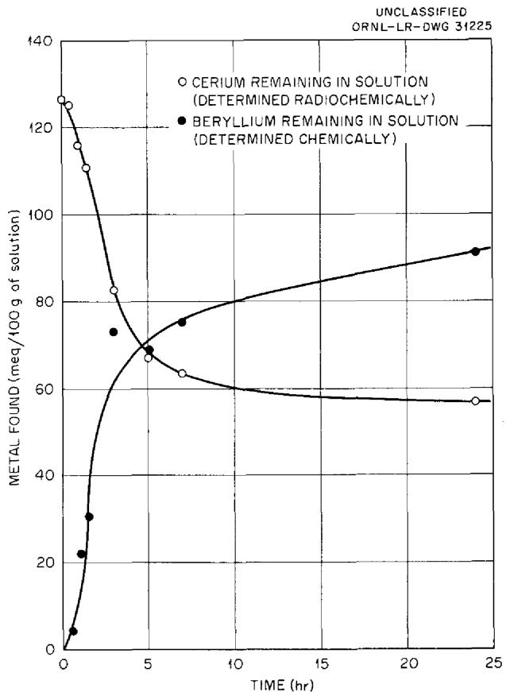  
Fig. 2.3.12. Results of Reaction of $\mathsf{CeF}_3$ with BeO in LiF-KF (50-50 Mole %) at $600^{\circ}\mathsf{C}$ .

# CHEMISTRY OF THE CORROSION PROCESS

G.M.Watson G.J.Nessle

# Activity Coefficients of $\mathsf{NiF}_2$ in LiF-BeF

C. M. Blood

The activity coefficients of $\mathsf{NiF}_2$ dissolved in a molten mixture of LiF-BeF $_2$ (62-38 mole %) are being determined by using techniques described previously.[10,11] The results of experimental measurements at $600^{\circ}\mathsf{C}$ are summarized in Table 2.3.6, which gives the experimentally determined partial pressures of HF and $\mathsf{H}_2$ , the mole fractions of $\mathsf{NiF}_2$ in the melt, and the equilibrium quotients.

The equilibrium quotients are also shown graphically in Fig. 2.3.13 as functions of the mole fraction of $\mathrm{NiF}_2$ in the melt,

An examination of the results indicates that, within the experimental precision achieved, the equilibrium quotients are independent of the mole fraction of $\mathrm{NiF}_2$ over a range from approximately $0.9 \times 10^{-4}$ to $21 \times 10^{-4}$ . The activity coefficients of $\mathrm{NiF}_2$ in this solvent, calculated in the manner previously described,[10,11] have values of 2347 and of 515 with respect to the solid and liquid standard states, respectively. Brewer's[12] tabulation of thermodynamic properties was used in the calculations, and it is now known that the assumed melting point for $\mathrm{NiF}_2$ is seriously in error. However, additional efforts to refine the values of the calculated activity coefficients will not be made until it is possible to obtain some experimental values for the free energies of formation of pure crystalline $\mathrm{NiF}_2$ at high temperatures $(500 - 600^{\circ}\mathrm{C})$ by measuring the equilibrium quotients by the present method at concentrations approaching saturation. An attempt to obtain such values at $500^{\circ}\mathrm{C}$ is under way.

# Solubility of NiF 2 in LiF-BeF 2 (61-39 Mole %)

C. M. Blood

Measurements were made in order to establish a concentration limit below which $\mathsf{NiF}_2$ does not precipitate from LiF-BeF as a complex compound or in the pure state. Experimental procedures were used in this investigation that were similar to those used previously to determine the solubility of FeF in LiF-BeF. The results are summarized in Table 2.3.7 and are shown graphically in Fig. 2.3.14.

The solubility of $\mathsf{NiF}_2$ was found to be independent of the amount of $\mathsf{NiF}_2$ added. Furthermore, petrographic examination14 of powdered samples of the filtrates revealed that the saturating phase was pure $\mathsf{NiF}_2$ . Accordingly, the activity coefficients of solid $\mathsf{NiF}_2$ at saturation in this solvent are given directly by the reciprocal of the solubility expressed as mole fraction (see

Table 2.3.6. Equilibrium Quotients at ${600}^{ \circ  }\mathrm{C}$ of the Reaction ${\mathrm{{NiF}}}_{2}\left( d\right)  + {\mathrm{H}}_{2}\left( g\right)  \rightleftharpoons  \mathrm{{Ni}}\left( s\right)  + 2\mathrm{{HF}}\left( g\right)$ in LiF-BeF ${}_{2}$ (62.38 Mole %)   

<table><tr><td>Pressure of HF (atm)</td><td>Pressure of H2 (atm)</td><td>NiF2in Melt (mole fraction)</td><td>Kx*</td></tr><tr><td></td><td>×10-2</td><td>×10-4</td><td>×10-4</td></tr><tr><td>0.283</td><td>3.89</td><td>1.418</td><td>1.45</td></tr><tr><td>0.292</td><td>3.84</td><td>1.302</td><td>1.71</td></tr><tr><td>0.288</td><td>3.86</td><td>1.273</td><td>1.69</td></tr><tr><td>0.286</td><td>3.87</td><td>1.273</td><td>1.66</td></tr><tr><td>0.244</td><td>4.10</td><td>0.897</td><td>1.62</td></tr><tr><td>0.233</td><td>4.16</td><td>0.897</td><td>1.46</td></tr><tr><td>0.242</td><td>4.11</td><td>0.897</td><td>1.59</td></tr><tr><td>0.265</td><td>3.98</td><td>0.955</td><td>1.85</td></tr><tr><td>0.250</td><td>4.06</td><td>0.926</td><td>1.66</td></tr><tr><td>0.259</td><td>4.02</td><td>0.949</td><td>1.76</td></tr><tr><td>0.319</td><td>3.69</td><td>1.504</td><td>1.83</td></tr><tr><td>0.322</td><td>3.67</td><td>1.504</td><td>1.88</td></tr><tr><td>0.307</td><td>3.76</td><td>1.620</td><td>1.55</td></tr><tr><td>0.323</td><td>3.67</td><td>1.620</td><td>1.76</td></tr><tr><td>0.454</td><td>2.96</td><td>3.963</td><td>1.76</td></tr><tr><td>0.456</td><td>2.95</td><td>4.050</td><td>1.74</td></tr><tr><td>0.448</td><td>2.99</td><td>4.165</td><td>1.61</td></tr><tr><td>0.457</td><td>2.94</td><td>4.107</td><td>1.73</td></tr><tr><td>0.737</td><td>1.43</td><td>19.15</td><td>1.98</td></tr><tr><td>0.734</td><td>1.44</td><td>19.75</td><td>1.89</td></tr><tr><td>0.749</td><td>1.36</td><td>20.74</td><td>1.99</td></tr><tr><td>0.744</td><td>1.39</td><td>20.54</td><td>1.94</td></tr><tr><td></td><td></td><td></td><td>Av 1.73 ±0.12</td></tr></table>

$\star K_{x} = P_{HF}^{2} / (X_{NiF_{2}}P_{H_{2}})$ , where $X$ is mole fraction and $P$ is pressure in atmospheres.

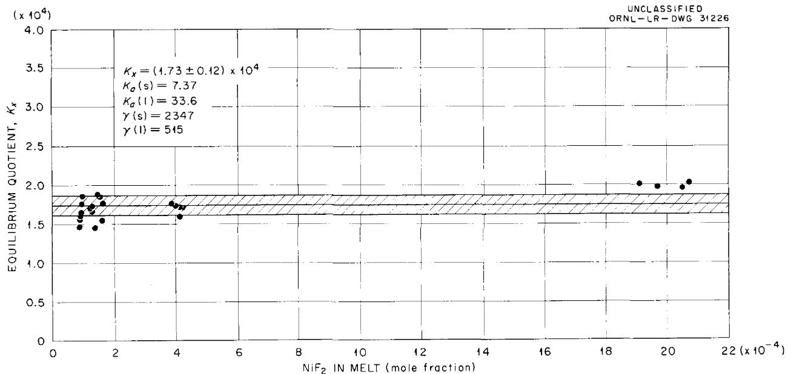  
Fig. 2.3.13. Equilibrium Quotients for the Reduction of $\mathsf{NiF}_2$ by $\mathsf{H}_2$ in LiF-BeF $_2$ (62-38 Mole%).

Table 2.3.7. Solubility of NiF $_2$ in LiF-BeF $_2$ (61-39 Mole %)   

<table><tr><td>Temperature (°C)</td><td>Ni Added (wt %)</td><td>Solubility of NiF2(mole fraction)</td><td>Activity Coefficient of NiF2(s) at Saturation</td></tr><tr><td>694</td><td>2.85</td><td>0.0171</td><td>58.5</td></tr><tr><td>649</td><td>2.14</td><td>0.0128</td><td>78.1</td></tr><tr><td>597</td><td>1.33</td><td>0.00783</td><td>127.7</td></tr><tr><td>551</td><td>0.90</td><td>0.00529</td><td>189.0</td></tr><tr><td>499</td><td>0.58</td><td>0.00337</td><td>296.7</td></tr></table>

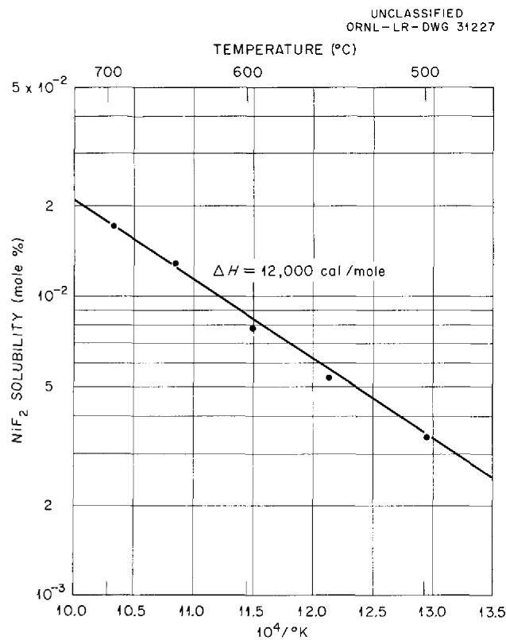  
Fig. 2.3.14. Solubility of $\mathsf{NiF}_2$ in LiF-BeF $_2$ (61-39 Mole%).

Table 2.3.7). These activity coefficients combined with the equilibrium quotients at saturation obtained from reduction experiments will be useful in the experimental determination of free energies of formation of pure crystalline $\mathsf{NiF}_2$ at high temperatures.

# Experimental Determination of Chromium Diffusion Coefficients in Molten Salt-Inconel Systems

R.B.Evans R.J.Sheil

The available data on diffusion coefficients for chromium in nickel-base alloys may be divided into two distinct groups. The first group consists of high-temperature data $(T > 900^{\circ}\mathrm{C})$ which were obtained through classical self-diffusion measurements based on labeled-chromium $\left(\mathbf{Cr}^{51}\right)$ distributions within alloy specimens.[15] No molten salts were involved. The second group consists of data based on the exchange

$$
\begin{array}{l} \mathrm {C r} ^ {\circ} + \mathrm {C r} ^ {\star} \mathrm {F} _ {2} \rightleftharpoons \mathrm {C r F} _ {2} + \mathrm {C r} ^ {\circ \star}, \tag {1} \\ \Delta F ^ {\circ} = 0 \text {a n d} K = 1, \\ \end{array}
$$

which takes place when labeled and unlabeled chromous fluorides are dissolved in a molten salt contained by Inconel. Rates of the depletion of $\mathrm{Cr}^{\star}\mathrm{F}_{2}$ with time and the corresponding $\mathrm{Cr}^{\circ \star}$ distribution in the Inconel were measured at relatively low temperatures (800 to $600^{\circ}\mathrm{C}$ ).16 Diffusion data at these - and even lower - temperatures are important from the standpoint of estimating the long-term corrosion rates to be expected in molten-salt power reactor components.

A series of experiments for rechecking the data of the second type, which consist of values obtained at four temperatures, and to extend the

data to temperatures below $600^{\circ}\mathrm{C}$ would be highly desirable. Since solid-state diffusion mechanisms may vary over wide temperature ranges, extrapolation of high-temperature data to lower temperatures could introduce large errors in calculated diffusion rates. The experimental procedures which are to be used in future investigations are described below.

Depletion Method. - If consideration is given to an Inconel-molten salt system in which the molten salt initially contains dissolved $\mathsf{CrF}_2$ and $\mathsf{Cr}^{\star}\mathsf{F}_2$ and the Inconel contains no $\mathsf{Cr}^{\circ\star}$ , a random exchange will take place, as shown by Eq. 1, although the net change of total chromium is zero. The combined action of the exchange reaction and the diffusional forces within the Inconel will result in a gain of $\mathsf{Cr}^{\circ\circ}$ in the Inconel and a loss of $\mathsf{Cr}^{\star}\mathsf{F}_2$ from the salt. If the depletion of $\mathsf{Cr}^{\star}\mathsf{F}_2$ activity in the salt (corrected for time decay) is measured as a function of time, a diffusion coefficient for chromium in the metal may be calculated by means of the following relationship:

$$
\frac {b _ {t = 0} - b _ {t}}{b _ {t = 0}} = 1 - e ^ {a ^ {2} t} \operatorname {e r f c} (a \sqrt {t}), \tag {2}
$$

where

$$
\begin{array}{l} t = \text {t i m e}, \sec , \\ b _ {t = 0} = \text {c o u n t s} / g \cdot \min  (\text {a t t i m e c o u n t i s} \text {m a d e}) \text {o f a f i l t e r e d s a l t s a m p l e} \text {t a k e n a t} t = 0, \\ b _ {t} = \text {c o u n t s} / \mathrm {g} \cdot \min  (\text {a t} \text {t i m e} \text {c o u n t} \text {i s} \\ \text {m a d e}) \text {o f a f i l t e r e d s a l t s a m p l e} \\ \text {t a k e n} \text {a t} t, \\ a = \frac {A}{V} \frac {[ C r ^ {\circ} ]}{[ C r F _ {2} ]} \frac {\rho_ {w}}{\rho_ {s a l t}} \sqrt {D}, \sec^ {- 1}, \\ \end{array}
$$

$$
A / V = \text {r a t i o} \quad \text {t h e s a l t - e x p o s e d a r e a o f} \quad \text {I n c o n e l t o t h e s a l t v o l u m e ,} \mathrm {c m} ^ {- 1},
$$

$$
\begin{array}{l} \begin{array}{l} \left[ \mathrm {C r} ^ {\circ} \right] / \left[ \mathrm {C r F} _ {2} \right] = \text {w e i g h t f r a c t i o n r a t i o o f c h r o m i u m} \\ \text {i n l i n c o n e l t o c h r o m o u s f l u o r i d e} \\ (\text {a s C r} ^ {+ +}) \text {i n t h e s a l t}, \end{array} \\ \rho_ {w} / \rho_ {\text {s a l t}} = \text {d e n s i t y r a t i o o f m e t a l t o s a l t}, \\ D = \text {d i f f u s i o n} \quad \text {c o e f f i c i e n t}, \quad \mathrm {c m} ^ {2} / \sec . \\ \end{array}
$$

Equation 2 is based on a simultaneous solution of the linear diffusion equation

$$
\frac {\partial C _ {C r ^ {o _ {\star}}}}{\partial t} = D \frac {\partial^ {2} C _ {C r ^ {o _ {\star}}}}{\partial x ^ {2}}, \tag {3}
$$

and the equation resulting from a balance of the instantaneous transfer rates of labeled chromium from the salt to the metal, or

$$
(4) \frac {\partial}{\partial t} \left(M _ {C r ^ {*} F _ {2}}\right) = - \frac {8 9}{5 1} \left\{- D A \frac {\partial}{\partial x} [ C _ {C r} \circ_ {*} (0, t) ] \right\}.
$$

The variable $x$ is distance within the Inconel measured in the direction of diffusion, in cm; $C_{\mathsf{Cr}^{\circ \star}}$ is concentration of $\mathsf{Cr}^{\circ \star}$ , in $\mathfrak{g} / \mathfrak{cm}^3$ ; and $M_{\mathsf{Cr}^{\star}\mathsf{F}_{2}}$ is the amount of $\mathsf{Cr}^{\star}\mathsf{F}_{2}$ in the melt, in g.

The boundary conditions applied to obtain this solution are: (1) the Inconel is infinitely thick in the $x$ direction, (2) the initial concentration of $\mathbf{Cr}^{\circ \star}$ in the Inconel is zero, and (3) the concentration of $\mathbf{Cr}^{\circ \star}$ at the Inconel surface at any $t > 0$ is governed by Eq. 1 and varies with time according to the relationship

$$
\left[ \mathrm {C r} ^ {\circ *} \right] _ {x = 0} = \rho_ {M} \left[ \mathrm {C r} ^ {\circ} \right] \frac {\left[ \mathrm {C r} ^ {*} \mathrm {F} _ {2} \right]}{\left[ \mathrm {C r F} _ {2} \right]} \tag {5}
$$

The simultaneous solution holds only when $a$ is constant with time. This will require that the temperature and $A / V$ be held constant for any experiment to which Eq. 2 is applied.

Inconel containers have been fabricated for a series of diffusion experiments based on these considerations. The containers consist of large cylinders which enclose small cylinders. The cylinders are arranged so that the salt contacts the outer periphery and bottom of the small cylinder and the inner periphery and bottom of the large cylinder. For given-diameter cylinders and given stirrer-thermocouple well arrangements (all components Inconel), the $A / V$ ratio becomes independent of fluid height when the vertical distance between the two cylinder bottoms is properly adjusted. Salt samples may be removed from the container to obtain the count data without changing the value of $A / V$ . The corrected counts are plotted vs the square root of time, and this curve is compared with a plot of the function $1 - e^{u^2}$ erfc(u) vs u, where u may be considered to be $a\sqrt{t}$ . Values of a, and then D, are easily calculated by this method.

Constant-Potential Method for Low-Temperature Experiments. - The results of experiments based on the depletion method indicate that the $\mathsf{Cr^{*}F_{2}}$ content of molten salt will remain essentially constant if the pot is first equilibrated, with

respect to equation 1, at high temperatures for several days and then subjected to lower temperatures. The same condition would exist if the amounts of $\mathsf{CrF}_2$ and $\mathsf{Cr}^{\star}\mathsf{F}_2$ in the container exceeded the solubility of chromous fluoride at the temperature of interest. In either case, the $\mathsf{Cr}^{\star}\mathsf{F}_2$ concentration would remain constant under small subsequent depletions, since large amounts of $\mathsf{Cr}^{\star}\mathsf{F}_2$ and/or $\mathsf{Cr}^{\circ\star}$ are involved.

The surface of a $\frac{1}{4}$ -in. Inconel tube or thermocouple well subsequently immersed in such a salt would pick up labeled chromium under conditions of a constant surface potential, that is, the $\mathsf{Cr}^{\circ\star}$ concentration at the surface of the immersed specimen would be constant with time. The corresponding $\mathsf{Cr}^{\circ\star}$ transfer equation is

$$
\Delta M _ {C r ^ {\circ} \star} = 2 A C _ {C r ^ {\circ} \star} \left(\frac {D t}{\pi}\right) ^ {1 / 2}. \tag {6}
$$

A rearrangement of Eq. 6 gives

$$
D = \frac {1}{1 6 \pi t} \left(\frac {y}{z} \frac {[ \mathrm {C r} \mathsf {F} _ {2} ]}{[ \mathrm {C r} ^ {\circ} ]} \frac {1}{r b \rho_ {w}}\right) ^ {2},
$$

where

$b =$ height of the immersed specimen,

$r =$ radius of the immersed specimen,

$y =$ total counts of the entire specimen per min at $t,$

$z =$ counts of the salt per g-min at t.

The measured variable $y$ is an accurate indication of the $\mathbf{Cr}^{\circ \star}$ gained by the specimen because of the low penetrations or diffusional distances involved ( $x < 5$ microns).

From an experimental point of view, the constant-potential method appears to be the simplest of the two methods, and current plans are to concentrate activity on this method and to utilize depletion experiments only for a few high-temperature studies. The depletion method does not yield measurable depletions at low temperatures $(T < 750^{\circ}\mathrm{C})$ unless long exposure times are used.

Results. - The results of initial experiments with the two methods are shown on Fig. 2.3.15. The $900^{\circ}C$ value was obtained by means of the depletion method and the $755^{\circ}C$ value was obtained by using the constant-potential method.

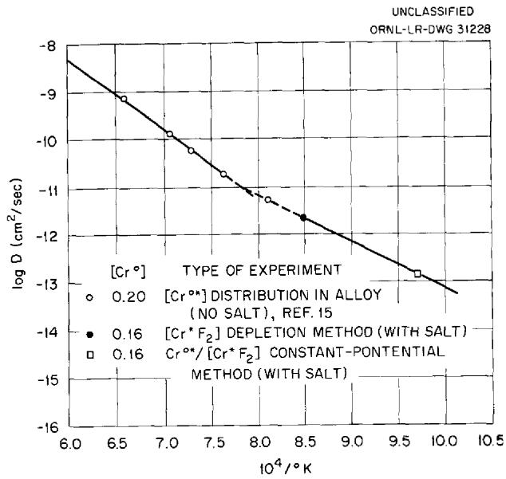  
Fig. 2.3.15. Diffusion Coefficients for Chromium in Nickel-Base Alloys.

The solvent was molten NaF-KF-LiF (11.5-42-46.5 mole %) for both cases. High-temperature data which appear in the literature[15] for a nickel-chromium alloy similar to Inconel are also shown for comparison.

# VAPOR PRESSURES FOR THE CsF-BeF $_2$ SYSTEM

F. F. Blankenship S. Cantor

A study of the vapor pressures of the system $\text{CsF-BeF}_2$ was made in order to obtain information on the effect of composition on the thermodynamic activities in fuel mixtures containing $\text{BeF}_2$ . The deviations from ideal behavior in systems related to the $\text{BeF}_2$ -containing fuel mixtures were found to depend strongly on the size of the alkali cation. Since vapor pressures for the $\text{NaF-BeF}_2$ system were measured previously, it was of interest to compare the effect of substituting $\text{Cs}^+$ ions (radius 1.69 Å) for $\text{Na}^+$ ions (radius 0.95 Å). Another reason for choosing the $\text{CsF-BeF}_2$ system for study was that association in the vapor phase was expected to be less pronounced, and hence the system should be more readily amenable to determinations of activities from vapor pressures.

The vapor pressure data were obtained by a quasi-static method, developed by Rodebush,[18] which gives total pressures. The results, as presented graphically in Fig. 2.3.16, show no change with composition in the composition region from 80 to 100 mole $\%$ $\mathrm{BeF}_2$ . Since CsF probably makes a negligible contribution to the total pressure in this region, such behavior is suggestive of a liquid-liquid immiscibility gap. Attempts to confirm the existence of the immiscibility gap by examination of quenched samples have, as yet, been inconclusive.

At $900^{\circ}C$ and 50 mole $\%$ $\mathsf{BeF}_2$ , the vapor pressure of NaF-BeF is 3 mm Hg compared with 7 mm Hg for ideal behavior; for CsF-BeF the vapor pressure is 11 mm Hg compared with 19 mm Hg for ideal behavior. The general shape of the curves for vapor pressure as a function of composition in both systems probably implies positive deviations in $\mathsf{BeF}_2$ -rich mixtures and negative deviations at lower $\mathsf{BeF}_2$ contents. Also, the existence of a vapor compound such as CsBeF probably obscures the extent of the negative deviations in the middle of the CsF-BeF system.

A transpiration method is being developed for obtaining weight and composition data for the saturated vapor. This information, combined with the total pressure data, will yield partial pressures of the vapor components and, hence, the activities.

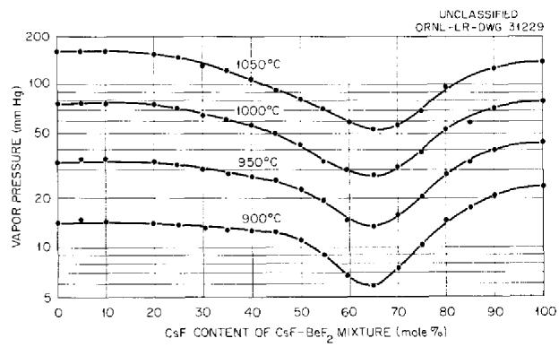  
Fig. 2.3.16. Total Vapor Pressures in the System CsF-BeF $_2$ .

# FUSED CHLORIDES AS HEAT TRANSFER FLUIDS

R.E.Moore

Tests were run in order to determine the compatibility of Inconel and fused chlorides of interest as heat transfer fluids. In initial tests, the eutectic mixtures 29 mole % KCl-71 mole % ZnCl₂ and 23 mole % LiCl-77 mole % ZnCl₂ and Inconel specimens were sealed in containers of fused silica and held for 90 hr at $600^{\circ}\mathrm{C}$ . After the test the melts were found to contain 330 and 300 ppm of chromium, respectively, and metallographic examinations of the Inconel strips revealed that there was no perceptible attack. After a subsequent test carried out under similar conditions with excess chromium metal instead of Inconel, the KCl-ZnCl₂ melt was found to contain about 9.7 wt % CrCl₂. Another test with an insufficient amount of chromium metal for complete reaction produced a melt containing 6.3 wt % CrCl₂ and a metallic phase that was identified by x-ray diffraction as mainly zinc metal containing some chromium metal probably enclosed in pure zinc. It seems clear that the attack on chromium by KCl-ZnCl₂ is so great that corrosion of Inconel, in which the activity of chromium is about 0.1, should be very serious. The reaction with chromium in the experiments with Inconel was probably far from completion after 90 hr because of the slowness of diffusion of chromium from within the alloy to the surface layers.

The mixture 58.3 mole % LiCl-41.7 mole % RbCl, which appears to be more attractive from the standpoint of vapor pressure and corrosion, was also tested in contact with chromium metal in a sealed tube of fused silica. The chloride melt was prepared by evacuation of the prepared mixture at room temperature followed by continued evacuation during slow heating until the sample fused. After heating at $600^{\circ}\mathrm{C}$ for 72 hr in contact with chromium the melt was still colorless, but there was a thin, dark-green coating on the pieces of chromium metal. The coating was probably $\mathsf{Cr}_2\mathsf{O}_3$ , but no x-ray pattern could be obtained. Hydroxide ion resulting from hydrolysis during

fusion of the chlorides could account for the formation of $\mathrm{Cr}_2\mathrm{O}_3$ . The reaction

$$
6 \mathrm {L i O H} + 2 \mathrm {C r} ^ {\circ} \rightarrow \mathrm {C r} _ {2} \mathrm {O} _ {3} + 3 \mathrm {L i} _ {2} \mathrm {O} + 3 \mathrm {H} _ {2}
$$

is strongly favored from the standpoint of free energy. The melt contained 300 ppm of chromium, that is, far in excess of the amount expected from the reaction

$$
\mathrm {C r} ^ {\circ} + 2 \mathrm {L i C l} \rightleftharpoons 2 \mathrm {L i} ^ {\circ} + \mathrm {C r C l} _ {2}.
$$

The equilibrium constant calculated from values of free energy of formation at $1000^{\circ}\mathrm{K}$ is $10^{-20}$ . The chromium content in the melt may represent the solubility of $\mathsf{Cr}_2\mathsf{O}_3$ in LiCl-RbCl.

Procedures for purifying LiCl-RbCl to remove hydroxides and oxides are being studied. Anhydrous HCl should be satisfactory, but Laitinen et al.[20] report that the reaction is very slow in LiCl-KCl. If this is due to a very low solubility of HCl in the melt, the purification of large batches by this method may be very difficult. One proposed method is fusion with $\mathsf{ZrCl}_4$ under helium pressure followed by distillation to remove excess $\mathsf{ZrCl}_4$ and filtration to remove $\mathsf{ZrO}_2$ . The reactions

$$
Z r C l _ {4} + 2 H _ {2} O \rightarrow Z r O _ {2} + 4 H C l
$$

and

$$
Z r C l _ {4} + 2 L i O H \rightarrow Z r O _ {2} + 2 L i C l + 2 H C l
$$

should serve to remove all water and hydroxide ion. Experiments are being planned to determine the rate of mass transfer of chromium in Inconel in contact with LiCl-RbCl under a temperature gradient.

# PERMEABILITY OF GRAPHITE BY MOLTEN FLUORIDE SALTS

G.J.Nessle J.E.Eorgan

There is evidence that molten salts of the type now being considered for use in molten-salt reactors will permeate graphite. Since advanced designs now being considered include graphite moderators, some method must be devised to

prevent such impregnation or to reduce it considerably, if the necessity of cladding the graphite or protecting it in some manner from contact with the molten-salt fuel is to be avoided.

A possible method for preventing the graphite from absorbing the molten salt would be to saturate the graphite with an inert salt whose melting point is somewhat higher than the proposed operating temperatures. In order to test this method, samples of graphite were obtained and machined into 3-in. rods $1, \frac{1}{2}$ , and $\frac{1}{4}$ in. in diameter. A nickel rack was built to hold three rods of each size in a vertical position inside a nickel-lined flanged-topped receiver can. In a separate reactor vessel a 3-kg batch of LiF-MgF $_2$ (67.5-32.5 mole %) was purified by successive treatments with hydrogen and HF in the normal manner. The reactor vessel was then cooled to room temperature and connected to the receiver vessel containing the graphite rods by means of a $\frac{3}{8}$ -in. nickel tubing transfer line. The entire system was evacuated at room temperature for about 1 hr.

The receiver vessel containing the graphite rods was then heated to about $1500^{\circ}\mathrm{F}$ under vacuum and maintained under these conditions for varying lengths of time. After a predetermined time for degassing the graphite, the reactor vessel containing the salt was heated to near $1700^{\circ}\mathrm{F}$ under vacuum. When the salt had reached the desired temperature it was transferred to the receiver vessel containing the graphite rods under vacuum. Upon completion of the salt transfer, with the graphite rods completely submerged, a pressure of 15 psi of helium was applied to the receiver vessel. After a specified length of time the pressure in the receiver vessel was relieved and the salt was transferred out. The graphite rods were then cooled, removed from the receiver vessel, examined visually, and placed in a desiccator. Visual observation indicated that the rods were undamaged. The diameters of the rods showed no changes from the original micrometer measurements.

The rods were then weighed to determine whether they had gained in weight. No visible fluoride salt was adhering to the surface of any rod. The weight gains of the rods in each of three experiments are listed in Table 2.3.8. The treatment of the graphite in experiment 1 consisted of evacuation to a pressure of $200\mu$ for 24 hr

Table 2.3.8. Weight Gains of Graphite in Impregnation Tests   

<table><tr><td rowspan="2">Experiment No.</td><td rowspan="2">Rod No.</td><td rowspan="2">Rod Diameter (in.)</td><td colspan="2">Rod Weight (g)</td><td colspan="2">Net Weight Gain</td><td rowspan="2">Average Net Weight Gain (%)</td></tr><tr><td>Before Test</td><td>After Test</td><td>g</td><td>%</td></tr><tr><td rowspan="9">1</td><td>1</td><td>1/4</td><td>3.8698</td><td>4.0700</td><td>0.2002</td><td>5.17</td><td></td></tr><tr><td>2</td><td>1/4</td><td>4.0173</td><td>4.2966</td><td>0.2793</td><td>6.95</td><td>5.97</td></tr><tr><td>3</td><td>1/4</td><td>3.8709</td><td>4.0952</td><td>0.2243</td><td>5.79</td><td></td></tr><tr><td>4</td><td>1/2</td><td>15.6341</td><td>16.6759</td><td>1.0418</td><td>6.66</td><td></td></tr><tr><td>5</td><td>1/2</td><td>15.7552</td><td>16.9083</td><td>1.1531</td><td>7.32</td><td>7.12</td></tr><tr><td>6</td><td>1/2</td><td>15.6054</td><td>16.7557</td><td>1.1503</td><td>7.37</td><td></td></tr><tr><td>7</td><td>1</td><td>62.9228</td><td>68.0075</td><td>5.0847</td><td>8.08</td><td></td></tr><tr><td>8</td><td>1</td><td>64.1091</td><td>69.1408</td><td>5.0317</td><td>7.85</td><td>7.87</td></tr><tr><td>9</td><td>1</td><td>63.9181</td><td>68.8318</td><td>4.9137</td><td>7.69</td><td></td></tr><tr><td rowspan="9">2</td><td>1</td><td>1/4</td><td>3.9140</td><td>4.2294</td><td>0.3146</td><td>8.04</td><td></td></tr><tr><td>2</td><td>1/4</td><td>3.8092</td><td>4.0628</td><td>0.2536</td><td>6.66</td><td>7.30</td></tr><tr><td>3</td><td>1/4</td><td>3.9463</td><td>4.2303</td><td>0.2840</td><td>7.20</td><td></td></tr><tr><td>4</td><td>1/2</td><td>16.1923</td><td>17.2518</td><td>1.0595</td><td>6.54</td><td></td></tr><tr><td>5</td><td>1/2</td><td>15.7918</td><td>17.0468</td><td>1.2550</td><td>7.95</td><td>7.11</td></tr><tr><td>6</td><td>1/2</td><td>16.1700</td><td>17.2746</td><td>1.1046</td><td>6.83</td><td></td></tr><tr><td>7</td><td>1</td><td>63.7184</td><td>69.6872</td><td>5.9688</td><td>9.37</td><td></td></tr><tr><td>8</td><td>1</td><td>64.0042</td><td>69.3868</td><td>5.3826</td><td>8.41</td><td>8.80</td></tr><tr><td>9</td><td>1</td><td>63.8327</td><td>69.3364</td><td>5.5038</td><td>8.62</td><td></td></tr><tr><td rowspan="8">3</td><td>1</td><td>1/4</td><td>3.8981</td><td>4.1530</td><td>0.2549</td><td>6.54</td><td></td></tr><tr><td>2</td><td>1/4</td><td>3.7425</td><td>4.0287</td><td>0.2862</td><td>7.65</td><td>7.11</td></tr><tr><td>3</td><td>1/2</td><td>15.8908</td><td>17.0235</td><td>1.1327</td><td>7.13</td><td></td></tr><tr><td>4</td><td>1/2</td><td>15.8184</td><td>17.0048</td><td>1.1864</td><td>7.50</td><td>8.23</td></tr><tr><td>5</td><td>1/2</td><td>15.0504</td><td>17.2852</td><td>1.2348</td><td>8.20</td><td></td></tr><tr><td>6</td><td>1</td><td>63.6333</td><td>69.3552</td><td>5.7219</td><td>8.99</td><td></td></tr><tr><td>7</td><td>1</td><td>64.2699</td><td>69.2838</td><td>5.0139</td><td>7.80</td><td>8.51</td></tr><tr><td>8</td><td>1</td><td>62.6176</td><td>68.0962</td><td>5.4786</td><td>8.74</td><td></td></tr></table>

followed by exposure to the salt mixture for 1 hr. In experiment 2, the graphite was evacuated at a pressure of $400\mu$ for 54 hr and then exposed to the salt mixture for 48 hr. In experiment 3, the graphite was evacuated at a pressure of $100\mu$ for 30 hr and exposed to the salt mixture for 48 hr.

One $\frac{1}{2}$ -in.-dia rod and one l-in.-dia rod from each experiment were used to determine the depth of salt penetration by machining several $\frac{1}{32}$ -in. cuts from each and submitting each cutting for analysis of the lithium and magnesium contents. One $\frac{1}{4}$ -in.-dia rod from each experiment was completely ground and analyzed for lithium and magnesium content. The analytical results obtained from the $\frac{1}{4}$ -in.-dia rods and the cuttings from the $\frac{1}{2}$ - and l-in.-dia rods are listed in Table 2.3.9. Analysis of the salt bath before the test yielded the following results: Li, $16.5\%$ ; Mg, $19.5\%$ ; F, $64.7\%$ . According to makeup of the salt composition the constituents should have been present in the following amounts: Li, $14.32\%$ ; Mg, $18.12\%$ ; F, $67.56\%$ . For comparison with the analytical results obtained for the graphite samples, the analytical values for the salt bath will be used. After the first experiment only six cuttings were made on the $\frac{1}{2}$ - and l-in.-dia rods, but twelve cuttings were made on the rods used in experiments 2 and 3, and every other cutting was submitted for analysis.

The data of Table 2.3.8 show that the reproducibility of the fluoride salt penetration of the graphite was fairly good. The weight gains were not as high as might have been expected, but the consistency of the results indicates maximum penetration under these conditions. The results presented in Table 2.3.9 show that the salt penetrated to the center of the rods with little or no change in salt composition and in a uniform manner. Samples of each size of rod that was soaked in the $\mathsf{LiF - MgF_2}$ mixture have been mounted on a rack in a receiver vessel and are now soaking in $\mathsf{LiF - BeF_2 - UF_4}$ (62-37-1 mole %) at $1200^{\circ}\mathsf{F}$ . The length of this test will be 1000 hr if no complications occur. At the end of the test the rods will be examined to determine the extent of penetration of the beryllium-containing fuel mixture, in particular, the uranium and beryllium compounds.

# PREPARATION OF PURIFIED MATERIALS

J.P.Blakely

F. F. Blankenship

# Preparation of $\mathbf{CrF}_2$

B.J.Sturm

The usual procedure for preparing $\mathsf{CrF}_2$ is to reduce $\mathsf{CrF}_3$ with $\mathsf{H}_{2}$ , but, because of inherent difficulties with gas-solid reactions, it is difficult to completely reduce the $\mathsf{CrF}_3$ without reducing a small amount of $\mathsf{CrF}_2$ to $\mathsf{Cr}^{\circ}$ . Since there is a continuing need for pure $\mathsf{CrF}_2$ uncontaminated with $\mathsf{Cr}^{\circ}$ in experimental work related to corrosion problems in fluoride melts, a more convenient method of preparation has been sought.

The use of $\mathsf{SnF}_2$ as both a fluorinating and reducing agent appears to be promising. Chromium fluoride has been prepared by heating anhydrous $\mathsf{CrCl}_3$ and $\mathsf{SnF}_2$ to $1100^{\circ}\mathsf{C}$ in a graphite container, in accordance with the reaction

$$
2 \mathrm {C r C l} _ {3} + 2 \mathrm {S n F} _ {2} \rightarrow 2 \mathrm {C r F} _ {2} + \mathrm {S n C l} _ {4} \uparrow + \mathrm {S n C l} _ {2} \uparrow .
$$

A preliminary trial with stoichiometric proportions of the reactants indicated that some of the $\mathsf{SnF}_2$ volatilized without reacting. A second attempt with $20\%$ excess $\mathsf{SnF}_2$ and a starting mixture compacted with a hydraulic press gave an improved product. No $\mathsf{CrF}_3$ could be found by examination with a petrographic microscope; chemical analysis showed $2.5\%$ Cl and no detectable Sn.

# Production-Scale Operations

Alteration of the production facility for use in the large-scale processing of beryllium-containing fluoride salt mixtures is in the final stages. The facility should be ready for use before July 1, 1958.

# Experimental-Scale Operations

C. R. Croft

The experimental facilities processed 30 batches of mixed salts totaling some $380\mathrm{kg}$ during the quarter. Twenty-one of these batches contained beryllium and nine did not. Of the batches containing beryllium, 16 were prepared for use in the molten-salt reactor program, three were used by the chemistry section, and two were prepared

Table 2.3.9. Penetration Results Obtained from Graphite Impregnation Tests   

<table><tr><td rowspan="3">Experiment No.</td><td rowspan="3">Rod No.</td><td rowspan="3">Graphite Rod Diameter (in.)</td><td rowspan="3">Cut No.</td><td colspan="2">Salt Components Found (wt %)</td><td colspan="4">Material Balancea</td></tr><tr><td rowspan="2">Li</td><td rowspan="2">Mg</td><td colspan="2">Lithium (g)</td><td colspan="2">Magnesium (g)</td></tr><tr><td>Foundb</td><td>Expectedc</td><td>Foundb</td><td>Expectedc</td></tr><tr><td>1</td><td>1</td><td>1/4</td><td></td><td>1.52</td><td>1.40</td><td>0.062</td><td>0.028</td><td>0.057</td><td>0.036</td></tr><tr><td></td><td>5</td><td>1/2</td><td>1</td><td>1.46</td><td>1.14</td><td></td><td></td><td></td><td></td></tr><tr><td></td><td></td><td></td><td>2</td><td>1.48</td><td>1.26</td><td></td><td></td><td></td><td></td></tr><tr><td></td><td></td><td></td><td>3</td><td>1.55</td><td>1.22</td><td>0.267</td><td>0.143</td><td>0.198</td><td>0.209</td></tr><tr><td></td><td></td><td></td><td>4</td><td>1.51</td><td>1.16</td><td></td><td></td><td></td><td></td></tr><tr><td></td><td></td><td></td><td>5</td><td>1.55</td><td>1.15</td><td></td><td></td><td></td><td></td></tr><tr><td></td><td></td><td></td><td>6</td><td>1.95</td><td>1.10</td><td></td><td></td><td></td><td></td></tr><tr><td></td><td>7</td><td>1</td><td>1</td><td>1.27</td><td>1.31</td><td></td><td></td><td></td><td></td></tr><tr><td></td><td></td><td></td><td>2</td><td>1.26</td><td>1.17</td><td></td><td></td><td></td><td></td></tr><tr><td></td><td></td><td></td><td>3</td><td>1.38</td><td>1.23</td><td></td><td></td><td></td><td></td></tr><tr><td></td><td></td><td></td><td>4</td><td>1.34</td><td>1.24</td><td>1.020</td><td>0.728</td><td>0.836</td><td>0.921</td></tr><tr><td></td><td></td><td></td><td>5</td><td>1.31</td><td>1.19</td><td></td><td></td><td></td><td></td></tr><tr><td></td><td></td><td></td><td>6</td><td>1.43</td><td>1.21</td><td></td><td></td><td></td><td></td></tr><tr><td>2</td><td>1</td><td>1/4</td><td></td><td>1.47</td><td>1.34</td><td>0.062</td><td>0.045</td><td>0.057</td><td>0.057</td></tr><tr><td></td><td>4</td><td>1/2</td><td>1</td><td>1.04</td><td>0.91</td><td></td><td></td><td></td><td></td></tr><tr><td></td><td></td><td></td><td>3</td><td>1.17</td><td>1.03</td><td></td><td></td><td></td><td></td></tr><tr><td></td><td></td><td></td><td>5</td><td>1.38</td><td>1.05</td><td></td><td></td><td></td><td></td></tr><tr><td></td><td></td><td></td><td>7</td><td>1.68</td><td>0.99</td><td>0.254</td><td>0.152</td><td>0.169</td><td>0.192</td></tr><tr><td></td><td></td><td></td><td>9</td><td>1.59</td><td>0.95</td><td></td><td></td><td></td><td></td></tr><tr><td></td><td></td><td></td><td>11</td><td>1.97</td><td>0.95</td><td></td><td></td><td></td><td></td></tr><tr><td></td><td>8</td><td>1</td><td>1</td><td>1.27</td><td>1.15</td><td></td><td></td><td></td><td></td></tr><tr><td></td><td></td><td></td><td>3</td><td>1.40</td><td>1.27</td><td></td><td></td><td></td><td></td></tr><tr><td></td><td></td><td></td><td>5</td><td>1.56</td><td>1.06</td><td>1.034</td><td>0.771</td><td>0.805</td><td>0.975</td></tr><tr><td></td><td></td><td></td><td>7</td><td>1.59</td><td>1.20</td><td></td><td></td><td></td><td></td></tr><tr><td></td><td></td><td></td><td>9</td><td>1.59</td><td>1.14</td><td></td><td></td><td></td><td></td></tr><tr><td></td><td></td><td></td><td>11</td><td>1.50</td><td>1.14</td><td></td><td></td><td></td><td></td></tr><tr><td>3</td><td>2</td><td>1/4</td><td></td><td>1.11</td><td>1.23</td><td>0.045</td><td>0.041</td><td>0.050</td><td>0.051</td></tr><tr><td></td><td>4</td><td>1/2</td><td>1</td><td>1.22</td><td>0.90</td><td></td><td></td><td></td><td></td></tr><tr><td></td><td></td><td></td><td>3</td><td>1.41</td><td>1.55</td><td></td><td></td><td></td><td></td></tr><tr><td></td><td></td><td></td><td>5</td><td>1.52</td><td>1.32</td><td>0.218</td><td>0.170</td><td>0.189</td><td>0.214</td></tr><tr><td></td><td></td><td></td><td>7</td><td>1.55</td><td>1.34</td><td></td><td></td><td></td><td></td></tr><tr><td></td><td></td><td></td><td>9</td><td>1.99</td><td>1.55</td><td></td><td></td><td></td><td></td></tr><tr><td></td><td>7</td><td>1</td><td>1</td><td>1.03</td><td>1.18</td><td></td><td></td><td></td><td></td></tr><tr><td></td><td></td><td></td><td>3</td><td>1.40</td><td>1.57</td><td></td><td></td><td></td><td></td></tr><tr><td></td><td></td><td></td><td>5</td><td>1.45</td><td>1.47</td><td>0.901</td><td>0.718</td><td>1.005</td><td>0.909</td></tr><tr><td></td><td></td><td></td><td>7</td><td>1.19</td><td>1.48</td><td></td><td></td><td></td><td></td></tr><tr><td></td><td></td><td></td><td>9</td><td>1.45</td><td>1.51</td><td></td><td></td><td></td><td></td></tr><tr><td></td><td></td><td></td><td>11</td><td>1.27</td><td>1.47</td><td></td><td></td><td></td><td></td></tr></table>

${}^{a}$ Average results for the cuttings used.   
$b$ Based on percentage found analytically multiplied by gross weight of rod after experiment.   
$c_{\text{Based on percentage found analytically for original batch multiplied by net gain in weight of rod after experiment.}}$

for physical properties study. Seven of the non-beryllium-containing batches were used in the molten-salt program, one is being used in fuel-reprocessing studies, and one is being used by the chemistry section.

# Transfer and Service Operations

F. A. Doss

Thirty-nine filling and draining operations were carried out during the quarter. These operations

involved the transfer of about 95 kg of liquid metals and 200 kg of salt mixtures.

Since larger and larger amounts of beryllium-containing salts are being handled by this facility, the area is being enclosed and cut off from general building traffic. It will, however, be directly connected with the newly enclosed production facility. The floors of this facility, together with those in Building 9928, have been sealed with a dust-proofing epoxy-resin compound.

# INTERNAL DISTRIBUTION

1. L. G. Alexander   
2. E. S. Bettlis   
3. D. S. Billington   
4. J. P. Blakely   
5. F. F. Blankenship   
6. E. P. Blizzard   
7. A. L. Boch   
8. C. J. Borkowski   
9. W. F. Boudreau   
10. G.E. Boyd   
11. M. A. Bredig   
12. E. J. Breeding   
13. R. B. Briggs   
14. D. O. Campbell   
15. W.H.Carr   
16. G. I. Cathers   
17. C. E. Center (K-25)   
18. R. A. Charpie   
19. J. H. Coobs   
20. F. L. Culler   
21. J. H. Devan   
22. L. B. Emlet (K-25)   
23. W. K. Ergen   
24. J. Y. Estabrook   
25. D. E. Ferguson   
26. A. P. Fraas   
27. E. A. Franco-Ferreira   
28. J. H. Frye, Jr.   
29. W. R. Gall   
30. A. T. Gresky   
31. J. L. Gregg   
32-34. W.R.Grimes   
35. E. Guth   
36. C. S. Harrill   
37. H.W.Hoffman   
38. A. Hollander   
39. A. S. Householder   
40. W. H. Jordan   
41. G. W. Keilholtz   
42. C. P. Keim   
43. M. T. Kelley   
44. F. Kertesz   
45. B. W. Kinyon   
46. M. E. Lackey   
47. J. A. Lane   
48. R. S. Livingston

49. H. G. MacPherson

50. W. D. Manly

51. E. R. Mann

52. L. A. Mann

53. W. B. McDonald

54. J. R. McNally

55. H. J. Metz

56. R. P. Milford

57. E.C.Miller

58. K. Z. Morgan

59. J. P. Murray (Y-12)

60. M. L. Nelson

61. W. R. Osborn

62. P. Patriarca

63. A. M. Perry

64. D. Phillips

65. P. M. Reyling

66. J. T. Roberts

67. M. T. Robinson

68. H. W. Savage

69. A. W. Savolainen

70. J. L. Scott

71. H. E. Seagren

72. E. D. Shipley

73. M. J. Skinner

74. A. H. Snell

75. E. Storto

76. J. A. Swartout

77. A. Taboada

78. E. H. Taylor

79. R. E. Thoma

80. D. B. Trauger

81. F. C. VonderLage

82. G. M. Watson

83. A. M. Weinberg

84. M. E. Whatley

85. G. D. Whitman

86. G. C. Williams

87. C. E. Winters

88. J. Zasler

92. ORNL - Y-12 Technical Library, Document Reference Section

93-104. Laboratory Records Department

105. Laboratory Records, ORNL R.C.

106-108. Central Research Library

# EXTERNAL DISTRIBUTION

109. F. C. Moesel, AEC, Washington   
110. Division of Research and Development, AEC, ORO   
111-687. Given distribution as shown in TID-4500 (13th ed., Rev.) under Reactors-Power category (75 copies - OTS)