${C}_{y.91A}$

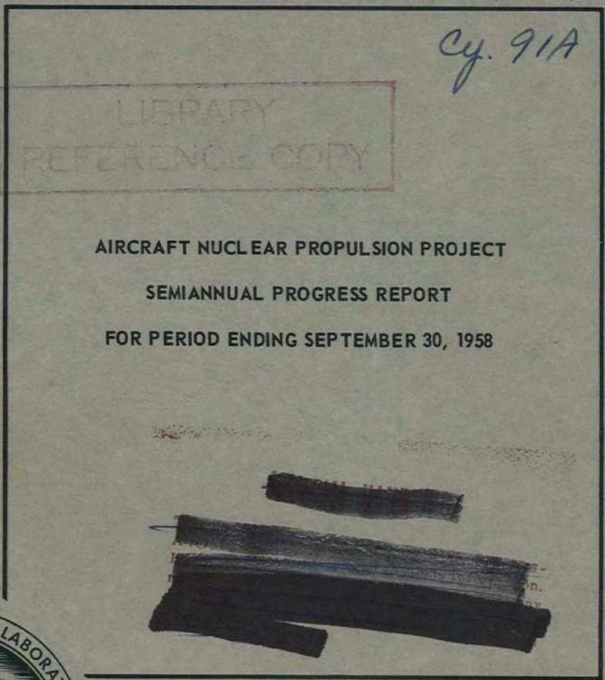

C

NECLASSF

${AEC}$

${61} \div  {71} \times  6$

OAK RIDGE NATIONAL LABORATORY

operated by

UNION CARBIDE CORPORATION

for the

U.S. ATOMIC ENERGY COMMISSION

# LEGAL NOTICE

This report was prepared as an account of Government sponsored work. Neither the United States, nor the Commission, nor any person acting on behalf of the Commission:

A. Makes any warranty or representation, express or implied, with respect to the accuracy, completeness, or usefulness of the information contained in this report, or that the use of any information, apparatus, method, or process disclosed in this report may not infringe privately owned rights; or   
B. Assumes any liabilities with respect to the use of, or for damages resulting from the use of any information, apparatus, method, or process disclosed in this report.

As used in the above, "person acting on behalf of the Commission" includes any employee or contractor of the Commission to the extent that such employee or contractor prepares, handles or distributes, or provides access to, any information pursuant to his employment or contract with the Commission.

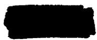

ORNL-2599

C-85 - Reactors-Aircraft Nuclear

Propulsion Systems

M-3679 (22nd ed.)

This document consists of 232 pages.

Copy of 234 copies. Series A.

Contract No. W-7405-eng-26

# AIRCRAFT NUCLEAR PROPULSION PROJECT

# SEMIANNUAL PROGRESS REPORT

For Period Ending September 30, 1958

A. J. Miller, Project Coordinator

DATE ISSUED

JAN 22 1959

OAK RIDGE NATIONAL LABORATORY

Oak Ridge, Tennessee

operated by

UNION CARBIDE CORPORATION

for the

U.S. ATOMIC ENERGY COMMISSION

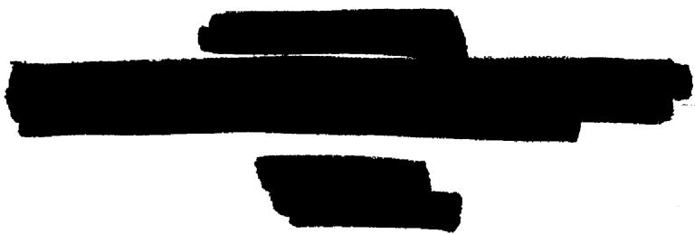

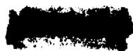

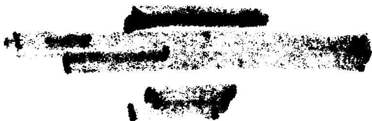

# FOREWORD

The ORNL-ANP program primarily provides research and development support in shielding, reactor materials, and reactor engineering to organizations engaged in the development of air-cooled and liquid-metal-cooled reactors for aircraft propulsion. Most of the work described here is basic to or in direct support of investigations under way at General Electric Company, Aircraft Nuclear Propulsion Department, and Pratt & Whitney Aircraft Division, United Aircraft Corporation. This report is divided into four major parts: 1. Metallurgy, 2. Chemistry and Radiation Damage, 3. Engineering, and 4. Shielding.

（二）法人股东持营业执照复印件、法定代表人授权委托书和出席人身份证办理登记手续。

# ANP PROJECT SEMIANNUAL PROGRESS REPORT

SUMMARY

# PART 1. METALLURGY

# 1.1. Fabrication

Studies of the effect of heat treatment on the mechanical properties at room temperature of arccast columbium prepared by the electron-beam melting technique have indicated that specimens heated at intermediate temperatures in the range 700 to $1000^{\circ}\mathrm{C}$ are more ductile than those heated at the extremes of the range of treatment temperatures. There is evidence, however, that the increased ductility resulting from intermediate temperature anneals of welds would not be retained at higher temperatures and that stabilizing elements will be required to neutralize the effects of interstitial elements.

Electron-beam-melted columbium billets were found to extrude readily if they were protected from atmospheric contamination during heating. Arc-melted material was found to be more difficult to extrude, possibly because of a higher impurity content.

Cracks found in drawn duplex and unclad columbium tubing have indicated insufficient annealing before tube reduction, and therefore a high-temperature, high-vacuum annealing furnace was designed and is being built.

Since it appears that the production of satisfactory columbium bodies will require either high-purity metal or special alloys, purification and alloying investigations are under way. Resistance heating of columbium wire in vacuum at temperatures up to its melting point has shown significant reductions in nitrogen and oxygen content. Melting stock has been obtained from which special alloys will be prepared. Beryllium, zirconium, and cerium will be used to neutralize residual oxygen. High-purity columbium specimens contaminated with known quantities of oxygen or nitrogen are being prepared for corrosion testing in lithium.

Methods for obtaining highly pure yttrium metal and hydrogen are being studied in order to determine the effects of impurities on the hydriding of yttrium. It is hoped that purification will alleviate the tendency of yttrium metal to crack during hydriding and during thermal cycling of the hydrided metal. The electron-beam melting process was

shown to be useful for removing fluorides and traces of magnesium from yttrium metal, but it was ineffective in removing traces of oxygen or nitrogen or large quantities of magnesium. Equipment for the production of yttrium metal from $\mathsf{YF}_3$ has been expanded to pilot-plant scale.

# 1.2. Corrosion

Studies of the various methods of purifying lithium of oxygen and nitrogen have continued. As part of these investigations, samples were taken of the lithium shipments received from vendors and analyzed for oxygen by several methods in order to compare various analytical techniques. The analyses showed that it will probably be necessary to purify all lithium received.

Experiments are being conducted to determine the solubility of lithium nitride and lithium oxide in lithium. An average value of approximately 1300 ppm oxygen was obtained recently that is considerably lower than the value obtained previously.

The ability of yttrium to getter impurities from lithium is being investigated. Hardness increases and vacuum-fusion analysis results indicate that yttrium getters both oxygen and nitrogen from lithium, but no reductions in the oxygen or nitrogen contents of the lithium bath have been found.

Static tests of several grades of arc-cast columbium tubing have been conducted. Preliminary results indicate that surface contamination and subsequent diffusion of the impurities into the columbium during annealing may account for some of the previously observed attack of columbium by lithium.

Two joining techniques for columbium, braze welding and fusion welding, and three types of gaseous environment were investigated to determine their effects on the hardness of columbium and its corrosion resistance to lithium. A marked reduction in depth and severity of attack was noted as the purity of the gaseous welding environment was improved. Appreciable decreases in the hardness of the as-welded columbium specimens as a result of exposure to lithium again indicated getting of oxygen from the columbium by the lithium.

A series of seesaw-furnace tests of molybdenum in contact with lithium was conducted. The results indicate, in general, that molybdenum has excellent resistance to attack and mass transfer at hot-zone temperatures as high as $1900^{\circ}\mathrm{F}$ . Dissimilar-metal mass transfer of Inconel to the molybdenum was observed in the Inconel-sodium-molybdenum section of the test capsule. No molybdenum failures either in the base material or in weld zones have been encountered in the tests conducted thus far.

Similar seesaw-furnace tests of columbium-lithium systems have been initiated. In the one test (hot zone, $1600^{\circ}\mathrm{F}$ ; cold zone, $1100^{\circ}\mathrm{F}$ ; test duration, 300 hr) completed to date, columbium exhibited excellent resistance to attack and mass transfer.

Static corrosion tests of beryllium specimens in lithium in iron capsules and in beryllium capsules at 1500 and at $1830^{\circ}\mathrm{F}$ showed beryllium to be quite resistant to attack by static lithium in an all-beryllium system. It was very heavily attacked, however, when tested in the iron container.

Refractory-metal-base brazing alloys are being corrosion tested in high-temperature lithium, since commercially available brazing alloys have very limited corrosion resistance to lithium.

A method was developed (under subcontract at NDA) for measuring the rates at which container metals dissolve in liquid lithium. The solution rate measurements confirmed the deleterious effects of nitrogen and oxygen and the beneficial effect of aluminum on mass transfer in lithium as noted in thermal-convection loop tests.

# 1.3. Welding and Brazing

A survey of phase diagrams of refractory-metal-base binary systems has revealed several promising brazing alloys. Vacuum-brazing equipment has been constructed for studying these systems, and flowability and corrosion tests are under way. Studies of the diffusion of the brazing alloy into columbium are also being initiated. If diffusion or alloying occurs it may increase the remelt temperature of the brazing alloy and thus increase the maximum service temperature.

A small, glass dry box containing a stationary torch and a movable table was assembled for welding studies on columbium and molybdenum. This equipment will be used in investigating the weldability of these materials under highly controlled degrees of atmospheric purity. Several butt welds made on arc-cast columbium sheet in a purified argon atmosphere were found to be ductile.

# 1.4. Mechanical Properties

Equipment has been developed for tensile and creep tests of materials in controlled environments at temperatures up to $2500^{\circ}\mathrm{F}$ . Several successful tests have been completed on molybdenum at $2000^{\circ}\mathrm{F}$ .

Creep and rupture properties of Inconel have been investigated in tubes with both internal pressure and axial stress. The creep data obtained compare favorably with the theoretical curves derived from Soderberg's analysis and the von Mises and Tresca flow rules. Fracture cannot be predicted by the maximum principal stress criterion.

Dynamic load tests have been conducted on Inconel rods and tubes that were programed on the basis of plastic strain rather than stress. A simple relationship, in the form $N^a \varepsilon_p = K$ , exists between the number of cycles to failure and the plastic strain absorbed in each cycle. The constants $a$ and $K$ are found to vary as a function of the material and test conditions. On the other hand, geometry, temperature variations in the range 1300 to $1600^{\circ} \mathrm{F}$ , and small variations in chemical composition do not significantly alter the cycle life of a material. Strains induced thermally show excellent correlation on the basis of equivalent amounts of plastic strain per cycle with mechanically induced strains in temperature ranges where the material is metallurgically stable. The frequency at which the material is strained is observed to influence the number of cycles that can be survived. The slow frequencies, particularly at low amplitudes, appear to produce the most deleterious results.

# 1.5. Ceramics

Small batches of zirconium boride were synthesized for incorporation into BeO bodies. The material prepared by an improved process was found to be $>97\%$ pure. Several additives were tested as means for increasing the density of BeO. Of the various combinations tested, it was found that a body with 94 wt $\%$ BeO, 5 wt $\%$ MgO, and 1 wt $\%$ B $_4$ C had the greatest density.

Screening tests were run to determine the oxidation resistance of $\mathsf{TaB}_2$ , $\mathsf{TiB}_2$ , $\mathsf{CrB}_2$ , $\mathsf{HfB}_2$ , $\mathsf{BN}$ , and $\mathsf{ZrB}_2$ when added to high-density $\mathsf{BeO}$ . The $\mathsf{ZrB}_2$ - $\mathsf{BeO}$ and $\mathsf{HfB}_2$ - $\mathsf{BeO}$ combinations were found to be superior to the other mixtures. Attempts to fabricate large hot-pressed blocks of the $\mathsf{ZrB}_2$ - $\mathsf{BeO}$ mixture for which a commercial grade of $\mathsf{ZrB}_2$ was used revealed the need for pure $\mathsf{ZrB}_2$ . The commercial grade of $\mathsf{ZrB}_2$ was found to contain about $10\%$

Fe. Uniform blocks were obtained when pure $\mathsf{ZrB}_2$ was used.

# 1.6. Nondestructive Testing

Studies of the use of x-ray sensitive Vidicon in a closed-circuit television system for remote viewing of x-ray images were continued. It was found that the sensitivity of the selenium photoconductor to x-rays could be improved by admitting visible light to the photoconductor surface. Contrast sensitivity was increased by as much as a factor of 3. Thickness changes of about $2.5\%$ were detected in $\frac{5}{8}$ -in-thick aluminum.

Investigations are being made of the applicability of existing ultrasonic techniques to the inspection of duplex tubing. It appears that the resonance ultrasonic technique can be developed as a means for evaluating the quality of the bond between the materials.

# 1.7. Metallography

A 20-tube semicircular heat exchanger fabricated of Inconel in which a fused salt flowing around the tubes exchanged heat to NaK flowing in the tubes was examined metallographically to determine the location and effects of the leak that caused termination of operation. The heat exchanger, which had operated 1139 hr at $1200^{\circ}\mathrm{F}$ and above, had experienced 194 thermal cycles between isothermal operation at $1200^{\circ}\mathrm{F}$ and operation at design conditions (fused salt inlet and outlet temperatures of 1600 and $1250^{\circ}\mathrm{F}$ and NaK inlet and outlet temperatures of 1070 and $1500^{\circ}\mathrm{F}$ .

The leak of NaK to fused salt was found to have been the result of fracture of three tubes in the high-temperature header area. The cracks were radial and propagated from the tension side of the tubes; they were in the tubes with the shortest tube bend-to-tube sheet length $(1\frac{1}{8}$ to $3 / 4$ in.). The maximum depth of corrosion attack on the fused-salt side of the tubes was 0.006 in., and, on the NaK side, it was 0.002 in.

# PART 2. CHEMISTRY AND RADIATION DAMAGE

# 2.1. Materials Chemistry

Sufficient fluoride mixture for the first charge of the equipment in the yttrium-metal pilot plant was prepared. The $\mathsf{YF}_3$ needed was prepared by direct fluorination of dry $\mathsf{Y}_2\mathsf{O}_3$ . A mean conversion efficiency of $99\%$ and suitably low oxygen contents were obtained. Magnesium fluoride for the process

was prepared by dry hydrofluorination of MgO; the mean conversion efficiency was $97.7\%$ .

Sufficient information with which to construct a portion of the phase diagram of the LiF- $\mathsf{YF}_3$ system was obtained. A single eutectic occurs in the system at 19 mole $\% \mathsf{YF}_3$ ; mp, $682^{\circ}\mathsf{C}$ .

Further experimental information was obtained regarding a tentative procedure for purifying lithium metal by extracting oxide, nitride, and carbide impurities with a eutectic mixture of lithium halides salts. The second extraction of each series of extractions showed considerable reduction in the concentration of impurities.

# 2.2. Analytical Chemistry

The method for the determination of oxygen in fluoride salts by fluorination with $\mathsf{KBrF}_4$ was successfully applied. The coefficient of variation of the method, as based on duplicate analyses of seven samples, was $6\%$ in measurements of the salt LiF-MgF2-YF3. The recovery of oxygen added as MgO and $\mathsf{Y}_2\mathsf{O}_3$ exceeded $98\%$ , with a precision of $2\%$ .

A rapid method was adapted for the determination of magnesium and yttrium in $\mathsf{LiF - MgF}_2\text{-YF}_3$ by titration with a standard solution of ethylenediaminetetraacetic acid (EDTA). Amalgamated gold serves as the indicator electrode. Both elements are titrated in the same solution by adjustment of the pH of the solution. No interferences were encountered in the application of the method to $\mathsf{LiF - MgF}_2\text{-YF}_3$ . The precision of the method is about $1\%$ .

# 2.3. Radiation Damage

Experimental apparatus is being prepared with which to test the stability of yttrium hydride and beryllium oxide thermally cycled at high temperatures in a high gamma-ray heating region of the Engineering Test Reactor. Mockup tests have been run on the heat removal system and on the thermocouple design. The heat removal system will provide a temperature control method in that it will be possible to vary the heat conductivity of the cooling gas by varying the concentration of argon and helium in the gas mixture. Stainless steel was selected as the test capsule material as a result of compatibility tests. Examinations and measurements of the samples will be made before irradiation and repeated after irradiation.

Stress-rupture experiments in air on tube-burst specimens of Inconel were completed in the MTR.

Preparations are being made for similar tube-burst tests and creep tests in the fast flux of the ORR.

In conjunction with studies of the effects of radiation on semiconductor barriers, a cryostat was constructed that has a temperature range of $-200^{\circ}C$ to $+350^{\circ}C$ . Requirements, other than the temperature range, were long term reliability and "fail safe" operation. A cooling water failure or an electrical failure will shut the cryostat down without harmful effects to any of the system components. Temperatures in the sample chamber can be maintained to within $\frac{1}{4}^{\circ}C$ , with a gradient along the length of the copper section of the sample chamber of $\frac{1}{4}^{\circ}C$ .

A grown-junction silicon diode has been irradiated in a fast-neutron flux facility in the ORNL Graphite Reactor to an integrated dosage of $1.8 \times 10^{15}$ neutrons/cm². Changes in forward and reverse current at l-volt bias were recorded. A change in reverse current on the order of a factor of 100 increase was observed that is to be compared with an increase of 200% for a comparable irradiation of an alloy-junction diode and an increase of 30% in a point-contact diode.

Attempts were made to alloy indium and germanium at low temperatures, and crystal growths were produced that had not been noted before. Penetration of indium into the germanium conformed to precise geometric configurations, and it is thought that such penetration may be indicative of the early steps of the alloying process.

# PART 3. ENGINEERING

# 3.1. Component Development and Testing

The oil-lubricated pump rotary element that is being operated in a gamma-radiation field in the MTR canal will have accumulated a total dosage of $1 \times 10^{10}$ by September 30. Operation of the seal continues to be comparable to that of a seal operated without irradiation for a similar period of time. Analyses of the bulk and leakage oil have indicated little change.

A Fulton-Sylphon seal on a sump-type centrifugal pump that is circulating NaK at $1200^{\circ}\mathrm{F}$ , 1200 rpm, and 1200 gpm has operated satisfactorily during more than 7200 hr. A similar pump that had operated in the cavitation region with NaK as the pumped fluid for 1096 hr was stopped because of a drain valve leak. No damage was evident upon disassembly of the pump. The data are being

analyzed. A similar pump that is operating with a fused salt has logged over 10,300 hr of operation.

A third thin-shell model that was tested under high-temperature thermal cycling conditions is being disassembled for examination. A test loop failure caused termination of the test after 602 thermal cycles; that is, 302 more than the scheduled 300 thermal cycles.

# 3.2. Heat Transfer Studies

Experimental studies of the effect of thermal-stress cycling on structural materials were continued with the pulse-pump system. The dependence of surface failure (cracking of Inconel) on cyclic frequency was investigated in tests at 0.1, 0.4, and 1.0 cps. Maximum damage occurred at 0.1 cps, with cracks as deep as 0.207 in. being observed. At the highest frequency, no cracks were found at the end of a 100-hr (360,000 cycles) exposure. An attempt was made to correlate the results with mechanical fatigue data, and, in general, it appears that, for a given strain, failure occurs earlier (fewer cycles) with surface thermal cycling than with mechanical cycling.

Analyses of data obtained from a mercury system in the study of heat transfer in a liquid metal with internal heat generation were completed. On the average, the data indicate surface-to-fluid mean temperature differences $49\%$ higher than those predicted by the analogy. Since the experiment was designed so that gaseous films or scale at the wall could not influence the experimental results, it is concluded that the diffusivity ratio is less than unity for mercury.

Studies of heat transfer between a heated tube surface and air in high-velocity vortex motion were continued. Data with both forced- and free-vortex flow indicate values of the heat-transfer coefficient significantly above those obtained with linear flow and equal flow power dissipation in identical geometries.

# 3.3. Instrumentation and Controls

An initial check of the data acquisition system purchased from the G. M. Giannini Company was made and minor troubles and design inadequacies were noted. The system is being modified and should be back in operation soon.

Life tests of three level probes operating in NaK were continued. Similar tests in sodium were initiated. Overrange tests designed to accelerate

the effects of aging on pressure transmitters were continued. Slight bulging of the Inconel bodies was observed after 5100 hr at $1400^{\circ}F$ .

Life tests of a series of Inconel-sheathed thermocouples exposed to a fused salt were terminated after about 11,000 hr at $1500^{\circ}\mathrm{F}$ . The thermocouples were performing well when the test was stopped, but the errors were increasing. Similar thermocouples have been under test in a sodium environment for about 16,000 hr. Many of these thermocouples now show considerable error.

Studies of the fundamental behavior of thermocouples in the range 300 to $1100^{\circ}C$ are under way under subcontract at the University of Tennessee. Work on the improvement of the Oracle program for thermocouple-data handling is nearing completion.

# 3.4. Applied Mechanics

Basic studies are under way of the elastic behavior of five structural configurations commonly used in reactor design. The configurations being analyzed are a flat circular plate, a tapered circular plate, a cylindrical shell, a conical shell, and a spherical shell. The stress and displacement formulas and tables of numerical values for all the functions involved are being obtained. The study of the conical shell, which has been completed, provides for analyses of a conical shell with a combination of axisymmetrical loads. The loads may include membrane forces and uniform pressure, in addition to edge moments and shear forces.

# 3.5. Advanced Power Plant Design

As part of a program for examining the feasibility of the vortex reactor concept, experimental studies were made of the vortex strengths obtainable in a gas under a variety of conditions.

A survey was made of various types of auxiliary power units suitable for use in satellites. A preliminary evaluation was made of reactor cycles employing either aluminum chloride or rubidium vapor as the heat transfer medium.

# PART 4. SHIELDING

# 4.1. Shielding Theory

A calculation was performed to obtain predicted pulse-height spectra of capture and inelastic scattering gamma rays which could be compared with the experimental spectra obtained in an experiment at the Tower Shielding Facility. While

experimental cross sections were available for the calculation of the nitrogen capture gamma-ray spectrum, many of the cross sections used to predict the spectrum of inelastic-scattering gamma rays were theoretical. In spite of this, the shapes of the calculated and experimental pulse-height spectra were in agreement.

It has previously been reported that an Oracle Monte Carlo calculation of the penetration of monoenergetic, monodirectional gamma rays in a lead and water shield has included a total of 512 problems. Some typical plots of the heating results from these calculations are presented as the percentage of the total energy incident upon the slab absorbed in a specified region. The results are compared with an empirical formula.

The Oracle Monte Carlo code was used to calculate the primary gamma-ray heating in a slab shield similar to that being used in the GE-BSF experiment. It was assumed that the slab thicknesses were the same as those in the experiment and that they were infinite in the other two directions. Most of the assumptions made in the calculation caused the results to be too high, possibly as much as a factor of 1.5. This is corroborated by GE calculations of the heating which were based on an analysis of the thermocouple measurements and which were a factor of 2 lower than the results of this Monte Carlo calculation.

A Monte Carlo code is being developed for the IBM-704 machine to calculate the angular and energy distributions, at a point detector, of gamma rays emitted from a monoenergetic, point isotropic, or point monodirectional source embedded in an infinite homogeneous isotropic medium. The code is now in the "debugging" stage.

Neutron dose-rate distributions beyond water slabs 1, 3, 4, and 6 mfp thick were calculated for plane monodirectional, monoenergetic sources incident on the slabs at angles of 0, 30, 60, and 75 deg. The source energies considered were 0.55, 1.2, 2, 4, 6, and 8 MeV. Dose-rate buildup factors calculated for the various sources are presented, as well as the dose rates at the rear of the slabs resulting from neutrons multiply scattered within the slabs.

# 4.2. Lid Tank Shielding Facility

The final measurements taken in the LTSF experiment designed by GE-ANP for the study of the production of secondary gamma rays in configurations containing advanced shielding materials are

presented. In most of these last configurations, all of which were tested in oil, the effectiveness of various thickness of stainless steel with and without boral was investigated. One configuration that consisted only of beryllium and lithium hydride in oil was also tested.

A study of the production of secondary gamma rays in lead was made with lead thicknesses that varied from 1 to 9 in. The lead was followed by either an oil medium or a borated-water medium in which gamma-ray dose-rate measurements were made. From these tests it appears that the first 3 in. of lead attenuated most of the primary gamma rays from the LTSF source plate; further, the total dose rates at fixed distances from the source were not affected when the lead thickness was increased beyond 3 in. The measurements in the borated water were a factor of 3 lower than the dose rates in the oil in the region close to the lead and were a factor of 13 lower approximately 120 cm beyond the lead.

A corrected curve of thermal-neutron flux measurements in oil at the LTSF is presented. It is $16\%$ higher than the curve presented previously.

Shields consisting of randomly distributed absorbing chunks in a relatively transparent matrix must be from a few per cent to several hundred per cent greater in mass than homogeneous shields which give the same amount of attenuation. This is the result of radiation "channeling" in the spaces between the absorbing chunks. A method for calculating the transmission of radiation through heterogeneous shields has been developed, and a typical calculation for boral has been performed. The computed results are compared with experimental results.

# 4.3. Bulk Shielding Facility

The planned series of measurements for the GEBSF study of the production of heat in radiation shields was completed, but the results are of questionable value since it has been discovered that all of the heating samples leaked and oil entered the air region surrounding the samples. The series, which consists of configurations of beryllium and lithium hydride separated by a gamma-ray shielding section (iron, lead, or Mallory 1000), is being repeated with new samples.

# 4.4. Tower Shielding Facility

The experiment performed at the Tower Shielding Facility in cooperation with Convair, Fort Worth, to obtain information complementary to that obtained from the Nuclear Test Airplane (NTA) program has been completed. During the NTA program of experiments, gamma-ray and fast-neutron dose rates and thermal-neutron fluxes were measured both inside and outside the airframe containing the reactor while in flight and on the ground. Measurements were also made on the ground in the absence of the airplane structure. This last set of measurements was duplicated in the TSF experiments, and, in addition, measurements were made as a function of altitude in the absence of the airplane structure. With these additional measurements the influence of the air, the ground, and the aircraft structure on the various measurements can be determined. The TSF experiment also included angular mappings of the radiation around the various reactor shield configurations, near the ground and at altitude, to obtain data which will yield more accurate source terms than were previously available. Some gamma-ray and neutron energy spectra were also determined.

Predictions of the gamma-ray and fast-neutron dose rates at large distances from the Tower Shielding Reactor II (TSR-II) have been made for two operating conditions. For the first case the reactor was assumed to be bare and to be operating at a 5-Mw power at an altitude of 200 ft, a condition which would result in the highest dose rates that could be achieved with the reactor. The gamma-ray dose-rate calculations for the bare reactor were based on measurements taken at large distances from the TSR-I, while the fast-neutron dose-rate calculations were based both on the TSR-I data and on other measurements made at large distances from the Aircraft Shield Test Reactor (ASTR). For the second case the reactor was assumed to be encased in a "beam" shield which would allow a highly collimated beam of radiation to be emitted from the reactor. This calculation, which was based on measurements made at large distances from the TSR-I in a simulated beam shield, is considered to be more representative of a typical operation. The results for both cases are plotted as a function of distance from the reactor. As part of this investigation, a calculation was made of the uncollided neutron flux 4200 ft from the TSR-I to obtain a fast-neutron buildup factor for the case

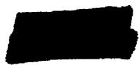

in which an air-filled collimator extending through the reactor shield is pointed at the detector.

# 4.5. Tower Shielding Reactor II

The latest design of the TSR-II, with its associated controls and 5-Mw water cooling system, and

several studies supporting the design are presented. The critical mass has been set at 8.1 kg with $1.6\%$ excess reactivity. Control will be achieved by moving six umbrella-shaped grids of Inconel-clad cadmium in the internal water reflector. A description of the first shield is also presented.

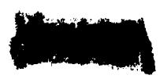

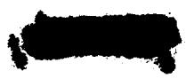

# CONTENTS

SUMMARY

# PART 1. METALLURGY

1.1. FABRICATION 3

Columbium Investigations 3   
Effect of Heat Treatment on Mechanical Properties 3   
Extrusion Studies 3   
Purification Experiments 6   
Special Alloy Preparations 6   
Effects of Oxygen and Nitrogen Contamination on Corrosion by Lithium. 6

Yttrium and Yttrium Hydride Investigations 7

Effect of Metal Purity on Hydriding 7   
Dissociation Pressure Studies 8   
Deformation Mechanisms of Yttrium 8   
Electron-Beam Melting of Yttrium and Yttrium-Magnesium Alloy. 8   
Expansion of Yttrium Preparation Process 9

1.2. CORROSION 12

Lithium Purification 12

Columbium Exposed to Lithium 13

Arc-CastColumbium Tubing Tested in Static Lithium 13   
Effect of Welding Procedures on Corrosion 15

Comparison of Methods for Determining the Nitrogen Content of Cambium 18   
Molybdenum and Cumbium Tested in Lithium in Seesaw-Furnace Apparatus 18   
Beryllium Exposed to Lithium 21   
Refractory-Metal-Base Brazing Alloys Exposed to Lithium 23   
Determination of the Solution Rate of Metals in Lithium 27

1.3.WELDING AND BRAZING 29

Development of Brazing Alloys for Lithium Service 29   
Welding Studies of Columbia and Molybdenum 31

1.4.MECHANICAL PROPERTIES 35

Development of Test Equipment for High-Temperature Investigations 35

Multiaxial Creep Studies 36

Creep Analysis 36   
Rupture Analysis 38

Strain-Fatigue Studies 43

Temperature Dependence 46   
Frequency of Dynamic Loads 46   
Design Factors 48

1.5.CERAMICS 49

Synthesis of Zirconium Boride 49

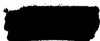

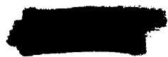

Densification of Beryllium Oxide 49

Oxidation Resistance of Boron-Containing Beryllium Oxide Bodies 50

1.6. NONDESTRUCTIVE TESTING 53

Remote X-Ray Viewing 53

Duplex Tubing 53

Metal Identification Meter 54

1.7.METALLOGRAPHY 58

Results of Metallographic Examination of Small Semicircular Fused-Salt Fuel-to-NaK Heat Exchanger Operated at High Temperatures 58

# PART 2. CHEMISTRY AND RADIATION DAMAGE

2.1.MATERIALS CHEMISTRY 65

Preparation of Charge Material for Reduction to Yttrium 65

Conversion of $\mathsf{Y}_2\mathsf{O}_3$ to $\mathsf{YF}_3$ 65

Preparation of $\mathbf{MgF}_2$ 65

Preparation of the $\mathsf{LiF - MgF}_2\mathsf{-YF}_3$ Mixture 65

Phase Equilibria in the System LiF-YF 66

Extraction of Lithium Metal Impurities with Molten Salts 67

2.2.ANALYTICAL CHEMISTRY 68

Determination of Oxygen in Fluoride Salts 68

Determination of Yttrium and Magnesium in LiF-MgF2-YF3 68

2.3. RADIATION DAMAGE 70

ETR Irradiation of Moderator Materials for Use at High Temperatures 70

Creep and Stress Rupture Tests Under Irradiation 73

Radiation Effects in Electronic Components 73

Wide-Range Multipurpose Cryostat 73

Grown-Junction Silicon Diode Irradiation 75

Low-Temperature Indium-Germanium Alloy 75

# PART 3. ENGINEERING

3.1. COMPONENT DEVELOPMENT AND TESTING 81

Irradiation Test of Oil-Lubricated Pump Rotary Element 81

Test of NaK Pump with Fulton-Sylphon Seal 81

Cavitation Tests of Centrifugal Pumps 82

Thermal Stability Tests of Metal Shells 82

3.2. HEAT TRANSFER STUDIES 83

Studies of the Effect of Thermal-Stress Cycling on Structural Materials 83

Liquid-Metal Heat Transfer Experiment 85

Heat Transfer with Vortex Flow 91

3.3. INSTRUMENTATION AND CONTROLS 94

Data Acquisition System 94   
Liquid-Metal-Level Transducers 94   
Pressure Transmitter Tests 94   
Thermocouple Tests 95   
Thermocouple Development Studies 95   
Behavior of Thermocouples in the Temperature Range 300 to $1100^{\circ}\mathrm{C}$ 95   
Oxidation and Cold Work Studies 96   
96   
Oracle Program for Thermocouple-Data Handling 96

3.4.APPLIED MECHANICS 98

Basic Problems in Elasticity 98   
Numerical Analysis 99

3.5. ADVANCED POWER PLANT DESIGN 101

Vortex Reactor Experiments. 101   
Survey of Design Problems of Auxiliary Power Units for Satellites 110   
Cycle Performance Considerations 110   
Planned Program 113

# PART 4. SHIELDING

4.1. SHIELDING THEORY 119

Analysis of Neutron Physics Division Experimental Study of Gamma Rays   
Produced by Neutron Interaction in Air 119   
Spectra of Gamma Rays Incident on the Outside of the Collimator 121   
Spectrum After Attenuation and Buildup in the Water Collimator 122   
Calculation of Pulse-Height Distributions from the Detector 123

Monte Carlo Calculation of the Deposition of Gamma-Ray Heating in Stratified   
Lead and Water Slabs 123

A Monte Carlo Calculation of the Gamma-Ray Heating in Several Shielding

Configurations Adjacent to the Bulk Shielding Reactor 128   
Method of Calculation 128   
Conclusions 131

A Monte Carlo Code for the Calculation of Deep Penetrations of Gamma Rays 133

Importance Sampling 134   
Double Systematic Sampling 134   
Statistical Estimation 135   
Weighted Isotropic Scattering 135   
Splitting and Russian Ruelle 135   
Output 135   
Testing Procedure 136

A Monte Carlo Calculation of the Neutron Penetration of Finite Water Slabs 136

4.2. LID TANK SHIELDING FACILITY 141   
Study of Advanced Shielding Materials (GE Series) 141   
Study of Secondary Gamma-Ray Production in Lead. 145

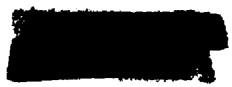

Thermal-Neutron Fluxes Measured in Oil at the LTSF: An Erratum. 148

Radiation Transmission Through Boral and Similar Heterogeneous Materials

Consisting of Randomly Distributed Absorbing Chunks 148

4.3. BULK SHIELDING FACILITY 154

The GE-BSF Study of Heating in Shields 154

4.4. TOWER SHIELDING FACILITY 158

Aircraft Shield Test Reactor Experiment at the Tower Shielding Facility 158

ASTR Shield Configurations 158

Detectors 158

Radiation Mappings in the Reactor Horizontal Midplane 158

Measurements in Crew Shield Mockups 166

Gamma-Ray and Neutron Spectral Measurements 168

Miscellaneous Measurements 170

Prediction of Radiation Intensities at Large Distances from the TSR-II 174

Measured Dose Rates 4000 ft from TSR-I 174

Predicted Dose Rates 4200 ft from TSR-II 175

Calculation of Uncollided Fast-Neutron Flux 4200 ft from TSR-I 181

4.5. TOWER SHIELDING REACTOR II 184

Mechanical Design 184

Control Systems 186

Control Mechanism 186

Electrohydraulic Transducer for Control of Water Pressure in the

Control Mechanism 187

TSR-II Block Diagram 188

Reactor Controls Cubicle 191

Heat Removal Equipment 191

Nuclear Calculations 191

Comparison of Calculations and Critical Experiments 192

Reactivity Coefficients 193

Control "Shell" Effectiveness 194

Control Grid Effectiveness 194

Selection of Critical Mass for TSR-II 195

Calculation of Heating in the Fuel Plates 196

Flow Distribution Studies 202

Flow Studies of Central Fuel Elements 202

Flow Studies of Annular Fuel Elements 202

Reactor Core Kinetic Studies 206

Safety System Measurements 206

Shield Designs 210

Investigation of Stresses in the Tower Structure from Water and Electrical Lines 211

# Part 1

# METALLURGY

W. D. Manly

Metallurgy Division

T. Hikido

U.S. Air Force

# 1.1. FABRICATION

J.H.Coobs

# COLUMBIUM INVESTIGATIONS

# Effect of Heat Treatment on Mechanical Properties

H. Inouye

D. O. Hobson

Studies were continued in an investigation of the effect of heat treatment on the room-temperature properties of a cast columbium ingot prepared by the electron-beam melting technique. The results of these experiments will provide information needed for determining the feasibility of forging castings at room temperature to prevent contamination and for assessing room temperature evaluation of the probable performance of fusion welds.

Notched-bend specimens machined from the ingot were heat treated at $50^{\circ}\mathrm{C}$ intervals from 700 to $1000^{\circ}\mathrm{C}$ in a dynamic vacuum of $2 \times 10^{-6} \mathrm{mmHg}$ for periods ranging from 168 hr at the lower temperatures to 72 hr at the higher temperatures. The effects of these heat treatments were evaluated from the standpoints of fracture mode, microstructure, and ductility as determined from an integrated plot of the load-deflection curves. In all cases, the fracture occurred transgranularly and showed no trend with respect to the heat-treatment temperature. Microstructurally, no differences were noted, and no second phases were detected when the samples were examined at a magnification of 1500 times. The results of triplicate slow-bend tests of specimens heat treated at a particular temperature exhibited considerable scatter, however. The fractures did not always occur at the base of the notch, and it is thought that the variations in the location of fracture may have affected the test results. The data presented in Table 1.1.1 indicate, however, that the specimens treated at intermediate temperatures were more ductile than those heated at the extremes of the range of treatment temperatures. The values presented in Table 1.1.1 are the lowest of the three values obtained in the triplicate tests. The material from which the specimens were machined had the following impurities: $0.01\%$ C, $0.12\%$ O₂, $0.0013\%$ H₂, and $0.032\%$ N₂.

The data of Table 1.1.1 show some correlation with results obtained in previous cold rolling and bend tests of similar heat-treated specimens from this ingot. It was found previously that an intermediate-temperature anneal improved the fabricability. The instability exhibited by the metal

Specimen dimensions: $0.125 \times 0.340 \times 1.00$ in.  
V notch: 45 deg, 0.005-in. root radius, 0.040 in deep

Strain rate: 0.05 in./min

Table 1.1.1. The Effect of Heat Treatment on the Room-Temperature Ductility of Cast Columbium   

<table><tr><td colspan="2">Specimen Heat Treatment</td><td rowspan="2">Energy Absorbed in Room-Temperature Notched-Bend Test (in.-lb)</td></tr><tr><td>Time (hr)</td><td>Temperature (°C)</td></tr><tr><td colspan="2">As-received</td><td>10.03</td></tr><tr><td>168</td><td>700</td><td>0.96</td></tr><tr><td>132</td><td>750</td><td>12.04</td></tr><tr><td>120</td><td>800</td><td>15.35</td></tr><tr><td>96</td><td>850</td><td>32.55</td></tr><tr><td>96</td><td>900</td><td>26.36</td></tr><tr><td>72</td><td>950</td><td>18.10</td></tr><tr><td>72</td><td>1000</td><td>25.20</td></tr></table>

indicates that heat-treatment effects on welds will be only temporary and that stabilizing elements will be required to neutralize the effects of interstitial elements.

# Extrusion Studies

H. Inouye

D. O. Hobson

Fifteen columbium billets were extruded during the period covered by this report. Nine tube extrusions and two rod extrusions were successful, and four billets failed to extrude satisfactorily. The data obtained in these experiments are presented in Table 1.1.2. No difficulties were experienced in extruding electron-beam-melted material so long as it was protected from atmospheric contamination during heating. The protection was provided by copper plating the billets, covering them with powdered graphite, and heating them in an inert-atmosphere furnace. Arc-melted material tends to be more difficult to extrude, possibly because of its higher impurity content. Efforts have been made to extrude columbium bare, that is, without the copper plate, but this leads to surface contamination and in the case of tube blanks results

Table 1.1.2. Extrusion Data on Columbium Billlets   

<table><tr><td>Extrusion Designation*</td><td>Type</td><td>Extrusion Temperature (℃)</td><td>Reduction Ratio</td><td>Plating Material</td><td>Quality of Extruded Material</td></tr><tr><td>WC-1</td><td>Tube</td><td>815</td><td>7:1</td><td>Copper</td><td>Good</td></tr><tr><td>WC-2</td><td>Tube</td><td>815</td><td>7:1</td><td>Copper</td><td>Good</td></tr><tr><td>WC-3</td><td>Tube</td><td>815</td><td>7:1</td><td>Copper</td><td>Good</td></tr><tr><td>WC-4</td><td>Tube</td><td>815</td><td>7:1</td><td>Copper</td><td>Good</td></tr><tr><td>WC-5</td><td>Tube</td><td>815</td><td>7:1</td><td>Copper</td><td>Good</td></tr><tr><td>WC-6</td><td>Tube</td><td>815</td><td>7:1</td><td>None</td><td>Poor</td></tr><tr><td>EM-1</td><td>Tube</td><td>815</td><td>7:1</td><td>None</td><td>Bad, stalled press</td></tr><tr><td>K-1</td><td>Tube</td><td>815</td><td>7:1</td><td>None</td><td>Bad, stalled press</td></tr><tr><td>K-2</td><td>Tube</td><td>815</td><td>7:1</td><td>Copper</td><td>Bad, stalled press</td></tr><tr><td>WC-7</td><td>Tube</td><td>815</td><td>7:1</td><td>Copper</td><td>Good</td></tr><tr><td>WC-8</td><td>Tube</td><td>815</td><td>7:1</td><td>Copper</td><td>Good</td></tr><tr><td>WC-9</td><td>Rod</td><td>815</td><td>9.75:1</td><td>Copper</td><td>Good</td></tr><tr><td>WC-11</td><td>Tube</td><td>815</td><td>7:1</td><td>Copper</td><td>Good</td></tr><tr><td>WC-12</td><td>Tube</td><td>815</td><td>7:1</td><td>Copper</td><td>Good</td></tr><tr><td>K-4</td><td>Rod</td><td>1200</td><td>9.75:1</td><td>None</td><td>Good</td></tr></table>

*WC: Wah Chang Corporation; electron-beam melted material.   
EM: Electro Metallurgical Corporation; arc-cast material.   
K: Kennametal; arc-cast material.

in cracking and peeling of the surface. After the extrusions were completed, all the good tube blanks were sent to the Superior Tube Company for drawing into tubing.

The present inventory of columbium tubing consists of $\sim 100$ ft of 0.620-in.-dia, 0.090-in.-wall, draw-clad duplex tubing consisting of 0.030 in. of columbium clad with 0.060 in. of type 446 stainless steel, and $\sim 200$ ft of 0.500-in.-ID, 0.030-in.-wall unclad columbium. All the tubing received has been submitted to the Nondestructive Testing Group for inspection. A preliminary report on the inspections indicates that the unclad tubing has shallow (0.003 to 0.005 in. deep) cracks on both the inner and outer surfaces. Since such cracks are probably due to insufficient annealing before tube reduction, a high-temperature high-vacuum annealing furnace has been designed and is being built. The furnace, shown in Fig. 1.1.1, is de

signed to operate at a maximum temperature of $1400^{\circ}\mathrm{C}$ at a pressure of $\sim 1\times 10^{-5}\mathrm{mmHg}$ . It will be able to handle extrusions up to 36 in. long, and it will be provided with equipment for moving the extrusions into and out of the hot zone. Most of the machine work has been completed, and the induction coil and outer furnace shell have been received.

An extrusion billet was designed for the extrusion of duplex tubing consisting of a stainless steel outer shell and a refractory metal inner shell. The design (Fig. 1.1.2) will permit extrusion of an evacuated billet without the use of a protective core material. The vacuum is not broken until the actual moment of extrusion. One type-310 stainless-steel-clad vanadium billet was extruded at a 16:1 reduction in area, and a smooth, uniform extrusion was obtained. In future extrusions columbium and molybdenum are to be used as the inner layer.

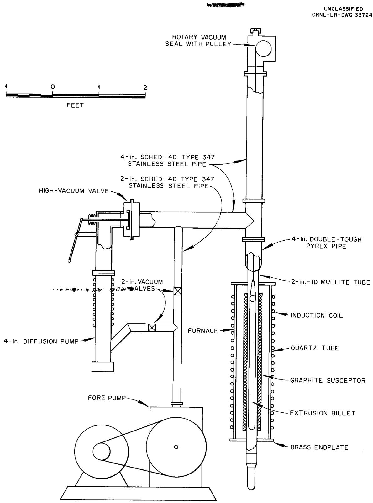  
Fig. 1.1.1. Layout of High-Temperature High-Vacuum Annealing Furnace.

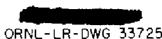

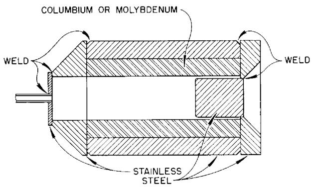  
Fig. 1.1.2. Billet Design for Extrusion of Stainless-Steel-Clad Refractory-Metal Tubing.

# Purification Experiments

H. Inouye

D. O. Hobson

The possibility of purifying columbium by annealing at high temperatures in vacuum is being investigated. A vacuum system is being used in which a columbium wire can be resistance heated to temperatures up to its melting point, $2415^{\circ}C$ . The results of one series of tests for 30-min periods at various temperatures and pressures are presented in Fig. 1.1.3. In future experiments, the effect of varying the heating time at constant temperatures will be studied.

# Special Alloy Preparations

# T. K. Roche

Special columbium alloy specimens are being prepared for evaluation in molten lithium. The available evidence indicates that the mechanism of corrosion of columbium by lithium is related to the presence of oxygen in the "pure" metal. The addition of alloying materials that are potentially capable of neutralizing the residual oxygen should therefore be beneficial. The alloy additions presently being considered are beryllium, zirconium, and cerium. Columbium melting stock has been prepared from sheet material received from DuPont, which has been found, by chemical analysis, to contain 0.032 wt $\%$ C, 0.0003 wt $\%$ H $_2$ , 0.0084 wt $\%$ N $_2$ , and 0.053 wt $\%$ O $_2$ . Prior to the preparation of the alloys, the fabricability of the unalloyed material melted by normal arc-melting procedures will be evaluated.

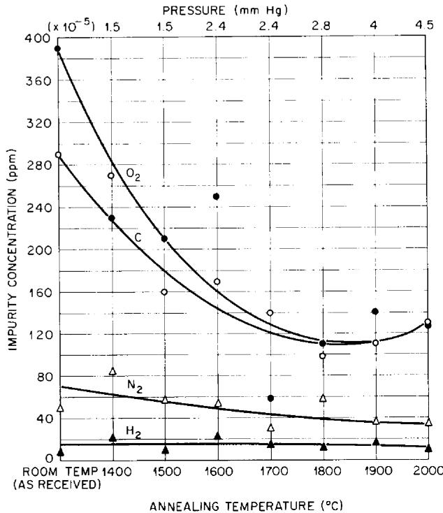  
UNCLASSIFIED ORNL-LR-DWG 33726   
Fig. 1.1.3. Effect on Impurities of Heating Columbium Wire in Vacuum for 30 min at Various Temperatures and Pressures. (Color figure online)

# Effects of Oxygen and Nitrogen Contamination on Corrosion by Lithium

J. E. Spruiell

H. Inouye

Experimental studies of the absorption of oxygen and nitrogen by pure columbium in the temperature range of 800 to $1600^{\circ}\mathrm{C}$ at pressures ranging from $3 \times 10^{-6}$ to $1 \times 10^{-1}$ mm Hg were initiated. The preliminary tests of nitrogen pickup consisted of (1) sealing specimens of columbium and hot-pressed boron nitride or hot-pressed silicon nitride in quartz capsules and heating for 20, 50, and 75 hr at temperatures of 900, 1000, and $1100^{\circ}\mathrm{C}$ ; and (2) introducing purified nitrogen of a given partial pressure into a previously evacuated furnace which contained columbium.

The results of the tests in which the columbium specimens and boron nitride or silicon nitride were sealed in quartz capsules were evaluated in terms of weight change and change in chemical analysis.

The weight-change measurements indicated that the columbium specimens had absorbed some gas, but chemical analysis proved the absorbed material to be primarily oxygen rather than nitrogen. The data for one columbium specimen sealed with boron nitride under a pressure of $3 \times 10^{-6} \mathrm{~mmHg}$ in quartz are presented in Tables 1.1.3 and 1.1.4. Since the change in weight indicated a total impurity pickup of only $0.09\%$ , it appears that the analyses are somewhat incorrect, but they do indicate the relatively higher pickup of oxygen than of nitrogen. Eleven specimens were given similar tests, and all the results were of the same order of magnitude. The hot-pressed boron and silicon nitrides apparently contained decomposable oxide impurities.

In a second series of tests, columbium specimens were heated in a purified nitrogen atmosphere in a furnace at temperatures up to $1300^{\circ}\mathrm{C}$ for 1 hr. No significant weight changes were observed. In these tests nitrogen pressures from 0.5 to $3 \times 10^{-3}$ were used. The specimens were bright after the tests, but they reflected light in a way that revealed thin transparent films on their surfaces. The effect of the pressure of the nitrogen on film formation has not been studied completely, but it is

Table 1.1.3. Weight Change Data for Pure Columbium Exposed to Boron Nitride in an Evacuated Quartz Capsule for 72 hr at $1000^{\circ}$ C   

<table><tr><td></td><td>Columbium Specimen</td><td>Boron Nitride</td></tr><tr><td>Original weight (g)</td><td>2.8825</td><td>0.7263</td></tr><tr><td>Weight after test (g)</td><td>2.8853</td><td>0.7134</td></tr><tr><td>Weight change (g)</td><td>+0.0028</td><td>-0.0129</td></tr></table>

Table 1.1.4. Results of Impurity Analyses of Columbium Before and After Exposure to Boron Nitride in an Evacuated Quartz Capsule for 72 hr at $1000^{\circ}\mathrm{C}$   

<table><tr><td rowspan="2">Columbium Specimen</td><td colspan="3">Impurities (wt %)</td></tr><tr><td>O2</td><td>N2</td><td>H2</td></tr><tr><td>As-received</td><td>0.0061</td><td>0.0046</td><td>0.0005</td></tr><tr><td>After test</td><td>0.12</td><td>0.017</td><td>0.0046</td></tr></table>

believed to be small. There may be a critical pressure below which absorption occurs without the formation of the nitride film. None of these specimens were analyzed because the weight-gain data indicated no measurable absorption of any gas.

Furnaces and equipment capable of operating at much higher temperatures are being fabricated so that the range of study may be increased.

Oxygen-contaminated specimens were made by introducing purified oxygen into a previously evacuated furnace containing columbium specimens.

The gas was introduced in such a manner as to maintain a constant partial pressure of oxygen.

Various concentrations of oxygen were obtained by leaving the specimens at temperature in the oxygen atmosphere for various times. By this method, specimens containing from 61 to 5000 ppm oxygen were prepared by heating at $850^{\circ}\mathrm{C}$ under a partial pressure of $2 \times 10^{-3} \mathrm{~mmHgO}_{2}$ for times ranging up to 16 hr. These specimens are being tested to determine the effects of oxygen contamination on corrosion of columbium by lithium.

# YTTRIUM AND YTTRIUM HYDRIDE INVESTIGATIONS

W.J.Werner T.Hikido

# Effect of Metal Purity on Hydriding

It has been reported by GE-ANPD that considerable difficulty has been encountered with respect to cracking of hydrided pieces of yttrium. The cracks form both during hydriding and upon thermal cycling of the hydrided piece. There has been some evidence that the cracking is associated with nonmetallic inclusions which may be observed in the microstructure of the metal, and it is hoped that improvement of the purity of the yttrium will alleviate the cracking problem. Conclusive proof of the effect of impurities is still unavailable, however, because of the lack of high-purity metal. At the present time, studies are under way on the zone refining of yttrium by the floating-zone procedure developed by Kneip and Betterton for the zone refining of zirconium. Work has also been started on the evaluation of various procedures for the purification of hydrogen. With pure metal and pure

hydrogen, it will be possible to compare the properties of a high-purity hydride with the properties of hydrides having various impurity contents.

# Dissociation Pressure Studies

No accurate set of dissociation pressure curves for the $\mathsf{YH}_x$ system is, as yet, available. A dissociation pressure rig is therefore being constructed, and measurements will be made of as pure a hydride as is obtainable. The effects of impurities on the dissociation pressure will also be determined.

# Deformation Mechanisms of Yttrium

The growth of single crystals of yttrium is being attempted in connection with a program to study the deformation mechanisms of high-purity yttrium. The first method to be tried for the growth of these single crystals is that of growing the crystals from the melt (zone refining). A strain-anneal technique will also be tried.

# Electron-Beam Melting of Yttrium and Yttrium-Magnesium Alloy

W.J.Werner

T. Hikido

The Temescal Metallurgical Corporation, Richmond, California, has developed a technique for melting metals under a high vacuum in which the energy of a focused electron beam is used. The furnace consists essentially of a vacuum pumping system, an electron "gun" and power supply, a melting-stock feeding device, and a water-cooled copper crucible with an ingot extraction mechanism. The electron gun has a circular tungsten filament electron source, focusing devices, and a power source which supplies a high-potential electric field through which the electrons are accelerated. The electron gun is designed to concentrate part of the electron beam on the end of the melting stock as it is lowered into the furnace and the balance on the surface of melted metal ingot in the crucible. The metal melted from the stock drips into the crucible where a molten pool is maintained and the ingot is continuously extracted. The major advantages of the Temescal process are (1) the high vacuum $(10^{-4}\mathrm{mmHg})$ maintained during melting and (2) the use of water-cooled copper to minimize crucible contamination.

The electron-beam melting technique was used to investigate the possibility of purifying yttrium metal with respect to $\mathsf{O}_{2^{\prime}}$ , $\mathsf{N}_{2^{\prime}}$ , Li, Mg, and C content, and the possibility of consolidating yttrium-magnesium

alloy directly into a pure metal ingot without going through the vacuum-distillation step, Calculations by A. R. Miller3 showed that it should be thermodynamically possible to purify yttrium by melting it under a high vacuum. The consolidation of the yttrium-magnesium alloy was also thought to be possible if the melting were done by using a slow feed rate and a low power input to the electron gun.

For the experimental investigation, one bar of yttrium metal made up of six finger castings Heliarc welded together and two bars of yttrium-magnesium alloy $\sim 1\frac{1}{2}$ in. in diameter and 10 in. long were sent to the Temescal Metallurgical Corporation. The bar of yttrium metal was double melted. The first melt was accomplished at a feed rate of $\sim \frac{1}{3}$ lb of metal per hour with maximum power input to the gun. This melt was characterized by a heavy purple plasma which surrounded the electron gun, metal stock, and the melt. The density of this plasma, which was composed chiefly of lithium and magnesium, controlled the melting rate for a given power input. At too fast a melting rate, the plasma became dense enough to short out the filament to the focusing device. The plasma was considerably less dense during the second melt, and a faster melting rate, was, therefore, possible.

The original analyses of the six finger castings and the analysis of samples taken from the bottom of the first melt and from the top, middle, and bottom of the second melt are presented in Table 1.1.5. The results indicate that the electron-beam melting did not purify the metal with respect to oxygen and nitrogen and that the melting may have actually resulted in some additional contamination. There did seem to be some degree of purification between the first and second melts, however, and the method should be very effective in removing magnesium, lithium, and any volatile fluorides. Therefore, consideration will be given to further experiments with electron-beam melting when larger quantities of metal become available. Even if removal of the oxygen and nitrogen does not prove to be possible, it will be of considerable interest to minimize the other impurities in order to determine the true effect of the gases. The fluorides and oxyfluorides are currently suspected of contributing heavily to the difficulties encountered in working yttrium metal and with cracking in hydride yttrium.

Table 1.1.5. Chemical Analyses of Yttrium Stock and Melts Prepared by Electron-Beam Melting Techniques at the Temescal Metallurgical Corporation   

<table><tr><td rowspan="2">Casting No.</td><td colspan="5">Impurities (ppm)</td></tr><tr><td>O2</td><td>N2</td><td>Mg</td><td>Li</td><td>C</td></tr><tr><td>Yttrium Stock</td><td></td><td></td><td></td><td></td><td></td></tr><tr><td>L-9B-1</td><td>1300</td><td>1100</td><td>27</td><td>50</td><td>66</td></tr><tr><td>L-11A-3</td><td>990</td><td>48</td><td>25</td><td>16</td><td></td></tr><tr><td>L-11A-4</td><td>970</td><td>30</td><td>23</td><td>16</td><td></td></tr><tr><td>L-10A-2</td><td>980</td><td>170</td><td></td><td>29</td><td>410</td></tr><tr><td>L-10A-7</td><td>980</td><td>100</td><td>100</td><td>&lt;10</td><td>140</td></tr><tr><td>L-10A-8</td><td>850</td><td>110</td><td>120</td><td>&lt;10</td><td>150</td></tr><tr><td>Melt</td><td></td><td></td><td></td><td></td><td></td></tr><tr><td>T-1B (bottom of first melt)</td><td>1600</td><td>330</td><td></td><td>&lt;10</td><td></td></tr><tr><td>T-2T (top of second melt)</td><td>1500</td><td>210</td><td></td><td>&lt;10</td><td></td></tr><tr><td>T-2B (bottom of second melt)</td><td>1300</td><td>170</td><td></td><td>&lt;10</td><td></td></tr><tr><td>T-2M (middle of second melt)</td><td>1100</td><td>220</td><td></td><td>&lt;10</td><td></td></tr></table>

Attempts to process the 80 wt % Y-20 wt % Mg alloy directly to the metal ingot by the electron-beam technique were unsuccessful. It was thought that if a low melting rate were maintained and the power input kept low, the magnesium could be driven off and the metal melted. However, when the beam of electrons was focused on the alloys, the magnesium boiled out violently with considerable splattering. Some of the magnesium deposited on the filament and focusing shield and caused short circuiting of the filament. It was not possible to control the splattering and shorting, and therefore the melting attempts had to be abandoned.

# Expansion of Yttrium Preparation Process

T. Hikido

In March 1958, the Oak Ridge National Laboratory was requested to consider scaling up the yttrium preparation process, which was described in the previous report.4 Official approval of the proposed ORNL program was received at the end of April, and the preparation of facilities was begun. The

objective set forth for the program was the preparation of yttrium metal containing less than 1000-ppm $\mathsf{O}_2$ in 20-lb ingots.

The equipment for this program, which is installed in Building 9201-2, Y-12 area, consists of two parallel 50-lb fluoride purification systems that supply $\mathsf{YF}_3$ mixtures to a National Research Corporation 150-lb (rated in steel) vacuum-induction-melting furnace. A system for transferring into the furnace the lithium used as the reductant is included in the installation.

The control panel and furnaces for one of the fluoride purification systems may be seen in Fig. 1.1.4 beside the vacuum-reduction furnace, which is in the center of the photograph. The lithium and fluoride loading ports on the side of the vacuum furnace may be seen. Another view of the reduction furnace which shows the control panel for the 100-kw motor-generator reduction power supply is shown in Fig. 1.1.5.

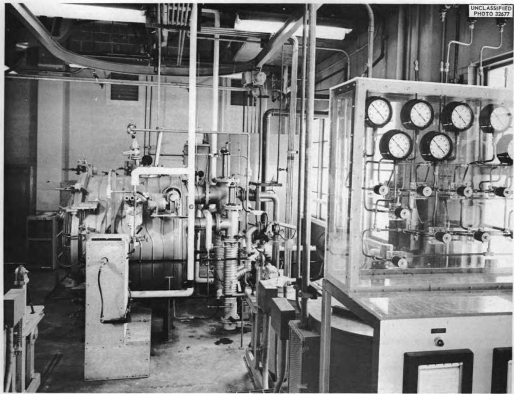  
Fig. 1.1.4. Yttrium Preparation Facility.

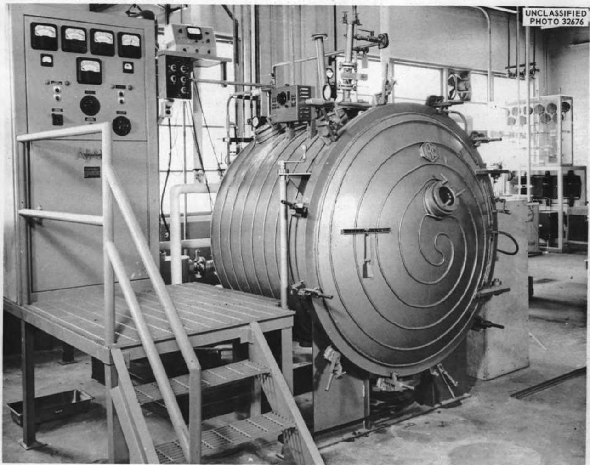  
Fig. 1.1.5. Yttrium Preparation Facility and Control Panel for Power Supply.

# 1.2. CORROSION

E. E. Hoffman

# LITHIUM PURIFICATION

# E. E. Hoffman

Various methods have been investigated for the purification of lithium.1 Although the effect of nitrogen and oxygen contamination of the lithium on the corrosion resistance of columbium to lithium at elevated temperatures is not yet well understood, it is generally felt that oxygen and nitrogen concentrations should be reduced to a practical minimum to eliminate the purity of the lithium as a test variable. A method of reducing the oxygen contamination is also needed in order to produce the low-oxygen-content lithium required in the production of low-oxygen-content yttrium (see Chap. 1.1, this report).

Analyses of lithium from three shipments supplied by the vendor in gas-tight stainless steel containers (under an inert gas) are presented in Table 1.2.1. The specification of less than 100 ppm nitrogen was, as may be seen, not met by the vendor. Efforts will be made to obtain improved as-received material, but it is felt that it will probably be necessary to purify all lithium used for tests.

Three different methods have been used for determining the oxygen content of lithium. In order to provide a comparison of the results obtained by the three methods, dip samples were taken from approximately 25 different batches of lithium. These dip samples were subjected to analysis by each

1E. E. Hoffman, W. H. Cook, and D. H. Jansen, ANP Quar. Prog. Rep. March 31, 1958, ORNL-2517, p 9.

Table 1.2.1. Nitrogen and Oxygen Analyses of Recent Lithium Shipments   

<table><tr><td rowspan="2">Shipment No.</td><td rowspan="2">Quantity (lb)</td><td colspan="2">Impurity Content (ppm)*</td></tr><tr><td>Nitrogen</td><td>Oxygen</td></tr><tr><td>1</td><td>20</td><td>605</td><td>390</td></tr><tr><td>2</td><td>46</td><td>1940</td><td>415</td></tr><tr><td>3</td><td>46</td><td>3310</td><td>1980</td></tr></table>

*Each value is an average of four analyses; sample were taken for analysis at approximately $300^{\circ}\mathrm{C}$ .

method: (1) an activation analysis method developed in the ORNL Analytical Chemistry Division, (2) a butyl iodide-iodine method also developed in the ORNL Analytical Chemistry Division, and (3) a methyl alcohol-Karl Fisher reagent method developed by the Nuclear Development Corporation of America. Although the agreement of the results obtained with the three methods was not good, the best agreement was obtained between the butyl iodide-iodine method and the activation analysis method. Improved sampling and analytical techniques will be employed in the future to further determine the reliability of these two methods for determining oxygen in lithium.

Results of preliminary determinations of the solubility of lithium nitride and lithium oxide in lithium were presented previously, and one additional oxide solubility determination has been made for which an improved sampling technique was used. A total of five analyses made by two methods by the Analytical Chemistry Division on samples taken at $250^{\circ}C$ showed good agreement. An averaged value of approximately 1300-ppm oxygen was measured. This value is considerably below that obtained in one previous test, and additional work will be required to resolve the difference.

The purification experiments, described previously, in which titanium and zirconium metals were used as gettering agents for nitrogen and oxygen in lithium, indicated that although these metals are effective in removing nitrogen, they do not getter oxygen from the lithium. In several tests the oxygen content of the titanium getter foil actually decreased, as would be expected, inasmuch as lithium oxide is more stable than titanium oxide. Yttrium oxide is much more stable from a free energy of formation standpoint than either titanium or zirconium oxides, and, therefore, tests are being performed to determine the effectiveness of yttrium metal as a getter for oxygen in lithium.

A gettering test was conducted in which $88.5\mathrm{g}$ of yttrium turnings was added to $628\mathrm{g}$ of lithium. The stainless steel container, which had a tantalum liner, was held at $1500^{\circ}\mathrm{F}$ for 72 hr. Yttrium-metal cylinders (0.3 in. in diameter and 2 in. in length) introduced into the purification vessel at 24-hr intervals were analyzed for oxygen and nitrogen at the conclusion of the test. The results of

the analyses, which were made by the vacuum-fusion method, are presented in Table 1.2.2.

Hardness measurements were made on the yttrium metal specimens tested in lithium and on similar specimens given the same heat treatment in an evacuated capsule. The purpose of these measurements was to determine the extent of getting of oxygen and nitrogen from the lithium by the yttrium. Pickup of these elements results in increases in hardness in yttrium. The hardness increases which occurred in one of the yttrium cylinders are given in Table 1.2.3 as a function of depth from the surface. It may be seen that an appreciable hardness increase occurred to depths of 65 to 105 mils. Specimens No. 2 (Y-6) and No. 3 (Y-8) showed similar hardness increases near the surface but to lesser depths, as would be anticipated, since they were exposed to the lithium for shorter times.

Unfortunately, these promising results were not accompanied by reductions of the oxygen content of the lithium. Lithium samples taken at various time intervals showed a continuing increase in nitrogen and oxygen as the test run proceeded. It is felt, however, that the yttrium metal analyses are less subject to error than the lithium analyses;

and further tests will be conducted to check the usefulness of yttrium for this application.

# COLUMBIUM EXPOSED TO LITHIUM

E.E.Hoffman

# Arc-Cast Columbium Tubing Tested in Static Lithium

Static corrosion tests of the various grades of columbium stock received from vendors are being performed. Specimens are exposed to lithium for 100 hr at $1500^{\circ}\mathrm{F}$ and at $1800^{\circ}\mathrm{F}$ in an effort to correlate metal history and analysis with any observed corrosion. Only a few samples have been tested thus far, and there are, as yet, no clear cut quantitative indications of the effects of the nitrogen and oxygen content of the metal on corrosion. The tests have shown, however, that the presence of oxygen is detrimental to corrosion resistance. In general, specimens of welded tubing have been heavily attacked in the weld and heat-affected zones, and there has been little or no attack of the base material.

The effect of surface contamination introduced during processing is illustrated in Fig. 1.2.1, which

Table 1.2.2. Analyses of Yttrium Metal Getter Specimens Before and After Exposure to Lithium at ${1500}^{ \circ  }\mathrm{F}$   

<table><tr><td rowspan="2">Specimen No.</td><td rowspan="2">Time Period of Exposure (hr)</td><td colspan="3">Oxygen Content (ppm)</td><td colspan="3">Nitrogen Content (ppm)</td></tr><tr><td>Before Test</td><td>After Test</td><td>Change</td><td>Before Test</td><td>After Test</td><td>Change</td></tr><tr><td>1 (Y-3)</td><td>0–72</td><td>1300</td><td>3800</td><td>+2500</td><td>450</td><td>1100</td><td>+650</td></tr><tr><td>2 (Y-6)</td><td>24–72</td><td>1400</td><td>3900</td><td>+2500</td><td>570</td><td>850</td><td>+280</td></tr><tr><td>3 (Y-8)</td><td>48–72</td><td>940</td><td>1800</td><td>+860</td><td>110</td><td>170</td><td>+60</td></tr></table>

Table 1.2.3. Diamond Pyramid Hardness Values for an Yttrium Cylinder Specimen (Y-3) Used in a Lithium-Yttrium Gettering Experiment as a Function of Distance from Surface Exposed to Lithium Compared with Values for a Specimen Given a Similar Heat Treatment in Vacuum   

<table><tr><td rowspan="2">Specimen Treatment</td><td colspan="5">Distance from Surface (mils)</td></tr><tr><td>5 (Edge)</td><td>25</td><td>65</td><td>105</td><td>145 (Center)</td></tr><tr><td colspan="6">Diamond Pyramid Hardness (500-g load)</td></tr><tr><td>Exposed to lithium for 72 hr at 1500°F</td><td>117</td><td>95</td><td>71</td><td>66</td><td>59</td></tr><tr><td>Heat treated as above but in vacuum rather than in lithium</td><td>59</td><td>60</td><td>58</td><td>59</td><td>59</td></tr></table>

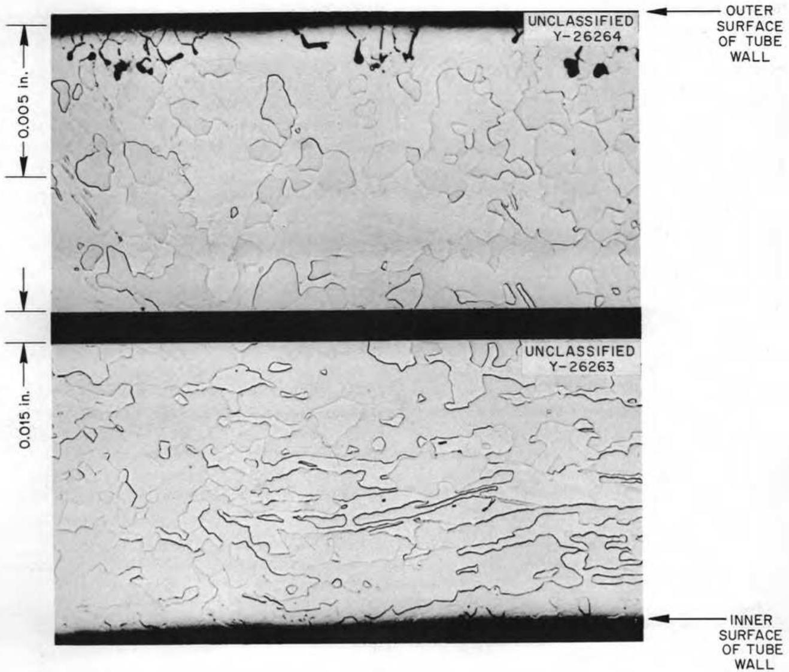  
Fig. 1.2.1. Outer and Inner Surfaces of Tube Wall of DuPont Arc-Cast Columbium Specimen Following Exposure to Static Lithium for 100 hr at $1500^{\circ}$ F. Both sides were exposed to lithium. Note attack on outer surface. Etchant: HF-HNO $_3$ -H $_2$ SO $_4$ -H $_2$ O (parts: 25-10-10-55). 250X. (Schematic)

shows the outer and inner surfaces of a specimen of DuPont arc-cast columbium tubing that was exposed to lithium for 100 hr at $1500^{\circ}\mathrm{F}$ . Since both surfaces were exposed to a common lithium environment, the lithium purity was eliminated as a variable. It appears that some contamination was introduced during tubing fabrication and was diffused into the outer surface during a subsequent anneal. Hardness measurements also indicated the possibility of outer surface contamination. The Diamond Pyramid hardness values for this arc-cast tubing before and after the test are given in Table 1.2.4.

Table 1.2.4. Diamond Pyramid Hardness of DuPont Arc-Cast Columbium Tubing Before and After Exposure to Lithium for 100 hr at ${1500}^{ \circ  }\mathrm{F}$   

<table><tr><td rowspan="2"></td><td colspan="3">DPH Values (500-g load)*</td></tr><tr><td>Near Outer Surface</td><td>Middle of Wall</td><td>Near Inner Surface</td></tr><tr><td>Before test</td><td>145</td><td>121</td><td>133</td></tr><tr><td>After test</td><td>109</td><td>96</td><td>118</td></tr></table>

*Values are averages for four determinations.

The decrease in hardness may have been due to leaching of impurities by the lithium.

# Effect of Welding Procedures on Corrosion

A series of tests was conducted to study the effect of various Heliac welding procedures on the corrosion of arc-cast columbium in lithium. Two joining techniques and three types of welding environment were used in weld sample preparation. The arc-cast columbium stock used was 0.035 in thickness, and it contained, as determined by chemical analysis, 360-ppm $\mathrm{O}_2$ , 20-ppm $\mathrm{N}_2$ , and 140-ppm C.

The joints were made by using a fusion welding technique in which no filler metal is applied or with a filler metal consisting of an $85\%$ Zr-15% Cb alloy. Sheet material for the fusion welds was obtained by splitting and flattening 0.5-in.-OD seamless tubing. For the welds made with filler metal, the split tubing was not flattened. Three joints of each type were made that were prepared in three different environments. One was made in air with good, conventional inert-gas (argon) coverage; one was made in an inert-atmosphere chamber containing argon gas contaminated with 1600 ppm $\mathsf{N}_2 + \mathsf{CO}$ and 400 ppm $\mathsf{O}_2$ ; and the third was made in an inert-atmosphere chamber containing high-purity argon, which analyzed 67 ppm $\mathsf{N}_2 + \mathsf{CO}$ and 3 ppm $\mathsf{O}_2$ . All the specimens were exposed to lithium simultaneously in a single columbium container for 100 hr at $1500^{\circ}\mathsf{F}$ .

The results of these tests are presented in Table 1.2.5. The specimens joined in argon plus air showed weight losses and those joined in the inert atmosphere chamber showed weight gains. The specimens joined with the filler metal showed essentially no attack of the weld metal. The effects of environment on the heat-affected zone and the weld metal are illustrated in Fig. 1.2.2. As may be seen, the heat-affected zone of the columbium adjacent to the braze weld of the specimen joined in a contaminated environment (air plus argon) was heavily attacked, but the same zone showed very little attack when the specimen was joined in a high-purity argon environment. The base material was attacked in both cases but to a lesser degree in the case of the specimen joined in high-purity argon.

The specimens joined by fusion welding were heavily attacked in both the weld zone and the heat-affected zone. The attack in these areas decreased in both depth and concentration as the purity of the cover gas increased. The weld zones are shown in Fig. 1.2.3 after exposure to lithium at $1500^{\circ}\mathrm{F}$ for 100 hr. The attack was extremely heavy on the specimen welded in argon plus air. It is surprising, however, that even with the purest welding environment the specimen was subsequently attacked by lithium along the grain boundaries. The introduction of impurities during welding should have been quite low. The results indicate that unalloyed columbium must not only be welded under very pure, inert atmospheres, but that the parent metal must be quite low in nitrogen and oxygen. An enlarged photograph of a crack in the weld zone of the specimen welded in argon plus air is shown in Fig. 1.2.4. The grain-boundary phase shown in Fig. 1.2.4 has not yet been identified; it was not visible in the as-welded specimens prior to the test in lithium.

As was expected, the hardness values for specimens in the as-welded condition were quite high when the joining operation was performed in impure argon because of pickup of interstitial elements such as oxygen and nitrogen. All test specimens decreased in hardness as a result of exposure to lithium, and thus it appears that the lithium gettered the contaminants responsible for the hardness increase.

The free energies of formation indicate that columbium nitride is more stable than lithium nitride,² whereas, lithium oxide is considerably more stable than columbium oxide. Therefore, lithium metal would probably reduce any columbium oxide present as a precipitate in the grain boundaries of columbium welds, but it should not attack columbium nitride. Specimens selectively contaminated with nitrogen and oxygen are being tested that were prepared as described in Chap. 1.1 in order to identify the contaminant responsible for the corrosion of columbium welds.

Table 1.2.5. Results of Exposure of Columbium Weld Samples to Lithium for ${100}\mathrm{{hr}}$ at ${1500}^{ \circ  }\mathrm{F}$   

<table><tr><td rowspan="2">Joining Technique</td><td rowspan="2">Welding Environment</td><td rowspan="2">Specimen Weight Change (mg/in.2)</td><td rowspan="2">Results of Metallographic Examination of Weld Sample</td><td colspan="2">Diamond Pyramid Hardness (500-oz load)</td></tr><tr><td>Before Test</td><td>After Test</td></tr><tr><td rowspan="9">Braze Welding (85% Zr-15% Cb Filler alloy)</td><td rowspan="3">Argon + air</td><td rowspan="3">-0.7</td><td>Braze weld: 1 mil of attack</td><td>361</td><td>343</td></tr><tr><td>Heat-affected zone: complete grain-boundary penetration of specimen</td><td>360</td><td>94</td></tr><tr><td>Base material*: 4 mils of subsurface voids</td><td>129</td><td>112</td></tr><tr><td rowspan="3">Argon +1600-ppm N2+400-ppm O2</td><td rowspan="3">+1.0</td><td>Braze weld: no attack</td><td>285</td><td>246</td></tr><tr><td>Heat-affected zone: 15 mils of attack</td><td>114</td><td>98</td></tr><tr><td>Base material: 4 mils of subsurface voids</td><td>120</td><td>104</td></tr><tr><td rowspan="3">Argon +67-ppm N2+3-ppm O2</td><td rowspan="3">+0.7</td><td>Braze weld: no attack</td><td>289</td><td>242</td></tr><tr><td>Heat-affected zone: 6 mils of attack</td><td>122</td><td>98</td></tr><tr><td>Base material: 3 mils of subsurface voids</td><td>113</td><td>105</td></tr><tr><td rowspan="9">Fusion Welding</td><td rowspan="3">Argon + air</td><td rowspan="3">-0.4</td><td>Weld: complete and very heavy attack of entire weld</td><td>356</td><td>128</td></tr><tr><td>Heat-affected zone: 15 mils of inter-granular attack</td><td>127</td><td>90</td></tr><tr><td>Base material: 3 mils of attack</td><td>127</td><td>97</td></tr><tr><td rowspan="3">Argon +1600-ppm N2+400-ppm O2</td><td rowspan="3">+0.6</td><td>Weld: complete attack of grain boundaries; attack not as concentrated as in fusion weld described above</td><td>155</td><td>105</td></tr><tr><td>Heat-affected zone: 9 mils of inter-granular attack</td><td>116</td><td>93</td></tr><tr><td>Base material: 3 mils of attack</td><td>128</td><td>107</td></tr><tr><td rowspan="3">Argon +67-ppm N2+3-ppm O2</td><td rowspan="3">+0.2</td><td>Weld: complete attack of grain boundaries in a few scattered areas; less attack than in either of the fusion welds described above</td><td>131</td><td>95</td></tr><tr><td>Heat-affected zone: 7 mils of inter-granular attack</td><td>118</td><td>92</td></tr><tr><td>Base material: 1 mil of attack</td><td>127</td><td>93</td></tr></table>

*The as-received arc-cast columbium contained 360-ppm $\mathsf{O}_2$ , 20-ppm $\mathsf{N}_2$ , and 140-ppm C, and it had a Diamond Pyramid hardness of 137.

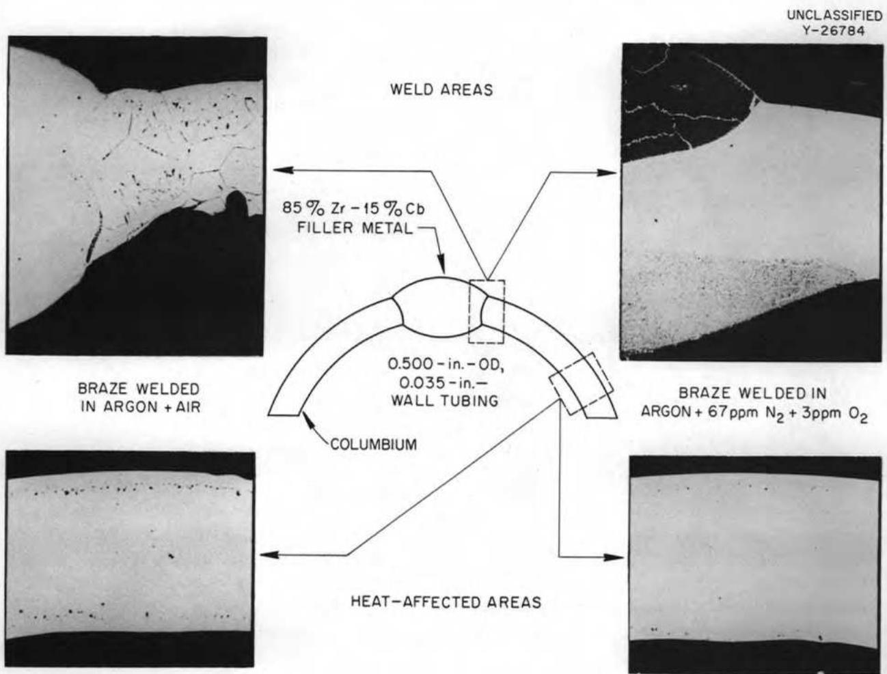

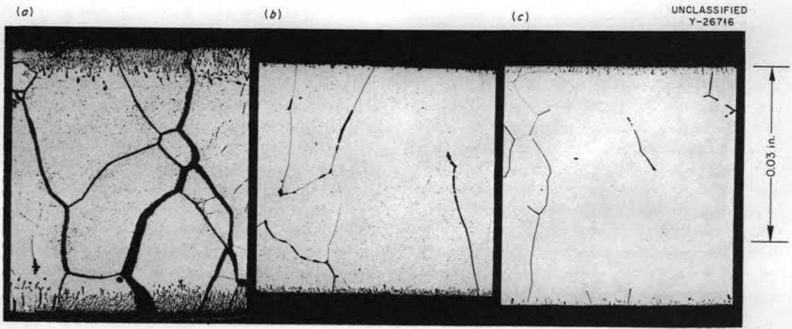  
Fig. 1.2.2. Effect of Welding Environment on the Corrosion Resistance of Columbium Braze Welded with an $85\%$ Zr-15% Cb Alloy and Exposed to Lithium at $1500^{\circ}\mathrm{F}$ for 100 hr. Unetched. (with caption)   
Fig. 1.2.3. Effect of Welding Environment on the Corrosion Resistance of Columbium Fusion Welded and Exposed to Lithium at $1500^{\circ}$ F for 100 hr. (a) Weld zone of specimen welded in argon plus air. (b) Weld zone of specimen welded in argon plus 1600-ppm $\mathsf{N}_2$ plus 400-ppm $\mathsf{O}_2$ . (c) Weld zone of specimen welded in argon plus 67-ppm $\mathsf{N}_2$ plus 3-ppm $\mathsf{O}_2$ . Etchant: HF-HNO $_3$ -H $_2$ SO $_4$ -H $_2$ O. (with caption)

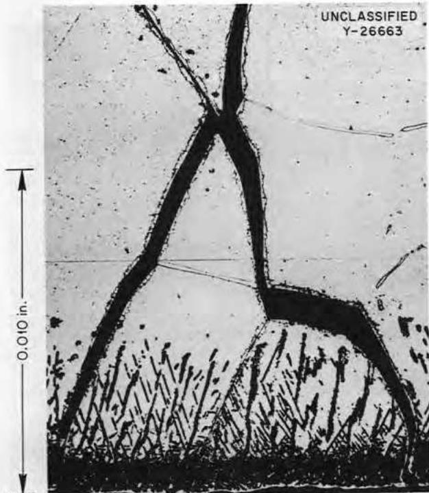  
Fig. 1.2.4. Enlargement of Crack Shown in Fig. 1.2.3a

# COMPARISON OF METHODS FOR DETERMINING THE NITROGEN CONTENT OF COLUMBIUM

E.E.Hoffman

The validity of the vacuum-fusion method for determining the nitrogen content of columbium has been evaluated by checking the results against those obtained with the micro-Kjeldahl method. Several columbium samples were analyzed by the Special Analysis Laboratory of the ORNL Analytical Chemistry Division by both methods. The results obtained by the two methods were in agreement, as may be seen in Table 1.2.6.

The micro-Kjeldahl method consists of dissolving a sample of approximately 0.1 g in concentrated $\mathsf{H}_2\mathsf{SO}_4$ transferring the solution to the Kjeldahl apparatus, adding NaOH, and distilling the ammonia. The distilled ammonia was analyzed colorimetrically with the use of Nessler's reagent.

In the vacuum-fusion method, a platinum bath in a graphite crucible is used for sample dissolution. The technique used was standard except that pieces of platinum weighing a total of about $10\mathrm{g}$ are dropped into the bath after the samples have been added in order to thoroughly mix the bath material. In addition, the columbium metal samples are wrapped in platinum foil so that when dropped they will sink

Table 1.2.6. Determination of the Nitrogen Content of Columbium by Vacuum-Fusion and the Micro-Kjeldahl Methods   

<table><tr><td rowspan="2">Columbium
Sample Code</td><td colspan="2">Nitrogen Content (ppm)</td></tr><tr><td>By Vacuum-Fusion
Method</td><td>By Micro-Kjeldahl
Method</td></tr><tr><td>Cb Wire
No. 11</td><td>35</td><td>35</td></tr><tr><td>Cb Wire
No. 12</td><td>3500</td><td>3500</td></tr><tr><td></td><td></td><td>3400</td></tr><tr><td>Cb Wire
No. 13</td><td>34</td><td>33</td></tr><tr><td>WC-1A</td><td>160</td><td>150</td></tr><tr><td></td><td>160</td><td>160</td></tr><tr><td></td><td></td><td>160</td></tr><tr><td></td><td></td><td>130</td></tr></table>

deep into the bath and not float on its surface. The evolved gases are passed over hot copper oxide, and the $\mathrm{CO}_{2}$ which forms is taken out in a cold trap. The $\mathsf{H}_2$ is converted to water and removed in a magnesium perchlorate absorption tube. The remaining gas is $\mathsf{N}_2$ which is determined in a McLeod gage.

# MOLYBDENUM AND COLUMBIUM TESTED IN LITHIUM IN SEESAW-FURNACE APPARATUS

E.E.Hoffman

A series of dynamic corrosion tests of molybdenum in contact with lithium were conducted with the use of a seesaw-furnace apparatus. The test assembly is shown in Fig. 1.2.5. In the tests, a 15-in.-long molybdenum pipe (0.80 in. OD × 0.10 in. wall) was partially filled with lithium, and the molybdenum pipe was placed inside an Inconel pipe (1.31 in. OD × 0.07 in. wall). The annular space between the molybdenum and the Inconel was partially filled with sodium. The Inconel pipe protected the molybdenum from oxidation, while the sodium acted as the heat-transfer bond between the two containers. The test assembly was then placed in the seesaw furnace, where it was rocked up and down $(\frac{1}{2} \text{cpm})$ with the desired temperature gradient between the ends of the capsule. Hot-zone and cold-zone

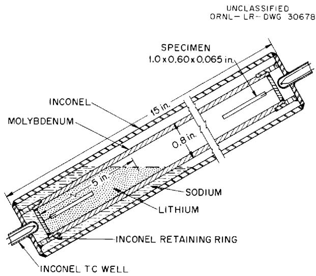  
Fig. 1.2.5. Seesaw-Furnace Test Assembly for Evaluating the Corrosion Resistance of Molybdenum in Lithium.

specimens were suspended in the ends of the molybdenum tube, so that weight changes and the attack in each zone could be determined.

The extruded molybdenum pipes used for the six tests conducted thus far were made from unalloyed vacuum-arc-cast material. The specimens suspended in the hot and cold zones were made from arc-cast molybdenum-titanium alloy sheet. The unalloyed stock was found by analysis to contain 0.02 wt $\%$ C, 0.0012 wt $\%$ O $_2$ , and 0.0005 wt $\%$ N $_2$ . The alloy stock contained, in addition to the 0.45 wt $\%$ titanium, 0.02 wt $\%$ C, 0.0031 wt $\%$ O $_2$ , and 0.0005 wt $\%$ N $_2$ . A summary of the results obtained to date in the experiments is given in Table 1.2.7. The results show that molybdenum has very good resistance to lithium at quite high temperatures. The results of test SS-514 were not in agreement, however, with those obtained in the other five tests. The cold-zone specimen showed a weight gain and metal-crystal deposition. Spectrographic

Table 1.2.7. Results of Seesaw-Furnace Tests of Molybdenum Exposed to Lithium   

<table><tr><td rowspan="2">Test No.</td><td colspan="2">Temperature (°F)</td><td rowspan="2">Duration of Test (hr)</td><td colspan="2">Lithium Analysis</td><td colspan="2">Specimen Weight Change (mg/in.2)</td><td rowspan="2">Results of Metallographic Examination of Specimens</td></tr><tr><td>Hot Zone</td><td>Cold Zone</td><td>N2(ppm)</td><td>O2(ppm)</td><td>Hot Zone</td><td>Cold Zone</td></tr><tr><td>SS-514*</td><td>1700</td><td>1300</td><td>500</td><td>284</td><td>910</td><td>-25.8</td><td>+9.0</td><td>Hot zone: surface pits to a depth of 0.4 mil</td></tr><tr><td></td><td></td><td></td><td></td><td></td><td></td><td></td><td></td><td>Cold zone: metal crystal deposition to a depth of 0.3 mil</td></tr><tr><td>SS-525*</td><td>1700</td><td>1000</td><td>500</td><td>4770</td><td>1450</td><td>-0.1</td><td>+0.4</td><td>Not yet examined</td></tr><tr><td>SS-523**</td><td>1800</td><td>1000</td><td>100</td><td>284</td><td>910</td><td>-0.3</td><td>-0.7</td><td>Hot zone: surface roughened slightly, less than 0.2 mil of attack</td></tr><tr><td></td><td></td><td></td><td></td><td></td><td></td><td></td><td></td><td>Cold zone: no attack or deposition</td></tr><tr><td>SS-526**</td><td>1800</td><td>1050</td><td>500</td><td>4770</td><td>1450</td><td>-0.1</td><td>+2.2</td><td>Not yet examined</td></tr><tr><td>SS-522**</td><td>1900</td><td>1000</td><td>100</td><td>284</td><td>910</td><td>-0.4</td><td>-0.8</td><td>Hot zone: surface roughened slightly, less than 0.2 mil of attack</td></tr><tr><td></td><td></td><td></td><td></td><td></td><td></td><td></td><td></td><td>Cold zone: no attack</td></tr><tr><td>SS-527**</td><td>1900</td><td>1100</td><td>150</td><td>4770</td><td>1450</td><td>-0.3</td><td>+0.4</td><td>Not yet examined</td></tr></table>

*The tested specimens were hand polished for metallographic examination; the polishing removed $\sim 0.25$ mil of surface.   
**The tested specimens were surface ground for metallographic examination; the grinding removed $\sim 5$ mils of surface.

analysis of the specimen surface did not reveal any differences between as-tested and before-test specimens. Test SS-525 was a recheck of test SS-514, and the weight-change data were in good agreement with results obtained in the tests at higher temperatures. At the present time the anomalous results of test SS-514 are not understood, and further work is planned in an effort to explain the previous results. The ends of the molybdenum capsule and the hot- and cold-zone specimens from test SS-526 are shown in Fig. 1.2.6, and an enlargement of the hot zone of the molybdenum capsule is shown in Fig. 1.2.7. No molybdenum capsule failures have occurred to date. Test SS-527 was terminated by a sodium leak through the Inconel protective capsule wall, and, although the molybdenum capsule was attacked in the region of the leak, it did not fail. That the molybdenum capsule did not fail may have been due to getting of the available oxygen by the sodium during the time required for the furnace to cool. Hot- and cold-zone specimens from test SS-522 are shown in Fig. 1.2.8. Very little, if any, attack may be detected even at very high magnification. The hot-zone specimen partially recrystallized during the test. The cold-zone specimen surface shown in Fig. 1.2.8 is quite similar to that of the metal before test.

In all these seesaw-furnace tests, some dissimilar-metal mass transfer from the Inconel pipe wall to the outer surface of the molybdenum capsule walls in the hot zone was observed. Mass transferred crystals were also found on the cold-zone wall of the Inconel pipe exposed to sodium. Thermal-convection loop tests of molybdenum-lithium systems are planned in order to check the corrosion resistance of molybdenum in a system with unidirectional flow.

A series of columbium-lithium seesaw-furnace tests is under way for which a test configuration similar to that shown in Fig. 1.2.5 is being used. In the columbium tests, the outer protective capsule is type 316 stainless steel rather than Inconel as in the molybdenum tests. The columbium tubes are 15 in. in length, 1.25 in. in outside diameter, and 0.032 in. in wall thickness. The only test performed to date was terminated after 300 hr by a sodium leak in the stainless steel pipe. The columbium tube did not fail as a result of the failure in the protective pipe. The hot- and cold-zone specimens were at 1600 and $1100^{\circ}\mathrm{F}$ , respectively.

The hot-zone specimen showed a slight weight gain $(0.1\mathrm{mg / in.}^2)$ , which may be attributed to getting of residual nitrogen from the lithium, while the cold-zone specimen showed no weight change. Further tests are planned at higher temperatures and for longer test periods.

Fig. 1.2.6. Hot- and Cold-Zone Molybdenum Capsule Sections and Specimens from Test SS-526. Lithium circulated inside the seesaw capsule for 500 hr under the temperature conditions indicated. Sodium flowed over the outside of the molybdenum capsule (see Fig. 1.2.5).   
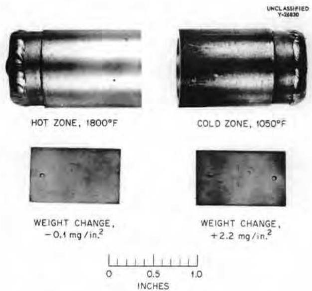  
(Commmnol with caption)

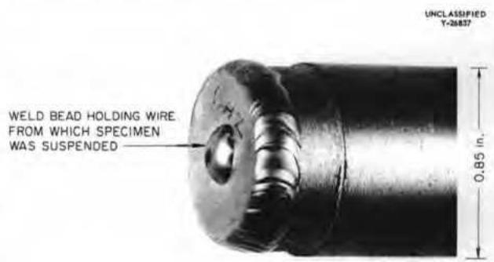  
Fig. 1.2.7. Enlargement of Hot-Zone End of Molybdenum Capsule From Test SS-526. Welding operations were performed in an inert-atmosphere chamber. This section of the test capsule was at $1800^{\circ}$ F for 500 hr. (with caption)

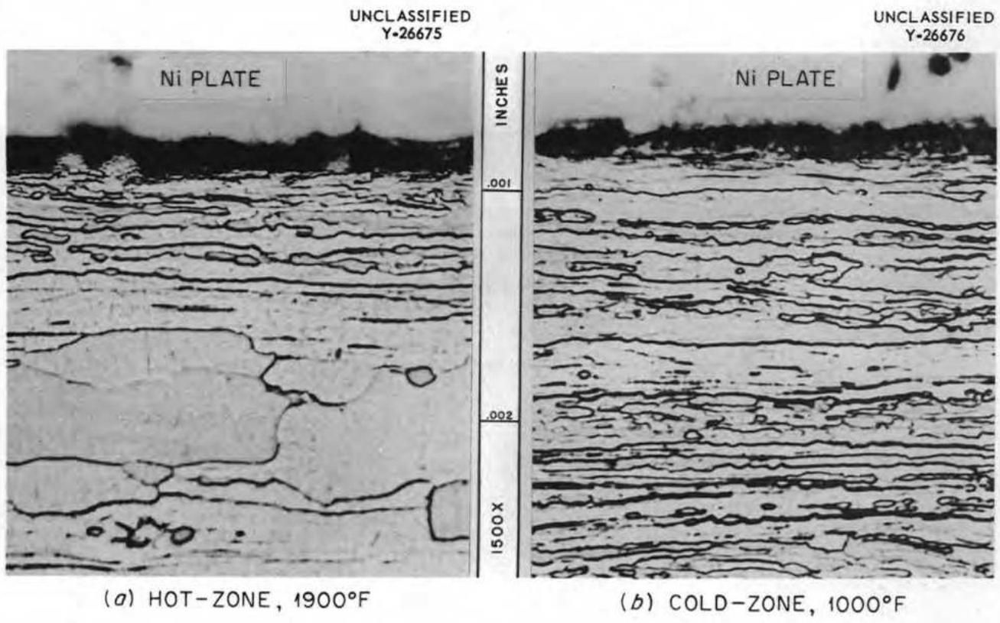  
Fig. 1.2.8. Molybdenum Specimens from Seesaw-Furnace Test SS-522. Etchant: $50\%$ $\mathsf{NH}_4\mathsf{OH} - 50\%$ $\mathsf{H}_2\mathsf{O}_2$ . Specimens nickel plated to preserve edges during metallographic polishing. (contantnl with caption)

# BERYLLIUM EXPOSED TO LITHIUM

E.E.Hoffman

In previous corrosion tests a beryllium specimen in an iron capsule exposed to lithium at $1830^{\circ}\mathrm{F}$ for 400 hr showed extensive attack and large weight losses. Tests have recently been conducted in iron capsules and in all beryllium systems, and the results are compared in Table 1.2.8. In the recent tests, as in the earlier test, the specimen tested in an iron capsule at $1830^{\circ}\mathrm{F}$ suffered extensive solution attack as a result of dissimilar metal mass transfer of beryllium from the specimen to the capsule wall. The beryllium in an all beryllium system showed very good corrosion resistance to static lithium at elevated temperatures.

The serious effect of dissimilar metal mass transfer on the corrosion resistance of the beryllium is

illustrated in Fig. 1.2.9. The rectangular shape of the beryllium specimen was altered appreciably in the test conducted in an iron capsule. The slight weight gains of the beryllium specimens tested in beryllium containers are probably due to getting of impurities such as oxygen and nitrogen from the lithium. The surfaces of the beryllium specimens tested recently at $1830^{\circ}\mathrm{F}$ are shown in Fig. 1.2.10. Considerably more porosity and surface roughening is apparent on the specimen tested in an iron container than on the specimen tested in a beryllium container.

Some indication of the extent of dissimilar metal mass transfer is illustrated in Fig. 1.2.11. The $\mathrm{Be}_2\mathrm{Fe}$ intermetallic compound on the surface was identified by x-ray analysis. This phase has a hexagonal structure, and its anisotropy is apparent in the photomicrograph taken with polarized light (Fig. 1.2.11b).

Table 1.2.8. Corrosion of Beryllium Specimens by Lithium in Static Tests   

<table><tr><td rowspan="2">Temperature (°F)</td><td rowspan="2">Time (hr)</td><td rowspan="2">Container</td><td rowspan="2">Specimen Weight Change (mg/cm2)</td><td colspan="2">Attack (mils)</td></tr><tr><td>Intergranular</td><td>Solution</td></tr><tr><td>1830*</td><td>400</td><td>Iron</td><td>-101.8</td><td>127</td><td>30</td></tr><tr><td>1500</td><td>100</td><td>Iron</td><td>-3.9</td><td>4</td><td>0</td></tr><tr><td>1500</td><td>100</td><td>Beryllium</td><td>+0.3</td><td>2</td><td>0</td></tr><tr><td>1830</td><td>100</td><td>Iron</td><td>-66.1</td><td>5</td><td>20</td></tr><tr><td>1830</td><td>100</td><td>Beryllium</td><td>+0.3</td><td>3</td><td>0</td></tr></table>

*Previous test, ref 3.

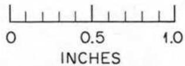  
UNCLASSIFIED Y-26285

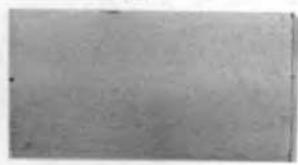  
BEFORE TEST

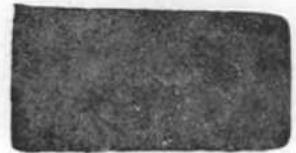  
TESTED IN Fe CAPSULE WEIGHT CHANGE, -66.1 mg/cm²

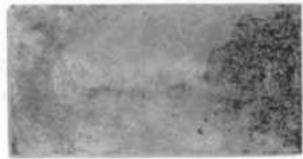  
TESTED IN Be CAPSULE WEIGHT CHANGE, $+0.3\mathrm{mg / cm}^2$

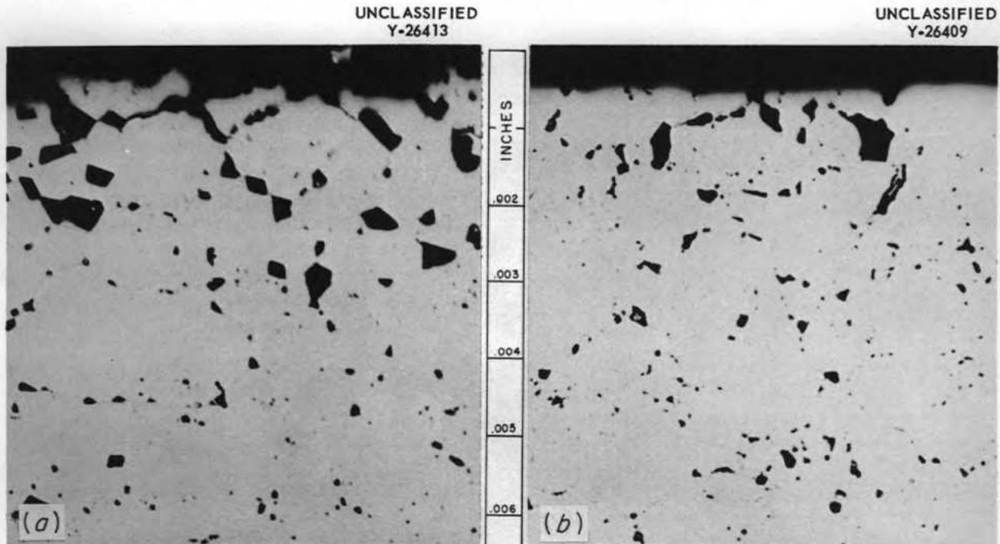  
Fig. 1.2.9. Effect of the Exposure of Beryllium to Static Lithium for 100 hr at $1830^{\circ}\mathrm{F}$ . (with caption)   
Fig. 1.2.10. Surfaces of Beryllium Specimens Shown in Fig. 1.2.9 Which Had Been Exposed to Static Lithium for $100\mathrm{hr}$ at $1830^{\circ}\mathrm{F}$ . (a) Tested in an iron capsule. (b) Tested in a beryllium capsule. As-polished. 500X. (with caption)

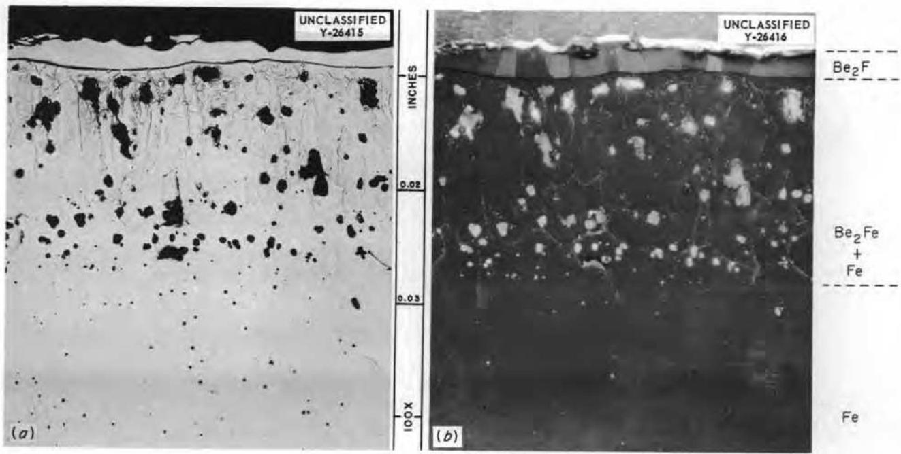  
Fig. 1.2.11. Wall of Armco Iron Capsule in Which a Beryllium Specimen Was Tested in Contact with Static Lithium for 100 hr at $1830^{\circ}$ F. Note dissimilar metal mass transfer of beryllium to capsule wall. As-polished. (a) Bright field Illumination. (b) Polarized light illumination. (c) with caption

# REFRACTORY-METAL-BASE BRAZING ALLOYS EXPOSED TO LITHIUM

D.H.Jansen

Most commercially available brazing alloys contain constituents used to alter the melting point, lower the flow point, increase flowability, or improve the ductility of the alloy. These constituents include the precious metals, copper, and manganese, to mention a few. The additives are beneficial for their specific purposes, but they may produce alloys that possess limited corrosion resistance to the liquid metals, especially lithium. A typical example, a $60\%$ Mn-40% Ni brazing alloy which failed completely when exposed to lithium for 100 hr at $1500^{\circ}\mathrm{F}$ , is shown in Fig. 1.2.12. Analyses of microdrillings from the remaining alloy fillet indicate that the manganese was attacked to the same extent as the nickel. Another example, an $86\%$ Fe-5% Si-5% Cu-4% B brazing alloy on a type 347 stainless steel tube-to-header joint which was tested in lithium in a seesaw-furnace apparatus for 100 hr at $1500^{\circ}\mathrm{F}$ , is shown in Fig. 1.2.13. The copper concentration of the lithium bath after this test was very high.

As a result of the poor corrosion resistance of the alloys described above, refractory-metal-based

brazing alloys are being investigated for use in high-temperature lithium systems. Columbium tubing $(1/2$ in. OD) has been used for capsules in tests in which small $(5\mathrm{g})$ brazing alloy samples (buttons) have been corrosion tested in static lithium at $1700^{\circ}\mathrm{F}$ . Conventional methods for loading and testing the brazing alloys were used.

The corrosion testing program on these refractory-metal-base alloys has involved, initially, static tests of zirconium- and titanium-base binary and ternary alloy buttons. The alloys which appear promising with respect to corrosion resistance will be used as a basis for developing other alloys with lower flow points or better flow characteristics. (Melting-point and flow-point determinations and flow-characteristic studies are being made by the Welding and Brazing Group, see Chap. 1.3.) The more promising alloys will then be used for brazing molybdenum or columbium T-joints which will be given more severe corrosion tests (seesaw-furnace tests or tests in thermal-convection loops with brazed sections in the hot legs).

The results for all the refractory-metal-base alloys corrosion tested in lithium to date are presented in Table 1.2.9. The alloy button containing vanadium $(70\% \mathrm{Zr - }30\% \mathrm{V})$ exhibited the

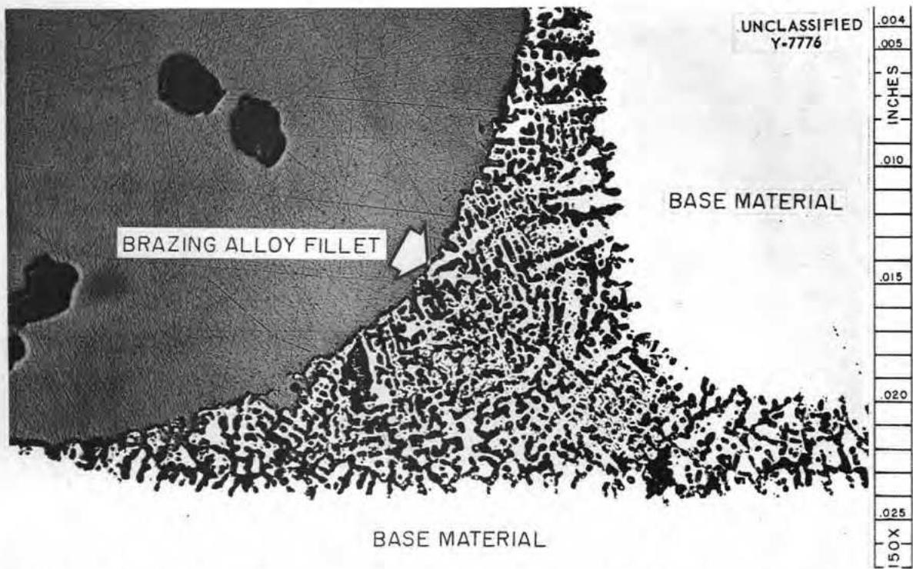  
Fig. 1.2.12. A $60\%$ Mn- $40\%$ Ni Brazing Alloy on a Type 316 Stainless Steel T-Joint After Exposure to Static Lithium for 100 hr at $1500^{\circ}$ F. Complete penetration of the brazing alloy is evident. Unetched. 150X. (with caption)

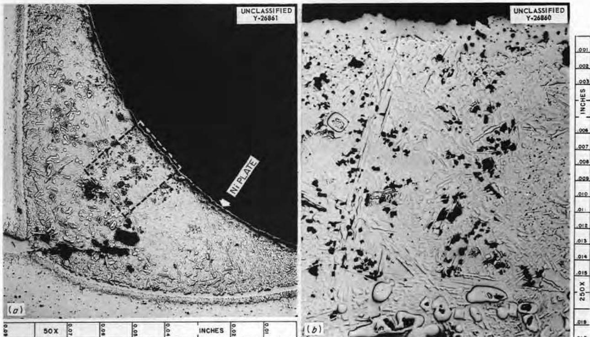  
Fig. 1.2.13. (a) An $86\%$ Fe- $5\%$ Cu- $5\%$ Si- $4\%$ B Brazing Alloy on Type 347 Stainless Steel Tube-to-Header Joint After 100 hr of Exposure to Lithium in a Seesaw-Furnace Apparatus at a Hot-Zone Temperature of $1500^{\circ}\mathrm{F}$ . (b) Enlargement of Area Enclosed by Dotted Lines in (a). Unetched. 50X, 250X. Reduced $28\%$ . with caption)

Table 1.2.9. Results of Static Corrosion Tests on Refractory-Metal-Base Arc-Cast Brazing Alloy Buttons Exposed to Lithium in Columbium Capsules at 1500 or $1700^{\circ}$ F for 500 hr   

<table><tr><td>Braze Material Composition (wt %)</td><td>Test Temperature (°F)</td><td>Weight Change* (%)</td><td>Metallographic Results and General Condition of Button After Test</td></tr><tr><td>95 Zr-5 Be</td><td>1700</td><td>+0.005 -0.05</td><td>Subsurface void formation to a depth of less than 0.5 mil</td></tr><tr><td>84 Zr-16 Fe</td><td>1500</td><td>-0.573 -0.62</td><td>No attack; numerous small cracks in specimen</td></tr><tr><td>82 Zr-18 Cr</td><td>1700</td><td>-1.81</td><td>No attack observed</td></tr><tr><td>75 Zr-25Cb</td><td>1700</td><td>-0.227 -0.11</td><td>No attack observed</td></tr><tr><td>75 Zr-15 Cr-10 Fe</td><td>1500</td><td>-2.5 -1.7</td><td>Edge of specimen attacked nonuniformly to a depth of 1 mil</td></tr><tr><td>70 Zr-30 V</td><td>1700</td><td>-10.87 -2.04</td><td>Second phase leached to a depth of 9 mils</td></tr><tr><td>69 Zr-31 Mo</td><td>1700</td><td>-1.34 -1.30</td><td>No attack observed</td></tr><tr><td>80 Co-20Cb</td><td>1700</td><td>-2.6</td><td>Specimen uniformly depleted to a depth of 0.5 mil; spotty attack found that varied from 0 to 10 mils</td></tr><tr><td>55 Ti-45Zr</td><td>1700</td><td>-0.063 +0.079</td><td>No attack observed</td></tr><tr><td>72 Ti-28 Co on Cb T-joint</td><td></td><td></td><td>Spotty attack to less than 1 mil in depth</td></tr></table>

*Each weight change is the result of one test; the buttons weighed approximately 5 g.

most weight change during the test. The microstructure of the edge of the alloy before and after the test is shown in Fig. 1.2.14. Both vanadium and zirconium had previously exhibited good corrosion resistance to lithium, and a microspark traverse on the as-tested $70\%$ Zr-30% V alloy button showed essentially no alteration of composition from the edge into the interior of the alloy. It appears therefore that the zirconium and vanadium may both have gone to the columbium capsule by a process of dissimilar metal mass transfer. This particular test is being repeated to determine whether the large weight loss is due to mass transfer.

The only alloys that showed severe corrosion attack were the $75\%$ Zr-15% Cr-10% Fe and the 80% Co-20% Cb (Fig. 1.2.15) alloys. Attack on these alloys was quite spotty and nonuniform. The inhomogeneity of the alloy buttons, which may be the cause of nonuniform attack, is being studied.

Previous static tests on pure cobalt in lithium under slightly more severe conditions (1832°F for 447 hr) showed intergranular attack and a weight loss of $7\%$ (0.7 g/in.²). Consequently, the attack seen on the $80\%$ Co-20%Cb alloy (Fig.1.2.15) is understandable, in view of the high cobalt content of the button.

Titanium-base brazing alloys in button form and in the form of braze fillets on columbium T-joints were tested and the results are being evaluated at present. One titanium-base alloy (72% Ti-28% Co) on a columbium T-joint tested in $1700^{\circ}\mathrm{F}$ lithium for 100 hr showed approximately 1 mil of nonuniform attack on the exposed surface (Fig. 1.2.16).

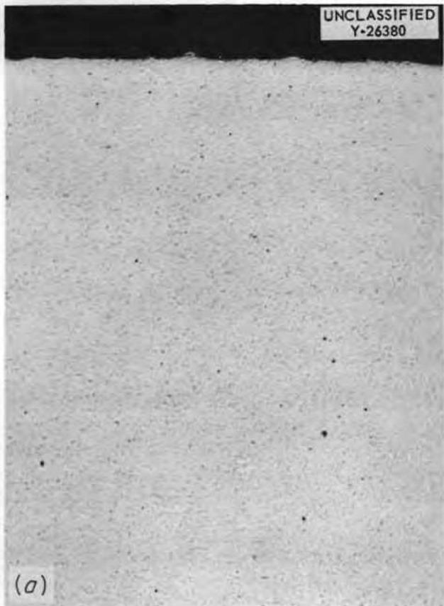

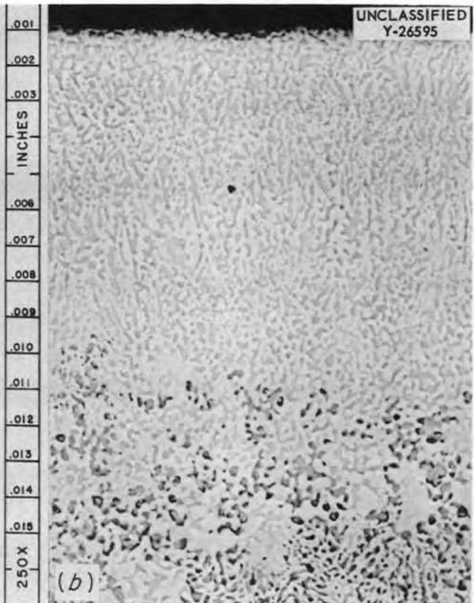

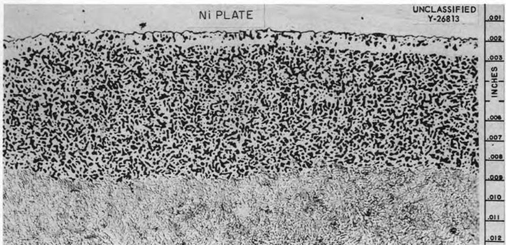  
Fig. 1.2.14. Alloy Button of $70\%$ Zr-30% V, (a) Before and (b) After a Static Corrosion Test in Lithium at $1700^{\circ}\mathrm{F}$ for 500 hr. Note depletion of the second phase to a depth of 10 mils. 250X. (with caption)   
Fig. 1.2.15. An $80\%$ Co- $20\%$ Cb Alloy Button After Exposure to Static Lithium for 500 hr at $1700^{\circ}$ F. The attack shown at the exposed edge was nonuniform and varied from 0 to 10 mils. Unetched. 250X. (with caption)

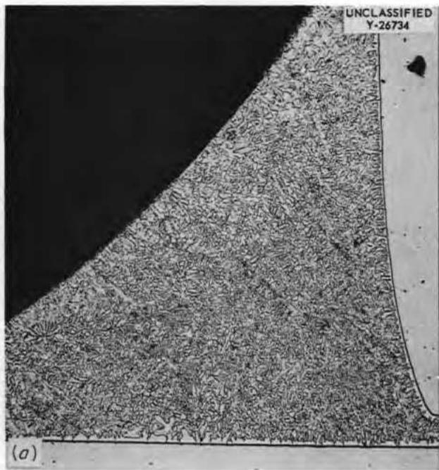

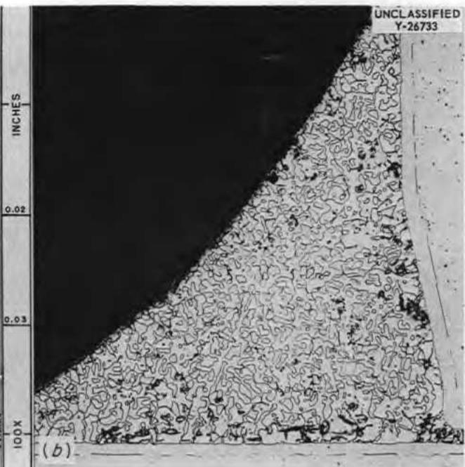  
Fig. 1.2.16. A $72\%$ Ti- $28\%$ Co Brazing Alloy (a) Before and (b) After Testing in Static Lithium at $1700^{\circ}\mathrm{F}$ for 100 hr. Dark areas at the braze and base material interface are microcracks. Corrosion of the exposed edge is limited to intermittent attack to a minimum depth of 1 mil. Etchant: $46\mathrm{H}_2\mathrm{O}$ , $46\mathrm{HNO}_3$ , 8 HF. Reduced $21\%$ .

No attack of the type observed on the $80\%$ Co- $20\%$ Cb alloy button was seen on this $28\%$ Co alloy on a T-joint. Attack may be seen at only a few, scattered places along the surface of the fillet. The results of this test, as compared with those for the alloy button containing $80\%$ Co, indicate that corrosion resistance is decreased when large percentages $(80\%)$ of cobalt are used.

# DETERMINATION OF THE SOLUTION RATE OF METALS IN LITHIUM

E.E.Hoffman

A method was developed at NDA for measuring the rate at which container metals dissolve in liquid lithium under controlled nonequilibrium conditions. The method consists essentially of immersing a thin test specimen into a comparatively large volume of liquid metal held at the desired temperature in an inert container. With suitable choices of surface area and immersion time, the

test specimen can be made to lose about 1 mg of weight in a test period of less than one day. This weight loss does not significantly increase the concentration of test specimen material in the liquid metal, but the loss can be determined with ample accuracy and precision on a semimicro balance.

The solution rates determined in this manner are proportional to the specific solution rate constant, $\alpha$ . Based on experimental evidence from thermal-convection loop tests, it is believed that inhibitors and impurities exert their effect on mass transfer rates by altering the specific solution rate constant. Therefore, this method is suitable for preliminary studies of the effects of additives and impurities on mass transfer.

The data from tests on stainless steel indicate that variables can be detected which affect the initial solution rate by as much as $\pm 20\%$ . The results indicate that nickel-bearing stainless steel dissolves in lithium at $1600^{\circ}\mathrm{F}$ at an initially high rate of $3.0\mathrm{mg / in.}^{2}$ hr because of the preferential leaching of nickel. Within a relatively few hours, depletion of nickel in the specimen surfaces results in a rapid decrease in the solution rate to a

value of about $0.3\mathrm{mg / in.}^2$ -hr at solute concentrations of a few hundred parts per million. It was shown that this solution rate accounts for the mass transfer rates observed in thermal-convection loop tests. The solution rate tests confirm the deleterious effects of nitrogen and oxygen and the beneficial effects of aluminum additions on mass transfer rates that were observed in thermal-con

vection loop tests. In addition, it appears that Misch metal and tantalum additions may have beneficial effects.

Solution rate studies of molybdenum in lithium at $1600^{\circ}\mathrm{F}$ indicate that this material is not significantly attacked by lithium. Tests on niobium yielded conflicting results which have not been resolved.

# 1.3. WELDING AND BRAZING

P. Patriarca

# DEVELOPMENT OF BRAZING ALLOYS FOR LITHIUM SERVICE

R. G. Gilliland

G. M. Slaughter

Refractory-metal-base brazing alloys are being developed for application in high-temperature reactors that use lithium as a coolant. As a starting point, a literature survey was made of the binary systems of columbium, zirconium, titanium, tantalum, and molybdenum in order to find eutectics or minimums in the approximate temperature range of interest. The data obtained for columbium and zirconium were presented previously, and data for titanium, molybdenum, and tantalum are summarized in Tables 1.3.1, 1.3.2, and 1.3.3. Small buttons of approximately fifty binary or ternary alloys of interest have been prepared for testing by arc melting, and results of tests of a number of these alloys in lithium are presented in Chap. 1.2, Corrosion.

A vacuum-tube furnace that has been modified for ultra-high-temperature work is being used for preparing brazed joint specimens for testing. The furnace and the quartz muffle for use at temperatures up to $1200^{\circ}\mathrm{C}$ are shown in Fig. 1.3.1. A ceramic muffle made primarily of zirconium oxide is available for use at $1350^{\circ}\mathrm{C}$ . Vacuums of less than $1\mu$ are consistently obtained.

A number of the arc-melted alloys have been tested for flowability at various temperatures by using the T-joint sample design with both columbium and molybdenum as base metals. Flow points were obtained from these tests, and metallographic examinations of the resulting joints were conducted. The flow points and general brazing characteristics of the several alloys tested thus far are presented in Table 1.3.4.

The brittleness of the brazing alloy in the as-brazed condition is an important problem in this study, as may be seen in Fig. 1.3.2, which shows a brazed molybdenum T-joint that contains numerous fillet cracks. The brazing alloy used was $84 \text{wt} \%$ Zr and $16 \text{wt} \%$ Fe. In comparison, the molybdenum T-joint brazed with an alloy containing $70 \text{wt} \%$ Zr and $30 \text{wt} \%$ V, shown in Fig. 1.3.3, is considered to be satisfactory.

A study of the diffusion of brazing alloys on refractory metals has been initiated. Lap joints made from columbium, and possibly molybdenum, brazed with the different alloys will be used in the study, and particular attention will be paid to brazing alloys containing refractory metals. The joints will be aged just below, at, and just above

Table 1.3.1. Titanium Binary Systems of Potential Interest As Brazing Alloys   

<table><tr><td rowspan="2">System</td><td colspan="2">Eutectics or Minimums*</td></tr><tr><td>Composition (wt %)</td><td>Melting Point (°F)</td></tr><tr><td>Ti</td><td></td><td>3035</td></tr><tr><td>Ti-Ag</td><td>96 Ag, eutectic</td><td>1650</td></tr><tr><td rowspan="2">Ti-Au</td><td>15 Au, eutectic</td><td>1530</td></tr><tr><td>82 Au, eutectic</td><td>2345</td></tr><tr><td rowspan="2">Ti-Be</td><td>3 Be, eutectic</td><td>1750</td></tr><tr><td>90 Be, eutectic</td><td>2300</td></tr><tr><td>Ti-Cr</td><td>47 Cr, minimum</td><td>2550</td></tr><tr><td rowspan="2">Ti-Co</td><td>28 Co, eutectic</td><td>1870</td></tr><tr><td>81 Co, eutectic</td><td>2075</td></tr><tr><td rowspan="2">Ti-Cu</td><td>50 Cu, eutectic</td><td>1740</td></tr><tr><td>70 Cu, eutectic</td><td>1600</td></tr><tr><td>Ti-Ge</td><td>19 Ge, eutectic</td><td>2570</td></tr><tr><td rowspan="2">Ti-Fe</td><td>31 Fe, eutectic</td><td>1985</td></tr><tr><td>85 Fe, eutectic</td><td>2415</td></tr><tr><td>Ti-Pb</td><td>26 Pb, eutectic</td><td>2250</td></tr><tr><td>Ti-Mn</td><td>42 Mn, eutectic</td><td>2150</td></tr><tr><td rowspan="3">Ti-Ni</td><td>28 Ni, eutectic</td><td>1750</td></tr><tr><td>65 Ni, eutectic</td><td>2030</td></tr><tr><td>83.8 Ni, eutectic</td><td>2350</td></tr><tr><td rowspan="3">Ti-Si</td><td>9 Si, eutectic</td><td>2430</td></tr><tr><td>51 Si, eutectic</td><td>2700</td></tr><tr><td>78 Si, eutectic</td><td>2430</td></tr><tr><td>Ti-V</td><td>30 V, minimum</td><td>2950</td></tr><tr><td>Ti-Zr</td><td>50 Zr, minimum</td><td>2900</td></tr><tr><td>Ti-Th</td><td>88 Th, eutectic</td><td>2200</td></tr></table>

Table 1.3.2. Molybdenum Binary Systems of Potential Interest As Brazing Alloys   

<table><tr><td rowspan="2">System</td><td colspan="2">Eutectics or Minimums*</td></tr><tr><td>Composition (wt %)</td><td>Melting Point (°F)</td></tr><tr><td>Mo</td><td></td><td>4800</td></tr><tr><td>Mo-Ni</td><td>47 Ni, eutectic</td><td>2400</td></tr><tr><td>Mo-Co</td><td>62 Co, eutectic</td><td>2444</td></tr><tr><td>Mo-Si</td><td>12 Si, eutectic</td><td>2600</td></tr><tr><td>Mo-Al</td><td>22 Al, eutectic</td><td>4200</td></tr><tr><td>Mo-B</td><td>1 B, eutectic</td><td>3540</td></tr><tr><td>Mo-Fe</td><td>65 Fe, eutectic</td><td>2624</td></tr><tr><td>Mo-Mn</td><td>99 Mn, eutectic</td><td>2191</td></tr><tr><td>Mo-Cb</td><td>53Cb, eutectic</td><td>2400</td></tr></table>

*M. Hansen, Constitution of Binary Alloys, McGraw-Hill, New York, 1958.

Table 1.3.3. Tantalum Binary Systems of Potential Interest As Brazing Alloys   

<table><tr><td rowspan="2">System</td><td colspan="2">Eutectics or Minimums*</td></tr><tr><td>Composition (wt %)</td><td>Melting Point (°F)</td></tr><tr><td>Ta</td><td></td><td>5425</td></tr><tr><td>Ta-Co</td><td>67.6 Co, eutectic</td><td>2325</td></tr><tr><td>Ta-Si</td><td>94 Si, eutectic</td><td>2525</td></tr><tr><td>Ta-Fe</td><td>80 Fe, eutectic</td><td>2570</td></tr><tr><td>Ta-Ni</td><td>62 Ni, eutectic</td><td>2480</td></tr><tr><td></td><td>39 Ni, eutectic</td><td>2552</td></tr></table>

*M. Hansen, Constitution of Binary Alloys, McGraw-Hill, New York, 1958.

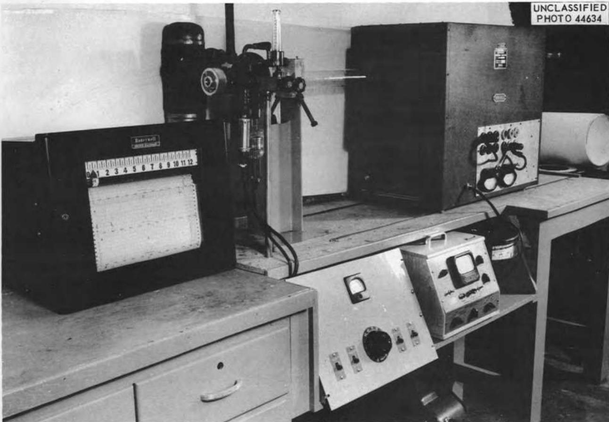  
Fig. 1.3.1. Vacuum Tube Furnace and Quartz Muffle for Refractory-Metal Brazing Alloy Studies. The furnace is mounted on a track to permit rapid heating and cooling of the test sample.

Table 1.3.4. Data Obtained in Refractory-Metal-Base Brazing Alloy Study   

<table><tr><td rowspan="2">Brazing Alloy Composition (wt %)</td><td rowspan="2">Flow Point (°C)</td><td colspan="2">Flowability</td><td colspan="2">Metallographic Observations of Joints</td></tr><tr><td>Brazed on Cb</td><td>Brazed on Mo</td><td>Brazed on Cb</td><td>Brazed on Mo</td></tr><tr><td>84 Zr-16 Fe</td><td>934a</td><td>Goodb</td><td>Good</td><td>Severe cracks</td><td>Severe cracks</td></tr><tr><td>65 Zr-25 V-10 Fe</td><td>&gt;1300</td><td></td><td></td><td></td><td></td></tr><tr><td>75 Zr-15 Cr-10 Fe</td><td>&gt;1300</td><td>Good</td><td>Poorc</td><td>Severe cracks</td><td></td></tr><tr><td>82 Zr-18 Cr</td><td>1300a</td><td>Good</td><td>Good</td><td>Severe cracks</td><td>No cracks</td></tr><tr><td>65 Zr-25 V-10 Ge</td><td>~1300</td><td>Faird</td><td>Good</td><td>Severe cracks</td><td>No cracks</td></tr><tr><td>67 Zr-29 V-4 Cr</td><td>&gt;1300</td><td></td><td></td><td></td><td></td></tr><tr><td>63 Zr-27 V-10 Cr</td><td>&gt;1200</td><td></td><td></td><td></td><td></td></tr><tr><td>60 Zr-26 V-14 Cr</td><td>&gt;1200</td><td></td><td></td><td></td><td></td></tr><tr><td>57 Zr-24 V-19 Cr</td><td>&gt;1200</td><td></td><td></td><td></td><td></td></tr><tr><td>70 Zr-30 V</td><td>1230a</td><td>Good</td><td>Good</td><td>No cracks</td><td>No cracks</td></tr><tr><td>67 Zr-29 V-4 Fe</td><td>1300</td><td>Good</td><td>Good</td><td></td><td></td></tr><tr><td>65 Zr-28 V-7 Fe</td><td>&gt;1200</td><td></td><td></td><td></td><td></td></tr><tr><td>60 Zr-26 V-14 Fe</td><td>&gt;1200</td><td></td><td></td><td></td><td></td></tr><tr><td>63 Zr-27 V-10 Fe</td><td>&gt;1300</td><td></td><td></td><td></td><td></td></tr><tr><td>50 Zr-21 V-29 Mo</td><td>&gt;1300</td><td></td><td></td><td></td><td></td></tr><tr><td>57 Zr-24 V-19 Mo</td><td>&gt;1200</td><td></td><td></td><td></td><td></td></tr><tr><td>63 Zr-27 V-10 Mo</td><td>&gt;1200</td><td></td><td></td><td></td><td></td></tr><tr><td>60 Zr-25 V-15 Cb</td><td>1300</td><td>Good</td><td>Good</td><td>No cracks</td><td>No cracks</td></tr><tr><td>69 Ti-31 Fe</td><td>1085a</td><td>Good</td><td>Good</td><td>Slight cracks</td><td>Severe cracks</td></tr><tr><td>72 Ti-28 Co</td><td>1025a</td><td>Good</td><td>Good</td><td>Na cracks</td><td>No cracks</td></tr></table>

$^{a}$ M. Honsen, Constitution of Binary Alloys, McGraw-Hill, New York, 1958.   
Good indicates continuous filleting and extensive spreading on joint.   
Poor indicates wetting only at contact points.   
${}^{d}$ Fair indicates intermittent filleting and little spreading on joint.

the brazing temperature. After 8- and 100-hr aging periods the specimens will be examined to determine the extent of diffusion of the brazing alloy elements into the base metal or alloying of the base metal with the brazing alloy. If such diffusion or alloying occurs, it is hoped that it will increase the remelt temperature of the brazing alloy and thus increase the maximum service temperature attainable.

# WELDING STUDIES OF COLUMBIUM AND MOLYBDENUM

R. L. Heestand

A small, glass dry box containing a stationary torch and a movable table was assembled, as shown in Fig. 1.3.4, with vacuum equipment capable of maintaining vacuums as low as $4 \times 10^{-5} \mathrm{mmHg}$ , for

#

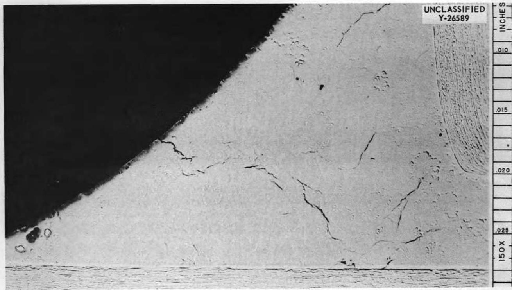  
Fig. 1.3.2. As-Brazed Molybdenum T-Joint Brazed with an Alloy Containing 84 wt % Zr and 16 wt % Fe. The joint contains numerous fillet cracks. As-polished. 150X. (with caption)

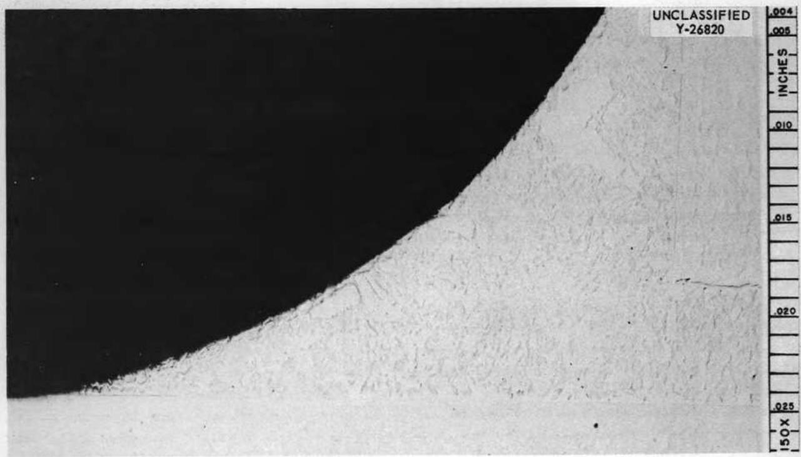  
Fig. 1.3.3. Molybdenum T-Joint Brazed with an Alloy Containing 70 wt % Zr and 30 wt % V. As-polished. 50X.

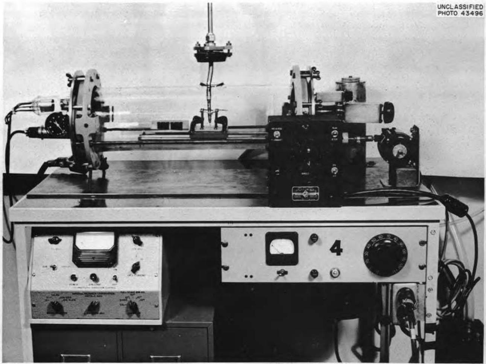  
Fig. 1.3.4. Welding Dry Box with Stationary Torch and Movable Table.

welding studies of columbium and molybdenum. The equipment was designed to make both fusion welds (no filler metal addition) and welds with filler metal, and it can be used for the evaluation of the weldability of refractory metals and their alloys in controlled atmospheres. The setup for preparing edge-fusion and butt joints in the controlled atmosphere chamber is shown in Fig. 1.3.5.

Several typical butt welds made on arc-cast columbium sheet in the automatic welding dry box in a purified argon atmosphere are shown in Fig. 1.3.6. Free-bend tests at room temperature showed

samples of all these welds to be ductile. Metallographic studies of the samples are under way.

Five different heats of arc-cast molybdenum sheet for use in welding studies were analyzed for carbon, nitrogen, and oxygen. Samples of the 0.040-in.-thick sheet were then welded in the dry box described above and machined into bend specimens. The bend specimens are being tested to determine the effect of the contaminants on the ductile-brittle transition temperature of material from each heat. All specimens tested thus far have been found to be brittle at room temperature.

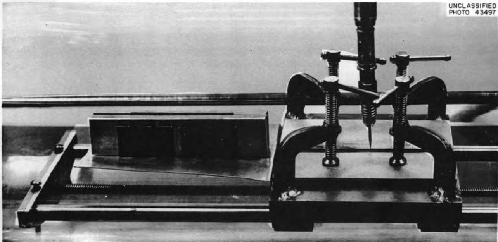  
Fig. 1.3.5. Close-Up of Dry Box Equipment Showing Setup for Preparing Edge-Fusion and Butt Joints.   
UNCLASSIFIED Y-26115

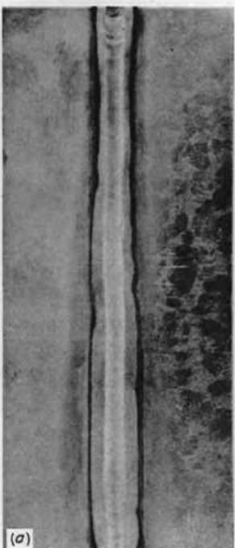

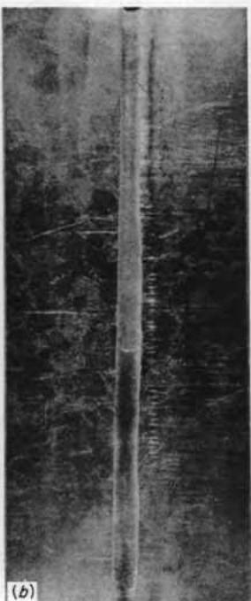

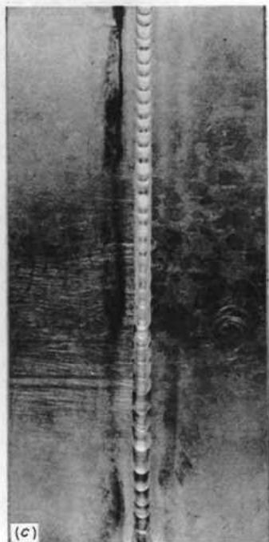

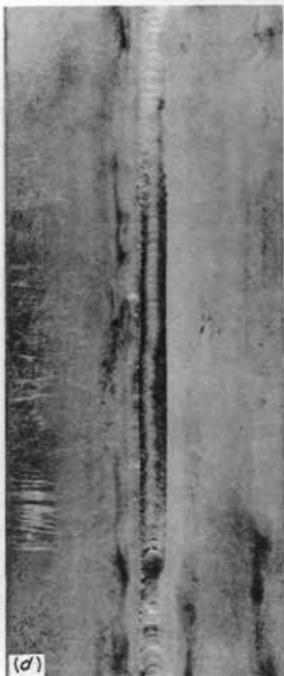

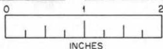  
Fig. 1.3.6. Butt Welds in Columbium Sheet Made with (a) the Addition of 85 wt % Zr-15 wt % Cb Filler Wire, (b) the Addition of 82 wt % Zr-15 wt % Cb-3 wt % Mo Filler Wire, (c) the Addition of 100 wt % Cb Filler Wire, and (d) Without Filler Wire.

# 1.4. MECHANICAL PROPERTIES

D.A.Douglas

The selection of structural materials capable of withstanding service loads at the high temperatures at which reactors for the propulsion of aircraft will operate has necessitated determinations of the basic strength properties of new materials and the development of accurate and precise analytical procedures for the evaluation of materials. Equipment is now available which permits the rapid testing of materials in controlled environments at temperatures up to $2500^{\circ}\mathrm{F}$ . Means for obtaining quantitative design information on the behavior of metals under complex states of stress and strain have been studied, and it has been found that experimental creep data are in substantial agreement with the results of calculations based on accepted theories of creep and fracture.

# DEVELOPMENT OF TEST EQUIPMENT FOR HIGH-TEMPERATURE INVESTIGATIONS

D. A. Douglas

In the development of equipment for studying the mechanical properties of both metals and nonmetals in the temperature range from 1800 to $3000^{\circ}\mathrm{F}$ , it was necessary to provide control of the test environment, which would be gas or a vacuum, to provide control of the temperature gradient and the temperature fluctuation comparable to that provided

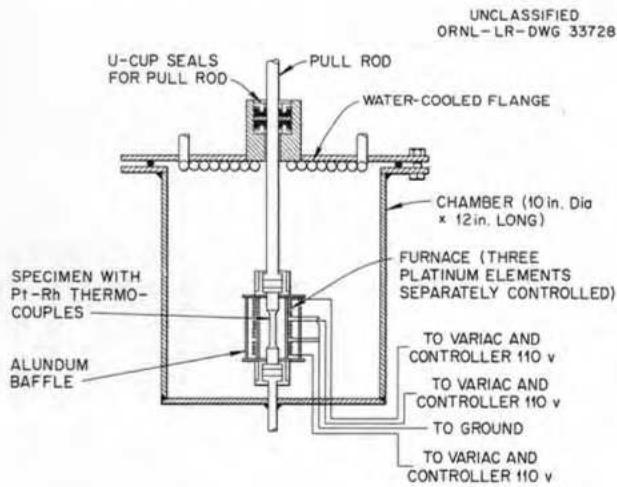  
Fig. 1.4.1. Diagram of an Apparatus for Creep and Tensile Tests in Controlled Environments at $2000^{\circ}$ F and Above.

for conventional creep and tensile tests, to assure accurate strain and load measurements, and to keep the design simple and compact so that specimens could be tested quickly. A schematic diagram of the apparatus designed within this framework is shown in Fig. 1.4.1, and a photograph of the parts ready for assembly is shown in Fig. 1.4.2. The use of U-cup O-rings as sliding seals simplifies the application of the load and accommodates the usual displacement in the tensile and creep tests.

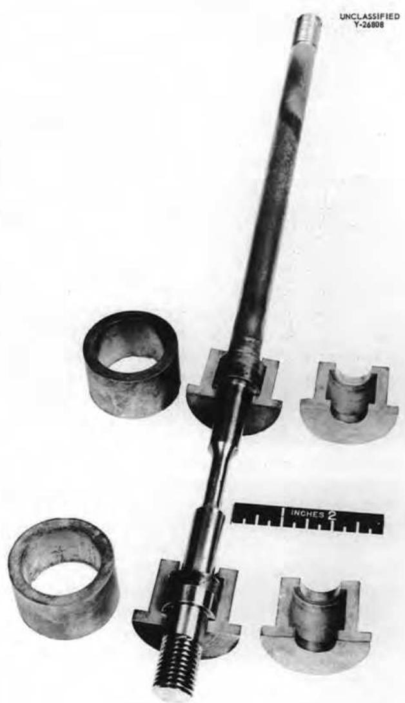  
Fig. 1.4.2. Specimen, Pull Rods, and Grips Used in Apparatus Shown in Fig. 1.4.1.

The furnace element currently being used in the apparatus is platinum, but molybdenum or tungsten could be used for operation at higher temperatures. The three elements of the furnace are separately controlled by Variacs, and temperature deviations along the gage length can be held to $\pm 5^{\circ}F$ .

High-purity argon has been used as the test environment for all of the tests conducted to date. The apparatus is amenable to evacuation, but the increased time and trouble involved in vacuum tests make high-purity inert gases more desirable as test environments. The reliability of the apparatus has been checked in three tests on molybdenum specimens at $2000^{\circ}\mathrm{F}$ , and the results indicate that a suitable device has been achieved.

# MULTIAXIAL CREEP STUDIES

# C. R. Kennedy

Analytical studies have been made of creep data obtained for Inconel tubular specimens in tests in which internal pressure, as well as axial loading, was applied in the apparatus described previously. The internal pressure required to produce a given tangential stress was calculated by using the thin-wall formula. The axial stress was calculated conventionally, with the axial stress produced by the internal pressure being taken into consideration. The average radial stress was obtained by dividing the internal pressure by 2. After-test measurements of the tube dimensions were made to determine the three principal strains at rupture. In those cases where end effects or bulging occurred, tangential strains measured at regions of highly localized deformation could not be compared directly with the over-all axial rupture strain in connection with subsequent data analysis. It was necessary, therefore, to use average tangential strains for this purpose. These were obtained by averaging five measurements of the tangential strain taken at equidistant positions along the $2\frac{1}{2}$ -in.-gage length. An observation that the sum of the three measured average strains often was greater than zero suggested an increase in volume during the test. Since a volume change is inconsistent with the assumptions used in the mathematical analysis of creep flow and fracture, this matter was investigated by

measuring the specific gravities of after-test specimens by using a Jolly balance. In these tests, observed density changes were found to be less than the sensitivity of the balance, and thus the apparent volume change based on after-test strain measurements was not real. The error was believed to be associated primarily with the radial strain measurements and was attributable to the inaccuracies inherent in measuring small changes in the sizes of small sections with curved surfaces. In the data analysis which follows, the "measured" radial strains at fracture were determined from axial and tangential strains based on constancy of volume.

# Creep Analysis

A workable formulation for steady-state creep is that of Soderberg, which is based upon the following assumptions: (1) the material is originally isotropic and remains isotropic during the creep process so that the stress effect on creep rates can be expressed in terms of the principal stresses; (2) the principal stresses coincide with the principal strain directions; (3) the volume remains constant so that hydrostatic pressure has no influence and the stress effect must therefore be a function only of the difference of the principal stresses (that is, shear stresses); (4) the stress state remains constant with time; and (5) the effective creep stress, $\overline{\sigma}$ , and the effective creep strain rate, $\frac{\dot{\varepsilon}}{\varepsilon}$ , for all stress states at a given temperature are related through the material constants $K$ and $n$ by the relation

$$
\dot {\overline {{\epsilon}}} = K \overline {{\sigma}} ^ {n}. \tag {1}
$$

According to this formulation, the principal steady-state creep rates are

$$
\begin{array}{l} \dot {\epsilon} _ {Z} = \frac {\dot {\overline {{\epsilon}}}}{\overline {{\sigma}}} \left(\sigma_ {Z} - \frac {\sigma_ {\theta} + \sigma_ {R}}{2}\right), \\ \dot {\epsilon} _ {\theta} = \frac {\dot {\bar {\epsilon}}}{\bar {\sigma}} \left(\sigma_ {\theta} - \frac {\sigma_ {Z} + \sigma_ {R}}{2}\right), \tag {2} \\ \dot {\epsilon} _ {R} \approx \frac {\dot {\bar {\epsilon}}}{\bar {\sigma}} \left(\sigma_ {R} - \frac {\sigma_ {Z} + \sigma_ {\theta}}{2}\right), \\ \end{array}
$$

where the subscripts $Z, \theta,$ and $R$ denote axial, tangential, and radial stress or strain rates, respectively. Based on the assumptions stated, only the principal stresses and the relation between creep stress and creep strain for simple tension are required in order to compute multiaxial creep rates according to Eq. 2. The value of $\overline{\sigma}$ depends on the flow criterion selected to correlate the data. Based on the von Mises (distortion energy) criterion, it is given by

$$
\begin{array}{l} \bar {\sigma} = \frac {1}{\sqrt {2}} \left[ (\sigma_ {Z} - \sigma_ {\theta}) ^ {2} + (\sigma_ {\theta} - \sigma_ {R}) ^ {2} + \right. \\ \left. + \left(\sigma_ {R} - \sigma_ {Z}\right) ^ {2} \right] ^ {1 / 2}, \\ \end{array}
$$

and, by the Tresca (maximum shear stress) criterion, it is given by

(4)

The effective creep strain rate, $\dot{\overline{\epsilon}}$ , is the creep strain rate associated with $\overline{\sigma}$ for a value of uniaxial stress equal to the calculated effective stress.

The design criterion based on creep rate in many applications is the time to reach a limiting strain. For the purpose of comparing experimental results with those predicted by Eq.2, the average creep rate to $2\%$ strain was used. In those cases where rupture occurred before $2\%$ axial strain had occurred, the average creep rate to one-half of the total strain was used.

Comparisons of the measured axial creep rates with those predicted from Eq. 2 by using both the von Mises and the Tresca criteria are shown in Figs. 1.4.3, 1.4.4, and 1.4.5. In general, the correlation of the experimental data obtained by using the von Mises criterion is slightly better than that obtained by using the Tresca criterion. In most design situations, however, the stresses are known only approximately, and, in view of the many indeterminate variables which influence creep, the simpler and more conservative Tresca criterion is clearly adequate for engineering purposes. The advantages of using the Tresca criterion for multi-axial creep have been demonstrated by Wahl3 for the case of rotating disks. According to Wahl, the use of the von Mises criterion predicted much lower creep rates than those obtained experimentally.

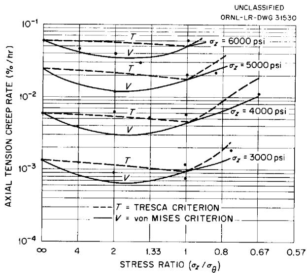  
Fig. 1.4.3. Axial Tension Creep Rates vs Stress Ratios for Four Principal Axial Stresses.

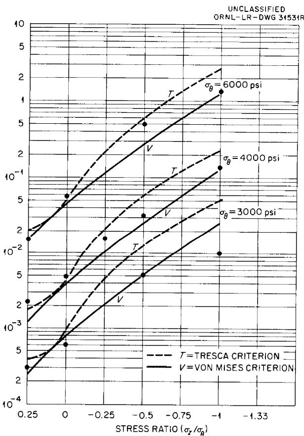  
Fig. 1.4.4. Axial Compression Creep Rates vs Stress Ratios for Three Tangential Stresses.

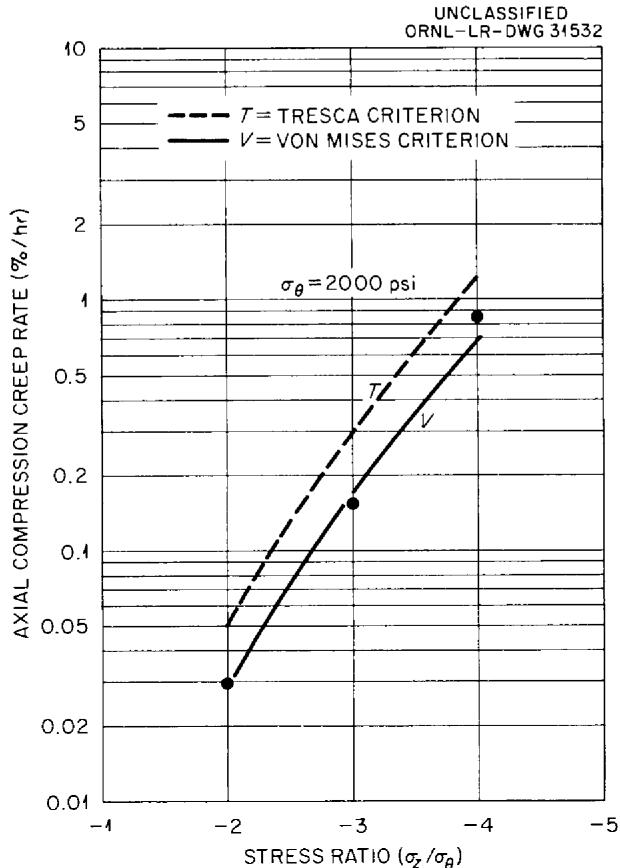  
Fig. 1.4.5. Axial Compression Creep Rates vs Stress Ratios for Stress Ratios of Less than -1 with a Constant 2000-psi Tangential Stress.

# Rupture Analysis

Rupture data are presented in Fig. 1.4.6 in which the stress ratios calculated by the thin-wall formula are plotted against the rupture life. The rupture data are also presented in the form of 100-, 500-, and 2000-hr isochronous fracture envelopes in Fig. 1.4.7. The envelopes were obtained from cross plots of the data shown in Fig. 1.4.6. The 100-hr fracture envelope predicted by the maximum principal tensile stress criterion is also plotted in Fig. 1.4.7.

It may be seen that the results calculated and plotted in the manner described show deviations from the simple maximum principal stress criterion. There are, however, at least two important factors which should be considered in a realistic analysis of the data. Both of these factors involve in some

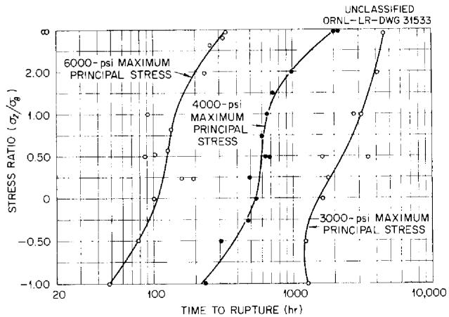  
Fig. 1.4.6. Rupture Times vs Stress Ratios for Three Average Maximum Principal Stresses.

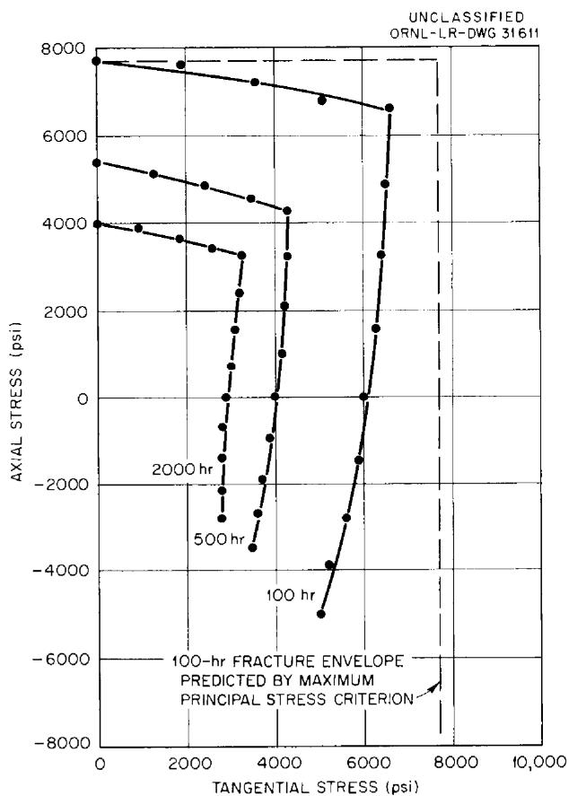  
Fig. 1.4.7. Rupture Data Presented as $100_{-}$ , $500_{-}$ , and $2000$ -hr Isochronous Fracture Envelopes.

manner the changes in stress state associated with deformation of axially loaded pressurized tubes. The first factor is concerned with the stress-state changes in uniformly deformed tubular specimens. For an equivalent amount of strain under these conditions, the increase in the axial stress is less than the increase in the tangential stress over the entire range of stress ratios studied. For example, after $10\%$ axial strain in a specimen tested in simple tension the "true" axial stress becomes 1.1 times as great as the original axial stress; however, after $10\%$ outer-surface tangential strain of a specimen subjected to tangential stress only, the average tangential stress becomes 1.18 times as great as the original tangential stress. For this example, the increase in the tangential stress is greater than that of the axial stress by a factor of 1.07. This is to be compared with the data plotted in Fig. 1.4.7, where it is shown that the axial stress required to produce rupture in 100, 500, or 2000 hr is greater than the corresponding tangential stress by a factor of about 1.25. This discrepancy can be rationalized, however, by noting that the effect being considered is intensified by the second important factor which is associated with localized deformation or bulging, particularly in tension-compression states.

The relative amounts of bulging are demonstrated in Fig. 1.4.8, which is a plot of the difference in the maximum and the average tangential strain at rupture versus the stress ratios. It is shown that the bulging between stress ratios of $\infty$ to $\frac{1}{2}$ is insignificant; however, the extent of bulging increases substantially as the stress ratio drops from $\frac{1}{2}$ to $-1$ . The result of this bulging, if only the increase in diameter of the specimen were considered, would be to increase the tangential stress, which is the maximum principal stress in this range. The relation between the degree of bulging and the deviation of results from the maximum principal stress criterion may be seen by comparing Figs. 1.4.7 and 1.4.8. For example, in Fig. 1.4.8 the degree of bulging obtained by testing at 3000 psi is shown to be less than that obtained by testing at 4000 and at 6000 psi. This is consistent with the rupture results presented in Fig. 1.4.7, which show that the deviation of the 2000-hr fracture envelope from a vertical line representing a maximum principal stress criterion is much less than that for the 500- or 100-hr curves (vertical reference lines not shown). Accordingly, the results of this study appear to support the maximum

principal stress criterion for time-dependent fracture under multiaxial stress conditions. It has been shown, however, that in applying this criterion it is important to compensate for the reduction in rupture life caused by changes in the stress state associated with deformation.

The role of the maximum principal stress is demonstrated by crack patterns (Fig. 1.4.9) on the outside surfaces of specimens. A close inspection of these patterns reveals that the cracks propagate in a stair-step manner, and, in all cases, the general direction of the intergranular cracks is normal to the maximum principal stress. It was observed that all cracks were intergranular and that none of the specimens exhibited necking prior to failure.

The effect of multiaxial stress states on the rupture elongation was also investigated. Fracture strains based on after-test measurements of specimens tested with a 4000-psi maximum principal stress are shown in Fig. 1.4.10, in which the average axial, tangential, and radial strains are plotted versus the stress ratio. The strain at failure, $\varepsilon^f$ , for tests with the same maximum principal stress appears to be related to the deviatoric stress in the following way:

$$
\begin{array}{l} \epsilon_ {Z} ^ {f} = B \left(\sigma_ {Z} - \frac {\sigma_ {\theta} + \sigma_ {R}}{2}\right) \\ \epsilon_ {\theta} ^ {j} = B \left(\sigma_ {\theta} - \frac {\sigma_ {Z} + \sigma_ {R}}{2}\right) \tag {5} \\ \epsilon_ {R} ^ {f} = B \left(\sigma_ {R} - \frac {\sigma_ {Z} + \sigma_ {\theta}}{2}\right) \\ \end{array}
$$

A comparison of these relationships with the data in Fig. 1.4.10 indicates good agreement. The value of $B$ is constant for all the stress states tested with the same maximum principal stress, but it varies with the maximum principal stress, as shown in Fig. 1.4.11. The rupture strains from all tests are compared with Eq. 5 in Fig. 1.4.12, which is a plot of the ratio of rupture strains to the axial strain for simple tension vs the stress ratio. Again, there appears to be good agreement with Eq. 5.

The ratio of the shear strain at rupture, as determined from

$$
\gamma^ {f} = \epsilon_ {\max } ^ {f} - \epsilon_ {\min } ^ {f},
$$

to the shear strain at rupture for specimens tested

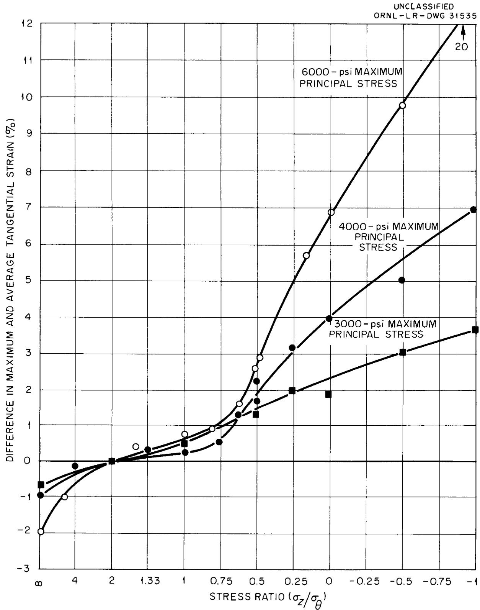  
Fig. 1.4.8. Difference in Average and Maximum Tangential Strains at Rupture for 3000-, 4000-, 6000-psi Maximum Principal Stresses at Various Stress Ratios.

UNCLASSIFIED

Y-26205

$$
\sigma_ {2} / \sigma_ {\theta} = 6 0 0 0 / 3 0 0 0
$$

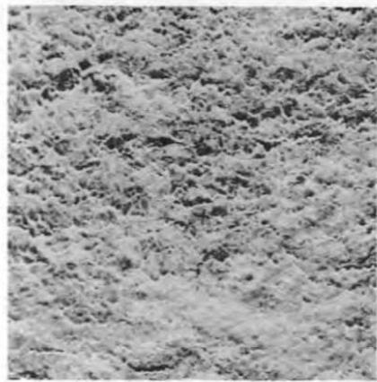

$$
6 0 0 0 / 4 0 0 0
$$

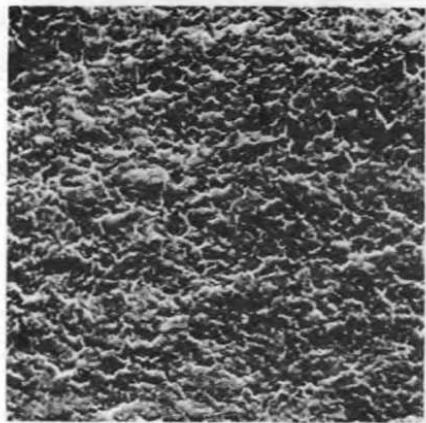

$$
6 0 0 0 / 6 0 0 0
$$

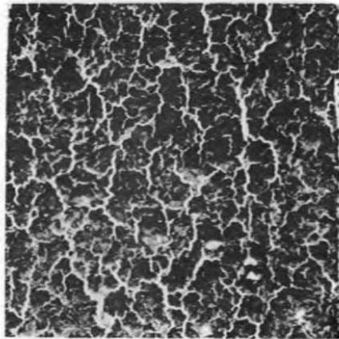

TANGENTIAL STRESS AXIAL STRESS

$$
\sigma_ {z} / \sigma_ {\theta} = 4 0 0 0 / 6 0 0 0
$$

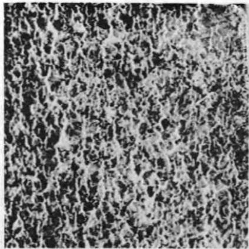

$$
1 5 0 0 / 6 0 0 0
$$

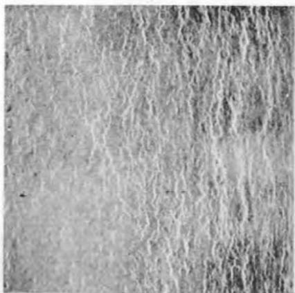

$$
- 3 0 0 0 / 6 0 0 0
$$

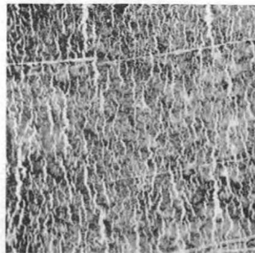  
Fig. 1.4.9. Crack Patterns of Outside Surfaces of Specimen Tested with a Maximum Stress of 6000 psi at $1500^{\circ}$ F in Argon. Dye penetrant applied after test.

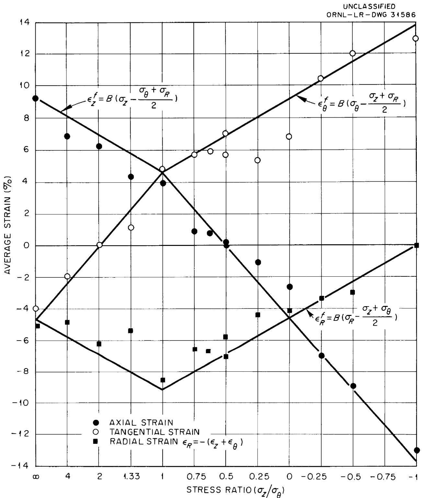  
Fig. 1.4.10. Strain at Rupture vs Stress Ratio for Specimens Tested with a Maximum Principal Stress of 4000 psi.

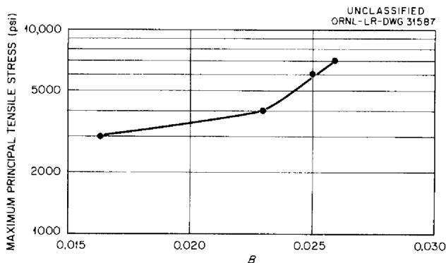  
Fig. 1.4.11. Variation of B (Constant of Equation Relating Strain at Failure and Deviatoric Stress) with Maximum Principal Tensile Stress for Specimens Tested at $1500^{\circ}\mathsf{F}$ in Argon.

under simple tension is also plotted against stress ratio in Fig. 1.4.12. This shows that specimens which obey Eq. 5 with the same maximum stress in the tension-tension stress state fail with the same shear strain regardless of rupture life. Thus, for specimens of this type, the rupture strain in the tension-tension state is a function of the maximum principal stress only. It should be realized that although the total elongation in a particular direction may be less under combined tension-tension stresses, the shear strain or total deformation at rupture is the same.

Specimens tested in the tension-compression stress state apparently can sustain a much greater shear strain before fracture than those in the tension-tension state. As shown in Fig. 1.4.12, specimens tested under pure shear sustained twice the shear strain at fracture as the specimens tested in simple tension.

# STRAIN-FATIGUE STUDIES

# R.W.Swindeman

Many of the failures encountered in engineering devices result from dynamic loads which are imposed on the structure either mechanically or thermally. Most often, fatigue failures are considered to be the result of rapidly fluctuating stresses which introduce damage in the material on a very microscopic scale. Thus in low-temperature fatigue, no bulk plastic straining of the metal can be discerned. However, at elevated temperatures, where relaxation of stress can occur, measurable amounts of plastic strain may be induced

during each stress reversal. This is particularly true in the case of restrained structures when they are subjected to large thermal fluctuations. Quite often, under such conditions, the thermally induced stresses occur over relatively long time cycles and are large enough to exceed the elastic limit of the metal. Thus, in studying the behavior of materials loaded in this manner it is more meaningful to think of the metal as experiencing a number of strain reversals which ultimately lead to failure, rather than to attempt to base such failures on the indeterminate stress state.

Recent studies have revealed that the plastic strain history of a metal under dynamic load conditions provides extremely useful data for calculating the metal life consumed and the service life remaining under expected operating conditions. This idea was conceived by Manson4 and then demonstrated experimentally by Coffin5 by thermally cycling stainless steel under conditions of restraint until failure occurred. The relationship between plastic strain and cycles to failure was found to be of the form $N^{\alpha} \varepsilon_{p} = K$ , where $N$ is the cycles to failure, $\varepsilon_{p}$ is the strain per cycle, and $\alpha$ and $K$ are constants which depend on the material and test conditions.

Most of the subsequent work has been within the temperature range where the rate of work hardening was appreciably greater than the recovery rate. The work described below concerns metals at temperatures where creep and relaxation are the dominant factors. The fact that creep and relaxation are dominant in the temperature range of interest made it both feasible and attractive to substitute mechanical loads for thermal fluctuations as a means of producing strain cycles. The apparatus used is described in detail in a separate report.6

Most of the investigation was conducted with Inconel as the test material; but, a few tests were made with Hastelloy B and with beryllium. Thus, representative data can be compared for metals of quite widely different degrees of strength, ductility, and fabrication history. Conventional plots of the plastic strain per cycle, $\varepsilon_{p}$ , vs $N$ , the number

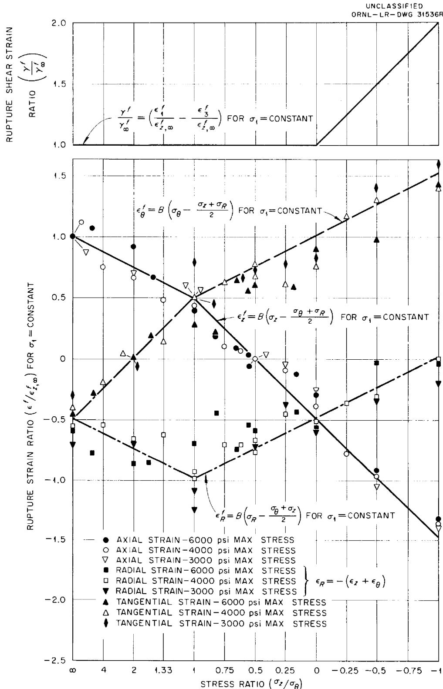  
Fig. 1.4.12. Plots of Rupture Strain Ratio and Rupture Shear Stress Ratio vs Stress Ratio.

of cycles to failure are shown in Fig. 1.4.13. The co-ordinates were plotted on logarithmic scales so that if Manson's relationship $N^{\alpha} \epsilon_{p} = K$ were satisfied, the data points would define a straight line. It is apparent that this condition is satisfied for each material, but it is also evident that there is a variation in the slope of the line from one metal to another. These slopes are approximately -0.58 for Hastelloy B, -0.76 for Inconel, and -0.81 for beryllium. Such values are in contrast to the findings of Coffin7 who shows $\alpha$ to be very nearly -0.5 for several different metals tested at temperatures below $1200^{\circ}\mathrm{F}$ .

It has also been noted that for any given material, $K$ can be varied by changes in the metallurgical structure. A plot of the strain-cycling properties of Inconel rod specimens machined from the same heat but differing in the annealing treatment given before the test is presented in Fig. 1.4.14. The specimens annealed at $1650^{\circ}F$ had a finer grain size and were much more resistant to fracture than the specimens annealed at $2050^{\circ}F$ . Comparative data for rod material at 1300, 1500, and $1600^{\circ}F$ , which was reported previously, indicate that grain size effects are most pronounced at 1500 and $1600^{\circ}F$ ; however, at $1300^{\circ}F$ coarse- and fine-grained material have nearly identical strain-cycling properties. Inconel is a solid-solution type of alloy that is not subject to phase changes or aging reactions, and therefore the difference in behavior seems to be clearly dependent on the relative grain size. It is also note

worthy that the two lines are parallel, and thus the $\alpha$ value is consistent for both types of specimens.

The question of whether specimen geometry seriously affects the strain-cycling properties also merits consideration. The strain-cycling properties at $1500^{\circ}\mathrm{F}$ of rod and tube specimens are compared in Fig. 1.4.15. Tube data fall slightly below the rod data, but this may be attributed to two factors. First, the methods of sensing failure are different; the tubes are considered to fail when the first crack propagates through the wall, whereas rods are tested to complete failure. Further, the rod specimens have a slightly finer grain size than that of the tube specimens. The tube data include test results from two different heats of metal, and the agreement indicates that the cycling properties are not particularly sensitive to small variations in alloy composition.

Fig. 1.4.14. Effect of Grain Size on the Strain Cycling Properties of Inconel at $1500^{\circ}$ F.   
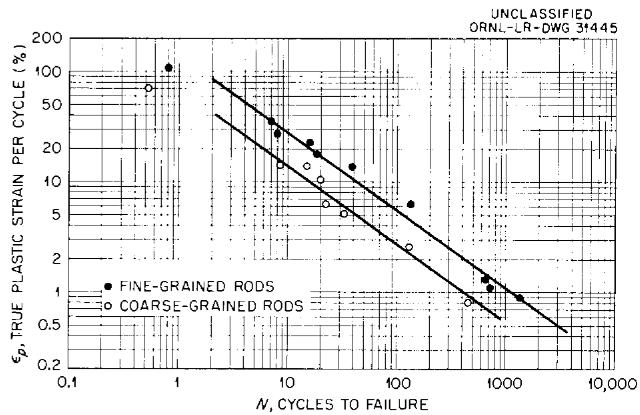  
7L. F. Coffin, Strain Cycling and Thermal Stress Fatigue, paper presented at the Fourth Sagamcre Conference, Raquette Lake, N. Y., Aug. 21-23, 1957.

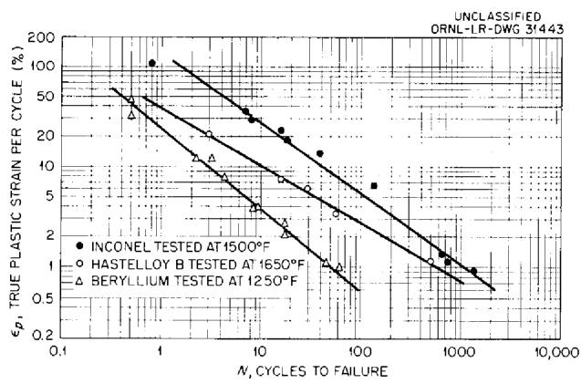  
Fig. 1.4.13. Comparison of the Strain-Cycling Characteristics of Inconel, Hastelloy B, and Beryllium.

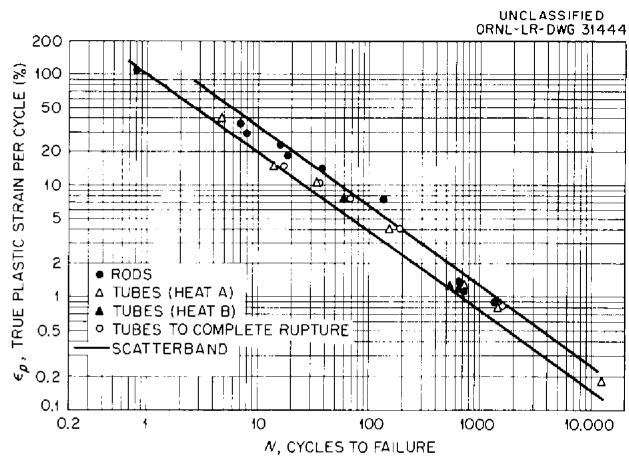  
Fig. 1.4.15. Strain Cycling Properties of Inconel Tubes and Rods at $1500^{\circ}$ F.

# Temperature Dependence

One of the most important considerations in regard to test variables is the influence of temperature on the number of cycles to failure. This is particularly important where it is desired to apply isothermal mechanical strain-cycling data to design problems where thermal cycling is involved. The results for tests at 1300, 1500, and $1600^{\circ}\mathrm{F}$ that were conducted to determine the effect of temperature are presented in Fig. 1.4.16. The band represents the scatter of points obtained in an extensive program of tests of tubes and rods at $1500^{\circ}\mathrm{F}$ . Nearly all the data for rods at $1300^{\circ}\mathrm{F}$ and for tubes at $1600^{\circ}\mathrm{F}$ fall inside this band. The rod data obtained at $1600^{\circ}\mathrm{F}$ fall consistently above the band because of the grain size effect mentioned previously. It appears, therefore, that within this particular range there is no major change in fracture behavior as a function of temperature. The fact that Inconel is metallurgically stable, that no grain growth occurs, and that the deformation mechanism is uniform throughout this span are important points to bear in mind when considering these results.

Since temperature appears to have no major influence on the number of cycles to fracture in the range 1300 to $1600^{\circ}\mathrm{F}$ , it would appear reasonable to expect mechanical strain cycle results under isothermal conditions to correlate with those obtained by thermally cycling about a corresponding mean temperature. Data illustrating the validity of the assumption are presented in Fig. 1.4.17. The thermal excursions about the $1300^{\circ}\mathrm{F}$ mean covered the range from 1000 to $1600^{\circ}\mathrm{F}$ . At the $1500^{\circ}\mathrm{F}$ mean the temperature extremes were 1400 and

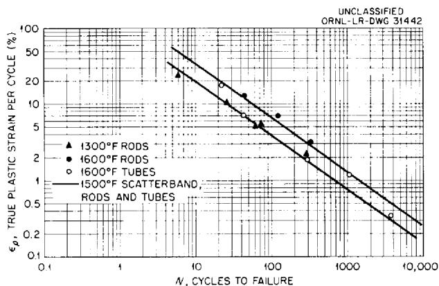  
Fig. 1.4.16. Effect of Temperature on the Strain Cycling Properties of Inconel.

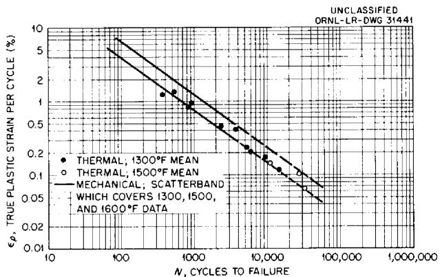  
Fig. 1.4.17. Comparison of the Thermal and Mechanical Strain Cycling Properties of Inconel.

$1600^{\circ} \mathrm{F}$ . It is evident that in the absence of metallurgical instabilities a metal responds to the mechanically produced strain in the same manner as to a strain thermally induced.

# Frequency of Dynamic Loads

A very important variable to be considered in studying the effect of dynamic loads on the behavior of metals at elevated temperatures is that of frequency. It is well known that the test frequency can be changed over a wide range without producing a marked effect on the plot of stress vs number of cycles to failure (S-N diagram) in low-temperature fatigue tests. On the other hand, several investigators have found that frequency does exert an influence on the cycles to rupture at high temperatures. This is especially true at lower frequencies where creep or relaxation may occur. Hyler has conducted fatigue studies on Inconel at 1200 and $1600^{\circ}\mathrm{F}$ at load frequencies of 60 and 600 cpm. He observed essentially no difference in the S-N diagram at $1200^{\circ}\mathrm{F}$ , but he found an appreciable frequency effect at $1600^{\circ}\mathrm{F}$ . Specimens cycled at 600 cpm endured 10 times more cycles than those cycled at 60 cpm. Fatigue studies on lead have yielded similar results. Dolan reports data for reversed flexure fatigue tests on lead at room temperature for frequencies of 1, 6, 44, and 248 cpm. Curves relating the strain per cycle and the number of cycles to rupture were determined for each frequency. A comparison of the curves revealed that the cycles

to rupture increase with increasing frequency. Unfortunately, the strain values ranged only from 0.1 to $1\%$ and the reported strains include both elastic and plastic components. Since plastic strain per cycle was not determined in any of these studies, the direct use of these data for studying the frequency effect on the strain-cycling behavior is not possible. The results raise the question, however, of whether or not the difference in the plastic strain absorbed could explain the variation in properties with frequency. Since plastic strain is generally considered a reliable measure of damage to a structure, it would appear that specimens strained within the same limits of plastic deformation should survive an equivalent number of cycles before fracture, regardless of the rate at which the strain is introduced. Design problems involving temperature fluctuations are, however, often concerned with slow thermal cycles, and therefore a series of tests to investigate frequency effects was initiated.

The majority of the data previously discussed was obtained by using a constant load; thus the creep of the specimen continued until the limiting strain condition was reached in the desired time interval. This type of test is quite easy to regulate for short time cycles, but the prescribed load required to produce specific strains in 10 or $30\mathrm{min}$ is difficult to obtain. Thus a slight modification of the equipment was made to provide adjustable, but rigid, reference limits. In test, the specimen is strained to the selected limit very rapidly and held at this strain for the selected time interval. During this period the elastic strain is gradually converted into plastic strain by the relaxation process. It is therefore quite simple to control the frequency and to vary it from times as short as $\frac{1}{2}$ min per cycle up to whatever time cycle seems practical. A comparison of results obtained by the creep method and by the relaxation method is shown in Fig. 1.4.18. Since creep and relaxation are manifestations of the same deformation phenomena, the excellent correlation shown between the results of the two types of tests was expected.

The data from a series of tests at $1500^{\circ}\mathrm{F}$ in which the standard 2-min/cycle period was used are compared in Fig. 1.4.19 with data from tests in which a 30-min/cycle period was used. At high percentages of plastic strain per cycle, good correlation exists, but a significant deviation is shown for the low strain values. Data obtained at $1650^{\circ}\mathrm{F}$ with a 30 min/cycle period follow a trend similar to that found at $1500^{\circ}\mathrm{F}$ , but at $1300^{\circ}\mathrm{F}$ , as shown

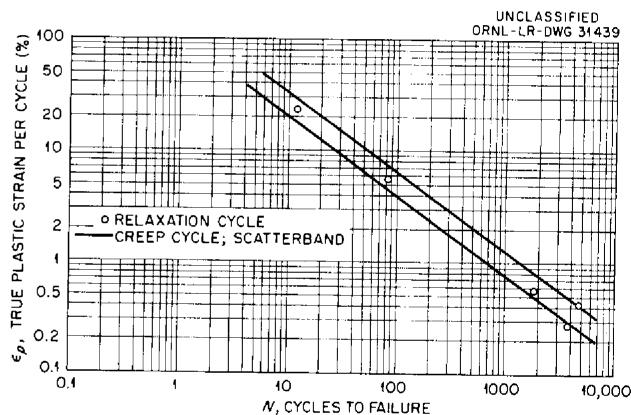  
Fig. 1.4.18. Comparison of the Strain Cycling Properties of Inconel Subjected to Creep and to Relaxation Cycles at $1500^{\circ}$ F.

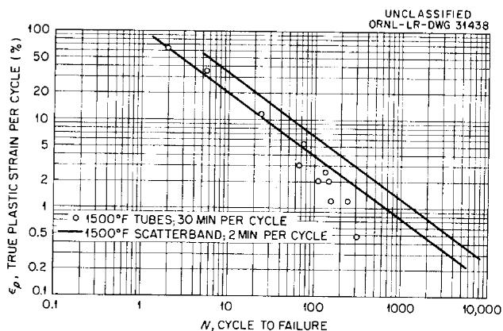  
Fig. 1.4.19. Effect of Frequency on the Strain Cycling Properties of Inconel at $1500^{\circ}$ F.

in Fig. 1.4.20, the only test point which falls outside of the $2\mathrm{min}$ cycle data occurs below $1\%$ strain, and, even here, the deviation is not appreciable.

There is, of course, considerable engineering interest in the fact that for the same amount of repeated plastic deformation, a metal subjected to slowly fluctuating loads will survive for only a fraction of the cycles of a specimen cycled more rapidly. This is especially important since the frequency appears to exert the greatest influence for values of strain below $2\%$ , which are also equivalent to the thermal strains most often encountered during service. There is no evidence to indicate that the longer thermal exposure encountered in the low-frequency tests is detrimental, so it must be concluded that the mechanisms controlling fracture at high temperatures are strongly influenced by time as well as plastic flow.

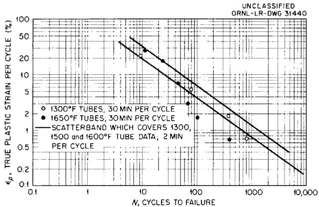  
Fig. 1.4.20. Effect of Temperature on the Strain Cycling Properties of Inconel Tested at a 30 min/cycle Period.

# Design Factors

This investigation of the high-temperature behavior of metals under dynamic loads reveals the following significant points.

1. The relationship, $N^{\alpha} \epsilon_{p} = K$ , holds for several metals at elevated temperatures provided the cycle time is relatively short. The exponent, $\alpha$ , is dependent on the material and varies from -0.58 to -0.81. Since the strain-cycling curves of many

metals have exhibited a slope of $-0.5$ in low-temperature tests, the greater slopes at high temperatures indicate a dependence on temperature or deformation mechanism rather than directly on material composition. Since there is no significant variation in $\alpha$ for Inconel over a $300^{\circ}\mathrm{F}$ range, it appears that the deformation mechanism is the major factor that affects the slope of the strain-cycling curve for Inconel. Thus, there may be a break in the strain-cycling curve similar to the one observed for the equicohesive temperature in creep. The $K$ factor is changed significantly by changes in grain size, and thus it is believed that the displacement of the rupture curve can be attributed to metallurgical changes.

2. Metals respond in the same manner to plastic strain whether it is introduced by thermal changes or mechanically imposed loads. This statement must be qualified to the extent that the deformation mechanism and metallurgical structure must not be altered by the temperature fluctuations.   
3. The rate at which strains are reversed has a marked effect on the number of equivalent strain cycles a metal can survive. This phenomenon, which is apparently confined to the high-temperature region, establishes the fact that plastic deformation is not the sole mechanism controlling the fracture life of a metal.

# 1.5. CERAMICS

L. M. Doney

# SYNTHESIS OF ZIRCONIUM BORIDE

# R.A.Potter

Small batches (approximately 200 g each) of zirconium boride continued to be synthesized in the laboratory for additions to beryllium oxide control samples. Some improvement has been made in the synthesis process by adding kerosene to the batch. The zirconium silicate-boron carbide-graphite reaction was expedited and carried to near completion by the presence of the hydrocarbons resulting from the ignition of the kerosene.

Several batches of $\mathsf{ZrB}_2$ were semiquantitatively analyzed by spectrographic methods. A typical batch is $>97\%$ pure, with silicon being the predominant impurity.

# DENSIFICATION OF BERYLLIUM OXIDE

# R. A. Potter

Seven different compositions, given in Table 1.5.1, were mixed in a jar on rolls for 18 hr, and the material was then pressed at 20,000 psi in steel dies, broken up, granulated by passing through a 30-mesh screen, and remixed for 2 hr. Right-cylinder shapes approximately $\frac{3}{4} \times \frac{3}{4}$ in.

Table 1.5.1. Compositions of Densified BeO Bodies   

<table><tr><td rowspan="2">Composition No.</td><td colspan="4">Composition (Parts by Weight)</td></tr><tr><td>BeO*</td><td>MgO</td><td>Fe2O3</td><td>B4C</td></tr><tr><td>1</td><td>100</td><td></td><td></td><td></td></tr><tr><td>2</td><td>94.0</td><td>5.0</td><td></td><td>1.0</td></tr><tr><td>3</td><td>94.0</td><td>5.0</td><td></td><td></td></tr><tr><td>4</td><td>94.0</td><td></td><td></td><td>1.0</td></tr><tr><td>5</td><td>98.0</td><td></td><td>1.0</td><td>1.0</td></tr><tr><td>6</td><td>98.0</td><td></td><td>1.0</td><td></td></tr><tr><td>7</td><td>98.0</td><td></td><td></td><td>1.0</td></tr></table>

*G. C. grade, Brush Beryllium Company.

were made by pressing the materials at 15,000 psi. These shapes were then fired to six different temperatures (1650 to $1900^{\circ}\mathrm{C}$ in increments of $50^{\circ}\mathrm{C}$ ). The furnace consisted of an induction-heated graphite tube with a positive flow-through of helium. In each case a fast firing schedule of approximately 2 hr was used.

Screening tests indicated that composition 2 was superior to the others with respect to density. The densities of this body at the six test temperatures are compared with those of the $100\%$ BeO control sample in Table 1.5.2.

Magnesium oxide alone, as in composition 3, acted as a densifier, but at about $1700^{\circ}\mathrm{C}$ it began to volatilize rapidly and caused distortion of the shape of the cylinder. At $1650^{\circ}\mathrm{C}$ the density of composition 3 was found to be $2.9\mathrm{g/cm}^3$ ; however, there was a slight distortion in the shape.

For a further test, composition 2 was pressed into right cylinder shapes approximately $1\frac{3}{8} \times 1$ in. in height. Forming pressures on these pieces were 6,000 and 10,000 psi. The slugs were fired in an oxidizing atmosphere to a temperature of $1500^{\circ}\mathrm{C}$ . Densities of these samples were in the range 2.67 to $2.75\mathrm{g/cm}^3$ . Density values for similar $100\%$ BeO control samples were 2.02 to $2.04\mathrm{g/cm}^3$ . Specimens in the shape of bars approximately $5 \times 1\frac{1}{4} \times \frac{3}{4}$ in. have been fabricated for additional testing.

Table 1.5.2. Comparison of Densities at Various Temperatures of a $100\%$ BeO Body and a Body With 94 wt $\%$ BeO, 5 wt $\%$ MgO, and 1 wt $\%$ B $_4$ C   

<table><tr><td rowspan="2">Sintering Temperature (°C)</td><td colspan="2">Density (g/cm3)</td></tr><tr><td>100% BeO</td><td>94% BeO-5% MgO-1% B4C</td></tr><tr><td>1650</td><td>2.71</td><td>2.91</td></tr><tr><td>1700</td><td>2.79</td><td>2.88</td></tr><tr><td>1750</td><td>2.83</td><td>2.89</td></tr><tr><td>1800</td><td>2.84</td><td>2.88</td></tr><tr><td>1850</td><td>2.85</td><td>2.90</td></tr><tr><td>1900</td><td>2.85</td><td>2.86</td></tr></table>

# OXIDATION RESISTANCE OF BORON-CONTAINING BERYLLIUM OXIDE BODIES

R. L. Hamner

Screening tests were also run to determine the oxidation resistance of hot-pressed boron-containing BeO bodies being considered for GE-ANPD applications. The oxidation characteristics of the mixtures tested are compared in Fig. 1.5.1. The additives $\mathsf{T a B}_{2}$ (9.35 wt %) and BN (2.29 wt %) not only have poor oxidation resistance above $1000^{\circ}C$ but also apparently have very volatile oxidation products, $\mathsf{T a}_{2}\mathsf{O}_{5}$ and $\mathsf{B}_{2}\mathsf{O}_{3}$ , which account for the comparatively large weight losses.

It was expected that the $\mathrm{BeO - CrB_2}$ body would show an over-all weight loss upon oxidizing, because the oxides of chromium, $\mathrm{Cr}_2\mathrm{O}_3$ and $\mathrm{CrO}_3$ , tend to be volatile. A green deposit adjacent to the specimen indicated that a chromium oxidation product slowly volatilized along with the $\mathrm{B}_2\mathrm{O}_3$ ; an over-all weight loss was detectable after about 125 hr at $1300^{\circ}\mathrm{C}$ .

The borides of Ti (2.31 wt %), Zr (5.22 wt %), and Hf (9.25 wt %), had good oxidation resistance when incorporated in dense BeO, as evidenced by appearance and overall weight changes, with the $\mathsf{ZrB}_2$ -BeO and $\mathsf{HfB}_2$ -BeO combinations being slightly better than the $\mathsf{T_iB}_2$ -BeO combination. It is not known why the $\mathsf{HfB}_2$ -BeO compact lost weight despite the known stability of the oxidation product, $\mathsf{HfO}_2$ .

The thermal stability of $\mathsf{ZrB}_2$ in air during longterm oxidation testing at $1300^{\circ}C$ is illustrated in Fig. 1.5.2. A specimen of pure BeO of comparable

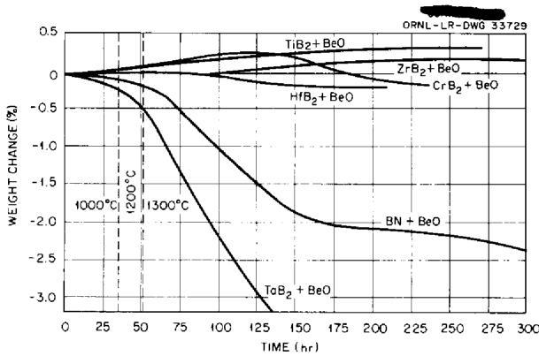  
Fig. 1.5.1. Results of Oxidation Tests of Boron-Containing BeO Bodies.

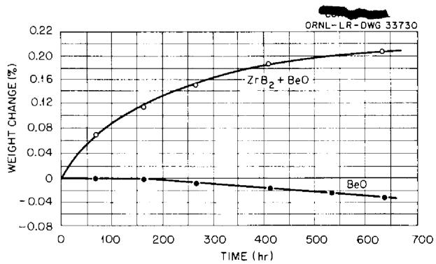  
Fig. 1.5.2. Results of Oxidation Tests of BeO and BeO + ZrB₂ in Air at 1300°C.

density was tested with the $\mathsf{ZrB}_2$ -BeO compact to give a more complete picture of weight changes involved, since BeO is somewhat volatile in the presence of water vapor at $1300^{\circ}\mathsf{C}$ . X-ray and chemical analyses showed the boron to be present after the long-term oxidation test. There was not sufficient $\mathsf{ZrO}_2$ present as an oxidation product to be detectable by x-ray analysis.

Information was received during this reporting period that the Brush Beryllium Company had discontinued the manufacture of "Luckey S. P." grade BeO, which has been used almost exclusively in this laboratory for BeO development work. It was, therefore, necessary to establish fabrication characteristics of a new material representative of future supplies; Brush's G. C. grade BeO, which is derived from the sulphate and calcined at approximately $1100^{\circ}\mathrm{C}$ , was received for this purpose.

Specimens of G. C. grade BeO and BeO containing 5.22 wt % of laboratory synthesized $\mathsf{ZrB}_2$ were hot pressed at temperatures of 1550, 1650, and $1750^{\circ}\mathrm{C}$ under a pressure of 2000 psi for 15 min. The G. C. grade of BeO was found to be much more reactive than the Luckey S. P. grade; noticeable compaction began at approximately 250 to $300^{\circ}\mathrm{C}$ lower (at about $1250^{\circ}\mathrm{C}$ ). This difference in reactivity of the two materials can be explained by the difference in grain size, as shown by electron photomicrographs, Figs. 1.5.3 (S. P. grade) and 1.5.4 (G. C. grade).

Densities of pure BeO obtained at 1550, 1650, and $1750^{\circ}C$ were 92, 95, and $98\%$ respectively. Densities obtained for the $\mathrm{BeO - ZrB}_2$ mixture were approximately the same for all the temperatures,

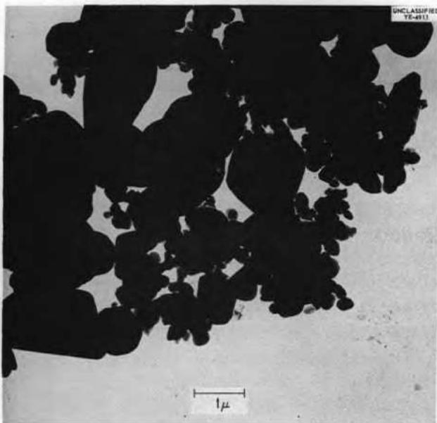  
Fig. 1.5.3. Brush Beryllium Company's S. P. Grade BeO. 23,000X. Reduced $57\%$ .

being 96.7, 96.4, and $96.4\%$ , respectively; thus $\mathrm{ZrB}_2$ appears to be somewhat effective as a densifier at the lower temperature. Above $1750^{\circ}\mathrm{C}$ a rather vigorous reaction occurred between the $\mathrm{ZrB}_2$ -BeO mixture and the graphite die, the attack being severe enough to prevent removal of the piece from the die.

Attempts were made to fabricate large hot-pressed blocks of the $\mathrm{ZrB}_2$ -BeO mixture, $3\times 3\times$ 1 in., for physical and mechanical properties measurements. A commercial grade of $\mathrm{ZrB}_2$ was used because of the large quantities of boride involved. Upon cutting the blocks, which were pressed at $1550^{\circ}\mathrm{C}$ and 2000 psi, an irregularity in color was noted that was roughly in the shape of a "bowtie" and which approximated the temperature profile of the piece in the graphite die. The top and center

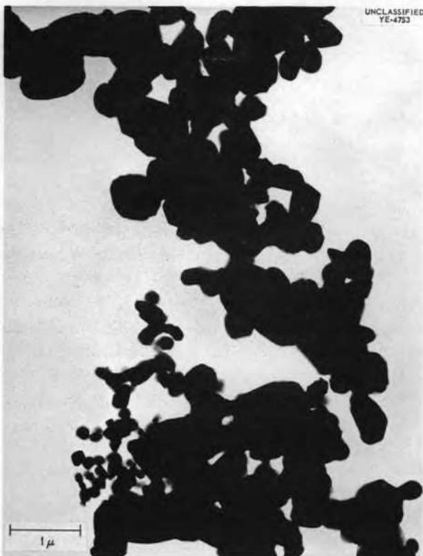  
Fig. 1.5.4. Brush Beryllium Company's G.C.Graded BeO.

specimens shown in Fig. 1.5.5 are typical of this defect. It was not eliminated by time-temperature variations, although it was less pronounced at lower temperatures.

Analysis of the $\mathsf{ZrB}_2$ revealed a large quantity of iron (approximately $10\%$ ). When iron-free $\mathsf{ZrB}_2$ was used, either laboratory synthesized or an acid-treated commercial grade, the appearance was uniform, as illustrated by the bottom specimen shown in Fig. 1.5.5. Six $\mathsf{ZrB}_2$ -BeO blocks are being fabricated at ORNL for testing at GE-ANPD.

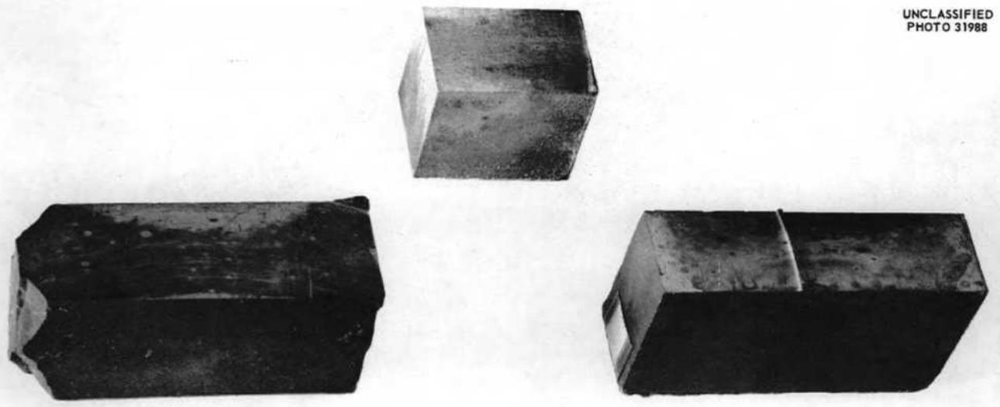  
UNCLASSIFIED PHOTO 31988

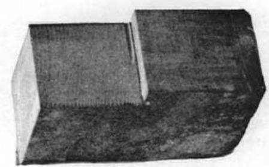

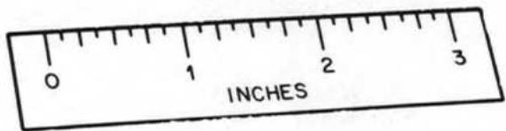  
Fig. 1.5.5. Hot-Pressed $\mathrm{BeO - ZrB_2}$ Blocks. Top block and center blocks made with commercial $\mathrm{ZrB_2}$ . Bottom block made with iron-free laboratory synthesized $\mathrm{ZrB_2}$ . (with caption)

# 1.6. NONDESTRUCTIVE TESTING

J.W.Allen

# REMOTE X-RAY VIEWING

J.W.Allen

R.W.McClung

Further studies were made of the use of x-ray sensitive Vidicon in a closed-circuit television system for remote viewing of x-ray images. As reported previously, the sensitivity of the present selenium photoconductor Vidicon system is considerably less than that which can be obtained with existing film techniques. The primary advantages of this system (in contrast to those consisting of closed-circuit television applied to fluoroscopy) are the inherent high resolution, which approaches the resolution attainable with a fine-grained radiographic film, and the inherent magnification of images.

Recently it was discovered that the sensitivity of the selenium photoconductor to x-radiation could be improved in many situations by admitting visible light to the photoconductor surface. Although the phenomenon is not well understood, it appears that the sensitivity is increased merely by raising the level of total incident radiation, including both x-radiation and visible light. This effect is readily observable and has been used to increase the contrast sensitivity by as much as a factor of 3. The wave length of the enhancing light does not seem to be critical, as evidenced by the use of both white fluorescent lamps and incandescent lamps as the light source.

By using this light-enhancing technique, thickness changes of about $2.5\%$ can be detected in $\frac{5}{8}$ -in.-thick aluminum. This indicates that practical inspections could be accomplished at contrast sensitivities of 5 to $6\%$ . Although this figure is considerably lower than that attainable with film techniques, it compares favorably with those published for other television systems which use fluorescent screens.

Further investigation of the light-sensitizing technique is planned. In addition the use of photoconductor materials other than selenium is being studied.

# DUPLEX TUBING

R. W. McClung

The increased interest in the fabrication and use of duplex tubing has created a need for adequate

inspection techniques for this configuration. The problems which are common to the inspection of conventional tubing, such as dimensional gaging and the detection of cracks, seams, laps, and other discontinuities, are also present in duplex tubing. In addition, an evaluation must be made of the bond quality between the layers, and measurements should be made of the individual layer thicknesses.

To detect the more common discontinuities, the conventional techniques of encircling-coil eddy-currents, pulse-echo ultrasonics, radiography, fluorescent penetrants, and visual inspection should be adequate for complete evaluation. Also some of these techniques may provide methods for determining some of the properties peculiar to duplex tubing. The use of the pulse-echo ultrasonic technique has detected the presence of laminations in welded and drawn tubing. The detection of such laminations is probably dependent upon the size and location of the lamination, the ultrasonic frequency, and the dimensions of the tube. At present, not enough is known about the mechanism of detection of these laminations to assure a high level of confidence in their detection under all conditions. Many of the areas of nonbonding will resemble simple laminations, and, under proper conditions, may be located by the pulse-echo ultrasonic technique.

If a gross separation exists between layers, radiography may offer a means for detection, either as a function of the decreased metal thickness due to the voids when passing the radiation perpendicularly through the lack-of-bond, or by observing the poor bond in profile with the radiation passing tangentially through the separation between layers. However, as the separation between layers decreases, the confidence level of such an examination decreases rapidly.

The resonance ultrasonic technique is being evaluated as a means for the detection of nonbonded areas. This technique has been used in

the past to measure wall thickness. On duplex tubing with a well-bonded interface, the total wall thickness of both layers would be indicated as a function of a fundamental or harmonic resonance of an ultrasonic frequency. Under proper conditions, if a lack of bonding exists, this indicated thickness would be that of the clad or outside layer only. However, to achieve this detection of nonbonding, it is necessary to make a careful selection of frequency range and calibration to avoid confusion of indications.

A few small batches of duplex tubing have been examined to determine the bond quality. These include approximately 14 ft of $0.504 \times 0.042$ in. tubing and 24 ft of $0.375 \times 0.036$ in. tubing. These lots were fabricated by cladding about 0.025 in. of low-carbon steel on types 304 and 347 stainless steel, respectively. Radiography, resonance ultrasonics, and pulse-echo ultrasonic tests revealed the presence of gross discontinuities in the 0.504-in.-dia tubing. Metallographic sectioning of several typical defects revealed considerable lack of bonding, with gross voids and separation prevalent. The worst bond condition detected is shown in Fig. 1.6.1. The transverse cracks seen

in Fig. 1.6.2 are probably responsible for the many indications noted in the pulse-echo ultrasonic examination. The same ultrasonic and radiographic techniques as those used on the 0.504-in.-dia tubing, when applied on the 0.375-in.-dia tubing indicated the presence of a good bond, similar to that shown in Fig. 1.6.3. The resonance ultrasonic technique seems to provide an evaluation for bond quality which is the best and most consistent of any of the current techniques. Additional development effort is needed and will be made to provide a high level of confidence for the complete evaluation of duplex tubing.

# METAL IDENTIFICATION METER

R.A.Nance

J.W.Allen

A transistorized model of the Metal Identification Meter4 (MIM) has been developed. Although the internal operation has been altered, the new instrument also utilizes eddy-current methods for identification and retains the simple external operation

4R. B. Oliver, J. W. Allen, and R. A. Nance, ANP Quar. Prog. Rep. June 30, 1957, ORNL-2340, p 256.

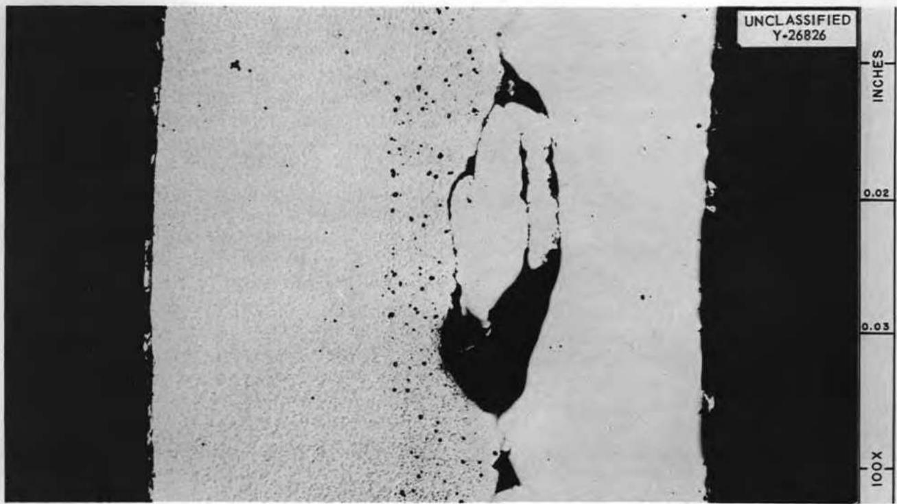  
Fig. 1.6.1. Very Poor Bond Between Type 1030 Steel Cladding and Type 304 Stainless Steel in $\frac{1}{2}$ -in.-OD, 0.042-in.-Wall Tube.

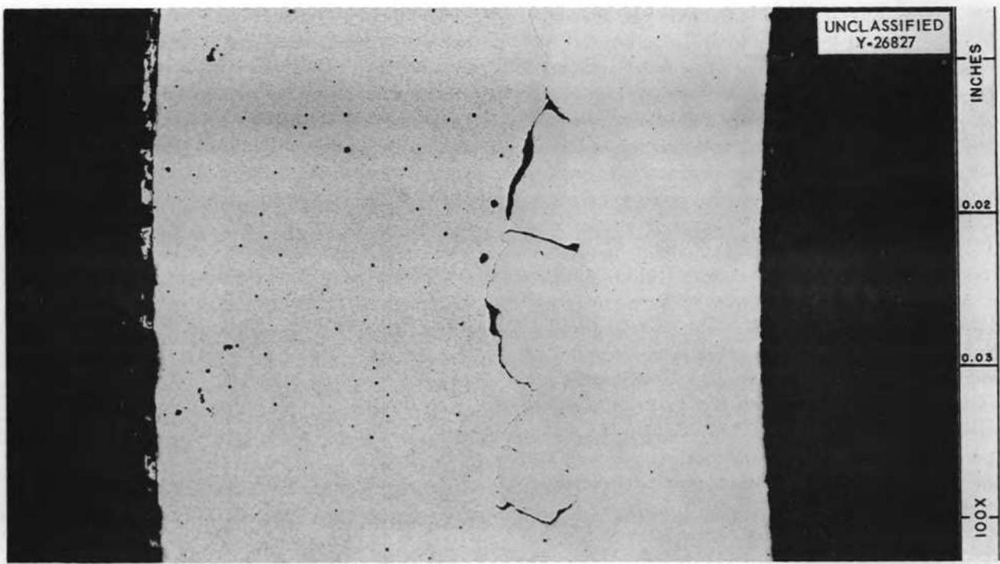  
Fig. 1.6.2. Transverse Cracks at Bond Interface Between Type 1030 Steel Cladding and Type 304 Stainless Steel in $\frac{1}{2}$ -in.-OD, 0.042-in.-Wall Tube.

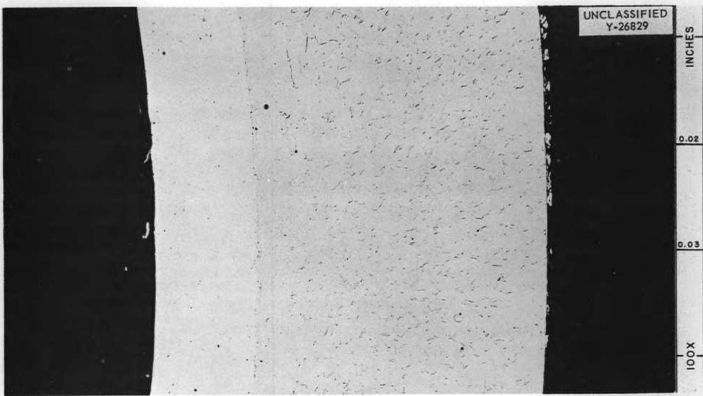  
Fig. 1.6.3. Good Bond Between Type 1008 Steel Cladding and Type 347 Stainless Steel in $\frac{3}{8}$ -in.-OD, 0.036-in.-Wall Tube.

of the vacuum-tube model. The MIM-Mark II, shown in Fig. 1.6.4, is $7\frac{1}{2} \times 3\frac{1}{4} \times 2\frac{3}{8}$ in., and it weighs approximately 20 lb, representing an $80\%$ reduction in size and weight.

In developing the transistorized model, several changes were made which greatly increased its versatility. These are: (1) the instrument has been made truly portable by the incorporation of a battery power supply, (2) the range of metals identifiable has been expanded to include all ferromagnetic and nonferromagnetic metals, (3) the effective depth of penetration of the eddy-currents has been decreased by increasing the operating frequency and thereby reducing the minimum metal thickness necessary for accurate identification, and (4) the diameter of the probe coil has been decreased to reduce the error produced when a flat reference standard is used in conjunction with the identification of a specimen having a curved surface.

A block diagram illustrating the internal operation of this instrument is shown in Fig. 1.6.5. The frequency of the probe oscillator is determined by

the inductance of a probe coil, which, in turn, is determined by the conductivity and permeability of the specimen. The frequency of the tuning oscillator is controlled by the dial on the front of the instrument. The signals from these two oscillators are heterodyned to produce a signal having a frequency equal to the difference of the frequencies

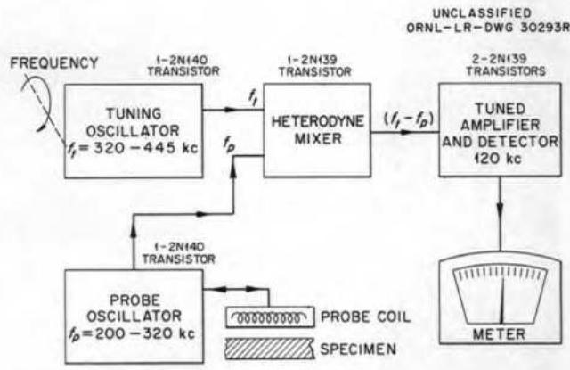  
Fig. 1.6.5. Block Diagram Describing Operation of Metal Identification Meter-Mark II.

UNCLASSIFIED V-26220

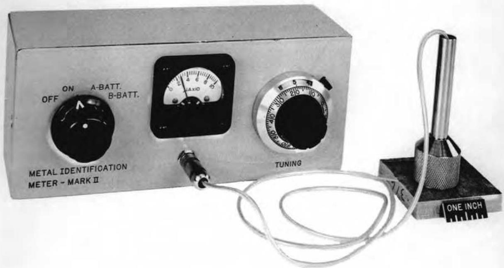  
Fig. 1.6.4. Metal Identification Meter-Mark II.

of the two original signals. The designs of the amplifier and detector are such that only signals of a narrow band of frequencies, centered about $120\mathrm{kc}$ , will be amplified, detected, and presented on the meter.

Since the eddy-current flow in a specimen is a function of its conductivity, magnetic permeability, and geometry, it is possible by controlling geometry factors to utilize the conductivity or conductivity and permeability characteristics of a metal as identifying features. This is accomplished by tuning the instrument for a maximum meter deflection with the probe on a reference standard. The difference frequency between the two oscillators is then $120\mathrm{kc}$ . If the probe is then placed on a specimen having a different conductivity or permeability, the frequency of oscillation of the probe oscillator will shift so that the difference frequency between the two signals is no longer $120\mathrm{kc}$ and the meter will no longer indicate a maximum. If the difference between the metals is great enough, the meter will cease to indicate altogether.

The response of this instrument to changes in conductivity in nonferromagnetic materials is illustrated in Fig. 1.6.6. The dial settings 565, 545, and 495 represent the tuning dial settings that were necessary to obtain maximum meter deflection when the probe was placed on samples of Hastelloy B, Inconel, and type 316 stainless steel, respectively. It is evident that, if the instrument is tuned with the probe on the Inconel sample (dial setting 545), the instrument will not respond when the probe is placed on the other two samples. It can also be seen in Fig. 1.6.6 that the slight variations of conductivity normally found among samples of the same alloy will not appreciably decrease the meter reading from a maximum,

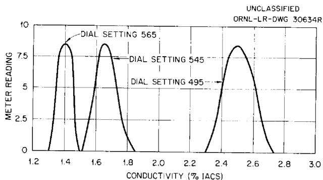  
Fig. 1.6.6. Response of Metal Identification Meter Mark II to Conductivity Changes as a Function of Tuning Dial Setting.

It is important to note that this instrument cannot be used to separate two nonferromagnetic metals of differing composition which have the same conductivity or overlapping ranges of conductivities. Accurate identification can only be made when it is known that none of the metals in the group to be identified have the same or overlapping conductivities. A similar problem is encountered in identifying ferromagnetic materials, since different combinations of conductivity and permeability can produce the same instrument response.

Variations in the geometry of a specimen can adversely affect its identification when a thick, flat reference standard is used. The extent of the error produced by the curvature variations on the surface of a specimen is illustrated in Fig. 1.6.7. For all practical purposes an item may be considered to present a flat surface to the probe if its radius of curvature is greater than 1.5 in. Variations in the thickness of the specimen will produce an error in identification only if the specimen is thinner than the effective depth of the eddy-current penetration, which varies with the conductivity and permeability of the part and the operating frequency of the probe oscillator.

The variations in meter reading caused by thickness variations of a specimen can be used as a measure of thickness. This has been satisfactorily accomplished in the gaging of $\frac{3}{4} \times 0.05$ in. type 304 stainless steel tubing with an accuracy of $2\frac{1}{2}\%$ .

This instrument can also be used to separate specimens from the same heat of an alloy which have been subjected to different mechanical and thermal treatments, since they produce changes in the conductivity and in some cases the magnetic permeability of the part. In addition, this instrument can be used to locate cracks normal to the inspected surface, since they interrupt the eddy-current flow and cause an apparent conductivity change in the part.

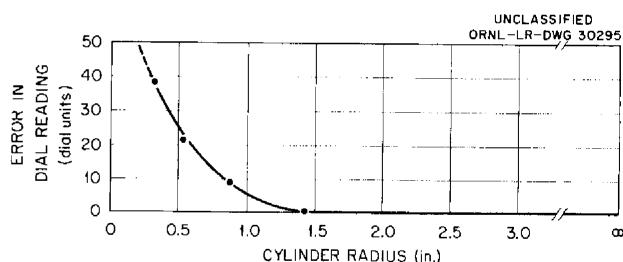  
Fig. 1.6.7. Effect of Cylinder Radius on Error of Metal Identification Meter-Mark II.

# 1.7.METALLOGRAPHY

R.J.Gray

# RESULTS OF METALLOGRAPHIC EXAMINATION OF SMALL SEMICIRCULAR FUSED-SALT FUEL-TO-NOK HEAT EXCHANGER OPERATED AT HIGH TEMPERATURES

R.J.Gray J.E.VanCleve

A metallographic examination has been completed of a 20-tube semicircular heat exchanger fabricated of Inconel in which a fused salt flowing around the tubes exchanged heat to NaK flowing in the tubes. Details of the construction and operation of this Inconel heat exchanger were presented previously.1,2 Testing of this heat exchanger was terminated after 1139 hr of high-temperature operation at $1200^{\circ}\mathrm{F}$ and above because of a leak of NaK into the fused salt. At the time of termination the heat exchanger had operated at design conditions for 258 hr with a temperature differential from fused-salt inlet to outlet of $350^{\circ}\mathrm{F}$ (1600 to $1250^{\circ}\mathrm{F}$ ) and a temperature differential from the NaK inlet to outlet of $430^{\circ}\mathrm{F}$ (1070 to $1500^{\circ}\mathrm{F}$ ). There had been 142 hr of operation under transitional conditions and 739 hr of isothermal operation. The heat exchanger had experienced 194 thermal cycles between isothermal operation at $1200^{\circ}\mathrm{F}$ and operation at design conditions.

The general area of the failure was readily located after the shell was removed because of a change in the color of the fluoride salt from green to gray in the NaK outlet header region. The gray material ignited during sectioning of the header, and the presence of NaK mixed with the fluoride salt was thus evident.

Two of three fractured Inconel tubes found in the high-temperature header area are shown in Fig. 1.7.1. The cracks were radial and were in the so-called "tension" side of the tubes. The cracks were found in the tubes with shortest tube bend-to-tube sheet length. This length ranged from $1\frac{1}{8}$ to $\frac{3}{4}$ in. The side of the tube that cracked was in tension because of the temperature difference between the tube and the shell.

The typical condition of the tube wall in all three ruptured tubes is shown in Fig. 1.7.2. The tube wall shifted laterally 0.002 in, after the largest crack completely penetrated the wall. The other large crack completely penetrated the tube wall but it did not open as did the first. A third crack may be seen that propagated from the braze alloy surface. This is the only instance of a small crack penetrating the material, and it suggests the

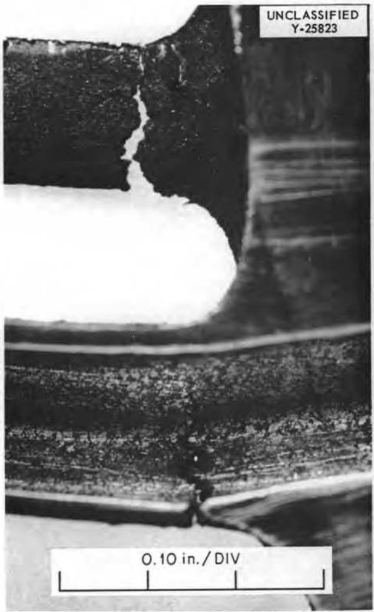  
Fig. 1.7.1. Cracks in Two of Three Cracked Inconel Tubes Found in the High-Temperature Header Area of a Semicircular Fused Salt-to-NaK Heat Exchanger. Cracks are in the tension side of the tubes.

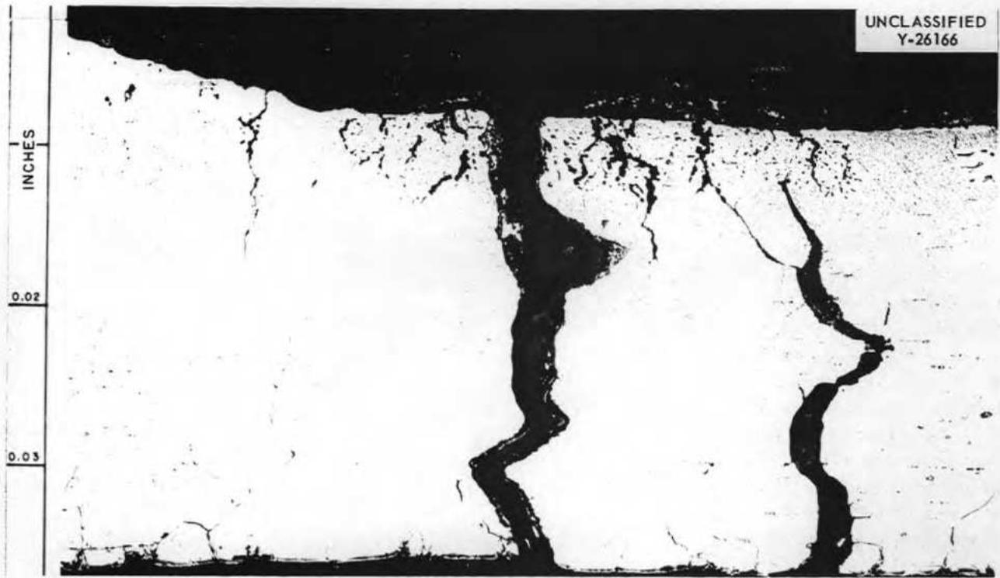  
Fig. 1.7.2. Typical Cracks Found in Tension Side of a Tube. Etchant: $10\%$ oxalic acid, $100X.$

possibility that a mechanism other than the progression of grain-boundary voids had operated to aid in the fracture of the tubes.

The largest of the cracks shown in Fig. 1.7.2 is shown at a higher magnification in Fig. 1.7.3. The surface of the tube which was exposed to the fused salt was generally corroded and leached to a depth of 0.007 in. The grain-boundary voids which were found in large numbers in similar areas of other heat exchangers of this type were not present in this unit.

The smaller of the large cracks shown in Fig.

1.7.2 is shown in Fig. 1.7.4 at a higher magnification. The crack follows the grain boundaries, and the greater width of the crack at the inner, or NaK contacted, surface indicates that it originated at the inner surface. A few grain-boundary voids may be seen that extend from the penetration. The grain-boundary voids do not seem to be as numerous or large as those found in previously examined heat exchanger tubes. The maximum general corrosion found in the heat exchanger is shown in Fig. 1.7.5. On the fused-salt side the attack is to a depth of 0.006 in. and on the NaK side the attack is to a depth of 0.002 in.

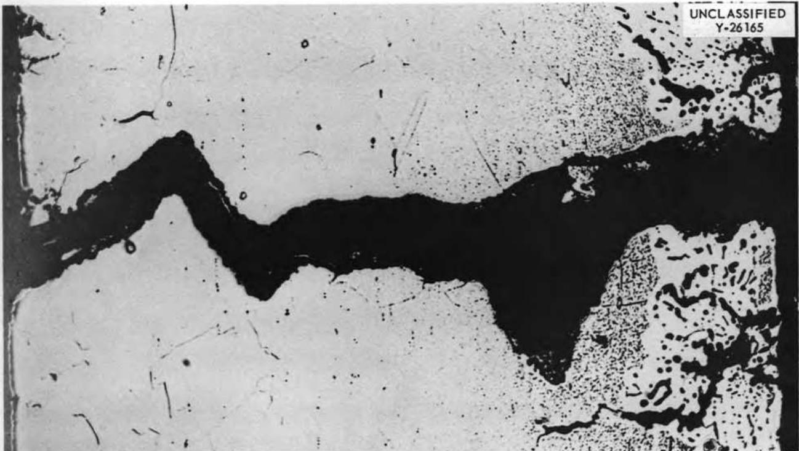

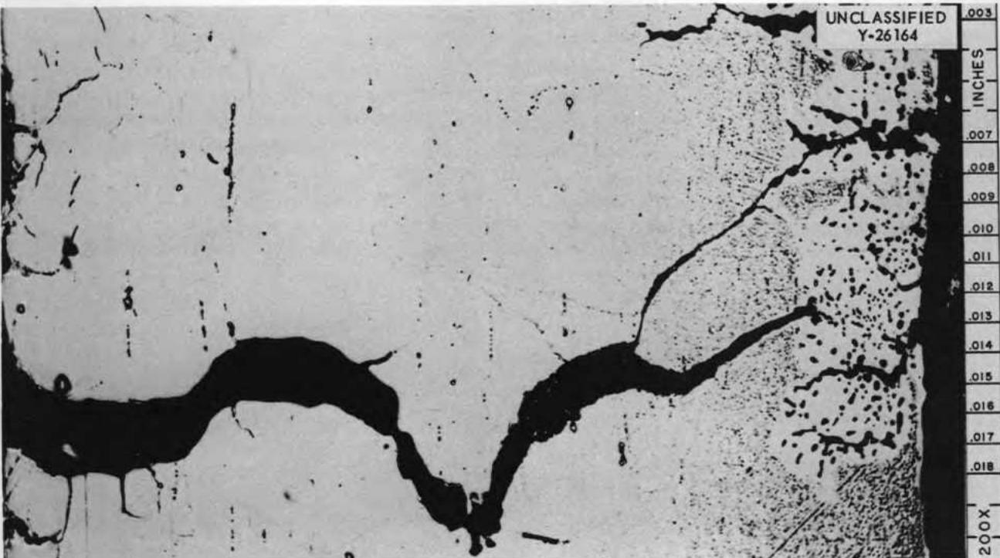  
Fig. 1.7.3. The Larger of the Cracks Shown in Fig. 1.7.1 at a Higher Magnification. General corrosion and leaching to a depth of 0.007 in. may be seen on the surface that was exposed to the fluoride salt. Etchant: $10\%$ oxalic acid, $200\mathrm{X}$ .   
Fig. 1.7.4. The Smaller of the Large Cracks Shown in Fig. 1.7.2 at a Higher Magnification. Complete penetration of the tube wall may be seen. Small grain-boundary voids subtend the large crack. Etchant: $10\%$ oxalic acid. 200X.

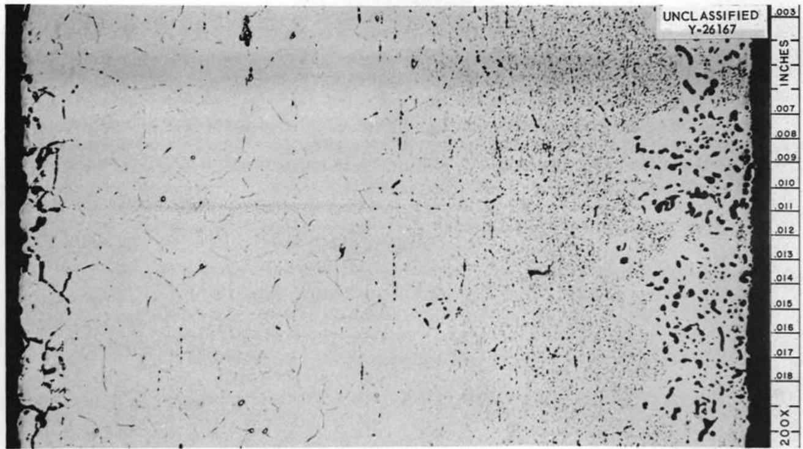  
Fig. 1.7.5. Maximum General Corrosion: 0.006 in. on Salt Side and 0.002 in. on NaK Side. Etchant: $10\%$ oxalic acid. 200X.

# Part 2

# CHEMISTRY AND RADIATION DAMAGE

# 2.1. MATERIALS CHEMISTRY

W. R. Grimes Chemistry Division

# PREPARATION OF CHARGE MATERIAL FOR REDUCTION TO YTTRIUM

G.J.Nessle

A pilot plant has been constructed that will provide for the monthly production of about 200 lb of massive yttrium metal. The Chemistry Division is responsible for the preparation of the suitable fluoride mixture, either LiF-MgF $_2$ -YF $_3$ or LiF-YF $_3$ , and the Metallurgy Division will carry out the reduction, distillation, and sparge-melting steps that will yield the final product. The pilot plant was completed during August, and the first batch of fluoride-salt mixture (LiF-YF $_3$ ) has been prepared. Phase equilibrium studies of the LiF-YF $_3$ system, as reported below, have indicated a single eutectic with 19 mole % YF $_3$ that has a melting point of 682°C. Therefore an attempt will be made to prepare low-oxide-content yttrium from this binary mixture and thus eliminate the Mg-Y alloying step and subsequent distillation of Mg from the alloy that would be required if the LiF-MgF $_2$ -YF $_3$ mixture were used. If this attempt is unsuccessful, it will be necessary to revert to the ternary system. The metal reduction operation is described in Chap. 1.1 of this report.

# Conversion of $\mathsf{Y}_2\mathsf{O}_3$ to $\mathsf{YF}_3$

J. Truitt

About 400 lb of $\mathsf{YF}_3$ was produced by direct hydrofluorination of dry $\mathsf{Y}_2\mathsf{O}_3$ in a large-scale (250-lb capacity) converter. In addition, about 100 lb of $\mathsf{YF}_3$ was produced in a small, pilot-scale unit (10 lb per batch). These units are operated at approximately $1100^{\circ}\mathsf{F}$ , and the raw material is treated for about 10 hr with HF. Analyses of the batches produced in the pilot-scale unit are given in Table 2.1.1.

# Preparation of $\mathsf{MgF}_2$

J. Truitt

No satisfactory grade of $\mathsf{MgF}_2$ was available commercially, and therefore six 10-lb batches of $\mathsf{MgF}_2$ were prepared by dry hydrofluorination of MgO. Previous results had shown that by extended treatment at $600^{\circ}\mathsf{C}$ a product of better than $99.5\%$

could be obtained. However, extended hydrofluorination is not economically desirable if, as was later shown, $95\%$ assay material is satisfactory for charging to the final molten salt purification step. The range of product analysis and conversion efficiency of the six batches is given in Table 2.1.2. It is now possible to purchase a satisfactory grade of $\mathsf{MgF}_2$ and sufficient material has been ordered for several months of operation.

# Preparation of the LiF-MgF $_2$ -YF $_3$ Mixture

J. Truitt J.E. Eorgan

Several small-scale batches of the ternary mixture LiF-MgF2-YF3 were purified for yttrium-metal production. Although it was known that the raw materials contained oxides to some extent, the standard 3-hr hydrofluorination time used in other

Table 2.1.1. Analyses of Batches of $\mathrm{YF}_3$ Obtained by the Conversion of $\mathrm{Y}_2\mathrm{O}_3$ with HF in a Pilot-Scale Unit   

<table><tr><td></td><td>Minimum (%)</td><td>Maximum (%)</td><td>Mean (%)</td></tr><tr><td colspan="4">Analytical results*</td></tr><tr><td>Yttrium</td><td>59.7</td><td>61.3</td><td>60.7</td></tr><tr><td>Fluorine</td><td>38.1</td><td>39.0</td><td>38.7</td></tr><tr><td>Oxygen</td><td>0.09</td><td>1.5</td><td>0.7</td></tr><tr><td>Conversion efficiency*</td><td>97.2</td><td>100.0</td><td>99.0</td></tr></table>

*Individual analyses for Y and F and conversion efficiencies are not necessarily from the same batch.

Table 2.1.2. Analyses and Conversion Efficiencies Obtained in the Batch Conversion of MgO to MgF $_2$   

<table><tr><td></td><td>Minimum (%)</td><td>Maximum (%)</td><td>Mean (%)</td></tr><tr><td colspan="4">Analytical results*</td></tr><tr><td>Magnesium</td><td>39.0</td><td>40.0</td><td>39.5</td></tr><tr><td>Fluorine</td><td>59.4</td><td>60.7</td><td>60.3</td></tr><tr><td>Conversion efficiency*</td><td>95.0</td><td>99.6</td><td>97.7</td></tr></table>

*Individual analyses for Mg and F and conversion efficiencies are not necessarily from the same batch.

salt purifications was used on the ternary mixture in order to test the new method of oxide determination in fluoride salts and to determine the reproducibility of oxide removal.

The analytical results obtained for ten batches are presented in Table 2.1.3. Petrographic and x-ray diffraction examination of these mixtures did not detect oxides. As can be seen from the data, however, the chemical analyses indicated approximately 1000-ppm oxygen in the salt. There is some reason to believe that the oxide analyses gave high results because of sampling techniques, but, on the basis of these analyses, the hydrofluorination time will be increased gradually until a product purity of 500-ppm oxygen or less can be assured.

Table 2.1.3. Analyses of Ternory Mixtures of LiF-MgF $_2$ -YF $_3$   

<table><tr><td rowspan="2">Constituent</td><td colspan="3">Analytical Results*</td></tr><tr><td>Minimum Found</td><td>Maximium Found</td><td>Mean</td></tr><tr><td>Y</td><td>30.6%</td><td>33.5%</td><td>32.3%</td></tr><tr><td>Mg</td><td>8.70%</td><td>9.23%</td><td>8.95%</td></tr><tr><td>Ni</td><td>40 ppm</td><td>145 ppm</td><td>75 ppm</td></tr><tr><td>Cr</td><td>30 ppm</td><td>200 ppm</td><td>100 ppm</td></tr><tr><td>Fe</td><td>80 ppm</td><td>200 ppm</td><td>150 ppm</td></tr><tr><td>O2</td><td>1000 ppm</td><td>1500 ppm</td><td>1100 ppm</td></tr></table>

*Individual analyses are not necessarily from the same batch.

Extending the hydrofluorination will have a marked effect on the processing time per batch of mixed salt because there will be increased dissolution of the reactor vessel, usually nickel, and of the accumulated impurities left from previous batches. Therefore, care must be taken to use only the HF needed in order to prevent the processing time (or cost per batch) from becoming unreasonable, if possible.

# PHASE EQUILIBRIA IN THE SYSTEM LiF- $\mathbf{Y}\mathbf{F}_{3}$

R. E. Thoma

Determinations of the character of the phase equilibria occurring in the system $\mathsf{LiF - YF}_3$ have been deterred by the presence of considerable

amounts of a phase which is probably an oxyfluoride of yttrium. This phase appears as a biaxial negative material with an optic angle of 10 deg, and it has refractive indices just above and below 1.700.

All samples of $\mathsf{YF}_3$ used previously had been prepared by solid-state hydrofluorination of $\mathsf{Y}_2\mathsf{O}_3$ . Recently a LiF- $\mathsf{YF}_3$ batch was hydrofluorinated in the liquid state in order to minimize the content of the oxyfluoride. This batch was subsequently analyzed chemically and used as the beginning material for several thermal-gradient quenching experiments. The quenched samples from these experiments were apparently free of oxygen-containing phases. The quench results are thus believed to be more nearly representative of LiF- $\mathsf{YF}_3$ equilibria than any results previously available. A portion of the phase diagram of the system has been constructed from these results and is shown in Fig. 2.1.1. A single eutectic occurs in the system at 19 mole $\% \mathsf{YF}_3$ ; mp, $682^{\circ}\mathsf{C}$ . This melting temperature is lower than any of the values previously reported, and it is believed to be the most accurate value yet attained.

$^{1}$ R. E. Thoma, ANP Quar. Prog. Rep. March 31, 1958, ORNL-2517, p 54.

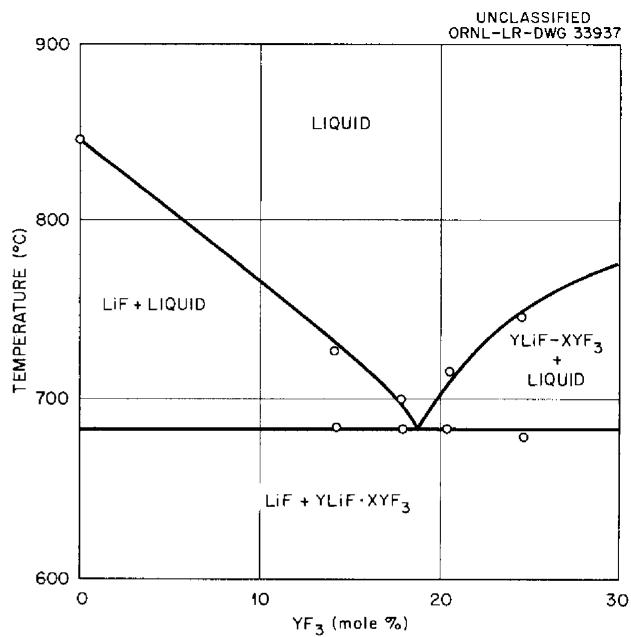  
Fig. 2.1.1. A Portion of the System LiF- $\mathsf{Y}\mathsf{F}_{3}$ (0-30 Mole $\%$ YF).

# EXTRACTION OF LITHIUM METAL IMPURITIES WITH MOLTEN SALTS

G.M.Watson J.H.Shaffer

A tentative procedure for purifying lithium metal by extracting oxide, nitride, and carbide impurities with a eutectic mixture of lithium halide salts, such as LiF-LiBr (12-88 mole $\%$ mp $453^{\circ}C)$ or LiF-LiCl (20-80 mole $\%$ mp $485^{\circ}C)$ , was described previously. The effectiveness of the method depends on the differences in solubilities of impurities in the salt and metal phases. Indirect measurements in this laboratory indicate that the solubility of $\mathsf{Li}_2\mathsf{O}$ is relatively high (over 1 mole $\%$ ) in molten salts. The solubility of the oxide in liquid lithium is not known, however, because of difficulties encountered in sampling and analysis, even though some progress has been recently reported in the determination of oxygen in lithium.

It is expected but not necessarily assured, however, that the differences in the solubilities of the impurities in the salt and metal phases are favorable toward their accumulation in the salt phase and that a suitable extraction method for lithium purification may be developed.

Five experiments were performed on two differen batches of lithium in attempts to gain familiarity with the procedure and to determine whether a correlation could be obtained between the number of extractions on a given batch of lithium and the amounts of impurities extracted. The results of these experiments are summarized in Table 2.1.4.

No particularly good correlation has been obtained to date between the number of extractions performed on a given batch of lithium and the concentration of

impurities extracted. It is true that the second extraction in each of the series shows a considerable lowering in concentration of the impurities extracted as compared with the initial concentration; however, the concentration of 50 ppm shown is probably in error, since in this experiment a considerable amount of bismuth-lithium alloy was trapped in the salt. Substantial corrections determined by measuring the hydrogen evolved from the salt when treated with water had to be applied. Thus the value of 50 ppm was obtained as the net result of the difference between two relatively large numbers. Accordingly this result can be discounted for the present. The result of the third extraction of batch number 1 appears to be totally due to nitrogen impurities, as given by chemical analysis of the salt. It is not immediately apparent why no oxygen was found (by difference) unless the analytical results for the nitrogen determination are erroneous.

For future experiments greater care will be exercised in minimizing contamination in the experimental assembly. Also the lithium metal will be heavily contaminated with known amounts of oxide, introduced as $\mathrm{CuO}$ , in order to attempt to determine on a much firmer basis whether the partition coefficient for the oxide extraction is favorable for the accumulation of impurities in the salt phase.

Recent improvements in analytical techniques have made it feasible to analyze lithium samples before and after the salt extraction, and it is no longer necessary to depend entirely on the complex procedures required for analysis of the salt phase. The liquid lithium samples will be obtained as emulsions of lithium in paraffin.

Table 2.1.4. Extraction of Impurities from Liquid Lithium by Molten LiF-LiX Eutectic Mixtures   

<table><tr><td>Batch No.</td><td>Extraction Number</td><td>Salt Mixture</td><td>Total Impurities Extracted (Calculated as ppm 0)</td><td>Nitrides (as ppm N)</td></tr><tr><td rowspan="3">1</td><td>1</td><td>LiF-LiBr</td><td>400</td><td>Not determined</td></tr><tr><td>2</td><td>LiF-LiBr</td><td>50</td><td>&lt;50</td></tr><tr><td>3</td><td>LiF-LiBr</td><td>484</td><td>500</td></tr><tr><td rowspan="2">2</td><td>1</td><td>LiF-LiCl</td><td>2860</td><td>&lt;20</td></tr><tr><td>2</td><td>LiF-LiCl</td><td>467</td><td>&lt;20</td></tr></table>

# 2.2. ANALYTICAL CHEMISTRY

J. C. White

Analytical Chemistry Division

# DETERMINATION OF OXYGEN IN FLUORIDE SALTS

A. S. Meyer, Jr. G. Goldberg

The method for the determination of oxygen in fluoride salts by fluorination with $\mathsf{KBrF}_{4}$ as described in a previous report, was applied successfully to determinations of oxygen in the mixed salt $\mathsf{LiF - MgF}_2\mathsf{-YF}_3$ . Seven salt mixtures were analyzed during this period. The results for duplicate samples are presented below:

<table><tr><td>Sample No.</td><td>Oxygen Content (%)</td></tr><tr><td>A1</td><td>0.11, 0.11</td></tr><tr><td>A2</td><td>0.21, 0.22</td></tr><tr><td>A3</td><td>0.11, 0.10</td></tr><tr><td>A4</td><td>0.11, 0.10</td></tr><tr><td>A5</td><td>0.14, 0.15</td></tr><tr><td>A6</td><td>0.24, 0.26</td></tr><tr><td>A7</td><td>0.11, 0.13</td></tr></table>

The coefficient of variation of the results is $6\%$ .

Since Sheft, Martin, and Katz² had reported that KBrF₄ was too basic to react with sufficient satisfaction with an oxide as basic as MgO and had recommended the use of an acidic addition compound, SbF₆ BrF₂, for such oxides, the validity of the results for oxygen in LiF-MgF₂-YF₃ was corroborated by analyzing standard samples of MgO and Y₂O₃. The recovery of oxygen from these oxides exceeded 98% with excellent precision (coefficient of variation, 2%). Highly refractory MgO, however, did not react appreciably with KBrF₄. The method described is now being used for routine determinations of oxygen in the mixed salt and also to determine the extent of conversion of oxides of magnesium and yttrium to the fluorides.

# DETERMINATION OF YTTRIUM AND MAGNESIUM IN LiF-MgF2-YF3

J.P.Young R.F.Apple

A potentiometric method for the determination of both yttrium and magnesium in $\mathsf{LiF - MgF}_2\mathsf{-YF}_3$ was developed and evaluated. Yttrium and magnesium form stable complexes with ethylenediaminetetraacetic acid (EDTA) and can be determined by direct titration by applying the technique of Reilley and Schmid, who use a modified mercury electrode. The electrode system is essentially an amalgamated gold wire as the indicator electrode and calomel as the reference electrode.

Both yttrium and magnesium are determined in the same sample because of the difference of the stability constants of their respective EDTA complexes. Yttrium, the more stable complex, is determined at a pH of $4.0 \pm 0.5$ . Then the pH of the sample solution is increased to $9.7 \pm 0.3$ , and magnesium, the less stable complex, is determined. An example of the resultant titration curve is shown in Fig. 2.2.1. When titrating yttrium and magnesium with $0.01 \mathrm{M}$ EDTA, at least $5 \mathrm{mg}$ of yttrium and at least $1 \mathrm{mg}$ of magnesium should be present in order to obtain a satisfactory potential break at the end point. Although macro amounts of iron, nickel, and chromium would definitely interfere with these determinations, the method is quite insensitive to the micro amounts of these corrosion products that would be expected in routine samples of LiF- $\mathrm{MgF}_2 - \mathrm{YF}_3$ .

Up to approximately $400\mu \mathrm{g}$ of fluoride ion can be tolerated in the sample solution without affecting either determination. The titrations can be performed in either a nitrate or sulfate medium; large concentrations of chloride ion interfere with the response of the mercury electrode. Typical results for the determination of yttrium and magnesium in synthetic standard sample solutions which contained nitric or sulfuric acid are given in Table 2.2.1.

The precision of the method is about $1\%$ . The results of these determinations are accurate to within $2\%$ . This method is considerably less time-consuming than the gravimetric methods that were previously used for the determination of these metals. The procedure has also been applied to the determination of yttrium in yttrium oxide and in yttrium fluoride.

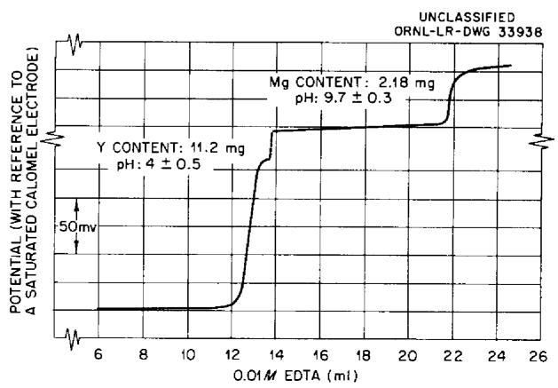  
Fig. 2.2.1. Results of Potentiometric Titration of Yttrium and Magnesium with Ethylenediaminetetraacetic Acid.

Table 2.2.1. Typical Results for the Determination of Yttrium and Magnesium in Solutions Which Contain Yttrium, Magnesium, and Lithium by Means of a Potentiometric Titration with Ethylenediaminetetraacetic Acid   

<table><tr><td colspan="2">Yttrium (mg)</td><td colspan="2">Magnesium (mg)</td></tr><tr><td>Present</td><td>Found</td><td>Present</td><td>Found</td></tr><tr><td colspan="4">With 1 M Sulfuric Acid Present</td></tr><tr><td>7.24</td><td>7.35</td><td>1.45</td><td>1.44</td></tr><tr><td></td><td>7.30</td><td></td><td>1.44</td></tr><tr><td>10.9</td><td>10.9</td><td>2.18</td><td>2.16</td></tr><tr><td></td><td>11.1</td><td></td><td>2.17</td></tr><tr><td>14.4</td><td>14.6</td><td>2.90</td><td>2.84</td></tr><tr><td></td><td>14.4</td><td></td><td>2.89</td></tr><tr><td colspan="4">With 0.2 M Nitric Acid Present</td></tr><tr><td>7.50</td><td>7.58</td><td>1.45</td><td>1.49</td></tr><tr><td></td><td>7.58</td><td></td><td>1.49</td></tr><tr><td>11.3</td><td>11.4</td><td>2.18</td><td>2.15</td></tr><tr><td></td><td>11.3</td><td></td><td>2.16</td></tr><tr><td>15.0</td><td>15.3</td><td>2.90</td><td>2.84</td></tr><tr><td></td><td>15.2</td><td></td><td>2.87</td></tr></table>

# 2.3. RADIATION DAMAGE

G. W. Keilholtz

Solid State Division

# ETR IRRADIATION OF MODERATOR MATERIALS FOR USE AT HIGH TEMPERATURES

W.E.Browning, Jr.

R. P. Shields

J.E.Lee, Jr.

Experimental apparatus is being prepared with which to test the stability of yttrium hydride and beryllium oxide at temperatures up to $1800^{\circ}\mathrm{F}$ in the high-level irradiation environment of the Engineering Test Reactor (ETR), where the gamma-ray heating is approximately 25 w/g. Temperature gradients will be induced in the specimens, and the reactor programing will provide thermal cycling. The yttrium hydride samples will be checked for changes in crystal structure, as well as for the effects of stresses resulting from temperature gradients.

Before the samples of the moderator materials are irradiated, x-ray examinations will be made of the yttrium hydride samples in order to determine the crystal structures, the modulus of elasticity and shear modulus of each sample will be measured, marked regions on the samples will be photographed, and exact measurements of the pieces will be made. The radioactivities of the samples should be low enough for the examinations and measurements to be repeated after irradiation.

The heat generated in the irradiated capsules will be conducted across a small annulus by a helium-argon or a helium-nitrogen mixture which will be essentially static as far as heat transfer is concerned. There will be just enough flow to permit changing the mixture in order to maintain a constant temperature at the outside surface of a capsule. Helium has about four times the heat transfer capacity of argon and will make up the largest part of the gas mixture.

Since the intensity of gamma-ray heating in the reactor is uncertain it is necessary to provide means for raising the experimental equipment to a region of lower gamma-ray intensity if the heating is found to be too great. In order to accommodate the necessary raising devices, the apparatus for the initial experiment will include only one yttrium hydride and one beryllium oxide capsule.

The beryllium oxide sample will contain three right cylinders 0.636 in. in diameter and 1 in. in

height. These will be placed end to end in a type 410 stainless steel capsule. The yttrium hydride sample is similar, but the diameter of each cylinder is 0.800 in. and the cylinders will be enclosed in type 430 stainless steel. The yttrium hydride cylinders and the steel capsule prior to assembly are shown in Fig. 2.3.1. As may be seen, one cylinder, which will be at the top of the assembly, has a well for a thermocouple with which to monitor the central temperature. The top beryllium oxide cylinder temperature will be monitored similarly.

The assembled capsules and the tubes which provide the gas annuli are shown in Fig. 2.3.2. Thermocouples will be attached to the sides of the capsules midway between the ends. In order to pass these thermocouples through the thin gas annulus, sheathed, swaged magnesia thermocouple leads will be silver soldered into the small metal plugs shown in Fig. 2.3.2. The thermocouples will be spot-welded to the capsule. Flexibility in the thermocouple wires where they pass through the gas annulus will be provided by helical coils.

After the outer tube assembly is completed, it will be encased in an aluminum spacer that will provide a $1/16$ -in. water annulus and will also anchor the sheathed thermocouple leads and gas tubes. The spacer unit will then be fitted into an aluminum tube which will be attached to a l-in.-dia stainless steel pipe. This pipe, which will extend to a point about 10 ft above the ETR lattice, will support the experimental apparatus. All thermocouple leads and gas lines will be inside the pipe and will leave the reactor cell through a l-in.-dia flexible steel tube that will connect with the support tube and the flange on the reactor. The steel cable attached to the support pipe and a drum near the reactor flange will provide the means for raising the apparatus to a position of lower gamma-ray flux if the temperature becomes too high.

The design work on the thermocouple installation was the major developmental effort required for this experiment. Each thermocouple must be capable of operating at a high thermal stress in the gas annulus. Also, the sheath which encloses the leads and is sealed at the junction with the tube that forms the gas annulus must be capable of withstanding the high pressure of the reactor cooling water.

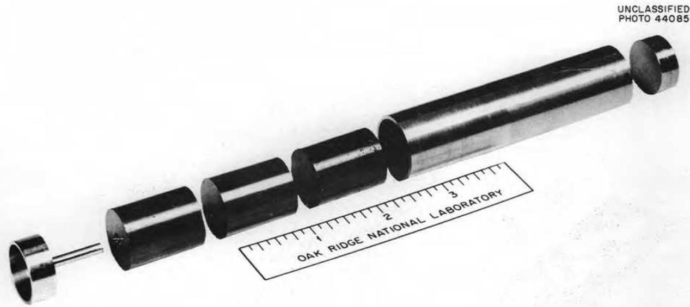  
Fig. 2.3.1. Yttrium Hydride Cylinders and Steel Capsule Ready for Assembly and Irradiation in the ETR at High Temperatures. (Secret with caption)

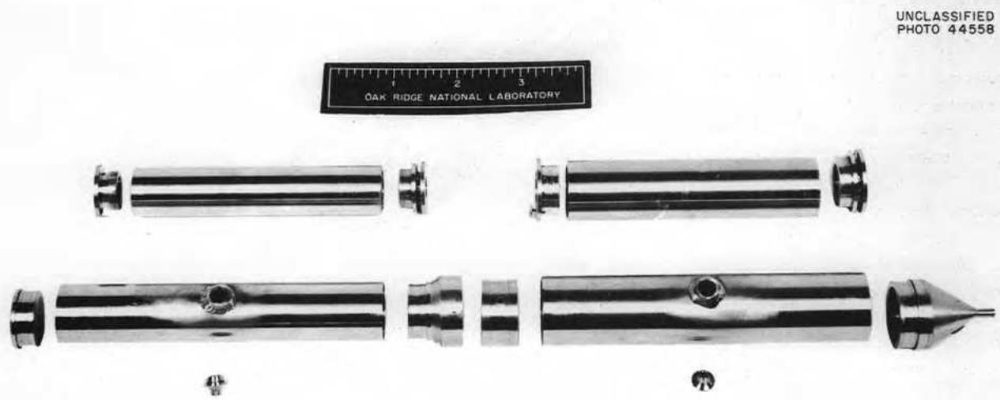  
Fig. 2.3.2. Capsule Irradiation Assemblies Showing Tubes Which Form Gas Annuli.

A series of mockup devices was used in designing a thermocouple arrangement and developing the technique for installing the thermocouples, and the operating conditions were simulated as nearly as possible in the mockup tests. The mockup used to test the thermocouples is shown in Fig. 2.3.3. The heating element (bottom of Fig. 2.3.3) is a 10-mil-wall Inconel tube attached to copper electrodes. At

$900^{\circ}F$ , approximately $2\mathrm{kw}$ of heat can be conducted from this element across the 10-mil annulus to a water jacket. The thermocouple wires are spot-welded to the heating element, and the Inconel sheath containing the wires extends through a small cap which anchors the sheath to the water jacket.

Cycling the heating element from room temperature to $900^{\circ}C$ flexes the thermocouple wires; the life of

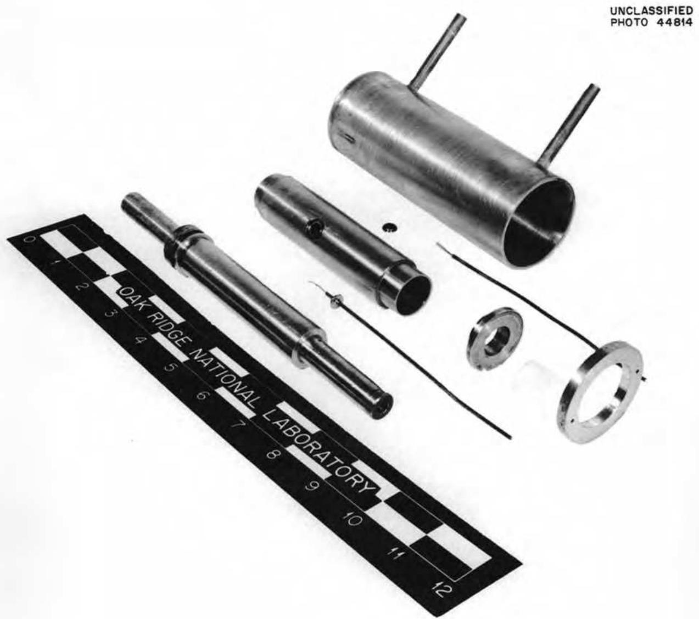  
Fig. 2.3.3. Mockup Device Used in Designing and Testing the Thermocouple Installation Used in the Apparatus for High-Temperature Irradiation of Moderator Materials.

the thermocouple is a function of the number of such cycles. It was found that annealing the wires after removing the sheath and before bending them greatly increased the life.

This mockup device also served to develop a temperature control method. With argon flowing through the annulus at a very low rate, a Moore controller, activated by a thermocouple, introduces helium into the argon in varying amounts to increase or decrease the heat conductivity of the gas. Varying the conductivity of the gas mixture allows a constant temperature to be maintained on the outside of the capsule although considerable changes in gamma-ray flux may take place.

The compatibility of yttrium hydride and beryllium oxide with various probable encapsulating materials was also investigated. The materials tested were Inconel, nickel, and types 446, 430, and 410 stainless steel. An Inconel capsule containing yttrium hydride that was heated for $200\mathrm{hr}$ at $900^{\circ}\mathrm{C}$ showed no attack. However, when a second capsule was tested at $1000^{\circ}\mathrm{C}$ , the Inconel reacted with the hydride, and a large opening was formed in the capsule in a matter of 10 to 15 hr. The stainless steels mentioned were all satisfactory and the final selection was made on the basis of most favorable machining, welding, and heat properties. At the present time the apparatus for the experiment and a

reactivity mockup required for the ETR critical facility are being assembled.

# CREEP AND STRESS RUCTURE TESTS UNDER IRRADIATION

J. C. Wilson

W. E. Brundage

W.W.Davis

N. E. Hinkle

J. C. Zukas

The first MTR tube burst tests were carried out in a helium atmosphere. The short times to rupture were attributed to thermocouple errors arising from contamination of the helium atmosphere by thermal insulation. A second series of tests have now been completed in an air atmosphere in the MTR, and the resultant data are being evaluated. Equipment is being constructed for operation of tube burst tests in the lattice of the ORR and for carrying out creep rate experiments on the pool side.

# RADIATION EFFECTS IN ELECTRONIC COMPONENTS

# Wide-Range Multipurpose Cryostat

O.E.Schow

In conjunction with studies of the effects of radiation on semiconductor barriers, a cryostat has been constructed with a temperature range of $-200^{\circ}\mathrm{C}$ to $+350^{\circ}\mathrm{C}$ . Requirements, other than the temperature range, were long-term reliability and "fail-safe" operation, that is, cooling water failure or electrical failure should shut the cryostat down without harmful effects to any of the system components.

The cryostat consists of concentrically nested metal "cans," suspended from the top, as shown in Fig. 2.3.4. The innermost container, the sample chamber, is in two sections. The part which actually holds the sample is a 4-in.-ID copper cylinder having $\frac{1}{8}$ -in. walls. The bottom of the cylinder is closed with $\frac{1}{8}$ -in. copper plate recessed 2 in. from the end. This recessed bottom is necessary to reduce the heat loss through the bottom of the cylinder. The over-all length of the copper section is 12 in., of which 10 in. is available for use. The open end of this section is silver-soldered to a 4-in.-ID stainless steel cylinder, 14 in. long, having 0.019-in. walls. The stainless steel

cylinder is, in turn, attached to a brass plug which bolts to the suspension plate. The entire sample chamber, along with its associated thermocouples and heaters, is completely removable for servicing. Around the sample chamber and separated from it by a $\frac{1}{2}$ -in. heat-exchange-medium chamber is the liquid-nitrogen cooling jacket. This jacket is filled automatically and provides the heat sink for the sample chamber. Around the cooling jacket is a $1\frac{1}{2}$ -in.-high vacuum chamber to isolate the system from the ambient temperature. The brass suspension plate is supported by the outermost container, a $\frac{1}{8}$ -in. wall, stainless steel cylinder, 30 in. high.

Each chamber, with the exception of the liquid-nitrogen cooling jacket, is connected by means of holes in the suspension plate to a gas-and-vacuum manifold panel, from which it is possible to introduce vacuum, any desired gas, or air into each chamber. These operations may be performed independently or simultaneously. The system is monitored by gages with which it is possible to determine pressures in the chambers from 2 atm to $10^{-9}$ mm Hg. Also connected through this panel is a mechanical roughing pump to reduce the system pressure sufficiently to prevent damage to the diffusion pump.

The diffusion pump for the system is a water-cooled 300-liter/sec fractionating pump. Silicone oil is used to prevent pump damage if the system goes to atmospheric pressure while the pump is on. This pump is suspended below the cryostat and connected through the outer cylinder by means of a 4-in. "O"-ring-sealed flanged joint.

The diffusion-pump cooling coil and the boiler coil are connected to a monitoring and control panel. Loss of water pressure, reduction of water flow, or failure of electrical power will automatically initiate an emergency shutdown. The pump cannot be started again until corrective measures have been taken.

Temperature control of the cryostat is effected by means of a Speed-O-Max "PAT" temperature controller. This controller uses, as reference, one of seven thermocouples which have been embedded in the copper section of the sample chamber and held there by copper amalgam. Heat is applied to the sample chamber by means of five heaters wound around the chamber. The total electrical input to this heater system is controlled by the controller, but separate adjustments can be made to determine what portion of the total electrical power goes to each heater. Temperatures in the sample chamber

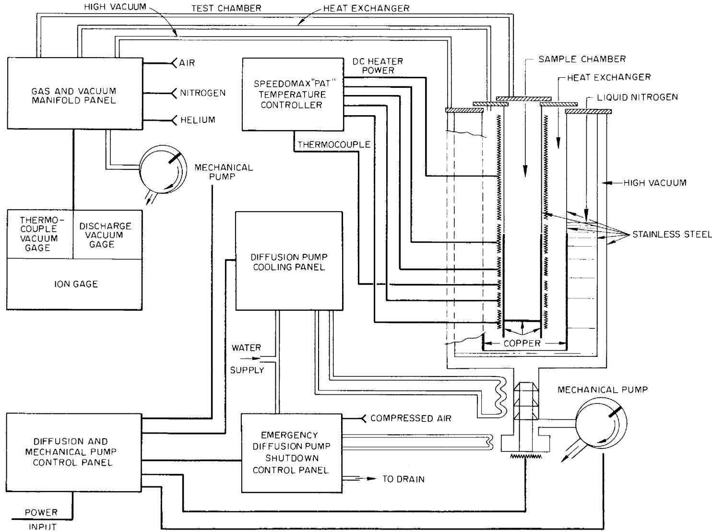  
Fig. 2.3.4. Wide-Range Multipurpose Cryostat.

can be maintained to within $\frac{1}{4}\mathcal{C}$ with a gradient along the length of the copper section of the sample chamber of $\frac{1}{4}\mathcal{C}$ .

# Grown-Junction Silicon Diode Irradiation

J.C.Pigg

C. C. Robinson

O.E.Schow

An experiment has been performed to determine the effect of fast-neutron radiation on a grown-junction silicon diode. The facility used for the irradiation was the same as that used for bombardment of a point-contact silicon diode and an alloy-junction silicon diode so that comparisons of the three types of diodes would be possible. The sample studied in this irradiation was $1.6\mathrm{cm}$ long, $5\mathrm{mm}$ wide, and $5\mathrm{mm}$ thick. The junction was about $8\mathrm{mm}$ from the end of the $p$ side. The sample was ground and carefully etched. Nickel was plated to the ends, and lead wires were attached. It was then placed in a glass container which was evacuated, flushed with helium, and filled to a pressure of $\frac{1}{2}$ atm with helium. The leads and thermocouple wires were brought out through Kovar seals.

The irradiation was performed in hole 51 of the ORNL Graphite Reactor. This hole is a fast-flux facility with a fast flux of about $8.3 \times 10^{11}$ neutrons/cm $^2$ -sec when the reactor is at 3500 kw. The flux is proportional to the power level. The facility is water-cooled to maintain a temperature of about $23^{\circ}\mathrm{C}$ . Because the sample was not in intimate contact with the side of the facility, its temperature during the irradiation rose to $33^{\circ}\mathrm{C}$ . The irradiation was begun with a reactor power of 100 kw, which was raised to a maximum of 2100 kw. At this power the fast flux was approximately $5 \times 10^{11}$ neutrons/cm $^2$ -sec. To further assure bombardment by fast neutrons only, the sample was wrapped in several layers of 4.5-mil cadmium. A bias of 1 v was applied in the forward and reverse directions alternately, and the current was measured.

A rapid increase in forward current and a small decrease in reverse current which occurred during the very early part of the irradiation is illustrated in Fig. 2.3.5, that is, up to about $5 \times 10^{13}$ neutrons/cm $^2$ . Although not shown conclusively, experience with previous irradiations indicates that this may possibly be attributed to photo-emf's produced in both the sample and in the lead wire insulation by the gamma-ray flux of the reactor.

From the dosage of about $1 \times 10^{14}$ to about $1 \times 10^{15}$ neutrons/cm $^2$ , the changes in the reverse

current may be attributed to the increase in temperature. Inasmuch as the temperature levels off after $1 \times 10^{15}$ neutrons/cm², while the reverse current continues to increase, this change in reverse current is believed to be the result of radiation. The irradiation was terminated at $1.8 \times 10^{15}$ neutrons/cm² because the ratio of forward to reverse current had reached a magnitude which suggested other studies of the sample.

A preliminary comparison of the results of this irradiation with those of previous irradiations show a change in this sample on the order of a factor of 100 increase in reverse current as compared with an increase of $200\%$ for a comparable irradiation of an alloy-junction diode and an increase of $30\%$ in a point-contact diode.

# Low-Temperature Indium-Germanium Alloy

J.C.Pigg

C. C. Robinson

O.E.Schow

During some preliminary work on the problem of alloying indium into germanium for the purpose of making electrical barriers, some heretofore unfamiliar phenomena were noted. This portion of the work dealt with attempts to alloy at temperatures which were not greater than $280^{\circ}\mathrm{C}$ . On a phase diagram this temperature represents a concentration of indium of about $5\%$ . Alloying times were on the order of 15 min to 1 hr, with additional 10-min periods to bring the samples to temperature and 10-min periods to cool the samples to room temperature. Inasmuch as no continuous time-temperature recordings were taken, it would be difficult to estimate the cooling rate of the sample as it passed through various significant temperatures, that is, the eutectic or the freezing point of the indium. It is believed, however, that the thermal inertia of the heater would prevent extreme, $50^{\circ}\mathrm{C} / \mathrm{min}$ or faster, temperature changes. The alloying was carried out in a helium atmosphere.

After the alloying cycle, the major part of the indium was removed by careful cutting, and the remainder of the sample was etched in nitric acid only. This served to remove the indium without significantly attacking the germanium. Microscopic examination of the surface showed no major amount of penetration of the indium into the germanium;

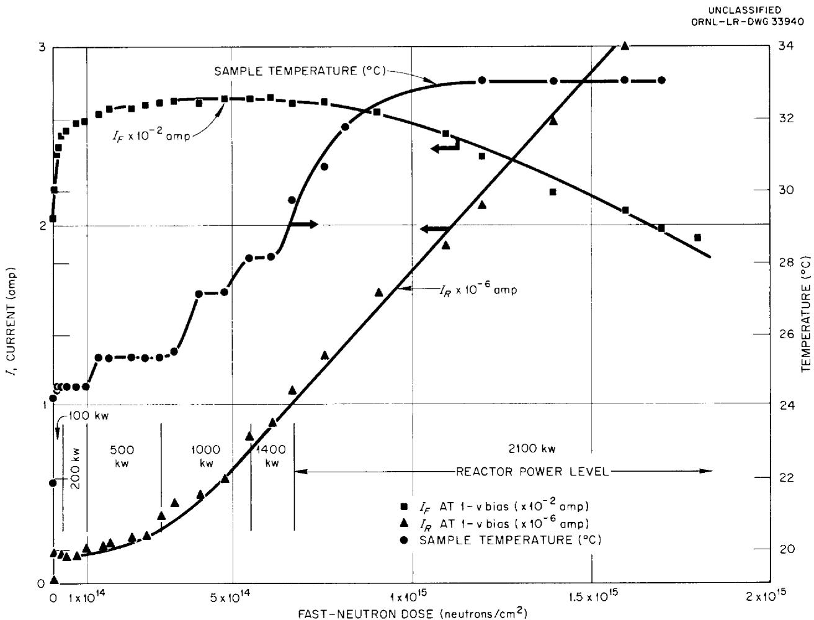  
Fig. 2.3.5. Irradiation Effects on a Grown-Junction Silicon Diode.

indeed, most of the surface appeared to be untouched. (Microscopic examination of germanium etched with nitric acid alone does show some attack, but the action is slow and does not compare with the action of nitric acid on the indium and is not believed to detract from the phenomena observed.)

In the areas where penetration was noted, it was seen to be, for the most part, penetration which conformed to rather precise geometric configurations. Some of these may be seen in Fig. 2.3.6. Geometric crystal growths on the surface of the germanium may also be seen. Other examples are shown in Fig. 2.3.7. The sample shown in Fig. 2.3.7 is not the same as the one shown in Fig. 2.3.6. On still another sample, well-defined triangular "screw growth" was seen. In one instance, a pyramidal crystal was growing from the bottom of a hexagonally sided pit. The pyramidal and triangular shapes of

the growths and pits might be attributed to the crystal structure of indium, but it is suspected that such growths would have been removed by nitric acid.

Hexagonal pits and growths might be attributed to the germanium. If so, a pit in germanium conforming to the shape of the germanium crystal would not be expected unless the germanium had been dissolved by the indium and the resulting mixture removed by the nitric acid. This leads to speculation about the action of nitric acid on different mixtures of germanium and indium. Triangular pits which seem to be progressing towards a hexagonal shape can also be seen in the photographs. The spotted or "dusty" surface of the germanium is thought to be a result of the previously mentioned action of nitric acid on germanium.

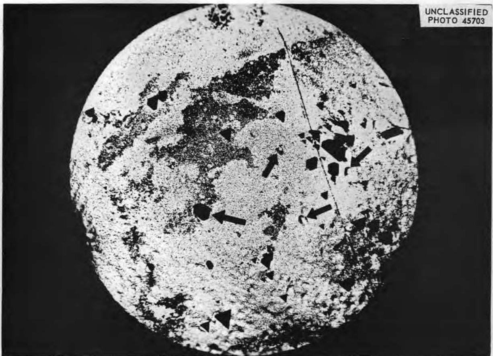  
Fig. 2.3.6. Photomicrograph of Germanium Surface Showing Crystal Growth (Indicated by Arrows) and Indium Penetration. 35X.

It is well known that indium-germanium alloy junctions do not result in an even mixing or diffusion of one metal into the other. Recrystallization of single crystal germanium on the indium side of the barrier has been seen, and the irregularity or "raggedness" of the junction is still a problem to those interested in junction preparation.

Examination of germanium alloy transistors by the above technique, that is, removal of the indium by nitric acid, shows a number of indentations in the germanium surface, but they are not of a geometric configuration. Other samples show no significant pits, but the surface is smoothly curved. The pits of these commercial units may be due to entrapped gas, and, if so, it could be said that the slight curvature of the surface is a result of more complete melting than in samples alloyed at low temperatures. Since a considerably higher temperature is involved

in the preparation of the commercial units, it may be that samples alloyed at low temperatures indicate the beginning of the alloying process, that is, penetration takes place at some particular spot on the germanium surface in a disordered region of some sort such as, perhaps, a dislocation or an etch pit. Since etching rates along crystal faults are different than on a normal surface, the preferential attack might be limited to a crystal fault inherent in the crystal or introduced by cutting and not removed by etching. Such a conclusion does not appear to be completely unfeasible, since it is known that "screw growths" occur at crystalline faults. If such is the case, it would lead to speculation about alloying indium into germanium which has been ground and lapped but not etched. Further speculation would suggest that recrystallization of indium-germanium alloy junctions begins from these growths.

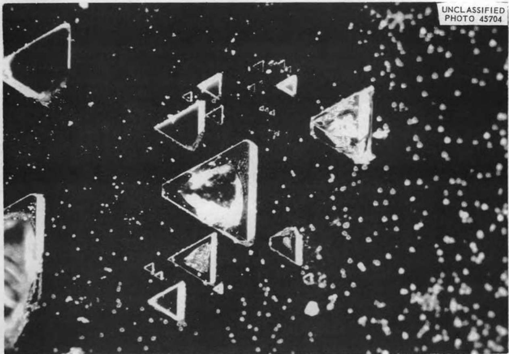  
Fig. 2.3.7. Dark-Field Illuminated Photomicrograph Showing Germanium Surface Crystal Growth. 250X.

The germanium used in this work was $n$ -type, and it had a resistivity of approximately 2 ohm/cm, which is not extremely different from that of commercial units. Before alloying it was etched in CP-4, washed in distilled water, and kept in ethyl alcohol until used. The indium was lightly etched in nitric acid long enough to produce a shiny surface, washed in distilled water, and stored in ethyl alcohol until used.

Examinations of the samples after exposure to air for a period of 1 to 2 weeks showed that the pits and growths had undergone some change. They were still on or in the germanium, but the edges had been rounded as if they had been lightly etched. Another sample kept in ethyl alcohol for a period of two weeks showed no changes in the shape or sharpness of the pits and growths.

# Part 3

# ENGINEERING

A. P. Fraas

A. L. Boch

Reactor Projects Division

# 3.1. COMPONENT DEVELOPMENT AND TESTING

H.W.Savage E.Storto Reactor Projects Division

# IRRADIATION TEST OF OIL-LUBRICATED PUMP ROTARY ELEMENT

D. L. Gray

The device which consists of the rotary element of an oil-lubricated pump and which is installed in a gamma-irradiation facility in the MTR canal, as previously described, has continued to operate with downtime limited to 20 min as a result of a power failure and 1 hr as a result of a low-lube-oil-flow alarm. As of August 19, the lower bearing and seal area had received a total gamma-ray dosage of $8.9 \times 10^{9} \mathrm{r}$ , and, by September 30, a total gamma-ray dosage of $1 \times 10^{10} \mathrm{r}$ is expected. A large oil reservoir is used with this type of rotary element and thus only a small portion (about $2\%$ ) of the lubricant (Gulfcrest 34) is exposed to radiation at any time. The average gamma-ray dosage to the total quantity of oil in the lubricating system is therefore expected to be about $2.2 \times 10^{8} \mathrm{r}$ by September 30.

Insofar as can be ascertained, the operation of the seal has been comparable to that of a seal operated without irradiation for a similar period of time. The leakage of oil from the seal into the catch basin has usually been at a rate of 5 to 7 ml/day, although higher rates have been observed for short periods from time to time. Results of

analyses of samples of oil taken from the test equipment at periodic intervals are presented in Table 3.1.1.

The viscosities of both the bulk and the leakage oil have increased but not deleteriously so, as indicated by operation of the apparatus. The increase in the bromine number indicates that irradiation has displaced some hydrogen atoms from the hydrocarbon molecules, also without noticeable effect on operation. The acidity number indicates very little contamination of the system.

# TEST OF NoK PUMP WITH FULTON-SYLPHON SEAL

D. L. Gray

A sump-type centrifugal pump designed to operate at a shaft speed of 1200 rpm and to circulate NaK at $1200^{\circ}\mathrm{F}$ at a rate of 1200 gpm was modified to include a Fulton-Sylphon seal and placed in test operation as described previously. During more than 7500 hr of operation, the oil leakage past the test seal, which separates the lubricating oil from the pump tank helium cover gas, has been of the order of $10\mathrm{cm}^3$ per week, which is exceptionally small for a seal of this type. The similar upper seal, which separates the lubricating oil from the atmosphere, has been equally satisfactory.

Table 3.1.1. Results of Analyses of Oil Samples from MTR Test Apparatus   

<table><tr><td rowspan="2"></td><td colspan="2">Bulk Circulating Oil</td><td colspan="3">Lower Seal Oil Leakage</td></tr><tr><td>Control Sample</td><td>Sample of 7-31-58</td><td>Sample Accumulated 3-13 to 3-27-58</td><td>Sample Taken 4-28-58</td><td>Sample Accumulated 5-24 to 6-21-58</td></tr><tr><td>Viscosity, SUS at 250°C</td><td>90.2</td><td>118.5</td><td>108.0</td><td>112.6</td><td>140.2</td></tr><tr><td>Bromine No., mg of Br/100 g of oil</td><td>0.87</td><td>5.6</td><td>3.4</td><td>4.1</td><td>7.3</td></tr><tr><td>Acidity, mg of KOH/g of oil</td><td>0</td><td>0.013</td><td>0</td><td>0</td><td>0</td></tr></table>

# CAVITATION TESTS OF

# CENTRIFUGAL PUMPS

P. G. Smith

W.E.Thomas

One of two pumps being tested, as described previously, to study the effect of operation in the cavitation region was stopped because of leakage of NaK from the system drain valve. This sump-type centrifugal pump had circulated NaK in the temperature range of 1200 to $1450^{\circ}\mathrm{F}$ for 2136 hr at a flow rate of 645 gpm, a pump speed of 2700 rpm, and a pump tank cover gas pressure of 2.5 psig. At the time of termination of the test, the pump had been operating under cavitation conditions for 1096 hr. The pump appeared to be in good condition after the test; there was no evidence of cavitation damage. The data accumulated during this period are being analyzed.

A similar pump that is being operated with a fused salt as the pumped fluid has logged more than 10,300 hr of continuous operation at $1200^{\circ}\mathrm{F}$ , including about 8200 hr under cavitation conditions. The oil leakage from the lower seal that separates the lubricating oil from the pump tank cover gas has averaged 10 cm³/day during the past six months. Seal leakage from the upper seal that separates

3P. G. Smith and W. E. Thomas, ANP Quar. Prog. Rep. March 31, 1958, ORNL-2517, p 69.

the lubricating oil from the atmosphere has averaged $5\mathrm{cm}^3 /$ day.

# THERMAL STABILITY TESTS

# OF METAL SHELLS

J.C.Amos

R. S. Senn

A third thin-shell model was tested under high-temperature thermal cycling conditions similar to those previously imposed on two other thin shell models. This shell had the same geometry as those used previously, but it was fabricated by welding over-size sections and reducing the shell to final dimensions by machining the weldment.

Testing of the third shell was continued beyond the scheduled 300 thermal cycles to 602 thermal cycles. At this point the test was terminated because of a test loop failure. There was no indication that the loop failure was in any way associated with the test shell. The shell is currently being examined for dimensional changes, and it will be metal-lurgically examined for effects of thermal cycling on the welds.

4. J. C. Amos and L. H. Devlin, ANP Quar. Prog. Rep. March 31, 1957, ORNL-2274, p 50.   
5J. C. Amos and R. L. Senn, ANP Quar. Prog. Rep. Sept. 30, 1957, ORNL-2387, p 45.

# 3.2. HEAT TRANSFER STUDIES

H. W. Hoffman Reactor Projects Division

# STUDIES OF THE EFFECT OF THERMAL-STRESS CYCLING ON STRUCTURAL MATERIALS

J.J.Keyes

A. I. Krakoviak

Experimental studies of the effect on Inconel of surface thermal-stress cycling in a fused-salt environment (NaF-ZrF4-UF4, 56-39-5 mole %) were continued with the use of the high-frequency pulse-pump loop. In order to obtain data for comparison with data obtained in the University of Alabama bulk thermal-cycling studies and to establish the frequency dependence of cycles to crack initiation, tests 9 through 11 were conducted at a pulse frequency of 0.1 cps and test 12 at 1.0 cps. Tables

3.2.1, 3.2.2, and 3.2.3 present summaries of the operating conditions and results for these runs. The wall thicknesses of the Inconel specimens used for these tests were selected to give just perceptible temperature fluctuations at the outside surface. Further, as seen from Table 2.3.3, tests 9 through 11 constitute a comparison of the effect of exposure time (or total number of cycles) for nearly equivalent stress conditions at a given frequency.

1J.J. Keyes, A.I. Krakoviak, and J.E. Mott, ANP  
Quar. Prog. Rep. Dec. 31, 1957, ORNL-2440, p 54.  
2J.F. Gonee, Jr., and W.D. Jordan, Tbermal Fatigue  
Tests II, MR7, Bureau of Engineering Research,  
University of Alabama, June 1957.

Table 3.2.1. Operating Conditions of High-Frequency Thermal-Stress-Cycling Test of Inconel Pipes   

<table><tr><td rowspan="2">Test Variables</td><td colspan="4">Test Number</td></tr><tr><td>9</td><td>10</td><td>11</td><td>12</td></tr><tr><td>Average fluid temperature, °F</td><td>1407</td><td>1412</td><td>1411</td><td>1415</td></tr><tr><td>Maximum temperature difference between hot and cold streams, °F</td><td>550</td><td>569</td><td>557</td><td>575</td></tr><tr><td>Frequency of temperature oscillations, cps</td><td>0.1</td><td></td><td>0.1</td><td>1.0</td></tr><tr><td>Total pulsing time, hr</td><td>200</td><td>75</td><td>25</td><td>100</td></tr><tr><td>Total cycles</td><td>72,000</td><td>27,000</td><td>9,000</td><td>360,000</td></tr><tr><td>Total fluid flow rate, gpm</td><td>3.6</td><td>3.6</td><td>3.7</td><td>3.8</td></tr></table>

Table 3.2.2. Results of Metallographic Examination of Test Pieces from High-Frequency Thermal-Stress-Cycling Tests of Inconel Pipe   

<table><tr><td>Test No.</td><td>Metallographic Results</td></tr><tr><td>9</td><td>Severe intergranular cracking found throughout test section; depths of cracks increased from 0.128 in. at top of test section to 0.207 in. in center section</td></tr><tr><td>10</td><td>Intergranular cracking found throughout; depths of cracks increased from 0.012 to 0.023 to 0.103 in. in top, center, and bottom of test section, respectively</td></tr><tr><td>11</td><td>No evidence of cracking</td></tr><tr><td>12</td><td>No evidence of cracking</td></tr></table>

Mean temperature: $1405 \pm 10^{\circ} \mathrm{F}$

Inside diameter of test section: 0.485 in.

Table 3.2.3. Summary of Results of High-Frequency Thermal-Stress-Cycling Tests of Inconel Pipe   

<table><tr><td>Test No.</td><td>Estimated Inside Wall Temperature Amplitude* (°F)</td><td>Measured Temperature Amplitude on Outside Wall (°F)</td><td>Wall Thickness of Test Section (in.)</td><td>Calculated Stress on Inside Wall Fibers (psi)</td><td>Calculated Total Strain per 1/4 Cycle (%)</td><td>Total Number of Cycles</td></tr><tr><td>5</td><td>±113</td><td>±7</td><td>0.250</td><td>19,400</td><td>0.095</td><td>194,400</td></tr><tr><td>6</td><td>±121</td><td>Not measured</td><td>0.415</td><td>23,400</td><td>0.114</td><td>32,000</td></tr><tr><td>7</td><td>±69</td><td>0</td><td>0.415</td><td>13,400</td><td>0.065</td><td>224,000</td></tr><tr><td>8</td><td>±70</td><td>Not measured</td><td>0.415</td><td>13,500</td><td>0.066</td><td>508,600</td></tr><tr><td>9</td><td>±120</td><td>±8.6</td><td>0.445</td><td>21,700</td><td>0.106</td><td>72,000</td></tr><tr><td>10</td><td>±127</td><td>±9.5</td><td>0.445</td><td>22,800</td><td>0.111</td><td>27,000</td></tr><tr><td>11</td><td>±122</td><td>±8.8</td><td>0.445</td><td>22,100</td><td>0.108</td><td>9,000</td></tr><tr><td>12</td><td>±76</td><td>±5.5</td><td>0.147</td><td>12,000</td><td>0.058</td><td>360,000</td></tr></table>

*90% efficiency assumed; Jakob's equation used for calculating $\eta$ ; entrance effects neglected, and flow determined by heat balance.

The photomacrographs of Fig. 3.2.1 picture typical cracks observed at three locations along the length of the test section used in test 9: (a) shows the conical transition piece (diameter reduction from 1 in. to 0.485 in.) at the entrance to the test section, (b) shows the entrance region of the test section, and (c) shows the central region approximately 4 in. downstream from the test-section entrance. A photomicrograph showing one of the cracks in the central region of the test section of test 9 is presented in Fig. 3.2.2. Finally, Fig. 3.2.3 presents a comparison of photomacrographs of equivalent transverse sections (near the exit) from tests 9 and 10. The effect of the total number of cycles of exposure (72,000 cycles in test 9 and 27,000 cycles in test 10) on crack depth is apparent in Fig. 3.2.3. The deepest crack resulting from test 9 was 0.207 in. deep, and there were many cracks as deep as 0.120 in. In test 10, however, with only slightly more than $\frac{1}{3}$ the exposure, the maximum crack formed was only about 0.100 in. deep, and most of the cracks were 0.012 to 0.020 in. deep. A further decrease to a total exposure of 9,000 cycles (test 11) resulted in no cracking.

Test 12, the first of a series extending the frequency range of these studies, was terminated at the end of 100 hr (360,000 cycles). Post-operation examination showed no cracking of the test section. A cross comparison of the available lower-frequency data indicates a 0.012- to 0.020-in. average (0.100-in. maximum) crack depth at 0.1 cps and only 0.003 in. at 0.4 cps for the same strain and approximately the same number of cycles of exposure.

Estimates of the stress on the inside wall fibers and the corresponding strain per one-fourth cycle, $\varepsilon_{t'}$ are presented in Table 3.2.3. In these estimates, allowance was made for tube-wall curvature, but a linear temperature gradient through the wall was assumed. The quantity, $\varepsilon_{t'}$ is plotted as a function of the cycles of test duration in Fig. 3.2.4 in an effort to summarize the results of this investigation; the experimental data are differentiated as to cyclic frequency. The point of incipient material failure was chosen as the appearance of the first discernible cracks on the basis that the material had been weakened and that application of a design load could lead to rupture. An arrow attached to the data point and pointing to the right indicates

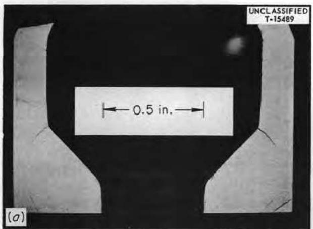

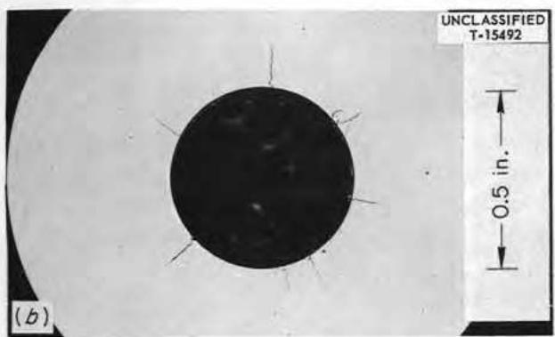

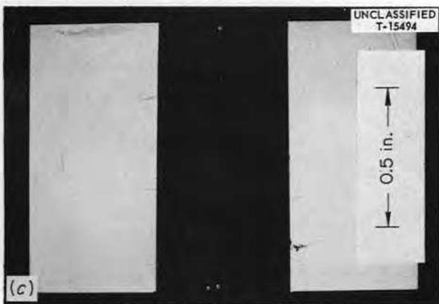  
Fig. 3.2.1. Effect of High-Frequency Thermal Cycling on Inconel in a Fused-Salt (NaF-ZrF4-UF4, 56-39-5 mole %) Environment - Test 9. Photomacrographs showing cracks [(a) and (b) entrance region and (c) central region] found after 72,000 cycles at 0.1 cps and a strain level of 0.11% per one-fourth cycle. 3X. Reduced 24.5%.

that no cracks were observed and that failure would be expected to occur only after longer exposure. Conversely, an arrow pointing to the left indicates that the observed crack depth was such that initial cracking occurred earlier in the exposure. Thus, the incipient failure point occurs, for a given strain, somewhere along a horizontal line between the oppositely directed arrows. In only one case was a run (test 6) terminated at the condition of incipient failure. At the lowest strain $(0.058\%)$ at 1 cps), no cracks were observed for $N = 360,000$ ; a longer test is in progress. For comparison, Fig. 3.2.4 also shows experimental mechanical fatigue data obtained at ORNL by Douglas and Swindeman at a cyclic rate of 1.0 cps. The limits on their data represent the maximum and minimum strain to which the samples were subjected during a cycle. It is recognized that a similar range applies to the data of this study; however, uncertainties in temperature make it impossible to accurately estimate this range. In general, although the data are limited, there is indication that, for a given strain per cycle, failure occurs at fewer cycles with surface thermal cycling than with mechanical cycling.

# LIQUID-METAL HEAT TRANSFER EXPERIMENT

G. L. Muller3

H.W.Hoffman

The initial phase of the studies of liquid-metal (mercury) forced-circulation heat transfer with internal heat generation and no heat transfer through the walls of the tubing has been completed. The purpose of this investigation has been to provide not only experimental information useful in the design of systems containing internally heated circulating liquid metals but also to test the heat-momentum transfer analogy used in the theoretical treatment of this problem. Further, since heat was not transferred through the walls, the results were unaffected by interfacial resistances, such as gaseous films or scale, and a direct check could be made of the "interface thermal resistance" theory postulated to explain the reduced values of the experimentally measured Nusselt modulus when heat is transferred through a pipe wall.

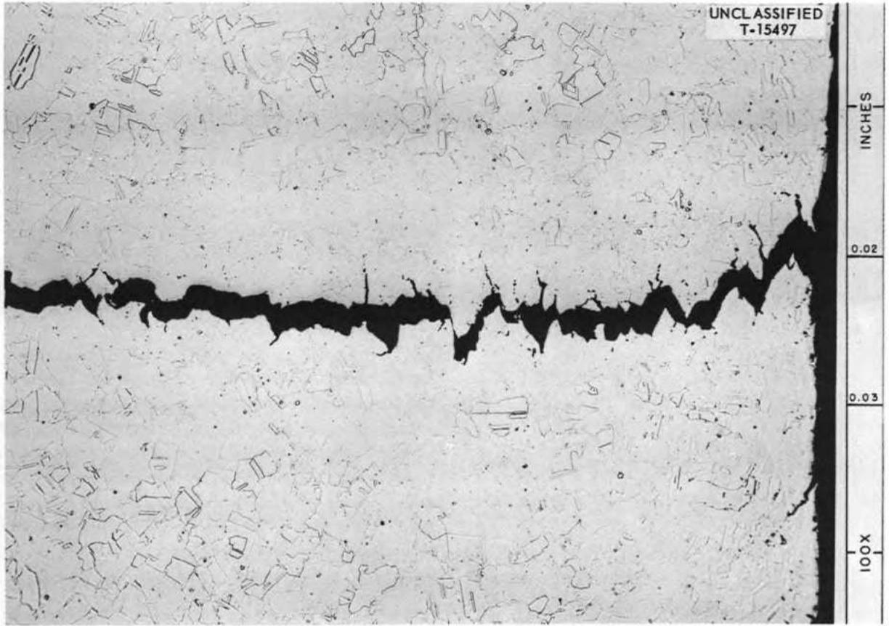  
Fig. 3.2.2. Effect of High-Frequency Thermal Cycling on Inconel in a Fused-Salt Environment - Test 9. Photomicrograph of crack in central region of test section. 100X.

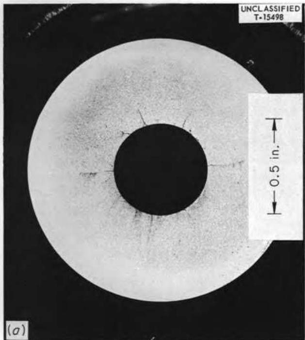

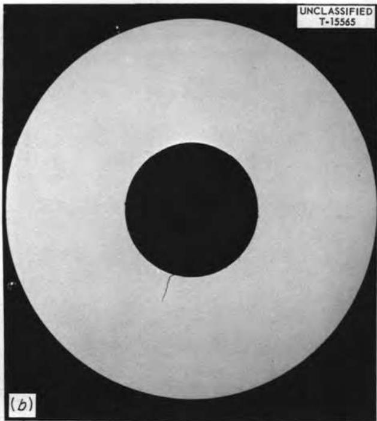  
Fig. 3.2.3. Effect of High-Frequency Thermal Cycling on Inconel in a Fused-Salt Environment - (a) Test 9, (b) Test 10. Comparison of photomacrographs of test-section exits. 3X.

The experimental apparatus used was described previously,4 and is illustrated in Figs. 3.2.5 and 3.2.6. The heat-transfer section is shown in Fig. 3.2.7; 36-gage copper-constantan tube-wall thermo

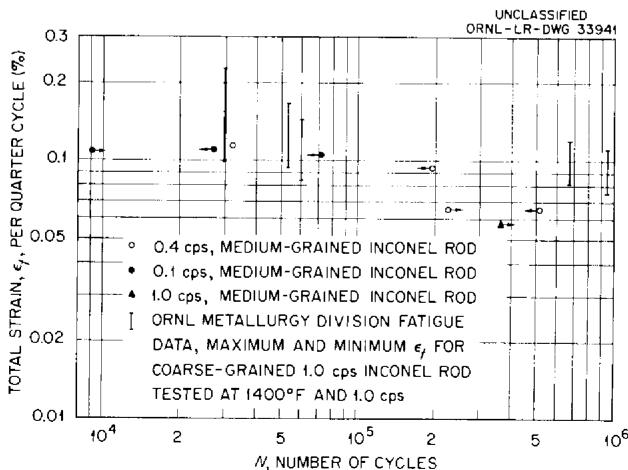  
Fig. 3.2.4. Effect of High-Frequency Thermal Cycling on Inconel in a Fused-Salt Environment. A comparison with mechanical fatigue data in terms of total strain.

couples were located at the positions $B$ in this figure. Power was supplied for electrical resistance heating of the mercury at 5 v and 1900 amp, maximum. The 60-cycle frequency of the power supply ensured a uniform current distribution with radius (uniform radial volume heat generation). Axial variation of the heat generation as a result of the temperature dependence of the mercury electrical resistivity was neglected, since the variation about the mean was estimated to be only ±2%. Heat losses from the heated section were minimized by guard heating and insulation.

The experimental results are presented in Table 3.2.4. The Reynolds modulus covered a range from 29,000 to 165,000, and the volumetric heat generation rate varied from $1.4 \times 10^{7}$ to $8.3 \times 10^{7}$ . Btu/hr.ft³. The radial temperature differences given in the final column of the table are based on

4G. L. Muller, ANP Quar. Prog. Rep. Sept. 30, 1957, ORNL-2387, p 106; ASME preprint No.58-HT-17, Second Annual ASME-AICHe Joint Heat Transfer Conference, August 1958.

Table 3.2.4. Experimental Results for Mercury Forced-Circulation Heat Transfer with Internal Heat Generation   

<table><tr><td>Run No.</td><td>Volumetric Heat Generation Rate, q&#x27;&#x27; (Btu/hr·ft-3)</td><td>Reynolds Number, NRe</td><td>Prandtl Modulus, NPr</td><td>Electrical Power Input, qin(Btu/hr)</td><td>Heat Removed from Test Section, qout(Btu/hr)</td><td>qin/qout</td><td>Axial Temperature Rise (°F)</td><td>Radial Temperature Difference, tW-tm (°F)</td></tr><tr><td></td><td>×107</td><td></td><td></td><td></td><td></td><td></td><td></td><td></td></tr><tr><td>1</td><td>3.48</td><td>73,300</td><td>0.0200</td><td>13,880</td><td>13,040</td><td>0.939</td><td>104.47</td><td>3.46</td></tr><tr><td>2</td><td>1.65</td><td>29,000</td><td>0.0200</td><td>6,700</td><td>6,060</td><td>0.905</td><td>127.05</td><td>3.90</td></tr><tr><td>3</td><td>2.55</td><td>45,200</td><td>0.0200</td><td>9,940</td><td>10,280</td><td>0.969</td><td>125.51</td><td>4.90</td></tr><tr><td>4</td><td>7.53</td><td>147,000</td><td>0.0192</td><td>29,500</td><td>27,400</td><td>0.929</td><td>113.35</td><td>4.08</td></tr><tr><td>5</td><td>5.84</td><td>102,900</td><td>0.0192</td><td>22,670</td><td>20,530</td><td>0.907</td><td>125.41</td><td>3.25</td></tr><tr><td>6</td><td>8.30</td><td>164,500</td><td>0.0191</td><td>32,700</td><td>29,900</td><td>0.915</td><td>113.30</td><td>5.87</td></tr><tr><td>7</td><td>5.10</td><td>95,700</td><td>0.0200</td><td>20,600</td><td>18,100</td><td>0.878</td><td>119.03</td><td>4.57</td></tr><tr><td>8</td><td>2.68</td><td>88,500</td><td>0.0225</td><td>10,870</td><td>9,710</td><td>0.894</td><td>63.71</td><td>2.23</td></tr><tr><td>9</td><td>3.20</td><td>58,400</td><td>0.0205</td><td>13,060</td><td>11,860</td><td>0.908</td><td>122.42</td><td>3.33</td></tr><tr><td>10</td><td>2.25</td><td>40,000</td><td>0.0204</td><td>9,060</td><td>8,510</td><td>0.939</td><td>124.11</td><td>2.83</td></tr><tr><td>11</td><td>1.44</td><td>39,200</td><td>0.0224</td><td>5,660</td><td>5,200</td><td>0.919</td><td>75.49</td><td>1.81</td></tr><tr><td>12</td><td>6.51</td><td>124,000</td><td>0.0207</td><td>26,450</td><td>24,100</td><td>0.911</td><td>116.46</td><td>5.78</td></tr></table>

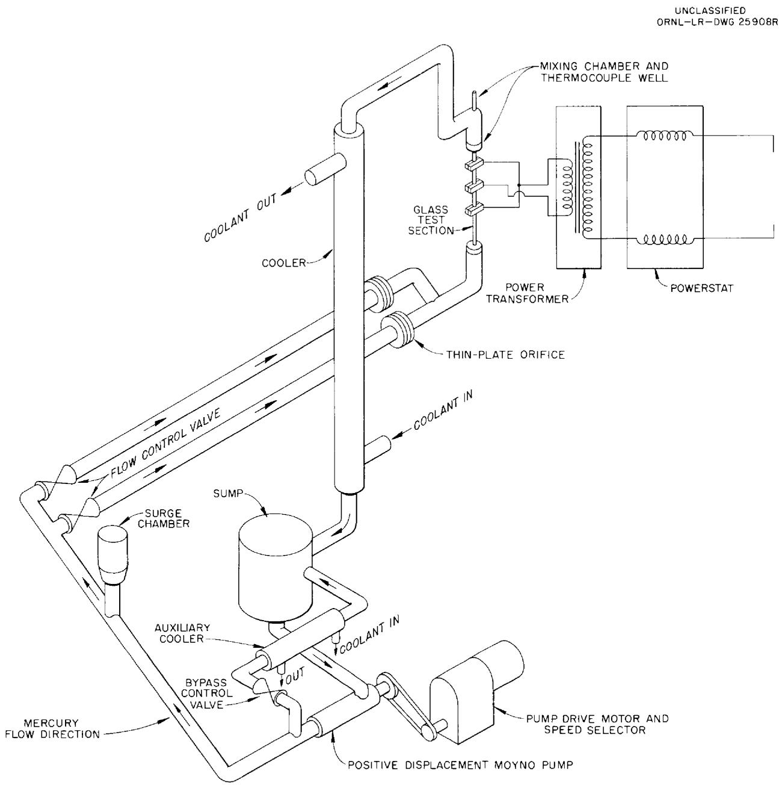  
Fig. 3.2.5. Schematic Diagram of Experimental Apparatus for Study of Forced-Circulation Heat Transfer in Mercury with Volumetric Heating.

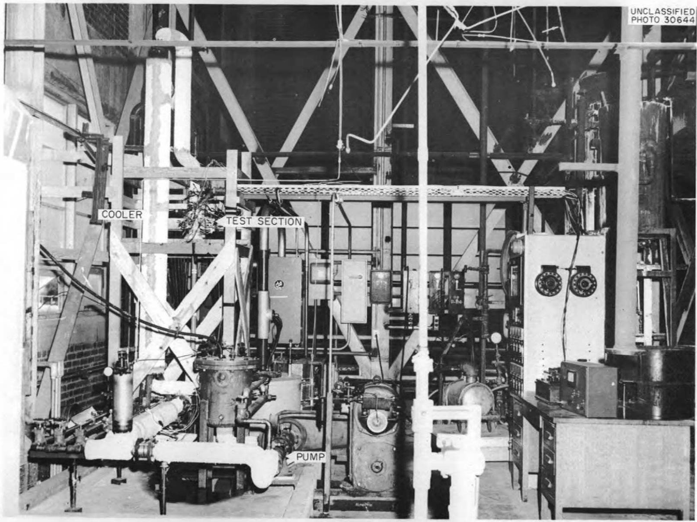  
Fig. 3.2.6. Photograph of Experimental Apparatus for Study of Forced-Circulation Heat Transfer in Mercury with Volumetric Heating.

UNCLASSIFIED

ORNL-LR-DWG33942

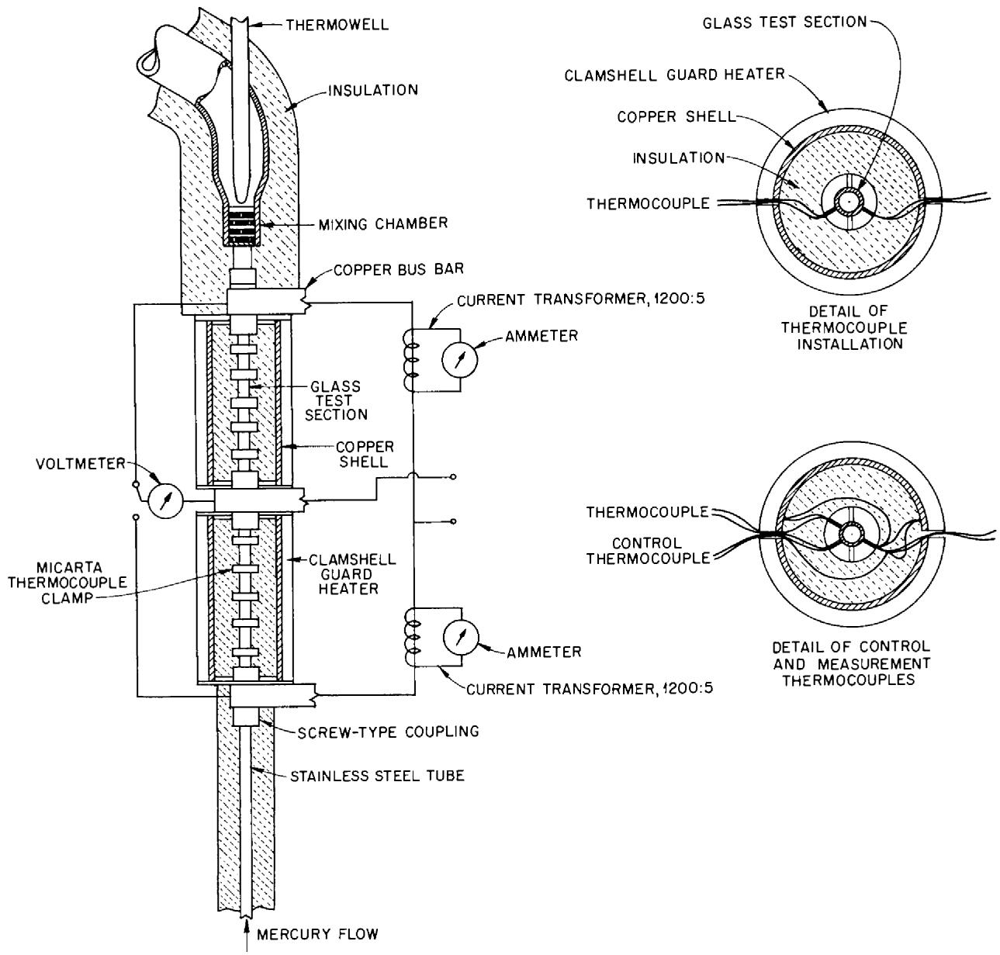  
Fig. 3.2.7. Details of Test Section for Mercury Heat-Transfer Experiment.

average values obtained from the six central thermocouples of the upstream half of the test section. The results are thus relatively free of end effects resulting from the massive electrodes and they represent the fully established thermal boundary-layer region. A typical set of fluid- and wall-temperature measurements is given in Fig. 3.2.8. The results are presented graphically in Fig. 3.2.9 in terms of $T$ , a dimensionless temperature difference. On the average, the data indicate temperature differences $49\%$ higher than those of the analogy prediction; and a line drawn through the data at this level and parallel to the lower T-curve of Fig. 3.2.9 has the empirical equation:

$$
T = \frac {1}{5 3 . 0 + 0 . 1 5 2 N _ {P e} ^ {0 . 9 2}}.
$$

5 A discussion of the factor $T_{\cdot}$ including a comparison with previous analyses is to be found in ANP Quar. Prog. Rep. Dec. 31, 1957, ORNL-2440, p 59.

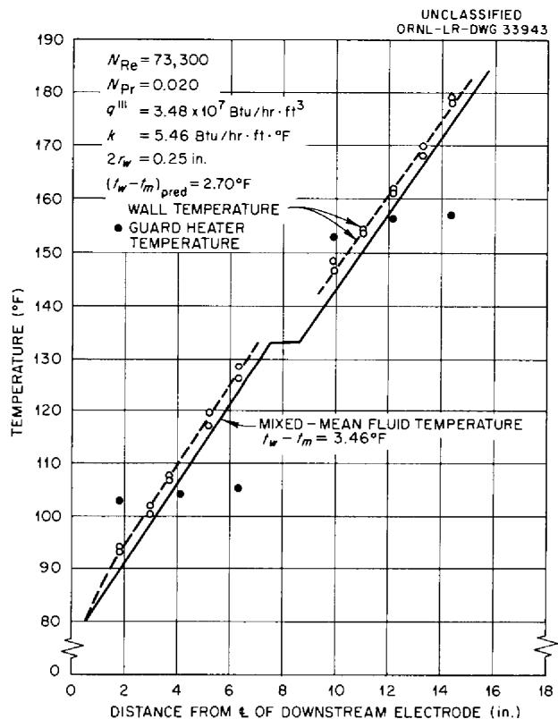  
Fig. 3.2.8. Typical Experimental Temperature Profiles in Mercury Heat-Transfer Experiment Test Section - Run 1.

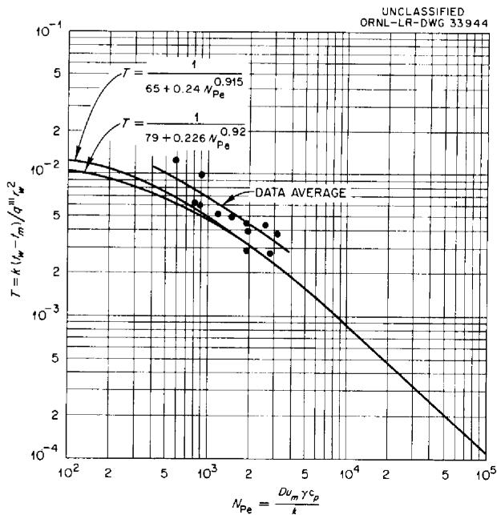  
Fig. 3.2.9. Comparison of Theoretical and Experimental Temperature Differences for Mercury Heat Transfer with Internal Heat Generation and No Wall Heat Transfer.

The maximum deviation of the data from this correlation is approximately $\pm 35\%$ . An error analysis indicates that most of the observed deviation occurs in the measurements of the small radial temperature differences.

This investigation thus shows differences between theory (based on the Martinelli heat-momentum-transfer analogy in which $a_{\mathrm{r}}$ the ratio of the diffusivity of momentum to the diffusivity of heat, is assumed to be unity) and experiment similar to those observed in wall heat-transfer studies with liquid metals. Since anomalous wall effects could not influence the experimental results, it is concluded that the diffusivity ratio is somewhat smaller than 1 for mercury.

# HEAT TRANSFER WITH VORTEX FLOW

W.R.Gambill

N. D. Greene

The study of heat transfer with air in high-velocity vortex motion within electrical-resistance heated tubes was continued.7 Details of the two types of

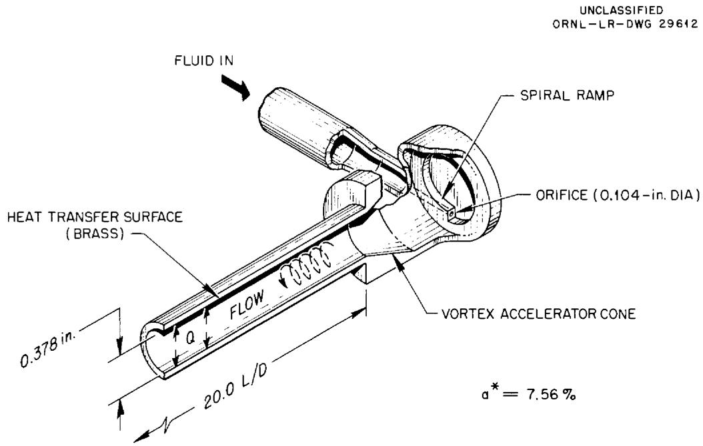  
$(\sigma)$ THE FORCED VORTEX GENERATOR

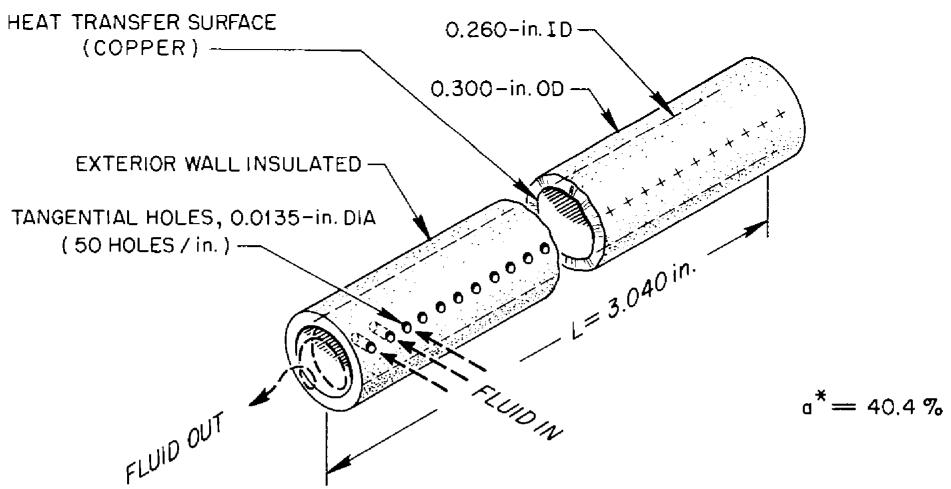  
(b) THE FREE VORTEX GENERATOR   
Fig. 3.2.10. Vortex Flow Generators.

vortex generator used are shown in Fig. 3.2.10. In the forced-vortex generator (3.2.10a) the air enters through a small orifice and is given a rotary motion by the spiral ramp. The vortex is further accelerated by a converging cone located immediately before the test section. In the free-vortex generator (Fig. 3.2.10b) fluid is introduced through numerous, small tangential inlets distributed along the tube length. With equal and constant pressure drop across each inlet, the incoming fluid cannot be displaced by fluid from an upstream inlet. Thus, in proceeding downstream, the fluid is forced to rotate through a progressively decreasing radius with progressively increasing tangential velocity.

The result of experiments with these two generators are given in Figs. 3.2.11 and 3.2.12. In these plots, a parameter related to the Colburn $j$ -factor is presented as a function of flow power dissipation (the

energy required to pump the fluid per square foot of tube heated surface). Since the physical property factor, $N_{P_r}^{2/3}/c_p$ was found to be nearly constant within the limitations of the experiment, this is essentially a plot of the heat-transfer coefficient, $b$ . A comparison is made in each case with linear flow heat transfer through tubes of equivalent length and diameter. From Fig. 3.2.11 it may be seen that forced-vortex flow is superior to linear flow only for power dissipations in excess of $17\mathrm{hp / ft^2}$ . However, more extensive boiling-water vortex-flow data indicate that increasing the ratio of inlet area to tube cross-sectional area and decreasing the ratio of tube length to tube diameter will result in an upward shift of the vortex flow curve. The free-vortex results given in Fig. 3.2.12 indicate that, for the specific conditions of the test, area ratio = 0.4 and $L / D = 11.5$ , free vortex flow is much superior to linear flow.

8 In a forced vortex the tangential velocity is directly proportional to the radius; in a free vortex the tangential velocity is inversely proportional to the radius.

9W. R. Gambill and N. D. Greene, A Preliminary Study of Boiling Burnout Heat Fluxes for Water in Vortex Flow, ORNL CF-58-4-56 (April 12, 1958).

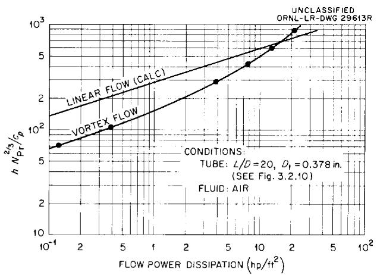  
Fig. 3.2.11. Inside Air Film Coefficients in a Tube for Linear and Forced-Vortex Flow.

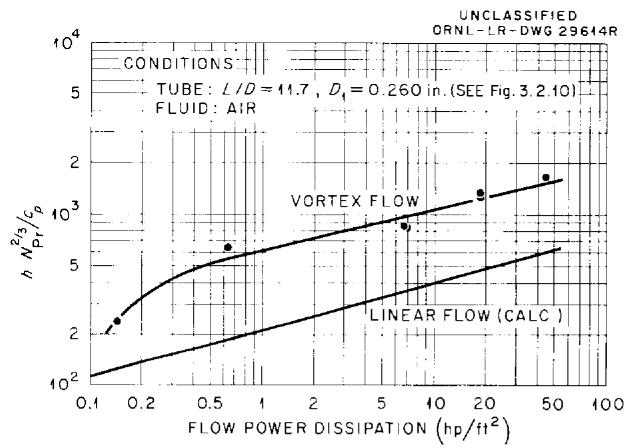  
Fig. 3.2.12. Inside Air Film Coefficients in a Tube for Linear and Free-Vortex Flow.

# 3.3. INSTRUMENTATION AND CONTROLS

H. J. Metz

Instrumentation and Controls Division

# DATA ACQUISITION SYSTEM

G. H. Burger

The data acquisition system purchased from the G. M. Giannini Company, which was briefly described in the previous report,1 was installed and placed into operation. For the initial check of the system, three temperature recorders and one pressure system, consisting of a 12-point pressure-scanning system feeding a strain gage and a Gilmore strain gage circuit, were fed into the installation. The data were recorded on the standard log sheets for the 20-in.-carriage typewriter. In addition, the data were logged on the punch tape in Oracle code. The code was verified by the Oracle tape readers. Since the initial check of the system, a total of seven recorders giving 84 separate inputs has been fed into the system, the system has been operated to test all aspects of system operation, that is, the typewriter, tape punch, tape reader, tape code, logging format, and operational characteristics, such as typewriter operational format, carriage return, carriage return and reset, etc., have been checked. In addition, all data operational functions of the system have been checked, including the circuitry that provides for operations on the data such as multiplication, division, and addition.

Since the unit began operation, it has run a total of 612 hr. There have been some operational troubles with the system, mostly in the logging unit, the typewriter, and typewriter linefinder. Other minor troubles occurred that were a result of incomplete checking at the factory and initial design inadequacies. The faults attributable to the vendor are now being corrected by the vendor, and it is expected that the system will again be in operation within a month. The system was shipped from the factory without a final system check in order to meet the delivery schedule.

It is expected that with the completion of the corrections and modifications now being made on the system, it will operate in a satisfactory manner.

It is planned to operate the system with all the maximum inputs possible (120) for a short period to again check the system. After this period, it is expected that the system will be used to record and handle data from an actual operating test in order to determine the capabilities or shortcomings of the machine and to establish a list of criteria for or characteristics desirable in future machines.

# LIQUID-METAL-LEVEL TRANSDUCERS

G. H. Burger

Life tests of the three level probes operating in NaK at $1200^{\circ}\mathrm{F}$ and above were continued. Two of the units have now operated more than 9000 hr and the other has operated more than 4600 hr.

Analyses of data obtained previously in wetting tests of Inconel probes in NaK verified that, although wetting is rather irregular and unpredictable, at temperatures above $600^{\circ}\mathrm{F}$ it is complete within a very short time (almost instantly). At temperatures below $600^{\circ}\mathrm{F}$ , no definite time vs temperature factor could be established.

The iron-plated Inconel probe tested as described previously1 gave unsatisfactory results in that there was poor wetting of the iron plate. Since only one iron-plated probe was tested, this observation is not conclusive, but no further tests on iron-plated probes are contemplated.

Wetting and calibration tests of four Inconel probes in sodium have indicated that wetting in the sodium will be similar, if not superior, to that in NaK. Tests of these probes in sodium are continuing.

# PRESSURE TRANSMITTER TESTS

C. M. Burton

Two Taylor Instrument Company pressure transmitters designed for use at high temperatures in the pressure range 0 to 200 psig are undergoing overrange (300 psig) tests, as described previously, in order to accelerate the effects of aging at $1400^{\circ}\mathrm{F}$ . Micrometer measurements made

after 5100 hr showed slight bulging of the Inconel bodies, but the calibrations have remained within the error limits. These tests are continuing.

# THERMOCOUPLE TESTS

C. M. Burton

Life tests of a series of thermocouples were terminated after about 11,000 hr of operation at $1500^{\circ}\mathrm{F}$ . Thirteen $\frac{1}{4}$ -in.-OD, Inconel-sheathed, magnesium-oxide-insulated, Chromel-Alumel, dual thermocouples, and three similar platinum-platinum-rhodium thermocouples were tested. The end closures were Heliarc-welded caps. The thermocouples were immersed in a fused-salt mixture (NaF-ZrF $_4$ -UF $_4$ , 50-46-4 mole %). The normal operating temperature was $1500^{\circ}\mathrm{F}$ , except when calibrations were made at 1100 and $1300^{\circ}\mathrm{F}$ against a platinum-platinum-rhodium standard thermocouple.

On the whole, the thermocouples were performing well when the test was stopped, although the errors were increasing with age. Two Chromel-Alumel thermocouples failed before the end of the test. The test was stopped because all the helium purge and vent lines had become plugged with $\mathsf{ZrF}_4$ vapor deposits.

After shtutdown, it was found that a weld of a spark-plug-level riser to the vessel had failed, but the buildup of $\mathsf{ZrF}_4$ was sufficient to prevent significant helium leakage at the 2- to 3-psig operating pressure.

The Inconel sheaths submerged in the salt were bright and in good condition, but the sheaths exposed to the blanket gas were considerably corroded. All the risers were plugged with $\mathsf{ZrF}_4$ , and it would probably have been impossible to have removed and replaced a thermocouple.

A similar life test in a sodium environment has now run about 16,000 hr. Many of the thermocouples show considerable error.

# THERMOCOUPLE DEVELOPMENT STUDIES

J. F. Potts

# Behavior of Thermocouples in the Temperature Range 300 to $1100^{\circ}\mathsf{C}$

Means are being sought for improving thermoelectric measurements by obtaining a better understanding of the fundamental behavior of thermocouples in the range 300 to $1100^{\circ}\mathrm{C}$ . The major

portion of the study is being conducted under a subcontract at the University of Tennessee Engineering Experiment Station by D. L. McElroy. The progress of the first year of this work was covered by McElroy in a previous ORNL report.3

In the past year, a comparative evaluation of thermocouples constructed of a number of commercially available nickel-base alloys has been made in order to establish relations describing the effects of time and temperature on stability. At a sacrifice of thermoelectric power and linearity of the temperature-vs-emf curve, it was demonstrated that alloys of nickel and chromium used as positive legs demonstrated greatest stability at 800 to $1100^{\circ}\mathrm{C}$ in air when the chromium content was increased to about $20\%$ . Chromel-P contains roughly $9\%$ chromium. With the same conditions and objections as those given above, it was demonstrated that nickel-silicon alloys containing about $3\%$ silicon evidenced greater stability than the nickel-silicon-aluminum-manganese alloys, such as Alumel. It was further demonstrated that thermocouple life and stability could be improved by the use of carefully fabricated swaged sheaths.

Attempts to improve the performance of Chromel-Alumel thermocouples have led to the conclusion that isothermal heat treatment of Chromel-Alumel thermocouples at 565 and $840^{\circ}\mathrm{C}$ causes shifts in the original calibration with time at temperature. Further, isothermal heat treatment at $900^{\circ}\mathrm{C}$ in oxygen has indicated that for short exposures Chromel-P dominates the thermocouple changes and for long exposures Alumel dominates the drift. Pickling of oxidized wire was found to be a beneficial treatment; and partial immersion heat treatments were found to be conducive to small drifts of calibration in the temperature range 385 to $830^{\circ}\mathrm{C}$ . Further refinements of the techniques for using the unilateral gradient furnace described in the previous report have led to its considerable value as an analytical tool for quantitatively correlating thermocouple performance with various inhomogeneity-producing phenomena, such as oxidation and recovery from cold work in temperature gradients.

# Oxidation and Cold Work Studies

Although much of what is known about base-metal performance at temperatures up to $1100^{\circ}\mathrm{C}$ can be extended in order to develop improved thermocouples for use at temperatures in excess of $1100^{\circ}\mathrm{C}$ , major gaps exist in the fundamental information. A survey of the present knowledge of thermoelectric measurements has revealed that information is needed on relations between oxidation and thermal emf and between cold work and thermal emf. Tests are under way over the range 300 to $1000^{\circ}\mathrm{C}$ on variations of nickel-chromium alloys as the positive thermal elements and nickel-silicon alloys as the negative elements, including Hoskins Chromel-P and Alumel and other alloys available from the Hoskins Co., Driver-Harris Co., and Kanthal Corp. For comparison, samples of thermocouple-grade iron, constantan, and copper will also be studied.

Data have been obtained on oxidation (measured by weight gain) in air at 700, 900, and $1000^{\circ}\mathrm{C}$ . Tests are now in progress at $800^{\circ}\mathrm{C}$ . The data indicate that greater oxidation of Chromel occurs at 700 to $800^{\circ}\mathrm{C}$ than at $1000^{\circ}\mathrm{C}$ .

Tests of oxidation in a temperature gradient (maximum temperature of $1000^{\circ}\mathrm{C}$ ) of base-metal samples in various sizes of quartz and Alundum tubes were initiated recently. Microstructure examinations have shown intergranular attack of all the alloys tested above $850^{\circ}\mathrm{C}$ , whereas surface attack predominates in alloys tested at temperatures below $850^{\circ}\mathrm{C}$ . Depth of immersion tests are also under way on Geminal-P and Geminal-N (Driver-Harris), Kanthal-P and Kanthal-N (Kanthal Corp.), Chromel-P plus columbium and Alumel (Hoskins Co.) in quartz and Alundum tubes with and without Inconel, stainless steel, and titanium shavings or fines placed in the bottom of the tubes. Preliminary tests indicate that the results are greatly influenced by the choice of thermocouple well material. Drift tests in an atmosphere of oxygen at a pressure of 30 psig indicate that the thermocouple drift rates are not markedly different than those measured in air.

The cold work studies have progressed to the point where the relations between rolling and drawing reduction, respectively, and percentage of cold work have been established for wire

samples that were initially round. For example, wire flattened to $10\%$ of its original diameter receives only about $45\%$ of the cold work it would receive if it were die-drawn to $10\%$ of its original diameter. The reason for establishing this relation is that it is experimentally more convenient to flatten wire between rolls than to draw it through dies, particularly when it is desired to impose varying amounts of cold work on one continuous sample. A series of experiments is being conducted to establish the relation between temperature, time, and percentage of cold work and the ranges for recrystallization and recovery. Hardness measurements will be made to establish recrystallization temperatures, and electrical resistance measurements will be made to establish recovery temperatures. After these data are obtained, the cold work vs thermal emf relations will be established with the use of the unilateral gradient furnace mentioned above. These cold work studies will establish the practical limits of precision of available base-metal thermocouple alloys.

# Calibration Studies

Temperature-standardization techniques are being developed through a series of closely controlled intercomparisons of the results of melting and freezing experiments with water, tin, lead, zinc, antimony, aluminum, and silver. The temperature measurements are being made with various platinum resistance thermometers and platinum-platinum-10% rhodium thermocouples certified by the National Bureau of Standards.

# Oracle Program for Thermocouple-Data Handling

# J.W.Reynolds

Work on the improvement of the Oracle program for thermocouple-data handling is nearing completion at ORNL. The format for processing of raw thermocouple millivoltage data is being changed to include the "standard" temperature only once on the final picture, whereas previously the standard temperature had been repeated for each thermocouple test point. The coding of the thermocouple point identification is to be changed to include the location of the test facility and the type of test. In addition to the columns for error, test millivolts, and standard millivolts, a column is to be included

for the resistance or other desired parameter. For aid in statistical analysis of a particular type of thermocouple, the new format is to include the summation of errors, the summation of squares of the errors, the standard deviation, the average error plus and minus three standard deviations, and the

degrees of freedom. As an additional aid to the reduction of the data to comprehensible form, a program for presentation of the accumulated data in analog form after it has been statistically treated is being included.

# 3.4. APPLIED MECHANICS

# B. L. Greenstreet

# Reactor Projects Division

# BASIC PROBLEMS IN ELASTICITY

# F. J. Stanek

Fundamental studies of conical, cylindrical, and spherical shells were continued in which classical small-deflection theory is being used to determine elastic properties. The basic objective of each study is to list the required stress and displacement formulas and to provide tables of numerical values of all required functions.

The conical-shell study is nearing completion and a preliminary report giving the results of the work has been issued. The results provide a means whereby complete analyses can be made for shells subjected to a combination of axially symmetric loads. These loads include edge forces and moments, membrane forces, and uniform pressure, as shown in Fig. 3.4.1.

Equations are given for displacements in both the meridional direction and normal to the shell wall, as well as for the stresses. The values of all the necessary functions are tabulated for the dimensionless coordinate $x$ from 0 through 40. The dimensionless variable is given by

$$
x = 2 \left(3. 3 0 4 5 \frac {\operatorname {c t n} a}{b} y\right) ^ {1 / 2},
$$

where $2a$ is the vertex angle of the cone, $b$ is the wall thickness, and $y$ is the coordinate measured from the vertex along the surface of the cone. A tabulation of the functions for larger values of $x$ will be included in a later report.

Comparisons have been made of the stress distributions obtained through analytical and experimental means for a tube-and-spherical-shell configuration loaded as shown in Fig. 3.4.2. Work done in evaluating and tabulating the functions obtained in the solution of the spherical-shell

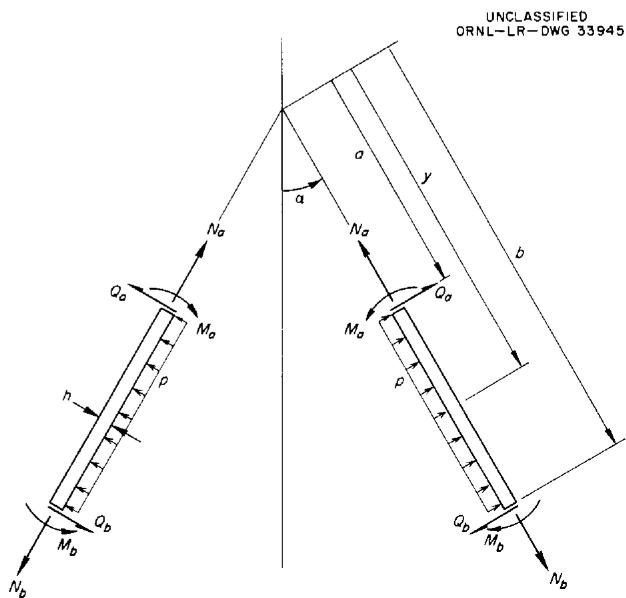  
Fig. 3.4.1. General Loading for Conical-Shell Study.

UNCLASSIFIED

ORNL-LR-DWG 33946

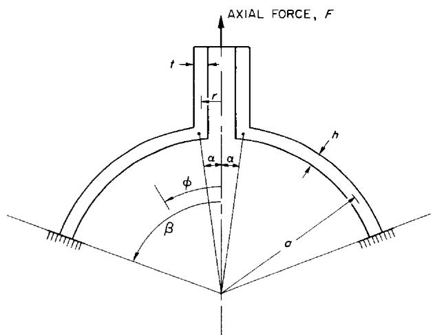  
g. 3.4.2. Loading for Tube-and-Spherical-Shell Study.

TEST

MODEL

ANALYTICAL

MODEL

a

$\beta$

3.4 deg

69.9 deg

4.0

68.0 deg

0

13.440

12.675

#

0.507

0.507

%

26.51

25.00

/

0.500

0.500

r

0.7995

0.8842

EDGE

FIXED

FIXED

equations resulted in an analytical model that nearly approximated the actual configuration used in obtaining the experimental data. The geometric quantities for the test shell and the analytical model are given in Fig. 3.4.2.

The meridional stresses at the inner and outer surfaces of the spherical shell are plotted in Figs. 3.4.3 and 3.4.4. The circumferential stresses are shown in Figs. 3.4.5 and 3.4.6. Excellent agreement exists for both the meridional and circumferential stresses.

# NUMERICAL ANALYSIS

F.J.Witt

Second-order, partial differential equations with variable coefficients are encountered in analyses pertaining to transient neutron diffusion and heat transfer. Therefore, the finite difference equations required for solving an equation of the form

$$
\begin{array}{l} \frac {\partial \eta (x , t)}{\partial t} = A (x) \frac {\partial^ {2} \eta (x , t)}{\partial x ^ {2}} + \\ + \left[ (g / x) + B (x) \right] \frac {\partial \eta (x , t)}{\partial x} + C (x) \eta (x, t) + D (x, t), \\ \end{array}
$$

with zero initial condition, were derived. Forward

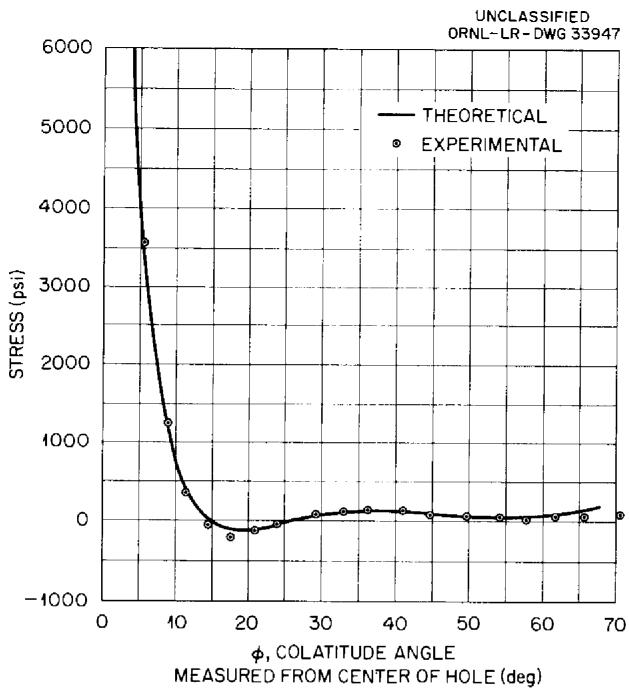  
Fig. 3.4.3. Meridional Stress at Outer Surface for an Axial Force of 1 Ib.

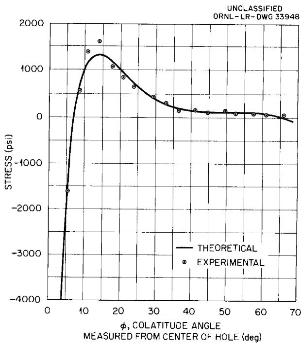  
Fig. 3.4.4. Meridional Stress at Inner Surface for an Axial Force of 1 Ib.

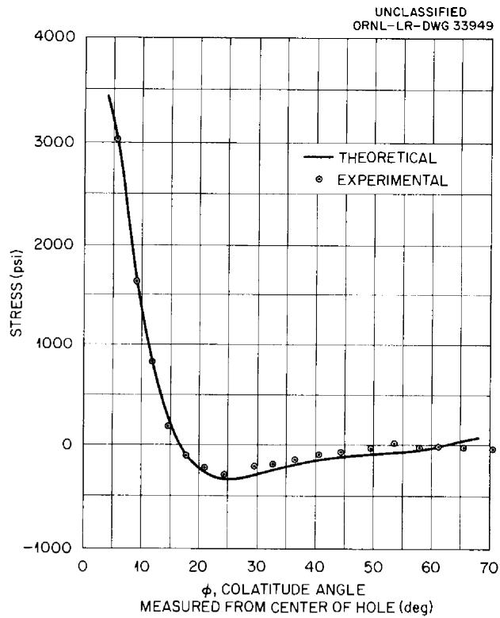  
Fig. 3.4.5. Circumferential Stress at Outer Surface for an Axial Force of 1 lb.

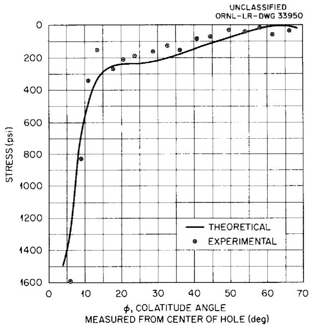  
Fig. 3.4.6. Circumferential Stress at Inner Surface for an Axial Force of 1 lb.

and central difference approximations were used. The terms $\partial^2\eta /\partial x^2$ and $\partial \eta /\partial x$ were approximated to a fourth-order correction factor in $\Delta x$ by using a Taylor series in each case. The term $\partial \eta /\partial t$ was approximated to at least a second-order correction factor in $\Delta t$

The difference equations were then used in writing a code for the Oracle. Through the use of this code, a solution to the partial differential equation can be obtained when $D(x,t) = D(x)$ . The coefficients of the equation may be of any form provided they are continuous functions. The accuracies associated with the difference approximations employed allow the use of a relatively large increment in $t$ . This is very useful where solutions are required for many values of that variable.

The code may also be used to solve the differential equation

$$
A (x) \frac {d ^ {2} \eta}{d x ^ {2}} + B (x) \frac {d \eta}{d x} + C (x) \eta + D (x) = 0.
$$

# VORTEX REACTOR EXPERIMENTS

J. J. Keyes

Reactor Projects Division

The feasibility of the vortex propulsion reactor concept which combines the principles of gaseous fission heating and separation of the fissionable material depends strongly upon the nature and strength of the vortex field which can be generated at mass flow rates permitted by a binary diffusion process. It is shown in ref 1 that the desired vortex field is one in which the velocity varies inversely with radius - the so-called ideal "free-vortex" - as well as one in which the peripheral Mach number is high. Allowable mass velocities of the low-molecular-weight propellant are in the neighborhood of 0.01 lb/sec-ft. These requirements could be fulfilled, it was felt, provided the flow remained laminar, although the influence of viscosity was only approximated in the analysis.

An experimental study was therefore initiated in an attempt to measure vortex strengths in a real gas and to ascertain the effects of viscosity and turbulence. The study to date has consisted mainly of two phases: (1) measurements on solid-wall tubes with all of the mass flow leaving at the center of one end of the vortex tube, as assumed

in the analytical study; and (2) measurements with a fraction of the total input flow bled off at some radial position other than the tube center. In some of the latter experiments, an attempt was made to make the boundary layer laminar by bleeding through a uniformly porous wall which formed the outer boundary of the vortex tube.[2]

In both phases of the study, nitrogen was used as the working fluid at room temperature. Mass flow rates and pressures were chosen to bracket estimated operating conditions in the actual device by assuming similarity of the characteristic Mach and Reynolds moduli and of the mass flow parameter, $m_1 / 2\pi \mu$ , which appears in the approximate solution of the Navier-Stokes equations and in which $m_1$ is the mass flow per unit of tube length in lb/ft·sec and $\mu$ is the viscosity in the same units as $m_1$ .

The apparatus for carrying out phase 1-A (Table 3.5.1) of the experiment is shown in Figs. 3.5.1

Table 3.5.1. Configurations and Operating Conditions of Vortex Tube Experiments   
Working gas: $N_{2}$ at $80^{\circ}F$   

<table><tr><td rowspan="2">Experimental Phase</td><td rowspan="2">Description of Vortex Tube</td><td rowspan="2">Inlet Nozzle Geometry</td><td rowspan="2">Upstream Header Pressure, \( {p}_{0} \) (psia)</td><td rowspan="2">Tube Wall Pressure, \( {p}_{0} \) (psia)</td><td colspan="3">Mass Flow, \( {m}_{1} \) (lb/sec-ft)</td><td rowspan="2">Bleed Ratio, B/E</td><td rowspan="2">Exit Configuration</td><td rowspan="2">\( {M}_{j} \)</td><td rowspan="2">Figure* References</td></tr><tr><td>Inlet, I</td><td>Exit Tube Center, E</td><td>Bleed, B</td></tr><tr><td>1-A</td><td>Plastic tube No. 1, 2 in. ID, 12 in. long</td><td>Twelve nozzles 0.0135 in. in diameter at 0.92-in. radius</td><td>215 315 440 565</td><td>65 85 115 165</td><td>0.007 0.011 0.015 0.020</td><td>Same as I</td><td>0</td><td>0</td><td>0.280-in.-OD annular nozzle, 0.187-in.-dia drill hole</td><td></td><td>3.5.7, 3.5.9, and 3.5.10</td></tr><tr><td></td><td>Plastic tube No. 2, 2 in. ID, 12 in. long</td><td>Twelve nozzles 0.010 in. in diameter at 0.84-in. radius</td><td>315 440 545 640</td><td>65 115 165</td><td>0.0045 0.0066 0.0082 0.0097</td><td>Same as I</td><td>0</td><td>0</td><td>0.280-in.-OD annular nozzle</td><td></td><td>3.5.8, 3.5.9, and 3.5.11</td></tr><tr><td>1-B</td><td>Plastic tube No. 3, 1 in. ID, 12 in. long, with a plastic insert tube</td><td>Eleven holes 0.020-in. in diameter, in line with nozzles at 0.45-in. radius</td><td>386</td><td>52.1</td><td>0.028</td><td>0.028</td><td>0</td><td>0</td><td>0.280-in. nozzle</td><td>1.96</td><td>3.5.12</td></tr><tr><td>2</td><td>Porous metal tube, 2 in. ID, 12 in. long</td><td>Twelve nozzles 0.0135 in. in diameter at 0.92-in. radius</td><td>715</td><td>68</td><td>0.028</td><td>0.028</td><td>0</td><td>0</td><td>0.280-in. nozzle</td><td>2.18</td><td>3.5.12 and 3.5.13</td></tr><tr><td></td><td></td><td></td><td>715</td><td>95</td><td>0.028</td><td>0.0074</td><td>0.021 (uniform wall bleed)</td><td>2.8</td><td>0.125-in. drill hole</td><td>1.98</td><td>3.5.13</td></tr><tr><td></td><td></td><td></td><td>740</td><td>61</td><td>0.029</td><td>0.0062</td><td>0.023 (radial at \( {r}^{\prime } = {0.25} \) )</td><td>3.5</td><td>0.22-in. drill hole at center, twelve 0.055-in. drill holes at 0.25-in. radius</td><td>2.27</td><td>3.5.14</td></tr></table>

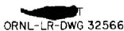

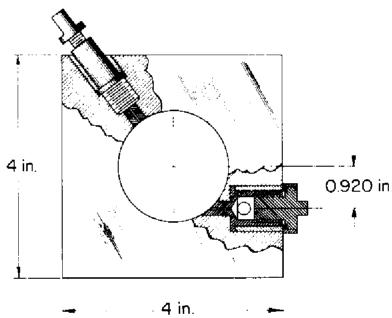

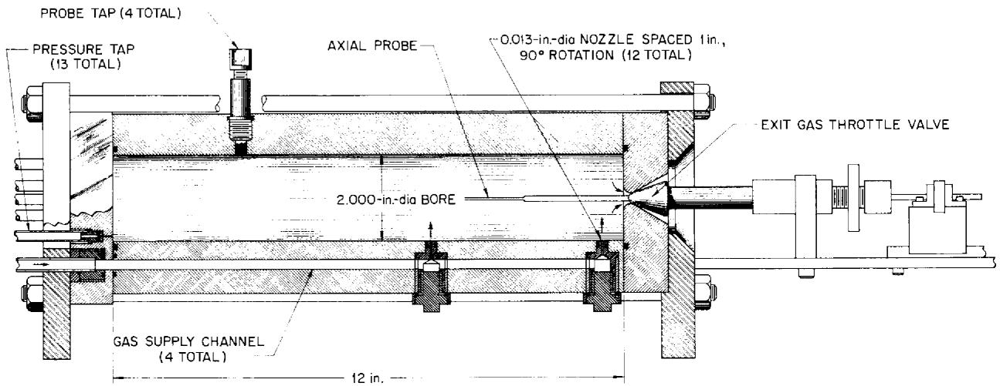  
Fig. 3.5.1. Sketch of Experimental Vortex Tube.

and 3.5.2. The geometry selected was a 1-ft section of a 2-in.-ID vortex cavity bored into a 4-in. Lucite block. Twelve brass feed nozzles were located in the wall of the block to form a broken spiral of entrance jets spaced 1-in. apart axially with a 90-deg rotation between adjacent nozzles throughout the length of the block. The inside surfaces of the nozzles were honed flush with the inner surface of the tubular cavity. The feed nozzles were supplied with gas from four headers drilled into the plastic block so that each header fed three nozzles in line. The arrangement of feed headers and nozzles may be seen in Fig. 3.5.2. Gas was exhausted at one end through an adjustable annular orifice directly to the atmosphere. The geometrical configurations used for the various experiments and the experimental conditions are described in Table 3.5.1.

In phase 1-B, the vortex tube consisted of a 1-in.-ID, 12-in.-long plastic tube inserted into the 2-in.-ID tube for operation in the same test setup as that used in phase 1-A. The tube was fed by means of eleven symmetrically spaced, 0.020-in. drilled holes in line with nozzles located at a radius of 0.45 in. In order to measure the radial static pressure distribution, a number of pressure taps were located in the feed plate.

An overall flow and instrumentation diagram of the test system is presented in Fig. 3.5.3. Helium or nitrogen gas was supplied through pressure regulators and appropriate metering devices to each of the four supply headers at pressures up to 600 psig. Valves were used to control the individual header flows. The pressure in the vortex tube was regulated by the exit valve up to a maximum of 150 psig.

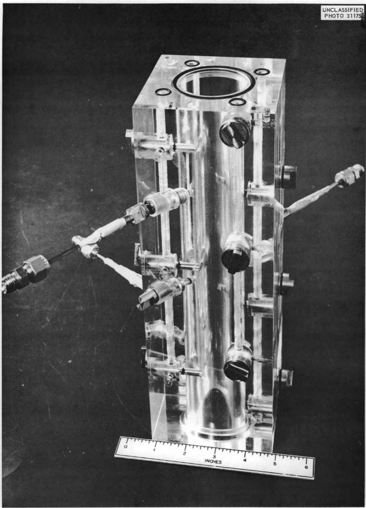  
Fig. 3.5.2. Plastic Test Block - Vortex Tube No. 1.

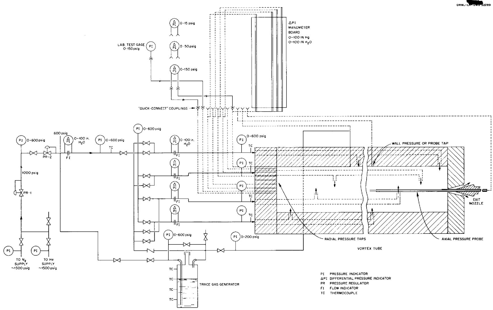  
Fig. 3.5.3. Over-All Flow and Instrument Diagram of Vortex Tube Test System.

The apparatus for carrying out the second phase of the experiment (Fig. 3.5.4) was similar to that employed in the first phase with one significant addition: the wall of the vortex tube was made of uniformly porous metal (sintered nickel) and it was surrounded by a pressure jacket so that a controllable fraction of the total throughput could be bled off through the wall and metered. The

metal vortex tube and jacket are shown schematically in Fig. 3.5.5, in which the arrangement is similar to that of Fig. 3.5.1. The tube installed in its jacket and in the test rig is shown in Fig. 3.5.6.

The objective of the experiments in phase 1-A was to ascertain vortex strengths in the 2-in.-ID tube under conditions wherein all mass flow was

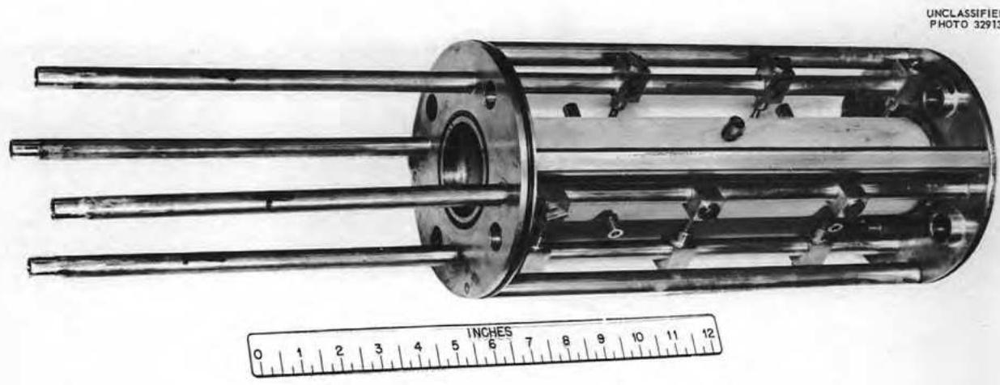  
Fig. 3.5.4. Porous Metal Tube. (with caption)

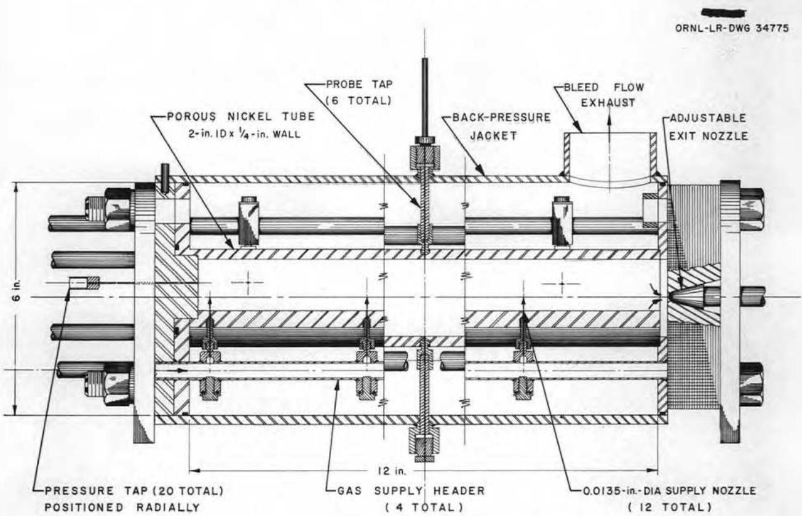  
Fig. 3.5.5. Sketch of Porous Metal Vortex Tube and Jacket.

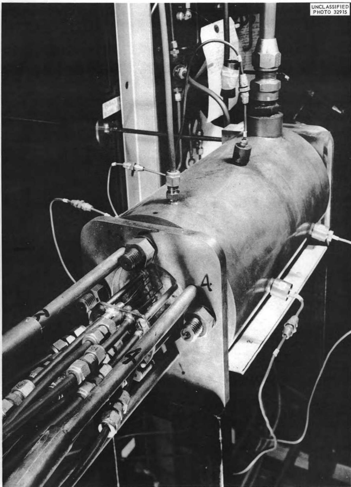  
Fig. 3.5.6. Metal Vortex Tube Installed in Experimental Facility. with caption)

expelled radially at the tube center, for which case the flow had to be maintained sufficiently low to conform to the limitations imposed by the binary diffusion process in the device. The results are depicted graphically in Figs. 3.5.7 through 3.5.11, in which the measure of vortex strength is the ratio $M_p / M_j$ , where $M_p$ is the peripheral tangential Mach number, and $M_j$ is the inlet jet Mach number. The mass flow, $m_j$ , was varied by changing the nozzle inlet pressure and the diameter of the jets. The value of $M_p$ is determined by fitting the measured pressure distribution data to the derived relationship:

$$
\left(\frac {p}{p _ {w}}\right) ^ {(\gamma - 1) / \gamma} = 1 - \frac {\gamma - 1}{2} M _ {p} ^ {2} \left(\frac {1}{r ^ {\prime 2}} - 1\right),
$$

where $p$ is the absolute pressure at position $r' = r / r_{0'}$ , $p_w$ is the pressure at the tube wall, and $y$ is the heat capacity ratio. Since the equation assumes a free vortex, the values of $M_p$ are only approximate.

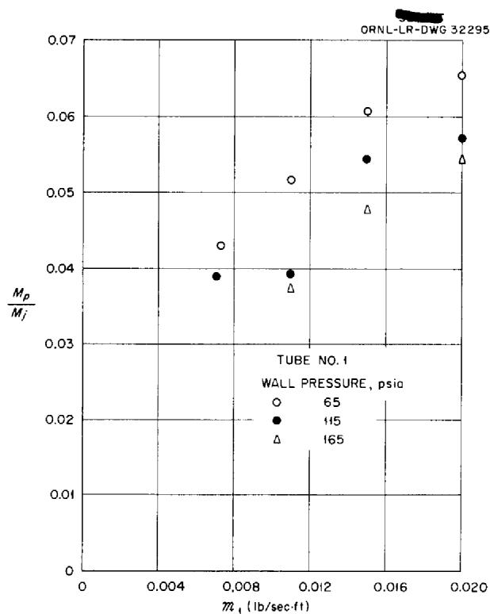  
Fig. 3.5.7. Variation of Ratio of Vortex Tangential Mach Number and Jet Exit Mach Number with Mass Flow Rate per Unit of Tube Length and Tube Pressure for Tube No. 1.

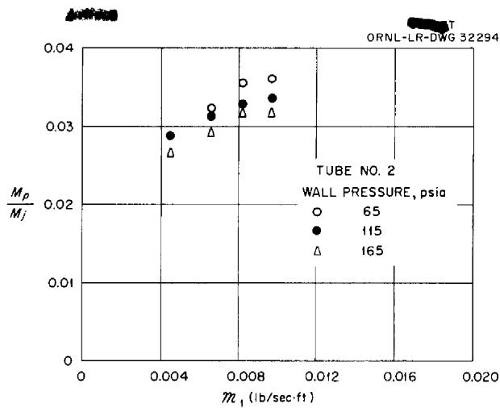  
Fig. 3.5.8. Variation of Ratio of Vortex Tangential Mach Number and Jet Exit Mach Number with Mass Flow Rate per Unit of Tube Length and Tube Pressure for Tube No. 2.

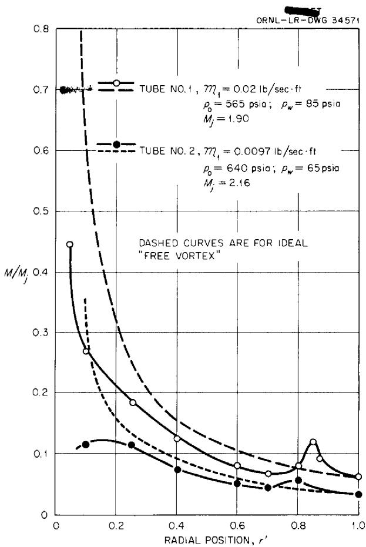  
Fig. 3.5.9. Mach Number Profiles for 2-in. Plastic Vortex Tubes.

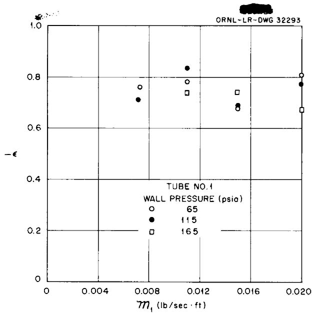  
Fig. 3.5.10. Variation of $\epsilon$ in the Expression $v \propto r^{+\epsilon}$ with Mass-Flow Rate per Unit of Tube Length for Tube No. 1.

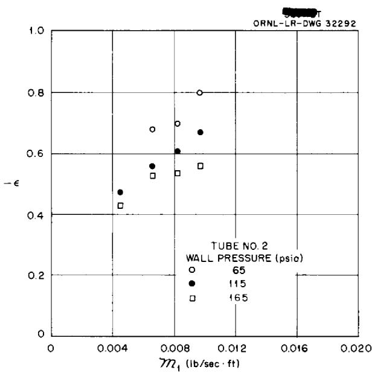  
Fig. 3.5.11. Variation of $\epsilon$ in the Expression $v \propto r^{+\epsilon}$ with Mass Flow Rate per Unit of Tube Length for Tube No. 2.

The local Mach number, $M$ , at $r'$ , is obtained directly by differentiation of the pressure data as applied to a relationship for circular flow of an ideal gas that neglects the small contributions due to a radial velocity term:

$$
M ^ {2} = \frac {1}{\gamma} \frac {r ^ {\prime}}{p ^ {\prime}} \frac {d p ^ {\prime}}{d r ^ {\prime}}
$$

where $p'$ is the ratio $p / p_{w}$ .

In phase 1-B of the experiments, the diameter of the tube was decreased to 1 in., and the experimental Mach profile shown in Fig. 3.5.12 was obtained. Also shown is a result from a phase 2 experiment with the 2-in. metal tube under nearly the same conditions.

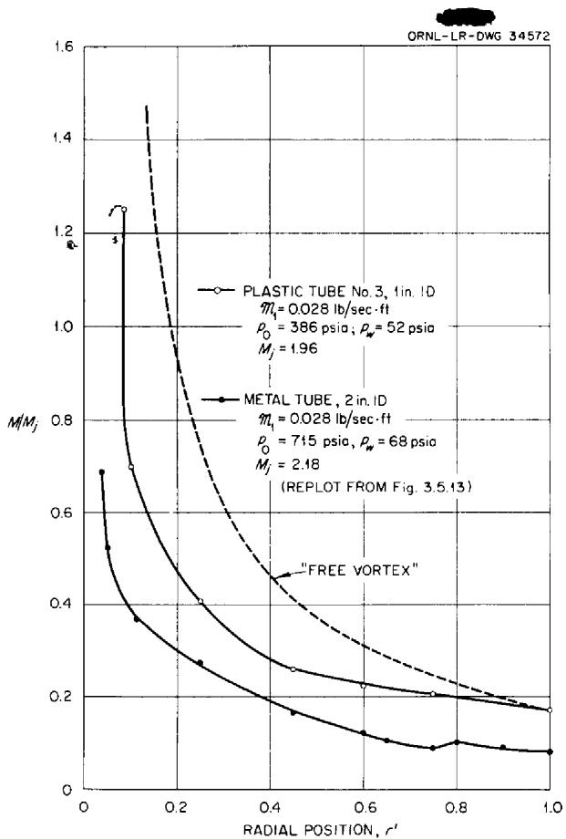  
Fig. 3.5.12. Comparison of Mach Number Profiles for 1-in.-ID and 2-in.-ID Vortex Tubes with no Bleed Flow.

The objective of the phase 2 experiments was to investigate the effect of two methods of bleeding off a fraction of the inlet flow at some radial position away from the tube center. In the first method, the bleed was from the tube periphery through a uniformly porous wall, in the hope that sufficient boundary layer stabilization could be achieved to significantly lower the eddy losses induced by shear forces at the wall and thus increase the vortex strength. The Mach profile obtained with a uniform wall bleed ratio of 2.8 is compared in Fig. 3.5.13 with that obtained with no bleed at the same inlet mass flow. Results are presented in Fig. 3.5.14 for an alternate method of bleed in which the excess flow is removed radially at a position $r' = 0.25$ so that the exit

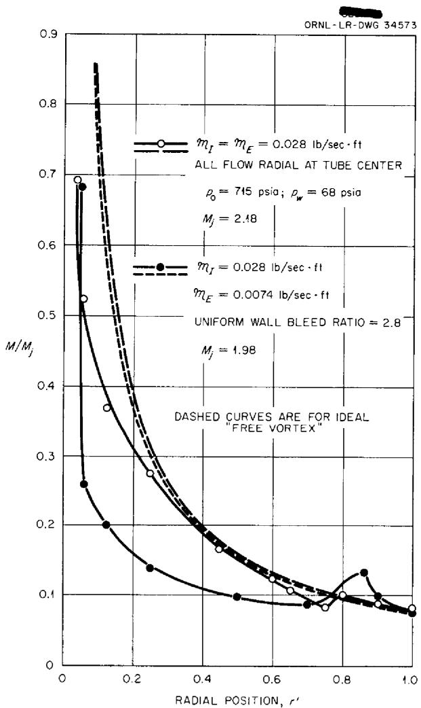  
Fig. 3.5.13. Mach Number Profiles for a 2-in.-ID Metal Vortex Tube Showing Effect of Uniform Wall Bleed.

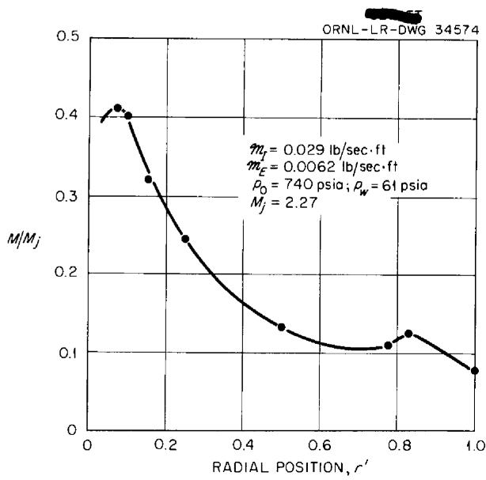  
Fig. 3,5,14. Mach Number Profile for a 2-in.-ID Metal Vortex Tube with Radial Bleed 0,25 in. from Center.

flow at $r' = 0$ is held within allowable limits. The main effect here is that of increasing the inlet mass flow parameter $m_{I} / 2\pi \mu$ over a large fraction of the radius.

The following general observations from the data are noteworthy:

1. The vortex strength, $M_{p} / M_{j}$ , for a 2-in.-diameter increases from about 0.03 for plastic tube No. 2 with $m_{1} = 0.0045$ lb/sec·ft (Fig. 3.5.8) to about 0.08 for the metal tube with $m_{I} = 0.028$ lb/sec·ft (Fig. 3.5.13). Thus, the vortices which were generated at low mass flows appear to be significantly weaker than would be required in vortex reactor applications. The plots of Fig. 3.5.9 for the 2-in. plastic tubes show that the maximum value of $M / M_{j}$ which can be achieved at low mass flows is severely limited. The small peak in the profiles which occurs near the wall for all the 2-in. tubes is not understood but may be related to the nature of introduction of the gaseous jet.

2. As indicated in Figs. 3.5.10 and 3.5.11, the value of the exponent $\epsilon$ in the relationship $\nu \propto r^{+\epsilon}$ , where $\nu$ is the tangential velocity, increases from $-0.4$ at $m_1 = 0.0045\mathrm{lb / sec}\cdot \mathrm{ft}$ to about $-0.8$ at $m_1 = 0.011\mathrm{lb / sec}\cdot \mathrm{ft}$ ; a further increase in $m_1$ appears to produce little change in $\epsilon$ . Since deviation of $\epsilon$ from $-1$ is a measure of the deviation from the ideal "free vortex," it is

concluded that although the vortex strength is low the velocity distributions roughly approximate free vortex behavior at the higher mass flows.

3. The effect of decreasing the tube diameter from 2 to 1 in., as illustrated in Fig. 3.5.12, is to increase significantly the velocity at a given radial position, $r'$ . In the 1-in. tube a value of $M / M_{j}$ of 1.25 was achieved ( $M = 2.45$ ) at $r' = 0.085$ ; while at the corresponding absolute radius in the 2-in. tube at $r' = 0.043$ in., $M / M_{j} = 0.6$ ( $M = 1.31$ ). At a radius of 0.25 in., the 1-in. tube produced $M / M_{j} = 0.25$ , while for the 2-in. tube $M / M_{j} = 0.27$ . Thus it appears that by decreasing the radius the performance of a given vortex tube is not impaired, and the advantage is gained of enabling more tubes to be included in a given volume of reactor.

4. When a uniform wall bleed is applied at a given inlet mass flow, as illustrated in Fig. 3.5.13, the effect is to increase slightly the velocity near the periphery of the tube at the expense of that nearer the center. The rapid rise at $r' < 0.06$ for the profile with bleed is a consequence of the small exit hole employed in this run as contrasted with the larger annular opening in the run with no wall bleed (see Table 3.5.1). This effect is discussed in a forthcoming report. It is felt that the failure of wall bleeding to achieve a significant improvement may be due to the high degree of turbulence induced by the jets in the vicinity of the wall so that a laminar boundary layer cannot be achieved with practical bleed ratios.

5. As an alternate method of bleed-off, a run was made in which the excess mass flow was removed at a radial position 0.25 in. from the center of the 2-in. metal tube; no wall bleed was employed. The results are depicted in Fig. 3.5.14, which indicates when compared with Fig. 3.5.13, that for $r' > 0.1$ the velocity profile agrees well with that obtained when all the flow is removed at the tube center. This technique shows promise for increasing velocities and vortex strength at the expense of lowering exit mass flow rates.

In addition to the basic experiments discussed here, numerous runs have been carried out to

study the effects of number, size, and location of the inlet nozzles, tube length, methods of bleed-off, gas properties, and pressures. Some preliminary separation experiments have also been made using He-Br $_2$ and He-C $_8$ F $_{16}$ gas pairs, as discussed in ref 3. Since these results are not conclusive, it is intended to continue the separation studies.

# SURVEY OF DESIGN PROBLEMS OF AUXILIARY POWER UNITS FOR SATELLITES

# A. P. Fraas Reactor Projects Division

The performance of various types of auxiliary power unit that might be used in satellites has been reviewed during the past several months. Information from the SNAP (Systems for Nuclear Auxiliary Power) program indicates that the weight of either solar cells or thermoelectric (or thermodynamic) power units employing radioactive isotopes as a heat source for a reconnaissance satellite will be about 500 to $1000\mathrm{lb / kw}$ . While lighter weights $(350\mathrm{lb / kw})$ might be achieved with solar cells continuously oriented toward the sun, satellite missions which involve spending almost half of the time in the earth's shadow immediately reduce the efficiency of such solar cells by roughly $50\%$ . Further, it is difficult to effect the orientation of the solar cells toward the sun when mission considerations entail orientation of other elements of the satellite toward the earth. In addition, the specific weight of either the solar cells or the radioisotope power sources is not reduced as the power output of the unit is increased, and the voltage obtainable from such units is low. From preliminary estimates it appears that the use of a reactor as a heat source might make possible auxiliary power units of only 20 to $40\mathrm{lb / kw}$ for power outputs in the range of 20 to $200\mathrm{kw}$ net electrical output.

# Cycle Performance Considerations

One SNAP II power plant proposal suggests three fluid circuits: a sodium circuit cools the reactor, mercury serves as the thermodynamic cycle working fluid, and terphenyl is used to transfer heat from the condenser to the radiator. This approach entails three heat exchangers, three pumps, three expansion tanks, and three sets of instruments and controls. A very large

improvement in reliability and a substantial saving in weight should be possible through the use of a simpler system employing a single fluid.

In the mercury-vapor cycle used in both the SNAP I (radioisotope source) and SNAP II (reactor) power plants, there will probably be a substantial holdup of droplets of mercury on the condenser surfaces, and therefore the weight of the mercury in the condenser will probably be greater than the dry weight of the condenser. It would also be desirable to increase the operating temperature level in the condenser to save condenser weight, and this is not practicable because it would imply too high a pressure level for the high-temperature portion of the mercury-vapor cycle. Further, the low specific volume of the mercury vapor leads to so small a turbine that the shaft speeds tend to be high, and the aerodynamic efficiency of the turbine is low.

Cycles employing either aluminum chloride or rubidium vapor should have several important advantages relative to mercury for a light-weight power plant. In both cases, a single fluid can be used to cool the reactor and carry out the thermodynamic cycle. Flow diagrams for power plants employing these cycles are presented in Figs. 3.5.15 and 3.5.16. The thermodynamic properties of these fluids have been estimated and reports are being prepared to present the

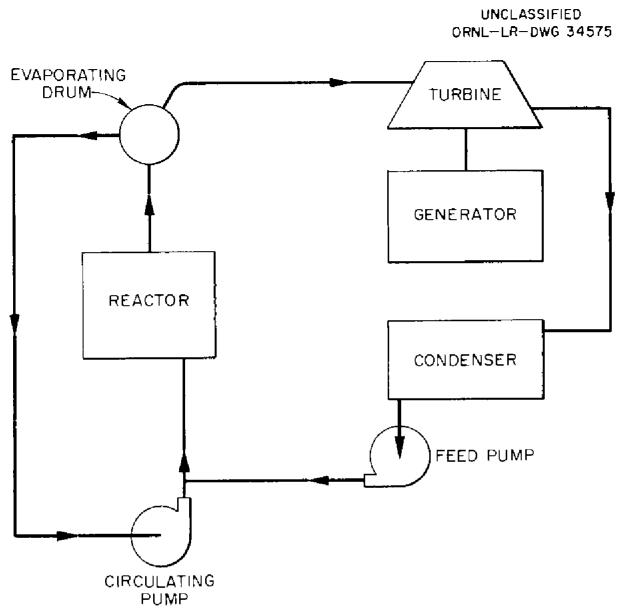  
Fig. 3.5.15. Flow Diagram of Nuclear Power Plant Employing o Rubidium-Vapor Cycle. with caption)

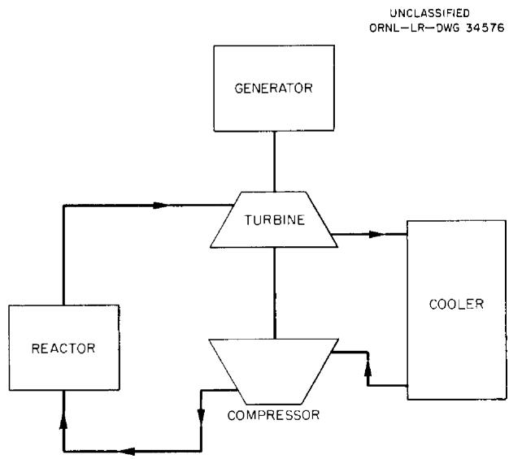  
Fig. 3.5.16. Flow Diagram of Nuclear Power Plont Employing an Aluminum Chloride Gos Cycle. (with caption)

resulting data. Some preliminary calculations for some typical cycles have been made and are included below.

The rubidium vapor cycle would operate much like a boiling-water reactor with a pump circulating a weight flow through the reactor of roughly ten times the weight of rubidium vaporized per pass. Of course the vapor bubbles formed in the reactor will pose serious reactivity and control problems, but it seems likely that the reactor can be designed to reduce these effects to tolerable levels.

A gas-turbine cycle utilizing aluminum chloride has some unusual characteristics. Aluminum chloride dissociates from $\mathrm{Al}_{2}\mathrm{Cl}_{6}$ to $\mathrm{AlCl}_{3}$ in the temperature range between 700 and $1600^{\circ}\mathrm{F}$ , with the bulk of the dissociation taking place in a $400^{\circ}\mathrm{F}$ range that increases with pressure. Preliminary calculations indicate that the cycle can be designed so that the gas will be mostly in the form of $\mathrm{Al}_{2}\mathrm{Cl}_{6}$ during compression, while during the expansion process it will be mostly $\mathrm{AlCl}_{3}$ . This, in effect, will cut the compression work in half and thus produce a marked improvement in cycle efficiency. The nature of this effect can be visualized by examining the P-V diagrams of Fig. 3.5.17, which compare similar ideal gas turbine cycles for helium and aluminum chloride. The work involved in each compression

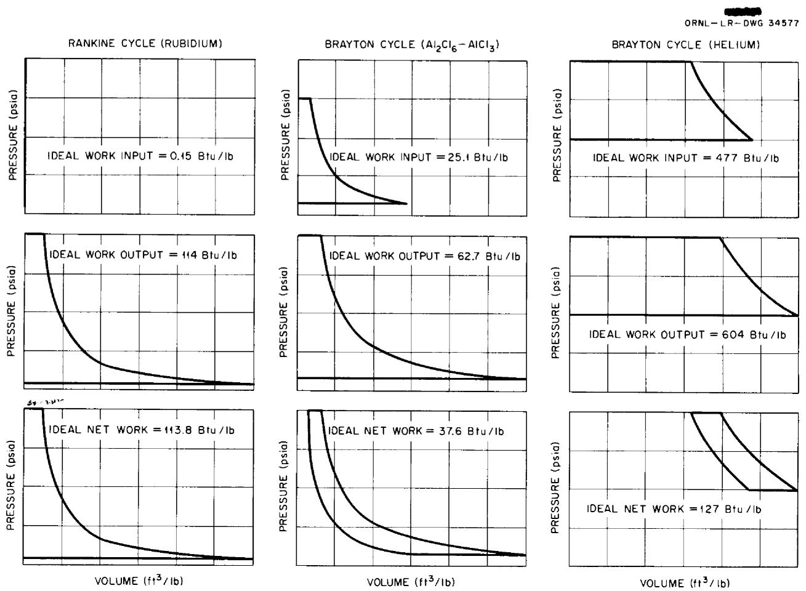  
Fig. 3.5.17. P-V Diagrams for Typical Ideal Thermodynamic Cycles (Data from Tables 3.5.2, 3.5.3, and 3.5.4).

or expansion process is directly proportional to the area of the P-V diagram, and the net work is proportional to the net area for the cycle. A Rankine cycle utilizing rubidium vapor is also included in Fig. 3.5.17 to show that the proposed aluminum chloride cycle is roughly midway between a gas turbine (or Brayton) cycle and a Rankine cycle in its requirements for work input during the compression process.

The diagrams of Fig. 3.5.17 were prepared for ideal cycles with no allowances for losses. The most important losses are associated with the efficiencies of the compressor and the turbine, which are likely to be of the order of $80\%$ . This means that with an $80\%$ efficient compressor the ideal work input will be $80\%$ of the actual work input, while the actual work output of the turbine will be only $80\%$ of the ideal. In addition, pressure drops between the compressor and the

turbine will cause losses in net output from the cycle. The nature of these effects can be seen readily in Fig. 3.5.18.

If allowances are made for these losses to obtain the actual net outputs for the cycles of Fig. 3.5.17, the diagrams of Fig. 3.5.19 result. The relatively large work input required for the compression process of the Brayton cycle makes it very sensitive to compressor inlet temperature, because the compression work increases rapidly with the initial temperature. As a result, the net work output and overall thermal efficiency of the Brayton cycle drop off so rapidly with increasing temperature at the compressor inlet that for most plants the compressor inlet temperature must be held below $200^{\circ}\mathrm{F}$ . At the same time, the turbine inlet temperature must be at least $1200^{\circ}\mathrm{F}$ , and preferably should be above $1400^{\circ}\mathrm{F}$ . For the helium cycle of Fig. 3.5.19, even with a $1540^{\circ}\mathrm{F}$

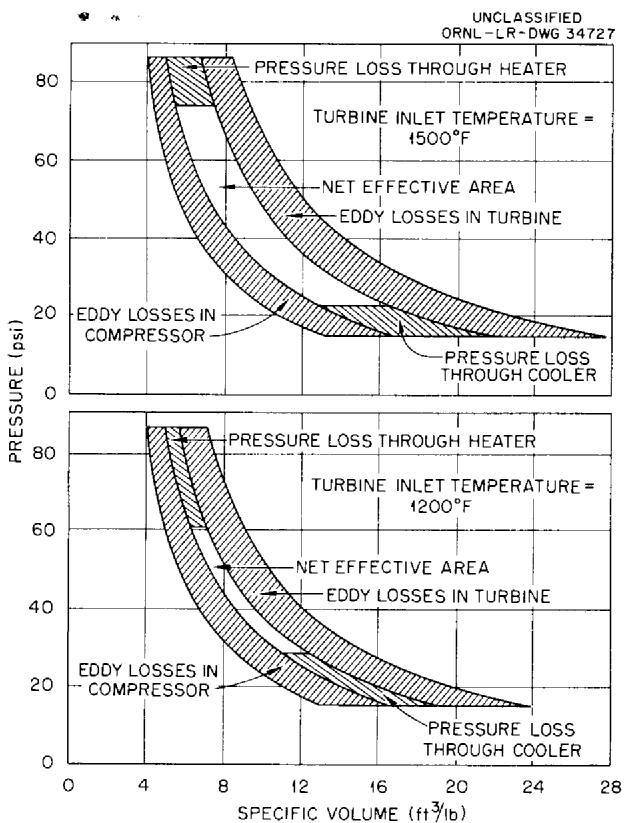  
Fig. 3.5.18. P-V Diagrams for Ideal Gas-Turbine Air Cycles with Cross-Hatched Areas to Indicate the Magnitude of the Principal Losses.

turbine inlet temperature, the net work from the cycle is negative when the compressor inlet temperature is raised to the level required to give a reasonable radiator specific weight.

The aluminum chloride possesses another important advantage over conventional gases for use in a gas turbine; the heat transfer coefficient during the heating and cooling processes should be exceptionally high. The large amounts of energy involved in dissociation appear to give effects analogous to those responsible for the high heat transfer coefficients characteristic of

boiling and condensing heat transfer conditions. This should reduce the heat transfer area required in comparison with the area required for gases such as helium or nitrogen.

A further advantage of aluminum chloride is that it could be used in the vapor phase throughout the cycle so that there would be no free liquid surface at any point in the system, and hence no expansion tank would be required. While it is possible that a free liquid surface could be stabilized by surface tension forces or other factors, it is also true that a great deal of difficulty has been experienced at ORNL with stabilization of free liquid surfaces in pumped systems. To date no one has yet suggested a means of carrying out laboratory tests which would approximate free-flight conditions. Thus there is a major advantage to the use of a working fluid which would avoid any difficulties with liquid surface stabilization.

Summaries of the calculations on which Figs. 3.5.17 and 3.5.19 were based are presented in Tables 3.5.2, 3.5.3, and 3.5.4.

# Planned Program

The next phase of this work will entail a comprehensive series of analytical studies to determine the performance obtainable from rubidium and aluminum chloride as working fluids as compared with more conventional fluids such as mercury, sodium, helium, air, and water. The studies will also disclose the major problem areas most deserving of attention. If this phase of the work indicates a substantial superiority for either rubidium or aluminum chloride as a working fluid in an auxiliary power plant unit it will be followed by experimental determination of heat transfer characteristics of the working fluid chosen, investigation of corrosion problems associated with the fluid, and more complete design studies.

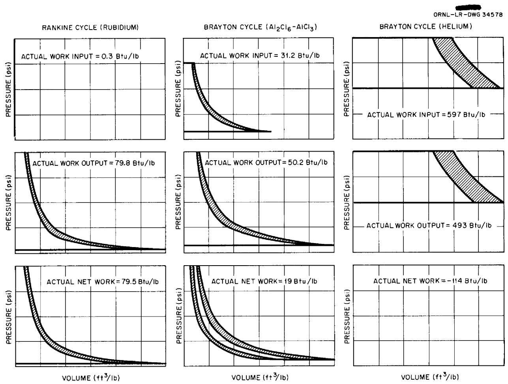  
Fig. 3.5.19. P-V Diagrams for Typical Ideal Thermodynamic Cycles with Cross-Hatched Areas to Represent the Losses Entailed by Compressor and Turbine Efficiencies of $80\%$ .

Table 3.5.2. Rubidium Vapor Cycle   

<table><tr><td>Condition</td><td>Temperature (°R)</td><td>Pressure, p (psia)</td><td>Specific Volume, v (ft3/lb)</td><td>Enthalpy, b (Btu/lb)</td><td>Quality (%)</td><td>Change in Enthalpy, Δh (Btu/lb)</td></tr><tr><td>Vapor to turbine</td><td>2060</td><td>66.33</td><td>3.892</td><td>498</td><td>100</td><td>417</td></tr><tr><td>Vapor to condenser (isentropic)</td><td>1460</td><td>2.66</td><td></td><td>384</td><td></td><td>114</td></tr><tr><td>Vapor to condenser (70% efficiency)</td><td>1460</td><td>2.66</td><td>60.5</td><td>418</td><td>88.1</td><td>79.8</td></tr><tr><td>Liquid to feed pump</td><td>1450</td><td>2.46</td><td>0.01275</td><td>81</td><td>0</td><td></td></tr><tr><td></td><td></td><td colspan="5">Cycle efficiency = 79.8/417 = 19.1%</td></tr></table>

Table 3.5.3. Aluminum Chloride Cycle   

<table><tr><td>Condition</td><td>Temperature (°R)</td><td>Enthalpy, b(Btu/lb)</td><td>Enthalpy, S(Btu/°F)</td><td>Pressure, p(psiα)</td><td>Specific Volume, v(ft3/lb)</td><td>Proportion Dissociated, x</td><td>Change in Enthalpy, Δb(Btu/lb)</td></tr><tr><td>Compressor inlet</td><td>1200</td><td>203.48</td><td>0.0828</td><td>5</td><td>10.346</td><td>0.0726</td><td></td></tr><tr><td>Compressor outlet (isentropic)</td><td>1356</td><td>228.6</td><td>0.0828</td><td>60</td><td>0.967</td><td></td><td>25.1</td></tr><tr><td>Compressor outlet (80% efficiency)</td><td>1378</td><td>234.9</td><td>0.0873</td><td>60</td><td>0.992</td><td>0.0889</td><td>31.2</td></tr><tr><td>Turbine inlet</td><td>2000</td><td>490.2</td><td>0.2388</td><td>60</td><td>2.516</td><td>0.8782</td><td>255.3</td></tr><tr><td>Turbine outlet (isentropic)</td><td>1653</td><td>427.5</td><td>0.2388</td><td>5</td><td>24.46</td><td>0.8410</td><td>62.7</td></tr><tr><td>Turbine outlet (80% efficiency)</td><td>1685</td><td>440.0</td><td>0.2458</td><td>5</td><td>25.40</td><td>0.8755</td><td>50.2</td></tr><tr><td></td><td></td><td></td><td colspan="5">Ideal Cycle Efficiency = 37.6/261.6 = 14.37%</td></tr><tr><td></td><td></td><td></td><td colspan="5">Actual Cycle Efficiency = 19/255.3 = 7.43%</td></tr></table>

Table 3.5.4. Helium Cycle   

<table><tr><td>Condition</td><td>Temperature (°R)</td><td>Pressure, p (psia)</td><td>Specific Volume, v (ft3/lb)</td></tr><tr><td>Compressor inlet</td><td>1200</td><td>100</td><td>7.2</td></tr><tr><td>Compressor outlet (isentropic)</td><td>1582</td><td>200</td><td>4.75</td></tr><tr><td>Turbine inlet</td><td>2000</td><td>200</td><td>6</td></tr><tr><td>Turbine outlet (isentropic)</td><td>1517</td><td>100</td><td>9.1</td></tr><tr><td></td><td colspan="3">Ideal Cycle Efficiency = 483 - 382 / 2000 - 1582 = 101 / 418 = 24.2%</td></tr><tr><td></td><td colspan="3">Actual Cycle Efficiency = 386 - 478 / 418 - 96 = -92 / 322</td></tr></table>

# Part 4

# SHIELDING

E. P. Blizzard

Neutron Physics Division

# 4.1. SHIELDING THEORY

# ANALYSIS OF NEUTRON PHYSICS DIVISION EXPERIMENTAL STUDY OF GAMMA RAYS PRODUCED BY NEUTRON INTERACTIONS IN AIR

F. L. Keller

O. S. Merrill

The gamma-ray dose rate which results from secondary gamma rays produced by neutron interactions with the air can be neglected in most shield design problems because it is small compared with the dose rate which results from air-scattered source gamma rays. Situations may arise, however, in which it is desirable to allow a large amount of neutron leakage from the reactor shield and place part of the neutron shielding material around individual regions which must be further shielded. In many of these situations the air-scattered gamma rays, which are usually of rather low energy (that is, $< 1$ MeV), are attenuated very rapidly by the shielding material around the individual region, whereas the neutron-induced gamma rays, which are isotropically emitted with rather high energies (up to approximately 10.8 MeV), penetrate the shielding material much more readily. Therefore, as the thickness of the shield around the individual region is increased, the relative importance of the neutron-induced gamma rays is increased and it is possible, in some instances, for these gamma rays to be the major contributors to the dose rate.

The two important methods of secondary gamma-ray production in air are neutron capture in $\mathsf{N}^{14}$ and inelastic neutron scattering with both nitrogen and oxygen. In order to accurately calculate the dose-rate contributions from these two processes, it is necessary to know the cross sections involved and the spectra of the gamma rays produced. The results of experimental measurements of the thermal-neutron radiative capture cross section of $\mathsf{N}^{14}$ and the associated capture gamma-ray spectrum have been reported by Bartholomew and Campion. Very little experimental information is available on either the cross sections or the associated gamma-ray spectra for inelastic neutron scattering with nitrogen and oxygen, but Lustig, Goldstein, and

Kalos3,4 have published theoretical values of the inelastic neutron scattering cross sections of nitrogen and oxygen from which it is possible to estimate the spectrum of inelastic scattering gamma rays produced from a given fast-neutron distribution. These cross-section calculations are, however, based on a model which assumes that a statistical model of the nucleus may be applied to the compound nucleus, and the results are questionable for nuclei as light as those of oxygen and nitrogen. Thus, it was considered important to make a comparison between the shape of a measured inelastic scattering gamma-ray spectrum and that of one calculated with the use of the theoretical cross sections for at least one situation.

An experiment was therefore performed at the Tower Shielding Facility (TSF) that was designed to separate out and measure as accurately as possible the spectra of gamma rays produced in air from neutron captures in $\mathsf{N}^{14}$ and inelastic neutron scattering. This experiment, in which a 3- by 3-in. sodium iodide crystal spectrometer was used, yielded two pulse-height distributions, one of which was attributed to capture gamma rays and the other to inelastic scattering gamma rays. These experimental pulse-height distribution curves are shown in Fig. 4.1.1. In order to eliminate background counts from the measurements of neutron interactions in the crystal, it was necessary to make the gamma-ray measurements inside a thick shield through which a water-filled collimator was inserted. Therefore the gamma rays which were detected had penetrated through the thick (~4 ft) water collimator, and the measured pulse-height distributions had been considerably altered from the desired ones by the water attenuation and buildup.

As may be seen, it would be an almost impossible task to take the measured pulse-height distributions and attempt to work backwards to obtain the

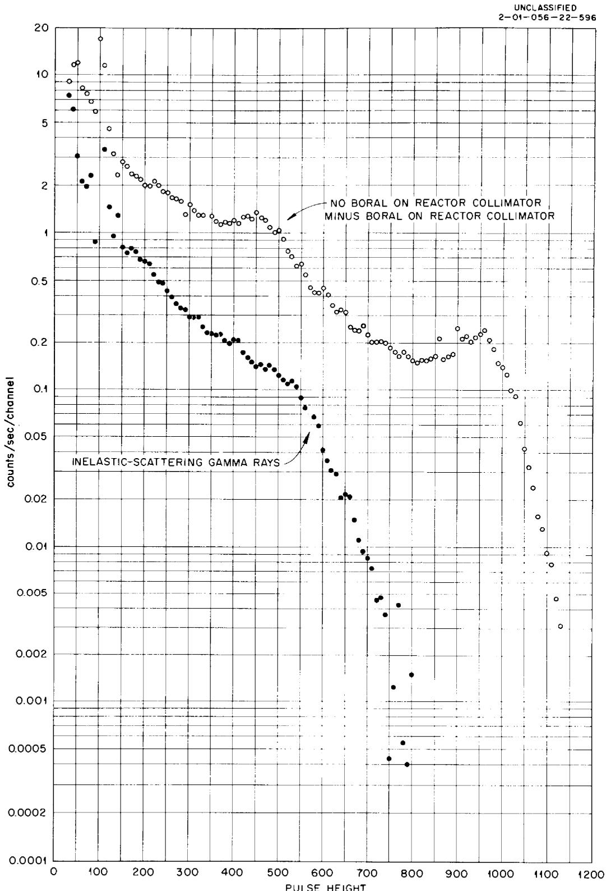  
Fig. 4.1.1. Pulse-Height Spectra of Capture and Inelastic Scattering Gamma-Rays Resulting from Neutron Interactions in Air.

spectra of gamma rays incident on the outside of the collimator. Therefore, it was considered advisable to make the comparison by first calculating the spectra incident on the outside of the water collimator from both capture and inelastic scattering gamma rays, then determining the attenuation and buildup associated with the passage of the radiation through the water collimator, and, finally, taking into account detector response functions to obtain calculated pulse-height distributions which could be compared directly with the experimental results presented in Fig. 4.1.1.

# Spectra of Gamma Rays Incident on the Outside of the Collimator

A rather accurate estimate of the complete spectrum of gamma rays from neutron captures in $N^{14}$ was obtained by making use of the direct experimental measurements of Bartholomew and Campion. The report by Lustig, Goldstein, and Kalos on neutron cross sections of nitrogen3 supplied the needed theoretical values of the total inelastic scattering cross sections for neutrons with energies up to 18 Mev and also the results of Hauser-Feshbach calculations of the cross sections for exciting the first four individual nuclear levels with various energy neutrons up to 6 Mev. Since these individual level cross sections are relatively flat in the region of 6 Mev, they could be extrapolated to somewhat higher neutron energies. Then, for neutron energies above 6 Mev, the difference between the total inelastic cross section and the sum of the individual level cross sections represents the cross section for exciting some level whose energy is greater than 6 Mev. Branching ratios obtained from a review article by Ajzenberg and Lauritsen6 were used with the individual level cross-section curves to obtain cross-section curves for producing gamma rays with discrete energies less than 6 Mev from these levels. The branching ratios also indicated that most of the levels in the region from 6 to 9 Mev decay directly to the ground state. Since these levels are rather closely spaced and since they decay predominantly to the ground state, it was assumed in calculating the gamma-ray spectrum that the difference cross section mentioned above could be treated as a cross section for producing an inelastic scattering gamma ray

with an energy approximately equal to the initial energy of the neutron. In the case of oxygen the first, and most important, level is at 6.09 Mev, and it was assumed that the entire inelastic oxygen cross section could be taken as the cross section for producing a 6.09-Mev gamma ray.

With these cross sections and an assumed neutron distribution it was then possible to estimate the spectrum of the inelastic scattering gamma rays produced. The spectrum of fast neutrons above 3 to 4 MeV (which are the only neutrons of importance for inelastic scattering in air) was assumed to have a fission shape in these calculations. The spectrum of inelastic scattering gamma rays obtained in this manner is shown in Fig. 4.1.2, where the discrete energy gamma rays have been represented

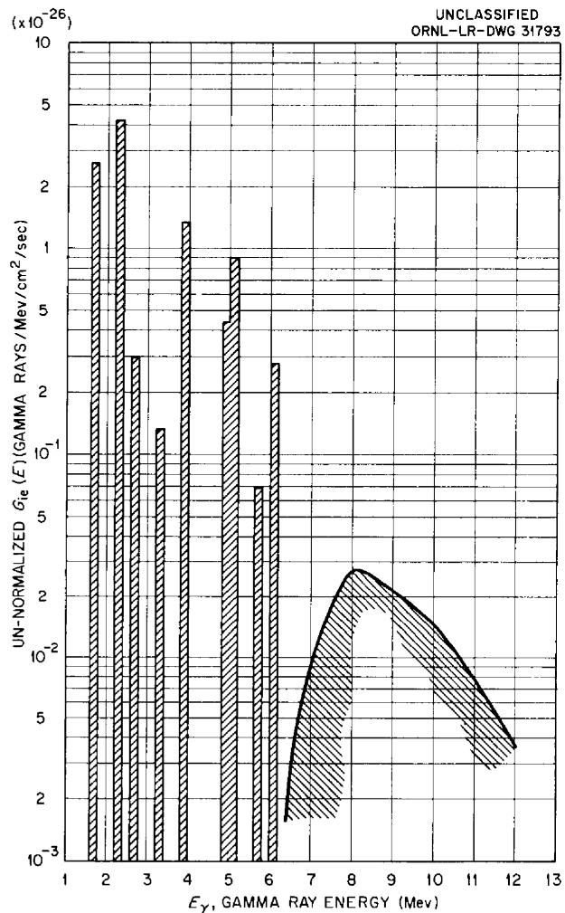  
Fig. 4.1.2. Calculated Inelastic Scattering Gamma-Ray Number Flux Spectrum at the Detector (No Water in Collimator).

in histogram form with an energy width of 0.2 Mev. The fact that the calculated distribution above 6 Mev is continuous rather than discrete, is, of course, due to the lack of detailed knowledge concerning the excitation of individual levels in this region. Fortunately the number of gamma rays in the continuous portion of the curve is small compared with the number of gamma rays in the discrete lines, and hence the approximations used in the calculations concerning these gamma rays are probably sufficiently accurate.

# Spectrum After Attenuation and Buildup in the Water Collimator

Since all gamma rays which reached the detector without making a collision in the water collimator travelled through approximately the same water thickness ( $\sim 4$ ft), the uncollided spectra at the detector were determined by simply multiplying the incident spectra by $e^{-u(E)T}$ at each energy point, where $u(E)$ is the total linear absorption coefficient of water at energy $E$ and $T$ is the water thickness ( $\sim 4$ ft). Next, it was necessary to determine the distribution of scattered, or buildup, gamma rays at the detector for each case. Since, as mentioned above, all the uncollided gamma rays which reached the detector penetrated essentially the same water thickness, it was assumed that the distribution at the outside of the water collimator could be artificially represented by a single point isotropic source whose strength was normalized to give the same uncollided flux at the detector as that calculated above.

In the case of gamma rays it appears that even for point isotropic sources in infinite media most of the scattered gamma rays which reach a detector are gamma rays which leave the source in almost the right direction to reach the detector without scattering. Goldstein and Wilkins have calculated the spectra of buildup gamma rays at a detector for cases of point isotropic sources in infinite media, and, since the assumed artificial point source was normalized so that the correct number of gamma rays left the source in the direction toward the detector (although an incorrect number left at large angles to the source-detector

axis), it was further assumed that the Goldstein-Wilkins results could be applied directly to the artificial point source to determine the buildup spectrum at the detector in the actual problems.

Plots of the total unnormalized gamma-ray number flux distributions at the detector (that is, collided, or buildup, plus uncollided) for capture and inelastic scattering gamma rays, which were obtained in the manner described above, are shown in Figs. 4.1.3 and 4.1.4, respectively. In these figures the histograms representing the uncollided discrete-energy gamma rays are superimposed on continuous distributions which are almost entirely due to scattered, or buildup, gamma rays.

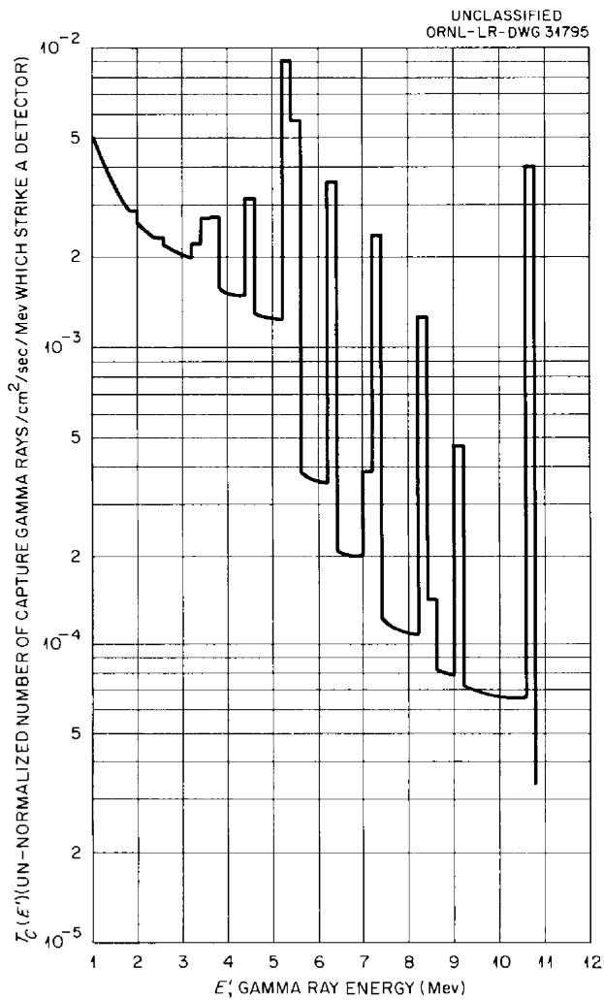  
Fig. 4.1.3. Calculated Total Capture Gamma-Ray Number Flux Spectrum at the Detector (Water in Collimator).

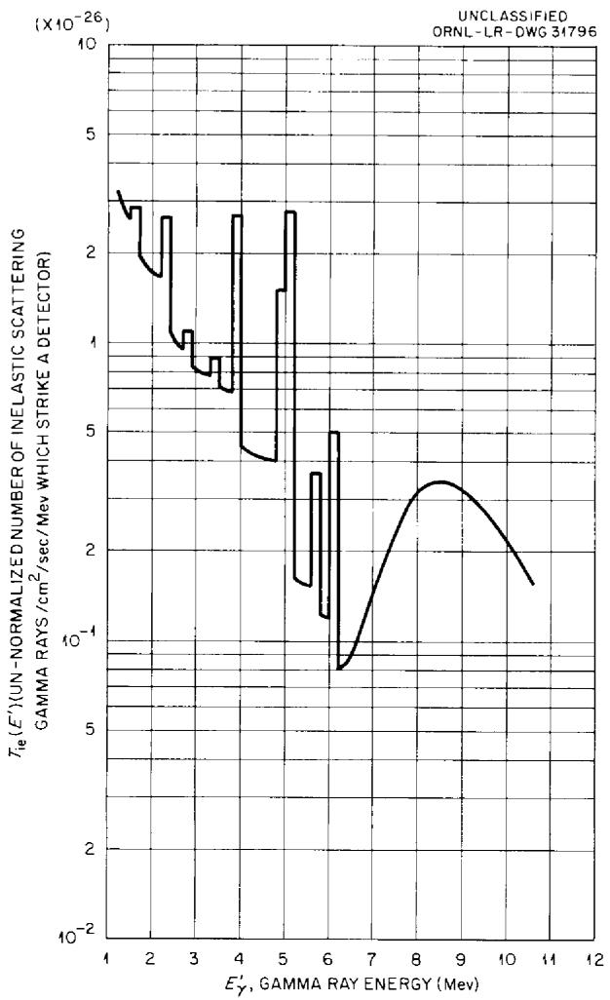  
Fig. 4.1.4. Calculated Total Inelastic Scattering Gamma-Ray Number Flux Spectrum at the Detector (Water in Collimator).

# Calculation of Pulse-Height Distributions from the Detector

Finally, it was necessary to include the detector response so as to obtain pulse-height distribution curves whose shapes could then be compared directly with the shapes of the curves obtained from the experimental results. Experimental measurements of response functions of a 3- by 3-in. sodium iodide crystal are available for various monoenergetic gamma-ray sources. These response functions were replotted in histogram form, where the averaging was performed over 1-Mev intervals, and interpolations were then made to obtain estimates of the response functions at 0.2-Mev intervals over the entire energy range of interest. These

response functions were then applied to the calculated number flux distributions at the detector to give calculated pulse-height distributions from the detector for both capture and inelastic scattering gamma rays. A comparison of the shapes of the experimental and calculated pulse-height distributions from both capture and inelastic scattering gamma rays is shown in Fig. 4.1.5.

The shapes of the measured and calculated curves are in excellent agreement. Since the spectrum of capture gamma rays which was taken to be incident on the outside of the water collimator was known to be good because most of it was obtained from the results of direct experimental measurements, the excellent agreement between the shapes of the calculated and measured pulse-height distributions from capture gamma rays indicated that the methods used to determine the effects of water buildup and detector response could be considered to be reliable. As a corollary, the excellent agreement which was also obtained between the shapes of the calculated and measured pulse-height distributions from inelastic scattering gamma rays gives confidence in calculations based on a spectrum of inelastic scattering gamma rays obtained in the manner outlined. This analysis has been published in more detail in a topical report.[8]

# MONTE CARLO CALCULATION OF THE DEPOSITION OF GAMMA-RAY HEATING IN STRATIFIED LEAD AND WATER SLABS

L.A. Bowman

D. K. Trubey

It was reported10 previously that an Oracle Monte Carlo calculation of the penetration of monoenergetic, monodirectional gamma rays in a lead and water shield had been made that included a total of 512 problems. The problems resulted from all combinations of eight different lead and water configurations (see Fig. 4.1.6), four total slab thicknesses (1, 2, 4, and 6 mfp), four energies for the incident gamma rays (1, 3, 6, and 10 MeV), and four angles of incidence (0, 60, 70.5, and 75.5 deg). The results obtained included the dose rate and energy flux throughout the slab and at the rear of the

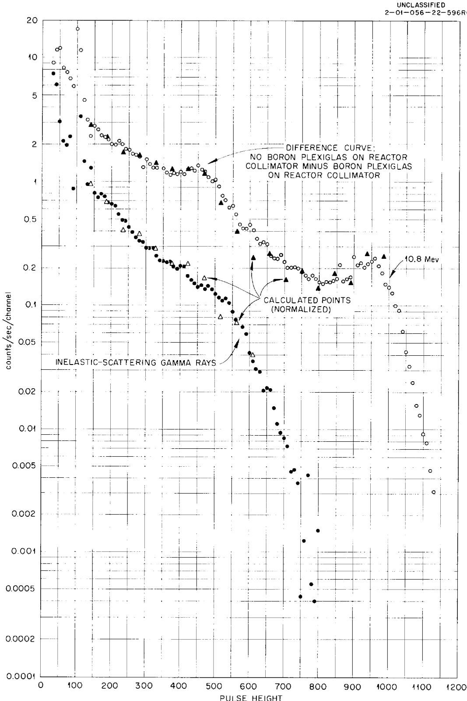  
Fig. 4.1.5. Comparison of Experimental and Calculated Pulse-Height Spectra of Capture and Inelastic Scattering Gamma Rays Resulting from Neutron Interactions in Air.

slab; dose-rate buildup factors; the heat deposited throughout the slab; and the energy and angular distribution of the gamma rays reflected from and transmitted back into the slab. A comparison of the dose-rate buildup factors for normal incidence obtained from this calculation with the factors obtained from an empirical formula was also given previously,11 and a recently completed comparison

11L. A. Bowman and D. K. Trubey, ANP Quar. Prog. Rep. Sept. 30, 1957, ORNL-2387, p 320.

of the heating results with an empirical formula is described here.

The heating results are given as the percentage of the total energy incident upon the slab that is absorbed in a specified region in the slab. Some typical plots of the results are shown in Figs. 4.1.7 through 4.1.10, which compare the Monte Carlo results averaged over a region of four intervals with values obtained by using the following empirical formula:

$$
\begin{array}{l} J _ {x} \left(E _ {0}, \theta , x, \operatorname {M a t} _ {x}\right) = \left[ \sec \theta \frac {\mu_ {a} \left(E _ {0} , \operatorname {M a t} _ {x}\right)}{\mu_ {t} \left(E _ {0} , \operatorname {M a t} _ {x}\right)} \exp - \left(\frac {x _ {1} + x _ {2}}{\cos \theta}\right) \right] \\ \left[ B _ {a _ {1}} \left(\frac {x _ {1}}{\cos \theta^ {\prime}} E _ {0}\right) B _ {a _ {2}} \left(\frac {x _ {2}}{\cos \theta^ {\prime}} E _ {0}\right) \exp - \left(\frac {x _ {2}}{\cos \theta}\right) + B _ {a _ {2}} \left(\frac {x _ {1} + x _ {2}}{\cos \theta}, E _ {0}\right) \left\{1 - \exp - \left(\frac {x _ {2}}{\cos \theta}\right) \right\} \right] \\ \left[ \exp - \left\{4 \cos \theta (1 - \cos \theta) \left[ 1 - \frac {\mu_ {a} \left(E _ {0} , M a t _ {1}\right)}{\mu_ {i} \left(E _ {0} , M a t _ {1}\right)} \right] \left[ \frac {x _ {1} + x _ {2}}{\left(x _ {1} + x _ {2}\right) ^ {4} + 1} \right] \frac {2}{\sqrt {E _ {0}}} \right\} \right], \\ \end{array}
$$

where

$J_{x}(E_{0},\theta ,x,\mathsf{Mat}_{x}) =$ percentage of total energy incident upon the slab that is absorbed in the slab at point $x$ per mean free path,

$x_{1} =$ number of mean free paths of the first material,   
$x_{2} =$ number of mean free paths of the second material,

$E_0 =$ energy of the incident gamma ray,

$\theta =$ angle between the direction of the incident gamma ray and the normal to the slab,

$$
\frac {\mu_ {a} \left(E _ {0} , M a t _ {x}\right)}{\mu_ {t} \left(E _ {0} , M a t _ {x}\right)} = \frac {\text {e n e r g y a b s o r p t i o n c o e f f i c i e n t}}{\text {t o t a l a b s o r p t i o n c o e f f i c i e n t}},
$$

$B_{a_1}\left(\frac{x_1}{\cos\theta},E_0\right) = \text{NDA point isotropic energy absorption buildup factor for the first material,}^{11}$

$B_{a_2}\left(\frac{x_2}{\cos\theta},E_0\right) = \text{NDA point isotropic energy absorption buildup factor for the second material,}$

$\exp - \left(\frac{x_1 + x_2}{\cos \theta}\right) =$ exponential attenuation to point heating is calculated, and

$$
\exp - \left\{4 \cos \theta (1 - \cos \theta) \left[ 1 - \frac {\mu_ {a} \left(E _ {0} , M a t _ {1}\right)}{\mu_ {t} \left(E _ {0} , M a t _ {1}\right)} \right] \left[ \frac {x _ {1} + x _ {2}}{\left(x _ {1} + x _ {2}\right) ^ {4} + 1} \right] \frac {2}{\sqrt {E _ {0}}} \right\}
$$

is the empirical short-circuiting correction.

UNCLASSIFIED

2-01-059-238A

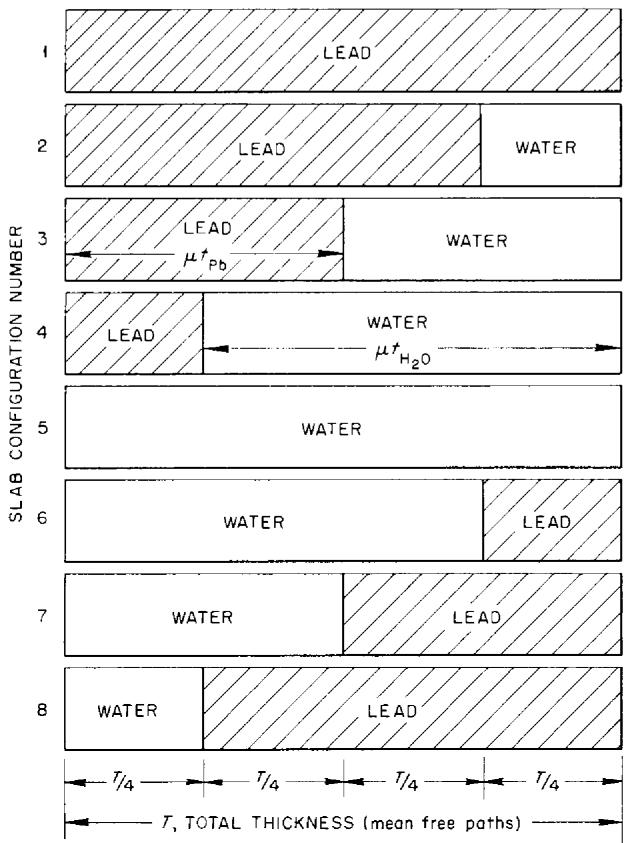  
$\mu_{f} =$ NORMAL THICKNESS IN MEAN FREE PATHS AT INITIAL ENERGY   
Fig. 4.1.6. Lead and Water Slab Configurations Used in Monte Carlo Calculations.

The first bracketed factor represents the fraction of incident energy expected to be deposited per mean free path if the scattered gamma rays are neglected. The second bracketed term is the buildup factor. Near the boundary $(x_{2}$ small), where the spectrum is largely determined by the first material, the buildup is given by the first term. This term damps out as $x_{2}$ gets large, and the buildup factor is characteristic of the second material. The buildup factors used in the formula were the results of the well-known NDA moments method calculation.12 The energy absorption buildup factors used were for a point isotropic source, since these were the only buildup factors presented in ref 12.

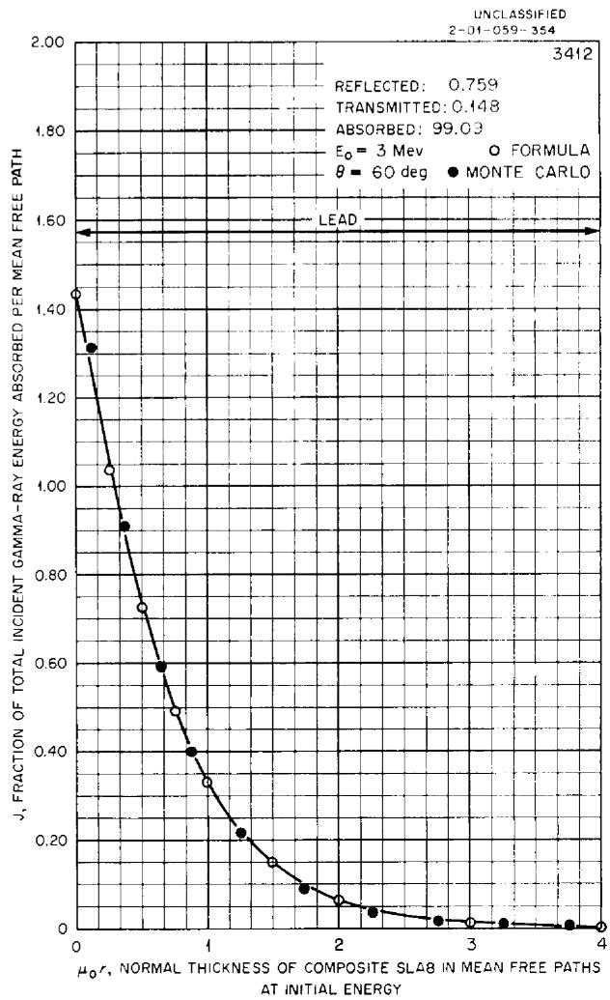  
Fig. 4.1.7. Gamma-Ray Energy Absorption in a Lead Shield as a Function of the Shield Thickness.

The third bracketed factor is the "short-circuiting" factor. An attempt was made to separate the effects of the various parameters in the exponent. The factors which depend on the angle reach a peak at 60 deg. It seemed reasonable that a peak might occur at about 60 deg when the combination of a decreasing path length and a decreasing cross section, as well as the final energy of a scattered gamma ray as the angle of scattering increases, were taken into account. The effect of distance from the initial boundary also shows a peak (near 1 mfp). There is little short circuiting at short distances, since the heating is due largely to first collisions. The short circuiting damps out at large distances since the buildup factor adequately accounts for the scattered gamma rays far from

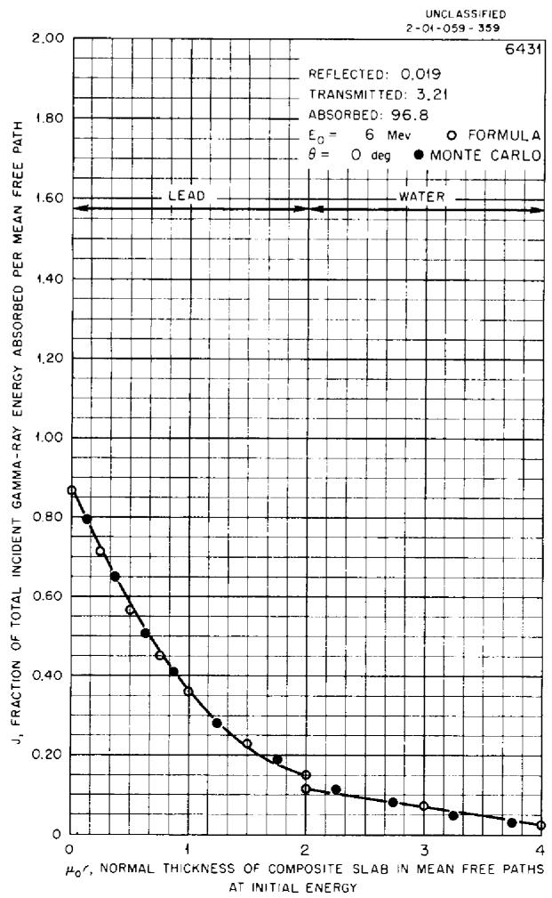  
Fig. 4.1.8. Gamma-Ray Energy Absorption in a Lead-Water Shield as a Function of the Shield Thickness.

boundaries. The factor

$$
1 - \frac {\mu_ {a} \left(E _ {0} , M a t _ {1}\right)}{\mu_ {t} \left(E _ {0} , M a t _ {1}\right)}
$$

is usually taken to be that of the first material, since, in general, the short-circuiting effect is due to scattering near the initial boundary. This procedure seems adequate if the first material is 0.25 mean free path thick but probably is not adequate if the thickness of the first material is less than this. The variation with energy seems to break down with low energy and as a result the formula can be low by as much as $20\%$ for the I-Mev case.

It should be emphasized that the data obtained with this empirical formula have only been compared with data from the Monte Carlo calculation

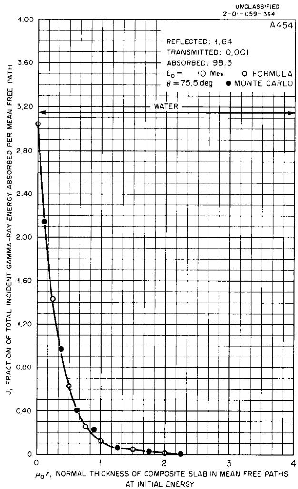  
Fig. 4.1.9. Gamma-Ray Energy Absorption in a Water Shield as a Function of the Shield Thickness.

described above, which had a very limited number of parameter values, and therefore it is possible that the fit would not be so good for other values of the parameters, particularly those outside the energy range examined. The worst fits were obtained for low energies, especially with lead following water, but even in these cases the error was less than $20\%$ . In nearly all the cases examined, the error was less than $5\%$ .

This work has been described in more detail in a topical report.[13]

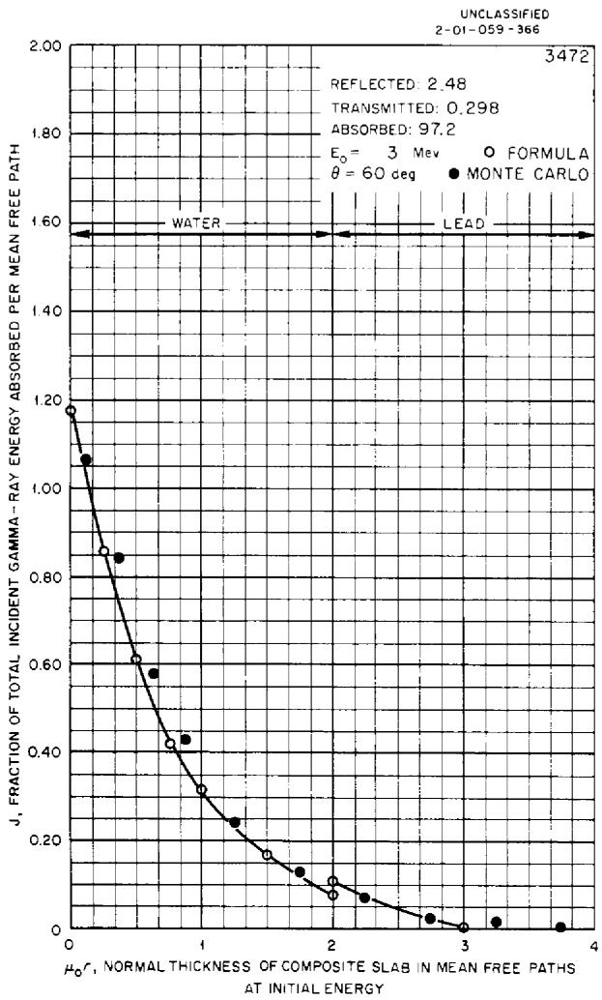  
Fig. 4.1.10. Gamma-Ray Energy Absorption in a Water-Lead Shield as a Function of the Shield Thickness.

# A MONTE CARLO CALCULATION OF THE GAMMA-RAY HEATING IN SEVERAL SHIELDING CONFIGURATIONS ADJACENT TO THE BULK SHIELDING REACTOR

L.A. Bowmgn14

R.H. Lessig15

W.W.Dunn15

D. K. Trubey

Some measurements of the heating produced in several specific shielding configurations at the Bulk Shielding Facility were presented previously,16

and more recent measurements are described in Chap. 4.3 of this report. For a comparison with the experimentally determined heating, a Monte Carlo calculation of the primary gamma-ray heating for slab geometry was performed on the Oracle, and the results are presented here.

Three different shielding configurations were considered. In the experimental arrangement, each configuration consisted of slabs of shielding material immersed completely in a $\frac{3}{8}$ -in.-thick aluminum tank filled with insulating oil. The material of each configuration was the same, with the exception of the gamma-ray shielding section. The slab that made up the gamma-ray shield was a different material in each configuration; in one it was 3 in. of lead, in another it was 3 in. of iron, and in the third it was 2 in. of Mallory 1000 (90 wt % tungsten, 4 wt % copper, and 6 wt % nickel, density = 16.9 g/cm³). In all configurations, two slabs of lithium hydride were placed behind the gamma-ray shield, one being 4 in. thick and the other being 1 ft thick. Also, in all cases, a 4-in.-thick slab of beryllium was placed in front of the gamma-ray shielding material. The experimental arrangement is shown in Fig. 4.1.11, and the details of the metallic heating samples, containers, and thermocouple locations are shown in Fig. 4.1.12.

The experimental conditions were approximated in the calculational procedures by assuming that all the materials had the thicknesses mentioned above and that they were infinite in the other dimensions. These assumptions were necessary since only slabs of infinite extent can be considered with the Oracle Monte Carlo code.[17] The gamma-ray energy and angular distribution of the BSF reactor used in this calculation were the same as those reported previously.[18]

# Method of Calculation

The Oracle Monte Carlo code yields gamma-ray heating in a region of specified thickness within a shield as a function of initial energy and angle of incidence of the gamma rays. Initial gamma-ray energies, $E$ , of 0.5, 1, 2, 4, 6, and 8 MeV and incident angles, $\theta$ , of 0, 30, 50, 65, and 80 deg were

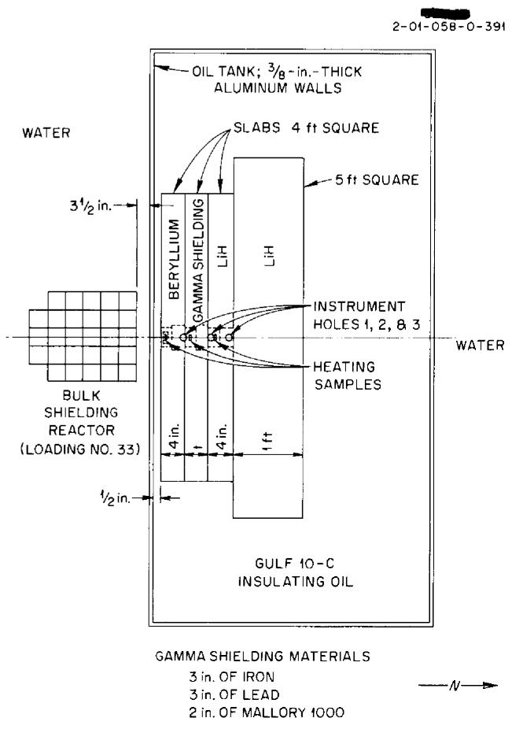  
Fig. 4.1.11. Plan View of the BSF Shield Heating Experiment.

considered in this calculation, with $\theta$ being measured from the normal to the shield. Heating estimates integrated over all energies and angles were made in the shield only at the points where thermocouples were located, as shown in Fig. 4.1.11, although the Oracle calculation yielded heating and dose-rate information throughout the shield. It was assumed that the thickness of the shield preceding the region being considered was measured from the front of the slab to the front surface of the air annulus. This resulted in a slight overestimate of the heating.

The Oracle results, given in terms of a function $J_{x}(\theta ,E)$ , were plotted for each energy $E$ at each position; $J_{x}(\theta ,E)$ is the percentage of the incident energy deposited in a region $x$ . A typical plot of $J_{x}(\theta ,E = 4\text{Mev})$ for the front thermocouple location in the lead gamma-ray shielding material, that is, the thermocouple location near the beryllium-lead interface, is given in Fig. 4.1.13. With the use of

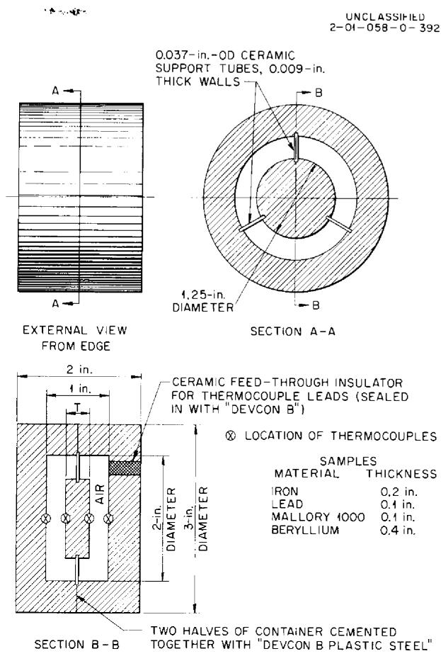  
Fig. 4.1.12. Details of Metallic Heating Samples, Containers, and Thermocouple Locations for BSF Heating Experiment.

the energy and angular distribution of the gamma rays from the BSF reactor as previously estimated18 and curves such as that of Fig. 4.1.13, the heating in the desired layer within the shield was computed for each energy and angle of incidence to the shield. The heating in a region due to gamma rays from an infinite plane source is:

(1) $H_{x} = K\int_{\Omega}\sum_{E}J_{x}(\theta ,E)\phi_{E}(\theta ,\phi ,E)\cos \theta d\Omega$

$$
= 2 \pi K \int \sum_ {E} J _ {x} (\theta , E) \bar {\phi} _ {E} (\theta , E) \cos \theta d (\cos \theta),
$$

where

$K =$ factor to convert from Mev/sec to watts, $\overline{\phi}_{E}(\theta ,E) =$ gamma-ray energy flux in group $E$ leaving the BSF reactor at angle $\theta$ averaged over $\phi$ (Mev·cm²·sec⁻¹·steradian⁻¹·kw⁻¹),

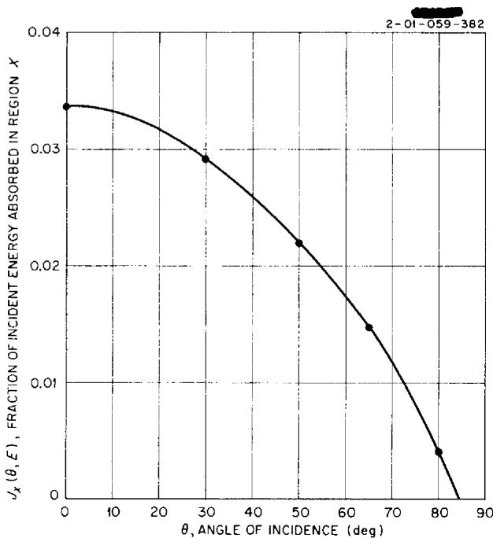  
Fig. 4.1.13. Calculated Heating in the Front Lead Sample Produced by 4-Mev Gamma Rays as a Function of the Angle of Incidence.

$\cos \theta =$ term to convert from flux to current,

$$
\begin{array}{r} d \Omega = \text {d i f f e r e n t i a l s o l i d a n g l e} = \sin \theta d \theta d \phi = \\ d (\cos \theta) d \phi . \end{array}
$$

In order to correct for the finite area of the source, a Hurwitz correction was applied to the heating equation. Since the BSF reactor is not a disk, a radius $a$ was assumed which would give the same disk area as the area of the north face of the reactor. This correction, $G(E)$ , can be expressed as the ratio of exponential integrals if it is assumed that the correction for the total flux is the same as that for the uncollided flux:

(2) $G(E) = \frac{H(z,a)}{H(z,\infty)} = \frac{E_{1}(\mu z) - E_{1}(\mu\sqrt{z^{2} + a^{2}})}{E_{1}(\mu z)}$

$$
= \frac {E _ {1} \left(\sum_ {i} \mu_ {i} t _ {i}\right) - E _ {1} \left(\sum_ {i} \mu_ {i} t _ {i} \sqrt {1 + \frac {a ^ {2}}{z ^ {2}}}\right)}{E _ {1} \left(\sum_ {i} \mu_ {i} t _ {i}\right)},
$$

where

$H(z,\infty) =$ attenuation function for the uncolled flux from an infinite source plane a

distance $z$ from the point at which the heating is being calculated,

$H(z,a) =$ attenuation function for the uncollided flux from a finite disk (of radius $a$ ) a distance $z$ from the point at which the heating is being calculated,

$t_{i} =$ thickness of ith layer of shield,

$\mu_{i} =$ total cross section for ith layer of shield,

$$
E _ {1} (\mu z) = \int_ {\mu z} ^ {\infty} \frac {e ^ {- y}}{y} d y.
$$

Incorporating this correction in the heating equation gives

(3) $H_{x}(\text{watts}\cdot \text{cm}^{-2}\cdot \text{kw}^{-1})$

$$
= 2 \pi K \int \sum_ {E} [ J _ {x} (\theta , E) G (E) \bar {\phi} (\theta , E) ] \cos \theta d (\cos \theta).
$$

The integrand of this equation is plotted in Figs. 4.1.14 through 4.1.16 for four thermocouple locations in the shield configuration made up of beryllium, Mallory 1000, and lithium hydride. The effect of the shield on the angular distribution is easily seen. In the case of the Mallory 1000 sample the heating results were normalized to a sample $1\mathrm{cm}$ thick.

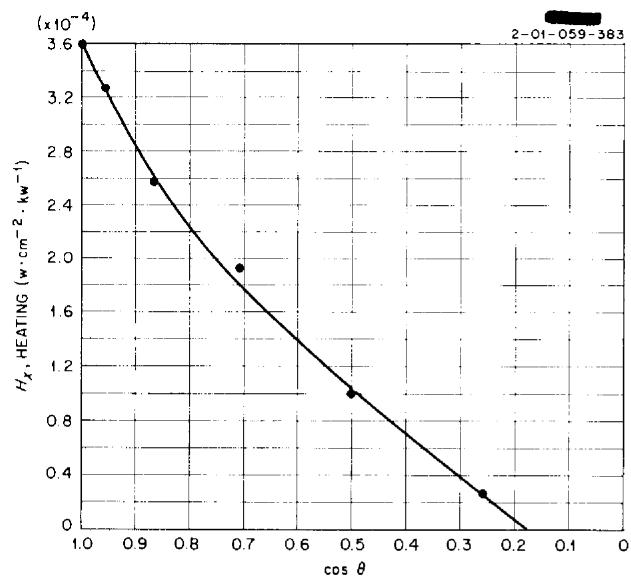  
Fig. 4.1.14. Calculated Heating in the Front Beryllium Sample Produced by the BSF Gamma-Ray Energy Spectrum as a Function of $\cos \theta$ (Beryllium-Mallory 1000-Lithium Hydride Configuration).

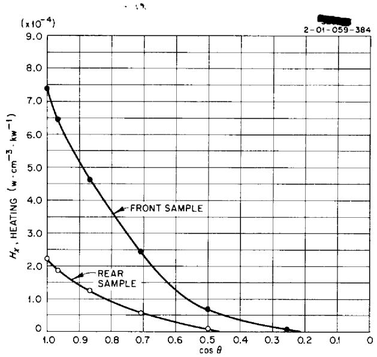

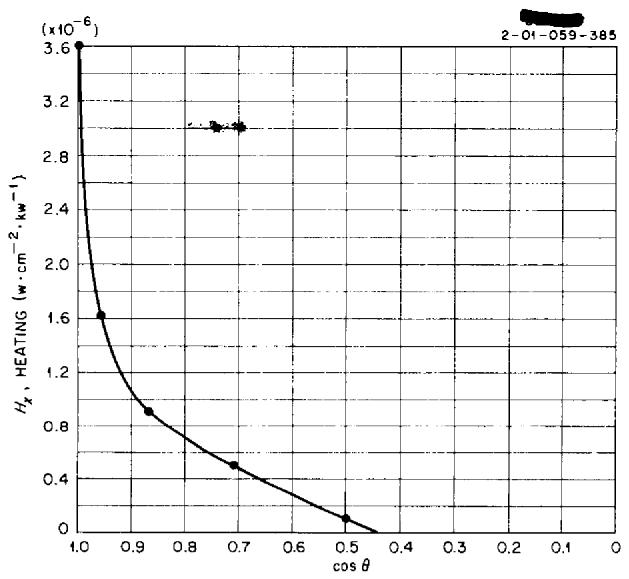  
Fig. 4.1.15. Calculated Heating in the Front and Rear Mallory 1000 Samples Produced by the BSF Gamma-Ray Energy Spectrum as a Function of $\cos \theta$ (Beryllium-Mallory 1000-Lithium Hydride Configuration).   
Fig. 4.1.16. Calculated Heating in the Front Lithium Hydride Sample Produced by the BSF Gamma-Ray Energy Spectrum as a Function of $\cos \theta$ (Beryllium-Mallory 1000-Lithium Hydride Configuration).

Equation 3 was numerically integrated from plots similar to those of Figs. 4.1.14 through 4.1.16 for each thermocouple location in the three different shield configurations. Since the sample thicknesses varied, the integration was normalized to heating per unit volume by dividing by the thickness of the sample. These values are given in histogram form in Figs. 4.1.17 through 4.1.19.

# Conclusions

The results for heating in the beryllium of the three configurations are in good agreement, differing only by statistical variation. It is interesting to note that the heating is nearly the same in the gamma-ray shield materials, since the attenuation of the radiation in the shielding in front of the sample and the absorption in the sample tend to be compensating effects.

Most of the assumptions made in the calculation cause the result to be too high. These are:

1. All the flux at the reactor surface is outwardly directed.   
2. The heating rate is that of a sample located at the beginning of the void.   
3. The source strength and angular distribution are the same over the entire reactor face. The last assumption probably gives the worst effect. It might be possible to apply some correction factor to approximately take this into account, but this has not been done because of the complexities involved and the additional uncertainties which would be introduced. A crude estimate of the average source strength (based on the thermal-neutron flux distribution near the center of the reactor) indicates that the results are possibly a factor of 1.5 too high. This estimate is corroborated by the heating results based on an analysis of the thermocouple measurements which were a factor of 2 lower than these calculated results.[19]

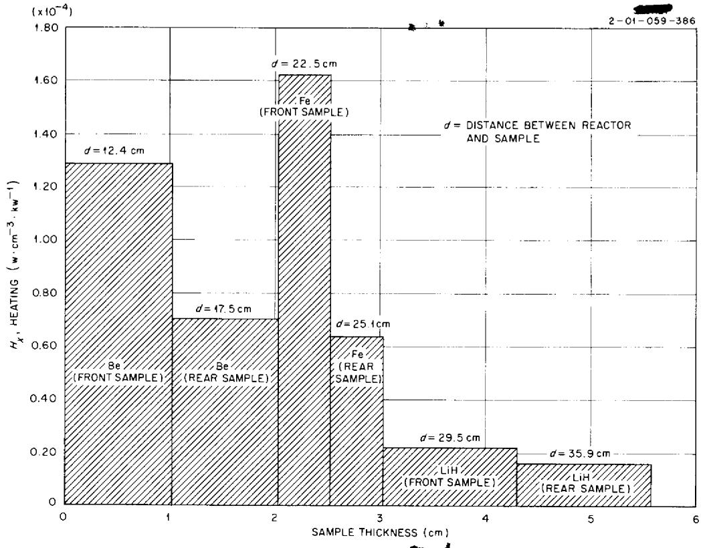  
Fig. 4.1.17. Calculated Total Heating Produced by the BSF Gamma-Ray Energy Spectrum in All Samples in the Beryllium-Iron-Lithium Hydride Configuration.

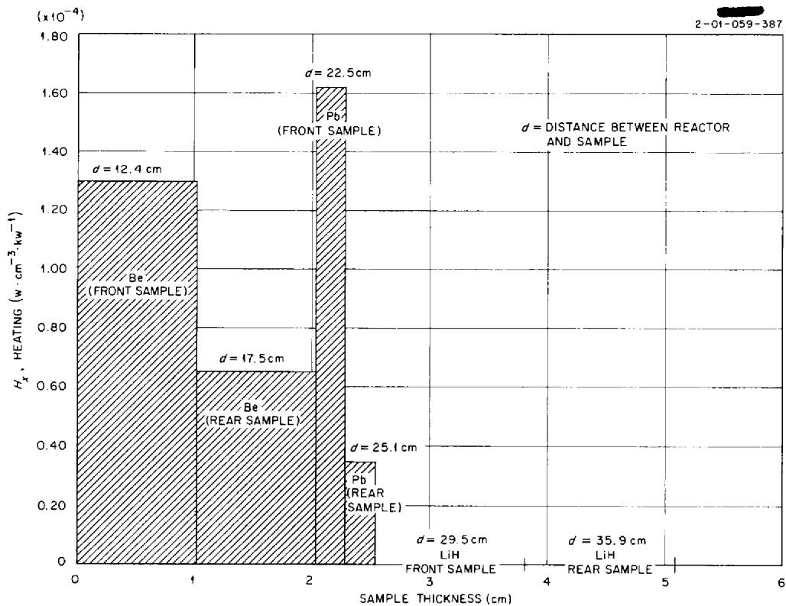  
Fig. 4.1.18. Calculated Total Heating Produced by the BSF Gamma-Ray Energy Spectrum in All Samples in the Beryllium-Lead-Lithium Hydride Configuration.

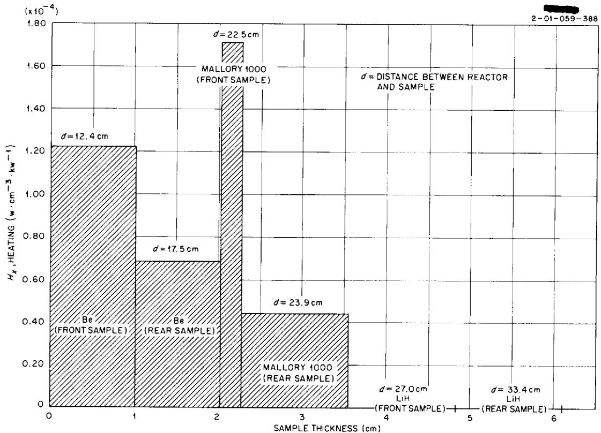  
Fig. 4.1.19. Calculated Total Heating Produced by the BSF Gammo-Ray Energy Spectrum in All Samples in the Beryllium-Mallory 1000-Lithium Hydride Configuration.

# A MONTE CARLO CODE FOR THE CALCULATION OF DEEP PENETRATIONS OF GAMMA RAYS

# S. K. Penny

A Monte Carlo code is being developed to calculate at a point detector the angular and energy distributions of gamma rays emitted from a monoenergetic, point isotropic or point monodirectional source embedded in an infinite homogeneous isotropic medium of constant density. The word "monodirectional" is used here in a loose sense; the emission directions are actually in a half-cone specified by a polar angle, where the source-detector axis is the polar axis, and they are uniformly distributed in the azimuthal angle. The code is now in the "debugging" stage on the IBM-704 electronic data processing machine. It is hoped that by using special techniques it will be useful for penetrations as deep as 20 mean free paths. In its final form the code can be used for neutron penetration also, provided a differential cross section for scattering is given.

The purpose of this code is twofold. First, it is hoped that it will shed some light on the discrepancy between calculated and experimental energy distributions from a Co $^{60}$ source in water, the chief difficulty being the magnitude of the distributions. The calculated values were obtained by the moments method, $^{20-23}$ and the experimental results were obtained by Peele, Maienschein, and Love. $^{24}$ Second, there is merit in experimenting

with special Monte Carlo techniques in order to see when and where they can be applied.

The special techniques referred to above are importance sampling on the first-collision distribution coupled with double systematic sampling, statistical estimation, splitting and Russian roulette, and a special form of output. Other features in the code are an energy cutoff, a weight cutoff, and a cutoff for distance from the detector.

# Importance Sampling

The importance sampling is discussed here from the viewpoint of a point isotropic source. The technique for the monodirectional source is simpler and straightforward.

In the code, an attempt is made to estimate

$$
\bar {z} = \int d x \int d y \int d w \dots \int d t b (x, y, w, \dots , t) z (x, y, w, \dots , t),
$$

and it is assumed that the probability distribution function can be written as

$$
b (x, y, w, \dots , t) = f (x, y) g (w, \dots , t).
$$

By definition

$$
\begin{array}{l} \overline {{z (: x , y)}} = \int d w \dots \int d t g (w, \dots , t) z (x, y, w, \dots , t) \\ \overline {{z ^ {2} (: x , y)}} = \int d w \dots \int d t g (w, \dots , t) z ^ {2} (x, y, w, \dots , t) \\ \end{array}
$$

and $f(x, y)$ is the probability distribution function for the first collision. Further, $x$ is the cosine of the angle between the direction of emission and the source-detector axis, and $y$ is the number of mean free paths to the first collision. If it is desired to sample from $f^{\star}(x, y)$ instead of from $f(x, y)$ (importance sampling), then

$$
\int d x \int d y f ^ {\star} (x, y) \overline {{z (: x , y)}} \frac {f (x , y)}{f ^ {\star} (x , y)} = \bar {z};
$$

however, the variance is not usually the same when importance sampling is employed as when the normal sampling is used. The probability distribution function for the first collision that gives the minimum variance is of the form:

$$
f ^ {\star} (x, y) = f (x, y) \sqrt {z ^ {2} (: x , y)} N,
$$

where $N$ is the normalizing constant. Kahn $^{25}$ shows this for importance sampling with one variable, and

his argument can easily be extended to two variables. The code will begin with the task of estimating $z^2(x, y)$ by performing an auxiliary Monte Carlo calculation. Instead of sampling from a first-collision distribution, $x$ and $y$ will be fixed and $z^2(x, y)$ will be estimated. This will be done for a number of points $(x, y)$ . This will then provide estimates for the functions $f^*(x, y)$ , $G(y; x)$ , and $F(x)$ , which will be placed in tabular form in the machine. The functions $G(y; x)$ and $F(x)$ are defined as

$$
G (y: x) = \frac {\int_ {- \infty} ^ {y} d \eta f ^ {*} (x , \eta)}{\int_ {- \infty} ^ {\infty} d \eta f ^ {*} (x , \eta)}
$$

and

$$
F (x) = \int_ {- \infty} ^ {x} d \xi \int_ {- \infty} ^ {\infty} d \eta f ^ {*} (\xi , \eta).
$$

Once the auxiliary Monte Carlo problem has been completed and the importance distribution functions have been calculated, the main Monte Carlo routine is started.

# Double Systematic Sampling

The importance distribution for the first collision is sampled with the use of a double systematic sampling technique,26 as follows:

$$
\begin{array}{l} F \left(x _ {i}\right) = \frac {i + \frac {1}{2}}{N} \quad i = 0, 1, 2, \dots N - 1 \\ G \left(y _ {i}: x _ {i}\right) = \frac {j + \frac {1}{2}}{N} \quad j = 0, 1, 2, \dots N - 1. \\ \end{array}
$$

In these expressions, $N = 2^a =$ number of histories; $a$ is a positive integer $\geq 0$ . The point $(x_i, y_i)$ is then found by interpolation in the tables. The $j$ 's must be randomized, since they should not be correlated to $i$ . This can be done by using the periodicity of the pseudorandom numbers generated by the congruence method. Each binary bit in a pseudorandom number has a certain period, as illustrated below:

$$
\begin{array}{l} 2 ^ {6} 2 ^ {5} 2 ^ {4} 2 ^ {3} 2 ^ {2} 2 ^ {1} 2 ^ {0} 2 ^ {0} \text {p e r i o d} \\ \dots \times \times \times \times \times \times 0 1 b i t \\ \end{array}
$$

If it is desired to obtain all the even integers, 0, 2, ... $(2^{a + 1} - 2)$ , logical computer operations are used to obtain from a pseudorandom number the following number:

$$
2 ^ {\alpha} 2 ^ {\alpha - 1} \dots 2 ^ {3} 2 ^ {2} 2 ^ {1} 2 ^ {0} \quad p e r i o d
$$

$$
0 0 0 \dots 0 \times \quad \dots \times \quad \times \quad 0 \quad \text {b i t}
$$

Then, generating $2^{\alpha}$ random numbers in succession will provide the $2^{\alpha}$ integers desired in random order, and the random correspondence $i \leftrightarrow j$ can be obtained. Of course, a separate random number generator must be provided which has the same basic random number but an initial random number deep in the series. When a first-collision point is chosen by the sampling technique, the initial weight must be modified by the factor

$$
f \left(x _ {i}, y _ {i}\right) / f ^ {*} \left(x _ {i}, y _ {i}\right).
$$

# Statistical Estimation

The technique of statistical estimation will be used at every collision; that is, the probability of the radiation reaching the detector after the collision will be calculated and used to estimate the flux at the detector.

# Weighted Isotropic Scattering

It is planned to sample the direction after collision from an isotropic distribution, rather than the Klein-Nishina differential cross section, and "weight" it with the Klein-Nishina distribution. This procedure was derived primarily for simplicity and to save in calculational cost. It is certainly biased sampling, but for small separation distances it is probably the best method of sampling. For large separation distances the variance of the estimated flux will increase, but the increase may be compensated for intuitively by the use of importance sampling and splitting.

# Splitting and Russian Roulette

The techniques of splitting and Russian roulette are to be used, with the splitting occurring at the collision point rather than at a splitting boundary. In other words, if the particle crosses $b$ boundaries with the boundaries successively closer to the detector, it will be split into $2^b$ particles at the final collision point. If a particle crosses $b$ boundaries with the boundaries successively farther away from the detector, it then

has a probability of $2^{-b}$ of surviving. If it survives, its weight is increased by $2^{b}$ . The splitting boundaries are concentric spheres with the detector as their center. Again the reason for this technique of splitting at the collision point is chiefly simplicity. In all cases the statistical estimation is performed before either the splitting or the Russian roulette techniques are used. Although it may be argued that splitting at the collision point will introduce biasing, it remains to be shown whether the increased cost associated with an unbiased calculation would be warranted.

# Output

The output will be of a special form; there will be no histograms. The usual process, which provides histograms, consists of estimating the flux at the detector and then determining the angular and energy distributions from the total flux arriving in a sector. The new code makes use of the expansion:

$$
\begin{array}{l} \phi (D, a, \tau) = \sum_ {k = 0} ^ {\infty} \sum_ {l = 0} ^ {\infty} A _ {k l} (D) \frac {2 k + 1}{2} \frac {2 l + 1}{2} P _ {k} (\omega) P _ {l} (\tau) \\ A _ {k l} (D) = \int_ {- 1} ^ {1} d \omega \int_ {- 1} ^ {1} d \tau P _ {k} (\omega) P _ {l} (\tau) \phi (D, \omega , \tau) \\ \end{array}
$$

where

$$
\tau = 2 \frac {E - E _ {c}}{E _ {0} - E _ {c}} - 1,
$$

$$
E = \text {e n e r g y}
$$

$$
E _ {c} = \text {c u t o f f e n e r g y},
$$

$$
E _ {0} = \text {i n i t i a l e n e r g y},
$$

$$
\omega = \text {c o s i n e}
$$

$$
D = \text {s e p a r a t i o n}
$$

$$
P _ {k}, P _ {l} = \text {L e g e n d r e p o l y n o m i a l s ,}
$$

$$
\phi (D, \omega , \tau) = \text {f l u x} D \text {p e r u n i t} \omega \text {p e r u n i t} \tau .
$$

At each collision statistical estimates are made of the $A_{kl}(D)$ term $^{27}$ rather than simply the $A_{\infty}(D)$ term, which is easily seen to be the total flux. Single scattering is treated separately from multiple scattering. The code allows $k,l \leq 15$ for

single scattering and $k_{l}\leq 7$ for multiple scattering. Of course, the coefficients for single scattering and multiple scattering are completely additive.

A choice may be made of any combination of the following values in the output: number flux, energy flux, energy deposition in the medium (ergs/g), and energy deposition in carbon (ergs/g) at the detector, carbon being the standard material for dose-rate calculations or measurements. Also, the variance of the estimated coefficients $(A_{kl})$ will be automatically calculated.

# Testing Procedure

The code will be tested against three standards. First, results for no energy degradation and isotropic scattering will be checked against the exact solutions given by Case, deHoffman, and Placzek.28 Second, results for a medium other than water will be checked against the energy distributions of energy flux furnished by the moments method.20-23 Third, results for water as a medium will be checked against the experimental work of Peelle, Maienschein, and Love24 and values obtained by the moments method.20-23

# A MONTE CARLO CALCULATION OF THE NEUTRON PENETRATION OF FINITE WATER SLABS

J. B. Hilgeman29

F. L. Keller

C. D. Zerby

Monte Carlo calculations $^{30}$ of the neutron dose-rate distribution beyond finite water slabs were performed for various parameter combinations. In the idealized problem a plane monodirectional, monoenergetic beam of neutrons was assumed to be incident on a water slab of infinite area and finite thickness. The angle between the incident neutron direction and the normal to the slab was denoted as $\theta_0$ , and the number of neutrons which penetrated the slab was assumed to be recorded by a spherical

detector. The space around the detector was divided into a number of solid angle intervals with the apex at the detector point, and the number of neutrons which entered into each of these solid angle intervals was recorded. The energy spectrum of the radiation which entered each of the solid angle intervals was determined by dividing the energy range from some cutoff energy, $E_{c}$ , to the source energy, $E_{0}$ , into an arbitrary number of equal intervals and recording each contribution in its appropriate energy interval. This energy spectrum was then used to determine the tissue dose-rate contribution from each energy and solid angle interval.

The scattering probability was assumed to be isotropic in the center-of-mass system. This is essentially exact for the scattering by hydrogen (the major scatterer) and is fairly satisfactory for the scattering by oxygen over most of the energy range of interest in these calculations. The density of water was taken to be $1\mathrm{g/cm}^3$ . All the results were normalized to one incident neutron per second per square centimeter of slab surface.

A parameter study was carried out in which plane monodirectional beams of neutrons with energies, $E_0$ , of 0.55, 1.2, 2, 4, 6, and 8 Mev were incident on the water slabs at angles, $\theta_0$ , of 0, 30, 60, and 75 deg. The thicknesses of the slabs ranged from 1 to 8 mfp (mean free paths). The number of case histories used for a particular problem varied from 5,000 to 10,000, depending upon the slab thickness and the angle of incidence. The solid angle intervals at the detector were defined by 90-deg azimuthal angle intervals and 15-deg polar angle intervals with respect to a polar axis which was normal to the slab surface. A cutoff energy, $E_{c'}$ of 0.1 Mev was used. This value was chosen to approximate the low-energy cutoff of most of the present dosimeters. Fifteen equal energy intervals were used to determine the spectrum.

Figures 4.1.20 through 4.1.23 show a set of representative curves which were generated from data obtained from this study. In these figures dose-rate buildup factors, $B_{r'}$ are plotted as a function of the finite slab thicknesses for various energy neutrons incident at angles, $\theta_0$ , of 0, 30, 60, and 75 deg. The dose-rate buildup factor may be defined as the ratio of the total dose rate at the detector to the dose rate which would result if every collision were equivalent to an absorption. It should be noted that the results are plotted as a function of

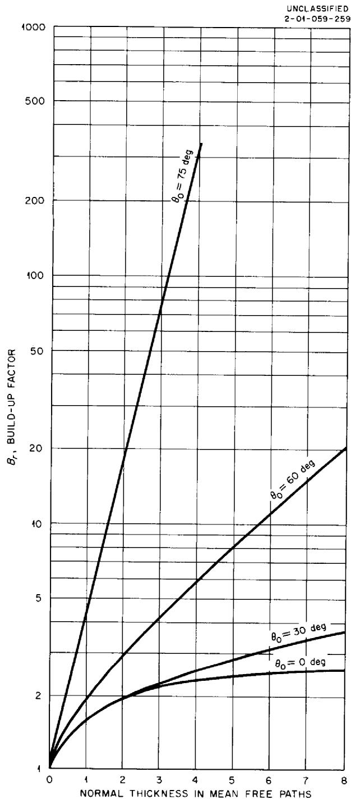  
Fig. 4.1.20. Dose-Rate Buildup Factors for 0.55-Mev Neutrons Incident at Various Angles on Finite Water Slabs.

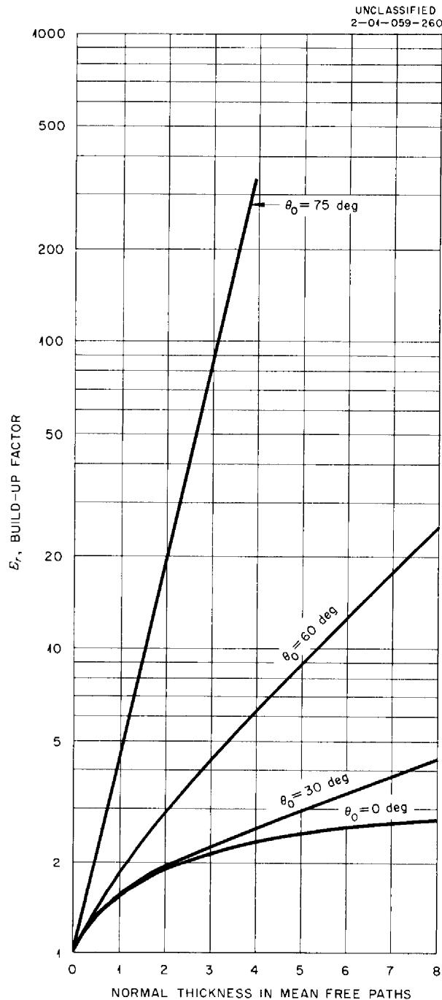  
Fig. 4.1.21. Dose-Rate Buildup Factors for 2-Mev Neutrons Incident at Various Angles on Finite Water Slabs.

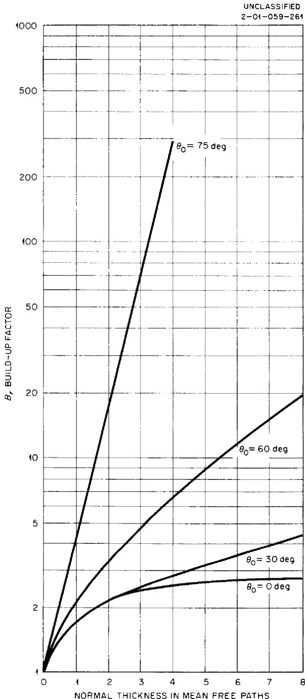  
Fig. 4.1.22. Dose-Rate Buildup Factors for 4-Mev Neutrons Incident at Various Angles on Finite Water Slabs.

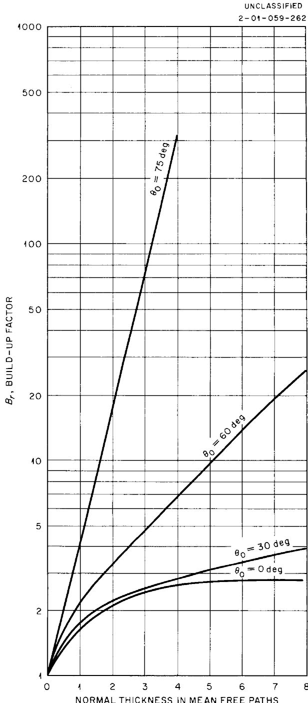  
Fig. 4.1.23. Dose-Rate Buildup Factors for 8-Mev Neutrons Incident at Various Angles on Finite Water Slabs.

the normal thickness of the slab in mean free paths. When plotted in this manner it is obvious that the buildup factor for a given energy and slab thickness should increase with increasing values of $\theta_0$ because of the "short-circuiting" effect. These results were compared with the results of a similar calculation which was performed by Obenshain, Eddy, and Kuehn,31 and the buildup factors from the present calculation were found to be considerably smaller, in general, than their values. The cause of this apparent discrepancy is not yet known.

Figures 4.1.24 through 4.1.27 show the angular distribution of the scattered neutron dose rate at

the detector for neutron beams of various energies normally incident $(\theta_0 = 0)$ on water slabs of various thicknesses. Since there is azimuthal symmetry at the detector for these cases, the curves are plotted as dose rate per steradian versus $\cos \alpha$ , where $\alpha$ is the polar angle at the detector. These plots were

31F. Obenshain, A. Eddy, and H. Kuehn, Polyphemus. A Monte Carlo Study of Neutron Penetrations Through Finite Water Slabs, WAPD-TM-54 (1957).

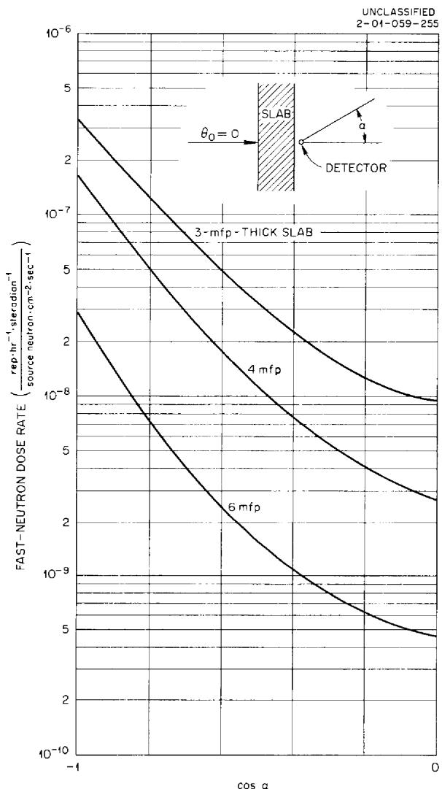  
Fig. 4.1.24. Fast-Neutron Dose Rates at Rear of Finite Water Slabs Resulting from Multiply Scattered Neutrons $(E_0 = 0.55\text{MeV})$

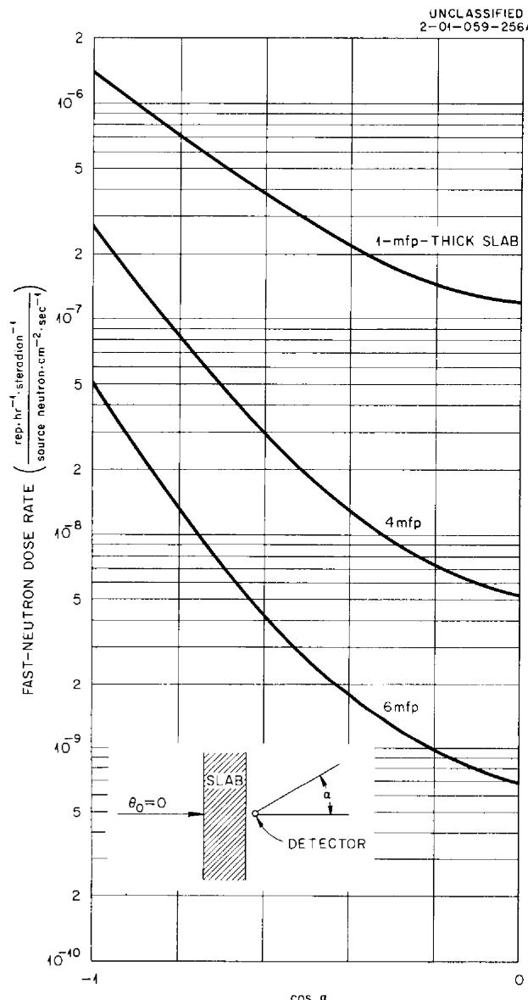  
Fig. 4.1.25. Fast-Neutron Dose Rates at Rear of Finite Water Slabs Resulting from Multiply Scattered Neutrons $(E_0 = 2\text{MeV})$

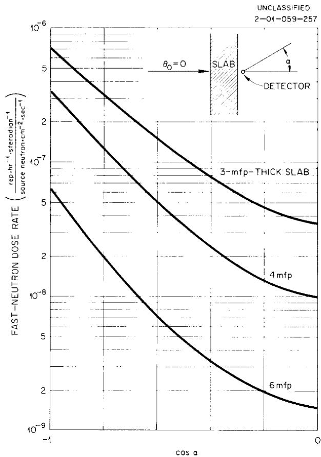  
Fig. 4.1.26. Fast-Neutron Dose Rates at Rear of Finite Water Slabs Resulting from Multiply Scattered Neutrons $(E_0 = 4\text{Mev})$

generated by drawing smooth curves through the histogram output of the machine calculations.

For cases of normal incidence $(\theta_0 = 0)$ , a very large fraction of the total scattered dose rate at the detector is contributed by neutrons which have undergone only one scattering event in the slab. The fraction of the total scattered dose rate which was contributed by singly scattered neutrons for each of these cases is given in Table 4.1.1. From this table it is seen that single scattering calculations may be expected to yield fairly accurate results for dose rates from neutrons which are normally incident on thick water slabs. The higher orders of scattering become more important, however, as the angle of incidence, $\theta_0'$ , is increased.

A detailed description of all of the results of this parameter study will be given in a separate report.[32]

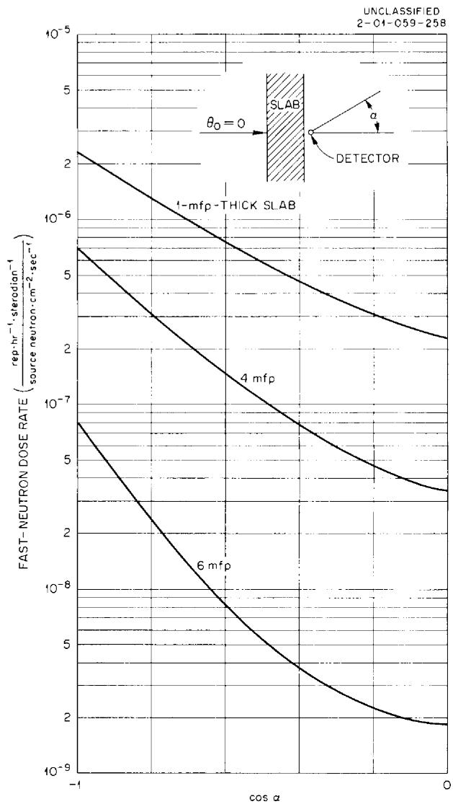  
Fig. 4.1,27. Fast-Neutron Dose Rates at Rear of Finite Water Slabs Resulting from Multiply Scattered Neutrons $(E_0 = 8\text{MeV})$

Table 4.1.1. Fraction of Total Scattered Dose Rate at the Detector Contributed by Neutrons Which Have Undergone Only One Scattering Event $(\theta_0 = 0)$   

<table><tr><td rowspan="2">E0(Mev)</td><td colspan="4">Fraction of Dose Contributed by Singly Scattered Neutrons</td></tr><tr><td>1 mfp</td><td>3 mfp</td><td>4 mfp</td><td>6 mfp</td></tr><tr><td>0.55</td><td></td><td>0.827</td><td>0.864</td><td>0.902</td></tr><tr><td>2.0</td><td>0.727</td><td></td><td>0.86</td><td>0.846</td></tr><tr><td>4.0</td><td></td><td>0.791</td><td>0.832</td><td>0.877</td></tr><tr><td>8.0</td><td>0.707</td><td></td><td>0.829</td><td>0.762</td></tr></table>

# 4.2. LID TANK SHIELDING FACILITY

W. Zobel

# STUDY OF ADVANCED SHIELDING MATERIALS (GE SERIES)

L. Jung

The experiment designed by GE-ANP for studying the production of secondary gamma rays in configurations containing advanced shielding materials has been completed. Most of the results of the fast-neutron and gamma-ray dose rate measurements beyond the various configurations used in this experiment were reported previously. The remaining data on thermal-neutron flux measurements and on fast-neutron and gamma-ray dose rate measurements are presented here. The configurations for which the data were obtained are described in Table 4.2.1. The dimensions and compositions of the materials used were the same as those given in Table 4.2.2 of ref 2.

The configurations for which the fast-neutron and gamma-ray measurements are reported here are 4-J, 4-K, and 4-L, in which the thickness of a stainless steel layer adjacent to the source plate was increased in steps from 1 to 3 in. In Fig. 4.2.1 the gamma-ray dose rates beyond these configurations are compared with the gamma-ray dose rates in oil only. For purposes of comparison, the dose rates beyond configuration 4-A, which consisted of 4 in. of stainless steel in oil, are also presented.

Corresponding fast-neutron dose rates are shown in Fig. 4.2.2.

Table 4.2.1. Description of Latest Configurations Tested in GE Series   

<table><tr><td>Configuration Number</td><td>Description of Configuration</td><td>z0, Location of Probeb (cm)</td><td>Unavoidable Oil Gap Within Configurationc (cm)</td></tr><tr><td>4-A</td><td>4 in. of stainless steel + oil</td><td>16.2</td><td>2.8</td></tr><tr><td>4-J</td><td>1 in. of stainless steel + oil</td><td>7.0</td><td>1.3</td></tr><tr><td>4-K</td><td>2 in. of stainless steel + oil</td><td>10.0</td><td>1.8</td></tr><tr><td>4-L</td><td>3 in. of stainless steel + oil</td><td>12.8</td><td>2.0</td></tr><tr><td>4-N</td><td>4 in. of stainless steel + ½in. of boral + oil</td><td>17.6</td><td>3.0</td></tr><tr><td>4-Q</td><td>½in. of boral + 4 in. of stainless steel + ½in. of boral + oil</td><td>19.6</td><td>3.6</td></tr><tr><td>4-T</td><td>4 in. of stainless steel + ¼in. of boral + oil</td><td>17.6</td><td>3.7</td></tr><tr><td>5-A</td><td>4 in. of Be + 12 in. of LiH + oil</td><td>45.8</td><td>1.1</td></tr><tr><td>41-A</td><td>4 in. of stainless steel (dry) + oil in an Al tank (½in.-thick wall)</td><td>15.4</td><td>1.9 (air gap)</td></tr><tr><td>Oil</td><td>Oil only in configuration tank</td><td>3.2d</td><td></td></tr></table>

${}^{a}$ Includes some configurations described in ANP Quar. Prog. Rep. Dec. 31, 1957, ORNL-2440, p 263, and in ANP Quar. Prog. Rep. March 31, 1958, ORNL-2517, p 90.   
bActual distance from source plate assembly to back of solid configuration.   
cIncludes 1-cm recession of the aluminum window in the configuration tank.   
${}^{a}$ Position of inside surface of the aluminum window in the configuration tank.

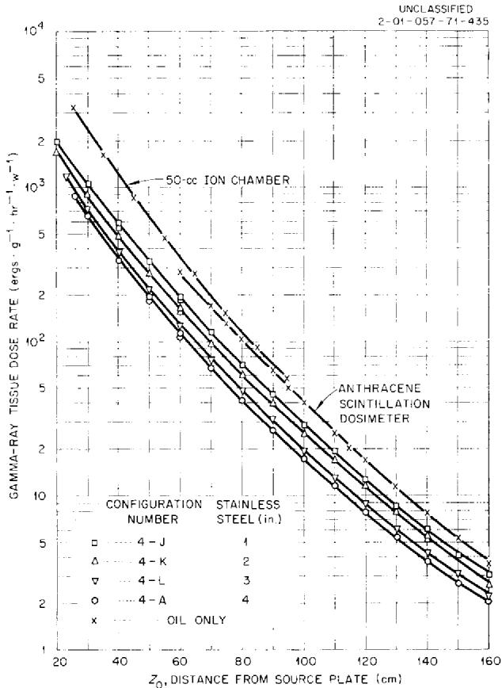  
Fig. 4.2.1. Gamma-Ray Tissue Dose Rates in Oil and Beyond Configurations 4-A, 4-J, 4-K, and 4-L: Effect of Increasing the Thickness of a Stainless Steel Configuration.

The thermal-neutron fluxes beyond these same configurations are presented in Fig. 4.2.3. Introducing 1 in. of stainless steel to the oil medium reduced the flux by $11.5\%$ . Stepwise additions of 2, 3, and 4 in. reduced the flux by $24.6\%$ , $32.2\%$ , and $42.1\%$ , respectively, at a distance of $100\mathrm{cm}$ from the source, compared with the flux measured in oil alone.

The curves in Fig. 4.2.4 indicate that placing $\frac{1}{4}$ or $\frac{1}{2}$ in. of boral behind the 4 in. of stainless steel had only a negligible effect on the flux 100 cm from the source. It also appears that $\frac{1}{2}$ in. of boral in front of the stainless steel in addition to the

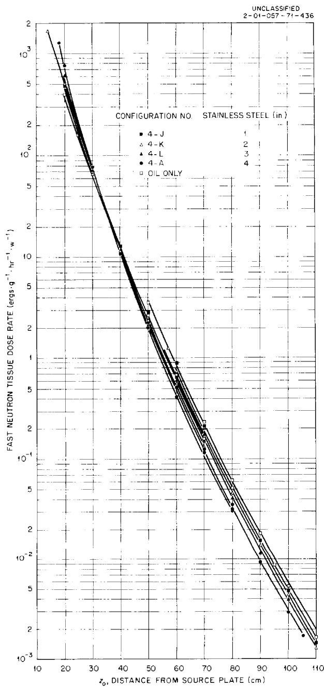  
Fig. 4.2.2. Fast-Neutron Tissue Dose Rate in Oil and Beyond Configurations 4-A, 4-J, 4-K, and 4-L: Effect of Increasing the Thickness of o Stainless Steel Configuration.

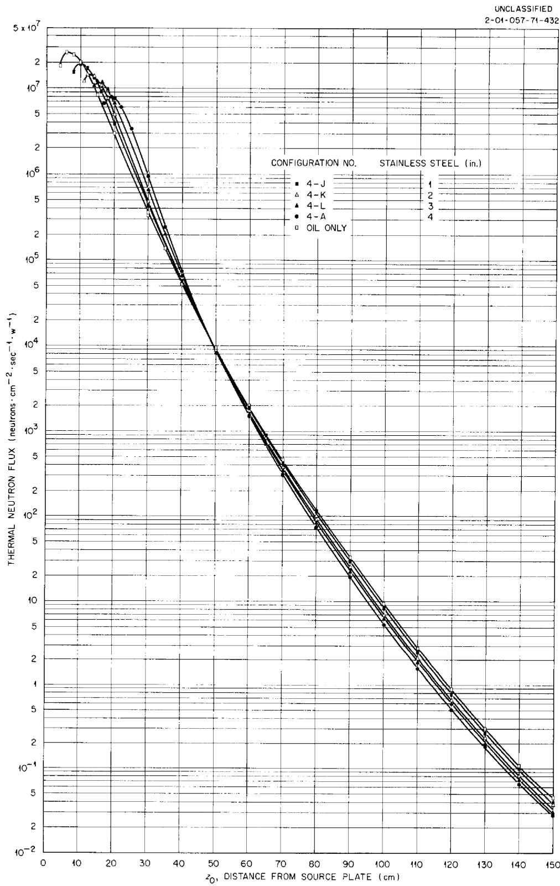  
Fig. 4.2.3. Thermal-Neutron Fluxes in Oil and Beyond Configurations 4-A, 4-J, 4-K, and 4-L: Effect of Increasing the Thickness of a Stainless Steel Configuration.

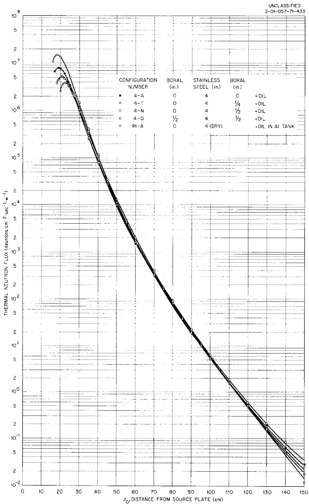  
Fig. 4.2.4. Thermal-Neutron Fluxes Beyond Configurations 4-A, 4-N, 4-Q, 4-T, and 41-A: Effect of Inserting Boral Within Configurations Containing Stainless Steel.

$\frac{1}{2}$ in. of boral behind the stainless steel did not affect the flux at $100~\mathrm{cm}$ appreciably. The boral did, however, cause a decrease in the thermal-neutron fluxes at distances greater than $120~\mathrm{cm}$ from the source, possibly as a result of the reduction in the number of photoneutrons arising from high-energy gamma rays. High-energy gamma rays originate in the stainless steel following the capture of thermal neutrons, and the boral reduces the number of captures by absorbing most of the neutrons which are thermalized in oil and then reflected back into the stainless steel. $^{3,4}$

Thermal-neutron flux measurements beyond configuration 41-A are also plotted in Fig. 4.2.4 for comparison with the curve for configuration 4-A. At $100\mathrm{cm}$ from the source the flux beyond configuration 41-A was $16.5\%$ higher than that beyond configuration 4-A. The two configurations differed only in that configuration 41-A was dry; that is, the $1\mathrm{cm}$ of oil between the aluminum window of the containing tank and the first slab of stainless steel, as well as the oil between the slabs, was removed.

As described previously, several types of gamma-ray shields were used in conjunction with 4 in. of beryllium and 12 in. of lithium hydride. Measurements beyond a configuration consisting of only the beryllium and the lithium hydride (configuration 5-A) were made to assist in evaluating the data. In order to complete the set of measurements, thermal neutron fluxes beyond this configuration are shown in Fig. 4.2.5.

# STUDY OF SECONDARY GAMMA-RAY PRODUCTION IN LEAD

J.M.Miller

A comprehensive program for measurement of the production of secondary gamma rays in lead was initiated at the Lid Tank Shielding Facility (LTSF) for comparison with the calculation being made by the Nuclear Development Corporation of America (NDA). In the tests run thus far, thicknesses of lead varying in $\frac{1}{2}$ -in. steps from 1 to 6 in. and additional thicknesses of $7\frac{1}{2}$ and 9 in. have been

utilized. In each case the lead was kept dry by placing it in a steel tank $(\frac{5}{8}$ -in.-thick walls) positioned against the source plate. An aluminum tank $(\frac{1}{8}$ -in.-thick walls) filled either with oil or with borated water was always placed immediately behind the lead. The steel tank which holds the entire configuration has a $\frac{3}{8}$ -in.-thick aluminum window on the source side, and the recession in the tank wall between the window and the first slab of lead introduces a 1-cm-thick air gap at this point in each configuration. Gamma-ray tissue dose-rate measurements were made in the oil or borated water, and in some cases fast-neutron tissue-dose-rate and thermal-neutron flux measurements were made in the oil.

The gamma-ray dose-rate measurements in oil and borated water beyond the various thicknesses of lead are plotted as a function of the distance from the source plate in Fig. 4.2.6. The measurements in borated water were made primarily to determine the effect of suppressing the thermal-neutron flux beyond the lead. The gamma-ray dose rates in the borated water were a factor of 3 lower than the dose rates in oil in the region close to the lead and a factor of 13 lower approximately $120\mathrm{cm}$ beyond the lead.

Cross plots of the data from Fig. 4.2.6 are shown in Figs. 4.2.7 and 4.2.8. The plots in Fig. 4.2.7 present the gamma-ray dose rates at points $100\mathrm{cm}$ beyond the configurations, corrected for the inverse $r^2$ attenuation, and show that most of the primary gamma rays are attenuated by the first 3 in. of lead. The gamma rays observed beyond greater thicknesses of lead are practically all secondary gamma rays. The plots in Fig. 4.2.8 present the gamma-ray dose rates beyond the various configurations at distances of 80 and $100\mathrm{cm}$ from the source. This figure shows that a lead thickness of 3 in. gives the maximum effectiveness in reducing the gamma-ray dose rate at a fixed distance from the source and that increasing the thickness beyond 3 in. does not result in a further reduction.

The thermal- and fast-neutron measurements in oil beyond the various configurations are plotted as functions of the distance from the source in Figs. 4.2.9 and 4.2.10, respectively. This study will be continued with configurations in which beryllium and lithium hydride will be used in combination with the lead.

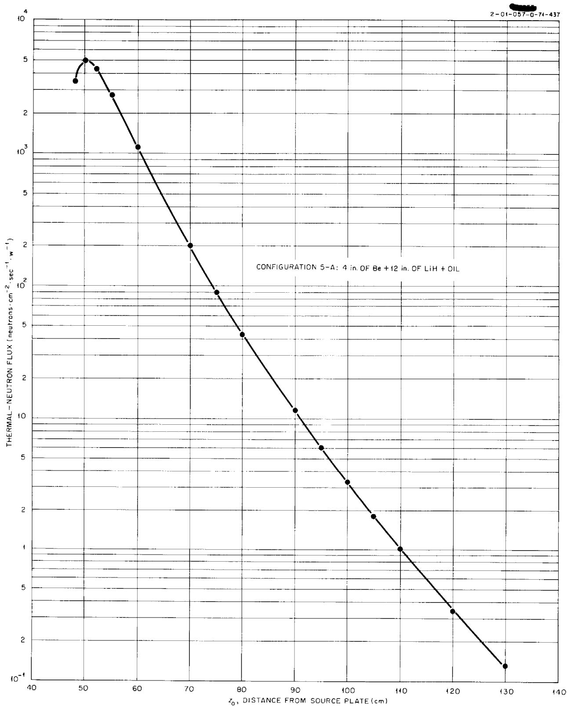  
Fig. 4.2.5. Thermal-Neutron Fluxes Beyond Configuration 5-A.

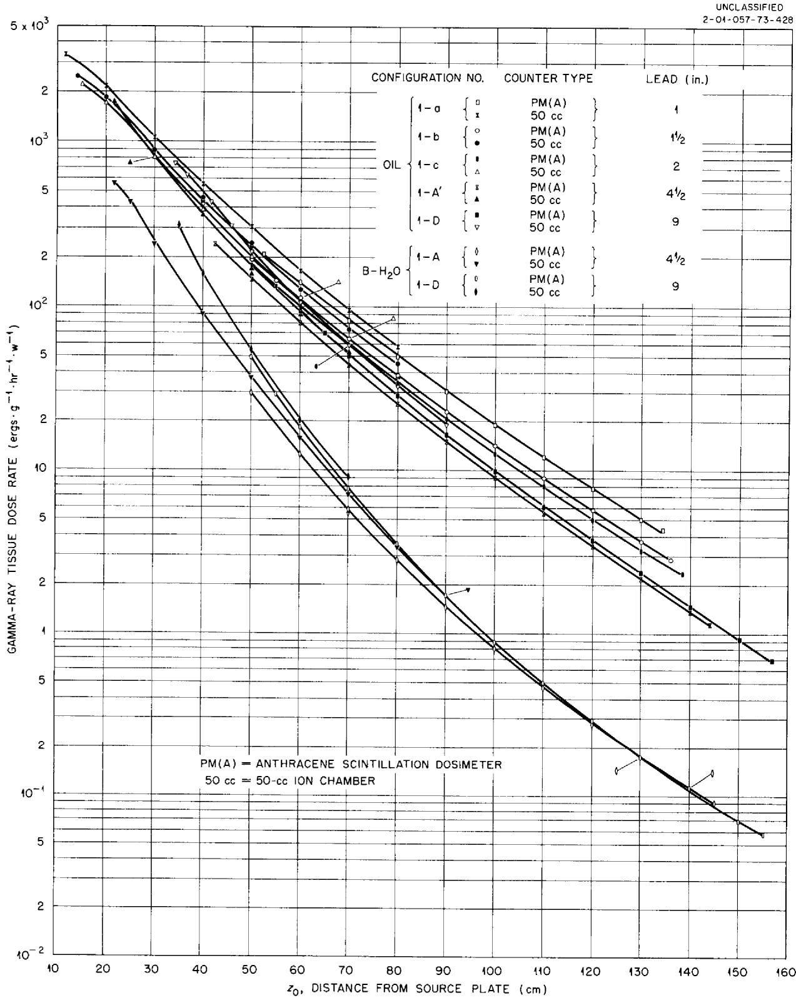  
Fig. 4.2.6. Gamma-Ray Dose Rates in Oil and Borated Water Beyond Various Thicknesses of Lead as a Function of the Distance from the Source Plate.

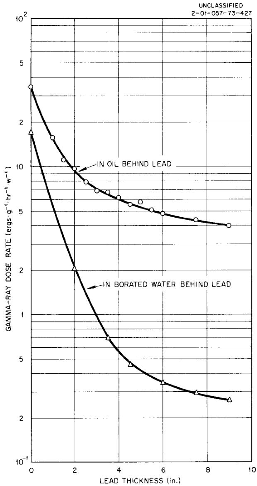  
Fig. 4.2.7. Gamma-Ray Dose Rates in Oil and Borated Water 100 cm Beyond Various Thicknesses of Lead (Measurements Corrected for Inverse $r^2$ Attenuation).

# THERMAL-NEUTRON FLUXES MEASURED IN OIL AT THE LTSF: AN ERRATUM

L. Jung

Results of measurements of the thermal-neutron fluxes in oil in the usual LTSF configuration tank were presented in an earlier report. During a periodic check of measurements, a computational error was discovered in the normalization of the instruments to gold-foil measurements in the oil which had caused the reported curve to be $16\%$ too low; Fig. 4.2.11 shows the corrected curve. Similarly, all other thermal-neutron measurements

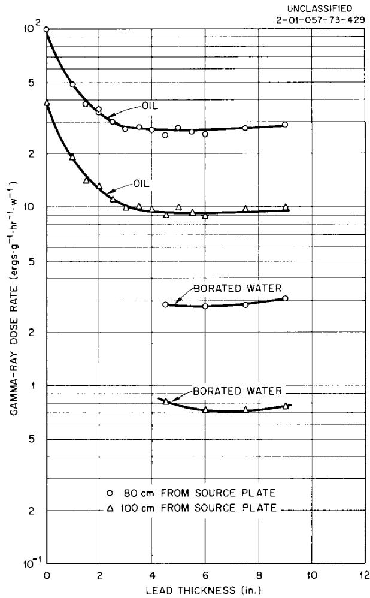  
Fig. 4.2.8. Gamma-Ray Dose Rates in Oil and Borated Water at Points 80 and $100\mathrm{cm}$ from the Source Plate as a Function of the Thickness of Lead Adjacent to the Source.

in oil which have been reported in two of the previous progress reports1,5 should be increased by $16\%$ .

# RADIATION TRANSMISSION THROUGH BORAL AND SIMILAR HETEROGENEOUS MATERIALS CONSISTING OF RANDOMLY DISTRIBUTED ABSORBING CHUNKS

W. R. Burrus

One material commonly used as a thermal-neutron suppressor is boral, a heterogeneous mixture of

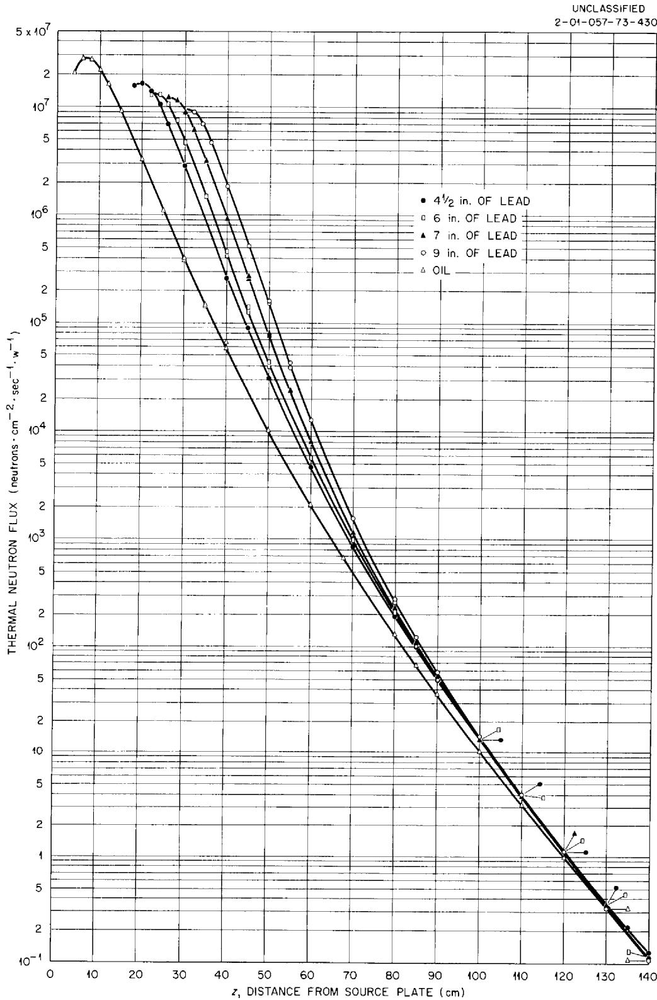  
Fig. 4.2.9. Thermal-Neutron Fluxes in Oil Beyond Various Thicknesses of Lead as a Function of Distance from the Source Plate.

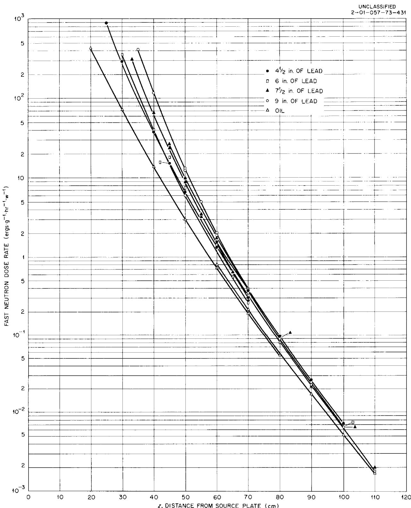  
Fig. 4.2.10. Fast-Neutron Dose Rates in Oil, Beyond Various Thicknesses of Lead as A Function of the Distance from the Source Plate.

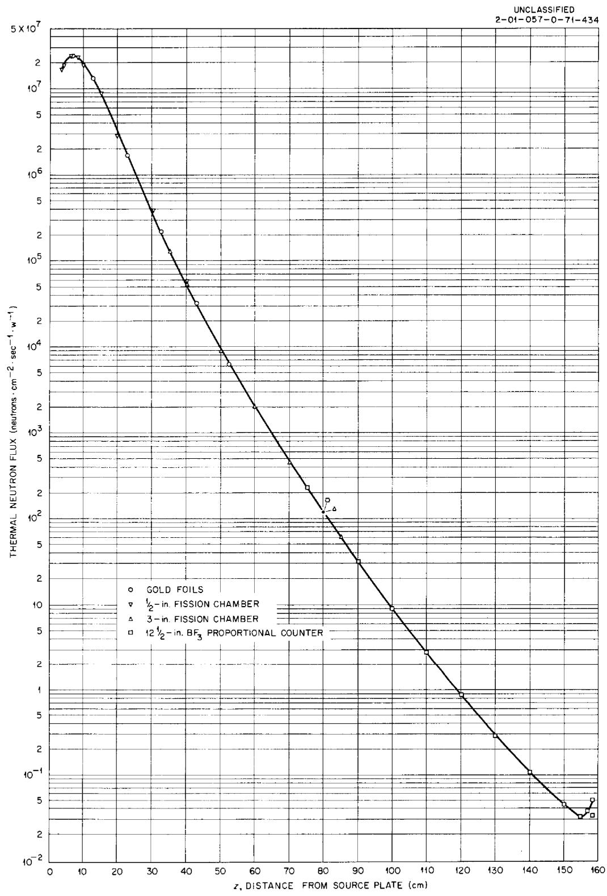  
Fig. 4.2.11. Thermal-Neutron Flux in Oil in the LTSF Configuration Tank.

commercial-grade boron carbide and aluminum sandwiched between aluminum sheets. The sand-which is usually rolled to a thickness of $\frac{1}{4}$ or $\frac{1}{8}$ in. Since the mixture is nonuniform, considerable space exists between the chunks of boron carbide attenuating material, and, consequently, radiation can penetrate the shield by passing unattenuated between the chunks. Because of this "channeling effect," which is a statistical effect caused by the increased transmission along paths which pass through less than the average material thickness, the masses of boral and similar heterogeneous shields must be from a few per cent to several hundred per cent greater than the masses of homogeneous shields which would give the same amount of attenuation.

R. R. Coveyou has suggested a model with which to calculate the approximate transmission of radiation through materials that consist of randomly distributed chunks. The material is considered to be divided into layers which have a thickness characteristic of the size of the chunks. The holes in the layers are assumed to be located in a manner statistically independent of holes in adjacent layers, so that the over-all transmission is the product of the transmissions of all the layers. As the chunks are made more attenuative, the radiation passing through the holes between the chunks becomes more important.

A method which is based on the Coveyou model and which has been extended to include a distribution of various chunk sizes and shapes has been developed for calculating the transmission of radiation through heterogeneous shields. The method has been used to compute the transmission of neutrons through boral. For the calculation it was assumed that the boral sandwich was rolled to a thickness of $\frac{1}{8}$ in. and that the thickness of the B4C-Al mixture was 0.085 in. with 40 vol % boron carbide. This resulted in an overall volume fraction of approximately 25% for the absorbing chunks, which were assumed to be spherical in shape. The chunks were first considered to be of 11 different sizes between 20 and 100 mesh; however, it was found that assuming only four sizes gave approximately the same results, and only four groups were used thereafter.

The transmission calculated by this method for normally incident 2200-meter/sec (0.0253-ev) neutrons through $\frac{1}{8}$ -in.-thick boral was 0.076. This is to be compared with a transmission of 0.0015

calculated for normally incident 2200-meter/sec neutrons by the homogeneous approximation. However, the homogeneous approximation is an inappropriate first approximation for this type of shield.

The transmission of normally incident neutrons through a $\frac{1}{8}$ -in.-thick boral shield as a function of energy is shown in Fig. 4.2.12, along with the limit as the chunks become opaque (low energies). The average transmission over the neutron distribution shown (Maxwell-Boltzmann distribution at room temperature) is 0.096 for a constant efficiency detector and 0.084 for a $1 / \nu$ detector.

The transmission of isotropically incident neutrons through $\frac{1}{8}$ -in.-thick boral as a function of energy is shown in Fig. 4.2.13. For this case the average transmissions are 0.024 for a constant efficiency flux detector, 0.021 for a $1 / \nu$ flux detector, 0.041 for a constant efficiency current detector, and 0.034 for a $1 / \nu$ current detector.

The calculated results can be compared with the results of two experiments which have been performed at ORNL to determine the transmission through $\frac{1}{8}$ -in. thicknesses of boral as measured by $1 / \nu$ detectors. In the first experiment the radiation consisted of thermal neutrons escaping from a thermal column on top of the ORNL Graphite Reactor with an angular distribution of the $(1 + \sqrt{3} \cos \theta)$ type, which is more forwardly peaked than an isotropic flux. Consequently, the experimental values should be between the computed values for normal incidence and those for isotropic incidence. The transmission obtained for a Brooks and Perkins boral sample was 0.070, while the transmission for a Carbide sample was 0.094. In the second experiment the radiation was a collimated beam of normally incident neutrons from a beam hole at the ORNL Graphite Reactor. The transmissions obtained for two different Alcoa samples were 0.065 and 0.070, respectively.

This method will be described in detail in a separate report.

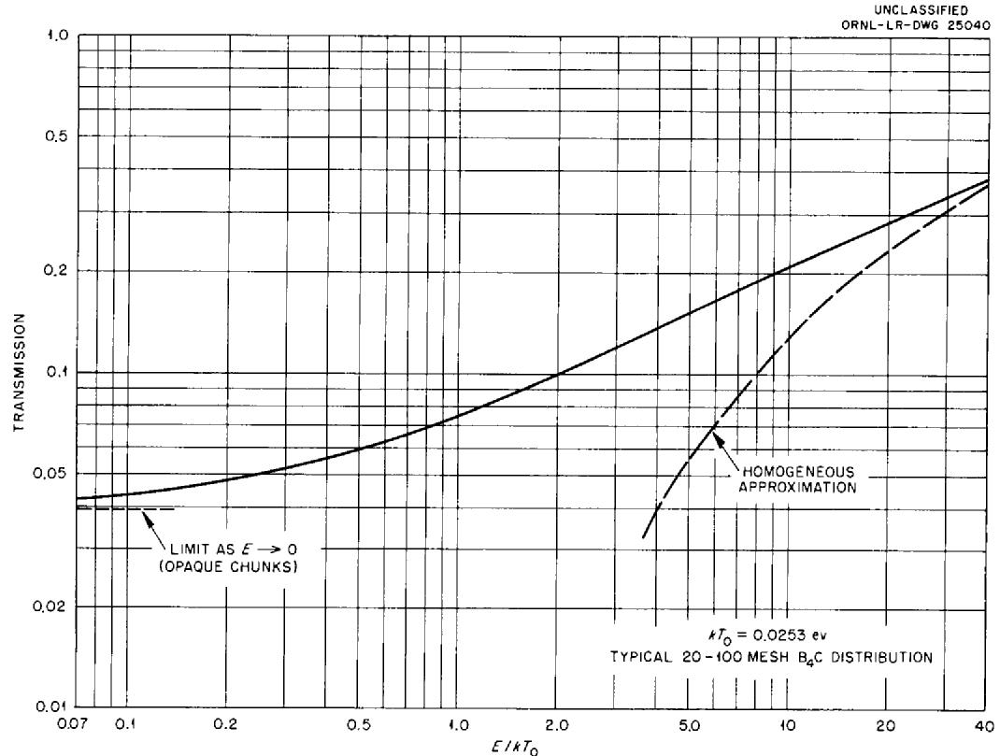

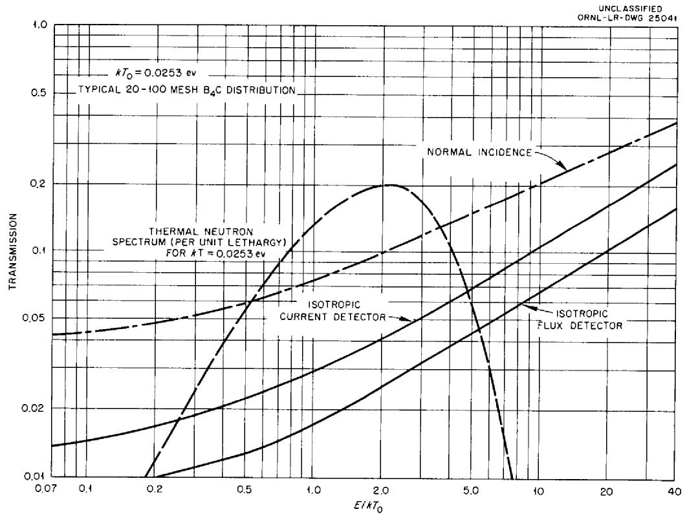  
Fig. 4.2.12. Neutron Transmission Through $\frac{1}{8}$ -in.-Thick Boral as a Function of Energy; Normally Incident Flux.   
Fig. 4.2.13. Neutron Transmission Through $\frac{1}{8}$ -in.-Thick Boral as a Function of Energy; Isotropically Incident Flux.

# 4.3. BULK SHIELDING FACILITY

F. C. Maienschein Neutron Physics Division

# THE GE-BSF STUDY OF HEATING IN SHIELDS

K. M. Henry

Most shielding research programs, as was pointed out previously, are devoted to optimizing shields with respect to radiation attenuation and to minimizing the size and weight of the shield. This effort tends to increase the power densities, energy deposition rates, and temperatures of the shield. If energy deposition rates could be determined, then temperatures could be calculated and cooling systems designed accordingly. Errors in the size and location of the cooling channels which result either in less than maximum power operation or in a shield that is not optimized in weight or size thus could be avoided.

Until the study of radiation heating in shields1 was initiated recently at the BSF in cooperation with the General Electric Company, energy deposition (heating) tests had been performed only on a small scale with samples in geometries that neglected scattering and interface conditions. For example, the energy absorption in small samples of lead, iron, and aluminum, with the calorimeter completely surrounded by water, were reported by Binford.2 In the experiment now in progress an attempt is being made to compare the energy deposition rates found in calorimetric samples in relatively large laminated shields with calculated results. If the calculations can be verified experimentally, then shield designs can be optimized with respect to heating as well as attenuation.

The Laboratory participation in the experiment includes providing the facility for the tests and personnel to perform the experiment and to tabulate the raw data. In addition, the BSF is supplying neutron foils and counting channels for gamma-ray and fast-neutron dosimetry. The General Electric Company is furnishing all the shield slabs, the heating samples, and the containing tank with its associated parts. They are also supplying the U235 fission chamber and its electronic counterparts. In addition, GE personnel will be responsible

for all data analysis, point kernel calculations, data correlation, and preparation of the final report. The necessary reactor flux and power calibration data for the BSR loading being used, as well as the radiation attenuation in water at various distances from the reactor, have been supplied to GE by ORNL.

The shield mockup being investigated consists of slabs of beryllium and lithium hydride separated by a gamma-ray shielding section which consists of one of three materials: iron, lead, or Mallory 1000. Measurements of the radiation intensities and temperatures at the slab interfaces in the Be-Fe-LiH configuration were reported previously. Subsequently, the entire series of measurements for all three of the configurations has been completed, but the results, including those published previously, are of questionable value since it has been discovered that all the heating samples leaked and oil entered the air region surrounding the sample. Consequently, further publication of temperature measurements will be postponed until the series of measurements is repeated with new samples. A detailed description of the experiment and the results of some measurements of radiation intensities are given below.

The BSR loading being used in the experiment consists of an array of 28 elements, including two shim-safety rod elements and one regulating rod element. The face adjacent to the shield is 15 in. wide (five elements wide), and 24 in. high; the thickness of the core is either 15 or 18 in., depending on whether the row of elements contains five or six elements. More detailed information on the structure was presented in a previous report, along with the power and flux distributions. Data on the attenuation of the flux and dose rates from the face of the core through various thicknesses of water were also published in previous reports.

A plan view of the reactor, the shield, and the containing tank was presented in the previous report1 and is repeated in this report as Fig. 4.1.11 in Chap. 4.1. The shielding slabs are submerged in oil in a containing tank which is positioned 4.75 in. from the reactor face. (In Fig. 4.1.11 the tank is shown to be only 3.5 in. from the reactor. It had been hoped that it could be positioned this close to the reactor, but for the tests reported here, as well as those reported previously,1 it was not possible. The recent installation of a new reactor support will allow the closer positioning for future runs.)

The containing tank, which was designed to withstand a 5-ft differential water-oil head, was fabricated from $\frac{3}{8}$ -in.-thick aluminum plates reinforced with 0.25 by 3 by 3 in. channels. It is 4.5 ft wide, 8.5 ft long, and 29 ft deep. After it was positioned in the pool, it was filled with concrete blocks to a height of 5.5 ft. An aluminum platform, which rests on the concrete and is bolted to the tank walls, provides locating pins with which a removable aluminum tray holding the shielding configuration can be positioned.

Each shielding configuration consists of a 4-in.-thick slab of beryllium, followed by a gamma-ray shield and 16 in. of aluminum-encased lithium hydride. The lithium hydride section consists of two slabs of 4 and 12 in., respectively, separated by a $\frac{1}{8}$ -in.-thick aluminum spacer which is fitted to the smaller slab in an attempt to reduce the thickness of the "crack" in the assembled shield. The larger lithium hydride section was supplied by the LTSF and is used in this experiment only to provide an effectively infinite lithium hydride medium behind the smaller section. The gamma-ray shield consists of either 3 in. of lead, 3 in. of iron, or 2 in. of Mallory 1000. A slab of oil extends beyond the lithium hydride to the tank wall. In addition there is a $\frac{5}{8}$ -in.-thick layer of oil between the tank wall and the beryllium. (The desired thickness of this oil layer was $\frac{1}{2}$ in., as indicated in Fig. 4.1.11 in Chap. 4.1). All shields are assembled on the pool room floor and installed in the tank as a unit. This simplifies the positioning of the slabs and provides an opportunity for measuring the thickness of cracks between the slabs. The cracks do not tend to change size with handling, as indicated by measurements made before and after the tests.

The beryllium slab and each of the gamma-ray shielding slabs have stepped holes along the

horizontal shield axis in which plugs holding the heating samples are inserted. These slabs also have 1/2-in. deep grooves on one side that extend from the horizontal holes upward to the tops of the slabs. When matched, these grooves form instrument wells for vertical flux and dose-rate traverses at the interface of the beryllium and the gamma-ray shield. The small lithium hydride slab has a straight-through hole along its axis, and two instrument wells, one near each side, extending from the hole upward to the top of the slab. When vertical traverses are not being made, the instrument wells are filled with plugs of the same material as the slab, the metallic plugs being bare half cylinders and the lithium hydride plugs being full cylinders encased in aluminum.

As has been described previously, the containers that hold the beryllium, iron, and lead heating samples are each 3 in. in diameter and 2 in. long with an internal void 2 in. in diameter and 1 in. thick. The design of the sample cases, which were fabricated from the same materials as the samples they hold, is shown in Fig. 4.1.12 of Chap. 4.1. The samples themselves are $1\frac{1}{4}$ in. in diameter and of various thicknesses (the lead is 0.1 in. thick, the iron 0.2 in. thick, and the beryllium 0.4 in. thick); they are suspended by three small insulating support tubes in the center of the void in the container. The case for the Mallory 1000 sample differs in that it is stepped (3 in. in diameter for $1\frac{1}{2}$ in., then $2\frac{1}{2}$ in. in diameter for $\frac{1}{2}$ in.). The Mallory 1000 sample thickness is 0.1 in. Because of fabrication difficulties, the case for the lithium hydride sample was made from 0.25-in.-thick aluminum with external dimensions measuring 2.96 in. in diameter and $1\frac{3}{4}$ in. in thickness. The lithium hydride sample is 1.25 in. in diameter and 0.5 in. thick. Calibrated iron-constantan thermocouples are attached to the center of each side of the samples and to each inside face of the cases. The leads are brought through holes in the cases (sealed with Devcon B plastic steel) out to the surface of the oil.

Neutron foil activation measurements were made at the interfaces of the Be-Pb-LiH configuration. Cobalt foils were positioned 12 in. apart along the horizontal centerline and 8 in. apart along other radii that extended from the center on 45-deg angles. All the foils were placed in recesses in an aluminum foil holder 4 ft by 4 ft by 0.09 in. thick. The results for both bare and cadmium-covered foils are shown in Figs. 4.3.1 and 4.3.2.

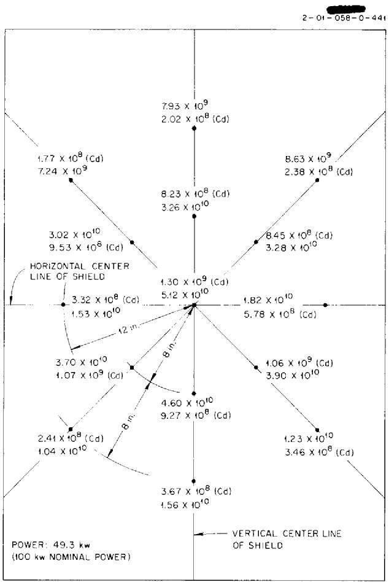  
Fig. 4.3.1. Cobalt Foil Neutron Activation Measurements at the Be-Pb Interface (Facing Reactor). The top number refers to the observed neutron flux in the first run, and the lower number to that in the second run. The two are not necessarily comparable because of the uncertainty in positioning between the two runs and the steep flux gradient at each interface.

Vertical thermal-neutron traverses were made in each instrument well in the Be-Pb-LiH configuration with a $\frac{3}{4}$ -in. OD U235 fission chamber. Each counter was attached to a $\frac{1}{2}$ -in. dia by 3-ft-long tube which formed part of a four-tube preamplifier housing. A conventional amplifier, scalar, and power supply completed the electronic setup. Difficulty was encountered during these measurements as a result of the photoneutron background produced by reactor fission-product decay gamma rays. In addition, the reactor had to be operated at such a low power (to prevent overloading of the counting channel) that

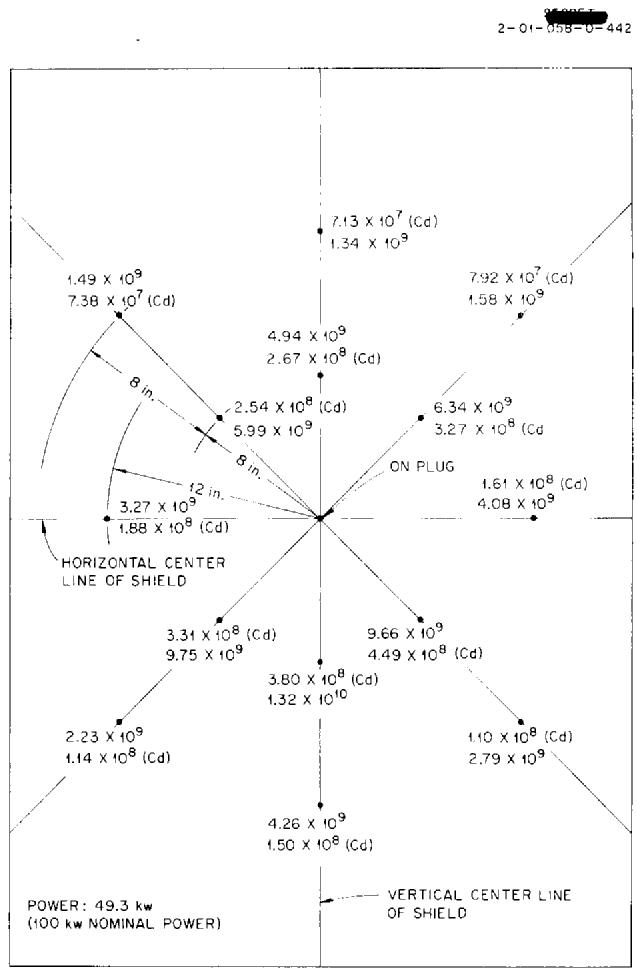  
Fig. 4.3.2. Cobalt Foil Neutron Activation Measurements at the Pb-LiH Interface (Facing Reactor). The top number refers to the observed neutron flux in the first run, and the lower number to that in the second run. The two are not necessarily comparable because of the uncertainty in positioning between the two runs and the steep flux gradient at each interface.

these fission-product gamma rays made a linear power response versus demand difficult to achieve. The total error introduced in the results, which are plotted in Fig. 4.3.3, is probably $\pm 10\%$ .

Fast-neutron measurements were made in the vertical instrument wells with a "scaled-up" $\frac{3}{4}$ -in. OD version of the Hurst-type phantom fast-neutron dosimeter. The detector was attached to its pre-amplifier in a manner similar to that of the thermal-neutron detector. Binary-type integrating scalers were used as the summing device. Some pulse-height distributions were measured simultaneously.

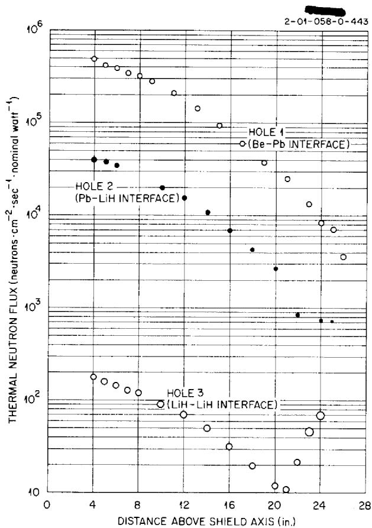  
Fig. 4.3.3. Thermal-Neutron Fluxes at the Shield Interfaces as a Function of Distance Above the Shield Axis (GE-BSF Shield Heating Experiment).

The effects caused by the fission-product decay gamma rays are believed to have influenced the fast-neutron measurements $\pm 5\%$ . These measurements are plotted in Fig. 4.3.4.

The ionization chamber used for the gamma-ray vertical traverses was a "scaled-down" version of the conventional graphite-walled $\mathrm{CO}_{2}$ -filled ionization chamber. Its output was read on a direct-reading micromicroammeter. The results are presented in Fig. 4.3.5.

Additional information concerning this experiment can be found in several reports published by GE.6-9

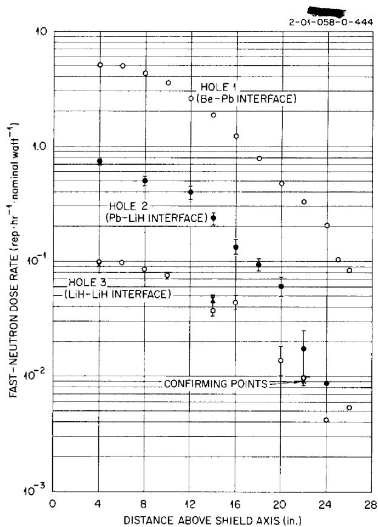

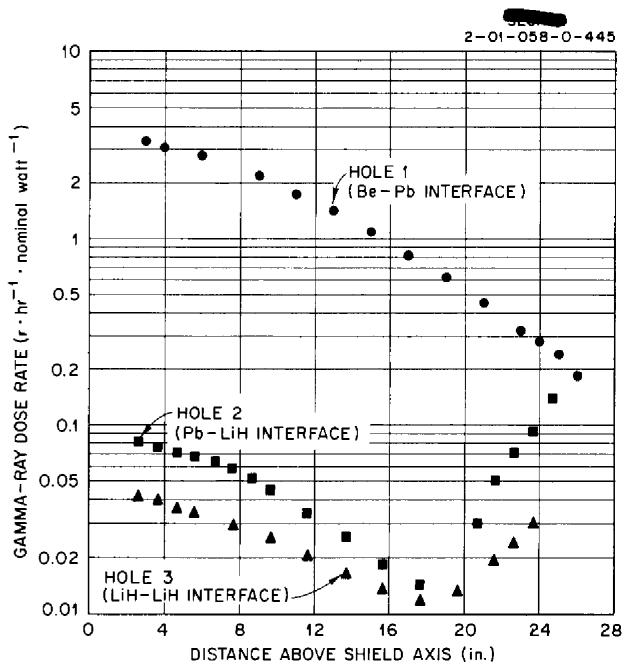  
Fig. 4.3.4. Fast-Neutron Dose Rates at the Shield Interfaces as a Function of Distance Above the Shield Axis (GE-BSF Heating Experiment).   
Fig. 4.3.5. Gamma-Ray Dose Rates at the Shield Interfaces as a Function of Distance Above the Shield Axis (GE-BSF Heating Experiment).

# 4.4. TOWER SHIELDING FACILITY

C. E. Clifford

Neutron Physics Division

# AIRCRAFT SHIELD TEST REACTOR EXPERIMENT AT THE TOWER SHIELDING FACILITY

V. R. Cain

S. C. Dominey

F. Malone

The experiments performed at the Tower Shielding Facility in cooperation with Convair, Fort Worth, to obtain information complementary to that obtained from the Nuclear Test Airplane (NTA) program of experiments has been completed. During the NTA experiments gamma-ray and fast-neutron dose rates and thermal-neutron fluxes were measured both inside and outside the airframe containing the reactor while in flight and on the ground. Measurements were also made on the ground in the absence of the airplane structure. This last set of measurements was duplicated in the TSF experiments, and, in addition, measurements were made as a function of altitude in the absence of the airplane structure. With these additional measurements the influence of the air, the ground, and the aircraft structure on the various measurements can be determined. The TSF experiments also included angular mappings of the radiation around the various reactor shield configurations near the ground and at various altitudes in order to obtain data which will yield more accurate source terms than were previously available. Some gamma-ray and neutron energy spectra were also determined.

During the TSF experiments a large volume of data was collected, most of which has not yet been properly evaluated and correlated. For this reason, and because power level corrections have not yet been made, this report cannot be a complete account of the experiment. Rather it is intended only to indicate the scope of the measurements and to present samples of typical data. Detailed reports will be published by Convair.

# ASTR Shield Configurations

The Aircraft Shield Test Reactor (ASTR) consists of an approximately cylindrical array of MTR-type fuel elements mounted horizontally between two

grid plates; demineralized water is used as the moderator, reflector, and coolant. The core and moderator section is surrounded by a layer of lead and tanks to contain the water shield, as shown in Fig. 4.4.1. The lead thicknesses, 3 in. on the side and 6 in. on the front, were not altered during the experiment, but various configurations of plain and borated water were used in the two 7-in.-thick side tanks. The primary configurations are shown in Fig. 4.4.2. For most of the measurements a $\frac{1}{8}$ -in.-thick boral plate was mounted on the outside of the reactor shield, but for two configurations, which were otherwise identical with configurations 3 and 5, the boral plate was removed. These two configurations are referred to as 3NB and 5NB. In another configuration, identified as configuration 5.5, only the lower halves of the two side tanks were filled with plain water to effectively give a “ $2\pi$ ” shield.

The support from which the ASTR was suspended allowed the reactor to be rotated 180 deg. For all ASTR configurations a 6-in.-thick lead shadow shield was suspended in front of the reactor and was rotated with it.

# Detectors

Most of the dose-rate and flux measurements taken during this experiment were obtained with three types of instruments: (1) a Hurst-type single-barrel fast-neutron dosimeter; (2) an anthracene scintillation dosimeter for gamma-ray dose-rate measurements; and (3) a $\mathsf{BF}_3$ proportional counter, in which the boron is enriched to $96\%$ in the $\mathsf{B}^{10}$ isotope, for thermal-neutron flux measurements. Both bare and cadmium-covered $\mathsf{BF}_3$ counters were used at each location. When the detectors were not positioned in or on a shielded crew-shield mockup, they were suspended from a special support truss. In addition to these instruments, foil detectors were used for special measurements.

# Radiation Mappings in the Reactor Horizontal Midplane

Total Doses and Fluxes. - During the NTA experiments, measurements of radiation were made with unshielded detectors around the ASTR in the absence of the airframe to obtain data which could

UNCLASSIFIED

ORNL-LR-DWG 28942

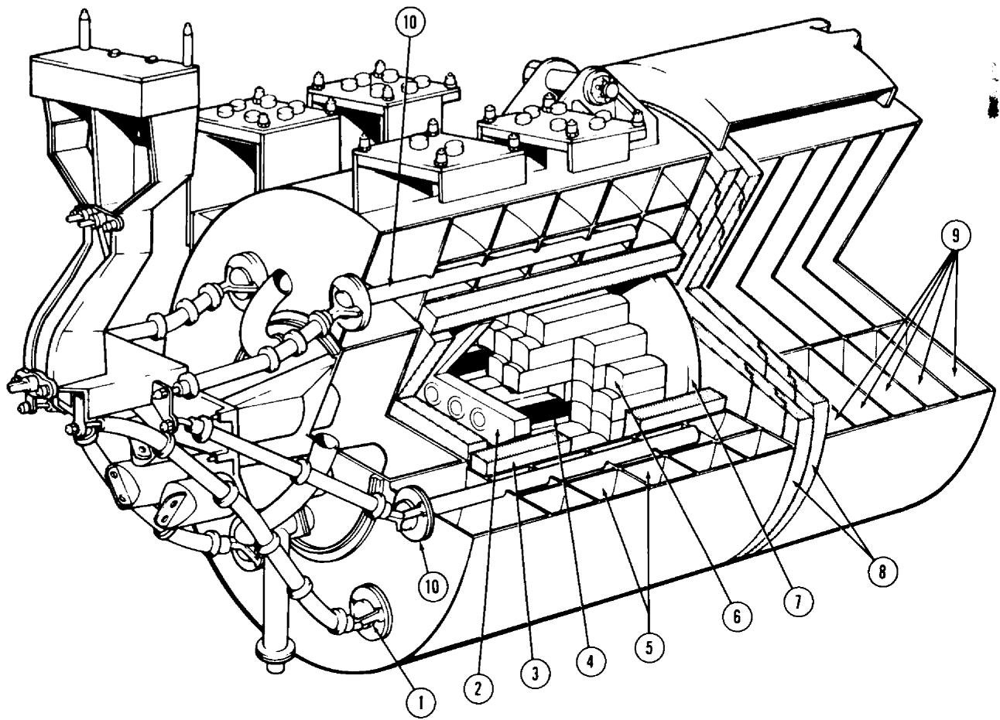  
Fig. 4.4.1. Cutaway View of the Aircraft Shield Test Reactor (ASTR).

I. GAMMA MONITOR   
2.AETGRID   
3. PRESSURE VESSEL LEAD CASE   
4. CONTROL ROD   
5. MAIN SHIELD TANKS

6. FUEL ELEMENTS   
7. FORWARD GRID   
8.LEAD RINGS AND DISKS   
9. FORWARD SHIELD TANKS   
0. ION CHAMBER

be used to determine a source term. All these measurements were made in the horizontal midplane of the reactor at an altitude of 12.5 ft. Since the ground would be expected to have considerable effect on the measurements at this altitude, the measurements were repeated and expanded in the TSF experiments at an altitude of 186 ft (height of horizontal axis of the reactor above the ground) and were compared with similar measurements taken at the TSF at an altitude of 12.5 ft.

A bottom view of the experimental arrangement used for these radiation mappings is shown in Fig. 4.4.3. The reactor was rotated around its

vertical axis, through an angle $\theta$ , measured clockwise from the reactor-detector vector to the reactor's forward-drawn axis, and radiation measurements were made with unshielded detectors at three detector stations suspended from the support truss. For these measurements the detector stations were staggered to minimize direct-beam shielding of one group of detectors by another.

Typical gamma-ray dose rates taken around the ASTR at a constant reactor-to-detector separation distance of 59 ft and an altitude of 186 ft with and without a 14-in.-thick water side shield on the reactor are shown in Fig. 4.4.4 (ASTR configurations

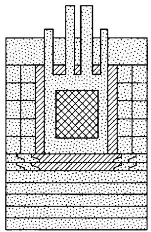  
CONFIGURATION $3^{*}$

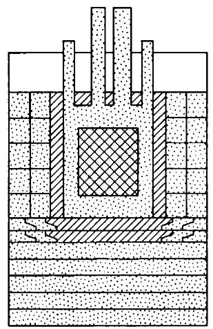  
CONFIGURATION 4

CONFIGURATION $5^{**}, *$   
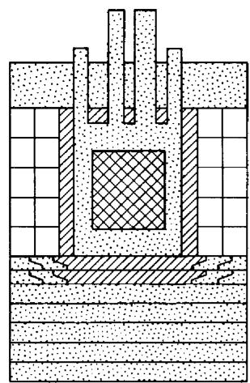  
\*IN CONFIGURATION 3NB THE BORAL PLATING ON THE OUTSIDE SURFACE OF THE SHIELD WAS REMOVED   
\*\*IN CONFIGURATION 5NB THE BORAL PLATING ON THE OUTSIDE SURFACE OF THE SHIELD WAS REMOVED   
$^{\ddagger}$ IN CONFIGURATION 5.5 ONLY
THE LOWER HALVES OF THE
SIDE TANKS WERE FILLED
WITH WATER

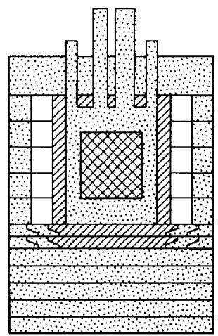  
CONFIGURATION 15

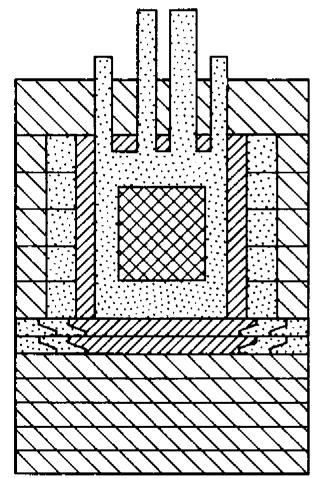  
CONFIGURATION 3B

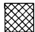  
REACTOR CORE

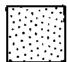  
PLAIN WATER

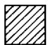  
LEAD

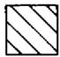  
BORATED WATER

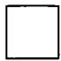  
AIR   
Fig. 4.4.2. Shielding Configurations Used on the Aircraft Shield Test Reactor (ASTR).

UNCLASSIFIED

2-01-056-23-775

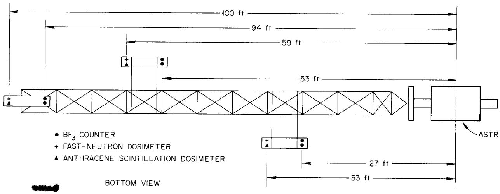  
Fig. 4.4.3. Experimental Arrangement for Total Radiation Measurements in Horizontal Midplane Around the ASTR.

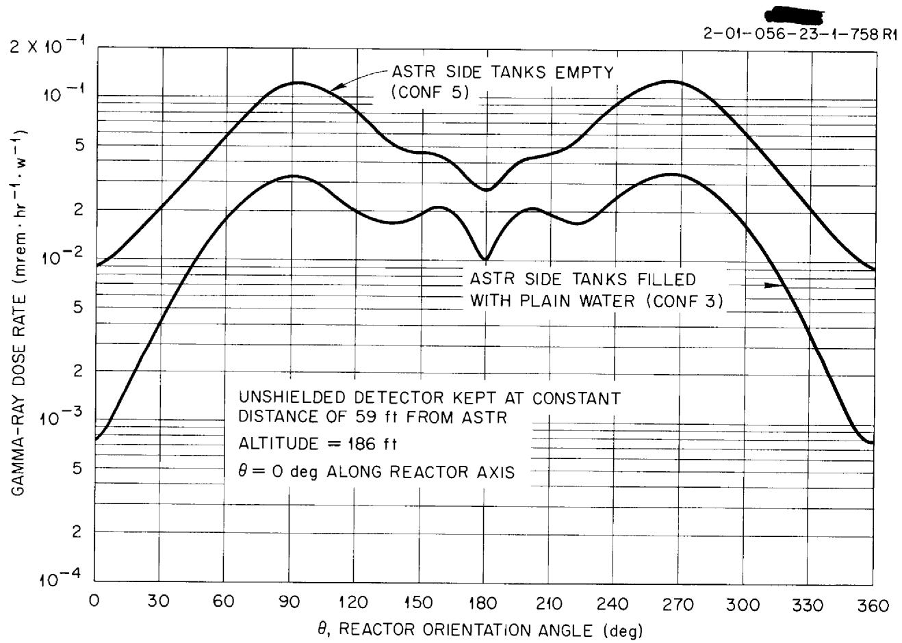  
Fig. 4.4.4. Total Gamma-Ray Dose Rates in Horizontal Midplane Around the ASTR.

3 and 5). (The reactor-to-detector separation distance is measured from the center of the reactor to the center of detection of the counter.) The dose rates at $\theta = 90$ and 270 deg increased approximately a factor of 4 when the water side shield was removed. This increase is only slightly greater than would be expected on the basis of the thickness of water removed; however, at $\theta = 0$ deg the dose rate increased a factor of 10. This indicates the importance of the side neutron shielding in reducing the gamma rays at this point. Corresponding fast-neutron dose rates (Fig. 4.4.5) and thermal-neutron fluxes (Fig. 4.4.6) consistently increased by a factor of 100 at all points when the water side shield was removed. As shown in

Fig. 4.4.3, the fast-neutron measurements were also made at a point 59 ft from the reactor, but the thermal-neutron flux measurements were made at a point 53 ft away.

The angular radiation mappings were supplemented by foil exposures, most of which were made on the reactor shield surface. However, foils were also exposed at various positions in space, some as far away as 33 ft. The foils used were gold (bare, gold-covered, and cadmium-covered), indium (bare and cadmium-covered), copper, aluminum, sulfur, and magnesium. In addition, long pieces of copper wire were exposed near the reactor shield. The results of three such exposures are shown in Fig. 4.4.7. The wires were positioned parallel to

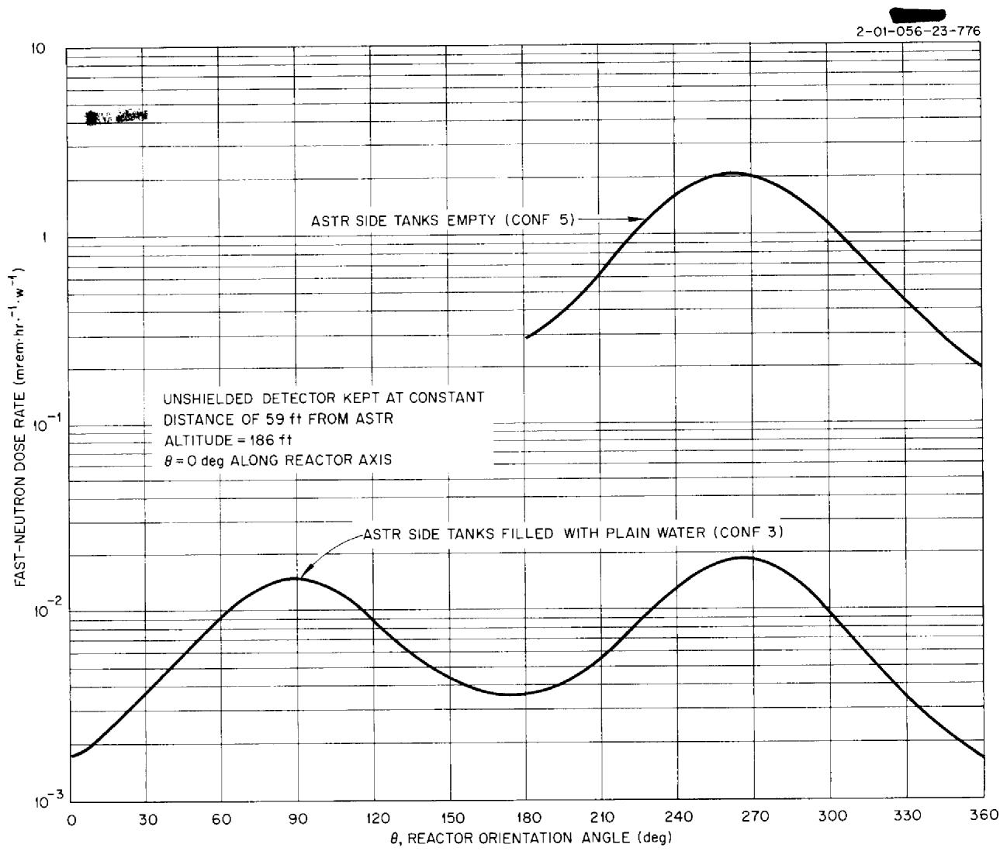  
Fig. 4.4.5. Total Fast-Neutron Dose Rates in Horizontal Midplane Around the ASTR.

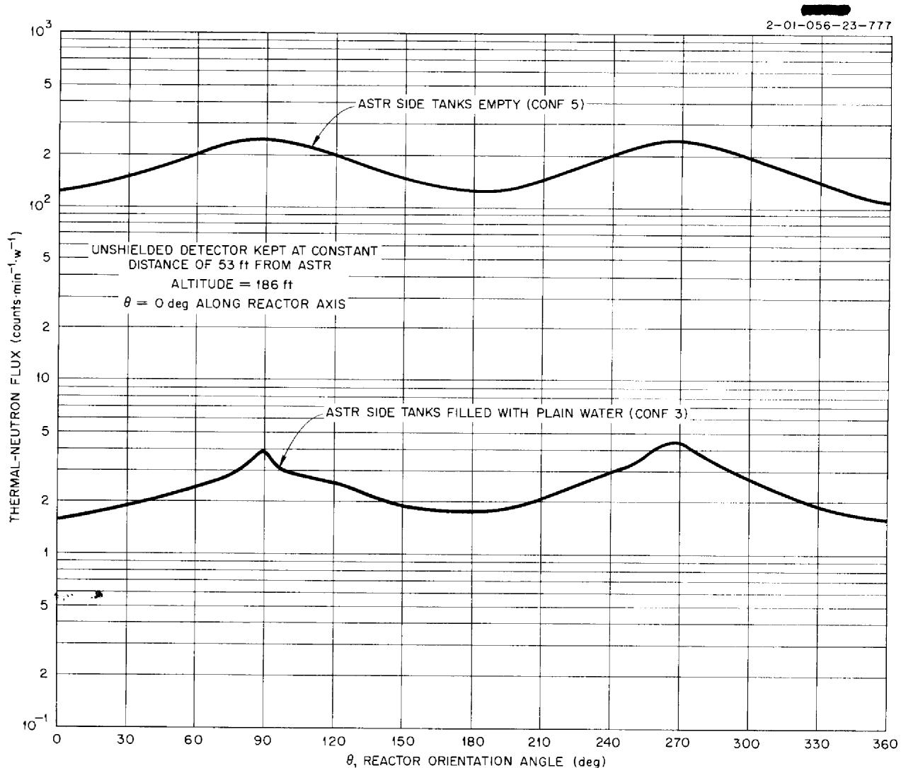  
Fig. 4.4.6. Total Thermal-Neutron Fluxes in Horizontal Midplane Around the ASTR.

the reactor centerline, in the horizontal plane containing the reactor axis, at distances of 0, 20, and $40\mathrm{cm}$ from the shield surface. The results plotted in Fig. 4.4.7 are given as a function of the distance from the front end of the shield. For these exposures the two ASTR side shield tanks were filled with water (configuration 3).

Direct-Beam Doses and Fluxes. - In addition to the total dose-rate and flux measurements made around the reactor, direct-beam neutron measurements were made as a function of the angle $\theta$ . For the fast-neutron measurements, the dosimeter was placed in a cylindrical water collimator located 12.5 ft above the ground. In this position the center of detection of the dosimeter was in the

same horizontal plane as the reactor axis and 33 ft from the center of the reactor. The collimator hole was $3\frac{1}{4}$ in. in diameter and approximately 24 in. long and was surrounded by an 18-in. minimum thickness of water. Typical plots of the direct-beam fast-neutron measurements taken while the ASTR was rotated around its vertical axis are shown in Fig. 4.4.8. These measurements were taken both with and without the water side shield on the reactor (ASTR configurations 3 and 5).

Direct-beam thermal-neutron flux measurements were made at a reactor-detector separation distance of 15 ft and an altitude of 186 ft. For these measurements the $\mathsf{BF}_3$ counter was positioned in a cylindrical, paraffin collimator which was lined

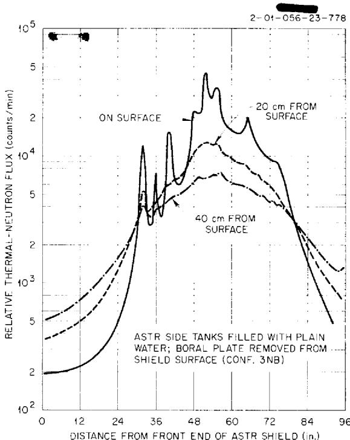  
Fig. 4.4.7. Relative Thermal-Neutron Fluxes Along Side of ASTR Shield: Copper Wire Activation Measurements on Shield Surface and 20 and $40~\mathrm{cm}$ from Surface.

with cadmium. This collimator hole was 2 in. in diameter and was surrounded by a 6-in. minimum thickness of paraffin; the distance from the outside end of the collimator hole to the center of detection was approximately 12 in. The collimator was suspended from the support truss, and a remotely positioned cadmium shutter allowed both bare and cadmium-covered measurements to be made. Examples of these measurements are given in Fig. 4.4.9 for ASTR configurations 3 and 5.

Scattered Doses. - Measurements of the scattered fast-neutron and gamma-ray dose rates were also made as a function of $\theta$ for various ASTR shield configurations at distances of 33, 59, and 100 ft, although none are reported in this paper. For these measurements, which were made both at an altitude of 12.5 ft and at an altitude of 186 ft, the detectors were suspended from the support truss in a line which, when $\theta = 0$ deg, was coincident with the reactor axis. The arrangement is shown in Fig. 4.4.10. The details of the direct-beam shields are shown in Fig. 4.4.11. These shields were remotely positioned to vary the direct-beam shield angle $\alpha$ from 8 deg to approximately 30 deg and thus to eliminate various solid angles of radiation while

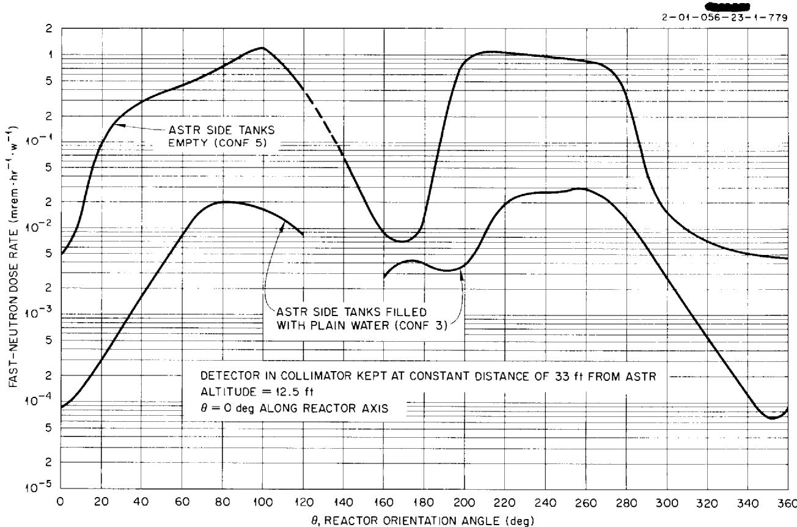  
Fig. 4.4.8. Direct-Beam Fast-Neutron Dose Rates in the Horizontal Midplane Around the ASTR.

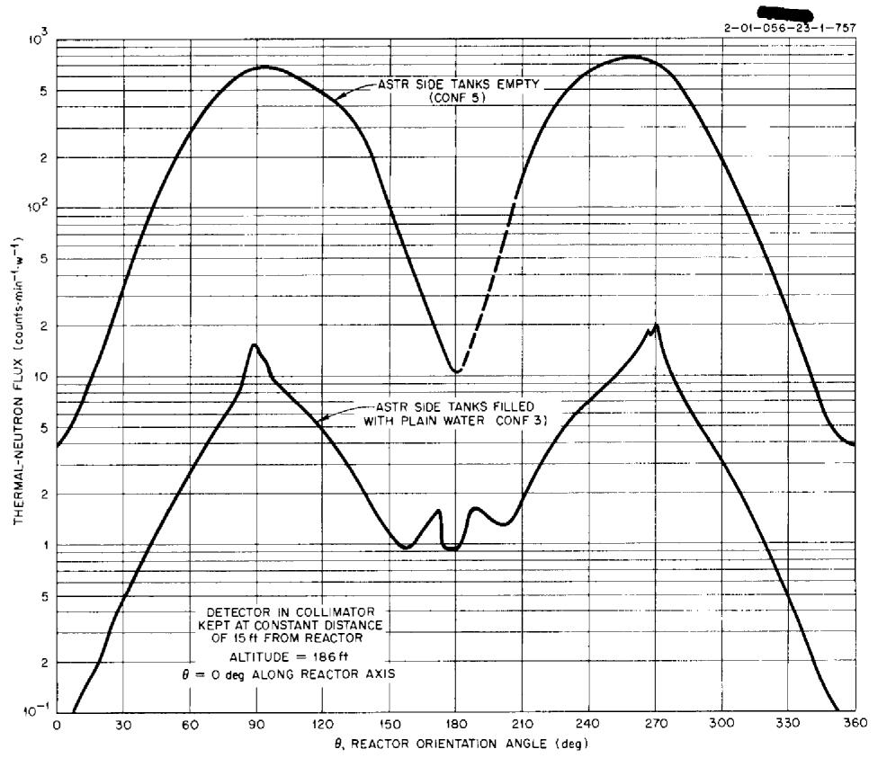  
Fig. 4.4.9. Direct-Beam Thermal-Neutron Fluxes in the Horizontal Midplane Around the ASTR.

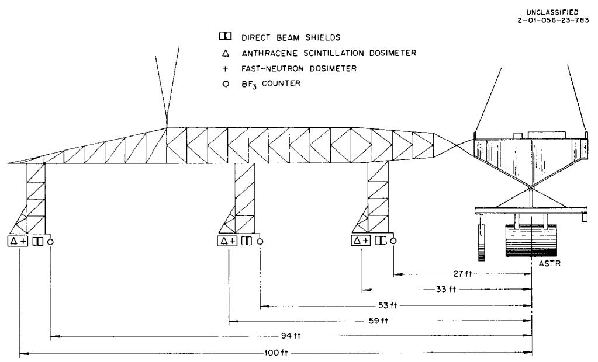  
Fig. 4.4.10. Experimental Arrangement for Scattered Radiation Measurements in Horizontal Midplane Around the ASTR.

the reactor-to-detector separation distances remained fixed. By taking many measurements in this manner, it was possible to extrapolate the plots of dose rate versus $\alpha$ to obtain the scattered dose rates for $\alpha = 0$ . By subtracting the resulting values from the total dose rates obtained at the same separation distances, a second method for determining direct-beam dose rates was available.

UNCLASSIFIED 2-01-056-23-784

+ FAST-NEUTRON DOSIMETER   
$\Delta$ ANTHRACENE SCINTILLATION DOSIMETER

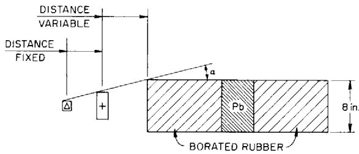  
Fig. 4.4.11. Direct-Beam Shield Used Between the ASTR and Fast-Neutron and Gamma-Ray Detectors.

# Measurements in Crew Shield Mockups

In the NTA experiments the ASTR and its shadow shield were located approximately midway between the nose and the tail of the airplane. A cylindrical crew shield mockup was located 33 ft in front of the reactor in a position that was midway between the reactor and the crew compartment in the nose of the airplane. The total distance between the reactor and the crew compartment was 65 ft.

In the TSF experiments, measurements were made both in and around the crew compartment and the crew shield mockup, both of which were suspended from the support truss, as shown in Fig. 4.4.12; however, the typical data presented in this paper for this set of measurements were all obtained in the crew shield mockup. The walls of the crew shield mockup were fabricated from borated rubber; the thickness at the rear was 21 in., and the side and front thicknesses were varied from 0 to 11 in. (see Fig. 4.4.13). The 30-in.-dia by 70-in.-long cavity in the mockup was lined with 2.5 in. of lead on the rear and with 0.093 in. of lead on the side and front.

In addition to the measurements in the Convair shields, measurements were also made in an ORNL

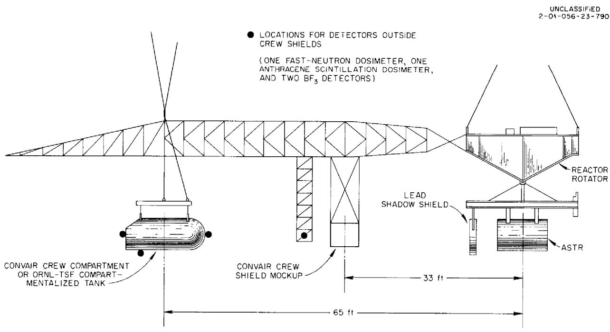  
Fig. 4.4.12. Configuration of ASTR and Crew Shields.

compartmentalized tank that had been used for earlier experiments at the TSF. The compartments in this tank, shown in Fig. 4.4.14, were filled either with plain or with borated water. The rear shield was 37 in, thick, and the side shield was varied from 0 to 20 in. When this tank was used it replaced the Convair crew compartment.

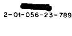

BORATED RUBBER (PERMANENT), 21-in. THICK   
BORATED RUBBER, VARIABLE THICKNESS FROM O TO 11 in.   
LEAD (PERMANENT), 0.093-in. THICK ON SIDE AND FRONT, 2.5 in. ON REAR

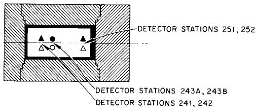

FAST-NEUTRON DOSIMETER

$\triangle$ ANTHRACENE SCINTILLATION DOSIMETER   
CADMIUM-COVERED BF, COUNTER   
O BARE BF COUNTER

Fig. 4.4.13. Convair Cylindrical Crew Shield Mockup.

Effect of Detector Side Shield Thickness. - The measurements of radiation in and around the Convair crew shield mockup 33 ft from the ASTR were taken as a function of the thickness of the borated rubber side shield on the crew shield (detector) for most of the ASTR shield configurations at altitudes of 12.5 and 186 ft. Typical gamma-ray dose rates, fast-neutron dose rates, and thermal-neutron fluxes at the 186-ft altitude are shown in Figs. 4.4.15, 4.4.16, and 4.4.17, respectively, for configurations 3 and 5.

The measurements in the ORNL compartmentalized tank 65 ft from the ASTR as a function of the water side shield thickness were made only at the 186-ft altitude. Three reactor shield-detector shield combinations were used: (1) Plain water shields both on the reactor (configuration 3) and on the detector tank; (2) a plain water shield on the reactor and a borated water shield on the detector tank; and (3) borated water shields both on the reactor (configuration 3B) and on the detector tank. Typical measurements in this tank are also plotted in Figs. 4.4.15 through 4.4.17.

Effect of the Ground. - In order to determine the effect of the ground on the measurements made in and around the Convair crew compartment and

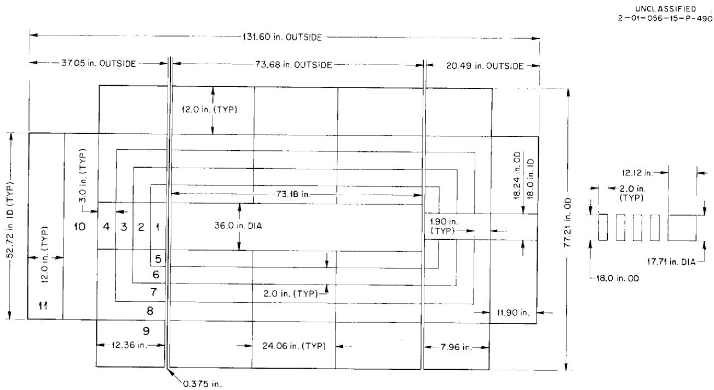  
Fig. 4.4.14. ORNL-TSF Cylindrical Compartmentalized Tank. (with caption)

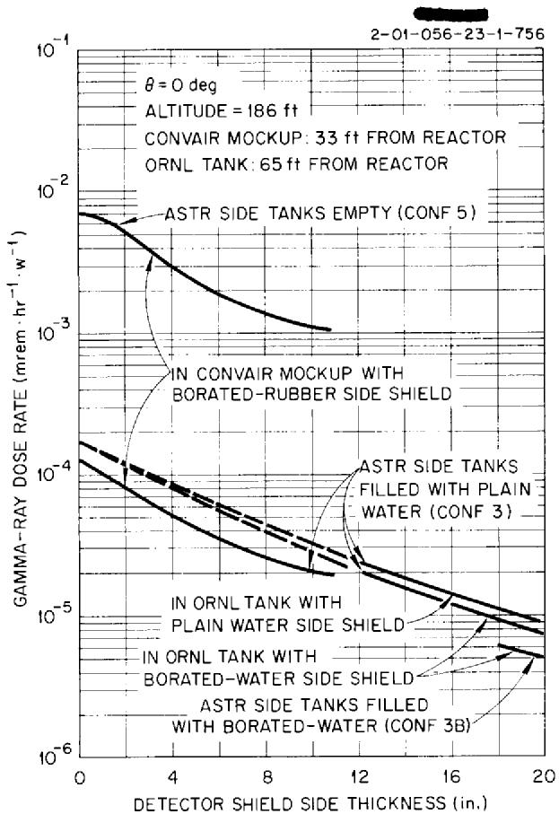  
Fig. 4.4.15. Gamma-Ray Dose Rates in the Convair Crew Shield Mockup and in the ORNL-TSF Compartmen-talized Tank as a Function of the Detector Shield Side Thickness: ASTR Experiment.

crew-shield mockup, many of the measurements were repeated as a function of altitude. Typical gamma-ray measurements made in air and in the crew-shield mockup 33 ft from the reactor are shown in Fig. 4.4.18 for two ASTR shield configurations: configuration 5, in which there was no side shielding on the reactor, and configuration 5.5, in which only the lower halves of the two ASTR side tanks were filled. Corresponding fast-neutron measurements are given in Figs. 4.4.19 and 4.4.20. Thermal-neutron flux measurements made in air for ASTR configuration 5 and three reactor-to-detector separation distances, 27, 53, and 94 ft, are presented in Fig. 4.4.21.

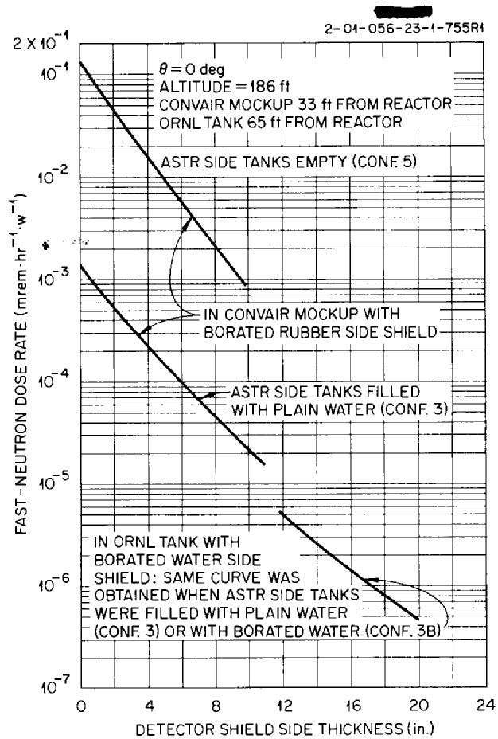  
Fig. 4.4.16. Fast-Neutron Dose Rates in the Convair Crew Shield Mockup and in the ORNL-TSF Compartmentralized Tank as a Function of the Detector Shield Side Thickness: ASTR Experiment.

# Gamma-Ray and Neutron Spectral Measurements

In addition to the measurements discussed above, which essentially repeated those taken in the NTA experiments at Convair, the TSF experiments included a series of measurements at an altitude of 186 ft to determine the gamma-ray and neutron energy spectra at various locations. Gamma-ray spectral data were obtained in the Convair crew shield mockup for the 11-in.-thick side shield and in the ORNL compartmentalized tank for several thicknesses of borated water on the side. For these measurements two sodium iodide crystals were used with an RCL 256-channel pulse-height

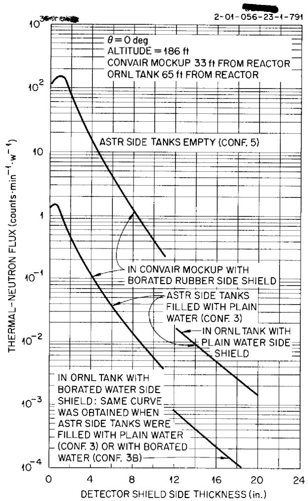  
Fig. 4.4.17. Thermal-Neutron Fluxes in the Convair Crew Shield Mockup and in the ORNL-TSF Compartmen-talized Tank as a Function of the Detector Shield Side Thickness: ASTR Experiment.

analyzer. Typical pulse-height spectra for four side shield thicknesses on the crew shield (detector) and ASTR configuration 5 (reactor side tanks empty) are shown in Fig. 4.4.22. A pulse-height spectrum for a 20-in.-thick detector side shield is shown in Fig. 4.4.23 for ASTR configuration 3 (both reactor side tanks filled with plain water). A spectrum for the same detector shield thickness but with only one of the two ASTR side shields filled with water (configuration 15) is presented in Fig. 4.4.24.

Neutron spectral measurements were made in a 6-ft-dia, 6-ft-long cylindrical water tank which was suspended from the support truss 65 ft from the reactor and had eight conically shaped collimator

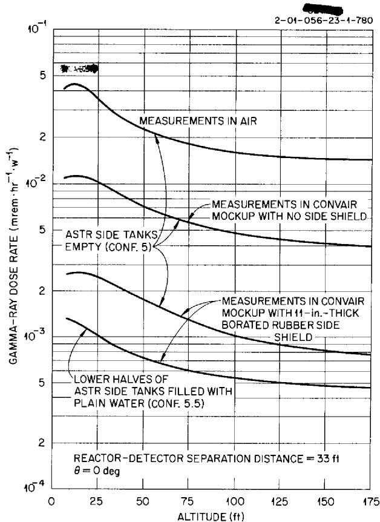

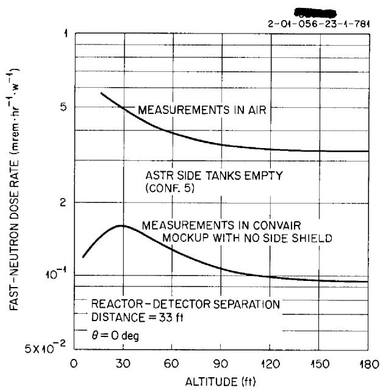  
Fig. 4.4.18. Gamma-Ray Dose Rates in Air and in the Convair Crew Shield Mockup as a Function of Altitude: ASTR Experiment.   
Fig. 4.4.19. Fast-Neutron Dose Rates in the Convair Crew Shield Mockup with No Side Shielding as a Function of Altitude: ASTR Experiment.

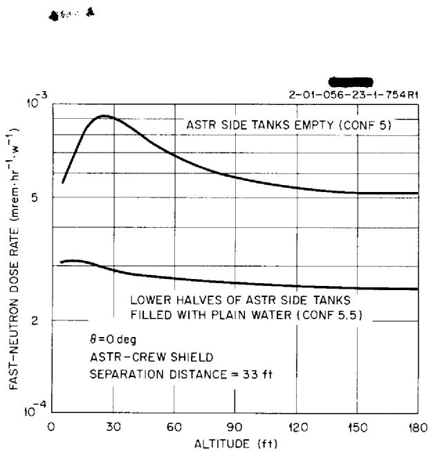  
Fig. 4.4.20. Fast-Neutron Dose Rate in the Convair Crew Shield Mockup with II-in.-Thick Borated Rubber Side Shield as a Function of Altitude: ASTR Experiment.

holes radiating from near its center. The collimator axes were spaced at 45-deg angles, each collimator half-angle covering 5 deg. Neutron-sensitive plates were placed at the inner ends of the collimator holes, which were sealed off from one another. The results of all of these measurements will be reported by Convair.

# Miscellaneous Measurements

During the course of the experiment it became apparent that several measurements were needed which were not originally scheduled. These included resonance and threshold detector measurements as a function of distance from the reactor and sulfur-foil measurements on the ASTR shield

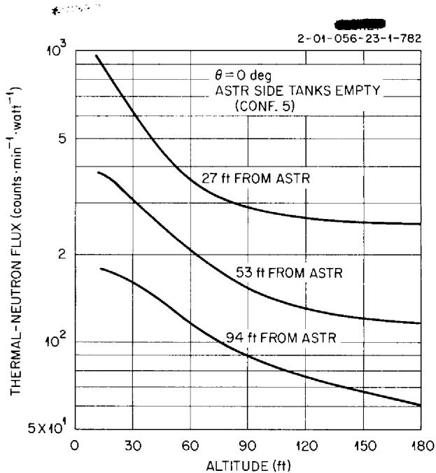  
Fig. 4.4.21. Total Thermal-Neutron Fluxes in Air at Various Distances from the ASTR as a Function of Altitude.

surface. For the sulfur-foil exposures, ASTR configuration 3 was used, and the foils were placed around the reactor shield at 5-in. intervals in the vertical center-plane of the reactor. The additional measurements also included thermal-neutron flux measurements from 2 ft below the reactor water pool surface to 10 ft above the surface, while the reactor was held at altitude, and gold-foil measurements of the thermal-neutron flux from 5 in. below the surface of the ground to 5 in. above the surface, also while the reactor was held at altitude. In addition, thermal-neutron flux traverses were made between the ground level and the reactor at an altitude of 70 ft with a bare $\mathsf{BF}_3$ counter and with a $\mathsf{BF}_3$ counter having a $2\pi$ cadmium shield on the bottom or on the top. The data obtained in these traverses are plotted in Fig. 4.4.25.

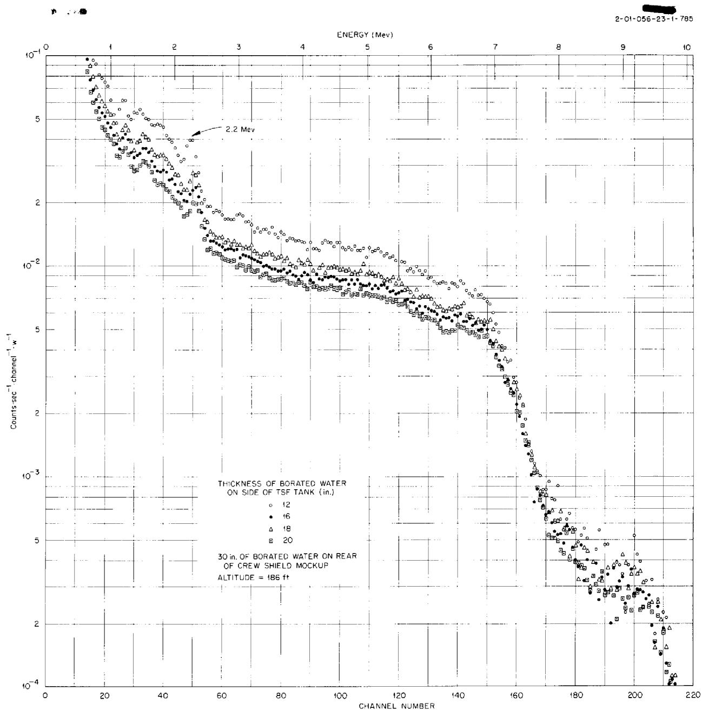  
Fig. 4.4.22. Pulse-Height Spectra of Gamma Rays Observed in the ORNL-TSF Compartmentalized Tank 65 ft from the ASTR: ASTR Side Tanks Empty (Configuration 5).

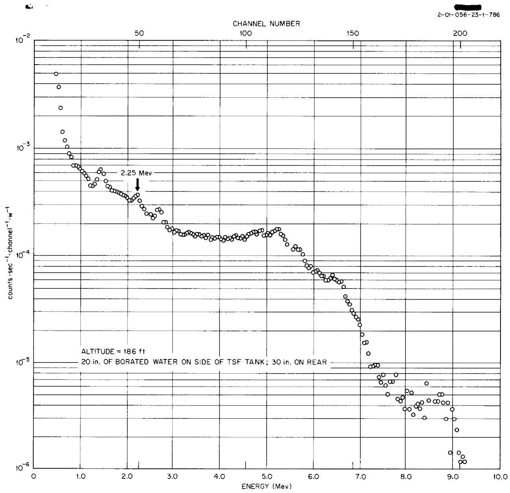  
Fig. 4.4.23. Pulse-Height Spectrum of Gamma Rays Observed in the ORNL-TSF Compartmentalized Tank 65 ft from the ASTR: One ASTR Side Tank Filled with Plain Water (Configuration 15).

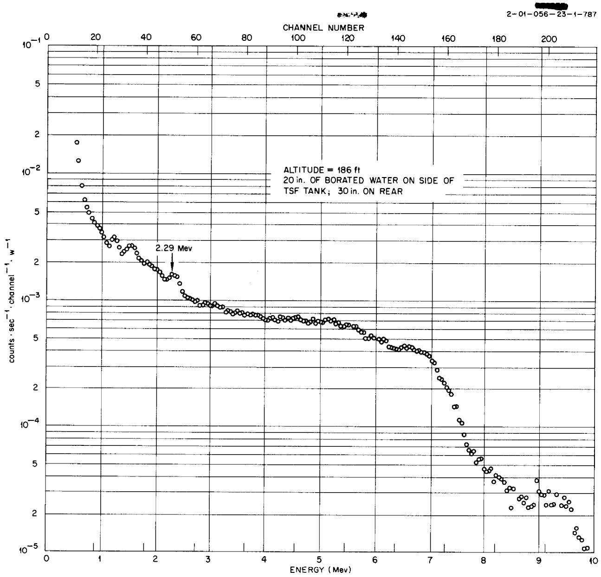  
Fig. 4.4.24. Pulse-Height Spectrum of Gamma Rays Observed in the ORNL-TSF Compartmentalized Tank 65 ft from the ASTR: Both ASTR Side Tanks Filled with Plain Water (Configuration 3).

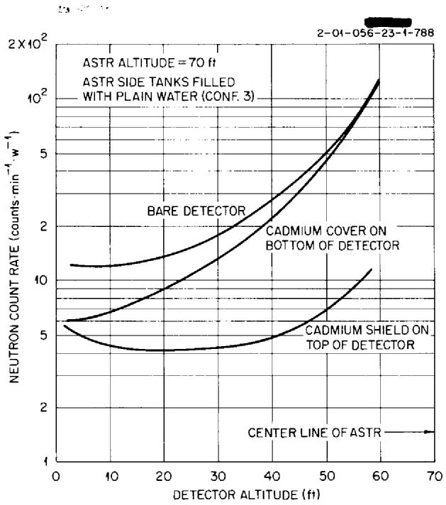  
Fig. 4.4.25. Neutron Count Rate Measured with a $\mathsf{BF}_3$ Counter Below the ASTR as a Function of Detector Al-titude.

# PREDICTION OF RADIATION INTENSITIES AT LARGE DISTANCES FROM THE TSR-II

V. R. Cain

The proposed construction of the Melton Hill Dam on the Clinch River near the TSF area has made it necessary to determine what the gamma-ray and fast-neutron dose rates will be at large distances from the Tower Shielding Reactor-II (TSR-II); therefore, calculations were performed to estimate the dose rates for two operating conditions. For one case the reactor was assumed to be "bare," that is, to have no external shield. It is to be noted, however, that even the "bare" reactor will always be surrounded by small thicknesses of water, aluminum, and lead (see Fig. 4.5.1 in Chap. 4.5 of this report). This calculation was for an operating power of $5\mathrm{Mw}$ , the maximum design power, at a 200-ft altitude, a condition which would result in the highest dose rates that could be achieved with the TSR-II. For the other case the reactor was assumed to be encased in a "beam" shield (see Fig. 4.5.2 of section 4.5) which would allow a highly collimated beam of radiation to be emitted

from the reactor. The results of this latter calculation, which was also for a 5-Mw operating power at a 200-ft altitude, are expected to be more representative of a typical operation. As part of this investigation, a calculation was made of the uncollided neutron flux 4200 ft from the TSR-I to obtain a fast-neutron buildup factor for the case in which an air-filled collimator extending through the reactor shield is pointed at the detector.

# Measured Dose Rates 4000 ft from TSR-I

Gamma-ray and fast-neutron dose rates at distances up to 4000 ft from the TSR-I have been measured for a reactor water shield thickness of 15 cm. The data obtained, given in Figs. 4.4.26

3F. N. Watson, ANP Quar. Prog. Rep. March 10, 1956, ORNL-2061, p 5; it should be noted that the quoted 15-cm thickness is the distance from the center of the reactor face to the wall of the 12-ft-dia reactor tank.

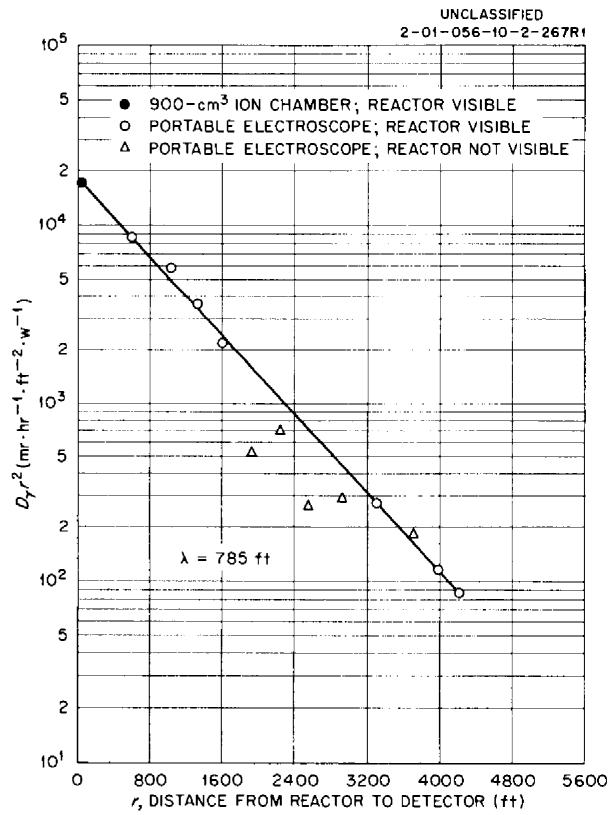  
Fig. 4.4.26. Measured Gamma-Ray Dose Rates as a Function of the Distance from the TSR-I with a 15-cm- Thick Water Shield.

and 4.4.27, were fitted with expressions of the type

$$
D _ {\text {T S R - I}} = \frac {C e ^ {- r / \lambda}}{r ^ {2}}, \tag {1}
$$

where

$$
\begin{array}{l} D = \text {g a m m a - r a y o r f a s t - n e u t r o n d o s e r a t e} \\ \left(\operatorname {m r} \cdot \operatorname {h r} ^ {- 1} \cdot \operatorname {w} ^ {- 1} \text {o r} \operatorname {m r e p} \cdot \operatorname {h r} ^ {- 1} \cdot \operatorname {w} ^ {- 1}\right), \\ \end{array}
$$

$$
\begin{array}{l} C = \text {a r b i t r a r y} \\ r = \text {r e a c t o r - d e t e c t o r s e p a r a t i o n d i s t a n c e (f t)}, \\ \end{array}
$$

$$
\begin{array}{l} \lambda = \text {r e l a x a t i o n} \\ = 7 8 5 \text {f t f o r g a m m a r a y s} \\ = 6 3 0 \text {f t f o r f a s t n e u t r o n s}. \\ \end{array}
$$

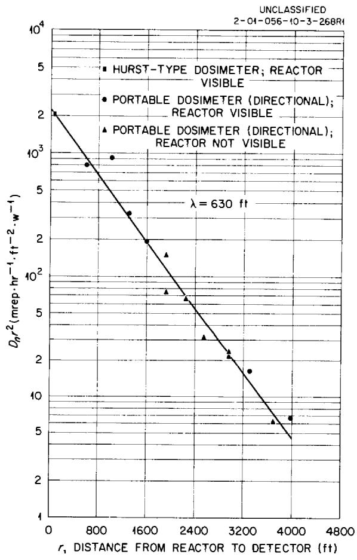  
Fig. 4.4.27. Measured Fast-Neutron Dose Rates as a Function of the Distance from the TSR-I with a 15-cm-Thick Water Shield.

# Predicted Dose Rates 4200 ft from the TSR-II

Gamma-Ray Dose Rates for Bare TSR-II. - The gamma-ray data presented in Fig. 4.4.26 were used to predict the gamma-ray dose rates from the bare TSR-II simply by accounting for the differences between the thicknesses of the shielding materials on the two reactors along a straight line from the reactor to the detector. While the TSR-I had a 15-cm-thick water shield, the TSR-II shield will consist of $2.5\mathrm{cm}$ of water, $3.5\mathrm{cm}$ of aluminum, and $5.1\mathrm{cm}$ of lead. The modified expression is therefore

$$
\begin{array}{l} D _ {\gamma (\text {T S R - I I}, \text {b a r e})} = \tag {2} \\ C _ {1} \frac {e ^ {- r / \lambda_ {\gamma}}}{r ^ {2}} P e ^ {- \left(\Sigma_ {H _ {2}} O ^ {x} H _ {2} O + \Sigma_ {A I} x _ {A I} + \Sigma_ {P b} x _ {P b}\right)} \\ \end{array}
$$

$$
= C _ {2} \frac {e ^ {- r / \lambda_ {\gamma}}}{r ^ {2}}, \tag {3}
$$

$$
w h e r e
$$

$$
D _ {\gamma} = \text {g a m m a - r a y d o s e r a t e (m r - h r ^ {- 1})},
$$

$$
\begin{array}{l} C _ {1} = 1. 7 2 \times 1 0 ^ {4} m r \cdot h r ^ {- 1} \cdot f t ^ {2} \cdot w ^ {- 1} (a c o n s t a n t \\ \text {t a k e n f r o m r e f 3}), \end{array}
$$

$$
P = \text {r e a c t o r p o w e r l e v e l} (\mathrm {w}),
$$

$$
x = \text {t h i c k n e s s o f a s h i e l d m a t e r i a l o n t h e} \quad \text {T S R - I I m u n s t h e t h i c k n e s s o f t h e s a m e}
$$

$$
\begin{array}{l} x _ {H _ {2} O} = 2. 5 \mathrm {c m} - 1 5 \mathrm {c m} = - 1 2. 5 \mathrm {c m}, \\ x _ {A I} = 3. 5 \mathrm {c m}, \\ x _ {P b} = 5. 1 c m, \\ \Sigma = \text {m a c r o s c i p o c} \\ \end{array}
$$

$$
\begin{array}{l} \Sigma_ {H _ {2} O} = 0. 0 3 9 6 \mathrm {c m} ^ {- 1}, \\ \Sigma_ {A} = 0. 0 9 5 3 c m ^ {- 1}, \\ \Sigma_ {P b} = 0. 4 6 7 c m ^ {- 1}. \\ \end{array}
$$

With these values of $x$ and $\Sigma$ substituted in Eq. 2 and with the assumed power of 5 Mw, the value of $C_2$ in Eq. 3 becomes $9.35 \times 10^9 \, \text{mr} \cdot \text{hr}^{-1} \cdot \text{ft}^2$ . The complete expression for the gamma-ray dose rates at various distances from the bare TSR-II operating at a power of 5 Mw is thus

$$
D _ {\chi (T S R - 1 1, b a r e)} = 9. 3 5 \times 1 0 ^ {9} \frac {e ^ {- r / 7 8 5}}{r ^ {2}} m r \cdot h r ^ {- 1} \tag {4}
$$

This expression is plotted as $D_{\gamma}r^{2}$ versus $r$ in Fig. 4.4.28

Fast-Neutron Dose Rates for Bare TSR-II (Based on ASTR Data). - Rather than attempt to predict fast-neutron dose rates for the bare TSR-II from the available TSR-I data, it was considered preferable to obtain measurements from a reactor shield that more nearly resembled that to be used on the bare TSR-II. For this reason, measurements were taken at a distance of 4200 ft from the Convair Aircraft Shield Test Reactor (ASTR) (see preceding section of this chapter) with its thinnest shield configuration (see configuration 5 in Fig. 4.4.2). This shield consisted of $15\mathrm{cm}$ of water, $4.45\mathrm{cm}$ of aluminum, and $7.3\mathrm{cm}$ of lead. It should be pointed out, however, that the ASTR is approximately cylindrical, and the shield thickness given is in the perpendicular plane bisecting the longitudinal axis of the reactor.

The point at which the fast-neutron dose rate was measured was 4200 ft from the side of the ASTR along a line perpendicular to the longitudinal axis of the reactor and originating at the reactor center. The angle between this line to the detector and the reactor axis is identified in the discussion below as the angle $\theta$ . With the reactor operating at a power of $1\mathrm{Mw}$ , the measured dose rate was 0.78 mrem/hr (ref 4). As a check on this measurement, a comparison was made using data taken at various distances from the Nuclear Test Airplane while it was in flight at altitudes greater than 10,000 ft (ref 5). An extrapolation of these data to ground level resulted in a fast-neutron dose rate of 0.77 mrem·hr $^{-1}$ , which seemed to confirm the measurement at the TSF.

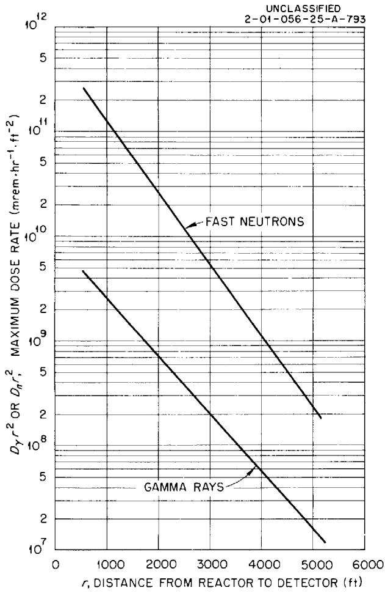  
Fig. 4.4.28. Predicted Maximum Values of $D_{\gamma}r^{2}$ and $D_{n}r^{2}$ as a Function of the Distance from the Bare TSR-II Operating at a Power of 5 Mw.

The TSF measurement 4200 ft from the ASTR was then used to calculate the dose rate from the bare TSR-II by normalizing Eq. 1 to the measured value, accounting for the differences in the shielding on the two reactors, accounting for the differences in the neutron fluxes on the surfaces of the two reactors, and assuming that the fast-neutron dose rates 4200 ft from the reactors would be proportional to their total fast-neutron leakages. The expression for the dose rate is thus

$$
D _ {n (\text {T S R - I I , b a r e})} = C _ {3} \frac {e ^ {- r / \lambda_ {n}}}{r ^ {2}} \frac {\phi_ {2}}{\phi_ {1}} \frac {G _ {2}}{G _ {1}} P e ^ {- \left(\sum_ {H _ {2} O ^ {x} H _ {2} O ^ {+} \sum_ {A l} x _ {A l} + \sum_ {P b} x _ {P b}}\right)},
$$

where

$$
D _ {n} = \text {f a s t - n e u t r o n d o s e r a t e} (\mathrm {m r e m} \cdot \mathrm {h r} ^ {- 1}),
$$

$$
C _ {3} = a \text {c o n s t a n t w i t h u n i t s o f m r e m} \cdot h r ^ {- 1} \cdot f t ^ {2} \cdot w ^ {- 1},
$$

$\phi_{2} / \phi_{1} =$ ratio of the neutron flux at the surface of the TSR-II to that at the surface of the ASTR,

$$
x _ {H _ {2} O} = 2. 5 \mathrm {c m} - 1 5 \mathrm {c m} = - 1 2. 5 \mathrm {c m},
$$

$$
x _ {A 1} = 3. 5 \mathrm {c m} - 4. 4 5 \mathrm {c m} = - 0. 9 5 \mathrm {c m},
$$

$$
x _ {P b} = 5. 1 \mathrm {c m} - 7. 3 \mathrm {c m} = - 2. 2 \mathrm {c m},
$$

$\Sigma =$ macroscopic cross section for neutrons in the specified material,

$$
\Sigma_ {H _ {2} O} = 0. 1 5 3 8 \mathrm {c m} ^ {- 1},
$$

$$
\Sigma_ {A I} = 0. 0 7 9 \mathrm {c m} ^ {- 1},
$$

$$
\Sigma_ {P b} = 0. 1 1 7 c m ^ {- 1},
$$

$G_{1} =$ geometric factor for ASTR, which is the ratio of the average fast-neutron dose rate at a given distance to that at $\theta = 90$ deg for the same distance

$$
\begin{array}{l} = \frac {\overline {{D (\theta)}}}{D (\theta = 9 0 \mathrm {d e g})} \\ = \frac {1}{D (\theta = 9 0 \deg)} \frac {\int_ {0} ^ {\pi} D (\theta) \sin \theta d \theta}{\int_ {0} ^ {\pi} \sin \theta d \theta} \\ = \frac {1}{2 D (\theta = 9 0 \deg)} \int_ {0} ^ {\pi} D (\theta) \sin \theta d \theta , \\ \end{array}
$$

$D(\theta) =$ dose rate at a constant distance from the reactor as a function of the angle $\theta$ (taken from the top curve in Fig. 4.4.5 of this chapter),

$G_{2} =$ geometry factor for the TSR-II, which, because of the spherical symmetry of the reactor, is equal to unity.

The final value of $G_{2} / G_{1} = 1 / 0.599$ .

If it is assumed that the power distributions in the ASTR and the TSR-II are flat, the flux is inversely proportional to the volumes of the cores and the term $V_{1} / V_{2}$ can be substituted for $\phi_2 / \phi_1$ , where $V_{1}$ and $V_{2}$ represent the volumes of the ASTR and the TSR-II, respectively. Equation 5 then becomes

$$
\begin{array}{l} D _ {n (\text {T S R - I I , b a r e})} = C _ {3} \frac {e ^ {- r / \lambda_ {n}}}{r ^ {2}} \frac {V _ {1}}{V _ {2}} \frac {G _ {2}}{G _ {1}} P e ^ {- \left(\sum_ {H _ {2} O} x _ {H _ {2} O} + \sum_ {A l} x _ {A l} + \sum_ {P b} x _ {P b}\right)} (6) \\ = C _ {4} \frac {e ^ {- r / \lambda_ {n}}}{r ^ {2}}. (7) \\ \end{array}
$$

Assuming a reactor power of $5\mathrm{Mw}$ and reducing Eq.6 to Eq.7 gives a value of $6.40 \times 10^{11} \mathrm{mrem} \cdot \mathrm{hr}^{-1} \cdot \mathrm{ft}^2$ for the constant $C_4$ . The complete expression for the fast-neutron dose rate from the bare TSR-II operating at a power of $5\mathrm{Mw}$ is thus

$$
D _ {n (\text {T S R - I I , b a r e})} = 6. 4 0 \times 1 0 ^ {1 1} \frac {e ^ {- r / 6 3 0}}{r ^ {2}} \mathrm {m r e m} \cdot \mathrm {h r} ^ {- 1}. \tag {8}
$$

This is plotted as $D_{n}r^{2}$ versus $r$ in Fig. 4.4.28. When the value of $r$ is 4200 ft, $D_{n}$ is 46 mrem·hr⁻¹.

Fast-Neutron and Gamma-Ray Dose Rates for TSR-II in a Beam Shield. - No experimental information was available on which to base the calculation for the highly collimated beam; therefore, it became necessary to perform an experiment with the TSR-I in which a 15-in.-dia air-filled collimator was placed adjacent to the reactor in its 12-ft-dia water tank. Measurements of fast-neutron and gamma-ray dose rates and thermal-neutron fluxes were made at a distance of 4200 ft as a function of the beam orientation angle, $\theta$ , with the detectors positioned at $\theta = 0$ deg (6 deg west of due south). These measurements are plotted in Fig. 4.4.29. The fast-neutron and gamma-ray measurements had a very high background, so the statistical accuracy is poor. At the best point, $\theta = 0$ deg, the probable errors total $32\%$ for the gamma-ray measurements and $8\%$ for the fast-neutron measurements. The statistical accuracy of the thermal-neutron data is much better, however; the probable errors range from $7.4\%$ at $\theta = 130$ deg to $2.4\%$ at $\theta = 0$ deg. As a result, the thermal-neutron data were used to obtain an assumed shape for the other measurements.

The measurements obtained for fast-neutron and gamma-ray dose rates at $\theta = 0$ deg were used to predict dose rates from the TSR-II with a similar collimator by accounting for the differences in the shielding materials on the two reactors along the beam axes. The shield thicknesses used for the TSR-II were the same as those given above for the bare reactor. The shield thicknesses on the TSR-I were reduced to $1.9\mathrm{cm}$ of water and $3.0\mathrm{cm}$ of aluminum. The fast-neutron dose rate at 4200 ft from the TSR-II operating at $5\mathrm{Mw}$ in a beam shield thus becomes

$$
D _ {n (\text {T S R - I I}, \text {b e a m})} = D _ {n (\text {T S R - I}, \text {b e a m})} P e ^ - \left(\sum_ {\mathrm {H} _ {2} \mathrm {O} ^ {x} \mathrm {H} _ {2} \mathrm {O} ^ {+} \sum_ {\mathrm {A l} ^ {x} \mathrm {A l} ^ {+} \sum_ {\mathrm {P b} ^ {x} \mathrm {P b}}}\right)} \tag {9}
$$

where, for this case,

$$
\begin{array}{l} x _ {H _ {2} O} = 2. 5 \mathrm {c m} - 1. 9 \mathrm {c m} = 0. 6 \mathrm {c m}, \\ x _ {\mathrm {A l}} ^ {-} = 3. 5 \mathrm {c m} - 3. 0 \mathrm {c m} = 0. 5 \mathrm {c m}, \\ x _ {P b} = 5. 1 \mathrm {c m}, \\ \end{array}
$$

and the values of $\Sigma$ are the same as those given following Eq. 5. The resulting value of $D_{n(TSR-1, beam)}$ is 4200 ft from the reactor for a power of 5 Mw is 1.07 mrem·hr $^{-1}$ .

A similar procedure gave a value of $0.23 \, \text{mr} \cdot \text{hr}^{-1}$ for the gamma-ray dose rate, $D_{\gamma(\text{TSR-II}, \text{beam})}$ . The total dose rate (neutrons and gamma rays) from the highly collimated beam shield was thus $1.3 \, \text{mrem} \cdot \text{hr}^{-1}$ , $82\%$ of which was due to fast neutrons.

Figure 4.4.30 shows these predicted dose rates as a function of distance from the reactor. These dose rates apply only for a point directly in line with the beam, and they can be reduced by about a factor of 6 by turning the beam $90\mathrm{deg}$

Fast-Neutron Dose Rates for the Bare TSR-II (Based on TSR-I Data). - The fast-neutron collimator dose rates presented in Fig. 4.4.29 were used to make an additional prediction of the fast-neutron dose rates at large distances from the bare TSR-II. The calculational procedure was as follows. If $\phi_{1}$ represents the neutron flux on the surface of the TSR-I and it is assumed that the flux has a cosine current distribution, the net number of neutrons crossing $1\mathrm{cm}^2$ of the TSR-I face per second per steradian in the direction $\alpha$ (a being the angle from the normal) is $(\phi_{1}/2\pi)\cos \alpha$ neutrons·cm $^{-2}$ -sec $^{-1}$ -steradian $^{-1}$ . If it is further

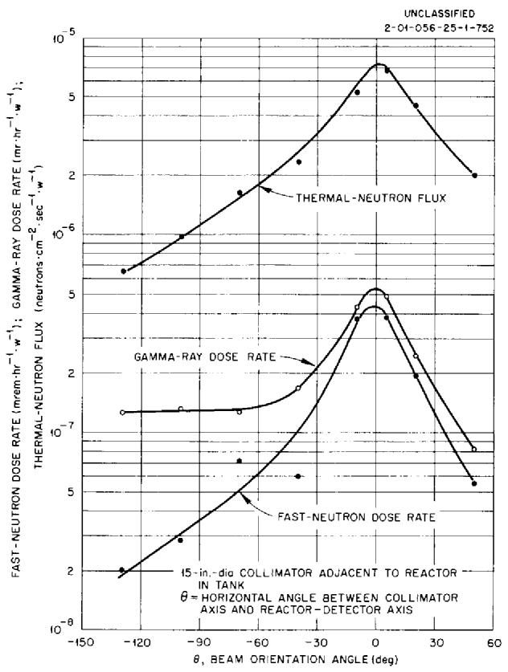  
Fig. 4.4.29. Measured Fast-Neutron Dose Rates, Gamma-Ray Dose Rates, and Thermal-Neutron Fluxes 4200 ft from the TSR-I as a Function of the Beam Angle $\theta$ : Beam Emitted Through Air-Filled Collimator Penetrating Reactor Shield.

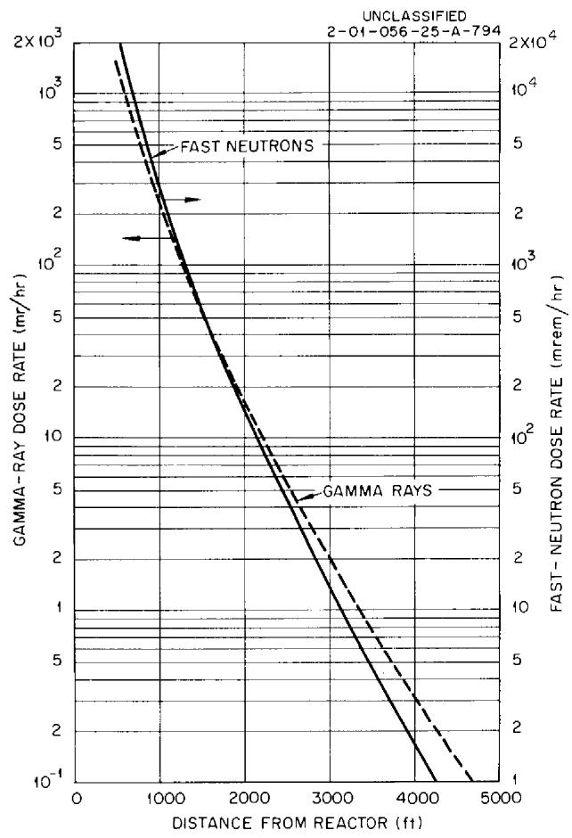  
Fig. 4.4.30. Predicted Gamma-Ray and Fast-Neutron Dose Rates as a Function of the Distance from the TSR-II Operating at a Power of 5 Mw in a Beam Shield.

assumed that there is no wall scattering, then the total number of neutrons leaving the collimator of length $L$ and radius $a$ is

$$
\left(\frac {\phi_ {1}}{2 \pi} \cos a\right) A \Delta \Omega = \left(\frac {\phi_ {1}}{2 \pi} \cos a\right) (\pi a ^ {2}) \frac {(\pi a ^ {2})}{L ^ {2}} = \frac {\phi_ {1}}{2 \pi} \frac {(\pi a ^ {2}) ^ {2}}{L ^ {2}}, \tag {10}
$$

where

$$
A = \text {a r e a}
$$

$\Delta \Omega =$ solid angle subtended by the end of the collimator, as seen from the reactor,

cos $\alpha =$ approximately 1, since $\alpha$ is small for $L\gg a$

The dose rate at an angle $\theta$ from the collimator due to 1 neutron per second emitted from the collimator is:

$$
D (\theta) \left(\frac {2 \pi L ^ {2}}{\phi_ {1} \left(\pi a ^ {2}\right) ^ {2}}\right), \tag {11}
$$

where $D(\theta)$ is the measured dose rate 4200 ft from the TSR-I as a function of the angle $\theta$ . Then the total dose rate from a unit isotropic source (a source emitting $1/4\pi$ neutrons·sec $^{-1}$ -steradian $^{-1}$ ) is:

$$
\int \frac {D (\theta)}{4 \pi} \left(\frac {2 \pi L ^ {2}}{\phi_ {1} \left(\pi a ^ {2}\right) ^ {2}}\right) 2 \pi \sin \theta d \theta = \frac {L ^ {2}}{\pi a ^ {4} \phi_ {1}} \int_ {\theta = 0} ^ {\pi} D (\theta) \sin \theta d \theta , \tag {12}
$$

where $2\pi \sin \theta d\theta$ is the differential solid angle. If $\phi_{2}$ represents the neutron flux on the surface of the TSR-II and it is assumed that it also has a cosine current distribution, the total number of neutrons emitted per second from the TSR-II would be

$$
4 \pi r _ {1} ^ {2} \int_ {\alpha = 0} ^ {\pi / 2} \left(\frac {\phi_ {2}}{2 \pi} \cos \alpha\right) (2 \pi \sin \alpha d \alpha) = 4 \pi r _ {1} ^ {2} \phi_ {2} \int_ {\alpha = 0} ^ {\pi / 2} \cos \alpha \sin \alpha d \alpha = 2 \pi r _ {1} ^ {2} \phi_ {2}, \tag {13}
$$

where $r_1$ is the outer radius of the core; the other terms have been defined previously.

It is now possible to calculate the dose rate at 4200 ft from the bare TSR-II by multiplying Eq. 12 by Eq. 13 and introducing an attenuation term:

$$
D _ {n (\text {T S R - I I , b a r e})} = 2 \pi r _ {1} ^ {2} \phi_ {2} \left[ \frac {L ^ {2}}{\pi a ^ {4} \phi_ {1}} \int_ {\theta = 0} ^ {\pi} D (\theta) \sin \theta d \theta \right] e ^ {- \left(\sum H _ {2} O ^ {x} H _ {2} O ^ {+} \sum A I ^ {x} A I ^ {+} \sum P b ^ {x} P b\right)}
$$

$$
= \frac {2 L ^ {2} r _ {1} ^ {2}}{a ^ {4}} \left(\frac {V _ {1}}{V _ {2}}\right) \left[ \int_ {\theta = 0} ^ {\pi} D (\theta) \sin \theta d \theta \right] e ^ {- \left(\Sigma_ {H _ {2} O} x _ {H _ {2} O} + \Sigma_ {A I} x _ {A I} + \Sigma_ {P b} x _ {P b}\right)}, \tag {15}
$$

where the values of $\Sigma$ and $x$ are the same as those given following Eq. 9, and, as in Eq. 6, it is assumed that the flux is inversely proportional to the volumes of the cores. (In this case, however, $V_{1}$ is equal to the volume of the TSR-1.) The resulting dose rate for a 5-Mw operating power is

$$
\begin{array}{l} D _ {n (\text {T S R - I I , b a r e})} = \frac {2 (4 8) ^ {2} (1 4 . 7 5) ^ {2}}{(7 . 5) ^ {4}} \frac {(6 , 4 8 0)}{(1 0 , 6 4 0)} \left| \int_ {\theta = 0} ^ {\pi} D (\theta) \sin \theta d \theta \right| e ^ {- \left(\sum_ {H _ {2} O ^ {x} H _ {2} O + \sum A l ^ {x} A l + \sum P b ^ {x} P b}\right)} \\ = 1 9 3 \left[ \left(1. 7 9 \times 1 0 ^ {- 7} m r e m \cdot h r ^ {- 1} \cdot w ^ {- 1}\right) \left(5 \times 1 0 ^ {6} w\right) \right] \frac {1}{2 . 0 7} \\ = 8 3 \mathrm {m r e m} \cdot \mathrm {h r} ^ {- 1}. \\ \end{array}
$$

This value compares reasonably well with the value of 46 mrem·hr-1 calculated above.

As a check on the validity of this type of calculation, a similar procedure was used to predict the fast-neutron dose rates 4200 ft from the ASTR which could be compared with the measured dose rate reported above for the same reactor shield configuration. The calculated result was $2.78 \, \text{mrem} \cdot \text{hr}^{-1}$ and differed from the measured value by a factor of 3.56, the latter value being $0.78 \, \text{mrem} \cdot \text{hr}^{-1}$ . As a further check, a calculation of the fast-neutron dose rate 4200 ft from the TSR-1 in its 12-ft-dia tank gave a predicted value which was a factor of 1.8 higher than the measurement. These two calculations indicate that the value of 83 mrem·hr $^{-1}$ given above is probably a factor of 2 or 3 too high. The discrepancies probably arise partly because the number of neutrons which leave the collimator is greater than Eq. 9 predicts and partly because

the beam results for fast neutrons may not vary with angle in exactly the same manner as the results for thermal neutrons (which were used to give the curve shape for these calculations). In any event, it appears that the dose rate at 4200 ft which was calculated by this method should be conservative in the sense that the calculated dose rate should be larger than the actual dose rate.

# Calculation of Uncollided Fast-Neutron Flux 4200 ft from the TSR-I

A calculation of the uncollided neutron flux at a distance of 4200 ft from the TSR-I was performed to obtain a fast-neutron buildup factor for the case in which a beam is pointed at the detector. For this calculation the measured neutron spectrum, $N(E)$ , at the face of the Bulk Shielding Reactor6 was used for neutron energies up to 2.7 MeV and a normalized Watt's spectrum was used for higher energies, where $N(E)$ is given in units of neutrons·cm⁻²·sec⁻¹·w⁻¹·Mev⁻¹·steradian⁻¹. If a cosine distribution on the face of the reactor is assumed, the uncollided fast-neutron dose rate at a distance $l$ is:

$$
D _ {n, U (T S R - I, l)} = \int_ {E = 0} ^ {\infty} \int_ {A _ {s}} \frac {N (E) \cos \alpha C (E) \Delta \Omega e ^ {- \sum_ {T} (E) l}}{A _ {\det}} d A _ {s} d E, \tag {17}
$$

where

$$
A _ {s} = \text {a r e a o f t h e s o u r c e (t h e r e a c t o r f a c e)},
$$

$$
d A _ {s} = \text {d i f f e r e n t i a l}
$$

$$
A _ {\text {d e t}} = \text {a r e a o f d e t e c t o r},
$$

$$
\Sigma_ {T} (E) = \text {m a c r o s c i p o c t o t a l}
$$

$$
C (E) = \text {f l u x - t o - d o s e r a t e c o n v e n s i o n f a c t o r},
$$

$$
\Delta \Omega = \text {s o l i d a n g l e s u b t e n d e d b y t h e d e f e c t o r a t} d A _ {s},
$$

$$
l = \text {d i s t a n c e} d A _ {s} \text {t o t h e d e t e c t o r .}
$$

In order to base the calculation of $D_{n,U(TSR-1)}$ on a measured fast-neutron dose rate at the surface of the reactor, it was necessary to calculate the dose rate at the surface of the reactor as well as at the distance $l$ . For this case, the distance $t$ , defined in Fig. 4.4.31, approaches zero and $e^{-\sum_T l} = 1$ :

$$
\begin{array}{l} D _ {n (\text {T S R - 1 , s u r f a c e})} = \int_ {E = 0} ^ {\infty} \left[ \int_ {A _ {s}} \frac {N (E)}{A _ {\det}} \left(\frac {t}{l}\right) C (E) \left(\frac {A _ {\det}}{l ^ {2}}\right) 2 \pi x d x \right] d E \tag {18} \\ = 2 \pi \int_ {E = 0} ^ {\infty} N (E) C (E) \left[ \int_ {x = 0} ^ {\infty} \frac {t x d x}{l ^ {3}} \right] d E \\ = 2 \pi \int_ {E = 0} ^ {\infty} N (E) C (E) \left[ \int_ {x = 0} ^ {\infty} \frac {t x d x}{\left(x ^ {2} + t ^ {2}\right) ^ {3 / 2}} \right] d E \\ = 2 \pi \int_ {E = 0} ^ {\infty} N (E) C (E) \left[ \frac {- t}{\left(x ^ {2} + t ^ {2}\right) ^ {1 / 2}} \right| _ {0} ^ {\infty} d E \\ = 2 \pi \int_ {E = 0} ^ {\infty} N (E) C (E) d E, \\ \end{array}
$$

where $x$ is the distance from the horizontal centerline of the reactor to the area $dA$ .

When the detector is at large distances from the reactor, $l \gg x$ , cos $\phi$ is equal to 1, and the integral over the source simply gives the area of the collimator:

$$
D _ {n, U (\text {T S R - 1}, l)} = \frac {A _ {\text {c o l l}}}{l ^ {2}} \int_ {E = 0} ^ {\infty} N (E) C (E) e ^ {- \sum_ {T} (E) l} d E e ^ {- \left(\sum_ {H _ {2} O ^ {x} H _ {2} O ^ {+ \sum_ {A I} x A I}}\right)}, \tag {19}
$$

where the exponential $e^{-\left(\sum_{H_2O^x H_2O^{+}\sum_{Al^x Al^i}}\right)}$ accounts for the attenuation of the 1.9 cm of water and 3.0 cm of aluminum between the reactor and collimator.

The buildup factor, $B$ , is:

$$
\begin{array}{l} B = \frac {D _ {\text {m e a s} , l = 4 2 0 0 \mathrm {f t}}}{D _ {\text {m e a s , s u r f a c e}}} \frac {\left| 2 \pi \int_ {E = 0} ^ {\infty} N (E) C (E) d E \right|}{\left| \frac {A _ {\text {c o l l}}}{l ^ {2}} \int_ {E = 0} ^ {\infty} N (E) C (E) e ^ {- \sum_ {T} (E) l} d E \right| e ^ {- \left(\sum_ {H _ {2} O ^ {x} H _ {2} O ^ {+} \sum A I ^ {x} A I}\right)}} \tag {20} \\ = \frac {(4 . 4 2 \times 1 0 ^ {- 7})}{(2 . 0 5 \times 1 0 ^ {5})} \frac {(2 \pi) (3 . 6 5 \times 1 0 ^ {5})}{(6 . 8 3 \times 1 0 ^ {- 8}) (1 6 . 6 2)} \frac {1}{(0 . 5 9)} \\ = 7. 3 8 \quad . \\ \end{array}
$$

Figure 4.4.32 is a plot of $N(E) \subsetneq (E) \subsetneq e^{-\sum_{T} (E) t}$ as a function of the neutron energy $E$ for two separate calculations. In the first calculation the averaged cross sections were taken every 0.5-Mev energy interval. These cross sections are given in Table 4.4.1. For the second calculation the cross sections used were taken from BNL-325 (ref 7) at 20-kev intervals below 2 MeV, at 100-kev intervals from 2.0 to 6.0 MeV, at 200-kev intervals from 6.0 to 8.0 MeV, and at 0.5-Mev intervals from 8.0 to 12.0 MeV. The resulting integrations under these two curves differed by less than 10%.

UNCLASSIFIED

2-01-056-25-D-795

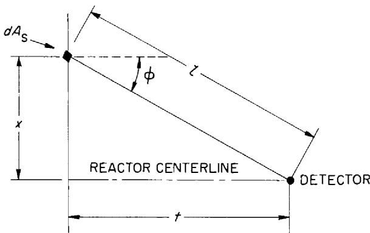  
Fig. 4.4.31. Geometry Used for the Calculation of the Uncollided Flux 4200 ft from the TSR-I.

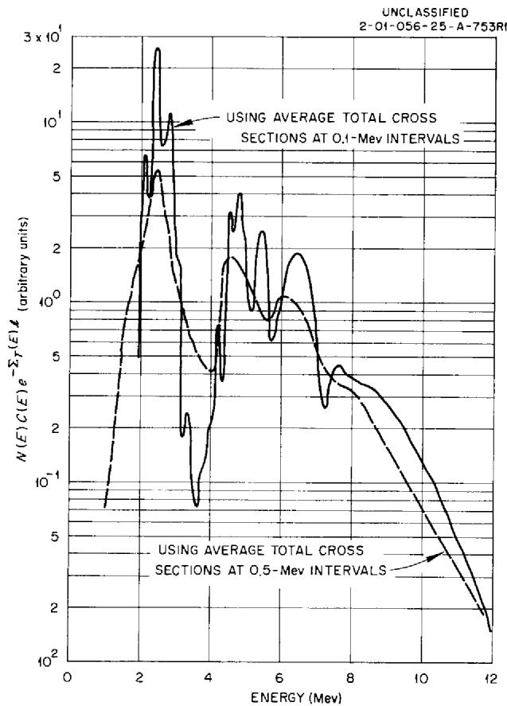  
Fig. 4.4.32. Calculated Uncollided Fast-Neutron Spectrum 4200 ft from the TSR-I for the Case in Which an Air-filled Collimator Penetrates the Reactor Shield and Points at the Detector.

Table 4.4.1. Average Cross Sections Used for Calculation of Uncollided Flux   

<table><tr><td>E, Neutron Energy (Mev)</td><td>ΣT&#x27;, Air (cm-1)</td><td>E, Neutron Energy (Mev)</td><td>ΣT&#x27;, Air (cm-1)</td></tr><tr><td>0.5</td><td>13.7 × 10-5</td><td>6.5</td><td>6.59 × 10-5</td></tr><tr><td>1.0</td><td>10.6 × 10-5</td><td>7.0</td><td>6.79 × 10-5</td></tr><tr><td>1.5</td><td>9.23 × 10-5</td><td>7.5</td><td>6.79 × 10-5</td></tr><tr><td>2.0</td><td>8.19 × 10-5</td><td>8.0</td><td>6.59 × 10-5</td></tr><tr><td>2.5</td><td>7.18 × 10-5</td><td>8.5</td><td>6.59 × 10-5</td></tr><tr><td>3.0</td><td>8.06 × 10-5</td><td>9.0</td><td>6.59 × 10-5</td></tr><tr><td>3.5</td><td>8.50 × 10-5</td><td>9.5</td><td>6.59 × 10-5</td></tr><tr><td>4.0</td><td>8.50 × 10-5</td><td>10.0</td><td>6.59 × 10-5</td></tr><tr><td>4.5</td><td>7.09 × 10-5</td><td>10.5</td><td>6.59 × 10-5</td></tr><tr><td>5.0</td><td>7.04 × 10-5</td><td>11.0</td><td>6.59 × 10-5</td></tr><tr><td>5.5</td><td>7.24 × 10-5</td><td>11.5</td><td>6.59 × 10-5</td></tr><tr><td>6.0</td><td>6.74 × 10-5</td><td>12.0</td><td>6.59 × 10-5</td></tr></table>

# 4.5. TOWER SHIELDING REACTOR II

C. E. Clifford

L. B. Holland

Design work on the Tower Shielding Reactor II (TSR-II) is now essentially complete. The several design changes which have been incorporated since the previous report1 and recent studies of operating conditions and experimental facilities are described below. The two shields which will be used initially with the TSR-II are also discussed.

# MECHANICAL DESIGN

The latest concept of the TSR-II is shown in Fig. 4.5.1. The design and much of the fabrication of the major components inside the reactor tank have been completed, although the fuel elements will be modified following full-scale flow tests. The present design differs from the one last reported in several respects. The inside diameter of the upper portion of the reactor tank has been increased from 36.75 to 39.75 in. to facilitate removal and insertion of the fuel elements and the shielding above the core. In addition, the ionization chambers have been moved outward in the upper region of the inner cylinder to provide more room for the control mechanism positioning and actuating devices which will be housed in a turret atop the central cylinder region.

Another modification in the design has been the elimination of one of the boral hemispherical shells just outside the lead region. This will ensure adequate clearances in the annular fuel region.

A 2-ft-thick shield of lead shot and water has been added above the central fuel elements to reduce the gamma-ray leakage through the central cylinder. This will be especially important when the reactor is enclosed in a shield mockup. This lead-and-water shield, which can be seen in Fig. 4.5.1,

will be penetrated by approximately 120 helical ducts through which the cooling water will flow. The gamma-ray leakage through this shield will never exceed the leakage through any shield used with the TSR-II. The shield shown above the core in the region between the reactor tank and the inner cylinder will be removable.

The design of the TSR-II is such that it can be encased in various shields. The first shield with which the reactor will be used will be a spherical shield having a beam hole both fore and aft (see discussion of shield designs in subsequent section of this chapter). The entire assembly will be suspended from a platform, as shown in Fig. 4.5.2, and it can be rotated around the vertical axis so that the beam holes can sweep a horizontal plane. When the reactor is suspended in this manner, the cooling water will pass through a coaxial swivel joint before it enters and after it leaves the reactor tank.

The reactor and beam shield may also be suspended so that the beam holes will sweep a vertical plane. For this case, two 12-ft girder-like members will be attached to the side of the shield through an axle and bearings, and the cooling water will enter through a swivel fitting and the hollow axle of one support member and leave through a similar arrangement on the other support member. By alternately using the two beam holes, a beam can sweep the whole 360 deg in the vertical plane without tilting the reactor more than 90 deg from the vertical position.

Calculations have indicated that, with a 30-deg conical section removed from the shield, a 6775 ft-lb torque will be required to rotate the reactor and shield so that the removed section will sweep a vertical arc. A much smaller torque will be required to sweep the horizontal arc. A Char-Lynn torque booster working through a worm and 180-tooth gear will be used to rotate the reactor assembly. A torque booster under full load has performed satisfactorily in laboratory tests.

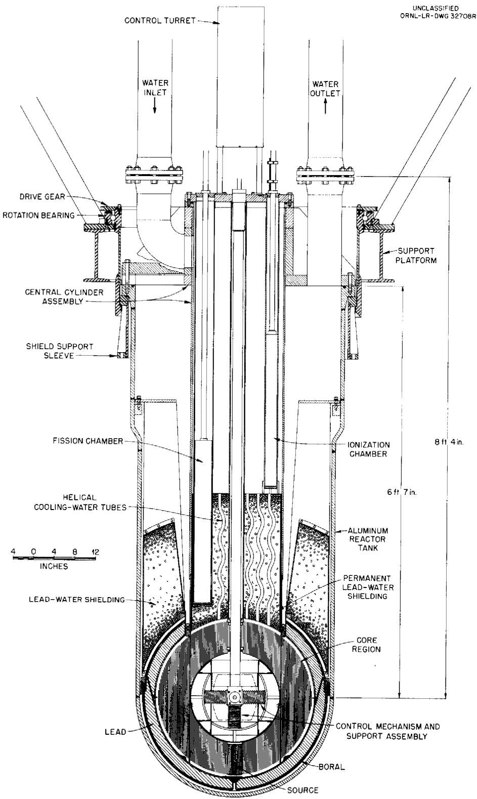  
Fig. 4.5.1. TSR-II Design (Vertical Section).

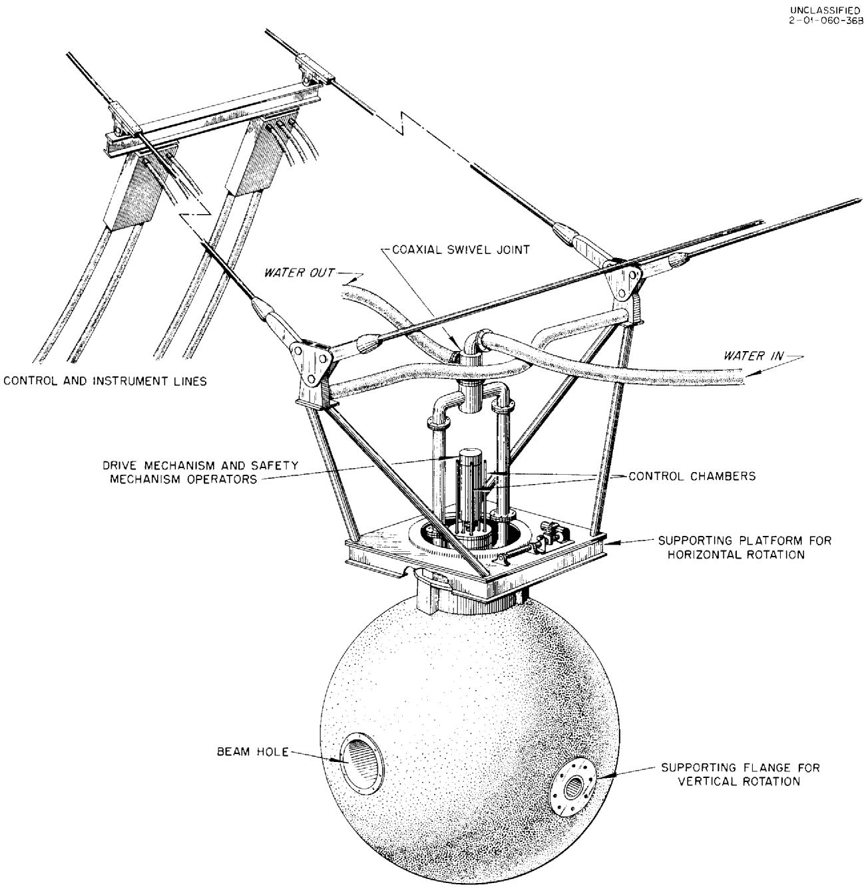  
Fig. 4.5.2. TSR-II in Beam Shield.

# CONTROL SYSTEMS

# Control Mechanism

The experimental mockup of the control mechanism for the TSR-11, which was described previously, was tested and found to have a short life owing to excessive wear of the traveling nut of the positioning device. Several modifications of the design failed to increase the life. Design changes were

then mode so that the pressure on the traveling nut was reduced by nearly a factor of 10. This was accomplished by reducing the size of the seal that restricts the flow out of the chamber and increasing the area on which pressure is applied to seal the control plate assembly against the traveling nut.

The force on the traveling nut was reduced to 10 lb, the difference between the spring force and the hydraulic force. Proper guidance and longer life were ensured by using stellite bearings instead of miniature roller bearings on the control plate assembly and by using piston rings to provide a good seal between the assembly and the cylinder wall. With these changes, a model of the control mechanism (see Fig. 4.5.3) was still operating successfully when a test was terminated after 5000 cycles. The model is shown in the test stand in Fig. 4.5.4. The model will be tested later under flow conditions.

A total of five control mechanisms will be used to operate neutron absorbing grids for shim-safety purposes in the TSR-II. A sixth grid, which does not scram, will be used for fine control. The neutron-absorbing umbrella-shaped grids will be made of Inconel-clad cadmium ribbons. It had previously been planned4 to use perforated boron-loaded plates as the neutron absorbers but the fabrication of the Inconel-clad cadmium was more feasible.

# Electrohydraulic Transducer for Control of Water Pressure in the Control Mechanism

J. E. Marks

An electrohydraulic transducer will be used to actuate the control mechanism. The purpose of the transducer is to allow electrical control of the water pressure in the TSR-II control mechanism with the standard ORNL magnet circuitry. The transducer is a bypass pressure regulator with electrical rather than mechanical adjustment. As a force-balancing device it compares the control mechanism water pressure acting on a diaphragm with the thrust of a solenoid and applies the difference between the two forces to a spring. Any differential force causes the spring to deflect proportionately, and the deflection is used to displace a valve plug away from or toward its seat, depending upon whether the water pressure effect is greater or less than the thrust of the solenoid. This valve is in a shunt relation to the control mechanism.

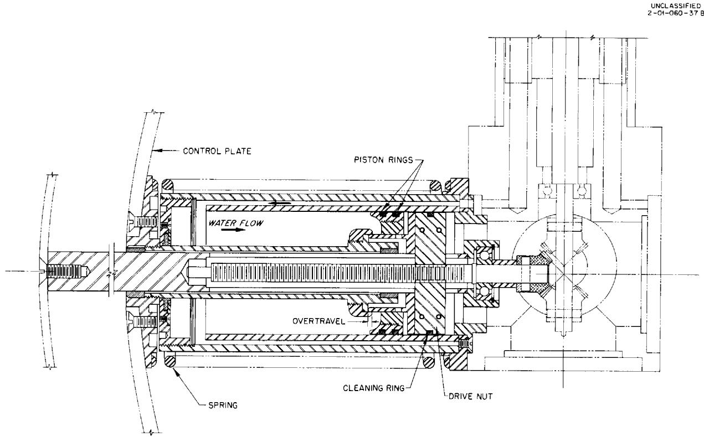  
Fig. 4.5.3. TSR-II Control Mechanism.

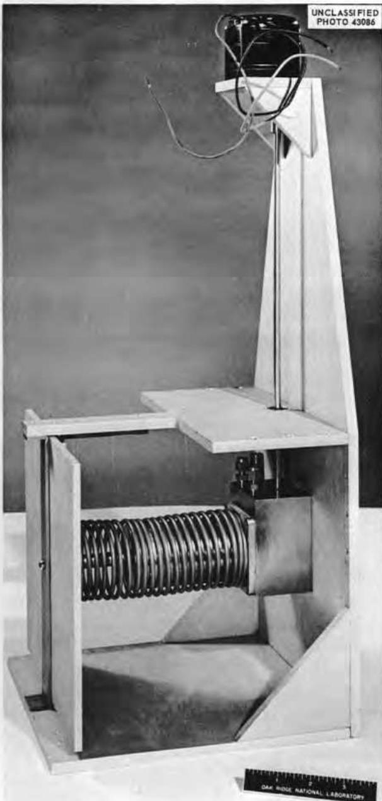  
Fig. 4.5.4. TSR-II Control Mechanism in Test Stand.

Between the source of water and the control mechanism-transducer load, there is a restriction of known magnitude. The load pressure is principally a sum of the source pressure less the pressure drop across this restriction, and the pressure drop is in turn proportional to the square of the total flow through both devices. Hence the transducer can affect the pressure seen by the control mechanism.

The electrical input to the solenoid is from the circuitry of the standard magnet amplifier and sigma bus. One design model of the transducer, shown in Fig. 4.5.5, has been built and tested. With an input of 100 to 0 ma, the control range was from the operating pressure $P_0$ to $(P_0 - 20)$ psig. This range was sufficient to regulate the load pressure between the scram condition and the stable operating condition of all the control mechanisms tried. The load pressure followed a scram signal input after a delay of 20 msec. This was adjudged as satisfactory; however, a later design incorporating several improvements is to be tested soon.

The advantages of the transducer over an "on-off" type of device, such as a solenoid valve, are the same as those of magnet amplifiers in comparison with relays in conventional safety magnet control circuits. Furthermore, the transducer will supply a regulated source of water at any required pressure to improve stability and reliability of the control mechanism operation.

# TSR-II Block Diagram

# L. C. Oakes

The logic of the TSR-II block diagram (shown in Fig. 4.5.6) falls into the general pattern of that of other ORNL reactors and therefore it is not discussed in detail here. However, many small differences brought about by special features of the TSR-II have altered the specific modes of operation, and these differences are described below.

Grid Motion. - Since the TSR-II will have one drive unit common to all five of the shim-safety grids, it will not be possible to move one grid independently of the others. Thus any operation of the drive is analogous to "group operation" in the conventional reactor. For orderly operation, a means for producing more modest changes in reactivity must be available to the operator. For this operation, a slow insertion and slow withdrawal mode is provided wherein the drive runs at approximately $20\%$ of full speed. All grid withdrawal is stopped by 10-sec periods, and the grid drive switching is so arranged that a 25-sec period will stop fast withdrawal and automatically limit shim motion to the slow-speed mode.

Automatic Shim Insertion. - Although automatic shim insertion has been used previously, the scheme presented here is a slight departure from the normal concept. As shown in the block diagram, when the servo is on and the regulating grid reaches

UNCLASSIFIED 2-01-060-38

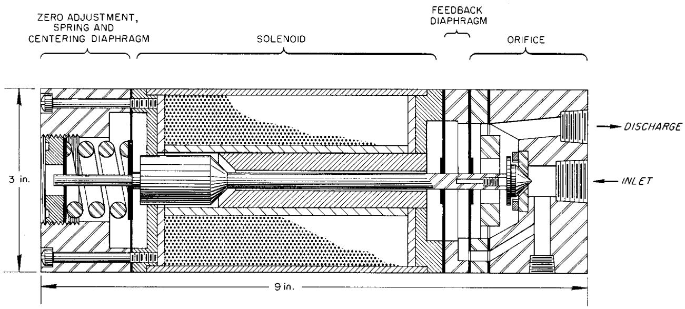  
Fig. 4.5.5. Electrohydraulic Transducer for Control of Water Pressure in TSR-II Control Mechanism.

the lower limit, the shims will be inserted at the slower speed until the regulating grid withdraws to the intermediate limit switch. This action takes place only if the period is more positive than -100 sec.

There are two normal conditions which will cause the regulating grid to drive to the lower limit during operation. One will occur when, for some reason, such as the reduction of the water inlet temperature, the reactivity is increasing and the regulating grid drives to the lower limit while holding a constant power level. Under this condition, since the reactor period is infinite, the shims would be expected to drive in to re-establish the regulating grid in the center of its stroke. The other condition will occur when a demand for reduced power causes the regulating grid to drive to the lower limit. In the latter case, however, the period is likely to be shorter than $-100$ sec, and automatic shim insertion will be inhibited. In this condition a substantial shim insertion would drive the reactor far subcritical, and upon reaching the desired lower power level the regulating grid would be driven to the upper limit with the reactor still subcritical. The 100-sec period interlock eliminates the need for reshiming after a reduction in power level.

Fission Chamber Drive. - An automatic mode of operation is provided for the fission chamber which, at request, will hold the counting rate between 2 counts/sec and $10^{5}$ counts/sec. This mode of operation relieves the operator of the task of keeping the counting channel on scale and contributes to an orderly operating system. In addition, since the pulse preamplifier is contained in the same can as that used to contain the fission chamber and sees the same flux, the automatic mode of operation ensures that the electronic components will not be unduly irradiated. When the automatic mode of operation has not been requested, an annunciator warns the operator when the counting rate has exceeded $10^{5}$ counts/sec.

Test and Automatic Rundown Inhibit (TARDI). - TARDI permits periodic testing of shim drive mechanism performance without the encumbrance of certain operating interlocks. It may be used only so long as all seat switches indicate that the grids are seated, the shim pump pressure is zero, and the key switch is off.

Door Interlocks. - At the request of the operator, the front door interlock may be temporarily blocked to permit personnel to enter and leave the control house at shift change without shutting down the reactor. Permission to bypass the front door interlock constitutes a mode of operation and is

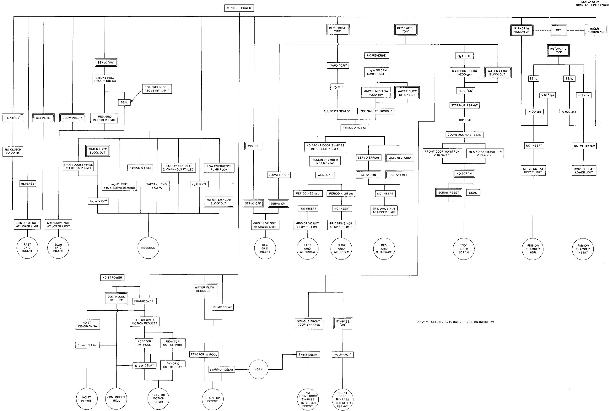  
Fig. 4.5.6. Block Diagram of the TSR-II.

described as follows: When the log $N$ indicates that the power level is below 500 w the operator may request that the front door interlock be bypassed. While the bypass is in effect the following conditions prevail:

1. Personnel may enter and leave the front door without producing a scream.   
2. No shim grid withdrawal is permissible.   
3. The servo will remain in operation to counteract reactivity changes resulting from such things as reduction in the temperature of the cooling water.   
4. Any rise in power above 500 w will produce a reverse.

At the request of the operator, normal operating conditions may be restored. Before permission is granted to withdraw shims, however, the horn which is always sounded prior to reactor operation at the TSF must again be sounded for 3 min to warn personnel who may have been left outside the building.

Water System Interlocks. - There are two modes of operation of the reactor from the standpoint of the water system: the power mode and the test mode. With the power mode the reactor is operated at or near full power, and the flow is varied between 200 and $1000\mathrm{gpm}$ over the power range. With the test mode the reactor is operated at a power level sufficiently low to prevent overheating with no water flow. This is brought about by a test switch designated throughout the block diagram as "water test." Prior to a startup for a power run the main pump must be operated at the full flow of $1000\mathrm{gpm}$ for 3 min in order to produce sufficient mixing of the water to remove any severe temperature gradients from the system. This pump delay may run concurrently with the startup delay. Failure of the main pump will produce a scram rather than a reverse. The more drastic measure is preferred in order to lessen the afterheat problem.

The small volume of water in the reactor vessel and the exposure of the vessel and interconnecting hoses to the cold weather bring about special requirements with respect to afterheat and winter freezes. A highly reliable turbine pump which will deliver between 10 and $40\mathrm{gpm}$ to the reactor through the main pump lines will be operated 24 hr a day. Since this emergency pump must remove the afterheat in the event of main pump failure, it will be operated from an a-c to d-c converter and a bank of 60 station batteries capable of running the pump at full delivery for 8 hr or more. If a failure of the emergency pump should occur, the reactor will be

reversed to shutdown level. An electric heater in the emergency pump line will maintain a safe temperature when the system is unattended in the winter.

# Reactor Controls Cubicle

The reactor controls cubicle has been delivered and set up at the Tower Shielding Facility. The cubicle, which is 14 ft long, 7 ft 5 in. high, and 7 ft deep, is shown in Fig. 4.5.7. It is designed for unattended operation and is patterned after the cubicles for the Bulk Shielding Reactor and the Pool Critical Facility. The cubicle will be partially wired and then moved into its final position when the control console and vertical board for the Tower Shielding Reactor I are removed.

# HEAT REMOVAL EQUIPMENT

The portion of the 5-Mw heat removal system which is being constructed by an outside contractor should be completed in October. The only holdup at present is the delivery of one pump to the contractor. The system will be subjected to a hydrostatic test with the 6-in. lines to the tower legs capped off. A flow test of the system will be made by short circuiting the 6-in. pipes to the tower legs with a 6-in. hose.

In order to provide for the event that the studies by Gambill and Hoffman (see below) indicate that a Reynolds number of 7000 is necessary, an investigation is being made of the cost of raising the cooling water flow rate or raising the system static pressure or both to achieve the desired Reynolds number for turbulent flow.

# NUCLEAR CALCULATIONS

# M. E. LaVerne

Nuclear calculations which were performed for the TSR-II with the 3G3R Oracle code were reported previously. A multigroup, multiregion reactor code has now become available, and an adaptation of this code to a Goertzel-Selengut type has been used to perform a number of further calculations for the TSR-II, as discussed below.

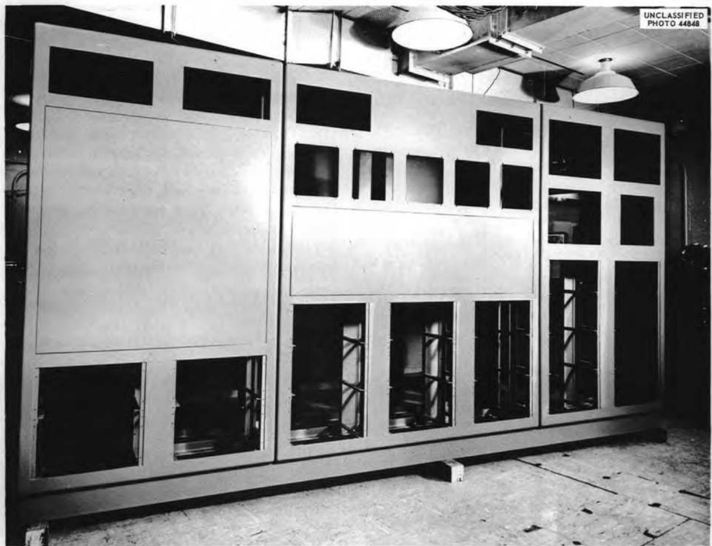  
Fig. 4.5.7. TSR-II Reactor Controls Cubicle

# Comparison of Calculations and Critical Experiments

In order to confirm the validity of this calculational method and also to determine the effect of a lead-boral layer outside the fuel region, calculations were first performed for three critical experiments which were set up in finite slab geometry as shown in Fig. 4.5.8 (the figure shows only one-half of each configuration). Each fuel region consisted of a 4 by 6 array of standard BSR fuel elements, and boral sheets simulated the control plates. Clean, or nearly clean, experiments were obtained for configurations A and B by heating the water in the assembly tank and simultaneously

withdrawing a cadmium rod to maintain the assembly critical. On configuration B, a portion of the rod (2.75¢ worth) was still inserted when the rod travel was used up.

Configuration C was set up to evaluate the effect on the reactivity of removing the lead and boral layers. Because estimates of excess reactivity at room temperature for both configurations B and C were available from rod calibrations, configuration C was not heated to attain the "clean" state.

A comparison between the results of experiments and the calculations is presented in Table 4.5.1. The error for the three cases averages about $1\%$ . The experimental $k$ is the multiplication constant that would have been observed with the rod completely withdrawn, i.e., in the "clean" condition. Previously computed temperature coefficients were

Table 4.5.1. Comparison Between Calculated and Experimental Values of Multiplication Constant   

<table><tr><td rowspan="2">Configuration</td><td rowspan="2">Water Temperature (°F)</td><td colspan="2">Multiplication Constant, k</td><td colspan="2">Correction to 
Calculated k</td><td rowspan="2">Corrected 
Calculated k</td><td rowspan="2">Error (%)</td></tr><tr><td>Experimental</td><td>Calculated</td><td>Density</td><td>Thermal 
Base</td></tr><tr><td>A</td><td>108</td><td>1.0000</td><td>0.9897</td><td></td><td>0.0014</td><td>0.9911</td><td>0.9</td></tr><tr><td>B</td><td>118.9</td><td>1.0002</td><td>0.9872</td><td></td><td>0.0018</td><td>0.9890</td><td>1.1</td></tr><tr><td>C</td><td>73.4</td><td>1.0081</td><td>0.9921</td><td>0.0035</td><td>0.0002</td><td>0.9958</td><td>1.2</td></tr></table>

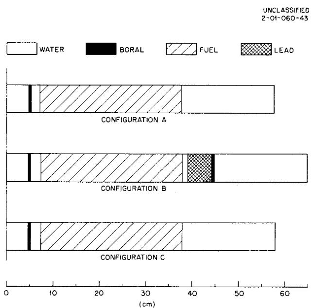  
Fig. 4.5.8. Configuration for TSR-II Critical Experiments in Slab Geometry.

used to correct the calculated $k$ for differences between the experimental and the calculational thermal base and density.

# Reactivity Coefficients

Void coefficients for the core were computed from the change in the multiplication constant produced by deleting the water (but not the aluminum or uranium) from thin spherical annuli in the core. The results are shown as the points in Fig. 4.5.9. A "reasonable" curve was drawn through the calculated points and volume-averaged to obtain a mean void coefficient of $-2.15 \times 10^{-4} \Delta k / k$ (in per cent)

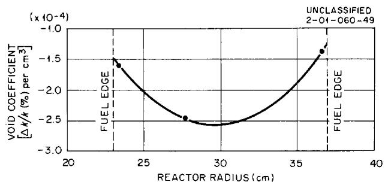  
Fig. 4.5.9. Core Void Coefficient as a Function of the Reactor Radius.

per cubic centimeter of void. This is to be compared with a value of $-3.5 \times 10^{-4}$ which was reported for SPERT I.10

Temperature coefficients were calculated both for density and for thermal base changes. The net temperature coefficient was $-0.77 \times 10^{-2} \Delta k / k$ (in per cent) per $^\circ C$ , which can be compared with a value of $-0.9 \times 10^{-2}$ for SPERT I.

For various reasons (for example, cumulative tolerances in fabrication), core boundaries may deviate from the desired locations. An estimate of the effect of such deviations on the reactivity was made by deleting uranium from a thin spherical annulus at the outer edge of the core while the total amount of uranium was kept constant. The radial coefficient was found to be $0.23\Delta k / k$ (in per cent) per centimeter.

These reactivity coefficients are summarized in Table 4.5.2, in which a mass coefficient is also given.

Table 4.5.2. Summary of Computed Reactivity Coefficients for the TSR-II   

<table><tr><td>Average void coefficient for core, Δk/k (in per cent) per cubic centimeter of void</td><td>-2.15 × 10-4</td></tr><tr><td>Temperature coefficients, Δk/k (in per cent) per °C</td><td></td></tr><tr><td>Density coefficient</td><td>-1.39 × 10-2</td></tr><tr><td>Thermal base coefficient</td><td>+0.62 × 10-2</td></tr><tr><td>Net coefficient</td><td>-0.77 × 10-2</td></tr><tr><td>Radial coefficient, Δk/k (in per cent) per centimeter</td><td>+0.23</td></tr><tr><td>Mass coefficient, (Δk/k)/(Δm/m)</td><td>0.30</td></tr></table>

# Control "Shell" Effectiveness

The control grid effectiveness was recalculated as a function of the separation distance from the fuel, with the control grids being treated simply as thin regions or shells. The results are shown in Fig. 4.5.10. The shape of the curve is in good agreement with the results of the earlier 3G3R Oracle calculations,[11] although it is a factor of 5.2 higher. The apparent discrepancy is due primarily to the difference in absorption cross sections used for the shells. The experimental data shown in the figure are from the Bulk Shielding Reactor test with eight solid stainless steel plates, which was described previously.[11] The BSR data are normalized to the calculated values at the first experimental point.

# CONTROL GRID EFFECTIVENESS

The nuclear model used for the calculations described above is a complete shell which is assumed to move uniformly away from the fuel region, and therefore it does not duplicate the control grids which will be used in the TSR-II. The actual control and safety grids will cover less than one-half of the core-reflector interface, and, because of the fixed radius of the plates, the edges of the plates

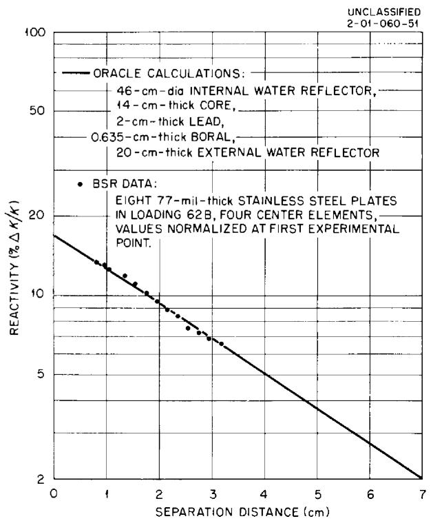  
Fig. 4.5.10. Calculated Effect of a Boral Shell in the Internal Water Reflector on the Reactivity as a Function of the Distance Between the Shell and the Core: Comparison with BSR Data.

will move away from the core at a slower rate than will the center of the plate.

In order to determine the worth of an actual grid, the grid area was divided into rings with their common center at the center of the grid, and the worth of each ring was determined as a function of its normal distance from the core. The total worth of the grid was then determined by summing the worth of all areas of each grid for a given separation distance between the core and the center of the plate. The results are presented in Fig. 4.5.11. The Inconel-clad cadmium ribbons in the regulating grid and in the lower shim-safety grid will be spaced $\frac{1}{16}$ in. apart to permit water to flow through the internal reflector region; therefore, these plates are worth only one-half as much in reactivity as the remaining shim-safety grids.

After the control grid worth was determined, the thermal-neutron flux distribution throughout the reactor (see Fig. 4.5.12) and the source distribution in the core (see Fig. 4.5.13) were determined from the multigroup calculations with the control grid positioned for operation at $5\mathrm{Mw}$ .

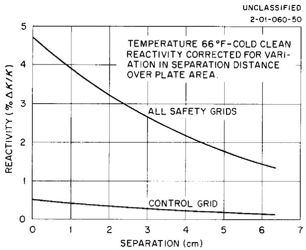  
Fig. 4.5.11. Reactivity Worth of the TSR-II Regulating and Shim-Safety Grids as a Function of Distance from the Fuel.

# SELECTION OF CRITICAL MASS FOR TSR-II

Nuclear calculations were performed previously with the 3G3R code to aid in establishing the critical mass of the TSR-II. When the effects of the control shells, the external shield, xenon buildup, fuel burnup, and possible errors in fuel loading were considered, the calculated critical mass for the reactor was $8.2\mathrm{kg}$ of $\mathsf{U}^{235}$ (see ref 1). Since the calculations and critical experiments reported above have indicated that the TSR-II lead-boral shield does not measurably change the critical mass, additional critical mass calculations were performed with the multigroup, multiregion code for a clean, cold, water-reflected, spherical annulus with the TSR-II core dimensions and volume fractions. Sufficient $\mathsf{U}^{235}$ was then added to increase the reactivity by $6.8\Delta k / k$ (in per cent). The results gave a loading of $8.1\mathrm{kg}$ of $\mathsf{U}^{235}$ for the TSR-II core, and this was set as the critical mass.

UNCLASSIFIED

2-01-060-45

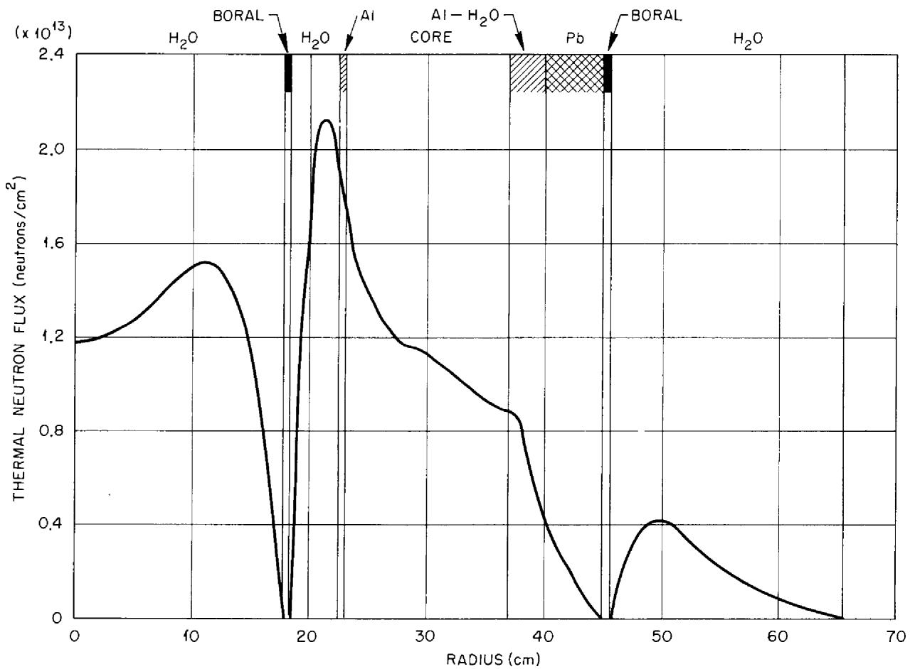  
Fig. 4.5.12. Thermal-Neutron Flux in the TSR-II as a Function of Radius: 5-Mw Power Level.

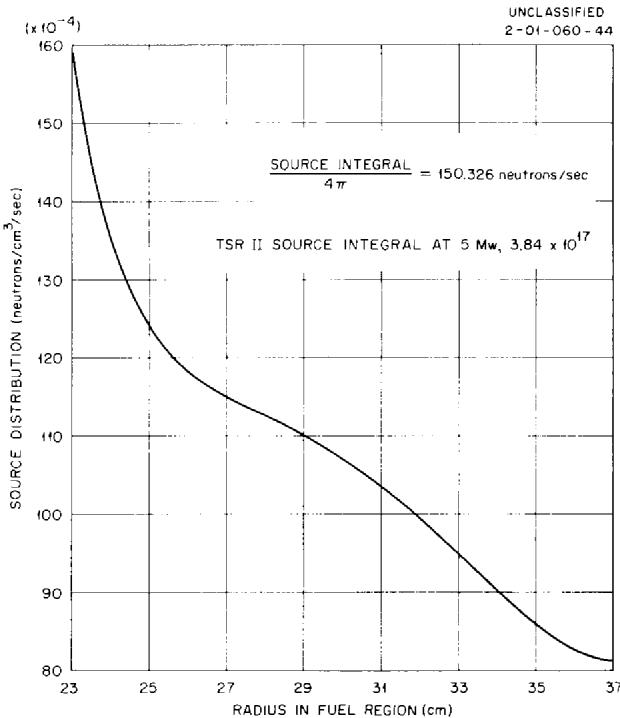  
Fig. 4.5.13. Source Distribution in the TSR-II Fuel Region as a Function of Radius: Boral Shell 4 cm from the Fuel.

Of the $6.8\%$ increase in the reactivity, $1.5\%$ is to cover the worth of the control grids in the fully withdrawn position, $0.3\%$ is allowed for structural material in the core region, $1.4\%$ is to cover the worth of fixed neutron absorber plates in the internal reflector region, $2.0\%$ is to allow for an error in the calculations, and $1.6\%$ is the amount that is controlled by the control grids.

The $1.6\%$ that is controlled by the grids represents approximately one-half the reactivity worth of the shim-safety grids and covers the following: $0.6\%$ to counteract the negative temperature coefficient of reactivity from 40 to $180^{\circ}\mathrm{F}$ , $0.3\%$ excess reactivity necessary to permit servo control, $0.6\%$ to counteract xenon buildup for 8 hr of operation at 5 Mw, and $0.1\%$ for short-time burnup of $\mathsf{U}^{235}$ .

The $0.3\%$ allowed for the structural material in the core region was determined by calculating the reactivity change caused by deleting the $\mathsf{U}^{235}$ from shells in the core region. An integral value was obtained by summing, as a function of radius, the areas of these shells which were intersected by the cylindrical support members.

The $1.4\%$ is to cover the fixed neutron absorbing plates which will be mounted in the internal reflector region near areas of the core-reflector interface not covered by the movable plates. These plates may be adjusted when the reactor is unloaded so that some shimming may be done in the initial loading, as long as sufficient excess reactivity is left to provide $0.8\%$ for $\mathsf{U}^{235}$ burnup.

A $2.0\%$ excess was allowed for calculational errors because the comparison of the calculation with critical experiments showed an average error of this amount.

The TSR-II elements (see Fig. 4.5.14) have been fabricated to contain the $8.1\mathrm{kg}$ of $\mathsf{U}^{235}$ established as reported above. However, since the geometry of the core permits only a limited adjustment of excess reactivity by control plates and no means of adding excess reactivity by the insertion of additional fuel elements, the fuel elements have been assembled in a temporary fashion so that the core loading can be altered by changing a limited number of fuel plates if a critical experiment should indicate that it is necessary. Such a critical experiment will be performed at the Critical Experiments Facility. When the fuel elements are assembled in their final form the worth of the control plates will be determined and some of the reactivity coefficients will be measured.

# CALCULATION OF HEATING IN THE FUEL PLATES

A hand calculation was performed to estimate the heating per fuel plate in each element. The source distribution given in Fig. 4.5.13 was used to determine the power distribution in each fuel plate as a function of the length. The power generation for some of the plates in the central fuel elements is shown in Fig. 4.5.15 and for the annular elements in Fig. 4.5.16. There are twelve annular elements and eight central elements. The total power per fuel plate was found by integrating the area under the distribution plots for each fuel plate. The results are plotted as a function of the fuel plate number for the central fuel elements in Fig. 4.5.17 and for the annular fuel elements in Fig. 4.5.18. These values will be used in the flow distribution studies to determine the required flow per fuel channel (see below).

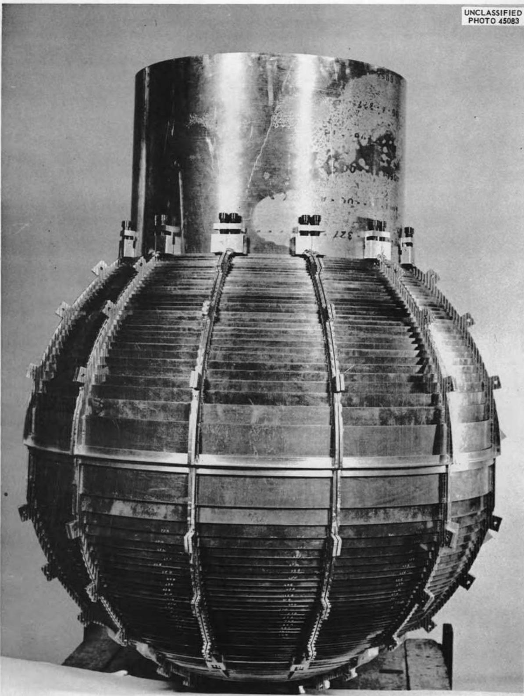  
Fig. 4.5.14. Photo of TSR-II Fuel Elements.

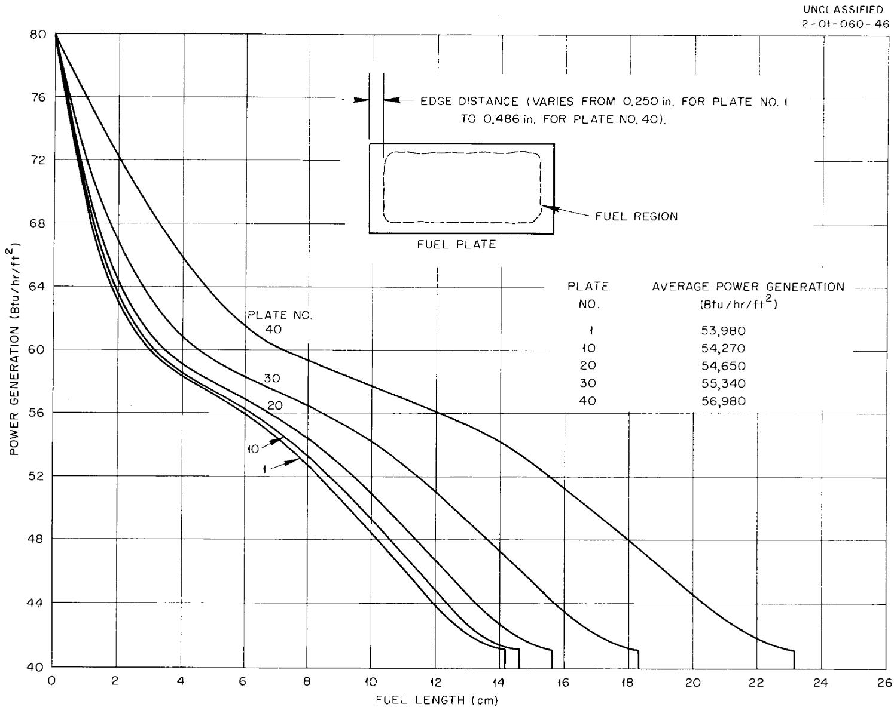  
Fig. 4.5.15. Power Generation in the Fuel Plates of a Central Fuel Element as a Function of the Distance from the Inside Edge of the Fuel.

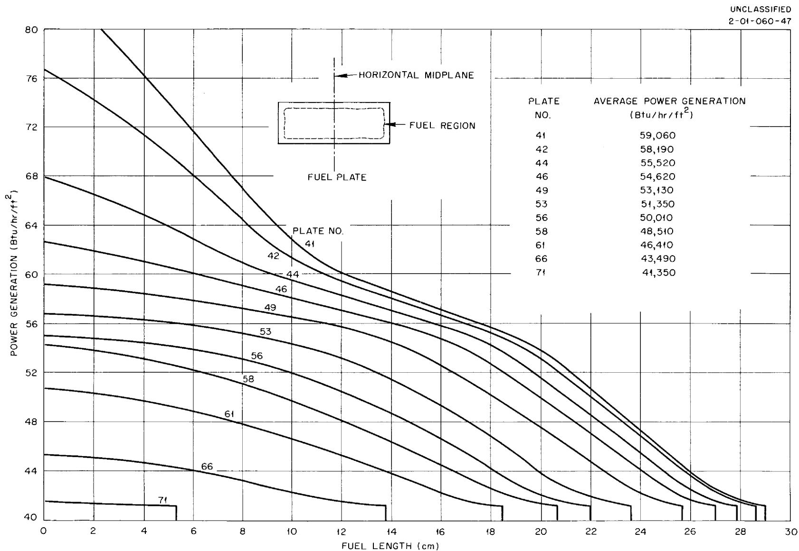  
Fig. 4.5.16. Power Generation in the Fuel Plates of an Annular Fuel Element as a Function of the Distance from the Horizontal Midplane to the Edge of the Fuel.

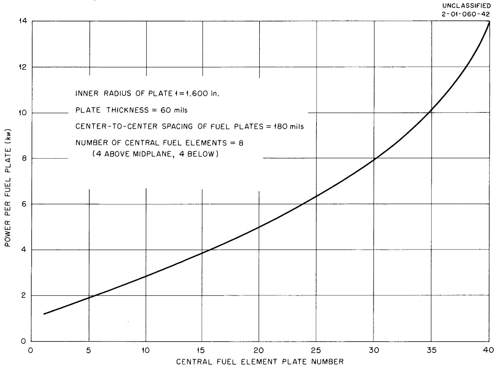  
Fig. 4.5.17. Power Generation in the Fuel Plates of a Central Fuel Element as a Function of the Fuel Plate Number.

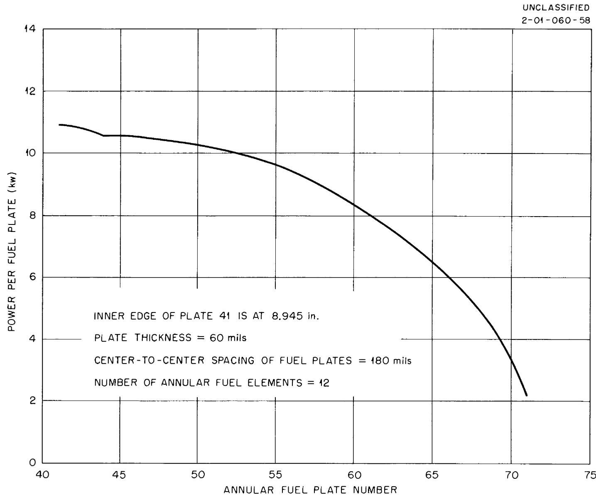  
Fig. 4.5.18. Power Generation in the Fuel Plates of an Annular Fuel Element as a Function of the Fuel Plate Number.

# FLOW DISTRIBUTION STUDIES

# Flow Studies of Central Fuel Elements

The hydraulic flow test stand which has been assembled to test the control mechanisms under 1000-gpm flow conditions is shown in Fig. 4.5.19, and the complete piping arrangement and holdup tank is shown in Fig. 4.5.20. This test stand will also be used to study the flow distribution in the central fuel elements and in the internal reflector region. The stand will be extended to accommodate not only the central fuel elements but also the lead-and-water shield above the core region.

# Flow Studies of Annular Fuel Elements

W. R. Gambill 12 H. W. Hoffman 12

The full-scale, quarter-sphere model constructed for study of the flow features of the annular fuel elements in the TSR-II core is shown in two stages of assembly in Figs. 4.5.21 and 4.5.22. Figure 4.5.21 shows the containment fixture, the ends of an inner fuel plate assembly, and the separator plate. In Fig. 4.5.22 the second-pass "orange slices," or outside fuel plates, have been placed in position and covered with a Lucite shell and backup cage. The groove in the head-end plate (shown in the left lower corner of Fig. 4.5.22) receives a pass rib which separates inlet and exit water flows. A movable mockup of the control plate assembly is located in the first pass cavity separating the two inner fuel element sections. The entire model is fabricated from aluminum. The separation between the inner surface of the Lucite shell and the outer circumference of the outside fuel plates is approximately 0.5 in.

The static pressure drop across the full length of every other flow channel is measured with manometers connected to pressure taps located at channel inlets and exits. Taps for the outer (second.pass) flow channels are visible in Fig. 4.5.21. The manometer fluid is a $\mathrm{CCl}_4\cdot \mathrm{l}_2$ solution.

The flow model, horizontal for the present tests, will later be placed in a vertical position. The flow rate is measured with a calibrated orifice and a differential pressure (DP) cell, the nozzle inlet and exit pressure with Bourdon-type gages, and the water temperature with a standard Weston pipeline thermometer. The water temperature may be

varied from 58 to $102^{\circ}\mathrm{F}$ with a steam-heated heat exchanger. Tests to date have been made at a constant flow rate of $250\mathrm{gpm}$ .

The measured static pressure drops for the model in the "as-received" state are shown in Fig. 4.5.23. Variation of control plate position had very little effect on the pressure drops for the second-pass flow channels, as was expected; since all the first-pass flow must reverse through the 0.5-in. gap around the separator plate.

Extreme radial asymmetry of flow is evident. A very large portion of the first-pass pressure drop is apparently due to flow complications in the central control cavity. It is probable that some sort of coupled vortex flow pattern, induced by the geometry and the control assembly mockup, exists in the central cavity.

In the outer region of the core it was found that most of the water entered the first seven channels and that flow in the remaining outer-region channels was either negligible or slightly reversed. Visual observation of air bubbles, injected upstream of the first pass, confirmed the right portion of Fig. 4.5.23. Thus, it was observed that the bubbles streamed through the first few channels but were in reverse flow in the outermost channels.

Velocities have been calculated from the pressure-drop data of Fig. 4.5.23. These are relatively uninformative for the first pass because of the large extraneous flow resistance associated with the central cavity. For the uninterrupted channels of the second pass, however, the results indicating velocities from $-2$ to $+11$ ft/sec are considered to be valid. Calculations were based on the recent parallel-plate relations given by Rothfus et al.,13 which indicate a Reynolds number of $\sim 7000$ as the upper extension of the transition region or lowest level of fully established turbulence.

Preliminary calculations indicate that the core hydrodynamics will be more of a problem than the heat transfer as such. If velocities are sufficient for full turbulence to exist, fuel element surface temperatures will not exceed saturation temperatures even at low static pressure levels. To maintain full turbulence in all channels, however, a larger total flow rate may be required. For a Reynolds number of 7000 in each first-pass flow channel, a

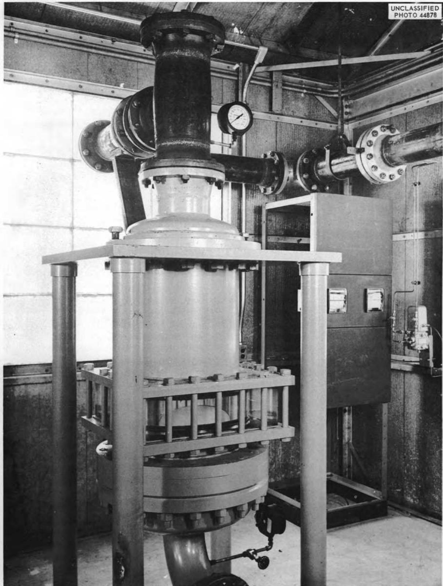  
Fig. 4.5.19. Hydraulic Flow Test Unit.

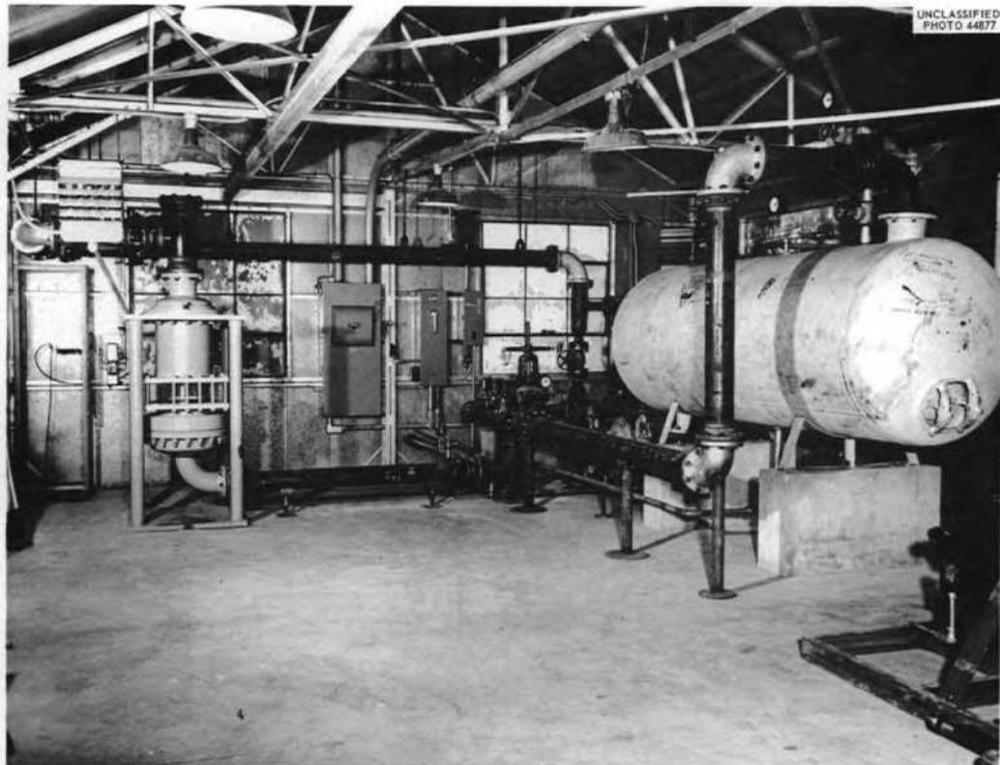

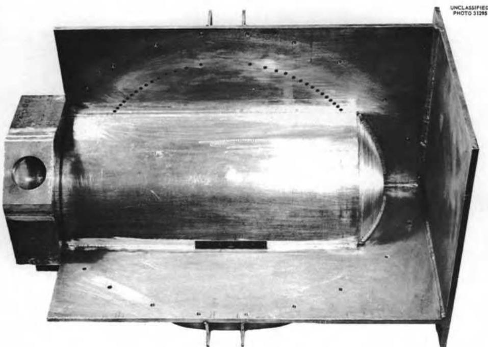  
Fig. 4.5.20. Hydraulic Flow Test Unit and Piping Arrangement.   
Fig. 4.5.21. Full-Scale Quarter-Sphere Model for Flow Test Studies of Annular Fuel Elements (Before Installation of Outer Pass).

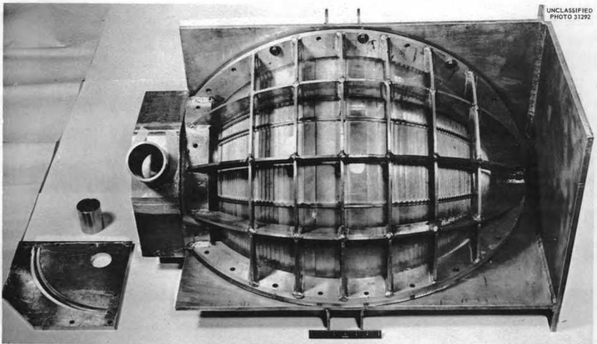  
Fig. 4.5.22. Full-Scale Quarter-Sphere Model for Flow Test Studies of Annular Fuel Elements (Outer Pass and Plexiglas Shell Installed).

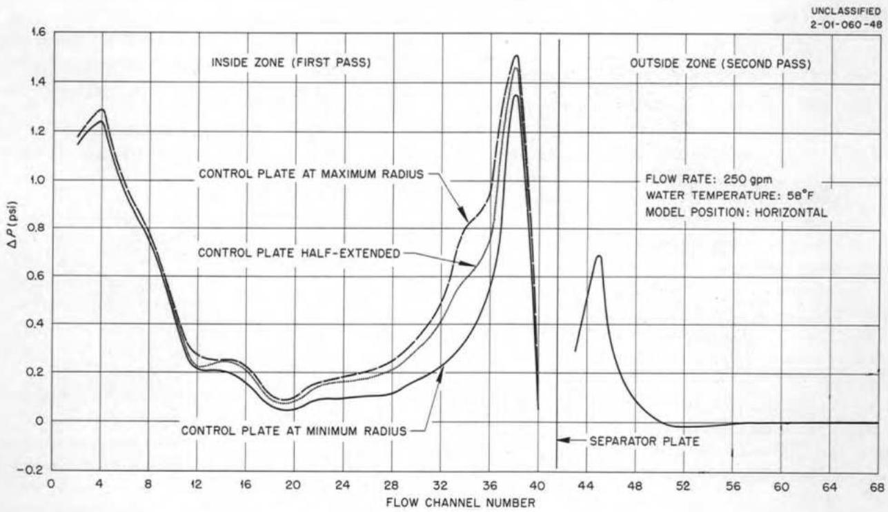  
Fig. 4.5.23. Radial Variation of Pressure Drop in the Fuel Element Flow Test.

total flow of 910 gpm is necessary; for the outer region, a flow of 1380 gpm is required. These flow rates are based on an equivalent diameter that is equal to twice the water gap between the plates and an evaluation of viscosity at mean pass temperatures (131°F for the first pass and 148°F for the second pass). The fuel element surface-to-centerline temperature rise appears to be negligible for the worst operating condition.

The next test will be made with hot water and with sealing strips around the equator of the outside region to stop a small bypass stream observed earlier. Later tests will involve placing flow resistances (perforated plates or screens) in the inlet ends of the smaller-radius outer-region flow channels. It is hoped that a redistribution of flow-satisfying heat-transfer requirements can be attained in this fashion. Flow redistribution in the first pass is potentially a considerably more difficult problem, and studies of first-pass flow have barely begun.

A flow test in which cold water will pass through a single channel of an outside fuel-element section is being prepared. The flow rate and static pressure drop will be measured, and a calculated friction factor vs Reynolds number plot should reveal the extent of the transition region for the particular entry conditions and curved fuel plates of the TSR-II reactor.

# REACTOR CORE KINETIC STUDIES

The results of the initial kinetic studies of the reactor core, which were made on the ORNL Reactor Controls Analog Facility,[14] are presented here without analysis. The first two cases were run to determine how well the control mechanism could protect the reactor without the inherent safety features of a heterogeneous reactor. Three other cases were run to partially investigate the self-limiting features of the reactor based on the temperature coefficient of reactivity.

With the reactor system simulator operating at an initial power of 5 Mw and in a prompt critical condition, excess reactivity was added and the simulator delayed neutron circuits were closed. The resulting power excursion was recorded and the safety rods were allowed to drop when a level of 7.5 Mw was reached. Concurrent with the reactor power

excursion the mean temperature of the exit fuel section was recorded. Both the power excursion data and the mean temperature are plotted on Fig. 4.5.24a. The net negative temperature coefficient of the reactor was disconnected; hence no limiting effects of temperature coefficient were present. For purposes of comparison, the time vs reactivity profile of the safety grids is plotted on the same figure (see Fig. 4.5.24b). The same type of information for an initial power of $5\mathrm{Mw}$ and a level trip at $6\mathrm{Mw}$ is presented in Fig. 4.5.25. The safety grid profile shows that the insertion time for the grids was longer in this case.

With the reactor operating at an initial power of 0.5 Mw and with the net temperature coefficient of the reactor "active," the water temperature leaving the air cooler was reduced from 145.8 to $32^{\circ}\mathrm{F}$ . (There is an approximately 130-sec delay time before the water reaches the reactor.) The resultant power excursion and system temperature changes are plotted as functions of time in Fig. 4.5.26. The value which was used for the temperature coefficient of reactivity $(\Delta k / k)$ was $-6.5\%$ . Later calculations and critical experiments show the value to be near that of the BSF (see above). These cases will be re-run. Figure 4.5.27 presents the same type of data for an initial power of 5 Mw.

With the reactor operating at $5\mathrm{Mw}$ , an abrupt stop in cooling water flow was also simulated. The resulting reactor power and system temperature changes are plotted in Fig. 4.5.28.

# SAFETY SYSTEM MEASUREMENTS

J. E. Marks

The evaluation of the TSR-II Safety System was based upon a value of delay time and a time function of control plate position that were determined experimentally with a test assembly incorporating the best designs of the proposed system components. The measuring techniques described below were considered capable of yielding the accuracy required for a reliable reactor analysis.

The test assembly included a simulated sigma bus circuit, a standard magnet amplifier, an electrohydraulic transducer, and a control mechanism with connections between these components similar to those expected in the final reactor assembly. A differential transformer type of linear motion transducer was mechanically connected to the control plate to translate the position of the plate into a

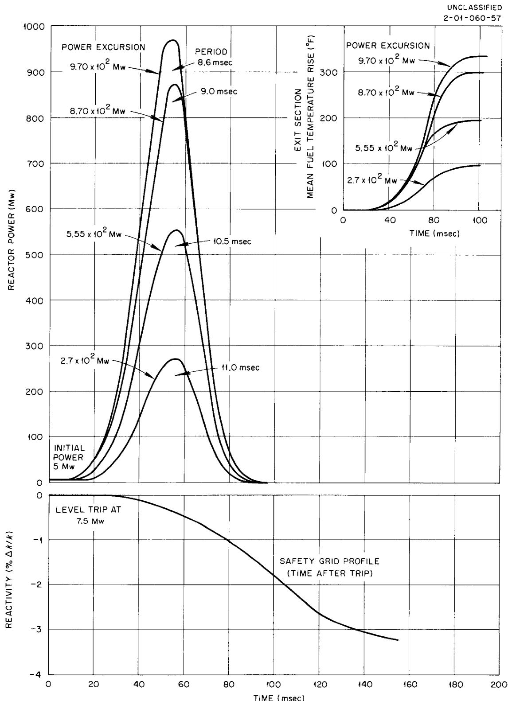  
Fig. 4.5.24. (a) Reactor Power Level and Fuel Temperature Rise as a Function of Time After Insertion of Various Amounts of Positive Excess Reactivity with Power Overshoot Being Limited Only by Safety Grid Insertion After.TSR-II Reaches 7.5 Mev. (b) Rate of Reactivity Insertion by Safety Grids as a Function of Time After Scram.

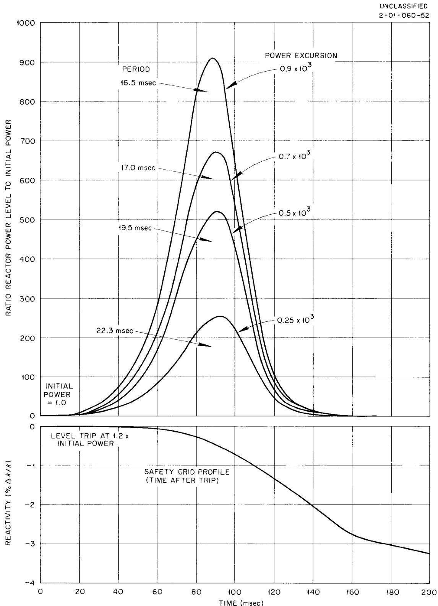  
Fig. 4.5.25. (a) Ratio of Power Level to Initial Power as a Function of Time After Insertion of Various Amounts of Positive Excess Reactivity with Power Overshoot Being Limited Only by Safety Grid Insertion After TSR-II Reaches 6 Mw. (b) Rate of Reactivity Insertion by Safety Grids as a Function of Time After Scram.

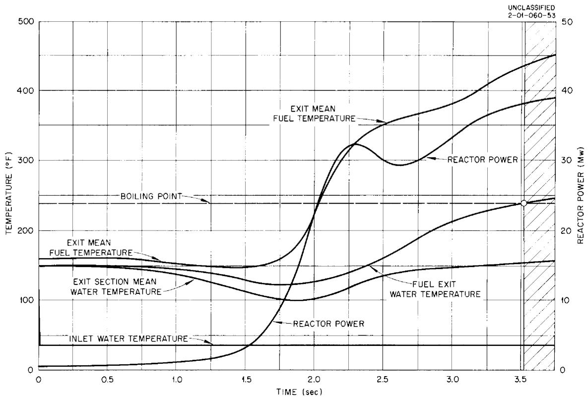

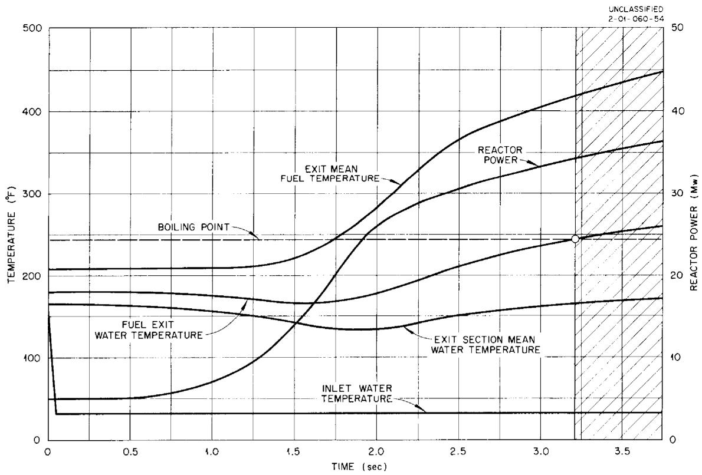  
Fig. 4.5.26. Reactor Power and Fuel Temperature as a Function of Time After the Initial Reduction of the Inlet Water Temperature from 145.8 to $32^{\circ}$ F. Reactor power initially at 0.5 Mw.   
Fig. 4.5.27. Reactor Power and Fuel Temperature as a Function of Time After the Initial Reduction of the Inlet Water Temperature from 145.8 to $32^{\circ}$ F. Reactor power initially at 5 Mw.

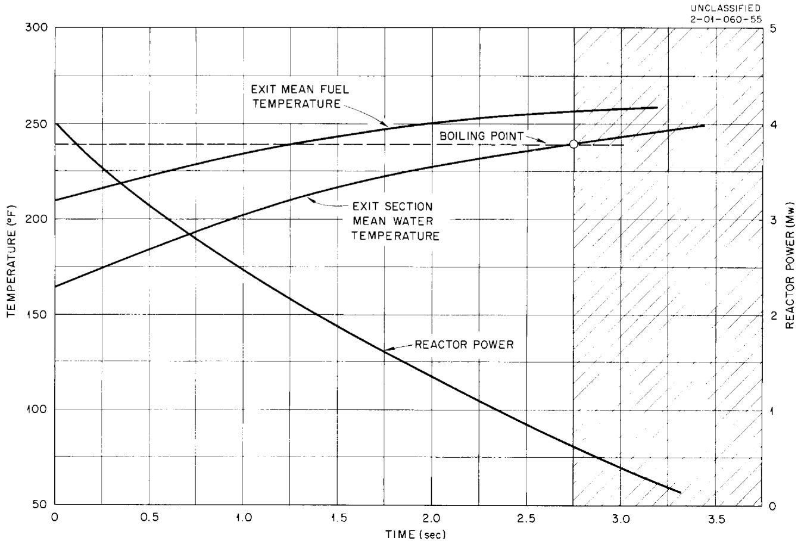  
Fig. 4.5.28. Reactor Power and Exit Section Mean Fuel and Mean Water Temperature as a Function of Time After Loss of Coolant Water Flow. Reactor initially at 5 Mw.

3000-cps differential voltage. This voltage was applied to a cathode-ray oscilloscope with a 200-msec sweep period initiated by the same change in sigma bus voltage as that which initiated the scram. The plot of position vs time that resulted was calibrated in tenths of an inch between the limits of travel of the control plate. The plate was considered to have started and stopped moving when the slope of the curve left and returned to zero.

The delay time was measured by using the change of sigma bus potential that initiated the scram to simultaneously trigger the sweep of the oscilloscope. The length of sweep from the point it began to the first discontinuity was taken as an indication of the "dead" time between initiation of a scram signal and the first perceptible motion of the control plate.

# SHIELD DESIGNS

The design criteria for the beam shield which will be used initially with the TSR-II were that (1) on a

rem basis and with an rbe of 10 for fast neutrons, there was to be an equal number of gamma rays and fast neutrons at the reactor shield surface, and (2) the background dose at the crew compartment from the beam shield 64 ft away was to be a factor of 50 to 100 less than that produced from a beam at right angles to the reactor-crew compartment axis. With these criteria and a gamma-ray shield of 50-50 volume per cent lead and water, the following shield dimensions were obtained. The lead-and-water gamma-ray shield should be 43 cm thick with an inner radius of 48 cm. The water neutron shield should be 81 cm thick, which gives an outer shield radius of 172 cm. Thus, the shield will contain 33,500 lb of lead and 42,900 lb of water. The possibility of using in-raschig rings with a in-dia central opening in the lead-and-water

gamma-ray shield is being investigated. The beam holes will be stepped halfway through the shield, with the outer cylinder 15 in. in diameter and the inner cylinder 10 in. in diameter. The Laboratory is proceeding with the design of this shield with the additional criterion that it must be self-supporting when it is placed on the ground.

A second high-performance shield for the TSR-II is being designed by the Y-12 Engineering Department according to specifications set by Pratt & Whitney Aircraft. The shield will utilize a depleted uranium gamma-ray shadow shield and a lithium hydride neutron shield. It will be fabricated in the Y-12 shops and is scheduled to be completed by May 1, 1959. The estimated cost of the shield is $330,000.

# INVESTIGATION OF STRESSES IN THE TOWER STRUCTURE FROM WATER AND ELECTRICAL LINES

An investigation has been made to determine whether water hoses and electrical cables can be suspended from the reactor support cables and tower legs without exceeding the allowable stresses in the tower structure.

The investigation was carried out for the following conditions:

1. weight of reactor $= 55$ tons,   
2. weight of crew compartment $= 30$ tons,   
3. 80-mph wind (20 psf),   
4. two water hoses, each 170 ft long and weighing 25 lb/ft,   
5. four electrical cables, each 170 ft long and weighing 2.75 lb/ft.

The reactor and crew compartment were considered to be in the plane of normal operation, that is, in the

vertical plane bisecting the longitudinal axis of the Tower Shielding Facility (east and west) and extending 200 ft from the ground level.

The water hoses and electrical cables were assumed to be symmetrically positioned from tower legs I and II. One end of each hose and each cable was considered to be attached at a distance of 123 ft 6 in. above the base of the leg and the other end was considered to be attached to the reactor support cables at a point 33 ft from the reactor.

The calculations were compared to a similar calculation made in connection with the original design of Knappen-Tippetts-Abbott-McCarthy (KTAM). The calculation by KTAM did not take into account items 4 and 5 above and showed the allowable stresses in the tower legs to be:

1. as given by KTAM, 19.90 ksi, and   
2. allowed by AISC code, 19.55 ksi.

The stresses in the tower legs determined in this calculation are:

1. before addition of water hoses and electrical cables, 18.072 ksi, and   
2. after addition of water hoses and electrical cables, 19.545 ksi.

In the calculation it was assumed that the electrical cables and water lines were rigidly fastened to the tower legs. In the present design all four electrical cables will be suspended from Leg I and one water hose will be suspended from Leg I and the other from Leg II. However, the suspension arrangement, which is shown in Fig. 4.5.29, eliminates the greater portion of the horizontal load in the tower legs by shifting it to the deadmen which now anchor the tower legs.

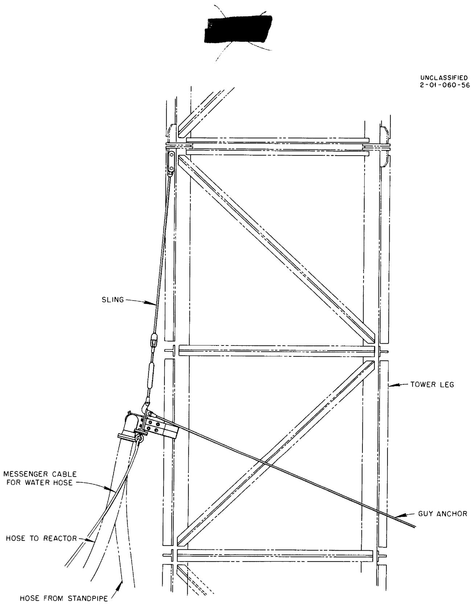  
Fig. 4.5.29. Tower Suspension Arrangement of Reactor Cooling Water Lines.

# INTERNAL DISTRIBUTION

I. J.W. Allen   
2. D. S: Billington   
3. F. F. Blankenship   
4. E. P. Blizzard   
5. W. F. Boudreau   
6. G.E. Boyd   
7. E. J. Breeding   
8. R. B. Briggs   
9. F. R. Bruce   
10. A. D. Callihan   
11. C. E. Center (K-25)   
12. R.A. Charpie   
13. C. E. Clifford   
14. J. H. Coobs   
15. W. B. Cottrell   
16. F. L. Culler   
17. D. R. Cuneo   
18. J.H.DeVan   
19. L. M. Doney   
20. D. A. Douglas   
21. L. B. Emlet (K-25)   
22. A. P. Fraas   
23. J.H.Frye   
24. W. T. Furgerson   
25. R. J. Gray   
26. B. L. Greenstreet   
27. W.R. Grimes   
28. A. G. Grindell   
29. E. Guth   
30. C. S. Harrill   
31. T. Hikido   
32. M. R. Hill   
33. E. E. Hoffman   
34. H. W. Hoffman   
35. A. Hollaender   
36. W. H. Jordan   
37. G.W. Keilholtz   
38. F. L. Keller   
39. J. J. Keyes   
40. R. S. Livingston   
41. R.N. Lyon

42. H. G. MacPherson   
43. F. C. Maienschein   
44. W. D. Manly   
45. E. R. Mann   
46. A. J. Miller   
47. K. Z. Morgan   
48. E. J. Murphy   
49. J. P. Murray (Y-12)   
50. M. L. Nelson   
51. G. J. Nessle   
52. L.G. Overholser   
53. P. Patriarca   
54. S. K. Penny   
55. A.M. Perry   
56. P. M. Reyling   
57. H.W.Savage   
58. A.W. Savolainen   
59. R. D. Schultheiss   
60. J. L. Scott   
61. E.D. Shipley   
62. A. Simon   
63. M. J. Skinner   
64. A. H. Snell   
65. E. Storto   
66. C. D. Susano   
67. J. A. Swartout   
68. D. B. Trauger   
69. D. K. Trubey   
70. G.M. Watson   
71. A. M. Weinberg   
72. J. C. White   
73. E. P. Wigner (consultant)   
74. G.C.Williams   
75. J. C. Wilson   
76. C. E. Winters   
77. W. Zobel   
80. ORNL - Y-12 Technical Library, Document Reference Section   
87. Laboratory Records Department   
88. Laboratory Records, ORNL R.C.   
91. Central Research Library

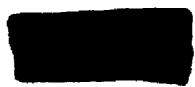

# EXTERNAL DISTRIBUTION

92-95. Air Force Ballistic Missile Division

96. AFPR, Boeing, Seattle   
97. AFPR, Boeing, Wichita   
98. AFPR, Douglas, Long Beach

99-101. AFPR, Douglas, Santa Monica

102-103. AFPR, Lockheed, Marietta

104. AFPR, North American, Canoga Park   
105. AFPR, North American, Downey   
106. AFPR, North American, Los Angeles

107-108. Air Force Special Weapons Center

109-110. Air Research and Development Command (RDZN)

111. Air Technical Intelligence Center   
112. Air University Library

113-115. ANP Project Office, Convair, Fort Worth

116. Albuquerque Operations Office   
117. Argonne National Laboratory   
118. Armed Forces Special Weapons Project, Sandia   
119. Armed Forces Special Weapons Project, Washington

120-121. Army Ballistic Missile Agency

122. Army Rocket and Guided Missile Agency   
123. Assistant Secretary of Defense, R&D (WSEG)   
124. Assistant Secretary of the Air Force, R&D

125-130. Atomic Energy Commission, Washington

131-133. Bettis Plant (WAPD)

134. Brookhaven National Laboratory   
135. Bureau of Aeronautics   
136. Bureau of Aeronautics General Representative   
137. BAR, Aerojet-General, Azusa   
138. BAR, Chance Vought, Dallas   
139. BAR, Convair, San Diego   
140. BAR, Goodyear Aircraft, Akron   
141. BAR, Grumman Aircraft, Bethpage   
142. BAR, Martin, Baltimore   
143. Bureau of Ships   
144. Bureau of Yards and Docks

145-146. Chicago Operations Office

147. Chicago Patent Group   
148. Curtiss-Wright, Quehanna   
149. Director of Naval Intelligence   
150. duPont Company, Aiken

151-158. General Electric Company (ANPD)

159-160. General Electric Company, Richland

161. Hartford Aircraft Reactors Area Office   
162. Idaho Test Division (LAROO)   
163. Jet Propulsion Laboratory   
164. Knolls Atomic Power Laboratory   
165. Lockland Aircraft Reactors Operations Office

166-167. Los Alamos Scientific Laboratory

168. Marquardt Aircraft Company   
169. National Advisory Committee for Aeronautics, Cleveland

170. National Advisory Committee for Aeronautics, Washington   
171. Naval Air Development Center   
172. Naval Air Material Center   
173. Naval Air Turbine Test Station   
174. Naval Research Laboratory   
175. New York Operations Office   
176. Oak Ridge Operations Office   
177. Office of Naval Research   
178. Office of the Chief of Naval Operations   
179. Patent Branch, Washington

180-181. Phillips Petroleum Company (NRTS)

182-185. Pratt and Whitney Aircraft Division

186. Sandia Corporation   
187. Sandia Corporation, Livermore

188-189. School of Aviation Medicine   
190. USAF Headquarters   
191-192. USAF Project RAND   
193. U.S. Naval Radiological Defense Laboratory   
194-195. University of California Radiation Laboratory, Livermore   
196-208. Wright Air Development Center   
209-233. Technical Information Service Extension   
234. Division of Research and Development, Atomic Energy Commission, Oak Ridge Operations

Reports previously issued in this series are as follows:

ORNL-528 Period Ending November 30, 1949

ORNL-629 Period Ending February 28, 1950

ORNL-768 Period Ending May 31, 1950

ORNL-858 Period Ending August 31, 1950

ORNL-919 Period Ending December 10, 1950

ANP-60 Period Ending March 10, 1951

ANP-65 Period Ending June 10, 1951

ORNL-1154 Period Ending September 10, 1951

ORNL-1170 Period Ending December 10, 1951

ORNL-1227 Period Ending March 10, 1952

ORNL-1294 Period Ending June 10, 1952

ORNL-1375 Period Ending September 10, 1952

ORNL-1439 Period Ending December 10, 1952

ORNL-1515 Period Ending March 10, 1953

ORNL-1556 Period Ending June 10, 1953

ORNL-1609 Period Ending September 10, 1953

ORNL-1649 Period Ending December 10, 1953

ORNL-1692 Period Ending March 10, 1954

ORNL-1729 Period Ending June 10, 1954

ORNL-1771 Period Ending September 10, 1954

ORNL-1816 Period Ending December 10, 1954

ORNL-1864 Period Ending March 10, 1955

ORNL-1896 Period Ending June 10, 1955

ORNL-1947 Period Ending September 10, 1955

ORNL-2012 Period Ending December 10, 1955

ORNL-2061 Period Ending March 10, 1956

ORNL-2106 Period Ending June 10, 1956

ORNL-2157 Period Ending September 10, 1956

ORNL-2221 Period Ending December 31, 1956

ORNL-2274 Period Ending March 31, 1957

ORNL-2340 Period Ending June 30, 1957

ORNL-2387 Period Ending September 30, 1957

ORNL-2440 Period Ending December 31, 1957

ORNL-2517 Period Ending March 31, 1958