ORNL-2605

Reactors - Power

${C}_{y.92}$

GAS COOLED, MOLTEN SALT HEAT EXCHANGER

DESIGN STUDY

R. E. MacPherson

CENTRAL RESEARCH LIBRARY

DOCUMENT COLLECTION

LIBRARY LOAN COPY

DO NOT TRANSFER TO ANOTHER PERSON

If you wish someone else to see this

document, send in name with document

and the library will arrange a loan.


OAK RIDGE NATIONAL LABORATORY

operated by

UNION CARBIDE CORPORATION

for the

U.S. ATOMIC ENERGY COMMISSION

# Printed in USA. Price 150 cents. Available from the

Office of Technical Services

U.S. Department of Commerce

Washington 25, D.C.

# LEGAL NOTICE

This report was prepared as an account of Government sponsored work. Neither the United States, nor the Commission, nor any person acting on behalf of the Commission:

A. Makes any warranty or representation, express or implied, with respect to the accuracy, completeness, or usefulness of the information contained in this report, or that the use of any information, apparatus, method, or process disclosed in this report may not infringe privately owned rights; or   
B. Assumes any liabilities with respect to the use of, or for damages resulting from the use of any information, apparatus, method, or process disclosed in this report.

As used in the above, "person acting on behalf of the Commission" includes any employee or contractor of the Commission to the extent that such employee or contractor prepares, handles or distributes, or provides access to, any information pursuant to his employment or contract with the Commission.

ORNL-2605

Contract No. W-7405-eng-26

Reactor Projects Division

GAS COOLED, MOLTEN SALT HEAT EXCHANGER - DESIGN STUDY

R. E. MacPherson

Date Issued

OCT 28 1958

Oak Ridge National Laboratory

Oak Ridge, Tennessee

operated by

Union Carbide Corporation

for the

U. S. Atomic Energy Commission

# CONTENTS

Page No.

Abstract 4

Introduction 5

Summary 6

Design Considerations 8

1. Heat Exchanger Configuration 8   
2. Finned Tubing 12   
3. Tubing Size 14   
4. General 16

Discussion 16

1. Countercurrent, Cross Flow Heat Exchangers 16   
2. Countercurrent Flow Heat Exchanger 24

Conclusions. 24

Method of Calculation 31

Nomenclature 38

Bibliography 40

# LIST OF FIGURES

Page No.

Fig. 1 - Annular Heat Exchanger Geometry 9   
Fig. 2 - Design Study Heat Exchanger Geometry. 10   
Fig. 3 - Annular Heat Exchanger Design Parameters. 11   
Fig. 4 - Tubing Size Optimization. 15   
Fig. 5 - Design Parameters for a Four-Pass Heat Exchanger Using Helium at 300 psig with an $850^{\circ}$ F Inlet Temperature 17   
Fig. 6 - Design Parameters for a Three-Pass Heat Exchanger Using Helium at 300 psig with an $850^{\circ}$ F Inlet Temperature 18   
Fig. 7 - Design Parameters for a Three-Pass Heat Exchanger Using Helium at 150 psig with an $850^{\circ}$ F Inlet Temperature 19   
Fig. 8 - Design Parameters for a Four-Pass Heat Exchanger Using Helium at 300 psig with a $700^{\circ}$ F Inlet Temperature 20   
Fig. 9 - Design Parameters for a Four-Pass Heat Exchanger Using Hydrogen at 300 psig with an $850^{\circ}\mathrm{F}$ Inlet Temperature 21   
Fig.10 - Design Parameters for a Four-Pass Heat Exchanger Using Steam at 300 psig with an $8500\mathrm{F}$ Inlet Temperature 22   
Fig.11 - Design Parameters for a Longitudinal Flow Heat Exchanger Using Helium at 300 psig with an $850^{\circ}$ F Inlet Temperature 25   
Fig.12 - Heat Exchanger Container Dimensions as a Function of Annual Operating Cost per Heat Exchanger 26   
Fig.13 - Annual Operating Cost per Heat Exchanger as a Function of Total Blower Power Investment 28   
Fig.14 - Effect of Varying Allowable Salt Pressure Drop and Uranium Enrichment on Annual Operating Cost per Heat Exchanger 29   
Fig.15 - Salt Volume in Return Bends of Serpentine Fuel Tubes for a Four-Pass Heat Exchanger. 37

# ABSTRACT

One of the major problems in the economic evaluation of the application of forced circulation, gas cooling to high temperature, molten salt power reactor systems is the definition of the required heat transfer equipment, its size and operating cost. A design study of the salt-to-gas heat ex-changers for such a gas-cooled system has recently been completed, and the results are reported.

Helium, hydrogen and steam are considered as coolants. The effects of varying heat exchanger tubing size, coolant inlet temperature, coolant pressure level, allowable salt pressure drop and uranium enrichment of the molten salt are demonstrated.

The relationship between heat exchanger dimensions, fuel inventory and blower power requirements is presented in graphical form for the most pertinent cases. Comparisons are made of annual operating costs and heat exchanger overall size as a function of coolant type and operating conditions.

Hydrogen is shown to be the most effective of the coolants considered, with steam and helium being roughly comparable. Assuming other conditions to be equal, helium can be made competitive with hydrogen by operating with a 50 - $60\%$ higher helium temperature gradient through the heat exchanger. Optimum heat exchanger geometries based on gas blower power costs and enriched fuel inventory charges require a total blower power investment of approximately $0.5\%$ of the plant gross electrical output. However, substantial reductions in heat exchanger size can be realized by going to higher blower power investment levels.

# Introduction

Since the early phases of design evaluation on a molten salt power reactor system, it has been desired to investigate the problems associated with the use of gas as the primary coolant. As a step in this direction, a design study has been carried out to define the salt-to-gas primary heat exchanger which would be required in such a system. The study concerns a reactor having a thermal output of 640 megawatts (10% generated in blanket and removed through blanket cooling system) and a gross electrical output of 275 megawatts. Consideration has been given to the use of helium, hydrogen and steam as coolants. The reference design was based on the following:

```txt
4 primary heat exchangers  
1/2" Inconel tubing (0.050" wall)  
Circumferential Inconel fins  
Helium coolant - 623 lb/sec  
Inlet 850°F  
Outlet 1025°F  
Pressure 300 psig  
Cross flow  
Molten Salt (Fuel 130) 1768 lb/sec  
Inlet 1210°F  
Outlet 1075°F  
Four pass serpentine flow 
```

In addition to determining the relative effectiveness of the three coolants, the effects of varying tube size, coolant inlet temperature, coolant pressure level, salt pressure drop and uranium enrichment were investigated. The results allow a direct comparison of a gas cooled primary heat exchanger in a molten salt power reactor system with previously calculated liquid cooled heat exchangers using other salts or liquid metals as primary coolant. Since this comparison is only one step in the overall economic evaluation required to determine an optimum heat transfer system, no conclusions are drawn in this report as to the desirability of adopting the gas cooling cycle for the Molten Salt Power Reactor.

# Summary

A design study has been completed covering the application of gas as the primary coolant in a molten salt power reactor system. The use of helium, hydrogen and steam was investigated along with the effect of gas pressure level, gas inlet temperature level and tubing size.

The basic heat exchanger geometry studied was a cross, countercurrent flow arrangement with the molten salt (Mixture 130 - 62 mol % LiF, 37 mol % BeF $_2$ , 1 mol % UF $_4$ ) making four serpentine passes across the gas stream (see Fig. 2). One-half inch Inconel tubing with circumferential Inconel fins was used in all the final heat exchanger calculations. Consideration was given in the initial phase of the study to other tube sizes, and the standard size chosen is felt to approach the optimum.

Heat exchanger optimization has been based on three criteria: first, fuel inventory in heat exchanger tubes, return bends and headers; second, gas blower power requirements; and third, minimum heat exchanger container dimensions. Fuel inventory was evaluated at $\$ 1335/$ ft $^3$ /year and electrical power at 9 mills/kwh.

Results of the study (Figs. 12 and 14) have shown that, at a given heat exchanger gas inlet temperature with the outlet temperature fixed, the use of hydrogen results in a smaller unit with a lower fuel inventory and power requirement than either helium or steam. However, the hazards of large scale hydrogen usage must be balanced against these obvious advantages. The optimum helium and steam heat exchanger are approximately the same in dollars invested in fuel and power but differ geometrically in that the steam unit is larger in diameter and shorter in length. Since a greater premium is attached to diameter in the construction of the required heat exchanger containment pressure vessel, the steam unit is judged slightly inferior to the helium unit dimensionally. However, there are important incentives for the use of steam cooling. The original cost of the steam inventory is negligible and the containment problem becomes of minor importance. In addition, standard and well developed auxiliary components can be used throughout a steam system. On this basis, it is concluded that the application of steam to the gas cooling cycle would have economic advantages over helium.

Changing the coolant pressure level for a given heat exchanger configuration and heat load affects the coolant pumping power approximately as the inverse

square of the pressure ratio (i.e., doubling pressure reduces pumping power to one-fourth). Changing the coolant pressure level while maintaining a reasonably constant blower power input affects primarily the required face area of the heat exchanger with consequent changes in container size.

Increasing the allowable salt side pressure drop increases the heat exchanger container diameter while reducing its length. Optimization of this variable was not undertaken in the present design study.

Decreasing salt enrichment by a factor of five results in a reduction of yearly heat exchanger costs by factors of 2.5-4 in the cases of primary interest.

The results of a companion study on longitudinal, countercurrent flow of coolant over circumferentially finned straight tubing showed this arrangement to be somewhat less attractive than the comparable crossflow case. Although the heat exchanger container diameters were approximately the same, the required container lengths were 30 - $40\%$ greater. The use of such a straight tube geometry leads to thermal stress problems associated with discrete tube plugging or flow variations from tube to tube.

# Design Considerations

# 1. Heat Exchanger Configuration

Two general heat exchanger configurations illustrated in Figures 1 and 2 were given detailed consideration. The first, which was ultimately rejected as the least desirable of the two, was basically an annular tubing arrangement with the salt flow straight through and the helium in cross-countercurrent flow around disc and donut baffles. The annular geometry imposed no restriction on the number of helium passes across the tube bundle since the helium could be introduced and collected with equal ease both to or from the center of the tube bundle and to or from the outside of the bundle. Based on correlations presented in Reference 1, a three-pass arrangement was chosen as giving a satisfactory approach to pure countercurrent heat transfer (i.e., essentially no correction factor to be applied to the log mean temperature difference based on the hot and cold stream inlet and outlet temperature under consideration). At the same time, as will be shown later, keeping the number of passes to a minimum results in the most compact heat exchanger geometry.

One disadvantage of this arrangement is that, since straight tubes are used running from the salt inlet to the salt outlet header, plugging of one tube could lead to a serious differential thermal expansion condition. To a lesser extent, flow disparities between separate tubes could cause thermal stresses to be imposed on the tubing and flow fluctuations in individual tubes could lead to strain cycling of tubing material. Since this condition could be relieved somewhat by a simple geometrical arrangement such as a right angle bend in the tubing at or near either the upper or lower header, it cannot be considered as a major stumbling block to the use of this geometry. The primary obstacle appeared during the course of the study. Optimum heat exchanger geometries from a fuel inventory and overall size standpoint proved to have internal diameters which resulted in high gas velocities as shown in Fig. 3. The head losses associated with changes in coolant flow direction and velocity in this geometry are hard to evaluate precisely, but it was estimated that 2 - 3 velocity heads would be lost per pass. Since these losses approach in magnitude the losses associated with flow across the

UNCLASSIFIED

ORNL-LR-DWG 32556

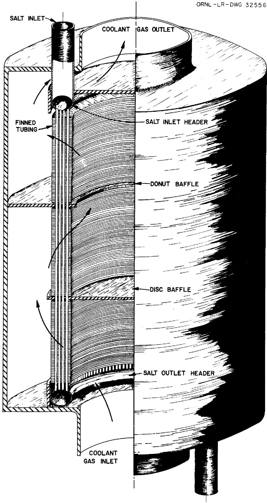  
Fig.1. Annular Heat Exchanger Geometry.

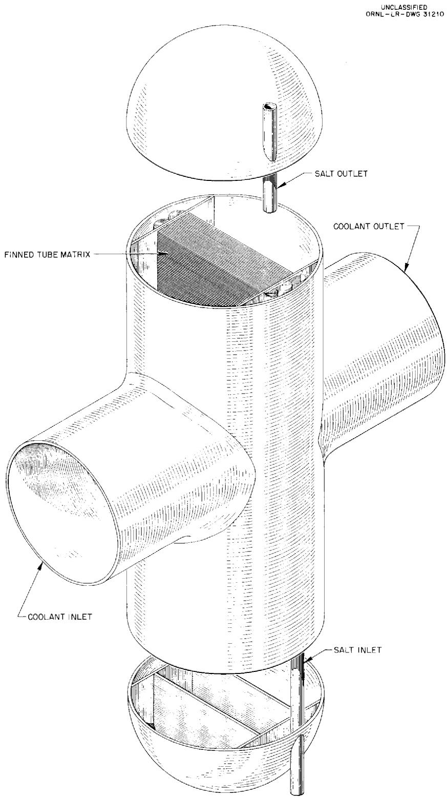  
Fig. 2. Design Study Heat Exchanger Geometry.

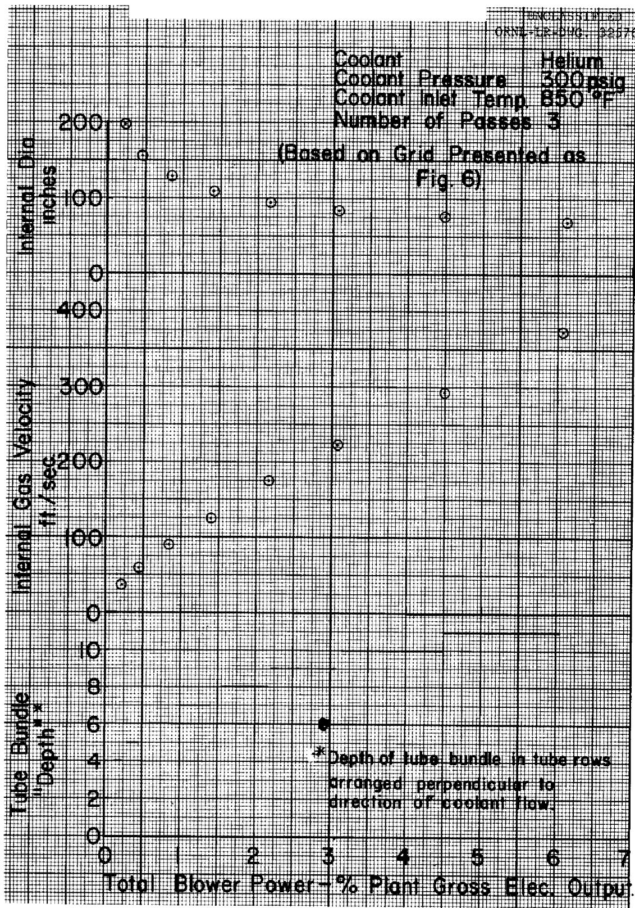  
Fig. 3. Annular Heat Exchanger Design Parameters.

heat transfer surfaces, they were felt to be prohibitive. The annular bundle was therefore rejected as a suitable geometry.

The second heat exchanger geometry considered was a more conventional arrangement having serpentine salt tubes with the gas flowing straight through the heat transfer matrix. In this case, it was considered necessary to provide a four pass arrangement to provide complete freedom for differential thermal expansion in the tubing while avoiding the floating header which would be required if only three passes are used. In addition, the four pass arrangement allows the salt inlet and outlet to be located close together, an arrangement which stands the best chance of reducing the amount of piping required to connect the heat exchanger and the reactor.

All final optimization studies were done on the basis of the serpentine salt tube arrangement.

A study was also made of the required heat exchanger geometry and operating costs for the case of countercurrent flow of helium over circumferentially finned tubing. The finned tubing geometry was not optimized so the results may not represent the best that can be done with this heat exchanger type. However, they are satisfactory as a rough tie-in with the remainder of the study.

# 2. Finned Tubing

Several design restrictions imposed at the time the heat exchanger study was undertaken made it desirable to select a finned tubing for consideration that was less than the optimum from a heat transfer standpoint. Inconel tubing was chosen since data on the thermal conductivity of INOR-8, a more likely material of fabrication, are currently uncertain. Homogeneous fins fabricated of Inconel were chosen to avoid completely any question of materials incompatability in view of the extended lifetime required of a power reactor heat exchanger. The use of nickel fins would definitely result in a more compact heat exchanger. Copper core fins would give an improvement over nickel but would introduce the requirement for brazing the fins to the tubing in order to protect the copper against the possibility of attack by the coolant or by impurities therein. At the present time, the introduction of the brazing requirement is considered to be undesirable -

primarily from a materials compatability standpoint. On the basis of information received from the Griscom-Russell Corporation $^{(1)}$ , a bond efficiency of $100\%$ was assigned to the mechanical bond between the Inconel fins and tubes.

The use of longitudinally finned tubing with the coolant in pure countercurrent flow was not investigated, since literature references (2,3) indicate a continuous longitudinal fin to have poor heat transfer characteristics. The use of a split longitudinal fin or pin fins might result in a competitive heat exchanger; however, these choices were not investigated since it was felt that simple mechanical bonding of such fins to the tubing could not be guaranteed to give the required degree of structural reliability.

The circumferentially finned tubing configuration chosen was experimentally evaluated by Kays and London<sup>(4)</sup>. The tubing dimensions listed below were scaled up from the experimental tube as indicated.

<table><tr><td></td><td>Experimental Tube</td><td>Design Study Tube</td></tr><tr><td>Tube O.D., in.</td><td>0.420</td><td>0.500</td></tr><tr><td>Tube I.D., in.</td><td>--</td><td>0.400</td></tr><tr><td>Fin O.D., in.</td><td>0.861</td><td>1.024</td></tr><tr><td>Fin thickness, in.</td><td>0.019</td><td>0.023</td></tr><tr><td>Fin pitch</td><td>8.72 fins/inch</td><td>7.32 fins/inch</td></tr><tr><td>Tube pitch parallel to flow, in.</td><td>0.800</td><td>0.952</td></tr><tr><td>perpendicular to flow, in.</td><td>0.975</td><td>1.160</td></tr></table>

The finned tubing configuration used in the study of longitudinal coolant flow over circumferentially finned tubing approximated the above. It was tested by Knudsen and Katz (5) at the University of Michigan. The actual and scaled down dimensions are as follows:

<table><tr><td></td><td>Experimental Tube</td><td>Design Study Tube</td></tr><tr><td>Tube O. D., in.</td><td>0.649</td><td>0.500</td></tr><tr><td>Tube I. D., in.</td><td>--</td><td>0.400</td></tr><tr><td>Fin O. D., in.</td><td>1.295</td><td>1.000</td></tr><tr><td>Fin thickness, in.</td><td>.0255</td><td>0.0197</td></tr><tr><td>Fin pitch</td><td>5.85 fins/inch</td><td>7.60 fins/inch</td></tr></table>

# 3. Tubing Size

The majority of the design study was based on 1/2 inch tubing with a .050 inch wall thickness. Figure 4 presents the pertinent information leading to the choice of this tubing size.

It can be demonstrated that the optimum salt inventory for a given set of design conditions occurs when the unit is sized so that the salt pressure drop through the heat exchanger is at the maximum allowable value. This maximum is 36 psi, since $10\%$ of the available 40 psi which has been customarily assigned to the heat exchanger has been utilized by entrance and exit effects.

Furthermore, based on the assumption that the amount of power to be utilized in coolant circulation would be between 0.5 and $10\%$ of the plant gross electrical output as extremes, it is possible to define the range of tube lengths and number of tubes which meet design requirements for a given tube size.

On this basis, the lines representing the length vs number of tubes at maximum salt pressure drop for $\frac{3}{4}$ inch, $\frac{1}{2}$ inch and $\frac{3}{8}$ inch tubing with 0.050 inch wall were established. The location of the lines representing blower power investments of $0.5\%$ and $10\%$ of the plant gross electrical output demonstrate that there is a fairly narrow range of length-number of tubes combinations which will satisfy the design requirements.

Three-fourths inch tubing was judged to be undesirable because of the excessive length requirement, although the number of tubes required for the heat exchanger was very attractive. Three-eighths inch tubing was judged somewhat unsatisfactory for the opposite reason. Although the tube length was satisfactory, the number of tubes required was judged excessive. One-half inch tubing seemed to represent a reasonable approach to optimum, although 7/16 inch tubing might be presumed equally satisfactory.

It should be pointed out that increasing the wall thickness of the heat exchanger tubing from 0.050 to 0.060 - 0.065 inch would have a negligible effect on the calculations. The total resistance of the metal wall to heat transfer normally approximated $10\%$ of the overall resistance.

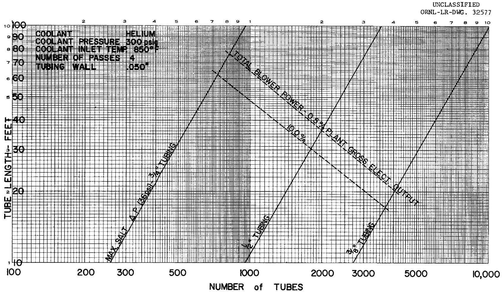  
Fig. 4. Tubing Size Optimization.

4. General

The reactor core heat load of 574 thermal megawatts was arbitrarily divided among four primary heat exchangers of 143.5 megawatts capacity each. Coolant blower efficiency was taken as $80\%$ . Salt and helium physical properties were evaluated at their mean temperature in the heat exchanger. The pressure drop distribution in the coolant circuit was arbitrarily assigned as follows:

Heat Exchanger $60 \%$

Steam Generator $30 \%$

Ducts $10\%$

Fin efficiencies were taken from correlations presented by Gardner(8). The salt pressure drop was taken as 40 psi total, with 10% assigned to entrance and exit effects and 90% assigned to heat exchanger tube friction losses. Coolant blower power cost was evaluated at 9 mills/kwh, and a load factor of 80% was assigned to the power plant. Enriched fuel was assigned a yearly cost of $1335/ft based on the following factors:

Barren salt - $1278/ft³

1) Capitalized at $14\%$

per year \$179

U-235 - $17/gram

1) .48 Mol % UF<sub>4</sub> in fuel   
2) Rental at 4%/annum $1156

\$1335

In calculating coolant gas pressure drop across the tube bundle, the head loss due to flow acceleration caused by temperature and pressure change was neglected. Due to the low pressure drop and coolant temperature rise, the error resulting from this assumption is well within the limits of error of the overall calculation.

# Discussion

1. Countercurrent, Cross Flow Heat Exchangers

Figures 5 to 10 present heat exchanger design study results for a given coolant, coolant pressure level, coolant inlet temperature and number of cross flow passes. Lines of constant baffle spacing, tube bank "depth" and salt volume in the tubing are given in each case on

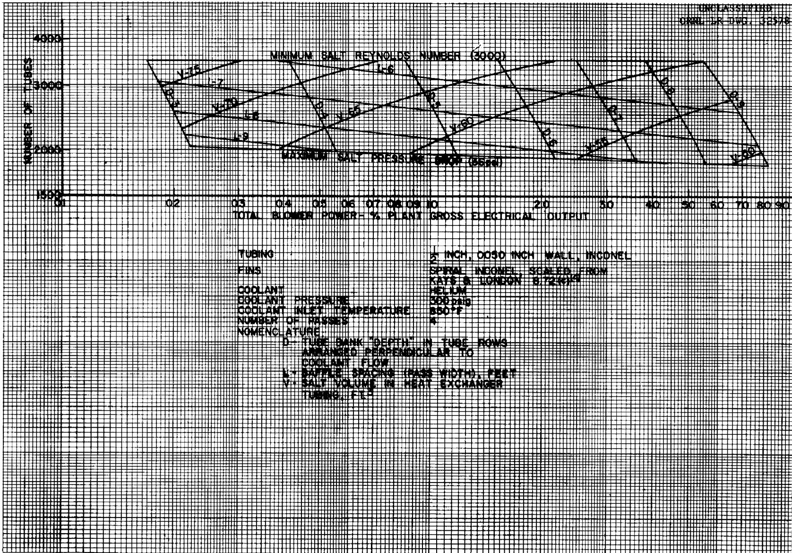  
Fig. 5. Design Parameters for a Four-Pass Heat Exchanger Using Helium at 300 psig with an $850^{\circ}$ F Inlet Temperature.

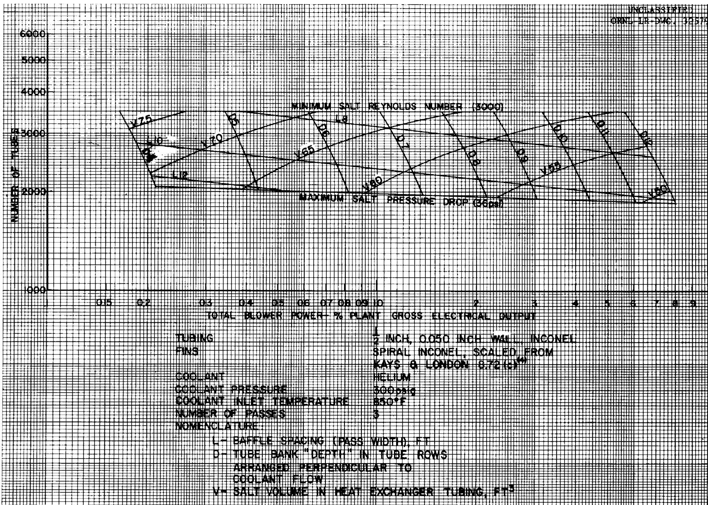  
Fig. 6. Design Parameters for a Three-Pass Heat Exchanger Using Helium at 300 psig with an $850^{\circ}$ F Inlet Temperature.

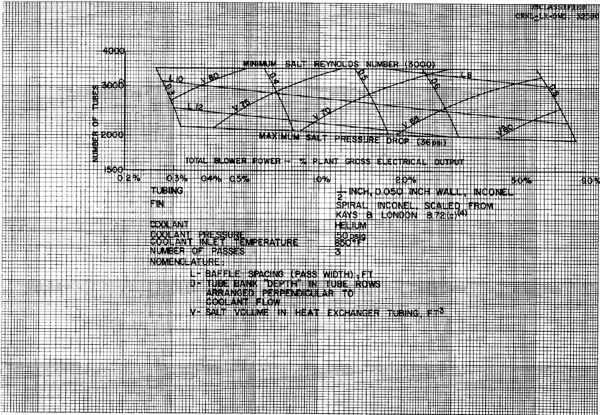  
Fig. 7. Design Parameters for a Three-Pass Heat Exchanger Using Helium at 150 psig with an $850^{\circ}$ F Inlet Temperature.

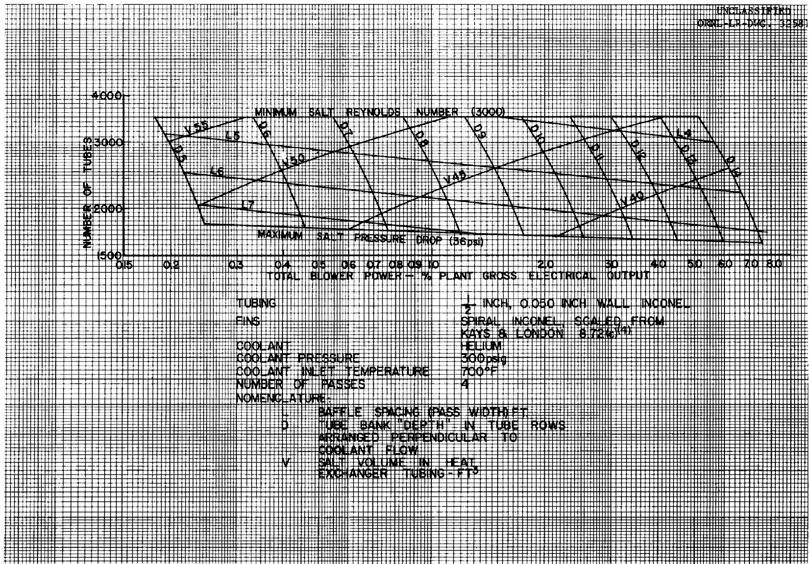  
Fig. 8. Design Parameters for a Four-Pass Heat Exchanger Using Helium at 300 psig with a $700^{\circ}\mathrm{F}$ Inlet Temperature.

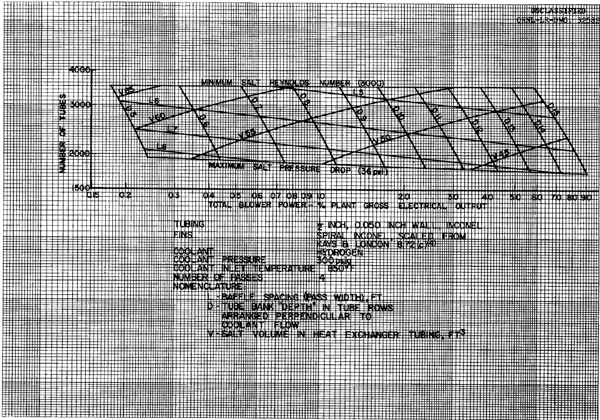  
Fig. 9. Design Parameters for a Four-Pass Heat Exchanger Using Hydrogen at 300 psig with an $850^{\circ}$ F Inlet Temperature.

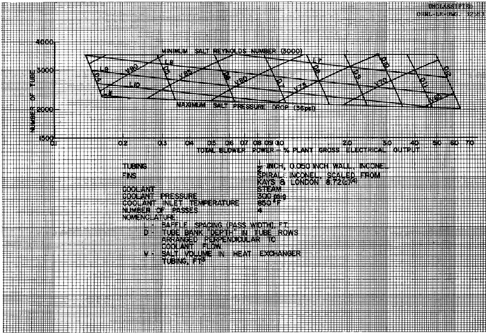  
Fig. 10. Design Parameters for a Four-Pass Heat Exchanger Using Steam at 300 psig with an $850^{\circ}$ F Inlet Temperature.

a basic plot of blower power investment versus the number of tubes. The active length of each heat exchanger tube is the product of the baffle spacing times the number of passes. All heat exchangers falling along a line of constant tube bank "depth" between the number of tubes at which the fuel Reynolds Number is 3000 (3500 tubes) and the number of tubes at which the fuel pressure drop is 36 psi are satisfactory for the transfer of 143.5 megawatts from the salt to the coolant under the conditions specified. However, those units represented by the intersection of a line of constant tube bank "depth" with the line of maximum fuel pressure drop represent the optimum heat exchangers from a fuel inventory standpoint.

Since tube bank "depth" is given in number of tube rows, the value must be an integer, normally in the range of two to fifteen. Study of the figures will make clear that for a given blower power investment there is one "best" heat exchanger geometry. As blower power is increased, the required number of tubes decreases until the optimum geometry for that tube bank "depth" is reached at the intersection with the maximum salt pressure drop line. If this point is inside the horizontal projection of the line representing the next higher tube bank "depth", a much larger heat exchanger will also operate at this same power level, and further power increases require heat exchangers represented by points along the higher "depth" line. If the point previously referred to is not inside the horizontal projection of the next higher tube bank "depth", there is a range of power values which cannot be used since no suitable heat exchanger configuration exists in this range.

The values on the abscissa (Total Blower Power - % of Plant Gross Electrical Output) represent the proportion of 275 megawatts which is assigned to power the coolant blowers in the four primary heat exchanger circuits. The power consumption of just the four heat exchangers is $60\%$ of the abscissa value, and the power consumption assignable to one heat exchanger is $15\%$ of the abscissa value.

Design study results are presented for the following cases:

<table><tr><td>Coolant</td><td>Inlet Temp.°F</td><td>Circuit Pressure,psi</td><td>Number of Passes</td><td>Fig. No.</td></tr><tr><td>Helium</td><td>850</td><td>300</td><td>4</td><td>5</td></tr><tr><td>Helium</td><td>850</td><td>300</td><td>3</td><td>6</td></tr><tr><td>Helium</td><td>850</td><td>150</td><td>3</td><td>7</td></tr><tr><td>Helium</td><td>700</td><td>300</td><td>4</td><td>8</td></tr><tr><td>Hydrogen</td><td>850</td><td>300</td><td>4</td><td>9</td></tr><tr><td>Steam</td><td>850</td><td>300</td><td>4</td><td>10</td></tr></table>

# 2. Countercurrent flow heat exchanger

Figure 11 presents the results of the study on pure longitudinal countercurrent flow over circumferentially finned tubes. The case for helium at 300 psig with an inlet temperature of $850^{\circ}\mathrm{F}$ is considered. In this figure, the length represents the total active length of the finned tubing and the pitch represents the tube spacing in a "delta" arrangement.

# Conclusions

Figure 12 presents optimization curves for the various coolants and operating conditions in the form of yearly cost of fuel inventory and blower power for one heat exchanger versus heat exchanger container length and diameter. Although an economic optimum is found for each case presented, it must be realized that the cost of heat exchanger fabrication and the effects of heat exchanger size on overall plant construction costs have not been considered in this presentation. By small percentage increases in yearly operating costs above the optimum value shown in Fig. 12, sizable reductions in heat exchanger length are realized. Determination of how far one should go in this direction would be one necessary step in an overall plant economic analysis.

For a given set of operating conditions, hydrogen proves to be the most attractive coolant. If it is desired to avoid the hazards of hydrogen usage, reduction of the helium inlet temperature from $850^{\circ}\mathrm{F}$ to $700^{\circ}\mathrm{F}$ (maintaining the outlet temperature of $1025^{\circ}\mathrm{F}$ constant) gives a unit smaller and cheaper to operate than is the case for hydrogen at the higher inlet temperature level. Use of a coolant inlet temperature which is lower than the freezing point of the Mixture 130 ( $850^{\circ}\mathrm{F}$ com

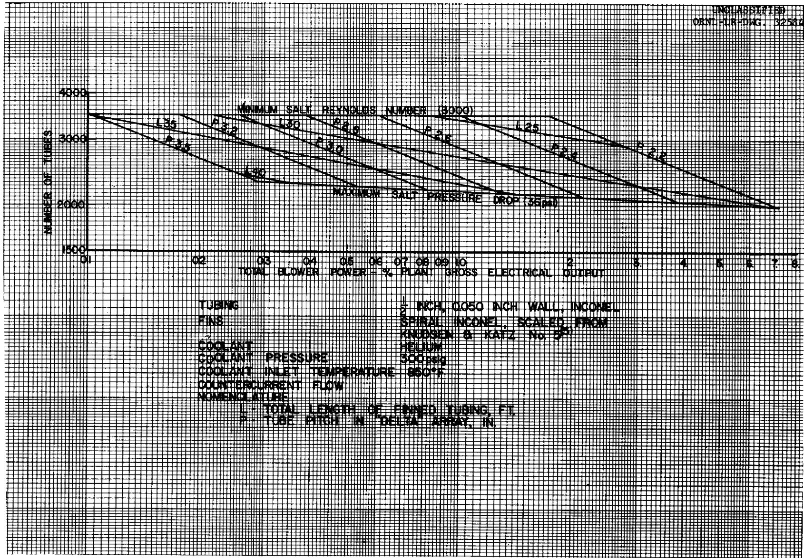  
Fig. 11. Design Parameters for a Longitudinal Flow Heat Exchanger Using Helium at 300 psig with an $850^{\circ}$ F Inlet Temperature.

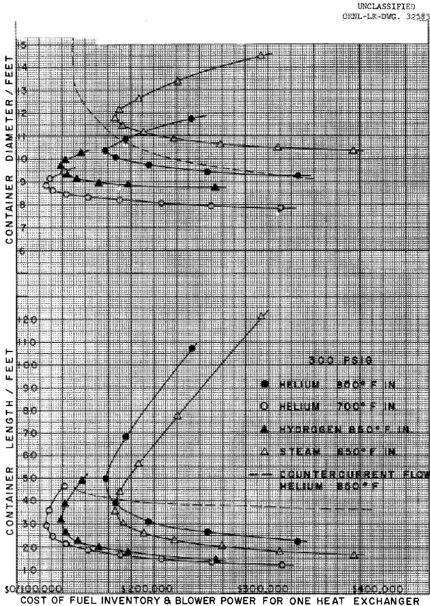  
Fig. 12. Heat Exchanger Container Dimensions as a Function of Annual Operating Cost per Heat Exchanger.

plicates the circuit control system somewhat. To accommodate a salt flow failure, some provision would have to be made for diversion of the coolant stream around the heat exchanger to avoid freezing the salt in the tubing.

The use of steam as a coolant gas appears competitive with helium since the containment problem is minor and the gas replacement costs are negligible. The optimum steam heat exchanger is shorter but somewhat larger in diameter than is the case for helium. There is essentially no difference in operating cost. Another strong incentive for the use of steam is the existence of a well developed technology and the availability of commercial components suited to such a system.

Also presented in Figure 12 is the container dimensions for a pure countercurrent flow heat exchanger using helium with an $850^{\circ}\mathrm{F}$ inlet temperature in longitudinal flow over a "delta" array of circumferentially finned tubing. Ignoring any particular advantage this arrangement might possess which is outside the scope of the present study, this case does not appear as attractive as the comparable crossflow case. The container diameter is somewhat larger and the required container length is longer throughout the operating cost range of primary interest. In addition, this geometry does not possess the freedom for differential thermal expansion that is inherent in the four pass serpentine salt tube.

It should be noted that the curves of Figures 12 and 13 are not continuous as drawn (except for the countercurrent flow case in Figure 12). Since each point on the curve represents a tube bank "depth" in tube rows (one less or one greater than its neighbor), heat exchangers meeting design conditions and having optimum salt inventories only occur at the appropriate symbols.

Figure 14 shows the effect on heat exchanger container dimensions and on yearly operating cost for one heat exchanger unit of doubling the allowable salt side pressure drop and of cutting the uranium enrichment by a factor of five.

Increasing the allowable salt side pressure drop means that the length of the salt flow path can be increased. Since this increases the available heat transfer surface per tube, the number of tubes can be reduced. Figure 14 shows that the end result of this change is a heat

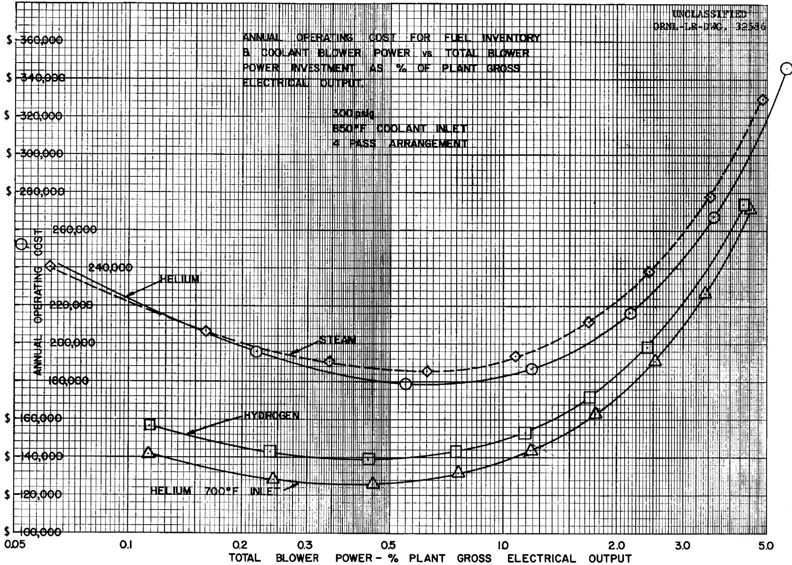  
Fig. 13. Annual Operating Cost per Heat Exchanger as a Function of Total Blower Power Investment.

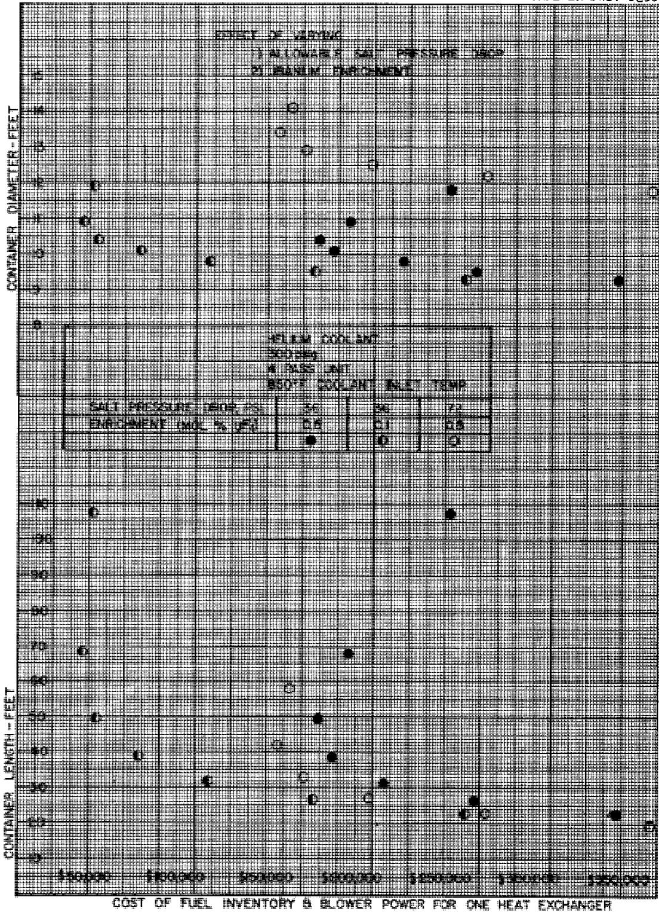  
UNCLASSIFIED   
ORNL-LR-DWG. 32587   
Fig. 14. Effect of Varying Allowable Salt Pressure Drop and Uranium Enrichment on Annual Operating Cost per Heat Exchanger.

exchanger container larger in diameter and shorter in length than is the case with a smaller salt side pressure drop. There is a practical limit to how far the design should be carried in this direction. When the diameter of the containment vessel becomes too large for the corresponding length, a change to a six salt pass geometry should be investigated. The present study was not carried this far, but the basic equations listed in Table 6 are applicable for this purpose.

Figure 14 also illustrates the effect of lowering uranium enrichment by a factor of five. In the area of interest, this reduces annual operating charges for blower power and fuel inventory to $25 - 40\%$ of their value at the higher enrichment.

The results of this study can be used to predict the heat exchanger requirements for increased or decreased reactor power levels for the specific cases and operating conditions considered. The length of the heat exchanger is a direct function of heat load and a direct ratio can therefore be applied to this dimension, provided the change is not so great as to disproportionate the length-diameter relationship of the heat exchanger container.

# Method of Calculation

Case - 640 thermal megawatts

576 megawatts in reactor core

64 megawatts in blanket

275 electrical megawatts

4 primary core circuit heat exchangers

Helium coolant

300 psig,coolant pressure

$850^{\circ}\mathrm{F}$ coolant inlet temperature

4 serpentine salt passes

Tubing - 1/2 inch Inconel, 0.050 inch wall thickness

"delta" array, modified

1.19 inch tube spacing perpendicular to flow

0.952 inch row spacing parallel to flow

Fins - Inconel, mechanically bonded, circumferentially wound

1.024 inch outside diameter

0.023 inch thick

7.32 fins/inch

# Operating Conditions

Salt Inlet Temp. 1210°F

" Outlet Temp. 1075°F

135°F

" Mean Temp. 1143°F

" Flow 1768 lb/sec

Helium Inlet Temp. 850°F

" Outlet Temp. 1025°F

175°F

" Mean Temp. 937°F

Helium Pressure 300 psig

Heat Load/heat exchanger 4.89 x 10 $^{8}$ BTU/hr

$\Delta \mathbf{T}$ Log Mean 203.5°F

# Physical Properties

Salt at 1143°F

heat capacity 0.57 BTU/1b $^{\circ}$ F

viscosity 22.76 lb/ft hr

thermal conductivity 3.5 BTU/hr ft°F

density 122.7 lb/ft3

Prandtl Number 3.706

Helium at $937^{\circ}\mathrm{F}$

heat capacity 1.248 BTU/1b°F

viscosity 0.0865 lb/ft hr

thermal conductivity 0.175 BTU/hr ft $^{\circ}$ F

density 0.084 lb/ft3

specific volume 11.9 ft/1b

Prandtl Number 0.616

Inconel at 1000°F

thermal conductivity 140.4 BTU/hr ft $^{\circ}$ F

Salt Pressure Drop

$$
\begin{array}{l} \Delta P _ {s} = \frac {f _ {s} (L)}{D _ {e}} \frac {V _ {s} ^ {2}}{2 g} \frac {\rho_ {s}}{1 4 4} \\ f _ {s} = \frac {. 3 1 6 4}{\left(R e\right) _ {s} \cdot 2 5} \\ \left(\mathrm {R e}\right) _ {\mathrm {s}} = \frac {\mathrm {D} _ {\mathrm {e}} \cdot \mathrm {W} _ {\mathrm {s}}}{\mathrm {A} _ {1} \mu_ {\mathrm {s}}} = \frac {4 \mathrm {W} _ {\mathrm {s}}}{\pi \mathrm {D} _ {\mathrm {e}} \mathrm {N} _ {\mu_ {\mathrm {s}}}} = \frac {1 0 . 4 1 \times 1 0 ^ {6}}{\mathrm {N}} \\ V _ {s} = \frac {W _ {s}}{A _ {i} \rho_ {s}} = \frac {4 W _ {s}}{\pi \left(D _ {e}\right) ^ {2} N \rho_ {s}} \\ \Delta P _ {s} = \frac {0 . 0 5 7 8 (L)}{(N) ^ {1 . 7 5} (D _ {e}) ^ {4 . 7 5}} = 3 6 p s i \\ D _ {e} = 0. 0 3 3 3 f t \\ (L) = . 6 0 1 \times 1 0 ^ {- 4} (N) ^ {1. 7 5} \\ \end{array}
$$

Helium Pressure Drop

$$
\begin{array}{l} \Delta P _ {c} = \frac {G ^ {2}}{2 g}. v _ {c} \left[ f \frac {A}{A _ {c}} \right] \\ G _ {c} = \frac {(w) _ {c}}{A _ {c}} \\ \end{array}
$$

(6)

A - 0.768 ft² fin area/ft tube  
0.109 ft² tube area/ft tube  
0.877 ft² total area/ft tube

$$
A = 0. 8 7 7 L \cdot N f t ^ {2}
$$

$$
A _ {c} = 0. 0 4 7 6 L \cdot M f t ^ {2}
$$

$$
f = \frac {0 . 2 1 0 5}{\left(\mathrm {R e}\right) _ {\mathrm {c}} ^ {0 . 2 0 4 5}} \tag {4}
$$

$$
\left(\mathrm {R e}\right) _ {\mathrm {c}} = \frac {4 \mathrm {r} _ {\mathrm {h}} \cdot \mathrm {W}}{\mathrm {A} _ {\mathrm {c}} \cdot \mu_ {\mathrm {c}}} = \frac {9 3 . 3 \times 1 0 ^ {5} \cdot \mathrm {D}}{\mathrm {L} \cdot \mathrm {N}}
$$

$$
4 r _ {h} = 4 1 \left[ \frac {A _ {c}}{A} \right] \tag {7}
$$

$$
1 = \frac {. 9 5 2 D}{1 2} f t.
$$

$$
\Delta P _ {c} = 5. 8 4 x 1 0 ^ {8} \frac {f N}{L ^ {2} M ^ {3}}
$$

$$
\Delta P _ {M} = \Delta P _ {c} \cdot \frac {(L)}{L}
$$

$$
\mathrm {M} = \frac {\mathrm {N}}{\mathrm {D}}
$$

$$
\Delta P _ {M} = 5. 8 4 \times 1 0 ^ {8} \frac {f}{L ^ {3}} \frac {D ^ {3} (L)}{N ^ {2}}
$$

$$
\Delta P _ {M} = 4. 6 0 8 \times 1 0 ^ {6} \frac {(L)}{N ^ {1 . 8}} \left[ \begin{array}{l} D \\ L \end{array} \right] ^ {2. 8}
$$

Heat Transfer

$$
\mathrm {q} = \mathrm {U A} _ {\mathrm {T}} \varnothing \Delta \mathrm {T} _ {\mathrm {L M}}
$$

$$
\begin{array}{l} A _ {T} = A \cdot R \\ = (. 8 7 7 \mathrm {L N}) \mathrm {R} \\ \end{array}
$$

$$
\varnothing = \frac {. 7 9 2}{\left[ \sqrt [ w ]{\frac {h _ {c}}{k _ {I} Y _ {B}}} \right] ^ {1 . 0 5 7}} \tag {8}
$$

$$
\frac {1}{U} = \frac {1}{h _ {c}} + \frac {t \phi A _ {T}}{k _ {I} A _ {M}} + \frac {\phi A _ {T}}{h _ {s} A _ {s}}
$$

$$
\frac {t \phi A _ {T}}{k _ {I M} A} = 2. 6 4 5 x 1 0 ^ {- 3} \phi
$$

$$
A _ {M} = (. 1 1 7 8 L. N) R
$$

$$
\frac {\phi_ {A _ {T}}}{h _ {s} A _ {s}} = 8. 3 6 \cdot \frac {\phi}{h _ {s}}
$$

$$
A _ {8} = (. 1 0 4 7 \mathrm {L N}) \mathrm {R}
$$

$$
h _ {s} = \frac {k}{D _ {e}} \cdot 2. 6 5 \times 1 0 ^ {- 4} (\mathrm {R e}) _ {s} ^ {1. 2 8} (\mathrm {P r}) _ {s} ^ {0. 4} \tag {9}
$$

$$
h _ {s} = \frac {4 . 5 1 x 1 0 ^ {7}}{N ^ {1 . 2 8}}
$$

$$
\frac {\phi A _ {T}}{h \frac {A _ {T}}{s A _ {S}}} = 1. 8 5 x 1 0 ^ {- 7} \phi N ^ {1. 2 8}
$$

$$
h _ {c} = \frac {j . G _ {c} . (c p) _ {c}}{(P r) _ {c} ^ {2 / 3}}
$$

$$
j = \frac {. 2 0 7}{\left(\mathrm {R e}\right) _ {\mathrm {c}} \cdot 3 9 2} \tag {4}
$$

$$
h _ {c} = 3. 1 1 \times 1 0 ^ {4} \left(\frac {D}{L N}\right) ^ {.} 6 0 8
$$

$$
\frac {1}{U} = \frac {1}{3 . 1 1 \times 1 0 ^ {4}} \left(\frac {L N}{D}\right) ^ {. 6 0 8} + 2. 6 4 5 \times 1 0 ^ {- 3} \phi + 1. 8 5 \times 1 0 ^ {- 7} \phi N ^ {1. 2 8}
$$

$$
\begin{array}{l} q = \frac {\phi . (. 8 7 7 \mathrm {L N}) \mathrm {R} . 2 0 3 . 5}{\frac {1}{3 . 1 1 \times 1 0 ^ {4}} \left(\frac {\mathrm {L N}}{\mathrm {D}}\right) ^ {6 0 8} + 2 . 6 4 5 \times 1 0 ^ {- 3} \phi + 1 . 8 5 \times 1 0 ^ {- 7} \phi \mathrm {N} ^ {1 . 2 8}} \\ R = \frac {(L)}{L} \\ \end{array}
$$

$$
q = \frac {1 7 8 . 5 (\mathrm {L}) \mathrm {N}}{\frac {1}{3 . 1 1 \times 1 0 ^ {4}} \phi \left(\frac {\mathrm {L N}}{\mathrm {D}}\right) ^ {. 6 0 8} + 2 . 6 4 5 \times 1 0 ^ {- 3} + 1 . 8 5 \times 1 0 ^ {- 7} \mathrm {N} ^ {1 . 2 8}}
$$

$$
\phi = \frac {4 . 2}{\left(h _ {c}\right) ^ {. 5 3}} = 1. 7 5 \times 1 0 ^ {- 2} \left(\frac {\mathrm {L N}}{\mathrm {D}}\right) ^ {. 3 2 2}
$$

$$
q = \frac {1 7 8 . 5 (\mathrm {L}) \mathrm {N}}{1 . 8 3 7 \times 1 0 ^ {- 3} \left(\frac {\mathrm {L N}}{\mathrm {D}}\right) ^ {. 2 8 6} + 2 . 6 4 5 \times 1 0 ^ {- 3} + 1 . 8 5 \times 1 0 ^ {- 7} \mathrm {N} ^ {1 . 2 8}}
$$

$$
\begin{array}{l} (L) N = 5. 0 3 2 \times 1 0 ^ {3} \left(\frac {L N}{D}\right) ^ {. 2 8 6} + 7. 2 4 6 \times 1 0 ^ {3} + . 5 0 6 8 N ^ {1. 2 8} \\ q = 4. 8 9 x 1 0 ^ {8} B T U / h r \\ \end{array}
$$

Listed below are the basic equations arrived at by the above method. These equations were used to establish the grid of Figure 5. This grid presents all heat exchanger configurations in the range of probable interest which meet the design conditions.

1) Salt Pressure Drop

$$
\Delta P _ {s} = \frac {0 . 0 5 7 8 (L)}{N ^ {1 . 7 5} D _ {e} ^ {4 . 7 5}}
$$

$$
\text {a t} \Delta P _ {\mathrm {s}} \text {o f} 3 6 \text {p s i f o r} D _ {\mathrm {e}} = 0. 0 3 3 3 \text {f t}.
$$

$$
(L) = 0. 6 0 1 \times 1 0 ^ {- 4} (N) ^ {1. 7 5}
$$

2) Coolant Pressure Drop

$$
\Delta P _ {M} = 4. 6 0 8 \times 1 0 ^ {6} \quad \frac {(L)}{N ^ {1 . 8}} \quad \left[ \frac {D}{L} \right] ^ {2. 8}
$$

3) Heat Transfer

$$
(L) N = 5. 0 3 2 \times 1 0 ^ {3} \left(\frac {L N}{D}\right) ^ {. 2 8 6} + 7. 2 4 6 \times 1 0 ^ {3} +. 5 0 6 8 N ^ {1}. 2 8
$$

By assumption of the number of passes, baffle spacing, L, and tube bank depth, D, the heat transfer equation can be solved for a corresponding number of tubes. Substitution of these values in the coolant pressure drop equation gives a corresponding pressure drop which can be converted to blower power consumption as follows:

$\%$ of circuit pressure drop assigned to ht. ex. - $60 \%$

Volumetric flow rate through blower - 6950 ft³/sec

Number of heat exchanger circuits - 4

Blower efficiency - 80%

Plant Gross Electrical Output - 275 megawatts

$$
\frac {4 \left[ \frac {\Delta P _ {M}}{. 6 0} \right] \times 6 9 5 0 . 1 0 0}{5 5 0 . 0 8 0 . 2 7 5 . 1 0 0 0 . 1 . 3 4 1} = \text {T o t a l B l o w e r P o w e r - P e r c e n t}
$$

$$
\Delta P _ {M} \cdot 2. 8 5 \times 1 0 ^ {- 2} = \text {P o w e r I n v e s t m e n t}
$$

The salt pressure drop equation was used to define the number of tubes at which salt pressure drop is a maximum for a given baffle spacing, L, and number of passes. The salt Reynolds Number equation

$$
\left(\mathrm {R e}\right) _ {\mathrm {S}} = \frac {1 0 . 4 1 x 1 0 ^ {6}}{\mathrm {N}}
$$

defines the maximum number of tubes which can be used without going below a given Reynolds number. In all cases, 3000 was taken as the minimum desired Reynolds number. For the $1/2$ '' tubing under consideration this defines 3470 tubes as the maximum number usable.

Optimization curves for the various cases presented in Figures 12, 13 and 14 were based on the parameter values taken from their respective grids at the intersection of the lines of constant tube bank "depth" with the line of maximum salt pressure drop. This defines power investment, D, L, M and N for each case as well as the fuel volume in the tubes. Bend fuel volume was obtained from Figure 15 and header volume was calculated on the basis of a cone with a base diameter of 16.5 inches and a length determined by 0.1 M feet.

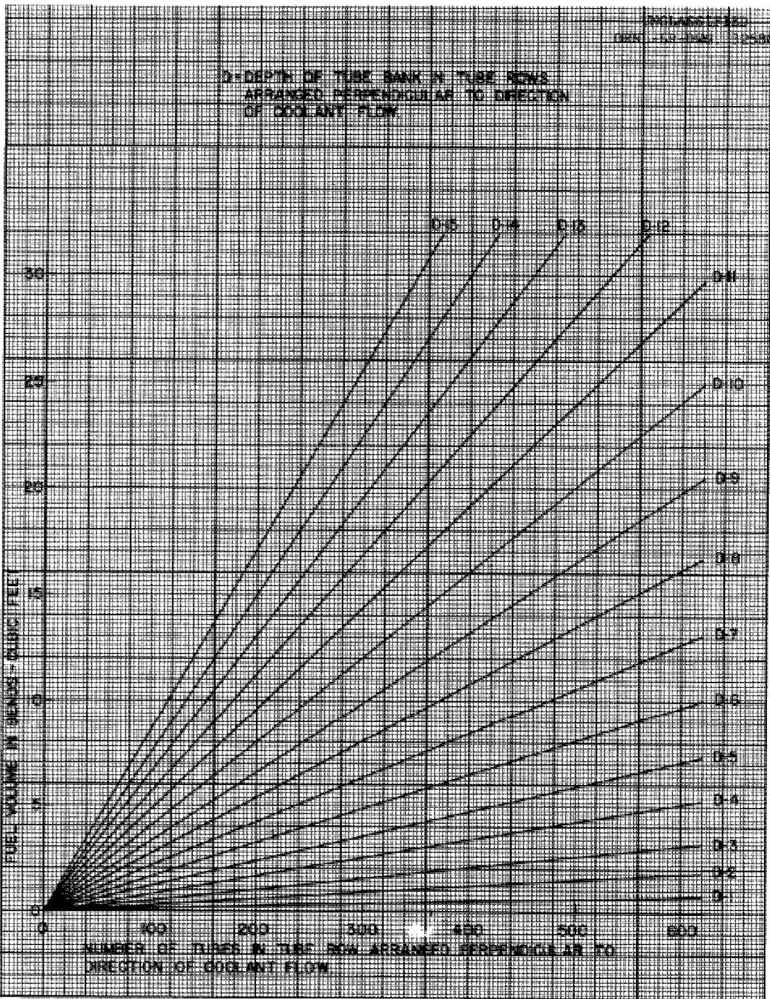  
Fig. 15. Salt Volume in Return Bends of Serpentine Fuel Tubes for a Four-Pass Heat Exchanger.

# Nomenclature

A - fin plus tube heat transfer area/pass, ft² $A_c$ - coolant free flow area, ft² $A_i$ - salt flow area, ft² $A_T$ - total heat transfer area (A . R), ft² $A_M$ - mean tube wall area, ft² $A_s$ - salt side heat transfer area, ft² $(C_p)_c$ - coolant specific heat, BTU/lb°F  
D - tube bank "depth", in tube rows arranged perpendicular to direction of flow $D_e$ - salt side equivalent diameter, ft  
f - coolant Fanning (small) friction factor $f_s$ - salt friction factor $g_c$ - gravitational constant, ft/sec² $G_c$ - coolant mass velocity, lb/sec ft² $h_c$ - coolant heat transfer coefficient, BTU/hr ft²°F $h_s$ - salt heat transfer coefficient, BTU/hr ft²°F  
j - Colburn j-factor $\left[\frac{h}{c_G} (\mathrm{Pr})^{2/3}\right]$ $k_I$ - Inconel thermal conductivity, BTU/hr ft²°F/in $k_s$ - salt thermal conductivity, BTU/hr ft²°F/ft  
l - tube bank depth/pass, ft  
L - baffle spacing (pass width), ft  
(L) - total tube length (L.R), ft  
M - number of tubes in a row perpendicular to coolant flow (M = N/D)  
N - total number of tubes $\Delta P_c$ - coolant pressure drop/pass, lb/ft² $\Delta P_M$ - total coolant pressure drop $(\Delta P_c \cdot R)$ , lb/ft² $\Delta P_s$ - salt pressure drop, lb/in² $(\mathrm{Pr})_c$ - coolant Prandtl Number  
q - total heat load, BTU/hr $r_h$ - tube bank hydraulic radius, ft $\frac{4 r_h}{1} = \frac{4 A_c}{A}$ (7)

R - number of crossflow passes   
$(\mathsf{Re})_{\mathsf{c}}$ - coolant Reynolds Number   
$(\mathrm{Re})_{\mathbf{s}}$ - salt Reynolds Number   
t - tube wall thickness, inches   
$\Delta \mathbf{T}_{\mathrm{IM}}$ log mean temperature difference, F   
U - overall heat transfer coefficient, BTU/hr ft².   
$\mathbf{v}_{\mathrm{c}}$ - coolant specific volume, ft³/1b   
V - salt velocity, ft/sec   
W - fin height, inches   
$(W)_{c}$ - coolant flow rate, lb/sec   
$(W)_{s}$ salt flow rate, lb/sec   
Yb - fin thickness/2, inches   
fin efficiency (8)   
$\mu_{c}$ - coolant viscosity, lb/ft sec   
$\mu_{s}$ - salt viscosity, lb/ft sec   
- salt density, lb/ft³

# Bibliography

1. Personal communication of writer with representatives of Griscom-Russell Corporation during a visit to the Oak Ridge National Laboratory.   
2. McAdams, W. H., Heat Transmission, 3rd Edition, p. 269   
3. Norris, R. H. and Spofford, W. A., ASME, Advance Paper, New York (December, 1941).   
4. Kays, W. M. and London, A. L., Compact Heat Exchangers, The National Press, 1955, p. 114.   
5. Knudsen, J. G. and Katz, D. L., Heat Transfer and Pressure Drop in Annuli, Chem. Eng. Prog. 46, 490 - 500 (1950).   
6. Op.Cit., Compact Heat Exchangers, p. 21.   
7. Ibid, p. 3.   
8. Gardner, K. A., Efficiency of Extended Surfaces, Trans. ASME, 67, 621-631 (1945).   
9. Amos, J. C., MacPherson, R. E., Senn, R. L., Preliminary Report of Fused Salt Mixture 130 Heat Transfer Coefficient Test, ORNL CF Memo 58-4-23, April 2, 1958.

Table 1   
Cost Comparison Data Gas Cooled Molten Salt Heat Exchanger   

<table><tr><td>Tubing</td><td colspan="7">1/2 inch, 0.050 inch wall Inconel</td></tr><tr><td>Fins</td><td colspan="7">Spiral Inconel, scaled from Kays and London 8.72(c) (4)</td></tr><tr><td>Coolant</td><td colspan="7">Helium</td></tr><tr><td>Coolant Pressure</td><td colspan="7">300 psig</td></tr><tr><td>Coolant Inlet Temperature</td><td colspan="7">850°F</td></tr><tr><td>Number of Passes</td><td colspan="7">4</td></tr><tr><td>Total Blower Power at Max-imum Salt Pressure Drop - % Plant Gross Electrical Output</td><td>.0522</td><td>.217</td><td>.548</td><td>1.18</td><td>2.15</td><td>3.58</td><td>5.60</td></tr><tr><td>D - Tube Bank &quot;Depth&quot;</td><td>2</td><td>3</td><td>4</td><td>5</td><td>6</td><td>7</td><td>8</td></tr><tr><td>L - Baffle Spacing</td><td>10.3</td><td>9.4</td><td>8.9</td><td>8.6</td><td>8.3</td><td>8.0</td><td>7.8</td></tr><tr><td>M - Tube Bank &quot;Height&quot;</td><td>1085</td><td>690</td><td>503</td><td>390</td><td>320</td><td>270</td><td>231</td></tr><tr><td>N - Number of Tubes</td><td>2170</td><td>2070</td><td>2010</td><td>1950</td><td>1920</td><td>1890</td><td>1850</td></tr><tr><td>Fuel Volume - ft.3*</td><td></td><td></td><td></td><td></td><td></td><td></td><td></td></tr><tr><td>Tubes</td><td>78.5</td><td>68.5</td><td>63.0</td><td>59.0</td><td>56.0</td><td>53.0</td><td>51.0</td></tr><tr><td>Bends</td><td>2.8</td><td>3.5</td><td>4.2</td><td>4.6</td><td>5.2</td><td>5.7</td><td>6.2</td></tr><tr><td>Headers</td><td>106.4</td><td>67.7</td><td>49.3</td><td>38.3</td><td>31.4</td><td>26.5</td><td>22.7</td></tr><tr><td>Total</td><td>187.7</td><td>139.7</td><td>116.5</td><td>101.9</td><td>92.6</td><td>85.2</td><td>79.9</td></tr><tr><td>Fuel Cost - $1335/ft3/year *</td><td>251,000</td><td>187,000</td><td>156,000</td><td>136,000</td><td>124,000</td><td>114,000</td><td>107,000</td></tr><tr><td>Blower Cost - 80% load factor * 9 mills/kwh</td><td>2,000</td><td>9,000</td><td>23,000</td><td>51,000</td><td>92,000</td><td>153,000</td><td>240,000</td></tr><tr><td>Total Annual Cost *</td><td>253,000</td><td>196,000</td><td>179,000</td><td>187,000</td><td>216,000</td><td>267,000</td><td>347,000</td></tr><tr><td>Minimum Container</td><td></td><td></td><td></td><td></td><td></td><td></td><td></td></tr><tr><td>Diameter (L + 1.5), ft</td><td>11.8</td><td>10.9</td><td>10.4</td><td>10.1</td><td>9.8</td><td>9.5</td><td>9.3</td></tr><tr><td>Length, ft</td><td>107.6</td><td>68.4</td><td>49.9</td><td>38.7</td><td>31.7</td><td>26.8</td><td>22.9</td></tr></table>

Table 2   
Cost Comparison Data Gas Cooled Molten Salt Heat Exchanger   

<table><tr><td>Tubing</td><td colspan="11">1/2 inch, 0.050 inch wall Inconel</td></tr><tr><td>Fins</td><td colspan="11">Spiral Inconel, scaled from Kays and London 8.72 (C)(4)</td></tr><tr><td>Coolant</td><td colspan="11">Helium</td></tr><tr><td>Coolant Pressure</td><td colspan="11">300 psig</td></tr><tr><td>Coolant Inlet Temperature</td><td colspan="11">700°F</td></tr><tr><td>Number of Passes</td><td colspan="11">4</td></tr><tr><td>Total Blower Power at Max-</td><td>0.113</td><td>0.243</td><td>0.450</td><td>0.760</td><td>1.18</td><td>1.75</td><td>2.51</td><td>3.40</td><td>4.50</td><td>5.96</td><td>7.55</td></tr><tr><td>% Plant Gross Electrical Output</td><td></td><td></td><td></td><td></td><td></td><td></td><td></td><td></td><td></td><td></td><td></td></tr><tr><td>D - Tube bank &quot;depth&quot;</td><td>4</td><td>5</td><td>6</td><td>7</td><td>8</td><td>9</td><td>10</td><td>11</td><td>12</td><td>13</td><td>14</td></tr><tr><td>L - Baffle spacing</td><td>8</td><td>7.7</td><td>7.4</td><td>7.15</td><td>7.00</td><td>6.90</td><td>6.75</td><td>6.60</td><td>6.50</td><td>6.40</td><td>6.30</td></tr><tr><td>M - Tube bank &quot;height&quot;</td><td>470</td><td>366</td><td>298</td><td>250</td><td>216</td><td>189</td><td>168</td><td>150</td><td>137</td><td>125</td><td>115</td></tr><tr><td>N - Number of tubes</td><td>1880</td><td>1830</td><td>1790</td><td>1750</td><td>1725</td><td>1700</td><td>1675</td><td>1655</td><td>1640</td><td>1625</td><td>1610</td></tr><tr><td>Fuel Volume, ft3*</td><td></td><td></td><td></td><td></td><td></td><td></td><td></td><td></td><td></td><td></td><td></td></tr><tr><td>Tubes</td><td>52.5</td><td>49.0</td><td>46.5</td><td>44.0</td><td>42.5</td><td>41.0</td><td>39.5</td><td>38.5</td><td>37.5</td><td>37.0</td><td>36.0</td></tr><tr><td>Bends</td><td>3.9</td><td>4.3</td><td>4.8</td><td>5.3</td><td>5.8</td><td>6.3</td><td>6.7</td><td>7.3</td><td>7.7</td><td>8.2</td><td>8.7</td></tr><tr><td>Headers</td><td>46.1</td><td>35.8</td><td>29.2</td><td>24.6</td><td>21.2</td><td>18.6</td><td>16.6</td><td>14.9</td><td>13.5</td><td>12.4</td><td>11.4</td></tr><tr><td>Total</td><td>102.5</td><td>89.1</td><td>80.5</td><td>73.9</td><td>69.5</td><td>65.9</td><td>62.8</td><td>60.7</td><td>58.7</td><td>57.6</td><td>56.1</td></tr><tr><td>Fuel Cost - $1335/ft3/year *</td><td>$137,000</td><td>119,000</td><td>107,000</td><td>99,000</td><td>93,000</td><td>88,000</td><td>84,000</td><td>81,000</td><td>78,000</td><td>77,000</td><td>75,000</td></tr><tr><td>Blower Cost - 80% load factor *</td><td>5,000</td><td>10,000</td><td>19,000</td><td>33,000</td><td>51,000</td><td>75,000</td><td>107,000</td><td>146,000</td><td>193,000</td><td>255,000</td><td>323,000</td></tr><tr><td>9 mills/kwh</td><td></td><td></td><td></td><td></td><td></td><td></td><td></td><td></td><td></td><td></td><td></td></tr><tr><td>Total Annual Cost *</td><td>$142,000</td><td>129,000</td><td>126,000</td><td>132,000</td><td>144,000</td><td>163,000</td><td>191,000</td><td>227,000</td><td>271,000</td><td>332,000</td><td>398,000</td></tr><tr><td>Minimum Container</td><td></td><td></td><td></td><td></td><td></td><td></td><td></td><td></td><td></td><td></td><td></td></tr><tr><td>Diameter, ft (L + 1.5)</td><td>9.5</td><td>9.2</td><td>8.9</td><td>8.65</td><td>8.5</td><td>8.4</td><td>8.25</td><td>8.1</td><td>8.0</td><td>7.9</td><td>7.8</td></tr><tr><td>Length, ft</td><td>46.6</td><td>36.2</td><td>29.5</td><td>24.9</td><td>21.4</td><td>18.8</td><td>16.8</td><td>15.1</td><td>13.7</td><td>12.5</td><td>11.5</td></tr></table>

* For each of four heat exchangers

Table 3   
Cost Comparison Data Gas Cooled Molten Salt Heat Exchanger   

<table><tr><td>Tubing</td><td colspan="8">1/2 inch, 0.050 inch wall Inconel</td></tr><tr><td>Fins</td><td colspan="8">Spiral Inconel, scaled from Kays and London 8.72 (c) (4)</td></tr><tr><td>Coolant</td><td colspan="8">Hydrogen</td></tr><tr><td>Coolant Pressure</td><td colspan="8">300 psig</td></tr><tr><td>Coolant Inlet Temperature</td><td colspan="8">850°F</td></tr><tr><td>Number of Passes</td><td colspan="8">4</td></tr><tr><td>Total Blower Power at Max-imum Salt Pressure Drop - % Plant Gross Electrical Output</td><td>.113</td><td>.238</td><td>.438</td><td>.748</td><td>1.14</td><td>1.695</td><td>2.39</td><td>4.33</td></tr><tr><td>D - Tube bank &quot;depth&quot;</td><td>4</td><td>5</td><td>6</td><td>7</td><td>8</td><td>9</td><td>10</td><td>12</td></tr><tr><td>L - Baffle spacing</td><td>8.8</td><td>8.5</td><td>8.2</td><td>7.9</td><td>7.7</td><td>7.5</td><td>7.4</td><td>7.3</td></tr><tr><td>M - Tube bank &quot;height&quot;</td><td>495</td><td>388</td><td>317</td><td>266</td><td>229</td><td>201</td><td>179</td><td>147</td></tr><tr><td>N - Number of tubes</td><td>1980</td><td>1940</td><td>1900</td><td>1860</td><td>1830</td><td>1810</td><td>1790</td><td>1760</td></tr><tr><td>Fuel Volume, ft3*</td><td></td><td></td><td></td><td></td><td></td><td></td><td></td><td></td></tr><tr><td>Tubes</td><td>61.0</td><td>57.0</td><td>54.0</td><td>51.5</td><td>49.5</td><td>48.0</td><td>46.5</td><td>44.0</td></tr><tr><td>Bends</td><td>4.1</td><td>4.6</td><td>5.1</td><td>5.6</td><td>6.1</td><td>6.7</td><td>7.2</td><td>8.2</td></tr><tr><td>Headers</td><td>48.6</td><td>38.1</td><td>31.1</td><td>26.1</td><td>22.5</td><td>19.7</td><td>17.6</td><td>14.4</td></tr><tr><td>Total</td><td>113.7</td><td>99.7</td><td>90.2</td><td>83.2</td><td>78.1</td><td>74.4</td><td>71.3</td><td>66.6</td></tr><tr><td>Fuel Cost - $1335/ft3/year *</td><td>152,000</td><td>133,000</td><td>120,000</td><td>111,000</td><td>104,000</td><td>99,000</td><td>95,000</td><td>89,000</td></tr><tr><td>Blower Cost - 80% load factor *</td><td>5,000</td><td>10,000</td><td>19,000</td><td>32,000</td><td>49,000</td><td>73,000</td><td>102,000</td><td>185,000</td></tr><tr><td>9 mills/kwh</td><td></td><td></td><td></td><td></td><td></td><td></td><td></td><td></td></tr><tr><td>Total Annual Cost *</td><td>157,000</td><td>143,000</td><td>139,000</td><td>143,000</td><td>153,000</td><td>172,000</td><td>197,000</td><td>274,000</td></tr><tr><td>Minimum Container</td><td></td><td></td><td></td><td></td><td></td><td></td><td></td><td></td></tr><tr><td>Diameter (L + 1.5), ft</td><td>10.3</td><td>10.0</td><td>9.7</td><td>9.4</td><td>9.2</td><td>9.0</td><td>8.9</td><td>8.8</td></tr><tr><td>Length, ft</td><td>49.1</td><td>38.5</td><td>31.4</td><td>26.4</td><td>22.7</td><td>19.9</td><td>17.7</td><td>14.6</td></tr></table>

* For each of four heat exchangers

Table 4   
Cost Comparison Data Gas Cooled Molten Salt Heat Exchanger   

<table><tr><td>Tubing</td><td colspan="11">1/2 inch, 0.050 inch wall Inconel</td></tr><tr><td>Fins</td><td colspan="11">Spiral Inconel, scaled from Kays and London 8.72 (c) (4)</td></tr><tr><td>Coolant</td><td colspan="11">Steam</td></tr><tr><td>Coolant Pressure</td><td colspan="11">300 psig</td></tr><tr><td>Coolant Inlet Temperature</td><td colspan="11">850°F</td></tr><tr><td>Total Blower Power at Max-</td><td>.0148</td><td>.062</td><td>.160</td><td>.341</td><td>.628</td><td>1.07</td><td>1.66</td><td>2.46</td><td>3.52</td><td>4.80</td><td>6.40</td></tr><tr><td>% Plant Gross Electrical Output</td><td></td><td></td><td></td><td></td><td></td><td></td><td></td><td></td><td></td><td></td><td></td></tr><tr><td>D - Tube bank &quot;depth&quot;</td><td>2</td><td>3</td><td>4</td><td>5</td><td>6</td><td>7</td><td>8</td><td>9</td><td>10</td><td>11</td><td>12</td></tr><tr><td>L - Baffle spacing</td><td>13.0</td><td>11.9</td><td>11.2</td><td>10.7</td><td>10.3</td><td>10.0</td><td>9.7</td><td>9.4</td><td>9.2</td><td>9.0</td><td>8.9</td></tr><tr><td>M - Tube bank &quot;height&quot;</td><td>1225</td><td>783</td><td>569</td><td>444</td><td>362</td><td>304</td><td>263</td><td>231</td><td>206</td><td>185</td><td>168</td></tr><tr><td>N - Number of tubes</td><td>2450</td><td>2350</td><td>2275</td><td>2220</td><td>2170</td><td>2130</td><td>2100</td><td>2080</td><td>2060</td><td>2040</td><td>2020</td></tr><tr><td>Fuel Volume, ft3 *</td><td></td><td></td><td></td><td></td><td></td><td></td><td></td><td></td><td></td><td></td><td></td></tr><tr><td>Tubes</td><td>111.1</td><td>97.5</td><td>89.2</td><td>82.8</td><td>78.0</td><td>74.4</td><td>71.0</td><td>68.0</td><td>66.2</td><td>64.3</td><td>62.7</td></tr><tr><td>Bends</td><td>3.3</td><td>3.9</td><td>4.7</td><td>5.2</td><td>5.8</td><td>6.4</td><td>7.1</td><td>7.7</td><td>8.3</td><td>8.9</td><td>9.4</td></tr><tr><td>Headers</td><td>120.3</td><td>76.9</td><td>55.9</td><td>43.6</td><td>35.5</td><td>29.9</td><td>25.8</td><td>22.7</td><td>20.2</td><td>18.2</td><td>16.5</td></tr><tr><td>Total</td><td>234.7</td><td>178.3</td><td>149.8</td><td>131.6</td><td>119.3</td><td>110.7</td><td>103.9</td><td>98.4</td><td>94.7</td><td>91.4</td><td>88.6</td></tr><tr><td>Fuel Cost - $1335/ft3/year *</td><td>313,000</td><td>238,000</td><td>200,000</td><td>176,000</td><td>159,000</td><td>148,000</td><td>139,000</td><td>131,000</td><td>126,000</td><td>122,000</td><td>118,000</td></tr><tr><td>Blower Cost - 80% load factor *</td><td>1,000</td><td>3,000</td><td>7,000</td><td>15,000</td><td>27,000</td><td>46,000</td><td>72,000</td><td>107,000</td><td>153,000</td><td>208,000</td><td>277,000</td></tr><tr><td>9 mills/kwh</td><td></td><td></td><td></td><td></td><td></td><td></td><td></td><td></td><td></td><td></td><td></td></tr><tr><td>Total Annual Cost</td><td>314,000</td><td>241,000</td><td>207,000</td><td>191,000</td><td>186,000</td><td>194,000</td><td>211,000</td><td>238,000</td><td>279,000</td><td>330,000</td><td>395,000</td></tr><tr><td>Minimum Container</td><td></td><td></td><td></td><td></td><td></td><td></td><td></td><td></td><td></td><td></td><td></td></tr><tr><td>Diameter (L + 1.5), ft</td><td>14.5</td><td>13.4</td><td>12.7</td><td>12.2</td><td>11.8</td><td>11.5</td><td>11.2</td><td>10.9</td><td>10.7</td><td>10.5</td><td>10.4</td></tr><tr><td>Length, ft</td><td>121.5</td><td>77.7</td><td>56.4</td><td>44.0</td><td>35.9</td><td>30.1</td><td>26.1</td><td>22.9</td><td>20.4</td><td>18.3</td><td>16.7</td></tr></table>

* For each of four heat exchangers

Table 5   
Cost Comparison Data Gas Cooled Molten Salt Heat Exchanger Countercurrent Flow   

<table><tr><td>Tubing</td><td colspan="8">1/2 inch, 0.050 inch wall Inconel</td></tr><tr><td>Fins</td><td colspan="8">Spiral Inconel, scaled from Knudsen and Katz No. 5(5)</td></tr><tr><td>Coolant</td><td colspan="8">Helium</td></tr><tr><td>Coolant Pressure</td><td colspan="8">300 psig</td></tr><tr><td>Coolant Inlet Temperature</td><td colspan="8">850°F</td></tr><tr><td>Total Blower Power at Max-</td><td>.285</td><td>.530</td><td>.815</td><td>1.29</td><td>2.15</td><td>3.85</td><td>7.35</td><td>15.3</td></tr><tr><td>% Plant Gross Electrical Output</td><td></td><td></td><td></td><td></td><td></td><td></td><td></td><td></td></tr><tr><td>L - Heat transfer length, ft</td><td>40.5</td><td>38.5</td><td>37.0</td><td>35.5</td><td>33.5</td><td>31.8</td><td>30.0</td><td>28.2</td></tr><tr><td>L + 5 - Header spacing, ft</td><td>45.5</td><td>43.5</td><td>42.0</td><td>40.5</td><td>38.5</td><td>36.8</td><td>35.0</td><td>33.2</td></tr><tr><td>N - Number of tubes</td><td>2310</td><td>2250</td><td>2200</td><td>2150</td><td>2100</td><td>2040</td><td>1975</td><td>1900</td></tr><tr><td>P - Tube pitch (Delta), in</td><td>3.5</td><td>3.2</td><td>3.0</td><td>2.8</td><td>2.6</td><td>2.4</td><td>2.2</td><td>2.0</td></tr><tr><td>Fuel Volume, ft3(3)</td><td></td><td></td><td></td><td></td><td></td><td></td><td></td><td></td></tr><tr><td>Tubes (1)</td><td>91.7</td><td>85.4</td><td>80.6</td><td>76.0</td><td>70.5</td><td>65.5</td><td>60.3</td><td>55.0</td></tr><tr><td>Headers (1)</td><td>11.2</td><td>9.8</td><td>9.2</td><td>8.6</td><td>7.8</td><td>7.2</td><td>6.6</td><td>5.8</td></tr><tr><td>Total</td><td>102.9</td><td>95.2</td><td>89.8</td><td>84.6</td><td>78.3</td><td>72.7</td><td>66.9</td><td>60.8</td></tr><tr><td>Fuel Cost - $1335/ft3/year (3)</td><td>137,000</td><td>127,000</td><td>120,000</td><td>113,000</td><td>105,000</td><td>97,000</td><td>89,000</td><td>81,000</td></tr><tr><td>Blower Cost - 80% load factor (3)</td><td>12,000</td><td>23,000</td><td>35,000</td><td>55,000</td><td>92,000</td><td>165,000</td><td>315,000</td><td>655,000</td></tr><tr><td>9 mills/kwh</td><td></td><td></td><td></td><td></td><td></td><td></td><td></td><td></td></tr><tr><td>Total (3)</td><td>149,000</td><td>150,000</td><td>155,000</td><td>168,000</td><td>197,000</td><td>262,000</td><td>404,000</td><td>736,000</td></tr><tr><td>Minimum Container</td><td></td><td></td><td></td><td></td><td></td><td></td><td></td><td></td></tr><tr><td>Diameter, ft</td><td>15.5</td><td>13.6</td><td>12.8</td><td>11.9</td><td>10.7</td><td>9.8</td><td>9.0</td><td>7.9</td></tr><tr><td>Length (L + 7), ft</td><td>47.5</td><td>45.5</td><td>44.0</td><td>42.5</td><td>40.5</td><td>38.8</td><td>37.0</td><td>35.2</td></tr></table>

(1)Header assumed made of two flat plates the diameter of the tube bundle and spaced apart so as to give 10 ft/sec radial velocity at periphery.   
(2) Minimum container length allows 7 additional feet over that required for heat transfer, for gas inlet and header geometry.   
(3) For each of four heat exchangers

Table 6   
Summary of Basic Equations   

<table><tr><td>Type</td><td>Coolant Pressure</td><td>Inlet Temp.</td><td>Tube Size</td><td>Salt Pressure Drop PSI</td><td>Salt Reynolds Number</td><td>Coolant Pressure Drop PSF</td><td>Coolant Reynolds Number</td></tr><tr><td>Helium</td><td>300 psig</td><td>850°F</td><td>1/2&quot;</td><td>5.99 x 10^5 (L) N^1.75</td><td>10.69 x 10^6 N</td><td>4.61 x 10^6(L) [D] L^2.8</td><td>93.3 x 10^5 D L . N</td></tr><tr><td>Helium</td><td>300 psig</td><td>850°F</td><td>3/4&quot;</td><td>5.98 x 10^4 (L) N^1.75</td><td>6.57 x 10^6 N</td><td>2.02 x 10^6(L) [D] L^2.8</td><td>93.8 x 10^5 D L . N</td></tr><tr><td>Helium</td><td>300 psig</td><td>850°F</td><td>3/8&quot;</td><td>3.56 x 10^6 (L) N^1.75</td><td>15.54 x 10^6 N</td><td>8.04 x 10^6(L) [D] L^2.8</td><td>93.7 x 10^5 D L . N</td></tr><tr><td>Helium</td><td>150 psig</td><td>850°F</td><td>1/2&quot;</td><td>5.99 x 10^5 (L) N^1.75</td><td>10.69 x 10^6 N</td><td>9.22 x 10^6(L) [D] L^2.8</td><td>93.3 x 10^5 D L . N</td></tr><tr><td>Helium</td><td>300 psig</td><td>700°F</td><td>1/2&quot;</td><td>5.99 x 10^5 (L) N^1.75</td><td>10.69 x 10^6 N</td><td>1.42 x 10^6(L) [D] L^2.8</td><td>51.8 x 10^5 D L . N</td></tr><tr><td>Hydrogen</td><td>300 psig</td><td>850°F</td><td>1/2&quot;</td><td>5.99 x 10^5 (L) N^1.75</td><td>10.69 x 10^6 N</td><td>1.23 x 10^6(L) [D] L^2.8</td><td>70.1 x 10^5 D L . N</td></tr><tr><td>Steam</td><td>300 psig</td><td>850°F</td><td>1/2&quot;</td><td>5.99 x 10^5 (L) N^1.75</td><td>10.69 x 10^6 N</td><td>4.68 x 10^6(L) [D] L^2.8</td><td>25.3 x 10^6 D L . N</td></tr></table>

Table 6 - contd.   

<table><tr><td>Type</td><td>Coolant Pressure</td><td>Inlet Temp.</td><td>Tube Size</td><td>Total Blower Power % Plant Gross Electrical Output</td><td>Heat Transfer</td></tr><tr><td>Helium</td><td>300 psig</td><td>850°F</td><td>1/2&quot;</td><td>2.85 x 10-2ΔPM</td><td>(L)N = 5.03 x 103(LN/D).286 + 7.25 x 103+ .506 N1.28</td></tr><tr><td>Helium</td><td>300 psig</td><td>850°F</td><td>3/4&quot;</td><td>2.85 x 10-2ΔPM</td><td>(L)N = 5.10 x 103(LN/D).286 + 4.67 x 103+ .923 N1.28</td></tr><tr><td>Helium</td><td>300 psig</td><td>850°F</td><td>3/8&quot;</td><td>2.85 x 10-2ΔPM</td><td>(L)N = 5.15 x 103(LN/D).286 + 10.05 x 103+ .295 N1.28</td></tr><tr><td>Helium</td><td>150 psig</td><td>850°F</td><td>1/2&quot;</td><td>5.82 x 10-2ΔPM</td><td>(L)N = 5.12 x 103(LN/D).286 + 7.25 x 103+ .507 N1.28</td></tr><tr><td>Helium</td><td>300 psig</td><td>700°F</td><td>1/2&quot;</td><td>1.36 x 10-2ΔPM</td><td>(L)N = 4.61 x 103(LN/D).286 + 5.48 x 103+ .383 N1.28</td></tr><tr><td>Hydrogen</td><td>300 psig</td><td>850°F</td><td>1/2&quot;</td><td>2.03 x 10-2ΔPM</td><td>(L)N = 4.90 x 103(LN/D).286 + 7.25 x 103+ .508 N1.28</td></tr><tr><td>Steam</td><td>300 psig</td><td>850°F</td><td>1/2&quot;</td><td>1.48 x 10-2ΔPM</td><td>(L)N = 6.85 x 103(LN/D).286 + 7.25 x 103+ .508 N1.28</td></tr></table>

# INTERNAL DISTRIBUTION

1. J. C. Amos   
2. M. Bender   
3. D. S. Billington   
4. F. F. Blankenship   
5. E. P. Blizzard   
6. A. L. Boch   
7. C. J. Borkowski   
8. W. F. Boudreau   
9. G. E. Boyd   
10. E. J. Breeding   
11. R. B. Briggs   
12. C. E. Center (K-25)   
13. R. A. Charpie   
14. J. A. Conlin   
15. J. H. Coobs   
16. W. B. Cottrell   
17. F. L. Culler   
18. L. B. Emlet (K-25)   
19. D. E. Ferguson   
20. J. Foster   
21. A. P. Fraas   
22. J. H. Frye, Jr.   
23. W. T. Furgerson   
24. B. L. Greenstreet   
25. W. R. Grimes   
26. A. G. Grindell   
27. E. Guth   
28. C. S. Harrill   
29. H. W. Hoffman   
30. A. Hollander   
31. A. S. Householder   
32. W. H. Jordan   
33. G. W. Keilholtz   
34. M. T. Kelley   
35. B. W. Kinyon   
36. M. E. Lackey   
37. J. A. Lane   
38. R. S. Livingston

39. L. A. Mann   
40. H. G. MacPherson   
41. R. E. MacPherson   
42. W. D. Manly   
43. W. B. McDonald   
44. J. R. McNally   
45. K. Z. Morgan   
46. J. P. Murray (Y-12)   
47. M. L. Nelson   
48. L. G. Overholser   
49. A. M. Perry   
50. C. A. Preskitt   
51. H. W. Savage   
52. A. W. Savolainen   
53. H. E. Seagren   
54. R. L. Senn   
55. E. D. Shipley   
56.0.Sisman   
57. M. J. Skinner   
58. A. H. Snell   
59. E. Storto   
60. J. A. Swartout   
61. E. H. Taylor   
52. D. B. Trauger   
53. F. C. VonderLage   
54. C. S. Walker   
55. A. M. Weinberg   
66. G. D. Whitman   
57. C. E. Winters   
58. M. M. Yarosh

69-70. ORNL - Y-12 Technical Library, Document Reference Section

71-90. Laboratory Records Department   
91. Laboratory Records, ORNL R.C.   
92-93. Central Research Library   
94. Reactor Experimental Engineering Library

# EXTERNAL DISTRIBUTION

95. Division of Research and Development, AEC, ORO 96-677. Given distribution as shown in TID-4500 (14th ed.) under Reactors - Power category (75 copies - OTS)