ORNL-2626

Reactors-Power

TID-4500 (14th ed.)

MOLTEN-SALT REACTOR PROGRAM

QUARTERLY PROGRESS REPORT

FOR PERIOD ENDING OCTOBER 31, 1958

OAK RIDGE NATIONAL LABORATORY

operated by

UNION CARBIDE CORPORATION

for the

U.S. ATOMIC ENERGY COMMISSION

CENTRAL RESEARCH LIBRARY

DOCUMENT COLLECTION

LIBRARY LOAN COPY

DO NOT TRANSFER TO ANOTHER PERSON

If you wish someone else to see this document, send in name with document and name.

and the library will arrange a loan.

Printed in USA. Price 250 cents.Available from the

Office of Technical Services

U.S.Department of Commerce

Washington 25, D. C.

# LEGAL NOTICE

This report was prepared as an account of Government sponsored work. Neither the United States, nor the Commission, nor any person acting on behalf of the Commission:

A. Makes any warranty or representation, express or implied, with respect to the accuracy, completeness, or usefulness of the information contained in this report, or that the use of any information, apparatus, method, or process disclosed in this report may not infringe privately owned rights; or   
B. Assumes any liabilities with respect to the use of, or for damages resulting from the use of any information, apparatus, method, or process disclosed in this report.

As used in the above, "person acting on behalf of the Commission" includes any employee or contractor of the Commission to the extent that such employee or contractor prepares, handles or distributes, or provides access to, any information pursuant to his employment or contract with the Commission.

Contract No. W-7405-eng-26

MOLTEN-SALT REACTOR PROGRAM

QUARTERLY PROGRESS REPORT

For Period Ending October 31, 1958

H. G. MacPherson, Program Director

DATE ISSUED

JAN 9 1959

OAK RIDGE NATIONAL LABORATORY

Oak Ridge, Tennessee

operated by

UNION CARBIDE CORPORATION

for the

U.S. ATOMIC ENERGY COMMISSION

MARTIN MARIETTA ENERGY SYSTEMS LIBRARIES

3445603613267

# MOLTEN-SALT REACTOR PROGRAM QUARTERLY PROGRESS REPORT

# SUMMARY

# PART 1. REACTOR DESIGN STUDIES

# 1.1. Conceptual Design Studies and Nuclear Calculations

Further studies of the Interim Design Reactor have resulted in an improved fill-and-drain system and alternate ways of transferring heat from the reactor fuel to steam. The revised fill-and-drain system retains the previously described after-heat removal scheme, but the components have been redesigned to make remote repair and removal feasible. As now designed the entire heat removal system may be removed or inserted from overhead without disturbing the fuel circuitry.

A simplified fuel-to-steam heat transfer system is being considered that eliminates intermediate heat transfer fluids. The direct fuel-to-steam heat transfer system used in conjunction with a Loeffler boiler cycle allows control of the reactor and load relationship with conventional steam cycle components. Preliminary cost studies based on a 640-Mw (heat) two-region homogeneous reactor were made for several heat transfer cycles, including the direct fuel-to-steam cycle, and it was found that the direct cycle gave the lowest first cost. A helium-cooled cycle gave the highest first cost, but optimization of the reactor system would lower the cost appreciably.

Nuclear calculations relative to a 30-Mw experimental reactor with a 6-ft-dia core have indicated that the critical mass of the system at $1180^{\circ}F$ would be $49\mathrm{kg}$ of $\mathsf{U}^{235}$ and the total inventory for a system volume of $150\mathrm{ft}^3$ would be $65\mathrm{kg}$ of $\mathsf{U}^{235}$ . After a year of operation, the critical mass would have increased to $61\mathrm{kg}$ , with a net integrated burnup of $14.4\mathrm{kg}$ .

Calculations of the initial states of $U^{233}$ -fueled reactors were completed. Data were obtained for critical mass, inventory, regeneration ratio, etc. for core diameters ranging from 4 to 12 ft and thorium fluoride concentrations in the core of 2, 4, and 7 mole % for 600-Mw (thermal) reactors. Additional calculations covering a 20-year operating period of the 8-ft-dia core with 7 mole % thorium showed that, after five years, the reactor is self-sustaining.

Calculations were also made of the fissions in the blanket of the Interim Design Reactor. To date, calculations covering only the first five years of

operation have been completed, but the fraction of fissions in the blanket appears to have stabilized at about 0.02. Methods for calculating the nuclear characteristics of graphite-moderated, heterogeneous, molten-fluoride-salt reactors are being developed.

Gamma-ray energy absorption coefficients were computed as a function of energy for 24 elements: hydrogen, carbon, beryllium, nitrogen, oxygen, magnesium, sodium, aluminum, silicon, sulfur, phosphorus, argon, potassium, iron, calcium, copper, molybdenum, iodine, tin, tungsten, platinum, lead, thallium, and uranium. The calculated values have been assembled on paper tape for use with the gamma-ray heating program Ghimsr being written for the Oracle.

# 1.2. Component Development and Testing

Development tests of salt-lubricated pump bearings were continued. Satisfactory molten-salt hydrodynamic bearing films were established in two tests of an INOR-8 bearing and an INOR-8 journal. Slight rubbing marks found after extended service are being investigated. Equipment for testing hydrostatic bearings with stationary pockets was completed, and data on bearing loads and flows were obtained in preliminary tests with water. Air entrainment encountered in preliminary dynamic tests of a rotating-pocket hydrostatic bearing was corrected, and the pressure distribution in the pockets is being investigated.

A conventional aluminum bearing and an Inconel journal that had been lubricated with Dowtherm "A" (a eutectic mixture of diphenyl and diphenyloxide) during 3200 hr of operation in a pump that was circulating NaF-ZrF4-UF4 at $1200^{\circ}\mathrm{F}$ was examined. The clearance between the bearing and journal had not changed and there were only slight indications of wear.

The oil-lubricated centrifugal-pump rotary element assembly being operated in a gamma-irradiation facility at the MTR had accumulated a total of 5312 hr of operation and a gamma-ray dose rate to the lower seal region of $9.3 \times 10^{9} \mathrm{r}$ by the end of the quarter. Samples of the bulk oil and the seal leakage oil show that the viscosity has increased and that the bromine number has increased. The

increases have not been sufficient to affect operation, however. The acidity number of the oil indicates that little oxidation of the oil has occurred. The test will be terminated when the dose to the lower seal region has reached $10^{10}$ r.

Materials required for a motor suitable for long-term operation at $1250^{\circ}\mathrm{F}$ in a radiation field are being investigated. Six coil assemblies that incorporate electrical insulation developed for use at high temperatures were received from the Louis-Allis Company for testing. Suitable magnetic core materials and electrical conductors are being sought.

Fuel pump design studies that were contracted to the Allis-Chalmers Manufacturing Company and the Westinghouse Electric Company were completed. The results of both studies emphasized the need for the development of salt-lubricated bearings. Various layouts of centrifugal pumps, both sump type and submerged, were suggested.

A small, submerged, centrifugal pump with a frozen-lead seal is being operated in evaluation tests. During continuous isothermal operation of this pump for 2500 hr at $1200^{\circ}\mathrm{F}$ , with a molten salt as the pumped fluid, there has been no leakage of lead from the seal. A similar lead-sealed pump with a $3\frac{1}{4}$ -in.-dia shaft is being fabricated for testing.

Freeze-flange and indented-seal-flange joints that had sealed successfully in high-temperature molten-salt lines were tested with sodium. Both joints operated successfully; there was no indication of sodium leakage. Two large freeze-flange joints were tested in a 4-in. line carrying a high-temperature molten salt. There was no salt leakage, but gas leakage of the flanges was slightly in excess of the allowable $10^{-7}$ cm³ of helium per second. Modifications are now being made to improve the gas tightness.

Heater-and-insulation units designed for use on a 4-in. line were tested along with the large freeze flange. The thermal loss from two units was found to be about four times the heat loss from an equivalent length of "Hy-Temp" pipe insulation 3 in. thick.

Three commercially available expansion joints were tested and found to be unsatisfactory for use in molten salt or sodium lines. Since the bellows that failed in two of the tests were weakened by the attachment of thermocouples, similar units will be tested without thermocouples.

Data were obtained from which a plot of the sublimation temperature vs vapor pressure was prepared, and the information was used in the design of a thermal-convection loop for evaluating the heat transfer performance of aluminum chloride gas. Exposure of Inconel and INOR-8 specimens to aluminum chloride vapor for 1000 hr showed that either material would be satisfactory for construction of the thermal-convection loop.

Construction and operation of forced-circulation corrosion testing loops was continued. Of the thirteen facilities with operating loops, six are of the new construction that gives maximum protection against freezing of the salt in the event of power failures, and the remaining seven loops have been improved so far as possible without changing the loop piping. Assembly of the first in-pile loop was almost completed, and a second loop is being assembled.

# 1.3. Engineering Research

The enthalpies, heat capacities, and heats of fusion were determined for the mixtures $\mathsf{NaF - BeF}_2$ - $\mathsf{UF}_4$ (53-46-1 mole %), $\mathsf{LiF - BeF}_2$ - $\mathsf{UF}_4$ (53-46-1 mole %), $\mathsf{NaCl - CaCl}_2$ (49-51 mole %), $\mathsf{LiCl - KCl}$ (70-30 mole %), $\mathsf{LiCl - KCl}$ (60-40 mole %), and $\mathsf{LiCl - KCl}$ (50-50 mole %). Preliminary values were obtained for the surface tension of $\mathsf{LiF - BeF}_2$ - $\mathsf{UF}_4$ (62-37-1 mole %) over the temperature range of 460 to $750^{\circ}\mathsf{C}$ . Apparatus for measurements of the coefficient of thermal expansion, thermal conductivity, viscosity, and electrical conductivity of beryllium-containing fluoride salt mixtures are being assembled.

The cause of a major discrepancy in heat balance in the study of the heat-transfer coefficients of LiF-BeF $_2$ UF $_4$ (53-46-1 mole %) flowing in a small-diameter Inconel tube is being investigated. A pump system for investigating such long-range effects as film formation by comparison of heat-transfer coefficients is being constructed.

# 1.4. Instrumentation and Controls

The results of a series of tests of Inconel resistance-type fuel-level-indicating elements have not been reproducible, as yet, but it has been established that fuel 130 has sufficient resistance to provide a useful milliwatt output from the probe. Polarization and surface tension effects are being investigated as possible sources of the inconsistencies.

# 1.5. Advanced Reactor Design Studies

Graphite-moderated molten-salt reactors fueled with low-enrichment material were studied, and the results of preliminary calculations indicated that initial enrichments as low as $1.25\% \mathrm{U}^{235}$ might be used in a circulating-fuel system. Highly enriched uranium would be added as makeup fuel, and such reactors could probably be operated to burnups as high as 60,000 Mwd/ton.

A simplified natural-convection molten-salt reactor for operation at 576 Mw (thermal) was studied to determine the approximate size of components and the fuel volume. Natural-convection power reactors of this size are characterized by high fuel volumes and large numbers of heat exchanger tubes. Therefore it is expected that the initial cost of a natural-convection reactor would be higher than that for a forced-circulation system, and the large number of heat exchanger tubes casts some doubt as to whether the natural-convection system would actually be more reliable than the forced-circulation system.

# PART 2. MATERIALS STUDIES

# 2.1. Metallurgy

Two Inconel and four INOR-8 thermal-convection loops, which circulated various fused-fluoride-salt mixtures, were examined. An Inconel loop which operated 1000 hr at $1350^{\circ}\mathrm{F}$ with the mixture LiF- $\mathsf{BeF}_2\mathsf{-UF}_4$ (62-37-1 mole %) was attacked to a depth of 3 mils. A loop operated previously with this mixture at $1250^{\circ}\mathrm{F}$ showed approximately 1 mil of attack over a similar test period. Operation of an Inconel loop at $1050^{\circ}\mathrm{F}$ for 4360 hr with the mixture NaF-LiF-KF (11.5-46.5-42 mole %) resulted in the formation of subsurface voids to a depth of 2 mils. No attack was evident in any of the INOR-8 loops even after operation, in one case, for 3114 hr.

Test results were also obtained for three Inconel forced-circulation loops operated with fluoride mixtures. A loop which circulated the mixture NaF-ZrF4-UF4 (57-42-1 mole %) and also contained a secondary sodium circuit showed maximum attack to a depth of 1.5 mils in the salt circuit and only slight surface roughening in the sodium circuits. No cold-leg deposits were present in either circuit. Mixtures of LiF, BeF2, and UF4 produced attacks of 5 and 8 mils respectively in two other

loops operated for slightly more than 3000 hr at a maximum hot-leg temperature of $1300^{\circ}\mathrm{F}$ .

INOR-8 samples removed from a forced-circulation loop that was shut down after 3370 hr of operation for repair of a leak at a heater lug were found to have no evidence of surface attack. Etching rates showed slight differences between as-received and as-tested specimens. Operation of the loop has been resumed. The mixture $\mathsf{LiF - BeF}_2\cdot \mathsf{UF}_4$ (53-46-1 mole %) is being circulated in this loop. The maximum wall temperature is $1300^{\circ}\mathsf{F}$ . The failure occurred at a weld of the tubing to a heating lug adapter, and it was found that the wrong weld material had been used.

Routine inspection of the INOR-8 material now being received has revealed that the quality is as good as that of Inconel and of stainless steels made to ASTM standards. The rejection rate for fully inspected welds is now about $10\%$ .

A sodium-graphite system was used to prepare Inconel and INOR-8 tensile test specimens for a study of the effect of carburization on the mechanical properties. The carburization at $1500^{\circ}\mathrm{F}$ caused increases in both the yield and tensile strengths of Inconel and decreased the ductility at room temperature. For the INOR-8 specimens, the yield strength was increased, the tensile strength was slightly decreased, and the ductility was greatly reduced. The changes were dependent on the amount of carburization. In similar tests at $1250^{\circ}\mathrm{F}$ the carburized specimens again showed a trend to lower ductility, but some specimens were more ductile than control specimens.

In comparative tests of the carburization of INOR-8 by fuel 130-graphite systems, 3-mil surface cuts of specimens exposed only to fuel analyzed 640 ppm carbon, while similar cuts of specimens exposed to fuel containing a graphite rod analyzed 940 ppm carbon. Mechanical property tests showed the same trends as those found for the specimens carburized in sodium-graphite systems.

For a test of the penetration of graphite by fuel 130, a graphite crucible $4\frac{1}{2}$ in. long with a tapered hole 0.43 in. ID and $3\frac{1}{2}$ in. deep was loaded with the fuel and tested in a vacuum at $1300^{\circ}F$ . Radiographs were made at 500-hr intervals to study the penetration of the graphite by the fuel. At the end of the first 500 hr test of a CCN graphite crucible, there had been no penetration of the graphite, but a disk of $\mathrm{UO}_2$ had formed at the bottom of the tapered hole that was 0.1 in. thick. Subsequent analyses

showed that it contained $28\%$ of the uranium originally present in the fuel. Further tests with TSF in contact with fuel 130 have shown similar precipitation of $\mathrm{UO}_2$ but to a lesser extent. Since the precipitation was least in the TSF graphite, which is purer than the CCN grade, it is thought that the precipitation may be caused by impurities in the graphite.

The precipitation that occurred in these tests was not observed in the carburization tests described above. Further it is in contrast to the lack of precipitation in similar tests in which fuel 30 (NaF-ZrF4-UF4, 50-46-4 mole %) was used. Metallographic examinations of the crucible showed no attack and no penetration of salt into the pores.

Corrosion tests of pure silver and silver-base brazing alloys in static fuel 130 showed silver and its alloys to have very limited corrosion resistance. On the other hand, gold-bearing alloys have shown excellent corrosion resistance in fuel 130.

A time-temperature-stress relationship was formulated for the creep strength of INOR-8 to aid in predicting long-time creep strengths. Heat-to-heat variation studies indicated a $0.14\%$ -carbon-content heat to be appreciably stronger than two other INOR-8 heats containing 0.02 and $0.06\%$ carbon.

Eleven alloys with compositions bracketing the maximum amount of each major alloying element of INOR-8 have been vacuum-induction melted and are presently being aged at temperatures in the range of 900 to $1800^{\circ}\mathrm{F}$ . These alloys will be tested in order to determine the effect of composition on structural stability.

Specimens of commercially fabricated INOR-8 were aged for 5000 hr at test temperatures of from 1000 to $1400^{\circ}\mathrm{F}$ . These specimens exhibited no instabilities in tensile tests that would be detrimental during long-time service.

Room- and elevated-temperature mechanical property tests of INOR-8 weld metal both in the as-welded and in the welded and aged conditions were made and the results were compared with similar data for Hastelloy B and Hastelloy W. Aging seriously reduces the room-temperature ductility of Hastelloy B and Hastelloy W weld metal, while the ductility of INOR-8 weld metal is improved. The influence of melting practice and carbide spheroid-ization on the elevated-temperature ductility of INOR-8 is being studied.

The brazing of thick tube sheets is being studied. Promising results were obtained in a test braze of

a $5/8$ -in.-OD, 0.065-in.-wall Inconel tube into a 5-in.-thick Inconel tube sheet with Coast Metals No. 52 alloy. The brazing alloy was preplaced in annular trepans in the tube sheet and fed to the joint through three small feeder holes. Methods of joining molybdenum and nickel-base materials are also being studied for pump application.

# 2.2. Radiation Damage

The electrically heated mockup of the INOR-8 in-pile thermal-convection loop was operated under simulated in-pile conditions. This experiment served as a performance test for the various components of the loop and indicated that modifications of the cooling-air injection system were required. The in-pile model of the loop is being assembled.

Two fluoride-fuel-filled graphite capsules were examined that had been irradiated in the MTR for 1610 and 1492 hr at $1250^{\circ}\mathrm{F}$ . The graphite was undamaged.

# 2.3. Chemistry

Phase equilibrium studies of fluoride-salt systems containing $\mathsf{UF}_4$ and/or $\mathsf{ThF}_4$ were continued. Data are being obtained on the NaF-BeF $_2$ -ThF $_4$ -UF $_4$ system to provide a comparative basis for evaluation of lithium-base quaternary systems.

Studies have revealed the cause of low concentration of uranium in 50-lb batches of $\mathsf{LiF - BeF}_2$ . $\mathsf{UF}_4$ (62-37-1 mole %) that were transferred from 250-lb batches. The first liquid to form when the mixture is melted is the eutectic composition containing 3.1 wt % uranium rather than the nominal 6.5 wt % uranium in the 250-lb batch. Thus the composition of any partially molten batch must be intermediate between that of the lowest melting eutectic and the nominal composition of the liquid. Complete melting of the mixture is necessary to maintain composition homogeneity.

Extensive gradient-quenching experiments were completed on the LiF-BeF $_2$ -ThF $_4$ system. As a result of these experiments several modifications were made in the preliminary phase diagram issued previously. Three-dimensional models of this system and of the previously studied system LiF-ThF $_4$ -UF $_4$ were constructed.

The effects of divalent and trivalent fissionproductions on the solubility of $\mathsf{PuF}_3$ in LiF-BeF2 mixtures was studied. The effect of the trivalent ions was found to be sufficient to indicate that they should not be allowed to build up in the fuel, but

the effect of the divalent ions was insignificant. Data were obtained that provide a basis for the use of trivalent ions in a scheme for reprocessing fused-salt mixtures containing plutonium.

Solubility studies were made on several systems, including argon in $\mathsf{LiF - BeF}_2$ (64-36 mole $\%$ ); HF in LiF-BeF mixtures containing 10 to 50 mole $\%$ $\mathsf{BeF}_2;$ CeF in NaF-LiF-BeF solvents of various compositions; $\mathsf{CeF}_3,$ LaF, and SmF in LiF-BeF $^2$ UF4 (62.8-36.4-0.8 mole $\%$ ; CeF and LaF simultaneously in LiF-BeF-UF4 (62.8-36.4-0.8 mole $\%$ ) and CeF and SmF simultaneously in LiF-BeF $^2$ UF4 (62.8-36.4-0.8 mole $\%$ ). An elementary model was studied with which estimates can probably be made of the solubilities of the noble gases in media of high surface tension to within an order of magnitude, which is sufficiently accurate for reactor applications.

Two methods of separating uranium from undesirable fission products in fluoride-salt fuel solvents are being studied. Experiments are in progress in which a chromatographic type of separation of uranium and fission-product rare earths is effected by using beryllium oxide as the column packing material. In other experiments uranium precipitation upon the addition of water in the influent gas stream is being investigated.

Tentative values were obtained for the activities and the activity coefficients of nickel metal in nickel-molybdenum alloys. The values were calculated from measurements of the electromotive force of cells containing pure nickel and nickel-molybdenum alloy electrodes in a bath of NaCl-KCl eutectic containing 5 wt $\%$ NiCl $_2$ .

Apparatus was set up for measuring the surface tensions of $\mathsf{BeF}_2$ mixtures. Trial runs gave a value of 195 dynes/cm at 425 to $450^{\circ}\mathrm{C}$ for LiF-BeF $_2$ -UF $_4$ (53-46-1 mole %) and 196 dynes/cm at about $480^{\circ}\mathrm{C}$ for LiF-BeF $_2$ (63-37 mole %).

In the study of the chemical equilibria involved in the corrosion of structural metals, the effect of solvent composition on the equilibria

$$
3 \mathrm {C r F} _ {2} \rightleftharpoons 2 \mathrm {C r F} _ {3} + \mathrm {C r} ^ {\circ}
$$

and

$$
3 F e F _ {2} \rightleftharpoons 2 F e F _ {3} + F e ^ {\circ}
$$

was investigated. The solvent LiF-NaF-ZrF4 was used because it permitted a continuous variation from a basic to an acidic melt without interference

from precipitation. Increasing disproportionation of $\mathsf{CrF}_2$ was found with decreasing $\mathsf{ZrF}_4$ content. Similar tests in solvents containing $\mathsf{BeF}_2$ , which is considered to be more basic than $\mathsf{ZrF}_4$ , showed that in an LiF- $\mathsf{BeF}_2$ mixture containing 52 mole $\%$ $\mathsf{BeF}_2$ the disproportionation of $\mathsf{CrF}_2$ was roughly comparable to that in a solvent containing 35 mole $\%$ $\mathsf{ZrF}_4$ . These results confirmed the supposition that $\mathsf{BeF}_2$ mixtures are more basic than corresponding $\mathsf{ZrF}_4$ mixtures and that the extent of disproportionation of $\mathsf{CrF}_2$ is greater in the more basic solvents. Experiments carried out with $\mathsf{FeF}_2$ in the same solvents showed no disproportionation.

Further measurements of the activity coefficients of $\mathsf{CrF}_2$ dissolved in the molten mixture NaF-ZrF4 (53-47 mole %) were determined and equilibrium quotients were calculated. The results of the measurements of $\mathsf{CrF}_2$ and the corresponding investigations of NiF2 and FeF2, along with the values for the activities of chromium in alloys, can now be used in the study of corrosion of Inconel and INOR-8 alloys. It is thought that the rate of corrosion in these alloys is diffusion controlled.

Calculations were made of the amounts of chromium metal which should be added to pre-equilibrate a salt prior to a test in an Inconel loop. The corrosion by a pre-equilibrated salt should depend only on the hot-to-cold-zone transfer mechanism, and the results should be indicative of long-term corrosion rates in reactors.

Studies of chromium diffusion in chromium-containing nickel-base alloys were continued. It is hoped that the results of these experiments will provide a means for predicting the void penetration distances to be expected for a given set of corrosion conditions.

An experimental study was made of the corrosion of Inconel by aluminum chloride vapor in an all-metal system. The results indicated that the amount of attack of Inconel can be expected to be proportional to the pressure of the aluminum chloride vapor and that at 5 atm the corrosion after 300 hr would be about 0.7 mil. INOR-8, in which the activity of chromium is much lower than in Inconel, should prove quite resistant to aluminum chloride vapor. Other alloys selected on the basis of chemical and structural considerations are to be tested.

The containment of aluminum chloride is of interest because the gas has unique properties which make it a heat transfer medium of potential utility

at high temperatures. First, because of the large number of atoms per molecule, the heat capacity of the gas is high. Further, because at high temperatures the major species is $\mathrm{AlCl}_3$ and at lower temperatures the major species is $\mathrm{Al}_{2}\mathrm{Cl}_{6}$ , cooling the gas in a heat exchanger will remove, in addition to the heat obtained from the temperature change, the heat from the dissociation reaction. Estimates of the physical properties of the gas were made to provide a basis for the design of a thermal-convection loop in which to test the heat transfer characteristics and the corrosiveness of the gas.

In tests of the penetration of graphite by molten salts, it was found that NaF-LiF-KF penetrated to greater extent than LiF-MgF $_{2}$ , as indicated by weight gains. The NaF-LiF-KF mixture has a lower density and a lower viscosity than the LiF-MgF $_{2}$ mixture. In both cases there was even penetration to the center of the graphite rod.

A new method of preparing chromous fluoride was explored in which the reaction is

$$
S n F _ {2} + C r \longrightarrow C r F _ {2} + S n
$$

The chromium-containing portion obtained in the

experiment had the crystallographic properties of pure chromous fluoride. Improved methods for preparing vanadium trifluoride and ferrous fluoride were also developed.

# 2.4. Fuel Processing

Sufficient laboratory work has been done to confirm that fluorination of the fuel salts $\mathsf{LiF - BeF}_2$ - $\mathsf{UF}_4$ or $\mathsf{LiF - BeF}_2$ - $\mathsf{UF}_4$ - $\mathsf{ThF}_4$ results in good uranium recovery. Therefore the fluoride volatilization process, which was developed for heterogeneous reactor fuel processing and was used successfully for recovery of the uranium from the fuel mixture ( $\mathsf{NaF - ZrF}_4$ - $\mathsf{UF}_4$ ) circulated in the Aircraft Reactor Experiment, appears to be applicable to processing of fuels of the type now being considered for the molten-salt reactor.

Developmental work has been initiated on the processing of the solvent salt so that it can be recycled. The recovery process is based on the solubility of $\mathsf{LiF - BeF}_2$ in highly concentrated aqueous HF and the insolubility of rare earth and other polyvalent-element fluorides.

# CONTENTS

SUMMARY

# PART 1. REACTOR DESIGN STUDIES

1.1. CONCEPTUAL DESIGN STUDIES AND NUCLEAR CALCULATIONS 3

Interim Design Reactor 3   
Fuel Fill-and-Drain System 3   
Fuel-to-Steam Heat Transfer 3   
Comparative Costs of Several Systems 4

Experimental Reactor Calculations 6

Nuclear Calculations 6

Nuclear Characteristics of Homogeneous, Two-Region, Molten-Fluoride-Salt   
Reactors Fueled with $\mathsf{U}^{233}$ 6   
Blanket Fissions in the Reference Design Reactor 9   
Comparison of Ocusol and Compone Calculations 10   
Heterogeneous Reactors 11   
Gamma-Ray Heating Calculations 11

1.2. COMPONENT DEVELOPMENT AND TESTING 19

Fuel Pump Development 19

Development Tests of Salt-Lubricated Bearings. 19   
Development Tests of Conventional Bearings. 20   
Mechanical Seals 21   
Radiation-Resistant Electric Motors for Use at High Temperatures 22   
Design Studies of Fuel Pumps. 22   
Frozen-Lead Pump Seal 23

Development of Techniques for Remote Maintenance of the Reactor System 25

Mechanical Joint Development 25   
Evaluation of Expansion Joints for Molten-Salt Reactor Systems 32   
Remote Maintenance Demonstration Facility 35

Heat Exchanger Development 37

AI2CI4Thermal-Convection Loop 37   
Molten-Salt Heat Transfer Coefficient Measurement 38

Design, Construction, and Operation of Materials Testing Loops 39

Forced-Circulation Loops 39   
In-Pile Loops 42

1.3. ENGINEERING RESEARCH 44

Physical Property Measurements 44

Enthalpy and Heat Capacity 44   
Surface Tension 45   
4 Apparatus Fabrication and Calibration 46

Molten-Salt Heat-Transfer Studies 46

1.4. INSTRUMENTATION AND CONTROLS 47

Resistance-Type Continuous Fuel Level Indicator 47

1.5. ADVANCED REACTOR DESIGN STUDIES 48

Low-Enrichment Graphite-Moderated Molten-Salt Reactors 48

A Natural-Convection Molten-Salt Reactor 48

# PART 2. MATERIALS STUDIES

2.1.METALLURGY 53

Dynamic Corrosion Studies 53

Inconel Thermal-Convection Loop Tests 53

INOR-8 Thermal-Convection Loop Tests 53

Inconel Forced-Circulation Loop Tests 53

Results of Examination of Samples Removed from INOR-8 Forced-Circulation Loop 9354-1 56

Material Inspection 57

General Corrosion Studies 57

Carburization of Inconel and INOR-8 by Sodium-Graphite Systems 57

Carburization of INOR-8 by Fuel 130-Graphite Systems. 59

$\mathsf{UO}_2$ Precipitation in Fused Fluoride Salts in Contact with Graphite 61

Precious-Metal-Base Brazing Alloys in Fuel 130 64

Mechanical Properties of INOR-8 64

Influence of Composition on Properties of INOR-8 65

High-Temperature Stability of INOR-8. 67

Welding and Brazing Studies 68

INOR-8 Weldability 68

Brazing of Thick Tube Sheets for Heat Exchangers 71

Fabrication of Pump Components 73

2.2. RADIATION DAMAGE 76

INOR-8 Thermal-Convection Loop for Operation in the LITR 76

Graphite Capsules Irradiated in the MTR 76

2.3.CHEMISTRY 78

Phase Equilibrium Studies 78

Systems Containing $\mathsf{UF}_4$ and/or ThF 78

Solubility of $\mathsf{PuF}_3$ in LiF-BeF2 Mixtures 80

Fission-Product Behavior 83

Solubility of Noble Gases in Molten Fluoride Mixtures 83

Solubility of HF in LiF-BeF, Mixtures 85

Solubilities of Fission-Product Fluorides in Molten Alkali Fluoride-Beryllium

Fluoride Solvents 87

A Simple Method for the Estimation of Noble Gas Solubilities in Molten

Fluoride Mixtures 90

Chemical Reactions of Oxides with Fluorides in LiF-BeF 92

Chemistry of the Corrosion Process 93

Activities in Metal Alloys 93

Surface Tensions of BeF, Mixtures 94

Disproportionation of Chromous Fluoride 94   
Effect of Fuel Composition on the Equilibria $3\mathrm{CrF}_2 \rightleftharpoons 2\mathrm{CrF}_3 + \mathrm{Cr}^0$ and $3\mathrm{FeF}_2 \rightleftharpoons 2\mathrm{FeF}_3 + \mathrm{Fe}^0$ 95   
Activity Coefficients of $\mathsf{CrF}_2$ in NaF-ZrF 96   
Equilibrium Amounts of $\mathsf{CrF}_2$ in Molten Salts Containing UF4 Which are in Contact with Inconel. 98   
Chromium Diffusion in Alloys 99

Corrosion of Metals by Aluminum Chloride 100

Corrosion of Inconel by Aluminum Chloride Vapor in a Fused Silica Container 100   
Corrosion of Inconel by Aluminum Chloride Vapor in an All-Metal System 100   
Significance of Experimental Results. 101   
Theoretical Considerations of Aluminum Chloride Vapor Corrosion 101   
Structural Metal Considerations 102

Gaseous Aluminum Chloride as a Heat Exchange Medium 103   
Permeability of Graphite by Molten Fluoride Salts 107   
Preparation of Purified Materials 107

Preparation of Pure Fluoride Compounds 107   
Production-Scale Operations 108   
Experimental-Scale Operations 108

2.4. FUEL PROCESSING 110

Flowsheet for Fluoride Volatility and HF Dissolution Processing of   
Molten-Salt Reactor Fluids 110

Experimental Studies of Volatility Step 110

Solubilities of $\mathsf{LiF - BeF}_2$ Salts in Aqueous HF 112

# Part 1

# REACTOR DESIGN STUDIES

# 1.1. CONCEPTUAL DESIGN STUDIES AND NUCLEAR CALCULATIONS

H. G. MacPherson

Reactor Projects Division

# INTERIM DESIGN REACTOR

A study has been made of improvements and variations of the Interim Reactor Design described in ORNL-2634 and, briefly, in the previous quarterly report. Specifically, as described below, an improved fill-and-drain system has been designed, and alternate ways of transferring heat from the reactor fuel to steam have been considered.

# Fuel Fill-and-Drain System

# G. D. Whitman

Design studies of the fuel fill-and-drain system for the interim design reactor were described previously, and further study of possible configurations has resulted in a system that eliminates maintenance difficulties inherent in the initial design. The original concept of pipes and water walls resulted in a relatively low first cost system; however, the components were not readily accessible for repair. In addition the entire system was contained in a gastight thermally insulated volume that complicated primary entry for maintenance operations.

The new concept retains the after-heat removal scheme, that is, radiant heat transfer to a boiling water system, but the components have been redesigned so that overhead accessibility makes remote repair and removal more practical. The fused salt is contained in a cylindrical tank into which a number of vertical bayonet tubes are inserted. These tubes are capped at the bottom and welded into the top of the vessel, which forms a tube sheet. These tubes serve as the primary after-heat removal radiating surface and contribute substantial nuclear poison to the geometry.

The water boiler, which consists of a number of mating double-pipe bayonet tubes projecting downward from a combination water-and-steam drum, rests on the top of the drain vessel. The boiler tubes fit inside the tubes in the fuel vessel, and

the combination forms a radiant heat exchange system. This concept retains the double contingency protection against fluid leakage from either system.

Electric heaters and insulation are installed around the fuel vessel for preheating. The boiler tubes are flooded with water for after-heat removal, and the rate of heat removal may be controlled by the boiler "water rate" or by dividing the boiler into sections which may be used in combinations to control the rate and locations of heat removal in the fuel vessel.

The entire boiler system may be removed or inserted from overhead without disturbing the fuel circuitry. A failed fuel tube could plug at the tube sheet and only failure of the vessel walls would necessitate complete removal of the system.

The drain system required for a 600-Mw (thermal) molten-salt reactor system was considered, and it was found that four vessels 5 ft in diameter and 12 ft high would be needed to contain the 600 ft³ of salt from the reactor. Each of the vessels would be capable of removing 1.8 Mw of after heat within the practical temperature limitations of the container materials.

Criticality calculations were made at off-design conditions. The nuclear poison contribution of the removable boiler tubes was neglected and the bayonets projecting into the fuel tanks were considered to be flooded with water. It was determined that approximately 60 lb of $1.5\%$ boron steel would have to be placed in the system to give multiplication constants below 0.5 with the probable $\mathsf{U}^{235}$ concentrations in the fuel salt.

# Fuel-to-Steam Heat Transfer

# M. E. Lackey

A direct fuel-to-steam heat transfer system has been studied for application in a molten-salt power reactor. The complete heat removal system consists of four circuits in parallel to remove the heat from the fuel and a single circuit to remove the heat from the blanket. Each of the circuits is separate and independent up to the point where the superheated steam paths join ahead of the turbine. Each circuit has a salt-to-steam heat

exchanger located in the reactor cell and an evaporator and steam compressor located adjacent to the reactor cell.

A simplified flow diagram of the heat transfer system is shown in Fig. 1.1.1. This system is entirely free of sodium and its associated problems. The fuel-to-steam heat couple in conjunction with the Loeffler boiler cycle provides a differential modulating thermal block between the fuel and the water which allows complete and conventional control of the reactor and load relationship.

# Comparative Costs of Several Systems

# G. D. Whitman

Preliminary cost studies have been made for a number of heat transfer cycles for a molten-salt power reactor, and the capital costs for seven heat transfer systems are summarized in Table 1.1.1. In all cases the system was assumed to include a fixed-size, two-region, homogeneous reactor in which $640\mathrm{Mw}$ of heat was generated and then transferred to a reheat-regenerative steam cycle. The steam conditions were set at $1800\mathrm{psia}$ and $1000^{\circ}\mathrm{F}$ reheat.

In all cases four parallel heat transfer loops and four steam generating systems were coupled to the fuel circuit, and a single heat transfer loop and steam generator were used in the blanket circuit. Reheat was supplied by the fuel system exclusively in all the systems.

The reactor plant portion of the cost summary included the shielding, containment vessel, instrumentation, remote maintenance equipment, auxiliary fluid systems, original fluid inventories, and the chemical plant equipment, in addition to the reactor and heat transfer circuitry. The conventional plant costs included the costs of land, structures, steam system (not including boilers, superheaters, or reheaters), turbine-generator, accessory electrical equipment, and miscellaneous power plant equipment.

The general expense item listed in Table 1.1.1 was assigned to cover the design and indirect costs incurred during the construction and startup phases of operation. It was set at approximately $16.5\%$ of the reactor and conventional plant subtotal.

The heat transfer linkage used in each system is indicated, and in order to compare the costs more

Table 1.1.1. Molten-Salt Reactor Costs   
Net electrical output: 260 Mw  
Plant load factor: 0.80  
Interest rate on capital investment: $14\%$ per annum   

<table><tr><td></td><td>Reference Design Reactor (Na-Na-Steam) (Na-Na-H2O)</td><td>Interim Design Reactor (Na-Steam) (Na-Na-H2O)</td><td>Reactor with Loeffler System (Na-Steam) (Na-Steam Reheat)</td><td>Reactor with Loeffler System (Na-Steam) (Steam-Steam Reheat)</td><td>Reactor with Loeffler System (Fuel-Steam) (Steam-Steam Reheat)</td><td>Gas-Cooled Reactor (He at 300 psia)</td><td>Natural- Convection Reactor (Na-Na-Steam) (Na-Na-H2O)</td></tr><tr><td>Reactor plant</td><td>$20,232,000</td><td>$19,600,000</td><td>$17,432,000</td><td>$17,100,000</td><td>$15,688,000</td><td>$26,234,000</td><td>$24,500,000</td></tr><tr><td>Contingency (40%)</td><td>8,093,000</td><td>7,840,000</td><td>6,973,000</td><td>6,840,000</td><td>6,275,000</td><td>10,493,000</td><td>9,800,000</td></tr><tr><td>Subtotal</td><td>28,325,000</td><td>27,440,000</td><td>24,405,000</td><td>23,940,000</td><td>21,963,000</td><td>36,727,000</td><td>34,300,000</td></tr><tr><td>Conventional plant</td><td>29,350,000</td><td>29,350,000</td><td>31,200,000</td><td>31,850,000</td><td>32,400,000</td><td>29,350,000</td><td>28,250,000</td></tr><tr><td>Contingency (7.5%)</td><td>2,201,000</td><td>2,201,000</td><td>2,340,000</td><td>2,389,000</td><td>2,430,000</td><td>2,201,000</td><td>2,119,000</td></tr><tr><td>Subtotal</td><td>31,551,000</td><td>31,551,000</td><td>33,540,000</td><td>34,239,000</td><td>34,830,000</td><td>31,551,000</td><td>30,369,000</td></tr><tr><td>Reactor and conventional plant subtotal</td><td>59,876,000</td><td>58,991,000</td><td>57,945,000</td><td>58,179,000</td><td>56,793,000</td><td>68,278,000</td><td>64,669,000</td></tr><tr><td>General expense (including design)</td><td>9,950,000</td><td>9,800,000</td><td>9,625,000</td><td>9,650,000</td><td>9,440,000</td><td>11,350,000</td><td>10,750,000</td></tr><tr><td>Total cost</td><td>$69,826,000</td><td>$68,791,000</td><td>$67,570,000</td><td>$68,829,000</td><td>$66,233,000</td><td>$79,628,000</td><td>$75,419,000</td></tr><tr><td>Fuel volume, ft3</td><td>575</td><td>555</td><td>589</td><td>589</td><td>777</td><td>766</td><td>1765</td></tr><tr><td>Fixed cost contribution to power cost, mills/kwhr</td><td>5.37</td><td>5.29</td><td>5.20</td><td>5.29</td><td>5.09</td><td>6.13</td><td>5.80</td></tr></table>

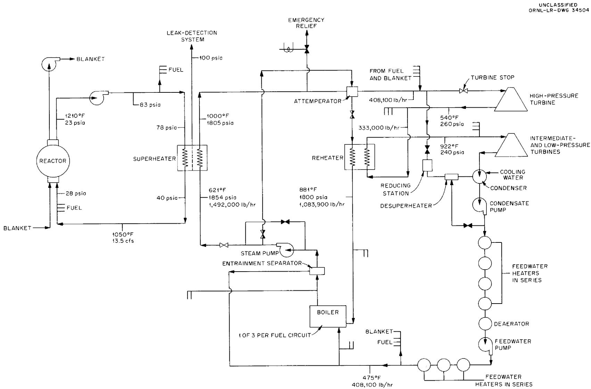  
Fig. 1.1.1. Flow Diagram of Fuel-to-Steam Heat Transfer System For Interim Design Reactor.

easily certain design features were fixed, as previously described. More nearly optimized systems would probably result in lower costs; however, with the exception of the gas-cooled cycle, it was not evident that optimization studies would significantly alter the relative costs.

The Loeffler direct fuel-to-steam system gave the lowest first cost. In this case the elimination of a sodium circuit resulted in a net saving even though the fuel-to-steam heat exchanger was more expensive than the heat exchangers in the sodium-coupled system.

The helium-cooled cycle resulted in the highest first cost. This was due primarily to the relatively large amount of heat transfer surface required in the fuel-to-helium and helium-to-water-to-steam heat exchangers. This particular system would probably be the most sensitive to optimization studies. In particular, increasing the coolant gas pressure and using gases other than helium could reduce the size of the heat transfer equipment.

Differences in fuel volume will also be reflected in fuel cycle costs, which are not included in the capital costs shown in Table 1.1.1. A first approximation, based on changes in fuel inventory charges alone, indicate that each additional 100 ft³ of fuel volume would add about 0.06 mill/kwhr to the cost. On the basis that each plant had the same net electrical output, the maximum deviation in the power cost contributed by the capital charge was found to be approximately 1 mill/kwhr.

# EXPERIMENTAL REACTOR CALCULATIONS

J.W.Miller

A 30-Mw experimental reactor is being considered that would have a 6-ft-dia core enclosed in a $\frac{1}{2}$ -in.-thick INOR-8 pressure vessel. Surrounding the core there would be a 6-in.-thick layer of insulation, a 6-in.-thick air space, and five 2-in.-thick boron steel thermal shields cooled by 4-in.-thick layers of diphenyl.

Nuclear calculations indicate that the critical mass at $1180^{\circ}F$ would be $49\mathrm{kg}$ of $\mathsf{U}^{235}$ , and the total inventory for a system volume of 150 ft would be $65\mathrm{kg}$ of $\mathsf{U}^{235}$ . After a year of operation, the critical mass would have increased to $61\mathrm{kg}$ with a net integrated burnup of $14.4\mathrm{kg}$ .

Approximately $7\%$ of the neutrons would be captured in the core vessel. This compares with $5\%$ for the 600-Mw reference design reactor.

Weighting these numbers by the reactor power

levels, indicates that the heat-generation rate in the experimental reactor would be approximately $7\%$ of the heat-generation rate in the reference design reactor.

Approximately $31\%$ of the neutrons would escape from the core vessel, and these would all be captured by the time they reached the fourth boron steel thermal shield.

# NUCLEAR CALCULATIONS

L. G. Alexander

# Nuclear Characteristics of Homogeneous, Two-Region, Molten-Fluoride-Salt Reactors Fueled with U233

The calculations entailed in the investigation of initial states of $U^{233}$ -fueled reactors were completed, and it was discovered that serious discrepancies existed between results obtained from the Oracle program Cornpone and the UNIVAC program Ocusol, especially when the results were used as input for the Oracle burnout code, Sorghum. The difficulty was traced to fluctuating end-point fluxes generated by the Cornpone program. Accordingly, the Cornpone cases were discarded, and the series of calculations was completed with the Ocusol program. Meanwhile, the defect in the Cornpone program was remedied by the author, W. E. Kinney, and the two programs are now in fair agreement, as discussed below.

The results of the calculations are given in Table 1.1.2, where critical mass, inventory, regeneration ratio, etc., are given for a series of cases covering core diameters ranging from 4 to 12 ft and thorium fluoride concentrations in the core of 2, 4, and 7 mole%. The regeneration ratio is plotted against the critical inventory for a 600-Mw (thermal) system in Fig. 1.1.2. The dotted line in Fig. 1.1.2 is the envelope of the curves shown and is the locus of optimum conversion for a given inventory. As may be seen, the 8-ft-dia cores are nearly optimum at all thorium concentrations, and initial regeneration ratios of up to 1.08 can be obtained with inventories ranging up to $1300\mathrm{kg}$ of $\mathsf{U}^{233}$ .

The subsequent performance of the 8-ft-dia core with 7 mole % thorium was studied by means of the Oracle code Sorghum. Extracts from the calculated results are given in Table 1.1.3, where inventories, absorption ratios, regeneration ratios, etc., are given for periods of operation of up to

Table 1.1.2. Initial Nuclear Characteristics of Two-Region, Homogeneous, Molten-Fluoride-Salt Reactors Fueled with $U^{233}$   

<table><tr><td>Fuel salt: 37 mole % BeF2+63 mole % LiF+UF4+ThF4</td></tr><tr><td>Blanket salt: 13 mole % ThF4+16 mole % BeF2+71 mole % LiF</td></tr><tr><td>Total power: 600 Mw (heat)</td></tr><tr><td>External fuel volume: 339 ft3</td></tr></table>

<table><tr><td>Case No.</td><td>51</td><td>52</td><td>53</td><td>54</td><td>55</td><td>56</td><td>57</td><td>58</td><td>59</td><td>60</td><td>61</td><td>62</td><td>63</td><td>64</td><td>65</td></tr><tr><td>Core diameter, ft</td><td>4</td><td>4</td><td>4</td><td>6</td><td>6</td><td>6</td><td>8</td><td>8</td><td>8</td><td>10</td><td>10</td><td>10</td><td>12</td><td>12</td><td>12</td></tr><tr><td>ThF4in fuel salt, mole %</td><td>2</td><td>4</td><td>7</td><td>2</td><td>4</td><td>7</td><td>2</td><td>4</td><td>7</td><td>2</td><td>4</td><td>7</td><td>2</td><td>4</td><td>7</td></tr><tr><td>U233 in fuel salt, male %</td><td>0.619</td><td>0.856</td><td>1.247</td><td>0.236</td><td>0.450</td><td>0.762</td><td>0.152</td><td>0.316</td><td>0.603</td><td>0.121</td><td>0.262</td><td>0.528</td><td>0.101</td><td>0.222</td><td>0.477</td></tr><tr><td>U233 atom density, atoms/cm3</td><td>19.8 × 1019</td><td>27.4 × 1019</td><td>39.9 × 1019</td><td>7.55 × 1019</td><td>14.4 × 1019</td><td>24.4 × 1019</td><td>4.88 × 1019</td><td>10.1 × 1019</td><td>19.3 × 1019</td><td>3.86 × 1019</td><td>8.39 × 1019</td><td>16.9 × 1019</td><td>3.24 × 1019</td><td>7.39 × 1019</td><td>15.25 × 1019</td></tr><tr><td>Critical mass, kg of U233</td><td>72.0</td><td>100.5</td><td>146.5</td><td>94.2</td><td>177.8</td><td>301</td><td>143</td><td>299</td><td>566</td><td>221</td><td>481</td><td>970</td><td>320.5</td><td>733</td><td>1510</td></tr><tr><td>Critical inventory, kg of U233</td><td>810</td><td>1118</td><td>1630</td><td>374</td><td>711</td><td>1204</td><td>325</td><td>677</td><td>1283</td><td>364</td><td>793</td><td>1600</td><td>441</td><td>1007</td><td>2078</td></tr><tr><td>Neutron absorption ratios*</td><td></td><td></td><td></td><td></td><td></td><td></td><td></td><td></td><td></td><td></td><td></td><td></td><td></td><td></td><td></td></tr><tr><td>U233 (fissions)</td><td>0.871</td><td>0.874</td><td>0.881</td><td>0.864</td><td>0.868</td><td>0.876</td><td>0.867</td><td>0.865</td><td>0.873</td><td>0.87</td><td>0.864</td><td>0.871</td><td>0.873</td><td>0.864</td><td>0.870</td></tr><tr><td>U233 (n,y)</td><td>0.129</td><td>0.126</td><td>0.119</td><td>0.136</td><td>0.132</td><td>0.124</td><td>0.133</td><td>0.135</td><td>0.127</td><td>0.130</td><td>0.136</td><td>0.129</td><td>0.127</td><td>0.136</td><td>0.130</td></tr><tr><td>Be-Li-F in fuel salt</td><td>0.070</td><td>0.066</td><td>0.069</td><td>0.093</td><td>0.075</td><td>0.076</td><td>0.120</td><td>0.082</td><td>0.078</td><td>0.142</td><td>0.088</td><td>0.081</td><td>0.164</td><td>0.093</td><td>0.083</td></tr><tr><td>Core vessel</td><td></td><td></td><td></td><td></td><td></td><td></td><td></td><td></td><td></td><td></td><td></td><td></td><td></td><td></td><td></td></tr><tr><td>Be-Li-F in blanket salt</td><td>0.129</td><td>0.111</td><td>0.095</td><td>0.101</td><td>0.080</td><td>0.062</td><td>0.086</td><td>0.059</td><td>0.043</td><td>0.062</td><td>0.044</td><td>0.031</td><td>0.049</td><td>0.032</td><td>0.020</td></tr><tr><td>Leakage</td><td></td><td></td><td></td><td></td><td></td><td></td><td></td><td></td><td></td><td></td><td></td><td></td><td></td><td></td><td></td></tr><tr><td>Th in fuel salt</td><td>0.343</td><td>0.426</td><td>0.517</td><td>0.581</td><td>0.650</td><td>0.740</td><td>0.716</td><td>0.785</td><td>0.865</td><td>0.800</td><td>0.865</td><td>0.938</td><td>0.872</td><td>0.922</td><td>0.998</td></tr><tr><td>Th in blanket salt</td><td>0.653</td><td>0.600</td><td>0.538</td><td>0.403</td><td>0.382</td><td>0.330</td><td>0.264</td><td>0.254</td><td>0.213</td><td>0.189</td><td>0.180</td><td>0.146</td><td>0.115</td><td>0.130</td><td>0.092</td></tr><tr><td>Neutron yield, η</td><td>2.20</td><td>2.20</td><td>2.22</td><td>2.18</td><td>2.19</td><td>2.21</td><td>2.19</td><td>2.18</td><td>2.20</td><td>2.19</td><td>2.18</td><td>2.20</td><td>2.20</td><td>2.18</td><td>2.19</td></tr><tr><td>Regeneration ratio</td><td>0.996</td><td>1.026</td><td>1.055</td><td>0.984</td><td>1.032</td><td>1.070</td><td>0.980</td><td>1.039</td><td>1.078</td><td>0.989</td><td>1.045</td><td>1.084</td><td>0.987</td><td>1.052</td><td>1.090</td></tr></table>

*Neutrons absorbed per neutron absorbed in U $^{233}$ .

Fuel: U233

Core diameter: 8 ft

ThF4 in core: 7 mole %

Power: 600 Mw (thermal)

Load factor: 0.8

External volume: 339 ft³

Chemical processing rate: 1.66 ft³/day for core

1.97 ft3/day for blanket

Table 1.1.3. Long-Term Nuclear Performance of a Two-Region, Homogeneous, Spherical, Molten-Fluoride-Salt Reactor   

<table><tr><td rowspan="2"></td><td colspan="2">Initial State</td><td colspan="2">After 1 Year</td><td colspan="2">After 2 Years</td><td colspan="2">After 5 Years</td><td colspan="2">After 10 Years</td><td colspan="2">After 20 Years</td></tr><tr><td>Inventory (kg)</td><td>Absorption Ratio</td><td>Inventory (kg)</td><td>Absorption Ratio</td><td>Inventory (kg)</td><td>Absorption Ratio</td><td>Inventory (kg)</td><td>Absorption Ratio</td><td>Inventory (kg)</td><td>Absorption Ratio</td><td>Inventory (kg)</td><td>Absorption Ratio</td></tr><tr><td colspan="13">Core elements</td></tr><tr><td>\( Th^{232} \)</td><td>14,527.1</td><td>0.8652</td><td>14,527</td><td>0.8416</td><td>14,527</td><td>0.8343</td><td>14,527</td><td>0.8237</td><td>14,527</td><td>0.8086</td><td>14,527</td><td>0.7892</td></tr><tr><td>\( P_{a}^{233} \)</td><td>0</td><td>0</td><td>18.8</td><td>0.00692</td><td>18.63</td><td>0.00671</td><td>18.38</td><td>0.00642</td><td>18.11</td><td>0.00605</td><td>17.67</td><td>0.00562</td></tr><tr><td>\( U^{233} \)</td><td>1,283.28</td><td>1.0000</td><td>1,363</td><td>0.9998</td><td>1,388.3</td><td>0.9994</td><td>1,420.7</td><td>0.9966</td><td>1,453.03</td><td>0.9876</td><td>1,500.02</td><td>0.9721</td></tr><tr><td>Fissions</td><td></td><td>0.8730</td><td></td><td>0.8740</td><td></td><td>0.8741</td><td></td><td>0.8721</td><td></td><td>0.8648</td><td></td><td>0.8519</td></tr><tr><td>\( n,y \)</td><td></td><td>0.1270</td><td></td><td>0.1258</td><td></td><td>0.1253</td><td></td><td>0.1245</td><td></td><td>0.1228</td><td></td><td>0.1202</td></tr><tr><td>\( U^{234} \)</td><td>0</td><td>0</td><td>27.32</td><td>0.00348</td><td>53.91</td><td>0.00672</td><td>129.3</td><td>0.0156</td><td>242.05</td><td>0.0305</td><td>428.7</td><td>0.0472</td></tr><tr><td>\( U^{235} \)</td><td>0</td><td>0</td><td>0.353</td><td>\( 1.73 \times 10^{-4} \)</td><td>1.32</td><td>\( 6.37 \times 10^{-4} \)</td><td>7.17</td><td>0.00339</td><td>23.17</td><td>0.01235</td><td>63.07</td><td>0.0279</td></tr><tr><td>Fissions</td><td></td><td>0</td><td></td><td>\( 1.23 \times 10^{-4} \)</td><td></td><td>\( 4.53 \times 10^{-4} \)</td><td></td><td>0.00241</td><td></td><td>0.00880</td><td></td><td>0.0199</td></tr><tr><td>\( n,y \)</td><td></td><td>0</td><td></td><td>\( 0.50 \times 10^{-4} \)</td><td></td><td>\( 1.84 \times 10^{-4} \)</td><td></td><td>0.00098</td><td></td><td>0.00355</td><td></td><td>0.0080</td></tr><tr><td>\( U^{236} \)</td><td>0</td><td>0</td><td>0.00347</td><td>\( 6.39 \times 10^{-7} \)</td><td>0.0252</td><td>\( 4.50 \times 10^{-6} \)</td><td>0.343</td><td>\( 5.89 \times 10^{-5} \)</td><td>2.206</td><td>0.000458</td><td>11.73</td><td>0.00178</td></tr><tr><td>\( Np^{237} \)</td><td>0</td><td>0</td><td>\( 2.74 \times 10^{-5} \)</td><td>\( 9.76 \times 10^{-9} \)</td><td>\( 3.23 \times 10^{-4} \)</td><td>\( 1.13 \times 10^{-7} \)</td><td>0.00725</td><td>\( 2.46 \times 10^{-6} \)</td><td>0.568</td><td>\( 2.40 \times 10^{-5} \)</td><td>0.321</td><td>\( 9.94 \times 10^{-5} \)</td></tr><tr><td>\( U^{238} \)</td><td>0</td><td>0</td><td>\( 4.12 \times 10^{-7} \)</td><td>\( 1.01 \times 10^{-10} \)</td><td>\( 9.44 \times 10^{-6} \)</td><td>\( 2.25 \times 10^{-9} \)</td><td>\( 5.65 \times 10^{-4} \)</td><td>\( 1.30 \times 10^{-7} \)</td><td>0.00922</td><td>\( 2.863 \times 10^{-6} \)</td><td>0.104</td><td>\( 2.11 \times 10^{-5} \)</td></tr><tr><td>\( P_{u}^{239} \)</td><td>0</td><td>0</td><td>\( 3.46 \times 10^{-9} \)</td><td>\( 1.98 \times 10^{-12} \)</td><td>\( 1.49 \times 10^{-7} \)</td><td>\( 8.37 \times 10^{-11} \)</td><td>\( 2.29 \times 10^{-5} \)</td><td>\( 1.25 \times 10^{-8} \)</td><td>0.000732</td><td>\( 5.952 \times 10^{-7} \)</td><td>0.0148</td><td>\( 7.36 \times 10^{-6} \)</td></tr><tr><td>Fissions</td><td></td><td>0</td><td></td><td>\( 1.22 \times 10^{-12} \)</td><td></td><td>\( 5.15 \times 10^{-11} \)</td><td></td><td>\( 0.77 \times 10^{-8} \)</td><td></td><td>\( 3.687 \times 10^{-7} \)</td><td></td><td>\( 4.58 \times 10^{-6} \)</td></tr><tr><td>\( n,y \)</td><td></td><td>0</td><td></td><td>\( 0.76 \times 10^{-12} \)</td><td></td><td>\( 3.22 \times 10^{-11} \)</td><td></td><td>\( 0.48 \times 10^{-8} \)</td><td></td><td>\( 2.255 \times 10^{-7} \)</td><td></td><td>\( 2.78 \times 10^{-6} \)</td></tr><tr><td>Fission products</td><td>0</td><td>0</td><td>115.2</td><td>0.0165</td><td>158.2</td><td>0.0221</td><td>180.5</td><td>0.0244</td><td>181.5</td><td>0.0234</td><td>181.5</td><td>0.0221</td></tr><tr><td>Li</td><td>3,699.12</td><td>0.00522</td><td>36,991</td><td>0.00488</td><td>3,699</td><td>0.00478</td><td>3,699</td><td>0.00465</td><td>3,699.1</td><td>0.00449</td><td>3,699.1</td><td>0.00429</td></tr><tr><td>Be</td><td>2,739.23</td><td>0.00907</td><td>2,739</td><td>0.00906</td><td>2,739</td><td>0.00906</td><td>2,739</td><td>0.00905</td><td>2,739.2</td><td>0.00903</td><td>2,739.2</td><td>0.00900</td></tr><tr><td>F</td><td>26,330.9</td><td>0.06433</td><td>26,331</td><td>0.0643</td><td>26,331</td><td>0.0642</td><td>26,331</td><td>0.0642</td><td>26,331</td><td>0.0640</td><td>26,331</td><td>0.0638</td></tr><tr><td colspan="13">Blanket</td></tr><tr><td>\( Th^{232} \)</td><td>30,821.6</td><td>0.2132</td><td>30,822</td><td>0.2132</td><td>30,822</td><td>0.2131</td><td>30,822</td><td>0.2128</td><td>30,822</td><td>0.212</td><td>30,822</td><td>0.211</td></tr><tr><td>\( P_{a}^{233} \)</td><td>0</td><td></td><td>4,796</td><td></td><td>4,79</td><td></td><td>4,78</td><td></td><td>4,771</td><td></td><td>4,752</td><td></td></tr><tr><td>\( U^{233} \)</td><td>0</td><td></td><td>26,26</td><td></td><td>38,15</td><td></td><td>44.36</td><td></td><td>44.53</td><td></td><td>44.35</td><td></td></tr><tr><td>Other</td><td></td><td>0.0428</td><td></td><td>0.0428</td><td></td><td>0.0428</td><td></td><td>0.0428</td><td></td><td>0.0426</td><td></td><td>0.0423</td></tr><tr><td>Total inventory, kg of fissionable isotopes</td><td></td><td>1,283.28</td><td></td><td>1,389.6</td><td></td><td>1,427.8</td><td></td><td>1,472.2</td><td></td><td>1,520.73</td><td></td><td>1,607.5</td></tr><tr><td>Fission yield, \( \eta \)</td><td></td><td>2.20</td><td></td><td>2.203</td><td></td><td>2.204</td><td></td><td>2.204</td><td></td><td>2.202</td><td></td><td>2.196</td></tr><tr><td>Fuel feed rate, kg/year</td><td></td><td></td><td></td><td>118</td><td></td><td>27.4</td><td></td><td>6.0</td><td></td><td>-0.1</td><td></td><td>-0.8</td></tr><tr><td>Net integrated fuel bumup, kg</td><td></td><td>0</td><td></td><td>11.46</td><td></td><td>21.56</td><td></td><td>-6.42</td><td></td><td>-75.87</td><td></td><td>-167.36</td></tr><tr><td>Regeneration ratio</td><td></td><td>1.079</td><td></td><td>1.051</td><td></td><td>1,047</td><td></td><td>1,046</td><td></td><td>1,045</td><td></td><td>1,042</td></tr></table>

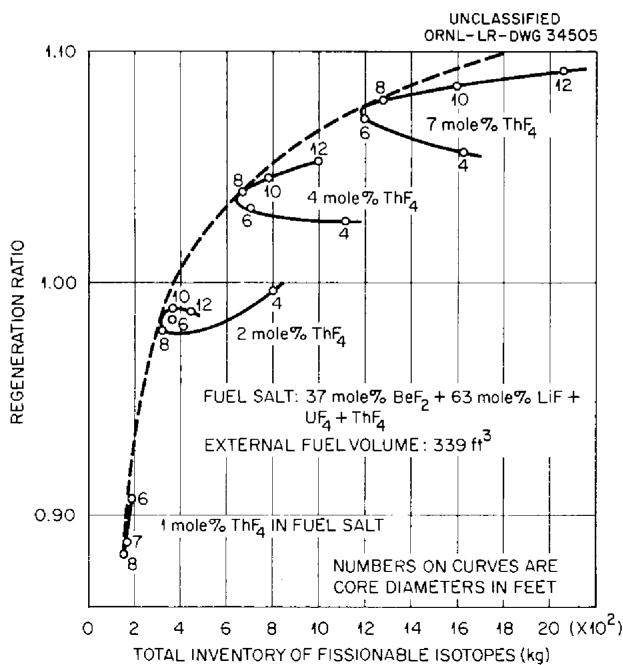  
Fig. 1.1.2. Initial Regeneration Ratio in Two-Region, Homogeneous, Molten-Fluoride-Salt Reactors Fueled with U $^{233}$ .

20 years. The regeneration ratio, total inventory (including $\mathsf{U}^{233}$ in the blanket), annual feed rate, and net integrated burnup are plotted in Fig. 1.I.3. It may be seen that, although the regeneration ratio remains above 1.04 and therefore there is a net breeding gain, it is, nevertheless, necessary to add fresh $\mathsf{U}^{233}$ during the first five years to compensate for the ingrowth of fission products and nonfissionable isotopes. The annual additions amount to 118, 27.4, 10.8, 6.0, and 1.6 kg, respectively, but less than 1.0 kg per year is required after five years, and the reactor is then self-sustaining. By the end of the second year the net integrated burnup (total inventory less total fuel purchased) becomes negative.

# Blanket Fissions in the Reference Design Reactor

The burnout code, Sorghum, used in this study does not take into account fissions occurring in blanket. In order to estimate these, a series of sequential Cornpone and Sorghum calculations was performed, in which the concentrations of the 16 elements in the reactor predicted by one-year Sorghum calculations were submitted periodically to a criticality test by the Cornpone program. The outputs, consisting of fraction of fissions in the

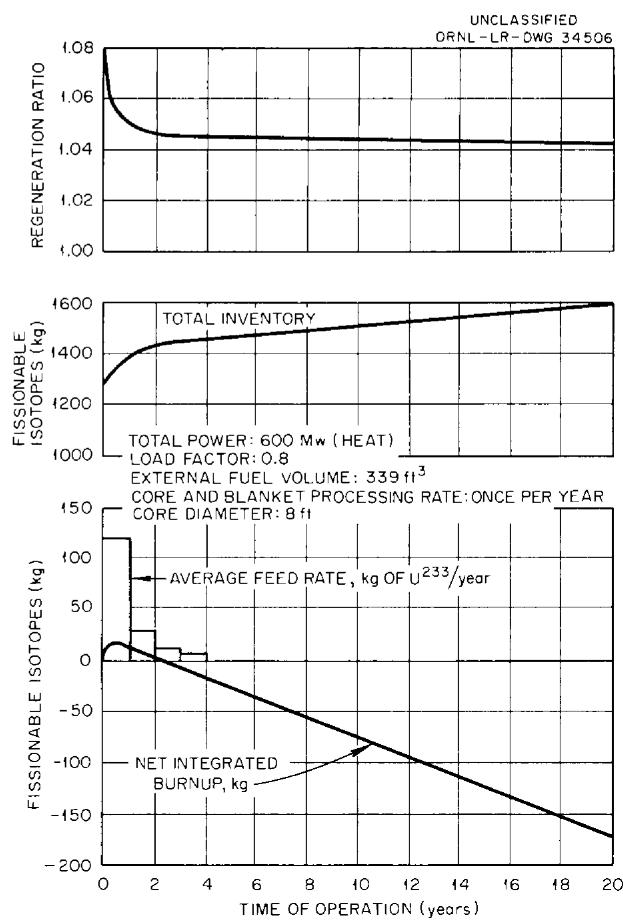  
Fig. 1.1.3. Nuclear Performance of Two-Region, Homogeneous, Molten-Fluoride-Salt Reactor Fueled with U233.

blanket, together with space-averaged group fluxes and leakage probabilities, were then used as inputs for further one-year Sorghum calculations. The neutron source in Sorghum was also reduced by the fraction of fissions occurring in the blanket. In addition to providing information about the fissions in the blanket, this series of calculations also provided a test of the usual method of operating the code. The case selected for study was the Interim Design Reactor with a core 8 ft in diameter, a fuel salt consisting of 36.5 mole % $\mathsf{BeF}_2$ , 62.5 mole % LiF, and 1 mole % ThF4, together with sufficient UF4 to make the system critical (about 0.25 mole%). The case was run as Cornpone calculation 01045 and the resulting data were used as input for Sorghum calculation 01065. In the integration of the time-dependent difference equations, a time increment of 5 days

was used until the time variable corresponded to one year of operation of the reactor; at this time, the increment was increased to 30 days for the next 20 years of reactor time. This is customarily done to shorten the time required for the computation and is justified by the fact that, after the first year, concentrations change slowly.

A second series of calculations was performed as described above, except that the time increment was held constant at 5 days. After one year of reactor operation, the concentrations predicted by the Sorghum code were found to render the reactor slightly subcritical ( $k = 0.9982$ on Cornpone 02045), even though the $U^{233}$ in the blanket was taken into account. The fraction of fissions in the blanket was estimated to be 0.013. This information, together with flux spectrum and leakage probabilities, was used as input for further Sorghum calculations, etc., with the results shown in Fig. 1.1.4, where the fraction of blanket fissions is shown as a function of reactor operating time. Also shown is a comparison of two key parameters,

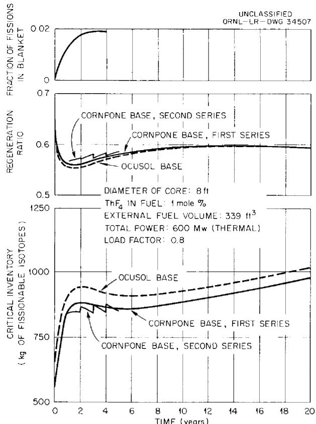  
Fig. 1.1.4. Blanket Fissions in Interim Design Reactor.

critical inventory and regeneration ratio, computed in the two series of calculations. The calculations to date cover only the first five years of operation; however, the fraction of fissions in the blanket appears to have stabilized at about 0.02.

A comparison between the two lower curves for critical inventory shows satisfactory agreement between the two methods of calculation, especially since the top points of the discontinuous curve represent the critical condition. Similarly, the low points of the discontinuous curve for regeneration ratio agree well with the smooth curve. However, it is not presently understood why the slopes of the discontinuous curves differ so much from the smooth curves, and it may be that the agreement of the points is fortuitous.

# Comparison of Ocusol and Cornpone Calculations

As mentioned above, a mathematical defect in the Cornpone program was discovered, and hence all prior Cornpone calculations were discarded. After the error had been corrected, the program was used to recompute an Ocusol case. A comparison of the results obtained from the two programs with identical input conditions is shown in Table 1.1.4. It may be seen that, while there is good agreement between the regeneration ratios, there is a substantial difference between the critical inventories and that the Cornpone program predicts the lower values.

The discrepancies have been resolved in favor of Cornpone, which embodies a fourth-order approximation to the difference equations, whereas Ocusol uses only second-order approximations that result in an under-estimate of the absorptions in the core. In order to achieve a neutron balance in Ocusol, the currents at the boundary of the core are adjusted arbitrarily and are not computed from the gradients of the flux. As a result, the leakages are overestimated. In Cornpone, the fourth-order solutions satisfy the neutron balances to less than one part in a thousand, and the boundary currents are correctly computed from the gradients of the flux.

The difference in the behavior of this reactor as predicted by Sorghum calculations based on the Ocusol and on the Cornpone solutions are shown in Fig. 1.1.4. It may be seen that the differences in regeneration ratio are negligible, but the calculation based on Cornpone predicts a critical inventory about $50\mathrm{kg}$ lower than that based on Ocusol.

Table 1.1.4. Comparison of Ocusol and Compone Calculations for the Interim Design Reactor   

<table><tr><td>Fuel: U235</td></tr><tr><td>Core diameter: 8 ft</td></tr><tr><td>ThF4in core: 1 mole %</td></tr><tr><td>Power: 600 Mw (thermal)</td></tr><tr><td>Load factor: 0.8</td></tr><tr><td>External fuel volume: 339 ft3</td></tr></table>

<table><tr><td rowspan="2"></td><td colspan="2">Ocusol</td><td colspan="2">Cornpone</td></tr><tr><td>Inventory (kg)</td><td>Absorption Ratio</td><td>Inventory (kg)</td><td>Absorption Ratio</td></tr><tr><td colspan="5">Core elements</td></tr><tr><td>Th232</td><td>2,121</td><td>0.364</td><td>2,121</td><td>0.378</td></tr><tr><td>U235</td><td>616</td><td></td><td>565</td><td></td></tr><tr><td>Fissions</td><td></td><td>0.729</td><td></td><td>0.734</td></tr><tr><td>n,y</td><td></td><td>0.271</td><td></td><td>0.266</td></tr><tr><td>U238</td><td>45.9</td><td>0.039</td><td>46.7</td><td>0.042</td></tr><tr><td>Li</td><td>3,969</td><td>0.033</td><td>3,969</td><td>0.037</td></tr><tr><td>Be</td><td>3,044</td><td>0.010</td><td>3,044</td><td>0.010</td></tr><tr><td>F</td><td>24,291</td><td>0.058</td><td>24,291</td><td>0.047</td></tr><tr><td colspan="5">Blanket</td></tr><tr><td>Th232</td><td>30,822</td><td>0.232</td><td>30,822</td><td>0.227</td></tr><tr><td>Other</td><td></td><td>0.063</td><td></td><td>0.071</td></tr><tr><td>Fission yield, η</td><td></td><td>1.800</td><td></td><td>1.812</td></tr><tr><td>Regeneration ratio</td><td></td><td>0.635</td><td></td><td>0.647</td></tr></table>

# Heterogeneous Reactors

As mentioned in previous reports, graphitemoderated, heterogeneous, molten-fluoride-salt reactors show promise of achieving higher regeneration ratios for a given investment in fuel than the homogeneous reactors. As a result, attention has been given to developing a reasonably reliable method of calculation. The multigroup Cornpone program for Oracle was modified by W. E. Kinney to provide a boundary condition of zero net current in each diffusion group. Thus it is now possible to treat a heterogeneous unit cell in an infinite lattice and to compute group disadvantage factors which may then be applied to the group cross sections in a homogeneized version of the finite reactor. A program modifying the Cornpone program to apply these factors has been written.

# Gamma-Ray Heating Calculations

Work on a program for computing the gamma-ray heating in the core vessel and blanket of homogeneous, molten-salt reactors was resumed. Gamma-ray energy absorption coefficients as a function of energy for 24 elements were computed from the x-ray attenuation coefficients listed by Grodstein, according to a procedure developed previously. The defining equation is:

$$
\mu_ {e} = \mu_ {p e} + f _ {p p} \mu_ {p p} + (f _ {c} + f _ {o}) \mu_ {c},
$$

where

$$
\mu_ {e} = \text {g a m m a - r a y e n e r g y a b s o r p t i o n c o e f f i c i e n t},
$$

$$
\mu_ {p e} = \text {p h o t o e l e c t r i c a b s o r p t i o n c o e f f i c i e n t},
$$

$$
\mu_ {c} = \text {C o m p t o n s c a t t e r i n g c o e f f i c i e n t},
$$

$$
f _ {p p} = \frac {\text {f r a c t i o n o f e n e r g y o f p h o t o n d e s p o s i t e d}}{\text {l o c a l l y i n a p a i r - p r o d u c t i o n c o l l i s i o n ,}}
$$

$$
f _ {c} = \text {f r a c t i o n o f e n e r g y o f p h o t o n d e p o s i t e d}
$$

$$
f _ {o} = \text {f r a c t i o n o f e n e r g y o f p h o t o n c a r r i e d a w a y} \text {f r o m C o m p t o n c o l l i s i o n b y p h o t o n s h a v i n g} E _ {0}, \text {t h e ＂ c u t - o f f ＂} \text {e n e r g y}.
$$

In these calculations $f_{pp}$ was taken to be equal to 1.0; that is, the annihilation radiation was included in the local heating effect. This is not strictly consistent with the use of a low-energy

cut-off limit, $E_{0}$ , of 0.1 MeV for the Compton process. The energy-absorption coefficients computed here will be used, however, in an "integral spectrum" calculation of the type described in ORNL CF-56-11-82 (ref 5) in which the coefficient is averaged over the photon spectrum which is not known with sufficient accuracy to warrant taking into account the annihilation radiation.

For a cut-off energy of 0.1 Mev, $f_{o}$ is equal to zero with negligible error for all energies down to and including 0.15 Mev. The energy-deposition coefficient for Compton scattering, $f_{c'}$ , was taken from the values listed in ref 4.

The calculated values are listed in Table 1.1.5, and they have been assembled on paper tape for use with the gamma-ray heating program Ghimsr being written for the Oracle. A closed, three-address subroutine has been written for the computation of Storm's attenuation function for spherically symmetric systems.

Table 1.1.5. Gamma-Ray Energy-Absorption Coefficients, $\mu_{e}$   

<table><tr><td rowspan="2">Photon Energy Eγ (Mev)</td><td colspan="2">μe</td><td rowspan="2">Photon Energy Eγ (Mev)</td><td colspan="2">μe</td></tr><tr><td>barns/atom</td><td>cm2/g</td><td>barns/atom</td><td>cm2/g</td></tr><tr><td colspan="3">Hydrogen (1;2)</td><td colspan="3">Beryllium (4;9.02)</td></tr><tr><td>0.1</td><td>0.0620</td><td>0.0375</td><td>0.1</td><td>0.251</td><td>0.0167</td></tr><tr><td>0.2</td><td>0.0856</td><td>0.0514</td><td>0.2</td><td>0.342</td><td>0.0228</td></tr><tr><td>0.4</td><td>0.0982</td><td>0.0589</td><td>0.4</td><td>0.396</td><td>0.0264</td></tr><tr><td>0.6</td><td>0.0991</td><td>0.0595</td><td>0.6</td><td>0.396</td><td>0.0264</td></tr><tr><td>0.8</td><td>0.0970</td><td>0.0581</td><td>0.8</td><td>0.388</td><td>0.0258</td></tr><tr><td>1.0</td><td>0.0927</td><td>0.0556</td><td>1.0</td><td>0.372</td><td>0.0248</td></tr><tr><td>1.5</td><td>0.0850</td><td>0.0510</td><td>1.5</td><td>0.328</td><td>0.0219</td></tr><tr><td>2.0</td><td>0.0815</td><td>0.0589</td><td>2.0</td><td>0.328</td><td>0.0219</td></tr><tr><td>3.0</td><td>0.0669</td><td>0.0401</td><td>3.0</td><td>0.273</td><td>0.0182</td></tr><tr><td>4.0</td><td>0.0593</td><td>0.0356</td><td>4.0</td><td>0.247</td><td>0.0165</td></tr><tr><td>6.0</td><td>0.0491</td><td>0.0294</td><td>6.0</td><td>0.213</td><td>0.0142</td></tr><tr><td>8.0</td><td>0.0425</td><td>0.0255</td><td>8.0</td><td>0.191</td><td>0.0128</td></tr><tr><td>10.0</td><td>0.0376</td><td>0.0226</td><td>10.0</td><td>0.177</td><td>0.0118</td></tr><tr><td colspan="3">Carbon (6;12)</td><td colspan="3">Nitrogen (7;14)</td></tr><tr><td>0.1</td><td>0.391</td><td>0.0199</td><td>0.1</td><td>0.470</td><td>0.0202</td></tr><tr><td>0.2</td><td>0.512</td><td>0.0257</td><td>0.2</td><td>0.599</td><td>0.0258</td></tr><tr><td>0.4</td><td>0.589</td><td>0.0296</td><td>0.4</td><td>0.689</td><td>0.0296</td></tr><tr><td>0.6</td><td>0.594</td><td>0.0298</td><td>0.6</td><td>0.694</td><td>0.0298</td></tr><tr><td>0.8</td><td>0.582</td><td>0.0292</td><td>0.8</td><td>0.679</td><td>0.0292</td></tr><tr><td>1.0</td><td>0.557</td><td>0.0279</td><td>1.0</td><td>0.650</td><td>0.0280</td></tr><tr><td>1.5</td><td>0.512</td><td>0.0257</td><td>1.5</td><td>0.597</td><td>0.0257</td></tr><tr><td>2.0</td><td>0.493</td><td>0.0247</td><td>2.0</td><td>0.579</td><td>0.0249</td></tr><tr><td>3.0</td><td>0.416</td><td>0.0209</td><td>3.0</td><td>0.490</td><td>0.0211</td></tr><tr><td>4.0</td><td>0.381</td><td>0.0191</td><td>4.0</td><td>0.451</td><td>0.0194</td></tr><tr><td>6.0</td><td>0.334</td><td>0.0167</td><td>6.0</td><td>0.400</td><td>0.0172</td></tr><tr><td>8.0</td><td>0.306</td><td>0.0153</td><td>8.0</td><td>0.370</td><td>0.0159</td></tr><tr><td>10.0</td><td>0.390</td><td>0.0145</td><td>10.0</td><td>0.251</td><td>0.0151</td></tr><tr><td colspan="3">Oxygen (8;16)</td><td colspan="3">Sodium (11;23)</td></tr><tr><td>0.1</td><td>0.531</td><td>0.0200</td><td>0.1</td><td>1.04</td><td>0.0273</td></tr><tr><td>0.2</td><td>0.702</td><td>0.0264</td><td>0.2</td><td>1.031</td><td>0.0270</td></tr><tr><td>0.4</td><td>0.790</td><td>0.0297</td><td>0.4</td><td>1.119</td><td>0.0293</td></tr><tr><td>0.6</td><td>0.784</td><td>0.0294</td><td>0.6</td><td>1.098</td><td>0.0288</td></tr><tr><td>0.8</td><td>0.776</td><td>0.0292</td><td>0.8</td><td>1.067</td><td>0.8279</td></tr><tr><td>1.0</td><td>0.745</td><td>0.0280</td><td>1.0</td><td>1.021</td><td>0.0268</td></tr><tr><td>1.5</td><td>0.683</td><td>0.0257</td><td>1.5</td><td>0.940</td><td>0.0246</td></tr><tr><td>2.0</td><td>0.662</td><td>0.0249</td><td>2.0</td><td>0.895</td><td>0.0234</td></tr><tr><td>3.0</td><td>0.563</td><td>0.0212</td><td>3.0</td><td>0.791</td><td>0.0207</td></tr><tr><td>4.0</td><td>0.522</td><td>0.0196</td><td>4.0</td><td>0.745</td><td>0.0195</td></tr><tr><td>6.0</td><td>0.452</td><td>0.0170</td><td>6.0</td><td>0.658</td><td>0.0172</td></tr><tr><td>8.0</td><td>0.410</td><td>0.0154</td><td>8.0</td><td>0.608</td><td>0.0159</td></tr><tr><td>10.0</td><td>0.394</td><td>0.0148</td><td>10.0</td><td>0.599</td><td>0.0157</td></tr><tr><td colspan="3">Magnesium (12;24.32)</td><td colspan="3">Aluminum (13;26.96)</td></tr><tr><td>0.1</td><td>1.280</td><td>0.0316</td><td>0.1</td><td>1.595</td><td>0.0356</td></tr><tr><td>0.2</td><td>1.085</td><td>0.0268</td><td>0.2</td><td>1.189</td><td>0.0265</td></tr><tr><td>0.4</td><td>1.185</td><td>0.0293</td><td>0.4</td><td>1.285</td><td>0.0287</td></tr><tr><td>0.6</td><td>1.188</td><td>0.0294</td><td>0.6</td><td>1.288</td><td>0.0287</td></tr><tr><td>0.8</td><td>1.162</td><td>0.0288</td><td>0.8</td><td>1.264</td><td>0.0282</td></tr><tr><td>1.0</td><td>1.111</td><td>0.0276</td><td>1.0</td><td>1.210</td><td>0.0270</td></tr><tr><td>1.5</td><td>1.025</td><td>0.0254</td><td>1.5</td><td>1.111</td><td>0.0248</td></tr><tr><td>2.0</td><td>0.074</td><td>0.0248</td><td>2.0</td><td>1.088</td><td>0.0242</td></tr><tr><td>3.0</td><td>0.869</td><td>0.0215</td><td>3.0</td><td>1.031</td><td>0.0230</td></tr><tr><td>4.0</td><td>0.822</td><td>0.0203</td><td>4.0</td><td>0.901</td><td>0.0202</td></tr><tr><td>6.0</td><td>0.767</td><td>0.0190</td><td>6.0</td><td>0.848</td><td>0.0189</td></tr><tr><td>8.0</td><td>0.739</td><td>0.0182</td><td>8.0</td><td>0.822</td><td>0.0184</td></tr><tr><td>10.0</td><td>0.727</td><td>0.7180</td><td>10.0</td><td>0.714</td><td>0.0160</td></tr><tr><td colspan="3">Silicon (14;28.06)</td><td colspan="3">Phosphorus (15;31.02)</td></tr><tr><td>0.1</td><td>1.986</td><td>0.0426</td><td>0.1</td><td>2.49</td><td>0.0485</td></tr><tr><td>0.2</td><td>1.209</td><td>0.0259</td><td>0.2</td><td>1.45</td><td>0.0282</td></tr><tr><td>0.4</td><td>1.392</td><td>0.0300</td><td>0.4</td><td>1.49</td><td>0.0290</td></tr><tr><td>0.6</td><td>1.383</td><td>0.0297</td><td>0.6</td><td>1.48</td><td>0.0288</td></tr><tr><td>0.8</td><td>1.360</td><td>0.0292</td><td>0.8</td><td>1.45</td><td>0.0282</td></tr><tr><td>1.0</td><td>1.303</td><td>0.0280</td><td>1.0</td><td>1.39</td><td>0.0270</td></tr><tr><td>1.5</td><td>1.198</td><td>0.0257</td><td>1.5</td><td>1.28</td><td>0.0249</td></tr><tr><td>2.0</td><td>1.173</td><td>0.0252</td><td>2.0</td><td>1.26</td><td>0.0275</td></tr><tr><td>3.0</td><td>1.030</td><td>0.0221</td><td>3.0</td><td>1.11</td><td>0.0216</td></tr><tr><td>4.0</td><td>0.984</td><td>0.0211</td><td>4.0</td><td>1.068</td><td>0.0208</td></tr><tr><td>6.0</td><td>0.933</td><td>0.0200</td><td>6.0</td><td>1.017</td><td>0.0198</td></tr><tr><td>8.0</td><td>0.912</td><td>0.0196</td><td>8.0</td><td>(1.007)</td><td></td></tr><tr><td>10.0</td><td>0.906</td><td>0.0195</td><td>10.0</td><td>1.022</td><td>0.0195</td></tr><tr><td colspan="3">Sulfur (16;32.06)</td><td colspan="3">Argon (18;39.91)</td></tr><tr><td>0.1</td><td>3.10</td><td>0.0593</td><td>0.1</td><td>4.7</td><td>0.0709</td></tr><tr><td>0.2</td><td>1.60</td><td>0.0300</td><td>0.2</td><td>1.95</td><td>0.0294</td></tr><tr><td>0.4</td><td>1.60</td><td>0.0300</td><td>0.4</td><td>1.82</td><td>0.0274</td></tr><tr><td>0.6</td><td>1.60</td><td>0.0300</td><td>0.6</td><td>1.80</td><td>0.0272</td></tr><tr><td>0.8</td><td>1.56</td><td>0.0296</td><td>0.8</td><td>1.75</td><td>0.0264</td></tr><tr><td>1.0</td><td>1.49</td><td>0.0280</td><td>1.0</td><td>1.67</td><td>0.0252</td></tr><tr><td>1.5</td><td>1.37</td><td>0.0257</td><td>1.5</td><td>1.55</td><td>0.0234</td></tr><tr><td>2.0</td><td>1.34</td><td>0.0252</td><td>2.0</td><td>1.52</td><td>0.0229</td></tr><tr><td>3.0</td><td>1.19</td><td>0.0224</td><td>3.0</td><td>1.36</td><td>0.0205</td></tr><tr><td>4.0</td><td>1.15</td><td>0.0211</td><td>4.0</td><td>1.32</td><td>0.0199</td></tr><tr><td>6.0</td><td>1.10</td><td>0.0206</td><td>6.0</td><td>1.25</td><td>0.0189</td></tr><tr><td>8.0</td><td>1.10</td><td>0.0206</td><td>8.0</td><td>1.29</td><td>0.0294</td></tr><tr><td>10.0</td><td>1.10</td><td>0.0206</td><td>10.0</td><td>1.30</td><td>0.0196</td></tr><tr><td colspan="3">Potassium (19;39.1)</td><td colspan="3">Calcium (20;40.07)</td></tr><tr><td>0.1</td><td>5.8</td><td>0.0895</td><td>0.1</td><td>7.26</td><td>0.1092</td></tr><tr><td>0.2</td><td>2.14</td><td>0.0330</td><td>0.2</td><td>2.38</td><td>0.0358</td></tr><tr><td>0.4</td><td>1.94</td><td>0.0299</td><td>0.4</td><td>2.05</td><td>0.0309</td></tr><tr><td>0.6</td><td>1.90</td><td>0.0293</td><td>0.6</td><td>2.01</td><td>0.0325</td></tr><tr><td>0.8</td><td>1.85</td><td>0.0285</td><td>0.8</td><td>1.95</td><td>0.0294</td></tr><tr><td>1.0</td><td>1.76</td><td>0.0272</td><td>1.0</td><td>1.85</td><td>0.0278</td></tr><tr><td>1.5</td><td>1.63</td><td>0.0251</td><td>1.5</td><td>1.72</td><td>0.0259</td></tr><tr><td>2.0</td><td>1.61</td><td>0.0248</td><td>2.0</td><td>1.69</td><td>0.0255</td></tr><tr><td>3.0</td><td>1.44</td><td>0.0222</td><td>3.0</td><td>1.52</td><td>0.0229</td></tr><tr><td>4.0</td><td>1.41</td><td>0.0218</td><td>4.0</td><td>1.50</td><td>0.0226</td></tr><tr><td>6.0</td><td>1.39</td><td>0.0214</td><td>6.0</td><td>1.49</td><td>0.0224</td></tr><tr><td>8.0</td><td>1.41</td><td>0.0218</td><td>8.0</td><td>1.50</td><td>0.0226</td></tr><tr><td>10.0</td><td>1.43</td><td>0.0220</td><td>10.0</td><td>1.53</td><td>0.0230</td></tr><tr><td colspan="3">Iron (26;55,84)</td><td colspan="3">Copper (29;63,57)</td></tr><tr><td>0.1</td><td>20.7</td><td>0.223</td><td>0.1</td><td>32.5</td><td>0.308</td></tr><tr><td>0.2</td><td>4.45</td><td>0.0479</td><td>0.2</td><td>6.2</td><td>0.0287</td></tr><tr><td>0.4</td><td>2.84</td><td>0.0206</td><td>0.4</td><td>3.33</td><td>0.0316</td></tr><tr><td>0.6</td><td>2.67</td><td>0.0288</td><td>0.6</td><td>3.03</td><td>0.0287</td></tr><tr><td>0.8</td><td>2.57</td><td>0.0277</td><td>0.8</td><td>2.90</td><td>0.0275</td></tr><tr><td>1.0</td><td>2.44</td><td>0.0263</td><td>1.0</td><td>2.74</td><td>0.0260</td></tr><tr><td>1.5</td><td>2.24</td><td>0.0242</td><td>1.5</td><td>2.50</td><td>0.0237</td></tr><tr><td>2.0</td><td>2.23</td><td>0.0240</td><td>2.0</td><td>2.52</td><td>0.0239</td></tr><tr><td>3.0</td><td>2.07</td><td>0.0223</td><td>3.0</td><td>2.45</td><td>0.0232</td></tr><tr><td>4.0</td><td>2.08</td><td>0.0224</td><td>4.0</td><td>2.40</td><td>0.0228</td></tr><tr><td>6.0</td><td>2.15</td><td>0.0232</td><td>6.0</td><td>2.52</td><td>0.0239</td></tr><tr><td>8.0</td><td>2.22</td><td>0.0240</td><td>8.0</td><td>2.63</td><td>0.0250</td></tr><tr><td>10.0</td><td>2.40</td><td>0.0258</td><td>10.0</td><td>2.73</td><td>0.0259</td></tr><tr><td colspan="3">Molybdenum (42;96.0)</td><td colspan="3">Tin (50;118.7)</td></tr><tr><td>0.1</td><td>147</td><td>0.930</td><td>0.1</td><td>289</td><td>1.46</td></tr><tr><td>0.2</td><td>22.3</td><td>0.140</td><td>0.2</td><td>43.6</td><td>0.221</td></tr><tr><td>0.4</td><td>6.9</td><td>0.0433</td><td>0.4</td><td>10.5</td><td>0.0534</td></tr><tr><td>0.6</td><td>5.04</td><td>0.0316</td><td>0.6</td><td>6.90</td><td>0.0350</td></tr><tr><td>0.8</td><td>4.53</td><td>0.0284</td><td>0.8</td><td>5.86</td><td>0.0297</td></tr><tr><td>1.0</td><td>4.20</td><td>0.0264</td><td>1.0</td><td>5.29</td><td>0.0268</td></tr><tr><td>1.5</td><td>3.81</td><td>0.0239</td><td>1.5</td><td>4.71</td><td>0.0239</td></tr><tr><td>2.0</td><td>3.86</td><td>0.0242</td><td>2.0</td><td>4.77</td><td>0.0242</td></tr><tr><td>3.0</td><td>3.86</td><td>0.0242</td><td>3.0</td><td>4.79</td><td>0.0242</td></tr><tr><td>4.0</td><td>3.99</td><td>0.0250</td><td>4.0</td><td>5.12</td><td>0.0260</td></tr><tr><td>6.0</td><td>4.39</td><td>0.0275</td><td>6.0</td><td>5.77</td><td>0.0292</td></tr><tr><td>8.0</td><td>4.71</td><td>0.0296</td><td>8.0</td><td>6.27</td><td>0.0318</td></tr><tr><td>10.0</td><td>5.03</td><td>0.0315</td><td>10.0</td><td>6.74</td><td>0.0341</td></tr><tr><td colspan="3">Iodine (53;126.93)</td><td colspan="3">Tungsten (74;184.0)</td></tr><tr><td>0.1</td><td>363</td><td>1.72</td><td>0.1</td><td>1254</td><td>4.11</td></tr><tr><td>0.2</td><td>54</td><td>0.266</td><td>0.2</td><td>192</td><td>0.630</td></tr><tr><td>0.4</td><td>12.4</td><td>0.0589</td><td>0.4</td><td>37.0</td><td>0.121</td></tr><tr><td>0.6</td><td>7.7</td><td>0.0365</td><td>0.6</td><td>18.8</td><td>0.0616</td></tr><tr><td>0.8</td><td>6.4</td><td>0.0303</td><td>0.8</td><td>13.1</td><td>0.0430</td></tr><tr><td>1.0</td><td>5.75</td><td>0.0272</td><td>1.0</td><td>11.2</td><td>0.0368</td></tr><tr><td>1.5</td><td>5.08</td><td>0.0240</td><td>1.5</td><td>9.5</td><td>0.0311</td></tr><tr><td>2.0</td><td>5.15</td><td>0.0244</td><td>2.0</td><td>8.5</td><td>0.0278</td></tr><tr><td>3.0</td><td>5.21</td><td>0.0247</td><td>3.0</td><td>8.75</td><td>0.0286</td></tr><tr><td>4.0</td><td>5.60</td><td>0.0265</td><td>4.0</td><td>9.51</td><td>0.0312</td></tr><tr><td>6.0</td><td>6.31</td><td>0.0299</td><td>6.0</td><td>10.86</td><td>0.0356</td></tr><tr><td>8.0</td><td>6.90</td><td>0.0327</td><td>8.0</td><td>11.82</td><td>0.0388</td></tr><tr><td>10.0</td><td>7.44</td><td>0.0352</td><td>10.0</td><td>13.0</td><td>0.0426</td></tr><tr><td colspan="3">Platinum (78;195.2)</td><td colspan="3">Thallium (81;204.4)</td></tr><tr><td>0.1</td><td>1505</td><td>4.65</td><td>0.1</td><td>1715</td><td>5.04</td></tr><tr><td>0.2</td><td>232</td><td>0.716</td><td>0.2</td><td>268</td><td>0.789</td></tr><tr><td>0.4</td><td>44.8</td><td>0.139</td><td>0.4</td><td>51.5</td><td>0.152</td></tr><tr><td>0.6</td><td>21.6</td><td>0.0667</td><td>0.6</td><td>24.4</td><td>0.0719</td></tr><tr><td>0.8</td><td>15.2</td><td>0.0470</td><td>0.8</td><td>16.9</td><td>0.0497</td></tr><tr><td>1.0</td><td>12.1</td><td>0.0374</td><td>1.0</td><td>13.3</td><td>0.0392</td></tr><tr><td>1.5</td><td>9.5</td><td>0.0294</td><td>1.5</td><td>10.2</td><td>0.0301</td></tr><tr><td>2.0</td><td>9.3</td><td>0.0288</td><td>2.0</td><td>10.2</td><td>0.0301</td></tr><tr><td>3.0</td><td>9.6</td><td>0.0297</td><td>3.0</td><td>10.3</td><td>0.0304</td></tr><tr><td>4.0</td><td>10.4</td><td>0.0321</td><td>4.0</td><td>11.0</td><td>0.0324</td></tr><tr><td>6.0</td><td>10.8</td><td>0.0333</td><td>6.0</td><td>12.6</td><td>0.0371</td></tr><tr><td>8.0</td><td>12.9</td><td>0.0398</td><td>8.0</td><td>13.8</td><td>0.0406</td></tr><tr><td>10.0</td><td>14.2</td><td>0.0439</td><td>10.0</td><td>15.1</td><td>0.0445</td></tr><tr><td colspan="3">Lead (82;207.20)</td><td colspan="3">Uranium (92;238)</td></tr><tr><td>0.1</td><td>1785</td><td>5.18</td><td>0.1</td><td>3801</td><td>0.962</td></tr><tr><td>0.2</td><td>282</td><td>0.819</td><td>0.2</td><td>533</td><td>1.35</td></tr><tr><td>0.4</td><td>53.7</td><td>0.156</td><td>0.4</td><td>82.2</td><td>0.208</td></tr><tr><td>0.6</td><td>25.4</td><td>0.0738</td><td>0.6</td><td>38.3</td><td>0.0970</td></tr><tr><td>0.8</td><td>17.4</td><td>0.0506</td><td>0.8</td><td>24.9</td><td>0.0630</td></tr><tr><td>1.0</td><td>13.8</td><td>0.0401</td><td>1.0</td><td>19.1</td><td>0.0483</td></tr><tr><td>1.5</td><td>10.5</td><td>0.0304</td><td>1.5</td><td>13.7</td><td>0.0346</td></tr><tr><td>2.0</td><td>10.4</td><td>0.0302</td><td>2.0</td><td>13.1</td><td>0.0331</td></tr><tr><td>3.0</td><td>10.4</td><td>0.0302</td><td>3.0</td><td>13.1</td><td>0.0331</td></tr><tr><td>4.0</td><td>11.4</td><td>0.0332</td><td>4.0</td><td>14.0</td><td>0.0354</td></tr><tr><td>6.0</td><td>12.9</td><td>0.0375</td><td>6.0</td><td>16.6</td><td>0.0419</td></tr><tr><td>8.0</td><td>13.2</td><td>0.0384</td><td>8.0</td><td>17.1</td><td>0.0432</td></tr><tr><td>10.0</td><td>15.5</td><td>0.0451</td><td>10.0</td><td>18.8</td><td>0.0475</td></tr></table>

# 1.2. COMPONENT DEVELOPMENT AND TESTING

H. W. Savage W. B. McDonald Reactor Projects Division

# FUEL PUMP DEVELOPMENT

W. F. Boudreau

A. G. Grindell

# Development Tests of Salt-Lubricated Bearings

P. G. Smith

W.E.Thomas

H. E. Gilkey

Hydrodynamic Bearings. - The results of the first attempt to establish a molten salt $(\mathsf{LiF - BeF}_2\mathsf{-UF}_4)$ 62-37-1 mole $\%$ ) hydrodynamic bearing film have been assessed and three additional tests with the same combination of materials, an INOR-8 bearing and an INOR-8 journal, have been made. A review of the bearing installation procedure used for the first test revealed that the bearing had been placed into the test apparatus upside down. This error accounts for the difficulty experienced in maintaining a hydrodynamic film during bearing operation.

Testing of a second bearing and journal of INOR-8 was terminated on schedule at the end of a 500-hr period of satisfactory operation. Examination of this bearing and journal revealed a very small amount of wear and a nearly unchanged surface finish. Every indication points to the establishment and maintenance of a hydrodynamic film during operation of this bearing and journal. Fifty-seven stops and starts were made during a 54-hr period of the test. The remainder of the test was conducted at constant conditions, that is, a shaft speed of 1200 rpm and an applied radial load of 200 lb. A report2 covering the first and second tests was written.

The same bearing and journal were then assembled for a third test to investigate the effect of repeated operation. The third test covered a period of 284 hr during which 37 stop-start tests were performed. The last 100 hr of operation were at constant conditions: shaft speed, 1200 rpm; applied radial load, 300 lb. Examination of the bearing and journal revealed slight rubbing marks at each end of the bearing.

A fourth test with a new (third) bearing and journal of INOR-8 in molten salt at $1200^{\circ}\mathrm{F}$ is under way to trace the cause of rubbing marks to either stop and start tests or to steady-load operation. It is planned to continue the testing of the second bearing and journal at a later date.

Hydrostatic Bearings. - Fabrication of the hydrostatic bearing tester3 was completed and tests were run on two hydrostatic bearings with water as the lubricant. During the first test, in which a radial clearance of 0.003 in. was used, the bearing and journal experienced considerable wear. It was found that the supply pressures for the four hydrostatic pockets differed from each other, instead of being constant. The radial distribution of these pressures was very similar to the radial distribution of the volute pressures, which give rise to the load on the bearing. As a consequence, the bearing force tended to be least in the direction of the greatest bearing load. This difficulty was traced to four partitions which had been installed in the manifold supplying the hydrostatic pockets. The partitions were removed for the second test, which was conducted with a second hydrostatic bearing having a radial clearance of 0.0075 in. For this test, additional instrumentation was installed to permit indication of the eccentricity of the journal. This instrumentation consists of nozzles through which air flows radially inward toward the cylindrical shaft surface; the back pressure on the nozzle is a function of the distance between the nozzle outlet and the cylindrical surface. Further refinements in this technique of measurement appear to be desirable.

In the second test, data were obtained at shaft speeds from 600 to 3000 rpm at various pump circuit resistances in an attempt to determine the effect of varying the bearing load. Data on bearing loads and flows were obtained by measuring the pressure in each bearing pocket and the pressure differential across each orifice. The second bearing and journal experienced slight wear of the type that might be expected to occur during stopping and

starting. At low speeds, during stopping and starting, no supply pressure is available to the hydrostatic pockets; thus contact between the journal and bearing may be expected.

Rotating-Pocket Hydrostatic Bearings. - Static tests were completed on the rotating-pocket hydrostatic bearing, and dynamic tests are in progress. In the initial dynamic test it was found that there was entrainment of air in the process water. This problem has been solved by the use of an external circuit that carries flow from the upper side of the impeller-bearing region to the impeller suction through a stilling well. Another problem that is being investigated is that of the pressure distribution in the pockets. The pressure distribution obtained thus far in dynamic tests does not conform to that found in the static tests and predicted by the analytical studies.

Bearing Mountings. - Two types of bearing mounts are being studied. One of these is a column type of sleeve mount designed at ORNL that takes into account the thermal expansion differences of the materials. Plans have been made to test this mount statically prior to applying it to an actual bearing in a molten-salt system. Fabrication of a mount for testing awaits a satisfactory solution to the problem of brazing molybdenum to Inconel and to INOR-8. The other type of mount being studied is a patented fixture supplied by Westinghouse. Tests of this fixture, designated "Thermoflex," are under way.

# Development Tests of Conventional Bearings

D. L. Gray

W.E.Thomas

Organic-Liquid-Lubricated Bearings. - The high-temperature sump pump being used to conduct a demonstration of the behavior of Dowtherm "A" (eutectic mixture of diphenyl and diphenyloxide) as a bearing lubricant operated satisfactorily for a period of 3206 hr. The pump circulated fuel 30 $(\text{NaF}-\text{ZrF}_4 \cdot \text{UF}_4, 50-46-4 \text{ mole}\%)$ at a temperature of $1200^{\circ}\text{F}$ ; the shaft speed was about 2600 rpm; the temperature of the Dowtherm "A" supplied to the bearings was maintained at $180^{\circ}\text{F}$ , with approximately a $5^{\circ}\text{F}$ rise through the test bearings. The lubricant flow rate was 2 gpm.

Upon completion of 3200 hr of operation, the pump was disassembled, and the test bearings and seals were inspected. The double-row angular

contact ball bearings (MRC-5309), which were submerged in the lubricant during operation, showed no detectable wear or imperfections. The diametral clearance between the aluminum bearing and the Inconel journal was found to be essentially the same (0.0044 in.) as it was at the time of the previous 100-hr inspection. Seal nose heights were measured at the beginning and the end of a 2008-hr test period, and wear indications of 0.0016 in. on the upper seal and 0.0004 in. on the lower seal were noted. Lower seal leakage averaged $2\mathrm{cm}^3/$ day during the operating period, but the upper seal leakage was essentially zero.

The pump was reassembled and reinstalled in the test stand and operation at the above-mentioned steady-state conditions was resumed. After 6 hr of operation, that is, an over-all total of 3206 hr of operation, a building power interruption caused the lube oil pump to stop. Within about 30 sec, it was noticed that the drive equipment was heavily overloaded and that the pump speed had been reduced to zero. Upon disassembly of the pump it was found that the pump shaft had seized in the aluminum bearing. It was further observed that the three oil-supply grooves in the bearing were not covered by the journal for approximately $\frac{1}{4}$ in. Thus a path existed during the entire test for direct escape of the pressure-fed lubricant to the region external to the load-carrying film of the bearing. However, it is believed that this bearing would have continued to operate for a longer period of time had the lube oil pump remained in operation. The demonstration was terminated after this incident and a final report is being written.

Bearing and Seal Gamma Irradiation. - The centrifugal-pump rotary element assembly being operated without an impeller in a gamma-irradiation facility at the MTR had accumulated a total of 5312 hr of operation by the end of the quarter; during 4426 hr of the operating period, the assembly has been exposed to gamma irradiation. The accumulated gamma-ray dose to the lower seal region has reached approximately $9.3 \times 10^{9} \mathrm{r}$ . The bulk oil has accumulated an approximate gamma-ray dose of $2.25 \times 10^{8} \mathrm{r}$ .

On June 12, 1958, a momentary power failure stopped shaft rotation and caused seal leakage of $53\mathrm{cm}^3$ in the following 24 hr. During the succeeding 24 hr the leakage was $12\mathrm{cm}^3$ , after which the leakage leveled off to the normal 6 to $7\mathrm{cm}^3/$ day. On June 23, 1958, an attempt was made to accelerate the bulk oil radiation damage by reducing

the lube oil dilution factor. A total of $5430\mathrm{cm}^3$ of oil had been removed from the lube oil reservoir when the low lube oil flow alarm halted rotation of the shaft. Sufficient oil was then replaced to permit stable operation, but subsequently operation was stopped twice because of a low lube oil level. The leakage of the lower seal increased during this quarter from approximately 6 ml/day to approximately 60 ml/day. It is believed that the stoppages may have contributed to the increased rate of leakage.

It is planned to terminate the test when the lower seal region has received a dose of $10^{10}$ r. This should be achieved within three additional weeks. The test unit will then be returned to ORNL for examination.

Table 1.2.1 indicates the effect of the radiation on samples of the lubricant, Gulfspin 34, which were taken at various times and tested by the ORNL Analytical Chemistry Division.

The viscosity of both the bulk and the seal-leakage oil has increased, but is not yet deleterious to the operation of the test. The increase in the bromine number indicates that the gamma irradiation has displaced some hydrogen atoms from the hydrocarbon molecules of the lubricant. The acidity

number indicates that the lubricant system has suffered very little oxidation during the test.

# Mechanical Seals

D. L. Gray

Labyrinth and Split-Purge Arrangement. - Load-deflection data were obtained for new seal springs and for the seal springs used in the NaK pump that was operated to test a labyrinth and split-purge arrangement, as described previously. The data are being analyzed to determine the effect of the test conditions on the seal-face loading created by the springs. The load-deflection tests were made both with and without the elastomeric O-ring which seals between the stationary and floating members of the seal in order to determine the effect of the resistance offered by the O-ring to the axial movement of the flexibly mounted seal ring element of the seal assembly. The results of these tests and the operation of the pump are being correlated.

Bellows-Mounted Seal. - The modified Fulton-Sylphon bellows-mounted seal being subjected to an endurance test in a NaK pump has accumulated a

Table 1.2.1. Effect of Gamma Irradiation on Lubricating Properties of Gulfcrest 34 in a Centrifugal-Pump Rotary Element Assembly   

<table><tr><td rowspan="3"></td><td colspan="4">Bulk Circulating Oil</td><td colspan="4">Accumulated Oil Leakage from Lower Seal</td></tr><tr><td rowspan="2">Control Sample</td><td colspan="3">Sample Taken</td><td rowspan="2">3-13-58 to 3-27-58</td><td rowspan="2">4-28-58</td><td rowspan="2">5-24-58 to 5-21-58</td><td rowspan="2">7-29-58 to 8-8-58</td></tr><tr><td>3-27-58</td><td>6-5-58</td><td>7-31-58</td></tr><tr><td>Approximate gamma-ray dose (r)</td><td>0</td><td>\( {0.47} \times {10}^{8} \)</td><td>\( {1.3} \times {10}^{8} \)</td><td>\( {1.82} \times {10}^{8} \)</td><td></td><td></td><td></td><td></td></tr><tr><td>Viscosity (SUS at \( {25}^{ \circ }\mathrm{C} \))</td><td>90.2</td><td>89.4*</td><td>104.9*</td><td>118.5</td><td>108.0</td><td>112.6</td><td>140.2</td><td>168.2</td></tr><tr><td>Bromine No. (mg of Br per 100 g of oil)</td><td>0.87</td><td>2.8</td><td>4.2</td><td>5.6</td><td>3.4</td><td>4.1</td><td>7.3</td><td>6.8</td></tr><tr><td>Acidity (mg of KOH per g of oil)</td><td>0</td><td>0</td><td>0</td><td>0.013</td><td>0</td><td>0</td><td>0</td><td>**</td></tr></table>

*These quantities were checked within 5.5% by an independent analysis performed by the Special Samples Laboratory of the Y-12 Technical Division.   
**Result not yet available.

total of 8110 hr of operation. The pump has been operating at a temperature of $1200^{\circ}\mathrm{F}$ and a speed of 2500 rpm. The observed seal leakage has continued to decrease to the point that it has become difficult to measure and can be considered to be negligible. Two stoppages occurred: (1) a power failure caused the pump to be stopped for 5 min, and (2) the pump was stopped to replace the motor brushes. The test has been scheduled for termination at the end of 8760 hr, at which time the seal will be examined.

# Radiation-Resistant Electric Motors for Use at High Temperatures

S. M. DeCamp

The investigation of the materials that would be required for radiation-resistant motors for use at high temperatures has included studies of electrical steels and high-strength low-resistance electrical conductors, in addition to the studies of electrical insulation previously reported. This work is directed toward the development of a motor suitable for long-term operation at $1250^{\circ}\mathrm{F}$ in a radiation field.

Six coil assemblies that incorporate the electrical insulation system developed by the Louis-Allis Company for use at high temperatures were received early in September. These coil assemblies (called "motrettes") are arranged on a steel frame in such a fashion that the three separate aspects of the insulation problem normally encountered in an electric motor are properly simulated and can be separately measured. These aspects of the problem are usually referred to as "turn-to-turn," "coil-to-coil," and "coil-to-ground" resistance.

During the course of development work by the Louis-Allis Company it was found that a new wire product (Silotex-N) made by Anaconda Copper Company was superior to ceramic-coated wire at elevated temperatures. Silotex-N wire is a nickel-plated copper conductor covered with a glass serving. The wire is also coated with a silicone varnish that is stable up to about $350^{\circ}\mathrm{C}$ . At this temperature the silicone is driven off, and $\mathrm{SiO}_2$ is left as a residue. The glass serving appears to be a good turn-to-turn insulation at high temperatures based on tests run by the Louis-Allis Company. No tests have been run by ORNL to date.

The coil-to-coil and coil-to-ground insulation supplied with the motorettes consists of mica that

was coated and impregnated with a modified ceramic cement by the High Temperature Instrument Company. Again, preliminary tests by the Louis-Allis Company at $1200^{\circ}\mathrm{F}$ indicate good results. After the coils are wound, they are placed in the "slots" of the motorette with the mica as a slot liner (coil-to-ground insulation) and as a coil separator (coil-coil insulation). The whole assembly is then impregnated with a ceramic compounded by the Louis-Allis Company. All materials used in the motrettes appear to offer good insulating properties at a temperature of $1200^{\circ}\mathrm{F}$ . Radiation resistance has not been checked by test, as yet, but this requirement was considered in the selection of materials. Testing of the motrettes by ORNL will include assessing the effects of time at elevated temperatures, thermal cycling operation during nuclear irradiation, and operation during nuclear irradiation at elevated temperatures.

A preliminary investigation of magnetic core materials for use at high temperatures indicates that little progress has been made in this field. More work on obtaining satisfactory magnetic steel is planned.

Operation of an electric motor at $1250^{\circ}\mathrm{F}$ will require electrical conductors with good mechanical strength properties and low electrical resistivity. Work is presently under way to determine types of materials which might be considered for such an application.

# Design Studies of Fuel Pumps

Engineering study contracts for the evaluation of various types of molten-fluoride-salt pumps and for the preparation of preliminary design studies were awarded to two companies late in the previous quarter, and work on both contracts (Allis-Chalmers Manufacturing Company and Westinghouse Electric Company) was completed during this quarter.

The work by Allis-Chalmers took the form of a feasibility study. Nineteen different types of pump and drive combinations were evaluated, including centrifugal pumps of the canned-motor type, similar pumps with remote drives, positive displacement pumps, jet pumps, and electromagnetic pumps. The study resulted in a recommendation that two types of centrifugal pumps be selected for further study: (1) a pump with a vertical shaft and a free gas-to-salt interface and a totally enclosed fan-cooled motor drive; and (2) a turbo-pump energized by a secondary fluid, possibly a barren-salt mixture that

is compatible with the reactor salt and the container material.

Three preliminary centrifugal pump layouts were selected by Westinghouse for inclusion in their report (a number of other, less applicable, layouts were shown to ORNL engineers during the course of the work). Two of the layouts included in the report showed pumps of the sump type (having a free liquid-to-gas interface in the body of the pump). Both of these layouts made use of a salt-lubricated lower bearing, while the upper bearing was lubricated by a low-melting-point salt in a container physically separated from the process salt. Both pumps made use of totally enclosed motors.

The third Westinghouse layout showed a submerged pump completely filled with salt that made use of a motor designed for operation at high temperatures. Both the journal and the thrust bearings were lubricated by the molten salt. The motor windings were to be made with a specially formed mica insulation system being developed by Westinghouse for another reactor project. A submerged pump of this type would have advantages in a molten-salt reactor in that (1) the heating of the pump parts by fission gases would be eliminated and (2) the pump could be made considerably smaller than a sump type of pump.

One of the primary purposes of these design studies was to determine which particular elements of a fuel pump should be selected for inclusion in the development program. In this respect, both vendors emphasized the need for salt-lubricated bearings.

# Frozen-Lead Pump Seal

W. B. McDonald E. Storto

J. L. Crowley

A small, submerged, centrifugal pump with a frozen-lead seal was designed and fabricated and is being operated in evaluation tests. The pump volute and impeller were patterned after a standard Eastern Industries, Inc., Model D-11 oil pump and were fabricated of Inconel. The pump barrel, which is the container for the lead, contains the seal gland. The gland incorporates a long tapered

annulus which narrows to a short annulus of constant diameter around which the cooling coil is wrapped (see Fig. 1.2.1).

The pump shaft is a directly coupled extension of the motor shaft and depends upon the motor for support and guidance. There is a 0.015-in. diametral clearance between the pump shaft and the pump body at both the seal gland and the volute. The drive motor is a fractional horsepower $\left(\frac{1}{8}\right)$ induction motor rated to draw 2.0 amp under a full load at 3460 rpm. During operation with the frozen-lead seal this motor utilizes 1.5 amp at 3580 rpm.

The test loop in which the pump is operating consists of $\frac{3}{8}$ -in. sched-40 Inconel pipe with a small surge tank at the top. Heat is applied by Calrod heaters controlled by Variacs, and temperatures are measured and recorded by thermocouples and a recorder. The pump, motor, and loop assembly is shown in Fig. 1.2.2 without the heaters and thermocouples.

In preparation for filling, the loop piping was heated to $1000^{\circ}\mathrm{F}$ . With the pump shaft rotating, $1100\mathrm{g}$ of pure lead was loaded into the pump barrel; the chamber was about two-thirds full. The remainder of the loop and the pump barrel were then filled with fused salt mixture 30 $(\mathrm{NaF - ZrF_4 - UF_4})$ and flow was started. Isothermal operation was established at $1200^{\circ}\mathrm{F}$ for the main loop, and the temperatures of the pump barrel were regulated to establish a lead-to-fused salt interface temperature of $1200^{\circ}\mathrm{F}$ and a seal-gland temperature of $820^{\circ}\mathrm{F}$ .

Since the start of operation on June 13, 1958, the pump and seal have operated continuously for 2600 hr. During the first 100 hr of operation, a slight leakage of lead was observed. This was stopped by adjusting the coolant flow, and no leakage has occurred since. A closeup view of the seal gland while in operation is shown in Fig. 1.2.3.

In order to further evaluate the possibility of a lead-sealed pump, a larger model is being prepared for testing. A $3\frac{1}{4}$ -in.-dia shaft, which will operate at 1200 rpm, will be used in a seal gland of similar configuration. The peripheral speed of the shaft will be 1020 rpm compared with 190 rpm for the smaller model.

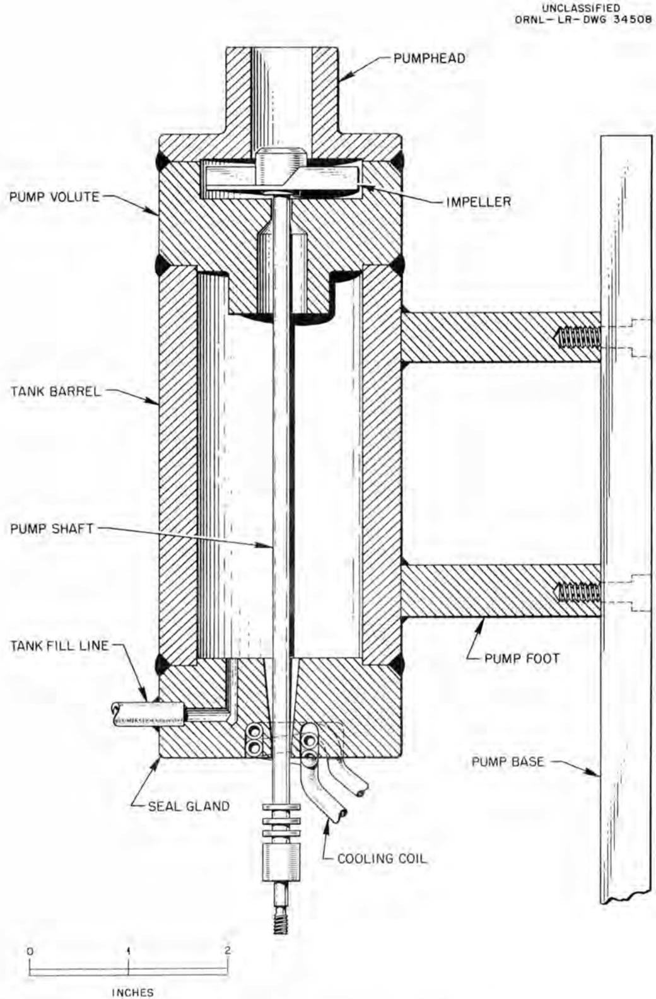  
Fig. 1.2.1. Sectional View of Lead-Sealed Pump.

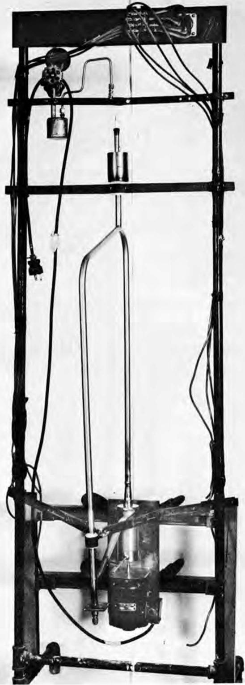  
UNCLASSIFIED PHOTO 31626  
Fig. 1.2.2. Frozen-Lead Sealed Pump and Test Loop Without Heaters and Thermocouples.

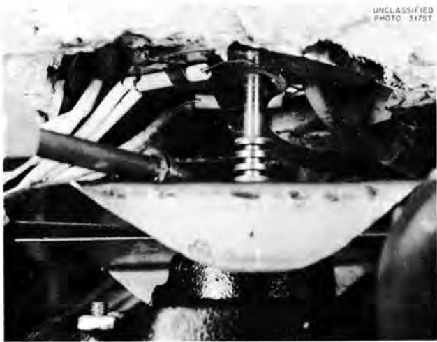  
Fig. 1.2.3. Frozen-Lead Seal Gland During Operation.

# DEVELOPMENT OF TECHNIQUES FOR REMOTE MAINTENANCE OF THE REACTOR SYSTEM

W. B. McDonald

# Mechanical Joint Development

A. S. Olson

The necessity for the development of a reliable mechanical joint was explained previously,7 and detailed descriptions of the three types of joints under consideration were presented. Screening tests of the three joints were conducted under thermal-cycling conditions in a high-temperature loop that circulated fuel 30 $(\mathrm{NaF - ZrF_4 - UF_4})$ at temperatures up to $1500^{\circ}\mathrm{F}$ 8,9

During this quarter, the freeze-flange and indented-seal-flange joints were tested with sodium, since sodium may be used as the primary coolant for a molten-salt power reactor. The two joints are shown installed in the loop in Fig. 1.2.4. The testing procedure consisted of the following: (1) assemble joint and leak check (cold) on helium leak detector; leakage specification, $\leq 1 \times 10^{-7} \mathrm{~cm}^3$ of helium per second; (2) weld joint into loop and operate through 50 thermal cycles between 1100 and $1300^{\circ}\mathrm{F}$ ; (3) drain loop and remove joint intact;

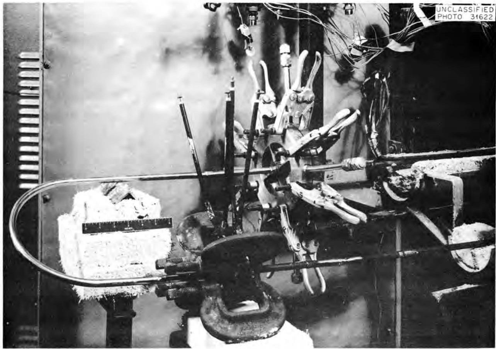  
Fig. 1.2.4. Freeze-Flange and Indented Seal-Flange Joints Installed in Loop for Testing with Molten Sodium.

(4) leak check joint on leak detector; and (5) separate joint, remake joint, and leak check.

The leakage rate for the freeze flange joint, which contained a seal ring made of annealed copper, was $2 \times 10^{-8} \mathrm{~cm}^{3} / \mathrm{sec}$ before the test and $1 \times 10^{-7} \mathrm{~cm}^{3} / \mathrm{sec}$ after the test. The flanges were then separated and reassembled with a new seal ring of the same material, and the leakage rate dropped to $1.3 \times 10^{-8} \mathrm{~cm}^{3} / \mathrm{sec}$ .

The leakage rate for the indented-seal-flange joint, which contained a seal ring made of nickel-plated Armco iron, was $5 \times 10^{-8} \mathrm{~cm}^{3} / \mathrm{sec}$ before the test and $3 \times 10^{-8} \mathrm{~cm}^{3} / \mathrm{sec}$ after the test. The flanges were then separated and reassembled with a new seal ring of the same material, and the leakage rate dropped to $1 \times 10^{-8} \mathrm{~cm}^{3} / \mathrm{sec}$ .

Temperatures were measured during the test at the points indicated in Fig. 1.2.5. The molten

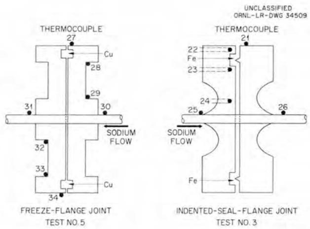  
Fig. 1.2.5. Diagram of Locations of Thermocouples on Mechanical Joints Tested in a Loop That Circulated Sodium.

sodium was circulated at a flow rate of 2 gpm, and the average temperature cycle time for the 50-cycle test was 60 min. Representative temperatures measured during the test are listed in Table 1.2.2. Both joints operated successfully; there was no indication of sodium leakage. The separated joints are shown in Figs. 1.2.6 and 1.2.7 as they appeared after the test.

The annealed copper seal ring used in the freeze-flange joint was identical to that used in the previous tests with molten salt. The gasket used in the indented-seal-flange joint was made of annealed Armco iron that was nickel plated to prevent oxidation of the iron. This gasket material was also successfully tested with molten salt.

A detailed description of the large freeze-flange joint for use in a 4-in.-dia line was presented previously. Tests of two of these joints were conducted in a high-temperature loop that circulated

fused-salt fuel 30 at temperatures up to $1300^{\circ}\mathrm{F}$ under thermal-cycling conditions. The flanges are shown installed in the loop, prior to testing, in Fig. 1.2.8, and the test loop is shown schematically in Fig. 1.2.9.

A heater-insulation unit, designed for use on a 4-in.-dia line, was installed on the loop and tested along with the large freeze-flange joints. The heater-insulation unit is shown in Fig. 1.2.10. A spacer is shown in Fig. 1.2.11. Two of the heater-insulation units and one spacer, located between the units, are shown installed on the test loop in Fig. 1.2.8. It was found that the thermal loss from the two units was about four times the heat loss from an equivalent length of "Hy-temp" pipe insulation 3 in. thick on a 4-in. pipe.

The cold leakage rates for the two large freeze-flange joints, before installation in the loop, were $6.7 \times 10^{-8} \mathrm{~cm}^3$ of helium per second for flange No.

Table 1.2.2. Temperatures Measured During Thermal Cycling of Flanged Joints in a Sodium-Filled Test Loop   

<table><tr><td>Thermocouple Number*</td><td>Minimum Temperature (°F)</td><td>Cycle Number</td><td>Maximum Temperature (°F)</td><td>Cycle Number</td></tr><tr><td colspan="5">Freeze-Flange Joint</td></tr><tr><td>27</td><td>110</td><td>10-20-28-29</td><td>133</td><td>9</td></tr><tr><td>28</td><td>170</td><td>21</td><td>215</td><td>9-41</td></tr><tr><td>29</td><td>905</td><td>29-31-32-34</td><td>1095</td><td>1-2</td></tr><tr><td>30</td><td>1075</td><td>31-32</td><td>1295</td><td>8</td></tr><tr><td>31</td><td>1045</td><td>31-32-39</td><td>1255</td><td>Numerous</td></tr><tr><td>32</td><td>890</td><td>38</td><td>1085</td><td>2</td></tr><tr><td>33</td><td>170</td><td>20</td><td>212</td><td>8-9</td></tr><tr><td>34</td><td>108</td><td>10</td><td>130</td><td>8-9</td></tr><tr><td colspan="5">Indented-Seal-Flange Joint</td></tr><tr><td>21</td><td>908</td><td>37</td><td>1025</td><td>35</td></tr><tr><td>22</td><td>920</td><td>4</td><td>1035</td><td>18-28-41</td></tr><tr><td>23</td><td>925</td><td>3-4</td><td>1050</td><td>35</td></tr><tr><td>24</td><td>965</td><td>Numerous</td><td>1110</td><td>35</td></tr><tr><td>25</td><td>1060</td><td>32-38</td><td>1055</td><td>Numerous</td></tr><tr><td>26</td><td>1078</td><td>21-33</td><td>1288</td><td>8-41</td></tr></table>

*See Fig. 1.2.5 for location of thermocouples.

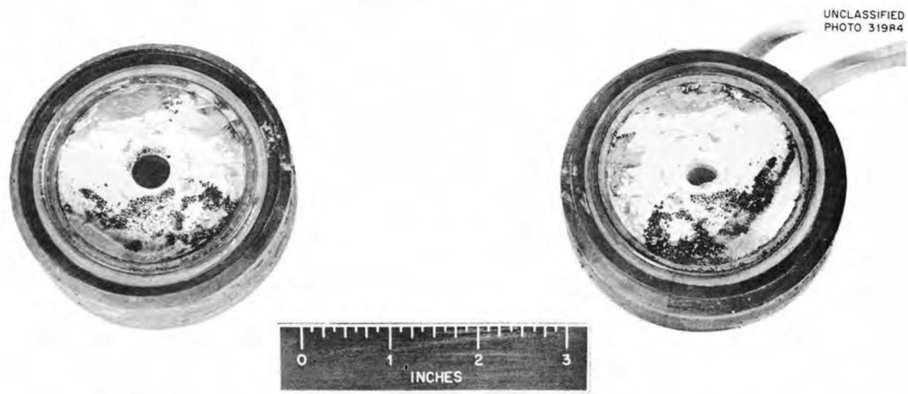  
Fig. 1.2.6. Indented-Seal-Flange Joint After Removal from Molten Sodium Test Loop.

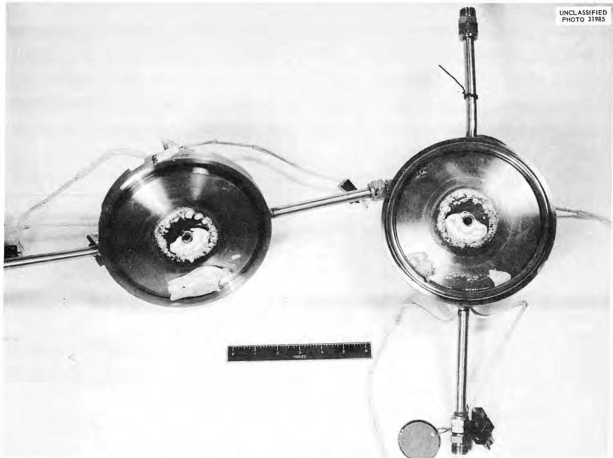  
Fig. 1.2.7. Freeze-Flange Joint After Removal from Molten Sodium Test Loop.

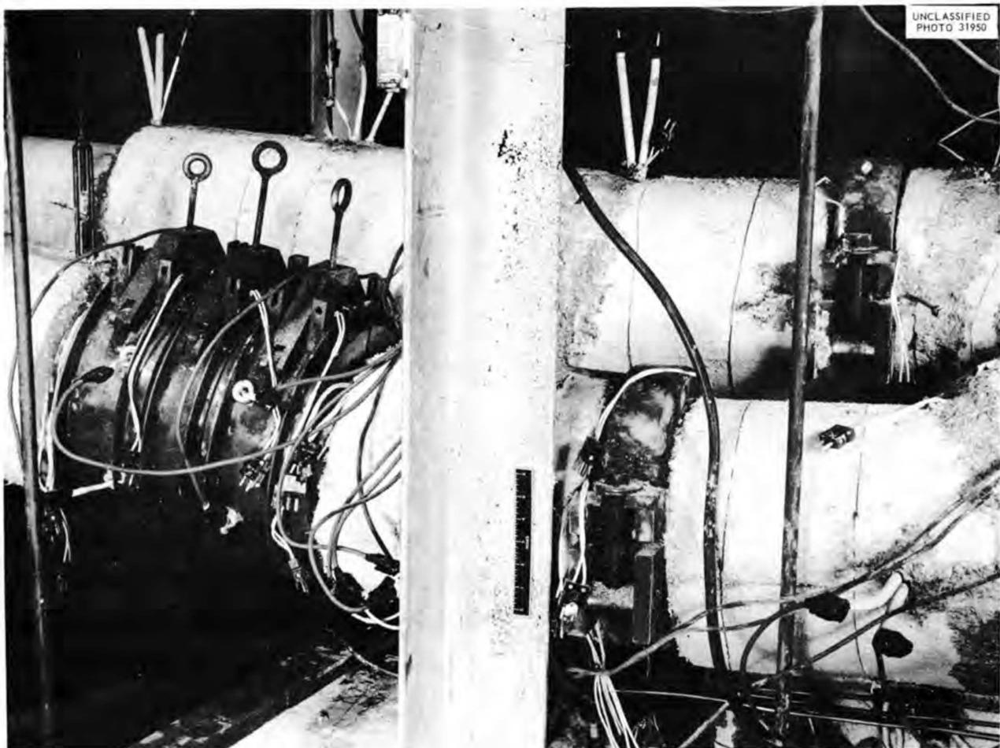  
Fig. 1.2.8. Large Freeze-Flange Joints and Heater-Insulation Units Installed in Test Loop.

1 and $1.6 \times 10^{-8} \mathrm{~cm}^{3} / \mathrm{sec}$ for flange No.2.During the loop test, temperatures were measured at the points indicated in Fig.1.2.12.Molten salt was circulated at a flow rate of $\sim 40$ gpm.The salt temperature was cycled 50 times between 1100 and $1300^{\circ}F$ each cycle was of 2 hr duration.Representative temperatures measured during the test are listed in Table 1.2.3.

There was no indication of salt leakage during the test, but gas leakage tests made on the flanges while they were installed in the loop indicated leakage rates in excess of the maximum allowable leakage rate of $10^{-7}\mathrm{cm}^3$ of helium per second. The bolts on the special clamps around each joint were tightened from original loads of 180 ft-lb each to approximately 400 ft-lb each without appreciable improvement of the leakage rates.

The clamps were therefore removed from the flanges, and additional bracing was welded to them to permit higher loads. In addition, oxide was removed from the clamps, and they were given an oxidation-resistant coating. A special lubricant containing graphite and molybdenum disulfide in a resin base was also coated over the surfaces of the clamp and bolts to reduce friction between mating surfaces and thus provide a clamp of greater efficiency. Two seal rings are being fabricated from 2S aluminum. It is believed that the use of these seal rings and a higher bolt loading will provide a gas-tight joint. The thermal-cycle testing will be repeated following these modifications.

Both of the joints were separated, after removal of the clamps, and the inside surfaces of the flanges were examined for signs of cracking caused

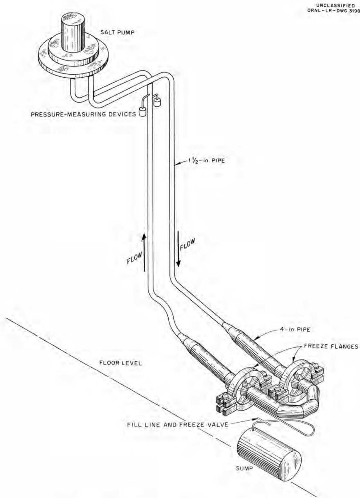  
Fig. 1.2.9. Freeze-Flange Mechanical Joint Development Test Loop.

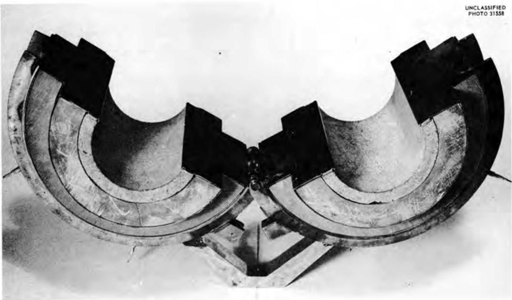  
Fig. 1.2.10. Heater-Insulation Shown in Open Position.

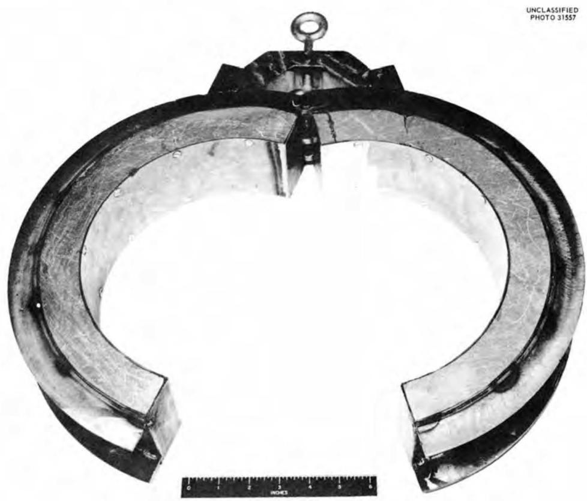  
Fig. 1.2.11. Spacer for Heater-Insulation Unit.

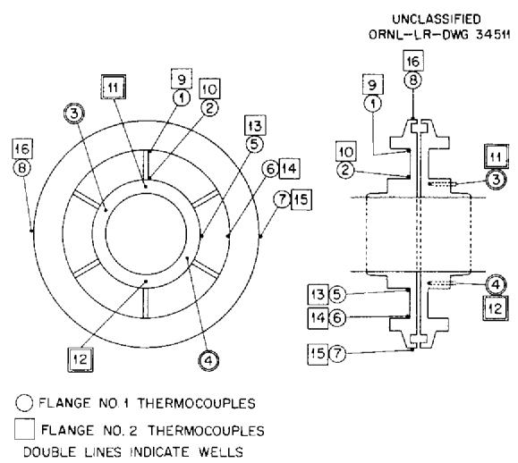  
Fig. 1.2.12. Diagram of Location of Thermocouples on Joints Tested in Mechanical Joint Development Test Loop.

by thermal stress. No such stress cracks were observed in dye checks.

The joints were easily disassembled in about 20 min. The frozen salt in each joint was firmly attached to the stainless steel screen that had been placed there for that purpose, as shown in Fig. 1.2.13. A flange is shown with the screen and salt seal removed in Fig. 1.2.14. Note that the flange face is sufficiently clean for reassembly of the joint.

# Evaluation of Expansion Joints for Molten-Salt Reactor Systems

J. C. Amos

Three commercially available expansion joints have been tested in the test facility shown in Fig. 1.2.15. The joints were cycled over their maximum allowable traverse at rated conditions of $1300^{\circ}$ F and 75 psig in an environment of molten salt or

Table 1.2.3. Temperatures Measured During Thermal Cycling of Freeze-Flange Joints in Mechanical Joint Development Test Loop   

<table><tr><td>Thermocouple Number*</td><td>Minimum Temperature (°F)</td><td>Cycle Number</td><td>Maximum Temperature (°F)</td><td>Cycle Number</td></tr><tr><td colspan="5">Flange No. 1</td></tr><tr><td>1</td><td>440</td><td>17</td><td>550</td><td>3</td></tr><tr><td>2</td><td>827</td><td>17</td><td>1030</td><td>6-10</td></tr><tr><td>3</td><td>962</td><td>17-18</td><td>1140</td><td>10</td></tr><tr><td>4</td><td>965</td><td>17-18-29</td><td>1135</td><td>10</td></tr><tr><td>5</td><td>875</td><td>10-17-29</td><td>1030</td><td>10</td></tr><tr><td>6</td><td>353</td><td>5</td><td>435</td><td>30</td></tr><tr><td>7</td><td>265</td><td>17</td><td>305</td><td>3</td></tr><tr><td>8</td><td>247</td><td>17</td><td>288</td><td>11-32</td></tr><tr><td colspan="5">Flange No. 2</td></tr><tr><td>9</td><td>458</td><td>28</td><td>598</td><td>32</td></tr><tr><td>10</td><td>882</td><td>28-29</td><td>1045</td><td>10</td></tr><tr><td>11</td><td>970</td><td>17-18</td><td>1140</td><td>Numerous</td></tr><tr><td>12</td><td>932</td><td>18</td><td>1098</td><td>26</td></tr><tr><td>13</td><td>898</td><td>18</td><td>1063</td><td>8</td></tr><tr><td>14</td><td>413</td><td>17</td><td>510</td><td>2-3-31-49</td></tr><tr><td>15</td><td>242</td><td>17-18-41</td><td>307</td><td>49</td></tr><tr><td>16</td><td>330</td><td>10-18</td><td>378</td><td>49</td></tr></table>

*See Fig. 1.2.12 for location of thermocouples.

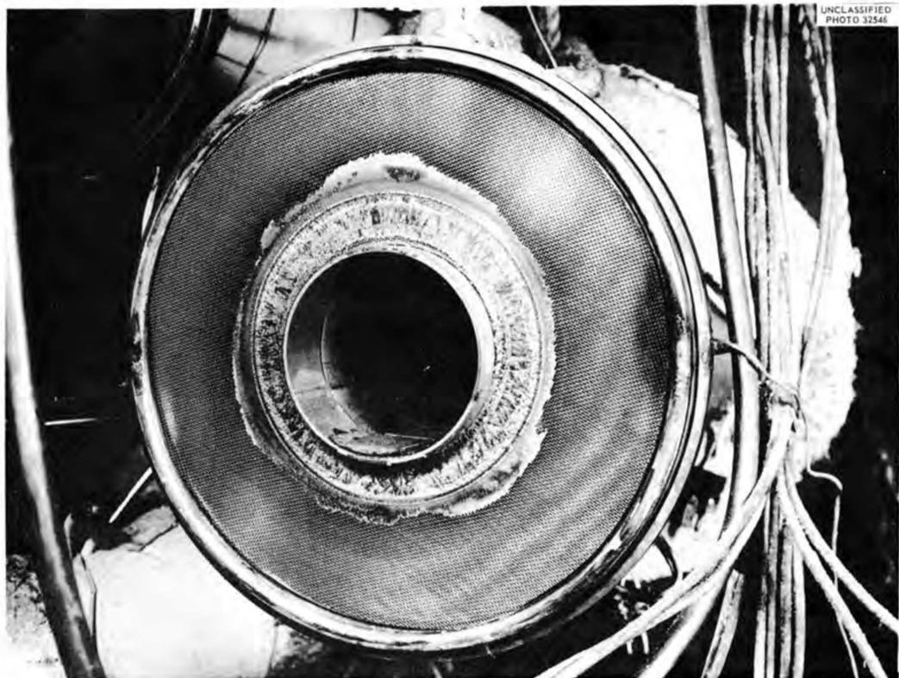  
Fig. 1.2.13. Disassembled Freeze-Flange Joint Showing Frozen Salt Seal on Insert Screen.

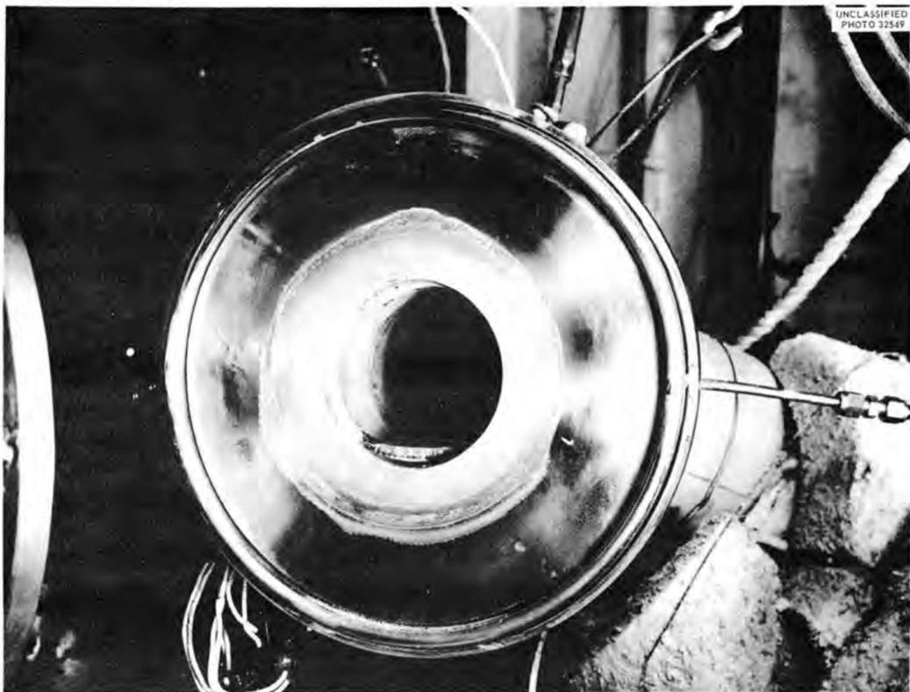  
Fig. 1.2.14. Disassembled Freeze-Flange Joint After Removal of Frozen Salt Seal and Screen.

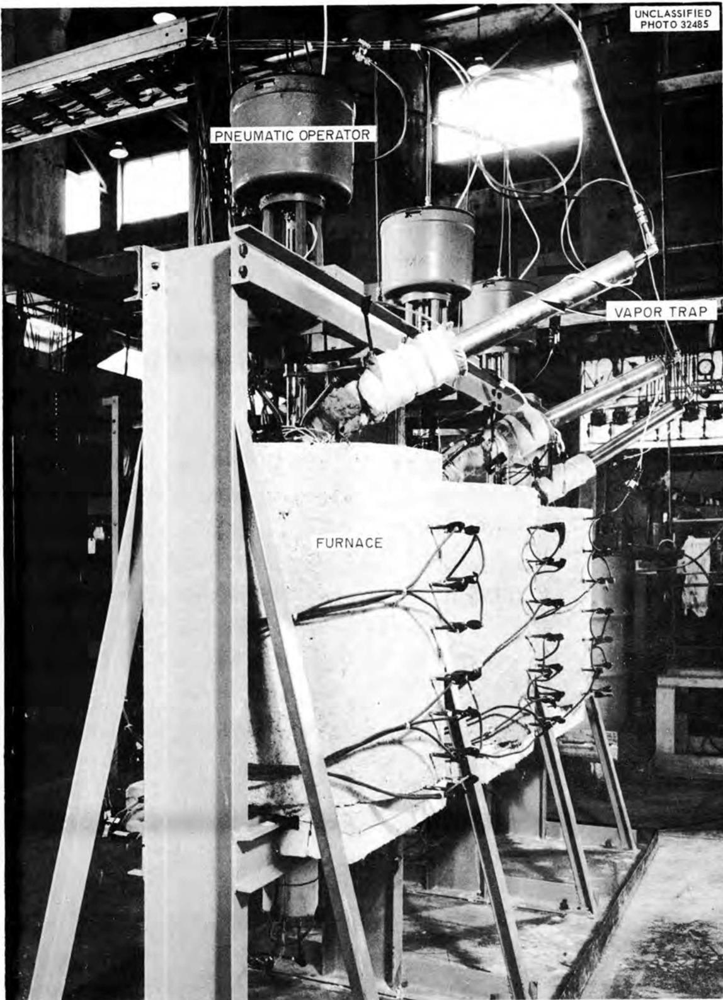  
Fig. 1.2.15. Expansion Joint Test Facility.

sodium. The joints and the results of the tests are described in Table 1.2.4.

The failure of the Zallea joints cannot be construed as a reflection of the integrity of the joints, since the bellows were evidently weakened by the attachment of thermocouples. The Cook Electric Company joint will be examined metallurgically in an effort to determine whether the failure was due to a weld defect or to excessive stresses at rated operating conditions. Three more expansion joints, shown in Fig. 1.2.16, are currently being installed in the test facility. Thermocouples will not be attached to these units.

# Remote Maintenance Demonstration Facility C. K. McGlothlan

The contractor's portion of the field construction work for the remote maintenance demonstration facility (Fig. 1.2.17) in Experimental Engineering Building 9201-3 has been completed. This work consisted of fabricating and erecting the salt safety spill tray and enclosure and the railway for the manipulator. In addition, the contractor installed structures for the dummy reactor, piping, and dummy heat exchangers (Fig. 1.2.18).

In Fig. 1.2.17 the fuel dump tank and two dummy heat exchangers are also shown in their approximate

Table 1.2.4. Descriptions of Expansion Joints and Results of Tests   

<table><tr><td>Vendor</td><td>Cook Electric Co.</td><td>Zallea Bros.</td><td>Zallea Bros.</td></tr><tr><td>Material</td><td>Stainless steel</td><td>Inconel</td><td>Stainless steel</td></tr><tr><td>Test fluid</td><td>Sodium</td><td>Molten salt</td><td>Sodium</td></tr><tr><td>Maximum traverse of joint</td><td>21/4in.</td><td>25/8in.</td><td>25/8in.</td></tr><tr><td>Number of cycles to failure</td><td>71</td><td>49</td><td>60</td></tr><tr><td>Location of failure</td><td>Bellows seam weld</td><td>Thermocouple attachment to bellows</td><td>Thermocouple attachment to bellows</td></tr></table>

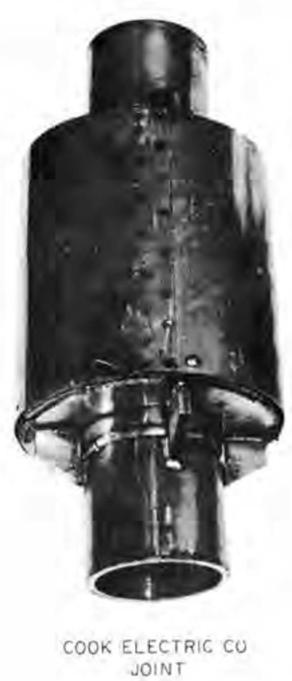

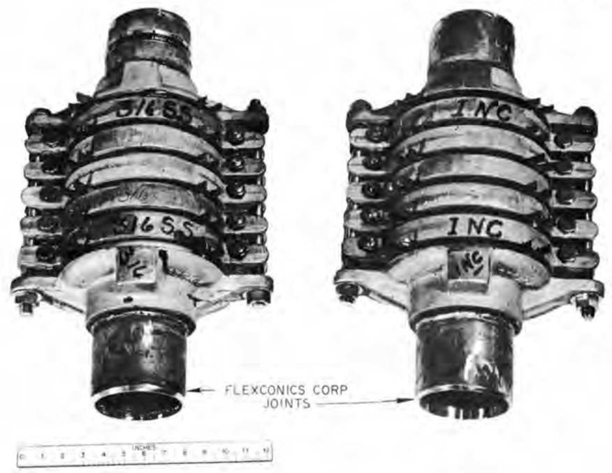  
Fig. 1.2.16. Expansion Joints To Be Tested in the Expansion-Joint Test Facility.

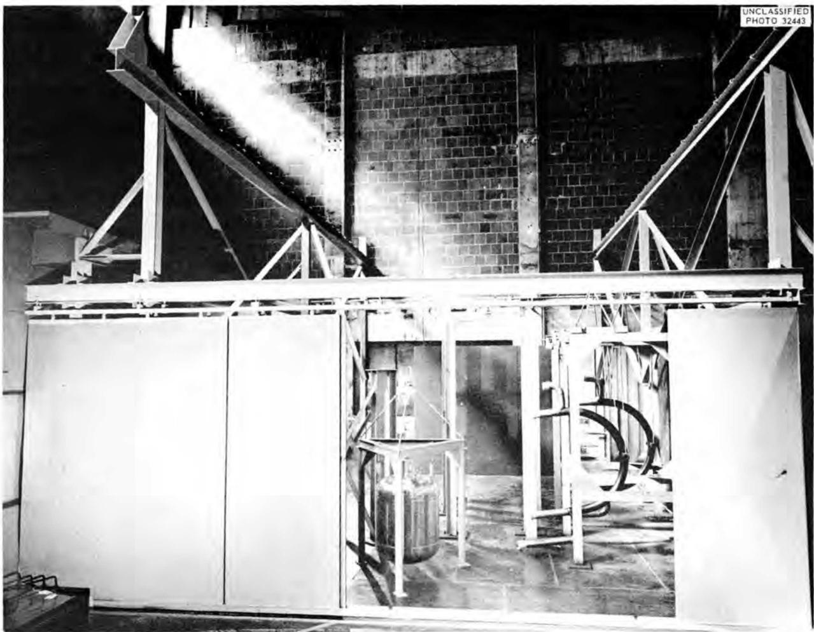  
Fig. 1.2.17. Remote Maintenance Demonstration Facility.

position. Although this facility contains a dummy reactor and two dummy heat exchangers, it will contain a loop with a pump for circulating molten salt at $1250^{\circ}\mathrm{F}$ through $3\frac{1}{2}$ -in. and 6-in. Inconel pipe. It will be demonstrated in this facility that any or all components of this quarter-scale simulated reactor system can be maintained remotely by a General Mills manipulator as viewed through a stereo-type closed-circuit television system. The procedures developed can be adapted for use on a full-size reactor system.

The manipulator will operate on a 40-ft-long track with a 22-ft span. The vertical travel of the manipulator arm will be 20 ft. This manipulator is now being constructed at General Mills Company.

The first of three shipments of equipment for the two closed-circuit television systems has been

made by General Precision Laboratory. The dummy reactor has been fabricated and is on the job site.

Fabrication in a local job shop of the $3\frac{1}{2}$ -in. and 6-in. loop piping subassemblies is in progress. Bids are being obtained for the fabrication of 20 sets of freeze flanges and the removable electric heater and insulation units for the $3\frac{1}{2}$ -in. and 6-in. piping. In addition, bids are being obtained to modify an existing molten-salt pump for use in this system.

Approximately two-thirds of the engineering work for this job has been completed. The remaining portion of the engineering work consists mostly of electrical, instrumentation, and remote tooling design.

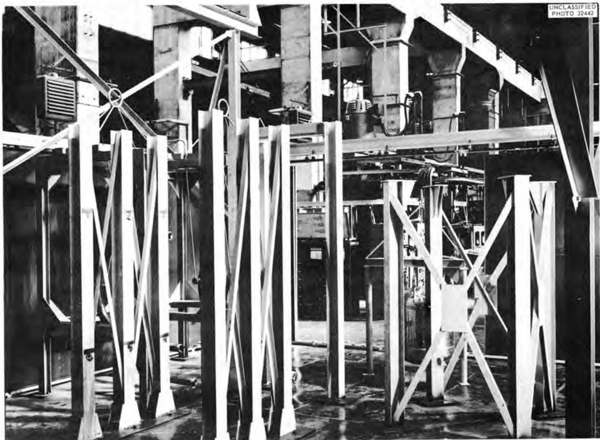  
Fig. 1.2.18. Heat Exchanger, Piping and Reactor Support Structure of Remote Maintenance Demonstration Facility.

# HEAT EXCHANGER DEVELOPMENT

J.C.Amos

# AlCl6Thermal-Convection Loop

A thermal-convection loop has been designed for evaluating the heat transfer performance of aluminum chloride gas. This gas has been suggested as a possible low-pressure gas coolant which would eliminate many of the containment problems inherent in high-pressure gas systems. Aluminum chloride gas is of interest for the molten-salt reactor concept because of the almost complete dissociation reaction $(\mathrm{Al}_{2}\mathrm{Cl}_{6} = 2\mathrm{AlCl}_{3})$ that occurs between 900 and $1200^{\circ}\mathrm{F}$ . This dissociation process is reversible and results in a large increase in the heat capacity of the gas over the temperature range presently considered for the molten-salt reactor fuel (see Chap. 2.3, "Chemistry," for discussion of "Gaseous Aluminum Chloride as a Heat

Exchange Medium"). Operation of a thermal-convection loop should provide an initial qualitative evaluation of the effect of dissociation on the heat transfer characteristics of this gas.

The small-scale apparatus shown schematically in Fig. 1.2.19 was assembled to obtain a sublimation temperature vs pressure curve for aluminum chloride and to provide preliminary compatibility data for the gas in the container materials of principal interest. A plot of the temperature vs vapor pressure data is presented in Fig. 1.2.20. Inconel and INOR-8 corrosion samples installed in the test apparatus were exposed to aluminum chloride vapors for 1000 hr. Visual and metallographic examination disclosed intergranular attack to a maximum depth of 2 mils at the high-temperature $(1200^{\circ}\mathrm{F})$ end of the Inconel specimen and grain-boundary penetration to a depth of 0.5 mil at the high-temperature end of the INOR-8 specimen. The

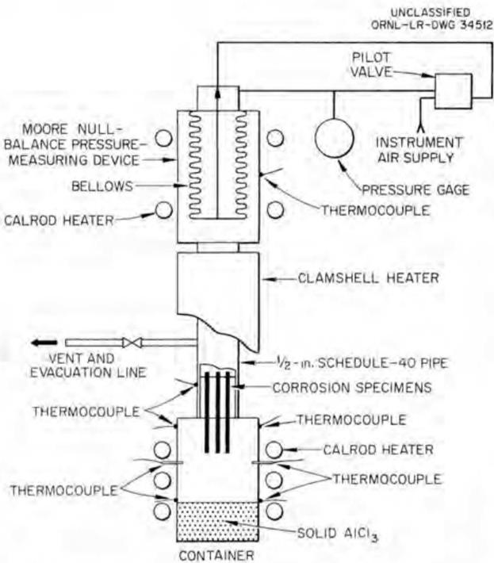  
Fig. 1.2.19. Diagram of Apparatus for Determining Aluminum Chloride Sublimation Temperature vs Pressure Data and Preliminary Compatibility Data.

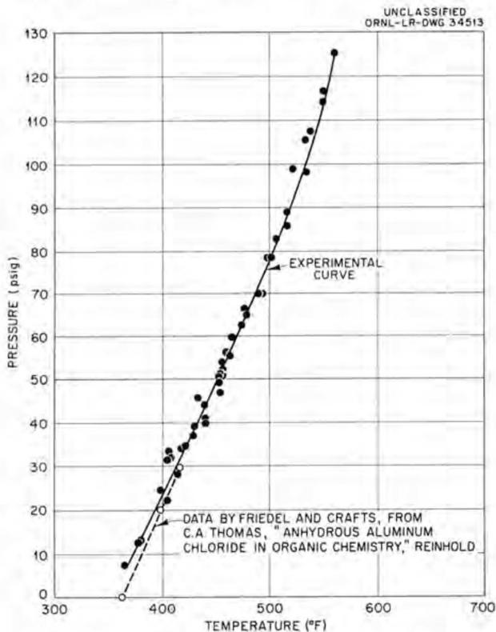  
Fig. 1.2.20. Aluminum Chloride Sublimation Temperature vs Pressure Data Plot.

cold end $(750^{\circ}\mathrm{F})$ of both specimens revealed a light, metallic-appearing deposit of a maximum thickness of 2 mils on the INOR-8 specimen and 1 mil on the Inconel specimen. Spectrographic analysis showed this deposit to be predominantly aluminum. Representative photomicrographs of these specimens are shown in Figs. 1.2.21 through 1.2.24. These preliminary data indicate that either of the materials tested would be satisfactory for use in the thermal-convection loop and suggest that there may be no serious compatibility problem between aluminum chloride gas and INOR-8, the container material proposed for a molten-salt power reactor system.

# Molten-Salt Heat Transfer Coefficient Measurement

Modifications to the molten-salt heat transfer coefficient test facility required for a salt-to-salt heat transfer test are essentially complete. Data runs will be started early in the next quarter. A description of this test facility and the results of a salt-to-liquid metal test were reported previously.10,11

10J.C.Amos,R.E.MacPherson,and R.L.Senn, MSR Quar.Prog.Rep.Jan.31,1958,ORNL-2474,p 27.   
11J.C.Amos,R.E.MacPherson,and R.L.Senn, MSR Quar.Prog.Rep.June 30,1958,ORNL-2551,p31.

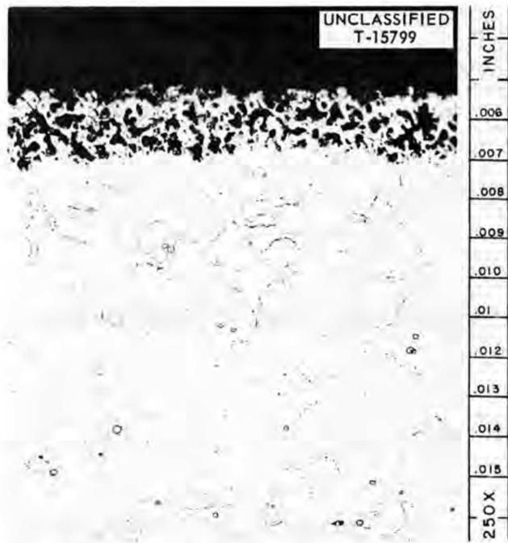  
Fig. 1.2.21. Top of Inconel Specimen Exposed to Aluminum Chloride Gas at $1200^{\circ}\mathrm{F}$ for 1000 hr. Etchant: glyceria regia, 250X.

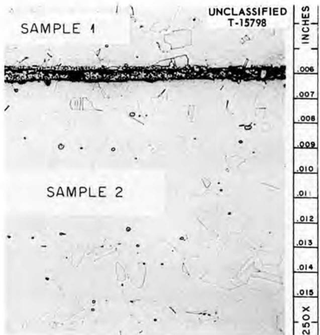  
Fig. 1.2.22. Bottom of Inconel Specimen Exposed to Aluminum Chloride Gas at $750^{\circ}$ F for 1000 hr. Etchant: glyceria regia, 250X.

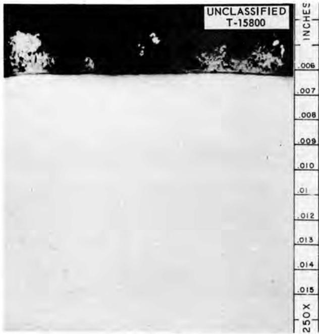  
Fig. 1.2.24. Bottom of INOR-8 Specimen Exposed to Aluminum Chloride Gas at $750^{\circ}$ F for 1000 hr. As polished, 250X.

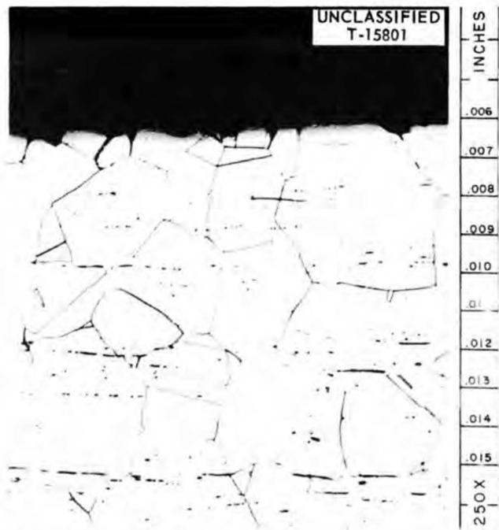  
Fig. 1.2.23. Top of INOR-8 Specimen Exposed to Aluminum Chloride Gas at $1200^{\circ}$ F for 1000 hr. Etchant: aqua regia, 250X.

# DESIGN, CONSTRUCTION, AND OPERATION OF MATERIALS TESTING LOOPS

# Forced-Circulation Loops

# J. L. Crowley

Construction and operation of forced-circulation corrosion testing loops was continued. Operation of seven new loops was started during this period, and three loop tests were terminated. By the end of September, 13 loops were in operation and one loop was ready to be filled. Nine of the operating loops are constructed of INOR-8 and four of Inconel. A summary of operations as of September 30, 1958, is presented in Table 1.2.5.

Of the three terminated loops, one was an Inconel loop (9377-1), one an INOR-8 loop (9354-2), and the other an Inconel bifluid loop (designated CPR). The decision was made to terminate loops 9377-1 and 9354-2 after the power failure on April 6 caused their failure. The CPR loop was terminated after completion of a year of operation to

Table 1.2.5. Forced-Circulation Loop Operations Summary as of September 30, 1958   

<table><tr><td>Loop Designation</td><td>Loop Material and Size</td><td>Composition Number of Circulated Fluid*</td><td>Approximate Flow Rate (gpm)</td><td>Approximate Reynolds Number at 1100°F</td><td>Maximum Wall Temperature (°F)</td><td>Minimum Fluid Temperature (°F)</td><td>Maximum Fluid Temperature (°F)</td><td>Hours of Operation at Conditions Given</td><td>Comments</td></tr><tr><td rowspan="2">CPR</td><td rowspan="2">Inconel, 38 in. sched 40, 1 in. OD × 0.035 in. wall, 38 in. OD × 0.035 in. wall</td><td>122</td><td>1</td><td>5,000</td><td>1250</td><td>1095</td><td>1190</td><td>9148</td><td>Operation terminated to provide operating space for an additional loop</td></tr><tr><td>Sodium</td><td>7</td><td>97,700</td><td></td><td>1085</td><td>1135</td><td></td><td></td></tr><tr><td>9344-1</td><td>Inconel, 1/2 in. OD, 0.045 in. wall</td><td>123</td><td>2</td><td>3,250</td><td>1300</td><td>1105</td><td>1230</td><td>7950</td><td>Fluid dumped on July 3 for changing of pump motor</td></tr><tr><td rowspan="3">9354-3</td><td>INOR-8</td><td>84</td><td>2.75</td><td></td><td>1200</td><td>1100</td><td>1145</td><td>6289</td><td>Operation stopped temporarily on June 16 for removal of section of loop piping for metallurgical examination; restarted with new batch of fluid after pump replaced and emergency heaters added</td></tr><tr><td>Hot leg, 38 in. sched 40</td><td></td><td></td><td>4,500</td><td></td><td></td><td></td><td></td><td></td></tr><tr><td>Cold leg, 1/2 in. OD, 0.045 in. wall</td><td></td><td></td><td>5,400</td><td></td><td></td><td></td><td></td><td></td></tr><tr><td>9344-2</td><td>Inconel, 1/2 in. OD, 0.045 in. wall</td><td>12</td><td>2.5</td><td>8,200</td><td>1200</td><td>1000</td><td>1090</td><td>5861</td><td>Fluid froze on July 2 when faulty relay caused loss of pump drive; fluid partially froze again on Aug. 5 when a building power failure caused failure of the pump drive motor; operation resumed after both incidents</td></tr><tr><td>9377-3</td><td>Inconel, 1/2 in. OD, 0.045 in. wall</td><td>131</td><td>2</td><td>3,400</td><td>1300</td><td>1100</td><td>1240</td><td>4774</td><td>Fluid dumped on July 23 for repair of leaking oil rotary union</td></tr><tr><td>9354-1</td><td>Inconel, 1/2 in. OD, 0.045 in. wall</td><td>126</td><td>2.5</td><td>2,000</td><td>1300</td><td>1100</td><td>1190</td><td>4308</td><td>Fluid dumped on June 20 for installation of emergency heaters; fluid dumped on July 29 when a lug adapter made of SP-16 material developed a crack; adapter replaced and operation resumed</td></tr><tr><td>9377-1</td><td>Inconel, 1/2 in. OD, 0.045 in. wall</td><td>126</td><td>2</td><td>1,600</td><td>1300</td><td>1100</td><td>1175</td><td>3413</td><td>Operation terminated after rupture described previously</td></tr><tr><td>9354-5</td><td>INOR-8, 38 in. OD, 0.035 in. wall</td><td>130</td><td>1</td><td>2,200</td><td>1300</td><td>1095</td><td>1230</td><td>3383</td><td>Fluid partially froze on Aug. 5 when building power failure caused pump drive motor failure; loop contains graphite samples</td></tr><tr><td rowspan="3">9354-4</td><td>INOR-8</td><td>130</td><td>2.5</td><td></td><td>1300</td><td>1130</td><td>1200</td><td>1646</td><td>Operation started July 23; loop contains three INOR-8 sample inserts</td></tr><tr><td>Hot leg, 3/8 in. sched 40</td><td></td><td></td><td>3,000</td><td></td><td></td><td></td><td></td><td></td></tr><tr><td>Cold leg, 1/2 in. OD, 0.045 in. wall</td><td></td><td></td><td>3,500</td><td></td><td></td><td></td><td></td><td></td></tr><tr><td>MSRP-7</td><td>INOR-8, 1/2 in. OD, 0.045 in. wall</td><td>133</td><td>Not available</td><td>Not available</td><td>1300</td><td>1100</td><td>1210</td><td>1302</td><td>Operation started on Aug. 7</td></tr><tr><td>9377-4</td><td>Inconel, 1/2 in. OD, 0.045 in. wall</td><td>130</td><td>1.75</td><td>2,600</td><td>1300</td><td>1100</td><td>1185</td><td>1241</td><td>First loop with cooler coil and controls of new design; operation started July 24; new protective devices prevented freezing of fluid on two occasions of pump failures; pumps replaced and operation resumed</td></tr><tr><td>9354-2</td><td>INOR-8, 1/2 in. OD, 0.045 in. wall</td><td>12</td><td>2</td><td>6,500</td><td>1200</td><td>1050</td><td>1140</td><td>1052</td><td>Operation terminated after rupture described previously</td></tr><tr><td>MSRP-6</td><td>INOR-8, 1/2 in. OD, 0.045 in. wall</td><td>134</td><td>Not available</td><td>Not available</td><td>1300</td><td>1100</td><td>1190</td><td>822</td><td>Pump bound on first startup attempt; during preheating after pump change, loop tubing parted between cooler and pump before fluid was introduced; tubing being examined by Metallurgy Division for cause; loop repaired and operation started on Aug. 27</td></tr><tr><td>MSRP-8</td><td>INOR-8, 1/2 in. OD, 0.045 in. wall</td><td>124</td><td>2.0</td><td>4,000</td><td>1300</td><td>1100</td><td>1210</td><td>605</td><td>Operation started on Sept. 4</td></tr><tr><td>MSRP-9</td><td>INOR-8, 1/2 in. OD, 0.045 in. wall</td><td>134</td><td>Not available</td><td>Not available</td><td>1300</td><td>1110</td><td>1225</td><td>471</td><td>Operation started on Sept. 10</td></tr><tr><td>MSRP-10</td><td>INOR-8, 1/2 in. OD, 0.045 in. wall</td><td>135</td><td>Not available</td><td>Not available</td><td>1300</td><td>1100</td><td>1210</td><td>264</td><td>Operation started on Sept. 19</td></tr></table>

\*Composition 12: NaF-LiF-KF (11.5-46.5-42 mole %)   
Composition 84: NaF-LiF-BeF $_2$ (27-35-38 mole %)   
Composition 122: NaF-ZrF4-UF4 (57-42-1 mole %)   
Composition 123: NaF-BeF $_2$ -UF $_4$ (53-46-1 mole %)   
Composition 126: LiF-BeF $_2$ $^2$ UF $_4$ (53-46-1 mole %)

Composition 130: LiF-BeF $_2$ -UF $_4$ (62-37-1 mole %)

Composition 131: LiF-BeF2-UF4 (60-36-4 mole %)

Composition 133: LiF-BeF $_2$ UF $_4$ (71-16-13 mole %)

Composition 134: LiF-BeF2-ThF4-UF4 (62-36.5-1-0.5 mole %)

Composition 135: NaF-BeF $_2$ -ThF $_4$ -UF $_4$ (53-45.5-1-0.5 mole %)

provide space for an additional loop (see Chap. 2.1, "Metallurgy," for results of metallurgical examinations).

Other than minor occurrences involving individual loops, there were only two incidents during the quarter that affected all loops. The first was a building power failure on August 5 of less than 1 min duration that affected seven operating loops. At this time, while an extensive emergency electrical system was being installed, all loops were equipped so that momentary power failure would automatically place them on isothermal operation. Five of the loops did resume operation isothermally after the power was reapplied. On two loops, 9354-5 and 9344-2, the pump drive motors tripped out on overload when required to restart under the load of the magnetic clutch and the pump. These two loops were partially frozen when circulation was not maintained but were both successfully thawed and placed back into operation. The overload breakers on all motors, although sized according to proper electrical code, were increased to carry a larger startup current.

The other incident that affected all loops was a changehouse fire across the street from where the forced-circulation corrosion loops are located. The fire destroyed the poles supplying an alternate power source to the building and also threatened to spread to the operating area. All operating loops on that side of the building were placed on isothermal operation in preparation for dumping. It was not necessary to dump, however, and the loops were returned to normal operating conditions after the danger was past.

Orders were placed for the fabrication of three INOR-8 loops and two Inconel loops. One INOR-8 loop will be used as a spare and two Inconel loops will replace two presently operating loops scheduled to be terminated.

Of the thirteen facilities with operating loops, six are of the new design, which gives maximum protection, as described previously. The remaining seven are in various stages of improved protection that could be provided without disturbing the loop piping.

In-Pile Loops

D. B. Trauger

J.A. Conlin

P.A.Gnadt

Assembly of the first MSR in-pile loop will be completed by November 1, and the loop is scheduled for insertion in the MTR December 1, 1958

(MTR cycle 113). A second loop is being assembled, and parts for a third loop are being fabricated. The second loop will provide additional data and serve as a backup loop in the event of a failure of the first loop. The instrumentation and controls required for loop operation are being prepared at the MTR.

The schedule for operation of the second loop will be determined by the success of the first loop and the outcome of pump tests presently under way, as described previously. In these tests, two methods have been tested for starting the loop in the reactor. The first method consisted of filling the loop during assembly, freezing the salt, and then thawing it out after insertion in the reactor. It was demonstrated in four successive tests with the first prototype pump that progressive meltout from the pump to the nose coil could be achieved without damage to the loop. During meltout, however, pump speed perturbations occurred, and several hours after the fourth meltout the pump seized. Investigation showed a large accumulation of salt in the intermediate region between the sump and bearing housing and salt in a granular form mixed with oil in the copper rotor region. Although x-ray examination indicated that salt had collected in the intermediate region without the concurrent meltout procedure, melting out of the loop was probably a contributing factor.

A second method of starting the loop in the reactor was found to be satisfactory in a second prototype pump test. The original filling system, which consisted of an integral fill tank that was heated and drained into the pump after installation in the reactor was modified by changing the internal passages of the pump to accommodate the high surface tension of the salt. This system was incorporated in the first loop.

The appearance of salt in the region between the sump and bearing housing in both the first and second prototype pump tests presents a further difficulty. The melting and thawing of the loop in the first test was thought to have been a contributory cause; however, the salt deposit appeared again in the second pump test but to a lesser degree. This salt transfer is not understood, but is believed to be, in part, a function of the suspected high surface tension of the fluid. At present the second prototype pump, similar to the pump used

in the first loop, is being tested to determine the effect of this phenomenon on long-term operation. A third test of a modified pump is being set up in an attempt to correct the situation. Modifications indicated by these tests will be incorporated in

the pump of the second loop. Since construction of the first loop is beyond the point that would permit pump modification, the period of in-pile operation will be based on the duration of the pump life test presently in progress.

# 1.3. ENGINEERING RESEARCH

# H. W. Hoffman Reactor Projects Division

# PHYSICAL PROPERTY MEASUREMENTS

W. D. Powers

R. H. Nimmo

# Enthalpy and Heat Capacity

The enthalpies, heat capacities, and heats of fusion were determined for six additional salt mixtures. Of these, two were fuels of the alkali metal-beryllium system; and the other four were chlorides of possible interest as secondary coolants. The results are given in Table 1.3.1, in which the constants $a$ , $b$ , $c$ , are the coefficients in the enthalpy

equation,

$$
H _ {T} - H _ {3 0 ^ {\circ} \mathrm {C}} = a + b T + c T ^ {2} (\mathrm {c a l} / \mathrm {g}),
$$

where the temperature $T$ is expressed in ${}^{\circ}\mathsf{C}$ . The coefficients $b$ and $c$ of Table 1.3.1 may be used to obtain the heat capacity, $c_{p'}$ from the following equation:

$$
c _ {p} = b + 2 c T (\mathrm {c a l} / \mathrm {g} \cdot^ {\circ} \mathrm {C}).
$$

For comparison and completeness, previously determined values of several related mixtures are

Table 1.3.1. Enthalpy Equation Coefficients and Heats of Fusion of Several Fused Salt Mixtures   

<table><tr><td rowspan="2">Salt Mixture</td><td rowspan="2">Phase</td><td rowspan="2">Temperature Range (°C)</td><td colspan="3">Enthalpy Equation Coefficients*</td><td colspan="2">Heat of Fusion (cal/g)</td></tr><tr><td>a</td><td>b</td><td>c</td><td>Temperature (°C)</td><td>HL - HS</td></tr><tr><td></td><td></td><td></td><td></td><td></td><td>× 10-5</td><td></td><td></td></tr><tr><td rowspan="2">NaF-BeF2-UF4(53-46-1 mole %)</td><td>Solid</td><td>100–300</td><td>-7.8</td><td>+0.251</td><td>+11.83</td><td rowspan="2">365</td><td rowspan="2">23</td></tr><tr><td>Liquid</td><td>400–800</td><td>-5.7</td><td>+0.312</td><td>+10.87</td></tr><tr><td rowspan="2">LiF-BeF2-UF4(53-46-1 mole %)</td><td>Solid</td><td>100–300</td><td>-10.9</td><td>+0.293</td><td>+19.38</td><td rowspan="2">400</td><td rowspan="2">63</td></tr><tr><td>Liquid</td><td>400–800</td><td>-12.8</td><td>+0.539</td><td>-1.90</td></tr><tr><td rowspan="2">LiF-BeF2-UF4** (62-37-1 mole %)</td><td>Solid</td><td>100–300</td><td>-9.6</td><td>+0.293</td><td>+2.18</td><td rowspan="2">450</td><td rowspan="2">122</td></tr><tr><td>Liquid</td><td>470–790</td><td>+24.2</td><td>+0.488</td><td>+2.52</td></tr><tr><td rowspan="2">NaCl-CaCl2(49-51 mole %)</td><td>Solid</td><td>100–500</td><td>-4.5</td><td>+0.158</td><td>+7.60</td><td rowspan="2">500</td><td rowspan="2">48</td></tr><tr><td>Liquid</td><td>550–850</td><td>-18.4</td><td>+0.358</td><td>-7.70</td></tr><tr><td rowspan="2">LiCl-CaCl2** (62-38 mole %)</td><td>Solid</td><td>100–425</td><td>-3.2</td><td>+0.167</td><td>+11.31</td><td rowspan="2">496</td><td rowspan="2">61</td></tr><tr><td>Liquid</td><td>520–895</td><td>+25.8</td><td>+0.289</td><td></td></tr><tr><td rowspan="2">LiCl-SrCl2** (52-48 mole %)</td><td>Solid</td><td>100–495</td><td>-3.6</td><td>+0.140</td><td>+4.25</td><td rowspan="2">525</td><td rowspan="2">43</td></tr><tr><td>Liquid</td><td>550–850</td><td>-39.8</td><td>+0.356</td><td>-8.16</td></tr><tr><td rowspan="2">LiCl-BaCl2** (70-30 mole %)</td><td>Solid</td><td>100–500</td><td>-4.5</td><td>+0.146</td><td>+2.50</td><td rowspan="2">511</td><td rowspan="2">49</td></tr><tr><td>Liquid</td><td>550–850</td><td>-6.6</td><td>+0.278</td><td>-3.93</td></tr><tr><td>LiCl-KCl (70-30 mole %)</td><td>Liquid</td><td>450–800</td><td>+15.3</td><td>+0.361</td><td>-3.12</td><td></td><td></td></tr><tr><td>LiCl-KCl (60-40 mole %)</td><td>Liquid</td><td>400–800</td><td>+21.2</td><td>+0.315</td><td>-0.18</td><td></td><td></td></tr><tr><td>LiCl-KCl (50-50 mole %)</td><td>Liquid</td><td>500–800</td><td>+38.5</td><td>+0.239</td><td>+4.62</td><td></td><td></td></tr></table>

*Heat capacity may be evaluated from table as $c_p = b + 2cT$ ; enthalpy given as $H_T - H_{30^{\circ}C} = a + bT + cT^2$ .   
\*\*Previously reported results repeated for completeness.

repeated in Table 1.3.1. Measurements of the solid state have not been completed for the three LiCl-KCl mixtures studied in the liquid state.

The results of initial measurements of the mixture $\mathsf{LiF - BeF}_2\mathsf{-UF}_4$ (53-46-1 mole $\%$ were somewhat erratic. Specifically, the enthalpy values were observed to be a function of the heatingcooling cycle history of the sample. Thus, for samples heated to $450^{\circ}\mathrm{C}$ and suddenly quenched in the calorimeter, an average enthalpy of 225 cal/g was obtained. Data for four samples measured at $500^{\circ}\mathrm{C}$ resulted in an average enthalpy of 220 cal/g, a value less than that for the original measurements at $450^{\circ}\mathrm{C}$ . Since $\mathsf{BeF}_2$ and mixtures containing large percentages of $\mathsf{BeF}_2$ are known to form glasses, it was suspected that the anomalous behavior was associated with this phenomenon. Accordingly, the samples were remeasured with slower cooling in the calorimeter (100 min to equilibrium in comparison with the normal 20 to 30 min). The slower cooling rate was achieved by inserting an insulating liner within the cavity of the copper block. Under these conditions, the enthalpy values were temperature-consistent and of higher magnitude. Since the observed enthalpy is the energy difference of the salt between the two given temperature levels, the higher values indicate a lower final energy state and hence a more stable form. Evidence obtained by varying the heating rate and pattern in attaining the initial sample temperature suggests that the upper energy state was identical for all the samples. The results presented in Table 1.3.1 for $\mathsf{BeF}_2$ -containing mixtures are based on the slow-cooling data.

The enthalpies and heat capacities of the LiCl-KCl mixtures are compared in Table 1.3.2 on a gram-atom basis with results obtained by Douglas and Dever at the National Bureau of Standards for the eutectic mixture LiCl-KCl (59-41 mole $\%$ ). It is of interest to note the change in the temperature dependence of the heat capacity with decreasing LiCl content in the mixture. Between 500 and $800^{\circ}\mathrm{C}$ the heat capacity of the 70-30 mixture decreases by $5.7\%$ that of the 60-40 mixture by only $0.3\%$ and that of the 59-41 NBS mixture by $3.5\%$ while that of the 50-50 mixture increases by $9.7\%$ . Additional data will be required for verification of this indicated effect of composition.

# Surface Tension

Preliminary determinations of the surface tension of the mixture $\mathsf{LiF - BeF}_2\mathsf{-UF}_4$ (62-37-1 mole $\%$ ) were made with the use of the previously described maximum-bubble-pressure method. The results, presented in Fig. 1.3.1, can be represented by the equation,

$$
\sigma (\mathrm {d y n e} / \mathrm {c m}) = 2 3 5. 5 - 0. 0 9 T (^ {\circ} C),
$$

to within $\pm 5\%$ over the temperature range of 460 to

2W. D. Powers, MSR Quar. Prog. Rep. June 30, 1958, ORNL-2551, p 38.

Table 1.3.2. Enthalpies and Heat Capacities of LiCl-KCl Mixtures of Various Compositions   

<table><tr><td rowspan="2">Temperoture (°C)</td><td colspan="4">LiCl-KCl Composition (Mole %)</td></tr><tr><td>70-30</td><td>60-40</td><td>50-50</td><td>59-41*</td></tr><tr><td></td><td colspan="4">Enthalpy (cal/g·atom)</td></tr><tr><td></td><td colspan="2">HT-H30°C</td><td colspan="2">HT-H0°C</td></tr><tr><td>500</td><td>4890</td><td>4920</td><td>4950</td><td>5160</td></tr><tr><td>600</td><td>5740</td><td>5790</td><td>5800</td><td>6030</td></tr><tr><td>700</td><td>6580</td><td>6650</td><td>6670</td><td>6890</td></tr><tr><td>800</td><td>7390</td><td>7510</td><td>7570</td><td>7730</td></tr><tr><td></td><td colspan="4">Heat Capacity (cal/g·atom°C)</td></tr><tr><td>500</td><td>8.58</td><td>8.65</td><td>8.33</td><td>8.76</td></tr><tr><td>600</td><td>8.42</td><td>8.64</td><td>8.60</td><td>8.63</td></tr><tr><td>700</td><td>8.26</td><td>8.63</td><td>8.87</td><td>8.53</td></tr><tr><td>800</td><td>8.09</td><td>8.62</td><td>9.14</td><td>8.45</td></tr></table>

*Results of Douglas and Dever at NBS (ref. 1).

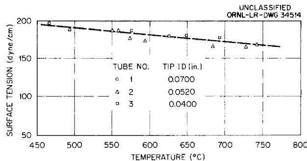  
Fig. 1.3.1. Surface Tension of LiF-BeF $_2$ -UF $_4$ Mixture (62-37-1 mole %).

$750^{\circ}\mathrm{C}$ . Three tubes that differed in inside diameter were used. It is felt that a major source of the observed scatter of the data is the uncertainty in the tube-tip inside diameter as a result of progressive plugging during a test series. Future studies will include measurement of other salts of known surface tension and noncorrosive nature in order to isolate the plugging effect and to establish accuracy limits for this technique.

# Apparatus Fabrication and Calibration

The apparatus2 for direct measurements of the coefficients of thermal expansion of beryllium salt mixtures has been fabricated and is being assembled. The equipment2 for determining the thermal conductivity of the beryllium salts is being fabricated. The thermal gradient, and hence the heat flux, at the ends of the cylinders is to be determined from temperature measurements made at a large number of positions within the cylinders. Since it was not found to be feasible to locate the thermocouples coaxially, interpretation of the thermal profile under conditions of heat exchange at the cylinder walls becomes difficult. It is planned to analyze statistically the experimental temperature data from the initial measurements so as to ascertain the thermocouple locations that yield maximum heat flux precision.

Efflux-cup viscometers are being calibrated that have larger volumes than the viscometers used previously. It is believed that effects such as "surface-humping" will be sufficiently reduced to allow more precise measurement of the viscosity of the beryllium salts. Apparatus for the determination of the electrical conductivity of the beryllium salts is being assembled.

# MOLTEN-SALT HEAT-TRANSFER STUDIES

F. E. Lynch

Heat balance difficulties have been experienced in the evaluation of experimental data on the heat-transfer coefficient of $\mathrm{LiF - BeF_2 - UF_4}$ (53-46-1 mole $\%$ ) flowing through an electrical-resistance-heated small-diameter Inconel tube. Specifically, the measured electrical heat input has been observed to be only one-half the convective heat gained by the salt, as calculated from temperature and flow rate measurements. A check made with recalibrated instruments and with additional instruments indicated that the power measurements were not the cause of the discrepancy. New, precalibrated thermocouples have been installed, and the weigh-beam flow-measuring device has been rechecked. A second series of runs will be initiated shortly under conditions that closely approximate those of the earlier experiments.

The molten-salt pumping system is being assembled. Since it is the purpose of this study to determine whether effects such as surface film formation occur after long exposure of the metal to the beryllium salt, it is sufficient to obtain relative values of the heat-transfer coefficient. It is now planned, however, to include an experimental turbine-type flowmeter in the loop and also to determine the flow from the pump calibration, so that if the flow values obtained by these two methods consistently agree, an estimate of the heat-transfer coefficient can be made. The system will contain an INOR-8 test section, if available, in addition to the Inconel test section. The two test sections will be located in adjacent legs of the loop, and a three-electrode heating scheme will be used. It will also be necessary to include a heat exchanger to control the system temperature.

# 1.4. INSTRUMENTATION AND CONTROLS

# H. J. Metz Instrumentation and Controls Division

# RESISTANCE-TYPE CONTINUOUS FUEL LEVEL INDICATOR

R. F. Hyland

A series of tests of the Inconel resistance-type fuel-level-indicating elements described previously1 was completed, and typical data are summarized in Table 1.4.1. The results of these tests were somewhat disappointing. Although fuel 130

has sufficient resistance to provide a useful milli-volt output from the probe, the data for a given set of conditions could not be reproduced. One possible source of these inconsistencies is polarization, a phenomenon commonly encountered in conductivity measurements. This and possible surface tension effects will be investigated in future tests.

$^{1}$ R. F. Hyland, MSR Quar. Prog. Rep. June 30, 1958, ORNL-2551, p 48.

Probe supply voltage (regulated): 3.4 v ac

Probe supply current (constant): 1.0 amp

Frequency: 60 cps

Readout device: Hewlett-Packard Model 400H VTVM

Fuel 130: LiF-BeF $_2$ -UF $_4$ (62-37-1 mole %)

Table 1.4.1. Summary of Data from Tests of Resistance-Type Fuel Level Probes   

<table><tr><td>Run No.</td><td>Date 1958</td><td>Test Temperature (°F)</td><td>Level Range (in. of fuel 130)</td><td>Probe Output at Zero Level (mv)</td><td>Zero to Maximum Level Probe Output Range (mv)</td><td>Probe Output Span (mv)</td></tr><tr><td>1</td><td>7/29</td><td>1000</td><td>0-6</td><td>15.7</td><td>15.4-12.0</td><td>3.4</td></tr><tr><td>2</td><td>9/2</td><td>1000</td><td>0-6</td><td>15.7</td><td>14.9-8.0</td><td>6.9</td></tr><tr><td>1</td><td>8/5</td><td>1100</td><td>0-6</td><td>15.7</td><td>15.2-11.5</td><td>3.7</td></tr><tr><td>2</td><td>8/22</td><td>1100</td><td>0-6</td><td>15.7</td><td>14.2-6.0</td><td>8.2</td></tr><tr><td>1</td><td>8/11</td><td>1200</td><td>0-6</td><td>15.7</td><td>15.5-12.2</td><td>3.3</td></tr><tr><td>2</td><td>8/22</td><td>1200</td><td>0-6</td><td>15.7</td><td>14.6-7.0</td><td>7.6</td></tr><tr><td>1</td><td>8/20</td><td>1300</td><td>0-6</td><td>15.7</td><td>14.8-7.4</td><td>7.4</td></tr><tr><td>2</td><td>9/9</td><td>1300</td><td>0-6</td><td>15.7</td><td>14.7-7.1</td><td>7.6</td></tr></table>

# 1.5. ADVANCED REACTOR DESIGN STUDIES

H. G. MacPherson

Reactor Projects Division

# LOW-ENRICHMENT GRAPHITE-MODERATED MOLTEN-SALT REACTORS

H. G. MacPherson

A rough survey of the nuclear characteristics of graphite-moderated reactors utilizing an initial complement of low-enrichment uranium fuel has been made. The pertinent characteristics of a number of such reactors are presented in Table 1.5.1. It may be seen that reactors could be constructed that would operate with fuel enriched initially with as little as $1.25\% \, \text{U}^{235}$ ; initial conversion ratios as high as 0.8 could be obtained with a fuel enrichment of less than $2\%$ . Highly enriched uranium would be added as make-up fuel, and such reactors could probably be operated to burnups as high as 60,000 Mwd/ton. The total fuel cycle cost would be approximately 1.3 mills/kwhr, of which 1.0 mill would be the cost of the enriched $\text{U}^{235}$ that would be burned up.

$^{1}$ H. G. MacPherson, Survey of Low-Enrichment Molten-Salt Reactors, ORNL CF-58-10-60 (Oct. 17, 1958).

# A NATURAL-CONVECTION MOLTEN-SALT REACTOR

A study was made of a large natural-convection power reactor to determine the approximate size of the components and the fuel volume for comparison with other molten-salt reactors in which the fuel is circulated by a pump. A reactor with a power rating of 576 Mw (thermal) was chosen for study so that the heat generated in the core would be comparable to that generated in the core of the interim molten-salt reactor.

The rather simple configuration of reactor, heat exchanger, and piping shown in Fig. 1.5.1 was used in the study. All calculations were done on the basis of one heat exchanger, one riser, and one downcomer. Since the frictional losses in the piping are determined primarily by the expansion and contraction losses and are insensitive to wall

2J. Zasler, 576 Mwt Natural Convection Molten Salt Reactor Study, ORNL CF-58-8-85 (Aug. 25, 1958).

Table 1.5.1. Characteristics of Low-Enrichment Graphite-Moderated Molten-Salt Reactors   

<table><tr><td>Case</td><td>Volume Fraction of Fuel in Core</td><td>Multiplication Constant</td><td>Uranium Enrichment (%)</td><td>Volume of Fuel in Core (ft3)</td><td>Uranium in Core (kg)</td><td>Critical Mass of U235 (kg)</td><td>Initial Conversion Ratio</td></tr><tr><td>1</td><td>0.05</td><td>1.05</td><td>1.30</td><td>395</td><td>22,100</td><td>298</td><td>0.546</td></tr><tr><td>2</td><td></td><td>1.10</td><td>1.45</td><td>143</td><td>8,000</td><td>116</td><td>0.492</td></tr><tr><td>3</td><td>0.075</td><td>1.05</td><td>1.25</td><td>427</td><td>23,900</td><td>298</td><td>0.635</td></tr><tr><td>4</td><td></td><td>1.10</td><td>1.39</td><td>167</td><td>9,350</td><td>130</td><td>0.600</td></tr><tr><td>5</td><td>0.10</td><td>1.05</td><td>1.275</td><td>445</td><td>24,900</td><td>318</td><td>0.707</td></tr><tr><td>6</td><td></td><td>1.10</td><td>1.46</td><td>179</td><td>10,000</td><td>146</td><td>0.668</td></tr><tr><td>7</td><td>0.15</td><td>1.05</td><td>1.525</td><td>474</td><td>26,600</td><td>405</td><td>0.796</td></tr><tr><td>8</td><td></td><td>1.10</td><td>1.80</td><td>197</td><td>11,000</td><td>198</td><td>0.780</td></tr><tr><td>9</td><td>0.20</td><td>1.05</td><td>2.24</td><td>520</td><td>29,100</td><td>652</td><td>0.865</td></tr><tr><td>10</td><td></td><td>1.10</td><td>2.88</td><td>206</td><td>11,540</td><td>332</td><td>0.865</td></tr><tr><td>11</td><td>0.25</td><td>1.05</td><td>4.36</td><td>575</td><td>32,200</td><td>1400</td><td>0.900</td></tr><tr><td>12</td><td></td><td>1.10</td><td>7.05</td><td>240</td><td>13,430</td><td>952</td><td>0.865</td></tr></table>

friction, the single riser can be replaced by a number of risers having the same height and total cross sections. Likewise, the heat exchanger can be replaced by a number of heat exchangers having the same length of tubes and total number of tubes.

The principal results of these calculations are given in Fig. 1.5.2. The diameter of the riser needed to provide natural convection, the length and number of heat exchanger tubes, and the total fuel volume are given as functions of riser height

and the temperature drop of the fuel in going through the heat exchanger. Natural-convection power reactors of this size are characterized by high fuel volumes and large numbers of heat exchanger tubes. Therefore it is expected that the initial cost of a natural-convection reactor would be higher than that for a forced-circulation system, and the larger number of heat exchanger tubes cast some doubt as to whether the natural-convection system would actually be more reliable than the forced-circulation system.

UNCLASSIFIED

ORNL-LR-DWG32561

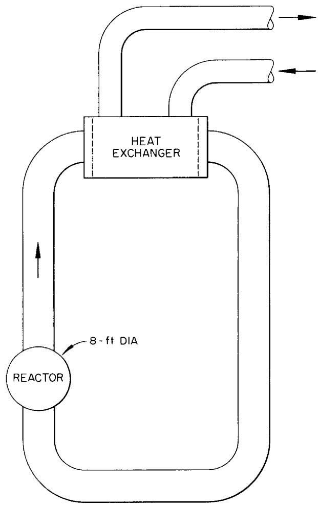  
Fig. 1.5.1. Schematic Diagram of a Natural-Convection Molten-Salt Reactor.

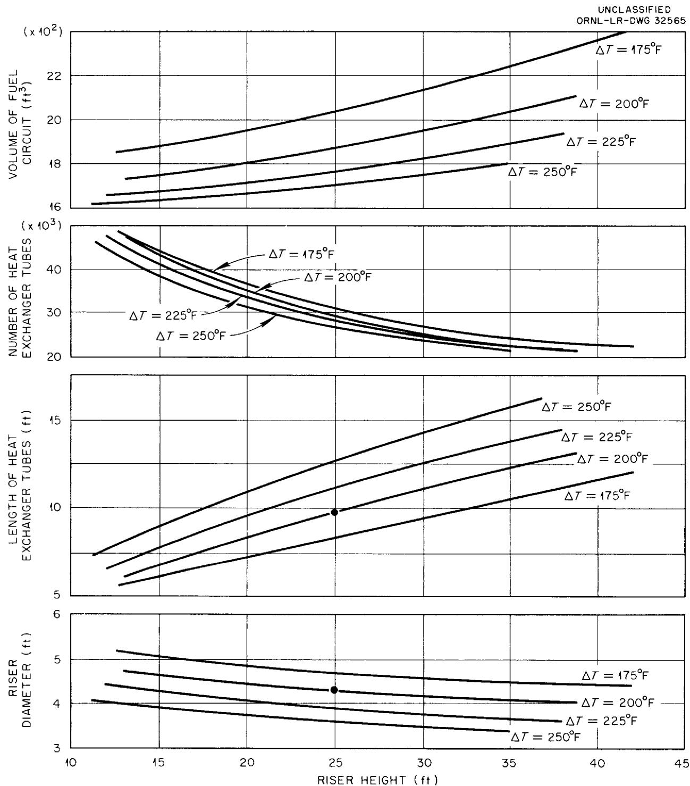  
Fig. 1.5.2. Design Characteristics of a 576 Mw (thermal) Natural-Convection Molten-Salt Reactor.

# Part 2

# MATERIALS STUDIES

# 2.1.METALLURGY

W.D.Manly

D.A.Douglas A.Taboada

Metallurgy Division

# DYNAMIC CORROSION STUDIES

J.H.DeVan

J.R.DiStefano R.C.Schulze

The three-phase corrosion testing program, previously described, for which Inconel and INOR-8 thermal-convection and forced-circulation loops are utilized, was continued. During the quarter, corrosion studies were completed of two Inconel and four INOR-8 thermal-convection loops. Examinations were also completed of three Inconel forced-circulation loops, which were the first loops operated in the third phase of the corrosion testing program. Samples removed from an INOR-8 forced-circulation loop that was temporarily shut down for repair of a leak were also examined. A number of new forced-circulation loop tests were started; the present status of all such loop tests now in operation is given in Chap. 1.2 of this report.

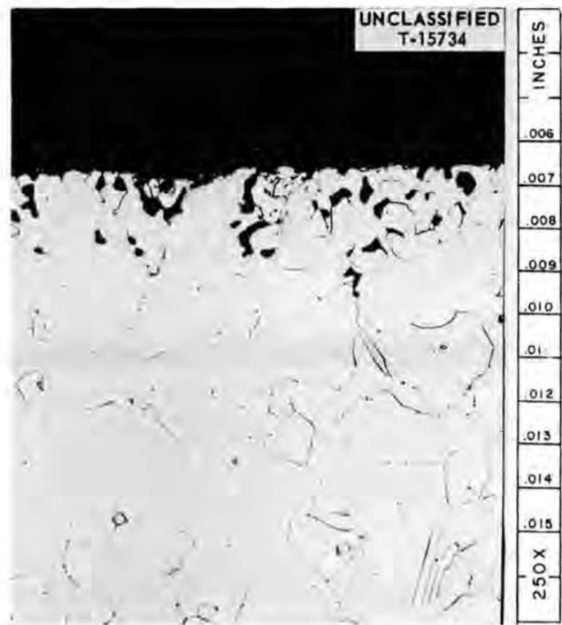  
Fig. 2.1.1. Hot-Leg Sample from Inconel Loop 1222 Which Circulated Salt 130 for 1000 hr at $1350^{\circ}$ F.

# Inconel Thermal-Convection Loop Tests

One of the two Inconel thermal-convection loops examined was operated as a supplement to the first phase of corrosion testing of Inconel in contact with fused-fluoride-salt mixtures. Loop 1222 circulated salt mixture 130 (LiF-BeF $_2$ -UF $_4$ , 62-37-1 mole %) for 1000 hr at a maximum hot-leg temperature of $1350^{\circ}\mathrm{F}$ , and it was attacked to a depth of 3 mils in the form of intergranular voids (Fig. 2.1.1). Previously, loop 1178 had circulated the same salt mixture for 1000 hr at $1250^{\circ}\mathrm{F}$ and was attacked to a depth of 1 mil. Comparison of the results from the two loop tests emphasizes the effect of operating temperature on depth of corrosion in Inconel systems. The $100^{\circ}\mathrm{F}$ increase in the maximum operating temperature caused an increase in the depth of attack from 1 to 3 mils in the 1000-hr period.

The second Inconel thermal-convection loop (1207) that was examined was the first that had operated for an extended period of time. It circulated salt mixture 12 (NaF-LiF-KF, 11.5-46.5-42 mole %) for 4360 hr at a maximum temperature of $1050^{\circ}\mathrm{F}$ . The attack in loop 1207 was in the form of voids to a depth of 2 mils.

# INOR-8 Thermal-Convection Loop Tests

The four INOR-8 thermal-convection loop tests which were completed concluded the first phase of the corrosion testing program for INOR-8. The operating conditions and chemical analyses of the salts circulated in the loops are presented in Table 2.1.1. None of the loops showed measurable attack, even though one loop (1213) operated for 3114 hr. A hot-leg section of loop 1203 after exposure to salt mixture 125 for 1000 hr at $1250^{\circ}\mathrm{F}$ is shown in Fig. 2.1.2. Comparable samples from the other INOR-8 loops were similar in appearance.

# Inconel Forced-Circulation Loop Tests

The operating conditions and results of three Inconel forced-circulation loop tests are presented in Table 2.1.2. These three loops were the first

Maximum loop temperature: $1250^{\circ}\mathrm{F}$

Table 2.1.1. Test Operating Conditions and Chemical Analyses of Salts Circulated in INOR-8 Thermal-Convection Loops   

<table><tr><td rowspan="2">Loop No.</td><td rowspan="2">Salt No.</td><td rowspan="2">Operating Time (hr)</td><td rowspan="2">Salt Composition (mole %)</td><td rowspan="2">Sample Taken</td><td colspan="3">Major Constituents (wt %)</td><td colspan="3">Minor Constituents (ppm)</td></tr><tr><td>U</td><td>Be</td><td>Th</td><td>Ni</td><td>Cr</td><td>Fe</td></tr><tr><td rowspan="2">1203</td><td rowspan="2">125</td><td rowspan="2">1000</td><td rowspan="2">53 NaF-46 BeF2-0.5 UF4.-0.5 ThF4</td><td>Before test</td><td>1.73</td><td>8.59</td><td>2.82</td><td>150</td><td>72</td><td>222</td></tr><tr><td>After test</td><td>1.82</td><td>10.5</td><td>2.90</td><td>68</td><td>235</td><td>195</td></tr><tr><td rowspan="2">1204</td><td rowspan="2">131</td><td rowspan="2">1000</td><td rowspan="2">60 LiF-36 BeF2-4 UF4</td><td>Before test</td><td>20.4</td><td>6.97</td><td></td><td>128</td><td>30</td><td>275</td></tr><tr><td>After test</td><td>20.6</td><td>7.15</td><td></td><td>&lt;10</td><td>79</td><td>195</td></tr><tr><td>1213</td><td>128</td><td>3114</td><td>71 LiF-29 ThF4</td><td>Before test*</td><td></td><td></td><td>62</td><td>20</td><td>25</td><td>115</td></tr><tr><td rowspan="2">1221</td><td rowspan="2">128</td><td rowspan="2">1000</td><td rowspan="2">71 LiF-29 ThF4</td><td>Before test</td><td></td><td></td><td>62.3</td><td>35</td><td>37</td><td>103</td></tr><tr><td>After test</td><td></td><td></td><td>61.3</td><td>28</td><td>70</td><td>245</td></tr></table>

*Results of after-test analyses not yet available.

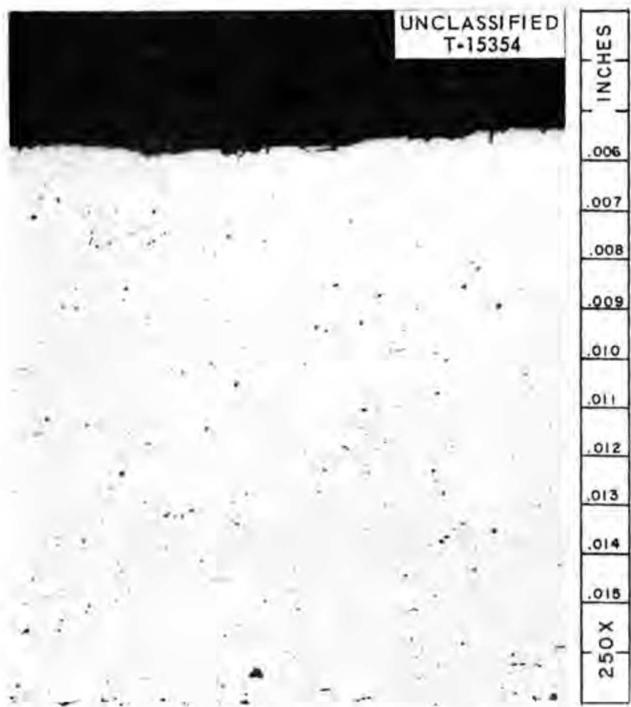  
Fig. 2.1.2. Hot-Leg Sample from INOR-8 Loop 1203 Which Circulated Salt 125 for 1000 hr at $1250^{\circ}\mathrm{F}$ .

operated in phase three of the corrosion testing program. The loop designated CPR was the first forced-circulation loop operated under molten-salt reactor program conditions. Its design provided for the operation of separate sodium and salt circuits through a U-bend heat exchanger. The loop completed 9148 hr of operation with salt mixture 122 $(\mathrm{NaF - ZrF_4 - UF_4},57 - 42 - 1$ mole $\%$ at a maximum temperature of $1260^{\circ}F$ and with the sodium at a maximum temperature of $1120^{\circ}F$ .Operation was terminated because of a pump failure. Metallographic examination revealed moderate surface roughening and slight intergranular attack in the heated leg of the molten-salt circuit. The maximum intergranular penetration was less than 1.5 mils, as shown in Fig. 2.1.3. In the sodium circuit, attack was limited to light surface roughening.No evidences of cold-leg deposits were found in either the salt or sodium circuits.

The second and third loops described in Table 2.1.2 also operated for extended time periods.

After circulating salt mixture 126 $(\mathrm{LiF - BeF}_2-$ UF4,53-46-1 mole $\%$ for 3073 hr at a maximum hotleg temperature of $1300^{\circ}\mathrm{F},$ loop 9377-1 showed moderate to heavy surface roughening and heavy intergranular void formation to a depth of 5 mils, as shown in Fig.2.1.4.The third loop,9377-2,

revealed moderate intergranular void formation in a maximum depth of 8 mils and an average depth of 4 mils, as shown in Fig.2.1.5. The loop operated 3064 hr and circulated the salt mixture 130 (LiF-BeF $_2$ -UF $_{4'}$ , 62-37-1 mole%).

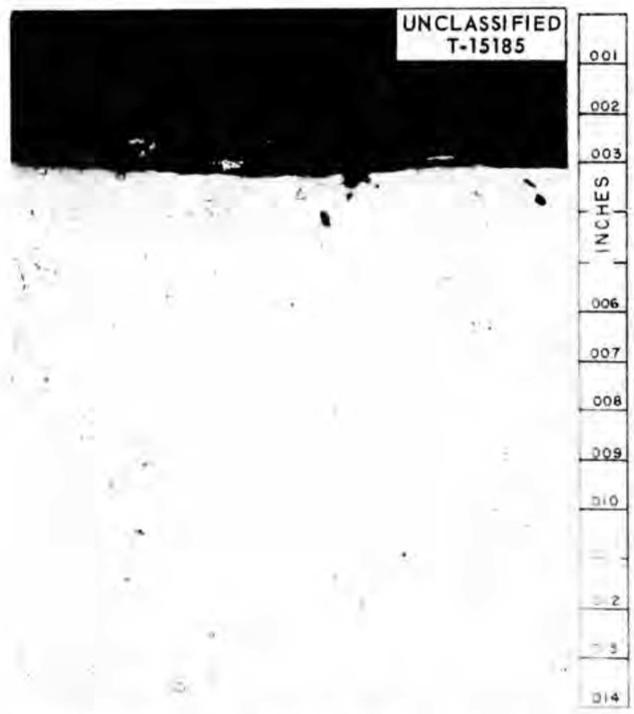  
Fig. 2.1.3. Hot-Leg Sample from Salt Circuit of Inconel Forced-Circulation Loop CPR Which Circulated Salt 122 for 9148 hr at $1300^{\circ}$ F.

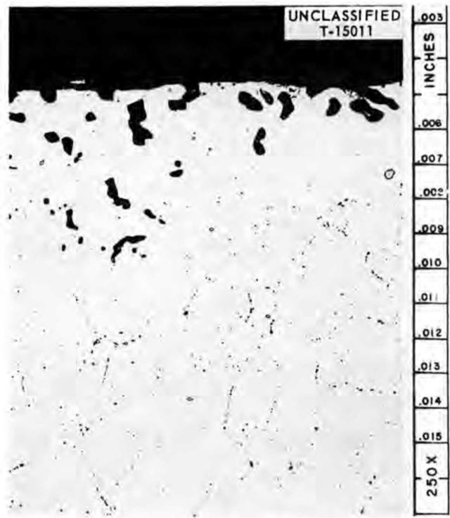  
Fig. 2.1.4. Hot-Leg Sample from Inconel Forced-Circulation Loop 9377-1 Which Circulated Salt 126 for 3073 hr at $1300^{\circ}$ F.

Maximum salt-to-metal interface temperature: $1300^{\circ}F$ Minimum bulk salt temperature: $1100^{\circ}F$ Temperature difference across loop: $200^{\circ}F^{*}$ Salt flow rate: 2 gpm

Table 2.1.2. Operating Conditions and Results of Inconel Forced-Circulation Loop Tests   

<table><tr><td>Loop No.</td><td>Fluid Composition (mole %)</td><td>Operating Time (hr)</td><td>Reynolds Number</td><td>Results</td></tr><tr><td>CPR (primary circuit)</td><td>57 NaF-42 ZrF4-1 UF4</td><td>9148</td><td>5,000</td><td>Intergranular penetration to a depth of &lt;1.5 mils</td></tr><tr><td>CPR (secondary circuit)</td><td>Sodium</td><td>9148</td><td>97,700</td><td>Light surface roughening; no cold-leg deposits</td></tr><tr><td>9377-1</td><td>53 LiF-46 BeF2-1 UF4</td><td>3073</td><td>1,600</td><td>Voids to a depth of 5 mils</td></tr><tr><td>9377-2</td><td>62 LiF-37 BeF2-1 UF4</td><td>3064</td><td>3,000</td><td>Intergranular voids to a maximum depth of 8 mils; average depth, 4 mils</td></tr></table>

*The respective temperature differences across the fused-salt and sodium circuits of the loop were ${100}^{ \circ  }F$ .

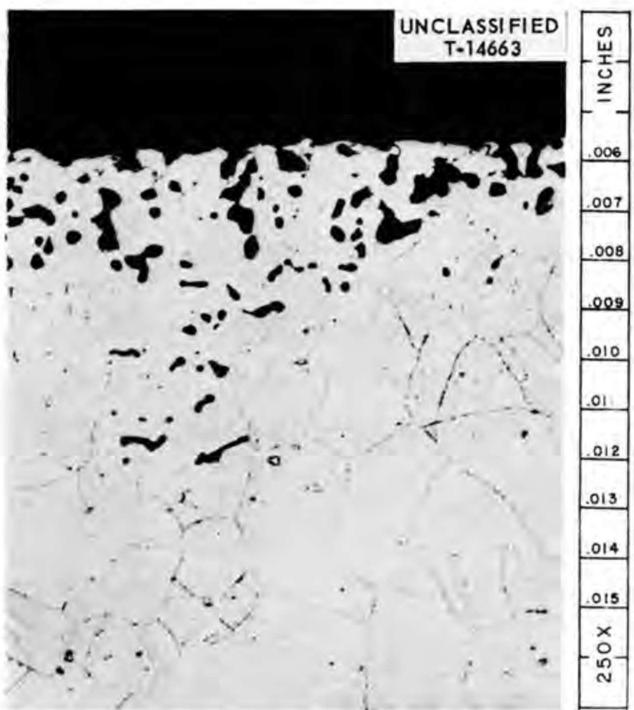  
Fig. 2.1.5. Hot-Leg Sample from Inconel Forced Circulation Loop 9377-2 Which Circulated Salt 130 for 3064 hr at $1300^{\circ}$ F.

# Results of Examination of Samples Removed from INOR-8 Forced-Circulation Loop 9354-1

On July 29, 1958, after successful completion of 3370 hr of operation, loop 9354-1 was temporarily shut down to permit the repair of a small leak in a lug adapter near the hottest section in the loop. The cause of the leak was traced to a probable defect in the material used in fabricating the loop (see subsequent section of this chapter on "Welding and Brazing Studies"). The loop was constructed of $\frac{1}{2}$ -in.-OD, 0.045-in.-wall INOR-8 tubing and it circulated salt mixture 126. The maximum loop wall temperature was $1300^{\circ}\mathrm{F}$ and the minimum fluid temperature was $1180^{\circ}\mathrm{F}$ . The salt flow rate was 2.5 gpm and the Reynolds number was 2000.

The damaged section, which was about 1 ft long and which is shown in Fig.2.1.6, was removed from the loop, and 2-in. samples were cut from the tubing on both sides of the lug adapter. Metallographic examination of these samples did not show evidence of surface attack. However, the electrolytic etch used to prepare the samples for metallographic examination produced a greater darkening of the grain

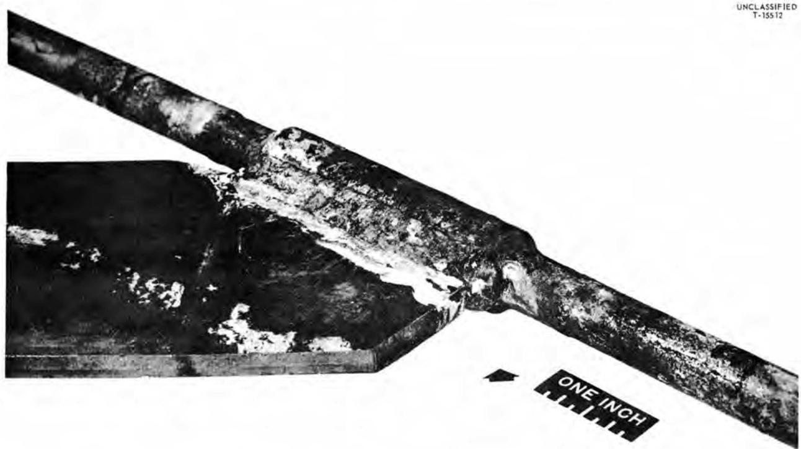  
Fig. 2.1.6. Damaged Section of INOR-8 Forced-Circulation Loop 9354-1 Showing Location of Leak.

boundaries near the exposed surface than in the interior, as shown in Fig. 2.1.7. This effect indicates a faster etching rate of the boundaries near the surface and is presumably due to a slight difference in the chemical composition of the region near the surface. As may be seen in Fig. 2.1.8, this surface effect is not apparent in as-received samples of the tubing used for the loop. The loop was repaired by replacing the damaged section, and it has again been placed in operation.

# Material Inspection

G.M.Tolson J.H.DeVan

Routine inspection of the INOR-8 material now being received has revealed that the quality is as good as that of Inconel and of stainless steels made to ASTM standards. The high rejection rate previously found for INOR-8 welded and drawn tubing is felt to have been due to poor welding quality of the heat of INOR-8 from which the tubing was made. The rejection of seamless INOR-8 tubing, with defects greater than $5\%$ of the wall thickness used as criteria for rejection, is running well below $10\%$ .

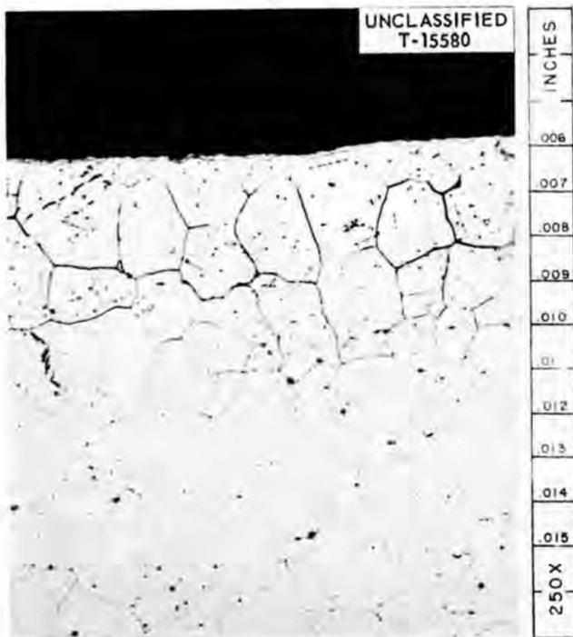  
Fig. 2.1.7. Sample Taken from Damaged Section of INOR-8 Forced-Circulation Loop 9354-1 Showing the Effect of Electrolytic Etch on the Grain Boundaries Near the Exposed Surface.

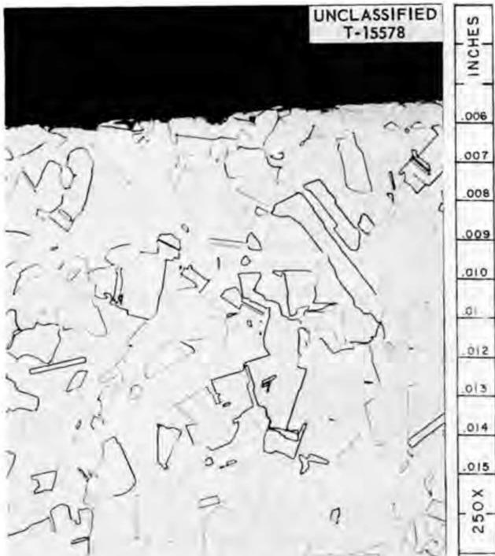  
Fig. 2.1.8. Sample of As-Received Tubing Used for Loop 9354-1 Showing Absence of Effect of the Electrolytic Etch on the Grain Boundaries.

Fully inspected welds made on INOR-8 material show a rejection rate of about $10\%$ , which compares favorably with the rejection rate of welds made on Inconel and stainless steels. Evaluation tests were made of thermocouple spot welds to INOR-8 tubing. Although nondestructive testing did not reveal any rejectable spot welds, metallographic examinations showed microcracks in some spot welds.

# GENERAL CORROSION STUDIES

E.E.Hoffman

W.H.Cook

D.H.Jansen

# Carburization of Inconel and INOR-8 by Sodium-Graphite Systems

D.H.Jansen

The sodium-graphite system, which is an effective carburizing medium for nickel-base alloys,4 was used to carburize Inconel and INOR-8 samples for additional tests to determine whether the mechanical properties of these materials are detrimentally affected by various degrees of carburization. The carburizing system and the test pro

cedures used were described previously. Results of the tests completed thus far are presented in Table 2.1.3. As may be seen, the data indicate that the carburization treatment increases both the yield and tensile strengths of Inconel and decreases the ductility at room temperature. Similar room-temperature mechanical property data for the carburized INOR-8 specimens showed that the yield strength was increased, the tensile strength was slightly decreased, and the ductility was greatly

5E. E. Hoffman, W. H. Cook, and D. H. Jansen, MSR Quar. Prog. Rep. June 30, 1958, ORNL-2551, p 59.

reduced. The change in each mechanical property, especially the ductility, was dependent on the amount of carburization that had occurred. There was close agreement of all duplicate and triplicate mechanical test values, that is, $\pm 2 \times 10^{3}$ psi variation for strength values and $\pm 1.5\%$ for elongation values. Inconel and INOR-8 specimens that were exposed in the sodium-graphite system for $40\mathrm{hr}$ at $1600^{\circ}\mathrm{F}$ are shown in Fig. 2.1.9. Heavy carburization to a depth of 2 mils was found on the Inconel, and even heavier carburization was found on the INOR-8.

Creep tests have also been conducted in argon at $1200^{\circ}\mathrm{F}$ on the Inconel and INOR-8 specimens that

Table 2.1.3. Results of Mechanical Tests in Room-Temperature Air of Inconel and INOR-8 Specimens Carburized in Sodium-Graphite Systems   

<table><tr><td rowspan="2">Exposure Temperature (°F)</td><td rowspan="2">Exposure Period (hr)</td><td rowspan="2">Specimen Treatment</td><td colspan="3">Mechanical Properties</td></tr><tr><td>Yield Strength (psi)</td><td>Tensile Strength (psi)</td><td>Elongation in 2-in. Gage (%)</td></tr><tr><td colspan="6">Inconel</td></tr><tr><td></td><td></td><td></td><td>×103</td><td>×103</td><td></td></tr><tr><td>1200</td><td>40</td><td>Controla</td><td>24.1</td><td>80.8</td><td>40.1</td></tr><tr><td></td><td></td><td>Carburized</td><td>27.2</td><td>84.2</td><td>38.0</td></tr><tr><td>1400</td><td>40b</td><td>Control</td><td>23.9</td><td>81.3</td><td>38.8</td></tr><tr><td></td><td></td><td>Carburized</td><td>27.0</td><td>83.9</td><td>36.8</td></tr><tr><td></td><td>400b</td><td>Control</td><td>24.3</td><td>81.7</td><td>37.9</td></tr><tr><td></td><td></td><td>Carburized</td><td>30.9</td><td>92.9</td><td>27.0</td></tr><tr><td>1600</td><td>40c</td><td>Control</td><td>20.9</td><td>75.9</td><td>47.3</td></tr><tr><td></td><td></td><td>Carburized</td><td>28.5</td><td>91.5</td><td>25.7</td></tr><tr><td colspan="6">INOR-8</td></tr><tr><td>1200</td><td>40</td><td>Controla</td><td>53.3</td><td>120.3</td><td>43.6</td></tr><tr><td></td><td></td><td>Carburized</td><td>53.1</td><td>119.6</td><td>43.8</td></tr><tr><td>1400</td><td>40b</td><td>Control</td><td>53.7</td><td>122.0</td><td>42.6</td></tr><tr><td></td><td></td><td>Carburized</td><td>53.9</td><td>120.5</td><td>36.9</td></tr><tr><td></td><td>400b</td><td>Control</td><td>53.2</td><td>120.7</td><td>43.0</td></tr><tr><td></td><td></td><td>Carburized</td><td>57.4</td><td>103.2</td><td>8.8</td></tr><tr><td>1600</td><td>40c</td><td>Control</td><td>50.5</td><td>116.3</td><td>50.0</td></tr><tr><td></td><td></td><td>Carburized</td><td>52.8</td><td>98.5</td><td>7.8</td></tr></table>

${}^{a}$ Control specimens exposed to argon at the conditions given.   
$b$ Test values given for these specimens are averages of two tests.   
${}^{c}$ Test values given for these specimens are averages of three tests.

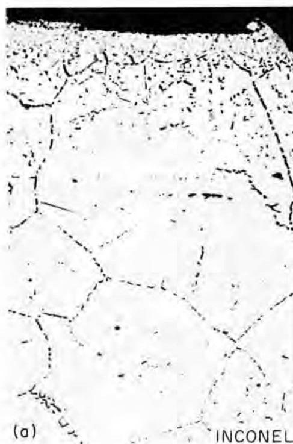

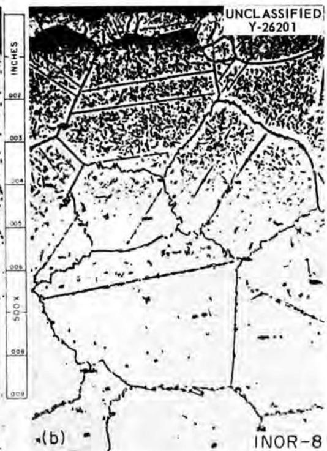  
Fig. 2.1.9. Inconel and INOR-8 Specimens After Exposure to Sodium-Graphite System for 40 hr at $1600^{\circ}$ F. Etchant: copper regia, 500X.

were carburized for $40\mathrm{hr}$ at $1600^{\circ}\mathrm{F}$ in the sodiumgraphite system, and the results are presented in Table 2.1.4. The results of tensile tests of similar specimens and control specimens in air at $1250^{\circ}F$ are presented in Table 2.1.5. In general, the carburized specimens show lower ductility than that of the control specimens. Exceptions to this trend were found, as indicated in Table 2.1.5, for some of the carburized INOR-8 material and for a heavily carburized Inconel specimen that had been exposed for $40\mathrm{hr}$ at $1600^{\circ}\mathrm{F}$ in the sodium-graphite system; the carburized pieces were more ductile than the control specimens. These results were verified by duplicate tests, and therefore the results of the duplicate tests are also included in Table 2.1.5.

# Carburization of INOR-8 by Fuel-130-Graphite Systems

A comprehensive test in which INOR-8 (nominal composition: $70\%$ Ni- $16\%$ Mo- $7\%$ Cr- $5\%$ Fe- $2\%$ other alloying additions) specimens were exposed to (1) fuel 130 $(\mathrm{LiF - BeF}_2 - UF_4, 62 - 37 - 1$ mole $\%$ containing a graphite rod, (2) fuel 130 without added graphite, and (3) argon, all in the same test container, at a temperature of $1300^{\circ}\mathrm{F}$ for 2000 hr,

has been completed. The 40-mil-thick tensile-test specimens used were then subjected to tensile tests in order to determine whether the various treatments had affected the mechanical properties.

Test temperature: $1250^{\circ}\mathrm{F}$

Test environment: argon

Test stress: 18,500 psi

Table 2.1.4. Results of Creep Tests of INOR-8 and Inconel Control Specimens and Specimens Carburized in a Sodium-Graphite System for 40 hr at ${1600}^{ \circ  }\mathrm{F}$   

<table><tr><td>Specimen</td><td>Time to Rupture (hr)</td><td>Elongation in 2-in. Gage (%)</td></tr><tr><td colspan="3">INOR-8</td></tr><tr><td>Control</td><td>1734</td><td>23.8</td></tr><tr><td>Carburized</td><td>4031*</td><td>9.0*</td></tr><tr><td colspan="3">Inconel</td></tr><tr><td>Control</td><td>38</td><td>21.2</td></tr><tr><td>Carburized</td><td>160</td><td>47.5</td></tr></table>

*Still in test.

Table 2.1.5. Results of Mechanical Tests in $1250^{\circ}$ F Air of Inconel and INOR-8 Specimens Carburized in Sodium-Gophite Systems   

<table><tr><td rowspan="2">Exposure Temperature (°F)</td><td rowspan="2">Exposure Period (hr)</td><td rowspan="2">Specimen Treatment</td><td colspan="3">Mechanical Properties</td></tr><tr><td>Yield Strength (psi)</td><td>Tensile Strength (psi)</td><td>Elongation in 2-in. Gage (%)</td></tr><tr><td colspan="6">Inconel</td></tr><tr><td></td><td></td><td></td><td>×103</td><td>×103</td><td></td></tr><tr><td>1200</td><td>40</td><td>Control*</td><td></td><td>50.3</td><td>38.5</td></tr><tr><td></td><td></td><td>Carburized</td><td></td><td>48.6</td><td>33.5</td></tr><tr><td>1400</td><td>40</td><td>Control*</td><td></td><td>46.7</td><td>36.5</td></tr><tr><td></td><td></td><td>Carburized</td><td></td><td>49.9</td><td>23.0</td></tr><tr><td></td><td>400</td><td>Control*</td><td>16.4</td><td>45.2</td><td>26.5</td></tr><tr><td></td><td></td><td>Carburized</td><td>22.0</td><td>50.7</td><td>21.0</td></tr><tr><td>1600</td><td>40</td><td>Control*</td><td>11.3</td><td>42.4</td><td>16.5</td></tr><tr><td></td><td></td><td></td><td></td><td>41.4</td><td>18.5</td></tr><tr><td></td><td></td><td>Carburized</td><td>20.5</td><td>53.9</td><td>24.8</td></tr><tr><td></td><td></td><td></td><td></td><td>51.1</td><td>28.5</td></tr><tr><td colspan="6">INOR-8</td></tr><tr><td>1200</td><td>40</td><td>Control*</td><td></td><td>70.2</td><td>17.0</td></tr><tr><td></td><td></td><td>Carburized</td><td></td><td>74.4</td><td>19.0</td></tr><tr><td>1400</td><td>40</td><td>Control*</td><td></td><td>74.6</td><td>18.5</td></tr><tr><td></td><td></td><td>Carburized</td><td></td><td>76.8</td><td>19.5</td></tr><tr><td></td><td>400</td><td>Control*</td><td>36.8</td><td>70.3</td><td>16.5</td></tr><tr><td></td><td></td><td></td><td></td><td>74.5</td><td>20.5</td></tr><tr><td></td><td></td><td>Carburized</td><td>42.4</td><td>82.9</td><td>18.0</td></tr><tr><td></td><td></td><td></td><td></td><td>85.2</td><td>22.0</td></tr><tr><td>1600</td><td>40</td><td>Control*</td><td>33.8</td><td>68.9</td><td>18.5</td></tr><tr><td></td><td></td><td></td><td></td><td>70.6</td><td>6.5</td></tr><tr><td></td><td></td><td>Carburized</td><td>40.5</td><td>82.8</td><td>13.0</td></tr></table>

*Control specimens exposed to argon at the conditions indicated.

The specimens were also examined metallographically, and, as shown in Fig. 2.1.10, no carburization was found on the surface of the INOR-8 specimen that was exposed to the fuel-graphite system.

Chemical analyses and mechanical tests, however, indicated that carburization did occur. Carbon analyses of 3-mil surface cuts showed that the INOR-8 specimen exposed to fuel 130 without added graphite contained 640 ppm carbon, while a similar cut of an INOR-8 piece exposed to the fuel-graphite

system contained 980 ppm carbon. These data and data obtained from carbon analyses of the fuel are given in Table 2.1.6.

Room-temperature mechanical tests showed the INOR-8 specimen exposed to the fuel-graphite system to have higher yield and tensile strengths and lower elongation than the INOR-8 specimen that was exposed only to argon and given the same heat treatment. The same trends were apparent in mechanical tests at $1250^{\circ}\mathrm{F}$ . Data obtained in the

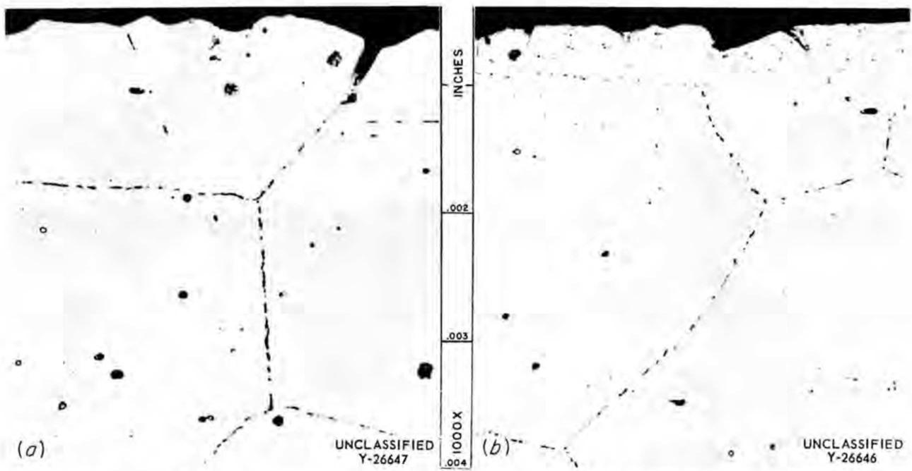  
Fig. 2.1.10. INOR-8 Specimens After 2000-hr Exposures at $1300^{\circ}F$ to (a) Fuel 130 Containing a Graphite Rod and (b) to Fuel 130 Without Added Graphite. Etchant: glyceria regia, 1000X. Reduced $9\%$ .

Table 2.1.6. Carbon Analyses of INOR-8 Specimens and Fuel 130 Mixtures Used in Tests of the Carburization of INOR-8 in a Fuel-Graphite System at ${1300}^{ \circ  }\mathrm{F}$ for 2000 hr   

<table><tr><td rowspan="2">Specimen Analyzed</td><td colspan="2">Carbon Content (ppm)</td></tr><tr><td>Before Test</td><td>After Test</td></tr><tr><td>Fuel 130 exposed to graphite and INOR-8</td><td>220</td><td>190</td></tr><tr><td>Fuel 130 exposed only to INOR-8</td><td>180</td><td>150</td></tr><tr><td>INOR-8 exposed to graphite and fuel 130</td><td>160–170*</td><td>980</td></tr><tr><td>INOR-8 exposed only to fuel</td><td>160–170*</td><td>640</td></tr></table>

*Carbon analysis of as-received INOR-8 from heat SP-16.

room-temperature and high-temperature mechanical tests are presented in Table 2.1.7. As in the mechanical tests of specimens carburized in a sodium-graphite system, the decrease in elongation is an indication that carburization occurred. The fact that the tensile strength of the INOR-8 specimen exposed to fuel 130 was greater than that of the specimen heat treated in argon can be explained by the decrease in carbon concentration of the fuel exposed to the INOR-8. The INOR-8 in this case probably acted as a sump and picked up carbon from the fuel. This would account for the decrease

in the carbon content of the fuel and the increase in mechanical strength of the INOR-8 specimen exposed to it.

# $\mathsf{UO}_2$ Precipitation in Fused Fluoride Salts in Contact with Graphite

W.H.Cook

A test of the compatibility of fuel 130 and graphite at $1300^{\circ}F$ in a vacuum $(< 0.1\mu)$ was terminated at the end of a 500-hr period because of $\mathrm{UO}_2$ precipitation from the fuel. In preparation for the test,

Table 2.1.7. Results of Mechanical Tests of INOR-8 Specimens Exposed to Fuel 130 With and Without Graphite and to Argon at $1300^{\circ}$ F for 2000 hr   

<table><tr><td>Specimen Treatment</td><td>Yield Strength (psi)</td><td>Tensile Strength (psi)</td><td>Elongation in 2-in. Gage (%)</td></tr><tr><td colspan="4">Room-Temperature Tests*</td></tr><tr><td></td><td>×103</td><td>×103</td><td></td></tr><tr><td rowspan="2">Exposed to fuel 130 and graphite</td><td>51.5</td><td>116.8</td><td>47.0</td></tr><tr><td>51.5</td><td>116.4</td><td>46.5</td></tr><tr><td rowspan="2">Exposed only to fuel 130</td><td>40.0</td><td>107.3</td><td>56.0</td></tr><tr><td>39.9</td><td>106.5</td><td>56.0</td></tr><tr><td rowspan="2">Exposed to argon</td><td>39.0</td><td>104.2</td><td>55.0</td></tr><tr><td>31.3</td><td>103.4</td><td>56.0</td></tr><tr><td colspan="4">Tests at 1250°F</td></tr><tr><td>Exposed to fuel 130 and graphite</td><td>**</td><td>73.0</td><td>19.5</td></tr><tr><td>Exposed only to fuel 130</td><td>**</td><td>66.5</td><td>30.0</td></tr><tr><td>Exposed to argon</td><td>**</td><td>66.6</td><td>33.8</td></tr></table>

*Values obtained in each of duplicate tests are listed.   
**Yield strengths were not obtained because the results might have been obscured by a notch effect of the extensometer.

a machined CCN graphite crucible, nominally, 2 in. OD, 0.43 in. ID, $3\frac{1}{2}$ in. deep, and $4\frac{1}{2}$ in. long, with an average bulk density of $1.90 \mathrm{~g/cm}^3$ , was degassed at $2370^\circ \mathrm{F}$ for 5 hr in a vacuum of 1 to $3 \mu$ , cooled to room temperature, and blanketed in argon. The crucible was exposed to room atmosphere for approximately 3 min in order to weigh it. During all other preparations for the test, the crucible was either sealed under an argon atmosphere or was under a vacuum of $<0.1 \mu$ . Sufficient fuel 130, 13.70 g, to fill the crucible to a depth of 3 in. at $1300^\circ \mathrm{F}$ was cast into the graphite. The loaded crucible was tested in an inert-arc welded Inconel container.

Radiographs were used to monitor the location of the fuel in the graphite so that the test could be terminated if the fuel threatened to penetrate the crucible walls. Such a radiograph revealed at the end of 500 hr a 0.1-in.-high disk in the bottom of the graphite crucible that was relatively opaque to the x-rays (see Fig. 2.1.11). The remainder of the fuel was less opaque to the x-rays than it had been at the beginning of the test. Subsequent examination of the disk revealed that it contained $\mathsf{UO}_2$ ; the

disk contained $\sim 40$ wt $\%$ U as compared with 7.03 wt $\%$ U in the as-received fuel. The uranium content in the disk amounted to $28\%$ of the total amount of uranium originally in the fuel 130 charge; stated in another way, the uranium concentration of the fuel above the disk had decreased to $59\%$ of its original value.

Petrographic examinations of the fuel used for this test did not reveal oxide contamination. The fuel remaining in the batch from which the test quantity was taken is being analyzed for oxygen. This same source of fuel was used in a 2000-hr static test at $1300^{\circ}\mathrm{F}$ , described in the preceding section, in which the fuel was exposed only to INOR-8. A radiographic examination of the fuel at the end of that test did not reveal any precipitation of uranium.

Different grades of graphite and different fuels are being used in further tests of the compatibility of fuels and graphite. Radiographic examinations of systems now being tested, in which TSF graphite (average bulk density, $1.67\mathrm{g/cm^3}$ ) is used to contain the fuel 130, have also revealed uranium precipitation, but the quantities precipitated are less in TSF graphite than in CCN graphite. Radiographic

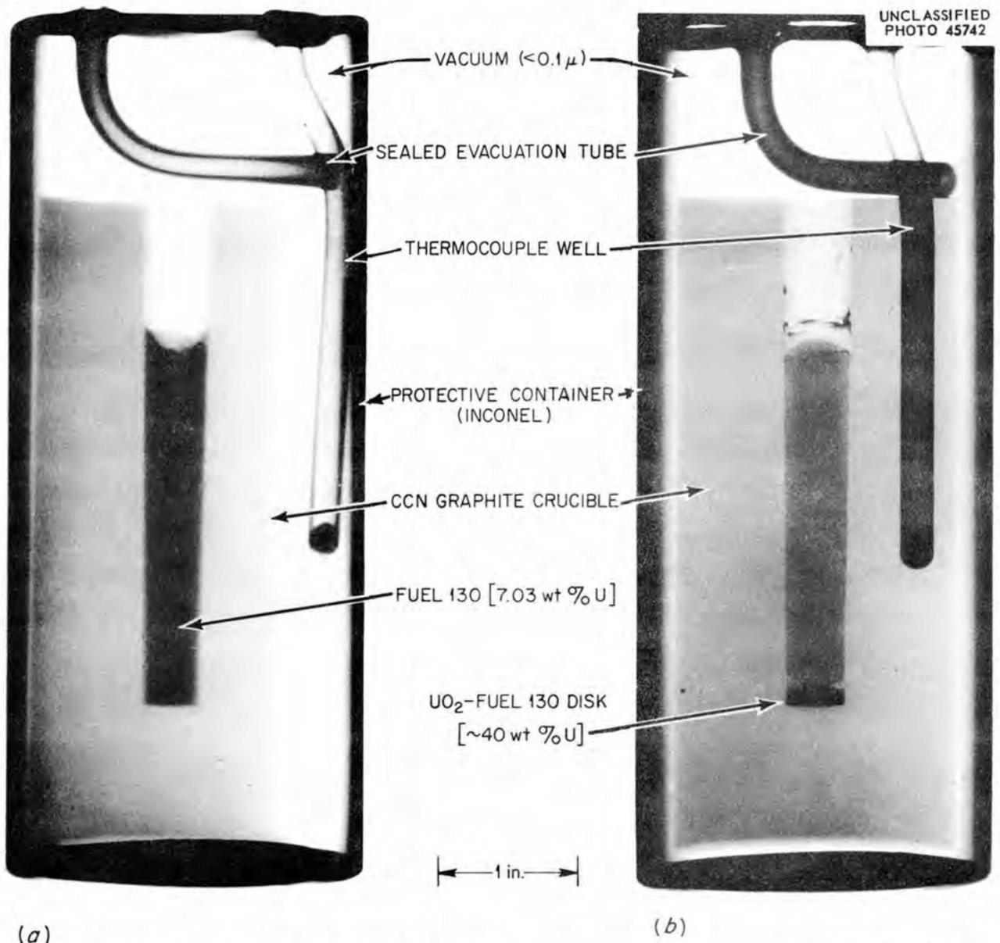  
Fig. 2.1.11. Radiographs of CCN Graphite Crucible Containing Fuel 130 (a) Before Test and (b) After 500 hr at $1300^{\circ}\mathrm{F}$ .

examinations of a CCN graphite crucible which contains $\mathrm{NaF - ZrF_4 - UF_4}$ (50-46-4 mole $\%$ fuel 30) and which is also being tested under the conditions described above, have shown no uranium precipitation in more than $1500\mathrm{hr}$ . Thus it appears that fuel 130 is more sensitive to contamination than fuel 30 is.

It is thought that the brief exposure of the graphite crucibles to room atmosphere during the weighing operation may have contaminated them with water vapor and oxygen and that the subsequent reaction of these contaminants with the fuel caused the $\mathrm{UO}_2$

precipitation. On the basis of the degassing and handling techniques used, however, such rapid contamination appears to be in contradiction to the observations of others.6 The greater quantity of uranium precipitation in the CCN graphite crucible than in the TSF graphite crucible may have been

the result of impurities in the graphite. The CCN grade is less pure than the TSF grade, which is a gas-purified product.

Metallographic examinations of the graphite crucibles used in these tests have shown no attack and no penetration of salt into the pore spaces in the graphite. Experiments are now in progress to determine (1) the extent to which salts can be forced, by pressure, into the pore spaces of various grades of graphites and (2) the physical effects on the graphite of repeated cycles of freezing and melting of salts trapped in the pore spaces.

# Precious-Metal-Base Brazing Alloys in Fuel 130

# D.H.Jansen

Five silver-base brazing materials ranging in composition from pure silver to alloys with 42 wt $\%$ Ag were tested in static fuel 130 for $500\mathrm{hr}$ . It was expected on the basis of thermodynamic considerations that silver would show good corrosion resistance to beryllium and lithium fluorides, but, as shown in Table 2.1.8, deep subsurface voids (as deep as 50 mils in the case of pure silver) were observed in all the silver-containing alloys.

A gold-base alloy (75% Au-20% Cu-5% Ag) was also tested in fuel 130 under the same conditions as those used in the tests of the silver alloys. No corrosion was found on this alloy after the test. Three other gold-base alloys are being prepared for testing in fuel 130.

# MECHANICAL PROPERTIES OF INOR-8

R.W.Swindeman

D. A. Douglas

Short time (less than 10,000 hr) creep data for INOR-8 obtained through tests in air conducted by the Haynes-Stellite Company and tests in fuel 107

(NaF-LiF-KF-UF $4,11.2 - 45.3 - 41 - 2.5$ mole $\%$ ) conducted at ORNL are presented in Fig. 2.1.12. Specimens tested by Haynes-Stellite were annealed 8 min at $2150^{\circ}\mathrm{F}$ ; ORNL specimens were annealed for 1 hr at $2000^{\circ}\mathrm{F}$ . Cross plots of log $t$ vs $1 / T$ , where $t$ is the time to $1\%$ strain and $1 / T$ is the reciprocal of the absolute temperature, yielded the straight lines shown in Fig. 2.1.13. These parallel straight lines indicate that the equation proposed by Dorn would best represent the time-temperature-stress relationship of this material. The slopes of these lines yield an activation energy for creep of 76,700 cal/mole $\cdot^{\circ}\mathrm{K}$ for INOR-8 sheet in the fused-salt environment. A plot of various stress functions against $\ln [(1 / t)e^{76,700 / RT}]$ revealed that the stress dependence is of the form $e^{B\sigma^{1 / 3}}$ , where $\sigma$ is the stress and $B$ is a constant. A plot of the data based on the equation

$$
(1 / t) = M e ^ {B \sigma^ {1 / 3}} e ^ {- 7 6, 7 0 0 / R T}
$$

to represent the time-temperature-stress relationship, where $M$ is a constant, is shown in Fig.2.1.14.

7J.E.Dorn,J.Mech.and Phys.Solids 3,85 (1954).

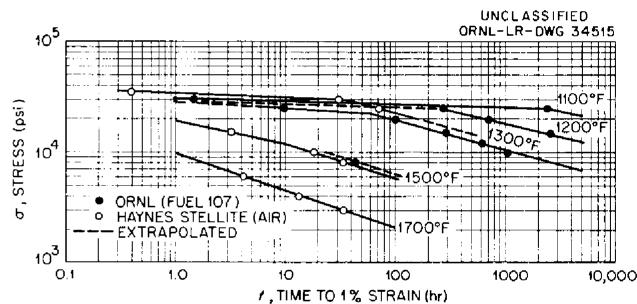  
Fig. 2.1.12. Time to $1\%$ Strain vs Stress for INOR-8 Tested at Various Temperatures.

Table 2.1.8. Results of Corrosion Tests of Silver- and Gold-Base Brazing Alloys Exposed to Static Fuel 130 for 500 hr at $1300^{\circ}$ F   

<table><tr><td>Braze Material</td><td>Metallographic Results</td></tr><tr><td>Pure silver</td><td>Spotty, heavy attack; stringers to a depth of 50 mils in some places</td></tr><tr><td>90% Ag-10% Cu</td><td>Rather uniform, heavy attack to a depth of 16 mils</td></tr><tr><td>50% Ag-33.3% Au-16.7% Cu</td><td>Spotty attack to a maximum depth of 5 mils</td></tr><tr><td>42% Au-40% Ag-18% Cu-0.6% Zn</td><td>Uniform attack to a depth of 15 mils</td></tr><tr><td>75% Au-20% Cu-5% Ag</td><td>No attack</td></tr></table>

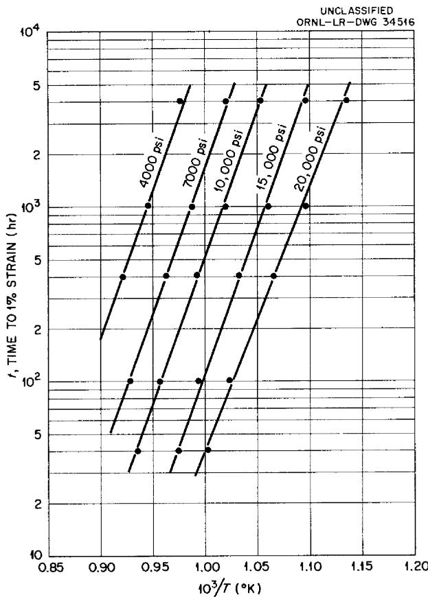  
Fig. 2.1.13. Time to $1\%$ Strain vs Reciprocal of Absolute Temperature at Constant Stress for INOR-8 Tested in Fuel 107.

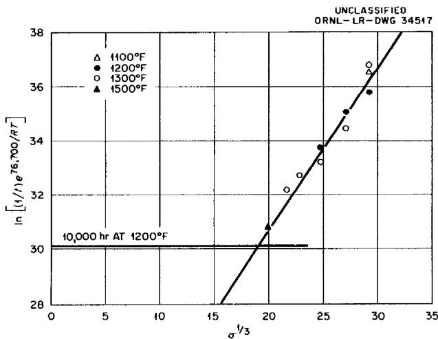  
Fig. 2.1.14. Effect of Stress, $\sigma_{t}$ Variations on Parameter Representing Temperature, $T_{t}$ and Time, $t_{t}$ to $1\%$ Strain for INOR-8 Sheet Tested in Fuel 107.

A horizontal line, representing the value of $\ln [(1 / t)e^{\Delta H / RT}]$ when $T$ is $1200^{\circ}F$ and $t$ is 10,000 hr is included on Fig. 2.1.14. The stress corresponding to $1\%$ strain as given by this curve is approximately 9600 psi. Extrapolation of the log curve for $1200^{\circ}F$ in Fig. 2.1.12 to 10,000 hr yields about 11,000 psi. Thus it would appear that a stress value of 9600 psi can be used as a conservative estimate of the metals creep strength for the 10,000-hr life. The results of longer tests may permit this value to be revised towards the 11,000-psi figure.

An investigation is also being made of the variation in creep properties of specimens subjected to identical conditions of stress and temperature. Creep curves obtained in this investigation are presented in Fig. 2.1.15. The data was obtained in air at $1250^{\circ}\mathrm{F}$ in duplicate tests for two different stresses, 20,000 and 25,000 psi. The greatest differences appear to be in the rupture life and elongation rather than the creep rate. Data for all tests completed thus far on INOR-8 in air are compiled in Fig. 2.1.16. The variation of the

$$
\ln \left[ (1 / t) e ^ {7 6, 7 0 0 / R T} \right]
$$

term at each stress level is an indication of the reproducibility of the results. The Haynes-Stellite data were obtained in short-time tests (times of less than 100 hr), but the ORNL data include values obtained at times up to 5500 hr.

The variations in the properties of samples taken from different heats of the alloy are also of interest. Creep curves obtained at $1300^{\circ}\mathrm{F}$ and 20,000 psi for three different heats of INOR-8 (SP-16, SP-19, and M-1) are shown in Fig. 2.1.17. The specimen from heat M-1 was appreciably stronger than those from the other two heats, probably because of the higher carbon content $(0.14\%)$ of heat M-1. The strengths of heats SP-16 and SP-19, with 0.02 and $0.06\%$ carbon, respectively, were similar.

# INFLUENCE OF COMPOSITION ON PROPERTIES OF INOR-8

T. K. Roche

The precipitation of intermetallic compounds in nickel-molybdenum base alloys, such as Hastelloy B, has been shown to be deleterious to the tensile ductility of these materials. Inasmuch as the upper

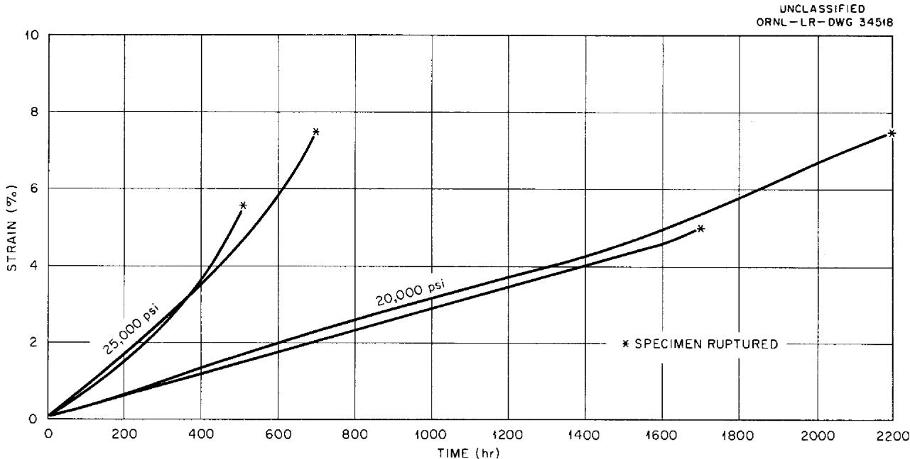  
Fig. 2.1.15. Creep Curves for INOR-8 Tested in Air at $1250^{\circ}$ F.

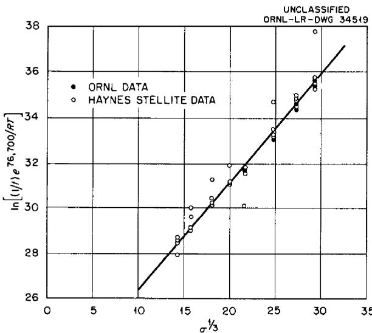  
Fig. 2.1.16. Effect of Stress, $\sigma$ , Variations on Parameter Representing Temperature, $T$ , and Time, $t$ , to $1\%$ Strain for INOR-8 Sheet Tested in Air.

limit of molybdenum in INOR-8 has presently been set at $18\%$ , which approaches the solubility limit of molybdenum in nickel, it was considered to be important that the structural stability of the alloy be determined with respect to the maximum amount of each major alloying element called for by the specification: $18\%$ Mo- $8\%$ Cr- $5\%$ Fe-balance Ni and

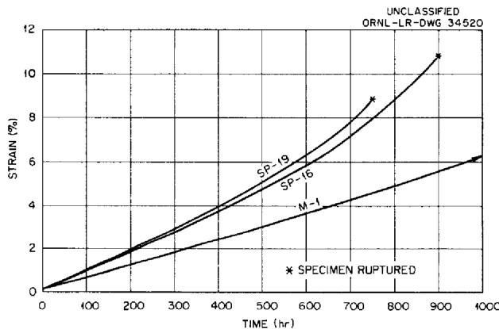  
Fig. 2.1.17. Creep Curves for Three Heats of INOR-8 Tested in Fuel 107 at $1300^{\circ}$ F and 20,000 psi.

small quantities of other elements. It was also desired to determine the approximate locations of phase boundaries that might exist near the specified composition of INOR-8 so that the susceptibility of the material to intermetallic compound formation could be established.

An investigation of the stability of alloys with compositions near the specified composition has been initiated. Eleven alloys with the compositions given in Table 2.1.9 were prepared by vacuum induction melting. The alloys were then rolled to

0.020-in.-thick strip and treated at $2200^{\circ}\mathrm{F}$ in a hydrogen atmosphere to eliminate as much residual carbon as possible in order to reduce the potential for carbide precipitation. The alloys were subsequently remelted and rolled, and specimens are presently undergoing 100- and 1000-hr aging treatments over a temperature range of 900 to $1800^{\circ}\mathrm{F}$ . Metallographic examinations of the specimens will

Table 2.1.9. Nominal Compositions of Nickel-Molybdenum Alloys Prepared for Structural Stability Studies   

<table><tr><td rowspan="2">Alloy Designation</td><td colspan="4">Nominal Composition (wt %)</td></tr><tr><td>Mo</td><td>Cr</td><td>Fe</td><td>Ni</td></tr><tr><td>VT-143</td><td>18</td><td></td><td>5</td><td>bal</td></tr><tr><td>VT-144</td><td>18</td><td></td><td>10</td><td>bal</td></tr><tr><td>VT-145</td><td>18</td><td>4</td><td>7.5</td><td>bal</td></tr><tr><td>VT-146</td><td>18</td><td>5</td><td>10</td><td>bal</td></tr><tr><td>VT-147</td><td>18</td><td>6</td><td>2</td><td>bal</td></tr><tr><td>VT-148</td><td>18</td><td>6</td><td>5</td><td>bal</td></tr><tr><td>VT-149</td><td>18</td><td>8</td><td>5</td><td>bal</td></tr><tr><td>VT-150</td><td>18</td><td>8</td><td>8</td><td>bal</td></tr><tr><td>VT-151</td><td>18</td><td>10</td><td></td><td>bal</td></tr><tr><td>VT-152</td><td>18</td><td>10</td><td>4</td><td>bal</td></tr><tr><td>VT-153</td><td>18</td><td>10</td><td>10</td><td>bal</td></tr></table>

be carried out to determine the presence or absence of precipitates in the microstructures.

# HIGH-TEMPERATURE STABILITY OF INOR-8

# H. Inouye

Embrittlement studies of two commercial heats of INOR-8 are being conducted. Previously, aging heat treatments for times up to 2000 hr in the temperature range 1000 to $1400^{\circ}\mathrm{F}$ were shown to cause no significant changes in the tensile properties of the material. The two heats being studied contain different amounts of carbon, however, and they have significantly different properties, as shown in Tables 2.1.10 and 2.1.11.

The effect of a 5000-hr heat treatment was determined during the quarter, and the results for specimens from the two heats are compared with similar data for annealed specimens from the two heats in Tables 2.1.10 and 2.1.11. As may be seen, aging for 5000 hr did not significantly change the tensile properties. It is therefore concluded on the basis of these tensile tests that INOR-8 does not exhibit instabilities that would be detrimental in service for extended times in the temperature range 1000 to $1400^{\circ}\mathrm{F}$ .

9H. Inouye, MSR Quar. Prog. Rep. June 30, 1958, ORNL-2551, p 67.

Table 2.1.10. Tensile Properties of INOR-8 Specimens of Heat M-1   
Composition: $16.2\%$ Mo-7.47% Cr-6.1% Fe-0.14% C-bal Ni   

<table><tr><td rowspan="2">Test Temperature (°F)</td><td colspan="3">Specimen Annealed 1 hr at 2100°F</td><td colspan="2">Specimen Annealed and Aged 5000 hr at Test Temperature</td></tr><tr><td>Ultimate Tensile Strength (psi)</td><td>Yield Strength at 0.2% Offset (psi)</td><td>Elongation (%)</td><td>Ultimate Tensile Strength (psi)</td><td>Elongation (%)</td></tr><tr><td>Room</td><td>117,100</td><td>51,900</td><td>39</td><td></td><td></td></tr><tr><td>1000</td><td>101,000</td><td>34,200</td><td>40</td><td>101,800</td><td>33</td></tr><tr><td>1100</td><td>102,600</td><td>37,600</td><td>37</td><td>88,000</td><td>19</td></tr><tr><td>1200</td><td>83,100</td><td>38,400</td><td>16</td><td>78,600</td><td>13</td></tr><tr><td>1300</td><td>70,500</td><td>38,400</td><td>18</td><td>74,800</td><td>14</td></tr><tr><td>1400</td><td>63,900</td><td>38,500</td><td>14</td><td>63,300</td><td>15</td></tr></table>

Table 2.1.11. Tensile Properties of INOR-8 Specimens of Heat SP-19   
Composition: $16.6\%$ Mo-7.43% Cr-4.83% Fe-0.06% C-bal Ni   

<table><tr><td rowspan="2">Test Temperature (°F)</td><td colspan="3">Specimen Annealed 1 hr at 2100°F</td><td colspan="2">Specimen Annealed and Aged 5000 hr at Test Temperature</td></tr><tr><td>Ultimate Tensile Strength (psi)</td><td>Yield Strength at 0.2% Offset (psi)</td><td>Elongation (%)</td><td>Ultimate Tensile Strength (psi)</td><td>Elongation (%)</td></tr><tr><td>Room</td><td>114,400</td><td>44,700</td><td>50</td><td></td><td></td></tr><tr><td>1000</td><td>93,000</td><td>28,300</td><td>46</td><td>93,200</td><td>51</td></tr><tr><td>1100</td><td>93,000</td><td>28,900</td><td>50</td><td>85,000</td><td>23</td></tr><tr><td>1200</td><td>82,400</td><td>27,500</td><td>37</td><td>81,600</td><td>33</td></tr><tr><td>1300</td><td>69,900</td><td>78,000</td><td>24</td><td>73,800</td><td>25</td></tr><tr><td>1400</td><td>61,800</td><td>26,200</td><td>21</td><td>64,300</td><td>20</td></tr></table>

# WELDING AND BRAZING STUDIES

P. Patriarca

# INOR-8 Weldability

G. M. Slaughter

Mechanical Properties of Weld Deposits. - Studies of the mechanical properties of INOR-8 weld deposits were continued. A vacuum-melted experimental heat of this material (ORNL heat 30-38) was found to have room- and elevated-temperature properties comparable to those of commercial heats fabricated by Haynes-Stellite and Westinghouse,10 and the ductility at $1300^{\circ}\mathrm{F}$ and above was still marginal. Thus conventional vacuum-melting did not overcome the ductility problem. In order to determine the influence of carbon on the mechanical properties of INOR-8 weld metal, weld test plates were constructed with the use of a high-carbon $(0.16\%)$ C filler metal. The tensile strengths of these welds were significantly higher than those of conventional INOR-8 welds, but the room-temperature ductilities decreased considerably. The weld metal properties of both Hastelloy B and Hastelloy W were also determined in order to obtain comparative data for other nickel-molybdenum alloys.

Plots of the as-welded tensile strengths and ductilities of INOR-8, Hastelloy B, Hastelloy W, and Inconel weld metal are shown in Fig. 2.1.18. It may be seen that the tensile strength of INOR-8

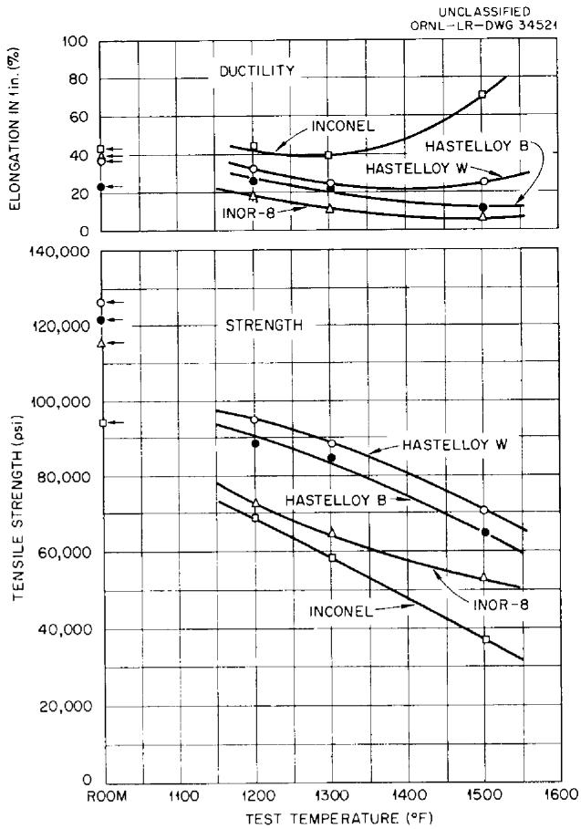  
Fig. 2.1.18. Mechanical Properties of Weld Metal in As-Welded Condition.

weld metal is appreciably lower than that of either Hastelloy B or Hastelloy W weld metal at all temperatures studied. The comparative data for Inconel reveal that INOR-8 is superior in strength, particularly at $1500^{\circ}\mathrm{F}$ .

Aging studies on INOR-8 weld deposits were also conducted to determine the influence of time at the service temperature on the mechanical properties. The age-hardenable alloys, Hastelloy B and Hastelloy W, were tested to provide additional comparative information. Samples were aged at 1200 and $1500^{\circ}\mathrm{F}$ for periods of 200 and 500 hr and the room-temperature mechanical properties after aging are shown in Fig. 2.1.19. Hastelloy B, as would be expected, is subject to severe impairment in

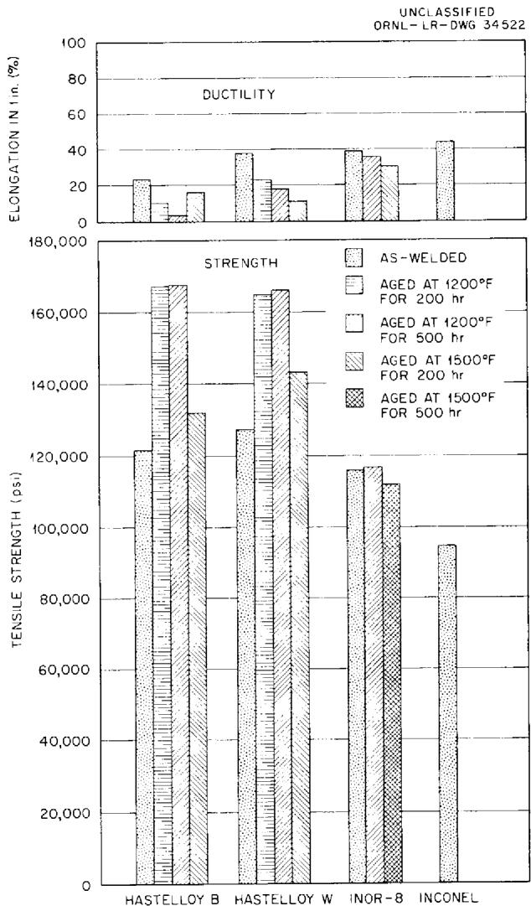  
Fig. 2.1.19. Room-Temperature Mechanical Properties of All-Weld-Metal Specimens.

ductility upon aging, particularly at $1200^{\circ}\mathrm{F}$ (ductility reduced from 24 to $3\%$ after aging for 500 hr). Hastelloy W weld metal also exhibits a marked reduction in room-temperature ductility after aging. INOR-8, on the other hand, maintains its good ductility.

Mechanical property studies of aged specimens were also conducted at the aging temperature in an effort to more completely determine the behavior of these materials at elevated temperatures. The data obtained at $1200^{\circ}\mathrm{F}$ are shown in Fig. 2.1.20, and the data obtained at $1500^{\circ}\mathrm{F}$ are shown in Fig. 2.1.21. Aging at $1200^{\circ}\mathrm{F}$ definitely reduces the ductility of Hastelloy B and Hastelloy W at $1200^{\circ}\mathrm{F}$ , whereas the ductility of INOR-8 is slightly improved. At $1500^{\circ}\mathrm{F}$ , a significant ductility increase

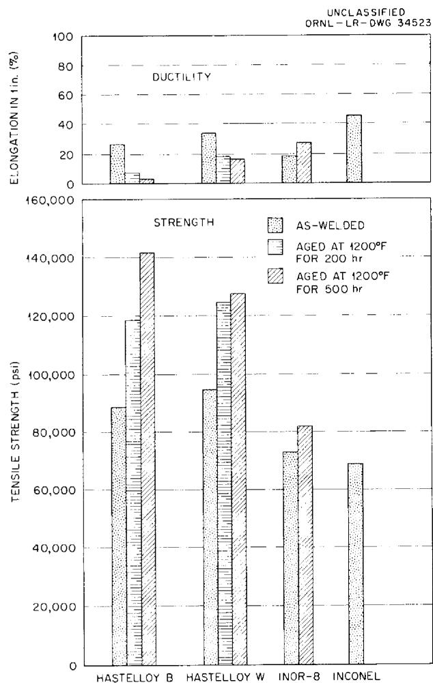  
Fig. 2.1.20. Mechanical Properties of All-Weld-Metal Specimens at $1200^{\circ}\mathsf{F}$ .

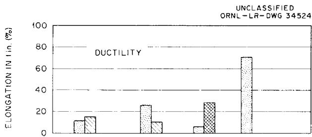

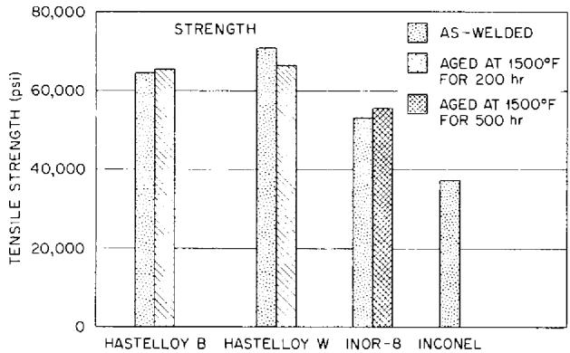  
Fig. 2.1.21. Mechanical Properties of All-Weld-Metal Specimens at $1500^{\circ}\mathbf{F}$ .

is evident for INOR-8, probably as a result of partial spheroidization of the eutectic carbides.

The influence of carbide spheroidization is being studied further, and high-temperature stabilization treatments of weld metal are under investigation. Mechanical property studies of INOR-8 welded joints, both in the as-welded and aged conditions, are also being conducted.

Filler Metal Modification Studies. - Since the ductility exhibited by INOR-8 weld metal at temperatures of $1300^{\circ}\mathrm{F}$ and higher is marginal, a program has been initiated to determine the factors that influence ductility and to develop procedures for improving it. Three heats of INOR-8-weld metal have all shown approximately the same ductility, that is, $10\%$ or less in a 1-in. gage length in the 1300 to $1500^{\circ}\mathrm{F}$ temperature range. Hastelloy W, however, has a minimum elongation of $20\%$ in this range.

Personnel of the International Nickel Company have indicated that they think the trouble probably results from trace elements in the 0.009 to 0.0001 wt % range. The use of proper addition agents during the melting of the ingot and the proper timing of the additions are extremely important in removing or neutralizing these trace elements. Accordingly,

melts containing recommended quantities of manganese, silicon, aluminum, titanium, magnesium, and boron have been made. The ingots are being fabricated into filler wire for the preparation of all-weld-metal specimens for room- and elevated-temperature testing. Heats of filler metal have also been made that contain additions of a commercially available aluminum-titanium-nickel master alloy.

One experiment was conducted which verifies the premise that minor modifications in filler metal composition can result in major changes in elevated-temperature mechanical properties. A special ingot of INOR-8 filler metal was prepared in which most of the nickel and all the chromium were added as Inconel inert-arc welding wire. This Inconel wire, designated Inco No. 62 (elongation at $1500^{\circ}\mathrm{F}$ of $70\%$ ), also contains $2\%$ columbium to prevent hot cracking in the weld deposit. The mechanical properties of this modified INOR-8 weld metal in the 1200 to $1500^{\circ}\mathrm{F}$ temperature range were superior to those exhibited by conventional INOR-8, as is shown in Table 2.1.12.

As was previously mentioned, the improvement in ductility of INOR-8 weld metal upon aging appeared to be associated with the spheroidization of eutectic carbides. Therefore special heats of INOR-8 having no carbon and $0.03\%$ carbon have been prepared and will be fabricated into filler wire as a means of determining the welding characteristics and mechanical properties of lower-carbon-content weld deposits.

Results of Examination of INOR-8 Forced-Circulation Loop Weld Failure. - An INOR-8 heater lug section of forced-circulation loop 9354-1 failed during service. The component and the location of the failure are shown in Fig. 2.1.22. Metallographic examinations of the failed area and adjacent areas revealed profuse cracks in the INOR-8 adapter near the lug-to-adapter weld, with the cracks resembling those frequently observed in the heat-affected zones of the crack-sensitive heat SP-16 material.[11]

Chemical analyses of the adapter material revealed it to be a high-boron, low-carbon heat of INOR-8 and confirmed the suspicion that heat SP-16 material had been inadvertently substituted for the recommended heats of INOR-8. It is thought that the cracks initiated during welding and propagated to failure during service.

Welding of INOR-8 to Other Metals. - An evaluation of Inco-Weld "A" wire was made to determine

Table 2.1.12. Comparison of Mechanical Properties of INOR-8 and Modified INOR-8 in As-Welded Condition   

<table><tr><td>Test Temperature (°F)</td><td>Filler Metal</td><td>Tensile Strength (psi)</td><td>Elongation in 1-in. (%)</td></tr><tr><td rowspan="2">Room</td><td>INOR-8</td><td>116,000</td><td>38</td></tr><tr><td>Modified INOR-8</td><td>113,000</td><td>44</td></tr><tr><td rowspan="2">1200</td><td>INOR-8</td><td>73,000</td><td>18</td></tr><tr><td>Modified INOR-8</td><td>77,000</td><td>30</td></tr><tr><td rowspan="2">1300</td><td>INOR-8</td><td>64,000</td><td>10</td></tr><tr><td>Modified INOR-8</td><td>72,000</td><td>22</td></tr><tr><td rowspan="2">1500</td><td>INOR-8</td><td>53,000</td><td>6</td></tr><tr><td>Modified INOR-8</td><td>59,000</td><td>15</td></tr></table>

UNCLASSIFIED Y-26847

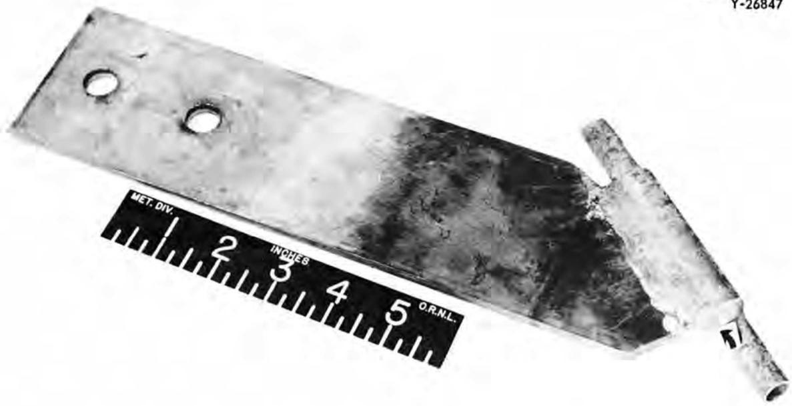  
Fig. 2.1.22. INOR-8 Heater Lug Section of Forced-Circulation Loop 9354-1 That Failed During Service. Arrow indicates point of failure.

its suitability as a filler material for weldments with INOR-8. The study12 indicated that the as-welded ductility of the metal in short-time tests is satisfactory up to $1300^{\circ}\mathrm{F}$ but becomes marginal at $1500^{\circ}\mathrm{F}$ . Significant impairment of the room- and elevated-temperature ductility was found after aging at $1200^{\circ}\mathrm{F}$ for 500 hr.

# Brazing of Thick Tube Sheets for Heat Exchangers G.M.Slaughter

The construction of heat exchangers for molten-salt power reactor applications poses a variety of problems. For example, it is probable that the temperature and pressure conditions in some of the heat exchangers will necessitate the use of relatively thick tube sheets (thicknesses of 4 to 6 in. or greater). Present practice and fabrication procedures for constructing high-integrity tube-to-tube

sheet joints in sections of this magnitude may not be adequate for a molten-salt environment. The unavoidable notch obtained in the conventional welded tube-to-header joint is undesirable in several ways. First, it may act as a starting point for crack propagation in the welds during cyclic service. Also, the notch may act as a crevice and thereby increase the possibility of stress-corrosion cracking. It is evident that the technique of back-brazing of the tube-to-header joints would remedy these conditions by eliminating the notch. Brazing would also improve heat transfer and decrease the possibility of a leak through a defective tube-to-header weld, since the leak-path would be significantly increased.

Although considerable experience exists in brazing small diameter tubes into relatively thin tube sheets, little is known of the problems associated with adapting these techniques to heavy sections. Accordingly, a preliminary experiment has been conducted to determine the feasibility of back-brazing joints in thick tube sheets. A brazing procedure was utilized which had proved useful in fabricating simulated components containing $1\frac{1}{2}$ -in.-thick tube sheets.

As may be seen in Fig. 2.1.23, the brazing alloy is preplaced in annular trepans in the tube sheet and is fed to the joint through three small feeder holes. Melting of the brazing alloy therefore does not take place until the joint has attained the temperature where wetting can occur.

In an effort to extend this technique, a specimen was prepared that consisted of a $5\%$ -in.-OD, 0.065-in.-wall Inconel tube brazed into a 5-in.-thick

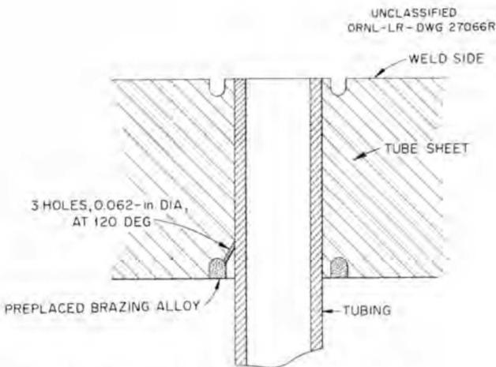  
Fig. 2.1.23. Alloy Preplacement Procedure for Brazing Thick Tube Sheets.

Inconel tube sheet with Coast Metals No. 52 alloy. Brazing was performed at $1920^{\circ}F$ with a 1 hr hold at temperature. A $600^{\circ}F$ per hr rate of temperature rise was used in this experiment, and the sample was furnace-cooled to room temperature. The weld side of the tube sheet was also trepaned to minimize stresses during welding. As may be seen in Fig. 2.1.24, a photograph of the brazed specimen, excellent filleting was obtained.

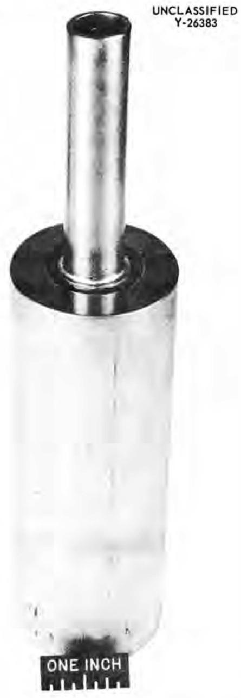  
Fig. 2.1.24. Brazed Tube-to-Header Specimen Showing Excellent Filleting.

Flow of the alloy along the joint was evaluated from metallographic examination of numerous sections of the sample. A photomicrograph of the fillet on the braze side of the tube sheet is shown in Fig. 2.1.25, while the joint on the weld side of the tube sheet is shown in Fig. 2.1.26. On the basis of these observations it can be concluded that flow was probably continuous along the entire 5 in. of the joint and around the entire 360 deg of the circumference. Also no cracking of the brazing alloy was noted.

In view of the promising results of this experiment, a more comprehensive evaluation program is planned. Two 6-in.-dia, 5-in.-thick tube sheets containing five tubes are presently being machined to determine the influence of section size on brazemetal preplacement procedure. It is probable that these experiments may suggest modifications in joint design and brazing procedure. In addition, other factors must also be studied if these experiments show promise. For example, the minimum rate-of-rise to brazing temperature to achieve satisfactory flow during brazing of heavy tube sheets will be affected by the choice of materials and the brazing atmosphere. This rate should be determined for the base material and brazing alloy compositions

of interest. Further, the influence of time and temperature on the diffusion of microconstituents from the brazing alloy into the tube walls and to a lesser extent into the tube sheet must be determined. Since it is reasonable to expect that the base metal mechanical properties will be affected, the nature of this effect must be known if back-brazing is to be utilized.

# Fabrication of Pump Components

G.M.Slaughter

The problems associated with joining a molybdenum extension to an Inconel shaft for a pump application are being investigated. The widely different coefficients of thermal expansion (that is, molybdenum, $2.7 \times 10^{-6}$ in./in./ $^{\circ}$ F; Inconel, $6.4 \times 10^{-6}$ in./in./ $^{\circ}$ F) present a condition of very high stresses during service. One method of attachment proposed by the Pump Development Group was to utilize molybdenum fingers brazed to the Inconel shaft around the shaft periphery. The amount of stress built up in each brazed lap joint would thus be influenced markedly by the size of the molybdenum fingers.

In order to test this proposed method, several molybdenum-to-Inconel brazed joints were fabricated

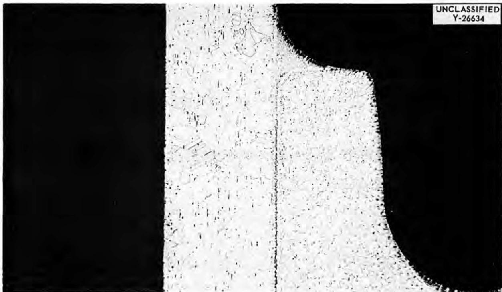  
Fig. 2.1.25. Brazed Side of Tube Sheet Showing Fillet. Etchant: glyceria regia, 20X.

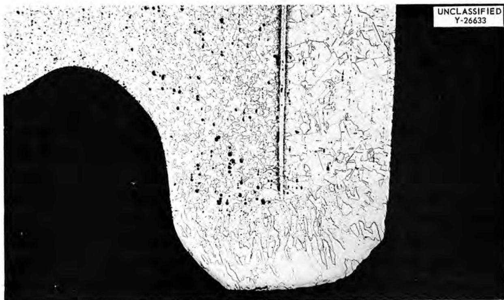  
Fig. 2.1.26. Weld Side of Tube Sheet Showing Complete Flow to the Root of the Weld. Etchant: glyceria regia. 20X.

and are being examined metallographically for cracking after brazing and after thermal cycling. The samples are $\frac{1}{8} \times \frac{1}{4} \times 1$ in., $\frac{1}{8} \times \frac{1}{2} \times 1$ in., and $\frac{1}{8} \times 1 \times 1$ in. pieces of molybdenum brazed to $\frac{1}{2}$ -in.-thick Inconel plate with copper, Au-Ni, and Coast Metals No. 52 brazing materials. The three specimen sizes are illustrated in Fig. 2.1.27. These three brazing alloys represent, respectively, a weak, ductile alloy; a moderately strong, moderately ductile alloy; and a very strong, brittle alloy.

Although the evaluation is not yet complete, it appears that the Coast Metals No. 52 alloy is the most suitable of the three for brazing the $\frac{1}{8} \times 1 \times 1$ in. fingers. Severe cracks were sometimes noted in joints brazed with the other alloys. The cracking tendencies are decreased as the size of the mol-ybdenum fingers is decreased.

Thermal expansion difficulties are also encountered in attaching a molybdenum sleeve-bearing around an INOR-8 or Inconel pump journal. A metal-sprayed

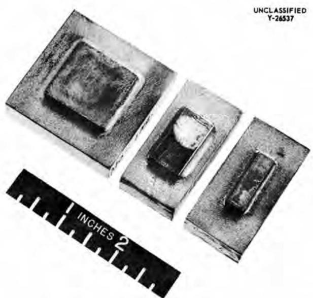  
Fig. 2.1.27. Molybdenum-to-Inconel Brazed Specimens.

molybdenum surface has spalled during thermal cycling, and consequently high-temperature brazing has been suggested for several alternate designs. One proposed design (exploded view shown in Fig. 2.1.28) incorporates molybdenum pins which are brazed to an INOR-8 or Inconel shaft, as shown in

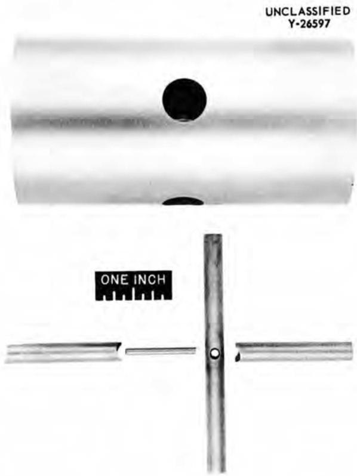  
Fig. 2.1.28. Exploded View of Simulated Pump Journal Bearing Subassembly. The molybdenum pins are to be joined to the INOR-8 or Inconel shaft by brazing.

Fig.2.1.29.A molybdenum sleeve would be brazed to the molybdenum pins. This design minimizes thermal expansion stresses, since the molybdenum-to-Inconel joints are located very near the center of the shaft. Studies are under way to determine the optimum brazing alloy and joint design for this application.

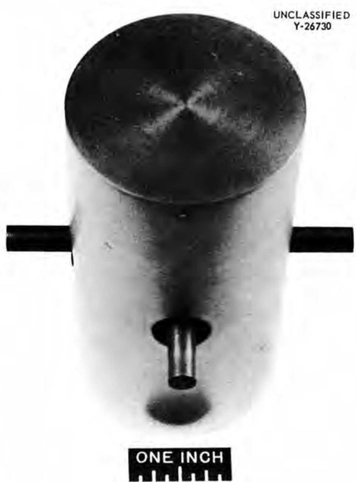  
Fig. 2.1.29. Pump Journal Bearing Subassembly After Brazing.

# 2.2. RADIATION DAMAGE

G.W. Keilholtz

# INOR-8 THERMAL-CONVECTION LOOP FOR OPERATION IN THE LITR

W.E.Browning, Jr.

W.H.Montgomery R.P.Shields

The electrically heated mockup of the INOR-8 in-pile thermal-convection loop, previously described, was operated under conditions simulating those expected in the LITR. Operation of the mockup demonstrated that the ports for the injection of cooling air would have to be more widely distributed around the loop to prevent cold spots that would be at temperatures below the melting point of the fuel. The fuel-filled mockup was operated for 771 hr at temperatures ranging from 450 to $750^{\circ}\mathrm{C}$ , with axial temperature differences as high as $250^{\circ}\mathrm{C}$ . The following situations that will be encountered during in-pile operation were simulated: melting the fuel, reactor shutdown, reactor startup, reactor operation up to one-half power, emergency shutdown required by stoppage of fuel flow, adjusting the differential temperature to desired value by altering distribution of cooling air. Operation of the mockup served as a performance test for the various components of the loop. The experiment was terminated by a leak in the fuel tube near an electrical contact which conducted electrical current to the loop to simulate fission heat. This contact, which is not a part of the in-pile loop, had produced higher than normal temperatures. The mockup loop is being examined for evidence of corrosion and for further information as to the cause of the leak.

The in-pile model of the loop is being assembled, and the required modifications in the cooling air supply have been made. The loop was fabricated of INOR-8 and is to be filled with the fuel mixture $\mathrm{LiF - BeF_2 - UF_4}$ (62-37-1 mole %). Operation of this loop will test the compatibility of this combination of fuel and container material under radiation conditions.

# GRAPHITE CAPSULES IRRADIATED IN THE MTR

W.E.Browning, Jr. H.L.Hemphill

The two fuel-filled graphite capsules that were irradiated in the MTR at $1250^{\circ}\mathrm{F}$ for 1610 and 1492

hr, respectively, at integrated power densities of 1520 and $1375\mathrm{kwhr/cm}^3$ are being examined. These graphite capsules, described previously, were enclosed in Inconel containers and were filled with the fuel mixture $\mathrm{LiF - BeF}_2 - \mathrm{UF}_4$ (62-37-1 mole%). The preliminary examinations have indicated that the graphite was unaffected by irradiation while exposed to the fuel mixture. The graphite was wetted by fuel in the irradiated capsules, but was not wetted in similar unirradiated control capsules. A section through one of the irradiated capsules is shown in Fig. 2.2.1, and Fig. 2.2.2 shows a similar view of an unirradiated control capsule that had been held for 3389 hr at $1250^{\circ}\mathrm{F}$ . The irradiated fuel dissolved more rapidly in water used in cleaning than did the unirradiated fuel.

These preliminary examinations have indicated that a fuel-cooled graphite moderator would not be limited by damage to the graphite by fluoride fuel. Further detailed examinations of the capsules and fuel mixtures are under way.

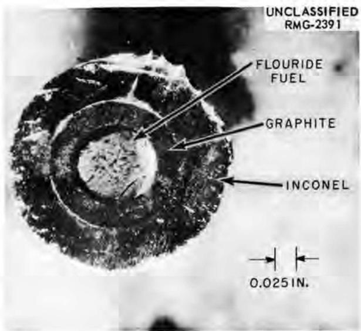  
Fig. 2.2.1. Fluoride-Fuel-Filled Graphite Capsule Sectioned After Irradiation in the MTR for 1610 hr at $1250^{\circ}\mathrm{F}$ . A low-permeability graphite was used and the fuel mixture was LiF-BeF $_2$ -UF $_4$ (62-37-1 mole %), 7X.

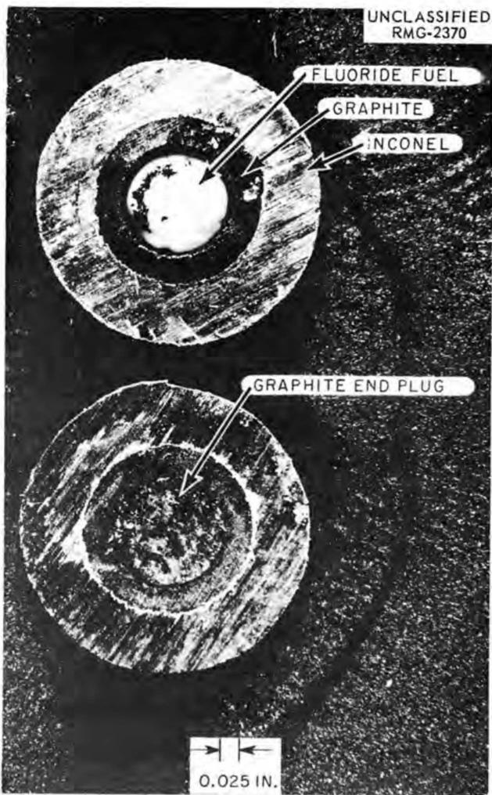  
Fig. 2.2.2. Fuel-Filled Graphite Control Capsule Tested Out-of-Pile at $1250^{\circ}$ F for 3389 hr. 7X.

# 2.3. CHEMISTRY

W. R. Grimes

Chemistry Division

# PHASE EQUILIBRIUM STUDIES

# Systems Containing $\mathsf{UF}_4$ and/or $\mathsf{ThF}_4$

R. E. Thoma

H. A. Friedman

H. Insley

C. F. Weaver

The System NaF-BeF2-ThF4. Phase studies of sodium-based beryllium-containing fluoride salt mixtures were initiated in order to obtain data for comparisons of the properties of the system NaF-BeF2-ThF4-UF4 with those of the system LiF-BeF2-ThF4-UF4. Such comparisons will be of value in appraising the usefulness of the lithium-base quaternary system. The completed phase equilibrium diagram of the system NaF-ThF4, shown in Fig. 2.3.1, was described in a recent report. Preliminary investigations of the system NaF-BeF2-ThF4 with the use of thermal-analysis and thermal-gradient quenching techniques have shown that the system is remarkably similar in several respects to the system LiF-BeF2-UF4. Recent results of phase studies have also shown that the two compounds 2NaF.ThF4 and 2NaF.BeF2 form the simple binary system illustrated in Fig. 2.3.2. Since the compound 4NaF.ThF4 does not form a solid solution

1R.E.Thoma et al.,Phase Equilibria in the Systems LiF-ThF4and NaF-ThF4,Paper No.39,ACS Meeting, Chicago, Illinois, Sept.8, 1958.   
2C. J. Barton et al., MSR Quar. Prog. Rep. Oct. 31, 1957, ORNL-2431, p 32.

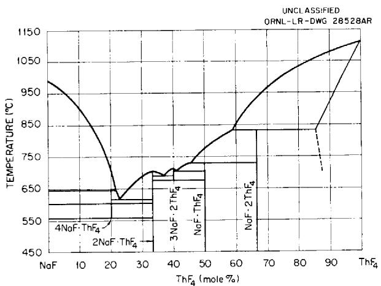  
Fig. 2.3.1. The System NaF-ThF4.

containing $\mathsf{BeF}_2$ and, in the binary system, has a lower limit of stability $(565^{\circ}C)$ that is higher than the lowest thermal break in the composition triangle $2\mathsf{NaF}\cdot \mathsf{BeF}_2 - 2\mathsf{NaF}\cdot \mathsf{ThF}_4 - \mathsf{NaF}$ $(512^{\circ}C)$ , this triangle necessarily becomes the single compatibility triangle at higher NaF compositions than those which occur on the alkemade line $2\mathsf{NaF}\cdot \mathsf{ThF}_4 - 2\mathsf{NaF}\cdot \mathsf{BeF}_2$ . The single eutectic in this compatibility triangle has the approximate composition 70 mole % NaF-25 mole % $\mathsf{BeF}_2 - 5$ mole % $\mathsf{ThF}_4$ and melts at $512^{\circ}C$ .

Thermal-analysis data lead to the inference that the maximum solubility of $\mathsf{ThF}_4$ in NaF-BeF2 mixtures is approximately 7 mole % at temperatures below $550^{\circ}C$ , except in quite small composition regions adjacent to boundary curves separating NaF-ThF4 primary phase fields. Thermal-gradient quenching experiments have been completed which outline roughly the liquidus at 7 mole % ThF4. The results of both thermal-analysis and thermal-gradient quenching experiments are shown in Fig. 2.3.3.

Uranium Phase Separation in LiF-BeF $_2$ -UF $_4$ Mixtures. - Fifty-pound portions of LiF-BeF $_2$ -UF $_4$ (62-37-1 mole %) transferred from a 250-lb batch have been found to contain an average of 3.5 wt % uranium (nominal concentration of uranium in this composition is 6.5 wt %), although previous samples

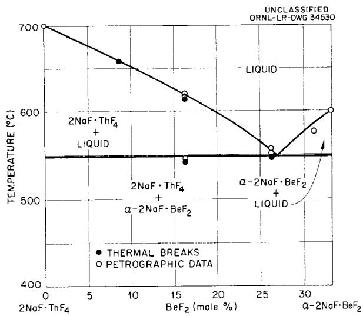  
Fig. 2.3.2. The System $2\mathrm{NaF}\cdot \mathrm{ThF}_4\cdot 2\mathrm{NaF}\cdot \mathrm{BeF}_2$

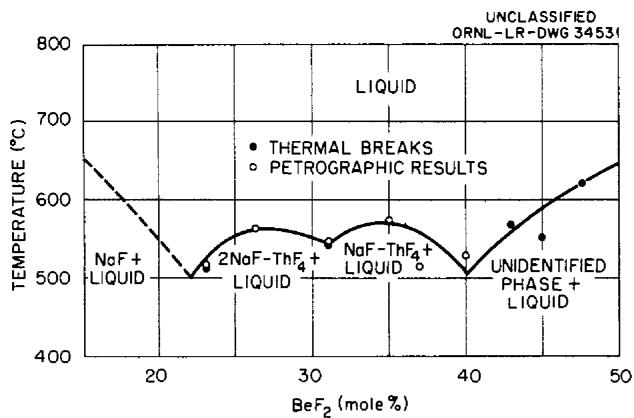  
Fig. 2.3.3. Liquidus Diagram for Mixtures Containing 7 Mole $\%$ ThF $_4$ in the System NaF-BeF $_2$ -ThF $_4$ .

considered to be representative of the composition of the 250-lb batch contained approximately the nominal uranium concentration. At the time of transfer of the 50-lb batches, it was known that some solid remained unmelted in the reservoir container. Studies have shown that the abnormally low uranium concentration of the transferred batch is related, as shown below, to the quantity of solid remaining in the reservoir container.

The lowest melting eutectic in the system LiF- $\mathsf{BeF}_2\text{-}\mathsf{UF}_4$ has the composition 47.5 mole % LiF-52 mole % $\mathsf{BeF}_2 - 0.5$ mole % UF, according to a phase diagram derived at Mound Laboratory. The first liquid to form when LiF- $\mathsf{BeF}_2\text{-}\mathsf{UF}_4$ (62-37-1 mole %) is melted must have the eutectic composition, and thus it contains 3.1 wt % uranium. The liquid composition of any partially molten mixture of LiF- $\mathsf{BeF}_2\text{-}\mathsf{UF}_4$ must be intermediate in composition between that of the lowest melting eutectic and the nominal composition of the mixture, although it need not be located linearly between these two composition points. Thus, complete melting of the mixture is necessary in order to maintain composition homogeneity.

The System LiF-BeF2-ThF4. - As was noted previously,3 LiF-ThF4 solid phases take a BeF2-containing phase into solid solution to a limited extent. Recent, extensive, gradient-quenching experiments have delimited the range of solid solutions for the various LiF-ThF4 compounds. It has been found

that $\mathsf{LiF}\cdot 4\mathsf{ThF}_4$ and $7\mathsf{LiF}\cdot 6\mathsf{ThF}_4$ exist as practically pure compounds in the ternary system. The compound $\mathsf{LiF}\cdot 2\mathsf{ThF}_4$ , however, can take as much as 5 mole $\%$ $\mathsf{BeF}_2$ into solid solution and $3\mathsf{LiF}\cdot 6\mathsf{ThF}_4$ can take as much as 11 mole $\%$ $\mathsf{BeF}_2$ . Moreover, the introduction of $\mathsf{BeF}_2$ into the structure of $3\mathsf{LiF}\cdot 6\mathsf{ThF}_4$ apparently causes enough distortion of the lattice for some $7\mathsf{LiF}\cdot 6\mathsf{ThF}_4$ also to be taken into solid solution. Thus a roughly triangular area of homogeneous solid solution exists with one apex located on the $\mathsf{LiF}\cdot 6\mathsf{ThF}_4$ boundary at the composition $3\mathsf{LiF}\cdot 6\mathsf{ThF}_4$ and the other two apices at about the compositions 67 mole $\%$ $\mathsf{LiF}$ -11 mole $\%$ $\mathsf{BeF}_2$ -22 mole $\%$ $\mathsf{ThF}_4$ and 60 mole $\%$ $\mathsf{LiF}$ -13 mole $\%$ $\mathsf{BeF}_2$ -27 mole $\%$ $\mathsf{ThF}_4$ . Detailed quenching tests have established that there is practically no solid solution of $7\mathsf{LiF}\cdot 6\mathsf{ThF}_4$ in $3\mathsf{LiF}\cdot 6\mathsf{ThF}_4$ in the binary system $\mathsf{LiF}\cdot 6\mathsf{ThF}_4$ . The nature of the solid solutions in the ternary system is not known, but obviously such solid solutions are not of the substitutional type. With the increases of $7\mathsf{LiF}\cdot 6\mathsf{ThF}_4$ in $3\mathsf{LiF}\cdot 6\mathsf{ThF}_4$ in the ternary system, the refractive indices of $3\mathsf{LiF}\cdot 6\mathsf{ThF}_4$ are raised somewhat and the birefringence is lowered. The lines of the x-ray powder-diffraction pattern also shift with increasing solid solution. The compound $2\mathsf{LiF}\cdot 6\mathsf{BeF}_2$ apparently exists only as the pure compound in the ternary system, and there is no evidence that it enters into solid solution with any of the $\mathsf{LiF}\cdot 6\mathsf{ThF}_4$ compounds.

Further gradient-quenching studies have required the following modifications in the preliminary diagram of the $\mathsf{LiF - BeF}_2\cdot \mathsf{ThF}_4$ system. (1) The primary phase 7LiF-6ThF4 does not have a common boundary curve with the 2LiF-BeF2phase. (2) There is a peritectic at the composition point 64 mole % LiF-28 mole % BeF2-8 mole % ThF4, which is at a temperature of $450^{\circ}C.$ The solid phases 3LiF-ThF4 (solid solution), 7LiF-6ThF4, and LiF-2ThF4 (solid solution) are in equilibrium with liquid at the peritectic point. (3) There is a peritectic at the composition point 64 mole % LiF-31 mole % BeF2-5 mole % ThF4, which is at a temperature of $434^{\circ}C.$ The solid phases 3LiF-ThF4 (solid solution), 2LiF-BeF2, and LiF-2ThF4 (solid solution) are in equilibrium with liquid at this peritectic point. (4) The peritectic point at which LiF, 3LiF-ThF4 (solid solution), and 2LiF-BeF2 are in equilibrium with liquid has the composition 66 mole % LiF-30 mole % BeF2-4 mole % ThF4, and the temperature is $450^{\circ}C.$ (5) The eutectic of

2LiF·BeF, BeF, and LiF·2ThF (solid solution) has been established at a composition of approximately 48 mole % LiF-51 mole % BeF-1 mole % ThF, and it has a temperature of $355^{\circ}C$ .

Models of the Systems LiF-ThF4-UF and LiFBeF2-ThF4. - A three-dimensional model of the system LiF-ThF4-UF has been constructed on the basis of the terminal phase diagram presented previously and is shown in Fig. 2.3.4. The three-dimensional model of the system LiF-BeF2-ThF4 presented in Fig. 2.3.5 was based on phase equilibrium studies of the system LiF-BeF2-ThF4, which are complete, as described above, with respect to measurements of the liquidus surface and determinations of temperatures and compositions of invariant points.

# Solubility of $\mathsf{PuF}_3$ in LiF-BeF $_2$ Mixtures

C.J.Barton

R.A.Strehlow

Data were obtained on the effect of $\mathsf{CeF}_3$ and $\mathsf{BaF}_2$ on the solubility of $\mathsf{PuF}_3$ in LiF-BeF $_2$ (63-37 mole %), and the solubility of pure $\mathsf{PuF}_3$ in the solvent was determined at two temperatures. The effect of $\mathsf{CeF}_3$ on the solubility of $\mathsf{PuF}_3$ is of interest as an example of the possible effect of trivalent elements resulting from the fissioning of plutonium in a plutonium-fueled fused-salt reactor. The possibility of precipitating $\mathsf{PuF}_3$ in the form of a $\mathsf{CeF}_3$ - $\mathsf{PuF}_3$ solid solution, along with trivalent fission-product fluorides of limited solubility, is also of interest as one step in a reprocessing scheme.

The effect of $\mathsf{BaF}_2$ on $\mathsf{PuF}_3$ solubility is of interest as an example of the possible effect of divalent fission-product ions. The data are shown graphically in Fig. 2.3.6, along with previously reported data for $\mathsf{ThF}_4$ -containing mixtures. The theoretical curves shown in Fig. 2.3.6 for mixtures containing $\mathsf{CeF}_3$ and $\mathsf{PuF}_3$ were calculated with the use of the equation

$$
N _ {P u F _ {3} (d)} = S _ {P u F _ {3}} ^ {\circ} N _ {P u F _ {3} (s s)}, \tag {1}
$$

adapted from the solubility relation developed by W.

T. Ward et al.,7 in which $S_{\mathsf{PuF}_3}^{\circ}$ is the mole fraction (solubility) of $\mathsf{PuF}_3$ in the solvent at a specified temperature, as shown by the top line in Fig. 2.3.6 (labeled “ $\mathsf{PuF}_3$ only”), and $N_{\mathsf{PuF}_3(s,s)}$ is the mole fraction of $\mathsf{PuF}_3$ in the solute mixture. Two of the four data points obtained with a 1:1 molar ratio of $\mathsf{CeF}_3$ to $\mathsf{PuF}_3$ added to the LiF-BeF2 (63-37 mole %) mixture agree quite well with the theoretical curve, while four of the five points obtained with a 5:1 molar ratio of $\mathsf{CeF}_3$ to $\mathsf{PuF}_3$ lie reasonably close to the theoretical curve. The reason for the divergence of the results in the other three experiments is not clear.

Similar plots of $\mathsf{CeF}_3$ solubility values based on preliminary analytical data show even poorer agreement with theoretical curves obtained with the use of data reported by W. T. Ward for the solubility of $\mathsf{CeF}_3$ in LiF-BeF $_2$ (62.4-37.6 mole%). Analytical methods for determining cerium in the presence of plutonium in mixtures of this type are being studied and it is hoped that a better correlation between theoretical and experimental values will be obtained with later analytical results. It seems reasonably safe to assume that Eq. 1 holds well enough for mixtures of this type.

Data in Fig. 2.3.6 show that the solubility of $\mathsf{PuF}_3$ in LiF-BeF $_2$ (63-37 mole %) can be reduced from 0.15 to 0.026 mole % at $500^{\circ}\mathrm{C}$ by dissolving 0.75 mole % CeF $_3$ in the mixture at a higher temperature before cooling to $500^{\circ}\mathrm{C}$ . The calculated concentration of CeF $_3$ remaining in solution at $500^{\circ}\mathrm{C}$ is 0.14 mole %. By going to a lower temperature (the liquidus temperature for the solvent is about $458^{\circ}\mathrm{C}$ ) or a higher cerium-to-plutonium ratio, the recovery of plutonium from used fuel could undoubtedly be improved, but it would be difficult to recover more than $90\%$ of the plutonium by a single operation of this type. By reheating the filtrate and adding more CeF $_3$ to the mixture, followed by a second cooling and filtration operation, further improvement in the efficiency of plutonium recovery could be obtained.

The data in Fig. 2.3.6 seem therefore to provide the basis for a suitable reprocessing scheme for fused-salt mixtures containing plutonium. Concentration of the plutonium by precipitation would

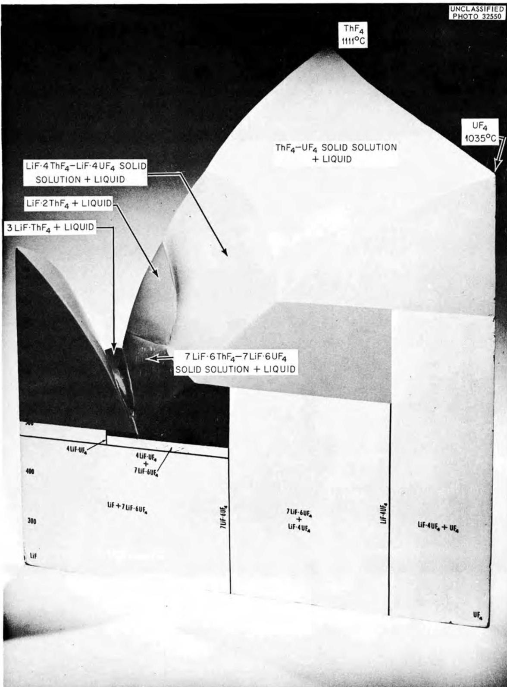  
Fig. 2.3.4. Model of the System LiF-ThF $_4$ -UF $_4$ .

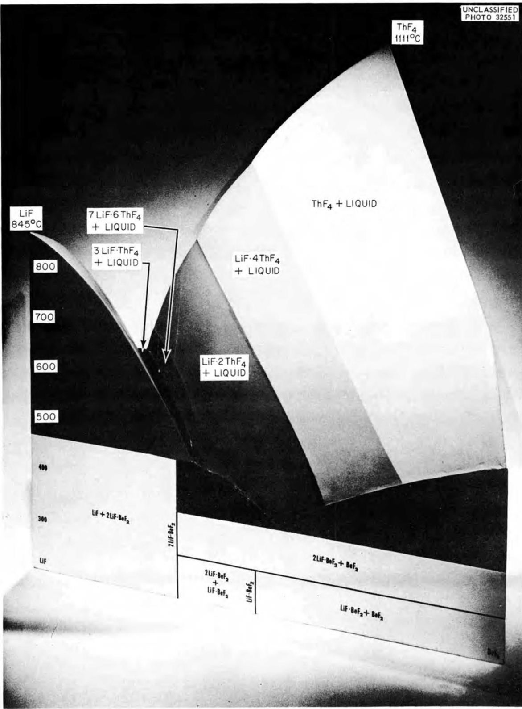  
Fig. 2.3.5. Model of the System LiF-BeF $_2$ -ThF $_4$ .

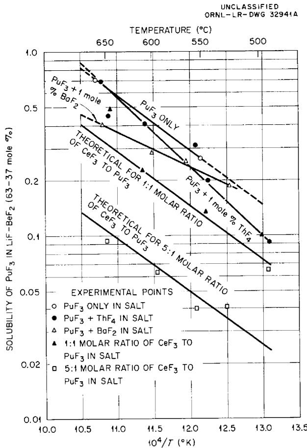  
Fig. 2.3.6. Effect of Other Fluorides on Solubility of $\mathsf{PuF}_3$ in LiF-BeF $_2$ (63-37 mole%).

simplify subsequent operations required to purify the plutonium, possibly by fluorination. The effect of trivalent fission products on the solubility of $\mathsf{PuF}_3$ is large enough so that they could not be allowed to build up to high concentrations, and some of them probably should be removed anyway to reduce nuclear poisoning.

Comparison of the $\mathsf{PuF}_3$ solubility data for mixtures containing $\mathsf{ThF}_4$ and $\mathsf{BaF}_2$ with the values obtained in the absence of additives, as shown in Fig. 2.3.6, seems to indicate that $\mathsf{ThF}_4$ may reduce the solubility of $\mathsf{PuF}_3$ slightly at the lower end of the temperature range investigated, while the solubility in $\mathsf{BaF}_2$ -containing mixtures is about the same as that in the $\mathsf{ThF}_4$ -containing solvent at about $500^{\circ}\mathsf{C}$ and significantly less at $650^{\circ}\mathsf{C}$ . In neither case is there sufficient data to be conclusive and additional experiments are planned, but the very odd behavior of the solubility curve for $\mathsf{BaF}_2$ -containing mixtures may indicate that isotherms in the psuedo-ternary system $\mathsf{BaF}_2\cdot \mathsf{PuF}_3$ -

solvent are not linear, although they apparently are linear for the system $\mathsf{CeF}_3\text{-PuF}_3$ -solvent and for a number of similar systems investigated by Ward et al. Phase behavior in the system $\mathsf{BaF}_2\text{-PuF}_3$ has apparently not been investigated, but it is very likely similar to that in the system $\mathsf{BaF}_2\text{-UF}_3$ . According to these investigators, $\mathsf{UF}_3$ dissolves in solid $\mathsf{BaF}_2$ to the extent of about 50 mole $\%$ , while $\mathsf{BaF}_2$ dissolves in $\mathsf{UF}_3$ to the extent of about 20 mole $\%$ . The residue from one of the filtration experiments with $\mathsf{BaF}_2\text{-PuF}_3$ mixtures was found by microscopic examination to contain $\mathsf{PuF}_3$ that had optical properties that were altered sufficiently to indicate that it may have contained as much as 10 mole $\%$ $\mathsf{BaF}_2$ . It should be noted that, although the concentration of $\mathsf{BaF}_2$ remained relatively constant in the filtrates and indicated that the amount added was soluble in the temperature range investigated, the molar ratio of $\mathsf{PuF}_3$ to $\mathsf{BaF}_2$ present in the unfiltered mixtures varied considerably (from about 1.0 to 1.9). Since the concentration of barium in these mixtures is far in excess of the concentration of divalent ions that would be produced in a power reactor, it seems clear that this type of fission product would not significantly affect the solubility of $\mathsf{PuF}_3$ in the fuel mixture.

# FISSION-PRODUCT BEHAVIOR

G.M.Watson

F. F. Blankenship

# Solubility of Noble Gases in Molten Fluoride Mixtures

N. V. Smith

The solubility of argon in $\mathsf{LiF - BeF}_2$ (64-36 mole $\%$ ) was studied during the quarter at 500, 600, 700, and $800^{\circ}C$ over a pressure range from 0 to 2 atm. The results are summarized in Table 2.3.1 and presented graphically in Fig. 2.3.7; a comparison with the solubility in NaF-KF-LiF (11.5-42-46-5 mole $\%$ ) is presented in Fig. 2.3.8. Corresponding values for the solubilities of other noble gases in a variety of molten fluoride mixtures were reported previously. $^{10-13}$ A correlation of noble gas solubility with atomic radius of the gas and the surface

Table 2.3.1. Solubility of Argon in LiF-BeF $_2$ (64-36 mole %)   

<table><tr><td>Temperature (°C)</td><td>Saturating Pressure (atm)</td><td>Solubility (moles of argon/cm3of melt)</td><td>K*</td></tr><tr><td></td><td></td><td>×10-8</td><td>×10-8</td></tr><tr><td rowspan="7">500</td><td>0.996</td><td>0.562</td><td>0.56</td></tr><tr><td>1.014</td><td>0.523</td><td>0.52</td></tr><tr><td>1.024</td><td>0.519</td><td>0.51</td></tr><tr><td>1.489</td><td>0.755</td><td>0.51</td></tr><tr><td>1.500</td><td>0.855</td><td>0.57</td></tr><tr><td>1.960</td><td>1.041</td><td>0.53</td></tr><tr><td>1.964</td><td>1.088</td><td>0.55</td></tr><tr><td></td><td></td><td></td><td>Av 0.54 ± 0.02</td></tr><tr><td rowspan="8">600</td><td>0.984</td><td>1.001</td><td>0.98</td></tr><tr><td>0.996</td><td>0.949</td><td>0.95</td></tr><tr><td>0.997</td><td>1.001</td><td>1.00</td></tr><tr><td>1.013</td><td>1.046</td><td>1.03</td></tr><tr><td>1.513</td><td>1.466</td><td>0.97</td></tr><tr><td>1.513</td><td>1.417</td><td>0.94</td></tr><tr><td>1.971</td><td>1.927</td><td>0.98</td></tr><tr><td>1.987</td><td>1.919</td><td>0.97</td></tr><tr><td></td><td></td><td></td><td>Av 0.98 ± 0.02</td></tr><tr><td rowspan="11">700</td><td>0.989</td><td>1.596</td><td>1.61</td></tr><tr><td>0.996</td><td>1.736</td><td>1.74</td></tr><tr><td>1.008</td><td>1.566</td><td>1.55</td></tr><tr><td>1.025</td><td>1.582</td><td>1.54</td></tr><tr><td>1.249</td><td>1.960</td><td>1.57</td></tr><tr><td>1.479</td><td>2.688</td><td>1.82</td></tr><tr><td>1.513</td><td>2.485</td><td>1.64</td></tr><tr><td>1.514</td><td>2.697</td><td>1.78</td></tr><tr><td>1.934</td><td>3.444</td><td>1.78</td></tr><tr><td>1.954</td><td>3.618</td><td>1.85</td></tr><tr><td>1.967</td><td>3.337</td><td>1.70</td></tr><tr><td></td><td></td><td></td><td>Av 1.69 ± 0.10</td></tr><tr><td rowspan="11">800</td><td>0.993</td><td>2.628</td><td>2.65</td></tr><tr><td>0.999</td><td>2.612</td><td>2.62</td></tr><tr><td>1.020</td><td>2.696</td><td>2.64</td></tr><tr><td>1.239</td><td>3.227</td><td>2.60</td></tr><tr><td>1.476</td><td>3.908</td><td>2.65</td></tr><tr><td>1.499</td><td>3.888</td><td>2.59</td></tr><tr><td>1.532</td><td>4.077</td><td>2.66</td></tr><tr><td>1.532</td><td>4.242</td><td>2.77</td></tr><tr><td>1.922</td><td>5.260</td><td>2.74</td></tr><tr><td>1.967</td><td>5.145</td><td>2.62</td></tr><tr><td>2.008</td><td>5.007</td><td>2.50</td></tr><tr><td></td><td></td><td></td><td>Av 2.66 ± 0.06</td></tr></table>

$*K = c / p$ in moles of gas per cubic centimeter of melt per atmosphere.

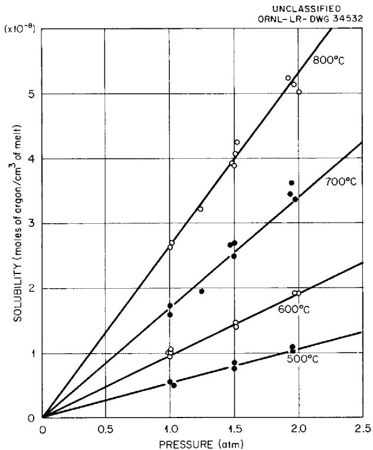  
Fig. 2.3.7. Solubility of Argon in Molten LiF-BeF $_2$ (64-36 mole %) at Various Temperatures.

tension of the solvent is presented in a following section of this chapter that is titled "A Simple Method for the Estimation of Noble Gas Solubilities in Molten Fluoride Mixtures."

Comparisons of the solubilities of helium13 and of argon in $\mathsf{LiF - BeF}_2$ (64-36 mole %) with their solubilities in other solvents previously studied have indicated a number of similarities and one difference. The similarities include (1) conformity to Henry's law, (2) increase of solubility with increasing temperature, (3) decrease of solubility with increasing atomic weight of gas, and (4) increase in the enthalpy of solution with increasing atomic weight of gas. The difference is the value of the entropy of solution in the $\mathsf{LiF - BeF}_2$ mixture. While all the entropies of solution for helium, neon, argon, and xenon in $\mathsf{NaF - ZrF}_4$ (53-47 mole %) were quite small, about -1 eu, the entropy values for helium and argon are -3.73 and -3.95, respectively, in the $\mathsf{LiF - BeF}_2$ (64-36 mole %) mixture. The significance of this difference is not immediately apparent, but the difference seems to be related to the nature of the solvent.

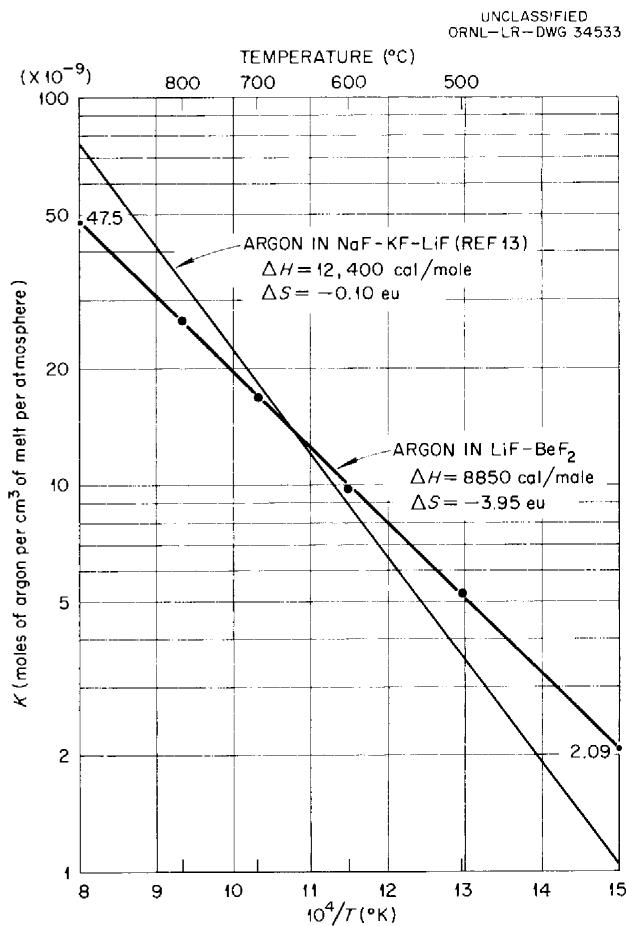  
Fig. 2.3.8. Solubility of Argon in LiF-BeF $_2$ (64-36 mole %) and in NaF-KF-LiF (11.5-42-46.5 mole %).

# Solubility of HF in LiF-BeF $_2$ Mixtures   J. H. Shaffer

The solubility of HF in $\mathsf{LiF - BeF}_2$ mixtures was determined as a function of temperature, pressure, and solvent composition. The composition was varied from approximately 10 to 50 mole $\%$ $\mathsf{BeF}_2$ , at pressures from 0 to 3 atm, and at temperatures from 500 to $950^{\circ}\mathsf{C}$ , depending on the liquidus temperatures of the mixtures.[14] Within the precision of the measurements, the solubility of HF was found to follow Henry's law over the pressure range studied. Accordingly, at a given temperature and solvent composition, the solubility of HF can be measured at several saturating pressures and the results can

be averaged as a Henry's law constant characteristic of that temperature and composition. The average constants obtained experimentally are presented in Fig. 2.3.9. For each point, at least three constants were obtained that agreed with each other to within $\pm 5\%$ . The averages of the 800 and $900^{\circ}\mathrm{C}$ data at 31 mole $\%$ $\mathsf{BeF}_2$ are believed to be low, possibly because of consistently reproducible errors in the temperature measurement as a result of a defective thermocouple. The values obtained at this composition will be rechecked before proceeding

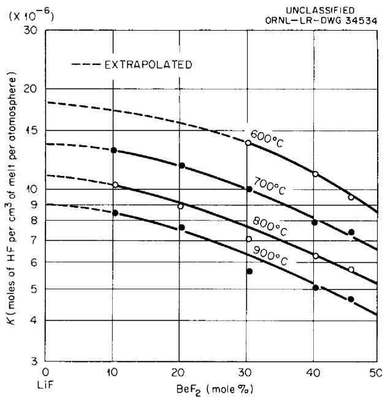  
Fig. 2.3.9. Composition Dependence of Henry's Law Constants for the Solubility of HF in LiF-BeF $_2$ Mixtures.

with a corresponding investigation of another solvent system.

For purposes of comparison, Henry's law constants expressed at rounded values of composition are more useful, and therefore values taken from a large-scale plot of the data are summarized in Table 2.3.2. The enthalpies and entropies of solution of HF as functions of composition of the solvent are listed in Table 2.3.3.

It may be seen that in $\mathsf{LiF - BeF}_2$ solvents, the solubility of HF does not show a very strong composition dependence, such as it did in NaF-ZrF4 mixtures, as indicated previously.15 The weaker

15J. H. Shaffer, MSR Quar. Prog. Rep. Jan. 31, 1958, ORNL-2474, p 93.

Table 2.3.3. Enthalpies and Entropies of Solution of HF in LiF-BeF $_2$ Mixtures   

<table><tr><td>Solvent Composition (mole % LiF)</td><td>Enthalpy of Solution (cal/mole)</td><td>Entropy of Solution* (eu)</td></tr><tr><td>100</td><td>-4700</td><td>-4.4</td></tr><tr><td>90</td><td>-4900</td><td>-4.8</td></tr><tr><td>80</td><td>-5100</td><td>-5.2</td></tr><tr><td>70</td><td>-5400</td><td>-5.8</td></tr><tr><td>60</td><td>-5400</td><td>-6.2</td></tr><tr><td>50</td><td>-5400</td><td>-6.6</td></tr></table>

*Entropy of solution calculated at equal concentrations in the gas and liquid phases at $800^{\circ}\mathrm{C}$ .

Table 2.3.2. Henry's Law Constants for the Solubility of HF in LiF-BeF $_2$ Mixtures   

<table><tr><td rowspan="2">Solvent Composition (mole % LiF)</td><td colspan="4">K (moles of HF per cm3of melt per atmosphere)</td></tr><tr><td>At 600°C</td><td>At 700°C</td><td>At 800°C</td><td>At 900°C</td></tr><tr><td></td><td>×10-6</td><td>×10-6</td><td>×10-6</td><td>×10-6</td></tr><tr><td>100</td><td>18.2*</td><td>13.7*</td><td>11.0*</td><td>9.0*</td></tr><tr><td>90</td><td>17.3**</td><td>13.0**</td><td>10.3**</td><td>8.4</td></tr><tr><td>80</td><td>16.0**</td><td>11.8</td><td>9.1</td><td>7.6</td></tr><tr><td>70</td><td>13.9</td><td>10.1</td><td>7.7</td><td>6.3</td></tr><tr><td>60</td><td>11.2</td><td>8.2</td><td>6.4</td><td>5.2</td></tr><tr><td>50</td><td>8.6</td><td>6.6</td><td>5.2</td><td>4.2</td></tr></table>

*Graphical extrapolation to 0 mole % BeF₂ (Fig. 2.3.9).   
\*\*Extrapolated from measurements at higher temperatures.

composition dependence may be a result of much less stable acid fluorides in the LiF system16 than in the NaF system. However, this effect should be more precisely demonstrated when measurements using NaF-BeF2 mixtures are carried out.

# Solubilities of Fission-Product Fluorides in Molten Alkali Fluoride-Beryllium Fluoride Solvents

W. T. Word

Solubility of $\mathsf{CeF}_3$ in NaF-LiF-BeF2. - The solubility of $\mathsf{CeF}_3$ in NaF-LiF-BeF2solvents of various compositions was determined over the temperature range 400 to $750^{\circ}\mathsf{C}$ . The mixtures investigated consisted of the NaF-LiF eutectic (40-60 mole %) to which $\mathsf{BeF}_2$ was added in amounts that varied from 0 to 56 mole%. The results of the experiments are shown in Fig. 2.3.10, in which the solubility of

$\mathsf{CeF}_3$ (mole $\%$ ) is plotted against solvent composition at several temperatures. A comparison of the solubility of $\mathsf{CeF}_3$ in this solvent with the solubilities of $\mathsf{CeF}_3$ in the LiF-BeF and NaF-BeF2 binary systems is presented in Fig. 2.3.11 for the single temperature of $600^{\circ}\mathsf{C}$ .

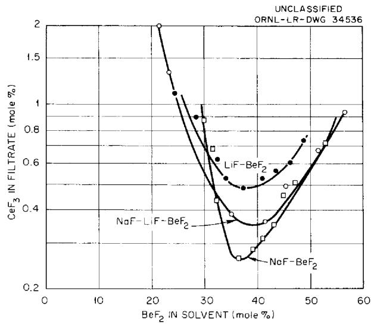  
Fig. 2.3.11. Comparison of $\mathsf{CeF}_3$ Solubilities in Three Solvent Systems at $600^{\circ}\mathsf{C}$

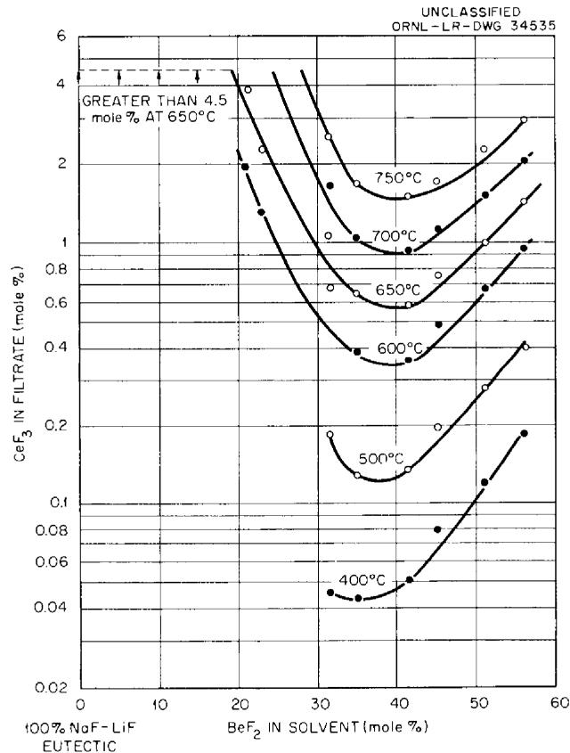  
Fig. 2.3.10. Solubility of $\mathsf{CeF}_3$ in NaF-LiF-BeF $_2$ Mixtures.

Solubility of $\mathsf{CeF}_3$ , $\mathsf{LaF}_3$ , and $\mathsf{SmF}_3$ in LiF-BeF $_2$ -UF $_4$ . - The solubilities of $\mathsf{CeF}_3$ , $\mathsf{LaF}_3$ , and $\mathsf{SmF}_3$ in LiF-BeF $_2$ -UF $_4$ (62.8-36.4-0.8 mole %) were determined over the temperature range 500 to $750^{\circ}\mathsf{C}$ . The data are given in Table 2.3.4, and, for comparison, are plotted against the reciprocal of the temperature in Fig. 2.3.12. As may be seen, the solubility of $\mathsf{CeF}_3$ in this solvent is a little higher than in LiF-BeF $_2$ (63-37 mole %) over the full temperature range investigated.

Simultaneous Solubilities of $\mathsf{CeF}_3$ and $\mathsf{LaF}_3$ in LiF-BeF $_2$ -UF $_4$ . - The solubilities of $\mathsf{CeF}_3$ and $\mathsf{LaF}_3$ in the presence of each other in LiF-BeF $_2$ -UF $_4$ (62.8-36.4-0.8 mole %) were determined with the use of two radioactive tracers in the manner described previously. $^{17}$ The values obtained are listed in Table 2.3.5 and plotted in Fig. 2.3.13, in which the sums of the solubilities may be seen to be intermediate between the individual solubilities. The lines represent the solubilities of $\mathsf{CeF}_3$ and

Table 2.3.4. Solubilities of ${\mathrm{{CeF}}}_{3}$ ,La ${\mathrm{F}}_{3}$ ,and ${\mathrm{{SmF}}}_{3}$ in LiF-Be ${\mathrm{F}}_{2} - {\mathrm{{UF}}}_{4}$ (62.8-36.4-0.8 mole %)   

<table><tr><td rowspan="2">Temperature (°C)</td><td colspan="2">CeF3in Filtrate</td><td rowspan="2">Temperature (°C)</td><td colspan="2">LaF3in Filtrate</td><td rowspan="2">Temperature (°C)</td><td colspan="2">SmF3in Filtrate</td></tr><tr><td>Wt %</td><td>Mole %</td><td>Wt %</td><td>Mole %</td><td>Wt %</td><td>Mole %</td></tr><tr><td>764</td><td>&gt;9.1*</td><td>&gt;1.8*</td><td>741</td><td>8.65</td><td>1.71</td><td>757</td><td>&gt;10.22*</td><td>&gt;1.93*</td></tr><tr><td>661</td><td>5.1</td><td>0.97</td><td></td><td></td><td></td><td>676</td><td>&gt;10.27*</td><td>&gt;1.94*</td></tr><tr><td>652</td><td>4.5</td><td>0.85</td><td>655</td><td>4.19</td><td>0.79</td><td></td><td></td><td></td></tr><tr><td>578</td><td>2.35</td><td>0.44</td><td>560</td><td>1.73</td><td>0.32</td><td>587</td><td>5.35</td><td>0.97</td></tr><tr><td>499</td><td>1.04</td><td>0.19</td><td>480</td><td>0.79</td><td>0.15</td><td>495</td><td>2.20</td><td>0.39</td></tr></table>

*Solution not saturated.

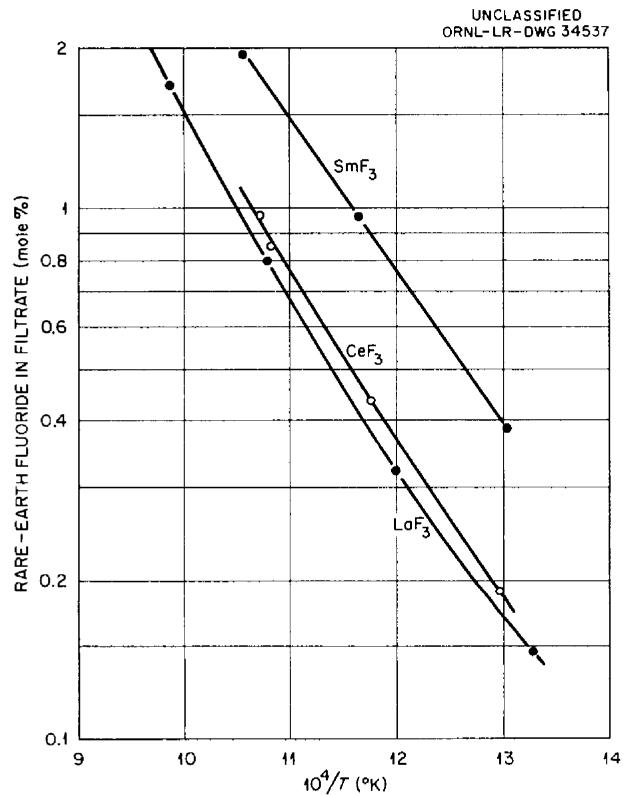  
Fig. 2.3.12. Solubilities of $\mathsf{CeF}_3$ , $\mathsf{LaF}_3$ , and $\mathsf{SmF}_3$ in LiF-BeF $_2$ -UF $_4$ (62.8-36.4-0.8 mole%).

$\mathsf{LaF}_3$ individually (same curves as those shown in Fig. 2.3.12), while the points represent the sums of the solubilities obtained when both are present in the proportions indicated.

It may be observed from the data given in Table 2.3.5 that the solubility of a rare earth fluoride is decreased by the addition of another rare earth fluoride. This is believed to be the result of the formation of a solid solution by the rare earth fluorides

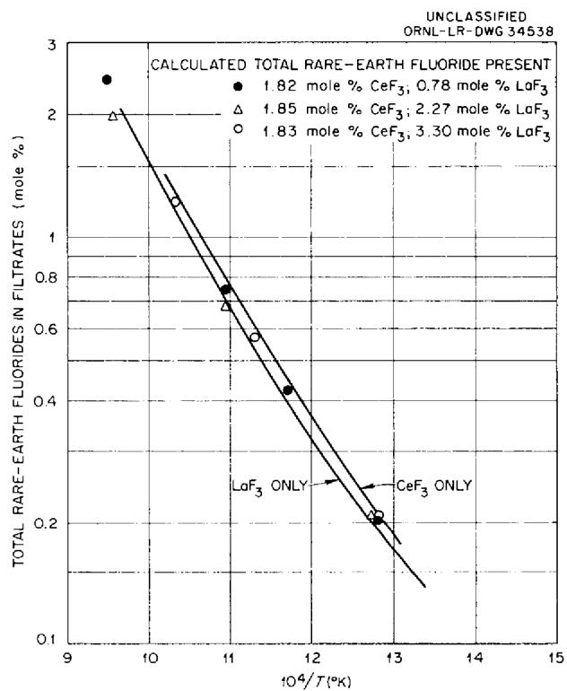  
Fig. 2.3.13. Comparison of Solubilities of $\mathsf{CeF}_3$ and $\mathsf{LaF}_3$ Individually and When Both are Present in LiF-BeF $_2$ -UF $_4$ (62.8-36.4-0.8 mole%).

involved. It was shown previously that the equilibrium quotient of the reaction

$$
\operatorname {L a F} _ {3} (d) + \operatorname {C e F} _ {3} (s s) \rightleftharpoons \operatorname {L a F} _ {3} (s s) + \operatorname {C e F} _ {3} (d)
$$

is given by the expression

$$
K _ {N} = \frac {S _ {\mathrm {C e F} _ {3}} ^ {\circ}}{S _ {\mathrm {L a F} _ {3}} ^ {\circ}}
$$

where $S^{\circ}$ is the mole fraction (solubility) of a rare earth fluoride in the solvent at the specified temperature and in the absence of a second rare earth fluoride. A comparison of the calculated and the experimentally determined equilibrium quotients is given in Table 2.3.6. It may be seen that, regardless of rather large composition changes, the equilibrium quotients, or partition coefficients, remain fairly constant and in fair agreement with the calcu

lated constants. These results are also illustrated in Fig. 2.3.14.

Simultaneous Solubilities of $\mathsf{CeF}_3$ and $\mathsf{SmF}_3$ in LiF-BeF $_2$ -UF $_4$ . - One experiment was run in which both $\mathsf{CeF}_3$ and $\mathsf{SmF}_3$ were added to LiF-BeF $_2$ -UF $_4$ (62.8-36.4-0.8 mole %). There was evidence that this particular batch of $\mathsf{SmF}_3$ was slower in dissolving than usual, and the individual solubilities

Table 2.3.5. Solubilities of $\mathsf{CeF}_3$ and $\mathsf{LaF}_3$ Separately and in the Presence of Each Other in LiF-BeF $_2$ -UF $_4$ (62.8-36.4-0.8 Mole %)   

<table><tr><td colspan="3">Constituents of System (mole %)</td><td rowspan="2">Temperature (℃)</td><td colspan="3">Rare Earth Fluoride in Filtrate (mole %)</td></tr><tr><td>CeF3</td><td>LaF3</td><td>Solvent</td><td>CeF3</td><td>LaF3</td><td>Total</td></tr><tr><td>180</td><td>0</td><td>98.20</td><td>700</td><td>1.36</td><td>0</td><td>1.36</td></tr><tr><td></td><td></td><td></td><td>600</td><td>0.55</td><td>0</td><td>0.55</td></tr><tr><td></td><td></td><td></td><td>500</td><td>0.193</td><td>0</td><td>0.193</td></tr><tr><td>1.82</td><td>0.78</td><td>97.40</td><td>700</td><td>0.890</td><td>0.387</td><td>1.28</td></tr><tr><td></td><td></td><td></td><td>600</td><td>0.375</td><td>0.141</td><td>0.52</td></tr><tr><td></td><td></td><td></td><td>500</td><td>0.148</td><td>0.043</td><td>0.191</td></tr><tr><td>1.85</td><td>2.27</td><td>95.88</td><td>700</td><td>0.588</td><td>0.525</td><td>1.11</td></tr><tr><td></td><td></td><td></td><td>600</td><td>0.271</td><td>0.195</td><td>0.47</td></tr><tr><td></td><td></td><td></td><td>500</td><td>0.120</td><td>0.067</td><td>0.187</td></tr><tr><td>1.83</td><td>3.30</td><td>94.87</td><td>700</td><td>0.486</td><td>0.775</td><td>0.126</td></tr><tr><td></td><td></td><td></td><td>600</td><td>0.220</td><td>0.296</td><td>0.52</td></tr><tr><td></td><td></td><td></td><td>500</td><td>0.093</td><td>0.102</td><td>0.195</td></tr><tr><td>0</td><td>2.20</td><td>97.80</td><td>700</td><td>0</td><td>1.19</td><td>1.19</td></tr><tr><td></td><td></td><td></td><td>600</td><td>0</td><td>0.475</td><td>0.48</td></tr><tr><td></td><td></td><td></td><td>500</td><td>0</td><td>0.177</td><td>0.177</td></tr></table>

Table 2.3.6. Solid-Solvent Extraction Coefficients for LaF₃-CeF₃ in LiF-BeF₂-UF₄ (62.8-36.4-0.8 Mole %)   

<table><tr><td rowspan="2">Temperature (℃)</td><td rowspan="2">Calculated \( {K}_{N} \) , \( {S}^{ \circ  }{}_{\mathrm{{CeF}}3}/{S}^{ \circ  }{}_{\mathrm{{LaF}}3} \)</td><td colspan="3">Experimental \( {K}_{N}{}^{ * } \)</td></tr><tr><td>For 1.82 Mole % CeF \( {}_{3} + \) 0.78 Mole % LaF \( {}_{3} \)</td><td>For 1.85 Mole % CeF \( {}_{3} + \) 2.27 Mole % LaF \( {}_{3} \)</td><td>For 1.83 Mole % CeF \( {}_{3} + \) 3.30 Mole % LaF \( {}_{3} \)</td></tr><tr><td>700</td><td>1.14</td><td>0.97</td><td>1.55</td><td>1.18</td></tr><tr><td>600</td><td>1.15</td><td>1.18</td><td>1.82</td><td>1.38</td></tr><tr><td>500</td><td>1.09</td><td>1.52</td><td>2.28</td><td>1.68</td></tr></table>

$$
* K _ {N} = \frac {N _ {\mathrm {L a F} _ {3} (\mathrm {s s})} N _ {\mathrm {C e F} _ {3} (\mathrm {d})}}{N _ {\mathrm {C e F} _ {3} (\mathrm {s s})} N _ {\mathrm {L a F} _ {3} (\mathrm {d})}}
$$

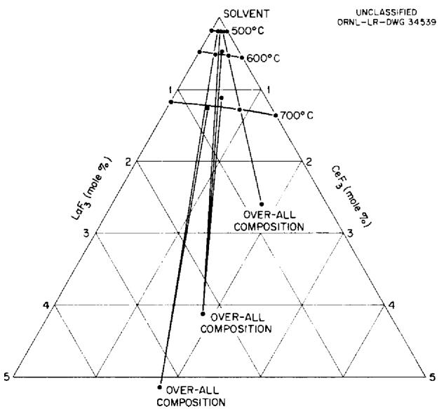  
Fig. 2.3.14. Portion of Psuedo-Ternary System $\mathsf{CeF}_3\cdot$ LaF-Solvent Where the Solvent is LiF-BeF-UF4 (62.8-36.4-0.8 mole%).

obtained were considered to be unreliable. However, the sums of the solubilities were intermediate between the solubility curves obtained when only $\mathsf{CeF}_3$ and only $\mathsf{SmF}_3$ were present, as shown in Fig. 2.3.15.

# A Simple Method for the Estimation of Noble Gas Solubilities in Molten Fluoride Mixtures

M. Blander

G. M. Watson

The solubilities of noble gases in liquids may be interpreted with the use of a model similar to that described by Uhlig.18,19 Although the model is elementary, it yields an interesting correlation with experimental data. If the gas does not interact with the liquid in which it is dissolved, the free-energy change upon solution is related to the "surface" energy of the hole created by the gas molecule or atom. The solubility of such a gas in a continuous fluid medium can be shown to be given by the relation

$$
K _ {c} = \frac {C _ {d}}{C _ {g}} = e ^ {- 1 8. 0 8 r ^ {2} \gamma_ {\mathrm {m i c}} / R T}
$$

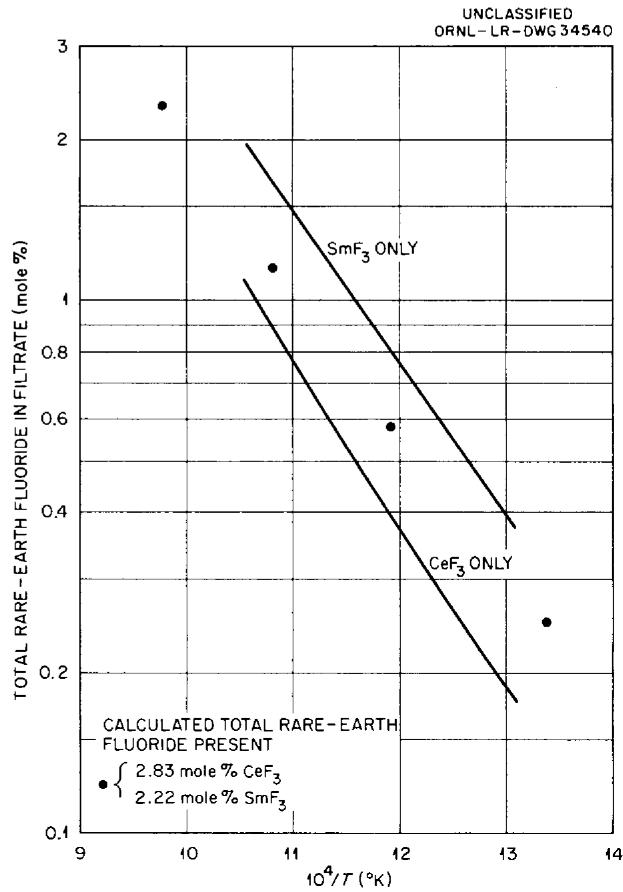  
Fig. 2.3.15. Solubilities of $\mathsf{CeF}_3$ and $\mathsf{SmF}_3$ Individually and When Both are Present in LiF-BeF $_2$ -UF $_4$ (62.8-36.4-0.8 mole%).

where $K_{c}$ is the equilibrium ratio of the concentrations in the liquid $(C_d)$ and in the gas phase $(C_g)$ , $r$ is the radius of the gas atom (in Angstroms), $\gamma_{\mathrm{mic}}$ is the microscopic surface tension of the solvent (in ergs/cm²), $R$ is the gas constant (in cal/mole·°K), and the number 18.08 is the resultant of the factors $(6.02 \times 10^{23})$ ( $4\pi \times 10^{-16}$ ) ( $2.39 \times 10^{-8}$ ), which are used in the calculation of the surface free energy (in cal/mole of a mole of spherical holes of radius $r$ (Å) in a continuous liquid of surface free energy $\gamma_{\mathrm{mic}}$ (ergs/cm²). Although a real liquid cannot be considered a continuous fluid, it is interesting to speculate that it behaves as if it were one and that $\gamma_{\mathrm{mic}}$ is related to the macroscopic surface tension $\gamma_{\mathrm{max}}$ .

The area of the holes is at least as large as the surface area of the spherical gas molecules, and because of thermal motions the hole would be expected to be larger than the gas atom. The radii of

the noble gas atoms in the solid will be a lower limit of the radius of the hole, and the solubility calculated on this basis would be expected to be high. Values of $K_{c}$ are listed in Table 2.3.7 that were calculated for the noble gases by assuming that $\gamma_{\mathrm{mic}} = \gamma_{\mathrm{mac}}$ and by using the radii of the noble gas atoms in the solid. The numerical values used for the surface tensions of the solvents are given in Table 2.3.8, and the radii of the noble gases, as given by Goldschmidt,[20] are listed below:

20V. M. Goldschmidt, Geochemistry, Oxford University Press (1954).

<table><tr><td></td><td>Atomic Radius (Å)</td></tr><tr><td>Helium</td><td>1.22</td></tr><tr><td>Neon</td><td>1.52</td></tr><tr><td>Argon</td><td>1.93</td></tr><tr><td>Xenon</td><td>2.18</td></tr></table>

The comparison in Table 2.3.7 of the calculated and measured values of $K_{c}$ for solutions of noble gases in NaF-KF-LiF and in NaF-ZrF $_4$ shows good agreement in view of the elementary nature of the model. The magnitude and the variation of the solubility with size of the gas molecule are correctly

Table 2.3.7. Comparison of Calculated and Observed Values of Henry's Law Constants, $K_{c} = C_{d} / C_{g}$ , for Noble Gas Solubilities in Molten Fluoride Mixtures   

<table><tr><td rowspan="2">Solvent</td><td rowspan="2">Gas</td><td rowspan="2">Temperature (°C)</td><td colspan="2">Kc</td><td rowspan="2">Ratio of Experimental to Calculated Kc Values</td></tr><tr><td>Experimental</td><td>Calculated</td></tr><tr><td></td><td></td><td></td><td>×10-3</td><td>×10-3</td><td></td></tr><tr><td rowspan="12">NaF-ZrF4</td><td rowspan="3">Helium</td><td>600</td><td>15.5</td><td>137</td><td>0.11</td></tr><tr><td>700</td><td>23.3</td><td>188</td><td>0.12</td></tr><tr><td>800</td><td>37.0</td><td>243</td><td>0.15</td></tr><tr><td rowspan="3">Neon</td><td>600</td><td>8.09</td><td>45.9</td><td>0.18</td></tr><tr><td>700</td><td>14.7</td><td>74.9</td><td>0.20</td></tr><tr><td>800</td><td>21.7</td><td>112</td><td>0.20</td></tr><tr><td rowspan="3">Argon</td><td>600</td><td>3.62</td><td>7.33</td><td>0.49</td></tr><tr><td>700</td><td>6.44</td><td>16.0</td><td>0.40</td></tr><tr><td>800</td><td>10.6</td><td>30.2</td><td>0.35</td></tr><tr><td rowspan="3">Xenon</td><td>600</td><td>1.39</td><td>1.77</td><td>0.79</td></tr><tr><td>700</td><td>2.84</td><td>4.84</td><td>0.59</td></tr><tr><td>800</td><td>5.56</td><td>10.7</td><td>0.52</td></tr><tr><td rowspan="12">NaF-KF-LiF</td><td rowspan="3">Helium</td><td>600</td><td>8.09</td><td>(28.3)*</td><td>(0.29)</td></tr><tr><td>700</td><td>14.0</td><td>(46.8)</td><td>(0.30)</td></tr><tr><td>800</td><td>20.3</td><td>(70.7)</td><td>(0.29)</td></tr><tr><td rowspan="3">Neon</td><td>600</td><td>3.12</td><td>(3.94)</td><td>(0.79)</td></tr><tr><td>700</td><td>6.00</td><td>(8.63)</td><td>(0.70)</td></tr><tr><td>800</td><td>9.84</td><td>(16.4)</td><td>(0.60)</td></tr><tr><td rowspan="3">Argon</td><td>600</td><td>0.645</td><td>(0.146)</td><td>(4.4)</td></tr><tr><td>700</td><td>1.43</td><td>(0.509)</td><td>(2.8)</td></tr><tr><td>800</td><td>2.99</td><td>(1.41)</td><td>(2.1)</td></tr><tr><td rowspan="3">Xenon</td><td>600</td><td></td><td>(0.011)</td><td></td></tr><tr><td>700</td><td></td><td>(0.057)</td><td></td></tr><tr><td>800</td><td></td><td>(0.212)</td><td></td></tr></table>

*Values enclosed in parentheses are based on estimated surface tensions.

Table 2.3.8. Surface Tensions of Molten Fluoride Mixtures   

<table><tr><td rowspan="2">Temperature (℃)</td><td colspan="2">Surface Tension (dynes/cm)</td></tr><tr><td>NaF-KF-LiF* (11.5-42-46.5 mole %)</td><td>NaF-Zr F4** (53-47 mole %)</td></tr><tr><td>600</td><td>230</td><td>128</td></tr><tr><td>700</td><td>220</td><td>120</td></tr><tr><td>800</td><td>210</td><td>112</td></tr></table>

*Surface tension values estimated from extrapolated values of surface tensions of pure components [F. M. Jager, J. für anorg. chemie 101 (1917)] assuming additive surface tension. Surface tension measurements of this mixture have not as yet been made.   
**F. W. Miles and G. M. Watson, Oak Ridge National Laboratory, unpublished work.

predicted. This order of solubility has not often been experimentally observed, since most liquids have surface tensions so low that other solution effects predominate. The difference between the calculated and experimental values is in the direction expected if the estimated size of the hole is too small (except for argon in NaF-KF-LiF).

The last column of Table 2.3.7 shows a trend in the ratio of the experimental to the calculated values of the Henry's law constants. An approximate calculation indicates that this trend can be explained if the polarization of the noble gas atom by the highly ionic salt medium is taken into account.

It may be concluded from these calculations that estimates can probably be made of the solubilities of the noble gases in media of high surface tension to within an order of magnitude. This accuracy is satisfactory for reactor applications.

# Chemical Reactions of Oxides with Fluorides in LiF-BeF $_2$

J. H. Shaffer

An effective means for separating uranium from undesirable fission products is required in order to develop a suitable reprocessing scheme for fused-salt nuclear reactor fuels. Experiments described previously[21] demonstrated that uranium can be separated from rare earth fluorides, such as $\mathrm{CeF}_{3}$ , in the

simple binary solvent KF-LiF. In these experiments uranium was preferentially precipitated as $\mathsf{UO}_2$ by the addition of calcium oxide to the fused salt mixture. In the presence of $\mathsf{BeF}_2$ , uranium probably can be separated from cerium and cerium oxides, but apparently oxides of cerium and beryllium will coprecipitate after the precipitation of uranium is essentially complete.

In practical applications the addition of calcium oxide to precipitate uranium is objectionable. Contamination of the fuel with calcium fluoride might induce serious complications, such as increasing the melt liquidus temperature. However, two alternate methods of uranium separation are being investigated. First, beryllium oxide may be substituted for calcium oxide to precipitate uranium and the rare earths. The primary advantage of this substitution is that no foreign constituent is introduced into fuels containing beryllium. The results of preliminary experiments with the use of beryllium oxide have been reported.[22] A second method would employ a precipitant which would form a volatile product. Reagents of this class might be water, boron oxide, and silicon dioxide.

Precipitations with BeO. - A chromatographic type of separation of uranium and fission product rare earths might be effected by using beryllium oxide as the column packing material. Separations of this type would yield a purified solvent as the column effluent and would provide a means of concentrating the uranium in the column for subsequent recovery. Pertinent information for this process includes knowledge of reaction rates, optimum particle size of BeO, column recovery techniques, etc.

The rate of reaction of $\mathsf{UF}_4$ with a onefold excess of BeO as a function of the particle size is illustrated in Fig. 2.3.16. Experimental results indicate that the reaction of $\mathsf{UF}_4$ with solid BeO is surface controlled. Further experiments are in progress to determine additional characteristics of the extraction process. It is planned, for the next series of experiments, to use actual columns packed with BeO and to force the liquid LiF-BeF $_2$ - $\mathsf{UF}_4$ mixture to flow through the columns to determine the amount of uranium extracted per pass.

Formation of Volatile Products. Results of experimental precipitations of uranium from UF in LiF-BeF $_2$ (63-37 mole %) at $600^{\circ}\mathrm{C}$ by the addition of water to the influent gas stream are presented in

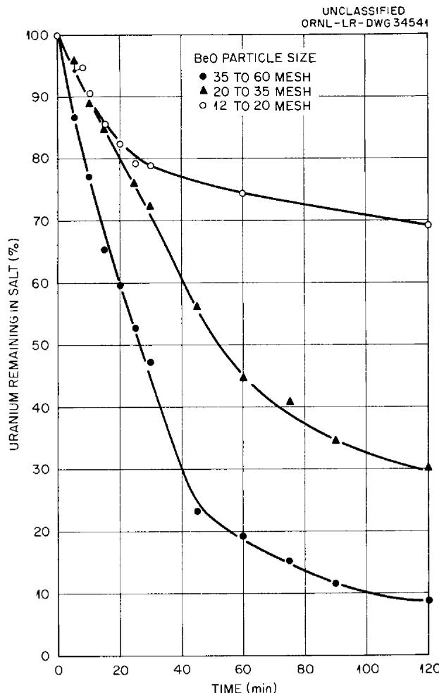  
Fig. 2.3.16. Rate of Reaction of BeO (100% Excess) With UF4 in LiF-BeF2 (63-37 mole %) at 600°C.

Fig. 2.3.17. As may be seen, the stoichiometry indicates the formation of $\mathrm{UO}_2$ . This assumption has been confirmed by petrographic examination.

Further experiments are in progress to investigate the precipitation with water of cerium, as well as the selective precipitation of uranium in the presence of cerium, in various fused salt solvents.

# CHEMISTRY OF THE CORROSION PROCESS

# Activities in Metal Alloys

S. Langer

Studies of the activity of nickel in nickel-molybdenum alloys by measurement of the electromotive force of cells of the type

Ni (metal)

$\mathrm{NiCl}_2$ (5 wt $\%$ ) in

NaCl-KCl eutectic

Ni-Mo Alloy

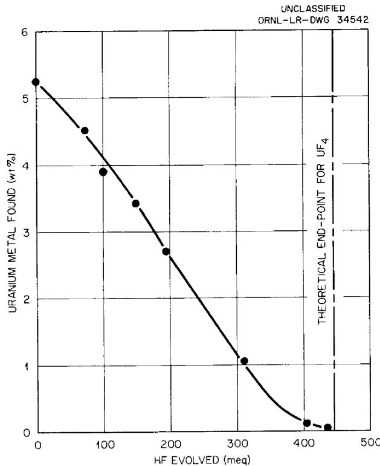  
Fig. 2.3.17. Precipitation of $\mathsf{UO}_2$ from $\mathsf{UF}_4$ in LiF-BeF $_2$ (63-37 mole %) With $\mathsf{H}_2\mathsf{O}$ .

have been continued. The disagreement between the potentials of identical pure nickel electrodes which was experienced in the past $^{23}$ has been greatly reduced by changing to an uncompartmented cell. The potentials of the nickel electrodes now agree to within $\pm 1.0$ mv and frequently to better than $\pm 0.5$ mv.

A condensation of the results obtained to date is given in Table 2.3.9. Cell potentials measured in the temperature range 680 to $820^{\circ}C$ were plotted as a function of temperature, and a straight line was drawn that best fitted the data points. The data are not yet sufficiently precise to warrant more refined methods. The potential of a given alloy at $750^{\circ}C$ was read from the graph, and the activities and activity coefficients listed in Table 2.3.9 were calculated from the potential data.

The alloys used as electrodes were prepared by annealing for 16 hr at $1200^{\circ}C$ and quenching to room temperature; thus the electrodes may not represent equilibrium samples even after remaining at

Table 2.3.9. Tentative Values of Activities and Activity Coefficients of Nickel Metal in Nickel-Molybdenum Alloys   

<table><tr><td>Nickel Atom Fraction, \( {X}_{\mathrm{{Ni}}} \)</td><td>Potential at \( {750}^{ \circ  }\mathrm{C} \) , E (mv)</td><td>Activity, \( {a}_{\mathrm{{Ni}}} \)</td><td>Activity Coefficient, \( {\gamma }_{\mathrm{{Ni}}} \)</td></tr><tr><td>0.937</td><td>1.95</td><td>0.96</td><td>1.02</td></tr><tr><td>0.904</td><td>2.95</td><td>0.94</td><td>1.04</td></tr><tr><td>0.800</td><td>3.45</td><td>0.92</td><td>1.16</td></tr></table>

temperature in a cell for a week. In future experiments, alloys which have been annealed at 750 to $850^{\circ}C$ for at least 6 weeks will be used.

# Surface Tensions of $\mathbf{BeF}_2$ Mixtures

B.J.Sturm

Experiences in pumping $\mathsf{LiF - BeF}_2\mathsf{-UF}_4$ melts led to interest in the surface tensions of $\mathsf{BeF}_2$ mixtures, and preliminary measurements have been made. For these measurements a Cenco-DuNouy interfacial tensiometer was used to measure the force required to pull a platinum ring out of the melt. Since the measurements were made with the liquid surface exposed to air, the results are approximate.

A trial measurement of LiF-BeF $_2$ -UF $_4$ (53-46-1 mole %), with poor temperature control, gave a surface tension of 195 dynes/cm at 425 to $450^{\circ}\mathrm{C}$ . Measurements of a melt consisting of LiF and BeF $_2$ (63-37 mole %) gave 196 dynes/cm at about $480^{\circ}\mathrm{C}$ .

The surface tension of the liquid can affect the drainage behavior, and the level of a liquid in a capillary is directly proportional to the surface tension and inversely proportional to the density. Therefore a comparison of the rise in a 2-mm-ID capillary is indicative of the validity of the results. Such a comparison is presented in Table 2.3.10 for two melts and for water.

# Disproportionation of Chromous Fluoride

B.J.Sturm

Chromous fluoride in solution with fused alkali fluorides disproportionate into trivalent chromium and chromium metal (see the following section). In an attempt to demonstrate this reaction in concentrated solutions, and also to prepare compounds of NaF and $\mathsf{CrF}_3$ , nickel capsules containing mixtures of sodium fluoride and chromous fluoride $(\mathsf{NaF - CrF}_2$ 50-50 and 67-33 mole $\%$ were heated to $1000^{\circ}\mathsf{C}$ For capsules maintained at the elevated temperature for 2 hr and cooled slowly, x-ray diffraction showed sodium hexafluochromate (III) to be the principal phase. Capsules heated for only 2 min and quenched on a copper plate contained only a trace of sodium hexafluochromate (III), the principal phase being one regarded as sodium trifluochromate (II). The rapid cooling and quenching did not allow time for disproportionation; the product was NaF-CrF instead of $3\mathrm{NaF} \cdot \mathrm{CrF}_3$ .

Table 2.3.10. Comparison of Surface Tensions and Approximate Rise in a 2-mm-ID Capillary of Two Fused Salts and Water   

<table><tr><td></td><td>Temperature (°C)</td><td>Surface Tension (dynes/cm)</td><td>Density (g/cm3)</td><td>Capillary Rise (cm)</td></tr><tr><td>NaF-ZrF4-UF4(50-46-4 mole %)</td><td>630</td><td>132a</td><td>3.34a</td><td>0.8</td></tr><tr><td>LiF-BeF2(63-37 mole %)</td><td>480</td><td>196</td><td>1.92b</td><td>2.1</td></tr><tr><td>Water</td><td>25</td><td>72c</td><td>1</td><td>1.5</td></tr></table>

$a_{S}$ . I. Cohen, W. D. Powers, and N. D. Greene, private communication.   
$b_{W}$ . D. Powers, private communication, September 1958.   
$^{c}$ N. A. Lange (ed.), Handbook of Chemistry, 5th ed. (1944), p 1577.

Effect of Fuel Composition on the Equilibria

$$
3 C r F _ {2} \rightleftharpoons 2 C r F _ {3} + C r ^ {\circ} a n d
$$

$$
3 \mathrm {F e F} _ {2} = 2 \mathrm {F e F} _ {3} + \mathrm {F e} ^ {\circ}
$$

J. D. Redman

A study of the chemical equilibria involved in the corrosion of structural metals by fluoride fuels has continued, with attention being given to the effect of solvent composition on the equilibria

$$
3 C r F _ {2} \rightleftharpoons 2 C r F _ {3} + C r ^ {\circ}
$$

and

$$
3 F e F _ {2} \rightleftharpoons 2 F e F _ {2} + F e ^ {\circ}.
$$

Chemical analyses were made of equilibrated samples contained in nickel filtration apparatus. The samples were obtained by filtration after an equilibration period of 5 hr at temperatures chosen between 525 and $800^{\circ}\mathrm{C}$ .

Chromium Fluorides. -- The extent to which the reaction

$$
3 C r F _ {2} \rightleftharpoons 2 C r F _ {3} + C r ^ {\circ}
$$

proceeds to the right was found to decrease with increasing $\mathsf{ZrF}_4$ concentration in the solvent LiF-NaF-ZrF, as shown in Fig. 2.3.18. The solvent LiF-NaF-ZrF was useful because it permitted a continuous variation from a basic to an acidic melt without interference from precipitation. The data of Fig. 2.3.18 are based on duplicate experiments in

which excess chromium metal was equilibrated with $2\mathrm{wt}\% \mathrm{Cr}^{+ + }$ in the solvents described in Table 2.3.11. For this series of solvent compositions, in which the mole ratio of NaF to LiF was held constant at 40:60, the effect of $\mathsf{Zr}^{4 + }$ in competing with

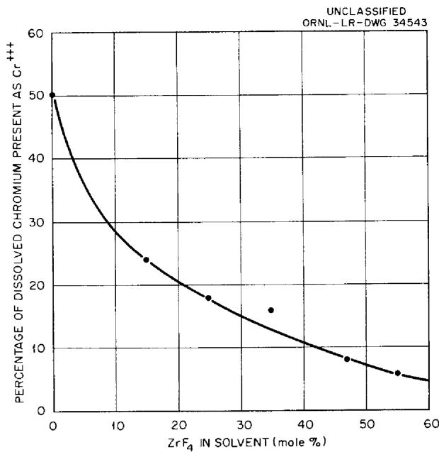  
Fig. 2.3.18. Effect of Solvent Composition on the Reaction $3\mathrm{Cr}^{++} \rightleftharpoons 2\mathrm{Cr}^{+++} + \mathrm{Cr}^{\circ}$ When 2 wt $\%$ $\mathrm{Cr}^{+++}$ is Equilibrated with Excess $\mathrm{Cr}^{\circ}$ in the Solvent LiF-NaF (60-40 mole $\%$ ) + $\mathrm{ZrF}_4$ at $800^{\circ}\mathrm{C}$ .

Table 2.3.11. The $3\mathrm{CrF}_2 = 2\mathrm{CrF}_3 + \mathrm{Cr}^{\circ}$ Equilibrium in LiF-NaF-ZrF4 at $800^{\circ}\mathrm{C}$ (2 wt % Cr +++ Equilibrated with Excess Chromium Metal)   

<table><tr><td>ZrF4added (mole %) to LiF-NaF (60-40 mole %)</td><td>0</td><td>15</td><td>25</td><td>35</td><td>47</td><td>55</td></tr><tr><td colspan="7">Cr found by analysis (wt %) in duplicate experiments</td></tr><tr><td rowspan="2">Cr++ + Cr+++</td><td>2.59</td><td>2.76</td><td>2.80</td><td>2.79</td><td>2.76</td><td>2.83</td></tr><tr><td>2.62</td><td>2.70</td><td>2.78</td><td>2.77</td><td>2.75</td><td>2.86</td></tr><tr><td rowspan="2">Cr++</td><td>1.38</td><td>2.10</td><td>2.30</td><td>2.30</td><td>2.52</td><td>2.82</td></tr><tr><td>1.25</td><td>2.21</td><td>2.27</td><td>2.34</td><td>2.55</td><td>2.50</td></tr><tr><td colspan="7">Calculated Concentrations (wt %)</td></tr><tr><td>Average Cr++</td><td>1.32</td><td>2.16</td><td>2.28</td><td>2.32</td><td>2.54</td><td>2.66</td></tr><tr><td>Average Cr+++</td><td>1.29</td><td>0.66</td><td>0.50</td><td>0.46</td><td>0.22</td><td>0.18</td></tr><tr><td>Kx=(CrF3)2/(CrF2)3</td><td>8×10-1</td><td>4×10-2</td><td>2×10-2</td><td>1×10-2</td><td>3×10-3</td><td>2×10-3</td></tr></table>

$\mathbf{Cr}^{+ + + }$ for fluoride ions is apparent from the decreasing stability of $\mathbf{Cr}^{+ + + }$

Similar experiments at lower temperatures and lower dilutions of chromium ion consistently showed the same trend. Because of minor quantitative discrepancies, which appeared presumably as a result of analytical difficulties, the numerical results are mainly of qualitative interest and have been omitted from this report. The same is true of numerous trials involving the addition of $\mathsf{CrF}_2$ , with no chromium metal or $\mathsf{Cr}^{+++}$ initially present, to check the reaction $3\mathsf{CrF}_2 \longrightarrow 2\mathsf{CrF}_3 + \mathsf{Cr}^0$ . Increasing disproportionation (more $\mathsf{CrF}_3$ ) with decreasing $\mathsf{ZrF}_4$ content was quite evident. Since the chromium metal was deposited on the nickel walls at an activity of less than unity, the ratios of $\mathsf{CrF}_3$ to $\mathsf{CrF}_2$ were higher when only $\mathsf{CrF}_2$ was added than for the equilibrium values in the presence of excess chromium metal.

Tests were also made in solvents containing $\mathsf{BeF}_{2}$ , which is considered to be more basic, or less acidic, than $\mathsf{ZrF}_{4}$ , since it is a better fluoride donor for furnishing fluorides for complexing. An appreciable amount of disproportionation, $\mathsf{CrF}_{3} / \mathsf{CrF}_{2} = 0.15$ for 2 wt $\%$ Cr at $800^{\circ}\mathsf{C}$ , was found in LiF-BeF $_2$ (48-52 mole $\%$ ). This is roughly comparable to the amount of disproportionation in the 35 mole $\%$ $\mathsf{ZrF}_{4}$ solvent. In another $\mathsf{BeF}_{2}$ mixture (LiF-BeF $_2$ -ThF $_4$ , 67-23-10) the effect of ThF $_4$ (acidic) was more than counterbalanced by the increased LiF (basic) content to give a net increase in the complexing of $\mathsf{CrF}_{3}$ . Here the equilibrium $\mathsf{CrF}_{3} / \mathsf{CrF}_{2}$ ratio was about 0.4 at $800^{\circ}\mathsf{C}$ with 2 wt $\%$ Cr; thus the solvent containing ThF $_4$ has about the same complexing tendency as the 15 mole $\%$ ZrF $_4$ solvent. These results confirm the supposition that $\mathsf{BeF}_{2}$ mixtures are more basic than corresponding ZrF $_4$ mixtures and that the extent of disproportionation is greater in the more basic solvents. Numerous auxiliary trials were made to ensure that solubility limits were not exceeded and to explore the effect of lower dilutions and temperatures; the results were in good qualitative agreement with the foregoing conclusions. Quantitative discrepancies, such as a lack of material balance, were found that appeared to be due to experimental difficulties, particularly with respect to analyses.

Ferrous Fluorides. - Experiments similar to those with chromium fluorides were also carried out with $\mathsf{FeF}_2$ and $\mathsf{FeF}_3$ in the same solvents. No disproportionation of $\mathsf{FeF}_2$ was detected in any of the solvent compositions at either 600 or $800^{\circ}\mathsf{C}$ . In the

course of these experiments it was noted that the solubility of $\mathsf{FeF}_2$ in LiF-NaF-ZrF4 (27-18-55 mole %) is 4.4 wt % Fe at $800^{\circ}\mathrm{C}$ and 0.3 wt % at $600^{\circ}\mathrm{C}$ ; in LiF-NaF-ZrF4 (32-21-47 mole %) the solubility is 0.4 wt % at $600^{\circ}\mathrm{C}$ . For comparison the solubility of $\mathsf{FeF}_2$ in NaF-ZrF4 (53-47 mole %) at $600^{\circ}\mathrm{C}$ is 0.4 wt %, as determined by electrometric measurements, and 0.26 wt %, as determined by an earlier filtration experiment.

# Activity Coefficients of $\mathsf{CrF}_2$ in NaF-ZrF4 C.M.Blood

The activity coefficients of $\mathsf{CrF}_2$ dissolved in the molten mixture NaF-ZrF4 (53-47 mole %) at $850^{\circ}C$ were determined and reported previously. The results of experimental measurements at $750^{\circ}C$ are summarized in Table 2.3.12. The tabulation gives the experimentally determined partial pressures of HF and mole fractions of $\mathsf{CrF}_2$ , together with the resulting equilibrium quotients. In each case the partial pressure of hydrogen was determined by subtracting the partial pressure of HF from the measured total pressure, which was kept essentially constant and very close to 1 atm. The equilibrium quotients are also shown graphically as functions of the mole fraction of $\mathsf{CrF}_2$ in Fig. 2.3.19.

Examination of the results indicates that, within the experimental precision, the results are independent of the mole fraction of $\mathsf{CrF}_2$ over the range from 1 to 10 mole%. If the extrapolation of the values of $K_{x}$ is valid to infinite dilution, as shown in Fig. 2.3.19, the activity coefficient of $\mathsf{CrF}_2$ is unity, over the concentration range studied, with respect to the standard state of reference having unit activity coefficient at infinite dilution. Comparison of the extrapolated equilibrium quotient with the equilibrium constants calculated from tabulated values of thermodynamic properties for the reactions:

$$
\begin{array}{l} \operatorname {C r F} _ {2} (s) + H _ {2} (g) \xrightarrow {\Delta} \operatorname {C r} (s) + \\ + 2 H F (g), K _ {a} (s) = 4. 2 \times 1 0 ^ {- 4}, \\ \end{array}
$$

Table 2.3.12. Equilibrium Quotients at ${750}^{ \circ  }\mathrm{C}$ of the Reaction ${\mathrm{{CrF}}}_{2}\left( \mathrm{\;d}\right)  + {\mathrm{H}}_{2}\left( \mathrm{\;g}\right)  \rightleftharpoons  \mathrm{{Cr}}\left( \mathrm{s}\right)  + 2\mathrm{{HF}}\left( \mathrm{g}\right)$ in NaF-ZrF ${}_{4}$ (53-47 mole %)   

<table><tr><td>PHF(atm)</td><td>XCrF2(mole fraction)</td><td>Kx*</td><td>PHF(atm)</td><td>XCrF2(mole fraction)</td><td>Kx*</td></tr><tr><td>×10-3</td><td>×10-2</td><td>×10-4</td><td>×10-3</td><td>×10-2</td><td>×10-4</td></tr><tr><td>4.23**</td><td>9.14</td><td>1.97</td><td>2.63***</td><td>3.42</td><td>2.03</td></tr><tr><td>4.97***</td><td>9.18</td><td>2.71</td><td>2.51**</td><td>3.38</td><td>1.87</td></tr><tr><td>4.38***</td><td>9.23</td><td>2.09</td><td>2.76***</td><td>3.44</td><td>2.22</td></tr><tr><td>5.12***</td><td>9.23</td><td>2.85</td><td>2.58***</td><td>3.40</td><td>1.96</td></tr><tr><td>4.78***</td><td>9.25</td><td>2.48</td><td>2.55***</td><td>3.44</td><td>1.90</td></tr><tr><td>4.57***</td><td>9.22</td><td>2.28</td><td>2.87***</td><td>3.44</td><td>2.40</td></tr><tr><td>4.31**</td><td>9.25</td><td>2.02</td><td>2.66***</td><td>3.46</td><td>2.05</td></tr><tr><td>5.33***</td><td>9.42</td><td>3.03</td><td>2.71***</td><td>3.44</td><td>2.14</td></tr><tr><td>4.27**</td><td>9.44</td><td>1.94</td><td>2.70***</td><td>3.50</td><td>2.09</td></tr><tr><td>4.61**</td><td>9.44</td><td>2.26</td><td>2.60**</td><td>3.52</td><td>1.93</td></tr><tr><td>4.96***</td><td>9.50</td><td>2.60</td><td>3.02***</td><td>3.59</td><td>2.55</td></tr><tr><td>4.84***</td><td>9.56</td><td>2.46</td><td>2.93***</td><td>3.53</td><td>2.44</td></tr><tr><td>4.41**</td><td>9.48</td><td>2.06</td><td>2.69***</td><td>3.55</td><td>2.04</td></tr><tr><td>4.39**</td><td>9.56</td><td>2.03</td><td>1.31***</td><td>0.953</td><td>1.80</td></tr><tr><td>5.56***</td><td>9.63</td><td>3.23</td><td>1.26**</td><td>0.943</td><td>1.69</td></tr><tr><td>4.72**</td><td>9.71</td><td>2.31</td><td>1.62**</td><td>1.07</td><td>2.47</td></tr><tr><td>4.86**</td><td>9.60</td><td>2.47</td><td>1.59**</td><td>1.09</td><td>2.33</td></tr><tr><td>5.56***</td><td>9.88</td><td>3.15</td><td>1.53**</td><td>1.05</td><td>2.24</td></tr><tr><td>2.18**</td><td>3.07</td><td>1.30</td><td>1.54**</td><td>1.05</td><td>2.27</td></tr><tr><td>2.05**</td><td>3.07</td><td>1.37</td><td>1.57**</td><td>1.07</td><td>2.32</td></tr><tr><td>2.03***</td><td>3.09</td><td>1.34</td><td>1.60**</td><td>0.988</td><td>2.60</td></tr><tr><td>2.18**</td><td>3.13</td><td>1.52</td><td>1.70**</td><td>1.03</td><td>2.82</td></tr><tr><td>1.91**</td><td>3.13</td><td>1.17</td><td>1.55**</td><td>1.05</td><td>2.30</td></tr><tr><td>2.15**</td><td>3.13</td><td>1.48</td><td>-.49**</td><td>1.07</td><td>2.09</td></tr><tr><td>2.08**</td><td>3.09</td><td>1.40</td><td>1.61***</td><td>1.09</td><td>2.39</td></tr><tr><td>1.98**</td><td>3.13</td><td>1.25</td><td>1.84***</td><td>1.10</td><td>3.07</td></tr><tr><td>2.09**</td><td>3.13</td><td>1.40</td><td>1.79***</td><td>1.09</td><td>2.96</td></tr><tr><td>1.99**</td><td>3.09</td><td>1.28</td><td>1.69**</td><td>1.14</td><td>2.51</td></tr><tr><td>2.28***</td><td>3.13</td><td>1.66</td><td>1.86***</td><td>1.07</td><td>3.26</td></tr><tr><td>2.06**</td><td>3.13</td><td>1.36</td><td>1.71**</td><td>1.10</td><td>2.65</td></tr><tr><td>2.00**</td><td>3.11</td><td>1.29</td><td>1.89***</td><td>1.16</td><td>3.08</td></tr><tr><td>1.93**</td><td>3.13</td><td>1.19</td><td>2.06***</td><td>1.22</td><td>3.49</td></tr><tr><td>1.91**</td><td>3.15</td><td>1.16</td><td>2.12***</td><td>1.26</td><td>3.58</td></tr><tr><td>2.05**</td><td>3.11</td><td>1.35</td><td>1.92**</td><td>1.26</td><td>2.93</td></tr><tr><td>2.31***</td><td>3.13</td><td>1.71</td><td>2.11***</td><td>1.28</td><td>3.49</td></tr><tr><td>2.84***</td><td>3.32</td><td>2.43</td><td>2.07***</td><td>1.32</td><td>3.26</td></tr><tr><td>2.51**</td><td>3.42</td><td>1.85</td><td>2.16**</td><td>1.39</td><td>3.35</td></tr><tr><td>2.28**</td><td>3.38</td><td>1.54</td><td></td><td></td><td>Av 2.21 ± 0.52</td></tr></table>

$^{*}K_{x}=P_{HF}^{2}/X_{CrF_{2}}P_{H_{2}}$ , where $X$ is mole fraction and $P$ is pressure in atmospheres.   
\*\*Determined under reducing conditions.   
\*\*\*Determined under oxidizing conditions.

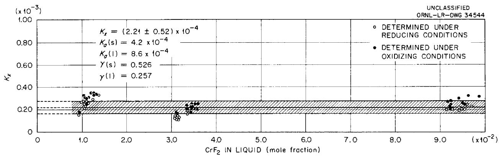  
Fig. 2.3.19. Equilibrium Quotients at $750^{\circ}\mathrm{C}$ of the Reaction $\mathsf{CrF}_2$ (d) + $\mathsf{H}_2$ (g) = Cr (s) + 2HF (g) in NaF-ZrF4 (53-47 mole %).

and

$$
\begin{array}{l} \operatorname {C r F} _ {2} (1) + \operatorname {H} _ {2} (g) \rightleftharpoons \operatorname {C r} (s) + \\ + 2 H F (g), K _ {a} (l) = 8. 6 \times 1 0 ^ {- 4}, \\ \end{array}
$$

yields values of activity coefficients of $\mathsf{CrF}_2$ of 0.53 and 0.26 with respect to the solid and liquid standard states respectively at $750^{\circ}C$ . The corresponding values at $850^{\circ}C$ (ref 27) are 0.28 and 0.18.

The results of this investigation and of the corresponding investigations of $\mathrm{NiF}_2$ and $\mathrm{FeF}_2$ and of the activities of chromium in alloys29 can now be applied to the study of corrosion of Inconel and INOR alloys, where it is believed that the rate of corrosion is diffusion controlled. Experiments might be carried out where corrosion would be induced by the passage of $\mathrm{HF - H_2}$ mixtures through salts in contact with the alloys. By controlling composition of the gas mixture it may be possible to attack the chromium without significant effects on iron or nickel corrosion.

# Equilibrium Amounts of $\mathsf{CrF}_2$ in Molten Salts Containing UF4 Which Are in Contact with Inconel

R. J. Sheil

R. B. Evans

The results of two previous investigations[29,30] have been combined to calculate the equilibrium amounts of $\mathsf{CrF}_2$ in two molten salts containing $\mathsf{UF}_4$ in contact with an infinitely thick Inconel container for an infinite period of time. The calculated values

are presented in Table 2.3.13 and in Fig. 2.3.20 as functions of temperature.

The following assumptions were made for the calculations:

1. All the $\mathbf{CrF}_2$ present at equilibrium resulted from the reaction

$$
C r ^ {o} + 2 U F _ {4} \rightleftharpoons 2 U F _ {3} + C r F _ {2}
$$

2. The activity coefficient for chromium in Inconel is independent of temperature and salt components. The value utilized was 0.563.[29]   
3. The average atom fraction of chromium in Inconel is 0.1688.   
4. The salt contained no $\mathsf{UF}_3$ or $\mathsf{CrF}_2$ , initially.   
5. The mean temperature which defined the equilibrium values corresponds to the balance-point31 temperature for polythermal flow systems.

Table 2.3.13. Equilibrium Amounts of Chromium in UF4-Containing Salts in Inconel   

<table><tr><td rowspan="2">Temperature (°F)</td><td colspan="2">Equilibrium Cr (ppm)</td></tr><tr><td>NaF-ZrF4-UF4(50-46-4 mole %)</td><td>LiF-BeF2-UF4(47.8-51.7-1.5 mole %)</td></tr><tr><td>1000</td><td>717</td><td>242</td></tr><tr><td>1100</td><td>785</td><td>345</td></tr><tr><td>1200</td><td>852</td><td>467</td></tr><tr><td>1300</td><td>920</td><td>600</td></tr><tr><td>1400</td><td>985</td><td>734</td></tr></table>

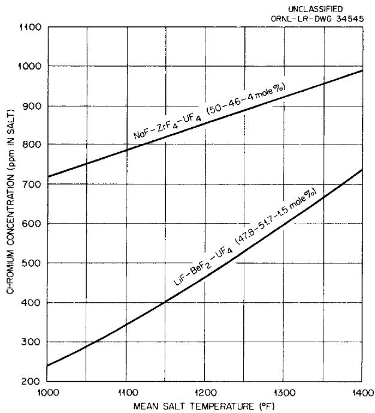  
Fig. 2.3.20. Calculated Equilibrium Amount of Chromium Present in UF4-Containing Salt in Inconel.

The chromium concentrations shown also represent the amounts of chromium metal which should be added to pre-equilibrate a salt prior to loop tests. Under this condition, the corrosion rates will depend only on the hot-to-cold-zone transfer mechanism. Such results will be highly indicative of the long-term corrosion rates to be expected in molten-salt reactors.

# Chromium Diffusion in Alloys

R.B.Evans R.J.Sheil W.M. Johnson

Studies of chromium diffusion in chromium-containing nickel-base alloys were continued along the lines described previously.32 New equipment is being developed for the depletion-method experiments that are based on the rate of loss of $\mathbf{Cr}^{51}$ (as $\mathbf{Cr}^{+4*}$ ) from a noncorrosive salt contained in the alloy being studied. The pots used in previous tests were costly, and the experimental procedures for their use were complicated. They were designed to assure a constant ratio of the salt-exposed area of the container to the salt volume $(A / V)$ . Capsules

are being designed to replace the pots, and equipment for testing several capsules simultaneously is being developed.

The constant-potential method was utilized further to prepare specimens for the study of the distribution of $\mathbf{Cr}^{51}$ within the alloy. In these investigations, measurements are made of the gain of $\mathbf{Cr}^{51}$ by a metal specimen exposed to molten salt containing a dissolved amount of chromium 51 (as $\mathbf{Cr}^{++*}$ ) that remains constant with time. It has been found that the results obtained by this method are extremely sensitive to the manner in which the specimens are prepared prior to the experiment.

The diffusion coefficients resulting from initial experiments, which were conducted with specimens which had been polished but not hydrogen fired, were one to two orders of magnitude higher than those obtained with specimens that had been polished and then hydrogen fired at 1100 to $1200^{\circ}\mathrm{C}$ for 3 hr. This information is of importance with respect to the use of tracers in corrosive media, since a large portion of the dynamic corrosion studies at ORNL are conducted in nonhydrogen-fired containers.

The over-all diffusion coefficients obtained to date, including data obtained by Gruzin and Fedorov $^{33}$ and by Price et al., $^{34}$ are presented as log $D$ vs $1 / T$ plots in Fig. 2.3.21. Little significance is attached to the low values for the hydrogen-fired specimens tested at 640 and $675^{\circ}C$ , since the radioactive count of the $\mathrm{Cr^{51}}$ was virtually at background level for these measurements.

The coefficients indicated at 750, 700, and $640^{\circ}C$ are based on the results of two or more determinations at each temperature. The data from which they were obtained are plotted on Fig. 2.3.22. The straight lines indicate that, with the exception of a small discrepancy around zero time, the square-root time law utilized for the calculations is valid.

Equipment for sectioning specimens by electropolishing techniques is now being developed jointly with members of the Dynamic Corrosion Group of the ORNL Metallurgy Division. The technique thus developed will be used for tracer studies of chromium diffusion phenomena in thermal-convection loops. It is felt that a comparison of diffusion coefficients

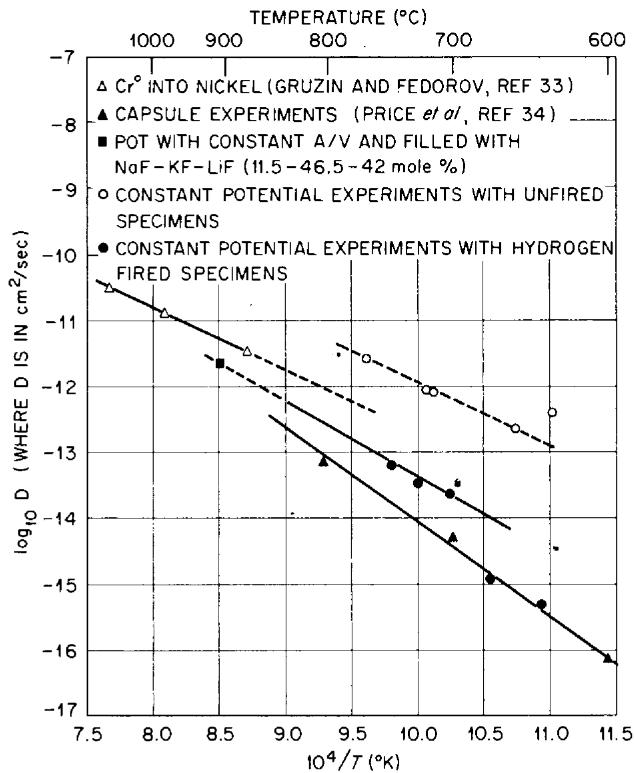  
UNCLASSIFIED ORNL-LR-DWG 34546   
Fig. 2.3.21. Current Results of Chromium Diffusion Experiments.

obtained from salt behavior with those obtained from distribution curves is essential to a complete understanding of the diffusional processes which take place within the metal. It is hoped that the results of these experiments will provide a means for predicting the void penetration distances to be expected for a given set of corrosion conditions.

# CORROSION OF METALS BY ALUMINUM CHLORIDE

R.E.Moore

# Corrosion of Inconel by Aluminum Chloride Vapor in a Fused Silica Container

Purified aluminum chloride vapor in a container of fused silica at $730^{\circ}C$ was found to have a very destructive effect on Inconel. The results of the experiment showed that the aluminum chloride had reacted with the silica to produce silicon tetrachloride, which attacked the metal. In essence, this experiment was a corrosion test of Inconel exposed to silicon tetrachloride rather than to aluminum chloride. Aluminum chloride should be much

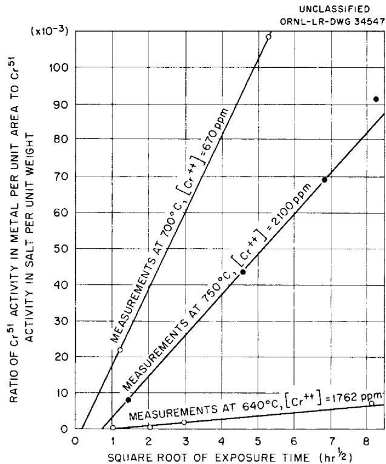  
Fig. 2.3.22. Time Dependence of Chromium Diffusion Data Obtained in Constant Potential Experiments.

more stable toward Inconel on the basis of free energies of formation. The three polished Inconel strips that were tested lost about $1\%$ in weight in 500 hr and were covered with a dull coating, which was identified by x-ray diffraction examination as mainly $\mathrm{Ni}_3\mathrm{Si}$ . Large amounts of chromous chloride and ferrous chloride, identified by x-ray and spectrographic examinations, were found in the aluminum chloride in the part of the apparatus that constituted the reservoir. This aluminum chloride reservoir had been held at about $180^{\circ}\mathrm{C}$ during the test in order to maintain a pressure of aluminum chloride of about 1 atm. A small amount of nickel was also found by analysis to be present in the aluminum chloride in the reservoir. A white coating on the fused silica was identified by x-ray diffraction as an aluminum silicate.

# Corrosion of Inconel by Aluminum Chloride Vapor in an All-Metal System

A further corrosion experiment was carried out with an all-metal system in order to avoid the formation of $\mathrm{SiCl}_4$ . Purified aluminum chloride gas was maintained in contact with the walls of an Inconel tube for 300 hr at $720^{\circ}\mathrm{C}$ . A copper metal

reservoir containing aluminum chloride, which was attached to the Inconel tube, was held at about $150^{\circ}C$ to maintain a pressure of aluminum chloride of about $125\mathrm{mmHg}$ during the test.

Metallographic examination35 of the metal showed the complete absence of subsurface voids. A photomicrograph of the test specimen (Fig. 2.3.23) shows very large grains to a depth of about 10 mils in comparison with the untreated fine-grained Inconel sample (Fig. 2.3.24). The grain growth, as well as the irregular nature of the surface, is probably a result of the heat treatment or hydrogen firing rather than the corrosive attack. Chemical analysis of the contents of the reservoir showed $3.0\mathrm{mg}$ chromium, $0.2\mathrm{mg}$ iron, and $0.5\mathrm{mg}$ nickel. As expected, chromium was attacked to a much greater extent than iron or nickel. The chromium in the reservoir represents attack on the Inconel of the equivalent of $0.024\mathrm{mil}$ over the $44\mathrm{-cm}^2$ surface area exposed to attack at $720^{\circ}\mathrm{C}$ . Considering the worst case and assuming that the reaction does not become diffusion controlled after the initial attack on the surface, the amount of attack would be proportional to

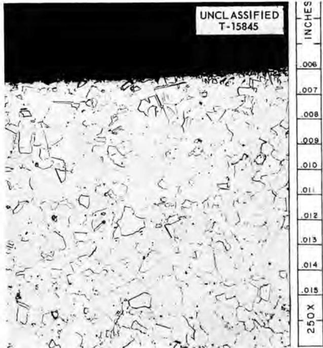  
Fig. 2.3.24. Tube Wall of Untreated Fine-Grained Inconel Test Specimen, 250X.

35 Examination performed by R. S. Crouse of the ORNL Metallurgy Division.

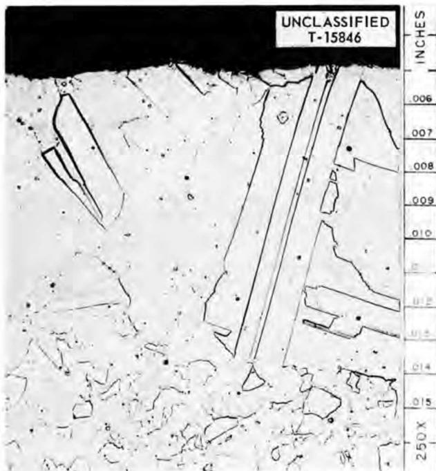  
Fig.2.3.23. Tube Wall of Inconel Test Specimen Which was Exposed to Aluminum Chloride Vapor for 300 hr at $720^{\circ}\mathrm{C}$ 250X.

the pressure of aluminum chloride and at 5 atm the corrosion after 300 hr would be about 0.7 mil.

# Significance of Experimental Results

The existence of a reservoir of aluminum chloride at a temperature of 150 to $200^{\circ}\mathrm{C}$ in a corrosion test is unfavorable because the relatively cold reservoir allows condensation of $\mathrm{NiCl}_2$ and $\mathrm{FeCl}_2$ . In future tests the container will be maintained at $650^{\circ}\mathrm{C}$ on one end and $450^{\circ}\mathrm{C}$ on the other end to duplicate actual conditions in a reactor. Also, the aluminum chloride pressure will be maintained at about 5 atm. Even though it is expected that $\mathrm{CrCl}_2$ will condense at $450^{\circ}\mathrm{C}$ from alloys containing chromium, the slight attack on Inconel found in the all-metal test described above is very encouraging. INOR-8, in which the activity of chromium is much lower than in Inconel, should prove quite resistant to aluminum chloride vapor. The corrosion of a number of metals, including nickel, steel, stainless steel, INOR-8, and Inconel, is under study.

# Theoretical Considerations of Aluminum Chloride Vapor Corrosion

Theoretical calculations of M. Blander and R. F. Newton (see following section) suggest that aluminum chloride vapor would be an excellent coolant

for a power reactor. Its primary advantage over other gas coolants is the large amount of heat which could be transferred by the reaction

$$
A I _ {2} C I _ {6} \rightleftharpoons 2 A I C I _ {3}
$$

in the vapor phase. An important consideration, however, in the practical use of aluminum chloride is a choice of a suitable container material so as to minimize corrosion.

The reactions of importance in corrosion of metals by aluminum chloride vapor are

$$
\begin{array}{l} 2 A I C l _ {3} + 3 M ^ {\circ} \rightleftharpoons 3 M C l _ {2} + 2 A I ^ {\circ} (1) \\ A I C I _ {3} + 2 A I ^ {\circ} \rightleftharpoons 3 A I C I (2) \\ A I C I _ {3} + M ^ {\circ} \rightleftharpoons A I C I + M C I _ {2} (3) \\ \end{array}
$$

In these equations M represents any component of a structural metal. Equation 3 was obtained by adding Eqs. 1 and 2.

For the case of a reactor operating at $650^{\circ}\mathrm{C}$ with the temperature of the heat exchanger at $450^{\circ}\mathrm{C}$ , equilibrium constants may be calculated for the equations given above for various components from values of free energies of formation given by Glassner. The principal uncertainty in such calculations is the extent of absorption of aluminum metal into the surface of the container as a solid solution.

Equation 3 should be the important reaction for most components of structural metals because the pressures of $\mathsf{MCl}_2$ calculated from this equation are higher than those calculated from Eq.1. The equilibrium pressure of AlCl in $\mathsf{AlCl}_3$ at 5 atm and $650^{\circ}\mathsf{C}$ in contact with aluminum metal is about 0.28 mm Hg. The equilibrium pressure of AlCl calculated from Eq. 3 for Fe, Cr, and Ni under the same conditions is very much less than 0.28 mm Hg. Hence, disproportionation of AlCl should occur only by the process of absorption of aluminum metal into the surface of the container. When this occurs there should be a reduction in pressures of $\mathsf{MCl}_2$ by reaction with the aluminum in the container.

The equilibrium pressures of AlCl and $\mathsf{MCl}_2$ at $450^{\circ}\mathsf{C}$ are less than those at $650^{\circ}\mathsf{C}$ . Thus, transfer of metal from the reactor core to the heat exchanger should take place.

Another important factor is the vapor pressure of $\mathsf{MCl}_2$ at $450^{\circ}\mathsf{C}$ . If the vapor pressure is lower than the equilibrium pressure from Eq. 3, $\mathsf{MCl}_2$ should deposit in the heat exchanger. Therefore, suitable metals for containing $\mathsf{AlCl}_3$ vapor should have the following characteristics: (1) a low oxidation-reduction equilibrium pressure for the metal chloride at $650^{\circ}\mathsf{C}$ and (2) a vapor pressure for the metal chloride at $450^{\circ}\mathsf{C}$ that is higher than the equilibrium pressure at $650^{\circ}\mathsf{C}$ .

# Structural Metal Considerations

Considerations of various possible components of structural metals has led to the following generalizations:

Chromium. - A high chromium content may be undesirable because the equilibrium pressure of $\mathrm{CrCl}_2$ at $650^{\circ}\mathrm{C}$ over an alloy such as Inconel or INOR-8 is much higher than the vapor pressure of $\mathrm{CrCl}_2$ at $450^{\circ}\mathrm{C}$ . The deposition of $\mathrm{CrCl}_2$ on the cooler walls of the heat exchanger might interfere with heat transfer.

Iron. - The equilibrium pressure of $\mathrm{FeCl}_2$ is somewhat less than that of $\mathrm{CrCl}_2$ , but the vapor pressure37 of $\mathrm{FeCl}_2$ at $450^{\circ}\mathrm{C}$ is higher than its equilibrium pressure at $650^{\circ}\mathrm{C}$ . Iron would therefore be expected to deposit in the heat exchanger as metal (Eq. 3) and not seriously interfere with heat transfer.

Nickel. - The equilibrium pressure of $\mathrm{NiCl}_2$ at $650^{\circ}\mathrm{C}$ is less than that of $\mathrm{FeCl}_2$ . The vapor pressure of $\mathrm{NiCl}_2$ at $450^{\circ}\mathrm{C}$ is probably high enough to preclude deposition of $\mathrm{NiCl}_2$ in the heat exchanger.

Manganese. - Manganese appears to be an undesirable component because of a very high equilibrium pressure of $\mathsf{MnCl}_2$ .

Molybdenum. - The equilibrium pressures of molybdenum chlorides are very low. Molybdenum should be a satisfactory component of a container metal.

These generalizations are based solely on equilibrium considerations and have no relation to rates of corrosion. After initial attack on the surface of an alloy the rate will probably be diffusion controlled, and it could be very slow.

# GASEOUS ALUMINUM CHLORIDE AS A HEAT EXCHANGE MEDIUM

M. Blander

R. F. Newton

Aluminum chloride has favorable and unique properties which make it, as a gas, a heat transfer medium of potential utility at high temperatures. Gases ordinarily transfer heat because of the lowering of their heat content upon cooling from a temperature $T_{2}$ to a temperature $T_{1}$ in a heat exchanger according to the equation

$$
H _ {2} - H _ {1} = \int_ {T _ {1}} ^ {T _ {2}} C _ {p} d T,
$$

where $H_{2} - H_{1}$ is the heat content increment and $C_{p}$ is the heat capacity of the gas at constant pressure. Aluminum chloride exists as a dimer $\mathrm{Al}_{2}\mathrm{Cl}_{6}$ at low temperatures and as a monomer $\mathrm{AlCl}_{3}$ at high temperatures. Because of the large number of atoms per molecule the heat capacity of the gas is high. Values of the heat capacities, of $\mathrm{Al}_{2}\mathrm{Cl}_{6}$ and of $\mathrm{AlCl}_{3}$ were estimated theoretically by statistical mechanical methods,[38] from the infrared vibrational frequencies measured or estimated by Klemperer.[39]

The values obtained were 42 cal/mole°C for $\mathrm{Al}_{2}\mathrm{Cl}_{6}$ and 19 cal/mole°C for $\mathrm{AlCl}_3$ . For ease of calculation the approximation was made that the heat capacity of $\mathrm{AlCl}_3$ was half that of $\mathrm{Al}_{2}\mathrm{Cl}_{6}$ , which was equivalent to assuming that the heat capacity of $\mathrm{AlCl}_3$ is 21 cal/mole°C. Table 2.3.14 presents comparisons of the heat transferred per mole of $\mathrm{Al}_{2}\mathrm{Cl}_{6}$ , $\mathrm{CO}_{2}$ , and He for various temperature intervals. On this basis alone, it may be seen from Table 2.3.14 that the heat transfer capacity of $\mathrm{Al}_{2}\mathrm{Cl}_{6}$ is high. A further mode of heat transfer is possible, however, since at high enough temperatures the major gaseous species is $\mathrm{AlCl}_3$ and at lower temperatures the major species is $\mathrm{Al}_{2}\mathrm{Cl}_{6}$ . Cooling the gas in a heat exchanger will remove, in addition to the heat obtained from the temperature change, the heat from the reaction

$$
2 \mathrm {A} | \mathrm {C l} _ {3} \rightleftharpoons \mathrm {A l} _ {2} \mathrm {C l} _ {6}.
$$

The heat content as a result of the dissociation reaction was calculated by using a value of 29.6 kcal for the heat change for the reaction and $34.6\mathrm{cal} / \circ \mathrm{C}$ for the entropy change, and the data are presented in Table 2.3.15. The heat changes per mole of $\mathsf{Al}_{2}\mathsf{Cl}_{6}$ from the reaction are given in column 5 of

Table 2.3.14. Heat Transfer Data for $\mathsf{Al}_2\mathsf{Cl}_{6'}$ , $\mathsf{CO}_{2'}$ and He for Several Temperature Intervals   

<table><tr><td>1</td><td>2</td><td>3</td><td>4</td><td>5</td><td>6</td><td>7</td></tr><tr><td rowspan="2">Temperature Interval (°C)</td><td colspan="3">Heat Change (kcal/mole)</td><td rowspan="2">Heat from Association of AICl3(kcal/mole)</td><td rowspan="2">Sum of Heat Changes, Columns 2 + 5 (kcal/mole)</td><td rowspan="2">Adjusted Heat Change, Column 6 Divided by (1 + x)* (kcal/mole)</td></tr><tr><td>Al2Cl6</td><td>CO2</td><td>He</td></tr><tr><td>450–1000</td><td>12.8</td><td>3.6</td><td>1.5</td><td>8.8</td><td>21.6</td><td>18.8</td></tr><tr><td>450–1300</td><td>19.8</td><td>5.7</td><td>2.3</td><td>25.1</td><td>44.9</td><td>31.7</td></tr><tr><td>750–1300</td><td>12.8</td><td>3.8</td><td>1.5</td><td>23.7</td><td>36.5</td><td>26.0</td></tr><tr><td>750–1000</td><td>5.8</td><td>1.7</td><td>0.7</td><td>7.4</td><td>13.2</td><td>11.2</td></tr><tr><td>1000–2000</td><td>23.3</td><td>7.3</td><td>2.8</td><td>20.6</td><td>43.9</td><td>26.6</td></tr><tr><td>1500–2000</td><td>11.7</td><td>3.8</td><td>1.4</td><td>1.4</td><td>13.1</td><td>6.6</td></tr><tr><td>1000–1500</td><td>11.3</td><td>3.6</td><td>1.4</td><td>19.2</td><td>30.9</td><td>19.0</td></tr><tr><td>1200–1500</td><td>7.0</td><td>2.2</td><td>0.8</td><td>6.7</td><td>13.7</td><td>7.5</td></tr></table>

Table 2.3.15. Dissociation of $\mathsf{Al}_2\mathsf{Cl}_6$ and Its Contribution to Heat Content   

<table><tr><td>Temperature (°F)</td><td>Temperature (°K)</td><td>Fraction of Gas Dissociation at One Atmosphere</td><td>Heat Content Due to Dissociation (kcal per formula weight of Al2Cl6)</td></tr><tr><td>450</td><td>505</td><td>0.001</td><td>0.03</td></tr><tr><td>750</td><td>672</td><td>0.05</td><td>1.48</td></tr><tr><td>1000</td><td>811</td><td>0.30</td><td>8.88</td></tr><tr><td>1200</td><td>922</td><td>0.725</td><td>21.46</td></tr><tr><td>1300</td><td>978</td><td>0.85</td><td>25.16</td></tr><tr><td>1500</td><td>1089</td><td>0.95</td><td>28.12</td></tr><tr><td>2000</td><td>1366</td><td>0.997</td><td>29.5</td></tr></table>

Table 2.3.14 for the stated temperature intervals. In column 6 of Table 2.3.14 are listed the sums of the heat changes resulting from cooling and the heat contribution from the dimerization. Since the number of moles of gas molecules in a forced-circulation loop is greater than that calculated if it is assumed that the gas is all $\mathrm{Al}_{2}\mathrm{Cl}_{6}$ , the values of the heat changes must be adjusted to obtain the heat change of the gas per mole of gas molecules. A crude adjustment can be made by dividing the heat change of column 6 by the number of moles of gas molecules at the average temperature of the interval stated. These values are listed in column 7 of Table 2.3.14. The large values of the heat transferred by this cycle of association and dissociation further enhance the possible utility of aluminum chloride as a heat transfer medium.

No measurement of viscosity or thermal conductivity of $\mathrm{AlCl}_3$ or $\mathrm{Al}_{2}\mathrm{Cl}_{6}$ appears to have been made. Values for these properties are needed in design of thermal-convection loops for the equilibrium mixture of these gases. Accordingly values for these properties have been estimated for the gases at 500 and $1000^{\circ}\mathrm{K}$ and at 1 atm pressure. These approximations are not claimed to be accurate and are presented only to serve as rough working figures for engineering calculations.

The calculations were performed as suggested by Hirschfelder, Curtiss, and Byrd,41 and it must be

emphasized that the theory used may be applied with real accuracy only to the very simplest of gases. The crudest model of a gas is an assembly of monatomic, noninteracting hard spheres. Hirschfelder et al. show the equations for viscosity, $\eta_{HS}$ , and thermal conductivity, $\lambda_{HS'}$ where the subscript HS indicates the hard sphere approximation, to be:

$$
\begin{array}{l} \eta_ {H S} = 2. 6 6 9 3 \times 1 0 ^ {- 5} \frac {\sqrt {M T}}{\bar {\sigma} ^ {2}}, g / c m \cdot s e c, (1) \\ \lambda_ {H S} = 1. 9 8 9 1 \times 1 0 ^ {- 4} \frac {\sqrt {T / M}}{\sigma^ {2}} = (2) \\ \frac {1 5}{4} \frac {R}{M} \eta , \mathrm {c a l / c m} ^ {\circ} C \cdot \sec , \\ \end{array}
$$

where

$$
\sigma = \text {m o l e c u l a r d i a m e t e r i n} \stackrel {\circ} {\mathrm {A}},
$$

$$
T = \text {t e m p e r a t u r e} ^ {\circ} K,
$$

$$
M = \text {g r a m}
$$

$$
R = \text {g a s}
$$

The molecular diameter may be estimated crudely for $\mathsf{Al}_{2}\mathsf{Cl}_{6}$ from electron diffraction data;42 structural estimates have been published for $\mathsf{AlCl}_3$ . The crude approximations which result from these calculations are presented in Table 2.3.16.

Application of the hard-sphere model to polyatomic molecules yields values for thermal conductivity which are too small. The transfer of energy

Table 2.3.16. Viscosity and Thermal Conductivity of $\mathsf{Al}_2\mathsf{Cl}_6$ and $\mathsf{AlCl}_3$ Calculated According to Hard-Sphere Approximation   

<table><tr><td rowspan="2"></td><td rowspan="2">σ2(Å2)</td><td colspan="2">Viscosity (g/cm·sec)</td><td colspan="2">Thermal Conductivity (cal/cm·°C·sec)</td></tr><tr><td>At 500°C</td><td>At 1000°C</td><td>At 500°C</td><td>At 1000°C</td></tr><tr><td></td><td></td><td>×10-6</td><td>×10-6</td><td>×10-6</td><td>×10-6</td></tr><tr><td>Al2Cl6</td><td>65</td><td>150</td><td>212</td><td>4.2</td><td>5.9</td></tr><tr><td>AICI3</td><td>40</td><td>172</td><td>243</td><td>9.3</td><td>13.6</td></tr></table>

to or from vibrational and rotational degrees of freedom (which are obviously missing in the hard-sphere case) permits greater heat transfer per collision for polyatomic molecules. The anharmonic vibrations of $\mathrm{AlCl}_3$ and $\mathrm{Al}_{2}\mathrm{Cl}_{6}$ and the relatively high temperatures for the system of interest make it likely that all the modes of vibration, rotation, and translation are near equilibrium at all times. If such equilibrium is attained, the Eucken correlation

$$
\lambda_ {E} = \lambda_ {H S} \left[ \frac {4}{1 5} \frac {C _ {\nu}}{R} + \frac {3}{5} \right], \tag {3}
$$

where $C_{\nu}$ is heat capacity at constant volume, $R$ is the gas constant, and $\lambda_{E}$ is the corrected thermal conductivity, is valid. Since $C_{\nu}$ is about 40 for $\mathrm{Al}_{2}\mathrm{Cl}_{6}$ and about 17 for $\mathrm{AlCl}_{3}$ , the $\lambda_{E} / \lambda_{HS}$ values are about 6 and 2.9 for the dimer and monomer, respectively. For $\mathrm{Al}_{2}\mathrm{Cl}_{6}$ the values for $\lambda_{E}$ are $24.3 \times 10^{-6}$ and $34.3 \times 10^{-6}$ cal/cm $^{\circ}$ C sec at 500 and $1000^{\circ}\mathrm{K}$ , respectively, and the corresponding values for $\mathrm{AlCl}_{3}$ are $27.1 \times 10^{-6}$ and $38.1 \times 10^{-6}$ , respectively.

The hard-sphere model must be further corrected, however, for effects of energetic interactions of the gas molecules (van der Waals forces, etc). These corrections take the form

$$
\eta = \frac {\eta_ {H S}}{\Omega}, \tag {4}
$$

$$
\lambda \simeq \frac {\lambda_ {E}}{\Omega}, \tag {5}
$$

where $\Omega$ , for the Lennard-Jones potential, can be calculated from first principles for potential functions of sufficient simplicity. Hirschfelder et al. tabulate values of $\Omega$ as a function of the parameter

$T^{\star}$ ,definedby

$$
T ^ {\star} = \frac {k T}{\epsilon}, \tag {6}
$$

where $k$ is the gas constant per molecule and $\epsilon$ is the depth of the Lennard-Jones potential well:

$$
\phi_ {(r)} = 4 \varepsilon \left[ \left(\frac {\sigma}{r}\right) ^ {1 2} - \left(\frac {\sigma}{r}\right) ^ {6} \right]. \tag {7}
$$

Unfortunately there is no way to estimate $\epsilon$ for $\mathsf{Al}_2\mathsf{Cl}_6$ or $\mathsf{AlCl}_3$ . However, Hirschfelder et al. list values of $\epsilon / k$ for a variety of substances. The values for halogen-containing substances range from 324 for Hl to 1550 for $\mathsf{SnCl}_4$ . If these limits for $\epsilon / k$ are used, the values for $T^{\star}$ and $\Omega$ shown in Table 2.3.17 result. These values indicate that $\eta$ and $\lambda$ are smaller than $\eta_{\mathsf{H}5}$ and $\lambda_E$ by a factor less than 3. A value of 2 for $\Omega$ was, accordingly, chosen arbitrarily, and the resulting reasonable estimates of viscosity and thermal conductivity for dimer and monomer of aluminum chloride are presented in Table 2.3.18.

Table 2.3.17. Probable Limits for Lennard-Jones Potential Function   

<table><tr><td>Temperature (℃K)</td><td>ε/k</td><td>T*</td><td>Ω</td></tr><tr><td rowspan="2">500</td><td>324</td><td>1.5</td><td>1.3</td></tr><tr><td>1550</td><td>0.32</td><td>2.7</td></tr><tr><td rowspan="2">1000</td><td>324</td><td>3.09</td><td>1.0</td></tr><tr><td>1550</td><td>0.65</td><td>2.0</td></tr></table>

Table 2.3.18. Estimated Values for Viscosity and Thermal Conductivity of $\mathsf{Al}_{2}\mathsf{Cl}_{6}$ and $\mathsf{AlCl}_3$   

<table><tr><td></td><td colspan="2">Viscosity (g/cm·sec)</td><td colspan="2">Thermal Conductivity (cal/cm·°C·sec)</td></tr><tr><td></td><td>At 500°K</td><td>At 1000°K</td><td>At 500°K</td><td>At 1000°K</td></tr><tr><td></td><td>×10-6</td><td>×10-6</td><td>×10-6</td><td>×10-6</td></tr><tr><td>Al2Cl6</td><td>75</td><td>106</td><td>12.2</td><td>17.2</td></tr><tr><td>AlCl3</td><td>86</td><td>122</td><td>13.6</td><td>19.1</td></tr></table>

Substances which dimerize have, at temperatures at which there is an appreciable fraction of both monomer and dimer, a higher effective thermal conductivity than a gas whose composition is invariant with temperature.43-45 This increased thermal conductivity is a result of the change of the equilibrium constant for the association with temperature. Theoretical calculations44 for this effect yielded the equation

$$
\lambda_ {e} = \lambda_ {f} + \frac {\Delta H ^ {2}}{R T ^ {2}} \frac {D _ {A B} P}{R ^ {\prime} T} \frac {W _ {A} W _ {B}}{2}, \tag {8}
$$

where $\lambda_{e}$ is the effective thermal conductivity, $\lambda_{f}$ is the "irozen" thermal conductivity calculated in

the usual manner46 by assuming a constant composition for a change of temperature, $\Delta H$ is the heat of dimerization, $D_{AB}$ is the interdiffusion coefficient of the dimer $A$ and monomer $B$ , $P$ is the gas pressure, $W_{A}$ and $W_{B}$ are the weight fractions of dimer and monomer, $R$ and $R^{\prime}$ are the gas constants in the different units required, and $T$ is the temperature. The interdiffusion coefficient $D_{AB}P$ may be estimated from the equation

$$
D _ {A B} P = \frac {0 . 0 0 2 6 2 8 0 \sqrt {T ^ {3} \left[ \left(M _ {A} + M _ {B}\right) / 2 M _ {A} M _ {B} \right]}}{\sigma_ {A B} ^ {2} \Omega^ {\prime}} \tag {9}
$$

where $M_A$ and $M_B$ are the molecular weights of the dimer and monomer, $\sigma_{AB}$ is the sum of the collision radii for dimer and monomer, where $\sigma_{AB} = \frac{1}{2} (\sigma_A + \sigma_B)$ , and $\Omega'$ is a correction parameter similar to that described in Eqs. 4 and 5 above and which can be calculated for simple potential functions. It does not differ greatly from $\Omega$ (ref 48). The values of the parameters chosen for the calculations described below were: $\Delta H = 29.6\mathrm{kcal}, M_B = 133.4, \sigma_A = 8.06\mathring{\mathrm{A}}, \sigma_B = 6.32\mathring{\mathrm{A}}, \sigma_{AB} = 7.19\mathring{\mathrm{A}}$ , and $\Omega' = 2$ . Some of the calculated values of $D_{AB}P$ and $D_{AB}P\Delta H^2/RR'T^3$ for several temperatures are given in Table 2.3.19.

Values of the weight fractions of the two gaseous species can be calculated from the equilibrium constant for the dimerization. These were calculated,

Table 2.3.19. Calculated Effective Thermal Conductivities of Aluminum Chloride $(\lambda_{e})$ and Some Parameters Needed in the Calculations   

<table><tr><td rowspan="2">Temperature (°K)</td><td rowspan="2">\( {D}_{AB}P \) [(cm2/sec).atm]</td><td rowspan="2">\( {D}_{{AB}}{P\Delta }{H}^{2} \) \( R{R}^{\prime }{T}^{3} \)</td><td rowspan="2">\( {W}_{B} \) for \( P = {4.4}\mathrm{\;{atm}} \)</td><td rowspan="2">\( {W}_{B} \) for \( P = {10}\mathrm{\;{atm}} \)</td><td colspan="5">Thermal Conductivities (cal/cm·deg·sec)</td></tr><tr><td>\( {\lambda }_{e} - {\lambda }_{f} \) for \( P = {4.4}\mathrm{\;{atm}} \)</td><td>\( {\lambda }_{e} - {\lambda }_{f} \) for \( P = {10}\mathrm{\;{atm}} \)</td><td>Average* \( {\lambda }_{f} \)</td><td>\( {\lambda }_{e} \) for \( P = {4.4}\mathrm{\;{atm}} \)</td><td>\( {\lambda }_{e} \) for \( P = {10}\mathrm{\;{atm}} \)</td></tr><tr><td></td><td>\( \times  {10}^{-3} \)</td><td>\( \times  {10}^{-3} \)</td><td></td><td></td><td>\( \times  {10}^{-6} \)</td><td>\( \times  {10}^{-6} \)</td><td>\( \times  {10}^{-6} \)</td><td>\( \times  {10}^{-6} \)</td><td>\( \times  {10}^{-6} \)</td></tr><tr><td>500</td><td>21.4</td><td>0.92</td><td>\( 5 \times  {10}^{-4} \)</td><td>\( {3.2} \times  {10}^{-4} \)</td><td>&lt;0.1</td><td>&lt;0.1</td><td>12</td><td>12</td><td>12</td></tr><tr><td>600</td><td>28.1</td><td>0.70</td><td>\( 6 \times  {10}^{-3} \)</td><td>\( {3.9} \times  {10}^{-3} \)</td><td>2</td><td>1</td><td>13</td><td>15</td><td>14</td></tr><tr><td>700</td><td>35.4</td><td>0.56</td><td>\( {3.5} \times  {10}^{-2} \)</td><td>\( {2.3} \times  {10}^{-2} \)</td><td>10</td><td>6</td><td>14</td><td>24</td><td>20</td></tr><tr><td>800</td><td>40.3</td><td>0.42</td><td>0.13</td><td>0.087</td><td>24</td><td>15</td><td>16</td><td>40</td><td>31</td></tr><tr><td>900</td><td>51.6</td><td>0.38</td><td>0.35</td><td>0.24</td><td>43</td><td>35</td><td>17</td><td>60</td><td>52</td></tr><tr><td>1000</td><td>60.5</td><td>0.33</td><td>0.65</td><td>0.49</td><td>38</td><td>41</td><td>18</td><td>56</td><td>59</td></tr><tr><td>1100</td><td>69.3</td><td>0.28</td><td>0.86</td><td>0.74</td><td>17</td><td>27</td><td>20</td><td>37</td><td>47</td></tr></table>

as before, by using a value of 29.6 kcal for the heat of dimerization and 34.6 cal/°C for the entropy of dimerization in the equation

$$
\Delta F ^ {\circ} = \Delta H - T \Delta S ^ {\circ} = - R T \ln K \tag {10}
$$

The calculated weight fractions of monomer are listed in columns 4 and 5 of Table 2.3.19 for total pressures of 4.4 and 10 atm, respectively. Columns 6 and 7 list the contribution to the thermal conductivity from the dimerization process at each of the two pressures, 4.4 and 10 atm. These values are to be added to the "frozen" thermal conductivity given in column 8. The calculated values of $\lambda_{e}$ are given in the last two columns of the table. It is to be noted that the largest values of the thermal conductivity are for compositions which exhibit the largest change of composition with temperature, and hence at temperatures at which there is the fastest release of the "chemical" heat of association. Such results are a consequence of the theory and lead to the result that within the range that the "chemical" heat is available, the average effective heat conductivity is about $80\%$ of the maximum value. Thus the most effective temperature range for the utilization of $\mathrm{AlCl}_3$ as a heat transfer medium is limited to temperatures for which the composition of the vapor still has an appreciable fraction of both monomer and dimer (that is, at least $5\%$ of either). The effective thermal conductivities and effective heat capacities are not very different from the "frozen" values outside this range.

These calculations contain many approximations. Although an attempt was made to be conservative in these estimates, they should be used only as tentative working figures until experimental measurements can be made.

# PERMEABILITY OF GRAPHITE BY MOLTEN FLUORIDE SALTS

G. J. Nessle

J. E. Eorgan

Tests of the penetration of graphite by molten salts were continued. Graphite rod specimens $\gamma_{4}, \gamma_{2}$ , and 1 in. in diameter, prepared as described previously,49 were outgassed and then immersed in NaF-KF-LiF (11.5-46.5-42 mole %) at $1700^{\circ} \mathrm{F}$ for a specific length of time. The weight gains of the graphite in this medium are

compared in Table 2.3.20 with similar data for graphite tested in LiF-MgF $_2$ (67.5-32.5 mole %). The NaF-LiF-KF mixture has a lower density and a lower viscosity than the LiF-MgF $_2$ mixture.

It may be seen from the data in Table 2.3.20 that NaF-LiF-KF penetrated the graphite to a greater extent than did the LiF-MgF $_2$ mixture. Chemical analyses of machined cuttings from the $\frac{1}{2}$ - and 1-in. rods exposed to NaF-LiF-KF indicated uniform penetration of the salt to the center of the rods, as was found to be the case with the LiF-MgF $_2$ mixture.

Table 2.3.20. Weight Gains of Graphite Exposed to Fused Salts   

<table><tr><td rowspan="2">Rod Diameter (in.)</td><td colspan="2">Average Net Weight Gain of Graphite Rod (%)</td></tr><tr><td>In NaF-LiF-KF (11.5-46.5-42 mole %)</td><td>In LiF-MgF2(67.5-32.5 mole %)</td></tr><tr><td>1/4</td><td>9.1</td><td>6.8</td></tr><tr><td>1/2</td><td>9.8</td><td>7.5</td></tr><tr><td>1</td><td>11.6</td><td>8.4</td></tr></table>

# PREPARATION OF PURIFIED MATERIALS

J. P. Blakely

G.J.Nessle

F. F. Blankenship

# Preparation of Pure Fluoride Compounds

B. J. Sturm

Further attention was given to the problem of preparing anhydrous chromous fluoride for use in research related to corrosion problems with fused fluorides. Chromous fluoride resulting from the hydrogen reduction of chromic fluoride is contaminated with chromium metal, while that made from ammonium hexafluochromate (III) usually contains chromium nitride. A difficult recrystallization is necessary to purify these products. The product of the reaction of stannous fluoride with anhydrous chromic chloride is contaminated with chloride.[50]

A different method of preparing chromous fluoride was therefore explored. Stannous fluoride was

heated with granulated chromium metal to over $1100^{\circ}C$ and the molten material was allowed to stand at this temperature for a few hours. The products were chromous fluoride and tin metal in well-defined layers that were easily separated. The reaction is

$$
\mathrm {S n F} _ {2} + \mathrm {C r} \longrightarrow \mathrm {C r F} _ {2} + \mathrm {S n}
$$

The chromium-containing portion had the crystallographic properties of pure chromous fluoride.51 The chemical analysis of the material was in good agreement with the theoretical analysis. Microscopic observation showed the product to be free of opaque material, and thus the absence of free metal is indicated.

In cooperation with the ORNL Isotopes Division, vanadium trifluoride was prepared by thermal decomposition at about $500^{\circ}\mathrm{C}$ of ammonium hexafluovanadate (III) made by fusing ammonium bifluoride with vanadium trioxide. This method is more convenient than the usual hydrofluorination procedures.

Fusion of ammonium bifluoride with hydrated ferric fluoride formed ammonium hexafluoferrate (III) of the same crystallographic properties as those reported for the aqueous preparation.53 The crystals were isotropic with a refractive index of 1.444. Thermal decomposition at about $500^{\circ}C$ in a helium atmosphere yielded ferrous fluoride according to the equation

$$
6 \left(\mathrm {N H} _ {4}\right) _ {3} \mathrm {F e F} _ {6} \rightarrow 6 \mathrm {F e F} _ {2} + 1 6 \mathrm {N H} _ {3} ^ {\uparrow} + 2 4 \mathrm {H F} ^ {\uparrow} + \mathrm {N} _ {2} ^ {\uparrow}
$$

# Production-Scale Operations

J. E. Eorgan

The production facility was activated for approximately 5 weeks of the quarter to process 9 batches of various beryllium compositions to be used in component tests. Since the purification process used for $\mathsf{ZrF}_4$ mixtures is not adequate for oxide removal from these compositions, the procedure was modified and extended to allow longer hydrofluorination time. In brief, the procedure consists of melting the blended salts, without the UF $^4$

and/or $\mathsf{ThF}_4$ component, under an HF atmosphere, and treating the barren melt, at $1500^{\circ}\mathsf{F}$ , first with $\mathsf{H}_2$ for 2 hr and then with HF for 12 hr. The melt is then cooled to below freezing (about $400^{\circ}\mathsf{F}$ ), and the $\mathsf{UF}_4$ and/or $\mathsf{ThF}_4$ is added. The melt is then reheated to $1500^{\circ}\mathsf{F}$ and treated with HF for an additional 4 hr. The melt is then stripped with $\mathsf{H}_2$ gas until chemical analyses of periodic "thief" samples indicate the batch to be acceptable.

The 9 batches processed included the six different compositions listed in Table 2.3.21. The analyses of the final batches are given in Table 2.3.22.

Batch 1149, for which the analysis showed 1140 ppm of Fe, is being rechecked and if necessary will be reprocessed or replaced before use.

Copper-lined stainless steel reaction vessels and copper thermocouple wells and dip legs were used during this operation of the production facility, because the relatively high sulfur content of the beryllium fluoride had previously caused frequent failures of nickel thermocouple wells and dip legs. The copper dip leg was replaced with a nickel dip leg when a batch was completed and was to be transferred to a storage vessel. No failures of thermocouple wells or dip legs occurred during this operation.

# Experimental-Scale Operations

C. R. Croft

J. Truitt

Eleven small batches totaling approximately $88\mathrm{kg}$ were processed for use in small-scale corrosion tests and physical property studies. Some of the small-scale units are being modified to permit their use in a thorough investigation of the graphite permeability problem.

Table 2.3.21. Beryllium-Containing Mixtures Prepared for Experimentation   

<table><tr><td rowspan="2">Composition No.</td><td colspan="5">Constituents (mole %)</td></tr><tr><td>UF4</td><td>ThF4</td><td>BeF2</td><td>LiF</td><td>NaF</td></tr><tr><td>123</td><td>1</td><td></td><td>46</td><td></td><td>53</td></tr><tr><td>124</td><td></td><td>7</td><td>35</td><td></td><td>58</td></tr><tr><td>130</td><td>1</td><td></td><td>37</td><td>62</td><td></td></tr><tr><td>133</td><td></td><td>13</td><td>16</td><td>71</td><td></td></tr><tr><td>134</td><td>0.5</td><td>1</td><td>36.5</td><td>62</td><td></td></tr><tr><td>135</td><td>0.5</td><td>1</td><td>45.5</td><td></td><td>53</td></tr></table>

Table 2.3.22. Analyses of Production Facility Batches of Beryllium-Containing Mixtures   

<table><tr><td rowspan="2">Batch No.</td><td rowspan="2">Composition No.</td><td colspan="6">Major Constituents (wt %)</td><td colspan="4">Minor Impurities (ppm)</td></tr><tr><td>U</td><td>Th</td><td>Be</td><td>F</td><td>Li</td><td>Na</td><td>Ni</td><td>Cr</td><td>Fe</td><td>S</td></tr><tr><td>1142</td><td>130</td><td>5.02</td><td></td><td>9.22</td><td>73.4</td><td>12.1</td><td></td><td>40</td><td>220</td><td>70</td><td>2</td></tr><tr><td>1143</td><td>134</td><td>3.14</td><td>5.27</td><td>9.34</td><td>71.3</td><td>11.2</td><td></td><td>65</td><td>250</td><td>335</td><td>2</td></tr><tr><td>1144</td><td>134</td><td>3.24</td><td>5.86</td><td>8.82</td><td>70.5</td><td>11.2</td><td></td><td>100</td><td>150</td><td>95</td><td>6</td></tr><tr><td>1145</td><td>133</td><td></td><td>46.5</td><td>1.76</td><td>43.9</td><td>7.76</td><td></td><td>45</td><td>65</td><td>190</td><td>2</td></tr><tr><td>1146</td><td>134</td><td>3.50</td><td>5.88</td><td></td><td></td><td></td><td></td><td>70</td><td>210</td><td>150</td><td>2</td></tr><tr><td>1147</td><td>124</td><td></td><td>26.8</td><td>4.80</td><td>47.0</td><td></td><td>21.6</td><td>65</td><td>15</td><td>65</td><td>2</td></tr><tr><td>1148</td><td>135</td><td>2.47</td><td>3.76</td><td></td><td>58.4</td><td></td><td>27.3</td><td>20</td><td>60</td><td>205</td><td>35</td></tr><tr><td>1149</td><td>123</td><td>3.61</td><td></td><td>8.83</td><td>61.2</td><td></td><td>27.0</td><td>100</td><td>65</td><td>1140</td><td>6</td></tr></table>

# 2.4. FUEL PROCESSING

M. R. Bennett

D. O. Campbell

G. I. Cathers

Chemical Technology Division

Chemical processing of the fuel and blanket salts of a molten-salt reactor will be required in order to remove the neutron poisons and transuranic elements and to prepare the fissionable materials and the solvents for recycling. The fluoride volatilization process, which was developed for heterogeneous reactor fuel processing and was used successfully for recovery of the uranium from the fuel mixture $(\mathrm{NaF - ZrF_4 - UF_4})$ circulated in the Aircraft Reactor Experiment (ARE), appears to be applicable to processing fuels of the type now being considered for the molten-salt reactor.1 Sufficient laboratory work has been done to confirm that fluorination of the fuel salts LiF-BeF2-UF4 or LiF-BeF2-UF4-ThF4 results in good recovery of the uranium.

Developmental work has also been initiated on the processing of the solvent salt to prepare it for recycling. The salt-recovery process is based on the solubility of $\mathsf{LiF - BeF}_2$ in highly concentrated aqueous HF (70-100%) and the insolubility of rare-earth and other polyvalent-element fluorides, which results in the recovered salt being decontaminated from the important rare-earth neutron poisons.

# FLowsheet FOR FLUORIDE VOLATILITY AND HF DISSOLUTION PROCESSING OF MOLTEN-SALT REACTOR FLUIDS

A tentative flowsheet for application of the fluoride volatility and HF dissolution processes to molten-salt reactor fluids has been prepared (Fig. 2.4.1). In this system the uranium is separated from the salt as $\mathsf{UF}_6$ before HF dissolution of the salt, although the reverse system also seems to be feasible. The LiF-BeF $_2$ salt is then dissolved in concentrated HF ( $>90\%$ HF) for separation from the rare-earth neutron poisons. The salt is reformed in a flash evaporation step, from which it proceeds to a final makeup and purification step. This last step would perhaps involve the $\mathsf{H}_2$ and HF treatment now believed to be necessary for all salt recycled to a reactor.

Some of the specific features of the process are to be investigated. For example, a high solubility of $\mathsf{UF}_4$ in aqueous HF would eliminate the need for the volatilization step, except for final recovery. This possibility appears to be unlikely, however, in view of the low solubility of many tri- and quadri-valent elements. The solubilities of corrosion-product fluorides are to be determined; a method for recovering thorium from the waste salt is needed; and a study is to be made of the behavior of plutonium, neptunium, and protactinium in the process steps. Experience in the laboratory and in ARE volatility pilot plant operations has shown that the recycled UF $_6$ is highly decontaminated from plutonium.

# EXPERIMENTAL STUDIES OF VOLATILITY STEP

A series of small-scale fluorination was carried out with a 48 mole $\%$ LiF-52 mole $\%$ BeF $_2$ eutectic mixture containing 0.8 mole $\%$ UF $_4$ . (MSR fuel will contain from 0.25 to 1.0 mole $\%$ UF $_{4'}$ , depending on the operating time.) The eutectic salt was used instead of the fuel salt in order to permit operation at lower temperatures. Fluorinations at 450, 500, and $550^{\circ}\mathrm{C}$ indicated that the rate of uranium removal increased with the temperature (Table 2.4.1). It is not known whether the increased fluorination time apparently required for quantitative uranium recovery at the lower temperature was compensated for by a decreased corrosion rate.

The thorium-containing blanket salt cannot be processed at so low a temperature as that used to process the fuel salt. The uranium concentration in the blanket, however, is very low; it has been estimated that with continuous processing at the rate of one blanket volume per year, the blanket salt $(\text{LiF}-\text{BeF}_2\cdot\text{ThF}_4, 71-16-13 \text{ mole}\%)$ will contain approximately $0.004 \text{ mole}\% \text{ UF}_4$ after one year and $0.014 \text{ mole}\% \text{ UF}_4$ after 20 years. Fluorinations of

UNCLASSIFIED

ORNL-LR-DWG 28749A

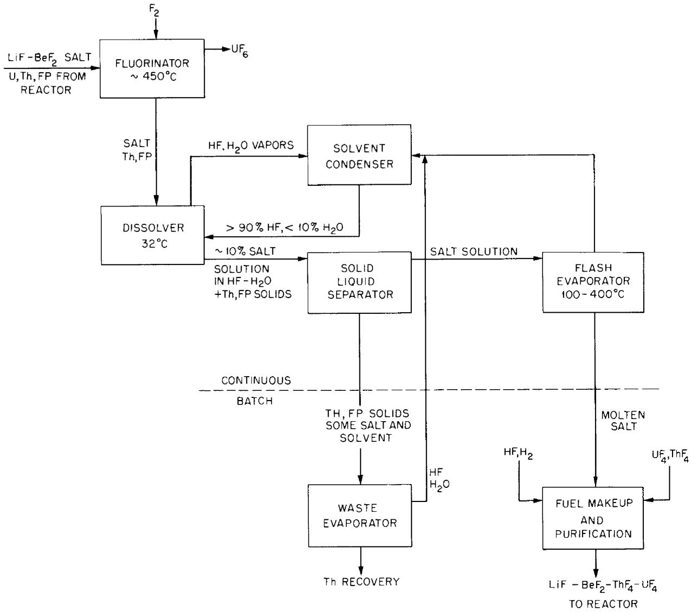  
Fig. 2.4.1. Tentative Flowsheet for Fluoride Volatility and HF Dissolution Processing of Molten-Salt Reactor Fuel.

two such mixtures at $600^{\circ}C$ for 90 min gave uranium concentrations in the salt of 0.0001 to 0.0002 wt $\%$ which were the lowest uranium concentrations ever observed in laboratory fluorinations. Over $90\%$ of the uranium was removed in 15 min. It is concluded therefore that fluorination of uranium from the blanket salt offers no problem.

The behavior of protactinium in the blanket salt during fluorination is of interest, although the protactinium is not lost, in any case, since the salt is returned to the reactor. A LiF-BeF2.ThF4 (71-16-

13 mole %) mixture containing sufficient irradiated thorium to give a Pa $^{233}$ concentration of $5.5 \times 10^{-9}$ g per gram of salt was fluorinated for 150 min at $600^{\circ} \mathrm{C}$ ; no measurable decrease in protactinium activity in the salt was observed. Protactinium volatilization in the process seems to be unlikely, but the protactinium concentration in the blanket of the reference design reactor is $\sim 10^{-4}$ g per gram of salt, which is $2 \times 10^{4}$ times larger than the quantity used in the experiments. Further tests will therefore be required for a definite conclusion regarding volatility.

Table 2.4.1. Effect of Fluorination Temperature on the Fluorination of Uranium from LiF-BeF $_2$ (48-52 Mole %)*   

<table><tr><td rowspan="2">Fluorination Time (hr)</td><td colspan="3">Uranium in Salt (wt %) After Treatment</td></tr><tr><td>At 450°C</td><td>At 500°C</td><td>At 550°C</td></tr><tr><td>0</td><td>3.39**</td><td>5.10</td><td>4.91</td></tr><tr><td>0.5</td><td>1.96</td><td>0.20</td><td>0.55</td></tr><tr><td>1.0</td><td>0.39</td><td>0.17</td><td>0.20</td></tr><tr><td>1.5</td><td>0.21</td><td>0.12</td><td>0.06</td></tr><tr><td>2.5</td><td>0.32</td><td>0.11</td><td>0.05</td></tr></table>

*No induction period before uranium evolution.   
$\star \star 5$ wt % added; some of the uranium probably precipitated as oxide.

# SOLUBILITIES OF LiF-BeF $_2$ SALTS IN AQUEOUS HF

Initial measurements of the solubilities of LiF and $\mathsf{BeF}_2$ , separately, in aqueous HF solutions indicated that both materials are soluble to an appreciable extent in solutions containing 70 to 90 wt % HF (Tables 2.4.2 and 2.4.3). In general, LiF is more soluble than $\mathsf{BeF}_2$ at higher temperatures, but the effect of temperature on $\mathsf{BeF}_2$ solubility was not definitely established. In fact, it is thought that some of these preliminary values for beryllium solubility are too low. The LiF solubility decreases rapidly as water is added to anhydrous HF, and the $\mathsf{BeF}_2$ solubility increases from near zero; the solubilities are roughly the same in 80 wt % HF, being about 25 to 30 g/liter. The $\mathsf{BeF}_2$ was quite glassy in appearance and was slow in dissolving. The solubility values reported for LiF in Table 2.4.2, except those at $12^{\circ}\mathsf{C}$ , were obtained after refluxing HF over the salt for 3 hr. No further measurements were made with LiF or $\mathsf{BeF}_2$ alone, since the solubilities of the two components together were of primary importance.

The $\mathsf{BeF}_2$ solubility was measured in nominal 70, 80, and 90 wt $\%$ HF containing a known amount of LiF that was below the solubility limit. The results of these measurements (Table 2.4.4) show a marked increase in $\mathsf{BeF}_2$ solubility with LiF present, as compared with the results given in Table 2.4.3.

Values obtained for the solubilities of LiF and $\mathsf{BeF}_2$ in solutions saturated with both salts are

Table 2.4.2. Solubility of LiF in Aqueous HF Solutions   

<table><tr><td rowspan="3">Temperature (°C)</td><td colspan="5">LiF in Solution (mg/g of solution)</td></tr><tr><td colspan="5">HF Concentration in Solvent (wt %)</td></tr><tr><td>73.6</td><td>82.3</td><td>90.8</td><td>96.2</td><td>100</td></tr><tr><td>12</td><td>10.7</td><td>31.7</td><td>58.4</td><td>74.8</td><td>88.2</td></tr><tr><td>62*</td><td>20.6</td><td></td><td></td><td></td><td></td></tr><tr><td>47*</td><td></td><td>41.0</td><td></td><td></td><td></td></tr><tr><td>37*</td><td></td><td></td><td>62.8</td><td>80.4</td><td></td></tr><tr><td>32.5*</td><td></td><td></td><td></td><td></td><td>91.4</td></tr></table>

*Reflux temperature.

Table 2.4.3. Solubility of $\mathsf{BeF}_2$ in Aqueous HF Solution   

<table><tr><td rowspan="3">Temperature (°C)</td><td colspan="5">BeF2in Solution (mg/g of solution)</td></tr><tr><td colspan="5">HF Concentration in Solvent (wt %)</td></tr><tr><td>72.8</td><td>78.3</td><td>90.8</td><td>95.2</td><td>100</td></tr><tr><td>12</td><td>45.8</td><td>26.3</td><td>9.2</td><td>2.8</td><td>0.0012</td></tr><tr><td>-60</td><td></td><td></td><td></td><td>3.8</td><td></td></tr></table>

Table 2.4.4. Solubility of $\mathsf{BeF}_2$ in Aqueous HF Containing LiF   

<table><tr><td rowspan="3">Temperature (℃)</td><td rowspan="3">LiF Added (mg/g of solvent)</td><td colspan="3">BeF2in Solution (mg/g of solution)</td></tr><tr><td colspan="3">HF Concentration in Solvent (wt %)</td></tr><tr><td>68.6</td><td>79.5</td><td>90.0</td></tr><tr><td>12</td><td>7.0</td><td>68.8</td><td></td><td></td></tr><tr><td>12</td><td>15.0</td><td></td><td>42.8</td><td>15.6</td></tr><tr><td>-60</td><td>7.0</td><td>65.8</td><td></td><td></td></tr><tr><td>-60</td><td>15.0</td><td></td><td>38.2</td><td>16.5</td></tr></table>

presented in Table 2.4.5. Comparison with the previous results indicates again that LiF strongly increases the solubility of $\mathsf{BeF}_2$ ; a plot of the $\mathsf{BeF}_2$ solubilities (Fig. 2.4.2) clearly demonstrates this. The presence of $\mathsf{BeF}_2$ appears to increase the LiF solubility, but to a smaller extent; this effect may

Table 2.4.5. Solubility of LIF and $\mathsf{BeF}_2$ in Aqueous HF Saturated with Both Salts   

<table><tr><td rowspan="4">Temperature (°C)</td><td colspan="6">Salt in Solution (mg/g of solution)</td></tr><tr><td colspan="6">HF Concentration in Solvent (wt %)</td></tr><tr><td colspan="2">68.6</td><td colspan="2">79.5</td><td colspan="2">90.0</td></tr><tr><td>LiF</td><td>BeF2</td><td>LiF</td><td>BeF2</td><td>LiF</td><td>BeF2</td></tr><tr><td>12</td><td>12.9</td><td>82.4</td><td>29.9</td><td>53.8</td><td>64.2</td><td>48.2</td></tr><tr><td>-60</td><td>8.5</td><td>76.8</td><td>22.6</td><td>54.2</td><td>46.0</td><td>58.2</td></tr></table>

be more apparent in more dilute HF where the LiF solubility is lower and the $\mathsf{BeF}_2$ solubility is higher.

Because of the increase in $\mathsf{BeF}_2$ solubility in the higher HF concentrations when LiF is present, the 90 to 100 wt % HF range was studied further. It was expected that the more nearly anhydrous system would present fewer complications resulting from hydrolysis. The solubilities obtained in 90 to 100 wt % HF saturated with both LiF and $\mathsf{BeF}_2$ are presented in Table 2.4.6. Measurements were made at the reflux temperatures indicated, at $12^{\circ}\mathsf{C}$ , and at $-60^{\circ}\mathsf{C}$ ; in some cases, the measurements at $-60^{\circ}\mathsf{C}$ were probably taken without the system being at equilibrium. The $\mathsf{BeF}_2$ solubility is appreciable even in anhydrous HF in the presence of a large concentration of LiF, in marked contrast to the solubility in the absence of LiF. Thus solubilities

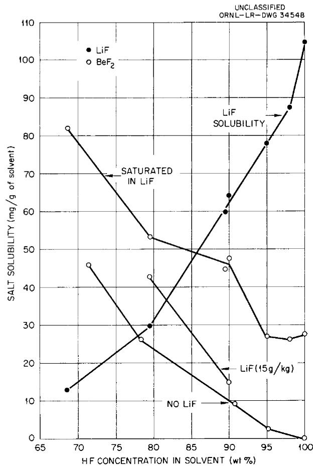  
Fig. 2.4.2. Effect of LiF on $\mathsf{BeF}_2$ Solubility in HF $\mathsf{H}_2\mathsf{O}$ Solutions at $12^{\circ}\mathsf{C}$ .

Table 2.4.6. Solubility of LiF and $\mathsf{BeF}_2$ in Solvents Containing 89.5 to 100 wt % HF   

<table><tr><td rowspan="4">Temperature (°C)</td><td colspan="8">Salt in Solution (mg/g of solution)</td></tr><tr><td colspan="8">HF Concentration in Solvent (wt %)</td></tr><tr><td colspan="2">89.5</td><td colspan="2">95</td><td colspan="2">98</td><td colspan="2">100</td></tr><tr><td>LiF</td><td>BeF2</td><td>LiF</td><td>BeF2</td><td>LiF</td><td>BeF2</td><td>LiF</td><td>BeF2</td></tr><tr><td>12</td><td>60</td><td>45</td><td>78</td><td>27</td><td>92</td><td>26</td><td>107</td><td>28</td></tr><tr><td>-60</td><td>50</td><td>24</td><td>60</td><td>33</td><td>62</td><td>32</td><td>90</td><td>30</td></tr><tr><td>43*</td><td>69</td><td>68</td><td></td><td></td><td></td><td></td><td></td><td></td></tr><tr><td>40*</td><td></td><td></td><td>87</td><td>66</td><td></td><td></td><td></td><td></td></tr><tr><td>36*</td><td></td><td></td><td></td><td></td><td>98</td><td>46</td><td></td><td></td></tr><tr><td>33*</td><td></td><td></td><td></td><td></td><td></td><td></td><td>105</td><td>49</td></tr></table>

*Reflux temperature.

high enough for a workable processing system are available even in anhydrous HF, provided the LiF concentration can be maintained at the saturation value.

The effect of temperature on the solubilities is complicated by the interaction between the two constituents. LiF is less soluble at lower temperatures. However, the change in solubility of $\mathsf{BeF}_2$ with temperature is less obvious, with an apparent increase in solubility at $-60^{\circ}\mathsf{C}$ compared with $12^{\circ}\mathsf{C}$ , especially at the higher HF concentrations.

The fuel salt will contain 48 wt % LiF and 52 wt % $\mathsf{BeF}_{2}$ , so the highest fuel solubilities should be obtainable with the HF concentration for which the LiF and $\mathsf{BeF}_{2}$ solubilities are about the same, that is, about 90 wt % HF. In order to check this observation, solubility measurements were made in 80, 90, 95, and 98 wt % HF solutions for an LiF- $\mathsf{BeF}_{2}$ (48-52 wt %, 63-37 mole %) salt containing about 0.1 mole % $\mathsf{ZrF}_{4}$ , 0.2 mole % mixed rare-earth fluorides (Lindsay Code 370), and trace fission products. The salt was crushed; it was not ground to a powder. Average particles were flakes about 10 mils thick and 50 to 100 mils across. The solutions were sampled 15 and 60 min after salt addition to permit an estimate of the rate of dissolution. The results (Table 2.4.7) indicate that an appreciable concentration is reached rapidly, but that the solutions are not saturated, especially with respect to $\mathsf{BeF}_{2}$ , in less than several days. These

results also demonstrate that the fused salt behaves similarly to the two components added individually.

The aqueous HF solutions of the salt were filtered through sintered nickel and radiochemical analyses were made in order to determine the fission-product solubilities. The results, presented in Table 2.4.8, show that rare earths, as represented by cerium, were relatively insoluble in the HF solution and were therefore effectively separated from the salt. The solubility decreased as the HF concentration was increased. The total rare earth (TRE) and trivalent rare earth (except cerium) analyses do not show this separation because of the presence of the yttrium daughter of strontium. No rare earth activity other than cerium was detected in the HF solutions. The slight apparent decontamination from strontium is not understood; strontium is expected to be fairly soluble in these solutions. Cesium is known to be soluble, but the solubilities of other neutron poisons have not yet been investigated.

Thus, the rare earths, as represented by cerium, are removed from $\mathsf{LiF - BeF}_2$ salts by dissolution of the salt in an aqueous HF solution; and strontium and cesium are not. The rare-earth solubility in HF saturated with LiF and $\mathsf{BeF}_2$ increases from about $10^{-4}$ mole % in 98 wt % HF to 0.003 mole % in 80 wt % HF, based on the amount of $\mathsf{LiF + BeF}_2$ dissolved; the reactor fuel will contain rare earths at a concentration of about 0.05 mole %.

Table 2.4.7. Solubility in Aqueous HF Solution of LiF and $\mathsf{BeF}_2$ from Salt Mixture Containing 63 Mole % LiF and 37 Mole % $\mathsf{BeF}_2$   

<table><tr><td rowspan="4">Time</td><td rowspan="4">Temperature (°C)</td><td colspan="8">Solt in Solution (mg/g of solution)</td></tr><tr><td colspan="8">HF Concentration in Solvent (wt %)</td></tr><tr><td colspan="2">79.5</td><td colspan="2">89.5</td><td colspan="2">95</td><td colspan="2">98</td></tr><tr><td>LiF</td><td>BeF2</td><td>LiF</td><td>BeF2</td><td>LiF</td><td>BeF2</td><td>LiF</td><td>BeF2</td></tr><tr><td>15 min</td><td>12</td><td>28</td><td>33</td><td>50</td><td>44</td><td>40</td><td>17</td><td>28</td><td>4</td></tr><tr><td>1 hr</td><td></td><td>29</td><td>35</td><td>51</td><td>50</td><td>43</td><td>17</td><td>22</td><td>3</td></tr><tr><td>20 hr</td><td></td><td>31</td><td>58</td><td>68</td><td>74</td><td></td><td></td><td></td><td></td></tr><tr><td>4 days</td><td></td><td>32</td><td>68*</td><td>79</td><td>82*</td><td>63</td><td>28</td><td>70*</td><td>22</td></tr><tr><td>5 hr</td><td>-60</td><td>21</td><td>65</td><td>74</td><td>102</td><td>70</td><td>36</td><td>71*</td><td>22</td></tr><tr><td>20 hr</td><td>12</td><td>34</td><td>100</td><td>76</td><td>92</td><td>88*</td><td>53</td><td>60*</td><td>22</td></tr></table>

*Essentially all the component indicated had dissolved and therefore the solubility may be higher than the value given. Insufficient salt was added to some of the solutions to ensure an excess of both components.

Table 2.4.8. Fission-Product Solubilities in Aqueous HF Solutions   

<table><tr><td rowspan="3">Fission Product*</td><td colspan="5">Activity in Original Salt and in Solution (counts/min/g of salt)</td></tr><tr><td rowspan="2">Original Salt**</td><td colspan="4">HF Concentration in Solvent (wt %)</td></tr><tr><td>79.5</td><td>89.5</td><td>95</td><td>98</td></tr><tr><td></td><td>×104</td><td>×104</td><td>×104</td><td>×104</td><td>×104</td></tr><tr><td>Gross β</td><td>745</td><td>230</td><td>200</td><td>225</td><td>250</td></tr><tr><td>Gross γ</td><td>225</td><td>293</td><td>213</td><td>244</td><td>282</td></tr><tr><td>Cs γ</td><td>174</td><td>251</td><td>196</td><td>223</td><td>258</td></tr><tr><td>Sr β</td><td>104</td><td>73</td><td>67</td><td>72</td><td>75</td></tr><tr><td>TRE β</td><td>650</td><td>97</td><td>92</td><td>94</td><td>101</td></tr><tr><td>Ce β</td><td>510</td><td>7.9</td><td>3.6</td><td>1.3</td><td>0.28</td></tr><tr><td>Trivalent β***</td><td>105</td><td>73</td><td>66</td><td>74</td><td>81.5</td></tr></table>

*Zr and Nb precipitated from molten salt before this experiment and were not present in significant concentration.   
$\star \star$ LiF-BeF $2(63 - 37$ mole $\%)$ $+\sim 0.2$ mole $\%$ rare-earth fluoride + trace fission products between 1 and 2 years old.   
**This activity later identified as Y90, daughter of Sr90; activity of rare-earth elements 59-71 not detectable in HF solutions.

# INTERNAL DISTRIBUTION

I. L. G. Alexander   
2. E. S. Bettis   
3. D. S. Billington   
4. F. F. Blankenship   
5. E. P. Blizzard   
6. A. L. Boch   
7. C. J. Borkowski   
8. W. F. Boudreau   
9. G. E. Boyd   
O. M. A. Bredig   
11. E. J. Breeding   
12. R. B. Briggs   
13. W. E. Browning   
14. D. O. Campbell   
15. W.H.Carr   
16. G. I. Cathers   
17. C. E. Center (K-25)   
18. R. A. Charpie   
19. J. H. Coobs   
20. F. L. Culler   
21. J. H. DeVan   
22. L. B. Emlet (K-25)   
23. W. K. Ergen   
24. J. Y. Estabrook   
25. D. E. Ferguson   
26. A. P. Fraas   
27. E. A. Franco-Ferreira   
28. J. H. Frye, Jr.   
29. W.R.Gall   
30. A. T. Gresky   
31. J. L. Gregg   
32-34. W.R.Grimes   
35. E. Guth   
36. C. S. Harrill   
37. H. W. Hoffman   
38. A. Hollaender   
39. A. S. Householder   
40. W. H. Jordan   
41. G. W. Keilholtz   
42. C. P. Keim   
43. M. T. Kelley   
44. F. Kertesz   
45. B. W. Kinyon   
46. M. E. Lackey   
47. J. A. Lane   
48. R. S. Livingston   
49. H. G. MacPherson

50. W. D. Manly

51. E. R. Mann

52. L. A. Mann

53. W. B. McDonald

54. J. R. McNally

55. H. J. Metz

56. R. P. Milford

57. E. C. Miller

58. J.W.Miller

59. K. Z. Morgan

60. J. P. Murray (Y-12)

61. M. L. Nelson

62. G. J. Nessle

63. W. R. Osborn

64. P. Patriarca

65. A. M. Perry

66. D. Phillips

67. P. M. Reyling

68. J. T. Roberts

69. M. T. Robinson

70. H.W. Savage

71. A. W. Savolainen

72. J. L. Scott

73. H. E. Seagren

74. E. D. Shipley

75. M. J. Skinner

76. A. H. Snell

77. E. Storto

78. J. A. Swartout

79. A. Taboada

80. E. H. Taylor

81. R.E.Thoma

82. D. B. Trauger

83. F. C. VonderLage

84. G. M. Watson

85. A. M. Weinberg

86. M. E. Whatley

87. G. D. Whitman

88. G. C. Williams

89. C. E. Winters

90. J. Zasler

-94. ORNL - Y-12 Technical Library, Document Reference Section

95-134. Laboratory Records Department

135. Laboratory Records, ORNL R.C.

136-138. Central Research Library

# EXTERNAL DISTRIBUTION

139. F. C. Moesel, AEC, Washington   
140. Division of Research and Development, AEC, ORO

141-728. Given distribution as shown in TID-4500 (14th ed.) under Reactors-Power category (75 copies - OTS)